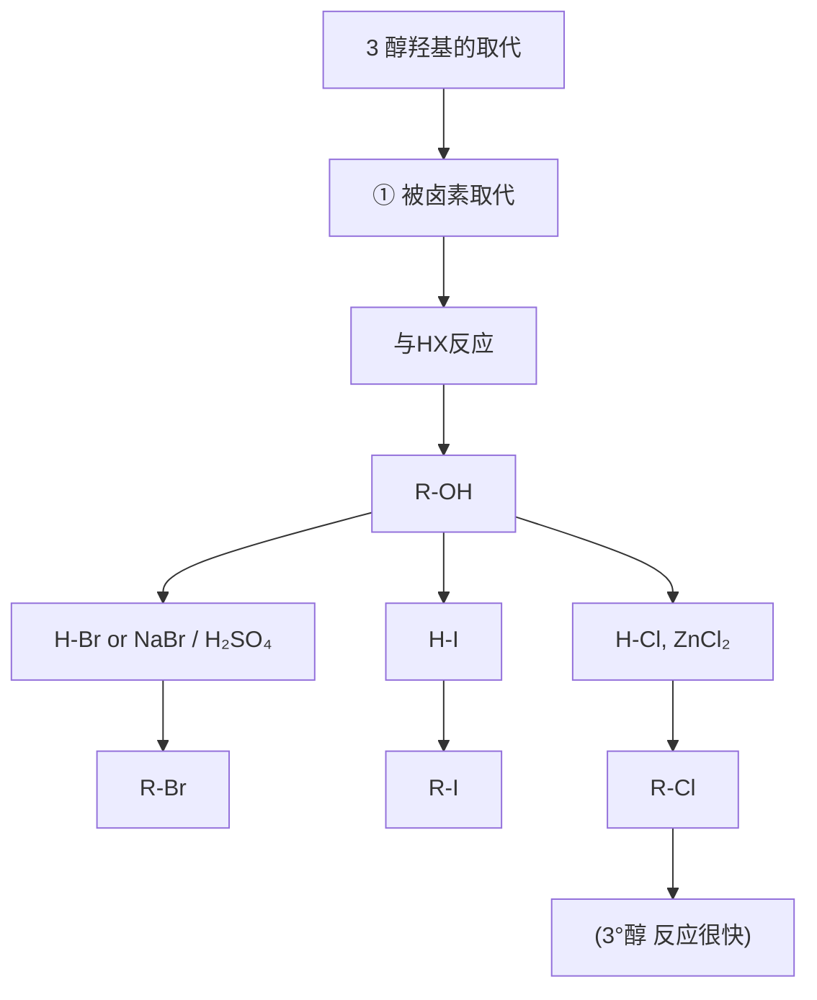
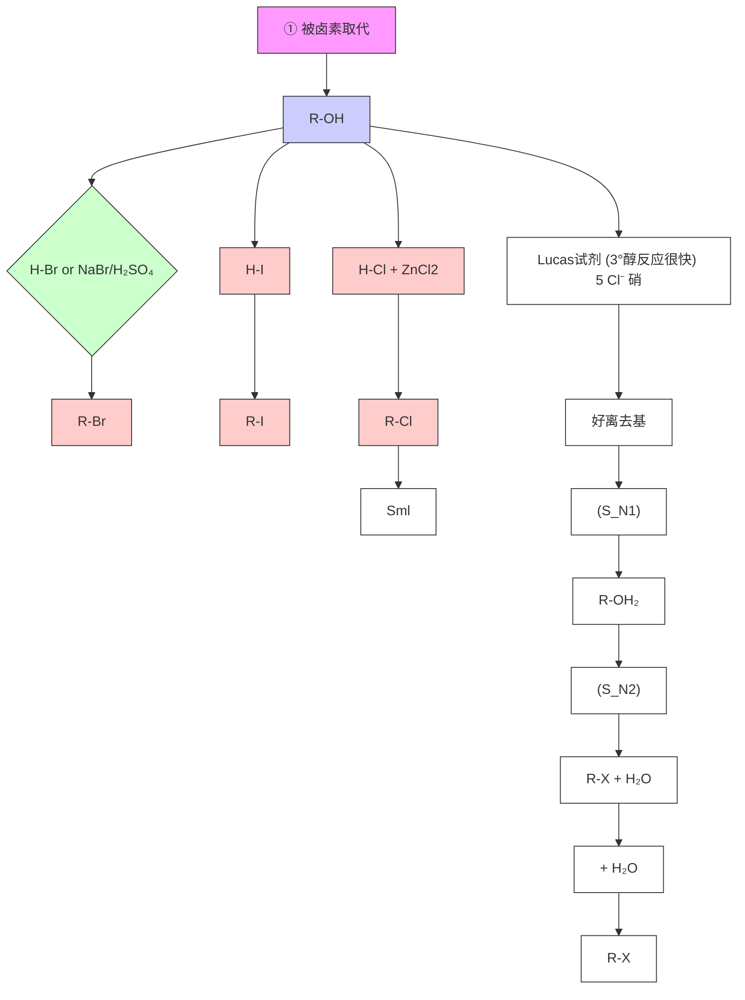

# 一、醇酚醚 00:05

# 1. 醇的分类 00:23

学而思培优

第一部分 醇

![[09.醇酚醚_笔记_images/b3bdb1f0b6c63837b65d5c2c89b95ed7fdf025fdcbde89150f729e3912488001.jpg]]

![[09.醇酚醚_笔记_images/84ffb75eb522cb796a87f8d5af5ac5bb00bf9b54f5332881ac39c8a559f93bfa.jpg]]

chemical

醇的类型与分子结构示意图，展示一元醇和多元醇两种化合物的组成及其碳原子

1）伯仲叔醇 02:24

● 结构特征：醇可视为烷烃中氢被羟基取代的产物，根据连接碳的类型分为：

○ 伯醇（一级醇）：羟基连在伯碳原子上 $(R-CH_{2}-OH)$   
○ 仲醇（二级醇）：羟基连在仲碳原子上（R'R-CH-OH）  
- 叔醇（三级醇）：羟基连在叔碳原子上（R''R'R-C-OH）

● 化学性质差异：不同醇的化学性质因其连接碳原子类型不同而存在显著差异

2）多元醇 03:12

● 定义：同一分子中含多个羟基的化合物

● 典型结构：如 $(CH_{2})_{n}(OH)_{2}$ ，其中n表示碳链长度

3）邻二醇 03:22

● 特殊类型：羟基连在相邻碳原子上的二元醇

● 化学特性：易发生脱水反应生成醛或酮

4）烯醇 04:00

学而思培优

![[09.醇酚醚_笔记_images/102de5b4bf7d81f7de3fcb4eb1f50a87c7bace19d9e79ef1a002791e0cb471af.jpg]]

chemical

烯醇（Enols）的互变异构与酚（Phenol）分子结构示意图，标注注意区分特点

\- 结构特点：羟基连接在 $sp^{2}$ 杂化碳原子上（C = C - OH）

\- 互变异构：与酮式存在动态平衡（烯醇式 $\rightleftharpoons$ 酮式）

○ 影响因素：

■ 酸性条件：倾向于烯醇式  
■ 碱性条件：形成烯醇负离子

● 稳定性：通常不稳定，因碳氧双键形成倾向使平衡右移

\- 特殊案例：酚类因芳香性稳定而保持烯醇式结构

● 电子效应：羟基的给电子共轭效应显著

● 芳香性应用：酚羟基是强效的邻对位定位基

2. 醇的制备 06:45

# 1）烯烃水合 06:54

# - 醇的制备：烯烃水合原理

![[09.醇酚醚_笔记_images/1641769429aa7583eb399c18cbad54972baa20c102ea65da14c68cb18715c66f.jpg]]

chemical

烯烃水合与工业生产反应示意图，标注了H2O、H+、SO4等产物及碱式结构

反应机理：在质子酸催化下，烯烃双键与水发生加成反应，遵循马氏规则（氢加在含氢较多的碳上）  
工业催化剂：通常使用磷酸 $(H_{3}PO_{4})$ 作为质子提供者  
○ 示例反应：丙烯水合生成异丙醇 $H_{3}C-CH=CH_{2}+H_{2}O\rightarrow H_{3}C-CH(OH)-CH_{3}$

● 醇的制备：工业生产方法 07:21

- 反应条件：170°C高温、10MPa高压下水蒸气与丙烯反应  
☐ 压力影响：高压条件促使反应向减小压力的方向进行（产物方向）

● 醇的制备：硫酸作用下的反应 07:57

○ 两步反应：

■ 烯烃（如异丁烯）与硫酸反应生成硫酸酯

■ 硫酸酯水解得到叔丁醇

反应式： $H_{3}C - C(CH_{3}) = CH_{2} + H_{2}SO_{4}\rightarrow H_{3}C - C(CH_{3})(OSO_{3}H) - CH_{3}H_{2}OH_{3}C-$ $C(CH_3)(OH) - CH_3$

\- 烯烃水合方法的局限性 08:12

- 可逆性：反应为可逆过程，产率不高  
- 重排现象：通过碳正离子中间体时可能发生重排  
○ 立体选择性：无立体选择性（碳正离子为平面结构）  
- 醇类限制：主要制备仲醇和叔醇，不能制备伯醇（马氏规则决定）  
唯一例外：乙烯水合可制得乙醇 $(CH_{2} = CH_{2} + H_{2}O\rightarrow CH_{3}CH_{2}OH)$

# 2）卤代烃水解 10:44

![[09.醇酚醚_笔记_images/3f40844c753677ad71d96671560a56db10fb1db96ec2d8560293c6d6f47164bb.jpg]]

text_image

②卤代烃水解
R—X → R—OH
or H₂O
方法的局限性：
• 有副反应——消除反应。
• 存在两种机理，立体化学不确定。
• 一般由醇制备卤代烃（因醇易得）。
■有合成意义的例子：
Ar—CH₃ → Ar—CH₂—Br → Ar—CH₂—OH
(PtHCOO)₂
CH₃=CH₂ → CH₂—CH₂—OH → CH₂—CH₂—OH
X₂, H₂O
NaOH
NaHCO₃, H₂O

\- 反应机理：可通过 $S_{N}2$ 或 $S_{N}1$ 机理进行

○ 伯/仲卤代烃：通常经历 $S_{N}$ 2机理  
- 叔卤代烃：经历 $S_{N}1$ 机理（空间位阻效应促进）

● 局限性：

○ 存在消除副反应  
○ 立体化学不确定（ $S_{N}1$ 不保持构型， $S_{N}2$ 构型翻转）

○ 实际应用少（通常反向由醇制备卤代烃）

# - 合成实例：

- 芳烃侧链溴化后水解： $Ar-CH_{3}NBSAr-CH_{2}BrOH-Ar-CH_{2}OH$   
○ 烯烃加卤素后弱碱水解： $CH_{2}=$

$$
C H _ {2} + X _ {2} \rightarrow C H _ {2} X - C H _ {2} X N a H C \theta_ {3} / H _ {2} O C H _ {2} O H - C H _ {2} O H
$$

# 3）Grignard试剂反应 13:32

● Grignard试剂与醛、酮、酯的反应原理 13:36

![[09.醇酚醚_笔记_images/04849d2f22fceff6f0a870131d70b8e057aaae7d1f5609f1aa071a611470c7e3.jpg]]

③ Grignard试剂与醛、酮、酯和环氧乙烷的反应  
![[09.醇酚醚_笔记_images/375af5f61301311d4805dddd327001f51c9cb9170faf28f8ce5c287b2fe0bbe8.jpg]]

chemical

Reaction pathways of epoxide derivatives under different conditions, showing intermediates and products with yields

![[09.醇酚醚_笔记_images/8c86e53cb36c2d49a4483c1581b15db7726cbc6a71e755f28c2c7b1c15164442.jpg]]

基本过程：R-MgX中的烷基碳负离子进攻羰基碳，形成C-C键后水解  
○ 与甲醛反应：生成伯醇 $R-MgX+H_{2}C=O\rightarrow R-CH_{2}-OH$   
与其他醛反应：生成仲醇 $R - MgX + R' - CH = O \rightarrow R - CH(OH) - R'$   
○ 与酮反应：生成叔醇 $R - MgX + R' - C(=O) - R'' \rightarrow R - C(OH)(R') - R''$

● Grignard试剂与醛、酮、酯反应产物 14:32

\- 酯的特殊性：经历两次加成

■ 首先生成酮中间体  
■ 继续反应最终得到叔醇（两个R基来自Grignard试剂）

○ 反应式： $R' - COOR'' + 2R - MgX \rightarrow R' - C(OH)(R)_{2} + R''OH$

● Grignard试剂与环氧化合物的反应原理 16:08

- 反应特点：亲核进攻位阻较小的碳原子  
○ 产物类型：生成增加两个碳原子的伯醇  
○ 示例：环氧乙烷与Grignard试剂反应 $R-MgX+H_{2}C-CH_{2}\rightarrow R-CH_{2}-CH_{2}-OH$

4）醛酮酯还原 16:39

![[09.醇酚醚_笔记_images/61ba1a15e53559f430a574ac23ea137294c0694404636e53c1d8154ec940adb4.jpg]]

④醛、酮和酯的还原；环氧乙烷的还原  
![[09.醇酚醚_笔记_images/dd2c9eaa558d6fef35e9751681b2e43e8a3b8c8bf975d8d1e3821d3ea960dd8b.jpg]]

chemical

Chemical reaction equations showing oxidation of alkenes to alcohols and diol under different conditions

- $\mathrm{LiAlH_4}$ （负氢离子转移试剂，强还原剂）

![[09.醇酚醚_笔记_images/d53c0a5d2e106502dd17eb5658afbef151a20a9ff2ac87be0499c80ed7461547.jpg]]

- 还原剂选择：使用 $LiAlH_{4}$ （四氢铝锂）或 $NaBH_{4}$ （硼氢化钠）作为负氢离子转移试剂，其中 $LiAlH_{4}$ 是强还原剂， $NaBH_{4}$ 活性稍弱但机理类似

\- 反应机理：

- 负氢离子（ $H^{-}$ ）进攻羰基碳，硼/铝正电部分与氧结合  
○ 水解后得到醇类产物，相当于在羰基上加成一分子 $H_{2}$

\- 产物类型:

○ 醛/酮还原生成二级醇 ( $R' - C(OH)HR$ )

- 酯类还原先得醛再得一级醇 $(R - CH_{2}OH)$   
- 环氧乙烷类还原生成二级醇 $(R' - CH(OH) - CH_2 - R)$

# 5）羟汞化还原反应 18:44

# - 反应特点及局限性

学而思培优  
⑤烯烃的羟汞化——还原（脱汞）反应 Oxymercuration-Demercuration  
![[09.醇酚醚_笔记_images/9f4844db1555ced1cae728bea95456e1ada3d99085187a95814f260727b8d03b.jpg]]

![[09.醇酚醚_笔记_images/e0061cb706325d48100b5b6c264f39a7c262b05fd3b2928d19533d38a7e95b05.jpg]]

chemical

Organic reaction pathway showing hydrogenation of aldehyde to alcohol using Hg(OAc)₂ and NaBH₄, with reagents labeled

反应特点及局限性  
- 反应较快（第一步几分钟，第二步1小时左右）。  
- 产率较高（>90%）。  
- 易操作，条件温和，Hg易处理。  
- 区域选择性好（Markovnikov取向）。  
- 无重排产物（说明什么？）  
- 非立体专一（顺式加成 + 反式加成）。

较好的醇的实验室制备方法

# ○ 反应效率：

■ 羟汞化步骤仅需几分钟，还原脱汞约1小时  
■ 总产率>90%，是实验室制备醇的优选方法

# 操作特性：

■ 条件温和 ( $H_{2}O / THF$ 体系)  
■ 汞试剂需回收处理 ( $NaBH_{4}$ 还原后生成Hg沉淀)

# ○ 选择性特征：

■ 严格遵循马氏规则（羟基加在含氢较少的碳上）  
■ 无重排产物（区别于普通酸催化水合反应）  
■ 非立体专一性（同时存在顺/反式加成途径）

# - 反应机理 19:49

学而思培优  
■ 烯烃的羟汞化——还原反应的可能机理  
![[09.醇酚醚_笔记_images/d49c45668346075a1b6a4e305db4a2581420c4b2bf957ddd3cafb6e35e4b94f6.jpg]]

羟汞化（亲电加成机理）  
![[09.醇酚醚_笔记_images/28f99036be0c248aa1e782ec2d3cceac4ee9f915486cdb23d602168973152419.jpg]]

chemical

Reaction mechanism diagram showing deprotonation and ring-opening steps in a cyclic acetal with water, including hydrogenation and nucleophilic attack steps

# ○ 羟汞化阶段：

■ 亲电加成机理： $Hg(OAc)_{2}$ 与双键形成三元环状汞鎓离子  
■ 水分子进攻更稳定的碳位点（类似溴鎓离子机理）  
■ 关键区别：生成类碳正离子中间体（非经典碳正离子）

# ○ 脱汞阶段：

■ $NaBH_{4}$ 还原产生自由基中间体（R•和HgH•）  
■ 最终生成醇和汞单质沉淀

# ○ 立体化学解释：

■ 空间位阻控制产物构型（如案例中99.5%选择性）  
■ 兼具 $S_{N}$ 1和 $S_{N}$ 2特性（汞-碳键部分保留）

# ● 例题1:烯烃的羟汞化—还原反应 23:26

![[09.醇酚醚_笔记_images/10824eb20f376417bc58e05effc1e933476fb9f24b77b15684c42f5d689bc900.jpg]]

chemical

烯烃的羟汞化还原反应方程式，涉及苯环和异戊烷的生成步骤

# ○ ○ 题目解析

■ 对比分析：与传统酸催化水合反应相比，避免了甲基迁移重排  
■ 区域选择性：汞加在三级碳上（含氢较多位点），符合马氏规则  
■ 立体控制：  
● 环状底物中进攻受位阻影响  
● 上方进攻空间位阻更小（仅1个碳的排斥vs下方2个碳）  
■ 答案验证：高产率（>99%）证明机理的可靠性

# 6）硼氢化氧化反应 26:31

# ● 硼氢化氧化反应概述 26:34

![[09.醇酚醚_笔记_images/473d7efc363b073c01f6f95f003db2fa0b8a8b67b3a0f696e11f9c5eb1040a03.jpg]]

chemical

Chemical reaction equation showing hydroboration and oxidation of a chiral alcohol with B2H6 reagent

反应通式： $R - CH = CH_{2}B_{2}H_{6}2(R - CH_{2} - CH_{2})_{3}BH_{2}O_{2}\neq OH^{-}6R - CH_{2}CH_{2}OH$   
- 反应本质：通过硼氢化-氧化两步反应将烯烃转化为醇  
○ 关键中间体：三烷基硼 $\left(\left(R-CH_{2}-CH_{2}\right)_{3}B\right)$

# ● 硼氢化氧化反应的特点 28:13

![[09.醇酚醚_笔记_images/3f68a3647eb33fb9e97ac50b4c9b172d37e487b27bb376ad3ab5432b46db29b6.jpg]]

chemical

Chemical reaction diagram showing hydroboration and oxidation of a chiral alcohol with B₂H₆, producing 3-phenylthioester and then hydroxyl groups.

# ○ 加成方式：

■ 顺式加成：H和B原子从双键同侧加成  
■ 立体专一性：生成外消旋产物（±）

# ○ 区域选择性：

■ 反马氏规则：H加在含氢较少的碳上（实际H带负电，B带正电）

# ○ 其他特征：

■ 高产率：反应效率高

■ 无重排产物：说明不经过碳正离子中间体

● 区域选择性举例 29:43

学而思培优  
![[09.醇酚醚_笔记_images/1d3ed3c04a3cc3d75ee8b44b8596bb46840e442d0b3febad06b9eaafc055b442.jpg]]

chemical

Chemical reaction scheme showing boron-hydrogenation and reduction of alkenes to form alkene products with yields

![[09.醇酚醚_笔记_images/49b9af67321b4ef01d9b3b1f2d3b245dc234114d51836dd0b59cd66565867924.jpg]]

○
○ 典型例子：

$CH_{3}CH_{2}-CH=CH_{2}$ 反应后主要产物（98%）为伯醇  
■ 对称烯烃产物比例接近（57% vs 43%）

○ 选择规律：B优先加成到位阻小、含氢多的碳上

● 立体选择性举例 30:16

学而思培优  
![[09.醇酚醚_笔记_images/dfe4df0409b63b30b2e1fb57223a26a59e102074e81da3d8caa47a964aaeedec.jpg]]

chemical

Chemical reaction scheme showing oxidation of cyclohexane to cyclohexene using boron and water, with structural formulas and reaction conditions noted.

![[09.醇酚醚_笔记_images/55e5099d9ac975f7c14bed5a3831f3a4cc5e4c1003fad59b21bdc84d9e37feff.jpg]]

○ 环状体系：

■ 加成发生在位阻小的一侧
■ 氧化后羟基与原有取代基保持同侧关系

○ 构型控制：大位阻基团导致产物构型翻转（亚甲基指向纸面下方）

● 硼氢化氧化反应机理：硼烷及性质 31:21

学而思培优  
![[09.醇酚醚_笔记_images/4232fd3f36ae85294baae54fc5bd1ba6bd449aba8cc4aba3ff81dc1bd6f82536.jpg]]

chemical

Chemical reaction diagram showing borane formation from p-hydroxyl radical and hydrogen-bonded borane, with electron transfer and structural analysis of borane structures.

○
○ 硼烷特性：

■ 缺电子性：B原子sp2杂化，有空p轨道
■ 存在形式：自然界以乙硼烷（ $B_{2}H_{6}$ ）形式存在，含3c-2e键

○ 溶剂效应：THF中形成 $BH_{3}\cdot THF$ 配合物

● 硼氢化步骤机理—硼烷与烯烃的加成 33:15

![[09.醇酚醚_笔记_images/2a08bcc34dd0fec9b9f2a1090984f3a8ed2a218b2a0bd1562d189da22fa3ec75.jpg]]

![[09.醇酚醚_笔记_images/da5af106e38b9b4b8887d3255dc22544112cb9619a632cc077a7d51e1b511d07.jpg]]

![[09.醇酚醚_笔记_images/304aef392e1687fc2f6afa1b3418a24865d9bc4cf9a7c98e3b201caa59739380.jpg]]

chemical

硼氢化步骤机理——硼烷与烯烃的加成，展示位阻小、同步加成和四中心过渡态的反应路径

○ 过渡态：四中心过渡态（H和B同步加成）  
影响因素：
■ 位阻主导：优先在少取代位点反应
■ 电子效应：Bδ+与富电子双键相互作用

● 氧化及水解步骤机理——烷基硼的氧化，硼酸酯的水解 33:48

![[09.醇酚醚_笔记_images/1ecaa672115f93ecc006335a25c8c480d9f57eb2ffd0446efde7aba04ee99232.jpg]]

![[09.醇酚醚_笔记_images/ea643637d26de48ef8eed3ab4168d92659d9963b9c443ca1f21557f5815168e9.jpg]]

![[09.醇酚醚_笔记_images/7642c281476fc643a3e4a20c3550959ca70cfd7e4a5024343c20335d853d80e2.jpg]]

chemical

Chemical reaction equations for hydrolysis of R-CH2-CH2- borate with oxidation and water displacement, yielding alcohol and alcohol products

○ 氧化阶段：

■ $H_{2}O_{2}$ 进攻B原子形成四配位中间体  
■ 烷基1,2迁移生成醇

○ 水解阶段：

■ 硼酸酯水解最终得到醇  
■ 每个 $BH_{3}$ 可产生3分子醇

● 烷基迁移的立体化学 35:28

![[09.醇酚醚_笔记_images/b4d69ae30df15c884b76299b0d43a42b8a9c118c58ff680bcadd8ed814b97f80.jpg]]

![[09.醇酚醚_笔记_images/b72a4eb9d119b5f6cbf4944d331554ed2421331722b2d2802e583a5d3249ff70.jpg]]

![[09.醇酚醚_笔记_images/3ed5abe3f5fd11cc3fc4233efdd5c641a8349bbbfbec0f638c5d364ec1ee551a.jpg]]

chemical

Chemical reaction equation showing hydrogen-bonding of a cyclopentene derivative to form a hydroxybenzene intermediate, with oxidation state noted

○ 构型保持：烷基迁移时SP3杂化轨道不发生翻转   
○ 同面迁移：通过协同过渡态实现立体化学保留

● 硼氢化反应的深入——大体积硼氢化试剂及应用 37:06

○ 位阻控制：

■ 使用9-BBN等大位阻试剂可提高区域选择性至99%  
■ 迫使B加成到端位碳上

\- 应用价值：为特定构型醇的合成提供高效方法

3. 醇的化学性质 38:28

# 1）羟基氢酸性

● 醇的结构及性质分析 38:31

![[09.醇酚醚_笔记_images/eda171bfb434700f31cd49b067eb671f66462f48cbae9ef32150770a2baf6f8e.jpg]]

# 二、醇的化学性质

\- 醇的结构及性质分析

![[09.醇酚醚_笔记_images/0217b2b4170c0799d9a381a1d2f62502fe1ac699a02efc067ea85ecb2637df6a.jpg]]

![[09.醇酚醚_笔记_images/999549d6fc9b8e22395b793d155beb8b157f0ef12b58d6f978aa1c3a645d5ac5.jpg]]

○ 结构本质：可视为烷烃氢被羟基取代（ $R - H \rightarrow R - OH$ ）或水分子氢被烷基取代（ $H - OH \rightarrow R - OH$ ）的产物  
- 双重性质：既保留部分烷烃特性，又继承水的部分化学性质（如羟基氢的弱酸性）

● 醇的电负性与共价键极性 39:27

![[09.醇酚醚_笔记_images/eb0eb81f2edc4d101b48f99d7d6908144379cca1c905c6acfb05d9d26b0fed9a.jpg]]

# 二、醇的化学性质

\- 醇的结构及性质分析

![[09.醇酚醚_笔记_images/2da83807f5a97aeb504bbff962c280707c8ef34b7b0d481633175e4b366375a3.jpg]]

![[09.醇酚醚_笔记_images/1c957349a6b2109709e0f3906ea66b6750af7b5f43a3c72262095321bb9b746a.jpg]]

○ 电负性对比： $C(2.4) - O(3.0 - 3.4)$ 极性远强于 $C(2.4) - H(2.1)$   
○ 电荷分布：羟基使α-碳带部分正电荷（δ^+），氧原子带部分负电荷

● 羟基氢的弱酸性 39:46

- 酸性表现：可与活泼金属（Na）、强碱（NaH）反应生成烷氧基负离子  
○ 活性顺序：甲醇＞乙醇＞异丙醇＞叔丁醇（液相）  
- 反常现象：气态时酸性顺序反转（因无溶剂化效应且烷基呈吸电子效应）

● 羟基氢的断键条件 40:34

- 碱性条件：优先断裂O-H键生成烷氧负离子（ $RO^{-}$ ）  
- 酸性条件：优先断裂C-O键生成碳正离子（ $R^{+}$ ，符合SN1机理）  
○ 关键因素：羟基的离去能力差（ $OH^{-}$ 为弱离去基团）

● 羟基氧的亲和性与碱性 41:10

○ 孤对电子：氧原子可接受质子形成氧鎓离子 $(ROH_{2}^{+})$   
- 碱性应用：在强酸环境中提高羟基离去能力（转化为 $H_{2}O$ 离去基）

● 羟基氢的氧化反应 42:06

- 氧化机理：氧孤对电子推动α-H以氢负离子形式离去  
○ 条件差异:

■ 中性/弱碱条件：直接氧化α-H  
■ 强酸条件：先质子化羟基，再发生E1/E2消除

● 例题1:羟基氢的性质（弱酸性）43:22

![[09.醇酚醚_笔记_images/ceffa213f0bd7a6f9a54644476de28037d0569194f0781c044ad3cd594c9ed6a.jpg]]

1. 羟基氢的性质（弱酸性）  
![[09.醇酚醚_笔记_images/74d60768151437e718937951381baf1648bd2fdf8bfbbe2333218687fe33e834.jpg]]

chemical

Chemical reaction equation showing R-O-H reacting with Na to form R-ONa and H2, with catalyst (强碱) and neutralization step

![[09.醇酚醚_笔记_images/bf9df429a6806faf4a3c0ca33728bfd64551de52e2ef7d5abe36f0285d682ee3.jpg]]

反应通式： $R - OH + Na\rightarrow R - ONa + \frac{1}{2} H_2\uparrow$

○ 现象记忆：所有醇与钠反应均产生氢气（高中重要实验现象）

○ 应用注意：格式试剂等强碱体系需预先保护羟基

# - 羟基氢与强碱的反应 44:11

![[09.醇酚醚_笔记_images/4c33173d658e45f66cfe15be0a242fa0f3cda95ce7d2a0301a65cb0f1c586939.jpg]]

1. 羟基氢的性质（弱酸性）  
![[09.醇酚醚_笔记_images/6d46a2e92785724a23f2dffd45a6b6bb67b4963c9f35fb59cc98cc1211af11da.jpg]]

chemical

Chemical reaction equations showing radical and nitric acid reactions with sodium hydroxide and amine under different conditions

![[09.醇酚醚_笔记_images/35d9ce8cd3c272ff3be854287924643e77d8b04d594680a4d4459ee18bc91858.jpg]]

\- 稳定性原理：

■ 液相：烷基越大，空间位阻阻碍溶剂化，烷氧负离子越不稳定

■ 气相：烷基诱导效应主导，叔丁氧基反而更稳定

\- 保护策略：使用硅醚等保护基避免强碱破坏羟基结构

# 2）羟基氧亲核性 47:10

● 醇羟基氧的碱性和亲核性 47:12

\- Bronsted碱性质：醇羟基氧可接受质子形成质子化羟基（氧鎓离子），反应式为 $\mathrm{R - OH}\xrightarrow{\mathrm{H}^{+}}\mathrm{R - OH}_{2}^{+}$ 。质子化后的羟基成为优良离去基团。

○ Lewis碱性质：醇羟基氧能与Lewis酸（如 $ZnCl_{2}$ ）配位形成R-O- $ZnCl_{2}$ 复合物， $ZnCl_{2}$

增强氧的亲核性，反应式为R-OH $\rightarrow$ R-O-ZnCl $_{2}$ 。

# ● 醇作为亲核试剂的亲核取代反应 48:26

![[09.醇酚醚_笔记_images/c812e57320ff4d3c8885863978b3d8e5769a970975f6df0ec9748fc8085a1bed.jpg]]

![[09.醇酚醚_笔记_images/db2316b8b70bb460e50fdf57f6c44ee34f3eeb396bc7a79f6d43983238183e6b.jpg]]

chemical

Reaction mechanism diagram showing deprotection of aldehyde with pentadiene to form 1,2-diol and alcohol under acidic conditions

![[09.醇酚醚_笔记_images/0d0e0a4a981dcf132bb3721964f8eb91d9044eb768be5287754476332c5c5f7d.jpg]]

与卤代烃反应：在碱性条件下通过SN1或SN2机理生成醚，反应通式为R-OH+R'-X→R-O-R'+HX。碱性条件有利于消除副产物HX，同时使氧负离子（R-O $^{-}$ ）亲核性增强。

Williamson醚合成：碱性条件下伯醇与卤代烃的SN2反应是制备不对称醚的经典方法。  
○ 分子间脱水成醚：两分子醇在酸性条件下（如150℃）通过SN1或SN2机理生成对称醚，反应式为 $2R-OH\xrightarrow{H^{+}}R-O-R+H_{2}O$ 。反应机理取决于碳正离子稳定性。

\- 醇与环氧乙烷的反应 50:52

![[09.醇酚醚_笔记_images/1e60669eca3c66bca03c35a0a9ded2eec2b3635058c0d336c4366ae740e52b27.jpg]]

chemical

Chemical reaction equation showing hydroxyl radical reacting with acetic anhydride under acidic conditions to form a ketone product

- 酸性开环选择性：质子优先进攻环氧环中电子云密度更高的氧原子，生成氧鎓离子中间体。亲核进攻发生在取代较少的碳原子上（空间位阻较小），最终得到1,2-二醇。  
电子效应解释：环氧乙烷的环张力使其C-O键电子更易给出，质子化后形成碳正离子特性更强的中间体。

\- 醇与烯烃的加成 53:22

![[09.醇酚醚_笔记_images/0f1eb08d583f7570d55a4f371496e0e328ac0ea0843ec450c124396c2099ad04.jpg]]

chemical

化学反应方程式，展示与烯烃的加成反应生成叔丁基醚的化学结构式

碳正离子机理：醇与烯烃在酸性条件下通过碳正离子中间体生成醚。以异丁烯为例，首先形成稳定的叔碳正离子 $\left(\left[CH_{3}\right]_{3}C^{+}\right)$ ，随后醇羟基氧亲核进攻得到叔丁基醚。

○ 反应通式： $R-OH+H_{2}C=CH_{2}\rightarrow R-O-C(CH_{3})_{3}$ ，需酸性条件催化。

● 醇与烯烃的加成在合成上的应用——羟基的保护 54:18

![[09.醇酚醚_笔记_images/ad7ba773d8bc6f10de2b6012eaf92c9d272e5cf7b7ec6e4d3ae3dff30bc471f5.jpg]]

chemical

醇与烯烃的加成在合成上的应用——羟基的保护，展示从HOCH₂CHBr到H₂C=CH₃的转化路径

保护策略：通过形成叔丁基醚保护羟基，防止在格氏试剂制备过程中与活性氢反应。保护步骤：①异丁烯/酸条件下成醚；②格氏反应；③酸性条件脱保护。  
○ 实例分析： $CH_{3}CH(OH)CH_{2}Br$ 转化为 $CH_{3}C(OH)(CH_{3})CH_{2}CH_{3}$ 时，需先保护羟基避免与 Mg 反应。

# ● 羟基的另一常用保护法 55:43

学而思培优  
![[09.醇酚醚_笔记_images/c7581cc3a53c6c9f2a71cdec7271e1422d657015172d4af92c3a83b1e9b20e27.jpg]]

chemical

Chemical reaction scheme showing deprotonation of a thioether using DHP and THP-O-R catalyst under basic conditions

![[09.醇酚醚_笔记_images/837c561299c68d782c7e6598c50b0368b8e4591f866caeac69ce565bb865318b.jpg]]

DHP保护机理：二氢吡喃（DHP）在酸性条件下与醇反应生成四氢吡喃醚（THP-OR）。反应经过烯醇式-酮式互变异构，氧正离子中间体被醇亲核进攻。  
- 脱保护条件：酸性水溶液可逆反应，恢复游离羟基。保护基结构为THP-O-R。

# ● 醇与羰基加成、与羧酸的酯化反应 57:17

学而思培优  
![[09.醇酚醚_笔记_images/d783c684915100a89aaca57717187c26de03500484ff9331edf51e8225a3ca2f.jpg]]

chemical

Reaction mechanism diagram showing acid-catalyzed hydrolysis of carboxylic acids with羧酸酯化反应

![[09.醇酚醚_笔记_images/7b53d4773638fda3370347a2c05a5df79a97aaf326bbadd8f9fd99d8941a6383.jpg]]

酸催化机理：①质子优先加成羰基氧（保持p-π共轭）；②醇亲核进攻活化羰基碳；③质子转移后脱水形成酯。关键中间体为 $R^{\prime}-C^{+}(OH)OR$ 。  
○ 氧来源：产物酯中的氧原子来自醇而非羧酸。反应可逆，需除水推动平衡。

# - 羧酸衍生物的醇解反应 58:41

学而思培优  
![[09.醇酚醚_笔记_images/a5cd45f447cc62da065a222a2faf3d487105030d83a200f8d0ba54b519197f47.jpg]]

chemical

Chemical reaction equations showing deprotection of acrylate to aldehyde using R'OH and HCl in acrylate derivative

![[09.醇酚醚_笔记_images/7a867af9b4cf5501f06a672f1ea545a20e3d75da54cdfa649922cf27ed31fb45.jpg]]

- 酰氯反应：无需酸催化，因C = O与第三周期元素（如Cl）p-π共轭较弱，羰基碳更易受亲核攻击。吡啶作为碱吸收生成的HCl。  
通式：R - COCl + R'OH → R - COOR' + HCl，比酯化反应条件温和。

# - 醇与无机酸或磺酰氯反应 59:34

![[09.醇酚醚_笔记_images/11052425622f3546b20841ccbdb45b84b0be7813a354780e430621cf3294c47c.jpg]]

chemical

Chemical reaction equations showing the formation of phosphate chloride and sulfonate from alcohols and nitroalkanes, with HCl as a diol product.

- 硫酸酯形成：生成硫酸氢酯（ $R - OSO_3H$ ）和磷酸酯（如 $(R - O)_3PO$ ），均为优良离去基团。  
☐ 磺酸酯应用：对甲苯磺酸酯（R-OTs）的磺酸根离子是超离去基团，常用于SN2反应。

● 醇与醛酮生成缩醛（酮） 01:01:46

![[09.醇酚醚_笔记_images/639f447c299d077e62b5a3df1f41782329bddbd17346ea86e21d9407b6c202eb.jpg]]

chemical

有机合成反应方程式，展示与醛酮生成缩醛的两种路径：有关机理与缩醛（酮）

两步机理：①醇亲核加成形成半缩醛（酮）；②酸性条件下脱水生成缩醛（酮）。关键中间体为氧鎓离子 $R^{\prime}{}_{2}C^{+}-OR$ 。  
保护特性：缩醛在中性和碱性条件下稳定，酸性水溶液可逆水解。常用于保护醛酮羰基。

3）羟基取代反应 01:04:10

● 醇羟基的取代反应机理 01:04:14

![[09.醇酚醚_笔记_images/bcf07cba595be9527c23f82147b3d436d1fe4b573f83e0a770df96716ee9d424.jpg]]

flowchart

反应通式：醇（R-OH）与氢卤酸（HX）反应生成卤代烃（R-X），其中X可以是Br、I或Cl。  
☐ 卢卡斯试剂应用：当使用氯化氢时需配合卢卡斯试剂（ $ZnCl_{2}$ 催化），特别适用于三级醇的快速反应鉴别。

● 醇羟基的取代反应中卢卡斯试剂的作用 01:04:25

![[09.醇酚醚_笔记_images/383a9e9c7cf479e438651acf16b168cf64d7866cfeff193b34c16099be6dd4e6.jpg]]

flowchart

催化原理： $ZnCl_{2}$ 通过路易斯酸作用增强羟基离去能力，形成中间体 $R-OH_{2}^{+}$ 。  
鉴别依据：三级醇通过 $S_{N}$ 1机理快速反应（碳正离子稳定性高），而伯/仲醇需 $S_{N}$ 2机理（与氯离子亲和性弱相关）。  
- 酸性要求：反应需强酸性环境（ $pK_{a} \approx -3.0$ ），质子化后的 $H_{2}O$ 成为优良离去基团。

● 醇羟基的取代反应中SN1与SN2机理 01:05:05

![[09.醇酚醚_笔记_images/fc1fc5b8a50937c2c81e3cc8b6bebc9c98f6453a30b89e6963f7e9f8b644a236.jpg]]

chemical

氯代（Lucas试剂反应）机理过程图，展示叔卤代物与伯卤代物、仲卤代物的化学反应路径

三级醇：优先发生 $S_{N}1$ 反应（碳正离子中间体），速率快且与亲核试剂浓度无关。  
伯/仲醇：主要进行 $S_{N}2$ 反应（双分子协同机制），受空间位阻和亲核试剂活性显著影响。  
- 记忆要点：卢卡斯试剂现象——三级醇立即浑浊，仲醇数分钟浑浊，伯醇需加热。

\- 醇羟基与卤化磷的反应 01:06:30

![[09.醇酚醚_笔记_images/1fd0a6009f5e93a928808a06532f8ee92bf1c059723fe9c49b67685b0094fc72.jpg]]

chemical

化学反应方程式，展示与卤化磷反应生成PCl₃和HO-PBr₂的步骤

反应通式： $3R-OH+PX_{3}\rightarrow3R-X+H_{3}PO_{3}$ （X=Br/I时产率高，Cl时产率低）。  
○ 机理特点：磷的空d轨道接受氧孤对电子，形成中间体 $R-O-PX_{2}$ 后发生 $S_{N}2$ 取代。  
- 后续反应：副产物 $HO-PX_{2}$ 可继续与醇反应（如 $HO-PBr_{2}$ 参与二次溴代）。

\- 醇与 $SOCl_{2}$ 反应的立体选择性 01:07:20

![[09.醇酚醚_笔记_images/55badfcfb1341e163d76f057cb18e39af4bb37f2cfb38e7925b6ad6009f47c8a.jpg]]

![[09.醇酚醚_笔记_images/3fc8eaa91ec855d8ccd046346b27e70a11dcdd37f19cb6ea66dab6685e6fa45f.jpg]]

chemical

Chemical reaction equation showing formation of chloroalkyl chloride with acryloyl hydroxide and amine, involving structural modification steps

![[09.醇酚醚_笔记_images/d36a50aaf9be7f23d3b105b8c13f9ad298f9ab019ae047cf0fd30b4fb4a2fc72.jpg]]

# ○ 溶剂效应：

■ 吡啶存在时：产物构型翻转（ $S_{N}2$ 主导）  
■ 醚类溶剂中：产物构型保持（分子内取代机理）

\- 应用价值：可通过溶剂选择控制产物立体构型，适用于手性合成。

● 吡啶参与的醇与 $SOCl_{2}$ 反应机理 01:07:37

![[09.醇酚醚_笔记_images/f4861df9edd6a5113c8c6be1199a4902cf56af2fdd9f5d7d5c77247e9d4edb6f.jpg]]

![[09.醇酚醚_笔记_images/079b76cd413d3326b3fe2642fec093168b01636cdb2868745125eac7d65359cc.jpg]]

chemical

Chemical reaction mechanism of chlorine-iodine sulfonate with SOCl₂ reagent, showing chlorination and deprotonation steps

![[09.醇酚醚_笔记_images/1033d4129d38ecc23fb9404dd8a1948e6f48b4ce0cd4d519ae1fab2ca2634759.jpg]]

# ○ 分步过程：

■ 形成氯代亚硫酸酯中间体（构型保持）  
■ 吡啶捕获HCl生成活性氯负离子  
■ $S_{N}$ 2进攻导致构型翻转

# ○ 双重作用：

■ 中和副产物HCl（防止碳正离子生成）  
■ 催化产生自由 $Cl^{-}$ （提高亲核活性）

![[09.醇酚醚_笔记_images/22a1b567b84ed1652a21092516157cc0ef5860c4a705137cab26a1b2b999ba3a.jpg]]

![[09.醇酚醚_笔记_images/cc2ed569da0a29b9d27154e593d88ec9c157dc6c8e73e7c8eeb98066c1cf7992.jpg]]

chemical

反应方程式，展示与氯化亚砜（SOCl₂）的反应，包括构型翻转和构型保持两种路径

![[09.醇酚醚_笔记_images/e8cbc002879b31a7025566ae6ce2e0999984409b8da2bc1e59fcac007f6d532e.jpg]]

\- 对比解释：醚溶剂中发生分子内取代（通过环状过渡态实现构型保持）。

● 醚为溶剂时醇与 $SOCl_{2}$ 反应机理 01:09:07

![[09.醇酚醚_笔记_images/ea11a175437fe5e72995b7e60965c66b7bbd23dd62bc3dc094d573f90621c414.jpg]]

![[09.醇酚醚_笔记_images/a49a9d795f066c8ca6eb1cabdb1377a4a93c00209b7ea13700c0c5118734799a.jpg]]

- 醚为溶剂时醇与 $\mathrm{SOCl}_2$ 反应机理（构型保持）  
![[09.醇酚醚_笔记_images/5f3e5ad24546e1076bcb4972b1cae67a21342b71ef88a7c00a93dbc05da77545.jpg]]

chemical

Chemical reaction mechanism showing electron transfer and photochemical addition of SO2 to a chiral carbon intermediate

$S_{N}$ 机理（Substitution Nucleophilic internal, 分子内取代机理）

反应特点：在醚作为溶剂时，醇与 $SOCl_{2}$ 反应会保持构型。

○ 反应机理：

■ 第一步：生成氯代亚硫酸酯（R-O-SO-Cl）  
■ 过渡态：形成紧密离子对，氯离子未从碳原子背面进攻   
■ 分子内过程：氯离子在同侧通过碳正离子中间体完成取代

○ 机理名称：SNI机理（Substitution Nucleophilic internal，分子内亲核取代机理）

■ 特点：分子内反应比分子间反应更快，最终产物构型保持

● 羟基被其它基团取代（间接取代）01:09:50

![[09.醇酚醚_笔记_images/affac916c69c682a7309d307ac2fa3ffbd3ae469c1913cbcd366b51aa9141417.jpg]]

② 羟基被其它基团取代（间接取代）  
![[09.醇酚醚_笔记_images/da56a9763f96b7af124379686e6ea6e1eba73bc74958dd178676f55e5f86ad11.jpg]]

chemical

Chemical reaction scheme showing conversion of alcohol to nitric acid using TsCl and H3C-substituted benzene

![[09.醇酚醚_笔记_images/a5f17c8e07e4080f864a4d68b9b368fd7af809d8cb90e1a75538fed370b2e2e9.jpg]]

○ 中间转化：

■ 醇羟基先转化为对甲苯磺酸酯（R-OTs）  
■ 使用试剂：对甲苯磺酰氯（TsCl）

○ 中间体特性：

■ OTs是优良离去基团  
■ 可作为"反应中转站"

\- 后续取代:

■ 可被CN $^{-}$ （NaCN）进攻  
■ 可被OAc $^{-}$ （KOAc）进攻  
■ 可被I $^{-}$ （NaI）进攻

○ 立体化学：

■ 通常按SN2机理进行  
■ 产物构型发生翻转

○ 应用价值：

■ 提供将羟基转化为多种官能团的通用方法  
■ 特别适用于难以直接取代的醇类化合物

● 例题1：利用对甲基苯磺酸酯的取代制备构型完全相反的产物 01:10:45

![[09.醇酚醚_笔记_images/3a406592f57ecf3fb6e78300e9a94e9dfac6e563a3c6b1122525f6541502eced.jpg]]  
复习：利用对甲基苯磺酸酯的取代制备构型完全相反的产物

![[09.醇酚醚_笔记_images/62094b2996249505aa6f1f169b5e0007436e355217146b37237a048ec2c2197a.jpg]]

![[09.醇酚醚_笔记_images/74af1c22d300877e2467e0714e178a442ff702f31b599fec0554bb0367abe265.jpg]]

![[09.醇酚醚_笔记_images/50f3faece17757fc385123710528532dc5763eb96fc09127823af6b3046025d4.jpg]]

![[09.醇酚醚_笔记_images/715ea762126cbb119f50cc80fd5ae84b03b57371af41a7cae39e4b415cf2e04c.jpg]]

![[09.醇酚醚_笔记_images/8cf4b4b9aff0d8f1dc6b9422d8516e32b97c307feb0740d459d167138f19b692.jpg]]

# ○ 解题思路

■ 构型翻转关键步骤：首先将对甲苯磺酸酯中的羟基转化为良好的离去基团，然后亲核试剂从背面进攻发生 $S_{N}2$ 反应。  
具体方法：

- 第一步：将醇羟基转化为对甲苯磺酸酯（ROTs），形成良好离去基团  
● 第二步：亲核试剂（如 $OH^{-}$ ）从背面进攻，实现构型完全翻转

○ 构型保持的制备方法

■ 反应机理：通过形成烷氧基负离子中间体实现构型保持

- 第一步：醇与强碱（如 $K^{+}$ ）反应生成烷氧基负离子（ $RO^{-}$ ）  
● 第二步：烷氧基负离子进攻对甲苯磺酸酯的碳原子，保持原有构型

■ 注意事项：该过程需严格控制反应条件，避免发生构型翻转

● 醇羟基取代反应小结 01:23:57

![[09.醇酚醚_笔记_images/6479d4b68b652fb3e43a1d313faf2fdc1533bb9a4f42ad79fcd95e660f60dd23.jpg]]

![[09.醇酚醚_笔记_images/a66a3749190990020acd5c1389fba47ed0c7eeb8130618e6bb215fbbdf34b144.jpg]]

chemical

Chemical reaction diagram showing hydrogen bonding and nucleophilic substitution in a zinc chloride compound

![[09.醇酚醚_笔记_images/25130674dea730772ceea23942c00548d85493f9bac1e6d918d7e7ea303c1cdc.jpg]]

# ○ 羟基取代的基本原理

■ 反应本质：将差的离去基团（OH）转化为好的离去基团才能发生取代  
■ 转化途径：

● 质子化形成氧鎓离子 $(ROH_{2}^{+})$   
● 形成磺酸酯（如ROTs、ROMs）  
- 形成卤代物（如 $ROBr_{2}$ ）

\- 特殊离去方式

■ E1cb机理：在碱性条件下，羟基可通过E1cb机理直接离去

- 需要强碱条件  
● 通过电子对推动使羟基离去  
● 典型应用：醛酮缩合反应中的脱水步骤

对比说明：

● 酸性条件下：质子化后以 $H_{2}O$ 形式离去  
● 碱性条件下：通过E1cb机理直接离去

\- 反应类型统一性

■ 共同规律：无论是取代反应还是消除反应，都需要先将羟基转化为好的离去基团

# 应用范围：

● 取代反应： $S_{N}1/S_{N}2$ 均需良好离去基团  
- 消除反应： $E1 / E2$ 同样需要良好离去基团

■ 记忆要点：羟基本身是差的离去基团，必须经过活化才能参与反应

# 4）醇脱水成烯 01:26:19

![[09.醇酚醚_笔记_images/d58bc256e81a9d0c171282a5a36cffc789dce8c8ad234967f5d43f1ed8c0e555.jpg]]

chemical

Chemical reaction equation for deprotonation of alcohols using Zaitsev, showing H+ and Al2O3 reagents with H+ catalysis

# 反应条件与机理

- 碱性条件限制：在碱性条件下不能发生E1或E2消除反应  
- 酸性催化机理：

■ 氢离子催化使羟基转化为好的离去基团  
■ 形成碳正离子中间体（阳离子）  
■ 可能同时发生E1和E2消除

○ $Al_{2}O_{3}$ 特性：

■ 不会产生重排产物  
■ 属于固液界面反应，碳正离子活性较低

\- 反应取向规则

○ Zaitsev规则：

■ 主要生成双键上取代基较多的烯烃  
■ 例如：+重排产物为主

\- 共轭二烯优先：当可能形成共轭二烯时，以生成共轭二烯为主

\- 碳正离子重排

![[09.醇酚醚_笔记_images/a5d9f456bbe82b0fd9d93e94db70d13d670856fe1acf2f05a095eef5a01dc54a.jpg]]

chemical

醇脱水成烯与主要产物反应生成醚酮的化学方程式，含酸碱酯和醚酮的取代步骤

○ 重排机制：

■ 碳正离子中间体可能发生1,2-氢迁移或烷基迁移  
■ 例如： $OH - > [\Delta][Al2O3]$ 反应中碳骨架重排

○ $Al_{2}O_{3}$ 抑制重排：

■ 固相反应条件限制碳正离子迁移  
■ 相比溶液相反应更不易发生重排

\- 反应类型比较

○ E1与E2竞争：

■ 酸性条件下E1消除占主导

■ 存在重排产物表明E1机理更常见

# ○ 催化剂选择影响：

■ 酸催化：可能产生重排产物  
■ $Al_{2}O_{3}$ 催化：无重排，符合Zaitsev规则

# 4. 例题:醇脱水反应 01:28:48

学而思培优

如何得到末端烯烃？

$\mathrm{Al}_{2} \mathrm{O}_{3}$ 的消除

![[09.醇酚醚_笔记_images/8855767a1d2f10d46b12b1948cb0ee9e62cad7c6d88e583c041436e020ae95a6.jpg]]

![[09.醇酚醚_笔记_images/ef3e79ec92619bf81ae7f8a46a3ce7035792aedbb2129c271d1a699222c2dfab.jpg]]

- 反应条件: 使用 $>\mathrm{Al}_{2} \mathrm{O}_{3}$ 作为催化剂进行消除反应  
● 产物特点: 末端烯烃通常作为副产物出现，主要产物是取代较多的烯烃  
● 限制条件: 当醇分子没有β-氢时，无法通过此方法生成烯烃

# 5. 末端烯烃制备 01:29:14

# 1）制备方法比较

学而思培优

如何得到末端烯烃？

$\mathrm{Al}_{2} \mathrm{O}_{3}$ 的消除

![[09.醇酚醚_笔记_images/5883e41f63cc979577a69b766342fd5f2a425bed48047a8a4c95249c00842529.jpg]]

![[09.醇酚醚_笔记_images/a9545dd6489cecc08430ea1cdcd2bcc84195b2952e002b38d3c81fb2ca51200a.jpg]]

# 三氧化铝法:

- 优势: 不受取代基位置影响，可直接生成末端烯烃  
- 反应条件: 在 $>\mathrm{Al}_{2} \mathrm{O}_{3}$ 催化下进行消除反应

# ● 质子酸法:

- 缺点: 易发生碳正离子重排，难以得到纯净的末端烯烃  
○ 产物分布: 主要生成热力学稳定的多取代烯烃

# 2）反应实例分析 01:29:25

学而思培优

例：醇的脱水成烯

![[09.醇酚醚_笔记_images/c5b5f14bfdbae735f520a1b1727339e18b363681a4d233635e7dfa42d273c0f0.jpg]]

![[09.醇酚醚_笔记_images/06c2636bfcfaa0ffc13adec6518e55058fc1173812ff46410ae1f8ed5b0d4769.jpg]]

chemical

Chemical reaction equations showing hydrogenation of alcohols with sulfuric acid and water to form a major product

![[09.醇酚醚_笔记_images/97d52f47b0bb896a75d2abee05f3fe2b9b5a36cb2cfce62327d2c785b05c5c64.jpg]]

chemical

Chemical reaction equation showing protonation of a hydroxyalkene to form a carbocation intermediate, with reproduct as product

![[09.醇酚醚_笔记_images/1016b40e2e039e3af5d7fdbb1f855c77663c5c125532e255cf8bcf5b3e73a623.jpg]]

典型反应:

- $\mathrm{CH}_{3} \mathrm{CH}_{2} \mathrm{CH}(\mathrm{CH}_{3}) \mathrm{CH}_{2} \mathrm{OHH}^{\ddagger} \mathrm{CH}_{3} \mathrm{CH} = \mathrm{C}(\mathrm{CH}_{3})_{2}$ (主要产物)  
同时生成少量 $CH_{2}=CHCH_{2}CH_{3}$ （末端烯烃副产物）

● 选择性控制: 使用 $Al_{2}O_{3}$ 催化剂可提高末端烯烃产率

# 二、有机化学第九讲

# 1. 末端烯烃制备

# 1）三氧化二铝消除

![[09.醇酚醚_笔记_images/eef533807506715d7a9a65dd26b4a4110845527ba94d7110e405dd09bdbe1345.jpg]]

如何得到末端烯烃？  
$\mathrm{Al}_{2} \mathrm{O}_{3}$ 的消除  
![[09.醇酚醚_笔记_images/3794827a133c59819eb1b8898896d897e625368a237a124f39f7598a066252b6.jpg]]

伯醇转化为对甲基苯磺酸酯  
![[09.醇酚醚_笔记_images/1b112cead39cde17cc2bfecd2c52f6d26a10fdb940171ccbb187c83f6a32f6a6.jpg]]

![[09.醇酚醚_笔记_images/a357d98996760be872fad55771c62d997a353c49d11ced2cf0690a491b954cbd.jpg]]

- 无β-氢消除：在三氧化二铝( $Al_{2}O_{3}$ )作用下，通过不发生碳正离子重排的消除反应得到末端烯烃  
● 反应特点：要求底物不含β-氢，避免发生重排反应  
● 应用实例：伯醇直接在三氧化二铝作用下发生消除

# 2）伯醇转化磺酸酯 01:29:53

# - 两步转化法：

○ 伯醇转化为对甲基苯磺酸酯(TsCl)  
○ 通过E2消除反应得到末端烯烃

● 机理优势：避免碳正离子中间体生成，防止重排发生

● 反应条件：需在碱性条件下进行E2消除

# 2. E2消除区域选择性 01:30:24

# 1）反式共平面要求 01:30:25

![[09.醇酚醚_笔记_images/c8d07b08c3d430986982cab6b6fe6de176835055f4fa1b3f6dba763ce2531e96.jpg]]

E2消除区域选择性的应用  
![[09.醇酚醚_笔记_images/ff5173b7695f522481f3d73793a8f3e0540460a8e371b2370a603c9573b88962.jpg]]

![[09.醇酚醚_笔记_images/ce3203813936e11acc67e94583c456a041915e203ffa240ba148d54343a8edcf.jpg]]

![[09.醇酚醚_笔记_images/be5a71ed942b47c8e93ec810eb1d2b1e587f3f386b1f12f5595b41277e77426b.jpg]]

- 空间要求：E2消除必须满足离去基团与β-氢处于反式共平面构象  
● 构象影响：当取代基多的位置无法形成反式共平面时，消除反应只能在取代基少的一侧进行  
● 产物控制：通过构型翻转可调控消除产物的区域选择性

# 2）取代基影响 01:31:17

● 区域选择性：取代基多的位置通常形成主要产物  
● 次要产物形成：当主要位置受阻时，消除反应转向取代基少的位置  
● 应用实例：通过硼氢化-氧化-酯化三步反应控制消除方向

# 3. 醇的氧化反应 01:35:38

# 1）氧化剂种类 01:35:47

学而思培优

![[09.醇酚醚_笔记_images/263f5f1c0502c3fe3df8a0bde19d5d8ee6ede427c57167f396f74e0a50a8651c.jpg]]

chemical

Reaction mechanism of phenol oxidation to form R'COOH and R'R', showing intermediates and products with reagents and conditions

![[09.醇酚醚_笔记_images/8bc9ff00b555b7d2b632d94c68cf3096db760bce63ac1adeeb219f159638fef7.jpg]]

- 强氧化剂： $HNO_{3}$ 、 $KMnO_{4}/OH^{-}$ 、 $Na_{2}Cr_{2}O_{7}/H_{2}SO_{4}$

● 伯醇氧化：直接氧化为羧酸(两个α-H被氧化)

● 仲醇氧化：仅能氧化为酮(一个α-H被氧化)

\- 叔醇特性：

○ 碱/中性条件：不反应(无α-H)  
- 酸性条件：先脱水成烯烃，再氧化断裂

# 2）选择性氧化剂 01:37:54

# - 二氧化锰

学而思培优

一些重要的有选择性的氧化剂

① $MnO_{2}$ (选择性氧化烯丙位羟基 $\rightarrow \alpha, \beta-$ 不饱和醛或酮)

$HO-CH_{2}CH_{2}CH=CHCH_{2}OH \xrightarrow{MnO_{2}} HO-CH_{2}CH_{2}CH=CHCH=O$

![[09.醇酚醚_笔记_images/41f72e1d2d430ed965b5faf49c4524e2bf3a1e2cd80ecc442260827419af8f2a.jpg]]

![[09.醇酚醚_笔记_images/57ed5d3cc0136ade60746eab954cd8fe0e69a6bdfa4c93d68fb1e2507516cdc7.jpg]]

○ 特点：选择性氧化烯丙位羟基→α,β-不饱和醛/酮

\- 适用范围：

伯醇→醛  
■ 仲醇→酮

○ 区域选择性：优先氧化烯丙位羟基

# - Jones试剂

学而思培优

一些重要的有选择性的氧化剂

① $\mathrm{MnO}_2$ （选择性氧化烯丙位羟基 $\rightarrow \alpha, \beta-$ 不饱和醛或酮）

![[09.醇酚醚_笔记_images/ef0c0986d94cc419dfe3128471c6374d513b58fbf1de4f06b17a81e246412f59.jpg]]

chemical

Chemical reaction pathway showing oxidation of a steroid derivative to form a cyclic alcohol with two different alkyl groups (1° and 2°)

![[09.醇酚醚_笔记_images/0efa13b67b8ae31a7f93652a34b5eb1622113c5b27f319a44661698e51804855.jpg]]

② $\mathrm{CrO_3 / H_2SO_4 / }$ 丙酮（Jones试剂，酸性体系，不影响双键）

![[09.醇酚醚_笔记_images/0e8434498cd7b626842989f68535d2b6e42a5789949a6c8127a1bf34a7f54ad6.jpg]]

○ 组成： $CrO_{3}/H_{2}SO_{4}/$ 丙酮

\- 特点：酸性体系，不影响双键

○ 氧化能力：

伯醇→羧酸

# ■ 仲醇→酮

# - Sarrett/Collins试剂

学而思培优  
![[09.醇酚醚_笔记_images/68e718253538c257fc13305f5e19c5fa83b283b35ab7b73c2a5301aec246ff67.jpg]]

chemical

Chemical reaction scheme showing CrO3-mediated cyclization of a naphthalene derivative using CrO3 and acrylate, yielding 1° and 2° alcohol products.

○ 组成： $CrO_{3}$ /吡啶  
- 特点：碱性体系，不影响双键  
○ 氧化能力：

伯醇→醛

■ 仲醇→酮

\- 反应条件：红色晶体溶于 $CH_{2}Cl_{2}$

# ● PCC试剂

学而思培优  
![[09.醇酚醚_笔记_images/1c33451c63dd4fb2efe39d688bb02715675db411984140f60e08a1df705215c2.jpg]]

chemical

Chemical reaction equations for CrO3 and PCC synthesis using catalysts and catalysts, including 1° and 2° phenol derivatives

○ 全称：吡啶氯铬酸盐(pyridinium chlorochromate)  
○ 特点：温和氧化剂，将醇氧化为醛/酮  
○ 溶剂: $CH_{2}Cl_{2}$   
○ 应用：避免过氧化至羧酸

# 4. Oppenauer氧化 01:41:09

# 1）反应机理 01:41:18

学而思培优  
④ $[(CH_{3})_{3}CO]_{3}Al$ / 丙酮 或 $[(CH_{3})_{2}CHO]_{3}Al$ / 丙酮（Oppenauer 氧化）  
![[09.醇酚醚_笔记_images/07e3d24fbd96f3c10a163046aac0e7c4e6ba85371864742b2141dd791cbd36c1.jpg]]

![[09.醇酚醚_笔记_images/9d5547d2462c3870e9f3066569dce1cb67ce929ab2405305d616c08f0ebd3b1a.jpg]]  
$2^{\circ}$ 醇 $\rightarrow$ 酮，不影响双键

![[09.醇酚醚_笔记_images/1922413b3ed8006b9efbbe923a4935b64af653ceae96bb8096d125b3bf623752.jpg]]

![[09.醇酚醚_笔记_images/674c9e78bb15cd6c8a2f680a88083150964255a2f83318b701340e6709a2fd4b.jpg]]

chemical

Chemical reaction mechanism showing octahedral intermediate formation with alkyne and alkene structures

试剂组成：使用 $\left[\left(\mathrm{CH}_{3}\right)_{3} \mathrm{CO}\right]_{3} \mathrm{Al}$ /丙酮或 $\left[\left(\mathrm{CH}_{3}\right)_{2} \mathrm{CHO}\right]_{3} \mathrm{Al}$ /丙酮体系  
● 核心转化：将二级醇（2°醇）选择性氧化为酮，且反应过程中不会影响分子中的双键  
- 经典机理：

\- 叔丁醇铝与醇首先生成类似硼酸酯的中间体

○ 通过六元环过渡态实现电子转移：铝氧键电子转移到碳氧键形成π键，同时氢负离子迁移到缺电子的羰基碳上  
○ 最终生成酮和还原后的醇（丙酮被还原为异丙醇）

# - 争议机理：

○ 可能存在铝氢键生成路径：六元环过渡态中氢与铝结合，形成二叔丁醇氢化铝  
- 铝氢键可对酮进行还原，而体系中丙酮因位阻较小更易被还原  
- 该机理由裴老师在杭州春季联赛提出，但文献支持不足

# 2）应用举例 01:44:11

学而思培优  
![[09.醇酚醚_笔记_images/f4f08a3a1493a35be77698d15e83dbaa015206cba398e674c8cc6d8f4cd89251.jpg]]

chemical

Chemical reaction equation showing Oppenauer oxidation of a hydroxy carbonyl compound to form a ketone

![[09.醇酚醚_笔记_images/cae982dc78fbf8882eec6058f4d47b1db29d8a00bc579aaeb0063ead06e35fd9.jpg]]  
- 了解：Meerwein-Ponndorf还原（Oppenauer氧化的逆反应）

![[09.醇酚醚_笔记_images/854fbc560a7b64e837e73a4687fd9ede8c9e54a82d14ab00b77d56bf7972dd43.jpg]]

chemical

Chemical reaction equation showing epoxide oxidation to aldehyde using Meerwein-Pondorf reagent

\- 可逆性特点：与Meerwein-Ponndorf还原构成可逆反应对

○ 氧化控制：增加丙酮比例促使反应向氧化方向进行（醇→酮）

○ 还原控制：增加异丙醇比例促使反应向还原方向进行（酮→醇）

● 过渡态优势：六元环过渡态易于形成，通过调节底物比例可精确控制反应方向

# 5. 醇类反应小结 01:45:18

学而思培优  
![[09.醇酚醚_笔记_images/660e1940560088740cfe396be14d6cc0bfd9264b532d47590fed9ce3d4acdcd7.jpg]]

chemical

Chemical reaction diagram showing醇类反应小结 (sulfur-containing compounds) with intermediates and their transformations

![[09.醇酚醚_笔记_images/c7ca686f2421e0dc82aa9fcf2760acb3b749c8372c22351a5c06f96bc50189b2.jpg]]

1）取代反应 01:45:22

● 磺酸酯形成：作为关键中间体，可进一步转化为其他取代产物

● 成醚反应：通过适当条件实现醇羟基的醚化

\- 卤代反应:

常用试剂：二氯亚砜（加吡啶时构型翻转，不加时构型保持）、三溴化磷（通常导致构型翻转）

\- 酯化反应：遵循加成-消除机理，属于有机反应中的大类机理

# 2）消除反应 01:45:32

● 预处理要求：需先将羟基转化为良好离去基团

# - 消除类型:

○ E2消除：需要强碱条件

\- 酸催化脱水：使用硫酸/磷酸或 $Al_{2}O_{3}$ 催化

\- E2消除：需要强碱条件
- 酸催化脱水：使用硫酸/磷酸或 $Al_{2}O_{3}$ 催化

# - 氧化反应:

○ 产物选择性：伯醇可氧化为醛/酸，仲醇氧化为酮，具体取决于α-H数量  
○ 代表氧化剂：Oppenauer氧化剂、Jones试剂等

# 6. 邻二醇制备 01:46:42

# 1）烯烃加成 01:46:50

![[09.醇酚醚_笔记_images/d5ddba11183469e9b58f6b3035b239ecb8adf0fdad4fcdea3ba83891fc255a4f.jpg]]  
6.邻二醇及其性质

①邻二醇的制备   
![[09.醇酚醚_笔记_images/c0d586e106a8cb9d30207a5adf97b53158c83d213d6eeb69f5f0165501b13fa6.jpg]]

chemical

Reaction scheme showing conversion of alkenes to cis and cis+trans isomers via RCOOH, H2O, and NaHCO3 steps

![[09.醇酚醚_笔记_images/a2a91999bc015ee0f23a3ac14d249593f72263d67a12f291ea1885f4b62fa7ea.jpg]]

# 顺式加成途径：

○ 使用稀冷 $KMnO_{4}$ 碱性溶液对双键进行顺式加成，得到顺式邻二醇（±外消旋体）  
- 或使用 $OsO_{4}$ 氧化剂进行顺式加成，反应式为：

$$
R _ {1} R _ {2} C = C R _ {3} R _ {4} + O s O _ {4} \rightarrow R _ {1} R _ {2} C (O s O _ {3}) - C (O H) R _ {3} R _ {4} \rightarrow R _ {1} R _ {2} C (O H) - C (O H) R _ {3} R _ {4}
$$

# - 反式加成途径：

○ 通过过氧酸（如RCOOH）与双键反应生成环氧化合物中间体，再水解得到反式邻二醇  
○ 机理：双键作为给电子基与缺电子的过氧键氧原子形成σ键，生成环氧化合物后背面受 $H_{2}O$ 亲核进攻，导致两个羟基呈反式构型

# - 卤素-水解途径：

先用 $Cl_{2}/H_{2}O$ 进行加成生成卤代醇，再在弱碱性条件下水解，得到顺式和反式产物的混合物

# 2）酮双分子还原 01:50:19

![[09.醇酚醚_笔记_images/4ddc2f30bcd2b2ba37781542c50751809583f23474848aa8fdea92d8f7ef2f19.jpg]]

- 酮的双分子还原  
![[09.醇酚醚_笔记_images/f068ae2eb977c616c493557e7b8a722d6d99169e88b1c9f2364df67993d22ebd.jpg]]

chemical

Chemical reaction equation showing oxidation of aldehyde to alcohol using Mg(Hg) under acidic conditions, yielding a new alcohol product (Pinacol)

例：

![[09.醇酚醚_笔记_images/104b64da3a45d36f41ae5f0a735759db63925934a03e35466a5fa1649675e761.jpg]]

chemical

Chemical reaction equations showing oxidation of aldehyde to cyclohexanol using magnesium and water, with pinacol as reagent

![[09.醇酚醚_笔记_images/74d977e2cd9eca23059f61b0189f2bd3c82bf9f1a4939f92d3e70ba4b7328d33.jpg]]

# - 反应条件:

○ 使用Mg(Hg)或Na作为还原剂，通常优选Mg  
- 适用于制备对称邻二醇（频哪醇类化合物）

# - 反应机理：

○ Mg的 $3s^{2}$ 电子对给到羰基碳的 $\pi^{*}$ 轨道，使C=O键断裂  
○ 氧带负电荷，碳形成自由基，两个自由基通过Mg催化偶联形成五元环中间体  
- 最终水解得到邻二醇，如丙酮还原生成频哪醇 $(CH_{3}C(OH) - C(OH)CH_{3})$

# ● 局限性：

\- 不适合制备不对称邻二醇，因产物过于复杂

# 7. 邻二醇选择性氧化 01:52:06

# 1）高碘酸氧化 01:52:18

![[09.醇酚醚_笔记_images/409ccc00e7d2f3ca78e1a4835c1eb189e5c87ae01552263567dcef2132f1f5b6.jpg]]

②多元醇的选择性氧化  
![[09.醇酚醚_笔记_images/c269f4d26c515232244ff41aad2332fc89eb4d92a95d1d99438994f3cbb1314d.jpg]]

chemical

Chemical reaction equation showing oxidation of aldehyde to carboxylic acid and then to sodium hydroxide, with reagents and products labeled

![[09.醇酚醚_笔记_images/517835a43f77ff1f72b9d7b58aab8bf4c4b8b43502cbd82a9966e964b5fa00e0.jpg]]

# - 氧化剂选择：

○ 常用 $H_{5}IO_{6}$ （高碘酸）或 $KIO_{4}$ （偏高碘酸钾）

# - 反应机理：

○ 先形成环状酯中间体，缺电子的碘(VII)促使C-C键断裂  
○ 电子转移生成两个羰基化合物（醛或酮），碘被还原为+5价  
- 可视为经过偕二醇中间体后脱水的过程

# ● 适用范围：

邻二醇：生成两分子羰基化合物  
邻三醇：中间碳形成羧酸，两端碳形成羰基  
○ 混合型（醇+酮）：醇部分氧化为酸，酮部分保持不变

# 2）Pinacol重排 01:54:53

![[09.醇酚醚_笔记_images/9592956dee74f90ff67269a5f12fed03e92a58015d04ae3eaae53d894fda40f6.jpg]]

![[09.醇酚醚_笔记_images/f6468d72013c047d633f0038f0752a35cac833a2480b86708fef448b8da2b760.jpg]]

chemical

Chemical reaction equation showing pinacol reacting with H+ to form pinacolone (fluorinated)

![[09.醇酚醚_笔记_images/14e3f74fe4ec3bb234316554769a6af81c8ac37393201b32c4b56bddc3469ab7.jpg]]

•Pinacol重排机理（有两种可能途径）  
![[09.醇酚醚_笔记_images/a9ee2ef703653a919cb4de576785a2f4dbb164df9ce090cb0842cb45757035ef.jpg]]

chemical

Reaction mechanism diagram showing hydrogenation and displacement steps of a carbon-hydrogen bond, with Chinese annotations

# 反应条件：

\- 酸性条件下，频哪醇自发重排为频哪酮

# - 反应机理：

- 质子化羟基后脱水形成三级碳正离子  
○ 甲基迁移（1,2-迁移）与脱水可同步或分步进行  
○ 生成更稳定的氧鎓离子中间体，最后脱质子形成酮

# - 迁移选择性:

◦ 优先形成更稳定的碳正离子（如能与苯环共轭）  
- 苯基迁移速度快于甲基  
○ 氢迁移速度也快于甲基迁移

# ● 产物特征：

\- 重排后碳骨架发生变化，生成更稳定的酮结构

# 8. 邻基参与效应 01:59:38

# 1） $\beta$ -溴代醇反应

● Pinacol重排立体化学：反式共平面与迁移速度 01:59:45

![[09.醇酚醚_笔记_images/482a08619768745676c7e6519cdd81749e9627bc3db0de936678c44a21972689.jpg]]

\- Pinacol重排立体化学：

![[09.醇酚醚_笔记_images/629d8fd584f08c67641e1e73f6401ea8a29a0f471db504fcef0154a557b83d3c.jpg]]

chemical

Reaction mechanism diagram showing cis-cis bond formation, trans-cis bond formation, and ring rearrangement steps with labeled intermediates

![[09.醇酚醚_笔记_images/3c69b23eb91642f37e9e3b316adaef698ddd2e8fa8914e0591e78bc967d8a7db.jpg]]

迁移速率规律：存在特定迁移速率表，可在配套教材中查阅  
○ 立体化学关键：

■ 快速迁移条件：当迁移基团与离去基团处于反式共平面位置时（cis构型），迁移速度较快  
■ 慢速迁移条件：当羟基与迁移基团处于trans构型（非反式共平面）时，迁移速度显著减慢  
■ 构型转换要求：若初始构型不利于迁移，需先进行构型转换才能发生重排

● Pinacol重排立体化学：重排有利因素与消除和迁移机理 02:00:42

![[09.醇酚醚_笔记_images/6bf425e3bf3689e67326c487abc2ad03024fcd5c85f9f156636934e39ca763a8.jpg]]

\- Pinacol重排立体化学：

![[09.醇酚醚_笔记_images/f5e7127646b2727572b89d3bd7e7ebbca75ae51843eeb03b5cb9bb8def8b851f.jpg]]

chemical

Reaction mechanism diagram showing proton transfer and ring rearrangement steps with Chinese annotations

![[09.醇酚醚_笔记_images/c70bae70b90e17697b4e5ac5399cecdd84f062424dc3dc2e465e7e1c146e4f03.jpg]]

○ 最优空间排列：

■ 反式共平面优势：迁移基团与离去基团的反式共平面排列是重排的有利因素  
■ 机理启示：这种空间关系表明消除和迁移可能是同步进行的协同过程

环重排现象：当碳碳键与迁移中心反式共平面时，可能发生环收缩重排，生成循环产物

● Pinacol重排立体化学：碳碳键与碳氧键的削弱及迁移条件 02:01:51

![[09.醇酚醚_笔记_images/3937426447a4c30c6893ef41017f902ae1a7e20b86341335d7d5714e4ea68294.jpg]]

\- Pinacol重排立体化学：

![[09.醇酚醚_笔记_images/574d2081c2025dee60ff724043eff96a4162933519ab4f9248e44073299fa3f6.jpg]]

chemical

Reaction mechanism diagram showing deprotonation and rearrangement of a cyclic alcohol with cis-protected cyclohexane, including key reagents and conditions.

![[09.醇酚醚_笔记_images/b59b46d0c355bd5c76abcee2826a733e5ef4efc6523764f7faf89f9875def845.jpg]]

○ 电子转移机制：

■ 超共轭效应：碳碳键成键轨道电子填入碳氧反键轨道（ $C - C \rightarrow C - O^{*}$ ），形成超共轭  
■ 键能变化：该过程同时削弱碳碳键（电子转移）和碳氧键（反键轨道填电子）

○ 迁移选择性：

■ 优先迁移基团：碳碳键比碳氧键更易迁移，因其电子能量较高，超共轭效应更显著  
■ 构型限制：必须处于反式共平面位置才能发生有效迁移

● 合成上应用：通过Pinacol重排合成螺环化合物 02:03:56

○ 合成策略：

■ 起始原料：使用镁处理邻二醇 $(Mg(Hg)/H_{2}O)$   
■ 环系转换：通过一边开环、碳迁移实现环系转换（如五元环→六元环）

○ 机理特征：保持Pinacol重排的基本特征——碳正离子中间体的迁移过程

● 例题1:写出下列转变的机理 02:04:49

![[09.醇酚醚_笔记_images/cf65672b2f448a76bbd28e84fcfb64c2b398fceb6edaaed7974e5261d6199bc4.jpg]]

chemical

Chemical reaction equations for synthesizing Pina col and pinnacol from cyclohexanol via Grignard reagent, including hydrogenation steps and resulting products.

○
○ 题目解析

■ Lewis酸作用： $BF_{3}-Et_{2}O$ 作为强Lewis酸，模拟质子作用  
■ 反应驱动力：生成更稳定的碳正离子是主要动力  
■ 机理步骤:

- 氧原子与Lewis酸配位  
● 形成电荷分离中间体（氧带正电荷）  
● 电子回流引发基团迁移

■ 关键区别：虽非典型邻二醇，但仍遵循碳正离子迁移机理

● semi pinacol反应与prince反应 02:08:22

○ 反应变体：

■ semi pinacol: 允许一侧为卤素而非羟基（如X-OH体系），仍发生类似重排  
■ prince反应：属于Pinacol重排相关反应家族，详细描述见教材第250页

○ 共同特征：均以生成更稳定的碳正离子为反应驱动力

● 邻基参与效应 β-溴代醇与HBr反应的立体化学 02:08:48

![[09.醇酚醚_笔记_images/d56e98564fc1498a20acfa6dff71eda961bbaa18c8db9f676ed8d9046ec02882.jpg]]

text_image

7. 邻基参与效应
■ β-溴代醇与HBr反应的立体化学
通常: R-OH → H-Br → R-Br
Sₙ₂ or Sₙ₁
非立体专一

○ 反常现象：

■ 典型情况： $R-OH\rightarrow R-Br$ 通常为非立体专一过程（SN1或SN2机理）  
■ 特殊结果：β-溴代醇与HBr反应却得到内消旋产物，无法用传统机理解释

○ 邻基参与：

■ 作用机制：邻近溴原子参与反应，形成环状溴鎓离子中间体  
■ 立体控制：这种分子内过程导致特殊的立体选择性结果

\- 对比案例：其他类似结构产生外消旋体，进一步证明邻基参与的特殊性

# 2）立体化学解释 02:10:09

# ● 邻基参与机理的解释

![[09.醇酚醚_笔记_images/d82fb723c31379d356e9daae6d98a3f1ec5d52d0f3e07a632c0169cbbd8f8762.jpg]]

chemical

化学反应方程式，展示邻基参与机理的解释与环正离子（溴蜡离子）生成分子内S₂H₂和meso的过程

反应特征： $\beta$ -溴代醇与HBr反应时表现出立体专一性，不同于普通 $S_{N}1$ 或 $S_{N}2$ 反应的非立体专一性

○ 关键步骤：

■ 质子化作用：羟基先结合质子形成良好离去基团 $H_{2}O$   
■ 分子内进攻：邻近溴原子作为亲核试剂通过分子内 $S_{N}$ 2反应形成三元环溴鎓离子中间体  
■ 双面进攻：溴负离子可从环正离子两侧进攻，均得到meso内消旋产物

\- 立体要求：必须满足反式共平面构象，溴原子需攻击C-O键的反键轨道

☐ 瓦尔登翻转：整个过程伴随两次构型翻转（先形成环状中间体，再开环），最终保持原构型

# ● 例题1:邻基参与效应 02:11:52

![[09.醇酚醚_笔记_images/299b0961a794c3f093698ff6a95d069474ec959e51afd579013ef3571697afa4.jpg]]

chemical

化学反应示意图，展示邻基参与效应与离子去基的步骤

○异常现象：伯卤代烷水解本应遵循 $S_{N}2$ 二级动力学，但实际表现为一级动力学  
○ 机理分析：

■ 硫参与：硫原子通过邻基参与形成三元环硫鎓离子（关键速率决定步骤）  
■ 快速开环：水的进攻（快反应）使 $k_{2}>>k_{1}$ ，整体速率仅取决于底物浓度  
■ 电荷效应：硫正离子使相邻碳显强亲电性，促进后续亲核进攻

典型特征：邻位含硫、氧等杂原子时常见此类加速现象（2016年北大真题考点）

# ● 例题2:构型保持的产物 02:15:26

![[09.醇酚醚_笔记_images/66e0cba74539619f6fc527ef9a1c63d31418b003aec8fcf5db133fb1ba3d6aad.jpg]]

chemical

Chemical reaction scheme showing deprotonation and ring-opening of a brominated ester under basic conditions, with structural protection noted

反应特点：NaOH条件下溴代羧酸盐水解产物构型保持  
- 双 $S_{N}2$ 机制：
- 羧酸根氧负离子分子内进攻（反式共平面）形成 $\alpha-$ - $OH^{-}$ 从背面进攻开环，完成第二次 $S_{N}2$ - 净效应：两次构型翻转相互抵消，最终构型保持  
- 结构要求：邻位需具备带负电的强亲核基团（如 $COO^{-}$ ）

● 思考题：试用邻基参与效应解释下列实验现象 02:17:06

![[09.醇酚醚_笔记_images/052936347480e2a25740f09940469d0ff58d3f63db472d8ffd8edf853c53e7af.jpg]]

chemical

Chemical reaction pathway showing transformation of acrylonitrile (α- or -) to acrylonitrile (CN2) and then to cyclization, with Ktrans and Kcis parameters noted.

○ 顺式案例：

■ 单纯 $S_{N}2$ ：酯基氧无法实现反式共平面进攻，仅发生外部 $OH^{-}$ 进攻  
■ 结果：单次构型翻转，得到旋光纯产物（ $k_{cis}$ 速率慢）

\- 反式案例：

■ 邻基参与：酯基氧可背面进攻形成四元环中间体（非经典三元环）  
■ 双面开环： $OH^{-}$ 可等概率从两侧进攻，导致外消旋化  
■ 速率优势：分子内过程使 $k_{trans}$ 比 $k_{cis}$ 快800倍

○ 关键区别：反式构象能满足邻基参与的空间要求（2015-2016年高频考点）

# 9. 醚的结构与类型 02:21:49

![[09.醇酚醚_笔记_images/c89c164f9b2376e3f57e3d68fee279d992c3edfaa76bd9873a600f80f0477f55.jpg]]  
第二部分

醚（Ether）  
![[09.醇酚醚_笔记_images/a7aa8160c7d8639e855eff7ddd21ec0e76f034cd6177ddacd0919148f9418c5a.jpg]]

1. 醚的结构及类型  
![[09.醇酚醚_笔记_images/f47b29e0c267f42ca5c20ef81d756e43de78ab3df8272ffec21398cf13a44af3.jpg]]  
饱和醚

R—O—R'
(R = 烷基)   
![[09.醇酚醚_笔记_images/c1978d6f1c92e36ad430875b2263b02add5f287c3026a630caeb424aa472ff42.jpg]]  
环醚

![[09.醇酚醚_笔记_images/6ccab774ecfbb1d45d6e8908ceced81d75ac1b7af6cd0eef918566e16b9c6a16.jpg]]  
大环多冠醚

![[09.醇酚醚_笔记_images/046b81b6c618a5bf5240105794f5a67699ea174abdba5ab7b53c9abede15c3a3.jpg]]  
烯基醚   
Ar-O-R   
芳基醚

- 定义：醚是水分子中两个氢原子被烷基取代的产物，通式为 $R - O - R'$ ，氧原子为 $\mathfrak{sp}^3$ 杂化  
- 分类依据：

- 烷基性质：分为饱和醚（ $R / R'$ 均为烷基）和不饱和醚（含烯基/芳基）  
○ 结构特征：

■ 链状醚：如乙醚 $CH_{3}CH_{2}-O-CH_{2}CH_{3}$   
■ 环醚：如四氢呋喃（五元环）、1,4-二氧六环（六元环）  
■ 大环多醚：如冠醚（含多个-O-单元的大环结构）

# 1）特殊类型醚

![[09.醇酚醚_笔记_images/1197d3d3a80b532444aa0ec2f5924c68e063ea576bce464f795494b88e41edf3.jpg]]  
第二部分

醚（Ether）  
![[09.醇酚醚_笔记_images/ccf6506c20a2bf69709ce72303c8ba997d5b7d0ca21f1687c0ab2002ec5b5e4f.jpg]]

1. 醚的结构及类型  
![[09.醇酚醚_笔记_images/8eb0de7d272a8633c1e3e944326584a23133fda05baf5d3814daabc03db4ca0a.jpg]]

chemical

Reaction mechanism diagram showing sp3杂化 and 烯基醚 (thiophosphoride) forming a complex with ester and amide groups

- 烯基醚：含烯键的醚（ $R'CH = O - R$ ），典型代表二氢吡喃（DHP），常用于羟基保护  
● 芳基醚：含芳环的醚（Ar-O-R），如苯甲醚Ph-O-CH $_{3}$   
- 冠醚：大环多醚的特殊类型，可通过乙二醇缩合制备，具有分子识别功能

# 10. 醚的制法 02:24:14

# 1）Williamson合成法

![[09.醇酚醚_笔记_images/fced370458e04872fb9ea9ecd19c1ce86f29ef8d4344ee2c30eea1ffcde86bd3.jpg]]  
2. 醚的制法  
① Williamson醚合成法（制备醚的主要方法）

![[09.醇酚醚_笔记_images/fb63e2f8ace6cff7aa9ef1f5ff90b2559ed8850709bb2015594e1c709a1a9cae.jpg]]

![[09.醇酚醚_笔记_images/52644be98a8c2f9f4d009590ed1916f580ef6fb83f9e2fd835feac93c1b0af1a.jpg]]

![[09.醇酚醚_笔记_images/13d071b7b470c841f852da35ea39d9b4f365c33a398a797f4a803579a3d4583b.jpg]]

chemical

Chemical reaction equations showing oxidation of phenol and acetate to form ortho- and para-octyl chloride, with Chinese labels for reactants and products.

- 反应通式: $R - ONa + R' - X \rightarrow R - O - R' + NaX$

● 关键要点：

○ 底物选择性：

■ 伯卤代烷（1°R'）产率良好  
■ 叔卤代烷（3°R'）主要发生消除反应

○ 离去基团：常用卤素（Cl/Br/I）或磺酸酯（如OTs）

\- 酚醚合成：需使用活性更高的磺酸酯（如 $CH_{3}OTs$ ），因酚氧负离子亲核性较弱

\- 分子内应用：

○ 示例： $ClCH_{2}-C(CH_{2}OH)_{2}-CH_{2}Cl$ 在碱性条件下环化生成四元环醚

# 2）醇脱水制备

![[09.醇酚醚_笔记_images/4247e9a9d3405404700462d44ef6c3027ce9bb3d56cc34412ef58aef826f4f09.jpg]]

②醇脱水制备对称醚   
![[09.醇酚醚_笔记_images/c13f1d1bf215c34d7338355f41ad92cf24014a1d912f9c1dc9c484462d3d39aa.jpg]]

chemical

Chemical reaction equations showing hydrolysis of alcohols to form cyclic sulfonate and water, with H2SO4 as reactant

局限性  
- 只适合1°醇制备对称醚，不适合制备非对称醚  
- $S_{N}1$ 或 $S_{N}2$ 机理，有消除、重排等副产物

![[09.醇酚醚_笔记_images/3e58f8b3c66e0f8051817c24d366952bc1c24ae999ac237e50e34847550384a4.jpg]]

# 反应特点：

◦ 仅适用于伯醇制备对称醚  
- 酸性条件（如 $H_{2}SO_{4}$ ）下进行  
- 可能伴随消除、重排等副反应

# 环醚优势：

○ 1,4-丁二醇脱水生成THF（五元环）  
○ 乙二醇脱水生成1,4-二氧六环（六元环）  
- 环化反应产率显著高于链状醚

# 3）烯烃烷氧汞化反应

![[09.醇酚醚_笔记_images/0440b6a5a8e2bb0bde3ae0a86d39633f5dbafbc751eb043eaf5dfcdc8451306f.jpg]]  
④ 烯烃的烷氧汞化——还原（脱汞）反应

(Alkoxymercuration-Demercuration)   
![[09.醇酚醚_笔记_images/184f90b1b305516e6d6065eaa9df7fa9b641ab553b867a052459a47de8c58914.jpg]]

chemical

Reaction mechanism diagram showing hydrogenation and nucleophilic attack steps for烯烃羟汞化-还原 (hydrogenation)

![[09.醇酚醚_笔记_images/bce2601943b7498d69a2271ee7a796061ada9d3409d1cc97fdfe841c7f2925c0.jpg]]

# 反应过程：

- 汞盐活化双键形成碳正离子中间体   
- 醇分子进攻生成汞化醚   
○ 硼氢化钠还原脱汞得最终产物

# - 应用对比：

○ 与水反应得醇（羟汞化）  
○ 与醇反应得醚（烷氧汞化）

\- 炔烃应用：可制备烯基醚，不同于炔烃水合会得到酮类产物

# 4）烯醇醚制备

● 特殊现象：炔烃烷氧汞化通常只进行单边加成，因第二步汞化难度增大  
● 反应控制：通过选择汞试剂（如 $Hg(OCCF_{3})_{2}$ ）可调节反应活性

# 11. 醚的化学性质 02:40:06

# 1）自氧化反应 02:40:10

① 醚的自氧化（α-氢的氧化）

![[09.醇酚醚_笔记_images/d494c9bd70cb82577f33cac8f5cacac24f65d8fe19ca7c9522e1142648dfb70e.jpg]]

![[09.醇酚醚_笔记_images/d45c48b8feb4fc48b43099a673b7d17cfa71060e6ad61d4719cc1d9fdb16c2de.jpg]]

提示：醚类试剂（乙醚、THF等）久置使用时要当心

- 先用淀粉-KI（2%的醋酸溶液）试验  
- 蒸馏时勿蒸干   
- 可用还原剂处理除去过氧化物（如 $\mathrm{FeSO_4}$ ，LiAlH4，Na等）

- 结构特点：醚分子中氧原子连接两个推电子烷基（ $\delta^{+}R'R$ ），使氧原子具有碱性，比醇的碱性更强，易与酸结合。  
- $\alpha$ -H活性：与氧相连的 $\alpha$ -氢具有亲电性，可被氧化。氧的电子回馈使 $\alpha$ -氢形成负氢离子， $\alpha$ -碳带部分正电荷。  
- 自由基机理：在空气中通过自由基反应生成过氧化物，过程包括：①C-H键均裂生成碳自由基 ②与氧自由基结合 ③生成稳定的过氧自由基中间体。  
● 安全注意事项：

- 久置乙醚/THF需用2%醋酸淀粉-KI溶液检测（过氧化物氧化I $^{-}$ 变蓝）  
- 蒸馏时禁止蒸干（浓缩过氧化物易爆炸）  
- 可用 $FeSO_{4}$ 、 $LiAlH_{4}$ 或Na等还原剂处理去除过氧化物

学而思培优

① 醚的自氧化（α-氢的氧化）

![[09.醇酚醚_笔记_images/dc5a5ef4b01fa7b95c7f3aeb0fa4aa2853e6f63990dadf576c5b7af1c2ce3e4d.jpg]]

![[09.醇酚醚_笔记_images/f8bbdc4b3f32243e6cd1d4f35d18cbebe7d5ee82f8dece2c56d71303861b4608.jpg]]

![[09.醇酚醚_笔记_images/7f8462d38ac504e6c61a53c4548475a236a6ecc1376cbe0b83825a0069d0df8e.jpg]]

提示：醚类试剂（乙醚、THF等）久置使用时要当心  
- 先用淀粉-KI（2%的醋酸溶液）试验  
- 蒸馏时勿蒸干   
- 可用还原剂处理除去过氧化物（如 $\mathrm{FeSO_4}$ ， $\mathrm{LiAlH_4}$ ，Na等）

![[09.醇酚醚_笔记_images/2e92cf5b7988becc19f6da05757d875928aca4ff664dd979cb498971e8b7e342.jpg]]

2）醚键碱性 02:44:38

学而思培优

![[09.醇酚醚_笔记_images/908bddb2d886d4c830b8eae2671481ff28359b03c56da801472074e2aa21fe37.jpg]]

chemical

Chemical reaction equations showing oxidation of oxonium salt to Brønsted and Lewis bases via hydrogen sulfide intermediate

![[09.醇酚醚_笔记_images/61abcae4f4f07ac5e1eb8609279081f274dda55e5a85f1be61adf79d407776e0.jpg]]

质子接受能力：

作为布朗斯特碱： $R - O - R' + HCl \rightleftharpoons R - O - R'Cl^{-}$   
○ 与强酸（如 $H_{2}SO_{4}$ ）形成氧鎓盐 $R-O-R^{\prime}HSO_{4}^{-}$

● 路易斯碱性：

○ 与 $BH_{3}$ 配位形成加合物  
- 促进格氏试剂解离（如EtMgBr在乙醚中形成溶剂化离子对）

● 溶剂效应：醚类溶剂能破坏格氏试剂的四聚体结构，提高反应活性

![[09.醇酚醚_笔记_images/e64afc62f3630057be0efef43a9cf7f14f3283bff38c63639cca75050fe70922.jpg]]

![[09.醇酚醚_笔记_images/95f4c073d0781d6daaa126b3ff3a796acac63dd19d646d0c163ba3dd98298462.jpg]]

chemical

Chemical reaction equations showing deprotonation of alkynes using Brønsted and Lewis bases, with reagents and products labeled

![[09.醇酚醚_笔记_images/370e59df334ca2e2335c91c344e0a79fb0aa015ccf94fb2a5da58c8aa66518b9.jpg]]

# 3）醚键断裂反应

# - 反应条件

![[09.醇酚醚_笔记_images/2a4b9756af926f4be4d04cbe87191ce25fa176708c7bdf6179ff7ff0d25de9c3.jpg]]

③醚键的开裂（醚在酸性体系中的亲核取代）

■醚键在中性、碱性或弱酸性条件下不会断裂。

![[09.醇酚醚_笔记_images/65b1a9838a486d7d567c5aa0c3b37628265fff193dee2268465ef100ddf596c2.jpg]]

chemical

Chemical reaction equations showing neutralization and adsorption of a nucleoside with water, including enzyme activity and free energy change

![[09.醇酚醚_笔记_images/fec7e421f30bc4d06fa184a2a0237c9db6f6b83cb83049760e89652970320b11.jpg]]

O

\- 稳定条件：中性、碱性或弱酸性条件下醚键稳定，因为：

■ 烷氧基负离子（ $RO^{-}$ ）是极差离去基团（碱性比 $OH^{-}$ 更强）  
■ 弱酸性条件下质子化比例低且缺乏强亲核试剂

○ 断裂条件：需强酸（HI/HBr）加热：

■ 机理： $R-O-R'+HX\rightarrow R-X+HO-R'$ （HX过量时生成2R-X）  
■ 实例：四氢呋喃与48%HBr加热得1,4-二溴丁烷

# ● 区域选择性

![[09.醇酚醚_笔记_images/ac3d8f8db915daec97e53804318d7a7a5db469bc7a30b13a13f82333a00a758e.jpg]]

![[09.醇酚醚_笔记_images/9faaa5addefd4edb1f7d1971f31eee11ee2e7730775fc86cb9fa3b67acb7f649.jpg]]

chemical

Chemical reaction equations showing deprotonation of醚键 (cyanide) with various structural changes and conditions

![[09.醇酚醚_笔记_images/5fb43501077d7f5e6b41b9dc829c6d30e2c681b5a24e30856a69d1a507de7cc6.jpg]]

O

○ 小位阻基团优先：

$CH_{3}-O-CH_{2}CH_{2}CH_{3}+HI\rightarrow CH_{3}I+HOCH_{2}CH_{2}CH_{3}$ (SN2机理)   
■ 手性碳构型保持

○ 叔丁基特殊行为：

■ 优先生成叔碳正离子中间体（SN1机理）  
■ 应用：用于醇的保护/脱保护 $R-O-tBuH_{2}O\rightarrow H^{+}R-OH$

# - 烯基醚水解

![[09.醇酚醚_笔记_images/395e70e1d3c1f4e69e777e0d818a60d57567dd77f77a1678fee052256dd42c9a.jpg]]

chemical

双链基醚的化学反应示意图，展示叔丁基醚与烯基醚的生成及醛和醇的步骤

○ 特殊断裂位点：总是在烯基醚键处断裂（不同于普通醚）

○ 机理差异：

■ 普通醚：质子先加在氧上  
■ 烯基醚：质子先加在烯碳上，通过 $p-\pi$ 共轭形成稳定的碳正离子中间体  
■ 后续生成半缩醛再分解为醛/酮和醇

![[09.醇酚醚_笔记_images/ee6bea56df97105e0b620d7038136f466a74a0116a8714db122eb5ca3cfadfb9.jpg]]

chemical

Reaction mechanism diagram showing Sₙ1 and Sₙ2 enzyme catalyzed by醚键开裂机理 (catalyst open reaction) with intermediate stability state

# ○ 机理选择依据：

■ SN2主导：当烷基体积小（如甲基），受位阻影响为主  
■ SN1主导：当能形成稳定碳正离子（如叔丁基），受中间体稳定性主导

# 12. 环氧化合物 02:54:09

# 1）制备方法

- 过氧酸氧化法：使用过氧酸（如 $RCO_{3}H$ ）与双键进行立体专一的顺式加成反应，可得到环氧化合物。例如雌五毒和引诱剂、免疫抑制剂等化合物的制备。  
- 分子内SN2反应法：次氯酸与双键加成后，在碱性条件下发生分子内 $S_{N}2$ 反应生成环氧化合物。例如次氯酸与双键加成产物经碱处理可环化。

# - 立体化学差异：

- 反式结构：要求反式共平面构型才能反应，氧原子进攻形成环氧键  
顺式结构：不能实现氧原子对反键轨道的进攻，会发生1,2-消除反应得到烯烃  
○ 环状化合物需特别注意反式共平面规则

# 2）开环反应 02:56:06

# ● 酸性条件开环：

○ 首先生成碳正离子中间体（氧鎓离子）  
- 亲核试剂进攻电正性更强的碳位点（取代更多的碳更稳定）  
- 反应具有区域选择性：亲核试剂优先进攻取代基更多的碳

# ● 碱性条件开环：

强亲核试剂（如 $NH_{3}$ 、格氏试剂、烷氧基、氢氧根等）直接进攻  
- 主要考虑位阻因素：亲核试剂进攻位阻更小的碳原子  
○ 遵循 $S_{N}$ 2机理，发生反式开环

# - 立体化学结果：

- 酸性条件：羟基出现在取代基多的碳上，处于直立键位置  
- 碱性条件：羟基出现在取代基少的碳上，处于平伏键位置

# 13. 冠醚 02:59:34

# 1）命名规则

● 命名方法：采用"总原子数-冠-氧原子数"的格式

○ 12-冠-4：12个原子组成，含4个氧原子  
- 15-冠-5: 15个原子组成, 含5个氧原子  
○ 18-冠-6：18个原子组成，含6个氧原子（形似皇冠）

# 2）金属离子络合 03:00:26

# - 离子选择性：

○ 12-冠-4：优先络合 $Li^{+}$   
○ 15-冠-5：优先络合 $Na^{+}$   
○ 18-冠-6：优先络合 $K^{+}$

# - 应用原理：

- 络合阳离子使阴离子裸露，提高反应活性（如增加 $KMnO_{4}$ 溶解度）  
作为相转移催化剂：将试剂从水相转入有机相  
- 作用机制：通过络合阳离子带动阴离子进入有机相

# ● 制备方法：

- Williams合成法：通过二卤代物与二醇缩合  
○ 取代冠醚合成：如二苯并-18-冠-6的制备

# 三、知识小结

<table><tr><td>知识点</td><td>核心内容</td><td>考试重点/易混淆点</td><td>难度系数</td></tr><tr><td>醇的结构与分类</td><td>醇可看作烷烃中氢被羟基取代的产物,分为伯醇、仲醇、叔醇;特殊类型包括烯醇、多元醇(如乙二醇)</td><td>烯醇稳定性(易脱水为醛/酮)、多元醇的命名与性质</td><td></td></tr><tr><td>醇的制备方法</td><td>烯烃水合(马氏规则)、卤代烃水解(SN1/SN2)、格氏试剂与羰基化合物反应、硼氢化氧化反应(反马氏规则)</td><td>区域选择性(硼氢化氧化反马氏)、格氏试剂的应用限制(需保护活泼氢)</td><td></td></tr><tr><td>醇的化学性质</td><td>酸性(与金属反应)、亲核取代(成醚/卤代烃)、消除反应(脱水成烯)、氧化反应(伯醇→醛→酸,仲醇→酮)</td><td>卢卡斯试剂鉴别醇级数、氧化剂选择性(PCC氧化伯醇至醛)</td><td></td></tr><tr><td>频哪醇重排</td><td>酸性条件下邻二醇重排为酮,涉及碳正离子迁移(甲基/芳基迁移速率差异)</td><td>迁移基团优先级(芳基&gt;烷基)、立体化学(反式共平面迁移)</td><td></td></tr><tr><td>邻基参与效应</td><td>邻近杂原子(如Br、O)协助离去基团解离,形成环状中间体(如溴鎓离子)</td><td>立体化学控制(双SN2导致构型保持)、反应速率异常(一级动力学)</td><td></td></tr><tr><td>醚的合成与性质</td><td>威廉姆森合成法(SN2)、醇脱水对称醚;醚键酸催化断裂(SN1/SN2取向)</td><td>区域选择性开裂(叔丁基醚易SN1)、环氧乙烷开环(酸/碱条件差异)</td><td></td></tr><tr><td>冠醚的应用</td><td>络合金属离子(12-冠-4→Li+,18-冠-6→K+),相转移催化剂</td><td>选择性结合机制、增强阴离子反应活性</td><td></td></tr><tr><td>关键对比维度</td><td>区域选择性(马氏vs反马氏)、立体化学(SN2翻转vs邻基参与保持)、氧化剂强弱(PCC温和vsKMnO4强氧化)</td><td></td><td></td></tr></table>