# 一、基本概念 15:47

# 1. 热力学 16:23

# 1）例题:核磁完全转化计算 17:18

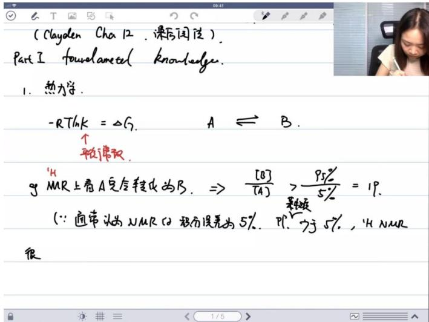

text_image

(Clayden Cha 12 .课后阅读)
Part I fourelametel ( knowledge.
1. 热力学.
-RThk = △G. A ⇌ B.
↑
平在读取.
g 'H
MR上看A完全转化为B. => [B]/(A) > [95%]/5% = 19.
#项
(∵通常认为NMR(2积分误差为5%). P1. 75%, 'H NMR
很

核磁检测标准：在氢谱中认为反应完全的标准是A:B比例>95%:5%（即比值>19），因为NMR的积分误差约为5%，低于5%的物质通常无法被有效检测。  
● 能量差计算：当平衡常数k=19时，通过公式 $-RTlnk=\Delta G$ 计算得 $\Delta G=-73kJ/mol$ （或-17kcal/mol）。有机化学中常忽略负号，直接表述为"反应 $\Delta G$ 为73kJ/mol"。  
● 单位换算：1kJ=4.184kcal，因此73kJ/mol≈17kcal/mol。美国教材常用千卡单位（如March教材），需注意单位差异。

# 2）例题:能量差计算 23:14

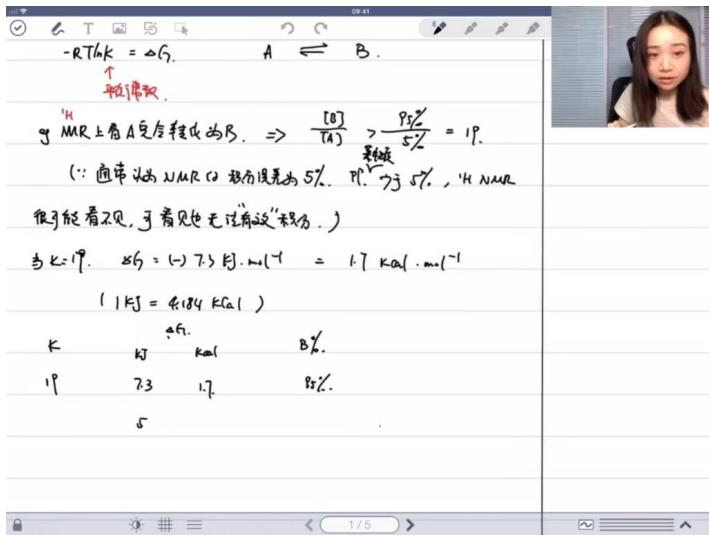

text_image

-RThk = △G. A ⇌ B.
↑
预示碳
g 'H
MR上看A定令程式为B. ⇒ [8] / (A) > 94%
⇒ 5% = 19.
(∵通带认为NMR的积分误差为5%. P1. >3.5%, 'H NMR
很可能看不见,可看见也无法有效'积分.)
当k=19. xG = (-)7.3kJ.mol-1 = 1.7 kcal.mol-1
(1kJ = 4.184 kcal)
K = KJ
×6.
K = Kmol
B/%.
19 7.3 1.7
83%.
5

# ● 临界能量差：

○ $\Delta G = -7.3kJ/mol$ (-1.7kcal/mol) 时，B占比95%   
○ $\Delta G = -12kJ/mol$ 时，B 占比98%  
○ $\Delta G \approx -8kJ/mol$ (-2kcal/mol) 即可认为反应完全

- 物理有机经验法则：当两个物质能量差达到约8kJ/mol（2kcal/mol）时，平衡会显著偏向一方，在合成上可视为单向反应。  
● 键能估算原理： $\Delta G \approx \Delta H$ （熵变影响较小），通过比较键能差可快速判断反应方向，键能差>8kJ/mol时反应
3）订正 26:00

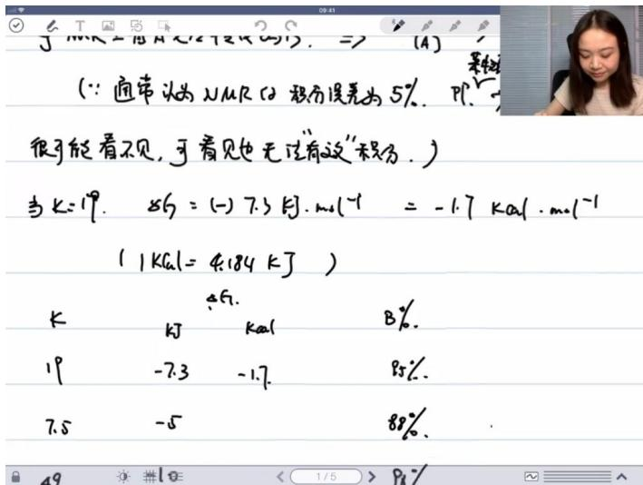

text_image

(∵ 通常认为 NMR (2 积分误差为 5%。
很可能看不见，可看见也无法看这"积分。)
当 k=19. 86 = (-) 7.3 kJ·mol-1 = -1.7 kcal·mol-1
(1 kcal = 4.184 kJ )
K 6.
kJ  Kcal  8%.
19 -7.3 -1.7  85%.
7.5 -5  88%.

单位换算修正：原73kJ/mol换算应为17.4kcal/mol（非7.3kcal/mol），因1kcal=4.184kJ。

实际计算:

● 73kJ / mol ÷ 4.184 ≈ 17.45kcal / mol   
- 符号说明：虽然 $\Delta G$ 实际为负值（自发反应），但有机化学讨论中常省略负号，需注意上下文理解。

4）动力学与热力学 28:23

● 例题:动力学或热力学 28:44

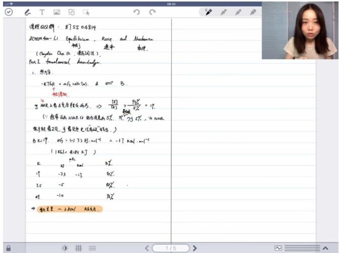

text_image

课程QQ群：8755 04814
2016A-60-Li Equilibria，Rate and Nudanam
(Traylan Cho Fa. 请先阅读)
Pur I. foudanosa( knowledge.
1. 然为合.
-R TAK = AG, wlt-To3. A ⇌ B.
相读成
y MM及以上子女免费程度吗，=> [5] (6) > = 92/62 = 17.
(∵ 色带波动, MM口, 面布速度为0%, 73.7%, 14. MM.
能与随着文说, 于是见电话号码“确定”。
当比[9]（6）(7)时,m=(-7) = -17 km/h=(-1)
(1 kg/-0.02%)
F
好
好
好
好
-73
-17
好
-5
好
-
-10
好
→ q=2E! ~ 2km/
无关系。

热力学基本关系式: $-RT\ln K = \Delta G^{\circ} = \Delta H^{\circ} - T\Delta S^{\circ}$ ，其中 $A \rightleftharpoons B$ 表示可逆反应

○ NMR检测限:通常认为NMR积分误差为5%，当 $\frac{[B]}{[A]}>19$ （即95%:5%）时，A可能无法被有效检测

○ 能量单位换算:1 kcal = 4.184 kJ, -1.7 kcal / mol 对应 -7.3 kJ / mol

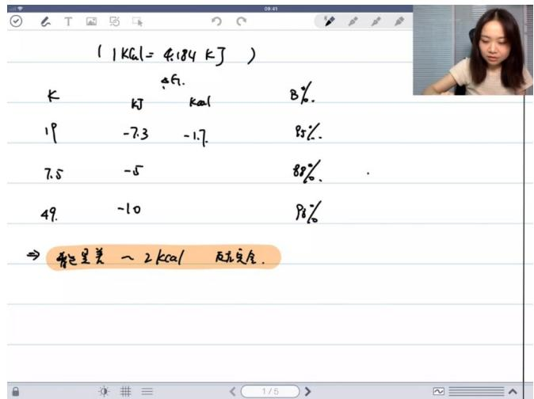

text_image

(1 kcal = 4.184 kJ )
K		%G.
			kJ
19	-7.3	-1.7.
7.5	-5		89%
49	-10		90%
⇒ 粒星美 ~ 2 kcal 配备定。

反应完全性判断: 当 $\Delta G \approx -2$ kcal/mol时，反应基本完全

◦ 动力学与热力学产物区别:

■ 动力学产物：先生成的产物（如产物A），反应速率快  
■ 热力学产物：更稳定的产物（如产物B），自由能更低

☐ 温度影响：升高温度可使动力学产物A转化为热力学产物B，因为高温有利于克服能垒实现可逆过程

● 例题:不可逆反应判断 31:52

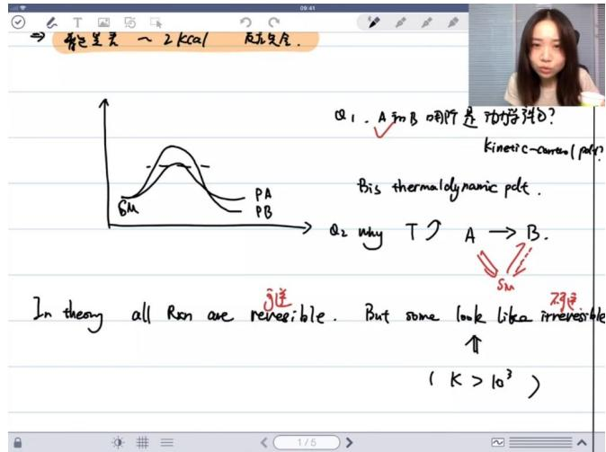

text_image

→ 粒星灵 ~ 2 kcal 反方完全.
Q1. A 和 B 的阶还是功学强?
kinetic control (pdt)
Bis thermal dynamic pdt.
Q2 why T > A → B.
In theory all Ron are reversible. But some look like irreversible
↑
(K > 10³)

○ 可逆性判据:

■ 理论上所有反应都是可逆的  
■ 当平衡常数 $K>10^{3}$ 时，反应表现不可逆（多本教材共识）

○ 能量计算:

■ $K = 10^{3}$ 对应 $\Delta G^{\circ} = -17 \, kJ/mol$ （约 -4 kcal/mol）  
■ 计算式： $\Delta G^{\circ} = -RT\ln K$ （室温298K）

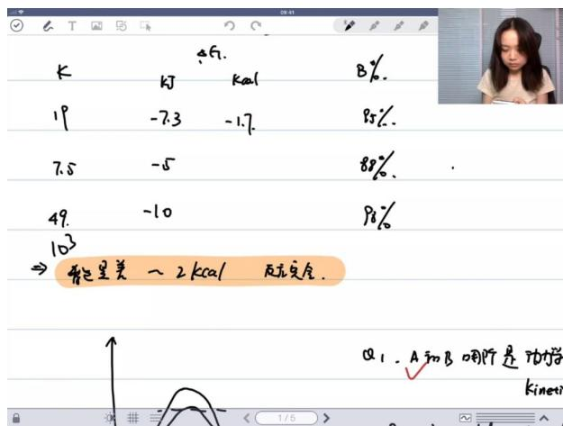

text_image

K
19
7.5
49.
103
→ 青色呈黄 ~ 2 kcal 配定金.
Q1. A 和 B 明阶是 功力学
kinetri

○ 关键能量阈值：当 $\Delta G^{\circ}\leq-17\ kJ/mol$ （即 $E_{2}\geq17\ kJ/mol$ ）时，逆向反应活化能足够大，反应表现不可逆

○ 化学平衡本质:

■ 宏观表现：反应物和产物浓度不再变化  
■ 微观本质：正逆反应速率相等  
■ 决定因素：由热力学状态函数（ $\Delta G$ ）决定平衡位置

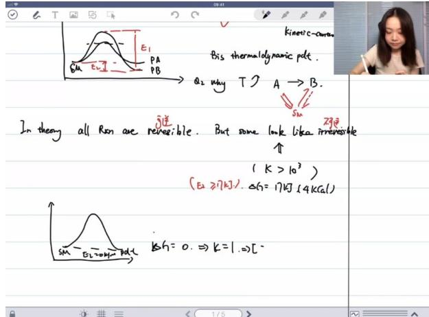

text_image

Kinetic-cavity
This thermal-dynamic polet.
A2 may T? A → B.
In theory all Ron are reversible. But some look like irreversible
↑
(K > 10^3)
(Ei ≥7kJ). ΔG = 7kJ (4kCal)
Δh = 0. ⇒ k = 1. ⇒ [·

○ 特殊案例: 当 $\Delta G^{\circ}=0$ ( $E_{2}=0$ ) 时, K=1, 表现为完全可逆反应  
○ 概念区分:

■ 反应速率（动力学概念）：由活化能决定

■ 平衡位置（热力学概念）：由自由能差决定

教材体系：经典化学教材通常将热力学、化学平衡和电化学归为热力学范畴，因它们都由状态函数决定

2. 动力学 39:00

1）动力学核心知识点与速率常数 39:34

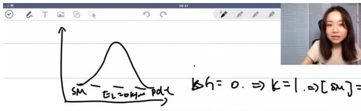

text_image

SM
EL=20kμ
pdt
Bh=0.⇒k=1.⇒[δm]=

1/5

● 速率常数表示：在课程中使用小写字母k表示反应速率常数

● 书写规范：英文术语书写时需特别注意字号大小，确保清晰可见

2）平衡常数与速率常数的区分 40:13  
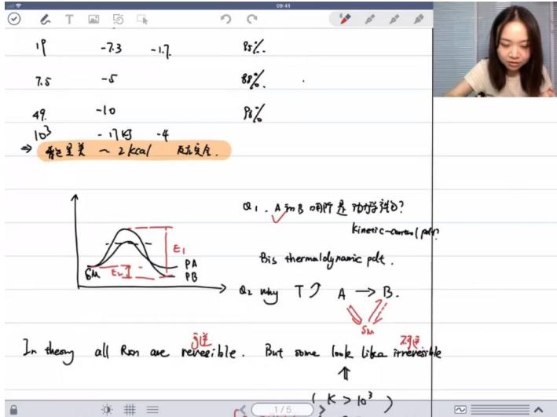

text_image

19 -7.3 -1.7 80%.
7.5 -5 80% .
49 -10 80%
10^3 -17KB -4
→ 程里曼 ~2 kcal 能去完全.
Q1.A和B明阶是功学科D?
kinetic-correct.pdf?
Bis thermaldynamic pdt.
Q2 why TO A → B.
In theory all Ron are reversible. But some look like irreversible
↑
(K > 10^3 )

符号区分：  
○ 小写k：表示反应速率常数（rate constant）  
○ 大写K：表示平衡常数（equilibrium constant）  
● 测量方法：通过NMR测量转化率时需注意5%的积分误差阈值，当转化率达到19%时可明确观测

3）阿罗尼乌斯公式与活化能 40:25

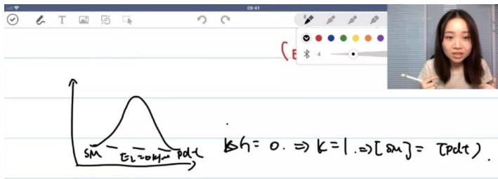

text_image

SM
EL=0.4y
pdt
kG=0.⇒k=1.⇒[an]=(Pdt).

2 游学.

Arthenius Equation (T 运化不为元)
k = A e $^{-\frac{Ea}{RT}}$

●

text_image

- E_a

● 基本公式： $k = Ae \overline{RT}$

○ A: 指前因子（频率因子）  
○ $E_{a}$ : 活化能（单位：kJ/mol）  
○ R: 气体常数 (8.314 J/mol·K)   
○ T: 绝对温度

● 参数说明：

- 公式中的R与热力学中的气体常数相同  
- 温度T需使用开尔文温标

● 命名说明：公式名称中文标准译法为"阿伦尼乌斯方程"

4）动力学公式的局限性与适用条件 41:53

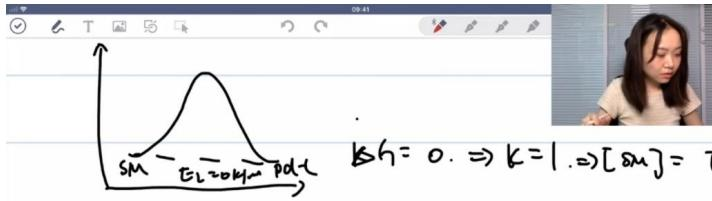

text_image

SM
EL=OH=PdL
BH=0.⇒k=1.⇒[SM]=7

2. 渤学

阿伦尼乌斯
Arrhenius Equation (T 这比不为大)
rate → k = A e $\frac{-Ea}{RT} \leftarrow$ activated energy.
Eostant ↑ 常数 (BT $^{n}$ , B 是常数).

●

● 适用限制：

◦ 仅在温度变化不大时成立  
○ 实际研究中发现A并非严格常数

- 修正模型：更精确的模型应考虑温度幂次关系 $k = BT^{n}$ （B为常数）  
● 实验验证：在宽温度范围（>100K）的实验条件下，经典公式可能不适用

5）案例分析与练习预告 42:07

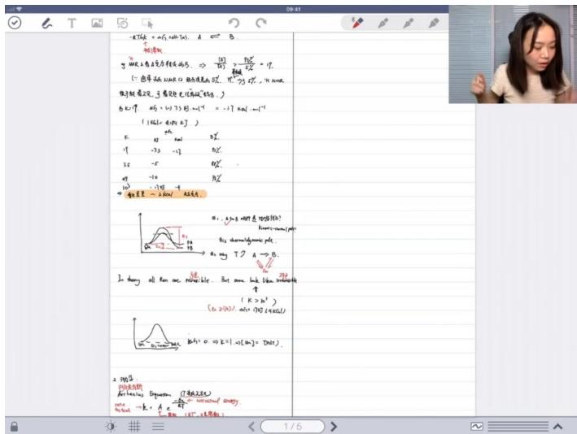

text_image

-k∈b×a∈b, a∈b
y √m²
(1) 由导轴勾入(a) 由直线截面为(b)，y∈b=2π，x∈b。
由于根量之定，y随x值以原点减小。
为k∈b(1) x∈b(3) y∈b(4) = -17 k∈b(1-x)
(1) k∈b(4) x∈b(5) y∈b(6)
x ∈ (2) x ∈ (3) x ∈ (4)
y ∈ (-3) y ∈ (-4) y ∈ (-5)
z ∈ (-6) z ∈ (-7) z ∈ (-8)
x ∈ (-9) x ∈ (-10)
y ∈ (-11) y ∈ (-12)
x ∈ (-13) x ∈ (-14)
y ∈ (-15) y ∈ (-16)
x ∈ (-17) x ∈ (-18)
y ∈ (-19) y ∈ (-20)
x ∈ (-21) x ∈ (-22)
y ∈ (-23) y ∈ (-24)
x ∈ (-25) x ∈ (-26)
y ∈ (-27) y ∈ (-28)
x ∈ (-29) x ∈ (-30)
y ∈ (-31) y ∈ (-32)
x ∈ (-33) x ∈ (-34)
y ∈ (-35) y ∈ (-36)
x ∈ (-37) x ∈ (-38)
y ∈ (-39) y ∈ (-40)
x ∈ (-41) x ∈ (-42)
y ∈ (-43) y ∈ (-44)
x ∈ (-45) x ∈ (-46)
y ∈ (-47) y ∈ (-48)
x ∈ (-49) x ∈ (-50)
y ∈ (-51) y ∈ (-52)
x ∈ (-53) x ∈ (-54)
y ∈ (-55) y ∈ (-56)
x ∈ (-57) x ∈ (-58)
y ∈ (-59) y ∈ (-60)
x ∈ (-61) x ∈ (-62)
y ∈ (-63) y ∈ (-64)
x ∈ (-65) x ∈ (-66)
y ∈ (-67) y ∈ (-68)
x ∈ (-69) x ∈ (-70)
y ∈ (-71) y ∈ (-72)
x ∈ (-73) x ∈ (-74)
y ∈ (-75) y ∈ (-76)
x ∈ (-77) x ∈ (-78)
y ∈ (-79) y ∈ (-80)
x ∈ (-81) x ∈ (-82)
y ∈ (-83) y ∈ (-84)
x ∈ (-85) x ∈ (-86)
y ∈ (-87) y ∈ (-88)
x ∈ (-89) x ∈ (-90)
y ∈ (-91) y ∈ (-92)
x ∈ (-93) x ∈ (-94)
y ∈ (-95) y ∈ (-96)
x ∈ (-97) x ∈ (-98)
y ∈ (-99) y ∈ (-100)

# ● 能量计算：

○ 1 kcal = 4.184 kJ   
○ 典型反应能垒约2 kcal/mol

● 后续内容：将通过酯化反应等经典案例加深对动力学概念的理解  
● 教学提示：理论讲解后需结合具体反应案例进行实践应用

# 3. 案例讨论 42:24

# 1）合成酯 42:33

● 酯的合成反应通式 44:06

text_image

Patt II Case Discussions
chamism
程.
=
19.

反应通式：由羧酸和醇反应生成酯，通常采用酸催化而非碱催化

\- 催化剂选择：碱催化会导致羧酸变成羧酸根，使羰基反应活性显著降低，因此必须使用酸催化

\- 酸催化合成酯的三种机理 44:52

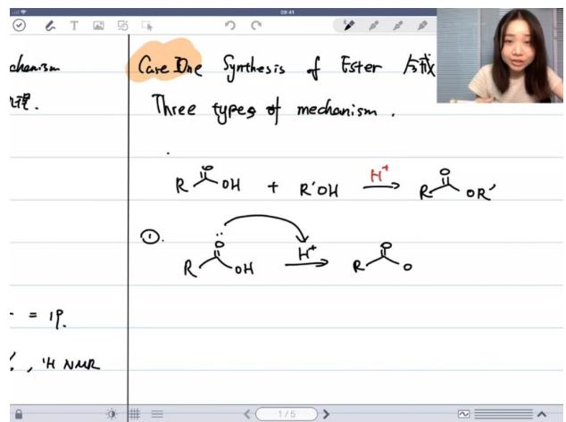

text_image

chanism
理.
Care The Synthesis of Ester 合成
Three types of mechanism .
R⁺OH + R'OH → R⁺OR'
①
R⁺OH → R⁺
= 19.
!, 'H NMR
1/5

# ■ 经典机理：

- 第一步：质子活化羰基（所有涉及羰基化合物的酸催化反应优先考虑此步骤）  
● 后续步骤：亲核进攻→质子迁移→脱水  
● 教学要求：第一轮学习只需画出中间体，第二轮需能推导所有反应条件

■ 碱催化问题：会使羧酸变为羧酸根（RCOO $^{-}$ ），导致反应终止

# ■ 反应中间体：

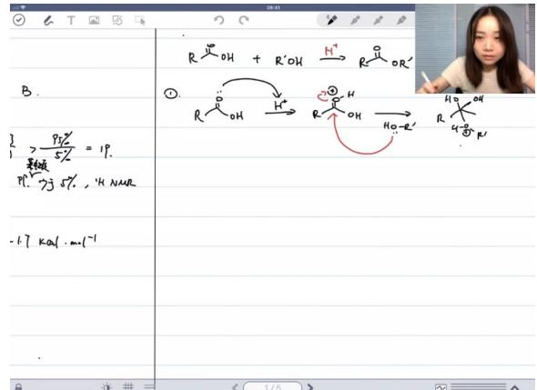

chemical

Chemical reaction diagram showing hydrolysis of alcohols with hydrogen radical, yielding 19 kcal·mol⁻¹ and 4.7 kcal·mol⁻¹

- 当醇位阻过大时，实际机理为羰基活化后发生分子内重排  
● 涉及质子迁移（proton transfer）过程，与质子位移（proton shift）在中文中统称质子迁移

# ● 同位素标记 51:24

○ 同位素标记的基本概念 51:27

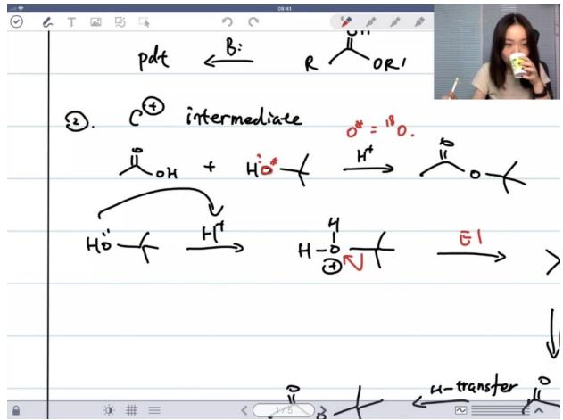

chemical

Handwritten chemical reaction diagram showing intermediate formation with ester and hydrogenation steps

# 常用同位素：

\- 氢:氘 (D)

● 氧: 氧-18 ( $^{18}O$ )   
● 应用：通过标记物追踪反应机理

\- 氟的同位素标记及其应用 52:19

■ 研究背景：Richard教授团队开发的氟标记技术（哈佛/MIT）  
■ 标记原理：利用氟的放射性同位素（半衰期约30分钟）进行快速标记

\- 氟的稳定同位素与半衰期 52:40

■ 稳定同位素：氟-19（ $^{19}F$ ）在自然界丰度接近100%  
■ 放射性同位素：氟-18（ $^{18}F$ ）半衰期约110分钟（需确认）

\- 氟同位素在药物标记中的应用 53:15

■ 药代动力学研究：将标记氟的药物用于PET显像，监测药物代谢过程  
■ 技术优势：标记速度快，适合短半衰期同位素应用

\- 氟的稳定同位素在自然界的丰度 53:54

■ 分离技术：利用 $^{19}$ F的高丰度特性进行铀分离  
■ 特殊性质：分子量精确为19.00，其他同位素制备成本极高

\- 醇是三己醇的情况 54:37

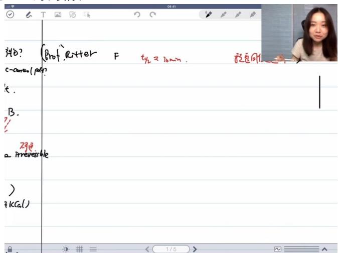

text_image

340? (Brof, Ritter F t/2 = 70mm. 拉意的)
C-control (PAP)
t.
B.
?
Zige
a. Irrestole
)
KCal

反应特点：可生成稳定碳正离子中间体  
○ 典型底物：芳香族羧酸（ArCOOH）与醇反应  
○ 标记实验：

■ 若标记醇的氧（ $^{18}O$ ），产物中应保留标记  
■ 通过同位素追踪可区分不同反应机理

\- 合成酯的反应分析 57:11

\- 反应热分析 57:30

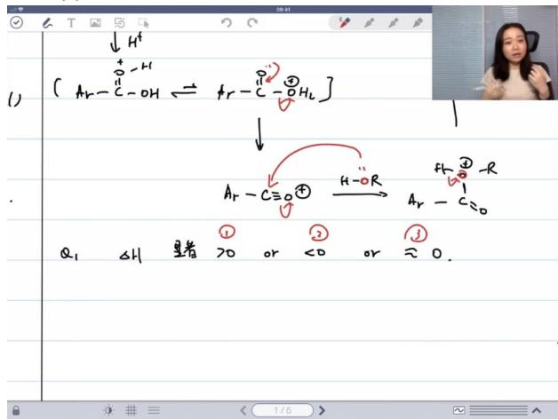

text_image

(1)
↓H⁺
[ Ar - C-OH ⇌  +Ar - C-OH₂ ]
↓
Ar - C=O④ → H-OR → Ar - C=O
H-②-R
Q₁    △H    显者 >0    or    <0    or    ≈0.

\- ΔH判断：酯化反应中ΔH可通过键能（BDE）估算，反应过程断碳氧键和氢氧键，同时生成新的碳氧键和氢氧键，最终ΔH≈0

■ 状态量特性： $\Delta H$ 和 $\Delta G$ 都是状态量，只取决于反应起点（硝酸+醇）和终点（酯+水），与反应路径  
■ 熵变分析： $\Delta S \approx 0$ ，因反应物（2分子）与产物（2分子）数量相同，故 $\Delta G = \Delta H - T\Delta S \approx 0$ ，表现为可逆反应（reversible）

○ 平衡移动策略 01:00:51

■ 勒夏特列原理应用

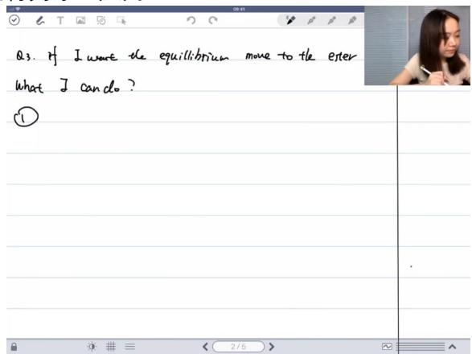

text_image

Q3. If I want the equilibrium move to the ester
what I can do?
①

● 除水方法：

○ 吸水剂：浓硫酸（10%用量）、分子筛（MS）  
- 分水器：利用共沸原理分离水分，要求溶剂密度小于水（如甲苯）

● 原料过量：使用6倍量乙醇，通过原料过量推动平衡右移  
- 工业考量：过量原料选择需考虑成本（工业）或分离难度（实验室），通常醇过量避免酯在碱洗时水解

实验案例

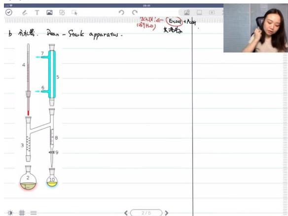

text_image

b 分水器. Pean - Spark apparatus.
7
6
5
4
3
2
10
2/5

- 经典实验：乙酸+过量乙醇+10%浓硫酸加热，共沸物含20%水 $(\mathrm{bp} \approx 88^{\circ} \mathrm{C})$   
- 分离操作：

\- 碳酸氢钠洗：除乙酸

○ 水洗：除乙醇（利用溶解度差异）

● 装置组件：

○ 圆底烧瓶（round-bottom flask）  
- 分流柱（fractional column）：沸点差<20℃时使用  
- 冷凝管 (condenser)

◦ 实验操作与分离技术 01:03:10

■ 分水器工作原理

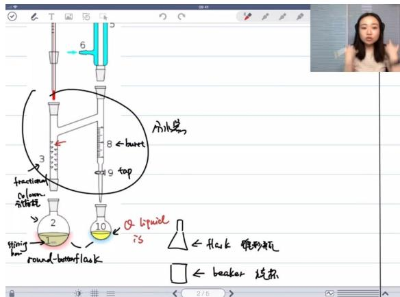

text_image

A小鼠
8 ← burst
9 top
3
fractional
Colons
Silica
2
10
giving
round-bottom flask
Q liquid
is ← flank 鹿形瓶
← beaker 纯形
2/5

● 密度要求：溶剂必须密度小于水（如甲苯），使水相在下层便于分离  
- 操作流程：

\- 打开活塞（tap）排出下层水

\- 上层有机相倒回反应体系循环利用

● 产率提升：96%高收率源于水分持续移除使平衡右移

■ 分离技术选择

● 常规分离：

- 蒸馏（distillation）：沸点差>20℃  
- 精馏（fractional distillation）：沸点差<20℃

● 特殊案例：乙酸乙酯（bp77℃）与乙醇（bp78℃）沸点接近，需用水洗分离

\- 酯水解条件讨论 01:21:40

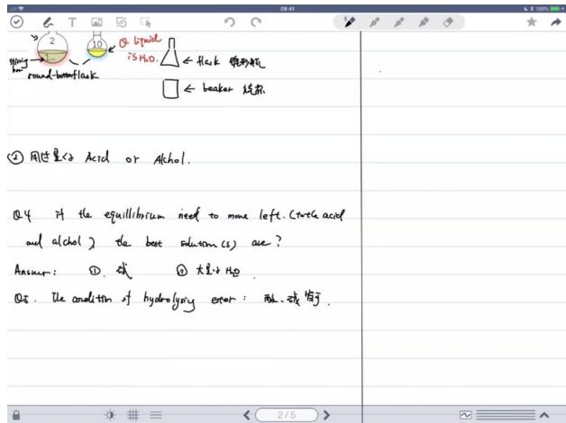

text_image

round-bottom flask
Q is liquid
is H2O ← flask 锻剂瓶
← breaker 结果

②用过量的 Acid or Alcohol.

Q.4 If the equilibrium need to move left. Crustic acid
and alcohol) the best solution(s) are?

Answer: ①. 成 ② 大小H2O.

③. The condition of hydrolysis ether: 酸、铁离子.

平衡左移方法：

● 加碱：将羧酸转化为羧酸盐  
● 加水：大量水推动水解平衡

■ 催化机理：

● 酸碱皆可：酸催化通过质子化羰基氧，碱催化通过OH-直接亲核进攻  
● 路径差异：催化方式属于动力学（路径）问题，与热力学（ $\Delta G \approx 0$ ）无关

■ 实验注意：碱水解需控制条件避免酯过度水解

2）乙酰丙醇的合成 01:29:48

● 半缩醛半缩酮的催化剂 01:30:31

○ 合成半缩醛或半缩酮的催化剂讨论 01:30:48

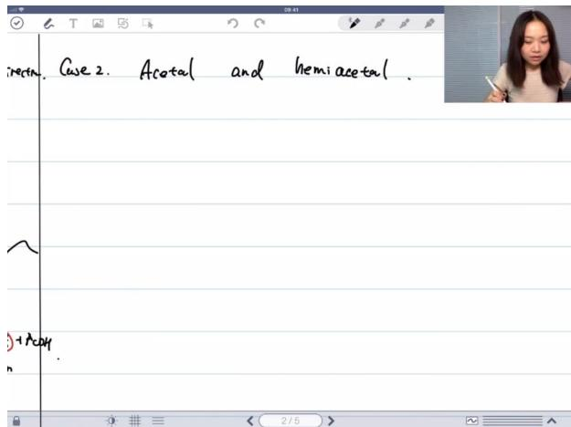

text_image

inertn. Cse 2. Acotal and hemi acetal.
+ Acay
2/5

■ 催化条件选择：合成半缩醛（hemiacetal）或半缩酮时，催化剂可以是酸或碱，两者皆可。这与热力学平衡关系不大，主要涉及反应机理问题。  
■ 机理重要性：初学者容易混淆酸催化和碱催化的适用场景，需要具体分析反应机理来判断。

\- 酸催化与碱催化的机理分析 01:32:36

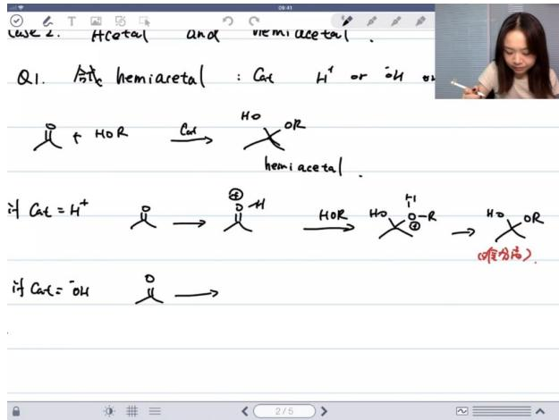

chemical

Chemical reaction equations showing conversion of a cyclic ketone to a hemiacetal, with intermediate steps and conditions for different conditions.

2/5

■ 酸催化机理：

● 醛/酮与醇在酸性条件下反应生成半缩醛  
● 虽然可以观察到反应进行，但产物通常难以分离（除非是环状分子内半缩醛）

■ 碱催化机理：

● 需要修正：使用 $RO^{-}$ 而非 $OH^{-}$ 作为碱催化剂  
● 碱催化会生成羰基水合物（加2分子水的产物）  
● 机理中需要存在氢原子参与反应

◦ 催化剂选择的总结 01:35:02

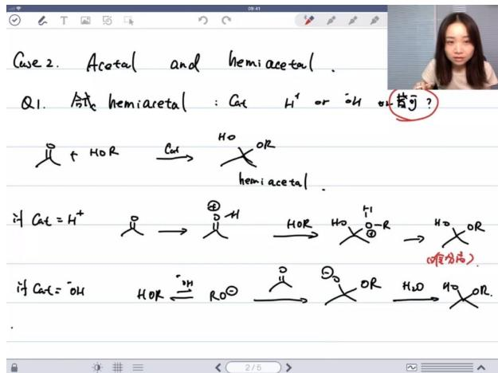

text_image

Case 2. Acetal and hemiacetal.
Q1. 合成 hemiacetal : CaH⁺ or OH or 言可?
→ HOR → HO OR
                  hemi-acetal
if CaH⁺ → ⊕ H → HO⁻ R → HO OR
                  (有分项)
if CaH⁺ ⇌ RO⁻ → ⊙ OR → H₂O OR
                      2/5

■ 结论：合成半缩醛/半缩酮时，酸催化和碱催化均可使用

■ 注意事项：

● 酸催化产物难分离纯化  
● 碱催化需使用适当的碱性条件（如醇盐）  
- 环状半缩醛是个例外，较易分离

● 带电荷的结构是中间体还是过渡态 01:35:52

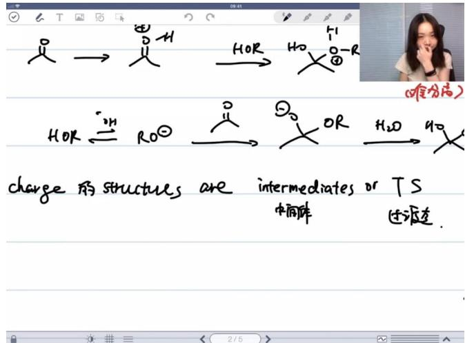

text_image

HOR → HO-OR (唯分离)
HOR ⇌ RO OR H2O 90
charge 的 structures are intermediates or TS
中而体 过滤态.

基本概念：在反应机理中绘制的带电荷结构通常是中间体（intermediates）而非过渡态（transition states）

○ 判断依据：

■ 中间体可以存在于反应体系中（亚稳态）  
■ 过渡态是能量最高点，无法稳定存在  
■ 核磁、红外等仪器可检测到中间体，但无法观测过渡态

● 过渡态 01:37:27

\- 过渡态在反应进程图中的表示 01:37:41

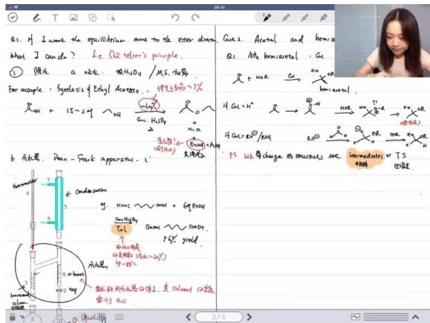

text_image

As. H I have the equilibrium more to the other direction
what J can be? Is the error principle.
① 防水 a nadir. 气H₂O₄ / M.S. 流雾.
For example, Synthesis of Ethyl Acetate, 空气上标为7%
是OH + 15~2 g →OH
Cu: H₂O₄
Cu: H₂O₃
Cu: H₂O₂
Cu: H₂O₁
Cu: H₂O₂
Cu: H₂O₃
Cu: H₂O₂
Cu: H₂O₃
Cu: H₂O₂
Cu: H₂O₁
Cu: H₂O₂
Cu: H₂O₃
Cu: H₂O₂
Cu: H₂O₁
Cu: H₂O₂
Cu: H₂O₃
Cu: H₂O₂
Cu: H₂O₁
Cu: H₂O₂
Cu: H₂O₃
Cu: H₂O₂
Cu: H₂O₁
Cu: H₂O₂
Cu: H₂N
Cu: H₂N
Cu: H₂N
Cu: H₂N
Cu: H₂N
Cu: H₂N
Cu: H₂N
Cu: H₂N
Cu: H₂N
Cu: H₂N
Cu: H₂N
Cu: H₂N
Cu: H₂N
Cu: H₂N
Cu: H₂N
Cu: H₂N
Cu: H₂N
Cu: FCH₃COOH + CuFCH₃OH
Cu: H₂O₄
Cu: H₂O₃
Cu: H₂O₁
Cu: H₂O₂
Cu: H₂O₃
Cu: H₂N
Cu: H₂N
Cu: H₂N
Cu: H₂N
Cu: H₂N
Cu: FCH₃COOH + CuFCH₃OH
Cu: H₂O₄
Cu: H₂O₃
Cu: H₂O₁
Cu: H₂O₂
Cu: H₂N
Cu: H₂N
Cu: H₂N
Cu: FCH₃COOH + CuFCH₃OH
Cu: H₂O₄
Cu: H₂O₃
Cu: H₂O₁
Cu: H₂O₂
Cu: FCH₃COOH + CuFCH₃OH
Cu: H₂O₄
Cu: H₂O₃
Cu: H₂O₁
Cu: FCH₃COOH + CuFCH₃OH
Cu: H₂O₄
Cu: H₂O₃
Cu: H₂O₁
Cu: FCH₃COOH + CuFCH₃OH

# 图示特征：

- 纵坐标：势能（potential energy）  
● 横坐标：反应坐标（coordination）  
● 过渡态（TS）位于能量最高点  
- 中间体位于能量低谷

\- 过渡态的绘制与标记 01:38:45

# ■ 表示方法：

● 用方框包围结构式  
- 右上角标注"‡"符号（两个横杠加斜杠）

# 应用场景：

● 强调立体化学时（如Diels-Alder反应）  
● 描述周环反应的环状过渡态

\- 过渡态与中间体的可观测性 01:39:08

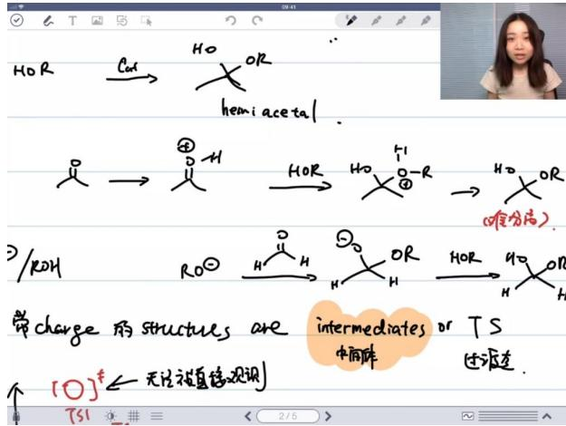

text_image

HOR → HO OR
hemiacetal

HO → H → HO⁻R → HO OR
(难分离)

3/ROH RO⁻ → H OR H → HO OR H

常 charge 的 structures are intermediates or TS
中间体 过滤态

[O] ← 无法被直接观测

TSI 2/5

# TSI ■ 中间体：

● 可通过结晶、核磁、红外等方法观测  
● 质谱检测到的碎片离子属于中间体

# ■ 过渡态：

● 无法直接观测  
● 只能通过理论计算或实验数据间接推断

\- 过渡态的推断与实例 01:40:17

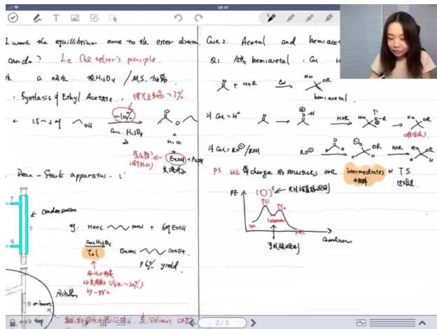

text_image

I were the equilibrium time to the enter dimer
cando? Le Ac teller's principle.
In a water, 2H₂O₄ / M.S. 气溶
· Synthesis of Ethyl Acetase. · 增速生成的 7%
+ 15~20 g ~ 400
Cu: H₂SO₄
Cu: H₂SO₄
Cu: H₂SO₄
Cu: H₂SO₄
Cu: H₂SO₄
Cu: H₂SO₄
Cu: H₂SO₄
Cu: H₂SO₄
Cu: H₂SO₄
Cu: H₂SO₄
Cu: H₂SO₄
Cu: H₂SO₄
Cu: H₂SO₄
Cu: N=O
Cu: N=O
Cu: N=O
Cu: N=O
Cu: N=O
Cu: N=O
Cu: N=O
Cu: N=O
Cu: N=O
Cu: N=O
Cu: N=O
Cu: N=O
Cu: N=O
Cu: N=O
Cu: N=O
Cu: N=O
Cu: N=O
Cu: O=O
Cu: O=O
Cu: O=O
Cu: O=O
Cu: O=O
Cu: O=O
Cu: O=O
Cu: O=O
Cu: O=O
Cu: O=O
Cu: O=O
Cu: O=O
Cu: O=O
Cu: O=O
Cu: O=O
Cu: O=O
Cu: O=O
Fe = NaOH (CH₃)₄ + Fe (CH₃)₄ (CH₃)₄ (CH₃)₄ (CH₃)₄ (CH₃)₄ (CH₃)₄ (CH₃)₄ (CH₃)₄ (CH₃)₄ (CH₃)₄ (CH₃)₄ (CH₃)₄ (CH₃)₄ (CH₃)₄ (CH₃)₄ (C)
Fe = NaOH (CH₃)₄ + Fe (CH₃)₄ (CH₃)₄ (CH₃)₄ (CH₃)₄ (CH₃)₄ (CH₃)₄ (CH₃)₄ (CH₃)₄ (CH₃)₄ (C)
Fe = NaOH (CH₃)₄ + Fe (CH₃)₄ (CH₃)₄ (CH₃)₴ (CH₃)₄ (CH₃)₄ (CH₃)₄ (CH₃)₄ (CH₃)₄ (C)
Fe = NaOH (CH₃)₄ + Fe (CH₃)₄ (CH₃)₄ (CH₃)₄ (CH₃)₄ (CH₃)₄ (CH₃)₄ (C)
Fe = NaOH (CH₃)₄ + Fe (CH₃)₄ (CH₃)₄ (CH₃)₄ (CH₃)₄ (CH₃)₄ (C)
Fe = NaOH (CH₃)₄ + Fe (CH₃)₄ (CH₃)₄ (CH₃)₄ (CH₃)₄ (C)
Fe = NaOH (CH₃)₄ + Fe (CH₃)₄ (CH₃)₄ (CH₃)₄ (CH₃)₄ (C)
Fe = NaOH (CH₃)₄ + Fe (CH₃)₄ (CH₃)-CH₂-CH₂-CH₂-CH₂-CH₂-CH₂-CH₂-CH₂-CH₂-CH₂-CH₂-CH₂-CH₂-CH₂-CH₂-CH₂-CH₂-CH₂-CH₂-CH₂-CH₂-CH₂-CH₂-CH₂-CH₂-CH₂-CH₂-CH₂-CH₂-CH₂-CH₂-CH₂-CH₂-CH₂-

# 典型例子：

● 周环反应的环状过渡态  
● 硼烷对双键加成的过渡态

# ■ 特点：

● 涉及键的断裂和形成同时进行  
- 具有特定的空间取向要求  
● 无法通过任何实验手段直接观测

● 半缩醛半缩酮的催化 01:40:36

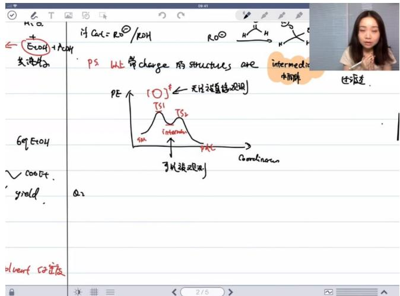

text_image

Mia
+ EtOH + RCH
失衡法
PS 用常 charge 的 structures are
intermediate
中丽萍
还须连
60g EtOH
COO5t.
yield
Q2
olvent 点密度
PE [O]# ← 无性质直接观测
TS1 TS2
SM Internal
可以读观测
Good/normal

催化条件：酸碱均可催化，但半缩酮用碱催化时会发生逆反应（醛醇缩合逆反应）  
- 反应特点：理论上碱催化可行，但实际应用中需考虑逆反应问题  
○ 关键区别：半缩醛在碱性条件下会停留在中间态，而酸性条件能推动后续反应  
● 缩醛或缩酮的催化 01:41:16

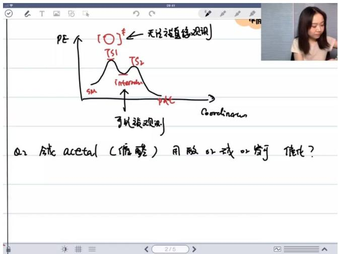

text_image

PE
[O]⁴⁻ ← 无位核直线观测
TS1
TS2
interm
SM
PAC →
Coordination
可以被观测
Q2 合成 acetal（偏酸）用做或或可发于催化？

最佳催化剂：必须使用酸催化（浓 $H_{2}SO_{4}$ 效果最佳）

○ 反应机理：

■ 第一步：形成半缩醛（酸碱均可）  
■ 第二步：需酸性条件形成良好离去基团（羟基质子化后脱水）  
■ 关键限制：碱性条件下饱和碳原子无法继续反应

\- 反应推动力：酸性条件下能形成新的双键结构

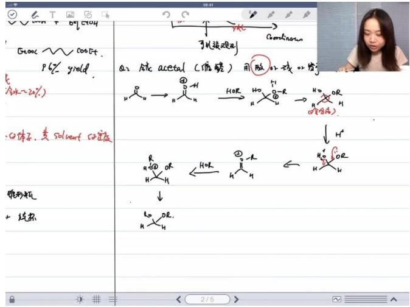

text_image

Geoac ~ COOEt.
P6% yield
(水)~20%)
② 铱 acetal (偏酸) 用酸的碱或烧
H→ H→ H→ H→
④ H→ H→ H→
⑥ R→ H→ H→
⑧ R→ H→ H→
⑩ OR
(有反应)
⑪ OR
⑫ OR
⑬ OR
⑭ OR
⑮ OR
⑯ OR
⑰ OR
⑱ OR
⑲ OR
⑳ OR
⑴ OR
⑵ OR
⑶ OR
⑷ OR
⑧ OR
⑨ OR
⑩ OR
⑪ OR
⑫ OR
⑬ OR
⑭ OR
⑮ OR
⑯ OR
⑰ OR
⑱ OR
⑲ OR
⑳ OR
㉑ OR
㉒ OR
㉓ OR
㉔ OR
㉕ OR
㉖ OR
㉗ OR
㉙ OR
㉚ OR
㉛ OR
㉜ OR
㉝ OR
㉟ OR
㉳ OR
㉟OR
㉟OR
㉟OR
㉟OR
㉟OR
㉟OR
㉟OR
㉟OR
㉟OR
㉟OR
㉟OR
㉟OR
㉟OR
㉟OR
㉟OR
㉟OR
㉟OR
㉟OR
㉟OR
㉟OR
㉟OR
㉟OR
㉟OR
㉟OR
㉟OR
㉟O R.
㉟R O R.
㉟H H R.
㉟H H R.
㉟H H R.
㉟H H R.
㉟H H R.
㉟H H R.
㉟H H R.
㉟H H R.
㉟H H R.
㉟H H R.
㉟H H R.
㉟H H R.
㉟H H R.
㉟H H R.
㉟H H R.
㉟H H R.
㉟H H R.
㉞OR
㉞OR

○ 实验条件：

产率约6%   
■ 需使用分水器（含水约20%）  
■ 溶剂选择要求：能与水共沸（如乙酸乙酯）

● 乙酰丙醇的合成反应分析 01:43:38

\- 反应热力学分析

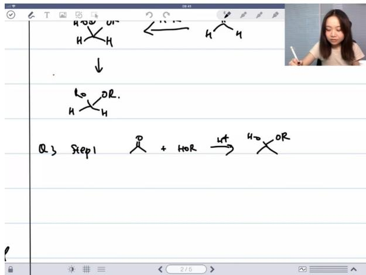

text_image

HOO
H
H
↓
HO
H
OR.
Q3 Step1 + HO R → HO
X OR

■ 反应步骤：反应分为两步，第一步在酸性催化条件下进行加成反应  
■ 热力学参数：

- $\Delta H$ ：约等于零（断键和成键能量相近）  
- $\Delta S$ : 小于零（分子自由度减小）  
- $\Delta G$ : 略大于零 ( $\Delta H \approx 0$ , $\Delta S < 0$ )

■ 键能数据：

● C=O双键：约720 kJ/mol（羰基衍生物中）  
● C-O单键：358 kJ/mol  
● C=C双键：602 kJ/mol  
● C-C单键：346 kJ/mol

\- 反应平衡控制

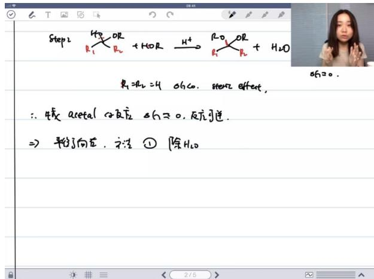

text_image

Step 2
R₁ + H₂O → R₂ + H₂O
R₁ = R₂ = 4   O₆CO.   Stear2 effect,
∴ 钱 acetal 反反应 ΔH=0，反应可逆.
⇒ 平行了向左，方法 ① 除H₂O

平衡移动方法：

● 除水：通过移除生成的水使平衡向右移动  
● 使用原酸酯：代替除水方法，避免生成水

■ 热力学分析：

- 分子内半缩醛比普通半缩醛更稳定  
● 核心原因是熵效应改善 ( $\Delta S \approx 0$ )   
● 焓变略有利（ $\Delta H$ 略小于零）

● 脱保护基的反应条件 01:55:31

\- 保护基反应条件

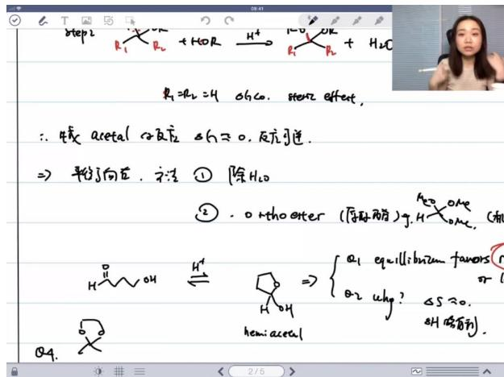

text_image

step2
R1
R2 + HOH
H+O
R1
R2 + H2C
R1=R2=4 6HCO. H→H→H→H→H→H→H→H→H→H→H→H→H→H→H→H→H→H→H→H→H→H→H→H→H→H→H→H→H→H→H→H→H→H→H→H→H→H→H→H→H→H→H→H→H→H→H→H→H→H→H→
∴ 长 acetal 反应 6N=0, 反应引进.
⇒ 平匀了向左, 方法 ① 除 H2O
② . ortho enter (原酚醛) g.H
H
OH
H+
H
OH
hemi:acetal
Q4.
Q1 equilibrium favors
or
or
or why?
△S=0.
△H略有别.

保护条件：

- 酸性催化  
● 低温有利（加成反应特性）

■ 脱保护条件：

● 酸性条件（碱无法完成反应机理）

● 加热促进反应  
● 关键因素：水的存在（需进一步确认）

# ○ 应用背景

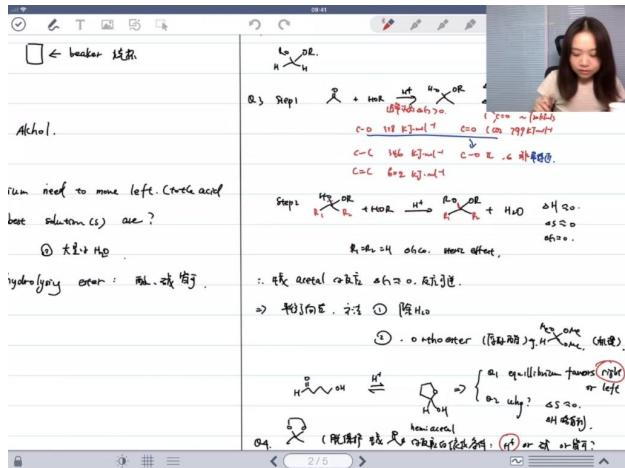

text_image

Alchol.
Iam need to move left. C-react acid
but aluminum (s) are?
② 大量: H₂O
hydroxy group: 酸、碱发干.
Q3 Prep 1 + HBr → OR (磷酸钠, OH)
C=O 1HBr-1H⁺ → C=O (OH, 2H, 2O, 2H)
C=C 1HBr-1H⁻ → C=O, C, 碳酸酯.
C=C 6H₂O₃-1H⁺ → C=O, C, 碳酸酯.
Step 1
R₁ = H₂O₃
R₂ = HBr
→ HBr + H₂O₃ + H₂O
R₆H₄ = 2H, HBr, HBr, OCH₃, CH₃, CH₃OH
∴ 钠酸 metal 质应 NH=O, 碱化液.
⇒ 钠离子键，方法 ① 阶H₂O
② · O HCHOArter (磷酸钾) → HBr (磷酸钾, OH)
H⁺ ⇌ H₂O₃ → { a₁ equilibrium forces (pH)
a₂ why? as ≈ 0.
H⁺ ⇌ H₂O₃ → { a₂ why? as ≈ 0.
(a) (脱脂体) 碱是磷酸钙的除水条件，(H) or 气相分离？}

# 有机合成分类：

● 物理有机化学（机理研究）  
- 合成有机化学:  
○ 全合成（total synthesis）  
○ 合成方法学（synthetic methodology）

# ■ 保护基特点：

- 经典羰基保护方法  
● 需注意保护/脱保护条件的精确控制

# 4. 合成方法学 01:57:57

# 1）反应条件 02:01:44

- 催化剂筛选：通常先筛选过渡金属催化剂（如交叉偶联反应中常用钯催化剂），确定金属种类后再筛选不同配体  
● 催化剂参数：包括催化剂种类和用量两个关键参数需要优化  
● 常见反应条件：

- 容器选择：反应容器材质可能影响反应结果  
- 温度控制：反应温度是重要优化参数  
- 浓度影响：虽然实验室条件下浓度范围通常不大，但仍需考虑  
- 反应时间：需要确定最佳反应时长

● 溶剂效应：溶剂可同时影响反应动力学和热力学性质

# 2）范围 02:03:16

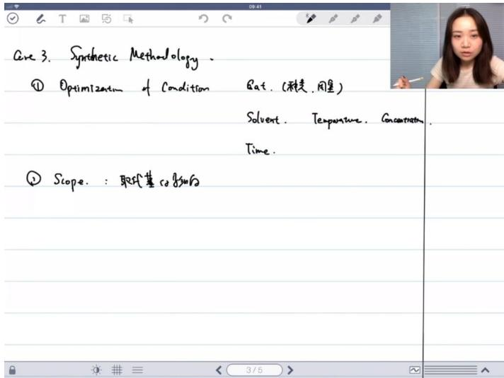

text_image

Care 3. Synthetic Methodology.
① Optimization of Condition
Bat. (种类,用途)
Solvent. Temperature. Gain/Time.
② Scope. : 联系基点符号

# ● 取代基效应：

○ 电子效应：包括给电子效应和吸电子效应（将在第三讲系统讲解）  
应用范围：不仅影响芳环亲电取代，对多数有机反应都有重要影响

# - 官能团容忍性：

选择性控制：需确保反应条件只作用于目标官能团（如还原羰基时不还原酮基）  
○ 实例说明：碱性条件下可能发生羟醛缩合副反应，需谨慎选择还原试剂（如使用硼烷）

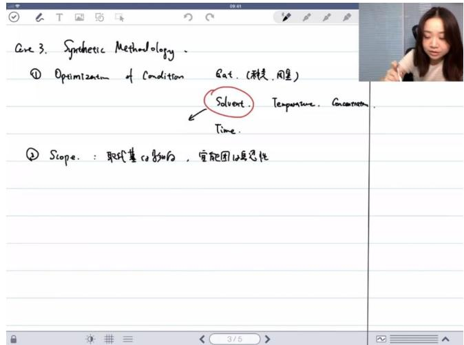

text_image

Care 3. Synthetic Methodology.
① Optimization of Condition Bat. (种类,用途)
Solvent. Temperature. Gastrosthen
Time.
② Scope.: 取代基因的效应, 安装固敏异性

# - 溶剂作用：

- 双重影响：既可改变反应速率（动力学），也能改变反应平衡（热力学）  
○ 选择原则：需综合考虑溶剂对反应的多重影响机制

# 3）溶剂效应 02:05:12

● 溶剂效应的定义与范畴 02:05:18

广义定义：溶剂效应（solvent effect）泛指溶剂对反应热力学性质的所有影响，是一个涵盖范围很广的概念。  
作用对象：既包括溶剂对反应速率的影响（动力学效应），也包括对反应平衡的影响（热力学效应）。

● 溶剂效应对反应的影响及实例 02:05:29

- 作用机制：溶剂通过改变反应物/过渡态的溶剂化程度、生成沉淀、影响溶解度等方式影响反应进程。  
○ 典型表现：

■ 改变反应速率（动力学控制）  
■ 移动反应平衡（热力学控制）  
■ 影响产物选择性

● 例题1: 制备端缺钠的反应及溶剂效应分析 02:06:04

text_image

09:41
Time.

② Scope. ：取代基团影响 ，宜能团是忍性

Solvent effect: solvent 对反应, 功力学反应

eg1. cc = 键 (2) 接功 => 则应流快. → drive force 驱动为

Pdt: R-C≡CNa ↓ (在NH₃中)

反应体系： $NaNH_{2}/NH_{3}(l)$ 条件下炔烃重排制备端炔钠

○ 驱动力分析：

■ 主要因素：生成端炔钠沉淀（ $R - C \equiv CNa$ ）推动平衡右移  
■ 溶剂效应：液氨作为溶剂通过沉淀效应促进反应

○ 对比实验:

■ 使用弱碱（如NaOH）和非极性溶剂时，平衡缓慢向多取代炔烃移动

○ 机理说明：

■ 通过连续拔氢过程（ $CH_{2}$ 或CH上的氢）最终生成炔钠  
■ 超共轭效应使多取代炔烃在热力学上更稳定

● 溶剂效应在SN2反应中的应用 02:09:11

Solvent effect: solvent 对反应. 功/是物的影后. $NaH_{2}/NH_{3}(l)$

eg1. c-c = 键 (2) 接功 => 则方误快. → drive force 驱动为

Pdt: R-C≡CNa ↓ (在NH₃中)

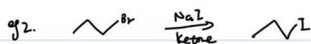

典型案例：碘负离子取代溴负离子的SN2反应

○ 溶剂影响：

■ 丙酮中反应速率显著快于质子溶剂  
■ 原因：丙酮是极性非质子溶剂

○ 次要因素：

■ 产物NaBr溶解度小于NaI，推动平衡右移

● 极性非质子溶剂与质子溶剂对SN2反应的影响 02:11:13

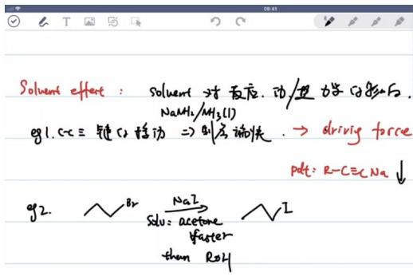

text_image

Solvent effect : solvent 对反应. 功/提力学反应后.
NaMH₃/MH₃Cl
eg1. c-c ≡ 键c 携功 ⇒ 制序消失. → drive force
Pdt: R-C≡C Na ↓
g2. → Br NaI
Solu: acetone → √I
faster
than RoH

○ 作用机制对比：

■ 质子溶剂：能同时稳定正负电荷（如ROH）  
■ 极性非质子溶剂：主要稳定正电荷（如DMSO、丙酮）

○ 动力学影响：

■ 极性非质子溶剂显著提高反应物能量（负离子去溶剂化）  
■ 过渡态能量升高幅度较小（负电荷分散）  
■ 结果：降低活化能，加速SN2反应

○ 过渡态特性：

■ SN2过渡态负电荷分散程度高于原料负离子  
■ 因此受溶剂化影响较小

● 溶剂极性对反应能垒的影响

○ 典型案例：酰胺旋转能垒测定  
○ 规律观察：

■ 溶剂极性越弱（如环己烷），活化能越低

○ 理论解释：

■ 原料（共振式）极性 > 过渡态极性  
■ 强极性溶剂更有效稳定原料  
■ 导致表观活化能升高

\- 溶剂效应的综合应用

设计原则：

■ 热力学控制：选择能生成沉淀/难溶产物的溶剂  
■ 动力学控制：SN2反应优先选用极性非质子溶剂

\- 记忆要点:

■ "非质子溶剂加速SN2"是动力学效应  
■ "沉淀效应移动平衡"是热力学效应

○ 特殊案例：

■ 路易斯碱性溶剂可催化质子转移反应

4）动力学 02:37:39

● 酰胺碱性水解机理分析

常见错误机理： $NH_{2}^{-}$ 作为离去基团被 $O^{-}$ 取代，后续串联有利的酸碱反应生成羧酸根和 $NH_{3}$

◦ 动力学验证：

若上述机理正确，速率方程应为 $r = k[NH_{2}^{-}]$ （质子迁移反应通常视为快反应）  
■ 实验测得速率方程与理论推导不符，证明机理错误

\- 正确机理特征：需符合动力学研究结果，速率方程应包含酰胺浓度和氢氧根浓度项

\- 双负离子生成反应

\- 决速步判断：生成双负离子的第二步为决速步（活化能最高）

○ 速率方程推导：

$r = k_{2}$ [中间体] $[OH^{-}]$   
■ 通过平衡常数转换得： $r = k'$ [原料] $[OH^{-}]^{2}$

◦ 验证标准：推导结果与实验测得的表观速率方程一致

\- 酯水解反应动力学

○ pH-速率关系图：

■ 最低点出现在pH=7（酸/碱浓度最低时速率最慢）  
■ 纵坐标需取 $\log r$ 或 $-\log[H^{+}]$ 才能保持线性关系

○ 酸催化机理：

■ 决速步：质子化酯的水解   
■ 速率方程： $r = k[\text{酯}][H^{+}]$ （水浓度并入常数项）

● 动力学同位素效应(KIE)

○ 定义： $KIE=\frac{k_{H}}{k_{D}}$ （轻同位素反应速率/重同位素反应速率）

○ 判读标准：

■ KIE = 1: 无同位素效应  
■ KIE > 1: 存在同位素效应  
■ KIE < 1: 实验错误（理论上不可能）

\- 消除反应应用:

■ β-消除中刀代α位氢可判断反应机理  
■ $KIE \approx 1: E1$ 机理  
■ KIE > 1: E2机理

○ E1cb机理验证：

■ 机理：快速生成共轭碱→慢速消除   
■ 速率方程： $r = k_{2}K$ [原料] $[OH^{-}]$   
■ 存在显著KIE效应（因碳氢键断裂在决速步前）

# 5. 反应分析框架 03:15:11

1）热力学与动力学区分

- 分析顺序：反应研究通常先通过热力学数据（焓变 $\Delta H$ 、熵变 $\Delta S$ ）判断反应可能性，再讨论动力学机制  
● 考试侧重点：课程中多数情况仅需判断反应能否发生，属于基础送分题；实际教学重点在于动力学分析和结构验证  
● 命题形式：常见提问方式为"该反应受焓驱动还是熵驱动"或"反应受阻的主要热力学因素"

2）结构验证方法

● 实验手段：通过多种表征技术（如光谱、衍射等）确认反应中间体的存在  
● 课程安排：第二节课程将专门讨论结构验证技术体系

3）预习指导

● 核心章节：第12章为当前课程对应内容  
● 扩展阅读：前12章内容均涉及基础结构知识，建议学有余力者全面复习

● 预习建议：

◦ 优先掌握12章核心内容  
- 前12章其他内容可作为下节课（结构专题）的预习材料

# 12章后内容暂不需提前阅读

☐ 注：本笔记已过滤课程结束前的非教学内容（如课程反馈收集等），所有知识点均严格对应教师讲解内容，未添加任何主观推断。热力学判断标准、结构验证具体方法等细节将在后续课程中展开。

二、知识小结

<table><tr><td>知识点</td><td>核心内容</td><td>考试重点/易混淆点</td><td>难度系数</td></tr><tr><td>热力学与平衡</td><td>反应平衡常数(K)与ΔG的关系(ΔG=-RTlnK),核磁检测反应完成的定义(&gt;95%转化率)</td><td>ΔG计算(注意单位:kJ/mol vs. kcal/mol)、平衡移动的勒夏特列原理(储水、原料过量)</td><td>★★★</td></tr><tr><td>动力学控制vs. 热力学控制</td><td>动力学产物(先生成)与热力学产物(更稳定),温度对产物选择性的影响(高温利于热力学产物)</td><td>可逆性判断(ΔG &lt;17 kJ/mol时反应表现可逆)</td><td>★★</td></tr><tr><td>酯化反应机理</td><td>酸催化三种路径(经典活化羰基、碳正离子中间体、原酸酯途径),碱催化不可行(羧酸根亲核性低)</td><td>标记氧同位素( $^{18}O$ )实验验证机理</td><td>★★★★</td></tr><tr><td>缩醛/缩酮反应</td><td>酸催化必要性(碱无法推动饱和碳反应),保护羰基的应用(酸条件下脱保护)</td><td>半缩醛稳定性(分子内半缩醛因熵效应更稳定)</td><td>★★★</td></tr><tr><td>溶剂效应</td><td>极性非质子溶剂(如丙酮)加速SN2反应(动力学原因:负离子去溶剂化)</td><td>溶剂极性对过渡态影响(原料极性&gt;过渡态时,强极性溶剂降低速率)</td><td>★★★★</td></tr><tr><td>动力学同位素效应(KIE)</td><td>KIE = k_H/k_D&gt;1表明氢转移参与决速步(如E2反应),E1cb机理的KIE分析</td><td>实验设计(需使用二氘代底物避免干扰)</td><td></td></tr><tr><td>物理有机研究方法</td><td>通过速率方程反推机理(如酰胺碱性水解的双负离子中间体)</td><td>速率方程与机理矛盾(实测速率 $\propto [OH^{-}]^{2}$ 否定单步机理)</td><td></td></tr><tr><td>高级有机教材对比</td><td>Clayden(机理深度) vs. March(合成侧重),不推荐March因体系混乱</td><td>英文教材阅读策略(重点看反应式,非逐字阅读)</td><td></td></tr></table>