# 一、判断反应机理01:04

# 1. 合理反应机理 01:30

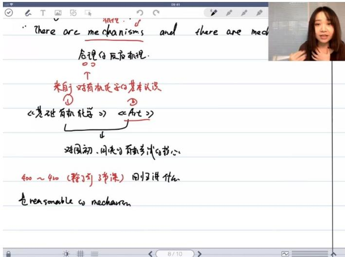

text_image

There are mechanisms and there are med
合理的反应原理.

来自对有机化学的基本认识
① ②
《基础有机化学》《Art》

对国初、国次与有机考试的核心

400～420（除了第3节课）回归讲什么
是reasonable co mechanism.

● 核心概念：有机化学中存在两种机理——合理反应机理（reasonable mechanism）和有实证支持的详细机理  
● 学科地位：掌握合理反应机理是有机化学入门的标志，也是基础有机化学课程的核心教学目标

1）合理反应机理的定义与重要性 02:28

● 定义标准：被有机化学界广泛认可的机理，符合有机化学基本原理  
● 判断依据：来自《基础有机化学》和《Art》等经典教材的系统训练  
● 学习意义：是有机化学入门的门槛，决定学生能否正确分析反应过程

2）合理反应机理与有机化学入门的关系 03:22

● 能力标志：能画出合理机理即达到有机化学入门水平  
● 训练重点：基础有机化学课程（如北大二零零二幺零课程）的核心教学内容  
● 教材支撑：《Art》教材虽为英文但内容直白，中文版更易理解

3）合理反应机理在考试中的核心地位 04:01

● 考试要求：国初、国决有机考试的核心考查内容  
● 实际应用：不需要完整画出箭头，但需能推断反应中间体  
● 教学安排：第一轮课程（二零零二幺零）重点训练机理推导能力

4）有机化学考试的两级分化现象 04:46

● 典型表现：北大有机考试呈现高分群和低分群两极分布  
● 根本原因：是否掌握合理机理的判断标准  
● 学习建议：入门困难但一旦掌握就能稳定发挥

5）国初与国学考试对合理反应机理的要求 05:29

● 难度对比：入门后国初与国决没有本质区别  
● 考试特点：国初不要求画箭头但需理解中间体  
● 课程设计：第二轮课程（四零零系列）延续机理训练

6）课程安排与合理反应机理的深入学习 06:34

● 后续内容：四零零到四二零课程将回归机理讲解  
● 专题扩展：包含羧酸衍生物、自由基、卡宾、周环等特殊机理  
● 学习建议：前三节课为拓展内容，之后回归核心机理训练

2. 有实证支持的详细机理 07:52

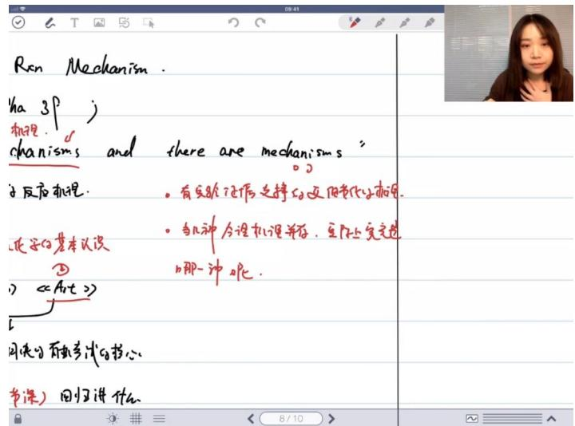

text_image

Ren Mechanism
ha 3p
机理.
chanisms and there are mechanisms
。2
子反应机理。
化学的基本认识
②
(Art >)
用先用有先考试的担心
节课) 回归讲什么

● 研究本质：通过实验证据确定多种合理机理中实际发生的路径  
● 学科定位：属于物理有机化学研究范畴  
● 与基础关系：实证研究积累形成了合理机理的判断标准

1）实证支持的详细机理概述 07:55

● 核心特征：有明确实验证据支持的机理细节

● 研究意义：解决多种合理机理并存时的真实路径问题

● 典型方法：包括产物分析、中间体捕获、动力学研究等

2）合理机理并存与实验证据的重要性 08:29

● 科研现实：实际研究中常存在多个看似合理的机理假设

● 验证需求：需要通过设计实验获取决定性证据

● 教学定位：属于科研前沿内容，传统教材涉及较少

3）判定产物作为实验证据 09:15

● 基本原理：实际产物与预期产物的差异可证伪某些机理

● 课程对应：四零零第二讲的波谱联合解析就是为此服务

● 应用局限：需要配合其他证据才能完全确定机理

4）判定中间体结构 09:47

● 技术手段：主要依靠波谱技术（如核磁共振）

● 研究难度：中间体不稳定导致检测困难

● 教学安排：当前课程暂不深入讲解该前沿领域

5）动力学研究 09:59

● 核心参数：反应速率与反应级数的测定

● 课程基础：四零零第一讲已涉及动力学方法

● 典型应用：包括同位素效应和Hammett关系研究

6）设计实验与结合前述方法 10:52

\- 系统方法：

○ 同位素效应（重点讲解）  
○ Hammett关系（重点讲解）  
- 中间体捕获实验（trapping experiment）

● 实验设计：需要综合运用多种证据相互印证

7）从合理机理到确认机理的过程 12:02

● 认知进阶：从"可能合理"到"实验证实"的转变

● 研究价值：推动有机化学理论发展

● 学习建议：高中生重点掌握合理机理即可

8）有机化学入门与深入研究重点 12:28

● 基础要求：合理机理判断能力

● 科研方向：物理有机化学机理研究  
● 能力差异：前者是化学专业基础，后者是科研前沿

9）对高中生的合理要求与考试重点 12:49

● 学习上限：《Art》教材内容已足够应对IChO

● 考试核心：合理机理推导能力

● 实用建议：多积累反应实例，强化机理分析能力

10）科学逻辑与常识性认识的积累 14:12

● 知识来源：百年有机研究积累形成的常识体系  
● 学习特点：需要通过大量练习内化判断标准  
● 教学价值：理解实证研究如何塑造学科基础

11）波谱联合解析与同位素效应在出题中的体现 14:56

● 命题趋势：近年考试开始涉及机理验证方法  
● 典型例子：周环反应实例、放射化学公式应用  
● 应试策略：完全不会反而可能避免干扰判断

12）物理有机的核心内容 18:30

● 关键理论：

◦ 动力学同位素效应

○ Hammett关系式

● 学习价值：掌握后无需再深入物理有机领域  
● 研究地位：物理有机化学的理论基石

13）课程后续安排 18:57

● 内容转变：前三节拓展内容结束后回归常规机理教学  
● 重点回归：重新聚焦合理反应机理的训练  
● 教学建议：前三节内容了解即可，不必过度钻研

3. 确定产物结构并判断机理 19:10

1）例题:产物结构判断及机理判定

\- 产物结构分析方法

○ 谱图综合判断：需要通过质谱、氢谱( $^{1}$ HNMR)、碳谱( $^{1}$ CNMR)以及二维核磁谱图共同确定产物结构  
○ 二维核磁应用：

■ COSY谱：用于判断相邻碳上的氢原子关系  
HSQC谱：明确氢原子与碳原子的对应关系

○ 化学位移分析：根据氢谱化学位移值判断氢原子所处化学环境，如连氧碳上氢的化学位移通常在3-4 ppm

\- 具体案例分析

text_image

1. 确定讲法结构 → 判乐判断

eg1   
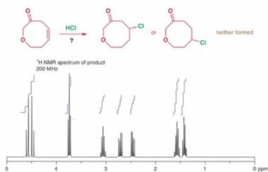

chemical

Chemical reaction scheme showing protonation of cyclohexanone under acidic conditions to form a chlorinated product, with 1H NMR spectrum and 200 MHz scale bar

○ 实验现象：

■ 预期得到混合物但实际获得单一主产物  
■ 氢谱显示11个氢原子信号

# ○ 结构解析：

■ 低场信号(化学位移较大)提示连接吸电子基团  
■ 三重峰提示相邻两个氢原子的存在  
■ 化学位移4 ppm附近信号提示连接氧原子的 $CH_{2}$

# - 反应机理推导

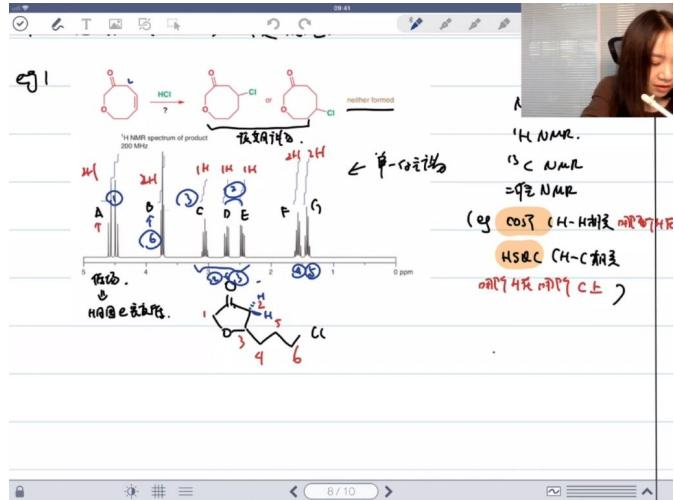

chemical

Chemical reaction scheme showing protonation and resonance spectroscopy of a cyclic amide compound with NMR spectrum analysis

# ○ 关键步骤：

■ 氧原子进攻碳三形成正离子中间体  
■ 孤对电子进攻形成五元环结构  
■ 氯负离子最终进攻碳六完成反应

# ○ 同位素标记实验：

■ 使用氯化氘(DCl)可验证反应机理  
■ 氘原子应出现在特定碳原子上  
■ 异常分布提示可能存在其他反应路径

# - 反应选择性分析

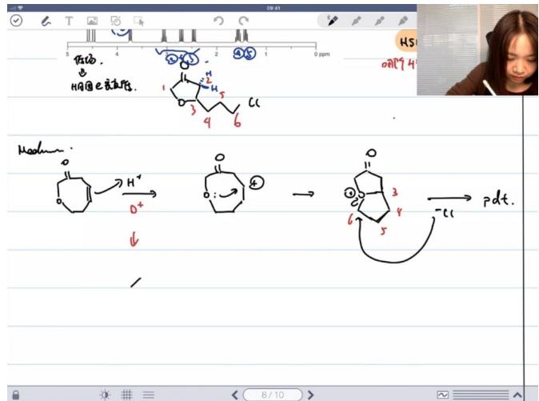

chemical

Hand-drawn chemical reaction scheme showing transformation of a cyclohexene derivative with labeled carbon positions and reaction steps

# ○ 动力学控制：

■ 五元环形成比四元环更有利  
■ 质子迁移通常是快速步骤

# - 竞争反应路径：

■ 正离子可能在不同碳上形成  
■ 但后续步骤的选择性决定主产物

# ● 考试重点提示

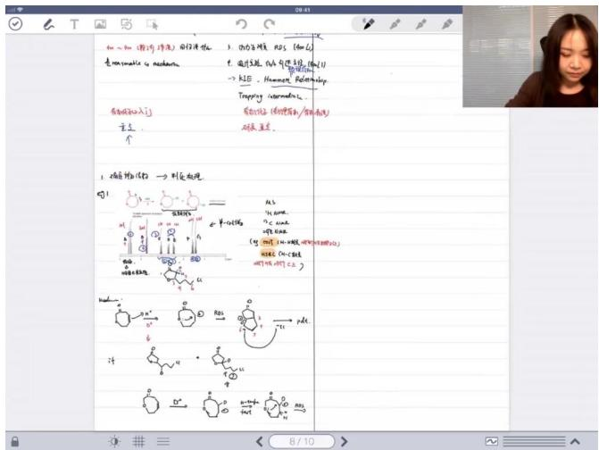

text_image

60-12
(酸) 许费的 4.5% 气体物
molecular 4.5% macromolecular
P. 螺化氢、N₂H₂O₂和H₂O₂
→ KID, Membrane Reaction
Trapping (molecular)
有机物加入
生成
↑
① 酶油相切 → 别定取用
②
③
④
⑤
⑥
⑦
⑧
⑨
⑩
⑪
⑫
⑬
⑭
⑮
⑯
⑰
⑱
⑲
⑳
㉑
㉒
㉓
㉔
㉕
㉖
㉗
㉘
㉙
㉚
㉛
㉜
㉝
㉞
㉟
㉳
㉟
㉟
㉟
㉟
㉟
㉟
㉟
㉟
㉟
㉟
㉟
㉟
㉟
㉟
㉟
㉟
㉟
㉟
㉟
㉟
㉟
㉟
㉟
㉟
㉟
㉟
㉟
㉟
㉟
㉟

# ○ 常见考点：

■ 根据谱图数据推导产物结构  
■ 设计实验验证反应机理  
■ 分析反应选择性的原因

# ○ 高阶思维：

■ 通过实验现象反推反应机理  
■ 考虑多种可能的反应路径  
■ 使用动力学数据确定决速步

# 2）例题:产物结构判断及机理判定 36:56

# - 分子结构解析难点

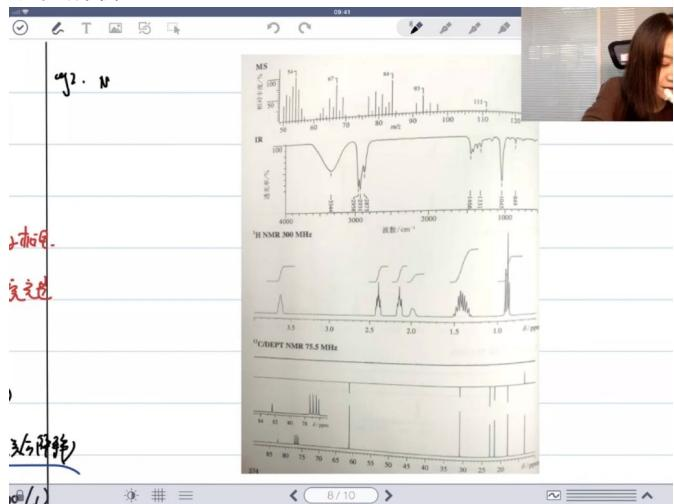

text_image

MS
100
54.1
67
84.1
93.1
111.1
120
MS
100
54.1
67
84.1
93.1
111.1
120
IR
100
54.1
67
84.1
93.1
111.1
120
MS
100
54.1
67
84.1
93.1
111.1
120
IR
100
54.1
67
84.1
93.1
111.1
12<nl>MS
100
54.1
67
84.1
93.1
111.1
120
IR
100
54.1
67
84.1
93.1
111.1
12<nl>MS
100
54.1
67
84.1
93.1
111.1
12<nl>MS
100
54.1
67
84.1
93.1
111.1
12<nl>MS
H NMR 300 MHz
H CDEPT NMR 75.5 MHz

# ○ 分子质量：126

# ○ 红外特征：

■ 含氧基团（OH）特征峰  
■ 2200cm $^{-1}$ 附近无吸收峰（排除端炔）

# ○ 氢分布：

14个氢   
■ 包含：1个OH氢、2个CH $_{2}$ 、1个CH $_{3}$

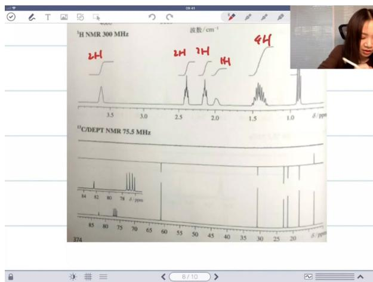

line

| Peak Label | δ / ppm |
|------------|---------|
| 2H         | ~1.5    |
| 2H         | ~2.0    |
| 2H         | ~2.5    |
| 4H         | ~1.0    |
| 3C/DEPT NMR | 75.5    |

# ○ DEPT谱解析：

向上峰： $CH_{3}$   
■ 向下峰： $CH_{2}$   
■ 无信号：季碳

# ○ 特殊现象：

■ 77-78ppm三重峰：氘代氯仿溶剂峰（CDCl₃）  
■ 82ppm季碳：需特别注意

# - 碳数判断关键点

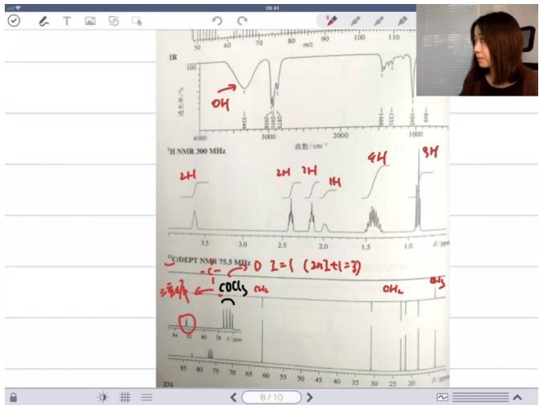

text_image

IR
100
OH
4000
3000
2000
100
110
1000
波数/cm⁻¹
³H NMR 300 MHz
2H
2H 7H
4H
9H
1.5
1.0
δ/ppm
¹³C/DEPT NMR 75.5 MHz D 2=1 (2mI+1=3)
三重峰 ← COCl₃ OH₂
OH₂
374
8/10

# ○ 氘代溶剂效应：

氘自旋量子数 $l=1\rightarrow$ 裂分数2nl+1=3  
■ 正常 $^{13}$ C谱已去耦氢的裂分

# ○ 碳数误判原因：

■ 将溶剂三重峰误认为样品信号  
忽略82ppm处的季碳

# - 正确碳数：8个碳（含2个季碳）

# - 分子式推导

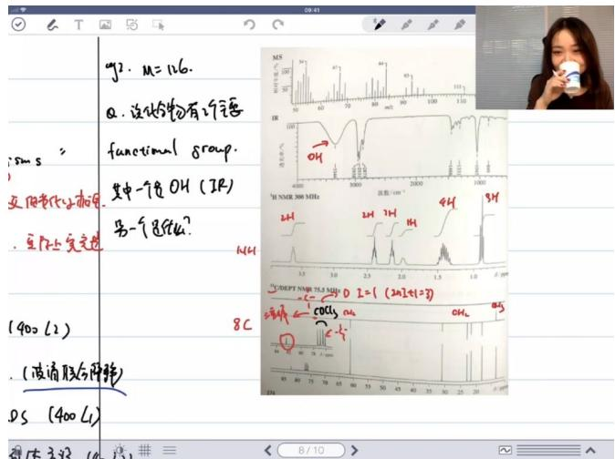

text_image

g2. M=126.
α. 这化合物有2个重要
functional group.
其中一个OH (IR)
另一个g8Cu?
(400 L2)
(玻璃聚合丙烯)
DS (400 Li)
MS
100
60
70
80
90
100
110
120
130
140
150
160
170
180
190
200
210
220
230
240
250
260
270
280
290
300
310
320
330
340
350
360
370
380
390
400
410
420
430
440
450
460
470
480
490
500
510
520
530
540
550
560
570
580
590
600
610
620
630
640
650
660
670
680
690
700
710
720
730
740
750
760
770
780
790
800
810
820
830
840
850
860
870
880
890
900
910
920
930
940
950
960
970
980
990
100 NMR 300 MHz
CO2 DEPT NMR 75.5 MHz  O  2 = 1 ( 2n2 + 1 = 2 )
CO2 CO2 + CO2 + OH2 + CO2 + H2 + CO2 + H2 + OH2 + CO2 + H2 + H2 + H2 + H2 + H2 + H2 + H2 + H2 + H2 + H2 + H2 + H2 + H2 + H2 + H2 + H2 + H2 + H2 + H2 + H2 + H2 + H2 + H2 + H2 + H2 + H2 + H2 + H2 + H2 + H2 + H2 + H2 + H2 + H3

# ○ 计算过程：

■ $C_{8}H_{14}O$   
■ 不饱和度=2（1个三键+1个环或2个双键）

# ○ 官能团确认：

红外确认OH存在  
■ 80ppm季碳提示炔碳 (C≡C)

# - 结构解析难点突破

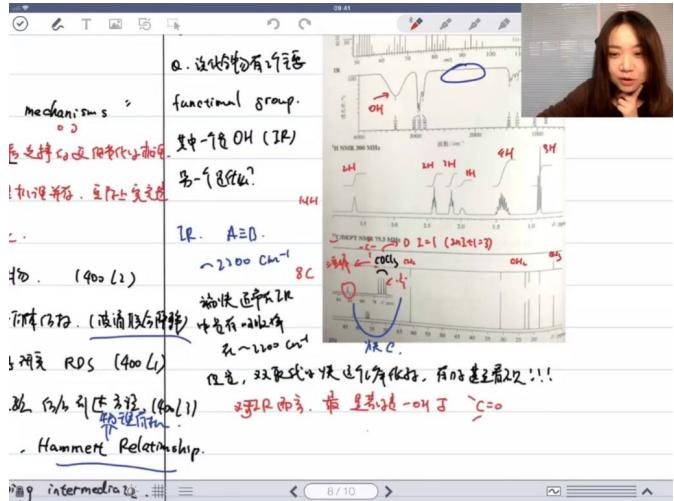

text_image

mechanisms
?
后支持的还原物化子相容.
!机理并存，实际无光谱
=
物. (400 L)
固体仍为. (波通胶合丙醇)
与研究 RDS (400 L)
脱 后分 引进方程 (400 L)
物理性质
- Hammer Relationship.

Q. 这化物有一个主要
functional group.
其中一个OH (IR)
另一个BEU?
IR. A≡O.
~2000 cm⁻¹ 8C
被快速运平入R
中是有O₂比价
在~200 cm⁻¹
但是，双氧代生成过化物很好，有O₂甚至看淡!!
对R两方，背是带线一OH J C=O
intermediate 运...

# ○ 红外特征：

■ 端炔： $2200cm^{-1}$ 明显吸收  
■ 双取代炔： $2200cm^{-1}$ 吸收弱/不可见

# ○ 结构特征：

■ 低场 $CH_{2}$ （与氧相连）  
■ 两个炔碳（80ppm附近）  
■ 正丙基结构（6个氢）

# - 最终结构确认

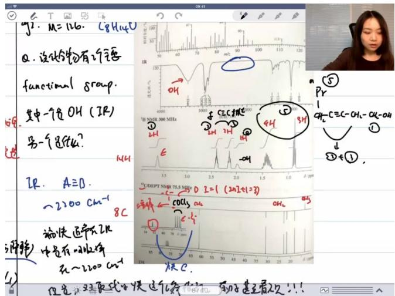

text_image

g²⁻. M=126. (8H4)
Q. 这化合物有? 一定要
functional group.
其中一个负OH (IR)
另一个负?
IR. A≡D.
~2200 cm⁻¹
8C
前快通命无2K
中负有可见峰
在~2200 cm⁻¹
CDEPT NMR 75.5 MHz O I=1 (2nI+1=3)
COCl₃ O₄
OH₂ O₅
快C.
但先试取取代的快这个峰, 取好甚至看决!!!

○ 正确结构：4-辛炔-1-醇

○ 氢分布验证：
■ OH氢：1个
■ $CH_{2}$ ：2个（α位和炔位）
■ $CH_{3}$ ：1个（丙基端基）

○ 碳分布验证：

\- 炔碳：2个季碳
- 其他：6个sp $^{3}$ 杂化碳

例题总结与易错点

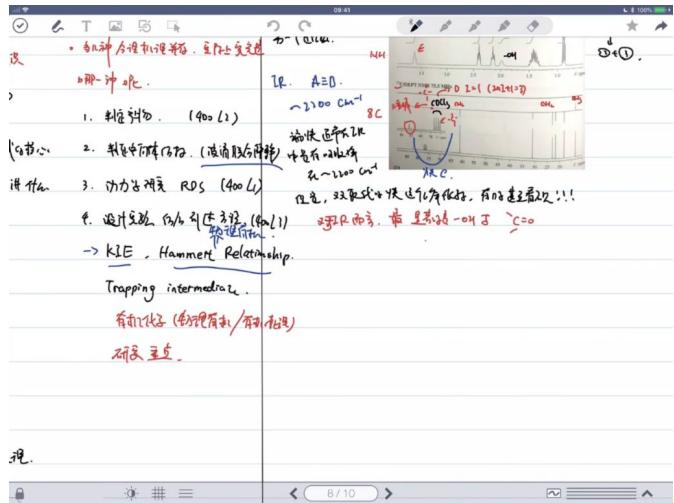

text_image

设
• 当几种合理处理并有. 重复5度交进
哪-冲呢.
1. 制定为: (400 L)
2. 制定方向有压, (澄清脱合得称)
3. 功力发明无 RDS (400 L)
4. 运计实验 仍可引透方程 (600 L)
→ KIE , Hammer Relationship.
Trapping intermediate.
有机化子 (原理原来/有机反应)
研究重点.
现.
IR. A=0.
~2100 cm⁻¹
8C
传递速率不同
中是后的一次序
在 ~2100 cm⁻¹
但是, 又取线性快, 这化为快拉, 在0时建立数元...
对E区而言, 最常减一OH于 C=0
8/10

主要难点：
■ 碳数准确判断（溶剂峰干扰）
■ 双取代炔红外特征不明显
■ 低场氢的归属（与氧相连）

○ 解题技巧：
■ 先计算不饱和度
■ 结合多重谱图验证
■ 注意溶剂峰干扰

常见错误：
■ 漏计季碳导致碳数错误
■ 忽略氘代溶剂裂分现象
■ 误判2200cm $^{-1}$ 无吸收的含义

4. 标记点并判断机理 54:12

1）例题:标记点判断机理

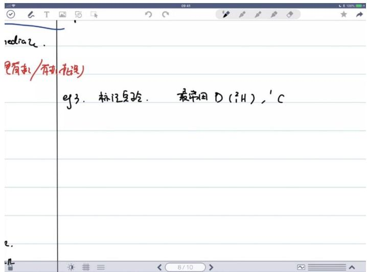

text_image

edia.e.
具有机/有机(有机)
eg3. 标记实验. 被宗因 D(²H), 'C

● 常用标记同位素： $D(^{2}H)$ 、 $^{13}C$ 、 $^{15}N$ 是最常用的同位素标记试剂

● 选择原因：

都是核磁共振活性核（NMR active nuclei）  
○ D的自旋量子数I=1， $^{13}C$ 和 $^{15}N$ 的I=1/2  
- 便于通过核磁共振监测实验结果

\- 历史背景：

- 早期使用放射性同位素如 $^{14}$ C进行标记  
核磁共振技术普及后（1980年代后）改用非放射性同位素  
现代本科生实验已常规使用核磁检测

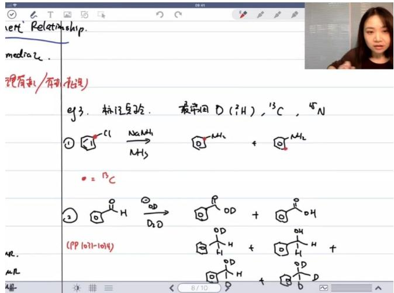

text_image

vert Relationship.
media
理有机/有机(汽油)
eg3. 标记实验. 最常归 D(³H), ³C, ⁴N
① C1 Na2NH4 NH3
② C=O H O D
(PP 1071-1074) + O H + O H + O H + O H + O H + O H + O H + O H + O H + O H + O H + O H + O H + O H + O H + O H + O H + O H + O H + O H + O H + O H + O H + O H + O H + O H + O H + O H + O H + O H + O H + O H + O H + O H
MR.
MR
8/10

\- 经典实验案例：

- 氯苯与氨基钠在液氨中反应  
- 历史上使用 $^{14}$ C标记，现代用 $^{13}$ C  
◦ 实验结果：产物1和产物2几乎等量生成

● 机理推断：

○ 通过等量产物证明存在苯炔中间体  
- 不是严格意义上的E2或E1消除反应  
○ 先发生消除反应生成苯炔中间体

2）例题:康尼查罗反应机理判断 01:08:56

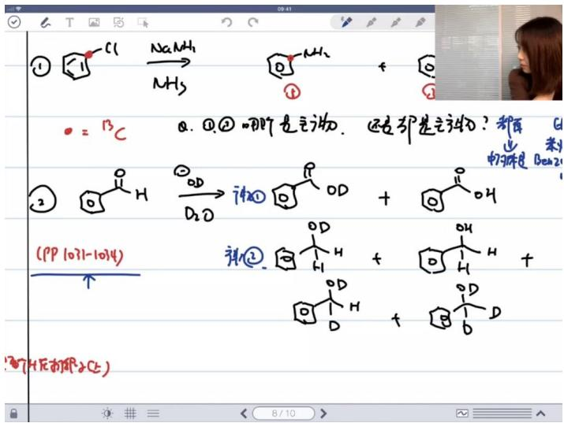

chemical

Handwritten chemical reaction equations and molecular structures of a cyclic compound with isocyanate and dihydroxy groups

# - 反应背景:

- 苯甲醛在碱性条件下的歧化反应  
○ 产物为苯甲酸盐和苯甲醇   
- 原子经济效率低（最大产率50%）

# ● 机理特点：

- 涉及hydride shift（氢负离子迁移）  
○ 不是典型的羰基还原机理  
- 氢氧根浓度高时可形成双负离子

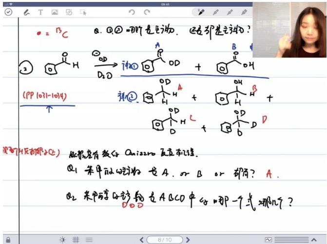

text_image

① = B C
② ③④ 那的是主产物，还是都是主产物？
(PP 1031-1034)
↑
①
②
③
④
⑤
⑥
⑦
⑧
⑨
⑩
⑪
⑫
⑬
⑭
⑮
⑯
⑰
⑱
⑲
⑳
㉑
㉒
㉓
㉔
㉕
㉖
㉗
㉘
㉙
㉚
㉛
㉜
㉝
㉟
㉳
㉟
㉟a
㉟b
㉟c
㉟d
㉟e
㉟f
㉟g
㉟h
㉟i
㉟j
㉟k
㉟l
㉟m
㉟n
㉟o
㉟p
㉟q
㉟r
㉟s
㉟t
㉟u
㉟v
㉟w
㉟x
㉟y
㉟z
㉟a
㉟b
㉟c
㉟d
㉟e
㉟f
㉟g
㉟h
㉟i
㉟j
㉟k
㉟l
㉟m
㉟n
㉟o
㉟u
㉟v
㉟w
㉟x
㉟y
㉟z

# - 标记实验结果：

○ 使用 $D_{2}O$ 和NaOD进行标记  
- 苯甲酸产物主要为D标记在羧基（结构A）  
- 苯甲醇产物中CH2上的两个H必须保持（结构A或B）

# ● 机理验证：

○ 活泼氢在碱性条件下会与D交换   
- 证明氢负离子迁移来自分子内而非溶剂  
- 最终产物分析是验证反应机理的重要方法

# 3）例题:双标记实验机理判断 01:17:18

# - 双标记实验原理

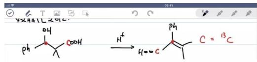

chemical

Chemical reaction diagram showing conversion of phenol to carboxylic acid with hydrogenation step

Q1. 清画出分理反应机理  
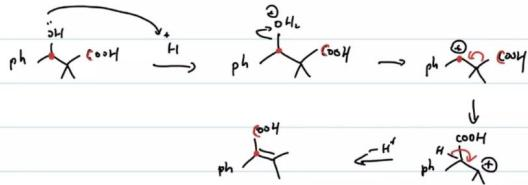

chemical

Reaction mechanism diagram showing dehydration and acidification steps of a cyclohexane derivative

$Q_{2}$

实验目的：通过产物中标记原子的位置关系判断反应机理  
○ 标记方法：使用碳13( $^{13}C$ )同位素标记两个特定碳原子  
○ 检测手段：通过核磁共振测定碳13-碳13偶合常数变化

■ 相邻标记碳 $^{(13C-13C)}$ 偶合常数显著增大  
■ 非相邻标记碳偶合常数较小

# - 碳正离子重排规律

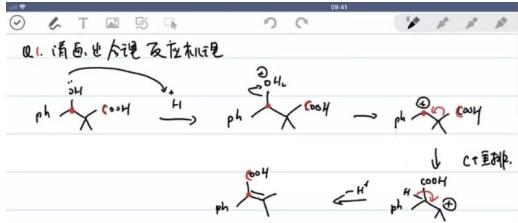

chemical

Reaction mechanism diagram showing phthalate hydrolysis and subsequent reduction to form carbonated products

$Q_{2}$ 在基点中,我们知. $C+$ 主则中近常项后过程=7能比较规范

这④(2)基因(域)由一个不太独立化成(4)线,个更接近(4).

Q.给出的机证，不符合上述任何一条

# ○ 迁移倾向：

■ 倾向于迁移能更好稳定正电荷的基团  
■ 或从不稳定的碳正离子生成更稳定的碳正离子

○ 稳定顺序：苯基＞甲基＞羧基

■ 苯环共轭效应稳定正电荷能力最强  
■ 甲基超共轭效应优于羧基的吸电子效应

# - 反应机理分析

\- 初始机理假设

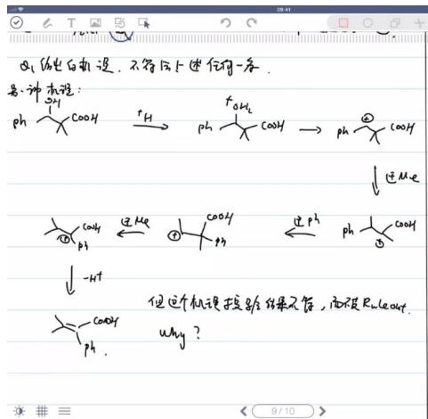

text_image

Q₁给出的机设，不符合上述任何一条。
另一讲机理：
ph
COOH
PH
tOH
COOH
ph
②
COOH
过Me
COOH
①
COOH
PH
过PH
ph
①
COOH
过H
但这个机理按验结果不符，而不足Ruleout.
why？
-HT
COOH
ph

# 步骤：

- 羧酸脱水形成碳正离子   
- 羧基迁移至碳正中心

# 问题:

- 违反碳正离子重排规律（应优先迁移甲基）  
● 未生成更稳定的碳正离子（三级→二级）

# 修正机理假设

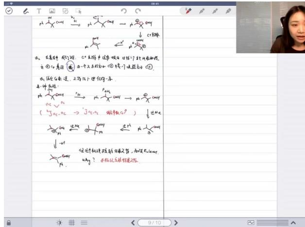

text_image

a. 原条件: 项子项: C'主推中逐项项: 以平行的直线相交
由①个角度( )一个点对称+②绕个过渡边: ③.
b. 使出角速度, 不得压下速度归一轨.
条件表现:
P1
P2
P3
P4
P5
P6
P7
( 2P1=AC → P1' + P2' + P3' + P4' + P5' + P6' )
( 2P1=AC → P1' + P2' + P3' + P4' + P5' )
( 2P1=AC → P1' + P2' + P3' + P4' + P5' )
( 2P1=AC → P1' + P2' + P3' + P4' + P5' )
( 2P1=AC → P1' + P2' + P3' + P4' + P5' )
( 2P1=AC → P1' + P3' + P4' + P5' )
( 2P1=AC → P1' + P2' + P3' + P4' + P5' )
( 2P1=AC → P1' + P2' + P3' + P4' + P5' )
( 2P1=AC → P1' + P3' + P4' + P5' )
( 2P1-0.0000)
( 2P1-0.0000)
( 2P1-0.0000)
( 2P1-0.0000)
( 2P1-0.0000)
( 2P1-0.0000)
( 2P1-0.0000)
( 2P1-0.0000)
( 2P1-0.8777)
( 2P1-0.8777)
( 2P1-0.8777)
( 2P1-0.8777)
( 2P1-0.8777)
( 2P1-0.8777)
( 2P1-0.8777)
( 2P1-0.8777)
( 2P1-0.
9/10)

# 步骤：

- 脱水形成碳正离子   
甲基迁移  
- 苯基迁移   
- 甲基二次迁移

# 问题:

- 多重迁移不符合常规反应特点  
● 与标记实验结果不符（标记碳始终不相邻）

# ● 实验验证方法

# ○ 中间体捕获

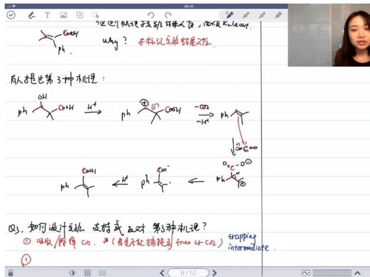

text_image

设这个机理手段用来保存，才能是KuLeaOEt。
why？  标记定维结果不存。
有人提出第3种机理：
ph
OH
COOH
H+
ph
COOH
-∞
-1H+
ph
C=0
ph
COOH
←H+
ph
COO-
←
D=C-O
① 如何设计反应，支持或反对第3种机理？
② 吸收/转移CO2。（若光不能摘除到free CO2）
trapping
intermediate
①

# 二氧化碳捕获：

● 设计实验检测反应中游离 $CO_{2}$ 的存在  
- 若为分子间机理，应能捕捉到中间体 $CO_{2}$

# ■ 自由基捕获剂：

● 使用TEMPO、DPPH等稳定自由基  
● 若为自由基机理，加入后反应应被抑制

# ○ 交叉实验

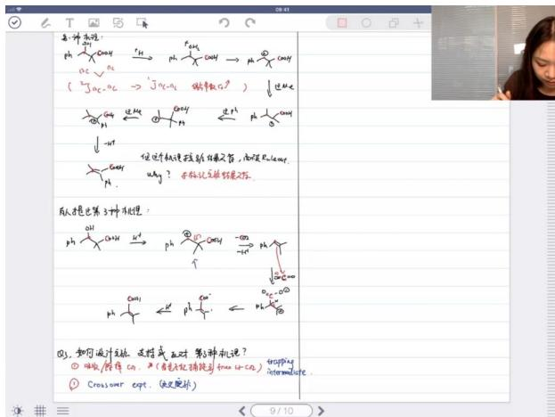

text_image

车桥系统：
ph → fOH
OC → ph → m → COOH
(→jNOxOx → jNOxOx 硝酸CO)
↓过量纲
→CH3 ⇌ CH3 → CH3
↓NH↑
促进扩散速度和体积不变，应使无氧氧。
→CH3 → CH3 → NH2
why？ 为标记元素结果之基。
取提包第3种物理：
ph → PH → ph → COOH
↓CH3 ⇌ pH → CH3 ← NH2
③. 如因统计系统 还造成正对 等5种现象？
① 气化、转移CO₂（含有氧化键和氢键）（hydroxy）
① Crossionr eqt.（失定配料）

# 原理：

● 混合两种结构相似底物（50%:50%）  
- 分子内反应只生成A+B  
- 分子间反应生成A+B+C+D

# ■ 特点：

- 无需同位素标记  
● 通过产物比例判断反应类型

# - 自由基反应验证

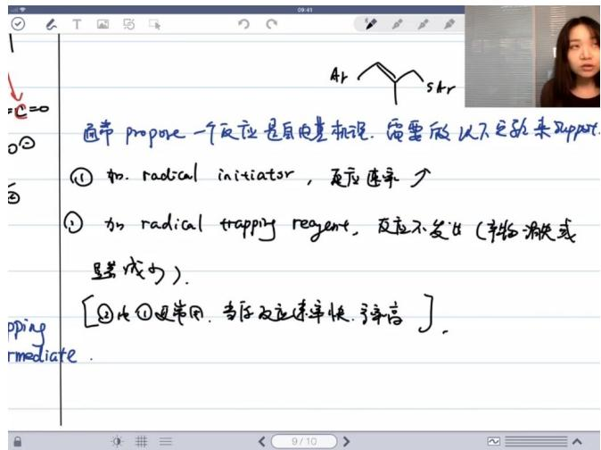

text_image

通常 propone 一个反应是自由基本原理. 需要做以不完全来 Support.
① 加: radical initiator, 反应连乘
② 加 radical trapping regent, 反应不发出 (非标消失或
且减少).
[③比①处常用, 当原反应速率快, 速率高]
rmediate.

# 验证方法：

■ 加入自由基引发剂（如AIBN、过氧化物）→反应加速  
■ 加入自由基捕获剂（如TEMPO、DPPH）→反应抑制

# ○ 常用试剂：

■ 引发剂：R-OO-R（过氧化物）、AIBN（偶氮二异丁腈）

■ 捕获剂：TEMPO（2,2,6,6-四甲基哌啶氧化物）、DPPH（二苯基苦基肼基）

# 例题解析

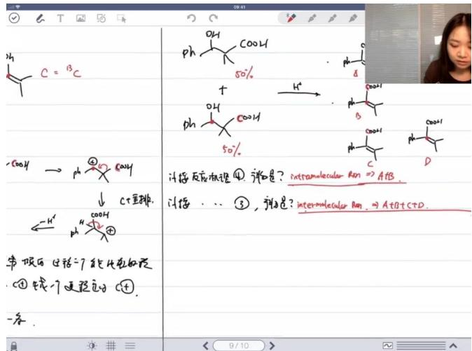

text_image

C = B C
COOH → pH ② COOH
↓ C↑重排.
← H' pH COOH
单根的过程=7能比氢浓度
③线个更短的④.
一条.
H⁺ → 
ph OH COOH
50%
50%
H⁺ → 
ph OH COOH
50%
C
D
H⁺
H⁺
H⁺
H⁺
H⁺
H⁺
H⁺
H⁺
H⁺
H⁺
H⁺
H⁺
H⁺
H⁺
H⁺
H⁺
H⁺
H⁺
H⁺
H⁺
H⁺
H⁺
H⁺
H⁺
H⁺
H⁺
H⁺
H⁺
H⁺
H⁺
H⁺
H⁺
H⁺
H⁺

# ○ 解题要点：

■ 质谱显示产物比例为1:2:1   
■ 光照条件提示可能为自由基机理  
■ 交叉实验证实为分子间反应

# ○ 反应机理：

光照引发键均裂生成自由基  
■ 自由基重组形成不同产物  
■ 鱼钩箭头表示单电子转移

# 5. 自由基捕获剂 01:57:12

# 1）自由基的稳定性因素 01:57:18

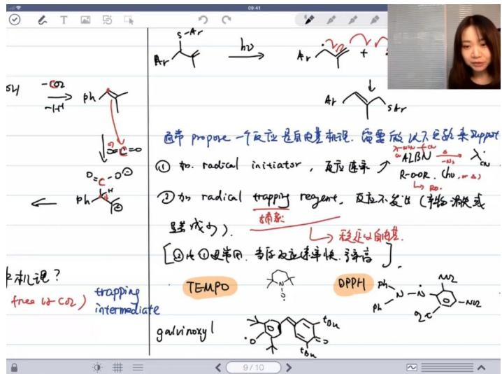

text_image

sH → -CO2 → ph
      ↓
      C=O
      O=C-O-②
      ← ph
k 机泥？
free (w CO2) trapping intermediate
h2 → Ar + Ar
      ↓
      c
      s
      sr
通带 propore 一个反应是自由基机理，需要做以下实验来Sppor
① 加: radical initiator，反应速率 > R-0.05 (H0, =)
② 加 radical trapping regent，反应不发出（单独润滑或壁减少）。
          ↑→ 稳近心的电基。
[③比①吸单④，当压反应速率快、速率高]。
TEMPO
DPPH
ph
      ↓
      N-O-②
      O=N-②
      2C
galvinoxy1

● 位阻效应：四个甲基的空间位阻可以显著提高自由基稳定性，如TEMPO的稳定性主要来源于此  
● 共轭效应: 三苯甲基自由基通过苯环的共轭作用获得稳定性，但并非完全平面结构  
● 综合因素: DPPH和galvinoxyl等自由基同时具备位阻和共轭双重稳定机制

2）稳定的自由基实例：TEMPO 01:57:32

● 商品化特征: 可直接购买储存，以稳定自由基形式存在  
● 稳定性表现: 可长期保存不变质，除非加入特定反应物  
● 结构特点: 含两个甲基提供位阻保护，氮氧自由基中心

3）历史上第一个稳定的自由基 01:59:16

● 发现意义: 三苯甲基自由基是科研史上首个被确认的稳定自由基  
● 稳定机制: 非完全平面结构，兼具共轭和位阻效应  
● 稳定性数据: 室温下可稳定存在数天

4）三苯甲基自由基的稳定性分析 01:59:51

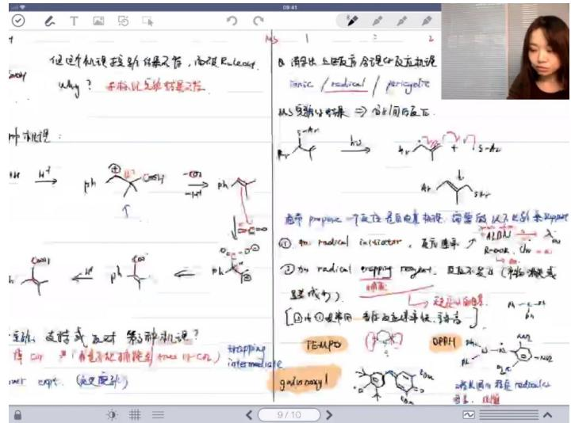

text_image

设为
使这个机理控制体系尽管,而被Ruleoff
why? 与标比与单结论之父.
甲.机理:
H → H⁺ → pH → COOH⁻ → -CO₂
      ↓      ↓      ↓
      C=O     C=O     C=O     C=O
      ← H     Ph     ← Pd     Pd
宝班:支持或反对等几种机理?
得Coy (若是开始捕除或max H-Cr) 连接的
intermediate
TEMPO
OPDH
golin oxy!
①加radical indicator,再后重新加入
②加radical trapping agent,反应不是为(中和顺变
显成功)
→超过3的量.
[①+②发生用 作为反应速率快、储存]
9/10
③当 radical 耐换到相反,反应不是为(中和顺变
显成功)
TEMPO
OPDH
golin oxy!
④当 radical 耐换到相反,反应不是为(中和顺变)
显成功)

9/10   
● 结构特征: 三个苯环呈螺旋桨状排列，避免完全共平面  
- 稳定因素:

○ 共轭贡献: 部分 $p-\pi$ 共轭作用

○ 空间保护: 苯环旋转产生的动态位阻

● 稳定性对比: 虽不如TEMPO等商品化自由基稳定，但在室温下已具有实用稳定性

6. 汉米特关系式 02:00:37

1）汉米特关系式发展背景 02:09:21

\- Hammett教授的简介

○ 身份背景: 哥伦比亚大学教授, 1980年代去世  
- 学术贡献: 奠定物理有机化学基础，提出Hammett关系式

● 物理有机的黄金时间及其贡献 02:09:40

○ 黄金时期: 1950s-1970s  
○ 核心突破:

■ 定性→定量: 将有机化学从定性描述（如"吸电子/给电子"）发展为定量研究  
■ 研究重点: 定量描述有机反应机理，而非仅提出合理(reasonable)的定性机理

● 有机反应方法学的兴起 02:10:29

○ 现状特点:

■ 将反应视为工具（tool）  
■ 形成独立分支"有机反应方法学"(methodology)

研究内容:

■ 构建新型化学键（C-C键、C-N键等）  
■ 定向断裂特定键（C-H键、C-N键等）

○ 典型案例:

■ 交叉偶联反应(cross coupling，如Suzuki反应)  
■ 高效温和生成C-N键的反应（如Buchwald-Hartwig反应）

● 物理有机的研究目标与现状 02:11:46

○ 理想目标: 定量描述绝大多数有机反应机理  
○ 现实困境:

■ 能定量描述的有机反应极少  
■ 多种因素导致黄金时期未能持续

\- 研究价值: 仍需要掌握Hammett关系式这一核心定量工具

● 制药行业对有机合成的影响 02:12:16

○ 需求特点:

■ 快速合成结构类似物库(database)  
早期仅需毫克级样品

\- 经济驱动:

■ 重视分子筛选而非反应优化  
■ 反应机理研究的经济驱动力不足

● 汉米特关系式的核心内容 02:13:54

○ 定义: 定量研究取代基(SG)给电子/吸电子效应对反应速率的影响  
○ 应用扩展: 从速率影响扩展到对反应活性的整体影响  
○ 关键参数:

取代基常数( $\sigma$ )   
■ 反应常数(ρ)

2）汉米特关系式定义发展 02:15:09

\- 基础实验发现

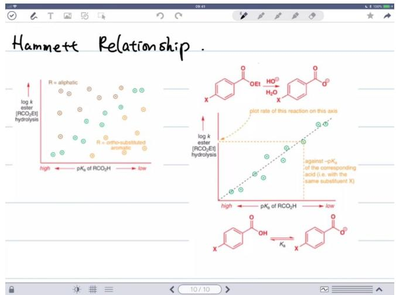

chemical

Chemical reaction scheme showing Hammett relationship with hydrolysis and R-group variations on [RCO2Et] surfaces

实验体系: 苯甲酸衍生物酯类水解反应

○ 坐标参数:
■ 横轴: 对应羧酸的 $-pK_{a}$ （酸性强度）
■ 纵轴: 酯水解速率常数对数(logk)

初始发现:
■ 脂肪酸酯（无规律分布）
■ 邻位取代芳酯（偏离线性）
■ 间/对位取代芳酯（良好线性关系）

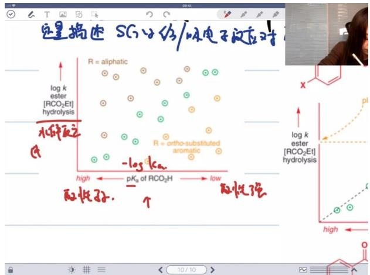

text_image

定量描述 SG酸/β-电子反应式
log k ester [RCO2Et] hydrolysis
R = aliphatic
R = ortho-substituted aromatic
-log kα
high ← pKa of RCO2H → low
取性子. ↑ 取性强
log k ester [RCO2Et] hydrolysis
10 / 10 >

○ 关键条件:
■ 仅间位/对位取代显示线性关系
■ 排除脂肪族取代基和邻位取代基

● 取代基位置效应分析

\- 脂肪族取代基问题:
  - 电性效应不明显
  - 存在随机位阻效应

邻位取代基问题:
■ 位阻效应 > 电性效应
■ 电性影响被位阻掩盖

○ 间位取代特点:
■ 电性效应占主导
■ 吸电子基(EWG)加速反应
■ 给电子基(EDG)减慢反应

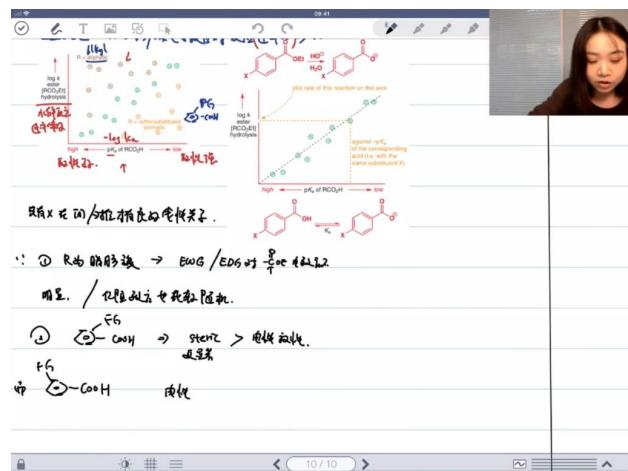

text_image

mg 4
[CO2O3]
Hydrazine

水解反应
→ 100 g/L
取代物.

pH of RO2OH

pH of RO2CH3

pH of RO2CH3

pH of RO2CH3

pH of RO2CH3

pH of RO2CH3

pH of RO2CH3

pH of RO2CH3

pH of RO2CH3

pH of RO2CH3

pH of RO2CH3

pH of RO2CH3

pH of RO2CH3

pH of RO2CH3

pH / 2H + 2COOH → 6.0 mg / 100g / 100g / 100g / 100g / 100g / 100g / 100g / 100g / 100g / 100g / 100g / 100g / 100g / 100g / 100g / 100g / 100g / 1

① R为脂肪酸 → 8.0 mg / 100 g / 100 g / 100 g / 100 g / 100 g / 100 g / 100 g / 100 g / 100 g / 100 g / 1

明显，/ 仅限物发生电极和随机.

② COOH → stepwise >电极和纯.

pH = COOH - 肉极

# ○ 作用机制差异:

■ 间位: 主要体现诱导效应  
■ 对位: 主要体现共轭效应

# ○ 理论验证方法:

■ 绘制羧酸根负离子的共振式  
■ 分析取代基对负离子的稳定作用

# 3）应用案例 02:24:06

# - Hammett关系式应用

# 基本概念

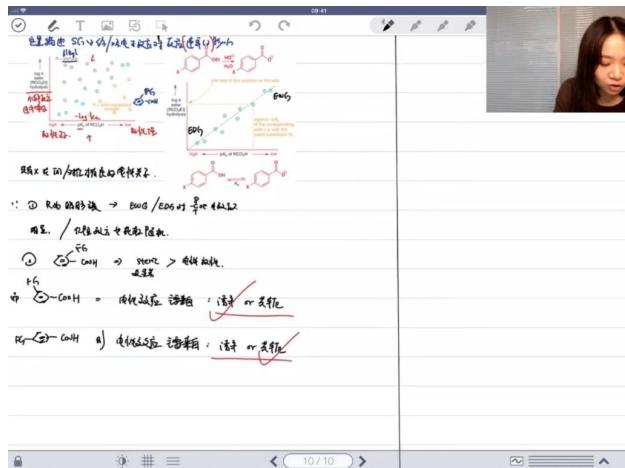

text_image

色里满虫 SG心纺/毛里不放布时 石墨(透光)/影力
图1
图2
图3
图4
图5
图6
图7
图8
图9
图10
图11
图12
图13
图14
图15
图16
图17
图18
图19
图20
图21
图22
图23
图24
图25
图26
图27
图28
图29
图30
图31
图32
图33
图34
图35
图36
图37
图38
图39
图40
图41
图42
图43
图44
图45
图46
图47
图48
图49
图50
图51
图52
图53
图54
图55
图56
图57
图58
图59
图60
图61
图62
图63
图64
图65
图66
图67
图68
图69
图70
图71
图72
图73
图74
图75
图76
图77
图78
图79
图80
图81
图82
图83
图84
图85
图86
图87
图88
图89
图90
图91
图92
图93
图94
图95
图96
图97
图98
图99
图100

■ σ值定义: 取代基常数 $\sigma = pKa(H) - pKa(X)$ ，其中X为取代基

# ■ 电子效应分类:

● 吸电子基团(EWG): $\sigma > 0$   
● 给电子基团(EDG): $\sigma < 0$   
● 氢原子基准: $\sigma = 0$ (苯甲酸苯尊)

# ○ 线性关系建立

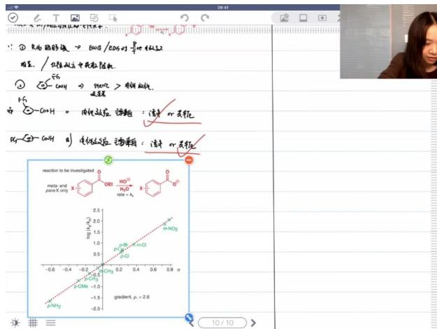

text_image

① 只为物质键 → 800g/EDS时 50% 未发生
现象 / 四维测定中氧化氢随机.
② COOH → 90% > 非铁的氧
发生
由 CO₂-COOH = 气化反应 浓解：渣时 40% 未发生
由 CO₂-COOH = 气化反应 浓解：渣时 40% 未发生
reaction to be investigated
methyl and
paraX only
log (V/V)
COOH
HO2+
NOx
x-
mMn + H2
pH2
O
CO
pH2
-1.0
-0.6 -0.4 -0.2 -0.05 -0.02 -0.01 -0.005 -0.002 -0.001 -0.0005
pH2
-1.5
-2.0
gradient, p = 2.6
10 / 10 >

# ■ 坐标含义:

● 横坐标: $\sigma$ 值 (pKa差值)   
- 纵坐标: $\log (\mathrm{kx / kH})$ （取代与未取代速率常数比的对数）

# 实验特性:

- 间位(m-)和对位(p-)取代基可混合使用  
● 线性关系 $R^{2}>0.9$ 即被认为良好  
- 点越多拟合效果越好

# ○ ρ值解释

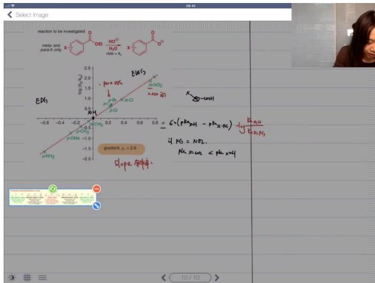

text_image

Reaction to be investigated
meta- and
para X only
H2O
rate = R1
EWS
NO2
COOH
- Ph = Ph
x - GOH
EGN
OMe
- 0.5
0.4
0.3
0.2
0.1
0.0
-0.6 -0.4 -0.2 -0.1 -0.0
-0.9 -0.7 -0.5 -0.3 -0.1
-1.0 -0.8 -0.6 -0.4 -0.2
-1.1 -1.0 -0.9 -0.6 -0.4 -0.2
-1.2 -0.9 -1.0 -1.1 -0.6 -0.4
gradient, p1 = 2.6
slope: 解析
IF: FG = NO2.
Ph: PhCO3 < Ph × H4
10 / 10

# ■ ■ ρ>1:

● 过渡态电子密度高于底物  
● 吸电子基加速反应

# ρ>4:

● 过渡态负电荷与苯环共轭   
● 电荷可有效分散到苯环

# 0<ρ<1:

● 电荷变化不显著  
● 取代基影响较弱

# ρ<0:

- 过渡态缺电子  
- 给电子基加速反应

# ○ 理论意义

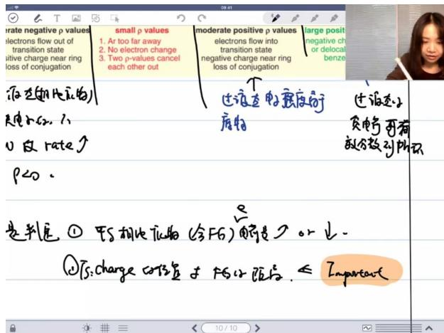

text_image

rate negative p values
electrons flow out of
transition state
itive charge near ring
loss of conjugation
液态相位方向
限入点
0 皮 rate ↑
p < 0 .
是判座① 水相位方向(含F6)略是?or ↓
② 水:charge co位置 & F6/4 距离.≤ Important

# 核心价值:

- 判定过渡态电子结构  
● 确定电荷位置与距离

# 实验突破:

首次实现过渡态间接研究  
● 过渡态无法直接观察的特性

# ■ 应用局限:

● 基于大量实验归纳  
● 非严格理论推导

# ○ 典型应用案例

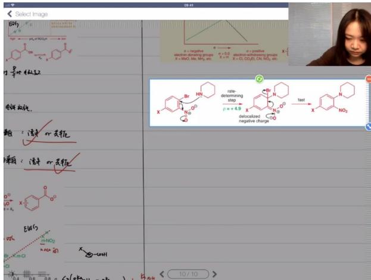

text_image

Select Image
Bolyl
x = -1.0
O2
n = negative
electron-determining groups
x = NaCl, Hg, NH3, etc.
n = 0.5
x = 0.7
n = positive
electron-determining groups
x = Cl, CO, Et, CH, NO3, etc.
x
Br
HN
N6
rate-
determining
step
fast
decelatized
negative charge
X
NO3
X
Br
N6
X
NO3
X
NO3
X
NO3
X
NO3
X
NO3
X
NO3
X
NO3
X
NO3
X
NO3
X
NO3
X
NO3
X
NO3
X
NO3
X
NO3
X
NO3
X
NO3
X
NO3
X
NO3
X
NO3
X
NO3
X
NO2
H2SO4
K=O-HN1
EBS
m-NO2
n-NO2

# 酯水解反应:

● $\rho=+4.9$ （显著正值）  
● 证实过渡态负电荷离域

# ■ 亲核取代反应:

- 可通过 $\rho$ 值判断机理  
● 区分SN1/SN2路径

# ○ 注意事项

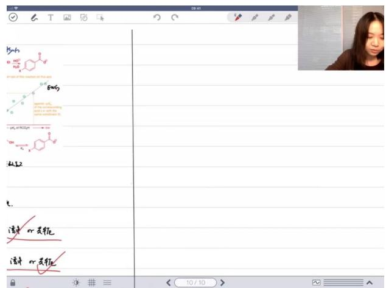

text_image

BnH
100%
80%
g=100%
g=200%
d=22
E.
酒精 mr 克/瓶
酒精 mr 克/瓶

# 取代基选择:

● 优先使用对位取代  
- 间位数据也可接受

# 数据解释:

- 需考虑实验误差   
● 避免过度解读弱相关性

# ■ 理论边界:

- 不适用于邻位取代  
- 极端ρ值需谨慎分析

● 例题:芳环亲和取代 02:40:37

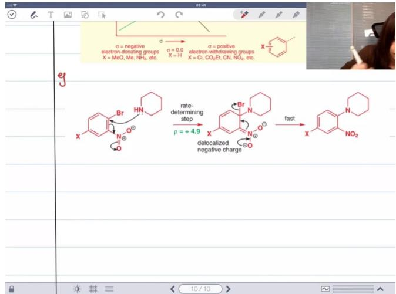

chemical

Chemical reaction scheme showing delocalization and rate-determining steps of a brominated aromatic compound

○ 反应类型: 芳环的亲核取代反应 $(S_{N}Ar)$

○ 反应条件:

■ 离去基团: 需要好的离去基团（如Br）  
■ 亲核试剂: 需要强的亲核试剂  
取代基位置: 离去基团的邻位或对位需要有强的吸电子基团（如 $NO_{2}$ ）

○ Hammett关系分析:

■ ρ值: +4.9 (>4)   
■ 结论1: 吸电子基团（EWG）使反应速率显著上升  
■ 结论2: 过渡态相比于原料电荷密度上升，且负电荷能被吸电子基团有效稳定  
■ 机理推断: 速率决定步骤（RDS）是亲核试剂的进攻而非离去基团的离去

○ 电荷变化分析:

■ $\rho > 0$ : 过渡态电荷密度高于原料  
■ $\rho<0$ : 过渡态电荷密度低于原料

■ 应用：若RDS是离去基团离去，应测得 $\rho<0$ （实际测得 $\rho=+4.9$ ，支持亲核进攻为RDS）

● 例题:消除反应机理判断 02:47:09

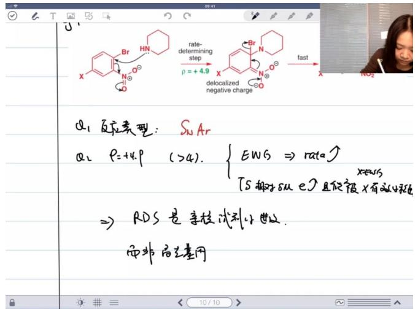

text_image

Q1 反应类型: Sulfur Ar
Q2 P=+4.P (>4). { EWG ⇒ rate}
TS 都对 sM eJ 且能被 x 有放电荷
⇒ RDS 是亲枝试剂出世父.
而非后立基因

○ 反应特点:

■ $\rho$ 值: +9.0（异常大的正值）  
■ 机理: 先加成后消除（非SP²上的直接亲核取代）

○ 机理分析:

■ 过渡态特征: 电荷密度显著高于原料  
■ 稳定化作用: 过渡态中的负电荷与芳环共轭，能被取代基有效稳定

○ Hammett关系应用:

■ 预测 $\rho$ 值符号: 根据反应类型预测 $\rho>0$ 或 $\rho<0$

■ 实验验证: 测得 $\rho=-1$ ，说明:  
● 过渡态电荷密度低于原料  
● 负电荷分散在氧和碘上，与芳环共轭较弱  
● 支持第一步（亲核进攻）为速率决定步骤

○ 典型考点:

■ 判断反应机理步骤（亲核进攻vs离去基团离去）  
■ 通过 $\rho$ 值符号推断过渡态电荷变化  
■ 吸电子基团对反应速率的影响（ρ>0加速，ρ<0减速）

● 例题:AR取代基影响分析 02:57:30

○ 取代基电子效应与反应机理关系 02:59:31

■ 电子效应分类：

- 给电子基团(EDG): 使芳环电子密度增加, $\rho$ 值显著小于零 ( $\rho < -1$ , 如 -4.4)  
● 吸电子基团(EWG): 使芳环电子密度降低, $\rho$ 值大于1

取代基效应显著性差异：

● EDG的取代基效应更显著（绝对值4.4 > 2.5）  
● 原因：不同取代基导致反应机理改变

两种竞争反应机理

■ 机理一（亲核进攻）

\- 过程:

- 亲核试剂(Nu $^{-}$ )进攻芳环(AR)   
○ 形成AR-Nu中间体  
○ 离去基团被取代

● 特征：

\- 负电荷位于氧原子

○ 氧与芳环间隔饱和碳，共轭效应弱   
○ 导致 $\rho$ 值>1但<4

# ■ 机理二（电子转移）

# ● 过程:

- 芳环先发生电子转移  
◦ 亲核试剂 $(Nu^{-})$ 进攻

# ● 特征：

- 正电荷与芳环直接共轭  
- 过渡态电子密度显著下降  
○ 导致 $\rho$ 值显著<-4

# ○ 机理判断依据

# 斜率符号意义：

● $\rho < 0$ ：过渡态缺电子（对应机理二）  
● $\rho > 0$ ：过渡态富电子（对应机理一）

# 实验现象解释：

● EDG存在时： $\rho = -4.4$ （机理二）  
● EWG存在时： $\rho > 1$ （机理一）

# ■ 共轭效应影响：

● 直接共轭（机理二）使电子效应放大  
- 间隔饱和碳（机理一）使电子效应减弱

# ○ 核心结论

# 取代基改变反应机理：

● 同一反应在不同取代基条件下可能经历不同机理

# ■ 分析要点：

● 通过 $\rho$ 值符号和大小判断主导机理  
● 电荷离域程度决定电子效应放大倍数

# ■ 教学价值：

● 展示取代基对反应机理的调控作用  
● 通过Hammett关系定量分析电子效应

# ● 例题:机理判断分析 03:05:07

# - 反应机理分析

# ■ 三步反应过程：

● 生成正电荷（质子化步骤）  
● 芳环的亲电取代  
● 脱去质子（去质子化步骤）

# 取代基影响：反应中芳环(AR)上存在取代基，需区分给电子基(electron donating group)和吸电子基(electron withdrawing group)

# ■ 决速步判断：

● 若决速步为第二步：过渡态比底物更缺电子， $\rho < 0$   
● 若决速步为第三步：电子密度升高过程， $\rho > 0$

# ○ 电子效应分析

# ■ 第三步特性：从带正电荷的起始物质失去质子，属于电子密度升高过程

# ■ 过渡态电子特性：

- $\rho > 0$ ：过渡态电子密度高于底物  
- $\rho < 0$ ：过渡态比底物更缺电子（如中性物质变成正电荷）

# ■ 记忆要点：吸电子基不利于电子密度降低的过程，对应 $\rho$ 为负值

# ● 例题:同位素效应判断分析 03:10:27

# - 消除反应分析

■ 反应类型：E2消除反应（1,2-消除）  
取代基影响判断：

● X取代基：吸电子基使氧负碱性减弱，不利于反应， $\rho_{1}<0$   
● Y取代基：吸电子基使被拔氢酸性增强， $0 < \rho_{2} < 4$   
● Z取代基：吸电子基有利于离去基团离去， $\rho_{3}>0$

○ 判断技巧总结

■ 快速判断方法：

● 吸电子基有利反应 →ρ > 0  
● 吸电子基不利反应 →ρ < 0

典型数值范围：

● 直接影响氧负的情况： $\rho < -4$   
● 影响氢酸性情况： $0 < \rho < 4$

■ 应用要点：只需掌握 $\rho$ 符号判断即可解题，无需精确数值

# 7. 同位素效应 03:12:51

1）基本概念

- 定义: 动力学同位素效应(Kinetic Isotope Effect, KIE)是物理有机化学中定量研究反应机理的核心概念，通过比较氢( $^{1}H$ )和氘( $^{2}D$ )取代后的反应速率差异来揭示反应机理。  
● 定量表达: KIE定义为 $k_{H}/k_{D}$ ，其中 $k_{H}$ 是氢取代底物的速率常数， $k_{D}$ 是氘取代底物的速率常数。  
● 判断标准:

- 正常效应: 当KIE > 1时存在同位素效应  
- 反效应: 当0 < KIE < 1时称为反同位素效应(现阶段暂不要求掌握)  
○ 无效应: KIE = 1 表示无同位素效应

2）机理解析 03:15:35

● 核心原理: KIE > 1表明氘取代位点参与了决速步(rate-determining step)的化学键断裂/形成过程   
● 应用示例: 以苯环硝化反应为例:

\- 反应机理分为两步:

■ $NO_{2}^{+}$ 进攻苯环形成σ络合物  
■ 脱质子生成硝基苯

若测得KIE = 1(无效应)，说明决速步是第一步  
若KIE > 1，则决速步是第二步(涉及C-H/D键断裂)

# 3）例题:同位素效应判断

● 题目解析

○ 关键信息: 使用全氘代苯 $(C_{6}D_{6})$ 测得KIE=1  
○ 分析思路:

■ KIE=1说明氘取代不影响反应速率  
■ 排除第二步为决速步的可能性

○ 结论: 该反应的决速步是 $NO_{2}^{+}$ 进攻的第一步

\- 记忆点: "KIE>1看氘位，决速步中必参与"

# 二、知识小结

<table><tr><td>知识点</td><td>核心内容</td><td>考试重点/易混淆点</td><td>难度系数</td></tr><tr><td>反应机理判断</td><td>通过实验证据(产物结构、中间体、动力学研究)判断反应机理</td><td>区分合理机理与实验验证机理</td><td></td></tr><tr><td>康尼查罗反应</td><td>苯甲醛在碱性条件下的歧化反应,涉及氢负迁移</td><td>刀带实验验证产物结构(苯甲酸与苯甲醇)</td><td></td></tr><tr><td>同位素效应</td><td>动力学同位素效应(KIE)判断决速步(如苯环硝化反应)</td><td>KIE=1时决速步为 $NO_{2}^{+}$ 进攻,KIE&gt;1时决速步为脱质子</td><td></td></tr><tr><td>Hammett关系</td><td>定量分析取代基电子效应对反应速率的影响( $\sigma$ 值、 $\rho$ 值)</td><td> $\rho$ &gt;0:过渡态富电子; $\rho$ &lt;0:过渡态缺电子</td><td></td></tr><tr><td>自由基反应</td><td>光照/引发剂引发的链式反应(如AIBN、过氧化物)</td><td>自由基捕获剂(TEMPO、DPPH)验证机理</td><td></td></tr><tr><td>核磁解析</td><td>通过 $^{1}H/^{13}C$  NMR化学位移、偶合常数推断结构(如八碳炔醇案例)</td><td>区分端炔与双取代炔的红外特征峰</td><td></td></tr><tr><td>物理有机化学</td><td>过渡态电荷分布与取代基效应的定量关系(如酯水解 $\rho$ =4.9)</td><td>实验设计(交叉实验、同位素标记)验证机理</td><td></td></tr><tr><td>竞赛备考策略</td><td>基础有机(Art)为核心,物理有机(如Hammett关系)选择性学习</td><td>波普解析、同位素效应可能出现在高难度题中</td><td></td></tr></table>