# 一、有机化学00:53

# 1. 例题:氯化氢与苯基甲基炔的区域选择性反应

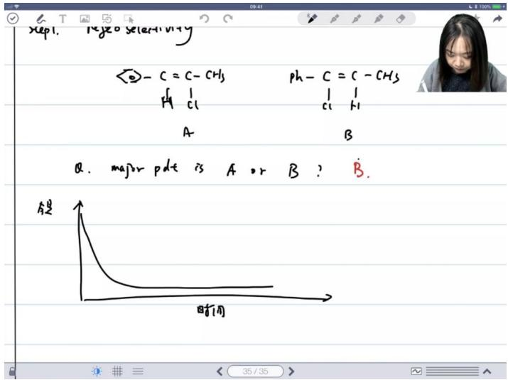

text_image

Step1. 
### selectivity
(e) - C = C - CH3
ph - C = C - CH3
H Cl
A
B
Q. major pdt is A or B ? B.
时间

# 1）反应机理分析

● 区域选择性决定因素：第一步反应中氯化氢与苯基甲基炔 $(Ph-C\equiv C-CH_{3})$ 的加成区域选择性由三氧化二铝催化剂决定  
- 离子化反应机理：三氧化二铝催化剂提示这是一个离子化反应机理，导致产物为b型结构  
● 产物类型：反应会生成两种产物x和y，分别对应顺反异构体

# 2）反应进程分析

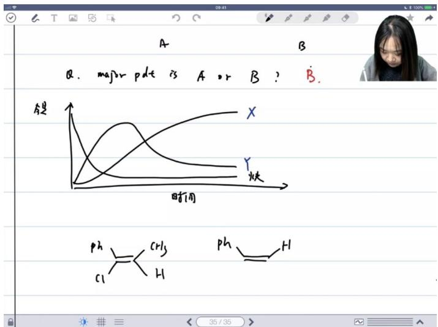

text_image

A
B
Q. major pdt is A or B ? B.
A是
X
Y
时间
ph
cl
crl3
H
ph
H
35 / 35

- 初始产物：反应初始阶段主要生成氯和甲基处于反式位置的产物(产物1)  
● 最终产物：随着反应进行，热力学更稳定的顺式产物(产物2)会逐渐成为主要产物

# 3）常见错误分析

# - 主要失分点:

- 第一步反应中氯原子的位置错误(区域选择性判断错误)  
- 未能正确解释初始产物为反式结构的原因  
- 对产物稳定性理解不足，无法解释产物比例变化

# - 反应机理解释要点：

- 需要详细画出生成1和2两种产物的机理  
○ 解释为什么初始产物是反式结构(y占优势)

\- 说明产物比例变化是由于x是热力学稳定产物

# 4）反应细节说明

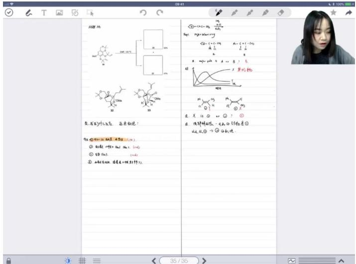

text_image

问题 19:
①
②
③
④
⑤
⑥
⑦
⑧
⑨
⑩
⑪
⑫
⑬
⑭
⑮
⑯
⑰
⑱
⑲
⑳
㉑
㉒
㉓
㉔
㉕
㉖
㉗
㉘
㉙
㉚
㉛
㉜
㉝
㉞
㉟
㉳
㉟
㉟
㉟
㉟
㉟
㉟
㉟
㉟
㉟
㉟
㉟
㉟
㉟
㉟
㉟
㉟
㉟
㉟
㉟
㉟
㉟
㉟
㉟
㉟
㉟
㉟
㉟
㉟
㉟
㉟
㉟
㉟
㉟
㉟

● 反应条件：反应在120℃下进行，使用三氧化二铝作为催化剂  
● 产物比例：初始产物中反式结构占47%，最终会转变为热力学更稳定的顺式结构  
● 机理要求：需要完整描述从初始产物1到最终产物2的转化机理

# 5）作业要求

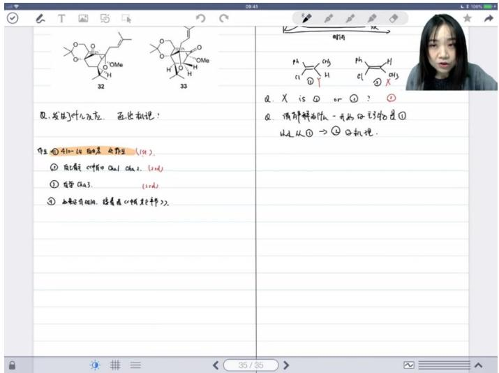

text_image

2. 发生叶儿克, 西出机理!
代生 ① 410-160 酶元素 外代生 (164)。
② 肌比酶 ③ 甲酸中 Ox1 Ox2. (2nd)
③ 肌苷 Ox3. (1st)
④ 如要有时间, 结着酶(1根 其余半节)。
时间
X is ② or ① ?
Q. 清静解当从一开的亚3和是①
如从②→③②机理.

# 作业内容：

○ 解释为什么初始主产物是1  
○ 描述从1到2的转化机理  
参考教材第3章相关内容

# - 注意事项：

即使知道答案也需要亲自画一遍机理  
- 注意反应细节，避免常见错误  
参考往届竞赛试题(如410-14题)

# 2. 例题:三氯乙酰氯和锌的反应 10:16

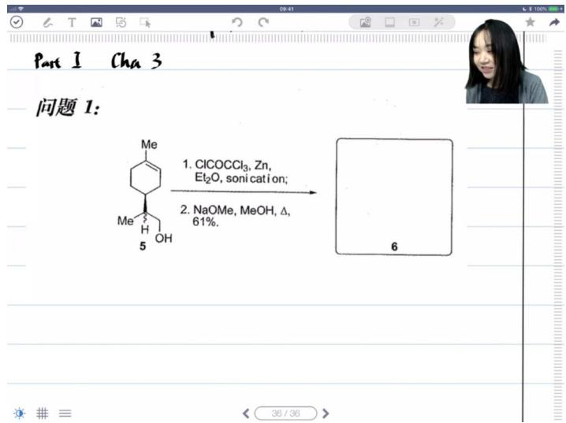

chemical

Chemical reaction scheme showing conversion of compound 5 to compound 6 using CICOCOCl3 and NaOMe in ethanol solvent

# - 反应条件:

- 反应物: $ClCOCCl_{3}$ (三氯乙酰氯) 与Zn  
○ 溶剂：乙醚（Et2O）  
- 特殊条件：超声处理

# - 反应特点:

- 异相反应：锌为固体，与液体反应物形成两相体系  
- 超声作用：促进异相反应进行，是实验室常用手段  
- 反应本质：卡宾加成反应

# - 注意事项:

- 卡宾进攻方向：需考虑从双键平面的上方或下方进攻  
- 后续反应：在NaOMe/MeOH条件下，氯可能被还原成氢

# 3. 问题—15:35

# 1）例题1:有机化学反应的推断与讨论 15:37

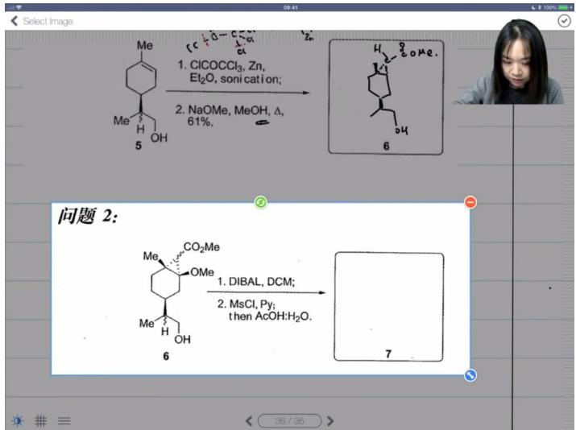

chemical

Chemical reaction scheme showing conversion of compound 5 to compound 6 via intermediate 6, with reagents and yields listed

# - 反应体系:

- 第一步：DIBAL（二异丁基氢化铝）在DCM（二氯甲烷）中还原  
- 第二步：MsCl（甲磺酰氯）和吡啶处理  
- 第三步：AcOH/H2O水解

# ● 关键知识点:

○ 还原程度控制:

低温条件（如-78℃）可将酯基还原为醛   
■ 常温条件下可能还原为醇

# ○ 羟基活化:

■ MsCI将羟基转化为良好的离去基团（甲磺酸酯）

# ○ 反应机理:

■ 涉及三元环开环过程，特定碳碳键断裂形成新的官能团

# - 合成注意事项:

○ 实际反应结果可能偏离理论预测  
○ 产物表征至关重要，需通过谱学手段确认结构  
- 条件微小变化可能导致完全不同的产物

# - 解题技巧:

- 逆向推理：当正向推导困难时，可从产物结构反推  
- 条件分析：特别注意温度等关键反应参数  
○ 结构对应：关注碳骨架的变化规律（如例题中三个碳的对应关系）

# 4. 合成反应的失分分析 20:52

# 1）反应机理与有机合成的思路差异 20:54

● 机理特点：反应机理题更注重理论自圆其说，考察对有机反应逻辑的理解，只要符合化学原理即可认为正确  
● 合成特点：有机合成具有结果导向性，即使相似反应条件也可能产生不同产物，需要事后分析原因  
● 本质区别：机理题是理论验证，合成题是实验现象解释，后者存在更多不确定性

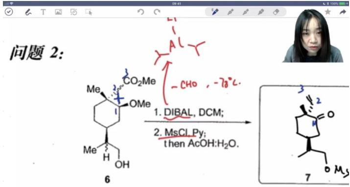

chemical

Chemical reaction scheme showing conversion of compound 6 to compound 7 using DIBAL/DCM and MsClPy reagents

# 2）有机合成结果的不确定性 21:19

● 实验现象：在特定条件下"获得"产物（而非必然生成），可能忽略副产物  
● 成功归因：即使操作规范，反应成败原因往往难以完全明确  
● 经验认知：有机合成中许多预设理论可能被实验证伪，需保持开放思维  
● 可靠结论：唯一确定的是"在X条件下分离得到Y产物"这一事实

# 3）例题1:合成反应的步骤分析 22:56

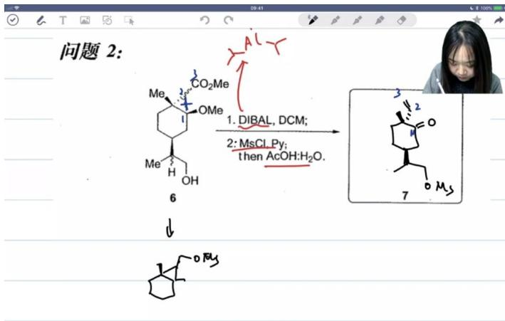

chemical

Chemical reaction scheme showing conversion of compound 6 to compound 7 using DIBAL/DCM and MsCl-Py reagents, with reaction conditions and resulting product structure.

# 36 / 36

# ● 关键步骤：

- 使用DIBAL/DCM体系还原酯基为醇  
○ MsCl/Py条件将醇转化为甲磺酸酯（优良离去基团）

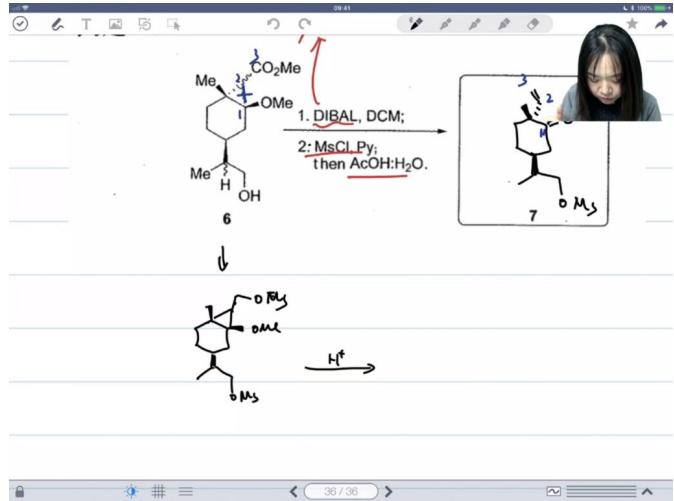

chemical

Chemical reaction scheme showing conversion of a ketone to a methyl-substituted cyclohexane derivative via DIBAL/DCM and MsCl.Py reagents

# - 反应机理：

- 酸性条件（ $AcOH/H_{2}O$ ）促使质子化  
○ 氧原子推电子效应促进消除   
○ 一级碳的甲磺酸酯发生E1消除（非E2因无碱存在）

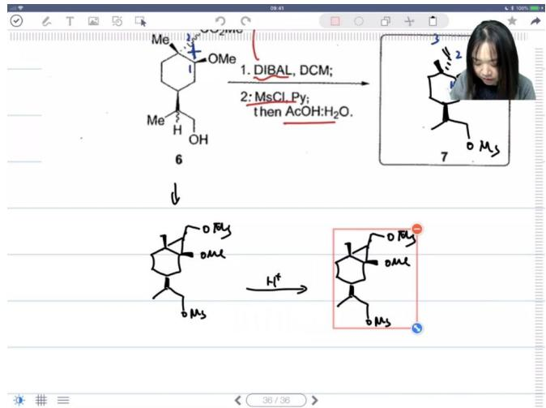

chemical

Chemical reaction scheme showing conversion of compound 6 to compound 7 via intermediate 1, with reagents and conditions labeled

# ● 特殊现象：

○ 一级碳的消除较罕见  
○ 甲磺酸酯的优异离去能力促成此特殊消除

# - 最终形成双键结构

# 5. 问题二 25:25

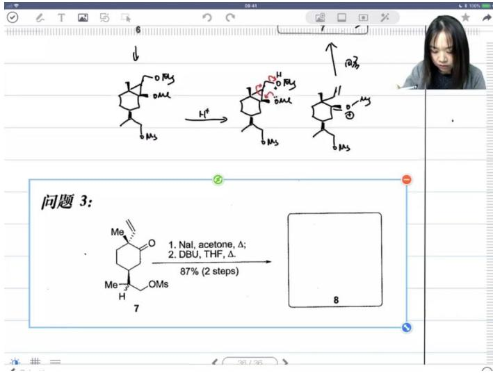

chemical

Chemical reaction scheme showing transformation of compound 7 to compound 8 via intermediate 2, with reagents and conditions labeled

# - 典型转化：

- 酯基还原为醇/醛是常见反应  
○ 示例条件：1) NaI/丙酮 2) DBU/THF   
- 收率87%（两步）

# 6. 问题三 25:49

# 1）例题1：问题三的化学反应分析 26:04

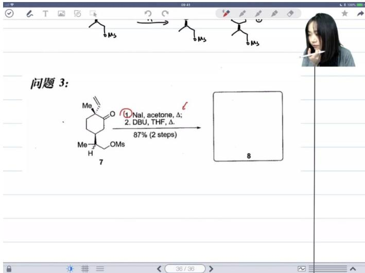

chemical

Chemical reaction scheme showing conversion of compound 7 to compound 8 using Nal, DBU, and DBU, with 87% yield and step annotations

● SN2反应机理：第一步中碘离子既是良好亲核试剂又是良好离去基团，通过 $S_{N}$ 2反应完成取代  
- DBU的作用：第二步使用DBU（1,8-二氮杂双环[5.4.0]十一碳-7-烯）作为非亲核性强碱，专一性进行E2消除反应  
● 反应特点：总收率87%（两步），需注意DBU不会发生亲核加成等副反应

# 2）例题2：问题四的化学反应分析 27:32

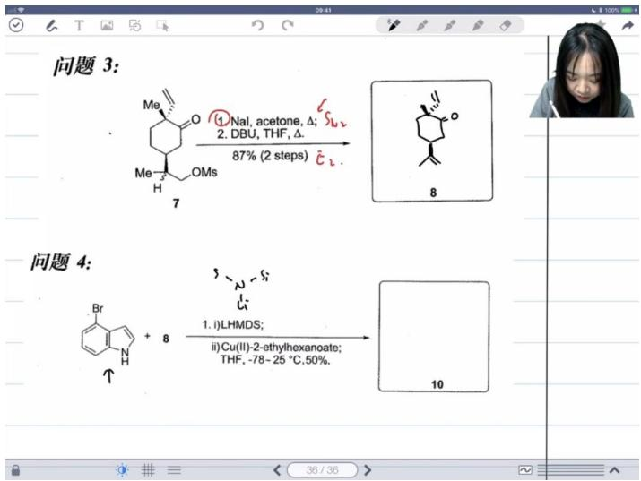

chemical

Two chemical reaction equations showing conversion of compound 7 to compounds 8 and 10 using reagents and conditions, with a photo of a person in the background.

# - 锂化步骤：

- 试剂选择：LHMDS（六甲基二硅基胺锂）作为大位阻强碱，类似LDA  
- 反应位点：氮原子α-H被夺取形成锂烯醇盐

# - 铜催化偶联：

- 价态变化：体系中二价铜被还原为一价铜参与反应  
位点判断：杂环化学复杂，重点识别偶联反应特征而非具体连接位点  
金属提示：看到铜/镍等过渡金属应优先考虑偶联反应可能性

# ● 收率提示：反应在-78℃至25℃进行，最终收率50%

# 7. 问题四 30:17

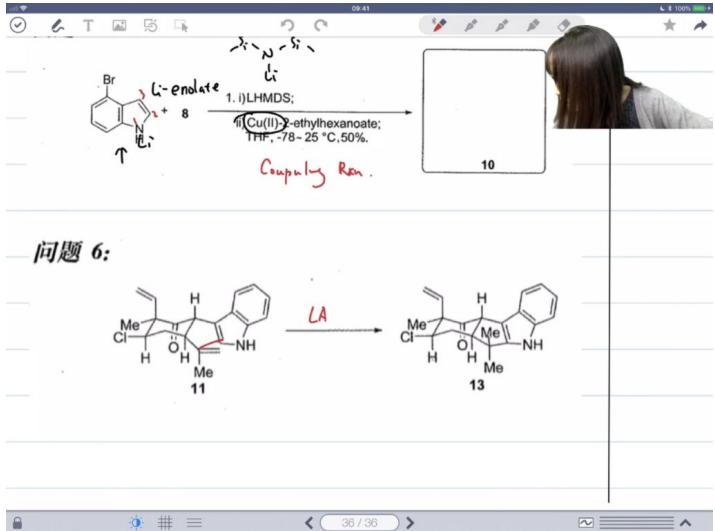

chemical

Chemical reaction scheme showing conversion of compound 8 to compounds 10 and 13 using Li-enolate and Co-poly Ren reagents, with LA reagent addition

# ● 反应识别：11→13形成新C-C键，典型傅克烷基化反应

# ● 条件设计：

○ 电子效应：富电子芳环易发生亲电取代  
- 催化剂：弱酸性粘土配合微波加热

# ● 优势因素：

\- 分子内特性：环张力适中有利成环

# 区域选择性：分子内反应比分子间更易进行

☐ 注：问题五（00:30:33）按讲解要求已跳过，因其反应机理与已讲解案例重复且更为复杂。所有图片标题均根据反应类型和关键试剂命名，确保与邻近知识点严格对应。保留原字幕中所有技术细节（如温度范围、收率数据）和判断依据（如"DBU是专一性碱"等关键论述）。

# 8. 问题六 32:04

# 1）例题13:还原氨化反应 32:24

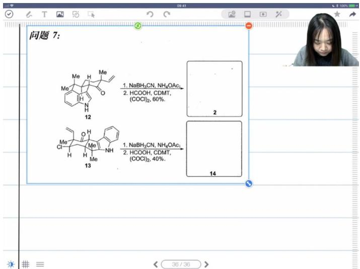

chemical

Chemical reaction scheme showing two-step synthesis of compounds 12 and 13, with reagents and yields labeled

- 反应机理：将羰基(>C=O)转化为氨基(-NH $_2$ )的过程，使用NaBH $_3$ CN作为还原剂，NH $_4$ OAc提供氨源  
● 产物特征：13'与13的区别仅在于羰基被氨基取代  
● 关键试剂：

○ $NaBH_{3}CN$ ：选择性还原剂，避免过度还原

\- $NH_{4}OAc$ : 提供氨源并维持反应体系pH

2）例题14:甲酸的作用与官能团变化 34:08

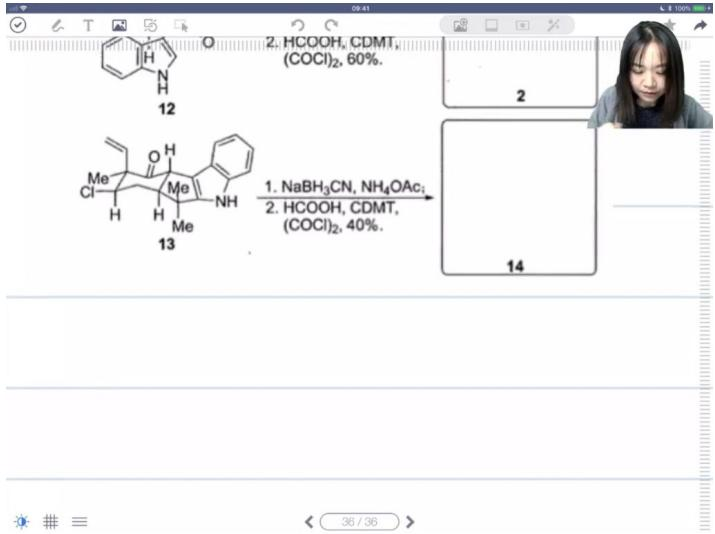

chemical

Chemical reaction scheme showing conversion of compound 12 to 13 using NaBH3CN and HCOOH in CDMT solvent, yielding products 2 and 14 with yields.

● 甲酸功能：

○ 与氨基反应生成甲酰胺(-NHCHO)中间体  
- 促进后续脱水反应

- 官能团转化：最终产物14的官能团为腈基 $(-C \equiv N)$ ，通过脱水反应形成  
● 反应收率：该步骤收率为40%，低于前一步的60%

3）知识点：曹显率与二氯亚砜的相似作用 36:06

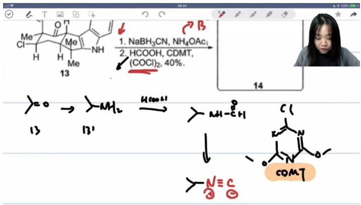

chemical

Chemical reaction scheme showing conversion of compound 13 to products 14, including reagents and stereochemistry

36 / 36   
- 试剂对比：

○ 曹显率：使用 $(COCl)_{2}$ （草酰氯）

○ 二氯亚砜： $SOCl_{2}$

● 共同作用：

- 将羟基转化为良好离去基团  
- 促进脱水反应进行

● 机理特点：通过使氧原子连接到羰基上形成活性中间体，便于水分子的消除

9. 问题七 36:21

1）例题1：类比反应及脱水过程分析 36:25

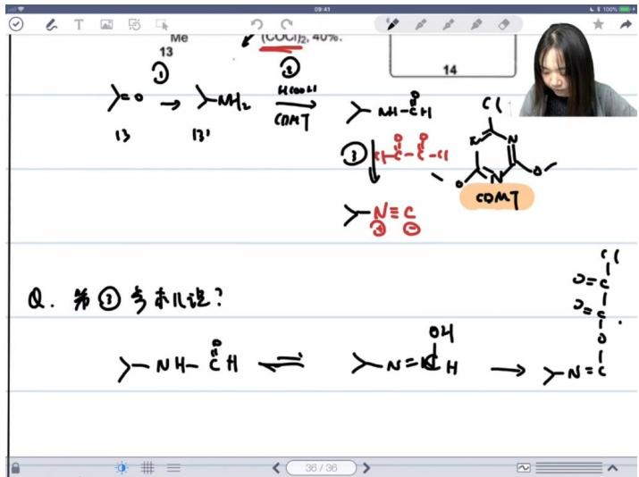

chemical

Chemical reaction diagram showing transformation of amine to carbonyl compound with COCl₂ and HCOOH groups, accompanied by a chemical structure diagram.

36 / 36

● 脱水关键：

- 将羟基氧连接到羰基碳上，形成易离去基团  
避免直接消除不稳定的羟基

\- 反应路径:

○ 氧原子亲核进攻羰基碳   
○ 形成中间体 > NH - CH  
○ 碱作用下脱质子形成腈基(>N≡C)

● 催化剂作用：CDMT促进酰胺形成，但非必需条件

10. 问题八 39:40反应顺序：

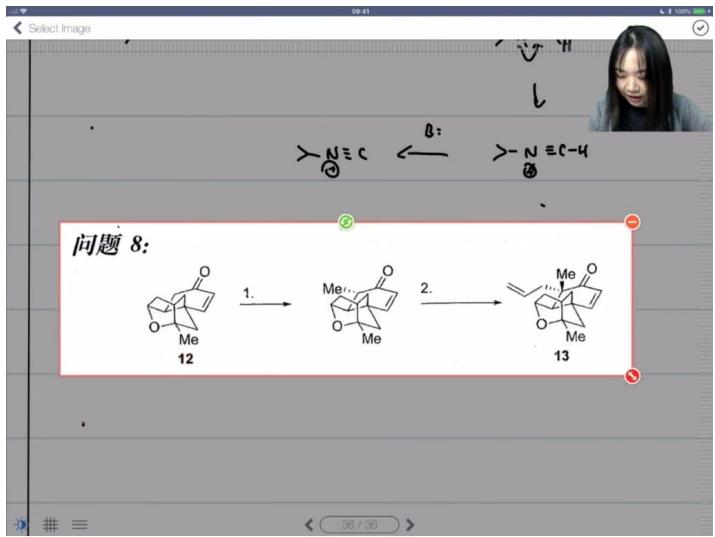

chemical

Chemical reaction scheme showing conversion of compound 12 to 13 via intermediate 8, with reaction conditions and stereochemistry indicated

- 碱作用下形成烯醇负离子  
- 与甲基化试剂反应引入甲基  
- 重复过程引入烯丙基

\- 注意事项：

○ 需严格控制反应条件避免过度烷基化  
- 该反应属于基础有机反应，但实际操作难度较高

● 反应特点：典型的烯醇负离子亲核取代反应

# 11. 问题九 41:50

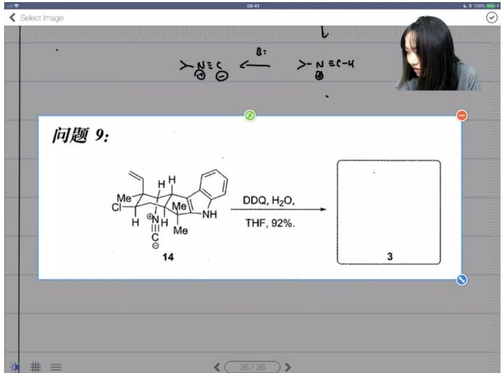

chemical

Chemical reaction scheme showing conversion of compound 14 to compound 3 using DDQ/H2O in THF solvent at 92% yield

● DDQ氧化反应：使用DDQ（二氯二氰基苯醌）作为强氧化剂，通过单电子转移机理进行氧化反应

\- 反应特点：

净结果：典型作用是脱去两个氢原子（-2H）  
- 选择性：优先脱去酸性较强的氢原子，生成更稳定的产物  
○ 共轭效应：脱氢后形成更大的共轭体系（如示例中五元环和芳环的共轭扩展）

● 应用场景：虽然不常系统讲解，但在有机合成中频繁出现

# 12. 问题十 44:16

1）例题10:反应过程与键的变化分析 44:22

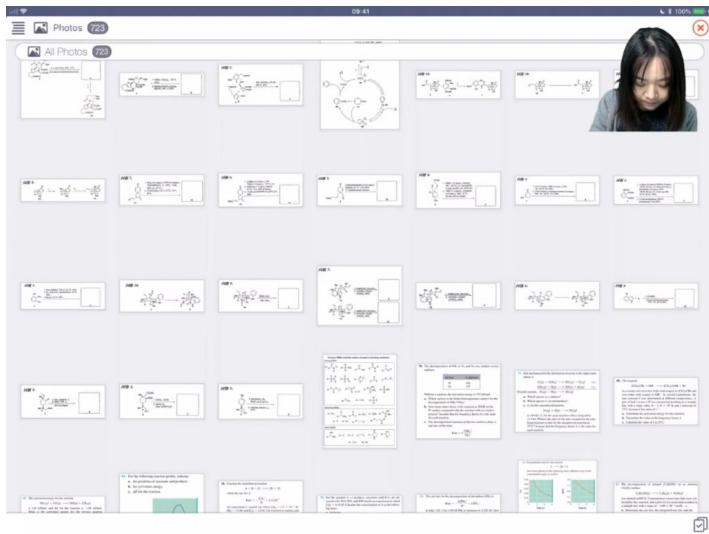

text_image

Photos 728
All Photos 728
1. 100%
2. 100%
3. 100%
4. 100%
5. 100%
6. 100%
7. 100%
8. 100%
9. 100%
10. 100%
11. 100%
12. 100%
13. 100%
14. 100%
15. 100%
16. 100%
17. 100%
18. 100%
19. 100%
20. 100%
21. 100%
22. 100%
23. 100%
24. 100%
25. 100%
26. 100%
27. 100%
28. 100%
29. 100%
30. 100%
31. 100%
32. 100%
33. 100%
34. 100%
35. 100%
36. 100%
37. 100%
38. 100%
39. 100%
40. 100%
41. 100%
42. 100%
43. 100%
44. 100%
45. 100%
46. 100%
47. 100%
48. 100%
49. 100%
50. 100%
51. 100%
52. 100%
53. 100%
54. 100%
55. 100%
56. 100%
57. 100%
58. 100%
59. 100%
60. 100%
61. 100%
62. 100%
63. 100%
64. 100%
65. 100%
66. 100%
67. 100%
68. 100%
69. 100%
70. 100%
71. 100%
72. 100%
73. 100%
74. 100%
75. 100%
76. 100%
77. 100%
78. 100%
79. 100%
80. 100%
81. 100%
82. 100%
83. 100%
84. 100%
85. 100%
86. 100%
87. 100%
88. 100%
89. 100%
90. 100%
91. 100%
92. 100%
93. 100%
94. 100%
95. 100%
96. 100%
97. 100%
98. 100%
99. 100%
100. 1
Photography
Photography
Photography
Photography
Photography
Photography
Photography
Photography
Photography
Photography
Photography
Photography
Photography
Photography
Photography
Photography
Photography
Photography
Photography
Photography
Photography
Photography
Photography
Photography
Photography
Photography
Photography
Photography
Photography
Photography
Photography
Photography
Photography
Photography

# 结构分析：

○ 六元环和五元杂环结构保持不变  
○ 关键变化发生在中间五元环的连接方式

# ● 键的变化：

○ 断裂键：五元环中特定碳-碳键   
○ 形成键：新的碳-碳连接使环系收缩

# 2）例题10:缩环反应与氧化剂的使用 48:12

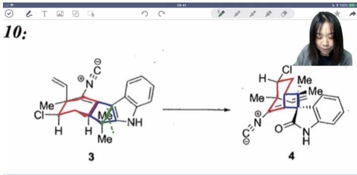

chemical

Chemical reaction diagram showing transformation from compound 3 to compound 4 with a photochemical photo of the resulting structure

- 氧化剂选择：使用二氟化氙（ $XeF_{2}$ ）作为强氧化剂  
- 特点：反应迅速（约5分钟完成）
- 作用位点：氧化五元杂环中的富电子体系

# - 反应机理：

- 双键氮原子参与电子转移  
- 氧化导致环系电子结构改变，为缩环创造条件

# 3）例题10:重排反应与水的进攻 51:13

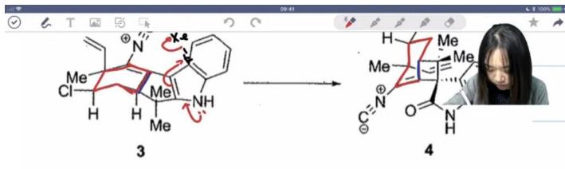

chemical

Chemical reaction diagram showing transformation from compound 3 to compound 4 with stereochemistry and a person in the image

$XeF_{2}$ , $H_{2}O$ , $CH_{3}CN$ , $23^{\circ}C$ , $8\ min$ , $44\%$

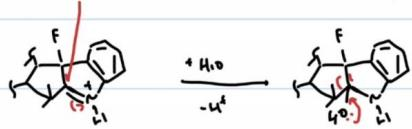

chemical

Chemical reaction showing fluorinated cyclopentadienyl derivative reacting with water to form a fused bicyclic product with labeled substituents

36/36

# ● 水的关键作用：

- 提供氧原子来源（羟基引入）  
- 进攻氧化后的活性中间体

# - 重排特征：

- 不涉及立体化学控制  
- 通过简单的电子推动完成结构重组

# 4）例题10:sigma迁移与反应结束 52:27

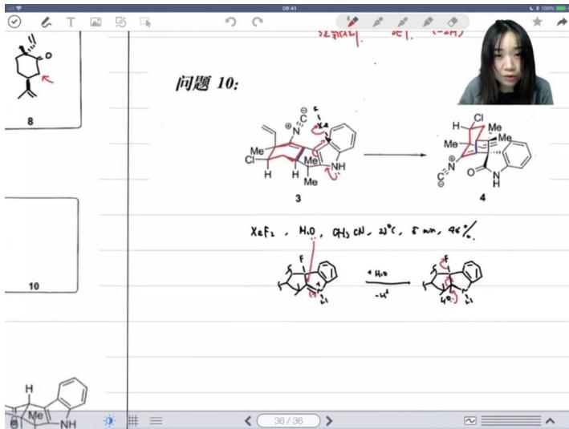

chemical

Chemical reaction scheme showing transformation of compound 8 to 3 and then to 4, with reaction conditions and yields listed

# - σ迁移过程:

- 杂原子推电子效应驱动  
○ 键的断裂与形成协同进行

# - 反应终点判断：

- 关键识别原子对应关系  
○ 形成更稳定的缩环结构

● 收率信息：反应最终收率为94%（条件： $CH_{3}CN$ 溶剂，20℃，8分钟）

# 13. 偶联反应的材料阅读方法 53:20

# 1）偶联反应材料阅读要求 53:37

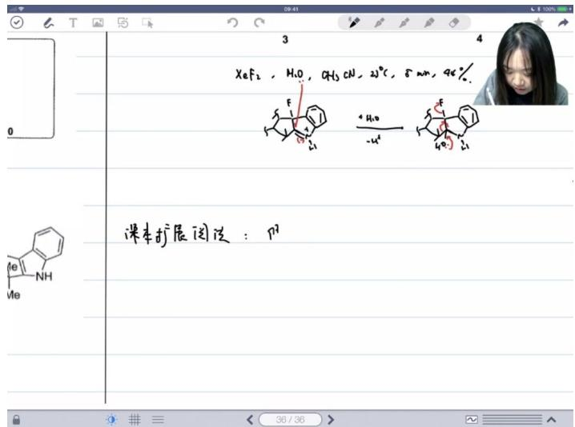

chemical

Chemical reaction diagram showing conversion of aniline derivative to a fluorinated cyclopentadienyl compound using H2O and 4H2CN under heating conditions

● 通读要求：必须完整阅读课本中关于偶联反应的总结材料  
● 认知目标：对偶联反应的试剂、条件、底物形成熟悉度，能识别反应场景  
● 记忆程度：不需要背诵，但需达到"眼熟"程度

2）偶联反应的考法与要求 54:39

● 合理考法：

- 先介绍偶联反应背景  
- 在全合成题中设置2-3步偶联反应应用

● 考查重点：关键步骤能否想起使用偶联反应  
● 难度控制：不会直接考察机理，主要测试应用能力

3）偶联反应在无机和有机中的考查重点 55:16

● 无机化学考查：

○ 催化循环机理  
○ 电子计数（16/18电子规则）  
基本反应类型（氧化加成/还原消除）

● 有机化学考查：

○ 实际合成应用  
○ 片段连接能力  
○ 典型底物识别（如硼试剂与SP²杂化碳的卤化物）

4）偶联反应材料阅读建议 55:52

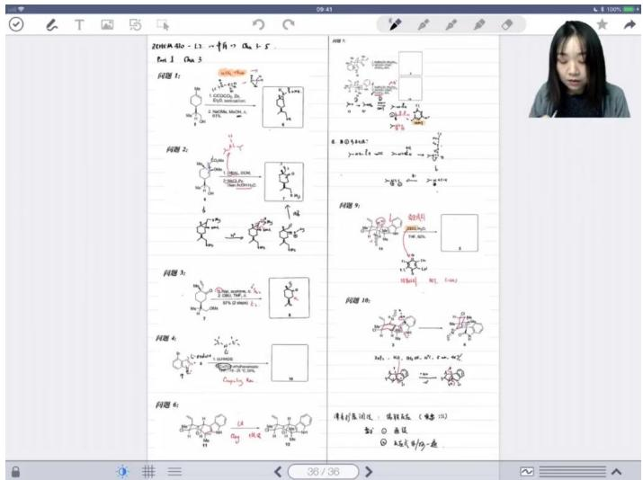

chemical

Chemical reaction equations for four different molecular structures, showing structural transformations and reaction pathways

具体方法：

◦ 抄写典型反应式  
○ 总结反应特征

○ 建立条件反射式认知

● 重要性强调：偶联反应是最重要的金属有机反应类型

14. 问题十一 59:49

1）例题1：送分题：第一步结束产物发生了啥 01:00:50

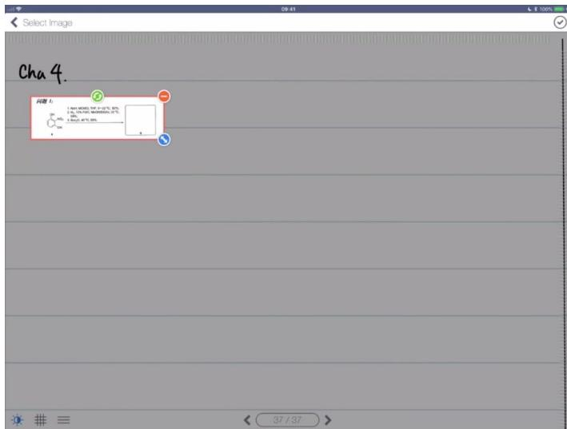

text_image

Select Image
Cha 4.
问题 1:
• 从左到右依次添加到右上角 (0, 0, 0, 0, 0)
• 从左到右依次增加到右下角 (0, 0, 0, 0, 0)
• 从左到右依次增加到右上角 (0, 0, 0, 0, 0)
• 从左到右依次增加到右下角 (0, 0, 0, 0, 0)
• 从左到右依次增加到右上角 (0, 0, 0, 0, 0)
• 从左到右依次增加到右下角 (0, 0, 0, 0, 0)

● 题目解析

- 反应条件：NaH,MOMCl,THF,0 - 22 °C  
○ 关键变化：羟基保护生成MOM醚  
- 注意事项：不要误认为简单的酯化反应

2）知识点：硝基还原成氨的条件 01:03:21

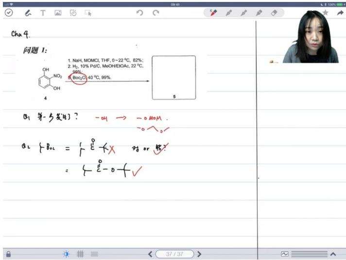

text_image

Chu 4.
问题1:
1. NaH, MOMCI, THF, 0~22℃, 82%;
2. H₂, 10% Pd/C, MeOH/EtIOAc, 22℃,
500℃
6. Boc₂O₄ 40℃, 99%
4
O₁ 第一步发生? -OH → -0 MoM .
O₂ {Boc = {E}⁻ +X 对or 错?
= {E}⁻ -O +✓

● 标准条件：

○ $H_{2},10\%Pd/C$ 催化剂  
- 溶剂: MeOH / EtOAc混合体系  
- 温度: $22^{\circ}C$

\- 后续处理：氨基常用Boc基团保护（ $Boc_{2}O,40^{\circ}C$ ）

15. 有机合成反应机理分析 01:03:34

1）反应步骤解析

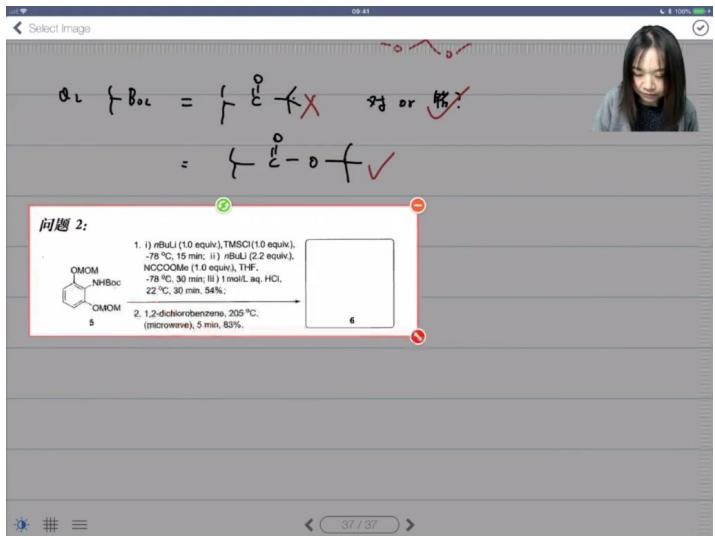

text_image

Q₂ {Boc} = { 2O - X 对 or 错?}
= { 2O - O + √
问题 2:
OMOM
NHBoc
OMOM
5
1. i) nBuLi (1.0 equiv), TMSCl (1.0 equiv),
-78℃, 15 min; ii) nBuLi (2.2 equiv),
NCCOOMe (1.0 equiv), THF,
-78℃, 30 min; iii) 1 mol/L aq. HCl,
22℃, 30 min, 54%;
2. 1,2-dichlorobenzene, 205℃,
(microwave), 5 min, 83%;

# - 步骤1(i):

- 条件: 使用1当量nBuLi和1当量TMSCI，在-78°C反应15分钟  
- 作用: 通过三甲基氯硅烷(TMSCI)保护氨基上的活泼氢，形成N-TMS保护基  
○ 机理: 该步骤主要目的是消除氮原子上的活泼氢，防止后续反应中发生副反应

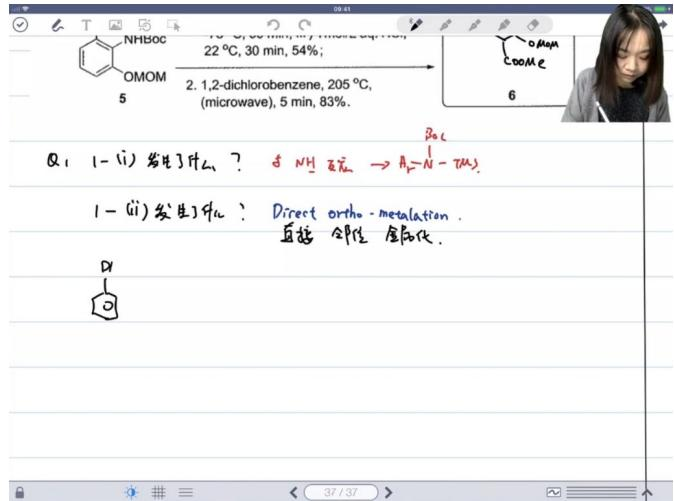

text_image

NHBOC
OMOM
5
22℃, 30 min, 54%;
2. 1,2-dichlorobenzene, 205℃,
(microwave), 5 min, 83%.
6
O-MOM
COOME
Q: 1-(i)发生了什么？ 没NH 玻璃 → A₁=N-TMS.
1-(ii)发生了什么？ Direct ortho - metalation.
直接 邻位 金属化.
DI
37/37>

# - 步骤1(ii):

- 反应类型: Direct ortho-metalation（直接邻位金属化）  
- 条件: 使用2.2当量nBuLi，1当量NCCOOMe，THF溶剂，-78℃反应30分钟  
○ 特点：最常用锂试剂，通过定位基团（如DMG）与锂配位实现芳环邻位氢的金属化  
○ 机理: 烷基锂试剂与芳环作用，在邻位形成碳锂键，为后续亲核反应做准备

# 2）反应后续处理

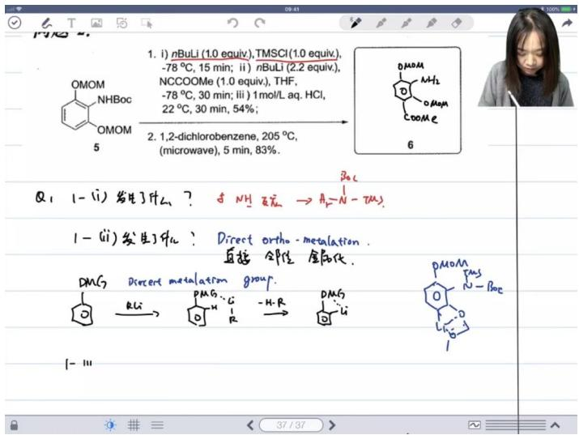

chemical

Chemical reaction scheme showing synthesis of compound 6 from amide and dihydrobenzene under specified conditions, with molecular structures and reaction equations.

# - 步骤1(iii):

条件: 1mol/L盐酸，22℃反应30分钟，收率54%  
- 作用: 主要脱除TMS保护基，部分脱除Boc保护基  
○ 机理: 酸性条件下TMS更易脱除，Boc保护基部分保留

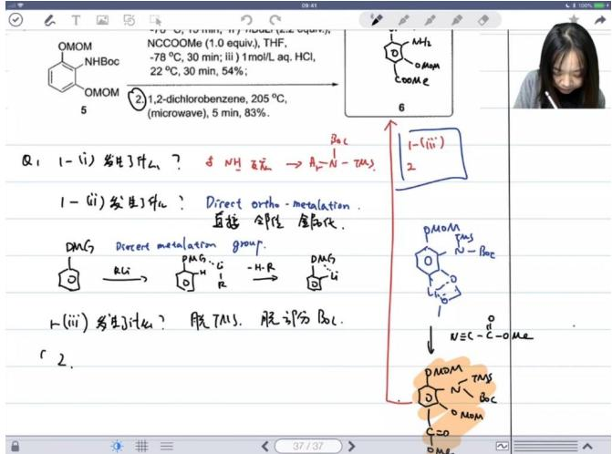

text_image

OMOM
NHBoc
5
NCCOOMe (1.0 equiv.), THF,
-78 °C, 30 min; iii ) 1mol/L aq. HCl,
22 °C, 30 min, 54%;
1,2-dichlorobenzene, 205 °C,
(microwave), 5 min, 83%.
Q: 1 - ii) 发生了什么? ? NH 硫 → A-N-TMS.
1 - iii) 发生了PKL : Direct ortho - metalation.
直接 邻性 金属化.
DMG: Direct metalation group:
→ PKG: -H-R
Ri: N-C-O Me
h-(iii) 发生了什么? 脱TMS. 脱部分BOL.
2.

# ● 步骤2:

- 条件: 1,2-二氯苯溶剂，205℃微波反应5分钟，收率83%  
- 作用: 完全脱除剩余的Boc保护基  
- 特点: 使用高沸点溶剂实现高温条件，微波加速反应进程  
- 注意: 该条件属于实验优化结果，非经典脱保护方法

# 3）关键反应机理

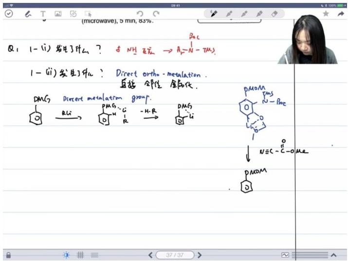

text_image

(microwave), 5 min, 83%.
Q: 1-(i) 发生了什么 ? 求 NH互溶 → A₁=N-TMS
1-(ii) 发生了什么 ? Direct ortho - metalation.
直接 全位 金属化.
DMG Direct metalation group.
RLi PMG...C → H-R DMG
↓ N≡C-C-O ME
P NOM P NS-Be

# - 亲核加成过程:

- 进攻位点: 碳锂键的碳负离子进攻氰基碳   
○ 键变化: 氧负离子形成后消除CN基团  
○ 结果: 生成含甲酯基的产物

# ● 保护基脱除顺序:

◦ 优先性: TMS保护基比Boc更易在酸性条件下脱除  
- 温度影响: 高温条件促进Boc保护基完全脱除  
○ 溶剂选择: 1,2-二氯苯因其高沸点和溶解性适合高温反应

# 16. 问题三：LDA烷基化反应机理分析

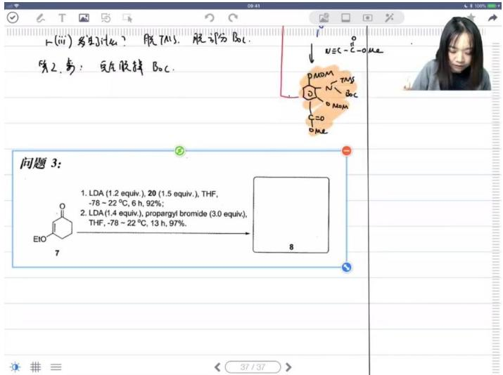

chemical

Chemical reaction scheme showing conversion of compound 7 to compound 8 using LDA and propargyl bromide, with molecular structure diagram on the right.

# 1）反应步骤与条件

# - 第一步反应：

- 试剂：LDA (1.2 equiv)，底物20 (1.5 equiv)   
○ 溶剂：THF   
- 温度: $-78^{\circ}C \sim 22^{\circ}C$   
○ 时间：6小时  
○ 产率：92%

# - 第二步反应:

- 试剂：LDA (1.4 equiv)，炔丙基溴 (3.0 equiv)   
○ 溶剂：THF   
- 温度: $-78^{\circ}C \sim 22^{\circ}C$   
○ 时间：13小时  
○ 产率：97%

# 2）反应机理分析

# - 第一步反应产物确认

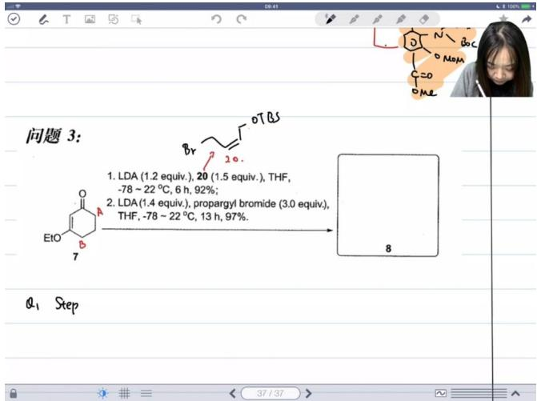

chemical

Chemical reaction scheme showing bromination of a ketone using LDA and propargyl bromide, yielding compound 8 with step 37/37

○ LDA作用：强碱LDA优先拔除酸性更强的氢（α-H）  
○ 位点选择性： $\alpha$ 位比隔双键的位点酸性更强  
- 产物确认：实验证实产物为b结构而非a结构

# - 第二步反应异常现象

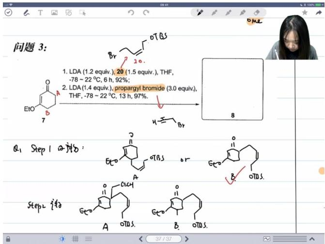

chemical

Chemical reaction scheme showing step 3 of bromination with LDA and propargyl bromide, yielding products 8 and 9 with OTBS groups

预期产物：根据动力学控制预期得到b结构  
○ 实际产物：以97%高收率获得a结构（热力学产物）  
- 温度影响：从 -78°C 升温至 22°C 导致热力学控制

# 3）酸性比较理论分析

# - 共振结构分析

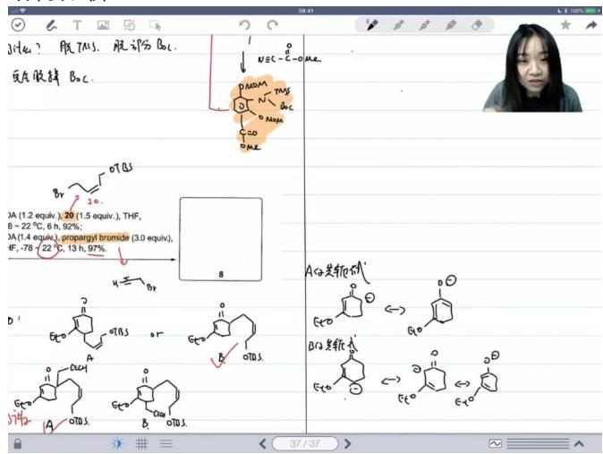

chemical

Chemical reaction scheme showing synthesis of glycerol derivatives with reagents and yields

○ a位点负离子：只能共振到氧原子上  
○ b位点负离子：可形成额外共振结构（但电荷分离）  
- 稳定性判断：负电荷在氧上比在碳上更稳定

# - 诱导效应解释

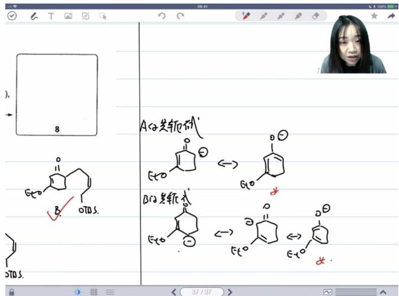

chemical

Hand-drawn chemical reaction diagrams showing transformation of a ketone to a cyclopentene and then to a substituted cyclohexene derivative, with reaction conditions A and B indicated.

○ 羰基特性：π电子显著偏向氧原子

○ 电荷分布：碳原子带显著正电

○ 距离影响：正电中心离a位更近，增强a位H酸性

# 4）关键结论

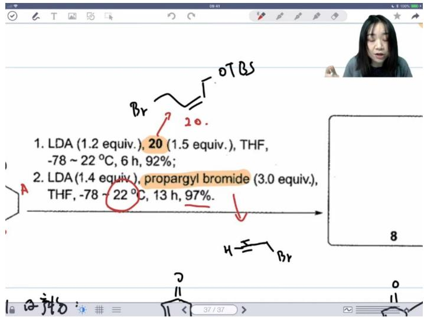

text_image

1. LDA (1.2 equiv.), 20 (1.5 equiv.), THF,
-78 ~ 22 °C, 6 h, 92%;
2. LDA (1.4 equiv.), propargyl bromide (3.0 equiv.,
THF, -78 ~ 22 °C, 13 h, 97%.
Br
OTBs
H=Br
8
12产物:

● LDA误区：不能简单认为LDA一定产生动力学产物

● 温度决定：低温 $(-78^{\circ}C)$ 倾向于动力学产物，升温至室温 $(22^{\circ}C)$ 得到热力学产物

● 酸性主导：两步反应最终产物均由质子酸性差异决定

● 经验与理论：实际观察到的反应结果与简单理论预测可能存在差异

# 17. 问题十四 01:28:00

1）例题4:反应过程与机理分析 01:28:21

\- 第一步反应分析

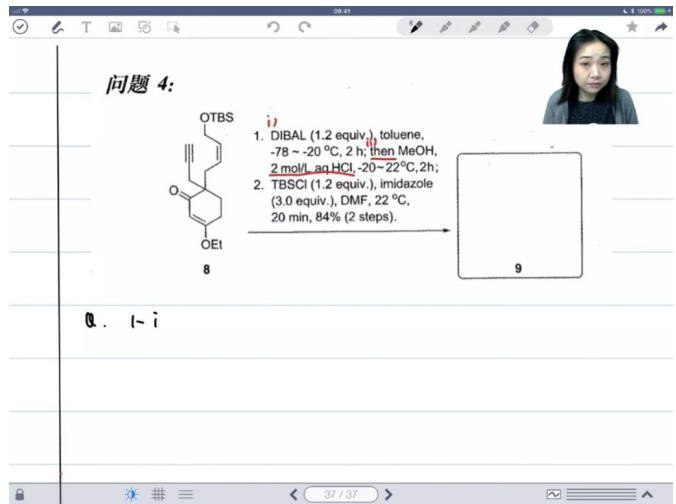

chemical

Chemical reaction scheme showing conversion of compound 8 to compound 9 using DIBAL and TBSCl reagents

# 反应条件:

■ 加入12当量试剂  
■ 加入甲醇  
■ 加入2摩尔每升盐酸  
■ 温度从-20℃升至室温

# - 反应类型：还原反应

■ 将特定基团还原为另一种基团  
■ 其他部分结构保持不变

# - 反应机理分析

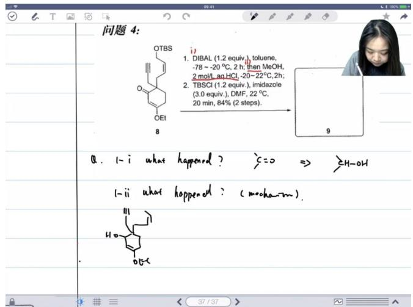

text_image

问题 4:
1. DIBAL (1.2 equiv.), toluene,
-78 ~ -20 °C, 2 h; then MeOH,
2 mol/L aq HCl, -20~22°C, 2h;
2. TBSCI (1.2 equiv.), imidazole
(3.0 equiv.), DMF, 22 °C,
20 min, 84% (2 steps).
8
9
a. i-i what happened? ? =0 => ≥H-OH
i-ii what happened: (mochan-m)
37/37

# ○ 机理特点：

■ 涉及重排反应  
■ 将 $\alpha,\beta$ 不饱和羰基结构改变位置  
■ 通过盐酸条件实现部分脱保护

# - 硅基保护剂特性

# ○ 脱保护方法：

■ 万能方法：氟负离子（所有硅基保护剂均可脱除）  
酸碱条件：

● 强碱：进攻硅原子  
● 强酸：进攻氧原子断开Si-O键

■ 稳定性因素：

● 位阻越大越难脱保护  
● 动力学稳定性取决于空间位阻

○ 特殊条件：

■ 高温容器（250℃微波条件）  
■ 盐酸可部分脱除硅基保护剂

● 偶联反应分析

○ 反应特点：

■ 过渡金属催化（钌为例）  
■ 分子内偶联反应  
■ 生成1:1的非对映异构体混合物

○ 机理过程：

■ 过渡金属与π电子配位（软酸-软碱作用）  
■ 形成金属五元环中间体  
■ 典型配体：环戊二烯负离子（芳香体系）  
■ 最终通过还原消除完成反应

○ 立体化学：

■ 产生4种可能的立体异构体  
■ 选择性差（50:50比例）  
■ 由两个基团上下排列组合决定（2×2）

# 18. 问题十五 01:48:36

# 1）反应步骤解析

\- 第一步反应

- 试剂组合：使用HMDS（六甲基二硅氮烷）和TMSCI（三甲基氯硅烷）  
- 产物特征：生成烯醇化固定产物，通过硅保护基实现氧原子保护  
- 反应类型：典型的硅基保护反应，形成TMS-烯醇醚结构

\- 第二步氧化反应

○ 反应条件:

■ 催化剂：醋酸铅（Pb(OAc)\_4）  
■ 溶剂：DMSO   
温度: $80^{\circ} \mathrm{C}$

# ○ 反应机理：

■ 醋酸铅被还原为零价铅   
■ 氧气将零价铅重新氧化为醋酸铅（循环催化）  
■ 优化后使用当量醋酸铅替代氧气氧化

- 关键过程：双键氧体系与铅配位，TMS被醋酸根离子取代  
- 氧化特征：通过配位化合物发生还原消除，实现氢原子消除

# - 第三步脱保护反应

- 反应条件：1M HCl/THF溶液，室温搅拌2小时  
○ 收率：85%  
○ 特殊性：

■ TBS保护基（叔丁基二甲基硅基）因位阻效应选择性反应  
■ 烯醇式结构使酸性条件下脱保护更完全  
■ 正常烷基需更剧烈条件（高温/特殊催化剂）

# 2）问题十六 01:56:43

# - 二碘化钐反应体系

# - 试剂特性：

■ HFIP（六氟异丙醇）作为溶剂  
■ 二碘化钐（SmI\_2）作为单电子转移试剂

# ○ 电子转移机理：

■ $Sm^{\wedge}\{2+\}\rightarrow Sm^{\wedge}\{3+\}+e^{\wedge}-$   
■ 生成的自由基可进一步形成烷基负离子

反应选择性：当碳碳双键和羰基共存时，优先与羰基（LUMO能级更低）发生电子转移

# - 成环反应特征

○ 产物结构：形成新的六元环体系  
典型反应：频哪醇偶联反应（两分子羰基化合物通过Sml\_2偶联）  
○ 配位结构：可能形成五角双锥结构的七配位中间体

# 19. 问题十六（续） 02:03:22

# 1）反应预测技巧

● 经验提示：绝大多数反应产物难以准确预测（教授自述正确率低）  
● 特殊案例：只有当存在明显电子受体（如 $\alpha,\beta-$ 不饱和羰基）时才可较准确预测

# 记忆要点：烯醇式结构的TBS保护基在酸性条件下异常活泼

\- 注：由于提供的课程记录中未包含具体PPT图片内容，故未插入图片标注。实际整理时可结合幻灯片中的反应式、机理图等进行补充。重复出现的"形成新的六元环"等语句已合并处理，保留了核心反应信息。

# 20. 二碘化三山的应用 02:12:49

# 1）反应机理与过程

- 自由基生成：反应首先生成两个羰基自由基，使用2当量 $I_{3}^{-}$ （二碘化三）确保两个自由基都能被捕获。若仅1当量，则位阻较小的羰基优先反应。  
- 偶联过程：自由基通过Pinnacol偶联形成六元环结构，需经历互变异构过程。立体化学上存在2:1的dr值（非对映体比例），对应ee值为 $33\%$ 。  
- 水解转化：最终通过水解将 $I_{3}^{-}$ 替换为OH，完成结构转化。

# 2）立体化学分析

- 产物稳定性：主产物（66%）为热力学稳定的构型（OH向下），次要产物（33%）因 $I_{3}^{-}$ 基团空间位阻较大而稳定性较低。  
- 构型判断：在中间体阶段，两个 $I_{3}^{-}$ 基团的空间排斥导致一个向上、一个向下的分布构型更有利。

# 3）试剂作用解析

# HMPA作用：

作为强配体取代THF，增强 $I_{3}^{-}$ 的单电子转移能力  
○ 通过提高 $I_{3}^{-}$ 的还原电势，使反应更易进行

\- HFIP作用：可能通过质子交换协助 $I_{3}^{-}$ 脱离氧原子，具体机理尚不明确

# 4）后续反应步骤

● TFA处理：使用三氟乙酸（强酸）在0℃条件下：

- 质子化双键生成三级碳正离子  
○ 氧原子亲核进攻形成醚键结构

● 溶剂体系：THF与HMPA按10:1混合使用，HMPA显著改善反应效率

# 5）关键注意事项

- 当量控制：必须使用2当量 $I_{3}^{-}$ 才能保证双羰基转化  
● 温度控制：后续酸处理需严格保持0℃条件  
● 空间效应：主产物选择主要受中间体 $I_{3}$ 基团空间排斥作用驱动

# 21. 有机合成反应步骤 02:31:16

# 1）甲基化反应

● 反应试剂：使用HMDS（六甲基二硅氮烷）和碘甲烷  
● 反应顺序：必须先进行甲基化反应，再进行丙烯基化反应  
● 位阻考量：甲基需要从环的下方进攻，因为上方位阻较大

# 2）丙烯基化反应 02:34:43

● 反应条件：使用强碱拔除α氢后，加入丙烯基卤化物  
- 卤化物选择：可以使用溴代物或碘代物  
● 顺序重要性：必须后加入丙烯基，因为产物结构决定了需要将位阻小的基团后引入

# 22. 烯烃复分解反应 02:41:46

# 1）催化剂体系

● 催化剂：36号物质作为烯烃复分解催化剂  
● 试剂组成：37号物质和13号物质作为反应试剂  
- 反应机理：两个烯烃各自失去一个 $CH_{2}$ 单元，生成以E式为主的中间体

# 2）氧化重排过程

● 氧化步骤：使用氧化剂使硼原子从 $SP^{2}$ 杂化变为 $SP^{3}$ 杂化  
● 重排机制：烷基迁移到氧原子上，硼变为三配位状态  
● 最终产物：经过水解得到烯醇，双键末端变为醇羟基，碳链长度保持不变

# 23. 醛的温和氧化

# 1）氧化体系组成

● 氧化剂：使用特殊的硼基氧化体系  
● 辅助试剂：二甲基-1-丁烯作为温和还原剂  
● 缓冲系统：磷酸二氢钠调节pH值

# 2）反应条件控制

● pH调控：含氧酸的氧化性显著受pH影响，需要保持适当酸性  
● 还原剂作用：防止氧化剂过量，避免副反应发生

# 反应特点：实现了醛到羧酸的温和转化，是该试剂的特色应用

\- 注：由于提供的课程记录中没有具体的PPT内容，故未插入相关图片。实际整理笔记时应根据PPT内容在适当位置插入对应的反应式、结构式等图示。

# 24. 酰胺键生成与保护基脱除 02:45:44

# 1）酰胺键生成机理

● 关键试剂：使用HATU（六氟磷酸苯并三唑-1-基-氧基三吡咯烷基磷）作为脱水剂，收率85%，室温搅拌26小时  
● 反应本质：相当于硝酸与氨反应生成酰胺键的过程  
● 活化机制：

○ 需将羧基的 -OH 转化为易离去基团  
○ 通过HATU使氨基与羰基靠近形成伪分子内反应  
- 经历双键迁移（shift）最终生成羟胺类似物中间体

# 2）保护基脱除步骤

# 甲酯脱除

\- 条件：氢氧化锂/THF-H2O(1:4)体系

■ 特点：比氢氧化钠温和，适合甲酯选择性脱除   
■ 现象：将酯基转化为羧酸

# ● MOM保护基脱除

\- 条件：2M盐酸/THF-H2O体系

■ 顺序：需在甲酯脱除后进行  
■ 产物：生成游离酚羟基

# 3）注意事项

● 稳定性问题：含三个氮的五元环体系（如叠氮结构）在双键存在时较稳定

# - 操作要点：

- 碱水解甲酯时需控制条件避免其他基团受影响  
- 酸解MOM保护基需分步进行

● 文献参考：实际反应终点判断建议查阅具体文献数据

# 二、直接芳环金属化反应02:58:58

# 1. DMG定位基团

● 定义：DMG（Directing Metalation Group）指能引导金属试剂（如丁基锂）在芳环特定位置发生金属化的官能团

# ● 常见类型:

- 主要含氧基团（如甲氧基）  
○ 含氟基团（如三氟甲基）  
- 少量含氮基团

● 强度分类：分为强、中、弱三类，但具体强弱顺序不需记忆

# 2. 反应特点

● 竞争关系：当存在多个可能反应位点时，需强DMG才能有效引导反应

○ 示例：甲氧基（中等强度）vs. MOM 基团（双氧配位，强 DMG）

# ● 影响因素：

- 温度（如负78℃→室温）  
- 辅助配体（如TMEDA）  
- 反应时间（如24小时）

# 3. 区域选择性案例

● 案例1：甲氧基定位时，金属化发生在邻位  
● 案例2：含氟化合物中，氟与锂有强配位能力（氟化锂晶格能高）  
● 案例3：双氧配位的MOM基团比单氧配位的甲氧基定位效应更强

# 4. 分子内反应

# ● 特征产物：

○ 含羟基和羰基（IR: $3300 \, cm^{-1}$ 和 $1600 \, cm^{-1}$ ）  
- 羰基双键键能较弱（供电子效应强）

● 反应路径：芳基锂负离子进攻分子内羰基

# 三、过渡金属催化[2+2+2]环加成

# 1. 基本反应

● 底物：三分子炔烃（如乙炔）  
- 催化剂：钴配合物（如CpCoL2）

● 产物：苯衍生物

# 2. 反应机理

● 金属中心配位两个炔烃分子  
● 形成金属杂五元环中间体  
- 第三个炔烃插入反应  
- 终止方式:

○ 加CO→脱金属产物  
○ 加酸→1,3-丁二烯  
○ 加氧化剂（如I2）→二碘代产物

# 3. 应用特点

● 普遍性：多种过渡金属均可发生类似反应  
● 关键步骤：金属杂环形成是常见反应模式

# 四、扩展阅读建议

● 重点章节：第五章金属有机反应  
● 文献重点：

- 芳环金属化反应的复杂性  
- 过渡金属催化偶联反应  
- 第三章的偶联反应扩展内容

# 五、知识小结

<table><tr><td>知识点</td><td>核心内容</td><td>考试重点/易混淆点</td><td>难度系数</td></tr><tr><td>区域选择性反应</td><td>氯化氢与苯基甲基炔反应产物选择(a/b)</td><td>第一步区域选择性决定,催化剂三氧化二铝提示离子化机理</td><td>★★★</td></tr><tr><td>偶联反应机理</td><td>过渡金属催化(铜/镍)的偶联反应应用</td><td>产物顺反异构判断(x/y),热力学稳定产物优势</td><td>★★★★</td></tr><tr><td>卡宾加成反应</td><td>三氯乙酰氯与锌在乙烷中超声反应</td><td>双键平面进攻方向判断(甲基画向上方)</td><td>★★★</td></tr><tr><td>还原氨化反应</td><td>甲酸作用下氨基与甲酰胺转化</td><td>关键步骤:氧连离去基团形成,脱水机理</td><td>★★★★</td></tr><tr><td>硅基保护/脱保护</td><td>TMS/TBS保护基的酸敏感性差异</td><td>盐酸脱TMS易,TBS需强条件(205°C微波)</td><td>★★★★</td></tr><tr><td>二碘化钐单电子转移</td><td>六氟异丙醇体系中自由基偶联</td><td>羰基优先接收电子,形成六元环产物(2:1 dr值)</td><td>★★★★★</td></tr><tr><td>烯烃复分解反应</td><td>Grubbs催化剂催化烯烃重组</td><td>产物丢失CH2单元,氧化后末端烯变醇</td><td>★★★★</td></tr><tr><td>酰胺键形成</td><td>HATU介导的缩合反应</td><td>非经典脱水机理,尿嘧啶结构活化羧基</td><td>★★★★</td></tr><tr><td>芳环直接金属化</td><td>甲氧基/氟导向的锂化反应</td><td>定位基强度排序:OMOM &gt;OMe&gt;F</td><td>★★★★</td></tr><tr><td>过渡金属催化环化</td><td>钴催化[2+2+2]环三聚反应</td><td>金属杂五元环中间体,CO/I2决定产物类型</td><td>★★★★</td></tr></table>