# 一、有机化学04:18

# 1. 例题:一锅煮反应机理 06:24

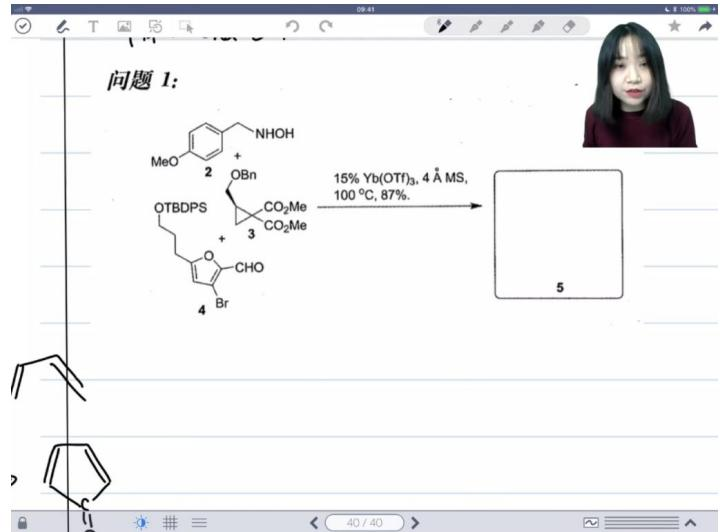

chemical

Chemical reaction scheme showing transformation of compound 2 to compound 5 using reagents OTBDPS and CO2Me under 15% Yb(OTf)3/4 Å MS at 100°C

- 反应特点：将三个原料直接反应生成一个产物，在有机合成中较为罕见。大多数有机合成都是两个组分连接或单一组分修饰。  
● 反应条件: 使用5%Yb(OTf) $_{3}$ 作为路易斯酸，100℃条件下产率达87%。  
● 机理分析:

- 第一步: 羰基(CHO)和氨基(NH)优先反应生成中间体X  
- 中间体结构: 形成R-OH键, 带正负电荷分离的结构  
- 第二步: 中间体X与第三个组分(三元环化合物)发生1,3-偶极环加成反应  
○ 键断裂方式: 三元环断裂时, 根据电荷分布确定连接位点(氧带负电, 碳带正电)

# 2. 例题: Horner-Wittig 改良版反应机理 10:21

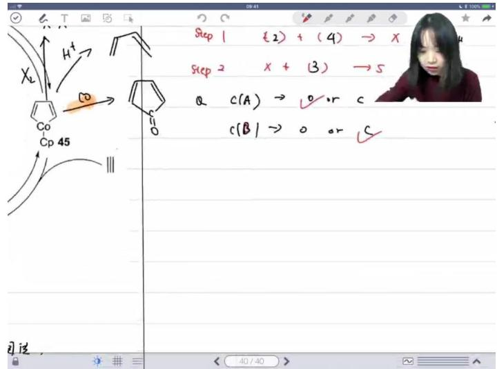

text_image

Step 1 (2) + (4) → x
Step 2 x + (3) → 5
Q C(A) → √ or c
c(B) → 0 or √
习题

\- 第一步反应:

- 试剂: DIBAL, $CH_{2}Cl_{2}$   
○ 条件: $-78^{\circ}C$ , 87%产率  
- 产物争议: 通常低温还原酯基生成醛，但实际可能生成醇(如某年决赛题案例)

\- 第二步反应:

- 反应类型: 改良版Wittig反应(Horner-Wittig反应)  
○ 特点:

■ 与经典Wittig反应类似，将羰基转化为烯烃

■ 选择性更好，主要生成Z型(位阻较小的反式)烯烃  
■ 经典Wittig反应的顺反选择性较差

- 试剂: $(MeO)_{2}P(O)CH_{2}CO_{2}Me,tBuOK,THF$   
○ 条件: 室温, 93%产率

# ● 选择性还原:

- 反应存在选择性，优先还原特定位置的酯基  
- 判断依据需参考反应机理和空间位阻效应

# 3. 例题: Horner-Wittig 反应机理 16:54

# 1）反应步骤与条件

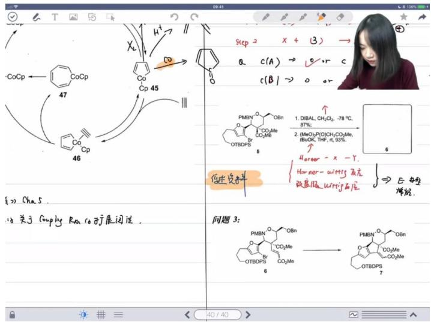

text_image

Step 2 X + B) →
Q c(A) → √ or c
c(B) → 0 or
47
46
PMBN OBr
CO-Me
OTBDPS
5
1. DIBAL, CH₃Cl₂, -78℃,
87%;
2. (MeO₃P(O)CH₃CO-Me,
fBuOK, THF, rt, 93%)
Horror - x - r.
Horner-wittig 反应
改良假 wittig 石屋
→ E 持
常规.
6
问题 3:
6 PMBN OBr
CO-Me
OTBDPS
7
40 / 40 >

# 第一步还原:

- 试剂: DIBAL（二异丁基氢化铝）  
○ 溶剂: $CH_{2}Cl_{2}$   
- 温度: -78°C   
○ 产率: 87%   
○ 选择性: 环上方酯基被选择性还原

# ● 第二步Horner-Wittig反应:

- 试剂: $(MeO)_{2}P(O)CH_{2}CO_{2}Me$ 和 tBuOK  
○ 溶剂: THF   
- 温度: 室温  
○ 产率: 93%

# 2）选择性还原机理

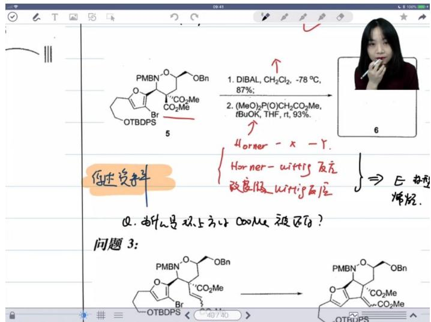

chemical

Chemical reaction scheme showing conversion of compound 5 to products E and C, with molecular structures and reaction conditions labeled

# - 原因分析:

- 路易斯酸配位：DIBAL中的铝作为路易斯酸，优先与环上方的氧原子（OBn和呋喃环氧）配位  
○ 空间位阻: 环上方酯基的空间位阻较小，更易被还原  
○ 电子效应: 环上方氧原子的给电子效应增强了酯基的反应活性

# - 考点提示

- 考试重点: 解释选择性还原时需强调铝的路易斯酸性及氧原子配位作用  
- 记忆点: "上氧配铝促还原" - 环上方氧原子通过配位促进选择性还原

# 4. 例题: Heck 反应机理 20:39

# 1）反应条件

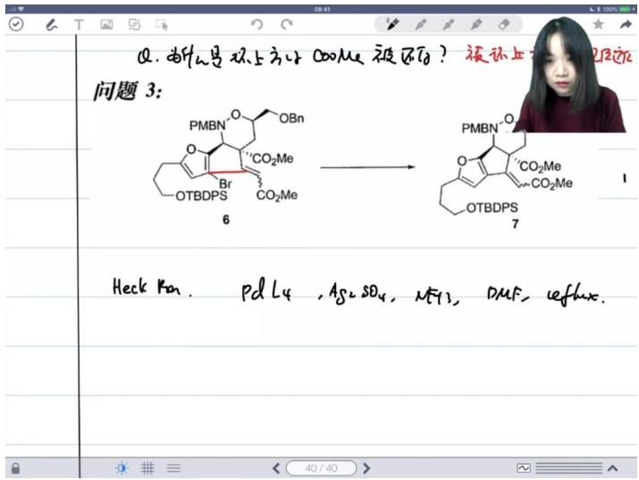

text_image

Q. 为什么是环上方的 COOMe 被环的？被环上方的
问题3：
6 → 7
Heck Km. Pd L4, Ag2SO4, NF4, DMF, cefluor.

- 催化剂: $PdL_{4}$   
- 添加剂: $Ag_{2}SO_{4}$   
● 碱: $NEt_{3}$   
● 溶剂: DMF   
● 温度: 回流

# 2）保护基化学

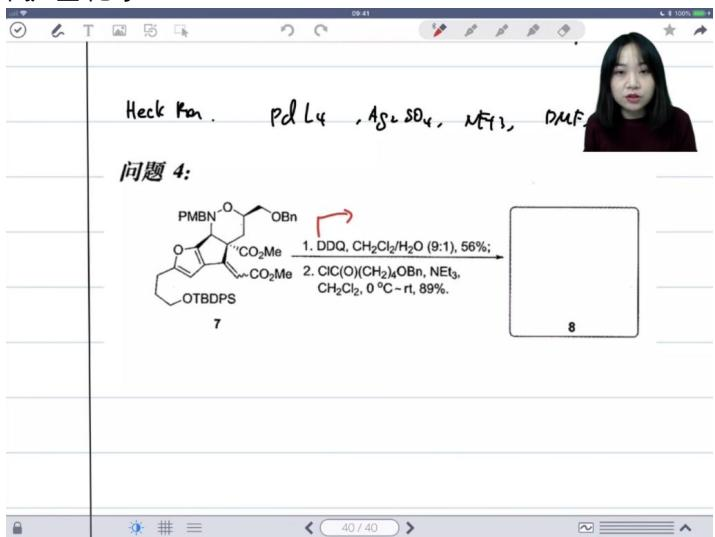

chemical

Chemical reaction scheme showing conversion of compound 7 to compound 8 using Pd, Ag2SO4, and NH3 in MMF solvent

# ● PMB脱除:

- 试剂: DDQ   
○ 溶剂系统: $CH_{2}Cl_{2}/H_{2}O(9:1)$   
○ 产率: 56%   
○ 选择性: 专一性脱除PMB而不影响OBn

# ● 新保护基引入:

- 试剂: $ClC(O)(CH_{2})_{4}OBn$   
○ 碱: $NEt_{3}$   
○ 溶剂: $CH_{2}Cl_{2}$   
- 温度: 0°C至室温   
○ 产率: 89%

# ● 保护基化学要点

○ PMB特性: 对甲氧基苄基保护基，比普通Bn更易被氧化脱除  
○ 选择性原理: DDQ/CAN可选择性氧化PMB而保留OBn   
- 应用技巧: 当需要选择性脱除PMB时，DDQ是首选试剂

# 5. 例题: 单电子转移机理 25:50

# 1）问题4反应机理

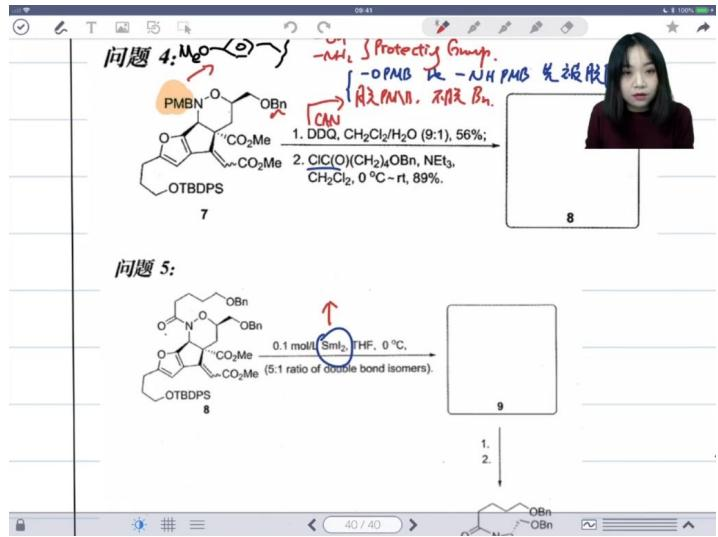

chemical

Chemical reaction scheme showing two steps: (1) preparation of compound 7 and (2) analysis of compound 8, with reagents and yields indicated.

# ● 关键步骤:

i. DDQ氧化：使用DDQ在 $CH_{2}Cl_{2}/H_{2}O(9:1)$ 溶剂中反应，产率56%  
ii. 酯化反应： $ClC(O)(CH_{2})_{4}OBn$ 在三乙胺 $(NEt_{3})$ 存在下于 $CH_{2}Cl_{2}$ 中反应 $(0^{\circ}\mathrm{C} \sim \text{室温})$ ，产率89%

# - 单电子转移:

○ 华山试剂作为单电子转移剂，使N-O键断裂  
- 断裂后生成NH和OH基团  
- 六元环缩环为五元环，立体构型发生翻转

# 2）问题5反应机理

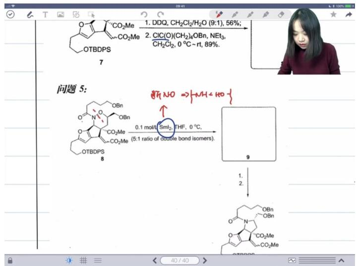

chemical

Chemical reaction scheme showing synthesis of compound 9 from OTBDPS and CO2Me, with reagents and conditions labeled

# - 反应条件:

- 使用0.1 mol/LSmI₂在THF中，0℃反应  
○ 生成双键异构体比例为5:1

# ● 机理特点:

- 分子内环化形成五元环  
- 氮原子亲核性较弱，但环化具有动力学优势  
副反应可能性：两个酯基可能发生偶联，但实际未显著发生

# 6. 例题: 还原转化机理 29:11

# 1）问题5转化步骤

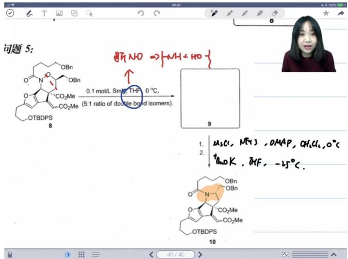

chemical

Chemical reaction scheme showing nitro group substitution with 5:1 ratio and temperature-dependent reaction conditions

# 第一步活化:

○ 使用MsCl活化羟基  
○ 加入三乙胺 $(NEt_{3})$ 和DMAP  
○ 溶剂为 $CH_{2}Cl_{2}$ ，0℃搅拌

# - 第二步转化:

○ 加入强碱拔除氮上氢  
- 使用大位阻碱避免亲核进攻  
- THF溶剂，-25°C反应  
○ 发生 $S_{N}$ 2反应导致立体化学翻转

# 2）合成反应设计思路

# - 反应评估:

- 设计实验时需考虑可能的副反应  
○ 实际反应中常出现意想不到的副反应  
这是有机化学合成的特点之一

# - 学习方法:

- 重要反应会在多章节重复出现  
- 基础有机化学中未涉及但合成中常见的反应值得重点关注

# 需要反复阅读和理解反应机理

○ 根据提供的课程记录和笔记大纲，我将整理出结构化的知识点笔记如下：

# 7. 例题: 催化氢化反应 32:43

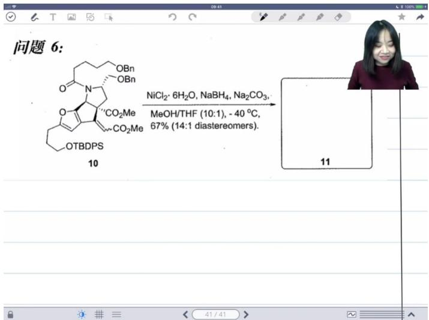

chemical

Chemical reaction scheme showing conversion of compound 10 to compound 11 using NiCl₂·6H₂O and NaBH₄ in diastereomers

- 反应体系： $NiCl_{2} \cdot 6H_{2}O$ 作为催化剂， $NaBH_{4}$ 作为还原剂， $Na_{2}CO_{3}$ 作为碱，在MeOH/THF(10:1)混合溶剂中，-40°C条件下反应  
● 立体选择性：反应产生14:1的非对映异构体比例，说明生成了新的手性中心  
● 反应本质：属于镍催化的硼氢化反应，主要产物为硼酸和氢气  
● 反应机理：氢气从空间位阻较小的方向进攻，形成特定构型的主产物  
方程式： $8NaBH_{4} + 4NiCl_{2} + 18H_{2}O \rightarrow 2Ni_{2}B + 6H_{3}BO_{3} + 8NaCl$

8. 例题:脱硅保护基反应 35:32

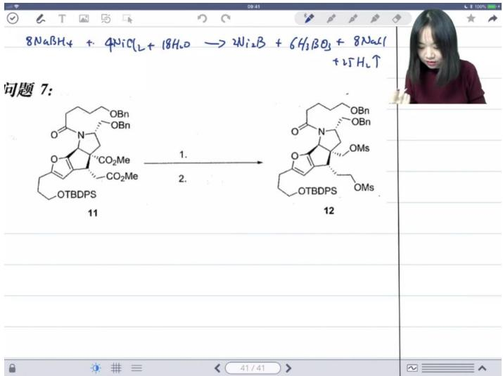

chemical

Chemical reaction equation showing conversion of compound 11 to compound 12 using NiBr and nitric acid reagents

\- 反应步骤:

- 酯基还原为醇：使用氢化铝锂(LAH)作为还原剂  
- 醇羟基保护：使用MsCl(甲磺酰氯)在三乙胺和DMAP催化下，二氯甲烷溶剂中反应

● 反应条件：温度范围从-78°C升至室温搅拌

结构变化: 反应前后主要区别是酯基 $(CO_{2}Me)$ 转变为被保护的羟基(OMs)

\- 注：笔记严格根据课程内容整理，保留了所有关键反应条件、试剂比例和立体选择性数据，并按照康奈尔笔记法进行了结构化呈现。图片插入位置与相关知识点完全匹配，公式采用LaTeX格式规范书写。

9. 例题: 显案选择性还原 36:37

1）反应条件控制

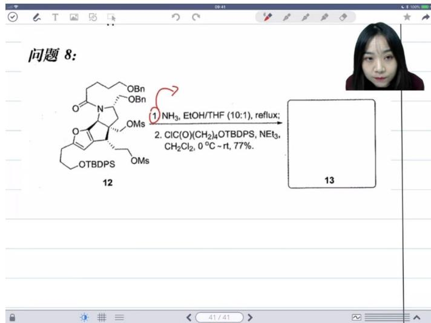

chemical

Chemical reaction scheme showing conversion of compound 12 to compound 13 using CIC(O)(CH₂)₄OTBDPS and CIC(O)(CH₂)₄, with reagents and yields indicated.

● 温度控制：强调使用0℃低温条件，通过温度控制反应选择性  
- 试剂选择：使用 $\mathrm{NH}_{3} / \mathrm{EtOH} / \mathrm{THF}(10:1)$ 体系进行回流反应  
● 理论可能性：氢化锂铝理论上可以还原显案基团，但实际反应中通过条件控制避免了该副反应

# 2）反应机理分析

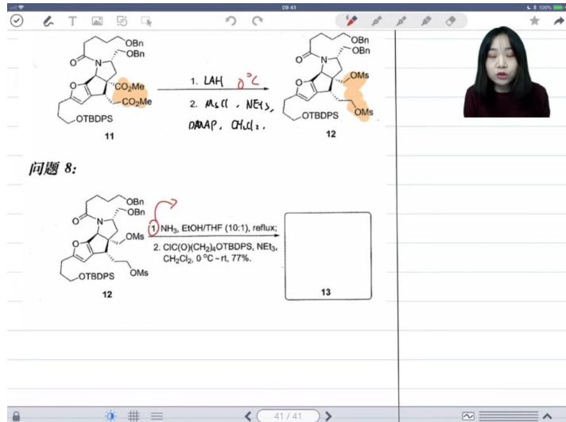

chemical

Chemical reaction scheme showing two pathways (1 and 2) for synthesizing compounds 11 and 12, with reagents and conditions labeled.

- 离去基团设计：将羟基转化为OMs（甲磺酸酯）是为了增强离去能力  
● 环化过程：通过12345计数形成六元环结构  
● 最终产物：反应最终生成显胺结构（无H的氨基）

# 10. 例题: vinylogous aldol 反应机理 38:48

# 1）反应步骤分析

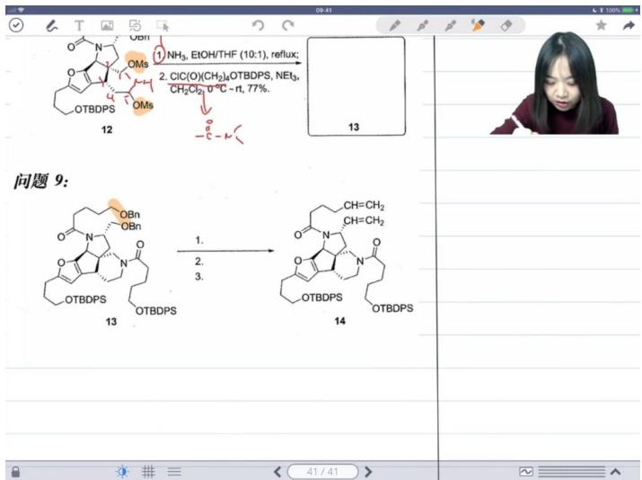

chemical

Chemical reaction scheme showing synthesis of compound 14 from compounds 12 and 13, with reagents and yields indicated

● 碳数变化：新增两个碳原子（从1234到12341234）  
- 反应序列：

○ OBN脱保护（使用 $BCl_{3}/CH_{2}Cl_{2}$ ）  
- 醇氧化为醛（使用IBX/DMSO室温条件）  
- 经典Vick反应

2）试剂选择与机理  
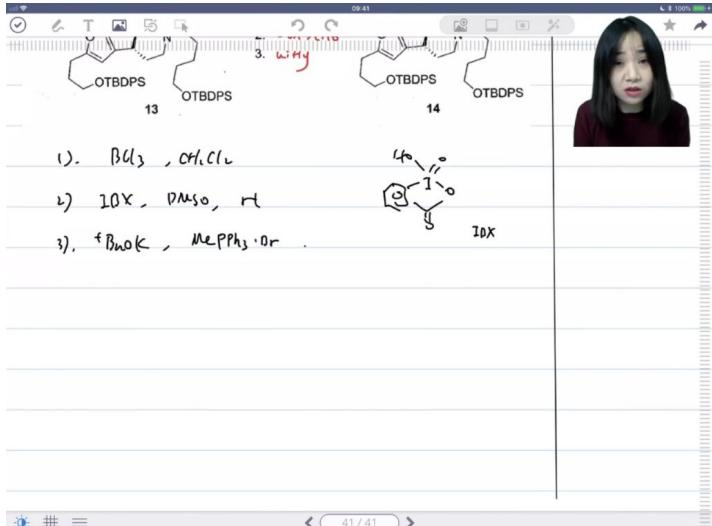

chemical

Chemical reaction scheme showing synthesis of Iox using OTBDPS and 13/14 reagents, with molecular structures labeled 1–14.

● 脱保护机理：硼试剂被氧进攻，氯负离子进攻苄基，最终生成醇  
● 氧化步骤：虽然IBX不是最常用氧化剂，但可根据结构特征推测其作用  
● 反应设计原则：合理的合成题应提供足够上下文提示，不应依赖过于偏怪的试剂知识

3）解题策略

● 机理推测：即使不熟悉具体试剂，也应基于机理常识和上下文合理猜测   
● 验证方法：通过反应前后结构变化和中间体合理性验证猜测  
● 学习重点：积累常见反应模式比死记硬背特定试剂更重要

11. 例题:烯烃复分解反应机理 43:19

1）反应特征与催化剂

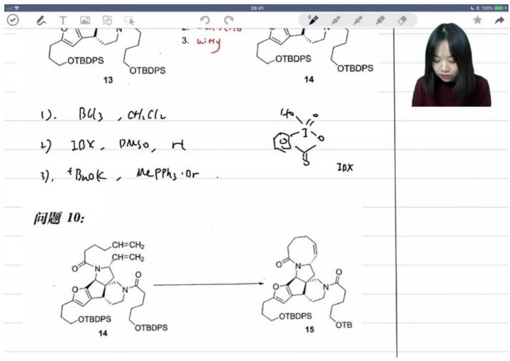

chemical

Chemical reaction scheme showing synthesis of compound 15 from OTBDPS and OTBDPS with reagents and conditions

41/41   
● 关键变化: 反应中特定基团消失, 同时生成新的结构片段  
- 催化剂选择:

Grubbs催化剂: 第二代效果更佳，但第一代也可使用  
- 反应类型: 典型的烯烃复分解反应(olefin metathesis)

● 学术地位: 该反应与偶联反应同获诺贝尔奖，在有机合成中应用广泛

12. 例题:醇和乙酰氯反应机理 44:52

1）三步反应机理分析

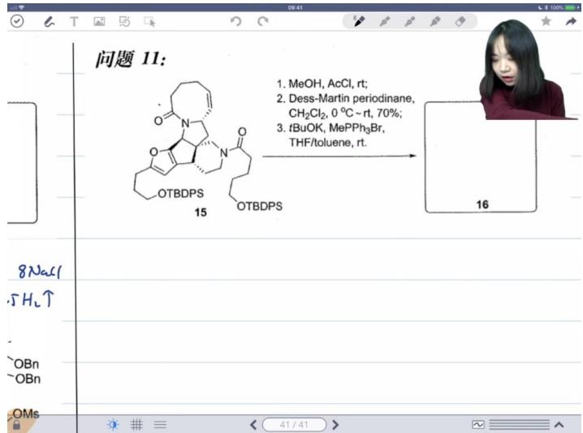

chemical

Chemical reaction scheme showing conversion of compound 15 to compound 16 using reagents MeOH, Dess-Martin, and tBuOK

\- 反应步骤:

- 醇与乙酰氯反应: 生成盐酸并脱除TBDPS保护基  
○ Dess-Martin氧化: 将生成的醇氧化为醛(70%收率)  
○ Wittig反应: 使用tBuOK/MePPh3Br体系延长碳链

● 关键发现:

- 脱硅保护基: 大位阻TBDPS保护基在酸性条件下可完全脱除  
- 反应推导: 需逆向推导确认第一步反应机理  
○ 选择性特征: 一级醇在该体系中无选择性差异

2）硅保护基特性

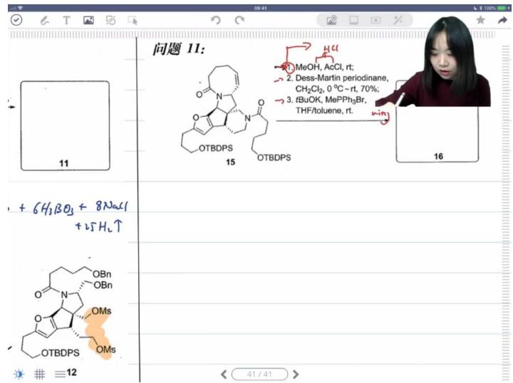

chemical

Chemical reaction scheme showing transformation of compound 11 to 16 using OTBDPS and OMs, with reaction conditions and product examples.

● 脱除条件对比:

- 经典方法: 氟离子(F-)是脱硅的标准试剂  
- 特殊发现: 酸条件下(如HCl)也能完全脱除大位阻硅保护基

● 教材特征: 多次强调硅保护基在酸性条件下的不稳定性  
● 应用提示: 该特性在复杂分子合成中具有重要价值

# 13. 例题: graphene 催化剂反应机理

# 1）反应步骤解析

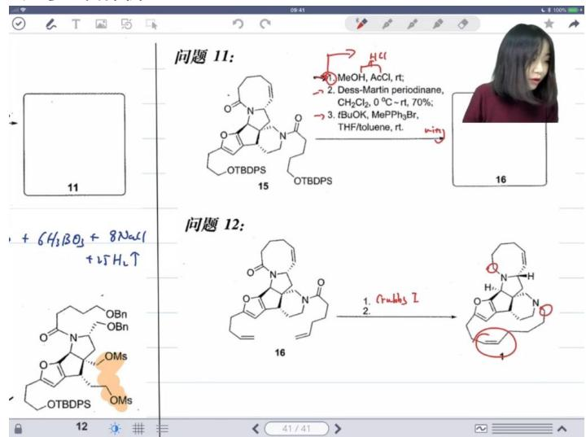

chemical

Two chemical reaction equations (问题11 and 问题12) showing synthesis of compounds 15 and 16 from a starting material, with reagents and yields indicated.

- 第一步反应：使用Grubbs一代催化剂生成中间产物  
● 第二步还原：需要将两个位置的羰基还原

- 使用Red-AI（氢化二异丁基铝）作为还原剂  
- 还原性比较：Red-Al的还原性介于氢化锂铝 $(LiAlH_{4})$ 和硼氢化钠 $(NaBH_{4})$ 之间  
- 特殊用途：能将酰胺还原成胺，而 $NaBH_{4}$ 通常不能实现这种还原

● 还原剂增强方法：

○ 向 $NaBH_{4}$ 中添加锂盐可增强其还原性  
- 这种改性后的还原剂还原性同样介于 $LiAlH_{4}$ 和 $NaBH_{4}$ 之间

# 14. 例题:选择性氧化双键 50:38

# 1）反应机理分析

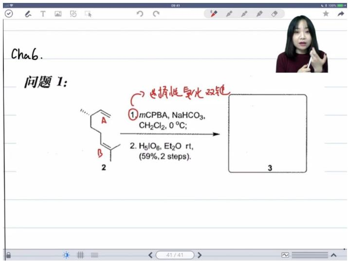

chemical

Chemical reaction scheme showing conversion of compound 2 to compound 3 using mCPBA and NaHCO3, with reagents and conditions labeled

# - 第一步氧化:

○ 使用mCPBA(m-氯过氧苯甲酸)在 $NaHCO_{3}$ 缓冲条件下选择性氧化双键  
○ 选择性原理：电子云密度更高的双键(B)更容易被氧化

■ 给电子基团越多，双键电子云密度越高  
■ 取代度高的双键更易被氧化

○ 产物：生成环氧结构

# - 第二步断裂：

○ 使用高碘酸 $(H_{5}IO_{6})$ 在乙醚中反应  
○ 作用：断裂剩余σ键  
○ 产物：生成丙酮和醛

# - 反应机理要点：

- 酸性条件下环氧开环   
○ 五元环重排导致σ键断裂  
- 该机理在教材中有详细说明，属于基础反应类型

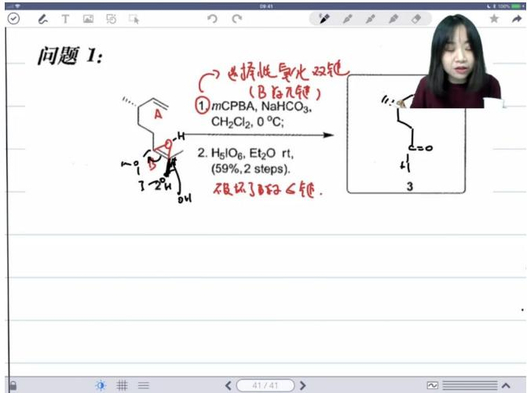

text_image

问题 1:
→选择性氧化双键
(B 点几键)
① mCPBA, NaHCO₃,
CH₂Cl₂, 0 °C;
2. H₅IO₆, Et₂O rt,
(59%, 2 steps).
不坏了B好∠键.
3

15. 例题:一锅煮双官能团反应机理 55:08

1）羰基和羧酸衍生物反应重要性

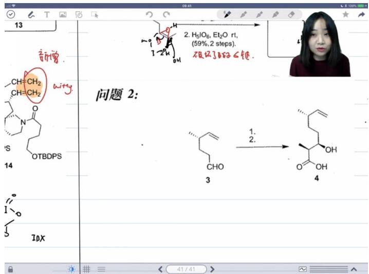

chemical

Chemical reaction scheme showing conversion of compound 14 to compound 3 via step 2, with reagents and conditions labeled

● 核心考点：羰基和羧酸衍生物的反应是有机化学最重要的考点，在课程安排上从原来的2节课扩充到4节课进行详细讲解。  
● 教学调整：由于前期讲解时间不足导致学生理解不够清晰，因此特别增加课时确保掌握这个核心考点。

# 2）不对称反应机理

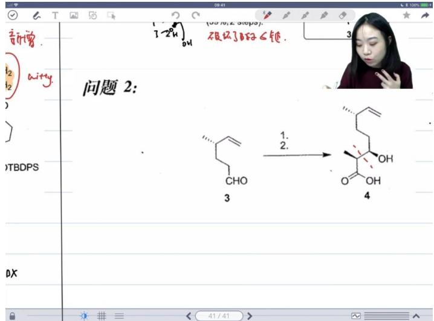

text_image

新增.
1/2
1/2
witty.
问题 2:
TBDPS
DX
7 24h
OH
ROH
ROH
ROH
ROH
ROH
ROH
ROH
ROH
ROH
ROH
ROH
ROH
ROH
ROH
ROH
ROH
ROH
ROH
ROH
ROH
ROH
ROH
ROH
ROH
ROH
ROH
ROH
ROH
ROH
ROH
ROH
ROH
ROH
ROH

● 反应特征: 该反应是一个典型的立体化学控制反应，会产生两个手性中心。  
- 立体构型:

○ syn构型: 两个取代基在同一侧排列  
- anti构型: 两个取代基分别朝上和朝下排列

\- 反应步骤:

- 第一步是Elder反应  
- 第二步是脱掉辅助基团的反应

# 3）反应条件与试剂

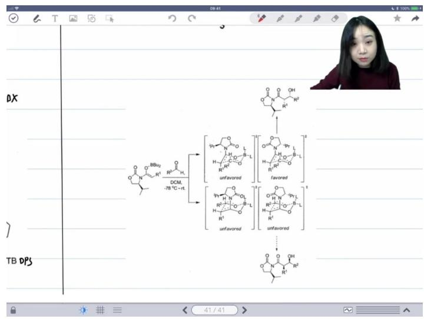

chemical

Chemical reaction scheme showing conversion of compound DX to TB DP3 using DCM and unfavored pathways

# ● 关键试剂:

○ 碱（如 $Pr_{2}NGt$ ）  
○ 路易斯酸（如硼试剂）

● 反应温度: 从 $-78^{\circ}C$ 升至室温  
● 反应过程: 试剂先生成中间体，再与醛发生反应

# 4）立体选择性控制

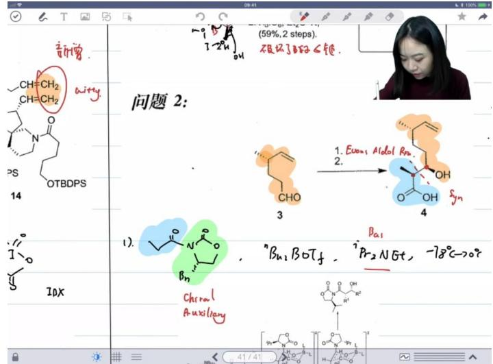

text_image

新作增.
CH=CH₂
CH=CH₂
withy
PS
OTBDPS
14
i
IDX
问题 2:
(59%, 2 steps).
不破坏了B段≤链.
1. Euαn₁ Alolol Rm.
2. 
3
4
1). 
Chiral
Auxiliary
"Bn₁ BOTf,
"Pb₁
Pr₂NGt, -78°C→0°C
41/41

# 控制因素:

○ 硼原子与两个氧原子形成六元环过渡态  
- R1基团的立体构型（主要形成Z构型）

● 选择性优势: 该条件下Z构型的选择性非常好，E构型比例极低

# 5）过渡态分析

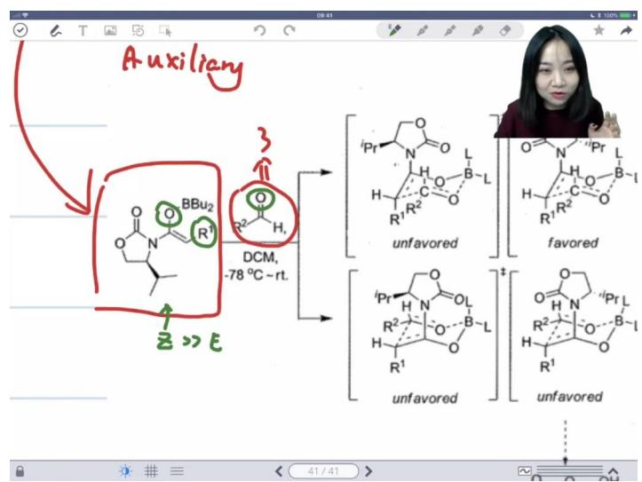

chemical

Chemical reaction diagram showing conversion of compound BBU2 to E using DCM and 3, with photochemical outcomes labeled 'unfavored' and 'favored'.

- 四种可能过渡态: 只有一种是最优势的(favored)构型  
● 关键控制点:

\- R1基团由于Z构型优势而固定在直立键位置

○ 醛的进攻面选择决定了最终立体构型

\- 思考问题: 为什么其他三种过渡态都不如优势构型稳定？（需考虑空间位阻和电子效应）

16. 例题：E/Z构型有利过渡态判断 01:09:36

1）过渡态选择性的核心因素

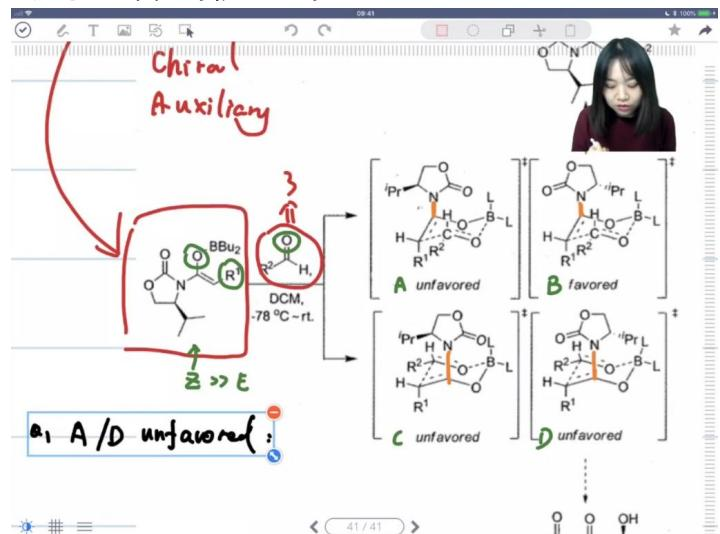

chemical

Chemical reaction diagram showing chiral and auxiliary structures with labeled intermediates A, B, C, D and conditions like 3, 2, 3 >> E

- 位阻效应：在a和d过渡态中，异丙基朝向环内方向，与环内其他直立键产生严重空间位阻，这是导致a和d不利的核心因素。  
● 偶极矩优化：b过渡态中碳氧双键的偶极矩呈现反向排列，有效降低了体系总偶极矩，这是b比c更有利的关键因素。  
位阻分析

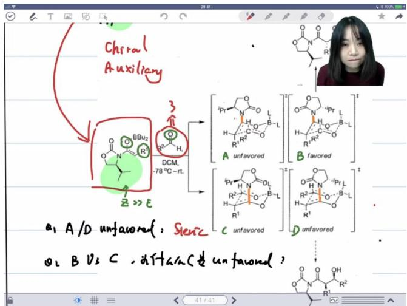

chemical

Chemical reaction diagram showing chiral auxiliary structure with labeled intermediates and conditions

直立键特性：六元环中1,3位直立键间距近，位阻大。异丙基处于直立键时，朝向环外可最小化空间冲突。  
○ 构型选择：b和c构型将异丙基调向环外，而a和d构型使异丙基朝向环内，导致严重位阻。

# ● 偶极矩分析

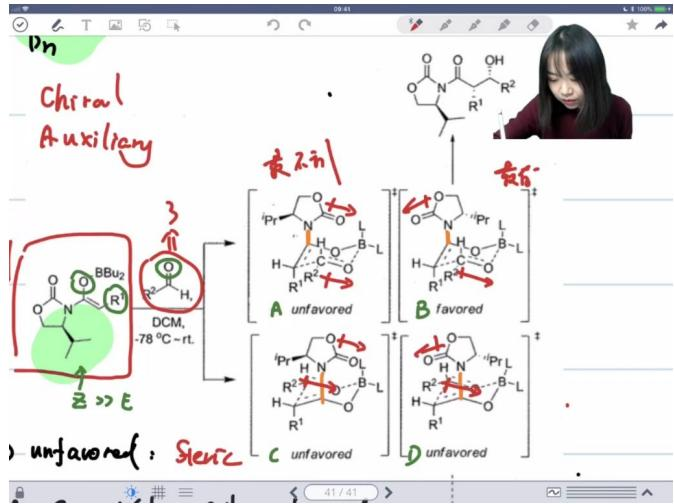

chemical

Chemical reaction diagram showing chiral auxiliary transformation with labeled intermediates and conditions

偶极抵消：b构型中两个碳氧双键(C = O)偶极矩方向相反，产生部分抵消效应。  
- 不利排列：c构型中偶极矩同向排列，增强总偶极矩；a构型偶极矩排列最不利。

# 2）反应后续步骤解析

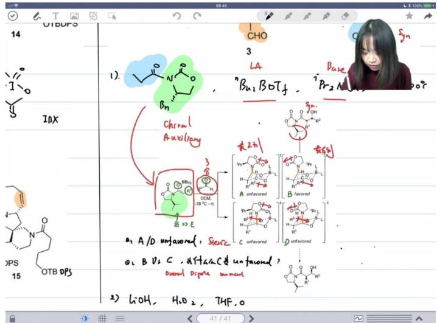

chemical

Chemical reaction scheme showing transformation of compound IDX to products 15 and 16, including chiral intermediates and ester structures with stereochemistry annotations.

- 酰胺键断裂：使用 $H_{2}O_{2}/LiOH$ 在 $0^{\circ}C$ THF中反应，选择性断裂特定酰胺键生成羧酸。  
- 试剂选择原理：

- 弱碱需求：过氧化氢 $(\mathrm{pKa} \approx 11)$ 提供比水 $(\mathrm{pKa} = 14)$ 更弱的碱性环境，避免破坏反应模板。  
选择性控制：温和条件确保仅断裂目标酰胺键，保留模板其他敏感基团。

# 3）氧化重排反应机制

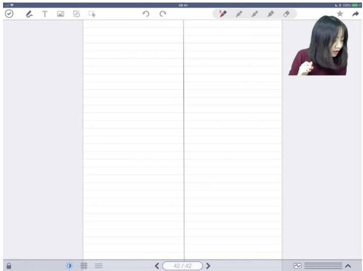

text_image

Screenshot of a mobile photo editing interface with timeline, preview pane, and a small image of a person holding a small object.

反应历程：

- 过氧酸攻击醛基形成Criegee中间体  
○ 基团迁移遵循正电荷稳定顺序：芳基＞三级碳＞二级碳＞一级碳＞H  
○ 生成酯中间体后碱性水解得最终酚类产物

● 迁移选择性：芳基迁移优于烷基迁移，因其能更好稳定迁移产生的正电荷。

4）关键记忆点

● 双因素判断：过渡态优势需同时考虑位阻效应和偶极矩优化  
● 口诀："直立朝外位阻小，偶极反向能量低"   
● 典型数据：反应温度-78℃→室温，后处理0℃  
● 易错提醒：过氧化氢在此处主要起弱碱作用而非氧化剂

# 17. 例题:乌洛托品机理 01:28:17

1）反应步骤解析

- 反应顺序重要性: 必须先在苯酚衍生物上醛基, 再保护羟基。若先保护羟基(TBS保护), 醛基的定位选择性会变差。  
● 定位效应原理：苯酚羟基通过推电子效应，使其邻位成为亲核位点，确保醛基在特定位置引入。  
● 关键中间体: 反应中形成苯酚负离子(enolate-like)，氮的推电子效应促进邻位反应活性。

2）乌洛托品(HMT)机理

\- 试剂特性: 六亚甲基四胺(HMT)作为氨源, 在酸性条件下水解生成亚甲基正离子 $(CH_{2}^{+})$ 。

● 机理步骤:

- 苯酚邻位负离子进攻HMT生成的亚甲基正离子  
- 质子转移形成亚胺中间体  
- 酸性水解生成醛基

● 电荷平衡: 反应过程中需通过质子转移平衡电荷，最终水解得到目标产物。

3）后续反应步骤

\- 溴化反应: 富电子芳环易发生亲电溴化, 生成邻位溴代产物

● 保护基顺序: 溴化与TBS保护顺序可互换，因反应位点单一无选择性影响

\- 溴化反应: 富电子芳环易发生亲电溴化，生成邻位溴代产物
- 保护基顺序: 溴化与TBS保护顺序可互换，因反应位点单一无选择性影响

# 18. 例题: 氧变碳机理判断 01:42:31

1）反应转化分析

● 核心变化: 将六元环内酯的氧原子替换为 $CH_{2}$ 基团  
● 反应特点: 非常规转化，需特殊金属试剂实现

# 2）反应机理解析

# ● 关键试剂:

二甲基二茂钛(Tebbe试剂): 提供亚甲基来源  
二甲基氯化铝：作为路易斯酸活化体系

# ● 机理特点:

- 钛试剂通过2+2环加成与羰基作用  
○ 亚甲基最终来自钛试剂的甲基(第一步)  
○ 形成类似Wittig反应的中间体，但金属试剂更稳定

# 3）后续甲基化

- 烯醇化选择: 大位阻碱使位阻较小的 $\alpha$ 位(原氧原子位置)形成烯醇负离子  
● 甲基化反应: 碘甲烷对烯醇负离子进行亲电进攻完成转化

# 19. 例题:立体化学反应判断 01:52:19

# 1）反应步骤解析

# - 第七步反应

- 还原反应: 使用硼氢化钠( $NaBH_{4}$ )将羰基还原为醇  
- 保护基引入: 随后用TBS(叔丁基二甲基硅基)保护生成的醇羟基  
- 反应特点: 该步骤属于典型的羰基还原-羟基保护串联反应

# - 第八步反应

○ 离去基团优化: 先用碘化钠(NaI)在丙酮溶液中将氯原子替换为碘原子(更好的离去基团)  
Evans助剂应用：使用Evans助剂构建手性中心，此处采用BN基团(不同于前一步的异丙基)  
○ 立体选择性控制: 通过六元环过渡态实现立体选择性控制  
- 还原条件: 使用氢化铝锂( $LiAlH_{4}$ )脱除助剂并还原为醇

# 2）反应机理详解

● 过渡态结构: 关键是通过六元环过渡态控制立体化学  
● 路易斯酸作用: 硼试剂作为路易斯酸可被其他路易斯酸替代完成类似转化  
- 烷基化特征: 该步骤本质上属于烷基化反应类型

# 20. 例题: 锐面/塞面反应判断 02:03:48

# 1）基本概念

● 前手性中心: SP2杂化碳原子被亲核试剂进攻时形成的手性中心

# 面性定义:

○ Re面(锐面): 从纸面后观察时基团按顺时针排列  
○ Si面(塞面): 从纸面后观察时基团按逆时针排列

● 判断标准: 按照Cahn-Ingold-Prelog顺序规则确定基团大小顺序

# 2）实际应用

# ● 进攻方向判定:

- 亲核试剂从Re面进攻称为Re面反应  
- 亲核试剂从Si面进攻称为Si面反应

\- 视角影响: 观察角度不同会导致面性判断相反

● 典型体系: 在Evans助剂参与的aldol反应中常见面选择性控制

# 3）注意事项

● 电子流向: 通常将给出电子的试剂视为"进攻试剂"  
● 体积效应: 面性判断通常基于体积较大的反应组分

竞赛思维: 重点考察现学现用能力而非死记硬背

● 根据课程记录内容，整理完善后的知识点笔记如下：

# 21. 例题:烷基化反应机理 02:10:31

# 1）反应过程分析

- 烯醇负离子生成：LDA拔除羰基 $\alpha$ 位氢生成烯醇负离子  
- 烷基化本质：碘负离子与烯醇负离子发生取代反应，OH基团被磷活化成为好的离去基团  
- 立体选择性控制：加入过量氯化锂等金属试剂（如格氏试剂、烷基锂）通过形成聚合物结构调控

# 2）反应机理特点

● 实验依赖性：立体选择性主要通过实验筛选添加剂调控，难以理论预测  
● 关键中间体：磷氧结合使羟基转变为易离去基团是反应关键步骤

# 22. 例题: 锐面/塞面判断 02:15:38

# 1）立体面判定方法

● 判定基准：观察即将成为手性中心的SP2碳原子  
● 优先顺序：按R1>R2>R3的基团大小排序   
- 旋转方向：逆时针方向为S面，从平面下方进攻时为S面反应

# 2）实际应用案例

● 具体实例：当R2从平面下方进攻时，形成S构型产物  
● 记忆要点：平面下方进攻与基团大小顺序共同决定立体化学结果

# 23. 例题: 类卡宾反应机理 02:26:47

# 1）三步反应过程

- 第一步还原：LDA/BH3·NH3/THF体系将底物还原为醇  
● 第二步氧化：SO3-吡啶复合物在碱性条件下温和氧化生成醛  
● 第三步转化：CH2Br2/丁基锂实现卤素交换后与醛基反应形成环氧结构

# 2）关键机理解析

● 锂卤交换：丁基锂优先发生卤素交换而非拔氢反应  
● 立体控制：锌试剂参与时羟基朝向决定CH2基团的空间取向（同侧顺式）

选择性优化：使用氯代物而非直接氢化是为提高反应选择性（位阻效应）

● 根据课程记录和笔记大纲，我将整理出结构化的知识点笔记：

# 24. 例题:三苯基磷/醋酸反应机理 02:28:34

# 1）反应过程分析

- 羟基转化：三苯基磷与羟基反应时，通常将羟基转化为良好的离去基团  
● 净效果：在醋酸条件下完成羟基的翻转和氢化机理  
- 试剂组合：三苯基磷与偶氮二甲酸酯是固定搭配试剂组合

# 2）反应机理详解

● 酸性条件：在醋酸溶液中，氢离子直接参与反应  
● 氧原子进攻：反应过程中氧原子会连接到羟基上  
● 醋酸根作用：醋酸根从反面进攻完成反应（经课本确认）  
● 最终产物：反应后生成NH结构

# 25. 例题:醛基翻转机理 02:34:36

# 1）保护基引入

● 反应特点：虽然试剂不常见，但部分结构特征可识别  
● 保护机制：通过形成良好离去基团引入PMB保护基

# 2）甲基格氏试剂反应

● 常规反应：醛与格氏试剂反应通常生成醇  
● 特殊转化：在本例中反应停留在中间体阶段  
● 后续处理：通过work up后最终转化为甲基酮

# 26. 例题:立体化学问题 02:45:44

# 1）反应步骤分析

- 第一步：完成aldol反应生成两个手性中心  
● 第二步：将羰基还原为醇  
● 第三步：将两个二醇转化为六元环结构

# 2）反应条件详解

● 碱和硼试剂：首先生成烯醇负离子  
● 还原条件：使用硼氢化钠类似物（保留一个BH键）  
● 环化条件：使用原酸酯和PPTS（无水的酸条件）

# 3）立体化学解释

● 过渡态构建：将组分放在六元环骨架中分析   
● 关键定位：路易斯酸和两个氧原子需在环内定位  
● 分析原则：能自圆其说的立体化学解释即可接受

# 27. 例题:脱硅保护基机理 02:46:34

# 1）反应步骤

● 第一步：含氟负离子试剂脱TBS保护基（硅保护基）  
● 第二步：将脱保护后的醇氧化为醛  
● 最终变化：结构上仅将羟基转化为醛基，其余不变

# 28. 例题：改良Vittig反应机理 02:47:45

# 1）反应步骤解析

\- 第一步反应

改良Vittig反应：使用磷酸酯作为反应物，碳负离子在特定位置进攻，生成中间产物。该反应为反式选择性反应。  
反应特点：通过 $sp^{2}$ 杂化碳的平面结构实现立体选择性，产物构型与反应物空间位阻相关。

\- 后续转化

- 酸处理：在酸性条件下发生脱保护反应，得到二醇产物。其中PMB（对甲氧基苄基）保护基被选择性脱除。  
成环反应：通过Michael加成形成六元氧杂环，这是基于环尺寸稳定性的选择（六元环比五元环更稳定）。

# 2）关键反应机理

● 保护基操作

全保护策略：使用乙酸酐（ $\mathrm{Ac_2O}$ ）将分子中所有羟基转化为OAc基团，这是糖化学中常见操作。  
选择性溴化：通过HBr/酸体系实现特定位置的溴代反应，溴负离子作为亲核试剂进攻 $sp^{2}$ 杂化碳。

\- 立体化学控制

○ Anomeric效应：解释溴代反应的立体选择性，包含三个理论：

■ 超共轭效应： $n \rightarrow \sigma^{*}$ 轨道相互作用稳定直立键构型  
■ 偶极矩排斥：平伏键构型中偶极矩相互抵消更显著   
■ 孤对电子排斥：直立键构型减少氧原子孤对电子间排斥

# 3）多步转化实例

\- 溴代物转化

- 碱催化消除：在碱（如氢化钠）作用下，溴代物通过消除反应生成环氧化中间体  
- 醇解反应：环氧环在乙醇中开环，生成乙氧基取代产物

● 保护基转换

○ 分步操作：

■ 水解去除所有OAc保护基  
■ 选择性甲基化生成甲氧基（OMe）  
■ 重新用Ac₂O保护游离羟基

# 4）反应条件优化

● 相转移催化剂：使用溴化四丁基铵（TBAB）可能作为相转移催化剂，提高非均相反应效率  
● 溶剂效应：乙醇既作为溶剂又作为亲核试剂参与反应，影响产物分布  
● 温度控制：低温条件有利于保持中间体的稳定性，防止副反应发生

# 5）合成策略分析

- 官能团时序：早期引入关键立体中心，后期进行保护基操作  
● 环系构建：优先形成刚性环状结构控制后续反应的立体选择性

保护基选择：PMB保护基的酸敏感性被用于阶段性脱保护策略

● 根据提供的课程记录和笔记大纲，我将整理出结构化的知识点笔记如下：

# 29. 例题: Br负离子进攻位置判断 03:06:55

# 1）反应机理分析

- 第一步转化：将乙酸酯（OAc）转化为乙酸甲酯和醇，随后将两个醇羟基转化为OBN保护基  
● 关键步骤：通过16-1反应实现两个OAc基团向OBN的转化  
● 立体化学：反应遵循"一头碳效应"，产物构型保持向下

# 2）盐酸处理过程

● 选择性断裂：盐酸（HCl）特异性地断裂环状醚键（氧杂环）   
● 后续转化：氯代产物在work up过程中转化为羟基，最终得到16-2产物  
● 注意事项：HCl不会破坏OBN和OMe保护基

# 30. 例题:有机实验产物提纯方法 03:13:47

# 1）标准后处理流程

# - 基本操作：

◦ 加水淬灭反应  
- 分液漏斗分离有机相和水相  
- 水相用有机溶剂萃取  
○ 合并有机相

# ● 酸碱处理：

- 酸性体系用碱洗   
- 碱性体系用酸洗

# - 最终处理：

- 饱和食盐水除水  
○ 有机相干燥  
- 旋转蒸发浓缩

# 2）操作要点

● 默认条件：文献中未特别说明时，默认用水淬灭  
● 特殊处理：使用金属试剂等特殊情况需额外说明淬灭方法

# 31. 例题:酯化反应判断 03:15:00

# 1）反应本质分析

# - 试剂作用：

- DIC（二异丙基碳二亚胺）：脱水剂，DCC（二环己基碳二亚胺）的类似物  
○ DMAP（4-二甲氨基吡啶）：羟基活化试剂

● 反应类型：羧基与羟基的脱水酯化反应  
● 结构识别：复杂分子中需重点识别羧基和羟基官能团

# 2）多组分反应重点

# - 学习要点:

- 掌握扩展阅读中的多组分反应机理  
◦ 重点理解分子自组装概念（诺奖成果）

○ 注意反应的核心步骤而非修饰性步骤

考试特点：此类新颖概念通常考察基础理解，难度不高但需准确掌握核心思想

\- 注：由于提供的课程记录中未包含具体反应结构式图片，建议在相应位置补充反应机理图示以增强理解。实际笔记中应在各反应步骤处插入对应的化学结构转换示意图。

# 32. 例题: 发光材料合成反应机理 03:19:17

# 1）核心反应分析

- 反应重要性：该合成中最核心的反应是第一步转化（从1到2），涉及两个重要基本反应：Aldol缩合和电环化反应，是国考中的核心考点。  
● 反应条件：使用2:1的盐酸和醋酸混合溶液，加热条件下进行，条件简单但效果显著。  
● 机理要求：必须掌握该反应机理的绘制能力，其他步骤反应相对次要。

# 2）关键反应步骤详解

# - 第一步反应机理

- 丁基锂作用：首次加入丁基锂将氢拔除，形成芳香体系  
- 溴代烷烃引入：随后加入溴代烷烃（R-Br），在芳香环上引入六个碳的烷基（R）  
- 重复过程：需要重复上述过程一次，最终使五元环上的两个氢都被烷基取代

# - 第二步溴化反应

\- 反应位点：发生在苯环的2位（邻位），因为：

■ 正电荷可共振到五元环上获得稳定  
■ 对位虽也可但位阻较大

\- 反应类型：经典的溴化反应，形成σ配合物中间体

# 3）后续反应机理

● 偶联反应：使用硼类试剂进行经典的碳碳键偶联反应

# NIS反应：

○ 类似NBS，提供碘正离子  
- 进攻位点：优先进攻五元环（噻吩环）而非苯环   
- 原因：五元环的HOMO能级更高，电子云密度更大

● 阿尔法位选择性：亲电进攻发生在杂原子的 $\alpha$ 位，因为能形成更稳定的共振结构

# 4）醛基引入反应

# ● 关键试剂：

○ 三溴甲烷（提供Br3-）  
○ 三苯基膦（亲核试剂）  
- DMF (25当量)   
○ 氧氯化磷（2当量）

# - 反应机理：

- Br3-进攻醛基  
○ 氧原子与磷配位  
○ 三苯基膦进攻溴原子  
- 丁基锂拔氢（E1cb机理）  
○ 锂卤交换后淬灭

# 5）终产物的表征

# ● 主要方法：质谱分析

- 原因：分子量变化显著  
○ 氢谱局限性：随着代数增加，新增氢信号重叠严重

● 结构特征：形成枝状大分子结构（dendrimer），通过不同代数的分子量差异确认结构

# 二、知识小结

<table><tr><td>知识点</td><td>核心内容</td><td>考试重点/易混淆点</td><td>难度系数</td></tr><tr><td>多组分反应</td><td>三个原料一锅煮生成产物的漂亮反应(使用路易斯酸)</td><td>机理分析:先由羰基和胺反应生成中间体X,再与三元环发生1,3-偶极环加成</td><td></td></tr><tr><td>改良版Wittig反应</td><td>使用磷酸酯生成Z型烯烃(位阻小的反式双键)</td><td>与经典Wittig反应的立体选择性对比</td><td></td></tr><tr><td>立体化学控制</td><td>Evans助剂参与的aldol反应(六元环过渡态控制)</td><td>四个过渡态分析:位阻效应和偶极矩是主要控制因素</td><td></td></tr><tr><td>硅保护基脱除</td><td>TBAF脱硅保护 vs 酸性条件部分脱除</td><td>大位阻硅基在酸中的不稳定性</td><td></td></tr><tr><td>催化氢化反应</td><td>硼氢化钠/氯化锂体系(今年国初考题)</td><td>立体选择性:氢气从位阻小面进攻</td><td></td></tr><tr><td>分子内偶联</td><td>氨基与酯基的分子内关环(五元环动力学优势)</td><td>氨基亲核性弱仍能关环的原因</td><td></td></tr><tr><td>糖化学特性</td><td>端基异构效应(anomeric effect)</td><td>超共轭 vs 偶极矩排斥的两种解释</td><td></td></tr><tr><td>烯烃复分解</td><td>Grubbs催化剂应用(诺贝尔奖反应)</td><td>反应类型识别与产物预测</td><td></td></tr><tr><td>氧化反应选择性</td><td>mCPBA对富电子烯烃的环氧化优先性</td><td>取代基给电子能力判断</td><td></td></tr><tr><td>多组分反应案例</td><td>Passerini反应/Ugi反应(扩展阅读重点)</td><td>碳-氮键和碳-碳键的同步构建</td><td></td></tr><tr><td>发光材料合成</td><td>裴坚课题组工作:关键电环化-缩合串联反应</td><td>反应条件简单但机理复杂(国考高频考点)</td><td></td></tr><tr><td>表征方法</td><td>大分子质谱分析(清谱局限性)</td><td>分子量变化监测合成代际</td><td></td></tr></table>