# 一、课程介绍00:00

# 1. 课程准备 00:11

● 课程性质: 本课程为有机化学复习课，重点讲解有机反应合成和机理的综合内容  
● 课程进度: 当前为第四讲复习课，属于系列课程中的有机反应合成与机理部分

# 二、官能团缩写01:57

# 1. 常见官能团缩写 02:06

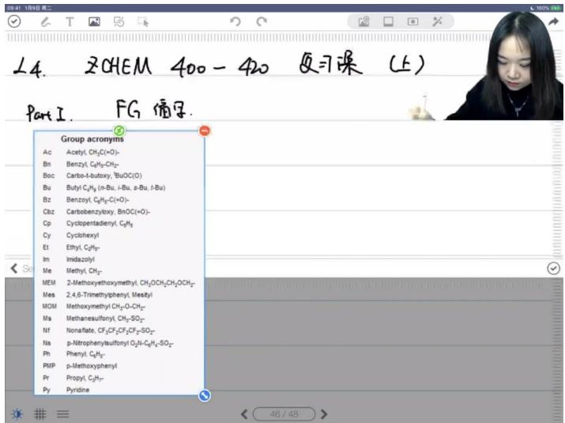

text_image

24. ZCHEM 400-420 反习课 (上)
Part I. FG 值字.
Group acronyms
Ac Acetyl, CH₂C(=O)-;
Bn Benzyl, C₆H₅CH₂-
Boc Carbo-l-butoxy, BuOC(O)
Bu Butyl C₆H₅ (n-Bu, i-Bu, p-Bu, t-Bu)
Bz Benzoyl, C₆H₅C(=O)-;
Cbz Carbobenzyl oxy, BnOC(=O)-;
Cp Cyclopentadienyl, C₆H₅
Cy Cyclohexyl
Et Ethyl, C₆H₅-
Im Imidazolyl
Me Methyl, CH₂-
MEM 2-Methoxyethoxymethyl, CH₃OCH₂CH₂OCH₂-
Iles 2,4,6-Trimethylphenyl, Mesbyl
MOM Methoxymethyl CH₃O-CH₂-
Ms Methanesulfonyl, CH₂SO₂-
Nf Nonaflate, CF₃CF₄CF₃CF₂SO₃-
Ns p-Nitrophenylsulfonyl O₂N-C₆H₅SO₃-
Ph Phenyl, C₆H₅-
PMP p-Methoxyphenyl
Pr Propyl, C₆H₅-
Py Pyridine

● ⚙ ≡
● Ac: 乙酰基 $CH_{3}C(=O)$ -  
● Bn: 苄基 $C_{6}H_{5}-CH_{2}-$   
● Boc: 叔丁氧羰基BuOC( = O) -   
- Bu: 丁基 $C_{4}H_{9}$ - (包括正、异、仲、叔丁基)  
● Bz: 苯甲酰基 $C_{6}H_{5}-C(=O)$ -  
- Cbz: 苄氧羰基BnOC( = O) -   
● Cp: 环戊二烯基 $C_{5}H_{5}-$ （在金属有机中通常表示 $C_{5}H_{5}^{-}$ ）  
● Cy: 环己基  
- Et: 乙基 $C_{2}H_{5}$ -  
- Im: 咪唑基  
- Me: 甲基 $CH_{3}$ -  
● MEM: 2-甲氧乙氧甲基 $CH_{3}OCH_{2}CH_{2}OCH_{2}-$   
- Mes: 2,4,6-三甲基苯基（均三甲苯基）  
● MOM: 甲氧甲基 $CH_{3}-O-CH_{2}-$   
● Ms: 甲磺酰基 $CH_{3}-SO_{2}-$   
● Nf: 九氟丁磺酰基 $CF_{3}CF_{2}CF_{2}CF_{2}SO_{2}$   
● Ns: 对硝基苯磺酰基 $O_{2}N-C_{6}H_{4}-SO_{2}-$   
- Ph: 苯基 $C_{6}H_{5}$ -  
● PMP: 对甲氧苯基  
● Pr: 丙基 $C_{3}H_{7}$ -  
● Py: 吡啶基

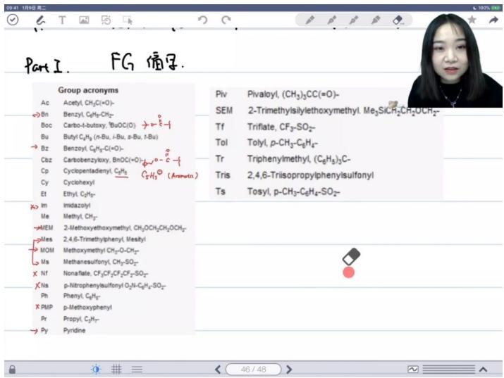

text_image

Part I. FG 通字.
Group acronyms
Ac Acetyl, CH₃(=O)-→
Bn Benzyl, C₆H₅CH₂-
Boc Carbo-t-butoxy, tBuOC(O) →
Bu Butyl C₆H₅(n-Bu, i-Bu, p-Bu, t-Bu)
Bz Benzoyl, C₆H₅C(=O)-→
Cbz Carbobenzyl oxy, BnOC(=O)-→
Cp Cyclopentadienyl, C₆H₅C₆H₅⁺ (Ampenol)
Cy Cyclohexyl
Et Ethyl, C₆H₅-
Im Imidazolyl
Me Methyl, CH₃-
MEM 2-Methoxyethoxymethyl, CH₃OCH₂CH₂OCH₂-
Mnes 2,4,6-Trimethylphenyl, Mesbyl
MOM Methoxymethyl CH₃-O-CHF-
Ms Methanesulfonyl, CH₃SO₂-
NF Nonaflate, CF₃CF₂CF₂CF₂SO₂-
XNs p-Nitrophenylsulfonyl O₂N-C₆H₅SO₂-
Ph Phenyl, C₆H₅-
X PMP p-Methoxyphenyl
Pr Propyl, C₆H₅-
Py Pyridine
Piv Pivaloyl, (CH₃)₂CC(=O)-→
SEM 2-Trimethylsilylethoxymethyl, Me₃SiCH₂CH₂OCH₂-
Tf Triflate, CF₃-SO₂-
Tol TolyI, p-CH₃-C₆H₄-
Tr Triphenylmethyl, (C₆H₅)₂C-
Tris 2,4,6-Triisopropylphenylsulfonyl
Ts Tosyl, p-CH₃-C₆H₄-SO₂-
48 / 48 >

# 2. 特殊官能团说明 05:02

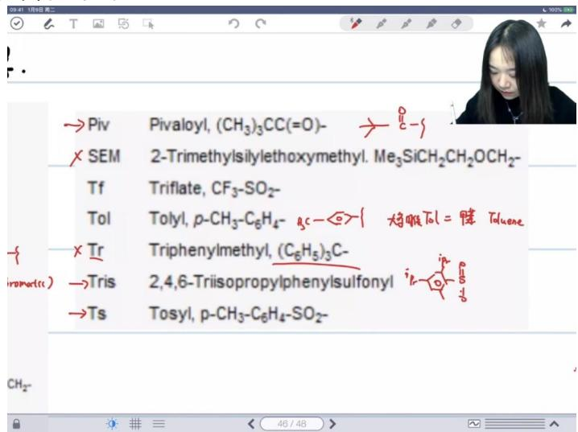

text_image

→Piv Pivaloyl, (CH₃)₃CC(=O)- →
× SEM 2-Trimethylsilylethoxymethyl. Me₃SiCH₂CH₂OCH₂-
Tf Triflate, CF₃-SO₂-
Tol Tolyl, p-CH₃-C₆H₄- nC-<=>{ 大每噁Tol = 醇 Toluene
× Tr Triphenylmethyl, (C₆H₅)₃C-
→Tris 2,4,6-Triisopropylphenylsulfonyl iR
→Ts Tosyl, p-CH₃-C₆H₄-SO₂-
CH₂-

# - Bn与Bz区别:

○ Bn: 苄基 $C_{6}H_{5}-CH_{2}-$   
○ Bz: 苯甲酰基 $C_{6}H_{5}-C(=O)$ -（多一个氧原子）

● Cp的特殊性: 在金属有机化学中通常表示环戊二烯负离子 $C_{5}H_{5}^{-}$ ，具有芳香性

# Ms与Mes区别:

○ Ms: 甲磺酰基 $CH_{3}-SO_{2}$ -（含氧的磺酰基）  
○ Mes: 2,4,6-三甲基苯基（不含氧的三甲基苯基）

● Piv: 新戊酰基 $(CH_{3})_{3}C - C(=O)$ - （与Boc类似但少一个氧）

SEM: 2-三甲基硅乙氧甲基 $Me_{3}SiCH_{2}CH_{2}OCH_{2}-$

\- Tf: 三氟甲磺酰基 $CF_{3}-SO_{2}-$

● Tol: 甲苯基 $p-CH_{3}-C_{6}H_{4}$ -（也可直接表示甲苯溶剂）

\- Tr: 三苯甲基 $(C_6H_5)_3C-$

● Tris: 2,4,6-三异丙基苯磺酰基

● Ts: 对甲苯磺酰基 $p-CH_{3}-C_{6}H_{4}-SO_{2}-$

# ● 缩写使用规范:

- 吡啶基应写作Py而非Pyp   
- Tol多数情况下指甲苯本身而非对甲基苯基  
- 某些缩写（如Tr、Tris等）不常见，考试中可能不会要求

# 三、有机反应分类07:31

# 1. 学术合成反应 08:20

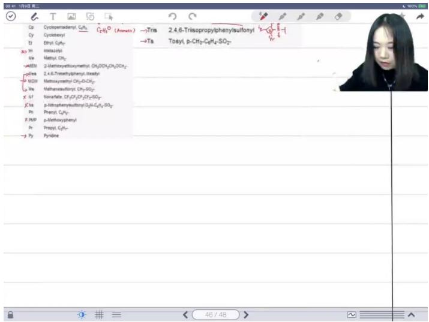

text_image

Cyclopropadienyl, C₆H₄
Cyclohexyl
Et
Ethyl, C₆H₄-
NHNOCH₂
Na
N,Na(II)
→Methyl, CH₃
→MEM
2,4,6-Tetraethylphenyl, Mesbyl
MOM
N,N,N,N,N,N,N,N,N,N,N,N,N,N,N,N,N,N,N,N,N,N,N,N,N,N,N,N,N,N,N,N,N,N,N,N,N,N,N,N,N,N,N,N,N,N,N,N,N,N,N,N,N,N,N,N,N,N,N,N,N,N,N,N,N,N,N,N,N,N,N,N,N,N,N,N,N,N,N,N,N,N,N,N,N,N,N,N,N,N,N,N,N,N,N,N,N,N,N,N,N-N
Pheoyl, C₆H₄
Pheoyl, C₆H₄
Pheoyl, C₆H₄
Pyridine
2,4,6-Trisopropylphenylsulfonyl
Tosyl, p-CH₃-C₆H₄-SO₂-
X:Pt
NHNOCH₂
Na
N=NCH₂
→Tris
→Ts
2,4,6-Trisopropylphenylsulfonyl
Tosyl, p-CH₃-C₆H₄-SO₂-
X:Pt
NHNOCH₂
Na
N=NCH₂
→Methyl, CH₃
→MEM
2,4,6-Tetraethylphenyl, Mesbyl
MOM
N,N,N,N,N,N,N,N,N,N,N,N,N,N,N,N,N,N,N,N,N,N,N,N,N,N,N,N,N,N,N,N,N,N,N,N,N,N,N,N,N,N,N,N,N,N,N-N
Y:Pt
N:Na(II)
N:N(NH)CH₃
Y:Pt
N:Na(II)
Y:Pt
N:Na(II)
Y:Pt
N:Na(II)
Y:Pt
N:Na(II)
Y:Pt
N:Na(II)
Y:Pt
N:Na(II)
Y:Pt
N:Na(II)
Y:Pt
N:Na(II)
Y:Pt
N:Na(II)
Y:Pt
N:Na(II)
Y:Pt
N:Na(II)

# 缩写规范:

○ 甲苯基(Tolyl)常用tol表示，苯基(Benzyl)常用ben表示  
- 对甲苯磺酰基(Tosyl)结构式为 $p - CH_{3} - C_{6}H_{4} - SO_{2}$   
三苯甲基(Triphenylmethyl)结构式为 $(C_6H_5)_3C$   
三甲基硅乙氧基甲基(SEM)结构式为 $Me_{3}SiCH_{2}CH_{2}OCH_{2}$   
三氟甲磺酰基(Triflate)结构式为 $CF_{3}-SO_{2}$

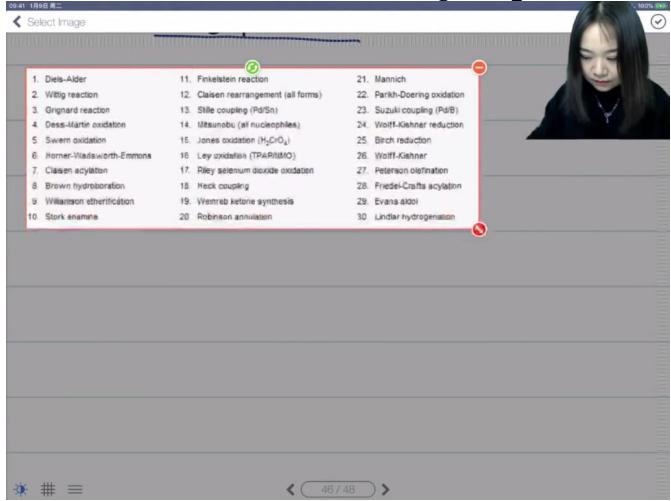

text_image

1. Diels-Alder
2. Wiltig reaction
3. Grignard reaction
4. Dess-Härtin oxidation
5. Swiern oxidation
6. Homer-Wadsworth-Emmons
7. Claisen acylation
8. Brown hydrocarbonation
9. Williamson etberification
10. Stork enamine

11. Finkelstein reaction
12. Claisen rearrangement (all forms)
13. Stille coupling (Pd/Sn)
14. Utsunabi (all nucleophiles)
15. Jones oxidation (H₂CrO₄)
16. Ley oxidation (TPA/PI3MO)
17. Riley selenium dioxide oxidation
18. Heck coupling
19. Weimreb ketone synthesis
20. Robinson annulation

21. Mannich
22. Parikh-Doering oxidation
23. Suzuki-coupling (Pd/B)
24. Wolff-Klechner reduction
25. Birch reduction
26. Wolff-Klechner
27. Peterson-oflation
28. Friedel-Crafts acylation
29. Evans aktol
30. Lindler hydrogenation

# ● 典型反应:

- 第尔斯-阿尔德反应(Diels-Alder)  
○ 维蒂希反应(Wittig reaction)  
○ 格氏试剂反应(Grignard reaction)  
- 狄斯-马丁氧化(Dess-Martin oxidation)  
- 铃木偶联反应(Suzuki coupling)  
- 弗里德尔-克拉夫茨酰基化(Friedel-Crafts acylation)

# - 学术特点:

○ 强调创新性和探索性  
通常进行小规模反应(毫克级)  
◦ 关注新反应开发和机理研究  
- 最终产物量通常仅够表征使用(几毫克至20毫克)

# 2. 工业合成反应 10:04

# 工业特点:

注重实用性和经济性  
○ 主要进行大规模反应(>100克)  
◦ 关注成本控制、环境友好和工艺优化  
- 反应步骤需考虑可放大性  
现代药物合成最小规模也需达到克级

# ● 与学术差异:

- 工业界更倾向使用已验证的可靠反应  
◦ 学术圈部分重要反应在工业中应用有限  
- 工业合成更注重原子经济性和绿色化学  
- 反应选择需考虑原料可获得性和成本

# - 溶剂缩写:

○ 二氯甲烷常用DCM表示  
- 其他常见溶剂也多用缩写形式  
- 箭头标记法常用于表示反应溶剂

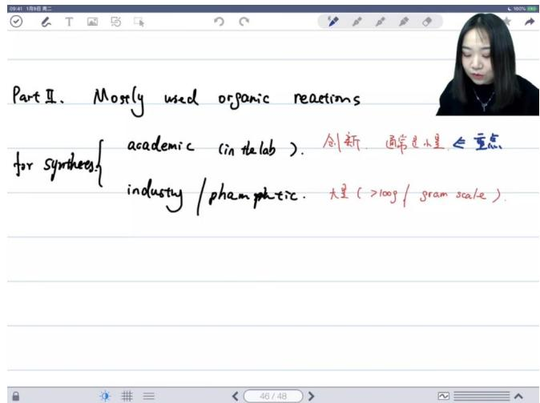

text_image

Part II. Mostly used organic reactions
for synthesis.
{ academic (in the lab ). 创新. 通常是小星. ←重点
industry / phamphatic. 大星 (>100g / gram scale).

# ● 核心区别:

○ 学术研究追求"将不可能变为可能"  
- 工业合成追求"实际应用价值"  
○ 学术反应量级：毫克级  
- 工业反应量级：克级至公斤级  
◦ 学术评价标准：新颖性  
工业评价标准：实用性

# 四、重要有机反应15:18

1. 30个最常用有机反应

text_image

for syntheses.
academic (in the lab).
industry / phamphetic.
大星 (>100g) / 8m

<table><tr><td>1. Diels-Alder</td><td>11. Finkelstein reaction</td><td>21. Mannich</td></tr><tr><td>2. Wittig reaction</td><td>12. Claisen rearrangement (all forms)</td><td>22. Parikh-Doering oxidation</td></tr><tr><td>3. Grignard reaction</td><td>13. Stille coupling (Pd/Sn)</td><td>23. Suzuki coupling (Pd/B)</td></tr><tr><td>4. Dess-Martin oxidation</td><td>14. Mitsunobu (all nucleophiles)</td><td>24. Wolff-Kishner reduction</td></tr><tr><td>5. Swern oxidation</td><td>15. Jones oxidation ( $H_{2}CrO_{4}$ )</td><td>25. Birch reduction</td></tr><tr><td>6. Horner-Wadsworth-Emmons</td><td>16. Ley oxidation (TPAP/NMO)</td><td>26. Wolff-Kishner</td></tr><tr><td>7. Claisen acylation</td><td>17. Riley selenium dioxide oxidation</td><td>27. Peterson olefination</td></tr><tr><td>8. Brown hydroboration</td><td>18. Heck coupling</td><td>28. Friedel-Crafts acylation</td></tr><tr><td>9. Williamson etherification</td><td>19. Weinreb ketone synthesis</td><td>29. Evans aldol</td></tr><tr><td>10. Stork enamine</td><td>20. Robinson annulation</td><td>30. Lindlar hydrogenation</td></tr></table>

● 数据来源：基于Hans Reich教授团队对600+篇全合成文献（约2003-2013年间）的统计分析，样本量约占同期发表量的3-5%  
● 统计方法：记录每个全合成案例中使用的反应和试剂，按使用频率排序得出前30名  
● 反应重合度：与经典有机化学教材内容重合度达80%，具有高度代表性

# 1）反应列表

Diels-Alder反应  
- Wittig反应  
- Grignard反应  
- Dess-Martin氧化  
- Swern氧化  
● Horner-Wadsworth-Emmons反应  
- Claisen酰化  
- Brown硼氢化  
Williamson醚合成  
- Stork烯胺   
Finkelstein反应  
- Claisen重排（所有形式）  
- Stille偶联（Pd/Sn）  
● Mitsunobu反应（所有亲核试剂）  
- Jones氧化 $(H_{2}CrO_{4})$   
● Ley氧化（TPAP/NMO）  
- Riley二氧化硒氧化  
- Heck偶联   
- Weinreb酮合成  
Robinson成环   
- Mannich反应  
● Parikh-Doering氧化  
● Suzuki偶联（Pd/B）  
- Wolff-Kishner还原  
- Birch还原  
- Wolff-Kishner   
- Peterson烯化  
● Friedel-Crafts酰化  
Evans羟醛缩合  
- Lindlar氢化

# 2）配套常用试剂

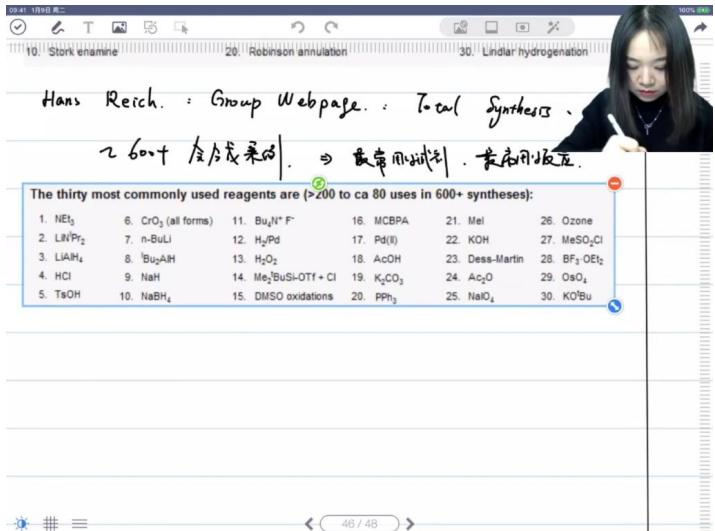

text_image

The thirty most commonly used reagents are (>200 to ca 80 uses in 600+ syntheses):
1. NEt₃ 6. CrO₂ (all forms) 11. Bu₃N⁺ F⁻ 16. MCBPA 21. Mel 26. Ozone
2. LiNiPr₂ 7. n-BuLi 12. H₂/Pd 17. Pd(II) 22. KOH 27. MeSO₂Cl
3. LIAiH₄ 8. ³Bu₂AlH 13. H₂O₂ 18. AcOH 23. Dess-Martin 28. BF₃·OEt₂
4. HCl 9. NaH 14. Me₃BuSi-OTf + Cl 19. K₂CO₃ 24. Ac₂O 29. OsO₄
5. TsOH 10. NaBH₄ 15. DMSO oxidations 20. PPh₃ 25. NaIO₄ 30. KOᵗBu

- 使用频率：在600+合成中每个试剂被使用200-80次不等  
- $NEt_{3}$   
- $LiNPr_{2}$   
- $LiAlH_{4}$   
HCl   
TsOH   
- $CrO_{3}$ (所有形式)  
n-BuLi   
- $Bu_{2}AlH$   
NaH   
- $NaBH_{4}$   
- $Bu_{4}N^{+}F^{-}$   
$H_{2}/Pd$   
$H_{2}O_{2}$   
- $Me_{2}^{t}BuSiOTf$   
● DMSO氧化  
MCBPA   
- Pd催化剂  
AcOH   
$K_{2}CO_{3}$   
PPh3   
Mel   
KOH   
- Dess-Martin试剂  
- $A c_{2} O$   
- $NaIO_{4}$   
03   
- $MeSO_{2}Cl$   
$\bullet BF_{3}\cdot OEt_{2}$   
- $OsO_{4}$   
- $K0^{t}Bu$

# 3）研究背景

● 研究者：Hans Reich教授（威斯康星大学麦迪逊分校化学系，2015年退休）  
● 研究特点：以严谨著称，耗时耗力的大规模文献统计分析工作

● 资源获取：可通过其课题组网站"Total Synthesis"数据库查询完整数据  
● 个人经历：作者2016年在法国会议与其交流，证实其严谨的学术作风

# 2. Aldol反应 20:19

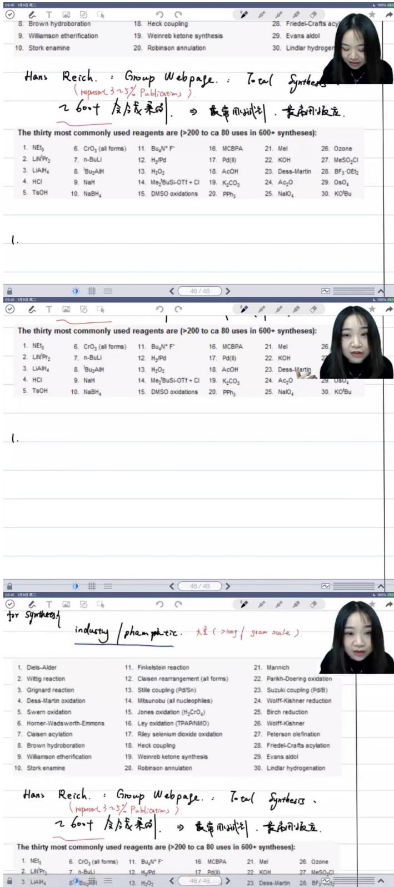

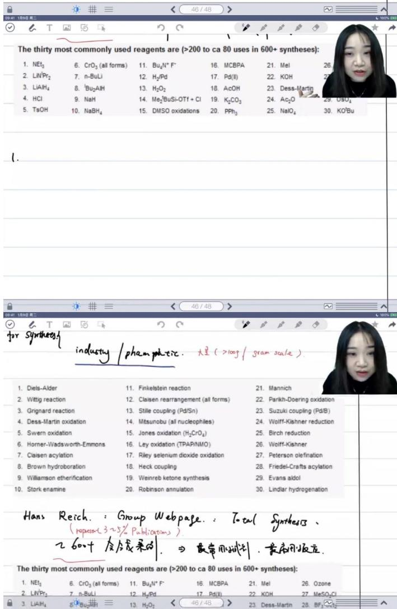

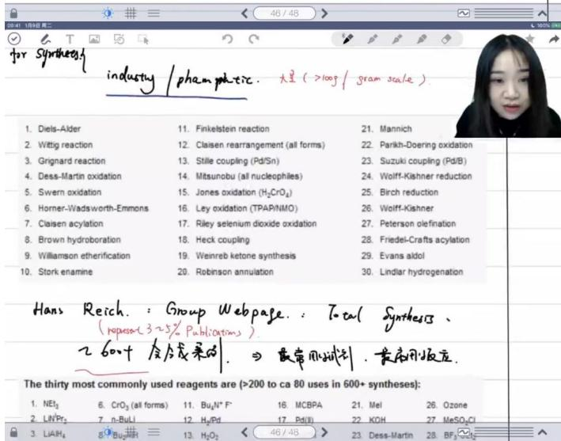

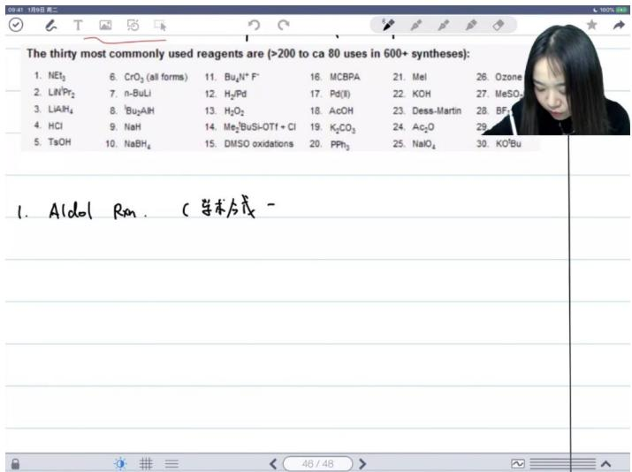

text_image

The thirty most commonly used reagents are (>200 to ca 80 uses in 600+ syntheses):
1. NEt₃  6. CrO₃ (all forms)  11. Bu₄N⁺ F⁻  16. MCBPA  21. Mel  26. Ozone
2. LIN®Pr₂  7. n-BuLi  12. H₂/Pd  17. Pd(II)  22. KOH  27. MeSO₄
3. LIAH₄  8.¹Bu₀AlH  13. H₂O₂  18. AcOH  23. Dess-Martin  28. BF₃
4. HCI  9. NaH  14. Me₂BuSi-OTf + Cl  19. K₂CO₃  24. Ac₂O  29.
5. TsOH  10. NaBH₄  15. DMSO oxidations  20. PPb₃  25. NaIO₄  30. KOᵗBu

1. Aldol Ram . C 考术分式 -

# 1）Aldol反应重要性 21:01

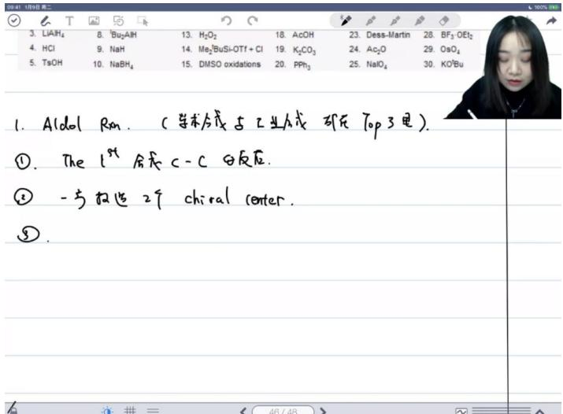

text_image

3. LiAH₄ 8. Bu₂AlH 13. H₂O₂ 18. AcOH 23. Dess-Martin 28. BF₃·OEt₂
4. HCl 9. NaH 14. Me₂BuSi-OTf + Cl 19. K₂CO₃ 24. Ac₂O 29. OsO₄
5. TaOH 10. NaBH₄ 15. DMSO oxidations 20. PPh₃ 25. NaIO₄ 30. KOtBu

1. Aldol Ram. (学术成分与工业组成 邻花 Top 3里).
① The I⁸C 合成 C-C 反应.
② 一方构造 2个 chiral center.
③.

● 学术与工业应用：在学术合成和工业合成中均位列前三名的重要反应  
● 碳碳键构建：最重要的合成构筑碳碳键的反应，是有机物骨架构建的基础  
● 手性中心构建：能一步构造两个手性中心，对全合成具有重要意义  
● 反应地位：被公认为"最最最重要的"有机反应之一

# 2）Aldol反应可逆性 22:05

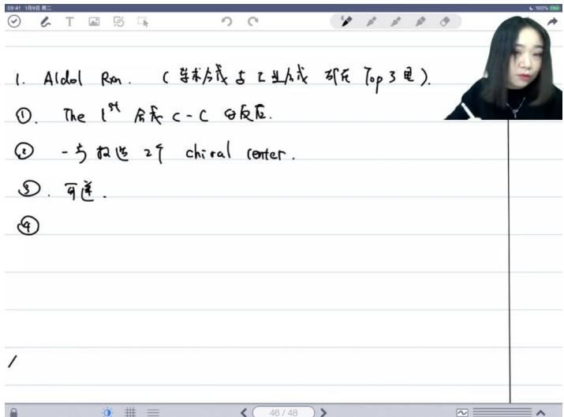

text_image

1. Aldol Ram. (学术成分与工业成分 邵充 Top 3 里).
①. The I' 合成 C-C 反应.
② 一方挑选 2 个 chiral center.
③. 可逆.
④

可逆性特征：Aldol反应是可逆反应，这是需要特别记住的关键点  
- 反应控制方法：

- 使用强碱(如LDA)先形成烯醇负离子  
- 再加入第二个羰基化合物  
- 必须保证第二步反应足够快(动力学控制)

● 底物选择：苯甲醛比苯乙酮更适合，能使反应更干净  
● 动力学控制原理：若反应不够快，会发生质子交换而非期望的Aldol反应

3）Aldol反应选择性 26:07

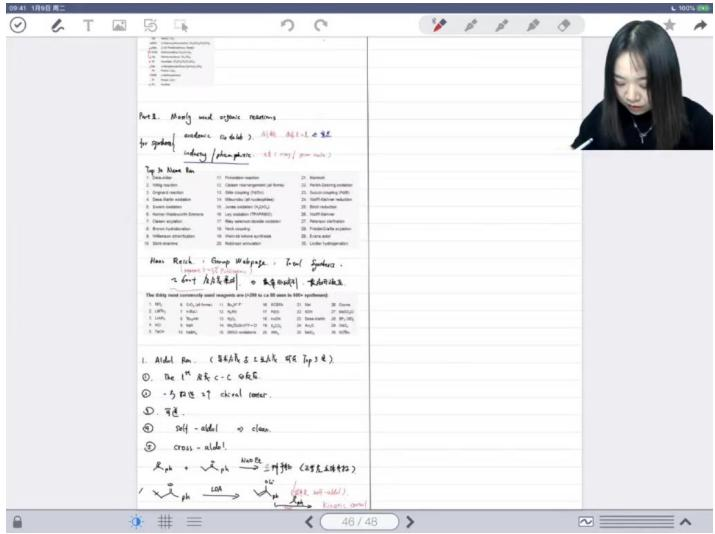

text_image

Part 1. Many and organic reasons
for global: animals (with 3). 切题：起始点①走
to bring water: 48 (cm³/min)
Top is None for:
1. Only water
2. Using water
3. Original water
4. Save water colors
5. Use color
6. Use color
7. Use color
8. Use color
9. Use color
10. Use color
11. Use color
12. Use color
13. Use color
14. Use color
15. Use color
16. Use color
17. Use color
18. Use color
19. Use color
20. Use color
21. Use color
22. Use color
23. Use color
24. Use color
25. Use color
26. Use color
27. Use color
28. Use color
29. Use color
30. Use color
31. Use color
32. Use color
33. Use color
34. Use color
35. Use color
36. Use color
37. Use color
38. Use color
39. Use color
40. Use color
41. Use color
42. Use color
43. Use color
44. Use color
45. Use color
46. Use color
47. Use color
48. Use color
49. Use color
50. Use color
51. Use color
52. Use color
53. Use color
54. Use color
55. Use color
56. Use color
57. Use color
58. Use color
59. Use color
60. Use color
61. Use color
62. Use color
63. Use color
64. Use color
65. Use color
66. Use color
67. Use color
68. Use color
69. Use color
70. Use color
71. Use color
72. Use color
73. Use color
74. Use color
75. Use color
76. Use color
77. Use color
78. Use color
79. Use color
80. Use color
81. Use color
82. Use color
83. Use color
84. Use color
85. Use color
86. Use color
87. Use color
88. Use color
89. Use color
90. Use color
91. Use color
92. Use color
93. Use color
94. Use color
95. Use color
96. Use color
97. Use color
98. Use color
99. Use color
100. Use color

区域选择性：

通常LDA在低温(-78°C)下进攻位阻较小的位置  
- 但温度升高至室温、反应时间延长(12小时)会得到热力学控制产物

\- 立体选择性：

- 烯醇负离子的构型(Z/E)决定最终产物的立体化学  
○ Z构型烯醇负离子生成syn产物  
○ E构型烯醇负离子生成anti产物

● 构型控制因素：

通常Z构型更常见(当R基团位阻较大时)  
- 但当氧原子上连有位阻基团(如路易斯酸)时，可能形成E构型  
○ 实际构型需通过实验确定，理论预测尚不成熟

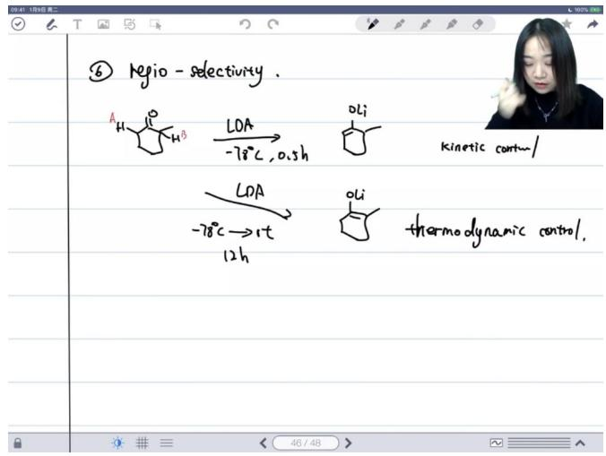

text_image

⑥ Négio - selectivity .
A H C=O H B
LOA
-78°C, 0.5h
OLi
kinetic control/
LOA
-78°C→1t
12h
OLi
thermo dynamic control,

O

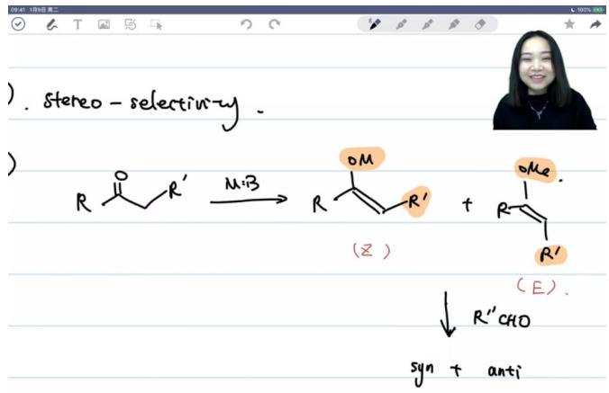

chemical

Stereo-selectivity reaction scheme showing amide intermediate (R) reacting with imidazole to form an enol intermediate (Z) and then to yield R''CHO and syn + anti

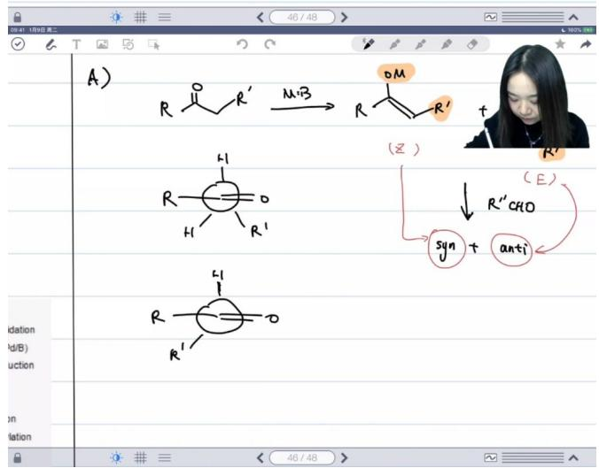

chemical

Chemical reaction scheme showing transformation of aldehyde to amide and then to imine, with R' groups and syn/anti labels

# - 反应条件影响：

○ LDA/THF体系通常主要生成Z构型烯醇负离子  
- 反应温度和时间会影响产物分布

# - 解释模型：

- 使用构象中间体模型解释实验结果  
○ 当R和R'位阻大时，A构象有利(生成Z)  
○ 当氧原子位阻大时，B构象有利(生成E)

# 3. Evans醛醇反应 35:48

# 1）反应机理 36:34

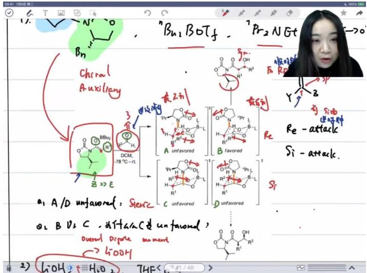

text_image

Bn
Chiral
Auxiliary
3
DCM
-78 °C - rt
a1 A/D unfavored; Sierrz
b2 B Vs C, aHTamC is unfavored;
overd Dipore moment
→ LiOH
2) LiOH + H2O2 → THF < #1/48 >

● 关键步骤：反应首先生成Z构型烯醇硼酸酯中间体，该中间体具有高度立体选择性

- 硼试剂作用： $Bu_{2}BOTf$ 作为路易斯酸与DIPEA（二异丙基乙胺）共同作用，DIPEA作为碱捕获生成的质子  
● 反应条件：需在-78°C低温下进行，随后升至室温完成反应

2）立体选择性 42:25  
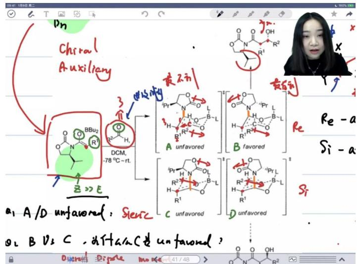

chemical

Chemical reaction diagram showing chiral auxiliary transformation with labeled intermediates and conditions (unfavorable, favored)

● 选择性来源：主要受两个因素控制：

位阻效应：大位阻基团倾向于处于反式位置  
○ 偶极矩最小化：过渡态中偶极矩最小化原则

\- 产物构型：

○ Z构型中间体必然生成syn产物（同侧）  
- 最终主产物为B构型（通过Zimmerman-Traxler模型预测）

● 记忆要点：反应可同时构建两个手性中心，是形成碳碳键的重要方法

3）辅助基团脱除 46:54   
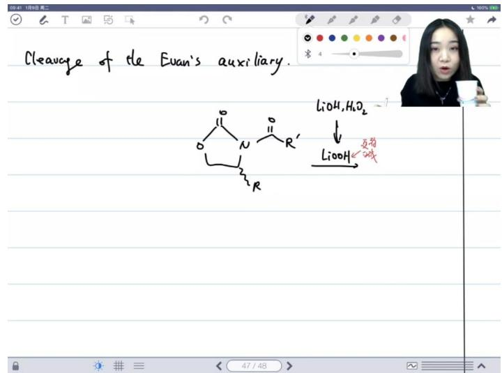

chemical

Chemical reaction diagram showing cleavage of the Evan's auxiliary compound with LiOH and H2O2 as reagents

● 氧化脱除法：

○ 使用 $LiOH/H_{2}O_{2}$ 体系  
○ 产物为羧酸（RCOOH）

\- 还原脱除法：

○ Weinreb酰胺法：与格氏试剂反应生成酮  
- 氢化铝锂还原：生成醇   
○ 硼氢化锂还原：同样生成醇

\- 酯化脱除法：与醇盐反应生成酯

● 选择依据：根据后续合成需求选择适当的脱除方法

# 五、烯烃复分解反应53:29

# 1. Grubbs催化剂 53:36

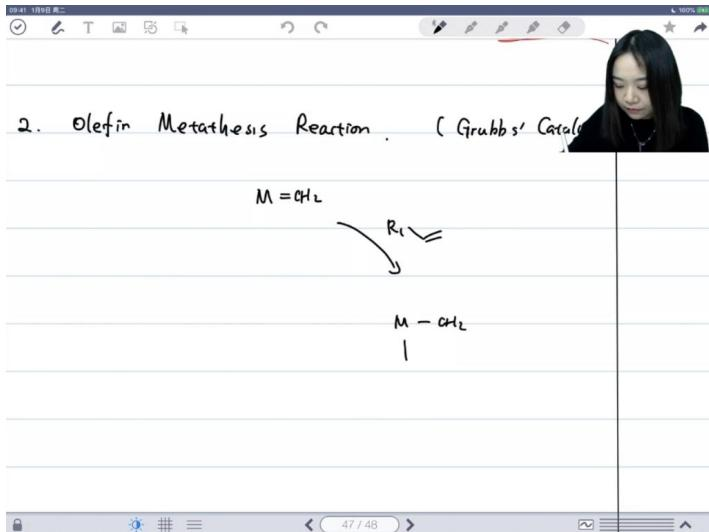

text_image

2. Olefin Metathesis Reaction. (Grubb's Catalysis)
M = CH₂
R₁ =
M - CH₂
1

- 核心结构: 采用钌(Ru)金属中心, 关键活性位点为 $M = CH_{2}$ 亚甲基卡宾结构  
● 应用特点: 在有机合成中广泛使用，特别适用于构建碳碳双键

# 2. 2+2环加成机理 54:18

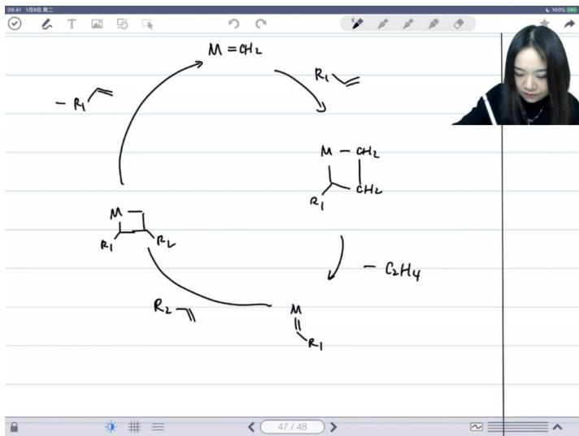

chemical

Reaction mechanism diagram showing M=CH₂ and R₁R₂ pathways with intermediate structures labeled M-H, R₁, R₂, C₂H₄

- 反应过程:
    - 第一步2+2环加成: 两个烯烃通过[2+2]环加成形成金属杂环丁烷中间体
    - 立体化学考虑: 反应需考虑底物的空间位阻效应

● 逆反应: 中间体可逆向解离，通过消除乙烯完成复分解

# 3. 开环反应 54:32

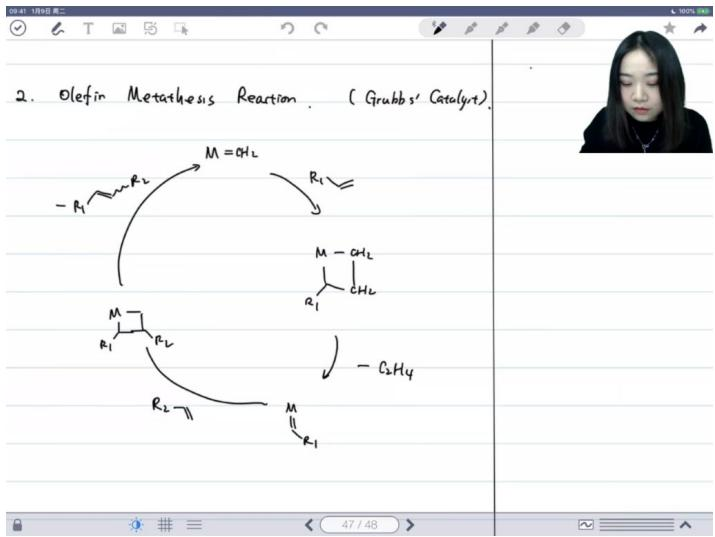

chemical

Chemical reaction diagram showing olefin metathesis with Grubbs' catalytic cycle, including M=CH2 and R1 groups

# ● 关键步骤:

○ 环状烯烃开环释放环张力  
○ 伴随乙烯 $(C_{2}H_{4})$ 分子的生成

● 应用价值: 特别适用于张力环状烯烃的转化

# 4. 反应驱动力 55:16

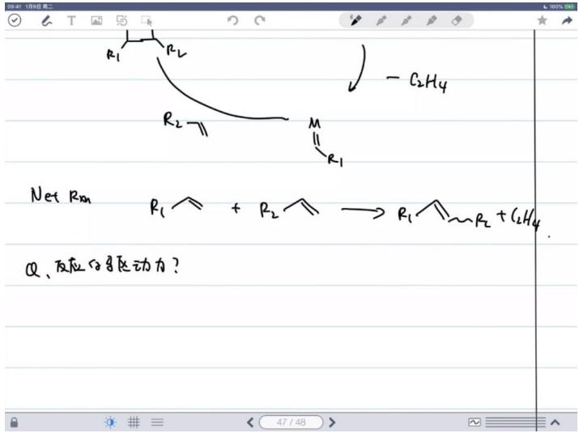

chemical

Chemical reaction diagram showing net Rm formation with R1, R2, and M groups

# ● 热力学因素:

- 熵增驱动: 主要来自乙烯气体的生成（熵值显著增加）  
○ 焓变贡献: 反应焓变通常不大

● 特殊驱动力: 环状底物反应时，环张力的释放可提供额外驱动力

# 5. 乙烯生成应用 01:03:50

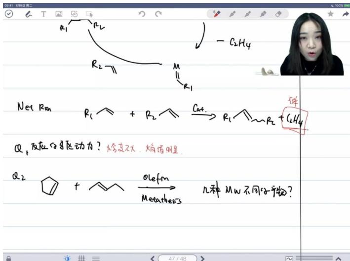

chemical

Chemical reaction diagram showing reduction of ethylene to ethylene oxide with ethylene oxide, followed by hydrogenation and fragmentation steps

● 最佳应用场景: 反应设计以乙烯生成为主要产物时效果最佳  
● 合成策略: 常利用端基烯烃通过分子内环化产生乙烯

# 6. 开环复分解聚合 01:05:27

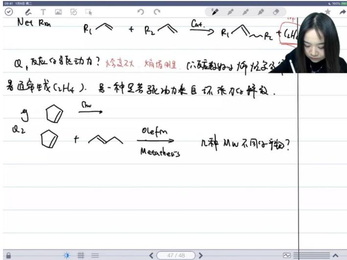

chemical

Chemical reaction equations and diagrams showing transformation of a ketone to an olefin using a metathesis, with molecular structures labeled.

● 反应类型: 称为ROM (Ring-Opening Metathesis)   
● 产物特征: 可生成高分子聚合物  
● 应用限制: 需注意避免不期望的聚合副反应

# 六、偶联反应01:09:00

# 1. Stille偶联 01:09:03

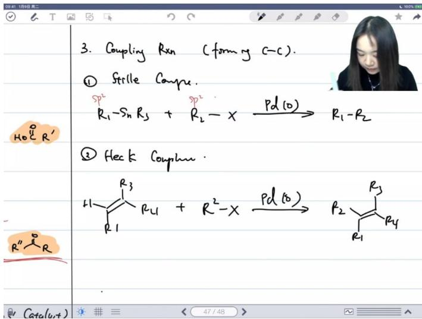

chemical

Chemical reaction scheme showing coupling of Rn to R-C via Grille and Heck methods, with Pd(0) as the intermediate step

- 反应通式: $R_{1} - SnR_{3} + R_{2} - XPd(0)R_{1} - R_{2}$   
● 催化剂: 使用零价钯(Pd(0))作为催化剂  
- 反应物特征: 反应物中一个为有机锡化合物 $(R_{1} - SnR_{3})$ ，另一个为卤代烃 $(R_{2} - X)$   
● 碳杂化状态: 参与反应的碳原子均为 $sp^{2}$ 杂化

# 2. Heck偶联 01:12:04

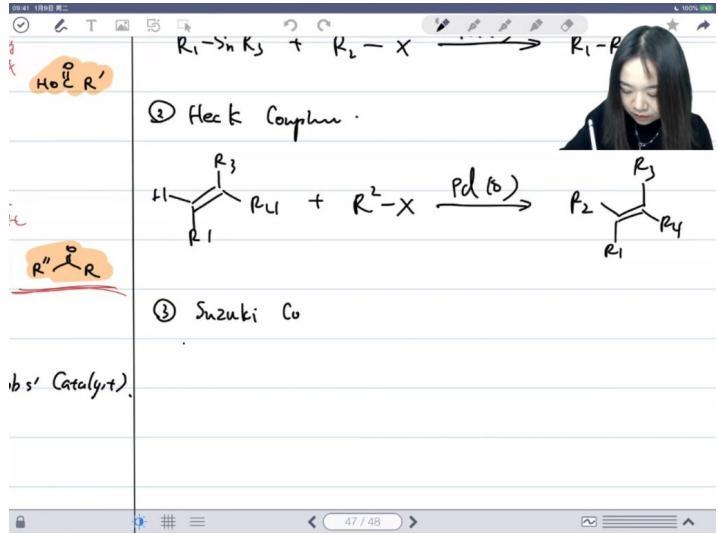

chemical

Chemical reaction scheme showing hydrogenation of alkynes to form a chiral phosphonate ester and then to Suzuki Co, with molecular structures labeled R1-R4 and R''-R-R'

# - 反应特点:

○ 使用零价钯(Pd(0))催化  
反应物为烯烃 $(R_{1} - CH = CH_{2})$ 和卤代烃 $(R_{2} - X)$   
○ 构建碳碳键的高效方法

# 优势:

- 反应条件温和  
○ 官能团容忍性好  
- 虽然需要贵金属钯催化剂，但反应效率高

# 3. Suzuki偶联 01:12:29

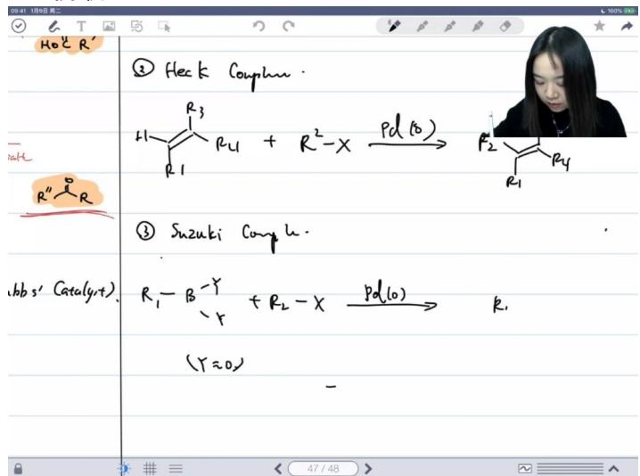

chemical

Chemical reaction scheme showing two pathways to form a radical intermediate, with photochemical data and reaction conditions.

\- 反应通式: $R_{1} - B(OR)_{2} + R_{2} - XPd(0)R_{1} - R_{2}$

● 硼试剂: 使用硼酸酯类化合物作为反应物

● 碱的作用: 需要加入碱(如醇钠)生成烷氧负离子，进攻硼原子活化反应

# - 反应特点:

○ 同样使用零价钯(Pd(0)催化  
- 卤代烃 $(R_{2} - X)$ 为必需反应物  
○ 另一个碳源来自硼试剂 $(R_{1}-B(OR)_{2})$

# 4. 偶联反应比较

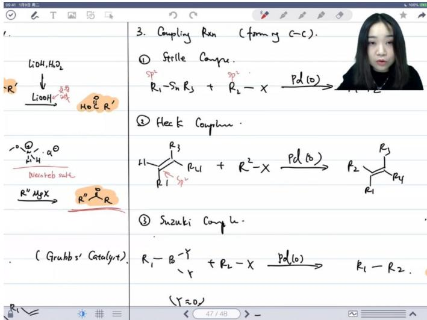

text_image

LiOH, H2O
R' ↓
L100H 6.5%
HO2 R'
-° θ - α θ
Δ4
Dermiteb sufti
R'' MgX → R'' R''
( Grubb's' Catal(y,t) )
3. Coupling Rxn (form y C-C).
① Stille Coupx.
Sp²
R₁-SₙR₃ + Sp²
Pd(o)
② Heck Couplm.
H¹
R³
Pd(O)
R₁
R₂
Pd(O)
R₁
R₃
R₄
③ Suzuki Coupln.
R₁-B-Y + R₂-X → R₁-R₂.
(Y=0)

# ● 共同点:

○ 均使用零价钯(Pd(0))催化  
○ 都需要卤代烃 $(R_{2}-X)$ 作为反应物  
○ 核心都是构筑碳碳键

# - 差异点:

- Stille偶联使用有机锡化合物  
- Heck偶联使用烯烃  
- Suzuki偶联使用硼试剂

# - 现代应用:

○ 相比传统的Aldol反应，这些偶联反应条件更温和  
○ 产物单一性更好，避免了Aldol反应的可逆性和立体化学复杂性

# 七、Diels-Alder反应01:13:36

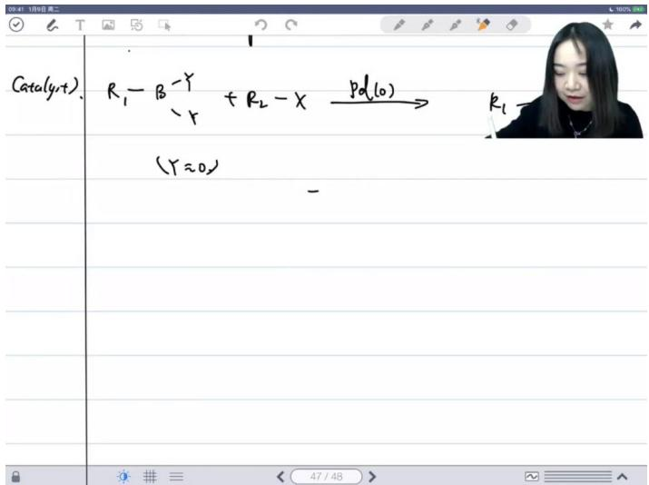

text_image

Catal(y,t)
R₁ - B - γ + R₂ - x → Pd(0)
(r=0)
-

# 1. 热力学驱动 01:13:47

● 反应本质：双烯体和亲双烯体反应生成两 $\sigma$ 键  
● 驱动力：反应为焓驱动（ΔH主导），因为形成两个更强的σ键取代较弱的π键  
● 反应条件：通常需要加热或路易斯酸催化

# 2. endo选择性 01:14:30

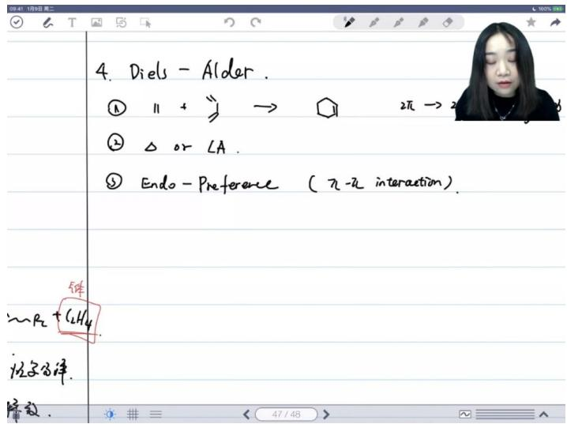

text_image

4. Diels - Alder.
① 11 + 2 → 2π → 2
② △ or LA.
③ Endo - Preference (π - π interaction).
5件
~P₂ + C₂H₄.
6化学体.
降效.

● 现象：反应倾向于生成endo产物  
● 原因：次级轨道相互作用（可理解为 $\pi-\pi$ 堆积效应）  
● 应用特点：虽然反应机理不难理解，但在有机合成中应用非常广泛

# 八、Grignard反应01:15:37

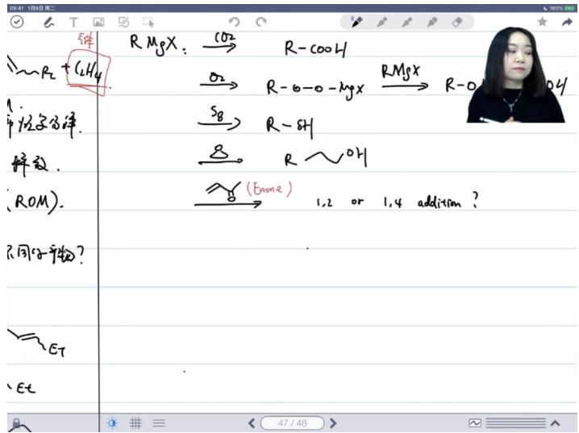

text_image

R MgX: CO2 → R-COOH
→ O2 → R-0-0-MgX → RMgX → R-OH 24
→ S8 → R-SH
→ 8 → R ~OH
ROM). → (Enone) 1.2 or 1.4 addition ?
不同的产物?
ET
ET

1. 与CO2反应 01:16:14

● 产物：经workup后生成羧酸  
- 反应式: $RMgX + CO_{2} \rightarrow R - COOH$

2. 与O2反应 01:16:51

\- 反应过程:

○ 首先生成过氧化物R-O-O-MgX  
- 进一步与Grignard试剂反应

● 最终产物：醇 $(R-OH)$

\- 其他反应：

○ 与硫粉反应经workup可得硫醇（R-SH）  
- 与环氧乙烷反应生成相应醇类衍生物

# 3. 1,2与1,4加成 01:17:57

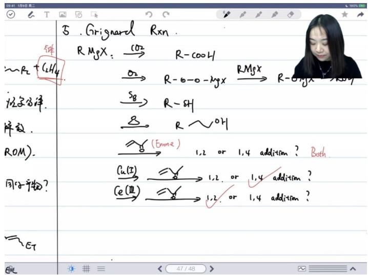

text_image

5. Grignard Rxn.
R MgX: CO2 → R-COOH
→R2 + C2H4
→ O2 → R-6-0-MgX → RMgX → R-6-MgX → ROOH
经定方程.
→ S8 → R-SH
序数.
→ 8 → R ~ OH
ROM).
→ (Enone) 1.2 or 1.4 addition? Both
同子代数?
→ Cu(I) → = 1.2 or 1.4 addition?
→ Ce(II) → = 1.2 or 1.4 addition?

# 与烯酮反应：

○ 直接反应时同时存在1,2和1,4加成  
通常不直接使用Grignard试剂与烯酮反应

# - 改进方法：

- 与铜试剂混合后主要发生1,4加成  
○ 加入强路易斯酸（如三价稀土金属）可促进1,2加成

# ● 选择机理：

○ 1,2加成为硬碱特性  
○ 1,4加成为软碱特性（铜碳键共价性较强）

# ● 特殊应用：一价铜试剂可用于端炔的氢替代反应

# 九、Wittig反应01:20:39

# 1. Horner-Wadsworth-Emmons改良 01:23:31

● 工业应用：传统Wittig反应后处理麻烦，工业上更多使用HWE改良法，将三苯基磷替换为磷酸酯

# - 反应条件:

- 碱：常用NaH、DBU等无亲核性的强碱   
- 底物：通常使用醛类化合物  
○ 产物构型：当R=H时主要生成E型烯烃

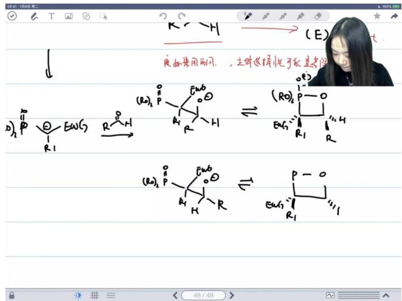

chemical

Chemical reaction diagram showing hydrogenation and ring expansion of a cyclic ester with (RO)2 groups, including electron transfer and hydrogen bonding

# - 立体控制因素：

○ EWG效应：强吸电子基团促进四元环中间体形成  
○ 取代基效应：R1为小基团时倾向E型产物，大基团时倾向Z型产物  
平衡控制：磷氧键的强相互作用影响中间体稳定性

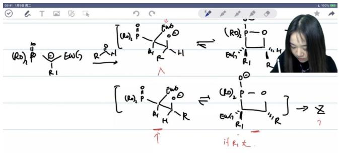

chemical

Chemical reaction mechanism diagram showing enol formation and subsequent rearrangement with R groups, including a photo of a person reacting with an alkene.

实际应用中是 E or 2 主要

# - 中间体稳定性：

四元环中间体：当EWG吸电子能力强时占主导  
- 开链中间体：当EWG吸电子能力弱时更稳定

# ● 构型控制机理：

◦ 动力学控制：小R1基团时E型更稳定  
- 热力学控制：大R1基团时Z型更稳定

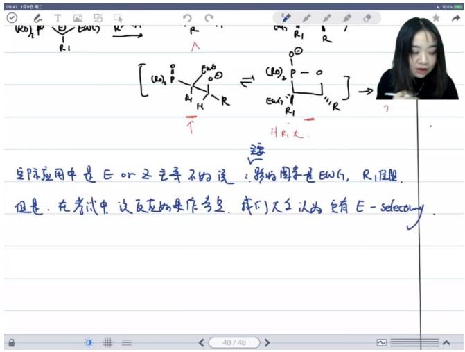

text_image

实际应用中是Eor之主寻不的说：影响图素是EWG，R1但是。在考试中，这反应如果作多点。我们大家认为只有E-selectory。

# - 应试要点：

通常认为该反应具有E选择性  
- 主要影响因素：EWG的吸电子能力和R1基团大小  
○ 实际应用中构型选择需具体分析，但考试默认E型为主

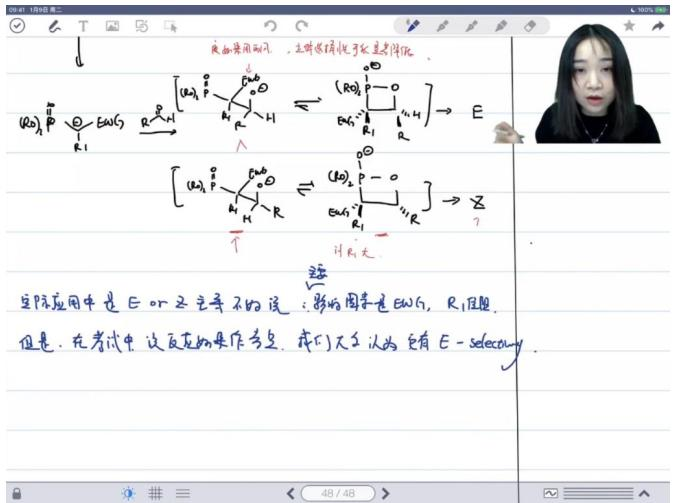

text_image

R1
(Ro)2P
→ EWO3
R1
[Ro)2P
→ O
R1
(Ro)2P
→ H
R1
(EH)2P
→ O
R1
(EH)2P
→ H
R1
(EH)2P
→ O
R1
(EH)2P
→ Z
?
计R1无
实际应用中是Eor之主系不的说：影响图素是EWO3，R1仅限。
但是，在考试中，让反应效果作参考。我们大家认为是有E-selectory。

# - 合成价值：

- 重要的碳碳键形成反应  
- 与经典Wittig反应互补  
- 在复杂分子合成中应用广泛

# 十、Williamson醚合成01:34:34

# 1. SN2机理 01:35:09

● 常用性: 最常用的醚合成方法，在醚类化合物合成（如二甲醚）中广泛应用  
● 反应特点: 典型的 $S_{N}$ 2亲核取代反应，需考虑位阻效应  
● 设计要点: 需要合理设计亲核试剂和底物的空间构型，确保 $S_{N}$ 2反应顺利进行

# 十一、Finkelstein反应01:35:54

# 1. 卤素交换 01:35:58

● 反应本质: 通过 $S_{N}$ 2机理实现的卤素交换反应

● 常见体系:

- 氯/溴代烃与碘负离子在丙酮溶剂中的交换  
- 醇类先转化为磺酸酯（ROTf），再与碘负离子反应

● 应用价值: 合成中将较差离去基团（Cl/Br）转化为更好离去基团（I）的常用方法  
● 历史背景: 该反应虽为人名反应，但在教学中更多强调其卤素交换的实质过程

# 十二、Friedel-Crafts反应01:37:35

# 1. 酰基化反应 01:37:44

● 反应类型：包括Friedel-Crafts酰基化和Friedel-Crafts烷基化两种主要类型  
● 应用差异：烷基化反应应用不如酰基化广泛，主要因为存在重排问题  
● 实际应用：往芳环上引入烷基时，通常采用先酰基化再还原的间接方法  
● 电子效应：反应要求芳环不能太缺电子（需注意电子云密度对反应的影响）  
● TOP30地位：该反应在重要有机反应中排名前30位

# 十三、Stork烯胺反应01:38:37

# 1. 亲核性增强 01:39:44

● 结构特征：烯胺（enamine）结构为 $R_{2}N-C=C$ ，氮原子邻位碳具有亲核性  
● 反应原理：通过将羰基化合物转化为烯胺中间体，显著增强亲核进攻能力  
● 后续反应：通常与羰基化合物进行亲电反应（氢电实际反应）  
● 经典应用：可作为Robinson成环反应的前体步骤

# TOP20地位：该反应在重要有机反应中排名第20位

\- 注：由于提供的课程记录中未包含具体PPT内容和例题素材，故未插入相关图片。笔记严格依据字幕内容整理，保留了所有关键知识点和数字信息（如TOP排名），并按照康奈尔笔记法进行了结构化处理。

# 十四、Mannich反应01:41:34

# 1. 多组分反应机理 01:42:57

● 反应类型: 属于羰基化反应和汤基化弧反应同一类反应  
● 反应组分: 包含环状铜化合物和醛的三组分反应  
● 反应顺序: AB组分先组合生成亚胺中间体（碳氮双键结构）  
● 电子效应:  
○ 亚胺显著增强亲电性  
- 氮原子通过推电子作用促进后续反应

# ● 关键步骤:

○ 首先生成碳氮键  
- 随后烯醇（非烯醇负离子）进行亲核进攻

\- 最后完成缩合反应（condensation）

● 构筑键类型: 主要用于构筑碳碳键

# 十五、Claisen反应01:44:42

# 1. 酯缩合 01:45:30

● 反应条件: 需要使用匹配的碱且需要过量

\- 反应驱动力:

○ 产物α-氢的酸性大于原料  
○ 生成盐促使反应进行

● 反应类型: 属于羰基相关反应

● 反应特征: 仅发生缩合反应

# 十六、Claisen重排01:47:13

# 1. [3,3]σ迁移 01:47:21

● 结构特征: 发生在六元环上含有一个氧原子的[3,3]σ迁移反应  
● 常见性对比:

- 在周环反应中最常见的两个反应是克莱森重排和Diels-Alder反应  
- 完全由碳原子组成的[3,3]σ迁移反应相对不常见  
○ 含氧的克莱森重排是最常见的[3,3]σ迁移类型

# 十七、Peterson烯化反应

● 反应本质: 通过硅试剂生成烯烃的反应  
- 反应机理:

起始步骤: 使用三甲基硅试剂（如TMSCI）与金属有机化合物反应

■ 示例： $R_{2}CH-SiMe_{3}$ 的制备

- 去质子化: 在强碱（如BuLi）作用下拔除质子  
■ 稳定因素:

● $R_{2}$ 基团需具有稳定负电荷的能力  
● 硅原子的空d轨道可稳定负电荷（dπ共轭效应）

- 羰基加成: 生成的硅基负离子与羰基化合物反应  
- 最终产物: 形成烯烃结构

\- 特点:

○ 与Wittig反应类似  
- 工业应用较少但学术研究中常见

# 十八、氧化反应概述

● 学术研究现状: 在学术论文中出现频率极高  
● 代表性反应:

○ Dess-Martin氧化  
○ 四氧化锇 $(OsO_{4})$ 氧化  
○ 二氧化硒 $(SeO_{2})$ 氧化  
○ Jones氧化

● 工业应用差异: 工业界实际使用的氧化反应种类相对较少

# 十九、Swern氧化反应

应用价值:

○ 机理研究价值高  
◦ 实际应用比预期更广泛

● 特点: 属于学术研究中常见的"奇怪"氧化反应类型之一

# 二十、氧化反应01:53:29

# 1. Swern氧化 01:54:12

● 反应特点：温和氧化反应，能将一级醇转化为醛  
● 核心试剂：三氧化硫 $(SO_{3})$ 和DMSO $((CH_{3})_{2}SO)$ ，配合吡啶和三乙胺使用  
- 反应机理：

- 硫原子带正电荷 $(S^{+})$ ，氧原子带负电荷 $(O^{-})$   
○ 由于原子轨道不匹配，形成硫叶立德结构  
- 硫叶立德中碳带负电荷 $(C^{-})$ ，硫仍保持正电荷 $(S^{+})$   
- 夺取醇α位的氢原子完成氧化过程

● 应用价值：实验室合成中实际使用频率较高

# 2. Dess-Martin氧化 01:58:29

● 反应地位：与Swern氧化同为实验室最常用的氧化方法  
- 特点:

- 反应条件温和  
○ 选择性好  
○ 后处理简单

# 3. Jones氧化 02:00:53

# 二十一、还原反应02:06:48

# 1. 硼氢化氧化

● 反应步骤：分为两步，第一步加入硼烷试剂（含B-H键），第二步加入过氧化氢和氢氧化钠  
● 特点：反马氏规则的加成反应，最终产物为醇  
● 应用：常用于烯烃的羟基化，反应条件温和

# 2. Birch还原 02:08:02

- 试剂组成：钠和液氨体系  
● 反应机理：生成氨合电子和自由基中间体

\- 产物特征：

○ 环内双键被还原为单键（环内不共轭）  
环外双键保持共轭状态

● 取代基影响：通过自由基负离子稳定性判断反应活性，给电子基团稳定自由基负离子

# 3. Wolff-Kishner还原 02:08:29

● 反应条件：碱性环境（肼和氢氧化钾）  
- 对比反应:

- 酸性条件：克莱门森还原（锌汞齐+盐酸）  
- 中性条件：催化氢化

● 应用：将羰基化合物还原为亚甲基

# 4. 二氧化硒氧化

- 试剂结构：类似二氧化碳的线性结构，具有孤对电子  
- 典型反应：

○ 在烯丙位引入羟基  
○ 机理涉及硒的氧化态变化（最终被还原为二价硒）

● 注意事项：机理需要进一步确认，可能存在争议

# 5. 四丙基高钌酸铵氧化

\- 两种条件：

- 无水条件：生成醛  
○ 含水条件：生成羧酸（通过水合醛进一步氧化）

● 特点：温和的氧化剂，可控制氧化程度

# 6. 臭氧化反应

# - 后处理控制：

- 还原性后处理（如二甲硫醚）：得到醛或酮  
- 氧化性后处理：得到羧酸

● 机理要求：需要掌握详细的反应机理

# 7. Mitsunobu反应

\- 试剂组合：三苯基膦+偶氮二甲酸二乙酯(DIAD)

# ● 机理特点：

○ 鞣进攻氮形成磷正离子  
◦ 羟基被活化成为好的离去基团  
- 最终发生构型翻转

● 产物：形成酯（羧酸组分来源于反应物）

# 8. 其他重要反应

# ● Baeyer-Villiger重排：

○ 迁移基团选择：能更好稳定正电荷的基团优先迁移   
- 常用氧化剂：m-CPBA

# - Hofmann消除：

步骤：过量碘甲烷处理→湿润氧化银→加热消除  
○ 产物特点：生成较少取代的烯烃（反扎伊采夫规则）

# 二十二、Hofmann消除 02:49:47

# 1. 低取代度烯烃 02:50:39

● 动力学控制原理: 与E2消除反应类似, 优先拔取代度低的氢原子, 这是由过渡态稳定性决定的  
● 分析方法: 核心是通过绘制过渡态的纽曼投影式来分析反应选择性  
● 产物特征: 主要生成取代度较低的烯烃产物，这与Saytzeff规则相反

# 二十三、Hofmann重排02:53:10

# 1. 氮宾中间体 02:53:45

● 别称: 又称霍夫曼降级反应(Hofmann degradation)  
● 中间体: 反应过程中生成六电子的氮宾(nitrene)中间体

# - 反应机理:

- 酰胺经处理后生成异氰酸酯中间体  
○ 水解后得到少一个碳的伯胺

● 理论地位: 在基础有机化学教学中地位重要，但实际合成中应用频率不高

# 二十四、烯烃制备方法

# 1. 硒氧化物消除

● 反应条件: 使用二价硒试剂处理后氧化(过氧化氢/臭氧/mCPBA)  
● 立体选择性: 发生顺式(syn)消除  
● 产物: 生成α,β-不饱和羰基化合物(烯酮)

# 2. 其他制备方法

● Robinson成环: Michael加成-aldol缩合串联反应  
● DDQ氧化: 热力学驱动优先氧化羰基 $\alpha,\beta$ 位氢  
● 醋酸铅氧化: 在DMSO/O₂条件下氧化醇为酮

# 二十五、合成反应统计观察

# - 低使用率反应:

○ Cope重排(全碳版本克莱森重排)

- 克莱门森还原(锌汞齐还原)  
○ 法沃斯基重排(循环反应)  
- 贝克曼重排(肟重排)

# 工业常用反应:

- 酸催化脱水生成烯胺   
○ Oppenauer氧化(醇被丙酮氧化为酮)

# 二十六、制药工业反应统计

● 数据来源: 辉瑞(Pfizer)公司1990年代统计数据  
● 研究范围: 制药工业中有机合成反应的实际使用频率  
● 意义: 反映理论重要反应与实际工业应用的差异

# 二十七、工业常用反应 02:56:54

# 1. 羧酸衍生物转化 03:06:34

● 统计特点: 在工业界反应统计中占比最高，但在学术界的"名人反应"中较少出现  
● 原因分析: 经典羧酸衍生物转化反应（如有机化学210课程内容）大多不属于"名人反应"范畴  
● 主要类型:

- 保护和脱保护反应  
- 酰胺形成反应（关键使用脱水剂）  
- 酯和酸的相互转化

● 工业应用: 在药物活性分子合成中具有重要地位

# 2. 碳碳键形成 03:09:48

# 1）主要反应类型

\- 传统主导反应:

○ Aldol反应（占比最高）  
○ 烯醇化物加成（enolate addition）  
○ 克莱森缩合  
○ 烯醇化物烷基化（enolate alkylation）

\- 现代重要反应:

○ 偶联反应（cross coupling）

■ 近年重要性已提升至与Aldol反应相当  
■ 数据统计受限于1985-2002年时间段

# ● 特殊类型:

○ 氰基形成反应（CN bond formation）

# 2）反应统计特点

\- 计数规则:

○ 相同实验流程重复多次仍计为1个反应  
- 任何实验流程修改即计为新反应  
- 串联反应整体计为1个反应（不按机理步骤拆分）

# 3. 碳氮键形成 03:12:54

# 1）主要反应类型

● 还原胺化（reductive amination）：

◦ 实验室最常用的碳氮键形成方法

● 偶联反应:

○ 虽未获诺奖但工业价值重大   
○ 占比约15%

\- 杂环形成:

○ 在药物化学中地位突出（多数活性分子含氮杂环）

◦ 学术研究中相对少见  
- 考试建议：第一轮复习可跳过杂环章节

# 2）反应机理

# SN2机理:

○ 典型实例：DAP/三苯基磷活化羟基体系

■ 氮亲核进攻→形成碳氮键  
■ 羧酸根进攻→形成酯键（碳氧键）

# 3）工业vs学术差异

# 工业侧重:

○ 含氮化合物合成（药物活性需求）  
○ 杂环构建反应

# ● 学术侧重:

○ 碳碳键形成  
○ 氧化还原反应

# 共性重点:

○ 碳碳键形成  
- 羧酸衍生物转化  
○ 氧化还原反应

# 二十八、知识小结

<table><tr><td>知识点</td><td>核心内容</td><td>考试重点/易混淆点</td><td>难度系数</td></tr><tr><td>Aldol反应</td><td>最重要的碳碳键构筑反应,可一步构造两个手性中心,可逆反应</td><td>区域选择性(LDA+低温控制)、立体选择性(Z构型烯醇负离子生成syn产物)</td><td></td></tr><tr><td>烯烃复分解反应</td><td>通过金属卡宾机理实现烯烃重组,驱动力是乙烯释放</td><td>开环复分解聚合(ROMP)应用,产物种类判断</td><td></td></tr><tr><td>偶联反应(Suzuki/Stille等)</td><td>钯催化SP2碳的交叉偶联,温和高效构建芳环体系</td><td>不同偶联试剂的区别(硼酸酯vs锡试剂),配体选择</td><td></td></tr><tr><td>Diels-Alder反应</td><td>[4+2]环加成,熵驱动的周环反应</td><td>endo选择性(次级轨道作用),路易斯酸催化机制</td><td></td></tr><tr><td>格氏试剂反应</td><td>与CO2生成羧酸,与O2经中间体过氧化物最终得醇</td><td>与α,β-不饱和羰基物的1,2 vs 1,4加成控制</td><td></td></tr><tr><td>Wittig反应</td><td>三苯基磷叶立德与醛酮生成烯烃,E式选择性</td><td>改良的Horner-Wadsworth-Emmons反应(磷酸酯替代)</td><td></td></tr><tr><td>Swern氧化</td><td>DMSO/(COCl)2体系温和氧化醇→醛,关键硫叶立德中间体</td><td>低温操作(-78°C),三乙胺淬灭</td><td></td></tr><tr><td>克莱森重排</td><td>[3,3]-σ迁移反应,氧参与版本更常用</td><td>全碳版本在合成中少见(设计风险高)</td><td></td></tr><tr><td>烯醇化学</td><td>酯缩合(Claisen)、酮烷基化等碳负离子反应</td><td>不同碱的选择(LDA/NaH/EtONa),动力学vs热力学控制</td><td rowspan="2"></td></tr><tr><td>工业vs学术反应差异</td><td>工业侧重实用性和放大效应,学术侧重创新性</td><td>统计显示:工业界醛酮转化占27%,偶联反应近年上升</td></tr><tr><td>Hofmann消除</td><td>四级铵碱热分解得少取代烯烃(动力学控制)</td><td>与Saytzeff规则对比,湿润Ag2O的作用</td><td></td></tr><tr><td>Peterson烯化</td><td>硅稳定的碳负离子与羰基反应,β-羟基硅烷消除</td><td>与Wittig反应对比,硅氧键驱动性</td><td></td></tr><tr><td>二氧化硒氧化</td><td>烯丙位氧化为烯醇→羰基,争议机理</td><td>与DDQ氧化的选择性差异</td><td></td></tr></table>