# 一、全合成01:52

# 1. 例题:甲酸乙酯合成

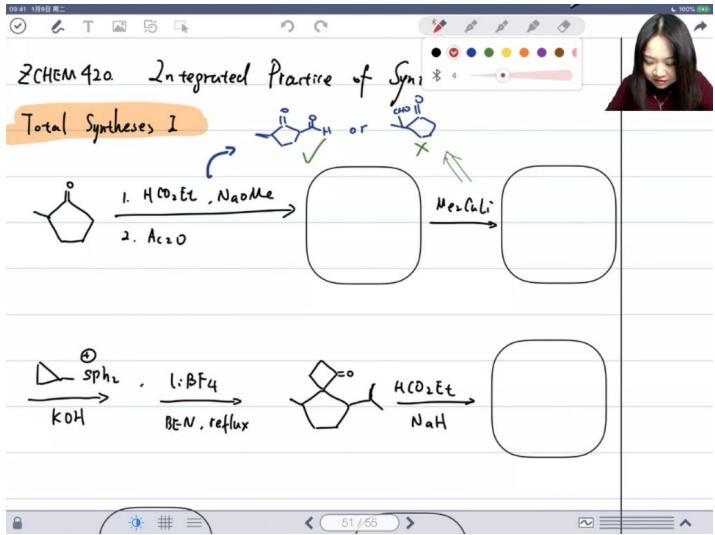

chemical

Chemical reaction scheme for ZHEM 420 integrated practice of syni, showing synthesis pathways and reagents like HCO₃Et or Ac₂O

# - 反应步骤:

- 第一步：甲酸乙酯在甲醇钠(NaOMe)条件下反应  
- 第二步：乙酸酐 $(Ac_{2}O)$ 处理

# - 反应控制:

- 温度控制：选择性可以通过控制温度来实现  
○ 产物推导：通过后续使用的烷基酮锂试剂可以反推产物为α,β-不饱和醛酮类化合物

# - 合成策略:

- 逆向推导：当不确定中间产物时，可以从后续反应试剂倒推前一步产物  
○ 常见现象：专业合成人员在实际操作前也常不确定反应是否按预期进行

# 2. 例题: 螺环化合物合成 07:41

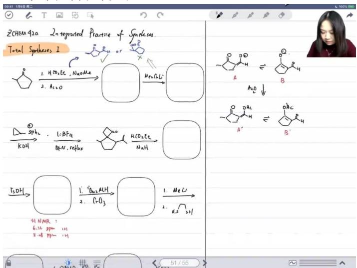

chemical

Chemical reaction scheme for synthesizing 2-phenyl 42a from 2CHEM, showing intermediates and products A, B, and C with reagents and yields.

# - 反应选择:

位点判断：反应发生在A位点而非B位点  
○ 判断依据：从最终产物结构反推反应路径

# - 中间体特征:

○ 结构特殊性：末端带有良好离去基团  
- 反应变种：属于 $\alpha, \beta$ -不饱和羰基化合物加成的变体

# - 反应机理:

○ 甲基加成：第一步甲基加成形成中间体  
○ 离去基团：中间体中的离去基团 $(SPh_{2})$ 随后离去  
- 最终产物：形成传统α,β-不饱和羰基化合物结构

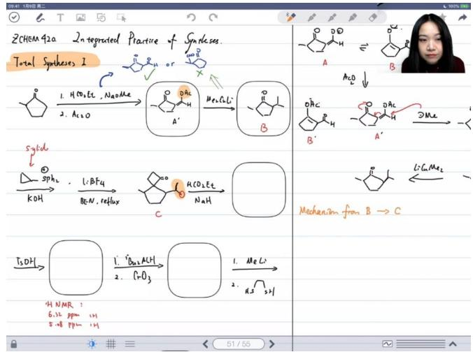

chemical

Chemical reaction scheme for synthesizing cyclohexene derivatives from 2CHEM 42a, showing intermediates A', B', C' and products like acetone, ethyl ester, and alkene.

# - 硫叶立德反应:

反应组成：由硫叶立德 $(S-Ph_{2})$ 和四氟硼酸锂 $(LiBF_{4})$ 组成  
- 反应条件：在苯中加热回流

# - 重排过程:

四元环形成：在路易斯酸条件下发生重排生成四元环  
○ 立体化学：文献报道主要产物具有特定立体构型

■ 进攻方向：硫叶立德倾向于从空间位阻较小的一面进攻羰基  
■ 构型保持：最终产物中羰基碳与取代基处于同侧

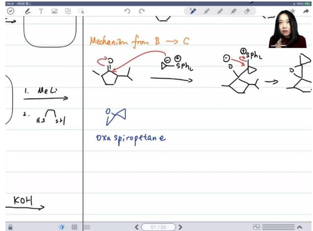

text_image

Mechanism from B → C
1. Me Li
2. H2S sH
Oxa spiropetane
KOH

# - 重排机理:

○ 起始物质：氧杂螺戊烷(oxaspiropentane)   
- 重排产物：在加热或路易斯酸条件下重排为环丁酮  
○ 反应特点：

■ 碳标号：明确羰基碳位置对理解重排至关重要  
■ 文献依据：实际反应中使用外消旋体原料，但产物具有一定立体选择性

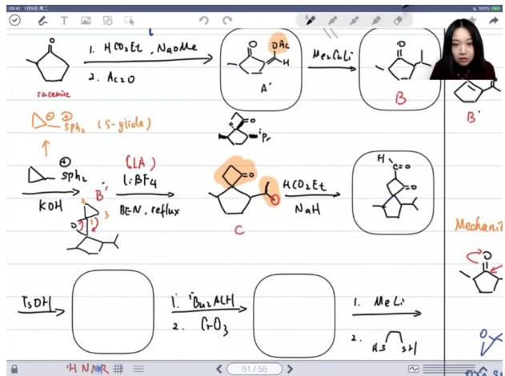

chemical

Multi-step organic synthesis reaction scheme involving nucleophilic substitution, acetic acid addition, and alkene formation with stereochemistry indicated

# - 最后步骤:

- 反应类型：典型的酯缩合反应  
- 反应条件：在酸催化下，苯/水混合溶剂中回流  
○ 产物特征：形成环状结构完成全合成

# 3. 例题:醛酮化合物合成 21:49

# 1）反应机理分析

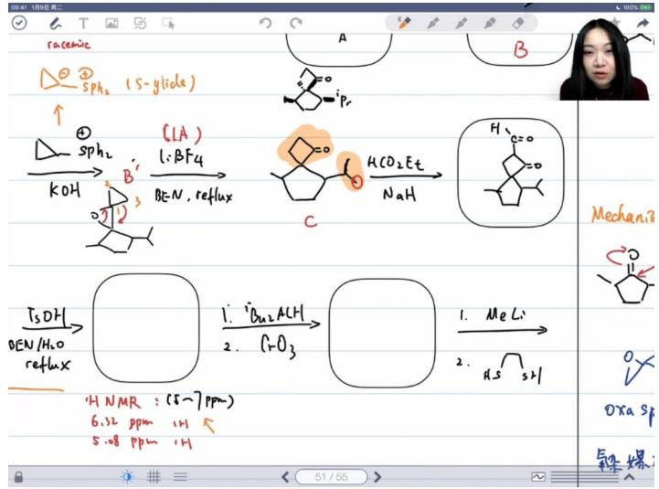

chemical

Chemical reaction scheme showing phosphine-catalyzed cyclization and subsequent stepwise transformation with MeLi and H3 groups

# ● NMR特征峰分析：

- 5-7 ppm区间出现两个特征峰（5.08 ppm和6.32 ppm）  
○ 醛基氢通常在11 ppm左右，烷基氢在0-4 ppm之间  
- 5-7 ppm的氢属于SP²杂化碳上的烯氢

# - 反应步骤解析：

- 第一步发生逆羟醛缩合反应（retro-aldol）或retro-alkylation反应  
- 中间体结构断裂后在水存在下形成新的结构单元  
○ 醛基通过烯醇式转化，醇羟基与羰基脱水形成六元环

# - 后续反应路径：

- 使用DIBAL-H（二异丁基氢化铝）还原  
○ 三氧化锰氧化生成羧酸（酸性条件）或醛（碱性条件）  
- 最终形成氧杂六元环骨架的内酯结构

# 2）反应条件与结构验证

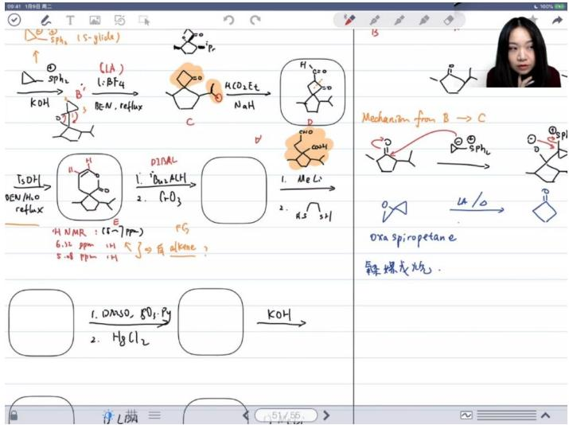

chemical

Chemical reaction pathway diagram showing transformation from phenyl alcohol to ketone via intermediates and intermediates with reagents like COH, H2CO2Et, and Oxaldehyde.

# ● 关键试剂：

○ DIBAL-H（二异丁基氢化铝）：选择性还原酯基为醛  
○ 三氧化锰：温和氧化剂，可将醛氧化为羧酸  
○ 甲基锂：强亲核试剂，与羰基发生加成反应

# - 结构验证方法：

○ HNMR中5-7 ppm的烯氢特征峰  
○ 氧杂螺环戊烷结构的特征信号  
○ 通过化学位移区分不同环境氢原子

# 3）反应机理深入探讨

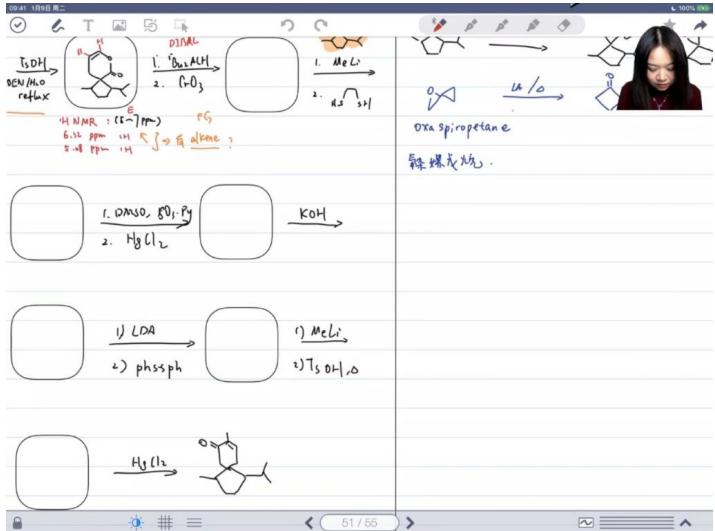

chemical

Chemical reaction pathway for synthesizing oxa spiropetan e and alkene, showing intermediates and reagents

# 铝试剂作用：

- 铝原子可稳定氧负离子中间体  
○ 影响反应区域选择性和立体化学

# work-up过程：

○ 后处理时醛基优先被氧化  
- 醇羟基快速形成内酯结构  
- 羰基位置从环下转移到环上

# 4. 休息 32:43

# 1）课程进程说明与课堂作业回顾 34:42

# ● 课堂练习内容:

○ 包含五个合成反应（三个全合成，两个特殊反应）  
- 反应机理需要详细推导和验证

# ● 学习建议：

- 及时完成课堂练习巩固知识点  
○ 通过绘制反应机理加深理解

# 2）期末考试安排与作业提交要求 35:05

# ● 考试要求：

- 一周内完成期末考试（下周日前提交）  
- 建议使用扫描软件生成清晰PDF文件

# 作业提交：

- 直接发送给授课教师  
○ 机理题需手绘后扫描上传  
- 确保图片清晰可辨

# 5. 醛酮化合物合成反应机理 37:19

# 1）硫保护羰基的反应机理

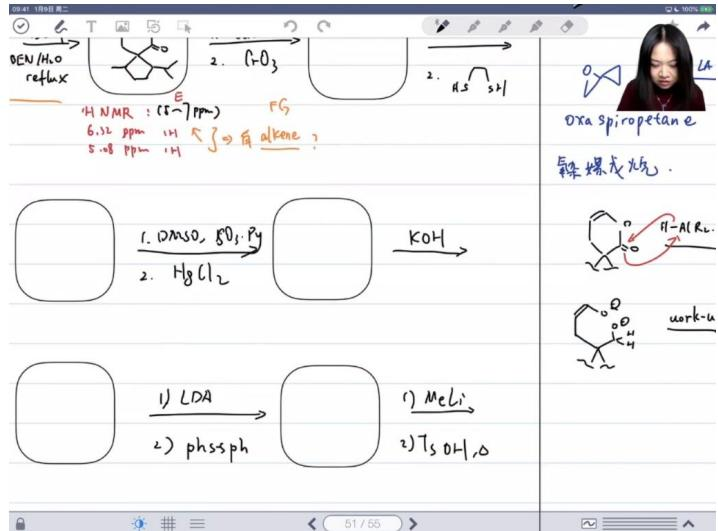

text_image

OEN/H2O
reflux
H NMR : (5~7ppm) FS
6.12 ppm H <3>有 alkene ?
5.08 ppm H
Oxa spiropetane
鞣螺旋光气.
1. DMSO, SO₃: Py
2. HgCl₂
KOH
1) LDA
2) phssph
1) MeLi
2) TsOH, O
H-AlR₂
work-u

- 硫保护必要性：防止分子内半缩酮形成，因为分子内半缩酮/半缩醛在热力学上更稳定，会导致无法得到目标产物

# - 典型反应步骤：

- 先用LDA生成碳负离子  
- 与二硫化物反应实现硫保护  
○ 甲基锂使羰基铜化

\- 脱硫机制：类似Swern氧化的变种，使用 $HgCl_{2}$ 脱硫，因汞硫结合力强（软硬酸碱理论）

# 2）分子内Aldol反应

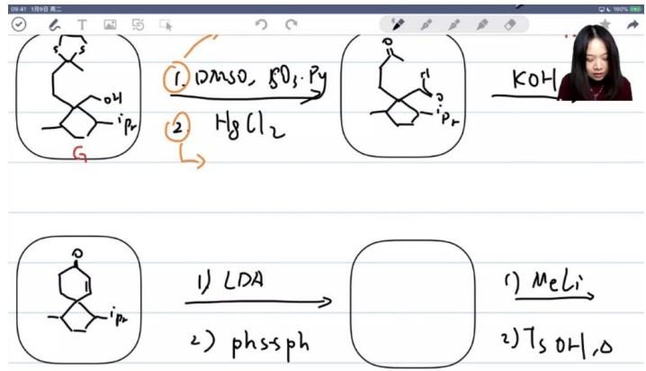

chemical

Chemical reaction scheme showing transformation of a hydroxyalkane derivative to a glycerol via LDA and phssph, then to methyl and hydroxyl groups.

51/55   
● 成环特点：形成六元环（123456）

# ● 关键步骤:

○ LDA生成碳负离子攻击硫原子  
- 硫硫键断裂（类似过氧键易断裂）  
- 净结果生成新的碳硫键并释放苯硫负离子

# - 后续处理：

○ 甲基锂进行1,2-加成  
- 酸性条件下醇脱水生成烯烃   
- 最终发生碳正离子重排

# 3）汞脱硫反应机理

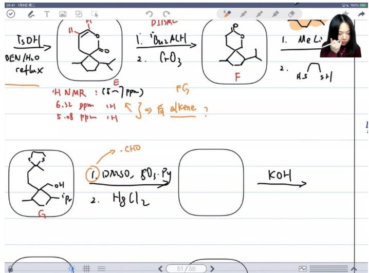

chemical

Chemical reaction scheme showing transformation of a cyclic compound with diimide and aldehyde to form a ketone, followed by acidification to form a hydroxy ketone.

● 反应类比：汞脱硫类似于氟脱硅，都是基于软硬酸碱理论  
- 试剂体系： $DMSO/SO_{3}/Py$ 体系  
● 作用机制：

○ 将硫代缩醛氧化为醛基(-CHO)  
- 汞试剂通过强硫汞结合力实现脱硫

# 4）自由基扩环反应

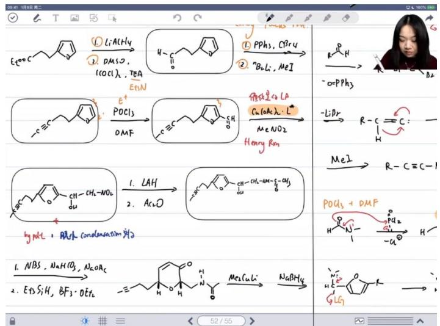

chemical

Chemical reaction equations and molecular structures of a substituted cyclohexene derivative with various reagents and conditions

反应特点：呋喃环在自由基条件下扩环生成六元环  
● 反应特点：呋喃环在自由基条件下扩环生成六元环  
● 关键步骤：

○ NBS引发自由基反应  
- 溴自由基转移  
○ 在碳酸氢钠存在下形成半缩酮

\- 后续还原：

○ 三乙基硅氢 $(Et_{3}SiH)$ 在 $BF_{3}$ 作用下将羟基还原为氢

○ 硼氢化钠 $(NaBH_{4})$ 还原羰基为羟基

# 5）TEMPO氧化反应

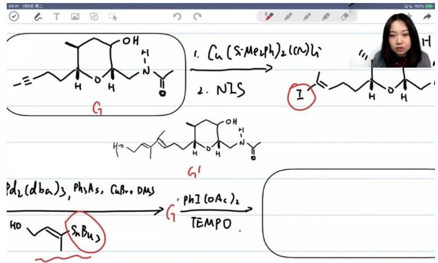

chemical

Chemical reaction scheme showing synthesis of compound G from a cyclic amide intermediate and then via TEMPO to form a diol product.

● 选择性：优先氧化位阻较小的一级醇为醛基  
- 反应机理：

\- 碘试剂作为亲电试剂进攻羟基

\- TEMPO催化将一级醇选择性氧化为醛

● 应用限制：二级醇也可能反应，但一级醇因位阻小优先反应

# 6）Henry反应应用

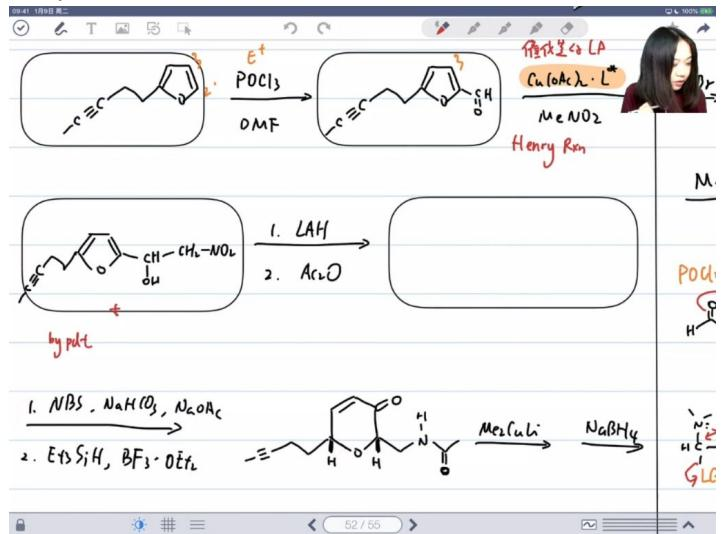

chemical

Chemical reaction scheme showing phosphorus-catalyzed transformation of a substituted cyclohexene derivative using POCl3 and methanol, with reagents and conditions labeled.

反应类型：硝基甲烷与羰基化合物的缩合反应  
- 催化方式：

- 碱催化：硝基α位去质子化形成碳负离子  
- 酸催化：活化羰基，硝基形成"烯醇式"结构

● 副产物：脱水缩合产物（主产物为加成产物）

# 7）钯催化偶联反应

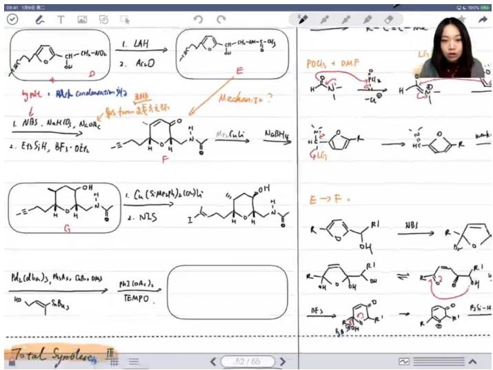

chemical

Chemical reaction scheme for synthesizing polyurethane derivatives from LNAH, Ac2O, and NBS under different conditions

- 卤素作用：作为偶联位点引入卤原子

● 典型试剂：

○ $Pd(db a)_{2}$ 作为钯催化剂  
○ 三苯基砷 $(Ph_{3}As)$ 作为配体

● 反应特点：实现分子间碳碳键形成

8）碳正离子重排机理  
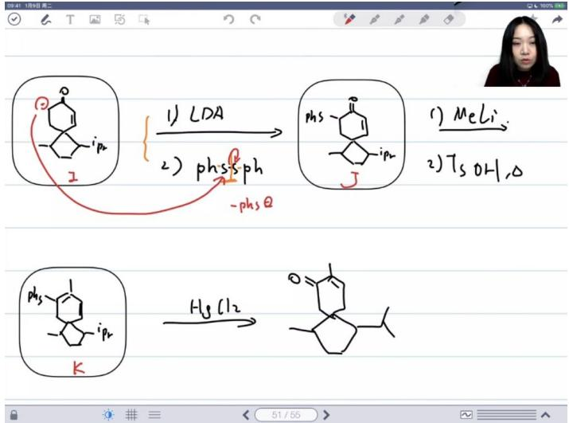

chemical

Chemical reaction scheme showing LDA and phsph transformation to MeLi and TsOH, with K group modification to form a hydroxy radical

● 引发条件：酸性加热环境

\- 重排过程：

- 醇脱水形成碳正离子   
○ 发生正电子重排  
○ 水解后双键重排

● 产物特征：形成更稳定的共轭体系

# 6. 有机合成设计 01:36:44

1）官能团的转化

● 核心内容: 有机合成设计中官能团转化是重要组成部分，包括常见官能团的相互转换

\- 延伸操作:

- 保护基的使用：在特定反应步骤中对敏感官能团进行保护  
- 脱保护操作：在后续步骤中去除保护基恢复原始官能团

● 考试重点: 需要熟练掌握各类官能团间的转化关系和保护/脱保护策略

2）构建碳碳键 01:37:05

● 主要反应类型:

○ Aldol反应: 形成新的碳碳键的重要反应  
○ 偶联反应: 包括各类金属催化的交叉偶联反应  
- 烯烃复分解: 虽然考试中较为明显，但仍需掌握

# ● 考试策略:

◦ 重点掌握经典反应机理和应用  
- 熟悉反应条件选择  
- 注意反应立体化学控制

● 复习建议: 反复练习典型反应案例，确保考试时能快速识别和应用

# 3）应用案例 01:37:28

例题：烯醇应用

○ 烯醇烷基化反应

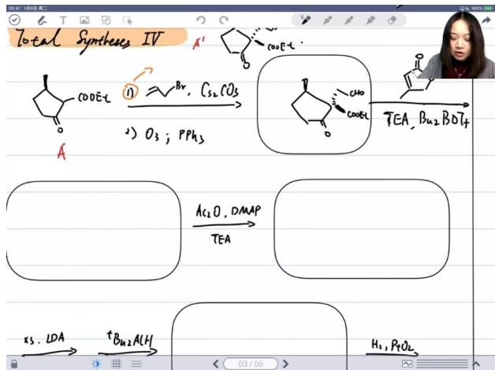

chemical

Chemical reaction scheme for synthesizing compounds from Total Syntheses IV, showing intermediates and transformations

■ 反应机理：该反应是典型的α位烷基化反应，甲基从下方进攻  
■ 碱的选择：使用碳酸铯 $(Cs_{2}CO_{3})$ 作为碱，因为两个羰基之间的α位酸性很强  
■ 后续步骤:
● 臭氧化断开碳碳双键
● 加入三苯基磷 $(PPh_{3})$ 作为还原剂，将双键转化为醛基

○ 硼试剂参与的反应

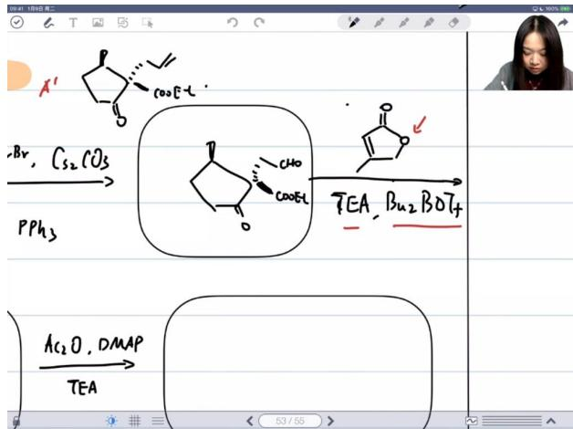

chemical

Chemical reaction scheme showing conversion of compound A' to PPh3 via intermediate TEA, with reagents and conditions labeled

■ 硼烯醇反应：
● 在三乙胺(TEA)存在下， $\alpha,\beta-$ 不饱和内酯与硼试剂反应
● 反应类似烯醇反应，将硼视为氢原子

■ 区域选择性：
● 醛基比酯基更活泼，主要因为位阻小
● 烷基给电子作用强，酯基氧也有给电子作用

○ Aldol反应机理

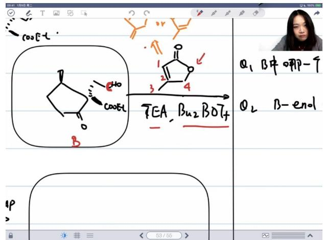

chemical

Chemical reaction diagram showing conversion of a cyclohexene derivative to a tetrahydrofuran derivative with labeled steps and reaction conditions

# 进攻位点选择：

● 非 $\alpha,\beta-$ 不饱和酯时，碳1( $C_{1}$ )优先进攻  
● 存在不饱和键时，碳 $3(C_{3})$ 和碳 $4(C_{4})$ 也带负电荷  
● 碳3位阻比碳1更小

# 六元环过渡态：

● 硼和氧形成六元环过渡态  
● 只有位置合适的烯醇α位才能进攻羰基

# ○ LDA保护策略

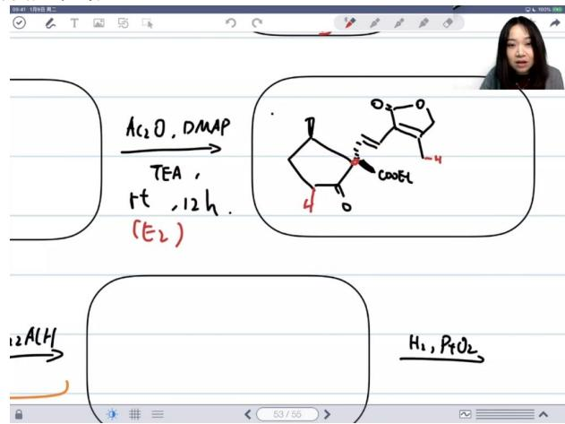

chemical

Chemical reaction scheme showing conversion of acetic anhydride to ethyl acetone using DMAP and TEA, with hydrogenation steps

# 保护原理：

● 过量LDA使有α-H的羰基烯醇化  
● 电子富集的体系不易受亲核进攻  
● 保护了有 $\alpha-H$ 的羰基，只让酯基反应

# ■ 还原选择性：

- 酯基还原为醇   
- 其他羰基保持不变

# - Adams催化剂应用

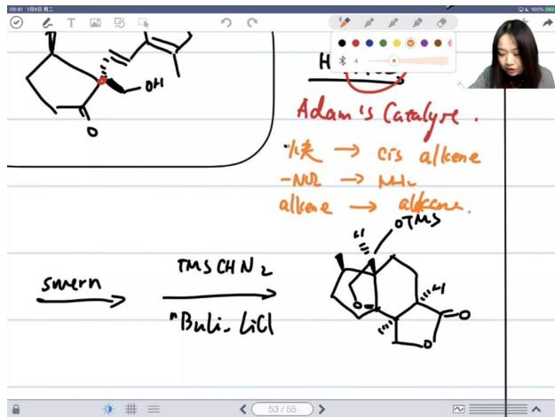

chemical

Chemical reaction diagram showing conversion of a cyclic alcohol to a steroid derivative using TMS and BuLi, with enzyme reactions and reaction conditions.

# 选择性还原：

- 炔烃 $\rightarrow$ 顺式烯烃(cis alkene)   
- 硝基 $(-NO_{2})\rightarrow$ 氨基 $(-NH_{2})$   
- 烯烃(alkene)→烷烃(alkane)

# ■ 电子效应：

- 富电子体系(e - rich)优先被还原  
● 通过控制用量和时间实现选择性

# ○ SmI2介导的偶联

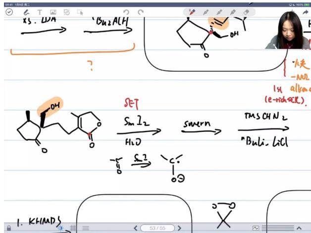

chemical

Chemical reaction scheme showing transformation of compound Xs.LMA to a cyclic ester with reagents and conditions

# ■ 反应特点：

- 单电子转移过程  
● 将羰基转化为自由基负离子

# 区域选择性：

- 可形成六元环结构  
- 碳 $a(C_{a})$ 和碳 $b(C_{b})$ 都可能参与偶联  
● 实际形成碳 $c(C_{c})$ 的环

# ○ Swern氧化

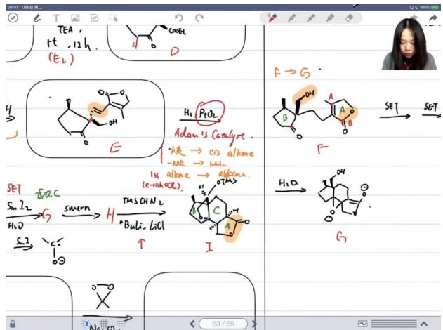

chemical

Chemical reaction scheme showing conversion of compound TEA to form product I, with intermediate steps and structural formulas for each step.

# ■ 反应过程：

● 将醇氧化为醛  
- 保持环系立体构型不变

# 立体化学：

- 羟基朝上  
甲基朝下

# ○ 串联反应机理

# ■ 反应步骤:

- 氢氧根(OH $^{-}$ )进攻羰基  
● 生成的氧负离子打开环氧环  
- 最终形成羟基

# ■ 特点：

● 由氢氧化锂(LiOH)引发  
- 多步反应连续进行  
● 形成热力学稳定产物

# ● 例题:二甲基过氧化铜的应用 02:29:40

# - 反应机理分析

■ 反应原料：丙酮与碳酸氢钠水溶液反应，加入复合盐二甲基过氧化铜(DMSO)作为关键试剂  
■ 中间产物: 反应生成硫酸氢钾和硫酸钾, 实现过氧键的氧转移  
■ 溶剂体系: 使用1%碘化钠溶液，溶剂为二甲硫醚与DMF按1:2比例混合  
● LDA拔除α-H后与醛反应  
● mCPBA氧化并加热完成最终转化  
- 最后通过Mitsunobu反应构建双键

# ■ 关键步骤:

# - 反应机理难点

■ 第一步特殊性: 二甲硫醚不仅是溶剂，实际被DMF活化生成甲硫醚负离子  
■ 中间体结构: B中间体并非简单的溴碘交换产物，需考虑SN2反应路径  
■ 最后转化: 通过23- $\sigma$ 迁移反应将硒氧双键迁移得到最终产物

# ● 例题:经典合成反应 02:50:20

# ○ 多步反应分析

# ■ 第一步反应:

● X与Y在三乙胺条件下反应  
● 加水淬灭后生成含氮杂环化合物A

# ■ 第二步转化:

● 乙酸酐将特定羰基烯醇化并乙酰化  
● 选择右侧羰基进行修饰以保证后续[2+2]环加成

# 光化学反应:

● 光照条件下发生分子内[2+2]环加成  
● 形成扭曲的四元环结构C

\- 复杂重排机理

■ 碱性水解: KOH加热条件下乙酰基水解得到D  
■ 关键重排:

● 通过碳负离子进攻引发σ键迁移  
● 断裂四元环构建五/六元环体系  
● 涉及质子转移和氧负离子参与

■ 空间构象: 重排过程需要精确的空间取向匹配

# 二、课程总结与期末安排 03:24:30

# 1. 课程内容回顾

● 教学完整性: 教师表示有机化学核心内容已全部讲授完毕，特别补充了合成反应部分的不足  
● 重点覆盖：强调常见反应类型已通过教材(《中友》)系统梳理，认为配套习题集(福商AB)已足够应对考试  
● 补充资源: 若学生需要额外练习，教师可提供其他题目资源作为补充

# 2. 期末考试要求

作业提交:

○ 需完成10道期末考试题  
- 要求拍照提交答案给教师审阅  
- 提交截止日期：1月5日(从12月29日起计算)

● 评估目的: 通过作业了解学生对课程内容的掌握程度

# 3. 额外学习资源

\- QQ动态更新:

- 教师将在QQ空间不定期发布新题目  
发布目的：测试题目难度并收集学生反馈

\- 参与方式:

- 对有机化学题感兴趣的学生可主动参与解题  
○ 同样需要提交答案给教师检查

# 4. 课程收尾说明

笔记补充:

- 教师会完成最后一道未讲解的题目  
- 承诺将完整解题笔记发送给学生  
- 特别说明笔记中会包含该题的正确答案

# 三、知识小结

<table><tr><td>知识点</td><td>核心内容</td><td>考试重点/易混淆点</td><td>难度系数</td></tr><tr><td>甲酸乙酯反应</td><td>甲醇钠作用下的反应机理,乙酸酐的后续处理</td><td>选择性控制(温度影响)</td><td></td></tr><tr><td>阿尔法贝塔不饱和醛酮合成</td><td>烷基酮锂试剂的应用,倒推合成路径</td><td>末端甲基加成位置判断</td><td></td></tr><tr><td>硫叶立德反应</td><td>与卡宾的相似性,四元环/螺环形成机理</td><td>路易斯酸催化重排的立体选择性</td><td></td></tr><tr><td>酯缩合与逆反应</td><td>酸催化下的逆酯缩合,烯醇式形成</td><td>5-7 ppm氢谱峰归属(烯烃氢)</td><td></td></tr><tr><td>DIBAL-H还原</td><td>醛/酯选择性还原,内酯生成</td><td>三氧化锰氧化后的快速环化</td><td></td></tr><tr><td>Vilsmeier-Haack反应</td><td>DMF参与甲酰化,呋喃环二位取代</td><td>亲电进攻位点共振稳定性</td><td></td></tr><tr><td>Henry反应(硝基甲烷)</td><td>酸/碱催化机理差异,主副产物控制</td><td>硝基烯醇式形成路径</td><td></td></tr><tr><td>NBS氧化扩环</td><td>呋喃→吡喃自由基机理,碳酸氢钠作用</td><td>六元环热力学稳定性</td><td></td></tr><tr><td>23-σ迁移反应</td><td>双键异构化与[2,3]重排</td><td>迁移基团立体构型保持</td><td></td></tr><tr><td>环氧开环策略</td><td>氢氧根引发串联反应,内酯构建</td><td>亲核进攻顺序控制</td><td></td></tr><tr><td>2+2光环加成</td><td>轨道对称性要求,四元环张力控制</td><td>产物扭曲结构分析</td><td></td></tr><tr><td>碱催化重排</td><td>四元环→五/六元环转化</td><td>键断裂位置与负电荷迁移</td><td></td></tr></table>