# 一、烯醇02:19

# 1. 核磁分析 03:27

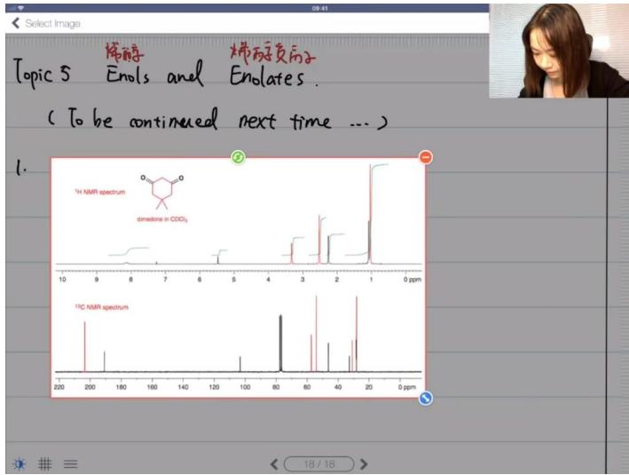

text_image

Select Image
Topic 5 烯醇 烯丙醇共子
Enols and Enolates.
( To be continued next time ... )
1. 
1H NMR spectrum
dimetons in CDCl₃
10 9 8 7 6 5 4 3 2 1 0
200 200 180 160 140 120 100 80 60 40 20 0
13C NMR spectrum
18 / 18 >

● 核磁谱图组成：包含氢谱（上）和碳谱（下），均为去偶合谱图  
● 去偶合技术：使所有碳谱信号显示为单峰，提高信噪比

\- 原理：消除 $^{13}C$ 与 $^{1}H$ 的偶合作用

○ 效果：峰高更鲜明，便于观察

\- 原理：消除 $^{13}$ C与 $^{1}$ H的偶合作用
- 效果：峰高更鲜明，便于观察

text_image

Topic 5 烯醇
Enols and 烯丙氨酸酶子
Enolates.

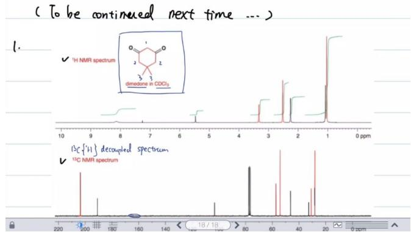

line

| ppm  | ¹H NMR spectrum | ¹³C NMR spectrum |
|------|-----------------|------------------|
| 10   | ~0              | ~0               |
| 9    | ~0              | ~0               |
| 8    | ~0              | ~0               |
| 7    | ~0              | ~0               |
| 6    | ~0              | ~0               |
| 5    | ~0              | ~0               |
| 4    | ~0              | ~0               |
| 3    | ~0              | ~0               |
| 2    | ~0              | ~0               |
| 1    | ~0              | ~0               |
| 0    | ~0              | ~0               |

# - 异常现象分析：

- 纯净二酮(dimedone)溶解后出现6个氢信号峰（预期3个）  
○ 表明溶液中存在混合物（互变异构体）  
- 红色标注峰对应原料结构中的3个氢

# 1）氢谱归属分析

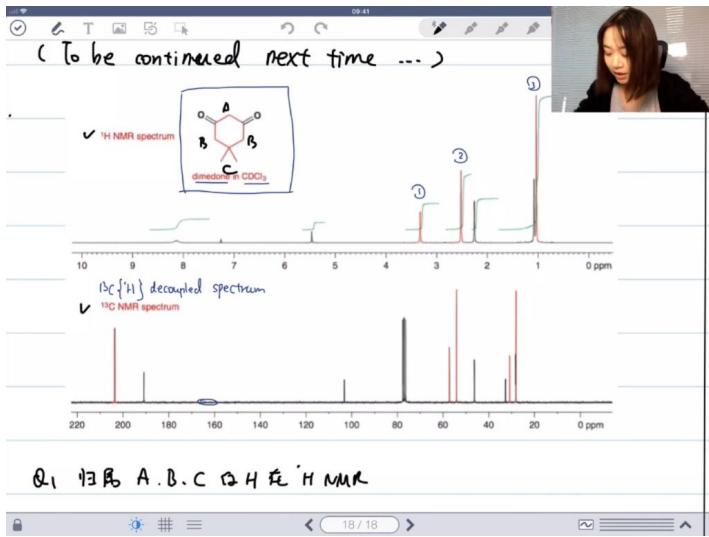

text_image

(To be continued next time ...)
✓ ¹H NMR spectrum
      O   A   O
      B     C
      dinedone in CDO₃
13C{¹H} decoupled spectrum
✓ ¹³C NMR spectrum
Q₁ 归属 A、B、C ② H 在 'H NMR

# - 归属方法：

○ 化学位移法：

■ 甲基氢（0.7-0.9 ppm）→信号3（1.0 ppm）  
■ 羰基邻位氢（类似丙酮2.3 ppm）→信号2（2.5 ppm）  
■ 双羰基间氢（缺电子）→信号1（3.3 ppm）

○ 氢数量法:

■ 氢a (2H) → 信号3   
■ 氢b（4H）→信号2   
■ 氢c（6H）→信号1

# - 化学位移规律：

○ 高场（数字小）：富电子环境  
○ 低场（数字大）：缺电子环境  
- 吸电子基团使信号向低场移动

# 2）烯醇互变异构体分析

text_image

那子
Enols and
那子只的子
Enolates.

[0 be continued next time ... )

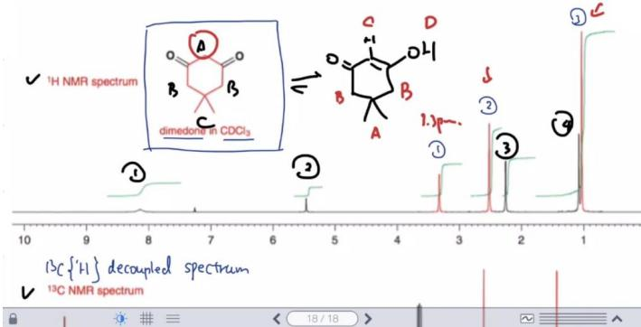

chemical

NMR spectrum and molecular structure of a dimedone in CDCl3, showing labeled peaks and chemical shifts

黑色峰来源：烯醇互变异构体中的4种氢

# ● 归属关系：

○ 氢d（烯氢）→信号1（8.1 ppm，宽峰）  
○ 氢c（羟基氢）→信号2   
○ 氢b→信号3   
○ 氢a（甲基）→信号4

# - 活泼氢特征：

\- 羟基氢信号宽且化学位移变化大

\- 原因：与溶剂中活泼氢的快速交换

# 3）溶剂峰识别

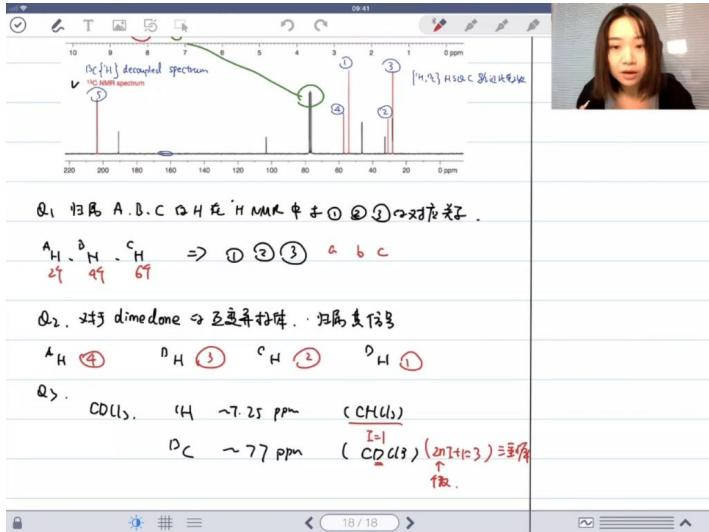

text_image

Q1 归属 A、B、C ②H 在 ‘H MMR 中去 ① ② ③ 对应关系。
a H、b H、c H ⇒ ① ② ③ a b c
29 49 69
Q2. 对于 dimedone ②互连并拉伸，归属共信号
a H ④ D H ③ C H ② D H ①
Q3. CDCl₃. ¹H ~7.25 ppm (CHCl₃)
D C ~77 ppm (CDCl₃) (2nT+1=3) 三溴仿
假.
18/18>

# 氯仿溶剂峰：

○ 氢谱：CHCl₃在7.25 ppm（三重峰）  
○ 碳谱：CDCl₃在77 ppm（三重峰）

\- 三重峰成因：氘核自旋量子数 $l = 1$ ，符合 $2nI + 1 = 3$ 规律

# 4）定量分析应用

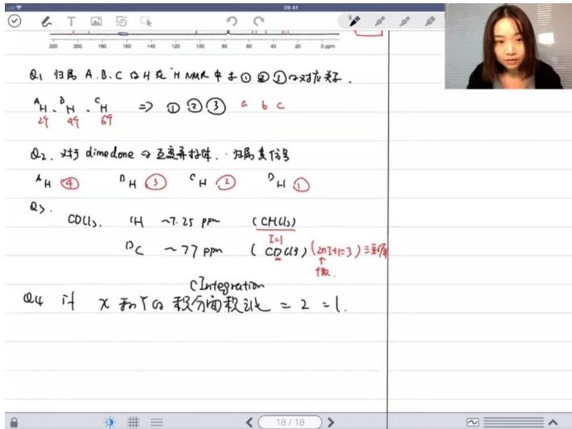

text_image

Q1 归属 A、B、C ②H 在 'H NMR 中子①②③' 对应关系。
A₁ H 、 B₁ H 、 C₁ H ⇒ ①②③ a b c
②g 49 69
①₂. 对于 dimedeone ②互连并标体，归属其信号
A₁ H ④ D₁ H ③ C₁ H ② D₁ H ①
Q5. CDCl₃. ①H ~7.25 ppm (CHCl₃)
D C ~77 ppm (CDCl₃) (2mI+1=3)三重偶
C Integration
Q4 if x 和 y 的积分面积之比 = 2 = 1.

● 实验原理：通过积分面积比测定互变异构体比例

○ 酮式(x)与烯醇式(y)积分比2:1   
○ 对应溶液中烯醇式含量33%

# - 计算方法：

○ n(酮式):n(烯醇式)=2:1   
○ 烯醇式百分比=1/(2+1)×100%=33%

# 2. 互变异构概念

text_image

2. 互变异构 Tautomerization.
① Concept: 与 Resonance Structural
-1的位置发生了改变. (

● 定义：质子位置改变导致的异构现象

● 与共振结构区别：

○ 互变异构：原子排布实际改变（可分离）  
○ 共振结构：电子分布不同（不可分离）

● 特征：

- 涉及质子迁移   
平衡状态可通过实验测定  
○ 常见于含活泼氢的羰基化合物

# 二、互变异构体 17:28

1. 互变异构体的概念 29:41

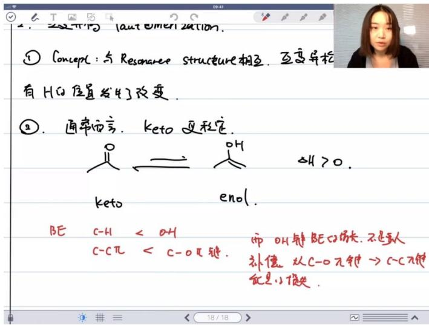

text_image

① Concept: 与 Resonance structure 相互. 互变异松
有 H 的位置发生了改变.
②. 通率而言. keto 更稳定.
keto
enol.
BE C-H < OH
C-Cπ < C-Oπ键.
而 OH 键 BEC 增大, 不是真人
补偿 从 C-Oπ键 → C-Cπ键
是小偶失.

1）互变异构体的定义与特点

● 结构特征: 与共振结构不同，互变异构体中氢原子的位置发生了改变  
● 反应本质: 涉及质子迁移（proton transfer）的异构化过程  
2）互变异构体的能量稳定性 29:52  
● 稳定形式: 通常酮式（keto）比烯醇式（eno）更稳定  
● 能量关系: 正向反应（keto→eno）的 $\Delta H > 0$   
● 键能分析:

○ 碳氢键键能 < 氧氢键键能  
○ 碳碳π键键能 < 碳氧π键键能  
○ 氧氢键键能增加不足以补偿π键能损失

3）互变异构反应中的质子迁移 32:02

● 反应特点: 几乎所有反应机理都涉及质子迁移步骤  
● 动力学特性:

- 质子迁移活化能很低，反应速率快  
通常不是决速步（rate determining step）  
- 可能产生同位素效应

4）互变异构体作为反应中间体的重要性 33:12

\- 存在状态:

○ 平衡主要偏向酮式  
○ 烯醇式存在比例低但生成容易

\- 反应意义:

- 虽然含量少但是重要的中间体（intermediate）  
○ 与酮式化合物"伴生"存在  
○ 在碳上发生取代反应时特别常见

5）酸碱对互变异构反应的催化作用 34:14

● 催化特性: 既可被酸催化也可被碱催化  
● 基础概念: 属于有机化学入门知识（课程21210级别内容）

2. 应用案例 34:36

1）例题:烯醇与卤化/酸性条件下的产物

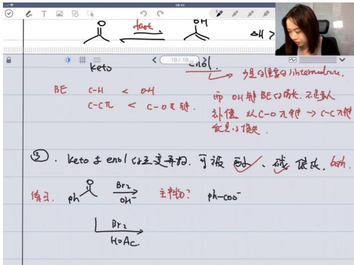

text_image

keto
BE C-H < OH
C-Cπ < C-Oπ键.
而OH键BEG的损失，不是主人
补偿 从C-Oπ键 → C-Cπ键
但是小损失。
③. keto + enol 气体异构. 可被 酚、碱、镁皮, 60%.
练习. ph → Br₂ → 主产物? ph-COO⁻
→ H₂OAc.

酸碱催化特性：酮烯醇互变异构既可以被酸催化也可以被碱催化  
- 卤化反应产物：

○ 碱性条件下主产物为碳较多的烯醇式结构 ( $\Delta H > 0$ )  
- 酸性条件下生成烯醇式中间体（需掌握反应机理）

\- 反应机理要点：

- 酸催化时中间体为烯醇（eno）  
- 碱催化时中间体为烯醇负离子（enolate）

2）例题:乙酰乙酸乙酯互变异构体 40:56

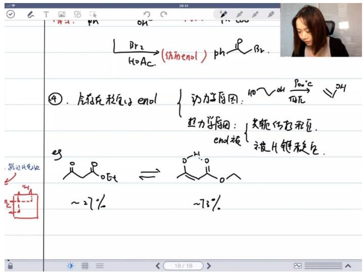

text_image

Br₂
H₂OAc → (结构enol) ph⁻ Br₂.
④. 合存在稳态enol { 动力学原因: 100～24h Poo℃ 24h
热力学原因: 共轭仿化稳态.
end被 被H键稳态.
≥3
~27% ⇌ ~73%

# - 稳定烯醇式的原因：

◦ 动力学原因：气相条件下（无酸碱催化）烯醇式稳定存在  
○ 热力学原因：

■ 共轭结构稳定（主要）  
■ 分子内氢键形成六元环（次要）

# - 典型比例：

○ 酮式：约27%   
○ 烯醇式：约73%（平衡显著向右）

● 核磁检测：通过特征氢的积分面积判断相对比例

# 3）例题:互变异构体判断及主存在形态 43:24

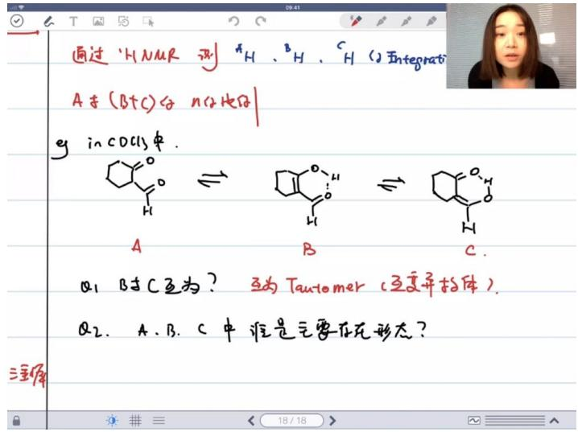

chemical

Chemical reaction equations showing conversion of n-butene to n-octane using Tautomer, with accompanying photo of a person in a photo.

# - 结构关系：

○ A与B/C为互变异构体  
○ B与C也是互变异构体（氢位置迁移）

# - 存在形态分析：

○ A（酮式）<1%（几乎未观测到）  
○ B（烯醇式）76%   
○ C（烯醇式）24%

# ● 稳定因素：

○ B/C均有共轭和氢键稳定  
○ B取代度更高（超共轭效应使其更稳定）

# 4）例题:b/c核磁区分 50:10

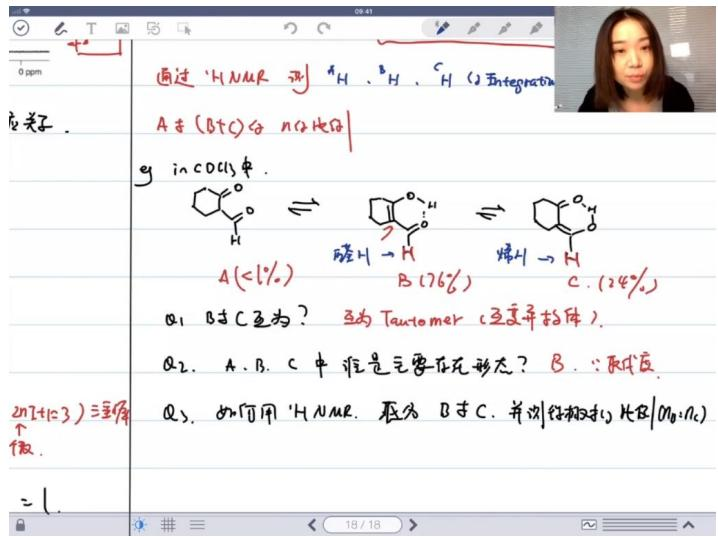

text_image

通过 'H NMR 测' H 、 B H 、 C H (2) Integrations
A + (B+C) 分 n(2) 比例
y in COCl₃ 中.
A (<1%)
B (76%)
C (24%)
Q1. B时C互为？ 互为Tautomer（互变异抗体）.
Q2. A、B、C中谁是主要存在形态？ B．∵取代度
Q3. 如何用 'H NMR，瓶分 B时C，并试剂吸收比HBr/OMn=Oc）
=

# - 区分方法：

○ B的特征氢为醛氢（化学位移约9-10ppm）  
○ C的特征氢为烯氢（化学位移约5-6ppm）

# ● 比例测定：

○ 通过特征氢积分面积计算  
○ 测得B:C=76%:24%

# - 对比案例：

○ 乙酰乙酸乙酯中b/c均为烯氢难以区分  
- 本案例因氢类型不同而易于区分

# 5）共振结构与烯醇式-酮式互变异构 54:10

# ● 共振结构稳定性判断

共振结构(rs): AB互为共振结构，与互变异构体不同（后者涉及H迁移和双键位置改变）  
- 稳定性判断标准（按重要性降序）：

■ 电荷最少原则：若共振式电荷数不同，负电荷少者更稳定（本例AB均为单负电荷无差异）  
■ 八隅体规则：满足八电子结构的共振式更稳定（本例碳负和氧负均满足）  
■ 电负性匹配：负电荷在电负性大的原子（如O）上更稳定（b式氧负比a式碳负稳定）  
■ 电荷分布原则（次要）：同号电荷远离/异号电荷接近更稳定（通常影响较小）

# - 烯醇式-酮式互变异构

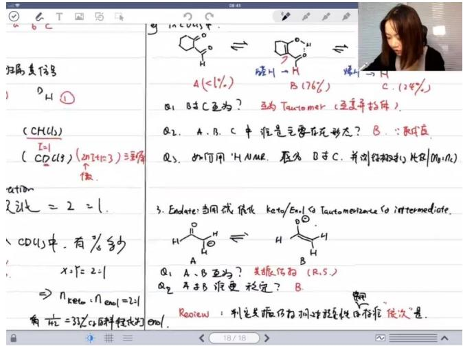

chemical

Chemical reaction scheme showing transformation of a ketone to a carbonyl compound using Taucomer, with molecular structures and conditions labeled.

O

○ 定义：通过H迁移和双键位移相互转化的异构体（Tautomer）  
○ 主要存在形态：

■ 酮式（B式）通常占主导（约99%）  
■ 烯醇式（C式）含量极少（<1%）

检测方法：

■ HNMR：醛氢信号在δ9.76（B式），烯醇氢在δ7.25（CHCl₃溶剂）  
■ 积分比可计算各形态比例

\- 烯醇盐中间体反应选择性

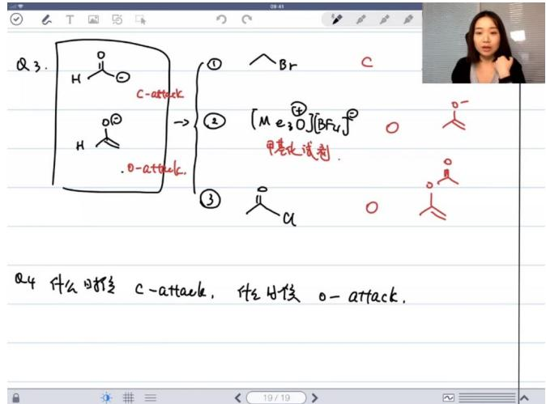

text_image

Q3.
H
C-attack
H
O-attack.
→
①
Br
C
②
[Me₃O][BF₄]
甲基水试剂
③
α
O
O
Q4 什么时候 C-attack， 什么时候 O-attack.

○ C-进攻 vs O-进攻：

溴乙烷（RBr）：碳进攻（C-attack）  
■ 甲基化试剂（如CH3I）：氧进攻（O-attack）  
■ 酰氯（RCOCl）：氧进攻

○ 判断依据：

■ HSAB理论：C-attack属于软碱反应，O-attack属于硬碱反应  
■ 前线轨道理论：

● HOMO轨道显示负电荷主要分布在氧上（ψ1）  
● ψ2轨道显示碳端亲核性更强（反相位系数大）

\- 反应机理选择规则

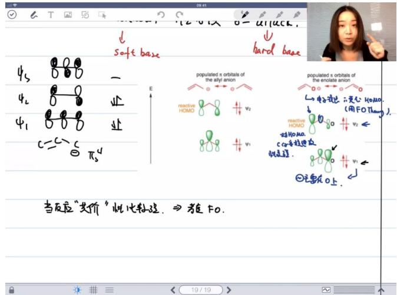

text_image

soft base
hard base
4s 0 0 0 -
42 0 0 0 业
41 0 0 0 业
C=C S πs
E
populated x orbitals of the allyl anion
reactive HOMO v2
v1
populated x orbitals of the enolate anion
←电子式化:变化:HO-MO.
(用FO Thang).
reactive HOMO v2←
HOMO.
Cα等式化反应
反应.
②需要在O上.
当反应“共价”比比较难. ⇒ 教FO.

共价性反应（协同机理倾向）：

■ 考虑前线轨道（FOT）  
■ 通常发生C-attack（如SN2反应）

○ 离子性反应：

■ 考虑电荷绝对分布

■ 通常发生O-attack（如酰基取代）

# ○ 分子轨道分析：

■ 三原子体系（C-C-O）的ψ1（无节点）氧系数最大  
■ $\psi2$ （单节点）显示碳端亲核活性

# ● 稳定性影响因素总结

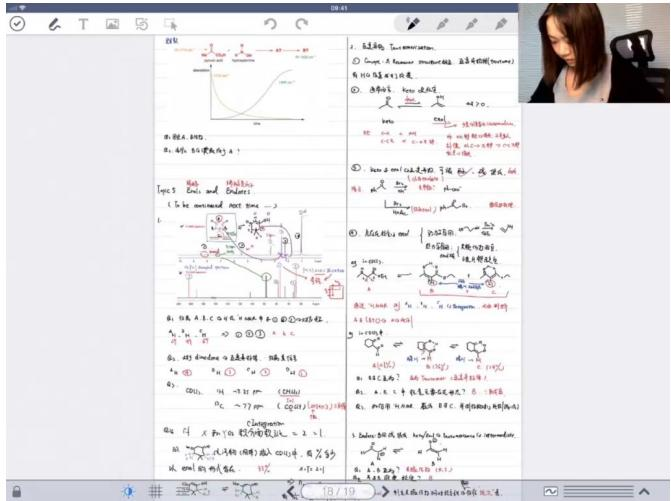

text_image

图1
2. 液水的 Tissue extraction.
○ Intays: A Resonant structure (Sediment)
● 1H2O content of the solution
① 液水的 H2O → H2O₂ → H2O₃
Beta
Beta = 0.005
Beta = -0.005
Beta = 0.005
Beta = 0.005
Beta = 0.005
Beta = 0.005
Beta = 0.005
Beta = 0.005
Beta = 0.005
Beta = 0.005
Beta = 0.005
Beta = 0.005
Beta = 0.005
Beta = 1H2O + H2O₂ → H2O₃
Beta = 1H2O + H2O₂ → H2O₃
Beta = 1H2O + H2O₂ → H2O₃
Beta = 1H2O + H2O₂ → H2O₃
Beta = 1H2O + H2O₂ → H2O₃
Beta = 1H2O + H2O₂ → H2O₃
Beta = 3H2O + H2O₂ → H2O₃
Beta = 3H2O + H2O₂ → H2O₃
Beta = 3H2O + H2O₂ → H2O₃
Beta = 3H2O + H2O₂ → H2O₃
Beta = 3H2O + H2O₂ → H2O₃
Beta = 3H2O + O₂ → O₂ → O₂ → O₂ → O₂ → O₂ → O₂ → O₂ → O₂ → O₂ → O₂ → O₂ → O₂ → O₂ → O₂ → O₂ → O₂ → O₂ → O₂ → O₂ → O₂ → O₂ → O₂ → O₂ → O₂ → O₂ → O₂ → O₂ → O₂ → O₂ → O₂ → O₂ → O₂ → O₂ → N
Beta = 1H2O + H2O₂ → H2O₃
Beta = 1H2O + H2O₂ → H2O₃
Beta = 1H2O + H2O₂ → H2O₃
Beta = 1H2O + H2O₂ → H2O₃
Beta = 1H2O + H2O₂ → H2O₃
Beta = 4H2O + H2O₂ → H2O₃
Beta = 4H2O + H2O₂ → H2O₃
Beta = 4H2O + H2O₂ → H2O₃
Beta = 4H2O + H2O₂ → H2O₃
Beta = 4H2O + H2O₂ → H2O₃
Beta = 4H2O + O₂ → O₂ → O₂ → O₂ → O₂ → O₂ → O₂ → O₂ → O₂ → O₂ → O₂ → O₂ → O₂ → O₂ → O₂ → O₂ → O₂ → O₂ → O₂ → N
Beta = 4H2O + H2O₂ → H2O₃
Beta = 4H2O + H2O₂ → H2O₃
Beta = 4H2O + H2O₂ → H2O₃
Beta = 4H2O + H2O₂ → H2O₃
Beta = 4H2O + N⁺ + N⁺ + N⁺ + N⁺ + N⁺ + N⁺ + N⁺ + N⁺ + N⁺ + N⁺ + N⁺ + N⁺ + N⁺ + N⁺ + N⁺ + N⁺ + N⁺ + N⁺ + N⁺ + N⁺ + N⁺ + N⁺ + N⁺ + N⁺ + N⁺ + N⁺ + N⁺ + N⁺ + N⁺ + N⁺ + N⁺ + N⁺ + N⁺ + N⁺
Beta = 4H2O + H2O₂ → H2O₃
Beta = 4H2O + H2O₂ → H2O₃
Beta = 4H2O + H2O₂ → H2O₃
Beta = 4H2O + N⁺ + N⁺ + N⁺ + N⁺ + N⁺ + N⁺ + N⁺ + N⁺ + N⁺ + N⁺ + N⁺ +N⁺ + N⁺ + N⁺ + N⁺ + N⁺ + N⁺ + N⁺ + N⁺ + N⁺ + N⁺ + N⁺ + N⁺
Beta = 4H2O + H2O₂ → H2O₃
Beta = 4H2O + H2O₂ → H2O₃
Beta = 4H2O + H2O₂ → H2O₃
Beta = 4H2O × Pn(O)₆ 轴为密度级比 < 1 / 1 / 1 / 1 / 1 / 1 / 1 / 1 / 1 / 1 / 1 / 1 / 1 / 1 / 1 / 1 / 1 / 1 / 1 / 1 / 1 / 1 / 1 / 1 / 1 / 1 / 1 / 1 / 1 / 1 / 1 / 1 / 1 / 1 /

# ○ 酮式优势原因：

■ C=O键能（\~745kJ/mol） >> C=C键能（\~610kJ/mol）  
■ 烯醇式存在空间位阻

# ○ 催化互变：

■ 酸/碱催化可加速酮式-烯醇式互变   
■ 烯醇盐（enolate）是重要反应中间体

# 三、实际应用 01:16:59

# 1. 例题:甲基化乙酰乙酸乙酯消旋机理 01:17:10

# 1）反应现象与机理要求

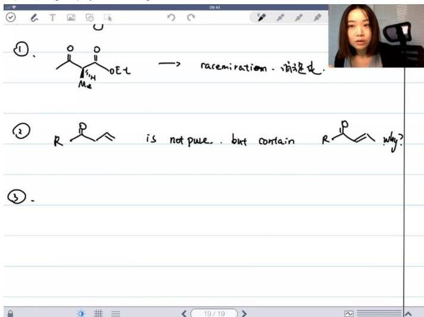

text_image

①. 
② R -C H = C H
is not pure . but contain R -C H = C H
③.

● 反应现象: 甲基化的乙酰乙酸乙酯在液态放置一段时间后会发生消旋化

# ● 机理要求:

- 需要完整绘制消旋化反应机理  
- 该反应机理将作为课后作业练习  
◦ 鼓励将绘制结果发到课程群讨论验证

# 2）互变异构体参与反应 01:26:42

● 关键中间体: 反应通过烯醇式互变异构体进行  
- 反应条件提示:

- 使用亚硝酸钠加盐酸条件  
- 该条件曾在200210课程中用于:

■ 芳环的氢取代反应  
■ 氨基转化为重氮基 $(N_{3})$ 的反应

● 中间体特征: 生成 $NO^{+}$ 中间体, 被烯醇碳进攻

2. 例题: 硝基化合物二聚体 01:34:16

1）亚硝基化合物二聚现象

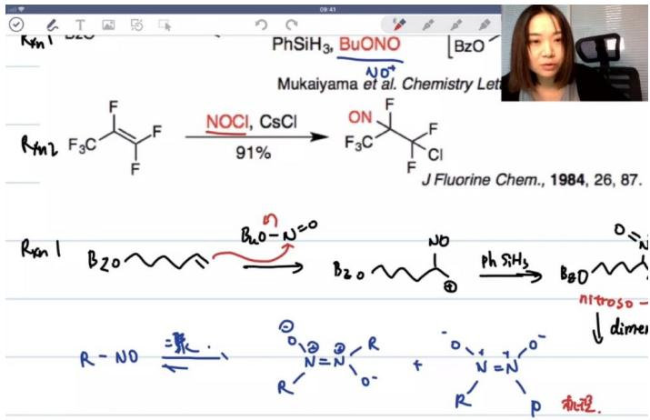

chemical

Chemical reaction scheme for sulfonation of fluorinated cyclohexane using NOCl and CsCl, yielding 91% product and nitroso-amine derivatives

19/19   
● 二聚特性: 烷基取代的亚硝基化合物(R - NO)易发生二聚  
- 结构特征:

- 氮原子呈 $sp^{2}$ 杂化  
○ 存在顺反异构体混合物

● 反应机理: 二聚机理作为课后作业练习

2）区域选择性解释

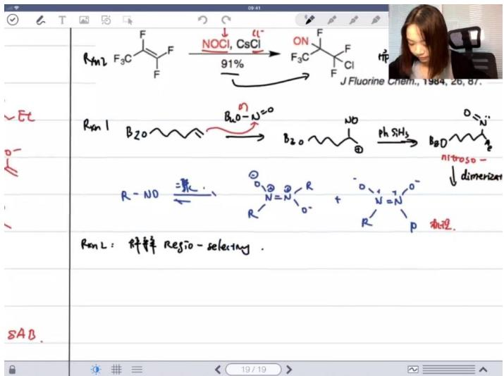

chemical

Chemical reaction scheme for fluorine synthesis using nitroso and dimerization, showing reagents, conditions, and products

19/19   
● 实验现象: 反应以91%产率生成特定产物  
● 选择性原因:

○ 三氟甲基 $(CF_{3})$ 的强吸电子效应  
- 氟原子的共轭效应影响碳正离子稳定性  
- 正电荷留在三氟甲基取代碳上更稳定

3. 补充反应机理

1）铁配合物催化反应

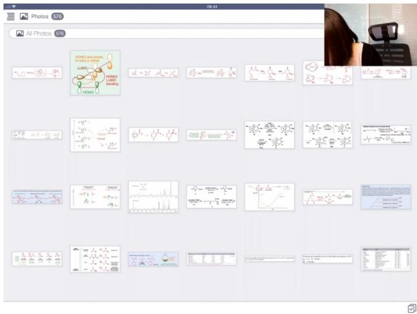

text_image

Photos
578
All Photos
526
HOMO bond bonds
in solid p. 2000
LUMO
HOMO
bonding
HOMO
HOMO bond
HOMO
HOMO bond
HOMO
HOMO bond
HOMO
HOMO bond
HOMO
HOMO bond
HOMO
HOMO bond
HOMO
HOMO bond
HOMO
HOMO bond
HOMO
HOMO bond
HOMO
HOMO bond
HOMO
HOMO bond
HOMO
HOMO bond

●

\- 催化剂: $Fe(acac)_{3}$ (乙酰丙酮铁)

- acac为乙酰丙酮负离子 $(CH_{3}COCHCOCH_{3}^{-})$   
○ 铁为三价 $(Fe^{3+})$ ，六配位八面体构型  
○ 具有旋光性和顺磁性(高自旋态)

● 反应本质: 路易斯酸催化烯烃与 $NO^{+}$ 的亲电加成

2）反应机理共性

● 共同特征: 碳碳双键对 $NO^{+}$ 的亲核进攻  
● 后续步骤: 氢化或卤素离子捕获碳正中间体  
● 思考题: 引入新的反应条件分析(未展开讲解)

4. 例题: lithium-halogen exchange 反应机理 01:38:19

1）反应机理详解

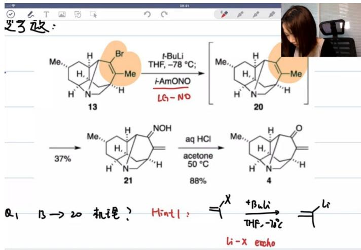

chemical

Chemical reaction scheme showing transformation of compound 13 to 20 via intermediates 21 and 4, with yields and conditions labeled

●

● 反应条件: 使用t-BuLi在THF溶剂中，-78℃低温条件下进行  
● 关键步骤:

○ 锂卤交换: 溴原子与叔丁基锂发生交换, 生成有机锂化合物  
- 亲核进攻: 生成的锂试剂进攻NO+基团（作为NO+来源的试剂）  
- 自由基可能性: 反应机理可能涉及自由基过程，但主要路径是离子型机理

2）反应特点

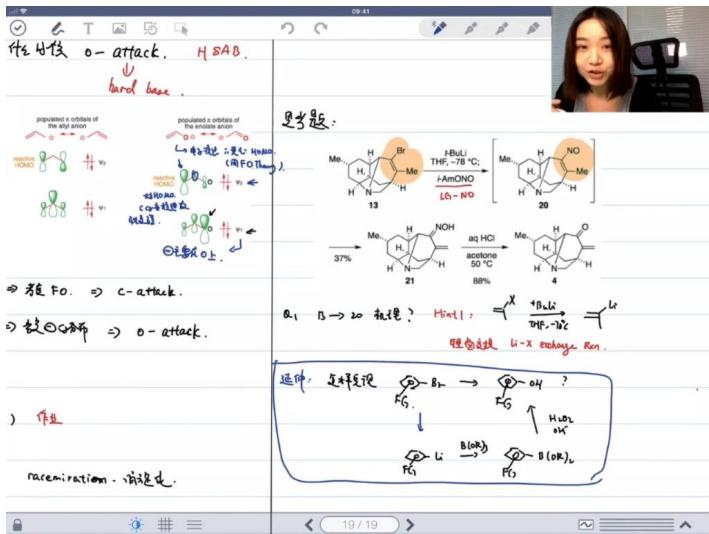

text_image

性生枝 o-attack. H5AB.
↓
hard base.

protopiolated x orbitals of the alpiphon

→ 2 → 3 → 4 → 5 → 6 → 7 → 8 → 9 → 10 → 11 → 12 → 13 → 14 → 15 → 16 → 17 → 18 → 19 → 20 → 21 → 22 → 23 → 24 → 25 → 26 → 27 → 28 → 29 → 30 → 31 → 32 → 33 → 34 → 35 → 36 → 37 → 38 → 39 → 40 → 41 → 42 → 43 → 44 → 45 → 46 → 47 → 48 → 49 → 50 → 51 → 52 → 53 → 54 → 55 → 56 → 57 → 58 → 59 → 60 → 61 → 62 → 63 → 64 → 65 → 66 → 67 → 68 → 69 → 70 → 71 → 72 → 73 → 74 → 75 → 76 → 77 → 78 → 79 → 80 → 81 → 82 → 83 → 84 → 85 → 86 → 87 → 88 → 89 → 90 → 91 → 92 → 93 → 94 → 95 → 96 → 97 → 98 → 99 →

设 F0. ⇒ c-attack.

设 ⊙O解 ⇒ o-attack.

a₁ B→20 材理? Hint1: ⇌ b₁b₁c₂ + b₁b₂ + b₁b₃ + b₁b₄ + b₁b₅ + b₁b₆ + b₁b₇ + b₁b₈ + b₁b₉ + b₁b₁₀ + b₁b₁₁ + b₁b₁₂ + b₁b₁₃ + b₁b₁₄ + b₁b₁₅ + b₁b₁₆ + b₁b₁₇ + b₁b₁₈ + b₁b₁₉ + b₁b₂₀ + b₁b₂₁₀ + b₁b₂₂₀ + b₁b₂₃₀ + b₁b₂₄₀ + b₁b₂₅₀ + b₁b₂₆₀ + b₁b₂₇₀ + b₁b₂₈₀ + b₁b₂₉₀ + b₁b₃₀₀ + b₁b₃₁₀ + b₁b₃₂₀ + b₁b₃₃₀ + b₁b₃₄₀ + b₁b₃₅₀ + b₁b₃₆₀ + b₁b₃₇₀ + b₁b₃₈₀ + b₁b₃₉₀ + b₁b₄₀₀ + b₁b₄₁₀ + b₁b₄₂₀ + b₁b₄₃₀ + b₁b₄₄₀ + b₁b₄₅₀ + b₁b₄₆₀ + b₁b₄₇₀ + b₁b₄₈₀ + b₁b₄₉₀ + b₁b₅₀₀ + b₁b₅₁₀ + b₁b₅₂₀ + b₁b₅₃₀ + b₁b₅₄₀ + b₁b₅₅₀ + b₁b₅₆₀ + b₁b₅₇₀ + b₁b₅₈₀ + b₁b₅₉₀ + b₁b₆₀₀ + b₁b₆₁₀ + b₁b₆₂₀ + b₁b₆₃₀ + b₁b₆₄₀ + b₁b₆₅₀ + b₁b₆₆₀ + b₁b₆₇₀ + b₁b₆₈₀ + b₁b₆₉₀ + b₁b₇₀₀ + b₁b₇₁₀ + b₁b₇₂₀ + b₁b₇₃₀ + b₁b₇₄₀ + b₁b₇₅₀ + b₁b₇₆₀ + b₁b₇₇₀ + b₁b₇₈₀ + b₁b₇₉₀ + b₁b₈₀₀ + b₁b₈₁₀ + b₁b₈₂₀ + b₁b₈₃₀ + b₁b₈₄₀ + b₁b₈₅₀ + b₁b₈₆₀ + b₁b₈₇₀ + b₁b₈ₑ₀ + b₁bₑᵢ₀
延伸: 这样发现 Br-OH ?
FG
Fg
Fg
Fg
Fg
Fg
Fg
Fg
Fg
Fg
Fg
Fg
Fg
Fg
Fg
Fg
Fg
Fg
Fg
Fg
Fg
Fg
Fg
Fg
Fg
Fg
Fg
Fg
Fg
Fg
Fg
Fg
Fg
Fg
Fg

# ● 机理复杂性:

- 同时涉及离子化和自由基两种可能的反应路径  
- 在合成中广泛应用但机理研究仍存在争议

# - 合成应用:

○ 当所需锂试剂无法直接购买时的重要制备方法  
- 常用于构建碳-氮键等关键转化

# 3）后续转化

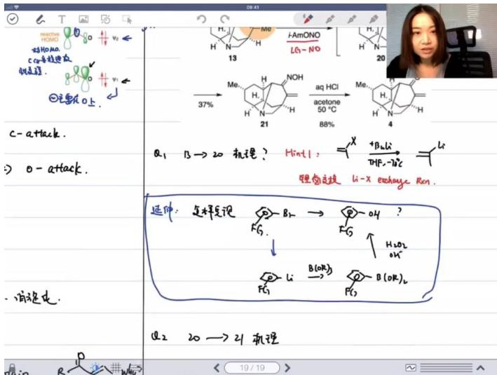

chemical

Chemical reaction scheme showing transformation of compound 13 to 20 via intermediate 21, with reagents and conditions labeled

# 20→21转化:

- 通过互变异构实现结构转变  
- 涉及酮-烯醇互变异构平衡

# ● 21→4转化:

- 酸性条件下水解反应  
○ 最终形成α,β-不饱和酮结构

# 4）合成优化

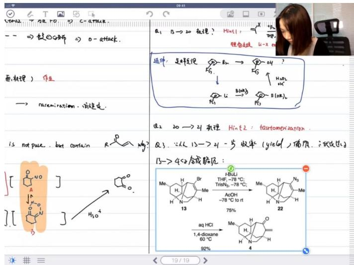

text_image

a1 B→20 机理? Hint1: +H2
→
Rheu科技 u-x en
逆时：怎样发现 → RHE?
FG3
↓
FG3 Li → B(OK)2 → B(OK)2
FG3 Li → B(OK)2 → B(OK)2
B2 20→41 机理 Hint2: tautomerization.
Q3. ∵从15→31一步收率(yield)偏质. 派出5%
13→450合成略见:
[ C=O
A
H2O4
] [ C=O
H2O4
Me
H
Br
H
Me
H
13
75%
Me
H
N3
H
N
AcOH
-78℃ to rt
22
aq HCl
1,4-dioxane
60℃
92%
19/19

# - 原路线问题:

○ 13→21步骤收率仅37%   
- 全合成中低收率步骤不可接受

# ● 优化方案:

- 改用HN3作为亲核试剂  
○ 改进后收率提升至75%（13→22）和92%（22→4）  
反应条件： $t$ -BuLi/THF/-78℃→TrisN3/-78℃→AcOH→HCl/1,4-二氧六环/60℃

# 5）关键记忆点

● 反应特征: 将卤素（Br）转化为锂试剂的关键方法  
● 条件控制: 必须严格保持低温（-78℃）防止副反应  
● 应用局限: 当分子中存在其他敏感官能团时需要谨慎使用  
● 机理特点: 可能同时存在极性机理和自由基机理的复杂过程

# 四、周环反应01:54:20

# 1. 周环反应的特点 01:55:02

# 1）基本特征

● 协同反应机理: 反应过程中所有键的形成和断裂同时发生，没有分步进行  
● 电子循环流动: 电子通过环状过渡态流动 ("flow in a circle")  
● 过渡态结构: 电子云呈现环状分布，通常用环状结构表示  
● 无离子中间体: 反应过程中不产生离子化的中间体

# 2）溶剂效应

- 溶剂影响极小: 由于没有离子中间体, 溶剂极性 (极性/非极性、质子/非质子) 对反应基本无影响  
- 溶剂作用: 仅用于溶解反应物，促进分子间接触（特别是不同反应物间的均相混合）

# 3）反应条件

● 条件简单: 通常只需加热或光照  
● 辅助试剂: 有时会加入路易斯酸作为催化剂  
- 对比其他反应：离子型和自由基反应通常需要复杂条件优化（多种试剂、催化剂、溶剂等）

# 2. 环加成反应 01:58:13

# 1）Diels-Alder反应

● 经典反应式: 双烯体（4π电子）与亲双烯体（2π电子）反应  
● 键的变化: 断裂2个π键，形成2个σ键  
● 热力学性质: $\Delta H<0$ ，为放热反应  
● 温度影响: 虽然升温有助于克服活化能，但热力学上低温更有利

# 2）反应命名规则

# - 数字表示:

☐ 4+2：表示参与反应的原子数（双烯体4个，亲双烯体2个）  
○ $4\pi+2\pi$ ：表示参与反应的电子数

● 其他类型: 如3+2环加成（原子数为3+2，电子数为 $4\pi+2\pi$ ）

# 3. 立体选择性 02:01:22

# 1）反应物构型限制

- 双烯体要求: 必须为顺式构型（s-cis），反式构型（s-trans）因轨道距离过远无法反应  
● 亲双烯体构型: 顺反异构会影响产物立体结构

# 2）产物立体化学

● 对称性影响: 当R1=R2时产物单一（存在对称面），R1≠R2时产生两种产物  
● endo偏好: 在预测4+2 Diels-Alder反应产物时，优先考虑endo产物  
● 作用原理: 由次级轨道相互作用导致  
● 适用范围: 仅适用于预测4+2环加成反应，其他类型反应中endo偏好不明显

# 4. 应用案例 02:09:36

# 1）例题:da反应endo偏好

\- 次级轨道相互作用原理

- 作用本质: 考虑 $\pi$ 轨道相互作用，特别是彼此平行的 $\pi$ 轨道间的相互作用  
- 优先顺序: 当 $\pi$ 轨道相互作用存在时优先考虑, 其他情况需根据产物判断

● 中环反应特性 02:16:29

○ 过渡态与中间体区别:

■ 中环反应严格来说没有中间体（亚稳态）  
■ 通常画出的结构实际是过渡态  
■ 将中环反应描述为存在中间体是概念错误

● endo偏好机制 02:22:02

○ 形成原因: 次级轨道相互作用大于立体效应 (steric effect)  
◦ 动力学特性: endo产物是动力学产物（降低过渡态能量）  
- 对比关系: exo产物是热力学产物  
○ 适用条件:

■ 仅在4+2 Diels-Alder反应中成立  
■ 当轨道构型不理想导致轨道相互作用不显著时，endo偏好会消失

# 2）例题:da反应次级轨道相互作用

# - 分子轨道理论回顾

○ 轨道节点规律:

$\varphi_{1}$ : 节点数为0   
■ $\varphi_{2}(\text{HOMO})$ ：节点数为1（中间有截面）  
■ $\varphi_{3}$ : 节点数为2   
$\varphi_{4}$ : 节点数为3

# - 经典DA反应轨道匹配

○ 电子流向:

■ 双烯体提供HOMO  
■ 亲双烯体提供LUMO

○ 能量匹配原则: 选择能量接近的占据轨道和空轨道相互作用

○ 调控因素:

■ 亲双烯体引入吸电子基团可降低 $\pi^{*}$ 轨道能量  
■ 双烯体引入给电子基团可推高 $\varphi_{2}$ 能量

# - 逆向DA反应

○ 轨道要求:

■ 双烯体提供LUMO ( $\varphi_{3}$ )  
■ 亲双烯体提供HOMO ( $\pi$ )

# ○ 促进条件:

■ 双烯体引入强吸电子基团降低 $\varphi_{3}$ 能量  
■ 亲双烯体引入强给电子基团推高 $\pi$ 轨道能量

# 3）例题:da反应产物判断

# - 二聚反应案例

- 反应特性: 常温下易二聚，加热解离  
○ 轨道分析:

■ 双烯体提供 $\varphi_{2}$ (HOMO)  
■ 亲双烯体提供LUMO  
■ 次级轨道相互作用完美匹配时形成endo产物

# - 空间构型判断技巧

○ 关键步骤: 将过渡态结构"展开"为产物结构  
○ 判断要点: 重点观察甲基和羰基在展开后的相对取向（同面/异面）  
对称性要求: 次级轨道相互作用需要对称性匹配，并非所有 $\pi$ 体系都能产生强相互作用

# 4）例题:次级轨道相互作用示例 02:27:51

# ● 共轭烯烃对反应的影响

○ 空间定位效应：当氢双烯体旁存在共轭烯烃时，反应会优先发生在与共轭体系共平面的位置（"一条细"的连接方式）  
电子效应：共轭体系的π电子云会通过次级轨道相互作用影响反应区域选择性  
- 经验规律：这类2+4环加成反应中，共轭烯烃的存在会使endo产物比例显著增加

# ● 周环反应特征复习 02:30:23

- 过渡态特征：具有环状过渡态（"箭头绕成一个圈"的电子重组方式）  
- 无中间体：反应过程中不产生离子化中间体（"没有intermediate"）  
- 溶剂效应：传统认知中溶剂极性对反应速率影响较小（与后续发现形成对比）

# 5）例题:DA反应溶剂效应

# - 异常溶剂效应现象

- 速率差异：水相中反应速率是烃类溶剂的700倍  
○ 立体选择性：水中endo产物比例较烃类溶剂显著提高（"and le preference更明显"）

# ● 机理分析

○ 氢键作用：水分子可能与过渡态形成氢键网络，稳定环状过渡态  
- 疏水效应：非极性反应物在水中的聚集效应可能加速反应  
- 极性过渡态：暗示该DA反应可能具有比传统认知更高的极性特征

# - 解题提示

- 关键突破点：需要解释为何极性溶剂能同时影响反应速率和立体选择性  
思考方向：结合次级轨道相互作用和溶剂化效应综合分析

# 反常现象：传统周环反应理论需要扩展才能解释这种强溶剂效应

注：由于提供的课程记录中存在部分不连贯的讲解内容，笔记已对可提取的完整知识点进行系统化整理，保留了所有关键数据和现象描述，删除了与知识内容无关的课堂互动片段。

# 6）溶剂效应与反应选择性 02:34:27

# - 溶剂替换的影响

水溶剂效应：将非极性碳氢溶剂换成水，或向非极性溶剂中加入水，可同时提高反应速率和endo选择性（立体选择性增强）。

\- 作用机制：通过"疏水作用"（非严格定义）使非极性有机物原料被迫紧密接触，增加碰撞概率。

\- On water反应

定义特征：反应物实际不溶于水，水仅作为界面介质而非溶剂（不符合溶剂溶解溶质的定义）。  
- 效果增强：次级轨道相互作用更显著，导致endo产物比例上升23%。

7）分子内Diels-Alder反应 02:45:38

\- 反应特点

○ 构象要求：需将分子扭曲成4+2轨道能靠近的构型。  
○ 重点难点：绘制能量最低的过渡态结构（比预测产物结构更关键）。

\- 分析方法

- 逆向推导：科研中更常见通过产物结构反推过渡态结构。  
简化练习：给定过渡态结构推导产物（实际考试较少要求预测产物）。

8）区域选择性规律 02:49:16

\- 分子间反应

○ 匹配原则：用共振式匹配 $\delta^{+}$ 和 $\delta^{-}$ 位置（本质是轨道匹配性）。  
- 记忆技巧：碳正离子留在推电子基团（如甲基）旁最稳定。

\- 分子内反应

- 链长限制：分子内反应链长较短时，区域选择性主要受过渡态构象控制，不考虑电荷匹配。  
- 特殊情况：极长链可能转为分子间反应（但可控性差，实际少见）。

9）光照条件下的反应 02:55:31

● 2+2环加成

○ 轨道变化：激发态使用不同轨道（HOMO/LUMO），导致区域选择性与加热条件相反。  
- 记忆口诀：“光照翻转选择性”。

● 加热条件下的例外

- 双键辅助：当碳连两个双键时，加热也可发生2+2反应。  
- 作用机制：邻近双键的p轨道通过次级相互作用稳定过渡态。

10）反应机理分析 02:59:19

\- 锌参与的还原反应

○ 电子转移：锌作为还原剂失电子，氧获得电子推动氯负离子离去。  
○ 特点：虽不常见但机理合理可推导。

\- 竞争反应观察

速率比较：当2+2反应速率远高于2+4反应时，前者产物占主导。

☐ 注：Woodward-Hoffmann规则和1,3-偶极环加成等内容因未完整讲解，按要求不予记录。

五、知识小结

<table><tr><td>知识点</td><td>核心内容</td><td>考试重点/易混淆点</td><td>难度系数</td></tr><tr><td>烯醇与烯醇负离子</td><td>互变异构现象(酮式-烯醇式平衡)、核磁共振谱图解析</td><td>化学位移归属、积分面积比计算</td><td>★★★☆</td></tr><tr><td>周环反应特点</td><td>协同机理、电子环流、无离子中间体、溶剂效应弱</td><td>过渡态构型分析、endo/exo选择性</td><td>★★★★</td></tr><tr><td>Diels-Alder反应</td><td>4+2环加成、前线轨道理论(HOMO-LUMO匹配)</td><td>区域选择性判断、次级轨道相互作用</td><td>★★★★</td></tr><tr><td>2+2环加成</td><td>光照条件与加热条件的反应差异</td><td>轨道对称性要求、四元环构建</td><td>★★★☆</td></tr><tr><td>烯醇负离子反应</td><td>碳进攻vs氧进攻的选择性(软硬酸碱理论)</td><td>共振结构稳定性比较</td><td>★★★★</td></tr><tr><td>互变异构动力学</td><td>烯醇式稳定化因素(氢键/共轭效应)</td><td>乙酰乙酸乙酯平衡常数</td><td>★★★☆</td></tr><tr><td>核磁共振解析</td><td>氢谱/碳谱对应关系、溶剂峰识别</td><td>活泼氢特征峰识别</td><td>★★★★</td></tr><tr><td>反应条件优化</td><td>"on water"效应(非均相加速反应)</td><td>疏水作用增强分子碰撞</td><td>★★★☆</td></tr><tr><td>分子内DA反应</td><td>构象控制过渡态能量</td><td>链长对环化影响</td><td>★★★★</td></tr><tr><td>1,3-偶极环加成</td><td>未讲授内容(下节课重点)</td><td>反应类型识别</td><td>★★★★</td></tr></table>