# 一、有机化学07:16

# 1. 重排反应 10:46

1）重排反应的基本概念 10:53

● 经典案例：臭氧对烯烃的氧化反应是经典的环加成反应，后续会发生重排过程  
● 可逆性：中环反应都具有可逆性，重排过程包含逆环加成和正向环加成的组合反应

2）重排反应与环加成的关系 12:51

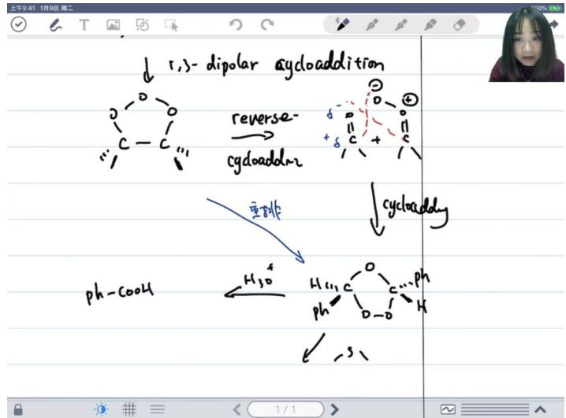

chemical

Chemical reaction diagram showing dipolar cycloaddition with reverse-cydoaddition and proton transfer steps

● 反应本质：重排过程实质上是逆环加成和正向环加成的连续反应  
● 产物决定：直接加水条件下会获得羰基化合物，具体产物取决于取代基类型：

○ 含氢取代：生成醛   
- 无还原剂：生成羧酸（如醋酸）  
○ 含硫取代：生成二甲亚砜（DMSO）

3）例题1: 重排反应的应用 13:06

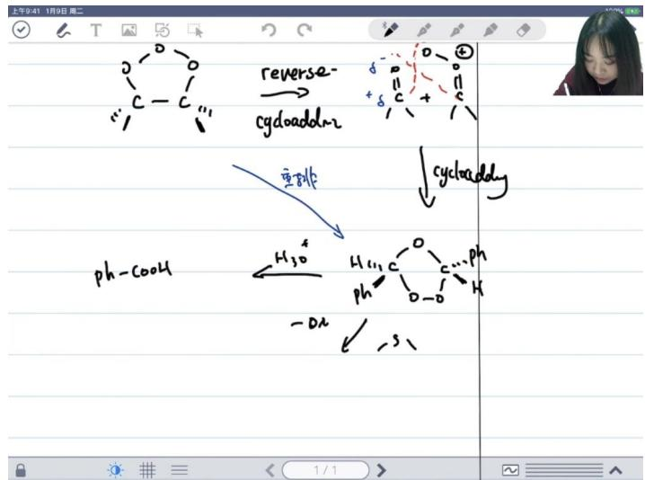

chemical

Handwritten chemical reaction diagram showing conversion of cycloaddition to cycloaddition with H3O and phenyl groups

● 题目解析   
- 反应条件分析：需注意是否添加还原剂  
○ 产物判断要点：根据取代基类型判断最终产物  
○ 典型错误：忽略硫化物生成DMSO的特性

4）1,3-偶极环加成的例子 14:04

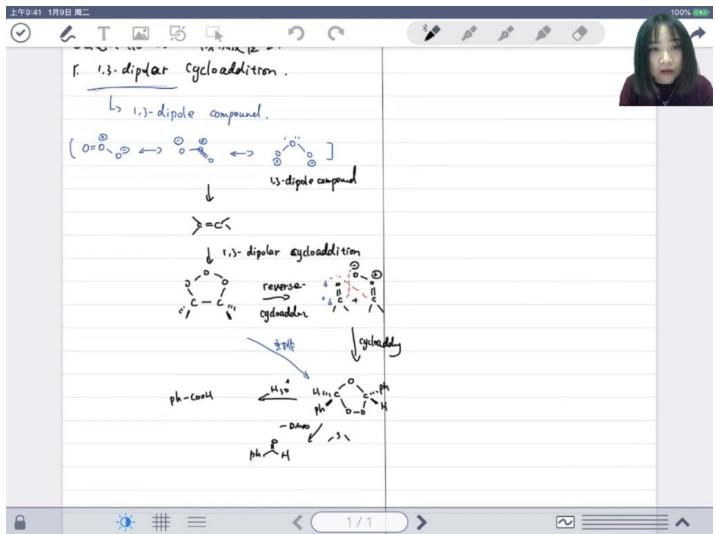

text_image

上午9:41 1月9日 周二
1. 1,3-dipolar cycloaddition.
5 1,3-dipole compound.
[0=0→] 1,3-dipole compound
↓
>=c<
↓ 1,3-dipolar cycloaddition
reverse
cycloaddition
+PH
cycloaddition
ph-coth
H2O
H2O
-Ph
-Ph-O-H
1/1

●   
● 常见类型：最常见的1,3-偶极环加成反应  
- 典型实例：

\- 点击反应（Click反应）：使用重氮盐作为反应物

\- 臭氧与烯烃反应

● 反应特点：条件温和，符合周环反应的一般特征

5）偶极子的形成与反应 14:28  
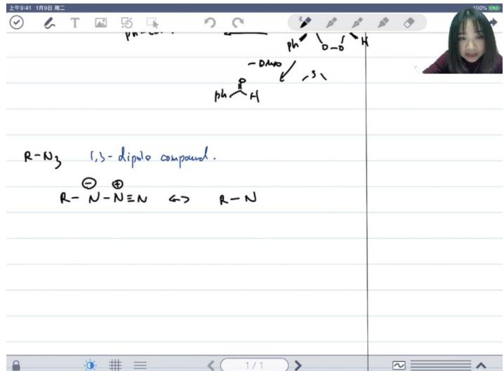

text_image

上午9:41 1月9日 周二
ph
D-6 H
-Dinuo
-3
ph
H
R-N₃ 1,3-dipole compound.
⊖ ⊕
R-N-N≡N ⇌ R-N

●   
● 稳定结构：最稳定的共振式需将正负电荷分别置于1,3位，中间保持中性  
● 杂化要求：氮原子需要从SP杂化变为SP2杂化才能形成有效偶极子  
● 反应过程：与烯烃反应生成五元环结构

6）例题2: 偶极环加成的产物判断 16:14

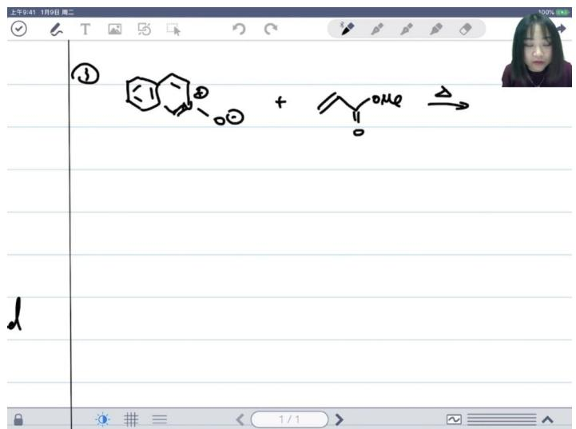

chemical

Hand-drawn chemical reaction diagram showing cyclohexene reacting with acetic anhydride to form a ketone and delta product, displayed in a word processor interface.

# ● 题目解析

- 条件影响：加热条件下遵循"正电荷找负电荷"规则，光照条件则相反  
○ 过渡态特征：1,3-偶极环加成没有endo偏好性  
○ 产物分析：需要考虑热力学稳定性（exo产物）和动力学优势（endo产物）  
○ 立体化学：某些情况下会生成外消旋体  
典型错误：混淆不同环加成反应的选择性规则

# 7）重排反应中的区域选择性

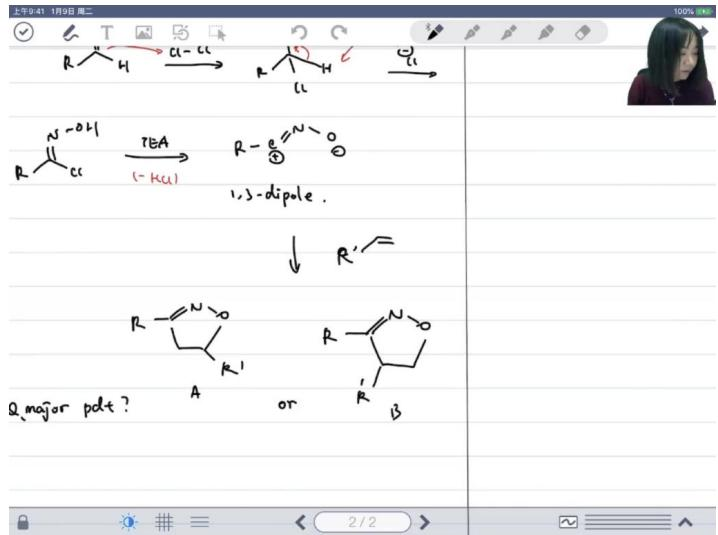

chemical

Chemical reaction scheme showing isocyanate (R-ε-N-O) reacting with TEA under acidic conditions to form dipeptide, then forming cyclic ketones.

● 区域选择性控制：在偶极子反应中，区域选择性是重要特征，决定产物分布  
- 替代制备方法：存在另一种制备R-CEN-O的方法，通过 $RVO_{2} + \rho h - v = c = 0 \rightarrow R - c = v - 0$ 实现  
● 反应机理：涉及硝基加酸氧打碳的过程，属于周环反应类型（需参考教材确认具体机理）

# 8) Elder-ene反应简介

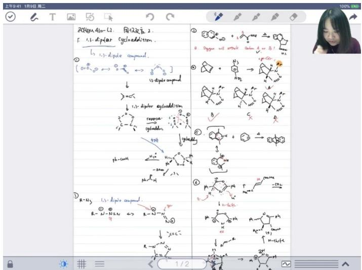

chemical

Chemical reaction scheme showing cycloaddition and subsequent stepwise reactions with labeled intermediates and products

● 反应名称：又称in reaction或I抖音反应（记忆点：老师提到北大教学时的俗称）  
- 历史背景：曾是北大基础有机化学（第二版）考试核心难点，但在第四版教材中可能被删除  
● 反应通式：涉及1,3-偶极环加成反应，具体结构见幻灯片图示  
- 反应条件:

○ 典型条件：氯离子酸催化或加热

○ 活化要求：通常需要较高活化能（记忆点：老师强调"活化能偏高")

9）Elder-ene反应的热力学性质

text_image

上午9:41 1月9日 周二
Condition.
Conditions : ① LA
to overcome high Ea.
② △.
Q₁ △H >0 or ≤0 (放起)
(△对反应从亚力子角交.有利 or 不利?)
∴ 有好时促没有反离.也会发光 retro-Ene

● 热力学特征：

○ 焓变： $\Delta H < 0$ （放热反应）  
- 温度影响：加热对反应热力学不利（考点：热力学与动力学区别）

● 逆反应现象：高温条件下可能发生retro-Ene反应（逆反应）

\- 轨道相互作用：

- HOMO-LUMO：涉及in（烯组分）与inophile（亲烯组分）的轨道相互作用  
- 记忆提醒：老师特别强调这部分内容易混淆，建议重点理解而非死记

10）Elder-ene反应中的电子体系

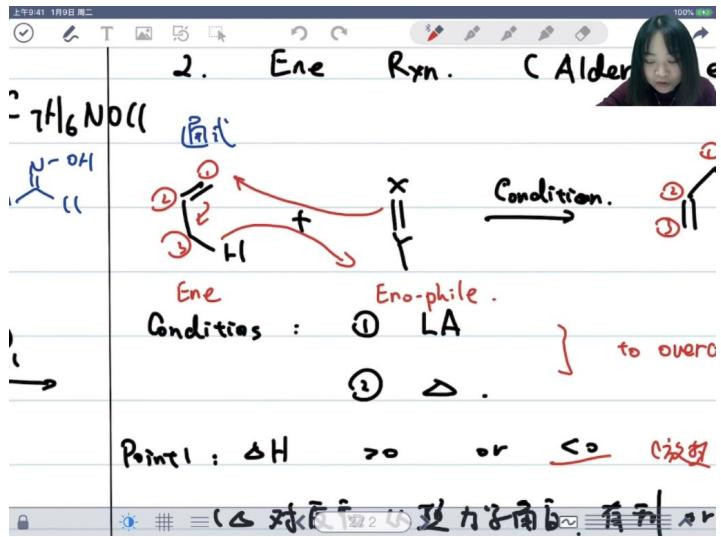

text_image

上午9:41 1月9日 周二
2. Ene Rxn. CALder
=7H16NOCl
通式
①
②
③
Condition.
④
Ene Ero-phile.
Conditions : ① LA
② △.
Point1 : △H >0 or <0 (放送)
(△ 对底) (△ 等力子角白) 有形

# - 反应组分命名：

○ 双键α位的氢称为"ene"（烯体）  
○ 双键本身称为"ene"（烯烃）  
整体称为"ene体系"，类比Diels-Alder反应中的"氢双烯体"

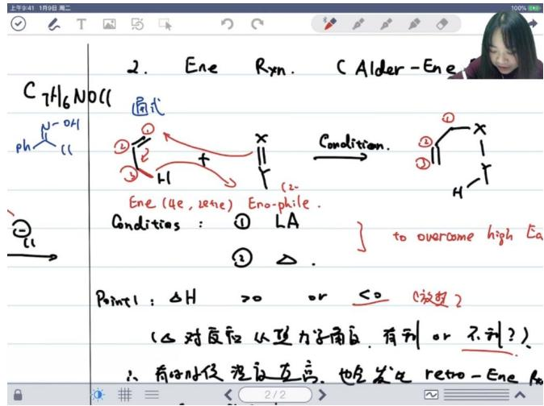

text_image

上午9:41 1月9日 周二
C7H5NOCl
Ph
N-OH
Cl
2. Ene Rxn. C Alder-Ene
通式
②
③ H
Condition.
①
②
③ H-T
Ene (4e, 2ene) Eno-phenile.
Conditions : ① LA
② △.
} to overcome high Ea
Point1 : △H >0 or ≤0 (放翅)
(△对底应以型力子角直,有列 or 不列?)
∴ 有好时促湿仅互高,也会发光 retro-Ene Ra
2/2

# ● 电子体系构成：

○ Ene组分是4电子体系（2π+2σ电子）  
- Enophile（亲烯体）是2电子体系

# - 轨道相互作用：

- 与Diels-Alder反应类比：ene提供HOMO轨道  
- Enophile提供LUMO轨道  
○ 轨道重叠方式：σ键需旋转至与π轨道共平面

# - 反应条件与热力学

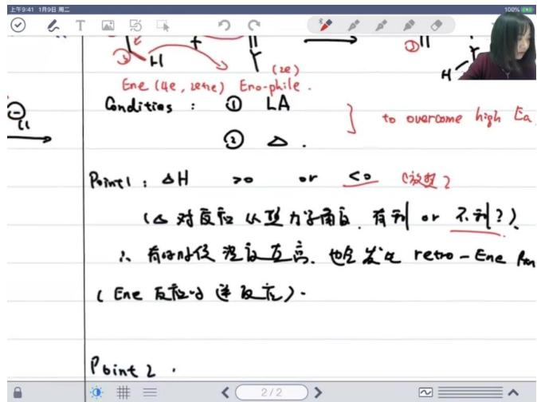

text_image

上午9:41 1月9日 周二
③ H
Ene (4e, venie) Eno-phile.
Conditions : ① LA
② △.
Point1 : △H >0 or <0 (放过2
(△对反应以型力学甬直、有利or不利?).
△有子时侵没反互离，也会发α retro-Ene Rm
(Ene 反应对逆反应).
Point 2.

# ○ 反应条件：

■ 需要克服较高活化能（因σ键旋转能垒）  
■ 常需加热条件（高温）

# ○ 热力学特征：

■ $\Delta H > 0$ (吸热反应)  
■ 升高温度有利于正反应进行  
■ 存在逆反应（retro-ene反应）

# - 反应机理难点

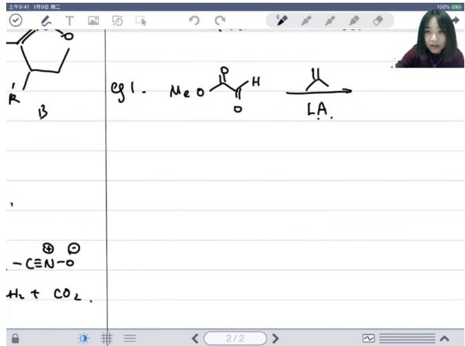

chemical

Handwritten chemical reaction diagram showing cyclohexene derivative with ethyl ester and alkene groups, followed by a photo of a person in a mirror.

# ○ 过渡态特征：

■ 需要σ键（C-H键）旋转至与π轨道平行  
■ 轨道重叠效率较低（相比Diels-Alder反应）  
■ 过渡态能量较高导致活化能较大

# ○ 记忆要点：

■ "ene提供HOMO，enophile提供LUMO"  
■ 反应需要"σ键旋转+π键断裂"协同进行  
高温条件通常必要

# 2. 硬反应 56:15

# 1）例题:in反应产物判断 58:37

\- in反应判断标准：判断谁是ene（烯组分）谁是eno-phile（亲烯体）的关键在于：

- eno-phile需要π轨道的α位有一个能与π键平行的σ键  
- 碳氧双键、碳氮双键等含吸电子基团的通常是eno-phile，因为其LUMO能级较低

● 常见eno-phile：羰基化合物 $(R_{2}C=O)$ 、亚胺 $(R_{2}C=NR)$ 等含杂原子双键化合物

\- 电子效应影响：吸电子基团（如氧、氮）会降低LUMO能级，使其更易作为eno-phile参与反应

2）例题:in反应机理书写 01:00:46

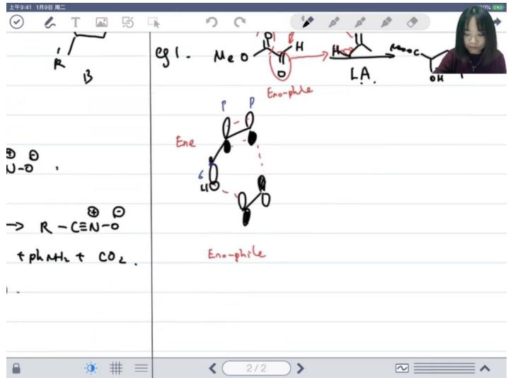

chemical

Hand-drawn chemical reaction diagram showing enol formation from alkenes and ammonia with anions, including photochemical reactions and molecular structures.

● 机理书写步骤：

- 明确ene组分和eno-phile组分  
○ 判断σ键转移位置（α-H的迁移）  
- 按电子流向绘制箭头：ene的π电子进攻eno-phile，同时σ键断裂向π键供电子

● 典型特征：反应涉及1个π键断裂、1个新π键形成和1个σ键迁移（[1,5]-H迁移）

● 活化能特点：in反应活化能较高，常作为副反应出现

3）例题:五圆环过渡态 01:05:57

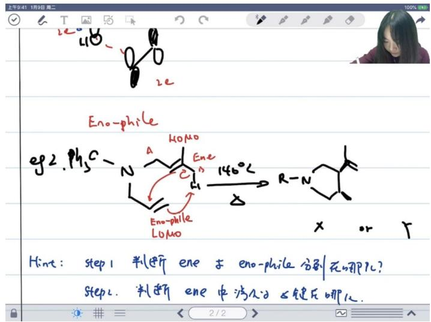

text_image

上午9:41 1月9日周二
Eno-phile
eg2.ph3C-N-HOMO
140°C
R-N
x or r
Hint: step1 判断ene 求eno-phile分别在哪儿?
Step2. 判断ene 快涉几a 键后哪儿.

立体化学判断：

○ 先确定H迁移位置（本例为b位H）  
- 分析过渡态构象：要求迁移H的σ键与π键平行  
- 顺式产物（cis）更有利，因过渡态空间位阻较小

\- 反应体系特点：

○ 属于2e+2e周环反应体系  
- 过渡态与Diels-Alder反应类似，具有空间取向要求

● 产物优势分析：

- 五元环形成时，cis产物空间张力更小   
- 过渡态中取代基处于同侧更有利轨道重叠

4）例题:五圆环过渡态 01:11:51

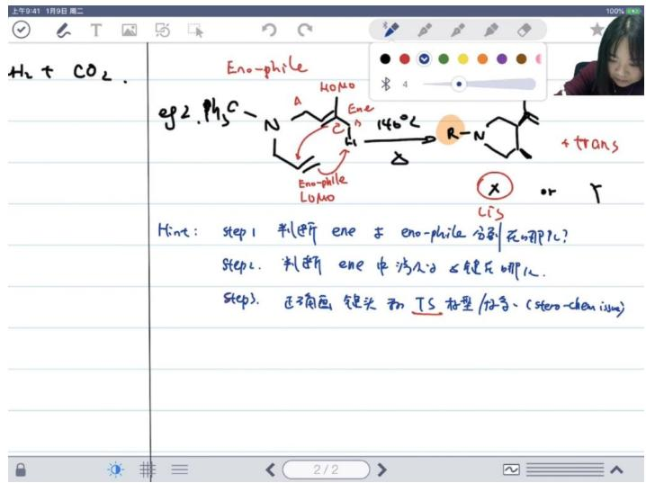

text_image

H2 + CO2.
Eno-phiile
ep2. Ph3C-N
HOMO
A
Ene
146°
R-N
+ trans
Eno-phiile
LOMO
x
or
LiS
Hint: step 1 半价开 ene 求 eno-phiile 分别花的哪儿?
step2. 判断 ene 电流及θ ≤ 锲后哪儿.
step3. 正确画 锲头 和 TS 标型/符号、(stereo-chem issue)

# - 反应步骤:

- step1: 确定ene反应物  
- step2: 判断ene中消键位置  
- step3: 正确画出过渡态构型（注意立体化学）

# ● 过渡态特点:

环状结构: 周环反应的过渡态一定是环状的  
○ 常见构型：文献和教材中通常画成接近六元环的椅式过渡态，五元环则视为椅式少一个角

# ● 考试技巧:

○ 常见考点: 国初和国决考试中，六元环椅式过渡态是高频考点  
○ 预测方法: 若无其他计算方法，通常采用椅式过渡态预测产物构型构象  
○ 大基团处理: 将大基团（如三苯甲基）放在平伏键位置

# 5）例题:in反应产物判断 01:16:59

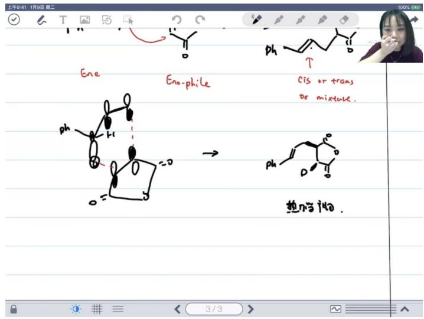

chemical

Hand-drawn chemical reaction diagram showing enol formation from eno-phile and cis-trans/mixture to form a cyclic product, with Chinese annotations.

# 反应机理:

○ 前线轨道: 需正确识别LUMO（最低未占分子轨道）和HOMO（最高已占分子轨道）  
○ 电子转移: 画箭头形成环状电子转移路径

# - 立体化学判断:

○ 产物构型: 通过分析过渡态确定产物是cis还是trans构型  
○ 常见结果: 该反应推得产物应为trans构型

# ● 解题方法:

\- 前线轨道理论: 适用于机理推导和立体化学问题

○ Woodward-Hoffmann规则: 可用于更复杂的周环反应分析

# ● 考试要求:

基础能力: 明确反应类型后应能写出产物结构  
○ 立体化学: 需注意产物立体构型的判断  
○ 常见错误: 容易遗漏CH2基团或双键位置错误

# 6) Prins反应机理 01:24:30

# - 反应特征

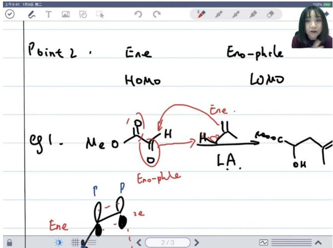

chemical

Hand-drawn chemical reaction diagram showing enol formation from HOMO and LMO molecules, with labeled intermediates and products

反应物特征：包含羰基化合物（特别是甲醛）和具有α-氢的烯烃

○ 产物特征：生成氧杂六元环结构

\- 关联反应：常与Ene反应相提并论，因两者都涉及羰基与烯烃的反应

# - 反应机理详解

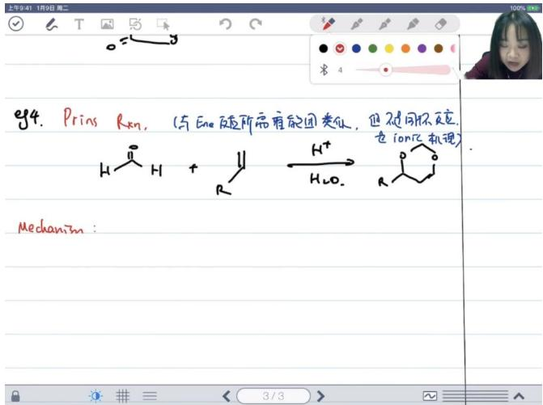

text_image

eg4. Prins Rkm, (与Ene随所需能团类似, 但就同不反应,
也ionr2机理)
H⁺
H + H₂O
Mechanism:

第一步活化：在酸性条件下，羰基（特别是甲醛）被质子化活化

\- 亲核进攻：烯烃作为较弱的亲核试剂进攻活化的羰基碳

○ 中间体选择：反应倾向于生成更稳定的中间体b（通过弹幕确认）

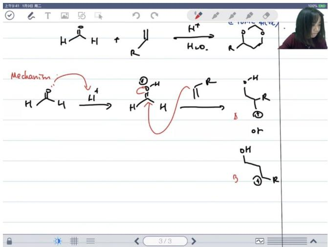

chemical

Hand-drawn chemical reaction mechanism diagram showing hydrogenation and ring-opening steps with labeled intermediates and products

○ 水分子参与：体系中需要水分子提供羟基基团  
二醇形成：经过质子转移等步骤生成二醇中间体  
○ 缩醛形成：最终通过缩醛化反应形成氧杂六元环产物

# - 反应特点

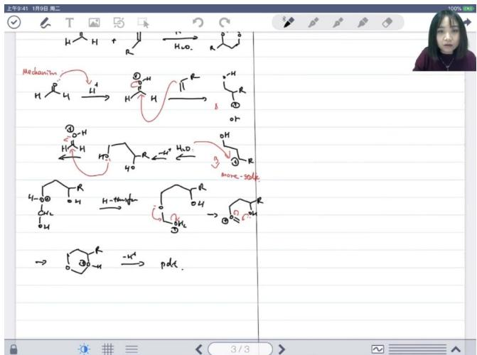

chemical

Hand-drawn chemical reaction equations showing hydrogenation and radical addition steps in a catalytic cycle

反应地位：作为主反应不常见，但作为副反应普遍存在

\- 练习建议：需要经常练习绘制机理，否则容易生疏

\- 条件控制：反应在酸性条件下进行，水分子参与但不必过量

# 7）例题：Prins反应机理绘制 01:30:52

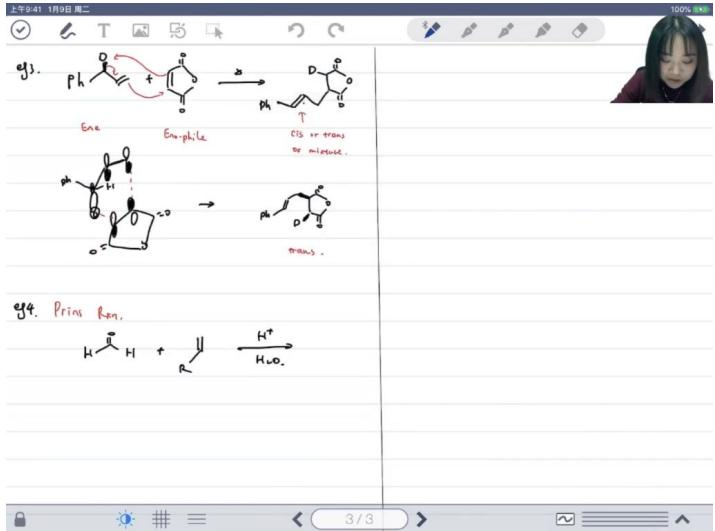

chemical

Chemical reaction equations and molecular structures for enamine derivatives, including cis-trans and trans-alkanes

3/3   
● 题目解析   
○ 关键步骤：重点考察羰基质子化和烯烃进攻的选择

- 中间体判断：通过稳定性分析确定主要中间体  
- 产物预测：最终生成氧杂六元环结构  
○ 易错点：容易忽略水分子在反应中的作用

# 3. 克莱曼重排 01:34:25

# 1）克莱森重排机理 01:34:30

\- 克莱森重排的定义与特点 01:34:31

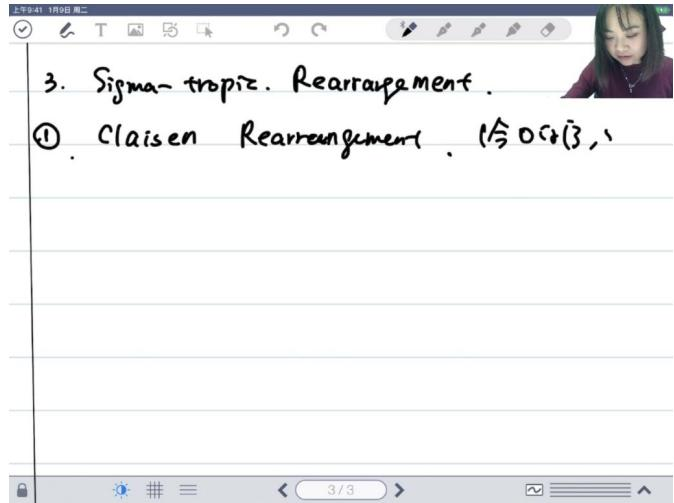

text_image

3. Sigma tropic. Rearrangement.
① Claisen Rearrangement. (今0583,

○ 含氧特征：克莱森重排的核心骨架中含氧原子，属于[3,3]-σ迁移反应  
- 反应本质：通过加热引发σ键迁移，形成新的碳碳键和碳氧键

● 3,3-sigma迁移的概念 01:35:05

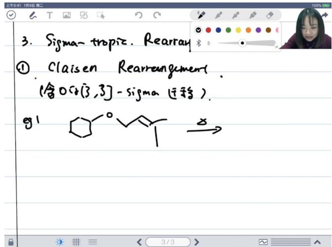

text_image

3. Sigma-tropic. Rearray
① Claisen Rearrangement
(含O₂(3,3)-sigma 连程)
g!

○ 迁移规则：需要两根双键之间隔三个σ键（即[3,3]迁移）  
- 过渡态：形成六元环椅式过渡态结构  
- 记忆要点：可简记为"含氧的33σ迁移"，避免记忆复杂人名

● 例题1: 克莱森重排的反应过程 01:36:23

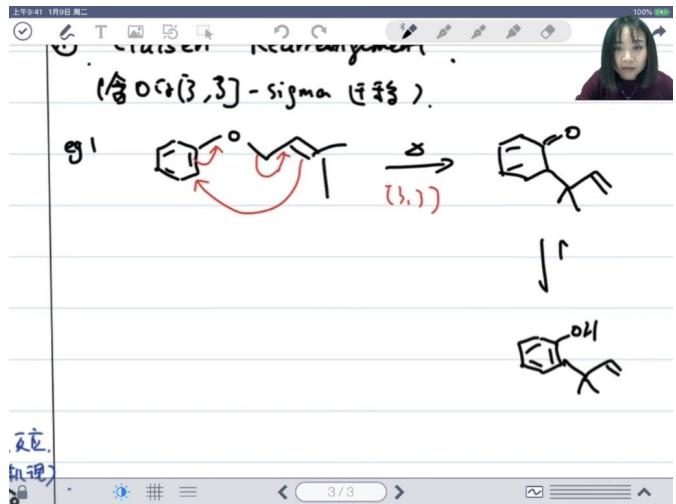

text_image

(含O₂(3,3)-sigma 过程)
g1
(3,1)

# 反应步骤：

■ 初始加热引发[3,3]σ迁移  
■ 生成中间体后进行互变异构   
■ 最终获得三级邻位产物

\- 驱动力：产物中R基团处于位阻较小的位置

● 反应的选择性驱动力 01:39:04

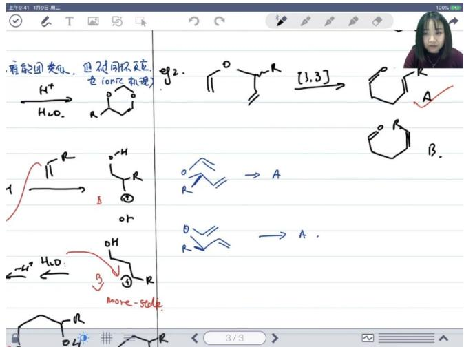

text_image

有能团类似，但通过同位 atom
仓 (ionic机现)
H⁺
H₂O.
1 → R
R
or
H⁺ H₂O:
3
More - Stole
eg2.
→ A
R
R
A
B.
→ A .
R
R

O

○ 立体选择性：由产物中R基团的空间位阻决定  
- 热力学优势：反应后π键和σ键总数不变，但双键键能增加  
- 放热特性： $\Delta H < 0$ ，属于放热反应

● 反应的热力学平衡 01:40:02

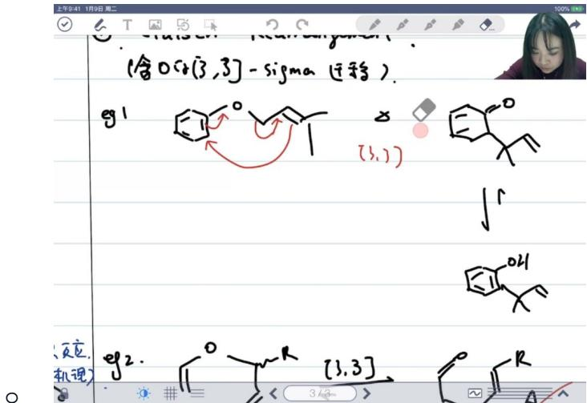

text_image

(含O₄[3,3]-sigma 迁移)
g1
(3,1)
√
OH
g2.
[3,3]
3/3

可逆性： $\sigma$ 迁移反应本质上是可逆的平衡过程

平衡位置：通常偏向取代度更高的烯烃产物一侧  
- 严谨表述：应描述为"平衡向右移动"而非完全不可逆

● 反应方向与热力学决定 01:40:56

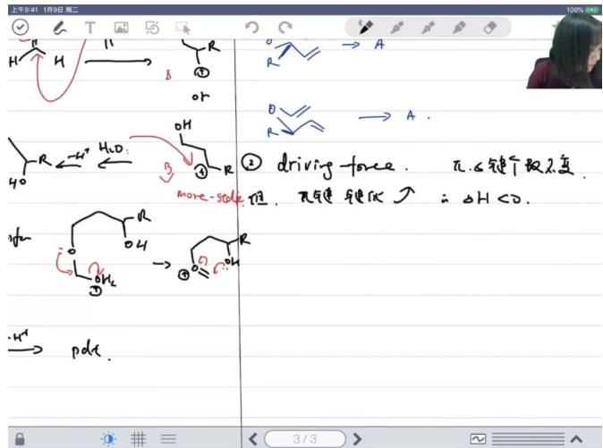

text_image

上午9:41 1月9日 周二
H→H → R
     ↘
     or

R ← H⁺ H₂O → R
40 → O⁻ H⁺ ( More - side)
② driving-force.    π/6键个数不变.
但，π键 锚化 ↑    ∴ OH < 0.

→ pdt.

决定因素：最终产物分布由热力学能量差驱动  
- 能量差：产物与反应物的能量差是反应进行的驱动力

2）克莱森重排的应用 01:41:21

● 制备γ,δ-不饱和羰基化合物 01:41:31

text_image

eg3 用于制酒 f,8-a
PasteBoard
Photos
Image Files
Camera
Web Page
Map
carbonyl amp

○ 产物特征：与常规 $\alpha, \beta$ -不饱和羰基化合物不同，生成 $\gamma, \delta$ -不饱和体系  
○ 结构特点：双键与羰基相隔两个碳原子

● 不同反应产物的生成 01:42:20

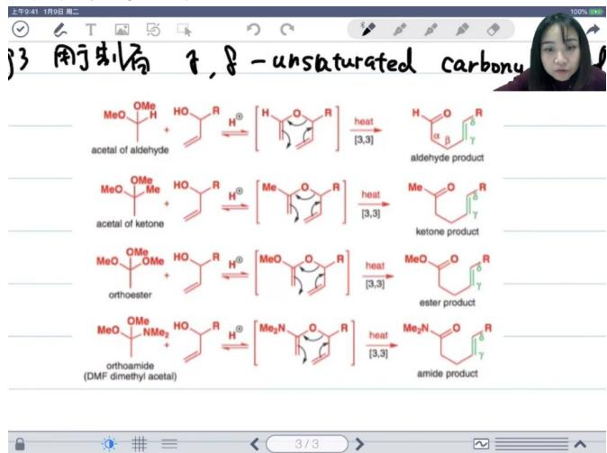

chemical

Chemical reaction equations for enantioselective carbonyl compounds, showing aldehyde, ketone, ester, and amide products with heat conditions

○ 醛衍生物：通过醛的缩醛参与反应

- 酮衍生物：通过酮的缩醛参与反应  
- 酯衍生物：通过原酸酯参与反应  
- 酰胺衍生物：通过DMF的二甲基缩醛参与反应

● 反应机理与缩醛的生成 01:42:41

○ 共同特征：所有反应物本质都是不同类型的缩醛或类似物  
- 反应条件：反应过程不需要额外加水或除水  
- 关键技能：必须掌握缩醛生成和转化的机理书写

\- 克莱森重排中的含氧迁移 01:43:32

○ 结构区分：与Cope重排（纯碳骨架）不同，克莱森重排骨架中含氧原子  
- 记忆要点：含氧的[3,3]σ迁移即为克莱森重排

# 3）Cope重排及应用案例

● 例题:产物倾向判断 01:45:59

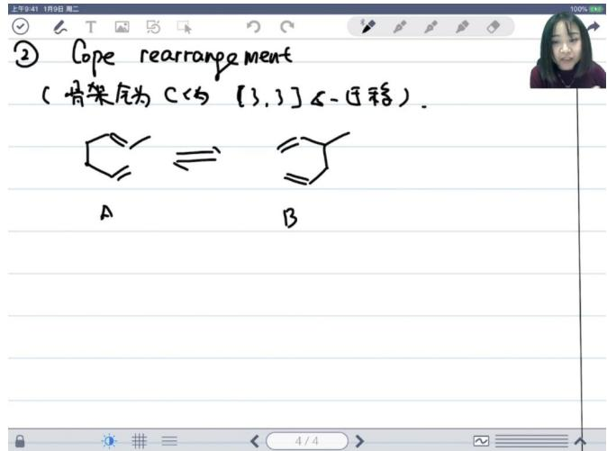

chemical

Chemical reaction diagram showing cyclohexene ring rearrangement with labeled positions A and B

热力学判断：平衡倾向于取代度更高的产物  
○ 实际应用：常通过质子化中间体加速反应（动力学控制）  
- 反应优化：多步操作可提高反应速率，尽管热力学允许直接转化

● 例题:e/e或g/g构型 01:50:26

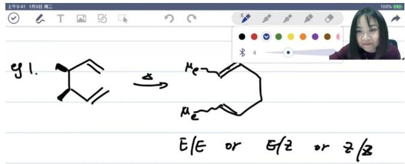

chemical

Hand-drawn chemical reaction showing conversion of cyclohexene to a cyclic ketone with E/E or E/Z or Z/Z ratios

Hint: 无元环 横式 ${TS}$

- 过渡态分析：必须绘制六元环椅式过渡态  
- 产物构型：典型产物为E/Z混合构型  
实操建议：空间想象困难者应坚持纸上作图分析

● 例题:克莱森重排产物 01:55:44

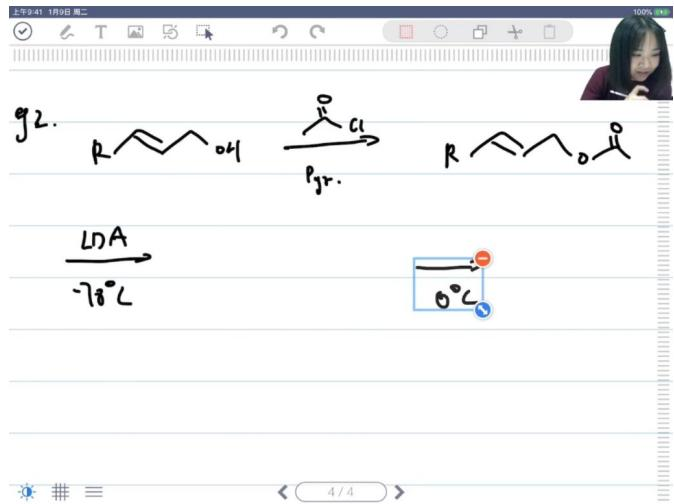

chemical

Handwritten chemical reaction equations showing epoxidation and thermal decomposition steps

- 试剂作用：LDA产生特定烯醇负离子引发重排   
- 反应类型：仍属克莱森重排（含氧骨架）  
○ 产物特征：生成γ,δ-不饱和羧酸衍生物

# 4. sigma迁移 01:58:37

# 1）例题:氧化反应机理 01:58:47

\- 反应类型：这是一个典型的[3,3]σ迁移反应，属于周环反应的一种

# - 反应机理：

- 第一步发生1,2-加成反应  
○ 三氧化锰作为氧化剂参与反应，将底物氧化  
- 反应过程中铬的价态从+6价降至+4价  
○ 关键步骤是质子迁移形成氧氢键而非锰氢键

# - 特点:

○ 与克莱森重排和Cope重排同属[3,3]σ迁移   
◦ 大多数有机化学教材不会详细描述该机理  
○ 反应中双键之间隔着一个单键（σ键）

# 5. 科普重排 02:13:27

# 1）例题:重排选择性 02:17:17

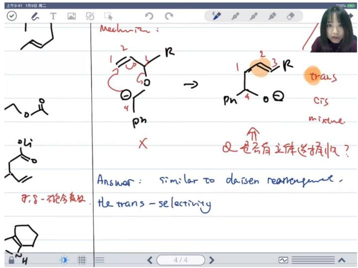

text_image

上午9:41 1月9日 周二
Mechanism :
1 2 R
ph
Q
Q是否有立体选择权？
Answer: similar to daisen resonance,
the trans-selectivity

# 反应条件：

○ 使用丁基锂在-78℃下反应  
- 升温至0℃完成重排

# - 反应机理：

\- 丁基锂拔除苯基旁的氢（酸性更强）

○ 形成碳负离子参与[2,3]σ迁移  
- 与克莱森重排类似，通过环状过渡态进行

# - 立体选择性：

- 具有trans选择性  
- 源于椅式过渡态的构象稳定性  
◦ 即使是五元环也能形成类似椅式构象  
- 最终产物为trans构型

# 2）例题:SN2反应重排 02:18:12

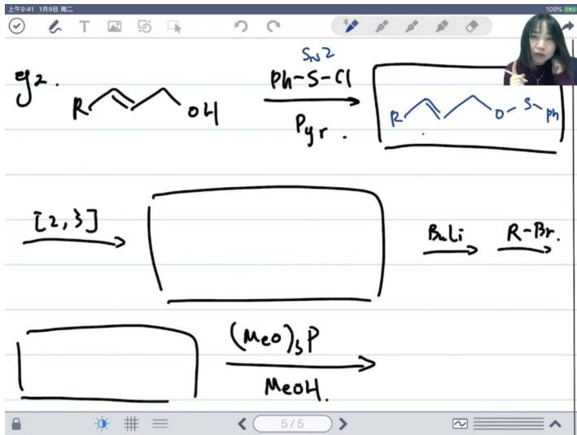

chemical

Hand-drawn chemical reaction equations showing transformation of alkene with hydroxyl group and pyridine to alcohol, then to alkene with bromide.

# 反应步骤：

- SN2反应：氧原子进攻硫原子，溴离子离去  
○ [2,3]σ重排反应  
○ 亚砜基团作为酰基化合物参与后续反应

# ● 机理特点：

○ [2,3]σ迁移可视为将[3,3]σ迁移中的一个π键换成孤对电子  
- 需要识别孤对电子和双键之间隔三根σ键的结构特征  
- 反应条件通常较为中性

# - 记忆要点：

○ [3,3]σ迁移常见于克莱森和Cope重排   
○ [2,3]σ迁移在考试中较难识别，需特别注意结构特征  
- 重排反应通常具有立体选择性，多为trans产物

# 6. 应用案例 02:23:17

# 1）例题:重排反应机理

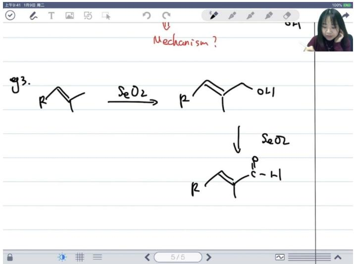

chemical

Handwritten chemical reaction scheme showing epoxide ring transformation with SeO2 and HCl groups

● 反应本质：用二氧化硒将烯烃 $\alpha$ 位的碳氢键氧化成碳氧键

● 机理特点：

- 涉及[2,3]σ迁移（周环反应）  
○ 硒从+4价降为+2价   
○ 类似三氧化锰的氧化机理

● 关键步骤:

- 硒试剂进攻烯烃   
○ 形成环状过渡态  
○ [2,3]σ迁移   
○ 质子迁移   
○ 水解生成最终产物（可能经过Se(OH) $_{2}$ 中间体）

● 考点提示：去年春季联赛曾考察该反应的试剂选择

# 7. 一五轻迁移 02:34:04

1）例题：一五轻迁移产物判断

\- 反应过程：

○ 二聚体加热发生逆Diels-Alder反应  
○ 加入BuLi和卤代氢后  
○ 通过连续一五氢迁移产生异构体

\- 产物特征：

○ 生成ABC三种单体混合物  
- 双键位置不断移动（可通过核磁监测）  
- 可能伴随二聚反应

\- 迁移规律：

○ 一五迁移可发生（一三迁移不能）  
○ 一七迁移较慢  
○ 迁移方向决定产物结构

# 8. 应用案例 02:40:20

1）例题:重排机理判断

\- 解题技巧：

○ 对应原料和产物的碳原子编号  
○ 判断断键/成键位置  
- 分析可能的周环过程

\- 典型机理：

一五迁移+Diels-Alder反应组合  
○ 吸电子基团影响反应选择:  
■ 甲氧基存在时：Diels-Alder为主（54%产率）  
■ 吸电子基存在时：活化能降低，Diels-Alder更快

● 轨道作用：四级轨道相互作用可降低活化能

9. 热力学σ迁移反应总结 02:49:04

\- 迁移类型分类：根据迁移原子数与共轭体系电子数分为[1,3]、[1,5]、[1,7]等类型

\- 可行性规律：

○ [1,3]迁移：不可行（impossible）  
○ [1,5]迁移：非常容易（very easy）  
○ [1,7]迁移：可行（possible）

● 分子轨道解释：通过HOMO（最高占据分子轨道）分析迁移可行性

☐ [1,3]的HOMO轨道特征：呈现反二特征（antarafacial），氢原子迁移时轨道不匹配

☐ [1,5]的HOMO轨道特征：呈现反三特征（antarafacial），轨道同向排列使氢迁移容易  
☐ [1,7]的HOMO轨道特征：呈现反四特征，七元环的环张力允许螺旋式迁移

# 10. 应用案例 02:52:48

# 1）例题:重排产物判断

# ● 题目解析：

○ 反应类型：13σ迁移反应  
○ 关键特征：涉及碳原子迁移（非氢迁移）  
○ 迁移机制:   
- 同面迁移要求碳原子构型翻转
- 未翻转得产物A，翻转后得产物B  
- 答案：B（构型翻转产物）
- 记忆点：碳迁移必须考虑构型翻转问题

# 2）碳迁移反应机理

# - 典型特征：

- 涉及σ键的1,3迁移（通过3根σ键）  
○ 迁移终点从3位变为5位（33→55）

# - 空间要求:

起始状态：D和OAc处于反式位置(trans)  
- 终产物：D和H处于顺式位置（cis）

# ● 机理要点：

- 碳原子构型翻转导致D/H位置交换  
需要绘制合理的电子转移箭头（形成循环箭头）

# 3）周环反应分类

# - 三大类型：

○ 环加成反应（已讲）  
○ σ迁移重排（当前内容）  
○ 电环化反应（待讲）

# ● 电环化特征：

- 涉及顺旋和对旋两种方式  
- 空间位阻效应显著影响反应路径

# 11. 电环化反应 03:02:39

# 1）反应条件与选择规则 03:03:16

● 加热条件选择规则：在加热条件下进行电环化反应时，需要观察HOMO（最高占据分子轨道）的对称性来判断产物构型。  
- 光照条件选择规则：光照条件下反应的选择性与加热条件相反，遵循"正电荷找负电荷"原则（ $\delta^{+}$ 找 $\delta^{-}$ ）。  
● 常见误区：由于大多数反应使用加热条件，容易遗忘光照条件下的反向选择性规则。

# 2）构型判断例题

# ● 题目解析

- 条件分析：明确反应条件是加热还是光照至关重要  
○ 轨道分析：加热时看HOMO轨道对称性，光照时考虑电荷相互作用  
典型错误：混淆条件导致构型判断错误（如将光照条件误用加热规则）  
- 答案验证：通过共振结构稳定性验证（SP杂化方式更稳定）

# 3）开环反应机制

● 加热开环：生成产物A+B，遵循热力学控制规则  
● 光照开环：生成产物C+D，遵循光化学选择规则  
● 结构表示法：小黑点表示氢原子朝上方向，与甲基相对（类似基团构型表示法）

# 4）综合应用题

# ● 题目解析

- 双键间隔规则：两个双键之间隔三个σ键时的特征反应  
○ 中间体判断：通过电荷分布分析（ $\delta^{-}$ 位于中间位置更稳定）  
○ 共轭效应：考虑共轭结构对中间体稳定性的影响  
作业提示：XYZ结构推导需结合杂化方式稳定性分析

# 二、环加成反应与Woodward-Hoffmann规则 03:15:36

# 1. 分子轨道理论在环加成中的应用

- HOMO-LUMO分析：理解环加成反应的关键是绘制分子轨道图，重点关注最高占据分子轨道（HOMO）和最低未占分子轨道（LUMO）的相互作用。  
- 考点覆盖：掌握正确绘制HOMO-LUMO能级图即可覆盖大部分考试要求，这是分析环加成反应选择性的核心工具。

# 2. Woodward-Hoffmann规则说明

● 规则定位：该规则主要用于快速判断周环反应的立体化学过程，但实际考试中较少直接考查。  
- 学习建议：保持知识体系完整性即可，重点应放在通过分子轨道理论理解电环化反应和环加成反应。

# 三、知识小结

<table><tr><td>知识点</td><td>核心内容</td><td>考试重点/易混淆点</td><td>难度系数</td></tr><tr><td>一三偶极环加成</td><td>臭氧与烯烃的氧化反应机理及产物</td><td>区分热力学与动力学产物</td><td></td></tr><tr><td>克莱森重排</td><td>含氧33σ迁移反应及产物构型</td><td>苯环与非苯环体系的迁移差异</td><td></td></tr><tr><td>科普重排</td><td>全碳骨架33σ迁移反应</td><td>质子化对反应速率的动力学影响</td><td></td></tr><tr><td>电环化反应</td><td>顺旋/对旋选择规则</td><td>加热与光照条件的相反选择性</td><td></td></tr><tr><td>σ迁移反应</td><td>[1,3]/[1,5]/[1,7]氢迁移可行性</td><td>前线轨道理论解释迁移规律</td><td></td></tr><tr><td>Woodward-Hoffmann规则</td><td>周环反应的立体电子效应</td><td>同面/异面迁移的构型变化</td><td></td></tr><tr><td>氧化反应机理</td><td>二氧化硒氧化烯丙位C-H键</td><td>涉及23σ迁移的特殊机理</td><td></td></tr><tr><td>全合成应用</td><td>多步周环反应的串联设计</td><td>反应顺序对区域选择性的影响</td><td></td></tr></table>