# 一、有机反应：合成与机理01:30

# 1. 卡宾 03:03

# 1）卡宾简介 04:17

● 卡宾的定义 04:19

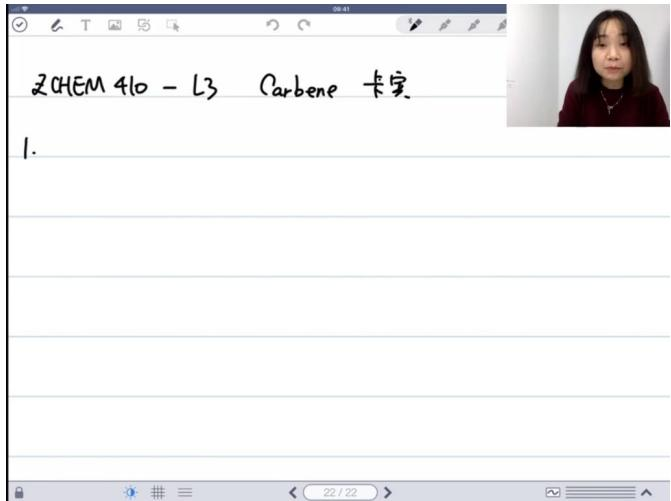

text_image

2CHEM 410 - L3 Carbene 卡宝
1.

基本概念：卡宾（Carbene）是指具有六个价电子的中性碳原子，化学式为 $R - \ddot{C} - R'$ ，其中R和R'可以是氢或碳基团。  
○ 音译来源: "卡宾" 是英文Carbene的音译，本身没有特定中文含义。  
○ 最简单形式: 最简单的卡宾是亚甲基 $CH_{2}$ 。

● 卡宾的稳定性 05:45

○ 电子特性 06:09

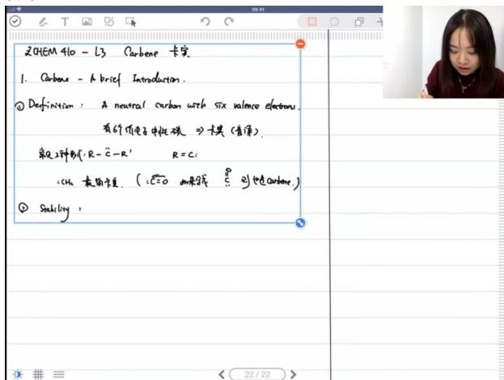

text_image

2CHEM 410 - L3 Carbone 卡实
1. Carbone - A brief Introduction.
① Definition: A neutral carbon with six valence electrons.
有的价电子共振碳 ② 模其（言语）.
碳2种制(R-C-R' R=C:
:cu 裁用卡里 ( :C=O 加来线 :P 引色碳-carbon.)
③ Stability:

缺电子性: 卡宾具有六个价电子，属于缺电子体系（electron deficient）。  
■ 八隅体倾向: 卡宾有强烈倾向通过获得电子形成八隅体稳定结构。

○ 取代基影响 06:46

■ 常见取代基：R和R'通常是氢或碳基团（脂肪族或芳香族），但也可能是氮或卤素等。  
■ 特殊形式: 一氧化碳失去两个烷基后形成的结构也符合卡宾定义。

\- 稳定性特点 07:26

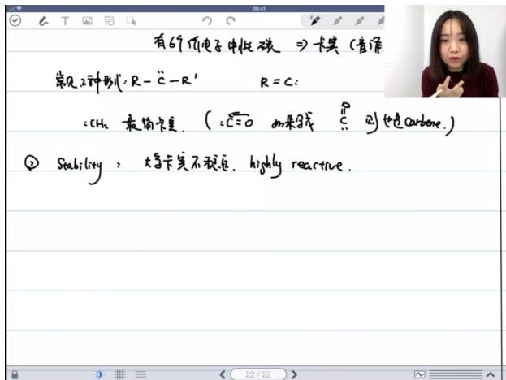

text_image

有69价电子中性碳 →卡莫（音源
常见2种别：R-‘C-R’ R=C：
:CH₄ 最简卡莫. ( :C=O 加果式 C 到也是carbone.)
② Stability ：大等卡莫不稳定，highly reactive.

高反应活性：卡宾通常极不稳定（highly reactive），常作为反应中间体存在。  
■ 二聚倾向: 不稳定卡宾容易发生二聚反应形成碳碳双键。

\- 反应性 08:44

■ 电子需求: 由于缺电子特性，卡宾倾向于寻找电子完成八隅体结构。

● 稳定的卡宾 09:35

研究背景 09:41

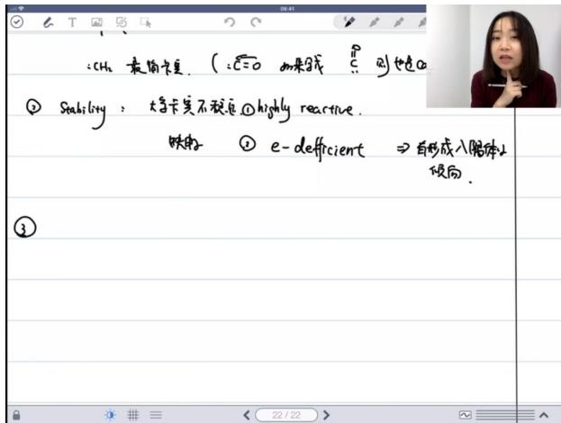

text_image

:CH₂ 欧简卡度. ( :C=O 如果线 C 则也连α
② Stability: 大将卡莫不税追.①highly reactive.
映射 ② e-deficient ⇒ 自形成入胞体↓
倾倒.

研究前沿: 法国科学家团队在加州大学圣地亚哥分校专注于研究稳定卡宾（Stable Carbene）。

○ NHC类卡宾 10:20

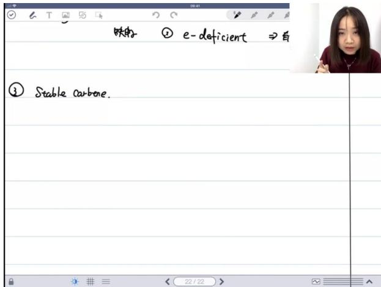

text_image

呋喃 ① e-deficient ⇒ 自
③ Stable carbene.

■ 定义：N-杂环卡宾（N-heterocyclic carbene，NHC）是最著名的稳定卡宾类型。  
■ 应用: 作为烯烃复分解催化剂的第二代配体使用。

# - 稳定性来源 11:44

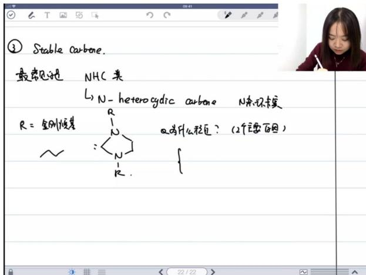

text_image

③ Stable carbone.
最常见的是 NHC类
L→N-heterocyclic carbono N热环未实
R=金刚烷基
Q为什么相互？（2个要百因）
{

■ 位阻效应: 大位阻取代基（如金刚烷基）通过空间位阻防止卡宾二聚。  
■ 电子效应: 氮原子上孤对电子通过共振稳定卡宾中心。

# ○ 共振稳定机制 12:56

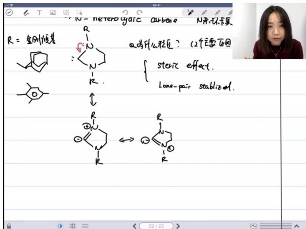

chemical

Hand-drawn chemical reaction diagram showing stereochemistry and lone pair stabilization methods for carbonyl carbon

共振形式: 孤对电子可以离域形成多种共振结构，显著提高稳定性。  
■ 动力学稳定: 大位阻提供动力学稳定性，防止二聚反应发生。  
■ 热力学稳定: 电子离域提供热力学稳定性。

# ● 卡宾的类型 14:37

# ○ 单线态与三线态

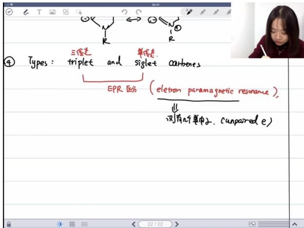

text_image

④ Types: triplet and siglet carbenes
EPR 区分 (electron paramagnetic resonance),
测有几个单向子, (unpaired e)

■ 分类依据: 根据未成对电子数分为单线态（singlet）和三线态（triplet）。  
■ EPR检测: 通过电子顺磁共振（EPR）可区分两种状态：

● 单线态：无未成对电子（n=0），EPR无信号  
● 三线态：两个未成对电子（n=2），EPR显示三重峰信号

# ○ 电子态稳定性

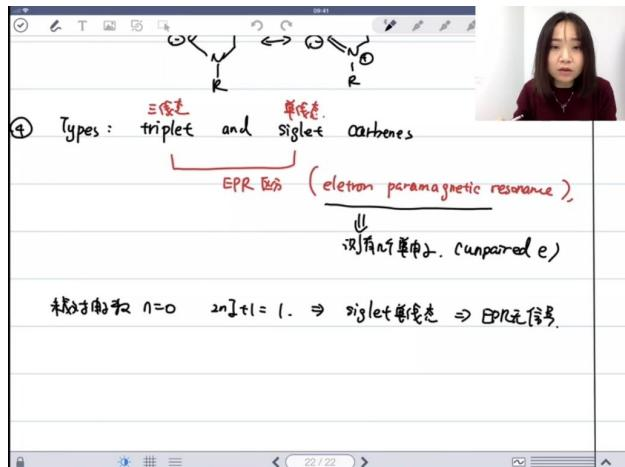

text_image

Types: triplet and siglet carbenes
EPR 区分 (electron paramagnetic resonance)
↓
现有几个单电子. (unpaired e)
未被抽取 n=0 2n]t=1. ⇒ siglet要绕态 ⇒ EPR无信号.

■ 一般规律: 大多数卡宾三线态更稳定（电子不配对降低排斥能）。  
■ 例外情况: 二氯卡宾等特殊结构单线态更稳定，原因:

- 孤对电子稳定空轨道  
● 共振效应增强单线态稳定性

# ○ 实验表征方法

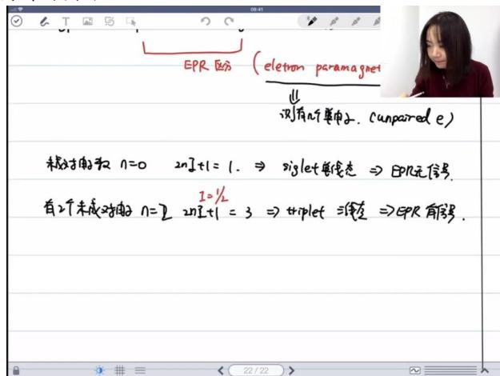

text_image

EPR 区分 (electron paramagnet)
↓
测有几个单个子，unpaired e)
未对的数 n=0 2nI+1=1. ⇒ siglet单线态 ⇒ EPR无信号.
有2个未成对应的 n=2 2nI+1=3 ⇒ triplet 混合 ⇒ EPR有信号.

■ EPR应用: 主要用于研究含未成对电子的体系（如过渡金属配合物）。  
■ XRD辅助: X射线衍射可提供卡宾结构的直接证据。  
■ NMR限制: 顺磁性卡宾会显著影响核磁信号，此时优先选择EPR。

# ● 应用案例 25:02

# ○ 卡宾的结构与性质

# ■ 卡宾的基本概念

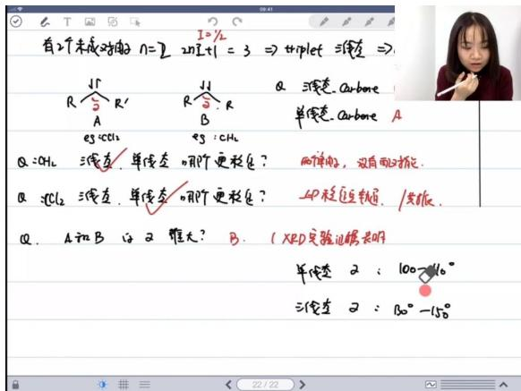

text_image

有2个未成对称 N=2 2nI+1=3 ⇒ triplet 涵变 ⇒
↓R
R'
A
eg:CH₂
↓II
R
R'
B
eg:CH₂
Q:CH₂ 涵变 单位变 哪阶更稳定?
两体变，双面的标记.
Q:CH₂ 涵变 单位变 哪阶更稳定?
△P稳定标记 / 共似.
Q. A和B 且又推大? B. (XRD实验记据共同)
单位变 又 : 100°
三位变 又 : 80° -150°

\- 定义: 卡宾（Carbene）是含有6个价电子的中性碳物种，化学式为 $R_{2}C$ ，具有高度反应活性。

# ● 电子特征:

○ 电子缺陷型（e-deficient）  
○ 存在两个未成对电子时：n = 2， $2nI + 1 = 3$ （三重态，triplet）  
○ 存在电子对时：单线态（singlet）

# ■ 单线态与三线态卡宾

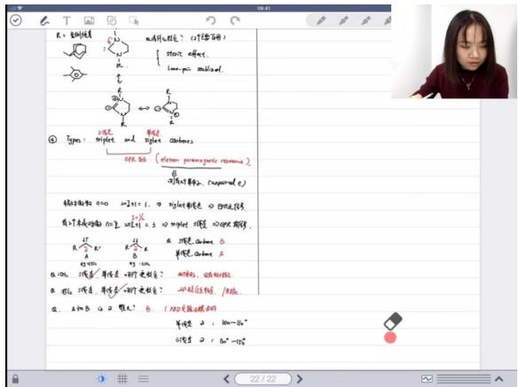

text_image

R. 侧向键
a. 作用性? (计算方法)
{
    Static effect
    Linear-polar effect

④ Types:
   □ 水性
   □ 顶点
   □ and
   □ right
   carbons
   DPE B6
   (diamine, peroxigenic response)
   □ 可得计数2, (superoxide)

相反方程数: 0.00  0.01 + 1.  □ 右侧角键是 □ 区间线段
有可变成的键: 0.02  0.03 + 3  □ 右侧角键是 □ 右侧角键是

a. 作用性: A
b. 右侧角键是 A
c. 右侧角键是 A
b. 右侧角键是 A
b. 右侧角键是 A
b. 右侧角键是 A
b. 右侧角键是 A
b. 右侧角键是 A
b. 右侧角键是 A
b. 右侧角键是 A
b. 右侧角键是 A
b. 右侧角键是 A
b. 右侧角键是 A
c. 右侧角键是 A
c. 右侧角键是 A
c. 右侧角键是 A
c. 右侧角键是 A
c. 右侧角键是 A
c. 右侧角键是 A
c. 右侧角键是 A
c. 右侧角键是 A
c. 右侧角键是 A
c. 右侧角键是 A
b. 右侧角键是 A
b. 右侧角键是 A
b. 右侧角键是 A
b. 右侧角键是 A
b. 右侧角键是 A
b. 右侧角键是 A
b. 右侧角键是 A
b. 右侧角键是 A
c. 右侧角键是 A
b. 右侧角键是 A
c. 右侧角键是 A
c. 右侧角键是 A
c. 右侧角键是 A
c. 右侧角键是 A
c. 右侧角键是 A
c. 右侧角键是 A
c. 右侧角键是 A
c. 右侧角键是 A
d. 右侧角键是 A
e. 右侧角键是 A
f. 右侧角键是 A
g. 右侧角键是 A
h. 右侧角键是 A
i. 右侧角键是 A
j. 右侧角键是 A
k. 右侧角键是 A
l. 右侧角键是 A
m. 右侧角键是 A
n. 右侧角键是 A
o. 右侧角键是 A
p. 右侧角键是 A
q. 右侧角键是 A
r. 右侧角键是 A
s. 右侧角键是 A
t. 右侧角键是 A
u. 右侧角键是 A
v. 右侧角键是 A
w. 右侧角键是 A

# - 结构差异:

三线态: SP杂化，两个互相垂直的p轨道各填一个单电子，键角 $130^{\circ}-150^{\circ}$   
○ 单线态: SP²杂化, 一对孤对电子和空的p轨道, 键角100°-110°

# ● 稳定性因素:

○ 配对能: 约40 kJ/mol，三线态通常更稳定（无需克服配对能）  
○ 实验证据: XRD显示三线态键角显著大于单线态   
例外情况：当邻位原子有孤对电子（如CCl₂）时，单线态可能更稳定

# ■ 分子轨道理论解释

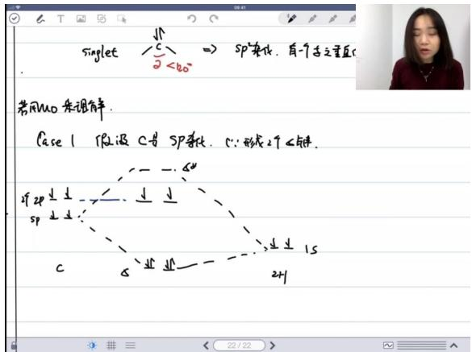

text_image

singlet
C/2 < 60°
⇒ SP杂化. 有一个为之重复
常用mo 条理解.
Case 1 假设 C=SP杂化. S: 形成 2个∠5缺.
C/2 SP杂化. S: 形成 2个∠5缺.
C/2 SP杂化. S: 形成 2个∠5缺.
2H

# - SP杂化模型:

○ 三线态：两个单电子分别占据不同p轨道  
○ 单线态：需要激发克服配对能（\~40 kJ/mol）

# - SP²杂化模型:

○ 单线态：孤对电子占据杂化轨道，空p轨道能量较高  
○ 能量差（ΔE）决定稳定态：当ΔE<40 kJ/mol时三线态稳定

# 实验检测方法

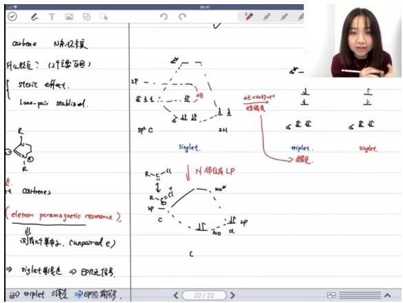

text_image

carbono N水杯本复
什么粒子？（2个重要百团）
{ steady effect.
low-pair stable.}
#
carbones
(electron paramagnetic resonance),
//测有对称子，(unpaired e)
=> siglet等链走 => EPR无信号。
# > triplet 液液 => 0.01%有氧键。
《 22 / 22 »
# > p
# > p
# > p
# > p
# > p
# > p
# > p
# > p
# > p
# > p
# > p
# > p
# > p
# > p
# > p
# > p
# > p
# > p
# > p
# > p
# > p
# > p
# > p
# > p
# > p
# > P
# > P
# > P
# > P
# > P
# > P
# > P
# > P
# > P
# > P
# > P
# > P
# > P
# > P
# > P
# > P
# > P
# > P
# > P
# > P
# > P
# > P
# > P
# > P
# > P
# >P
# > P
# > P
# > P
# > P
# > P
# > P
# > P
# > P
# > P
# > P
# > P
# > P
# > P
# > P
# > P
# > P
# > P
# > P
# > P
# > P
# > P
# > P
# > P
# > P
# > S

# ● EPR信号:

○ 三线态：有信号（n=2，2nI+1=3）  
○ 单线态：无信号（n=0）

# ● XRD数据:

○ 单线态键角： $100^{\circ}-110^{\circ}$   
○ 三线态键角： $130^{\circ}-150^{\circ}$

# ■ 特殊卡宾类型

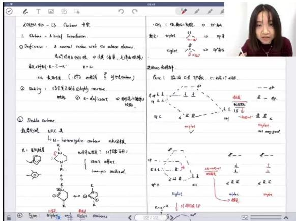

text_image

2OHEM 410 - 13 Carbon 心理
1. Carbose - A braid Invasetizer.
② Definition: A normal carbon with 60% above carbon.
有的碳原子的核键，只具有键键，无离子或碳键。
数列键（R = -R） R < C.
CCL 额度性质（CTO 氨解） 引性碳原子）
③ Solving: 60% 要有正离子且高纯碳素。
碳键：② e-deficient ① 的碳原子键键为
① Stable carbone.
重铬化碳 NHC 系
LgCl₂-heteroglyclic carbone 碳键反应
R = 钼铁酸
a 有两键反应：(1个碳原子)
### #### ###
### ####
### ###
### ###
### ###
### ###
### ###
### ###
### ###
### ###
### ###
### ###
### ###
### ###
### ###
### ###
### ###
### ###
### ###
### ###
### ###
### ###
### ###
### ###
### ###
### ###
### ###
### ###
### ###
### ###
### ###
### ###
### ###
### ###
### ###
### ###
######
PHE : 镀离子/角键。○ 扩敏
氧化：mole: 100 μg
mole: 100 μg
mole: 100 μg
mole: 100 μg
mole: 100 μg
mole: 100 μg
mole: 100 μg
mole: 100 μg
mole: 100 μg
mole: 100 μg
mole: 100 μg

# ● N-杂环卡宾（NHC）：

- 稳定因素：立体效应（steric effect）和孤对电子稳定（lone-pair stabilization）  
○ 应用：Grubbs催化剂中的配体（强σ给体和π受体）

# ■ 反应特性

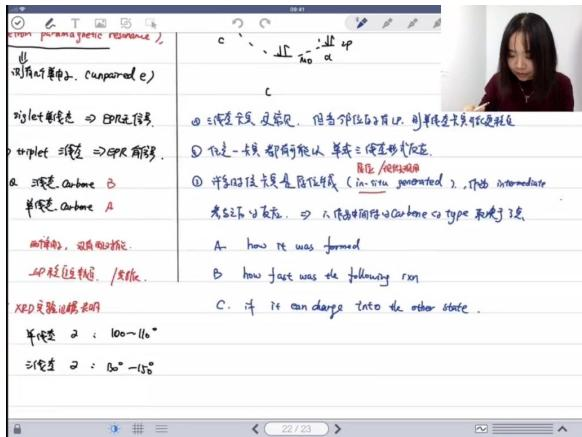

text_image

例有的单字母，(unpurated e)
siglet单变量 ⇒ EPR无符号。
triplet 三变量 ⇒EPR有符号。
a 源变量：carbone B
单变量：carbone A
两变量，没有用对称。
40 转近方程，/发线。
XRD实验逻辑表明
单变量 又：100～110°
三变量 又：80°～110°
c . . . √d = √d ∥
      - no    a
① 源变量、反意见。但当邻位的子符号，则单变量无关的标注规定
② 仅是一变量都有可能以单或三变量形式定义。
③ 单变量的反变量是原位值域（in situ generated），作为 intermediate
考点之后可发线。⇒ 一个绝对值的 Carbone 的 type 和便于3点
A. how it was formed
B. how fast was de following run
C. 许 is can large into the other state。

# - 反应状态:

- 任意卡宾都可能以单线态或三线态参与反应  
◦ 多数情况下原位生成（in situ generated）作为反应中间体

# ● 状态决定因素:

○ 生成方式（how it was formed）   
- 反应速率（how fast it was followed）   
能否转化为更稳定态（can it change to more stable form）

# 2）卡宾的制备 51:04

# ● 从重氮化合物中制备卡宾 56:52

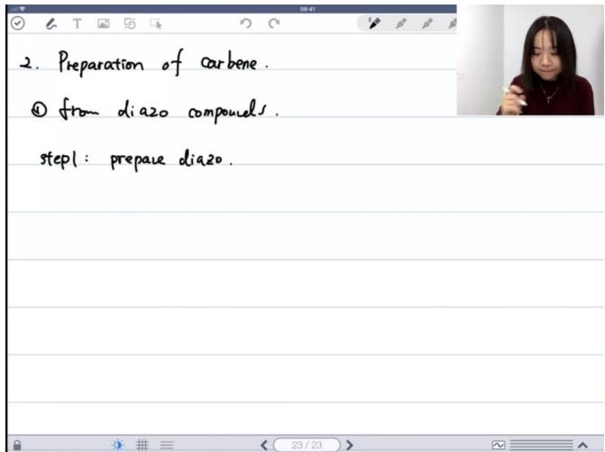

text_image

2. Preparation of carbene.
① from dia20 compounds.
step1: prepare dia20.

# ○ 重氮化合物的危险性

■ 爆炸性：重氮类物质通常比较危险，具有易爆特性，因为容易大量释放氮气  
■ 事故案例：北大实验室曾发生重氮化合物爆炸事故，研究生在刮取固体产物时因摩擦导致爆炸，手部严重受伤  
■ 安全操作：
● 必须在通风橱内操作
● 挡板高度需保持在安全位置（欧盟标准要
● 避免加热和机械摩擦
● 即使"稳定"的重氮化合物也可能存在风险

# - 稳定化重氮化合物的制备

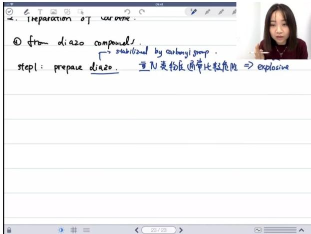

text_image

2. Preparation of carvone.
① from diazo compounds.
→ stabilized by carboni group.
step1: prepare diazo. 重N类物及通常比较危险 ⇒ explosive

■ 稳定条件：通常需要被羰基等基团稳定才能安全制备和分离  
制备方法：
- 从羧酸出发： $RCOOH \rightarrow RCOCl \rightarrow RCOCHN_{2}$ - 使用商业可得重氮甲烷 $(CH_{2}N_{2})$ ，储存在高压钢瓶中
- 反应机理关键：需将重氮甲烷画成碳负形式 $(CH_{2}=N^{+}=N^{-})$ 进行推导

# - 具体反应机理

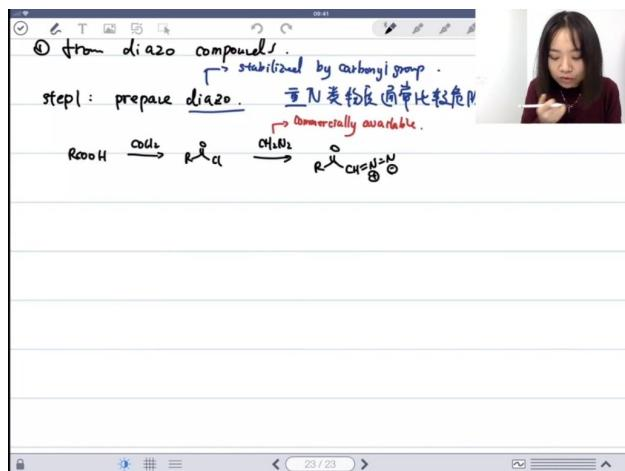

text_image

from diazo compound.
→ stabilized by carbonyi group .
step1: prepare diazo. 重N类物质通常比粒危险
→ commercially available.
RooH → Rα → RCH=CH=CH-CH
23/23

步骤1：羧酸转化为酰氯

步骤2：酰氯与重氮甲烷反应

- 碳负进攻羰基碳   
- 氯离子离去   
● 形成稳定的重氮化合物RCH = N = N

注意事项：

- 羰基α-H酸性强，易被拔除   
● 反应需在严格控制的条件下进行

● 重氮化合物的制备与卡宾生成

\- 重氮化合物的制备方法

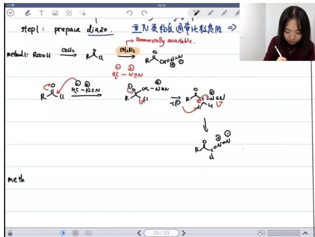

text_image

step1: prepare dia20. 重N类物及通常比较危险
method1: RcoOH → catalyzed by R-glc → CH3NH2CH=NN=N
→ Commercially available.
H2C-N=N
R-glc → H2C-N=N
R-glc → CH3NH2CH=NN=N
R-glc → CH3NH2CH=NN=N
R-glc → CH3NH2CH=NN=N
R-glc → CH3NH2CH=NN=N
R-glc → CH3NH2CH=NN=N
R-glc → CH3NH2CH=NN=N
R-glc → CH3NH2CH=NN=N
R-glc → CH3NH2CH=NN=N
R-glc → CH3 NH2N=N
R-glc → CH3 NH2N=N
R-glc → CH3 NH2N=N
R-glc → CH3 NH2N=N
R-glc → CH3 NH2N=N
R-glc → CH3 NH2N=N
R-glc → CH3 NH2N=N
R-glc → CH3 NH2N=N
R-glc → CH3 NH2N=N
R-glc → CH3 NH2N N
R-glc → CH3 NH2N N
R-glc → CH3 NH2N N
R-glc → CH3 NH2N N
R-glc → CH3 NH2N N
R-glc → CH3 NH2N N
R-glc → CH3 NH2N N
R-glc → CH3 NH2N N
R-glc → CH3 NH2N N
R-glc → CH3 NH2N N

■ 商业获取：重氮类物质（ $RCH = N_{2}$ ）通常比较危险，建议直接购买商品化产品  
■ 方法1：通过羧酸衍生物制备

● 反应路径： $RCOOH \rightarrow RCl \rightarrow RCH_{2}N_{2} \rightarrow RCH = NH_{2}$

● 实例：叠氮化钠（ $N_{3}^{-}$ ）可作为反应试剂

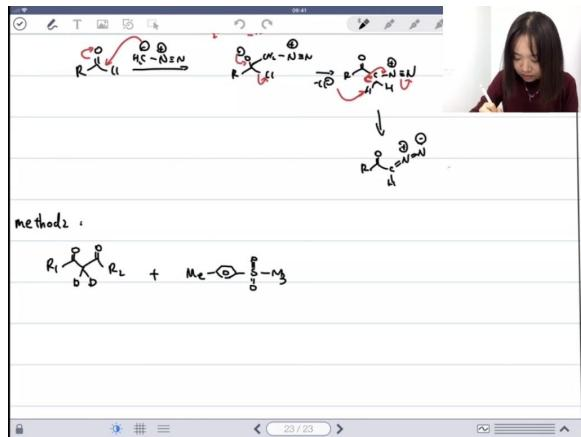

chemical

Chemical reaction scheme showing transformation of a cyclic amide with R groups to form a ketone and methylene derivative, followed by hydrogenation or elimination steps.

# ■ 方法2：使用羰基化合物

- 反应通式： $0. + O$ 类型反应  
● 关键试剂：同样涉及叠氮基团 $(N_{3})$

# ○ 方法2的反应机理

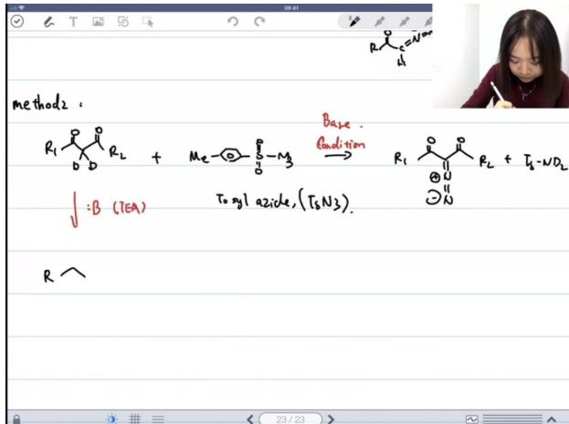

chemical

Chemical reaction scheme for the synthesis of triethylamine derivatives using base and oxidation step

# ■ 反应条件:

● 需要加入碱（如TEA，三乙胺）作为催化剂  
● 反应不能直接混合，需控制条件

# ■ 机理特点：

● 涉及共振结构的平衡   
- 负电荷转移过程: $Ba_{1}L_{1}<\frac{1}{2}$

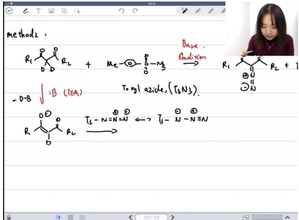

chemical

Chemical reaction scheme showing catalytic addition of benzene to aniline, followed by cyclization and elimination of N-alkyl azide

# 共振结构选择：

- 存在多个可能的共振结构  
● 优先选择易于绘制机理的结构  
● 典型结构：右边结构更合理，涉及负电荷寻找正电荷的过程

# - 羰基稳定重氮化合物的机理

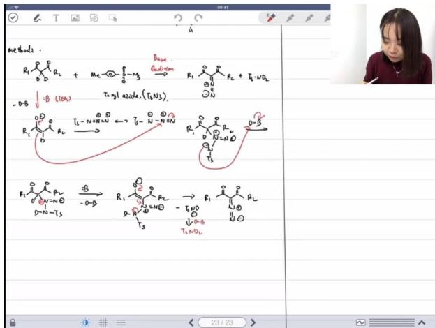

chemical

Chemical reaction scheme showing transformation of a cyclic amide with base and triethyl oxides to form a radical intermediate, followed by radical addition and cyclization.

# ■ 稳定原因：

● 共轭效应：通过吸电子共轭稳定重氮基团  
● 共振结构显示负电荷可转移到电负性更大的氧原子上

# ■ 注意事项：

● 大学考试中电荷平衡错误会扣分  
● 需完整绘制所有共振结构

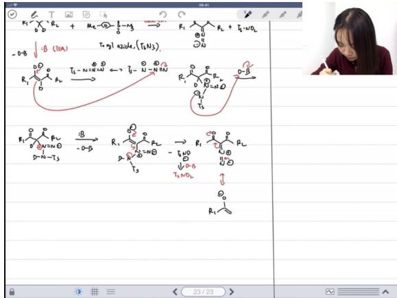

chemical

Chemical reaction scheme showing radical intermediates and electron transfer steps with temperature conditions

# 共振示例：

● 电子推拉效应： $Ts - N = N = N - N - NIN$ 结构  
● 极性 $\pi$ 键的稳定作用优于普通双键

# ○ 卡宾的制备

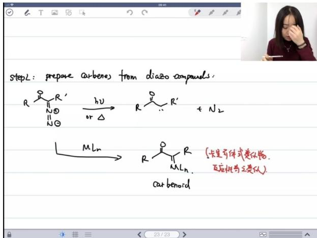

text_image

stepL: prepare carbene from diazo compounds.
R
N
O
II
N
O
hν
or Δ
R
R'
+ N₂
MLn
R
MLn
car benoid
(卡生奇体式类似物.
可应性与之类似)

# ■ 方法1：重氮化合物分解

● 条件：加热或光照   
● 产物：释放 $N_{2}$ 后形成卡宾（中性二价碳物种）

# ■ 方法2：金属配位转化

● 形成金属-碳双键化合物（卡宾类似物）  
- 特点：

○ 不是严格意义上的卡宾  
- 反应性与卡宾类似，可作为卡宾前体  
- 专业术语称为"carbenoid"（卡宾体）

# ● 从托酰肼中制备 01:32:24

\- 托酰肼作为不稳定中间体的介绍 01:32:25

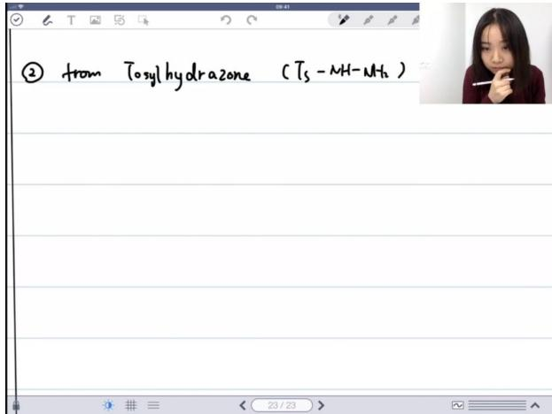

text_image

② from Tosyl hydrazone (Ts - MH-NH₃)

■ 结构特征： $Ts-NH-NH_{2}$ （苯磺酰肼结构）  
■ 不稳定性原因：虽然具有共轭体系，但缺乏羰基稳定作用，属于unstable intermediate  
■ 反应特性：在碱性条件下（NaOMe）易发生分解

\- 托酰肼反应机理概述 01:33:29

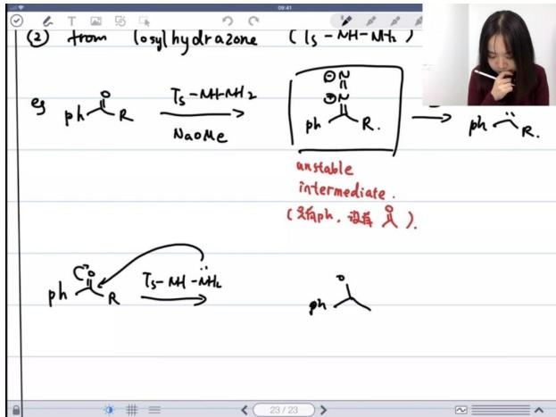

chemical

Chemical reaction diagram showing isomethylation of a phenyl hydrazone with NaOH, forming an unstable intermediate and phthio group

■ 初始反应：羰基化合物（ph - CO - R）与氨的缩合反应是快速发生的  
■ 关键步骤：生成 $Ts-NH-NH_{2}$ 中间体后，在碱性环境中发生转化  
■ 记忆点："看到胺基就要想到羰基-氨缩合反应"

○ 强碱性环境下的反应步骤 01:35:36

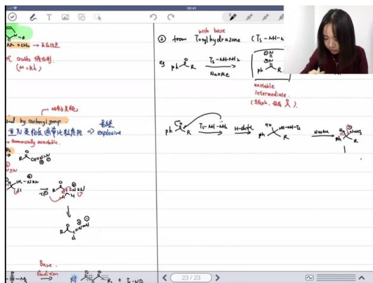

text_image

M. XCH₄ → 玻璃化
代 OxMo, 降氢剂.
(m = kh)
→ 玻璃化
by oxamyl group.
重N类的反通带比较危险 ⇒ explosive
a commercially available.
R = R₀ + O₂ + H₂
→
Ph
→
T₅-NH-₄
NaO₂R
→
Ts-NH-₄
→
Ts-NH-₃
→
Ts-NH-₃
→
Ts-NH-₃
→
Ts-NH-₃
→
Ts-NH-₃
→
Ts-NH-₃
→
Ts-NH-₃
→
Ts-NH-₃
→
Pt
→
Pt
→
Pt
→
Pt
→
Pt
→
Pt
→
Pt
→
Pt
→
Pt
→
Pt
→
Pt
→
Pt
→
Pt
→
Pt
→
Pt
→
Pt
→
Pt
→
Pt
→
Pt
→
Pt
→
Pt
→
Pt
→
Pt
→
Pt
→
Pt
→
PbIe.
→ PbIe.
→ PbIe.
→ PbIe.
→ PbIe.
→ PbIe.
→ PbIe.
→ PbIe.
→ PbIe.
→ PbIe.
→ PbIe.
→ PbIe.
→ PbIe.
→ PbIe.
→ PbIe.
→ PbIe.
→ PbIe.
→ PbIe.

■ 反应条件：强碱环境（NaOMe作为base）

■ 特殊过程:

● 正常情况下羟基不会离去  
● 在强碱作用下通过 $\alpha$ -消除生成氮负离子  
● 对甲苯磺酰基（Tosyl）作为离去基团被消除

■ 危险提示：该中间体具有爆炸性（explosive）

○ 生成稳定中间体的过程 01:36:46

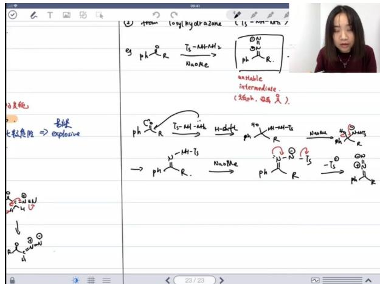

chemical

Chemical reaction scheme showing hydrolysis of a phosphorus-containing compound using thiophene and NaOMe, with intermediate conditions and structural changes.

转化过程：通过消除对甲苯磺酰基，形成稳定的共轭体系  
■ 结构特征：最终产物含有苯环（ph）共轭结构  
■ 实验注意：该步骤需要严格控制条件，避免爆炸风险

● 通过α-消除制备 01:37:36

○ α-消除反应机理

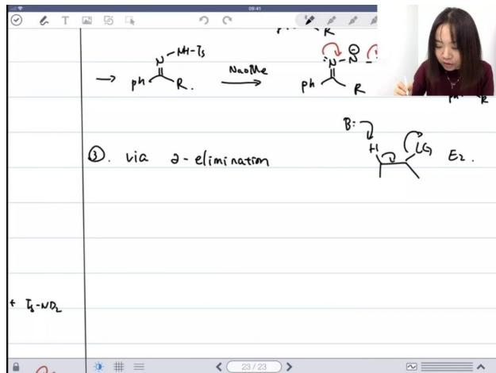

chemical

Chemical reaction diagram showing diazotization and elimination steps with reagents PH, NaOMe, and E2

与β-消除的区别：

- $\beta$ -消除：离去基团在氢的相邻位置（ $E1 / E2$ 反应）  
● α-消除：氢和离去基团在同一碳原子上

# ■ 反应步骤:

● 碱夺取 $\alpha$ -氢形成负离子  
- 离去基团（如Tosyl）被消除   
- 生成卡宾中间体

■ 协同过程：两步可以协同进行，直接生成卡宾

○ 卡宾的生成

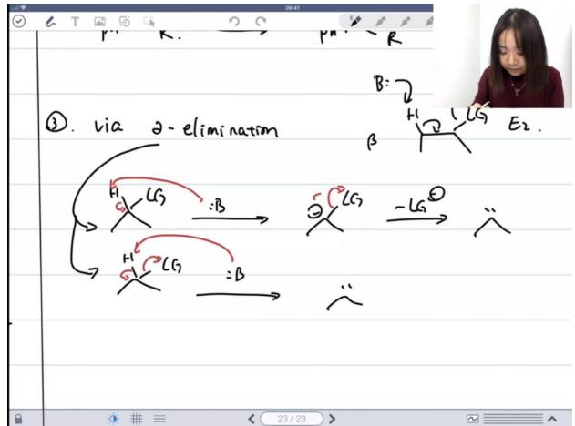

text_image

①. via 2-elimination
B: 2
H: LGS E2.
β
H: LGS
→ :B →
→ :B →
H: LGS -LG
← :B →
…

关键中间体：通过 $\alpha$ -消除产生的卡宾（carbene）  
■ 反应特点：不需要区分单分子或双分子消除机制  
■ 应用提示：该方法是制备卡宾类化合物的有效途径

● 应用案例 01:40:00

例题:同位素效应判定机理

■ 同位素效应(KIE)与反应机理判定

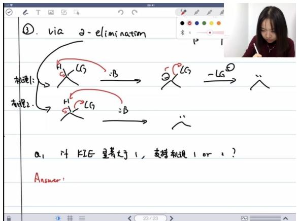

text_image

①. via 2-elimination
推理1:
求理2.
HCG :B
HCG :B
2CG -LG
HCG =B
a₁ if KIE 量等于1，支持机现1 or 2 ?
Answer:

- KIE效应解释：当 $\mathrm{KIE}(k_{H}/k_{D})$ 显著大于1时，说明反应存在同位素效应，表明在决速步(RDS)或之前涉及C-H/D键断裂。  
● 机理一分析：

- 拔氢为RDS：此时会观测到KIE效应  
○ 离去基团离去为RDS：若拔氢发生在决速步之前，仍会观测到KIE效应

● 机理二分析：机理二成立时必然存在KIE效应  
- 结论：KIE>>1既支持机理一也支持机理二，因此该实验对机理判定无决定性意义

■ 卡宾制备方法

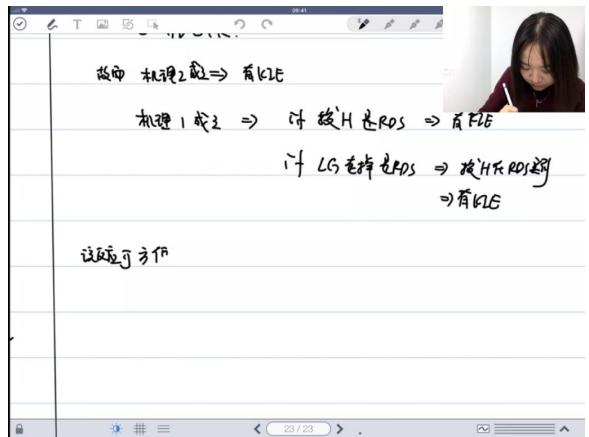

text_image

故中 机理2题 ⇒ 有kLE
机理1成立 ⇒ 对拨H反RDS ⇒ 有FLE
if LG去掉反RDS ⇒ 按H反RDS题
⇒ 有kLE
该题可方作

\- $\alpha$ -消除反应:

- 常用底物：氯仿 $(HCCl_{3})$ 在强碱条件下生成二氯卡宾 $(CCl_{2})$   
- 反应条件：需使用THF溶剂，丁基锂等强碱，温度约 -115°C  
- 安全注意事项：

■ 氯仿需避光保存(棕色瓶)，光照会生成光气 $(COCl_{2})$   
■ 氯仿与碱性废液(如丙酮+碱)混合可能引发爆炸

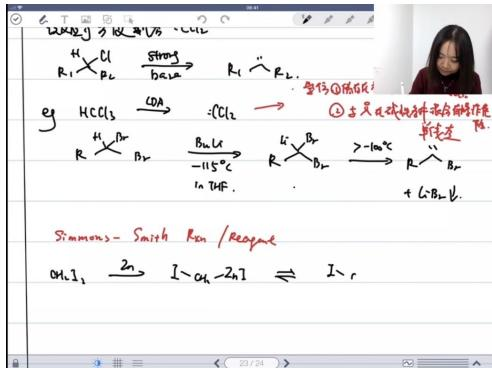

chemical

Chemical reaction scheme showing chlorination and subsequent reduction steps with reagents and conditions

\- 西门史密斯反应：

- 反应物：二碘甲烷 $(CH_{2}I_{2})$ 与锌粉  
- 产物：类卡宾中间体(锌卡宾)，可进行环丙烷化反应  
- 特点：较氯仿体系更安全，是制备甲基卡宾的常用方法

■ 卡宾的类型与性质

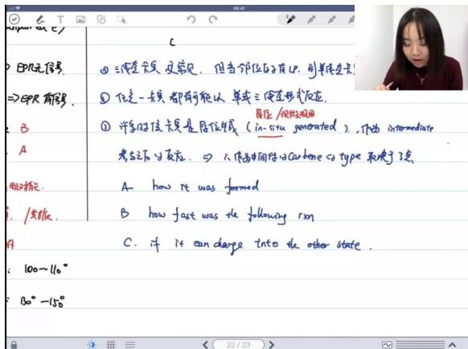

text_image

EPR无信息.
⇒EPR有答案.
B
A
明文描述.
/思维.
C. 也许可以当 charge into the other state.
100-110°
30°-150°

\- 生成条件影响：

- 离子化机理：通常在极性溶剂中生成，倾向于形成单线态卡宾  
○ 非离子化机理：通过光照/加热生成，通常得到更稳定的三线态卡宾

● 稳定性因素：

邻位孤对电子：当卡宾邻位原子有孤对电子时，可稳定单线态卡宾

\- 反应速率：若卡宾生成后快速参与后续反应，则保持生成时的状态

N-杂环卡宾(NHC)

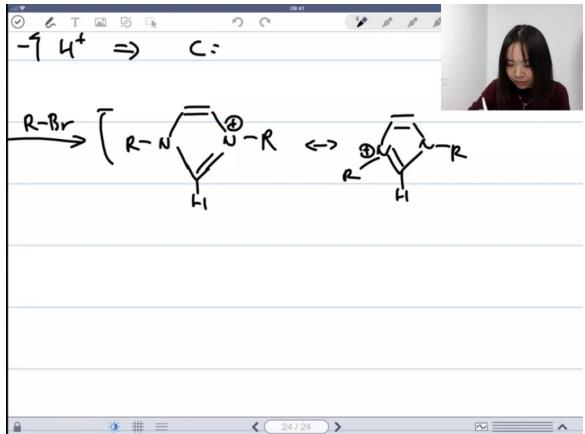

chemical

Chemical reaction diagram showing the formation of a substituted cyclohexene derivative from quaternary ammonium bromide and hydrogen bromide, with R groups indicated.

●

● 制备方法：通过碳正离子拔除一个质子生成  
- 结构特点：

○ 键角约 $105^{\circ}$ ，表明为 $sp^{2}$ 杂化的单线态卡宾

○ NMR化学位移约211ppm，显示碳中心高度缺电子

● 芳香性保持：反应过程中环状体系的芳香性未被破坏  
● 反应类型：本质上是通过氮孤对电子进攻卤代烃发生的亲核取代反应

■ 卡宾的反应性

\- 主要反应类型:

- 与π键反应：最常见的是与烯烃的环丙烷化反应  
○ 插入反应:

■ 可直接插入C-H键和O-H键  
■ 插入C-C键通常表现为重排反应

● 反应选择性：与碳氧双键反应时可能发生插入或成环，需根据具体条件判断

3）卡宾的反应 02:09:48

● 与烯烃反应及成环 02:11:14

\- 反应产物立体化学

■ trans/sis产物区分：环丙烷衍生物与烯烃反应时，产物存在立体异构现象。trans产物指取代基位于环平面两侧，sis产物指取代基位于同侧。  
■ 立体专一性判断：当反应具有立体专一性（stereospecific）时，通常生成特定构型的产物（如100% sis或trans）。

\- 卡宾电子状态与反应机理

■ 单线态卡宾特征：

● 电子自旋相反（↑↓）  
● 协同反应机理（concerted process）  
● 保持烯烃原有构型（如顺式烯烃→sis产物）

■ 三线态卡宾特征：

● 电子自旋平行（↑↑）  
- 分步自由基机理  
● 导致构型翻转（生成sis/trans混合产物）

■ 派键电子行为：烯烃 $\pi$ 键的两个电子自旋相反，与单线态卡宾匹配更好。

◦ 实验现象与卡宾状态推断

■ 立体专一性产物：通常对应单线态卡宾（协同机理）  
■ 非立体专一性产物：通常对应三线态卡宾（但需注意位阻影响）

● 例外情况：当取代基位阻极大时，三线态卡宾也可能表现出立体选择性

\- 锌卡宾配合物实例

■ 定位效应：氧原子通过配位锌实现立体控制  
■ 进攻方向： $CH_{2}$ 从烯烃上方或下方选择性进攻  
■ 实际应用：可高效构建特定立体构型的环丙烷衍生物

● 与碳氢键发生插入反应 02:28:40

\- 反应类型区分

■ 1,2-消除：强碱条件下典型反应路径  
■ α-消除：更强碱条件下发生的竞争反应  
- 氘代实验可区分两种机理

○ 卡宾插入反应机理

■ 氢迁移过程：涉及卡宾中间体的形成与重组  
■ 电子状态争议：  
- 理论上三线态更稳定
- 实际反应可能涉及单线态/三线态混合

■ 箭头表示法：

- 鱼钩箭头（→·）暗示三线态自由基特性  
● 普通箭头（→）不特指电子状态

\- 反应速率影响因素

■ σ键插入难度：显著高于π键插入   
■ 键能比较：C=C π键能 < C=O π键能 < C-C σ键能  
■ 应用限制：因副反应多，较少专门用于捕获自由基

● 与碳碳键的重排 02:36:23

反应类型区别：烯酮反应属于第三类反应（重排反应），不同于碳氢键和氧氢键的插入反应  
○ 卡宾生成机制：反应首先生成卡宾中间体，需注意卡宾上连接的基团（特别是氢原子）  
○ 重排过程: 通过σ键迁移完成重排，反应中碳氢键从π键转变为新的σ键  
○ 结构绘制技巧：建议绘制卡宾时明确标出所有连接的基团（特别是氢原子），避免混淆

● 与氧氢键的插入 02:47:17

- 反应条件差异: 溶液相和光照条件下的反应机理不同  
○ 区域选择性: 反应表现出明显的区域选择性, 与OH的酸性相关  
○ 机理关键: 负电荷应明确画在氮原子上  
- 真实插入条件: 只有在乙烷溶剂中光照条件下与重氮甲烷反应才是真正的卡宾对σ键的插入  
○ 机理表示方法: 可表示为氢迁移或使用四个鱼钩箭头表示OH键断裂

● 应用案例 02:55:57

例题:格式试剂一二加成或一四加成判断

■ 反应类型判断:

● 格氏试剂本身倾向1,2-加成  
● 加入铜后转变为1,4-加成（形成二烷基铜锂试剂）  
● 判断依据：软硬酸碱理论（离子性强→1,2加成；共价性强→1,4加成）

■ 后续反应分析:

● LDA拔除酯基α位氢形成碳负离子  
● 使用2当量碘甲烷的实际原因：确保反应完全（考虑实验操作误差）  
● 主产物为b构型（碳负与烯丙基呈反式，SN2反应构型保持）

■ 反应机理:

- KOH水解酯基  
- 氯化亚砜形成酰氯

- 重氮甲烷生成卡宾前体  
● 银催化发生Wolff重排（银可能以+1或+3价参与反应）

# 实验注意事项:

● 实际合成中试剂常过量使用  
● 产率计算应以限量试剂为基准  
● 金属试剂可能形成混合多聚体结构（如丁基锂为4-6聚体）

# 二、卡宾的总结 03:11:26

# 1. 基本类型

- 三线态与单线态：卡宾主要存在两种电子状态，三线态和单线态。三线态卡宾更常见，但当存在孤电子对稳定作用时，单线态卡宾更为常见。  
- 稳定性分析：单线态卡宾在孤电子对稳定条件下更稳定，这是判断卡宾稳定性的重要依据。

# 2. 制备方法

\- 叠氮化合物分解：卡宾的制备主要通过叠氮化合物（如 $N_{2}$ 或 $N_{3}$ ）脱去氮气的方法。在题目中遇到叠氮化合物（如 $N_{2}$ 或 $N_{3}$ ）时，应考虑卡宾的生成。

# 3. 反应类型

- $\pi$ 键反应：卡宾最容易发生的反应是与 $\pi$ 键的反应，这是其最有利的反应类型。  
● 成环反应：卡宾可以参与成环反应，但反应条件较为苛刻。  
- 插入反应：卡宾的插入反应通常是指插入碳氢键（C-H）或氧氢键（O-H）。如果插入碳碳键（C-C），则会发生重排反应。插入反应很多时候是副反应。

# 4. 立体选择性

- 单线态卡宾的立体专一性：单线态卡宾由于电子自旋相反，可以一步到位完成反应，因此具有立体专一性。  
- 三线态卡宾的反应特点：三线态卡宾由于电子自旋平行，通常分步进行反应，容易导致立体选择性降低，可能产生多种产物。

# 5. 记忆技巧

\- 立体专一性口诀："一步到位有专一，分步反应多稀奇"。单线态卡宾一步到位，有立体专一性；三线态卡宾分步反应，容易产生复杂产物。

# 6. 考点提示

● 考试频率：卡宾在考试中出现的机会不多，但一旦考到，题目通常不会特别复杂。  
- 重点内容：需要掌握卡宾的类型、稳定性分析、制备方法（特别是叠氮化合物分解）以及π键反应。立体选择性部分了解即可，考试中较少涉及。

# 三、知识小结

<table><tr><td>知识点</td><td>核心内容</td><td>考试重点/易混淆点</td><td>难度系数</td></tr><tr><td>卡宾定义</td><td>中性碳原子带有6个价电子</td><td>与氮宾(Nitrene)的结构对比</td><td></td></tr><tr><td>卡宾类型</td><td>单线态( $SP^2$ 杂化) vs 三线态(SP杂化)</td><td>键角差异(单线态100-110°vs 三线态130-150°)</td><td></td></tr><tr><td>稳定性因素</td><td>三线态通常更稳定(避免电子配对能)</td><td>二氯卡宾例外(因孤电子稳定作用)</td><td></td></tr><tr><td>制备方法</td><td>1. 重氮化合物分解;2. α消除反应;3.碳正离子去质子化</td><td>重氮化合物危险性(易爆特性)</td><td></td></tr><tr><td>反应类型</td><td>1. 与烯烃环丙烷化;2. C-H/O-H键插入;3. 重排反应</td><td>立体专一性判断(单线态保持构型 vs三线态可能异构)</td><td></td></tr><tr><td>检测手段</td><td>EPR检测未成对电子(XRD测键角)</td><td>单线态(EPR无信号) vs 三线态(EPR三线信号)</td><td></td></tr><tr><td>特殊卡宾</td><td>NHC类稳定卡宾(位阻+孤电子稳定)</td><td>在烯烃复分解催化剂中的应用</td><td></td></tr><tr><td>反应机理</td><td>协同vs分步机理判断</td><td>溶剂影响(极性溶剂倾向单线态)</td><td></td></tr></table>