# 一、自由基反应01:27

# 1. 自由基的生成 06:02

# 1）自由基的生成：龟裂（Homolysis）

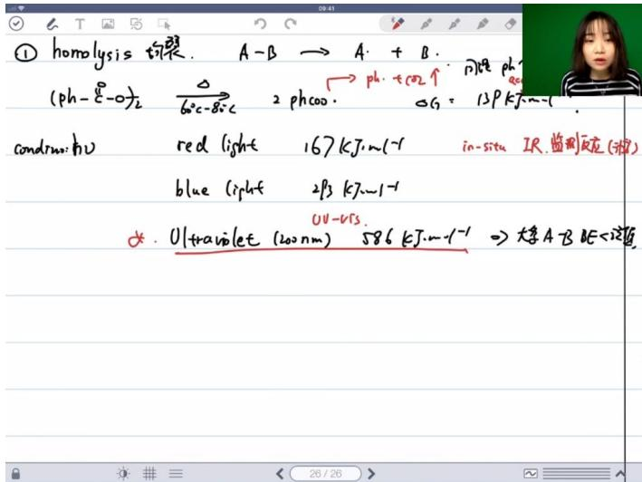

text_image

① homolysis 切裂. A-B → A + B.
(ph - E - O)₂
condrom: hν red light 167 kJ·m⁻¹ in-situ IR.监测反应(滤液)
blue light 2P₃ kJ·m⁻¹
UV-Vis.
Ultraviolet (200 nm) 586 kJ·m⁻¹ → 大像A-B DE

28 / 26

\- 定义：共价键均裂生成两个中性自由基的过程，通式为 $A - B \rightarrow A \cdot + B \cdot$ ，对应键解离能（Bond Dissociation Energy, BDE）

# ● 能量来源：

◦ 加热：60-80℃可断裂过氧键（ $\Delta G = 139 kJ \cdot mol^{-1}$ ）  
○ 光照：

■ 红外光：提供约167 kJ·mol $^{-1}$ 能量  
■ 蓝光：提供约293 kJ·mol $^{-1}$ 能量  
■ 紫外线（200-400nm）：200nm紫外线可提供586 kJ·mol $^{-1}$ 能量（超过大多数共价键键能）

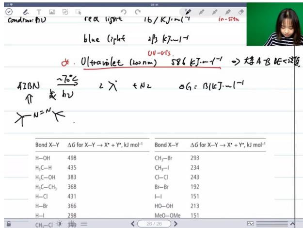

● 易断裂键型 ( $\Delta G < 300 kJ \cdot mol^{-1}$ ) :

○ 碳-卤键： $CH_{3}-Br$ (293)、 $CH_{3}-I$ (234)  
- 卤素单质键：Cl - Cl (243)、Br - Br (192)   
○ 过氧键：MeO-OMe（151）、HO-OH（213）

# - 温度影响：

- 200°C以上多数键可发生均裂  
- 300°C左右酒精灯加热可使400kJ/mol以下键断裂  
- 熵增效应： $\Delta H > 0$ 但 $\Delta S > 0$ ，升温有利反应

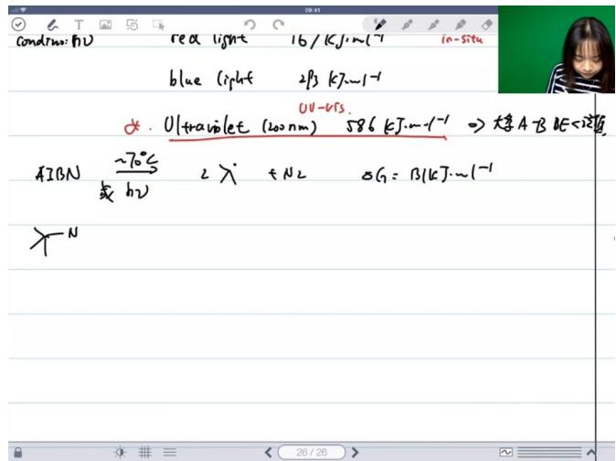

text_image

cond/nu: b1V
real light 16/kJ·m-1
blue c/plrf 2β3 kJ·m-1-1
UV-VRS.
U/l-traviolet (200nm) 586 kJ·m-1-1 → 大学ABBE<注意>
#IBN ~70°≤ 2λ + N2 OG = B/(kJ·m-1-1
或 h2
λ-N

# ● 典型引发剂：

○ AIBN（偶氮二异丁腈）：加热/光照生成叔丁基自由基 $\left(\Delta G=131\mathrm{kJ}\cdot\mathrm{mol}^{-1}\right)$   
- 过氧化物：如过氧化苯甲酰

# ● 监测方法：

○ 原位红外（in-situ IR）：用于动力学研究  
- 紫外监测限制：高能紫外光可能改变反应路径

# - 应用注意：

紫外线危害：可破坏DNA结构（如碳碳键300+、碳氧键400+ kJ/mol均低于紫外能量）  
○ 自由基稳定性：酰基自由基（RCO·）易分解产生CO，烷基自由基（R·）相对稳定

# 2）光照 18:14

# ● 自由基形成的四个机理 18:22

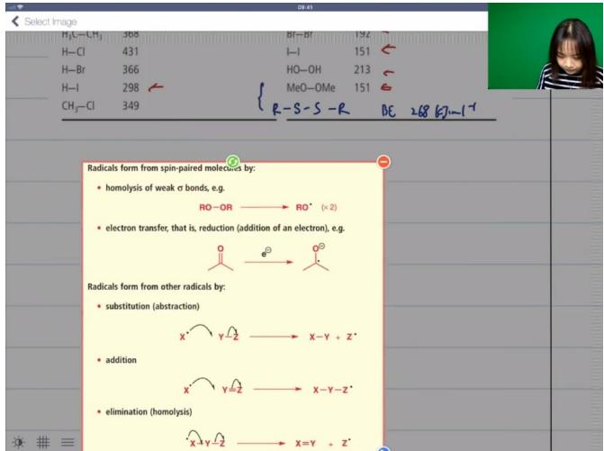

text_image

Select Image
H₂Cl—CH₃ 308 Br—Br 192
H—Cl 431 I—I 151
H—Br 366 HO—OH 213
H—I 298 MeO—OMe 151
CH₃—Cl 349 R—S—S—R DE 268 (3)⁻¹⁻¹⁻¹⁻¹⁻¹⁻¹⁻¹⁻¹⁻¹⁻¹⁻¹⁻¹⁻¹⁻¹⁻¹⁻¹⁻¹⁻¹⁻¹⁻¹⁻¹⁻¹⁻¹⁻¹⁻¹⁻¹⁻¹⁻¹⁻¹⁻¹⁻¹⁻¹⁻¹⁻¹⁻¹⁻¹⁻¹⁻¹⁻¹⁻¹⁻¹⁻¹⁻¹⁻¹⁻¹⁻¹⁻¹⁻¹⁻¹⁻¹⁻⁰
Radicals form from spin-paired molecules by:
• homolysis of weak σ bonds, e.g.
RO—OR → RO⁺ (×2)
• electron transfer, that is, reduction (addition of an electron), e.g.
Radicals form from other radicals by:
• substitution (abstraction)
x Y Z → X-Y + z
• addition
x Y Z → X-Y-Z
• elimination (homolysis)
x+Y-Z → X=Y + z

○ 弱键均裂：自由基可通过弱σ键（如RO-OR）的均裂形成，典型例子是过氧化物分解生成RO·

○ 电子转移: 通过单电子转移（SET）形成，如金属与羰基化合物反应生成二聚体

○ 取代/抓取: 自由基从其他分子中夺取原子（如链增长反应中的氢原子抓取）

◦ 加成反应: 自由基与不饱和键（如烯烃）加成生成新自由基

\- 消除反应: 通过σ键断裂生成自由基（如PhCOO·→Ph·+CO₂）

# ● 电子转移（ET/SET） 19:00

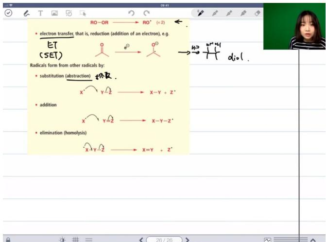

text_image

RO-OR → RO' (×2)
• electron transfer, that is, reduction (addition of an electron), e.g.
ET
(SET)
Radicals form from other radicals by:
• substitution (abstraction) 抵取
x' y'z → x-y + z'
• addition
x' y'z → x-y-z'
• elimination (homolysis)
x'y-z → x=y + z'

定义: 通过电子得失（还原/氧化）产生自由基的过程  
○ 缩写说明: ET表示电子转移, SET特指单电子转移  
○ 典型反应: 羰基化合物与金属的偶联反应生成二聚体  
- 特点: 常见于金属参与的有机反应中

● 自由基的取代（抓取/抽象）反应 19:46

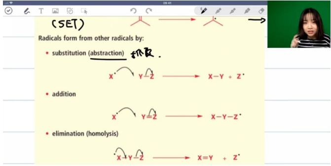

text_image

(SET)
Radicals form from other radicals by:
• substitution (abstraction) 抓痕.
• addition
• elimination (homolysis)

○
○ 术语解释:

■ Abstraction（抓取）与萃取（extraction）同源

■ 文献中的Abstract即来源于此概念

○ 反应特点:

■ 典型链式反应的链增长步骤（propagation step）

如 $X - Y + Z \cdot \rightarrow X \cdot + Y - Z$

○ 实例: 自由基从分子中夺取氢原子的过程

● 自由基的加成反应 21:08

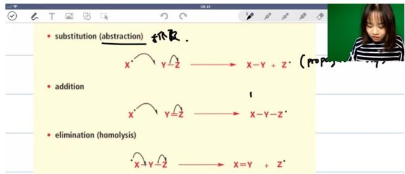

text_image

• substitution (abstraction) 抓皮.
• addition
• elimination (homolysis)

反应特点: 破坏π键形成σ键  
○ 典型例子: 溴自由基与烯烃加成

■ $Br\cdot+CH_{2}=CH_{2}\rightarrow Br-CH_{2}-CH_{2}\cdot$

○ 产物特征: 生成新的自由基中间体

● 自由基的消除反应 21:39

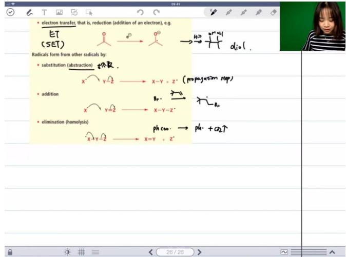

text_image

• electron transfer, that is, reduction (addition of an electron), e.g.
ET
(SET)
Radicals form from other radicals by:
• substitution (abstraction) 抛裂.
x Y-2 → x-Y + z' (propagation slip)
• addition
x Y-2 → x-Y-z'
• elimination (homolysis)
x+Y-2 → x=Y + z'
ph coa. → ph+ + CO2↑

反应特点: 通过σ键断裂产生自由基  
典型例子:
■ 过氧化苯甲酰分解: $PhCOO \cdot \rightarrow Ph \cdot + CO_{2} \uparrow$ ■ 二硫化物断裂: $R - S - S - R \rightarrow 2RS$ .

● 自由基引发剂的生成机理 22:10

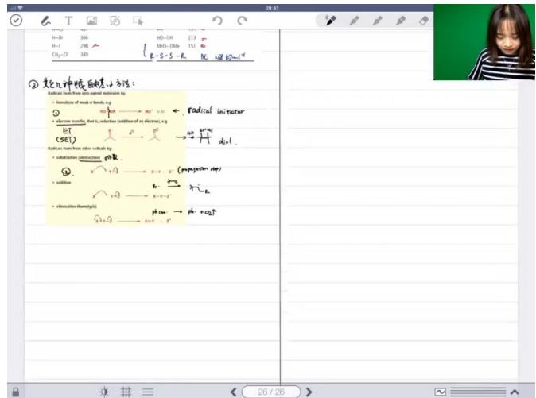

text_image

① 光光儿神经自转法:方法:
• Reaction steps from spine-paired indicators by:
• Samples of neck or hands-e.g.
• Electron samples that is, solution (addition of an electron), e.g.
ET
(SET)
• Radiation terms from other signals by:
• Subduction (molar) by:
• Addition (molecular) by:
• Addition (molecular) by:
• Addition (molecular) by:
• Addition (molecular) by:
• Addition (molecular) by:
• Addition (molecular) by:
• Addition (molecular) by:
• Addition (molecular) by:
• Addition (molecular) by:
• Addition (molecular) by:
• Addition (molecular) by:
• Addition (molecular) by:
• Addition (molecular) by:
- Radical initiator
- dvl.
- mpho-mph
- mL
- mpho-mph
- mpho-mph
- mpho-mph
- mpho-mph
- mpho-mph
- mpho-mph
- mpho-mph
- mpho-mph
- mpho-mph
- mpho-mph
- mpho-mph
- mpho-mph
- mpho-mph
- mpho-mph
- mpho-mph
26/26

主要途径: 弱σ键的均裂

# ○ 常见引发剂:

■ 过氧化物 (RO - OR)  
■ 偶氮化合物

\- 特点: 所有自由基反应通常始于弱键断裂

# 3）结构 22:40

# ● 自由基的结构特点 23:06

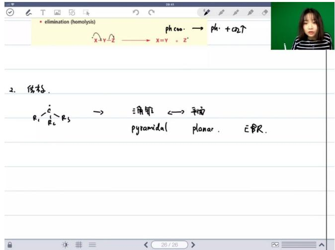

text_image

• elimination (homolysis)
ph coo. → ph. + c2↑
x→y→z → x=y + z
2. 结构.
R₁/c₂/R₃ → 三角锥 ←→ 平面
pyramidal planar. EBR.

基本构型: 介于三角锥（pyramidal）和平面三角（planar）之间

# ○ 影响因素:

取代基电子效应  
空间位阻效应

\- 稳定性关系: 稳定自由基更易测得精确结构

# ● 自由基结构的测定方法 23:34

○ X射线衍射: 仅适用于稳定自由基晶体

# ○ 电子自旋共振（ESR/EPR）：

■ 检测单电子存在  
■ 提供结构信息（平面化程度）

# ● 电子自旋共振（ESR）的应用 24:02

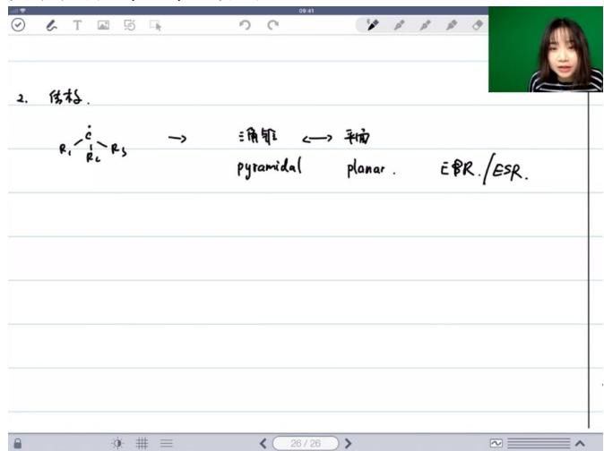

text_image

2. 结构.
R₁ - c / R₂ - R₃ → 三角形 ↔ 平面
pyramidal planar. EBR./ESR.

# ○ 与NMR比较:

■ 原理相似但研究对象不同  
信息量较核磁共振少

\- 适用性: 主要用于自由基研究

# ● 自由基结构实例分析：CH3与CF3 25:05

# ○ CH3自由基:

■ 更接近平面结构  
■ 原因：C-H键电子云偏向碳，σ键间斥力大

# ○ CF3自由基:

■ 更接近三角锥结构  
■ 原因：C-F键电子云偏向氟，σ键间斥力小

○ 类比: 与三卤化磷键角变化趋势相似（PBr3键角最大）

# 2. 稳定性 28:31

# 1）反应性与稳定性的关系 28:48

● 驱动力原理: 自由基反应的驱动力通常是从不稳定自由基生成稳定自由基, 这与碳正离子重排类似  
- 熵驱动特例: 苯甲酸自由基脱 $CO_{2}$ 生成苯基自由基是熵驱动的反应，属于例外情况  
● 能量关系: 稳定性本质上反映能量层面的优势，决定反应在焓变上是否有利

# 2）影响稳定性的两大类因素 29:36

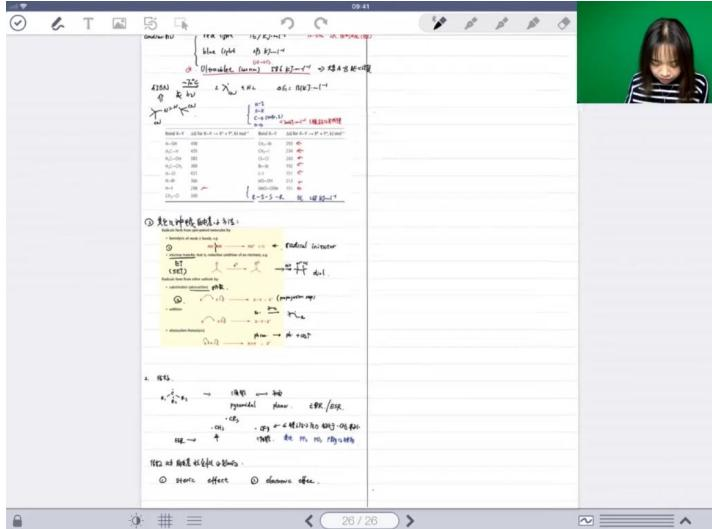

text_image

2180) \frac{23}{k} = 1
\lambda = 1
\gamma = -1
\beta = 0.5
\gamma = 0.4
\beta = 0.3
\beta = 0.2
\beta = 0.1
\beta = 0.05
\beta = 0.04
\beta = 0.03
\beta = 0.02
\beta = 0.01
\beta = 0.005
\beta = 0.004
\beta = 0.003
\beta = 0.002
\beta = 0.001
\beta = 0.0005
\beta = 0.0004
\beta = 0.0003
\beta = 0.0002
\beta = 0.0001
\beta = 0.00005
\beta = 0.00004
\beta = 0.00003
\beta = 0.00002
\beta = 0.00001
② 现文中的命题是关于：
① 现文中的命题是关于：
② 现文中的命题是关于：
③ 现文中的命题是关于：
④ 现文中的命题是关于：
⑤ 现文中的命题是关于：
⑥ 现文中的命题是关于：
⑦ 现文中的命题是关于：
⑧ 现文中的命题是关于：
⑨ 现文中的命题是关于：
⑩ 现文中的命题是关于：
⑪ 现文中的命题是关于：
⑫ 现文中的命题是关于：
⑬ 现文中的命题是关于：
⑭ 现文中的命题是关于：
⑮ 现文中的命题是关于：
⑯ 现文中的命题是关于：
⑰ 现文中的命题是关于：
⑱ 现文中的命题是关于：
⑲ 现文中的命题是关于：
⑳ 现文中的命题是关于：
㉑ 现文中的命题是关于：
㉒ 现文中的命题是关于：
㉓ 现文中的命题是关于：
㉔ 现文中的命题是关于：
㉕ 现文中的命题是关于：
㉖ 现文中的命题是关于：
㉗ 现文中的命题是关于：
㉘ 现文中的命题是关于：
㉙ 现文中的命题是关于：
㉚ 现文中的命题是关于：
㉛ 现文中的命题是关于：
㉜ 现文中的命题是关于：
㉝ 现文中的命题是关于：
㉞ 现文中的命题是关于：
㉟ 现文中的命题是关于：
㉳ 现文中的命题是关于：
�十一 现文中的命题是关于：
�十二 现文中的命题是关于：
㉓ 现文中的命题是关于：
㉔ 现文中的命题是关于：
㉕ 现文中的命题是关于：
㉖ 现文中的命题是关于：
㉗ 现文中的命题是关于：
㉘ 现文中的命题是关于：
㉙ 现文中的命题是关于：
㉚ 现文中的命题是关于：
㉛ 前四分之一：-1
-1分之一：-1分之一：-1分之一：-1分之一：-1分之一：-1分之一：-1分之一：-1分之一：-1分之一：-1分之一：-1分之一：-1分之一：-1分之一：-1分之一：-1分之一：-1分之一：-1分之一：-1分之一：-1分之一：-1分之一：-1分之一：

# 位阻效应(Steric effect):

○ 商业可得的稳定自由基几乎都具有大位阻结构  
○ 典型实例：TEMPO等持久自由基

# ● 电子效应(Electronic effect):

- 包括共轭效应、诱导效应等电子因素  
- 影响自由基电子云的分布状态

# 3）自由基的稳定性类型 30:31

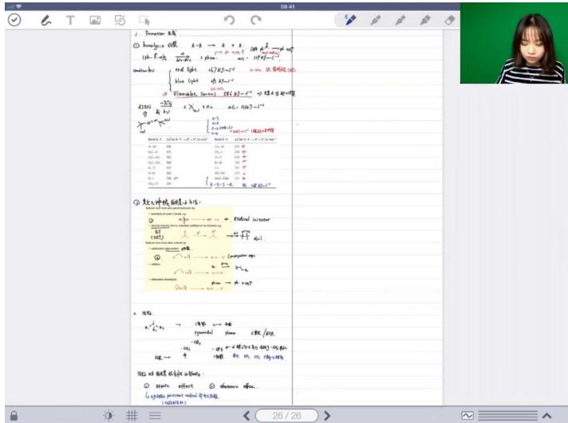

text_image

1. Forward A
2. homolytic A (A)
(14h, F=0) → (2h, 0) → (3h, 0)
(2h, F=0) → (3h, 0)
modulus: { red light + 14h, 0}
    blue light + 14h, 0}
    □ (blue, 0)
    □ (blue, 0)
    □ (blue, 0)
    □ (blue, 0)
    □ (blue, 0)
    □ (blue, 0)
    □ (blue, 0)
    □ (blue, 0)
    □ (blue, 0)
    □ (blue, 0)
    □ (blue, 0)
    □ (blue, 0)
1250 - √250
      × + 250
      × + 250
      × + 250
      × + 250
      × + 250
      × + 250
      × + 250
      × + 250
      × + 250
      × + 250
      × + 250
      × + 250
1250 - √250
      × + 250
      × + 250
      × + 250
      × + 250
      × + 250
      × + 250
      × + 250
      × + 250
1250 - √250
      × + 250
      × + 250
      × + 14h, 14h, 14h, 14h, 14h, 14h, 14h, 14h, 14h, 14h, 14h, 14h, 14h, 14h, 14h, 14h, 14h, 14h, 14h, 14h, 14h,
1250 - √250
      × + 250
      × + 250
      × + 250
      × + 250
      × + 250
      × + 250
      × + 250
      × + 250
      × + 250
      × + 250
      × + 250
1250 - √3333333333333333333333333333333333333333333333333333333333333333333333333333333333333333333333

# ● 动力学稳定机制:

\- 大位阻通过空间阻碍阻止自由基碰撞淬灭

○ 形象比喻："两个胖子因肚子太大无法靠近活性位点"  
- 主要延长自由基寿命而非改变其固有活性

# - 典型键解离能数据:

○ N - N键: 284 kJ/mol   
○ C - H键：约430 kJ/mol   
○ O - O键: 154 kJ/mol   
这些数值反映不同化学键均裂形成自由基的难易程度

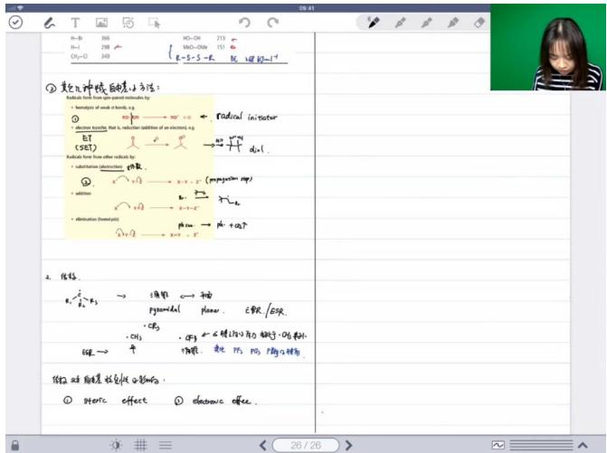

text_image

N-Br 366 HS-CH 213
N-1 298 MoO-CH4 151
CH4-O 340 R-S-S-R SC 148 (p=1)
② 基因人神程的性质方法：
Anode form from Open spatial coordinates by:
• Nanolysis of weak or weak bonds, e.g.
① 
• Intrinsic coupling, that, molecular adduction of an electron, e.g.
BT
(SET) → →
dual.
Indicate from other objects by:
• Substrate formation: 钢铁.
③.
• addition → (magnesium mg)
→
n
• electron transfer: n
• electron transfer: n
2. 结构
a. → 消费 ← 轴
b. → pyramidal plane. EFR/ESR.
c. → CH3 . cgr ← 与碳化方程式相行 - O6 积小
ESR → 平 作用，把 P3、P4、P5 和 Cu 精分。
结论对现象的结论有误。
① State effect  electronic effect.

# - 生成方法:

○ 均裂(homolysis): 弱键在光/热作用下断裂  
○ 电子转移(SET)：通过氧化还原过程产生  
○ 自由基转化：包括取代、加成、消除等反应

# 3. 应用案例 32:22

# 1）例题:自由基捕获剂

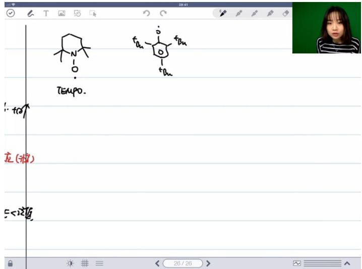

chemical

Hand-drawn chemical structures of a cyclopentene derivative with temperature and charge labels

# TEMPO应用:

○ 常见自由基捕获剂，用于研究反应机理  
- 当反应体系中加入TEMPO后反应停止，说明反应经历了自由基机理  
- 在四氧化锇与烯烃反应中作为催化体系使用

# NMO结构:

- 与四氧化锇联用作为共氧化剂(co-oxidant)  
- 可使四氧化锇从正八价降至正六价  
○ 实际应用中通常使用催化量四氧化锇+当量NMO，避免使用剧毒的四氧化锇

# 2）例题:提高自由基稳定性因素 35:45

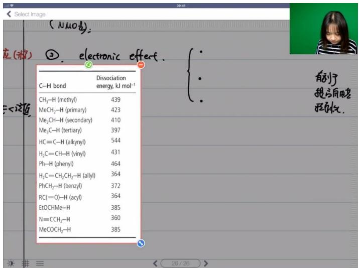

text_image

C—H bond
CH₃—H (methyl)
MeCH₂—H (primary)
Me₂CH—H (secondary)
Me₃C—H (tertiary)
HC≡C—H (alkynyl)
H₂C=CH—H (vinyl)
Ph—H (phenyl)
H₂C=CH₂CH₂—H (allyl)
PhCH₂—H (benzyl)
RC(=O)—H (acyl)
EtOCHMe—H
N≡CCH₂—H
MeCOCH₂—H
Dissociation
energy, kJ mol⁻¹
439
423
410
397
544
431
464
364
372
364
385
360
385

# ● 稳定性判断标准:

○ 解离能(BE)越小，生成的自由基越稳定  
- 通过对比不同C-H键的解离能数值，分析稳定因素

# - 三个主要稳定因素:

○ 给电子效应:

■ 甲基→伯→仲→叔碳自由基稳定性递增(439→423→410→397kJ/mol)  
■ 本质是超共轭效应增强电子供给能力

○ 共轭效应:

■ 烯丙基(364kJ/mol)和苄基(372kJ/mol)显著稳定  
■ 通过 $\pi$ 电子离域实现稳定化

○ 杂原子效应:

■ 含氧体系如EtOCHMe-H(385kJ/mol)   
■ 氧原子孤对电子与自由基p轨道相互作用

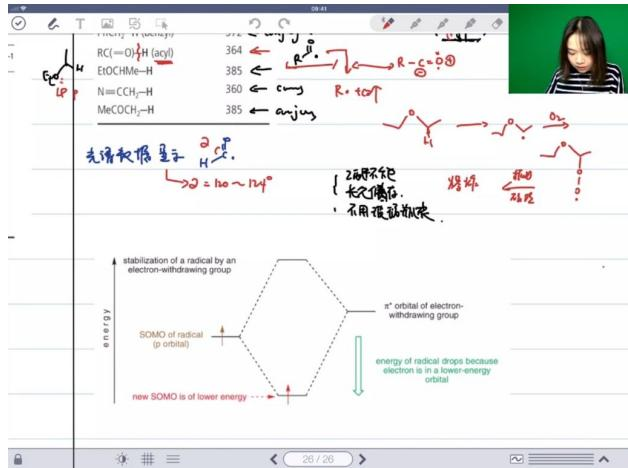

text_image

RC(=O)H (acyl)
EtOCHMe-H
N=CCH2-H
MeCOCH2-H
364
385
360
385
R-C①
R-10↑
anjus
先谱数据显示 2 H
→2 = 100 ~ 124°
2弱不能
长定偏态
将掉
不用提纲机决
energy
stabilization of a radical by an
electron-withdrawing group
SOMO of radical
(p orbital)
energy of radical drops because
electron is in a lower-energy
orbital
new SOMO is of lower energy ...

# ● 特殊稳定机制:

○ 吸电子基团通过 $\pi^{*}$ 轨道与自由基p轨道作用  
○ 典型例子：氰基 $(N=CCH_{2}-H,360kJ/mol)$   
○ 形成新的SOMO轨道使体系能量降低

# ● 醛基自由基:

- 酰基C-H键解离能仅364kJ/mol   
○ 键角120-124°显示接近 $sp^{2}$ 杂化  
○ 可通过共振式 $\cdot CH = O^{+} \leftrightarrow CH^{-} = O^{+}$ 理解稳定性

# 4. 各种自由基的反应 53:26

1）自由基反应与McMurry反应 01:20:23

# - 自由基的稳定化机制

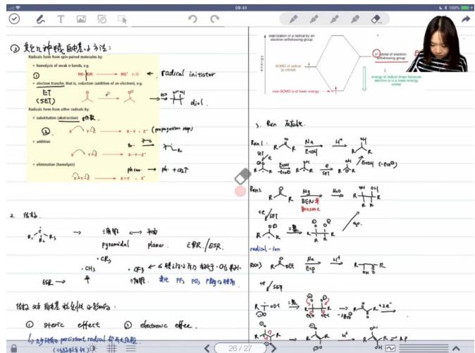

text_image

③ 其他几种纯白色素小方法：
Radical forms from 40m-paired molecules by:
• homolytic of weak α bonds, e.g.
• electron binding that is, reduction (addition of an electron), e.g.
ET
(SET)
Radicals form from other radicals by:
• substitution (abstraction) pR.
• addition
• elimination (homolytic)
2. 结构
a₁ → b₂ → c₃
pyramidal phase: ESR/ESR.
CH₃, CF₃ ← 锌的正心力 银行·O₆表示
ESR → 平 指眼、视 防 防 O₃ 防 G 钟 有
作为对角基线化反应的:
① static effect ② electronic effect.
SODC of oxidase group
SODC of oxidase group
SODC of SODC
SODC of SODC
SODC of SODC
SODC of SODC
SODC of SODC
SODC of SODC
SODC of SODC
SODC of SODC
SODC of SODC
SODC of SODC
SODC of SODC
SODC of SODC
SODC of SODC
SODS of oxidase group
SODS of oxidase group
SODS of SODS
SODS of SODS
SODS of SODS
SODS of SODS
SODS of SODS
SODS of SODS
SODS of SODS
SODS of SODS
SODS of SODS
SODS of SODS
SODS of SODS
SODS of SODS
SODS of SODS
SODs of oxidase group
SODs of oxidase group
SODs of SODs
SODs of SODs
SODs of SODs
SODs of SODs
SODs of SODs
SODs of SODs
SODs of SODs
SODs of SODs
SODs of SODs
SODs of SODs
SODs of SODs
SODs of SODs
SODs of SODs
SODt/syn
SODt/syn
SODt/syn
SODt/syn
SODt/syn
SODt/syn
SODt/syn
SODt/syn
SODt/syn
56/27

电子效应：吸电子基团通过轨道相互作用（ $\sigma^{*}$ 轨道）降低自由基能量，使SOMO 轨道能级下降  
○ 空间位阻：大位阻基团会阻碍自由基反应活性，但某些情况下能通过空间保护提高稳定性  
共振效应：离域体系（如苯甲基自由基）显著增强稳定性，平面结构更利于电子离域

# ● McMurry反应机理

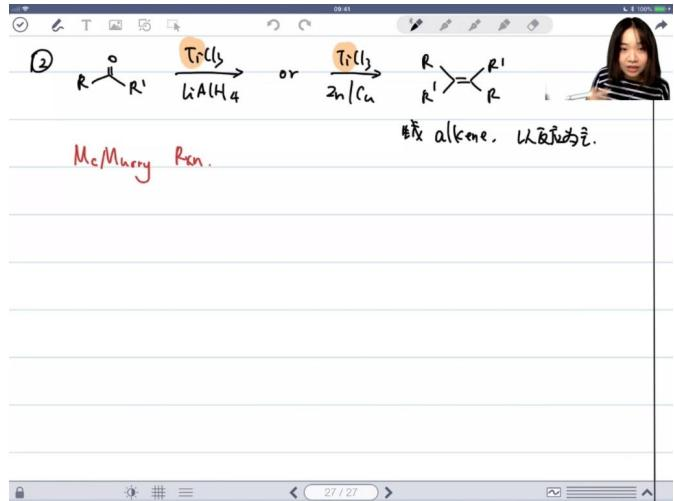

chemical

Chemical reaction scheme showing conversion of alkene to alkenes using TiCl3 and LiAlH4, with McMnery reagent

反应体系: $TiCl_{3}/LAH$ （三氯化钛+锂铝氢）在非质子溶剂中反应

○ 关键中间体:

■ 首先生成零价钛Ti(0)  
■ 形成双负离子中间体（理解成"氧负"状态）  
■ 经历不可观测的表面脱氧过程

# ○ 产物特征:

■ 主产物为热力学稳定的反式烯烃  
■ 反应具有特异性（其他金属通常不会脱氧）  
■ 机理不明确但实用性强（合成中常用）

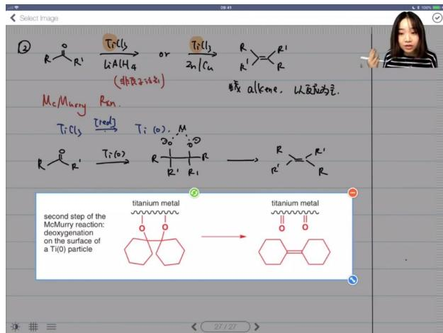

chemical

Chemical reaction scheme showing titanium metal deoxygenation and alkylation of a Ti(0) particle, with McMurry reagents and second step steps.

# ○ 记忆要点:

■ 见到钛试剂要联想到可能生成烯烃  
■ 与钠/镁还原剂的区别：钛会导致脱氧偶联   
钛氧键稳定性是反应驱动力之一

# - 自由基反应类型

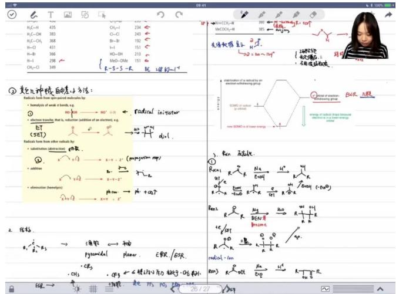

text_image

② 其他几种 radical方法：
Radicals form from a novel radical pathway:
• homolysis of weak at bonds, e.g.
• electron transfer that is, reduction (addition of an electron), e.g.
• excitation (homolysis)
• radical inester
• addition
• excitation (homolysis)
2. 结构:
R₁ → 3P₄ → 3P₃ → 3P₂ → 3P₁ → 3P₀ → 3P₈ → 3P₅ → 3P₄ → 3P₃ → 3P₂ → 3P₁ → 3P₀ → 3P₈ → 3P₅ → 3P₄ → 3P₃ → 3P₂ → 3P₁ → 3P₀ → 3P₈ → 3P₅ → 3P₄ → 3P₃ → 3P₂ → 3Pₐ → 3P₇ → 3P₅ → 3P₄ → 3P₃ → 3P₂ → 3P₁ → 3P₀ → 3P₈ → 3P₅ → 3P₄ → 3P₃ → 3P₂ → 3P₁ → 3P₀ → 3P₈ → 3P₅ → 3P₄ → 3P₃ → 3C
Radials form from other radicals:
• radical inester
• radical inester
• radical inester
• radical inester
• radical inester
• radical inester
• radical inester
• radical inester
• radical inester
• radical inester
• radical inester
• radical inester
• radical inester
• radical inester
• radical inester
• radical inester
• radical inester
• radical inester
• radical inester
• radical inester
• radical inester

# 自由基-自由基反应:

■ 特点：通过自由基负离子中间体实现   
条件：需要较高自由基浓度（通常少见）  
■ 实例：McMurry反应中的偶联步骤

# ○ 链式反应（主要类型）：

■ 三阶段：引发(initiation)→增长(propagation)→终止(termination)   
■ 特征：活性自由基与中性分子反应为主  
■ 实例：卤素与烷烃的光化学反应

# - 卤素自由基的选择性

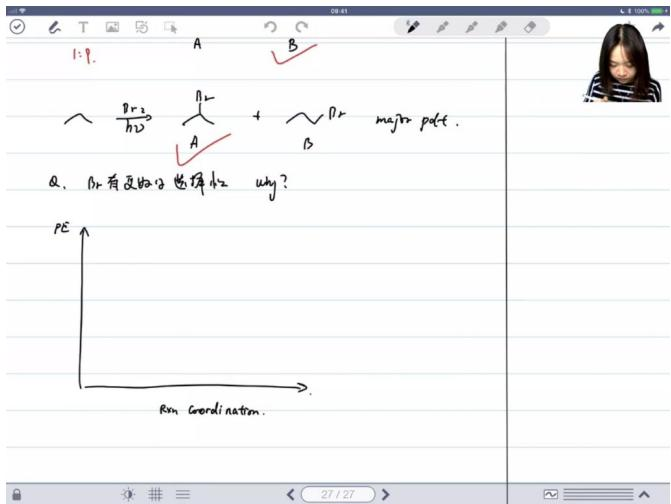

text_image

1:9.
A
B
Pr
h2
A
+
B
pr
major palt.
Q. Pr有交的子选择权 why?
PE
Rm Grerolination.

# ○ 实验现象:

■ 氯代：产物比例接近统计分布（1°H:3°H≈45:55）  
■ 溴代：高度选择性（主要进攻3°H，比例约1:9）

# ○ Hammond假设解释:

■ 过渡态结构更接近能量相近的中间体  
溴自由基更稳定→过渡态更像烷基自由基→活化能差大  
■ 氯自由基活性高→过渡态更像反应物→活化能差小

# - 记忆口诀：“溴懒选叔碳，氯勤到处窜”

# - 链式反应实例分析

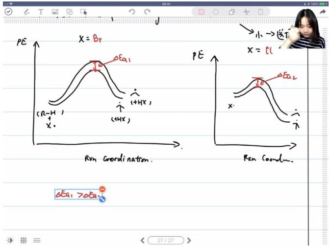

text_image

PE
x = Br
ΔEq1
(R-H)
+
X.
(+HX)
Rxn Coordinatn.
PE
x
ΔEq2
Rxn Coonln.
ΔEq1 > ΔEq2
27/27

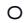

# ○ 关键参数:

■ 溴代： $\Delta Ea_{1} > \Delta Ea_{2}$ （选择性好）  
■ 氯代： $\Delta Ea_{1}\approx\Delta Ea_{2}$ （选择性差）

# ○ 应用要点:

■ 键解离能(BDE)决定反应活性  
■ 3°C-H键较弱（\~385 kJ/mol）更易断裂   
■ 实际产物比例受概率因素和能垒共同影响

# 2）自由基反应机理与控制 01:44:43

# - 溴自由基反应特性

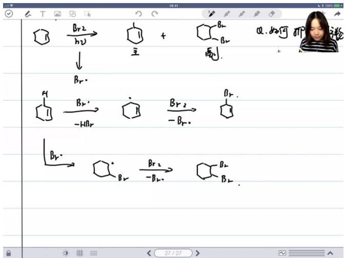

chemical

Hand-drawn chemical reaction equations showing bromination and bromination steps in a cyclohexene derivative

○ 双反应路径：既可发生自由基反应也可发生加成反应，具体路径取决于反应条件  
副产物控制关键：升高温度会增加副产物生成，核心控制方法是降低 $Br_{2}$ 浓度  
○ NBS应用：实际操作中使用N-溴代丁二酰亚胺(NBS)作为溴源，因其能缓慢释放低浓度 $Br_{2}$

# - 自由基链式反应机理

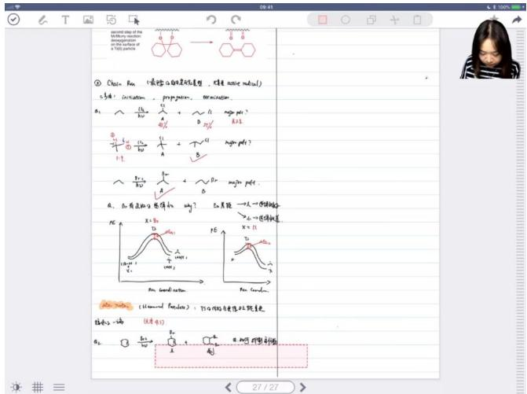

text_image

② Chain Fan (高密度的氧化性, 烃性NaClO metal)
① 生成: (n=10) → (n=2) → (n=3) → (n=4) → (n=5) → (n=6) → (n=7) → (n=8) → (n=9) → (n=10) → (n=11) → (n=12) → (n=13) → (n=14) → (n=15) → (n=16) → (n=17) → (n=18) → (n=19) → (n=20) → (n=21) → (n=22) → (n=23) → (n=24) → (n=25) → (n=26) → (n=27) → (n=28) → (n=29) → (n=30) → (n=31) → (n=32) → (n=33) → (n=34) → (n=35) → (n=36) → (n=37) → (n=38) → (n=39) → (n=40) → (n=41) → (n=42) → (n=43) → (n=44) → (n=45) → (n=46) → (n=47) → (n=48) → (n=49) → (n=50) → (n=51) → (n=52) → (n=53) → (n=54) → (n=55) → (n=56) → (n=57) → (n=58) → (n=59) → (n=60) → (n=61) → (n=62) → (n=63) → (n=64) → (n=65) → (n=66) → (n=67) → (n=68) → (n=69) → (n=70) → (n=71) → (n=72) → (n=73) → (n=74) → (n=75) → (n=76) → (n=77) → (n=78) → (n=79) → (n=80) → (n=81) → (n=82) → (n=83) → (n=84) → (n=85) → (n=86) → (n=87) → (n=88) → (n=89) → (n=90) → (n=91) → (n=92) → (n=93) → (n=94) → (n=95) → (n=96) → (n=97) → (n=98) → (n=99) → (n=100)

# ○ ○ 三阶段特征：

■ 引发(Initiation): 产生初始自由基（如Br·）  
■ 增长(Propagation): 自由基持续反应（生成稳定的锡自由基中间体）  
■ 终止(Termination): 自由基相互结合

选择性原理：当活化能 $(E_{a})$ 差距大时选择性好（如溴代反应），差距小时选择性差

# - 三丁基锡氢应用

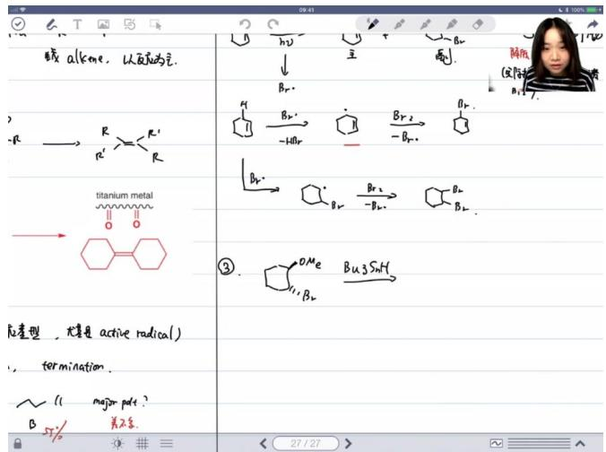

chemical

Chemical reaction equations and molecular structures of alkenes, titanium metal, and a ketone with active radical formation

反应体系： $Bu_{3}SnH$ 与 AIBN 催化体系（典型配比：1.2 当量 $Bu_{3}SnH+0.05$ 当量 AIBN）  
○ 键能分析：

■ C - Br键能：约230 kJ/mol   
■ Sn - H键能：308 kJ/mol  
■ Sn - Br键能：552 kJ/mol

○ 机理特点：通过稳定的氰基自由基(·CN)捕获氢，避免直接生成高能氢自由基  
- 溶剂条件：通常在苯溶剂中，轻微加热或光照即可引发反应

● 例题：自由基反应控制

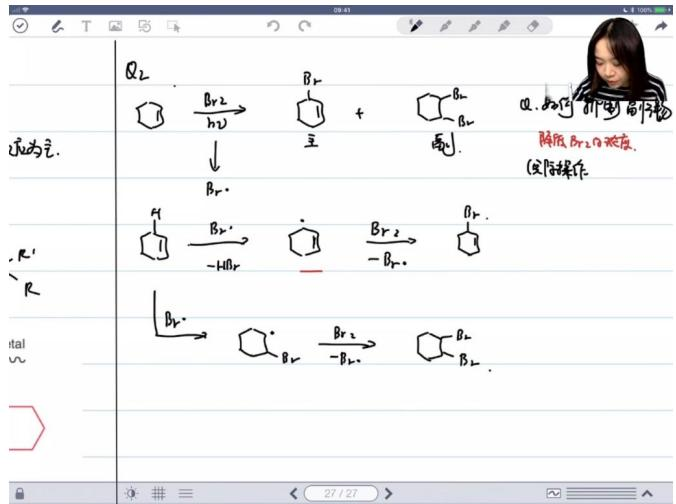

chemical

Chemical reaction equations and diagrams showing bromination, hydrogenation, and bromination steps with structural formulas

○
○ 题目解析

■ 核心考点：理解自由基反应中副产物生成的控制方法  
解题关键：

● 识别反应类型为自由基链式反应  
● 掌握浓度对选择性的影响规律

标准答案：通过使用NBS控制 $Br_{2}$ 浓度可有效抑制副产物  
■ 易错点：误认为改变温度是主要控制手段（实际会同时影响主副反应）

5. 休息 01:56:44

1）课堂互动情况

● 在线人数：当前有11位同学在线参与课堂  
● 答题情况：A和B选项的正确率为50%，整体答题率较低  
● 教师提醒：强调课后练习的重要性，建议同学们及时完成题目积累

2）教学进度说明

● 课程阶段：当前处于第二轮复习阶段

● 难度评估：教师指出第二轮复习的题目难度较高，但不会出现"全军覆没"的情况

教学建议：建议学生重点掌握基础知识点后再进行难题突破

\- 注：由于提供的课程记录中主要包含课堂互动内容和歌词片段，实质性知识点内容较少，建议补充更多专业课程内容以便整理更完整的知识点笔记。当前记录主要保留了有效的教学互动信息，过滤了无关的歌词内容。

# 6. 各种自由基的反应 02:06:41

1）例题:三氯甲基自由基反应 02:07:42

\- 反应机理分析

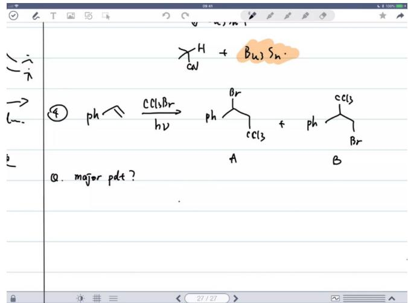

chemical

Chemical reaction scheme showing transformation of compound ④ to products A and B using CCl3Br under UV light, with a hydrogen radical and Bu)Sn group indicated.

键能比较：碳溴键比碳氯键弱，因此在光照条件下优先断裂生成溴自由基和三氯甲基自由基

○ 自由基稳定性：三氯甲基自由基比溴自由基更稳定，因为氯原子上的孤对电子可以稳定缺电子的自由基中心

反应选择性：虽然溴自由基反应活性更高，但由于其浓度极低，链增长阶段主要由三氯甲基自由基主导

\- 主副产物分析

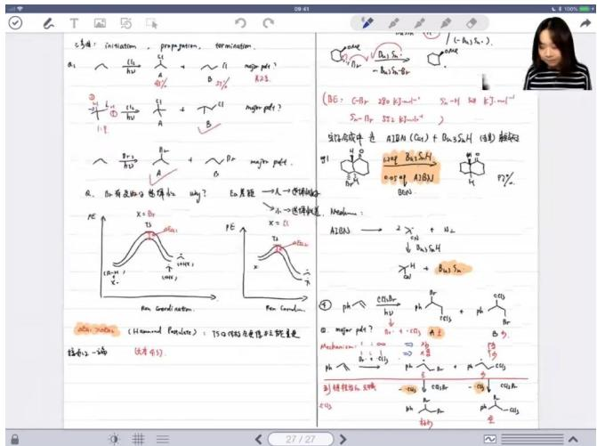

text_image

c₃H₄: initiation, preparation, formulation.
a₁ → (C₁)₅ → (C₂)₅ + (C₃)₅ → (C₄)₅
A₁ + B₁ → (C₅)₅
mgg adsorbed:
B₂
① C₁H₄ → (C₁)₅ + (C₂)₅ → (C₃)₅
A₁ + B₁ → (C₄)₅
mgg adsorbed?
A₁ + B₂ → (C₅)₅
A₁ + B₃ → (C₆)₅
② A₁H₄ → (C₁)₅ + (C₂)₅ → (C₃)₅
A₁ + B₁ → (C₄)₅
mgg adsorbed?
A₁ + B₂ → (C₅)₅
A₁ + B₃ → (C₆)₅
③ A₁H₄ → (C₁)₅ + (C₂)₅ → (C₃)₅
A₁ + B₁ → (C₄)₅
mgg adsorbed?
A₁ + B₂ → (C₅)₅
A₁ + B₃ → (C₆)₅
④ A₁H₄ → (C₁)₅ + (C₂)₅ → (C₃)₅
A₁ + B₁ → (C₄)₅
mgg adsorbed?
A₁ + B₂ → (C₅)₅
A₁ + B₃ → (C₆)₅
⑤ A₁H₄ → (C₁)₅ + (C₂)₅ → (C₃)₅
A₁ + B₁ → (C₄)₅
mgg adsorbed?
A₁ + B₂ → (C₅)₅
A₁ + B₃ → (C₆)₅
⑥ A₁H₄ → (C₁)₅ + (C₂)₅ → (C₃)₅
A₁ + B₁ → (C₄)₅
mgg adsorbed?
A₁ + B₂ → (C₅)₅
A₁ + B₃ → (C₆)₅
⑦ A₁H₄ → (C₁)₅ + (C₂)₅ → (C₃)₅
A₁ + B₁ → (C₄)₅
mgg adsorbed?
A₁ + B₂ → (C₅)₅
A₁ + B₃ → (C₆)₅
⑧ A₁H₄ → (C₁)₅ + (C₂)₅ → (C₃)₅
A₁ + B₁ → (C₄)₅
mgg adsorbed?
A₁ + B₂ → (C₅)₅
A₁ + B₃ → (C₆)₅
⑨ A₁H₄ → (C₁)₅ + (C₂)₅ → (C₃)₅
A₁ + B₁ → (C₄)₅
mgg adsorbed?
A₁ + B₂ → (C₅)₅
A₁ + B₃ → (C₆)₅
⑩ A₁H₄ → (C₁)₅ + (C₂)₅ → (C₃)₅
A₁ + B₁ → (C₄)₅
mgg adsorbed?
A₁ + B₂ → (C₅)₅
A₁ + B₃ → (C₆)₅
⑪ A₁H₄ → (C₁)₅ + (C₂)₅ → (C₃)₅
A₁ + B₁ → (C₄)₅
mgg adsorbed?
A₁ + B₂ → (C₅)₅
A₁ + B₃ → (C₆)₅
⑮ A₁H₄ → (C₁)₅ + (C₂)₅ → (C₃)₅
A₁ + B₁ → (C₄)₅
mgg adsorbed?
A₁ + B₂ → (C₅)₅
A₁ + B₃ → (C₆)₅
⑯ A₁H₄ → (C₁)₅ + (C₂)₅ → (C₃)₅
A₁ + B₁ → (C4)₅
mgg adsorbed?
A₁ + B₂ → (C5)₅
A₁ + B3 → (C6)₅
⑰ A₁H₄ → (C₁)₅ + (C₂)₅ → (C₃)₅
A₁ + B₁ → (C4)₅
mgg adsorbed?
A₁ + B₂ → (C5)₅
A₁ + B3 → (C6)₅
⑱ A₁H₄ → (C₁)₅ + (C₂)₅ → (C₃)₅
A₁ + B₁ → (C4)₅
mgg adsorbed?
A₁ + B₂ → (C5)₅
A₁ + B3 → (C6)₅
⑲ A₁H₄ → (C₁)₅ + (C₂)₅ → (C₃)₅
A₁ + B₁ → (C4)₅
mgg adsorbed?
A₁ + B₂ → (C5)₅
A₁ + B3 → (C6)₅
⑳ A₁H₄ → (C₁)₅ + (C₂)₅ → (C₃)₅
A₁ + B₁ → (C4)₅
mgg adsorbed?
A₁ + B₂ → (C5)₅
A₁ + B3 → (C6)₅

○ 主产物：A（三氯甲基取代产物）

副产物：B（溴代产物）极少

\- 浓度影响：反应初期两种自由基比例为1:1，但随着反应进行，三氯甲基自由基占绝对优势

# 2）自由基反应实验操作

\- 试剂用量控制

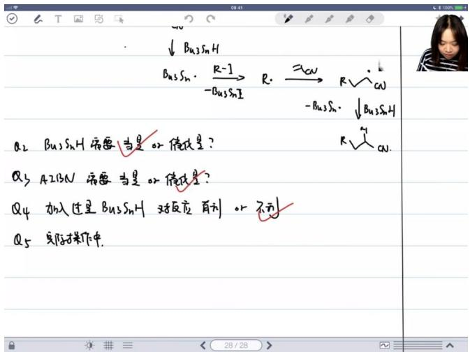

text_image

↓ Bu3SnH
Bu3Sn·R-I→R·=CN→R·CN
-Bu3SnI
-Bu3Sn·↓Bu3SnH
Q2 Bu3SnH 需要 当是 or 候找量？
Q3 A2BN 需要 当是 or 候找量？
Q4 加入过量 Bu3SnH 对反应 有别 or 不列
Q5 实际操作中.

三丁基锡氢用量：需要略微过量（1.2当量）  
○ AIBN用量：催化量（0.05当量）  
- 过量影响：加入过量三丁基锡氢对反应有利

# ● 实验操作要点

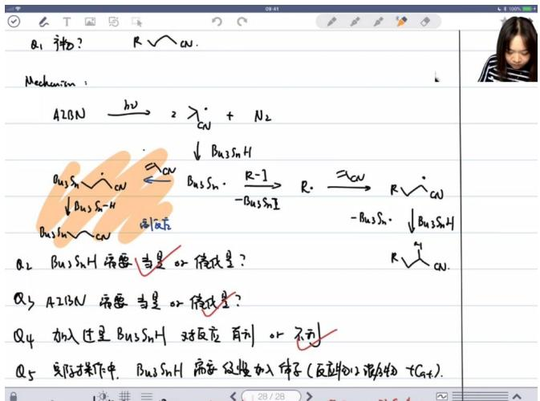

text_image

Q1 神D? R √CN.
Mechanism:
AZBN → 2 >CN + N2
↓ Bu3SnH
Bu3Sn→CN ← Bu3Sn·R-1→R·=CN→R√CN
↓ Bu3Sn-H → -Bu3SnI
Bu3Sn→CN → 别反应
Q2 Bu3SnH需要当是O或偶化是?
Q3 AZBN需要当是O或偶化是?
Q4 加入过呈 Bu3SnH 对反应有O or 不到
Q5 实际操作中，Bu3SnH需要继续加入体子(反应物)2溶解物 +Cg+.
28/28

加料方式：三丁基锡氢需要缓慢加入反应体系  
操作目的：控制自由基浓度在较低水平，避免与双键发生加成副反应  
○ 机理解释：高浓度下容易发生碳锡键形成的副反应

# - 卤代物选择影响

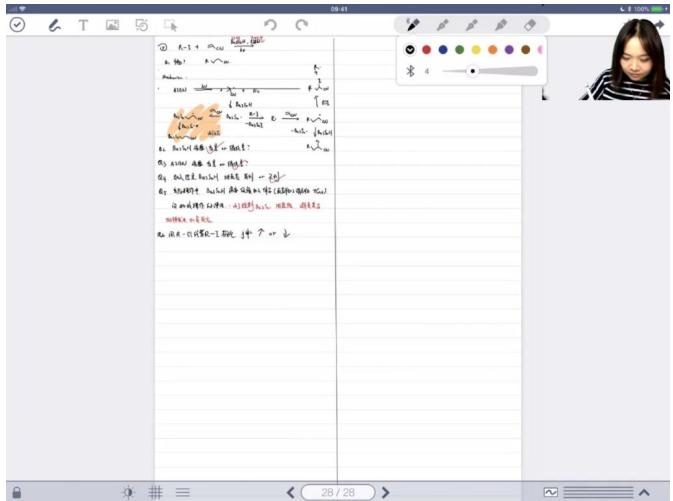

text_image

2 4
28/28

○ 碘代物vs氯代物：用R-Cl代替R-I时产率下降   
- 原因分析：碳碘键比碳氯键更易断裂，有利于自由基生成  
○ 键能关系：C-I < C-Br < C-Cl 键能依次增强，断裂难度增大

# 3）自由基反应关键知识点 02:28:35

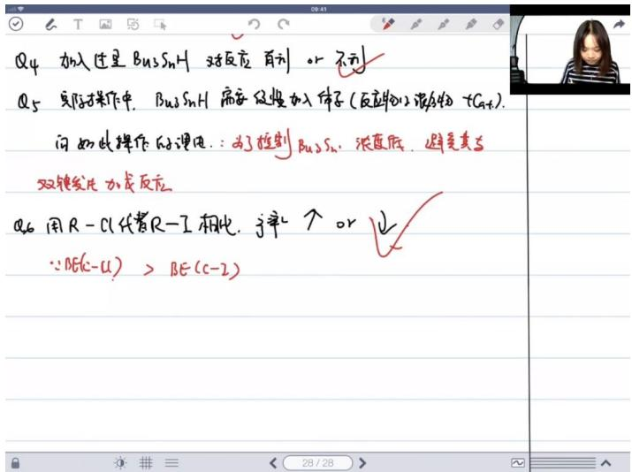

text_image

Q4 加入过量 Bu3SnH 对反应 前到 or 不到
Q5 实际操作中，Bu3SnH 需家做慢加入 体子（反应物）2 液解物 +Ca+。
问如此操作的理由：为了控制 Bu3Sn，浓度低，避免其与
双键发生 加差反应
Q6 用 R-C(代替 R-I 相比，产生 ↑ or ↓
∵BE(c-U) > BE(c-I)

# - 反应物选择原则

☐ 卤素活性差异：反应中X必须为溴或碘，不能是氯。因为 $BE(C-I)>BE(C-Cl)$ ，C-I键更易断裂形成自由基。  
电子效应影响：当自由基被吸电子基团（如羰基）稳定时，氯代物也可参与反应。此时缺电子自由基与富电子烯烃形成良好匹配。

# - 操作要点

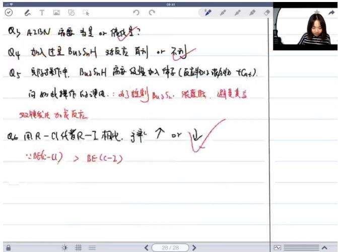

text_image

Q5 A2BN 需要当是or偶反应?
Q4 加入过是 BuS₂SnH 对反应有别 or 不到
Q5 实际操作中，BuS₂SnH 需要反复加入体子（反应物）或杂物（Cg+）。
问如此操作的理电：为了控制 BuS₂、浓度低，避免其与双键发生反应反应
Q6 用R-C(代替R-I)相比，单个或
∵BE(c-U) > BE(c-2)

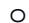

○ 缓慢加入原理： $Bu_{3}SnH$ 需极缓慢加入反应体系（含反应物2和催化剂），目的是：

■ 控制 $Bu_{3}SnH$ 浓度在较低水平  
■ 避免发生双分子加成副反应

\- 浓度控制：自由基浓度必须保持低位，这与还原试剂浓度控制直接相关。

# - 反应机理特征

副反应类型：

■ 次要副反应：从稳定自由基生成不稳定自由基的过程  
■ 主要副反应：未明确描述但需注意的其他竞争路径

\- 驱动力：某些步骤存在熵驱动（如生成气体的步骤）

# 4）三烷基硼自由基反应

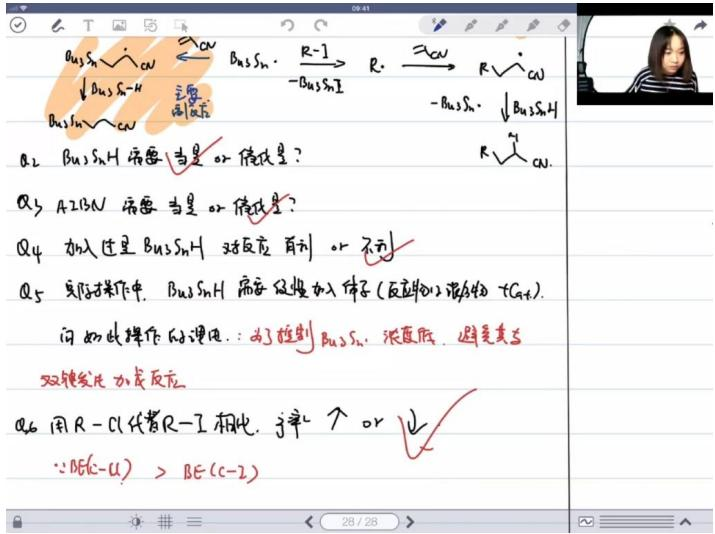

text_image

Bu3Sn→CN ← Bu3Sn· → R-I → R· → R→CN
↓ Bu3Sn-H → -Bu3SnI
→ 酸化后
→ Bu3Sn· ↓ Bu3SnH
Q2 Bu3SnH 需要:当是 or 候化是?
Q3 A2BN 需要 当是 or 候化是?
Q4 加入过呈 Bu3SnH 对反应 有别 or 不列
Q5 实际操作中，Bu3SnH 需要:仅是加入体子(反应物)游离物 +Ca2.
问如此操作的理用：为了控制 Bu3Sn· 淡度后，避免其与
双键发生 加成反应
Q6 用R-Cl代替R-I相比，产生 ↑ or ↓
∵BE(c-U) > BE(c-2)

\- 反应条件

\- 试剂比例：

■ 三烷基硼：当量使用  
■ 氧气：仅需催化量（体系微量氧即可引发反应）

○ 抑制剂效应：加入5% TEMPO（自由基捕获剂）会完全抑制反应，这是判断自由基机理的重要实验证据。

● 机理特点

- 氧气的特殊作用：自然环境中微量氧气与三烷基硼反应可产生R·自由基  
○ 水的作用：反应需在水存在条件下进行，具体作用机制未详细说明但为必要条件

5）自由基聚合反应

● 交替共聚物形成

○ 结构特征：严格生成ABAB型交替共聚物  
○ 电子效应匹配：缺电子自由基与富电子烯烃单体间的电子互补性是形成交替结构的关键

\- 反应类型判断

\- 聚合分类：属于加剧反应（addition polymerization）中的自由基交替共聚

6）重要试剂体系

● AIBN/稀释剂组合：经典自由基引发体系，需注意当量与计量关系可能随条件变化  
● 硼试剂体系：三烷基硼+氧气的新型自由基引发方式，区别于传统过氧键引发机制

# 二、有的没的知识点 02:46:32

1. 三苯甲基自由基的发现 02:47:14

● 早期认知：1900年首次发现时被误认为中间体，当时认为二聚产物是六苯基乙烷  
● 结构修正：1970年通过核磁共振技术确认实际二聚产物结构为另一种形式  
核磁鉴别：通过氢谱化学位移区分两种结构，a结构所有氢在芳环区（6-8ppm），b结构存在高场氢（饱和碳氢）

2. 三苯甲基自由基的构型 02:53:39

● 立体构型：呈现螺旋桨型(paddle ship)结构  
● 原因分析：由于三个苯环空间位阻大，无法共平面而采取扭曲构型  
● 稳定性因素：这种构型能有效缓解空间拥挤，提高自由基稳定性

3. 三苯甲基自由基的反应 02:55:41

● 二聚选择性：体系中90%为自由基单体，仅10%形成二聚体b  
● 反应难点：b结构需要破坏芳香体系，共轭程度虽大但生成困难  
● 检测方法：紫外光谱不适用（a/b均有苯环吸收），主要依赖核磁氢谱特征峰

4. 四氢呋喃的干燥 03:00:30

- 干燥原理：钠与THF中微量水反应，过量钠与二苯甲酮生成紫色自由基负离子  
● 指示作用：深紫色出现表示体系无水，褪色需补充钠继续除水  
● 应用场景：金属有机反应必须无水无氧，THF因其强配位能力成为常用溶剂

# 5. 饱和食盐水的作用 03:03:07

● 操作流程：先用饱和食盐水洗涤有机相，再用无水硫酸钠/镁干燥   
- 渗透压原理：高浓度盐水通过物理过程吸出有机相中的水分  
- 注意事项：

- 干燥剂限制：过量固体干燥剂会吸附产物降低收率  
- 溶剂差异：THF必须盐水预处理，乙醚建议使用，甲苯可省略  
- 产率保护：避免固体表面物理吸附造成的产物损失

# 三、分子内的自由基反应03:07:51

# 1. 例题: 分子内的自由基反应

# 1）自由基成环反应的选择性

- 环大小优先顺序：在自由基成环反应中，五元环和六元环优先于三元环、四元环、七元环和八元环形成  
- 五元环与六元环竞争：当五元环和六元环同时可能形成时，实验观察表明五元环产物占主导地位（98% vs 2%）  
● 动力学控制原理：该反应为不可逆过程，五元环形成的过渡态能垒较低，反应速率更快，尽管六元环产物热力学更稳定

# 2）Baldwin规则应用

● 规则内容: Baldwin规则描述了不同环大小和成环方式的可行性  
● 特殊情况：在自由基成环中，五元环（a）和六元环（b）都符合Baldwin规则，但五元环产物实际占优  
● 实验验证: 多个文献记载证实自由基机理下五元环形成的普遍性

# 3）反应机理分析

● 键断裂选择: 反应中优先断裂较弱的碳硫键（C-S键）

\- 中间体稳定性:

○ 五元环自由基中间体（a'）不如六元环自由基中间体（b'）稳定  
- 但五元环过渡态能量更低，导致动力学优势

● 产物分析: 五元环产物张力较小, 六元环产物存在较大环张力

# 4）典型反应示例

● 案例1: 五元环与六元环竞争，实际产物为五元环（98%产率）  
● 案例2: 六元环与七元环竞争时，六元环产物占优  
● 案例3: 当结构限制只能形成五元环时，产物为单一五元环结构

# 5）作业题目解析

# ● 解题要点:

◦ 优先考虑五元环形成可能性  
- 分析不同环结构的过渡态能量  
- 注意产物的立体化学和环张力

# ● 常见错误:

- 忽视动力学控制原理  
○ 错误判断环大小优先顺序   
- 忽略产物的立体化学限制

● 正确答案: b选项（五元环产物）

四、知识小结

<table><tr><td>知识点</td><td>核心内容</td><td>考试重点/易混淆点</td><td>难度系数</td></tr><tr><td>自由基生成方法</td><td>1. 均裂(homolysis) 2. 电子转移(ET)3. 夺取反应(abstraction) 4. 加成反应 5. 消除反应</td><td>过氧键断裂(60-80°C) vs光照断裂(不同波长对应不同能量)</td><td>★★★</td></tr><tr><td>自由基稳定性因素</td><td>1. 位阻效应(动力学稳定)2. 电子效应(给电子稳定)3. 共轭效应</td><td>三氯甲基自由基稳定性 &gt;溴自由基</td><td>★★★★</td></tr><tr><td>自由基反应类型</td><td>1. 自由基-自由基反应(偶联) 2. 链式反应(引发/增长/终止)</td><td>NBS试剂控制溴浓度 vsAIBN引发剂使用</td><td>★★★★</td></tr><tr><td>典型自由基反应</td><td>1. 钠还原酮类(醇/频哪醇/α-羟基酮) 2. McMurry反应(烯烃生成) 3. Barton脱氧反应</td><td>反应条件决定产物类型(质子溶剂vs非质子溶剂)</td><td>★★★★★</td></tr><tr><td>自由基结构特征</td><td>介于三角锥和平面三角之间(SP2-SP3杂化)</td><td>CH3较平 vsCF3较三角锥</td><td>★★</td></tr><tr><td>自由基检测方法</td><td>1. ESR(电子自旋共振) 2. 自由基捕获剂(TEMPO)</td><td>TEMPO抑制反应证明自由基机理</td><td>★★★★</td></tr><tr><td>特殊自由基体系</td><td>1. 三苯甲基自由基(螺旋桨结构) 2. Gomberg自由基二聚体(核磁鉴别)</td><td>二聚体高场CH信号鉴别结构</td><td>★★★★</td></tr><tr><td>自由基聚合反应</td><td>交替共聚物生成(缺电子/富电子单体组合)</td><td>单体电子特性决定聚合方式</td><td>★★★★</td></tr><tr><td>实验操作要点</td><td>1. THF除水(钠/二苯甲酮指示) 2. 饱和食盐水洗涤原理</td><td>渗透压除水vs 干燥剂吸附</td><td>★★★</td></tr></table>