# 第39届

# 中国化学奥林匹克竞赛（初赛）试题解析

2025年9月7日 

# 第1题 砷化学

# 题目（15分， $7\%$ ）

由于黄金稀有且价值连城，古人产生了各种人工制备黄金的奇思妙想。一种最粗浅的想法是，以黄色或接近黄色的矿物为原料与贱金属反应，将贱金属转化为黄金颜色的“伪金”。《正统道藏·龙虎还丹诀》记载了东汉狐刚子《五金诀》中提到的四种黄色矿物“四黄”与贱金属反应得到“伪金”的方法： 

“雄黄功能变铁，雌黄功能变锡，砒黄功能变铜，硫黄功能变银、化汞。‘四黄’功亦能反铁为铜、反铜为银、反银为金，如谷作米，是天地之中，自然之道。” 

实际上，雄黄为 $\mathrm{As}_4\mathrm{S}_4$ ，雌黄为 $\mathrm{As}_2\mathrm{S}_3$ ，砒黄为 $\mathrm{As}_2\mathrm{O}_3$ ，硫黄为硫单质。 

1.1 完成以下得到“伪金”的反应方程式： 

1.1.1雄黄“变”铁。 

1.1.2 矾黄“变”铜（在木炭存在下）（提示：含砷 $5\%$ 的砷铜合金是黄色的）。 

1.2 与砒黄相似，砷酸钾也具有“点化”的功能。南北朝时期苏元明将雄黄与草木灰（主要成分为 $\mathrm{K}_2\mathrm{CO}_3$ ）在空气中一同煅烧，得到熔融的砷酸钾和四硫代砷酸钾。写出此反应方程式。 

1.3孙思邈在《太清丹经要诀》中描述： 

“雄黄十两，末之；锡三两……入坩埚中，火之……令埚同火色，寒之。开，黄色似金。” 

可见在雄黄或雌黄“变”锡的反应过程中，控制反应温度非常重要。现代研究表明，当反应温度较低时，雄黄不能熔化，导致反应较慢；当温度过高时，伪金A会发生分解，形成非金属单质B和化合物C。反应中各物质计量比相同。 

1.3.1 写出 A、B 和 C 的化学式。 

1.3.2 根据下表数据，通过计算确定分解反应的温度范围（假设 $\Delta_{\mathrm{f}}H_{\mathrm{m}}^{\ominus}$ 和 $S_{\mathrm{m}}^{\ominus}$ 不随温度变化）。 

$$
\mathrm {A s} _ {4} \mathrm {S} _ {4} (\mathrm {s}) \longrightarrow \mathrm {A s} _ {4} \mathrm {S} _ {4} (\mathrm {l}) \quad \Delta_ {\mathrm {r}} H _ {\mathrm {m}} ^ {\ominus} = 1 2. 1 4 \mathrm {k J m o l} ^ {- 1}, \Delta_ {\mathrm {r}} S _ {\mathrm {m}} ^ {\ominus} = 2 0. 9 2 \mathrm {J m o l} ^ {- 1} \mathrm {K} ^ {- 1}
$$

<table><tr><td>分解温度附近</td><td>A</td><td>B</td><td>C</td></tr><tr><td>ΔfHmΘ/(kJ mol-1)</td><td>-116.14</td><td>76.84</td><td>-75.69</td></tr><tr><td>SmΘ/(J mol-1K-1)</td><td>160.32</td><td>135.36</td><td>136.10</td></tr></table>

1.4 有人推测，阿拉伯人改进了上述方法，得到今天称之为“彩金”(mosaic gold)的物质。阿拉伯人采用的方法是使用朱砂 $(\mathrm{HgS})$ 、硝砂 $(\mathrm{NH_4Cl})$ 与金属锡共同加热。 

1.4.1 根据下列数据，通过计算判断制备“彩金”的反应在题1.3规定的温度上限内能否进行。 

提示：如果你无法得到题1.3的温度上限，本问可以选用 $1000\mathrm{K}$ 。 

<table><tr><td>分解温度附近</td><td>HgS</td><td>Hg</td><td>Sn</td><td>NH4Cl</td><td>NH3</td><td>HCl</td></tr><tr><td>ΔfHmΘ/(kJ mol-1)</td><td>-23.12</td><td>71.72</td><td>21.48</td><td>-280.17</td><td>-24.21</td><td>-77.50</td></tr><tr><td>SmΘ/(J mol-1K-1)</td><td>139.86</td><td>195.31</td><td>93.48</td><td>173.15</td><td>234.17</td><td>215.81</td></tr></table>

# 1.4.2 解释硒砂在此反应过程中的作用。

# 分析与解答

与2024年第38届初赛考试类似，2025年初赛的第一题仍旧是以化学史话为背景，考查同学们元素基础知识和热力学计算的掌握情况。这类题目整体难度并不高，但要求同学们能够准确理解化学史材料中诸多化合物的别称，梳理清楚相关化合物的相互转化关系。在1.4.1小问中，如果考生没有在之前的计算过程中得到正确答案，也可以采用命题者给出的温度来进行计算，只要正确亦得满分，防止由于前序问题无法处理导致的连环丢分，对考生比较友好。 

1.1 本小题考查根据题目信息，书写化学反应方程式。 

1.1.1 雄黄“变”铁：根据题目中给出的信息，对应的是“接近黄色的矿物”雄黄 $\mathrm{As}_4\mathrm{S}_4$ 与贱金属Fe发生的反应。根据铁的元素化学知识，其硫化物 $\mathrm{FeS}_2$ 是具有金色金属光泽的矿物（黄铁矿），俗称愚人金，故反应得到的“伪金”为 $\mathrm{FeS}_2$ 。这是一个氧化还原反应，还原产物应为As单质。反应方程式如下： 

$$
\mathrm {A s} _ {4} \mathrm {S} _ {4} + 2 \mathrm {F e} \longrightarrow 4 \mathrm {A s} + 2 \mathrm {F e S} _ {2}
$$

1.1.2 在木炭存在下，砒黄“变”铜：根据题目中给出的信息，对应的是“接近黄色的矿物”砒黄 $\mathrm{As}_2\mathrm{O}_3$ 与焦炭和贱金属 $\mathrm{Cu}$ 发生的反应，得到的“伪金”为含砷 $5\%$ （质量分数）的砷铜合金。显然，木炭是冶炼过程中的还原剂，将 $\mathrm{As}_2\mathrm{O}_3$ 还原为 $\mathrm{As}$ ，自身在高温下被氧化为 $\mathrm{CO}$ 。得到的 $\mathrm{As}$ 与 $\mathrm{Cu}$ 形成含砷质量分数 $5\%$ 的砷铜合金 

读史以明鉴，知古以鉴今。了解中外化学史，有助于理清化学学科的发展脉络、培养科学思辨能力。 

（根据Ellingham图可以判断C在不同冶炼温度下的氧化产物：较低温度时倾向于生成 $\mathrm{CO}_{2}$ （焓驱动），而高温下则倾向于生成CO（熵驱动）。两条氧化反应线的交叉点在 $710^{\circ}C$ 附近。由于本题未给出具体反应温度，故氧化产物写为 $\mathrm{CO}_{2}$ 亦可。从答题策略考虑，未指明温度时写CO更为保险。）

“伪金”，故最终的产物应写为确定计量比的“砷化铜”形式。可以将两个过程写成如下的总反应式，其中砷铜合金设为 $\mathrm{Cu}_{x}\mathrm{As}$ ： 

$$
\mathrm {A s} _ {2} \mathrm {O} _ {3} + 2 x \mathrm {C u} + 3 \mathrm {C} \longrightarrow 2 \mathrm {C u} _ {x} \mathrm {A s} + 3 \mathrm {C O}
$$

根据质量分数求解 $x$ 的值： 

$$
\omega (\mathrm{As}) = \frac{A_{\mathrm{r}}(\mathrm{As})}{A_{\mathrm{r}}(\mathrm{As}) + xA_{\mathrm{r}}(\mathrm{Cu})} = \frac{74.92}{74.92 + 63.55x} = 5\%
$$

（在评分标准中，必须用方程式或文字体现出砷铜合金的形成；方程式中保留未知数，未计算出 $x$ 具体的值亦可。）

解得 $x = 22.4$ 。代入方程式并将计量数化为最简整数比： 

$$
5 \mathrm {A s} _ {2} \mathrm {O} _ {3} + 2 2 4 \mathrm {C u} + 1 5 \mathrm {C} \longrightarrow 2 \mathrm {C u} _ {1 1 2} \mathrm {A s} _ {5} + 1 5 \mathrm {C O}
$$

在考试中，不少考生在砷铜合金的写法上犯了难。有些考生认为，砷铜合金无须特意标明，而将其写为单质As，认为 $\mathrm{Cu}$ 单质仅作为合金的一部分，不参与反应，这一错误理解导致了失分。通常，题目给出的条件或提示信息都是有用的；若未明确体现出合金的组成，不仅无法准确反映题意，也不满足产物“伪金”的特征（单独的As或 $\mathrm{Cu}$ 均不呈金色）。 

1. 2本小题不难：雄黄 $\mathrm{A_4S_4}$ 与草木灰 $\mathrm{K}_2\mathrm{CO}_3$ 在空气中一同煅烧，得到砷酸钾 $\mathrm{K}_3\mathrm{AsO}_4$ 和四硫代砷酸钾 $\mathrm{K}_3\mathrm{AsS}_4$ 。这显然也是一个氧化还原反应：As元素从 $+2$ 价（将 $\mathrm{As_4S_4}$ 中的S元素视为-2价）升为 $+5$ 价，氧化剂应为空气中的 $\mathrm{O}_2$ 。反应方程式为 

$$
\mathrm {A s} _ {4} \mathrm {S} _ {4} + 6 \mathrm {K} _ {2} \mathrm {C O} _ {3} + 3 \mathrm {O} _ {2} \longrightarrow 3 \mathrm {K} _ {3} \mathrm {A s O} _ {4} + \mathrm {K} _ {3} \mathrm {A s S} _ {4} + 6 \mathrm {C O} _ {2}
$$

1.3 从本小题开始，在考查元素化学知识的基础，结合了热力学的计算问题。 

1. 3. 1 雄黄 $\mathrm{S}_{2}$ 与锡单质 Sn 在坩埚中加热后降温，得到“伪金”化合物 A。根据锡的元素化学知识，其最高价硫化物 $\mathrm{SnS}_{2}$ 俗称“金粉”，且温度过高时， $\mathrm{SnS}_{2}$ 会分解为低价硫化物 SnS 和硫单质 S，分解反应中各物质计量比相同，符合题意。故 

$$
\mathbf {A} = \mathrm {S n S} _ {2}, \quad \mathbf {B} = \mathrm {S}, \quad \mathbf {C} = \mathrm {S n S}
$$

虽然反应产物应为无定形硫，但在高温下硫会熔化，恢复至室温后可以得到结晶形态的硫。故B写为 $\mathrm{S}_{8}$ 亦可。 

1. 3. 2 根据题干中给出的信息, 当温度高于临界温度时 $\mathrm{SnS}_{2}$ 即发生分解反应。首先写出分解反应的方程式: 

$$
\mathrm {S n S} _ {2} \longrightarrow \mathrm {S n S} + \mathrm {S}
$$

（相关知识在2015年第29届初赛第8题中考查过。）

根据题目给出的热力学数据，计算反应的 $\Delta_{\mathrm{r}}H_{\mathrm{m}}^{\ominus}$ 和 $\Delta_{\mathrm{r}}S_{\mathrm{m}}^{\ominus}$ 

$$
\begin{array}{l} \Delta_ {\mathrm {r}} H _ {\mathrm {m}} ^ {\ominus} = \Delta_ {\mathrm {f}} H _ {\mathrm {m}} ^ {\ominus} (\mathrm {S n S}) + \Delta_ {\mathrm {f}} H _ {\mathrm {m}} ^ {\ominus} (\mathrm {S}) - \Delta_ {\mathrm {f}} H _ {\mathrm {m}} ^ {\ominus} (\mathrm {S n S} _ {2}) \\ = - 7 5. 6 9 + 7 6. 8 4 - (- 1 1 6. 1 4) = 1 1 7. 2 9 \left(\mathrm {k J} \mathrm {m o l} ^ {- 1}\right) \\ \Delta_ {\mathrm {r}} S _ {\mathrm {m}} ^ {\ominus} = S _ {\mathrm {m}} ^ {\ominus} (\mathrm {S n S}) + S _ {\mathrm {m}} ^ {\ominus} (\mathrm {S}) - S _ {\mathrm {m}} ^ {\ominus} (\mathrm {S n S} _ {2}) \\ = 1 3 6. 1 0 + 1 3 5. 3 6 - 1 6 0. 3 2 = 1 1 1. 1 4 \left(\mathrm {J} \mathrm {m o l} ^ {- 1} \mathrm {K} ^ {- 1}\right) \\ \end{array}
$$

由于反应为吸热且熵增，当温度高于某临界温度后反应自发进行： 

$$
T > \frac {\Delta_ {\mathrm {r}} H _ {\mathrm {m}} ^ {\ominus}}{\Delta_ {\mathrm {r}} S _ {\mathrm {m}} ^ {\ominus}} = \frac {1 1 7 . 2 9 \mathrm {k J} \mathrm {m o l} ^ {- 1}}{1 1 1 . 1 4 \mathrm {J} \mathrm {m o l} ^ {- 1} \mathrm {K} ^ {- 1}} = 1 0 5 5 \mathrm {K}
$$

题目还给出了雄黄 $\mathrm{As_4S_4}$ 熔化的相变 $\Delta_{\mathrm{r}}H_{\mathrm{m}}^{\ominus}$ 与 $\Delta_{\mathrm{r}}S_{\mathrm{m}}^{\ominus}$ 数据，但熔化温度显然低于 $\mathrm{SnS}_2$ 的分解温度，可视作无关信息。若题目设问改为“确定制备伪金A最合适的温度范围”，则由于雄黄未熔化时反应较慢，还需计算温度下限： 

$$
T ^ {\prime} > \frac {\Delta_ {\mathrm {r}} H _ {\mathrm {m}} ^ {\ominus}}{\Delta_ {\mathrm {r}} S _ {\mathrm {m}} ^ {\ominus}} = \frac {1 2 . 1 4 \mathrm {k J m o l} ^ {- 1}}{2 0 . 9 2 \mathrm {J m o l} ^ {- 1} \mathrm {K} ^ {- 1}} = 5 8 0 \mathrm {K}
$$

温度上限为 $\mathrm{SnS}_2$ 分解反应自发进行的临界温度 $1055\mathrm{K}$ 。 

1.4本小题仍以“金粉” $\mathrm{SnS}_2$ 的制备为背景，考查热力学计算。 

1.4.1 根据题目信息，制备 $\mathrm{SnS}_2$ 的反应方程式为 

$$
2 \mathrm {H g S} + \mathrm {S n} \longrightarrow \mathrm {S n S} _ {2} + 2 \mathrm {H g}
$$

根据题目给出的热力学数据，计算反应的 $\Delta_{\mathrm{r}}H_{\mathrm{m}}^{\ominus}$ 和 $\Delta_{\mathrm{r}}S_{\mathrm{m}}^{\ominus}$ 

$$
\begin{array}{l} \Delta_ {\mathrm {r}} H _ {\mathrm {m}} ^ {\ominus} = \Delta_ {\mathrm {f}} H _ {\mathrm {m}} ^ {\ominus} (\mathrm {S n S} _ {2}) + 2 \Delta_ {\mathrm {f}} H _ {\mathrm {m}} ^ {\ominus} (\mathrm {H g}) - 2 \Delta_ {\mathrm {f}} H _ {\mathrm {m}} ^ {\ominus} (\mathrm {H g S}) - \Delta_ {\mathrm {f}} H _ {\mathrm {m}} ^ {\ominus} (\mathrm {S n}) \\ = - 1 1 6. 1 4 + 2 \times 7 1. 7 2 - 2 \times (- 2 3. 1 2) - 2 1. 4 8 \\ = 5 2. 0 6 \left(\mathrm {k J} \mathrm {m o l} ^ {- 1}\right) \\ \end{array}
$$

$$
\begin{array}{l} \Delta_ {\mathrm {r}} S _ {\mathrm {m}} ^ {\ominus} = S _ {\mathrm {m}} ^ {\ominus} (\mathrm {S n S} _ {2}) + 2 S _ {\mathrm {m}} ^ {\ominus} (\mathrm {H g}) - 2 S _ {\mathrm {m}} ^ {\ominus} (\mathrm {H g S}) - S _ {\mathrm {m}} ^ {\ominus} (\mathrm {S n}) \\ = 1 6 0. 3 2 + 2 \times 1 9 5. 3 1 - 2 \times 1 3 9. 8 6 - 9 3. 4 8 \\ = 1 7 7. 7 4 \left(\mathrm {J} \mathrm {m o l} ^ {- 1} \mathrm {K} ^ {- 1}\right) \\ \end{array}
$$

在1.3小题的临界温度 $1055\mathrm{K}$ 下，反应的 $\Delta_{\mathrm{r}}G_{\mathrm{m}}^{\ominus}$ 为 

$$
\begin{array}{l} \Delta_ {\mathrm {r}} G _ {\mathrm {m}} ^ {\ominus} = \Delta_ {\mathrm {r}} H _ {\mathrm {m}} ^ {\ominus} - T \Delta_ {\mathrm {r}} S _ {\mathrm {m}} ^ {\ominus} \\ = 5 2. 0 6 \mathrm {k J} \mathrm {m o l} ^ {- 1} - 1 0 5 5 \mathrm {K} \times 1 7 7. 7 4 \times 1 0 ^ {- 3} \mathrm {k J} \mathrm {m o l} ^ {- 1} \mathrm {K} ^ {- 1} \\ = - 1 3 5. 5 \mathrm {k J} \mathrm {m o l} ^ {- 1} <   0 \\ \end{array}
$$

故反应自发进行。 

注意：这里硫单质的 $\Delta_{\mathrm{f}}H_{\mathrm{m}}^{\ominus}$ 不是 $0\mathrm{kJ mol}^{-1}$ 为什么？ 

从2025年初赛开始，对于计算类题目的解答过程有了更严格的要求：先列公式，再代入数据，最后给出计算结果与单位。按照要求书写计算过程，能够更便于在检查过程中发现其中的计算错误。 

1.4小题给出的条件是“题1.3规定的温度上限”，而1.3小题的计算结果却是温度下限。这似乎表明1.3小题本来想问的应该是“确定制备伪金A最合适的温度范围”。 

（也可以根据反应的 $\Delta_{\mathrm{r}}H_{\mathrm{m}}^{\ominus}$ 和 $\Delta_{\mathrm{r}}S_{\mathrm{m}}^{\ominus}$ ，计算出反应自发进行的临界温度，再与1.3小题的结果进行比较。）

题目给出了 $\mathrm{NH_4Cl}$ 及其分解产物的热力学数据，暗示需考虑其分解过程。 

$\mathrm{NH_4Cl}$ 在高于 $611\mathrm{K}$ 时显著升华并分解。 

1.4.2 根据 1.4.1 中的反应可知，硒砂 $\mathrm{NH_4Cl}$ 并未参与制备 $\mathrm{SnS}_2$ 的核心反应。其作用需结合题目信息分析：1.3 小题已指出 $\mathrm{SnS}_2$ 在温度过高时易分解，而 $\mathrm{NH_4Cl}$ 的分解是强吸热过程。 

$$
\mathrm {N H} _ {4} \mathrm {C l} \longrightarrow \mathrm {N H} _ {3} + \mathrm {H C l}
$$

$$
\begin{array}{l} \Delta_ {\mathrm {r}} H _ {\mathrm {m}} ^ {\ominus} = \Delta_ {\mathrm {f}} H _ {\mathrm {m}} ^ {\ominus} (\mathrm {N H} _ {3}) + \Delta_ {\mathrm {f}} H _ {\mathrm {m}} ^ {\ominus} (\mathrm {H C l}) - \Delta_ {\mathrm {f}} H _ {\mathrm {m}} ^ {\ominus} (\mathrm {N H} _ {4} \mathrm {C l}) \\ = - 2 4. 2 1 - 7 7. 5 0 - (- 2 8 0. 1 7) \\ = 1 7 8. 4 6 (k J m o l ^ {- 1}) \\ \end{array}
$$

$\mathrm{NH_4Cl}$ 的分解吸热可防止因体系过热导致的 $\mathrm{SnS}_2$ 分解。有些同学认为 $\mathrm{NH_4Cl}$ 分解产生的气体可搅动熔体、促进混合，这虽有一定道理，但并非加入 $\mathrm{NH_4Cl}$ 的核心原因。 

# 知识拓展

（在《白蛇传》的故事中，变成人形的蛇精白娘子不慎喝下雄黄酒，失去控制现出原形。）

（目前公认最早发现砒霜可用于治疗急性早幼粒细胞白血病的是中国医学家张亭栋。张亭栋及其团队在研究一则据称可治疗淋巴结核的民间偏方时，意外发现其中起关键作用的组分正是砒霜，并于1996年在学术期刊Blood上发表了相关研究[1]。中医药是中华民族的重要瑰宝，但仍需我们结合现代科学，将其中真正的宝藏发扬光大。）

（查阅资料，思考为何雌黄与孔雀石、蓝铜矿等颜料不相容？）

雄黄，又称鸡冠石，自然界中最常见的是橙红色的 $\alpha\text{-}\mathrm{As}_4\mathrm{S}_4$ 晶型；长时间暴露在光照下后，可变为黄色粉末的 $\beta\text{-}\mathrm{As}_4\mathrm{S}_4$ 晶型。在中国古代，人们发现将雄黄研磨成粉末后洒在房屋周围，可以驱除蛇和昆虫，于是就认为雄黄可以克制蛇、蝎等百虫：“善能杀百毒、辟百邪、制蛊毒，人佩之，入山林而虎狼伏，入川水而百毒避”，并将雄黄粉末与黄酒一同泡制为雄黄酒，饮用以辟邪，随后发展为端午节的习俗之一。不过依据现代科学常识，雄黄为含硫和砷的矿石，盲目饮用雄黄酒会对人体造成损害。20世纪90年代，科学家发现三氧化二砷（ $\mathrm{As}_2\mathrm{O}_3$ ，俗称砒霜）对治疗复发性和难治性急性早幼粒细胞白血病（acute promyelocytidieukemiaAPL）、多发性骨髓瘤(multiplemyeloma,MM)、骨髓增生异常综合征（myelodysplasticsyndrome,MDS）有令人震惊的良好效果；后来又发展了以雄黄为主成分的相关药物。 

雌黄，又称石黄，是一种深橙黄色的天然矿物，常见于火山喷气孔、低温热液脉和温泉中，由升华形成；也是由雄黄矿物被蚀变的副产物。其醒目的颜色，引起了中国和西方炼金术士的兴趣，用以寻找一种制造黄金的方法。19世纪之前，雌黄是为数不多的可供艺术家使用的透明亮黄色颜料之一，在中国古代被用作绘画颜料、火漆，甚至是修正液。然而，由于它的极端毒性和与其他常见颜料的不相容性，当镉黄、铬黄和有机染料被引入时，雌黄便退出了颜料的历史舞台。 

砒黄是三氧化二砷在中国古代的别称，但更广为人知的俗称是砒霜。在中国古代，砒霜常用作毒药，但由于技术上的限制，砒霜 

中常因混有大量的硫或硫化物而呈红色，故又称“鹤顶红”。银易与硫产生化学作用生成黑色的硫化银，因此在古代常被用来试毒。单次摄入 $60\mathrm{mg}$ 砹霜会引起人体严重不适，发生急性三氧化二砷中毒时，应当立即服用新制的氢氧化亚铁悬浮液来解毒，并立即送医院救治。曾有网络谣言称，虾蟹等带壳类的海产品与富含维生素C的蔬果混食后，会在体内自行合成砒霜而致人死亡。事实上，若要在体内合成足以造成急性中毒的剂量，所食用的海产品与蔬果均远超常人肠胃容量（以单次摄入 $60\mathrm{mg}$ 三氧化二砷来计算，海产品摄入 $50\mathrm{kg}$ 左右方可导致危险），故在现实中是绝不可能实现的。但同时如上文所说，在现代医学中，微量的三氧化二砷有相当丰富的医学用途。 

砷青铜（arsenical bronze）是一种含砷超过 $1\%$ （质量分数）的砷铜合金。在自然界中，铜矿与砷矿常常共生，在冶炼铸造的铜器中加入一定量的砷可提高材料的强度、改善其铸造性能，并赋予铜合金银白或浅色金属光泽。世界上最早使用砷青铜器可追溯到公元前4000年。由于冶炼、熔铸砷铜合金过程中，产生的砷氧化物烟雾对人体有毒，故逐渐被锡铜合金所取代。 

黄铁矿 $\left(\mathrm{FeS}_{2}\right)$ ，又称愚人金，是自然界中最丰富的硫化物矿物。黄铁矿的金属光泽和淡黄色的色调使它外观上与黄金相似，因此有愚人金的绰号。 

二硫化锡 $(\mathrm{SnS}_2)$ ，俗称“金粉”，用作金色涂料时也被称为彩金（又称马赛克金，mosaic gold）。在中国，最早有关金粉的配方可以追溯到公元317年葛洪所著的《抱朴子》，比国外第一次发现金粉配方早了约一千年。 

硒砂（又名卤砂，英文salammoniac）是 $\mathrm{NH_4Cl}$ 在自然界以矿物形式存在的名称，分布较为稀有，常以“升华”或“凝华”方式直接沉淀或结晶形成，尤其是在火山通气孔、煤层自燃区域、鸟粪堆积区等场所。在贵金属精炼中，有时将硒砂与木炭混合后加入熔铸的金属中，用于清除铁屑或其他杂质，使金属更纯净。 

# 第2题 普鲁士蓝类化合物的离子传输

# 题目（23分， $10\%$ ）

普鲁士蓝类化合物(PBA)是由 $\mathrm{CN}^{-}$ 与金属离子配位形成的立方体网络结构，其中金属离子在立方体顶点， $\mathrm{CN}^{-}$ 为立方体的边，立方体空腔中可以存储碱金属离子，也可作为钾离子电池的正极材 

（查阅相关资料，写出氢氧化亚铁悬浮液解毒过程的反应方程式。）

（实际上在中国古代，就已发现少量的砒霜可以作为药用。北宋《开宝本草》以及《本草衍义》中记载：“疗诸疟，风痰在胸膈，可作吐药，不可久服，伤人。”）

（我国科学家、诺贝尔生理学或医学奖获得者屠呦呦就是被葛洪所著《肘后备急方》中提到的对青蒿素治疗疟疾的相关内容所启发，获得了从天然植物黄花蒿中提取青蒿素方法的灵感。）

除了这两个题目中涉及的金色“伪金”化合物外，也请同学们自行总结其他金色的化合物。 

料。某种PBA（PBA-1）的化学式为 $\mathrm{KFe}_2(\mathrm{CN})_6$ ，式量为306.92，具有简单立方结构，相邻的Fe-Fe之间距离为 $a = 0.510\mathrm{nm}$ 。 

2.1PBA-1为蓝色晶体，通过电极反应吸收足量的 $\mathbf{K}^{+}$ 后，转变成白色的普鲁士白。 

2.1.1 写出戴普鲁士白的电极反应方程式。 

2.1.2 解释电极反应中化合物颜色变化的原因。 

2.1.3计算PBA-1作为正极材料的理论比容量，用 $\mathrm{mA}\mathrm{hg}^{-1}$ 表示。 

2.2利用光学显微镜观察颗粒的颜色变化，可监测单个PBA颗粒的充放电过程。当颗粒与电极界面接触良好时，其放电过程的速率只取决于 $\mathbf{K}^{+}$ 进入晶格空腔的扩散速率。此时颗粒的电容量 $Q$ 随时间 $t$ 的变化如下： 

$$
Q = Q _ {0} \exp \left(- \frac {\pi^ {2} D}{4 L ^ {2}} t\right)
$$

其中 $Q_{0}$ 是颗粒的初始电容量， $D$ 是 $\mathbf{K}^{+}$ 在晶格中的扩散系数， $L$ 是颗粒边长。现有一个边长为 $180\mathrm{nm}$ 的立方体PBA-1颗粒，与电极界面接触良好，对其进行放电实验。提示：此小题要求有效数字。 

2.2.1 谱该颗粒的初始电容量 $Q_{0}$ （单位：库仑C）。 

（如果你在2.2.1中没有得出 $Q_{0}$ ，本问使用 $Q_{0} = 3.60\times 10^{-12}\mathrm{C}_{\circ}$）

2.2. 用光学方法测得在 $t = 5.00 \mathrm{~s}$ 时，该颗粒的剩余电容量为 $0.964 \times 10^{-12} \mathrm{C}$ ，计算 $\mathbf{K}^{+}$ 的扩散系数 $D$ （单位： $\mathrm{nm}^2 \mathrm{s}^{-1}$ ）。 

2.3 当PBA颗粒与电极界面接触不良时，充放电速率取决于接触电阻。对于一个边长为 $180\mathrm{nm}$ 的立方体PBA-1颗粒，在恒定电压 $0.300\mathrm{V}$ 条件下，由光学显微镜测得颗粒的剩余电容量 $Q$ 随时间 $t$ 变化如下。通过计算确定该PBA-1颗粒与电极界面的接触电阻（单位： $\Omega$ ）。 

<table><tr><td>Q/(10-12C)</td><td>2.540</td><td>1.570</td><td>0.630</td></tr><tr><td>t/s</td><td>50.0</td><td>100.0</td><td>150.0</td></tr></table>

（如果你在2.2.1、2.2.2和2.3中的任何一个问题中没有得出结果，本问可以使用 $Q_{0} = 3.60 \times 10^{-12} \mathrm{C}$ $D = 3.00 \times 10^{3} \mathrm{~nm}^{2} \mathrm{~s}^{-1},$ $R = 2.00 \times 10^{13} \Omega$）

2.4将质量共计为 $0.3198\mathrm{ng}$ ，边长为 $180\mathrm{nm}$ 的立方体PBA-1颗粒均匀铺洒在电极表面，其中颗粒与电极接触的情况仅包含2.2和2.3所述的两种。现测得在恒定电压 $0.500\mathrm{V},t = 10.00\mathrm{s}$ 时刻，总电流值为 $1.38576\mathrm{nA}$ ，计算与电极表面接触不良的PBA-1颗粒的含量百分比。提示：对函数 $y = \mathrm{e}^{kx}$ 而言，其导数 $\mathrm{dy} / \mathrm{dx} = ke^{kx}$ 

# 分析与解答

本题以普鲁士蓝的充放电过程为背景，考查晶体结构、配位化学、电化学、动力学等多种化学原理的综合运用；并通过给材料的方式，检验考生在现场学习并运用新知识的能力，兼具深度与广度。 

2.1.1 PBA-1 即 $\mathrm{KFe}^{\mathrm{III}}\mathrm{Fe}^{\mathrm{II}}(\mathrm{CN})_{6}$ , 是混合价态配合物 (mixed-valence complex) 晶体。铁离子 [本题中如无特殊说明, 均指 $\mathrm{Fe(II)}$ 和 $\mathrm{Fe(III)}$ 离子] 分布于晶胞顶点、棱心、面心及体心位置, 氰根离子则位于铁离子之间, 其 N 端与 $\mathrm{Fe(III)}$ 配位, C 端与 $\mathrm{Fe(II)}$ 配位。在电极反应中, 1 当量 PBA-1 可嵌入 1 当量钾离子, 同时接受 1 当量电子, 还原为 $\mathrm{K}_{2}\mathrm{Fe}_{2}^{\mathrm{II}}(\mathrm{CN})_{6}$ : 

$$
\mathrm {K F e} ^ {\text {I I}} \mathrm {F e} ^ {\text {I I}} (\mathrm {C N}) _ {6} + \mathrm {K} ^ {+} + \mathrm {e} ^ {-} \longrightarrow \mathrm {K} _ {2} \mathrm {F e} _ {2} ^ {\text {I I}} (\mathrm {C N}) _ {6}
$$

2.1.2PBA-1的颜色源自铁配合物对可见光的强烈吸收。根据配位场理论，氰根C端是强场配体， $\mathrm{Fe(II)}$ 的电子组态为 $\mathfrak{t}_{2\mathfrak{g}}^6\mathfrak{e}_\mathfrak{g}^0$ ；N端是中强场配体， $\mathrm{Fe(III)}$ 的电子组态为 $\mathrm{t}_{2\mathrm{g}}^{3}\mathrm{e}_{\mathrm{g}}^{2}$ 。Fe(Ⅲ）是良好的电子受体， $\mathrm{Fe(II)}$ 是良好的电子给体，二者通过氰根中介形成强轨道耦合，从而建立高效的电荷转移(charge-transfer,CT)通道： 

$$
\mathrm {F e} ^ {\text {I I}} \rightarrow \mathrm {C} \equiv \mathrm {N} \rightarrow \mathrm {F e} ^ {\text {I I}}
$$

与d-d跃迁不同，电荷转移跃迁是对称性允许的，因而跃迁偶极矩大，吸收截面强；同时电子－声子耦合显著，使吸收带展宽。故PBA-1在红光区发生强烈的宽带吸收，呈现深蓝色。而当被还原为 $\mathrm{Fe}^{\mathrm{II}} - \mathrm{C}\equiv \mathrm{N} - \mathrm{Fe}^{\mathrm{II}}$ 桥连时，电荷转移通道被破坏，不再吸收可见光，晶体遂呈白色。 

2.1.3 本小问考查同学们对二次电池工作原理的理解。以PBA-1为正极材料时，其理论比容量的含义是：在组装成钾离子二次电池后，可逆充放电过程中材料能够贡献的最大容量。普鲁士蓝的可逆储钾过程为 

$$
\mathrm {F e} _ {2} (\mathrm {C N}) _ {6} + 2 \mathrm {K} ^ {+} + 2 \mathrm {e} ^ {-} \rightleftharpoons \mathrm {K} _ {2} \mathrm {F e} _ {2} (\mathrm {C N}) _ {6}
$$

由此可见， $1\mathrm{molFe}_2(\mathrm{CN})_6$ 单元可可逆存储 $2\mathrm{molK}^{+}$ 。因此无论材料处于 $\mathrm{Fe}_2(\mathrm{CN})_6$ （完全充电）、 $\mathrm{K}_2\mathrm{Fe}_2(\mathrm{CN})_6$ （完全放电）还是 $\mathrm{KFe}_2(\mathrm{CN})_6$ （部分充放电）状态，其理论比容量均应按 $2\mathrm{molK}^{+}/1\mathrm{molFe}_2(\mathrm{CN})_6$ 单元确定： 

$$
\begin{array}{l} C = \frac {n F}{M (\mathrm {P B A} - 1)} = \frac {2 \times 9 6 4 8 5}{3 0 6 . 9 2} = 6 2 8. 7 4 (\mathrm {A s g} ^ {- 1}) \\ = 6 2 8. 7 4 \left(\frac {\mathrm {A} \mathrm {s}}{\mathrm {g}}\right) \times 1 0 ^ {3} \left(\frac {\mathrm {m A}}{\mathrm {A}}\right) \times 3 6 0 0 ^ {- 1} \left(\frac {\mathrm {h}}{\mathrm {s}}\right) \\ = 1 7 4. 6 5 \left(\mathrm {m A h g} ^ {- 1}\right) \\ \end{array}
$$

另有部分同学认为，在放充电过程中，钾离子会嵌入或脱出PBA-1，因此电极材料的“实际式量”应视为 $306.92 + 39.10 =$ 

（普鲁士蓝的晶体结构。铁离子位于小立方体顶点，氟根位于棱上，钾离子占据小立方体的体心。若不区分铁离子位置以及氟根取向，结构基元可以简化为 $\mathrm{K}_{0.5}\mathrm{Fe}(\mathrm{CN})_3$）

（典型的混合价态配合物还有：二钉盐Creutz-Taube配合物、钼蓝、四乙酸二钌等。）

（题目并未明确提示2当量钾离子均可被可逆嵌入与脱出，因此若考生答出 $174.65 / 2 =$ 87.325 $(\mathrm{mAhg^{-1}})$ ，评分细则中也给予了大部分分数。）

346.02，据此算得理论比容量为154.92或 $77.457\mathrm{mAhg^{-1}}$ （过程略）。这种算法看似也有道理，但设想如下任务：你需要制作某个具有特定容量的电极，应该称取多少质量的材料？很明显此时比容量要基于装入电极的材料成分[即 $\mathrm{KFe_2(CN)_6}$ ，而非 $\mathrm{K_2Fe_2(CN)_6}]$ 来计算；同理，计算容量时应计入可逆充放的2个 $\mathbf{K}^{+}$ ，而非1个 $\mathbf{K}^{+}$ 。对于概念的理解不应咬文嚼字，而应思考定义这个概念是为了解决什么问题。 

2.2.1 首先计算PBA-1颗粒中的铁离子数目：PBA-1具有简单立方结构，相邻的Fe-Fe之间距离为 $a = 0.510\mathrm{nm}$ ，颗粒边长 $L = 180\mathrm{nm}$ ，因此颗粒中铁离子的数目为 

$$
N (\mathrm {F e}) = (L / a) ^ {3} = (1 8 0 / 0. 5 1 0) ^ {3} = 4. 4 0 \times 1 0 ^ {7} (\text {个})
$$

由2.1.1的反应式可知，初始电容量 $Q_{0}$ 取决于嵌入的钾离子的数目，而该数目等于铁离子数目的一半： 

$$
\begin{array}{l} Q _ {0} = \frac {\Delta N (\mathrm {K}) F}{N _ {\mathrm {A}}} = \frac {N (\mathrm {F e}) F}{2 N _ {\mathrm {A}}} \\ = \frac {4 . 4 0 \times 1 0 ^ {7} \times 9 6 4 8 5}{2 \times 6 . 0 2 2 \times 1 0 ^ {2 3}} = 3. 5 2 \times 1 0 ^ {- 1 2} (\mathrm {C}) \\ \end{array}
$$

（注意2025年对计算过程的新要求：列出公式后，先代入数值，再给出答案；代入数值时，可以不写单位，最后在答案后给出单位（最好用括号括起来）；常数如 $R$ 、 $N_{\mathrm{A}}$ 、 $\pi$ 等可以用符号代替。）

（另外，注意本小题要求有效数字。）

该结果与2.2.2提示的 $Q_{0} = 3.60 \times 10^{-12}\mathrm{C}$ 接近，可作为合理性验证。 

2.2.2 将题干方程变形： 

$$
- \frac {\pi^ {2} D}{4 L ^ {2}} t = \ln (Q / Q _ {0}) \Longrightarrow D = - \frac {4 L ^ {2}}{\pi^ {2} t} \ln (Q / Q _ {0})
$$

代入数据： 

$$
D = - \frac {4 \times 1 8 0 ^ {2}}{3 . 1 4 2 ^ {2} \times 5 . 0 0} \ln \left(\frac {0 . 9 6 4 \times 1 0 ^ {- 1 2}}{3 . 5 2 \times 1 0 ^ {- 1 2}}\right) = 3. 4 0 \times 1 0 ^ {3} (\mathrm {n m} ^ {2} \mathrm {s} ^ {- 1})
$$

该结果与2.4小题提示值 $3.00 \times 10^{3} \mathrm{~nm}^{2} \mathrm{s}^{-1}$ 接近，可作为合理性验证。 

2.3 观察表格可见，剩余电容量 $Q$ 与时间 $t$ 呈近似线性关系。作线性回归得 

$$
\frac {Q}{1 0 ^ {- 1 2} \mathrm {C}} = - 0. 0 1 9 1 \frac {t}{\mathrm {s}} + 3. 4 9
$$

斜率的绝对值即是电流 $I = 0.0191 \times 10^{-12} \mathrm{~A}$ 。由欧姆定律： 

$$
R = \frac {U}{I} = \frac {0 . 3 0 0}{0 . 0 1 9 1 \times 1 0 ^ {- 1 2}} = 1. 5 7 \times 1 0 ^ {1 3} (\Omega)
$$

该结果与2.4小题提示值 $R = 2.00 \times 10^{13} \Omega$ 接近，可作为合理性验证。 

2.4 首先，将总电流分解为两类颗粒的线性叠加。设与电极接触良好的颗粒数为 $x$ 个（扩散控制），接触不良的为 $y$ 个（接触电阻控制），则有 

$$
\left\{ \begin{array}{l} x + y = N \\ x I _ {\text {d i f f}} + y I _ {\text {o h m}} = I _ {\text {t o t}} \end{array} \right.
$$

其中， $N$ 为总颗粒数， $I_{\mathrm{diff}}$ 为扩散控制下的单颗粒电流， $I_{\mathrm{ohm}}$ 为接触电阻控制下的单颗粒电流， $I_{\mathrm{tot}}$ 为总电流。 

（1）计算颗粒总数。单颗粒质量： 

（注意：每化学式中有2当量Fe，式量应当除以2。）

$$
\begin{array}{l} m _ {\mathrm {p}} = (L / a) ^ {3} \frac {M _ {\mathrm {r}} / 2}{N _ {\mathrm {A}}} \\ = (1 8 0 / 0. 5 1 0) ^ {3} \times \frac {3 0 6 . 9 2 / 2}{6 . 0 2 2 \times 1 0 ^ {2 3}} = 1. 1 2 \times 1 0 ^ {- 1 4} (\mathrm {g}) \\ \end{array}
$$

颗粒总数： 

$$
N = \frac {m}{m _ {\mathrm {p}}} = \frac {0 . 3 1 9 8 \times 1 0 ^ {- 9}}{1 . 1 2 \times 1 0 ^ {- 1 4}} = 2. 8 5 \times 1 0 ^ {4} (\text {个})
$$

(2) 写出单颗粒电流表达式。对于扩散控制, 将 $Q(t)$ 对 $t$ 求导: 

$$
I _ {\text {d i f f}} = \left| \frac {\mathrm {d} Q}{\mathrm {d} t} \right| = \frac {\pi^ {2} D}{4 L ^ {2}} Q _ {0} \exp \left(- \frac {\pi^ {2} D}{4 L ^ {2}} t\right)
$$

代入 $D = 3.40 \times 10^{3} \mathrm{~nm}^{2} \mathrm{~s}^{-1}, L = 180 \mathrm{~nm}, Q_{0} = 3.52 \times 10^{-12} \mathrm{C}, t = 10.00 \mathrm{s}$ 

$$
\begin{array}{l} I _ {\text {d i f f}} = \frac {3 . 1 4 ^ {2} \times 3 . 4 0 \times 1 0 ^ {3}}{4 \times 1 8 0 ^ {2}} \times 3. 5 2 \times 1 0 ^ {- 1 2} \times \exp \left(- \frac {3 . 1 4 ^ {2} \times 3 . 4 0 \times 1 0 ^ {3}}{4 \times 1 8 0 ^ {2}} \times 1 0. 0 0\right) \\ = 0. 0 6 8 4 (\mathrm {p A}) \\ \end{array}
$$

接触电阻控制则按欧姆定律： 

$$
I _ {\mathrm {o h m}} = \frac {U}{R} = \frac {0 . 5 0 0}{1 . 5 7 1 \times 1 0 ^ {1 3}} = 0. 0 3 1 8 (\mathrm {p A})
$$

（3）联立方程求解： 

$$
\left\{ \begin{array}{l} x + y = 2. 8 5 \times 1 0 ^ {4} \\ 0. 0 6 8 4 x + 0. 0 3 1 8 y = 1. 3 9 \times 1 0 ^ {3} \end{array} \right.
$$

（第二个方程省略共同单位 $\mathrm{pA}$ 。）

解得 

$$
x = 1. 3 1 \times 1 0 ^ {4} (\text {个}), \quad y = 1. 5 4 \times 1 0 ^ {4} (\text {个})
$$

接触不良比例： 

$$
\frac{y}{N}\cdot 100\% = \frac{1.54\times 10^{4}}{2.85\times 10^{4}}\times 100\% = 54.1\%
$$

（本题整体计算量相对较大，笔者认为若在全卷中适当提高占分比重，或许更为平衡。）

$2.2 \sim 2.4$ 小题环环相扣、由浅入深，巧妙结合了考纲知识与新材料背景，综合考查了同学们的数学建模能力、运算能力和对物理化学概念的理解。整组题不仅紧扣学科核心素养，还充分展现了命题者对前沿材料化学的深刻把握与灵活融人。 

# 知识拓展

# 1. 扩散控制下的指数衰减方程

在电极材料研究中，离子在颗粒内部的迁移往往由扩散控制。扩散（diffusion）是物质在浓度差驱动下的自发迁移过程。例如，香水分子从瓶口扩散到整个房间，或电解质中的离子从高浓度区向低浓度区迁移。Fick定律就是对这种现象的定量描述。Fick第一定律的形式为（

$$
\frac {\partial c (x , t) \Delta x}{\partial t} =
$$

$$
J (\boldsymbol {x}, t) - J (\boldsymbol {x} + \Delta \boldsymbol {x}, t)
$$

两边同时除以 $\Delta x$ ，在 $\Delta x\to 0$ 极限下得到 

$$
\frac {\partial c (x , t)}{\partial t} = - \frac {\partial J (x , t)}{\partial x}
$$

将Fick第一定律代入，有 

$$
\frac {\partial c}{\partial t} = - \frac {\partial}{\partial x} \left(- D \frac {\partial c}{\partial x}\right)
$$

若 $D$ 不随位置变化，则 

$$
\frac {\partial c}{\partial t} = D \frac {\partial^ {2} c}{\partial x ^ {2}}
$$

这就是Fick第二定律。）

级数中： 

$\sin (n\pi x / L)$ 来自边界条件（在两端为零）。）

（指数因子 $\exp (-n^{2}\pi^{2}Dt / L^{2})$ 表示每个模态的衰减，表减速率随 $n^2$ 增大而更快；系数 $A_{n}$ 由初始浓度分布 $c(x,0)$ 的傅里叶展开确定。）

（如果初始浓度在整个颗粒内部均匀，即 $c(x,0) = c_0$ 则系数可以明确算出：）

$$
A _ {n} = \frac {2 c _ {0}}{n \pi} [ 1 - (- 1) ^ {n} ]
$$

（这意味着只有奇数项存在（偶数项系数为零）。）

$$
J = - D \frac {\partial c}{\partial x}
$$

其中 $J$ 是扩散通量，描述单位面积、单位时间内通过的物质量； $D$ 是扩散系数，表征扩散的速度； $\partial c / \partial x$ 是浓度梯度。Fick第一定律表明：物质总是从高浓度区向低浓度区扩散；浓度梯度越大，扩散越快；扩散系数越大，粒子运动越容易。这一定律在形式上类似于傅里叶定律（热传导）或欧姆定律（电流传输），都可归结为“流量 $\propto$ 驱动力梯度”。 

将质量守恒（连续性方程）与Fick第一定律结合，可以得到扩散的时间演化规律，即Fick第二定律（具体推导过程见边栏）： 

$$
\frac {\partial c}{\partial t} = D \frac {\partial^ {2} c}{\partial x ^ {2}}
$$

其中 $\partial c / \partial t$ 是某点浓度随时间的变化； $\partial^2 c / \partial x^2$ 是该点浓度分布的“曲率”（二阶导数）。Fick第二定律的物理意义是：如果某点浓度高于周围，则会向外扩散，浓度随时间下降；反之则上升；最终系统趋于均匀。 

设想一个边长为 $L$ 的立方体颗粒，离子在其中按Fick第二定律扩散。若假设在放电过程中，颗粒表面离子浓度瞬时耗尽，边界的表面浓度始终为零，即 $c(x = 0,t) = c(x = L,t) = 0$ 。其解为Fourier级数： 

$$
c (x, t) = \sum_ {n = 1} ^ {\infty} A _ {n} \sin \left(\frac {n \pi x}{L}\right) \exp \left(- \frac {n ^ {2} \pi^ {2} D}{L ^ {2}} t\right)
$$

随着时间推移，高阶模态 $(n = 2,3,\dots)$ 迅速衰减，最低阶模态 $(n = 1)$ 占主导。于是浓度和对应的电荷量呈现指数衰减： 

$$
Q (t) = Q _ {0} \exp \left(- \frac {\pi^ {2} D}{4 L ^ {2}} t\right)
$$

从物理意义上看，扩散时间常数 $\tau \sim L^2 /D$ 是离子在颗粒中扩散的特征时间。颗粒越小，离子走的路越短，耗时按平方缩短；扩散系数越大，离子运动越快，耗时越短。这就是为什么纳米材料能够显著加快充放电速率：当 $L$ 缩小到原来的一半，扩散时间常数 $\tau$ 约缩短至原来的 $1 / 4$ 

# 2. 接触受限：欧姆模型与RC模型

除了内部扩散，电极界面接触是否良好也是影响速率的重要因素。当颗粒与集流体或导电剂接触不佳时，电子传导受限，表现为额外的界面电阻。最简化的模型是假设在恒定电压 $U$ 下，电流近似为常数： 

$$
I = \frac {U}{R}
$$

其中 $R$ 是界面电阻。这就是欧姆模型，能解释颗粒电容量随时间近似线性衰减的实验现象。 

然而，真实体系往往不仅包含电阻，还存在电容特性。例如颗粒表面的双电层和界面电荷积累会导致电容效应。这时电极－颗粒系统可以等效为一个RC电路： 

$$
Q (t) = Q _ {0} \exp (- t / R C), \quad I (t) = \frac {Q _ {0}}{R C} \exp (- t / R C)
$$

其中 $C = Q_0 / U$ 。这种指数衰减模式在电化学阻抗谱 (electrochemical impedance spectroscopy, EIS) 和瞬态电流实验中常被观测到。与单纯的欧姆模型相比，RC 模型更贴近实际，因为它考虑了界面处电子传导与电荷存储的并行效应。通过拟合实验数据，可以反推出 $R$ 和 $C$ 的数值，从而定量分析界面状态。 

上述两类模型揭示了电极性能的两个核心瓶颈：内部扩散与界面接触。从材料设计角度看，二者分别对应不同的优化路径： 

扩散受限 $\Rightarrow$ 尺寸工程：因为 $k \propto D / L^2$ ，减小颗粒尺寸是提高动力学的有效手段。纳米化颗粒显著缩短了离子的扩散路径，使放电时间常数大幅降低。这也是锂离子电池和钠离子电池中常见的“纳米正极”和“纳米负极”设计逻辑。当然，过度纳米化会带来比表面积过大、界面副反应增强等问题，因此常需在动力学与稳定性之间寻求平衡。 

接触受限 $\Rightarrow$ 界面工程：降低界面电阻 $R$ 是另一个关键。典型策略包括：在颗粒表面包覆导电碳层；通过掺杂改善电子结构；优化电极涂布与烧结工艺，增强颗粒-导电剂-集流体的接触；或者引入三维导电网络，提升电子传导连续性。这些措施实质上都是在降低欧姆阻抗和改善RC常数，从而提升颗粒的可利用率。 

（思考题：

已知某颗粒的初始电容量 $Q_{0} = 3.52\times 10^{-12}\mathrm{C}$ ，电压 $U = 0.300\mathrm{V}_{\circ}$ 实验测得在 $t = 100.0s$ 时，该颗粒的剩余电容量为 $Q =$ $1.57\times 10^{-12}\mathrm{C}_{\circ}$ 

（1）由正文公式计算颗粒的接触电阻 $R$ （单位： $\Omega$ ）。  (2) 按照RC模型计算 $t = 50.0s$ 和 $150.0s$ 时的 $Q$ 。  （3）与2.3小题数据比较，你发现了什么？）

（在实际电极中，扩散受限与接触受限往往同时存在，二者相互耦合。理想的材料应在纳米化与界面优化之间找到平衡点：既要颗粒够小以保证离子快速迁移，又要界面稳定以防止副反应和接触不良。现代储能研究正是沿着这两条路径协同推进的。）

# 第3题 高分子的制备

# 题目（12分， $5\%$ ）

由于低成本和实用性，高分子改变了现代生活。聚乙烯亚胺(PEI)是一种富含氨基的高分子材料，广泛用于基因递送、药物传输和功能材料修饰，具有优异的电荷结合能力和内体逃逸特性。与环氧乙烷开环聚合得到聚乙二醇类似，PEI可以通过氮杂环丙烷在酸性条件下进行阳离子开环聚合得到。然而与聚乙烯醇不同，这种方法得到的PEI是非线性的支化分子。 

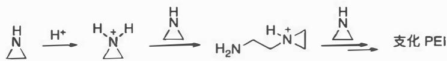

3.1 解释该方法为何不能得到线性 PEI，只能得到支化 PEI？ 

3.2 PEI与核酸分子容易形成外层PEI、内层核酸的复合物结构。该复合物可以轻松跨过细胞膜，将原本难以跨膜的核酸分子递送入细胞内。核酸和PEI形成复合物主要依靠哪种分子间作用力？ 

3.3 与支化 PEI 相比, 线性 PEI 具有更低的毒性、更高的复合物稳定性和结构可调控性。某类线性 PEI 是通过噁唑啉在酸性条件下的阳离子开环聚合得到的。画出下面反应式中 $\mathbf{A} \sim \mathbf{E}$ 的结构式, 注意需要明确画出聚合物的端基结构 (提示: A、B 以及 C 均带有正电荷)。 

# 分析与解答

这是一道典型的高分子化学题，考查同学们综合运用化学原理和有机化学知识的能力。 

3.1 本小题题干设计较为巧妙，同学们需要主动尝试继续书写多个聚合单元，并在对比中进行辨析思考。示例反应式仅给出二聚体结构，看似与环氧乙烷的开环聚合过程相似。但若继续书写至三聚体，即可发现二者的差异：醚氧原子无质子，不能再发生烷基化；而二级胺氮原子上仍有质子，可继续发生烷基化，从而生成支化 

结构。 

（此外，氮杂环丙烷C-N键中N原子的p成分高于 $75\%$ （sp3杂化），因此其孤对电子的s成分高于 $25\%$ ；亲核性弱于常规二级胺，因此聚合物中的二级胺更容易被烷基化，进一步促进分支生成。）

3.2 PEI 富含一级、二级和三级氨基，在生理 $\mathrm{pH}$ 下会质子化而带正电荷；而核酸主链上的磷酸基则带有负电荷。因此二者依靠静电相互作用形成复合物。 

有部分同学回答“氢键”，这一答案并不完全恰当。氢键通常发生在中性基之间，依靠部分电荷相互吸引，作用能量较弱（几到几十 $\mathrm{kJmol^{-1}}$ ）且方向性强（X-H…Y近似直线）。而在本题情境下，PEI氨基质子化为铵盐，核酸主链则含有磷酸根负离子，二者均带有完整的正负电荷，相互作用属于强烈的离子-离子静电吸引（几十到上百 $\mathrm{kJmol^{-1}}$ ），而非氢键。虽然复合物中可能伴随少量氢键，但并非主导作用力，因此更合适的答案应为“静电相互作用”。 

3.3 首先，噁唑啉氮原子结合质子，形成亚胺正离子 $\mathbf{A}$ 。有部分同学将产物写成含氧正离子的共振极限式 $\mathbf{A}^{\prime}$ ，这一写法虽然有一定合理性，但相较于亚胺正离子能量更高，因此不是最优答案，在评分中只给予部分分数。 

（本小题仅1分，因此在评分细则中，除“静电相互作用”外的答案均不算作正确。若设为2分，答“氢键”可酌情给部分分数。从答题策略的角度看，若同学们难以判断作用强度的相对大小，写出两类作用力并存或许更为稳妥。）

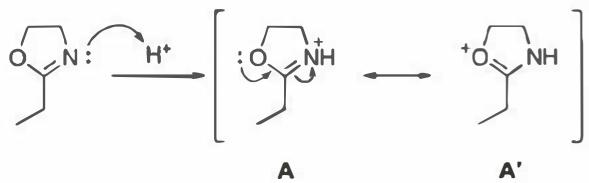

随后，A被另一分子噁唑啉亲核进攻，开环得到二聚体正离子B。此时已能明显看出PEI的主链骨架（见阴影部分）： 

（根据评分细则，若B仍写成氧正离子形式，需再次扣分。）

接着，B继续被噁唑啉亲核进攻，得到线性聚合物C： 

（笔者认为，C1与C2都是合理且稳定的中性结构，并且均可通过水解反应得到产物，均符合题目要求。）

C 被水亲核加成，得到中性的 C1，进一步开环得到酯 C2。C2 经水解得到 D（机理请同学们自己写出）： 

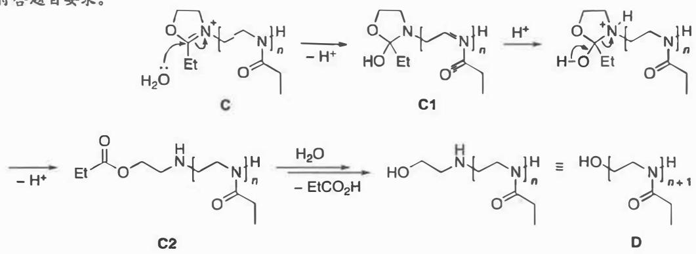

最后，D水解得到E，即线性PEI（机理请同学们自己写出）： 

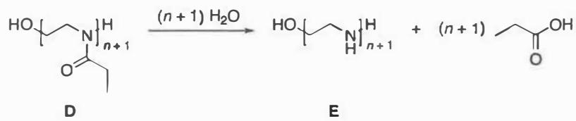

本题设计循序渐进，从聚合机理、分子间作用力到结构推演，既覆盖了基础知识点，又体现了有机化学与高分子化学的交叉。3.1小题通过与环氧乙烷开环聚合的对比，引导同学们辨析氮杂环丙烷聚合的特殊性；3.3小题要求完整推演阳离子开环聚合机理，考查了同学们的有机化学基本功。 

# 第4题 碘单质的结构与性质

# 题目（20分， $8\%$ ）

1826年，法国化学家比拉迪尼（H. de la Bellardiere）首次制得碘化钠，并以淀粉为指示剂，将其应用于次氯酸钙的滴定，开创了碘量法的研究与应用。后来，施瓦茨（Schwartz）引入硫代硫酸钠作为滴定剂。1843年，福尔多斯（Fordos）和盖利斯（Gelis）揭示了两个碘原子可定量氧化两分子硫代硫酸钠，这一反应构成了碘量法的基础。1853年，本生（Bunsen）对碘量法进行了进一步完善。此后，基于碘单质或其化合物（如KI、 $\mathrm{KIO}_3$ 等）与待测物质之间的氧化还原反应用于定量分析待测物质的含量，这种方法被称为碘量法，是一种经典且实用的化学分析方法，应用日益广泛，在多个领域发挥着重要作用。 

4.1 现有未知浓度的 KI 溶液，取 $25.00\mathrm{mL}$ 溶液，用稀 HCl 处理后，再与 $10.00\mathrm{mL} 0.05000\mathrm{mol}\mathrm{L}^{-1}$ 的 $\mathrm{KIO}_3$ 反应（步骤 A）；将所得的溶液煮沸（步骤 B）一段时间后，再加入过量的 KI 溶液反应（步骤 C）；用 $0.1008\mathrm{mol}\mathrm{L}^{-1}\mathrm{Na}_2\mathrm{S}_2\mathrm{O}_3$ 溶液滴定至终点，消耗 $21.44\mathrm{mL}$ （步骤 D）。 

4.1.1 写出实验过程中涉及的化学反应式。 

4.1.2 计算 KI 溶液的浓度（提示：此题要求有效数字）。 

4.1.3为什么不在步骤A之后直接用 $\mathrm{Na}_{2}\mathrm{SO}_{3}$ 溶液滴定？ 

4.1.4 步骤B中煮沸的是什么？ 

4.1.5 碘量法测定中专用的一种锥形瓶叫碘量瓶，在锥形瓶口上使用磨口塞子密封。观察如边栏图所示的碘量瓶，说明使用碘量瓶的好处。 

4.2碘离子可以与碘分子 $\mathrm{I}_2$ 结合生成 $\mathrm{I}_3^-$ ； $\mathrm{I}_3^-$ 继续与 $\mathrm{I}_2$ 结合生成一系列的多碘阴离子(polyiodide anion)，如 $\mathrm{I}_5^-$ 和 $\mathrm{I}_7^-$ 等。这类化合物的共同特征是含有2个以上的碘原子，且电荷数较低。它们可以被看作是碘离子与1个或多个碘分子结合形成的配合物。 

4.2.1 直线形的 $\mathrm{I}_3^-$ 是最简单的多碘阴离子。写出位于中心的碘原子杂化形式。 

4.2. $\mathbf{2I}_3^-$ 的I-I键长为 $2.91\AA$ ，而 $\mathrm{I}_2$ 的I-I键长为 $2.71\AA$ ，利用某一个典型的有机反应过渡态解释 $\mathrm{I}_3^-$ 键长变长的原因。 

4.2.3 画出 $\mathrm{I}_5^-$ 所有可能的结构式，并标出每一个碘的形式电荷。 

4.2.4 按相同方法继续加合 $\mathbf{I}_2$ ，写出 $\mathrm{I}_7^-$ 可能的异构体数目（不考虑顺反异构或构象异构）。 

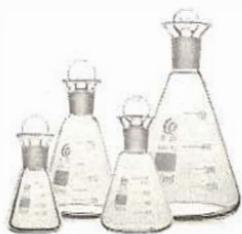

# 分析与解答

（化学是一门实验学科，仅会解化学题目是不够的。容量滴定是易于上手、毒害性较低的实验，高中化学课内也要求同学们进行实操。）

本题前半部分基于经典的氧化还原滴定——碘量法，考查方程式的书写、滴定分析的定量计算以及滴定实验过程操作中的问题；后半部分从经典价键理论的视角，考查多碘负离子的结构。整体来看，题目难度不大，但想拿高分仍需注意很多细节。 

（由于 $\mathrm{KIO}_3$ 溶液过量，完全反应后溶液中不存在 $\mathbf{I}^{-}$ 步骤A的方程式中产物碘单质不能写为 $\mathrm{I}_3^-$）

4.1 对于滴定计算题目，最关键的是要准确理解滴定过程各物种的转化关系，正确写出转化的反应方程式。根据题目信息，在酸性条件下未知浓度的KI溶液与确定浓度的 $\mathrm{KIO}_3$ 溶液反应，发生归中反应得到碘单质，反应方程式为 

$$
\mathrm {I O} _ {3} ^ {-} + 5 \mathrm {I} ^ {-} + 6 \mathrm {H} ^ {+} \longrightarrow 3 \mathrm {I} _ {2} + 3 \mathrm {H} _ {2} \mathrm {O} (\text {步 骤 A})
$$

由于滴定的目的是求出初始 $\mathrm{KI}$ 溶液的浓度，故加入的是过量的 $\mathrm{KIO}_3$ 溶液，在步骤B中通过煮沸溶液将得到的 $\mathrm{I}_2$ 全部除去后，剩余未反应的 $\mathrm{KIO}_3$ 再与过量的KI溶液反应，通过间接碘量法求出未反应的 $\mathrm{KIO}_3$ ，最终可求得初始KI溶液的浓度。故步骤C、步骤D的反应方程式为 

$$
\begin{array}{l} \mathrm {I O} _ {3} ^ {-} + 8 \mathrm {I} ^ {-} + 6 \mathrm {H} ^ {+} \longrightarrow 3 \mathrm {I} _ {3} ^ {-} + 3 \mathrm {H} _ {2} \mathrm {O} \quad (\text {步 骤 C}) \\ 2 \mathrm {S} _ {2} \mathrm {O} _ {3} ^ {2 -} + \mathrm {I} _ {3} ^ {-} \longrightarrow \mathrm {S} _ {4} \mathrm {O} _ {6} ^ {2 -} + 3 \mathrm {I} ^ {-} \quad (\text {步 骤 D}) \\ \end{array}
$$

（思考题：若步骤A反应后直接用 $\mathrm{Na}_2\mathrm{S}_2\mathrm{O}_3$ 溶液进行滴定，计算出的KI溶液浓度会偏高还是偏低？）

为什么不能在步骤A反应完成后直接将溶液中的 $\mathrm{I}_2$ 进行滴定呢？因为此时溶液中还有过量的氧化剂 $\mathrm{IO}_3^-$ ，在酸性条件下同样可以与还原剂 $\mathrm{Na}_2\mathrm{S}_2\mathrm{O}_3$ 溶液发生反应，从而向结果中引入误差。 

（注意本小题对最终结果的有效数字有要求：根据题干信息，最终结果应保留4位有效数字，而中间结果的有效数字应大于等于4位。）

写出反应方程式后，根据相关物种的计量关系，可计算KI溶液的浓度。步骤D中消耗的 $\mathrm{Na}_2\mathrm{S}_2\mathrm{O}_3$ 的物质的量为 

$$
n \left(\mathrm {N a} _ {2} \mathrm {S} _ {2} \mathrm {O} _ {3}\right) = 0. 1 0 0 8 \mathrm {m o l} \mathrm {L} ^ {- 1} \times 2 1. 4 4 \mathrm {m L} = 2. 1 6 1 2 \mathrm {m m o l}
$$

对应滴定的 $\mathrm{I}_3^-$ 的物质的量为 

$$
n \left(\mathrm {I} _ {3} ^ {-}\right) = \frac {1}{2} n \left(\mathrm {N a} _ {2} \mathrm {S} _ {2} \mathrm {O} _ {3}\right) = \frac {1}{2} \times 2. 1 6 1 2 \mathrm {m m o l} = 1. 0 8 0 6 \mathrm {m m o l}
$$

过量的 $\mathrm{KIO}_3$ 的物质的量为 

$$
n _ {\text {过}} (\mathrm {K I O} _ {3}) = \frac {1}{3} n (\mathrm {I} _ {3} ^ {-}) = \frac {1}{3} \times 1. 0 8 0 6 \mathrm {m m o l} = 0. 3 6 0 2 \mathrm {m m o l}
$$

与初始未知浓度的 KI 溶液反应的 $\mathrm{KIO}_3$ 的物质的量为 

$$
\begin{array}{l} n (\mathrm {K I O} _ {3}) = n _ {\text {总}} (\mathrm {K I O} _ {3}) - n _ {\text {过}} (\mathrm {K I O} _ {3}) \\ = 0. 0 5 0 0 0 \mathrm {m o l} \mathrm {L} ^ {- 1} \times 1 0. 0 0 \mathrm {m L} - 0. 3 6 0 2 \mathrm {m m o l} \\ = 0. 1 3 9 8 \mathrm {m m o l} \\ \end{array}
$$

故初始未知浓度的KI溶液中KI的物质的量为 

$$
n (\mathrm {K I}) = 5 n \left(\mathrm {K I O} _ {3}\right) = 5 \times 0. 1 3 9 8 \mathrm {m m o l} = 0. 6 9 9 0 \mathrm {m m o l}
$$

KI浓度为 

$$
c (\mathrm {K I}) = \frac {0 . 6 9 9 0 \mathrm {m m o l}}{2 5 . 0 0 \mathrm {m L}} = 0. 0 2 7 9 6 \mathrm {m o l} \mathrm {L} ^ {- 1}
$$

碘量瓶是一种专为减少挥发性物质损失而设计的具塞锥形瓶。由于碘单质在水中溶解度较低、容易挥发，且在酸性溶液中碘单质易被空气中的 $\mathrm{O}_2$ 氧化，从而导致定量分析的结果不准，故碘量法测定中应使用碘量瓶作为反应容器。仔细观察其结构，可以发现其瓶口呈“喇叭”状，在旋紧磨口塞后可以在瓶口加水，通过水封防止碘单质挥发、被氧化。除此之外，还可以使用棕色玻璃材质的碘量瓶，或在反应时将碘量瓶置于暗处，避免光照以延缓碘单质的氧化。 

4.2 多碘离子是一类结构丰富的物种，其中多碘负离子可看作 $\mathrm{I}^{-}$ 、 $\mathrm{I}_2$ 和 $\mathrm{I}_3^-$ 结合而成的链状结构。相对于碘原子的个数，多碘负离子的负电荷数往往较低。最稳定的多碘负离子是 $\mathrm{I}_3^-$ ，除此之外还有一价负离子 $\mathrm{I}_5^-$ 、 $\mathrm{I}_7^-$ 、 $\mathrm{I}_9^-$ 和二价负离子 $\mathrm{I}_4^{2-}$ 、 $\mathrm{I}_8^{2-}$ 、 $\mathrm{I}_{16}^{2-}$ 等。本小题考查了其中结构较简单的 $\mathrm{I}_3^-$ 、 $\mathrm{I}_5^-$ 和 $\mathrm{I}_7^-$ ，只要充分了解题目中给出的提示信息，做对并不困难。 

4.2.1在经典价键理论中，直线形的 $\mathrm{I}_3^-$ （见边栏图）是一个常见的分析模型。根据VSEPR理论，中心碘原子周围有5个价层电子对，其中包含2个与端位碘原子结合的成键电子对和3个孤对电子，故为直线形结构。根据杂化轨道理论，中心碘原子应采取sp³d杂化，3个孤对电子位于三角双锥的平面位置。 

4.2.2 对于 $\mathrm{I}_3^-$ 这种超价化合物”，即中心原子超出八隅体规则限制的主族化合物，在经典价键理论中以价层d轨道参与杂化的方式来解释其成键规律。但随着价键理论的发展，人们逐渐发现这种解释方法存在诸多缺陷。20世纪90年代，科学家将 $\mathrm{I}_3^-$ 的键合方式与有机化学中的 $\mathrm{S}_{\mathrm{N}}2$ 反应进行类比：亲核试剂从离去基团的背面进攻，电子从亲核试剂的HOMO流入C-LG键的 $\sigma^{*}$ 轨道（LUMO），反应的过渡态中亲核试剂、中心碳原子和离去基团呈线性排列，是一个三中心四电子的高能态，如下图所示。 

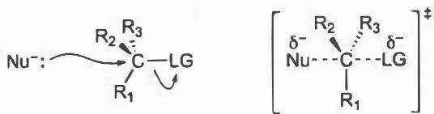

（在碘量法测定中，很多产生碘单质的反应速率并不快，反应体系需要在暗处静置一段时间。）

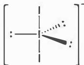

（碘原子的半餐远大于碳原子，因此可以容纳更多配体，五配位碘化合物可以稳定存在。）

将中心碳原子变为碘原子， $\mathrm{I}_3^-$ 可看作“亲核试剂” $\mathrm{I}^{-}$ 进攻 $\mathrm{I}_2$ 得到的结构，原本中心碳上连有的三个基团变为三个孤对电子，高能的“五配位”过渡态变为稳定的物种。由此便可解释题目中关于键长的数据变化：类比 $\mathrm{S}_{\mathrm{N}}2$ 反应的过程， $\mathrm{I}^{-}$ 的电子进入 $\mathrm{I}_2$ 的反键轨道中，导致 $\mathrm{I}_3^-$ 的键长比 $\mathrm{I}_2$ 的键长更长，如下图所示。 

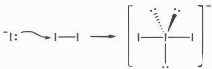

在现代分子轨道理论中， $\mathrm{I}_3^-$ 可看作电子给体 $\mathrm{I}^{-}$ 与电子受体 $\mathrm{I}_2$ 相结合得到的三中心四电子物种。在简单的配位键模型中，给受体结合的过程仅涉及2个电子，电子从能量高的给体HOMO进入能量低的受体LUMO；而在 $\mathrm{I}_3^-$ 中，受体 $\mathrm{I}_2$ 还存在对称性匹配、能量相近的已占轨道，是三条前线轨道的相互作用。 $\mathrm{I}_3^-$ 的分子轨道示意图如下图所示，其中实线部分展示了 $\mathrm{I}_2$ 的最高已占 $\sigma$ 轨道、最低未占 $\sigma^*$ 轨道和 $\mathrm{I}^{-}$ 的 $\mathfrak{p}_{z}$ 轨道作为三条前线轨道的线性组合过程（定义 $z$ 方向为分子 $C_{\infty}$ 轴方向）。 

（同学们可以查阅相关资料，了解现代分子轨道理论是如何处理其他超价化合物（如 $\mathrm{PF}_5$ 、 $\mathrm{SF}_6$ 等）的成键过程的。）

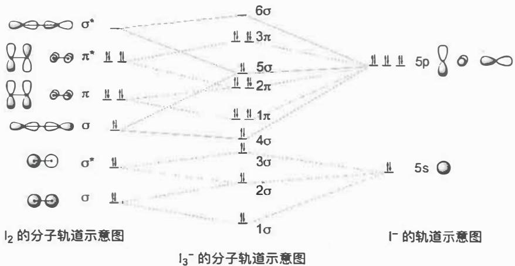

其中三中心四电子的核心 $\sigma$ 轨道组 $4\sigma$ 、 $5\sigma$ 和 $6\sigma$ 如下图所示。由于 $5\sigma$ 轨道的能量与 $\mathrm{I}^{-}$ 的 $\mathfrak{p}_z$ 轨道相差不大，故在简化的模型中也可以认为 $5\sigma$ 轨道属于非键轨道： 

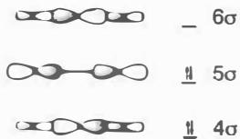

4.2.3 由于题目中要求标明碘原子的形式电荷，故仍是以经典价键 

理论的视角来处理多碘负离子的结构。 $\mathrm{I}_3^-$ 中端基的两个碘原子形式电荷为0，中心碘原子形式电荷为-1，其Lewis结构式为 

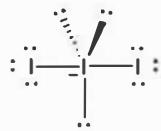

（形式电荷的计算方法：  形式电荷 $=$ 价电子数一孤电子数一成键电子数/2）

$\mathrm{I}_5^-$ 可视为 $\mathrm{I}_3^-$ 进攻 $\mathrm{I}_2$ 得到的结构，而在 $\mathrm{I}_3^-$ 中存在端基碘原子的孤对电子和中心碘原子的孤对电子两个进攻位点，故 $\mathrm{I}_5^-$ 存在两种可能的结构（V构型与T构型）： 

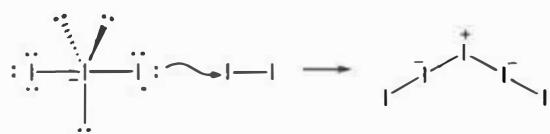

（根据杂化轨道理论，思考两种 $\mathrm{I}_5^-$ 结构中的碘原子属于什么杂化方式。）

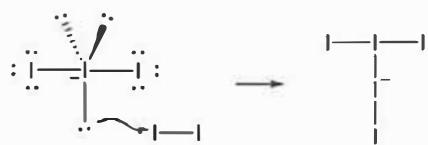

4.2.4 同理， $\mathrm{I}_7^-$ 可视为 $\mathrm{I}_5^-$ 进攻 $\mathrm{I}_2$ 得到的结构。由于在 4.2.3 小问中我们得到了两种 $\mathrm{I}_5^-$ 的可能结构，故需进行分类讨论。 

对于第一种V构型的 $\mathrm{I}_5^-$ ，其中存在3个孤对电子进攻位点，可得到A、B、C三种 $\mathrm{I}_7^-$ ： 

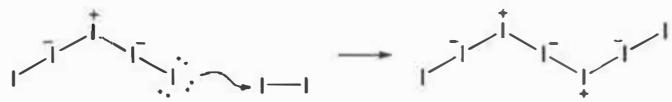

A

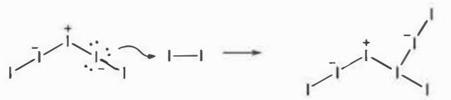

B

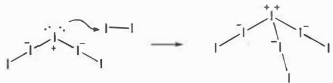

C

对于第二种T构型的 $\mathrm{I}_5^-$ ，其中存在4个孤对电子进攻位点，可得到D、E、F、G四种 $\mathrm{I}_7^-$ ： 

（根据杂化轨道理论，思考六种 $\mathrm{I}_7^-$ 结构中的碘原子属于什么杂化方式。）

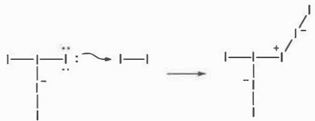

D

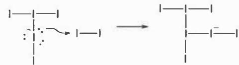

F

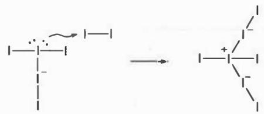

E

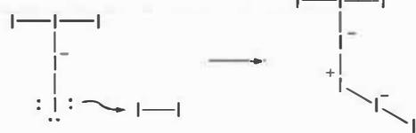

G

容易发现，结构B与D是等同的，故最终得到6种可能的 $\mathbf{I}_7^-$ 结构。 

# 知识拓展

多碘离子(polyiodides)因其多样的结构和应用而受到广泛关注。1933年首次报道了完整的 $\mathrm{I}_3^-$ 结构；迄今为止，科学家们已经对大量的多碘离子进行了结构表征，其中主要是多碘负离子（从 $\mathrm{I}_3^-$ 到 $\mathrm{I}_{29}^{3-}$ ）。多碘负离子结构的多样性源于碘原子通过给体-受体相互作用进行链合的能力，其中Lewis酸受体 $\mathbf{I}_2$ 和Lewis碱给体 $\mathrm{I}^{-}$ 或 $\mathrm{I}_3^-$ 是构建多碘负离子的基本砌块。多碘负离子具有超价(hypervalent）特性，许多大型的多碘负离子结构（实际上只有 $\mathrm{I}_3^-$ 能勉强用经典价键理论解释）无法用简单的共价键模型解释：目前已知的 $\mathrm{I}_5^-$ 结构只有V构型； $\mathrm{I}_7^-$ 结构只有C,若从经典价键理论来判断，结构C反而应是最不稳定的，因为它的中心碘原子带有 $+2$ 形式电荷。 

在诸多的多碘负离子中，只有 $\mathrm{I}_3^-$ 是在水溶液中热力学稳定的： 

$$
\mathrm {I} ^ {-} + \mathrm {I} _ {2} \longrightarrow \mathrm {I} _ {3} ^ {-} \quad K (2 9 8 \mathrm {K}) = 7 2 3
$$

其他离子可在非水溶剂或固相中提高稳定性；同时，抗衡阳离子的大小、形状、电荷和对称性对多碘负离子的稳定性有显著影响，具有高对称性的大阳离子可以用来获得体积大且热稳定的多碘离子。这些特性已被合理化应用于多碘负离子的模板合成、分子和晶体工程中。如今，多碘负离子在混价（mixed-valence）给体-受体材料、共轭聚合物的掺杂、锌-碘液流电池等领域有重要的应用。 

# 第5题 Xe化合物的结构

# 题目（18分， $8\%$ ）

惰性气体在特定条件下可以形成各种化学键，其中以 $\mathrm{Xe}$ 形成的化合物最为常见。提示：本题投影图均为一个晶胞，不含晶胞外的原子。 

5.1 $\mathrm{XeF}_x$ 是较早被发现的一类惰性气体化合物，三种 $\mathrm{XeF}_x$ （A、B和C）的晶胞结构如下图所示，其中大球为 $\mathrm{Xe}$ ，小球为 $\mathrm{F}$ 。写出三种晶体的化学组成。 

A

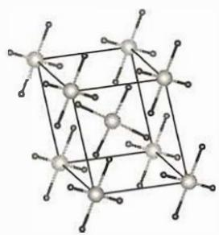

B

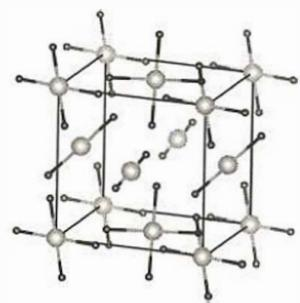

C

5.2 $\mathrm{XeO}_x$ 化合物具有较强的稳定性，且具有重要的实用价值。下图给出了三种 $\mathrm{XeO}_x$ 晶体（A、B和C）沿不同方向的投影图，其中浅色大球为 $\mathrm{Xe}$ ，深色小球为 $\mathrm{O}$ 。 

5.2.1 判断这三个化合物中哪一个 $\mathrm{XeO}_x$ 化合物中 $\mathrm{Xe}$ 的化合价最高，并写出其所属晶系。 

5.2.2 写出化合物A的组成。 

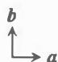

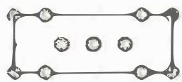

A

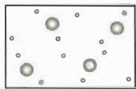

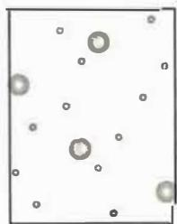

B

C

5.3 大气中 Xe 的含量远远低于其他惰性气体。据估计，地球上约 $99\%$ 的初生 Xe 气神奇消失了，人们提出了很多假说。最近的研究发现，Xe 可以被地幔中一种新发现的 $\mathrm{Fe}_x\mathrm{O}_y$ 化合物吸收，形成了更为稳定的复合物。 

5.3.1 该 $\mathrm{Fe}_x\mathrm{O}_y$ 化合物由共顶点的 $\mathrm{FeO}_6$ 八面体构成，属于简单立方晶系，沿（001）方向的投影如图A所示，写出其组成。 

5.3.2 $\mathrm{Fe}_x\mathrm{O}_y$ 吸附Xe后，晶体转变为菱心六方晶格，其中代表性化合物有B和C。在这两种化合物的晶格中，Xe吸附在 $\mathrm{Fe}_x\mathrm{O}_y$ 的层间或孔道中，其沿不同方向的投影图分别如图B和C所示。分别确定化合物B和C中，每摩尔 $\mathrm{Fe}_x\mathrm{O}_y$ 吸附的Xe的摩尔数。 

A

B

图例

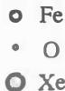

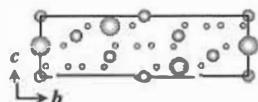

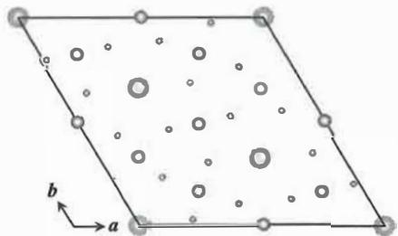

C

# 分析与解答

本题是一道颇具难度的晶体结构题，重点考查了对晶胞投影图的理解，需要同学们具有较好的空间想象能力，结合晶体的晶系与对称性的相关知识，以类似工程学中“三视图”的方式搭建晶胞的立体结构。同时本题也涉及了相当复杂的晶胞，同学们若能聚焦关键问题并放弃与解题无关的部分结构，能更快更准地解答本题。 

5.1 本小题难度不大，只需正确解读晶胞中分子的结构，结合分子所在的位置进行计数即可。题目给出的三种结构均为典型的分子晶体，原子不跨晶胞形成多聚结构，依据位置（顶点、棱心、面心、内部）计数： 

（考虑到C的晶胞中包含两种不同的分子，故化学组成写为 $\mathrm{XeF_2\cdot XeF_4}$ 亦可。）

A 为 $\mathrm{XeF}_2$ ，晶胞中包含 2 个 $\mathrm{XeF}_2$ 分子； 

B 为 $\mathrm{XeF_4}$ ，晶胞中包含2个 $\mathrm{XeF_4}$ 分子； 

C 为 $\mathrm{XeF}_3$ ，晶胞中包含2个 $\mathrm{XeF}_4$ 和2个 $\mathrm{XeF}_2$ 分子。 

5.2本小题难度很大，在仔细分析三种氙氧化物的晶胞投影图时，需格外关注原子与边框线的遮挡关系：顶点处的原子，若处于边框线前方，则该原子位于晶胞顶点；若处于边框线后方，则位于棱边上。边框线处的原子，若处于边框线前方，则位于对应棱边上；若处于边框线后方，则位于棱边方向与投影方向构成的晶胞面上。此外，本小题还要求同学们对晶体的晶系进行归属。原则上，晶体的晶系由其具有的特征对称元素决定，但依据晶胞参数可以初步判断晶系。晶胞参数通常是基于晶体衍射数据的指标化获得，因此可以参照晶胞参数及衍射峰给出的综合信息来初步判断晶系、点阵型式和空间群，在大多数情况下也是正确的。 

化合物A：虽然题目并未给出晶胞参数的具体取值，但由图可知 $\alpha = \beta = \gamma = 90^{\circ}$ ，且 $a\neq b\neq c$ 。为便于分析，我们先将晶胞的基本形状大致勾勒如下： 

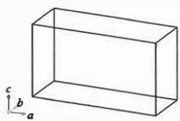

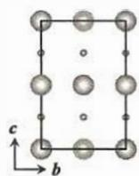

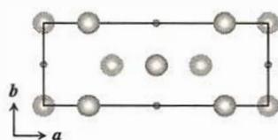

第一步，确定O原子在晶胞中的位置：在 $c$ 方向投影图（简写为 $c$ 投影图，下同）中可见两种O原子，它们均处于边框线后方，因此均不在棱边上，而在面上。 

- 第一种O原子在晶胞 $bc$ 面上， $a = 0,b = 0.5$ 

- 第二种O原子在晶胞 $ac$ 面上， $a = 0.5, b = 0$ 。 

结合 $\mathbf{a}$ 投影图,可以确定: 

- 第一种O原子的坐标为 $(0,0.5,0.25)$ 和 $(0,0.5,0.75)$ ; 

- 第二种O原子的坐标为 $(0.5,0,0.25)$ 和 $(0.5,0,0.75)$ 。 

将O原子放入晶胞立体图中，得到 

（原子与边框线的遮挡关系是很有用的，但是实际考试时黑白打印的试卷不一定能很好体现遮挡关系。同学们也可尝试不采用遮挡关系的视角，思考如何将本题解决。）

（这里原子坐标的取值是根据投影图中原子位置进行的假设。事实上具体的位置坐标是多少不影响晶胞中原子的计数。）

第二步，确定Xe原子在晶胞中的位置：在 $\pmb{a}$ 投影图中，Xe原子沿 $c$ 方向分为两层。第一层 $(c = 0)$ 包含两种Xe原子： 

（晶胞的顶点可以不存在粒子，只要满足正当晶胞的要求，选取的位置是任意的。）

- 第一种：位于投影图顶点处、边框线后方，说明其在晶胞中位于 $a$ 棱上，与 $c$ 投影图中 $a$ 边框线前方的 Xe 原子对应； 

- 第二种：位于 $b$ 边框线后方，说明其位于 $ab$ 面上， $b = 0.5$ ，对应 $c$ 投影图的内部 Xe 原子之一，但目前无法确认是哪个 Xe。第二层 $(c = 0.5)$ 也包含两种 Xe 原子： 

- 第一种：位于 $c$ 边框线前方，故位于 $c$ 方向棱心 $(0,0,1/2)$ ，对应 $c$ 投影图顶点处、边框线后方的 Xe； 

- 第二种：位于投影图中心， $b = 0.5$ ，也对应 $c$ 投影图中内部 $\mathrm{Xe}$ 原子之一，同样无法确认是哪个 $\mathrm{Xe}$ 。 

综上，有部分Xe原子在c投影图中存在重合，无法仅通过二维投影图作出唯一定位，因此只能先将位置明确的Xe填入晶胞，得到如下示意图： 

第三步，构建化学上合理的晶胞模型：由于Xe原子半径大，不可能在同一层中容纳三个未定位的Xe，需要将它们错层分布。下面给出其中一种晶胞的示意图： 

（根据晶胞图，给出 $\mathrm{Xe}_3\mathrm{O}_2$ 晶体的空间点阵型式。（答案：体心正交 $oI$ ））

（根据题中投影图，画出其他符合正交晶系对称性的晶胞。这些变体从化学直觉上讲，有哪些不足？对相关原子的计数以及题目答案是否有影响？）

（请同学们复习各晶系所要求的特征对称元素，格外注意其中“对称轴和旋转轴”“对称面和镜面”之间的区别。）

确定所有原子的位置后，可以看出，由于 $a \neq b \neq c$ ，晶体中不存在四重对称轴，但存在相互垂直的镜面（或3条相互垂直的二重旋转轴），故晶体属于正交晶系。 

第四步，确定化学计量数与 $\mathrm{Xe}$ 的氧化数：由晶胞图可数得 $\mathrm{Xe}$ 有6个，O有4个，A的化学式为 $\mathrm{Xe}_3\mathrm{O}_2$ ，Xe的表观氧化数为 $+4 / 3$ 。需要注意，三种 $\mathrm{Xe}$ 的化学环境不同： 

- 两种 $\mathrm{Xe}$ 与 $\mathrm{O}$ 键合，形成沿 $b$ 方向伸展的一维链 $(\mathrm{Xe}^{\mathrm{IV}}\mathrm{O}_{2})$ 

- 另一种 Xe 处于链间的孤立位置 $(\mathrm{Xe}^{0})$ 。 

因此更准确的写法是： $\mathrm{Xe}_2^0\mathrm{Xe}^{\mathrm{IV}}\mathrm{O}_2$ 

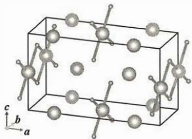

化合物B：相比于A，化合物B中原子的排布更加无规、不对称，但正因如此，计数过程反而更直接。 

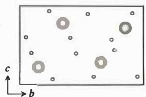

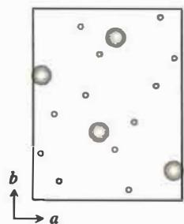

观察 $a$ 与 $c$ 两个方向的投影图可见：任意两个 $\mathrm{Xe}$ 原子的连线均不平行于边框线，说明 $\mathrm{Xe}$ 之间无遮挡，且均处于晶胞内部；同理，任意两个O原子连线均不平行于边框线。故晶胞中存在4个 $\mathrm{Xe}$ 原子与12个O原子，B的化学式为 $\mathrm{XeO_3}$ ， $\mathrm{Xe}$ 的氧化数为 $+6$ 。依照投影图信息，可用软件搭建出整个晶胞的三维结构，如下图所示： 

（根据晶胞图，给出B的空间点阵型式。）

（答案：简单正交 $oP$ ） 

（B其实是 $\mathrm{XeO_3}$ 分子晶体。 $\mathrm{XeO_3}$ 分子的立体构型是什么？分子中存在哪些对称元素？分子与晶体的对称性是否必然一致？）

接下来，判断B所属的晶系：由投影图知 $\alpha = \beta = \gamma = 90^{\circ}$ 且 $b$ 方向晶胞边长明显长于 $\pmb{a}$ 和 $c$ 方向；但 $\pmb{a}$ 与 $c$ 是否等长难以直观判断。若晶体属于四方晶系，则必须满足 $a = c$ ，且沿 $b$ 方向应具有四重对称轴（旋转轴、反轴或螺旋轴）。从晶胞的 $b$ 投影图可看出：沿 $b$ 方向不存在四重旋转轴、反轴或螺旋轴，故 $\mathrm{XeO_3}$ 晶体属于正交晶系。 

（感兴趣的同学可在 $a, b$ 和 $c$ 三个方向上寻找相互垂直的3条 $2_{1}$ 螺旋轴，进一步加深晶系与特征对称元素的理解。）

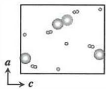

化合物C：与B一样，C中所有原子均位于晶胞内部，这一特征使计数与后续确定分子式的过程显著简化。 

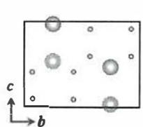

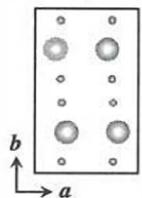

若不存在投影重合，则晶胞中含有4个Xe原子、8个O原子，化学式为 $\mathrm{XeO_2}$ ，Xe为 $+2$ 价。利用软件可以搭建晶胞的三维结构，如下图所示： 

据文献中数据，四个Xe原子的坐标分别为 

Xe1: (0.6964, 0.7500, 0.4651) Xe2: (0.1964, 0.7500, 0.0349) 

Xe3: (0.3036, 0.2500, 0.5349) Xe4: (0.8036, 0.2500, 0.9651) 

假设存在投影重合的情况，比如在坐标 $(0.8036, 0.2500, 0.5349)$ 处存在一Xe原子，与Xe3和Xe4发生投影重合，则仅凭投影图无法完全排除这个Xe原子的存在。但此时Xe原子间距离过短，与Xe的原子半径和常规键合特征不符，因此可以排除重合的可能，原子计数结果可靠。同理，O原子在投影图中也不会存在重合的情况——若有重合，则间距过小，只能以过氧或超氧根离子的形式存在。 

（同学们可在晶胞中寻找如下的对称元素：镜面与滑移面（a轴滑移面和对角滑移面）；并思考这些对称元素的位置是否符合正交晶系的要求。）

根据投影图与推得的几何关系，可知 $a \neq b \neq c$ ， $\alpha = \beta = \gamma = 90^{\circ}$ ，晶胞中不存在四重对称轴，故晶体不属于四方晶系，而属于正交晶系。 

综上所述：5.2.1小问，化合价最高的是化合物B $(\mathrm{XeO}_3)$ ，Xe为 $+6$ 价，属于正交晶系；5.2.2小问，化合物A的组成是 $\mathrm{Xe}_{3}\mathrm{O}_{2}$ 。5.3本小题难度也较高，需从投影图还原 $\mathrm{Fe}_x\mathrm{O}_y$ 的三维结构，并在此基础上分析其吸附Xe后转变为 $R$ 心六方 $(hR)$ 点阵的原子占位 

特征。关键在于正确判断 $\mathrm{FeO}_6$ 八面体的连接方式与原子计数规则，从而确定吸附前后的化学计量关系。 

5.3.1 本小问给出了 $\mathrm{Fe}_x\mathrm{O}_y$ 沿（001）方向（即 $c$ 方向）的投影图。晶体属于立方晶系，结合投影图中Fe原子与边框线的遮挡关系，容易得出Fe处于顶点和面心位置，晶胞中共有4个Fe原子。这种分布也是我们非常熟悉的、由立方最密堆积形成的面心立方晶胞，如下图所示： 

而填充O原子后，得到的 $\mathrm{Fe}_x\mathrm{O}_y$ 晶体对称性下降，为简单立方点阵型式。本题的难点在于通过题目信息，判断O原子在晶胞中的位置，再结合多面体的连接方式，得到Fe和O原子的比例。由于晶胞的体心位置没有Fe原子，而顶点和面心位置的Fe原子形成的 $[\mathrm{FeO}_6]$ 八面体并未全部处于晶胞中，观察难度较大，故将晶胞沿 $a$ 或 $b$ 方向平移1/2单位长度，使位于面心的Fe移到体心位置，这里以平移 $(1 / 2)b$ 为例： 

（严格来说，简单立方 $cP$ 是点阵型式，是晶族与带心型式的描述，不能称为“简单立方晶系”。）

（平移后，投影图中原子的相对位置不变。）

体心Fe原子所在的 $\mathrm{[FeO_6]}$ 八面体应处于晶胞内。在投影图中，与体心Fe原子相距最近的6个O原子可恰好构成八面体。如下图所示： 

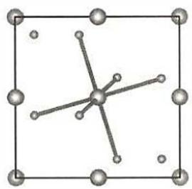

结合晶体的平移对称性及八面体在投影图中的位置，其他位置的Fe原子形成的 $\mathrm{[FeO_6]}$ 八面体亦可画出，如下图所示（仅体现其中三个Fe原子的 $\mathrm{[FeO_6]}$ 八面体）： 

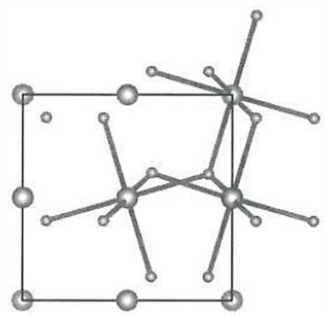

可以发现， $\left[\mathrm{FeO}_{6}\right]$ 八面体之间共顶点相连，满足题意；每个O原子被3个 $\left[\mathrm{FeO}_{6}\right]$ 八面体共享，配位数为3。根据Pauling离子晶体配位多面体规则：正、负离子的化学计量数之比与配位数之比成反比， $6 / 3 = 2$ ，故晶体A的化学式为 $\mathrm{FeO}_{2}$ 。完整的晶胞图（Fe原子位于体心和棱心，与题中投影图不同）及多面体在晶胞中的分布如下： 

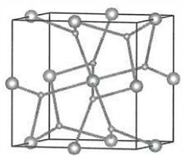

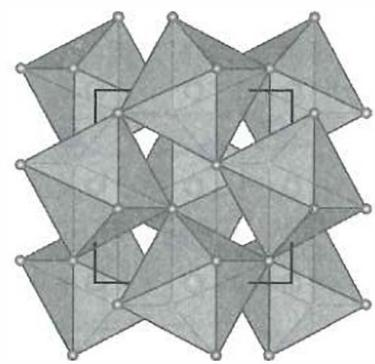

（实际上， $\mathrm{FeO_2}$ 与立方黄铁矿 $\mathrm{FeS_2}$ 结构相同。O原子的配位数是4而非3，这是因为氧元素以 $\mathrm{O}_{2}^{2 - }$ 形式存在，除与3个 $\mathrm{Fe}^{2 + }$ 相连以外，还键连另外的一个O原子。思考题：为何晶体属于简单立方 $cP$ 点阵型式？）

本小问难度较大，需要同学们熟练掌握立方晶系的对称性及投影图，同时对空间想象能力也有较高要求。 

思考题：请结合立方晶系的特征对称元素，寻找晶胞中存在的所有对称元素及其位置（提示：存在三重反轴和 $a / b / c$ 轴滑移面），分析晶胞中 $[\mathrm{FeO}_6]$ 八面体的取向如何满足三重对称性。 

思考题：若其中一个O原子的坐标为(0.115,0.115,0.115)，给出其他O原子的坐标；已知晶胞参数 $a = 4.36\AA$ ，计算O-O键长。 

5.3.2 吸附 $\mathrm{Xe}$ 后， $\mathrm{FeO}_2$ 的立方点阵结构转变为具有 $R$ 心六方（ $hR$ ）点阵结构的 B 和 C。化合物 B 的结构相对规则，可视为典型的密堆积骨架 + 填隙原子模型，因此计数方式相对清晰。 

先来看Fe原子：从投影图可以看出，Fe原子占据以下两种位置。 

- 晶胞顶点位置。按照…ABC…的方式进行立方最密堆积，晶胞中含有3个Fe原子。 

- 两个 $R$ 心位置。坐标分别为 $(2/3,1/3,1/3)$ 和 $(1/3,2/3,2/3)$ 。 

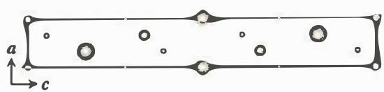

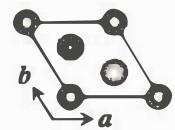

（“菱心”“菱面体”是旧文献使用的描述方法，分别指代“R心”“ $a = b =$ $c,\alpha \neq \beta \neq \gamma \neq 90^{\circ}$ 。现在菱心六方点阵统一表示为 $R$ 心六方 $(hR)$ ，属于三方晶系。）

（思考题：后两个 $X_e$ 的 $c$ 方向坐标是如何确定的？）

再来看 Xe 原子：晶胞有 3 个 Xe 原子，分别位于 c 棱心、(1/3, 2/3, 1/6) 和 (2/3, 1/3, 5/6) 三个位置。故化合物 B 的分子式为 $\mathrm{Xe}_3\mathrm{Fe}_3\mathrm{O}_6 = \mathrm{XeFeO}_2$ ，即每摩尔 $\mathrm{FeO}_2$ 吸附 $1\mathrm{mol}$ 的 $\mathrm{Xe}$ 。 

最后来搭建晶胞的三维结构： 

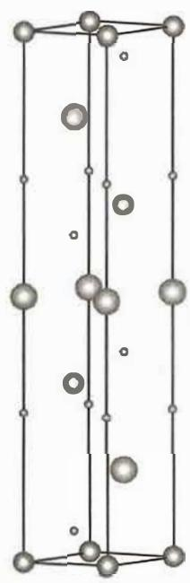

（根据晶胞示意图：

对晶胞中O原子进行计数，检查是否符合 $\mathrm{FeO_2}$ 的计量比； 

寻找其中的对称元素，判断其所属晶系。 

（答案：存在三重反轴、3螺旋轴、镜面，但镜而不与三重轴垂直，故不存在六重对称轴，属于三方晶系，空间群 $R\bar{3} m$ ））

相比于B，化合物C的结构更为复杂。但我们知道，晶胞中的Fe和O两种原子的计量比恒为 $1:2$ ，因此无须对O原子进行计数，只需搞清Xe和Fe的原子个数比即可。 

先来看Fe原子个数：以 $\pmb{a}$ 投影图为基准，结合 $c$ 投影图对其中的Fe原子逐一进行定位。 

- 顶点 Fe: 位于 a 投影图晶胞顶点、边框线后方, 说明其在 a 棱上。结合 c 投影图, 可知其坐标为 $(1 / 2,0,0)$ 。 

- $b$ 方向棱心 Fe: 位于 $a$ 投影图 $b$ 边框线中心前方, 结合 $c$ 投影图, 可知其坐标为 $(0,1 / 2,0)$ 。 

- 内部 Fe: 这是本题的重点。 

（1） $a$ 投影图显示内部Fe呈现：①沿 $\pmb{c}$ 方向分为两层，每层2个Fe；②沿 $\textit{\textbf{b}}$ 方向分为四层，每层1个Fe。 

（2）而 $c$ 投影图进一步告诉我们：沿 $b$ 方向Fe原子分为四层，在第1、4层中分别有2个Fe原子，它们在 $\pmb{a}$ 方向上投影重合。故内部的Fe原子有6个。 

- 面心 Fe：检查发现，只有 $c$ 投影图中心的 Fe 原子尚未被定位，结合 $a$ 投影图，可确定其位于 $ab$ 面心位置。 

故晶胞中共有 $1 + 1 + 6 + 1 = 9$ 个Fe原子。 

再来看 Xe 原子个数： 

- $c$ 方向棱心 Xe: $a$ 投影图中, Xe 原子位于 $c$ 棱心、边框线前方, 对应 $c$ 投影图中的顶点、边框线后方, 可知其位于 $c$ 棱心, 坐标为 $(0, 0, 1/2)$ 。 

- 内部 Xe: $a$ 投影图中，还有 2 个 Xe 原子位于晶胞内部，对应 $c$ 投影图晶胞内部的 Xe。 

故晶胞中共有 $1 + 2 = 3$ 个Xe原子，C的化学式为 $\mathrm{XeFe_3O_6}$ ，即每摩尔 $\mathrm{FeO}_2$ 吸附 $1 / 3\mathrm{mol}\mathrm{Xe}$ 。完整的晶胞三维结构如下所示： 

（根据晶胞示意图，寻找其中的对称元素，判断其所属晶系。）

（（答案：存在三重反轴、3螺旋轴，但不存在六重对称轴，属于三方晶系，空间群R3））

# 第6题 储氢技术

# 题目（33分， $15\%$ ）

利用绿氢替代化石燃料实现工业、发电、交通等高排放领域深度脱碳是我国实现2030年碳达峰、2060年碳中和的“双碳目标”核心支撑路径之一。氢的高效存储是当前氢能产业面临的重大挑战。本题探讨几种储氢方法与体积储氢密度的关系。 

6.1高压储氢：压缩氢气是目前最常用的储氢方法之一。氢气被存储在压力维持在 $350\sim 700$ bar的容器中，高压下氢气行为偏离理想气体，更适合用vanderWaals（范德华）方程 

$$
\left(p + \frac {a}{V _ {\mathrm {m}} ^ {2}}\right) (V _ {\mathrm {m}} - b) = R T
$$

描述，其中 $V_{\mathrm{m}}$ 为气体的摩尔体积， $p$ 为气体压强。对 $\mathrm{H}_{2}$ 而言，方程中的 $a = 0.02476 \, \mathrm{J} \, \mathrm{mol}^{-2}, b = 2.661 \times 10^{-5} \, \mathrm{mol}^{-1}$ （提示：此小题要求有效数字）。 

6.1.1 293K下，要达到 $20.0\mathrm{kg}\mathrm{m}^{-3}$ 的储氢密度，所需的压力为多少bar？ 

6.1.2 $293\mathrm{K}$ 下，要想将储氢密度由 $20.0\mathrm{kgm}^{-3}$ 提高至 $40.0\mathrm{kgm}^{-3}$ ，所需压力（ ）： 

(a) 为原来的2倍 

(b) 低于原来的2倍 

(c) 高于原来的 2 倍 

(d) 无法确定 

6.1.3 工业上储氢罐的压强很少高于 700 bar，简要分析其原因。 

6.2 液相储氢： $\mathrm{H}_{2}$ 经液化后可在 $1 \sim 4$ bar 的压力下稳定存储，但系统需维持极低温度。已知氢气的三相点为（ $7.041 \mathrm{kPa}, -259.35^{\circ} \mathrm{C}$ ），临界点为（ $12.86 \mathrm{bar}, -240.21^{\circ} \mathrm{C}$ ）。 

6.2.1 可能观察到液态氢的温度有（ ）： 

(a) $16\mathrm{K}$ 

(b) $25\mathrm{K}$ 

(c) $77\mathrm{K}$ 

(d) $293\mathrm{K}$ 

6.2.2 计算 $\mathrm{H}_{2}$ 在 $27.15 \mathrm{~K}$ 液化所需的压力，并说明计算过程采取了哪些近似。 

6.2.3 若液氢的状态也可以近似用 van der Waals 方程描述，计算液氢密度的上限（单位： $\mathrm{kg}\, \mathrm{m}^{-3}$ ）。 

6.3 有机液态储氢：有机液态储氢载体 (LOHCs) 具有高安全、易运输的优点。N-乙基咔唑 (NEC) 及其全氢化产物 12H-NEC 之间可以可逆转变，是极具应用前景的 LOHC 体系。 

6.3.1 12H-NEC的式量为207.36，其密度 $\rho$ （单位： $\mathrm{gcm}^{-3}$ ）同温度 $T$ （单位：K）的关系为 

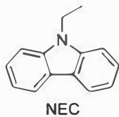

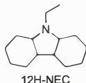

$$
\rho = 1. 1 4 8 2 3 2 9 - 0. 0 0 0 7 0 9 2 T
$$

计算 $293.0\mathrm{K}$ 时12H-NEC的储氢密度为多少 $\mathrm{kgm}^{-3}$ 。 

6. 3.12H-NEC脱氢时，会生成8H-NEC（产物1）和4H-NEC（产物2）两种中间产物，分别是NEC加上8个和4个氢原子的化合物。分别画出产物1和产物2的结构，不要求立体化学。 

6. 3.123H-NEC存在多少种立体异构体（包含对映异构体）？ 

6. 3. 4 已知 $12 \mathrm{H}-\mathrm{NEC}$ 脱氢是较强的吸热反应，画出脱氢温度最低的异构体结构。 

6. 4 多孔吸附储氢材料 MOF-5 的比表面积高达数千平方米每克，可以通过表面吸附储氢。若氢气在 MOF-5 表面的吸附过程， $\Delta H_{\mathrm{ads}} = -5.20 \, \mathrm{kJ} \, \mathrm{mol}^{-1}$ ， $\Delta S_{\mathrm{ads}} = -80.3 \, \mathrm{J} \, \mathrm{mol}^{-1} \, \mathrm{K}^{-1}$ ，均视为同温度无关。表面吸附量 $\Gamma$ 与 $\mathrm{H}_{2}$ 压力 $p$ 服从 Langmuir 吸附等温式： 

$$
\frac {\Gamma}{\Gamma_ {\infty}} = \frac {K p}{1 + K p}
$$

其中 $K$ 为表面吸附反应的平衡常数， $\Gamma_{\infty}$ 为常数。 

6. 4.MOF-5的密度为 $0.30\mathrm{gcm}^{-3}$ （包含结构中的孔），在77K，100 bar下MOF-5可以吸附 $7.5\mathrm{wt}\%$ 的氢气，计算77K下MOF-5通过表面吸附能够达到的最大储氢密度（单位： $\mathrm{kgm}^{-3}$ ）。 

6. 4. 2除表面吸附MOF-5的孔中还可以存储 $\mathrm{H}_{2}$ ，MOF-5的比孔容为 $1.27\mathrm{cm}^3\mathrm{g}^{-1}$ 。向一个 $1.00\mathrm{L}$ 的储氢罐中装填满MOF-5材料后，计算 $77\mathrm{K}$ ，100 bar下其储氢量为未装填MOF-5材料的多少倍。假设MOF-5表面吸附 $\mathrm{H}_{2}$ 后其孔体积不变，孔中的 $\mathrm{H}_{2}$ 符合 van der Waals方程，在 $77\mathrm{K}$ ，100 bar下的 $V_{\mathrm{m}} = 6.853\times 10^{-5}\mathrm{m}^{3}\mathrm{mol}^{-1}$ 。 

# 分析与解答

# 6. 1 高压储氢

6. 1. 1 首先体积储氢密度 $\rho$ 和摩尔质量 $M$ 计算该条件下氢气的摩尔体积 $V_{\mathrm{m}}$ （多保留一位有效数字）： 

$$
V _ {\mathrm {m}} = \frac {M}{\rho} = \frac {2 . 0 1 6 \times 1 0 ^ {- 3}}{2 0 . 0} = 1. 0 0 8 \times 1 0 ^ {- 4} (\mathrm {m} ^ {3} \mathrm {m o l} ^ {- 1})
$$

代人 vander Waals 方程： 

（注意：本小题要求修约有效数字。分步计算时可多保留一位，以确保准确，最终结果再修约至所需位数。）

$$
\begin{array}{l} p = \frac {R T}{V _ {\mathrm {m}} - b} - \frac {a}{V _ {\mathrm {m}} ^ {2}} = \frac {8 . 3 1 4 \times 2 9 3}{1 . 0 0 8 \times 1 0 ^ {- 4} - 2 . 6 6 1 \times 1 0 ^ {- 5}} - \frac {0 . 0 2 4 7 6}{(1 . 0 0 8 \times 1 0 ^ {- 4}) ^ {2}} \\ = 3. 0 4 \times 1 0 ^ {7} (\mathrm {P a}) = 3. 0 4 \times 1 0 ^ {2} (\mathrm {b a r}) \\ \end{array}
$$

6.1.2 目标密度 $\rho$ 提高为原先的 2 倍，摩尔体积 $V_{\mathrm{m}}$ 降低为原先的 $1 / 2$ 。代入 van der Waals 方程： 

$$
\begin{array}{l} p = \frac {R T}{V _ {\mathrm {m}} - b} - \frac {a}{V _ {\mathrm {m}} ^ {2}} = \frac {8 . 3 1 4 \times 2 9 3}{(1 . 0 0 8 \times 1 0 ^ {- 4}) / 2 - 2 . 6 6 1 \times 1 0 ^ {- 5}} - \frac {0 . 0 2 4 7 6}{[ (1 . 0 0 8 \times 1 0 ^ {- 4}) / 2 ] ^ {2}} \\ = 9. 2 7 \times 1 0 ^ {7} (\mathrm {P a}) = 9. 2 7 \times 1 0 ^ {2} (\mathrm {b a r}) \\ \end{array}
$$

与6.1.1相比， $927 / 304\approx 3.05$ ，大于2倍。故答案为：(c)高于原来的2倍。 

从数学上看，vanderWaals方程 

$$
p = \frac {R T}{V _ {\mathrm {m}} - b} - \frac {a}{V _ {\mathrm {m}} ^ {2}}
$$

当摩尔体积 $V_{\mathrm{m}}$ 减半时，分母 $V_{\mathrm{m}} - b$ 的变化并非线性，且随着 $V_{\mathrm{m}}$ 接近常数 $b$ ， $(RT) / (V_{\mathrm{m}} - b)$ 项会急剧增大，导致整体压力对体积（或密度）的变化呈强非线性。 

从物理角度看，在较低压力下，氢气分子间相互作用较弱，密度与压力近似成正比；但在高压下，分子间的排斥作用急剧增强，气体越来越难被进一步压缩。因此，当密度翻倍时，所需压力的增幅大于2倍，这正是高压储氢“效益递减”的根源（如图1所示）。这里的参数 $b$ 反映了气体分子所占据的有效体积，体现了分子间排斥作用的大小，因此也被称为排斥体积参数。 

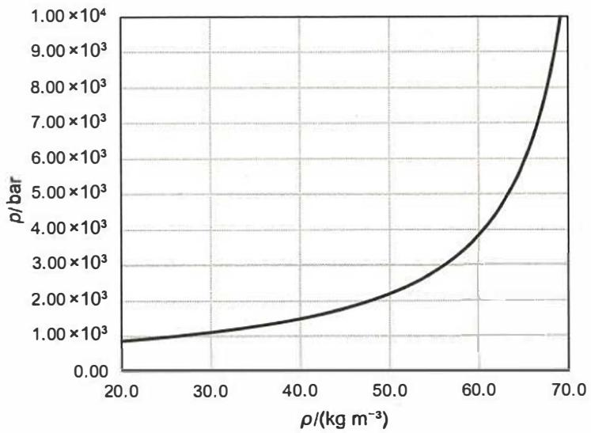

图1 基于 van der Waals 方程的氢气压力-密度关系

$$
\begin{array}{r l} & \frac {1}{2} V _ {\mathrm {m}} \\ & = 5. 0 4 \times 1 0 ^ {- 5} \mathrm {m} ^ {3} \mathrm {m o l} ^ {- 1} \\ & b = 2. 6 6 1 \times 1 0 ^ {- 5} \mathrm {m} ^ {3} \mathrm {m o l} ^ {- 1} \end{array}
$$

（因此，本小题也可根据 $b$ 的物理意义定性判断。

可以看到曲线在右端迅速变陡，这说明随着摩尔体积逐渐逼近 $b$ ，压力对密度的响应呈现非线性加速。 

尝试使用科学绘图软件复现此图，加深对非理想气体行为的理解。氢气密度可以取到的最大值是什么？）

（根据评分细则，只需指出主要原因即可。）

6.1.3 结合 6.1.1 和 6.1.2 两小问的计算结果可知，储氢密度提升幅度有限，与压力增加不成正比，效益递减，此为主要原因。此外，高压还会显著增加容器材料氢脆、疲劳和破裂的风险，且压缩至更高压力需消耗大量能量并依赖昂贵设备，经济性不佳。综合安全性、经济性与储氢效率考虑，700 bar 左右成为工程上的常用上限。 

# 6.2 液相储氢

（请同学们自行绘制氢的三相图。）

6.2.1 液态氢只在三相点温度与临界温度之间存在： 

$$
T _ {\mathrm {t p}} = - 2 5 9. 3 5 ^ {\circ} \mathrm {C} = 1 3. 8 0 \mathrm {K}, \quad T _ {\mathrm {c}} = - 2 4 0. 2 1 ^ {\circ} \mathrm {C} = 3 2. 9 4 \mathrm {K}
$$

因此可观测液态氢的温度为(a) $16\mathrm{K}$ 与(b) $25\mathrm{K}$ 。而(c) $77\mathrm{K}$ 与(d) $293\mathrm{K}$ 过高，氢气无法为液态。 

6.2.2 第一步，由两点式 Clausius-Clapeyron（克劳修斯-克拉珀龙）方程求 $\Delta_{\mathrm{vap}}H_{\mathrm{m}}$ ：以三相点 $(T_{1} = 13.80\mathrm{K}, p_{1} = 7.041\mathrm{kPa})$ 和临界点 $(T_{2} = 32.94\mathrm{K}, p_{2} = 1286\mathrm{kPa})$ 为基点，代入 Clausius-Clapeyron 方程得 

（复习 Clausius-Clapeyron 方程的推导以及其微分与积分形式的相互变换。）

$$
\ln \left(\frac {p _ {2}}{p _ {1}}\right) = - \frac {\Delta_ {\mathrm {v a p}} H _ {\mathrm {m}}}{R} \left(\frac {1}{T _ {2}} - \frac {1}{T _ {1}}\right)
$$

（亦可采用临界点为基点外推，得 $p_3 = 5.774$ bar，与正文公式一致。）

$$
\ln \left(\frac {1 2 8 6}{7 . 0 4 1}\right) = - \frac {\Delta_ {\mathrm {v a p}} H _ {\mathrm {m}}}{8 . 3 1 4} \left(\frac {1}{3 2 . 9 4} - \frac {1}{1 3 . 8 0}\right)
$$

解得： $\Delta_{\mathrm{vap}}H_{\mathrm{m}} = 1.0283\times 10^{3}\mathrm{Jmo}\Gamma^{-1}$ （多保留一位有效数字）。 

第二步，由三相点外推到 $27.15\mathrm{K}$ 时的饱和压力 $p_3$ ：将 $T_{3} = 27.15\mathrm{K}$ 与三相点数据代入Clausius-Clapeyron方程，得 

$$
\ln \left(\frac {p _ {3}}{7 . 0 4 1}\right) = \frac {1 . 0 2 8 3 \times 1 0 ^ {3}}{8 . 3 1 4} \left(\frac {1}{1 3 . 8 0} - \frac {1}{2 7 . 1 5}\right)
$$

解得 $p_3 = 5.775 \times 10^2 \mathrm{kPa} = 5.775 \mathrm{bar}$ 。 

采用的近似包括三点： 

（1）将气相氢气视为理想气体：这是在中低压条件下常用的近似，因氢分子间作用力较弱，压缩因子 $Z$ 接近1。 

（2）近似认为气化焓 $\Delta_{\mathrm{vap}}H_{\mathrm{m}}$ 与温度无关（常数）：实际上， $\Delta_{\mathrm{vap}}H_{\mathrm{m}}$ 随温度略有下降，但在较窄温区（如三相点至 $30\mathrm{K}$ ）内变化有限，因此可视为常数以便积分。 

（3）忽略液相氢气的体积（这个假设并不那么显而易见）：如果液相摩尔体积 $V_{\mathrm{liq}}$ 不能忽略，将直接影响 Clausius-Clapeyron 方程的形式。 

$$
\mathrm {d} \mu = V \mathrm {d} p - S \mathrm {d} T
$$

$$
\frac {\mathrm {d} p}{\mathrm {d} T} = \frac {\Delta_ {\mathrm {v a p}} H _ {\mathrm {m}}}{T \left(V _ {\mathrm {g a s}} - V _ {\mathrm {l i q}}\right)}
$$

通常为便于积分，假设 $V_{\mathrm{liq}} \ll V_{\mathrm{gas}}$ ，于是 

$$
V _ {\mathrm {g a s}} - V _ {\mathrm {l i q}} \approx V _ {\mathrm {g a s}} = \frac {R T}{p}
$$

若 $V_{\mathrm{liq}}$ 不再可忽略，则在高压或低温条件下气体被显著压缩， $V_{\mathrm{gas}}$ 与 $V_{\mathrm{liq}}$ 的差值明显减小，导致分母变小、 $\mathrm{dp} / \mathrm{dT}$ 变大，压力随温度上升得更快。换句话说，保留 $V_{\mathrm{liq}}$ 时，在相同温度下计算出的饱和蒸气压会略高于忽略 $V_{\mathrm{liq}}$ 时的结果。 

以氢气为例，在 $27\mathrm{K}$ ，4.8 bar 的条件下气相 $\mathrm{H}_{2}$ 的 $V_{\mathrm{m}}$ 约为 $10^{-4}\mathrm{m}^{3}\mathrm{mol}^{-1}$ ，液相 $\mathrm{H}_{2}$ 的 $V_{\mathrm{m}}$ 约为 $10^{-5}\mathrm{m}^{3}\mathrm{mol}^{-1}$ ，二者相差约一个数量级。若忽略 $V_{\mathrm{liq}}$ ，误差约为 $5\% \sim 10\%$ 。这种误差在常温或低压蒸发时可忽略，但在靠近临界点或高压液化区域则会显著。 

从物理意义上看，保留 $V_{\mathrm{liq}}$ 意味着承认液相也会随温度膨胀。当温度升高时，液体体积的增大会部分抵消气体体积增长引起的压力上升，使得气液平衡对温度变化的敏感性减弱。忽略 $V_{\mathrm{liq}}$ 等价于假定液体不可压缩，因而略低估了液化所需的压力。 

6.2.3 若液氢亦以 van der Waals 方程近似，其最小摩尔体积可视作趋近参数 $b$ ，故密度上限 

$$
\rho_ {\max } = \frac {M}{b} = \frac {2 . 0 1 6 \times 1 0 ^ {- 3}}{2 . 6 6 1 \times 1 0 ^ {- 5}} \approx 7 5. 8 (\mathrm {k g m} ^ {- 3})
$$

在这里，我们利用 vander Waals 方程中的常数 $b$ 来估算液氢的极限密度（即“液化后可能达到的最大密度”）。这个估算结果不是在特定温度或压力（如常温常压）下测得的物理量，而是一个理论上限，完全由分子本身的尺寸决定。 

在经典 van der Waals 气体模型中, 常数 $b$ 的物理含义源于刚性球模型 (hard-sphere model), 体现了分子之间的排斥体积效应。假设气体由半径为 $r$ 的不可压缩球形分子组成, 两分子中心的最小距离为 $2r$ 。当分子相互靠近时, 其中心不能进入彼此半径 $2r$ 的区域, 从而产生对其他分子“禁止进入”的空间, 称为排斥体积 (excluded volume)。 

几何计算可得：当两个半径为 $r$ 的球相互靠近时，排斥体积为 

$$
V _ {\text {e x c l}} = \frac {4}{3} \pi (2 r) ^ {3} = 8 V _ {\text {m o l e c u l e}}
$$

（注：该温度与压力对应于NIST收录的实验气液平衡点[7]。）

（该定义主要适用于气体的中高压区（分子距离接近排斥距离但尚未液化），用于解释真实气体偏离理想气体行为与临界参数关系，本质上描述的是分子间排斥势能主导区域，并非液体的真实体积。）

由于该体积由两分子共同贡献，平均到每个分子为 $4V_{\text{molecule}}$ 。因此，对于 $1 \, \text{mol}$ 分子，总排斥体积为 

$$
b = 4 N _ {\mathrm {A}} V _ {\text {m o l e c u l e}}
$$

即 van der Waals 方程 $(p + a / V_{\mathrm{m}}^{2})(V_{\mathrm{m}} - b) = RT$ 中的 $b$ ，代表气体分子由于排斥作用所“排除”的体积。 

若进一步考虑分子在液态或固态下的最密堆积（立方或六方最密堆积），则球体间仍存在空隙。最密堆积的填充因子（packing efficiency）约为0.74，对应约1/3的空间为空隙，因此理论上最密堆积的摩尔体积可表示为 

$$
V _ {\mathrm {m}} \approx \frac {b}{0 . 3 3} \approx 3 b
$$

此式用于估算液体或高压下的“极限压缩”体积，是几何极限意义上的经验近似，反映分子体积的堆积下限。 

以氢气为例，代入 $b = 2.661 \times 10^{-5} \mathrm{~m}^{3} \mathrm{~mol}^{-1}$ 可得理论密度上限 

$$
\rho \approx \frac {M}{3 b} = 2 5 k g m ^ {- 3}
$$

（利用6.1.1中的方法，计算储氢密度为 $30\mathrm{kg}\mathrm{m}^{-3}$ 对应的 $V_{\mathrm{m}}$ 和 $p$ ，判断这一密度的可行性（已知工业上压力可达 $70\mathrm{MPa}$ ）。）

与实验液氢密度上限（约 $70\mathrm{kg}\mathrm{m}^{-3}$ ）同量级但略低[8]。说明 van der Waals 模型虽能给出合理数量级，却因仅考虑分子排斥而忽略多体相互作用及量子效应，导致对液体密度的低估。故现代观点更倾向于将 $b$ 视作实验拟合参数，其数值反映分子体积、形状以及分子间作用的综合效应，而非严格遵循几何倍数关系。 

# 6.3 有机液态储氢

6.3.1 已知 

$$
\rho \left(\mathrm {g} \mathrm {c m} ^ {- 3}\right) = 1. 1 4 8 2 3 2 9 - 0. 0 0 0 7 0 9 2 T (\mathrm {K})
$$

（注意修约有效数字至4位取 $T = 293.0\mathrm{K}$ （由 $293.0\mathrm{K}$ 决定）。）

$$
\rho = (1. 1 4 8 2 3 2 9 - 0. 0 0 0 7 0 9 2 \times 2 9 3. 0) \mathrm {g c m} ^ {- 3} = 0. 9 4 0 4 \mathrm {g c m} ^ {- 3} = 9 4 0. 4 \mathrm {k g} \mathrm {m} ^ {- 3}
$$

每个分子含12个氢原子，因此 

$$
w _ {\mathrm {H}} = \frac {1 2 A _ {\mathrm {r}} (\mathrm {H})}{M _ {\mathrm {r}} (1 2 \mathrm {H} - \mathrm {N E C})} = \frac {1 2 \times 1 . 0 0 8}{2 0 7 . 3 6} = 0. 0 5 8 3 3
$$

即12H-NEC中氢所占质量分数为 $5.833\%$ 

储氢密度 $=$ 总密度 $\times$ 氢质量分数 

$$
\rho_ {\mathrm {H}} = \rho \cdot w _ {\mathrm {H}} = (9 4 0. 4 \times 0. 0 5 8 3 3) \mathrm {k g} \mathrm {m} ^ {- 3} = 5 4. 8 6 \mathrm {k g} \mathrm {m} ^ {- 3}
$$

6.3.2 本小问考查有机分子稳定性与芳香性判据的应用。结合题意，8H-NEC（产物1）和4H-NEC（产物2）的结构如下所示。它们的氢化位置均选择在不破坏咔唑母核芳香体系的部位，从而最大限度保留芳香共轭体系。 

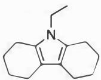

产物1 8H-NEC

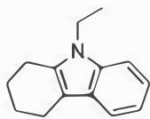

产物2 4H-NEC

6.3.3 12H-NEC 的分子骨架可视为由三个环稠合而成，其立体构型由三处稠合并位的空间关系共同决定。每个并位可呈顺式或反式连接。具体枚举时，可根据中央四氢吡咯环上四个取代基的相对取向描述为：全上、三上一下、二上二下、三下一上、全下。然后排除重复结构。 

（由于氮原子为 $\mathfrak{sp}^3$ 杂化，理论上其反转可产生更多构型。但氮反转速率快，不形成稳定可分离异构体，因此本小题中不计入。）

综上，共存在10种立体异构体，其中包含4对对映异构体。 

6.3.4 12H-NEC $\longrightarrow$ NEC $+6\mathrm{H}_{2}$ 为吸热反应， $\Delta H > 0$ ；脱氢生成气体， $\Delta S > 0$ ，不同异构体间 $S_{\mathrm{m}}$ 近似相同。脱氢开始温度满足 $\Delta G = \Delta H - T\Delta S\approx 0$ 。故在 $S_{\mathrm{m}}$ 近似相同的前提下， $\Delta H$ 越小，所需温度越低。全顺式稠合12H-NEC中轴向/桥头氢最拥挤，环张力与1,3-双直立作用最大，最不稳定，因此最易脱氢（所需温度最低）。 

# 6.4多孔吸附储氢材料

6.4.1 第一步，列出吸附反应的平衡方程，由 $\Delta H_{\mathrm{ads}}$ 和 $\Delta S_{\mathrm{ads}}$ 求出 $77\mathrm{K}$ 时的平衡常数 $K$ ： 

$$
\mathrm {M O F} - 5 (\mathrm {s}) + \mathrm {H} _ {2} (\mathrm {g}) \rightleftharpoons \mathrm {H} _ {2} @ \mathrm {M O F} - 5 (\mathrm {s})
$$

$$
K = \exp \left(- \frac {\Delta G _ {\mathrm {m}}}{R T}\right) = \exp \left(- \frac {\Delta H _ {\mathrm {a d s}} = T \Delta S _ {\mathrm {a d s}}}{\bar {R} T}\right)
$$

（请同学们自行画出全顺式12H-NEC的构象，标出基团间的空间张力。）

$$
= \exp \left[ - \frac {- 5 2 0 0 - 7 7 \times (- 8 0 . 3)}{8 . 3 1 4 \times 7 7} \right] = 0. 2 1 5
$$

（注意： $Kp$ 表示 $K\times p$ ，不是变量 $K_{p}$ 。）

（将压力按 $p / p^{\ominus}$ （ $p^{\ominus} =$ 1bar）去量纲化。）

第二步，计算 $100\mathrm{bar}$ 下的覆盖度 $\theta = \Gamma /\Gamma_{\infty}$ 

$$
\theta = \frac {\Gamma}{\Gamma_ {\infty}} = \frac {K (p / p ^ {\ominus})}{1 + K (p / p ^ {\ominus})} = \frac {0 . 2 1 5 \times 1 0 0}{1 + 0 . 2 1 5 \times 1 0 0} = \frac {2 1 . 5}{2 2 . 5} = 0. 9 5 6
$$

第三步，由已知表面吸附量 $\Gamma = 7.5\%$ 反推饱和吸附量： 

$$
\Gamma_{\infty} = \frac{\Gamma}{\theta} = \frac{7.5\%}{0.956} = 7.85\%
$$

最后，由饱和吸附量计算最大储氢密度： 

$$
\rho_ {\mathrm {H} _ {2}, \mathrm {a d s}, \max } = \rho_ {\mathrm {M O F}} \Gamma_ {\infty} = 3 0 0 \times 0. 0 7 8 5 = 2 4 (\mathrm {k g} \mathrm {m} ^ {- 3})
$$

（思考题：使用 van der Waals 方程计算 $77\mathrm{K}$ 100 bar 下氢气的密度。提示：需要解三次方程。）

（吸附：adsorption脱附：desorption）

本小问采用Langmuir吸附等温式。其推导基于以下假设：固体表面存在一组等价、独立的吸附位点（单一能量、无相互作用）；分子发生单分子层吸附（每个位点最多容纳一个分子）；吸附与脱附为可逆动力学过程，并迅速达到稳态；气相可用压力 $p$ （或更严格地用逸度 $f$ ）表征。 

定义覆盖度： $\theta \equiv \Gamma /\Gamma_{\infty}$ ，其中 $\varGamma$ 为表面吸附量， $\Gamma_{\infty}$ 为饱和吸附量。则吸附速率与可用空位分数 $(1 - \theta)$ 及气相分压 $p$ 成正比；脱附速率与已占据位分数 $\theta$ 成正比： 

$$
r _ {\mathrm {a d}} = k _ {\mathrm {a d}} p (1 - \theta), \quad r _ {\mathrm {d e}} = k _ {\mathrm {d e}} \theta
$$

平衡时 $r_{\mathrm{ad}} = r_{\mathrm{de}}$ ，得 

$$
\frac {\theta}{1 - \theta} = \frac {k _ {\mathrm {a d}}}{k _ {\mathrm {d e}}} p \equiv K p, \quad \boxed {\theta = \frac {\Gamma}{\Gamma_ {\infty}} = \frac {K p}{1 + K p}}
$$

其中 $K = k_{\mathrm{ad}} / k_{\mathrm{de}}$ 为平衡常数。 

在不同压力极限下，该式具有简明近似形式： 

低压极限（Henry区， $Kp\ll 1$ ）： 

$$
\theta \approx K p, \quad \Gamma \approx (K \Gamma_ {\infty}) p
$$

此时吸附量与压力成正比，斜率 $K\Gamma_{\infty}$ 可视为Henry常数（取决于标准态定义）。 

高压极限（饱和区， $Kp\gg 1$ ）： 

$$
\theta \rightarrow 1, \quad \Gamma \rightarrow \Gamma_ {\infty}
$$

吸附趋于饱和，不再随压力上升而增加。 

因此，Langmuir吸附方程适用于：单层吸附、均一位点、弱相互作用体系，典型如多数MOF在低温下的 $\mathrm{H}_{2}$ 首层物理吸附。其常见偏离包括： 

多层吸附或凝聚：每层吸附热不同，第二层以后吸附热 $\approx$ 液化热，首层吸附热 $>$ 多层，使用 Brunauer-Emmett-Teller (BET) 方程。 

$$
\frac {p}{(p _ {0} - p) \Gamma} = \frac {1}{\Gamma_ {\mathrm {m}} C} + \frac {(C - 1) p}{\Gamma_ {\mathrm {m}} C p _ {0}}
$$

其中 $p_0$ 为饱和蒸气压， $\Gamma_{\infty}$ 或 $\Gamma_{\mathrm{m}}$ 为饱和吸附量。 $C$ ，及下文 $K$ 、 $n$ 等为经验或热力学常数，通常通过拟合实验吸附等温线得到。 

吸附位点能量不均匀：适用于Langmuir-Freundlich (Sips)方程。 

$$
\frac {\Gamma}{\Gamma_ {\infty}} = \frac {(K p) ^ {n}}{1 + (K p) ^ {n}}
$$

吸附分子间存在相互作用：吸附热随覆盖度线性下降，适用于Temkin等温式。 

$$
\Gamma = \frac {R T}{b} \ln (1 + K p)
$$

6.4.2 本小问难度不大，尤其题目已经给出了 $77\mathrm{K}$ ，100 bar 下氢气的摩尔体积 $V_{\mathrm{m}} = 6.853 \times 10^{-5} \mathrm{~m}^{3} \mathrm{~mol}^{-1}$ ，无须同学们自行再次使用 van der Waals 方程计算。 

第一步，计算罐内MOF-5的质量与孔体积： 

$$
\begin{array}{l} m _ {\mathrm {M O F}} = V _ {\mathrm {j a r}} \cdot \rho_ {\mathrm {M O F}} = 0. 3 0 \times 1 0 0 0 = 3 0 0 (\mathrm {g}) \\ V _ {\text {p o r e}} = m _ {\mathrm {M O F}} \cdot V _ {\mathrm {g}} = 3 0 0 \times 1. 2 7 = 3 8 1 (\mathrm {c m} ^ {3}) = 3. 8 1 \times 1 0 ^ {- 4} (\mathrm {m} ^ {3}) \\ \end{array}
$$

第二步，利用 $V_{\mathrm{m}}$ 计算孔中氢气的质量： 

$$
n _ {\text {p o r e}} = \frac {V _ {\text {p o r e}}}{V _ {\mathrm {m}}} = \frac {3 . 8 1 \times 1 0 ^ {- 4}}{6 . 8 5 3 \times 1 0 ^ {- 5}} = 5. 5 6 (\mathrm {m o l})
$$

$$
m _ {\text {p o r e}} = n _ {\text {p o r e}} \cdot M \left(\mathrm {H} _ {2}\right) = 5. 5 6 \times 2. 0 1 6 = 1 1. 2 1 (\mathrm {g})
$$

第三步，计算表面吸附氢质量，并加合得到装填MOF-5下的总储氢量： 

$$
m_{\mathrm{ads}} = m_{\mathrm{MOF}}\times 7.5\% = 300\times 0.075 = 22.5(\mathrm{g})
$$

$$
m _ {\text {f i l l e d}} = m _ {\text {p o r e}} + m _ {\text {a d s}} = 1 1. 2 1 + 2 2. 5 = 3 3. 7 (\mathrm {g})
$$

第四步，计算 $1.00\mathrm{L}$ 空罐的储氢量（全为气相）： 

$$
n _ {\mathrm {e m p t y}} = \frac {V _ {\mathrm {j a r}}}{V _ {\mathrm {m}}} = \frac {0 . 0 0 1 0 0}{6 . 8 5 3 \times 1 0 ^ {- 5}} = 1 4. 5 9 (\mathrm {m o l})
$$

（各模型可视为Langmuir方程在不同假设下的推广，在适当的条件下可退化为Langmuir方程。）

$$
m _ {\text {e m p t y}} = n _ {\text {e m p t y}} \cdot M \left(\mathrm {H} _ {2}\right) = 1 4. 5 9 \times 2. 0 1 6 = 2 9. 4 (\mathrm {g})
$$

最后一步，计算两种策略的储氢质量比： 

$$
\text {倍 数} = \frac {m _ {\mathrm {f i l l e d}}}{m _ {\mathrm {e m p t y}}} = \frac {3 3 . 7}{2 9 . 4} = 1. 1 5
$$

综上，在题述条件下，装填MOF-5后的储氢量是空罐的1.15倍。 

# 知识拓展

MOF-5化学式 $\mathrm{Zn_4O(BDC)_3}$ $\mathrm{H}_2\mathrm{BDC}$ 为对苯二甲酸

MOF-74化学式 $\mathbf{M}_2$ (dobdc)M为二价金属离子 $\mathrm{H}_{4}$ dobdc为2,5-二羟基对苯二甲酸

HKUST-1化学式 $\mathrm{Cu}_{3}(\mathrm{BTC})_{2}$ $\mathrm{H}_3\mathrm{BTC}$ 为均苯三甲酸

金属-有机框架(metal-organic framework, MOF)由金属节点（金属离子或金属簇）与有机配体通过配位键自组装而成，是一类晶态多孔材料。通过在“节点-连杆”层面进行分子设计（选择金属簇，调整配体长度、刚性与取代基，调控连接方式与拓扑），可以构筑出具有超高比表面积与多级孔道的网络骨架。代表体系包括MOF-5MOF-74HKUST-1、MIL-101、UiO-67 ZIF-8等，如边栏图所示。 

20世纪末，Yaghi等人提出了等构设计(isoreticular design)的思想，使得MOF的结构可系统拓展。代表作MOF-5成为该研究领域的里程碑[9,10]。2003年，Yaghi课题组进一步报道了MOF-5的首批氢吸附数据：在78K下吸附量约4.5wt%，而室温、20bar时仅1wt%左右，揭示其“低温优于常温”的物理吸附特征，自此引发MOF储氢的研究热潮[11]。随后多篇综述总结了氢在MOF中的吸附位点、等温线形态以及热力学与动力学特征，为后续材料设计奠定基础[12]。 

在MOF储氢体系中，氢分子主要以物理吸附(physisorption)的方式被捕获，可用下式表征表面位点的平衡： 

$$
\mathrm {M O F} (\mathrm {s}) + \mathrm {H} _ {2} (\mathrm {g}) \rightleftharpoons \mathrm {H} _ {2} @ \mathrm {M O F} (\mathrm {a d})
$$

平衡常数 $K$ 和覆盖度 $\theta = \Gamma / \Gamma_{\infty}$ 由 $\Delta H_{\mathrm{ads}}$ 与 $\Delta S_{\mathrm{ads}}$ 共同决定。吸附作用能通常较弱（约 $4 \sim 10 \mathrm{~kJ} \mathrm{~mol}^{-1}$ ），主要来自偶极-诱导偶极与色散作用，因此MOF在 $77 \mathrm{~K}$ 等低温下表现良好，而室温下吸附性能显著衰减[13]。 

从化学角度看，氢在MOF中的吸附可分为两类： 

（1）表面骨架位点，尤其是开放金属位点(open metal sites, OMS): OMS 可对氢分子施加诱导偶极作用，提升结合能。以 MOF-74 为例，实验与计算均显示其 OMS 为最强吸附位点，其次为骨架氧原子，再次为芳香环平面[14,15]。 

（2）孔腔体积位点：在高压下， $\mathrm{H}_{2}$ 亦可“填充”孔腔中心，贡献体积储氢；孔径与孔形（如HKUST-1的三类孔）决定了分子受限程度与多层吸附顺序[16]。以MOF-5为例，其结构中并无OMS，氢分子主要吸附在 $\mathrm{Zn_4O}$ 团簇上方的弱极化位点与芳香环 $\pi$ 面上，吸附能仅为 $4\sim 6\mathrm{kJmol}^{-1}$ ，表现出典型的弱物理吸附行为[11]。MOF-5的研究表明，其储氢性能受限于框架的极化能力与孔内势能分布。因此，提升常温吸附焓的有效策略是在其他MOF体系中引入或暴露更多开放金属位、增强骨架极化或功能化孔壁，而非依赖MOF-5自身的金属中心[12]。 

就目前公开文献而言，即便是最前沿的MOF材料，其在室温或近室温条件下的可用储氢量（即在实际充放压区间内可释放的氢气）仍难以达到美国能源部（Department of Energy, DOE）设定的重量与体积目标（约 $5\mathrm{wt}\%$ 或 $30\mathrm{gL}^{-1}$ ）[17]。如何在提高常温结合能的同时保持吸附/脱附可逆性，仍是化学设计的核心难题。现有MOF在低温高压条件下有较高的性能，但要在常温与高循环频率下保持高储放氢效率，仍面临巨大挑战。 

要突破MOF储氢中的核心瓶颈（常温吸附低、释放难、稳定性差等）主要依赖以下策略： 

（1）增强吸附能：构筑或暴露更多 OMS，或在配体上引入强极化取代基（如 $\mathrm{F}$ 、 $\mathrm{NO}_2$ 等）以增强诱导作用。亦可构建混合金属框架或掺杂金属原子，以调控材料的电子结构和极化能力[18]。 

（2）优化孔径与孔分布：通过拓扑与配体长度设计获得适度孔径，使孔径既能容纳 $\mathrm{H}_{2}$ 分子，又能限制其自由度，从而提升吸附能。近年来，高通量与机器学习筛选已被用于在重量与体积储能之间实现优化[19]。 

（3）提升结构稳定性：合成耐水、耐热且结晶度高的MOF以抵御湿气与循环应力，维持框架完整性[20]。 

（4）热管理与导热设计：吸附/释放过程伴随显著热效应；若材料导热性差，局部温度上升会抑制吸附。提高骨架导热性或引入导热相，可减小温升影响[21]。 

（5）界面催化与氢溢流效应 (hydrogen spill over): 在 MOF 表面引入金属催化剂以裂解 $\mathrm{H}_{2}$ 并诱导原子氢迁移是常温增效的潜在途径，但机理与可重复性仍存在争议[22]。 

2025年诺贝尔化学奖授予SusumuKitagawa、RichardRobson与OmarYaghi，以表彰他们在MOF领域的开创性贡献[23]。三人确立了“可设计的分子建筑学”理念，使晶体多孔结构在分子尺度上可编程、可调控，推动了气体吸附、催化、水捕获及储氢研究的 

ZIF-8

化学式 $\mathrm{Zn(mim)_2}$ Hmim为2-甲基咪唑

MIL-101

化学式

$$
\mathrm {C r} _ {3} \mathrm {F} (\mathrm {H} _ {2} \mathrm {O}) _ {2} \mathrm {O} (\mathrm {B D C}) _ {3}
$$

（MOF在低温高压时方有较高的储氢密度，但6.4.2小问的计算表明，相比于空罐储氢密度提高有限。主要原因是在罐体内装入MOF材料会占据一部分原本可以储氢的体积，而在低温高压下氢气的体积密度已经很高，这会很大程度上抵消MOF高储氢量带来的优势。因此仍然需要研究MOF在常温、中等压力下的储氢应用。）

发展。然而，这一奖项更多肯定的是MOF的化学思想与基础突破，而非其工程成熟度。尽管实验室中MOF已实现低温下 $10\mathrm{wt}\%$ 量级的氢储存、可控孔径与高比表面积等卓越成果，但其在常温储氢、结构稳定性、合成规模及循环热管理等方面仍面临显著挑战。换言之，诺奖既是对MOF分子设计思想的致敬，也提醒人们：要让这些“分子级建筑奇迹”走出实验室、成为可工业化的能源材料，还需经历从科学原理向工程应用的艰难转化过程。 

# 第7题 含能材料多氮化合物

# 题目（34分， $14\%$ ）

多氮化合物是重要的高含能材料。目前，已经发展了多种方法来制备多氮化合物。下面介绍三种制备多氮化合物的方法。 

7.1 常压下可以合成一种具有一定稳定性的全氮正离子盐 B。液氮温度下，在聚氯氟乙烯容器中，将顺式的 $\mathrm{N}_2\mathrm{F}_2$ 与 As F 按摩尔比 $1:1$ 混合，缓慢升温至室温反应 $1 \sim 2\mathrm{h}$ ，抽真空除去挥发性副产物和原料，得到白色固体 A。在聚四氟乙烯安瓿中，将固体 A 小心溶于无水 HF 中，降温至液氮温度，通入 $\mathrm{HN}_3$ 气体，缓慢升温至 $-78^{\circ}\mathrm{C}$ 。在该温度下反应 3 天后，升温至 $-64^{\circ}\mathrm{C}$ 下抽真空除去挥发性物质，得到主要成分为 B 的白色固体。B 中含有一种几何结构为 V 形的全氮正离子。该全氮正离子极易爆炸分解，遇水剧烈反应，放出两种气体，其摩尔比为 $10:1$ 。 

7.1.1 写出 A 和 B 中正离子的化学式。 

7.1.2 画出 B 中全氮正离子的 Lewis 结构式，并标出每个氮原子的形式电荷。 

7.1.3 写出 B 中全氮正离子与水反应的化学方程式。 

7.2 B 的全氮正离子也可以通过另一种方法制备：将 $\mathrm{NF}_3$ 和 $\mathrm{O}_2$ 通入放电管中放电发生反应，将产生的气体冷却至液氮温度，缓慢升温分馏，在 $-183^{\circ}\mathrm{C}$ 得到的馏分主要是化合物 C。在类似于 A 的合成条件下，C 与 $\mathrm{SbF}_5$ 生成 D。在类似于 B 的合成条件下，D 与过量 $\mathrm{HN}_3$ 反应得到与 B 中相同的全氮正离子；但 D 与 $\mathrm{HN}_3$ 按摩尔比 $1:1$ 反应生成 E。E 的正离子具有顺反两种异构体，加热至 $50 - 60^{\circ}\mathrm{C}$ 时发生分解，得到一种白色固体和摩尔比为 $1:4$ 的两种气体。 

7.2.1 写出 C 和 D 的化学式及其中含氮部分的几何结构。 

7.2.2 画出 E 中正离子反式异构体的 Lewis 结构式，并标出各原子 

的形式电荷。 

7.2.3 写出D与过量HN反应生成全氮正离子的反应方程式。 

7.2.4 写出E在 $50\sim 60^{\circ}$ 下受热分解的反应方程式。 

7.3高压制备多氮化合物的有效手段。在D0GPa的高压下，通过激光加热金属Re，使其与 $\mathbf{N}_2$ 反应，生成一种具有正交晶系的化合物 $\mathrm{ReN}_x\cdot y\mathrm{N}_2$ ，其晶胞参数为 $a = 3.4475\AA ,b = 6.4911\AA ,c = 6.0483\AA_{\circ}$ 其晶体结构如下图所示（浅色大球为Re原子，深色小球为N原子），结构中包含两种N原子N1和N2。其中N1形成共平面的一维链状结构与Re配位，形成右下图所示的平面结构，并沿 $c$ 方向形成四边形孔道；N2构成二聚体(N2-N2)，填充于孔道中。一维链中的N1-N1键长较为接近，其中一个N2原子的坐标为(0.336,0.5,0)，N2-N2键长与 $\mathbf{N}_2$ 分子中的键长接近。 

7.3.1 写出 $\mathrm{ReNyN}_2$ 中 $x$ 和 $y$ 的数值。 

7.32 写出Re的配位数。 

7.3.3该结构中Re的价态为4+画出最符合图中结构特点的N1原子一维链的Lewis结构式。 

7.3. 通过计算确定 N2-N2 二聚体的键长为多少 Å（保留两位小数）。 

# 分析与解答

7.1本小题考查主族元素的元素学与结构推断。由于涉及的物种在经典题目中多次出现，整体难度不大。 

7. 1. 1 本小问的突破口是。B 合成 B 的含氮前体为 $\mathrm{N}_{2} \mathrm{~F}_{2}$ 和 $\mathrm{HN}_{3}$ , 结合题干提示 “B 中含有一种几何结构为 V 形的全氮正离子”, 可 

合理推测B中的正离子为 $\mathrm{N}_5^+$ 。 $\mathrm{N}_5^+$ 与水的反应为 

$$
4 \mathrm {N} _ {5} ^ {+} + 2 \mathrm {H} _ {2} \mathrm {O} \longrightarrow 1 0 \mathrm {N} _ {2} + \mathrm {O} _ {2} + 4 \mathrm {H} ^ {+}
$$

反应产物中恰好生成两种气体，其摩尔比为 $10:1$ ，与题干描述一致，因此可确定B中的正离子为 $\mathbf{N}_5^+$ 。 

继续推断 $\mathbf{A}$ ： $\mathrm{AsF}_5$ 是典型的强Lewis酸，易夺取反应物中的 $\mathbf{F}^{-}$ ，生成稳定的配位阴离子 $\mathrm{AsF_6^-}$ 。由“ $\mathrm{N}_2\mathrm{F}_2$ 与 $\mathrm{AsF}_5$ 的摩尔比为 $1:1"$ ，可合理推断生成A的反应为 

$$
\mathrm {N} _ {2} \mathrm {F} _ {2} + \mathrm {A s F} _ {5} \longrightarrow [ \mathrm {N} _ {2} \mathrm {F} ] [ \mathrm {A s F} _ {6} ] (\mathbf {A})
$$

因此，A中的正离子为 $\mathrm{N}_2\mathrm{F}^+$ 。 

可利用生成B的反应进一步验证上述推断的合理性。若A为 $\left[\mathrm{N}_{2} \mathrm{~F}\right] \left[\mathrm{AsF}_{6}\right]$ ，则其与 $\mathrm{HN}_{3}$ 反应生成B的过程可表示为 

$$
\left[ \mathrm {N} _ {2} \mathrm {F} \right] \left[ \mathrm {A s F} _ {6} \right] + \mathrm {H N} _ {3} \longrightarrow \left[ \mathrm {N} _ {5} \right] \left[ \mathrm {A s F} _ {6} \right] (\mathbf {B}) + \mathrm {H F}
$$

该反应可视为一类典型的（类）酰基中心发生的亲核取代过程，遵循亲核加成-消除机理。因此，A的组成推断是合理的，题目得解。 $7.1.2\mathrm{N}_{5}^{+}$ 离子共有 $5\times 5 - 1 = 24$ 个价电子。若使所有原子均满足八偶结构，需要形成 $(5\times 8 - 24) / 2 = 8$ 根化学键，其中4根为σ键，用以构建V形骨架，另外4根为π键；余下的价电子形成 $(24 - 8\times 2) / 2 = 4$ 对孤对电子。固定N原子的位置及σ键的连接方式后，对π键与孤对电子进行合理排布，并按“形式电荷 $=$ 价电子数－孤电子数－成键电子数的一半”标注各原子的形式电荷，即可画出 $\mathbf{N}_5^+$ 离子的Lewis结构，如下图所示： 

$$
: \bar {N} _ {\bar {N} _ {\bar {N}} ^ {+} \bar {N} ^ {-} N ^ {-} N ^ {-} N}: \quad \longleftrightarrow \quad : N _ {\bar {N} _ {\bar {N}} ^ {+} \bar {N} ^ {-} N ^ {-} N}; \quad \longleftrightarrow \quad : N _ {\bar {N} _ {\bar {N}} ^ {+} \bar {N} ^ {-} N ^ {-} N};
$$

（在 $\mathbf{N}_5^+$ 离子中，N2和N4处的N-N-N键角约为 $168^{\circ}$ 而非 $180^{\circ}$ ，思考其可能原因。）

7.1.3如上所述， $\mathbf{N}_5^+$ 与水反应的离子方程式为 

$$
4 \mathrm {N} _ {5} ^ {+} + 2 \mathrm {H} _ {2} \mathrm {O} \longrightarrow 1 0 \mathrm {N} _ {2} + \mathrm {O} _ {2} + 4 \mathrm {H} ^ {+}
$$

亦可写成含对离子的化学方程式： 

$$
4 \mathrm {N} _ {5} \mathrm {A s F} _ {6} + 2 \mathrm {H} _ {2} \mathrm {O} \longrightarrow 1 0 \mathrm {N} _ {2} + \mathrm {O} _ {2} + 4 \mathrm {H A s F} _ {6}
$$

7.2本小题同样考查元素化学推断，但可利用的“抓手”更少，需要综合氧化态分析、Lewis酸碱反应规律、无机反应中的弯箭头机理，以及N、O、F的元素化学特征，构建合理的反应链。推断过程中需要引入更多假设，整体难度更高。 

7.2.1 由题意可知，C 由 $\mathrm{NF}_3$ 和 $\mathrm{O}_2$ 经放电反应生成，并可与强 Lewis 酸 $\mathrm{SbF}_5$ 进一步反应生成 D；D 在反应中可继续作为亲电物种，与过量 $\mathrm{HN}_3$ 反应，最终生成 $\mathrm{N}_5^+$ 。 

合理推断制备C的过程为氧化还原反应： $\mathrm{NF}_3$ 中N的氧化数为 $+3$ ，尚未达到最高氧化数 $+5$ ，反应中的 $\mathrm{O}_2$ 起氧化作用。结合后续反应步骤可知，C中至少含有1个N原子和1个F原子。因此， $\mathrm{O}_2$ 将 $\mathrm{NF}_3$ 氧化为 $\mathrm{NOF}_3$ ，一种已知但极不稳定的物种： 

$$
2 \mathrm {N F} _ {3} + \mathrm {O} _ {2} \longrightarrow 2 \mathrm {N O F} _ {3} (\mathbf {C})
$$

$\mathrm{NOF}_3$ 与 $\mathrm{SbF}_5$ 发生氟离子转移反应，生成D： 

$$
\mathrm {N O F} _ {3} + \mathrm {S b F} _ {5} \longrightarrow [ \mathrm {N O F} _ {2} ] [ \mathrm {S b F} _ {6} ] (\mathbf {D})
$$

因此C的化学式为 $\mathrm{NOF}_3$ ，其含氮部分的几何结构为四面体；D的化学式为 $[\mathrm{NOF}_2][\mathrm{SbF}_6]$ ，其含氮部分的几何结构为平面三角形。7.2.2D与 $\mathrm{HN}_3$ 按摩尔比1：1反应生成E： 

$$
\left[ \mathrm {N O F} _ {2} \right] \left[ \mathrm {S b F} _ {6} \right] + \mathrm {H N} _ {3} \longrightarrow \left[ \mathrm {N} _ {3} \mathrm {N O F} \right] \left[ \mathrm {S b F} _ {6} \right] (\mathbf {E}) + \mathrm {H F}
$$

与7.1.1类似，该反应为发生在“酰基”中心的亲核取代过程： $\mathrm{N}_3^-$ 进攻 $\mathrm{NOF}_2^+$ 的中心 $\mathbf{N}$ 原子， $\mathrm{N} = 0$ 双键被打开， $\mathrm{F}^{-}$ 离去，生成E的正离子。 

E的正离子中存在 $\mathrm{N} = \mathrm{N}$ 双键，因此具有顺反异构体。根据CIP规则 $(\mathrm{F} > \mathrm{O},\mathrm{N} > \mathrm{lp})$ ，反式构型应为F与 $\mathbf{N}_2^+$ 分处 $\mathrm{N} = \mathrm{N}$ 双键的两侧。 

7.2.3D与过量 $\mathrm{HN}_3$ 反应生成 $\mathbf{N}_5^+$ 

$$
\left[ \mathrm {N O F} _ {2} \right]\left[ \mathrm {S b F} _ {6} \right] + 2 \mathrm {H N} _ {3} - - \rightarrow \left[ \mathrm {N} _ {5} \right]\left[ \mathrm {S b F} _ {6} \right] + \mathrm {N} _ {2} \mathrm {O} + 2 \mathrm {H F}
$$

该反应可理解为：第一步，D与等当量 $\mathrm{HN}_3$ 生成E；随后E分解。 

$$
\left[ \mathrm {N} _ {3} \mathrm {N O F} \right] \left[ \mathrm {S b F} _ {6} \right] \longrightarrow \left[ \mathrm {N} _ {2} \mathrm {F} \right] \left[ \mathrm {S b F} _ {6} \right] + \mathrm {N} _ {2} \mathrm {O}
$$

生成的 $\mathrm{N}_2\mathrm{F}^+$ 再与 $\mathrm{HN}_3$ 反应得到 $\mathrm{N}_5^+$ 。但实际上，同位素示踪实验与理论计算表明，更可能的机理为： $\mathrm{NOF}_2^+$ 先与2当量 $\mathrm{N}_3^-$ 反应生成 $\mathrm{N}_7\mathrm{O}^+$ [即 $(\mathrm{N}_3)_2\mathrm{NO}^+$ ]，后者再分解生成 $\mathrm{N}_5^+$ 。 

（*写出 $\mathrm{NOF}_3$ 的Lewis结构式，并标出形式电荷。已知其N-O键长为1.158Å，显著短于 $\mathrm{NOMe}_3$ 中的N-O键长1.424Å，试用分子轨道理论加以解释。）

（注意题目要求写出D的完整化学式，而非仅写正离子。）

作图时不要遗漏孤对电子。 

（有同学将C推断为NOF，对应D为 $[\mathrm{NO}][\mathrm{SbF}_6]$ 、E为 $\mathrm{NON}_{3}$ ，此时E亦可写出顺反异构体。但该推断意味着制备NOF的过程中将生成强氧化性的 $\mathbf{F}_2$ 或 $\mathrm{OF_2}$ ，不符合基本化学规律；同时，NOF亦无法满足7.2.4小问所描述的反应行为。）

（写出 $\mathrm{N}_7\mathrm{O}^+$ 分解的可能机理，并查阅文献加以验证。）

$$
\begin{array}{l} \left[ \mathrm {N O F} _ {2} \right] \left[ \mathrm {S b F} _ {6} \right] + 2 \mathrm {H N} _ {3} \longrightarrow \left[ \mathrm {N} _ {7} \mathrm {O} \right] \left[ \mathrm {S b F} _ {6} \right] + 2 \mathrm {H F} \\ \left[ \mathrm {N} _ {7} \mathrm {O} \right] \left[ \mathrm {S b F} _ {6} \right] \longrightarrow \left[ \mathrm {N} _ {5} \right] \left[ \mathrm {S b F} _ {6} \right] + \mathrm {N} _ {2} \mathrm {O} \\ \end{array}
$$

（尝试写出E分解的弯箭头机理。）

（该分解反应的关键中间体为 $\mathrm{FN}_3$ ，请尝试推导该反应的可能机理。）

7.2.4 $\left[\mathrm{N}_{3} \mathrm{NOF}\right]\left[\mathrm{SbF}_{6}\right]$ 受热分解，得到一种白色固体和摩尔比为 $1:4$ 的两种气体。显然，白色固体为某种六氟锑酸盐。由于 E 的正离子中仅含 N、O、F 三种元素，因此白色盐的正离子中必然含有 N 原子，仅由 O 和 F 不能构成稳定的正离子。合理的稳定正离子候选包括 $\mathrm{NO}^{+}$ 和 $\mathrm{NF}_{2}^{+}$ 。两种气体之一必为 $\mathrm{N}_{2}$ ，对剩余元素进行尝试配平，可知另一种气体为 $\mathrm{NF}_{3}$ ，相应的分解反应方程式为 

$$
3 \left[ \mathrm {N} _ {3} \mathrm {N O F} \right]\left[ \mathrm {S b F} _ {6} \right] - - \rightarrow 3 \left[ \mathrm {N O} \right]\left[ \mathrm {S b F} _ {6} \right] + 4 \mathrm {N} _ {2} + \mathrm {N F} _ {3}
$$

除 $\mathrm{NOF}_3$ 外，仅由N、O、F组成的分子还包括 $\mathrm{NOF}$ 、 $\mathrm{NO}_2\mathrm{F}$ （包括 $\mathrm{FNO}_2$ 和FONO两种异构体）、 $\mathrm{NO}_3\mathrm{F}$ （即 $\mathrm{O}_2\mathrm{NO}-\mathrm{F}$ ，以及极不稳定的自由基 $\mathrm{NOF}_2$ 。请检索它们的结构与理化性质，判断其是否可能作为题目所述各步骤中的中间体或副产物，并分析题中反应路径如何更为合理。 

7.3 本小题考查基本的晶体结构知识与解题技巧，整体难度不大。 

7.3.1 先分析 Re-N1 框架的化学组成。由题目右侧投影图可见（仅考虑一个晶胞），每个 Re 原子被 8 个 N1 原子围成的两个相互垂直的近似矩形网格所包围；而每个 N1 仅与 1 个 Re 相连。因此 

（题目右侧图实际上为晶体沿 $a + b$ 方向的单层投影图：）

（此外，原文中的N2-N2二聚体并非在每个孔道中规则排列，而是呈统计分布。该晶体的化学计量式可写为 $\mathrm{ReN_8\cdot 0.7(2)N_2}$ ，其中0.7(2）表示 $0.7\pm 0.2$）

$$
\mathrm {R e}: \mathrm {N} 1 = 1: 8, \quad x = 8
$$

再分析孔道中的N2数目。题目说明N2以N2-N2二聚体形式沿 $a$ 轴填充于四边形孔道中。由结构图可知，每个 $\mathrm{ReN_8}$ 框架单元对应1个矩形孔道，而每个孔道中仅放置1个N2-N2二聚体（两端各含1个N2原子）。因此，每个 $\mathrm{ReN_8}$ 单元对应1个N2-N2二聚体，故 

$$
y = 1, \quad \mathrm {R e N} _ {x} \cdot y \mathrm {N} _ {2} = \mathrm {R e N} _ {8} \cdot \mathrm {N} _ {2}
$$

7.3.2 由上述分析可知，Re的配位数为8。 

7.3.3 先由 Re 的氧化数判断 N1 所带电荷。Re 的形式氧化数为 +4; 孔道中 N2-N2 的键长与分子 $\mathrm{N}_{2}$ 中接近, 可视 N2 的氧化数为 0 。因此, N1 的平均氧化数为 -1/2 , 其形式电荷亦为 -1/2 。这表明 N1 一维链是一个整体带负电、 $\pi$ 电子离域的共轭体系, 其中一半 N 原子的形式电荷为 -1 , 另一半为 0 。依据该特征, 可画出符合结构特点的 N1 链 Lewis 结构式: 

$$
- \left[ \begin{array}{l l} \ddot {N} = & \\ \ddot {N}: & \ddot {N} \end{array} \right] _ {n} \longleftrightarrow \left[ \begin{array}{l l} \ddot {N} - & \\ \ddot {N}: & \ddot {N} \end{array} \right] _ {n} \longleftrightarrow \left[ \begin{array}{l l} \ddot {N} - & \\ \ddot {N}: & \ddot {N} \end{array} \right] _ {n}
$$

7.3.4将N2的原子坐标(0.336,0.5,0)代入晶体沿 $c$ 方向的投影图中，可以看出晶体中存在两种不同的N2-N2距离： 

（2013年第27届决赛第8题亦设置过这样的“陷阱”小题。如果不画草图而盲目作答，很容易出错。思考该晶体所属的空间点阵型式及其中包含的对称元素。（答案：体心正交 $oI$ ；镜面））

由于N2-N2键长与分子 $\mathrm{N}_2$ 中的键长接近，因此应取晶体中距离较短者： 

$$
\begin{array}{l} d (\mathrm {N} 2 - \mathrm {N} 2) = (1 - 2 \times 0. 3 3 6) a \\ = 0. 3 2 8 \times 3. 4 4 7 5 = 1. 1 3 (\mathrm {A}) \\ \end{array}
$$

（若已知其中一个N1原子的坐标为(0.680,0.178,0.188)，请同学们自行计算N1-N1键长，以验证题目中“N2-N2键长更短”的判断。）

# 第8题 有机化学基本概念

# 题目（23分， $8\%$ ）

8.1 氟在元素周期表中具有最大的电负性。与 C-H、C-O、C-N 以及 C-CI 等键相比，C-F 键具有最大的键解离能和最大的极性。 

8.1.1 比较甲烷和一氟甲烷中的 $\mathrm{H}-\mathrm{C}-\mathrm{H}$ 键角，以下说法准确的是（ ）： 

(a) 由于 $\mathbf{F}$ 的电负性使 C-F 共价电子偏向 F，C-H 键之间的排斥力减少，使一氟甲烷中 H-C-H 的键角变大； 

(b) 由于 $\mathbf{F}$ 的电负性使 C-F 共价电子偏向 F，C-H 键之间的排斥力增加，使一氟甲烷中 H-C-H 的键角变小； 

(c) 尽管 F 的电负性使 C-F 共价电子偏向 F，但 C-H 键之间的排斥力没有变化，甲烷和一氟甲烷中的 H-C-H 键角没有变化。 

8.1.2 与一氟甲烷相比，二氟甲烷中 $\mathrm{H - C - H}$ 键角如何变化？ 

(a) 变大； (b) 变小； (c) 没有变化。 

8.2.1 比较 $\alpha$ -氟代酰胺中 anti-1 和 syn-1，以下说法准确的是（ ）： 

(a) $\mathbf{syn - 1}$ 构象更稳定； 

(b) ant $i$ -1 构象更稳定； 

(c) 两者稳定性相同。 

8.2.2 比较 $\alpha$ -氟代酯中 ant i-2 和 sy n-2 以下说法准确的是（）： 

(a) ant $i - 2$ 构象更稳定； 

(b) syn-2 构象更稳定； 

(c) 两者稳定性相同。 

8.2.3 依据你所学习的有机化学知识，判断 ant $i-1$ 与 sy $n-1$ 的能量差 $\Delta E_1$ 和 ant $i-2$ 与 sy $n-2$ 的能量差 $\Delta E_2$ 是否存在差别： 

(a) $\Delta E_1 > \Delta E_2$ 

(b) $\Delta E_1 <   \Delta E_2$ 

(c) $\Delta E_1\approx \Delta E_2$ 

(d) 无法判断。 

8.2.4题8.2.3判断的主要依据是： 

8.3 比较gauche-3和staggered-3两个构象，哪一个更稳定？给出你的判断理由。 

(a)gauché-3; 

(b) st aggered-3 

(c) 一样稳定； 

(d) 无法判断。 

8.3.1 稳定的构象是： 

8.3.2 理由是： 

8.4 以下四个构象中，哪一个最稳定？哪一个最不稳定？ 

A

B

C

D

8.4.1最稳定的是： 

8.4.2最不稳定的是： 

8.5 以下四个化合物中，红外光谱中羰基伸缩振动波数最大的是哪一个？最小的是哪一个？ 

（严格来说，“反交叉”构象应写作anti，与gauche（邻交叉）相对应；staggered的含义为“交错式”，与eclipsed（重叠式）相对应。反交叉anti和邻交叉gauche均属于交错式(staggered)构象。）

8.5.1最大的是： 

8.5.2最小的是： 

8.6 羰基化合物既可以作为电子受体，接受碳亲核试剂的进攻；也可以作为电子给体，进攻缺电子性的碳，是有机合成中构筑 C-C 键的重要原料。 

8.6.1 在较强的酸性溶液中，与含有 $\alpha$ -H 的羰基化合物共存的物种主要有哪些？ 

(a) 质子化羰基化合物； (b) 碳正离子； 

(c) 烯醇负离子； (d) 烯醇。 

8.6.2 比较 (a) 乙酰乙酸乙酯、(b) 2,4-戊二酮和 (c) 丙二酸乙酯，哪一个化合物在水溶液中的烯醇比例最大？ 

8.6.3 富电子性物种既是碱又是亲核试剂，它可以使羰基化合物转化为烯醇负离子，或生成羰基的亲核加成产物。下列说法中正确的有（ ）： 

(a) 与溶剂 THF 相比，羰基化合物在溶剂 HMPA 中更易形成烯醇负离子； 

(b) 与 $n - \mathrm{Bu}_4\mathrm{N}^+$ 相比，羰基化合物在 $\mathrm{Li}^{+}$ 参与下更易得到亲核加成产物； 

(c) 与 MeLi 相比，羰基化合物与 $t$ -BuLi 反应更易形成烯醇负离子； 

(d) 与 $\mathrm{RO}^{-}$ 相比，羰基化合物与 $\mathrm{RS}^{-}$ 反应更易得到亲核加成产物； 

(e) 酮比醛更易形成烯醇负离子； 

(f) $\alpha-\mathrm{H}$ 的酸性越小，越易得到亲核加成产物。 

8.6.4 下面两个示意图为 2-甲基环己酮分别在两种碱（LDA 和 NaOH）作用下形成两种烯醇负离子（X 和 Y）的反应进程图（A 图和 B 图）。画出 X 和 Y 的结构式；判断 A 图和 B 图分别对应的碱是哪一个？ 

# 分析与解答

（由于氟的特殊性，氟化学已经成为初赛考试中的常客，甚至在决赛和国家队选拔考试中也频繁涉及。同学们可回顾2022年第36届初赛（第二场）第10题；2023年第37届初赛8-1、8-6小题；2024年第38届初赛9-3、9-4小题。）

近几年的初赛考试中，有机化学的第一题通常侧重于基本概念的考查，并不涉及过多复杂的反应与机理分析。“有机化学基本概念”是学习有机化学的重要基石，其涵盖范围十分广泛，包括但不限于：利用经典价键理论分析有机分子的结构与键角、电子效应、分子轨道理论与立体电子效应、有机化合物的酸碱性以及溶剂效应等。本题的 $8.1\sim 8.5$ 小题系统考查了有机氟化学的核心概念，几乎涵盖了氟原子及C-F键的所有关键特性。通过本题的解析，同学们可以对有机氟化学形成更为本质的理解。 

氟是电负性最强的元素，C-F键是有机化学中最强的共价键之一，但其强极性使C-F键同时具有显著的静电特性；另一方面，F原子的高电负性使其三对孤对电子被紧密束缚，导致其参与共振或作为氢键受体的能力不如O或N原子。上述性质使C-F键在分子中通常通过静电或偶极相互作用，或通过与相邻键及孤对电子产生立体电子效应的方式，影响分子的几何构型、构象以及反应性。8.1利用经典价键理论可以快速解决本小题。在一氟甲烷中，F原子的强电负性使C-F成键电子对显著偏向F原子，从而减弱了两根C-H键之间成键电子对的排斥作用，使H-C-H键角增大。在二氟甲烷中，由于F原子数目增多，这一效应进一步增强。因此，8.1.1小问选择(a)，8.1.2小问选择(a)。 

（同学们可通过这些讨论体会到在学习过程中需要多方面考虑问题。在解题时，需要多角度思考，抓住主要矛盾。）

（思考题：比较一氟甲烷、二氟甲烷和三氟甲烷的偶极矩大小，并解释原因。请注意，偶极矩与超共轭效应没有关系。）

实验数据表明，从一氟甲烷到三氟甲烷，相关键角的变化并非单调递增。这说明即使对于氟代甲烷这类结构相对简单的分子，其键角变化趋势也不能仅用“成键电子对之间的排斥”加以解释，“C-F键长的缩短以及由此引起的F原子之间斥力增强”同样是必须考虑的因素。后者亦可从静电相互作用的角度理解：由于F原子的高电负性，C-F键具有显著的离子性。随着H原子逐步被F原子取代，C原子上的正电荷密度不断增加，从一氟甲烷到四氟甲烷，C与F之间的静电引力逐渐增强，导致C-F键逐渐缩短。 

表 1 和表 2 给出了相关实验数据,供同学们参考： 

表 1 常见共价键的键长与键解离能

<table><tr><td>键型</td><td>键长 / Å</td><td>键解离能 / (kJ mol-1)</td></tr><tr><td>C-F</td><td>1.35</td><td>441</td></tr><tr><td>C-H</td><td>1.09</td><td>416</td></tr><tr><td>C-O</td><td>1.43</td><td>353</td></tr><tr><td>C-C</td><td>1.54</td><td>349</td></tr><tr><td>C-Cl</td><td>1.77</td><td>330</td></tr><tr><td>C-N</td><td>1.47</td><td>294</td></tr></table>

表 2 甲烷与氟代甲烷中键角与 $\mathbf{C} - \mathbf{F}$ 键长

<table><tr><td></td><td>\( \angle \mathrm{H} - \mathrm{C} - \mathrm{H} \)</td><td>\( \angle \mathrm{H} - \mathrm{C} - \mathrm{F} \)</td><td>\( \angle \mathrm{F} - \mathrm{C} - \mathrm{F} \)</td><td>\( d\left( {C - F}\right) /\mathrm{A} \)</td></tr><tr><td>\( {\mathrm{{CH}}}_{4} \)</td><td>109.5°</td><td>-</td><td>-</td><td>-</td></tr><tr><td>\( {\mathrm{{CH}}}_{3}\mathrm{\;F} \)</td><td>110.2°</td><td>108.7°</td><td>-</td><td>1.39</td></tr><tr><td>\( {\mathrm{{CH}}}_{2}{\mathrm{\;F}}_{2} \)</td><td>113.8°</td><td>108.9°</td><td>108.4°</td><td>1.36</td></tr><tr><td>\( {\mathrm{{CHF}}}_{3} \)</td><td>-</td><td>110.4°</td><td>108.5°</td><td>1.33</td></tr><tr><td>\( {\mathrm{{CF}}}_{4} \)</td><td>-</td><td>-</td><td>109.5°</td><td>1.32</td></tr></table>

相比经典的 VESPR 理论和静电引力模型，Bent 规则给出的解释更为准确。氟的特殊性使有机氟化合物在化学工业的各个方面（材料、药物、农用化学品、精细化学品等）都有极为重要的应用。相关内容见知识拓展。 

8.2 有机分子（尤其是结构复杂的大分子）不同构象的能量高低，通常需要通过实验表征（如在溶剂或晶体状态下）或理论计算来确定，很难仅凭观察分子骨架进行准确判断。这是因为影响构象稳定性的因素非常多，只有在简单的小分子中、影响构象稳定性的因素较少时，才容易直接判断。即便是在简单分子中，当两种或多种因素对构象稳定性的影响相反时，也很难直接断定哪种因素占主导。本小题涉及的分子结构虽不算复杂，但仍涉及诸多影响构象稳定性的因素，想准确判断哪种构象最稳定，需要同学们对各种因素在能量上的贡献大小有定性概念。 

本小题是初赛中第一次考查静电相互作用 (electrostatic interaction) 对构象的影响。影响分子构象的能量因素包含：键的伸缩应变、键角与扭转角应变、轨道相互作用、非键相互作用、静电相互作用，甚至在溶液中的溶剂化能等，这些作用的加合效果使体系达到优势构象。静电相互作用可用库仑定律描述——同号电荷间存在相互排斥，而异号电荷间存在相互吸引；为保持体系能量最低，应尽可能使同号电荷位置相互远离、异号电荷位置相互靠近。根据产生静电相互作用位点的电荷性质，可进一步分为电荷-电荷相互作用（例如中性氨基酸分子间的“盐键”）、电荷-偶极相互作用和偶极-偶极相互作用。 

$N\cdot$ 甲基-2-氟丙酰胺分子可画出如下极限构象： 

（α-氟代酰胺类化合物在药物化学中有重要的作用，引入氟原子可以调控氨基酸和肽的骨架构象。立体电子效应（或称超共轭效应）对构象的影响可参考2022年第36届初赛第二场10-1小题；斥力对构象的影响可参考2022年第36届初赛第二场9-3和10-2小题、2023年第37届初赛9-2-3小问。）

（1,2-二溴乙烷的稳定构象是反交叉（anti）构象，因为两根极性C-Br键处于反式共平面时，偶极-偶极排斥最小。将此现象与1,2-二氟乙烷中的邻交叉效应进行对比，理解不同因素对构象的影响。）

（H或Me与 $\mathrm{C = O}$ 顺式共平面，以及Me与 $C = 0$ 反式共平面也是极限构象，但并不是具有代表性的极限构象。同学们可以根据后续的分析，判断所有极限构象之间能量的高低。）

对于各类可能影响构象稳定性的因素，我们分类讨论： 

（这个能量差是一个相当大的值，需要同学们有一定的敏感度。最经典的 $\mathrm{A}^{1,3}$ -斥力模型带来的能量差约为 $16.4\mathrm{kJmol^{-1}}$ ，但已经是很多构象分析问题中的主导因素了。）

（1）静电相互作用：C-F键和酰胺 $\mathrm{C = O}$ 键均具有强极性。当两根键处于反式共平面位置（ant4）时，偶极-偶极排斥作用最小： 

数据表明，ant $i-1$ 与 $n s y 1$ 两构象之间的能量差达到了约 $33.6 \mathrm{~kJ} \mathrm{~mol}^{-1}$ ，其中静电相互作用（偶极-偶极排斥）是决定构象稳定性最重要的因素。 

（2）扭转张力：F原子半径较小，与其他基团之间很难产生位阻排斥。而甲基与羰基处于反式共平面[gauche $(+)$ -1]时，甲基与 $\mathrm{N - H}$ 间确实存在较大的 $\mathbf{A}^{1,3}$ -斥力，但此时C-F与 $\mathrm{C = O}$ 之间存在较明显的偶极-偶极排斥作用，本身就已经被排除，不属于稳定构象。 

（3）立体电子效应：我们知道，在丙烯和乙醛中，顺式共平面（syn）构象是稳定构象，这是因为两条C-H键的 $\sigma$ 轨道与 $C = C$ （或 $C = O$ ）的 $\pi$ 轨道重叠更好。 

但这两种顺反构象能量差只有 $8.4\sim 10.1\mathrm{kJmol}^{-1}$ ，远不如前述静电相互作用的 $33.6\mathrm{kJmol}^{-1}$ 。 

（4）氢键：在ant $i - 1$ 的构象中，F原子可以和酰胺的N-H形成分子内氢键，产生额外的稳定化作用。这个作用与前述静电相互作用的影响方向相同，且能量贡献不大——通过计算拟合得到的此种作用力大小仅为 $3.4\mathrm{kJmol}^{-1}$ 左右，在整体的能量贡献中只占较小的一部分。 

现代有机氟化学研究认为，由于氟元素电负性较高，其孤对电子被核紧紧束缚，是较弱的氢键受体。含氟分子片段与正电性片段发生弱相互作用时，氟原子往往指向带有（部分）正电荷的位点，即 

（晶体学数据和核磁共振数据证实了这一点，F与H之间的距离约为 $2.2\AA$ ，明显小于两原子van derWaals半径之和 $2.5\sim 2.7\AA$ 。）

使表观上看起来像是氢键，但本质上仍为静电相互作用，其强度仅为典型氢键（如 $\mathrm{N - H\dots O}$ 等）的1/4左右： 

C--F 2.9A 静电相互作用 $\approx 0.8\mathrm{kJmol^{-1}}$

H--F $2.5\sim 3.0\AA$ 静电相互作用 $\approx 8.4\mathrm{kJmol^{-1}}$

（F原子与羰基碳产生作用力的角度与羰基发生亲核加成时需满足的Bürgi-Dunitz角几乎一样。）

因此，对 $\mathrm{F}\cdot \cdot \cdot \mathrm{H} - \mathrm{N}$ 氢键更准确的描述是：F原子与H原子的静电相互作用，进一步稳定了构象。部分文献指出，这种作用力还可以理解为F原子的孤对电子轨道 $n_{\mathrm{F}}$ 与 $\mathrm{N - H}$ 反键轨道 $\sigma_{\mathrm{H - N}}^{*}$ 发生的相互作用。 

综上所述， $N$ -甲基-2-氟丙酰胺最稳定的构象是anti-1。同理，2-氟丙酸甲酯最稳定的构象是anti-2。故8.2.1小问选(b)，8.2.2小问选(a)。 

后续两小问要求同学们定性估算不同构象之间的能量差。对于α-氟代酰胺1，偶极-偶极排斥作用和氢键（本质上都是静电相互作用）共同决定了anti-1是最稳定的构象，其中占主导的是偶极-偶极排斥作用；而α-氟代酯2中的羰基极性大小不如酰胺，且不存在氢键，故两种构象的能量差较小。酰胺羰基的极性明显强于其他羧酸衍生物，这可以用贡献较大的电荷分离共振式来表示： 

实验数据表明，在 $\alpha$ -氟代醛、 $\alpha$ -氟代酮、 $\alpha$ -氟代酯、 $\alpha$ -氟代酰胺中，C-F与 $\mathrm{C} = \mathrm{O}$ 处于反式共平面的构象，其能量逐渐降低，如表3所示。 

表 3 不同 $\alpha$ -氟代羰基化合物中 anti 与 syn 构象的能量差

<table><tr><td>物种</td><td>anti 与 syn 构象能量差 / (kJ mol-1)</td></tr><tr><td>α-氟代醛</td><td>7.1</td></tr><tr><td>α-氟代酮</td><td>9.2</td></tr><tr><td>α-氟代酯</td><td>18.9</td></tr><tr><td>α-氟代酰胺</td><td>33.6</td></tr></table>

故8.2.3小问选(a)；8.2.4小问中，判断的主要依据是酰胺中羰基的极性更大，当F与 $\mathrm{C = O}$ 处于反式共平面时，偶极-偶极排 

（思考题：当F原子变为Cl、Br、I原子后，C-X与 $\mathrm{C = O}$ 之间的静电相互作用有什么变化？对分子的稳定构象产生什么影响？此时影响构象稳定性的主导因素会变为什么？）

斥作用更小。考虑到同学们难以在考场上判断其与氢键对优势构象的能量贡献大小，故写“氢键”亦给分。 

8.3 在简单的 1,2-二氟乙烷结构中，最稳定的是邻交叉（gauche）构象，其能量比反交叉（anti）构象低 $3.4\mathrm{kJmol}^{-1}$ 。但与其他影响因素相比，超共轭效应带来的能量降低显得有些“微不足道”了：将 1,2-二氟乙烷中的一个C-F键替换为 $\mathrm{C - NH_3^+}$ ，除仍存在的超共轭效应以外，还存在静电相互作用。与8.2小题中的偶极-偶极排斥作用不同，这里是电荷-偶极相互作用（charge-dipole interaction）。分子中的正电荷使得氨基中的H原子具有较强的正电性，而邻交叉构象gauche-3能够使F与H原子产生强的静电吸引： 

类似的情况也存在于 $\mathrm{F - C - C - OH_2^+}$ 及其同类结构中。可以看出，即使不存在氢键，较强的电荷-偶极相互作用也会使结构强烈趋向于邻交叉构象： 

故8.3.1小问选(a)；8.3.2小问理由是邻交叉构象存在电荷-偶极相互作用（或写超共轭效应、氢键均可）。 

8.4 1,3-二氟丙烷可以看作正戊烷的2个端甲基被F原子取代而成的结构，因此首先需要了解正戊烷的4种交错式构象。将正戊烷中间的3个碳原子C2-C3-C4作为参考，放置在金刚石骨架中以便观察，如下图所示： 

随后，在C2和C4两端以交错式放置端位甲基。共有如下四种可能的构象，分别记为anti(2,3)-anti(3,4)、gauche(2,3)-anti(3,4)、 

gauche(2,3)-gauche(3,4)和gauche(2,3)-gauche'(3,4)，简写为AA、GA、GG和 $\mathrm{GG^{\prime}}$ （ $G^{\prime}$ 表示绕C-C键轴旋转的方向与G相反）。 

在四种构象中： 

- AA 构象由于烷基链骨架处于全反交叉, 是最稳定的构象; 

- 其次是 GA 和 GG，它们分别存在一个和两个邻交叉斥力作用； 

- 能量最高的是 $\mathrm{GG}^{\prime}$ , 因为两个端位甲基处于双直立位置, 产生的斥力更大, 比最稳定的 AA 构象能量高约 $15.5 \mathrm{~kJ} \mathrm{~mol}^{-1}$ 。 

将正戊烷的两个端位甲基替换为F原子后，同样存在四种交错式构象，即题中的 $\mathbf{A}\sim \mathbf{D}_{\circ}$ 与正戊烷不同，引入F原子后还需考虑超共轭效应与静电相互作用的影响；而由于F原子与甲基相比半径较小，即使在GG'构象中两个F原子处于1,3-双直立位置，也不会带来明显的斥力作用。 

我们首先看超共轭效应的影响：由于C-H键的 $\sigma$ 成键轨道比C-C键的 $\sigma$ 成键轨道是更好的给体轨道，故与C-F键呈反式共平面的C-H键越多，超共轭效应给构象带来的稳定化作用越强。但在之前的分析中，我们知道超共轭效应带来的能量稳定化效果通常小于静电相互作用。在构象D中，两个F原子处于1,3-双直立位置，产生了明显的偶极-偶极排斥作用，对构象的能量升高作用远大于两组 $\sigma (\mathrm{C - H})\rightarrow \sigma^{*}(\mathrm{C - F})$ 对构象的稳定作用。将不同因素对构象的影响列于下图中，可以看出能量从低到高为A（GG）、B（GA）、C（AA）和D（GG）。 

（由于正戊烷不具有手性，故GA和AG、GG'和 $\mathrm{G^{\prime}G}$ 是同一种构象。也有将anti记为trans（或A记为T）的表示方法，是等同的，都表示反交叉构象。）

（已知正丁烷的gauche构象比anti构象能量高 $3.7\mathrm{kJmol^{-1}}$ ，尝试计算正戊烷的GA和GG两种构象比AA构象能量分别高多少？）

（熟记构象分析中常见的斥力模型数据（单位： $\mathrm{kJmol^{-1}}$ ，括号中数据单位为 $\mathrm{kcalmol^{-1}}$ ）：

$$
E (1, 2 - \mathrm {H}, \mathrm {H}) = 4. 2 (1. 0)
$$

$$
E (1, 2 - \mathrm {H}, \mathrm {M e}) = 5. 5 (1. 3)
$$

$$
E (1, 2 - \mathrm {M e}, \mathrm {M e}) = 1 3. 0 (3. 1)
$$

$$
E (1, 3 - \mathrm {H}, \mathrm {M e}) = 3. 7 (0. 8 8)
$$

$$
E (1, 3 - \mathrm {M e}, \mathrm {M e}) = 1 5. 5 (3. 7)
$$

$$
E \left(\mathrm {A} ^ {1, 3} - \mathrm {M e}, \mathrm {M e}\right) = 1 6. 4 (9. 9)
$$

这也属于静电相互作用的一种，称为1,3-(C-F)偶极排斥作用[1,3-(C-F)dipolar repulsion]。）

（计算拟合得到的相对能量数据供同学们参考（单位： $\mathrm{kJ mol^{-1}}$ ）：

A:0; 

B:4.9; 

C:10.1; 

D:14.0。）

（一个非常有趣的问题：对于全顺式多邻位氟化烷烃链骨架，为了满足超共轭效应且避免偶极-偶极排斥作用，F原子在空间上的排列呈怎样的形状？）

故8.4.1小问选A，8.4.2小问选D。值得注意的是，这四种构象的稳定性随着环境（如真空、质子溶剂、极性溶剂和非极性溶剂）的变化会出现不同趋势，感兴趣的同学可自行查阅文献学习。8.5红外光谱通过检测共价键特征的伸缩和弯曲振动，来区分不同的官能团。谱图通常给出振动波数（单位 $\mathrm{cm}^{-1}$ ），振动波数与键的力常数（与键级正相关）成正比。羰基 $\mathrm{C = O}$ 的振动吸收通常处于 $1500\sim 2000\mathrm{cm}^{-1}$ 之间，波数越大， $\mathrm{C = O}$ 键级越高。 

（$\mathrm{C = O}$ 振动波数（单位： $\mathrm{cm}^{-1}$ ）：

酰氟：1867； 

酰氯：1820； 

酰溴：1826； 

酰碘：1808； 

酯：1720； 

酰胺：1645。）

醛的 $\mathrm{C = O}$ 振动吸收在 $1750\mathrm{cm}^{-1}$ 左右。以醛基H为标准，将其替换为吸电子基团， $\mathrm{C = O}$ 键级升高，波数增加。这既可以从静电吸引的角度理解——强吸电子基团使羰基碳原子的正电性增强，与羰基氧原子的成键作用力变强；也可以从轨道重叠的角度理解——强吸电子基团X使得 $\sigma^{*}(\mathrm{C - X})$ 反键轨道的能量降低，促进 $\mathrm{n(O)}\rightarrow$ $\sigma^{*}(\mathrm{C - X})$ 超共轭效应，使 $\mathrm{C = O}$ 键级上升，如下图所示： 

n(O)→σ*(C-X)

非键共振表示

（思考题：酰氟、酰氯、酰溴和酰碘结构中， $O = C - X$ 键角变化趋势是什么？）

当羰基与给电子基团（烷氧基——酯、氨基——酰胺）相连时， $\mathrm{C = O}$ 键级降低，波数下降。这同样可以通过 $\mathrm{n(X)}\rightarrow \pi^{*}(\mathrm{C = O})$ 超共轭效应来解释： 

$$
n (N) \rightarrow \pi^ {*} (C = O)
$$

$$
\mathrm {共 振 表 示}
$$

故8.5.1小B，8.5.2小A。 

8.6 本小题包含 4 个小问，均与羰基官能团的性质有关。羰基作为有机化学中最重要的官能团之一，具有非常丰富的反应性：羰基本身是极性不饱和键，在酸性或碱性条件下可以与多种亲核试剂发生加成反应，生成四面体产物；也可以在酸性或碱性条件下发生互变异构，转化为烯醇或烯醇负离子，作为亲核试剂参与缩合反应，是构建 C-C 键的关键过程。 

8.6.1 本问考查酸性条件下含有 $\alpha$ -H 的羰基化合物的互变异构过程，难度不大： 

$$
R \xrightarrow [ R ^ {\prime} ]{O} \xrightarrow {H ^ {+}} R \xrightarrow [ H ]{C O H} R ^ {\prime} \xrightarrow {- H ^ {+}} R \xrightarrow [ R ^ {\prime} ]{O H}
$$

其中，质子化的羰基正离子与烯醇处于平衡状态，并同时存在于体系中；只有在碱性条件下，才会出现烯醇负离子物种。故本小问选(a) (d)。在官方答案中，选项(b)可选可不选。这是考虑到，虽然质子化的羰基正离子存在对应的碳正离子共振式，但一般碳正离子共振式的稳定性远不如羰基正离子： 

$$
R \xrightarrow {+} C _ {R ^ {\prime}} ^ {O H} \longleftrightarrow R \xrightarrow {+} C _ {R ^ {\prime}} ^ {O H}
$$

8.6.2 羰基化合物烯醇之间的互变异构与 $\alpha$ -H 的酸性有关，酸性越大，互变异构的趋势越明显，烯醇式所占比例也越大。2,4-戊二酮、乙酰乙酸乙酯和丙二酸乙酯三种化合物，从两个酮羰基，到一个酮羰基与一个酯羰基，再到两个酯羰基，羰基的亲电性逐渐降低，导致双重 $\alpha$ -H 的酸性逐渐降低，烯醇所占比例也随之逐渐降低。故本小问选 (b)。 

8.6.3 碱性亲核性之间的异同，一直贯穿有机化学的学习过程。这本质上是软硬酸碱问题：一般来说，硬亲核试剂具有能量较低的HOMO、带有负电荷，硬亲电试剂具有能量较高的LUMO、带有正电荷；软亲核试剂具有能量较高的HOMO、不一定带有负电荷，软亲电试剂具有能量较低的LUMO、不一定带有正电荷。口诀“软亲软，硬亲硬，软硬结合不稳定”的本质是：硬-硬反应由库仑作用 

（有机化合物的性质主要取决于官能团。官能团之间的转化是有机化学中最简单、最基础的反应，我们在高中化学中已有学习。然而，构建新的C-C键，进而对化合物骨架进行变化或调整，是有机化学中的核心问题。）

（对于1,3-二羰基化合物及其烯醇式在质子溶剂和非质子溶剂中比例关系的变化趋势，可参考2023年第37届初赛8-2小题。）

（轨道系数大小可以直观地通过轨道示意图中对应原子波瓣的大小来判断。）

（通常将介电常数 $\varepsilon$ 大于15的溶剂认为是极性溶剂，例如水 $(\varepsilon = 78.5)$ 、DMF $(\varepsilon = 36.7)$ 等。）

驱动，形成强的离子键；软-软反应由轨道相互作用驱动，形成强的共价键。进一步，富电子物种越硬，碱性越强；越软，则亲核性越强。 

从结构上看，反应位点电荷越高、半径越小，反应位点越硬；电荷越低、半径越大，反应位点越软。另外，反应位点轨道系数越大，反应位点越软。接下来我们针对题干中给出的选项，逐一讨论其正误。 

(a) 选项：考查溶剂效应。THF是四氢呋喃，属于弱极性的非质子溶剂（介电常数 $\varepsilon = 7.58$ ）；HMPA是六甲基磷酰三胺，属于极性的非质子溶剂（介电常数 $\varepsilon = 30$ ）： 

在羰基化合物与碱反应形成烯醇负离子的过程中，极性溶剂能够更好地稳定带负电荷的烯醇负离子，此选项正确。 

（$\mathrm{Li}^{+}$ 作为Lewis酸可能是同学们之前容易忽略的知识。回忆基础有机化学中的反应：甲酯可在LiCl水溶液中发生水解！）

（除 $\mathrm{Li}^{+}$ 外，目前常用的其他活化试剂还有 $\mathrm{Mg}^{2+}$ 、 $\mathrm{R}_2\mathrm{B}-\mathrm{LG}$ 等，这些不仅可以活化羰基，还可以与亲核试剂同时发生配位，起到螯合的作用，进一步控制反应的非对映选择性。）

(b) 选项：羰基碳原子可以被亲核试剂进攻，当羰基处于质子酸或Lewis酸中时，羰基氧原子可以与酸结合得到羰基正离子，进一步提高羰基碳原子的亲电能力。 $n\text{-Bu}_4\mathrm{N}^+$ 并不是Lewis酸（N原子上已无空轨道），而 $\mathrm{Li^{+}}$ 是Lewis酸，可以活化羰基，此选项正确。 

(c) 选项：叔丁基锂 $t$ -BuLi 是一个大位阻强碱（共轭酸 $\mathrm{pK}_{\mathrm{a}} = 71$ ），亲核能力很弱，通常只发生酸碱反应；而甲基锂 MeLi 的碱性不如叔丁基锂（共轭酸 $\mathrm{pK}_{\mathrm{a}} = 48$ ），且亲核性强于叔丁基锂（虽也较少体现亲核性）， $t$ -BuLi 是更易形成烯醇负离子的碱，此选项正确。 

(d) 选项: $\mathrm{RO}^{-}$ 是硬亲核试剂, 而 $\mathrm{RS}^{-}$ 是软亲核试剂。在羰基化合物中, $\alpha-\mathrm{H}$ 的酸性较强, 是硬反应位点, 羰基碳原子在 $\pi^{*}$ 反键轨道中拥有最大的轨道系数, 是相对较软的反应位点。从这个角度来看, 选项的描述是没有问题的。但主流的有机化学教科书均指出: $\mathrm{RO}^{-}$ 既可作为碱催化缩合反应, 又可作为亲核试剂进攻羰基; 而 $\mathrm{RS}^{-}$ 作为亲核试剂的案例几乎没有, 唯一类似的案例是亚硫酸氢盐 $\mathrm{HSO}_{3}^{-}$ 对羰基的可逆加成。以课本给出的案例来看, 似乎此选项又不符合事实。 

（关于RS-与羧基的加成反应，同学们可结合2023年第37届初赛8-7-6小问加深理解。）

从本质上来说， $\mathrm{RO}^{-}$ 作为碱攫取羰基化合物 $\alpha-\mathrm{H}$ 的过程是不利的，因为大部分单羰基化合物的 $\alpha-\mathrm{H}$ 酸性并没有那么强，而反应之所以能够进行，往往是因为后续步骤拉动了整个反应平衡。同样地， $\mathrm{RO}^{-}$ 的亲核能力也不够强，形成的四面体阴离子产物与反应物 

构成可逆平衡。RS-是相当好的亲核试剂，但由于其碱性较弱，导致其离去能力也很强，在很多情况下与羰基亲核加成后的产物并不稳定，容易发生逆反应离去。故严格来说，很难从单一的角度来判断谁能更容易地得到亲核加成的产物。若从题干的信息分析，命题者应希望同学们以软硬酸碱的视角来判断，故此选项正确。 

(e) 选项：题干的描述有些笼统，很难进行一般性的判断。对于羰基化合物形成烯醇负离子的过程，一般情况下有两个影响因素：一是羰基 $\alpha-\mathrm{H}$ 的酸性，酸性越高越容易被碱攫取，形成烯醇负离子；二是形成的烯醇负离子的稳定性，可以通过双键的构型（斥力因素）及双键上连有的基团进行判断。除此之外，攫氢与亲核加成亦构成竞争关系。下面我们从几个角度逐一分析： 

$\alpha-\mathrm{H}$ 的酸性：酮中的烷基具有给电子超共轭效应，相比而言，醛的 $\alpha-\mathrm{H}$ 酸性更强，更容易被碱攫取形成烯醇负离子； 

烯醇负离子的稳定性：在不考虑双键构型对稳定性的影响的前提下，一般而言，酮的烯醇负离子更稳定，因为双键连有的烷基取代基更多； 

形成烯醇负离子与亲核加成的竞争：由于醛的羰基碳连有H原子，位阻更小，比酮更容易被亲核进攻。 

综上所述，很难对醛和酮生成烯醇负离子的难易程度进行普适性的判断。在官方答案中，(e) 选项可选可不选。 

(f) 选项：亲核试剂一般兼具碱性和亲核性，因此形成烯醇负离子的反应与亲核加成反应是一对竞争过程。给定亲核试剂时，随着羰基 $\alpha$ -H 的酸性减小，对应的竞争过程（亲核加成）愈发有利，故此选项正确。 

综合上述分析，本小问选(a)(b)(c)(d)(f)。 

8.6.4 本小问考查烯醇负离子形成过程的区域选择性。底物 2-甲基环己酮中存在两种 $\alpha-\mathrm{H}$ ，可以通过加入不同的碱、控制反应温度来实现区域选择性： 

（思考题：如何通过 $\mathsf{p}K_{\mathrm{a}}$ 的大小判断碱在这个反应中的“强弱”？常用的大位阻强碱还有哪些？）

我们首先看动力学控制的途径：LDA（二异丙基氨基锂）是一个大位阻强碱，在非质子溶剂中优先攫取位阻小的 $\alpha-\mathrm{H}_{\mathrm{A}}$ ；同时由于LDA的碱性很强、反应温度低，一旦生成烯醇负离子后，不会可逆地再回到羰基化合物，故优先生成动力学控制的烯醇负离子X，且 

（思考动力学控制过程中两种产物浓度比与两种反应途径速率常数的关系。）

（LDA 攫取 $\alpha-\mathrm{H}$ 的过程经历六元环状过渡态，且可通过调整溶剂来控制形成的烯醇负离子双键的立体选择性。感兴趣的同学可自行查阅资料学习。）

（思考题：为何势能图中底物的能量比两种产物都要高？为何动力学控制途径的Gibbs活化自由能（也可理解为活化能）更小？）

为主产物。反应的势能图为 

（思考题：热力学控制过程中两种产物的浓度比例取决于什么？）

（思考题：为何势能图中底物的能量比两种产物都要低？为何动力学控制途径的Gibbs活化自由能仍旧更小？）

（请回顾过渡态理论中的Hammond假说，将两个势能图合并为一个，尝试比较两种途径的选择性高低。）

接下来看热力学控制的途径：NaOH的碱性较弱，甚至自发方向是攫氢过程的逆方向。此时在质子溶剂中、室温下，质子的转移过程是可逆的，反应为热力学控制。NaOH在攫氢时，先生成动力学控制的产物X，但在室温下X和Y会达到平衡，主产物为更稳定的热力学控制产物Y。反应的势能图为 

# 知识拓展

# 1. Bent规则

该规则由美国物理化学家 Henry A. Bent 于 1961 年提出: 

中心原子与端位原子（或取代基）形成的键中，s轨道性质会集中在与正电性较强的取代基形成的键上。 

Atomic character concentrates in orbitals directed toward electropositive substituents. 

具体来说，若一个中心原子与多个取代基相连，它将重新杂化（rehybridize），使得带有更多s性质的轨道指向正电性取代基，而带有更多p性质的轨道指向负电性的取代基。Bent规则描述了中心原子的杂化轨道与端位取代基电负性之间的关系，通过放弃“所有杂化轨道都等价”的假设，非常好地解释了分子观测到的实际结构与经典价键理论预测的理想结构之间的偏差，以及对键强度的预测。 

以水分子为例，VSEPR理论可预测其键角小于理想的 $\mathfrak{sp}^3$ 杂化应有的键角 $109.5^{\circ}$ ，因为孤对电子之间的斥力要强于成键电子对之间的斥力。Bent规则认为，孤对电子所在的轨道（即已占的非键轨道）可以看作正电性取代基的极端情况，其电子云密度完全极化向中心原子。为了稳定这些非键电子，孤对电子的轨道应具有较高的s特性。这使得中心氧原子不再是理想的 $\mathfrak{sp}^3$ 杂化：成键轨道为 $\mathfrak{sp}^{4.0}$ 杂化（约含 $20\%$ 的s轨道成分和 $80\%$ 的p轨道成分），非键轨道为 $\mathfrak{sp}^{2.3}$ 杂化（约含 $30\%$ 的s轨道成分和 $70\%$ 的p轨道成分）。由于成键轨道含有更多的p轨道性质，导致其键角小于 $109.5^{\circ}$ 。 

根据 Bent 规则，我们也可以处理 8.1 的两小问：随着甲烷中的 H 逐渐被电负性更高的 F 取代，C-F 键的杂化轨道中 p 轨道成分越来越多，C-H 键的杂化轨道中 s 轨道成分越来越多，故 H-C-H 的键角越来越大。 

# 2. 氟在电子等排体中的应用

生物电子等排体（isostere）的概念是由早期的等电子体概念发展和延伸而来。早在1919年，Langmuir就在无机化学中提出了等电子体理论，即凡是具有相同数目的原子和电子，并且电子排列状况也相同的分子、原子或基团（离子）称为等电子体，如 $\mathrm{N}_2$ 和 $\mathrm{CO}$ 、 $\mathrm{N}_2\mathrm{O}$ 和 $\mathrm{CO}_2$ 等属于等电子体，具有相似的性质。此后，Hückel将该概念推广到其他有机物和无机物中，认为 $-\mathrm{CH}_3$ 、 $= \mathrm{CH}_2$ 和 $\equiv \mathrm{CH}$ 分别与F、O、N相当而可以相互替代。 

1951年，Friedman考虑到等电子体概念在分子药理学中的广泛应用，将有关物质的理化性质与生物活性联系起来，提出了生物 

（思考题：Bent规则应如何处理空轨道？）

（根据Bent规则， $\mathrm{NH}_3$ 中成键轨道为sp3.4杂化，非键轨道的杂化是什么？）

电子等排和生物电子等排体等新概念。至此，电子等排体已经突破了在医药化学领域中的传统内涵。1971年Ariens指出：生物电子等排应是在许多类型化合物中可以相互替换的基团。1979年，Thornber综合总结了生物电子等排体的概念：具有相似物理或化学性质，并在化合物中产生大体相似生物学效应的化学取代基或基团。 

如今，电子等排体是一种创造性和富有成效的分子设计方法，在药物、材料科学及农业化学化合物中应用广泛。通过改进药物以提高药效、解决药代动力学难题、减少脱靶作用以及调节理化性质等方式来增强分子的特性。在材料科学中，电子等排体设计可以改变材料的导电性、光学性质、催化活性等方面的特性，提高材料的性能和功能。 

尽管氟是地壳中最丰富的卤族元素，但在天然产物分子中几乎完全不存在。然而，与自然界中含氟分子的稀缺形成对比的是，有许多具有重要生物活性的非天然合成的有机氟化合物。科学家正是利用了氟的特殊性质，结合电子等排体的概念，设计了诸多相关的药物分子和功能分子。以下列举两个案例加以说明。 

（1955年8月18日，美国食品和药物管理局（FDA）批准了醋酸氟氢可的松(fludrocortisoneacetate)，这是第一种含氟药物，其药效比H取代的原型药物高10倍，并且其特性优于Cl和Br类似物。）

C-F键可用作C-H、C-OH、C-CN等基团的生物电子等排体。氟原子半径仅比 $\mathrm{H}$ 原子约大 $20\%$ ，亲脂性略有增加，通常可进行有效的功能模拟。如果一种药物在结合之前预先构象化为正确的构象，它将以最大亲和力与其蛋白质靶点结合。通过引入氟原子，利用氟对构象更强的限制能力，可实现这一目标。 

茚地那韦（Indinavir）是默克公司研发的一种HIV蛋白酶抑制剂，属于一种功能化的假肽。茚地那韦晶体的X射线衍射数据表明，其以中心碳链呈伸展的锯齿状构象与HIV蛋白酶结合。为了进一步研究这种结合模式，合成了两种氟化茚地那韦类似物。结果表明，其中一种氟化类似物与茚地那韦具有同等效力，而非对映体氟化类似物的效力则低14倍。氟化类似物之间效力的差异可归因于邻位交叉效应，该效应要么增强、要么破坏生物活性伸展链构象。 

（思考题：当F原子取代的手性碳绝对构型为何种时，得到的是与原药物具有同等效力的氟化类似物？）

二氟甲基 $\left(-\mathrm{CF}_{2}-\right)$ 在药物化学中可以提高药物的代谢稳定性，可作为羰基的生物电子等排体。从结构角度看，二氟甲基中C-F键的杂化轨道更倾向于 $\mathfrak{sp}^2$ 杂化，从而使 $\mathrm{R - CF_2 - R'}$ 的键角更接近 $120^{\circ}$ ；从电子效应角度看，F的强吸电子诱导效应使碳原子具有较强的正电性，且二氟甲基整体亦是强吸电子诱导效应基团。我国科学家对首个发现的脂联素受体小分子Adiporon进行了“一步两位”的生物电子等排修饰，显著提升了药物的代谢稳定性： 

（思考题：二氟甲基还可以作为哪些基团的生物电子等排体？

请判断，以下两个非对映异构体中哪一个是更好的反式双键的生物电子等排体，并给出合理的解释：）

# 第9题 $N\cdot$ 酰基亚胺盐化学

# 题目（39分， $15\%$ ）

$N\cdot$ 酰基亚胺盐是一类重要的双亲电试剂，具有丰富的化学反应性质，作为合成子在有机合成中起着重要的作用。 

9.1 以下转换展现了很好的反应产率。仔细分析该过程，回答相关问题： 

9.1.1 画出中间产物 $\mathrm{(C_{12}H_{14}ClN_3O)}$ 的结构式。 

9.1.2 画出由 $\mathbf{A}$ 转化为最终产物的关键中间体。 

9.2如下反应有很好的非对映选择性： 

9.2.1 最终的关环产物中标黑的两个氢之间的关系是（ ）： 

(a) 顺式； (b) 反式； (c) 无法判断。 

9.2.2 用苯代替甲苯，写出上述反应过程中的关键中间体（要求立体化学）。 

9.2.3 用末端烯烃替代炔烃，画出此反应产物的结构式（要求立体化学）。 

9.3 研究结果表明，以下转换有很好的对映选择性。 

9.3.1 确定此反应原料中 C1 和 C2 的绝对构型。 

（由于反应前后只有C5位置的构型存在立体选择性，故此反应其实是非对映选择性的，但不影响解题。）

9.3.2 画出中间产物 A 的结构式（要求示出手性中心的绝对构型）。 

9.3.3 判断化合物 B 中 C5 位 H 与酯基的立体关系，并说明理由。 

9.4 仔细观察下述反应的底物结构，完成以下反应式，并回答相关问题： 

9.4.1 画出产物的立体结构式。 

9.4.2 画出反应的过渡态结构式。 

9.4.3 并依据此过渡态结构分析，与题 9.3 相比，题 9.4 产物中 H 与酯基的立体化学关系是否有变化？ 

(a) 有变化； (b) 没有变化。 

9.4.4 此转换的非对映过量值 $(d.r.)$ 是升高还是降低？ 

(a) 升高； (b) 降低； (c) 没有变化。 

9.4.5 为 9.4.3 的结论给出具体解释。 

# 分析与解答

亚胺正离子是羰基正离子的等价官能团，具有较高的反应性，是有机化学中常见的重要中间体。与一般的 $N\cdot$ 烷基亚胺正离子相比， $N\cdot$ 酰基亚胺正离子（ $N$ -acyliminium ion,NAI)因羰基的强吸电子效应，而表现出更强的亲电性和更高的反应活性。基于NAI的分子内成环反应常被用于构筑结构多样、具有生物活性的脂杂环骨架，并可以利用反应位点周围的立体环境，实现高度的非对映选择性控制。9.1本小题通过结构较为简单、无立体化学干扰的模型反应，旨在让同学们快速熟悉基于NAI的分子内成环过程。第一步反应是经典的由羧酸制备酰卤的转化过程，可以快速确定目标酰氯的结构： 

A

第二步反应中， $\mathrm{SnCl}_4$ 作为Lewis酸与羰基的O原子配位，形成亲电性更高的羰基正离子；亲核试剂为分子内的叠氮基团，与酰氯发生酰基碳原子上的亲核取代反应（亲核加成-消除），可画出如下的中间体： 

若从“先消除后加成”的角度理解，也可以认为反应经历类似Friedel-Crafts酰基化的过程： $\mathrm{SnCl}_4$ 将羰基活化为酰基正离子，后者被分子内的叠氮基团捕获（见边栏）。两种机理在整体上等价，都是叠氮基团对酰氯的亲核取代，只是基元反应的先后顺序不同。 

接下来，我们需要构建反应的核心——NAI 单元。最终产物的结构特征表明，NAI 单元一经形成，即被相邻苯环捕获，发生分子内 Friedel-Crafts 烷基化关环。酰基叠氮类化合物在基础有机化学中通常作为重排反应的前体，例如 Hofmann 重排、Curtius 重排、Schmidt 重排等，经酰基氮宾中间体得到异氰酸酯；但在本小题所给体系下，若重排为异氰酸酯，则难以与苯环发生后续的 Friedel-Crafts 烷基化，无法通向目标产物，故应排除此路径： 

$N$ -烷基亚胺正离子

N-酰基亚胺正离子(NAl)

（如果一开始没有想到上述过程，也可以依据产物骨架，结合Friedel-Crafts烷基化反应逆推出反应中应存在的NAI中间体结构。）

（思考题：若把反应物换成如下的结构、其余条件不变，将会得到怎样的产物？请比较两个底物在区域选择性上的差异，并结合芳环取代效应、环化几何约束与NAI形成位点的可及性给出原因。）

有关重排中的迁移倾向，文献描述为“取代基体积越大，迁移倾向越强，因此优先迁移叠氮左侧的烷基”（此结论在具体体系中仍有讨论空间，宜审慎对待）。在这种设定下，可一次性构筑NAI单元，并被芳环即时捕获，得到分子内Friedel-Crafts烷基化产物： 

整体来看，本小题难度不高，但同学们容易忽略某些关键中间体。题目未限定中间体数量时，作答宜“步步落点”：每一步基元反应过程（配位活化、加成、消除/脱离、NAI的生成与芳环捕获）均给出对应结构，避免因机理跳步而失分。 

9.2本小题继续考查基于NAI的分子内成环过程，并进一步串联苯环的Friedel-Crafts烷基化反应，得到最终产物。与9.1小题相比，题目引入了一些简单的立体化学问题。 

我们首先来分析苯参与的反应过程： $\mathrm{BF}_3$ 作为 Lewis 酸，与乙酰氧基配位，增强其离去能力；与此同时，N 原子的孤对电子促使其离去，构建出 NAI 单元。 

（注意：等宽粗键指代的是相对立体化学，这里的结构实际上要理解为一对对映异构体。

思考题： $\mathrm{BF}_3$ 为何选择性配位酯基的羰基O原子，而非烷氧基O原子？ 

相关的分子轨道分析可参见2023年第37届初赛10-4-2小问的解析部分。）

接下来，底物中的端炔基团作为亲核试剂进攻NAI（可视为亚胺正离子的Prins反应），构建五并六环的骨架。在此并环的形成过程中，分子轨道的可及性决定了所得环系应为顺式结构。随后，六元环上的烯基碳正离子很快与苯环发生Friedel-Crafts烷基化反应，得到最终产物： 

（将苯换为甲苯，并环反应过程的立体化学不会发生改变。）

由此可见，得到的产物结构中两个 $\mathrm{H}$ 原子应为顺式关系： 

若用末端烯烃替代炔烃，前两步反应机理并无本质变化： 

差异出现在第三步反应：烯烃对NAI亲核加成后得到的是烷基碳正离子，该中间体与甲苯进一步发生Friedel-Crafts烷基化时，会形成一个新的手性中心。虽然这一步的立体选择性不列入评分标准，但这里的构象分析仍然值得关注：烯烃对NAI的亲核加成优先采取稳定的椅式过渡态，芳环在捕获碳正离子时会优先占据平伏键位置，从而避免直立键构象下的1,3-相互排斥，得到热力学上更加稳定的产物。 

（也可以从协同过渡态的视角理解甲苯取代基的立体选择性：相关基团的前线轨道可在反式共平面方向上实现有效重叠。）

值得注意的是，评分标准还强调同学们必须考虑甲苯参与Friedel-Crafts烷基化时的区域选择性。由于甲基是给电子基团并具有邻对位定位效应，因此产物必须画出甲基在邻位和对位的两种可能结构： 

事实上，题干中以“未知位置”来表示甲基，正是暗示同学们产物结构中甲基的位置需要被确定，且有可能是一个混合物。由于Friedel-Crafts烷基化是整个流程中最简单的一步，非常多的考生忽略了这一点，在此失去了部分分数。 

除此之外，有些同学认为碳正离子会经历E1消除得到六元环内烯烃，而非Friedel-Crafts烷基化。这其实是不合理的：在低温、短时间内底物难以发生消除反应，且甲苯是较好的Friedel-Crafts反应底物，应优先发生烷基化过程。 

（这一设分点对同学们在解题过程中的细致程度提出了更高的要求。）

9.3 本小题在 NAI 单元的构建上增加了难度，同时对于立体选择性的考查更为深入，要求同学们能够熟练运用构象分析方法处理动态立体化学问题。 

C1和C2绝对构型的判断，属于近年来竞赛有机化学部分的基础考点，是相对“送分”的内容： 

（关于缩醛（酮）的基本性质，应熟记并灵活运用：在酸性条件下可逆生成基正离子；在酸性水溶液中会水解为基；在碱性条件下则保持稳定，不发生反应。）

接下来分析NAI单元的构建：在质子酸TsOH条件下，底物中的缩醛基团优先发生反应，得到羰基正离子（半缩醛）中间体；随后，分子内酰胺基进攻羰基正离子，发生亲核加成反应；最后，乙二醇在酸性条件下离去，得到六元环内的NAI单元，即中间产物A。至此，我们成功构建出了最终产物B的第一个六元环。由于反应过程不涉及任何手性碳构型的转化，因此在绘制A的结构时，可直接保留底物中所有手性碳原子的绝对构型： 

（更严格地说，半椅式构象中的“直立（axial）”键与“平伏（equatorial）”键应表述为“假直立（pseudoaxial)”键与“假平伏(pseudo-equatorial)”键。）

（有关 $\mathbf{A}^{1,3}$ -排斥模型导致反应具有立体选择性的案例，可参见2022年第36届初赛（第二场）9-3小题（非对映选择性）和10-2小题（对映选择性）。）

反应的第二步是显而易见的：分子内氨基亲核进攻NAI，加成得到最终产物B。在此过程中，新的手性中心C5被构建，其绝对构型取决于氨基从NAI的上方还是下方进攻，这正是9.3.3小问的关键所在。 

中间产物A的NAI单元属于六元环内的亚胺正离子，其在反应中应采取半椅式构象。由于六元环可发生翻转，需要考虑两个互变构象： 

在半椅式构象1中，酯基（大基团）处于直立键，与环己烯母体存在1，3-排斥作用；在半椅式构象2中，酯基处于平伏键，与AI单元中的羰基存在A1,3-排斥作用。根据构象分析基本知识，甲酯基团体积有限，A1,3-排斥的能量代价显著高于1，3-排斥，因此半椅式构象1更为有利，为反应的优势构象。在优势的半椅式构象1中，亲核加成过程遵循构象改变最小原理，以避免经历高能的扭船式过渡态，因此氨基应从酯基的同侧进攻： 

（环己烯、1,2-环氧环己烷、六元环内的羰基/亚胺正离子以及环己酮的烯醇/烯醇负离子均呈半椅式构象，它们在发生反应时大多遵循相同的立体选择性规律。）

然而，本小题的评分标准和对应的文献均将最终产物确定为H与 $\mathrm{CO}_{2}\mathrm{Me}$ 呈顺式的结构。由于文献并未对反应的立体选择性给出解释，笔者在查阅大量资料后提出以下相对合理的假说：H与 $\mathrm{CO}_{2}\mathrm{Me}$ 呈反式的产物虽然在形成过程中过渡态能量较低（动力学产物），但其结构中存在若干不稳定因素。例如，立体化学决定酰胺N原子的孤对电子无法与羰基共轭，同时直立键上的酯基还会导致显著的1,3-排斥（如下图所示）： 

（由于结构中存在N-C-N连接单元，其化学性质与缩醛类似，在质子酸存在下可以可逆解离为亚胺正离子。）

因此，尽管动力学产物优先生成，但在 $\mathrm{TsOH}/$ 回流条件下，产 

物逐渐发生异构化，最终转化为更稳定的H与 $\mathrm{CO}_2\mathrm{Me}$ 呈顺式的结构（热力学产物）。笔者推测的转化机理如下图所示： 

另一种可能是，在NAI被亲核进攻时，直接通过一个能量较高的过渡态，得到H与 $\mathrm{CO}_{2}\mathrm{Me}$ 呈顺式的热力学产物。鉴于后续小题要求绘制过渡态结构，本小题解析中默认氨基自酯基的异侧进攻，直接得到最终产物，而不再考虑两种非对映异构体间的转化过程。9.4本小题与9.3的唯一区别在于：苯环所连的手性碳具有相反的绝对构型。根据之前对反应机理和构象的分析，苯环的取向并不影响反应的立体选择性，只会对反应的非对映选择性（d.r.值）产生影响。故产物的结构可直接画出： 

（事实上反应的过渡态应画为扭船式构象。

非对映体比（diastereomeric ratio，d.r.）是指在反应中生成两个非对映异构体产物的比例。根据参考文献的数据： 

9.3 小题反应， $d.r. > 99$ ：1: 

9.4 小题反应， $d.r. = 19$ ：1。 

在实际实验中，d.r.的测定通常依赖NMR、HPLC或GC。由于检测灵敏度的限制，当d.r.高于约19：1时，少量副产物峰往往接近基线噪声或分离极限，难以精确积分。因此常见的表述方式是“d.r.>20：1”或“d.r.>95：5”，而非给出确切数值。9.3小题所述的d.r.>99：1可以理解为未检出副产物；而9.4小题的 $d.r. = 19:1$ 则表示检测到少量副产物，但比例已非常低。）

显然 $\mathrm{H}$ 与 $\mathrm{CO}_{2} \mathrm{Me}$ 仍保持顺式关系。 

反应的过渡态为 

对比两小题反应的产物构象可知：当苯环处于直立键时，存在1,3-排斥作用，导致产物热力学稳定性降低。原本应在热力学控制下稳定存在的产物不再占绝对优势，因此该转换的 $d.r.$ 值应降低： 

# 第10题 自由基化学

# 题目（25分， $10\%$ ）

游离有机自由基通常以化学计量比参与自由基反应。由于自由基具有高反应活性和寿命很短等特点，因此，游离有机自由基用作催化剂的情况仍然有限，这为实现高效的催化循环带来了挑战。最近，中国科学家开发了一种高效的不对称NHC-硼体系自由基催化方法，实现了不对称环化反应，构建了一系列手性的杂环化合物。边栏图展示出此催化体系中使用的其中一个手性NHC-硼自由基前体。在ACCN的引发下，手性 $\mathrm{NHC - BH_3}$ 中B-H键均裂转化为NHC-硼自由基（在画结构式时，NHC-硼自由基可简写为 $\mathbf{B}^{*}$ ）；在反应过程中，该基团一直与底物相连，最终经自由基消除离去形成碳碳双键，NHC-硼自由基再生继续参与催化循环。 

10.1 画出上述 $\mathrm{NHC - BH}_3$ 在ACCN的引发下生成的自由基 $\mathbf{B}^{\bullet *}$ 结构式。 

10.2 为下述转换过程提供合理的关键自由基中间体（不要求立体化学）： 

10.3 以上转换最终的产物形成了五元环，为此给出合理的解释。 

10.4 依据以上信息，给出以下反应的关键自由基中间体（不要求立体化学）： 

10.5 仔细观察 10.2 和 10.4 两个反应的结果，你会对这个反应有新的认识。这两个反应有一些相同点和不同点，如自由基环化反应后环的大小不一。 

10.5.1 给出这两个转换的相同点和其他不同点。 

10.5.2 为此转换成六元环给出合理的解释。 

10.6 依据以上信息，在使用非手性的 $\mathrm{NHC - BH_3}$ 催化剂作用下，判断以下哪一个是主产物。 

10.7 依据本题所提供的信息，完成以下反应式（提示：产物为六元环衍生物，并含有两个芳环取代基）： 

$$
\equiv \text {C O O R} + F \xrightarrow [ (1 0 \text {e q u i v}) ]{=} ?
$$

# 分析与解答

本题是初赛中首次深入考查自由基的化学性质与反应机理，并强调其在前沿文献中的灵活运用。以往的考查多停留在基础层面，主要围绕课本中的典型反应，较少涉及自由基中间体的进阶性质（如亲核性、亲电性及其分子轨道特征）以及复杂机理的推断。这一变化表明试题难度进一步加深，在提供必要材料的前提下，更加突出对同学们临场学习与推理能力的检验，同时也要求同学们对分子轨道理论有更深入的理解与掌握。 

10.1题目已指出ACCN是一种引发剂，这是一种经典的偶氮类引发剂，在光照或加热的情况下，释放氮气并形成碳自由基： 

碳自由基攫取 $\mathrm{NHC - BH_3}$ 上的氢原子，得到NHC-硼自由基。注意硼自由基中硼原子的形式电荷仍为-1。可从两方面理解：其一，从价电子数出发，硼原子在该自由基中的价电子数为4，比中性硼原子的价电子数多1，因而表现为-1的形式电荷；其二，从整体电荷守恒出发，两个中性分子通过自由基过程，仍应生成两个 

中性分子。由于NHC-硼自由基中N原子带一个形式正电荷，为维持整体中性，B原子必须带一个形式负电荷： 

进一步将NHC-硼自由基画成如下共振极限式也是可以的： 

电子自旋共振谱显示，自由基可同时分布在NHC和硼中心之间。在不同的NHC-硼自由基体系中，通过调控NHC和硼上取代基的立体与电子性质，可以实现对单电子自旋密度的调控，使其主要局域于硼原子或离域至芳环片段[43]。 

10.2 分析反应成键与断键特征，可知该过程本质上属于类 Michael 加成反应，反应中必须在 N 原子右侧的 $\alpha$ 位生成一个碳自由基，该自由基进攻 $\pi^{*}$ 轨道，发生类 Michael 加成反应并关上五元环。因此，机理推断的关键就在于这一碳自由基的构建方式。 

首先，按照10.1所示机理，引发体系并产生硼自由基 $\mathbf{B}^{**}$ 。 $\mathbf{B}^{\bullet *}$ 随后应与底物形成稳定的 $\mathbf{B}^*$ -底物共键。自由基常见的反应模式包括原子攫取、碎裂和对不饱和键的加成；由于底物是中性分子，原子攫取或碎裂均无法形成 $\mathbf{B}^*$ -底物键，因此唯一合理的路径是 $\mathbf{B}^{\bullet *}$ 对碳叁键加成，形成烯基自由基。这里有两种可能： $\mathbf{B}^{\bullet *}$ 进攻叁键左侧碳原子，并在右侧形成自由基（路径a），或相反（路径b）。 

哪种路径更优，需要继续推断。为顺利关上五元环，需要在N原子右侧形成碳自由基，这可以由氢原子转移得到：烯基自由基攫 

（为使机理表达更加简明清晰，图示中略去了逆向的单电子转移箭头，下同。）

（N原子右侧α-H被攫取后形成的碳自由基可同时与苯环和N原子形成共轭，因而显著稳定。）

（关于自由基的亲核/亲电性讨论，详见下文。）

取N原子右侧的α-H，形成苄基碳自由基。生成的碳自由基具有亲核性，会进攻缺电子烯烃的 $\pi^{*}$ 轨道，发生类Michael加成反应生成烷基自由基，最后，该烷基自由基发生β-碎裂化，重新释放硼自由基 $\mathbf{B}^{\bullet \ast}$ ，并得到产物烯烃。分析至此即可清楚看出：只有当 $\mathbf{B}^{\bullet \ast}$ 按照路径a加成时，最终中间体才能顺利消除，得到目标分子（target molecule, T.M.）。 

（反应的对映选择性是用对映体比例（enantiomeric ratio, e.r.）而非对映体过量（enantiomeric excess, e.e.）表示的。）

（请进一步思考以下问题：

（1）如何解释成环反应立体选择性，包括手性碳原子 $R / S$ 构型和双键的 $Z / E$ 构型偏好？ 

（2）为何硼自由基 $\mathbf{B}^{*}$ 并不直接摄取N邻位的苄位氢原子？）

自由基并非总是“电子贫乏”的物种。根据其未成对电子所在轨道的能量高低、中心原子的电子环境以及对底物的选择性，自由基可分为亲核型与亲电型两类。这一区分对于理解自由基反应的区域选择性具有决定性意义。 

亲核型自由基（nucleophilic radical）相对富电子，其单占据分子轨道（singly-occupied molecular orbital, SOMO）能量较高，因而更倾向于攻击亲电性底物，如吸电子取代的烯烃或羰基化合物。典型的例子包括烷基自由基 $(\mathbb{R}^{\bullet})$ 、未被吸电子基团取代的芳基自由基 $\left(\mathrm{Ar}^{\bullet}\right)$ ，以及由氨基或烷氧基稳定的 $\alpha$ -碳自由基。这些体系的共同特征是中心原子处于电子给体环境，如碳上连有烷基、 $\mathrm{NR}_2$ 或OR取代基，使自由基电子云更为富集。 

与之相反，亲电型自由基（electrophilic radical）则具有能量较低的SOMO，整体缺电子，更容易进攻富电子底物。典型物种包括卤素自由基 $(\mathrm{Cl}^{\bullet}, \mathrm{Br}^{\bullet})$ 、酰基自由基 $(\mathrm{RCO}^{\bullet})$ 、硝基自由基 $(\mathrm{NO}_2^{\bullet})$ ，以及许多含强吸电子基团的芳基自由基 $(\mathrm{O}_2\mathrm{N}-\mathrm{Ar}^{\bullet})$ 。硼中心自由基 $(\mathrm{BR}_2^{\bullet})$ 通常也属于这一类，因为硼原子天然电子缺乏，具有空p轨道，除非被极强σ-给体的NHC配体大幅补偿，否则大多呈亲电特征。 

判断自由基的亲核/亲电性可从其中心原子与取代基出发： 

（1）中心原子价层电子：缺电子——亲电；富电子——亲核。 

（2）取代基效应：强吸电子基团降低自由基的电子云密度，使其更亲电；强给电子基团则增强亲核性。 

（3）反应选择性：攻击亲电中心的多为亲核自由基；攻击富电子底物的多为亲电自由基。 

现代研究表明，通过调控配体电子性质与空间构型，可以人为设计自由基的亲核或亲电特征。例如，在硼自由基化学中，早期的NHC-硼自由基多属碳中心、偏亲电的自由基，而强 $\sigma$ -给体NHC与垂直构型的结合则可将自由基电子云密度高度集中在硼上，使硼自由基表现出更亲核的反应模式（例如本题中的硼自由基 $\mathrm{B}^{* *}$ ）。这类研究不仅丰富了自由基化学的理论体系，也为自由基在合成化学和材料科学中的应用开辟了新的可能性[46]。 

10.3可以从自由基的电子效应和成环的几何因素两方面来解释为什么最终得到的是五元环： 

自由基电性匹配：在10.2中我们已经推断，关键中间体是在N原子右侧 $\alpha$ 位的碳自由基。该自由基具有亲核性，而底物烯烃连有吸电子苯环和硼自由基，整体表现为亲电性 $\pi$ 系统。当自由基位于N右侧 $\alpha$ 位时，它的SOMO以5-exo方式进攻炔烃的LUMO，满足亲核-亲电匹配，从而在动力学上最优。 

几何与轨道匹配：形成的N右侧α-碳自由基与同一分子中的炔烃发生分子内加成时，按照Baldwin规则，自由基对炔键的5-exo-trig闭环在几何上最为有利，成键轨道重叠良好，过渡态张力较小；相比之下，若要形成六元环或其他环型，则对应的是5-endo-trig等在Baldwin规则中较为不利的路径，需更扭曲的构型，活化能更高，因此难以发生。另外，按照形成五元环的方向关环可以将生成的自由基置于苯环的苄位，形成的中间体能量低，有利于反应动力学。 

10.4 本小题的反应机理分析推断过程与 10.2 小题类似, 不再赘述: 

（本小题中，硼自由基 $\mathbf{B}^{*}$ 由于NHC基团的强给电子效应，具有亲核性；苄基自由基由于给电子芳环（-C6HOMe）以及邻位N原子p轨道的给电子共轭效应，亦具有亲核性；而与缺电子芳环 $-\mathrm{C_6H_4CO_2Et})$ 相连的炔基和烯基，由于芳环的吸电子共轭效应，具有亲电性。反应时，自由基p轨道（HOMO）进攻不饱和键的 $\pi^*$ 轨道（LUMO），发生类Michael加成。）

（自由基环化与Baldwin规则：Baldwin规则最初用于描述阴离子或中性体系的闭环轨迹，但其核心——轨道对接与几何应变——同样适用于自由基体系。自由基的SOMO对轨道重叠的严格度较低，因此“禁阻”项不如阴离子体系绝对；然而在大多数情况下，自由基环化仍表现出与Baldwin规则趋势一致的选择性，例如5-exo-dig与5-exo-trig通常最为有利，详见较为现代的综述[44,45]。）

（这里 $\mathbf{B}^{*}$ 同样存在两种可能的块基加成方式。请尝试画出另一条加成路径，并说明为何该路径不利于整体机理。）

（这里不要求立体化学。但请思考：如何解释该成环反应的立体选择性。）

（相同点写出其中两个即可得满分。

思考题：处于芳基的 $\alpha$ 位的烯基自由基，可否被芳环稳定？β位呢？何者更稳定？）

10.5 这是一道开放性论述题，旨在考查同学们对自由基反应特征的综合分析能力，包括比较两个体系在结构、电子效应与环化方式上的异同，并据此推断导致不同环化结果的深层原因。 

10.5. 1 两个转换的相同点: ① 第一步都是硼自由基对炔基的加成,生成的烯基自由基恰好处于芳基的 $\alpha$ 位; ② 氢原子转移后, 形成苄基自由基; ③ 关环后生成另一个苄基自由基, 且 $\mathrm{B}^{*}$ 处于其 $\beta$ 位。 

不同点：① 一个是1,6-氢迁移，一个是1,5-氢迁移。② 一个形成 $E$ 型双键，双键位于环外；一个形成 $Z$ 型双键，双键位于环内。10.5.2如前述分析，能够顺利发生最终消除生成烯烃的前提，是关环所得自由基必须处于 $\mathbb{B}^*$ 的 $\beta$ 位，这一空间要求限定了关环方式。此外，六元环闭合后形成的中间体为相对稳定的苄基自由基，从而显著降低了环化所需的活化能。尽管一般情况下6-endo-trig环化动力学较为不利，但在本体系中， $\beta$ 位要求与苄基自由基的稳定化共同推动了六元环的形成。 

10.6C-H键解离能小于C-D，因此在烯基自由基分子内攫氢的过程中，C-H键优先断裂，得到产物B。 

C-H键的解离能之所以小于C-D，是因为量子力学中的零点能差异。化学键即使在基态也并非静止，而是在振动。振动能级的最低能量称为零点能（zero point energy, ZPE），其大小为 

$$
E _ {\mathrm {Z P E}} = \frac {1}{2} h \nu , \quad \nu = \frac {1}{2 \pi} \sqrt {\frac {k}{\mu}}
$$

其中 $\nu$ 为振动频率， $\mu$ 为成键两原子的约化质量 

$$
\mu = \frac {m _ {1} m _ {2}}{m _ {1} + m _ {2}}
$$

（典型键解离能：

$$
\mathrm {H} _ {3} \mathrm {C} - \mathrm {H}: 4 3 1 \mathrm {k J} \mathrm {m o l} ^ {- 1}
$$

$$
\mathrm {D} _ {3} \mathrm {C} - \mathrm {D}: 4 4 3 \mathrm {k J} \mathrm {m o l} ^ {- 1}
$$

差值 $12\mathrm{kJ mol}^{-1}$ 完全来自零点能差异。）

（尝试写出 $\mathbf{B}^{*}$ 直接夺取N原子α-H的机理，并比较其与正确机理在中间体结构上的差异。同时思考同位素标记实验是如何通过产物的D/H分布有效区分这两条竞争路径的。）

对同一键来说，C-H约化质量更小，ZPE更高；C-D约化质量更大，ZPE更低。因此C-H键储存在基态的振动零点能更高，等价于“键的有效能量更接近被拉断”，因此键解离能较低。 

这种将底物中某一特定位点的氢原子以氘 (D) 替代，并通过比较产物分布或反应速率差异来推断反应路径的方法，叫作动力学同位素效应（kinetic isotope effect, KIE）分析，它属于同位素实验方法的一种；而另一类更常见的用途则是同位素标记法，用于追踪原子在反应过程中的去向。 

事实上，本小题反应机理的一个关键证据正来自同位素标记实验[47]：将底物中N原子邻位的两个 $\alpha$ -H全部替换为D，可检验硼自由基 $\mathbf{B}^{\bullet \ast}$ 是否会直接夺取该位置的氢原子。若 $\mathbf{B}^{\bullet \ast}$ 确实直接夺取 $\alpha$ -H，则产物中不应观察到 $100\%$ 的D转移；因为在反应末步， 

烯基自由基从 $\mathrm{NHC - BH_2D}$ 中夺氢时仍可能攫取到H而非D，导致产物部分含H。然而实验结果显示产物中的D被完全保留，从而排除了这一直接氢夺取路径： 

没有生成

10.7 根据前述题设，此处应经历一个由自由基参与并驱动的关环过程： 

（原始文献显示，该反应由NHC-BH在相似的引发条件下催化。

$$
\mathrm {A r F} ^ {-} = 4 - \mathrm {F} - \mathrm {C} _ {6} \mathrm {H} _ {4} ^ {-}
$$

请同学们自行补全表示电子转移的弯箭头。 

本小题不要求推断最终产物的立体化学；但请根据图示的立体化学信息，推导成环步骤中过渡态可能的三维结构。）

# 参考文献

[1] Shen Z-X, Chen G-Q, Ni J-H, Li X-S, Xiong S-M, Qiu Q-Y, Zhu J, Tang W, Sun G-L, Yang K-Q, Chen Y, Zhou L, Fang Z-W, Wang Y-T, Ma J, Zhang P, Zhang T-D, Chen S-J, Chen Z, Wang Z-Y. Use of Arsenic Trioxide $(\mathrm{As}_2\mathrm{O}_3)$ in the Treatment of Acute Promyelocytic Leukemia (APL): II. Clinical Efficacy and Pharmacokinetics in Relapsed Patients. Blood, 1997, 89, 3354-3360. DOI: 10.1182/blood.v89.9.3354. 

[2] Landrum G A, Goldberg N, Hoffmann R. Bonding in the Trihalides $(\mathrm{X}_3^-)$ , Mixed Trihalides $(\mathrm{X}_2\mathrm{Y}^-)$ and Hydrogen Bihalides $(\mathrm{X}_2\mathrm{H}^-)$ . The Connection Between Hypervalent, Electron-Rich Three-Center, Donor-Acceptor and Strong Hydrogen Bonding. J Chem Soc, Dalton Trans, 1997, 3605-3613. DOI: 10.1039/A703736H. 

