# ⼀、氢和稀有⽓体 05:22

# 1. 氢⽓ 05:26

# 1）氢⽓是最简单的原⼦和分⼦ 05:35

#  氢是最简单的原⼦ 05:36

![[L1氢和稀有气体_笔记_images/cfef9f3a44084dd6927cedd363a1d470408a90f373601a8d6f1a75963b364009.jpg]]

text_image

Part I: 非金属元素 X 晶体结构 → 350
Part II: 配位化学, 主族金属, 道隔金属, 金属cluster → 360
L I: 锰(Hydrogen)和稀有气体(Rare Gas) 1-18族
Part I. H/H₂.
1. Introduction
H₂
• 最简单代子 H₂: 最简单分子 → 研究一簇体
• 第1族 → 失态电子类H⁺
• 第17族 → 失⁺

o 结构特征: 氢原⼦是⾃然界中最简单的原⼦，仅含1个质⼦和1个电⼦，电⼦排布 为 $1 s ^ { 1 }$ 。   
o 研究意义: 作为理论模型的基础，量⼦⼒学中薛定谔⽅程最早精确求解的对象就是氢原⼦。

#  氢⽓是最简单的分⼦ 05:47

o 分⼦特征 $: H _ { 2 }$ 由两个氢原⼦通过共价键结合，是最⼩的双原⼦分⼦。  
o 理论价值: 分⼦轨道理论最早应⽤于解释 $H _ { 2 }$ 的成键机制，成为理解化学键的基础模型。

#  氢原⼦和氢分⼦是化学研究的基础 06:19

o 发展历程: 从玻尔原⼦模型到量⼦化学理论，氢体系始终是验证新理论的"试⾦⽯"。  
o ⽅法论意义: 体现了科学研究"由简⼊繁"的基本路径，后续理论均需⾸先能解释氢体系⾏为。

#  氢在元素周期表中的位置 06:41

# o 归属争议:

第1族依据: 失去1个电⼦形成 $H ^ { + }$ ，与碱⾦属⾏为相似  
第17族依据: 获得1个电⼦形成퐻- ，达到稀有⽓体稳定结构  
第14族依据: $\lfloor { s ^ { 1 } }$ 电⼦构型可视为半满状态

o 常规分类: 虽然存在多种可能，但国际纯粹与应⽤化学联合会(IUPAC)建议将其归为第1族元素。

# 2）氢的存在和分布 09:09

![[L1氢和稀有气体_笔记_images/2726c5eac0ff998db3d98e4044aa640b385527855ef36b5be47b9a8400c97db1.jpg]]

text_image

第1族→失去电子层H+
• 第17族→失去电子层为H+
• 第14族→价电子层丰居
• 存在和分布
地壳中,重量1%,原子组成15.4%
宇宙中,~76%

宇宙丰度: 占宇宙总质量的76%，是含量最丰富的元素，其次为氦(23%)。  
 地壳分布:

o 质量分数: 仅1%（因氢原⼦质量极⼩）

o 原⼦⽐例: 实际占所有原⼦的15.4%

. 存在形态: ⾃然界中主要以化合态存在于⽔ $( H _ { 2 } O )$ 、⽯油、天然⽓等有机物中。

3）单质的存在 11:04

![[L1氢和稀有气体_笔记_images/b7d2601709c2cb8fe48dff3e8b86ba0966771309f4077deb224ae68975e33c4c.jpg]]

text_image

• 第17族 →失去电子表示H⁺
• 第14族 →价电子层丰谱
• 存在和分布
地壳中，重量1%，原子组成15.4%
宇宙中，~76% ~23% He
自然中主要以化合物存在、H₂O,石油,天然有机物

⼤⽓含量: 体积分数约10^{-7}，是⼤⽓中最稀有的成分之⼀。  
 扩散机制: 因分⼦量最⼩ $\setminus ( M = 2 g / m o l )$ ，具有极⾼的扩散速率，⽕⼭喷发产⽣的氢⽓会迅速逃逸⾄太空。

4）氢⽓的⽐较 11:49

 氢同位素性质对⽐ 12:01

![[L1氢和稀有气体_笔记_images/738e63d271e3ef3aac560adecd75f9ee94f427199eb0afd8abe0db452639daeb.jpg]]

text_image

• 在和和分布
地壳中，重量1%，原子组成15.4%
宇宙中，~76% ~23% He
自然环境中足以化合存在、H₂O,石油,天然有机物
H₂在大气中（1/10³），火山喷发峰 → 扩放化快
• H₂ vs D₂ vs T₂
m.p./K
b.p./K
BDE/kJ·mol⁻¹

# o 物性规律:

熔点(K) $: H _ { 2 } ( 1 3 . 9 6 ) < D _ { 2 } ( 1 8 . 7 3 ) < T _ { 2 } ( 2 0 . 6 3 )$   
沸点(K) ${ | \cdot { H _ { 2 } } ( 2 0 . 3 0 ) \cdot { \cal D } _ { 2 } ( 2 3 . 6 7 ) \cdot { \cal T } _ { 2 } ( 2 5 . 0 1 ) }$   
键能(k $\mathbf { \left| \right)} / \mathbf { m o l }  : H _ { 2 } ( 4 3 6 ) < D _ { 2 } ( 4 4 3 ) < T _ { 2 } ( 4 4 7 )$

#  影响物性的因素 14:46

# o 中⼦效应:

核间斥⼒: 中⼦数增加(H→D→T)减弱质⼦间静电排斥，使键能增强  
 分⼦变形性: 质量增⼤导致分⼦极化率升⾼，范德华⼒增强，熔沸点依次升⾼

o 量⼦效应: 氢的特殊性在于其显著的零点能效应，同位素取代会显著改变振动频率。

# 5）氢⽓的制备 15:57

#  实验室制备 16:05

![[L1氢和稀有气体_笔记_images/2d7aff3b55249649984d3ec613e6c50b057cb670c3038e1d87f67739813de403.jpg]]

text_image

2. Preparation
①实验室制备
• 治发金属+水 (Na,Ca)
Ca + 4H2O → Ca(OH)2 + H2I
• 治发金属+碳 流动性顺序在H₂高

# C活泼⾦属+⽔：

典型⾦属：钠、钙等能与⽔直接反应的⾦属  
示例反应： $C a + 2 H _ { 2 } O {  } C a ( O H ) _ { 2 } + H _ { 2 } \uparrow$   
1 特点：反应剧烈，操作需谨慎

![[L1氢和稀有气体_笔记_images/4fb073489c40641379f37d752cf2aebef6bcbb97b42f84c1fee97fb3a0300ff6.jpg]]

text_image

• 治发金属+水 (Na,Ca)
Ca + 4H2O → Ca(OH)2 + H2I
• 治发金属+铁 流动性顺序在H之后 (Fe,Zn)
Fe + H2SO4 → FeSO4 + H2I
• 两性金属+碱

# o 活泼⾦属+酸：

 ⾦属选择标准：⾦属活动性顺序在氢之前的⾦属（电极电势为负值）  
典型代表：铁、锌   
历史背景：最早发现氢⽓的反应是铁与硫酸反应  
示例反应： $F e + H _ { 2 } S O _ { 4 } {  } F e S O _ { 4 } + H _ { 2 } \uparrow$

# o 两性⾦属+碱：

典型⾦属：铝、硅（半⾦属）  
反应条件：需去除表⾯氧化膜或使⽤细粉状⾦属  
示例反应：

 铝： $2 A l + 2 N a O H + 2 H _ { 2 } O {  } 2 N a A l O _ { 2 } + 3 H _ { 2 } \uparrow$   
 硅： $S i + 2 N a O H + H _ { 2 } O {  } N a _ { 2 } S i O _ { 3 } + 2 H _ { 2 } \uparrow$

![[L1氢和稀有气体_笔记_images/20bd55722bc01ff4f9f7703c7da8abf3118783a81891a42a02475e7ba4b2e8a6.jpg]]

text_image

• 治发室后含耗物+水. (LiH, CaH2, LiAlH4)
L·H + H2O → LiOH + H2↑
LiAlH4 + H2O → LiOH + A[(NH3]3 + 4H2]
特点: ①费  ②定量方法H2，且很优

# 活泼⾦属氢化物+⽔：

典型氢化物：氢化锂(LiH)、氢化钙 $( C a H _ { 2 } )$ 、氢化铝锂 $( L i A l H _ { 4 } )$   
示例反应：

 $L i H + H _ { 2 } O {  } L i O H + H _ { 2 } \uparrow$   
 $L i A l H _ { 4 } + 4 H _ { 2 } O  L i O H + A l ( O H ) _ { 3 } + 4 H _ { 2 } \uparrow$

1 特点：

 ①价格昂贵   
 ②定量产⽣氢⽓且纯度很⾼   
 ③单位质量氢化物产氢量⼤（⼀半氢来⾃⽔）  
. ④适⽤于野外⼯作

#  ⼯业⼤规模⽣产 22:44

# ⽔的分解：

主要⽅法：电解15%氢氧化钾⽔溶液（使⽤镀镍铁电极）  
理想⽅法：光解⽔（⽬前尚未实现⼯业化）  
反应式： $2 H _ { 2 } O$ 电解→ $2 H _ { 2 } \uparrow + O _ { 2 } \uparrow$

# o 天然⽓转化：

反应条件：1100℃⾼温  
反应式： $C H _ { 4 } ( g ) + H _ { 2 } O ( g ) {  } C O + 3 H _ { 2 }$   
特点：强吸热反应 $( \Delta \mathsf { H } = 2 0 4 . 7 \mathsf { k } ) \cdot \mathsf { m o } l ^ { - 1 } )$ ），热量来⾃甲烷燃烧

![[L1氢和稀有气体_笔记_images/a61e528de8006080a166d2cd8138e02118cd4e1818d7afab6b29ede62ad02d69.jpg]]

text_image

②工业大规模热：
• 水二分明（电岭/去净/做焦的气味）
2H₂O\xrightarrow{白铁} 2H₂O + CO₂·（源Ni-C铁电极电岭15%KOH水溶液）
• From 天空气
CH₄(g) + H₂O(g) \xrightarrow{100℃} CO + 3H₂
• 水煤气法
C(s) + H₂O(g) \xrightarrow{10℃} CO(g) + H₂(g)
CO + H₂O \xrightarrow{400℃ - 60℃} C
Fe₂O₃/Ca₂O₃

# o ⽔煤⽓法：

第⼀步： $C ( s ) + H _ { ? } O ( g ) 1 0 \theta \theta ^ { \circ } C C O ( g ) + H _ { ? } ( g )$   
第⼆步： $C O + H _ { 2 } O 4 0 0 - 6 0 0 ^ { \circ } \mathrm { C } , F e _ { 2 } O _ { 3 } / C o _ { 2 } O _ { 3 } C O _ { 2 } + H _ { 2 }$   
纯化⽅法：⽤碱液吸收 $C O _ { 2 }$ 后⼲燥

# 6）氢⽓的物理性质 26:49

![[L1氢和稀有气体_笔记_images/ec625df12e14d60c48157b8d1e0b702abcd791adb8a7a98c8bde13960e255bfd.jpg]]

text_image

上午9:41 1月9日 周二
3. Physical properties.
• 无色无味
• 物理溶剂度.
Solvent 125°C

 基本性质：常温下为⽆⾊⽆味⽓体  
 溶解度数据（25℃，单位：mL/L）：

o ⽔：19.9  
o ⼄醇：89.4  
o 丙酮：76.4  
o 苯：75.6

 溶解规律：氢⽓更易溶于有机溶剂（相似相溶原理）

# 7）氢⽓的成键特点 28:07

 形成共价单键 28:40

![[L1氢和稀有气体_笔记_images/adddf8bd2b30949861820185e2fab1760664ab742ee6cb635cef9a7680d1317d.jpg]]

text_image

4. Bonding Characteristics
① 形成共价单键 (5)
H₂, H-Cl, H₂O, NH₃, CH₄
② 形成离子键
• 作为原子
H(g) → H⁺(g) + e⁻(g)    ΔH = 1312kJ/mol⁻¹ = 13.5g

o 典型分⼦ $: H _ { 2 } , H - C l , H _ { 2 } O , N H _ { 3 } , C H _ { 4 }$   
o 轨道特征: 氢的1s轨道与其他原⼦的轨道（如sp³杂化轨道）叠加形成σ单键  
o 键型本质: 通过电⼦云重叠实现电⼦共享，键能通常在400-500 kJ/mol范围

 形成离⼦键 29:10

o 作为质⼦(H⁺)

![[L1氢和稀有气体_笔记_images/bfcea6df11423591448471c23a70fe7e586a8d8c40bfddd248990a0df622c934.jpg]]

text_image

H(g) → H⁺(g) + e⁻(g) ΔH = 1312kJ/m³
除非显气态观察，仍存于有LP-分子/‰²
H₂O₄⁻, NH₄⁺, H₂P⁴⁻, HCO₃⁻

电离反应 ${ \cdot } H ( g ) {  } H ^ { + } ( g ) + e ^ { - } ( g )$

 焓变 $\cdot \Delta { \sf H } = 1 3 1 2 \mathrm { \sf k J } \cdot \sf m o l ^ { - 1 } ( 1 3 . 5 9 \mathrm { e V } )$   
存在形式: ⽓态质⼦流或依附于有孤对电⼦的分⼦/离⼦ $( \tt R H I _ { 3 } O ^ { + }$ ,$N H _ { 4 } ^ { + } , H C O _ { 3 } ^ { - } )$ ）

注意事项: 化学反应中不会单独存在质⼦，必须结合电⼦给体

作为氢负离⼦(H⁻)

![[L1氢和稀有气体_笔记_images/404a4be84297a27fba4511223c0214d86c340f39907cd3157f17a10194603157.jpg]]

text_image

H(g) → H⁺(g) + e⁻(g)    ΔH = 13.12kJ/mol·m⁻¹ = 13.59eV⁻
除非显气态反应，仍附于有LP-62/102
H₂O⁺, NH₄⁺, MnF⁺, HCO₃⁻
• 作为H⁻（对应离子型氢化钙）
H(g) + e⁻(g) → H⁻(g)    ΔH

电⼦亲和反应 ${ \cal H } ( g ) + e ^ { - } ( g ) {  } { \cal H } ^ { - } ( g )$

 焓变:ΔH = - 72.8 kJ ∙ mo푙 - 1（放热反应）  
修正说明: 早期教材误标为吸热反应，实际电⼦亲和能为正值

# 典型化合物:

 碱⾦属氢化物（NaH等）：NaCl型结构  
 碱⼟⾦属氢化物（CaH₂, SrH₂, BaH₂）：变形PbCl₂结构  
配位数: 9配位正交晶系（空间群Pnma）  
例外: MgH₂（⾦红⽯结构）、BeH₂（共价化合物）

半径特性: 氢负离⼦半径随化合物不同⽽变化

#  形成⾦属键 35:13

形成条件: 250 GPa⾼压 + 27K低温  
结构特征: 直线型原⼦链，半满导带产⽣⾦属光泽  
o 电⼦⾏为: 离域电⼦形成⾦属键，具有导电性

#  形成氢键 36:02

# o 常规氢键

![[L1氢和稀有气体_笔记_images/773d980a9f9b519bc3a874186dd0aa24d4ef41eb53b8e8c68a723c63a3d540f3.jpg]]

text_image

③ 形成金属键
250GPa, 77K 下→金属奇。
④. 形成钙键.
δ⁻ X-H···Y
donor accceptor
晶体 要体
{ [F -H -F]⁻ BDE = 212 kJ.mol⁻¹
X-H···π
X-H···M(留氧)
δ⁻ δ⁺ δ⁻ δ⁺
X-H···H-E (E: B, M) →二价键
H₂C-CH₃, H₂C-F, H₂N-BH₃
m.p. →FeCl
2/5

通式: X-H···Y（X,Y=O,N,F等电负性⼤的原⼦）

 给体(donor): X-H部分  
 受体(acceptor): Y原⼦

键能范围: 介于共价键与范德华⼒之间（通常20-30 kJ/mol）

特殊案例: [F-H-F]⁻对称氢键（键能212 kJ/mol）

# o ⼆氢键

![[L1氢和稀有气体_笔记_images/1cb22fa7132dc01a0fa71059e59417d57a7af8b9a5d995a97dc464e3becef800.jpg]]

text_image

上午9:41 1月10日 星二
X-H···Y
donor accceptor
结体 变体
{ [F -H -F] BDE =212 kJ.mol-1
X-H···π
X-H···M(富翁)
F-δ+ F-δ+
X-H···H-E (E: B,M).→=盐/计
H3C-CH3, H3C-F, H3N-BH3
m.p. -78℃ -14℃ 104℃

受体扩展: 可接受过渡⾦属（如Cu）、π电⼦或带正电基团

# 典型表现:

 퐶퐻 - 퐶퐻 （m.p. -181℃）  
 퐶퐻 - 퐹（m.p. -141℃）  
 퐻 푁 - 퐵퐻 （m.p. 104℃）

作⽤解释: ⼆氢键使熔点异常升⾼（键能≈20-30 kJ/mol）

 形成多中⼼桥键 40:08

![[L1氢和稀有气体_笔记_images/51f2e440f21ba1bc3140e69b20570c794ca81b5227be6acbb419bcb397cda781.jpg]]

text_image

上午9:41 1月9日 周二
5 形成多中心奇桥键
• B H B (3C-2e-)
• M H M H B (3C-2e-).
Be(BH₄)₂ A((BH₄)₂)
B Be B

三中⼼两电⼦键:

 硼烷特征: B-H-B桥键（如 $B e ( B H _ { 4 } ) _ { 2 } )$   
结构特点: 中⼼原⼦sp³杂化

o ⾦属桥键: 过渡⾦属间通过氢原⼦桥连

 负氢配位键 42:08

![[L1氢和稀有气体_笔记_images/a8872441f9b52c5b7036e5c53292875d12e300ee7dc66d3938a65e765e737d1d.jpg]]

text_image

④ 负金面淀键. H→M⁴ H-M (共价型: 5西沟线)
⑤ 其价型金属气相/阀时型 →三帽三棱柱
还原金属 Mg₂NH₄. K₂ReHg. H₂Fe(CO)₄
⑦ 分交面淀键. 成键7电子参与孔位.
(9西沟)

C 键型本质 $: H ^ { - } {  } M ^ { + }$ 共价σ配位键   
o 代表物:

整⽐化合物： $K _ { 2 } R e H _ { 9 }$ （三棱柱结构）  
⾮整⽐化合物：푃푑퐻 $P d H _ { 0 . 9 }$

o 分类:

共价型⾦属氢化物  
间隙型氢化物

 分⼦氢配位键 44:20

![[L1氢和稀有气体_笔记_images/d053047618a74445ab1d7124a0dca729c6d3a3701fe964c66ab9e095385eb489.jpg]]

text_image

上午9:41 1月9日 周二
→三帽二棱锥
正偏全层 Mg₂NiH₄. K₂ReHg. H₃Fe(CO)₄
⑦ 分子负配定键，成键J电子参与现位。
与M.
d-π⁻⁰→偶数π键
σ→d₂⁻⁰→σ共价键
与H⁺. H⁺, H⁺, H⁺, H⁺

# o 成键机制:

σ ${ \bf { \Lambda } } \mathrm { { \to } } d _ { { \bf { \Lambda } } _ { 7 } 2 }$ 配位（H₂成键电⼦给体）  
1 $d {  } \pi ^ { ^ { \circ } }$ 反馈（⾦属电⼦反馈⾄H₂反键轨道）

o 质⼦配合物 $\cdot H _ { 3 } ^ { + } , H _ { 5 } ^ { + } , H _ { 7 } ^ { + } , H _ { 9 } ^ { + }$ （三中⼼氢共享结构）

# 8）氢⽓的化学性质 46:30

#  与⾮⾦属反应 46:52

![[L1氢和稀有气体_笔记_images/8e12f82716efbe3fc8e23a5cd6702cba121655623f93e3a3f3b9b8d88116892c.jpg]]

text_image

上午9:41 1月9日 星二
5. Chemical properties
• 与非金属反应、H-H: BOE=436kJ/mol
O₂: 490kJ/mol Cl-A: 2.9 hJ/mol

o氢⽓与⾮⾦属反应的条件 47:44

 键能影响：氢分⼦键能 $H \cdot H { : } B D E = 4 3 6 k J \cdot m o l ^ { - 1 }$ ，氧⽓ $\bar { \mathsf { \Omega } } O _ { 2 } { : } 4 9 0 k J \cdot m o l ^ { - 1 }$ ，氯⽓ $\bar { \backslash } C l _ { > } : 2 3 9 k J \cdot m o l ^ { - 1 }$ 。由于键能较⼤，室温下氢⽓表现惰性  
反应阶梯性：反应条件随⾮⾦属活性降低⽽升⾼，形成明显反应活性梯度

o 氢⽓与氟的反应 48:16

反应条件：在-250℃（氟为液态/固态）即可剧烈反应  
反应特点：所有⾮⾦属中反应活性最⾼，⽆需额外激发条件

C 氢⽓与氧⽓或氯⽓的反应 48:41

![[L1氢和稀有气体_笔记_images/290227ac6c782100101d41e37959b26b3990c09c72de4fde6b07ecf68e55cd5d.jpg]]

text_image

• 与非金属反应。 H-H: BOE=436kJ/mol
宝业下活性 O₂: 490kJ/mol Cl-A: 239kJ/mol
↑ F₂: -250℃, H₂与F₂(s)/F₂(II)→剧烈反应。
O₂/Cl₂→点燃/hν剧烈反应。
↓ 某基比价向下引起光热反应（自由度）
S/Sc: 250℃
Br₂: 400℃. 爆炸酸化分.
I₂: >500℃
N₂:

激发⽅式：需要点燃或光照引发剧烈反应  
 爆炸⻛险：特定⽐例混合时可能发⽣爆炸（如氢⽓与氧⽓体积⽐2:1）  
反应机理：遵循⾃由基反应机理， $H _ { 2 } + C l _ { 2 } h { \pmb v } 2 H C l$

氢⽓与溴的反应 49:29

反应条件：需加热⾄400℃  
1 反应特性：⾼温下呈现爆炸性反应特征

o 氢⽓与氮⽓的反应 49:52

反应难度：需>500℃⾼温或电弧条件  
1 催化剂需求：通常需要催化剂参与才能有效反应

 与⾦属反应 50:06

o ⾦属与氢⽓反应形成氢化物 50:38

反应类型：

 碱⾦属/碱⼟⾦属：形成离⼦型氢化物（如 $C a + H _ { 2 } {  } C a H _ { 2 } )$   
 过渡⾦属：形成共价型或间隙型氢化物

o ⾦属氧化物与氢⽓反应 51:16

![[L1氢和稀有气体_笔记_images/e2dde57cd83984a6c268d88d879b50d8032cc7c0eccbf1f222d01c204595dc39.jpg]]

text_image

• 与氢反应
金属 + H₂ → 钠氢氧化物
• 与氧化物反应
①还原成单层，MnO + H₂ → Mn + H₂O
A + H₂O → A + H₂O (MnO) /活动中差 > Mn 孕子更应还原。
3Fe₂O₃ + H₂ → 2Fe₃O₄ + H₂O
Fe₂O₃ + H₂ → 2Fe + H₂O

还原成单质 51:36

 典型反应： $M n O + H _ { 2 } {  } M n + H _ { 2 } O \mathrm { ( 5 0 0 ^ { \circ } C }$ 以下）  
 反应判据：

热⼒学：当 $\Delta _ { f } H _ { m } ^ { \theta } ( \vec { \jmath ^ { * } } \Psi ) > \Delta _ { f } H _ { m } ^ { \theta } ( M n O )$ 时需更⾼温度

o ⾦属活动性：⽐Mn活泼的⾦属需要更强条件

. 特殊案例：

o $3 F e _ { 2 } O _ { 3 } + H _ { 2 } {  } 2 F e _ { 3 } O _ { 4 } + H _ { 2 } O ( < 3 2 5 ^ { \circ } \mathrm { C } )$   
$F e _ { 2 } O _ { 3 } + 3 H _ { 2 } > 3 2 5 ^ { \circ } \mathrm { C } 2 F e + 3 H _ { 2 } O$

得到氢化物 54:51

![[L1氢和稀有气体_笔记_images/d30c70bc26ec8eb5ed23f2a118bb7b4d67babdcfa6179e727a184c2d874fc983.jpg]]

text_image

与氧化物反应
①还原成单体，MnO+H₂ ⇌ Mn+H₂O
AgH₃⁺ > AgH₃⁺(MnO) / (活动性质) > Mn → 率子更应还原。
3Fe₂O₃ + H₂ → 2Fe₁O₄ + H₂O
Fe₂O₃ + H₂ → 2Fe + 3H₂O
对于含氢氧化物，还有4支排序(<1800克)
Ca~Mg > Al > CaC₂ > Si > C > H₂ > CO
②，得到氢化的物。
Ca₂O₃ + 6H₂ → 2LaH₃ + 3H₂O
CaO + H₂ + Mg → CaH₃ + MgO

 适⽤情况：当⾦属过于活泼⽆法被还原时   
 典型反应：

$L a _ { 2 } O _ { 3 } + 6 H _ { 2 } {  } 2 L a H _ { 3 } + 3 H _ { 2 } O$

$C a O + H _ { 2 } + M g  C a H _ { 2 } + M g O$ （需镁辅助）

 与⻧化物反应 55:56

o ⻧化物与氢⽓反应的特点 56:09

检测应⽤： $1 \% P d C l _ { 2 }$ 溶液遇 $H _ { 2 }$ ⽴即⽣成Pd⿊，可⽤于氢⽓检测  
反应通性：⾦属-⻧键弱于⾦属-氧键，更易被还原

o ⻧化物被氢⽓还原成单质的条件 56:51

常⻅⾦属：Pt、Rh、Pd、Fe、Ir、Ag等⻧化物  
温度范围：通常在 $1 0 0 { - } 2 0 0 ^ { \circ } \mathrm { C }$ 即可反应

o 活泼⾦属⻧化物反应的特殊情况 57:32

反应限制：活泼⾦属⻧化物难以被直接还原  
制备⽅法：

 $2 L i C l + H _ { 2 } + M g  M g C l _ { 2 } + 2 L i H$   
 $C a C l _ { 2 } + M g + H _ { 2 } {  } M g C l _ { 2 } + C a H _ { 2 }$

过渡⾦属⻧化物的特殊反应 58:02

格式试剂参与：过渡⾦属⼆价⻧化物与 $H _ { 2 }$ 在苯基溴化镁存在下反应  
产物特征：⽣成氢化物和⻧化镁（如

$$
M C l _ {2} + P h M g B r + H _ {2} \rightarrow M H _ {2} + M g C l _ {2} + P h B r)
$$

. 与其他化合物反应 59:07

o ⻩铁矿的还原反应 59:14

![[L1氢和稀有气体_笔记_images/5def40fe5fd5b09bca97d9e3185a1b1b333080f3a25afd3d64bf687b69807fc8.jpg]]

chemical

Chemical reaction equations and diagrams for sulfur-catalyzed hydrolysis of a ketone using FeS2 and H2, with accompanying photo of the subject.

反应条件：⻩铁矿 $( F e S _ { 2 } )$ )在⼩于900℃时先还原成硫化亚铁(FeS)，继续加热⾄⼤于900℃会进⼀步还原为铁  
 催化剂作⽤：⾦属催化剂 $( M = C r , F e , N i , C o , M o , W )$ )存在时会发⽣催化氢化反应

典型反应： $F e S _ { 2 } + H _ { 2 } {  } F e S + H _ { 2 } S$ （低温阶段）， $F e + H _ { 2 } O {  } F e O + H _ { 2 }$ （⾼温阶段）

o 氢化物及其制备 01:11:33

氢化铍的制备

![[L1氢和稀有气体_笔记_images/5f2a6dfdd846e8bdaef7040d52177ff007149a47308a9ed8b8d8869307101537.jpg]]

chemical

Handwritten chemical reaction equation involving boron and hydrogen peroxide formation

制备⽅法1： $B e M e _ { 2 } + L i A l H _ { 4 } E t _ { \vec { 2 } } O B e H _ { 2 } ( E t _ { 2 } O ) + L i A l ( H _ { 2 } M e ) _ { 2 }$ ，需在⼄醚环境中稳定存在  
 制备⽅法2： $B e B u _ { \mathrm { 2 } } \triangle B e H _ { \mathrm { 2 } } + 2 B u H$ ，需控制温度防⽌分解  
 结构特点：缺电⼦体系，形成⼀维⻓链结构，通过三中⼼两电⼦甲基桥键连接

⼆甲基铍结构 01:14:56

 电⼦构型：铍采⽤ $s p ^ { 3 }$ 杂化，甲基⾃由基提供单电⼦成键   
 键合⽅式：形成多个三中⼼两电⼦键的甲基桥键结构  
稳定性：显著缺电⼦体系，低温下易分解为铍和氢⽓

o 三氢化铀的应⽤

纯化氢⽓：通过 $U + 3 H _ { 2 } {  } U H _ { 3 }$ 可逆反应制备超纯氢⽓  
反应特点：铀先与氢⽓反应⽣成三氢化铀，再分解得到⾼纯度氢⽓  
⼯业⽤途：主要⽤于半导体、光伏等需要超⾼纯氢⽓的领域

o 氢化铝锂的制备与反应 01:15:29

1 制备⽅法

 氢化锂-氯化铝法: 通过氢化锂(LiH)和氯化铝 $( A l C l _ { 3 } )$ )在⼄醚中反应制得，反应式为 $4 L i H + A l C l _ { 3 } {  } L i A l H _ { 4 } + 3 L i C l$   
 直接合成法: 在140℃、250⼤⽓压下，氢⽓与铝和氢化锂直接反应⽣成氢化铝锂 $( L i H + A l + \frac { 3 } { 2 } H _ { 2 } {  } L i A l H _ { 4 } )$ ，该⽅法条件较为苛刻

⽔解反应

 定量制氢: 氢化铝锂与⽔反应可定量制备氢⽓，反应式为$L i A l H _ { 4 } + 4 H _ { 2 } O  L i O H + A l ( O H ) _ { 3 } + 4 H _ { 2 } \uparrow$ ，该反应常⽤于实验室制取纯净氢⽓  
 反应特性: ⽔解反应剧烈且完全，1mol氢化铝锂可产⽣4mol氢⽓，具有定量关系

1 氨解反应

![[L1氢和稀有气体_笔记_images/0ee52329a6844110691caab76c553bbe32f10b19025ce13539c6c8fea7650b9e.jpg]]

text_image

• LiAlH4(Lithium Alumidium Hydride, LAH)
①. 4LiH + AlCl3Et2O → LiAlH4 + 3LiCl
LiH+Al + 3/2H6·140℃ → LiAlH4
② 非Hf、酚Hf、氯Hf.
LiAlH4 + 9H2O → LiOH + Al(OH)3 + 9H2↑ 定量.
LiAlH4 + 9H2O → LiAl(NH2)4 + 2H2↑.

过量氨⽓反应: 与过量氨⽓反应⽣成四氨基铝锂并放出氢⽓，反应式为$L i A l H _ { 4 } + 4 N H _ { 3 } {  } L i A l ( N H _ { 2 } ) _ { 4 } + 2 H _ { 2 } \uparrow$   
限量氨⽓反应: 当氨⽓不⾜时，氢取代不完全，会⽣成 $L i A l H _ { 4 \cdot n } ( N H _ { 2 } ) _ { n }$ （n=1-3）的混合产物  
 取代规律: 氨基取代氢的过程是分步进⾏的，取代程度取决于氨⽓⽐例，这在计算题中常作为考点

# 与醇的反应

 还原性调节: 通过醇解反应可调节氢化铝锂的还原能⼒，反应通式为$L i A l H _ { 4 } + n R O H {  } L i A l ( O R ) _ { n } H _ { 4 - n } + n H _ { 2 } ( { \ l n } { = } 1 { - } 3 )$ ）  
 应⽤价值: 在有机合成中，部分烷氧基取代的氢化铝锂还原性较弱，可控制还原程度避免过度还原

# o 氢化铝锂与⻧化物的交换反应 01:20:49

# 反应通式

![[L1氢和稀有气体_笔记_images/a99bb6d2221a64f4f13cfa12fe877838f8a8b3e53c95424619038ef3aa093e67.jpg]]

text_image

L:AlH4+n2ROH → LiAl(CR)nH4-n+NH2 (n=1n-3)
③.与催化剂交换
v,w → As,Ge
→ 全部/相连
n:ALH4 + MXn → M(AlH4)n + nLiX
若 M(A(H4)n 不成立,则
M(A(H4)n) → MHn+AlH3

 基本反应 $\cdot n L i A l H _ { 4 } + M X _ { n } {  } M ( A l H _ { 4 } ) _ { n } + n L i X$ ，其中M可为⾦属或⾮⾦属元素  
 不稳定产物: 当 $M ( A l H _ { 4 } ) _ { n }$ 不稳定时，会进⼀步分解为 $M H _ { n } + n A l H _ { 3 }$

# 反应实例

⾦属⻧化物: 过渡⾦属如钒(V)、钨(W)、铀(U)的⻧化物可发⽣此反应  
 类⾦属⻧化物: 砷(As)、锗(Ge)、锡(Sn)等具有较低电负性的⾮⾦属⻧化物也可参与反应  
 典型分解: 以砷为例， $A s ( A l H _ { 4 } ) _ { 3 }$ 不稳定，最终分解为 $A s H _ { 3 }$ 和 $A l H _ { 3 }$

# 反应特点

适⽤范围: 主要适⽤于电负性较低的元素（⾦属或类⾦属）的⻧化物  
 产物稳定性: 产物的稳定性取决于中⼼原⼦与 $A l H _ { 4 } ^ { - }$ 配体的结合能⼒，不稳定时会发⽣分解  
 实际应⽤: 该反应可⽤于制备某些特殊⾦属氢化物或作为氢化反应的中间步骤

# 2. 稀有⽓体 01:23:08

# 1）稀有⽓体的介绍 01:23:29

 稀有⽓体的基本性质 01:23:30

![[L1氢和稀有气体_笔记_images/5218ef01cfbdfaa6e7ccfdca592586237868487a6349f43fd1a9ac583b55c5c8.jpg]]

text_image

上午9:41 1月9日 周二
1. Intro duction
• 18族元素.
• 常温,常右下单原子分子.气体
• 第一例化合物:发现:1962年\(\boxed{Bar+lett}\)
1960.PtF6→氧化锰强于F2.
Pt+F2→深红色固体(PtO2F6)
PtF6+O2→O2+PtF6-(xR0)
I(CO2)>I(xe)
Xe+PtF6→Ye+PtF6-(极)

o 族属分类: 属于18族元素（稀有⽓体族）  
o 物理状态: 常温常压下为单原⼦分⼦⽓体  
o 记忆要点: 这是⾼中阶段少数完全正确的知识点之⼀，需要重点记忆

 稀有⽓体化合物的发现 01:24:16

历史突破: 1962年由Bartlett⾸次发现  
研究背景: 1960年发现 $P t F _ { 6 }$ （六氟化铂）的氧化性强于 $F _ { 2 }$   
o 关键实验: 在⽯英容器中使Pt与 $F _ { 2 }$ 反应⽣成深红⾊固体

 第⼀例稀有⽓体化合物的具体发现过程 01:25:34

![[L1氢和稀有气体_笔记_images/cf98dc1a777cbaea32a7ec226a5ed3e8de6121a61411b6d60460f0ba5b492bb3.jpg]]

text_image

Pt + F₂ → 深口色固体 (PtO₂F₆)
PtF₆ + O₂ → O₂⁺PtF₆⁻ (xRn)
Ic(O₂) > I(xe)
Xe + PtF₆ → Xe⁺PtF₆⁻ (橙黄色) 不溶于CCl₄
2XePtF₆ + 6fH₂O → 2Xe + 2PtO₂ + O₂ + 12HF
Xe(PtF₆)ₓ x = H₂
Xe(Rn)

反应路径:

$P t F _ { 6 } + O _ { 2 } {  } O _ { 2 } ^ { + } P t F _ { 6 } ^ { - }$ （通过XRD确认结构）  
发现 $I ( O _ { 2 } ) > I ( X e )$ 后尝试푋 $\stackrel { . } { e } + P t F _ { 6 } {  } X e ^ { + } P t F _ { 6 } ^ { - }$

产物特征: 室温下得到橙⻩⾊固体（第⼀例稀有⽓体化合物）  
结构验证: 不溶于 ${ \cdot } C C l _ { 4 }$ ，证明是离⼦化合物⽽⾮分⼦形式

 稀有⽓体化合物的性质与⽔解反应 01:27:18

o ⽔解反应:

2 $X e P t F _ { 6 } + 6 H _ { 2 } O {  } 2 X e + 2 P t O _ { 2 } + O _ { 2 } + 1 2 H F$   
配平技巧：将Pt视为+6价，Xe为0价

o 化合物变体:

可能存在 $\mathit { C e } ( P t F _ { 6 } ) _ { x }$ 푥结构，其中 $x = 1 { \sim } 2$   
还有푥 = 3的变体푋 ${ \bf \sf { R u F } } _ { 6 } ) _ { 3 }$

o 研究重点: 由于Xe半径最⼤、第⼀电离能最⼩，稀有⽓体化合物研究主要集中于氙化合物

# 2）氟化氙 01:29:19

 氟化氙的氟化合物的发现 01:29:36

o 氟化氙的反应平衡 01:29:43

![[L1氢和稀有气体_笔记_images/d2672e95d60d00c97add77510ef0ecbd90a1371078000ea8ce258c48b63931d6.jpg]]

text_image

上午9:41 1月9日 周二
2. XeFn (n=2,46)
· Xe-F较J.
Xe + F₂ ⇌ XeF₂
XeF₂ + F₂ ⇌ XeF₄
YeF₄ + F₂ ⇌ XeF₆
T.p. 投料比 (>250℃,-)

三级平衡体系：氙与氟⽓反应存在三个可逆平衡：

 $X e + F _ { 2 } {  } X e F _ { 2 }$   
 $X e F _ { 2 } + F _ { 2 } {  } X e F _ { 4 }$   
 $X e F _ { 4 } + F _ { 2 } {  } X e F _ { 6 }$

常⻅产物： $\mathsf { n } = 2 , 4 , 6$ 的氟化氙 $( X e F _ { 2 } , X e F _ { 4 } , X e F _ { 6 } )$ ）是稳定存在形式

o 影响氟化氙反应的因素 01:30:12

关键参数：温度、压⼒、投料⽐会显著影响反应产物分布  
 动⼒学限制：不加催化剂时，需>250℃才能发⽣明显反应（低于此温度动⼒学上不反应）

o 氟化氙反应的条件 01:30:38

![[L1氢和稀有气体_笔记_images/5aca7152afd4684c74673984619b31a3f3df22634f28a78f33f2a041feb9eb70.jpg]]

text_image

• xe - 4 钢
xe + F₂ ⇌ xeF₂ √
xeF₂ + F₂ ⇌ xeF₄ √
yₑF₄ + F₂ ⇌ yₑF₆ √
T, p. 投料比 (250℃, 不加cat)

温度要求：反应温度需>250℃（热⼒学计算需基于实际反应条件）  
 投料⽐影响：不同氟⽓⽐例会导致产物分布差异（如⾼氟⽐例抑制 ${ \it f e F } _ { 2 }$ ⽣成）

氟化氙在不同条件下的分布图 01:31:20

![[L1氢和稀有气体_笔记_images/fe8751385d56bce62695a989f3e3ef0e134e0ed4b971995c09920766923a7afb.jpg]]

text_image

上午9:41 1月9日 星二
T.p. 段料比 (>250℃, 不为cat)
a. 1L容易中 125mmol Xe 275mmol F₂
b. 125mmol Xe 1225mmol F₂

实验条件A： $1 2 5 \mathsf { m m o l } \mathsf { X e } + 2 7 5 \mathsf { m m o l } F _ { 2 }$ （1L容器）→ ${ \mathrm { } } { \cdot } X e F _ { 2 }$ 占⽐⾼

实验条件B：125mmol $\mathsf { X e } ~ + ~ 1 2 2 5 \mathsf { m m o l } F _ { 2 } { \longrightarrow } { \mathit { X e F } } _ { 2 }$ 显著减少（氟过量导致进⼀步氟化）

 四氟化氙 01:32:37

o 四氟化氙的制备 01:33:13

![[L1氢和稀有气体_笔记_images/484636dca1f3da0b33fd9c8f1c2cb48365fda0f8aa8cebc38f59587356872888.jpg]]

text_image

• XeF4. (2-分) Xe-F(FeOH).
① preparation & Analysis
Xe + F2 → XeF4(g) → XeF4(s).
(1:5)
XeF4 + 2H2 → Xe + 4HF(g)
(xs) → NaF + NaOH →

直接合成法：

 条件： $X e { : } F _ { \gamma } = 1 { : } 5 , 4 0 0 ^ { \circ } \mathbb { C }$ 反应1⼩时  
 过程： $X e + F _ { 2 } 4 0 0 { \overset { \circ } { \doublebarwedge } } 1 h X e F _ { 4 } ( g ) - 8 \theta { \overset { \circ } { \displaybreaks } } \mathrm { C } X e F _ { 4 } ( s )$

定量分析⽅法：

 反应原理： $X e F _ { 4 } + 2 H _ { 2 } 1 3 6 ^ { \circ } \mathrm { C } X e + 4 H F$   
 滴定要点：需使⽤碱性范围指示剂（如酚酞），避免酸性条件下⽣成HF影响终点判断

o 四氟化氙的物理性质 01:37:05

![[L1氢和稀有气体_笔记_images/d1056878f5a549a5ab28d0dd08a618fbd661297619146899a41cd6517fdc8948.jpg]]

text_image

① preparation & analysis
Xe + F₂ 400°C → XeF₄(g) -70°C → YeF₄(s).
(1:5)
XeF₄ + 2H₂ 130°C → Xe + 4HF(g)
(xS)     (xS NaOH)     NaF + NaOH      (HCl)     NaF
Excess, H₂ ...    抽动时?

状态与颜⾊：常温下为⽆⾊固体（液态和⽓态同样⽆⾊）  
熔点：117℃  
分⼦构型：平⾯四边形（VSEPR理论预测为AX4E2型）  
晶体结构：单斜晶系  
溶解性：难溶于HF（因化学性质活泼，不考虑⽔中的物理溶解性）

o 四氟化氙的化学性质 01:39:40

⽔解反应

![[L1氢和稀有气体_笔记_images/71a221bc0e8c8c338b030532c712b52c1fb6fe77f46047e4d4f3eadb581d6928.jpg]]

text_image

r.t. 下→无色固体 (l, g无色). mp: 117℃
FeF₄: VSEPR. 12. F-Xe-F = 率
晶体: 单斜C位..., 稳难溶于HF
③ Chemical properties
· 水钙:

 总反应： $6 X e F _ { 4 } + 1 2 H _ { 2 } O  2 X e O _ { 3 } + 4 X e + 3 O _ { 2 } + 2 4 H F$

. 反应机理：

歧化阶段：Xe(IV)先歧化为Xe(II)和Xe(VI)（2:1⽐例）  
o 氧化阶段：Xe(II)与⽔反应⽣成Xe和 $o _ { 2 }$   
o 最终产物： $X e O _ { 3 }$ （来⾃Xe(VI)）、Xe和 $o _ { 2 }$

1 氟化反应

![[L1氢和稀有气体_笔记_images/f2256401427824207c7f720d6795380ffb7a5e8cd9f278b3fd0d13bab1835da4.jpg]]

text_image

4Xe+2O₂ 2Xe(1/2) + O₂
• XeF₂ ⇌ XeF₄ \xrightarrow[F_{2}]{F_2} XeF₆ + O₂
\downarrow O_2F₂

• 作角化剂
Pt + XeF₄ \xrightarrow{H F} Xe + PtF₄
F₁
F₃C=C_F₂ \xrightarrow{XeF₄}
4/5

.. 平衡体系参与：

与Xe反应： $X e F _ { 4 } + X e {  } 2 X e F _ { 2 }$   
与 $F _ { 2 }$ 反应： $X e F _ { 4 } + F _ { 2 } {  } X e F _ { 6 }$

 作为氟化剂：

⽆机物： $P t + X e F _ { 4 } H F X e + P t F _ { 4 }$   
有机物：可将全氟代⼄烯 $( F _ { 2 } C = C F _ { 2 } )$ ）氟化为全氟⼄烷

氟取代反应

![[L1氢和稀有气体_笔记_images/16c6418812453d0e1c840316014a07267c688e77c0df4f9a345b9723a43cad1c.jpg]]

text_image

Pt + xeF4 → xe + pt F4
F₃C-C = CF₂ xeF4 → C₃F₈
SF₄ → SF₆
· F被取代化
xeF4 + 2HOSO₂F → F₂xe(OSO₂F)₂ + 2HF
· 形成化合物
xeF4 + SbF₅ → xeF₄·SbF₅ ( xeF₃⁺SbF₆⁻ ).

 反应特点：氟原⼦可被电负性更强的基团取代  
 典型实例： $X e F _ { 4 } + 2 H O S O _ { 2 } F {  } X e ( O S O _ { 2 } F ) _ { 2 } + 2 H F$

加合物形成

 形成机理：作为氟给体与路易斯酸作⽤  
 典型加合物： $X e F _ { 4 } + S b F _ { 5 } {  } X e F _ { 3 } ^ { + } S b F _ { 6 } ^ { - }$   
 结构特点：实际为偏共价型化合物（푋푒-퐹键⻓183-250pm），⾮完全离⼦型

 ⼆氟化氙 01:49:51

⼆氟化氙的制备 01:50:57

主要制备⽅法：氙⽓与氟⽓在400℃、200torr（约26660Pa）条件下反应⽣成400 ∘$X e F _ { 2 } ,$ ，反应式为 $X e + F _ { 2 } \longrightarrow X e F _ { 2 }$   
替代制备⽅法：在200nm紫外线照射下也可制备⼆氟化氙，此⽅法产率⾼且副产物（四氟化氙和六氟化氙）较少  
分析检测⽅法：通过氢⽓在400℃下还原 $X e F _ { 2 }$ ，反应式为400 ∘ 퐶$X e F _ { 2 } + H _ { 2 } \longrightarrow X e + 2 H F$

o ⼆氟化氙的物理性质 01:52:20

![[L1氢和稀有气体_笔记_images/edf2001515062b64e39ff901e849a94bbea0463f3e3ce6edc1babe3a15224119.jpg]]

text_image

• XeF₂
① preparation and analysis
Xe + F₂ → XeF₂ →
200 torr 60 torr 1 torr = 133.3 Pa.
XeF₂ + H₂ → Xe + 2HF²
② physical properties
r.t. 无色固体 (l,g,无色) mp 129℃.

外观状态：室温下为⽆⾊固体，液态和⽓态均为⽆⾊  
熔点：129℃  
 分⼦构型：价电⼦对为三⻆双锥（10电⼦），实际为直线型（VSEPR理论）  
1 晶体结构：四⽅晶系，空间群I4/mmm，晶体中分⼦呈直线排列

o ⼆氟化氙的化学性质 01:54:30

溶解特性

 溶解性：易溶于⽆⽔氟化氢，但不发⽣电离  
 溶剂特性：在有机溶剂中以分⼦形式存在，不电离

⽔解反应

 ⽔解特点：直接发⽣氧化还原反应  
 反应式： $X e F _ { 2 } + H _ { 2 } O {  } X e + \frac { 1 } { 2 } O _ { 2 } + 2 H F$   
 与过氧化氢反应： $X e F _ { 2 } + H _ { 2 } O _ { 2 } {  } X e + O _ { 2 } + 2 H F$

# 平衡反应

 与氟⽓平衡： $X e F _ { 2 } + F _ { 2 } {  } X e F _ { 4 }$

# 氟化剂特性

![[L1氢和稀有气体_笔记_images/3b6c92906837f4ed8bfde746e3818887e02a017b027baa7bb9dfb1aa3d88ce51.jpg]]

text_image

化学方程式 1.0.10 (5/5)
O2F2 O2H2
• 氯氧化剂 (温和氧化剂) (气相/作水)
① 2[1] + xE F2 \xrightarrow{CCl_4} 2[1]^F + xE/(CBr_3^-)
② 容分氧化 Si-Cl / 不容分氧化 Xe/Si-H, 但是 Cl₂ 可以氧化 Si-H
TMSCl + xE F2 → TMSF + Cl₂ + xE₂
Q. Me₂

性质：温和氟化剂，反应需在⽓相或⾮⽔体系中进⾏（避免⽔解）

#  典型反应：

苯氟化： $\begin{array} { r } { \square \mathbf { + } X e F _ { 2 } C \theta d _ { 4 } \square \mathsf { F } \mathbf { + } X \mathbf { e } } \end{array}$ （产率约68%）o 三甲基硅基氯化物氟化： $T M S C l + X e F _ { 2 } {  } T M S F + C l _ { 2 } + X e$

 选择性：易氟化Si-Cl键（因F-Si键强），但不易氟化Si-C或Si-H键

# 氟被取代反应

#  通式：

⼀取代： $X e F _ { \mathrm { { 2 } } } + H A {  } F X e A + H F$

o ⼆取代： $F X e A + H A {  } X e A _ {  } + H F$

. 典型酸：氟磺酸 $( H S O _ { 3 } F )$ 、⾼氯酸 $( H C l O _ { 4 } )$ 、氟锑酸 $( H S b F _ { 6 } )$

 重要化合物： $F X e O S O _ { 2 } I$ 퐹是⾸个被发现的含氮-氙键化合物

# 加合物形成

![[L1氢和稀有气体_笔记_images/2b9663553b506220ccd5303ff5f4aafea92d6a865c0bee47262c5f6e2118f423.jpg]]

text_image

• 形成加仑为：作为F- ~donor.
AsFs、TaFs、RnfS、DtfS、OtfS.
F - (18) / x = 218 / F
F - Rnf - F
F - Rnf - F
x←F+ Rnf-6
5/5

作为F供体：与多种⾦属氟化物形成加合物 $( \xi \sharp A s F _ { 5 } , T a F _ { 5 } , P t F _ { 5 } \frac { \varkappa \xi } { \Psi } )$   
键⻓特点：加合物中Xe-F键⻓（218pm）与⾃由Xe-F键⻓（187pm）差异⼩，表明共价性强  
 结构特征：虽常写作离⼦形式如 $X e F ^ { + } A s F _ { 6 } ^ { - }$ ，实际仍为共价化合物

# ⼆、总结 01:58:57

1.氟化物的制备与分析02:29:25 1. 氟化物的制备与分析 02:29:25

1）制备方法差异 1）制备⽅法差异

![[L1氢和稀有气体_笔记_images/2136882adf17b85b48ad69cb3fde96510c639b00c2dcb60e86b8cb05a25bb8b0.jpg]]

text_image

上午9:41 1月9日 周二
100%

. 六氟化氙特殊性：只能通过单质氙与氟直接反应制备，或从 $X e F _ { 4 }$ 与 $F _ { 2 }$ 化合得到  
 其他氟化物共性：可通过多种途径制备，包括：

o 氙与氟直接化合  
o $X e F _ { 2 } { \ H _ { 2 } } O _ { 2 }$ 反应制备 $X e F _ { 4 }$   
o 氧化特定氟化物制备更⾼价态产物

# 2）分析⽅法

 还原反应：所有氙氟化物均可被 $H _ { 2 }$ 还原

o $X e F _ { 2 }$ 和 $X e F _ { 4 }$ 还可在室温下与Hg反应

 温度差异：

o $X e F _ { 2 }$ 反应温度：约 $. 3 0 ^ { \circ } \mathsf { C }$   
o $X e F _ { 4 } .$ 反应温度：约 $4 0 0 \%$

# 2. 物理性质 $0 2 { : } 3 1 { : } 0 1$

# 1）异常性质规律

![[L1氢和稀有气体_笔记_images/bc793cdb7361843643c7933ed35bcc0baeafc187e0111c6775f0970f9bfca32b.jpg]]

text_image

BDE(Xe-F) XeF2 > XeF4 > XeF6
d(Xe-F) XeF2 > XeF4 > XeF6
溶厚度(在HF中) XeF2:溶,但不电
XeF4:难溶
XeF6:溶,且 XeF6+HF ⇌ XeF5+HF2-

熔点反常： $X e F _ { 2 } ~ ( 1 1 7 ^ { \circ } \mathsf { C } ) { } ~ { } > X e F _ { 4 } ~ ( 1 2 9 ^ { \circ } \mathsf { C } ) { } ~ { } > X e F _ { 6 }$ （49.5℃）  
 键能与键⻓：

o 键能(BDE)： $X e F _ { 2 } { > } X e F _ { 4 } { > } X e F _ { 6 }$   
o 键⻓： $X e F _ { 2 } { > } X e F _ { 4 } { > } X e F _ { 6 }$   
：通常键⻓与键能应呈反⽐关系，此处为特例

# 2）溶解性质

 $X e F _ { 2 } ;$ ：可溶于HF但不电离   
 $X e F _ { 4 } \mathrm { { . } }$ ：难溶于HF

 $X e F _ { 6 } \mathrm { { : } }$ ：可溶且发⽣电离： $X e F _ { 6 } + H F {  } X e F _ { 5 } ^ { + } + H F _ { 2 } ^ { - }$

# 3. 化学性质 02:34:19

# 1）反应⽹络

```mermaid
graph TD
    A["Xe+F₂(过量)"] --> B["Xe+F₂"]
    B --> C["Xe+F₂(大量)"]
    C --> D["NaₓO₄"]
    D --> E["Bn(OH)₃"]
    E --> F["Bn(OH)₄"]
    F --> G["BnₓO₄"]
    G --> H["FeCl₃O₂"]
    H --> I["Bn(OH)₃"]
    I --> J["Bn(OH)₄"]
    J --> K["BnₓO₄"]
    K --> L["FeCl₃O₂"]
    L --> M["Bn(OH)₃"]
    M --> N["Bn(OH)₄"]
    N --> O["BnₓO₄"]
    O --> P["FeCl₃O₂"]
    P --> Q["Bn(OH)₃"]
    Q --> R["Bn(OH)₄"]
    R --> S["BnₓO₄"]
    S --> T["FeCl₃O₂"]
    T --> U["Bn(OH)₃"]
    U --> V["Bn(OH)₄"]
    V --> W["BnₓO₄"]
    W --> X["FeCl₃O₂"]
    X --> Y["Bn(OH)₃"]
    Y --> Z["Bn(OH)₄"]
    Z --> AA["BnₓO₄"]
```

![[L1氢和稀有气体_笔记_images/3f989da2af4ee2cdc644c8d0530f9642417eac5a366e5caa77ee00b26fc883d9.jpg]]

flowchart

#  ⽔解特性：

o $X e F _ { 2 } { \mathrm { : } }$ ：发⽣氧化还原反应  
$X e F _ { 4 } \mathrm { { : } }$ ：歧化+氧化还原反应  
o 푋 $e F _ { 6 } { \mathrm { : } }$ ：分步⽔解且价态不变

 氧化能⼒： $X e F _ { 6 } { > } X e F _ { 4 } { > } X e F _ { 2 }$   
 与SiO\_2反应： $\Im X e F _ { 6 } { \mathrm { \Pi } }$ 可反应

# 2）加合物形成

 氟给予体能⼒： $X e F _ { 6 } { > } X e F _ { 2 } { > } X e F _ { 4 }$   
 氟接受体：仅 $X e F _ { 6 }$ 可作受体  
 典型加合物：与SbF\_5、VF\_5、RuF\_5等形成配合物

# 4. 氧化物与氟氧化物 02:36:13

# 1）三氧化氙 $( X e O _ { 3 } )$

![[L1氢和稀有气体_笔记_images/9074abc2aa0e6cb7f4d5b88e3e66237c0a88a1e8cec570cf50be6c494e124ff2.jpg]]

text_image

上午9:41 1月9日 周二
3. 氧化物/氟氧化物
• xeO₃: xef₄/xeF₆ → SiO₂
      ↘ Amg.
      ♂ xeO₃ ↔ → xeO₃

xeO₃: 白色易级湿晶体, 易炼炸, 发出蓝色之闪亮.
xeO₃: 水溶液状态, 且不易挥发
E⁺(xeO₄)/xe

#  制备：

o 优选 $X e F _ { 6 }$ ⽔解（得纯 $X e O _ { 3 } )$   
o $X e F _ { 4 }$ ⽔解仅得1/3产物

#  物理性质：

o ⽩⾊易潮解晶体  
o 潮湿时易爆炸，发出蓝⾊闪光

o ⽔溶液稳定且不易挥发

#  化学性质：

o 强氧化性 $( E ^ { \theta } ( X e O _ { 3 } / X e ) = 2 . 1 0 V )$   
o 分析应⽤：

碘量法测定⾃⾝含量

氧化有机物（醇 ${  } C O _ { 2 } + H _ { 2 } O )$

o 碱性溶液中平衡： $X e O _ { 3 } + O H ^ { - } {  } H X e O _ { 4 } ^ { - }$   
o 浓碱歧化： $2 H X e O _ { 4 } ^ { - } + 2 O H ^ { - } {  } X e + X e O _ { 6 } ^ { 4 - } + O _ { 2 } + H _ { 2 } O$

# 2）四氧化氙 $( X e O _ { 4 } )$

 制备：⾼氙酸盐与浓硫酸反应

o 例： $N a _ { 4 } X e O _ { 6 } + 4 H _ { 2 } S O _ { 4 } {  } X e O _ { 4 } + 4 N a H S O _ { 4 } + 2 H _ { 2 } O$

#  性质：

o ⻩⾊固体，需液氮冷却收集  
固态不稳定（-40℃爆炸）  
⽓态相对稳定

# 3）氟氧化物

 四氟⼀氧化氙 $( X e O F _ { 4 } )$

![[L1氢和稀有气体_笔记_images/bf8509a475f05dd2d3d3e41a75237aa04b0e579db998a7d378021b26713c6981.jpg]]

text_image

上午9:41 1月9日 星二
Na2FeO6 + 4NaOH → XeO4 + 4NaH2O4·2Fe2O
Ba2XeOa (conc.)
→收集于谱M₂₂冷解
XeF₃⁺ + Hf₂⁻
黄色固体，-40℃/s 600m / 气态较铅锌
· XeOF₄
XeF₆ → H₂O/SO₂ XeOF₄. → 3上分离.
r.t. 无色液体，mp. = 46.2℃.

C制备： $X e F _ { 6 }$ 部分⽔解中间产物  
o 性质：

室温⽆⾊液体， $m { \tt p } { = } 4 6 . 2 ^ { \circ } \mathrm { C }$   
四⽅锥结构（VSEPR理论）  
可作氟给予体 $( \exists { \exists } { } \mp X e F _ { 6 } )$

⼆氟⼆氧化氙 $. ( X e O _ { 2 } F _ { 2 } )$

o 制备： $X e O _ { 3 } + X e O F _ { 4 } {  } 2 X e O _ { 2 } F _ { 2 }$   
o 性质：

⽆⾊晶体， $m { \mathsf { p } } { = } 3 0 8 ^ { \circ } { \mathrm { C } }$   
跷跷板型结构（VSEPR理论）  
仅作氟给予体，易分解失去氧

# 5. 鲜酸盐 02:52:38

# 1）⻧代酰酸盐

 结构特征：由正六价鲜还原为正⼆价鲜，典型结构为 $X e F _ { 4 } ^ { } ,$ ，其中四个氧基中的⼀个被⻧素取代

# 制备⽅法：

o 六氟化纤作为电⼦受体与氟化⾊反应  
四氟氧纤作为电⼦受体⽔解得到

 晶体结构：呈现⼀维链状离⼦化合物结构，通过氟桥键连接三⻆锥形的 $X e O _ { 3 }$ 单元

# 2）⾼纤酸盐

![[L1氢和稀有气体_笔记_images/456c9dbbb4a4d15a28a12e4bd7de838b0185c0662b14f2babfa622d71d7d5cf5.jpg]]

text_image

上午9:41 1月9日 周二
· 高氯酸盐 · XeO64- (Oₙ)
①

. 化学式： $X e O _ { 6 } ^ { 4 - }$ （⾼纤酸根）

 结构特点：

o 严格对称的正⼋⾯体构型（VSEPR理论预测）  
中⼼鲜为正⼋价，命名规则与⾼氯酸类似

 制备⽅法：

o ⾼纤酸钠：臭氧通⼊三氧化锌的浓氢氧化钠溶液

反应⽅程式： $X e O _ { 3 } + O _ { 3 } + 4 H _ { 2 } O + 4 N a O H {  } N a _ { 4 } X e O _ { 6 } { \cdot } 6 H _ { 2 } O + O _ { 2 }$   
⼲燥后变为⼆⽔合物，最终得⽆⽔盐（不稳定）

o ⾼纤酸钾：需使⽤⾼锰酸钾在浓氢氧化钾中反应，产物⽐钠盐更稳定  
o 碱⼟⾦属盐：由 $X e O _ { 3 }$ 在푀 $( O H ) _ { 2 }$ 中歧化⽽来

# 3）⾼纤酸盐性质

![[L1氢和稀有气体_笔记_images/415eae73b0cd76e55de07d20f09d57cbd75f27e93bfdbff6e40b4ecebf62f103.jpg]]

text_image

XeO₃在M(OH)₂中歧化而来。
④和水反应. pH≥11.5,几乎不反应
pH≤11.5. 分析成XeO₃(a₂)+O₂
⑤

 ⽔解特性：



o pH≥11.5时⼏乎不反应  
o pH<11.5时分解为 $X e O _ { 3 } ( a q )$ 和 $\boldsymbol { o } _ { 2 }$

氧化还原性：

o 强氧化剂，反应速度快（多数为瞬时反应）  
可氧化퐼 - 、퐵푟 - 、퐶푙 - 、 $C o ^ { 2 + }$ 、 $M n ^ { 2 + }$ 等多种还原剂  
与有机物反应较慢

# 4）分析应⽤

 稳定形式：四氟化纤在氢氧化钠溶液中⽔解得到的⽆⽔盐（加热⾄ $. 5 0 0 ^ { \circ } \mathrm { C }$ 才分解）

 检测对象：

o ⼆价锰   
o ⼆价铁   
o 三价铬

 检测⽅法：

o 锰：直接显⾊（⾼锰酸根）  
o 铁：加邻菲罗啉显⾊   
o 铬：加⼆苯卡巴肼显⾊

6. 作业要求 03:08:25

1）作业内容

![[L1氢和稀有气体_笔记_images/9df4c42327a86cadd95c34b0f8430358ac0bb8aba822164a500bb34276de3642.jpg]]

text_image

上午9:41 1月9日 周二
分朱赤底
① 每同上完课发作业，星期四之前交
② 作业打印创作做，做完之后用“全体扫描王”扫成PDF，发"给我

 附加题1：鲜与氟反应框图题（写出A-G物质及1-10反应⽅程式）

 附加题2：解释 $X e F _ { 2 } \mathrm { { ; } }$ 在液态 $: S O _ { 2 }$ 中的溶解与反应现象

2）提交规范

 时间：每周四前提交  
 格式：

o 打印作业后⼿写完成

o 使⽤"全能扫描王"APP扫描为PDF

o 私聊提交（不公开成绩）

 注意事项：不接受拍照提交，必须保证扫描清晰度

三、知识⼩结

<table><tr><td>知识点</td><td>核心内容</td><td>考试重点/易混淆点</td><td>难度系数</td></tr><tr><td>氢的性质</td><td>最简单的原子和分子,研究结构的基础</td><td>氢在周期表中的位置争议(第1/14/17族)</td><td>★★★</td></tr><tr><td>氢的制备方法</td><td>实验室制法(活泼金属+水/酸/碱)、工业制法(电解/天然气裂解)</td><td>氢化铝锂野外制备氢气的特点(定量/纯/高效)</td><td>★★★★</td></tr><tr><td>氢的成键形式</td><td>共价单键/离子键/金属键/氢键/多中心桥键/负氢配位键</td><td>二氢键解释异常熔点现象(如CH3F与NH3化合物)</td><td>★★★★★</td></tr><tr><td>稀有气体化合物</td><td>1962年首次发现XePtF6,突破惰性认知</td><td>六氟化铂强氧化性突破稀有气体反应壁垒</td><td>★★★★</td></tr><tr><td>氟化氙系列</td><td>二氟化氙(直线型)/四氟化氙(平面四方)/六氟化氙(变形八面体)</td><td>水解差异:XeF2直接氧化还原,XeF4歧化+氧化还原,XeF6分步水解</td><td>★★★★★</td></tr><tr><td>氟化氙加合物</td><td>XeF2/XeF4作F-给体,XeF6兼具给体受体特性</td><td>加合物离子性判断([XeF5]+[MF6]-为离子化合物)</td><td>★★★★</td></tr><tr><td>高氙酸盐</td><td>Na4XeO6·6H2O稳定分析试剂,氧化Mn24/Fe2+/Cr3+</td><td>碱性条件下稳定(pH&gt;11.5),酸化分解为XeO3</td><td>★★★★</td></tr><tr><td>氢化物特殊反应</td><td>BeH2制备(LiAlH4+二甲基铍)、LiAlH4氨解取代反应</td><td>氢化铝锂与醇的烷氧基取代(控制还原性)</td><td>★★★★</td></tr><tr><td>实验现象解析</td><td>氢气检测(PdCl2溶液变黑)、XeF2与苯在CCl4中氟化(68%产率)</td><td>硅氢键/硅氯键氟化选择性(Cl-Si键优先断裂)</td><td>★★★★</td></tr></table>