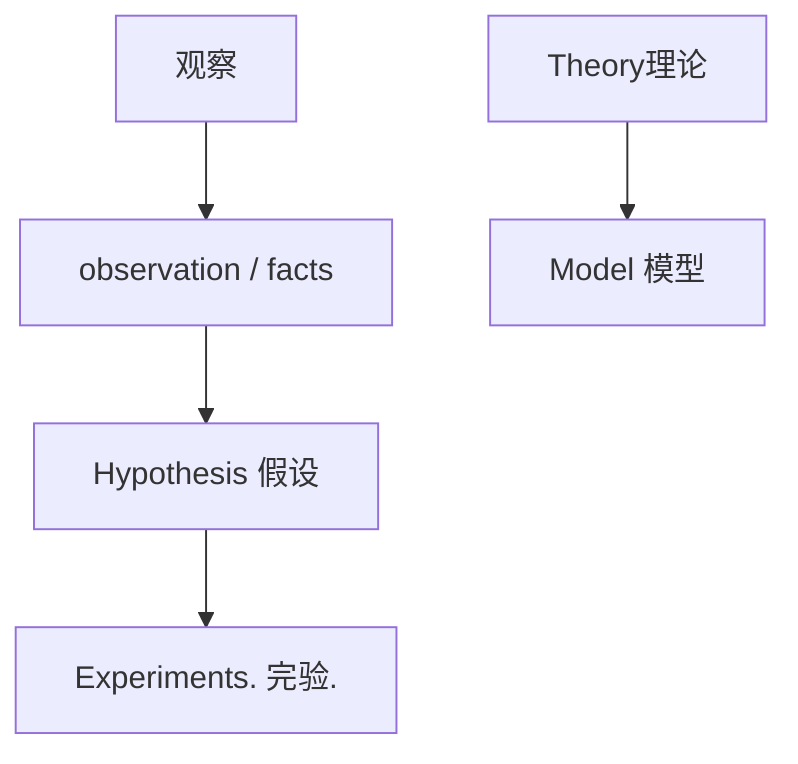
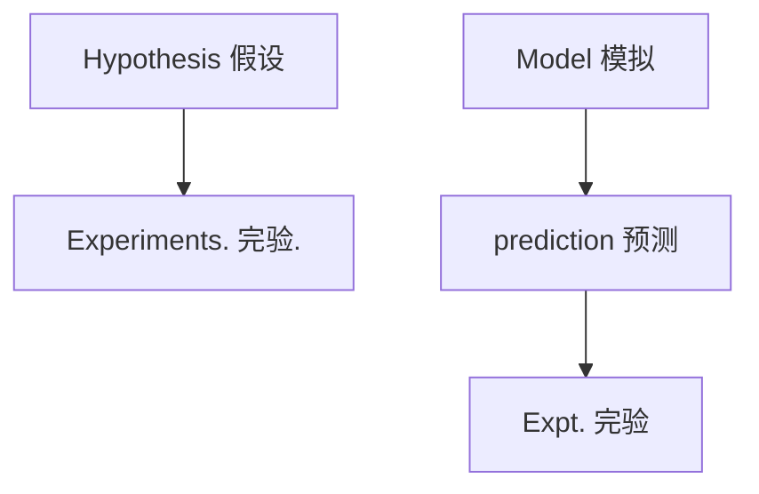
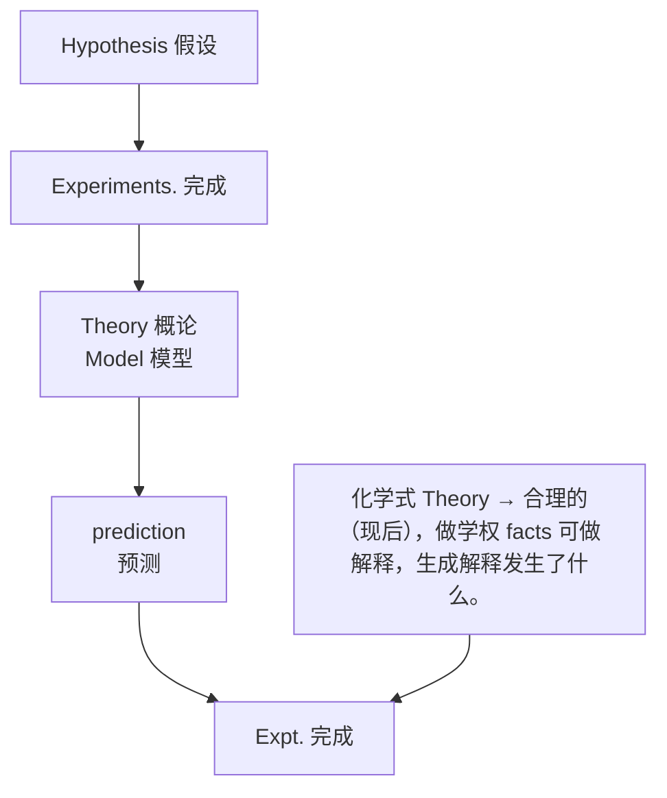

# ⼀、现代化学⼊⻔ 01:51

# 1. 课程介绍 02:26

# 1）课程地位与知识体系 02:38

#  课程定位

text_image

Casio fx-99/CN 中文段
Part I. Overview.
作为实验科学 Experimereel Science. How to
study the world in a scientific way.

o零基础性: 本课程为化学竞赛⼊⻔课，不需要完整的⾼中化学知识基础，采⽤美国⼤⼀化学教材体系  
o 知识体量: 对应北⼤化院前三个学期核⼼专业课，国初考试需要完整学习五个学期（⼀年）课程  
o 与⾼中区别: ⼤学化学会系统性重建知识架构，⽐⾼中化学更深⼊透彻

#  知识体系构建 09:00

text_image

Part I. Overview.
作为实验科学 Experimedes Science. How is
study the world in a scitifre way.

oo 微观⻆度: 暑假课程从原⼦结构→成键→分⼦结构→分⼦间作⽤⼒→溶液性质  
C 宏观⻆度: 下学期将学习反应能量、反应程度与速率等宏观性质  
o ⼯具性: 化学基本原理课程提供分析评价化学反应的⼯具箱，为后续有机/⽆机化学学习奠基

# 2）课程内容与教材使⽤ 04:41

#  教学特点 07:46

flowchart

o主线教学: 不照搬⼤学教材，⽽是提炼竞赛考点形成清晰知识主线  
o 补充阅读: 课后会指定⼤学教材对应章节作为扩展阅读材料  
o 学习节奏: 初期知识⼯具积累较慢，后期应⽤阶段学习速度会加快

 推荐教材 05:33

o 使⽤⽅式: 课后作业+推荐阅读章节+配套习题三位⼀体  
o 教材特点: ⼤学教材内容庞杂，本课程会进⾏知识点的筛选和重组

3）课程安排与要求 06:40

 学习流程

flowchart

o核⼼环节: 听课→完成作业→订正讲解→补充阅读的循环

o 作业提交: 通过课程QQ群提交，可选择群内公开或私信助教

o 课程群: 包含作业发布、资料分享、课程讨论等重要功能

 计算器要求

flowchart

o必备⼯具: 每节课需携带科学计算器，推荐卡⻄欧fx-991CN中⽂版  
o 竞赛适配: 该型号为化竞/物竞官⽅推荐，决赛时会统⼀发放使⽤   
o 功能需求: 本学期基础运算，下学期需解⽅程、数据存储等⾼级功能

# 4）化学学科⽅法论

#  实验科学认知

text_image

作为实验科学 Experimereel Science. Has
study the world in a scientific way.
观察 单实
observation/facts
↓
Hypothesis 假设
1

o 研究循环: 观察(observation)→假说(hypothesis)→实验(experiments)→理论 (theory)→预测(prediction)→验证的闭环过程   
o 理论特点: 化学理论追求合理性⽽⾮绝对正确，能解释多数现象即可  
o 与数学区别: 数学公理可预测未来，化学理论主要解释已观察现象

#  教学策略

text_image

• 化学好 Theory. → 合理好 (现有好, 很大家
权 facts 可被解释.
尝试解释发生了什么.
• 数字好 Law 公理: 可以 预测 将要发电什么.
Expt. 实验

第⼀轮重点: 快速建⽴完整的理论框架，暂不深⼊讨论反例

o 第⼆轮深化: 后续课程会通过反例引发对理论局限性的思考

实验缺失补偿: 课堂教学会精选⽀持理论的案例进⾏说明

o 注：所有图⽚均根据课程记录中的ppt\_content和zimu\_content对应关系插⼊到恰当位置，完整呈现了课程的知识体系和教学⽅法要点。

# 2. 储备性知识 32:56

# 1）有效数字 33:02

 有效数字的定义 33:49

text_image

·数学 Law 视：可以预测将要发电化。
Expt.#
Part II Preparation.

oo 基本概念：有效数字是指测量或计算中实际有意义的数字位数，反映数据的精确程度。  
o 示例说明：数字123的有效数字位数SN=3，因为所有⾮零数字都有效。

 有效数字的规则 34:06

o 基本规则

text_image

Part II Preparation.
1. 有效数字. Significant Numbers (SN)=
Significant Figures. (4F)
123 SN=3 →所有非0数字皆无效.
0.00123 SN=3 →非0数字之间0是无效的.
0.001023 SN=4 →非0数字之间0是无效的.
0.00102300 SN=6 →非0数字之间0也是无效的.
102300

规则1-⾮零数字有效性：所有⾮零数字都是有效的，如123的SN=3。  
 规则2-前导零⽆效性：⾮零数字之前的零都⽆效，如0.00123的SN=3（仅123有效）。  
 规则3-中间零有效性：⾮零数字之间的零都是有效的，如0.001023的SN=4（1023都有效） 。  
规则4-尾随零有效性：⾮零数字之后的零在⼩数点后也是有效的，如0.00102300的SN=6。

） 科学计数法的应⽤

text_image

123 SN=3 →所有非0数字皆无效.
0.00123 SN=3 →非0数字之间0是无效的.
0.001023 SN=4 →非0数字之间0是无效的.
0.00102300 SN=6 →非0数字之间0也是无效的.
102300. SN=6 (不成立)
1.02300×10^5 SN=6.

 标准表示法：为避免歧义，应采⽤科学计数法表示，如102300应表示为$1 . 0 2 3 0 0 \times 1 0 ^ { 5 }$ ，此时明确SN=6。

 常⻅误区： $1 . 0 2 3 \times 1 0 ^ { 5 }$ 虽然数学等价，但化学⻆度SN=4，丢失了两位有效数字的精度信息。

# ） 化学实验中的意义

text_image

00 SN = 6 → 非0.2m2p2m0.2m
2科学读
SN = 6 (14秒之后)
10^5 SN = 6.
:10^5 SN = 4
4. For each of the following pieces of glassware, provide a
sample measurement and discuss the number of
significant figures and uncertainty.
↑      ↑      ↑
量筒    滴泡筒    炒

精度体现：不同实验仪器（量筒、滴定管、烧杯）测量同⼀体积时，有效数字位数不同反映测量精度差异。  
 物理意义：有效数字位数代表实验数据的可信程度，更多有效数字通常表示更⾼测量精度。

# o 特殊情况的处理

text_image

0.00102300 SN=6 → 非0数字之源
102300. SN=6 (不被点源)
1.02300 ×10^5 SN=6.
if 1.023 ×10^5 SN=4
4. For each of the following pieces of glassware, provide a sample measurement and discuss the number of significant figures and uncertainty.
↑ ↑ ↑
量筒 滴距值 烧杯

点标记约定：部分教材在数字末尾加点（如102300.）表示精确到个位数，此时SN=6。

1 严格规则：按标准有效数字规则，⽆论是否加点， $1 . 0 2 3 0 0 \times 1 0 ^ { 5 }$ 都应判定为 $S N = 6$ 。

#  例题1：量筒读数 42:36

# o 量筒读数⽅法

text_image

4. For each of the following pieces of glassware, provide a sample measurement and discuss the number of significant figures and uncertainty.
↑
量筒
↑
调笔筒
↑
烧杯

确定刻度范围：读数时⾸先要确定液⾯位于哪两个刻度之间。例如液⾯在1mL和2mL之间，第⼀位数字确定为1。  
 估读第⼆位数字：在最⼩刻度间进⾏估读，如液⾯在1和2刻度中间可估读为1.5mL。  
 有效数字规则：量筒读数通常保留两位有效数字，最后⼀位为估读值。如1.5mL中"1"是确定值，"5"是估读值。

# 读数误差分析

 个⼈差异：不同实验者可能估读不同值（如1.4mL、1.5mL、1.6mL），只要在合理范围内都视为正确。  
 数据处理⽅法：通过多次平⾏实验取平均值提⾼可靠性，极端值在数据分析时可能被剔除。  
 仪器精度限制：量筒的准确度只能到⼩数点后⼀位，如读作1.52mL就是错误的。

# o 常⻅错误类型

超出刻度范围：如液⾯在1-2mL之间读作2.0mL是错误的。  
过度精确：如读作1.52mL（三位有效数字）超出量筒精度。  
 合理误差范围：即使估读值接近边界（如1.9mL）仍视为正确，属于合理误差。

#  例题2：滴定管读数 46:40

# o 滴定管读数特点

text_image

0.00123 SN=3 →非0数字之间0是无效的.
0.001023 SN=4 →非0数字之间0是有效的.
0.00102300 SN=6 →非0数字之间0也是有效的.
102500. SN=6 (不通过)
1.02300×10^5 SN=6.
if 1.023×10^5 SN=4
↑ y_c=2x-1 ↑ ↑
量筒 滴函数 烧杯

刻度精度：10-11mL之间分成10格，最⼩刻度为0.1mL。

读数规则：可精确到0.1mL，下⼀位估读。如10.5-10.6mL之间可读作10.54mL或10.56mL。

有效数字：可保留三位有效数字，前两位确定，第三位估读。

o 读数对⽐分析

正确读数：10.54mL、10.56mL（在10.5-10.6刻度范围内）  
错误读数：11.0mL（超出当前刻度范围）  
精度差异：滴定管⽐量筒精度更⾼，可多保留⼀位有效数字。

o 烧杯读数特点

刻度粗糙：通常只有10mL、20mL、30mL等⼤刻度。  
读数限制：只能估读到个位数，如液⾯在10-20mL之间读作15mL。  
使⽤场景：适⽤于对精度要求不⾼的粗略测量。

 例题3：烧杯读数

text_image

4. For each of the following pieces of glassware, provide a sample measurement and discuss the number of significant figures and uncertainty.
0.1ml
A V₁ = 10.5ml
B V₂ = 10.5cm
C V₃ = 10.6mL
D 10.56ml
V₁ = 1.5ml
V₂ = 1.4ml
V₃ = 1.6ml
V₄ = 1.52ml
↑ V₅ = 2.0ml
量筒 滴包筒 烧杯

读数原则：当测量仪器只能以⼗为单位区分时，准确值到⼗位数，个位数即为估读值。  
o 示例分析：四毫升的读数实际上是估读结果，因为该仪器精度只能保证⼗位数的准确性。  
o 有效数字意义：有效数字反映了实验的精确性，是实验科学中的重要指标。

 有效数字的计算规则

o 有效数字的判定规则

text_image

study the world in a scotyrie way.
· 水原子核
dimerisation/diet
hydromers 粒度
Epapments 粒度
· 仅限白Thong 粒度（细胞）使细胞大小引致细胞。
由电解质发生什么。
· 配备 Law 规：不以使用性脂肪酸。
Porter Proportion:
1. 水原子核。Significant Number (单体)
Significant Number (单体)
(1)3 20:3 → 两面的氢键反应
0.0003 20:3 → 非极的氢键的氢键反应
0.0003 20:3 → 非极的氢键的氢键反应
0.0003 20:3 → 非极的氢键的氢键反应
1.05300 Hz² 20 Hz.
付 1.043 MHz² 20 Hz.

基本规则：

⾮零数字：所有⾮零数字都是有效数字（如123，SN=3）  
 前导零：⾮零数字前的零⽆效（如0.00123，SN=3）  
 中间零：⾮零数字之间的零有效（如0.001023，SN=4）  
 末尾零：⾮零数字后的零有效（如0.00102300，SN=6）  
. 科学计数法：1.02300 × 105，SN=6；1.023 × 105，SN=4

o 有效数字的计算应⽤

text_image

知识: 求在 1.1.
Casa for the problem
Part I. Present:
你 发现得来: Experiment of Science, how to
study the world in a uniform way.

图象
information / 16/21

hygandeers 队及

Experimental 队及.

• 求在白Thing 的 1.1.1 为理由 (原因) 确定
的 1.1.1 为理由 (原因)
要用解体方法是什么。

• 求在白 Handi 的 1.1.1 为理由 (原因)

Prima R
Preparation:
1. 系统函数 = Signifocal Analysis (exp)
1.2 程序 50 正常 Signifocal Function (exp)
1.3 2013 - 则由小数列加法
2013 2013 - 则小数列加法
2014 2014 - 则小数列加法
2015 2015 - 则小数列加法
2016 2016 - 则小数列加法
2017 2017 - 则小数列加法
2018 2018 - 则小数列加法
2019 2019 - 则小数列加法
2020 2020 - 则小数列加法
2021 2021 - 则小数列加法
2022 2022 - 则小数列加法
2023 2023 - 则小数列加法
2024 2024 - 则小数列加法
2025 2025 - 则小数列加法
2026 2026 - 则小数列加法
2027 2027 - 则小数列加法
2028 2028 - 则小数列加法
2029 2029 - 则小数列加法
2030 2030 - 则小数列加法
2031 2031 - 则小数列加法
2032 2032 - 则小数列加法
2033 2033 - 则小数列加法
2034 2034 - 则小数列加法
2035 2035 - 则小数列加法
2036 2036 - 则小数列加法
2037 2037 - 则小数列加法
2038 2038 - 则小数列加法
2039 2039 - 则小数列加法
2040 2040 - 则小数列加法
2041 2041 - 则小数列加法
2042 2042 - 则小数列加法
2043 2043 - 则小数列加法
2044 2044 - 则小数列加法
2045 2045 - 则小数列加法
2046 2046 - 则小数列加法
2047 2047 - 则小数列加法
2048 2048 - 则小数列加法
2049 2049 - 则小数列加法
2050 2050 - 则小数列加法
[图示] [图例] [图例]

# 计算原则：

 保留位数：计算结果应保留与测量值中最⼩有效数字位数相同  
 示例说明：

o 1.20的有效数字是3（SN=3）  
o 2.0的有效数字是2（SN=2）

 注意事项：在实验科学中，正确取⽤有效数字对保证数据精确性⾄关重要

例题4：乘除法有效数字计算 52:31

o 乘除法有效数字规则

text_image

(1).在计算中正确取有汉数字.
1.20 SN=3
2.0 SN=2.
1.20×2.0 = 2.4 2.40 2.400
w to
规则: 来除法. 计算结果C:SN等于参考x÷2项SN最少
SN=3 SN=2 A B C
1.20÷2.0 = 0.6 0.60 0.600
Theory 而论

规则核⼼：乘除法计算结果的有效数字位数，由参与运算的数中有效数字位数最少的决定  
示例1：1.20 × 2.0 = 2.4 1.20有3位有效数字，2.0有2位有效数字结果应保留2位有效数字，故正确答案为2.4  
示例2：1.20 ÷ 2.0 = 0.601.20有3位有效数字，2.0有2位有效数字结果应保留2位有效数字，故正确答案为0.60（注意末尾0不能省略）  
1 示例3：2.43 × 2.000 = 4.86 2.43有3位有效数字，2.000有4位有效数字结果应保留3位有效数字，故正确答案为4.86

o 规则应⽤要点

判断依据：先确定各操作数的有效数字位数，再取最⼩值  
 书写规范：计算结果的有效数字位数确定后，必须严格按此位数书写，不能多也不能少  
 常⻅错误：容易忽略末尾的0也是有效数字（如0.60⽐0.6多⼀位有效数字）

. 例题5：加减法有效数字计算 59:21

# o 加减法有效数字规则

text_image

1.20 × 2.0 = 2.4 2.40 2.400
规则：乘除法. 计算结果(设SN等于考)
SN=3 SN=2 A B C
1.20 ÷ 2.0 = 0.6 0.60 0.600 (课后有2位SN)
SN=3 SN=4 A B C
2.43 × 2.000 = 4.86 4.860 4.86000 (课后有3位2N)
规则：加减法. 更有正负结果(如有数字位数)共按
计算结果
 prediction
预测
1/5

 规则核⼼：加减法结果的⼩数位数，由参与运算的数中精度最差（⼩数位数最少）的决定  
示例1：2.0 + 1.20 = 3.2

 2.0有1位⼩数，1.20有2位⼩数  
 结果应保留1位⼩数，故正确答案为3.2

示例2：10 + 0.003 = 10

 10没有⼩数位，0.003有3位⼩数  
 结果应保留0位⼩数，故正确答案为10

# o 规则应⽤要点

精度概念：⼩数位数反映测量仪器的精度，结果不能超过最不精确的测量值  
实际意义：如同使⽤不同精度的天平称重，总重量精度受限于精度较差的天平  
1 特殊情况：整数参与运算时，视为⼩数位数为0

# o 混合运算处理

处理原则：先按运算顺序分步计算，每步应⽤对应规则  
1 注意事项：中间结果应保留更多位数，最终结果再按规则舍⼊  
记忆⼝诀："乘除看有效数字，加减看⼩数位数"

 例题6：混合运算有效数字计算 01:02:19

# C 混合运算规则

text_image

将算获得结果, 然结果必稍成 (C)
于参考加减法项中精反差分
修正
2.0 + 6.20 = 3.20 3.2
10 + 0.003 = 10 10.0 10.00 10.003
SN=5 SN=2
9. 100.00 × 23 = 7.714278 ← SN=2.
(273.65+25.0) ↓修改
298.15 298.2 298.1 [7.7]
A B C
SN=4

运算顺序判断: 核⼼在于判断最后⼀步运算是加减法还是乘除法。例如10000×23.27315+250的最后⼀步是除法，因此遵循乘除法规则。  
有效数字确定: 参与乘除法的各数字中，有效位数最少的决定最终结果的有效位数。如例题中23的有效数字是2位（SN=2），因此最终结果保留2位有效数字。

# o 分步计算过程

# 加减法环节

. 精度确定: 加减法取决于⼩数点后的位数，由⼩数点后位数少的（精度差的）决定。如273.15+25.0中，25.0⼩数点后1位，因此结果应保留1位⼩数。  
 四舍五⼊规则:298.154四舍五⼊为⼩数点后1位得到298.2（SN=4），此时分⺟值为298.2。

# 乘除法环节

 计算器原始值:100.00 × 23 ÷ (273.15 + 25) = 7.7142378   
 修约规则: 根据乘除法中最⼩有效数字（23的SN=2），将结果修约为2位有效数字，最终答案为7.7。

# o 计算⽅式选择

# 两种⽅法等效性:

 ⽅法⼀：直接输⼊完整算式到计算器，最后统⼀修约  
 ⽅法⼆：分步计算并逐步修约中间结果

# 考试判卷标准:

 ⾼考要求严格按指定规则计算  
 化学竞赛中只要最终有效数字正确（允许±1位误差），两种⽅法均可接受

 推荐⽅法: 直接输⼊完整算式计算更⾼效，在实际考试中出错率更低

# o 注意事项

 物理化学计算特点: 复杂计算中分步修约与整体计算的结果可能存在差异  
 有效数字松紧度: 实际判卷可能⽐理论规则宽松，有效数字位数误差在±1内通常可接受  
计算建议: 明确最终需要的有效数字位数，直接计算后⼀次性修约最优

text_image

rediction
预测
↓
φt.变2
2.0 + 120 = 3.20 3.2
A B
10 + 0.003 = 10 10.0 10.
SN=5 SN=2
99. 100.00 × 23 = 7.7142878 ← SN=2.
(273.65+25.0)
11
298.15 298.2 298.1 [77]
A B C
SN=4

# 2）测量 01:08:29

#  物理量的测量

text_image

Expt.实验
(273.45+25.0)
298.1
A
B
SN=4
298.2
C
298.1
ZN=7
(SN)
(6F)
测量
物理量.
mass质量
测量
Unit
(1/5)

oo 常⻅物理量: 化学实验主要测量质量、体积、⻓度、时间和温度等物理量

o 有效数字规则:

 乘除法: 结果的有效数字位数与参与运算的数字中最少的有效数字位数相同  
 加减法: 结果的⼩数点后位数与参与运算的数字中⼩数点后位数最少的相同   
示例 $: 4 . 2 \times 2 . 0 + 1 . 2 3 4 = 9 . 6 ($ (先计算 $4 . 2 \times 2 . 0 = 8 . 4$ ，再 $8 . 4 + 1 . 2 3 4 = 9 . 6 )$

#  单位系统

text_image

8.4
9N=4
0g. 42×2.0 + 1.234 = 9.6
(SN)
(SF)
物理量.
Unit
硬度.
mass 质量
S, kg, mg, μg.
)是无效项.
volumn 体积
cm³. (mL) L (dm³) m³
子0 是有效项.
长度、length
mm dm m.
子0 也是有效项.
time
s min h
Temperature °
wing pieces of glassware, provide a
t and discuss the number of
at uncertainty.
A
B
C
D
E
F
G
H
I
J
K
L
M
N

# o 质量单位:

常⽤克(g)，实验室天平可精确到⼩数点后四位  
单位换算:1 $k g = 1 0 ^ { 3 } g , 1 g = 1 0 ^ { 3 } m g , 1 m g = 1 0 ^ { 3 } \mu g$

<table><tr><td colspan="2">2. Measurement 测量.</td></tr><tr><td>物理量.</td><td>Unit</td></tr><tr><td>mass 质量</td><td>S, kg, mg, μg</td></tr><tr><td>volume 体积.</td><td>cm³. (mL) L (dm³) m³</td></tr><tr><td>长度、length</td><td>mm dm m.</td></tr><tr><td>time</td><td>s min h</td></tr><tr><td>Temperature 程度</td><td>℃ Kelvin (K)
0℃ = 273.15 k.</td></tr></table>

# o 体积单位:

常⽤毫升(mL)和升(L)

 换算关系: $1 L = 1 0 ^ { 3 } m L , 1 m L = 1 c m ^ { 3 } , 1 L = 1 d m ^ { 3 }$

# ⻓度单位:

毫⽶(mm)、厘⽶(cm)、分⽶(dm)、⽶(m)

# o 时间单位:

秒(s)、分钟(min)、⼩时(h)

#  温度测量

text_image

mass 质量
volume 体积
长度、length
time
Temperature 程即
g. Tc:27.0℃ = Tk ? k.
s min h
℃ Kelvin (k)
0℃ = 273.15 k.

# 温度单位:

摄⽒温度(℃): 实验室和⽇常⽣活常⽤   
开尔⽂温度(K): 化学计算必须使⽤  
换算关系 $: 0 ^ { \circ } \mathrm { C } = 2 7 3 . 1 5 K$   
示例 $: 2 7 . 0 ^ { \circ } \mathrm { C } = 3 0 0 . 2 K ( 2 7 3 . 1 5 + 2 7 . 0 = 3 0 0 . 1 5$ ，修约后300.2퐾)

text_image

长度、length
time
Temperature 理弧
min dm
s min h
0℃ Kelvin (k)
0℃ = 273.15 k.
g. Tc=27.0℃ = Tk 300.2 k.
T_F.(°F). (T_F-32)⅓ = T_℃ 公式
T_F = 100℃，请问今天到夜的少 ℃？

# o 华⽒温度(℉):

换算公式:(푇퐹 - 32) × 9 = 푇℃ $: ( T _ { F } - 3 2 ) \times \frac { 5 } { 9 } = T _ { \circ } \subset$   
示例: $1 0 0 ^ { \circ } \mathrm { F } = 3 8 ^ { \circ } \mathrm { C } ( ( 1 0 0 - 3 2 ) \times \frac { 5 } { 9 } = 6 8 \times \frac { 5 } { 9 } = 3 8 )$

#  有效数字规则

text_image

Figure. (6F)
物理量: Unit
mass 质量 s
volume 体积 cm³. (ml) L (dm³) m³
长度, length mm dn m.
time s min h
Temperature 燃度 °C kelvin (k)
0°C = 273.15 k.
g.Tc=27.0°C = Tk 300.2 k.
Tf. (°F). (Tf-32)⅓/Ⅰ = TfC 公式
Tf = 100°C，请问今天到夜多少 °C？
(100 - 32)⑤/Ⅰ = 68xⅤ/Ⅰ = 18.
做好.

# o基本规则:

所有⾮零数字都是有效数字  
⾮零数字之间的零是有效数字  
1 ⼩数末尾的零是有效数字

# o 示例:

123(3位有效数字)  
0.00123(3位有效数字)  
1 0.001023(4位有效数字)  
0.00102300(6位有效数字)  
102300(5位有效数字)  
1.02300 × 105(6位有效数字)

#  测量仪器

text_image

Part II Preparation
1. 有效数字。 Significant Numbers (SN)
11. 确定 SN 核本 Significant Figure (CFA)
123 SN=3 → 非非非数字函数
0.00123 SN=3 → 非非数字函数也是有效数。
0.001023 SN=4 → 非非数字函数也是有效数。
0.00102300 SN=6 → 非非数字函数也是有效数。
102500 SN=6
1.02300×10^5 SN=6.
if 1.023×10^5 SN=4
8.4
g. 82÷2.0 + 1.234 = 9.6
3. Measurement 项量
物理量 Units
mass 质量 S Ks T1 M#
volumm 持取 cm³ (mL) L (dm³) m³
长度 length mm dn m.
time s min h
Temperature 程取 ℃ Kelvin (K)
0℃ = 273.15 k.
gTc=21.0℃ = Tck=2.2 k.
Tf.(℃) (Tp-2t) = Tt2 压式
Tp = 100℃ 清问天到底为0℃？
(100-3t) = 68xF = 18.
保留

# 常⻅仪器:

天平(测量质量)  
量筒、滴定管、烧杯(测量体积)   
温度计(测量温度)

# 3）物质的量 01:18:09

 物质的量的引⼊ 01:18:17

o 测量宏观物质数量的⽅法

text_image

Q. 如何数知一大范mm互侧底有机颗
Sol 1 大写一起表
Sol(2 记)一转2重呈,然后测1颗.
Sol(3. 每动n移取平均值, 完善/修正 Sol2.
阿伏尔加德写常数
AUCOALD Constant = 6.022×10^23

直接计数法：通过多⼈分⼯合作直接数数（如53⼈⼀起数MM⾖），但效率较低  
 质量测量法：核⼼思路是先测总质量再测单个质量（如测⼀⼤袋MM⾖和单颗MM⾖的质量），通过⽐值估算总数  
 科学修正法：对⽅法⼆进⾏完善（如对不同颜⾊MM⾖取样测量，剔除极值后取平均值），提⾼数据可靠性

o 化学计量的核⼼需求 01:24:09

 微观视⻆：化学关注原⼦/分⼦层⾯的物质组成，需要知道宏观物质包含的微观粒⼦数量  
测量困境：直接计数微观粒⼦不现实（数量庞⼤且受测不准原理限制）  
 桥梁构建：通过阿伏伽德罗常数建⽴微观粒⼦数与宏观可测量之间的换算关系

 阿伏伽德罗常数 01:22:12

o 基本定义

text_image

3 The amount of substance 物质的比重.
四. 如何数知一大块mm豆侧底有几颗
Sol 1 大起数
Sol 2 测一转子重量，然后测1粒。
Sol 3. 多边n转取平均值，完善/修正Sol 2.
阿伏加速度 安准式
An average Constant = 6.022×10^23 = NA.

数值表示：푁 =6.022×1023（通常取四位有效数字）  
单位关系：1摩尔（mol）物质含有6.022×1023个基本单元  
应⽤示例：6.022×10²³个鸡蛋=1摩尔鸡蛋（虽实际数量夸张但概念成⽴）

o 历史发展

实验测定：通过测量12克碳-12所含原⼦数确定（早期测量值不精确，随技术进步逐步修正）  
标准定义：푁 个¹²C原⼦精确等于12.000...克（严格定义）  
测量意义：反映了实验技术⽔平的发展历程

 物质的量的应⽤

o 化学计量原理

text_image

So(3). 每动n分裂取平均值. 完善/修正

$$
\mathrm{Alv} \mathrm{coalroConstant} = 6. 0 2 2 \times 1 0 ^ {2 3} = N _ {A}.
$$

$$
6. 0 2 2 \times 1 0 ^ {2 3} \mathrm{个鸡蛋} = 1 \mathrm{mol} \mathrm{eggs}.
$$

微观-宏观转换：1摩尔物质=阿伏伽德罗常数个粒⼦（如1摩尔铁=6.022×1023个铁原⼦）  
实际应⽤：通过测量宏观质量（如500克铁）计算所含微观粒⼦数  
 学科特点：化学关注的最⼩单位是原⼦（区别于物理学对亚原⼦结构的研究）

#  摩尔质量的定义 01:30:16

o 原⼦质量单位

text_image

Na↑ 12C atom = 等液 4
→ 1 mol 12C atoms = 0.000 ... J.
1 mol 12C atoms = 0.000 ... J.
12C 12C atoms = 0.000 ... J.
atomic mass wt
12C元素单位.
2/5

标准定义：¹²C原⼦质量=12.000u（atomic mass unit）  
单位关系：1u=1.6605 × 10 - 24克（通过푁 换算得出）  
测量基础：建⽴在国际单位制对"克"的准确定义上

o 有效数字说明

常数精度：科学常数通常认为具有⾜够多有效数字  
1 计算规则：科学计数法中指数部分不计⼊有效数字（如1.2300×10⁵有5位有效数字）  
 实际应⽤：考试中会提供所需精度的常数，确保计算精度由实验测量值决定

 有效数字与科学计数法 01:38:27

o 有效数字的定义与规则

text_image

L1. Interrelation to Modern Chemistry.
现代化导入门.
Caso f(x-99)/CV 大尺度
Part I. Overview.
作为变换样品 Experiments Science, How to
study the world in a scientific way.
观察
observation/facts
Hypothesis 风段
Experiments 实验.
例法 Theory → 合理的（现有）验证
权 facts 可读解释.
尝试解释发生了什么。
探究 Law 视图，可以返回精确表达法。
Theory 概论
Model 模型
prediction
规则
Example
Expte. 实验
(2)
(1)
(2)
(3)
(4)
(5)
(6)
(7)
(8)
(9)
(10)
(11)
(12)
1.20 5N=3
2.0 5N=2
1.20 x 2.0 = 2.4 2.80 2.400
规则：来确定 计算方法 Q SN 等考于条件 X 的选项最少
A B C
1.20÷2.0 = 0.6 0.60 0.600 (提高后之值为A)
SAL=3 SAL=4
2.43 x 2.000 = 486 4860 486000 (提高后之值为B)
规则：水或盐，要考虑方法是只有数字字符和必须按键
并测量变量结果，然后结束的精度（小数位后方程）等
基于多边形法过程中精度是差子
A B C D
10 + 0.003 = 10 100 1000 10000
gf. (100.00 x 23) (273.16 x 25.0) (273.16 x 25.0) ← SNE = 2.
1Pg. 1Pg. 2 Pn. 1 Pn. 1 Pn. 1 Pn. 1 Pn. 1 Pn. 1 Pn. 1 Pn. 1 Pn. 1 Pn. 1 Pn. 1 Pn. 1 Pn. 1 Pn. 1 Pn. 1 Pn. 1 Pn. 1 Pn. 1 Pn. 1 Pn. 1 Pn. 2
(1/5) (N=14)

 基本概念：有效数字(Significant Numbers, SN)是指测量中实际有意义且可靠的数字位数。

识别规则：

所有⾮零数字都是有效的（如123 SN=3）  
 ⾮零数字前的零⽆效（如0.00123 SN=3）  
 ⾮零数字之间的零有效（如0.001023 SN=4）  
 ⾮零数字后的零有效（如0.00102300 SN=6）  
 科学计数法中10푛前的数字全部有效（如1.02300 × 105SN=6）

o 有效数字的运算规则

乘除法运算

text_image

Part II Preparation.
1. 有效数字，Significant Numbers (SN)
11. 确定SN值，Significant Figures (4x2)
1:33 SN=3 → 非非0数字常数。
0.00123 SN=3 → 非0数字之间0是常数。
0.0010:23 SN=4 → 非0数字之间0是常数。
0.0010:23:00 SN=6 → 非0数字之间0也是常数。
10:23:00 SN=6
1.02300 ×10^5 SN=6.
if 1.023×10^5 SN=4
8.4
9.42×2.0 +
2. Measurement 测量.
物理量：UaH
mass 质量 S
volume 体积 cm³ (C
长度、length mm d
time s min
Temperature 模数 ℃
3. 物质质量 0℃ = :
gTc=27.0℃ = Tk 3m
Tf.(℃) (Tf-22) = 7
Tp = 100℃，请问/先到题号
(100-32) = 68×5 = 
量简 渐整 性别

规则：结果的有效数字位数与参与运算的数中有效数字最少者相同

o 例：1.20×2.0=2.4（SN取2） 例：1.20×2.0=2.4 (SN取2)

o 例：1.20÷2.0=0.60 (SN取2) 例：1.20÷2.0=0.60（SN取2）

o 例：2.43×2.000=4.86（SN取3） 例：2.43×2.000=4.86 (SN取3)

加减法运算

 规则：结果的⼩数位数与参与运算的数中⼩数位数最少者相同

o 例：2.0+120=3.2（⼩数位取1位） 例：2.0+120=3.2 (小数位取1位)

o 例：9.4.2×2.0+1.234=9.6（⼩数位取1位） 例：9.4.2×2.0+1.234=9.6 (小数位取1位)

科学计数法与有效数字

text_image

123 SN=3 →所有非0数字皆无效.
0.00 123 SN=3 →非0数字之和0是无效
0.00 1023 SN=4 →非0数字之间0是有效好.
0.00 102300 SN=6 →非0数字之间0也是有效好.
102500. SN=6 (不等的) 科学微
1.02300 ×10^5 SN=6.
if 1.023 ×10^5 SN=4
以A.指数不是
4. For each of the following pieces of glassware, provide a sample measurement and discuss the number of significant figures and uncertainty.
V1: 10.5ml
V2: 10.5ml
V3: 10.5ml
V4: 1.5ml
V5: 1.5ml
V6: 1.5ml
V7: 1.5ml
V8: 1.5ml
V9: 1.5ml
V10: 1.5ml
V11: 1.5ml
V12: 1.5ml
V13: 1.5ml
V14: 1.5ml
V15: 1.5ml
V16: 1.5ml
V17: 1.5ml
V18: 1.5ml
V19: 1.5ml
V20: 1.5ml
V21: 1.5ml
V22: 1.5ml
V23: 1.5ml
V24: 1.5ml
V25: 1.5ml
V26: 1.5ml
V27: 1.5ml
V28: 1.5ml
V29: 1.5ml
V30: 1.5ml
V31: 1.5ml
V32: 1.5ml
V33: 1.5ml
V34: 1.5ml
V35: 1.5ml
V36: 1.5ml
V37: 1.5ml
V38: 1.5ml
V39: 1.5ml
V40: 1.5ml
V41: 1.5ml
V42: 1.5ml
V43: 1.5ml
V44: 1.5ml
V45: 1.5ml
V46: 1.5ml
V47: 1.5ml
V48: 1.5ml
V49: 1.5ml
V50: 1.5ml
V51: 1.5ml
V52: 1.5ml
V53: 1.5ml
V54: 1.5ml
V55: 1.5ml
V56: 1.5ml
V57: 1.5ml
V58: 1.5ml
V59: 1.5ml
V60: 1.5ml
V61: 1.5ml
V62: 1.5ml
V63: 1.5ml
V64: 1.5ml
V65: 1.5ml
V66: 1.5ml
V67: 1.5ml
V68: 1.5ml
V69: 1.5ml
V70: 1.5ml
V71: 1.5ml
V72: 1.5ml
V73: 1.5ml
V74: 1.5ml
V75: 1.5ml
V76: 1.5ml
V77: 1.5ml
V78: 1.5ml
V79: 1.5ml
V80: 1.5ml

 本质关系：科学计数法将有效数字全部体现在10푛前的系数中  
 表示⽅法：푎 × 10푛，其中1 ≤ 푎 < 10，n为整数  
 优势：10푛部分不作为有效数字参与计算，仅作为倍数关系处理  
 示例： $1 0 2 3 0 0 = 1 . 0 2 3 0 0 \times 1 0 ^ { 5 } ( \mathsf { S N } = 6 )$

# o 测量⼯具与有效数字

text_image

3 →所有非0数字皆有数。
=3 →非0数字之可为0是无效的。
=4 →非0数字之间为0是有效的。
=6 →非0数字之后为0也是有效的。
=6
SN=6.
SN=4
有SN.
V1:1.5ml
V2:1.4ml
V3:1.6ml
V4:1.5ml
V5:1.4ml
V6:1.3ml
V7:1.2ml
V8:1.1ml
V9:1.0ml
V10:0.9ml
V11:0.8ml
V12:0.7ml
V13:0.6ml
V14:0.5ml
V15:0.4ml
V16:0.3ml
V17:0.2ml
V18:0.1ml
V19:0.05ml
V20:0.02ml
V21:0.01ml
V22:0.005ml
V23:0.002ml
V24:0.001ml
V25:0.0005ml
V26:0.0002ml
V27:0.0001ml
V28:0.00005ml
V29:0.00002ml
V30:0.00001ml
V31:0.000005ml
V32:0.000002ml
V33:0.000001ml
V34:0.0000005ml
V35:0.0000002ml
V36:0.0000001ml
V37:0.00000005ml
V38:0.00000002ml
V39:0.00000001ml
V40:0.000000005ml
V41:0.000000002ml
V42:0.000000001ml
V43:0.00000.0000
V44:0.0000.0000
V45:0.0001.5ml
V46:1.5ml
V47:1.4ml
V48:1.3ml
V49:1.2ml
V50:1.1ml
V51:1.0ml
V52:1.1ml
V53:1.2ml
V54:1.3ml
V55:1.4ml
V56:1.5ml
V57:1.6ml
V58:1.7ml
V59:1.8ml
V60:1.9ml
V61:2.0ml
V62:2.1ml
V63:2.2ml
V64:2.3ml
V65:2.4ml
V66:2.5ml
V67:2.6ml
V68:2.7ml
V69:2.8ml
V70:2.9ml
V71:3.0ml
V72:3.1ml
V73:3.2ml
V74:3.3ml
V75:3.4ml
V76:3.5ml
V77:3.6ml
V78:3.7ml
V79:3.8ml
V80:3.9ml
V81:4.0ml
V82:4.1ml
V83:4.2ml
V84:4.3ml
V85:4.4ml
V86:4.5ml
V87:4.6ml
V88:4.7ml
V89:4.8ml
V90:4.9ml
V91:5.0ml

量筒： $V _ { 1 } = 1 0 . 5 m l ~ \left( { 5 \mathsf { N } } { = } 3 \right)$   
移液管： $V _ { 2 } = 1 0 . 5 4 m l ~ \left( \mathsf { S N } { = } 4 \right)$   
烧杯： $V _ { 3 } = 1 . 6 m l ( \mathsf { S N } = 2 )$   
滴管： $V _ { 6 } = 1 . 9 m l ( 5 N { = } 2 )$   
1 精度关系：不同测量⼯具的精度差异直接影响有效数字位数

# o 温度单位的有效数字

text_image

观察
observation / 4x12
Hypodexy. 队及
Experiment: 玻体
· 阿的Thangy-2-有理度（图示）：热能
饱和度和导体特性。
由电解质含量计。
· 阿的2.5cm/秒：热能、导体温度、温度、湿度、温度、湿度、温度、湿度、温度、湿度、温度、湿度、温度、湿度、温度、湿度、温度、湿度、温度、湿度、温度、湿度、温度、湿度、温度、湿度、温度、湿度、温度、湿度、温度、湿度、温度、湿度、温度、湿度、温度、湿度、温度、湿度、温度、湿度、温度、湿度、温度、湿度、温度、湿度、温度、湿度、温度、湿度、温度、温度、湿度
Pease Pheagemation
1. 热度符号：Significant Number (exp)
1.1.1650/100%
1.3
0.0013
0.0013
0.0013
0.0013
1.0/2300/100%
1.1/2300/100%
1.2/2300/100%
1.3/2300/100%
1.4/2300/100%
1.5/2300/100%
1.6/2300/100%
1.7/2300/100%
1.8/2300/100%
1.9/2300/100%
2.0/2300/100%
2.1/2300/100%
2.2/2300/100%
2.3/2300/100%
2.4/2300/100%
2.5/2300/100%
2.6/2300/100%
2.7/2300/100%
2.8/2300/100%
2.9/2300/100%
3.0/2300/100%
3.1/2300/100%
3.2/2300/100%
3.3/2300/100%
3.4/2300/100%
3.5/2300/100%
3.6/2300/100%
3.7/2300/100%
3.8/2300/100%
3.9/2300/100%
4.0/2300/100%
4.1/2300/100%
4.2/2300/100%
4.3/2300/100%
4.4/2300/100%
4.5/2300/100%
4.6/2300/100%
4.7/2300/100%
4.8/2300/100%
4.9/2300/100%
5.0/2300/100%
5.1/2300/100%
5.2/2300/100%
5.3/2300/100%
5.4/2300/100%
5.5/2300/100%
5.6/2300/100%
5.7/2300/100%
5.8/2300/100%
5.9/2300/100%
6.0/2300/1O
6.1/23O
6.2/23O
6.3/23O
6.4/23O
6.5/23O
6.6/23O
6.7/23O
6.8/23O
6.9/23O
7.0/23O
7.1/23O
7.2/23O
7.3/23O
7.4/23O
7.5/23O
7.6/23O
7.7/23O
7.8/23O
7.9/23O
8.0/23O
8.1/23O
8.2/23O
8.3/23O
8.4/23O
8.5/23O
8.6/23O
8.7/23O
8.8/23O
8.9/23O
9.0/23O
9.1/23O
9.2/23O
9.3/23O
9.4/23O
9.5/23O
9.6/23O
9.7/23O
9.8/23O
9.9/23O
1  1  1  1  1  1  1  1  1  1  1  1  1  1  1  1  1  1  1  1  1  1  1  1  1  1  1  1  1  1  1  1  1  1  5
Polar Pressure Ratio °C Kadian (k)
S, 气原子量 °C = -79 ± .8 k
g, T, m, n, o, c = T, m, n, o, k.
Tc(%) (Tc- -t) = Tc, 线性:
Tc = ln m^p, 时间: 大钟, 周长为少 t.c?
(1cm- -t) = gln x = Tc.
(5cm- -t) = gln x = Tc.
(5cm- -t) = gln x = Tc.
(5cm- -t) = gln x = Tc.
(5cm- -t) = gln x = Tc.
(5cm- -t) = gln x = Tc.
(5cm- -t) = gln x = Tc.
(5cm- -t) = gln x - Tc.
(5cm- -t) = gln x - Tc.
(5cm- -t) = gln x - Tc.
(5cm- -t) = gln x - Tc.
(5cm- -t) = gln x - Tc.
(5cm- -t) = gln x - Tc.
(5cm- -t) = gln x - Tc.
(5cm- -t)

转换公式：  
 摄⽒转开尔⽂： $0 ^ { \circ } C = 2 7 3 . 1 5 K$

 华⽒转摄⽒： $( T _ { F } - 3 2 ) \times \frac { 5 } { 9 } = T _ { C }$

 有效数字保持：单位转换时需保持原始测量值的有效数字位数

 例： $1 0 0 ^ { \circ } F = 3 7 . 7 7 7 . . . ^ { \circ } C$ （根据原始SN决定保留位数）

4）原⼦质量单位 01:45:24

 定义与概念 01:45:26

text_image

→ 通过氢氧化物 N_A 原质.
1 mol 12C atoms = 12.000 ... J.
12C O₂原子质量 = 12.000... U.
Atomic mass unit
原子质量单位.

o 人o 基本定义：⼈为定义1摩尔碳12原⼦等于12克，同时定义1个碳12原⼦的质量为12u（原⼦质量单位）  
o 单位关系：通过定义推导出1摩尔的原⼦质量单位等于1克，即1 $m o l u = 1 g$   
o 理解技巧：可将u理解为"克每摩尔"（푔/푚표푙），但需注意这只是辅助理解，实际定义核⼼是12u的整

 原⼦质量单位的计算 01:47:10

text_image

② \( ^{12}C \)  与原子质量 = 0.000... ①
Atomic mass w
原子质量单位.
③④ 定义. 1mol (12U) = 12 g.
= 1mol × U = 1 g. (→ U - 13/mol)
已知: 1 atom of 12C = 12.000... 0 98.29%
1 atom of BC = 13.0034 O 1.11%
[0] 平均而言, 1 atom of C = 0.
12.0000

同位素概念：质⼦数相同但中⼦数不同的原⼦（下节课详细讲解）  
C 碳同位素数据：

碳12：质量12.0000u（定义值），⾃然丰度98.89%  
碳13：质量13.00340u（实验值），⾃然丰度1.11%  
碳14：质量忽略不计（丰度极低）

碳元素的平均原⼦质量 01:48:25

text_image

Atomic mass uni
原子质量单位.
①+② 定义. 1mol (120) = 12 g.
≡ 1mol × 0 = 1 g. (→ 0 - 18/mol)
已知. 1 atom of 12C = 12.000...0 98.89%
1 atom of B C = 13.00340 1.11%
[问] 平的而言 1 atom of C = 0.
12.0000 × 98.89% + 13.00340 × 1.11% =
11.867 14.43

o计算⽅法：加权平均计算，考虑各同位素的质量和⾃然丰度  
o 具体公式：12.0000푢 × 98.89 % + 13.00340푢 × 1.11 %  
o 有效数字：

碳12质量是定义值，有效数字⽆限  
碳13质量是实验值，取⼩数点后五位  
最终结果保留三位有效数字（12.0或12.01均可接受）

 元素周期表中的原⼦质量 01:52:12

heatmap

| | 11 | 12 |
|---|---|---|
| 13 | 5 | 13 |
| 3A | B | Al |
| 14 | C | Si |
| 4A | 10.81 | 26.98 |
| 15 | N | 6 |
| 5A | 12.01 | 28.09 |
| 16 | O | 7 |
| 6A | 14.01 | 30.97 |
| 7A | 8 | 16 |
| 4.003 | 9 | 15 |
| 7A | F | 32.07 |
| 7A | 19.00 | 35.45 |
| 7A | 17 | 35 |
| 7A | Ar | 39.95 |
| 7A | 30 | 36 |
| 7A | 63.55 | 83.80 |
| 7A | 65.38 | 83.80 |
| 7A | 10.81 | 20.18 |
| 7A | 12.01 | 20.18 |
| 7A | 14.01 | 20.18 |
| 7A | 16.00 | 20.18 |
| 7A | 16.00 | 20.18 |
| 7A | 19.00 | 20.18 |
| 7A | 20.18 | 20.18 |
| 7A | 20.18 | 20.18 |
| 7A | 20.18 | 20.18 |
| 7A | 20.18 | 20.18 |
| 7A | 20.18 | 20.18 |
| 7A | 20.18 | 20,000 |
| 7A | 20.18 | 20,000 |
| 7A | 20.18 | 20,000 |
| 7A | 20.18 | 20,000 |
| 7A | 20.18 | 20,000 |
| 7A | 20.18 | 20,00<nl>

数值含义：元素周期表中碳元素下⽅的12.01表示：

1 微观量：⼀个碳原⼦的平均质量为12.01u  
宏观量：碳元素的摩尔质量为12.01g/mol

o 单位转换：通过摩尔概念连接微观和宏观量

 摩尔质量与原⼦质量单位的关系 01:52:48

text_image

L→ 通过氢氧化钡 NA 子值.
→ 1 mol 12C atoms = 12.000 ... J.
② 12C O原子质量 = 12.000... U.
atomic mass unit
原子质量单位.
③ +④ 定义. 1mol (12U) = 12 g.
= 1mol × U = 1 g. (→ U - 13/mol)
已知: 1 atom of 12C = 12.000... U 98.29%
1 atom of BC = 13.0034 U 1.11%
[O] 平均而言, 1 atom of C = 12.01 U.
12.0000 × 98.89% + 12.0000 × 1.11% = 12.0 U

o关系推导：

1摩尔碳原⼦ = 12.01u × 阿伏伽德罗常数  
由于1摩尔u = 1g，因此碳的摩尔质量 = 12.01g/mol

符号表示：摩尔质量⽤⼤写M表示，单位g/mol

 物质的量、摩尔质量与质量的关系 01:55:01

text_image

11.867
14.43
(c).
The molar mass of carbon. ≡ 1 mol.
1 mol × 12.0 l O = 12.0 l g.
11.0 l g·mol. = M (c)
解: 物度的量 n (mol).
摩尔质量 M (g·mol⁻¹).
质量 m (g.)
n = m/m

o基本量定义：

物质的量(n)：单位摩尔(mol)  
摩尔质量(M)：单位克每摩尔(g/mol)  
质量(m)：单位克(g)

o 核⼼公式：푛 = 푀 $n = \frac { m } { M }$

o 单位验证：公式两边单位均为摩尔，验证了公式的正确性  
o 阿伏伽德罗常数：1摩 $\scriptstyle { \overleftarrow { \prime } } 1 = 6 . 0 2 2 \times 1 0 ^ { 2 3 }$ 个，作为微观与宏观的桥梁

5）应⽤案例 01:56:49

 例题:碳-12原⼦质量计算

o 原⼦质量单位换算

text_image

11.01 g·mol. = M (c)
的: 物质的量 n (mol).
摩尔质量 M (g·mol⁻¹).
质量 m (g.)
n = m/m
g. 已知 1 atom of Ca = 40 U
同 6 atoms of Ca 是多少 g ?
m: 6 atoms of Ca = 400 ×6 = 2.4 ×10² U = 2.4×10³ ×10⁻⁴ g
又已知 1 mol U = 19. 1U = 1.00…0.9/6.022×10⁻³ = 2.4/6.022 ×10⁻⁴ g
= 4.0×10⁻⁴ g.
SN=2

基本概念：1摩尔(mol)等于阿伏伽德罗常数 $( 6 . 0 2 2 \times 1 0 ^ { 2 3 } )$ 个粒⼦，摩尔质量푀的单位是g/mol  
单位换算：1个原⼦质量单位(u)等 于 6.022 × 1023克，即1푢 = 푁 $\frac { 1 } { 6 . 0 2 2 \times 1 0 ^ { 2 3 } } .$ $1 u = { \frac { 1 g } { N _ { A } } }$   
计算示例：已知1个钙原 $z = 4 0 u$ ，则6个钙原⼦质量=$4 0 u \times 6 = 2 4 0 u = 2 . 4 \times 1 0 ^ { 2 } u$ （保留两位有效数字）

# o 有效数字规则

text_image

问 230

科学计数法转换：2300若表示为 $2 . 3 0 0 \times 1 0 ^ { 3 } \textcircled { | } | \mathsf { S N } | = 4 .$ ；若为 $2 . 3 0 \times 1 0 ^ { 3 } \textcircled { | } | | \mathsf { S } \mathsf { N } { = } 3$   
 判断标准：⾮零数字后的零在⼩数点后才计⼊有效数字，如2.30中末尾的0有效  
实验记录规范：测量数据应明确有效数字位数，避免歧义

# 例题:芯⽚硅原⼦计算 02:03:35

# o 摩尔质量计算

text_image

计可鞋技成 2.300×10³ ⇒ SN=4.
2.30×10³ ⇒ SN=3.
eg2 瓣A chip has 5.68 my O Si;硅.
M(Si) = 28.09 S·mol⁻¹
问这个 Chip 有多少个 Si √n₂?

 已知条件：芯⽚含5.68mg硅，硅的摩尔质量 $M ( S i ) = 2 8 . 0 9 g /$ 푚표푙   
计算公式：原⼦数量 $\cdot N = N _ { A } \times { \frac { m } { M } } = 6 . 0 2 2 \times 1 0 ^ { 2 3 } \times { \frac { 5 . 6 8 \times 1 0 ^ { - 3 } g } { 2 8 . 0 9 g / m o l } }$   
单位换算：注意将毫克(mg)转换为克(g)保持单位统⼀

# o 计算过程与修约

text_image

number (Si) = NA·n(Si) = NA × m(Si)
= 6.022×10^23↑/mol × (5.68×10^-3g/28.09 g·mol^-1)
= 6.022 × 5.68 ×10^20 ↑
28.09

# A

# 分步计算：

5.68 × 10 - 3 计算摩尔数： $\overline { { \phantom { 1 } 2 8 . 0 9 } } = 2 . 0 2 2 \times 1 0 ^ { - 4 } m o l$ 28.09  
 计算原⼦数： $6 . 0 2 2 \times 1 0 ^ { 2 3 } \times 2 . 0 2 2 \times 1 0 ^ { - 4 } = 1 . 2 1 7 6 9 \times 1 0 ^ { 2 0 }$

# 有效数字处理：

 原始数据SN：质量(5.68)→3位，摩尔质量(28.09)→4位  
 最终结果保留3位有效数字： $1 . 2 2 \times 1 0 ^ { 2 0 }$ 个原⼦

 计算验证：通过计算器验证 $6 . 0 2 2 \times 5 . 6 8 \div 2 8 . 0 9 = 1 . 2 1 7 6 9$ ，经修约得最终结果

#  例题:补原⼦质量计算 02:08:44

# o 题⽬分析

text_image

SN=4 SN=3
= 6.022 × 5.68 ×10^20 ·↑
SN=4
= 1.21769705 ×10^21 ↑ ⇒ 1.22×10^23 ↑
SN=3
( )
21%
%
eg3，某样品，含有 S.00×10^20↑ C₀原子。
.
.
.
.
.
.
.
.
.
.
.
.
.
.
.
.
.
.
.
.
.
.
.
.
.
.
.
.
.
.
.
.
.
.
.
.
.
.
.
.
.
.
.
.
.
.
.
.
.
.
.
.
.
.
.
.
.
.
.
.
.
.
.
.
.
.
.
.
.
.
.
.
.
.
.
.
.
.
.
.
.
.
.
.
.
.
.
.
.
.
.
.
.
.
.
.
.
.
.
.
.

# 

# 已知条件：

 样品含有 $5 . 0 0 \times 1 0 ^ { 2 0 }$ 个钴(Co)原⼦   
 从元素周期表查得钴的相对原⼦质量为58.93

# 求解⽬标：

. 计算样品重量  
 计算样品中钴的物质的量

# o 解题思路

text_image

SN=3
9% 8g3.5g某样品.会有 5.00×10^20个C₀原子.
且.1个C₀原子主 58.93U.
(每颗) M(C₀) = 58.93 g.mol⁻¹
问:此样品①重量? ②含有多MolecularCo.

# 计算顺序：

 先求物质的量(n)，再通过摩尔质量(M)求质量(m)  
 公式关系：푛 = 푁 ， $n = \frac { N } { N _ { A } } , m = n \times M$

# 关键常数：

 阿伏伽德罗常数 $N _ { A } = 6 . 0 2 2 \times 1 0 ^ { 2 3 } m o l ^ { - 1 }$   
 钴的摩尔质量 $M ( C o ) = 5 8 . 9 3 g / m o l$

# o 计算过程

text_image

(物体) M(0) = 58.93 g.mol
问,此框吗①重量? ②销量多少mole的C0.
tle mole x M = m.
n C(0) = \frac{5.00\times10^{20}\uparrow}{6.022\times10^{23}\uparrow.mol^{-1}} = \frac{0.8302999406}{51=3\downarrow} \times 10^{-3}mol
每约 0.830 \times 10^{-3}mol = 8.30\times10^{-4}mol.
m=n·M = 8.30\times10^{-4}mol × 58.93 g.mol^{-1} =

# 物质的量计算：

 $n ( C o ) = \cfrac { 5 . 0 0 \times 1 0 ^ { 2 0 } } { 6 . 0 2 2 \times 1 0 ^ { 2 3 } } = 0 . 8 3 0 2 9 9 9 4 0 6 \times 1 0 ^ { - 3 } m o l$   
. 修约规则 $( 5 \mathsf { N } = 3 ) \colon 8 . 3 0 \times 1 0 ^ { - 4 } m o l$

# 质量计算：

 $m = n \times M = 8 . 3 0 \times 1 0 ^ { - 4 } m o l \times 5 8 . 9 3 g / m o l$   
 计算结果： $4 . 8 9 \times 1 0 ^ { - 2 } g ( = 1 \div \frac { 2 } { 5 } \div \frac { 2 } { 5 } \times \frac { 4 } { 5 } \times \frac { 2 } { 7 } )$

# o 注意事项

text_image

= 12.0 0
或 0.010.
mol of c
n (Co) = \frac{5.00 \times 10^{20} \uparrow}{6.022 \times 10^{23} \cdot 10^{-1}} = \frac{0.8302999466 \times 10^{-3} \text{ mol}}{21:3.6}
每约 0.830 \times 10^{-3} \text{ mol } = 8.30 \times 10^{-4} \text{ mol.}
m = n \cdot M = 8.30 \times 10^{-4} \text{ mol } x 58.93 \cdot 8 \text{ mol}^{-1} = 4.89 \times 10^{-2} g.
n = \frac{m}{M}

# 有效数字规则：

 ⾮零数字前的零不算有效数字  
 本例中0.048只有两位有效数字

# 计算要点：

 严格遵循修约规则   
 注意单位换算和量纲分析  
 建议逐步计算避免跳步错误

 例题:甲烷分⼦量计算 02:15:37

o 分⼦量计算原理

text_image

m = n·M = 8.30×10-4mol x 58.93 g·mol-1 = 4.89×10-2g.
eg5. E=2. M(CC) = 12.01 g·mol-1 M(CH4) = 1.008 g·mol-1
同 M(CH4) = ? 8·mol-1 Law 质量守恒(原子守恒).
4×10^2 x 60×10^23g
2/10^22 x10^-21g

质量守恒定律: 在普通化学反应中，原⼦既不会被消灭也不会被创造，遵守原⼦守恒原则，其物理本质是质量守恒。

分⼦量计算⽅法: 分⼦摩尔质量等于组成该分⼦所有原⼦的摩尔质量之和。例如甲烷($C H _ { 4 } )$ 的摩尔质量计算式为：

$M ( C H _ { 4 } ) = M ( C ) + 4 M ( H )$

# 具体计算过程:

碳的摩尔质量 $M ( C ) = 1 2 . 0 1 g \cdot m o l ^ { - 1 }$   
 氢的摩尔质量 $M ( H ) = 1 . 0 0 8 \ g \cdot m o l ^ { - 1 }$   
 甲烷分⼦量计算： $1 2 . 0 1 + 4 \times 1 . 0 0 8 = 1 6 . 0 4 2 \ : g \cdot m o l ^ { - 1 }$   
 最终结果保留两位⼩数：16.04 푔 ∙ 푚표푙 - 1

碳元素平均原⼦量

text_image

≡ 1mol × O = 1 g. (0.0 - 13/mol)
已知: 1 atom of BC = 12.000 - 0
1 atom of BC = 13.00340
[6] 平均分号: 1 atom of C = 12.01 O.
12.0000 × P8.97% + 13.00340 × L11%
11.867
(c).
The molecular mass of carbon. ≡ 1 mol of C
1 mol × 12.01 O = 12.01 g.
12.01 g mol. = M (c)
的: 镀量比量 n 1mol = 600mol⁻³
摩尔质量 M (g·mol⁻¹) m = m
质量 m (g)
g) 比物: atom of Ca = 400
TO 6 atoms of G & so s ?
#: 6 atoms of Ca = 400 x6 = 2.4×10⁻⁵ U = 2400×10⁻⁵ g
无量: 1 mol U = 13. 1U = 6×10⁻⁵ g
⑤为, 粗体样品, 含有 5.00×10⁻⁵
点, 1个 Ca 点, 粗体质量
(现象): M (Ca) = 6.2×10⁻⁵ g·mol⁻¹
同, 效得: ①含量: ②稀有 ③mol/g Ca。
M (Ca) × M = m.
n (Ca) = (1.00×10⁻⁴)/6.022×10⁻⁴ g·mol⁻¹ = (a×10⁻⁷)×6×10⁻⁶ mol/(m³/3·s)
平均 = a×10⁻⁷ × 10⁻⁵ + 8.3×10⁻⁶ mol/(g·mol⁻¹)
m = n·M = 8.3×10⁻⁶ mol × 58.3×8 mol⁻¹ = 4.8×10⁻⁶ g.
e.g. M (C) = 12.01 g·mol⁻¹ M (H) = 1.008 g·mol⁻¹
因 M (CH₃) = ? g·mol⁻¹ LCO 质量定值 (后缀值).
M (CH₃) = M (C) + 4 M (CH₃)
= (b+O + 4×O·g) g·mol⁻¹
= (c+O + 4×O₂) g·mol⁻¹
= 16.04 g·mol⁻¹

# 同位素贡献:

 $^ { 1 2 } C \colon$ 相对原⼦质量12.0000，丰度98.89%   
 $^ { 1 3 } C \colon$ 相对原⼦质量13.0034，丰度1.11%

# 平均原⼦量计算:

$1 2 . 0 0 0 0 \times 9 8 . 8 9 \% + 1 3 . 0 0 3 4 \times 1 . 1 1 \% = 1 2 . 0 1 0 g \cdot m o l ^ { - 1 }$   
摩尔质量定义: 1摩尔碳原⼦的质量为12.010克

#  例题:分⼦量计算 02:18:57

# o 复杂分⼦量计算

text_image

Juglone. → Formula C₁₀H₆O₃
Q1. The molar mass of juglone M(C₁₀H₆O₃).?
已知 C 12.01 H 1.008 O 16.00
结果.

分⼦式分析: 以 $C _ { 1 0 } H _ { 6 } O _ { 3 }$ 为例，计算其摩尔质量

# 计算步骤:

 碳贡献： $1 0 \times 1 2 . 0 1 = 1 2 0 . 1 g \cdot m o l ^ { - 1 }$   
 氢贡献： $6 \times 1 . 0 0 8 = 6 . 0 4 8 ~ g \cdot m o l ^ { - 1 }$   
 氧贡献： $3 \times 1 6 . 0 0 = 4 8 . 0 0 ~ g \cdot m o l ^ { - 1 }$

# 有效数字处理:

. 原始计算值：174.148 푔 ∙ 푚표푙 - 1  
 根据120.1的四位有效数字，结果应保留⼩数点后⼀位  
 最终修约结果： $1 7 4 . 2 \ g \cdot m o l ^ { - 1 }$

# o 计算注意事项

单位要求: 所有物理量必须包含数字和单位

# 有效数字规则:

 加减法以⼩数点后位数最少的数为准   
 乘除法以有效数字位数最少的数为准

# 常⻅错误:

 忽略单位书写   
 有效数字处理不当

 同位素丰度计算错误

 例题:物质的量计算 02:24:36

o 胡桃醌摩尔质量计算

text_image

eg 6. Juglone. → Formula C₁₀H₆O₃
Q1. The molar mass of Juglone M(C₁₀H₆O₃). ?
### C 11.01 H 1.008 O 16.00
反应: M(C₁₀H₆O₃) = 10 M(CC) + 6 M(H) + 3 M(O)
= (10×0.01 + 6×1.008 + 3×16.00) 8·mol⁻¹
= (120.1 + 6.048 + 48.00) 8·mol⁻¹
= 174.15 8·mol⁻¹
↓修至列小粒点后1度
↓考虑“含量5入”
= 174.2 8·mol⁻¹

分⼦式：胡桃醌的化学式为 $C _ { 1 0 } H _ { 6 } O _ { 3 }$   
计算⽅法：摩尔质量 $M = 1 0 M ( C ) + 6 M ( H ) + 3 M ( O )$

具体计算：

 10 × 12.01 = 120.1   
 6 × 1.008 = 6.048   
 3 × 16.00 = 48.00

 总和 = 120.1 + 6.048 + 48.00 = 174.148 푔 ∙ 푚표푙 - 1

修约规则：

 若计算结果为174.148，保留⼀位⼩数时看第⼆位⼩数4，应舍去得174.1   
 若计算结果为174.158，保留⼀位⼩数时看第⼆位⼩数5，应进位得174.2   
 两种结果174.1和174.2都是正确的

o 胡桃醌的来源与应⽤

text_image

= (120.1 + 6.048 + 48.00) 8 mol
= 174.15 8 mol⁻¹
↓修为到小颗金石(位
↓老虎“干含5入”
= 174.2 8 mol⁻¹
元,如果直接计算完获得 结果为 174.148 8 mol⁻¹ 则修为的
174.1 8 mol⁻¹

天然来源：  
. 从胡桃(walnut)未成熟的⻘⾊表⽪中萃取获得  提取⽅法：将表⽪磨粉后溶于有机溶剂，经分离提纯得到

⽣物作⽤：

 植物分泌后可扩散到空⽓中  
. 选择性杀死周围竞争植物，但不影响⾮竞争性植物(如草)  
 具有独特的⽣态竞争调节功能

 例题:物质的量计算 02:25:57

o 萃取物质量计算

text_image

↓方程
= 174.2 8 mm

记如果首接计完象得红果为174.148 $8 \cdot m s l ^ { - 1 }$

$$
1 7 4. 1 \quad 8. m s l ^ {- 1}
$$

Q.6x10preyloe  mayles?

# 已知条件：

 获得纯胡桃醌质量 $m = 1 . 5 6 \times 1 0 ^ { - 2 } g$ （即15.6毫克）  
 摩尔质量 $M = 1 7 4 . 2 g \cdot m o l ^ { - 1 }$

# 计算公式：

 物质的量푛 = 푀 = ${ \cdot } n = { \frac { m } { M } } = { \frac { 1 . 5 6 \times 1 0 ^ { - 2 } } { 1 7 4 . 2 } }$

# 计算结果：

 计算器显示 $8 . 9 5 5 \times 1 0 ^ { - 5 } m o l$   
 有效数字处理：质量数据有效数字为3位，故结果修约为8.96×$1 0 ^ { - 5 } m o l$

# 注意事项：

 单位换算需特别注意（克与毫克的转换）  
 有效数字位数应根据原始数据的有效数字确定

 休息 02:30:25

o 课程进度与难度说明 02:36:11

text_image

= 174.15 8·mol⁻¹
↓修为列小颗含石液
↓考虑“含5入”
= 174.2 8·mol⁻¹
元，如果直接计算实数得结果为 174.148 8·mol⁻¹ 则修为
174.1 8·mol⁻¹
a1: 1.56×10⁻² g pure j-glyone. → How many moles?
n = m/M = (1.56×10⁻² g/174.2 8·mol⁻¹) = (8.9852×10⁻⁵ mol/L)
SN=4
有O+ 四颗离子 → 8.96×10⁻⁵ mol/L

课程体系特点：课程前期进度较慢，后期会明显加快。寒假课程（200）相对温和，春季课程（210）期中后进度加快，暑假⽆机课程（360）会以极快速度完成多个知识模块。  
 教学考量：前期基础概念必须扎实，因为后期知识点会调⽤前期所学内容。例如配位化学3⼩时课程中，对称性和配位键理论都建⽴在前期分⼦对称性和价键理论基础上。  
进度差异原因：课程设计⾯向初升⾼学⽣，默认学⽣未系统学习⾼中化学知识（如物质的量、原⼦结构等），需要从基础开始构建知识体系。

o 前期基础概念的重要性 02:38:55

text_image

174.2 8·mol⁻¹ = 8.95522×
SN=4
SN=3
修后+
四舍五入 → 8.96 ×10⁻⁵ mol

知识衔接性：分⼦点群讲座前半部分的对称操作（对称⾯、旋转轴、对称中⼼等）会在本课程第5-6次课分⼦结构部分涉及，后期学习相当于调⽤前期基础概念。  
教学节奏设计：⼀年内完成⼤学⽣三个学期的核⼼专业课内容，必须通过扎实的前期基础来⽀撑后期的快速学习。  
 典型示例：配位化学3⼩时课程的核⼼知识点（配位化合物对称性、配位键、配位化学规律）都依赖前期学习的分⼦对称性和价键理论。

o 例题：物质的量计算 02:41:01

text_image

pure juglone. ⇒ How many moles?
SN=3
1.56×10⁻² g
174.2 g·mol⁻¹ = 8.95522×10⁻⁵ mol
SN=4
修约+
四舍五入 ⇒ 8.96 ×10⁻⁵ mol

text_image

02. 656×10-2g pure sylose. → How may moles?
n = m/M = 656×10-2g/174.2 g·mol-1 = 8.9552×10-5 mol
SN=4
SN=3
↓
(每日+ 四小时)→ 8.96 ×10-5 mol

题⽬解析

 计算公式：物质的量 $\cdot n = { \frac { m } { M } } ,$ ，其中푚为质量，푀为摩尔质量  
 修约规则：计算结果保留⼩数点后1位，采⽤"四舍五⼊"规则。如 8.96622 × 10 - 5푚표푙修约为 $1 8 . 9 6 \times 1 0 ^ { - 5 } m o l$   
 计算过程：

o 已知质量 $m = 1 . 5 6 \times 1 0 ^ { - 2 } g$   
o 摩尔质量 $M = 1 7 4 . 2 3 g \cdot m o l ^ { - 1 }$

1.56 × 10 - 2o 计算得 $\cdot n = \overline { { 1 7 4 . 2 3 } } = 8 . 9 6 \times 1 0 ^ { - 5 } m o l$

 注意事项：摩尔质量计算时各元素相对原⼦质量需精确，如碳12.01、氢1.008等

text_image

1. 2. 3. 4. 5. 6. 7. 8. 9. 10. 11. 12. 13. 14. 15. 16. 17. 18. 19. 20. 21. 22. 23. 24. 25. 26. 27. 28. 29. 30. 31. 32. 33. 34. 35. 36. 37. 38. 39. 40. 41. 42. 43. 44. 45. 46. 47. 48. 49. 50. 51. 52. 53. 54. 55. 56. 57. 58. 59. 60. 61. 62. 63. 64. 65. 66. 67. 68. 69. 70. 71. 72. 73. 74. 75. 76. 77. 78. 79. 80. 81. 82. 83. 84. 85. 86. 87. 88. 89. 90. 91. 92. 93. 94. 95. 96. 97. 98. 99. 100.

 摩尔质量计算：以某化合物 $C _ { x } H _ { y } O _ { z }$ 为例，其摩尔质量 $M = x \times M ( C ) +$ $y \times M ( H ) + z \times M ( O )$   
 修约标准：计算结果需根据有效数字规则进⾏修约，如174.1488修约为174.15（保留⼩数点后两位）

 例题:⼀微克物质分⼦数计算 02:41:34

o 题⽬背景

text_image

cg7. 1μg C7H14O2. Contain how many molecules
← bee
Isopentyl acetate is released when a bee
strings.
Isopentyl acetate
Carbon
Oxygen
Hydrogen
3/5

分⼦结构: 蜜蜂叮咬时释放的信息素分⼦式为 ${ C _ { 7 } H _ { 1 4 } O _ { 2 } }$ ，⿊⾊球代表碳原⼦，红⾊球代表氧原⼦，⼩球代表氢原⼦。  
 作⽤机制: 该物质作为信息素会随空⽓扩散，吸引更多蜜蜂前来攻击。  
实验数据: 单次叮咬释放量约为1微克 $( 1 \times 1 0 ^ { - 6 } \frac { \ d s } { \ d \pi } )$ ）。

o 解题思路

chemical

Chemical reaction equation showing carbon reacting with a bee to form an alkene, with molecular structures and energy values labeled

核⼼公式 $\therefore n = { \frac { m } { M } } ,$ ，其中푛为物质的量，푚为质量，푀为摩尔质量。

计算路径:

 先计算摩尔质量 $M = 7 M _ { C } + 1 4 M _ { H } + 2 M _ { O }$   
 再求物质的量 $\mathrm { \underline { { \cdot } } } n = \mathrm { \frac { 1 \times 1 0 ^ { - 6 } g } { \cal M } }$ 퐶1 × 10 - 6푔   
 最后通过阿伏伽德罗常数 $N _ { A }$ 计算分⼦数 $N = N _ { A } \times n$

# o 具体计算过程

text_image

87. C7H14O2. Contain how many molecules?
↑
How many moles. n = n/M
← bee ↑
M ?
↓: N_A·n = N_H \frac{m}{M} = \frac{1 \times 10^{-6} g \times 6.003 \times 10^{33}}{7 \text{ MC } + 14 \text{ M}_H + 2 \text{ M}_O} \uparrow\text{ mol}^{-1}
←
= \frac{(1 \times 10^{-6} g) \times 6.003 \times 10^{33}}{(7 \times 12.01 + 14 \times 1.008 + 2 \times 16.00) g \cdot \text{ mol}^{-1}}
= 4.625832528 \times 10^{15} ↑
SN = 1
Carbon C O 2
Oxygen H 14

# 摩尔质量计算:

$M = 7 \times 1 2 . 0 1 + 1 4 \times 1 . 0 0 8 + 2 \times 1 6 . 0 0 = 1 7 4 . 1 5 8 g / m$ 푚표푙

# 分⼦数计算:

$\mathbf  \left. \begin{array} { l l } { \mathbf { \boldsymbol { \mathsf { \Pi } } } } & { N = \frac { 1 \times 1 0 ^ { - 6 } \times 6 . 0 2 2 \times 1 0 ^ { 2 3 } } { 1 7 4 . 1 5 8 } = 4 . 6 2 5 8 3 1 5 2 8 \times 1 0 ^ { 1 5 } \hat { \mathsf { \Pi } } } \end{array} \right.$

# o 有效数字处理

text_image

Isopentyl acetate is released when a bee
strings.
个数: N_A·n = N_A \frac{m}{M} = \frac{1 \times 10^{-6} g \times 6.022 \times 10^{3}}{7 \text{ MC } + 14 \text{ MH } + 2 \text{ MO}}
=
(1×10^-6 g)×6.022×10^3 g·mol^-1
(7×12.01 +14×1.08 +2×16.00) g·mol^-1
= 4.625831528 × 10^15 ↑
SN = 1 ⇒ 5 × 10^15 ↑

有效数字确定: 由于1微克 $( 1 \times 1 0 ^ { - 6 } \mathbf { g } )$ ）只有1位有效数字，最终结果应保留1位有效数字。  
修约规则: 4.6应四舍五⼊为5。  
 最终答案:5 × 1015个分⼦

# o 注意事项

 常⻅错误: 学⽣容易忽略1微克的有效数字位数，错误保留多位有效数字。  
 关键点: 物理量的有效数字由测量精度最低的原始数据决定，⽽⾮中间计算结果。  
 计算技巧: 建议先保留所有位数计算，最后⼀步再进⾏有效数字修约。

# 6）确定分⼦式 02:50:31

 例题:化合物分⼦式确定 02:51:30

text_image

Screenshot of a software interface with toolbar icons and a person in front of it

Determiry tle Formulammu子

舞未知有机物.M=98.968m1-1 质

.65%1.24.7%c402%H

lk未知n物c Formwlor

o 2 A计算⽅法：通过摩尔质量和元素质量分数确定分⼦中各原⼦个数。公式为：푥=푀 × 푤 %퐴푟 ，其中푀为摩尔质量，푤%为元素质量分数， $A _ { r }$ 为相对原⼦质量。

o 示例计算：

氯原⼦数： $\frac { 9 8 . 9 6 \times 7 1 . 6 5 \% } { 3 5 . 4 5 } { = 2 . 0 0 0 }$

碳原⼦数： $\frac { 9 8 . 9 6 \times 2 4 . 2 7 \% } { 1 2 . 0 1 } = 2 . 0 0 0$

氢原⼦数： $\frac { 9 8 . 9 6 \times 4 . 0 7 \% } { 1 . 0 0 8 } = 4 . 0 0$

o 实验值与理论值：计算值需取整为理论分⼦式，示例中应为 ${ C _ { 2 } H _ { 4 } C l _ { 2 } }$ 。

o 注意事项：

元素分析实验存在误差，总和可能不为100%

需结合⾼分辨质谱(HRMS)确定精确分⼦量  
纯样品中各原⼦数必为整数

# 7）配平化学反应⽅程式 03:01:15

 例题:⼄醇燃烧⽅程式配平 03:01:17

text_image

6O₃
6O₃). ?
16.00
)+3M(a)
x(600)8.mol⁻¹
∞)8.mol⁻¹
后1位
则得的
4. Determining the Formulaic Acid式"
ey. 若未知有机物，M = 98.96 g·mol⁻¹
过氧化：71.65% Cl. 24.27%C 40.7%H
因此来取物为Formular，Cl₂Cy H₂
x = (18.96 g·mol⁻¹ × 7265 %/35.48 g·mol⁻¹) = 2000 (365) → x=2.000
3/5

配平原则：原⼦守恒（反应前后各元素原⼦总数相等）  
o 配平步骤：

列出未配平⽅程式： $C _ { 2 } H _ { 5 } O H + O _ { 2 } {  } C O _ { 2 } + H _ { 2 } O$   
先平衡碳原⼦： $C O _ { 2 }$ 系数设为2  
再平衡氢原⼦： $H _ { 2 } O$ 系数设为3  
最后平衡氧原⼦： $O _ { \gamma }$ 系数设为3

o 最终⽅程式： $C _ { 2 } H _ { 5 } O H + 3 O _ { 2 } {  } 2 C O _ { 2 } + 3 H _ { 2 } O$

 例题:⼄醇不完全燃烧配平 03:07:15

text_image

4. Determining the Formula 6. 化
eg. 每未知有机物. M = 98.96 8·mol⁻¹
反应式: 71.65% Cl. 24.27%C 40.7%H
同此来知物 C₂ Formula : ClₓCy H₂
x = (98.96×8·mol⁻¹ × 76.65%)/35.45 g·mol⁻¹ = 2000 13653 x=2.000
y = (98.96×24.27%)/12.01 = 2.000
z = (98.96×4.07%)/1.008 = 3.997 ⇒

配平⽅法：建⽴⽅程组法  
o 示例⽅程式： $C _ { 2 } H _ { 5 } O H + 2 . 5 O _ { 2 } {  } x C O _ { 2 } + y C O + z H _ { 2 } O$   
o ⽅程组建⽴：

碳守恒： $x + y = 2$   
氢守恒： $2 z = 6$   
氧守恒： $2 x + y + z = 6$

o 解⽅程：得 $\scriptstyle { \mathcal { x } } = 1 , y = 1 , z = 3$   
o 最终⽅程式： $C _ { 2 } H _ { 5 } O H + 2 . 5 O _ { 2 } {  } C O _ { 2 } + C O + 3 H _ { 2 } O$   
o 状态标注：

(s)固态，(l)液态，(g)⽓态，(aq)⽔溶液   
化学竞赛中状态标注视题⽬要求⽽定

# ⼆、化学理论模型基础 03:10:36

# 1. 化学理论的核⼼特征

 本质属性: 化学获得的是理论模型（theory），⽽⾮绝对真理  
 核⼼功能: 理论的核⼼在于解释（explanation）实验现象  
 学习阶段:

o 初级阶段：解释范围⼴但较浅显的实验现象  
o ⾼级阶段（如中级有机/⽆机）：能更精确解释特定实验现象

 掌握标志: 明确知晓各理论的解释边界（适⽤范围与局限）

# 2. 数值处理基础

# 1）有效数字规则

 判断标准: 给定数值的有效位数判定⽅法  
 运算规则:

加减法：以⼩数点后位数最少者为基准  
o 乘除法：以有效数字位数最少者为基准

 修约⽅法: 四舍五⼊原则（特别强调化学计算中的修约技巧）

# 2）现代计算⼯具应⽤

 ⽅程求解: 计算器可直接解⼀元三次/四次⽅程（如化学平衡计算）  
 历史对⽐: 传统⽅法需合理约去⼩量近似，现代⼯具实现"暴⼒解法"

# 3. 化学计量基础

# 1）基本量关系

 核⼼五量:

o 物质的量（푛，单位：mol）  
o 摩尔质量（푀，单位：g/mol）  
o 质量（푚，单位：g）  
o 阿伏伽德罗常数（푁 ，单位：个/mol）  
o 分⼦个数（푁）

 换算要点: 通过单位验证计算正确性（强调量纲分析法）

# 2）实验数据处理

 公式推导: 根据实验结果确定化学式（formula determination）  
 应⽤场景: ⽆机/有机推断题的基础技能（国初经典考点）

# 三、配平知识点 03:14:47

# 1. ⽅程式配平原则

 守恒基础:

o 原⼦守恒（各元素原⼦数前后相等）  
o 电⼦守恒（氧化还原反应中电⼦转移平衡）

 本期重点: 详细讲解原⼦守恒的检验⽅法

 进阶提示: 后续将补充电⼦守恒的配平技巧

# 四、课程结束 03:16:04

# 1. 课程总结

 知识框架: 建⽴"理论模型→实验解释→定量计算"的认知链条  
 技能要点:

有效数字处理与修约  
o 化学计量关系转换  
基础⽅程式配平⽅法

. 作业要求: 强调课前完成作业对教学反馈的重要性

五、知识⼩结

<table><tr><td>知识点</td><td>核心内容</td><td>考试重点/易混淆点</td><td>难度系数</td></tr><tr><td>化学学科认知</td><td>化学作为实验科学通过观察→假设→实验→理论的循环构建知识体系,理论追求合理性而非绝对正确</td><td>化学理论与数学公理的本质区别</td><td></td></tr><tr><td>有效数字规则</td><td>1. 非零数字皆有效;2. 非零数字前的零无效;3. 非零数字间的零有效;4. 小数点后非零数字后的零有效</td><td>科学计数法中指数部分不计入有效数字</td><td></td></tr><tr><td>测量与单位换算</td><td>常用物理量:质量(g)、体积(mL/L)、温度(K/°C)、时间(s)</td><td>开尔文温度与摄氏度的换算公式: $TK = Tc + 273.15$ </td><td></td></tr><tr><td>物质的量计算</td><td>核心公式:n=m/M=N/NA;连接微观(原子数)与宏观(质量)的桥梁</td><td>摩尔质量单位(g/mol)与原子质量单位(u)的换算关系</td><td></td></tr><tr><td>分子式确定方法</td><td>通过元素质量百分比和摩尔质量反推原子个数比</td><td>实验值需取整为理论化学式(如 $C_{2.0} \rightarrow C_{2}$ )</td><td></td></tr><tr><td>方程式配平</td><td>原子守恒原则:1. 反应物与产物原子种类/数量相同;2. 状态标注(s/l/g/aq)</td><td>有机反应常省略状态标注</td><td></td></tr><tr><td>实验精度与误差</td><td>量器精度决定有效数字位数:-量筒(2位);-滴定管(3位);-烧杯(1位)</td><td>有效数字反映测量工具的精确度</td><td></td></tr><tr><td>计算规范</td><td>1. 乘除法按最少有效数字保留;2. 加减法按最小小数位数保留;3. 分步计算需逐步修约</td><td>物理常数不限制计算结果的有效数字</td><td></td></tr></table>