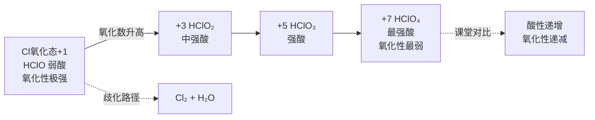

# 提炼-上海中学竞赛课程-第三分册-卤族元素

> 来源：上海中学竞赛课程·化学·第3分册·第一讲 卤族元素（原书约 850 行）
> 提炼日期：2026-06-23
> 提炼目标：填充第二轮「氢与卤素」备课课堂执行页的例题池与教学路径

---

## 一、来源与定位

### 1.1 材料定位

上海中学竞赛课程难度定位为 **"略高于初赛要求"**，适合已初步掌握普化原理的学生。第三分册集中处理主族元素化学，编排特点是：

- **以"知识精讲 → 典型例题 → 本讲习题"三段式**组织，每讲约 7 道习题
- **注重结构-性质关联**（VSEPR 解释分子构型、氧化态梯度驱动性质递变）
- **例题选材贴近近年竞赛风格**，覆盖循环反应、多步推断、氧化还原综合

### 1.2 与现有提炼资产的关系

| 已有资产 | 覆盖侧重点 | 本材料能补充什么 |
|:---|:---|:---|
| [[07-资料提炼/书籍提炼/提炼-普化原理-第15章-元素化学]] | 元素通论（覆盖全族） | 竞赛级例题链、更具体的结构-性质关联 |
| [[07-资料提炼/书籍提炼/提炼-无机化学第6版-第11-18章-主族元素化学]] | Weller 版系统化学（决赛延伸） | 课堂可直接使用的三层配套例题 |
| [[07-资料提炼/书籍提炼/提炼-化学竞赛初赛讲义-第6讲-推断技术]] | 元素推断方法论 | 提供非推断视角的专题纵向深化 |
| 质心 元素化学第一轮（卤素部分） | 族内递变+基础反应 | 更高阶的竞赛例题与反应深度 |

### 1.3 对接备课大纲

本提炼主要服务于 [[04-课件/备课大纲/2026-06-03-氢与卤素-提高班.md]]（R2 专题1），优先补充：

- **§2.2 认知台阶表**中缺位的竞赛级例题穿插
- **§2.3 例题穿插策略**中可用更高价值的真题替代
- **§三 课时分配**中每课时的具体推进素材

---

## 二、知识精讲要点（备课可抽料）

> 以下按原书结构抽取课堂可直接使用的精讲素材。每个条目标注"可用场景"供备课时快速定位。

### 2.1 卤素通性与制备（课时1可用）【→学生讲义：卤族 · 卤素通性与制备】

- 卤素单质物理性质递变规律：F₂/Cl₂/Br₂/I₂ 颜色加深、熔点沸点升高、氧化性递减
- **课堂信号点**：Cl₂ 的液化（239 K）可作为课堂"结构决定性质"案例——范德华力随分子量增大而增大
- **制备素材**：
  - 实验室 Cl₂：MnO₂ + 4HCl(浓) → MnCl₂ + Cl₂↑ + 2H₂O
  - 工业 Cl₂：电解饱和食盐水（可链接到电化学专题）
  - F₂ 的特殊性：只能用 K₂MnF₆ + SbF₅ 氧化法制备（说明 F⁻极难氧化）

### 2.2 卤化氢——酸性递变与氢键异常（课时1可用）【→学生讲义：卤族 · 卤化氢】

- **递变规律**：HF < HCl < HBr < HI 酸性增强（键能递减）
- **课堂关键对比**：
  - HF 沸点异常高（氢键），其他 HX 沸点随分子量增大而升高
  - HF 是弱酸（Ka=6.6×10⁻⁴），其他 HX 是强酸
  - **备课提示**：可借此引出"键能主导 vs 极性主导"的课堂讨论

### 2.3 卤化物与卤素互化物（课时2可用）【→学生讲义：卤族 · 卤化物与卤素互化物】

- **卤素互化物**（XYₙ 型，n 为奇数）：
  - ICl、IBr、ICl₃、ClF₃、BrF₅ 等典型结构
  - **VSEPR 课堂素材**：ICl₃（T 型）、ClF₃（T 型）、BrF₅（四方锥）
  - **竞赛切入点**：向学生强调"卤素互化物中电负性较小的卤素显正价"
- **拟卤素**：(CN)₂、(SCN)₂、SeCN 等
  - **课堂用法**：类比卤素——与 H₂ 生成酸、与金属生成盐、可发生歧化
  - 特征反应：AgCN↓、Hg(CN)₂ 可溶（类比 HgCl₂）

### 2.4 卤素氧化物与含氧酸（课时2可用）【→学生讲义：卤族 · 氧化物与含氧酸】

- **核心递变**：Cl 的含氧酸 HClO → HClO₂ → HClO₃ → HClO₄ 酸性增强、氧化性减弱
- **课堂对比表**（直接可投影）：

| 含氧酸 | 酸性 | 氧化性 | 结构特点 |
|:---|:---:|:---:|:---|
| HClO(次氯酸) | 极弱 | 极强 | Cl 为 +1，Cl—O—H |
| HClO₂(亚氯酸) | 中强 | 强 | Cl 为 +3 |
| HClO₃(氯酸) | 强 | 中强 | Cl 为 +5 |
| HClO₄(高氯酸) | 最强 | 最弱 | Cl 为 +7，正四面体 |

- **歧化反应规律**：Cl₂ + H₂O ⇌ HCl + HClO（K 小，方向依赖 pH）
  - 碱性条件歧化更彻底：Cl₂ + 2OH⁻ → Cl⁻ + ClO⁻ + H₂O
  - 热碱中进一步：3Cl₂ + 6OH⁻ → 5Cl⁻ + ClO₃⁻ + 3H₂O

### 2.5 无氧酸酸性比较的通用逻辑（备课方法论贡献）【→学生讲义：卤族 · 无氧酸酸性比较】

原书提供了判断无氧酸酸性强弱的系统方法（可直接用于课堂）：

> **同周期**：H—X 键能越弱 → 越易解离 → 酸性越强（如 H₂S < HCl）
> **同族**：X 原子半径越大 → H—X 键越长 → 越易断裂 → 酸性越强（HF < HCl < HBr < HI）
> **同一元素不同氧化数**：中心原子氧化数越高 → 吸引电子越强 → O—H 键越易断裂 → 酸性越强

---

## 三、教学路径参考（与现有资料的对比）

### 3.1 与质心卤素讲义的差异

| 维度 | 质心讲义 | 上海中学教程 |
|:---|:---|:---|
| 卤素互化物 | 简要提及 | 系统讲解 VSEPR + 氧化态分析 |
| 拟卤素 | 点到为止 | 明确的反应规律与特征鉴别 |
| 例题难度 | ⭐⭐ 为主 | ⭐⭐⭐ 为主（含循环反应、多步推断） |
| 含氧酸 | 以递变规律为主 | 补充 Frost 图视角、歧化热力学分析 |

### 3.2 课堂路径建议

推荐在现有备课大纲基础上，对以下环节做优化调整：

1. **课时1 引入环节**（原 5min）→ 可加入"Cl₂ 与 F₂ 氧化性差异由什么决定"的**反差提问**，激发学生从原子结构层面思考
2. **课时1 卤化氢部分** → 无氧酸酸性比较逻辑整合进课堂，作为方法论主线
3. **课时2 讲卤素互化物时** → 直接插入 ICl₃ 例题（见§四例2）作为 VSEPR 应用案例
4. **课时2 含氧酸部分** → 可直接把§2.4 对比表做成投影卡

---

## 四、例题精选（含解析）

### 例1 [循环反应-总反应式法] ⭐⭐⭐

**来源**：原书例1（Ag⁺ 与 Cl⁻ 循环反应）

**题干要点**：AgCl 中 10% 分解生成 Ag 和 Cl₂，Cl₂ 与水反应生成 HCl 和 HClO₃，生成的 Cl⁻ 又与过量 Ag⁺ 生成 AgCl，循环至最终。

**教学价值**：⭐⭐⭐⭐（高）
- 训练**"循环反应找总式"**方法
- 训练**得失电子守恒**在复杂体系中的应用
- 训练**多步反应的消元思想**

**课堂使用建议**：适合课时2后半段，作为"氧化还原在元素化学中的应用"综合训练。建议用时 10~12 min，流程：

```
审题 → 分析循环结构 → 找守恒关系 → 配平总式 → 计算
```

**核心解法**（两种方法均可）：
- 方法一：设 Ag x mol + AgCl 9x mol，由得失电子守恒 x = (1.1-9x)×6
- 方法二：找循环消元得总式 60Ag⁺ + 55Cl⁻ + 3H₂O → 54AgCl↓ + 6Ag↓ + ClO₃⁻ + 6H⁺

**对标**：本材料可比现有备课大纲 §2.3 的"S₂O₃²⁻ 歧化方程式书写"训练更深一层，建议作为进阶题布置。

---

### 例2 [卤素互化物-VSEPR 综合] ⭐⭐⭐

**来源**：原书例2（1992 初赛 ICl₃）

**题干要点**：KClO₃ + I₂ + HCl → ICl₃（橙黄色晶体）；ICl₃ 有升华性，遇 KI 生成 I₂，被热水解。

**教学价值**：⭐⭐⭐⭐⭐（极高）
- VSEPR 应用（ICl₃ T 型分子，sp³d 杂化）
- 元素推断 + 氧化还原配平综合
- 分步反应书写（ICl₃ + Na₂S₂O₃ → I₂ → 进一步还原）
- **唯一能从"分子构型推断 → 反应方程式 → 定量思考"一条链覆盖的竞赛级例题**

**课堂使用建议**：适合课时2核心突破环节（取代或补充现有例题）。建议用时 15 min。

**关键教学节点**：
1. 根据 KClO₃:I₂ = 1:1 的物质的量比推测产物
2. 根据"热水浴→黄绿色气体→固体变红棕"确认 ICl₃
3. VSEPR 计算：价层电子对数 5 → sp³d → T 型
4. 配平 ICl₃ + KI → I₂ + Cl⁻（归中反应）
5. 分步分析：ICl₃ → I₂ → I⁻（强还原剂过量时）

---

### 例3 [物质推断-定量结合] ⭐⭐⭐

**来源**：原书例3（Cl₂O 推断）

**题干要点**：微绿色气体 A 是某常见酸的酸酐（短周期 2 种元素），20.00 mL 通入 KI 消耗 35.70 mL 0.1000 mol/L Na₂S₂O₃，A 热分解得 B+C，B 溶于水得 D，A 也得到 D，D 为弱酸有强氧化性。

**教学价值**：⭐⭐⭐⭐
- **定性+定量结合推断**——这是竞赛典型题型的绝佳范本
- 涵盖 Cl₂O 的结构、性质、制备、反应

**课堂使用建议**：适合课时2应用强化环节，或作为课后选做题。

**关键推理链**：
1. 微绿色气体 + 常见酸酸酐 → 猜 Cl₂O 或 ClO₂
2. 定量计算：n(I₂) = ½n(Na₂S₂O₃) → 推出 A 为 Cl₂O
3. D 为弱酸有强氧化性 → HClO
4. Cl₂ + Na₂CO₃ → NaCl + Cl₂O + CO₂（歧化制备法）

---

## 五、可用图示/表格

> 以下内容可快速做成投影速查卡或讲义插图。

### 5.1 卤素含氧酸酸性-氧化性递变图（Mermaid）



### 5.2 卤素互化物结构汇总表

| 分子 | 中心原子 | 价层电子对数 | 杂化方式 | 分子构型 |
|:---|:---:|:---:|:---:|:---:|
| ClF₃ | Cl | 5 | sp³d | T 型 |
| BrF₅ | Br | 6 | sp³d² | 四方锥 |
| IF₇ | I | 7 | sp³d³ | 五角双锥 |
| ICl₃ | I | 5 | sp³d | T 型 |
| ICl | I | 2 | sp | 直线 |

### 5.3 拟卤素对比表

| 拟卤素 | 对应酸 | 银盐 | 特征 |
|:---|:---|:---:|:---|
| (CN)₂ | HCN (弱酸) | AgCN↓ | 剧毒 |
| (SCN)₂ | HSCN (强酸) | AgSCN↓ | 与 Fe³⁺ 显血红色 |
| (SeCN)₂ | HSeCN | AgSeCN↓ | 类比 SCN |

---

## 六、对应备课对接建议

### 6.1 直接可替换/补充的备课大纲槽位

| 备课大纲位置 | 现有内容 | 替换建议 | 理由 |
|:---|:---|:---|:---|
| §2.3 例题穿插 · 课时2 Cl₂ 与 H₂ 反应 | 基础方程式 | → 替换为例2（ICl₃ 综合） | 同样覆盖 Cl 元素化学，但更高价值 |
| §三 课时2 · 卤素互化物 | 仅简要提及 | → 补充卤素互化物结构汇总表（§5.2） | 原大纲此部分较薄弱 |
| §三 课时2 · 含氧酸 | 递变表 | → 补充§5.1 Mermaid 图 | 原大纲缺视觉化材料 |
| §三 课时2 末尾 | 仅有小结 | → 补充例1（循环反应）作为课后延伸 | 强化守恒法训练 |

### 6.2 新判定为"高ROI但当前未纳入"的内容

1. **无氧酸酸性比较系统方法**（§2.5）——建议融入认知台阶表作为"方法论统摄"层，不只在卤素讲，后续氧族、氮族同样可复用
2. **拟卤素反应规律**——现有备课大纲未覆盖，建议在课时2末尾以"拓展阅读"方式呈现
3. **定量推断思路**（例3 的 Cl₂O 案例）——可替代课时2部分传统例题

### 6.3 后续推进建议

- 本提炼的卤素互化物 VSEPR 汇总表、拟卤素对比表适合做成 **{{专题-卤素}}** 的视觉版速查卡素材
- 例2（ICl₃）涉及氧化还原递进反应，建议纳入真题链 🥈 讲评顺序级

---

*本提炼依据 [[模板-资料提炼]] 结构产出，已在 frontmatter 标记 `teaching_asset_ready: true`。*
