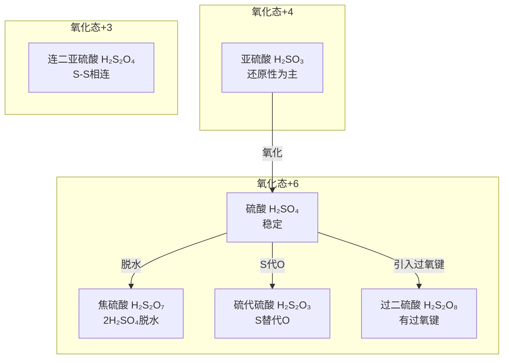

# 提炼-上海中学竞赛课程-第三分册-氧族元素

> 来源：上海中学竞赛课程·化学·第3分册·第二讲 氧族元素（原书约 880 行）
> 提炼日期：2026-06-23
> 提炼目标：填充第二轮「氧族与氮族元素」备课大纲中硫化合物部分的例题链与课堂素材深度

---

## 一、来源与定位

### 1.1 材料定位

本讲覆盖 O、S、Se、Te 四元素，但重心在**硫的化学**（占全讲篇幅约 70%），与备课大纲课时分配吻合。特色体现在：

- **系统梳理硫含氧酸体系**：亚硫酸 → 硫酸 → 焦硫酸 → 硫代硫酸 → 过二硫酸 → 连多硫酸，配结构式
- **金属硫化物溶解性规律**：分三类（溶于水/溶于稀酸/不溶），配完整的颜色 + Ksp 表
- **臭氧层化学**：NO₂/氟利昂催化分解机制——适合课堂环保切入

### 1.2 与现有备课大纲的对接

| 备课大纲课时 | 覆盖内容 | 本材料可补充 |
|:---|:---|:---|
| 课时1（S 的化合物） | H₂S、SO₂/SO₃、H₂SO₄、S₂O₃²⁻ | 硫含氧酸系统表、金属硫化物溶解性分级表、过硫酸盐 |
| 课时2（N 的化合物） | — | 本讲不覆盖（见 [[提炼-上海中学竞赛课程-第三分册-氮族元素]]） |
| 课时3（P + 综合训练） | — | 本讲不覆盖 |
| 贯穿全课的结构-性质关联 | 氧化态梯度 | H₂O₂ 双重身份的深度剖析、Mn²⁺催化分解机理 |

### 1.3 与现有提炼资产的关系

| 已有资产 | 覆盖 | 本材料补充 |
|:---|:---|:---|
| [[07-资料提炼/教学逻辑提炼/质心 元素化学和结构化学 上/教学逻辑提炼-质心-硫与氮-第一轮]] | 硫与氮的基础教学逻辑 | 更系统的含氧酸结构对比、竞赛级例题 |
| [[07-资料提炼/书籍提炼/提炼-普化原理-第15章-元素化学]] | 氧族通论 | H₂O₂过氧键转移、CrO₅蓝色检验等特色内容 |
| [[12-教学洞察/教学洞察-氧族与氮族元素]] | 教学洞察槽位（🎯⚠️📋✂️） | 本提炼可直接为教学洞察的 📋 例题槽和 ✂️ 边界决策槽供料 |

---

## 二、知识精讲要点（备课可抽料）

### 2.1 O₂ 的分子结构——3 电子 π 键（课时1引入可用）【→学生讲义：氧族与氮族 · O₂与H₂O₂】

> **课堂信号点**：O₂ 有顺磁性（可带小实验：液氧被磁铁吸引），这是传统路易斯结构无法解释的

- O₂ 分子中有 1 个 σ 键 + 2 个 **3 电子 π 键**
- 每个 3 电子 π 键有 1 个未成对电子 → 顺磁性
- **备课对比**：O₂ 的不活泼（3 电子 π 键稳定）vs Cl₂ 的活泼
- O₃：中心 O sp² 杂化，折线形，存在 Π₃⁴ 离域 π 键——**唯一极性单质分子**

### 2.2 H₂O₂ 的双重身份精讲（课时1深化可用）【→学生讲义：氧族与氮族 · O₂与H₂O₂】

> 原书对 H₂O₂ 的"既氧化又还原"给出了比其他教材更深入的剖析：

- **弱酸性**：K₁ = 2.4×10⁻¹²（比 HCN 还弱），可生成 CaO₂、BaO₂
- **氧化性**（φ=1.776 V 酸性）：理论上可氧化 Mn²⁺→MnO₂，但实际上不行
  - **核心原因**：MnO₂ 一旦生成立即催化 H₂O₂ 歧化——**一个不能忽视的动力学因素**
  - 对比：I⁻ → I₂（可发生）、Fe²⁺ → Fe³⁺（可发生）——这些还原态不能催化歧化
- **还原性**：遇到更强氧化剂时（Cl₂、MnO₂、KMnO₄）→ 释放 O₂
- **CrO₅ 蓝色检验法**：Cr₂O₇²⁻ + H₂O₂ + H⁺ → CrO₅ (蓝色，含 2 个过氧键)
  - **课堂用法**：既检验 H₂O₂（过氧键），又检验 Cr（VI）

### 2.3 金属硫化物体系（课时1核心突破可用）【→学生讲义：氧族与氮族 · 硫化合物】

> 现有备课大纲 §2.1 对硫化物仅有简要提及，本材料可补充完整体系

**三类溶解度分级**（原书表 2-2，可直接投影）：

| 类别 | 代表 | 特征 |
|:---|:---|:---|
| 溶于水 | Na₂S、K₂S、BaS（白色） | 强烈水解 |
| 不溶但溶于稀酸(0.3M HCl) | MnS(肉红)、FeS(黑)、ZnS(白) | Ksp > 10⁻²⁴ |
| 不溶也不溶于稀酸 | CuS(黑)、Ag₂S(黑)、HgS(黑)、PbS(黑) | Ksp < 10⁻²⁴ |

**溶解策略递进**（适合作为方法总结）：
1. Ksp > 10⁻²⁴ → 加 HCl 即可（用 H⁺ 降低 S²⁻）
2. Ksp 10⁻²⁵~10⁻³² → 浓 HCl（H⁺ + Cl⁻ 配位双重作用）
3. Ksp < 10⁻³² → 必须用 HNO₃ 氧化 S²⁻
4. Ksp 极小（HgS）→ 王水

### 2.4 硫含氧酸体系总览（课时1深化可用）【→学生讲义：氧族与氮族 · 硫化合物】

| 名称 | 化学式 | 结构要点 | 存在形式 |
|:---|:---|:---|:---|
| 亚硫酸 | H₂SO₃ | S 为 +4，不存在纯酸 | 盐、酸式盐 |
| 硫酸 | H₂SO₄ | S 为 +6，正四面体 | 纯酸、盐 |
| 焦硫酸 | H₂S₂O₇ | 2H₂SO₄ 脱水，S—O—S 桥 | 纯酸、盐 |
| 硫代硫酸 | H₂S₂O₃ | 一个 O 被 S 替换 | 盐（大苏打） |
| 过二硫酸 | H₂S₂O₈ | 含过氧键 —O—O— | 酸、盐 |
| 连二亚硫酸 | H₂S₂O₄ | S—S 相连 | 盐（保险粉） |

**课堂方法论贡献**："焦、代、过、连"命名规律可直接推广到其他族含氧酸。

### 2.5 过硫酸盐的强氧化性（课时1选讲可用）【→学生讲义：氧族与氮族 · 硫化合物】

- (NH₄)₂S₂O₈ 在 Ag⁺ 催化下可将 Mn²⁺ 氧化为 MnO₄⁻（**钢铁分析中测锰**）
- 过氧键 —O—O— 均裂产生自由基 → 强氧化性
- **备课用法**：可作为"过氧键与氧化性"的小专题，与 H₂O₂ 呼应

---

## 三、教学路径参考（与现有资料的对比）

### 3.1 与质心硫与氮讲义的差异

| 维度 | 质心讲义 | 上海中学教程 |
|:---|:---|:---|
| 硫含氧酸 | 主要讲 H₂SO₃/H₂SO₄ | 系统覆盖 6 种（含过二硫酸、连二亚硫酸） |
| 金属硫化物 | 基本溶解性 | 三级分类 + 完整 Ksp + 溶解策略递进 |
| H₂O₂ | 基础氧化性 | 含动力学解释（Mn²⁺ 催化歧化机理）|
| 例题 | 简单反应方程 | 竞赛级（S₂O、Te-Cl 体系催化剂）|

### 3.2 课堂路径优化建议

1. **课时1 H₂S 部分** → 加入金属硫化物三级分类表（§2.3），用"溶解度→分离策略"主线串起
2. **课时1 S₂O₃²⁻ 歧化** → 在现有讲解基础上补充 Na₂S₂O₃ 的制备方法（Na₂SO₃ + S → Na₂S₂O₃）及与 I₂ 的定量反应
3. **课时1 末尾** → 加入硫含氧酸体系总览图（§2.4 表格）作为课堂小结视觉材料
4. **H₂O₂ 部分**（现有大纲未单独设时）→ 建议在课时1穿插 3~5 min 快速精讲，重点突出"既氧化又还原"的双重身份

---

## 四、例题精选（含解析）

### 例1 [等电子体推断-歧化反应综合] ⭐⭐⭐⭐

**来源**：原书例1（S₂O 的制备与性质）

**题干要点**：A 与 SO₂ 等电子体（无色气体，77 K 时变橙红色），CuO + S 共热制得 A + Cu₂S（黑色）。A 在碱性条件下的歧化反应。

**教学价值**：⭐⭐⭐⭐⭐（极高）
- 等电子体原理应用（S₂O → 类比 SO₂ 折线结构）
- 氧化还原配平（多产物歧化体系）
- **跨族连接**：涉及 O、S、Cu、Mn 四种元素

**关键教学节点**：
1. S₂O 结构：V 型（类比 SO₂，等电子体）
2. 制备：2CuO + 5S → 2S₂O + Cu₂S（注意 S 既被氧化又被还原）
3. 歧化反应拆解：两个独立歧化反应 → 组合成总反应
4. 酸性 KMnO₄ 氧化：S 全部到 +6（SO₄²⁻）

**课堂使用建议**：可替换现有大纲 §2.3 的部分传统例题，或在课时末尾作为综合分析训练。

---

### 例2 [H₂O₂ 的酸碱性与配位化学] ⭐⭐⭐

**来源**：原书例2（2005 初赛备用 · H₂O₂ + SbF₅）

**题干要点**：H₂O₂ 与 SbF₅ 在 HF 中生成白色固体 A，负离子呈八面体结构，A 受热分解，产物仍有八面体结构。

**教学价值**：⭐⭐⭐⭐
- H₂O₂ 的**碱性**体现（H₃O₂⁺ 正离子）——对比常规的"H₂O₂ 显酸性"
- 路易斯酸碱理论的实际应用（SbF₅ 是强路易斯酸）
- 过氧键热分解（O₂ 的释放）

**课堂使用建议**：适合作为课时1 H₂O₂ 部分的**拓展延申**，展示 H₂O₂ 的另一面（不只在酸性条件下，在强酸中也可显碱性）。

**关键推理链**：
1. H₂O₂ 给出孤对电子 → 与 H⁺ 结合 → H₃O₂⁺（类比 NH₃ → NH₄⁺）
2. SbF₅ 接受 F⁻ → SbF₆⁻ 八面体
3. 加热时过氧键断裂 → O₂ 释放 → 留下 H₃O⁺

---

### 例3 [新型催化剂-结构推断] ⭐⭐⭐⭐

**来源**：原书例3（Te-Cl 体系催化剂）

**题干要点**：Te (晶体) 与 B（TeCl₄ 与 AlCl₃ 按 1:4 化合的共价型离子化合物）以 7:2 和 7:1 反应生成 I 和 II，含 Te₄²⁺ 芳香性环。

**教学价值**：⭐⭐⭐⭐
- **芳香性在无机体系中的扩展**：Te₄²⁺ 满足 Hückel 4n+2 规则
- 结构-配比关联：通过摩尔质量法推断分子式
- [Al₂Cl₇]⁻ 与 [AlCl₄]⁻ 的稳定性比较

**使用建议**：这题偏难（决赛级别），适合作为课时3的能力提升选做题，不适合正课强制纳入。

---

## 五、可用图示/表格

> 以下内容可直接制作成投影速查卡。

### 5.1 氧族元素氢化物性质递变

| 性质 | H₂O | H₂S | H₂Se | H₂Te |
|:---|:---:|:---:|:---:|:---:|
| 沸点(K) | 373 | 202 | 231 | 269 |
| 酸性(pKa) | 15.7 | 7.0 | 3.9 | 2.6 |
| 还原性 | 极弱 | 弱 | 中 | 强 |
| 热稳定性 | 极高 | 低(673K分解) | 更低 | 极低 |

> 注意 H₂O 的异常（氢键导致沸点高、酸性弱）

### 5.2 金属硫化物颜色速查卡

| 颜色 | 可能硫化物 | 溶解性 |
|:---|:---|:---:|
| 白色 | Na₂S、K₂S、BaS、ZnS、CaS | 易溶/酸溶 |
| 黑色 | FeS、NiS、CoS、CuS、Ag₂S、HgS、PbS | 酸溶/不溶 |
| 肉红色 | MnS | 酸溶 |
| 黄色 | CdS | 不溶 |
| 深棕色 | SnS₂ | 不溶 |

### 5.3 硫含氧酸结构递变图（Mermaid）

---

## 六、对应备课对接建议

### 6.1 直接可替换/补充的备课大纲槽位

| 备课大纲位置 | 现有内容 | 替换建议 | 理由 |
|:---|:---|:---|:---|
| §2.1 路线总览·课时1 SO₃²⁻ vs SO₄²⁻ 结构对比 | 仅文字说明碱性溶液还原性 | → 补充金属硫化物三级分类表（§2.3） | 原大纲缺系统分类 |
| §2.2 认知台阶·课时1 23-35min 核心突破 | S₂O₃²⁻ 歧化 | → 补充 Na₂S₂O₃ 制备与 I₂ 定量反应 | 让"大苏打"更完整 |
| §2.2 认知台阶·课时1 35-40min 结构对比 | 仅空间结构 | → 补充§2.4 含氧酸体系总览 | 由单一对比扩展到体系 |
| §三 课时1 硫化合物 | 已较完整 | → 补充 H₂O₂ 穿插（3-5min） | 现有大纲缺 H₂O₂ |

### 6.2 新判定为"高ROI但当前未纳入"的内容

1. **H₂O₂ 双重身份深度剖析**（§2.2）—— 现有备课大纲没有给 H₂O₂ 单独时间，建议在课时1末穿插 5 min
2. **金属硫化物三级分类 + 溶解策略递进**（§2.3）—— 这是元素推断题中鉴别/分离的实用工具，建议整合进课时1
3. **含氧酸命名规律（焦/代/过/连）** —— 不仅在硫，也可推广到其他元素，建议作为课堂方法论微小结

### 6.3 后续推进建议

- 本讲的金属硫化物颜色速查卡（§5.2）适合做成 **专题页视觉版速查卡** 素材
- 硫含氧酸体系总览表（§2.4）适合直接扩充到 [[专题-氧族与氮族元素]] 的现有表格
- 例1（S₂O）的歧化分析方法值得沉淀为 [[模板-方法微专题]] 的素材

---

*本提炼依据 [[模板-资料提炼]] 结构产出，已在 frontmatter 标记 `teaching_asset_ready: true`。*
