# 第二章、分子结构与化学键

# 一、分子结构的概念

从结构的观点来看,除稀有气体以外,其他原子都不是稳定的满壳层结构,因此,更倾向于共用电子对生成共价键或得到或失去电子形成离子键或金属键。分子是参加化学反应的基本单元，物质的性质主要决定于分子的性质，而分子的性质又是由分子的内部结构所决定的。

所谓的分子的结构包含如下的内容：分子中原子间的强相互作用力（大于 40 kJ/mol）即化学键问题；分子（或晶体）的空间构型（即几何形状）问题；分子与分子之间存在的一种较弱的相互作用力，即分子间力（或范德华力）问题；分子的结构与物质的物理、化学性质的关系等。

本章将在原子结构的基础上，重点讨论化学键理论，如离子键理论、共价键理论（包括：价键理论、杂化轨道理论、价层电子对互斥理论、分子轨道理论）以及金属键能带理论等。同时对分子间作用力、氢键以及分子的结构与物质的性质之间的关系也作简略的介绍。

# 二、离子键

# 2.1 离子键的概念

活泼金属原子与活泼的非金属所形成的化合物如 NaCl，KCl，CsCl，MgO，CaO 等，通常都是离子型化合物。它们的特点是：在一般情况下，主要以晶体的形式存在，它们具有较高的熔点和沸点，在熔融状态或溶于水后其水溶液均能导电。

根据近代观点，离子性化合物之所以能在熔融或溶解状态下能导电，这是因为这类化合物这种存在电荷相反的正、负离子。离子键的理论认为：

1. 当电负性小（电离能低）的活泼金属原子与电负性大（电子亲和能高）的活泼非金属原子相遇时，它们都有达到稳定结构的倾向，由于两个原子的电负性相差较大，因此它们之间容易发生电子的得失从而产生正、负离子。  
2.所谓稳定结构对主族元素来讲，它们所生成的离子多数具有稀有气体结构，即 p 轨道为全充满。

3. 原子间发生电子的转移而形成具有稳定结构的正、负离子时，从能量的角度上看，一定会有能量的吸收和放出，而且新体系的能量一般也是最低的。

# 2.2 离子键的特点

1. 离子键的本质是静电作用力。离子键是由原子得失电子后，形成的正、负离子之间通过静电吸引作用而形成的化学键。在离子键的模型中，可以近似地将正、负离子的电荷分布看成球形对称的。根据库仑定律，两种带相反电荷的离子间的静电引力与离子电荷的乘积成正比，而与离子间距离的平方成反比。由此可见，当离子的电荷越大，离子间的距离越小（在一定的范围内），则离子间的引力越强。离子键的强度一般用晶格能 U 来表示，定义为 1 mol 离子晶体变为相距无穷远的气态正负离子所吸收的能量。

晶格能可以用热力学的方法（Born-Haber 循环）来测定，也可以根据晶体的构型和离子电荷进行理论推算。这两种方法所得的某晶体的晶格能数据较为接近时，则可认为该晶体是以离子键为主的晶体。

以碱金属卤化物 LiF 为例:

![[02-03第二章分子结构与化学键学生版_images/a441a624bad124d896d2dd59e19a65c64df95457063d7d13287bd65e908d966d.jpg]]

flowchart

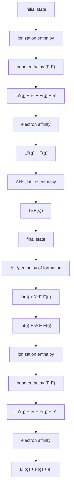

$$
\Delta_ {f} H _ {m, L i F} ^ {\ominus} = \Delta_ {s} H _ {m} ^ {\ominus} + I _ {L i} + \frac {1}{2} D _ {F _ {2}} + A _ {F} - U
$$

$$
U = \Delta_ {s} H _ {m} ^ {\ominus} + I _ {L i} + \frac {1}{2} D _ {F _ {2}} + A _ {F} - \Delta_ {f} H _ {m, L i F} ^ {\ominus}
$$

2. 离子键没有方向性。由于离子键的本质是静电引力，是由正、负离子通过静电吸引作用结合而成，而离子是带电体。它的电荷分布是球形对称，因此只要条件许可，就可以在空间各个方向上施展其电性作用，也就是说，他可以在空间任何方向与带有相反电荷的离子互相吸引。这一点可以从晶体结构的角度说明，在离子晶体中，任意一个体相中的离子，和周围电性相反的离子都有静电引力作用，和周围电性相同的离子都有排斥作用。所以说，离子键是没有方向性的。  
3. 离子键没有饱和性。离子晶体中，每一个离子可以同时与多个带相反电荷的离子互相吸引。以氯化钠晶体为例，每一个钠离子周围，都排列着6个带有相反电荷的氯离子，但这6个氯离子仅仅只是距离钠离子最近的6个带有相反电荷的离子。无论是在什么方向上或什么距离处，如果再排列有氯离子，则它们同样还会感受到该相反电荷的钠离子的电场的作用，只不过是距离较远，相互作用较弱罢了。所以说，离子键没有饱和性。  
4. 键的离子性与元素的电负性有关。离子键形成的重要条件是相互作用的原子的电负性差值较大。一般元素的电负性差越大，它们之间键的离子性也就越大。在周期表中，碱金属的电负性较小，卤素的电负性较大，它们之间相化合时形成的化学键主要是离子键。但是实验表明，即使电负性最小的铯与电负性最大的氟形成的最典型的离子性化合物氟化铯中，键的离子性也不是百分之百的，而只有92%的离子性。也就是说，它们之间的相互作用也不是纯粹的静电作用，而仍然有部分原子轨道的重叠，即正、负离子之间的键仍约有8%的共价性。当两个原子电负性差值为1.7时，单键约具有50%的离子性，这是一个重要的参考数据。若两个原子电负性差值大于1.7时，可认为他们之间形成离子键，该物质是离子性化合物。如果两个原子电负性差值小于1.7，则可认为他们之间主要形成共价键，该物质为共价化合物。

# 2.3 离子的特征

离子型化合物的性质与离子键的强度有关，而离子键的强度又与正、负离子的性质有关，因此离子的性质在很大程度上决定着离子性化合物的性质。一般离子具有三个重要的特征：离子的电荷、离子的电子层构型和离子半径。

# (1) 离子的电子构型

a. 8 电子构型：如 $\mathrm{Na}^{+}$ ， $\mathrm{Mg}^{2+}$ ， $\mathrm{F}^{-}$ ， $\mathrm{O}^{2-}$ 等， $(n-1)\mathrm{p}^{6}$ 电子构型或稀有气体电子构型  
b. 9\~17 电子构型: 如 $\mathrm{Mn}^{2+}$ , $\mathrm{Cr}^{3+}$ , $\mathrm{Co}^{2+}$ 等低氧化态过渡金属离子, 先失去最外层 s 电子后再失去次外层 d 电子, (n-1) $\mathrm{d}^{\mathrm{x}}$ 电子构型

c. 18 电子构型：如 $Cu^{+}, Zn^{2+}$ 等 IB，IIB 族离子， $(n-1)d^{10}$ 构型  
d. 18+2 电子构型: 如 $\mathrm{Pb}^{2+}$ , $\mathrm{Bi}^{3+}$ 等五六周期 IIIA, IVA, VA 族低氧化态正离子(n-1) $\mathrm{d}^{10}\mathrm{ns}^2$ 构型

离子不同的电子构型对原子核的屏蔽作用不同，使有效核电荷有差别，所以表观上具有相同电荷的离子实际上会有不同性质

(2) 离子半径

离子半径如原子半径一样严格来说是不能确定的，但在离子晶体中，正负离子间保持着一定的平衡核间距 $r_{0}$ ，离子半径的变化规律和原子半径的变化大致相同，同族元素同电荷离子半径从上到下递增，同周期元素离子半径随电荷增加而减小，对角线规则也适应于离子半径,1960 年，鲍林提出当正负离子电子构型相同时，离子半径与离子的有效核电荷成反比

$$
\frac {r _ {+}}{r _ {-}} = \frac {Z _ {-} ^ {*}}{Z _ {+} ^ {*}}
$$

# 2.4. 离子的极化

(1) 离子的极化

a. 离子在外电场或另外离子的影响下, 原子核与电子云会发生相对位移而变形的现象, 称为离子的极化。  
b. 极化作用离子使异号离子极化的作用，称为极化作用。  
c. 极化率（或变形性）被异号离子极化而发生电子云变形的能力，称为极化率或变形性。

(2) 无论是正离子或负离子都有极化作用和变形性两个方面，但是正离子半径一般比负离子小，所以正离子的极化作用大，而负离子的变形性大。负离子对正离子的极化作用（负离子变形后使正离子电子云发生变形），称为附加极化作用。  
(3) 离子的极化作用可使典型的离子键向典型的共价键过渡。这是因为正、负离子之间的极化作用, 加强了“离子对”的作用力, 而削弱了离子对与离子对之间的作用力的结果。

![[02-03第二章分子结构与化学键学生版_images/4a063ff7a03de9807b7a8273747d0aa7de5c58386df0a351a1f4be354e103458.jpg]]  
极化作用

![[02-03第二章分子结构与化学键学生版_images/d63157b72be210c7114087f8fdbf2450550fdbcd1e6b78dd25c7f735fa133912.jpg]]

text_image

离子相互极化的增强
离子键 键的极性的增大 共价键

(4) 离子极化作用的规律

a. 正离子电荷越高，半径越小，离子势 $\varphi(Z/r)$ 越大，则极化作用越强；  
b. 在相同离子电荷和半径相近的情况下, 不同电子构型的正离子极化作用不同: 8 电子构型 $< 9 - 17$ 电子构型 $< (18, 18 + 2)$ 电子构型

例如： $r_{Hg^{2+}}=102pm,\quad r_{Ca^{2+}}=100pm$ ，但 $Hg^{2+}$ 的极化作用大于 $Ca^{2+}$

解释：a. 由于 d 态电子云空间分布的特征，使其屏蔽作用小

b. 由于 d 态电子云本身易变形，因此 d 电子的极化和附加极化作用都要比相同电荷、相同半径的 8 电子构型的离子的极化和附加极化作用大。  
c. 负离子的电荷越高，半径越大，变形性越大

例如： $F^{-}<Cl^{-}<Br^{-}<I^{-}$ ; $O^{2-}<S^{2-}$ ; $OH^{-}<SH^{-}$

d. 对于复杂的阴离子: 中心离子的氧化数越高, 变形性越小

例如：变形性从大到小排列： $SiO_{4}^{4-}>PO_{4}^{3-}>SO_{4}^{2-}>ClO_{4}^{-}$

(5) 离子极化对金属化合物性质的影响

a. 金属化合物熔点的变化: $\mathrm{MgCl}_{2} > \mathrm{CuCl}_{2}$   
b. 金属化合物溶解性的变化: AgF>AgCl>AgBr>AgI, 这是由于从 F⁻ → I⁻离子受到 Ag⁺的极化作用而变形性增大的缘故。  
c. 金属盐的热稳定性: $\mathrm{NaHCO}_{3}$ 的热稳定性小于 $\mathrm{Na}_{2} \mathrm{CO}_{3}$ 。从 $\mathrm{BeCO}_{3} \longrightarrow \mathrm{BaCO}_{3}$ 热稳定性增大。金属离子对 $\mathrm{O}^{2-}$ 离子的反极化作用（相对于把 $\mathrm{C}^{\mathrm{IV}}$ 与 $\mathrm{O}^{2-}$ 看作存在极化作用）越强，金属碳酸盐越不稳定。  
d. 金属化合物的颜色的变化: 极化作用越强, 金属化合物的颜色越深 AgCl (白), AgBr(浅黄), AgI(黄), HgCl₂(白), HgBr₂(白), HgI₂(红).  
e. 金属化合物晶型的转变: CdS: $r_{+} / r_{-} = 97 \mathrm{pm} / 184 \mathrm{pm} = 0.53 > 0.414$ , 理应是 NaCl 型, 即六配位, 实际上, CdS 晶体是四配位的 ZnS 型。这说明 $r_{+} / r_{-} < 0.414$ 。这是由于离子极化, 电子云进一步重叠而使 $r_{+} / r_{-}$ 比值变小的缘故。  
f. 离子极化增强化合物导电性和金属性 在有的情况下，阴离子被阳离子极化后，使电子脱离阴离子而成为自由电子，这样就使离子晶体向金属晶体过渡，化合物的电导率、金属性都相应增强，如 FeS、CoS、NiS 都有一定的金属性。

# 三、共价键

# 3.1 共价键的概念；Lewis 结构式

离子键理论能很好地说明离子化合物的形成和特征。但它不能说明由相同原子组成的单质分子（如： $H_{2}$ ， $Cl_{2}$ ， $N_{2}$ 等）的形成，也不能说明由化学性质相近的元素所组成的化合物分子（如：HCl， $H_{2}O$ 等）的形成。美国化学家 Lewis 为了说明分子的形成，提出了共价键理论，他认为分子中每个原子应具有稳定的稀有气体原子的电子层结构。但这种稳定结构不是靠电子的转移，而是通过原子间共用一对或若干对电子来实现。这种分子中原子间通过共用电子对结合而成的化学键称为共价键。在共用电子对的过程中，每个原子尽量达到稀有气体原子的电子层构型（又称为8电子规则或八隅体规则，H为2电子，但仅适用于部分简单分子）。Lewis 结构式中用“横杠”表示共用电子对，用“黑点”表示未共用的电子。

# 3.1.1 共价分子中成键数和孤电子对数的计算:

如： $P_{4}S_{3}$ 、 $HN_{3}$ 、 $N_{5}^{+}$ 、 $H_{2}CN_{2}$ （重氮甲烷）、 $NO_{3}^{-}$

# (1) 计算步骤:

a. 令 $n_{\mathrm{o}}$ ——共价分子中，所有原子形成八电子构型（H为2电子构型）所需要的电子总数  
b. 令 $n_{\mathrm{v}}$ ——共价分子中，所有原子的价电子数总和  
c. 令 $n_{\mathrm{s}}$ — 共价分子中，所有原子之间共享电子总数

$$
n _ {\mathrm{s}} = n _ {\mathrm{o}} - n _ {\mathrm{v}}, \quad \mathrm {n_ {s} /2 = (n_ {\mathrm{o}} - n_ {\mathrm{v}}) / 2 = 成数}
$$

d. 令 $n_{1}$ —— 共价分子中，存在的孤电子数。（或称未成键电子数）

$$
n _ {\mathrm{l}} = n _ {\mathrm{v}} - n _ {\mathrm{s}}, n _ {\mathrm{l}} / 2 = \left(n _ {\mathrm{v}} - n _ {\mathrm{s}}\right) / 2 = \text {孤对电子对数}
$$

<table><tr><td></td><td> $P_{4}S_{3}$ </td><td> $HN_{3}$ </td><td> $N_{5}^{+}$ </td><td> $H_{2}CN_{2}$ </td><td> $NO_{3}^{-}$ </td></tr><tr><td> $n_{o}$ </td><td>7×8 = 56</td><td>2 + 3×8 = 26</td><td>5×8 = 40</td><td>2×2 + 8×3 = 28</td><td>4×8 = 32</td></tr><tr><td> $n_{v}$ </td><td>4×5 + 3×6 = 38</td><td>1 + 3×5 = 16</td><td>5×5 - 1 = 24</td><td>1×2 + 4 + 5×2 = 16</td><td>5 + 6×3 + 1 = 24</td></tr><tr><td> $n_{s} / 2$ </td><td>(56 - 38)/2 = 9</td><td>(26 - 16)/2 = 5</td><td>(40 - 24) / 2 = 8</td><td>(28 - 16)/2 = 6</td><td>(32 - 24)/2 = 4</td></tr></table>

# 3.1.2. Lewis 结构式的书写

![[02-03第二章分子结构与化学键学生版_images/66088ee3696cef8bc547fc858eb44f16b313facc310bce52e61c8e0ad6597b57.jpg]]

chemical

Chemical structure diagram of a phosphorus-containing compound with P4S3 and S atoms

$$
\mathrm{HN} _ {3} \quad \mathrm{H} - \ddot {\mathrm{N}} = \mathrm{N} = \ddot {\mathrm{N}}
$$

$$
\mathrm{H} - \underset {\cdot \cdot} {\ddot {\mathrm{N}}} - \mathrm{N} \equiv \mathrm{N}:
$$

$$
\mathrm{H} - \mathrm{N} \equiv \mathrm{N} - \ddot {\mathrm{N}}:
$$

$$
\mathrm{N} _ {5} ^ {+} \stackrel {{\ddot {\mathrm{N}} = \mathrm{N} = \mathrm{N} = \mathrm{N} = \ddot {\mathrm{N}}}} {{\ddots}},: \mathrm{N} \equiv \mathrm{N} - \stackrel {{\ddot {\mathrm{N}} - \mathrm{N} \equiv \mathrm{N}:}} {{\ddots}},: \mathrm{N} \equiv \mathrm{N} - \stackrel {{\ddot {\mathrm{N}} = \mathrm{N} = \ddot {\mathrm{N}}}} {{\ddots}},: \mathrm{N} \equiv \mathrm{N} - \mathrm{N} \equiv \mathrm{N} - \stackrel {{\ddot {\mathrm{N}}}} {{\ddots}}:
$$

$CH_{2}N_{2}$ （重氮甲烷）

$$
\begin{array}{c} \mathrm{H} \\ \mathrm{H} \end{array} \mathrm{C} = \mathrm{N} = \stackrel {{\cdot}} {{\cdot}} \mathrm{N} \quad , \quad \begin{array}{c} \mathrm{H} \\ \mathrm{H} \end{array} \stackrel {{\cdot}} {{\cdot}} \mathrm{C} - \mathrm{N} \equiv \mathrm{N}:
$$

# 3.1.3 形式电荷

对于某些分子，可以写出多个 Lewis 结构式。

为了解释这种情况，Olangmuir 提出了形式电荷的概念。形式电荷是指某个原子的价电子数和 Lewis 点线式中键数与孤电子数之和的差值，用 $Q_{F}$ 表示。

![[02-03第二章分子结构与化学键学生版_images/6fd535bf0f62df886a96230317bcd650d475cd140a899df6329280cc29637860.jpg]]

![[02-03第二章分子结构与化学键学生版_images/a08a0e19d6bbba5e2968d564c87700f35af092ba5bde436c70cbdcc621c6f12e.jpg]]

可以根据分子中每个原子的形式电荷绝对值之和来判断分子的稳定性，即 Lewis 结构式的可行性。形式电荷绝对值之和越高越不稳定，越低越稳定（最低为 0），两个相邻原子之间的形式电荷应尽可能避免同号，但形式电荷不代表实际电荷，仅表示共享电子是否公平，与元素的电负性无关，也就是说与原子实际吸引电子的能力无关。

实际上 $HN_{3}$ 分子的成键方式是介于两者之间，可以认为是二者状态转换之间的一种过渡态。这种联系称为共振，用 $\leftrightarrow$ 表示。每一种可能的 Lewis 结构式都是共振结构式，用下图表示：

![[02-03第二章分子结构与化学键学生版_images/ee56d69d4e973620e628f954c4efc62dc6a352aa0c449c7eabb96562b21785fa.jpg]]

chemical

Chemical equilibrium reaction showing protonation of a nitrogen with positive charge

Lewis 共价键理论虽能成功地解释了由相同原子组成的分子以及性质相近的不同原子组成的分子的形成，并初步揭示了共价键与离子键的区别。但是 Lewis 理论也有局限性，它不能解释为什么有些分子的中心原子最外层电子数多于 8（如 $PCl_{5}$ ， $SF_{6}$ ），但这些分子仍能稳定存在。也不能解释共价键的特性（如方向性、饱和性）以及存在单电子键（如 $H_{2}^{+}$ ）和氧分子具有磁性等问题。同时，他也不能阐明为什么“共用电子”就能使两个原子结合成分子的本质原因。后来，鲍林等人发展了这一成果，建立了现代价键理论（即电子配对理论）、杂化轨道理论、价层电子对互斥模型。

# 3.1.3 Lewis 结构式的应用

(1) 可以判断 Lewis 结构式的稳定性;

例如：氰酸根离子 $\mathrm{OCN}^{-}$ 比异氰酸根离子 $\mathrm{ONC}^{-}$ 稳定。

(2) 可以计算多原子共价分子的键级;

如上面的 $H-N_{(a)}-N_{(b)}-N_{(c)}$ 中，由两个 $HN_{3}$ 共振结构式可知：

$N_{(a)}-N_{(b)}$ 之间的键级= $(1+2)/2=3/2$ ， $N_{(b)}-N_{(c)}$ 之间的键级= $(2+3)/2=5/2$

再如： $C_{6}H_{6}(苯)$ 的共振结构式为 $\ce{C6H5\leftrightarrow C6H5}$ 其 C-C 键级= $(1+2)/2=3/2$

(3) 可以判断原子之间键长的长短。

键级越大，键能越大，键长越短。在 $HN_{3}$ 中， $N_{(a)}-N_{(b)}$ 的键长 $>N_{(b)}-N_{(c)}$ 的键长，在 $C_{6}H_{6}$ 中，C-C 键的键长都是一样的，都可以通过键级来判断。

# 3.1.4 不符合八电子规则的情况

(1) 对于奇电子化合物，如 $NO_{2}$ ，只能用特殊的方法表示：

![[02-03第二章分子结构与化学键学生版_images/687a1b64d5975e317f3bd7fa1c01876b28828f065666593112a69087cc365ab5.jpg]]

(2) 对于缺电子化合物，如 $BF_{3}$ : $n_{0}=4\times8=32,\quad n_{v}=3+7\times3=24,$

$$
n _ {\mathrm{s}} / 2 = (3 2 - 2 4) / 2 = 4
$$

$BF_{3}$ 的 Lewis 结构式为:

![[02-03第二章分子结构与化学键学生版_images/8f713ebdc22a1df428557ca26839d97dc8ba1b2b2bb32e86a2d3c4542b1e714e.jpg]]

chemical

Chemical reaction diagram showing fluorine (F) substitution and proton transfer between two boron-boron pairs

B-F 的键级为 $(1 + 1 + 2) / 3 = 4 / 3$

而 $\mathrm{F} \begin{array}{c} \mathrm{F} \\ | \\ \mathrm{B} \\ | \\ \mathrm{F} \end{array}$ 中所有原子的形式电荷为0，B-F的键级为1。

这是由于 B 原子周围是 6 电子构型，所以称 $BF_{3}$ 为缺电子化合物。

我们用修正 $n_{0}$ 的方法重新计算 $n_{0}'$ :

$$
n _ {\mathrm{o}} ^ {\prime} = 6 + 3 \times 8 = 3 0, n _ {\mathrm{s}} ^ {\prime} / 2 = (3 0 - 2 4) / 2 = 3
$$

这样就画出了 $BF_{3}$ 的最稳定的 Lewis 结构式。所以 $BF_{3}$ 共有 4 种共振结构，

B-F键级为1\~4/3。

(3) 对于富电子化合物，如 $OPCl_{3}$ 、 $SF_{6}$ 等

显然也是采取修正 $n_{0}$ 的办法来计算成键数；

$SF_{6}$ ：若当作8电子构型，则 $n_{0}=7\times8=56,\quad n_{v}=6+6\times7=48$

$n_{s}/2=(56-48)/2=4$ ，四根键是不能连接6个F原子的，

$$
\therefore n _ {0} ^ {\prime} = 1 2 + 6 \times 8 = 6 0, n _ {s} ^ {\prime} / 2 = (6 0 - 4 8) / 2 = 6,
$$

$SF_{6}$ 为正八面体的几何构型。

$$
\mathrm{POCl} _ {3}: n _ {\mathrm{o}} = 5 \times 8 = 4 0, n _ {\mathrm{v}} = 5 + 6 + 3 \times 7 = 3 2, n _ {\mathrm{s}} / 2 = (4 0 - 3 2) / 2 = 4
$$

∴ Lewis 结构式为: $\ce{Cl\overset{\oplus}{\underset{\vert}{P}}O\ominus}$ ，这种 Lewis 结构式中 P 原子周围有 8 个

价电子。

但 P 原子周围可以有 10 个价电子，∴ $n_{0}' = 10 + 4 \times 8 = 42$

$$
n _ {\mathrm{s}} ^ {\prime} / 2 = (4 2 - 3 2) / 2 = 5
$$

∴ Lewis 结构式为： $Cl\overset{Cl}{\underset{Cl}{\vert}}P=O$ ，每个原子的 $Q_{F}$ 都为零

∴ P—Cl 键级 = 1，P—O 键级 = 3 / 2～2

★ 如何确定中心原子的价电子“富”到什么程度呢？

显然中心原子周围的总的价电子数等于中心原子本身的价电子与所有配位原子缺少的电子数之和。

例如： $XeF_{2}$ 、 $XeF_{4}$ 、 $XeOF_{2}$ 、 $XeO_{4}$ 等化合物，它们都是富电子化合物

$$
\mathrm{XeF} _ {2}: 8 + 1 \times 2 = 1 0
$$

$$
\mathrm{XeF} _ {4}: 8 + 1 \times 4 = 1 2
$$

$$
\mathrm{XeOF} _ {2}: 8 + 2 + 1 \times 2 = 1 2
$$

$$
\mathrm{XeO} _ {4}: 8 + 2 \times 4 = 1 6
$$

所以中心原子价电子超过 8 的情况，要根据具体的配位原子种类与多少来确定。

★ 有些富电子化合物为什么可以不修正呢？当配位原子数小于或等于键数时，可以不修正，因为连接配位原子的单键已够了。但中心原子周围的配位原子数目超过 4，必须要修正 $n_{0}$ 。

# 3.2 价键理论

价键理论，又称电子配对法，简称 VB 法。它假定分子是由原子组成的，原子在未化合前含有未成对电子，这些未成对电子，如果自旋是相反的话，可以俩俩结合构成“电子对”，每一对电子的结合就形成一个共价键。

# 3.2.1 共价键的本质

以氢分子为例来说明，如果两个氢原子 A、B 的成单电子自旋方向相反，当 A、B 这两个原子相互接近时，A 原子的电子不但受 A 原子核的吸引，而且也要受到 B 原子核的吸引；同理 B 原子的电子也同时受到 B 原子核和 A 原子核的吸引。整个体系的能量要比两个氢原子单独存在时低，在核间距离达到一个平衡距离时，体系能量达到最低点。然而如果两个原子进一步靠近，由于核之间的斥力逐渐增大又会使体系能量升高。这说明两个氢原子在平衡距离处形成了稳定的化学键，这种状态称为氢分子的基态。如果两个氢原子的电子自旋平行，它们相互靠近时，将会产生相互排斥作用，使体系能量高于两个单独存在的氢原子能量之和，它们越靠近能量越升高，说明它们不能形成稳定的 $H_{2}$ 分子。这种不稳定的状态称为氢分子的推斥态（排斥态）。

推斥态之所以不能成键，是因为自旋相同的两个电子的电子云在核间稀疏（即几率密度几乎为零），使体系能量升高。这表明共价键的本质也是电性的，但这是经典的静电理论无法解释的。反之，基态之所以能成键，这是因为两个氢原子轨道互相叠加后，两个核间的几率密度增加，在两个核之间出现了一个几率密度最大的区域。这一方面降低了两核间的正电排斥，另一方面增添了两个原子核对核间负电荷区域的吸引，这都有利于体系势能的降低，有利于共价键的形成。对不同的双原子分子来说，两个原子轨道重叠的部分越大，键越牢固，分子也越稳定。而 $H_{2}$ 分子的推斥态则相当于两个轨道重叠部分互相抵消，在两核间出现了一个空白区，从而增大了两个核的排斥能，故体系的能量升高而不能成键。

共价键的本质是原子相互接近时轨道的重叠，即波函数叠加，原子之间通过共用自旋相反的电子对使体系的总能量降低。

# 3.2.2 成键的原理

根据量子力学理论处理氢分子成键的方法，鲍林和斯莱托等人又加以发展从而建立了近代价键理论。

电子配对原理：A、B两个原子各有一个自旋相反的未成对电子，它们可以互相配对形成稳定的共价单键，这对电子为两个原子所共有。如果A、B各有两个或三个未成对的电子，则自旋相反的单电子可两两配对形成共价双键或叁键。

能量最低原理：在成键的过程中，自旋相反的单电子之所以要配对，主要是因为配对以后会放出能量，从而使体系的能量降低。电子配对时放出能量越多形成的化学键就越稳定。

原子轨道最大重叠原理：键合原子间形成化学键时，成键电子的原子轨道一定要发生重叠，从而使键合原子中间形成电子云较密集的区域。原子轨道重叠部分越大，两核间电子几率密度越大，所形成的共价键也越牢固，分子也越稳定。因此，成键电子的原子轨道必须相近，且尽可能按最大程度的重叠方式进行，即要遵循原子轨道最大重叠原理。

# 3.2.3 共价键的特点

共价键与离子键有着显著的差别，共价键具有以下特点：

1. 共价键结合力的本质是电性的，但不能认为纯粹是静电的。因为共价键的结合力是两个原子核对共用电子对形成的负电区域的吸引力，而不是正负离子间的库仑引力。共价键的结合力的大小取决于原子轨道重叠的多少，而重叠的多少又与共用电子数目和重叠方式有关。一般来说，共用电子数越多结合力也越大。  
2. 形成共价键时，由于原子轨道的重叠，使组成原子的电子云发生了很大的变化。  
3. 共价键的饱和性。共价键的形成条件之一是原子中必须有成单电子，而且成单电子的自旋方向必须相反。由于一个原子的一个成单电子只能与另一个成单电子配对，形成一个共价单键，因此一个原子有几个成单电子（包括激发后形成的单电子）便可与几个自旋相反的成单电子配对成键。所谓饱和性是指每个原子成键的总数或以单键联接的原子数目

是一定的。这是因为共价键是由原子间轨道重叠和共用电子形成的，而每个原子能提供的轨道和成单电子数目是一定的缘故。

4. 共价键的方向性。根据原子轨道最大重叠原理，在形成共价键时，原子间总是尽可能沿着原子轨道最大重叠方向成键。由于原子轨道在空间有一定取向，除了 s 轨道呈球形对称以外，p,d,f 轨道在空间都有一定的伸展方向，所以成键的原子轨道相对于键轴必须有相同的对称性。所谓共价键的方向性，是指一个原子与周围原子形成共价键有一定的角度。共价键具有方向性的原因是因为原子轨道有一定的方向性，它和相邻原子的轨道重叠常见要满足最大重叠条件。共价键的方向性决定着分子的空间构型，因而影响分子的性质（如极性等）。  
5.共价键的键型。由于原子轨道的情况不同，可以形成不同类型的共价键。共价键主要有两种： $\sigma$ 键和 $\pi$ 键。 $\sigma$ 键的特点是：两个原子的成键轨道沿键轴的方向以“头碰头”的方式重叠；原子轨道重叠部分沿着键轴呈圆柱对称；由于成键轨道在轴向上重叠，故形成键时原子轨道发生最大程度的重叠，所以 $\sigma$ 键的键能大、稳定性高。 $\pi$ 键的特点是：两个原子轨道以平行或“肩并肩”方式重叠；原子轨道重叠部分对通过一个键轴的平面具有镜面反对称性；从原子轨道重叠程度看， $\pi$ 键轨道重叠程度要比 $\sigma$ 键轨道重叠程度小， $\pi$ 键的键能要小于 $\sigma$ 键的键能，所以 $\pi$ 键的稳定性低于 $\sigma$ 键， $\pi$ 键的电子运动性较高，它是化学反应的积极参加者。

![[02-03第二章分子结构与化学键学生版_images/5b9273d0c8ed278b0df0bfe0601dbbb0095e05e4084886b62b9336db8e04569c.jpg]]

chemical

Molecular orbital diagram showing d-d bonding with electron density lobes

“头碰头”的 $\sigma$ 键

![[02-03第二章分子结构与化学键学生版_images/919b5a2a95fa6d2724d27eb9a190597543619edcb85942735e0ea73e6ca344b8.jpg]]

chemical

Diagram of d-d orbital overlap with electron density distribution

“肩并肩”的 $\pi$ 键

![[02-03第二章分子结构与化学键学生版_images/cc335f660b591e145e5fd27b2e1e13cda2275397493ecc2af6537a3cc5b66837.jpg]]

chemical

Diagram of d-d orbital overlap with electron density lobes

“面对面”的δ键

# 3.3 杂化轨道理论

价键理论比较简明地阐明了共价键的形成过程和本质，并成功地解释了共价键的方向性、饱和性等特点。但在解释分子的空间结构方面却遇到一些困难，无法解释 $CH_{4}$ 的正四面体结构。根据价键理论，碳原子的电子层结构为 $1s^{2}2s^{2}2p_{x}^{1}2p_{y}^{1}$ ，只有两个未成对电子，所以它只能与两个氢原子形成两个共价单键。如果考虑将碳原子的 1 个 2s 电子激发到 2p 轨道上去，则有四个成单电子，它可与四个氢原子的 1s 电子配对形成四个 C-H 键。由于碳原子的 2s 电子与 2p 电子的能量是不同的，那么这四个 C-H 键应当不是等同的，这与实验事实不符，这是价键法不能解释的。为了解释多原子分子的空间结构，鲍林在价键法的基础上，提出了杂化轨道理论。

# 3.3.1 杂化与杂化轨道的概念

所谓杂化是指在形成分子时，由于原子的相互影响，若干不同类型能量相近的原子轨道混合起来，重新组合成一组能量相等的新轨道。这种轨道重新组合的过程叫做杂化，所形成的新轨道就称为杂化轨道。轨道杂化后与其他原子的原子轨道重叠形成化学键。

杂化轨道理论认为：在形成分子时，通常存在激发、杂化、轨道重叠等过程。但应注意，原子轨道的杂化，只有在形成分子的过程才会发生。而孤立的原子是不可能发生杂化。同时只有能量相近的原子轨道（如 2s，2p 等）才能发生杂化，而 1s 轨道与 2p 轨道由于能量相差较大，它是不能发生杂化的。

# 3.3.2 杂化轨道的类型

根据原子轨道的种类和数目的不同，可以组成不同类型的杂化轨道：

<table><tr><td>杂化方式</td><td colspan="2">杂化轨道几何构型</td><td>杂化轨道间夹角</td></tr><tr><td>sp</td><td>直线型</td><td>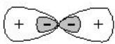</td><td>180°</td></tr><tr><td> $sp^2$ </td><td>平面三角形</td><td>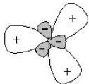</td><td>120°</td></tr><tr><td> $sp^3$ </td><td>正四面体</td><td>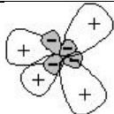</td><td>109°28&#x27;</td></tr><tr><td> $sp^3d$ </td><td>三角双锥</td><td>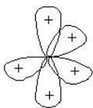</td><td>90°(轴与平面)120°(平面内)180°(轴向)</td></tr><tr><td> $sp^3d^2$ </td><td>正八面体</td><td>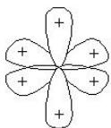</td><td>90°(轴与平面、平面内)180°(轴向)</td></tr></table>

# 3.3.3 等性杂化与不等性杂化

同种类型的杂化轨道又可分为等性杂化和不等性杂化两种。以 $sp^{3}$ 杂化方式为例，在 $CH_{4}$ 分子中，中心碳原子采取 $sp^{3}$ 杂化，四个 $sp^{3}$ 杂化轨道各有一个单电子，这四个杂化轨道是完全等价的，称之为等性杂化。在 $H_{2}O$ 分子中，中心氧原子采取 $sp^{3}$ 杂化，四个杂化轨道中，两个 $sp^{3}$ 轨道各被一对电子填满，另外两个 $sp^{3}$ 杂化轨道上各有一个单电子，这四个杂化轨道是不等价的，称之为不等性杂化。

# 3.3.4 杂化轨道理论的基本要点

1. 在形成分子时，由于原子间的相互作用，若干不同类型的、能量相近的原子轨道混合起来，重新组成一组新的轨道，这种重新组合的过程叫杂化，所形成的新轨道称为杂化轨道。  
2. 杂化轨道的数目与组成杂化轨道的各原子轨道的数目相等。  
3. 杂化轨道有可分为等性和不等性杂化轨道两种。  
4. 杂化轨道成键时，要满足原子轨道最大重叠原理。  
5. 杂化轨道成键时，要满足化学键间最小排斥原理。键与键间排斥力的大小决定于键的方向，即决定于杂化轨道间的夹角。

# 3.4 价层电子对互斥理论

价键理论和杂化轨道理论都可以解释共价键的方向性，特别是杂化轨道理论在解释和预见分子的空间构型是比较成功的。但是一个分子究竟采取哪种类型的杂化轨道，有些情况下是难以确定的。1940年由Sidgwick和Powell提出VSEPR理论，这种方法比较简单，不需要原子轨道的概念，而且在解释、判断和预见分子的结构的准确性方面相比杂化轨道理论毫不逊色。

(1) 基本思想：在共价分子或共价型离子中，中心原子周围的电子对所占的空间 （成键电子对和孤对电子对）尽可能采用使之本身受到的静电排斥最小的理想几何构型，即尽可能使中心原子周围的各电子对的距离达到最大。

(2)判断分子几何构型的步骤:

a. 将分子表示为 $A X_{n} E_{m}$ 的形式，其中

![[02-03第二章分子结构与化学键学生版_images/5357810ba3469c748ad637bc8c022b67d126497f6538ab5a61fb47c10e87475e.jpg]]

flowchart

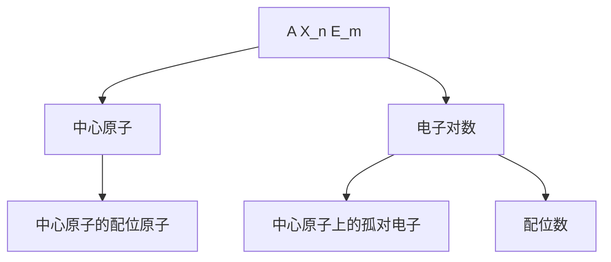

$\mathrm{m = [A的价电子数 - 电荷数 - (8 - X的价电子数)\times n] / 2}$

例如 $CH_{4}$ $m=[4-(2-1)\times4]/2=0$

$CH_{4}$ 可表示为 $AX_{4}E_{0}$

如 $SO_{3}^{2-}$ $m=[6-(-2)-(8-6)\times3]/2=1$

$SO_{3}^{2-}$ 可表示为 $AX_{3}E_{1}$

如 $NH_{4}^{+}$ $m=[5-(+1)-(2-1)\times4]/2=1$

$NH_{4}^{+}$ 可表示为 $AX_{4}E_{0}$

b. 将 $(m+n)$ 称作价层电子对数，这样 $(m+n)$ 的值决定了一个分子的构型

<table><tr><td>m+n</td><td>2</td><td>3</td><td>4</td><td>5</td><td>6</td></tr><tr><td>AXnEm</td><td>X—A—X</td><td>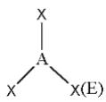</td><td>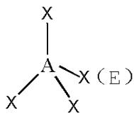</td><td>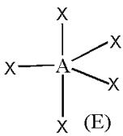</td><td>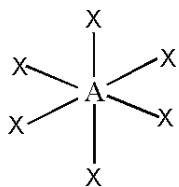</td></tr><tr><td>空间造型</td><td>直线型</td><td>三角形</td><td>四面体</td><td>三角双锥</td><td>八面体</td></tr></table>

c. 当 $\mathrm{m} + \mathrm{n}$ 不同时，分子的构型因 $\mathfrak{m}$ 与 $\mathfrak{n}$ 的不同取值发生改变

<table><tr><td>m+n</td><td>n</td><td>构型</td><td>举例</td></tr><tr><td>2</td><td>0</td><td> $\mathrm{X}-\mathrm{A}-\mathrm{X}$ (直线)</td><td> $\mathrm{CO}_{2}$ 、 $\mathrm{BeCl}_{2}$ </td></tr><tr><td rowspan="2">3</td><td>0</td><td>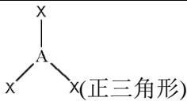</td><td> $\mathrm{BF}_{3}$ 、 $\mathrm{SO}_{3}$ </td></tr><tr><td>1</td><td>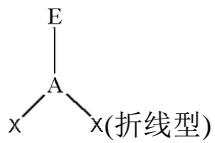</td><td> $\mathrm{O}_{3}$ 、 $\mathrm{SO}_{2}$ </td></tr><tr><td rowspan="3">4</td><td>0</td><td>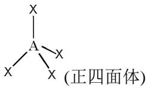</td><td> $\mathrm{CH}_{4}$ 、 $\mathrm{SO}_{4}^{2-}$ </td></tr><tr><td>1</td><td>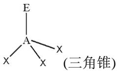</td><td> $\mathrm{NH}_{3}$ 、 $\mathrm{SO}_{3}^{2-}$ </td></tr><tr><td>2</td><td>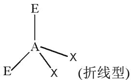</td><td> $\mathrm{H}_{2}\mathrm{O}$ 、 $\mathrm{H}_{2}\mathrm{S}$ </td></tr><tr><td rowspan="4">5</td><td>0</td><td>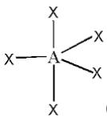(三角双锥)</td><td> $PCl_5$ </td></tr><tr><td>1</td><td>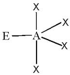(翘翘板型)</td><td> $SCl_4$ </td></tr><tr><td>2</td><td>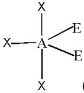(T字型)</td><td> $IF_3$ 、 $ClF_3$ </td></tr><tr><td>3</td><td>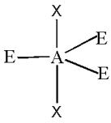(直线型)</td><td> $XeF_2$ </td></tr><tr><td rowspan="3">6</td><td>0</td><td>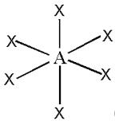(正八面体)</td><td> $IO_{6}^{5-}$ </td></tr><tr><td>1</td><td>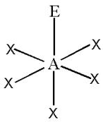(四角锥)</td><td> $IF_5$ </td></tr><tr><td>2</td><td>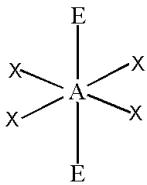(四边形)</td><td> $XeF_4$ </td></tr></table>

$\mathrm{ClF}_3$ 分子可以画出三种不同的空间几何构型

![[02-03第二章分子结构与化学键学生版_images/0bccb2618083692bcd7593e145fd160967b6064a14c19e4eb0eb93fe597a704d.jpg]]  
(I)

![[02-03第二章分子结构与化学键学生版_images/49fea72779c2415f10a35ea012275337a1c3ebe17b883abe6237680577352afc.jpg]]  
(II)

![[02-03第二章分子结构与化学键学生版_images/4c27bf103ed5ab13cead02b005b6feebac9b3e6dc5ffd79c3bad16adaecb235f.jpg]]  
(III)

如果遇到存在几种可能的空间几何构型时，要选择最稳定的结构式，即各电子对间的排斥力最小。对于三角双锥而言，抓住 $90^{\circ}$ 键角之间的排斥力，因为最小角之间的排斥力最大。各电子对之间排斥力的大小顺序为：孤对电子对—孤对电子对 > 孤对电子对—双键 > 孤对电子对—单键 > 双键—双键 > 双键—单键 > 单键—单键

<table><tr><td>90°</td><td>(I)</td><td>(II)</td><td>(III)</td></tr><tr><td>孤对电子对 —— 孤对电子对</td><td>0</td><td>1</td><td>0</td></tr><tr><td>孤对电子对 —— 成键电子对</td><td>6</td><td>3</td><td>4</td></tr><tr><td>成键电子对 —— 成键电子对</td><td>0</td><td>2</td><td>2</td></tr></table>

所以构型(III)是最稳定，即孤对电子对放在平面内， $ClF_{3}$ 的几何构型为T型。

# (3)键角的讨论

(i)不同的杂化类型，键角不同。

(ii)在相同的杂化类型条件下，孤对电子对越多，成键电子对之间的键角越小。

例如： $CH_{4}$ 、 $NH_{3}$ 、 $H_{2}O$ ，键角越来越小。

(iii) 在相同的杂化类型和孤对电子对条件下，

a. 中心原子的电负性越大,成键电子对离中心原子越近,成键电子对之间距离变小,排斥力增大,键角变大。例如: $\mathrm{NH}_{3}$ 、 $\mathrm{PH}_{3}$ 、 $\mathrm{AsH}_{3}$ ,中心原子电负性减小,键角越来越小。  
b. 配位原子的电负性越大，键角越小。例如 $NH_{3}$ 中的 $\angle HNH$ 大于 $NF_{3}$ 中的 $\angle FNF$ 。  
c. 双键、叁键的影响：由于叁键—叁键之间的排斥力 > 双键—双键之间的排斥力 > 双键—单键之间的排斥力 > 单键—单键之间的排斥力。

# 3.4.3 离域 $\pi$ 键

两个原子之间通过共用电子对形成共价键，这样形成的化学键为定域键。如果是三个或三个以上原子共用电子，形成的就是离域键。多个原子提供原子轨道相互重叠，最常见的是“肩并肩”形式重叠的 $\pi$ 键，所以离域键又称为离域 $\pi$ 键或者大 $\pi$ 键，用 $\pi_{n}^{m}$ 表示。n 为参与离域 $\pi$ 键的 p 轨道数目，m 为 p 轨道提供的总电子数。离域 $\pi$ 键分为 p-p 离域 $\pi$ 键和 p-d 离域 $\pi$ 键。

a。形成 p-p 离域 $\pi$ 键的形成必须具有下列条件：

(1) 所有参与离域 $\pi$ 键的原子必须在同一平面内, 即连接这些原子的中心原子只能采取 sp 或 $\mathrm{sp}^2$ 杂化。  
（2）所有参与离域 $\pi$ 键的原子都必须提供一个或两个相互平行的 p 轨道。  
（3）参与离域 $\pi$ 键的 p 轨道上的电子数必须小于 2 倍的 p 轨道数。

如：1,3-丁二烯， $NO_{3}^{-}$ ， $CO_{3}^{2-}$ ， $SO_{3}$ 中的离域 $\pi$ 键为 $\pi_{4}^{4}$ ， $\pi_{4}^{6}$ ， $\pi_{4}^{6}$ ， $\pi_{4}^{6}$ 。

离域 $\pi$ 键示意图:

![[02-03第二章分子结构与化学键学生版_images/0ca5401cf9ae9b5c16ba3346fe8d5a83682dbde03d8dfb9113305b6f44b08127.jpg]]

$SO_{3}$ 中 S 原子采取 $sp^{2}$ 杂化，未参与杂化的 3p 轨道上存在一对电子，由于在 $sp^{2}$ 杂化道上有一对电 $^{1111}$ （ $sp^{2}$ 杂化），所以 $SO_{3}$ 中氧原子的 2p 轨道上的电子发生重排而空出了一个 2p 轨道来容纳 S 原子的 $2p^{2}$ 杂化轨道上的电子对，则该氧原子提供的平行的 2p 轨道上也是一对电子，所以 $SO_{3}$ 中 S 原子的一个 3p 轨道和 3 个 O 原子的 2p 轨道（共四个相互平行的 p 轨道）提供的 p 电子数为： $2 + 2 + 1 + 1 = 6$ 。

实际上 $NO_{3}^{-}$ 和 $CO_{3}^{2-}$ 是等电子体， $SO_{3}$ 与它们也是广义的等电子体，所以它们有相同的离域 $\pi$ 键（ $\Pi_{4}^{6}$ ）。

离域 $\pi$ 键键级 $=$ 参与成键的轨道数 $-\frac{\pi\text{键电子数}}{2}$

# B.d-pπ键的讨论

p-d 离域 $\pi$ 键则不需要所有参与离域键的所有原子共平面，因 d 轨道角度分布的的空间伸展方向，可以与 p 轨道在许多方向上肩并肩重叠。

(1) 以 $\mathrm{H}_{3} \mathrm{PO}_{4}$ 为例, 说明 $\mathrm{d}-\mathrm{p} \pi$ 键的形成 在 $(\mathrm{HO})_{3} \mathrm{PO}$ 中 $\mathrm{P}$ 原子采取 $\mathrm{sp}^{3}$ 杂化, 原子中 3 个 $\mathrm{sp}^{3}$ 杂化轨道中的 3 个单电子与 OH 基团形成三个 $\sigma$ 键, 第四个 $\mathrm{sp}^{3}$ 杂化轨道上的孤对电子对必须占有 O 原子的空的 2p 轨道。而基态氧原子 2p 轨道上的电子排布为 [1111], 没有空轨道, 但为了容纳 P 原子上的孤对电子对, O 原子只好重排 2p 轨道上电子而空出一个 2p 轨 [1111], 来容纳 P 原子的孤对电子对, 形成 P: → O 的 $\sigma$ 配键。氧原子 2p 轨道上的孤对电子对反过来又可以占有 P 原子的 3d 空轨道, 这两个 p-d 轨道只能“肩并肩”重叠, 形成 $\pi$ 键, 称为 d-pπ 键。所以 P、O 之间的成键为 $\mathrm{P} \rightleftharpoons \ddot{\mathrm{O}}$ (一个 $\sigma$ 配键, 两个 d-pπ 配键), 相当于 P=O。

所以许多教科书上把 $\mathrm{H}_3\mathrm{PO}_4$ 的结构式表示为：

![[02-03第二章分子结构与化学键学生版_images/ba653741da5f214d72a362c5805ce9a6feca6e184b31adbffeedbc25a3250053.jpg]]

chemical

Chemical reaction equation showing phosphorus-oxygen bond formation with hydroxyl group

(2) $d-p\pi$ 键的应用

(a) 可以解释共价分子几何构型

$(\mathrm{SiH}_{3})_{3}\mathrm{N}$ 与 $(\mathrm{CH}_3)_3\mathrm{N}$ 有不同的几何构型，前者为平面三角形，后者为三角锥型。这是由于在 $(\mathrm{SiH}_{3})_{3}\mathrm{N}$ 中N原子可以采取 $\mathfrak{sp}^2$ 杂化，未杂化的2p轨道（有一对孤对电子对）可以“肩并肩”地与Si原子的3d空轨道重叠而形成 $\mathrm{d - p}\pi$ 键，使平面三角形结构得以稳定。 $(\mathrm{CH}_3)_3\mathrm{N}$ 中的C原子不存在d价轨道，所以N原子必须采取 $\mathfrak{sp}^3$ 杂化，留给孤对电子对以合适的空间。

(b) 可以解释 Lewis 碱性的强弱

比较 $\mathrm{H}_{3} \mathrm{C}-\mathrm{O}-\mathrm{CH}_{3}$ 与 $\mathrm{H}_{3} \mathrm{Si}-\mathrm{O}-\mathrm{CH}_{3}$ 的碱性，前者的碱性强于后者的碱性。这也是由于在 $\mathrm{H}_{3} \mathrm{Si}-\mathrm{O}-\mathrm{CH}_{3}$ 中 O 原子上的孤对电子对可以占有 Si 原子的 3d 空轨道，形成 d-pπ 键，从而减弱了 O 原子的给出电子对能力，使得后者的 Lewis 碱性减弱。

(c) 可以解释键角的变化

对于 $NH_{3}$ 与 $NF_{3}$ ， $\angle HNH > \angle FNF$ ，而对于 $PH_{3}$ 与 $PF_{3}$ ， $\angle HPH < \angle FPF$ 。两者是反序的，这是因为后者是由于 F 原子上的孤对电子对占有 P 原子上的 3d 空轨道，增强了 P 原子上的电子云密度，使成键电子对之间的排斥力增大，所以键角变大。

# C. 等电子体原理

在有了关于离域 $\pi$ 键的观点后，就可以利用等电子体原理这一概念，来推知很多分子或多原子离子的结构了。等电子体原理可以表述为：具有相同的通式——AX $_{m}$ ，而且价电子总数相等的分子或离子具有相同的结构特征。这里的“结构特征”的概念既包括分子的立体结构，又包括化学键的类型，但键角并不一定相等，除非键角为 $180^{\circ}$ 或 $90^{\circ}$ 等特定的角度。下面列举一些典型的等电子体类型：

(1) $CO_{2}$ 、 $CSN^{-}$ 、 $NO_{2}^{+}$ 、 $N_{3}^{-}$ 具有相同的通式—— $AX_{2}$ ，价电子总数16，具有相同的结构——直线型分子，中心原子上没有孤对电子而取sp杂化轨道，形成直线形 $\sigma$ 骨架，键角为 $180^{\circ}$ ，分子里有两套 $\Pi_{3}^{4}p-p$ 大 $\pi$ 键。

(2) $CO_{3}^{2-}$ 、 $NO_{3}^{-}$ 、 $SO_{3}$ 等离子或分子具有相同的通式—— $AX_{3}$ ，总价电子数 24，有相同的结构——平面三角形分子，中心原子上没有孤对电子而取 $sp^{2}$ 杂化轨道形成的 $\sigma$ 骨架，有一套 $\Pi_{4}^{6}p-p$ 大 $\pi$ 键。

(3) $SO_{2}$ 、 $O_{3}$ 、 $NO_{2}^{-}$ 等离子或分子， $AX_{2}$ ，18e，中心原子取 $sp^{2}$ 杂化形式，VSEPR理想模型为平面三角形，中心原子上有1对孤对电子（处于分子平面上），分子立体结构V型（或角形、折线型），有一套符号为 $\Pi_{3}^{4}$ 的p-p大π键。注意： $ClO_{2}^{-}$ 尽管也符合通式 $AX_{2}$ ，但有20e结构就不同于 $NO_{2}^{-}$ ， $ClO_{2}^{-}$ ，其VSEPR理想模型为 $AY_{4}$ ，中心原子上有2对孤对电子，故取 $sp^{3}$ 杂化形式，它的所有3p轨道都参与了杂化，用于形成σ轨道（2个σ键和2对孤对电子对占据的σ轨道），中心原子已经没有未参与杂化的p轨道，因而该离子中不可能有中心原子与配位原子平行的p轨道，不可能有p-p大π键，尽管分子立体结构也为V型，但∠OCLO<109°，比18e的 $AX_{2}$ 的σ骨架夹角小得多，这表明，具有相同通式的分子或离子必须同时具有相同的价电子总数才有相同的结构性。

(4) $SO_{4}^{2-}$ 、 $PO_{4}^{3-}$ 等离子具有 $AX_{4}$ 的通式，总价电子数32，中心原子有4个 $\sigma$ 键，故取 $sp^{3}$ 杂化形式，呈正四面体立体结构；请注意：这些离子的中心原子的所有3p轨道都参与杂化了，都已用于形成 $\sigma$ 键，因此，分子里已经不可能存在中心原子的p轨道参与的 $p-p\pi$ 键，它们的路易斯结构式里的重键是d-p大 $\pi$ 键，不同于 $p-p\pi$ 键，是由中心原子的d轨道和配位原子的p轨道形成的大 $\pi$ 键，详见元素化学有关章节。

(5) $PO_{3}^{3-}$ 、 $SO_{3}^{2-}$ 、 $ClO_{3}^{-}$ 等离子具有 $AX_{3}$ 的通式，总价电子数 26，中心原子有 4 个 $\sigma$ 轨道（3 个 $\sigma$ 键和 1 对占据 $\sigma$ 轨道的孤对电子），VSEPR 理想模型为四面体，（不计孤对电子的）分子立体结构为三角锥体，跟例 3 的离子一样，中心原子取 $sp^{3}$ 杂化形式，没有 $p-p\pi$ 键或 $p-p$ 大 $\pi$ 键，它们的路易斯结构式里的重键是 d-p 大 $\pi$ 键。请注意对比： $SO_{3}$ 和 $SO_{3}^{2-}$ 尽管通式相同，但前者是 24e，后者是 26e，故结构特征不同。

# 3.5 分子轨道理论

价键理论认为形成共价键的电子只局限于两个相邻原子间的小区域内运动,缺乏对分子作为一个整体的全面考虑,因此它对有些多原子分子,特别是有机化合物分子的结构不能说明,同时它对氢分子离子 $H_{2}^{+}$ 中的单电子键、氧分子中的三电子键以及分子的磁性等也无法解释。分子轨道理论（简称 MO 法），着重于分子的整体性，他把分子作为一个整体来处理，比较全面地反应了分子内部电子的各种运动状态，它不仅能解释分子中存在的电子对键、单电子键、三电子键的形成，而且对多原子分子的结构也能给以比较好的说明。因此分子轨道理论在近些年来发展很快，在共价键理论中占有非常重要的地位。

# 3.5.1 分子轨道理论的基本要点

1. 在分子中电子不从属于某些特定的原子，而是在遍及整个分子范围内运动，每个电子的运动状态可以用波函数 $\psi$ 来描述，这个 $\psi$ 称为分子轨道。  
2. 分子轨道式由原子轨道线性组合而成的，而且组成的分子轨道的数目同互相化合原子轨道的数目相同。  
3. 每一个分子轨道 $\psi$ 都有一相应的能量 E 和图像，分子的能量 E 等于分子中电子的能量的总和，而电子的能量即为被它们占据的分子轨道的能量。根据分子轨道的对称性不同，可分为 $\sigma$ 键和 $\pi$ 键。  
4. 分子轨道中电子的排布也遵从原子轨道电子排布的同等原则，即：泡利原理、能量最低原理、洪特规则。

# 3.5.2 原子轨道线性组合的类型

两个原子轨道组成两个分子轨道时，由于波函数自身符号有正负之分，因此波函数也就有两种可能的组合方式：即两个波函数的符号相同或两个波函数的符号相反。

按照组合的轨道不同，简单分子的分子轨道重叠可以分为 s-s 重叠、s-p 重叠、p-p 重叠、p-d 重叠、d-d 重叠。

![[02-03第二章分子结构与化学键学生版_images/c656a8188b4cdae649d6650fdc2d39b3fe4a2706c6a2574cc25d1777dcfb639e.jpg]]

chemical

Energy level diagram showing σ and σ* orbitals with overlap and sigma meson states

s 轨道重叠示意图  
![[02-03第二章分子结构与化学键学生版_images/8354d95d1e29f21887a63e4e688a7516061d355c6483594e9ef3388d30a0a2f6.jpg]]

text_image

p_z(a) p_z(b)
σ interaction
x
y
z
σ
p_z(a) + p_z(b)
p_x(a) - p_z(b)
π interaction
s(a) p_x(b)
p_y(a) p_x(b)
π
or
or
π
p_x(a) - p_x(b)
p_y(a) p_y(b)
p_x(a) + p_x(b)
no interaction

p-p, s-p 轨道重叠示意图

![[02-03第二章分子结构与化学键学生版_images/ca01a4b70efddcc8f0f55831c7806a86095d2ce6ca9312456461c540550cbcdf.jpg]]

chemical

Molecular orbital diagrams showing d orbitals and their corresponding π, δ, and d-x²-y²/xy orbitals in parallel planes

d-d 轨道重叠示意图

# 3.5.3 原子轨道线性组合的原则

分子轨道是由原子轨道线性组合而得，但并不是任意两个原子轨道都能组合成有效的分子轨道，在确定哪些原子轨道可以组合成分子轨道时，应遵循下列三条原理。

1. 如果两个原子轨道能量相差很大，则不能组合成有效的分子轨道，只有能量相近的原子轨道才能组合成有效的分子轨道，而且原子轨道的能量越相近越好，这就叫能量近似原则。  
2. 最大重叠原则：原子轨道发生重叠时，在可能的范围内重叠程度越大，成键轨道能量相对于组成的原子轨道的能量降低得越显著，成键效应越强，即形成的化学键越牢固，这就叫最大重叠原则。  
3. 对称性原则：只有对称性相同的原子轨道才能组成分子轨道，这就叫做对称性原则。所谓对称性相同，实际上是指重叠部分的原子轨道的正、负号相同。

在由原子轨道组成分子轨道的三原则中，对称性原则是首要的，它决定原子轨道能否组成分子轨道的问题，而能量近似原则和最大重叠原则只是决定组合的效率问题。

键级：在价键理论中，通常以键的数目来表示键级。分子轨道理论中则以成键电子数与反键电子数差值的一半来表示键级。

$$
\begin{array}{c c c c c c c c c c} \sigma_ {u} ^ {*} (2 p) & - & - & - & - & - & - & - & \updownarrow & \sigma_ {u} ^ {*} (2 p) \\ \pi_ {g} ^ {*} (2 p) & - & - & - & - & - & - & - & \updownarrow & \pi_ {g} ^ {*} (2 p) \\ \sigma_ {g} (2 p) & - & - & - & - & - & \updownarrow & \updownarrow & \updownarrow & \pi_ {g} ^ {*} (2 p) \\ \pi_ {u} (2 p) & - & - & \updownarrow & \updownarrow & \updownarrow & \updownarrow & \updownarrow & \updownarrow & \pi_ {u} (2 p) \\ \sigma_ {u} ^ {*} (2 s) & - & - & \updownarrow & \updownarrow & \updownarrow & \updownarrow & \updownarrow & \updownarrow & \sigma_ {g} (2 s) \\ \sigma_ {g} (2 s) & \updownarrow & \updownarrow & \updownarrow & \updownarrow & \updownarrow & \updownarrow & \updownarrow & \updownarrow & \sigma_ {g} (2 s) \\ & & \updownarrow & \updownarrow & \updownarrow & \updownarrow & \updownarrow & \updownarrow & \updownarrow & \sigma_ {g} (2 s) \\ & & & \updownarrow & \updownarrow & \updownarrow & \updownarrow & \updownarrow & \updownarrow & \sigma_ {g} (2 s) \\ & & & & \updownarrow & \updownarrow & \updownarrow & \updownarrow & \updownarrow & \sigma_ {g} (2 s) \\ L i _ {2} & B e _ {2} & B _ {2} & C _ {2} & N _ {2} & O _ {2} & F _ {2} & N e _ {2} \\ B o n d o r d 1 0 0 0 0 0 0 0 0 0 0 0 0 0 0 0 0 0 0 0 0 0 0 0 0 0 0 0 0 0 0 0 0 0 0 0 0 0 0 0 0 0 0 0 0 0 0 0 0 0 0 1 1 1 1 1 1 1 1 1 1 1 1 1 1 1 1 1 1 1 1 1 1 1 1 1 1 1 1 1 1 1 1 1 1 1 1 1 1 1 1 1 1 1 1 1 1 1 1 1 1 3. \\ U n p a i r e d e ^ {-} = = = = = = = = = = = = = = = = = = = = = = = = = = = = = = = = = = = = = = = = = = = = = = = = = = = = = = = = = = = = = = = = = = = = = = = = = = = = = = = = = = = = = = = = = = = = = = = = = = = == \\ L i _ {2} & B e _ {2} & B _ {2} & C _ {2} & N _ {2} & O _ {2} & F _ {2} & N e _ {2} \\ B o n d o r d 1 0 0 0 0 0 0 0 0 0 0 0 0 0 0 0 0 0 0 0, u n p a i r e d e ^ {-} = = = = = = = = = = = = = = = = = = = = = = = = = = = = = = = = = = = = = = = = = = = = = = = = = = = = = = = = = = = = = = = == \\ L i _ {2} & B e _ {2} & B _ {2} & C _ {2} & N _ {2} & O f _ {2} & F _ {2} & N e _ {2} \\ B o n d o r d 1, u n p a i r e d e ^ {-} := U n p a i r e d e ^ {-} := U n p a i r e d e ^ {-}. \\ L i _ {2} & B e _ {2} & B _ {2} & C _ {2} & N _ {2} & O f _ {2} & F _ {2} & N e _ {2} \\ B o n d o r d 1, u n p a i r e d e ^ {-} := U n p a i r e d e ^ {-}. \\ L i _ {2} & B e _ {2} & B _ {2} & C _ {2} & N _ {2} & O f _ {2} & F _ {2} & N e _ {2} \\ B o n d o r d 1, u n p a i r e d e ^ {-}. \\ L i _ {2} & B e _ {2} & B _ {2} & C _ {2} & N _ {2} & O f _ {2} & F _ {2} & N e _ {2} \\ B o n d o r d 1, u n p a i r e d e ^ {-}. \\ L i _ {2} & B e _ {2}, u n p a i r e d e ^ {-}. \\ L i _ {2} & B e _ {2}, u n p a i r e d e ^ {-}. \\ L i _ {2} & B e _ {2}, u n p a i r e d e ^ {-}. \\ L i _ {2} & B e _ {2}, u n p a i r e d e ^ {-}. \\ L i _ {2} & B b e _ {b}, u n p a i r e d e ^ {-}. \\ L i _ {2} & B b e _ {b}, u n p a i r e d e ^ {-}. \\ L i _ {2} & B b e _ {b}, u n p a i r e d e ^ {-}. \\ L i _ {2} & B b e _ {b}, u n p a i r e d e ^ {-}. \\ L i _ {4}, u n p a i r e d e ^ {-}. \\ L i _ {4}, u n p a i r e d e ^ {-}. \\ L i _ {4}, u n p a i r e d e ^ {-}. \\ L i _ {4}, u n p a i r e d e ^ {-}. \\ L i _ {4}, u n p a i r e d e ^ {-}. \\ L i _ {4}, u n p q u a l y, u n p q u a l y, u n p q u a l y, u n p q u a l y, u n p q u a l y, u n p q u a l y, u n p q u a l y, u n p q u a l y, u n p q u a l y, u n p q u a l y, u n p q u a l y, u n p q u a l y, U n p q u a l y, U n p q u a l y, U n p q u a l y, U n p q u a l y, U n p q u a l y, U n p q u a l y, U n p q u a l y, U n p q u a l y, U n p q u a l y, U n p q u a l y, U n p q u a l y, U m q u a l y, U m q u a l y, U m q u a l y, U m q u a l y, U m q u a l y, U m q u a l y, U m q u a l y, U m q u a l y, U m q u a l y, U m q u a l y, U m q u a l y, U m q u a l y, U m q u a k, U m q u a k, U m q u a k, U m q u a k, U m q u a k, U m q u a k, U m q u a k, U m q u a k, U m q u a k, U m q u a k, U m q u a k, U m q u a k, U m q u a k, U m q u a k, U m q u a k, I m q u a k, I m q u a k, I m q u a k, I m q u a k, I m q u a k, I m q u a k, I m q u a k, I m q u a k, I m q u a k, I m q u a k, I m q u a k, I m q u a k, I m q u a k, I m q u a k, I m g w h t h t h t h t h t h t h t h t h t h t h t h t h t h t h t h t h t h t h t h t h t h t h t h t h t h t h t h t h t h t h t h t h t h t h t h t h t h t h t h t h t h t h t h t h t h t h t h t h t h t h T H T H T H T H T H T H T H T H T H T H T H T H T H T H T H T H T H T H T H T H T H T H T H T H T H T H T H T H T H T H T H T H T H T H T H T H T H T H T H T H T H T H T H T H T H T H T H T H T H T H T T H T H T H T H T H T H T H T H T H T H T H T H T H T H T H T H T H T H T H T H T H T H T H T H T H T H T H T H T H T H T H T H T H T H T H T H T H T H T H T H T H T H T H T H T H T H T H T H T H T HTHTHTHTHTHTHTHTHTHTHTHTHTHTHTHTHTHTHTHTHTHTHTHTHTHTHTHTHTHTHTHTHTHTHTHTHTHTHTHTHTHTHTHTHTHTHTHTHTHTHTHTHTHTHTHTHTHTHTHTHTHTHTHTHTHTHTHTHTHTHTHTHTHTHTHTHTHTHTHTHTHTHTHTHTHTHTHTHTHTHTHTHTHTHTHTHTHTHTHTHTTTTTTTTTTTTTTTTTTTTTTTTTTTTTTTTTTTTTTTTTTTTTTTTTTTTTTTTTTTTTTTTTTTTTTTTTTTTTTTTTTTTTTTTTTTTTTTTTTTTTTTTTTTTTTTTTTTTTTTTTTTTTTTTTTTTTTTTTTTTTTTTTTTTTTTTTTTTATATATATATATATATATATATATATATATATATATATATATATATATATATATATATATATATATATATATATATATATATATATATATATATATATATATATATATATATATATATATATATATATATATATATATATATATATATATATATATATATATATATATATATATATATATATATATATATATATATATATATTG< fcel>Li< fcel>Li< fcel>Be< fcel>B< fcel>C< fcel>N< fcel>O< fcel>F< fcel>Ne< fcel>F< fcel>Ne< nl>
$$

# 简单双原子分子的分子轨道排布示意图

$\mathrm{O}_2$ 分子的分子轨道表示式为： $(\sigma_{1s})^2 (\sigma_{1s}^*)^2 (\sigma_{2s})^2 (\sigma_{2s}^*)^2 (\sigma_{2p})^2 (\pi_{2p})^4 (\pi_{2p}^*)^2$

或者： $KK(\sigma_{2\mathrm{s}})^{2}(\sigma_{2\mathrm{s}}^{*})^{2}(\sigma_{2\mathrm{p}})^{2}(\pi_{2\mathrm{p}})^{4}(\pi_{2\mathrm{p}}^{*})$

异核分子 NO 的分子轨道可表示为： $(1\sigma)^{2}(2\sigma)^{2}(3\sigma)^{2}(4\sigma)^{2}(1\pi)^{4}(5\sigma)^{2}(2\pi)^{1}$

NO、 $NO^{+}$ 、 $NO^{2+}$ 和 $NO^{-}$ 等物种的键级与键型如下：

<table><tr><td></td><td>NO</td><td> $NO^{+}$ </td><td> $NO^{2+}$ </td><td> $NO^{-}$ </td></tr><tr><td>键级</td><td>2.5</td><td>3</td><td>2.5</td><td>2</td></tr><tr><td>键型</td><td>一个σ键,一个π键,一个三电子π键</td><td>一个σ键,二个π键</td><td>一个单电子σ键,二个π键</td><td>一个σ键,二个三电子π键</td></tr></table>

sp 混杂:

当价层 2s 和 2p 原子轨道能级相近时，由它们组成的对称性相同的分子轨道，能进一步相互作用，混杂在一起组成新的分子轨道，这种分子轨道间的相互作用称为 sp 混杂。一般大于等于 15 个电子时不发生 sp 混杂，如 NO, O₂, 而 B₂, C₂, N₂ 的能级顺序，由于 sp 混杂， $\pi_{2p}$ 和 $\sigma_{2p}$ 的能级会发生交错。

# 四、金属键

金属键理论认为，在固态或液态金属中，价电子可以自由地从一个原子跑向另一个原子，这样一来就好像价电子为许多原子或离子（每个金属原子释放出自己的电子便成为离子）所共有。这些共用电子起到把许多原子（或离子）粘合在一起的作用，形成了所谓的金属键。对金属键有两种形象化的说法：一种说法是在金属原子（或离子）之间有电子气在自由流动；另一种说法是，金属离子浸没在电子的海洋中。

金属键的量子力学模型叫做能带理论。能带理论的基本论点如下：

1. 为使金属原子的少数价电子能够适应高配位数结构的需要，成键时价电子必须是离域的，所有的价电子应该属于整个金属晶格的原子所共有。  
2.金属晶格中原子很密集，能组成许多分子轨道，而且相邻的分子轨道间的能量差很小。  
3.从上述分子轨道所形成的能带，也可以看成是紧密堆积的金属原子的电子能级发生的重叠，这种能带是属于整个金属晶体的。  
4.依原子轨道能级的不同，金属晶体中可以有不同的能带。由充满电子的原子轨道能级所形成的低能量能带，叫做满带；由未充满电子的能级所形成高能量能带，叫做导带。从满带顶到导带底之间的能量差通常很大，以致低能带中的电子向高能带跃迁几乎是不可能的，所以把满带顶和导带底之间的能量间隔叫做禁带。  
5.金属中相邻近的能带有时可以互相重叠。

![[02-03第二章分子结构与化学键学生版_images/3e51a300e9577cee696fd5815f4096d12a76bbddc9f015f000d8cb84dc568c99.jpg]]

text_image

反键
非键
成键
原子数目 2 3 4 N
能带

分子轨道的能带随着 Na 原子数目增加的演变情况图  
(图中原子数目为 N 时能带中带阴影部分表示充满电子)

从能带理论的观点，一般固体都具有能带结构。根据能带结构中禁带宽度和能带中电子填充的状况，可以决定固体材料是导体、半导体或绝缘体。

![[02-03第二章分子结构与化学键学生版_images/d73769508017eba95ebb6ce54ce43f1d961962ffd4011779726f3d05c47f2f07.jpg]]

text_image

E
空导带
E_g
E_F
部分
填充的能带
N(E)

(a)

![[02-03第二章分子结构与化学键学生版_images/bdb43ac40a51a5b2f29fe54f5684e9b9a9dc70be1a2270e997ca811d82d16dff.jpg]]

text_image

E
部分填充
的能带
E_F
N(E)

(b)

![[02-03第二章分子结构与化学键学生版_images/7365f6cedbd0ded81f6e952c8a2ba5c0bbc295ad8978ab77a9810e096559dfaa.jpg]]

text_image

E
空导带
Eg大
满价带
N(E)

(c)

![[02-03第二章分子结构与化学键学生版_images/24d3678ec4a9d2cec0191203266ff9525da4da0c0c8f0bbcb79bafbcedc71d85.jpg]]

text_image

E
空导带
Eg小
满价带
N(E)

(d)

# 材料能带示意图

a. 具有能带不重叠的金属 b. 具有能带重叠的金属 c. 绝缘体 d. 半导体

能带理论能很好地说明金属的一些物理性质。向金属施以外加电场时，导带中的电子便会在能带内向较高能级跃迁，并沿着外加电场方向通过晶格产生运动，这就说明了金属的导电性；能带中的电子可以吸收光能，并也能将吸收的能量又发射出来，这就说明了金属的光泽和金属是辐射能的优良反射体；电子也可以传输热能，表现金属有导热性；给金属晶体施加机械应力时，由于在金属中电子是离域的，金属键不会彻底被破坏，因此机械加工根本不会破坏金属结构，而仅能改变金属的外形。

金属原子对形成能带所贡献的不成对价电子越多，金属键应越强，反应在物理性质上应该是熔点和沸点越高，密度和硬度越大。

# 五、分子间作用力

# 5.1 分子的极性

# 1. 共价分子的分类

(1) 非极性分子 由非极性键组成的共价分子称为非极性分子，例如同核双原  
子分子；或者由极性键构成但几何构型对称的共价分子也称为非极性分，例如 $CO_{2}$ 。

(2) 极性分子 由极性键构成的，且键的极性不能抵消的共价分子称为极性分子。

# 2. 分子极性大小的量度 —— 偶极矩 $(\mu)$

(1) $\mu$ 是一个矢量，既有大小，又有方向。

大小 $\mu = q \cdot d$ ，单位为德拜(Debye)。

方向 从正指向负。 $1\mathrm{Debye} = 3.336\times 10^{-30}\mathrm{C}\cdot \mathrm{m}$

(2) 对于双原子分子，键的极性越大，分子的极性越大。

$$
\mathrm{H} _ {2}: \mu = 0
$$

$$
\mathrm{CO}: \mu = 0. 1 1 2
$$

$$
\mathrm{NO}: \mu = 0. 1 5 9
$$

$$
\mathrm{HI}: \mu = 0. 4 4 8
$$

$$
\mathrm{HBr}: \mu = 0. 8 2 8
$$

$$
\mathrm{HCl}: \mu = 1. 0 9
$$

$$
\mathrm{HF}: \mu = 1. 8 2 7
$$

(3) 对于多原子分子，特别是中心原子上存在孤对电子对的分子，其极性要通过分析讨论

论来确定。例如： $CO_{2}:\mu=0$ $O\leftarrow C\rightarrow O,$

$$
\text { SCO:   } \mathrm{S} \xleftarrow {\mathrm{C}} \mathrm{O}
$$

# 5.2 分子间的相互作用力

分子间的相互作用是除共价键、离子键和金属键以外，分子间相互作用的总称。分子间相隔较远时，以吸引作用为主；相隔很近时，以排斥为主，当分子相互接近聚集在一起时，吸收作用和排斥作用达到平衡，使分子间作用能处于最低点，而成为稳定的聚集体。

分子间作用主要有：荷电基团、偶极子、诱导偶极子之间的相互作用，氢键、疏水基团相互作用、 $\pi\cdots\pi$ 堆叠作用以及非键电子推斥作用等。大多数分子的分子间作用能在 $10kJ\cdot mol^{-1}$ 以下，比一般的共价键键能小1\~2个数量级，作用范围约为0.3\~0.5nm。

荷电基团间的静电作用，其本质和离子键相当，又称盐键，如—COO $^{-}$ … $^{+}$ H $_{3}$ N—，其作用能正比于互相作用的基团间荷电的数量，与基团电荷重心间的距离成反比。

偶极子、诱导偶极子和高级电极矩（如四极矩）间的相互作用，通称 van der Waals 作用，将在接下来详细讨论。

疏水基团相互作用是指极性基团间的静电作用和氢键使极性基团倾向于聚集在一起，因而排挤疏水基团，使疏水基团相互聚集所产生的能量效应和熵效应。在蛋白质分子中，疏水侧链基团如苯丙氨酸、亮氨酸、异亮氨酸等较大的疏水基团，受水溶液中溶剂水分子的排挤，使溶液中蛋白质分子的构象趋向于把极性基团分布在分子表面、和溶剂分子形成氢键和盐键，而非极性基团聚集成疏水区，藏在分子的内部，这种效应即为疏水基团相互作用。据测定，使两个 $\left\rangle CH_{2}\right.$ 基团聚集在一起形成 $\left\rangle CH_{2}\cdots H_{2}C\right\rangle$ 的稳定能约达 $3\ kJ\cdot mol^{-1}$ 。

$\pi \dots \pi$ 堆叠作用是两个或多个平面型的芳香环平行地堆叠在一起产生的能量效应。最典型的是石墨层型分子间的堆叠，其中层间相隔距离为 $335\mathrm{pm}$ 。在其他小分子组成的晶体中，芳香环出现互相堆叠在一起的现象也是非常普遍。 $\pi \dots \pi$ 堆叠作用和芳香分子中离域分子轨道同相叠加有关。

非键电子推斥作用是一种近程作用，即基团距离过近时的空间效应。它存在于所有类型的基团间，其作用能正比于 $r^{-9} \sim r^{-12}$ 。

# 5.2.1 范德华力

# (1) 取向力

a. 永久偶极 极性分子的正、负电荷重心本来就不重合，始终存在着一个正极和一个负极，极性分子的这种固有的偶极，称为永久偶极。  
b. 当两个极性分子相互接近时，一个分子带负电荷的一端要与另一个分子带正电荷的一端接近，这样就使得极性分子有按一定方向排列的趋势，因而产生分子间引力，称为取向力。  
c. 极性分子之间, 离子与极性分子之间的相互作用力就是取向力, 即取向力存在于永久偶极之间或离子与永久偶极之间。

# (2) 诱导力

a. 诱导偶极 本来分子中正、负电荷的重心重合在一起，由于带正电荷的核被引向负电极而使电子云被引向正电极，结果电子云和核发生相对的位移，分子发生了变形，电荷重心分离，导致非极性分子在外电场（或在极性分子、离子）中产生偶极，这种偶极称为诱导偶极。  
b. 应当注意，当外电场消失时，诱导偶极就消失，分子又重新变成非极性分子。  
c. 由诱导偶极产生的分子间作用力，称为诱导力。  
d. 诱导力不仅存在于非极性分子与极性分子之间，也存在于极性分子本身之间。

# (3) 色散力

a. 瞬时偶极 由于每个分子中的电子不断运动和原子核的不断振动，可以发生瞬时的电子与原子核的相对位移，造成正、负电荷重心的分离，这样产生的偶极称为瞬时偶极。  
b. 这种瞬时偶极也会诱导邻近的分子产生瞬时偶极。  
c.由于瞬时偶极的产生，引起的分子间的相互作用力，称为色散力。  
d. 分子的变形性越大，色散力越大。  
e.色散力存在于任何共价分子之间。

总结：取向力，诱导力和色散力统称为 van der Waals 力。在极性分子之间存在取向力、诱导力和色散力，在极性分子和非极性分子之间存在诱导力和色散力，在非极性分子与非极性分子之间存在色散力。

# 5.2.2 氢键

a. 氢键既存在于分子之间（称为分子间氢键），也可以存在于分子内部（称为分子内氢键）的作用力。  
b. 它比化学键弱，但比 van der Waals 力强。  
c. 定义: 所谓氢键是指分子中与高电负性原子 X 以共价键相连的 H 原子, 和另一个分子中的高电负性原子 Y 之间所形成的一种弱的相互作用, 称为氢键(X—H……Y)。

d. 氢键的键长是指 X 和 Y 间的距离(X—H……Y)。

e. 氢键的特点: 具有饱和性和方向性, 由于 H 原子体积小, 为了减少 X 和 Y 之间的斥力, 它们尽量远离, 键角接近 $180^{\circ}$ , 这就是氢键的方向性; 又由于氢原子的体积小, 它与较大的 X、Y 接触后, 另一个较大的原子就难于再向它靠近, 所以氢键中氢的配位数一般为 2, 这就是氢键的饱和性。

# f. 氢键的强弱顺序:

$$
\mathrm{F} - \mathrm{H} \dots \dots \mathrm{F} > \mathrm{O} - \mathrm{H} \dots \dots \mathrm{O} > \mathrm{N} - \mathrm{H} \dots \dots \mathrm{F} > \mathrm{N} - \mathrm{H} \dots \dots \mathrm{O} > \mathrm{N} - \mathrm{H} \dots \dots \mathrm{N}
$$

即 X、Y 的电负性越大，氢键越强，X、Y 半径越小，氢键越强。

# g. 非常规型氢键

(i) X—H……π 氢键：在一个 X—H……π 氢键中，π 键或离域 π 键体系作为质子（H⁺）的接受体。由苯基等芳香环的离域 π 键形成的 X—H……π 氢键，又称为芳香氢键。

![[02-03第二章分子结构与化学键学生版_images/ea20add68a910adfc93422ee124bf2293ee548807b0903403caba2d342313d92.jpg]]

chemical

Two organic molecular structures: a dichlorinated alkene and a triphenyl-Naphthalene derivative with a phenyl group.

(ii) X—H.....M 氢键：在 $\left\{\left(\mathrm{PtCl}_{4}\right)\cdot\mathrm{cis}-\left[\mathrm{PtCl}_{2}\left(\mathrm{NH}_{2}\mathrm{Me}\right)_{2}\right]^{2-}\right\}$ 的结构中，由两个平面四方的 Pt 的 4 配位配离子通过 N—H.....Pt 和 N—H.....Cl 两个氢键结合在一起。

(iii) X—H……H—Y 二氢键：比较下面等电子系列的熔点：

$$
\mathrm{H} _ {3} \mathrm{C} - \mathrm{CH} _ {3}
$$

$$
\mathrm{H} _ {3} \mathrm{C} - \mathrm{F}
$$

$$
\mathrm{H} _ {3} \mathrm{N} - \mathrm{BH} _ {3}
$$

$-181^{\circ}C$

$-141^{\circ}C$

$-104^{\circ}C$

从中可以看出，在 $H_{3}N-BH_{3}$ 晶体中，分子间存在不寻常的强烈相互作用。这使人们提出 X—H……H—Y 二氢键观点。右图示出 $H_{3}N-BH_{3}$ 的结构式。

# h. 氢键对物质性质的影响

# (1)物质的溶解性能

水是应用最广的极性溶剂。汽油、煤油等是典型的非极性溶剂，通称为油。溶质分子在水中和油中的溶解性质，可用“相似相溶”原理表达。这个经验原理指出：结构相似的化合物容易互相混溶，结构相差很大的化合物不易互溶。其中“结构”二字主要有两层含义：一是指物质结合在一起所依靠的化学键形式，对于由分子结合在一起的物质，主要指分子间结合力形式；二是指分子或离子、原子的相对大小以及离子的电价。

水是极性较强的分子，水分子之间有较强的氢键生成，水分子既可为生成氢键提供H，又能有孤对电子接受H。氢键是以水分子间的主要结合力。油分子不具极性，分子间依靠较弱的范德华引力结合。所以对于溶质分子，凡能为生成氢键提供H与接受H者，均和水相似，例如ROH，RCOOH， $\mathrm{CH}_3\mathrm{OH}$ ， $\mathrm{R}_2\mathrm{C} = \mathrm{O}$ ， $\mathrm{RCONH_2}$ 等等均可通过氢键和水结合，在水在溶解度较大。而不具极性的碳氢化合物，不能和水生成氢键，在水中溶解度很小.

在同一类型的溶质分子中，如 ROH，随着 R 基团加大，在水中溶解度越来越小。

丙酮、二氧六环烷、四氢呋喃等，既能接受 H 和 $H_{2}O$ 分子生成氢键，又有很大部分和非极性的有机溶剂相似，所以它们能与水和油等多种溶剂混溶。

# (2)物质的熔沸点和气化焓

由于气态物质分子间作用力可以忽略不计，气化过程将使分子间作用力消失，所以分子间作用力愈大的液态和固态物质愈不易气化，其沸点愈高，气化焓愈大。熔化过程也需克服部分分子间作用力，但因影响熔点和熔化焓的因素较多，其规律性不如沸点和气化焓明显。

结构相似的同系物，若系非极性分子，色散力是分子间的主要作用力；随着相对分子质量增大，极化率增大，色散力加大，熔沸点升高，但若分子间存在氢键，结合力较色散力强，会使熔沸点显著升高。图1示出各种氢化物的沸点和熔点，由图可见，HF、 $H_{2}O$ 、 $NH_{3}$ 等由于分子间有较强的氢键生成，熔点和沸点就特别高。

![[02-03第二章分子结构与化学键学生版_images/1c8345cba6931b62838fad57c810508449789329187ac0e4cf11b2edc31b8116.jpg]]

line

| 结合元素 | 时间点 | 温度 (°C) |
| -------- | ------ | --------- |
| H₂O      | 2      | 0         |
| NH₃      | 2      | -75       |
| HF       | 2      | -85       |
| H₂S      | 3      | -90       |
| H₂Se     | 4      | -60       |
| HBr      | 4      | -80       |
| H₂Te     | 5      | -50       |
| HI       | 5      | -60       |
| Ph₃      | 3      | -120      |
| AsH₃     | 4      | -110      |
| Xe       | 5      | -100      |
| SnH₄     | 5      | -140      |
| SiH₄     | 3      | -180      |
| Ar       | 3      | -185      |
| CH₄      | 2      | -180      |
| Ne       | 2      | -250      |
| H₂O      | 2      | 100       |
| NH₃      | 2      | -30       |
| H₂S      | 3      | -60       |
| HBr      | 4      | -50       |
| HCl      | 3      | -70       |
| PH₃      | 3      | -75       |
| SiH₄     | 3      | -100      |
| Ar       | 3      | -180      |
| Ch₄      | 2      | -170      |
| Ne       | 2      | -250      |
| H₂Te     | 5      | 0         |
| HI       | 5      | -20       |
| SbH₃     | 5      | -30       |
| SnH₄     | 5      | -40       |
| AsH₃     | 4      | -80       |
| GcH₄     | 4      | -90       |
| SiH₄     | 4      | -100      |
| Kr       | 4      | -140      |
| Xe       | 5      | -100      |

图 1 主族元素氢化物的熔点(a)和沸点(b)

分子间生成氢键，熔点、沸点会上升；分子内生成氢键，一般溶、沸点要降低。例如邻硝基苯酚生成分子内氢键，熔点为 $45^{\circ}\mathrm{C}$ ，而生成分子间氢键的间位和对位硝基苯酚，其熔点分别为 $96^{\circ}\mathrm{C}$ 和 $114^{\circ}\mathrm{C}$ 。

图 2 示出主族元素氢化物的气化焓，其大小规律和它们的沸点高低一致.

![[02-03第二章分子结构与化学键学生版_images/e263d24613e350e90ee7aadb0fd6f7afe2a572020ab84fa361fab800c0d4fb26.jpg]]

line

| Element | 气化焓 (kJ·mol⁻¹) |
| ------- | ------------------ |
| H₂O     | 40                 |
| HF      | 30                 |
| NH₃     | 25                 |
| H₂S     | 20                 |
| HCl     | 17                 |
| PH₃     | 16                 |
| SiH₃    | 13                 |
| CH₄     | 8                  |
| H₂Se    | 21                 |
| AsH₃    | 19                 |
| HBr     | 17                 |
| GeH₄    | 16                 |
| H₂Te    | 24                 |
| SbH₃    | 23                 |
| HI      | 21                 |
| SnH₄    | 20                 |

图 2 主族元素氢化物的气化焓

(3)粘度和表面张力

分子间生成氢键，粘度会增大，例如甘油和浓硫酸

$$
\mathrm{CH} _ {2} - \mathrm{CH} - \mathrm{CH} _ {2} \quad \mathrm{H} _ {2} \mathrm{SO} _ {4} (\text {浓})
$$

等都是粘度较大的液体。水的表面张力很高，其根源也在于水分子间的氢键。

物质表面能的大小和分子间作用力大小有关，因为表面分子受到的作用力不均匀，能量较高，有使表面自动缩小的趋势。某些液态物质表面能的数值列于下表：

<table><tr><td>液态物质</td><td>水</td><td>苯</td><td>丙酮</td><td>乙醇</td><td>乙醚</td></tr><tr><td> $\frac{\text{表面能}}{10^{-3} \text{J}\cdot\text{cm}^{3}}$ </td><td>72.8</td><td>28.9</td><td>23.3</td><td>22.6</td><td>17.1</td></tr></table>

表中所列液态物质中，水的表面能最高，因为水分子之间有强的氢键作用。若加表面活性剂破坏表面层的氢键体系就可降低表面能，在工业生产中有着重要的意义。

# 课后习题

1. 写出下列物种的路易斯结构（标明所有的未成键价电子），并标出形式电荷。

(1) $Al_{2}Cl_{6}$

(2) $\mathrm{SnCl}_3^-$

(3) $BrF_{4}^{-}$

(4) $\mathrm{XeF}_2$

(5) NS

(6) $SO_{3}F^{-}$

(7) HOClO

2. 画出满足下列物种的路易斯结构，标出所有未成键电子对和形式电荷，并指出重要的共振结构：

(1) NOF

(2) $NOF_{3}$

(3) $ClO_{3}^{-}$

(4) $\mathrm{N}_3^-$

(5) $PH_{2}^{-}$

(6) $SbCl_{5}$

(7) $\mathrm{IO}_2\mathrm{F}_2$

(8) $\mathrm{SO}_2$

3. 一氧化二氮又名笑气，在室温下不活泼，有麻醉作用。试写出一氧化二氮的共振结构与形式电荷，并指出分子的几何构型。

4.硼与氮形成类似苯的化合物，俗称无机苯。它是无色液体，具有芳香性。

(1)写出其分子式，画出其结构式并标出形式电荷。

(2)写出无机苯与 HCl 发生加成反应的方程式

5.化合物 A 是一种不稳定的物质，它的分子式可表示为 $O_{x}F_{y}$ ，10 毫升 A 气体能分解成为 15 毫升 $O_{2}$ 和 10 毫升 $F_{2}$ （同温同压）

(1)A 的分子式是 ;

(2)已知 A 的分子中的 x 个氧原子呈...O-O-O...链状排列, 则 A 的电子式是\_\_\_\_, A 分子的结构式是 \_\_\_\_。

6. 某共价化合物含碳、氢、氮三种元素, 分子内有四个氮原子, 且四个氮原子排列成内空的四面体 (如白磷结构), 每两个氮原子间都有一个碳原子。已知分子内无碳碳单键, 也没有碳碳双键, 则该化合物的分子式为( )

A $\mathrm{CH_8N_4}$ B $\mathrm{C_6H_{12}N_4}$ C $\mathrm{C_6H_{10}N_4}$ D $\mathrm{C_4H_8N_4}$

7.下列有关 HOCN 分子的共振结构中，最稳定的是()

A H-O=C=N B H-O-C≡N

C H-O≡C-N D H=O-C=N

8.用价层电子对互斥理论预言下列分子或离子的尽可能准确的几何形状:

(1) $\mathrm{PCl}_3$ (2) $\mathrm{PCl}_5$ (3) $\mathrm{SF}_2$ (4) $\mathrm{SF}_4$ (5) $\mathrm{SF}_6$ (6) $\mathrm{ClF}_3$

(7) $\mathrm{IF}_4^-$ (8) $\mathrm{ICl}_2^+$ (9) $\mathrm{PH}_4^+$ (10) $\mathrm{CO}_3^{2-}$ (11) $\mathrm{OF}_2$ (12) $\mathrm{XeF}_4$

9. 写出下列离子或分子的空间构型，并指明成键轨道。

$\mathrm{CO}_{3}^{2-}$ $\mathrm{BF}_{3}$ $\mathrm{XeF}_{4}$ $\mathrm{SF}_{6}$

10.实验测得 $BF_{3}$ 分子中，B—F 键长为 130 pm，比理论 B—F 单键键长 152 pm 短，试加以解释。

11.下列分子中，两个相邻共价键间夹角最小的是（）

A. $\mathrm{BF}_3$ B. $\mathrm{H}_2\mathrm{S}$ C. $\mathrm{NH}_3$ D. $\mathrm{H}_2\mathrm{O}$

12.下列各组原子轨道中不能叠加成键的是（）

A. $\mathrm{p}_x - \mathrm{p}_x$ B. $\mathrm{p}_x - \mathrm{p}_y$ C. $\mathrm{s} - \mathrm{p}_x$ D. $\mathrm{s} - \mathrm{p}_z$

13.用 VSEPR 预计下列分子或离子的几何形状为三角锥的是（）

A. $\mathrm{SO}_3$ B. $\mathrm{SO}_3^{2-}$ C. $\mathrm{NO}_3^-$ D. $\mathrm{CH}_3^+$

14.下列分子中不形成 $\Pi_{2}^{4}$ 键的是（）

A. $\mathrm{NO}_2$ B. $\mathrm{NO}_3^-$ C. $\mathrm{O}_3$ D. $\mathrm{SO}_2$

15.下列各对物质中，是等电子体的为（）

A. $O_{2}^{2-}$ 和 $O_{3}$

B. C 和 $B^{+}$

C. He 和 Li

D. $N_{2}$ 和 CO

16.下列键角中最大的是（）

A. $\mathrm{NH}_{3}$ 中的 $\angle$ HNH

B. $PH_{3}$ 中的 $\angle HPH$

C. $AsH_{3}$ 中的 $\angle HAsH$

D. $\mathrm{SbH}_{3}$ 中的 $\angle \mathrm{HSbH}$

17.下列分子中 C 与 O 之间键长最短的是（）

A. CO

B. $CO_{2}$

C. $CH_{3}OH$

D. $CH_{3}COOH$

18.下列分子形状不属于直线形的是（）

A. $C_{2}H_{2}$

B. $H_{2}S$

C. $CO_{2}$

D. HF

19.下列分子中含有两个不同键长的是（）

A. $CO_{2}$

B. $SO_{3}$

C. $SF_{4}$

D. $XeF_{4}$

20. $\mathrm{N}_{2} \mathrm{~F}_{2}$ 存在顺式和反式两种异构体, 据此事实, 判断 $\mathrm{N}_{2} \mathrm{~F}_{2}$ 分子中两个氮原子之间的键型组为 ( )

A. 仅有一个 $\sigma$ 键

B.仅有一个 $\pi$ 键

C. 一个 $\sigma$ 键, 一个 $\pi$ 键

D.一个 $\sigma$ 键,两个 $\pi$ 键

21. N、P 分别可生成 $NCl_{3}$ 和 $PCl_{3}$ ，P 还可生成 $PCl_{5}$ ，而 N 却不能生成 $NCl_{5}$ ，其原因是 \_\_\_\_.

22.

(1)比较氮、磷、砷、锑的氢化物，用 VSEPR 解释为什么从上到下键角变小？

(2)用 VSEPR 解释为什么 $NH_{3}$ 的键角是 $107^{\circ}$ ， $NF_{3}$ 的键角是 $102.5^{\circ}$ ，而 $PH_{3}$ 的是 $93.6^{\circ}$ ， $PF_{3}$ 的是 $96.3^{\circ}$ .

23. 比较 $BeCl_{2}$ 、 $SnCl_{2}$ 、 $H_{2}S$ 及 $XeF_{2}$ 分子的几何构型。

24. 比较磷的卤化物:

(1)指出并判断 $PX_{3}$ 分子的构型（X=F、Cl、Br、I）.

(2)给出 X—P—X 的最大键角值.

(3)基于和磷相连卤素原子的体积，指出 X—P—X 键角随 X=F、Cl、Br 及 I 的改变.

(4) $PH_{3}$ 中 H—P—H 键角比卤化磷中 X—P—X 键角小，请解释.

25.写出符合下列条件的相应的分子或离子的化学式:

(1)氧原子用 $sp^{3}$ 杂化轨道形成两个 $\sigma$ 键: \_\_\_\_。  
(2)氧原子形成一个三电子 $\pi$ 键: \_\_\_\_，氧原子形成两个 $\pi$ 键: \_\_\_\_。  
(3)硼原子用 $sp^{2}$ 杂化轨道形成三个 $\sigma$ 键: \_\_\_\_；硼原子用 $sp^{3}$ 杂化轨道形成四个 $\sigma$ 键: \_\_\_\_。  
(4)氮原子形成两个 $\pi$ 键: \_\_\_\_；氮原子形成四个 $\sigma$ 键: \_\_\_\_。

26. 写出丁二烯、苯、 $NO_{3}^{-}$ 、 $SO_{3}$ 、 $CO_{2}$ 中的离域 $\pi$ 键。

27.形成下列分子时是由两原子的哪些原子轨道重叠而成？（形成 $\sigma$ 键时原子轨道的重叠均沿x轴）

(1) $Cl_{2}$ (2) $N_{2}$ （ $\pi$ 分子轨道） (3) $Na_{2}$   
(4) CO （ $\sigma$ 分子轨道） (5) HCl

28. 按分子轨道理论， $N_{2}$ 、 $N_{2}^{-}$ 、 $N_{2}^{2-}$ 的稳定性由大到小的顺序是（）

A. $N_{2}^{2-}>N_{2}^{-}>N_{2}$

B. $N_{2} > N_{2}^{-} > N_{2}^{2-}$

C. $N_{2}^{-} > N_{2}^{2-} > N_{2}$

D. $N_{2}^{-} > N_{2} > N_{2}^{2-}$

29.写出所有第二周期同核双原子分子的分子轨道表示式，其中哪些分子不能稳定存在？比较分子的稳定性，并指出哪些分子是顺磁性，哪些是反磁性？  
30. 写出 $O_{2}$ ， $O_{2}^{2-}$ ， $O_{2}^{-}$ ， $O_{2}^{+}$ 分子或离子的分子轨道式，计算它们的键级，比较稳定性和磁性（是顺磁性或是反磁性）。  
31. 解释为何 $N_{2}$ 的离解能比 $N_{2}^{+}$ 的离解能大，而 $O_{2}$ 的离解能却比 $O_{2}^{+}$ 的离解能小。  
32.下列分子中，属极性分子的是（）

A. $O_{2}$

B. $O_{3}$

C. $S_{2}$

D. $S_{8}$

33.二甲醚( $CH_{3}-O-CH_{3}$ )和乙醇( $CH_{3}CH_{2}OH$ )为同分异构体,它们的沸点分别是 $-23^{\circ}C$ 和 $78.5^{\circ}C$ ，为什么差别这样大?  
34.为什么石墨是好的导体，而金刚石不是？  
35.二元分子的极性决定于组成原子间的电负性差，故可以预期 CO 分子的极性要比 NO 大.但是实验发现，CO 的极性要比 NO 的极性小 30% 左右.试对这一事实给出可能的解释.CO 和 NO 这两种氧化物中，哪一种的熔点较低？为什么？  
36.根据人们的实践经验, 一般来说, 极性分子组成的溶质易溶于极性分子组成的溶剂, 非极性分子组成的溶质易溶于非极性分子组成的溶剂, 称为相似相溶原理。根据“相似相溶原理”判断, 下列物质中, 易溶于水的是\_\_\_\_; 易溶于 $\mathrm{CCl}_{4}$ 的是\_\_\_\_。

A $NH_{3}$

B HF

C $I_{2}$

D Br2

37. 最近，我国一留美化学家参与合成了一种新型炸药，它跟三硝基甘油一样抗打击、抗震，但一经引爆就发生激烈爆炸，据信是迄今最烈性的非核爆炸品。该炸药的化学式为 $C_{8}N_{8}O_{16}$ ，同种元素的原子在分子中是毫无区别的。

(1)试画出它的结构式。   
(2)试写出它的爆炸反应方程式。

38. $B_{4}Cl_{4}$ 是一种淡黄色并具有挥发性的固体化合物，在 70℃以下，它存在于真空中。结构测定表明，该化合物中每个氯原子均结合一个硼原子，其键长都是 $1.70\times10^{-10}$ 米；任意两个硼原子之间为 $1.71\times10^{-10}$ 米。试根据上述性质和参数画出 $B_{4}Cl_{4}$ 分子的空间构型。

39.在极性分子中，正电荷重心同负电荷重心间的距离称偶极长，通常用 d 表示。极性分子的极性强弱同偶极长和正（或负）电荷重心的电量（q）有关，一般用偶极矩（μ）来衡量。分子的偶极矩定义为偶极长和偶极上一端电荷电量的乘积，即 μ=d·q。试回答以下问题：

(1)HCl、 $\mathrm{CS}_{2}$ 、 $\mathrm{H}_{2} \mathrm{~S}$ 、 $\mathrm{SO}_{2}$ 4 种分子中 $\mu=0$ 的是；  
(2)对硝基氯苯、邻硝基氯苯、间硝基氯苯，3 种分子的偶极矩由大到小的排列顺序是：  
(3)实验测得: $\mu \mathrm{PF}_{3} = 1.03$ 德拜、 $\mu \mathrm{BCl}_{3} = 0$ 德拜。由此可知, $\mathrm{PF}_{3}$ 分子是 \_\_\_\_ 构型, $\mathrm{BCl}_{3}$ 分子是 \_\_\_\_ 构型。

(4)治癌药 $Pt(NH_{3})_{2}Cl_{2}$ 具有平面四边形结构，Pt 处在四边形中心， $NH_{3}$ 和 Cl 分别处在四边形的 4 个角上。已知该化合物有两种异构体，棕黄色者 $\mu > 0$ ，淡黄色者 $\mu = 0$ 。试画出两种异构体的构型图，并比较在水中的溶解度。

淡黄色\_\_\_\_，棕黄色\_\_\_\_；

在水中溶解度较大的是 \_\_\_\_。

40. $PCl_{5}$ 是一种白色固体，加热到 $160^{\circ}C$ ，不经过液态阶段就变成蒸汽，测得 $180^{\circ}C$ 下的蒸气密度（折合成标准状况）为 $9.3g \cdot dm^{-3}$ ，极性为零，P—Cl 键长为 204pm 和 211pm 两种。继续加热到 $250^{\circ}C$ 时，测得压力为计算值两倍。加压下 $PCl_{5}$ 于 $148^{\circ}C$ 液化，形成一种能导电的熔体，测得 P—Cl 键长为 198pm 和 206pm 两种（P、Cl 相对原子质量为 31.0、35.5）。回答如下问题：

(1) $180^{\circ}$ C下、PCl $_{5}$ 蒸气中，存在什么分子？为什么？写出分子式，画出立体结构。

(2) $250^{\circ}$ C下、 $PCl_{5}$ 蒸气中，存在什么分子？为什么？写出分子式，画出立体结构。

(3) $PCl_{5}$ 熔体为什么能导电？用最简洁的方式作出解释。

(4) $\mathrm{PBr}_5$ 气态分子结构与 $\mathrm{PCl}_5$ 相似，它的熔体也能导电，但经测定，其中只存在一种 $\mathrm{P}-\mathrm{Br}$ 键长。 $\mathrm{PBr}_5$ 熔体为什么导电？用最简洁的方式作出解释。