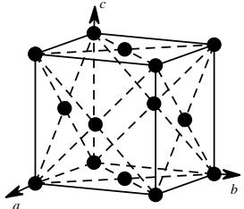
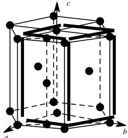
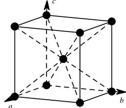

# 第三章、晶体结构

# 一、晶体概论

气态、液态、固态是物质的三种主要物态。当处于固态时，粒子被限于固定位置振动。根据固体中粒子位置是否保持微观均匀排列，又可讲固体分为晶态与非晶态。自然界多数固态物都是晶体，而非晶体一定程度上则可视为过冷液体，一定条件下会逐渐晶化。

晶体最明显的宏观特征，当然是其多面体外形。在宏观上，晶体有别于非晶态的最普遍的本质是其“自范性”，即晶体能够自发地呈现封闭的规则凸多面体外形，非晶体没有自范性。

生活中常见的晶体,往往由大量取向混乱、不同尺寸、形状不规则的小晶体或晶粒组成,这种晶体被称为多晶。为强调其不同,单个大晶体通常被称为单晶;两个体积大致相当的单晶按一定规则生长在一起,叫双晶;许多单晶按不同取向连接,叫晶簇。

固体物质除了晶体和被称为非晶态的玻璃态之外，还有液晶、类晶等介乎晶态和非晶态之间的状态。液晶和类晶也有某种整齐排列的特征，但在宏观外型和微观结构上却与理想晶体不尽相同。

然而，单纯从多面体外形判断是否为晶态显然是粗糙的。宏观尺度固体材料的表观形貌特征，显然可以通过机械途径改变。晶体的本质特征，在于其均匀性、各向异性和对称性。

# 1.均匀性

宏观的均匀性概念是指晶态的任一部分的所有性质全同。从单晶体任意部分切下同样取向、形状、尺寸的样品，其一切性质（光学、力学、热学等物理性质，表面溶解度、表面吸附等物理化学性质）均相同。这一性质不仅适用于晶体，对液体、气体和非晶体等均可适用。

# 2. 各向异性

晶体与其他状态最主要的区别，是其各向异性。晶体的某些性质是标量，与位向无关。然而有许多性质，如热传导、介电系数、热膨胀系数、机械强度、光折射系数等与位向密切相关，其值取决于和晶向的相互关系。这种物性与坐标轴取向有关的依赖关系，就称为各向异性。液体与气体的所有性质都是各向同性(物性与位向无关)的，而晶体只有部分性质是各向同性的。各向异性并非只是晶体所独有，晶态织构、液晶等物相中，天然和合成的聚合物中也有各向异性。这些物质的各向异性和单晶体一样，是由原子层面的结构决定的。各向异性的物性并非在所有方向均不相同。相反，在某些不连续变化的方向上存在着规律的等同性。这正是对称性的体现。

# 3.对称性

所谓对称性，指的是物体通过某种操作后，能与原物体完全重合。这种操作被称为对称操作。对称操作可分为两类：第一类对称操作构造的重合形式称为重合等同，是平移、旋转或这两个操作的组合；第二类对称操作构造的重合形式称为镜像等同，是反映/反演或其与第一类对称操作的组合。

以上三点特性，是晶体自范性的结构基础。自范性的主要特征可用晶体多面体习性定律描述：一，某一特定种类的晶体相应表面间的夹角守恒，并是这种晶体的特征；二，总可以通过选取适当的一组坐标轴，并为各坐标轴选取合适的单位长度，使得对应晶面在坐标轴上的截距一定是该单位的整数倍。

![[04-05第三章晶体与晶体结构学生版_images/bc1a35d4815b14fe3a27e66710647555b9fa94d1aea6b0d08d42a8e6cf2913fb.jpg]]

text_image

a
b
c
a
b
c
a
b
c
a
b
a
b
a
b

图 1 石英晶体的不同外形与晶面

晶体可以由其中的粒子间相互作用的类型分为四类：由离子键构成的称为离子晶体、由共价键构成的称为原子晶体、由金属键构成的称为金属晶体、由 van der Waals 相互作用构成的称为分子晶体。

1984 年中国、美国、法国和以色列等国家的学者几乎同时在淬冷合金中发现了存在有 5 次对称轴，确证这些合金相是具有长程定向有序，而没有周期平移有序的一种封闭的正 20 面体相，并称之为准晶体。以后又陆续发现了具有 8 次、10 次、12 次对称的准晶结构。

![[04-05第三章晶体与晶体结构学生版_images/d0bdffa8570297607ffe167943a5d9f4a0504b17b17fefb9d6fdd04fe52d8585.jpg]]

natural_image

Microscopic view of a porous network structure with star-like patterns, scale bar indicates 4 μm (no text or symbols present)

图 2 准晶

准晶是一种介于晶体和非晶体之间的固体。准晶具有完全有序的结构，然而又不具有晶体所应有的平移对称性，因而可以具有晶体所不允许的宏观对称性。准晶是具有准周期平移格子构造的固体，其中的原子常呈定向有序排列，但不作周期性平移重复，其对称要素包含与晶体空间格子不相容的对称（如5次对称轴）。

# 二、晶体结构的周期性

严格说来，晶体的规则结构可以被抽象地分为两个部分：结构的周期形式和进行周期排布的成分。

对于前者，可以将任意的规则排布视为完全相同的几何点形成的规则排列。这种由完全相同的几何点周期性排布形成的结构，称为点阵（当然这一定义是不严格的，严格说来，点阵应是沿其中任意两点所成向量平移），而点阵中每一个几何点（“点阵点”）所对应的真实世界的内容，称为结构基元。在化学物质的结构中，可以发现一维、二维和三维的点阵，图2与图3给出了一些例子。在点阵中，总可以选取一个含点阵点尽量少，同时能尽量反映点阵对应的对应维数的结构，使得点阵可以被视为完全等同的该结构重复叠放而成，这样的单位称为正当点阵单位。正当点阵单位在二维点阵中应当是一个平行四边形，在三维点阵中则应是一个平行六面体。晶体学家Bravias研究发现，晶体的点阵类型可以归结为14种正当点阵单位，因而常称这14种正当点阵单位各自构成的点阵为14种Bravias点阵，如图4所示。

![[04-05第三章晶体与晶体结构学生版_images/b8cb96385b2b83facc1c326b4444645d46c1ca5c0bdb1aa4707fbb087d731b18.jpg]]  
图 3 一维、二维点阵举例(黑点表示点阵点)  
一维：(a)Cu(b)石墨(c)Se(d)NaCl(e)伸展聚乙烯   
二维：(a)NaCl(b)Cu(c)石墨(d)B(OH) $_{3}$

![[04-05第三章晶体与晶体结构学生版_images/bd2743293eaf9cb0f534438fa470d7f38095f46daa79a1007a283bef3088b840.jpg]]  
(a)

![[04-05第三章晶体与晶体结构学生版_images/bec91baacd41e21b1691ffec153df57cee5cee38a44f81dbfa14ee932c848887.jpg]]  
(b)

![[04-05第三章晶体与晶体结构学生版_images/24b8e0a3b045cb72f7c671a21d2b661e227610191aa3205213f3066ef5eeb434.jpg]]  
(c)

![[04-05第三章晶体与晶体结构学生版_images/a85b98b1df1b7d7b3d960c98f04d027e8e3f5d00cfa011c097990fb87a6b0964.jpg]]  
(d)

![[04-05第三章晶体与晶体结构学生版_images/1cd19507de6a5dada0665dd76b761df7e7e6631f97c66bb8488a4312cd7f0229.jpg]]  
(e)

![[04-05第三章晶体与晶体结构学生版_images/63b51c8801d964888c1936eebeecfd7101780168c55f69708b9d197783aa0598.jpg]]

chemical

Crystal lattice structure diagram showing atomic positions and bonding connections

(h)

![[04-05第三章晶体与晶体结构学生版_images/80316cf939fe8384700ea4d5d194fc05b17768b57e040122eb5920da3a30edd0.jpg]]  
(f)

![[04-05第三章晶体与晶体结构学生版_images/21004c89d74617d12fa0c2a1a949f9a184c0b822e94c3d158ad47d0ecc08265d.jpg]]  
(g)   
图 4 三维点阵举例(黑点表示点阵点)  
(a)Po(b)CsCl(c)Na(d)Cu(e)Mg(f)金刚石(g)NaCl(h)石墨

表格 1 晶系的划分和晶轴的选取

<table><tr><td>晶系</td><td>特征对称元素</td><td>晶胞参数规定</td><td>选晶轴的方法</td></tr><tr><td>立方</td><td>4个按立方体的对角线取向的三次旋转轴</td><td>a=b=cα=β=γ=90°</td><td>4个三次旋转轴和立方体的4条对角线平行,立方体的3个互相垂直的边即为a,b,c的方向。a,b,c与三次旋转轴的夹角为54°44'</td></tr><tr><td>六方</td><td>1个六次对称轴</td><td>a=bα=β=90°γ=120°</td><td>c||六次轴a,b||二次轴,或⊥对称面,或a,b选⊥c的恰当晶棱</td></tr><tr><td>三方</td><td>1个三次对称轴</td><td>a=bα=β=90°γ=120°</td><td>c||三次轴a,b||二次轴,或⊥对称面,或a,b选⊥c的晶棱</td></tr><tr><td>四方</td><td>1个四次对称轴</td><td>a=bα=β=γ=90°</td><td>c||四次轴a,b||二次轴,或⊥对称面,或a,b选⊥c的晶棱</td></tr><tr><td>正交</td><td>两个互相垂直的对称面或3个互相垂直的二次轴</td><td>α=β=γ=90°</td><td>a,b,c||二次轴,或⊥对称面</td></tr><tr><td>单斜</td><td>1个二次对称轴或1个对称面</td><td> $\alpha = \gamma = 90^{\circ}$ </td><td> $b \parallel$ 二次轴,或⊥对称面 $a,c$ 选⊥ $b$ 的晶棱</td></tr><tr><td>三斜</td><td>无</td><td>—</td><td> $a,b,c$ 选三个不共面的晶棱</td></tr></table>

对于实际的晶体，我们称其正当点阵单位对应的真实结构为晶胞。晶胞的形态主要由六个参数决定：成右手系分布的三个棱长 a、b、c，及其夹角 $\alpha$ 、 $\beta$ 、 $\gamma$ （依次为 bc、ca、ab 的夹角）。根据这六个参数，又可以将这 14 种空间点阵分为七个晶系。各个晶系的主要特征与晶轴的选择标准如表 1 所示。对比表 1 和图 5 可以发现，14 种空间点阵可以被归入六个晶族，其中三方晶体的晶胞所属的空间点阵为简单六方或 R 心六方。事实上，晶体可以根据其对称性被分为 32 种点群，230 种空间群。而晶体的具体物理性质则直接与点群形式对应。

而对于晶胞中各个点阵点（或各个粒子）的位置，可以 a、b、c 方向的三个棱（晶轴）方向建立右手系、以各个原子在该坐标系中的坐标来标示，这一坐标可以唯一确定任一原子在每个晶胞中的位置，称为原子坐标，或原子分数坐标。

![[04-05第三章晶体与晶体结构学生版_images/5510ab3f7cd0fa77d874b65b40850737002bea5a3d79931e8e02c30bc8986331.jpg]]  
图 5 14 种空间点阵型式

# 三、等径圆球的堆积

把金属晶体看成是由直径相等的圆球状金属原子在三维空间堆积构建而成的模型叫做金属晶体的堆积模型。金属晶体堆积模型有三种基本形式——体心立方堆积、六方最密堆积和面心立方最密堆积。

# 3.1 体心立方堆积

体心立方堆积的晶胞如图4所示。金属原子分别占据立方晶胞的顶点位置和体心位置。每个金属原子周围第一层(距离最近的)原子数(配位数)是8，第二层(次近的)是6，……。

![[04-05第三章晶体与晶体结构学生版_images/cc1e9606a12e4230a10339e61d8f6d7090f87672437a6b1741c5414d57751a4e.jpg]]

chemical

Three 3D molecular crystal structures with atomic positions and unit cell boundaries

a—体心立方晶胞 b—体心与顶角并无差别 c—第1层和第2层的配位数

图 6 金属晶体的体心立方堆积

体心立方堆积的原子的空间利用率并不高，有近三分之一的空间没有被球占据。计算如下：

计算的关键是先要确定：金属原子采取体心立方堆积时，在立方体的哪个部位金属原子（球）是互相接触的？答案可借助模型直接感知，也可通过立体几何学论证。结论是：在立方体的体对角线上，球是相互接触的。然后，我们设立方体的边长为 a，球的半径为 r，得到立方体边长 a 与球的半径 r 的关系式： $\sqrt{3}a=4r$ 。最后，我们知道体心立方晶胞中的金属原子数为 2(1 个在体心位置，另一个在顶角位置)；立方体的体积为 $a^{3}$ ，由此可得出求算空间利用率的方程如下：

$$
\text{体心立方堆积空间占有率} = \frac {2 \times \frac {4}{3} \pi r ^ {3}}{a ^ {3}} = \frac {2 \times \frac {4}{3} \pi r ^ {3}}{\left(\frac {4}{\sqrt {3}} r\right) ^ {3}} = \frac {\sqrt {3} \pi}{8} \times 100 \% = 68.02 \%
$$

# 3.2 简单立方堆积

如果我们把体心立方堆积的晶胞中的体心球抽走，将会出现什么结果？这时，立方体里就只剩下一个球，得到简单立方堆积。

![[04-05第三章晶体与晶体结构学生版_images/f74dcd34e1fceabd93ae5f78b2d1394cdb376c62043835b3af8e11be9b01ac1b.jpg]]  
图 7 简单立方堆积

计算空间占有率的关键——晶胞中球的相切点在哪里？请想象：当体心立方晶胞的体心球被抽走，顶角球会彼此靠拢而接触。结论：金属原子（球）的接触点在立方体的棱的中心。由此得出计算方程：

$$
\text{简单立方堆积空间占有率} = \frac {\frac {4}{3} \pi \left(\frac {a}{2}\right) ^ {3}}{a ^ {3}} = \frac {\pi}{6} \times 100 \% = 52.36 \%
$$

计算结果表明，简单立方堆积空间占有率太低，近一半空间没有得到利用，因此这种堆积方式是很不稳定的，几乎不可能被采纳。

# 3.3 六方最密堆积

简单立方堆积的配位数为 6，空间占有率为 52%；体心立方堆积的配位数为 8，空间占有率为 68%。能不能提高配位数，增加金属原子在晶体微观空间中的占有率呢？结论是肯定的。下面我们借助模型来思考：

先令等径圆球在二维平面上尽可能地靠拢, 可以得到二维密置层, 在这种二维密置层中, 每个球的配位数为 6, 每个球周围有 6 个凹穴, 为方便起见, 我们定名穿过球心的法线为 A, 穿过球周围的相邻凹穴的法线分别为 B 和 C（图 8a）。

试设想将另一层二维密置层的球心串入假想的法线, 试问: 为取得最密的垛积, 球心应当串在哪种法线上? 显然, 不应串在标号为 A 的法线上, 因为这样的话, 第一层和第二层之间的空隙太大, 而应串入标号为 B 或 C 的凹穴的法线, 但二者只能取其一, 因为法线 B 和 C 在二维平面上的距离等于球的半径。设第二层球串入 B 法线 (我们不妨将第一层球称为 A 球，第二层球称为 B 球）。再将第三层垛积到第二层上。这时，由于 B 球周围的凹穴是 A 和 C，第三层球可取 A 或 C。若取 A，并使第四层球又取 B，继续往上垛积的二维密置层遵循同一规则，我们就得到 ABABAB……的垛积。这是两层为一个周期的垛积（图 8c）。

![[04-05第三章晶体与晶体结构学生版_images/b0b76255925b5a3bb6fd74597da2c9bffa748735e32831ccfcc8c92e4aec83e4.jpg]]  
a—二维密置层 b—二维密置层的三维垛积 c—...ABABABA...垛积

图8 等球最密堆积之一——两层为一周期的垛积  
![[04-05第三章晶体与晶体结构学生版_images/073bbaa77593c7ad385f1a935b8c2b535f6b61f87ab4509b1df211caf83c8eac.jpg]]

text_image

A
A
A
B
A
A
A

图 9 六方最密堆积的晶胞里有 2 个球

将这种堆积的 A 球用直线连接起来，可以得到如图 9 所示的晶胞，这个晶胞的晶胞参数为 $a=b\neq c,\quad\alpha=\beta=90^{\circ},\gamma=120^{\circ}$ ，即六方晶胞，因此这种堆积叫做六方最密堆积(hcp)。在每个晶胞中有两个球（A 和 B，见图 9）。必须注意的是，A 和 B，虽然化学上是相同的（是同一种金属原子），但是在几何上却是不同的，例如，在图 9 中，我们从 A 到 B 用向量 AB 将它们连接起来，从 B 向上延长相等的向量，却没有见到另一个球的存在，可见 A 和 B 在几何上是不相同的，所以，图 9 是一个素晶胞。

下面我们来计算六方最密堆积的空间占有率。

设两个球心之间的距离为 $a$ ，六方晶胞底面上的晶胞参数就等于 $a$ 。问六方晶胞的 $c$ 多长？从图7可见， $c$ 等于以 $a$ 为边长的正四面体的高（ $h$ ）的2倍。用立体几何不难求证： $c = 1.633a$ 。晶胞体积为 $V = abcsin120^{\circ}$ ，每个晶胞平均有2个球，因此：

$$
\text{球的空间占有率} = \frac {2 \times \frac {4}{3} \pi \left(\frac {a}{2}\right) ^ {3}}{a ^ {2} \times 1 . 6 3 3 a \times \sin 1 2 0 ^ {\circ}} = 74.05 \%
$$

# 3.4 立方面心最密堆积

如果上述三维垛积取……ABCABCABCABC……三层为一周期的垛积方式（图10），若将垛积方向定为c轴，得到一个 $c=2.449a$ 的六方晶胞，在这个六方晶胞里有3个球（A、B和C），然而，我们发现，A、B、C球在几何上并没有差别，例如，从A向B作连线，延长相同线段得C，再延长相同线段得A，这说明，这种堆积的结构基元是1个球，因此所得晶胞不是素晶胞，是素晶胞的3倍体。我们可以把它转化为一个素单位，后者是一个菱方单位，可以证明，它的 $\alpha = 60^{\circ}$ ，还可以证明，这种堆积具有立方对称性，为反映晶体的这种对称性，需要用立方晶胞作为晶体的基本单位。从图中我们可以倒过来理解“立方对称性”：面心立方晶胞的体对角线是完全等价的，而在四根体对角线方向上的菱方晶胞的形状是完全相同，这既说明A、B、C球没有差别，也说明这种堆积呈现的晶体微观结构的立方对称性，所以，这种三层为一周期的最密堆积被称为面心立方最密堆积(ccp)。

![[04-05第三章晶体与晶体结构学生版_images/96e2b695502689c0c1de2d1e3a9bb0693f9050ad01daf0f32829e33dff1416a5.jpg]]

chemical

Crystal lattice structure diagram showing unit cell with atoms and bonds

C
B
A
C
B   
![[04-05第三章晶体与晶体结构学生版_images/d0053017f4dfc4716ed1ba1aa7f437b96e41cac783261f98f1960252b1b4f4fe.jpg]]

![[04-05第三章晶体与晶体结构学生版_images/466efad1bc3f0182611cfc27f335757699fa18baf7905f10fce93f4d8a630a36.jpg]]

text_image

A
C
B
A

![[04-05第三章晶体与晶体结构学生版_images/137059581904cea7e7bee7bffe47d2670531a3edf4916a9d561d86476faaeaaf.jpg]]

flowchart

```mermaid
graph TD
    A1["A"] --> B1["B"]
    A1 --> B2["B"]
    A1 --> B3["B"]
    A2["A"] --> B4["B"]
    A2 --> B5["B"]
    A2 --> B6["B"]
    A3["A"] --> B7["B"]
    A3 --> B8["B"]
    A3 --> B9["B"]
    A4["A"] --> B10["B"]
    A4 --> B11["B"]
    A4 --> B12["B"]
    A5["A"] --> B13["B"]
    A5 --> B14["B"]
    A5 --> B15["B"]
    A6["A"] --> B16["B"]
    A6 --> B17["B"]
    A6 --> B18["B"]
    A7["A"] --> B19["B"]
    A7 --> B20["B"]
    A7 --> B21["B"]
    A8["A"] --> B22["B"]
    A8 --> B23["B"]
    A8 --> B24["B"]
    A9["A"] --> B25["B"]
    A9 --> B26["B"]
    A9 --> B27["B"]
    A10["A"] --> B28["B"]
    A10 --> B29["B"]
    A10 --> B30["B"]
    A11["A"] --> B31["B"]
    A11 --> B32["B"]
    A11 --> B33["B"]
    A12["A"] --> B34["B"]
    A12 --> B35["B"]
    A12 --> B36["B"]
    A13["A"] --> B37["B"]
    A13 --> B38["B"]
    A13 --> B39["B"]
    A14["A"] --> B40["B"]
    A14 --> B41["B"]
    A14 --> B42["B"]
    A15["A"] --> B43["B"]
    A15 --> B44["B"]
    A15 --> B45["B"]
    A16["A"] --> B46["B"]
    A16 --> B47["B"]
    A16 --> B48["B"]
    A17["A"] --> B49["B"]
    A17 --> B50["B"]
    A17 --> B51["B"]
    A18["A"] --> B52["B"]
    A18 --> B53["B"]
    A18 --> B54["B"]
    A19["A"] --> B55["B"]
    A19 --> B56["B"]
    A19 --> B57["B"]
    A20["A"] --> B58["B"]
    A20 --> B59["B"]
    A20 --> B60["B"]
```

图 10 面心立方堆积

面心立方最密堆积的空间占有率跟六方最密堆积是相等的，也是 74.05%，可以自己用立体几何证明。其实，不作计算也可从这两种堆积的配位数都等于 12 来推论，两种密堆积的空间利用率是相等的。

# 3.5 金属堆积方式小结

<table><tr><td></td><td>面心立方堆积</td><td>六方最密堆积</td><td>体心立方堆积</td></tr><tr><td>别名晶胞</td><td>Ccp/A1 堆积/ABCABC</td><td>hcp/A3 堆积/ABAB</td><td>bcp/A2 堆积</td></tr><tr><td>空间占有率</td><td>74.05%</td><td>74.05%</td><td>68.02%</td></tr><tr><td>配位数</td><td>12</td><td>12</td><td>8</td></tr></table>

图 12 给出了周期系（主表）中的金属采取的堆积方式的总况。从中我们可以看到，体心立方堆积、面心立方最密堆积和六方最密堆积三种堆积方式所占的比例差别不大，都为许多金属所采纳。

体心立方堆积不是最密堆积，为什么仍有许多金属采纳它呢？这是因为，它的空间利用率仅比最密堆积低约 $6\%$ ，而且第一层球的配位数为8，比第一层球远约 $15\%$ 的第二层球还有6个，两层加在一起算是 $6 + 8 = 14$ ，因而也是一种相当稳定的结构。

从表中我们还可以发现，有的金属的堆积方式不止一种，这是由于它们受热会改变堆积方式的缘故。

另外，还有一些金属，不采纳以上任一种堆积方式。例如锰，它的一种晶体的一个晶胞里有29个锰原子，不必细说就可想象，它的堆积方式是十分复杂的。又如锗，常见的晶体采纳的是金刚石型。周期系第四主族锡有两种晶体，其中1种晶体中有2种不同的原子核间距。还有一些金属，如镧系金属钐，采取的是六方最密堆积和面心立方最密堆积的混合型。等等。这些例外表明金属晶体中的堆积方式的多样性，需要在今后的学习中不断扩充。

<table><tr><td>Li</td><td>Be</td><td rowspan="2" colspan="11">最密六方 最密面心立方 体心立方 其他</td><td></td></tr><tr><td>Na</td><td>Mg</td><td></td></tr><tr><td>K</td><td>Ca</td><td>Sc</td><td>Ti</td><td>V</td><td>Cr</td><td>Mn</td><td>Fe</td><td>Co</td><td>Ni</td><td>Cu</td><td>Zn</td><td>Ga</td><td>Ge</td></tr><tr><td>Rb</td><td>Sr</td><td>Y</td><td>Zr</td><td>Nb</td><td>Mo</td><td>Tc</td><td>Ru</td><td>Rh</td><td>Pd</td><td>Ag</td><td>Cd</td><td>In</td><td>Sn</td></tr><tr><td>Cs</td><td>Ba</td><td>La</td><td>Hf</td><td>Ta</td><td>W</td><td>Re</td><td>Os</td><td>Ir</td><td>Pt</td><td>Au</td><td>Hg</td><td>Tl</td><td>Pb</td></tr></table>

图 12 周期系金属晶体的堆积方式

# 四、离子晶体与填隙模型

在离子晶体中，由于阴离子尺寸一般明显大于阳离子，因此可以认为其结构是由阴离子形成密堆积，再由阳离子填入其中的空隙形成。当阳离子尺寸较小时，可以近似认为阴离子球相互之间接触形成密堆积，于是两个相互接触的离子核间距即其半径之和。

![[04-05第三章晶体与晶体结构学生版_images/accf7b35b03795f9e85edc6e5f3f6b8d75bc7e4a245e9321f57aefd1fc3d3c02.jpg]]  
图 13 三种堆积中的空隙

- 金属原子  
○八面体空隙   
- 四面体空隙

从图 13 中可以看出，在两种最密堆积中，可以找到正四面体和正八面体的分布，而其中心即空隙所在位置。而在 A2 堆积中，则只能找到变形的八面体与四面体空隙。事实上晶体采用何种结构结晶，不仅与外部条件有关，同时与阴阳离子半径有关。

以下介绍几种常见的离子晶体结构。

# 1. NaCl型

NaCl 型晶体中，阴阳离子的配位情况相同，其配位数均为 6，均为八面体配位。也可将 NaCl 晶体视为由 Cl-离子 A1 密堆积，一个晶胞中有四个正八面体空隙和八个正四面体空隙，之后由 Na+填充其中全部八面体空隙。

当选取 Cl-为晶胞顶点时，

$Na^{+}$ 占据棱心和体心， $Cl^{-}$ 占据顶点和面心。

一个晶胞中有四个 $Na^{+}$ 和四个 $Cl^{-}$

离子在晶体里的坐标不是绝对的，与怎样取用晶胞有关。

$Na^{+}$ 坐标为 $(0,0,1/2),(1/2,0,0),(0,1/2,0),(1/2,1/2,1/2)$

Cl-坐标为(0,0,0),(0,1/2,1/2)(1/2,1/2,0)(1/2,0,1/2)

取不同晶胞不会改变晶体结构，即离子的空间关系

事实上有大量 AB 型离子化合物采取 NaCl 型结构，其键型从典型的离子键到共价键和金属键不等。常见的化合物中，碱金属卤化物和氢化物、碱土金属氧化物和硫属化合物多属于此类，如 AgCl、CaO、CsH、KBr、LiF、Mg、NiO、PbS 等。

![[04-05第三章晶体与晶体结构学生版_images/0822ec1e576cd8949a0f5e356f7cc6df80d93f8a58fc4c50f1973e7405d701b4.jpg]]

chemical

Crystal lattice structure diagram showing black and red atoms in a unit cell

# 2. CsCl 型

CsCl 型晶体可以看成体心立方晶胞中，将其中一个原子换为另一种原子得到。当然，这样操作后的晶胞就不再属于体心立方点阵,属于简单立方点阵，一个晶胞只存在一个立方体空隙，且都被填满，当填隙率为 50%时，阴阳离子个数为 2:1， $CaF_{2}$ 就可以看做 F 作简单立方堆积，Ca 填一半的立方体空隙。CsCl 型晶体中阴阳离子配位数为 8。这种晶体类型中配位数较高，因此更适合于有较大半径的阳离子和 $Cl^{-}$ 、 $Br^{-}$ 、I⁻等离子形成的化合物和二元金属互化物。常见的可取 CsCl 型化合物有 AgZn、CsCl、CuZn、LiHg、 $NH_{4}Cl$ 、TlCl 等。

当选取 Cl⁻ 为晶胞顶点时，

$Cs^{+}$ 占据体心， $Cl^{-}$ 占据顶点。

一个晶胞中有一个 $Cs^{+}$ 和一个 $Cl^{-}$

Cs $^{+}$ 坐标为 (1/2,1/2,1/2)

Cl-坐标为(0,0,0)

![[04-05第三章晶体与晶体结构学生版_images/601da7e0e096b5a3f803a8ac4fbb69d1bb3c10b44b6a32cf898b44b69990b333.jpg]]

natural_image

Simple 3D cube diagram with a central black dot (no text or labels)

# 3. 立方 ZnS 型

立方 ZnS（对应的矿物为闪锌矿）晶体中， $S^{2-}$ 离子成立方最密堆积， $Zn^{2+}$ 离子填充其中半数四面体空隙，阴阳离子配位数都为 4，填隙时相互间隔，使 $Zn^{2+}$ 间尽量远离。CdS、CuCl、HgS、SiC 等均有属于这一类型的晶体。（事实上，若将 ZnS 晶胞中的所有原子均替换为 C，则变为金刚石晶胞，类似的金属堆积形式记为 A4。 $SiO_{2}$ 与金刚石有相同的点阵形式。）

当选取 $S^{2-}$ 为晶胞顶点时，

$Zn^{2+}$ 占据 1/2 对角线 1/4 和 3/4 的位置， $S^{2-}$ 占据顶点和面心。

一个晶胞中有四个 $Zn^{2+}$ 和四个 $S^{2-}$

$Zn^{2+}$ 坐标为 $(1/4,3/4,1/4),(3/4,1/4,1/4),(1/4,1/4,3/4),(3/4,3/4,3/4)$

$S^{2}$ -坐标为 $(0,0,0),(0,1/2,1/2),(1/2,1/2,0),(1/2,0,1/2)$

![[04-05第三章晶体与晶体结构学生版_images/3164ee695862e50bc503b09c7850096473a4140a5d734b6379706cf8042e81b5.jpg]]

chemical

Crystal lattice structure diagram showing alternating red and black spheres in a cubic arrangement

# 4. 六方ZnS型

六方 ZnS（对应的矿物为纤维锌矿）晶体中， $\mathrm{S}^{2-}$ 离子成六方最密堆积，同样地， $\mathrm{Zn}^{2+}$ 离子填充半数四面体空隙，阴阳离子配位数都为4。当以 $\mathrm{S}^{2-}$ 为晶胞顶点时， $\mathrm{S}^{2-}$ 离子的坐标为(0,0,0)和(2/3,1/3,1/2)， $\mathrm{Zn}^{2+}$ 离子的坐标为(0,0,3/8)和(2/3,1/3,7/8)。六方 ZnS 是常见物质中最主要的六方晶体，AgI、CuH、MnS、ZnO 等均有这一类型的晶体。

![[04-05第三章晶体与晶体结构学生版_images/918945bbea8e2b300209057adba3105127019ecb9bbdccb976c8d40ae5503090.jpg]]

chemical

Crystal lattice structure diagram showing atomic positions in a cubic unit cell with red and black spheres representing different elements.

# 5. $\mathrm{CaF}_2$ 型

$\mathrm{CaF}_{2}$ 即萤石，其结构可看做 $\mathrm{Ca}^{2+}$ 成立方密堆积， $\mathrm{F}^{-}$ 填入其中全部四面体空隙中， $\mathrm{Ca}^{2+}$ 配位数为 8， $\mathrm{F}^{-}$ 配位数为 4，是一种较为简单的 $\mathrm{AB}_{2}$ 型晶体。 $\mathrm{BaCl}_{2}$ 、 $\mathrm{HgF}_{2}$ 、 $\beta-\mathrm{PbF}_{2}$ 、 $\mathrm{ZrO}_{2}$ 等均属于这一类型晶体。当阴离子相对较大时，部分 $\mathrm{A}_{2} \mathrm{~B}$ 型化合物也会形成类似 $\mathrm{CaF}_{2}$ 型晶胞，只是阴阳离子位置恰好相反，这类结构称为反萤石型。 $\mathrm{Li}_{2} \mathrm{O}$ 、 $\mathrm{Na}_{2} \mathrm{~S}$ 等均可取这一型晶

胞。

当选取 $Ca^{2+}$ 为晶胞顶点时，

F-占据对角线 1/4 和 3/4 的位置， $Ca^{2+}$ 占据顶点和面心。

一个晶胞中有八个 F 和四个 $Ca^{2+}$

F-坐标为(1/4,1/4,1/4),(3/4,3/4,1/4),(3/4,1/4,3/4),(3/4,1/4,3/4)

$$
(1 / 4, 3 / 4, 1 / 4), (3 / 4, 1 / 4, 1 / 4), (1 / 4, 1 / 4, 3 / 4), (3 / 4, 3 / 4, 3 / 4)
$$

$Ca^{2+}$ 坐标为 $(0,0,0),(0,1/2,1/2),(1/2,1/2,0),(1/2,0,1/2)$

![[04-05第三章晶体与晶体结构学生版_images/3947366a0b46f2cbb2be56c66cddefe739a5ed24f6cd0af6c6909db9f5217ff0.jpg]]

chemical

Crystal lattice structure diagram showing black and red circles representing atoms in a cubic unit cell

# 6. $\mathrm{TiO_2}$ 型（金红石型）

$\mathrm{TiO_2}$ 在自然界主要以金红石形式存在，然而同时存在其他晶型，因此，这一晶型更多被称为金红石型而非 $\mathrm{TiO_2}$ 型。金红石中，可以近似认为O成六方最密堆积（堆积层有起伏），Ti则有序占据半数八面体空隙。Ti的坐标为(0,0,0)和(1/2,1/2,1/2)，O的坐标为(x,x,0),(1-x,1-x,0),(1/2+x,1/2-x,1/2)和(1/2-x,1/2+x,1/2)，其中 $x = 0.30479$ 。

![[04-05第三章晶体与晶体结构学生版_images/93945af3354830de9f45c3a1e3d808950d8d50791655ad9c5db2d6fa8f87c8ff.jpg]]

chemical

Crystal lattice structure diagram showing black and red atoms in a cubic arrangement

# 7. $\mathrm{CaTiO_3}$ 型

钙钛矿是一种常见的 $\mathrm{ABC}_3$ 型晶体结构。其结构可以看作 $\mathrm{O}^{2-}$ 和 $\mathrm{Ca}^{2+}$ 一起形成有序的立方最密堆积，顶点为 $\mathrm{Ca}^{2+}$ ，面心为 $\mathrm{O}^{2-}$ 。而 $\mathrm{Ti}^{4+}$ 则占据体心位置，即由六个 $\mathrm{O}^{2-}$ 组成的八面体空隙中心。若将晶胞原点移至 $\mathrm{Ti}^{4+}$ 位置，则 $\mathrm{O}^{2-}$ 处于棱心， $\mathrm{Ca}^{2+}$ 处于体心。两种晶胞选取方法如下图中左右两图所示。常见的可取钙钛矿型晶胞的化合物还有 $\mathrm{BaTiO}_3$ 、 $\mathrm{KFeF}_3$ 、 $\mathrm{LiWO}_3$ 、 $\mathrm{SrMoO}_3$ 等。

![[04-05第三章晶体与晶体结构学生版_images/de24a7e2c006822ff02c797ac566596f59e7835aef5fec00ed6875b8635aa095.jpg]]

chemical

Crystal lattice structure diagram showing black and red atoms in unit cells

当选取 $Ca^{2+}$ 为晶胞顶点时，

$O^{2-}$ 坐标为 $(0,1/2,1/2),(1/2,1/2,0),(1/2,1/2,0)$

$Ti^{4+}$ 坐标为 $(1/2,1/2,1/2)$

$Ca^{2+}$ 坐标为 $(0,0,0)$

# 五、分子晶体和原子晶体

典型的分子晶体是指有限数量的原子构成的电中性分子为化学基本单元以分子间力相互作用在微观空间里呈现具有平移性的重复图案得到的晶体。

“有限分子”的主要品种是有机物，已知的 3000 万种化合物中多数是以有限原子构成的有机分子，无机“有限分子”则在数量上很少，如部分非金属单质（ $\mathrm{O}_2$ 、 $\mathrm{S}_8$ ）部分非金属化合物(如 $\mathrm{CO}_2$ 、 $\mathrm{H}_2\mathrm{O}$ ），等等。

在分子晶体中，分子之间的作用力是分子间力（范德华力和氢键）。分子间力相比于金属键、离子键和共价键等化学键是一种很弱的作用力，因而分子晶体的熔点很低。但分子晶体的熔点并不完全取决于分子间力的大小，还与分子在晶体里堆积的紧密程度有关。分子堆积紧密，空间利用率高，也会使熔点升高。例如近球状的金刚烷的熔点高达 $269^{\circ}$ C，是已知烷烃中熔点最高的。

![[04-05第三章晶体与晶体结构学生版_images/3d8a5b822b82630b05508da64e94f4dd00f75a852785e15c530960238dbaf29c.jpg]]

chemical

Crystal lattice structure diagram showing gray and red atoms in a cubic unit cell with dashed bonds

图 14 干冰晶胞

分子间作用力比较弱，导致分子在晶体的微观空间里堆积时会尽可能地利用空间，但分子的形状、分子间是否存在具有方向性的氢键及其强弱以及分子的极性强弱导致分子定向排列的程度高低等因素均会影响分子的堆积方式和空间利用率。当分子晶体达到最密堆积时，每个分子周围也会达到 12 个分子，例如图 14 所示的干冰晶体就是如此。又如近似球体的 $C_{60}$ 呈面心立方晶胞，与金刚烷相似的近似球体的乌洛托品 $C_{6}H_{12}N_{4}$ 呈体心立方晶胞（最近两层的配位数 $= 8 + 6$ )等。冰则为堆积不紧密的分子晶体的典型代表。通常的冰具六方晶胞，由于分子间存在作用力较大而方向性很强的氢键，每个水分子周围只有4个水，类似金刚石中碳的配位情形，空间利用率很低，以致冰融化后密度反而升高。

![[04-05第三章晶体与晶体结构学生版_images/909f07181ed0297ec4078df96bc1b55df8f9b794722aaf08797ba210668d00b5.jpg]]  
冰中一个水分子  
周围有4个水分子  
冰的结构  
冰融化，分子间的空隙减小

图 15 冰- $I_{h}$ 示意图

原子晶体是以具有方向性、饱和性的共价键为骨架形成的晶体。金刚石和石英（ $\mathrm{SiO}_2$ ）是最典型的原子晶体，其中的共价键形成三维骨架网络结构（图16），后者可以看成是前者的C-C键改为Si-Si键而又在其间插入一个氧原子，构成以氧桥连接的硅氧四面体共价键骨架。由图中可见，由于共价键的方向性与饱和性，原子晶体中的原子的空间利用率很低。例如，在金属最密堆积的讨论中我们得知，半径相等的球的最高配位数可达12，而在金刚石中碳的配位数却只达到4，由此可见一斑。

![[04-05第三章晶体与晶体结构学生版_images/a1c767a12ea52d899fd5269aa206f70344a98414c7c152d2dec66794b1d641b9.jpg]]

chemical

Molecular structure diagram showing a crystal lattice with gray and orange atoms connected by bonds

图 16 a 金刚石共价键骨架

![[04-05第三章晶体与晶体结构学生版_images/68e927665b12ecb1b379d3991aba63d9a77fb6a7ec103229d964ac012b337f43.jpg]]

chemical

Crystal lattice structure diagram showing atomic positions in a unit cell

b 一种天然二氧化硅晶体（方英石）

如果我们定义原子晶体为晶体中存在无限伸展的共价键骨架，那么，除了金刚石和石英这样的三维共价键骨架结构外，存在二维无限伸展共价键骨架和一维无限伸展共价键骨架的晶体也应当归属于原子晶体，二维的如氮化硼(BN)，晶体中存在并合的 $\mathrm{B}_3\mathrm{N}_3$ 六元环的无限平面结构,一维的如硒(Se),晶体中存在向同一个方向无限延伸、螺旋盘升的硒原子链。在这些晶体中，平面间、链间是分子间力（范德华力）。如果无限伸展的三维、二维或一维共价键骨架除分子间力（包括氢键）外还存在离子键，通常就归为离子晶体，例如含各种不同一维（链）、二维（面）、三维（骨架）无限伸展的硅酸根离子的硅酸盐（闪石、石棉、云母、沸石等）。而像石墨（图 17），无限伸展的二维平面碳原子间除定域的共价键外还有离域的大 $\pi$ 键，通常被归为混合晶体。

![[04-05第三章晶体与晶体结构学生版_images/562b451098f57e08c09842d9c4f2bd87774a9410bb8f496c4bf283347425d162.jpg]]

chemical

Crystal lattice structure diagram showing unit cell with 325 pm spacing

![[04-05第三章晶体与晶体结构学生版_images/567f6f1b55f4f73ff6d29ed05498bd17d29672c1e4ebb3b7877a778b397146c1.jpg]]

chemical

Crystal lattice structure diagram showing three levels labeled A, B, and a central unit cell with dashed lines indicating unit cell boundaries.

图 17 石墨结构与晶胞

# 课后习题

1. 若平面周期性结构由下列单位重复延伸形成，试画出它们的点阵素单位，并给出其中包含的黑点和白圈的数目。

![[04-05第三章晶体与晶体结构学生版_images/74f03649b28d79957991ddcb4abf512f581a6a7f28aae3469c0bfc2ec68390c5.jpg]]

![[04-05第三章晶体与晶体结构学生版_images/c15af06eb538163e675706ff1666559e6e2bac432c9e597f4ff99290377c045d.jpg]]

![[04-05第三章晶体与晶体结构学生版_images/1f6cd00cefb4114fc483c4d5a848986bd222b8e143a6f641831d5236d5124f1c.jpg]]

![[04-05第三章晶体与晶体结构学生版_images/cdb545dea9efdd42965dd476d58568dedb8d1969d6013752658af7de5977e06a.jpg]]

![[04-05第三章晶体与晶体结构学生版_images/a0fb8b5ee5c2a1e7240e0b6a364b66db96da58764725b08dd027321759199bac.jpg]]

![[04-05第三章晶体与晶体结构学生版_images/d791abf1082ee134eb46f7e43e552774fc1e0a2b1842f701b3f0ef5189644537.jpg]]

![[04-05第三章晶体与晶体结构学生版_images/ba9ebcb240cac6b7cbd614b3722c692dab4f7ffe5565f6d3fcb3923f3d52fbf1.jpg]]

2.下面二维平面晶体所表示的化学式为 $AX_{3}$ 的是()

![[04-05第三章晶体与晶体结构学生版_images/0b57b4f8094f7b821c8debf0c7fe6d75156a8d1ec590622e22b6e100c2a662c6.jpg]]

natural_image

Four identical diagrams showing a grid of circles with varying shades of gray, arranged in a staggered pattern (no text or symbols)

3.某物质的晶体中含 A、B、C 三种元素，其排列方式如图所示，晶体中 A、B、C 的原子个

数之比依次为( )

A 2:1:1

B 2:3:1

C 2:2:1

D 1:3:3

![[04-05第三章晶体与晶体结构学生版_images/95a82af272afbc8dcf238cae730019f57de8054a514807661baa3f0b92331db0.jpg]]

![[04-05第三章晶体与晶体结构学生版_images/e5795f98bfe8c78cf061290e71c65ba21f94b09253bd4d8c317ea0ec92a5cbc5.jpg]]

4.2001 年曾报道，硼镁化合物刷新了金属化合物超导温度的最高记录。该化合晶体结构中的晶胞如右图所示。镁原子间形成正六棱柱，六个硼原子位于棱柱内。则该化合物的化学式可表示为( )

![[04-05第三章晶体与晶体结构学生版_images/4681443e76363513b48cf912ffa87fa717b613e6c1d42e28a008e91c0b3d281e.jpg]]

chemical

Crystal lattice structure diagram showing atom positions and bonding

• B
○ Mg

A $Mg_{14}B_{6}$

B $Mg_{2}B$

C $MgB_{2}$

D $Mg_{3}B_{2}$

5.立方体的每个面 5 个金原子紧密堆砌(如图其余各面省略)，金原子半径为 $1.44 \times 10^{-10}$ m，求

![[04-05第三章晶体与晶体结构学生版_images/d8f4ef72bc71cb791fe9266362a123237e1c37dd11363aa396cd980af6f1453d.jpg]]

![[04-05第三章晶体与晶体结构学生版_images/2dfce6e00a5d801d7a70300de3641829cf161bb8dc783eb1b8b76e65c8bb8620.jpg]]

natural_image

Simple line drawing of a rectangular prism with four circular holes, no text or symbols present.

(1)金晶体中最小的一个立方体含有\_\_\_\_个金属原子。

(2)金的密度为\_\_\_\_g·cm $^{-3}$ 。

6. 在晶体学中人们经常用平行四边形作为二维的晶胞来描述晶体中的二维平面结构。试问：石墨的二维碳平面的晶胞应如何取？这个晶胞的晶胞参数如何？

7.2003 年 3 月日本筑波材料科学国家实验室一个研究小组发现首例带结晶水的晶体在 5K 下呈现超导性。据报道，该晶体的化学式为 $Na_{0.35}CoO_{2}\cdot1.3H_{2}O$ ，具有…… $-CoO_{2}-H_{2}O-Na-H_{2}O-CoO_{2}-H_{2}O-Na-H_{2}O-$ ……层状结构；在以“ $CoO_{2}$ ”为最简式表示的二维结构中，钴原子和氧原子呈周期性排列，钴原子被 4 个氧原子包围，Co-O 键等长。

(1)钴原子的平均氧化态为\_\_\_\_。

(2)以白球代表氧原子, 以黑球代表钴原子, 画出 $\mathrm{CoO}_{2}$ 层的结构, 用粗线画出两种二维晶胞。可资参考的范例是: 石墨的二维晶胞是右图中用粗线围拢的平行四边形。

(3)据报道, 该晶体是以 $\mathrm{Na}_{0.7} \mathrm{CoO}_{2}$ 为起始物, 先跟溴反应, 然后用水洗涤而得到的。写出起始物和溴的反应方程式。

8.(1)半径为 R 的圆球堆积成正四面体空隙，试作图计算该正四面体的边长、高、体心到顶点的距离、中心距底面的高度、中心到两顶点连线的夹角以及空隙中心到球面的最短距离。

(2)半径为 R 的圆球堆积成正八面体空隙，计算空隙中心到顶点的距离。

(3)半径为 R 的圆球围成正三角形空隙，计算中心到顶点的距离。

(4)半径为 R 的圆球堆积成 A3 型结构，计算其简单六方晶胞的晶胞参数 a 和 c。

(5)证明半径为 R 的圆球所作的体心立方堆积中，八面体空隙所容纳的小球的最大半径为 0.154R，四面体空隙所容纳的小球的最大半径为 0.291R。

(6)计算等径圆球密置单层中平均每个球所摊到的三角形空隙数目及二维堆积系数（平面占有率）。

(7)指出 A1 型和 A3 型等径圆球密堆积中密置层的方向各是什么。

(8)请按 a\~c 总结 A1、A2 及 A3 型金属晶体的结构特征。

a. 原子的堆积方式、重复周期（A2型除外）、原子的配位数及配位情况。

b. 空隙的种类和大小、空隙中心的位置及平均每个原子摊到的空隙数目。

c. 原子的堆积系数、所属晶系、晶胞型式、晶胞中原子的坐标参数、晶胞参数与原子半径的关系等。

(9)画出等径圆球密置双层图，指明结构基元。

9.某同学在学习等径球最密堆积（立方最密堆积 A1 和六方最密堆积 A3）后，提出了另一种最密堆积形式 Ax。如右图所示为 Ax 堆积的片层形式，然后第二层就堆积在第一层的空隙上。请根据 Ax 的堆积形式回答:

![[04-05第三章晶体与晶体结构学生版_images/1d0f1142f657739ea15868ca6ee03cd852eddf4b7c9e9f4c71acc4c6981da407.jpg]]

natural_image

Grid of twelve identical empty circles arranged in 4 rows and 5 columns (no text or symbols)

(1)计算在片层结构中（如图所示）球数、空隙数和切点数之比 1:1:2

(2)在 Ax 堆积中将会形成正八面体空隙和正四面体空隙。确定球数、正八面体空隙数和正四面体空隙数之比\_\_\_\_

(3)指出 Ax 堆积中小球的配位数\_\_\_\_

(4)计算 Ax 堆积的原子空间利用率。

(5)正八面体和正四面体空隙半径（可填充小球的最大半径，设等径小球的半径为 r）。

(6)已知金属 Ni 晶体结构为 Ax 堆积形式, Ni 原子半径为 124.6pm, 计算金属 Ni 的密度。(Ni 的相对原子质量为 58.70)

(7)如果 $\mathrm{CuH}$ 晶体中 $\mathrm{Cu}^{+}$ 的堆积形式为 $\mathrm{Ax}$ 型， $\mathrm{H}^{-}$ 填充在空隙中，且配位数是4。则 $\mathrm{H}^{-}$ 填充的是哪一类空隙，占有率是多少？

(8)当该同学将这种 Ax 堆积形式告诉老师时，老师说 Ax 就是 A1 或 A3 的某一种。你认为是哪一种，为什么？

10. 碳的第三种单质结构 $C_{60}$ 的发现是国际化学界的大事之一。经测定 $C_{60}$ 晶体为面心立方结构，晶胞参数 a=1420 pm。每个 $C_{60}$ 平均孔直径为 700 pm， $C_{60}$ 与碱金属能生成盐，如 $K_{3}C_{60}$ 。人们发现 $K_{3}C_{60}$ 具有超导性，超导临界温度为 18K。 $K_{3}C_{60}$ 是离子化合物，在晶体中以 $K^{+}$ 和 $C_{60}^{3-}$ 存在，它的晶体结构经测定也是面心立方，晶胞参数 a=1424pm。阿伏加德罗常数为 $6.02\times10^{23}mol^{-1}$ ，请回答：

(1)画出 $C_{60}$ 的晶胞。

(2)计算相邻 $C_{60}$ 球体球心最近距离，为什么这距离大于 $C_{60}$ 笼的孔直径。

(3)相邻 $\mathrm{C}_{60}$ 球体间的距离是多少？

(4)与石墨平面原子间距离（335 pm）相比，你认为在 $C_{60}$ 晶体中 $C_{60}-C_{60}$ 间作用力属于哪一种类型？

(5) $C_{60}$ 晶体的晶胞中存在何种空隙？各有多少空隙？

(6) $K_{3}C_{60}$ 晶体的晶胞中有多少个 $K^{+}$ ? 它们位于晶胞中何处?

(7)同一温度下， $\mathrm{K}_{3} \mathrm{C}_{60}$ 的晶体密度比 $\mathrm{C}_{60}$ 的晶体密度增大了多少？

11.经 X 射线分析鉴定，某一离子晶体属于立方晶系，其晶胞参数 a=403.1 pm。晶胞顶点位置为 $Ti^{4+}$ 所占，体心位置为 $Ba^{2+}$ 所占，所有棱心位置为 $O^{2-}$ 所占。请据此回答或计算：

(1)用分数坐标表达各离子在晶胞中的位置。

(2)写出此晶体的化学式。

(3)指出晶体的结构基元。

(4)指出 $\mathrm{Ti}^{4+}$ 的氧配位数和 $\mathrm{Ba}^{2+}$ 的氧配位数。

(5)计算两种正离子的半径值（ $O^{2}$ -半径为 140 pm）。

(6) $Ba^{2+}$ 和 $O^{2-}$ 联合组成哪种型式的堆积?

(7) $O^{2-}$ 的配位情况怎样？

12.(1)中学教材上图示了 NaCl 的晶体结构, 它向三维空间无限延伸可得到完美晶体。NiO(氧化镍)晶体的结构与 NaCl 相同, $Ni^{2+}$ 与最相邻近的 $O^{2-}$ 的核间距离为 $a \times 10^{-8} ~cm$ , 试计算 NiO 晶体的密度（已知 NiO 的摩尔质量为 74.7 g/mol）。

(2)天然的和绝大部分人工制备的晶体都存在各种缺陷，例如在某种NiO晶体中就存在如右图所示的缺陷：一个 $\mathrm{Ni}^{2+}$ 空缺，另有两个 $\mathrm{Ni}^{2+}$ 被两个 $\mathrm{Ni}^{3+}$ 所取代。其结果晶体仍呈电中性，但化合物中Ni和O的数目比值却发生了变化。若某氧化镍样品组成为 $\mathrm{Ni}_{0.97}\mathrm{O}$ ，试计算该晶体中 $\mathrm{Ni}^{3+}$ 与 $\mathrm{Ni}^{2+}$ 的离子数之比。

![[04-05第三章晶体与晶体结构学生版_images/88a79f1fdb4c24d7368079b9ba4ea4e5b82e58f76570584cf87b408e3ffccc48.jpg]]

chemical

Diagram showing alternating oxygen and nickel atoms with superscripted atomic positions

13.金属单质的结构可用等径圆球的密堆积模拟，常见的最紧密堆积型式有立方最密堆积和六方最密堆积，两种堆积形式的空间利用率都是74.06%。

![[04-05第三章晶体与晶体结构学生版_images/d88ea0cb74c701a91312d8d2b4bda0989033b2f8837eb5a77a7d572a56ce05fb.jpg]]

natural_image

3D cube diagram with internal point and dashed lines indicating vectors (no text or labels)

图1

![[04-05第三章晶体与晶体结构学生版_images/bf4fd386c96449ca6e477818801706d0eea90eaf3f1a0a545df5637be842701b.jpg]]

natural_image

Pure geometric diagram of a cube with internal dots, no text or symbols present

图 2

(1)立方最密堆积的晶胞如图1所示，图中“X”表示其中一个正四面体空隙中心的位置，请在图中用符号“△”标出正八面体空隙中心的位置，并分别计算晶体中的球数和四面体空隙数之比以及球数和八面体空隙数之比。

(2)六方最密堆积如图 2 所示，请用“X”和“△”分别标出其中的正四面体空隙的中心和正八面体空隙的中心的位置。

14. 灰锡为立方金刚石型结构，晶胞中有 8 个 Sn 原子，晶胞参数 a = 0.6489 nm。

(1)写出晶胞中全部 Sn 原子的坐标。

(2)计算 Sn 原子的半径。

(3)灰锡的密度为 $5.75 \, g \cdot cm^{-3}$ ，求锡的相对原子质量。

(4)白锡属四方晶系， $a = 0.5832 \mathrm{~nm}$ ， $c = 0.3181 \mathrm{~nm}$ ，晶胞中含4个Sn原子，计算说明由白锡变为灰锡时体积时如何变化。  
(5)白锡中原子最短距离为0.3022 nm，对比灰锡数据，估计哪一种锡的配位数高。

15. AgI 晶体在常温下为立方 ZnS 型结构，称为 $\gamma-AgI$ 。加热到 $137^{\circ}C$ 以上变为六方 ZnS 型结构，称为 $\beta-AgI$ 。加热温度达到 $146^{\circ}C$ 以上直至熔化则成为 $\alpha-AgI$ ，晶体中 I⁻ 成 A2 型堆积， $Ag^{+}$ 离子占据其中变形八面体空隙或四面体空隙，并可在空隙之间移动，因而成为一种固体离子导体。

(1)给出 $\alpha-AgI$ 中 $Ag^{+}$ 在 $I^{-}$ 的体心立方单位中可能稳定占据的位置。  
(2) $\mathrm{Ag^{+}}$ 和 $\mathrm{I^{-}}$ 的离子半径分别为 $0.115 \mathrm{~nm}$ 和 $0.220 \mathrm{~nm}$ ，若 AgI 晶体完全遵循典型离子晶体的结晶化学规律， $\mathrm{Ag^{+}}$ 应采取何种配位形式？说明实际晶体偏离理想结构的原因。

16. 有人曾经将化学计量的 K 和 Pb 在 $900^{\circ}$ C 时熔融反应，经过恒速冷却后得到黑灰色 PL 晶体，PL 晶体参数为 a=9.648 Å，b=13.243 Å，c=15.909 Å， $\beta=103.24^{\circ}$ ， $\rho=6.785g\cdot cm^{-3}$ ，右图为 PL 晶体沿轴方向的视图且已勾勒出晶胞

(1)通过计算得到一个晶胞中有几个 Pb，几个 K?   
(2)该晶胞为何种堆积方式?   
(3)图中两种粒子都与 $Bi_{9}^{5+}$ 互为等电子体，标出其所带电荷，画出结构

17. 以草酸铁和草酸锌为原料, 按一定比例溶于水中充分搅拌混匀, 加热并蒸去混合溶液的水分; 逐渐共沉淀下来, 产物几乎为 $\mathrm{Fe}^{3+}$ 与 $\mathrm{Zn}^{2+}$ 均匀分布的的固溶体型草酸盐混合物, 过滤、灼烧, 即成很好的固相反应原料“前驱物”的制备——即一种尖晶石型物质 A: O $^{2-}$ 作立方最密堆积, $\mathrm{Zn}^{2+}$ 占据 1/8 的四面体空隙, $\mathrm{Fe}^{3+}$ 占据 1/2 的八面体空隙。写出 A 的化学式及该反应的化学方程式。

18. SiC 具有高硬度、高耐磨性、高耐腐蚀性及较高的高温强度等特点，已成为一种重要的工程材料。其晶体具有六方 ZnS 型结构，晶胞参数为 a=308pm, c=505pm，已知 C 原子的分数坐标为（0，0，0）和（2/3，1/3，1/2）；Si 原子的分数坐标为（0，0，1/8）和（2/3，1/3，1/8）。

(1)按比例画出 SiC 六方晶胞。

(2)每个晶胞中含有 SiC\_\_\_\_个。

(3)晶体中 C 的堆积型式是\_\_\_\_, Si 填充的空隙类型是\_\_\_\_，占有率\_\_\_\_。

(4)计算立方 ZnS 型 SiC 的晶胞参数

19.沸石分子筛是重要的石油化工催化材料。沸石是硅酸盐的一种，下图甲是一种沸石晶体结构的一部分，其中多面体的每一个顶点均代表1个A原子（A可以是Si或Al），每一条边代表1个氧桥（连接两个A原子的氧原子）。该结构可以看成是由正八面体切顶形成6个正方形和8个正六边形围成的凸多面体（称为β笼），通过六方柱笼与相邻的4个β笼相连形成的三维立体结构，如图甲所示。若以切口的四边形对接则形成图乙。请回答：

![[04-05第三章晶体与晶体结构学生版_images/d9a4460ff7974dbbc4dbad390def6b348c74b4c7f573ee1edfc25d6af4bab3ae.jpg]]

chemical

Chemical structure transformation diagram showing hexagonal lattice with β cage and hexagonal prism, resulting in a new hexagonal lattice with polyhedral geometry.

(1)若将每个 $\beta$ 笼看作一个原子, 六方柱笼看作原子之间的化学键, 甲可以简化成什么结构? 请画出这种结构的图形。一个晶胞中含有几个 $\beta$ 笼?

(2)如果图乙是一个纳米粒子，写出该纳米硅氧阴离子的化学组成；

(3)如果乙图向三维空间无限顺延，写出硅氧化学式的表示式。

20.金属铜的理想堆积模型为面心立方紧密堆积（ccp），设它的边长为 a cm。在晶体中与晶胞体对角线垂直的面在晶体学中称为（1,1,1）面。

(1)请画出金属铜的晶胞（○表示 Cu 原子），并涂黑有代表性的 1 个（1,1,1）面上的 Cu 原子。  
(2)计算(1,1,1)面上 Cu 占整个面积的百分率以及 Cu 占整个体积的百分率(给出计算过程)。  
(3)在 1 个盛有 CuSO4 溶液的电解槽内电镀铜，其中阴极经过特殊处理，只有 1 个（1，1，1）面暴露在电解质溶液中，其余各面均被保护。假设此面面积为 b cm²，电镀时电流恒为 I。  
$Cu^{2+}$ 在此面上做恒速率均匀沉积，t min 后，有一层 Cu 原子恰好在阴极上沉积完毕，求这是第几层 Cu 原子，阿伏伽德罗常数为 $N_{A}$ ，法拉第常数为 F。

21. 下图所示为 HgCl2 和不同浓度 NH3-NH4Cl 反应得到的两种含汞的化合物 A 和 B 的微观结构重复单元图。

![[04-05第三章晶体与晶体结构学生版_images/e8b57c0a26c7534f4917c65a35c2b8cafc0ecdcd897f9d9d2ebd39fe9bcfe03c.jpg]]

chemical

Crystal structure diagram of a compound showing Hg, Cl, and NH3 atoms in a unit cell A

![[04-05第三章晶体与晶体结构学生版_images/3c2e73b91f7e7c01daf5c90a90ed1ae2b572881aae857b5bd62462aa8d9e87e6.jpg]]

chemical

Crystal structure diagram of magnesium chloride (HgClNH2) showing atomic positions and unit cell boundaries

(1)写出 A、B 的化学式和 B 的生成反应方程式;  
(2)晶体 A 中， $NH_{3}$ 、Cl 的堆积方式是否相同，为什么？  
(3)晶体 A 中 Hg 占据什么典型位置，占有率是多少？Hg 的配位数？  
(4)指出 B 中阴阳离子组成特点；Hg 的配位数？  
(5)比较 A 和 B 在水溶液中溶解性的大小。

22.钛酸锶是电子工业的重要原料，与 $BaTiO_{3}$ 相比，具有电损耗低，色散频率高，对温度、机械应变、直流偏场具有优良稳定性。因此可用于制备自动调节加热元件、消磁元器件、陶瓷电容器、陶瓷敏感元件等。制备高纯、超细、均匀 $SrTiO_{3}$ 的方法研究日益受到重视。我国研究者以偏钛酸为原料常压水热法合成纳米钛酸锶，粒子呈球形，粒径分布较均匀，平均 22 nm。已知 $SrTiO_{3}$ 立方晶胞参数 a=390.5 pm。

(1)写出水热法合成纳米钛酸锶的反应方程式;  
(2) $SrTiO_{i}$ 晶体的结构可看作由 $Sr^{2+}$ 和 $O^{2-}$ 在一起进行（面心）立方最密堆积（ccp），它们的排列有序，没有相互代换的现象（即没有平均原子或统计原子），它们构成两种八面体空隙，

一种由 $O^{2-}$ 构成，另一种由 $Sr^{2+}$ 和 $O^{2-}$ 一起构成， $Ti^{4+}$ 只填充在 $O^{2-}$ 构成的八面体空隙中。

a. 画出该 $\mathrm{SrTiO_3}$ 的一个晶胞  
b. 容纳 $\mathrm{Ti}^{4+}$ 的空隙占据所有八面体空隙的几分之几？  
c. 解释为什么 $Ti^{4+}$ 倾向占据这种类型的八面体空隙，而不是占据其他类型的八面体空隙？  
d. 通过计算说明和 $\mathrm{O}^{2-}$ 进行立方密堆积的是 $\mathrm{Sr}^{2+}$ 而不是 $\mathrm{Ti}^{4+}$ 的理由（已知 $\mathrm{O}^{2-}$ 半径为 $140\mathrm{pm}$ ）  
(3)计算 22nm（直径）粒子的质量，并估算组成原子个数。

23. M 的金属粉末在真空中加热 500～1000℃与氮气反应生成红褐色粉末状的 A，将 A 加热到 1400℃时分解成黄绿色粉末状的 B。已知 A 为简单六方晶系，a=387 pm，c=2739 pm，密度 $\rho=10.55g/cm^{3}$ ，z=3。其中 M-N 间的距离为 270 pm，而 $M^{n+}$ 的半径为 99 pm， $N^{3-}$ 半径为 171pm。B 为面心立方晶系，与 NaCl 结构相同，a=516 pm。根据摩尔效应的测量，B 中平均每个 M 离子常有 1.47 个电子。

(1)试通过计算确定金属 M 以及 A、B 的化学式。写出 M 的价电子构型。  
(2)计算 B 的密度  
(3)说明 A、B 的导电性情况。