# 第四章、配合物

# 1. 配合物的概念

1980 年中国化学会《无机化合物命名原则》对配位化合物的定义是：配位化合物（简称配合物）是由可以给出孤对电子或多个不定域原子的一定数目的离子或分子（称配位体）和具有接受孤对电子或多个不定域电子的空位的原子或离子（称中性原子）按照一定空间构型所形成的化合物。

# 2. 配位化合物的组成

中心原子和配体组成的配合单元称为内界；平衡配合单元的电性，使之保持电中性的离子，称为外界。外界离子与内界之间的作用，类似离子化合物中阴阳离子间的相互作用。对于内界配合单元为电中性的配合物，是没有外界的。

# （1）中心离子（或原子）

配合物的中心一般是带正电的阳离子，但也有电中性的原子甚至还有极少数的阴离子。配合物的中心绝大多数是金属离子，而过渡金属离子最常见，用来提供适当的空的价轨道的原子或离子，用 M 表示。

# (2) 配位体

配位体可以是阴离子，也可以是中性分子，提供孤对电子对或 $\pi$ 电子，用 L 表示。配位体中直接同中心离子（或原子）配合的原子，叫做配位原子。配位原子必须是含有孤对电子或 $\pi$ 电子的原子。

单齿配体，如 $F^{-}$ 、 $Cl^{-}$ 、 $Br^{-}$ 、 $I^{-}$ 、 $NH_{3}$ 、 $PPh_{3}$ 、CO、 $CN^{-}$ 等，通常只与一个中心原子配位。 $SCN^{-}$ 、 $NO_{2}^{-}$ 等配体，虽然有多个原子可提供配位键成键电子，然而由于分子太小，难以与同一个中心原子形成多个配位键，因此此类配体（称作两可配体）多数时候仍是单齿配体。当然，不少单齿配体事实上还可以同时与多个中心原子发生桥联。

多齿配体，顾名思义具有多个可以配位的位点。图 1 中给出了几种经典的多齿配体，其配位原子多为氮或氧，因此，常见配体也多是有机胺类或醚类。由于可以用多个配位原子包覆中心原子，它们也可被称为螯合配体。

大环配体则是得名于其外形。冠醚因其折叠构型类似皇冠而得名，而穴醚则是通过氮相连的三根醚链，可以容纳半径合适的金属离子形成包合物。至于图中所示的两个 $\mathrm{N}_4$ 大环配体，则可以用四个氮原子（两个氮上的氢将电离）形成平面大环配合物，其结构类似于

叶绿素、血红素、维生素 B12 等天然产物。

表 1 常见的单齿配位体

<table><tr><td colspan="2">中性分子配位体及其名称</td><td colspan="4">阴离子配位体及其名称</td></tr><tr><td> $H_{2}O$ </td><td>水</td><td> $F^{-}$ </td><td>氟</td><td> $NH_{2}^{-}$ </td><td>氨基</td></tr><tr><td> $NH_{3}$ </td><td>氨</td><td> $Cl^{-}$ </td><td>氯</td><td> $NO_{2}^{-}$ </td><td>硝基</td></tr><tr><td>CO</td><td>羰基</td><td> $Br^{-}$ </td><td>溴</td><td> $ONO^{-}$ </td><td>亚硝酸根</td></tr><tr><td>NO</td><td>亚硝酰基</td><td> $I^{-}$ </td><td>碘</td><td> $SCN^{-}$ </td><td>硫氰酸根</td></tr><tr><td> $CH_{3}NH_{2}$ </td><td>甲胺</td><td> $OH^{-}$ </td><td>羟基</td><td> $NCS^{-}$ </td><td>异硫氰酸根</td></tr><tr><td> $C_{5}H_{5}N$ </td><td>吡啶</td><td> $CN^{-}$ </td><td>氰</td><td> $S_{2}O_{3}^{2-}$ </td><td>硫代硫酸根</td></tr><tr><td></td><td></td><td> $O^{2-}$ </td><td>氧</td><td> $CH_{3}COO^{-}$ </td><td>乙酸根</td></tr></table>

![[07-08第四章配合物学生版_images/f99418d162052a4dfd96db6eedfb4ca45e2da0f3867852c8ffda3dbbae76c30a.jpg]]

chemical

Molecular structures of three aromatic compounds with dimethylamino groups and a triazine-linked diimide chain

图 1 常见的几种多齿配体

从左至右依序：乙二胺(en)、2,2-联吡啶(bipy)、1,10-二氮菲(邻菲咯啉, phen)、乙二胺四乙酸根(EDTA)

![[07-08第四章配合物学生版_images/521e07cfeb5db48920a3e8a766e82c536ad917c3ad0607b5a7ee9f275fc06133.jpg]]

chemical

Five molecular structures showing coordination complexes with metal centers and organic ligands

图 2 常见的几种大环配体

从上至下、从左至右依序：18-冠-6、15-冠-5、穴醚[2,2,2]、卟吩、酞菁。

按照配体的成键特点，也可将配体分为经典的 Werner 配体和非经典的配体。所谓经典 Werner 配体，即单纯由配体提供电子对的配体。例如卤素离子、前述的用 N、O 原子配位的中性分子配体或螯合配体、大环配体。而非经典配体的成键情况则相对复杂，有些可以在提供 $\sigma$ 电子的同时，还可以接受 $\pi$ 电子，称为 $\pi$ 酸配体；有些则可以直接给出 $\pi$ 电子形成配合物。

![[07-08第四章配合物学生版_images/3c498c2bbcb54263c4c16ef2b9844abcdf7fae9b78afecf6f44276daf0d2166d.jpg]]

chemical

Chemical structure of a calcium complex with iron centers and two Fe(II) complexes, including 4+ charge state representation

图 3 各种类型的络合物

# （3）配位数

配位数是指中心原子所接受的配位原子的数目。若单基配体，则中心体的配位数等于配体的数目；若多基配体，则中心体的配位数等于配体数乘以每个配体中的配位原子数。

中心体配位数的多少一般决定于中心体与配体的性质（半径、电荷、电子构型等）以及形成配合物的条件（浓度、温度等）。

# (4) 配离子的电荷

配离子的电荷数等于中心离子和配位体总电荷的代数和。

# 3. 配合物的类型

配合物的范围极广，主要可以分以下几类：

# (1) 简单配位化合物

简单配位化合物是指由单齿配位体与中心离子配位而成的配合物。这类配合物通常配位体较多，在溶液中逐级离解成一系列配位数不同的配离子。这种现象称为逐级离解现象。

![[07-08第四章配合物学生版_images/b8ad5bef8210fe398a46e7b78424901f56cbd7d8175160636b379e1c3c9f0505.jpg]]

chemical

Molecular structures of platinum complex with phosphine ligands and chloride counterions

图 4 一些单基配位体形成的简单配合物

# (2) 螯合物

具有环状结构的配合物叫螯合物或内配合物。一种配位体有二个或二个以上的配位原子（称多基配位体）同时与一个中心离子结合。配体中两个配位原子之间相隔二到三个其它原子，以便与中心离子形成稳定的五元环或六元环。螯合物中配位体数目虽少，但由于形成环状结构，较简单配合物来得稳定，而且形成的环越多越稳定。螯合物常被用于金属离子的沉淀、溶剂萃取、比色定量分析等工作中。

![[07-08第四章配合物学生版_images/58b642038decefb5a7c0ea2ce964687ce8fde125f579f4b9b9c29fee41425c82.jpg]]

chemical

Molecular structure of [Co(en)3]3+ complex with ligand ligand diagram

图 5 多基配位体形成的螯合物

# （3）多核配合物

一个配位原子同时与两个中心离子结合所形成的配合物称多核配合物。

![[07-08第四章配合物学生版_images/c1757685fc739a2f3884f9347326f562d9804af1b67dd685db8bf519fe097bf9.jpg]]

chemical

Chemical structure of a cobalt complex with 6Br⁻ counterions and 4+ charge, showing ligand geometry and coordination geometry

图 6 多核配合物

# (4) 多酸型配合物

若一个含氧酸中的 $O^{2-}$ 被另一含氧酸取代，则形成多酸型配合物，若二个含氧酸根相同，则形成的酸为同多酸。若酸根中的 $O^{2-}$ 被其他酸取代，则这是所形成的酸为杂多酸。实际上多酸型配合物是多核配合物的特例。

# 4. 配合物的命名

配合物组成比较复杂，需按统一的规则命名。现列举一些配合物全名。

(1) 含有配位阴离子的配合物

<table><tr><td> $K_{3}[Fe(CN)_{6}]$ </td><td>六氰合铁(III)酸钾(俗称铁氰化钾或赤血盐)</td></tr><tr><td> $K_{4}[Fe(CN)_{6}]$ </td><td>六氰合铁(II)酸钾(俗称亚铁氰化钾或黄血盐)</td></tr><tr><td> $H_{2}[PtCl_{6}]$ </td><td>六氯合铂(IV)酸</td></tr><tr><td> $Na_{3}[Ag(S_{2}O_{3})_{2}]$ </td><td>二(硫代硫酸根)合银(I)酸钠</td></tr><tr><td> $K[Co(NO_{2})_{4}(NH_{3})_{2}]$ </td><td>四硝基·二氨合钴(III)酸钾</td></tr></table>

(2) 含有配位阳离子的配合物

<table><tr><td> $[Cu(NH_3)_4]SO_4$ </td><td>硫酸四氨合铜(II)</td></tr><tr><td> $[Co(ONO)(NH_3)_5]SO_4$ </td><td>硫酸亚硝酸根·五氨合钴(III)</td></tr><tr><td> $[Co(ONO)(NH_3)_5]Cl_2$ </td><td>二氯化亚硝酸根·五氨合钴(III)</td></tr><tr><td> $[CoCl(SCN)(en)_2]NO_2$ </td><td>亚硝酸氯·硫氰酸根·二(乙二胺)合钴(III)</td></tr><tr><td> $[Pt(py)_4][PtCl_4]$ </td><td>四氯合铂(II)酸四(吡啶)合铂(II)</td></tr></table>

(3) 非电解质配合物

<table><tr><td>[Ni(CO)4]</td><td>四羰基合镍</td></tr><tr><td>[Co(NO2)3(NH3)3]</td><td>三硝基·三氨合钴(III)</td></tr><tr><td>[PtCl4(NH3)2]</td><td>四氯·二氨合铂(IV)</td></tr></table>

配离子命名顺序为：（配位体数）配体合中心离子或原子（罗马数字氧化数）

如配离子内界含有两个以上的配体，则配体列出的顺序按如下规定：

（1）先无机配体，再有机配体，有机配体名称加括号  
(2) 先阴离子配体, 再阳离子配体, 最后中性配体  
（3）同类配体，按配位原子元素符号的英文字母顺序排列  
（4）若同类配体的配位原子也相同，则优先原子数较少的配体  
(5) 若以上都相同, 则按与配位原子相连的原子的元素符号英文字母顺序排列  
(6) 多核配合物在桥基配体名称前加上 $\mu$

# 5. 空间结构与异构现象

两种或两种以上化合物，具有相同的化学式（原子种类和数目相同）但结构和性质不相同，它们互称异构体。异构现象在配合物中相当普遍，一般可分为结构异构和空间异构两大类。

# 5.1 结构异构

由于配位体在内接外界分配不同，配位体在阴阳配离子中分配不同，同种配体所用配位原子不同，或配体本身具有异构体等所形成的的异构体，叫结构异构体。

对于可以用不同配位点成键得到不同产物，称为键合异构。对于键合异构，在命名上会有明显的区分。例如 $NO_{2}^{-}$ 以 N 配位时称为“硝基”，以 O 配位时则称为“亚硝酸根”。

当存在多种配体时，由于配体的分配和化合物中真实组成中的区别，存在很多异构现象。当然，如果以配离子为单位进行研究，事实上都不能说是严格意义上的同分异构。

由于配体在内界和外界的分配不均等，因此配合物在溶液中电离出的离子也不同，这一现象称为电离异构。例如：

$$
\left[ \mathrm{CO} \left(\mathrm{NH} _ {3}\right) _ {4} \mathrm{Cl} _ {2} \right] \mathrm{NO} _ {2} \rightleftharpoons \left[ \mathrm{Co} \left(\mathrm{NH} _ {3}\right) _ {4} \mathrm{Cl} _ {2} \right] ^ {+} + \mathrm{NO} _ {2} ^ {-}
$$

$$
\left[ \mathrm{Co} \left(\mathrm{NH} _ {3}\right) _ {4} \mathrm{Cl} \left(\mathrm{NO} _ {2}\right)\right] \mathrm{Cl} \rightleftharpoons \left[ \mathrm{Co} \left(\mathrm{NH} _ {3}\right) _ {4} \mathrm{Cl} \left(\mathrm{NO} _ {2}\right)\right] ^ {+} + \mathrm{Cl} ^ {-}
$$

和 $\left[\mathrm{Co}(\mathrm{en})_{2}(\mathrm{NO}_{2})\mathrm{Cl}\right]\mathrm{SCN}$ ， $\left[\mathrm{Co}(\mathrm{en})_{2}(\mathrm{NO})_{2}(\mathrm{SCN})\right]\mathrm{Cl}$ ， $\left[\mathrm{Co}(\mathrm{en})_{2}(\mathrm{SCN})\mathrm{Cl}\right] \mathrm{NO}_{2}$ （en 为乙二胺）均为电离异构的例子。

在阴阳离子都是配合物的化合物中，由于配体的分布不同而形成的异构体，称为配位异构。例如：

$$
[ \mathrm{Co} (\mathrm{NH} _ {3}) _ {6} ] [ \mathrm{Cr} (\mathrm{CN}) _ {6} ] \text {和} [ \mathrm{Cr} (\mathrm{NH} _ {3}) _ {6} ] [ \mathrm{Co} (\mathrm{CN}) _ {6} ]
$$

$$
\left[ \mathrm{Cr} \left(\mathrm{NH} _ {3}\right) _ {6} \right] \left[ \mathrm{Cr} (\mathrm{SCN}) _ {6} \right] \text {和} \left[ \mathrm{Cr} \left(\mathrm{NH} _ {3}\right) _ {4} (\mathrm{SCN}) _ {2} \right] \left[ \mathrm{Cr} \left(\mathrm{NH} _ {3}\right) _ {2} (\mathrm{SCN}) _ {4} \right]
$$

$$
\left[ \mathrm{Pt} ^ {\mathrm{II}} \left(\mathrm{NH} _ {3}\right) _ {4} \right] \left[ \mathrm{Pt} ^ {\mathrm{IV}} \mathrm{Cl} _ {6} \right] \text {和} \left[ \mathrm{Pt} ^ {\mathrm{IV}} \left(\mathrm{NH} _ {3}\right) _ {4} \mathrm{Cl} _ {2} \right] \left[ \mathrm{Pt} ^ {\mathrm{II}} \mathrm{Cl} _ {4} \right]
$$

还存在另一类异构现象，这些配合物的最小单元事实上都不相同，只是由于最简式一致，因此习惯上仍称为异构体，这称为聚合异构，例如 $\mathrm{[Pt(NH_3)_2Cl_2]}$ 与

$$
\left[ \mathrm{Pt} \left(\mathrm{NH} _ {3}\right) _ {4} \right] \left[ \mathrm{PtCl} _ {4} \right], \left[ \mathrm{Co} \left(\mathrm{NH} _ {3}\right) _ {3} \left(\mathrm{NO} _ {2}\right) _ {3} \right] 、 \left[ \mathrm{Co} \left(\mathrm{NH} _ {3}\right) _ {6} \right] \left[ \mathrm{Co} \left(\mathrm{NO} _ {2}\right) _ {6} \right] \text {与}
$$

$$
[ \mathrm{Co} (\mathrm{NH} _ {3}) _ {5} (\mathrm{NO} _ {2}) ] [ \mathrm{Co} (\mathrm{NH} _ {3}) _ {2} (\mathrm{NO} _ {2}) _ {4} ] _ {2} \text {等。}
$$

# 表 2 几类结构异构体

<table><tr><td>异构名称</td><td>化学式</td><td>某些性质</td></tr><tr><td>电离异构</td><td> $[CoSO_{4}(NH_{3})_{5}]Br$ (红色) $[CoBr(NH_{3})_{5}]SO_{4}$ (紫色)</td><td>向溶液中加  $AgNO_{3}$ ,生成 AgBr 沉淀。向溶液中加  $BaCl_{2}$ ,生成  $BaSO_{4}$  沉淀。</td></tr><tr><td>水合异构</td><td> $[Cr(H_{2}O)_{6}]Cl_{3}$ (紫色) $[CrCl(H_{2}O)_{5}]Cl_{2} \cdot H_{2}O$ (亮绿色) $[CrCl_{2}(H_{2}O)_{4}]Cl \cdot 2H_{2}O$ (暗绿色)</td><td>内界所含  $H_{2}O$  分子数随制备时温度和介质不同而异,溶液摩尔电导率随配合物内界水分子数减少而降低。</td></tr><tr><td>配位异构</td><td> $[Co(en)_{3}][Cr(ox)_{3}]$  $[Cr(en)_{3}][Co(ox)_{3}]$ </td><td></td></tr><tr><td rowspan="2">配位异构</td><td> $[CoNO_{2}(NH_{3})_{5}]Cl_{2}$  $[CoONO(NH_{3})_{5}]Cl_{2}$ </td><td>黄褐色,在酸中稳定。红褐色,在酸中不稳定。</td></tr><tr><td> $[Cr(H_{2}O)_{5}SCN]SO_{4}$  $[Cr(H_{2}O)_{5}NCS]SO_{4}$ </td><td></td></tr><tr><td>配体异构</td><td> $CoCl_{2}(NH_{2}CH_{2}CH_{2}NHCH_{3})_{2}$  $CoCl_{2}(NH_{2}CH_{2}CH_{2}CH_{2}NH_{2})_{2}$ </td><td></td></tr></table>

# 5.2 构型与空间异构

在之前讨论共价键的相关问题时，VESPR 理论给出了在已知配位数时推断分子空间构型的理论途径。然而，VESPR 理论只能应用于主族元素化合物，即使推广，也只能应用于 d 轨道全空、半满和全满的情况。对大量的过渡元素配合物，这一理论则完全束手无策。在这里，我们首先引入配位数的概念（与晶体结构中的不同），再根据配位数的不同逐个讨论其空间构型。

由于在配位化合物中，单个配体可以有多个配位原子，而由于某些非经典配体的配位原子数不明确（比如提供一对 $\pi$ 键电子形成配位键），因此在配位化学中，我们定义中心原子的配位数等于配体提供的配位电子对数。事实上，对于较低配位数的化合物，其配位数往往高于其配体的化学计量数。

对配位数为 2 的情况，一般出现在+1 价的 11 族元素作为中心原子的配位化合物中，如 $[\mathrm{Ag}(\mathrm{NH}_{3})_{2}]^{+}$ 、 $[\mathrm{Ag}(\mathrm{CN})_{2}]^{-}$ 、 $[AuCl_{2}]^{-}$ 中的情况。配位数为 2 的配合物都是直线型。

配位数为 3 的情况比较少见，是平面三角型。主要是 Cu(I)、Hg(II) 和 Pt(0) 所成的配合物，如 $[Cu(CN)_{3}]^{2-}$ 。

四配位的化合物是较为常见的情况，其主要构型为四面体和平面四方。在非过渡金属配合物中，中心原子无孤对电子，多是四面体构型，如 $\left[\mathrm{BeCl}_4\right]^{2-}$ 、 $\left[\mathrm{SnCl}_4\right]^{2-}$ 、 $\left[\mathrm{BF}_4\right]^{-}$ 、 $\left[\mathrm{Al(OH)}_4\right]^{-}$ 等。过渡金属配合物中， $d^0$ 、 $d^1$ 、 $d^5$ 、 $d^6$ 、 $d^{10}$ 型中心原子一般多成四面体构型，而其他构型

则在很大程度上取决于配体的情况。

五配位化合物不如四配位和六配位常见，然而也很重要。五配位化合物主要取三角双锥和四方锥两种构型。事实上，这两个结构均可以发生畸变，如图4所示的一系列五配位化合物，从三角双锥到四方锥，存在各种中间畸变形态。

![[07-08第四章配合物学生版_images/77952ecbc201a43cd0e9450329a8342b3ab7347ed45bd40b1295d7a959592e71.jpg]]

chemical

Six organometallic complexes with various nickel and carbon ligands, labeled with chemical formulas and structural variants.

图 4 五元配合物的畸变形态

六配位的主要构型为八面体型。然而也会发生两种形式的畸变，分别沿四重轴或三重轴伸缩，形成四角双锥或三角反棱柱结构。除了不同配体成键情况不同之外，还有一些量子效应也会对此产生影响。

当不同配体出现在同一配合物中时，就可能出现同分异构现象。早在 Werner 时代，在对于 Pt(II) 的四配位化合物的研究中就发现， $\mathrm{Pt(NH_3)_2Cl_2}$ 共有两种异构体，一种有极性，而另一种则无。当时推定 Pt(II) 的这两种配合物应该均为平面四方形（否则无法出现不同极性的化合物），其中一种为顺式（表 4）。

表 3 顺式、反式 $\left[\mathrm{PtCl}_{2}\left(\mathrm{NH}_{3}\right)_{2}\right]$ 的性质

<table><tr><td></td><td>顺式异构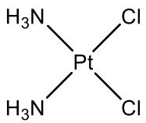</td><td>反式异构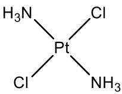</td></tr><tr><td>制备方法</td><td>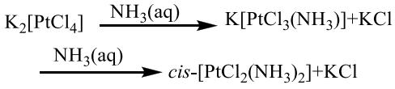</td><td> $K_2[PtCl_4]^-$ 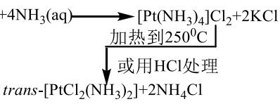</td></tr><tr><td>颜色</td><td>棕黄色</td><td>淡黄色</td></tr><tr><td>极性</td><td>结构不对称,偶极矩  $\mu \neq 0$ </td><td>结构对称, $\mu = 0$ </td></tr><tr><td>溶解度</td><td>易溶于极性溶液中0.2577g/100gH2O</td><td>难溶于极性溶液中 0.0366g/100gH2O</td></tr><tr><td>化学反应</td><td>邻位的Cl-先被OH-取代,然后被草酸根取代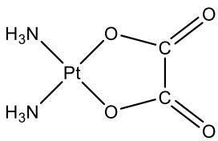</td><td>不能转变为草酸配位化合物,因草酸根中2个配位氧原子不能取代对位上的OH-离子</td></tr></table>

而在六配位化合物中，同样存在着类似的连接形式上的差异。对 $ML_{4}L_{2}$ 型配合物，仍然依两个 X 配体是处于相邻位置还是相对位置分别命名为顺式与反式，对 $ML_{3}X_{3}$ 型配合物，则又有面式（相同三个配体占据八面体的同一个面的三个顶点）和经式（相同三个配体在八面体上呈子午线式排布）两种情况。

![[07-08第四章配合物学生版_images/b5fdc406bd4ba22c90d67db98166222f9b1d3e66bd3f7ce1318b155ba4f004fc.jpg]]

chemical

Molecular structure diagram showing a metal-ligand complex with X and L ligands

![[07-08第四章配合物学生版_images/9917213bc5b383eabe9639195545c89993b59c8565642be50e0b634b876394f7.jpg]]

chemical

Molecular structure diagram showing a central metal atom M bonded to four ligands L and X, with dashed lines indicating bonds or interactions.

![[07-08第四章配合物学生版_images/1671e60d7c251b073449481b40c7b25c6bbf8a4b2afce92bc37eb20ab5a48214.jpg]]

chemical

Molecular structure diagram showing a central metal atom bonded to four ligands labeled L and X, with one M attached to the central metal.

![[07-08第四章配合物学生版_images/fcb2120e53751db984b3647ac7a6677fbd632316ece93cce839a55e5fefc2832.jpg]]

chemical

Molecular structure diagram showing a central metal atom M bonded to four ligands L and X, with dashed lines indicating bonds or interactions.

图 6 六配位的几何异构

从左至右依序：反式、顺式、面式、经式

以上这些异构情况，均是在同一中心原子上，不同配体的相对关系的差异引发的。这类异构现象，我们称之为几何异构。

表 4 内界组成不同的配离子异构体数目

<table><tr><td>配离子类型</td><td>几何异构体数目</td><td>实例(铂配位化合物)</td><td>配离子类型</td><td>几何异构体数目</td><td>实例(铂配位化合物)</td></tr><tr><td>MX4</td><td>1</td><td> $[Pt(NH_3)_4]Cl_2,K_2[PtCl_4]$ </td><td>MX5Y</td><td>1</td><td> $[PtCl(NH_3)_5]Cl_3,K[PtCl_5(NH_3)]$ </td></tr><tr><td>MX3Y</td><td>1</td><td> $[PtCl(NH_3)_3]Cl,K[PtCl_3(NH_3)]$ </td><td>MX4Y2</td><td>2</td><td> $[PtCl_2(NH_3)_4]Cl_2,[PtCl_4(NH_3)_2]$ </td></tr><tr><td>MX2Y2</td><td>2</td><td> $[PtCl_2(NH_3)_2]$ </td><td>MX3Y3</td><td>2</td><td> $[PtCl_3(NH_3)_3]Cl$ </td></tr><tr><td>MX2YZ</td><td>2</td><td> $[PtCl(NO_2)(NH_3)_2]$ </td><td>MX4YZ</td><td>2</td><td> $[PtCl(NO_2)(NH_3)_4]Cl_2$ </td></tr><tr><td>MXYZX</td><td>3</td><td> $[PtBrCl(NH_3)Py]$ </td><td>MX3Y2Z</td><td>3</td><td> $[PtCl_3(OH)(NH_3)_2]$ </td></tr><tr><td>MX6</td><td>1</td><td> $[Pt(NH_3)_6]Cl_4, K_2[PtCl_6]$ </td><td>MX2Y2Z2</td><td>5</td><td> $[PtCl_2(OH)_2(NH_3)_2]$ </td></tr></table>

而对于连接关系相同的异构体，事实上仍存在异构现象。对于四面体构型的四配位化合物，若四个配体两两不同，则可以得到一对互为镜像，但无法重合的配合物：

![[07-08第四章配合物学生版_images/95ca9709f89492147b24649b3b78c48968bd25ecbba5f2e75a40391dfce757ed.jpg]]

flowchart

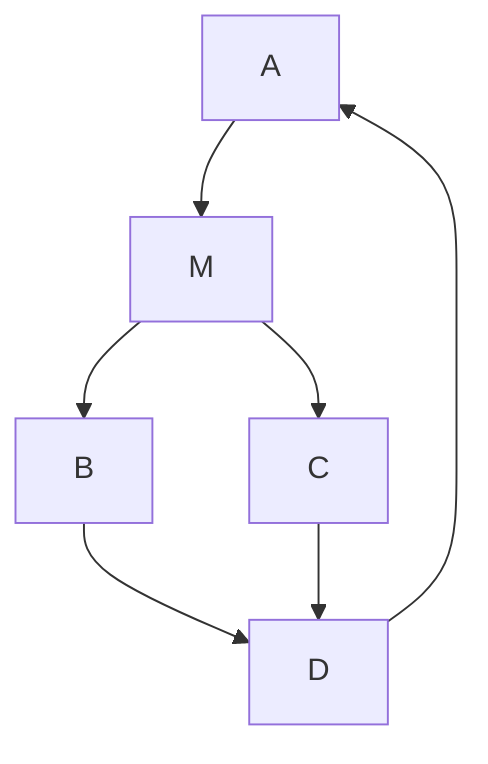

![[07-08第四章配合物学生版_images/10d50e782754370ab2045658e4751314f1ab678b1864c5886fe3a5787eeac3a7.jpg]]

chemical

Molecular structure diagram showing atoms labeled A, B, C, D, and M with dashed and solid bonds

图 7 四面体形配合物的旋光异构

具有这样中心原子的化合物可以使偏振光发生偏转，因此这类异构现象称为旋光异构。事实上，在八面体结构的配合物中同样存在类似的情况。以下举出一些与镜像分子不能重合的简单例子。

![[07-08第四章配合物学生版_images/49d3b6b692d90c2b3b29e16f6043f371e300292a7da4261d1148fd620bb07e8a.jpg]]

chemical

Molecular structure diagrams showing M and L atoms in 2D configurations

图 8 几种八面体旋光异构

![[07-08第四章配合物学生版_images/7636e25794f47279b8432b43dc0a3c41a3273e42e6c9f00a38d72996df0683fc.jpg]]

chemical

Chemical structures of dimeric complexes Δ and Λ with ligand substitution and ring configurations

图 9 M(L₂)₃ 型配合物异构体的命名

# 6.配位化合物的成键理论

# (1) 价键理论

价键理论是从电子配对法的共价键引伸并由鲍林将杂化轨道理论应用于配位化合物而形成的。常见的杂化方式有 $sp^{3}$ ， $dsp^{2}$ ， $sp^{3}d$ ， $dsp^{3}$ ， $sp^{3}d^{2}$ ， $d^{2}sp^{3}$ 等。

价键理论的主要内容为：中心离子（或原子）必须具有空轨道，以接纳配位体授予的孤电子对，形成 $\sigma$ 配位共价键，简称 $\sigma$ 配键。当配位体接近中心离子时，为了增加成键能力，中心离子（或原子）用能量相近的空轨道（如第一过渡系金属 3d，4s，4p，4d）杂化，配位体的孤电子对填到中心离子（或原子）已杂化的空轨道中形成配离子。配离子的空间结构、配位数及稳定性等主要决定于杂化轨道的数目和类型。

中心离子利用哪些空轨道进行杂化，这既和中心离子的电子层结构有关，又和配位体中配位原子的电负性有关。对过渡金属离子来说，原属内层的（n-1）d轨道尚未填满，而外层的ns，np，nd是空轨道。它们有两种利用空轨道进行杂化的方式：

一种是配位原子的电负性很大，如卤素、氧等，不易给出孤电子对，它们对中心离子影响较小，使中心离子的结构不发生变化，仅用外层的空轨道 ns，np，nd 进行杂化生成能量相同、数目相等的杂化轨道与配位体结合。这类配合物叫做外轨型配合物。

![[07-08第四章配合物学生版_images/b2af640b38b13642048b63ce642b594ff78eae921e1440d2a16fdde20ef55e0e.jpg]]

text_image

金属的每一个(n-1)d轨道都被电子占据 d电子数=5,6,7,8,9,10
配位体 L: 
孤电子对 L: 
填充到
—— n s 轨道
—— np 轨道
—— nd 轨道
中心金属的轨道

图 10 外轨型配合物成键原理

另一种是配位原子的电负性较小，如碳（CN-,以 C 配位）、氮（NO₂⁻，以 N 配位）等，轻易给出孤电子对，对中心离子的影响较大使电子层结构发生变化，（n-1）d 轨道上的成单电子被强行配对，腾出内层能量较低的 d 轨道与 n 层的 s，p 轨道杂化，形成能量相等、数目相同的杂化轨道来接受配位体的孤电子对，形成内轨型配合物。

![[07-08第四章配合物学生版_images/1757a2e84841b13201fb4396f09c638bb92bc373c2a2c1d0e2cfc70a75f4da47.jpg]]

text_image

d电子数<5
d电子被强行成对

金属的(n-1)d轨道中有未被占据的空轨道

![[07-08第四章配合物学生版_images/f1a518d583dbc4ca7245a67f3b81c6657b8c14f0aa210b01f3455bcc9601e2dc.jpg]]

text_image

配位体
孤电子对 L:
填充到
—— n-1 d 轨道
—— ns 轨道
—— np 轨道
中心金属的轨道

图 11 内轨型配合物成键原理

必须指出，形成内轨型配合物时，要违反洪特规则使原来的成单电子强行在同一 d 轨道中配对，在同一轨道中电子配对时所需要的能量，叫做成对能（用 P 表示）。形成内轨型配合物的条件是中心离子（或原子）与配位体之间成键放出的总能量在克服成对能后仍比形成外轨型配合物的总键能大。

内轨型与外轨型配合物的主要区别是内轨型中心离子成键 d 轨道单电子数减少，而外轨型配合物中心离子成键 d 轨道单电子数未变。

形成内轨型配合物时，由于中心离子的成单电子数一般会减少，比自由离子的磁矩相应降低，所以通常可由磁矩的降低来判断内轨型配合物的生成。

物质的永磁矩主要是电子的自旋造成的，此外还有轨道磁矩。永磁矩 $\mu$ 与原子或分子中未成对电子数 n 有如下近似关系

$$
\mu = \sqrt {n (n + 2)} \mu_ {B}
$$

( $\mu_{B}$ 称为 Bohr 磁子，是磁矩单位)

表 5 某些高自旋配合物的电子结构和磁矩

<table><tr><td rowspan="2">配离子</td><td rowspan="2">中心离子内层(n-1)“轨道”电子排布</td><td rowspan="2">杂化轨道类型</td><td rowspan="2">未成对电子数</td><td colspan="2">磁矩(Bohr磁子单位)</td></tr><tr><td>理论值 $\mu = \sqrt{n(n+2)}$ </td><td>实验值</td></tr><tr><td> $FeF_{6}^{3-}$ </td><td> $Fe^{3+} \underline{111111}$ </td><td> $sp^{3}d^{2}$ </td><td>5</td><td>5.92</td><td>5.88</td></tr><tr><td> $Fe(H_{2}O)_{6}^{2+}$ </td><td> $Fe^{2+} \underline{111111}$ </td><td> $sp^{3}d^{2}$ </td><td>4</td><td>4.90</td><td>5.30</td></tr><tr><td> $CoF_{6}^{3-}$ </td><td> $Co^{3+} \underline{111111}$ </td><td> $sp^{3}d^{2}$ </td><td>4</td><td>4.90</td><td>5.39</td></tr><tr><td> $Co(NH_{3})_{6}^{2+}$ </td><td> $Co^{2+} \underline{111111}$ </td><td> $sp^{3}d^{2}$ </td><td>3</td><td>3.87</td><td>5.04</td></tr><tr><td> $MnCl_{4}^{2-}$ </td><td> $Mn^{2+} \underline{111111}$ </td><td> $sp^{3}$ </td><td>5</td><td>5.92</td><td>5.88</td></tr></table>

配位体的孤对电子填入中心离子内层杂化轨道所形成的配合物（如 $\mathrm{Fe(CN)^{3-}}$ ），称为内轨型配合物。像碳、氮等配位原子电负性较低，容易给出孤对电子，它们在接近中心离子时，对内层的 d 电子影响较大，使 d 电子发生重排，电子挤入少数轨道，故自旋平行的 d 电子数目减少，磁性降低，所以这类配合物又被称为低自旋型配合物。

表 6 某些低自旋型配合物的电子结构和磁矩

<table><tr><td rowspan="2">配离子</td><td rowspan="2">中心离子内层(n-1)“轨道”电子排布</td><td rowspan="2">杂化轨道类型</td><td rowspan="2">未成对电子数</td><td colspan="2">磁矩(Bohr磁子单位)</td></tr><tr><td>理论值 $\mu = \sqrt{n(n+2)}$ </td><td>实验值</td></tr><tr><td> $Fe(CN)_6^{3-}$ </td><td> $Fe^{3+} \underline{\underline{1111}} \underline{\underline{1}} \underline{\underline{1}}$ </td><td> $d^2sp^3$ </td><td>1</td><td>1.73</td><td>2.3</td></tr><tr><td> $Co(NH_3)_6^{3+}$ </td><td> $Co^{3+} \underline{\underline{1111}} \underline{\underline{1}} \underline{\underline{1}} \underline{\underline{1}} \underline{\underline{1}}$ </td><td> $d^2sp^3$ </td><td>0</td><td>0</td><td>0</td></tr><tr><td> $Mn(CN)_6^{4-}$ </td><td> $Mn^{2+} \underline{\underline{1111}} \underline{\underline{1}} \underline{\underline{1}} \underline{\underline{1}} \underline{\underline{1}} \underline{\underline{1}}$ </td><td> $d^2sp^3$ </td><td>1</td><td>1.73</td><td>1.70</td></tr><tr><td> $Ni(CN)_4^{2-}$ </td><td> $Co^{3+} \underline{\underline{1111}} \underline{\underline{1111}} \underline{\underline{1}} \underline{\underline{1}} \underline{\underline{1}} \underline{\underline{1}}$ </td><td> $dsp^2$ </td><td>0</td><td>0</td><td>0</td></tr></table>

由于(n-1)d轨道能量比nd轨道低，所以一般内轨型配合物比外轨型配合物稳定。一般说来，卤素离子、 $\mathrm{H}_2\mathrm{O}$ 分子等配位体与中心离子易形成外轨型配合物（高自旋），而 $\mathrm{CN}^-$ 、 $\mathrm{NO}_2^-$ 等配位体容易与中心离子结合成稳定的内轨型配合物（低自旋）；而 $\mathrm{NH}_3$ 分子则介乎两者之间，随中心离子不同。

表 7 几种配离子空间立体构型

<table><tr><td>配离子 $Ag(NH_3)_2^{+}$  $Ag(CN)_2^{-}$  $Cu(NH_3)_2^{+}$ </td><td>电子排布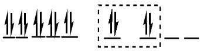</td><td>杂化类型sp</td><td>几何构型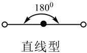</td><td>配位数2</td></tr><tr><td> $Cu(CN)_3^{2-}$ </td><td>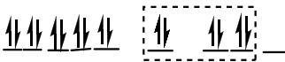</td><td> $sp^2$ </td><td>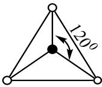平面三角型</td><td>3</td></tr><tr><td> $Zn(NH_3)_4^{2+}$  $Cd(CN)_4^{2-}$ </td><td>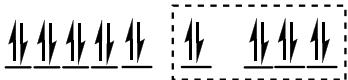</td><td> $sp^3$ </td><td>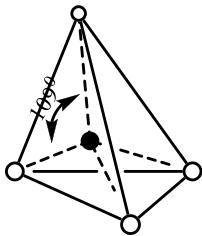正四面体型</td><td>4</td></tr><tr><td> $Ni(CN)_4^{2-}$ </td><td>↓↓↓↓↓↓↓↓↓↓↓—</td><td> $dsp^2$ </td><td>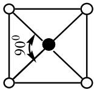四方型</td><td>4</td></tr><tr><td> $Ni(CN)_5^{3-}$  $Fe(CO)_5$ </td><td>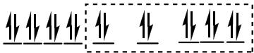</td><td> $dsp^3$ </td><td>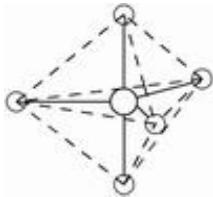三角双锥型</td><td>5</td></tr><tr><td> $Fe(H_2O)_6^{3+}$ 、 $FeF_6^{3-}$  $Fe(CN)_6^{3-}$  $Cr(NH_3)_6^{3+}$ </td><td>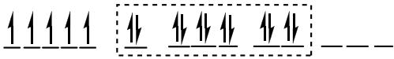↓↓↓↓↓↓↓↓↓↓↓↓↓↓↓↓↓↓↓↓↓↓↓↓↓↓↓↓↓↓↓↓↓↓↓↓↓↓↓↓↓↓↓↓↓↓↓↓↓↓↓↓↓↓↓↓↓↓↓↓↓↓↓↓↓↓↓↓↓↓↓↓↓↓↓↓↓↓↓↓↓↓↓↓↓↓↓↓↓↓↓↓↓↓↓↓↓↓↓↓↑↓↓↓↓↓↓↓↓↓↓↓↓↓↓↓↓↓↓↓↓↓↓↓↓↓↓↓↓↓↓↓↓↓↓↓↓↓↓↓↓↓↓↓↓↓↓↓↓↓↓↓↓↓↓↓↓↓↓↓↓↓↓↓↓↓↓↓↓↓↓↓↓↓↓↓↓↓↓↓↓↓↓↓↓↓↓↓↓↓↓↓↓↓↓↓↓↓↓↓ ↓↓↓↓↓↓↓↓↓↓↓↓↓↓↓↓↓↓↓↓↓↓↓↓↓↓↓↓↓↓↓↓↓↓↓↓↓↓↓↓↓↓↓↓↓↓↓↓↓↓↓↓↓↓↓↓↓↓↓↓↓↓↓↓↓↓↓↓↓↓↓↓↓↓↓↓↓↓↓↓↓↓↓↓↓↓↓↓↓↓↓↓↓↓↓↓↓↓↓↓</td><td> $sp^3d^2$  $d^2sp^3$  $d^2sp^3$ </td><td>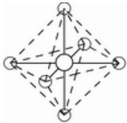八面体型</td><td>6</td></tr></table>

鲍林于 1948 年对化合物的稳定性方面提出了“电中性原理”。该原理指出：在形成一个稳定的分子或配离子时，其电子结构是竭力设法使每个原子的净电荷基本上等于零（即在-1 到+1 的范围内）。例如六氨合钴（+3）离子，如果 Co-N 键是极端的离子型键，则全部正电荷都被集中在 Co 上，如果是 Co-N 是极端的共价键，将会造成大量负电荷在中心原子上的积累，这在电负性的概念上是不可能的，因而这样的极端共价键也不稳定。事实上，以配位键形成配离子时，键总是有部分离子型，或者说配位键是极性共价键。也就是说，电子对不是均等地在 Co 和 N 之间共用，而是更强烈的被 N 所吸引。这样就阻止了负电荷在 Co 原子上的大量积累，并保持这 N 比 Co 有较大的电负性，同时体现了电中性原理对稳定性的要求。实验证明，在 +2 和 +3 氧化态的过渡金属离子的配合物中，金属元素是接近电中性的。

对于形成零价或甚至-1价的低价金属配合物的情况，同样符合电中性原理的要求：例如金属羰基化合物 $\mathrm{Ni(CO)_4}$ 、Fe(CO) $_5$ 等是零价金属与CO生成的配合物。这些羰基化合物的形成显然是不能用静电引力来说明，而必须认为主要是共价键，但如果单用配位体提供孤电子对，金属提供空轨道来说明零价金属与CO的成键也是有困难的，因为它在接受电子对时会造成金属原子上大量负电荷的累积而不稳定。现在的问题是有没有其他方法可以消除金属原子上负电荷的累积。为了合理地说明金属羰基化合物的生成，提出了“反馈π键”的概念。

当配位体给出电子对与中心元素形成 $\sigma$ 键时, 如果中心元素的某些 d 轨道有孤电子对。而配位体有空的 $\pi$ 分子轨道或空的 p 或 d 轨道, 而两者的对称性又合适时, 则中心元素的孤对 d 电子也可以反过来给予配位体形成所谓的“反馈 $\pi$ 键”, 它可以用下式表示:

![[07-08第四章配合物学生版_images/31474b8cca87a6e7a95476c5512e63896dfd84b6ccb19af54ed2921f4a55aea9.jpg]]

chemical

Diagram showing molecular interaction with labeled components M, C, and O

图 12 反馈 $\pi$ 键示意图（电子从金属的 d 轨道给出）

反馈 $\pi$ 键既可消除金属原子上负电荷的积累，又可双重成键，从而增加了稳定性，使低价态的金属羰基化合物得以形成。Ni(CO) $_4$ 中，零价的 Ni 原子提供 sp $^3$ 杂化轨道，在接受 4 个 CO 分子中 C 上的 4 对电子形成 $\sigma$ 键的同时又形成了反馈 $\pi$ 键，在这样的金属羰基化合物中所形成的键具有部分双键的性质，它比共价单键的键能大，键长短，配合物的稳定性比仅用 $\sigma$ 配键要大。由于中心离子的电子对填入到 CO 分子的反键轨道中，结果削弱了 CO 分子中 C 与 O 间的键能，使 CO 的活性增大。

能形成反馈 $\pi$ 键的 $\pi$ 接受配位体，除 CO 外，尚有 $CN^{-}$ ， $-NO_{2}$ ，NO， $N_{2}$ ， $R_{3}P$ （膦）， $R_{3}As$ （肿）， $C_{2}H_{4}$ 等等。它们不是有空的 $\pi^{*}$ 轨道就是有空的 p 或 d 轨道，可以接受金属反馈的 $d\pi$ 电子。一般地说，金属离子的电荷越低，d 电子数越多（易将 d 电子反馈给配位体），配位原子的电负性越小（易给出电子对形成 $\sigma$ 配键，同时也有空的 $\pi$ 轨道），越有利于反馈 $\pi$ 键的形成。基于上述理由，这些 $\pi$ 接受配位体在形成配合物时，有稳定过渡金属不常见的低价态（如零价甚至负价）的作用。这以由零价或低价金属羰基合物的合成得到证实。

与上面的 $\pi$ 接受体能稳定金属的低价态相反，以 $O^{2-}$ ， $OH^{-}$ ， $F^{-}$ 等配位时，能稳定金属的高价态。因为只有电负性很大、吸引电子能力很强的元素如氟、氧等，才能与金属结合使其保持在高氧化态（高的形式电荷）。而不会让电子从这些非金属原子上完全转移以致使金属被还原或非金属被氧化，从而使配合物分解。

综上所述，价键理论主要解决了中心离子与配位体间的结合力（ $\sigma$ 配键）、中心离子（或原子）的配位数（等于杂化轨道数）、配合离子的空间构型（决定于杂化轨道的数目和类型）、稳定性（共价大于电价）及某些配离子的磁性。价键理论虽然成功的解释了一些问题，但也有一定的局限性。价键理论只是定性理论，不能定量或半定量地说明配合物的性质。例如，第四周期过渡元素与同一种配体形成八面体配离子的稳定性的次序为 $d^{0} < d^{1} < d^{2} < d^{3} > d^{4} > d^{5} < d^{6} < d^{7} < d^{8} > d^{9} > d^{10}$ ，这一规律价键理论无法解释。只能说明基态的性质，对激发态则无能为力。例如对配合物的颜色（吸收光谱）无法解释；很难解决夹心型配合物如二茂铁、二苯铬等的结构；对于磁矩的说明也有一定的局限性，例如 $\mathrm{Cu(H_2O)_4^{2+}}$ 经X-射线测定为平面正方形，如按价键理论解释似应为 $\mathrm{dsp^2}$ 杂化的内轨型配离子，有1个3d电子被激发到能量较高的4p（或5s）轨道，因而此电子应该较易失去从而生成+3价的铜离子，但这与事实是不符的。

价键理论没有充分考虑到配体对中心离子的影响，实际上在配合物中，配位体对中心离子的 d 电子影响很大，它不仅影响电子云的分布，也影响 d 轨道能量的变化，而这种变化与配合物的性质密切相关。

# (2) 晶体场理论

1929 年皮塞提出了晶体场理论，这一理论将金属离子和配位体之间的相互作用完全看做静电的吸引和排斥，同时考虑到配位体对中心离子 d 轨道的影响，他在解释配离子的光学、磁学等性质方面很成功。

晶体场理论认为配位体（离子或强极性分子例如 $Cl^{-}$ 、 $NH_{3}$ 等）同带有正电荷的正离子之间的静电吸引是使配合物稳定的根本原因。因为这个力的本质类似于离子晶体中的作用力，所以取名为晶体场理论。这意味着我们可以将配合物中心的金属离子（或原子）与它周围的原子或分子所产生的电场作用看做类似于置于晶格中的一个小空穴上的原子所受到的作用。这种晶体场当然要破坏原先自由原子的电荷分布。晶体场理论认为中心金属上的电子基本上定域于原先的原子轨道，中心金属与配体之间不发生轨道的重叠，完全忽略了配体与中心金属之间的共价作用。

总之，晶体场理论模型的基本要点为：

a. 配合物中心金属离子（或原子）与配体（被视为点电荷或点偶极）之间的作用是纯静电作用，既不交换电子，不形成共价键。  
b. 当受到带负电荷的配体（阴离子或偶极子的负端）的静电作用时，过渡金属离子（或原子）上本来是五重简并的 d 轨道（指单电子或单空穴体系）或含多电子的金属离子（或原子）的各谱项就要发生分化、改组，即发生能级分裂。这种分裂的情况和后果依配合物对称性的不同而不同。

![[07-08第四章配合物学生版_images/c26abd96fd75034543ba4b75f63111bd0bcf574af07a64443818216715494211.jpg]]

chemical

Molecular orbital diagrams showing electron density distributions in 3D coordinate systems with z and x axes

图 13 中心离子 d 轨道与配体的空间位置示意图(6 配位)

以八面体型六配位化合物为例，考虑配体在中心原子外的分布，五个 d 轨道受其影响，必然发生能级分裂：依据六个配体方向定位坐标轴，则沿坐标轴方向的轨道会由于电性斥力而能量升高，在坐标系对角线方向延伸的轨道则能量降低。而对四面体外场来说，将四个配体如图分布，则与八面体场的情况恰好相反：对角线方向延伸的轨道能量升高，沿坐标轴方向的能量降低。

![[07-08第四章配合物学生版_images/6782d0dc3989c6313201a0e265cfca53fa6376965d001c94272cf8f89eb3dd45.jpg]]

text_image

3/5 Δ₀
-2/5 Δ₀
分裂能
未能级分裂的d轨道
晶体场下的能级分裂

图 14 八面体场中 d 轨道能级分裂情况  
![[07-08第四章配合物学生版_images/c1b915e5ee020ef687a9c9c939d37ab7392ceca093e029b5d9da51d150ba8413.jpg]]

chemical

Energy level diagram of a semiconductor structure showing electron transitions and symmetry labels in atomic positions

图 15 不同晶体场中 d 轨道的能级分裂情况

能级分裂的结果，就是可能的电子排布发生变化。在八面体型配合物中。当分裂能（图中 $\Delta o$ ）足够大，以至于超过电子成对所需能量消耗（成对能，P）时，电子将倾向于先在能量较低的三个轨道排布，形成低自旋态。当分裂能（图中 $\Delta o$ ）不够大，以至于电子成对所需能量消耗（成对能，P）不能被忽略的时候，电子将倾向于先在五个轨道上平行排布，形成高自旋态。通过能级分裂，使得电子排布较能级未分裂时能量有一定程度的降低，这一差值称为晶体场稳定化能（CFSE）。

$\Delta o$ 与 $P$ 的相对大小，更多地是由配体所决定。实验测得的分裂能次序为： $I^{-}<Br^{-}<S^{2-}<SCN^{-}<Cl^{-}<N_{3}^{-}<F^{-}<OH^{-}<C_{2}O_{4}^{2-}<H_{2}O<NCS^{-}<py~NH_{3}<en>NH_{2}OH<dipy<phen<CN^{-}<CO$ 。这一顺序称为光谱化学序，在右边称为强场配体，对应配合物的 CFSE 大，电子排入较低能量轨道，称为内轨型产物或低自旋(LS)产物；左边称为弱场配体，对应外轨型产物，或高自旋(HS)产物。以上产物的电子排布如图所示。

![[07-08第四章配合物学生版_images/c0c985cbe66da2d8d41c925f88b125ee2f429f7fa44e557d916630d5a975dec7.jpg]]

text_image

Δo
---
↑ ---
d¹
---
↑ ↑ ---
d²
---
↑ ↑ ↑
d³
↑ ---
↑ ↑ ↑
d⁴
↑ ↑
↑ ↑ ↑
d⁵
Δo
↑ ↑
↑↓ ↑ ↑
d⁶
↑ ↑
↑↓ ↑↓ ↑
d⁷
↑ ↑
↑↓ ↑↓ ↑↓
d⁸
↑↓ ↑
↑↓ ↑↓ ↑↓
d⁹
↑↓ ↑↓
↑↓ ↑↓ ↑↓
d¹⁰

图 16 弱场中金属 d 电子的高自旋排布

![[07-08第四章配合物学生版_images/68dbae0bd25c712f03c8e28852b4c40cfab9a8de44d49ebed2a34b1a1b487bd5.jpg]]

text_image

Δo
--
↑ ↑
d¹
--
↑ ↑
d²
--
↑ ↑ ↑
d³
--
↑↓ ↑ ↑
d⁴
--
↑↓ ↑↓ ↑
d⁵
Δo
--
↑↓ ↑↓ ↑↓
d⁶
--
↑↓ ↑↓ ↑↓
d⁷
--
↑ ↑
↑↓ ↑↓ ↑↓
d⁸
--
↑↓ ↑
↑↓ ↑↓ ↑↓
d⁹
--
↑↓ ↑↓
↑↓ ↑↓ ↑↓
d¹⁰

图 17 强场中金属 d 电子的低自旋排布

然而事实上，以上 14 种排布形式中只有 5 种会存在，其余 9 种均会发生不同程度的变形。Jahn 和 Teller 在 1937 年指出：在对称的非线性分子中，简并轨道的不对称占据必定会导致分子通过某种振动方式使其构型发生畸变，结果降低了分子的对称性和轨道的简并度，使体系的能量降低从而达到某种稳定状态。畸变的本质是原本简并平行的轨道能级再次发生分裂。

![[07-08第四章配合物学生版_images/7a46fb23928b8117d05cfb80010385a4c89309fac1ef367714a881461b46f853.jpg]]

text_image

O_h
D_{4h}
x^2 - y^2
z^2
xy
yz, zx
Octahedral
Tetragonal

图 18 简并的八面体分裂轨道能级（左）发生分裂

在前文介绍的 14 种电子排布中，只有 $d^{3}$ 、 $d^{5}(HS)$ 、 $d^{6}(LS)$ 、 $d^{8}$ 、 $d^{10}$ 有非简并的基态，对其他所有排布形式，均会发生 Jahn-Teller 变形。简单而言，对于原本能量相同的轨道，是否填充电子将会导致原本轨道能量下降或上升。 $d^{9}$ 电子构型中，如果 $e_{g}$ 轨道上为 $(d_{z^{2}})^{2}(d_{x^{2}-y^{2}})^{1}$ ，z 轴上配体的排斥更大，配合物具有四短两长键，形成轴向拉长的八面体构型。如果 $e_{g}$ 轨道上为 $(d_{x^{2}-y^{2}})^{2}((d_{z^{2}})^{1}$ ，xy 平面上的配体就会受到比 z 轴上配体更大的排斥，配合物具有两短四长键，形成压缩的八面体构型。下图是 z 方向发生拉伸或收缩变形后的轨道能级示意图。

![[07-08第四章配合物学生版_images/425dca77cd20efc1bca54dac965bf572907e5327528ad5e58d33ad840e3261ed.jpg]]

text_image

正八面体(Oₕ)
沿四重轴伸长(D₄ₕ)
四角双锥
沿四重轴压缩(D₄ₕ)
四角双锥
正八面体(Oₕ)
沿三重轴伸长(D₄ₕ)
三角反棱柱
沿三重轴压缩(D₄ₕ)
三角反棱柱

图 19 八面体配合物的 Jahn-Teller 变形情况

晶体场理论的应用:

a. 决定配合物的自旋状态。对于形成八面体场的配合物，根据配位体在光谱化学序列中的位置，判断形成的八面体场中分裂能的大小，从而进一步决定中心离子 d 电子的高、低自旋情况（强场配体决定中心离子倾向于低自旋、弱场配体决定中心离子倾向于高自旋）。  
b. 决定配离子的空间构型。在已经知道中心离子的 d 电子数目以及配位体的类型的情况下，不同的晶体场类型（八面体场、四面体场、平面正方形场）会影响稳定化能的大小，一般倾向于稳定化能更大的配位情况。  
c. 解释配合物的颜色。电子构型为 $d^{1}$ 到 $d^{9}$ 的过渡金属离子的配合物一般是有颜色的。

晶体场理论认为这些配离子，由于 d 轨道没有充满，电子能吸收光能在 d 轨

道之间发生电子跃迁。这种跃迁所吸收的能量恰好等于晶体场的分裂能。物质显示的颜色就是物质吸收光的互补色。吸收色与互补色的关系可以用右图的色环来概括，如果物质显示出紫红色，那么它就吸收黄绿光，反之亦然。

![[07-08第四章配合物学生版_images/2c38077015d7d943e71feec049f1f426010a2ef893451acc7f56d6693690e48d.jpg]]

text_image

轨
红 紫
橙 蓝
黄 绿

晶体场理论的优点是能对配合物的光学、磁学性质作出合理的解释。但其主要缺点是只考虑了中心离子与配位体之间的静电作用，没有考虑二者之间一定程度的共价结合。

# （3）配体场理论

配体场理论（也称配位场）使计算配合物中原子的波函数和能级的一种理论方法，它是在晶体场理论和过渡金属分子轨道理论的基础上发展起来的。事实上这三者之间的关系是极为密切的。配体场理论的两种极限情况即离子配合物的静电晶体场理论和共价配合物的分子轨道理论。这三种理论有着共同的基本方法，即约化由 d 和 f 轨道作为基的配合物点群的表示，并确定组成所得不可约表示的原子轨道性质。然后去计算这些轨道的能量。不过在计算时，配体场理论不再把涉及的轨道看成是中心离子（或原子）的纯粹 d 或 f 轨道，配体场理论认为：

a.配体不是无结构的点电荷，而是具有一定电荷分布和结构的原子（或分子）。

b. 成键作用既包括静电作用，也包括共价作用。对于大多数正常氧化态的金属配合物，可以考虑轨道的适度重叠将有关参数加以修正。

# 6.配位化合物的 18 电子规则

在研究主族的化合物时，常用到八隅律，它是指具有8个价电子的稀有气体原子的电子组态具有特殊的稳定性。而过渡金属原子阶层除s和p4个轨道外，还有5个d轨道，因此稳定的电子组态应为18个价电子。由此为过渡金属化合物提出18电子规则。这个规则虽很有用，但常常并不严格地遵循。按此规则可为配合物分成三类：(i)其电子组态完全和 18 电子规则无关；(ii)具有 18 个或少于 18 个价电子；(iii)准确地有 18 个价电子。

对于(i)类配合物，包括许多第四周期过渡金属化合物， $t_{2g}$ 轨道实质上是非键轨道， $\Delta o$ 较小。 $e_{g}$ 轨道略带反键性质，电子占据并不耗费多少能量，因此对 d 电子数目没有限制或限制很小。

对于(ii)类配合物，包括许多第五、六周期过渡金属化合物， $t_{2g}$ 轨道依然是非键轨道， $\Delta o$ 较大。 $e_{g}$ 轨道是强反键轨道，倾向于不被电子占据。占据 $t_{2g}$ 轨道的d电子数依然不受限制，因此采取18个或少于18个价电子。

对于(iii)类配合物，包括许多金属羰基化合物及其衍生物， $t_{2g}$ 轨道由于反应馈键的形成，它是强的 $\pi$ 成键轨道， $e_g$ 轨道是强 $\pi$ 反键轨道，倾向于不被电子占据，而 $t_{2g}$ 轨道倾向于充满电子。如果从完全占据的 $t_{2g}$ 轨道上拿走电子，由于损失键能，导致配合物不稳定。这种配合物具有18个价电子。

# 课后习题

1. 把下列各物质按摩尔电导率递增的顺序排列:

① $K[Co(NH_{3})_{2}(NO_{2})_{4}]$ ; ② $[Cr(NH_{3})_{3}(NO_{2})_{3}]$ ; ③ $[Cr(NH_{3})_{5}(NO_{2})]_{3}[Co(NO_{2})_{6}]_{2}$ ;   
④ $\mathrm{Mg}[\mathrm{Co}(\mathrm{NH}_3)(\mathrm{NO}_2)_5]$

2. 指出下列各配位离子中金属中心离子的氧化数：① $[Cu(NH_{3})_{4}]^{2+}$ ；② $[CuBr_{4}]^{2-}$

③ $\left[\mathrm{Cu}(\mathrm{CN})_{2}\right]^{-}$ ; ④ $\left[\mathrm{Cr}(\mathrm{NH}_{3})_{4}\mathrm{CO}_{3}\right]^{+}$ ; ⑤ $\left[\mathrm{PtCl}_{4}\right]^{2-}$ ; ⑥ $\left[\mathrm{Co}(\mathrm{NH}_{3})_{2}(\mathrm{NO}_{2})_{4}\right]^{-}$ ; ⑦ $\mathrm{Fe}(\mathrm{CO})_{5}$ ;

⑧ $\left[\mathrm{ZnCl}_{4}\right]^{2-}$ ; ⑨ $\left[\mathrm{Co(en)}_{3}\right]^{3+}$

3. 写出下列各配合物或配离子的化学式:

(1)硫酸四氨合铜（II）  
(2)氯化二氯·三氨·一水合钴（III）  
(3)六氯合铂（IV）酸钾   
(4)四硫氰·二氨合铬（III）酸铵   
(5)二氰合银（I）酸根离子  
(6)二羟基·四水合铝（III）离子  
(7)二氯·二（甲胺）合铜（II）  
(8)四氰合锰（Ⅱ）酸六氨合铬（Ⅲ）  
(9)三氯·（乙烯）合铂（II）酸钾

4.填写下表空白处。

<table><tr><td>序号</td><td>配合物的化学式</td><td>配合物的名称</td><td>中心体</td><td>配位体</td><td>配位数</td></tr><tr><td>1</td><td> $[Cu(H_2O)_4]SO_4$ </td><td>硫酸四水合铜(II)</td><td>Cu(II)</td><td> $H_2O$ </td><td></td></tr><tr><td>2</td><td></td><td>二氯化四氨合锌(II)</td><td></td><td></td><td></td></tr><tr><td>3</td><td> $[CoClNO_2(NH_3)_4]Cl$ </td><td></td><td></td><td></td><td></td></tr><tr><td>4</td><td> $K_3[Fe(CN)_6]$ </td><td></td><td></td><td></td><td></td></tr><tr><td>5</td><td></td><td>五氯·一氨合铂(IV)酸钾</td><td></td><td></td><td></td></tr></table>

5.在一个配位体分子中若有二个配位原子，同时与一个中心体成键时，即可形成环形化合物。乙二胺四乙酸是一种常用的含有多个配位原子的试剂，请写出乙二胺四乙酸分子的结构简式，指出其中的配位原子最多可以有几个？最多可形成几个五原子环？

6. $CoCl_{3}\cdot4NH_{3}$ 用 $H_{2}SO_{4}$ 溶液处理再结晶， $SO_{4}^{2-}$ 可以取代化合物中的 $Cl^{-}$ ，但 $NH_{3}$ 的摩尔含量不变。用过量的 $AgNO_{3}$ 处理该化合物中的溶液，每摩尔钴可得 1mol AgCl，这种化合物的

结构式应该是（）。

A. $[\mathrm{Co}(\mathrm{NH}_{3})_{2}]\mathrm{Cl}_{3}$

B. $[\mathrm{Co}(\mathrm{NH}_{3})_{3}\mathrm{Cl}_{3}]\mathrm{Cl}\cdot\mathrm{NH}_{3}$

C. $[\mathrm{Co}(\mathrm{NH}_{3})_{4}\mathrm{Cl}]\mathrm{Cl}_{2}$

D. $\left[\mathrm{Co}(\mathrm{NH}_3)_4\mathrm{Cl}_2\right]\mathrm{Cl}$

7. 0.01 mol 氯化铬 ( $CrCl_{3}\cdot6H_{2}O$ ) 在水溶液中用过量 $AgNO_{3}$ 处理，产生 0.02 mol AgCl 沉淀，此氯化铬最可能为（）

A. $[\mathrm{Cr}(\mathrm{H}_{2}\mathrm{O})_{6}]\mathrm{Cl}_{3}$

B. $[\mathrm{Cr}(\mathrm{H}_{2}\mathrm{O})_{5}\mathrm{Cl}]\mathrm{Cl}_{2}\cdot\mathrm{H}_{2}\mathrm{O}$

C. $[\mathrm{Cr}(\mathrm{H}_{2}\mathrm{O})_{4}\mathrm{Cl}_{2}]\mathrm{Cl}\cdot2\mathrm{H}_{2}\mathrm{O}$

D. $[\mathrm{Cr}(\mathrm{H}_{2}\mathrm{O})_{3}\mathrm{Cl}_{3}]\cdot3\mathrm{H}_{2}\mathrm{O}$

8.某物质的实验式为 $PtCl_{4}\cdot2NH_{3}$ ，其水溶液不导电，加入 $AgNO_{3}$ 也不产生沉淀，以强碱处理并没有 $NH_{3}$ 放出。据此写出它的配位化学式及名称。

9.固体 $CrCl_{3}\cdot6H_{2}O$ 有三种水合异构体:

$$
\left[ \mathrm{Cr} \left(\mathrm{H} _ {2} \mathrm{O}\right) _ {6} \right] \mathrm{Cl} _ {3}, \quad \left[ \mathrm{Cr} \left(\mathrm{H} _ {2} \mathrm{O}\right) _ {5} \mathrm{Cl} \right] \mathrm{Cl} _ {2} \cdot \mathrm{H} _ {2} \mathrm{O}, \quad \left[ \mathrm{Cr} \left(\mathrm{H} _ {2} \mathrm{O}\right) _ {4} \mathrm{Cl} _ {2} \right] \mathrm{Cl} \cdot 2 \mathrm{H} _ {2} \mathrm{O}
$$

若将一份含 $0.5728 \, g \, CrCl_{3} \cdot 6H_{2}O$ 的溶液通过一支酸型阳离子交换柱，然后用标准 NaOH 溶液滴定取代出的酸，消耗了 $28.84 \, cm^{3}$ 的 $0.1491 \, mol \cdot L^{-1}$ 。试确定此 Cr(III) 配合物的正确化学式。（相对原子质量：Cr 52.00，H 1.008，Cl 35.45，O 16.00）

10.指出下列配合物中，哪些互为异构体，并写出各类异构体的名称及其特点。

(1) $[Co(NH_{3})_{6}][Co(NO_{2})_{6}]$

(2) $\left[\mathrm{Co}(\mathrm{NH}_{3})_{3}\left(\mathrm{NO}_{2}\right)_{3}\right]$

(3) $[\mathrm{Pt}(\mathrm{NH}_{3})_{3}(\mathrm{ONO})]\mathrm{Cl}$

(4)[PtCl $_{4}$ (en)]·2py

(5) $[\mathrm{Pt}(\mathrm{NH}_{3})_{3}(\mathrm{NO}_{2})]\mathrm{Cl}$

(6)[PtCl $_2$ (en)(py) $_2$ ]Cl $_2$

(7)[Pt(NH $_3$ ) $_3$ Cl]NO $_2$

(8)[Co(NH $_3$ ) $_4$ (NO $_2$ ) $_2$ ][Co(NH $_3$ ) $_2$ (NO $_2$ ) $_4$ ]

11.指出下列配合物的空间构型并画出它们可能存在的所有异构体

$\mathrm{[Cr(en)_2(SCN)_2]SCN}$

$\mathrm{[Co(NH_3)_3(OH)_3]}$

$\mathrm{[Pt(NH_3)_2(OH)_2Cl_2]}$

$\left[\mathrm{FeCl}_{2}(\mathrm{C}_{2}\mathrm{O}_{4})(\mathrm{en})\right]$

$\mathrm{[Pt(CO_3)(NH_3)(en)]}$

$\mathrm{[Pt(Py)(NH_3)ClBr]}$

12.六配位(八面体)单核配合物 $\mathrm{MA}_{2}(\mathrm{NO}_{2})_{2}$ 呈电中性; 组成分析结果: M 21.68%, N 31.04%, C 17.74%; 配体 A 不含氧: 配体 $(\mathrm{NO}_{2})^{\mathrm{x}}$ 的氮氧键不等长。

(1)该配合物中心原子 M 是什么元素？氧化态多大？给出推理过程。

(2)画出该配合物的结构示意图，给出推理过程。

(3)指出配体 $(\mathrm{NO}_2)^{\mathrm{x}}$ 在“自由”状态下的几何构型和氮原子的杂化轨道。

(4) 除本例外，上述无机配体还可能以什么方式和中心原子配位？用图形画出三种。

13.用价键理论写出下列配离子的电子构型、中心离子杂化轨道类型、配离子几何构型，并说明是内轨型配合物还是外轨型配合物。

(1) $\left[\mathrm{Fe}(\mathrm{en})_{2}\right]^{2+}(\mu = 5.5\mathrm{B.M.})$

(2) $\left[\mathrm{Mn}(\mathrm{CN})_{6}\right]^{4-}$ （有一个未成对电子）

(3) $\left[\mathrm{Pt}(\mathrm{CN})_4\right]^{2-}$ (4) $\left[\mathrm{FeF}_6\right]^{3-}$

(1) $\left[\mathrm{Fe}(\mathrm{en})_{2}\right]^{2+}(\mu = 5.5\mathrm{B.M.})$   
(2) $\left[\mathrm{Mn}(\mathrm{CN})_{6}\right]^{4-}$   
(3) $\left[\mathrm{Pt}(\mathrm{CN})_{4}\right]^{2-}$   
(4) $\left[\mathrm{FeF}_{6}\right]^{3-}$

14.画出在正八面体场中，下列各中心离子“高自旋”和“低自旋”时的电子排布：

(1) Fe(II) (2) Fe(III) (3) Cr(II) (4) Mn(II) (5) Ni(II)

15. 已知某金属离子配合物的磁矩为 4.90 B.M.，而同一氧化态的该金属离子形成的另一配合物，其磁矩为零，则此金属离子可能为（）

A. Cr(III)

B. Mn(II)

C. Fe(II)

D. Mn(III)

16. 已知:

（a）某配合物的组成（质量分数）是 Cr：20.0%； $NH_{3}$ 39.2%；Cl 40.8%。它的相对分子质量是 260.6（相对原子质量：Cr 52.0；Cl 35.5；N 14.0；H 1.00）；  
(b) $25.0 \, cm^{3}$ 0.052 mol/L 该溶液和 $32.5 \, cm^{3}$ 0.121 mol/L $AgNO_{3}$ 恰好完全沉淀；  
（c）往盛有该溶液的试管中加 NaOH，并加热，在试管口的湿 pH 试纸不变蓝。根据上述情况。  
(1)判断该配合物的结构式;   
(2)写出此配合物的名称;  
(3)指出配离子杂化轨道类型;   
(4)推算自旋磁矩。

17.为什么 $\mathrm{[Co(SCN)_6]^{4 - }}$ 的稳定常数比 $[\mathrm{Co}(\mathrm{NH}_3)_6]^{2 + }$ 小，而在酸性溶液中 $[\mathrm{Co}(\mathrm{SCN})_6]^{4 - }$ 可以存在， $[\mathrm{Co}(\mathrm{NH}_3)_6]^{2 + }$ 不能存在？

18. 用晶体场理论判断配离子 $\left[\mathrm{Fe}(\mathrm{H}_2\mathrm{O})_6\right]^{2+}$ 、 $\left[\mathrm{Fe}(\mathrm{CN})_6\right]^{4-}$ 、 $\left[\mathrm{CoF}_6\right]^{3-}$ 、 $\left[\mathrm{Co}(\mathrm{en})_3\right]^{3+}$ （ $\Delta_0 = 23300\mathrm{cm}^{-1}$ ， $\mathrm{Co(III)}$ 的电子成对能 $P = 21000\mathrm{cm}^{-1}$ ）是高自旋还是低自旋，并计算配合物的磁距 $\mu$ 。

19. 在气相中， $\mathrm{Cr}^{2+}-\mathrm{e}\longrightarrow\mathrm{Cr}^{3+}$ 比 $\mathrm{V}^{2+}-\mathrm{e}\longrightarrow\mathrm{V}^{3+}$ 要难些（铬的第三电离能比钒大 157 kJ·mol $^{-1}$ ），但在水溶液中，则 $\mathrm{Cr}^{2+}-\mathrm{e}\longrightarrow\mathrm{Cr}^{3+}$ 比 $\mathrm{V}^{2+}-\mathrm{e}\longrightarrow\mathrm{V}^{3+}$ 要容易。用晶体场理论解释该现象。

20.哪些电子组态的过渡金属离子容易产生Jahn-Teller效应?

(1) $\left[\mathrm{Cr}(\mathrm{H}_{2}\mathrm{O})_{6}\right]^{3+}$

(2) $\left[\mathrm{Ti}(\mathrm{H}_2\mathrm{O})_6\right]^{3+}$

(3) $\left[\mathrm{Fe}(\mathrm{CN})_{6}\right]^{4-}$

(4) $\left[\mathrm{Mn}\left(\mathrm{H}_{2} \mathrm{O}\right)_{6}\right]^{2+}$

(5) $\left[\mathrm{CuCl}_{4}\left(\mathrm{H}_{2}\mathrm{O}\right)_{2}\right]^{2-}$

(6) $\left[\mathrm{MnF}_{6}\right]^{3-}$

21.1965 年合成了催化剂 A，实现了温和条件下的烯烃加氢。

(1)A 是紫红色晶体，分子量 925.23，抗磁性。它通过 $RhCl_{3}\cdot3H_{2}O$ 和过量三苯膦（ $PPh_{3}$ ）的乙醇溶液回流制得。画出 A 的立体结构。

(2) A 可能的催化机理如下图所示（图中 16e 表示中心原子周围总共有 16 个电子）：

![[07-08第四章配合物学生版_images/c97d32a55166f1b062202b279af7039e408cf0d1c23420b49c2149382b315a07.jpg]]

chemical

Reaction mechanism diagram showing phosphorus-catalyzed transformation of alkynes A and B to products C, E, D with electron transfer rates labeled

画出 D 的结构式。

(3) 确定图中所有配合物的中心原子的氧化态。  
(4) 确定 A、C、D 和 E 的中心离子的杂化轨道类型。  
(5) 用配合物的价键理论推测 C 和 E 显顺磁性还是抗磁性，说明理由。

22.某金属单质 X 可以与烃 Y 形成一种新型单核配合物 Z。Y 是非平面型环状，核磁共振显示只有 2 中类型的 H 原子；配合物 Z 中碳元素的质量分数为 69.87%，氢元素的质量分数为 8.77%。

(1)通过计算确定 X 的元素符号及外层电子排布;  
(2)写出 Y 的结构简式并命名;  
(3)试写出 Z 化学式和可能的立体结构。

23.近年来，化学家将 $\mathrm{F}_{2}$ 通入KCl和 $\mathrm{CuCl}$ 的混合物中，制得了一种浅绿色的晶体A和一种黄绿色气体 B。经分析，A 有磁性，其磁矩为 $\mu=2.8B.M$ ，且很容易被氧化。将 A 在高温高压下继续和 $F_{2}$ 反应，可得 C，C 的阴离子和 A 的阴离子共价键数不变（阴离子结构对称）。已知 A、C 中铜元素的质量分数分别为 21.55% 和 24.85%。

(1)试写出 A～C 的化学式，分别指出 A、C 中铜的化合价和价电子构型。  
(2)写出上述化学反应方程式。  
(3)简述 A、C 阴离子形成的原因。

24. 碳酰肼（CHZ）它可作为多齿配体与多种金属离子配位。由于碳酰肼是肼的衍生物，具有强还原性，可作含能材料的组分。所以碳酰肼配合物具有高能量、低感度的优良特性，GTN 是其中具有代表性的一种，因其卓越的性能倍受关注。 GTN 元素组成为：C: 6.83%，H: 3.44%，O: 33.34，Cl: 13.43%（即 3:18:11:2）。已知 GTN 中金属离子与 CHZ 形成八面体配合物离子。

(1)写出 CHZ 的结构式和 GTN 的化学组成式;  
(2)结构分析证实配合物 GTN 中的 CHZ 和游离态的 CHZ 相比, 分子中原本等长的两个键不再等长。画出这种配合物的结构简图 (氢原子不需画出), 讨论异构现象。  
(3)配合物的外界同配合物内界通过什么作用力结合在一起的。  
(4)GTN 具有高能钝感的优良特性，是一种性能卓越的含能材料，具有广阔的应用前景。试从组成和结构等角度分析 GTN 具有“高能、钝感”两大特性的原因。

25. 在空气中, 化合物 $CoCl_{2}\cdot6H_{2}O$ 在空气中与氨水反应生成化合物 A(化学式 $CoCl_{3}H_{17}N_{5}O$ )。加入硝酸银溶液, A 中的所有氯全部都沉淀。如果把 A 加热至 $100^{\circ}C$ , A 会失去水而形成紫色的固体 B (化学式 $CoCl_{3}H_{15}N_{5}$ )。已知 B 的化学式含有一个阳离子、二个阴离子。把 $CoCl_{2}\cdot6H_{2}O$ 和碳酸铵混合氧化, 然后加入氢氯酸可得到化合物 C (化学式 $CoCl_{3}H_{12}N_{4}$ ), 在 C 中加入硝酸银溶液只有 1/3 的氯可被沉淀。 $CoCl_{2}\cdot6H_{2}O$ 与氨水和亚硝酸钠反应, 氧化得到黄色固体 D。已知 D 的元素重量百分组成为 Co 23.8%, H 3.6%, N 33.9%, O 38.7%, 且在水溶液中 D 不会解离成离子。试写出 A、B、C、D 的结构式。

26. 已知五羰基铁可与乙酸镉在一定条件下发生反应生成主要产物 $CdFe(CO)_{4}(NH_{3})_{2}$ 。该产物在真空中、 $60^{\circ}C$ 条件下生成 A。元素分析表明：A 中含四种元素且含 $Cd\ 40\%$ 。物质 A 单体不稳定，易形成多种聚合物。例如在 2,2'—联吡啶中，A 以 $A_{3}$ 形式存在， $A_{3}$ 又与溶剂形成配合物 B，x 射线衍射表明 B 中存在平面六元环，且存在金属—金属—羰基键，同时还知道，B 中 Fe 以高度变形的八面体几何构型存在，而 Cd 则以四面体构型存在。回答下列问题：

(1)写出生成 $\mathrm{CdFe(CO)_{4}(NH_{3})_{2}}$ 的反应方程式;  
(2)写出 A 的分子式。  
(3)写出配合物 B 的结构式。  
(4)A 还可聚合为 $A_{4}$ ， $A_{4}$ 中有平面八元环，且只有一种金属—碳键。画出 $A_{4}$ 的结构。

27.血红蛋白中的血红朊是人体血红蛋白质载氧体，中心体为亚铁，载氧示意图如下：

![[07-08第四章配合物学生版_images/b90c51e281d0e2390a5013b7f934ae89ddc401bf6d851b87cb90d1f19d31309c.jpg]]

chemical

Molecular structure of a dinuclear iron complex with pyridine and cyclopentadienyl ligands

![[07-08第四章配合物学生版_images/9fa1ef453ca1827330a30296e9b718752d6c0024e3364e5c6e0879c811ed4f36.jpg]]

chemical

Chemical structure of a ferrocene-based compound with labeled functional groups: protein, amine, and cyclopentane ring

左边是基本构架的主体，枝节删去。

(1)血红蛋白为什么能作为 $O_{2}$ 的载体?  
(2)当有 CO 与 $O_{2}$ 共存时，只要有少量的 CO 就会出现中毒，CO 超过 5% 就会有生命之忧。运用结构观点加以说明。  
(3)其实你每时每刻呼吸进的主体气体是 $\mathrm{N}_{2}$ , 为什么 $\mathrm{N}_{2}$ 不占据 $\mathrm{O}_{2}$ 的位置?  
(4)亚铁化合物在空气中不稳定，易被氧化。在人体内载氧体中的亚铁是直接与 $O_{2}$ 结合，运送到各细胞组织中去，需要氧时在特定酶作用下，氧化解析。没有氧化酶的参与，血红蛋白中的亚铁是不会被氧化的。请你提出合理的解释。

28.某Ⅷ族不活泼金属 A 溶于足量的王水生成 B 的溶液（A 的含量为 47.60%）；将 $SO_{2}$ 通入 B 的溶液中，得到 C 的溶液（A 的含量为 57.56%）。已知 B、C 的组成元素完全相同，且

阴离子所带电荷也相同。

(1)通过计算推理，确定 A 的元素符号；  
(2)写出所涉及反应的化学方程式。  
(3)画出 B、C 阴离子的空间构型。

29.根据信息写出各题要求物质的结构简式;

(1)以三氯化磷和乙二醇为原料可合成非常重要的有机合成中间体，该中间体中所有氢原子都等价，写出其结构简式。

(2) $V_{2}O_{5}$ 、 $H_{2}O_{2}$ 、 $\ce{C6H5N=CH3}$ 在 KOH 中反应，生成钾盐，其阴离子是一种呈镜面对称的配离子，画出其阴离子的结构。

(3)等量的邻苯二胺和邻苯二甲醛，在一定条件下反应，通过模板合成得到一种平面型的多齿配体。核磁共振显示该配体中有五个不同质子，个数比为 $1:1:1:1:1$ 。请画出该配体的结构。