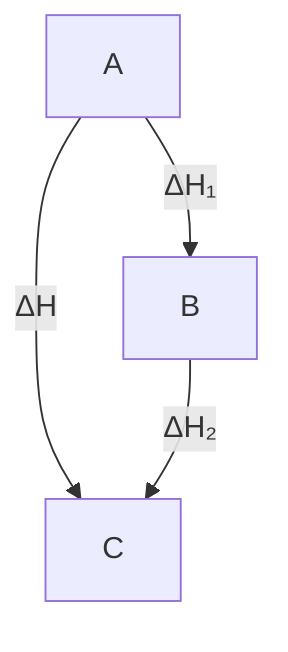

# 第七章、化学热力学

化学热力学的重要性不仅在于可以应用它的基本原理解释许多化学现象,而且还能依据这些原理去判断反应进行的方向,预测反应发生的可能性。在日常化学工作中,我们总会遇到这样或那样的实际问题,其中有许多是要借助热力学方法才能得到圆满解决。

# 一.系统与环境

我们用观察的、实验等方法进行科学研究时，必须先确定所要研究的对象，把一部分物质与其余的分开（其界面可以是实际的，也可以是想象的）。这种被划定的研究对象，就称为系统，而在系统以外与系统密切相关、且影响所能及的部分，则称为环境。

根据系统和环境之间的关系，可以把系统分为三类：

（1）孤立系统：系统完全不受环境的影响，和环境之间没有物质或能量的交换。  
（2）封闭系统：系统和环境之间没有物质的交换，但可以发生能量的交换。  
（3）敞开系统：系统不受任何限制，与环境之间可以有能量的交换，也可以有物质的交换。

# 二．状态与状态函数

处于热力学平衡态的体系,各部分的温度、压力相等,各相的组成的数量不随时间而变,所以热力学体系的状态是该体系一切物理和化学性质的综合表现。通常用系统的宏观可测性质如体积、压力、温度、黏度、表面张力等来描述系统的热力学状态,这些性质又称为热力学变量,在系统处于一定状态时其状态性质都有确定的值。可以把它们分为两类:

（1）广度性质：广度性质的数值与系统的物质的数量成正比，整个体系中的某广度性质数值是体系中各部分该性质数值的总和，具有加和性。例如体积、质量、熵等。  
（2）强度性质：此种性质不具有加和性，其数值取决于系统自身的特性，例如温度、压力、密度、黏度等。

# 过程和途径

在一定的环境条件下，系统发生由始态到终态的变化，称为过程。常见的变化过程有：

（1）等温过程：系统在变化过程中，始态和终态温度不变，且等于环境温度。  
（2）等压过程：系统在变化过程中，始态和终态压力相等，且等于环境压力。  
（3）等容过程：系统在变化过程中保持体积不变。在刚性容器中发生的变化一般是等容过程。  
（4）绝热过程：系统在变化过程中与环境间没有热的交换，或者是由于有绝热壁的存在，或者是因为变化太快而与环境间来不及热交换，或热交换能量极少可看作是绝热过程。  
（5）环状过程：系统从始态出发，经过一系列变化后又回到了原来状态。环状过程又称为循环过程，经此过程，体系所有状态函数的变化量都等于零，往往伴随着环境状态的变化。

系统由始态和终态的变化可以经由一个或多个不同的步骤来完成，这种具体的步骤则称为途径。状态函数的变化值仅决定于系统的始终态，而与采取哪些具体的变化步骤无关。

# 三、热力学第一定律

# 3.1 热和功

热力学体系在发生变化时,与环境就会有能量的交换。能量交换有两种方式:一种是“热”,一种是“功”。

热力学的研究方法是宏观的，他不考虑热的本质，给“热”下了如下的定义：由于体系和环境的温度差，而在系统与环境间交换或传递的能量就是热，用符号 Q 表示。并规定当系统吸热时，Q 取正值，即 Q > 0，系统放热时，Q 取负值，即 Q < 0。

在热力学里，把除热以外的其他各种形式被传递的能量叫做功。用符号 W 表示。在物理化学中常遇到的有膨胀功、电功和表面功等。当系统对环境作功时，W 取负值，即 W < 0；反之。系统从环境得到功时，W 取正值，即 W > 0。

功和热都是体系与环境之间被传递的能量，其值与变化的途径有关，所以它们不是体系的性质，不是状态函数。

# 3.2 热力学概论

焦耳大约在 1842 年左右建立了能量守恒定律，即热力学第一定律。开尔文和克劳修斯分别于 1848 年和 1850 年建立了热力学第二定律。这两个定律组成一个系统完整的热力学，是热力学的理论基础。之后，在 20 世纪初又建立了热力学第三定律和热力学第零定律，使热力学更加严密完整。

# 3.3 热平衡和热力学第零定律——温度的概念

温度概念的建立以及温度的测定都是以热平衡现象为基础。一个不受外界影响的系统，最终会达到平衡态，宏观上不再变化，并可以用一定的表示状态的状态参数或称为状态函数来描述它。两个系统分别和处于确定状态的第三个系统达到热平衡，则这两个系统彼此也将处于热平衡。这个热平衡的规律就称为热平衡定律或热力学第零定律。这个结论是大量实验事实的总结和概括，它不能由其他的定律或定义导出，也不能由逻辑推理导出。历史上，热力学第一定律和热力学第二定律在80年前已为公众所接受，为了表明在逻辑上这个定律应该排在最前面，所以称之为热力学第零定律。

温度的科学定义是由第零定律导出的。当两个系统接触时，描写系统性质的状态函数将自动调整变化，直到两个系统都达到平衡，这就意味着两个系统必定有一个共同的物理性质，表述这个共同的物理性质就是“温度”。简言之，即当两个系统相互接触达到热平衡后，它们的性质不再变化，它们就有共同的温度。

# 3.4 热力学第一定律

化学热力学中通常是研究没有特殊外力场存在的客观静止系统

系统的热力学能，又称内能用符号 U 表示，是热力学系统内所具有的各种能量之和，，包括分子及原子的动能、势能、核能、电子能等的能量总和，但不包括系统整体运动的动能以及系统在外场的势能。物质的内能由其所处的状态决定：物质处于一定状态，就具有一定的内能，状态发生改变，内能也随之改变。物质在经过一系列变化之后，如果又回到原来状态，则其内能也恢复为原值。决定物质状态的物理量称为“状态函数”。U 的绝对值是无法测定的，也不需要知道，我们只关心过程中的热力学能的变化量 $\Delta U$ 。

我们设想系统由状态 1 变到状态 2，根据能量守恒定律，若在过程中，系统与环境的热交换为 Q，与环境的功交换为 W，则系统热力学能的变化是：

$$
\Delta \mathrm{U} = \mathrm{U} _ {2} - \mathrm{U} _ {1} = \mathrm{Q} + \mathrm{W}
$$

上式就是热力学第一定律的数学表达形式，其实质就是能量守恒。热力学第一定律是建立热力学能函数的依据，它既说明了热力学能、热和功可以互相转化，又表述了它们转化时的定量关系，所以这个定律是能量守恒定律在热现象领域内所具有的特殊形式。

# 3.5 准静态过程与可逆过程

# 功与过程

![[12第七章基础热力学学生版_images/727a1b5cb6ea99cf9a0df07e6c29823b496b26c12513046addf92ba864d36bf1.jpg]]

line

| V     | p1V1  | p2V2 |
|-------|-------|------|
| V1    | p1    | p2   |
| V2    | p2    | p2   |

![[12第七章基础热力学学生版_images/7f0fca880bd8b906ede7aa66dd71e205570b9e56a4c25d7534a6da7a79044f5a.jpg]]

line

| Point | v     | p     |
|-------|-------|-------|
| Peak 1| V₁    | p₁V₁  |
| Peak 2| V₂    | p₂V₂  |
| Peak 3| V'    | pe'   |
| Peak 4| V'    | pe    |

![[12第七章基础热力学学生版_images/bd5cd5c3dc5a5faa5f76f5c8e73ab168a4568b4e2f0925d6e01abfbce4616afb.jpg]]

area

| v     | p1V1  | p2V2  |
|-------|-------|-------|
| V1    | High  | Low   |
| V2    | Low   | Low   |

![[12第七章基础热力学学生版_images/6cc80e6bd516c73fa1273a04aff4af97653e4f3cbc73362239a1c06684c5ef8c.jpg]]

text_image

p
p₁V₁
V₁
V₂
p₂V₂
(a')

![[12第七章基础热力学学生版_images/30fce348fa52f9c122961370bd8990de99ddcd4b4ed31a2358b1b6bc3e66695f.jpg]]

line

| Point | V     | p     |
|-------|-------|-------|
| Peak 1| V₁    | p₁V₁  |
| Peak 2| V'    | p'ₑ   |
| Peak 3| V₂    | p₂V₂  |

![[12第七章基础热力学学生版_images/fc2ceb6541c3c494142e9afdee8704fcb117e6a397a1d4c16a4a93924f5b15b1.jpg]]

area

| Point | Pressure (V) | Velocity (V) |
|-------|--------------|--------------|
| p1    | V1           | V1           |
| p2    | V2           | V2           |

4   
图 1 各种过程的膨胀功

热力学能只能由状态决定，而功却与变化的具体途径有关。以气体的膨胀为例：

# (1) 自由膨胀

若外压 $p_{e}$ 为 0，外界为真空，这种膨胀过程称为自由膨胀。由于 $p_{e}=0$ ，所以 W=0，即系统对外不做功。

# (2) 外压始终维持恒定

若外压 $p_{e}$ 保持恒定不变，从状态 1 膨胀到状态 2 所做的功为：

$$
\mathrm{W} = - \mathrm{p} _ {\mathrm{e}} (\mathrm{V} _ {2} - \mathrm{V} _ {1})
$$

# （3）多次等外压膨胀

若系统从状态 1 膨胀到状态 2 是由几个等外压膨胀过程所组成，如上图中的（b），设由两个等外压过程组成，整个过程所做的功为：

$$
\mathrm{W} = - \mathrm{p} _ {1} \Delta \mathrm{V} _ {1} - \mathrm{p} _ {2} \Delta \mathrm{V} _ {2}
$$

（4）外压 $p_{e}$ 总是比内压 $p_{i}$ 小一个无限小的膨胀，即不断地调整外压，始终使外压保持小于内压 $p_{i}$ ，且相差无限小，其作功为：

$$
W _ {e} = - \sum p _ {e} d V = - \sum (p _ {i} - d p) d V
$$

略去二级无限小 dpdV，即可用 $p_{i}$ 近似代替 $p_{e}$ ，若气体为理想气体且温度恒定，则：

$$
W _ {e} = - \int_ {V _ {1}} ^ {V _ {2}} p _ {i} d V = - \int_ {V _ {1}} ^ {V _ {2}} \frac {n R T}{V} d V = - n R T l n \frac {V _ {2}}{V _ {1}}
$$

显然，这样的膨胀，系统作功最大。

# 3.5.1 准静态过程

在一个过程的进行的每一瞬间，系统都接近于平衡状态，整个过程可以看成是由一系列接近于平衡的状态所构成，这种过程称为准静态过程。准静态过程是一种理想的过程，实际上是办不到的。因为一个过程必定引起状态的变化，而状态的改变一定破坏平衡。但当一个过程进行得非常非常慢，速度趋于零时，这个过程就趋于准静态过程。

# 3.5.2 可逆过程

在热力学中有一种极重要的过程，称为可逆过程。某一系统经过某一过程，由状态1变到状态2之后，如果能使系统和环境都完全复原（即系统回到原来的状态，同时消除了原来过程对环境所产生的一切影响，环境也复原），则这样的过程就称为可逆过程。反之，如果用任何方法都不可能使系统和环境完全复原，则称为不可逆过程。

对准静态膨胀和准静态压缩过程来说，如果把体系膨胀过程中环境所得到的功储存起来，再用于压缩过程恰好可使系统复原，过程中没有耗散能量情况的出现，所以说这两种情况都是可逆过程。在可逆膨胀过程中系统做的功最大，而是系统复原的可逆压缩过程中环境做的功最小。可逆过程是效率最高的过程。

总结起来，可逆过程有下面几个特点：

（1）可逆过程是以无限小的变化进行的，整个过程是由一连串非常接近于平衡态的状态所构成。  
（2）在反向的过程中，用同样的方法，循着原来过程的逆过程，可以使系统和环境都完全恢复到原来的状态，而无任何耗散效应。  
（3）在等温可逆膨胀过程中系统对环境做最大功，在等温可逆压缩过程中环境对系统做最小功。

# 四．热化学

化学变化常伴有放热和吸热现象,对于这些热效应进行精密的测定,并作较详尽的讨论,称为物理化学的一个分支称为热化学,目的在于计算物理和化学反应过程中的热效应。

# 4.1 热容

对没有相变和化学变化且不作非膨胀功的均相封闭系统，热容的定义是：系统升高单位热力学温度时所吸收的热，用符号 C 表示，单位是 $J \cdot K^{-1}$ 。

# 4.2 反应热的测量

不少化学反应的热效应是可以直接测量的。测量反应热的仪器统称为量热计。其中最简单的一种就是“保温杯式”量热计。这种仪器由保温和测温两部分组成。保温的目的是不让反应热散失出去，也不让外界的热传递进来，即保证反应过程与外界不发生热的交换。为了准确测量温度变化，需要使用比较精确的温度计，至少是具有0.1℃刻度的温度计，这种温度计借助放大镜可以读出0.01℃的温度变化。利用这种简单的仪器装置便可以测量中和热、溶解热以及其他溶液反应的热效应。如取一定量已知浓度的稀盐酸置于保温瓶中，另取一份已知浓度的稀氢氧化钠溶液于烧杯中，待酸、碱两份溶液温度恒定并相等时，将碱溶液迅速倒入保温瓶中，盖紧瓶帽并适度搅拌，由于HCl和NaOH的中和反应发热而使溶液温度升高，记录此刻的温度的变化。由温度升高值可以计算反应过程的热效应。反应所放热量Q应该等于量热计和反应后溶液升温所需的能量：

$$
Q = c V \rho \Delta t + C \Delta t = (c V \rho + C) \Delta t
$$

式中 $\Delta t$ 是溶液温度升高值，c 是溶液的比热，V 是反应后溶液的总体积， $\rho$ 是溶液的密度，C 叫做量热计常数，它代表量热计各部件热容量之总和，即量热计每升高 $1^{\circ}C$ 所需的热量。

这种实验方法的设备和操作都很简便，适用于一般溶液反应的热效应测定。它的缺点是不够精确：刻度为 $0.1^{\circ}C$ 的温度计，只能读出 $0.01^{\circ}C$ ；换用能读出 $0.001^{\circ}C$ 温度差的精密温度计，其结果，当然可以更加精确一些，但由于搅拌过程摩擦生热以及保温杯绝热不佳等因素都会产生实验误差。这类量热计法所测定的反应热都是在恒压条件下的热效应，为便于区别，我们用符号 $Q_{p}$ 代表恒压热效应。

![[12第七章基础热力学学生版_images/ac09088b0d6bf4d4a48de43fbef688eb9d17b74d3595ac162f7b73d3ab292910.jpg]]

text_image

水夹套温度计
恒温水夹套
档板
底水桶
贝克曼温度计
氧弹
搅拌器

![[12第七章基础热力学学生版_images/b5a6ce2d1c6578b62fba09c759cca3bc3bed3b8c85ea1ab833657c98071fb82d.jpg]]

text_image

出气管道
电极
进气管操作电极
弹盖
弹体
引燃铁丝
金属小皿
样品片

图 2 弹式量热器示意图

另一种常见的量热计叫“弹式量热计”。化学反应在一个可以完全密封的厚壁钢制容器内进行，该容器的形状像小炸弹，所以叫“钢弹”。这种量热计适用于测定燃烧热。在实验进行前必须向钢弹中通入一定量燃烧反应所需的高压氧气，所以也叫“氧弹”。钢弹是密闭容器，反应过程中总体积可认为是不变的，这样测定的热效应是恒容反应热 $Q_{v}$ 。

# 4.3 焓与焓变

设系统在变化过程中只做膨胀功而不做其他功， $U=Q+W_{e}$ 。因为本部分讨论的问题均不包括其他功，所以习惯上仍将膨胀功写为 W，即：

$$
U = Q + W
$$

如果系统的变化是等容过程，则 $\Delta V=0$ , 因此, W=0, 所以:

$$
\Delta U = Q _ {v}
$$

如果系统变化是等压过程,即 $p_{2}=p_{1}=p_{e}=p$ ,

$$
U _ {I} - U _ {2} = Q _ {p} - p \left(V _ {2} - V _ {1}\right)
$$

$$
Q _ {p} = \left(U _ {2} + p V _ {2}\right) - \left(U _ {1} + p V _ {1}\right)
$$

将 $(\mathrm{U} + \mathrm{pV})$ 合并起来考虑，则其数值也应只由系统的状态决定。在热力学上把 $(\mathrm{U} + \mathrm{pV})$ 定义为焓，并用符号H表示。

焓的定义式:

$$
\mathrm{H} = \mathrm{U} + \mathrm{pV}
$$

需要注意的是。焓是状态函数，具有能量的单位，但是没有确切的物理意义。它的含义是由上式定义的，但是不能把它误解为是“系统中所含的热量”。

当系统在等压条件下，从状态 1 变到状态 2 时，根据定义式可得：

$$
\Delta H = H _ {2} - H _ {1} = \left(U _ {2} + p V _ {2}\right) - \left(U _ {1} + p V _ {1}\right) = Q _ {p}
$$

在没有其他功的条件下，系统在等容过程中所吸收的热全部用以增加热力学能，系统在等压过程中所吸收的热，全部用于是焓增加。由于一般的化学反应大都是在等压下进行的，所以焓更有实用价值。

决定物质状态的物理量称为“状态函数”。焓 H 是一种与内能有联系的物理量，它也是一种状态函数。一个化学反应是吸热还是放热，在特定条件下是由生成物和反应物焓值之差所决定，即：

$$
\sum H _ {\text {生成物}} - \sum H _ {\text {反应物}} = \Delta H
$$

$\Delta H$ 叫做焓变，按热力学定义它等于恒压反应热。

# 4.4 Hess 定律

实验证明，不管化学反应是一步反应完成的，还是分几步完成的，该反应的热效应应相同。换言之，即反应的热效应只与起始状态和终了状态有关，而与变化的途径无关，这就是Hess定律，又称热能加和定律。根据Hess定律，热化学方程式可以互相加减，因此，可以根据一些已知的化学反应的热效应间接推求其他的反应的热效应。

![[12第七章基础热力学学生版_images/4223a79757fc722cbdcd372b09a978f84688da39f2138ada031d256fbb927670.jpg]]

flowchart

图中从 A 直接到 C 这一过程的热效应等于从 A 到 B 再到 C 两个过程的热效应之和。即：

$$
\Delta \mathrm{H} _ {1} + \Delta \mathrm{H} _ {2} = \Delta \mathrm{H} _ {\mathrm{AC}}
$$

Hess 定律:化学反应的反应热,只与反应体系的始态和终态有关与反应途径无关。

# 4.5 热化学方程式

表示反应热效应的化学方程式，叫做热化学方程式。

$$
\mathrm{H} _ {2} (\mathrm{g}) + \frac {1}{2} \mathrm{O} _ {2} (\mathrm{g}) = \mathrm{H} _ {2} \mathrm{O} (1); \quad \Delta_ {r} H _ {m} ^ {\theta} (2 9 8 \mathrm{K}) = - 2 8 6 \mathrm{kJ} \cdot \mathrm{mol} ^ {- 1}
$$

$$
\text {或} \frac {1}{2} N _ {2} (g) + O _ {2} (g) \rightarrow N O _ {2} (g); \Delta_ {r} H _ {m} ^ {\theta} (2 9 8 \mathrm{K}) = + 3 3 \mathrm{kJ} \cdot \mathrm{mol} ^ {- 1}
$$

在 $\Delta_{r}H_{m}^{\theta}(298\mathrm{K})$ 中，r 表示化学反应（reaction）；m 代表摩尔（mol），即 1 mol 反应，是把化学反应看成一个整体单位。 $\Theta$ 表示热力学标准状态（简称标态），气态物质的标态是处于 $1*10^{5}\mathrm{Pa}(1\mathrm{bar})$ ，符号 $p^{\theta}$ ；稀溶液的标态则指溶质有效浓度为 1 mol/L；液体和固体的标态则指处于标准压强下的纯物质。最常用的焓变是 $\Delta_{r}H_{m}^{\theta}(298\mathrm{K})$ ，严格的说，焓变值是随温度变化的，但在一定温度范围内变化不大，我们可以近似认为在一般温度范围内 $\Delta_{r}H_{m}^{\theta}$ 与 298 K 的 $\Delta_{r}H_{m}^{\theta}$ 相等，凡未注明温度的 $\Delta_{r}H_{m}^{\theta}$ 就代表在 298 K 及标态时的焓变，也可以简写 $\Delta H^{\theta}$ 。

书写热化学方程式时，要把一切影响热值的因素都考虑在内：

(1)需注明反应的温度和压强；因反应的温度和压强不同时，其 $\Delta H$ 不同。不注明的指101 kPa和25℃时的数据。

(2)要注明反应物和生成物聚集状态、同分异构体。

如 1 mol 氢气在空气或氧气中燃烧生成液态水时放出 285.8 kJ 的热量，可用热化学方程式表示为:

$$
\mathrm{H} _ {2} (\mathrm{g}) + \frac {1}{2} \mathrm{O} _ {2} (\mathrm{g}) = \mathrm{H} _ {2} \mathrm{O} (1); \quad \Delta_ {r} H _ {m} ^ {\theta} (2 9 8 \mathrm{K}) = - 2 8 5. 8 \mathrm{kJ} \cdot \mathrm{mol} ^ {- 1}
$$

而1 mol氢气在空气或氧气中燃烧生成气态水时放出241.8 kJ的热量，其热化学方程式为：

$$
\mathrm{H} _ {2} (\mathrm{g}) + \frac {1}{2} \mathrm{O} _ {2} (\mathrm{g}) = \mathrm{H} _ {2} \mathrm{O} (g); \quad \Delta_ {r} H _ {m} ^ {\theta} (2 9 8 \mathrm{K}) = - 2 4 1. 8 \mathrm{kJ} \cdot \mathrm{mol} ^ {- 1}
$$

(3)热化学方程式各物质前的化学计量数不表示分子个数，表示物质的量，它可以是整数也可以是分数。  
(4) $\Delta H$ 的单位kJ/mol，表示每mol反应所吸放热量， $\Delta H$ 和相应的计量数要对应。

$$
\mathrm{H} _ {2} (\mathrm{g}) + \frac {1}{2} \mathrm{O} _ {2} (\mathrm{g}) = \mathrm{H} _ {2} \mathrm{O} (g); \quad \Delta_ {r} H _ {m} ^ {\theta} (2 9 8 \mathrm{K}) = - 2 4 1. 8 \mathrm{kJ} \cdot \mathrm{mol} ^ {- 1}
$$

$$
2 \mathrm{H} _ {2} (\mathrm{g}) + \mathrm{O} _ {2} (\mathrm{g}) = 2 \mathrm{H} _ {2} \mathrm{O} (g); \quad \Delta_ {r} H _ {m} ^ {\theta} (2 9 8 \mathrm{K}) = - 4 8 3. 6 \mathrm{kJ} \cdot \mathrm{mol} ^ {- 1}
$$

(5)比较 $\Delta H$ 大小时要带着“+”“-”进行比较。

(6)可逆反应 $\mathrm{N}_{2}\left(\mathrm{g}\right)+3\mathrm{H}_{2}\left(\mathrm{g}\right)=2\mathrm{NH}_{3}\left(\mathrm{g}\right)$ ; $\Delta_{r}H_{m}^{\theta}(298\mathrm{K})=-92.4\mathrm{kJ}\cdot\mathrm{mol}^{-1}$ ，是指 $1\ mol\ N_{2}$ 和 $3\ mol\ H_{2}$ 完全反应放出的热量；逆反应的热量和正反应的热量数值相等，但符号相反。

# 4.6 几种反应热

# 中和热

中和热是指在稀溶液中，酸跟碱发生中和反应生成 $1 \, mol \, H_{2}O(l)$ 时的反应热。

$$
\mathrm{H} ^ {+} (\mathrm{aq}) + \mathrm{OH} ^ {-} (\mathrm{aq}) = \mathrm{H} _ {2} \mathrm{O} (\mathrm{l}) \quad \Delta \mathrm{H} = - 5 7. 3 \mathrm{kJ/mol}
$$

强酸与强碱的稀溶液中和生成 1 mol 水时，都放出 57.3 kJ 热量。若有弱碱或弱酸，所放出的中和热一般都低于 57.3 kJ/mol。因为弱酸、弱碱的电离是吸热的。

中和反应的实质是 $H^{+}$ 和 $OH^{-}$ 结合生成 $H_{2}O$ ，若反应过程中有其它热效应，如物质生成（不溶性物质或其他难电离的物质等），物质的溶解、稀释等，则将这些热效应扣除。

# 燃烧热

101 kPa 时，1 mol 纯物质完全燃烧所放出的热量，叫做该物质的燃烧热，单位为 kJ/mol。对应的在标态和 T（K）条件下的燃烧热叫做标准摩尔燃烧焓，符号为 $\Delta_{c}H_{m}^{\theta}$ 。例如，实验测得在 25℃、101 kPa 时，1 mol CH₄ 完全燃烧放出 890.31 kJ 的热量，就是 CH₄ 在 298K 下的燃烧热。

$$
\mathrm{CH} _ {4} (\mathrm{g}) + 2 \mathrm{O} _ {2} (\mathrm{g}) = \mathrm{CO} _ {2} (\mathrm{g}) + 2 \mathrm{H} _ {2} \mathrm{O} (1); \quad \Delta_ {c} H _ {m} ^ {\theta} (2 9 8 \mathrm{K}) = - 8 9 0. 3 1 \mathrm{kJ} \cdot \mathrm{mol} ^ {- 1}
$$

（1）燃烧热是以 1 mol 物质完全燃烧所放出的热量来定义的，因此在书写燃烧的热化学方程式时，一般以燃烧 1 mol 可燃物为标准来配平其余物质的化学计量数  
(2) 燃烧产物指定, 如 $\mathrm{C}-\mathrm{CO}_{2}(\mathrm{~g})$ 、 $\mathrm{H}-\mathrm{H}_{2} \mathrm{O}(\mathrm{l})$ 、 $\mathrm{S}-\mathrm{SO}_{2}(\mathrm{~g})$ 、 $\mathrm{N}-\mathrm{N}_{2}(\mathrm{~g})$ 等, 是不能再燃烧、状态稳定的物质。

# 生成热

由稳定单质生成 1 mol 化合物时放出或吸收的热量称为该化合物的生成热。在标态和 T（K）条件下由稳定态单质生成 1 mol 化合物（或不稳定态单质或其他形式的物种）的焓变叫做该物质在 T（K）时的标准摩尔生成焓，符号是 $\Delta_{f}H_{m}^{\theta}(T)$ ，简称生成焓。

例如，在 298K

$$
\mathrm{C} (\text {石墨}) + \mathrm{O} _ {2} (\mathrm{g}) \rightarrow \mathrm{CO} _ {2} (\mathrm{g}); \Delta_ {r} H _ {m} ^ {\theta} = - 3 9 4 \mathrm{kJ/mol}
$$

C（石墨）和 $\mathrm{O}_{2}(\mathrm{~g})$ 都是稳定的单质，它们化合生成 $1\ \mathrm{mol}\mathrm{CO}_{2}(\mathrm{~g})$ 时的标准反应焓变是 -394 kJ/mol，所以 $CO_{2}$ 的标准生成焓 $\Delta_{f}H_{m}^{\theta}(298K)=-394\ \mathrm{kJ/mol}$ 。

按生成焓定义可知，稳定态单质的 $\Delta_{f}H_{m}^{\theta}$ 都等于零。一种元素所有几种结构性质不同的单质，如石墨和金刚石是碳的两种单质，则石墨是稳定的单质 $\Delta_{f}H_{m}^{\theta}=0$ ，金刚石不是， $\Delta_{f}H_{m}^{\theta}=+1.9\ \mathrm{kJ/mol}$ 。磷是特例，有红磷和白磷之分，白磷的 $\Delta_{f}H_{m}^{\theta}=0$ ，红磷的 $\Delta_{f}H_{m}^{\theta}=-17.6\ \mathrm{kJ/mol}$ 。总之，生成焓并非另一个新概念，而只是一种特定的 $\Delta H$ 。

# 键焓

键焓是指在温度 T 与标准压力时，气态分子断开 1mol 化学键的焓变。

$$
\mathrm{F} _ {2} (\mathrm{g}) \rightarrow 2 \mathrm{F} (\mathrm{g}); \quad \Delta H ^ {\theta} = + 1 5 9 \mathrm{kJ/mol}
$$

$$
\mathrm{HF(g)} \rightarrow \mathrm {F(g) + H(g)}; \Delta H ^ {\theta} = + 5 7 0 \mathrm{kJ/mol}
$$

键焓越大，表示要断开这种键时需吸收的热量越多，即原子间结合力越强；反之，键焓越小，即原子间结合力越弱。相比之下，上述两种双原子分子的化学键之中 H-F 键最强，F-F 键最弱。 $F_{2}$ 在 $1000^{\circ}C$ 左右就有明显分解，而 HF 在 $5000^{\circ}C$ 仍无明显分解。

不同化合物中同一化学键的键能未必相同，而且反应物及生成物的状态也未必能满足定义键能时的反应条件。因而由键能求得的反应热不能代替精确的热力学计算和反应热的测量，但可以进行估算。

# 4.7 Hess 定律的一些简单计算

根据 Hess 定律，热化学方程式可以互相加减，因此，可以根据一些已知的化学反应的热效应间接推求其他的反应的热效应。

如果参加反应的反应物和生成物的标准摩尔生成焓都是已知的,可以用它来计算反应热。

如果参加反应的反应物和生成物的标准摩尔燃烧焓都是已知的,可以用它来计算反应热。

# 五.热力学第二定律

人们在生活和生产实践中遇到许许多多只能自动向单方向进行的过程，它们的共同特性就是不可逆性。总之，一切实际过程都是热力学的不可逆过程。人们又发现这些不可逆过程都是相互关联的。从某一个自发过程的不可逆可以推断到另一个自发过程的不可逆。人们逐渐总结出反映同一客观规律的简便说法，即用某种不可逆过程来概括其他不可逆过程，这样一个普遍原理就是热力学第二定律。这里举出热力学第二定律的两种典型说法。

克劳修斯的说法：不可能把热从低温物体传到高温物体，而不引起其他变化。

开尔文的说法：不可能从单一热源取出热使之完全变为功，而不发生其他的变化。

# 5.1 熵的概念

热力学第二定律指出,凡是自发过程都是不可逆的，而且一切不可逆过程都可以与热功交换的不可逆相联系。热是分子混乱运动的一种表现。因为分子互撞的结果，混乱的程度只会增加，直到混乱度达到最大限度为止。一切不可逆过程都是向混乱度增加的方向进行，而熵函数则可以作为系统混乱度的一种度量。热力学中将热温商这一值定义为熵，熵具有状态函数的特点，用符号 S 表示，单位为 $J \cdot K^{-1}$ 。

当始终态一定时， $\Delta S$ 有定值，它的数值可由可逆过程的热温商来求得。熵是状态函数，只决定于始态和终态，与是否可逆或不可逆途径无关。

$$
\mathrm{Q} _ {\text { rev }} = \mathrm{T} \Delta \mathrm{S}
$$

# 熵增加原理

一个封闭体系从一个平衡态出发，经过绝热过程到达另一个平衡态，它的熵不减少。

孤立体系的熵值永不减少。

# 5.2 Gibbs 自由能

在等温、等压条件下，一个封闭系统所能做的最大非膨胀功等于其 Gibbs 自由能的减少。

Gibbs 自由能的定义式为:

$$
\mathrm{G} = \mathrm{H} - \mathrm{TS}
$$

$$
\Delta \mathrm{G} = \Delta \mathrm{H} - \mathrm{T} \Delta \mathrm{S}
$$

$\Delta G$ 可以用来判断反应是否能够自发发生，当 $\Delta G < 0$ ，反应自发；当 $\Delta G > 0$ ，反应不自发；当 $\Delta G = 0$ ，反应处于可逆平衡状态。

标准 Gibbs 自由能：指在标态与温度 T 条件下，由稳定单质生成 1mol 化合物（或非稳定态单质或其他形式的物质）时的 Gibbs 自由能变化。

在等温、等压的可逆电池反应中，非体积功即为电功，故：

$$
\Delta_ {\mathrm{r}} \mathrm{G} = - \mathrm{nEF}
$$

E 是可逆电池的电动势，n 是电池反应式中电子的物质的量，F 是法拉第常数。

# 5.3 热力学第三定律

1902 年，理查德在研究低温下电池反应的 $\Delta H$ 和 $\Delta G$ 与温度的关系中发现，在温度逐渐降低时， $\Delta H$ 和 $\Delta G$ 有逐渐趋于相等的趋势。1906 年，能斯特提出一个假定：当温度趋于 0K 时，在等温过程中凝聚态反应系统的熵不变，即 $\Delta S=0$ 。1912 年，普朗克把热定理推进了一步，他假定 0K 时，纯凝聚态的熵值为 0。1920 年，路易斯和吉普逊对前一说法进行了重新界定，指出该假定适用于完整晶体。至此，热力学第三定律可以表示为：0K 时，任何完整晶体的熵等于零。

# 课后习题

1. 下图中，表示吸热反应的是（）

![[12第七章基础热力学学生版_images/c8bc470d698e9d495e4736091cf3d8aadbb1fafa614ce2e9b7defbea1b49c579.jpg]]

line

| 反应过程 | 能量 |
| -------- | ---- |
| 后态     | 0    |
| 生态     | 最高 |

![[12第七章基础热力学学生版_images/77e97f9f8dfae88e389b52df26a63bfbab65fde5933bf90492a1a0a501e10096.jpg]]

text_image

能量
反应物
生成物
O
反应过程

A

![[12第七章基础热力学学生版_images/1d88f4af9e8309f7e13f2e1903036a1d93cffa9b2c8b77ccc5365ecdaed9793f.jpg]]

line

| 反应过程 | 能量 |
| -------- | ---- |
| 反应物   | 0    |
| 生成物   | 0    |

B

![[12第七章基础热力学学生版_images/1fe6910b7fbb6584ed9ac83518ae242c938a5c0f46131580879dd455d1e261cd.jpg]]

line

| 反应过程 | 能量 |
| -------- | ---- |
| 0        | 能量 |
| 0.5      | 0    |

C

D

2. 在一定条件下 A 与 B 反应可生成 C 和 D，其能量变化如下图

![[12第七章基础热力学学生版_images/6cac94ade813c94abc7333bd0724c030baf2250ddcc5323ab2f99cd4ee34eebd.jpg]]

flowchart

体系（反应前）  
体系（反应后）

(1)若 $E_{1} > E_{2}$ , 反应体系的总能量 (填“升高”、“降低”) , 为 (填“吸热”、“放热”) 反应, 其原因是  
(2)若 $E_{1} < E_{2}$ , 反应体系的总能量 (填“升高”、“降低”) $\underline{\hspace{2cm}}$ , 为 $\underline{\hspace{2cm}}$ (填“吸热”、“放热”) 反应, 其原因是 $\underline{\hspace{2cm}}$ 。

3.对于放热反应 $2H_{2}+O_{2}\xlongequal{点燃}2H_{2}O$ ，下列说法中正确的是（）

A. 产物 $\mathrm{H}_{2} \mathrm{O}$ 所具有的总能量高于反应物 $\mathrm{H}_{2}$ 和 $\mathrm{O}_{2}$ 所具有的总能量  
B. 反应物 $\mathrm{H}_{2}$ 和 $\mathrm{O}_{2}$ 所具有的总能量高于产物 $\mathrm{H}_{2} \mathrm{O}$ 所具有的总能量  
C. 反应物 $\mathrm{H}_{2}$ 和 $\mathrm{O}_{2}$ 所具有的总能量等于产物 $\mathrm{H}_{2} \mathrm{O}$ 所具有的总能量  
D. 反应物 $H_{2}$ 和 $O_{2}$ 具有的能量相等

4. 在相同温度和压强下，将 32g 硫分别在纯氧和空气中完全燃烧，设前者放热为 $Q_{1}$ ，后者放热为 $Q_{2}$ ，则关于 $Q_{1}$ 和 $Q_{2}$ 的相对大小正确的是（）

A. $Q_{1}=Q_{2}$

B. $Q_{1} > Q_{2}$

C. $Q_{1} < Q_{2}$

D. 无法判断

5. 已知

$$
\mathrm{C} _ {3} \mathrm{H} _ {8} (\mathrm{g}) + 5 \mathrm{O} _ {2} (\mathrm{g}) = = = 3 \mathrm{CO} _ {2} (\mathrm{g}) + 4 \mathrm{H} _ {2} \mathrm{O} (1) \quad \Delta H _ {1}
$$

$$
\mathrm{H} _ {2} \mathrm{O} (1) = \mathrm{H} _ {2} \mathrm{O} (\mathrm{g}) \quad \Delta H _ {2}
$$

$$
\mathrm{C} _ {3} \mathrm{H} _ {8} (\mathrm{g}) + 5 \mathrm{O} _ {2} (\mathrm{g}) = = = 3 \mathrm{CO} _ {2} (\mathrm{g}) + 4 \mathrm{H} _ {2} \mathrm{O} (\mathrm{g}) \quad \Delta H _ {3}
$$

则 $\triangle H_{3}$ 与 $\triangle H_{1}$ 和 $\triangle H_{2}$ 间的关系正确的是( )

A. $\triangle H_{3} = \triangle H_{1} + 4\triangle H_{2}$

B. $\triangle H_{3} = \triangle H_{1} + \triangle H_{2}$

C. $\triangle H_{3} = \triangle H_{1} - 4\triangle H_{2}$

D. $\triangle H_{3} = \triangle H_{1} - \triangle H_{2}$

6. 已知:

$$
\mathrm{TiO} _ {2} (\mathrm{s}) + 2 \mathrm{Cl} _ {2} (\mathrm{g}) = \mathrm{TiCl} _ {4} (\mathrm{l}) + \mathrm{O} _ {2} (\mathrm{g}) \Delta \mathrm{H} _ {1} = + 1 4 0 \mathrm{kJ/mol}
$$

$$
2 \mathrm{C} (\mathrm{s}) + \mathrm{O} _ {2} (\mathrm{g}) = 2 \mathrm{CO} (\mathrm{g}) \quad \Delta \mathrm{H} _ {2} = - 2 2 1 \mathrm{kJ/mol}
$$

写出 $TiO_{2}$ 和焦炭、氧气反应生成液态 $TiCl_{4}$ 和 CO 气体的热化学方程式。

7. 已知 $25^{\circ}$ C、101kPa 条件下：

① $4\mathrm{Al(s)}+3\mathrm{O}_{2}(\mathrm{g})==2\mathrm{Al}_{2}\mathrm{O}_{3}(\mathrm{s})$ $\Delta H=-2834.9\ kJ/mol;$

② $4\mathrm{Al(s)+2O_{3}(g)==2Al_{2}O_{3}(s)}$ $\Delta H=-3119.1\ kJ/mol$

由此得出的正确结论是( )

A. 等质量的 $\mathrm{O}_2$ 比 $\mathrm{O}_3$ 的能量低, 由 $\mathrm{O}_2$ 变 $\mathrm{O}_3$ 为吸热反应

B. 等质量的 $\mathrm{O}_2$ 比 $\mathrm{O}_3$ 的能量高, 由 $\mathrm{O}_2$ 变 $\mathrm{O}_3$ 为放热反应

C. $O_{2}$ 比 $O_{3}$ 稳定， $3O_{2}(g)=2O_{3}(g)$ $\Delta H=-284.2\ kJ/mol$

D. $O_{2}$ 比 $O_{3}$ 稳定， $3O_{2}(g)=2O_{3}(g)$ $\Delta H=+284.2\ kJ/mol$

8. 强酸与强碱稀溶液发生中和反应的热效应, $\mathrm{H}^{+}(\mathrm{aq}) + \mathrm{OH}^{-}(\mathrm{aq}) == \mathrm{H}_{2} \mathrm{O}(\mathrm{l})$ ; $\Delta H = -57.3 \mathrm{~kJ/mol}$ 。向 $1 \mathrm{~L} 0.5 \mathrm{~mol} / \mathrm{L}$ 的 NaOH 溶液中加入稀醋酸、浓硫酸、稀硝酸, 则恰好完全反应时的热效应依次为 $\Delta H_{1}$ 、 $\Delta H_{2}$ 、 $\Delta H_{3}$ , 它们之间关系正确的是( )

A. $\Delta H_{1} > \Delta H_{2} > \Delta H_{3}$

B. $\Delta H_{1} <   \Delta H_{3} <   \Delta H_{2}$

C. $\Delta H_{2} > \Delta H_{1} > \Delta H_{3}$

D. $\Delta H_{1} > \Delta H_{3} > \Delta H_{2}$

9. 秤取 $160 \, g \, CuSO_{4}$ （ $160 \, g/mol$ ）和 $250 \, g \, CuSO_{4} \cdot 5H_{2}O$ ( $250 \, g/mol$ ) 分别溶于水时，前者释热 $66 \, kJ/mol$ ，后者吸热 $11 \, kJ/mol$ 。则

$CuSO_{4}(s)+5H_{2}O(l)=CuSO_{4}\cdot5H_{2}O(s)$ 的热效应是（）

A. 释热 $77 \mathrm{~kJ} / \mathrm{mol}$

B. 释热 $55 \mathrm{~kJ} / \mathrm{mol}$

C. 吸热 77 kJ/mol

D. 吸热 55 kJ/molp

10.下列热化学方程式或离子方程式中，正确的是：（）

A．甲烷的燃烧热为 $\Delta H=-890.3kJ\cdot mol^{-1}$ ，则甲烷燃烧的热化学方程式可表示为：

$$
\mathrm{CH} _ {4} (\mathrm{g}) + 2 \mathrm{O} _ {2} (\mathrm{g}) = \mathrm{CO} _ {2} (\mathrm{g}) + 2 \mathrm{H} _ {2} \mathrm{O} (\mathrm{g}) \quad \Delta \mathrm{H} = - 8 9 0. 3 \mathrm{kJ} \cdot \mathrm{mol} ^ {- 1}
$$

B. 500°C、30MPa 下，将 $0.5 \, mol \, N_{2}$ 和 $1.5 \, mol \, H_{2}$ 置于密闭的容器中充分反应生成 $\mathrm{NH}_{3}(\mathrm{~g})$ ，放热 19.3kJ，其热化学方程式为：

$$
\mathrm{N} _ {2} (\mathrm{g}) + 3 \mathrm{H} _ {2} (\mathrm{g}) \xrightarrow [ 5 0 0 ^ {\circ} \mathrm{C} 3 0 \mathrm{MPa} ]{\text {催化剂}} 2 \mathrm{NH} _ {3} (\mathrm{g}) \quad \triangle \mathrm{H} = - 3 8. 6 \mathrm{kJ/mol}
$$

C. 氯化镁溶液与氨水反应 $\mathrm{Mg}^{2+} + 2\mathrm{NH}_{3} \cdot \mathrm{H}_{2}\mathrm{O} = \mathrm{Mg(OH)}_{2} \downarrow + 2\mathrm{NH}_{4}^{+}$

D. 氧化铝溶于 $\mathrm{NaOH}$ 溶液: $\mathrm{Al}_{2} \mathrm{O}_{3} + 2 \mathrm{OH}^{-} + 3 \mathrm{H}_{2} \mathrm{O} = 2 \mathrm{Al(OH)}_{3}$

11.化学反应 $N_{2}+3H_{2}=2NH_{3}$ 的能量变化如图所示，该反应的热化学方程式是()

![[12第七章基础热力学学生版_images/bc1e2fc15a68bf030a22bcbdef85d26fe597c482881f71e105549b87de6ce2c8.jpg]]

chemical

Energy level diagram showing energy splitting and splitting of ammonia species with energy values in kJ

A. $\mathrm{N}_2(\mathrm{g}) + 3\mathrm{H}_2(\mathrm{g}) = 2\mathrm{NH}_3(1)$ $\Delta \mathrm{H} = 2(\mathrm{a - b - c})\mathrm{kJ}\cdot \mathrm{mol}^{-1}$   
B. $\mathrm{N}_2(\mathrm{g}) + 3\mathrm{H}_2(\mathrm{g}) = 2\mathrm{NH}_3(\mathrm{g})$ $\Delta \mathrm{H} = 2(\mathrm{b - a})\mathrm{kJ}\cdot \mathrm{mol}^{-1}$   
C. $\frac{1}{2}\mathrm{N}_2(\mathrm{g}) + \frac{3}{2}\mathrm{H}_2(\mathrm{g}) = \mathrm{NH}_3(1)$ $\Delta \mathrm{H} = (\mathbf{b} + \mathbf{c - a})\mathrm{kJ}\cdot \mathrm{mol}^{-1}$   
D. $\frac{1}{2}\mathrm{N}_2(\mathrm{g}) + \frac{3}{2}\mathrm{H}_2(\mathrm{g}) = \mathrm{NH}_3(\mathrm{g})$ $\Delta \mathrm{H} = (\mathrm{a} + \mathrm{b})\mathrm{kJ}\cdot \mathrm{mol}^{-1}$

12.在微生物作用的条件下， $NH_{4}^{+}$ 经过两步反应被氧化成 $NO_{3}^{-}$ 。两步反应的能量变化示意图如下：

![[12第七章基础热力学学生版_images/7d456f748e070beecb43a934198536c7468d3b12f98a19539df8576ae4fe0f6e.jpg]]

line

| 反应过程 | 能量 (g) |
| -------- | -------- |
| ΔH       | -273     |

![[12第七章基础热力学学生版_images/2f19168927b57e6d0fad1bbf199a8722fe7285dce5fcbc4cdc16b8dcc4246745.jpg]]

line

| 反应过程 (第二步反应) | 能量 (kJ/mol) |
| --------------------- | ------------- |
| NO₂⁻ (aq) + 0.5O₂ (g) | Not labeled |
| NO₃ (aq)             | Not labeled |

① 第一步反应是\_\_\_\_反应（选填“放热”或“吸热”），判断依据是：  
② 1 mol $NH_{4}^{+}$ （aq）全部氧化成 $NO_{3}^{-}(aq)$ 的热化学方程式是

13.已知下列热化学方程式

$$
\mathrm{Fe} _ {2} \mathrm{O} _ {3} (\mathrm{s}) + 3 \mathrm{CO} (\mathrm{g}) \rightarrow 2 \mathrm{Fe} (\mathrm{s}) + 3 \mathrm{CO} _ {2} (\mathrm{g}) \quad \Delta H _ {1} ^ {\mathrm{e}} = - 2 7. 5 9 \mathrm{kJ} \cdot \mathrm{mol} ^ {- 1}
$$

$$
3 \mathrm{Fe} _ {2} \mathrm{O} _ {3} (\mathrm{s}) + \mathrm{CO} (\mathrm{g}) \rightarrow 2 \mathrm{Fe} _ {3} \mathrm{O} _ {4} (\mathrm{s}) + \mathrm{CO} _ {2} (\mathrm{g}) \quad \Delta H _ {2} ^ {\mathrm{e}} = - 5 8. 5 2 \mathrm{kJ} \cdot \mathrm{mol} ^ {- 1}
$$

$$
\mathrm{Fe} _ {3} \mathrm{O} _ {4} (\mathrm{s}) + \mathrm{CO} (\mathrm{g}) \rightarrow 3 \mathrm{FeO} (\mathrm{s}) + \mathrm{CO} _ {2} (\mathrm{g}) \quad \Delta H _ {3} ^ {\mathrm{e}} = + 3 8. 0 4 \mathrm{kJ} \cdot \mathrm{mol} ^ {- 1}
$$

不用查表，计算下列反应的 $\Delta H^{\ominus}$

$$
\mathrm{FeO} (\mathrm{s}) + \mathrm{CO} (\mathrm{g}) \rightarrow \mathrm{Fe} (\mathrm{s}) + \mathrm{CO} _ {2} (\mathrm{g})
$$

14. 辛烷（ $\mathrm{C_8H_{18}}$ ）是汽油的主要成分，试计算标态下 $100\mathrm{g}$ 辛烷燃烧时放出的热量。已知 $\Delta H_f^\theta (\mathrm{CO}_2,\mathrm{g}) = -394\mathrm{kJ / mol};\Delta H_f^\theta (\mathrm{H}_2\mathrm{O},\mathrm{l}) = -286\mathrm{kJ / mol};\Delta H_f^\theta (\mathrm{C_8O_{18}},\mathrm{l}) = -250\mathrm{kJ / mol}$ 。

15.试求 $CH_{3}COOH$ 的生成焓，已知

$$
\Delta H _ {c} ^ {\theta} (\text {石墨}, \mathrm{s}) = - 3 9 3. 5 \mathrm{kJ/mol}; \Delta H _ {c} ^ {\theta} \left(\mathrm{H} _ {2}, \mathrm{g}\right) = - 2 8 5. 8 \mathrm{kJ/mol}; \Delta H _ {c} ^ {\theta} \left(\mathrm{CH} _ {3} \mathrm{COOH}, 1\right) = - 8 7 4. 5 \mathrm{kJ/mol};
$$

16.1840 年盖斯根据一系列实验事实得出规律，他指出：“若是一个反应可以分步进行，则各步反应的吸收或放出的热量总和与这个反应一次发生时吸收或放出的热量相同。”这是 18 世纪发现的一条重要规律，称为盖斯定律。已知 1mol 金刚石和石墨分别在氧气中完全燃烧时放出的热量为：金刚石，395.41kJ；石墨，393.51kJ。则金刚石转化石墨时，放热还是吸热？\_\_\_\_，其数值是 \_\_\_\_，由此看来更稳定的是\_\_\_\_。若取金刚石和石墨混合晶体共 1mol 在 O₂ 中完全燃烧，产生热量为 QkJ，则金刚石和石墨的物质的量之比是多少？（用含 Q 的代数式表示）。

17.在燃烧 2.24L（标准状况）CO 与 $O_{2}$ 的混和气体时，放出 11.32kJ 的热量。所得产物的密度为原来气体密度的 1.2525 倍。燃烧同样体积（标准状况）的 $N_{2}O$ 和 CO 的混合物时，放出 13.225kJ 热量，而原来的混合物的密度是产物密度的 1.25 倍，试确定：

(1)在 $O_{2}$ 中燃烧的 CO 的热效应（每摩 CO 完全燃烧时放出的热量）；  
(2) $N_{2}O$ 与 CO 所组成的混合物中各气体的体积百分组成;  
(3)由单质生成 $N_{2}O$ 时的热效应。(已知 $N_{2}O$ 与 CO 反应的产物为 $CO_{2}$ 、 $N_{2}$ 、 $O_{2}$ )

18.化学反应过程热效应的计算对实际工作有很大意义，它可确定化工设备的设计和生产程序以及研究燃料的发热值大小，并确定最高火焰温度。化学反应在等温条件下，标准压力（100kPa）下进行时的反应热可用表示 $\Delta_{r}H^{\ominus}_{m}$ （称为反应的标准摩尔焓变），它可用物质的标准摩尔生成焓 $\Delta_{f}H^{\ominus}_{m}$ 求得。 $\Delta_{f}H^{\ominus}_{m}$ 的定义为标准压力 $p^{\ominus}=100kPa$ 下，由最稳定单质，生成单位物质量的纯物质时反应的焓变，此称为该物质的标准生成焓。

对于任意化学反应， $aA+bB=gG+dD$

则 $\Delta_r\mathrm{H}^{\ominus}_{\mathrm{m}} = \mathrm{g}\Delta_f\mathrm{H}^{\ominus}_{\mathrm{mG}} + \mathrm{d}\Delta_f\mathrm{H}^{\ominus}_{\mathrm{mD}} - \mathrm{a}\Delta_f\mathrm{H}^{\ominus}_{\mathrm{mA}} - \mathrm{b}\Delta_f\mathrm{H}^{\ominus}_{\mathrm{mB}}$

(1)液化石油气时清洁燃料之一，它的主要成分为丙烷和丁烷，

请写出丙烷和丁烷在空气中燃烧的化学方程式，指出方程式中的物质在标准条件下是液体（1），气体（g），固体（s）。假设所有的反应物、产物均处于标准状态下（298K， $p^{\ominus}$ ），计算1mol丙烷和丁烷放出的燃烧热（用物质的生成焓 $\Delta_{f}H^{\ominus}_{m}$ 计算）。

已知下列数据（298K，P $^{\Theta}$ 下）

<table><tr><td> $\Delta_fH^{\ominus}_{m}$ </td><td>丙烷(g)</td><td>丁烷(g)</td><td> $CO_2(g)$ </td><td> $H_2O(l)$ </td><td> $H_2O(g)$ </td><td> $O_2(g)$ </td><td> $N_2(g)$ </td></tr><tr><td>kJ/mol</td><td>-103.8</td><td>-125.7</td><td>-393.5</td><td>-285.8</td><td>-241.8</td><td>0</td><td>0</td></tr></table>

(2)一种高科技固体 TiC（碳化钛），极硬，熔点高且抗腐蚀，广泛应用于切割工具和磨料等，TiC 还具有高导电性，且与温度无关，在电子工业中有重要价值。在工业上 TiC 是通过 C 去还原 $TiO_{2}$ 而制得，该反应的反应热 $\Delta_{r}H^{\ominus}_{m}$ 较难测定，而单质和 TiC 的燃烧热相对较易测定，请根据下列数据：

已知： $Ti+O_{2}\rightarrow TiO_{2}$

$$
\Delta_ {f} \mathrm{H} _ {\mathrm{m}} ^ {\ominus} (1) = - 9 4 4. 7 \mathrm{kJ/mol}
$$

$$
\mathrm{C} + 1 / 2 \mathrm{O} _ {2} \rightarrow \mathrm{CO}
$$

$$
\Delta_ {f} \mathrm{H} _ {\mathrm{m}} ^ {\ominus} (2) = - 1 1 0. 5 \mathrm{kJ/mol}
$$

$$
\mathrm{TiC} + 3 / 2 \mathrm{O} _ {2} \rightarrow \mathrm{TiO} _ {2} + \mathrm{CO} \quad \Delta_ {\mathrm{f}} \mathrm{H} _ {\mathrm{m}} ^ {\ominus} (3) = - 8 7 0. 7 \mathrm{kJ/mol}
$$

计算反应 $TiO_{2}+3C\rightarrow TiC+2CO$ 的反应热 $\Delta_{r}H^{\ominus}_{m}$ (4)。

19. 设丙烷和氢气都是理想气体。由石墨和氢气合成丙烷的反应如下： $3\mathrm{C}_{(\text{石墨})} + 4\mathrm{H}_{2} \rightarrow \mathrm{C}_{3}\mathrm{H}_{8}$ ; 丙烷在 298K 时的生成焓和熵值分别为 $-103.85\,kJ \cdot mol^{-1}$ 和 $270.02\,J \cdot K^{-1} \cdot mol^{-1}$ ，石墨和氢气的熵值分别为 $5.74\,J \cdot K^{-1} \cdot mol^{-1}$ 和 $130.68\,J \cdot K^{-1} \cdot mol^{-1}$ 。

(1)在 298K 时，该反应能否自发进行？求 298K 时上述反应的平衡常数；  
(2)若在 298K 及 101.325 kPa 下反应，计算平衡时气相混合物中丙烷的摩尔分数；  
(3)若希望丙烷在平衡时气相混合物中的摩尔分数达到 0.95，298K 时需要加多大的压力？  
(4)对有些反应, 如水煤气变换反应 $\mathrm{CO(g)} + \mathrm{H}_{2} \mathrm{O(g)} \rightarrow \mathrm{CO}_{2}(\mathrm{g}) + \mathrm{H}_{2} \mathrm{O(g)}$ , 加压并不能提高产率, 但为什么在实际生产过程中需要加压?

20. 二氧化硫是大气的主要污染物之一，是产生酸雨的罪魁祸首。大气中的二氧化硫大部分来自煤炭燃烧产生的烟气。为了减少二氧化硫对大气的污染，世界各国均大力研究“烟气脱硫”技术，开发了多种脱硫工艺，其中一种工艺是：向烟气中加入适量的氨气、水蒸气和氧气，使烟气中的二氧化硫转变为固相的硫酸按或亚硫酸铵，再将固相含硫化合物从烟气中分离出来。

有关物质的热力学数据如下（298.15K）：

<table><tr><td>物质</td><td> $\Delta_{\text{f}}H_{\text{m}}^{\theta}/\text{kJ}\cdot\text{mol}^{-1}$ </td><td> $S_{\text{m}}^{\theta}/\text{kJ}\cdot\text{K}^{-1}\cdot\text{mol}^{-1}$ </td></tr><tr><td> $SO_{2}$ (g)</td><td>-296.83</td><td>248.11</td></tr><tr><td> $H_{2}O$ </td><td>-241.82</td><td>188.72</td></tr><tr><td> $NH_{3}$ (g)</td><td>-45.90</td><td>192.77</td></tr><tr><td> $O_{2}$ (g)</td><td>0</td><td>205.03</td></tr><tr><td> $(NH_{4})_{2}SO_{3}$ (s)</td><td>-885.33</td><td>240.64</td></tr><tr><td> $(NH_{4})_{2}SO_{4}$ (s)</td><td>-1180.85</td><td>220.08</td></tr></table>

设气相反应为理想气体反应，反应的焓变和熵变在题给温度范围内不变。

(1)写出烟气中的二氧化硫生成亚硫酸铵（式 1）和硫酸铵（式 2）的化学反应方程式。  
(2)设反应在 $80^{\circ}\mathrm{C}$ 进行，求生成 $(\mathrm{NH}_4)_2\mathrm{SO}_3$ （s）和 $(\mathrm{NH}_4)_2\mathrm{SO}_4$ （s）的 $\Delta_{\mathrm{r}}\mathbf{G}_{\mathrm{m}}^{\theta}$ 和平衡常数 $\mathbf{K}_{\mathrm{p}}^{\theta}$ 。  
(3)设反应装置的总压力为 1 个标准压力，气相中二氧化硫的含量为 2%（体积），并按化学反应计量关系加入氨、水蒸气、氧等物质，实际脱硫反应在 $80^{\circ}$ C 下进行：

(A)若二氧化硫反应生成亚硫酸铵（s），其理论脱硫率为多少？

(B)若二氧化硫反应生成硫酸铵（s），其理论脱硫率为多少？

(4)由所得结果，指出 $SO_{2}$ 按哪一种反应进行可以获得较高的脱硫率；分析促使反应向有利于高脱硫率方向进行的条件。

21. 锰可形成一系列的氧化物，如 $\mathrm{MnO}$ 、 $\mathrm{Mn_2O_3}$ 、 $\mathrm{Mn_3O_4}$ 、 $\mathrm{MnO_2}$ 、 $\mathrm{Mn_2O_7}$ 等。下表是一些有关的热力学数据（298K）。

<table><tr><td>物质</td><td>MnO (s)</td><td> $Mn_{2}O_{3}$ (s)</td><td> $Mn_{3}O_{4}$ (s)</td><td> $MnO_{2}$ (s)</td><td> $Mn_{2}O_{7}$ (s)</td></tr><tr><td> $S^{\Phi}/J·mol^{-1}·K^{-1}$ </td><td>61.5</td><td>—</td><td>—</td><td>—</td><td>32</td></tr><tr><td> $\Delta_{f}H_{m}^{\Phi}/kJ·mol^{-1}$ </td><td>-385.1</td><td>—</td><td>—</td><td>—</td><td>—</td></tr><tr><td> $\Delta_{f}G_{m}^{\Phi}/kJ·mol^{-1}$ </td><td>-363.3</td><td>-379.9</td><td>-1282.9</td><td>-466.7</td><td>—</td></tr><tr><td>物质</td><td> $O_{2}$ (g)</td><td> $H_{2}$ (g)</td><td> $H_{2}O$ (g)</td><td>CO (g)</td><td>C(石墨)</td></tr><tr><td> $S^{\Phi}/J·mol^{-1}·K^{-1}$ </td><td>205</td><td>130.5</td><td>188.7</td><td>197.5</td><td>5.74</td></tr><tr><td> $\Delta_{f}H_{m}^{\Phi}/kJ·mol^{-1}$ </td><td>—</td><td>—</td><td>-248.1</td><td>-110.5</td><td>—</td></tr></table>

(1)MnO、 $\mathrm{MnO}_{2}$ 、 $\mathrm{Mn}_{2} \mathrm{O}_{7}$ 酸性逐渐递减的顺序是\_\_\_\_。

(2)MnO、 $Mn_{2}O_{3}$ 、 $Mn_{3}O_{4}$ 、 $MnO_{2}$ 四种氧化物分解成单质时，对热的稳定性顺序是\_\_\_\_。

(3)第四周期过渡元素的标准电极电势基本上从左向右逐渐增大,但其中 $\Phi^{\ominus}_{Mn^{2+}}/Mn$ 比 $\Phi^{\ominus}_{Mn^{2+}}/Cr$ 还低,其原因是\_\_\_\_。

(4)冶炼金属时, 可采用加热分解, 或用 $\mathrm{H}_{2} 、 \mathrm{C}$ 还原金属氧化物的方法。若由 MnO 来制得金属 Mn, 采用哪种方法较为可行? 试通过热力学计算来说明。

(5)在酸性介质中, 下列电对的标准电极电势为: $\Phi^{\ominus}_{\mathrm{Mn}}^{2+}/_{\mathrm{Mn}} = -1.185\mathrm{V}$ , $\Phi^{\ominus}_{\mathrm{MnO_2}}/_{\mathrm{Mn}}^{2+} = 1.228\mathrm{V}$ , $\Phi^{\ominus}_{\mathrm{MnO_4}}- / _{\mathrm{Mn}}^{2+} = 1.49\mathrm{V}$ , $\Phi^{\ominus}_{\mathrm{O_2}}/\mathrm{H_2O} = 1.229\mathrm{V}$ 。问在 $\mathrm{pH}$ 为0的条件下, 是否能配制得 $\mathrm{KMnO_4}$ 溶液? 并说明理由。若能配得, 将其存放, 会有何变化? 写出有关的化学方程式。