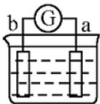
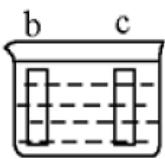
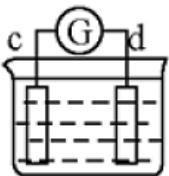
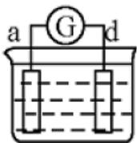
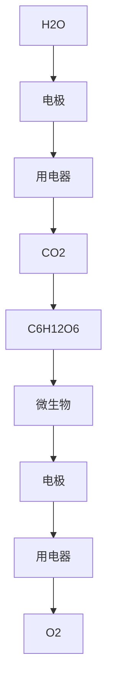

# 第九章、电化学

在 18 世纪末，人们把与氧化合的反应叫氧化反应，而把从氧化物夺取氧的反应叫还原反应。到 19 世纪中，有了化合价的概念，人们把化合价升高的过程叫氧化，把化合价降低的过程叫还原。20 世纪初，由于建立了化合价的电子理论，人们把失电子的过程叫氧化，得电子的过程叫还原。

# 1. 氧化还原电对

在氧化还原反应中，氧化剂在反应过程中氧化数降低，其产物具有较低的氧化数，具有弱还原性，是一个弱还原剂；还原剂在反应过程中氧化数升高，其产物具有较高的氧化数，具有若氧化性，是一个弱氧化剂。例如在 $Cu^{2+} + Zn = Cu + Zn^{2+}$ 的反应过程中，氧化剂 $Cu^{2+}$ 氧化数降低，其产物 Cu 是一个弱还原剂；还原剂 Zn 氧化数升高，其产物 $Zn^{2+}$ 是一个弱氧化剂。这样就构成了如下两个共轭的氧化还原体系或称氧化还原电对：

$$
\mathrm{Cu} ^ {2 +} / \mathrm{Cu}, \quad \mathrm{Zn} ^ {2 +} / \mathrm{Zn}
$$

在氧化还原电对中，氧化数高的物质叫氧化性物质（氧化态），氧化数低的物质叫还原性物质（还原态）。电对之间的共轭关系和酸碱共轭关系相似：

$$
\mathrm{还原态} = \mathrm{氧化态} + \mathrm{ne} ^ {-}
$$

$$
\mathrm{酸} = \mathrm{碱} + \mathrm{nH} ^ {+}
$$

# 2.Faraday 电解定律

Faraday 在 1832 年做了电解实验，发表了两个电解定律。

第一电解定律叙述为：电解时，电极上产生物质的质量与通过电解池的电量成正比。

第二电解定律叙述为：每通过 $96500 \, C$ 的电量，就有 $1/n \, mol$ 反应发生，n 为反应中转移电子数。

# 3. 原电池和电解池

# 3.1 原电池

从原理上来说，自发的氧化还原反应释放出来的能量都可以用来作电功，可以通过设计原电池来完成。该装置是外电路发生电子转移而不是氧化剂和还原剂之间直接传递电子。

如图 1 所示的 Cu-Zn 原电池装置示意图，该装置中 Cu 和 Zn 分别插入 $CuSO_{4}$ 和 $ZnSO_{4}$ 溶液中，两溶液间用盐桥（内装有饱和 KCl 溶液的琼脂的 U 形玻璃管）连接，盐桥用以构成电子流的通路，并消除两极溶液之间的液体接触界面电势。再将 Zn 与 Cu 用导线连接，电子将从 Zn 沿着导线流向 Cu，就构成了原电池。

![[13-14第九章电化学学生版_images/916dfbaa1fc63b93a67d27d8eda7a83de850e9491d5638fc5bad6ee2b2c7c881.jpg]]

chemical

Electrolysis setup diagram showing zinc and copper electrodes in ZnSO4 solution connected to a salt bridge

图 1 Cu-Zn 原电池示意图

该反应是自发氧化还原反应。在锌铜原电池中，氧化还原反应发生在两个电击上。发生氧化反应的电极，为阳极，失去电子，为原电池的负极；发生还原反应的电极，为阴极，得到电子，为原电池的正极。

电极反应为:

$$
\text { 负极: } \mathrm{Zn} = \mathrm{Zn} ^ {2 +} + 2 \mathrm{e} ^ {-}
$$

$$
\text {   正极:   } \mathrm{Cu} ^ {2 +} + 2 \mathrm{e} ^ {-} = \mathrm{Cu}
$$

电池符号书写通常有如下固定：

(1) 以化学式表示电池中物质的组成, 并标明物态, 气体应标明压力及依附的惰性溶液, 溶液应注明浓度;  
(2) 用“|”表示物质之间的相界面，“||”代表盐桥  
(3) 负极写在左边，正极写在右边   
（4）各化学式及符号的排列顺序要真实反映电池中物质的接触顺序

Zn-Cu 原电池可以表示为:

$$
(-) \mathrm{Zn} (\mathrm{s}) \mid \mathrm{ZnSO} _ {4} \left(\mathrm{c} _ {1}\right) \| \mathrm{CuSO} _ {4} \left(\mathrm{c} _ {2}\right) \mid \mathrm{Cu} (\mathrm{s}) (+)
$$

当电池中使用浓度相同的电解质时，不需要盐桥

# 4.电极电势

把任意一种金属片(M)插入水中，由于极性很大的水分子与构成晶格的金属离子相吸引而发生水合作用，结果一部分金属离子与金属中其他金属离子之间的键力减弱，甚至可以离开金属进入与金属表面接近的水层中。金属失去金属离子带负电荷，溶液因进入了金属离子而带正电荷，这两种相反电荷彼此又相互吸引，以致于大多金属离子聚集在金属附近的水层中，对金属片上的金属离子有排斥作用，阻碍金属的继续溶解。达到平衡时，在金属和溶液之间由于电荷不均等，便产生了电位差。

金属不仅在纯水中有电位差，即使浸入含有该金属盐的溶液中，也会发生相同的作用。由于溶液中已经存在该金属离子，所以离子从溶液中析出，即沉积到金属上的过程加快，因而使金属在另一电势下建立平衡。如果金属离子很容易进入溶液，则金属表面仍带负电；如果金属离子不易进入溶液，则金属表面带正电。

金属的电极电势（ $\varphi$ ）可表示如下：

$$
\varphi = V _ {\mathrm{金属}} \big (\mathrm{金属的表面电势} \big) - V _ {\mathrm{溶液}} (\mathrm{金属与溶液界面处的相间电势})
$$

电势和物体具有的势能一样绝对值无法得知，但可以测出原电池两电极的电势差。IUPAC 将选择标准氢电极作为理想电极。由于电极电势受电极种类、溶液浓度、温度等影响，标准氢电极规定为将镀有铂黑的 Pt 片置于氢离子浓度为 $1 \, mol \, kg^{-1}$ 的硫酸溶液中，不断通入 100 kPa 的纯氢气，使铂黑吸附氢气达到饱和，形成一个氢电极。发生如下半反应：

$$
\mathrm{H} _ {2} (1 0 0 \mathrm{kPa}) \rightarrow 2 \mathrm{H} ^ {+} (1. 0 \mathrm{mol} \mathrm{kg} ^ {- 1}) + 2 \mathrm{e}
$$

这时产生在标准氢电极和硫酸溶液之间的电势，称为氢的标准电极电势。任何温度下标准氢电极的电极电势为 0，即

$$
\varphi_ {H ^ {+} / H _ {2}} ^ {\ominus} = 0. 0 0 V
$$

用标准氢电极与各种标准电极组成原电池，测得该电池的电动势，称为该电池的标准电动势 $E^{\ominus}$ ，则各种电极的标准电极电势的绝对值与测得的标准电动势相同，若其电势高于标准氢电极的电势，该电极的标准电极电势为正值，反之，为负值。

电极电势的高低表明电子得失的难易，也就是表明了氧化还原能力的强弱；电极电势越正，就表明电极反应中氧化态物质越容易夺得电子转变为相应的还原态；电极电势越负，就是说电极反应中还原态物质越容易失去电子转变为相应的氧化态。对于由两个电对组成的原电池，两个电对之间电极电势差值越大，从热力学的角度看，反应越容易发生。

# 5.Nernst 方程

标准电极电势是指在 298 K，浓度为 $1 \, mol \cdot L^{-1}$ 、压力为标准压力 $p^{\theta}$ 条件下的电极电势。大多数溶液里的氧化还原反应在室温进行，在 298 K 左右 $E^{\theta}$ 值几乎不变。而溶液的浓度却往往不一定是 $1 \, mol \cdot L^{-1}$ ，压力也不一定是 $p^{\theta}$ ，并且可以有相当大的变化区间。

现用 ox 代表氧化态，用 red 代表还原态。这某电池两极的电极反应为：

正极： $a\ o x_{1}+n\ e^{-}=c\ red_{1}$

负极： $b\ red_{2}=d\ ox_{2}+ne^{-}$

其中 a, b, c, d 分别代表反应物及生成物的系数，所以电池反应:

$$
\mathrm{aox} _ {1} + \mathrm{bred} _ {2} = \mathrm{cred} _ {1} + \mathrm{dox} _ {2}
$$

$$
\Delta G _ {T} = \Delta G _ {T} ^ {\theta} + R T \mathrm{ln} \frac {\mathrm{red} _ {1} ^ {c} o x _ {2} ^ {d}}{\mathrm{red} _ {2} ^ {b} o x _ {1} ^ {a}} = \Delta G _ {T} ^ {\theta} + R T \mathrm{lnQ}
$$

根据 $\Delta G = -nFE$ ，有：

$$
\mathrm{E} = E ^ {\theta} - \frac {R T}{n \mathrm{F}} \ln \mathrm{Q}
$$

当 T=298 K， $R=8.31\ kJ\cdot mol^{-1}\cdot K^{-1}$ ， $F=9.65\times10^{4}\ C$ 时，

$$
\mathrm{E} = E ^ {\theta} - \frac {0 . 0 5 9 1}{n} \lg \frac {\mathrm{red} _ {1} ^ {c} o x _ {2} ^ {d}}{\mathrm{red} _ {2} ^ {b} o x _ {1} ^ {a}}
$$

上式表明氧化还原反应在任意浓度时的电池电动势 E 与标准电池电动势 $E^{\theta}$ 的关系, n 是转移电子数。

已知： $E_{电池}=E_{正}-E_{负}$ ， $E_{电池}^{\theta}=E_{正}^{\theta}-E_{负}^{\theta}$

整理有:

$$
\mathrm{E} _ {\text {正}} = E _ {\text {正}} ^ {\theta} + \frac {0 . 0 5 9 1}{n} \lg \frac {o x _ {1} ^ {a}}{\mathrm{red} _ {1} ^ {c}}
$$

$$
\mathrm{E} _ {\text {负}} = E _ {\text {负}} ^ {\theta} + \frac {0 . 0 5 9 1}{n} \lg \frac {o x _ {2} ^ {d}}{\mathrm{red} _ {2} ^ {b}}
$$

凡是有 $H^{+}$ 参加的电极反应，酸度对电极电势的影响都是很大的。所以标准电极电势常分为酸性表（ $H^{+}$ 浓度为 $1\ mol\cdot L^{-1}$ ）和碱性表（ $OH^{-}$ 浓度为 $1\ mol\cdot L^{-1}$ ）。

酸度不仅对氧化还原的能力有所影响，有时酸度还能影响氧化还原的产物。例如高锰酸钾是强氧化剂，在浓的强碱性介质中，一般只能还原到锰酸根 $MnO_{4}^{2-}$ ；在中性或者弱酸弱碱的介质中，一般被还原到 $MnO_{2}$ ；在较强的酸性介质中，则能被还原成 $Mn^{2+}$ 。

与电极反应有关的物质浓度的变化还可能和沉淀反应、络合反应联系在一起，从而使电极电势发生很大的变化。例如：

$$
\mathrm{Cu} ^ {2 +} + \mathrm{e} ^ {-} = \mathrm{Cu} \quad \mathrm{E} _ {1} ^ {\theta} = 0. 1 5 \mathrm{V}
$$

$$
\mathrm{I} _ {2} + 2 \mathrm{e} ^ {-} = 2 \mathrm{I} ^ {-} \quad \mathrm{E} _ {2} ^ {\theta} = 0. 5 4 \mathrm{V}
$$

从这些数据看, $Cu^{2+}$ 似乎不能使 I 氧化为 $I_{2}$ 。事实上, 因为 $Cu^{+}$ 和 I 能生成难溶性的 CuI, $CuSO_{4}$ 和 KI 的溶液反应是很完全的。当 $Cu^{+}$ 浓度降得很低时, 电对 $Cu^{2+}/Cu^{+}$ 的电极电势就会升高, 从而进一步氧化碘离子。

当 I 的浓度为 $1 \, mol \cdot L^{-1}$ 时，已知 CuI 的 $K_{sp} = 1.3 \times 10^{-12}$ ， $[Cu^{+}] = \frac{K_{sp}}{[I^{-}]} = 1.3 \times 10^{-12} \, mol \cdot L^{-1}$ 。

代入 Nernst 方程，得: $E_{Cu^{2+}/Cu^{+}} = 0.85 V$ ，电极电势增大，因而能氧化 I。

配合物的形成和沉淀生成的过程是类似的，都是降低了某种离子的实际浓度，从而改变电对的电极电势。

# 6.由电势测定求 $K_{sp}$ 或 pH 值

浓度既然对电极电势有影响，我们可以设计电池测定电极电势，以确定浓度。测定了难溶物的离子浓度可以计算 $K_{sp}$ ，测定了 $H^{+}$ 浓度可以计算 pH 值。

对于电池：(-)Ag | AgCl(s), Cl⁻(0.010 mol·L⁻¹)∥Ag⁺(0.010 mol·L⁻¹) | Ag(+), 测得的电动势为 0.34 V。

正极电势为： $E_{Ag^{+} / Ag} = E_{Ag^{+} / Ag}^{\theta} - \frac{0.0591}{n} lg\frac{1}{(Ag^{+})_{\mathrm{正}}}$

负极电势为： $E_{Ag\mathrm{Cl} / Ag} = E_{Ag^{+} / Ag}^{\theta} - \frac{0.0591}{n} lg\frac{1}{(Ag^{+})_{\text{负}}}$

所以 $E=E_{正}-E_{负}=0.34\ V=0.0591\ \lg\frac{0.010}{(Ag^{+})_{负}},\ (Ag^{+})_{负}=1.8\times10^{-8}\ mol\cdot L^{-1},$

所以 $\mathrm{K}_{\mathrm{sp}}(\mathrm{AgCl})=1.8\times10^{-10}\mathrm{~mol}\cdot\mathrm{L}^{-1}$

类似的, 将未知氢离子浓度的溶液与标准氢电极组成浓差电池或者与参比电极构成电池 (pH 计中), 同样可以求出 $H^{+}$ 浓度, 进一步得出 pH 值。

# 课后习题

1. 下列哪些装置能组成原电池？（）

![[13-14第九章电化学学生版_images/a94d0b7ebadabbf111f6f9fbfb5213da33a52d24d79b49a77f73bfc77da98982.jpg]]  
稀盐酸  
a

![[13-14第九章电化学学生版_images/acf5ad791e7d9e7e7aea22626ed2825540e008fa3678f056401bc61fbe1edf8a.jpg]]  
氯化铁溶液   
b

![[13-14第九章电化学学生版_images/6363ece6a1c485951be2b8e1ca99fa6041cdb06c1d5a60796af9ed02062a374d.jpg]]  
氯化铁溶液   
c

![[13-14第九章电化学学生版_images/b847a3552ef7863c8aac3e0c6ad601dc4659bdf9502b8df13394803d3fe53de3.jpg]]  
稀硫酸  
d

![[13-14第九章电化学学生版_images/d52c32f96278caa0b12f7f2cc62bab9f8ece5367145c5c02771b77317e49ad57.jpg]]  
四氯化碳  
e

![[13-14第九章电化学学生版_images/1f1754d1c79cb0d0e74ca3c3e520002ce65727a42c0228f3c32e82286991d26a.jpg]]  
硫酸锌溶液

![[13-14第九章电化学学生版_images/2d6edc697cfdeaf59333e88035a4eca1cc1635c5ad3ad00e8dc2f96c769f47e0.jpg]]  
硫酸铜溶液   
f

![[13-14第九章电化学学生版_images/dbae63c1eb2506bd7e42411379d96d614c0521bea018d7fec2b0f3022400995a.jpg]]  
硝酸银溶液   
g

2.下列关于原电池的叙述中，错误的是（）

A. 原电池是将化学能转化为电能的装置  
B. 用导线连接的两种不同金属同时插入液体中, 能形成原电池  
C. 在原电池中, 电子流出的一极是负极, 发生氧化反应  
D. 在原电池中, 电子流入的一极是正极, 发生还原反应

3. 在如图所示的装置中，a 的金属活动性比氢要强，b 为碳棒，关于此装置的各种叙述正确的是（）

A. 碳棒上有气体放出，溶液酸性变弱   
B. a是正极，b是负极   
C. 导线中有电子流动, 电流从a极到b极  
D. a极上发生了还原反应

![[13-14第九章电化学学生版_images/4d79a37285751d0f9936373e42be929c08ffd69058fe74839a36ba06604b729b.jpg]]

text_image

A
a b

稀 $\mathrm{H}_2\mathrm{SO}_4$

4.右图中电流表的指针发生偏移,且B棒的质量增加,则可能的情况是()

A. B为正极，C为CuSO4溶液   
B. A为正极，C为 $CuSO_{4}$ 溶液  
C. B为正极，C为稀 $H_{2}SO_{4}$ 溶液   
D. B 为正极，C 为稀 $AgNO_{3}$ 溶液

![[13-14第九章电化学学生版_images/f6a5fe1652d9d231f554947b34c4b993827c93ee9b90f7213154bb05b11393d3.jpg]]

text_image

A
B
C

5.某原电池的总反应的离子方程式是： $Zn+Cu^{2+}=Zn^{2+}+Cu$ ，该原电池的正确组成是（）

<table><tr><td></td><td>正极</td><td>负极</td><td>电解质溶液</td></tr><tr><td>A</td><td>Cu</td><td>Zn</td><td>HCl</td></tr><tr><td>B</td><td>Cu</td><td>Zn</td><td> $AgNO_{3}$ </td></tr><tr><td>C</td><td>Cu</td><td>Zn</td><td> $CuSO_{4}$ </td></tr><tr><td>D</td><td>Cu</td><td>Zn</td><td> $ZnCl_{2}$ </td></tr></table>

6. 将等质量的两份锌粉 a 和 b，分别加入两个盛过量的稀硫酸的烧杯中，并向加入 a 烧杯中再加入少量 CuO 粉末。下列各图表示氢气体积 $V(\mathrm{H}_{2})$ 与反应时间 t 的关系，其中正确的是（）

![[13-14第九章电化学学生版_images/55351cc16db1375c299dbcede81e53cb5428538037d79f180b591d30cb8d18b6.jpg]]

line

| t | V(H₂) |
|---|---|
| 0 | 0 |
| a | b |
| b | b |

A

![[13-14第九章电化学学生版_images/312704aa9b817d599cd069617ffb52c5d58cf8df97de63412503075fd9959942.jpg]]

text_image

V(H₂)
a
b
O
t

B

![[13-14第九章电化学学生版_images/7f10a521ea592bb3cbe50f380b9cd51fe5af9ce89844f411ae0a3d056e2f2b4a.jpg]]

text_image

V(H₂)
b
a
O
t

C

![[13-14第九章电化学学生版_images/fc95d53653edb605aada2a67f31f3eb351ac58b3afb8c4152821a4e9b14a8264.jpg]]

line

| Time (t) | Volume (V(H₂)) |
| :--- | :--- |
| 0 | 0 |
| a | Peak value |
| b | Peak value |

D

若上题中的锌为过量，稀硫酸为等量的，且在 a 烧杯中改为加入几滴 $CuSO_{4}$ 溶液，则正确的是（）

7.有 a、b、c、d 四个金属电极，有关的反应装置及部分反应现象如下

<table><tr><td>实验装置</td><td>CuSO4</td><td>稀硫酸</td><td>稀硫酸</td><td>稀硫酸</td></tr><tr><td>部分实验现象</td><td>a极质量减少b极质量增加</td><td>b极有气体产生c极无变化</td><td>d极溶解c极有气体产生</td><td>电流计指示在导线中电流从a极流向d极</td></tr></table>

由此可判断这四种金属的活动性顺序是（）

A. a>b>c>d

B. b>c>d>a

C. d > a > b > c

D. a>b>d>c

8.铅蓄电池的两极分别为Pb、 $PbO_{2}$ ，电解质溶液为 $H_{2}SO_{4}$ ，工作时的反应为

$Pb+PbO_{2}+2H_{2}SO_{4}=2PbSO_{4}+2H_{2}O$ （正向放电、逆向充电），电池放电时下列结论正确的是（）

A. Pb为正极被氧化  
B. 电路中通过 $0.2 \mathrm{~mole}^{-}$ 时消耗的 $\mathrm{H}_{2} \mathrm{SO}_{4}$ 得物质的量为 $0.1 \mathrm{~mol}$   
C. $SO_{4}^{2-}$ 只向 $PbO_{2}$ 处移动  
D. 电解质溶液pH不断增大

9.设想通过原电池反应以 $H_{2}$ 和 $Cl_{2}$ 为原料生产盐酸。关于这种原电池的设想正确的是()

A. 正极反应为 $H_{2}-2e^{-}=2H^{+}$   
B. 在电池工作时， $H^{+}$ 移向负极  
C. 电池正极发生氧化反应  
D. 以盐酸作为电解质，并不断补充蒸馏水，以维持溶液一定的pH

10.人们应用原电池原理制作了多种电池，以满足不同的需要。在现代生活、生产和科学技术的发展中，电池发挥着越来越重要的作用，大至宇宙火箭、人造卫星、空间电视转播站、飞机、轮船，小至电脑、收音机、照相机、电话、助听器、电子手表、心脏起搏器等，都离不开各式各样的电池。以下每小题中的电池即为广泛使用于日常生活、生产和科学技术等方面的实用电池，请根据题中提供的信息，填写空格。

(1)电子表和电子计算器中所用的是钮扣式的微型银锌电池，其电极分别为 $\mathrm{Ag_2O}$ 和 $\mathrm{Zn}$ ，电解液为KOH溶液。工作时电池总反应为： $\mathrm{Ag_2O + Zn + H_2O = 2Ag + Zn(OH)_2}$ 。

①工作时电流从\_\_\_\_极流向\_\_\_\_极（两空均选填“ $\mathrm{Ag}_{2}\mathrm{O}$ ”或“ $\mathrm{Zn}$ ”）。  
②电极反应式为：正极\_\_\_\_，负极\_\_\_\_。   
③工作时电池正极区的pH\_\_\_\_(选填“增大”“减小”或“不变”)。

(2)蓄电池在放电时起原电池作用, 在充电时起电解池作用。爱迪生蓄电池分别在充电和放电时发生的反应为: $\mathrm{Fe} + \mathrm{NiO}_{2} + 2 \mathrm{H}_{2} \mathrm{O} = \mathrm{Fe} (\mathrm{OH})_{2} + \mathrm{Ni} (\mathrm{OH})_{2}$ (正向放电、逆向充电)

①放电时，正极为\_\_\_\_。正极的电极反应式为\_\_\_\_，

②该蓄电池中的电解质溶液应为\_\_\_\_（填选“酸性”或“碱性”）溶液。

(3)镍氢电池是新型的二次电池，它的突出优点是循环寿命长，1987年起在地球同步轨道条件下工作寿命超过10年。其正极为氧化镍，负极为氢电极。电解质溶液为密度 $1.3\mathrm{g/cm^{3}}$ 左右的氢氧化钾水溶液。电池总反应为： $\mathrm{H}_{2}+2\mathrm{NiOOH}=2\mathrm{Ni(OH)}_{2}$ 。则放电时的电极反应式为：正极\_\_\_\_，负极\_\_\_\_。

11. 钢铁在潮湿的空气中会被腐蚀，发生的原电池反应为: $2 \mathrm{Fe} + 2 \mathrm{H}_{2} \mathrm{O} + \mathrm{O}_{2} = 2 \mathrm{Fe}^{2+} + 4 \mathrm{OH}^{-}$ 。以下说法正确的是（）

A. 负极发生的反应为: $\mathrm{Fe}-2\mathrm{e}^{-}=\mathrm{Fe}^{2+}$   
B. 正极发生的反应为: $2 \mathrm{H}_{2} \mathrm{O} + \mathrm{O}_{2} + 2 \mathrm{e}^{-} = 4 \mathrm{OH}^{-}$   
C. 原电池是将电能转变为化学能的装置  
D. 钢柱在水下部分比在空气与水交界处更容易腐蚀

12.如图所示，将紧紧缠绕不同金属的铁钉放入培养皿中，再加入含有适量酚酞和 NaCl 的琼脂热溶液，冷却后形成琼胶（离子在琼胶内可以移动）。下列叙述正确的是（）

![[13-14第九章电化学学生版_images/88e231127070367a17063549a59df48265a06c3d6e33ca939c8b7f65184fb91a.jpg]]

text_image

铁钉
铜丝

a

![[13-14第九章电化学学生版_images/b735cb01cc045d963addc74c1800c3bf0e90066432fb5222894bfd693be42ccc.jpg]]

text_image

铁钉
铝条

b

A. a 中铁钉附近呈现红色  
C. a 中铜丝上发生氧化反应

B. b 中铁钉上发生还原反应  
D. b 中铝条附近有气泡产生

13. 将 NaCl 溶液滴在一块光亮清洁的铁板表面上，一段时间后发现液滴覆盖的圆周中心区(a)已被腐蚀而变暗，在液滴外沿形成棕色铁锈环(b)，如图所示。导致该现象的主要原因是液滴之下氧气含量比边缘少。下列说法正确的是（）

![[13-14第九章电化学学生版_images/1f26f11fc117c598424a6c3cea57930e7582c524c0fc2518a852b44462fc9474.jpg]]

text_image

铁锈环(b)
腐蚀区(a)

A. 液滴中的Cl—由a区向b区迁移   
B. 液滴边缘是正极区，发生的电极反应： $O_{2}+2H_{2}O+4e^{-}=4OH^{-}$   
C. 液滴下的Fe因发生还原反应而被腐蚀, 生成的 $\mathrm{Fe}^{2+}$ 由a区向b区迁移, 与b区的 $\mathrm{OH}^{-}$ 形成 $\mathrm{Fe(OH)}_{2}$ 进一步氧化、脱水形成铁锈  
D. 若改用嵌有一铜螺丝钉的铁板, 在铜铁接触处滴加NaCl溶液, 则负极发生的电极反应为: $Cu-2e^{-}=Cu^{2+}$

14. 镁及其化合物一般无毒(或低毒)，且镁电池放电时电压高而平稳，使镁电池越来越成为人们研制绿色原电池的关注焦点。其中一种镁电池的反应式为：

$xMg+Mo_{3}S_{4}\xlongequal[充电]{放电}Mg_{x}Mo_{3}S_{4}$ ，在镁原电池放电时，下列说法错误的是（）

A. $\mathrm{Mo}_{3} \mathrm{~S}_{4}$ 发生还原反应  
B. 正极反应式为: $\mathrm{Mo}_{3} \mathrm{~S}_{4} + 2 x \mathrm{e}^{-} = \mathrm{Mo}_{3} \mathrm{~S}_{4}^{2-}$   
C. $\mathrm{Mg}^{2+}$ 向正极迁移  
D. 负极反应式为: $x\mathrm{Mg} - 2xe^{-} == x\mathrm{Mg}^{2+}$

15.以葡萄糖为燃料的微生物燃料电池如图所示。关于该电池的叙述正确的是：（）

A. 该电池能够在高温下工作  
B. 电池的负极反应为: $\mathrm{C}_{6} \mathrm{H}_{12} \mathrm{O}_{6} + 6 \mathrm{H}_{2} \mathrm{O} - 24 \mathrm{e}^{-} = 6 \mathrm{CO}_{2} \uparrow + 24 \mathrm{H}^{+}$   
C. 放电过程中, 将生成的 $\mathrm{CO}_{2}$ 和水随时排出, 保持电解质浓度恒定  
D. 在电池反应中, 每消耗 $1 \mathrm{~mol}$ 氧气, 理论上能生成标准状况下 $\mathrm{CO}_{2} 22.4 / 6 \mathrm{~L}$

![[13-14第九章电化学学生版_images/79d3e061f6b77a64bae26c95292594030938a899f476531f32ca0fa183ee85fe.jpg]]

flowchart

质子交换膜

16.在一个盛有硝酸银溶液的烧杯中，放入质量相同的锌片和银片，两块金属片与一个小灯泡相连，经过一段时间后，从溶液中取出金属片，这时发现二者的质量有相同的变化。试确定所形成原电池的有效功率。假设整个过程是定量地进行的，而且原电池的电压不变。

17. 已知反应 $AsO_{4}^{3-} + 2I^{-} + 2H^{+} == AsO_{3}^{3-} + I_{2} + H_{2}O$ 是可逆反应。设计如图装置 $(C_{1}, C_{2}$ 均为石墨电极)，分别进行下述操作：

I. 向 B 烧杯中逐滴加入浓盐酸，发现电流表指针偏转。
II. 向 B 烧杯中逐滴加入 40% NaOH 溶液，发现电流表指针向前述相反方向偏转。

试回答下列问题:

(1)两次操作中指针为什么发生偏转?

(2)两次操作过程中指针偏转方向为什么相反？试用化学平衡移动原理解释之。

(3)操作 I 过程中 $C_{1}$ 棒上发生的反应为

(4)操作 II 过程中 $C_{2}$ 棒上发生的反应为

(5)操作 II 过程中，盐桥中的 $K^{+}$ 移向 \_\_\_\_ 烧杯溶液(填“A”或“B”)。

![[13-14第九章电化学学生版_images/6e7ebeeeb2bdcab376fe028f619c1ffc73a35697266dc177f5364deb32361e0d.jpg]]

chemical

Electrolysis setup diagram showing two cells (A and B) with salt bridge, KCl solution, and Na₃AsO₄/Na₃AsO₃ electrolytes

18.下列两个反应的 $E_{池}^{\theta}$ 是否相等？ $\Delta G^{\theta}$ 和 $K_{c}$ 是否相等？

$$
2 \mathrm{Fe} ^ {3 +} + 2 \mathrm{Br} ^ {-} = 2 \mathrm{Fe} ^ {2 +} + \mathrm{Br} _ {2}
$$

$$
\mathrm{Fe} ^ {3 +} + \mathrm{Br} ^ {-} = \mathrm{Fe} ^ {2 +} + \frac {1}{2} \mathrm{Br} _ {2}
$$

19.试用两种方法计算如下氧化还原反应的平衡常数。

$$
6 \mathrm{CuI} + 4 \mathrm{NO} _ {3} ^ {-} + 1 6 \mathrm{H} ^ {+} = 6 \mathrm{Cu} ^ {2 +} + 3 \mathrm{I} _ {2} + 4 \mathrm{NO} + 8 \mathrm{H} _ {2} \mathrm{O}
$$

20. 若设 $Hg_{2}Cl_{2} + 2e = 2Hg + 2Cl^{-}(1mol \cdot dm^{-3})$ 的 $\varphi^{\theta}$ 为零，那么 $\varphi^{\theta}\left(\mathrm{Cu}^{2+}/\mathrm{Cu}\right)$ 、 $\varphi^{\theta}\left(\mathrm{Zn}^{2+}/\mathrm{Zn}\right)$ 各是多少？

21.试解释：为什么 $FeI_{3}$ 不能在水溶液中制得？

22.请查阅手册获取相关的 $\Delta G_{\mathrm{f}}^{\theta}$ 数据，求下列电极反应的标准电极电势：

(1) $\mathrm{ClO}_3^-$ +6H $^+$ +6e=Cl $^-$ +3H $_2$ O   
(2) $\mathrm{H}_2\mathrm{O}_2 + 2\mathrm{H}^+ + 2\mathrm{e} = 2\mathrm{H}_2\mathrm{O}$

23. 已知 $\varphi_{Fe}^{e^{3+}/Fe^{2+}} = 0.76V$ ， $\varphi_{Fe}^{e^{2+}/Fe} = -0.44V$ 。求 $\varphi_{Fe}^{e^{3+}/Fe}$ 的值。

24. 在 $[H^{+}] = 1.00 \, mol \cdot dm^{-3}$ 时 $MnO_{4}^{-}$ 、 $MnO_{4}^{2-}$ 、 $MnO_{2}(s)$ 的电位图为：

$$
\mathrm{MnO} _ {4} ^ {-} \underline {{0 . 5 6}} \quad \mathrm{MnO} _ {4} ^ {2 -} \underline {{2 . 2 6}} \mathrm{MnO} _ {2} (\mathrm{s})
$$

问:

(1)溶液中 $MnO_{4}^{2-}$ 能否发生歧化反应（溶液中的离子浓度都为 $1mol\cdot dm^{-3}$ ）？  
(2)若能，试写出反应方程式。  
(3) $\varphi^{\theta}_{MnO4-/MnO2}$ 值为多少?

25.计算下列各电对在给定条件下的电极电势:

(1) $\mathrm{Fe}^{3+}/\mathrm{Fe}^{2+}$ , $[\mathrm{Fe}^{3+}] = 0.1\mathrm{mol}\cdot \mathrm{dm}^{-3}$ , $[\mathrm{Fe}^{2+}] = 0.5\mathrm{mol}\cdot \mathrm{dm}^{-3}$ 。  
(2) $\mathrm{Cr_2O_7^{2 - } / Cr^{3 + }}$ ， $[\mathrm{Cr}_2\mathrm{O}_7^{2 - }] = 0.1\mathrm{mol}\cdot \mathrm{dm}^{-3}$ ， $[\mathrm{Cr}^{3 + }] = 0.2\mathrm{mol}\cdot \mathrm{dm}^{-3}$ ， $[\mathrm{H}^{+}] = 2\mathrm{mol}\cdot \mathrm{dm}^{-3}$ 。

26. 半反应 $\mathrm{Mg(OH)_{2} + 2e \rightarrow Mg + 2OH^{-}}$ 的 $\varphi^{e} = -2.67V$ ， $\mathrm{Mg(OH)_{2}}$ 的溶解度是 $1.45 \times 10^{-4} mol \cdot dm^{-3}$ ，计算 $\varphi^{e}_{Mg^{2+}/Mg}$ 值。

27. 计算反应 $2\mathrm{H}_{2}(\mathrm{g}) + \mathrm{O}_{2}(\mathrm{g}) \rightarrow 2\mathrm{H}_{2}\mathrm{O}(\mathrm{l})$ 的 $E_{池}^{\theta}$ ，其中 $p_{H2} = 5.0 \, atm, p_{O2} = 2.5 \, atm, [H^{+}] = 0.60 mol \cdot dm^{-3}$ 。

28.计算下列电池反应的电动势 $E_{池}^{\theta}$ ：

(1) $3\mathrm{Ag(s)} + \mathrm{NO}_{3}^{-}(10\ \mathrm{mol}\cdot\mathrm{dm}^{-3}) + 4\mathrm{H}^{+}(10\ \mathrm{mol}\cdot\mathrm{dm}^{-3}) \rightarrow 3\mathrm{Ag}^{+}(0.10\ \mathrm{mol}\cdot\mathrm{dm}^{-3}) + \mathrm{NO}(1\mathrm{bar}) + 2\mathrm{H}_{2}\mathrm{O}$   
(2) $\mathrm{Ag}^{+}(0.001\ \mathrm{mol}\cdot\mathrm{dm}^{-3})+\mathrm{Ag}(\mathrm{s})\rightarrow\mathrm{Ag}^{+}(1\ \mathrm{mol}\cdot\mathrm{dm}^{-3})+\mathrm{Ag}(\mathrm{s})$

29.用下列数据:

$$
\mathrm{Al} ^ {3 +} + 3 \mathrm{e} ^ {-} \rightarrow \mathrm{Al} (\mathrm{s}), \quad \varphi^ {\theta} = - 1. 6 6 \mathrm{V}
$$

$$
\mathrm{Al} (\mathrm{OH}) _ {4} ^ {-} + 3 \mathrm{e} ^ {-} \rightarrow \mathrm{Al} (\mathrm{s}) + 4 \mathrm{OH} ^ {-}, \varphi^ {\ominus} = - 2. 3 5 \mathrm{V}
$$

计算反应 $Al^{3+} + 4OH^{-} \rightleftharpoons Al(OH)_{4}^{-}$ 的平衡常数。

30. 已知 $Ag_{2}S + 2e^{-} \rightarrow 2Ag + S^{2-}$ 的 $\varphi^{\ominus}$ 为 -0.69V，计算 $Ag_{2}S$ 的 $K_{sp}$ 。

31.今有一原电池:

(一) $\mathrm{Pt}\mid \mathrm{H}_2$ (1atm) | HA $(0.5\mathrm{mol}\cdot \mathrm{dm}^{-3})$ || NaCl $(1.0\mathrm{mol}\cdot \mathrm{dm}^{-3})$ | AgCl(s) | Ag (+)

若该电池电动势为+0.568V，求此一元酸的电离平衡常数 $K_{a}=$ ?

32.一个学生装了一个电池来测量 CuS 的 $K_{sp}$ 。电池的一边是铜电极浸入 $0.10mol\cdot dm^{-3}$ $Cu^{2+}$ 离子溶液中，电池的另一边是 Zn 电极浸入 $1.0mol\cdot dm^{-3}$ 的 $Zn^{2+}$ 离子溶液中，并使 $Zn^{2+}$ 离子浓度恒为 $1.0mol\cdot dm^{-3}$ ， $Cu^{2+}$ 离子的浓度则为 $H_{2}S$ 不断通入上述溶液中使之饱和时的最小值，铜电极作为阴极，电池的电动势为 +0.67 V，计算 $Cu^{2+}$ 离子的浓度和 CuS 的 $K_{sp}$ （ $H_{2}S$ 饱和溶液的浓度为 $0.10mol\cdot dm^{-3}$ ，在溶液中产生的 CuS 不能起缓冲作用， $H_{2}S$ 的 $K_{1}=1\times10^{-7}$ ， $K_{2}=1.1\times10^{-14}$ ）

33.试解释: 为什么中性的 KI 溶液中的 $\mathrm{I}_{2}$ 能氧化 As(III), 而在强酸性溶液中 As(V)能氧化 I 成为 $\mathrm{I}_{2}$ ?

34. 已知 $\varphi^{e}_{Au}^{3+}/Au^{+}=1.2V,\varphi^{e}_{VO2}^{+}/VO^{2+}=1.2V$ ，在什么样的条件下， $VO_{2}^{+}$ 能够作为氧化剂，把 $Au^{+}$ 氧化到 $Au^{3+}$ 。说明理由。

35. 计算含有下列各离子体系的 $\Delta G: \mathrm{Mn}^{2+}(0.10\mathrm{mol}\cdot\mathrm{dm}^{-3})$ 、 $\mathrm{Cr}_{2}\mathrm{O}_{7}^{2-}(0.010\mathrm{mol}\cdot\mathrm{dm}^{-3})$ 、 $\mathrm{MnO}_{4}^{-}(0.0010\mathrm{mol}\cdot\mathrm{dm}^{-3})$ 、 $\mathrm{Cr}^{3+}(0.0010\mathrm{mol}\cdot\mathrm{dm}^{-3})$ ，当溶液的 pH=6 时，试判断反应

$$
6 \mathrm{Mn} ^ {2 +} (\mathrm{aq}) + 5 \mathrm{Cr} _ {2} \mathrm{O} _ {7} ^ {2 -} (\mathrm{aq}) + 2 2 \mathrm{H} ^ {+} (\mathrm{aq}) \rightleftharpoons 6 \mathrm{MnO} _ {4} ^ {-} (\mathrm{aq}) + 1 0 \mathrm{Cr} ^ {3 +} (\mathrm{aq}) + 1 1 \mathrm{H} _ {2} \mathrm{O} (\mathrm{l})
$$

从上面所给的条件开始，从什么方向达到平衡？

36.从热力学数据计算 $\varphi^{e}_{Mg}^{2+}/Mg^{\circ}$

$$
\mathrm{Mg} (\mathrm{s}) + 1 / 2 \mathrm{O} _ {2} (\mathrm{g}) = \mathrm{MgO} (\mathrm{s}) \quad \Delta_ {\mathrm{r}} G _ {\mathrm{m}} ^ {\mathrm{e}} - 5 7 2. 9 \mathrm{kJ} \cdot \mathrm{mol} ^ {- 1}
$$

$$
\mathrm{MgO} (\mathrm{s}) + \mathrm{H} _ {2} \mathrm{O} (\mathrm{l}) = \mathrm{Mg} (\mathrm{OH}) _ {2} (\mathrm{s}) - 3 1. 2 \mathrm{kJ} \cdot \mathrm{mol} ^ {- 1}
$$

$$
\mathrm{H} _ {2} \mathrm{O} (\mathrm{l}) = \mathrm{H} _ {2} (\mathrm{g}) + 1 / 2 \mathrm{O} _ {2} (\mathrm{g}) + 2 4 1. 3 \mathrm{kJ} \cdot \mathrm{mol} ^ {- 1}
$$

已知：298K 时， $K_{w}=1.00\times10^{-14}$ ， $K_{\mathrm{sp,Mg(OH)2}}=5.50\times10^{-12}$ 。

37.已知下列标准电极电势：

$$
\mathrm{Cu} ^ {2 +} (\mathrm{aq}) + 2 \mathrm{e} ^ {-} = \mathrm{Cu} (\mathrm{s}) \quad \varphi = 0. 3 3 7
$$

$$
\mathrm{Cu} ^ {2 +} (\mathrm{aq}) + \mathrm{e} ^ {-} = \mathrm{Cu} ^ {+} (\mathrm{aq}) \quad \varphi = 0. 1 5 9
$$

(1)计算反应 $\mathrm{Cu(s)} + \mathrm{Cu^{2+}(aq)} = 2\mathrm{Cu^{+}(aq)}$ 的平衡常数 K。  
(2)已知 $K_{\mathrm{sp}}(\mathrm{CuCl})=1.2\times10^{-6}$ ，计算反应：

$\mathrm{Cu(s)+Cu^{2+}(aq)+2Cl^{-}(aq)=2CuCl(s)}$ 的平衡常数。

38.根据 Nernst 公式,有些与酸碱度有关的电极电势,其数值与 pH 具有线性关系,如 $IO_{3}^{-}-I_{2}$ :

$$
2 \mathrm{IO} _ {3} ^ {-} + 1 2 \mathrm{H} ^ {+} + 1 0 \mathrm{e} = \mathrm{I} _ {2} + 6 \mathrm{H} _ {2} \mathrm{O}
$$

$$
E \left(\mathrm{IO} _ {3} ^ {-} / \mathrm{I} _ {2}\right) = E ^ {\theta} \left(\mathrm{IO} _ {3} ^ {-} / \mathrm{I} _ {2}\right) - \frac {0 . 0 5 9 1 \mathrm{V}}{1 0} 1 \mathrm{g} \frac {1}{\left[ \mathrm{IO} _ {3} ^ {-} \right] ^ {2} \left[ \mathrm{H} ^ {+} \right] ^ {1 2}}
$$

当把 $\left[H^{+}\right]$ 换成 pH，而其他物质的浓度都为标准态浓度，则有 $E\left(\mathrm{IO}_{3}^{-}/\mathrm{I}_{2}\right)=E^{\theta}\left(\mathrm{IO}_{3}^{-}/\mathrm{I}_{2}\right)-0.071\mathrm{pH}=1.20-0.071\mathrm{pH}$ ；再由 E 对 pH 作图，即得 E-pH 图。根据如下 E-pH 图（纵坐标未按比例），回答问题：

![[13-14第九章电化学学生版_images/6ce30a29a24eef19eee7feeb5815e156053cdec3de7e0239d875fd3db690f4ec.jpg]]

(1)写出由 $IO_{3}^{-}-I_{2}, I_{2}-I$ 发生的氧化还原反应的方程式;

(2)当 pH 为 a、b、c 时，分别指出（1）中反应所进行的方向；  
(3)计算上述反应的 $K^{\theta}$ 和 $\Delta G^{\theta}(298K)$ ;  
(4)计算 $\mathrm{pH} = b$ 时的 $b$ 值，此时反应的 $K^{\theta}$ 为多少？  
(5) $Cu^{2+}/Cu$ 的 E-pH 图从 a 开始变为负的斜线，原因何在？  
(6)根据图中的数据，求 $\mathrm{Cu(OH)}_{2}$ 的 $K_{sp}$ 。

39.已知下列各标准电极电势：

$$
\varphi_ {\mathrm{Br} 2 / \mathrm{Br}} ^ {\mathrm{e} ^ {-}} = + 1. 0 7 \mathrm{V} \quad \varphi_ {\mathrm{NO} 3 / \mathrm{HNO} 2} ^ {\mathrm{e} ^ {-}} = + 0. 9 4 \mathrm{V} \quad \varphi_ {\mathrm{Co} / \mathrm{Co}} ^ {\mathrm{e} ^ {3 +} / \mathrm{Co} ^ {2 +}} = + 1. 8 2 \mathrm{V}
$$

$$
\varphi_ {\mathrm{O} 2 / \mathrm{H} 2 \mathrm{O}} ^ {\mathrm{e}} = + 1. 2 3 \mathrm{V} \quad \varphi_ {\mathrm{H} ^ {+} / \mathrm{H} 2} ^ {\mathrm{e}} = 0 \mathrm{V} \quad \varphi_ {\mathrm{HBrO} / \mathrm{Br} 2} ^ {\mathrm{e}} = + 1. 5 9 \mathrm{V}
$$

$$
\varphi_ {\mathrm{As/AsH3}} ^ {\mathrm{e}} = - 0. 6 0 \mathrm{V}
$$

根据各电对的电极电势，指出：

(1)最强的还原剂和最强的氧化剂是什么？  
(2)哪些物质在水中不稳定？它们都发生什么变化？  
(3) $Br_{2}$ 能否发生歧化反应？说明原因。  
(4)哪些 $E^{\ominus}$ 与 $\mathrm{H^{+}}$ 离子浓度无关？  
(5)在 $\mathrm{pH} = 10$ 的溶液中， $\mathrm{Br}_2$ 能否发生歧化？（ $p_{\mathrm{Br2}} = 1\mathrm{atm}$ ，除 $\mathrm{H}^+$ 离子外，其他物种浓度均为 $1\mathrm{mol}\cdot \mathrm{dm}^{-3}$ ）

40.下列关于电解池的叙述不正确的是（）

A. 在电解池的阴极发生还原反应  
B. 与电源负极相连的是电解池的阳极  
C. 电解质溶液中阴离子移向电解池的阳极  
D. 电子从电源的负极沿导线流入电解池的阴极

41.关于原电池和电解池的叙述正确的是（）

A. 原电池中失去电子的电极为阴极  
B. 原电池的负极、电解池的阳极都发生氧化反应  
C. 原电池的两极一定是由活动性不同的两种金属组成  
D. 电解时电解池的阳极一定是阴离子放电

42.在电解过程中，X 极质量减小，Y 极质量增大，可能符合该情况的是（）

A. X 是石墨，Y 是铜棒

B. X、Y 均是铜棒

C. X、Y 均是石墨

D. X 是阴极，Y 是阳极

43.电解 $CuCl_{2}$ 溶液时，若阴极上有 1.6 g 铜析出，则阳极上产生气体的体积(标准状况)约为

A. 0.28 L

B. 0.56 L

C. 0.14 L

D. 11.2 L

44. 写出电解 $HgI_{2}$ 、 $\mathrm{Cu(NO_{3})_{2}}$ 、HCl、 $H_{2}SO_{4}$ 、NaOH 溶液的电极、电解方程式。

45.用惰性电极电解下列溶液，较短一段时间后溶液的浓度增大，而溶液 pH 值保持不变的是（）

A. $\mathrm{CuCl}_2$ 溶液

B. NaCl 溶液

C. $H_{2}SO_{4}$ 溶液

D. $\mathrm{Na}_{2}\mathrm{SO}_{4}$ 溶液

46.用石墨作电极电解 $CuSO_{4}$ 溶液，电解一段时间后停止电解，向溶液中加入下列何种物质可使溶液恢复原状（）

A. $\mathrm{Cu(OH)}_{2}$

B. $CuSO_{4} \cdot 5H_{2}O$

C. CuO

D. $CuSO_{4}$

47. 将分别盛有熔融的氯化钾、氯化镁、氧化铝的三个电解槽串联，在一定条件下通电一段时间后，析出钾、镁、铝的物质的量之比为

A. 1:2:3

B. 3:2:1

C. 6:3:1

D. 6:3:2

48.若在铜片上镀银时，下列叙述正确的是（）

(1)将铜片接在电池的正极上

(2)将银片接在电源的正极上

(3)在铜片上发生的反应是： $Ag^{+}+e^{-}=Ag$

(4)在银片上发生的反应是： $4OH^{-}-4e^{-}=O_{2}+2H_{2}O$

(5)需用 $CuSO_{4}$ 溶液

(6)需用 $AgNO_{3}$ 溶液作电解液

A. ①③⑥

B. ②③⑥

C. ①④⑤

D. ②③④⑥

49.用如图装置（X、Y 是直流电源的两极）分别进行下列各组实验，则下表中所列各项对应关系均正确的一组是（）

![[13-14第九章电化学学生版_images/01c8199e85686914ba11fdc35f71a521d8bc15a6a5a83abd900b39c33004a3ec.jpg]]

text_image

X Y
石墨 石墨
a b

<table><tr><td>选项</td><td>电源X极</td><td>实验前U形管中液体</td><td>通电后现象及结论</td></tr><tr><td>A</td><td>正极</td><td> $Na_{2}SO_{4}$ 溶液</td><td>U形管两端滴入酚酞后,a管中呈红色</td></tr><tr><td>B</td><td>正极</td><td> $AgNO_{3}$ 溶液</td><td>b管电极反应式是 $4OH^{-}-4e^{-}=2H_{2}O+O_{2}\uparrow$ </td></tr><tr><td>C</td><td>负极</td><td>KCl和 $CuCl_{2}$ 混合溶液</td><td>相同条件下,a、b两管中产生的气体总体积可能相等</td></tr><tr><td>D</td><td>负极</td><td> $Fe(OH)_{3}$ 胶体和导电液</td><td>b管中液体颜色加深</td></tr></table>

50.当碘化镁水溶液电解时，电极上产生氢气和碘，实验中用 $0.500dm^{3}$ 、 $0.200mol\cdot dm^{-3}MgI_{2}$ 开始电解，收集氢气的体积为 1.00 升，这时水上方的温度为 $25^{\circ}C$ ，压力为 $746\tau$ （ $25^{\circ}C$ 时水的饱和蒸汽压为 $24\tau$ ）问：

(1)已用了多少法拉第电量？  
(2)如果流过的电流恒为 5.0A，电解了多长时间？  
(3)溶液中最终的 $\mathrm{I}^{-}$ 、 $\mathrm{Mg}^{2+}$ 和 $\mathrm{OH}^{-}$ 离子浓度各为多少？

51.

电解质溶液A: 25g $CuSO_{4}$ 5H $_{2}$ O + 4mL浓H $_{2}$ SO $_{4}$ + 200mL H $_{2}$ O

电解质溶液 B: 16g CuCl + 100mL 浓 HCl + 100mL H₂O + 4g 铜粉

以铜为电极，通电电解串连的两个电解槽（分别盛电解质溶液 A 和电解质溶液 B）。正极质量改变如下表所示：

<table><tr><td></td><td></td><td>电解前质量/g</td><td>电解后质量/g</td><td>改变量/g</td></tr><tr><td rowspan="2">电解质液A</td><td>正极</td><td>7.4</td><td>7.3</td><td>-0.1</td></tr><tr><td>负极</td><td>7.5</td><td>7.6</td><td>0.1</td></tr><tr><td rowspan="2">电解质液B</td><td>正极</td><td>7.4</td><td>7.2</td><td>-0.2</td></tr><tr><td>负极</td><td>7.3</td><td>7.5</td><td>0.2</td></tr></table>

(1)正极质量改变不同的原因是什么？

(2)电解质液中加铜粉的原因是什么?

(3)从理论上讲，电解过程铜粉质量不会改变，为什么？实际情况如何？

52.某燃料电池以熔融态 $\mathrm{K}_2\mathrm{CO}_3$ 为电解质，以CO为燃料，以空气为氧化剂。已知：熔融 $\mathrm{K}_2\mathrm{CO}_3$ 中不能大量存在氧负离子。

(1)该燃料电油需添加一种常见物质。该物质是\_\_\_\_（写化学名称）。

(2)写出该燃料电池的电极反应和原电池反应。

53. 将 1L 一定浓度的 $CuSO_{4}$ 溶液，用 a、b 两个石墨电极电解，当 a 极上产生 22.4L（标准状况）气体时，b 极上有金属析出。然后将 a、b 极电源反接，继续通直流电，当 b 极上又产生 22.4L（标准状况）气体时结束，溶液质量共减少 227g。（假定电流强度和溶液体积不变）

(1)写出反接后至结束的 b 电极电极反应式\_\_\_\_。

(2)计算 a 极上产生 22.4L（标准状况）气体时，b 极增加的质量。

(3)计算原溶液的物质的量浓度。

54. 用惰性电极电解一定浓度的硫酸铜溶液，一段时间后停止电解，向所得溶液中加入 $0.1\mathrm{molCu(OH)}_2$ ，恰好恢复到电解前的浓度和 $\mathrm{pH}$ 值。

(1)写出电解时的电极反应式: 阴极\_\_\_\_, 阳极\_\_\_\_; 往阳极区滴加甲基橙试液, 溶液呈\_\_\_\_色。

(2)电解硫酸铜溶液过程中的化学反应方程式\_\_\_\_；

(3)整个电解过程中转移的电子的物质的量为\_\_\_\_；

55.多重平衡规则在未知电位的计算中起着非常重要的作用，请利用该规则完成下列问题。

(1)已知： $NO_{3}^{-}+3H^{+}+2e^{-}=HNO_{2}+H_{2}O$ ; $E_{1}^{\theta}=0.93V$ , Ka ( $HNO_{2}$ ) =4.6×10 $^{-4}$ 。

求： $NO_{3}^{-}+H_{2}O+2e^{-}=NO_{2}^{-}+2OH^{-}$ 的 $E_{2}^{\theta}$ 值。

(2)已知:

a. $\mathrm{Mg(s)} + 1 / 2\mathrm{O}_2(\mathrm{g}) = \mathrm{MgO(s)}$

$$
\Delta_ {\mathrm{r}} \mathrm{G} _ {m} ^ {\theta} = - 5 6 9. 4 4 \mathrm{kJ/mol}
$$

b. $\mathrm{MgO(s) + H_2O(e) = Mg(OH)_2(s)}$

$$
\Delta_ {\mathrm{r}} \mathrm{G} _ {m} ^ {\theta} = - 2 6. 9 5 \mathrm{kJ/mol}
$$

c. $\mathrm{H}_2\mathrm{O}(1) = \mathrm{H}_2(\mathrm{g}) + 1 / 2\mathrm{O}_2(\mathrm{g})$

$$
\Delta_ {\mathrm{r}} \mathrm{G} _ {m} ^ {\theta} = 2 3 7. 1 9 \mathrm{kJ/mol}
$$

d. $H_{2}O(1) = H^{+}(aq) + OH^{-}(aq)$

$$
\mathrm{Kw} = 1. 0 \times 1 0 ^ {- 1 4}
$$

e. $\mathrm{Mg(OH)_{2}(s)=Mg^{2+}(aq)+2OH^{-}(aq)}$

$$
\mathrm{Ksp} = 5. 6 1 \times 1 0 ^ {- 1 2}
$$

求： $Mg^{2+}(aq)+2e^{-}=Mg(s)$ 的 $E^{\theta}$ 值。

56. 已知酸性溶液中某金属 M 的元素电势图（298.15K）如下：

$$
\mathrm{MO} _ {5} ^ {3 -} (\mathrm{aq}) \xrightarrow {1 . 7 7 \mathrm{V}} \mathrm{MO} _ {2} ^ {2 +} (\mathrm{aq}) \xrightarrow {0 . 1 1 \mathrm{V}} \mathrm{MO} _ {2} ^ {+} (\mathrm{aq}) \xrightarrow {0 . 5 4 \mathrm{V}} \mathrm{M} ^ {4 +} (\mathrm{aq}) \xrightarrow {0 . 9 2 \mathrm{V}} \mathrm{M} ^ {3 +} \xrightarrow {- 0 . 5 0 \mathrm{V}} \mathrm{M} ^ {2 +} \longrightarrow \mathrm{M} (\mathrm{s})
$$

已知：对 i 个相邻电对，有： $E^{o}=\frac{n_{1}E_{1}+n_{2}E_{2}+\cdots+n_{i}E_{i}}{n_{1}+n_{2}+\cdots+n_{i}}$

附： $\mathrm{E}^{\ominus}(\mathrm{H}^{+}/\mathrm{H}_{2})=0\mathrm{V}$ ; $\mathrm{E}^{\phi}(\mathrm{Cl}_{2}/\mathrm{Cl}^{-})=1.36\mathrm{V}$ ; $\mathrm{E}^{\phi}(\mathrm{O}_{2}/\mathrm{H}_{2}\mathrm{O})=1.23\mathrm{V}$ 。

(1)计算下列电对的 $E_{A}^{\ominus}$ 。

$$
\mathrm{M} ^ {2 +} (\mathrm{aq}) + 2 \mathrm{e} = \mathrm{M} (\mathrm{s}) \quad \mathrm{MO} _ {5} ^ {3 -} + 1 0 \mathrm{H} ^ {+} + 3 \mathrm{e} = \mathrm{M} ^ {4 +} (\mathrm{aq}) + 5 \mathrm{H} _ {2} \mathrm{O}
$$

(2)把金属 M 加到已排除氧的密闭容器内的稀盐酸里，假定热力学可能进行的反应未被动力学因素阻止，会发生什么反应。

(3)氧化物 $\mathrm{MO}_{2}$ 很容易溶于惰性气氛的盐酸里, 且当反应结束留下澄清溶液, 假定热力学上可能进行的反应未被动力学因素阻止, 试问该溶解过程的主要产物 (除去水) 是什么?

(4)化合物 $\mathrm{K}_{3} \mathrm{MO}_{5}$ 很容易溶于密闭容器内的稀盐酸里, 当反应结束后。留下澄清溶液, 假定热力学上可能进行的反应未被动力学因素阻止, 试问该溶解过程除 $\mathrm{K}^{+}(\mathrm{aq})$ 及水外的主要产物是什么?

57. 下面三个图分别是水、氮和锰的 Pourbaix 图（E(V)−pH 图）。水的 E−pH 图上的两条线也同样以虚线画在其它两个图上。

(1)写出富氧并具有正常 pH 值（pH～6.0）的湖中占优势的含氮物质的化学式。  
(2)写出在高度缺氧、富含有机物质、并受碱类（ $\mathrm{pH} = 12.0$ ）污染的湖中占优势的含锰物质的化学式。  
(3)人们经常发现从水井中提出的微酸性的清水会在抽水马桶上沉淀出一层黑色的含锰固体。

①写出此黑色固体的化学式;

②写出地下的井水中含锰物种的化学式。

(4)根据 Pourbaix 图, 有些化学形态的锰可氧化 $\mathrm{NH}_{3}$ (aq) 或 $\mathrm{NH}_{4}^{+}$ (aq) 生成 $\mathrm{N}_{2}$ (g)。在下面所列出的锰的诸化学形态中, 圈出所有能发生此种反应的化学形态。

Mn $\mathrm{Mn(OH)_{2}}$ $Mn^{2+}$ $Mn_{3}O_{4}$ $Mn_{2}O_{3}$ $MnO_{2}$ $MnO_{4}^{2-}$ $MnO_{4}^{-}$

(5)高锰酸铵（ $\mathrm{NH_4MnO_4}$ ）是一个众所周知的盐，而锰酸被 $[\mathrm{(NH_4)_2MnO_4}]$ 则少有人知。

①写出并配平 $NH_{4}MnO_{4}$ 分解成 $MnO_{2}$ 和 $N_{2}$ 的化学反应方程式；  
②写出并配干 $\left(\mathrm{NH}_{4}\right)_{2}\mathrm{MnO}_{4}$ 分解成 Mn 和 $N_{2}$ 的化学反应方程式。  
(6)Pourbaix 图同样可定性地应用于固体。若用研杵和研钵研磨以下物质，是否危险？（只答出是或否）  
①硝酸钾和金属锰；②硝酸钾和二氧化锰。  
(7) $MnO_{4}^{-}$ 还原到 $MnO_{2}$ 的标准还原电势 $E^{\ominus}$ 是 1.692V。用能斯特（Nernst）方程计算在 $25^{\circ}C$ ，pH=4.0 的条件下，0.00100mol/L 的 $MnO_{4}^{-}$ 的还原电势。

![[13-14第九章电化学学生版_images/40f8dfd235da5636c0d94ed1b2b4e5b333a723db843ccdc406a2ae2159b074bc.jpg]]

line

| pH  | O₂(g) | H₂O(l) | H₂(g) |
| --- | ----- | ------ | ----- |
| -2  | 1.2   | 0.0    | -0.8  |
| 0   | 1.0   | 0.0    | -1.0  |
| 2   | 0.8   | 0.0    | -1.2  |
| 4   | 0.6   | 0.0    | -1.4  |
| 6   | 0.4   | 0.0    | -1.6  |
| 8   | 0.2   | 0.0    | -1.6  |
| 10  | 0.0   | 0.0    | -1.6  |
| 12  | -0.2  | 0.0    | -1.6  |
| 14  | -0.4  | 0.0    | -1.6  |

![[13-14第九章电化学学生版_images/e05d8fdc990fa73679399f06d6f8dcaa3293566615cf245a7d82badeff680420.jpg]]

![[13-14第九章电化学学生版_images/4c2a0c451975d0f430ab3e84be53d704110d09d971ca28b5729d216527a542b3.jpg]]

line

| pH  | Mn O₄⁻ (aq) | Mn O₂²⁻ (aq) | Mn²⁺ (aq) | Mn(OH)₂ (s) |
| --- | ----------- | ------------ | --------- | ----------- |
| -2  | 1.6         | 1.2          | -0.8      | -1.6        |
| 0   | 1.2         | 0.8          | -0.4      | -1.6        |
| 2   | 0.8         | 0.4          | -0.2      | -1.6        |
| 4   | 0.4         | 0.0          | 0.0       | -1.6        |
| 6   | 0.0         | -0.4         | 0.2       | -1.6        |
| 8   | -0.4        | -0.8         | 0.4       | -1.6        |
| 10  | -0.8        | -1.2         | 0.6       | -1.6        |
| 12  | -1.2        | -1.6         | 0.8       | -1.6        |
| 14  | -1.6        | -1.6         | 1.0       | -1.6        |

58.设计出燃料电池使汽油氧化直接产生电流是对世纪最富有挑战性的课题之一。

最近有人制造了一种燃料电池，一个电极通入空气，另一电极通入汽油蒸气，电池的电解质是掺杂了 $Y_{2}O_{3}$ 的 $ZrO_{2}$ 晶体，它在高温下能传导 $O^{2-}$ 离子。回答如下问题：

(1)以丁烷代表汽油，这个电池放电时发生的化学反应的化学方程式是：\_\_\_\_

(2)这个电池的正极发生的反应是：

负极发生的反应是：

固体电解质里的 $O^{2-}$ 的移动方向是：\_\_\_\_

向外电路释放电子的电极是：\_\_\_\_

(3)人们追求燃料电池氧化汽油而不在内燃机里燃烧汽油产生动力的主要原因是:

(4)你认为在 $ZrO_{2}$ 晶体里掺杂 $Y_{2}O_{3}$ 用 $Y^{3+}$ 代替晶体里部分的 $Zr^{4+}$ 对提高固体电解质的导电能力会起什么作用？其可能的原因是什么？

答：

(5)汽油燃料电池最大的障碍是氧化反应不完全产生\_\_\_\_堵塞电极的气体通道，有人估计，完全避免这种副反应至少还需10年时间，正是新一代化学家的历史使命。

59.锂电池由于其安全可靠的性能，体积小、质量轻、高效能及可逆等卓越品质被广泛应用于移动电话、笔记本电脑、数码相机等便携式电子器材中。下图为锂电池工作原理图，阴极材料由 $\mathrm{LiMO}_2$ （ $\mathrm{M} = \mathrm{Co}$ ， $\mathrm{Ni}$ ， $\mathrm{V}$ ， $\mathrm{Mn}$ ）构成，阳极材料由石墨构成，阴、阳两极之间用半透膜隔开，充电时锂离子由阴极向阳极迁移，放电时则相反，电池可表示为：

$(-)\mathrm{C}_{\mathrm{n}} / \mathrm{LiClO}_{4} / \mathrm{LiMO}_{2}(+)$

![[13-14第九章电化学学生版_images/2027cd8f629924ec6c9473261e7d4cac72db89f47d0f4a60975f1bf73d0c8b5c.jpg]]

text_image

Charger
Charge
e ← Discharge
Membrane
Cathode Anode
Current Collector
Electrolyte
Discharge
Charge
Current Collector
Oxygen Atom Metallic Atom Lithium Carbon Atom

![[13-14第九章电化学学生版_images/33d75f2073c8afb7859d3a40a09c1f8de24438e0445cc70c4f015edb3baabacb.jpg]]

chemical

Crystal structure diagram of lithium (Li) showing spinel arrangement with transition metal and oxygen atoms

(1)写出锂电池充放电时的可逆电极反应。

(2)根据上图所示的 $\mathrm{LiMO}_2$ 的尖晶石结构, 写出氧的堆积方式, 并指出 Li 和 M 占据何种空隙, 画出以氧为顶点的一个晶胞。

(3)锂离子在阳极与石墨形成固体混合物，试推测并画出锂离子嵌入石墨的可能结构。

(4)早期的阳极材料用的是锂金属，试指出锂金属作阳极材料的不足，并说明还可以用什么物质替代石墨作阳极材料？