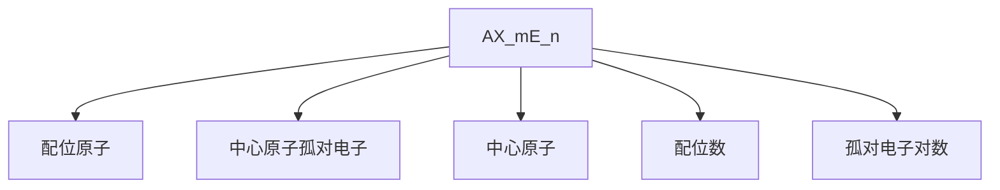

# 一、分子结构06:17

# 1. 课后习题解析 07:29

# 1）电子构型判断

![[02.分子结构一_笔记1_images/01f2ffd15590e5420dc085cc0f5fd464816c90fcf8b7f410334df69874dc4d2a.jpg]]

text_image

(4) 18°-28'2p'38'3d'
(5) 18°-28'2p'41'
(b)18°-28'2p'

4.不查表，写出下列原子的电子排布式：
C(6), N(7), P(15), Sc(21), Ni(28), Zn(30), Ga(31), As(33), Zr(40), Te(52)

C(6):                    N(7):
P(15):                    Sc(21):
Ni(28):                    Zn(30):
Ga(31):                    As(33):
Zr(40):                    Te(52);

5.具有下列电子排布的微粒不能肯定是原子还是离子的是（）

- 5.具有下列电子排布的微粒不能肯定是原子还是离子的是（） 1. 基态判断标准：符合能量最低原理、泡利不相容原理和洪特规则的电子排布  
● 激发态特征：电子从低能级跃迁到高能级（如 $2s^{2}2p^{1}\rightarrow2s^{1}2p^{2}$ ）  
● 错误构型识别：违反基本规则（如 $1s^{2}2s^{3}$ 违反泡利原理）

# 2）原子量计算

![[02.分子结构一_笔记1_images/b6e4a2239343678b4ec29978dc407d3d8ae386698d4f0555f3846fbe206ab15f.jpg]]

text_image

16.查表得 He 的第一电离能为 2374kJ·mol⁻¹，该值在所有元素的第一电离能中为最高者。
(1)讨论为什么 He 的第一电离能这样高？
(2)依你之见，所有元素中第二电离能最高者是何种元素？为什么？

17.同周期元素的半径具有同周期变化规律。但当原子核外电子排布为半充满或全充满时，
半径往往会突然增大。例如，Cu 和 Zn 的金属半径（分别为 128 和 134pm）大于前面的 Ni
（124pm），Ar 的 van der Waals 半径（191pm）大于前面的 Cl 的 van der Waals 半径（185pm）。
试解释其中原因。

计算方法：各同位素质量数×丰度百分比之和  
● 实例计算：锂原子量=6.01513×7.42%+7.01601×92.58%≈6.94  
● 注意事项：质量数需用精确同位素质量，百分数需转换为小数

# 3）电子排布式书写

![[02.分子结构一_笔记1_images/a3ad864f8b73a0fa3bcdf842639beba4337e577f43e0d373062499a1854315c0.jpg]]

text_image

12.写出下列物种的电子排布: Cr、Cl⁻、Al²⁺、Ag、I
13.已知某元素的原子序数为 51，试推测:
（1）该元素的电子结构；
17

● 书写规则：遵循构造原理（1s→2s→2p→3s→3p→4s→3d→4p...）  
● 特例说明： $Cr(3d^{5}4s^{1})$ 、 $Cu(3d^{10}4s^{1})$ 等半满/全满构型  
- 离子排布：失电子顺序为 $np \rightarrow ns \rightarrow (n-1)d$ （如 $Al^{3+}$ ： $1s^{2}2s^{2}2p^{6}$ ）

# 4）原子半径规律

![[02.分子结构一_笔记1_images/8850965f5f2f8324ef7e8abcadb18839003af728d1dbf49307cd41bb16c79114.jpg]]

text_image

14.试根据现代原子结构理论回答下列问题：
（1）第8周期共有______种元素；
（2）原子核外出现第一个6f电子的元素的原子序数是____；
（3）第114号元素属于______周期，______族元素，原子的外围电子构型是______
15.五种元素的原子电子层结构如下：
A 1s²2s²2p⁶3s²3p⁶3d⁵4s² B 1s²2s²2p⁶3s² C 1s²2s²2p⁶ D 1s²2s²2p⁶3s²3p²
E 1s²2s¹
试问其中
（1）哪种元素是稀有气体？
（2）哪种元素最可能生成具有催化性质的氧化物？
（3）哪种元素的原子的第一电离能最大？

周期规律：同周期从左到右半径减小（核电荷增加）  
● 特例解释：半充满/全充满时电子排斥力增大导致半径突增  
● 对比分析：Ca→Ga比Mg→Al半径减小更显著（d电子屏蔽效应差）

# 5）电离能分析

![[02.分子结构一_笔记1_images/0168a552b605b51a4328b84f6e8d3b7e89357d7d85e7f5aa2e68e38136c88cf5.jpg]]

text_image

学习改变命运
考成就未来

（2）处在哪一周期哪一族？
（3）是非金属还是金属？
（4）最高氧化态及其氧化物的酸碱性。

14.试根据现代原子结构理论回答下列问题：
（1）第8周期共有______种元素：

He高电离能：1s轨道全满且核电荷作用强  
● 第二电离能最高： $Li^{+}(1s^{2})$ 与He类似但核电荷更高  
● 周期变化：同周期总体增大，但存在Be>B、N>O等反常

# 6）元素性质推测

![[02.分子结构一_笔记1_images/e3766fa63e5175326dd5a5605043deb4a9cadc53ce460a11fdb4181872fb1e43.jpg]]

text_image

课后习题
1.元素 R 核电荷数为 16, 原子的质量数 32, 则 R 离子应包含( )
A 16e⁻、16Z、16N                    B 18e⁻、16Z、16N
C 18e⁻、18Z、16N                    D 16e⁻、16Z、18N

2.锂含有 7.42%⁶ Li(mₐ=6.01513mₐ)和 92.58%⁷ Li(mₐ=7.01601mₐ)两种同位素。试计算锂的原子量。

3.在下列电子构型中, 哪种属于原子的基态? 哪种属于原子的激发态? 哪种纯属错误?
(1) 1s²2s²2p¹    (2) 1s²2p²    (3) 1s²2s³
(4) 1s²2s²2p³3s³3d¹    (5) 1s²2s²2p⁴4f¹    (6)1s²2s²2p¹

周期表定位：原子序数51（Sb）→第五周期VA族  
● 金属性判断：位于周期表阶梯线右侧→半金属  
● 最高氧化态：+5（主族序数），氧化物呈两性

# 7）屏蔽效应计算

![[02.分子结构一_笔记1_images/8d44520b4921d8a5611698d9c3d443275ec1a20620986aa4fa8e8fef07758468.jpg]]

text_image

(2) 一个外层轨道组的电子对内层轨道组电子没有屏蔽作用, α = 0, 屏蔽仅发生在层电子对外层电子以及同层电子之间
(3) 同轨速相电子间屏蔽常数α = 0.35, 1/2 链速 两个电子之间屏蔽常数α = 0.30
(4) 这外层电子对 ns, np 轨道上的电子屏蔽常数α = 0.85, 冠内层 σ = 1.0
(5) 当层电子则 nd, nf 轨道上的电子屏蔽常数α = 1.0
则被屏蔽电子的受到的有效核电频数 Z² = Z - Σσ
方面由于当 π 固定, 1 较小的电子在塑原子核最近处时小峰, 出现在锤子极附近的机会比较多, 受到来自其它电子的屏蔽作用较小, n 相同时, 1 越小, 电子云钻得越深, 能量越低 (错字效应).
两相结合的结果, 就是当轨道的 n 与 1 均不同时, 全会发生能级交错现象, 综合考虑这些效应, Pauling 提出了一个定性的近似轨道能级图, 可以依此粗略判断电子的填充顺序;

# - 屏蔽常数规则：

○ 同层电子 $\sigma=0.35$ （1s电子间 $\sigma=0.30$ ）  
- 次外层对ns/np电子σ=0.85  
- 更内层电子 $\sigma = 1.00$

● 钻穿效应：I越小电子云越靠近核，能量越低  
● 能级交错：4s<3d（n+1规则）

# 2. 第一节课后习题答案 16:02

1）例题1: 元素R的离子构成 16:09

● 核电荷数与质量数关系：核电荷数=质子数=元素序号，质量数=质子数+中子数   
- 硫离子特征：16号元素硫(S)的常见离子形式为 $S^{2-}$ ，获得2个电子后电子数变为18  
- 选项分析：正确答案为B选项，包含18个电子 $(e^{-})$ 、16个质子(Z)、16个中子(N)

2）例题2: 锂的原子量计算 16:29

● 加权平均法：原子量=各同位素质量×丰度百分比之和  
● 具体计算： $6.01513 \times 7.42\% + 7.01601 \times 92.58\% = 6.942$ 原子质量单位(mu)  
● 单位注意：计算结果需保留与题目相同的单位(mu)

# 3）例题3: 电子构型的基态与激发态判断 16:49

![[02.分子结构一_笔记1_images/37bf2ad483f061538fa8d6bfc517daa8aca1e4cb93b2f2dc0d4d9bee40ce61be.jpg]]

text_image

课后习题
1.元素 R 核电荷数为 16，原子的质量数 32，则 R 离子应包含( )
A 16e⁻、16Z、16N
B 18e⁻、16Z、16N
C 18e⁻、18Z、16N
D 16e⁻、16Z、18N

2.锂含有 7.42%⁶ Li(mₐ=6.01513mₐ)和 92.58%⁷ Li(mₐ=7.01601mₐ)两种同位素。试计算锂的
原子量。

3.在下列电子构型中，哪种属于原子的基态？哪种属于原子的激发态？哪种纯属错误？
(1) 1s²2s²2p¹
(2) 1s²2p²
(3) 1s²2s³
(4) 1s²2s²2p⁶3s¹3d¹
(5) 1s²2s²2p⁴4f¹
(6) 1s²2s²2p¹

基态特征：完全遵循能级填充顺序(如 $1s^{2}2s^{2}2p^{1}$ )  
● 激发态识别：电子跃迁至高能级(如 $2s\rightarrow2p$ 或 $2p\rightarrow4f$ )  
● 错误构型：违反泡利不相容原理(如 $2s^{3}$ )   
- 分类结果:

○ 基态：(1)  
○ 激发态：(2)(4)(5)(6)   
○ 错误：(3)

● 激发难度差异： $2s \rightarrow 2p$ 激发较 $2p \rightarrow 4f$ 更易发生

# 4）例题4: 原子电子排布式书写 18:17

![[02.分子结构一_笔记1_images/4c3237f7253d2cb0b0fd066841e0ccfa0ec1d66049d056a88ee40e0e3cc19787.jpg]]

text_image

4.不查表，写出下列原子的电子排布式：
C(6), N(7), P(15), Sc(21), Ni(28), Zn(30), Ga(31), As(33), Zr(40), Te(52)

C(6):                    N(7):
P(15):                    Sc(21):
Ni(28):                    Zn(30):
Ga(31):                    As(33):
Zr(40):                    Te(52);

5.具有下列电子排布的微粒不能肯定是原子还是离子的是（ ）

A. 1s²    B. 1s² 2s² 2p⁴    C. [Ne]3s²    D. [Kr]4d¹⁰ 5s²

6. Pb²⁺ 离子的价电子层结构是（ ）

● 书写原则：按能级顺序填充电子，注意过渡金属3d在4s之后  
● 参考工具：需熟记元素周期表各能级填充顺序   
- 典型示例：

○ $Sc(21):1s^{2}2s^{2}2p^{6}3s^{2}3p^{6}4s^{2}3d^{1}$

○ Ni(28): $1s^{2}2s^{2}2p^{6}3s^{2}3p^{6}4s^{2}3d^{8}$

5）例题5: 电子排布与微粒类型判断 18:32

![[02.分子结构一_笔记1_images/60fd06061dd402ff569210926206295056fd9961a65a5cc354b7bafa5568d6be.jpg]]

text_image

Ni(28): Zn(30):
Ga(31): As(33):
Zr(40): Te(52):

5.具有下列电子排布的微粒不能肯定是原子还是离子的是（ ）
A. 1s² B. 1s² 2s² 2p⁴ C. [Ne]3s² D. [Kr]4d¹⁰ 5s²

6. Pb²⁺ 离子的价电子层结构是（ ）
A. 6s² 6p² B. 5s² 5p² C. 6s² D. 5s² 5p⁶ 5d¹⁰ 6s²

7.画出下列原子的轨道电子排布图：Ti，Si，Mn。这些原子各有几个未成对电子？
16

● 判断依据：需考虑同电子构型的可能原子/离子  
- 选项分析：

○ A(1s²): 可能是He原子或H⁻离子

○ D([Kr]4d $^{10}$ 5s $^{2}$ ): 可能是Sn原子或Sn $^{2+}$ 离子

● 确定选项：AD均存在多种可能解释  
● 特殊说明： $Sn^{2+}$ 常见于氯化亚锡等化合物中

6) 例题6: Pb2+离子的价电子层结构 21:27

- 电子结构变化：Pb原子失去两个电子形成Pb2+离子后，电子结构变为 $6s^{2}$ ，这是其价电子层结构。  
- 下层电子结构：在形成二价铅离子时，失去的是p轨道的电子，最终价电子层仅剩s轨道的两个电子。

7) 例题7: 原子轨道电子排布图与未成对电子数 21:40

![[02.分子结构一_笔记1_images/bf88079aedabc233e8bb3e79af49e6ee9e2a18fba9b5c985c13d2e4e117feab4.jpg]]

text_image

5.具有下列电子排布的微粒不能肯定是原子还是离子的是（）
A. 1s² B. 1s²2s²2p⁴ C. [Ne]3s² D. [Kr]4d¹⁰5s²
6. Pb²⁻离子的价电子层结构是（）
A. 6s²6p² B. 5s²5p² C. 6s² D. 5s²5p⁶5d¹⁰6s²
7.画出下列原子的轨道电子排布图：Ti, Si, Mn。这些原子各有几个未成对电子？
16

# - 钛(Ti)的电子排布：

○ 价层电子构型： $3d^{2}4s^{2}$   
○ 未成对电子：在3d轨道上有2个未成对电子

# ● 硅(Si)的电子排布：

○ 价层电子构型： $3s^{2}3p^{2}$   
○ 未成对电子：在3p轨道上有2个未成对电子

# - 锰(Mn)的电子排布：

○ 价层电子构型： $3d^{5}4s^{2}$   
○ 未成对电子：在3d轨道上有5个未成对电子

# ● 电子排布规则：

- 洪特规则：电子优先占据能量相同的不同轨道，且自旋平行  
○ 轨道图示：s轨道为单轨道，p轨道为三个简并轨道，d轨道为五个简并轨道

# ● 磁性判断：

- 顺磁性：存在未成对电子的原子显示顺磁性  
○ 磁矩计算：经验公式 $\mu=\sqrt{n(n+2)}$ ，单位玻尔磁子(BM)

■ n的定义：未成对电子数目  
■ 实验验证：磁矩可通过磁天平测量，与计算值接近但不完全相同

# 8）例题8: 顺磁性原子的判断 24:48

![[02.分子结构一_笔记1_images/5152429f1b4f55ed56507a6b3cfbdc3b69cf6561d434ff388a24b4cd0a64e60d.jpg]]

text_image

8.下列原子中,哪些是顺磁性的: Be, Ca, N, O, Al
9.2006年3月有人预言,未知超重元素第126号元素有可能与氟形成稳定的化合物。按元素周期系的已知规律,该元素应位于第____周期,它未填满电子的能级应是____,在该能级上有____个电子,而这个能级总共可填充____个电子。
10.氢原子中4s和3d态,哪一种状态的能量高?在19号元素钾中4s和3d态哪一种状态的能量高?说明理由。
11.A、B两元素,A原子的M层和N层的电子数分别比B原子的M层和N层的电子数少

# ● 判断标准: 原子是否具有单电子是判断顺磁性的关键依据

○ 有单电子：顺磁性  
○ 无单电子：抗磁性（又称逆磁性）

# ● 实例分析:

○ Be: 电子排布 $1s^{2}2s^{2}$ ，无单电子→抗磁性  
○ Ca: 与Be同族，无单电子→抗磁性  
○ N: 价电子 $2s^{2}2p^{3}$ ，3个单电子→顺磁性  
○ O: 价电子 $2s^{2}2p^{4}$ ，2个单电子→顺磁性  
○ Al: 价电子 $3s^{2}3p^{1}$ ，1个单电子→顺磁性

# 9）例题12: 物种的电子排布书写 26:01

![[02.分子结构一_笔记1_images/3ff9d3d1202c629778df6d908cc331a7f0b90439fa4e5cfdd62973c87d8aa585.jpg]]

text_image

12.写出下列物种的电子排布：Cr、Cl⁻、Al³⁺、Ag、I
13.已知某元素的原子序数为 51，试推测：
（1）该元素的电子结构；
17

# ● 书写原则:

○ 填充顺序：按能级顺序 $ns\rightarrow(n-2)f\rightarrow(n-1)d\rightarrow np$ 填充   
- 电离顺序：优先失去最外层电子（与填充顺序相反）

■ 例如：先填4s后填3d，但失电子时先失4s电子

# - 应用提示:

○ 书写时可对照周期表验证   
- 注意区分原子和离子的电子排布差异

# 10）例题13: 原子序数为51的元素推测 26:43

![[02.分子结构一_笔记1_images/5b656f5a3226ebee66d6011580473fa80f5610d8f3acfed488c59fb3836faad5.jpg]]

text_image

13.已知某元素的原子序数为51，试推测：
（1）该元素的电子结构：
17
学习改变命运
思 考成就未来
（2）处在哪一周期哪一族？

# ●

\- 电子结构推导方法：利用稀有气体原子序数作为基准点（36Kr、54Xe、86Rn、118Og），51号元素介于36-54之间，应表示为 $[Kr]4d^{10}5s^{2}5p^{3}$

\- 价层电子简化表示：当仅要求写价层电子时，可简化为 $5s^{2}5p^{3}$ ，但必须注意包含 $4d^{10}$ 电子

# ● 周期族判断：

- 周期：第五周期（最外层电子主量子数 $n = 5$ ）  
○ 族：第五主族（VA族），价电子数=5

● 金属性判断：属于金属元素

● 最高氧化态：+5价（等于主族序数）  
● 氧化物性质：酸性氧化物（典型高价金属氧化物特性）

# 11）例题14: 现代原子结构理论相关问题 29:49

![[02.分子结构一_笔记1_images/f8ea462c83b474a82de79d7b3fd2de01cf5e17e3c98806a3cc2bffb5f3d86acc.jpg]]

text_image

第一季学习的性和重要性学生必读
学习改变命运
考成就未来
（2）处在哪一周期哪一族？
（3）是非金属还是金属？
（4）最高氧化态及其氧化物的酸碱性。

# ●

\- 第八周期元素数量：50种（电子填充顺序为 $8s^{2}5g^{8}6f^{14}7d^{10}8p^{6}$ ）

# - 6f电子首次出现：

○ 理论推算：139号元素（118+2+18+1=139）  
○ 实际可能更早：由于能级交错，可能在5g未填满时即出现6f电子

# ● 114号元素特征：

- 周期：第七周期  
○ 族：第四主族（IVA）  
○ 价电子构型： $7s^{2}7p^{2}$   
○ 类比：与碳族元素性质相似

# 12）例题15: 五种元素电子层结构分析 32:53

![[02.分子结构一_笔记1_images/2b8aa5936da012a63925a446d617761648e1ba2f5f4c4ea63b5d854f6ddadab1.jpg]]

text_image

14.试根据现代原子结构理论回答下列问题:
(1)第8周期共有50种元素;
(2)原子核外出现第一个6f电子的元素的原子序数是139;
(3)第114号元素属于_周期,_族元素,原子的外围电子构型是
15.五种元素的原子电子层结构如下:
A 1s²2s²2p⁶3s²3p⁶3d⁵4s² B 1s²2s²2p⁶3s² C 1s²2s²2p⁶ D 1s²2s²2p⁶3s²3p²
E 1s²2s¹
试问其中
(1)哪种元素是稀有气体?
(2)哪种元素最可能生成具有催化性质的氧化物?
(3)哪种元素的原子的第一电离能最大?
118
168
8s² 5g⁸ 6f¹ 7α 8p
S
SP
SP
SDP
SdP
SdP
S+dp
S+dp
S+dp

- 稀有气体判断标准：电子层完全填满（选项C的 $1s^{2} 2s^{2} 2p^{6}$ 为Ne的构型）

● 催化性质元素特征：

○ 需具有未填满d轨道（过渡金属特性）  
○ 实例：选项A的 $3d^{5}4s^{2}$ 为Mn元素，常见催化活性

\- 第一电离能最大元素：

- 稀有气体因全满电子构型电离能最高  
选项C的Ne构型电离能大于其他选项

# 13）例题16: He的第一电离能讨论 33:56

![[02.分子结构一_笔记1_images/ab4294399bd22184b065dc6a465d0e5063f61ac3868a20542b4bed6c3eca9e94.jpg]]

text_image

16.查表得 He 的第一电离能为 2374kJ·mol⁻¹，该值在所有元素的第一电离能中为最高者。
(1)讨论为什么 He 的第一电离能这样高？ 半位小金声。
(2)依你之见，所有元素中第二电离能最高者是何种元素？为什么？

17.同周期元素的半径具有同周期变化规律。但当原子核外电子排布为半充满或全充满时，
半径往往会突然增大。例如，Cu 和 Zn 的金属半径（分别为 128 和 134pm）大于前面的 Ni
（124pm），Ar 的 van der Waals 半径（191pm）大于前面的 Cl 的 van der Waals 半径（185pm）。
试解释其中原因。

18

He高电离能原因：

- 原子半径最小（核电荷对电子束缚力强）  
○ $1s^{2}$ 全满稳定构型（破坏稳定构型需更多能量）

● 第二电离能最高元素：

○ Li元素（失去一个电子后形成 $1s^{2}$ 的He-like稳定构型）  
- 理论依据：从+1价离子再电离需要克服极强的核吸引力

# 14）例题17: 同周期元素半径变化与电子排布关系 34:07

![[02.分子结构一_笔记1_images/66c6096f049cd201f116fec978268480c72460c3406e42765d5bd3678aec2d03.jpg]]

text_image

16.查表得 He 的第一电离能为 2374kJ·mol⁻¹，该值在所有元素的第一电离能中为最高者。
(1)讨论为什么 He 的第一电离能这样高？
(2)依你之见，所有元素中第二电离能最高者是何种元素？为什么？

17.同周期元素的半径具有同周期变化规律。但当原子核外电子排布为半充满或全充满时，
半径往往会突然增大。例如，Cu 和 Zn 的金属半径（分别为 128 和 134pm）大于前面的 Ni
（124pm），Ar 的 van der Waals 半径（191pm）大于前面的 Cl 的 van der Waals 半径（185pm）。
试解释其中原因。

● 全充满/半充满效应：

○ 实例1: $Cu(3d^{10}4s^{1})$ 半径 > Ni( $3d^{8}4s^{2}$ )

○ 实例2：Ar范德华半径(191pm) > Cl(185pm)

# ● 机理分析：

- 屏蔽效应增强：全充满电子层对外层电子屏蔽更有效  
- 核有效电荷降低：导致电子云扩张   
- 范德华力减弱：满电子层原子间相互作用减弱

# ● 特殊记忆点：

○ 金属半径比较：Zn(134pm) > Cu(128pm) > Ni(124pm)  
- 稀有气体半径突增：电子排斥作用占主导

# 15）例题18: 金属原子半径与非金属原子半径比较 39:33

![[02.分子结构一_笔记1_images/72a67f070e95c42576592ef88bc0c4aa5a062175369230ed64337cf6e2853eb7.jpg]]

text_image

(1) 金属原子半径大于同周期的非金属原子半径;
(2) H 表现出和 Li 与 F 相似的性质;
(3) 从 Ca 到 Ga 原子半径的减小比 Mg 到 Al 的大。
19.下列各组元素原子的第一电离能递增的顺序正确的为 ( )
A. Na < Mg < Al
B. He < Ne < Ar
C. Si < P < As
D. B < C < N
20.下列第一电离能顺序不正确的一组是 ( )
A. K < Na < Li < H
B. Na < Mg > Al < Si

\- 同周期半径变化规律：从左至右原子半径逐渐减小，因为核电荷数增大导致对外层电子吸引力增强

● 金属与非金属位置关系：周期表左侧为金属元素，右侧为非金属元素，呈现金属向非金属过渡的特征

# - 氢元素的特殊性:

○ 可形成 $H^{+}$ （性质类似Li）或 $H^{-}$ （性质类似F）  
○ 理论上有学者将氢归为第七主族元素，因其与稀有气体存在性质关联

![[02.分子结构一_笔记1_images/c9e9603635e8db67810c990c01d904543bd16c9dc856023bc9e5c9d7f21cb8c9.jpg]]

text_image

20.下列第一电离能顺序不正确的一组是（）
A. K < Na < Li < H
B. Na < Mg > Al < Si
C. B < C < N < O
D. Be > Mg > Ca > Sr

21.第二电离能最大的原子，应该具有的电子构型是（）
A. 1s² 2s² 2p⁵
B. 1s² 2s² 2p⁶
C. 1s² 2s² 2p⁶ 3s¹
D. 1s² 2s² 2p⁶ 3s²

22.下列各组原子和离子半径变化的顺序，不正确的一组是（）
A. P²⁻ > S²⁻ > Cl⁻ > F⁻
B. K⁺ > Ca²⁺ > Fe²⁺ > Ni²⁺
C. Co > Ni > Cu > Zn
D. V > V²⁺ > V³⁺ > V⁴⁺

23.下列曲线分别表示元素的某种性质与接电荷的关系/7为接电荷、V为元素的有关性

# 16）例题19: 各组元素第一电离能递增顺序判断 40:55

# ● 题目解析:

○ 正确答案为D选项 (B < C < N)  
解析要点：氮的2p轨道处于半充满稳定状态，导致其电离能异常高于相邻元素

# 17）例题20: 第一电离能顺序判断 41:29

# ● 题目解析:

○ 错误选项为C (B < C < N < O)   
○ 错误原因：未考虑氮的 $2p^{3}$ 半充满稳定结构导致其电离能高于氧  
○ 典型规律：同一周期中 $Mg > Al$ （ $Mg$ 的 $3s^{2}$ 全满更稳定）

# 18）例题21: 第二电离能最大的原子电子构型 42:20

# ● 题目解析:

○ 关键特征：失去一个电子后达到全满稳定结构（如[He]2s²）  
○ 正确答案：C选项 $(1s^{2}2s^{2}2p^{6}3s^{1})$

\- 原理说明： $3s^{1}$ 电子易失去，但失去后形成 $2p^{6}$ 稳定结构导致第二电离能骤增

# 19）例题22: 原子和离子半径变化顺序判断 42:31

# ● 题目解析:

○ 错误选项：C (Co > Ni > Cu > Zn)   
○ 错误原因：过渡金属存在d电子屏蔽效应，实际半径变化不严格遵循此规律  
- 注意事项：考题通常给出已知结论要求解释，而非直接推断复杂屏蔽效应

# - 离子半径规律：

○ 同电子构型时，核电荷越大半径越小（如 $K^{+}>Ca^{2+}>Fe^{2+}>Ni^{2+}$ ）  
○ 同元素时，正电荷越高半径越小（如 $V > V^{2+} > V^{3+} > V^{4+}$ ）

# 20）例题23: 元素性质与核电荷数关系曲线分析 43:54

![[02.分子结构一_笔记1_images/0b9f19a26c1c322d703dd8b857e823856f64a468cc8bc32c593f515d3e7d2bb6.jpg]]

text_image

C. Co > Ni > Cu > Zn
D. V > V²⁺ > V³⁺ > V⁴⁺
23.下列曲线分别表示元素的某种性质与核电荷数的关系（Z 为核电荷数，Y 为元素的有关质）：
A
B
C
D
E
F
G
H
19

# 曲线类型分析

○ 同周期原子半径变化：随着核电荷数增大，原子半径逐渐减小（对应曲线A）  
○ 同主族价电子数：价电子数目保持不变（对应曲线B）  
○ 化合价变化：呈现先升高后突降的锯齿形（对应曲线C），如第三周期元素从+1（Na）到+7（Cl）再到0（Ar）  
○ 氢化物沸点：先降低后升高（对应曲线D），如VIIA族氢化物中HF因氢键导致沸点异常高  
○ 单质熔点变化：先升高后降低（对应曲线E），如第三周期从Na到Si熔点升高，P、S、Cl熔点降低

# ● 具体性质对应曲线

![[02.分子结构一_笔记1_images/c7c5aa1f47620f8178d777c58a461b2dd274fb368ecbab53228f1cb9e63238de.jpg]]

text_image

把与下面的元素有关性质相符的曲线的标号填入相应括号中:
(1) IIA族元素的价电子数(B
(2) VIIA族元素氢化物的沸点(D
(3) 第三周期元素单质的熔点(E
(4) 第三周期元素的最高正化合价(C
(5) IA族元素单质熔点(F)
(6) F⁻、Na⁺、Mg²⁺、Al³⁺四种离子的离子半径(A)
(7) 短周期元素的原子半径(G
(8) 短周期元素的第一电离能(H)

○
○ IIA族价电子数：恒为2（B曲线）  
○ VIIA族氢化物沸点：HF因氢键异常高（D曲线）  
- 第三周期单质熔点：先升后降（E曲线）  
- 第三周期最高正化合价：+1到+7（C曲线）  
○ IA族单质熔点：H异常低，其余逐渐降低（F曲线）  
○ 离子半径比较： $F^{-}>Na^{+}>Mg^{2+}>Al^{3+}$ (A曲线)   
- 短周期原子半径：先减后增（G曲线），稀有气体用范德华半径  
- 第一电离能：经典变化曲线（H曲线）

# - 原子序数50的元素分析

![[02.分子结构一_笔记1_images/f5fa615227493c8bf933d2a94477c93234e3a253fbbb8415a3bbd9362588ba10.jpg]]

text_image

(8) 短周期元素的第一电离能 ( )
24 已知某元素的原子序数是 50, 试推测该元素
(1) 原子的电子层结构: 50. . . . 54
(2) 处在哪一周期哪一族?
(3) 是金属还是非金属?

电子排布： $[Kr]4d^{10}5s^2 5p^2$   
- 周期族位置：第五周期IVA族  
○ 元素性质：金属元素（锡Sn）

# 21）分子结构基础理论

![[02.分子结构一_笔记1_images/eca4464c5bce77b375ccc00b2bd528bff8ec4108230ed67d2bbc4aa6267a840f.jpg]]

text_image

2017化学竞赛
Contents
一 Lewis structures 六 等电子体
二 VSPER理论 七 分子轨道理论
三 近代价键理论 八 分子对称性
四 杂化轨道理论 九 分子间作用力与氢键
五 离域π键

● 路易斯结构式

![[02.分子结构一_笔记1_images/5975ee8ba7d475551b3d50f53725bdb9f1544962f9a8398e803b9ba2a49931c6.jpg]]

text_image

2017化学竞赛
— Lewis structures
1916年，物理化学家G.N. Lewis提出，
当两个原子共用一对电子形成共价单键
，共用电子对（A:B），表示为A-B；同
样地，双键，两个共享电子对（A::B）
表示为A=B。 A=B
没有共用的电子（A:）称为孤对电子，
它们对分子的形状发挥重要作用。
Gilbert N. Lewis

基本概念：1916年G.N.Lewis提出，共用电子对形成共价键  
○ 表示方法：

■ 单键：A - B（1对共用电子）  
■ 双键：A = B （2对共用电子）  
■ 三键： $A \equiv B$ （3对共用电子）

○ 孤对电子：未参与成键的电子对，影响分子几何形状

● 路易斯结构式的三种形式

![[02.分子结构一_笔记1_images/63a89b0b214cbe705e433f4e487ade4f316cec13956d1484c1d4f60698749b0a.jpg]]

text_image

2017化学竞赛
Lewis提出了三种表示共价分子的结构式，
称为Lewis结构式：
H···N···H
...
H=N-H
...
H-N-H
...
由才
最常用
学而思培优

○ 电子式：显示所有价电子（如 $H\cdots\ddot{N}\cdot H$ ）  
- 标准式：用短线表示共价键，保留孤对电子（最常用）  
- 简化式：省略孤对电子（需明确孤对电子数量）

# - 分子结构学习要点

- 理论关系：不同理论解释分子不同方面性质，分子本身是唯一的  
○ 核心内容：包括VSEPR理论、价键理论、杂化轨道理论等9大部分  
学习建议：所有理论都需要掌握，可参考教材对应章节

# 3. 分子结构 54:59

# 1）路易斯结构 58:34

# ● 路易斯结构的书写 59:27

○ 八隅律 59:28

■ 稳定构型原理：当ns、np原子轨道充满电子时，会形成八电子稳定构型（氢原子为两电子构型），类比稀有气体电子排布  
■ 成键本质：原子通过共用电子对来填补自身电子空缺，每形成一个共价键可为两个原子各提供一个电子  
■ 特例说明: 氢原子只需2电子即可达到稳定（氦构型），这是八隅律的唯一常见例外情况  
■ 键数推算: 原子最外层电子数与八隅体差值决定成键数，例如缺3电子需形成3个共价键

○ 共价分子或离子中成键数和孤电子对数的计算 01:00:41

■ 计算方法概述 01:00:45

![[02.分子结构一_笔记1_images/96e70cfc34ef798d891adcc7f4bd5287a9a827a118857c8a11ea5a62be8d4cec.jpg]]

text_image

2017化学竞赛
（2）共价分子（离子）中成键数和孤电子对数的计算
a. 令n—所有原子形成八电子构型所缺电子数
b. 那么成键数（共用电子对数）=n/2

计算步骤:

\- 计算所有原子达到八隅体所需电子总数 $n$ （氢按2电子计算）
- 成键数（共用电子对数） $= n / 2$ ，因每个共价键可满足两个原子的电子需求

● 电荷修正:

\- 负离子：总缺电子数需减去所带负电荷数（如 $CO_{3}^{2-}$ 要减2）
- 正离子：总缺电子数需加上所带正电荷数（如 $NO_{2}^{+}$ 要加1）

■ 例题1:二氧化碳的成键数计算 01:01:18

\- 计算过程:

○ 碳原子缺4电子（4价）

○ 每个氧原子缺2电子（6价）  
总缺电子数=4+2×2=8  
○ 成键数=8/2=4（实际为2个双键）

■ 路易斯理论的局限性 01:02:19

- 奇电子化合物: 当计算出现半键（如3/2键）时理论失效，需取整处理  
● 扩展体系: 对含d轨道参与成键的化合物（如 $SF_{6}$ ）不适用

■ 例题2: 磷四硫石（P4S）的成键数计算 01:04:44

\- 计算过程:

○ 每个磷原子缺3电子（5价）  
○ 每个硫原子缺2电子（6价）  
总缺电子数= $4 \times 3 + 1 \times 2 = 14$   
○ 成键数=14/2=7（实际结构含P-P键和P-S键）

例题3: 碳酸根（CO3^2-）与氮氧二正（NO2+）的成键数计算 01:05:43

\- 碳酸根计算:

○ 碳缺4电子  
○ 每个氧缺2电子  
○ 修正：总缺电子数=4+3×2-2=8  
○ 成键数=8/2=4（形成3个C-O键和1个离域π键）

\- 氮氧二正计算:

- 氮缺3电子  
○ 每个氧缺2电子  
○ 修正：总缺电子数=3+2×2+1=8  
○ 成键数=8/2=4（形成2个N=O双键）

\- 路易斯结构式的书写方法 01:06:36

■ 确定中心原子 01:06:48

● 选择标准：半径大、电负性小的原子优先作为中心原子

例如HCN分子中，碳（半径1.70Å）比氮（半径1.55Å）更适合作为中心原子  
○ 氢原子因只能形成一个键（价电子数=1），通常不作为中心原子

● 连接方式：先用单键将各原子与中心原子连接

■ 根据八隅律以及总键数补齐 01:07:34

\- 操作步骤：

○ 计算中心原子剩余价电子数（碳有4个价电子，已用2个形成单键）  
○ 通过形成双键/三键满足八隅律（HCN中C≡N三键）  
○ 孤对电子标注（如N原子保留1对孤对电子）

\- 注意事项：

- 第二周期元素最多形成4个键（八电子规则限制）  
- 带电荷离子需调整电子数（如 $CO_{3}^{2-}$ 需额外2个电子）

■ 练习：画出给定分子的路易斯结构式 01:08:00

![[02.分子结构一_笔记1_images/2ff0a0cc969e9bb179e1badaa887f82b4999d0ff809846cba19fdc1f187b38c0.jpg]]

text_image

(3) Lewis结构式书写方法
a. 确定中心原子, 先用单键将原子连接
b. 根据八隅律以及总键数补齐
例: 写出下面分子(离子)的Lewis结构式
BF₃ CO₃²⁻ NO₂⁺ NO₃⁻ N₂O
OCN⁻ CO HCN HN₃
H—C≡N:

典型分子：

○ $BF_{3}$ (缺电子化合物)  
○ $CO_{3}^{2-}$ （需考虑共振结构）  
○ $NO_{2}^{+}$ （带正电荷的氮氧化物）  
○ HCN（含三键的线性分子）

# - 绘制要点：

○ 所有原子必须标注孤对电子  
- 带电荷分子需明确电荷分布位置  
◦ 检查每个原子是否满足八隅律（ $BF_{3}$ 中B为6电子例外）

■ 路易斯结构式的稳定性判据：形式电荷 01:21:11

![[02.分子结构一_笔记1_images/ded9d23e88347001cc6aa14e210e0b02c5e9cc9c30460f168c9f316b95a1fdf8.jpg]]

text_image

2017化学竞赛
2. Lewis 结构式稳定性的判据——形式电荷Q_F
（1）形式电荷Q_F的由来
以CO为例
C: x O_x +

●   
● 计算公式： $Q_{F}=V-\left(L+\frac{D}{2}\right)$

○ V: 价电子数  
○ L: 孤对电子数  
○ B: 成键电子数

# 应用原则：

○ 形式电荷绝对值越小越稳定  
- 负电荷应分布在电负性大的原子上  
○ 示例：CO分子中C=O双键结构比三键结构更稳定

■ 特殊情况处理 01:21:25

# - 缺电子化合物：

○ $BF_{3}$ 中B原子只有6个价电子  
- 可通过形成大π键补充电子（后续内容）

# ● 超价化合物：

○ 第三周期后元素可突破八隅律（如 $SF_{6}$ ）  
- 第二周期元素严格禁止超价结构

# ● 共振结构：

○ 当存在多个等价路易斯式时（如 $CO_{3}^{2-}$ ）  
○ 实际结构为各共振式的杂化体

■ 常见问题与解答 01:24:53

![[02.分子结构一_笔记1_images/8c94343c00d963b3091ca5c4d89a20a3268d6e742a9a703bd1d519220d353dea.jpg]]

text_image

(3) Lewis结构式书写方法
99群: 145471368
a. 确定中心原子, 先用单键将原子连接
b. 根据八隅律以及总键数补齐
例: 写出下面分子 (离子) 的Lewis结构式
\(\left\{\begin{array}{c:ccccc} \ddots & 4 &  &  &  \\ \ddots & B F _ {3} & C O _ {3} ^ {2 - } & N O _ {2} ^ {+} & N O _ {3} ^ {-} & N _ {2} ^ {4} \\ \ddots & 0 & 4 &  &  &  \\ \ddots & O C N ^ {-} & C O & H C N & H N _ {3} & N _ {3} ^ {+} \end{array}\right.\)
[ :O=N=O ]+
[ :O=H- O : CON- CO HCN HN3 N3- [ :O一人 O ]-
学而思培优

●

# ● 键数异常：

○ $N_{3}^{-}$ 中中心N形成3个键（正常N最多4键）  
○ 需考虑形式电荷补偿（整体带负电荷）

# ● 电子分配：

- $NO_{3}^{-}$ 中N看似"缺电子"（实际通过共振离域）  
○ 氧原子孤对电子必须完整标注

# - 中心原子选择：

- $N_{2}O$ 中N比O更适合作为中心原子  
- 违反此原则会导致0形成4键（违反八隅律）

# 2）路易斯结构式稳定性的判据 01:26:47

# ● 形式电荷的由来 01:26:55

![[02.分子结构一_笔记1_images/3871b18563ec171067156352d18b1867bfdeaebeadceb571e189cfac25822f70.jpg]]

text_image

2017化学竞赛
2. Lewis 结构式稳定性的判据——形式电荷Q_F
（1）形式电荷Q_F的由来
以CO为例
e
C: x x O x ⊕
学而思培优

定义本质：形式电荷 $Q_{F}$ 是判断共价键形成平等与否的标志，用于标记电子来源不均衡的情况  
○ CO示例：在CO分子中，氧原子提供三对成键电子（而非各提供一个），导致氧 $Q_{F}=+1$ （借出电子），碳 $Q_{F}=-1$ （获得电子）  
○ 八隅体规则：合理的Lewis结构应使所有原子满足八电子结构，如CO中若按各提供一个电子，氧将达9电子而碳仅7电子，违反规则

# ● 计算公式 01:30:21

![[02.分子结构一_笔记1_images/b34fcbba2b16c59a8309dbcbc38f998de55a0089a835f29e526024a9626614b7.jpg]]

text_image

(2) QF的计算公式: :C≡O:
3-
QF=实际成键数-理论成键数
例: 判断N2O和HN3的QF

计算公式： $Q_{F}=$ 实际成键数 - 理论成键数（理论成键数=8-价电子数）

# ○ 计算示例：

■ 碳原子：实际成键3个，理论需4个（8 - 4 = 4），故 $Q_{F} = 3 - 4 = -1$   
■ 氧原子：实际成键3个，理论需2个（8 - 6 = 2），故 $Q_{F} = 3 - 2 = +1$

\- 术语说明：理论成键数也可称为"原子特征数"或"价电子数"

# ● 路易斯结构式的稳定性 01:35:39

# ○ 基本原则：

■ 最小化原则： $Q_{F}$ 应尽可能小（0最佳，±1可接受，≥±2不稳定）

# 电荷分布：

● 相邻原子避免同号电荷（正-负稳定，正-正/负-负不稳定）  
● 负电荷应在电负性大的原子上，正电荷在电负性小的原子上

# 空间排布：

- 异号电荷距离近更稳定  
- 同号电荷距离远更稳定

◦ 经验性质：这些规则均为经验性判断依据，非绝对定律

● 形式电荷的应用 01:37:15

![[02.分子结构一_笔记1_images/b73f78148cdb1653c7f9d25ea5c0b115702695a1893fd4cd041b39a92a8ef55f.jpg]]

text_image

(4) 形式电荷QF的应用
a. 如果一个共价分子有几种可能的Lewis结构式,
那么通过QF的判断,应保留最稳定和次稳定的几种
Lewis结构式,它们互称为共振结构。
例如:HN₃
N=N=N
H⁻
H⁻
N-N≡N : √
又保留QF=0
±1
学而思培优

○ 共振结构：

当分子存在多种可能Lewis结构时，保留 $Q_{F}$ 为0或±1的稳定/次稳定结构  
■ 用双向箭头↔连接共振结构（非可逆符号）  
■ 实际分子是共振杂化体，非结构间切换（如苯环非"震动"状态）

○ 键级计算：

■ 多原子分子中键级可取分数值（如N-N键在HN3中为1-2之间）  
■ 键级与键长关系：键级↑→键能↑→键长↓

● 应用案例 01:40:40

例题:氰酸根离子与异氰酸根离子的稳定性比较

![[02.分子结构一_笔记1_images/7c6b4d66de653e7b49f7f49e4f90196bb80a9a450273762696330e8e38b19922.jpg]]

text_image

2017化学竞赛
例如：氰酸根离子OCN-比异氰酸根离子ONC-
稳定，请解释。
∵O=C=N↔:O-C≡N:
    开线由带之和与共轭形成
      O-N

结构对比：

- OCN-（氰酸根）：存在 $Q_{F}=0$ 的稳定共振结构（O=C=N↔O-C≡N）  
● ONC-（异氰酸根）：最优结构 $Q_{F}=-2$ （O-N≡C），稳定性差

■ 中心选择原则：电负性较小、半径较大的原子更适合作中心原子  
■ 电荷验证：所有共振结构 $Q_{F}$ 总和必须等于分子总电荷（如OCN-各结构 $Q_{F}$ 和为-1）

3）不符合八电子规则的情况 01:44:36

● 奇电子化合物 01:44:47

![[02.分子结构一_笔记1_images/4a1bb66618cb25b47bf7f01755590d73e26c2dcfbb941c92cf8b42daf5df5227.jpg]]

text_image

2017化学竞赛
3. 不符合八电子规则的情况
（1）对于奇电子化合物，如NO₂，只能用特殊
方法表示：
O···N···O←→ O···N···O

特殊表示方法：对于奇电子化合物如 $NO_{2}$ ，路易斯提出特殊表示方法，用"N N..."形式表示

○ 考试注意：这类化合物在考试中通常不会要求表示，只需知道存在这种特殊表示方法即可  
- 实用性：实际应用中这种表示方法并不特别方便，更多是理论上的解决方案

● 缺电子化合物 01:45:57

○ 缺电子化合物的定义 01:46:01

■ 概念：指中心原子无法通过常规方式满足八电子稳定结构的化合物  
■ 典型例子： $BeCl_{2}$ 、 $BF_{3}$ 等化合物

\- 缺电子化合物的Lewis结构式 01:46:17

![[02.分子结构一_笔记1_images/e3f3870e1024696997b69fbe1e05a81f21c3eabc6477ac7119c7c595bb1ec247.jpg]]

chemical

2017化学竞赛中，B族化合物（如BF₃）与Lewis结构式结合的示意图，标注其共4种共振结构

■ 结构特点：如 $BeCl_{2}$ 需要形成4个键才能满足八电子规则，但实际只能形成2个键  
■ 形式电荷：这类结构式往往带有较高的形式电荷，结构不美观

\- 缺电子化合物的稳定性讨论 01:47:04

■ 稳定电子数：某些元素（如Be）可能4电子就稳定，B可能6电子就稳定  
■ 理论修正：提出缺电子化合物概念，认为它们可以在少于8电子时稳定存在

\- 缺电子化合物的共振结构 01:47:22

共振结构数：如 $BF_{3}$ 有4种共振结构  
■ 键级计算： $BF_{3}$ 中B-F键级在1\~4/3之间  
■ 结构差异：虽然看起来相似，但不同共振结构中双键位置不同（在不同F原子上）

例题1: 氯化铝的二聚结构 01:48:30

![[02.分子结构一_笔记1_images/b8fbf0675fe501f1a9259f08b5d0974658ddcf0de6df8be26f69f2e86f3920bf.jpg]]

chemical

2017化学竞赛中缺电子化合物的结构式，如BF₃，展示BF₃ Lewis结构式与共轭共轭共轭共轭共轭共轭共轭共轭共轭共轭共轭共轭共轭共轭共轭共轭共轭共轭共轭共轭共轭共轭共轭共轭共轭共轭共轭共轭共轭共轭共轭共轭共轭共轭共轭共轭共轭共轭共轭共轭共轭共轭共轭共轭共轭共轭共轭共轭共轭共轭共-3

■ 二聚机制： $AlCl_{3}$ 通过二聚形成 $Al_{2}Cl_{6}$ 达到八电子稳定  
■ 配位键：二聚体中存在配位键，由CI提供孤对电子  
■ 电子数：二聚后每个AI原子周围达到8电子稳定结构

\- 缺电子化合物的多聚结构 01:50:30

■ 多聚化：缺电子化合物常通过多聚形成一维链状结构  
■ 电子稳定：多聚后中心原子逐步接近八电子稳定结构

例题2: 氯化铍的多聚结构 01:50:52

■ 二聚结构： $BeCl_{2}$ 二聚体中心Be原子达到6电子  
■ 多聚延伸：继续多聚形成一维链状结构，最终Be可达8电子  
■ 结构特点：多聚结构中每个Be与4个Cl形成配位

\- 富电子化合物 01:54:27

# - 富电子化合物的特点

![[02.分子结构一_笔记1_images/6e91c1336d7cdc166ccc42fb13c66bcb2c51177520f6b16c2be5d4980d604c6e.jpg]]

text_image

(3) 对于富电子化合物, 如OPCI₃、SF₆
- a
Ba-a- Re
(a)
(a)
a
轨迹
无反应键
测

![[02.分子结构一_笔记1_images/57b43f190e836df8f3deea28222859d348438f370a322054076c5653f0ec96f0.jpg]]

定义：中心原子价电子数超过八电子的化合物

![[02.分子结构一_笔记1_images/75a5e390e153bfeaed1aba5a61fe719efa9b2e3bd3b111f0384d90bb915b1157.jpg]]

典型例子： $PCl_{5}$ 、 $SF_{6}$ 等

![[02.分子结构一_笔记1_images/940ae53bd91237c4db6b7e7046458b480b55a261dfd3fdcf023599dde1020ced.jpg]]

d轨道参与：第三周期元素可利用3d轨道成键，形成10、12甚至更多电子的结构

# - 富电子程度计算

![[02.分子结构一_笔记1_images/6789787c74ae9ed2770ba8a0ccf00e98ceca5e682909bf18ef578b1c2cd84743.jpg]]

text_image

2017化学竞赛
问题1：如何确定中心原子的价电子“富”到什么程度呢？
显然中心原子周围的总的价电子数等于中心原子本身的价电子与所有配位原子缺少的电子数之和。
例如：XeF₂、XeF₄、XeOF₂、XeO₄等化合物，它们都是富电子化合物，画出他们的Lewis结构式
XeF₂: 8 + 1 × 2 = 10
XeF₄: 8 + 1 × 4 = 12
XeOF₂: 8 + 2 + 1 × 2 = 12
XeO₄: 8 + 2 × 4 = 16

![[02.分子结构一_笔记1_images/1320746b18cf804dc15a6f939b58da17b5527d970e3e3206eb9332cbeccc4050.jpg]]

计算公式：中心原子价电子数 = 中心原子本身价电子 + 所有配位原子缺少的电子数

# ■ 应用示例：

- $XeF_{2}:8 + 1\times 2 = 10$ 电子  
- $XeF_{4}:8 + 1\times 4 = 12$ 电子  
- $XeOF_{2}:8 + 2 + 1 \times 2 = 12$ 电子  
- $XeO_{4}:8 + 2\times 4 = 16$ 电子

# ○ 修正规则

![[02.分子结构一_笔记1_images/882c3fbb2a49235c4bb533814f2ad3826cc8595a52ccf6c3d14209a775b2fc27.jpg]]

text_image

2017化学竞赛
问题2：有些富电子化合物为什么可以不修正呢？
例如：OPCI₃ SF₆
当配位原子数小于或等于键数时，可以不修正，因为连接配位原子的单键已够了。但中心原子周围的配位原子数目超过4，必须要修正
8e 10e

![[02.分子结构一_笔记1_images/6c07e41b8807ed898abb4132f45794d558f00026ecaf6e50596d3b52f099e6a2.jpg]]

不修正条件：当配位原子数 $\leqslant4$ 时可不修正，仅会产生形式电荷

![[02.分子结构一_笔记1_images/0a7675328f52b809299cb874e0e9bc4eb263dcb9bf60de2563f90e6b53440239.jpg]]

必须修正：配位原子数>4时必须修正，否则无法连接所有原子

![[02.分子结构一_笔记1_images/d804f2cd48f75d07d1a5c4b64ca4de8917d05e75e2f60ff289c6453493c810ff.jpg]]

示例对比： $PCl_{3}O$ 可不修正， $SF_{6}$ 必须修正

![[02.分子结构一_笔记1_images/fdb2338f8de05882acf985718ab1a9d1ea10a0be0957ed3d7658a94fcfa368a4.jpg]]

例题:SNF、NSF和SFN稳定性顺序比较 02:04:52

# - 结构分析：

- SNF：硫为中心原子，形成富电子结构  
- NSF：氮为中心原子，常规八电子结构  
- SFN：硫带正电荷，氮带负电荷，结构不稳定

● 稳定性顺序：SNF > NSF > SFN  
● 判断原则：半径大、电负性小的原子更适合作为中心原子

# 4. 休息 02:08:06

# 1）例题1：比较SNF、NSF和SFN的稳定性 02:09:25

![[02.分子结构一_笔记1_images/7f4778044b7b80679fa3d57d8c500537cb4a42a6c1f291d1984ade0416bb0256.jpg]]

text_image

2017化学竞赛
例题：假设SNF、NSF和SFN都存在，试比较他们的
稳定性顺序。

![[02.分子结构一_笔记1_images/4d389dc07e6fbedad8f4976f9fd3f5846f1cc89f49142f01dc5677bb3d3bc200.jpg]]

# ● 稳定性顺序：NSF > SNF > SFN

# ● 原因分析:

○ 键级因素：NSF中硫氮键的键级更大，与实际情况更吻合   
☐ 实验证据：根据祖德书记载，只有NSF能被稳定制备出来，其他两种化合物未被成功制备  
○ 结构特征：NSF的中心硫原子可以充分利用3d轨道成键（第三周期元素特性）

# 2）例题2：解释氰酸根离子OCN-比异氰酸根离子ONC-稳定的原因 02:12:15

![[02.分子结构一_笔记1_images/4ea67abce6e25bb2eb38d22c168ec4eaa9a4670c364be1c85fa628156ceae7e3.jpg]]

text_image

2017化学竞赛
例如：氰酸根离子OCN⁻比异氰酸根离子ONC⁻
稳定，请解释。
b. 可以计算多原子共价分子的键级
N=N=N
H a b c
←→ N-N≡N :
1-2 2-3
学而思培优

![[02.分子结构一_笔记1_images/f93c8b101345eb688f7156764d3aca7fab7aff916b725b951fabd796096620bd.jpg]]

# ● 键级判断方法：

○ 基本原则：原子间形成几根键，键级就是几  
○ 示例说明：

■ $N \equiv N$ 三键的键级为3  
■ N = N双键的键级为2   
■ 三氟化硼(BF₃)的键级在1到4/3之间

# ● 稳定性解释：

○ 键长关系：键级越大 → 键能越大 → 键长越短（更稳定）  
○ 结构优势：OCN-的键级分布更合理，能形成更稳定的共振结构

# 3）竞赛与课程相关讨论 02:13:37

# ● 竞赛备考建议：

预赛时间各省差异大（4-7月不等），需查询往年时间  
- 北京地区预赛与初赛无必然联系，其他省份可能不同  
备考重点应放在初赛内容，不需为预赛调整学习进度

# - 学习建议：

- 初二/初三学生均可参赛，具体政策因省而异  
○ 结构式绘制非机考重点，但需掌握键级计算等核心概念

# 5. 价层电子对互斥VSEPR理论 02:22:55

# 1）VSEPR理论 02:23:34

● 基本思想：在共价分子或共价型离子中，中心原子周围的电子对（包括成键电子对和孤对电子对）会尽可能采取使静电排斥最小的几何构型，即各电子对间距离最大化。

# ● 电子对类型：

- 成键电子对：用于形成化学键的电子对  
○ 孤对电子对：中心原子自身剩余的未成键电子对（周围原子的孤对电子不影响构型）

# 2）应用案例 02:26:01

# - 分子表示法

![[02.分子结构一_笔记1_images/3b2c592cb29f0b0051866efb41e141cb93e8f2eeb671902d88cac7e99eafd25f.jpg]]

flowchart

O

○ 表示方法：将分子或离子表示为 $AX_{m}E_{n}$ 形式

A: 中心原子  
X: 配位原子  
■ m: 配位原子数目（即配位数）  
E: 中心原子的孤对电子  
■ n: 孤对电子对数

\- 价层电子对数：由 $(m + n)$ 的值决定分子构型

● 例题:分子离子价层电子对数计算 02:29:18

![[02.分子结构一_笔记1_images/fc72925b72567eaed4ea9c8019948aeeb91bdccbd7b5aafa8560ec55028eae41.jpg]]

text_image

例题：将下面分子、离子写成 AXₘEₙ的形式
BeCl₂、BF₃、CO₃²⁻、O₃、SO₂、CH₄、SO₄²⁻
NH₃、H₂O、PCl₅、SCI₄、SF₆、IF₃、IF₅
CO₃²⁻  AX₃E₀  SO₄²⁻  AX₄E₀
(2) 将(m+n)称作价层电子对数，(m+n)的值
SO₄  AX₃E₁  SF₆ = AX₆E₀
决定了一个分子的构型
IF₃ = AX₃E₂
IF₅ = AX₅E₁

O

○ 题目解析

$CO_{3}^{2-}:AX_{3}E_{0}$ （碳提供4个电子+外界2个，与3个氧成键无剩余）  
$SO_{2}$ : $AX_{2}E_{1}$ (硫有6个电子，与2个氧成键后剩余2个电子)  
■ $SO_{4}^{2-}:AX_{4}E_{0}$ （硫提供6个电子+外界2个，与4个氧成键无剩余）  
■ $IF_{3}$ : $AX_{3}E_{2}$ (碘提供7个电子，与3个氟成键后剩余4个电子)  
■ $IF_{5}$ : $AX_{5}E_{1}$ (碘提供7个电子，与5个氟成键后剩余2个电子)

# 3）分子构型

\- $m + n = 2 - 3$ 的构型

<table><tr><td>m+n</td><td>AXmEn</td><td colspan="2">分子构型</td><td>举例</td></tr><tr><td>2</td><td>AX₂E₀</td><td></td><td>直线</td><td>CO₂、BeCl₂</td></tr><tr><td rowspan="2">3</td><td>AX₃E₀</td><td></td><td>平面三角</td><td>BF₃、CO₃²⁻、SO₃</td></tr><tr><td>AX₂E₁</td><td></td><td>V形</td><td>O₃、SO₂、NO₂</td></tr></table>

○
○ m+n=2:

$AX_{2}E_{0}$ ：直线型（如 $CO_{2}$ 、 $BeCl_{2}$ ）

○ $m+n=3$ :

\- $AX_{3}E_{0}$ ：平面三角形（正三角形： $BF_{3}$ 、 $SO_{3}$ ；非正三角形：碳酸、光气）
- $AX_{2}E_{1}$ ：V形（键角 $\approx 120^{\circ}$ ，如 $O_{3}$ 、 $SO_{2}$ 、 $NO_{2}^{-}$ ）

● $m+n=4$ 的构型

<table><tr><td>m+n</td><td>AXₘEₙ</td><td colspan="2">分子构型</td><td>举</td></tr><tr><td rowspan="3">4</td><td>AX₄E₀</td><td></td><td>四面体</td><td>CH₄、NH₄⁺、SO₂²⁻、SO₂Cl₂
CH₃Cl 10Cl₃</td></tr><tr><td>AX₃E₁</td><td></td><td>三角锥</td><td>NH₃,PCl₃</td></tr><tr><td>AX₂E₂</td><td></td><td>V形</td><td>H₂O、H₂S</td></tr></table>

\- $AX_{4}E_{0}$ ：四面体（正四面体： $CH_{4}$ 、 $NH_{4}^{+}$ ；非正四面体： $POCl_{3}$ 、 $SOCl_{2}$ ）
- $AX_{3}E_{1}$ ：三角锥（如 $NH_{3}$ 、 $PCl_{3}$ ）
- $AX_{2}E_{2}$ ：V形（键角≈109.5°，如 $H_{2}O$ 、 $H_{2}S$ ）

\- $m + n = 5$ 的构型

<table><tr><td>m+n</td><td>AXmEn</td><td colspan="2">分子构型</td><td>举</td></tr><tr><td rowspan="2">5</td><td>AX₅E₀</td><td></td><td>三角双锥</td><td>PCl₅</td></tr><tr><td>AX₄E₁</td><td></td><td>变形四面体（跷跷板）</td><td>SF₄</td></tr></table>

○
○ $AX_{5}E_{0}$ ：三角双锥（如 $PCl_{5}$ ）  
○ $AX_{4}E_{1}$ ：变形四面体/跷跷板形（如 $SF_{4}$ 、 $BrO_{3}F$ ）  
○ $AX_{3}E_{2}$ : T形 (如 $ClF_{3}$ )  
○ $AX_{2}E_{3}$ ：直线形（如 $XeF_{2}$ ）

\- $m + n = 6$ 的构型

<table><tr><td>m+n</td><td>AXₘEₙ</td><td colspan="2">分子构型</td><td>举仁</td></tr><tr><td rowspan="3">⑥</td><td>AX₆E₀</td><td></td><td>八面体</td><td>SF₆</td></tr><tr><td>AX₅E₁</td><td></td><td>四方锥</td><td>IF₅</td></tr><tr><td>AX₄E₂</td><td></td><td>平面四边形</td><td>AX₃E₃
XeF₄</td></tr></table>

○
○ $AX_{6}E_{0}$ ：八面体（如 $SF_{6}$ ）  
○ $AX_{5}E_{1}$ ：四方锥（如 $IF_{5}$ ）  
○ $AX_{4}E_{2}$ : 平面四边形（如 $XeF_{4}$ ）

\- 更高电子对数的构型

<table><tr><td>m+n</td><td>AXₘEₙ</td><td colspan="2">分子构型</td><td>举</td></tr><tr><td>8</td><td>AX₈E₀</td><td></td><td>四方反棱
柱</td><td>IF₆⁻、ZrF₈⁴⁻</td></tr><tr><td>9</td><td>AX₉E₀</td><td></td><td>三帽三棱
柱</td><td>ReH₉²⁻</td></tr></table>

○
○ m+n=7:

$AX_{7}E_{0}$ ：五角双锥  
$AX_{6}E_{1}$ ：五角锥  
$AX_{5}E_{2}$ ：平面五边形

○ $m+n=8$ ：四方反棱柱（如 $IF_{8}^{-}$ 、 $ZrF_{8}^{4-}$ ）

○ $m+n=9$ ：三帽三棱柱（如 $ReH_{9}^{2-}$ ）

4）轴形讨论 02:45:28

\- 孤对电子与键角的关系 02:45:30

位置选择依据：孤对电子可以放在三角形平面或竖直平面，选择依据是斥力大小比较。当孤对电子更靠近中心原子时，会产生更大的电子云排斥作用。  
○ 空间分布影响：孤对电子被中心原子独自占有，相比成键电子更靠近原子核，导致电子云密度更高，排斥作用更强。

\- 斥力大小的比较 02:45:50

- 斥力排序：孤对-孤对 > 孤对-双键 > 孤对-单键 > 双键-双键 > 双键-单键 > 单键-单键  
○ 原因分析：

■ 距离因素：孤对电子更靠近中心原子，电子云重叠程度更高  
■ 电荷分布：孤对电子完全属于中心原子，电子云更集中

应用原则：实际分析时通常只考虑90°或更小角度的斥力，因为角度越大斥力衰减越明显

● 键角与斥力的角度变化 02:46:54

- 角度影响规律：斥力大小与夹角成反比，夹角越大斥力越小  
○ 分析要点：

■ 重点关注90°及以下夹角的斥力作用  
■ 120°等大角度斥力可忽略不计   
■ 实际分子构型主要由强斥力（小角度）决定

● 例题1：判断孤对电子与成键电子的斥力 02:47:11

○ 题目解析

![[02.分子结构一_笔记1_images/062ae22aae6d55009b86555173221659c5d7490763a25b8982d849ab9c998a9b.jpg]]

text_image

(3) AX₄E₁构型讨论
F 29
F S F
F F
子弧对扣成键更靠心为子
斥力大小: 孤对电子对—孤对电子对 > 孤对电子对—
双键 > 孤对电子对—单键 > 双键—双键 > 双键—单
键 > 单键—单键
一般只考虑90°键角的斥力
2011化学究题
学而思培优
AX₃E₂构型讨论
F—Cl—F :—Cl—F
A B C
弧对—弧对
2011化学究题
学而思培优
AX₃E₂构型讨论
F—Cl—F :—Cl—F
A B C
弧对—弧 90° 斥力类型 A B C
孤对电子对——孤对电子对 0 1 0
孤对电子对——成键电子对 6 3 4
成键电子对——成键电子对 0 2 2

# 解题步骤：

● 确认分子构型（AX3E2）  
● 统计90°夹角的斥力类型和数量  
● 排除存在孤对-孤对斥力的构型  
● 选择斥力总数最少的稳定构型

# ■ 关键判断：

- 孤对-孤对斥力（0个最优）  
- 孤对-成键斥力（最少者稳定）  
● 成键-成键斥力（次要考虑）

■ 答案：选择C构型（梯形分子），因其孤对-成键斥力数量最少（4个）

● 杂化类型与键角的关系 02:51:53

![[02.分子结构一_笔记1_images/5fe7e50171f246c4c675b9e2e2a6c3b85aa3975bf6db62539cb41e19e67af874.jpg]]

text_image

1）在相同的杂化类型条件下，孤对电子对越多，成是
电子对之间的键角越小。
例如：CH₄、NH₃、H₂O，键角越来越小。

H H
H C H

H N H
H 106.6°

H O
104.5° H

2017 化学免费

1）在相同的杂化类型条件下，孤对电子对越多，成是
电子对之间的键角越小。
例如：CH₄、NH₃、H₂O，键角越来越小。

H H
H C H

H N H
H 106.6°

H O
104.5° H

学而思培优

基本规律：在相同杂化类型（m+n相同）条件下：

■ 孤对电子对数越多，成键电子对间夹角越小  
■ 典型实例: $CH_{4}(109.5^{\circ}) > NH_{3}(107^{\circ}) > H_{2}O(104.5^{\circ})$

○ 影响因素：

■ 电负性：中心原子电负性越大（如O），键角越小（相比S）  
■ 原子半径：中心原子半径越大（如S），键角越大  
■ 电子云分布：电子云越集中，斥力越大，键角压缩越明显

○ 记忆要点：

■ 每增加一对孤对电子，键角约减小2-2.5°  
■ 比较时需固定杂化类型（sp3等）或m+n值

● 中心原子电负性对键角的影响 02:56:26

![[02.分子结构一_笔记1_images/e75822034e99e0988fea8183c09ecc38c883bffc32448120ca8ad155adb48999.jpg]]

text_image

2）在相同的杂化类型和孤对电子对条件下
Molecule Bond Angle (°) Molecule Bond Angle (°)
H₂O 104.5 NCI₃ 106.8
H₂S 92.1 PCl₃ 100.3
H₂Se 90.6 AsCl₃ 98.9
a. 中心原子的电负性越大,成键电子对离中心原子越近,成键电子对之间距离变小,排斥力增大,键角变大。例如:NH₃、PH₃、AsH₃,中心原子电负性减小,键角越来越小。

电负性影响机制：中心原子电负性越大，成键电子对离中心原子越近，导致成键电子对之间距离变小，排斥力增大，键角变大。

○ 典型实例：

$NH_{3}$ 、 $PH_{3}$ 、 $AsH_{3}$ 系列中，随着中心原子电负性减小（N→P→As），键角逐渐减小  
■ 水分子 $(H_{2}O)$ 键角104.5°>硫化氢 $(H_{2}S)$ 92.1°>硒化氢 $(H_{2}Se)$ 90.6°  
■ 氮族氯化物： $NCl_{3}106.8^{\circ}>PCl_{3}100.3^{\circ}>AsCl_{3}98.9^{\circ}$

● 配位原子电负性对键角的影响 02:56:52

<table><tr><td>Molecule</td><td>Bond Angle (°)</td><td>Bond Length (pm)</td><td>Molecule</td><td>Bond Angle (°)</td><td>Bond Length (pm)</td><td>Molecule</td><td>Bond Angle (°)</td><td>Bond Length (pm)</td></tr><tr><td>H₂O</td><td>104.5</td><td>97</td><td>OF₂</td><td>103.3</td><td>96</td><td>OCI₂</td><td>110.9</td><td>170</td></tr><tr><td>H₂S</td><td>92.1</td><td>135</td><td>SF₂</td><td>98.0</td><td>159</td><td>SCI₂</td><td>102.7</td><td>201</td></tr><tr><td>H₂Se</td><td>90.6</td><td>146</td><td></td><td></td><td></td><td>SeCI₂</td><td>99.6</td><td>216</td></tr><tr><td>H₂Te</td><td>90.2</td><td>169</td><td></td><td></td><td></td><td>TeCI₂</td><td>97.0</td><td>233</td></tr><tr><td>NH₃</td><td>106.6</td><td>101.5</td><td>NF₃</td><td>102.2</td><td>137</td><td>NCI₃</td><td>106.8</td><td>175</td></tr><tr><td>PH₃</td><td>93.2</td><td>142</td><td>PF₃</td><td>97.8</td><td>157</td><td>PCI₃</td><td>100.3</td><td>204</td></tr><tr><td>AsH₃</td><td>92.1</td><td>151.9</td><td>AsF₃</td><td>95.8</td><td>170.6</td><td>AsCl₃</td><td>98.9</td><td>217</td></tr><tr><td>SbH₃</td><td>91.6</td><td>170.7</td><td>SbF₃</td><td>87.3</td><td>192</td><td>SbCl₃</td><td>97.2</td><td>233</td></tr></table>

作用原理：配位原子电负性越大，吸引成键电子对能力越强，使键电子对斥力减小，导致键角变小。

○ 典型对比：

$NH_{3}$ ( $\angle HNH\ 106.6^{\circ}$ ) $>NF_{3}$ ( $\angle FNF\ 102.2^{\circ}$ ): F电负性远大于H   
■ $PH_{3}(93.2^{\circ}) < PF_{3}(97.8^{\circ}) < PCl_{3}(100.3^{\circ})$ : Cl原子半径增大效应超过电负性影响

半径补偿效应：当配位原子半径显著增大时（如Cl），虽然电负性较大，但原子体积增大可能导致键角反而增大，如 $OCl_{2}$ （110.9°） $>OF_{2}$ （103.3°）

● 双键、叁键对键角的影响 02:58:32

\- 排斥力规律：叁键-叁键 > 双键-双键 > 双键-单键 > 单键-单键

○ 电子对效应：

■ 叁键含3对电子，双键含2对电子，电子对数越多排斥力越大

■ 键角大小关系：孤对电子（最小）<双键<单键（最大）

○ 半径影响：键级越大（如叁键），电子云半径越大，导致更强的排斥作用

● 配位原子电负性对键角的影响

<table><tr><td>Molecule</td><td>Bond Angle (°)</td><td>Bond Length (pm)</td><td>Molecule</td><td>Bond Angle (°)</td><td>Bond Length (pm)</td><td>Molecule</td><td>Bond Angle (°)</td><td>Bond Length (pm)</td></tr><tr><td>H₂O</td><td>104.5</td><td>97</td><td>OF₂</td><td>103.3</td><td>96</td><td>OCI₂</td><td>110.9</td><td>170</td></tr><tr><td>H₂S</td><td>92.1</td><td>135</td><td>SF₂</td><td>98.0</td><td>159</td><td>SCI₂</td><td>102.7</td><td>201</td></tr><tr><td>H₂Se</td><td>90.6</td><td>146</td><td></td><td></td><td></td><td>SeCI₂</td><td>99.6</td><td>216</td></tr><tr><td>H₂Te</td><td>90.2</td><td>169</td><td></td><td></td><td></td><td>TeCI₂</td><td>97.0</td><td>233</td></tr><tr><td>NH₃</td><td>106.6</td><td>101.5</td><td>NF₃</td><td>102.2</td><td>137</td><td>NCI₃</td><td>106.8</td><td>175</td></tr><tr><td>PH₃</td><td>93.2</td><td>142</td><td>PF₃</td><td>97.8</td><td>157</td><td>PCI₃</td><td>100.3</td><td>204</td></tr><tr><td>AsH₃</td><td>92.1</td><td>151.9</td><td>AsF₃</td><td>95.8</td><td>170.6</td><td>AsCI₃</td><td>98.9</td><td>217</td></tr><tr><td>SbH₃</td><td>91.6</td><td>170.7</td><td>SbF₃</td><td>87.3</td><td>192</td><td>SbCI₃</td><td>97.2</td><td>233</td></tr></table>

基本规律：配位原子电负性越大，键角越小

■ 例： $NH_{3}$ 中 $\angle HNH(106.6^{\circ}) > NF_{3}$ 中 $\angle FNF(102.2^{\circ})$

○ 电荷分布解释：

■ 电负性大的原子（如F）吸引电子，使中心原子（N）带正电

■ 中心原子正电荷增强时，孤对电子更靠近中心，增大键电子对的排斥

\- 反常案例:
■ 磷族元素（如 $PF_{3}$ ）因存在d轨道反馈键，键角规律可能反转

\- 分子几何构型预测 03:02:47

○ VSEPR理论应用

![[02.分子结构一_笔记1_images/8ac7f853f8f704c195e47243fdebf4da94f7700ef175e13fbf458155aa939bdf.jpg]]

text_image

A H-O=C=N B H-O-C≡N
C H-O≡C-N D H=O-C=N
8.用价层电子对互斥理论预言下列分子或离子的尽可能准确的几何形状:
(1) PCl₃ (2) PCl₅ (3) SF₂ (4) SF₄ (5) SF₆ (6) CIF₃
(7) IF₄⁻ (8) ICl₂⁺ (9) PH₄⁺ (10) CO₃²⁻ (11) OF₂ (12) XeF₄

![[02.分子结构一_笔记1_images/4d9b048cb0c3f717c0e98d5defb2195472a320c7a1d2e9462584e694bb4fa154.jpg]]

# AXE表示法：

A: 中心原子  
● X: 配位原子数  
E: 孤电子对数

# ■ 构型判定步骤：

● 计算中心原子价电子总数（包括孤对电子）  
● 确定AXE分类   
- 对照标准构型表

# ○ 典型分子构型示例

![[02.分子结构一_笔记1_images/6b2fdc0ee0fdd972e0e035167ad4b517a3c665886a972a882e6fd0c2b7734b8d.jpg]]

text_image

8.用价层电子对互斥理论预言下列分子或离子的尽可能形状：
(1) PCl₃ (2) PCl₅ (3) SF₂ (4) SF₄ (5) SF₆ (6) ClF₃
(7) IF₄⁻ (8) ICl₂⁺ (9) PH₄⁺ (10) CO₃²⁻ (11) OF₂ (12) XeF₄
(7) AₓH₄E₂ 弦四边形 (8) ICl₂⁺ AₓH₂E₂ (9) AₓH₄E₀ 四面体
[F] F F⁻ [d] H⁺ [d] H⁺
(10) C₃³⁻ AₓH₄E₀ O… [v=c]²⁻ 10: OF₂ AₓH₂E₂
(12) xAF₄ x₁

![[02.分子结构一_笔记1_images/8110781b98b60d219148f0e66fdf8a866bf2ab0b8551635767f711e2f556e56a.jpg]]

# 三角双锥（AX5）：

例： $PCl_{5}$   
● 立体画法：平面三角形+上下垂直键

# ■ 八面体（AX6）：

例： $SF_{6}$   
- 6个配体呈90°正交排列

# ■ 变形四面体（AX4E）：

例： $SF_{4}$   
● 实际构型为跷跷板形

# ■ 平面四边形（AX4E2）：

例： $XeF_{4}$   
● 4个配体共面，2对孤对电子垂直平面

# ○ 绘图技巧

# ■ 立体表示法：

实线：朝前的键  
● 虚线：朝后的键   
- 楔形线：垂直平面的键

# ■ 注意事项：

- 孤对电子在最终构型图中不需画出  
● 带电物种必须标注电荷   
● 对称构型（如正四面体）需体现几何对称性

# 二、知识小结

<table><tr><td>知识点</td><td>核心内容</td><td>考试重点/易混淆点</td><td>难度系数</td></tr><tr><td>路易斯结构式</td><td>电子对表示方法、八隅体规则、形式电荷计算</td><td>缺电子化合物的特殊处理、共振结构式的画法</td><td></td></tr><tr><td>VSEPR理论</td><td>AXnEm表示法、分子几何构型预测</td><td>孤电子对排斥效应、三角双锥构型中孤电子位置选择</td><td></td></tr><tr><td>分子构型判断</td><td>从四面体到八面体的常见构型</td><td>键角变化规律(如H2O与H2S的键角差异)</td><td></td></tr><tr><td>电离能分析</td><td>同周期/同族变化规律</td><td>氮氧电离能反常、过渡金属催化性质</td><td></td></tr><tr><td>原子半径比较</td><td>屏蔽效应与有效核电荷</td><td>铜镍锌半径反常、镧系收缩效应</td><td></td></tr><tr><td>杂化轨道理论</td><td>sp3d/sp3d2杂化类型</td><td>第三周期元素d轨道参与(如SF6)</td><td rowspan="2"></td></tr><tr><td>分子间作用力</td><td>范德华半径比较</td><td>稀有气体半径测量方法、氢键对沸点影响</td></tr><tr><td>配合物结构</td><td>配位数与几何构型</td><td>反馈π键(如PF3与NF3键角差异)</td><td></td></tr><tr><td>电子构型</td><td>基态/激发态判断</td><td>Cr/Cu特殊排布、磁矩计算公式</td><td rowspan="2"></td></tr><tr><td>周期表预测</td><td>第八周期元素排布</td><td>6f电子首次出现的原子序数(139号)</td></tr></table>