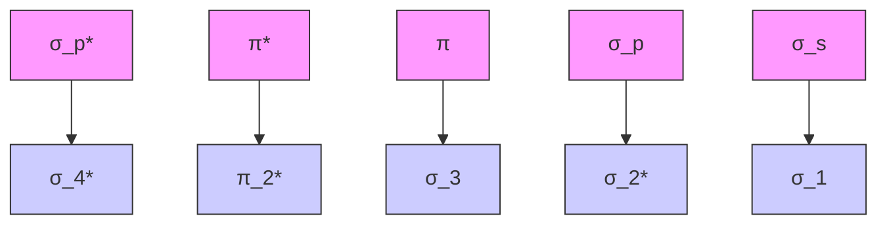
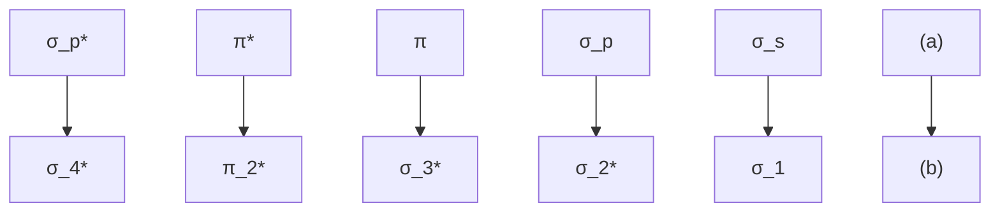

# 一、分子结构00:00

# 1. 分子轨道 07:29

# 1）分子轨道图形及类型、命名

# - $\sigma$ 轨道（ $\sigma$ 键）

![[04.晶体结构一_笔记_images/3d5f788f985a33c376d220cb07adc5d138c11c18e8ea4cce74c96649c0b86b84.jpg]]

text_image

2017化学竞赛
3. 分子轨道图形及类型、命名
□ σ轨道(σ键):沿键轴是圆柱形对称为σ
键轴中点为中心
g—中心对称
u—中心反对称
S + S → σ* s σu
S + σ → σ s σg

对称特征：沿键轴（两个原子核连线方向）呈圆柱形对称

命名规则：

■ $\sigma_{g}$ ：中心对称（成键轨道），波函数符号相同，电子云密度在键轴处增强  
■ $\sigma_{u}$ ：中心反对称（反键轨道），波函数符号相反，键轴处存在节面（电子云密度为零）

# ○ 形成方式:

■ s-s轨道重叠形成 $\sigma_{s}$ 或 $\sigma_{g}$   
■ p-p轨道头碰头重叠（如 $p_{z}$ 方向）形成 $\sigma_{p}$

![[04.晶体结构一_笔记_images/b3821fde06abdc00eadf1d993e53d878f2c1d1437a4842c9bdcce70f343076a6.jpg]]

chemical

2017化学竞赛示意图，展示两个氢原子（σg和σu）的相互作用

# ○ 电子云分布：

■ 成键轨道：键轴处电子云密度最大，两端较小  
■ 反键轨道：键轴处出现节面，两端电子云密度较大

\- 特殊性质：反键轨道两端可接受其他原子提供的电子（如形成反馈π键）

# - $\pi$ 轨道（ $\pi$ 键）

![[04.晶体结构一_笔记_images/0df3174573fb38988fca6fbbd3bfcc2a71e660261b5baa5e437a31583926927d.jpg]]

text_image

2017化学竞赛
□ π轨道及π键:过键轴有一节面
注: 成键轨道对称性为u
反键轨道
成键轨道

○ 对称特征：过键轴有一个节面，肩并肩重叠

# 命名规则：

■ $\pi_{u}$ : 成键轨道（中心反对称）  
■ $\pi_{g}$ : 反键轨道（中心对称）

# ○ 轨道特征：

■ 反键轨道（ $\pi^{*}$ ）呈花瓣形，可与d轨道完美重叠形成反馈π键  
典型应用：一氧化碳配体中 $\pi^{*}$ 轨道与金属d轨道形成反馈键，导致：

● 增强金属-碳键强度

\- 削弱碳-氧键强度（因电子填入反键轨道）

# - δ轨道

![[04.晶体结构一_笔记_images/c8e08e350093f6c6b1c50553ab2f7af4c52006d7f2d8efacce46cabcbe0be617.jpg]]

chemical

2017化学竞赛示意图，展示过键轴与成键轨道的反应过程及能量转移

O

- 对称特征：过键轴有两个节面，面对面重叠  
○ 形成条件：仅d轨道及以上（如f轨道）可形成  
命名规则：

■ $\delta_{g}$ : 成键轨道（中心对称）  
■ $\delta_{u}$ : 反键轨道（中心反对称）

电子云分布：成键轨道在键轴两侧同号叠加，反键轨道异号叠加

# - 轨道对称性总结

![[04.晶体结构一_笔记_images/b45863bfc60ed05293c511fac100e0d505c12a7979e491ec3493a48934027327.jpg]]

chemical

Two molecular diagrams labeled (a) and (b) showing π_u and π_g orbitals with charge distributions, likely from a 2017 chemical competition.

O

# ○ 记忆要点：

■ σ键：头碰头重叠（1个圆柱对称轴）  
■ $\pi$ 键：肩并肩重叠（1个节面）  
■ δ键：面对面重叠（2个节面）

# ○ 符号体系：

■ 严格命名：使用g（中心对称）/u（中心反对称）后缀  
■ 简化命名：用"\*"表示反键轨道（如 $\pi^{*}$ ）

○ 能量关系：成键轨道能量低于组成它的原子轨道，反键轨道能量高于原子轨道

# 2）同核双原子分子 19:11

# - 分子轨道能级图 19:13

2017化学竞赛  
![[04.晶体结构一_笔记_images/a5a4f0b05e8c369ce72b4c7724b1c3e79c67a449b426ebfb31e757cc814ae6de.jpg]]

chemical

Energy level diagram of a semiconductor structure showing spin states and electron transitions for He, He₂, and Li atoms

○ 轨道形成原理：两个1s原子轨道组合生成 $\sigma_{g}(1s)$ 成键轨道和 $\sigma_{u}^{*}(1s)$ 反键轨道，同理2s轨道生成 $\sigma_{g}(2s)$ 和 $\sigma_{u}^{*}(2s)$   
○ 特殊标记规则：成键轨道用g表示（gerade），反键轨道用u表示（ungerade），如 $\sigma_{g}$ 和 $\pi_{u}^{*}$

● 电子填充原则 19:28

填充顺序：遵循能量最低原理，先填能量低的轨道 $(\sigma_{g}(1s)\rightarrow\sigma_{u}^{*}(1s)\rightarrow\sigma_{g}(2s))$   
○ 键级计算：键级=（成键电子数-反键电子数）/2，如He2键级为0（(2-2)/2），Li2键级为1（(2-0)/2）

● 氧气与氟气的能级图 20:46

![[04.晶体结构一_笔记_images/cc49696fa70615497702e1749e041e8a5cdc58fc7d04f31105226f8e593b3d90.jpg]]

chemical

2017化学竞赛中两个电子跃迁示意图，标注了σa*、πa*和πb*在两个轨道下的能量转移

○ 能级顺序： $\sigma_{g}(2s) <   \sigma_{u}^{*}(2s) <   \sigma_{g}(2p_{z}) <   \pi_{u}(2p_{x / y}) <   \pi_{g}^{*}(2p_{x / y}) <   \sigma_{u}^{*}(2p_{z})$

○ 记忆要点： $O_{2}$ 的 $\pi_{g}^{*}$ 轨道上有2个单电子，解释其顺磁性； $F_{2}$ 因 $\pi_{g}^{*}$ 填满而呈现反磁性

● 氮气、碳、硼的能级图 22:00

![[04.晶体结构一_笔记_images/a851b3a08051f961034c0dc46199b66766cd05a3a8e520b1031f93209f1bc3c7.jpg]]

other

| Period | Energy Level |
|--------|--------------|
| B₂     | σ_u*(2p)     |
| C₂     | π_g*(2p)     |
| N₂     | σ_g*(2p)     |
| O₂     | σ_u*(2p)     |
| B₂     | π_u*(2p)     |
| C₂     | π_u*(2p)     |
| N₂     | σ_u*(2s)     |
| O₂     | σ_u*(2s)     |

○
○ 异常能级顺序： $\pi_{u}(2p_{x/y})<\sigma_{g}(2p_{z})$ ，与 $O_{2}/F_{2}$ 相反

○ 实际案例：

■ N₂电子排布： $1\sigma_{g}^{2}1\sigma_{u}^{2}2\sigma_{g}^{2}2\sigma_{u}^{2}1\pi_{u}^{4}3\sigma_{g}^{2}$ ，键级3  
■ B₂电子排布：…1π $_{u}^{2}$ ，存在两个单电子，具有顺磁性

● s-p混杂现象 30:22

![[04.晶体结构一_笔记_images/aa8b7df751d171eb35a968f5ffdefd4d3cdf9c8f43efa9bc96e7cee729197940.jpg]]

text_image

2017化学竞赛
B、C、N的2s和2pz轨道能量相差不大，因此在形成分子轨道时，σ2s*与σ2pz进一步组合形成2个新的分子轨道2 σg和3 σg，导致轨道能量上的变化，这种分子轨道间的相互作用称之为s-p混杂。

○ 产生条件：当2s与2p轨道能量差<15eV时（B/C/N）， $\sigma_{g}(2s)$ 与 $\sigma_{g}(2p_{z})$ 发生二次组合  
○ 能级重组结果:

■ 生成新的 $2\sigma_{g}$ （能量降低）  
■ 生成新的 $3\sigma_{g}$ （能量升高至 $\pi_{u}$ 上方）

\- 周期规律：从左至右（Li→F），2s-2p能差增大，O/F不再发生混杂

● 分子轨道间的相互作用 31:00

![[04.晶体结构一_笔记_images/fd281795235d1d87e9fe1b807046bfd1e9110608b31f36e0d1a9106c14db26f2.jpg]]

flowchart

对称性要求：只有 $\sigma$ 型轨道（ $\sigma_g(2s)$ 与 $\sigma_g(2p_z)$ ）才能相互组合  
○ 实验证据：

■ $N_{2}$ 的 $3\sigma_{g}$ 轨道电离能反常高（证明其能量被抬升）  
光电子能谱显示 $B_{2}/C_{2}/N_{2}$ 的 $\sigma\rightarrow\pi$ 跃迁能量反转

3）异核双原子分子 32:38

\- 分子轨道理论

![[04.晶体结构一_笔记_images/191d850ce28cb77b76d96da08e49dee54b7f7db0c076e9ee92f9301fdcfe37e9.jpg]]

text_image

2017化学竞赛
5. 异核双原子分子
Energy
ψ*MO
ψX
ΔE
ψY
ψMO
X XY Y
ψMO = N[(c1 × ψX) + (c2 × ψY)]
ψ*MO = N*[c3 × ψX) + (c4 × ψY)]

轨道组合公式: 异核双原子分子轨道由不同原子的原子轨道线性组合而成，公式为：

$$
\psi_ {\mathrm{MO}} = N \left[ \left(c _ {1} \times \psi_ {\mathrm{X}}\right) + \left(c _ {2} \times \psi_ {\mathrm{Y}}\right) \right]
$$

$\circ \psi_{\mathrm{MO}}^{*} = N^{*}\left[\left(c_{3}\times \psi_{\mathrm{X}}\right)^{\mathrm{MO}} + \left(c_{4}\times \psi_{\mathrm{Y}}\right)\right]$

● 轨道能量变化规律

![[04.晶体结构一_笔记_images/eea07aa259c2a070a7fbd5ab8c32558a4714e2efa570c71f82673712a0a7ef7d.jpg]]

flowchart

能量分配原则：两个轨道组合时，必然产生一个能量更低的成键轨道和一个能量更高的反键轨道。  
○ s轨道特性: s轨道能量比p轨道低（2s < 2p），因此s轨道参与成键时能量降低更显著。  
- 反键轨道变化: 原本能量高的轨道在形成反键轨道时能量会变得更高。

# - 异核轨道组合特点

\- 系数差异: 异核原子轨道组合时，线性组合系数不同:

■ 能量低的轨道会贡献更多部分参与成键  
■ 能量高的轨道会贡献更多部分参与反键

☐ 能量优化：这种分配方式使成键轨道能量更低，反键轨道能量更高，分子整体能量降低更显著。

# - 具体分子实例分析

○ 氟化氢(HF)

![[04.晶体结构一_笔记_images/f97c03f780daf28cfe840baa029ed368e7727472a386dd328b95aa95fb4238da.jpg]]

text_image

2017化学竞赛
Energy
1s
σ*
Non-bonding
σ
Non-bonding
H HF F
2p
2s
学而思培依

■ 轨道参与: 只有氢的1s轨道与氟的1个2p轨道参与形成分子轨道  
■ 非键轨道: 氟的其他轨道（2s和其他2p）保持非键状态，能量不变  
■ 成键特点: 形成1个成键轨道和1个反键轨道，其余为氟的非键轨道

○ 一氧化碳(CO)

![[04.晶体结构一_笔记_images/7d0e10a5cb977258c306a346fbdba90d458d84d17c28696c13aef14ab000ad81.jpg]]

chemical

2017化学竞赛示意图，展示电子跃迁过程中的碳原子结构与能量分布

■ 能级特点: $\pi$ 键能量低于 $\sigma$ 键（与氮气分子轨道类似）  
■ 轨道分布特点: 存在显著的SP混杂现象

■ 反键轨道特征：反键轨道电子云分布不均匀，一端大（碳端），一端小（氧端）

# - 轨道电子云分布规律

![[04.晶体结构一_笔记_images/15a251187a1eda46b09bfac7f73e1fc547110f8a88112b57f2a0a38b74909208.jpg]]

text_image

2017化学竞赛
π(2p)
4σ
2σ
π*(2p)
1σ
3σ

○ 能量影响: 氧的2p轨道能量更低（因核电荷高、半径小）  
- 成键轨道分布: 氧端电子云密度更大  
- 反键轨道分布：碳端电子云密度更大（因碳2p轨道能量更高，在反键轨道中贡献更多）

# - 重点掌握内容

必须掌握: $O_{2}$ 、 $F_{2}$ 、 $N_{2}$ 的分子轨道能级图  
- 特殊要求: 一氧化碳(CO)的分子轨道能级图需要重点掌握  
○ 学习限制：多原子分子轨道过于复杂，不要求掌握三原子及以上分子的轨道能级图

# 2. 分子间作用力与氢键 40:58

# 1）分子的极性 41:01

# ● 共价分子的分类 41:02

![[04.晶体结构一_笔记_images/0d09a7ad1a453f90750854e4f2590261156c9f7fdaf8adb26879919da8a56454.jpg]]

text_image

2017化学竞赛
九 分子间作用力与氢键
1. 分子的极性
1.1共价分子的分类
（1）非极性分子
由非极性键组成的共价分子称为非极性分子，例如同核双原子分子；或者由极性键构成但几何构型对称的共价分子也称为非极性分，例如CO₂。
（2）极性分子
由极性键构成的，且键的极性不能抵消的共价分子称为极性分子。

○ 非极性分子：包含两种类型：①由非极性键组成的分子（如 $O_{2}$ 、 $Cl_{2}$ 、 $H_{2}$ 等同核双原子分子）；②由极性键构成但几何构型对称的分子（如 $CO_{2}$ 、 $CH_{4}$ 、苯、 $CCl_{4}$ 等）。判断关键：正负电荷中心重合。  
极性分子：由极性键构成且键的极性不能抵消的分子（如 $CO$ 、 $O_{3}$ ）。特别注意：相同原子在不同化学环境中电负性可能不同（如臭氧中氧原子吸引电子能力不同）。

# - 分子极性大小的量度—偶极矩 42:35

![[04.晶体结构一_笔记_images/ec345b5efab5895a6694b769cbfe5f6108b6e9688a199beea6d05f0e3d691af8.jpg]]

text_image

2017化学竞赛
1.2 分子极性大小的量度——偶极矩（μ）
（1）μ是一个矢量，既有大小，又有方向。大小 μ=q·d，单位为德拜(Debye)。
方向 从正指向负。 1 Debye = 3.336×10⁻³⁰ C·m
（2）对于双原子分子，键的极性越大，分子的极性越大。
H₂: μ = 0        CQ: μ = 0.112        NO: μ = 0.159
HI: μ = 0.448    HBr: μ = 0.828    HCI: μ = 1.09
HF: μ = 1.827

O

○ 矢量特性：偶极矩 $\mu$ 是矢量，方向从正电荷中心指向负电荷中心，大小 $\mu = q \cdot d$ 单位德拜（ $1D = 3.336 \times 10^{-30} C \cdot m$ ）。  
○ 双原子分子规律：键极性越大偶极矩越大，示例数据： $H_{2}(0D)<CO(0.112D)<NO(0.159D)<HI(0.448D)<HBr(0.828D)<HCl(1.09D)<HF(1.827D)$ 。  
○ 配位键影响：解释NO极性大于CO的原因——氧的孤对电子配位给碳，部分抵消原有极性（需绘制路易斯结构分析）。  
☐ 多原子分子分析：中心原子孤对电子会显著影响极性，如 $NH_{3}(1.47D)$ 和 $H_{2}O(1.85D)$ 极性极大，而 $NF_{3}(0.23D)$ 因孤对电子与键偶极方向相反而极性减弱。

# 2）分子间作用力 47:19

# ● 范德华力 47:57

![[04.晶体结构一_笔记_images/76136c1c12a9387f0cf3a2d4f2a10d2da10fede91b7ebcb00da40e60cd057a0e.jpg]]

text_image

2. 分子间作用力
分子间的相互作用是除共价键、离子键和金属键以外
，分子间相互作用的总称，又称之为次级键
包括：氢键（hydrogen bond）、范德华力、盐键、
疏水作用力、芳环堆积作用（π-π堆积）、卤键。

○ 组成范围：包含氢键、范德华力、盐键、疏水作用、π-π堆积（如苯环间作用）、卤键等次级键。石墨层间作用即为π-π堆积典型案例。

![[04.晶体结构一_笔记_images/c5a56e79e54cf4b3ae5272e670be21c951ec666537426ea3e503d665fd5c1670.jpg]]

text_image

2017化学竞赛
2.1 范德华力
（1）取向力
a. 永久偶极 极性分子的正、负电荷重心本来就不重合，
始终存在着一个正极和一个负极，极性分子的这种固有
的偶极，称为永久偶极。
b. 当两个极性分子相互接近时，一个分子带负电
荷的一端要与另一个分子带正电荷的一端接近，这样就使
得极性分子有按一定方向排列的趋势，因而产生分子间引
力，称为取向力。

○ 取向力：仅存在于极性分子间，由永久偶极定向排列产生（如HCl分子间"头尾相接"）。

☐ 诱导力：存在于①极性-极性分子间（增强偶极）②极性-非极性分子间（诱导产生偶极），如HCl诱导 $O_{2}$ 产生瞬时极性。  
☐ 色散力：普遍存在于所有分子间，源于电子云瞬时不对称分布（如 $O_{2}$ 分子间作用）。影响因素：分子量越大（如 $I_{2}>Br_{2}$ ）、电子云越易变形则色散力越强。

# - 总结 51:54

☐ 作用力分布：①极性-极性分子：取向+诱导+色散；②极性-非极性分子：诱导+色散；③非极性-非极性分子：仅色散力。实际应用中，大分子主要考虑色散力，强极性分子（ $\mu > 1D$ ）需重点考虑取向力。

# 3）氢键 52:31

# - 定义与基本特性

![[04.晶体结构一_笔记_images/b47ea1af523cb33336d39e273ef11aac728022a035fd13b50ff6bda464680b3e.jpg]]

text_image

2017化学竞赛
2.2 氢键
a. 定义：所谓氢键是指分子中与高电负性原子X以共价键相连的H原子，和另一个分子中的高电负性原子Y之间所形成的一种弱的相互作用，称为氢键(X—H......Y)。

定义：分子中与高电负性原子X以共价键相连的H原子，和另一个分子中的高电负性原子Y之间形成的弱相互作用，记作 $(X-H\cdots Y)$ 。  
强度特点：比范德华力强但弱于共价键，键能范围1-163 kJ/mol（氟键最强）。  
○ 形成条件:

■ 必须存在与高电负性原子（F/O/N）共价结合的H   
■ 另一个分子需含高电负性原子或 $\pi$ 电子云（如芳香环）

# - 经典氢键特征

<table><tr><td>Category of hydrogen bond</td><td>Hydrogen bond (···)</td><td>Dissociation enthalpy / kJ mol⁻¹</td></tr><tr><td>Symmetrical</td><td>F···H···F in [HF₂]⁻ (see eq. 10.26)</td><td>163</td></tr><tr><td>Symmetrical</td><td>O···H···O in [H₃O₂]⁺ (see structure 10.2)</td><td>138</td></tr><tr><td>Symmetrical</td><td>N···H···N in [N₂H₇]⁺ (see structure 10.4)</td><td>100</td></tr><tr><td>Symmetrical</td><td>O···H···O in [H₃O₂]⁻ (see structure 10.3)</td><td>96</td></tr><tr><td>Asymmetrical</td><td>N-H···O in [NH₄]⁺···OH₂</td><td>80</td></tr><tr><td>Asymmetrical</td><td>O-H···Cl in OH₂···Cl⁻</td><td>56</td></tr><tr><td>Asymmetrical</td><td>O-H···O in OH₂···OH₂</td><td>20</td></tr><tr><td>Asymmetrical</td><td>S-H···S in SH₂···SH₂</td><td>5</td></tr><tr><td>Asymmetrical</td><td>C-H···O in HC≡CH···OH₂</td><td>9</td></tr><tr><td>Asymmetrical</td><td>C-H···O in CH₄···OH₂</td><td>1 to 3</td></tr></table>

○ 键长定义：指X到Y的核间距（非H...Y距离）  
- 经典特性：

■ 饱和性：传统认为每个H只能形成1个氢键  
■ 方向性：要求X-H...Y三点共线（直线型）

现代认知：实际存在非经典氢键（如 $NH_{3}$ 可形成3个氢键）

# - 分子间与分子内氢键

![[04.晶体结构一_笔记_images/5f15409b2f773600323622a4b633a127bb6fbff04924c65b9fd8a41c68a16b38.jpg]]

chemical

2017化学竞赛中氢键与分子结构的对比图，展示氢键与内氢键的相互作用

○ 分子间氢键：

■ 使沸点升高（如水vs硫化氢）  
■ 理想构型含8原子环（如冰中氢键网络）

○ 分子内氢键：

■ 典型实例：邻硝基苯酚   
■ 导致沸点降低（竞争性抑制分子间氢键形成）

# - 典型氢键体系

![[04.晶体结构一_笔记_images/252819c119bce7665db41239f1162a1bd52e7b3dbf2f70e1707b03d5fa4f768c.jpg]]

chemical

2017化学竞赛过程示意图，标注了F原子转移、157 pm和92 pm位移及120°变化

# ○ 生物体系：

■ DNA碱基对（G-C含3个氢键）  
■ 要求氢键环含8原子（考试常考绘图题）

# ○ 无机体系：

■ 水合质子 $\left([H_{5}O_{2}]^{+}\right.$ 等）  
■ 氟化氢链状聚合物（键能最强）

# 4）非常规氢键 01:00:52

# - 芳香氢键

![[04.晶体结构一_笔记_images/ee513eb7734b4efec813aaa3aeace52e70fb65f6de2e0e42c69fc2a3687a1d42.jpg]]

text_image

2017化学竞赛
2.3 非常规氢键
a. 芳香氢键
π键或离域π键体系作为质子（H⁺）的接受体，由苯基等芳香环的离域π键形成的X—H……π氢键。

本质：π电子云作为质子受体（ $H^{+}$ ）

# ○ 实例：

■ 苯与氯仿的溶解现象  
■ 图示中实线表示共价键，虚线表示氢键

# - 二氢键

![[04.晶体结构一_笔记_images/2de2a31c5b6aa6e258303fec32d6ca39ea4b6a44fce4972d0b2c17ee6f361958.jpg]]

chemical

2017化学竞赛中氢二氢键的熔点对比图，展示H3C-CH3、H3C-F和H3N-BH3等元素的相对位置及温度

○ 形成机制：正氢（ $H^{\delta}+$ ）与负氢（ $H^{\delta}-$ ）相互作用
○ 典型体系：

■ $H_{3}N-BH_{3}$ （熔点-104℃）
■ 比等电子体 $CH_{3}-CH_{3}$ （-181℃）显著增高

○ 电子转移：N孤对电子→B空轨道形成配位键

# 3. 分子结构的习题 01:02:47

根据课程记录和笔记大纲，整理完善后的知识点笔记如下：

# 1）例题1：等电子系列熔点的比较 01:02:52

![[04.晶体结构一_笔记_images/49f071633a5d85450c5f1e4b8569e4df35bff601599ff149ac7a71e2a5075b70.jpg]]

chemical

2017化学竞赛中氢键比价图，标注了H3C-CH3、H3C-F和H3N-BH3等元素的熔点位置及温度

![[04.晶体结构一_笔记_images/ebf2b5b7c47be7f20cce3b643aa5359ddbff55325b12a26f53bbd77481e99da6.jpg]]

● 二氢键特征：X-H…H-Y结构中存在特殊相互作用

# - 熔点比较：

○ $CH_{3}-CH_{3}$ : $-181^{\circ}C$   
○ $CH_{3}-F:-141^{\circ}C$   
○ $H_{3}N - BH_{3}$ : $-104^{\circ}C$

● 规律分析：随着分子间作用力增强（范德华力→偶极作用→二氢键），熔点依次升高

# 2）变形性的概念 01:04:08

![[04.晶体结构一_笔记_images/4a03a7865451b72a80aa3b4a8e088b0e5b486abfe2a3dabddce1ddfe476866b3.jpg]]

text_image

32
学习改变命
思
4.硼与氮形成类似苯的化合物，俗称无机苯。它是无色液体，具有芳香性。

![[04.晶体结构一_笔记_images/99df951bb325ecf4300299ac9516837d47757732d67f3f33320c9daea0d7e5b6.jpg]]

● 定义：电子云受邻近离子影响发生形变的现象

# ● 影响因素：

○ 电子云密度越大越易变形  
○ 电子云空间分布范围越大越易变形

● 实例说明：离子键向共价键过渡时，球形电子云可变形为椭圆形

# 3）例题9：离子或分子的空间构型及成键轨道 01:16:49

![[04.晶体结构一_笔记_images/666c0be171ba336d64c8cc5c37b959aa875b8fba0de5ca345b86b7b01612ed4c.jpg]]

text_image

9.写出下列离子或分子的空间构型，并指明成键轨道。
CO₃²⁻  BF₃  XeF₄  SF₆
33

# ● 题目解析

○ $CO_{3}^{2-}$ :

■ 平面三角形结构  
■ 碳采用 $sp^{2}$ 杂化轨道与氧的p轨道成键

○ $BF_{3}$ :   
- 平面三角形（AX3型）
- 硼采用 $sp^{2}$ 杂化轨道与氟的p轨道成键

○ $XeF_{4}$ :

\- 平面四边形结构
- 氙采用 $sp^{3}d^{2}$ 杂化（含两对孤对电子）

○ $SF_{6}$ :

\- 正八面体结构
- 硫采用 $sp^3 d^2$ 杂化轨道与氟的 $p$ 轨道成键

4）例题10：BF3键长解释 01:19:22

● 实验现象： $BF_{3}$ 中B-F键长(130pm)比单键(152pm)显著缩短

\- 理论解释：

○ 硼的 $sp^{2}$ 杂化形成空p轨道  
○ 每个氟提供一对p电子形成 $\pi_{4}^{6}$ 大 $\pi$ 键  
○ 大π键增强键级导致键长缩短

● 补充说明：可用共振式解释为键级介于1-2之间

5）例题11：相邻共价键间夹角最小的分子 01:20:43

\- 选项分析：

○ $BF_{3}$ : $120^{\circ}$ ( $sp^{2}$ 杂化)   
○ $H_{2}S/NH_{3}/H_{2}O$ ：接近109°28'（ $sp^{3}$ 杂化）

● 角度比较：

○ $H_{2}O(104.5^{\circ})<NH_{3}(\sim107^{\circ})$

\- 原因：水分子中两对孤电子对产生更大排斥

\- 硫与氧比较：氧电负性更大，共用电子对更靠近氧，键间斥力更大

结论: $H_{2} O$ 键角最小 (选项b)

● 根据课程记录和笔记大纲，整理完善的知识点笔记如下：

6）例题12：原子轨道不能叠加成键的判断 01:22:49

![[04.晶体结构一_笔记_images/3b40b66fac447d2426048a89661f08978bcedb60019749a543b66b816b7d55d3.jpg]]

text_image

10.实验测得BF₃分子中，B—F键长为130pm，比理论B—F单键键长152pm短，试加以解释。
11.下列分子中，两个相邻共价键间夹角最小的是（）
BF₃ B. H₂S C. NH₃ D. H₂O
pₓ-pₓ B. pₓ-pᵧ C. s-pₓ D. s-pₓ
用VSEPR预计下列分子或离子的几何形状为三角锥的是（）
A. SO. B. SO²⁻ C. NO⁻ D. CH⁺

\- 对称性匹配原则：原子轨道叠加成键必须满足对称性匹配，沿键轴方向具有相同对称性。

\- 轨道组合限制：

○ $p_{x}$ 与 $p_{y}$ 轨道不能有效成键（对称性不匹配）  
○ s轨道与p轨道只能形成σ键（如 $s-p_{x}$ 或 $s-p_{z}$ 组合）  
- 不能形成 $p_{x}-p_{y}$ 键（该组合无法满足键轴对称要求）

7）例题13：分子或离子的几何形状预测 01:23:26

![[04.晶体结构一_笔记_images/1b14816ebaba941c6b40f8a436c324609a5cf28113f7a04707c12a29fcb74258.jpg]]

text_image

13.用 VSEPR 预计下列分子或离子的几何形状为三角锥的是（）
A. SO₃ B. SO₃²⁻ C. NO₃⁻ D. CH₃⁺
14.下列分子中不形成 Π₃⁴键的是（）
A. NO₂ B. NO₃⁻ C. O₃ D. SO₂
15.下列各对物质中，是等电子体的为（）
O₂²⁻ 和 O₃ B. C 和 B⁺ C. He 和 Li D. N₂ 和 CO
下列键角中最大的是（）
NH₃中的∠HNH B. PH₃中的∠HPH
AsH₃中的∠HAsH D. SbH₃中的∠HSbH
17.下列分子中C与O之间键长最短的是（）

# - 17 下列分子由 C 与 O 之间键 - 三角锥形分子判断

# ○ 典型结构：

■ $SO_{3}^{2-}$ （亚硫酸根）：三角锥形（中心原子有孤对电子）  
■ $CH_{3}^{+}$ （甲基正离子）：平面三角形（无价层电子）

# ○ VSEPR要点：

■ 孤对电子会压缩键角（如 $NH_{3}$ 的107°）  
■ 电负性影响：中心原子电负性越大，键角越大（ $\mathrm{NH}_{3} > \mathrm{PH}_{3} > \mathrm{AsH}_{3} > \mathrm{SbH}_{3}$ ）

# - 其他分子结构问题

# ○ π键形成：

■ $NO_{3}^{-}$ 不能形成 $\Pi_{3}^{4}$ 键（存在争议，但考试通常认定不能形成）  
■ $NO_{2}$ 可能形成 $\Pi_{3}^{3}$ 或 $\Pi_{3}^{4}$ （二聚倾向支持 $\Pi_{3}^{4}$ 解释）

# ○ 等电子体判断：

■ $N_{2}$ 和 CO 是典型等电子体（14e，相似分子轨道）  
■ 排除法： $O_{2}^{2-}$ 与 $O_{3}$ 原子数不等，He 与 Li 电子排布不同

# - 键参数比较

# ○ 键角影响因素：

■ 中心原子电负性主导时（如 $XH_{3}$ 系列），电负性越大键角越大  
■ 无 $\pi$ 反馈键情况下，电子对斥力决定键角大小

# ○ 键长比较：

■ $BF_{3}$ 中 B-F 键长（130pm）短于理论值（152pm），因存在 pπ-pπ 反馈键

# 8) 例题17: C与O之间键长最短的分子 01:26:39

![[04.晶体结构一_笔记_images/6b9361848a61f188b9def577a1e8f6ba8b8b10c68a95a67d35025acd87353433.jpg]]

text_image

17.下列分子中C与O之间键长最短的是（）
A. CO    B. CO₂    C. CH₃OH    D. CH₃COOH
18.下列分子形状不属于直线形的是（）
A. C₂H₂    B. H₂S    C. CO₂    D. HIF
19.下列分子中含有两个不同键长的是（）
CO₂    B. SO₃    C. SE₁    D. XeF₁
N₂F₅存在顺式和反式两种异构体，据此事实p判断N₂F₅分子中两个氮原子之间的键型组（）
仅有一个σ键    B.仅有一个π键
一个σ键，一个π键    D.一个σ键，两个π键

# ● 题目解析

○ 键长判断依据：根据键级判断，键级越高键长越短。CO是三键（键级3）， $CO_{2}$ 是双键（键级2）， $CH_{3}OH$ 和 $CH_{3}COOH$ 中C-O为单键（键级1），其中 $CH_{3}COOH$ 含有一个C=O双键和一个C-O单键

○ 键级排序：CO (3) $>CO_{2}$ (2) $>CH_{3}COOH$ (1.5平均) $>CH_{3}OH$ (1)   
- 答案：A选项CO的C-O键长最短

# 9）例题22：氮、磷、砷、锑氢化物键角变化解释 01:34:39

![[04.晶体结构一_笔记_images/c0c29147881c70eccfd812478ef9bdb026f8cc51bc8b8141a6b7130d8fd6b972.jpg]]

text_image

22.
(1)比较氮、磷、砷、锑的氢化物,用 VSEPR 解释为什么从上到下键角变小?
(2)用 VSEPR 解释为什么 NH₃ 的键角是 107°, NF₃ 的键角是 102.5°, 而 PH₃ 的是 93.6°, PF₃ 的是 96.3°.

23.比较 BeCl₂、SnCl₂、H₂S 及 XeF₂ 分子的几何构型。

# 键角变化规律解释

电负性影响：从上到下（N→Sb）中心原子电负性降低，吸引电子对能力减弱，键电子对间斥力减小，导致键角依次变小  
- NH₃与NF₃对比：

■ $NH_{3}$ （107°）：N-H键电子对更靠近N，孤对电子与键对电子斥力较大  
■ $NF_{3}$ （102.5°）：N-F键电子对更靠近F，键电子对间斥力减小

\- PH₃与PF₃对比：

■ $PH_{3}$ (93.6°): 无d-pπ反馈   
■ PF₃ (96.3°)：F的孤对电子可反馈到P的3d空轨道，增加P-F键级和键电子对斥力

\- $\mathrm{PCI}_{5}$ 存在而 $\mathrm{NCl}_{5}$ 不存在的解释

○ 轨道限制：N为第二周期元素，仅能使用2s和2p轨道成键，最大配位数为4；P有可利用的3d轨道，可形成 $sp^{3}d$ 杂化，配位数可达5

10）例题23：分子几何构型的比较 01:36:55

![[04.晶体结构一_笔记_images/a7457ed8eca88e43d7303c641a6e1ea773bdda7b5aa0e093491eeaaad8bc3b42.jpg]]

text_image

(1)比较氮、磷、砷、锑的氢化物，用VSEPR解释为什么从上到下键角变小？
(2)用VSEPR解释为什么NH₃的键角是107°，NF₃的键角是102.5°，而PH₃的是93.6°，PF₃的是96.3°。
23.比较BeCl₂、SnCl₂、H₂S及XeF₂分子的几何构型。

# 题目解析

○ BeCl₂: 直线形（sp杂化）  
○ SnCl₂: V形（sp²杂化，含1对孤对电子）  
○ $H_{2}S$ : V形 ( $sp^{3}$ 杂化, 含2对孤对电子)  
○ XeF2：直线形（sp³d杂化，3对孤对电子呈三角双锥分布）

11）补充知识点

\- $\mathrm{N}_2\mathrm{F}_2$ 的键型分析

- 异构现象：存在顺反异构体说明存在限制旋转的π键  
○ 键型组成：N=N之间含1个σ键和1个π键（选C）  
○ 键长差异:

■ 顺式：N-N键长更长（分子轨道理论解释：N-F反键轨道与另一N孤对电子相互作用，增加N-N键电子密度）  
■ 反式：N-N键长更短（空间位阻更小）

\- $\mathsf{PX}_3$ 键角变化规律

○ 理论最大键角：109°28'（理想四面体角）  
○ 实际变化趋势： $X=F\rightarrow I$ 时，键角随卤素原子体积增大而增大（原子间空间斥力主导）  
- PH3特殊键角：93.6°小于卤化磷，因无d-pπ反馈作用

12）例题25：符合特定杂化轨道条件的分子或离子 01:38:47

![[04.晶体结构一_笔记_images/58325488e2627daff95e8df061a05a1cdc300b37a47b551e246480266eb5465c.jpg]]

text_image

25.写出符合下列条件的相应的分子或离子的化学式:
(1)氧原子用 sp¹ 杂化轨道形成两个 σ 键:
(2)氧原子形成一个三电子 π 键:_________________, 氧原子形成两个 π 键:_________________ _
(3)硼原子用 sp² 杂化轨道形成三个 σ 键:_________________; 硼原子用 sp³ 杂化轨道形成四个 σ 键:________________ _
(4)氮原子形成两个 π 键:_________________; 氮原子形成四个 σ 键:________________ _
26.写出丁二烯、苯、NO₃™、SO₃、CO₂ 中的离域 π 键。

●

氧原子杂化与成键

☐ $sp^{1}$ 杂化：氧原子用 $sp^{1}$ 杂化轨道形成两个 $\sigma$ 键的典型分子是水（ $H_{2}O$ ），但需注意此处应为 $sp^{3}$ 杂化（字幕中老师明确纠正）。  
三电子π键：氧气（ $O_{2}$ ）分子中存在两个三电子π键，若获得一个电子形成 $O_{2}^{-}$ ，则一个三电子π键消失；若再获得一个电子形成 $O_{2}^{2-}$ ，则变为氧氧单键。  
○ 双π键形成：二氧化碳（ $CO_{2}$ ）是氧原子形成两个普通π键的典型例子。

\- 硼原子杂化

- $sp^{2}$ 杂化：三氟化硼（ $BF_{3}$ ）是硼原子用 $sp^{2}$ 杂化轨道形成三个 $\sigma$ 键的代表。  
- $sp^{3}$ 杂化：四氟合硼酸根离子（ $[BF_{4}]^{-}$ ）展示硼原子通过 $sp^{3}$ 杂化形成四个σ键。

\- 氮原子成键

- 双π键形成：氮气（ $N_{2}$ ）分子中氮原子形成两个π键。  
○ 四σ键形成：铵根离子（ $NH_{4}^{+}$ ）中氮原子形成四个σ键。

\- 离域π键示例

○ 常见分子：丁二烯含 $\pi_{4}^{4}$ 键，苯含 $\pi_{6}^{6}$ 键，硝酸根 $(NO_{3}^{-})$ 和三氧化硫 $(SO_{3})$ 均含 $\pi_{4}^{6}$ 键，二氧化碳含两个 $\pi_{3}^{4}$ 键。

13）例题27：分子形成时的原子轨道重叠01:42:05

![[04.晶体结构一_笔记_images/0d20022b003030633c98caba7745803296a968c03239d1cde7fb16dffebac60c.jpg]]

text_image

27.形成下列分子时是由两原子的哪些原子轨道重叠而成？（形成σ键时原子轨道的重叠均沿x轴）
（1）Cl₂ （2）N₂（π分子轨道） （3）Na₂
（4）CO（σ分子轨道） （5）HCl
28.按分子轨道理论，N₂、N₂⁻、N₂²⁻的稳定性由大到小的顺序是（）
A. N₂²⁻ > N₂⁻ > N₂ B. N₂ > N₂⁻ > N₂²⁻

●

轨道重叠原理

\- σ键方向：题目说明所有σ键形成时原子轨道重叠均沿x轴方向。

\- 具体分子分析

○ 氯气 $(Cl_{2})$ ：由两个氯原子的 $p_{x}$ 轨道重叠形成 $\sigma$ 键。  
○ 氮气 $(N_{2})$ ：

■ $\sigma$ 键： $p_{x}$ 与 $p_{x}$ 轨道重叠  
■ $\pi$ 键： $p_y$ 与 $p_y$ 、 $p_z$ 与 $p_z$ 轨道分别形成两个 $\pi$ 键

○ 金属钠（ $Na_{2}$ ）：仅通过s轨道与s轨道重叠形成σ键  
- 一氧化碳（co）：σ分子轨道由碳和氧的 $p_{x}$ 轨道重叠形成  
○ 氯化氢（HCl）：氢的s轨道与氯的 $p_{x}$ 轨道重叠

\- 分子轨道理论应用

\- 稳定性顺序： $N_{2} > N_{2}^{-} > N_{2}^{2 - }$ （选项B正确），随着电子增加，反键轨道被占据导致稳定性降低。

14）例题28：N2、N2-、N2^2-稳定性比较 01:43:06

![[04.晶体结构一_笔记_images/eb06192158207eb3041206baa5045bb088b7e9c17736897e47267a14fa2665f9.jpg]]

text_image

28.按分子轨道理论，N₂、N₂⁻、N₂²⁻的稳定性由大到小的顺序是（）
A. N₂²⁻ > N₂⁻ > N₂
B. N₂ > N₂⁻ > N₂²⁻
C. N₂⁻ > N₂²⁻ > N₂
D. N₂² > N₂ > N₂²⁻

29.写出所有第二周期同核双原子分子的分子轨道表示式，其中哪些分子不能稳定存在？比较分子的稳定性，并指出哪些分子是顺磁性，哪些是反磁性？

\- 较分子的稳定性，并指出
- 分子轨道理论应用

- 稳定性判断依据：根据分子轨道理论，分子稳定性由键级决定。键级越大，分子越稳定。  
○ N2系列键级变化：对于 $N_{2}$ 、 $N_{2}^{-}$ 、 $N_{2}^{2-}$ ，每增加一个电子都填充在反键轨道（ $\pi^{*}$ 轨道），导致键级递减：

■ $N_{2}$ 键级为3（最稳定）  
N;键级为2.5   
■ $\mathrm{N}_2^2$ -键级为2

○ 正确选项：B选项 $\left(N_{2}>N_{2}^{-}>N_{2}^{2-}\right)$

15）例题30：O2及其离子分子轨道式与性质 01:48:29

![[04.晶体结构一_笔记_images/d514b92e7ff151506047fd28baef9094a756ff3d049689abacd8d7534b0210ca.jpg]]

text_image

30.写出O₂，O₂²⁻，O₂⁻，O₂⁺分子或离子的分子轨道式，计算它们的键级，比较稳定性和磁性（是顺磁性或是反磁性）。

\- 分子轨道式书写

○ 02基态： $\sigma1s^{2}\sigma^{*}1s^{2}\sigma2s^{2}\sigma^{*}2s^{2}\sigma2p^{2}\pi2p^{4}\pi^{*}2p^{2}$   
○ 离子变体：

■ $O_{2}^{+}$ ：比 $O_{2}$ 少1个 $\pi^{*}$ 电子 ( $\pi^{*}2p^{1}$ )  
■ $O_{2}^{-}$ ：比 $O_{2}$ 多1个 $\pi^{*}$ 电子 ( $\pi^{*}2p^{3}$ )  
■ $O_{2}^{2-}$ : 比 $O_{2}$ 多2个 $\pi^{*}$ 电子 ( $\pi^{*}2p^{4}$ )

\- 键级计算与稳定性

○ 计算公式：键级=（成键电子数-反键电子数）/2

■ $O_{2}$ : 键级=2   
■ $O_{2}^{+}$ ：键级=2.5（最稳定）  
■ $O_{2}^{-}$ ：键级=1.5   
■ $O_{2}^{2-}$ ：键级=1

# ● 磁性判断

○ 顺磁性条件：存在未成对电子

■ $O_{2}$ : 顺磁性 ( $\pi^{*}$ 轨道有2个单电子)  
■ $O_{2}^{+}$ ：顺磁性（ $\pi^{*}$ 轨道有1个单电子）  
■ $O_{2}^{-}$ ：顺磁性（ $\pi^{*}$ 轨道有1个单电子）  
■ $O_{2}^{2-}$ ：反磁性（所有电子成对）

16）例题31：N2与O2离解能差异解释 01:51:36

![[04.晶体结构一_笔记_images/a87a75fe5801e2987ec4ac4338a552029319fa362039594bc7e60bbd11278474.jpg]]

text_image

31.解释为何N₂的离解能比N₂⁺的离解能大，而O₂的离解能却比O₂⁺的离解能小。
——π
36

# 关键差异原因

○ 能级排列不同：

■ N2系列： $\pi_{u}$ 轨道能量低于 $\sigma_{g}$ 轨道  
■ O2系列： $\sigma_{g}$ 轨道能量低于 $\pi_{u}$ 轨道

\- 具体分析

○ N2 vs N2+:

■ N2失去的是成键电子（ $\sigma_{g}$ 轨道），导致键级从3降为2.5  
■ 离解能： $N_{2}>N_{2}^{+}$

○ 02 vs 02+:

■ O2失去的是反键电子（ $\pi^{*}$ 轨道），导致键级从2升为2.5  
■ 离解能： $O_{2}<O_{2}^{+}$

● 记忆要点

电子移除影响：移除成键电子降低稳定性，移除反键电子增强稳定性  
○ 键级与离解能：键级变化直接决定离解能大小关系

17）例题32：极性分子的判断 01:53:53

\- 判断标准

\- 极性分子特征：分子中存在永久偶极矩（不对称电荷分布）

○ 典型例子：

臭氧（ $\mathrm{O}_3$ ）：V型结构导致极性  
■ 乙醇：由于-OH基团存在极性键  
■ 二氯甲烷：四面体结构但不对称

● 非极性分子特征

○ 对称性要求：

■ 同核双原子分子（如 $O_{2}$ 、 $N_{2}$ ）  
■ 高度对称的多原子分子（如 $CH_{4}$ 正四面体）

18）例题33：二甲醚与乙醇沸点差异原因 01:54:14

![[04.晶体结构一_笔记_images/5861e0140d9110026d1683f964ed59a84e226e4d4fce505679ce1f15c1151b08.jpg]]

text_image

32.下列分子中,属极性分子的是( )
A. O₂ B. O₃ C. S₂ D. S₈
33.二甲醚(CH₃-O-CH₃)和乙醇(CH₃CH₂OH)为同分异构体,它们的沸点分别是-23℃和78.5℃,为什么差别这样大?
34.为什么石墨是好的导体,而金刚石不是?

# - 沸点差异分析

氢键作用：乙醇分子间存在氢键作用，而二甲醚分子间仅存在范德华力。氢键的键能（约20-40 kJ/mol）远大于范德华力（约0.1-10 kJ/mol），导致乙醇需要更多能量克服分子间作用力。  
- 沸点数据：乙醇沸点 $78.5^{\circ}C$ 显著高于二甲醚 $-23^{\circ}C$ ，差值达 $101.5^{\circ}C$ 。  
○ 结构差异：乙醇 $(CH_{3}CH_{2}OH)$ 含活泼氢可与氧形成氢键网络，而二甲醚 $(CH_{3}-O-CH_{3})$ 无活泼氢且分子对称性更高。

# 19）例题35：CO与NO极性及熔点比较 01:55:47

![[04.晶体结构一_笔记_images/81cf4f28f4fa42e830cf8d6e4f1a100299379890d41002e858c5826af0af1e02.jpg]]

text_image

35.二元分子的极性决定于组成原子间的电负性差,故可以预期CO分子的极性要比NO大.
但是实验发现,CO的极性要比NO的极性小30%左右.试对这一事实给出可能的解释.CO和
NO这两种氧化物中,哪一种的熔点较低?为什么?

36.根据人们的实践经验,一般来说,极性分子组成的溶质易溶于极性分子组成的溶剂,非
极性分子组成的溶质易溶于非极性分子组成的溶剂,称为相似相溶原理。根据“相似相溶原
理”判断,下列物质中,易溶于水的是_;易溶于CCl₄的是_。
A NH₃ B HF C I₂ D Br₂

# ● 极性反常现象解释

○ 配位键影响：虽然CO电负性差()大于NO()，但CO存在配位键（氧→碳电子反馈）抵消部分极性，导致实测极性比NO小30%。  
○ 偶极矩补偿：CO中氧的孤对电子反馈到碳的空轨道，形成反向偶极矩，部分抵消固有偶极。

# - 熔点比较原理

☐ 取向力主导：极性分子间主要作用力为取向力（偶极-偶极相互作用），NO极性更大导致分子间作用更强。

○ 熔点顺序：NO(-163.6°C) > CO(-205.02°C)，差值约41.4°C，与极性大小顺序一致。

○ 能量关系：破坏取向力需要更多能量，表现为更高熔点。

# 相似相溶原理

# ○ 溶解能量平衡：

■ 破坏溶剂分子间作用（吸能）  
■ 形成溶质-溶剂新作用（放能）

○ 乙醇-水案例：三者氢键能相近（水-水≈乙醇-乙醇≈水-乙醇），故任意比互溶

# ○ 选择题解答：

■ 易溶于水（极性）： $ANH_{3}$ 、B HF  
■ 易溶于 $CCl_{4}$ （非极性）： $Cl_{2}$ 、 $DBr_{2}$

○ 错误解释辨析：熵增不是主因，核心是作用力匹配程度

# 20）例题37：新型炸药八硝基立方烷的结构与爆炸反应 02:00:37

![[04.晶体结构一_笔记_images/bb27b5e819892966a5ae0970d95cc3feca1e346539175d265301ddc9e5cd39af.jpg]]

text_image

37.最近，我国一留美化学家参与合成了一种新型炸药，它跟三硝基甘油一样抗打击、抗震，但一经引爆就发生激烈爆炸，据信是迄今最烈性的非核爆炸品。该炸药的化学式为C₈N₈O₁₆，同种元素的原子在分子中是毫无区别的。
(1)试画出它的结构式。
(2)试写出它的爆炸反应方程式。

![[04.晶体结构一_笔记_images/a27eb30ce80495d43bd78aa68cd18d69443a2e5577ec76c75d25e2f11ca47e24.jpg]]

# - 分子结构与命名

○ 化学式特征：化学式为 $C_{8}N_{8}O_{16}$ ，可改写为 $C_{8}(NO_{2})_{8}$ ，每个碳原子上连接一个硝基  
○ 结构特点: 八硝基立方烷结构，立方烷骨架中每个碳上的氢被硝基取代  
命名争议: 也可称为八硝基环辛四烯，但考试中两种命名方式均给分

# - 爆炸反应机理

- 反应特点: 爆炸反应通常不需要氧气参与  
○ 产物规律:

■ 含氮化合物爆炸时氮元素通常生成氮气 $(N_{2})$   
■ 碳氧组合优先形成二氧化碳 $(CO_{2})$ ，氧不足时部分生成一氧化碳(CO)  
■ 本案例中氧足够，完全生成二氧化碳

\- 反应方程式: 爆炸反应生成 $N_{2}$ 和 $CO_{2}$

# 21）例题38：B4Cl4分子的空间构型 02:04:49

![[04.晶体结构一_笔记_images/9f856b22b6129597241ad662aa32bf94cbc5223e2735a464a636b9dba2fe783d.jpg]]

text_image

学习改变命运
考成就未来

38.B₄Cl₄ 是一种淡黄色并具有挥发性的固体化合物，在 70℃以下，它存在于真空中。结构测定表明，该化合物中每个氯原子均结合一个硼原子，其键长都是 1.70×10⁻¹⁰ 米；任意两个硼原子之间为 1.71×10⁻¹⁰ 米。试根据上述性质和参数画出 B₄Cl₄ 分子的空间构型。

![[04.晶体结构一_笔记_images/a894b99ad833fd2c967556c27526ac8f9853512d32b24ab9543f73b8bb1ea3af.jpg]]

# - 分子基本性质

- 物理性质: 淡黄色挥发性固体, $70^{\circ} \mathrm{C}$ 以下存在于真空中  
○ 键长数据:

■ B-Cl键长： $1.70 \times 10^{-10}$ 米  
B-B键长： $1.71 \times 10^{-10}$ 米

# - 空间构型分析

○ 结构特点: 四面体构型, 每个硼原子连接一个氯原子  
○ 成键原理:

■ 硼原子缺电子，形成三中心两电子键(3c-2e键)  
■ 每个硼提供1个电子，四个硼共提供8个电子  
四面体的四个面各形成一个3c-2e键

○ 电子结构: 通过三中心两电子键使每个硼原子达到八电子稳定结构

# 22）例题39：偶极矩相关问题的解答 02:24:20

![[04.晶体结构一_笔记_images/e67ce88583d4ed9aeb2ec258965ffbe4ec21865a0d18885c0ae31246e4219ddd.jpg]]

text_image

39.在极性分子中,正电荷重心同负电荷重心间的距离称偶极长,通常用d表示。极性分子的极性强弱同偶极长和正(或负)电荷重心的电量(q)有关,一般用偶极矩(μ)来衡量。分子的偶极矩定义为偶极长和偶极上一端电荷电量的乘积,即μ=d·q。试回答以下问题:(1)HCl、CS₂、H₂S、SO₂4种分子中μ=0的是________;(2)对硝基氯苯、邻硝基氯苯、间硝基氯苯,3种分子的偶极矩由大到小的排列顺序是:________;(3)实验测得:μPF₃=1.03德拜、μBCl₃=0德拜。由此可知,PF₃分子是________构型,BCl₃分子是________构型。
4)治癌药Pt(NH₃)₂Cl₂具有平面四边形结构,Pt处在四边形中心,NH₃和Cl分别处在四边形的4个角上。已知该化合物有两种异构体,棕黄色者μ>0,淡黄色者μ=0。试画出两种异构体的构型图,并比较在水中的溶解度。
淡黄色_________,棕黄色_________; 
生水中溶解度较大的是

# ● 偶极矩基本概念

○ 定义: $\mu=d\cdot q$ ，其中d为偶极长，q为电荷量  
○ 物理意义: 衡量分子极性强弱的物理量

# - 具体问题解答

\- 分子极性判断

■ $\mu = 0$ 的分子: $CS_{2}$ （线性对称结构）  
■ 硝基氯苯系列:

● 邻硝基氯苯偶极矩最大  
- 间硝基氯苯次之   
● 对硝基氯苯最小（因对位取代使偶极矩部分抵消）

○ 分子构型推断

■ $PF_{3}$ : 三角锥形 ( $\mu = 1.03$ 德拜)  
■ $BCl_{3}$ : 平面三角形 ( $\mu = 0$ 德拜)

○ 顺铂异构体

结构特征:

● 顺式结构（棕黄色）： $\mu > 0$ ，两个CI相邻  
- 反式结构（淡黄色）： $\mu = 0$ ，两个CI相对

■ 溶解性: 顺式结构在水中溶解度更大  
■ 药用价值: 顺式异构体具有抗癌活性

# 23）例题40：PCI5的性质与结构分析 02:27:08

● PCI5的物理性质与键长特征

![[04.晶体结构一_笔记_images/4636d78989b0e41f260158a354922db4284ee8d99de6b5dc17501a467a82e0ec.jpg]]

text_image

40.PCI₃是一种白色固体,加热到160℃,不经过液态阶段就变成蒸汽,测得180℃下的蒸气密度(折合成标准状况)为9.3g·dm⁻³,极性为零,P—Cl键长为204pm和211pm两种。继续加热到250℃时,测得压力为计算值两倍。加压下PCI₃于148℃液化,形成一种能导电的熔体,测得P—Cl键长为198pm和206pm两种(P、Cl相对原子质量为31.0、35.5)。回答如下问题:PV=PT P=PT PM=PT
(1)180℃下、PCI₃蒸气中,存在什么分子?为什么?写出分子式,画出立体结构。
(2)250℃下、PCI₃蒸气中,存在什么分子?为什么?写出分子式,画出立体结构。
(3)PCI₃熔体为什么能导电?用最简洁的方式作出解释。
(4)PBr₅气态分子结构与PCI₃相似,它的熔体也能导电,但经测定,其中只存在一种P—Br键长。PBr₅熔体为什么导电?用最简洁的方式作出解释。

基本性质：五氯化磷是白色固体，加热至 $160^{\circ}C$ 直接升华， $180^{\circ}C$ 蒸气密度为 $9.3g \cdot dm^{-3}$ （标准状况换算值）

○ 键长特征：

■ 气态时存在两种P-Cl键长：204pm和211pm  
■ 熔融态（148°C）测得键长为198pm和206pm   
■ 极性为零，相对原子质量P=31.0，CI=35.5

\- 不同温度下的分子存在形式

○ $180^{\circ}C$ 蒸气状态

■ 分子形式：完整 $PCl_{5}$ 分子

- 验证方法：通过 $pv = nRT$ 推导得 $M = \frac{mRT}{pV}$ ，计算得摩尔质量 $208.5g/mol$ ，与 $PCl_{5}$ 分子量吻合  
- 结构特征：三角双锥构型（平面3个Cl，轴向2个Cl），键长差异导致极性抵消  
● 键长解释：轴向键（211pm）比平面键（204pm）长，因轴向CI受更多排斥

\- 250°C蒸气状态

■ 分子形式：发生分解反应 $PCl_{5}\rightarrow PCl_{3}+Cl_{2}$

● 压力现象：实测压力为计算值两倍，说明1分子变为2分子气体  
● 选择性分解：优先生成 $PCl_{3}$ 而非P单质，因P-Cl键能高于Cl-Cl键

● 熔融态导电机制

\- 导电原理：自偶电离产生离子

■ 初始猜想： $2PCl_{5} \rightleftharpoons PCl_{4}^{+} + PCl_{6}^{-}$ （被否定，因 $PCl_{4}^{+}$ 应为正四面体，仅一种键长）  
■ 正确解释： $2PCl_{5}\rightleftharpoons PCl_{4}^{+} + PCl_{6}^{-}$

\- $PCl_{4}^{+}$ : 正四面体结构（键长198pm）

\- $PCl_{6}^{-}$ : 正八面体结构（键长206pm）

○ 对比 $PBr_{5}$ :

■ 仅存在一种P - Br键长，说明电离为 $PBr_{5} \rightarrow PBr_{4}^{+} + Br^{-}$   
■ 原因：Br原子半径过大，无法在P周围稳定配位6个Br原子

● 关键结构图示

○ $PCl_{5}$ 结构：三角双锥（平面3Cl+轴向2Cl）  
○ $PCl_{4}^{+}$ 结构：正四面体（sp3杂化）  
○ $PCl_{6}^{-}$ 结构：正八面体（sp3d2杂化）

# 二、晶体结构02:37:17

1. 点阵 02:38:12

根据课程记录，我将为您整理结构化笔记如下：

1）直线点阵 02:40:39

![[04.晶体结构一_笔记_images/c0f0939ab6c92b79f4d9a7535b41d98d4eba865bfb597a79ed048c7fd9a72d44.jpg]]

text_image

2017化学竞赛
1. 直线点阵(one-dimensional lattice)
定义：在一维方向上等间隔排列的无穷点列
几何形式：
点阵点，相邻两点间的距离a叫基本周期。

● 定义：在一维方向上等间隔排列的无穷点列  
- 几何特征：由点阵点构成，相邻两点间的距离 $a$ 称为基本周期  
● 唯一性：一维点阵只有直线型一种形式，不同点阵的区别仅在于周期a的大小不同

2）平面点阵 02:40:57

\- 基本概念

![[04.晶体结构一_笔记_images/f274c41c2490549c7f970aeb02e861a907525e1cf06681a5d05b9ed136f6f837.jpg]]

text_image

2017化学竞赛
2. 平面点阵：
定义：在二维方向上等周期排布点阵叫平面点阵。平面点阵中，可以找到两个独立的不平行的基本向量。
平面格子：沿二个方向将全部点阵点连结起来，即得到平面格子。整个平面点阵可视为无数个这样的平行四边形格子并置而成。

○ 定义：二维方向上等周期排列的点阵（如石墨结构）  
基本向量：需要两个独立且不平行的向量来定义  
平面格子：通过连接点阵点形成的平行四边形格子，整个平面点阵由无数这样的格子无隙并置而成  
- 关键要求：必须满足无隙并置条件，只有平行四边形能满足此要求

# - 格子分类

![[04.晶体结构一_笔记_images/e96fc423be817b5155e86f6dcc9301658afcc9c99c0a36ea50fa8cabfc96a572.jpg]]

text_image

2017化学竞赛
格子
素单位：摊到一个点阵点的单位 (素格子)
复单位：摊到一个以上点阵点的单位 (复格子)
正当单位：尽量选取具有较规则形状的、面积较小的
平行四边形单位(正当格子)

○ 素单位（素格子）：每个格子只包含1个点阵点（考虑共用情况）  
◦ 复单位（复格子）：包含1个以上点阵点  
- 正当单位：优先选择形状规则、面积较小的平行四边形单位  
○ 点阵点分配：

■ 顶点点阵点：被4个格子共用（二维情况）  
■ 棱心点阵点：被2个格子共用  
■ 体内点阵点：完全属于当前格子

# - 平面点阵的五种型式

![[04.晶体结构一_笔记_images/c479da0ef3d79bc76843757e672c336e72e967c0bc36046f325f613977180468.jpg]]

text_image

2017化学竞赛
平面点阵的正当单位可有四种形状，五种型式
正方
a=b a^b=90°
矩形
a=b a^b=90°
矩形(带心)
a=b a^b≠90°
六方
a=b a^b=120°
一般平行四边形

○
○ 1. 正方形：

○ 2. 矩形:   
3. 带心矩形：

■ 复格子形式，包含2个点阵点

■ 可转化为不规则平行四边形素格子

4.六方：

■ 参数： $a = b$ ， $\alpha = 120^{\circ}$   
■ 本质是特殊平行四边形

5. 一般平行四边形:

■ 参数： $a \neq b,\quad \alpha \neq 90^{\circ}$

○ 特殊说明：

■ 不存在带心正方形和带心六方，因为可以找到更小的素格子  
■ 带心矩形比不规则菱形更实用，因为直角更便于计算  
■ 六方点阵的金包是小的平行四边形，不是大的六边形（不符合无隙并置）

\- 分类依据

![[04.晶体结构一_笔记_images/ac88f206c094a8149bf62c0c50144f979861c976648e5d02423ac1603ff03e0f.jpg]]

text_image

2017化学竞赛
为什么只有这几种呢？
1. 保证对称性不降低
2. 不能划出更小的简单格子

O

\- 两条基本原则：

■ 保证对称性不降低  
■ 不能划出更小的简单格子

选择标准：优先选择对称性高、形状规则的格子作为正当单位

○ 根据课程记录和笔记大纲，整理完成的康奈尔笔记如下：

3）空间点阵 02:55:20

- 三维特性：阵点分布在三维空间的点阵，可划分为平行六面体格子  
- 正当单位原则：按形状规则、体积较小的原则划分，有6种形状和14种空间点阵形式（布拉维格子）  
● 基本单元：三维点阵的基本单元一定是平行六面体（如立方体、长方体等具有三组平行面的几何体）

4）立方、六方点阵 02:56:49

● 立方点阵类型 02:56:54

![[04.晶体结构一_笔记_images/7b08f1fc6e099f5ebe7dea51220143cda8256e6d47bfe29d76c034c65eb228b0.jpg]]

text_image

2017化学竞赛
对正当单位，选一点为原点，选以原点出发的三个不相平行的向量a, b, c为向量，右手定则，食中姆指为三个方向a, b, c;
α = b^c β = c^a γ = a^b
a, b, c, α, β, γ为描述点阵正当单位的一套参量

O

○ 参数体系：用a,b,c三边长度和 $\alpha,\beta,\gamma$ 三个夹角 $(\alpha=\bar{b}\wedge\bar{c},\beta=\bar{c}\wedge\bar{a},\gamma=\bar{a}\wedge\bar{b})$ 描述

● 简单立方点阵（P） 02:57:08

○ 特点：缩写为cP（c表示立方，P表示简单），每个晶胞仅含1个原子  
○ 参数特征： $a = b = c$ ， $\alpha = \beta = \gamma = 90^{\circ}$

● 体心立方点阵（I）02:57:29

○ 结构特点：立方体中心增加1个阵点，共2个阵点  
- 共用关系：顶点阵点被8个晶胞共用，体心阵点独立属于本晶胞

● 面心立方点阵（F）及点阵点数量 02:57:40

![[04.晶体结构一_笔记_images/cde04e24fff8ceb3a29f362f2b12d4e8dcb31a46d99b2cbc146babaf40c0d474.jpg]]

text_image

2017化学竞赛
cP 简单点角
cI 体心
cF 面心
立方 cubic a = b = c, α = β = γ = 90°
P-简单(Primitive) I-体心(Body centred) F-面心(All-face centred)
六方P
hexagonal (P)
a = b ≠ c,
α = β = 90°,
γ = 120°
hP
hR
R心六方
hexagonal (R)
a = b ≠ c,
α = β = 90°,
γ = 120°

O

○ 阵点分布：每个面心各有1个阵点，共4个有效阵点（6个面心点各被2个晶胞共用）  
○ 共用规律：顶点1/8，棱心1/4，面心1/2，体心1

\- 六方点阵定义与参数 02:59:25

○ 几何特征： $a=b\neq c,\quad\alpha=\beta=90^{\circ},\quad\gamma=120^{\circ}$ （底面为 $120^{\circ}$ 菱形）  
○ 特殊结构：底面呈正三角形排列，侧棱垂直于底面

\- 六方点阵的特例：R型六方与菱面体 03:00:56

![[04.晶体结构一_笔记_images/973427532dd11927dfad313f48796c22e61b316d25ea09024693de46945954e6.jpg]]

text_image

2017化学竞赛
菱面体
Rhombohedral
(R)
a = b = c,
α = β = γ ≠ 90°
hR
R心六方
hexagonal (R)
a = b ≠ c,
α = β = 90°,
γ = 120°

O

○ 菱面体：a=b=c 但 $\alpha=\beta=\gamma\neq90^{\circ}$ ，可通过拉伸立方体对角顶点获得  
☐ R型六方：含3个阵点（投影位置在底面正三角形中心），实际处理时需嵌入更大点阵

5）四方、正交点阵 03:02:24

![[04.晶体结构一_笔记_images/11ec584bf3d62aaa71376623bc4352c865febe2a0ee72c8ec25f704c2b3cbdfb.jpg]]

text_image

四方
tetragonal (P I)
a = b ≠ c,
α = β = γ = 90°
tP
tI
c
a
b
oP
ol
oC
oF
正交 orthorhombic a ≠ b ≠ c, α = β = γ = 90°
C-底心(C-face centred)

●

\- 四方点阵：

○ 参数： $a=b\neq c,\quad\alpha=\beta=\gamma=90^{\circ}$   
○ 仅存2种：简单四方（tP）和体心四方（tl）

\- 正交点阵：

○ 参数： $a \neq b \neq c,\quad \alpha = \beta = \gamma = 90^{\circ}$   
◦ 4种变体：简单（oP）、体心（oI）、底心（oC）、面心（oF）

# 6）单斜、三斜点阵 03:03:30

# - 三斜点阵的定义与特点

![[04.晶体结构一_笔记_images/e6c17b3741273e31b6f74fb50c8ac17f74edf0afb244e58009162adef81d6591.jpg]]

text_image

2017化学竞赛
单斜
monoclinic (P C)
a ≠ b ≠ c, a = γ = 90°, β ≠ 90°
三斜
anorthic (P)
(triclinic)
α ≠ β ≠ γ, α ≠ β ≠ γ ≠ 90°
aP
学而最培优

○ 单斜点阵： $a \neq b \neq c$ ，仅 $\alpha = \gamma = 90^{\circ}$ ， $\beta \neq 90^{\circ}$ （含底心变体）  
○ 三斜点阵： $a \neq b \neq c$ 且 $\alpha \neq \beta \neq \gamma$ ，对称性最差，仅简单一种（aP）

# ● 四方点阵没有底心与面心的原因 03:04:43

○ 根本原因：可划分更小单元

■ 底心四方可简化为简单四方   
■ 面心四方可重构为体心四方

○ 选择原则：优先选用阵点数最少、体积最小的正当单位

# ● 布拉维格子的种类与作业布置 03:07:10

☐ 14种分类：立方3种、六方1种、四方2种、正交4种、单斜2种、三斜1种  
作业要求：绘制14种点阵图并标注参数（边长和角度关系）  
○ 根据提供的课程记录和笔记大纲要求，整理后的知识点笔记如下：

# 三、晶体点阵结构

# 1. 立方晶系

● 参数特征：a=b=c， $\alpha=\beta=\gamma=90^{\circ}$

# ● 布拉维点阵类型：

○ P（简单立方）：仅含角原子  
○ Ⅰ（体心立方）：角原子+体心原子  
○ F（面心立方）：角原子+所有面心原子

# 2. 六方晶系

# 1）基本参数

![[04.晶体结构一_笔记_images/909a97bb98e169c0a88cda78678c3cda4063cc543a5775fb2c07146b1e636820.jpg]]

text_image

2017化学竞赛
cP
cI
画 14种 cE学.
立方 cubic a = b = c, α = β = γ = 90°
P-简单(Primitive) I-体心(Body centred) F-面心(All-face centred)
六方P
hexagonal
(P)
a = b ≠ c,
α = β = 90°,
γ = 120°
R心六方
hexagonal (R)
a = b ≠ c,
α = β = 90°,
γ = 120°
hP
hR
学而思培优

● 轴长关系： $a = b \neq c$   
- 夹角特征： $\alpha = \beta = 90^{\circ}$ ， $\gamma = 120^{\circ}$   
● 点阵标识：hR表示菱方六面体

# 2）结构解析

● 实线与虚线区别：实线表示真实的六方点阵结构，虚线仅为辅助理解的六棱柱示意（非实际点阵）  
- 点阵点分布：简单六方点阵的阵点位于实线构成的几何顶点处  
● 教学提示：通过六棱柱辅助线可直观观察周围阵点位置关系

# 3. 预习要求

● 重点内容：需预习金属晶体与离子晶体的结构差异  
● 学习建议：特别关注金属晶体的点阵排列特征

四、知识小结

<table><tr><td>知识点</td><td>核心内容</td><td>考试重点/易混淆点</td><td>难度系数</td></tr><tr><td>分子轨道理论</td><td>分子轨道的命名依据对称性(σ键、π键、δ键)</td><td>成键轨道与反键轨道的区分</td><td>★★★★</td></tr><tr><td>氧气的分子轨道</td><td>能级图排列顺序(σ2p能量低于π2p)</td><td>与氮气能级图的区别</td><td>★★★★</td></tr><tr><td>一氧化碳配位化学</td><td>CO作为配体时的反馈π键机制</td><td>碳端配位的原因分析</td><td>★★★★</td></tr><tr><td>氢键类型</td><td>分子间氢键与分子内氢键对沸点的影响</td><td>反常的HF沸点现象</td><td>★★★</td></tr><tr><td>晶体点阵分类</td><td>14种布拉维格子(立方/六方/四方等)</td><td>面心四方不存在的原因</td><td>★★★★</td></tr><tr><td>极性分子判断</td><td>偶极矩计算与分子对称性关系</td><td>配位键对极性的影响</td><td>★★★</td></tr><tr><td>分子间作用力</td><td>取向力/诱导力/色散力的作用范围</td><td>氢键的特殊性</td><td>★★★</td></tr><tr><td>杂化轨道理论</td><td>SP3d2等非常规杂化类型</td><td>d轨道参与杂化的条件</td><td>★★★★</td></tr><tr><td>等电子体原理</td><td>等电子体结构相似性应用</td><td>带电粒子等电子体判断</td><td>★★★</td></tr><tr><td>晶体导电机制</td><td>离子晶体熔融导电原理</td><td>五氯化磷自偶电离机制</td><td>★★★★</td></tr><tr><td>键参数分析</td><td>键级计算与键能关系</td><td>氧分子离子键级变化</td><td>★★★★</td></tr><tr><td>分子对称操作</td><td>对称元素与点群分类</td><td>实际应用判断</td><td>★★★★</td></tr><tr><td>离域π键</td><td>大π键表示法(πnm)</td><td>丁二烯与苯的π键差异</td><td>★★★</td></tr><tr><td>价层电子对互斥</td><td>VSEPR理论预测构型</td><td>孤电子对影响量化</td><td>★★★</td></tr><tr><td>晶体密度计算</td><td>晶胞参数与阿伏伽德罗常数应用</td><td>原子堆积率计算</td><td>★★★★</td></tr></table>