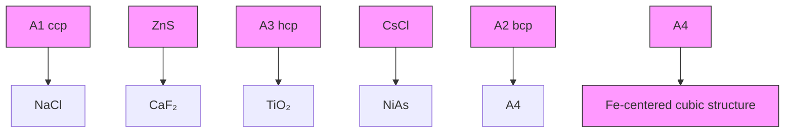

# 一、离子晶体07:58

# 1. 氯化钠 08:28

![[06.酸碱理论_笔记_images/47f41827635e0bebf871905f052bf2908105d2cd6361a40b5d867ffbd03a3710.jpg]]

text_image

NaCl型
• 所属晶系:立方
• 等同离子套数: 2
(1套Cl-,1套Na+)
• 空间点阵型式: 立方面心
cF
• 结构基元内容:

● 晶系归属：属于立方晶系，七大晶系之一（立方、正交、四方、单斜、三斜、六方、三方）  
● 等同离子套数：包含2套离子点，1套Cl $^{-}$ 和1套Na $^{+}$   
● 空间点阵型式：立方面心(cF)点阵  
● 结构基元内容：由1个 $Na^{+}$ 和1个 $Cl^{-}$ 组成  
● 配位数比：正负离子配位数之比为6:6（非1:1）  
● 负离子堆积：Cl $^{-}$ 离子呈面心立方最密堆积(CCP)  
- 正离子占位:

○ 空隙类型：占据正八面体空隙  
○ 占有率：100%完全占据  
○ 位置分布：体心1个+12条棱心各1/4（共3个完整位置）

# 2. 硫化锌 10:30

# 1）基本特征

![[06.酸碱理论_笔记_images/c842dc14f54d5caea50b75c907c538bda0fcb912e192dea5da8f824d29dc17ee.jpg]]

text_image

立方ZnS型
C轴线性
O S C=0
• C=1/2
所属晶系：立方
{ O C=8/4
× C=1/4
• 等同离子套数：
2(1套S⁻¹,1套Zn⁺⁺)
• 空间点阵型式：立方面心
cF
• 结构基元内容：
1个S⁻¹,1个Zn⁺⁺

● 晶系归属：立方晶系（a=b=c， $\alpha=\beta=\gamma=90^{\circ}$ ）  
● 等同离子套数：2套（1套 $S^{2-}$ ，1套 $Zn^{2+}$ ），通过取向相同性判断  
● 空间点阵型式：立方面心(cF)点阵  
● 结构基元内容：1个 $S^{2-}$ 和1个 $Zn^{2+}$ 组成  
- 投影变换：可通过坐标平移（所有点坐标加 $\left(\frac{1}{4},\frac{1}{4},\frac{1}{4}\right)$ ）实现顶点转换

# 2）结构细节

立方ZnS型  
![[06.酸碱理论_笔记_images/a53984395264273e1dbfd90dc6d64551cd7849b78bc2154c121be56edd7f82ef.jpg]]

chemical

Molecular structure diagram showing a cubic unit cell with yellow and blue atoms, labeled as 'Intermolecular Structure'

一个晶胞中的  
结构基元数：4  
离子数和分数坐标：  
4个 $\mathbf{S} =$ ： $0,0,0;\frac{1}{2},\frac{1}{2},0;\frac{1}{2},0,\frac{1}{2};0,\frac{1}{2},\frac{1}{2}$   
4个 $\mathbf{Zn}^{+ + }$   
$\frac{1}{4}, \frac{1}{4}, \frac{1}{4}; \frac{3}{4}, \frac{3}{4}, \frac{1}{4}; \frac{3}{4}, \frac{1}{4}, \frac{3}{4}; \frac{1}{4}, \frac{3}{4}, \frac{3}{4}$

![[06.酸碱理论_笔记_images/cb31591cc96903bef650aef879c1e19064550a127229fa6d04bd8b9f8f2d4dd4.jpg]]

● 结构基元数：每个晶胞含4个结构基元

\- 离子坐标:

○ $S^{2-}$ ：面心位置 $(0,0,0;\frac{1}{2},\frac{1}{2},0;\frac{1}{2},0,\frac{1}{2};0,\frac{1}{2},\frac{1}{2})$   
○ $Zn^{2+}$ ：四面体位置 $\left(\frac{1}{4},\frac{1}{4},\frac{1}{4};\frac{3}{4},\frac{3}{4},\frac{1}{4};\frac{3}{4},\frac{1}{4},\frac{3}{4};\frac{1}{4},\frac{3}{4},\frac{3}{4}\right)$

# 3）配位与堆积

立方ZnS型  
![[06.酸碱理论_笔记_images/e4c8b17e9be1d3d18e818493b0601537d8e1681ef2da8989918fe835286b28e1.jpg]]

chemical

Crystal lattice structure diagram showing yellow and blue spheres representing atoms in a cubic arrangement

正负离子配位数比：4:4  
负离子堆积方式: A1 ccp

<table><tr><td colspan="2">正离子所占空隙</td></tr><tr><td>类型</td><td>正四面体</td></tr><tr><td>分数</td><td>4/8=1/2</td></tr><tr><td>空隙位置及数目</td><td>8个顶角</td></tr><tr><td>占有位置</td><td>4个间隔项角</td></tr></table>

![[06.酸碱理论_笔记_images/4511d85b1e8b8b1dba14aca82bb2256b6a19653e7086746c3d8d7aa035032816.jpg]]

![[06.酸碱理论_笔记_images/c3fca843b34537313a59ecfa6d678d4d3746600f005fec19350095f54bd76241.jpg]]

● 配位数比：正负离子配位数4:4

● 负离子堆积：面心立方最密堆积(A1型CCP)

\- 正离子占位:

○ 空隙类型：正四面体空隙

○ 占有率：50%（8个空隙中占据4个）

○ 位置特征：占据间隔的/不相邻的四面体空隙

# 4）堆积周期分析

立方ZnS型

(111)方向正负离子堆积周期|AaBbCc|

Nad

![[06.酸碱理论_笔记_images/ee8cac8ae664c55e181c959f61dd611527832a38a83e24d26564e33b7b624326.jpg]]

chemical

Crystal lattice structure diagram showing atoms labeled A, B, C in a cubic arrangement

![[06.酸碱理论_笔记_images/42effb5c816cd510aa511fbc8bda7163bea1473093cc87dae92803d7e820e518.jpg]]

![[06.酸碱理论_笔记_images/3ecbff28f526a1ed8f2b31a966b9f96915f849315ed6ac464bfc689c46b70a3c.jpg]]

(111)方向周期：|AaBbCc|排列

○ $S^{2-}$ 堆积周期：ABC

○ $Zn^{2+}$ 填充特征：与上层离子重合（四面体空隙填充特点）

\- 对比NaCl:

○ NaCl中Na⁺填充八面体空隙，周期为abc（与上下层不重合）

○ ZnS中 $Zn^{2+}$ 因填充四面体空隙，与某层离子完全重合

# 3. 氟化钙 30:12

# 1）氟化钙的晶系与结构 30:14

![[06.酸碱理论_笔记_images/2220933517d173ca3f9f44e3559c379e927c54d3e86d2a624ae41b629c0b4af3.jpg]]

text_image

CaF₂型
• 所属晶系：
• 等同离子套数：
• 空间点阵型式：
• 结构基元内容：

● 晶系：立方晶系  
● 等同离子套数：3套（2套氟离子，1套钙离子）  
● 空间点阵型式：立方面心点阵  
● 结构基元内容：2个氟离子和1个钙离子  
● 结构基元数：每个晶胞包含4个结构基元

# 2）氟化钙的晶胞与坐标 31:13

![[06.酸碱理论_笔记_images/a11c9a38f5e455217d177398969d61f1c64c1c4c466629926c177673ef0c7c1d.jpg]]

text_image

CaF₂型
以F为顶点，上作简单之方
一个晶胞中的
结构基元数：4
离子数和分数坐标：
4个Ca²⁺：
0,0,0;½,½,0;½,0,½;0,½,½
8个F-
½,½,½,3/4,3/4,1/4,3/4,1/4,3/4,1/4,3/4
3/4,3/4,3/4,1/4,1/4,3/4,1/4,3/4
1/4,3/4,3/4,1/4,1/4,3/4,1/4,3/4

- 离子数：4个 $Ca^{2+}$ 和8个 $F^{-}$   
- 分数坐标：

○ $Ca^{2+}$ ：面心立方位置 $\left(\frac{11}{22}\right.0$ 等）

○ $F^{-}$ ：全部四面体空隙位置（ $\frac{111}{444}$ 等组合）

● 填充特点：钙离子作面心立方堆积，氟离子填入全部四面体空隙   
3）氟化钙中氟的堆积方式 32:11  
● 堆积转换：以氟为顶点时

- 氟离子构成简单立方堆积   
- 钙离子占据氟离子形成的立方体空隙

\- 几何特征：每个钙离子连接8个氟离子，形成立方体构型

4）氟化钙中钙的空隙填充 35:26

$\mathrm{CaF}_2$ 型  
![[06.酸碱理论_笔记_images/9388e6554c237fed9f9828dbc6c9f85811a9f4c0d08ee7db2d00e6fd9d481b9b.jpg]]

chemical

Crystal lattice structure diagram showing green and gray atoms in a cubic arrangement

![[06.酸碱理论_笔记_images/cab0f3030a41e037f5cf04a58e8f055a3485b4041f4dc9b35d1420de49aefa50.jpg]]

chemical

Crystal lattice structure diagram showing repeating unit cells with blue and green atoms

负离子堆积方式：立方简单
C:\Users\useronline1\Desktop\2018春季直播房\Caf2-2.mov   
正负离子配位数比：

![[06.酸碱理论_笔记_images/f2355ddea80b05a6ee2a708c3a5b1cced0d71c3adc104c84180d2abcd3fd4148.jpg]]

空隙类型：立方体空隙  
● 占有率： $\frac{1}{2}$ （8个空隙中占据4个）  
● 位置特征：占据不相邻的4个顶角位置  
● 空间分布：钙离子在空间呈四面体排列

5) 氟化钙的负离子堆积方式与配位数 38:01

● 负离子堆积：简单立方堆积（A6型）  
● 配位数比：8:4（钙:氟）

○ 钙配位数为8（立方体配位）  
- 氟配位数为4（四面体配位）

6）氟化钙中正离子所占空隙类型与分数 40:21

$CaF_{2}$ 型  
![[06.酸碱理论_笔记_images/71eaa619c88725415c6ee55d7b2d68259d11896bb62f44a7ddc022627a03cb90.jpg]]

chemical

Crystal lattice structure diagram showing two distinct unit cell arrangements with green and blue atoms

<table><tr><td colspan="2">正离子所占空隙</td></tr><tr><td>类型</td><td>立方体</td></tr><tr><td>分数</td><td>4/8=1/2</td></tr><tr><td>空隙位置数目及占有位置</td><td>共8个顶角占据4个不相邻顶角</td></tr></table>

![[06.酸碱理论_笔记_images/8719feae199a8d3958c255526eba3353d5515c6c4455bbc2971df09a64ea5abc.jpg]]

![[06.酸碱理论_笔记_images/184aa4a7733d3a0c0467f9f90d4de720df56fb3add3e0b1b36f04b94bc246212.jpg]]

空隙类型：立方体空隙  
- 分数: $\frac{4}{8} = \frac{1}{2}$   
● 位置数目：8个顶角位置  
● 占有方式：占据4个不相邻顶角

7）反萤石型结构介绍 41:46

![[06.酸碱理论_笔记_images/e7f3522f419e4df777bd1c075af7ed9b585a09b4992bb22814827885ad38bb07.jpg]]

chemical

Crystal lattice structure diagram showing red and purple atoms in a cubic arrangement

Caf2   
反萤石型  
${\mathrm{{Na}}}_{2}\mathrm{O}$   
0作cep
Na+填入全b
四面体空学

![[06.酸碱理论_笔记_images/52b38589bcd21f7821852421d20506d1d24437b3289ea2f2213ccc61d424a3ab.jpg]]

- 结构特点：与氟化钙相反（2个阳离子:1个阴离子）   
- 典型实例： $Na_{2}O$

○ 氧离子作面心立方堆积（A1型）  
- 钠离子填入全部四面体空隙

● 配位关系：钠离子4配位，氧离子8配位

4. 六方硫化锌 42:49

1）晶体基本信息

![[06.酸碱理论_笔记_images/6f0ff11dc4270c918c2727b10612e4020a532be53963c54f4ca081f579e15f1a.jpg]]

text_image

六方ZnS型
原结构、
• 所属晶系：六方
• 等同离子套数：
4(2套S⁻, 2套Zn⁺⁺)
• 空间点阵型式：
六方P hP
• 结构基元内容：
2个S⁻, 2个Zn⁺⁺

●

● 晶系：六方晶系  
● 等同离子套数：4套（2套硫，2套锌）  
● 空间点阵型式：简单六方（HP）  
● 结构基元内容：2个硫和2个锌  
● 结构基元数：1个/晶胞

2）配位数与坐标

![[06.酸碱理论_笔记_images/33943fe54c79a3163ce28965aacdf8ab0f0dab8eb7e54bf7c547c80f475a2962.jpg]]

text_image

六方ZnS型
正负离子配位数比: 44^4
一个晶胞中的
结构基元数: 1 /
离子数和分数坐标:
2个S=: 0,0,0; 2/3, 1/3, 1/2
2个Zn²⁺: (0,0,5/8); 2/3, 1/3, 1/8
或 0,0,3/8; 2/3, 1/3, 7/8

●   
● 配位数比：4:4  
- 离子数：2个 $S^{2-}$ 和2个 $Zn^{2+}$   
- 分数坐标:

○ 硫： $(0,0,0)$ 和 $\left(\frac{2}{3},\frac{1}{3},\frac{1}{2}\right)$

○ 锌： $(0,0,\frac{5}{8})$ 和 $(\frac{2}{3},\frac{1}{3},\frac{1}{8})$

3）堆积方式与空隙

![[06.酸碱理论_笔记_images/720ce6b813df94843e7fafc76a6e6c6f132f2da3de081e73d4486a9e8d39a2db.jpg]]

text_image

六方ZnS型
负离子堆积方式：A3 hcp
正离子所占空隙
类型	正四面体
分数	2/4=1/2
空隙位置	4个正四面体，
数目及	每个棱2，内部2
占有位置	交错着棱上占1
个，内部占1个
正负离子密堆积层堆积表示|AaBb|

● 负离子堆积：A3型（hcp）  
- 正离子空隙：

○ 类型：正四面体  
○ 分数: $\frac{2}{4} = \frac{1}{2}$   
○ 位置：4个四面体（棱上2个，内部2个），交错占据

\- 堆积表示：AaBb型密堆积层

4）八面体空隙坐标

![[06.酸碱理论_笔记_images/a638f09fd041a900c8e500d64f1172d507a08a0d49650dae6d5b68300973fdad.jpg]]

chemical

Crystal structure diagram of CsCl with legend explaining atomic arrangements and unit cell definitions

\- 
- 坐标位置：

$\begin{array}{rl} & \frac{2}{3},\frac{1}{3},\frac{1}{4})\\ & \frac{2}{3},\frac{1}{3},\frac{3}{4}) \end{array}$

5. 氯化铯型结构

1）基本特征

![[06.酸碱理论_笔记_images/a264902472b543cc63f6d958b5426bc3720272fd3e05dea3bd23cbd4fdca1281.jpg]]

chemical

Crystal structure diagram of CsCl, showing ion distribution and atomic positions for positive and negative ions

● 晶系：立方晶系  
● 等同离子套数：2套（1套 $Cl^{-}$ ，1套 $Cs^{+}$ ）  
● 空间点阵型式：立方简单（cP）  
- 结构基元内容：1个 $Cl^{-}$ 和1个 $Cs^{+}$

2）配位数与坐标

CsCl型  
负离子堆积方式：立方简单  
![[06.酸碱理论_笔记_images/180bbe038ace8ac045e20a91ddca90001518398123f05b2dcbc3c0dde435a5b2.jpg]]

chemical

Crystal lattice structure diagram showing green and purple atoms in a cubic arrangement

<table><tr><td colspan="2">正离子所占空隙</td></tr><tr><td>类型</td><td>立方体</td></tr><tr><td>分数</td><td>1/1=1</td></tr><tr><td>空隙位置、数目及占有位置</td><td>1个体心1个</td></tr></table>

![[06.酸碱理论_笔记_images/fc1b52b262c4c669d8c1db2f48f9c85061a0278e476ac2dab65a14ed23ee841f.jpg]]

● 配位数比：8:8

● 结构基元数：1个/晶胞

\- 分数坐标：

$$
\begin{array}{l} \circ \quad C l ^ {-}: (0, 0, 0) \\ \circ \quad C s ^ {+}: (\frac {1}{2}, \frac {1}{2}, \frac {1}{2}) \\ \end{array}
$$

3）堆积与空隙

● 负离子堆积：立方简单堆积

\- 正离子空隙：

○ 类型：立方体

○ 分数: $\frac{1}{1} = 1$

○ 位置：体心位置（唯一）

6. 金红石 01:09:26

1）金红石的基本信息

![[06.酸碱理论_笔记_images/e4c917623bc947eb089cdf9a6b7d47e0cc5fd89102d1a41c07465fdb296e579e.jpg]]

金红石型 $2T_{102}$   
![[06.酸碱理论_笔记_images/60f4a049a9c0df5d57cde1aa7849864edbfd6a723f4b547f1236a448d2dc60fb.jpg]]

chemical

Crystal structure diagram of a cubic unit cell with red and gray atoms and blue bonds indicating coordination geometry

$a = b$

- 所属晶系：四方  
- 等同离子套数：  
6(4套O $^{=}$ , 2套Ti $^{4+}$ )   
- 空间点阵型式:  
四方简单 tP  
- 结构基元内容:

4个O=，2个T

![[06.酸碱理论_笔记_images/dfedffc86bdccdb2ca519b972e38c4274b7f6d0fedf536addc7c980a800df7ad.jpg]]

![[06.酸碱理论_笔记_images/1925a3496bb56020fa5c1f7dd0d55fd283d2cfbbf6a9436d572ef10b8989244e.jpg]]

● 晶系归属：四方晶系，具有 $a = b \neq c$ 的晶格参数特征  
- 空间点阵：四方简单点阵(tP)，结构基元包含2个 $Ti^{4+}$ 和4个 $O^{2-}$   
● 等同离子套数：共6套（4套氧离子+2套钛离子），通过比较顶点和体心钛离子的配位环境差异确认

2）金红石的结构特点 01:09:51

● 配位多面体：钛离子占据氧离子构成的变形八面体空隙，该八面体沿c轴方向发生明显畸变

\- 结构验证：通过比较顶点钛(配位完整)与体心钛(缺少对应配位氧)的差异，证明其为简单四方点阵

3）金红石的配位数与坐标 01:11:20

![[06.酸碱理论_笔记_images/e65338fe9777fe90f1203447079fa41997a97cf763af8a45e6cda49ec9fccdcd.jpg]]

text_image

金红石型
正负离子配位数比: 6:3
一个晶胞中的
结构基元数: 1
离子数和分数坐标:
2个Ti⁴⁺: 0,0,0; ½, ½, ½
4个O⁻: u,u,0; ½ -u, ½ +u, ½
ū,ū,0; ½ +u, ½ -u, ½

● 配位数比： $Ti^{4+}:O^{2-}=6:3$ ，符合"配位数与离子数成反比"规律  
- 分数坐标：

\- 钛离子：(0,0,0)和 $\left(\frac{1}{2},\frac{1}{2},\frac{1}{2}\right)$

○ 氧离子： $(u,u,0)$ 、 $(1-u,1-u,0)$ 、 $\left(\frac{1}{2}+u,\frac{1}{2}-u,\frac{1}{2}\right)$ 、 $\left(\frac{1}{2}-u,\frac{1}{2}+u,\frac{1}{2}\right)$ ，其中 $u\approx0.3$

\- 对称关系：同一平面上氧离子坐标呈对称分布，如 $(u,u,0)$ 与 $(1 - u,1 - u,0)$ 关于对角线对称

4）负离子的堆积方式 01:15:53

● 堆积类型：伪六方密堆积（近似六方但存在畸变）  
● 堆积特征：由两个错开的氧离子三角形层构成，中间夹有钛离子层  
● 观察技巧：沿c轴方向观察可见氧离子形成的变形八面体配位环境

5）金红石的空隙与观察角度 01:18:15

![[06.酸碱理论_笔记_images/af6505a0e76c9b81d269cf34a87e9bef4c2eaa63a2ad545b125647cc63c158fd.jpg]]

text_image

金红石型
负离子堆积方式: 伪六方
正离子所占空隙
类 型 八面体(非正八)
分 数 2/4=1/2
空隙位置、
数目及
占有位置 4个八面体空隙
中心个1(占)
顶点1个(8×1/8)(占)
侧面2个(4×1/2)(空)

● 空隙类型：变形八面体空隙（非正八面体）  
● 占据情况：

○ 中心1个（完全占据）  
- 顶点8个（每个占据1/8）  
- 侧面4个（每个占据1/2）

- 分数计算：实际占据空隙分数为 $\frac{2}{4} = \frac{1}{2}$   
● 观察方法：沿四边形平面观察时，可见侧面八面体空隙未被占据的特征结构

6）重要图形理解 01:22:44

● 关键特征：三角形氧离子层的错位排列是判断伪六方堆积的重要依据  
● 结构对比：与典型六方密堆积的区别在于c轴方向的压缩导致八面体畸变

7. 深化念 01:23:06

1）ZnS的晶体结构特点 01:23:21

![[06.酸碱理论_笔记_images/7f3aee25a204184349a539d4891ac75eb0be1d6bf028076d52ae3388f07052e4.jpg]]

flowchart

结构关系：ZnS型晶体与金属晶体存在结构对应关系（如A1-ccp对应NaCl型）  
● 典型代表： $TiO_{2}$ （金红石）、 $CaF_{2}$ （萤石）、NiAs等具有特征结构类型

2）绘制以特定点为顶点的金包及坐标 01:23:51

\- 绘制要点：

○ 砷(As)作六方密堆积(A3-hcp)   
- 镍(Ni)占据全部八面体空隙

\- 坐标确定：需要分别以As和Ni为顶点建立坐标系，体现六方晶系的特征分数坐标

3）六方柱面追击与八面体空隙 01:24:14

● 结构特征：六方密堆积中八面体空隙的完全占据是NiAs结构的核心特征   
● 验证方法：通过比较顶点原子与空隙原子的配位环境确认结构类型

8. 应用案例 01:28:28

1）例题:深钾涅占据情况

![[06.酸碱理论_笔记_images/06ef76d46e1c3a8011e0ac4cc16832256a1ad1b929932d46d6adcf5e87b302d3.jpg]]

text_image

金红石型
As.点据N:的什么空隙?
AS(0,0,0)(7/3 1/3 1/2)
Ni:(1/8 3/4) (1/5 3/4)
AscBcAscBc

\- 坐标表示：

○ 神(As)的坐标为(0,0,0)、 $\left(\frac{2}{3},\frac{1}{3},\frac{1}{2}\right)$   
○ 涅(Ni)的坐标为 $\left(\frac{1}{3},\frac{2}{3},\frac{1}{4}\right)$ 、 $\left(\frac{1}{3},\frac{2}{3},\frac{3}{4}\right)$

\- 堆积类型:

- 神做六方最密堆积(ABAB型)，涅占据其全部八面体空隙  
若以涅为顶点，则涅做简单六方堆积，神占据50%的三棱柱空隙

\- 空间占有率:

◦ 涅占神的八面体空隙：100%占有率  
- 神占涅的三棱柱空隙：50%占有率（晶胞中4个三棱柱空隙只占2个）

9. 典型离子晶体与金属晶体关系 01:31:25

```mermaid
graph TD
    A["NaCl"] --> B["CaF₂"]
    C["ZnS"] --> D["A1 cep"]
    D --> E["ZnS"]
    F["NaCl"] --> G["A3 hcp"]
    H["ZnS"] --> I["TiO₂"]
    J["CaF₂"] --> K["A4"]
    L["CsCl"] --> M["A2 bcp"]
    N["NiAs"] --> O["SiO₂"]
    P["A3 hcp"] --> Q["SiO₂"]
    R["NiAs"] --> S["SiO₂"]
    T["A4"] --> U["A2 bcp"]
    V["A3 hcp"] --> W["A3 SiO₂"]
    X["TiO₂"] --> Y["SiO₂"]
    Z["XN-SiO₂"] --> AA["XN-SiO₂"]
    AB["XN-SiO₂"] --> AC["XN-SiO₂"]
    AD["XN-SiO₂"] --> AE["XN-SiO₂"]
    AF["XN-SiO₂"] --> AG["XN-SiO₂"]
    AH["XN-SiO₂"] --> AI["XN-SiO₂"]
    AJ["XN-SiO₂"] --> AK["XN-SiO₂"]
    AL["XN-SiO₂"] --> AM["XN-SiO₂"]
    AN["XN-SiO₂"] --> AO["XN-SiO₂"]
    AP["XN-SiO₂"] --> AQ["XN-SiO₂"]
    AR["XN-SiO₂"] --> AS["XN-SiO₂"]
    AT["XN-SiO₂"] --> AU["XN-SiO₂"]
    AV["XN-SiO₂"] --> AW["XN-SiO₂"]
    AX["XN-SiO₂"] --> AY["XN-SiO₂"]
    AZ["XN-SiO₂"] --> BA["XN-SiO₂"]
    BB["XN-SiO₂"] --> BC["XN-SiO₂"]
    BD["XN-SiO₂"] --> BE["XN-SiO₂"]
    BF["XN-SiO₂"] --> BG["XN-SiO₂"]
    BH["XN-SiO₂"] --> BI["XN-SiO₂"]
    BJ["XN-SiO₂"] --> BK["XN-SiO₂"]
    BL["XN-SiO₂"] --> BM["XN-SiO₂"]
    BN["XN-SiO₂"] --> BO["XN-SiO₂"]
    BP["XN-SiO₂"] --> BQ["XN-SiO₂"]
    BR["XN-SiO₂"] --> BS["XN-SiO₂"]
    BT["XN-SiO₂"] --> BU["XN-SiO₂"]
    BV["XN-SiO₂"] --> BW["XN-SiO₂"]
    BX["XN-SiO₂"] --> BY["XN-SiO₂"]
    BZ["XN-SiO₂"] --> CA["SiO₂"]
    style A fill:#f9f,stroke:#333
    style B fill:#f9f,stroke:#333
    style C fill:#f9f,stroke:#333
    style D fill:#ccf,stroke:#333
    style E fill:#ccf,stroke:#333
    style F fill:#ccf,stroke:#333
    style G fill:#ccf,stroke:#333
    style H fill:#ccf,stroke:#333
    style I fill:#ccf,stroke:#333
    style J fill:#ccf,stroke:#333
    style K fill:#ccf,stroke:#333
    style L fill:#ccf,stroke:#333
    style M fill:#ccf,stroke:#333
    style N fill:#ccf,stroke:#333
    style O fill:#ccf,stroke:#333
    style P fill:#ccf,stroke:#333
    style Q fill:#ccf,stroke:#333
    style R fill:#ccf,stroke:#333
    style S fill:#ccf,stroke:#333
    style T fill:#ccf,stroke:#333
    style U fill:#ccf,stroke:#333
    style V fill:#ccf,stroke:#333
    style W fill:#ccf,stroke:#333
    style X fill:#ccf,stroke:#333
    style Y fill:#ccf,stroke:#333
    style Z fill:#ccf,stroke:#333
```

![[06.酸碱理论_笔记_images/ba2e4b3e697d2ed3da0c96c3075883ab349b2dad4cdf834dfab27d023141b901.jpg]]

flowchart

# A1型(CCP)密堆积：

○ 点阵类型：立方面心  
○ 空隙比例：4原子对应8四面体空隙和4八面体空隙（4:8:4）

○ 占据情况：

■ 全占四面体空隙→萤石(CaF₂)结构  
■ 占半四面体空隙→立方ZnS结构（需错开占据）

# ● A3型(HCP)密堆积：

○ 占据半四面体空隙→六方ZnS结构  
○ 占据半八面体空隙→金红石(TiO₂)结构  
○ 占据全八面体空隙→NiAs结构

# ● 特殊转换关系：

○ A4(金刚石)→A2(体心立方): 需填满剩余4四面体和4八面体空隙（共加8个原子）  
- 萤石 $\rightarrow$ CsCl结构：以F为顶点时F做简单立方堆积，Ca占半立方体空隙；全占则变CsCl结构

<table><tr><td rowspan="2">组成比</td><td rowspan="2">结构类型</td><td rowspan="2">等同离子套数</td><td rowspan="2">空间点阵型式</td><td rowspan="2">结构基元数</td><td rowspan="2">基元内容</td><td>离子分数坐标</td><td></td></tr><tr><td>负</td><td>正</td></tr><tr><td>AB</td><td>CsCl</td><td>2(1Cl,1Cs+)</td><td>cP</td><td>1</td><td>1Cl,1Cs+</td><td>0,0,0</td><td>1/2,1/2,1/2</td></tr><tr><td></td><td>NaCl (岩盐型)</td><td>2(1Cl,1Na+)</td><td>cF</td><td>4</td><td>1Cl,1Na+</td><td>0,0,0; 1/2,1/2,0; 0,1/2,1/2; 1/2,0,1/2</td><td>1/2,1/2,1/2; 1/2,0,0; 0,1/2,0; 0,0,1/2</td></tr><tr><td></td><td>六方ZnS (纤锌矿型)</td><td>4(2S-,2Zn++)</td><td>hP</td><td>1</td><td>2S-,2Zn++</td><td>0,0,0; 2/3,1/3,1/2</td><td>0,0,5/8; 2/3,1/3,1/8</td></tr><tr><td></td><td>立方ZnS (闪锌矿型)</td><td>2(1S-,1Zn++)</td><td>cF</td><td>4</td><td>1S-,1Zn++</td><td>0,0,0; 1/2,1/2,0; 1/2,0,1/2; 0,1/2,1/2</td><td>1/4,1/4,1/4; 3/4,3/4,1/4; 3/4,1/4,3/4; 1/4,3/4,3/4</td></tr><tr><td>AB2</td><td>CaF₂ (萤石型)</td><td>3(2F,1Ca++)</td><td>cF</td><td>4</td><td>2F,1Ca++</td><td>1/4,1/4,1/4; 3/4,3/4,1/4; 3/4,1/4,3/4; 1/4,3/4,3/4; 3/4,3/4,3/4; 3/4,1/4,1/4; 1/4,3/4,1/4; 1/4,1/4,3/4; 0</td><td>0,0; 1/2,1/2.0; 1/2,0,1/2; 0,1/2,1/2</td></tr><tr><td></td><td>金红石型 (TiO₂)</td><td>6(4O-,2Ti++)</td><td>tP</td><td>1</td><td>4O-,2Ti++</td><td colspan="2">u,u,0: ½ - u: ½ + u: ½
üüüüüüüüüüüüüüüüüüüüüüüüüüüüüüüüüüüüüüüüüüüüüüüüüüüüüüüüüüüüüüüüüüüüüüüüüüüüüüüüüüüüüüüüüüüüüüüüüüüüä-ä-ä-ä-ä-ä-ä-ä-ä-ä-ä-ä-ä-ä-ä-ä-ä-ä-ä-ä-ä-ä-ä-ä-ä-ä-ä-ä-ä-ä-ä-ä-ä-ä-ä-ä-ä-ä-ä-ä-ä-ä-ä-ä-ä-ä-ä-ä-ä-ä-ä -ä-ä -ä -ä -ä -ä -ä -ä -ä -ä -ä -ä -ä -ä -ä -ä -ä -ä -ä -ä -ä -ä -ä -ä -ä -ä -ä -ä -ä -ä -ä -ä -ä -ä -ä -ä -ä -ä -ä -ä -ä -ä -ä -ä -ä -ä -ä -ä -ä -ä -ä -ä</td></tr></table>

# ● 重要晶体结构特征：

○ CsCl型：简单立方点阵，配位数8:8   
○ NaCl型：面心立方点阵，配位数6:6   
- 立方ZnS型：面心立方点阵，四面体配位  
- 六方ZnS型：六方点阵，纤锌矿结构  
○ $CaF_{2}$ 型：面心立方点阵，F做简单立方堆积

# ● 顶点变换原则：

○ 同一晶体以不同组分为顶点时，堆积方式会改变（如NiAs中以As或Ni为顶点）  
必须掌握各组分作为顶点时的晶胞重构方法

# 10. 离子半径 01:46:51

# 1）哥希密特离子半径 01:48:40

# 离子半径

1. 哥希密特(Goldschmidt)离子半径

离子键键长—正负离子不等径圆球相切时的核间距。

晶体中,负离子较大,通常是负离子相互接触,可在负离子接触下,平衡核间距对分,再找出正负离子接触的核间距。

Lande(朗德)在通过对比具有NaCl型结构的化合物的晶胞参数后，可得到系列离子半径。

![[06.酸碱理论_笔记_images/000f67ea9976f144a3336483ed43599455b388548bd86cd5a96676352c9f6424.jpg]]

- 定义：离子键键长指正负离子作为不等径圆球相切时的核间距。在晶体中通常负离子较大，表现为负离子相互接触。  
● 测量原理：通过对比具有NaCl型结构化合物的晶胞参数，可得到系列离子半径。当负离子接触时，可先平衡核间距对分，再找出正负离子接触的核间距。

2）应用案例 01:51:46

例题:离子半径计算

![[06.酸碱理论_笔记_images/b1c25d4af64dcd45d0bb753b8f9120c733f50b4593b5099db2e7540e35ae6445.jpg]]

text_image

NaCl型离子晶体中离子接触情况分析
(1,0,)
负负接触
正负不接触
√2a=4r
负负接触
正负接触
{√2a=4r_
a=2(r+ + r₋)
正负接触
负负不接触
a=2(r₊ + r₋)
(a)晶胞参数只与负离子半径有关；(c)和正负离子半径都
有关；如果我们能判断出晶体中离子接触情况是(a)
即可求出负离子半径，再通过(c)可求得正离子半径。

○ 三种接触模型：

■ 负负接触正负不接触： $\sqrt{2}a=4r-$ （仅与负离子半径相关）  
■ 负负与正负均接触：需同时满足 $\sqrt{2}a = 4r -$ 和 $a = 2(r_{+} + r - )$   
正负接触负负不接触： $a=2(r_{+}+r_{-})$ （与两种离子半径均相关）

○ 判断依据：

■ 若晶胞参数a相同，说明属于第一种情况（仅负离子接触）

■ 若a随阳离子增大而增大，说明被"撑开"，属于第三种情况

3）分析计算过程 01:57:22

实例：

NaCl型晶体的晶胞参数如下,求各离子的半径:

晶体 MgO MnO CaO MgS MnS CaS

a/Å 4.21 4.44 4.80 5.19 5.21 5.68

![[06.酸碱理论_笔记_images/f138232e2609314371774bfb963d5da454ccad712efb2bc27942e86d61b884f0.jpg]]

解题步骤：

○ 比较参数：观察MgS和MnS的a值相近（5.19Å和5.21Å），说明硫离子未被撑开，适用第一种模型

○ 计算硫半径：取均值5.20Å，得 $r_{S^{2-}}=\frac{\sqrt{2}\times5.20}{4}=1.84\mathring{A}$   
☐ 推导钙半径：CaS的 $a = 5.68\AA$ 明显增大，说明钙离子撑开硫离子，用 $a = 2(r_{Ca^{2+}} + r_{S^{2-}})$ 反推  
- 连锁计算：通过CaO求氧半径，再通过MnO求锰半径，最后用MgO求镁半径

# ● 关键技巧:

◦ 优先选择未被撑开的体系（如MgS/MnS）建立基准  
○ 半径关系： $r_{Mg^{2+}}<r_{Mn^{2+}}<r_{Ca^{2+}}$   
○ 当阳离子较小时（如 $Mg^{2+}$ ），更可能与较小的阴离子（如 $O^{2-}$ ）接触

# 11. 休息 02:03:09

# 1）问答环节 02:03:10

● 常见疑问：若用未接触模型计算实际接触的离子半径会偏大，因假设了最大可能间距  
● 验证方法：比较同类型晶体参数差异，显著不同则说明存在撑开现象

# 12. 离子晶体结构规律 02:19:14

# 1）离子半径与晶胞参数关系

③比较MnS CaS的晶胞参数，随正离子的增大而增大，CaS属于(c)种情况

$$
r _ {C a ^ {* +}} + r _ {S ^ {*}} = r _ {C a ^ {* +}} + 1. 8 4 = 5. 6 8 / 2
$$

$$
r _ {C a ^ {+ +}} = 1. 0 0 \AA
$$

④比较MgO MnO CaO的晶胞参数，随正离子半径增加而增加，至少MnO CaO是与正离子半径有关，属于(c)

$$
r _ {C a ^ {+ +}} + r _ {O ^ {-}} = 1. 0 0 + r _ {O ^ {-}} = 4. 8 0 / 2 \quad r _ {O ^ {-}} = 1. 4 0 \AA
$$

$$
r _ {M n ^ {+ +}} + r _ {O ^ {-}} = r _ {M n ^ {+ +}} + 1. 4 0 = 4. 4 4 / 2 \quad r _ {M n ^ {+ +}} = 0. 8 2 \AA
$$

⑤如果MgO为(a)(b)，则有 $1.4142*4.21 = 5.95 \neq 1.40*4 = 5.60$ 因而MgO属(c)

$$
r _ {M g ^ {+ +}} + r _ {O ^ {-}} = r _ {M g ^ {+ +}} + 1. 4 0 = 4. 2 1 / 2
$$

半径影响规律：晶胞参数随正离子半径增大而增大，如比较MnS和CaS时， $r_{Ca^{2+}} = 1.00\text{\AA}$ ， $r_{Ca^{2+}} + r_{S^{2-}} = 5.68 / 2$   
● 实例验证：MgO、MnO、CaO系列中，通过计算 $r_{Mn^{2+}}=0.82\mathring{A}$ ， $r_{O^{2-}}=1.40\mathring{A}$ ，证实晶胞参数与正离子半径正相关

# 2）离子半径理论发展

# 2. Pauling半径(晶体半径)

1927年Pauling考虑到离子半径与离子最外层电子的分布情况和核对电子作用大小有关，认为对于具有相同核外电子的离子，其半径应与其有效电荷成反比

$$
r = \frac {C _ {n}}{z - \sigma} = \frac {C _ {n}}{z ^ {*}} \quad \begin{array}{l l} & C _ {n} \text {是取决于离子最外层电子的} \\ & \text {主量子数} n \text {有关的常数} \end{array}
$$

# 3. 有效离子半径(Shannon沙农)

1969年，Shannon和Prewitt基于氧化物和氟化物的离子间距和晶胞体积，考虑了电子自旋状态和正负离子的配位情况提出了有效离子半径(effective ionic radii)；在此基础上，1976年Shannon根据新的结构数据、经验键长—键长关系以及半径—体积、半径—配位数、半径—体系图，在考虑了更多氧化态和配位情况后，对效应进行了修正。

![[06.酸碱理论_笔记_images/cf6113570c061f75fc5ce4e8c4e4a884ebd4a47f941a9391b1007971e5065fc0.jpg]]

![[06.酸碱理论_笔记_images/5d0784c3a96e20a6746a16f30084a06f02196a5021a4c2321f43aae7e4399580.jpg]]

Pauling半径：1927年提出 $r=\frac{C_{n}}{Z-\sigma}$ ，其中 $C_{n}$ 与主量子数相关，认为半径与有效电荷成反比  
● Shannon半径：1969年基于氧化物/氟化物数据提出有效离子半径，1976年修正时考虑更多氧化态和配位数因素

# 3）配位数临界值原理

# 1. 正负离子半径比决定正离子的配位多面体形状及配位数

具有一定半径的正离子在保持与负离子接触的条件下，应与尽可能多的负离子接触，这样才能形成更稳定的构型，由此就导致了正负离子半径比决定正离子配位数的结晶学原则。

![[06.酸碱理论_笔记_images/ca259828c6d4049173ea533e5811c3bede6d7e2b2b2f246c37582ebdfdfc1a72.jpg]]

![[06.酸碱理论_笔记_images/ab1fcd0f455df587c6f41cbd802fc094a7af5d63633fbb5ac28ea5256b846cff.jpg]]

- 接触条件：当正负离子相互接触且负离子间也接触时，半径比称为临界值  
● 稳定性原则：阳离子需撑开阴离子形成的空隙才稳定，如三角形空隙中阳离子过小会导致结构不稳定

# 4）配位数计算推导

# 1. 正负离子半径比决定正离子的配位多面体形状及配位数

具有一定半径的正离子在保持与负离子接触的条件下，应与尽可能多的负离子接触，这样才能形成更稳定的构型，由此就导致了正负离子半径比决定正离子配位数的结晶学原则。

三角形.

![[06.酸碱理论_笔记_images/30bbf4423d643e5207e5a9d8032e820a8fd6874fc4f23bca108d7477c76d9fff.jpg]]

${OA} = {r}_{+} + {r}_{ - }$ ${AB} = {2r} -$

$\frac{r_{+}}{r_{-}} =$

![[06.酸碱理论_笔记_images/461f1ec9012283004fb22e2dd25751c1f6acc7ace622ef90f21481ce57667769.jpg]]

- 三角形空隙：通过几何关系推导得 $\frac{r_{+}}{r_{-}} \geq 0.155$ ，计算过程为 $2r_{-} = \sqrt{3}(r_{+} + r_{-})$   
$\bullet$ 八面体空隙：推导得临界值0.414，计算依据 $2(r_{+} + r_{-}) = \sqrt{2}\times 2r_{-}$   
● 立方体空隙：临界值0.732，对应配位数8

# 5）配位数规律总结

<table><tr><td>正离子配位多面体</td><td>直线型</td><td>三角形</td><td>正四面体</td><td>正八面体</td><td>立方体</td><td>最密堆积</td></tr><tr><td>正离子配位数 $r_{\mathrm {a}}/r_{-}$ </td><td>2</td><td>3</td><td>4(ZnS)0.155</td><td>6(NaCl)0.225</td><td>8(CsCl, CaF2)0.4140.732</td><td>121</td></tr></table>

![[06.酸碱理论_笔记_images/3ef1a27b3d64c2c2de0d78b2729a14a3c6ff5ef0ae4615e33846f37e6c8b7b8c.jpg]]

chemical

Molecular structure diagram showing a central blue atom bonded to eight surrounding blue atoms, with one red atom highlighted in red.

\- $0.414 \leq r_{+} / r_{-} < 0.732$ 正离子的配位数为6，配位多面体为正八面体
- $0.225 \leq r_{+} / r_{-} < 0.414$ 由于正离子半径太小，只有选择配位多面体为正四面体，配位数为4

![[06.酸碱理论_笔记_images/05ed70ed40f2fbf7969f8b0fd80b0f4ca7ffb83bfe1d5e450763153caf768939.jpg]]

# 数值区间：

○ 三角形：0.155-0.225（3配位）  
四面体：0.225-0.414（4配位，如ZnS）  
○ 八面体：0.414-0.732（6配位，如NaCl）  
○ 立方体：0.732-1（8配位，如CsCl）  
○ 最密堆积：1（12配位）

● 可视化规律：配位数从12→3递减时，阳离子半径逐渐减小，阴离子从不相切到相切

# 6）组成比与配位数关系

# 2. 正负离子的组成比(数量比)决定正负离子之间的配位数比。

$\frac{n_{-}}{n_{+}}=\frac{CN_{+}}{CN_{-}}=\frac{W_{+}}{W_{-}}$ 正负离子的电价比与组成比成反比；正负离子的电价比与配位数成正比

<table><tr><td rowspan="2"></td><td rowspan="2">组成比 ${n}_{ + } : {n}_{ - }$ </td><td colspan="2">配位数比</td><td rowspan="2">电价比 ${W}_{ + } : {W}_{ - }$ </td></tr><tr><td> $C{N}_{ + }$ </td><td> $C{N}_{ - }$ </td></tr><tr><td>CsCl型</td><td>1:1</td><td>8</td><td>8</td><td>1:1</td></tr><tr><td>NaCl型</td><td>1:1</td><td>6</td><td>6</td><td>1:1</td></tr><tr><td>六方ZnS型</td><td>1:1</td><td>4</td><td>4</td><td>2:2</td></tr><tr><td>立方ZnS型</td><td>1:1</td><td>4</td><td>4</td><td>2:2</td></tr><tr><td> ${\mathrm{{CaF}}}_{2}$ 型</td><td>1:2</td><td>8</td><td>4</td><td>2</td></tr><tr><td>金红石型</td><td>1:2</td><td>6</td><td>3</td><td>4</td></tr></table>

![[06.酸碱理论_笔记_images/ca9132d41802bdb2701904cf1cb3d7a66c41805e2fd306d5bafa036ce72de5aa.jpg]]

![[06.酸碱理论_笔记_images/4807973450ed0267385cbb46f1e1c054887451c481984a3f8c540d120f73cf69.jpg]]

\- 反比关系： $\frac{n_{-}}{n_{+}} = \frac{CN_{+}}{CN_{-}}$ ，如 $\mathrm{CaF_2}$ 中1:2组成比对应8:4配位数

● 实例说明：

○ CsCl型：8:8配位  
○ NaCl型：6:6配位  
○ ZnS型：4:4配位  
○ 金红石型：6:3配位

7）离子极化效应

①离子极化导致键长变短；  
②导致从离子键向极性共价键过渡；  
③结构类型变化配位数降低；  
④物质性质改变；

离子极化对AB型化合物的影响规律：

负离子半径由小 $\rightarrow$ 大 可极化性小 $\rightarrow$ 大

正离子半径由大 $\rightarrow$ 小极化性由弱 $\rightarrow$ 强

相互极化由弱 $\rightarrow$ 强

配位数由大→小 8→6→4→3→2

结构类型：CsCl→NaCl→ZnS→层型结构或分子晶体

化学键由离子键 $\rightarrow$ 共价键过渡。

![[06.酸碱理论_笔记_images/c6ad69741ac9c65249840e3b6c935c02e5f156a29300851b44b051ad0a413b2a.jpg]]

![[06.酸碱理论_笔记_images/4709e13acb93aa83fdd84223fb2f2201e42e8758d254eaaf06687cb65b44e49b.jpg]]

四方面影响：

○ 键长缩短（从相切→相交）  
○ 键型过渡（离子键→共价键）  
○ 配位数降低（如AgI理论预测NaCl型，实际为ZnS型）  
- 性质改变（溶解度、熔点等）

● 规律总结：

○ 负离子半径↑→极化性↑   
○ 正离子半径↓→极化能力↑   
相互极化增强导致配位数8→6→4→3→2递减

8) Pauling规则 02:30:15

# 确定复杂离子晶体结构的Pauling规则

1928年，Pauling总结出了关于多元复杂离子晶体的几条规则：

第一条规则—配位多面体的性质：

在每个正离子周围，形成了负离子的配位多面体；正负离子之间的距离取决于正负离子半径之和，而正离子的配位数取决于半径之比。这与哥希密特结晶化学定律一致。

![[06.酸碱理论_笔记_images/4150ac1fa3bde6409e6fec344708aa13a47c9901ad587bff6f8bc5a088a54e4f.jpg]]

![[06.酸碱理论_笔记_images/bd4e0f44b5597df76e76fe9ee8f37eb3c1779fa8e7929621843b4d4d9ea2f71a.jpg]]

● 核心内容：正离子周围形成负离子配位多面体，配位数取决于半径比，距离等于半径和  
● 应用范围：适用于多元复杂离子晶体的结构预测

13. 正负离子半径比决定正离子的配位多面体形状及配位数 02:19:36

1）配位多面体

![[06.酸碱理论_笔记_images/be294d918c0e8886a322d8ef17706c68f80e38878309f1298db74ca7b93a8388.jpg]]

![[06.酸碱理论_笔记_images/c9cee379a780b9932fbfae54f7b2d012292a7795feeaba3986d345def3af0bb9.jpg]]

![[06.酸碱理论_笔记_images/ba96e7d4815ad639c9b5a3da51e538f7e8ef99b710d44899d323639f404cb3ba.jpg]]

![[06.酸碱理论_笔记_images/9196e6b150fc255edef9977aad05987e48d5cda39601bb8006581f5afac0efda.jpg]]

<table><tr><td>多面体类型</td><td>立方八面体</td><td>三帽三棱柱</td><td>立方体</td><td>四方反棱柱</td></tr><tr><td>配位数</td><td>12</td><td>9</td><td>8</td><td>8</td></tr><tr><td>临界半径比</td><td>1.0</td><td>0.732</td><td>0.732</td><td>0.645</td></tr><tr><td>多面体类型</td><td>单帽八面体</td><td>正八面体</td><td>正四面体</td><td></td></tr><tr><td>配位数</td><td>7</td><td>6</td><td>4</td><td></td></tr><tr><td>临界半径比</td><td>0.592</td><td>0.414</td><td>0.225</td><td></td></tr></table>

![[06.酸碱理论_笔记_images/f5c6325c25f5777ebe075889653d35df50bb42fe000a0166573b2beb37beb97f.jpg]]

![[06.酸碱理论_笔记_images/fc235166773e3431c0837ebf28aa4ba9f9b2be783a49c932fbea028320b43e6d.jpg]]

\- 临界半径比与多面体类型：临界半径比决定配位多面体形状，具体对应关系为：

○ 1.0→单帽八面体（配位数7）  
○ 0.732→正八面体（配位数6）  
○ 0.645→正四面体（配位数4）  
○ 0.592→立方八面体（配位数12）  
○ 0.414→三帽三棱柱（配位数9）  
○ 0.225→立方体/四方反棱柱（配位数8）

2）电价规则 02:30:24

第二条规则—共顶点多面体的数目(电价规则):

在稳定的离子结构中，每个负离子的电价数等于或近似等于与该离子配位的正离子之间的静电键强度之和。

一个正离子和与它相配位的一个负离子之间的静电键强度为正离子的电价数与配位数比:

$\mathbf{S} = \mathbf{W}_{+} / \mathbf{CN}_{+}$

根据第二规则： $W_{-}=\sum_{i=1}^{CN_{-}}S_{i}$

核心定义：在稳定离子结构中，负离子电价数等于与其配位的正离子静电键强度之和，公式表示为：

$$
W _ {-} = \sum_ {i = 1} ^ {C N} S _ {i}
$$

● 其中静电键强度 $S=W_{+}/CN_{+}$   
● 判断标准：当计算结果与负离子实际电价相等时结构稳定，否则不稳定  
● 应用范围：该规则主要用于决赛级别题目判断晶体结构稳定性  
● 例题：配位数计算 02:32:36

例1  
![[06.酸碱理论_笔记_images/f4f9555112d35421c6a95d1ef0918e56eba38b9d867f4d274c2288e75dc5797e.jpg]]  
NaCl   
Cl-离子的电价为1价  
$\mathbf{Na}^{+}$ 的配位数：6  
$\mathbf{Na}^{+}-\mathbf{Cl}^{-}$ 间的静电键强度：  
$S_{Na^{+}-Cl^{-}}=1/6$   
$\mathbf{Cl}^{-}$ 的配位数：6  
$\sum_{i=1}^{6} S_i = \frac{1}{6} \times 6 = 1$   
$W_{-} = \sum_{i=1}^{CN_{-}} S_{i}$

![[06.酸碱理论_笔记_images/0e4be90f0f8bd0dafcc8a0dcad4a6333a27f73ac553503251ec8f2975714b28d.jpg]]

# 题目解析

# ■ 关键参数：

- $Na^{+}$ 配位数: 6  
- $Cl^{-}$ 配位数：6  
● 静电键强度： $S_{Na^{+}-Cl^{-}}=1/6$

# 计算过程：

- 每个 $Cl^{-}$ 周围有6个 $Na^{+}$   
总静电键强度： $\sum = \frac{1}{6} \times 6 = 1$

# ■ 结论验证： $Cl^{-}$ 实际电价恰为1，符合电价规则

● 例题：钙钛矿结构计算 02:33:04

例2  
![[06.酸碱理论_笔记_images/99a4e9ca25d922ed0f6d8ef3fb4cc7cc5aad67bb6977f04daffbe94b86f4fad0.jpg]]

![[06.酸碱理论_笔记_images/3fab50881678ad1afcc5a1e45162c12a8c3865f65c6b8cb2820562c977fccf1c.jpg]]

$\mathrm{CaTiO_3}$   
![[06.酸碱理论_笔记_images/3e0927559d2a532e93990dc5322087c8541593499a016990c785e277bd8574d0.jpg]]

例2  
![[06.酸碱理论_笔记_images/6180534c4274975d6be4c4da72ebb593160465ce0ae1be8783e97b6b65094d61.jpg]]

![[06.酸碱理论_笔记_images/cbc7dbfa74213e71ffcf01a26162999b6224beae2aff5565b41847fb4135bc0d.jpg]]  
$\mathrm{CaTiO_3}$

![[06.酸碱理论_笔记_images/73e7631c93bfa223eabd1a136def4b69c646744d446f819c9620e6d575b48aaf.jpg]]

$\mathbf{Ti}^{4+}$ 配位数：  
![[06.酸碱理论_笔记_images/e027b38e5e33e31dc3a6f42cfb80a1d33e08eb9a4b383785c652bd6d5dfa7965.jpg]]  
$\mathbf{Ca}^{2+}$ 配位数：12  
$\mathrm{S_{Ti^{4+}-O^{2-}} = 4 / 6 = 2 / 3}$   
2 $W_{O} = \sum_{i = 1}^{2 + 4}S_{i} = \frac{2}{3}\times 2 + \frac{1}{6}\times 4$

$\mathbf{O}^{2}$ -周围

$\mathbf{Ti}^{4+}$ 个数：

![[06.酸碱理论_笔记_images/07b34c149f06bf50a0aaf1b3673f311f597a62e3f29085cc8f1450a6a5dc6c2b.jpg]]

![[06.酸碱理论_笔记_images/bc8a1c68dda27102cd10aa0341e671b67051b859c2750e9af8fced5abb940bd4.jpg]]

![[06.酸碱理论_笔记_images/700ce5d1353107d9fa40d0be5a9566be09d6b3dbe2c2ba0fa7610e357fb208d4.jpg]]

# 题目解析

# 结构特征：

- $Ca^{2+}$ 与 $O^{2-}$ 构成面心立方最密堆积（配位数12）  
- $Ti^{4+}$ 填入氧八面体空隙（配位数6）

# ■ 关键计算：

$\bullet S_{Ti^{4+} - O^{2-}} = 4 / 6 = 2 / 3$   
$\bullet S_{Ca^{2+} - O^{2-}} = 2 / 12 = 1 / 6$   
- 每个 $O^{2-}$ 周围有2个 $Ti^{4+}$ 和4个 $Ca^{2+}$

# 稳定性验证：

$$
W _ {o} = \frac {2}{3} \times 2 + \frac {1}{6} \times 4 = 2
$$

■ 与 $O^{2-}$ 实际电价相符，结构稳定  
变式分析：

\- 若 $Ca^{2+}$ 与 $Ti^{4+}$ 位置互换：

○ $S_{Ti^{4+}} = 4 / 12 = 1 / 3$   
○ $S_{Ca^{2+}} = 2 / 6 = 1 / 3$   
○ 计算结果仍为2（特殊情况）

● 通常情况计算结果会改变

14. 多面体共用顶点的问题 02:41:57

- 第二规则实质：描述负离子与正离子的配位关系，负离子位于多面体顶点，正离子位于中心。配位数 $(\mathrm{CN}^{-})$ 表示一个负离子与几个正离子配位。  
- 第三规则要点：

- 共用效应：配位多面体共用顶点时结构最稳定，共用棱次之，共用面稳定性最低  
- 价数影响：正离子价数越大、配位数越小，共用棱/面导致的不稳定效应越显著  
○ 不稳定机制：多面体共用部分会导致正离子间距缩短，静电斥力增大

● 稳定性对比：

- 共用顶点结构（稳定）与共用面结构（不稳定）可能具有相同的化学组成  
○ 实际晶体中通常遵循"顶点共用优先"的稳定性原则

● 应用提示：该规则主要适用于离子晶体结构分析，其他类型晶体可暂不考虑此规则

15. 其他晶体结构 02:42:06

1）共价型晶体结构 02:42:09

# 七 其它键型的晶体结构

1. 共价型晶体结构

共价型晶体特点：因共价键具有方向性和饱和性，决定了该类晶体的配位数及配位方向。因共价键比离子键结合力强，决定了一般说来其硬度较大、熔点较高的特点。

例：金刚石，石英，SiC，BN

![[06.酸碱理论_笔记_images/ee78f381ebb6a77b70fa1d093232c4e5ad4e370bb9f574b04f2717902b86200e.jpg]]

结构特点：共价键具有方向性和饱和性，决定了晶体的配位数及配位方向  
● 物理特性：共价键比离子键结合力强，表现为硬度大、熔点高  
● 典型实例：金刚石、石英、SiC、BN等  
● 石英与金刚石的结构对比 02:43:04

![[06.酸碱理论_笔记_images/69243bb91c1ff025631a01704fd376f4524b76b6a713849ce1ff887123fb294d.jpg]]

chemical

Crystal structures of BN, SiC, α-石英, 方英石, and 金刚石 with labeled atomic positions and chemical formulas

○ 结构关系：二氧化硅 $(SiO_{2})$ 晶体可视为将金刚石中所有碳原子替换为硅原子，并在每个Si-Si键中间插入一个氧原子

○ 空间构型：虽然图示为直线型排列，但实际键角可能偏离 $109^{\circ}$ （非标准 $SP^{3}$ 杂化）

● 石英中氧的杂化与键角 02:43:29

○ 理论杂化：氧原子理论上应为 $SP^{3}$ 杂化（含孤电子对）  
○ 实际键角：存在 $d-p\pi$ 键（氧的孤对电子与硅的d轨道重叠），导致键角与标准 $SP^{3}$ 杂化(109°28')差异显著  
○ 构型说明：石英中既有直线型排列也有非直线型排列，具体键角无法简单判断

2）分子晶体 02:45:16

2. 分子晶体

分子之间靠范德华力凝聚而成的晶体是分子晶体
例: 典型的分子晶体 $CO_{2}$ 八个顶点上的 $CO_{2}$ 排列方向一样，与体对角线平行。另三对面上方向不一，属于立方P；基元内容4个 $CO_{2}$ ，四套立方P等同点系。

![[06.酸碱理论_笔记_images/2086df5316a5b621f075ff2d4e29b222d82c176251361cb4c76a34db22b5927e.jpg]]

chemical

Crystal structure diagram of a compound showing red and gray atoms in a unit cell with blue bonds

取向

![[06.酸碱理论_笔记_images/fdda10805388bea3909cabd05eba7cf6d6dd31415292b61b4b0bf406af38e333.jpg]]

![[06.酸碱理论_笔记_images/ed2ee054d72646d5d62a3d328a5db187af8484efd23838db51774067e062b5d9.jpg]]

- 组成特点：由分子通过范德华力凝聚形成，需考虑分子取向问题

\- 典型实例：

- $CO_{2}$ 晶体：简单立方点阵（四套等同点系），不同晶面上分子取向不同  
○ $I_{2}$ 晶体：正交底心结构，每个晶胞含4个 $I_{2}$ 分子

![[06.酸碱理论_笔记_images/1babc0e25a9ec9081a3e8bd37c8372998b4559597de2ac3822549e46ab6dfe55.jpg]]

![[06.酸碱理论_笔记_images/cd6c26b8d3fb556ed660be64af6c95c18404cddf3bc61370cd0c2129b8b2703b.jpg]]

chemical

Molecular structure diagram showing a cage-like framework with red rectangular unit cell boundaries

![[06.酸碱理论_笔记_images/d7f5a2ca30a00f447e6aaf8bbfc25fa5bdb6cb9eefd64c4da1ce26f7607177ec.jpg]]

chemical

Molecular structure diagram showing a cyclic arrangement of atoms enclosed in a red square frame

接近球形或通过旋转近呈球形的分子采取最密堆积结

![[06.酸碱理论_笔记_images/195e0479dc0545096261583eb6a09469562fbd64fc7e3387d97892d4d718afa6.jpg]]

![[06.酸碱理论_笔记_images/ee8617a40e92472dec4af9505f83d71b806ea825c601f7ad59a975c684365ce7.jpg]]

● 堆积规律：接近球形的分子（如足球烯）采取最密堆积（面心立方堆积）

3）氢键型晶体 02:47:37

![[06.酸碱理论_笔记_images/7f5bc9bfe69e58e763d79d58826bfa675441fc94b20da6f3740d5e62ddb16559.jpg]]

3. 氢键型晶体

把六方ZnS中心Zn与S位置全换成O，再在每两个氧中间1/3处填上H而成冰的结构。

![[06.酸碱理论_笔记_images/dd9de83798b4c1d8fae82d5f44a27bdc8cc3cd2b8b91187518fc2331a0234e5f.jpg]]

![[06.酸碱理论_笔记_images/e6bc6efc4a24e67a5c14777704d079a03b48343d927844635d706a8520ca8825.jpg]]

chemical

Molecular structure diagram showing interconnected atoms with red and green bonds

![[06.酸碱理论_笔记_images/0c87b373ac09d0214eb07f850ecc1f5d8a6375c2ef45628f8403de67c67a6d57.jpg]]

- 结构类比：冰的结构与六方ZnS类似，将Zn和S全部替换为O，并在每两个氧原子间1/3处插入H原子  
● 不要求掌握：苯酚、硼酸等复杂氢键型晶体结构

4）混合键型晶体 02:48:09

● 石墨的结构 02:48:10

![[06.酸碱理论_笔记_images/073edb591a084f6d08f23433e3266dff7dcd6bc1573937da6bf0988dc9a8408c.jpg]]

text_image

4. 混合键型晶体
石墨：层内共价键，层间范德华力，六方晶系
(3N)
ABC ≡ 3元素（不完全重铬）
石墨
CdI₂

混合键型特征：石墨是典型的混合键型晶体，层内通过共价键结合，层间通过范德华力结合，属于六方晶系。  
○ 结构特点：石墨晶胞上下两层结构不同，形成特殊的层状排列方式。

\- 六方石墨与三方石墨 02:49:00

○ 六方石墨（AB型）

■ 堆叠方式：采用ABAB...的层间堆叠模式，第一层标记为A，第二层为B，第三层又回到A。  
■ 重合特征：层间不完全重合，只有顶点处的点重合，面心处的点不重合。  
■ 晶胞选取：可通过截取两层结构（如红绿层）构成晶胞，用紫色标记晶胞边界。

\- 三方石墨（ABC型）

■ 堆叠方式：采用ABCABC...的三层循环堆叠模式，每层原子位置都不完全重合。  
■ 结构特征：三层（紫、红、绿）都不重合，且仅有一个顶点重合，其他位置错开。  
■ 可视化方法：可通过连续绘制三层不同颜色的原子层来展示ABC堆叠结构。

● 氮化硼的结构 02:56:30

![[06.酸碱理论_笔记_images/77c2532edccaa39734a55a07ccdbf5f40558cf36794dd7304b194ecc440a0b08.jpg]]

text_image

2017化学夏令营
得电 电空域
○B
×N
THANKS

原子排列：形成B-N-B-N交替排列的层状结构，与石墨类似但原子种类不同。

○ 导电性差异：虽然结构相似，但氮化硼不导电，因为：

■ 电子定域性：氮的高电负性导致电子定域化  
■ 能带结构：缺乏离域π电子体系

○ 晶胞构建：

■ 底层为B-N交替排列   
■ 上层原子与下层错开位置  
■ 形成B原子正对N原子的三维排列

● 例题11：离子晶体的结构与性质 03:00:39

![[06.酸碱理论_笔记_images/d29a335046335d6af1198acb91d4febf2d7fa51066abcc8948efc323afda2498.jpg]]

text_image

13.经 X 到优化作废心，某一离子晶阵离子上方悬垂，其晶胞参数 p=401 bpm，晶胞点位重为 P/7m²。16.应重置为 8m²/片，两组核心位置为 V*顶点，调整成图形或尺寸。
(1)部分数据将这些离子晶阵中的位置。
(2)可由此晶体的化学式。
(3)由晶晶体的结构填充。
(4)由下产的装配强度和 b*对装配位置。
(5)计算两种正离子的半径值 (OP 平位为 140 px)。
(6)b*和 OP 联合组成哪种形式的排列？
(7)OP 的配伍情况怎样？

# ○ ○ 晶体解析：

■ 晶系类型：立方晶系，参数a=403.1pm   
■ 原子占位:

- 顶点： $Ti^{4+}$   
● 体心： $Ba^{2+}$   
- 棱心: $O^{2}$ -

■ 化学式推导：根据占位计算得 $BaTiO_{3}$

# ○ 分数坐标：

■ Ti: 8顶点→(0,0,0)  
■ Ba: 1体心→(1/2,1/2,1/2)   
■ O: 12棱心→(0,1/2,1/2)等

# ○ 配位数分析：

■ $Ti^{4+}$ ：6个氧（八面体配位）  
■ $Ba^{2+}$ ：12个氧（立方八面体配位）

# ○ 半径计算：

■ $r_{Ti}$ : 通过 $2r_{Ti} + 2r_{O} = a$ 求得61.6pm  
■ $r_{Ba}$ : 通过体心对角线关系求得145pm

# ○ 堆积方式：

■ $Ba^{2+}$ 和 $O^{2-}$ 联合构成面心立方堆积  
■ 氧的配位：4个 $Ba^{2+}$ 和2个 $Ti^{4+}$

# 二、晶体结构配位数计算 03:09:06

![[06.酸碱理论_笔记_images/ee63854b99d79510b1d2cd4202b90d952f36a954fea29ad84a7d2d5264ae005d.jpg]]

text_image

(4)指出 Ti⁴⁺的氧配位数和 Ba²⁺的氧配位数。
(5)计算两种正离子的半径值（O²半径为 140 pm）。
(6)Ba²⁺和 O²联合组成哪种型式的堆积？
(7)O²的配位情况怎样？

# 1. 配位数分析

- $\mathrm{Ti}^{4+}$ 氧配位数：根据晶体结构分析， $\mathrm{Ti}^{4+}$ 的氧配位数为6，形成八面体配位结构  
- $\mathrm{Ba}^{2+}$ 氧配位数: $\mathrm{Ba}^{2+}$ 的氧配位数为12, 属于高配位数的金属离子

# 2. 离子半径计算

● 计算依据：已知 $O^{2-}$ 离子半径为140pm   
- $\mathrm{Ti}^{4+}$ 半径：通过配位多面体几何关系计算得出  
- $\mathrm{Ba^{2+}}$ 半径：根据配位堆积方式推算

# 3. 离子堆积方式

● $Ba^{2+}$ 与 $O^{2-}$ 堆积： $Ba^{2+}$ 和 $O^{2-}$ 联合组成立方最密堆积（ccp）结构  
● 堆积特点：形成面心立方晶格，配位数为12

# 4. 氧离子配位情况

\- $O^{2-}$ -配位环境：在晶体结构中，每个 $O^{2-}$ 同时与多个阳离子配位

配位多面体：形成特定的配位多面体构型，具体取决于晶体结构类型

\- 注：根据字幕内容，老师提到"第七题很霸气"并布置了14、15、18题作为练习，但未展开具体解题过程，故不记录解题细节。下节课将讲解配合物内容，当前笔记仅记录已讲解的晶体结构部分。

# 三、知识小结

<table><tr><td>知识点</td><td>核心内容</td><td>考试重点/易混淆点</td><td>难度系数</td></tr><tr><td>氯化钠结构</td><td>立方晶系,立方面心点阵,6:6配位,面心立方最密堆积(CCP),100%占据八面体空隙</td><td>精细与点阵形式区分(立方晶系≠立方面心)</td><td>★★★</td></tr><tr><td>立方硫化锌结构</td><td>立方晶系,两套等同点(Zn/S),四面体空隙50%占据,配位比4:4</td><td>坐标变换技巧(平移顶点后新坐标计算)</td><td>★★★★</td></tr><tr><td>氟化钙结构</td><td>立方晶系,三套等同点(Ca/F),简单立方堆积,立方体空隙50%占据</td><td>顶点转换分析(以F为顶点时堆积方式变化)</td><td>★★★★</td></tr><tr><td>六方硫化锌结构</td><td>六方晶系,四套等同点(Zn/S),ABAB堆积,四面体空隙50%占据</td><td>分数坐标特殊值(八分之奇数列)</td><td>★★★★</td></tr><tr><td>金红石结构</td><td>四方晶系,变形八面体空隙,伪六方堆积,配位比6:3</td><td>非整数坐标计算(u≈0.3)</td><td>★★★★</td></tr><tr><td>半径比规则</td><td>配位数与r+/r-关系:四面体(0.225-0.414)/八面体(0.414-0.732)</td><td>临界值记忆(0.155/0.225/0.414/0.732)</td><td>★★★★</td></tr><tr><td>离子极化效应</td><td>导致配位数降低(如AgI实际为ZnS型而非NaCl型)</td><td>极化能力:小半径/高电荷阳离子更强</td><td>★★★</td></tr><tr><td>石墨结构</td><td>六方vs三方堆积,层间不完全重合,导电性差异</td><td>ABAB与ABC堆积区分</td><td>★★★</td></tr><tr><td>金刚石结构</td><td>A4型堆积,面心立方+50%四面体空隙填充</td><td>空间利用率34.01%</td><td>★★★</td></tr><tr><td>电价规则</td><td> $\Sigma$ (正离子电价/配位数)=负离子电价(如钙钛矿稳定性验证)</td><td>配位数双重计算( $CaTiO_3$ 中O的配位环境)</td><td>★★★★</td></tr></table>