# 一、水溶液中离子的热力学函数09:31

1. 水溶液中离子的热力学函数：规定零点 09:34

● 相对数值性质：水溶液中离子的热力学数值是相对的，需要规定一个基准零点，类似于热力学中稳定单质的生成焓和吉布斯自由能为零的规定。

● 基准规定:

○ 对于1 mol/L的 $H^{+}(aq)$ ，规定其标准摩尔生成吉布斯自由能 $\Delta_{f}G_{m}^{\Theta}=0$   
○ 标准摩尔生成焓 $\Delta_{f}H_{m}^{\Theta}=0$   
○ 标准摩尔熵 $S_{m}^{\theta}=0$

\- 计算依据：以氢离子为基准，其他离子的热力学函数值可正可负，大于基准为正值，小于基准为负值。

2. 常用离子的热力学函数数据 10:26

<table><tr><td>水溶液中的物质</td><td>ΔfHm⊖
kJ·mol⁻¹</td><td>Sm⊖
J·mol⁻¹·K⁻¹</td><td>ΔfGm⊖
kJ·mol⁻¹</td></tr><tr><td>H⁺</td><td>0.0</td><td>0.0</td><td>0.0</td></tr><tr><td>OH⁻</td><td>-230.0</td><td>-10.75</td><td>-157.24</td></tr><tr><td>Ag⁺</td><td>105.6</td><td>72.7</td><td>77.1</td></tr><tr><td>Ca²⁺</td><td>-542.8</td><td>-53.1</td><td>-553.6</td></tr><tr><td>Cl⁻</td><td>-167.2</td><td>56.5</td><td>-131.2</td></tr><tr><td>Cu²⁺</td><td>64.8</td><td>-99.6</td><td>65.5</td></tr><tr><td>NH₄⁺</td><td>-132.51</td><td>113.4</td><td>-79.31</td></tr><tr><td>Fe³⁺</td><td>-48.5</td><td>-315.9</td><td>-4.7</td></tr><tr><td>SO₄²⁻</td><td>-909.3</td><td>20.1</td><td>-744.5</td></tr></table>

● 数据特点:

$\circ NH_{4}^{+}:\triangle_{f}H_{m}^{\theta} = -132.51\mathrm{kJ / mol},S_{m}^{\theta} = 113.4\mathrm{J / (mol\cdot K)},\triangle_{f}G_{m}^{\theta} = -79.31\mathrm{kJ / mol}$   
$\circ Fe^{3+}:\triangle_{f}H_{m}^{\theta}=-48.5\mathrm{kJ/mol},S_{m}^{\theta}=-315.9\mathrm{J/(mol\cdot K)},\triangle_{f}G_{m}^{\theta}=-4.7\mathrm{kJ/mol}$   
○ $Ca^{2+}:\Delta_{f}G_{m}^{\theta}=-553.6kJ/mol$   
○ $Cl^{-}:\Delta_{f}G_{m}^{\Theta}=-131.2kJ/mol$

\- 应用说明: 这些相对值可用于计算溶液中离子参与反应的 $\Delta_r H, \Delta_r S$ 和 $\Delta_r G$ 。

3. 氢离子和氢气的G值规定 11:37

![[13.电化学一_笔记_images/aa33a70caa8c975b8da57f58d381d08e9e6c101010a431856b9de1bbe120ad62.jpg]]

text_image

浓度为 1 mol·kg⁻¹ 的 H⁺（aq）
其 ΔfGₘ⊖= 0
标准压力的 H₂（g）ΔfGₘ⊖= 0
这意味着规定了 H⁺ 和 H₂ 的 G
值相等。

● 浓度标准: 严格应为1 mol/kg，但低浓度时可近似为1 mol/L  
- 对应关系:

○ $1\ \text{mol/L}H^{+}(aq)$ 的 $\Delta_{f}G_{m}^{\Theta}=0$   
○ 标准压力下 $H_{2}(g)$ 的 $\Delta_{f}G_{m}^{\theta}=0$

\- 物理意义: 这意味着规定了 $H^{+}$ 和 $H_{2}$ 的G值相等, 为热力学计算提供基准。

4. 与规定意义相近的知识点 12:07

本章中我们学习过一个与上述规定意义相近的知识点，是什么？

$$
\begin{array}{r l} & E ^ {\ominus} \left(\mathrm{H} ^ {+} / \mathrm{H} _ {2}\right) = 0 \mathrm{V} \\ \text {即} & 2 \mathrm{H} ^ {+} + 2 \mathrm{e} - \mathrm{H} _ {2} \quad E ^ {\ominus} = 0 \mathrm{V} \end{array}
$$

氢电极中 $\mathbf{H}^{+}$ 的标准态 $1\mathrm{mol}\cdot \mathrm{dm}^{-3}$ 严格讲应为 $1\mathrm{mol}\cdot \mathrm{kg}^{-1}$ 。

![[13.电化学一_笔记_images/f624cbf25430fe0d5997102797ce926a5438bce3df1a8913b38419298f1d0f4d.jpg]]

电势基准: 标准氢电极电势 $E^{\theta}(H^{+}/H_{2})=0V$   
● 热力学联系: 由公式 $-nFE^{\Theta}=\Delta_{r}G_{m}^{\Theta}$ 可知，电势为零对应吉布斯自由能变化为零  
● 标准态定义: 氢电极中 $H^{+}$ 的标准态为1 mol/L(严格应为1 mol/kg)  
● 系统一致性: 电势基准与热力学基准相互对应，保持整个理论体系的自洽性

# 二、影响电极电势的因素 12:49

# 1. 酸度对电极电势的影响 12:52

# 1）酸度影响机制 14:10

![[13.电化学一_笔记_images/176acfd1d2300ed97ca20e86d83891d58eceb0dcb4c71fd8cf2b345cc2e4c5d2.jpg]]

# 10.3 影响电极电势的因素

# 10.3.1 酸度对电极电势的影响

例10-8 标准氢电极的电极反应为

$$
2 \mathrm{H} ^ {+} + 2 \mathrm{e} = \mathrm{H} _ {2} \quad E ^ {\ominus} = 0 \mathrm{V}
$$

![[13.电化学一_笔记_images/cc4bfc23b6c5a20473b642c4463effd01a41d7ade6efd1ad739b282951d25c45.jpg]]

natural_image

Person sitting indoors with a blue jacket, no visible text or symbols

\- 影响范围：酸度仅影响两类电极反应：①直接有 $H^{+}$ 参与的电极反应；②虽无 $H^{+}$ 参与但其他离子浓度受pH影响的反应（如 $Fe^{3+}/Fe^{2+}$ 体系中 $Fe^{3+}$ 会与 $OH^{-}$ 生成 $Fe(OH)_{3}$ 沉淀）

定量关系：通过Nernst方程计算，当 $H^{+}$ 浓度变化时，电极电势E随之改变，公式为：

$E = E^{\Theta} + \frac{0.0591V}{n} lg\frac{[氧化型]}{[还原型]}$   
● 定性判断：

○ 增大氧化型浓度（如增加 $[H^{+}]$ ）→电极电势增大

○ 增大还原型浓度（如增加 $H_{2}$ 分压）→电极电势减小

# 2）例题：醋酸溶液中的氢电极电势计算

![[13.电化学一_笔记_images/715504cef3d526cf10f7a9648f7f6ed193c1157477cdea1b8b8d1c54025ea13f.jpg]]

# 10.3 影响电极电势的因素

# 10.3.1 酸度对电极电势的影响

例10-8 标准氢电极的电极反应为

$$
2 \mathrm{H} ^ {+} + 2 \mathrm{e} = \mathrm{H} _ {2} \quad E ^ {\ominus} = 0 \mathrm{V}
$$

若 $H_{2}$ 的分压保持不变，而将溶液换成 $1.0 \, mol \cdot dm^{-3} \, HAc$ 。

求其电极电势 E 值。

![[13.电化学一_笔记_images/c3d4ceb88f7addc636f0370adf637dcf6e2c4104364454b85b27d76defa9e4ae.jpg]]

# ● 题目解析

○ 反应式： $2H^{+} + 2e^{-} = H_{2}$ ，标准电势 $E^{\theta} = 0V$   
○ 解题步骤：

计算醋酸溶液的 $[H^{+}]$ ： $[H^{+}] = \sqrt{K_{a}\cdot c} = \sqrt{1.8\times 10^{-5}\times 1.0}$ 0.0591  
■ 代入Nernst方程： $E = 0 + \frac{1}{2} lg[H^{+}]^{2} = 0.0591lg[H^{+}]$   
■ 将 $[H^{+}]$ 表达式代入得最终电势

○ 易错点：注意对数运算时系数约简 $(lg[H^{+}]^{2}=2lg[H^{+}])$

\- 答案：-0.14V（老师指出部分同学计算结果 -0.07V存在约简错误）

# 3）浓差电池原理与计算 20:46

![[13.电化学一_笔记_images/a5835b656540b1bb619ef046c9a601cfa996541bfe597e0967d3421466c5c319.jpg]]

text_image

例 10-9 计算下面原电池的
电动势
(一) Pt | H₂ (p°) | H⁺ (10⁻³ mol·dm⁻³) ||
H⁺ (10⁻² mol·dm⁻³) | H₂ (p°) | Pt (+)

● 定义：由相同电极组成但电解质浓度不同产生的电池，电动势源于离子浓度差  
- 计算示例:

○ 电池组成：(-

$$
) P t | H _ {2} (p ^ {\Theta}) | H ^ {+} (1 0 ^ {- 3} m o l / d m ^ {3}) | | H ^ {+} (1 0 ^ {- 2} m o l / d m ^ {3}) | H _ {2} (p ^ {\Theta}) | P t (+)
$$

○ 解题过程：

正负极反应均为 $2H^{+} + 2e^{-} = H_{2}$   
■ 总电动势 $E_{cell}=E_{+}-E_{-}=\frac{0.0591}{2}lg\left(\frac{10-2}{10-3}\right)^{2}=0.0591V$

\- 反应本质: $H^{+}$ 从浓溶液向稀溶液转移, 当浓度相等时 $E = 0$

# 4）电势-pH图分析

\- 图形特征：

○ 水平线：电极电势与pH无关，反应无 $H^{+}$ 参与且其他离子浓度不受pH影响  
- 斜线：反映电极电势随pH变化关系

■ 斜向下： $H^{+}$ 在电极反应式左侧（如 $2H^{+} + 2e^{-} = H_{2}$ ）  
■ 斜向上： $H^{+}$ 在电极反应式右侧

# 数学推导：

对于氢电极反应，电势-pH关系式为：

$$
E = - 0. 0 5 9 1 \cdot p H
$$

● 该直线斜率为-0.0591，截距为0V

2. 电势-pH图 27:49

1）例题：电势pH图绘制 33:15

\- 砷酸/亚砷酸电对

电对 $\mathrm{H}_3\mathrm{AsO}_4 / \mathrm{H}_3\mathrm{AsO}_3$ 的电极反应为

$$
\mathrm{H} _ {3} \mathrm{AsO} _ {4} + 2 \mathrm{H} ^ {+} + 2 \mathrm{e} - \mathrm{H} _ {3} \mathrm{AsO} _ {3} + \mathrm{H} _ {2} \mathrm{O}
$$

$$
E ^ {\ominus} = 0. 5 6 \mathrm{V}
$$

![[13.电化学一_笔记_images/b7019e4de32db1a965756a9dc7826cbbb5071e62a661a3253607a6fcba89a72f.jpg]]

○ 电极反应式： $H_{3}AsO_{4} + 2H^{+} + 2e^{-} \rightleftharpoons H_{3}AsO_{3} + H_{2}O$   
○ 标准电极电势：  
○ 能斯特方程：

■ 完整形式:  
■ 简化形式（标准态）： $E = 0.56V - 0.059V \cdot pH$

○ 电势-pH关系：

■ 斜率意义：-0.059V表示pH每增加1单位，电势降低0.059V  
■ 截距意义：0.56V表示pH=0时的电极电势  
■ 作图方法：取两点 $(\mathrm{pH} = 0, \mathrm{E} = 0.56)$ 和 $(\mathrm{pH} = 2, \mathrm{E} = 0.44)$ 可绘制直线

\- 碘电对

又如，电对 $\mathbf{I}_2 / \mathbf{I}^-$ 的电极反应为

$$
\mathrm{I} _ {2} + 2 \mathrm{e} - 2 \mathrm{I} ^ {-} \quad E ^ {\ominus} = 0. 5 4 \mathrm{V}
$$

![[13.电化学一_笔记_images/badb70b77ebdc2eac6162e5af9a3f6696a152f1682378e395a77ba50d979e163.jpg]]

natural_image

Person in blue shirt with hand near face, standing indoors against black background (no visible text or symbols)

○ 电极反应式： $I_{2}+2e^{-}\rightleftharpoons2I^{-}$   
○ 标准电极电势：  
○ 电势-pH特性：

■ 水平直线（与pH无关）  
■ 原因：反应中无H+参与，pH不影响电极电势

\- 两电对比较分析

![[13.电化学一_笔记_images/23993bb4b1407e512e6579d5040b8973cd559ebaadea773fcd61ccec23adb3e9.jpg]]

line

| pH | E/V |
|---|---|
| 0 | 0.6 |
| 1 | 0.5 |
| 2 | 0.4 |

$$
\mathrm{H} _ {3} \mathrm{AsO} _ {4} + 2 \mathrm{I} ^ {-} + 2 \mathrm{H} ^ {+} -
$$

体系中

将发生的是

$$
\mathrm{H} _ {3} \mathrm{AsO} _ {4} \text {氧化} \mathrm{I} ^ {-}
$$

氧化产物为

$I_{2}$

![[13.电化学一_笔记_images/56ee610b986c80d00c52dbfdf7311ac4c6e7ff06f11a459b4c7b8291dee56fb9.jpg]]

○
○ 交点意义：

■ 交点pH≈0.34（计算得出）  
■ pH<0.34时： $H_{3}AsO_{4}$ 氧化能力更强，可氧化I-生成I2  
■ pH>0.34时： $I_{2}$ 氧化能力更强，可氧化 $H_{3}AsO_{3}$ 生成 $H_{3}AsO_{4}$

# ○ 氧化还原方向判断：

■ 酸性条件(pH<0.34): $H_{3}AsO_{4} + 2I^{-} + 2H^{+} \rightarrow H_{3}AsO_{3} + I_{2} + H_{2}O$   
■ 碱性条件(pH>0.34): $H_{3}AsO_{3} + I_{2} + H_{2}O \rightarrow H_{3}AsO_{4} + 2I^{-} + 2H^{+}$

● 水体系的电势-pH图

○ 氢电极

![[13.电化学一_笔记_images/53fcba3d14bfd32313fb08974578758769e7c40a0836c86b48472ebd5bb64c7f.jpg]]

text_image

得到电极反应
2 H⁺ + 2 e —— H₂
这个电极反应就是氢电极的
电极反应
2 H⁺ + 2 e —— H₂    E⁻⊖ = 0 V

![[13.电化学一_笔记_images/e7ef3181264a966f44aadf4d1e3c30417161d90d0b414cfb13372c6595d305e9.jpg]]

■ 电极反应式： $2H^{+} + 2e^{-} \rightleftharpoons H_{2}$   
标准电极电势：  
■ 能斯特方程： $E = -0.059V \cdot pH$   
■ 特性：斜率为-0.059V的直线

○ 氧电极

![[13.电化学一_笔记_images/8442354e8d7185f0a6fb9ab3c86cbaffb842f9be295e1e8cee4d1d9d95d5c2ab.jpg]]

text_image

若 H₂O 为还原型，构成电
对 O₂ / H₂O，其氧化型为 O₂。
电极反应式为
O₂ + 4 H⁺ + 4 e —— 2 H₂O    E⊖ = 1.23 V

![[13.电化学一_笔记_images/1df384079e598455a48a7f104663de9cdbd92640b9af73fe084b425978102a5c.jpg]]

■ 电极反应式： $O_{2} + 4H^{+} + 4e^{-} \rightleftharpoons 2H_{2}O$   
标准电极电势：  
■ 能斯特方程： $E = 1.23V - 0.059V \cdot pH$   
■ 作图点：(pH=0,E=1.23)和(pH=14,E=0.40)

○ 水的稳定区

![[13.电化学一_笔记_images/c5ca4407f15d16784bc421a8808ebf1cc17c032c59f9ac87cf9a6c3cad0023ba.jpg]]

text_image

b 线上方是 O₂ 的稳定区。
E/V
1.6
0.8
b
O₂
0
H₂O
a
-0.8
-1.6
pH
2 6 10

![[13.电化学一_笔记_images/ddb85d8772ccdad5a892b0f387310ac7b7fc59273c34db74fd9ea332a483c9a1.jpg]]

区域划分：

● b线以上： $O_{2}$ 稳定区（电极电势高于氧电极）  
● a线以下： $H_{2}$ 稳定区（电极电势低于氢电极）  
a-b之间： $\mathrm{H}_{2} \mathrm{O}$ 稳定区

■ 实际稳定区：考虑动力学因素，实际稳定区比理论值扩大约0.5V

\- 其他电对示例

\- 氟电对

![[13.电化学一_笔记_images/fc1b1635d0adf09a37ff1f591ebfd6930115b0355a8f1edbd7191b370edca83c.jpg]]

other

| pH | E/V (b') | E/V (a') |
|----|----------|----------|
| 0  | 1.23     | 0        |
| 4  | -        | -        |
| 8  | -        | -        |
| 2.87 | -        | -        |

![[13.电化学一_笔记_images/0e37fa618d408a7d9411a5126381d301df35eab9adfd35f84b0337d01c78ea3f.jpg]]

电极反应式： $F_{2} + 2e^{-} \rightleftharpoons 2F^{-}$   
标准电极电势：  
■ 特性：水平直线（与pH无关）  
■ 反应： $2F_{2}+2H_{2}O\rightarrow4HF+O_{2}$

○ 钾电对

![[13.电化学一_笔记_images/520fda9f4619dd01d2ca375499184c2f0bccca3e9a307aac76330f54962386fd.jpg]]

other

| Energy (pH) | Band |
|-------------|------|
| 0           | a    |
| 0           | b    |
| 0           | b'   |
| 8           | a'   |
| 8           | b'   |
| 8           | b    |
| 8           | F 线 |
| 8           | K 线 |
| 4           | a    |
| 4           | b    |
| 4           | b'   |
| 4           | F 线 |
| 8           | a    |
| 8           | b    |
| 8           | b'   |
| 8           | F 线 |
| 8           | K 线 |
| 8           | F 线 |
| 8           | K 线 |
| 8           | F 线 |
| 8           | K 线 |
| 4           | a    |
| 4           | b    |
| 4           | b'   |
| 4           | F 线 |
| 8           | a    |
| 8           | b    |
| 8           | b'   |
| 8           | F 线 |
| 8           | K 级 |
| 8           | F 级 |
| 8           | K 级 |
| 8           | F 级 |
| 8           | K 级 |
| 4           | a    |
| 4           | b    |
| 4           | b'   |
| 4           | F 线 |
| 8           | a    |
| 8           | b    |
| 8           | b'   |
| 8           | F 线 |
| 8           | K 级 |
| 8           | F 级 |
| 8           | K 纇 |
| 8           | F 纇 |
| 8           | K 纇 |
| 4           | a    |
| 4           | b    |
| 4           | b'   |
| 4           | F 线 |
| 8           | a    |
| 8           | b    |
| 8           | b'   |
| 8           | F 线 |
| 8           | K 纇 |
| 8           | F 纇 |
| 8           | K 纇 |
| 8           | F 纇 |
| 8           | K 纇 |
| 4           | a    |
| 4           | b    |
| 4           | b'   |
| 4           | F 线 |
| 8           | a    |
| 8           | b    |
| 8           | b'   |
| 8           | F 纇 |
| 8           | K 纇 |
| 8           | F 纇 |
| 8           | K 纇 |
| 8           | F 纇 |
| 8           | K 纇 |
| 4           | a    |
| 4           | b    |
| 4           | b'   |
| 4           | F 线 |
| 8           | a    |
| 8           |b    |
| 8           | b'   |
| 8           | F 线 |
| 8           | K 纇 |
| 8           | F 纇 |
| 8           | K 纇 |
| 8           | F 纇 |
| 8           | K 纇 |
| 4           | a    |
| 4           | b    |
| 4           | b'   |
| 4,5        | a    |
| 4,5        | b    |
| 4,5        | b'   |
| 4,5        | F 线 |
| 4,5        | F 纇 |
| 4,5        | K 纇 |
| 4,5        | F 纇 |
| 4,5        | K 纇 |
| 4,5        | F 纇 |
| 4,5        | K 纇 |
| 4,5        | F 纇 |
| 4,5        | K 纇 |
| 4,5        | F 纇 |
| 4,5        | K 纇 |
| 6,5        | a    |
| 6,5        | b    |
| 6,5        | b'   |
| 6,5        | F 线 |
| 6,5        | F 纇 |
| 6,5        | K 纇 |
| 6,5        | F 纇 |
| 6,5        | K 纇 |
| 6,5        | F 纇 |
| 6,5        | K 纇 |
| 6,5        | F 纇 |
| 6,5        | K 纇 |
| 6,5        | F 纇 |
| 6,5        | K 纇 |
| 7,5        | a    |
| 7,5        | b    |
| 7,5        | b'   |
| 7,5        | F 线 |
| 7,5        | F 纇 |
| 7,5        | K 纇 |
| 7,5        | F 纇 |
| 7,5        | K 纇 |
| 7,5        | F 纇 |
| 7,5        | K 纇 |
| 7,5        | F 纇 |
| 7,5        | K 纇 |
| 7,5        | F 纇 |
| 7,5        | K 纇 |
| 9,5        | a    |
| 9,5        | b    |
| 9,5        | b'   |
| 9,5        | F 线 |
| 9,5        | F 纇 |
| 9,5        | K 纇 |
| 9,5        | F 纇 |
| 9,5        | K 纇 |
| 9,5        | F 纇 |
| 9,5        | K 纇 |
| 9,5        | F 纇 |
| 9,5        | K 纇 |
| 9,5        | F 纇 |
| 9,5        | K 纇 |
| 10,5       | a    |
| 10,5       | b    |
| 10,5       | b'   |
| 10,5       | F 线 |
| 10,5       | F 纇 |
| 10,5       | K 纇 |
| 10,5       | F 纇 |
| 10,5       | K 纇 |
| 10,5       | F 纇 |
| 10,5       | K 纇 |
| 10,5       | F 纇 |
| 10,5       | K 纇 |
|
| 10,5       | F 纇 (F)|
|

K线的上方是氧化型 $\mathbf{K}^{+}$ 的稳定区，下方是还原型K的稳定区。

![[13.电化学一_笔记_images/072b715f4533a5a85a4cea332e6b6f96148e85bf87613f31ab7da3fb4ed201ce.jpg]]

natural_image

Portrait of a person wearing glasses and a blue jacket, partially obscured by a black background (no visible text or symbols)

电极反应式： $K^{+} + e^{-} \rightleftharpoons K$   
■ 特性：水平直线（与pH无关）  
■ 反应： $2K + 2H_{2}O \rightarrow 2KOH + H_{2}\uparrow$

○ 高锰酸根电对

考察高锰酸根和二价锰离子的电对，其电极反应为

$$
\mathrm{MnO} _ {4} ^ {-} + 8 \mathrm{H} ^ {+} + 5 \mathrm{e} - \mathrm{Mn} ^ {2 +} + 4 \mathrm{H} _ {2} \mathrm{O}
$$

$$
E ^ {\ominus} = 1. 5 1 \mathrm{V}
$$

![[13.电化学一_笔记_images/5ca418986c5c989e6493cc0522e238a12b0e23b68b60e9ded2ed16a34f5f876c.jpg]]

![[13.电化学一_笔记_images/2e6db4b3c4c30293e94853731a95869d9c0bc9714709ad109a6b4d14127e84ff.jpg]]

natural_image

Person wearing glasses and blue shirt sitting on a chair, with plain background (no text or symbols visible)

电极反应式： $MnO_{4}^{-} + 8H^{+} + 5e^{-} \rightleftharpoons Mn^{2+} + 4H_{2}O$   
标准电极电势：  
■ 实际应用：虽理论可氧化水，但因动力学因素稳定存在，是常用强氧化剂

2）水体系的电势—pH图 41:55

● 例题：e—pH图分析

○ 电极反应与pH关系

![[13.电化学一_笔记_images/4e2b5952ff17a998e69e71ba6b758b84305222891cdf739821770b7974155d79.jpg]]

text_image

E/V
+1.0
Cr2O72-
G
D
H
CrO42-
0
Cr3+
B E
Cr(OH)3
I
Cr2+
C F
J
CrO2-
-1.0
K
4 8 12 pH L

AD 线表示的电极反应是

$$
\mathrm{Cr} _ {2} \mathrm{O} _ {7} ^ {2 -} + 1 4 \mathrm{H} ^ {+} + 6 \mathrm{e} - 2 \mathrm{Cr} ^ {3 +} + 7 \mathrm{H} _ {2} \mathrm{O}
$$

![[13.电化学一_笔记_images/721e0cf0cba74c7f9d747731adaeefb8e116aae6c18435f138f01c4cdd08c27a.jpg]]

![[13.电化学一_笔记_images/7633e11052fa458d5521bfd85cb95e71f66e0763385785bd6dc3ffa1341334b9.jpg]]

非竖直线的特征：图中AD、HI、JL三条斜线代表电极反应，其电极电势随pH变化而变化，反应式中含有 $H^{+}$ 或 $OH^{-}$ 离子。  
■ 竖直线的意义：DE、DH等垂直线表示不同pH下同一价态铬的存在形式转换（如 $Cr_{2}O_{7}^{2-}$ 与 $CrO_{4}^{2-}$ 的转化），无电子转移，不属于电极反应。

○ 典型电极反应式

AD, HI 和 JL 这三条线不与坐标轴平行，因为它表示的电极反应式中有 $H^{+}$ 或 $OH^{-}$ ，电极电势随 pH 变化。

$$
\begin{array}{l} \mathrm{Cr} _ {2} \mathrm{O} _ {7} ^ {2 -} + 1 4 \mathrm{H} ^ {+} + 6 \mathrm{e} - 2 \mathrm{Cr} ^ {3 +} + 7 \mathrm{H} _ {2} \mathrm{O} \\ \mathrm{CrO} _ {4} ^ {2 -} + 4 \mathrm{H} _ {2} \mathrm{O} + 3 \mathrm{e} - \mathrm{Cr} (\mathrm{OH}) _ {3} + 5 \mathrm{OH} ^ {-} \\ \mathrm{CrO} _ {2} ^ {-} + 2 \mathrm{H} _ {2} \mathrm{O} + 3 \mathrm{e} - \mathrm{Cr} + 4 \mathrm{OH} ^ {-} \\ \end{array}
$$

![[13.电化学一_笔记_images/f04a61948fdff2f8ac8a1d402476e4ead7ed3eac019416c39d8558bb8c3bcde5.jpg]]

![[13.电化学一_笔记_images/b3cf7601132ab8c47a500b7aee00c8a01ba7284ef48f356ad270f9367a52780d.jpg]]

![[13.电化学一_笔记_images/f3f9f354cbebcc210926ba74ffda262493fd87775e7cc88cb9fdb02b07d3d063.jpg]]

■ AD线反应： $Cr_{2}O_{7}^{2-} + 14H^{+} + 6e^{-} \rightarrow 2Cr^{3+} + 7H_{2}O$ （酸性条件）  
■ HI线反应: $CrO_{4}^{2-} + 4H_{2}O + 3e^{-} \rightarrow Cr(OH)_{3} + 5OH^{-}$ (碱性条件)  
■ JL线反应： $CrO_{2}^{-} + 2H_{2}O + 3e^{-} \rightarrow Cr + 4OH^{-}$ （碱性条件）

\- 水平线的特殊性质

![[13.电化学一_笔记_images/d27783d82b80e1e90f6ad1ddb1a4cc742ebd0dd3f0928b595bfc7e0b61c86c5c.jpg]]  
BE 线与横轴平行，因为它表示的电极反应中没有 $H^{+}$ 和 $OH^{-}$ ，电极电势不随 pH 变化。

![[13.电化学一_笔记_images/1688a44385aba47580bdc8161d8e2fb225ff39fe0a6cdaa676056332f9b92d96.jpg]]

![[13.电化学一_笔记_images/505f77ce784c9239cc86be684addd3b079ae1f68285d2e9e119a2b428cb86518.jpg]]

![[13.电化学一_笔记_images/ab2cb57c20511223750abf4a629821c50565608d2b7bd4163873b88f95dc48a1.jpg]]

■ BE线特点：平行于横轴，表示 $Cr^{3+} + e^{-} \rightarrow Cr^{2+}$ 反应，电极电势不随pH变化。  
■ 终止条件：当pH升高至 $Cr^{3+}$ 开始沉淀为 $\mathrm{Cr(OH)}_{3}$ 时，BE线终止。

\- 物质稳定区域分析

![[13.电化学一_笔记_images/134726b8101c1bd3aaac2e3b388e9020d5718ab13586c0671667d863a6c43ae0.jpg]]

text_image

E/V
+1.0
Cr₂O₇²⁻
G
D
H
CrO₄²⁻
0
Br³⁺
Br(OH)₃
B E I
Cr²⁺
C F J
Cr
L
4 8 12 pH

各种物质的稳定区在图中很明确，例如 $\mathbf{Cr}^{3+}$ 的稳定区是四边形ABED

![[13.电化学一_笔记_images/8b08a97ee7207deb9bc3eab5f01770b6de9a4ca84e0626b3be88f8632b1f9e31.jpg]]

![[13.电化学一_笔记_images/1a8331539432f2dec0d3b2d627ab5955b556845cc69b77cd2083af5eb03f7c10.jpg]]

■ 三价铬稳定区：四边形ABED区域为 $Cr^{3+}$ 的稳定存在范围  
■ 偏铬酸根稳定区：四边形IJK区域为 $CrO_{2}^{-}$ 的稳定存在范围

○ 沉淀对电极电势的影响

![[13.电化学一_笔记_images/c65c856e770a781388d0e83531f48b77df4f355ce85aeb58979428216565e61d.jpg]]

text_image

10.3.3 沉淀对电极电势的影响
由于沉淀剂的加入，使得电对中的物质浓度因生成沉淀而发生变化，
必将引起电极电势的变化。

![[13.电化学一_笔记_images/f1a9bbe776c9a2dfe6782fc367a2176007dcdb6497f184eee7939d2d039b2597.jpg]]

■ 能斯特方程应用： $E = E^{\Theta} + \frac{1}{Z} lg\frac{c_{氧化型}}{c_{还原型}}$   
■ 浓度变化规律：

\- 沉淀剂降低氧化型浓度 $\rightarrow$ 电极电势减小

\- 沉淀剂降低还原型浓度 $\rightarrow$ 电极电势增大

■ 实际案例：当 $Cr^{3+}$ 形成 $\mathrm{Cr(OH)}_{3}$ 沉淀时，会显著改变相关电对的电极电势

# 3. 沉淀对电极电势的影响 01:11:25

# 1）例题:电极电势计算 01:17:59

\- 氯化银电极电势计算

![[13.电化学一_笔记_images/a5e239326ca378038a82b3ed00aa67aad348c704d91f09c2f25d44fc4b579dfe.jpg]]

○ 解题步骤:

![[13.电化学一_笔记_images/029ade4e72a99aa41497b14541f92b9dba573f3d2890c7a71d75809be1ef3121.jpg]]

text_image

例 10-10 向标准 Ag—Ag+
电极的溶液中加入 KCl，使得
c(Cl⁻)=1.0×10⁻² mol·dm⁻³。
求 E 值。

根据溶解平衡方程 $AgCl \rightleftharpoons Ag^{+} + Cl^{-}$ ，利用溶度积常数 $K_{sp}(AgCl) = 1.8 \times 10^{-10}$ 计算银离子浓度  
当 $c(\mathrm{Cl}^{-})=1.0\times10^{-2}\mathrm{mol}\cdot\mathrm{dm}^{-3}$ 时， $c(\mathrm{Ag}^{+})=\frac{K_{sp}}{c(\mathrm{Cl}^{-})}=1.8\times10^{-8}\mathrm{mol}\cdot\mathrm{dm}^{-3}$   
■ 应用能斯特方程： $E = E^{\theta} + \frac{0.0591}{1} lgc(Ag^{+})$   
■ 代入标准电极电势 $E^{\theta}=0.80V$ 和银离子浓度，最终得到E=0.34V

# ○ 关键结论:

■ 加入氯离子会显著降低银电极的电势（从0.80V降至0.34V）  
■ 电势降低的原因是氯离子与银离子形成沉淀，减少了溶液中银离子浓度

\- 碘化银电极电势计算 01:23:18

例10-11 已知电极反应

$$
\mathrm{Ag} ^ {+} + \mathrm{e} - \mathrm{Ag}
$$

$$
E ^ {\ominus} = 0. 8 0 \mathrm{V}, K _ {\mathrm{sp}} (\mathrm{AgI}) = 8. 5 \times 1 0 ^ {- 1 7}
$$

![[13.电化学一_笔记_images/f0988ecead84a0de6f8fb0f521be1fa391a0aa8b221a2df513a7a6b5aa96959b.jpg]]

natural_image

Person wearing glasses and blue shirt, partially obscured by a white background (no visible text or symbols)

# ○ ○ 解题思路:

■ 理解电极反应 $AgI + e^{-} \rightarrow Ag + I^{-}$ 的标准态是 $c(I^{-}) = 1mol \cdot dm^{-3}$   
■ 此时银离子浓度由 $K_{sp}(\mathbf{AgI})=8.5\times10^{-17}$ 决定： $c(\mathrm{Ag}^{+})=K_{sp}$   
■ 本质上与 $Ag^{+} + e^{-} \rightleftharpoons Ag$ 电极相同，只是银离子浓度不同

# ○ 计算公式:

■ $\varphi_{\mathrm{AgI/Ag}}^{\Theta}=\varphi_{Ag^{+}/Ag}^{\Theta}+0.0591lgK_{sp}(\mathrm{AgI})$   
■ 代入数据： $E = 0.80V + 0.0591lg(8.5 \times 10^{-17}) = -0.15V$

# ○ 规律总结:

对于银的难溶盐电极，标准电极电势与溶度积的关系通式为：

■ $\varphi_{\mathrm{AgX/Ag}}^{\Theta}=\varphi_{\mathrm{Ag}^{+}/\mathrm{Ag}}^{\Theta}+0.0591lgK_{sp}(\mathrm{AgX})$   
■ 溶度积越小，对应的标准电极电势越低（如AgCl:0.22V，AgBr:0.071V，AgI:-0.15V）

# ● 相关电极电势关系总结

# ○ 四种重要关系式:

■ 水还原电极： $\varphi_{H_{2}O/H_{2}}^{\Theta}=\varphi_{H^{+}/H_{2}}^{\Theta}+0.0591lgK_{w}$   
■ 弱酸电极： $\varphi_{HAc/H_{2}}^{\Theta}=\varphi_{H^{+}/H_{2}}^{\Theta}+0.0591lgK_{a}$   
■ 难溶盐电极： $\varphi_{AgX/Ag}^{\Theta}=\varphi_{Ag^{+}/Ag}^{\Theta}+0.0591lgK_{sp}$   
■ 氢氧化物电极： $\varphi_{\mathrm{Fe(OH)}_3 / Fe(OH)_2}^{\Theta} = \varphi_{Fe^{3 + } / Fe^{2 + }}^{\Theta} + 0.0591lg\frac{K_{sp}\left(\mathrm{Fe}(OH)_3\right)}{K_{sp}\left(\mathrm{Fe}(OH)_2\right)}$

# ○ 应用要点:

■ 判断电极反应的实质（何种物质在放电）  
■ 确定标准态下相关离子的浓度关系  
■ 通过溶度积或解离常数计算关键离子浓度  
■ 代入能斯特方程建立电势关系式

# 三、化学电源和电解01:50:59

# 1. 化学电源简介 01:51:03

# 1）锌锰电池 01:51:13

# - 结构组成：

- 正极：中央炭棒及其周围的 $MnO_{2}$   
○ 负极：外层锌皮   
○ 电解质： $NH_{4}Cl$ 、 $ZnCl_{2}$ 和淀粉糊的混合物

# - 工作原理：

- 不可逆性：当 $MnO_{2}$ 耗尽或锌皮消耗完毕时，电池失效  
临时恢复：挤压变形可能改善电极接触，短暂恢复少量电量

# ● 电极反应：

○ 正极反应： $2NH_{4}^{+} + 2e = 2NH_{3} + H_{2}$

副反应： $H_{2}+2MnO_{2}\rightarrow Mn_{2}O_{3}+H_{2}O$ （消除氢气）  
○ 负极反应： $Zn = Zn^{2+} + 2e$

# - 注意事项：

- 氢气积累会导致爆炸风险，需通过 $MnO_{2}$ 及时消除   
○ 不同教材可能将锰的还原产物写作 $Mn_{2}\bar{O}_{3}$ 或氢氧化氧锰

# 2）银锌电池 01:52:40

● 典型应用：电子手表、计算器等设备的纽扣电池

# ● 电极材料：

○ 负极：金属锌（Zn）  
- 正极： $Ag_{2}O$ 与石墨的膏状混合物

● 电解质特性：碱性环境，使用浓KOH溶液

# ● 电极反应：

○ 正极反应： $Ag_{2}O + H_{2}O + 2e = 2Ag + 2OH^{-}$   
○ 负极反应： $Zn + 2OH^{-} = Zn(OH)_{2} + 2e$

总反应： $Ag_{2}O + H_{2}O + Zn = 2Ag + Zn(OH)_{2}$

# - 反应条件影响：

- 酸性条件下水的存在形式会变化  
- 碱性条件下生成 $\mathrm{Zn(OH)}_{2}$

# 3）铅蓄电池 01:53:56

● 可充电特性：区别于前两种电池的不可逆性

# ● 电极材料：

○ 负极：海绵状金属铅（Pb）  
- 正极：涂有 $PbO_{2}$ 的铅板

● 电解质：硫酸溶液 $(H_{2}SO_{4})$

# ● 电极反应：

正极反应： $PbO_{2} + SO_{4}^{2-} + 4H^{+} + 2e = PbSO_{4} + 2H_{2}O$   
○ 负极反应： $Pb + SO_{4}^{2-} = PbSO_{4} + 2e$

# 总反应：

$\bullet$ $PbO_{2} + Pb + 2H_{2}SO_{4} = 2PbSO_{4} + 2H_{2}O$   
● 电动势：标准电动势为2.05V（1.69V - (-0.36V))

# - 应用现状：

- 传统用于汽车，现逐渐被锂电池取代  
- 仍用于部分电瓶车

# ● 充放电特性

- 放电：自发进行，化学能→电能  
- 充电：非自发，需外加电能→化学能

# - 注意事项：

- 硫酸浓度影响离子存在形式 ( $HSO_{4}^{-}$ 或 $SO_{4}^{2-}$ )  
- 极板材料铅不参与反应，仅作为载体

# 4）燃料电池 01:55:53

- 定义: 将 $\mathrm{H}_{2}$ 或碳氢化合物的燃烧反应以电池方式进行, 形成燃料电池。  
● 效率优势: 相比燃烧放热再发电，燃料电池的能量转化率要高得多。  
● 燃料类型: 除氢气外，还可使用甲烷、丙烷、乙烷等碳氢化合物作为燃料。

![[13.电化学一_笔记_images/ebbe66aacd6e183ec629e1d03e6e58d50a8c4b2e3d244e1212b8c75feeedebde.jpg]]

text_image

负极
H₂入口
正极
O₂入口
电解质溶液
H₂O及
气体出口

![[13.电化学一_笔记_images/3af974d53982ccde7af13798c1270e8113b539c448fbabc82d62e82ef94083a6.jpg]]

# 基本结构:

○ 氢气入口（负极）  
○ 氧气入口（正极）  
○ 电解质溶液  
○ 水及气体出口

电池反应 $2\mathrm{H}_{2} + \mathrm{O}_{2}$ —— $2\mathrm{H}_{2}\mathrm{O}$

在碱性体系中完成。

正极半反应

$$
\mathrm{O} _ {2} + 2 \mathrm{H} _ {2} \mathrm{O} + 4 \mathrm{e} = 4 \mathrm{OH} ^ {-}
$$

![[13.电化学一_笔记_images/82705c11378c9383a541332d5cb43819f2bb1d80a107072fd0c541e6c16f6d6b.jpg]]

![[13.电化学一_笔记_images/d7675d452ecf950226f5261d466068bf7e7a6183b120f1df8813cb7788e98289.jpg]]

O

总反应: $2H_{2}+O_{2}\rightarrow2H_{2}O$ （在碱性体系中完成）  
● 正极反应: $O_{2} + 2H_{2}O + 4e^{-} = 4OH^{-}$   
- 反应体系差异:

- 酸性体系: 氧气直接还原为水  
- 碱性体系: 氧气与水反应生成氢氧根离子  
○ 负极反应差异:

■ 碱性条件下： $H_{2} + OH^{-} \rightarrow H_{2}O$   
■ 酸性条件下： $H_{2}$ 直接氧化为 $H^{+}$

# 5）镍氢电池 01:56:57

# 镍氢电池

镍氢电池是镍—镉电池技术和燃料电池技术相结合的产物。

![[13.电化学一_笔记_images/7ce6583b1ea47855a6385cb82f6b68c94fba7e7d22e4e2216c3dfb447ff10b67.jpg]]

● 技术来源: 镍-镉电池技术和燃料电池技术相结合的产物。  
电池符号: (—) Pt, H $_{2}$ | KOH | NiOOH(+)  
总反应: NiOOH + H $_{2}$ = Ni(OH) $_{2}$   
● 正极反应: NiOOH + H₂O + e⁻ = Ni(OH)₂ + OH⁻

● 负极反应: $\frac{1}{2}H_{2}+OH^{-}=H_{2}O+e^{-}$   
- 应用特点:

- 工作寿命长  
- 适用于卫星和航天飞机等特殊场合

● 材料特性:

- 镍氢材料既可用作储氢材料，也可用于电池制造  
○ 金属材料具有多种功能，不限于单一用途

6）锂电池 01:57:53

\- 锂电池的定义与负极反应

基本概念：锂电池是用金属锂作负极活性物质的电池的总称。  
○ 负极反应： $Li = Li^{+} + e$ ，锂单质失去电子形成锂离子。  
- 负极材料特点：实际应用中锂通常以合金形式存在（如镍合金），而非单质状态使用。

● 商品化锂电池的种类 01:58:18

○ 常见类型:

■ 锂碘电池 (Li - I₂)  
■ 锂二氧化锰电池 (Li - MnO $_{2}$ )  
■ 锂二氧化硫电池 (Li - SO $_{2}$ )   
■ 锂铬酸银电池 (Li - Ag $_2$ CrO $_4$ )  
■ 锂亚硫酰氯电池 (Li - SOCl₂)

○ 结构特征：所有类型均以金属锂为负极，正极材料与电解质不同。

电池符号与电极反应 01:58:39

○ 锂离子电池结构

![[13.电化学一_笔记_images/e797a885437e26d602097e8c4928b513b1a6977409746b208c58ad58420b2a7e.jpg]]

text_image

锂离子电池
目前已商品化的锂离子电池，正极是嵌入锂的过渡金属氧化物，如 LiCoO₂。
负极是层状石墨，嵌入锂。

正极材料：嵌入锂的过渡金属氧化物（如LiCoO $_2$ ）  
■ 负极材料：层状石墨（可嵌入锂）  
■ 电解质：有机溶剂体系（如 $LiPF_{6}$ 有机溶液）

电池符号解析

标准表示法： $(-)\mathrm{Li}_{x}\mathrm{C}_{6}/|\mathrm{LiPF}_{6}(\text{有机})|\mathbf{Li}_{1-x}\mathrm{CoO}_{2}(+)$   
■ 石墨嵌锂机制：锂原子嵌入石墨层间，化学式 $Li_{x}C_{6}$ 表示每6个碳原子对应x个锂原子  
■ 结构示例：当石墨六边形晶格中每三个六边形嵌入一个锂原子时，对应化学式为 $LiC_{6}$

● 例题1:电池反应与电极反应的书写 02:01:58

# ○ ○ 题目解析

![[13.电化学一_笔记_images/20b6775a1a8052505a174391c963a71295869383c9323027070cb11ba0907548.jpg]]

chemical

Chemical reaction equation involving lithium carbonate and lithium trifluoride, showing electrostatic potential and reactant reactions

■ 总反应式： $\mathrm{Li}_{1 - x}\mathrm{CoO}_2 + \mathrm{Li}_x\mathrm{C}_6 = \mathrm{LiCoO}_2 + 6\mathrm{C}$   
负极反应： $Li_{x}C_{6}-xe^{-}=xLi^{+}+C_{6}$ （或写作6C）  
■ 正极反应： $Li_{1-x}CoO_{2} + xe^{-} = LiCoO_{2}$   
■ 关键点：  
- 需明确 $\mathrm{C}_{6}$ 表示石墨的基本结构单元  
- 注意电子数目的平衡（x个电子转移）  
● 正极材料通过获得锂离子完成价态变化

# 2. 分解电势和超电势 02:20:30

1）理论分解电势与实际分解电势的差异 02:20:43

$$
2 \mathrm{H} _ {2} + \mathrm{O} _ {2} - 2 \mathrm{H} _ {2} \mathrm{O}
$$

正极反应

$$
\begin{array}{r l} \mathbf {O} _ {2} + 4 \mathbf {H} ^ {+} + 4 \mathbf {e} & = 2 \mathbf {H} _ {2} \mathbf {O} \\ & E ^ {\ominus} = 1. 2 3 \mathbf {V} \end{array}
$$

负极反应

$$
\begin{array}{r l} \mathbf {H} _ {2} = & 2 \mathbf {H} ^ {+} + 2 \mathbf {e} \\ & E ^ {\ominus} = \quad \mathbf {0 V} \end{array}
$$

![[13.电化学一_笔记_images/93ab504bd48ebb867599c72f11e335328d50f6af0eb7f9f035fc9d55e6af6cf0.jpg]]

natural_image

Person sitting indoors with a blurred background (no visible text or symbols)

- 理论分解电压：使水分解为氢气和氧气的理论最小电压为1.23V，计算公式为 $E^{\ominus}=E_{+}^{\ominus}-E_{-}^{\ominus}$ ，其中正极反应 $O_{2}+4H^{+}+4e=2H_{2}O$ 的 $E^{\ominus}=1.23V$ ，负极反应 $H_{2}=2H^{+}+2e$ 的 $E^{\ominus}=0V$   
● 实际现象：实验中发现需要施加比1.23V更高的电压（约1.70V）才能使水明显分解，这个现象通过电流-电压曲线观察，当电压超过1.70V后电流显著增大

![[13.电化学一_笔记_images/8b6352d5c470d42c3f0a5d11e38a1f5bf0451e135e4be5a52d70a938db4514dc.jpg]]

line

| 外电压/V | 电流/A |
| -------- | ------ |
| 1.23     | ~0     |
| 1.70     | ~1.5   |

1.70 V 称为分解电势。

![[13.电化学一_笔记_images/48eb4459e28d8d04cf839c971e0f128473630f4b058f17238b34f2304ca05b70.jpg]]

natural_image

Pure black vertical bar with no text or symbols

![[13.电化学一_笔记_images/71789584fbe063bd8a4d015bce1cd7e9bdd828a187066fd51210e1b5f3fe9e37.jpg]]

● 曲线特征：电压达到1.23V时无显著电流变化，直到约1.70V才出现明显电流增长，说明实际分解电压高于理论值

2）分解电势与理论分解电势之间的差称为超电势 02:22:06

● 定义：实际分解电势与理论分解电势的差值（1.70V-1.23V=0.47V）称为超电势

# ● 影响因素：

- 极板材料：不同电极材料对超电势有直接影响  
○ 析出物质：气体析出（如氢气、氧气）时超电势特别大

● 产生原因：与电极反应的极化现象有关，包括电池内阻导致的电压降

3）例题1:电解硫酸铜溶液 02:22:58

![[13.电化学一_笔记_images/6cf00cf02f61d1506fa149c37c0789063ee9b69a960fa7dc7a4e8634c0426e45.jpg]]

例如，电解 $\mathrm{CuSO_4}$ 溶液，阴极产物是 $\mathbf{Cu}$ 。

这与根据电极电势判断的结论是一致的。

$$
\mathbf {C u} ^ {2 +} + 2 \mathrm{e} = \mathbf {C u} E ^ {\ominus} = 0. 3 4 \mathrm{V}
$$

$$
2 \mathrm{H} ^ {+} + 2 \mathrm{e} = ^ {\text {   ♀   }} \mathrm{H} _ {2} \quad E ^ {\ominus} = 0 \quad \mathrm{V}
$$

![[13.电化学一_笔记_images/5ae5fa9d0d3254e5ac8fa6cec7056c8bfbc4954daee6c128724840ca7b6bddff.jpg]]

natural_image

Person sitting on a bench with a blue shirt, against a plain background (no visible text or symbols)

●

阴极产物：实际析出铜 $(Cu^{2+} + 2e = Cu, E^{\theta} = 0.34V)$   
● 理论分析：与电极电势判断一致，因 $Cu^{2+}$ 还原电势(0.34V)高于 $H^{+}$ 还原电势(0V)

4）例题2:电解硫酸锌溶液 02:23:08

- 理论预测：根据标准电极电势 $(Zn^{2+} + 2e = Zn, E^{\Theta} = -0.76V; 2H^{+} + 2e = H_{2}, E^{\Theta} = 0V)$ ，阴极应析出氢气  
● 实际现象：锌在阴极析出  
● 原因分析:

○ 超电势效应：氢气在锌极板上析出时超电势极大（>0.76V）  
- 反应顺序：锌离子优先还原，完全析出后才可能析出氢气

# 3. 图解法讨论电极电势 02:23:48

1）元素电势图 02:24:00  
- 元素电势图的概念及分类

# 10.5 图解法讨论电极电势

# 10.5.1 元素电势图

将特定 pH 条件下，元素各种氧化数的存在形式，依氧化数降低的顺序从左向右排成一行。

![[13.电化学一_笔记_images/d751f89b12d6c86e070ab4b0532f6b304f68a42a2d329c3831a32a61e2fc7d48.jpg]]

![[13.电化学一_笔记_images/80144c52b50fe88c30f5e0d6bd0793dfb6e0905d9f974e2eb593707f64b28041.jpg]]

O   
基本定义：在特定pH条件下，将元素各种氧化数的存在形式按氧化数降低的顺序从左向右排列成行。  
○ 分类标准：

■ $\varphi_{A}$ 图：酸性条件 ( $[H^{+}] = 1 mol/L$ )  
■ $\varphi_{B}$ 图：碱性条件 ( $[OH^{-}] = 1 mol/L$ )

○ 排列规则：从左到右依次排列各氧化态（如+7→+6→+5→+4→+3→+2→+1→0→-1）

\- 溴的元素电势图 02:24:36

下面是溴的元素电势图

$$
E _ {\mathrm{A}} ^ {\ominus} / \mathbf {V}
$$

$$
\mathrm{BrO} _ {4} ^ {-} \xrightarrow {+ 1 . 8 5} \mathrm{BrO} _ {3} ^ {-} \xrightarrow {+ 1 . 4 5} \mathrm{HBrO} \xrightarrow {+ 1 . 6 0} \mathrm{Br} _ {2} ^ {+ 1. 0 7} \mathrm{Br} ^ {-}
$$

![[13.电化学一_笔记_images/2683cb726e314daddc3e1f338fc00d7bad9c1ffa7559820d80bff94e0a85452b.jpg]]

# ○ ○ 图示结构：

■ 相邻氧化态用线段连接，上方标注对应电对的标准电极电势  
■ 示例： $BrO_{4}^{-} + 1 \rightarrow 85BrO_{3}^{-} + 1 \rightarrow 45HBrO + 1 \rightarrow 60Br_{2} + 1 \rightarrow 07Br^{-}$

# ○ 电极反应推导:

■ 酸性条件: $BrO_{4}^{-} + 2H^{+} + 2e^{-} \rightarrow BrO_{3}^{-} + H_{2}O$   
■ 碱性条件： $BrO_{4}^{-} + H_{2}O + 2e^{-} \rightarrow BrO_{3}^{-} + 2OH^{-}$

# - 电势差异：相同电对在碱性介质中的值通常低于酸性介质

# ● 元素电势图表明酸性的强弱 02:27:29

# 1. 表明酸性的强弱

$E_{\mathrm{A}}^{\ominus} / \mathbf{V}$ （酸介质）

$$
\mathrm{BrO} _ {4} ^ {-} \xrightarrow {+ 1 . 8 5} \mathrm{BrO} _ {3} ^ {-} \xrightarrow {+ 1 . 4 5} \mathrm{HBrO} \xrightarrow {+ 1 . 6 0} \mathrm{Br} _ {2} \xrightarrow {+ 1 . 0 7} \mathrm{Br} ^ {-}
$$

从元素电势图上，可以看出一些酸的强弱，以及非强酸在给定的pH条件下的解离方式。

![[13.电化学一_笔记_images/87c51fd54147cefa0d98747efa606ec2e0ea1a94b1db3bd603becd8ef04be284.jpg]]

![[13.电化学一_笔记_images/c9e96eea40ec7132f03592633bff542cca74adbfca446b7c3dafcc6936bd5ee0.jpg]]

# ○ 判断依据：

■ 强酸特征：在酸性条件下以离子形式存在（如 $BrO_{4}^{-}$ 、 $BrO_{3}^{-}$ ）  
■ 弱酸特征：在酸性条件下以分子形式存在（如HBrO）

# ○ 实例分析：

■ 高溴酸 $(BrO_{4}^{-})$ 和溴酸 $(BrO_{3}^{-})$ 为强酸  
■ 次溴酸(HBrO)为弱酸，因其在酸性条件下保持分子形态

# ○ pH影响：通常采用pH = 0（酸性）和pH = 14（碱性）两种标准条件作图

# - 碘元素的酸式电势图 02:28:01

$$
\mathrm{H} _ {5} \mathrm{IO} _ {6} \xrightarrow [ ]{+ 1 . 6 0} \mathrm{IO} _ {3} ^ {-} \xrightarrow [ ]{+ 1 . 1 3} \mathrm{HIO} \xrightarrow [ ]{+ 1 . 4 4} \mathrm{I} _ {2} \xrightarrow [ + 0 . 9 9 ]{+ 0 . 5 4} \mathrm{I} ^ {-}
$$

从上面碘元素的酸式电势图上看出，在强酸中，高碘酸的存在形式为 $\mathbf{H}_5\mathbf{IO}_6$ ，基本不发生解离。

![[13.电化学一_笔记_images/294e69b764685eb202626d7d550bb90c08cde5127d7b5c3aa1b29202ca6b9a5c.jpg]]

![[13.电化学一_笔记_images/893a1eee131d3503bc89fd544d3fcbe25b190fce8a12fa0d9b98a05a9fd70b84.jpg]]

# ○ 特殊存在形式：

■ 高碘酸在强酸中以 $H_{5}IO_{6}$ 分子形态存在，基本不解离  
■ 次碘酸(HIO)在强酸中同样保持分子态

# ○ 对比说明：

■ 高碘酸可能存在多种分子形式（如 $H_{5}IO_{6}$ 和 $HIO_{4}$ ）  
■ 分子形态的存在表明其酸性较弱

○ 电势图特征： $H_{5}IO_{6}+1\Rightarrow60IO_{3}^{-}+1\Rightarrow13HIO+1\Rightarrow44I_{2}+\theta\Rightarrow54I^{-}$

\- 碘元素的碱式电势图 02:28:33

$$
\mathrm{H} _ {3} \mathrm{IO} _ {6} ^ {2 -} \xrightarrow {+ 0 . 7 0} \mathrm{IO} _ {3} ^ {-} \xrightarrow {+ 0 . 1 5} \mathrm{IO} ^ {-} \xrightarrow {+ 0 . 4 3} \mathrm{I} _ {2} \xrightarrow {+ 0 . 5 4} \mathrm{I} ^ {-}
$$

从碱式图上还可以看出：

当 $c(\mathbf{OH}^{-})_{\mathrm{k}} = 1\mathrm{mol}\cdot \mathrm{dm}^{-3},$

即 $\mathbf{pH} = 14$ 时，高碘酸只解离出

2个 $\mathbf{H}^{+}$ ，以 $\mathrm{H}_3\mathrm{IO}_6^{2-}$ 形式存在。

![[13.电化学一_笔记_images/37f316d61a6b46bbba1c4d6a59b42f03c138f47cf1cade91a70439567051c72f.jpg]]

![[13.电化学一_笔记_images/d522809e4951a3cfd8cc8720c18cd1228ff73e9e189e338eb9044f5b06f16b64.jpg]]

电势序列： $H_{3}IO_{6}^{2-} + \theta 70IO_{3}^{-} + \theta 15IO^{-} + \theta 43I_{2} + \theta 54I^{-}$   
○ 高碘酸解离特性：当 $[OH^{-}]=1\ mol\cdot dm^{-3}$ （即pH=14）时，高碘酸仅解离出2个 $H^{+}$ ，以 $H_{3}IO_{6}^{2-}$ 形式存在。在强碱性条件下，碘酸 $(IO_{3}^{-})$ 和次碘酸 $(IO^{-}-)$ 会完全解离。

● 获得电对的电极电势数据 02:28:58

○ 直接读取法

# 2. 获得电对的电极电势数据

某些电对的电极电势，尤其是相邻氧化态间电对的电极电势，在元素电势图上直接给出了，可以在连线上直接读取。

![[13.电化学一_笔记_images/2f3d01d6f45ad408358d0e46f9c592b9d79f27b0a95a7ba9947b57a961c24249.jpg]]

![[13.电化学一_笔记_images/865f371d2a354e6fc12a18a3d715c9a17622bab44502875819ab3f5d003465c7.jpg]]

■ 适用条件：相邻氧化态间的电对电极电势可直接从元素电势图连线上读取，如 $H_{3}IO_{6}^{2-}/IO_{3}^{-}$ 的电势为+0.70V。

○ 间接计算法

$$
\mathrm{H} _ {3} \mathrm{IO} _ {6} ^ {2 -} \xrightarrow {+ 0 . 7 0} \mathrm{IO} _ {3} ^ {-} \xrightarrow {+ 0 . 1 5} \mathrm{IO} ^ {-} \xrightarrow {+ 0 . 4 3} \mathrm{I} _ {2} \xrightarrow {+ 0 . 5 4} \mathrm{I} ^ {-}
$$

许多不相邻的氧化态，其间并无线段直接相连。这些互不相邻氧化态两两之间组成的电对的电极电势，可以通过元素电势图上的信息去求得。

![[13.电化学一_笔记_images/c90923f9bc6fcae037dc292780eea433555e48200dfd4be19877d88dd57c5519.jpg]]

![[13.电化学一_笔记_images/cd3e93de7204cb67867759db881f105483e5deaa6008c22a1f97c06656f72389.jpg]]

计算原理：基于吉布斯自由能变（ $\Delta_r G_m^\theta$ ）的可加性，通过电子转移数（n）与电极电势（E）的关系式 $\Delta_r G_m^\theta = -nFE$ 推导。  
计算步骤：

$\bullet$ 将多步反应的 $\Delta_r G_m^\theta$ 相加： $\Delta_r G_{m,3}^\theta = \Delta_r G_{m,1}^\theta + \Delta_r G_{m,2}^\theta$   
- 转换为电势关系: $-n_{3}FE_{3} = -n_{1}FE_{1} - n_{2}FE_{2}$   
解得： $E_{3}=\frac{n_{1}E_{1}+n_{2}E_{2}}{n_{3}}$

■ 注意：电极电势不能直接加减，必须通过吉布斯自由能变间接计算。

● 例题1：不相邻的氧化钛电对的电极电势 02:32:03

○ 电极电势计算原理

■ 已知电对关系：已知两个相邻电对的电极电势： $IO_{3}^{-} + 1.43VHIO + 1.44VI_{2}$   
■ 问题核心：如何求不相邻电对 $IO_{3}^{-}$ 和 $I_{2}$ 组成的电对的电极电势

○ 电极反应方程式

$$
\begin{array}{rl}
& \mathrm{IO}_3^- + 5\mathrm{H}^+ + 4\mathrm{e} - \mathrm{HIO} + 2\mathrm{H}_2\mathrm{O} \\
& \mathrm{HIO} + \mathrm{H}^+ + \mathrm{e} - \frac{1}{2}\mathrm{I}_2 + \mathrm{H}_2\mathrm{O} \\
& \mathrm{IO}_3^- + 6\mathrm{H}^+ + 5\mathrm{e} - \frac{1}{2}\mathrm{I}_2 + 3\mathrm{H}_2\mathrm{O}
\end{array} \tag{3}
$$

■ 反应1: $IO_{3}^{-} + 5H^{+} + 4e^{-} \rightarrow HIO + 2H_{2}O$

■ 反应2： $HIO + H^{+} + e^{-} \rightarrow \frac{1}{2} I_{2} + H_{2}O$

■ 反应3： $IO_{3}^{-} + 6H^{+} + 5e^{-} \rightarrow \frac{1}{2}I_{2} + 3H_{2}O$

■ 反应关系：反应3 = 反应1 + 反应2

○ 吉布斯自由能关系

■ 基本公式： $\Delta_{r}G_{m}^{\Theta}=-zE^{\Theta}F$   
■ 能量加和性： $\Delta G$ 具有加和性， $\Delta G_{3}=\Delta G_{1}+\Delta G_{2}$

■ 推导过程：将公式代入得到 $-5E_{3}^{\Theta}F = (-4E_{1}^{\Theta}F) + (-1E_{2}^{\Theta}F)$

\- 最终电势计算公式

■ 简化过程：约去F和负号后得到 $5E_{3}^{\Theta}=4E_{1}^{\Theta}+1E_{2}^{\Theta}$

通式表达：对于反应3=反应1+反应2，转移电子数 $z_{3}=z_{1}+z_{2}$ ，则：

■ $E_3^\Theta = \frac{z_1E_1^\Theta + z_2E_2^\Theta}{z_1 + z_2}$

■ 记忆要点：电极电势不具有加和性，但转移电子数具有加和性

■ 歧化反应判断方法

$$
\begin{array}{rl} & {\Delta_{\mathrm{r}}G_{\mathrm{m}}^{\ominus}(3) = -5E_{3}^{\ominus}F}\\ & {\Delta_{\mathrm{r}}G_{\mathrm{m}}^{\ominus}(1) = -4E_{1}^{\ominus}F}\\ & {\Delta_{\mathrm{r}}G_{\mathrm{m}}^{\ominus}(2) = -1E_{2}^{\ominus}F}\\ & {\textsf{√由}\Delta_{\mathrm{r}}G_{\mathrm{m}}^{\ominus}(3) = \Delta_{\mathrm{r}}G_{\mathrm{m}}^{\ominus}(1) + \Delta_{\mathrm{r}}G_{\mathrm{m}}^{\ominus}(2)}\\ & {\textsf{√故}\textsf{-5}E_{3}^{\ominus}F = (-4E_{1}^{\ominus}F) + (-1E_{2}^{\ominus}F)} \end{array}
$$

■ 判断标准：比较左右两侧电极电势

- 若 $\varphi$ 右 $>\varphi$ 左：发生歧化反应  
- 若 $\varphi$ 右 $< \varphi$ 左：发生归中反应

■ 实例分析：

- 氯气在碱性条件下会歧化： $\varphi_{Cl_2 / Cl^-} > \varphi_{ClO^- / Cl_2}$   
- 一价铜会歧化： $\varphi_{Cu^{2+}/Cu^{+}} > \varphi_{Cu^{+}/Cu}$   
- 三价铁与铁单质归中： $\varphi_{Fe^{3+}/Fe^{2+}} < \varphi_{Fe^{2+}/Fe}$

■ 碘元素分析：

● 酸性条件下：碘单质不能歧化，但次碘酸可以歧化  
● 碱性条件下：碘单质和次碘酸根均可歧化

# 四、课后习题02:44:21

# 1. 电池正负极判断与电极反应书写

● 正负极判断依据：氧化银-锌电池中，锌是负极（被氧化），氧化银是正极（被还原）  
● 电解质条件：碱性体系（氢氧化钾溶液），电极反应需考虑氢氧根参与  
- 正极反应式: $Ag_{2}O + H_{2}O + 2e^{-} \rightarrow 2Ag + 2OH^{-}$   
● 负极反应式: $Zn + 2OH^{-} \rightarrow Zn(OH)_{2} + 2e^{-}$   
● PH变化判断：正极区产生 $OH^{-}$ 使pH增大，负极区消耗 $OH^{-}$ 使pH减小

# 2. 充放电反应原理

● 充放电本质：放电时原电池（正向反应），充电时电解池（逆向反应）  
- 镍氢电池示例：

○ 正极： $NiOOH + H_{2}O + e^{-} \rightarrow Ni(OH)_{2} + OH^{-}$

○ 负极： $H_{2}+2OH^{-}\rightarrow2H_{2}O+2e^{-}$

● 电极材料：正极为氧化镍，负极为储氢合金（可用铂催化）

# 3. 氧化还原反应方向控制

● 氢离子浓度影响：碘-砷体系反应方向受 $H^{+}$ 浓度调控

○ 加酸（ $H^{+}\uparrow$ ）：反应正向进行， $I^{-}$ 被氧化为 $I_{2}$   
○ 加碱（ $H^{+} \downarrow$ ）：反应逆向进行， $AsO_{3}^{3-}$ 被氧化为 $AsO_{4}^{3-}$

● 盐桥离子移动：钾离子向得电子的一极（还原反应发生处）迁移

# 4. 电极电势与平衡常数

● 电势特性：电极电势是强度性质，与计量系数无关  
● 热力学关系：

$\triangle_{r}G^{\theta} = -nFE^{\theta} = -RTlnK^{\theta}$

○ 反应计量数加倍时： $\Delta_{r}G^{\theta}$ 加倍， $K^{\theta}$ 变为平方关系

\- 计算方法：

○ 标准生成吉布斯自由能法： $\Delta_{r}G^{\theta}=\sum\Delta_{f}G^{\theta}$ 产物- $\sum\Delta_{f}G^{\theta}$ 反应物  
- 电极电势法：组合半反应查表计算

# 5. 电极电势标度修正

● 标准重定义：若将 $Hg_{2}Cl_{2}/Hg$ 电极（原0.282V）设为零基准  
● 换算方法：其他电极电势值均需减去0.282V  
● 应用意义：保持电极电势差值不变，便于特定体系研究

以下为AI生成的大纲笔记的内容  
五、知识小结

```mermaid
graph TD
    A["水溶液中离子的热力学函数"] --> B["水溶液中离子的热力学函数: 规定零点"]
    A --> C["常用离子的热力学函数数据"]
    A --> D["氢离子和氢气的G值规定"]
    A --> E["与规定意义相近的知识点"]
    
    B --> F["离子热力学函数规定零点"]
    B --> G["能斯特方程核心公式"]
    B --> H["热力学函数相对性"]
    B --> I["标准参照体系"]
    B --> J["数值判定规则"]
    
    C --> K["离子热力学函数基准"]
    C --> L["离子热力学数据特性"]
    C --> M["溶液反应计算应用"]
    C --> N["相对值概念强调"]
    
    D --> O["标准浓度定义"]
    D --> P["标准状态规定"]
    D --> Q["G值等同性"]
    
    E --> R["电势规定"]
    E --> S["热力学关系"]
    E --> T["对应原则"]
    E --> U["氢离子标准"]
    
    F --> V["标准电极电势定义"]
    F --> W["能斯特方程应用"]
    F --> X["弱酸氢离子浓度计算"]
    F --> Y["电极反应组分处理"]
    F --> Z["浓度对电势影响"]
    F --> AA["定量计算步骤"]
    F --> AB["典型错误提示"]
    
    G --> AC["浓差电池定义"]
    G --> AD["电动势计算原理"]
    G --> AE["电极判定规则"]
    G --> AF["简化计算公式"]
    G --> AG["反应终止条件"]
    G --> AH["能斯特方程应用"]
    G --> AI["典型计算步骤"]
    
    H --> AJ["例题:电极电势计算"]
    H --> AK["例题:浓差电池电动势计算"]
    
    I --> AL["能斯特方程应用"]
    I --> AM["电势-pH图绘制条件"]
    I --> AN["直线特征"]
    I --> AO["无氢离子参与的反应"]
    I --> AP["交点意义"]
    I --> AQ["pH影响氧化能力"]
    I --> AR["临界pH计算"]
    
    J --> AS["例题:电势pH图绘制"]
    J --> AT["水体系的电势-pH图 * * *"]
    
    AS --> AU["e-pH图坐标"]
    AS --> AV["线型区分"]
    AS --> AW["反应类型判断"]
    AS --> AX["AD线反应"]
    AS --> AY["DE线特征"]
    AS --> AZ["BE线反应"]
    AS --> BA["CF线反应"]
    AS --> BB["酸碱条件影响"]
    AS --> BC["反应书写要点"]
    
    AD --> BD["e-pH图分析"]
    
    AE --> BE["例题:e-pH图分析"]
    
    AF --> BF["电极电势计算"]
    AF --> BG["标准电极电势"]
    AF --> BH["离子浓度影响"]
    AF --> BI["平衡计算"]
    AF --> BJ["实际计算"]
    
    AG --> BK["电极电势计算原理"]
    AG --> BL["标准电极电势关系"]
    AG --> BM["浓度条件确定"]
    AG --> BN["能斯特方程应用"]
    AG --> BO["电极反应本质"]
    AG --> BP["Ksp测定方法"]
    AG --> BQ["复合电极处理"]
    AG --> BR["酸碱体系转换"]
    
    BH --> BS["e-pH图分析"]
    
    BI --> BT["例题:电极电势计算"]
    BI --> BU["电极电势结构"]
    
    BJ --> BV["锌锰电池结构"]
    BJ --> BW["锌锰电池定义"]
    
    BK --> BX["铅蓄电池"]
    BK --> BY["铅蓄电池定义"]
    
    BL --> BZ["铅蓄电池结构"]
    BL --> CA["铅蓄电池特点"]
    
    BM --> CB["总反应方程式"]
    BM --> CC["充放电原理"]
    
    BN --> CD["硫酸浓度影响"]
    
    BO --> CE["正极成分"]
    
    BU --> CF["酸性条件差异"]
    
    BV --> CG["铅蓄电池定义"]
    
    BW --> CH["铅蓄电池结构"]
    
    CA --> CI["总反应方程式"]
    
    CB --> CJ["充放电原理"]
    
    CC --> CK["硫酸浓度影响"]
    
    DE --> CL["电池电动势"]
    
    CF --> CM["应用现状"]
    
    CG --> CN["研究方向"]
    
    CL --> CO["燃料电池定义"]
    
    CL --> CP["燃料电池特点"]
    
    CL --> CQ["燃料电池结构"]
    
    CL --> CR["电极反应差异"]
    
    CL --> CS["酸性体系效应"]
    
    CL --> CT["碱性体系效应"]
    
    CL --> CU["负极反应"]
    
    CL --> CV["镍氢电池电解质"]
    
    CL --> CW["总反应"]
    
    CL --> CX["正极反应"]
    
    CL --> CY["负极反应"]
    
    CL --> CZ["储氢材料特性"]
    
    CL --> DA["锂电池的定义与负极反应"]
    
    DA --> DB["锂电池负极材料"]
    
    DA --> DC["常见负极合金"]
    
    CL --> DD["锂电池负极材料"]
    
    CL --> DE
```

<table><tr><td>知识点</td><td>核心内容</td><td>考试重点/易混淆点</td><td>难度系数</td><td></td></tr><tr><td>能斯特方程</td><td> $\varphi = \varphi^{0} + (0.0591/n)log(氧化型/还原型)$ </td><td>对数项系数计算/氧化还原型判断</td><td>★★★</td><td></td></tr><tr><td>离子热力学函数</td><td>规定H+(1M)的 $\Delta fG^{0} = 0$ 作为基准</td><td>相对值计算/与其他热力学函数关系</td><td>★★★</td><td></td></tr><tr><td>浓差电池</td><td>相同电极不同浓度产生的电动势</td><td>正负极判断/电动势计算</td><td>★★★</td><td></td></tr><tr><td>电势-pH图</td><td>横坐标pH值,纵坐标电极电势</td><td>斜率意义/氢线氧线划分</td><td>★★★★★</td><td></td></tr><tr><td>沉淀对电势影响</td><td>Ksp导致离子浓度变化影响φ值</td><td>AgCl/AgI体系计算</td><td>★★★</td><td></td></tr><tr><td>元素电势图</td><td>酸性(φA)和碱性(φB)两种图示</td><td>歧化反应判断/中间价态稳定性</td><td>★★★★★</td><td></td></tr><tr><td>电池类型</td><td>锌锰/铅酸/锂离子/燃料电池</td><td>电极反应书写/充放电区别</td><td>★★★★</td><td></td></tr><tr><td>超电势</td><td>实际分解电压与理论值差值</td><td>气体析出超电势显著</td><td>★★</td><td></td></tr><tr><td>典型电池</td><td>正极材料</td><td>负极材料</td><td>电解质</td><td>总反应</td></tr><tr><td>----</td><td>----</td><td>----</td><td>----</td><td>----</td></tr><tr><td>锌锰干电池</td><td>碳棒(MnO2)</td><td>锌皮</td><td>NH4Cl</td><td>Zn+2MnO2→ZnO+Mn2O3</td></tr><tr><td>铅蓄电池</td><td>PbO2</td><td>Pb</td><td>H2SO4</td><td>PbO2+Pb+2H2SO4↔2PbSO4+2H2O</td></tr><tr><td>锂离子电池</td><td>LiCoO2</td><td>石墨嵌锂</td><td>有机电解液</td><td>LixC6+Li1-xCoO2↔6C+LiCoO2</td></tr><tr><td>电极反应对比</td><td>酸性条件</td><td>碱性条件</td><td></td><td></td></tr><tr><td>----</td><td>----</td><td>----</td><td></td><td></td></tr><tr><td>氧电极</td><td>O2+4H++4e-→2H2O</td><td>O2+2H2O+4e-→4OH-</td><td></td><td></td></tr><tr><td>氢电极</td><td>2H++2e-→H2</td><td>2H2O+2e-→H2+2OH-</td><td></td><td></td></tr></table>

![[13.电化学一_笔记_images/bb5aa1b9671e9c568c36f8a0cd22dd10768505ab3ea82b6fd8e0ac2ef8cebfc8.jpg]]

flowchart

# 一、水溶液中离子的热力学函数 09:31

1. 水溶液中离子的热力学函数：规定零点 09:34

\- 离子热力学函数规定零点：以 $1 \mathrm{~mol} / \mathrm{L}$ $H^{+}$ 水溶液为标准，规定其 $\Delta_{f} G^{\circ} = 0$ ， $\Delta_{f} H^{\circ} = 0$ ， $S_{m}^{\circ} = 0$

● 能斯特方程核心公式： $\varphi=\varphi^{\circ}+\frac{0.0591}{n}\log\left[\frac{氧化型}{还原型}\right]$   
● 热力学函数相对性：水溶液中离子热力学数值均为相对值，需参照标准零点  
● 标准参照体系：与热力学中稳定单质规定为零点类似，电化学采用标准氢离子溶液为基准  
● 数值判定规则：高于标准零点为正值，低于标准零点为负值

2. 常用离子的热力学函数数据 10:26

- 离子热力学函数基准：氢离子的、、规定为零，作为相对值基准。  
- 离子热力学数据特性：其他离子的、有正有负，大于基准为正值，小于基准为负值。  
- 溶液反应计算应用：利用离子相对热力学数据可计算溶液中离子参与反应的、等参数。  
● 相对值概念强调：所有离子热力学数据均为相对于氢离子的相对值，非绝对值。

3. 氢离子和氢气的G值规定 11:37

● 标准浓度定义：氢离子标准态为1 mol/kg活度，近似处理为1 mol/L。  
● 标准状态规定：标准压力下的氢气为稳定单质，其 $\Delta_{f}G_{m}^{\circ}=0$ 。  
● G值等同性：标准态氢离子与氢气的生成吉布斯自由能变化量 $\Delta_{f}G_{m}^{\circ}$ 相等。

4.与规定意义相近的知识点 12:07

● 电势规定:氢电极的电势规定为零  
● 热力学关系: $-nFE^{0} = \Delta G_{m}^{0}$ ，电势与吉布斯自由能的关系  
● 对应原则:方程两边必须对应，电势为零则 $\Delta G_{m}^{0}$ 也为零  
● 氢离子标准:严格标准为1 mol/kg，而非理想状态

# 二、影响电极电势的因素 12:49

1.酸度对电极电势的影响 12:52

● 酸度影响范围:仅影响含氢离子或影响其他离子浓度的电极反应  
- 铁离子反应示例: $Fe^{3+} + e^{-} \rightarrow Fe^{2+}$ 反应虽无氢离子直接参与，但pH变化会影响 $Fe^{3+}$ 浓度  
● pH影响机制:pH升高导致 $OH^{-}$ 浓度增加，引发 $Fe^{3+}$ 沉淀( $K_{sp}$ 关系: $[Fe^{3+}][OH^{-}]^{3}<K_{sp}$ )  
● 标准氢电极反应: $H^{+} + e^{-} \rightarrow \frac{1}{2}H_{2}$ 展示氢离子直接参与的电极反应

1) 例题:电极电势计算 14:10

● 标准电极电势定义：标准氢电极的电势 $E^{\circ}=0V$ ，作为参考基准。  
- 能斯特方程应用：电极电势计算式 $\varphi = \varphi^{\circ} + \frac{0.0591}{n}\log \frac{[\text{氧化型}]}{[\text{还原型}]}$ ，适用于非标准状态。  
- 弱酸氢离子浓度计算：醋酸溶液中 $[\mathsf{H}^{+}] = \sqrt{K_{a} \times c}$ ，其中 $K_{a} = 1.8 \times 10^{-5}$ ， $c = 1\mathrm{mol}/\mathrm{L}$ 。  
- 电极反应组分处理：氧化型为电极反应方程式左侧所有离子浓度幂次积（如 $[H^{+}]^{2}$ ），还原型为右侧组分（如 $\frac{p_{H_2}}{p^{\circ}}$ ）。  
- 浓度对电势影响：增大氧化型浓度（如 $\left[\mathrm{H}^{+}\right]$ ）使电势升高，增大还原型浓度（如 $p_{\mathrm{H}_{2}}$ ）使电势降低。  
- 定量计算步骤：先求 $[\mathrm{H}^{+}]$ ，代入能斯特方程，注意电子转移数 $n = 2$ 时对数项系数简化。

\- 典型错误提示：未约分时 $\frac{0.0591}{2} log[H^{+}]^{2}$ 应等效为 $0.0591log[H^{+}]$ ，避免重复乘系数。

2) 例题: 浓差电池电动势计算 20:46

● 浓差电池定义:由相同电极反应但离子浓度不同导致电势差的原电池  
$\bullet$ 电动势计算原理: $\varphi = \varphi_0 + \frac{0.0591}{n} log[\text{氧化型}]$ [还原型]   
● 电极判定规则:高浓度氢离子端为正极，低浓度端为负极  
- 简化计算公式:浓差电池电动势 $E = \frac{0.0591}{n} \log \frac{c_{+}}{c_{-}}$ (n = 2时)  
● 反应终止条件:两侧离子浓度相等时电动势降为零  
● 能斯特方程应用:需包含氧化型/还原型浓度比的对数项  
● 典型计算步骤:先分别计算两极电势再相减，或直接套用浓差公式

2. 电势-pH图 27:49

- 电势-pH图定义：以pH为横坐标，电极电势为纵坐标绘制的图形，展示电极电势随pH变化的关系。  
- 水平曲线特征：电极电势不随pH变化，表明反应无氢离子参与且离子浓度不受氢离子影响。  
- 斜向上曲线特征：电极电势随pH增加而增加，氢离子位于电极反应方程式的右侧。  
- 斜向下曲线特征：电极电势随pH增加而减小，氢离子位于电极反应方程式的左侧。  
- 电势-pH图推导方法：利用能斯特方程 $E=E^{0}+\frac{0.0591}{n}\log\frac{[H^{+}]^{2}}{P_{H_{2}}}$ ，结合pH=-log[H^{+}]推导曲线斜率。  
- 单一变量假设：除氢离子外，其他离子浓度视为不变（如1 mol/L），确保曲线为直线。  
- 氢离子位置判断：通过曲线斜率方向（正/负）确定氢离子在电极反应方程式中的位置（左/右）。

1) 例题:电势pH图绘制 33:15

● 能斯特方程应用： $\varphi=\varphi^{0}+\frac{0.0591}{n}\log\frac{[氧化型]}{[还原型]}$ ，用于计算电极电势。  
- 电势-pH图绘制条件：假设氧化型和还原型均为标准态（1 mol/L），简化方程为 $\varphi = \varphi^{0} - 0.0591\mathrm{pH}$ 。  
● 直线特征： $\varphi^{0}$ 为截距，-0.0591为斜率，pH为自变量。  
● 无氢离子参与的反应：电势-pH曲线为水平直线（如 $I_{2}+2e^{-}\rightarrow2I^{-}$ ）。  
● 交点意义：两条电势-pH曲线交点对应的pH（如0.34）为氧化还原方向转变的临界点。  
- pH影响氧化能力：pH低于交点时深酸氧化能力更强；pH高于交点时碘单质氧化能力更强。  
● 临界pH计算：联立两电对能斯特方程（如 $\varphi_{I_{2}/I^{-}}=\varphi^{深酸}$ ）求解。

2) 水体系的电势—pH图 ♣ ♣ 41:55

● 水体系电势-pH图定义:描述水体系中氢气和氧气相关反应的电势随pH变化的图形  
- 氢电极反应: $H^{+} + e^{-}\rightarrow \frac{1}{2} H_{2}$ , 电势公式: $E = -0.059pH$   
● 氧电极反应: $O_{2}+4H^{+}+4e^{-}\rightarrow2H_{2}O$ ，电势公式:E=1.23-0.059pH  
● 斜率意义:代表氢离子浓度对电极电势的影响程度，绝对值越大影响越大  
● 稳定区划分:氧线以上为氧气稳定区，氢线以下为氢气稳定区，中间为水稳定区  
● 动力学因素:实际反应需考虑动力学障碍(如高锰酸钾 $E^{\circ}=1.5V$ 仍可稳定存在)  
● 特殊元素示例:氟 $(E^{\circ}=2.87V)$ 可氧化水，钾可还原氢离子

● 平行直线特征:不含 $H^{+}/OH^{-}$ 参与的反应在图中表现为水平线  
● 例题:e—pH图分析 50:31

o e-pH图坐标：纵坐标为电极电势，横坐标为pH值   
○ 线型区分：竖直线段表示pH变化导致的存在形式转变，非竖直线段表示氧化还原反应  
反应类型判断：两物质交界处可能为电极反应（氧化数变化）或非电极反应（存在形式转变）  
○ AD线反应：重铬酸根 $(Cr_{2}O_{7}^{2-})$ 在酸性条件下得电子变为铬离子 $(Cr^{3+})$ ，氧转化为水  
- DE线特征：三价铬不同存在形式间的转化，属于非电极反应  
○ BE线反应：三价铬 $(Cr^{3+})$ 得电子变为二价铬 $(Cr^{2+})$   
○ CF线反应：二价铬 $(Cr^{2+})$ 得电子变为单质铬(Cr)  
- 酸碱条件影响：AD线需酸性条件，EF线涉及氢氧根(OH $^{-}$ )生成需中性条件  
- 反应书写要点：需根据pH条件平衡氢离子( $H^{+}$ )或氢氧根( $OH^{-}$ )

# 3. 沉淀对电极电势的影响 ✪ 01:11:25

- 沉淀对电极电势的影响:沉淀剂加入改变物质浓度，导致电极电势变化。  
- 氧化型浓度变化:沉淀剂使氧化型浓度变小，电极电势减小。  
● 还原型浓度变化:沉淀剂使还原型浓度变小，电极电势增大。  
● 电极反应与pH关系:电极电势随pH变化，反应中有氢离子或氢氧根参与。  
● 水平线意义:与坐标轴平行的线表示电极电势不随pH变化。  
- 竖直线意义:与坐标轴垂直的线表示不同pH下物质存在形态的转化，非电极反应。  
- 三价铬稳定区域:在特定pH范围内，三价铬以特定形态稳定存在。  
- 沉淀剂选择影响:电极电势变化取决于沉淀剂类型和电极反应性质。

# 1) 例题:电极电势计算 01:17:59

● 电极电势计算：使用能斯特方程 $\varphi = \varphi^0 + \frac{0.0591}{n} \log \frac{[\text{氧化态}]}{[\text{还原态}]}$ 。

● 标准电极电势：氯化银/银电对的标准电极电势 $\varphi^{0}=0.80V$ 。

\- 离子浓度影响：加入氯离子后，银离子浓度降低，电极电势减小。

\- 平衡计算：通过溶度积 $K_{sp}$ 和氯离子浓度计算银离子浓度 $[Ag^{+}] = \frac{K_{sp}}{[Cl^{-}]}$ 。

● 实际计算：代入数值 $\varphi = 0.80 + 0.0591 \log \frac{1.8 \times 10^{-10}}{1.0 \times 10^{-2}}$ ，结果为 0.34V。

# 2) 例题:电极电势计算 01:23:18

● 电极电势计算原理:利用能斯特方程 $E=E^{0}+\frac{0.0591}{n}\log\frac{[氧化型]}{[还原型]}$ 计算非标准态电势  
● 标准电极电势关系: $\varphi_{AgI/Ag}^{0} = \varphi_{Ag^{+}/Ag}^{0} + 0.0591 \log K_{sp}$ 表示沉淀电极与金属电极的关系  
● 浓度条件确定: 当 $[I^{-}] = 1 \, mol / L$ 时， $[Ag^{+}] = K_{sp}$ ，用于计算沉淀电极电势  
● 能斯特方程应用:通过控制离子浓度（如 $[OH^{-}]=1\ mol/L$ ）将非标准态转化为标准态计算  
● 电极反应本质:不同写法电极反应（如 $Ag^{+}/Ag$ 与 $AgI/Ag$ ）本质相同，均为 $Ag^{+} + e^{-} \rightarrow Ag$   
● Ksp测定方法:通过测量沉淀电极电势可计算难溶盐的 $K_{sp}$ 值  
● 复合电极处理:对于 $Fe(OH)_{3}/Fe(OH)_{2}$ 体系，需同时考虑两种氢氧化物的 $K_{sp}$ 关系  
- 酸碱体系转换: $H_{2}O / H_{2}$ 与 $H^{+} / H_{2}$ 电极关系为 $\varphi_{H_2O / H_2}^0 = \varphi_{H^+ / H_2}^0 +0.0591\log K_w$

# 三、化学电源和电解 01:50:59

# 1. 化学电源简介 01:51:03

# 1) 锌锰电池 01:51:13

- 锌锰电池结构:正极为碳棒，负极为锌皮，电解液为糊状物。  
● 电极反应:正极氨根被还原为氢气，负极锰被还原为三价锰或氢氧化氧锰。  
● 不可逆性:反应物耗尽后电池失效，属于一次性电池。  
● 临时恢复方法:挤压变形可改善接触不良导致的暂时性失效。  
- 反应原理:正极 $NH_{4}^{+}\rightarrow H_{2}$ ，负极 $Mn\rightarrow MnO(OH)$ 或 $Zn\rightarrow Zn^{2+}$ 。

# 2) 银锌电池 01:52:40

● 银锌电池定义：俗称纽扣电池，负极是锌，正极是氧化银。  
● 氢气处理原理：二氧化锰用于消除电池内生成的氢气，防止爆炸。  
● 电极反应：负极锌被氧化 $(Zn\rightarrow Zn^{2+}+2e^{-})$ ，正极氧化银被还原 $(Ag_{2}O+H_{2}O+2e^{-}\rightarrow2Ag+2OH^{-})$ 。  
- 碱性条件反应：总反应为氧化银加水加锌生成银和氢氧化锌（ $Ag_{2}O + H_{2}O + Zn \rightarrow 2Ag + Zn(OH)_{2}$ ）。  
● 正极成分：除氧化银外，还含有石墨等材料。  
● 价态说明：氢氧化氧（三价锰）的书写形式不影响理解核心价态。  
● 酸性条件差异：酸性环境下反应产物中的氢氧根会转变为水。

# 3) 铅蓄电池 01:53:56

● 铅蓄电池定义:可充电电池，负极材料为铅，正极材料为二氧化铅，电解质为硫酸  
电极反应:正极 $PbO_{2}+SO_{4}^{2-}+H^{+}\rightarrow PbSO_{4}+H_{2}O$ （还原反应），负极 $Pb+SO_{4}^{2-}\rightarrow PbSO_{4}+2e^{-}$   
总反应方程式: $PbO_{2} + Pb + 2H_{2}SO_{4} \rightarrow 2PbSO_{4} + 2H_{2}O$   
● 充放电原理: 放电（化学能→电能，自发反应），充电（电能→化学能，非自发反应）  
● 硫酸浓度影响:高浓度时硫酸氢根 $HSO_{4}^{-}$ 参与反应  
● 电池电动势:铅蓄电池电动势较大  
● 应用现状:汽车领域逐渐被锂电池取代，电瓶车仍在使用  
● 研究方向:电池小型化和快速充电技术（如10小时充电→2小时续航）

# 4) 燃料电池 01:55:53

- 燃料电池定义：将氢气与氧气或其他燃料（如甲烷、丙烷、乙烷）通过电解质溶液转化为电能的装置。  
● 燃料电池特点：转化率特别高，产物为水。  
● 燃料电池结构：一个口放氢气，一个口放氧气，中间为电解质溶液。  
- 电极反应差异：不同体系（酸性、碱性）下电极反应不同，但本质相同（正极被还原，氧气变为 $O^{2-}$ ）。  
● 酸性体系反应：氧气直接变为水 $(O_{2}+4H^{+}+4e^{-}\rightarrow2H_{2}O)$ 。  
● 碱性体系反应：氧气与水反应生成氢氧根 $(O_{2} + 2H_{2}O + 4e^{-} \rightarrow 4OH^{-})$ 。  
- 负极反应：氢气在碱性体系中与氢氧根生成水（ $H_{2} + 2OH^{-} \rightarrow 2H_{2}O + 2e^{-}$ ），酸性体系中直接变为氢离子（ $H_{2} \rightarrow 2H^{+} + 2e^{-}$ ）。

# 5) 镍氢电池 01:56:57

- 镍氢电池电解质：一级是氢气，另一级是三价镍（ $Ni^{3+}$ ）。  
总反应：镍转化为氢氧化镍（ $Ni \rightarrow Ni(OH)_2$ ）。  
● 正极反应：三价镍还原为二价镍 $(Ni^{3+} + e^{-} \rightarrow Ni^{2+})$ 。  
● 负极反应：碱性条件下氢气氧化为水 $\left(H_{2}+2OH^{-}\rightarrow2H_{2}O\right)$ 。  
● 储氢材料特性：镍氢电池中镍可同时作为储氢材料和电极活性物质。

# 6) 锂电池 01:57:53

\- 锂电池的定义与负极反应
    - 锂电池负极材料:通常使用合金而非单质涅
    - 常见负极合金:涅基合金如拉你屋

● 商品化锂电池的种类 01:58:18

◦ 锂电池负极材料:金属锂  
○ 锂电子行为:锂一般失去电子  
○ 锂位置特征:通常挨着石墨层  
- 商品化锂电池种类:锂碘电池/锂二氧化锰电池/锂二氧化硫电池/锂癖酸银电池/锂氯化亚峰电池

电池符号与电极反应 01:58:39

◦ 锂电池负极材料:层状石墨可嵌入锂  
- 电池符号表示:负极与正极的书写规范  
○ 电解质溶液:锂电池使用有机溶剂  
○ 负极反应式: $Li_{x}C_{6}\rightarrow xLi^{+}+6C+xe^{-}$   
○ 锂碳比例关系:每3个石墨六边形嵌入1个锂原子对应 $LiC_{6}$   
○ 正极反应特征:锂离子嵌入过程( $Li_{1-x}$ 获得x个锂)  
- 石墨结构特征:每个六边形对应2个碳原子

● 例题1:电池反应与电极反应的书写 02:01:58

- 电池总反应:锂固氧二价态降低，形成总反应式。  
○ 负极反应:锂x碳六失去x个电子，生成x个锂正和碳六。  
- 正极反应:锂1-x五氧二获得x个电子，生成锂固氧。  
○ 电极反应书写:根据总反应拆分正负极反应，注意电子转移数量x。  
◦ 锂电池应用:常用电池类型，需掌握其反应原理。  
- 后续内容预告:分解电压与超电势的概念将简要介绍。

# 2. 分解电势和超电势 02:20:30

1) 理论分解电势与实际分解电势的差异 02:20:43

● 理论分解电势:标准状态下使反应逆向进行所需的最小电压（如水的分解理论值为1.23V）  
● 实际分解电势:实验中观察到明显反应发生时的电压（示例中约1.7V）  
● 超电势现象:实际分解电压高于理论值的现象（需额外克服电极极化等阻力）  
● 电流-电压曲线特征:电压达实际分解电势后电流呈直线上升（反应明显发生）  
● 标准电动势计算:正极电势1.23V减负极电势0V得理论值1.23V

2) 分解电势与理论分解电势之间的差称为超电势 02:22:06

● 超电势定义:分解电压与理论分解电压的差值  
● 影响因素:电池内阻导致电压降，析出物质性质(气体超电势显著增大)  
● 关键特征:实际电解过程中必然存在的额外电势差  
● 测量关联:与电流强度相关，V超 = V实际 - V理论

3) 例题1:电解硫酸铜溶液 02:22:58

● 电解硫酸铜溶液:阴极产物为铜  
● 电解反应:阴极发生还原反应生成金属铜  
● 电解质溶液:硫酸铜溶液作为电解质

4) 例题2:电解硫酸锌溶液 02:23:08

● 电解硫酸锌溶液:阴极理论上产生氢气，实际析出锌。  
● 电极电势比较:锌的析出电势(-0.76V)低于氢(0V)。  
● 超电势现象:氢在锌电极上析出时超电势较大(>0.67V)。  
● 析出顺序:锌优先析出，完全析出后才析出氢气。  
● 超电势定义:实际析出电势与理论电势的差值。

# 3. 图解法讨论电极电势 02:23:48

1) 元素电势图 02:24:00

\- 元素电势图的概念及分类

○ 元素电势图定义：特定pH条件下元素不同氧化数的存在形式及其电极电势排列图  
○ 分类标准：根据pH条件分为 $\varphi_{A}$ (酸性)和 $\varphi_{B}$ (碱性)两种电势图

○ $\varphi_{A}$ 条件：氢离子浓度为1 mol/L的酸性环境  
○ $\varphi_{B}$ 条件：氢氧根浓度为1 mol/L 的碱性环境  
○ 排列规则：氧化数从左到右按高价到低价 $(+7\rightarrow+1)$ 顺序排列  
线段含义：相邻氧化态之间的线段代表对应电极反应的电极电势

● 溴的元素电势图 02:24:36

溴元素电势图:展示溴从+7价到-1价各氧化态的电极电势   
○ 电极电势数值:图上数值代表相邻氧化态间的标准电极电势  
○ 酸性条件电极反应:如 $BrO_{4}^{-}+2H^{+}+2e^{-}\rightarrow BrO_{3}^{-}+H_{2}O$   
○ 碱性条件电极反应:如 $BrO_{4}^{-} + 2e^{-} + H_{2}O \rightarrow BrO_{3}^{-} + 2OH^{-}$   
- 介质影响:相同氧化态在碱性介质中电极电势低于酸性介质   
○ 存在形式对应:酸性介质为酸(HBrO4)，碱性介质为盐(BrO4^-)  
- 电势关系推导:不同介质间电极电势可通过热力学关系推算

● 元素电势图表明酸性的强弱 02:27:29

☐ 酸性强弱判断标准：pH=0（ $[H^{+}]=1\ mol/L$ ）时为强酸，pH=14（ $[OH^{-}]=1\ mol/L$ ）时为强碱。  
○ 强酸特征：能够完全电离的酸（如高氯酸、硝酸）。  
- 弱酸特征：不完全电离，酸性条件下主要以酸形式存在（如次氯酸）。  
○ 元素电势图应用：通过图示直观区分强酸（前两例）和弱酸（次氯酸）。

\- 碘元素的酸式电势图 02:28:01

○ 高碘酸存在形式：在强酸中以 $H_{5}IO_{6}$ 分子形态存在  
○ 高碘酸酸性特征：高碘酸酸性强，但存在不解离的分子形态  
○ 高碘酸其他形式：还存在 $HIO_{4}$ 分子形态

\- 碘元素的碱式电势图 02:28:33

- 碱性条件解离:高碘酸在碱性条件下部分解离，仅释放两个氢离子。  
○ 解离产物:高碘酸解离后形成 $H_{3}IO_{6}^{2-}$ 离子。  
- 完全解离物质:碘酸和次碘酸在碱性条件下会完全解离。  
- 浓度条件:当溶液浓度为1摩尔每升时，高碘酸仅解离两个氢离子。

● 获得电对的电极电势数据 02:28:58

- 电极电势获取方式：相邻电对可直接读取，不相邻需间接计算。  
- 电势计算原理：电极电势非简单加减，需通过吉布斯自由能变(ΔG)关联。  
○ 吉布斯自由能变特性： $\Delta G$ 可直接相加减，满足 $\Delta G_{3} = \Delta G_{1} + \Delta G_{2}$ 。  
○ 电势计算公式：利用nFE关系推导， $E_{3}=\frac{n_{1}E_{1}+n_{2}E_{2}}{n_{3}}$ （n为转移电子数）。  
○ 电子数作用：n代表氧化还原反应中转移的电子数，决定电势权重。

● 例题1：不相邻的氧化钛电对的电极电势 02:32:03

○ 电极电势计算原理:不相邻电对的电极电势可通过相邻电对电势加权求和，公式为 $E_{3}=\frac{z_{1}E_{1}+z_{2}E_{2}}{z_{1}+z_{2}}$ ，其中z为转移电子数。  
☐ 吉布斯自由能关系: $\Delta G_{3}=\Delta G_{1}+\Delta G_{2}$ ，通过-nFE公式实现电势与能量的转换。  
- 歧化反应判断条件:当中间价态物质右侧电势( $\varphi$ 右)大于左侧电势( $\varphi$ 左)时发生歧化，反之发生归中反应。  
○ 电子转移数确定:电极反应方程式系数变化时，转移电子数z改变但 $E^{0}$ 不变，仅 $\Delta G$ 成比例变化。  
○ 碘体系稳定性分析:酸性条件下碘单质稳定不歧化，次碘酸易歧化；碱性条件下碘单质和次碘酸根均不稳定。  
☐ 氯气歧化实例:通过比较 $ClO^{-}/Cl_{2}(\varphi$ 左 = 0.421V)与 $Cl_{2}/Cl^{-}(\varphi$ 右的电势差判断歧化倾向。

# 四、课后习题 ★ ★ ★ 02:44:21

● 电池正负极判断：氧化银为正极，锌为负极。  
● 电极反应书写：碱性条件下需加水，如氧化银得电子生成银和氢氧根。  
● pH变化：正极区产生氢氧根，pH增大。  
● 充放电反应：正向放电，逆向充电；放电时正极被还原。  
- 二次电池特点：循环寿命长，如涅氢电池。  
● 电流表偏转：化学中不能判断电流方向，仅表示有电流。  
● 盐桥离子移动：钾离子向获得电子的一极移动。  
● 电极电势关系：反应一的 $\Delta G_{1}$ 是反应二的两倍， $K_{C1}$ 是 $K_{C2}$ 的平方。  
● 平衡常数计算：可通过 $\Delta G^{\circ} = -RT\ln K$ 或 $nFE^{\circ} = -RT\ln K$ 计算。  
● 电极组合：复杂反应需拆分多个电极反应组合计算。