# 一、电化学16:22

# 1. 上节习题 17:27

# 1）三价铁/二价铁电对

● 标准电势定义： $E^{\circ}(Fe^{3+}/Fe^{2+})$ 表示标准状态下三价铁离子还原为二价铁离子的电极电势  
- 数值特征：该电对的标准电势值为正数（具体数值需补充），说明 $\mathrm{Fe}^{3+}$ 具有氧化性  
- 反应方向判断：当与其他电对组成原电池时，电势较高的氧化态物质（ $\mathrm{Fe}^{3+}$ ）会自发还原  
● 完整的标准电势数值  
● 第23题具体题干图示  
● 题目解析中需包含教师讲解的解题步骤和易错点分析)

# 2. 计算电极电势 19:34

# 1）例题2：求三价铁到零价铁的标准电极电势 19:40

![[14.电化学二_笔记_images/7227db407ee5df038a1b18df9d9cdc4ccad1e5f26b9879d3a3539857ae46e485.jpg]]

<details>
<summary>text_image</summary>

(2)H₂O₃·2H⁺ + 2e-2H₂O
23.已知φ³⁺/m²⁻ = 0.76V, φ³⁺/m²⁻ = -0.44V, 求φ³⁺/m²⁻的值。
Fe³⁺ + 0.76Fe²⁺ -0.44Fe
√ —— —— △G₁₃ = △G₂ + △G₁
24.年[π] = 1.00mol/m²⁻¹时MnO₃ + 2Fe₁MnO₃ (s)的电位图为:
-Fe₃⁻ = -Fe₂⁻ - Fe₁
MnO₃ + 2Fe₁MnO₃²⁻ 2.25MnO₃ (s)
问:
(1)溶解中MnO₃厂能否发生现场的反应,导致的离子浓度都为1mol dm³.
(2)若能,试写出反应方程式
(3)φ³⁺/m²⁻/(mO)值为多少?
3F₃ = E₂ + 2F₁
</details>

电势关系推导：通过元素电势图分析，三价铁到零价铁的过程包含两个步骤：

$$
F e ^ {3 +} \rightarrow F e ^ {2 +} (\varphi^ {\circ} = 0. 7 6 V) \text {和} F e ^ {2 +} \rightarrow F e (\varphi^ {\circ} = - 0. 4 4 V)
$$

● Gibbs自由能关系： $\Delta G_{3}=\Delta G_{2}+\Delta G_{1}$ ，将 $\Delta G$ 转换为电势表达式：

$$
- n _ {3} F E _ {3} = - n _ {2} F E _ {2} - n _ {1} F E _ {1}
$$

\- 电子转移数：三价铁直接到零价铁转移3个电子 $(n_{3} = 3)$ ，二价铁到零价铁转移2个电子 $(n_{1} = 2)$

\- 计算公式： $3E_{3} = E_{2} + 2E_{1}$ ，代入得 $E_{3} = \frac{1}{3} (0.76 + 2\times (-0.44)) = -0.04V$

● 结果分析：最终计算值为-0.04V，说明三价铁直接还原为金属铁的倾向很小

# 2）例题3：判断锰酸根能否发生歧化反应 22:01

![[14.电化学二_笔记_images/469a7dc15d88d8c02a8d05e4a0fe0bc00ad4e6f28db2380bd7730f35f52246f8.jpg]]

<details>
<summary>text_image</summary>

23.已知φ*²m²=0.76V，φ*²m=-0.44V，求φ*²m²的值。
Fe³⁺  a76 Fe³⁺ -0.44Fe
24.若[Fe³⁺-1.00mol·dm⁻¹]MoO₃、MeO₃、MnO₃（a）的电位图为：
MoO₃  a76 MoO₃  王2.5MoO₃（a）
△G₁₃ = △G₂ + △G₁
问：
(1)溶液中MnO₄能否发生歧化反应（溶液手的离子浓度都为1mol·dm⁻¹）？
(2)若能，试写出反应方程式，
(3)φ*²m²=0.0002 值为多少？
3E₃ = E₂ + 2E₁
(1) MnO₄²⁻ + e⁻ = MnO₄²⁻ φ₁ = a36L
MnO₄²⁻ + 
10/31
</details>

- 电位图分析

○ 电位数据： $MnO_{4}^{-}\rightarrow MnO_{4}^{2-}$ （ $\varphi_{1}^{\circ}=0.56V$ ）， $MnO_{4}^{2-}\rightarrow MnO_{2}$ （ $\varphi_{2}^{\circ}=2.26V$ ）  
○ 电极反应：

■ $MnO_{4}^{-} + e^{-} = MnO_{4}^{2-}$   
■ $MnO_{4}^{2-} + 2e^{-} + 4H^{+} = MnO_{2} + 2H_{2}O$

\- 歧化条件： $\varphi$ 右 $>\varphi$ 左时能自发歧化，此处 $2.26 \mathrm{~V} > 0.56 \mathrm{~V}$ 满足条件

\- 歧化反应方程式

![[14.电化学二_笔记_images/00f8355206d0c14d532bb5808e546fd43a73d8457a7ef04d69f300f7a33089cc.jpg]]

<details>
<summary>text_image</summary>

23.已知 \varphi_{\mathrm{b}}^{2}=\mathrm{O}-0.76\mathrm{V}, \varphi_{\mathrm{b}}^{2}\mathrm{O}_{\mathrm{a}}=0.44\mathrm{V}, \text{求} \varphi_{\mathrm{b}}^{2}\mathrm{O}_{\mathrm{a}} \text{的值。}
Fe^{3+} \xrightarrow{\Delta 6} Fe^{2+} \xrightarrow{-0.144} Fe
24.在[Fe]^{+}=1.06mol \cdot \mathrm{dm}^{3-} \text{对 } \mathrm{MoO}_{2}、\mathrm{MoO}_{2}^{-}、\mathrm{MoO}_{2}^{2-} \text{的电位源为:}
\mathrm{MoO}_{2} = 0.02 \times \mathrm{MoO}_{2} \cdot 2.52\mathrm{MoO}_{2} (\mathrm{N}) = nF E_{3} = -nF E_{2} - nF E_{1}
(1) (溶液电 \( \mathrm{MnO}_{4}^{2-} \) ) 能首先生成液化反应 (溶液中的离子浓度都为 \( \mathrm{Imid}_{\mathrm{H}} \cdot \mathrm{Fe}^{3-} \) ? 
(2) 溶酸、对与水而定相变形式。
\( 3E_{3} = E_{2} + 2E_{1} \)
(1) \( MnO_{4}^{2-} + e^{-} = MnO_{4}^{2-} \quad P_{4}^{2-} = 0.36V \)
\( MnO_{4}^{2-} + 2e^{-} + 4H^{+} = 2H_{2}O + MnO_{2} \quad P_{4}^{2-} = 2.26V \)
\( P_{4}^{2-} > P_{2}^{2-} \) 可以纯化成 \( P_{4}^{2-} + H^{+} = MnO_{4}^{2-} + I_{2} \)
</details>

反应配平： $3MnO_{4}^{2-} + 4H^{+} = 2MnO_{4}^{-} + MnO_{2} + 2H_{2}O$

○ 配平要点：

■ 锰的氧化数变化：6价→7价（氧化）和6价→4价（还原）  
■ 电荷守恒：反应前后总电荷均为-6  
■ 物料平衡：3个锰酸根生成2个高锰酸根和1个二氧化锰

● 高锰酸根/二氧化锰电势计算

○ 电子转移关系： $MnO_{4}^{-}\rightarrow MnO_{2}$ 共转移3个电子 $(n_{3}=3)$   
○ 计算公式： $3E_{3}=E_{2}+2E_{1}\rightarrow E_{3}=\frac{1}{3}(0.56+2\times2.26)=1.69V$   
○ 结果应用：该电势值可用于判断高锰酸根的氧化能力强弱

3）例题4：计算给定条件下的电极电势28:51

● 能斯特方程应用

![[14.电化学二_笔记_images/3cf6c7223eff4588b0913d888c57bd5c4491b3684fdbc46aeabc9a5f182a7997.jpg]]

<details>
<summary>text_image</summary>

25.计算下列各叶体的保护条件下的电极电池：
(1) 电极⁺ 30℃⁻¹，(2) 电极⁻ 20℃⁻¹ → 1mol dm⁻³，(3) 电极⁺ 0.5mol dm⁻³。
(2) 电极⁺ 60℃⁻¹，(3) 电极⁺ 0.1mol dm⁻³，(4) 电极⁺ 0.2mol dm⁻³，(5) 电极⁺ 2mol dm⁻³。

26.并反应 Mg(OH)₂ + 2e⁻ → Mg + 2OH⁻ 的p⁺ = -2.67V，Mg(OH)₂的溶解度是1.45×10⁻⁶ mol dm⁻³，计算p⁺/m²/g₀/g₀。

27.计算反应 2R(gg) + O(gg) → 2R(OH)₂的Eg⁺。其中pₙ = -5.0 cm，pₙ₁ = -2.5 cm，[E] = 0.60mol dm⁻³。

28.计算下列各叶体的电极电池：
P=1, N=20, (10 mol dm⁻³) + 48° (10 mol dm⁻³) + 32Ag/10 mg (1001 mol dm⁻³) + Ag(s) → Ag(YI mol dm⁻³) + Ag(I)
</details>

0.0591 [氧化型]   
○ 方程形式： $\varphi=\varphi^{0}+\overline{n}\log\left[\frac{1}{[还原型]}\right]$ ，其中n为转移电子数

○ 关键参数：

■ 需已知标准电极电势 $\varphi^{0}$ （需查表）  
■ 需明确氧化型和还原型的浓度比

○ 实例1（ $\mathrm{Fe}^{3+}/\mathrm{Fe}^{2+}$ ）：

■ 电子转移数n=1  
■ 给定条件： $[Fe^{3+}]=0.1\ mol/dm^{3},\ [Fe^{2+}]=0.5\ mol/dm^{3}$   
■ 计算时注意对数项中浓度的位置

○ 实例2 $\left(\mathrm{Cr}_{2}\mathrm{O}_{7}^{2-}/\mathrm{Cr}^{3+}\right)$ :

■ 需先配平电极反应式: $Cr_{2}O_{7}^{2-} + 6e^{-} + 14H^{+} \rightarrow 2Cr^{3+} + 7H_{2}O$   
■ 电子转移数n=6  
■ 氧化型浓度包含 $[H^{+}]^{14}$ 项

# 4）例题5：计算氢氧化镁的电极电势 33:37

# - 溶解度与Ksp关系

![[14.电化学二_笔记_images/6a5d39fd55f918546d94b624969793766edb350a1d860625e6109213e61dd639.jpg]]

<details>
<summary>text_image</summary>

25.计算下列各种条件的样品作下的细胞结构：
(1)Fe³⁺/Fe²⁺，Fe³⁺ = 0.1mol dm⁻³，Fe³⁺ = 0.2mol dm⁻³。
(2)CrO₄²⁺/Cr²⁺，Cr(OH)₃²⁺ = 0.1mol dm⁻³，Cr(OH)₃²⁺ = 0.2mol dm⁻³。 [Br]² = 2mol dm⁻³。

26.半反应 Mg(OH)₂ + 2e → Mg + 2OH⁻ 若 e⁺ = -2.67V，Mg(OH)₂的溶解度是 1.45×10⁻⁶ mol dm⁻³，计算 g₁²⁺/g₂₀量。

27.计算反应 2Br(g + O(g)) → 2Br(OH)₂的电极，其中 p₄ = -5.0 atm，p₅ = -2.5 atm。 [Br]² = 0.60mol dm⁻³。

28.计算下列情况后应仔细阅读：
（1）Fe³⁺/Fe²⁺、Fe³⁺ = 0.1mol dm⁻³，Fe³⁺ = 0.2mol dm⁻³。
（2）CrO₄²⁺/Cr²⁺、Cr(OH)₃²⁺ = 0.1mol dm⁻³，Cr(OH)₃²⁺ = 0.2mol dm⁻³。
Mg(OH)₂ + 2e²⁻ → Mg + 2OH⁻
Ng(OH)₂ S = 1.45 × 10⁻⁴ mol/L
[Ag³⁺]/[Al]²⁻ = ksp = 5·(2s)² = 4s³
Mg(OH)₂ = Mg²⁻ + 2OH⁻
S = 2s

Mg²⁺/mg = ?    Mg²⁺ + 2e²⁻ = Mg
→ ksp
Mg²⁺/mg = φ⁰·Mg²⁺/mg + αOCH₃/g·[Mg²⁺]
//    //    11
Mg²⁺/mg = -2.67 = φ⁰·Mg²⁺/mg + αOCH₃/g·ksp
-2.33 V ←
</details>

○ 溶解平衡： $Mg(OH)_{2}\rightleftharpoons Mg^{2+} + 2OH^{-}$

○ Ksp计算：

■ 溶解度 $s=1.45\times10^{-4}mol/dm^{3}$   
■ $K_{sp} = [Mg^{2+}][OH^{-}]^{2} = s \times (2s)^{2} = 4s^{3}$

○ 电势转换：

已知 $\varphi^{\circ}(Mg(OH)_{2} / Mg) = -2.67V$   
■ 通过能斯特方程建立关系： $-2.67 = \varphi^{\circ}(Mg^{2 + } / Mg) + \frac{0.0591}{2} logK_{sp}$   
■ 最终解得 $\varphi^{\circ}(Mg^{2+}/Mg)=-2.35V$

# 5）例题6：计算氢气加氧气反应的电极电势 42:23

# ● 非标态电池电势计算

![[14.电化学二_笔记_images/f0a0cc9c3afa160297f5a1106da531dafec2083e2e6f74aba592109fccf48e3e.jpg]]

<details>
<summary>text_image</summary>

09:26
请关注“”
</details>

计算公式： $E=E^{0}-\frac{n}{n}\log Q$

○ 反应式： $2H_{2}(g)+O_{2}(g)\rightarrow2H_{2}O(l)$

○ 参数说明：

■ $Q = \frac{1}{(p_{H_{2}} / p^{0})^{2} \times (p_{O_{2}} / p^{0})}$   
■ 给定条件： $p_{H_{2}}=5.0\ atm,\ p_{O_{2}}=2.5\ atm$

○ 注意事项：

■ 电极电势与 $[H^{+}]$ 浓度无关  
■ 推导依据： $\Delta G=\Delta G^{0}+RT\ln Q$   
■ 标准态指气体分压为1 atm时的状态

# 3. 反应平衡常数计算 46:48

# 1）反应一与反应二的介绍 46:52

![[14.电化学二_笔记_images/f3543a85bca9199c26e560312ac4c6096f56dcf74cf6be4793a7bb824f8be56d.jpg]]

<details>
<summary>text_image</summary>

29. ① \( \mathrm{Al^{3+} + 3e^{-} \rightarrow AL} \quad \varphi_{1}^{\ominus} = -1.66\mathrm{V}^- \)
② \( \mathrm{Al(OH)_{4}^{-} + 3e^{-} = Al + 4OH^{-}} \quad \varphi_{2}^{\ominus} = -2.3\mathrm{V}^- \)
③ \( \mathrm{Al^{3+} + 4OH^{-} \rightleftharpoons Al(OH)_{4}^{-}} \)
④ - ② = ③ \( \mathrm{E}^{\ominus} = \mathrm{F}_{1}^{\ominus} - \mathrm{F}_{2}^{\ominus} \)
\( = -1.66 + 2.35^- \)
\( -nFE^{\ominus} = -RT/nK^{\ominus} \)
\( T = 2.98.15K \)
\( 1c^{\ominus} \rightarrow 1.2\times 10^{15} \)
也可根据蛋白质转化程式展开。
22. 一个学生读了一个电池功率测量 \( C_{2}S \) 的 \( K_{m-1} \)。电池的一包易断电池时，离子源将中、电池的另一边 \( Zn \) 盐续放入 \( 10mol dm^{-1} \) 的 \( Zn^{+} \) 等溶液堆为 \( 1.0mol dm^{-1} \)，\( Cu^{+} \) 子的浓度因为其 \( S \) 不断进入上述浓度；电池的电位移为 \( 0.67V \)，计算 \( Cu^{2+} \) 子的浓度和 \( Cu^{2+} \) 的电位移为 \( 0.67V \)。

30. 已知 \( \mathrm{AgS + 2e^{-} \rightarrow 2Ag + 5e^{-}} \) 的 \( p^{2+} = -0.69V \)，计算 \( AgS \) 的 \( K_{m-1} \)。

31. 今有一原电池：
(-) P: H₂ (lens) | HA(0.5mol dm⁻¹) || NaCl (1.0 mol dm⁻¹) | Ag(Cl) | Ag (+)
若该电池电动势为 \( 45.56V \)，求此一元酸的电池平衡常数 \( K_1 = ? \)

32. 一个学生读了一个电池功率测量 \( C_{2}S \) 的 \( K_{m-1} \)，电池的一包易断电池时，离子源将中、电池的另一边 \( Zn \) 盐续放入 \( 10mol dm^{-1} \) 的 \( Zn^{+} \) 等溶液堆为 \( 1.0mol dm^{-1} \)，\( Cu^{+} \) 子的浓度因为其 \( S \) 不断进入上述浓度；电池的电位移为 \( 0.6T V \)，计算 \( Cu^{2+} \) 子的浓度和 \( Cu^{2+} \) 的电位移为 \( 0.6T V \)。
</details>

标准电极电势：

○ 反应一： $Al^{3+} + 3e^{-} \rightarrow Al(s)$ ， $\varphi^{\circ} = -1.66V$   
○ 反应二： $\mathrm{Al(OH)}_{4}^{-} + 3\mathrm{e}^{-} \rightarrow \mathrm{Al}(s) + 4\mathrm{OH}^{-}, \varphi^{\circ} = -2.35V$

2）反应三的推导与电池类比 47:36

● 目标反应： $Al^{3+} + 4OH^{-} \rightleftharpoons Al(OH)_{4}^{-}$

\- 反应关系：反应三 = 反应一 - 反应二

电池类比：

- 可视为浓差电池，两侧 $\mathrm{Al}^{3+}$ 浓度不同  
○ 正极：反应一（ $Al^{3+}$ 得电子）  
○ 负极：反应二 $(\mathrm{Al}(\mathrm{OH})_{4}^{-}$ 得电子)

3）电机电势的计算 48:54

\- 计算公式： $E^{\circ} = \varphi_{1}^{\circ} - \varphi_{2}^{\circ}$

● 具体数值： $E^{\circ} = (-1.66V) - (-2.35V) = 0.69V$

4）反应平衡常数的求解 49:30

\- 计算公式： $\Delta G^{\circ} = -nFE^{\circ} = -RTlnK$

\- 参数说明：

○ n = 3 （电子转移数）

○ T = 298.15K

\- 计算结果: $K = 1.2 \times 10^{35}$

5）另一种求法：能斯特方程的应用 51:05

● 替代方法：利用能斯特方程通过浓度关系求解

● 本质分析：两个反应都是 $Al^{3+}$ 放电过程，可通过浓度梯度建立方程

# 4. 热力学数据计算 52:19

1）例题1：镁离子到镁的标准电极电势计算 52:41

![[14.电化学二_笔记_images/d9280511c4376c460bd5f57a6db16ea3b75631f1b77bb7c38ab4d06896738bc1.jpg]]

<details>
<summary>text_image</summary>

36.从热力学数据计算 g*mg-2/mg*
Mg (s) + 1/2O₂ (g) = MgO (s) -572.9 kJ mol⁻¹
MgO (s) + H₂O (l) = Mg(OH)₂ (s) -31.2 kJ mol⁻¹
H₂O (l) = H₂(g) + 1/2O₂ (g) + 241.3 kJ mol⁻¹
已知: 298K时, Kₐ = 1.00×10⁻⁷, Kₐ(mg/mol) = 5.50×10⁻⁷.
ΔGₐ*
△Gₐ*
① Mg+½O₂=MgO △Gm(1)
② MgO+H₂O=Mg/(H)₂ △Gm(2)
③ H₂O=H₂+½O₂ △Gm(3)
Kₐ·Kₐ·Kₐ·Kₐ·Kₐ·Kₐ·Kₐ·Kₐ·Kₐ·Kₐ·Kₐ·Kₐ·Kₐ·Kₐ·Kₐ·Kₐ·Kₐ·Kₐ·Kₐ·Kₐ·Kₐ·Kₐ·Kₐ·Kₐ·Kₐ·Kₐ
13/21
求 φ² mg+1/mg = ?
09:36
① Mg+½O₂=MgO △Gm(1)
② MgO+H₂O=Mg/(H)₂ △Gm(2)
③ H₂O=H₂+½O₂ △Gm(3)
④ +② +⑤
</details>

\- 已知条件：

○ 反应1: $\mathrm{Mg}(s)+\frac{1}{2}O_{2}(g)\rightarrow\mathrm{MgO}(s)$ , $\Delta G^{\circ}=-572.9kJ/mol$

○ 反应2： $\mathrm{MgO}(s) + H_{2}O(l) \rightarrow \mathrm{Mg(OH)}_{2}(s)$ ， $\Delta G^{\circ} = -31.2kJ/mol$

○ 反应3： $H_{2}O(l)\rightarrow H_{2}(g)+\frac{1}{2}O_{2}(g),\quad\Delta G^{\circ}=+241.3kJ/mol$   
○ 其他数据： $K_{w}=1.00\times10^{-14}$ ， $K_{sp}=5.50\times10^{-12}$

# - 解题步骤：

○ 组合三个反应得到新反应： $\mathrm{Mg} + 2H_{2}O \rightarrow \mathrm{Mg}(OH)_{2} + H_{2}$   
○ 计算新反应的 $\Delta G^{\circ}$ ： $-572.9 + (-31.2) + 241.3 = -362.8kJ/mol$   
○ 计算电动势 $E^{\circ}$ ： $\Delta G^{\circ} = -nFE^{\circ} \Rightarrow E^{\circ} = 1.88V$   
○ 拆分为两个半反应:

正极: $2H_{2}O + 2e^{-} \rightarrow H_{2} + 2OH^{-}$

负极： $\mathrm{Mg(OH)}_{2} + 2\mathrm{e}^{-} \rightarrow \mathrm{Mg} + 2\mathrm{OH}^{-}$

○ 通过能斯特方程计算 $\varphi_{Mg^{2+}/Mg}^{\circ}$ :

■ 最终结果：-2.38V

# 5. 计算反应平衡常数 01:04:42

![[14.电化学二_笔记_images/145642eaa4f28c2c0b10575480981cec65f9cd4746ffe5b66c9ca23766fd2f55.jpg]]

<details>
<summary>text_image</summary>

37. 已知下列标准电极性质：
Cu²⁺(aq) + 2e⁻——Cu(s) φ = 0.337
Cu²⁺(aq) + e⁻——Cu⁺(aq) φ = 0.159
(1)计算反应 Cu(s) + Cu²⁺(aq)——2Cu⁺(aq) 的平衡常数 K。
(2)已知 K₂(CuCl) = 1.2×10⁶，计算反应：
Cu(s) + Cu²⁺(aq) + 2Cl (aq)——2CuCl(s) 的平衡常数。

Cu + Cu²⁺ = 2Cu⁺ → 1e⁻
↓
Cu²⁺4e⁻ = Cu⁺ → 正 √
Cu²⁺ + e⁻ = Cu⁺ → 正

Cu²⁺? → Cu⁺ 0.159
Ca²⁺ → Cu⁺ 0.159

当把 [H²] 换成 pH，而其他物质的浓度都为标
E[IO₄I₃] - E²[(IO₄I₃)-0.05%V/10] = 0.05%V/10] → 0.05%V/10]

如下 E-Pi图（纵坐标未按比例），回答问题：
</details>

# - 已知条件：

○ $Cu^{2+} + 2e^{-} \rightarrow Cu, \varphi^{\circ} = 0.337V$   
$\mathrm{Cu}^{2+} + \mathrm{e}^{-}\rightarrow \mathrm{Cu}^{+},\varphi^{\circ} = 0.159V$

# ● 解题方法：

- 利用元素电势图求 $\mathrm{Cu}^{+} \rightarrow \mathrm{Cu}$ 的 $\varphi^{\circ}$   
○ 构建电池反应： $Cu + Cu^{2+} \rightarrow 2Cu^{+}$   
○ 计算 $E^{\circ}$ 并推导平衡常数K

# 6. 应用案例 01:07:10

# 1）例题:电极电势计算

# - 铜电极电势计算

![[14.电化学二_笔记_images/c89af370f015a47c260e105be8dae22735e1dc0b8d60eb0f5d98a70f92366897.jpg]]

<details>
<summary>text_image</summary>

Cu²⁺(aq)+2e⁻—Cu(s) φ=0.337
Cu²⁺(aq)+e⁻—Cu²⁺(aq) φ=0.159
(1)计算反应Cu(s)+Cu²⁺(aq)—2Cr(aq)的平衡常数K。
(2)已知K₂(CuCl)=1.2×10⁻⁶，计算结果：
Cu(s)+Cu²⁺(aq)+2Cr(aq)—2Cr(aq)的平衡常数。
E = 0.159-0.55
= -0.326
Ca²⁺+e⁻= Cu²⁺ φ=0.337√
Ca²⁺+e⁻= Cu²⁺ φ=0.159√
Ca + Ca²⁺ = 2Ca²⁺ E = k^2
↓
Ca²⁺+e⁻ = Cu²⁺ E = k^2
↓
Ca²⁺ + Ca²⁺ = Cu²⁺ E = k^2
↓
Ca²⁺ + Ca²⁺ = 0.515√
0.337
→ nFe²⁻ = -R/T₁/nC² = 0.317×2=0.159+?
k² = 9.03×10⁻⁷
当把[H⁺]换成pH，而其他物质的浓度都为标；
E(Xt)/t₁ = E²⁺(Xt)/t₂ = -0.07pH±1.20±0.07pH，再由E对pH问题。
如下E→pH值（如坐标未按比例）。回答问题。
</details>

☐ 标准电极电势关系：根据给定数据， $Cu^{2+}(aq)+2e^{-}\rightarrow Cu(s)$ 的标准电极电势 $\varphi=0.337V$ ， $Cu^{2+}(aq)+e^{-}\rightarrow Cu^{+}(aq)$ 的 $\varphi=0.159V$   
○ 电势差计算：对于反应 $Cu(s)+Cu^{2+}(aq)\rightarrow2Cu^{+}(aq)$ ，正极电势为0.515V（通过 $0.337\times2=0.159+?$ 计算得出），负极电势为0.159V  
总电势计算： $E^{0}=0.159-0.515=-0.356V$ （注意电极的极性判断）

平衡常数推导：根据公式 $-nFE^{0} = -RT\ln K^{0}$ ，计算得 $K^{0} = 9.53 \times 10^{-7}$

# 2）例题:平衡常数计算 01:10:58

# - 含氯化亚铜的反应计算

![[14.电化学二_笔记_images/d3df69b564042965376246ce404ee09a287085e8208eec7d010d167cf0df8d18.jpg]]

<details>
<summary>text_image</summary>

Name:公式,有色与酸碱度有关的地幔地形,其数值与pH具有线性关系,如ROA;
2SO₄+1.2SO₄-1.0e-16s=68.0
E[(POA)₃]-E²⁺(POA)₃] = 0.095-Y/10
E²⁻ = 0.157-0.155
E³⁻ = -0.326
换成pH,而其他物质的浓度都为标准态浓度,则有
S₁ + E²⁺(POA)₃ - 0.07(pH=1.2-0.07)pH;再由E对pH范围,即用E-1pH范围,根据
-pH值(现象坐标未按比例),回答问题:
Cu²⁺ + e²⁻ = Cu
Cu²⁺ + e²⁻ = Cu²⁺
Cu + Ca²⁺ = 2Cu²⁺
E²⁻ = 0.157-0.155
Cu²⁺ + e²⁻ = Cu²⁺
Cu²⁺ + e²⁻ = Cu²⁺
Cu²⁺ = 0.157-0.155
Cu²⁺ = 0.157-0.155
Cu²⁺ = 0.157-0.155
Cu²⁺ = 0.157-0.155
Cu²⁺ = 0.157-0.155
Cu²⁺ = 0.157-0.155
Cu²⁺ = 0.157-0.2
Cu²⁺ = 0.157-0.2
Cu²⁺ = 0.157-0.2
Cu²⁺ = 0.157-0.2
Cu²⁺ = 0.157-0.2
Cu²⁺ = 0.157-0.2
Cu²⁺ = 0.157-0.2
Cu²⁺ = 0.147-0.147
Cu²⁺ = 0.147-0.147
Cu²⁺ = 0.147-0.147
Cu²⁺ = 0.147-0.147
Cu²⁺ = 0.147-0.147
Cu²⁺ = 0.147-0.147
Cu²⁺ = 0.147-0.2
Cu²⁺ = 0.147-0.2
Cu²⁺ = 0.147-0.2
Cu²⁺ = 0.147-0.2
Cu²⁺ = 0.147-0.2
Cu²⁺ = 0.147-0.2
Cu²⁺ = 0.147-0.2
Cu²⁺ = 0.137x2 - 0.137x2 - 0.137x2 - 0.137x2 - 0.137x2 - 0.137x2 - 0.137x2 - 0.137x2 - 0.137x2 - 0.137x2 - 0.137x2 - 0.137x2 - -
</details>

电极反应拆分：将 $Cu(s)+Cu^{2+}(aq)+2Cl^{-}(aq)\rightarrow2CuCl(s)$ 拆分为：

正极： $Cu^{2+} + e^{-} + Cl^{-} \rightarrow CuCl$   
负极： $CuCl + e^{-} \rightarrow Cu + Cl^{-}$

正极电势计算： $\varphi=0.159+0.0591\log(1/K_{sp})$ ，其中 $K_{sp}=1.2\times10^{-6}$ ，计算得0.509V  
○ 负极电势计算： $\varphi=0.515+0.0591\log K_{sp}$ ，计算得0.165V  
总电势计算： $E^{0}=0.509-0.165=0.344V$   
平衡常数计算：根据Nernst方程计算得 $K^0 = 6.62 \times 10^{5}$

# 3）休息 01:17:49

# ● 例题2: Nernst公式与E-pH图

![[14.电化学二_笔记_images/dffe1a09f0a1ef4ca00cea52b9a16666ba8cc22384815c6cb208001b50d32e9b.jpg]]

<details>
<summary>text_image</summary>

Cu²⁺(m) + 2e⁻ — Cu(s)    φ = 0.337
Cu²⁺(m) + e⁻ — Cu⁺(m)    φ = 0.159
(1)计算反应 Cu(s) + Cu⁺(m) — 2e⁻ — Cu⁺(m) 的平衡常数 K。
(2)已知 K₀/(CuCl) = 1.2×10⁻⁵，计算反应：
Cu(s) + Cu⁺(m) + 2Cl (m) — 2CuCl(s) 的平衡常数。

Cu + Cu²⁺ + 2Cu²⁻ = 2CuCu

电极 ⇒   Cu²⁺ + e⁻ + Cu²⁻ = CuCl₂ 互

CuCl + e⁻ = Cu + Cl⁻

正
φ²⁺/Cu²⁺ = φ²⁺/Cu²⁺ + 0.05g/1g [Cu²⁺/Cu²⁺]

= 0.159 + 0.05g/1g [Cu²⁺/Cu²⁺]

负
φ²⁺/Cu²⁺ = φ²⁺/Cu²⁺ + 0.05g/1g [Cu²⁺/Cu²⁺]

= 0.159 + 0.05g/1g [Cu²⁺/Cu²⁺]

E = \frac{pT}{nT} \frac{1}{nT} → E = \frac{6.62 \times 10^{5}}{(0.19, a_{165})}
</details>

坐标未按比例)，回答问题：

Nernst公式应用：对于反应 $2IO_{3}^{-}+12H^{+}+10e^{-}\rightarrow I_{2}+6H_{2}O$ ，电极电势表达式为：

$\circ E(IO_{3}^{-}/I_{2})=E^{\theta}(IO_{3}^{-}/I_{2})-\frac{0.0591}{10}lg\frac{1}{[IO_{3}^{-}]^{2}[H^{+}]^{12}}$

pH关系：当 $[H^{+}]$ 换成pH，其他物质为标准态浓度时：

$\circ E(IO_{3}^{-}/I_{2}) = 1.20 - 0.071pH$   
E-pH图特性：电极电势与pH呈线性关系，可用于分析氧化还原反应随pH的变化

# 4）例题:标准电极电势计算 01:27:33

# - 铜离子平衡常数计算

![[14.电化学二_笔记_images/f958e6187578c0abc578714363349477b98b117dbdc39f16d18b655f7861a177.jpg]]

<details>
<summary>text_image</summary>

Cu²⁺(aq) + 2e⁻ — Cu(s)    q = 0.337
Cu²⁺(aq) + e⁻ — Cu⁺(aq)    q = 0.159
(1)计算反应 Cu(s) + Cu²⁺(aq) — 2Cr²⁺(aq) 的平衡常数 K。
(2)已知 K₂/(CuCl) = 1.2·10⁻⁶，计算反应：
Cu(s) + Ca²⁺(aq) + 2Cr (aq) 的平衡常数。

3M.硬度 Nemat 公式，有色与酸碱度有关的电极电势，其数值与 pH 具有线性关系，如 IO₂₄：
2IO₂ + 2H⁺·10=O₂₁·6H₂O

E[(X(O)₄)] = E²[(X(O)₄] / [O]    0.059V    0.059V    1 / [K]    [H⁺]    [M⁺]

当把 [H⁺] 换成 pH，再其他物质的浓度都为标示：
E[(X(O)₄)] - E²[(X(O)₄] - 0.07pH=1.204.07pH；再由 E 对 pH 作图所示。

Cu + Cu²⁺ + 2a⁻ = 2Cu + Au

电极 ⇒   Cu²⁺ + e⁻ + Cu⁻ = CuCl   铝
      CuCl + e⁻ = Cu + Cl⁻   质
正 φ₀²⁺/CuCl = φ₀²⁺/Cu + a0.5g/1g (CₐH₄)/CₐH₃
      = 0.1g + 0.05g/1g (H₂P) = 0.2g
负 φ₀²⁺/CuCl = φ₀²⁺/Cu + a0.5g/1g (H₂P)
      = a¹·⁵ + 0.05g/1g H₂P = a₁·⁵
E⁰ = \frac{bT}{nF} \frac{1+q}{1-1} → K = 6.62×10⁻⁵
(0.1g - 0.16s)
</details>

O

# ○ 标准电极电势：

$Cu^{2+}(aq) + 2e^{-} \rightarrow Cu(s)\varphi^{\wedge}\circ = 0.337V\S$   
■ $Cu^{2+}(aq) + e^{-} \rightarrow Cu^{+}(aq)\varphi^{\wedge}\circ = 0.159V\S$

# ○ 平衡常数计算：

■ 反应： $Cu(s)+Cu^{2+}(aq)\rightarrow2Cu^{+}(aq)$   
■ 方法：利用Nernst方程计算 $\Delta G^{\circ} = -nFE^{\circ}$ ，再通过 $\Delta G^{\circ} = -RT\ln K$ 求K  
■ 关键步骤：正极电势 $\varphi^{正}=0.159+0.0591lg\frac{1}{1-0.159}=0.503V$   
■ 结果: $K = 6.62 \times 10^{5}$

# - 含氯离子平衡计算

# ○ 溶度积应用：

■ 已知 $K_{sp}(CuCl)=1.2\times10^{-6}$   
■ 反应： $Cu(s)+Cu^{2+}(aq)+2Cl^{-}(aq)\rightarrow2CuCl(s)$   
■ 计算方法：结合电极电势和溶度积常数进行综合计算

# 5）例题:最强氧化剂还原剂计算 01:30:06

# ● 标准电极电势分析

![[14.电化学二_笔记_images/ebc7f91ccfad120a372733a0cf5eff1b1e474e988031adf365aebc313c330322.jpg]]

<details>
<summary>text_image</summary>

(6)根据图中的数据,求Cu(OH)的K₆。

39.已知下列各标准电极场价:
φ'NaOH = +1.07V  φ'NaOH⁻ (NaOH) = +0.94V  φ'Na²⁺(NO₂) = +1.82V
φ'NaOH⁻ = +1.23V  φ'NaOH = 0 V  φ'NaOH⁻ = +1.59V

根据各绝对的电极场价,指出:
(1)最强的还原时做强的氧化的是什么?
(2)漂移的物质在水中不确定?它们能发生什么变化?
(3)Br₂能否发生液化反应?说明原因,
(4)哪些I⁺与H⁺离子浓度无关?
(5)沸(pH=10)的溶液中,Br₂能否发生液化?(pH=1cm,除H⁺离子外,其他物种浓度均
为1mol dm⁻¹)

φ⁰NaO₃⁻/HNO₂

NO₃⁻+2H⁺+2e⁻= HNO₂+ H₂O

(1) > Co³⁺ 空 不

13/21
</details>

# ○ 电势数据：

■ $Br_{2}/Br^{-}:+1.07V$   
$NO_{3}^{-}/HNO_{2}:+0.94V$   
$Co^{3+} / Co^{2+}: +1.82V$   
$O_{2}/H_{2}O:+1.23V$   
■ $H^{+} / H_{2}: 0V$   
■ $HBrO / Br_{2}:+1.59V$   
$N_{2}/NH_{3}$ : -0.60V

# - 氧化还原性质判断

# ○ 最强氧化剂：

■ 原则：电极电势最高  
■ 结果: $Co^{3+} (+1.82V)$

# ○ 最强还原剂：

■ 原则：电极电势最低  
■ 结果: $NH_{3}$ (对应 $N_{2}/NH_{3}$ 电对)

# ○ 水中不稳定性判断：

标准：电势>1.23V（可氧化水）或<-0.83V（可还原水）  
■ 不稳定物质： $Co^{3+}$ 、HBrO（会氧化水）

# - 溴的歧化反应:

■ 判断依据： $\varphi$ 右 > $\varphi$ 左时可歧化  
■ 结果： $\varphi(HBrO/Br_{2})=1.59V>\varphi(Br_{2}/Br^{-})=1.07V$ ，故可歧化  
■ pH影响：碱性条件下(pH = 10)更易歧化

# - 氢离子浓度影响

# ○ 无关电对：

$Br_{2}/Br^{-}$ （无H+参与）  
$Co^{3+}/Co^{2+}$ （间接影响）

# ○ 相关电对：

■ 含H+或OH-参与的所有电对

# 7. 分析化学 01:36:30

# 1）有效数字运算中的修约规则 01:37:10

# ● 有效数字的定义与注意事项 01:37:15

○ 单位转换原则：不能因为变换单位而改变有效数字位数。例如1.23m转换为123cm时，仍应保持3位有效数字。  
○ 非测量数值处理：分数、倍数关系等非测量所得数据，其有效数字没有限制。如1/3可视为无限位有效数字。  
☐ 对数数值规则: pH、pKa等对数数值的有效数字取决于小数部分。例如pH = 10.28 对应 $\left[H^{+}\right] = 5.2 \times 10^{-11}$ ，有效数字为2位（28部分）。

# 四舍六入五成双修约规则 01:38:40

# 基本规则:

■ 尾数≤4: 直接舍去（如1.234→1.23）  
■ 尾数≥6: 进位（如1.236→1.24）  
■ 尾数=5: 需判断前一位奇偶性  
● 进位后前位变偶数则进（1.525→1.52）  
● 进位后前位变奇数则舍（1.535→1.54）

# - 记忆口诀: "四舍六入五看齐，奇进偶舍记心里"

# ● 禁止分次修约 01:39:46

![[14.电化学二_笔记_images/a4f5845071b6f8d28f3e08fd9873ba8353ee0157798cfb1560a987613b59bac5.jpg]]

<details>
<summary>text_image</summary>

学而思培优 一、有效数字运算中的修约规则 周坤
3. 禁止分次修约
0.5749
0.57
0.575 → 0.58
运算时可多保留一位有效数字进行
</details>

核心要求: 必须一步完成修约，禁止连续多次修约

○ 典型错误: 如0.5749→0.575→0.58（错误操作）

\- 正确操作: 0.5749应直接修约为0.57（一次完成）

○ 运算建议: 中间过程可多保留1位有效数字, 最终结果再修约

# 运算规则 01:40:11

![[14.电化学二_笔记_images/e893a0f6569ce3b84fac3480c387670a52c7e168cb7e128c925c987a72a1436c.jpg]]

<details>
<summary>text_image</summary>

学而思培优
一、有效数字运算中的修约规则
周坤
4. 运算规则
加减法: 结果的绝对误差应不小于各项中绝对误差最大的数。(与小数点后位数最少的数一致)
0.112+12.1+0.3214=12.5
乘除法: 结果的相对误差应与各因数中相对误差最大的数相适应 (与有效数字位数最少的一致)
0.0121×25.66×1.0578=0.328432
</details>

○ 加减法规则:

■ 以小数点后位数最少的数为准  
■ 示例：0.112+12.1+0.3214=12.5（以12.1为准保留1位小数）  
■ 原理: 结果的绝对误差不小于各项中最大绝对误差

# ○ 乘除法规则:

■ 以有效数字位数最少的数为准  
■ 示例： $0.0121 \times 25.66 \times 1.0578 = 0.328$ （以0.0121为准保留3位）  
■ 原理: 结果的相对误差与各因数中最大相对误差相适应

# ○ 计算策略:

■ 推荐全程使用精确值，最终结果再修约  
■ 或每步计算多保留1位有效数字确保精度

# 2）酸碱滴定的应用 01:43:10

# ● 常用酸碱标准溶液的配制与标定 01:43:13

☐ 酸标准溶液配制：常用HCl（12 mol·L $^{-1}$ ）、HNO $_{3}$ （16 mol·L $^{-1}$ ）、H $_{2}$ SO $_{4}$ （18 mol·L $^{-1}$ ）市售浓酸稀释得到。由于市售浓度存在误差（如12 mol·L $^{-1}$ 实际可能是11.8或12.2），需通过标定确定精确浓度。

# - 酸标定基准试剂：

■ 碳酸钠（ $\mathrm{Na}_{2} \mathrm{CO}_{3}$ ）：与酸反应时，1个 $CO_{3}^{2-}$ 可消耗1或2个 $H^{+}$ ，具体取决于滴定终点pH（甲基橙为酸性终点时消耗2个 $H^{+}$ ）。  
■ 硼砂（ $\mathrm{Na}_{2} \mathrm{~B}_{4} \mathrm{O}_{7} \cdot 10 \mathrm{H}_{2} \mathrm{O}$ ）：水解生成等量硼酸和 $\mathrm{B(OH)}_{4}^{-}$ ，后者作为碱与酸反应生成硼酸， $1 \mathrm{~mol}$ 硼砂消耗 $2 \mathrm{~mol} H^{+}$ 。

碱标准溶液配制：使用饱和NaOH（约19 mol·L $^{-1}$ ）稀释，需用除去CO $_{2}$ 的去离子水，防止吸收CO $_{2}$ 生成Na $_{2}$ CO $_{3}$ 。

# ○ 碱标定基准试剂：

邻苯二甲酸氢钾（ $\mathrm{KHC_8H_4O_4}$ ）：一元酸，1 mol消耗1 mol $OH^{-}$ 。  
■ 草酸（ $\mathrm{H}_{2} \mathrm{C}_{2} \mathrm{O}_{4} \cdot 2 \mathrm{H}_{2} \mathrm{O}$ ）：二元酸，1 mol 消耗 2 mol OH $^{-}$ 。

# ● $CO_{2}$ 对酸碱滴定的影响 01:45:27

![[14.电化学二_笔记_images/1452b3ef55e453427a1606c26644622973f2c6b7432b936cf17d77313fe5031e.jpg]]

<details>
<summary>text_image</summary>

学而思培优
二、酸碱滴定的应用
周坤
2. CO₂对酸碱滴定的影响
NaOH溶液在保存过程中吸收CO₂
2NaOH + CO₂ → Na₂CO₃
δ
H₂C
O₃
HC
O₃⁻
CO
³²⁻
pH
0 2 4 6 8 10 12
MO,MR(终点为酸性): Na₂CO₃ + 2H⁺ → H₂CO₃ δH₂CO₃=
1nₙₐ₀ₕ=1nₕ₊ 对结果无影响!
</details>

反应机制：NaOH吸收 $CO_{2}$ 生成 $Na_{2}CO_{3}$ ，反应为 $2NaOH + CO_{2}\rightarrow Na_{2}CO_{3} + H_{2}O$ 。

# ○ 分布系数分析:

■ 碳酸体系存在形式与pH相关：pH<6主要为 $H_{2}CO_{3}$ ，pH 6-8为 $HCO_{3}^{-}$ ，pH>8为 $CO_{3}^{2-}$ 。

■ 分布系数公式:

$\delta_{\mathrm{H_2CO_3}} = \frac{[H^+]^2}{[H^+]^2 + K_1[H^+] + K_1K_2}$   
$\delta_{HCO_{3}^{-}} = \frac{K_{1}^{1}[H^{+}]}{[H^{+}]^{2} + K_{1}[H^{+}] + K_{1}K_{2}}$   
$\delta_{CO_3^{2-}} = \frac{K_1^1 K_2}{[H^+]^2 + K_1[H^+] + K_1K_2}$

# - 指示剂选择的影响：

■ 甲基橙（酸性终点）： $Na_{2}CO_{3}$ 完全转化为 $H_{2}CO_{3}$ ，消耗 $H^{+}$ 量与原始NaOH相同，结果无偏差。  
■ 酚酞)(碱性终点)仅转化为 $HCO_{3}^{-}$ ，消耗 $H^{+}$ 量减半，导致测得酸浓度偏大。

● NaOH与 $Na_{2}CO_{3}$ 混合碱的测定 01:51:17

![[14.电化学二_笔记_images/8b37bdeef3eafbdff2d3e087810cd717d416bf85b8200f94bd24f4756b612a55.jpg]]

<details>
<summary>chemical</summary>

化学反应方程式，展示NaOH与Na₂CO₃混合碱的测定方法及双指示剂法的反应步骤
</details>

○
氯化钡法

总碱量测定：以甲基橙(MO)为指示剂，将NaOH滴定成 $H_{2}O + NaCl$ ， $Na_{2}CO_{3}$ 滴定成 $H_{2}CO_{3}$ ，测得总碱量。其中NaOH消耗1当量酸， $Na_{2}CO_{3}$ 消耗2当量酸。  
■ 氢氧化钠单独测定：加入 $BaCl_{2}$ 与 $Na_{2}CO_{3}$ 反应生成 $BaCO_{3}\downarrow+2NaCl$ ，过滤后体系中仅剩NaOH，用酚酞指示剂滴定。  
计算关系：总碱量减去NaOH的量即为 $Na_{2}CO_{3}$ 的量，反应方程式为 $BaCl_{2} + Na_{2}CO_{3} = BaCO_{3}\downarrow + 2NaCl$ 。

○ 双指示剂法

■ 第一步滴定：加酚酞指示剂消耗盐酸体积 $V_{1}$ ，此时 $NaOH\rightarrow H_{2}O$ ，  
■ 第二步滴定：加甲基橙指示剂消耗盐酸体积 $V_{2}$ ，此时 $NaHCO_{3}\rightarrow H_{2}CO_{3}$ 。

$$
N a _ {2} C O _ {3} \rightarrow N a H C O _ {3} 。
$$

■ 体积关系：

● NaOH对应体积： $V_{1}-V_{2}$   
- $Na_{2}CO_{3}$ 对应体积: $2V_{2}$ (因 $Na_{2}CO_{3}\rightarrow NaHCO_{3}$ 和 $NaHCO_{3}\rightarrow H_{2}CO_{3}$ 各消耗1当量酸)

● 极弱酸的测定 01:54:08

![[14.电化学二_笔记_images/420da21271004a1efc89efe49d69c11e0f2dc761e0ed02c55eadc756619b8777.jpg]]

<details>
<summary>chemical</summary>

酸碱滴定应用示意图，展示极弱酸的测定与pKa变化，标注了硼酸(H₃BO₃)和弱酸强化参数
</details>

○ 极弱酸滴定限制

■ 不能直接滴定原因：极弱酸（如硼酸 $H_{3}BO_{3}$ ， $K_{a}=5.8\times10^{-10}$ ）滴定终点时酸根碱性过强，导致化学计量点与滴定终点偏差过大。  
■ 指示剂选择困境：极弱酸的共轭碱强烈水解，使体系呈强碱性，无法找到合适指示剂。

\- 弱酸强化方法

■ 二醇酯化法：加入二醇与硼酸成酯，释放出酸性更强的氢（ $pK_{a} = 4.26$ ），使弱酸转化为可滴定酸。

■ 指示剂选择：强化后可用酚酞作指示剂，因滴定终点产物为弱酸盐（如醋酸钠），体系呈碱性。  
■ 反应机理： $RRR_{2} + H_{3}BO_{3} \rightarrow B^{-} + H^{+} + 3H_{2}O$ ，生成的 $H^{+}$ 具有较强酸性。

\- 磷的测定 01:55:36

![[14.电化学二_笔记_images/3f95f6c9a36a9ff8210be261067a0ba753a2b92f563f1ac7a10570a92c2c05b1.jpg]]

<details>
<summary>chemical</summary>

化学反应方程式，展示磷酸碱滴定应用的步骤及加氢氧化还原过程
</details>

O

反应过程：磷通过氧化反应转化为磷酸根（ $\mathrm{P} \rightarrow \mathrm{PO}_4^{3-}$ ），再生成磷钼酸铵沉淀（ $(NH_4)_2HPO_4 \cdot 12MoO_3 \cdot H_2O$ ），该沉淀需过滤洗涤后溶于过量氢氧化钠。  
○ 沉淀溶解反应： $PO_{4}^{3-} + 12MoO_{4}^{2-} + 2NH_{3} + 16H_{2}O + OH^{-} \rightarrow$ 溶解产物，需用标准硝酸溶液返滴定。  
- 指示剂选择：必须使用酚酞作为指示剂，因体系存在盐类水解。  
☐ 计量关系：1个磷原子对应消耗24个氢氧根离子（ $OH^{-}$ ），该比例关系是计算磷含量的关键依据。  
应用特点：该方法特别适用于微量磷的测定，需重点记忆磷钼酸溶解反应的完整方程式。

\- 铵盐的测定 02:01:07

![[14.电化学二_笔记_images/32a20352df214e212eaa05153d80e4f026ae2947e62307d180166841a2725a90.jpg]]

<details>
<summary>chemical</summary>

铵盐滴定应用流程图，展示蒸馏法与加浓NaOH加热后生成MR和MR,MO的过程
</details>

O

○ 蒸馏法原理：

■ 氨释放：向铵盐中加入浓氢氧化钠并加热，蒸出氨气 $(NH_{3})$ 。  
■ 吸收方式：可采用硼酸吸收生成 $NH_{4}^{+}$ 和 $H_{2}BO_{3}^{-}$ ，或用盐酸直接吸收。  
■ 滴定过程：用标准盐酸滴定过量碱，甲基红作指示剂（终点pH=5.0），氨与盐酸1:1定量反应。

○ 甲醛法原理：

■ 反应强化：甲醛与铵盐反应生成乌洛托品（六亚甲基四胺），其质子化后产生可滴定质子。  
■ 指示剂选择：终点为碱性体系（pKb=8.87），必须使用酚酞指示剂。  
■ 计量关系：4个 $NH_{4}^{+}$ 转化为4个可滴定质子，实现1:1反应计量。

\- 指示剂选择原则：

■ 酸性终点：甲基红/甲基橙（如蒸馏法终点pH=5.0）  
■ 碱性终点：酚酞（如甲醛法终点）  
■ 核心依据：始终根据滴定终点的pH值选择合适指示剂。

3）络合滴定的应用 02:04:12

● 金属离子指示剂的作用原理 02:04:50

○ 变色机制：指示剂（HIn）与金属离子（M）络合形成MIn显色，加入EDTA后置换出HIn显示不同颜色  
- 稳定性要求：MIn的稳定性必须小于MY的稳定性（ $lgK_{\text{MIn}} < lgK_{\text{MY}}$ ）  
- 反应特性：显色反应需灵敏迅速，变色可逆性好，否则会导致滴定误差增大  
o pH影响：不同pH下指示剂存在形态不同（如酚酞酸式无色/碱式红色）

● 常用金属离子指示剂 02:06:32

<table><tr><td rowspan="2">指示剂</td><td rowspan="2">pH
范围</td><td colspan="2">颜色变化</td><td rowspan="2">直接滴定离子</td></tr><tr><td>In</td><td>MIn</td></tr><tr><td>铬黑T(EBT)</td><td>8~10</td><td>蓝</td><td>红</td><td>Mg²⁺, Zn²⁺, Pb²⁺</td></tr><tr><td>二甲酚橙(XO)</td><td>&lt;6</td><td>黄</td><td>红</td><td>Bi³⁺, Pb²⁺, Zn²⁺, Th⁴⁺</td></tr><tr><td>酸性铬蓝K</td><td>8~13</td><td>蓝</td><td>红</td><td>Ca²⁺, Mg²⁺, Zn²⁺, Mn²⁺</td></tr><tr><td>磺基水杨酸(Ssal)</td><td>1.5~2.5</td><td>无</td><td>紫红</td><td>Fe³⁺</td></tr><tr><td>钙指示剂</td><td>12~13</td><td>蓝</td><td>红</td><td>Ca²⁺</td></tr><tr><td>1-(2-吡啶偶氮)-2-萘酚(PAN)</td><td>2~12</td><td>黄</td><td>红</td><td>Cu²⁺, Co²⁺, Ni²⁺</td></tr></table>

○
○ 铬黑T(EBT):

条件：pH 8\~10   
变色：蓝→红   
■ 应用：直接滴定 $Mg^{2+}$ 、 $Zn^{2+}$ 、 $Pb^{2+}$

○ 二甲酚橙(XO):

条件：pH<6   
■ 变色：黄→红   
■ 应用：滴定 $Bi^{3+}$ 、 $Pb^{2+}$ 、 $Zn^{2+}$ 、 $Th^{4+}$

○ 选择原则：

■ EDTA滴定条件与测定条件需保持一致（如EBT在pH8-12使用）  
■ 指示剂稳定性需小于EDTA-金属络合物稳定性

● 提高络合滴定选择性 02:09:21

<table><tr><td>学而思培优</td><td>三、络合滴定的应用</td><td>周坤</td></tr><tr><td colspan="3">2. 提高络合滴定选择性</td></tr><tr><td colspan="3">• 络合掩蔽法</td></tr><tr><td colspan="3">• 沉淀掩蔽法</td></tr><tr><td colspan="3">• 氧化还原掩蔽法</td></tr><tr><td colspan="3">• 采用其他螯合剂作为滴定剂</td></tr></table>

◦ 适用场景：体系存在多种金属离子或络合反应速率慢时  
主要方法：

■ 络合掩蔽法（如 $F^{-}$ 掩蔽 $Al^{3+}$ ）  
■ 沉淀掩蔽法（如 $Mg(OH)_{2}$ 沉淀分离）  
■ 氧化还原掩蔽法（如VC还原 $Fe^{3+}$ ）  
■ 改用其他螯合剂

● 络合掩蔽法 02:10:06

![[14.电化学二_笔记_images/c8b6a0e6f89993aabde2585d3f422aa38dbf3a50695dccad6138274244b18372.jpg]]

<details>
<summary>text_image</summary>

a 络合掩蔽注意事项：
1. 不干扰待测离子：
如pH10测定Ca²⁺、Mg²⁺，用F-掩蔽Al³⁺，则 CaF₂↓、
MgF₂↓

2. 掩蔽剂与干扰离子络合稳定：
αN(L)=1+[L]β₁+[L]² β₂+... β大、cL大且
CN-掩蔽Co²⁺, Ni²⁺, Cu²⁺, Zn²⁺,..., F-掩蔽Al³⁺;
3. 合适pH
F⁻; pH>4; CN⁻, pH>10)
</details>

# ○ ○ 核心要求：

■ 掩蔽剂不干扰待测离子（如pH10测 $Ca^{2+}$ 时不能用 $F^{-}$ ，会生成 $CaF_{2}\downarrow$ ）  
■ 掩蔽剂-干扰离子络合物稳定 $\left(\alpha_{N(L)}=1+[L]\beta_{1}+[L]^{2}\beta_{2}+\ldots\right)$

# ○ 典型试剂：

■ $CN^{-}$ 掩蔽 $Co^{2+}$ 、 $Ni^{2+}$ 、 $Cu^{2+}$ 等（需pH>10）  
■ $F^{-}$ 掩蔽 $Al^{3+}$ （需pH>4）

# - 沉淀掩蔽法 02:10:41

![[14.电化学二_笔记_images/4e27e4a03023008c1472174b7c679220bbcb591d4c4e60322e1c99e6b5d71a47.jpg]]

<details>
<summary>flowchart</summary>

```mermaid
graph LR
    A["Ca²⁺<br>Mg²⁺"] -->|pH>12| B["Ca²⁺<br>Mg(OH)₂↓"]
    B -->|Y
Ca指示剂| C["CaY<br>Mg(OH)₂↓"]
    D["Na²⁺ + Mg²⁺"] --> E["加沉淀剂,降低[N"]]
    E --> F["IgK_CaY=10.7, IgK_MgY=8.7"]
    G["pK_sp: Ca(OH)₂=4.9, Mg(OH)₂=10.4"]
```
</details>

# 操作要点：

■ 控制pH使干扰离子沉淀（如pH>12使 $Mg(OH)_{2}\downarrow$ ， $pK_{sp}=10.4$ ）  
■ 待测离子不沉淀 $(Ca(OH)_{2}$ 的 $pK_{sp}=4.9)$

# ○ 实例：

■ 钙镁混合液中测钙：pH>12+钙指示剂  
■ 水硬度测定：pH10测总量，pH>12测钙量

# ● 氧化还原掩蔽法 02:11:31

\- 原理：改变干扰离子价态 $(lgK_{FeY} = 25.1, lgK_{FeY^{2 - }} = 14.3)$

# ○ 典型应用：

■ pH1时用VC还原 $Fe^{3+}$ ，二甲酚橙指示测 $Bi^{3+}$   
■ 调节pH后测 $Fe^{2+}$ ，实现 $Fe^{3+}$ 与 $Bi^{3+}$ 分步测定

# ● 返滴定法 02:13:06

![[14.电化学二_笔记_images/4faeadf9c7eb78363f8a0bbabf4c5cc6251875b0689898365ea8467b775a1b02.jpg]]

<details>
<summary>text_image</summary>

学而思培优
三、络合滴定的应用
周坤
2 返滴定法
封闭指示剂
被测M与Y络合反应慢
易水解
</details>

# ○ ○ 适用情况：

■ 络合反应速率慢（如 $Al^{3+}$ ）  
■ 指示剂封闭现象

# 操作步骤：

■ 加入过量EDTA  
■ 加热促进反应  
■ 用 $Zn^{2+}$ 返滴定过量EDTA（XO指示，黄→红）

○ 计算： $n_{Al}=n_{EDTA总}-n_{Zn}$

# ● 置换滴定法 02:14:09

![[14.电化学二_笔记_images/6289c7d01aa1432db684ec94f8e58f83c7be0c80e408f0a94d98f1d4de54b0b7.jpg]]

<details>
<summary>text_image</summary>

学而思培优
三、络合滴定的应用
周坤
3 置换滴定法
置换金属离子：被测M与Y的络合物不稳定
例 Ag与EDTA的络合物不稳定  lgKAgY=7.3  lgKNiY=18.6
</details>

\- 适用对象： $lgK_{MY}$ 小的离子（如 $lgK_{AgY}=7.3$ ）

# ○ 典型方法：

■ 银测定： $2Ag^{+} + [Ni(CN)_{4}]^{2-} \rightarrow 2[Ag(CN)_{2}]^{-} + Ni^{2+}$   
铝铅测定：

pH5-6加过量EDTA   
- 锌标液测总量  
● 加 $F^{-}$ 置换AIY中的EDTA  
- 二次滴定得铝量

# 4）氧化还原滴定 02:16:25

# - 高锰酸钾法

<table><tr><td>学而思培优</td><td>四、氧化还原滴定</td><td>周坤</td></tr><tr><td colspan="3">1)高锰酸钾法
KMnO₄在全部酸度范围内均是一种氧化剂:
b强酸性范围: MnO₄+14H⁺+5e→2Mn²⁺+7H₂O
弱酸性~弱碱性: MnO₄+2H₂O +3e→MnO₂+4OH⁻
强碱性范围: MnO₄+e→MnO₄²⁻
在酸性条件下, MnO₄²⁻发生歧化反应:
MnO₄²⁻+4H⁺→2MnO₄⁻+MnO₂+2H₂O
KMnO₄法特点: 氧化能力强, 反应pH范围宽, 可测定物质多, 滴定剂和指示剂均为KMnO₄副反应多, 滴定剂为非基准物质, 浓度需标定, 不稳定。</td></tr></table>

○ 反应机理：

■ 强酸性条件： $MnO_{4}^{-} + 8H^{+} + 5e \rightarrow Mn^{2+} + 4H_{2}O, E^{0} = 1.51V$   
■ 弱酸/弱碱条件： $MnO_{4}^{-} + 2H_{2}O + 3e \rightarrow MnO_{2} + 4OH^{-}$ ， $E^{0} = 0.595V$   
■ 强碱性条件： $MnO_{4}^{-} + e \rightarrow MnO_{4}^{2-}$ ， $E^{0} = 0.558V$

# ○ 特性：

■ 自指示剂：紫色 $(MnO_{4}^{-})$ 变为无色 $(Mn^{2+})$ 指示终点，如滴定 $Fe^{2+}$ 时  
间接测定：可通过沉淀转化间接测定（如钙→草酸钙→剩余草酸根滴定）  
■ 注意事项：非基准物质需标定，酸性条件下 $MnO_{4}^{2-}$ 会歧化：

$$
3 M n O _ {4} ^ {2 -} + 4 H ^ {+} \rightarrow 2 M n O _ {4} ^ {-} + M n O _ {2} + 2 H _ {2} O
$$

# - 重铬酸钾法

![[14.电化学二_笔记_images/5b71d6c61c7f5a134067ee4c68d49802c54693bab5df0cb4cf72bb2e25ca9176.jpg]]

# 四、氧化还原滴定

周坤

2)重铬酸钾法

① $\mathrm{K_2Cr_2O_7}$ 是基准物质，只有在酸性溶液中才能作为氧化剂使用，氧化性弱于 $\mathrm{KMnO_4}$

$\mathrm{Cr_{2}O_{7}^{2-}+14H^{+}+6e\rightarrow 2Cr^{3+}+7H_{2}O}$

$E^0 = 1.23\mathrm{V}$

$\mathrm{K_2Cr_2O_7}$ 标准溶液稳定性好，滴定时一般需加入氧化还原指示剂指示滴定终点。②应用

直接滴定法：测定铁矿石中全铁含量。测定过程包括还原和测定两部分，样品可以用盐酸溶解，用 $\mathrm{Sn}^{2+}$ 还原后调节酸度、加入指示剂直接用 $\mathrm{K}_2\mathrm{Cr}_2\mathrm{O}_7$ 标准溶液滴定。

返滴定法测定氧化剂和还原剂：利用 $\mathrm{K}_2\mathrm{Cr}_2\mathrm{O}_7$ 与 $\mathrm{Fe}^{2+}$ 的反应，间接测量氧化剂、还原剂和非氧化还原性物质。例如， $\mathrm{K}_2\mathrm{Cr}_2\mathrm{O}_7$ 测定COD是测定废水中化学耗氧量最常用的方法。在强酸性介质中，加入催化剂和过量 $\mathrm{K}_2\mathrm{Cr}_2\mathrm{O}_7$ 标准溶液，回流加热。反应完全后用 $\mathrm{Fe}^{2+}$ 标准溶液回滴。

![[14.电化学二_笔记_images/040820a72542f807abe1894cb508f9802c8ff375ebc96f3c8a6acd2cc26ffefe.jpg]]

# 基本性质：

■ 酸性条件反应： $Cr_{2}O_{7}^{2-} + 14H^{+} + 6e \rightarrow 2Cr^{3+} + 7H_{2}O, E^{0} = 1.23V$   
■ 基准物质：可直接配制标准溶液，稳定性优于 $KMnO_{4}$   
■ 指示剂要求：需外加氧化还原指示剂（如二苯胺磺酸钠）

# ○ 应用方法：

■ 直接滴定：铁矿石全铁测定 $(Sn^{2+}$ 预还原→ $K_{2}Cr_{2}O_{7}$ 滴定)  
■ 返滴定：COD测定（过量 $K_{2}Cr_{2}O_{7}$ 回流 $\rightarrow Fe^{2+}$ 回滴）

# - 碘量法

![[14.电化学二_笔记_images/e668a5273ec0f2b9ed69f480aeebd7267c40ac7f2e3d645477af83bb67e18582.jpg]]

# 四、氧化还原滴定

周坤

3) 碘量法

利用 $\mathrm{I}_2$ 的氧化性(直接碘量法)和 $\mathrm{I}^{\prime}$ 的还原性(间接碘量法)进行测定的方法，一般利用淀粉与 $\mathrm{I}_2$ 所形成的蓝色物质（出现或消失）指示滴定终点。 $\mathrm{I}_2$ 在水中溶溶解度很小，需溶于KI溶液中：

$I_{3}^{-}+e\rightarrow3I^{-}$ $E^{0}=0.536V$

由电对的标准电位值可知， $\mathrm{I}_2$ 是弱氧化剂而I为较强的还原剂。因此间接碘量法应用更加广泛。

![[14.电化学二_笔记_images/10f5863ca9a7a9ef2b84fe751271711c20df4c2213bc8289c7e675b03ce4617b.jpg]]

# ○ ○ 反应体系：

■ 碘溶解： $I_{2} + I^{-} \rightarrow I_{3}^{-}$ （增大溶解度）  
标准电位： $I_{3}^{-} + 2e \rightarrow 3I^{-}$ ， $E^{0} = 0.536V$

# ○ 方法分类：

■ 直接碘量法：测定 $S^{2-}$ 、 $SO_{3}^{2-}$ 等强还原剂（如钢铁中硫的测定）  
间接碘量法（更常用）：通过 $Cu^{2+} + 2I^{-} \rightarrow CuI\downarrow + I_{2}$ 测定铜含量

![[14.电化学二_笔记_images/bf934b90df90cb42fcf9e7a53aef1d5cd80beb70cd4003d3e0cf6f8252e25118.jpg]]

![[14.电化学二_笔记_images/3a611285bff6c6e95559414b503b18f78db83b82831390a6152bd6d38b12d187.jpg]]

# 四、氧化还原滴定

周坤

② 直接碘量法：也称为碘滴定法，用于测定还原性较强的物质，如 $\mathrm{S}^{2-}$ 、 $\mathrm{SO}_3^{2-}$ 、 $\mathrm{S}_2\mathrm{O}_3^{2-}$ 、 $\mathrm{Sn}^{2+}$ 、As(III)和抗坏血酸等。例如，测定钢铁中的硫。试样经燃烧后生成 $\mathrm{SO}_2$ 用水吸收，再用碘标准溶液滴定至溶液呈现蓝色为终点

$\mathrm{I}_2 + \mathrm{H}_2\mathrm{SO}_3 + \mathrm{H}_2\mathrm{O}\rightarrow \mathrm{SO}_4^{2 - } + 2\mathrm{I}^+ +4\mathrm{H}^+$ ③间接碘量法：也称为滴定碘法，用以测定将I定量氧化成 $\mathrm{I}_2$ 的物质。例如，铜合金中的铜的测定。样品用硝酸溶解后，加入碘化钾溶液。 $\mathrm{Cu^{2 + }}$ 与过量的KI反应定量地析出 $\mathrm{I}_2$ ，用 $\mathrm{Na_2S_2O_3}$ 标准溶液滴定

$2Cu^{2+} + 5I^{-} \rightarrow 2CuI\downarrow + I_{3}^{-}$

$2\mathrm{S}_{2}\mathrm{O}_{3}^{2-}+\mathrm{I}_{3}^{-}\rightarrow\mathrm{S}_{4}\mathrm{O}_{6}^{2-}+3\mathrm{I}$

滴定反应接近终点时，加入KSCN： $2\mathrm{CuI} + \mathrm{SCN}\rightarrow 2\mathrm{CuSCN} + \mathrm{I}$ ，以减少沉淀对 $\mathrm{I}_2$ 的吸附，然后再加入淀粉-KI，滴定至淀粉无色为终点。

凡是在弱酸弱碱体系中能定量将I氧化成 $\mathrm{I}_2$ 的氧化剂均可用此法测定。

![[14.电化学二_笔记_images/dd1b33566348761b6e5970815012fae20c7f213dca2bffc7f7e74d15e7595b4c.jpg]]

# ○ 关键操作：

■ 终点判断：淀粉指示剂（蓝色出现/消失）  
■ 减少吸附：近终点时加KSCN，使CuI→CuSCN释放吸附的 $I_{2}$   
■ 反应比例： $2Cu^{2+}I_{2}2S_{2}O_{3}^{2-}$ （注意摩尔比计算）

# 5）沉淀滴定

# - 佛尔哈德法

<table><tr><td>学而思培优</td><td>五、沉淀滴定</td><td>周坤</td></tr><tr><td colspan="2">2.佛尔哈德(Volhard)法
1)用铁铵钒(NH₄Fe(SO₄)₂)作为指示剂，KSCN作为滴定剂的银量法。
Ag⁺+SCN→AgSCN↓
Fe³⁺+SCN→FeSCN²⁺</td><td>Ksp=1.1×10⁻¹²
K=1.4×10²</td></tr><tr><td colspan="3">过量一点的SCN与Fe³⁺生成血红色物质指示达到终点。</td></tr></table>

# ○ ○ 指示系统：

■ 滴定剂：KSCN  
■ 指示剂：铁铵矾 $(NH_{4}Fe(SO_{4})_{2})$

# ○ 反应过程：

■ 主反应： $Ag^{+} + SCN^{-} \rightarrow AgSCN \downarrow$ ( $K_{sp} = 1.1 \times 10^{-12}$ )  
终点指示： $Fe^{3+} + SCN^{-} \rightarrow FeSCN^{2+}$ （血红色， $K = 1.4 \times 10^{2}$ ）

# - 法扬斯法

![[14.电化学二_笔记_images/1b7c501f8501f8e11e5927c86d2ba5a9ff85d150890ad03f2605e1e7351dddae.jpg]]

<details>
<summary>text_image</summary>

学而思培优
五、沉淀滴定
周坤

3.法扬斯(Fajans)法
1)利用吸附指示剂指示终点的方法。卤化银为凝胶状沉淀,强烈吸附构晶离子。用 AgNO₃ 标准溶液滴定卤素离子时,在化学计量点之前,卤化银胶团带负电,不会吸附带负电荷的指示剂阴离子。在化学计量点后,带正电的胶团吸附指示剂阴离子,并发生颜色的变化从而指示终点。
2)测定对象: 卤素离子、Ag⁺和 SCN⁻离子等
3)测定条件:弱酸性~弱碱性体系。根据溶液条件选择吸附性能适当的指示剂;沉淀量不能太少,应具有较大的表面积和吸附能力,滴定时避免强光直射。
</details>

# ○ 指示原理：

■ 吸附指示剂（如荧光黄）在计量点后因胶粒带电性改变而变色  
■ 卤化银沉淀吸附构晶离子形成带电胶团

# ○ 测定条件:

■ pH范围：弱酸性\~弱碱性  
■ 沉淀需保持胶态（避免强光照射导致凝聚）

# 8. 分析化学总结 02:21:01

# 1）四大分析方法 02:21:13

![[14.电化学二_笔记_images/c59527d2ff619d273417ddcb41a5ac94a8de080d6552adf957c658e2d3bc6cb8.jpg]]

<details>
<summary>text_image</summary>

Reference
普通高等教育“十一五”国家级规划教材
分析化学
（第五版）上册
武汉大学 主编
四大分析方法
校准
沉淀
结合
重点
</details>

● 核心方法：分析化学主要包含四大基本分析方法，分别是酸碱滴定法、沉淀滴定法、氧化还原滴定法和络合滴定法  
● 记忆口诀：可通过"酸碱沉淀氧还络合"来记忆这四大方法  
● 教材参考：该部分内容参考自武汉大学主编的《分析化学》(第五版)上册，属于普通高等教育"十一五"国家级规划教材

# 2）分光光度法 02:21:49

● 补充方法：在掌握四大基本分析方法的基础上，分光光度法可作为拓展学习内容  
● 学习建议：该部分内容属于进阶知识，建议在熟练掌握四大基本方法后再进行学习

# 9. 定量化学分析基础

![[14.电化学二_笔记_images/2a5b4eeb78943fab81969763f16cce846b38d5aba88a03e4e6c59fb65f113133.jpg]]

<details>
<summary>text_image</summary>

第十章、定量化学分析
分析化学应用各种手段和方法获得分析对象在组成、成分含量和结构等方面的全面信息，而定量分析是利用物质物理化学性质的区别测量各组成含量的方法，建立正确的“量”的概念是解决科学问题必备的基础知识和思想方法。在定量测定中，建立确定物理量和反应之间的关系很重要，通过这样一些内在联系，获得相关信息，从而获得准确的定量结果。
化学分析主要基于特定的化学反应来进行测量，所有定量分析的结果都是与“标准”比较得出的相对结果，因此用以对照的“标准”尤为重要。对于所有的定量方法，其对照的“标准”来源于化学分析中的“标准物质”，因此，化学分析是定量分析的基础和依据。
一、定量分析中的有效数字和误差基本概念
在定量分析中，希望能获得与实际情况一致的分析结果，即分析结果应准确反映样品的真实情况，但在实际分析工作中，受到各种因素/加分析方法、分析条件、仪器
</details>

定义：定量分析是利用物质物理化学性质的区别来测量各组成含量的方法  
● 重要性：建立正确的"量"的概念是解决科学问题必备的基础知识和思想方法

● 关键环节：

○ 关系建立：需要建立测定物理量和反应之间的关系  
- 标准物质：所有定量分析结果都是与"标准"比较得出的相对结果  
基础地位：化学分析是定量分析的基础和依据

# 1）定量分析基本概念

● 有效数字：在定量分析中需要特别注意数据的有效数字处理  
● 误差分析：实际分析工作中会受到多种因素影响，包括分析方法、分析条件和仪器等  
● 准确性要求：分析结果应准确反映样品的真实情况

# 二、定量化学分析02:35:17

# 1. 有效数字与误差 02:36:12

![[14.电化学二_笔记_images/2b71a75f79ba79ee0aa5d03a2c91808b5273d6182963a70d933c24478f1462c8.jpg]]

<details>
<summary>text_image</summary>

第十余、定量化学分析
公司及其子公司为中化集团及其控股子公司，成立完整和完整的企业名称。目前，中化集团将根据《中华人民共和国公司法》的规定，建立严格的审查和决策程序，确保公司的具体行为符合国家有关法律、法规、规章、规范性文件及《中华人民共和国公司法》等有关法律法规的规定。公司董事会、独立董事应当对上述事项发表独立意见，并保证在股东大会、董事会、监事会、单独或者合计持有公司5%以上股份的股东、实际控制人及其关联方之间不存在任何影响其合法权益的行为。
一、定量分析中的合理性及概述
1. 审议内容：
根据《中华人民共和国公司法》的规定，公司与中化集团保持独立性和持续性的前提下，具有良好的商业信誉，有利于提高公司整体治理水平，促进公司发展和长远发展的成果。
2. 审议内容：
根据《中华人民共和国公司法》的规定，公司与中化集团保持独立性和持续性的前提下，具有良好的商业信誉，有利于提高公司整体治理水平，促进公司发展和长远发展的成果。
3. 审议内容：
根据《中华人民共和国公司法》的规定，公司与中化集团保持独立性和持续性的前提下，具有良好的商业信誉，有利于提高公司整体治理水平，促进公司发展和长远发展的成果。
4. 审议内容：
根据《中华人民共和国公司法》的规定，公司与中化集团保持独立性和持续性的前提下，具有良好的商业信誉，有利于提高公司整体治理水平，促进公司发展和长远发展的成果。
5. 审议内容：
根据《中华人民共和国公司法》的规定，公司与中化集团保持独立性和持续性的前提下，具有良好的商业信誉，有利于提高公司整体治理水平，促进公司发展和长远发展的成果。
6. 审议内容：
根据《中华人民共和国公司法》的规定，公司与中化集团保持独立性和持续性的前提下，具有良好的商业信誉，有利于提高公司整体治理水平，促进公司发展和长远发展的成果。
7. 审议内容：
根据《中华人民共和国公司法》的规定，公司与中化集团保持独立性和持续性的前提下，具有良好的商业信誉，有利于提高公司整体治理水平，促进公司发展和长远发展的成果。
8. 审议内容：
根据《中华人民共和国公司法》的规定，公司与中化集团保持独立性和持续性的前提下，具有良好的商业信誉，有利于提高公司整体治理水平，促进公司发展和长远发展的成果。
9. 审议内容：
根据《中华人民共和国公司法》的规定，公司与中化集团保持独立性和持续性的前提下，具有良好的商业信誉，有利于提高公司整体治理水平，促进公司发展和长远发展的成果。
10. 审议内容：
根据《中华人民共和国公司法》的规定，公司与中化集团保持独立性和持续性的前提下，具有良好的商业信誉，有利于提高公司整体治理水平，促进公司发展和长远发展的成果。
11. 审议内容：
根据《中华人民共和国公司法》的规定，公司与中化集团保持独立性和持续性的前提下，具有良好的商业信誉，有利于提高公司整体治理水平，促进公司发展和长远发展的成果。
12. 审议内容：
根据《中华人民共和国公司法》的规定，公司与中化集团保持独立性和持续性的前提下，具有良好的商业信誉，有利于提高公司整体治理水平，促进公司发展和长远发展的成果。
13. 审议内容：
根据《中华人民共和国公司法》的规定，公司与中化集团保持独立性和持续性的前提下，具有良好的商业信誉，有利于提高公司整体治理水平，促进公司发展和长远发展的成果。
14. 审议内容：
根据《中华人民共和国公司法》的规定，公司与中化集团保持独立性和持续性的前提下，具有良好的商业信誉，有利于提高公司整体治理水平，促进公司发展和长远发展的成果。
15. 审议内容：
根据《中华人民共和国公司法》的规定，公司与中化集团保持独立性和持续性的前提下，具有良好的商业信誉，有利于提高公司整体治理水平，促进公司发展和长远发展的成果。
16. 审议内容：
根据《中华人民共和国公司法》的规定，公司与中化集团保持独立性和持续性的前提下，具有良好的商业信誉，有利于提高公司整体治理水平，促进公司发展和长远发展的成果。
17. 审议内容：
根据《中华人民共和国公司法》的规定，公司与中化集团保持独立性和持续性的前提下，具有良好的商业信誉，有利于提高公司整体治理水平，促进公司发展和长远发展的成果。
18. 审议内容：
根据《中华人民共和国公司法》的规定，公司与中化集团保持独立性和持续性的前提下，具有良好的商业信誉，有利于提高公司整体治理水平，促进公司发展和长远发展的成果。
19. 审议内容：
根据《中华人民共和国公司法》的规定，公司与中化集团保持独立性和持续性的前提下，具有良好的商业信誉，有利于提高公司整体治理水平，促进公司发展和长远发展的成果。
20. 审议内容：
根据《中华人民共和国公司法》的规定，公司与中化集团保持独立性和持续性的前提下，具有良好的商业信誉，有利于提高公司整体治理水平，促进公司发展和长远发展的成果。
21. 审议内容：
根据《中华人民共和国公司法》的规定，公司与中化集团保持独立性和持续性的前提下，具有良好的商业信誉，有利于提高公司整体治理水平，促进公司发展和长远发展的成果。
22. 审议内容：
根据《中华人民共和国公司法》的规定，公司与中化集团保持独立性和持续性的前提下，具有良好的商业信誉，有利于提高公司整体治理水平，促进公司发展和长远发展的成果。
23. 审议内容：
根据《中华人民共和国公司法》的规定，公司与中化集团保持独立性和持续性的前提下，具有良好的商业信誉，有利于提高公司整体治理水平，促进公司发展和长远发展的成果。
24. 审议内容：
根据《中华人民共和国公司法》的规定，公司与中化集团保持独立性和持续性的前提下，具有良好的商业信誉，有利于提高公司整体治理水平，促进公司发展和长远发展的成果。
25. 审议内容：
根据《中华人民共和国公司法》的规定，公司与中化集团保持独立性和持续性的前提下，具有良好的商业信誉，有利于提高公司整体治理水平，促进公司发展和长远发展的成果。
26. 审议内容：
根据《中华人民共和国公司法》的规定，公司与中化集团保持独立性和持续性的前提下，具有良好的商业信誉，有利于提高公司整体治理水平，促进公司发展和长远发展的成果。
27. 审议内容：
根据《中华人民共和国公司法》的规定，公司与中化集团保持独立性和持续性的前提下，具有良好的商业信誉，有利于提高公司整体治理水平，促进公司发展和长远发展的成果。
28. 审议内容：
根据《中华人民共和国公司法》的规定，公司与中化集团保持独立性和持续性的前提下，具有良好的商业信誉，有利于提高公司整体治理水平，促进公司发展和长远发展的成果。
29. 审议内容：
根据《中华人民共和国公司法》的规定，公司与中化集团保持独立性和持续性的前提下，具有良好的商业信誉，有利于提高公司整体治理水平，促进公司发展和长远发展的成果。
30. 审议内容：
根据《中华人民共和国公司法》的规定，公司与中化集团保持独立性和持续性的前提下，具有良好的商业信誉，有利于提高公司整体治理水平，促进公司发展和长远发展的成果。
31. 审议内容：
根据《中华人民共和国公司法》的规定，公司与中化集团保持独立性和持续性的前提下，具有良好的商业信誉，有利于提高公司整体治理水平，促进公司发展和长远发展的成果。
32. 审议内容：
根据《中华人民共和国公司法》的规定，公司与中化集团保持独立性和持续性的前提下，具有良好的商业信誉，有利于提高公司整体治理水平，促进公司发展和长远发展的成果。
33. 审议内容：
根据《中华人民共和国公司法》的规定，公司与中化集团保持独立性和持续性的前提下，具有良好的商业信誉，有利于提高公司整体治理水平，促进公司发展和长远发展的成果。
34. 审议内容：
根据《中华人民共和国公司法》的规定，公司与中化集团保持独立性和持续性的前提下，具有良好的商业信誉，有利于提高公司整体治理水平，促进公司发展和长远发展的成果。
35. 审议内容：
根据《中华人民共和国公司法》的规定，公司与中化集团保持独立性和持续性的前提下，具有良好的商业信誉，有利于提高公司整体治理水平，促进公司发展和长远发展的成果。
36. 审议内容：
根据《中华人民共和国公司法》的规定，公司与中化集团保持独立性和持续性的前提下，具有良好的商业信誉，有利于提高公司整体治理水平，促进公司发展和长远发展的成果。
37. 审议内容：
根据《中华人民共和国公司法》的规定，公司与中化集团保持独立性和持续性的前提下，具有良好的商业信誉，有利于提高公司整体治理水平，促进公司发展和长远发展的成果。
38. 审议内容：
根据《中华人民共和国公司法》的规定，公司与中化集团保持独立性和持续性的前提下，具有良好的商业信誉，有利于提高公司整体治理水平，促进公司发展和长远发展的成果。
39. 审议内容：
根据《中华人民共和国公司法》的规定，公司与中化集团保持独立性和持续性的前提下，具有良好的商业信誉，有利于提高公司整体治理水平，促进公司发展和长远发展的成果。
40. 审议内容：
根据《中华人民共和国公司法》的规定，公司与中化集团保持独立性和持续性的前提下，具有良好的商业信誉，有利于提高公司整体治理水平，促进公司发展和长远发展的成果。
41. 审议内容：
根据《中华人民共和国公司法》的规定，公司与中化集团保持独立性和持续性的前提下，具有良好的商业信誉，有利于提高公司整体治理水平，促进公司发展和长远发展的成果。
42. 审议内容：
根据《中华人民共和国公司法》的规定，公司与中化集团保持独立性和持续性的前提下，具有良好的商业信誉，有利于提高公司整体治理水平，促进公司发展和长远发展的成果。
43. 审议内容：
根据《中华人民共和国公司法》的规定，公司与中化集团保持独立性和持续性的前提下，具有良好的商业信誉，有利于提高公司整体治理水平，促进公司发展和长远发展的成果。
44. 审议内容：
根据《中华人民共和国公司法》的规定，公司与中化集团保持独立性和持续性的前提下，具有良好的商业信誉，有利于提高公司整体治理水平，促进公司的长期稳定经营；
45. 审议内容：
根据《中华人民共和国公司法》的规定，公司的长期稳定经营；
46. 审议内容：
根据《中华人民共和国公司章程》的规定，在本协议约定的范围内调整后的年度经营计划。

二、投资范围
1. 从以下途径进行投资：投资范围包括：一般项目：股权投资（含私募基金）；股权投资（含私募股权投资）；股权投资（含私募股权投资）；股权投资（含私募股权投资）；股权投资（含私募股权投资）；股权投资（含私募股权投资）；股权投资（含私募股权投资）；股权投资（含私募股权投资）；股权投资（含私募股权投资）；股权投资（含私募股权投资）；股权投资（含私募股权投资）；股权投资（含私募股权投资）；股权投资（含私募股权投资）；股权投资（含私募股权投资）；股权投资（含私募股权投资）；股权投资（含私募股权投资）；
2. 从以下途径进行投资：投资范围包括：一般项目：股权投资（含私募基金）；股权投资（含私募股权投资）；股权投资（含私募股权投资）；股权投资（含私募股权投资）；股权投资（含私募股权投资）；股权投资（含私募股权投资）；股权投资（含私募股权投资）；股权投资（含私募股权投资）；股权投资（含私募股权投资）；
3. 从以下途径进行投资：投资范围包括：一般项目：股权投资（含私募基金）；股权投资（含私募股权投资）；股权投资（含私募股权投资）；股权投资（含私募股权投资）；股权投资（含私募股权投资）；股权投资（含私募股权投资）；
4. 从以下途径进行投资：投资范围包括：一般项目：股权投资（含私募基金）；股权投资（含私募股权投资）；股权投资（含私募股权投资）；股权投资（含私募股权投资）；股权投资（含私募股权投资）；
5. 从以下途径进行投资：投资范围包括：一般项目：股权投资（含私募基金）；股权投资（含私募股权投资）；股权投资（含私募股权投资）；股权投资（含私募股权投资）；
6. 从以下途径进行投资：投资范围包括：一般项目：股权投资（含私募基金）；股权投资（含私募股权投资）；股权投资（含私募股权投资）；股权投资（含私募股权投资）；
7. 从以下途径进行投资：投资范围包括：一般项目：股权投资（含私募基金）；股权投资（含私募股权投资）；股权投资（含私募股权投资）；股权投资（含私募股权投资）；
8. 从以下途径进行投资：投资范围包括：一般项目：股权投资（含私募基金）；股权投资（含私募股权投资）；股权投资（含私募股权投资）；股权投资（含私募股权投资）；
9. 从以下途径进行投资：投资范围包括：一般项目：股权投资（含私募基金）；股权投资（含私募股权投资）；股权投资（含私募股权投资）；
10. 从以下途径进行投资：投资范围包括：一般项目：股权投资（含私募基金）；股权投资（含私募股权投资）；股权投资（含私募股权投资）；
11. 从以下途径进行投资：投资范围包括：一般项目：股权投资（含私募基金）；股权投资（含私募股权投资）；股权投资（含私募股权投资）；
12. 从以下途径进行投资：投资范围包括：一般项目：股权投资（含私募基金）；股权投资（含私募股权投资）；股权投资（含私募股权投资）；
13. 从以下途径进行投资：投资范围包括：一般项目：股权投资（含私募基金）；股权投资（含私募股权投资）；股权投资（含私募股权投资）；
14. 从以下途径进行投资：投资范围包括：一般项目：股权投资（含私募基金）；股权投资（含私募股权投资）；股权投资（含私募股权投资）；
15. 从以下途径进行投资：投资范围包括：一般项目：股权投资（含私募基金）；股权投资（含私募股权投资）；股权投资（含私募股权投资）；
16. 从以下途径进行投资：投资范围包括：一般项目：股权投资（含私募基金）；股权投资（含私募股权投资）；股权投资（含私募股权投资）；
17. 从以下途径进行投资：投资范围包括：一般项目：股权投资（含私募基金）；股权投资（含私募股权投资）；股权投资（含私募股权投资）；
18. 从以下途径进行投资：投资范围包括：一般项目：股权投资（含私募基金）；股权投资（含私募股权投资）；股权投资（含私募股权投资）；
19. 从以下途径进行投资：投资范围包括：一般项目：股权投资（含私募基金）；股权投资（含私募股权投资）；股权投资（含私募股权投资）；
20. 从以下途径进行投资：投资范围包括：一般项目：股权投资（含私募基金）；股权投资（含私募股权投资）；股权投资（含私募股权投资）；
21. 从以下途径进行投资：投资范围包括：一般项目：股权投资（含私募基金）；股权投资（含私募股权投资）；股权投资（含私募股权投资）；
22. 从以下途径进行投资：投资范围包括：一般项目：股权投资（含私募基金）；股权投资（含私募股权投资）；股权投资（含私募股权投资）；
23. 从以下途径进行投资：投资范围包括：一般项目：股权投资（含私募基金）；股权投资（含私募股权投资）；股权投资（含私募股权投资）；
24. 从以下途径进行投资：投资范围包括：一般项目：股权投资（含私募基金）；股权投资（含私募股权投资）；股权投资（含私募股权投资）；
25. 从以下途径进行投资：投资范围包括：一般项目：股权投资（含私募基金）；股权投资（含私募股权投资）；股权投资（含私募股权投资）；
26. 从以下途径进行投资：投资范围包括：一般项目：股权投资（含私募基金）；股权投资（含私募股权投资）；股权投资（含私募股权投资）；
27. 从以下途径进行投资：投资范围包括：一般项目：股权投资（含私募基金）；股权投资（含私募股权投资）；股权投资（含私募股权投资）；
28. 从以下途径进行投资：投资范围包括：一般项目：股权投资（含私募基金）；股权投资（含私募股权投资）；股权投资（含私募股权投资）；
29. 从以下途径进行投资：投资范围包括：一般项目：股权投资（含私募基金）；股权投资（含私募股权投资）；股权投资（含私募股权），以及上市公司的控股股东、实际控制人及其关联人及其关联企业的关联关系。
</details>

● 有效数字定义：能准确反映物理量的数字，包括所有准确数字和1位估读数字。例如分析天平称量结果应记为0.2350g（4位有效数字）。  
● 质量测量：使用分析天平时每次称量绝对误差为0.1mg，称量结果需保留4-5位有效数字（如1.2405g）；台秤称量则准确至0.1g。  
● 体积测量：滴定管、移液管等量器体积记录需4-5位有效数字（如25.00mL），容量瓶固定体积如50.00mL简写为50mL时有效数字不变。

# 2. 醋酸溶液中的质子守恒 02:36:50

\- 基本原理：纯水中 $[H^{+}] = [OH^{-}]$ ，加入醋酸后 $[H^{+}]$ 增加量等于 $[CH_{3}COO^{-}]$ 浓度。

● 守恒关系： $\left[H^{+}\right]=\left[OH^{-}\right]+\left[CH_{3}COO^{-}\right]$ ，其中：

○ $[OH^{-}]$ 来自水电离   
○ $\left[CH_{3}COO^{-}\right]$ 对应醋酸电离的 $\left[H^{+}\right]$

\- 守恒独立性：质子守恒、电荷守恒、物料守恒三者中仅两个独立，已知任意两个可推导第三个。

3. 碳酸氢钠溶液中的质子守恒 02:37:49

● 构建方法：

○ 初始态： $\left[H^{+}\right]=\left[OH^{-}\right]$   
○ $HCO_{3}^{-}$ 电离增加 $[H^{+}]$ 对应 $[CO_{3}^{2-}]$   
○ $HCO_{3}^{-}$ 水解增加 $[OH^{-}]$ 对应 $[H_{2}CO_{3}]$

● 最终表达式： $\left[H_{2}CO_{3}\right]+\left[H^{+}\right]=\left[OH^{-}\right]+\left[CO_{3}^{2-}\right]$

4. 磷酸二氢钠溶液中的质子守恒 02:40:49

\- 多级电离处理：

○ 一级电离： $H_{2}PO_{4}^{-}\rightarrow H^{+}+HPO_{4}^{2-}$   
○ 二级电离： $HPO_{4}^{2-}\rightarrow H^{+}+PO_{4}^{3-}$

● 守恒关系： $\left[H^{+}\right]=\left[OH^{-}\right]+\left[HPO_{4}^{2-}\right]+2\left[PO_{4}^{3-}\right]-\left[H_{3}PO_{4}\right]$

○ $PO_{4}^{3-}$ 前系数2表示每生成1个 $PO_{4}^{3-}$ 需电离2个 $H^{+}$

5. 例题1: 写出溶液的质子条件式 02:44:56

![[14.电化学二_笔记_images/bbe282862b8c16f65524ca4163de15407ea382f0618a33191406a3c0c6d486a2.jpg]]

<details>
<summary>text_image</summary>

课后习题
1. 写出下列溶液的离子条件式。
a.  \( c_{1}(\mathrm{mol}-\mathrm{L}^{-})\mathrm{NH}_{2} + c_{2}(\mathrm{mol}-\mathrm{L}^{-})\mathrm{NH}_{2}\mathrm{Cl} \) ;
b.  \( c_{1}(\mathrm{mol}-\mathrm{L}^{-})\mathrm{NaOH} + c_{2}(\mathrm{mol}-\mathrm{L}^{-})\mathrm{H}_{2}\mathrm{BO}_{4} \) ;
c.  \( c_{1}(\mathrm{mol}-\mathrm{L}^{-})\mathrm{H}_{2}\mathrm{PO}_{4} + c_{2}(\mathrm{mol}-\mathrm{L}^{-})\mathrm{HCOOH} \) ;
d. 0.01mol·L⁻¹·FeCl₃。

2. 计算下列各溶液的pH值。
a. 0.10mol·L⁻¹·H₂SO₄·K₃ = 5.8·10⁻⁶; b. 0.10mol·L⁻¹·H₂SO₄·K₃ = 1.0·10⁻⁶;
c. 0.10mol·L⁻¹三乙醇酸·K₃ = 5.8·10⁻⁶; d. 5·10⁻⁶ mol·L⁻¹ HCl₃;
e. 0.20mol·L⁻¹·H₂PO₄·K₃ = 7.6·10⁻⁶; K₃ = 6.3·10⁻⁶; K₃ = 4.4·10⁻⁶

3. 计算下列各溶液的pH值。
</details>

![[14.电化学二_笔记_images/db1da7093ce21452814b9433625885380965923195ae1987ca05941e1d483a6c.jpg]]

\- NH3+NH4Cl体系：

○ 关键：氨根变化量 $[NH_{4}^{+}]-[Cl^{-}]$ 反映质子转移  
守恒式： $[NH_{4}^{+}] + [H^{+}] = [OH^{-}] + [Cl^{-}]$

● NaOH+H3BO3体系：

○ 反应： $OH^{-} + H_{3}BO_{3} \rightarrow B(OH)_{4}$   
守恒式： $[Na^{+}] + [H^{+}] = [OH^{-}] + [B(OH)_{4}^{-}]$

● H3PO4+HCOOH体系：

○ 叠加原理： $[H^{+}] = [OH^{-}] + [H_{2}PO_{4}^{-}] + 2[HPO_{4}^{2 - }] + 3[PO_{4}^{3 - }] + [HCOO^{-}]$

# 三、计算pH值02:53:44

1. 例题: pH 计算

![[14.电化学二_笔记_images/4849725315b56b47efc8a792a3e594ca887aa6f2a53a5e32c1b2442f250c205e.jpg]]

<details>
<summary>text_image</summary>

2. 计算下列各溶液的pH值。
a. 0.10mol·L⁻²H₂SO₄，K₂=3.8×10⁻⁸；b. 0.10mol·L⁻²H₂SO₄，K₂=1.0×10⁻⁵；
c. 0.10mol·L⁻²三乙醇数 K₂=5.8×10⁻⁷；d. 5×10⁻⁷mol·L⁻¹HCl；
e. 0.20mol·L⁻²H₂PO₄，K₂=7.6×10⁻⁷； K₂=6.3×10⁻⁶， K₂=4.6×10⁻¹³
3. 计算下列各溶液的pH值。
a. 0.05mol·L⁻²NaClc，K₂=5.6×10⁻⁶
b. 0.05mol·L⁻²NH₃SO₄，K₂=5.5×10⁻⁵
c. 0.10mol·L⁻²NH₃CN，HCN的K₂=6.2×10⁻⁶，NH₃的K₂=5.5×10⁻⁶
d. 0.05mol·L⁻²K₂HPO₄，
e. 0.05mol·L⁻²氯基乙酸，NH₃CH₃COOH的二级高解常数为K₂=4.5×10⁻⁵。
1.
a. C₁ NH₃ C₂ NH₄⁺Ca⁻
[NH₄⁺]⁻-R-[H⁺]-[H⁺] = [COH]⁻ + [Cl⁻]
NH₃⁺HNO = NH₄⁺ + OH⁻
C₁-X C₂-X → -
b. CNεδ + [H⁺] = [COH]⁻ + [B(C(OH)₆)] 电荷守法
OH⁻ + H₃BO₃ = (B(OH)₆)
C₁ C₂ D
C. OH⁺ = [COH]⁺ + [NH₃O]⁻ + 2[HPO₄]⁻ + 3[PO₄²⁻]
+ [CH₃COO]
</details>

![[14.电化学二_笔记_images/10e4d422abd4411a57c16b4852782b8ee41b06dcf727505762fa25e9325a665d.jpg]]

\- 弱酸pH计算：对于 $0.10mol \cdot L^{-1}H_{3}BO_{3}$ （ $K_{\mathrm{a}} = 5.8 \times 10^{-10}$ ）等弱酸溶液，需根据 $[H^{+}] = \sqrt{K_{\mathrm{a}} \cdot c}$ 公式计算

- 多元酸处理：如 $0.20 \mathrm{~mol} \cdot \mathrm{L}^{-1} \mathrm{H}_{3} \mathrm{PO}_{4}$ （ $K_{\mathrm{a} 1} = 7.6 \times 10^{-3}$ ， $K_{\mathrm{a} 2} = 6.3 \times 10^{-4}$ ， $K_{\mathrm{a} 3} = 4.4 \times 10^{-13}$ ）主要考虑一级电离  
● 强酸简化： $5 \times 10^{-4}mol \cdot L^{-1}HCl$ 可直接用 pH = -lg[H⁺] 计算

2. 例题: 弱电解质电离 02:53:57

![[14.电化学二_笔记_images/2d233347417014e468b725bc29df711588be3cbdb0e933dc9a8d50d51dcec08e.jpg]]

<details>
<summary>text_image</summary>

11:35
K=2.5-10"
F: 0.15mm D²S₀₂, K=+10, K=2.80-10"
p: 0.05mm D²R₁₁₁₁₁₁₁₁₁₁₁₁₁₁₁₁₁₁₁₁₁₁₁₁₁₁₁₁₁₁₁₁₁₁₁₁₁₁₁₁₁₁₁₁₁₁₁₁₁₁₁₁₁₁₁₁₁₁₁₁₁₁₁₁₁₁₁₁₁₁₁₁₁₁₁₁₁₁₁₁₁₁₁₁₁₁₁₁₁₁₁₁₁₁₁₁₁₁₁₁
5. 0.05mm D²C₃C₃C₃C₃C₃C₃C₃C₃C₃C₃C₃C₃C₃C₃C₃C₃C₃C₃C₃C₃C₃C₃C₃C₃C₃C₃C₃C₃C₃C₃C₃C₃C₃C₃
M₂=4.5-10⁻⁷, K=+5.5-10⁻⁷
1. 0.05mm D²E₀=0.05mm D²E₀=0.05mm (0.05mm) 的合方程，最大值为
K=+6.5-10⁻⁷

4. 人均总重的 μB 值为 7.46，μB=0.16，M₂=0.05mm D²E₀=0.05mm 的综合方程为多少
已知 μB=0.16，K=+6.5-10⁻⁷，K=+6.5-10⁻⁷。

5. 每米/厘米²Aa=0.15mm D²S₀₂, M₂=0.05mm，微米全部为 0.05mm D²，原定值
的 μB = 已知 μB=0.16，μB=+1.26，μB=+2.80，μB=+4.48，μB=+6.98。
</details>

![[14.电化学二_笔记_images/c41bd5c047315fd55bd2072fd6f3d05cd6d909dba0dabddf4c27bcc48777846e.jpg]]

\- 盐类水解计算：

○ $0.050mol\cdot L^{-1}NaAc\left(K_{a}=5.6\times10^{-10}\right)$ 按 $[OH^{-}]=\sqrt{K_{w}/K_{a}\cdot c}$ 计算  
○ $0.10mol\cdot L^{-1}NH_{4}CN$ 需同时考虑HCN ( $K_{a}=6.2\times10^{-10}$ ) 和 $NH_{4}^{+}$ ( $K_{a}=5.5\times10^{-10}$ ) 的水解平衡

● 判断依据：当 $K_{a}\cdot c<20K_{w}$ 且 $c/K_{a}>500$ 时可忽略水的电离

3. 例题: 混合溶液pH值计算 02:55:50

1）分布系数计算

![[14.电化学二_笔记_images/518e06073ca462fc0c97a4a15377e5594ddc4c9472c6cf132a26ab6425af2ff6.jpg]]

<details>
<summary>text_image</summary>

4. 人体血症的pH值为7:40，H₂CO₃、HCO₃²⁻和CO₂²⁻在其中的分布分数各为多少？
已知H₂CO₃的Kₙ=4.2×10⁻⁷，Kₙ=5.6×10⁻¹¹。
C₁₀H₂O₄ = 0.020 mol/L
C₁₀H₂O₃ = 0.10 mol/L
5. 将H₂C₂O₃加入到0.10mol·L⁻³ Na₂CO₃溶液中，使其总浓度为0.020mol·L⁻¹，求该溶液
的pH值。（已知H₂C₂O₃的pKₙ=1.20，pKₙ=4.20，H₂CO₃的pKₙ=6.40，pKₙ=10.20。）
27
11:38
</details>

![[14.电化学二_笔记_images/f9d3b0fd4a8f63d40a56de1767f265e5184d3231b1fce62d8a42dc0ad36ebba0.jpg]]

\- 分布系数公式：

○ 二元酸： $\delta_{H_{2}A}=\frac{\left[H^{+}\right]^{2}}{\left[H^{+}\right]^{2}+K_{1}\left[H^{+}\right]+K_{1}K_{2}}$

$$
\begin{array}{l} \circ \quad \delta_ {H A ^ {-}} = \frac {K _ {1} \left[ H ^ {+} \right]}{\text {分母相同}} \\ \delta_ {A ^ {2 -}} = \text {分母相同} \\ \end{array}
$$

三元酸扩展： $\delta_{H_3A} = \frac{[H^+]^3}{[H^+]^3 + K_1[H^+]^2 + K_1K_2[H^+] + K_1K_2K_3}$

2）缓冲溶液计算

![[14.电化学二_笔记_images/88f013cac6ddcac33f0555a89d7efce7e1cafb503b7a9fb922a73b2071b2f390.jpg]]

<details>
<summary>text_image</summary>

4. 人体血液的pH值为7.40，H₂CO₃、HCO₃和CO₃⁺在其中的分布分数各为多少？
已知H₂CO₃的Kₙ=4.2×10⁻⁶，Kₙ=5.6×10⁻¹¹。
5. 将H₂C₁O₃加入到0.0003℃+N₂CO₃溶液中，使其总浓度为0.02mol/L⁻¹，要求该溶液
的pH值。（已知H₂C₁O₃的pKₙ=1.20，pKₙ=4.20，H₂CO₃的pKₙ=6.40，pKₙ=10.20。）
27
pH=pFat |g[盐]
11:41
</details>

# - 缓冲公式推导:

由 $K_{a}=\frac{\left[H^{+}\right]\left[A^{-}\right]}{\left[HA\right]}$ 推导得pH=p $K_{a}$ +lg $\frac{\left[A^{-}\right]}{\left[HA\right]}$   
- 适用于 $CH_{3}COOH / CH_{3}COO^{-}$ 等弱酸-共轭碱体系

# ● 实际应用：

例题5中 $H_{2}C_{2}O_{4}+Na_{2}CO_{3}$ 反应生成 $HCO_{3}^{-}$ （0.040M）和剩余 $CO_{3}^{2-}$ （0.060M）  
$\circ pH = pK_{a2} + lg\frac{[CO_3^{2-}]}{[HCO_3^-]} = 10.20 + lg\frac{0.060}{0.040} = 10.38$

# ● 关键判断：

○ 当加入酸 $K_{a}$ 远大于体系 $K_{a}$ 时（如草酸 $K_{a1}=10^{-1.2}vs$ 碳酸 $K_{a1}=10^{-6.4}$ ），会完全反应  
- 浓度比较： $\mathrm{Na}_{2} \mathrm{CO}_{3}$ (0.10M) 远大于 $\mathrm{H}_{2} \mathrm{C}_{2} \mathrm{O}_{4}$ (0.020M)

# 4. 例题：二元弱酸溶液pH计算 03:02:57

![[14.电化学二_笔记_images/a21f507b567ef3e0a7e979108785bfbf8ec7318c86451870535402901a32e036.jpg]]

<details>
<summary>text_image</summary>

希沃
11:44
a. 三元组的柱长：已知pH<1.00时，pH<2.00时，pH<2.25时，pH=2pH。
b. 完常数为pH，其中：
c. 应用 3Dbar 1.500000000000000000000000000000000000000000000000000000000000000000000000000000000000
d. 每导数为16个以上（以“正弦形”表示）
e. 一对数列：kmax=1.18×1.97；
f. 乙类分数：P<1.86×1.97，P<2.16×1.97；
g. 二元数：连续数等于k，k=-7×1.97，k=-2×1.97；
h. 现金系数：lgA=1.645
i. 矩子数：lgA=-3.2，lgA=1.5，lgA=-4.3，lgA=1.73
</details>

# 1）分布系数与解离常数的关系

- 分布系数交点意义：当 $\delta_{H_2B} = \delta_{HB^-\text{时}}$ ，对应pH值即为 $pK_{a1}$ ；当 $\delta_{HB^-} = \delta_{B^2^-}$ 时，对应pH值即为 $pK_{a2}$ 。  
- 计算依据：根据解离平衡公式 $K_{a1} = [H^{+}] \frac{[HB^{-}]}{[H_{2}B]}$ ，当 $[HB^{-}] = [H_{2}B]$ 时， $[H^{+}] = K_{a1}$ ，故 $pH = pK_{a1}$ 。  
● 具体数值：题目中pH = 1.92对应 $K_{a1} = 1.02 \times 10^{-2}$ ，pH = 6.22对应 $K_{a2} = 6.02 \times 10^{-7}$ 。

# 2）滴定过程分析

# - 第一化学计量点

○ 产物特征：完全转化为 $HB^{-}$ ，此时溶液为两性物质。  
○ pH近似计算：传统简化公式 $pH=\frac{pK_{a1}+pK_{a2}}{2}=4.07$ 。  
- 指示剂选择：甲基橙（变色范围3.1-4.4）或甲基红（变色范围4.4-6.2）。

# - 第二化学计量点

○ 产物特征：完全转化为 $B^{2-}$ ，溶液呈碱性。  
○ pH计算原理：根据 $B^{2-} + H_{2}O \rightleftharpoons HB^{-} + OH^{-}$ ，计算 $[OH^{-}] = \sqrt{K_{b} \times c}$ 。  
- 指示剂选择：酚酞（变色范围8.3-10.0）。

# 3）精确pH计算方法

● 质子条件式： $\left[H^{+}\right]+\left[H_{2}B\right]=\left[OH^{-}\right]+\left[B^{2-}\right]$   
● 精确推导过程：

○ 将 $[H_{2}B]$ 表示为 $\frac{[H^{+}][HB^{-}]}{K_{1}}$   
○ 将 $[B^{2-}]$ 表示为 $\frac{K_{a2}[HB^{-}]}{[H^{+} ]}$   
○ 最终得到精确公式： $[H^{+}] = \sqrt{\frac{K_{w} + K_{a2}[HB^{-}]}{\frac{[HB^{-}]}{K_{a1}} + 1}}$

● 适用条件：当 $[HB^{-}] \gg K_{a1}$ 且 $K_{a2}[HB^{-}] \gg K_{w}$ 时，可简化为 $[H^{+}] = \sqrt{K_{a1}K_{a2}}$

# 4）铜(Ⅱ)络合物常数汇总

![[14.电化学二_笔记_images/688740a17cf60279605eb3d94ab0541e607b159434871f1d7705a009228ae29b.jpg]]

<details>
<summary>text_image</summary>

7. 二元烟酸H₂B，已知pH=1.92时，δCa=δmg，pH=6.22时，δmg=δg。
a. 计算H₂B的K₂和K₃：
b. 看用0.100mol·L⁻¹ NaOH溶液滴定0.100mol·L⁻¹ H₂B，滴定至第一和第二化学计量点时，溶液的pH值各为多少？各选用何种指示剂？
PH=1.92. δHUB=δHB-
pH=6.22. δHB=δB²-
8. 从不同资料上查看Cu（Ⅱ）络合物的常数如下。
Cu-柠檬酸 K₃mg = 6.3×10⁻⁹
Cu-乙酰丙酮 β₁ = 1.86×10⁶，β₂ = 2.19×10⁶
Cu-乙二酸逐级稳定常数为K₂ = 4.7×10⁶，K₃ = 2.1×10⁶
Cu-碘基水杨酸 lgβ₂ = 16.45
Cu-硼石酸 lgK₂ = 3.2，lgK₃ = 1.9，lgK₄ = -0.33，lgK₅ = 1.73
28
11:46
测试
</details>

柠檬酸体系： $K_{a3}=6.3\times10^{-15}$   
- 乙酰丙酮体系： $\beta_{1}=1.86\times10^{8}$ , $\beta_{2}=2.19\times10^{16}$   
- 乙二胺体系：逐级稳定常数 $K_{1} = 4.7 \times 10^{10}$ , $K_{2} = 2.1 \times 10^{9}$   
- 磺基水杨酸体系： $lg\beta_{2}=16.45$   
- 酒石酸体系： $lgK_{1}=3.2,\quad lgK_{2}=1.9,\quad lgK_{3}=-0.33,\quad lgK_{4}=1.73$

# 四、知识小结

<table><tr><td>知识点</td><td>核心内容</td><td>考试重点/易混淆点</td><td>难度系数</td></tr><tr><td>电化学电势计算</td><td>三价铁到零价铁的标准电势计算(通过ΔG关系推导)</td><td>电势不能直接相加减,需通过ΔG换算</td><td></td></tr><tr><td>锰酸根歧化反应</td><td>判断歧化反应条件:φ右&gt;φ左</td><td>需注意氢离子浓度对电势的影响</td><td></td></tr><tr><td>能斯特方程应用</td><td>计算不同浓度下的电极电势(含氢离子浓度影响)</td><td>logQ项的正负号易混淆</td><td></td></tr><tr><td>热力学数据计算电极电势</td><td>通过ΔG计算镁的标准电极电势</td><td>氢氧化镁Ksp与溶解度的换算</td><td></td></tr><tr><td>缓冲溶液计算</td><td>pH = pKa + log([盐]/[酸])公式推导</td><td>质子守恒与电荷守恒的关系</td><td></td></tr><tr><td>金属指示剂原理</td><td>指示剂-金属络合物被EDTA置换变色</td><td>隔离T与二甲酚橙的适用pH范围差异</td><td></td></tr><tr><td>氧化还原滴定方法</td><td>高锰酸钾法(自身指示剂)与碘量法对比</td><td>淀粉指示剂的加入时机</td><td></td></tr><tr><td>沉淀滴定终点判断</td><td>摩尔法(铬酸钾指示)与佛尔哈特法(铁铵矾指示)对比</td><td>AgCl沉淀吸附现象的消除方法</td><td></td></tr><tr><td>酸碱滴定指示剂选择</td><td>强酸弱碱用甲基橙,弱酸强碱用酚酞</td><td>二氧化碳对氢氧化钠标准溶液的影响</td><td></td></tr><tr><td>分布系数计算</td><td>多元酸 $\delta 0 = [H+]^{2}/([H+]^{2} + [H+]K1 + K1K2)$ </td><td>磷酸三级的分布系数表达式</td><td></td></tr></table>

以下为AI生成的图文笔记的内容

以下为AI生成的大纲笔记的内容

```mermaid
graph TD
    A["上节习题"] --> B["习题回顾"]
    A --> C["互动提问"]
    A --> D["教学过渡"]
    
    E["计算电极电势"] --> F["例题2：求三价铁到零价铁的标准电极电势"]
    E --> G["例题3：判断锰酸根能否发生歧化反应"]
    E --> H["例题4：计算给定条件下的电极电势"]
    E --> I["例题5：计算氢氧化镁的电极电势"]
    E --> J["例题6：计算氢气加氧气反应的电极电势"]
    
    K["反应平衡常数计算"] --> L["反应一与反应二的介绍"]
    K --> M["反应三的推导与电池类比"]
    K --> N["反应平衡常数的求解"]
    K --> O["另一种求法：能斯特方程的应用"]
    
    P["热力学数据计算"] --> Q["例题1：镁离子到镁的标准电极电势计算"]
    P --> R["计算反应平衡常数"]
    
    S["应用案例"] --> T["休息"]
    S --> U["例题2：Nemst公式与E-pH图"]
    
    V["例题: 电极电势计算"] --> W["电极电势计算步骤"]
    V --> X["电势平衡方程"]
    V --> Y["正负极判断"]
    V --> Z["数值修正"]
    V --> AA["平衡常数求解"]
    
    AB["例题: 平衡常数计算"] --> AC["平衡常数计算步骤"]
    AB --> AD["正极反应"]
    AB --> AE["负极反应"]
    AB --> AF["电极电势公式"]
    AB --> AG["总电动势计算"]
    AB --> AH["平衡常数求解"]
    AB --> AI["关键参数"]
    
    AJ["例题: 标准电极电势计算"] --> AK["标准电极电势计算"]
    AJ --> AL["酸性条件判断"]
    AJ --> AM["电子转移处理"]
    AJ --> AN["电极反应书写步骤"]
    AJ --> AO["硝酸根还原反应"]
    AJ --> AP["氧化态变化"]
    AJ --> AQ["反应平衡"]
    
    style A fill:#f9f,stroke:#333
    style B fill:#f9f,stroke:#333
    style C fill:#f9f,stroke:#333
    style D fill:#f9f,stroke:#333
    style E fill:#f9f,stroke:#333
    style F fill:#f9f,stroke:#333
    style G fill:#f9f,stroke:#333
    style H fill:#f9f,stroke:#333
    style I fill:#f9f,stroke:#333
    style J fill:#f9f,stroke:#333
    style K fill:#f9f,stroke:#333
    style L fill:#f9f,stroke:#333
    style M fill:#f9f,stroke:#333
    style N fill:#f9f,stroke:#333
    style O fill:#f9f,stroke:#333
    style P fill:#f9f,stroke:#333
    style Q fill:#f9f,stroke:#333
    style R fill:#f9f,stroke:#333
    style S fill:#f9f,stroke:#333
    style T fill:#f9f,stroke:#333
    style U fill:#f9f,stroke:#333
    style V fill:#f9f,stroke:#333
    style W fill:#f9f,stroke:#333
    style X fill:#f9f,stroke:#333
    style Y fill:#f9f,stroke:#333
    style Z fill:#f9f,stroke:#333
    style AA fill:#f9f,stroke:#333
```

![[14.电化学二_笔记_images/5fe6867eeea29fbe0eff39de816de3a7914f2cf44f91220994c60c6753b9256c.jpg]]

<details>
<summary>flowchart</summary>


</details>

# 一、电化学 16:22

● 电化学课程回顾:上节课布置的电化学题目需确认  
● 师生互动方式:通过频道文字反馈确认作业内容  
● 作业确认流程:教师询问→学生频道回复→共同确认

1. 上节习题 17:27

- 习题回顾：确认上节课遗留问题  
- 互动提问：检查学生对习题的记忆情况  
● 教学过渡：从习题讲解转向分析化学内容

2. 计算电极电势 19:34

1) 例题2：求三价铁到零价铁的标准电极电势 19:40

● 标准电极电势定义：描述氧化还原反应中电子转移趋势的物理量，单位为伏特(V)。  
● 电势图应用：通过绘制元素不同价态间的电势关系（如 $Fe^{3+}\rightarrow Fe^{2+}$ ：+0.77V， $Fe^{2+}\rightarrow Fe: -0.44V$ ）辅助计算。  
- Gibbs自由能关系： $\Delta G^{\circ} = -nFE^{\circ}$ ，多步反应总 $\Delta G^{\circ}$ 等于各步代数和。  
- 电子转移数处理：不同步骤电子数不同（如 $Fe^{3+} \rightarrow Fe$ 需3个电子），需分别用 $n_{1}, n_{2}$ 表示。  
- 综合电势计算： $E_{3}^{\circ}=\frac{n_{1}E_{1}^{\circ}+n_{2}E_{2}^{\circ}}{n_{3}}$ （例： $E_{Fe^{3+}/Fe}^{\circ}=\frac{1\times0.77+2\times(-0.44)}{3}=0.04V$ ）。  
● 结果验证：最终电势值较小（-0.04V）反映 $Fe^{3+}$ 直接还原为Fe的趋势较弱。

2) 例题3：判断锰酸根能否发生歧化反应 22:01

- 歧化反应条件： $\varphi$ 右 $>\varphi$ 左（右边电极电势大于左边）  
- 锰酸根歧化反应式: $3 \mathrm{MnO}_{4}^{2-} + 4 \mathrm{H}^{+} \rightarrow 2 \mathrm{MnO}_{4}^{-} + \mathrm{MnO}_{2} + 2 \mathrm{H}_{2} \mathrm{O}$   
● 电极电势计算： $n_{3}E_{3}=n_{2}E_{2}+n_{1}E_{1}$ （电子转移数加权平均）  
● 标准电极电势值： $\varphi_{1}(MnO_{4}^{-}/MnO_{4}^{2-})=0.56V,\quad\varphi_{2}(MnO_{4}^{2-}/MnO_{2})=2.26V$   
● 高锰酸根还原电势： $\varphi_{3}(MnO_{4}^{-}/MnO_{2})=1.69V$ （通过 $\frac{1}{3}\times0.56+\frac{2}{3}\times2.26$ 计算）

3) 例题4：计算给定条件下的电极电势 28:51

● 电极电势计算条件：已知标准电极电势 $E^{0}$ 和离子浓度  
● 能斯特方程表达式： $E=E^{0}+\frac{0.0591}{n}\log\frac{[氧化型]}{[还原型]}$   
● 单电子转移反应：如 $Fe^{3+}/Fe^{2+}$ 体系，n=1  
- 多电子转移反应：如 $Cr_{2}O_{7}^{2-}/Cr^{3+}$ 体系，n=6需配平  
● 氢离子处理：含氧酸根还原需计入 $[H^{+}]$ 浓度（14次方）  
● 查表要求：标准电极电势 $E^{0}$ 必须通过化学数据表获取  
● 浓度代入规则：氧化型/还原型浓度比需严格对应方程  
● 电荷守恒验证：配平电极反应方程的关键步骤

4) 例题5: 计算氢氧化镁的电极电势 33:37

- 氢氧化镁电极反应: $Mg(OH)_2 + 2e^- \rightarrow Mg + 2OH^-$ ，标准电极电势为 -2.67V  
● 溶解度与Ksp关系: 氢氧化镁溶解度 $s = 1.45 \times 10^{-4} mol/L$ , $K_{sp} = 4s^{3}$ 0.0591  
● 能斯特方程应用: $\varphi = \varphi^{\theta} + \overline{n} \log [Mg^{2+}]$ , n=2  
- 离子浓度计算: 当 $[OH^{-}] = 1mol / L$ 时, $[Mg^{2+}] = K_{sp}$   
● 电势转换计算: 通过 -2.67V = $\varphi_{Mg^{2+}/Mg}^{\theta} + \frac{0.0591}{2}$ logK $_{sp}$ 求得 $\varphi_{Mg^{2+}/Mg}^{\theta} = -2.35V$

5) 例题6：计算氢气加氧气反应的电极电势 42:23

● 燃料电池反应：氢气加氧气生成液态水的电化学反应  
● 标准电极电势 $(E^{0})$ ：反应物为标准状态(1个大气压)时的电势

● 能斯特方程： $E=E^{0}-\frac{0.0591}{n}\log Q$ ，用于计算非标准状态电势  
- 反应商(Q)计算： $Q = \frac{1}{(P_{H_2} / P^0)^2 \cdot (P_{O_2} / P^0)}$ , $P^0$ 为标准大气压  
● 热力学推导：由 $\Delta G=\Delta G^{0}+RT\ln Q$ 推导出能斯特方程  
● 常数取值： $F = 96485 \, C / mol$ ， $R = 8.314 \, J / (mol \cdot K)$ ， $T = 298.15 \, K$   
● 电势独立性：该反应的电极电势与氢离子浓度无关

# 3. 反应平衡常数计算 46:48

1) 反应一与反应二的介绍 46:52

- 反应一方程式: $Al^{3+} + 3e^{-} \rightarrow Al$ , 标准电极电势 $\varphi^{\circ} = -1.66V$   
● 反应二方程式： $[Al(OH)_{4}]^{-} + 3e^{-} \rightarrow Al + 4OH^{-}$ ，标准电极电势 $\varphi^{\circ} = -2.35V$   
● 电极电势比较：反应二还原能力更强（ $\varphi^{\circ}$ 更负）  
- 反应命名规则：教师标注反应一为 $\varphi_{10}$

2) 反应三的推导与电池类比 47:36

- 反应三的组成：铝离子 $(Al^{3+})$ 与四个氢氧根 $(OH^{-})$ 结合生成四羟基合铝酸根 $\left[\mathrm{Al}(\mathrm{OH})_{4}\right]^{-}$   
- 反应推导方法：反应三可通过反应一减去反应二得到，即反应三 = 反应一 - 反应二  
电池类比原理：非氧化还原反应可视为浓差电池，基于 $Al^{3+}$ 浓度差异  
- 电极反应对应：正极对应反应一 $(Al^{3+} + 3e^{-} \rightarrow Al)$ ，负极对应反应二（ $Al + 4OH^{-} \rightarrow [Al(OH)_{4}]^{-} + 3e^{-}$ ）  
● 电极判断依据：通过反应三的组成确定正负极，反应一为正极反应，反应二为负极反应

3) 电机电势的计算 48:54

● 电机电势定义：电势差 $e_{0}$ 等于 $\varphi_{10}-\varphi_{20}$   
● 电势计算步骤：通过具体数值计算 $e_{0}=-166+235$   
● 电势公式原理： $e_{0}$ 与磁通量关系为 $e_{0}=-n\frac{d\varphi}{dt}$

4) 反应平衡常数的求解 49:30

● 平衡常数求解公式：使用 $-\Delta G^{\circ}=RT\ln K$ 进行求解。  
- 已知条件： $\Delta G^{\circ}$ （通过 $nFE^{\circ}$ 计算）、 $R$ （气体常数）、 $T$ （298.15K）。  
● 计算结果：示例中 $K=1.2\times10^{35}$ 。  
● 温度设定：默认采用标准温度298.15K（25℃）。  
● 替代解法：通过电极电势关系推导（铝离子放电本质）。

5) 另一种求法：能斯特方程的应用 51:05

● 能斯特方程应用:铝离子放电过程可通过能斯特方程求解  
● 求解方法:同一问题可分别用能斯特方程和能测方程求解  
● 教学节奏:给出1分钟时间让学生理解当前内容  
● 题目过渡:完成当前讲解后直接进入下一题

# 4. 热力学数据计算 52:19

1) 例题1：镁离子到镁的标准电极电势计算 52:41

● 热力学数据计算：利用 $\Delta G^{\circ}$ 计算标准电极电势，公式为 $\Delta G^{\circ} = -nFE^{\circ}$ 。  
- 反应叠加原理：通过已知反应1（ $Mg + \frac{1}{2}O_2 \rightarrow MgO$ ）、反应2（

$$
\begin{array}{l}M g O + H _ {2} O \rightarrow M g (O H) _ {2}) \text {、反应3} \left(H _ {2} O \rightarrow H _ {2} + \frac {1}{2} O _ {2}\right) \text {叠加得到目标反应(}\\M g + 2 H _ {2} O \rightarrow M g (O H) _ {2} + H _ {2}) \text {。}\end{array}
$$

\- 电极电势拆分：将总反应拆分为两个半反应 $(Mg(OH)_2 + 2e^- \rightarrow Mg + 2OH^-$ 和 $2H_2O + 2e^- \rightarrow H_2 + 2OH^-)$ ，利用能斯特方程计算非标态电势。

● 能斯特方程应用：计算水分解电势时，氢离子浓度由 $K_{w}$ 推导，公式为 $E=E^{\circ}-0.0591\frac{1}{2}\log K_{w}^{2}$ 。  
- 溶度积关联：通过 $K_{sp}$ （ $5.5 \times 10^{-12}$ ）关联 $Mg^{2+}$ 浓度与 $OH^{-}$ 浓度，公式为 $[Mg^{2+}] = \frac{K_{sp}}{[OH^{-}]^2}$ 。  
- 最终电势计算：通过 $\varphi_{Mg(OH)_2 / Mg}^{\circ} = \varphi_{Mg^{2+} / Mg}^{\circ} + \frac{0.0591}{2}\log K_{sp}$ ，求得 $Mg^{2+} / Mg$ 标准电势为 -2.38V。

# 5. 计算反应平衡常数 01:04:42

● 标准电极电势：已知二价铜还原为铜单质的标准电极电势 $\varphi^{\circ}=0.337V$ ，二价铜还原为一价铜的 $\varphi^{\circ}=0.159V$ 。  
● 归中反应原理：通过电极电势组合计算反应平衡常数，需将总反应拆解为两个半反应（正极和负极）。  
- 元素电势图应用：利用二价铜 $\rightarrow$ 一价铜 $\rightarrow$ 铜的电势关系，通过 $\varphi_{Cu^{2+}/Cu}^{\circ}=0.337V$ 和 $\varphi_{Cu^{2+}/Cu^{+}}^{\circ}=0.159V$ ，推导 $\varphi_{Cu^{+}/Cu}^{\circ}$   
- 平衡常数计算步骤：先求电池标准电动势 $E^{\circ} = \varphi^{\text{正极}} - \varphi^{\text{负极}}$ ，再通过公式 $\ln K^{\circ} = \frac{nFE^{\circ}}{RT}$ 计算 $K^{\circ}$ 。  
- 歧化反应逆过程：总反应 $Cu + Cu^{2+} \rightarrow 2Cu^{+}$ 是归中反应，需验证电极电势组合合理性。

# 6. 应用案例 01:07:10

# 1) 例题:电极电势计算

● 电极电势计算步骤：通过已知电极电势求解未知电极电势，如 $E_{0}=E$ 正极-E负极。  
● 电势平衡方程：利用 $E_{0}=\frac{RT}{nF}\ln K_{0}$ 计算平衡常数 $K_{0}$ 。  
● 正负极判断：根据总反应确定电极在反应中的正负极角色。  
- 数值修正：计算过程中需注意数值准确性，如 $0.337 \times 2 - 0.159 = 0.515$ 。  
- 平衡常数求解：通过电极电势计算平衡常数，如 $K_{0} = 9.53 \times 10^{-7}$ 。

# 2) 例题: 平衡常数计算 01:10:58

● 平衡常数计算步骤：将反应拆解为正负极电极反应，分别计算电极电势。  
● 正极反应： $Cu^{2+} + e^{-} + Cl^{-} \rightarrow CuCl$ ，标准电势计算涉及 $K_{sp}$ 。  
● 负极反应： $CuCl + e^{-} \rightarrow Cu + Cl^{-}$ ，电势计算需考虑 $K_{sp}$ 和标准电势。  
● 电极电势公式： $\varphi=\varphi_{0}+\frac{0.0591}{n}\log\frac{[氧化型]}{[还原型]}$ 。  
总电动势计算： $E_{0}=\varphi$ 正极- $\varphi$ 负极，用于求解平衡常数 $K_{0}$ 。  
- 平衡常数求解：通过 $E_{0} = \frac{RT}{nF} lnK_{0}$ 计算，最终结果为 $6.62 \times 10^{5}$ 。  
● 关键参数： $K_{sp}$ （溶度积常数）在计算中起核心作用。

# 3) 休息 01:17:49

● 例题2: Nernst公式与E-pH图

○ 课堂安排: 课间休息后继续讲解Nernst公式与E-pH图  
◦ 教学进度: 完成当前例题后推进后续内容  
◦ 师生互动: 确认学生准备就绪后开始授课

# 4) 例题: 标准电极电势计算 01:27:33

● 标准电极电势计算：根据给定标准电极电势写出对应电极反应。  
● 酸性条件判断：通过反应物和产物判断反应是否在酸性条件下进行。

● 电子转移处理：在酸性条件下，除了电子转移还需考虑氧转移成水。  
● 电极反应书写步骤：确定氧化态变化、电子数、氢离子和水参与反应。  
- 硝酸根还原反应: $NO_{3}^{-} + 2H^{+} + 2e^{-} \rightarrow HNO_{2} + H_{2}O$ 。  
● 氧化态变化：硝酸根（+5价）到亚硝酸（+3价）的还原过程。  
● 反应平衡：确保电极反应中电荷和原子守恒。

5) 例题:最强氧化剂还原剂计算 01:30:06

● 最强氧化剂判定标准:电极电势( $\varphi$ )最高的物质，如三价汞( $Hg^{3+}$ )  
● 最强还原剂判定标准:电极电势( $\varphi$ )最低的物质，如升氢三( $H_{3}O^{+}$ )  
● 水中不稳定物质特征:电极电势大于 $O_{2}/H_{2}O$ 体系(1.23V)的氧化剂(如 $Hg^{3+}$ 、次溴酸)  
- 歧化反应发生条件:右侧电极电势( $\varphi$ 右)需大于左侧( $\varphi$ 左)，溴在标准条件下不满足  
- pH影响电极电势:通过能斯特方程计算, 如pH=10时次溴酸/溴体系的φ会低于溴/溴离子体系  
● 无关氢离子浓度的电极:反应式中不含 $H^{+}$ 的电极(如 $Br_{2}/Br^{-}$ 、 $Hg^{3+}/Hg$ )

# 7. 分析化学 01:36:30

1) 有效数字运算中的修约规则 01:37:10

● 有效数字的定义与注意事项 01:37:15

- 有效数字定义：测量所得数据的可靠数字位数，不因单位改变而变化。  
○ 非测量数据规则：分数、倍数等非测量数据无有效数字限制。  
o pH值有效数字：取决于小数部分，如pH=7.31的有效数字为两位（31）。  
○ 修约规则：分析化学中的修约规则与高中数学不同。  
应用领域差异：分析化学对有效数字要求严格，物理化学要求较低。

四舍六入五成双修约规则 01:38:40

○ 四舍规则:尾数≤4时舍去   
○ 六入规则:尾数≥6时进位  
○ 五成双规则:尾数=5时，根据前位奇偶性决定进位（前位变偶则进，保持奇则舍）  
○ 应用示例:15.15保留三位有效数字→15.2（5进位使前位1变偶）  
○ 特殊情形:15.25保留三位有效数字→15.2（5进位后前位仍为奇故舍）

● 禁止分次修约 01:39:46

定义:禁止分次修约指数值修约过程中不可多次连续进位或舍位，必须一步完成。  
○ 错误示例:如将9进位使下一位变5，再将5进位使下位变8的连续修约行为。  
- 正确方法:根据保留位后第一位数直接决定进位或舍去（本例中4应舍去）。  
○ 结果特征:修约后数值具有唯一性（本例0.57≠0.58）。  
○ 核心原则:数值修约必须遵循"一次到位"准则。

\- 运算规则 01:40:11

◦ 加减法运算规则:按小数点后有效数字位数最少的一项保留结果  
- 绝对误差定义:测量值与真值之差的绝对值|测量值 - 真值|

○ 相对误差定义:绝对误差与真值的比值( $\frac{|测量值 - 真值|}{真值}$ )

○ 乘除法运算规则:按参与运算的有效数字位数最少的一项保留结果  
- 有效数字判定:从左侧第一个非零数字开始计数  
运算精度策略:计算过程可用精确值，最终结果按有效数字规则保留  
误差传递原则:加减法看绝对误差最大项，乘除法看相对误差最大项

# 2) 酸碱滴定的应用 01:43:10

● 常用酸碱标准溶液的配制与标定 01:43:13

常用酸碱标准溶液:盐酸(12 mol/L)、硝酸(16 mol/L)、硫酸(18 mol/L)需稀释使用  
- 标准溶液标定必要性:市售浓酸浓度不精确，需通过标定获得准确浓度  
- 酸标定基准试剂:碳酸钠或硼砂(水解产生等量硼酸和四羟基硼酸根)   
- 指示剂选择:酚酞或甲基橙影响碳酸钠与氢离子反应计量关系

- 碱标准溶液配制:氢氧化钠易吸潮，不能直接计算浓度  
- 碱标定基准试剂:邻苯二甲酸氢钾(一元酸)或草酸(二元酸, 含结晶水)   
○ 标准溶液配制步骤:烧杯溶解→冷却→转移至容量瓶→定容→摇匀  
硼砂水解反应:生成硼酸和四羟基硼酸根(可作为碱与酸反应)

\- CO₂对酸碱滴定的影响 ✿ ✿ 01:45:27

- $\mathrm{CO}_{2}$ 对 $\mathrm{NaOH}$ 的影响: NaOH吸收 $\mathrm{CO}_{2}$ 后生成 $\mathrm{Na}_{2} \mathrm{CO}_{3}$   
碳酸分布曲线:pH<6以 $H_{2}CO_{3}$ 为主，pH6-8以 $HCO_{3}^{-}$ 为主，pH8-10以 $CO_{3}^{2-}$ 为主  
○ 分布系数定义:某形态浓度占总浓度百分比, 如 $\delta_{H_{2}CO_{3}}=$

$$
\frac {[ H _ {2} C O _ {3} ]}{[ H _ {2} C O _ {3} ] + [ H C O _ {3} ^ {-} ] + [ C O _ {3} ^ {2 -} ]}
$$

○ 甲基橙指示剂影响:酸性终点时 $CO_{3}^{2-}$ 完全转化为 $H_{2}CO_{3}$ ，不影响滴定结果  
- 酚酞指示剂影响:碱性终点时 $CO_{3}^{2-}$ 仅转化为 $HCO_{3}^{-}$ ，导致测定结果偏大  
○ 分布系数推导:通过 $\frac{[H^{+}]^{2}}{[H^{+}]^{2}+K_{1}[H^{+}]+K_{1}K_{2}}$ 计算 $\delta_{H_{2}CO_{3}}$

● NaOH与 $Na_{2}CO_{3}$ 混合碱的测定 01:51:17

- 混合碱测定方法：氯化钡法和双指示剂法。  
氯化钡法步骤：甲基橙指示剂测总碱量，氯化钡沉淀碳酸钠后酚酞滴定氢氧化钠。  
○ 双指示剂法步骤：酚酞滴定 $(V_{1})$ 测氢氧化钠和碳酸钠至碳酸氢钠，甲基橙滴定 $(V_{2})$ 测碳酸氢钠至碳酸。  
○ 计算关系： $V_{2}$ 对应碳酸钠量， $V_{1}-V_{2}$ 对应氢氧化钠量。  
○ 指示剂作用：甲基橙用于强酸滴定终点（pH≈3.7），酚酞用于弱碱滴定终点（pH≈8.3）。  
反应原理：氢氧化钠直接中和，碳酸钠分两步中和（ $Na_{2}CO_{3}\rightarrow NaHCO_{3}\rightarrow H_{2}CO_{3}$ ）。

\- 极弱酸的测定 01:54:08

- 极弱酸滴定限制:极弱酸无法直接滴定，因酸根碱性过强导致滴定终点与化学计量点偏差大。  
- 弱酸强化方法:通过加二醇与极弱酸(如硼酸)成酯，释放氢离子使酸性增强( $pK_{a}=4.26$ )。  
○ 指示剂选择原则:弱酸滴定终点体系呈碱性，应选用酚酞作指示剂(如醋酸钠/草酸钠溶液)。  
- 滴定产物特性:弱酸与碱1:1反应生成对应弱酸盐，溶液显碱性(如醋酸→醋酸钠)。

\- 磷的测定 ✪ 01:55:36

☐ 磷测定原理：通过氧化将磷转化为磷酸根，形成磷钼酸沉淀后溶解于过量氢氧化钠，再用硝酸反滴定。  
- 指示剂选择：使用酚酞作为指示剂，因盐类水解需在碱性条件下进行。  
○ 磷钼酸化学式： $NH_{4}[P(Mo_{12}O_{40})]\cdot H_{2}O$ ，需记忆其复杂结构。  
反应步骤：氧化→沉淀→碱溶→酸滴定，关键步骤为磷钼酸溶解与中和。  
☐ 计量关系：1mol磷对应消耗24mol氢氧化钠，计算式为 $(c_{1}V_{1}-c_{2}V_{2})/24$ 。  
- 电荷平衡原理：方程式右边负电荷总数决定左边所需氢氧根数量。  
○ 微量测定：该方法适用于微量磷的精确测定，灵敏度高。  
- 关键方程式：需重点掌握磷钼酸在碱性溶解时的反应式，涉及27个氢氧根消耗。

● 铵盐的测定 02:01:07

- 铵盐测定方法：蒸铸法和甲醛法。  
○ 蒸铸法步骤：加浓氢氧化钠加热释放氨，用酸吸收后滴定。  
- 吸收酸选择：膨酸或盐酸，本质为四强集合膨酸根。

○ 滴定指示剂选择：酸性终点用甲基红或甲基橙，碱性终点用酚酞。   
- 甲醛法原理：氨根与甲醛反应生成乌洛托品，质子化后可滴定。  
- 滴定比例关系：蒸铸法为1:1，甲醛法为4氨根生成4质子。  
- 指示剂选择标准：根据滴定终点的pH决定。

# 3) 络合滴定的应用 02:04:12

● 金属离子指示剂的作用原理 02:04:50

金属离子指示剂定义:有机弱酸化合物，能与金属离子形成有色络合物  
○ 变色原理:指示剂存在酸形态(无色)和碱形态(有色)两种状态   
- 络合过程:指示剂先与金属离子络合显色，EDTA加入后置换指示剂   
- 终点判断:EDTA完全置换指示剂时发生颜色变化  
- 稳定性要求:指示剂-金属络合物稳定性须低于EDTA-金属络合物  
- 反应速度:显色反应需快速灵敏，保证滴定准确性  
- 可逆性:变色过程需具有良好的可逆性

● 常用金属离子指示剂 02:06:32

常用金属离子指示剂:克黑t(E BT)和二价分成(XO)  
- 指示剂颜色变化:自身蓝色/黄色，与金属络合后红色   
○ 变色范围:终点由红色变为蓝色   
- 克黑t适用离子:镁、锌、铅  
○ 二价分成适用离子:三价b、铅、锌  
○ 钙指示剂使用条件:碱性条件下  
○ EDTA滴定条件:与测量条件保持一致以减少误差   
o pH范围要求:使用指示剂时保持相同pH范围(如克黑t需8-12)

● 提高络合滴定选择性 02:09:21

- 直接滴定条件：当体系中离子单一且与EDTA络合速度快时可直接滴定。  
间接滴定原因：体系存在多种干扰离子或目标离子与EDTA络合速度慢。  
○ 掩蔽法应用：通过加入氟离子与三价铁形成稳定无色的六氟合铁酸根（ $[FeF_{6}]^{3-}$ ）排除干扰。  
- 沉淀法原理：将干扰离子转化为沉淀以消除影响。  
- 氧化还原策略：如将二价铁氧化为三价铁改变其络合性质。  
替代滴定剂：采用其他络合剂替代EDTA以提高选择性。

● 络合掩蔽法 02:10:06

- 络合掩蔽法定义：通过螯合剂选择性干扰离子反应的方法  
○ 核心原则：掩蔽剂仅与目标离子反应  
- 操作步骤：先消除干扰再测定目标离子  
○ 应用示例：pH=10时测定钙镁含量  
- 掩蔽剂选择：氟化物可用于铝离子掩蔽  
- 稳定性要求：掩蔽剂与干扰离子形成的络合物必须稳定  
- pH控制：需维持合适的酸碱度环境  
- 失败案例：氟化钙/氟化镁沉淀会导致测定失效

\- 沉淀掩蔽法 02:10:41

○ 沉淀掩蔽法定义:通过形成沉淀选择性掩蔽干扰离子  
应用场景:钙镁混合溶液中钙含量的测定  
- 关键原理:利用 $K_{sp}$ 差异控制pH使干扰离子沉淀  
○ 氢氧化镁特性: $K_{sp}$ 较小易沉淀(pH>10.5)   
○ 氢氧化钙特性:溶解度较大(pH需<12.5)   
- pH控制要点:使镁完全沉淀而钙不沉淀  
- 指示剂选择:pH>12时使用钙指示剂  
- 滴定方法:EDTA直接滴定未沉淀的钙离子

# ● 氧化还原掩蔽法 02:11:31

- 氧化还原掩蔽法原理：利用氧化还原反应改变离子价态实现选择性掩蔽  
- VC还原作用：将 $Fe^{3+}$ 还原为 $Fe^{2+}$ 实现铁离子掩蔽  
o pH控制关键：低pH时EDTA优先与稳定配合物结合（如 $Bi^{3+}$ ）  
- 指示剂选择：使用二价金属离子（如 $Fe^{2+}$ ）作为滴定指示剂  
- 分步测定流程：先pH=1测铋，后调pH测铁  
- 直接滴定条件：反应速率快、合适指示剂、离子不水解  
○ EDTA配位特性：酸性条件下酸根含量少，仅与强稳定离子配位  
- 沉淀溶解平衡类比：类似硫化物在酸性条件下的沉淀选择性

# ● 返滴定法 02:13:06

- 返滴定定义：当络合反应慢或指示剂被封闭时，先加入过量EDTA，再滴定剩余EDTA的方法。  
- 返滴定原因：络合反应速度慢或指示剂变色不灵敏（封闭指示剂）。  
○ 返滴定步骤：加入过量EDTA→充分反应→用锌标准溶液滴定剩余EDTA→终点由黄变红。  
- 返滴定计算：铝的量=总EDTA量-消耗锌对应的EDTA量。  
- 返滴定指示剂：二甲酚橙（终点颜色变化：黄→红）。

# ● 置换滴定法 02:14:09

○ 置换滴定定义:通过置换反应间接测定不稳定络合物的方法  
○ 银离子测定:利用 $Ni^{2+}$ 置换 $Ag^{+}$ 形成稳定 $[Ni(CN)_{4}]^{2-}$ ，通过测Ni量推算Ag量(2:1)  
间接金属指示剂:如Mg-EDTA中加入 $Ca^{2+}$ 和EBT，终点时Mg-EBT→EBT颜色变化  
- 铝铅联合测定:先加过量EDTA测总量，再用 $Zn^{2+}$ 返滴定过量EDTA；后加F-置换Al-EDTA测铝量  
○ 置换原理:基于不同金属-EDTA络合物稳定性差异（K稳大小）实现选择性置换

# 4) 氧化还原滴定 02:16:25

- 高锰酸钾滴定：酸性条件氧化为 $Mn^{2+}$ ，碱性条件生成 $MnO_{2}$ ，强碱性生成 $MnO_{4}^{2-}$ ，自身可作为指示剂（紫色→无色）。  
- 间接滴定法：如钙测定，通过草酸钙沉淀过滤后滴定剩余草酸根，计算钙含量。  
● 重铬酸钾滴定：需外加指示剂，因其颜色变化不明显，是基准物质。  
- 碘量法测铜：铜与碘离子生成 $CuI$ 和 $I_{2}$ ， $I_{2}$ 与 $S_{2}O_{3}^{2-}$ 反应，淀粉作指示剂（紫色褪去为终点）。  
- 包裹碘单质处理：近终点加KSCN，使CuI转化为更难溶的CuSCN，释放吸附的 $I_{2}$ 。  
- 沉淀滴定指示剂：如 $K_{2}CrO_{4}$ 指示 $AgNO_{3}$ 滴定 $Cl^{-}$ （砖红色为终点），利用 $K_{sp}$ 差异计算剩余 $Cl^{-}$ 。  
- Volhard法：以 $Fe^{3+}$ 为指示剂， $SCN^{-}$ 滴定 $Ag^{+}$ ，过量 $SCN^{-}$ 与 $Fe^{3+}$ 生成血红色为终点。  
● Fajans法：基于胶体带电性质，反应比例为1:1。

# 8. 分析化学总结 02:21:01

# 1) 四大分析方法 02:21:13

● 四大分析方法:酸碱、沉淀、络合、氧化  
● 分析化学重点:掌握四大分析方法即可  
● 方法分类:酸碱滴定法、沉淀滴定法、络合滴定法、氧化还原滴定法

# 2) 分光光度法 ✦ ✦ ✦ 02:21:49

● 分光光度法:分析化学中常用的光学分析方法  
● 课程安排:先休息后继续讲解分析化学题目

# 二、定量化学分析 02:35:17

# 1. 有效数字与误差 02:36:12

● 质子守恒定义:溶液中质子 $(H^{+})$ 的来源与消耗量相等的关系式  
- 纯水电离特征:仅水电离时 $[H^{+}] = [OH^{-}]$   
- 弱酸加入影响:醋酸加入导致 $[H^{+}]$ 增加量等于 $[CH_{3}COO^{-}]$ 生成量  
● 质子守恒建立步骤:先确定体系中所有质子给予体和接受体

# 2.醋酸溶液中的质子守恒 02:36:50

- 醋酸溶液质子守恒定义:溶液中氢离子 $(H^{+})$ 来源包括醋酸电离和水电离，与氢氧根 $(OH^{-})$ 和醋酸根 $(CH_{3}COO^{-})$ 浓度相关。  
● 质子守恒表达式: $\left[H^{+}\right]=\left[OH^{-}\right]+\left[CH_{3}COO^{-}\right]$ ，体现电荷守恒原理。  
- 守恒关系独立性:质子守恒、电荷守恒、物料守恒三者中仅两个独立，掌握任意两个可推导第三个。  
- 水电离贡献:未电离时 $[H^{+}] = [OH^{-}]$ ，实际溶液中水电离的 $H^{+}$ 始终等于 $OH^{-}$ 浓度。  
- 醋酸电离特征:醋酸电离产生的 $H^{+}$ 与 $CH_{3}COO^{-}$ 浓度相等，构成质子守恒的附加项。

# 3.碳酸氢钠溶液中的质子守恒 02:37:49

● 质子守恒定义:溶液中所有得质子产物与失质子产物的浓度相等。  
● 碳酸氢钠溶液质子守恒式: $\left[H^{+}\right]+\left[H_{2}CO_{3}\right]=\left[OH^{-}\right]+\left[CO_{3}^{2-}\right]$   
- 氢离子来源:水电离( $[H^{+}]$ 水)和碳酸氢根电离( $[H^{+}]_{H}CO_{3}^{-}$ )  
● 守恒关系:水电离的 $[H^{+}]$ 水与 $[OH^{-}]$ 相等  
● 碳酸氢根行为:同时存在电离(生成 $H^{+}$ 和 $CO_{3}^{2-}$ )和水解(生成 $OH^{-}$ 和 $H_{2}CO_{3}$ )  
● 对应关系:碳酸氢根电离的 $\left[H^{+}\right]_{H}CO_{3}^{-}$ 对应 $\left[CO_{3}^{2-}\right]$ ，水解的 $\left[OH^{-}\right]$ 对应 $\left[H_{2}CO_{3}\right]$

# 4. 磷酸二氢钠溶液中的质子守恒 02:40:49

● 质子守恒定义:溶液中得质子产物与失质子产物的浓度相等   
- 磷酸二氢钠电离过程: $H_{2}PO_{4}^{-} \rightleftharpoons H^{+} + HPO_{4}^{2-}$ 和 $HPO_{4}^{2-} \rightleftharpoons H^{+} + PO_{4}^{3-}$   
- 磷酸根对应氢离子:每生成1个 $PO_{4}^{3-}$ 需电离2个 $H^{+}$ ，故表达式为 $2[PO_{4}^{3-}]$   
● 水解反应补充: $H_{2}PO_{4}^{-} + H_{2}O \rightleftharpoons H_{3}PO_{4} + OH^{-}$   
● 质子守恒式: $\left[H^{+}\right]=\left[HPO_{4}^{2-}\right]+2\left[PO_{4}^{3-}\right]+\left[OH^{-}\right]-\left[H_{3}PO_{4}\right]$

# 5.例题1: 写出溶液的质子条件式 02:44:56

● 质子条件式定义:描述溶液中质子转移平衡的等式关系  
● 氨水体系质子条件:氨根浓度 $[NH_{4}^{+}]$ 与氯离子浓度 $[Cl^{-}]$ 差值表示质子变化  
● 氢氧化钠-硼酸体系:氢氧根减少量等于四羟基合硼酸根生成量  
● 磷酸-醋酸体系:氢离子增量等于各酸根浓度加权和   
● 电荷守恒应用:质子条件式常与电荷守恒式形式相同但解释角度不同  
● 浓度差表示法:用初始浓度与平衡浓度差表示质子转移量  
● 多组分体系处理:先分析单一组分平衡，再叠加其他组分影响

# 三、计算pH值 02:53:44

# 1. 例题: pH 计算

● pH计算:溶液中pH值的计算方法  
● 忽略条件:判断何时可以忽略某些因素  
● 自主练习:建议学生自行完成相关计算题

# 2.例题:弱电解质电离 02:53:57

$$
\begin{array}{r l} & {\bullet \quad \text {弱电解质电离分布系数公式:} \delta_ {H _ {2} C O _ {3}} = \frac {[ H ^ {+} ] ^ {2}}{[ H ^ {+} ] ^ {2} + [ H ^ {+} ] K _ {1} + K _ {1} K _ {2}}, \delta_ {H C O _ {3} ^ {-}} =} \\ & {\qquad \frac {[ H ^ {+} ] K _ {1}}{[ H ^ {+} ] ^ {2} + [ H ^ {+} ] K _ {1} + K _ {1} K _ {2}}, \delta_ {C O _ {3} ^ {2 -}} = \frac {K _ {1} K _ {2}}{[ H ^ {+} ] ^ {2} + [ H ^ {+} ] K _ {1} + K _ {1} K _ {2}}} \end{array}
$$

$[H^{+}]^{3}$   
- 磷酸分布系数规律： $\delta_{H_3PO_4} = \overline{[H^+]^3 + [H^+]^2K_1 + [H^+]K_1K_2 + K_1K_2K_3}$   
● pH与氢离子浓度换算：pH = 7.4对应 $[H^{+}] = 10^{-7.4}$ mol/L  
- 分布系数计算步骤：先确定 $[H^{+}]$ ，再代入对应公式计算各形态比例

# 3.例题:混合溶液pH值计算 02:55:50

\- 混合溶液pH计算步骤:先确定反应类型(草酸与碳酸钠完全反应生成碳酸氢根),再计算剩余碳酸根浓度(0.060 mol / L)和生成碳酸氢根浓度(0.040 mol / L)

\- 缓冲溶液pH公式: $pH = pK_{a} + \log \frac{[盐]}{[酸]}$ , 本例中 $pH = 10.20 + \log \frac{0.060}{0.040} = 10.38$

\- 缓冲溶液原理:来源于平衡常数表达式 $K_{a}=\frac{[H^{+}][A^{-}]}{[HA]}$ ，取负对数推导得出pH公式

\- 反应判断依据:比较草酸( $K_{a1}, K_{a2}$ )与碳酸( $K_{a1}, K_{a2}$ )的电离常数, 强酸(草酸)会与弱酸盐(碳酸钠)完全反应

● 浓度关键点:总浓度指草酸初始浓度(0.020 mol / L)，碳酸钠过量(0.10 mol / L)

# 4.例题:二元弱酸溶液pH计算 03:02:57

二元弱酸pH计算关键点：当 $\delta (H_2B) = \delta (HB^{-})$ 时， $pH = pK_{a1}$ 当 $\delta (HB^{-}) = \delta (B^{2 - })$ 时， $pH = pK_{a2}$

\- 分布曲线交点意义：两条分布分数曲线交点对应的pH值即为该级解离的 $pK_{a}$ 值。

\- 化学计量点pH计算：第一计量点pH近似为 $\frac{pK_{a1} + pK_{a2}}{2}$ ，第二计量点需按 $B^{2-}$ 水解计算。

\- 酸式盐溶液精确pH计算：需列质子守恒式 $[H^{+}] + [H_{2}B] = [OH^{-}] + [B^{2-}]$ ，通过 $K_{a1}$ 和 $K_{a2}$ 表达式联立求解。

\- 最简式适用条件：当 $[HB^{-}] \gg K_{a1}$ 且 $K_{a2}[HB^{-}] \gg K_w$ 时，可用 $[H^{+}] = \sqrt{K_{a1}K_{a2}}$ 近似计算。

\- 指示剂选择原则：第一计量点（ $\mathrm{pH} \approx 4 - 5$ ）选甲基橙，第二计量点（碱性）选酚酞。