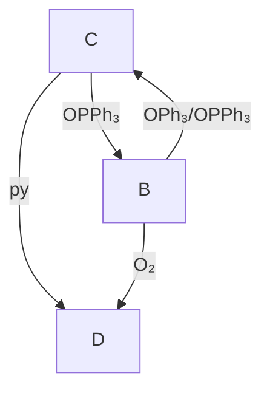

# 第 34 届中国化学奥林匹克（初赛）试题

# 第1题（8分）

1-1 画出⼩分⼦ $\mathrm { C _ { 3 } F _ { 4 } }$ 可能的Lewis结构，标出三个碳原⼦成键时所采⽤的杂化轨道。  
1-2 现有铝镁合⾦样品⼀份，称取 2.56 g 样品溶于 HCl，产⽣ 2.80 L H2 (101.325 kPa, $0 ~ ^ { \circ } \mathrm { C } )$ ，通过计算，确定此合⾦组成。  
1-3 构筑可循环再⽣的聚合物材料是解决⽬前⽩⾊污染的有效途径之⼀。  
1-3-1 通常单官能度的单体⽆法参与聚合反应中的链增⻓，但单体A可以与B发⽣反应形成聚合物。画出该聚合物的结构式。  
1-3-2 单体A、C、D按物质的量⽐例6:3:2进⾏共聚合，得到的聚合物不能进⾏热加⼯和循环利⽤；但若在共聚合时加⼊⼀定量(\~10%)的B，得到的聚合物⼜具备了可热加⼯和循环利⽤的性能。简述原因。

![[第34届中国化学奥林匹克初赛试题_images/5228a4ad8bce3ecda52a07d5ace4245845a833145ec6cf7b7702c26ae814bf6b.jpg]]

![[第34届中国化学奥林匹克初赛试题_images/b0150eef85d3ab0472721088285a06e0e2493448779cd2ec8adea1e16e40be2a.jpg]]

chemical

Chemical structure of a polyamide compound with amide and ether functional groups

B

![[第34届中国化学奥林匹克初赛试题_images/3ac2ffae7f4043679ae1a8f546fbb241959afc4864b8aa245465d6f666208785.jpg]]  
C

![[第34届中国化学奥林匹克初赛试题_images/2cde6ec6c16b65c7be3779eff9e9fa9cb8173550c944dd2d1d2d2c25108291c3.jpg]]

chemical

Chemical structure of a polymeric compound with amine and ether linkages

D

第2题（10分）书写反应⽅程式（提⽰：要求系数为最简整数⽐；2-1和2-2中⾃然条件复杂，合理选择即可）。

2-1 关于地球的演化，⽬前主要的观点是，原始地球上没有氧⽓，在⽆氧或氧⽓含量很低时，原核⽣物可利⽤⾃然存在的有机质（⽤ $\mathrm { C H _ { 2 } O }$ 表⽰）和某些⽆机物反应获得能量。例如， $\mathrm { S O } _ { 4 }$ 2− 和 $\mathrm { M n O _ { 2 } }$ 可分别作为上述过程的氧化剂，前者⽣成⻩⾊浑浊物，⼆者均放出⽆⾊⽆味⽓体。

2-1-1 写出 $\mathrm { S O _ { 4 } ^ { 2 - } }$ −参与的释能反应的离⼦⽅程式。  
2-1-2 写出 $\mathrm { M n O _ { 2 } }$ 参与的释能反应的离⼦⽅程式。  
2-2 约27亿年前光合作⽤开始发⽣，随着这⼀过程的进⾏，地球上氧⽓不断积累，经过漫⻓的演变终达到如今的含量。氧⽓的形成和积累，导致地球上⾃然物质的分布发⽣变化。  
2-2-1 溶解在海洋中的 $\mathrm { F e ^ { 2 + } }$ 被氧化转变成针铁矿 $\mathrm { \dot { \Omega } a - F e O ( O H ) }$ ⽽沉积，写出离⼦⽅程式。  
2-2-2 与铁的沉积不同，陆地上的 $\mathrm { M o S } _ { 2 }$ 被氧化⽽导致钼溶于海洋且析出单质硫，写出离⼦⽅程式。  
2-3 2020年8⽉4⽇晚，⻉鲁特港⼝发⽣了举世震惊的⼤爆炸，现场升起红棕⾊蘑菇云，破坏⼒巨⼤。⽬前认定⼤爆炸为该港⼝存储的约2750吨硝酸铵的分解。

另外，亚硝酸铵受热亦发⽣分解甚⾄爆炸，若⼩⼼控制则可⽤在需要充⽓的过程如乒乓球制造之中。

2-3-1 写出硝酸铵分解出红棕⾊⽓体的反应⽅程式。

2-3-2 写出亚硝酸铵受热分解⽤于充⽓的反应⽅程式。

第3题（8分）X是⾦属M的碱式碳酸盐，不含结晶⽔。称取质量相等的样品两份，分别进⾏处理：⼀份在$\mathrm { H } _ { 2 }$ 中充分处理（反应1），收集得0.994 g⽔，剩余残渣为⾦属M的单质，重2.356 g；另⼀份则在CO中处理（反应 2），完全反应后得 1.245 L CO2 (101.325 kPa, 0 °C)，剩余残渣和反应 1 的完全相同。

3-1 通过计算，推出X的化学式。  
3-2 写出X分别和 $\mathrm { H } _ { 2 \mathrm { \Delta } }$ 、CO反应的⽅程式（要求系数为最简整数⽐）。

第4题（7分）A和B可由同⼀种氨基酸（羟脯氨酸）制得，通过这类单体的链式开环聚合，有望得到可降解的聚酯或聚硫酯（R = 叔丁基）。

![[第34届中国化学奥林匹克初赛试题_images/15198f9c5aa1f8daf3632444275d56890641009eaffdb103531097772f2e57f3.jpg]]  
A

![[第34届中国化学奥林匹克初赛试题_images/f7cdd3b86716289cb7668c3d5d9930b97c17bd46907c889242f6729d860818ff.jpg]]  
B

4-1 ⽐较A与B开环聚合时热⼒学驱动⼒的⼤⼩。简述原因。  
4-2 在有机弱碱的催化作⽤下，苄硫醇作为引发剂，B在室温下可发⽣活性开环聚合，形成聚合产物。画出产物的结构式。  
4-3 聚合 $\left( \mathbf { B } _ { n - 1 } ^ { \prime } \ \to \ \mathbf { B } _ { n } ^ { \prime } \right)$ 过程中， $\Delta H ^ { \ominus } = - 1 5 . 6$ kJ $\mathrm { m o l ^ { - 1 } }$ ， $\Delta S ^ { \ominus } = - 4 0 . 4 \mathrm { J } \mathrm { m o l } ^ { - 1 } \mathrm { K } _ { \circ } ^ { - 1 }$ 。计算室温(298 K)下反应的平衡常数?⊖，设反应达平衡时单体浓度 $[ \mathbf { B } ] _ { \mathrm { e q } } / c ^ { \epsilon }$ ⊖等于 $1 / K$ ，若起始单体浓度为2.00 mol L−1，引发剂浓度为0.0100 mol L−1，计算达平衡时产物的平均聚合度?。  
4-4 提⾼单体B开环聚合转化率的⽅法有：

a) 升⾼温度； b) 降低温度； c) 增加B的起始浓度； d) 延⻓反应时间

第5题（10分） $2 5 ~ ^ { \circ } \mathrm { C } .$ ，银离⼦在溶液中与间苯⼆胺和对苯⼆胺定量发⽣如下反应：

$$
4 \mathrm{Ag} ^ {+} + \mathrm{H} _ {2} \mathrm{N} - \underset {\mathrm{NH} _ {2}} {\left\langle \right.} + \mathrm{H} _ {2} \mathrm{N} - \underset {\mathrm{NH} _ {2}} {\left\langle \right.} \longrightarrow 4 \mathrm{Ag} + 3 \mathrm{H} ^ {+} + \mathrm{H} _ {2} \mathrm{N} - \underset {\mathrm{NH} _ {2}} {\left\langle \right.} - \mathrm{N} = \underset {\mathrm{NH} _ {2}} {\left\langle \right.} +
$$

氧化得到的偶联产物在550 nm波⻓处的摩尔消光系数为 $1 . 8 \times 1 0 ^ { 4 } \mathrm { L m o l ^ { - 1 } c m ^ { - 1 } }$ 。利⽤这⼀反应，通过分光光度法可测定起始溶液中的银离⼦浓度。

${ \mathrm { \bf 5 - 1 } } \quad 2 5 \ { \mathrm { \bf ~ ^ { \circ } C } } ,$ ，在纯⽔中配得⼄酸银的饱和⽔溶液。取1.00 mL溶液，按计量加⼊两种苯⼆胺，⾄显⾊稳定后，稀释定容⾄ $1 \mathrm { L } _ { \circ }$ 。⽤ 1 cm 的⽐⾊⽫，测得溶液在 550 nm 处的吸光度为 0.225。计算⼄酸银的溶度积 $\mathfrak { A } _ { \boldsymbol { s } \mathfrak { p } ^ { \mathfrak { c } } }$ 。（提⽰：可合理忽略副反应。朗伯-⽐尔⽅程 $A = \varepsilon l c$ ，?吸光度；?摩尔消光系数；?光通过溶液的路径⻓；?溶液浓度。）  
5-2 室温下将⼄酸银与 4-三甲铵基苯硫醇的六氟磷酸盐(HL+ $) ( \mathrm { P F } _ { 6 } ^ { - } ) \left\{ \mathrm { H L } ^ { + } = \left[ \mathrm { H S C } _ { 6 } \mathrm { H } _ { 4 } \mathrm { N } ( \mathrm { C H } _ { 3 } ) _ { 3 } \right] \right.$ + }混合研磨，两种固体发⽣反应，得到⼀种淡⻩⾊粉末。粉末⽤⼄腈处理，结晶出⽆⾊溶剂合物A，化学式为$\mathrm { \Delta [ A g _ { 9 } L _ { 8 } ( C H _ { 3 } C N ) _ { \it x } ] ( P F _ { 6 } ) _ { \it y } ] { \cdot } \it { n C H _ { 3 } C N _ { \circ } } }$ 。元素分析结果给出，A中C, H, N, P的含量（质量分数，%）分别为：C27.40，H 3.35，N 6.24，P 6.90。室温下在真空中⼩⼼处理A，A可脱去外界的溶剂分⼦，失重2.0%。

5-2-1 通过计算，确定A的化学式。（提⽰：元素分析中，氢含量测定误差常常较⼤）

5-2-2 写出两种固体发⽣反应⽣成淡⻩⾊粉末的⽅程式（要求系数为最简整数⽐）。

第6题（10分）⾦属元素A的单质为⾯⼼⽴⽅结构，晶胞参数 $\dot { a } = 3 8 3 . 9 \mathrm { p m }$ ，密度为 $2 2 . 5 0 \mathrm { g c m ^ { - 3 } } \mathrm { _ c }$ 。A与氟⽓反应得到⼀种⼋⾯体构型的氟化物分⼦ $\mathbf { B } _ { \circ }$ 。B与氢⽓按2:1计量关系反应，得到分⼦C，C为四聚体，其理想模型有四次旋转轴。A在空⽓中加热得氧化物D，D属四⽅晶系，晶胞如下图所⽰。B与⽔反应亦可得到D。C与A的单质按1:1计量关系在 $4 0 0 ~ ^ { \circ } \mathrm { C }$ 下反应得化合物 $\mathbf { E } _ { \circ }$ 。近期在质谱中捕捉到A的⼀种四⾯体型氧合正离⼦ $\mathbf { F } _ { \circ }$ 。（阿佛加德罗常数 $6 . 0 2 2 \times 1 0 ^ { 2 3 } \mathrm { m o l ^ { - 1 } } \rangle$ ）

![[第34届中国化学奥林匹克初赛试题_images/d94bdaa6a397406f5331f106a2b18df42a5a7ff316fa32992fb0f3bdd3f59947.jpg]]

chemical

3D molecular crystal structure showing red and blue atoms in a cubic arrangement

6-1 通过计算，确定A是哪种元素。  
6-2 写出 B\~F 的分⼦式(或化学式)。  
6-3 画出C分⼦的结构⽰意图。  
6-4 写出如下反应⽅程式(要求系数为最简整数⽐)。(1) B与⽔反应；(2) C和A反应⽣成 $\mathbf { E } _ { \circ }$

# 第 7 题（15 分）咔咯(corrole)及其配合物

作为⼈⼯合成的⼤环配体之⼀，咔咯的合成及其与⾦属离⼦的配位化学备受关注。利⽤咔咯作为反应配体，可实现过渡⾦属离⼦的⾮常规氧化态，制备功能材料，探索新型催化剂，等等。下图(a)给出三（五氟苯基）咔咯分⼦(A)的⽰意图，简写为 $\mathrm { H } _ { 3 } ( \mathrm { t p f c } )$ 。它与⾦属离⼦结合时四个氮原⼦均参与配位。室温下，空⽓中，$\mathrm { C r } ( \mathrm { C O } ) _ { \mathfrak { c } }$ 6和 A 在甲苯中回流得到深红⾊晶体 B（反应 1），B 显顺磁性，有效磁矩为 1.72 $\mu _ { \mathrm { B } }$ ，其中⾦属离⼦的配位⼏何为四⽅锥；在惰性⽓氛保护下，B与三苯基膦 $\left( \mathrm { P P h } _ { 3 } \right)$ 和三苯基氧膦 $\mathrm { ( O P P h _ { 3 } ) }$ 按 $1 { : } 1 { : } 1$ 在甲苯中反应得到绿⾊晶体C（反应2）；在氩⽓保护下， $\mathrm { C r C l _ { 2 } }$ 和A在吡啶（简写为 $\mathrm { p y } )$ ）中反应，得到深绿⾊晶体D（反应3），D中⾦属离⼦为⼋⾯体配位，配位原⼦均为氮原⼦。在⼀定的条件下，B、C和D之间可以发⽣转化（下图b），这⼀过程被认为有可能⽤于 $\mathrm { O _ { 2 } }$ 的活化或消除。

![[第34届中国化学奥林匹克初赛试题_images/7527c20bc6823006b7da68a72700abaa7371e3a747d5dcc4da1c4aee3534039c.jpg]]

chemical

Chemical structure of a symmetric aromatic amine with aryl substituents, labeled Ar = C6F5

(a)

![[第34届中国化学奥林匹克初赛试题_images/b879815654249fbc63891fce9a92c91510cea09aeac3e29f52fc89e7f70caa1a.jpg]]

flowchart

(b)

7-1 A中的咔咯环是否有芳⾹性？与之对应的π电⼦数是多少？  
7-2 写出 B、C、D 的化学式（要求：配体均⽤简写符号表⽰）。  
7-3 写出 B、C、D 中⾦属离⼦的价电⼦组态（均⽤ $d ^ { n }$ ⽅式表⽰）。  
7-4 写出制备B、C、D的反应⽅程式（要求：配体均⽤简写符号，系数为最简整数⽐）。  
7-5 利⽤电化学处理，B可以得电⼦转化为B− ，也可以失去电⼦转化 $\mathbf { B } _ { \mathrm { ~ c ~ } } ^ { + }$ 。与预期的磁性相反，B+ 依然显⽰顺磁性。进⼀步光谱分析发现，与咔咯环配体相关的吸收峰位置发⽣显著了变化。推测⾦属离⼦的价电⼦组态（⽤?!⽅式表⽰），指出磁性与光谱变化的原因。

# 第8题（8分）

# 8-1 请按酸性从强到弱给以下化合物排序：

![[第34届中国化学奥林匹克初赛试题_images/9de7902acc9c41364feb60d20a081d496618e2d5986d562e6cdb86d79a66aa1a.jpg]]  
A

![[第34届中国化学奥林匹克初赛试题_images/2fc4dce332e10407a74788940a77eb9f1ee87157b6b9dce0732bcbf71f42de35.jpg]]  
B

![[第34届中国化学奥林匹克初赛试题_images/f9bb03696dcca95931d48f6a602e33c01350f477ee9fbf7fa583f2c11a110ef2.jpg]]  
C

![[第34届中国化学奥林匹克初赛试题_images/b86d3a040a8373987594fe55aaaaa5739b799f9e73004a6e2c5360c74dbbf894.jpg]]

chemical

Chemical structure of a benzene derivative with an ester group

D

8-2 请按酸性从强到弱给以下化合物排序：

![[第34届中国化学奥林匹克初赛试题_images/b9d364506a363b5631efd95b75de472ff00fa90fe6d815efc0353e684485aeb4.jpg]]  
A

![[第34届中国化学奥林匹克初赛试题_images/a621b7be9dedde4d3b3398b8fbe247db962ceddcf11dbec3c69c2be9850bb3c0.jpg]]  
B

![[第34届中国化学奥林匹克初赛试题_images/031c534fd3bee8119ac975ba19b91622f4a79aebf7d93258ecdd19307ccec058.jpg]]  
C

![[第34届中国化学奥林匹克初赛试题_images/ca7da3f55545da2a3862cb573bbbf17789810b31654d12166ad90a87a5330777.jpg]]  
D

![[第34届中国化学奥林匹克初赛试题_images/d3771be8c54f9a847ce4689d032a18a3cc74d0aa7a9446f68d42e742fe908336.jpg]]  
E

8-3 判断以下化合物哪些具有光活性（⼿性）、哪些没有光活性（⾮⼿性）、哪些是内消旋体。

![[第34届中国化学奥林匹克初赛试题_images/a40c31d8b5124df108e57f6b52d325e83a9085ce58b7905f9d9e969478a90028.jpg]]  
A

![[第34届中国化学奥林匹克初赛试题_images/563a8612be7bbcb2d028814f185862e29af966f6fb9b53cb9119a3a9971a6380.jpg]]  
B

![[第34届中国化学奥林匹克初赛试题_images/cd326f0a51b67b5d37e9f74937a86b650090bf332ea0b8e623168377c98528c7.jpg]]  
C

![[第34届中国化学奥林匹克初赛试题_images/da902806a543658a6b3856afa696fc0fc7153fe6405f62ea986dec6df97ca3b7.jpg]]  
D

![[第34届中国化学奥林匹克初赛试题_images/74762410bf9988e94187f73ce3ccfab32a9afa6c0623d4f33418ad20a7e841f9.jpg]]  
E

![[第34届中国化学奥林匹克初赛试题_images/70406d457c5ecd49e7f48f2561d91f143f95eca05cd6aca56824b01008f9b1d9.jpg]]  
F

第 9 题（8 分）

9-1 氮杂环丙烷正离⼦可以进⾏以下反应：

![[第34届中国化学奥林匹克初赛试题_images/74aba3a7af174d66243e30f9af003b944c1b9da5d5c0f71e78df03185efab63d.jpg]]

$$
\xrightarrow [ \mathrm{CH} _ {3} \mathrm{OH} , 5 0 ^ {\circ} \mathrm{C} ]{\mathrm{CH} _ {3} \mathrm{ONa}}
$$

$$
\begin{array}{c}\mathbf{A}\\ 67\% \end{array}
$$

$$
+ \quad \begin{array}{c} \mathbf {B} \\ 33 \% \end{array}
$$

动⼒学研究表明，以上反应为双分⼦反应。然⽽，氮杂环丙烷正离⼦与甲醇反应只⽣成化合物A。

9-1-1 画出化合物A和B的结构简式。  
9-1-2 以下正离⼦与甲醇反应的转换速率依赖于其结构。请将下列正离⼦的相对反应速率进⾏排序。

![[第34届中国化学奥林匹克初赛试题_images/681019981242eb7c2a7b0cb72012714673126accff1eec2b55a55c07368f7af2.jpg]]  
C

![[第34届中国化学奥林匹克初赛试题_images/0c5fd145865486f7e61ffd2a0045d06d896a932e5ceca915eac5ac070151b2df.jpg]]  
D

![[第34届中国化学奥林匹克初赛试题_images/964e0db92153c8a9664863c2b98c6ba59040ecf3fa02827feb462e3c2ae2e8e6.jpg]]  
E

9-2 Cannizzaro（康尼查罗）反应是醛在强碱浓溶液中发⽣的歧化反应。以苯甲醛为底物，根据所给条件和信息，回答以下问题：

9-2-1 当反应在重⽔中进⾏，产物苯甲醇是否含有氘？  
9-2-2 当反应在 $\mathrm { H } _ { 2 } { } ^ { 1 8 } \mathrm { O }$ 中进⾏，画出含18O产物的结构简式。  
9-2-3 动⼒学研究发现，该反应的速率⽅程可以表达为： $v = k _ { a } [ \mathrm { P h C H O } ] ^ { 2 } [ \mathrm { O H ^ { - } } ] + k _ { b } [ \mathrm { P h C H O } ] ^ { 2 } [ \mathrm { O H ^ { - } } ] ^ { 2 }$ 。解释此⽅程中出现这两项的原因。

第10题（16分）反应中间体和反应式

10-1 请为以下转换提供合理的中间体

![[第34届中国化学奥林匹克初赛试题_images/f35a5a84d632f075ae2553074a34abc7ac48b9826419a0b1d1ca3dcf7ad01e4f.jpg]]

chemical

Chemical reaction equation showing conversion of a substituted phenyl ether to a ketone using (CH₃CO)₂O

10-2 参照10-1中的转换⽅式，画出以下反应主要产物的结构简式。

![[第34届中国化学奥林匹克初赛试题_images/4ed31adcf9a4ca25a29096319da752e457cdc54b0140ea69ba2b92af6263709d.jpg]]

chemical

Chemical reaction equation showing conversion of a phenyl sulfonate to a benzene derivative using (F3CCO)2O catalyst

10-3 以下反应是天然产物顺式茉莉酮全合成中的⼀步：

![[第34届中国化学奥林匹克初赛试题_images/9965f957296c0f9b6392dccce51b5e1e6c0a4db91e14582b5fc3a8306756b6ee.jpg]]

chemical

Chemical reaction showing the conversion of a cyclic ester to a cyclopentenone derivative using NaOH

仔细分析这个反应转换过程三元环的作⽤，并在此基础上完成10-3-1和10-3-2中的反应，画出主要产物的结构简式（不考虑产物的⽴体化学）：

10-3-1

![[第34届中国化学奥林匹克初赛试题_images/e974d724917c7b8f1f17350e497acaa201dc73d3f305ef546b6101a263d33e58.jpg]]

chemical

Chemical reaction equation showing cyclohexene derivative with n-BuLi catalyst under Et2O at 25°C

10-3-2

![[第34届中国化学奥林匹克初赛试题_images/1a62a86786a21601b10d595cc954c1e726fa04d07c3429446385b7c45c867d45.jpg]]

chemical

Chemical reaction equation showing thermal decomposition of a cyclohexane ring to form a ketone under 200°C and C6H6 at 5 hours

10-3-3 画出10-3-1转换中中间体的结构简式。