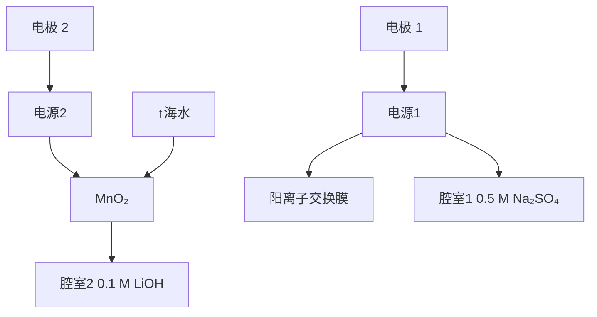

# 第 37 届中国化学奥林匹克（初赛）试题

（2023 年 9 ⽉ 3 ⽇ 9:00\~12:00）

提⽰：1) 凡题⽬中要求书写反应⽅程式，须配平且系数为最简整数⽐。

2) 可能⽤到的常数：法拉第常数 $F = 9 . 6 4 8 5 \times 1 0 ^ { 4 } \mathrm { C } \mathrm { m o l }$ −1 ；⽓体常数? = 8.314 J K−1 mol−1

阿佛加德罗常数 $N _ { \mathrm { A } } = 6 . 0 2 2 1 \times 1 0 ^ { 2 3 } \mathrm { m o l }$ −1；玻尔兹曼常数 $k _ { \mathrm { B } } = R / N _ { \mathrm { A } }$

# 第1题（14分，占7%）镓的化合物

1-1 半导体⼯业中通过刻蚀制造微纳结构。GaN是重要的半导体材料，通常采⽤含氯⽓体在放电条件下进⾏刻蚀。写出利⽤ $\mathrm { A r } { - } \mathrm { C l } _ { 2 }$ 混合⽓体放电刻蚀GaN的化学⽅程式。  
1-2 ⾦属镓熔点很低但沸点很⾼，其中存在⼆聚体 $\mathrm { G a _ { 2 } } _ { \mathrm { { c } } }$ 。1990年，科学家将液态Ga和 $\mathrm { I } _ { 2 }$ 在甲苯中超声处理，得到了组成为GaI的物质。该物质中含有多种不同氧化态的Ga，具有两种可能的结构，分⼦式分别为$\mathrm { G a } _ { 4 } \mathrm { I } _ { 4 } \left( \mathrm { A } \right)$ 和 $\mathrm { G a } _ { 6 } \mathrm { I } _ { 6 } \left( \mathrm { B } \right)$ ，⼆者对应的阴离⼦分别为C和D，两种阴离⼦均由Ga和I构成且其中所有原⼦的价层均满⾜8电⼦。写出⽰出A和B组成特点的结构简式并标出Ga的氧化态，画出C和D的结构。  
1-3 GaI常⽤于合成低价Ga的化合物。将GaI与 $\mathrm { A r ^ { \prime } L i }$ （ $( \mathrm { A r ^ { \prime } }$ 基如图所⽰，解答中直接采⽤简写 $\mathrm { A r ^ { \prime } } )$ ）在−$7 8 ~ ^ { \circ } \mathrm { C }$ 的甲苯溶液中反应，得到晶体E，E中含有2个Ga原⼦；E在⼄醚溶液中与⾦属钠反应得到晶体F，X射线晶体学表明，F 中的 Ga-Ga 键⻓⽐ E 中短 0.028 nm。关于 F 中 $\mathrm { G a } { \mathrm { - } } \mathrm { G a }$ 的键级历史上曾有过争议，其中⼀种观点认为，F中的Ga价层满⾜8电⼦。基于该观点，画出E和F的结构式。

![[第37届中国化学奥林匹克初赛试题_images/83b67747a62715c486db1fcd41efbd143f96e22fbe734a95be82102d9ad27cd5.jpg]]

chemical

Chemical structure of a dippentene derivative with Ar' group

![[第37届中国化学奥林匹克初赛试题_images/8fe969a272380cf5f56fa818541a44c79ea2b1581357ffb49601412f4ced6899.jpg]]

chemical

Chemical structure of a substituted benzene ring with Dipp group and diisocyanate substituent

# 第2题（12分，占6%）复盐的组成

在 $\mathrm { N H _ { 4 } C l  – C u C l _ { 2 } – H _ { 2 } O }$ 体系中，结晶出⼀种淡蓝⾊的物质A，其组成可表⽰为 $x \mathrm { N H _ { 4 } C l { \cdot } C u C l _ { 2 } { \cdot } } y \mathrm { H _ { 2 } O _ { \circ } }$ 。称取1.4026 g 晶体A，溶于⽔并在250 mL容量瓶中定容。Cl− 分析：移取25.00 mL溶液，加⼊2 滴0.5%荧光⻩的⼄醇溶液和⼀滴稀 NaOH 溶液，再加 2 mL 0.5%淀粉溶液，⽤ 0.1036 mol L−1 $\mathrm { A g N O _ { 3 } }$ 溶液滴定（反应1）⾄出现粉红⾊，消耗19.52 mL； $\mathrm { C u ^ { 2 + } }$ 分析：移取 25.00 mL 溶液，加⼊ 1 mol L−1 H $\mathrm { _ { 2 S O _ { 4 } } }$ 溶液5mL，再加固体 KI 1.5 g，混匀并放置（反应 2），⽤ 0.02864 mol L−1 $\mathrm { N a _ { 2 } S _ { 2 } O _ { 3 } }$ 溶液滴定（反应3）⾄棕⾊较浅时加⼊2mL 0.5%淀粉溶液，继续滴⾄蓝紫⾊恰好消失，消耗 17.65 mL。

2-1 写出反应1-3的⽅程式。  
2-2 通过计算确定 A 中?和?的值（NH4Cl 式量 53.49， $\mathrm { C u C l _ { 2 } }$ 式量 134.5）。

# 第3题（13分，占8%）海⽔中的提取

随着锂电池的⼴泛应⽤，锂已成为重要的战略资源，被称为⽩⾊⽯油。据估计，海⽔中锂的总含量为陆地锂总含量的 5000 倍以上，但海⽔中锂的质量浓度仅为 0.1\~0.2 ppm，从海⽔提取锂⾸先需要对低浓度的 Li + 进⾏选择性富集，Li+ 能够嵌⼊某些氧化物并在⼀定条件下脱出，据此可以进⾏Li+ 的富集。

3-1 以 $\mathrm { L i _ { 2 } C O _ { 3 } }$ 和 $\mathrm { M n O _ { 2 } }$ 为原料，充分混合后在 $7 2 0 ~ ^ { \circ } \mathrm { C }$ 下煅烧3 h，冷⾄室温后即可得到复合氧化物$\mathrm { L i M n _ { 2 } O _ { 4 } }$ (LMO)。⽤ 1 mol L−1的 HCl 在 $6 0 ~ ^ { \circ } \mathrm { C }$ 处理LMO，将其中所有Li+ 置换后得到HMO，HMO可以和Li+ 反应再⽣成LMO，然后LMO与酸作⽤脱出Li+ 从⽽实现Li+ 富集。如此，可以循环处理。

3-1-1 写出合成 $\mathrm { L i M n _ { 2 } O _ { 4 } }$ 的⽅程式。

3-1-2 ⽤酸处理LMO时，除离⼦交换反应之外也会发⽣⼀个副反应，该副反应导致固体中Mn的平均氧化态有所升⾼，写出副反应对应的化学⽅程式。这⼀副反应对再⽣后的HMO的富集性能有何影响？

3-2 利⽤电化学富集也是有效的⽅法之⼀。某电化学系统如图所⽰，其包含两个电池单元，中间区域置有具有⼀维孔道结构的λ- $\cdot \mathrm { M n O _ { 2 } }$ ，该孔道可以容纳合适的阳离⼦进出 $\mathrm { M n O } _ { 2 \circ }$ 。电极通过阳离⼦交换膜与两个电化学池中的对电极隔开，腔室1和2中的电解质分别为0.5M的$\mathrm { N a } _ { 2 } \mathrm { S O } _ { 4 }$ 和 0.1 M 的 $\mathrm { L i O H _ { \circ } }$ 。该电化学系统的⼯作步骤如下：1）向 $\mathrm { M n O _ { 2 } }$ 所在腔室通⼊海⽔，启动电源1，使海⽔中的 Li+ 进⼊ $\mathrm { M n O _ { 2 } }$ 结构⽽形成 $\mathrm { L i } _ { x } \mathrm { M n } _ { 2 } \mathrm { O } _ { 4 } ;$ ；2）关闭电源1和海⽔通道，启动电源2，同时向电极2上通⼊空⽓，使 $\mathrm { L i } _ { x } \mathrm { M n } _ { 2 } \mathrm { O } _ { 4 }$ 中的Li+ 脱出进⼊腔室2。

3-2-1 为衡量 $\mathrm { M n O _ { 2 } }$ 对 Li+ 的富集效果，将 0.50M 的 LiCl溶液通⼊ MnO2 (4.8 mg)所在腔室，启动电源 1，使电流

![[第37届中国化学奥林匹克初赛试题_images/2401f137056c47305425550d11e9de01db8e9b6c1ce3b91464054a949c18345d.jpg]]

flowchart

恒定在 5.0 mA，累计⼯作 325 s 后发现 $\mathrm { M n O _ { 2 } }$ 的电极电势快速下降，计算所得 $\mathrm { L i } _ { x } \mathrm { M n } _ { 2 } \mathrm { O } _ { 4 }$ 中的?。

3-2-2 写出上述过程中发⽣腔室2中阴极和阳极上的电极反应。

# 第4题（14分，占7%）Pt的多核配合物

向 $\mathrm { H _ { 2 } P t ( O H ) }$ 6⽔溶液中加⼊⾜量的 $\mathrm { N a _ { 2 } S _ { 2 } O _ { 3 } }$ 溶液，调整pH⾄11.4，在⾼压⽔热釜中 $1 5 0 ~ ^ { \circ } \mathrm { C }$ 反应 17h，得到⼀种深棕⾊的晶体(A·?H O)。A是⼀种钠盐，式量为1359.4，A的阴离⼦B是⼀种含三个Pt原⼦的多核络离⼦，仅含Pt、S、O三种元素，B中所有Pt的化学环境⼀致，配位原⼦均为S且Pt的配位数与典型的单核Pt配合物相同，存在两种化学环境不同的S，不存在Pt-Pt键和S-S键。

4-1 通过计算和分析确定络离⼦B的组成。

4-2 画出B的结构式。

4-3 写出⽣成配合物A的化学⽅程式。

# 第5题（32分，占15%）简单的分⼦ 复杂的反应

同为常⻅⼩分⼦，NO星光熠熠， $\mathrm { H } _ { 2 } \mathrm { S }$ 却臭名昭著。然⽽，近期研究发现，在⽣命体系中NO与 $\mathrm { H } _ { 2 } \mathrm { S }$ 窃窃私语。研究⼆者的相互作⽤对于解开⽣命起源、理解⽣理过程的奥秘⾄关重要。NO与 $\mathrm { H } _ { 2 } \mathrm { S }$ 之间的反应及产物⾮常复杂，这⾥我们⼀起关注⼀些重要的基本问题。

5-1 早在 19 世纪 NO 与 $\mathrm { H } _ { 2 } \mathrm { S }$ 的反应就受到关注。依赖于反应条件甚⾄容器（表⾯可能作为催化剂），可以得到多种产物。最简单的⼀种就是产物中出现两种单质（反应1)，⽽反应过程出现笑⽓也是绕不开的步骤（反应2），条件适当的时候，还会产⽣硫化铵（反应3）。写出反应1-3的⽅程式。

5-2 研究发现，HNO、HSNO、HSSNO、HS − 等均是⽣理过程的关键物，可由NO与 $\mathrm { H } _ { 2 } \mathrm { S }$ 作⽤产⽣。

5-2-1 HSNO(A)表达式给出的原⼦次序就是其连接⽅式。画出A及其共轭碱(B)的Lewis结构式（要求最稳定的形式)。

5-2-2 尽管A是最稳定的形式，但是通过低温下光反应，也可以得到其他键合⽅式不同的异构体。画出A所有其他合理异构体的⻣架结构。

5-2-3 据信 $\mathrm { S S N O ^ { - } }$ 参与多个⽣理过程。其中涉及SSNO− 形成及变化的可能反应及热⼒学常数如下

$$
\begin{array}{l} \mathrm{HSNO} + \mathrm{HS} _ {2} ^ {-} \rightarrow \mathrm{SSNO} ^ {-} + \mathrm{HS} ^ {-} + \mathrm{H} ^ {+} \quad K _ {1} = 5. 0 \times 1 0 ^ {2} \\ \mathrm{HSNO} + \mathrm{HS} _ {2} ^ {-} \rightarrow \mathrm{SSNO} + \mathrm{HS} ^ {-} \quad \Delta G _ {2} ^ {\ominus} = - 8. 0 \mathrm{kJmol} ^ {- 1} \\ \end{array}
$$

计算 298 K 下 HSSNO 的酸解离常数 $K _ { a } .$ 。

5-3 为理解⾦属离⼦在相关过程的作⽤，开展了如下研究：空⽓中，络离⼦A（[Ru(EDTA)(OH)]2− , EDTA为⼄⼆胺四⼄酸根）的溶液中，加⼊NaHS溶液并充分搅拌，溶液变为蓝绿⾊，对应于双核络离⼦B的⽣成（反应4）。分别取A和B的溶液，在惰性⽓体保护下，加⼊被NO饱和的磷酸盐缓冲液(pH= 8.2)，充分反应，A转化为C，B转化为D（反应5）。借助于质谱分析，计算出四个络离⼦的式量分别为A: 406.3, B:842.7, C: 419.3, D: 451.4。磁性测量发现，C 为抗磁性，D 为顺磁性。

5-3-1 写出络离⼦B、C、D的结构简式。  
5-3-2 写出反应4和5的离⼦⽅程式。  
5-3-3 画出C和D中⾦属离⼦?轨道在⼋⾯体场（近似看作正⼋⾯体）中的分裂图并给出?电⼦排布。

# 第6题（26分，占13%）层状⾦属碳化物和MXene材料

MAX相是⼀⼤类具有层状结构的⾦属碳化物或氮化物的总称，其中M为Ti、V、Nb等前过渡⾦属，X为碳或氮，A为Al、Sn、Ge、Sb等?区元素。MAX的结构中，M原⼦形成理想的密置层，M层之间采取密堆积（可连续分布）与简单六⽅堆积（通常以单层呈现）按⼀定⽅式有序堆叠形成三维结构。结构中，X填充在M层密堆积形成的所有⼋⾯体空隙中，A则有序占据M层简单六⽅堆积所形成空隙的⼀半，将其中的A元素选择性除去，可以分离得到⼆维的层状结构，称为MXene。MXene层中，最外层M可进⼀步与⻧素、羟基等−1价端基T按1:1结合，形成端基T功能化的MXene (T-MXene)。因此，MXene的组成和结构多样且可调控，是当前⼆维材料的研究热点。

6-1 若 MAX 相中 M 和 A 的原⼦数⽐为?，写出 MAX 相(O)、⼆维 MXene 层(P)和 T-MXene(Q)的组成通式。Q中T为−1价端基。  
6-2 某碳化物 MAX 相 $\mathrm { T i } _ { x } \mathrm { A l } _ { y } \mathrm { C } _ { z }$ 结构属六⽅晶系，Ti 层的排列⽅式为...ABCCBAABCCBA...。  
6-2-1 写出 $\mathrm { T i } _ { x } \mathrm { A l } _ { y } \mathrm { C } _ { z }$ 晶胞的组成  
6-2-2 已知 $\mathrm { T i } _ { x } \mathrm { A l } _ { y } \mathrm { C } _ { z }$ 晶胞参数? =0.306nm，? =1.856 nm。将M层密堆积形成的⼋⾯体近似为正⼋⾯体，计算简单六⽅排布相邻层的间距?（单位：nm）。  
6- $- 2 { \mathrm { - } } 3 \mathrm { T i } _ { x } { \mathrm { A l } } _ { y } { \mathrm { C } } _ { z }$ 结构中，碳原⼦处在Ti层密堆积形成的⼋⾯体中⼼。若将晶胞原点选在处于堆积中B层的Ti上，此时所有的Al恰好均处在?轴上。写出晶胞中所有碳原⼦的坐标参数。  
6-2-4 将 $\mathrm { T i } _ { x } \mathrm { A l } _ { y } \mathrm { C } _ { z }$ 在HF溶液中超声处理，可选择去除其中的Al层，到⼆维结构的MXene⽚层 $\mathrm { T i } _ { x } \mathrm { C } _ { z }$ （反应1）， $\mathrm { T i } _ { x } \mathrm { C } _ { z }$ 进⼀步与F− 反应形成F-MXene（反应2）。写出反应1和2的化学⽅程式。  
6-2-5T-MXene的性质与端基T密切相关，利⽤熔融 $\mathrm { Z n C l _ { 2 } }$ 与 $\mathrm { T i } _ { x } \mathrm { A l } _ { y } \mathrm { C } _ { z }$ 在 $5 5 0 ~ ^ { \circ } \mathrm { C }$ 反应5h，可以得到Cl为端基的 Cl-MXene（反应 3）。将 Cl-MXee 在 CsCl-KCl-LiCl 混合熔盐与 Li Se 反应 18 h，可以得到端基为Se的Se-MXene（反应4）。写出反应3和4的化学⽅程式。  
6-2-6 对于6-2-4中⽤HF⽔溶液处理得到的F-MXene，能否发⽣与6-2-5中反应4类似的反应？简述原因。

# 第7题（20分，占10%）⽣命过程中的物质

⽣命体中，各种物质的结构和功能都与基础化学密切相关。磷脂和蛋⽩质就是其中的重要代表

7-1 磷脂双层膜是由两亲性的磷脂分⼦以“尾部朝⾥头朝外”的⽅式组成的双层膜结构，它起到对细胞进⾏包包裹保护以及对物质进⾏选择性传递的作⽤。构成该双层膜结构的磷脂分⼦和磷脂双层膜结构的⽰意图以及其相关的脂质体如右所⽰。

![[第37届中国化学奥林匹克初赛试题_images/0721c087a991f3a3e3cc72acdf9d1351f4b4a732242ece0be829eeece8bec43b.jpg]]

7-1-1 依据磷脂双层膜结构的特征，解释为什么⽔溶液中的离⼦⽆法⾃由通过磷脂双层膜。  
7-1-2 细胞膜是由磷脂双层组成，由于细胞内外离⼦分布的不均匀性，造成了膜两边形成了⼀定的电势差，被称为膜电位。由离⼦ $\cdot \mathrm { A } ^ { n + }$ 浓差形成的膜电位（定义细胞外的电势为0）可以通过如下⽅程计算：

$$
\varphi_ {\mathrm{A} ^ {n +}} = \frac {R T}{n F} \ln \frac {[ \mathrm{A} ^ {n +} ] _ {\mathrm{外}}}{[ \mathrm{A} ^ {n +} ] _ {\mathrm{内}}}
$$

神经元细胞内和细胞外的钠离⼦和离⼦浓度分别为 $[ \mathrm { N a ^ { + } } ] _ { \nrightarrow } = 1 2 . 0 \mathrm { m m o l } \mathrm { L ^ { - 1 } , ~ [ \mathrm { K ^ { + } } ] _ { \nrightarrow } = 1 5 5 \mathrm { m m o l } \mathrm { L ^ { - 1 } } }$ ，$[ \mathrm { N a ^ { + } } ] _ { \scriptscriptstyle \mathcal { H } _ { \mathrm { i } } } = 1 4 5 \mathrm { m m o l } \mathrm { L } ^ { \scriptscriptstyle - 1 }$ ， $[ \mathrm { K } ^ { + } ] _ { \mathcal { H } \backslash } = 4 . 0 0 \ \mathrm { m m o l \ L ^ { - 1 } }$ 。计算 $3 7 . 0 ~ ^ { \circ } \mathrm { C }$ 下此种细胞的膜电位（注明正负）。

7-1-3 在⽔溶液中，磷脂双层膜会⾃发卷曲成球形，该结构被称为脂质体，其结构如7-1中之图c所⽰。通过测量脂质体在不同粘度溶液中⾃由扩散运动的扩散系数(?)，可以计算得到其粒径。⾃由扩散运动符合布朗运动规律，遵循 Stokes-Einstein ⽅程，有 $d = k _ { B } T / ( 3 \pi \eta D )$ ，其中?为脂质体直径，?是溶液粘度（单位为cp，1$\mathrm { c p } = 1 { \times } 1 0 ^ { - 3 } \mathrm { m } ^ { - 1 } \mathrm { k g } \mathrm { s } ^ { - 1 } )$ )。 $2 0 . 0 \ ^ { \circ } \mathrm { C }$ 下测得某脂质体在不同粘度溶液中的扩散系数如下表所⽰，计算其直径（忽略磷脂双层膜厚度）。

<table><tr><td> $D$  ( $\mu m^{2} s^{-1}$ )</td><td>0.389</td><td>0.281</td><td>0.188</td><td>0.146</td><td>0.091</td></tr><tr><td> $\eta$  (cp)</td><td>7.18</td><td>9.85</td><td>14.1</td><td>20.8</td><td>33.5</td></tr></table>

7-1-4 称取 725.6 mg 磷脂分⼦(式量 786.1)，制备成 1.000 mL 脂质体⽔溶液。取 10.00 μL 该溶液，测得其中含有 $1 . 1 2 \times 1 0 ^ { 1 4 }$ 个脂质体颗粒，直径为100nm。假设所有磷脂分⼦都形成了脂质体，计算脂质体外表⾯磷脂分⼦的排布密度（单位:个m−2 )。  
7-2 某蛋⽩质可发⽣可逆的⼆聚化反应，2M(单体) → D(⼆聚体)。 $\mathrm { p H } = 7 . 5$ 时，测得该⼆聚化反应在 $1 5 ^ { \mathrm { ~ \circ ~ } }$ $\mathrm { C } , \ 3 0 \ ^ { \circ } \mathrm { C } , \ 4 0 \ ^ { \circ } \mathrm { C }$ 下的平衡常数均为 $K _ { c } ^ { \ominus } \ = 5 . 6 \times 1 0 ^ { 3 } s$ 。假设⼆聚反应的焓变与熵变均与温度⽆关。  
7-2-1 计算在 $\mathrm { p H } = 7 . 5$ 和体温 $3 7 . 0 ~ ^ { \circ } \mathrm { C }$ 下⼆聚反应的标准摩尔焓变（单位：kJ mol−1）与熵变（单位：J $\mathrm { K } ^ { - 1 }$ $\mathrm { m o l ^ { - 1 } } )$ ）。  
7-2-2 指明反应是熵驱动反应还是焓驱动反应，解释上述⼆聚反应变化的原因。

有机部分缩写

Ac：⼄酰基；Bn：苄基（苯甲基）；Bu：丁基；Cy：环已基；equiv.：当量；Et：⼄基；Me：甲基；OTf：三氟甲磺酰基；Ph：苯基；R：烷基；TBS：tBuMe Si—；THF：四氢呋喃；TMS：三甲基硅基；Ts：对甲苯磺酰基。

第8题（27分，占10%）有机化合物基本概念和反应

对题⽬8-1⾄8-5所提问题进⾏判断并提供合理解释，对题⽬8-6和8-7则按所给条件和要求解答。

8-1 丙酮和六氟丙酮中哪个分⼦偶极矩更⼤？  
8-2 2.4-戊⼆酮的烯醇含量在⽔中还是在正⼰烷中⾼？将溶剂⽔换成⼆甲亚砜，2.4-戊⼆酮的 $\mathsf { p } K _ { a }$ 是降低还是升⾼？  
8-3 $\left( 2 \mathrm { E } , 4 \mathrm { Z } , 6 \mathrm { E } \right)$ -⾟-2,4,6-三烯在光照下关环后两个甲基是顺式的还是反式的？  
8-4 ⼄酸⼄酯、⼄酰氯、N,N-⼆甲基⼄酰胺中哪个化合物α-氢酸性最强?   
8-5 吡啶和六氢吡啶哪个分⼦偶极矩更⼤？  
8-6 2-氟-5-三氟甲基吡啶与⼄醇钠/⼄醇的反应速率要⽐2.5-⼆氟吡啶快得多。为什么？  
8-7 下表中列出酰胺化反应中常⽤的⼀些活化试剂。画出RCOOH被以下等量试剂活化后的中间体结构式（接下来与胺反应形成酰胺）。

--

$\mathrm { P P h } _ { 3 } , \mathrm { C B r C l } _ { 3 }$

--

CyN=C=NCy

--

$\mathrm { A c _ { 2 } O }$

--

![[第37届中国化学奥林匹克初赛试题_images/560c508e7b8eb3c7112409b6779ef0c936379477823726fcb14d64564b23f092.jpg]]

--

![[第37届中国化学奥林匹克初赛试题_images/2448776ded63baebff8cacb0c7c65f276b233fac8fdd450dcb50a2eb369d2f63.jpg]]

--

![[第37届中国化学奥林匹克初赛试题_images/e833fede59aa630f445121305c72be48564bc2a0799e14fbdf92432d56eb622f.jpg]]

chemical

Chemical structure of a thiazine derivative with two pyridine rings and a sulfonamide group

第9题（29分，占12%）有机合成的选择性

有机合成涉及的选择性主要有化学选择性、区域选择性和⽴体选择性等，是学习的重点。

9-1 画出以下两个氧化反应主要产物A和B的结构式:

![[第37届中国化学奥林匹克初赛试题_images/ea164d26dc42b33ebf11b4882bd8370dfc6eeb7377f3b38a4fd4393b60417f77.jpg]]

chemical

Chemical reaction scheme showing chloroacetyl group reacting with a thioether to form an aldehyde under H2O2 and NaOH conditions

9-2 烯基环氧化合物（烯基与环氧直接相连）是重要的合成前体。如下由消旋底物C为原料制备烯基环氧化合物E的路线具有很好的⾮对映选择性（⾮对映选择性过量值>10:1）随后，E可以在⼄酸的作⽤下转化为内酯G1 和 G2。

![[第37届中国化学奥林匹克初赛试题_images/fee699c3a146816431f91c90609fdabaf00639ab258978e190e5938b94e3279b.jpg]]

chemical

Organic synthesis reaction scheme showing conversion of compound C to G1 and G2 via intermediates D, E, and F, with reagents and conditions labeled.

9-2-1 画出产物 D 的⽴体结构式，并判断哪些属于主要产物（在你所画的结构式上圈出即可）  
9-2-2 由D到E的转化过程属于哪类重排反应类型？  
9-2-3 画出关键中间体F的⽴体结构式，并判断产物G1中三个⼿性中⼼的绝对构型。  
9-3 烯基环氧化合物H在Lewis酸(LA)催化下经中间体I和J转化为产物；但不同的Lewis酸会形成不同的产物，如LA为 $\mathrm { B F _ { 3 } { \cdot } E t _ { 2 } O }$ 时主要产物为K；⽽TMSOTf催化下则为 $\mathbf { L } _ { \circ }$ 。

9-3-1 依据以上信息，画出关键中间体I和J及产物K和L的⽴体结构式（分离后没有得到六元环并六元环的产物，K含氧杂氮杂五元环，L含六元环并七元环）。  
9-3-2 简述为何在 $\mathrm { B F _ { 3 } { \cdot } E t _ { 2 } O }$ 催化下的产物为 $\mathbf { K } _ { \mathtt { C } }$

第 10 题（27 分，占 13%）多组分反应

利⽤阴离⼦传递(ARC)的多组分反应可以⾼效构筑复杂分⼦的⻣架体系。

10-1 如下反应步骤是基于ARC的多组分反应（ASG为碳负离⼦稳定基团，E+ 为亲电试剂），写出此反应关键中间体M、N以及O的结构式。

10-2 根据以上信息，画出下列反应主要产物的结构式（要求⽴体化学）。

10-3 依据以上信息，画出构建如下产物所需三个反应原料的结构式（要求⽴体化学）。

10-4 将ARC策略和羟醛缩合反应相结合，可以⼀锅法⾼效构筑双环⻣架（如下图所⽰）。

10-4-1 写出中间体 P、Q 及 R 的结构式（要求⽴体化学）。  
10-4-2 判断S-V中的哪⼀个为此转换的主要产物。

![[第37届中国化学奥林匹克初赛试题_images/8fd3c4113f1aadf9ebda11703f0f905fbdc43ae945283a8742d422ad48d9544b.jpg]]

chemical

Chemical structure of a fused-ring compound with hydroxyl, sulfur, and OTBS substituents

S

![[第37届中国化学奥林匹克初赛试题_images/8adb36d5716e514b0291b9812991a6de1eccffd701bf9cac47a40ffff8a42597.jpg]]  
T

![[第37届中国化学奥林匹克初赛试题_images/afceece7045c2f0e842b2f90b068b80698e50425add4ab7fcf05a8c467ebe8c8.jpg]]  
U

![[第37届中国化学奥林匹克初赛试题_images/59ca4d9c8595b0e93ec710ba48b2b143a4fb0aee733f35d52ffe5377f59f9ec4.jpg]]  
V

10-5 S和T两者之间的关系为：a) 对映异构体；b) 差向异构体；c) ⾮对映异构体。