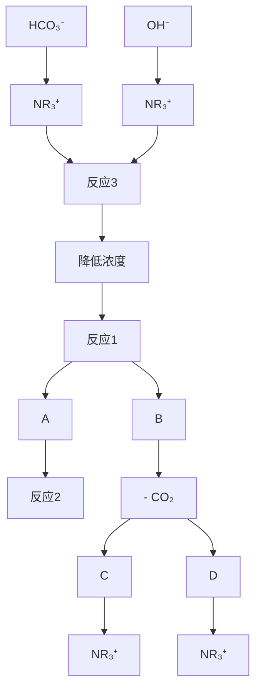
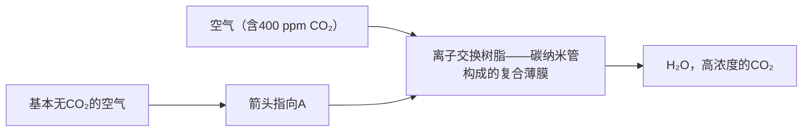

# 第38届中国化学奥林匹克(初赛)试题

(2024年9月1日9:00-12:00)

提示：1）试卷共8页。

2) 凡题目中要求书写反应方程式，须配平且系数为最简整数比。

3) 只有题1-3和题2-1-1的计算结果要求修约有效数字。

4) 每个解释题的文字不得超过20个。

5) 可能用到的常数：法拉第常数 $F=9.6485\times10^{4}\ C\ mol^{-1}$ ；气体常数 $R=8.3145\ J\ K^{-1}\ mol^{-1}$

阿伏加德罗常数 $N_{A}=6.0221\times10^{23}mol^{-1}$ ；玻尔兹曼常数 $k_{B}=R/N_{A}$

缩写：Ac: 乙酰基；Ar: 芳基；Et: 乙基；DCM: 二氯甲烷；Me: 甲基；rt: 室温；TFAA: 三氟乙酸酐；tol: 对甲基苯基。

# 第 1 题 炼丹与化学 (22 分)

十六世纪一位托名为 Basil Valentine 的炼金术士系统研究了制备 “红龙血” 的方法，并在他的著作中进行了详细记载。后来，英国化学家 Robert Boyle 验证了他的实验。在 Basil Valentine 的记载中，某种天然矿物因其颜色而被称为 “灰狼”，加热熔融的 “灰狼” 可以 “吞噬” 金属铜，得到另一种灰白色金属和漂浮在熔融金属上的 “矿渣”。现代研究证明，“灰狼” 和 “矿渣” 均为二元化合物，上述反应过程中只有金属的化合价发生了改变。“矿渣” 难溶于水和稀盐酸，其化学式中两种元素的计量比为 1。每得到 1.000 g 灰白色金属需要 “吞噬” 0.7826 g 铜。

1-1 写出 “灰狼” A、灰白色金属 B 和 “矿渣” C 的化学式。

1-2 Basil Valentine 还进行了后续实验:

(i) “灰狼”可以提纯一种金黄色的金属“国王”。在加热条件下，“灰狼”可“吞噬”“国王”，然后除去漂浮在熔融金属上的固体，高温加热剩下的物质；如此重复三次便可得到“经过救赎的国王”。

(ii) “老鹰”和“冷龙”都含有三种元素，均为1:1型无机盐，它们共含有五种元素，都位于前20号元素中。“老鹰”因易升华而得名，并可以分解为两种酸碱性相反的气体；“冷龙”因溶解时吸热而得名，常用于制造黑火药。将“老鹰”和“冷龙”进行密闭加热，用水吸收蒸馏出的气体，得到“矿泉浴”。

(iii) 让 “国王” 在 “矿泉浴” 中充分 “沐浴”，然后把 “矿泉浴” 蒸干，得到的不再是 “国王”，而是 “国王” 的化合物形态 “公鸡”。“公鸡” 进一步纯化后即为 “红龙血”。

分别确定“经过救赎的国王”D、“老鹰”E、“冷龙”F、“矿泉浴”G以及“公鸡”H的名称。

1-3 现代研究发现“公鸡”可以发生分解反应，生成一种非金属单质和一种化合物，分解反应方程式中各物质计量比相同。实验测得“公鸡”分解反应的标准焓变为 $77.4 \, kJ mol^{-1}$ ，标准熵变为 $161.1 \, JK^{-1} mol^{-1}$ 。计算 $250^{\circ}C$ 时，“公鸡”分解反应的标准平衡常数和标准电动势。

# 第 2 题 高锰酸钾和碘的氧化还原分析 (18 分)

高锰酸钾和碘是氧化还原滴定分析中常用的试剂，其氧化还原特性与反应条件密切相关。

2-1 为测定某 $\mathrm{KMnO}_{4}$ 溶液的浓度，在锥形瓶中加入 KI 固体 $2.0 \mathrm{~g}$ 和 $1 \mathrm{~mol} \mathrm{L}^{-1} \mathrm{H}_{2} \mathrm{SO}_{4} 10 \mathrm{~mL}$ ，加入未知浓度 $\mathrm{KMnO}_{4}$ 溶液 $5.00 \mathrm{~mL}$ ，充分反应后，用浓度为 $0.1020 \mathrm{~mol} \mathrm{L}^{-1} \mathrm{Na}_{2} \mathrm{S}_{2} \mathrm{O}_{3}$ 溶液滴定生成的 $\mathrm{I}_{2}$ 。待接近终点时，加入 5 滴淀粉溶液，继续滴定至蓝色恰好消失，消耗 $\mathrm{Na}_{2} \mathrm{S}_{2} \mathrm{O}_{3}$ 溶液 $26.43 \mathrm{~mL}$ 。

2-1-1 计算 $KMnO_{4}$ 溶液的浓度。

2-1-2 写出 $KMnO_{4}$ 氧化 KI 以及 $Na_{2}S_{2}O_{3}$ 溶液滴定 $I_{2}$ 的离子方程式。

2-2 在锥形瓶中加入 $6 \mathrm{~mol} \mathrm{L}^{-1}$ 的 $\mathrm{NaOH}$ 溶液 $1 \mathrm{~mL}$ , KI 固体 $0.0201 \mathrm{~g}$ , 加入 $0.1008 \mathrm{~mol} \mathrm{L}^{-1} \mathrm{KMnO}_{4}$ 溶液 $20.00 \mathrm{~mL}$ , 再加入 $5 \mathrm{~cm}^{3}$ 饱和 $\mathrm{BaCl}_{2}$ 溶液使 $\mathrm{MnO}_{4}^{-}$ 的还原产物转化为沉淀, 便于终点辨认。用浓度为 $0.1050 \mathrm{~mol} \mathrm{L}^{-1}$ 的甲酸钠溶液滴定, 至溶液的紫红色恰好消失, 消耗甲酸钠溶液 $6.10 \mathrm{~mL}$ 。

2-2-1 通过计算说明 KI 的氧化产物是什么。

# 2-2-2 写出题 2-2 中的离子方程式。

# 第 3 题 化学键与机械力 (19 分)

化学键的本质是一种相互作用力，它是原子或分子之间相互作用的结果。施加外力可以导致特定化学键的断裂，导致某些化学反应的发生。在分子尺度上研究机械力与化学反应间的关系是化学领域研究的前沿课题之一。如何测定机械力的强度，和力的强度导致特定化学键的断裂方式是重点关注的研究内容。

3-1 一种经典的机械力致变色的结构为螺吡喃(Spiropyran, 简写为 SP)。在光照、酸碱性或机械力等外加作用下, 它可以在关环结构螺吡喃和开环结构花青(MC)之间可逆转换。鉴定这种转换的手段是测定这两种化合物的吸收光谱, 或观测溶液或固体颜色的变化也可以确定化学键是否断裂。

![[第38届中国化学奥林匹克初赛试题_images/6c14330fb677130ea483f2620e37280ed910645e9019215fa1588cd4b3d31295.jpg]]

chemical

Chemical reaction converting compound SP to MC under light, showing structural transformation

在机械力的作用下，C-O 键断裂，与 SP 相比，MC 紫外可见吸收光谱中主吸收峰是红移还是蓝移？并给出你的理由。

3-2 对分子施加机械力的方法还有很多种，超声波是其中一种常用的手段。研究表明，在用超声波处理以下聚合物的溶液时，溶液的颜色也会发生明显变化。

![[第38届中国化学奥林匹克初赛试题_images/bce37ab30794d70860cff6b6004eac79413cd6537a1b90d4d3ade0446da67803.jpg]]

chemical

超声波谱图，显示THF、6-9℃和氢气的反应过程

3-2-1 分别画出依次打开以上结构中每一个四元环所生成的中间体和最终产物的结构式。

3-2-2 上述溶液的颜色如何变化？

3-3 DNA 也可用于分子层面机械力的测定。研究表明, 某些荧光分子插入双链 DNA 的碱基对之间后可发出明亮的荧光。其荧光信号的强度 $I$ 会随着对双链 DNA 两端施加拉力的增大而增强, 且与拉力 $F$ 的对数值成正比, 表达式为: $F = b + \phi \ln (I)$ , 其中 $b$ 是常量, $\phi$ 为体系特征力的常量。现测得在 $15.0\mathrm{pN}$ 和 $45.0\mathrm{pN}$ 拉力作用下, 荧光强度分别为 0.225 和 18.0 。计算荧光强度为 10.0 时, 体系所受到的拉力值 $F$ 。

3-4 单链 RNA 由于氢键作用导致其结构“打结”。如下图所示，两端施加的外界拉力可以让它从打结的状态 (Folding) 变为解开的状态 (Unfolding)。解开后，RNA 分子的长度增加了 $\Delta l$ 。在等温等压下，施加平行伸长方向的外力 $F$ 对 RNA 分子进行可逆拉伸，测得一系列不同拉力下该反应的平衡常数如下表所示。计算无拉力下该反应的标准摩尔吉布斯自由能变化 (反应温度为 $25.00^{\circ} \mathrm{C}$ )，和拉伸后 RNA 分子的长度增加值 $\Delta l$ 。

![[第38届中国化学奥林匹克初赛试题_images/e7b372366235c3b9a1dd6905e3803748a063d475aa2ebedb1fae18dd1fc61806.jpg]]

text_image

Folding
F(外力)
Unfolding
I + ΔI

<table><tr><td>F(pN)</td><td>13.6</td><td>14.0</td><td>14.5</td><td>15.0</td></tr><tr><td>K°</td><td>0.01832</td><td>0.2231</td><td>5.474</td><td>66.69</td></tr></table>

# 第 4 题 盘状双层胶束 (21 分)

盘状双层胶束(bicelles)可用于模拟生物膜,研究膜蛋白与脂双层膜的相互作用。盘状双层胶束是扁平状的,厚度约为 ${40}\mathrm{\;A}$ ,直径约为 ${400} \sim  {600}\mathrm{\;A}$ 。单一脂质在水环境中可形成双层胶束,形成的原理非常简单。

向DMPE中加入缓冲液，振荡过夜，可制得盘状双层胶束。假设DMPE的 $\mathrm{pK}_{\mathrm{a1}} = 1.0$ ， $\mathrm{pK}_{\mathrm{a2}} = 9.0$ 。

![[第38届中国化学奥林匹克初赛试题_images/9a23d5be2f3eb2a9371908f4ab53f521d202ffc1e95ee3d0983cfd0165f5cae0.jpg]]

chemical

Chemical structure of a phosphorylated peptide with ester and amine functional groups

![[第38届中国化学奥林匹克初赛试题_images/18073897ca2f48e02ed09d7468a117d4ea5a286fdd7b17a459f6963f9b36a250.jpg]]

natural_image

Illustration of a biological structure resembling a neuron or membrane, showing layered cellular layers (no text or labels)

1,2-Dimyristoyl-sn-glycero-3-phosphoethanolamine

(DMPE)

盘状双层胶束

4-1 若每个盘状双层胶束中含有 1000 个 DMPE 分子。计算此胶束分别在 pH 为 9.0 和 7.0 时所带的电荷数 (以电子电量 e⁻ 为单位)。  
4-2 计算此胶束所带电荷小于 1 个电子电量时的 pH 范围。  
4-3 列出与盘状双层胶束形状形成相关的作用力。  
4-4 将 pH 值提高到 9.0 以上，盘状双层胶束的形状将如何转变？并给出你的理由。

# 第 5 题 晶体结构与性能 (28 分)

5-1 合金材料在现代生活中占有重要地位，其呈现丰富的晶体结构。不锈钢材料常采用 Fe/Cr 合金，已知 Fe 为立方体心结构，如下图 a 所示。  
5-1-1 若将体心位置的 Fe 置换为 Cr，如图 b，确定晶胞的化学组成和晶体的点阵类型。  
5-1-2 若将 Fe 按图 c 方式用 Cr 取代，确定晶胞的化学组成和晶体的点阵类型。

![[第38届中国化学奥林匹克初赛试题_images/d5a235083e1b55a20f6a853b1872375c4eca0ba055d03e519dcfc57edbc89629.jpg]]  
a

![[第38届中国化学奥林匹克初赛试题_images/b058a6331f8cf52829131f8b932ab447f67d99918db6aeb1aa49f8d93cbf791e.jpg]]  
b

![[第38届中国化学奥林匹克初赛试题_images/7b2f54c4dc49607de19441d955ce3dd4f57ba6129d8d5902ffea8c7ab5486b70.jpg]]  
c

5-2-1 SrSb 合金是一种热电材料，具有简单六方结构，晶胞化学组成为 $Sr_{2}Sb_{2}$ 。晶胞内 Sr 分别占据顶点和棱的中点，其中 1 个 Sb 的分数坐标为 $(1/3, 2/3, 1/4)$ ，写出晶胞中 Sr 原子和另一个 Sb 原子的分数坐标。  
5-2-2 我国科学家研究发现 SrSbCu $_{x}$ 晶体具有更好的性能。其晶体结构可视为 Cu 占据 SrSb 晶体中全部与 Sb 位置类似的空隙，相应的晶胞参数变为 a=4.5284 Å。写出 Cu 的分数坐标，并计算 Cu-Sb 的键长。  
5-3 金属 Ge 可以与碱金属 K 形成 Zintl 相，具有简单立方结构。其中 Ge 以 $Ge_{4}$ 四面体存在，每个 K 原子与 $Ge_{4}$ 四面体面的 3 个 Ge 形成配位并构成新的四面体，其 $Ge_{4}$ 的分布如下图所示。确定该晶胞的化学组成。

(提示：图中的每一个块体代表一个四面体)

![[第38届中国化学奥林匹克初赛试题_images/6ae404c7a9964a9b4f1dad6b2bf5539c4d02d5ddd8b2ce89dc808611b2796060.jpg]]

natural_image

Simple line drawing of a cube with dashed internal lines (no text or symbols)

![[第38届中国化学奥林匹克初赛试题_images/3bf127945ca23e3c080655e1a69a9e6c7e82a5d591021eb7b348591c1821e636.jpg]]

natural_image

Simple geometric diagram with two small triangles inside a square frame (no text or symbols)

5-4 具有独特光电效应的 $WSe_{2}$ 为层状的二维范德华晶体，具有简单六方结构，晶胞参数 $a = 3.282 \, \AA, c = 12.96 \, \AA$ 。晶体结构如右图所示，其中 Se 的分数坐标分别为 z = 0.1211 和 0.5 - z，W 的分数坐标为 z = 0.25。

5-4-1 计算 Se-W 键长。  
5-4-2 Se 和 W 的配位数分别是多少？  
5-4-3 计算层间距(两层 $WSe_{2}$ 之间的空隙)。

![[第38届中国化学奥林匹克初赛试题_images/e9bd1c934f39a5b7ee69070a8edb9c1034c733f82c10f1a7c5b7b6fa25c36c1e.jpg]]

text_image

So
W

5-5 $\mathrm{CeO}_{2}$ 具有萤石结构, 容易形成氧空位, 因而具有氧离子导体的性质。含有氧空位的 $\mathrm{CeO}_{2}$ 结构可以用沿 [112] (顶点与相对面面心的连线) 方向的投影表示。在投影图中可以用三角形代表形成了氧空位的四面体空隙。如下图所示, $\mathrm{CeO}_{2}$ 晶胞中 8 个由 Ce 原子构成的四面体空隙可以用字母 U(表示上方)、D(表示下方)和相应的数字组合表示。在 $\mathrm{U}^{4}$ 、 $\mathrm{D}^{1}$ 位置形成的氧空位在投影图中用灰色三角形表示。

根据上述规则，分别写出投影图(a)和(b)中灰色三角形对应的氧空位位置，用 U、D 与数字组合表示。

![[第38届中国化学奥林匹克初赛试题_images/3ed28c1669c05059c34a4fdb4c14ead31f0a0d61e3e05b93333ed7328afb69e4.jpg]]

# 第 6 题 醋酸亚铬 (22 分)

醋酸亚铬水合物是一种存在金属-金属键的双核 $\mathrm{Cr(II)}$ 配合物，在潮湿或水溶液状态下很容易被空气中

的氧气氧化；而干燥的醋酸亚铬水合物固体被氧化的速率较慢。醋酸亚铬水合物可以通过 $Cr^{2+}$ 与醋酸根 $(\mathrm{AcO}^{-})$ 的配位直接合成。向 $CrCl_{3}$ 水溶液与 Zn 粒的混合物中加入浓盐酸，形成蓝色的 $CrCl_{2}$ 溶液；将该 $CrCl_{2}$ 溶液滴加至 HOAc-NaOAc 混合溶液中，加热形成深红色的醋酸亚铬配合物；醋酸亚铬在水中溶解度较低，冷却可使其从水溶液中析出。将析出的醋酸亚铬晶体通过减压过滤进行分离，用无氧的冰水和乙醚各洗涤固体 2 次，快速抽干即得到干燥的醋酸亚铬水合物晶体。

6-1 为防止氧化，采用如右的仪器装置合成醋酸亚铬(只用于生成醋酸亚铬固体，减压过滤不在该装置中进行)。其中 3 为氮气袋；5 为玻璃砂芯隔板；A 为磨口玻璃接口，可使 1 和 2 的组合装置整体 360°旋转。该装置可在无氧条件下生成 CrCl₂ 水溶液，随后通过旋转接口 A，将 CrCl₂ 溶液转移至 HOAc-NaOAc 混合溶液中。

![[第38届中国化学奥林匹克初赛试题_images/d179cebe880e710756aa58568175fcdc8e77f7acc76e7887cd34a18a7242790b.jpg]]

text_image

1
2
8
3
4
5
6
7

6-1-1 根据上述描述的步骤，写出实验开始时各试剂的位置，用图中的数字编号表示：

试剂 A: CrCl₃ 水溶液与 Zn 粒的混合物; 位置编号: ( );

试剂 B：浓盐酸；位置编号：（）；

试剂 C: HOAc-NaOAc 混合溶液; 位置编号: ( )。

6-1-2 实验开始时，先将体系抽真空，去除其中的空气，再充入 $N_{2}$ ，随后向体系中加入浓盐酸，此时须打开玻璃活塞 7。为避免空气扩散进入体系，应采用何种措施？

6-1-3 玻璃砂芯隔板 5 的作用是什么？

6-1-4 醋酸亚铬水合物为抗磁性，其中 Cr 均为六配位，画出醋酸亚铬水合物的结构式(本题画图时 AcO $^{-}$ 可用。○表示)，并指出 Cr-Cr 键的键级。

6-1-5 该水合物中 Cr-Cr π 键来自于 Cr 的 d 轨道。假定 Cr-Cr 为 z 轴方向，写出形成 π 键的 d 轨道名称。

6-1-6 醋酸亚铬在水溶液中很容易被空气氧化，其中一个产物为+1价的三核 $\mathrm{Cr}^{3+}$ 配合物阳离子。该阳离子中$\mathrm{Cr}^{3+}$ 与 $\mathrm{AcO}^{-}$ 的比例与醋酸亚铬中 $\mathrm{Cr}$ 原子与 $\mathrm{AcO}^{-}$ 的比例相同，三个 $\mathrm{Cr}^{3+}$ 环境等价，均为6配位，其中一个配体是水分子，不存在 $\mathrm{Cr}-\mathrm{Cr}$ 键。画出该三核配合物的结构式。

6-2 无水醋酸亚铬可以通过醋酸亚铬水合物在真空中缓慢脱水获得，但通常得到的是无定形的产物，且纯度不高。将金属 Cr 粉末在冰醋酸中加热回流才能制备较纯的无水醋酸亚铬。

6-2-1 由于回流过程在开放体系中进行，为有效避免环境中水汽的影响，须向反应体系中添加一种物质。该物质是什么？

6-2-2 研究表明，为加快反应速率，可以向反应体系中添加少量的氢溴酸，其作用是什么？

6-2-3 与醋酸亚铬水合物相比，无水醋酸亚铬中 Cr-Cr 键长（）。

(a) 更长

(b) 更短

(c) 相同

# 第 7 题 $CO_{2}$ 的空气捕集和富集 (32 分)

空气中的 $CO_{2}$ 体积分数仅为 400 ppm (ppm: 百万分之一)。对空气中的 $CO_{2}$ 进行捕集和富集，是实现 $CO_{2}$ 封存或将其转化为其他有用产物的关键步骤。

7-1 聚乙烯胺是常用的 $CO_{2}$ 捕集材料，其结构如右图所示。在有/无水蒸气存在的条件下，其结构中一级、二级、三级胺捕集 $CO_{2}$ 的机理并不完全相同。

![[第38届中国化学奥林匹克初赛试题_images/122b99e994b96a7617a3a5cfdf85594013dfa0da801d92e51e858878fd30e005.jpg]]

chemical

Chemical structure of a polymer with repeating units containing amine and amide linkages

7-1-1 写出(a)有水蒸气和(b)无水蒸气存在的条件下，一级胺(RNH₂)实现最大 CO₂ 捕集量对应的化学方程式。

7-1-2 写出(a)有水蒸气和(b)无水蒸气存在的条件下，三级胺中每个胺基最多能够捕集的 $CO_{2}$ 数量。

7-1-3 某种有机胺在 298 K、1 atm 下可以吸收空气中的 $CO_{2}$ ，吸收 1 mol $CO_{2}$ 的标准摩尔反应焓变 $\Delta_{r}H^{\circ} = -40$ kJ 且与温度无关。室温下用有机胺吸收空气中的 $CO_{2}$ ，而后升温释放 $CO_{2}$ 可实现 $CO_{2}$ 的富集。若加热释放的 $CO_{2}$ 分压为 1 atm，计算此时体系的温度。

![[第38届中国化学奥林匹克初赛试题_images/673998036864905cc95287a0e68c66da2e287c88ef023387361fae3286d5c612.jpg]]

flowchart

7-2 如上图所示, 铵盐型碱性离子交换树脂也可以吸收 $\mathrm{CO}_{2}$ , 并通过改变湿度的方法使吸收的 $\mathrm{CO}_{2}$ 脱出。低湿度下树脂具有 $\mathrm{CO}_{2}$ 吸收能力, 通过反应 1 吸收 $\mathrm{CO}_{2}$ ; 通入水蒸气增加湿度后, 会释放部分吸收的 $\mathrm{CO}_{2}$ (反应 2); 降低湿度可以使树脂再生 $\mathrm{CO}_{2}$ 吸收能力(反应 3)。图中 A、B、C、D 代表与铵盐以化学键或物理吸附方式结合的分子或离子。它们可能相同, 也可能不同。

7-2-1 写出 A、B、C、D 代表的物种。

7-2-2 在反应 2 中，解释增加湿度为何会使 $CO_{2}$ 释放。

7-3 科学家发明了一种由阴离子交换树脂-碳纳米管构成的膜分离装置(如右图所示)可以连续去除空气中的 $\mathrm{CO}_{2}$ ，在富集 $\mathrm{CO}_{2}$ 的同时获得基本不含 $\mathrm{CO}_{2}$ 的空气。除去 $\mathrm{CO}_{2}$ 的空气可用于碱性燃料电池。这种薄膜兼具离子和电子传导性能，膜的A侧通入含 $\mathrm{CO}_{2}$ 的空气，B侧通入少量 $\mathrm{H}_{2}$ ；经过反应后，A侧得到基本不含 $\mathrm{CO}_{2}$ 的空气， $\mathrm{CO}_{2}$ 转化成了 $\mathrm{HCO}_{3}^{-}$ ；B侧得到较高浓度的 $\mathrm{CO}_{2}$ 。

![[第38届中国化学奥林匹克初赛试题_images/6324365b494a5ebeca3868ec542d3e65417a778eba79709071bda8ce25dae803.jpg]]

flowchart

7-3-1 写出 A 侧 $CO_{2}$ 转化成 $HCO_{3}^{-}$ 和 B 侧释放 $CO_{2}$ 的反应方程式。

7-3-2 复合膜中加入碳纳米管的作用是什么？

7-3-3 对该分离装置工作原理描述正确的是: ( )。

(a) 需要外加电源供电

(b) 本质上是燃料电池，会对外供电

(c) 既不需要外加电源，也不对外供电

(d) 以上说法都不对

7-3-4 该装置在 $298 \mathrm{~K}$ 下工作, 通入的空气和 $\mathrm{H}_{2}$ 压力均为 $1.0 \mathrm{bar}$ 。A侧的空气流量为 $3.00 \mathrm{~L} / \mathrm{min}$ , 其中的 $\mathrm{CO}_{2}$ 浓度为 $400 \mathrm{ppm}$ , 要将空气中的 $\mathrm{CO}_{2}$ 浓度降低至 $4 \mathrm{ppm}$ , 计算 B侧通入的氢气流量至少需要多少?

# 第 8 题 有机化合物的基本性质 (16 分)

8-1 下列化合物中酸性最强的是: ( )

![[第38届中国化学奥林匹克初赛试题_images/bc52cd67a10a57b8052c26939d013e293f46b5fa293ead483d29281c6cd1a621.jpg]]  
(a)

![[第38届中国化学奥林匹克初赛试题_images/47a7b64bac0901745fa2618c4d91174e81eede9c2b7d476d9f593c9f877116f7.jpg]]  
(b)

![[第38届中国化学奥林匹克初赛试题_images/8f488d63f5e949c7a6994ef518c8ae72650847457fde4d4fe970595bd558f664.jpg]]  
(c)

![[第38届中国化学奥林匹克初赛试题_images/0bd84fd2da6eddd0a09ae09ba3e023a4218257924eab0f12e551d6641dde07d5.jpg]]  
(d)

8-2 用化学方法鉴别下列化合物，需要选用的试剂有：（）

![[第38届中国化学奥林匹克初赛试题_images/6c9d94526b4cdd795e4a84068e381862089486f416ca0b01bf10381c3c47c2f5.jpg]]

![[第38届中国化学奥林匹克初赛试题_images/25376f638734ce89239c9195523d905aa8aad53351afb55b44ba089542193276.jpg]]

![[第38届中国化学奥林匹克初赛试题_images/4561cad05e7ba4833e01251c59974705d37254218f18b7a137b5d1d0c3e8ba2f.jpg]]

![[第38届中国化学奥林匹克初赛试题_images/87598e94374d540ac3ff28785aec13f623e1e15c219f1f9429126aa9e6fecb7f.jpg]]

(a) HCl 溶液；(b) 溴水；(c) 对甲苯磺酰氯；(d) NaOH 水溶液；(e) $CH_{3}$

8-3 下图示出了四个有机化合物指定碳氢键在二甲亚砜(DMSO)中的 $pK_{a}$ 值。选择合适的答案解释以下问题：

![[第38届中国化学奥林匹克初赛试题_images/e1e550d76a4a10fb04857b401a08cae1414d4224565a27321c4398d24fe47681.jpg]]

chemical

Chemical structures of C-H pKa (DMSO) with numbered carbon positions and corresponding heterocyclic forms

8-3-1 氮原子的电负性大于硫，而化合物 3 的酸性却显著大于 1，其原因在于：（）

(a) 化合物 3 形成的负离子稳定；(b) 碳负离子孤对电子对 C-S 键反键轨道的超共轭效应比 C-N 键的强；

(c) 噬吩环的芳香性弱； (d) 以上答案都不对。

8-3-2 氧原子的电负性大于硫，而化合物 3 的酸性却大于 4，其原因在于：（）

(a) 化合物 3 形成的负离子稳定；

(b) 噻吩中 C2 位的 C-H 键中 s 成分高；

(c) 噻吩环的吸电子作用更强；

(d) 以上答案都不对。

8-3-3 你认为化合物 5 的 $pK_{a}$ 值大概是：（）

(a) 介于 2 和 3 之间;

(b) 介于 3 和 4 之间;

(c) 小于 3 的 $pK_{a}$ 值;

(d) 以上答案都不对。

8-4 有人想用 2-溴噻吩和乙炔钠进行反应，结果意外检测到了反应的副产物。你认为副产物可能是：（）

(a) 2,5-二溴噻吩；

(b) 四氢噻吩；

(c) 噻吩；

(d) 以上答案都不对。

8-5 聚脲是一类高性能聚合物树脂材料，广泛应用于防水防腐涂料、胶黏剂和浇铸材料等领域；而聚硫脲具有优异的自修复性能、高折光指数、高介电常数、强金属配位能力等优势。这两种材料均可以通过链间的氢键作用增强其性能。以下说法正确的有：（）

![[第38届中国化学奥林匹克初赛试题_images/ec1be5e4ef4f4b1d8d35d3635d138c0d0db21001c62cf1a218ea479bb3a4fc98.jpg]]

chemical

Chemical structure of a poly(ethylene glycol) polymer with repeating units labeled A and n

![[第38届中国化学奥林匹克初赛试题_images/0af3a78df242ddf12e10ed96e28b014af74519c9088a922a2626f874910fee24.jpg]]

chemical

Chemical structure of a polymer with repeating units labeled B

(a) 聚合物 A 分子间氢键更强；

(b) 聚合物 B 分子间氢键更强；

(c) 无法比较。

8-6 某化合物酮 A 的化学式为 $C_{7}H_{14}O$ ，它在 NaOH 溶液中与 $I_{2}$ 反应后，生成 B 和一黄色沉淀。B 经酸化处理提纯后，再用 P 和 $Br_{2}$ 处理，再经 NaOH 处理生成 C，C 用催化量的高锰酸钾和 $NaIO_{4}$ 溶液处理后得到分子量为 74 的一元酸 D 和另一个一元酸 E。画出化合物 A 的结构式。

# 第 9 题 芳香亲电取代反应 ( $S_{E}Ar$ ) (28 分)

9-1 在芳香亲电取代反应中，芳环上的取代基可分为致活基和致钝基；或依据产物结构，将取代基分为邻、对位定位基和间位定位基。确定以下哪些基团既是致钝基团，又是邻对位定位基团。（）

(a) Cl;

(b) Me;

(c) NHCOMe;

(d) CONHMe;

(e) Br;

(f) 以上基团都不是。

9-2 在某些情况下，烷基作为邻对位定位基团也无法决定产物的最终区域选择性。如，苯的 Friedel-Craft 乙基化反应生成多种三乙基苯的混合物，其中 1,3,5-三乙基苯产率随着反应进行会发生较显著的变化。

9-2-1 随反应时间延长，1,3,5-三乙基苯的产率将增多还是减少？

9-2-2 1,3,5-三乙基苯的产率随反应时间改变的原因是什么？

9-3 致钝基团对反应速率的影响并不完全取决于其吸电子效应。如，3-氟-1,2,4,5-四甲基苯在 $30^{\circ}$ C 乙酸溶液中发生溴代反应的速率是 1,2,4,5-四甲基苯的 2.31 倍。利用相关中间体的结构说明为何 3-氟-1,2,4,5-四甲基苯反应速率更快。

9-4 以下三个化合物在 $NH_{4}NO_{3}/TFAA/MeCN$ 条件下进行单硝化反应：

![[第38届中国化学奥林匹克初赛试题_images/12b3ff5cef319f365cf61305a638f2ff33e6042435eb6aae25e8f0a4e5a04b8c.jpg]]

chemical

Chemical structure of a fused-ring compound with labeled rings A and B, and functional groups including ketone and hydroxyl groups

1

![[第38届中国化学奥林匹克初赛试题_images/37f5cd84b25f341faad44dfe4871c1532f3c7b03caf92f53659543283e9e6ca9.jpg]]

chemical

Chemical structure of a fused-ring compound with phenyl and trifluoromethyl substituents, labeled A and B

2

![[第38届中国化学奥林匹克初赛试题_images/13c5b7dfe6e01b82ee1f9032da832d966730369445ab349a890102f00989dc11.jpg]]

chemical

Chemical structure of a complex organic molecule with fused rings and functional groups labeled A, B, and F-H

3

依据以上信息，回答以下问题：

9-4-1 在这三个化合物中，哪个化合物的硝化反应速率最快：（ ）。

9-4-2 在反应最快的化合物中，以下说法哪一个是正确的：（）

(a) A 环的反应速率快;

(b) B 环的反应速率快;

(c) A 环和 B 环的反应速率相同。

9-4-3 画出反应最快的化合物进行硝化反应的关键中间体。

9-4-4 依据以上信息，完成以下反应式：

9-4-4-1

9-4-4-2

![[第38届中国化学奥林匹克初赛试题_images/2efb2ef81d84d51fad00a00b4466f98dd2e43cacab727dc13eb7d8d45e10066a.jpg]]

chemical

Chemical reaction showing conversion of a trifluoromethyl-substituted polycyclic compound to a ketone using Br₂ and Fe in DCM solvent at room temperature

![[第38届中国化学奥林匹克初赛试题_images/03aadf90d58e24a72340608dfa4b2c09203644dc7304766b45a1433ba2a5f27b.jpg]]

chemical

Chemical structure of a complex organic molecule with trifluoromethyl, hydroxyl, and ester functional groups

Br₂, Fe
DCM, 回流

9-5 文献报道了以下 Friedel-Craft 酰基化反应:

![[第38届中国化学奥林匹克初赛试题_images/57aa8a08afafb84ded783d76fe601777a7f1cb4c9f2575c470a3278e6861a250.jpg]]

chemical

Chemical reaction converting compound 4 to compound 5 at 90°C under H2SO4 conditions

9-5-1 依据以上信息完成以下反应式 (提示：只需要画出一个主产物芳基酮):

![[第38届中国化学奥林匹克初赛试题_images/2d64b324ae3ff32f2164da20f2c43768c57221955a3a1c6f7eec002d38b1d357.jpg]]

chemical

Chemical reaction equation showing conversion of compound 6 to product 7 using H2SO4 at 90°C

9-5-2 化合物 5 和 7 均能得到两个电子，分别画出这两个芳基酮得到两个电子后的结构式，并判断哪一个更稳定。

# 第 10 题 硫化学 (25 分)

10-1 如下所示的埃索美拉唑是一种胃肠类药物，用 R/S 标注其绝对构型：

![[第38届中国化学奥林匹克初赛试题_images/c61a2e7f1d77e2a51ff880d372677d8bcf84403d6f964e647cf30658c417d279.jpg]]

chemical

Chemical structure of a sulfonated thioether derivative with methoxy and methyl substituents

10-2 手性亚砜具有相对稳定性，但烯丙基取代的亚砜易发生外消旋化：

![[第38届中国化学奥林匹克初赛试题_images/5b93df7849903b488cf2c77069f97727d7f6687f68c0bb1ac56f24e79f6a8f41.jpg]]

chemical

Chemical reaction equation showing sulfide bond formation with dilute agent

此外消旋化过程与取代基和溶剂极性紧密相关。请回答以下问题：

10-2-1 以下哪个手性亚砜更易发生外消旋化？（）

(a) Ar 为 4-三氟甲基苯基；(b) 4-甲氧基苯基；(c) Ar 为苯基；(d) 无法判断。

10-2-2 为以上选择提供合理的解释：（）

(a) 4-三氟甲基苯基为吸电子基团，使亚砜不稳定；(b) 4-三氟甲基苯基为吸电子基团，使亚砜稳定；  
(c) 4-甲氧基苯基为给电子基团，使亚砜不稳定； (d) 4-甲氧基苯基为给电子基团，使亚砜稳定；  
(e) 给电子基团和吸电子基团都使亚砜不稳定； (f) 给电子基团和吸电子基团都使亚砜稳定；  
(g) 无法判断。

10-2-3 溶剂极性增加，对亚砜外消旋化是有利的还是不利的？（）

(a) 有利； (b) 不利。

10-2-4 为以上选择提供合理的解释：（）。

(a) 次磺酸酯的极性比亚砜强，极性溶剂更容易溶剂化亚砜；(b) 次磺酸酯的极性比亚砜强，极性溶剂更容易溶剂化次磺酸酯；(c) 亚砜的极性比次磺酸酯强，极性溶剂更容易溶剂化亚砜；(d) 亚砜的极性比次磺酸酯强，极性溶剂更容易溶剂化次磺酸酯。

10-3 以(S)-丁-3-烯-2-醇为原料，不对称中心可以从碳中心转移到硫中心，转化过程如下：

![[第38届中国化学奥林匹克初赛试题_images/48ff8784a85bddfda9f5d04992f75a735758f76c30ab3d5abf20245facee8b9a.jpg]]

chemical

Organic synthesis reaction scheme showing conversion of a sulfonyl compound to a thioether derivative using TolSCI and Et2O under solvent conditions

10-3-1 确定 C 中碳碳双键的立体构型。

10-3-2 画出 B 的立体结构式。

10-3-3 画出由 B 转为 C 的过渡态结构。

10-4 如下所示的双环[2.2.1]化合物 E 在二氯甲烷中回流转化为化合物 F。F 在乙醇回流转化为双环[2.2.1]化合物 G (需要关注立体化学)。

![[第38届中国化学奥林匹克初赛试题_images/87458f153849a1353ffcd83918678b8391bdc6af3c9ef6f9cfe15a4067d20eaf.jpg]]

chemical

Chemical reaction pathway showing conversion of compound E to compound G via intermediate F, with EtOH and EtO groups as reagents

10-4-1 画出 F 的立体结构式，并在其结构中用 R/S 标出每个手性中心的绝对构型。

10-4-2 画出由 F 到 G 的关键中间体。

10-4-3 判断 G 中三个手性碳原子的绝对构型，并解释由 F 到 G 转换过程中的区域选择性。