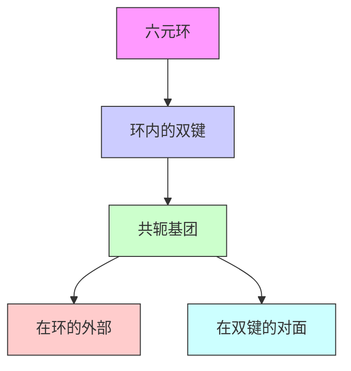
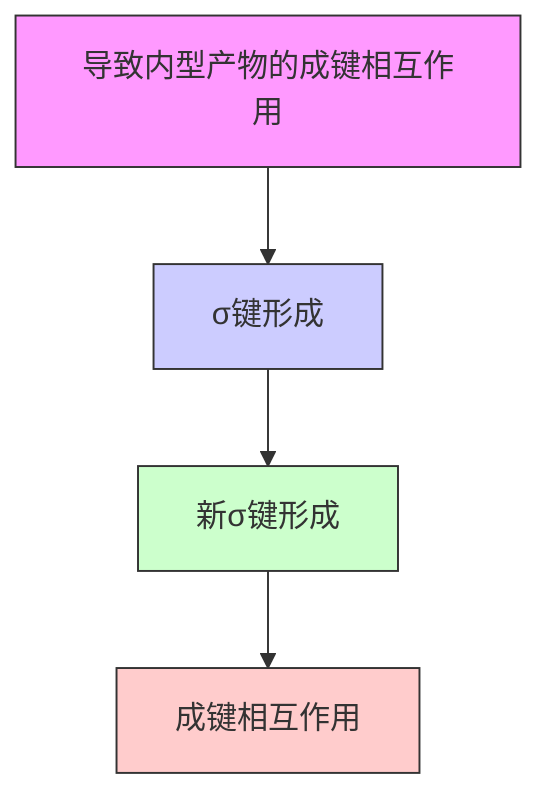
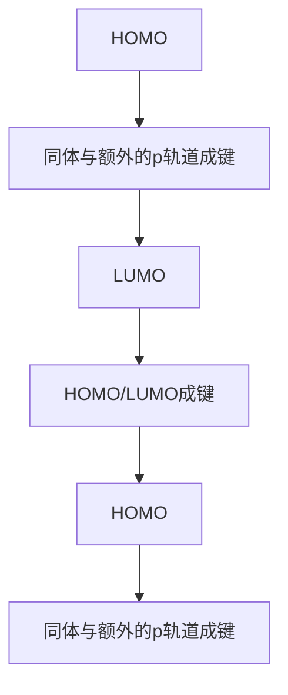
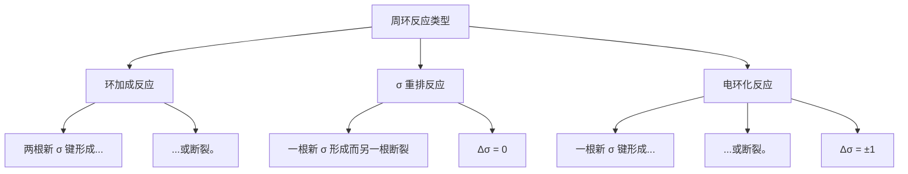

# 周环反应 1:

# 环加成

# 34

# 联系

# 基础

- 分子结构 ch4  
- 反应机理 ch5  
- 共轭和离域 ch7  
- 烯烃的反应 ch19 & ch22  
- 芳杂环 ch29 & ch30

# 目标

- 环加成反应中，电子在环中移动  
- 环加成反应中，多于一根键协同形成  
- 环加成反应没有中间体  
- 环加成反应是周环反应的一个类别  
- 控制环加成反应的规则：如何预测什么会发生，什么不会发生  
- 光化学反应：需要光的反应  
- 通过 Diels–Alder 反应制取六元环  
- 通过 $[2 + 2]$ 环加成反应制取四元环  
- 通过1,3-偶极环加成反应 制取五元环  
- 使用环加成反应将双键立体专一性地官能化  
- 使用臭氧断裂 C=C 双键

# → 展望

- 电环化反应和 $\sigma$ 重排 ch35  
- 自由基反应 ch37  
- 卡宾的反应 ch38  
- 不对称合成 ch41

# 一类新的反应

大多数有机反应是离子型的。电子由一个负电子原子移动到一个缺电子原子上：有阴离子或阳离子作为中间体。如下内酯（环状酯）的形成就是一个例子。反应涉及五步和四个中间体。反应是酸催化的，每个中间体都是一个阳离子。每一步中电子的流动方向都有共同点——朝着正电荷。这是一个离子型反应(ionic reaction)。

![[中文版clayden-chinese-34-36907-999_images/9a26937e79bba467e5daa38649663d8b7d7b20da6594fbd6b3596f7f14e836d9.jpg]]

chemical

Reaction mechanism diagram showing protonation, ring opening, and dehydration steps of a cyclic ester

而本章，则关于一种完全不同的反应类别。电子绕一个环移动，任何中间体上都没有正负电荷

■ 您在 Chapter 24 中简要了解了第三类反应——自由基反应 (radical reactions)——反应中移动的是一个电子而非两个电子。此类反应将在 Chapter 37 中更细致地发展。

Otto Diels (1876–1954) 和它的研究生 Kurt Alder (1902–58) 在研究于基尔大学，并于 1928 年发现了这一反应。它们获得了 1950 年的诺贝尔奖。Diels 同样发现了三氧化二碳 (carbon suboxide), $C_{2}O_{3}$ (见 p. 420).

环加成是三类周环反应中的第一类，本章专门讨论环加成反应。另两种反应——σ重排和电环化反应——将在 Chapter 35 中讨论。

——事实上，根本就没有中间体。这类反应被称为周环反应 (pericyclic reaction)。最有名的例子是 Diels–Alder 反应 (狄尔斯–阿尔德 反应，Diels–Alder reaction)。这个反应仅需加热，就可一步完成。我们可以用六个电子绕一个六元环移动的方式画出机理。

![[中文版clayden-chinese-34-36907-999_images/6d4b9c4aff50038d39573a6e97941ba8177b3db63b64518f5196c61c889ecf19.jpg]]

chemical

Chemical reaction diagram showing the addition of a ketone to a cyclic ester under heating conditions

每个箭头都直接指向下一个箭头，最后一个箭头又与第一个相连。方才的图中，电子顺时针旋转，然而，如果要画电子逆时针旋转，也不会有任何区别。

![[中文版clayden-chinese-34-36907-999_images/f2b1fd9f6cdd7fe664e3b770bbf4019b60bdb6455593c4f8af170bd591d2e506.jpg]]

chemical

Chemical reaction diagram showing ring-opening of a cyclic ester with curved arrows indicating electron movement

两种机理都同样正确。电子其实并不真正旋转。在现实中，两根 $\pi$ 键的消失和两根 $\sigma$ 键取而代之地形成过程，是通过电子平滑地由 $\pi$ 轨道移入 $\sigma$ 轨道而发生的。这样的反应被称作环加成反应 (cycloaddition)。我么必须花费一些时间，理清这一过程是如何发生的。首先，只考虑轨道重叠以形成新键的过程。只要试剂以正确的方式接近，这再简单不过了。

![[中文版clayden-chinese-34-36907-999_images/02fd3c99f8b7990d10887c60767e068da4d3a1b32fa7cad2a8331ce28b9c7fa5.jpg]]

chemical

Molecular orbital diagram showing π and σ bond types with labeled Chinese annotations

黑色的 p 轨道完美地排列，来形成新的 $\sigma$ 键，绿色轨道也是如此，两根棕色的轨道正好处在环后方形成新 $\pi$ 键的正确位置上。这是一个一步反应，没有任何中间体，只有一个类似下图的过渡态存在：

![[中文版clayden-chinese-34-36907-999_images/a62f80299ffb52f791c28edbbb42b27bde3f77fc0ab7594f9d52ee7af5c493e9.jpg]]

chemical

Reaction mechanism of cyclohexanone showing electron transfer and deprotonation steps

Diels–Alder 反应进行得如此顺利的原因在于，其过渡态包含六个离域的 $\pi$ 电子，符合芳香性的特征，具有一些苯的特殊稳定性。您可以将其看作是一个留有全部 $\pi$ 键，但丢失了两根 $\sigma$ 键的苯环。这幅图就目前来说还算不错，但它还不完整。我们将更详细地描述了反应后，回到对轨道更详细的分析。

# 克菌丹

我们所讨论的 Diels–Alder 反应的一个重要的工业应用是农用杀真菌剂克菌丹 (Captan) 的合成。

![[中文版clayden-chinese-34-36907-999_images/ba9b12e84f2f0e89e8edad9abad71a77f589f6d69daea25f6c2f327f8edfc64d.jpg]]

chemical

Chemical reaction pathway showing conversion of a cyclic ketone to a chiral amide via ammonium chloride intermediate, followed by chlorination and cyclization to form a bis-sulfonyl chloride derivative.

# Diels-Alder 反应概述

Diels–Alder 反应在一个共轭双烯/二烯(体) (conjugated diene) 和一个烯烃，通常称为亲双烯体 (dienophile) 间发生。下面有一些例子：首先是一个开链双烯与一个简单的不饱和醛作亲双烯的反应。

![[中文版clayden-chinese-34-36907-999_images/b2eee076f4619fa609418a854a03bc941363a6425530df858995e626721ccbef.jpg]]

chemical

Chemical reaction diagram showing conversion of double-hydroxy to cyclopropyl alcohol via acetal intermediate

机理是相同的，形成新的，带有一根双键的六元环。然后是一个环状双烯与硝基烯烃的反应。

![[中文版clayden-chinese-34-36907-999_images/ade633349261f0d5086170c6f8fa0fbf1d89eae7c0248f4a67120c17374740e0.jpg]]

chemical

Chemical reaction equation showing cyclohexene reacting with nitro groups to form a product structure

机理清晰地指向了产物的第一幅结构图，但这是一个笼式结构，第二种画法则是更好的。在两幅图中，新的六元环都以黑色示出。一个更详尽的例子显示了，很复杂的分子可以通过这个美妙的反应，快速地实现组装。

![[中文版clayden-chinese-34-36907-999_images/59870c9d2177473fa8b92628141c86847a7cc73c2f9c4478a73bc74e3ec30497.jpg]]

chemical

双烯-喹诺酮反应生成亲双烯-喹诺酮的化学方程式

# 双烯体

Diels–Alder 反应的双烯体组分既可以是开链的，又可以是环状的，并且它可以具有多种类型的取代基。只有一个限制：它必须能够占据机理中所示的构象。丁二烯由于空间因素，一般倾向于处在两根双键彼此尽可能地远离的 s-反式构象中。绕中间 σ 键旋转的能垒很小 (室温下大约 $30 \, kJ mol^{-1}$ )，旋转为较不利，但却可以反应的 s-顺式构象的过程是迅速的。

![[中文版clayden-chinese-34-36907-999_images/02ca969de5d38b9797e497f6227254098ed2d7c10cd1671fe069a92a4f969dfe.jpg]]

This fused ring system, and how to draw it, was described in more detail in Chapter 32.

■ 术语 “s-顺式” 和 “s-反式” 中的 “s” 意指 σ 键，暗示所指的是单键的构象而非双键的构型。

![[中文版clayden-chinese-34-36907-999_images/373a2573effaa7829939d433d26fef2b20e5003c5d7a92585dcfe139c21670cb.jpg]]

chemical

Chemical structures of s-顺式构象 (Diels-Alder) with labeled substituents and their Chinese descriptions

![[中文版clayden-chinese-34-36907-999_images/0cdd15b85b48bb1b961dd44d933175e56970c98558ca47bc6f9438eb28102d01.jpg]]

chemical

Chemical structure of s-反式构象 (diels-Alder reaction) with labeled substituent positions

![[中文版clayden-chinese-34-36907-999_images/5582e56be81cd98f0b78fd9620ea1eb17bd948f6238420bdfcb037dfe539c318.jpg]]

chemical

Diels-Alder cycloaddition reaction mechanism showing s-反式构象 (s-isomer) and s-顺式构象 (s-alkyl) with yields and conditions

始终处于 s-顺式 构象的环状双烯在 Diels–Alder 反应中格外地好——环戊二烯是一个典型的例子——但始终处在 s-反式 构象的环状双烯，无法采取 s-顺式 构象，因而也根本无法进行 Diels—Alder 反应。这种烯烃的两端不能足够靠近，来与烯烃反应，(假想的反应中，)产物会是处在六元环中不可能的反式双键。(在 Diels–Alder 反应中，双烯中间的单键在产物中变为双键，该 $\sigma$ 键的构象会变为产物中新 $\pi$ 键的构型。)

# - 双烯体

双烯体必须具有 s-顺式构象。

# 亲双烯体

目前为止，您见到的亲双烯体都有一个共同点。它们都带有一个与烯体共轭的吸电子基团。这是Diels-Alder亲双烯体常见，但不独有，的一个特征。必须有一些额外的的共轭作用——至少是一个苯基或一个氯原子——否则环加成将不会发生。各个书关于Diels-Alder反应的基本描述，经常会给出丁二烯与一个简单的烯体(甚至是乙烯)的反应。这个反应仅以很差的产率进行。试图使像环戊二烯这样活泼的双烯与一个简单烯烃结合，都会导致替代发生的双烯的二聚反应。一分子环戊二烯作双烯体，另一分子作亲双烯体，得到如下所示的笼状结构。

![[中文版clayden-chinese-34-36907-999_images/bcee0754c09e4a48f3b17198dc8af1cc6ea680f2fce98dd4ee4fa37a116181c1.jpg]]

chemical

Reaction mechanism diagram showing cycloaddition of alkene to cyclohexane, then deprotonation to form a bridged bicyclic ketone

# 环戊二烯

在石油精炼的过程中，会产生大量的环戊二烯。它在室温下以其二聚体的形式存在，但可以在加热下分解为单体——较高温度下，熵的重要性增加 (Chapter 12)。它可以被氯化，给出六氯环戊二烯，此双烯与马来酸酐的 Diels–Alder 产物是一种阻燃剂。

![[中文版clayden-chinese-34-36907-999_images/1fa44b8c54dc1eff219b5ed4dca8913a2de3a74279205fe3418cf0c67026c8e6.jpg]]

chemical

Cl₂-catalyzed thermal decomposition reaction of a cyclopentene derivative with chlorinated cyclopentane under high temperature and 42°C, leading to an alkylated product with chlorine substitution.

可以进行 Diels–Alder 反应的简单烯体，包括共轭的羰基化合物、硝基化合物、腈、砜，芳基烯烃，乙烯基醚、酯，卤代烯烃，和双烯。除了目前为止您已经看到的几种，页边栏还示出了一些例子。最后一个例子中，右边环内的孤立双键接受双烯（的进攻），左边环则起到活化这个烯烃的作用。但我们所说的“活化”确切来讲是什么意思呢？我们待会将回到这个问题上。

# 狄氏剂和艾氏剂

在 1950s，有两种非常有效的杀虫剂被推出，它们的名字是“狄氏剂 (Dieldrin)”和“艾氏剂/阿氏剂 (Aldrin)”。您也许猜出来，它们是由 Diels–Alder 反应合成的。艾氏剂由两个连续进行的 Diels–Alder 反应衍生。第一步中，环戊二烯与乙炔反应给出一个简单的对称笼状分子“降冰片二烯 (norbornadiene)”(双环[2.2.1]庚二烯)。降冰片二烯并不共轭，因而不能作为双烯体参与 Diels–Alder 反应。然而，由于笼状，它很具张力，会作为亲双烯体，与六氯环戊二烯反应给出艾氏剂。

![[中文版clayden-chinese-34-36907-999_images/5600c5db24d796a498cb6220e9f0b60c0da837d4ddc993c633864e5e6d5ec76b.jpg]]

chemical

Chemical reaction pathway showing conversion of cyclopentadiene to acrylate via deionization and chlorination steps

这是一个很复杂的产物，但我们希望您能了解，它是如何通过着眼于两根黑色的键得以合成的。狄氏剂是艾氏剂的环氧化物。这两种化合物的使用，与很多有机氯化合物一样，因为被发现氯残留可能积累在食物链顶端的动物，例如猛禽和人类的脂肪中，最终被禁用。

# 产物

识别一个 Diels–Alder 产物是简单直接的。着眼于六元环，和六元环内的双键，以及在环外，并处在烯烃对侧的共轭基团。这三点特征，意味着该化合物是可行的 Diels–Alder 产物。

找到起始原料最简单的方法，是用一个比大多数反应更接近真实的反应，来切断。您只需要画出逆 Diels–Alder 反应。为此，画出绕环己烯环移动的三个箭头，第一个箭头由双键的中心开始。当然，向哪个方向都没关系。

按假想的逆 Diels-Alder 反应切断

![[中文版clayden-chinese-34-36907-999_images/b5538923079d78aead5c1db4213b36e4d3833218a36ffe9d63d14b7317372f5d.jpg]]

chemical

Diels-Alder reaction mechanism showing double-keto intermediate formation from a ketone to a vinyl group

反应简单得不能再简单了一一将两根组分放在一起，无需溶剂或催化剂，只需加热即可进行。通常需要在 100-150°C 周围的温度，这可能意味着如果试剂挥发，如下，需要使用密封管。

![[中文版clayden-chinese-34-36907-999_images/4b1a8758adda434e30fe170cce097fac1c7764d8353ec232a15bdac4e37352ec.jpg]]

chemical

Chemical reaction equation showing esterification with 100°C solvent, producing a cyclohexanone derivative

# 立体化学

Diels–Alder 反应是立体专一性的。如果亲双烯体上有立体化学，那么它会在产物中如实地重现。因此顺式和反式的亲双烯体会给出产物的不同非对映体。马来酸和富马酸的酯提供了一个简单的例子。

![[中文版clayden-chinese-34-36907-999_images/b5a04e04e8deba990391b19d7b71d8343c5cb59fe86f0f8330ede4f87a0eed72.jpg]]

chemical

Chemical structures of Diels-Alder reaction with a phenyl sulfone and naphthalene derivatives

![[中文版clayden-chinese-34-36907-999_images/5662632f856814cc37709303a02387875c1b192124aa1ab8b976ebe0fe41fa39.jpg]]

flowchart

此处显示的切断和逆合成箭头是关于如何制取分子，思考的方式。它们贯穿Chapter 28出现。

![[中文版clayden-chinese-34-36907-999_images/e8a5ca488e9516cbb875163694ca837691b3a70c8cc488cb27d413ae95e33e51.jpg]]

Interactive explanation of the

effect of dienophile

stereochemistry

![[中文版clayden-chinese-34-36907-999_images/55ff3ac8c404d1f2345d92a042325fb8e157323cffda7b0c09ba6b8475559156.jpg]]

chemical

Two-step organic reaction mechanism involving carboxylic acids and alcohols, showing intermediates and product structures.

两种情形中，酯基都简单地停留在原来的地方。在第一个反应的亲双烯体中，它们是顺式的，产物中也同样保留顺式。在第二个反应的亲双烯体中，它们是反式的，产物中也同样保留反式。第二个例子看起来说服力不那么强——我们可以提醒您，事实上，在反应中，双烯体会像下图一样，落到亲双烯体的顶部：

![[中文版clayden-chinese-34-36907-999_images/e8685c385514e6a51ac08cec42c26c432cb7c0987b4e91c78803755fe441c8e9.jpg]]

chemical

Organic reaction mechanism showing conversion of a cyclohexane derivative to a cyclopentene derivative via intermediate formation

其中一个 $CO_{2}Me$ 基在过渡态中被折叠在双烯体的下方，然后，当产物分子变平，变为最后一幅图所示的结果时， $CO_{2}Me$ 基出现在环的下方。棕色氢保持与另一个 $CO_{2}Me$ 基顺式。

![[中文版clayden-chinese-34-36907-999_images/e03615003374c22d3f5b60f9592a73196c64a79a134da58ec1a7d369005f28f9.jpg]]  
潜在的治疗中风药物

Parke-Davis 公司对于治疗中风的药物的研究，提供了一个双烯体立体化学的有趣应用。他们想要的化合物是一种三环胺。它们事实上并不像 Diels-Alder 产物。但如果我们在六元环中合适的位置插入一根双键，那么 Diels-Alder (D-A) 切断就变得可行了。

![[中文版clayden-chinese-34-36907-999_images/bd76853fea8078c426b649765161e4e38efe49dafcee85788faad391c8004311.jpg]]

chemical

Reaction mechanism showing hydrogenation of a fused bicyclic compound to form a dianion and an alkene

丁二烯是一个好的双烯体，但所需的烯胺并不是好的亲双烯体。像羰基或硝基这样的吸电子基团更加可取：它们都能完成工作。从结果上，羧酸可以通过与使用 $(\mathrm{PhO})_{2}\mathrm{PON}_{3}$ 的重排反应，转化为胺。

![[中文版clayden-chinese-34-36907-999_images/491a6cd3e9f2e7fd721d3a965cbc6fe376786871e644eab58e90d7a98554125f.jpg]]

chemical

Organic reaction pathway showing transformation from a hydroxybenzene derivative to a fused bicyclic compound via intermediate 1 and 2, followed by hydrogenation to yield a chiral product.

■ 与 $(\mathrm{PhO})_{2}\mathrm{PON}_{3}$ 发生的重排反应是一种 Curtius 重排：将会在 Chapter 38 中描述。

您可以将 Diels-Alder 反应纳入您脑海中，由单一几何异构体制取单一非对映体的方法的序列中：同 Chapter 33 中的方法。

环交点处的立体化学一定是顺式，因为环状亲双烯体只能具有顺式双键。氢化反应可移去产物中的双键，由此可见，Diels–Alder 反应在饱和杂环的制取中也是有用的，尤其是当某些立体化学需要得到控制时。

# 双烯的立体化学

这稍稍复杂一点，因为双烯体可以是顺式,顺式，顺式,反式(如果双烯不对称的话，此类还可分为两种)，和反式,反式。我们将用相同的亲双烯体，由于三键没有立体化学，我们将选用一种丁炔二酸酯(acetylene dicarboxylate，亚乙炔基二甲酸酯)为例挨个讨论。从顺式,顺式-双烯体开始并选用环状双烯是容易的。

![[中文版clayden-chinese-34-36907-999_images/bae85b72e66cfbc2bcbcd68419f934db06c4000b0ee5a01a404d82bbdde296f7.jpg]]

chemical

Organic reaction mechanism showing cycloaddition and ring-opening of a ketone to form a bridged bicyclic alcohol

双烯体有两组取代基——内部的和外部的。内部的是桥 $\mathrm{CH}_2$ 基，反应后，它处在分子的某一侧(图示中处在六元环上方)，两个绿色的氢在外部，在产物分子中仍在外侧。在最终图示中，它们处于六元环的下方。

对于反式,反式-双烯体，我们仅需交换两组取代基的位置，在这个例子中，将 Ph 放在原来 H 的位置上，将 H 放在原来桥 $CH_{2}$ 基的位置上。反应如下所示：

![[中文版clayden-chinese-34-36907-999_images/88be9eb35a5c97675de71699c99dfa4c8ddb8e1b1d3a6569f59b03bf5451be51.jpg]]

chemical

Organic reaction mechanism showing cycloaddition and ring-opening of a chiral alkene with two phenyl groups

绿色 Ph 基，在产物中，处在上个例子中的氢所处的位置上——在六元环的下方——氢在产物中则在上方。乍一看可能有点迷惑人，反式,反式-双烯体给出两根苯基顺式的产物。另一种着眼方式在于它们的对称性。反应物都具有对称面，因为反应是协同的，取代基没有显著的移动，因而产物亦具有对称面。橙色虚线显示了这个对称面，与纸面成直角。

![[中文版clayden-chinese-34-36907-999_images/dc3b45a56ee786fca12af17a4aa99b204349b57a79e60fe0366c0dc0d8d8fe45.jpg]]

chemical

Two organic reaction pathways showing cycloaddition and cyclization of a substituted cyclohexene derivative with CO2Me groups

还剩一种情况——顺式,反式-双烯——它比前两种罕见，但有时也会遇到。双烯的不对称性意味着，两个取代基在产物中，显然会处在新的六元环的不同侧。

![[中文版clayden-chinese-34-36907-999_images/d3528bc0a17a9b320ea86dc0a6292314a384d3426cc61bf1924029436e84b335.jpg]]

chemical

Organic reaction mechanism showing ring-opening and cyclization steps with R substituents

红色 R 基看上去可能妨碍了反应的继续，但当然，亲双烯体靠近时并不出在双键所在的平面，而是处在该平面的底部。这种立体化学为人所知的很少，因而很难找到一个有说服性的例子，很少的原因部分是制取 E,Z 双烯的困难性所造成的。有一个很好的方法，使用了您在 Chapter 27 中学过的两个控制双键几何结构的方法。首先通过甲醇对丁二炔的加成反应得到第一根顺式双键，然后由 $LiAlH_{4}$ 对中间体炔基醇的还原反应得到第二根反式双键。

![[中文版clayden-chinese-34-36907-999_images/23870fc3248235cbca10b5e4d9871676bcb8818f543a4e90a42101df257897f9.jpg]]

Interactive explanation of the
ect of diene stereochemistry

这些反应的机理已于pp.682和684给出。  
→ DEAD 是光延反应的关键组分：见 p. 349.

![[中文版clayden-chinese-34-36907-999_images/be2d1534c42b9ad2d67e04b6eee55c768727a7a7f121c2191053a7e43cda5f9a.jpg]]

chemical

Organic synthesis reaction pathway showing conversion of a ketone to an enol ether via esterification and subsequent hydrolysis

一个 Diels—Alder 反应使用了这个醇的乙酸酯，还有一个有趣的亲双烯体 DEAD (偶氮二甲酸二乙酯——橙色所示)。产物亦极好的产率形成，并且具有与预测一致的反式立体化学。酰胺氮原子是平面型的，因而毫无疑问此处没有立体化学。DEAD 本身可以在 E 和 Z 异构体之间快速转化，E 占主导。

![[中文版clayden-chinese-34-36907-999_images/1128aea7325d8a2740a5a994f6242426c92ad5e0df043522074cfa7ee1f6d4c6.jpg]]

chemical

Chemical reaction showing conversion of a pyrrolidine derivative to a substituted cyclohexanone derivative under 80°C, yielding 89% yield

现在，我们将讨论最有趣的情形，双烯体和亲双烯体都具有立体化学时。

# Diels-Alder 反应的内型规则

这些名称来源于亲双烯体上的羰基与新形成的双键在空间上的关系。如果它们在同侧，则被称作内型 endo (有些场合直接使用英文)，如果在不同侧，则被称作外型 exo。

热力学和动力学控制已于 Chapter 12 中讨论过，您已在 Chapter 30, p. 739 中遇到过与杂环发生的 Diels–Alder 反应。

当双烯体和亲双烯体均为环状时，这一点可能更容易理解。所有双键均为顺式，立体化学很清晰。环戊二烯和马来酸酐的反应是有史以来最著名的 Diels–Alder 反应，其中有两种产物都符合我们目前为止所描述的全部规则。它们都是可能的产物的非对映体——虽然具有四个立体中心，但任何其他的非对映体都会具有不现实的张力。

![[中文版clayden-chinese-34-36907-999_images/5bd4043cec8a62a9ecc5f5f689c0497c1aa0b8c00fcdbef833660c52becf0ac7.jpg]]

chemical

Reaction mechanism of cyclohexene showing intermediate formation and two alternative products: solid and deuterated.

两个绿色氢原子必须在产物中处于顺式，而此时便会出现两种化合物，被称作外型（exo）产物和内型（endo）产物。反应进行时，所得的产物，事实上是内型化合物。只有一种非对映体得以形成，而它正是较不稳定的那一个。我们如何知道呢？嗯，对于某些 Diels–Alder 反应可逆的情形，即是在热力学控制下，外型产物会取而代之地形成。最著名的例子由将环戊二烯换为呋喃，亲双烯体不变的反应得到。

![[中文版clayden-chinese-34-36907-999_images/af24438c4fc6be473809c97585e05507d084ed482e73e7997b586a4424149d42.jpg]]

chemical

Reaction mechanism of diels-Alder showing conversion of internal to external alcohols via isomerization and deprotonation steps

为什么外型产物更稳定呢？请再次观察这两个结构。在分子的左侧，有两个桥横跨新形成的键(黑色表示)的两端：一个单 C 原子桥，和一个双 C 原子桥。如果让较小的桥 (即单原子桥) 与酸酐环重叠，那么就比另一种情况空阻小。

内型产物没有外型产物稳定，但不可逆的 Diels–Alder 反应却倾向于形成它——它一定是反应的动力学产物。它形成得更快，这是由于亲双烯体中缺电子的羰基与双烯体后部正在形成的 $\pi$ 键之间存在成键相互作用 (bonding interaction)，继而导致了过渡态能量的降低，指向内型产物。

![[中文版clayden-chinese-34-36907-999_images/79279a04d79bdd53cf851fc41a14aeac8c91dc5eb765e45d54f5dc4b6ef26227.jpg]]

chemical

Reaction mechanism showing transition state and bond formation with C=O, involving conformational change and molecular rearrangement

非环状双烯体与亲双烯体的反应中，也能找到相似的结果。一般来说，只倾向于一种非对映体——亲双烯体中的羰基，离双烯体后部正在形成的 $\pi$ 键最近的那种。下面是一个例子。

![[中文版clayden-chinese-34-36907-999_images/71b8b5efbb6a6c829ce60e59e6a6f9a9126d3b4dbf872f32af979004d8b10359.jpg]]

chemical

Chemical reaction diagram showing the conversion of a ketone to a cyclohexanone, with '还是' indicating recombination or completion.

根据之前的讨论 (它是反式,反式双烯)，我们料到，两根甲基会彼此顺式，唯一的问题在于剩下的，醛基的立体化学——它向上还是向下？醛会是内型的——但哪个化合物是内型的呢？找到答案最简单的方式是画出在三维上正在接近的试剂。下面是一种方法。

1. 画出反应机理和产物的图示，显示出您要确定什么。将已知的立体化学标上。这是我们已经做好了的 (上一幅图示)。  
2. 将两个分子都画在纸平面上，双烯体在上部，亲双烯体的羰基折叠在双烯体的下部，以使之离正在形成的 $\pi$ 键近。  
3. 现在画出将要变为立体中心的碳上的所有氢原子。如右图绿色所示。  
4. 画出产物的图示。将分子展开，以显示出六元环。上幅图中所有在右侧的取代基都在新分子的同侧。即，所有绿色的氢原子都彼此顺式。  
5. 画出产物的最终图示，并用常规方法给出其他取代基的立体化学。这就是 Diels–Alder 反应的内型产物。

# 解释的时间

我们已经积累了相当多未经解释的结果。

- 为什么 Diels–Alder 反应发生得这么好？  
- 为什么亲双烯体上必须具有共轭基团？  
- 为什么每个化合物的立体化学都会在产物中如实地保留？  
- 为什么动力学倾向于内型产物？

![[中文版clayden-chinese-34-36907-999_images/3dd79aa6413984659523974a0263684be51ccb59458c842009fee8e78bccc17e.jpg]]

Interactive explanation of endo
ectivity

![[中文版clayden-chinese-34-36907-999_images/3482702a435e4bc1b11b7c979ae1c85ab4bacee92694e89fbbcf66b5b4458321.jpg]]

chemical

Chemical structures of three different carboxylic acid derivatives with hydrogen bonding indicated

译者注：除此之外，您不妨可以假设双烯体是环状的(将两个H换为 $CH_{2}$ )，判断出结果后再修正。

![[中文版clayden-chinese-34-36907-999_images/cae0f08746da2f0370abe8e7c732c60cefed13c9768702b5f2fcc29176e0b8f4.jpg]]  
您可能需要回忆有关共轭 $\pi$ 体系的轨道的内容，您可以重新阅读 Chapter 7。

这样的疑问还有更多。本章前文简单的图示也不能解释为什么 Diels–Alder 反应仅在加热时发生，而试图将简单烯烃 (而不是双烯)加成到马来酸酐上时，加热又不行了，但在 UV (紫外)光下却又可以了。

现在，我们会使用前线轨道理论，花费一节对这些问题予以解释。在所有种类的有机反应中，周环反应是最严格受控于轨道的，我们将要阐述的观点的发展是现代理论化学最伟大的成就。它只基于非常简单的原理，但却美丽而令人满意。

# 环加成反应的前线轨道描述

当发生离子型环化反应，例如本章开始的内酯化反应时，会形成一根重要的新键。令一个充满轨道与一个空轨道结合，就足以完成这根新键形成的任务。但若要完成两根新键同时形成的环化反应，两条充满的 p 轨道和两条空 p 轨道，就得能够排列在合适的位置上，并具有合适的对称性。如果我们画出上文的反应中的轨道，请观察会发生什么。我们可以试试烯烃的 HOMO ( $\pi$ ) 与酸酐双键的 LUMO ( $\pi^{*}$ ) (如侧边栏所示)。这一组合可以在一端成键，但在另一端却反键，这使得它们不能发生环化反应。显然，用另一组 HOMO/LUMO，即酸酐的 HOMO 和烯烃的 LUMO，也无济于事，因为它们的对称性同样不匹配 (mismatched)。

现在再来看看，如果将烯烃换为双烯会发生什么。我们还会使用缺电子的酸酐的 LUMO。现在，对称性便合适了，因为双烯体 HOMO（双烯体的 HOMO 是 $\psi_{2}$ ）的中间有一个波节，亲双烯体的 LUMO 同样如此（在中间有一个波节）。

如果我们尝试相反的安排，即双烯体的 LUMO ( $\psi_{3}$ ) 与亲双烯体的 HOMO，对称性同样会是合适的。双烯体的 LUMO 具有两个波节，与亲双烯体具有两个波节的 HOMO 对称性相同。因此任何一对结合都是极好的。事实上大多数 Diels–Alder 反应使用缺电子的亲双烯体和富电子的双烯体，因此我们倾向于第一种安排。缺电子的亲双烯具有低能的 LUMO；富电子的双烯具有高能的 HOMO，因而这种结合会在过渡态中给出很好的重叠。能级会像下面这样，橙色所示的相互作用，由于轨道在能量上接近，比棕色所示的相互作用更好。

```mermaid
graph TD
    A["ψ₁"] --> B["双烯的 HOMO"]
    C["ψ₂"] --> D["双烯的 LUMO"]
    E["ψ₃"] --> F["双烯的 LUMO"]
    G["ψ₄"] --> H["双烯的 LUMO"]
    I["π"] --> J["酸酐的 HOMO"]
    K["π*"] --> L["酸酐的 LUMO"]
    M["ρ"] --> N["ρ"]
    O["ρ*"] --> P["ρ"]
    Q["ρ*"] --> R["ρ"]
    S["ρ*"] --> T["ρ"]
    U["ρ*"] --> V["ρ"]
    W["ρ*"] --> X["ρ"]
    Y["ρ*"] --> Z["ρ"]
    AA["ρ*"] --> AB["ρ"]
    AC["ρ*"] --> AD["ρ"]
    AE["ρ*"] --> AF["ρ"]
    AG["ρ*"] --> AH["ρ"]
    AI["ρ*"] --> AJ["ρ"]
    AK["ρ*"] --> AL["ρ"]
    AM["ρ*"] --> AN["ρ"]
    AO["ρ*"] --> AP["ρ"]
    AQ["ρ*"] --> AR["ρ"]
    AS["ρ*"] --> AT["ρ"]
    AU["ρ*"] --> AV["ρ"]
    AW["ρ*"] --> AX["ρ"]
    AY["ω"] --> Z
    AZ["ω"] --> AA
    BA["ω"] --> AB
    BB["ω"] --> AC
    BC["ω"] --> AD
    BD["ω"] --> AE
    BF["ω"] --> AG
    BG["ω"] --> AH
    BH["ω"] --> AI
    BI["ω"] --> AJ
    BJ["ω"] --> AK
    BK["ω"] --> AL
    BL["ω"] --> AM
    BM["ω"] --> AN
    BN["ω"] --> AO
    BO["ω"] --> AP
    BP["ω"] --> AQ
```

![[中文版clayden-chinese-34-36907-999_images/e615e68fb1e3123742bfbc24ebe78c9a96ca01884fb86898e389d8031df54ed6.jpg]]

flowchart

这就是为什么，在好的 Diels–Alder 反应中，我们通常使用带有共轭基团的亲双烯体。这样的双烯，由于 HOMOs 相对高能，因而会与亲电试剂迅速地反应。但简单烯烃也不适合作亲电试剂，因为它们的 LUMOs 相对高能；能降低烯烃 LUMO 的最有效的修饰方法，是将一个吸电子基团，如羰基或硝基，与双键共轭。最常见的 Diels–Alder 反应类别是一一富电子的双烯体与缺电子的亲双烯体之间的反应。

# 双烯通过环加成反应二聚

因为双烯体具有相对高能的 HOMOs，也具有相对低能的 LUMOs，它们应当能够与自身参与环加成。确实如此，双烯体会通过 Diels–Alder 反应二聚。有一分子的双烯扮演亲双烯的角色。对称性对于所示的相互作用是合适的，我们称这种反应（与本章所有的 Diels–Alder 反应一样）为“[4 + 2] 环加成反应”——数字代表参与反应的每个组分的原子数目。(译者注：有时也用各组分参与反应的电子对数标号。)

一种罕见的类型是逆电子需求的 Diels–Alder 反应 (reverse electron demand 的 Diels–Alder reaction)，其中亲双烯体带有给电子基团，双烯体带有共轭吸电子基团。这些反应使用亲双烯的 HOMO 和双烯的 LUMO 进行。这种组合仍符合轨道对称性的要求。

同一个特征，让双烯既能做亲电试剂，又能做亲核试剂，见 p. 148.

![[中文版clayden-chinese-34-36907-999_images/d26c60f4241dece93f71ac74c9ec1d7ebd66062ed00d59b39b7bec84ced7142d.jpg]]

chemical

Reaction mechanism diagram showing cyclohexene ring heating to form cyclohexene and then to form HOMO and LUMO structures with labeled steps.

但双烯体所不能完成的，是通过 $[4 + 4]$ 环加成反应一步形成八元环 (在光化学条件下，或有过渡金属催化时是可行的，我们稍后将了解)。

![[中文版clayden-chinese-34-36907-999_images/14d7038f5da7040a3918606eb6fa353d89ddff80c8911f1ae3c7a196d71d14e8.jpg]]

chemical

Reaction mechanism diagram showing heating of cyclohexene with Ni(0) catalyst

您应当能预料到反应的失败，因为所需的轨道的两端必定具有错误的对称性，如同尝试烯体的二聚反应时一样。

# Diels-Alder 反应内型偏好的轨道解释

我们将使用一个双烯二聚反应，为我们对于形成内型产物的解释增添更多细节。为了使问题更加简单，我们将着眼于一个环状双烯——环戊烷——的二聚。在 p. 885，我们通过指出亲双烯上的共轭基团与烯体后部发生的有利的电子相互作用，介绍了对于内型产物的偏好。

![[中文版clayden-chinese-34-36907-999_images/7b5565bdf8cc1da71099aa6ef226ccc62a59830c3b3f24a4997472dd0d0ddb85.jpg]]

chemical

Chemical reaction diagram showing cycloaddition of cyclohexene with cyclohexane ring, resulting in a bridged bicyclic structure with two烯体处于内型关系

如果现在，我们画出当两个组分相遇而发生反应时，它们的前线轨道，我们首先便可看出，键形成时的对称性是正确的（黑色所示的轨道）。但同时我们也能看到，双烯后部的轨道（绿色的轨道）同样存在对称性合适的成键相互作用。这种相互作用不会导致任何新键的形成，但它会在产物的立体化学中留下痕迹。由于存在跨两个轨道之间的成键相互作用，内型反应是有利的。

![[中文版clayden-chinese-34-36907-999_images/b6d736773bb6e96cd4aaa3926e679caa793dacd6bae27cf795bad69b07933ea7.jpg]]

chemical

Molecular orbital diagram showing HOMO and LUMO bonding with electron delocalization

![[中文版clayden-chinese-34-36907-999_images/15d6e011bb89c00f436de6866df7ca61aca6d633d469c5221dd6766ca7ef78b6.jpg]]

Interactive orbital explanation

for endo preference in Diels–Alder reactions

导致新键形成的轨道相互作用  
![[中文版clayden-chinese-34-36907-999_images/abeefc215cc2e808f852fe05f5b53a37531f7dca125bbb5bce3df7899b68c0bd.jpg]]

chemical

Reaction diagram showing the formation of a cyclohexene derivative from LUMO and HOMO intermediates

有利于内型产物的轨道相互作用  
![[中文版clayden-chinese-34-36907-999_images/e2fd3dd5435cbd91c41e753637b328dde5e8a57e9e15144ad32f529d20c2969d.jpg]]

flowchart

# Diels-Alder 反应的溶剂

在 Chapter 12 中，我们讨论了改变溶剂会造成的影响，现在，我们将介绍在 Diels–Alder 反应中的一种显著而有用的特殊溶剂效应。反应本身不需要溶剂，通常将两种试剂混合在一起并加热便可行。可以选用溶剂，由于反应中没有离子型中间体，因而似乎很明显，选择哪种溶剂是不重要的——任何可以溶解两种试剂的溶剂都可行。一般来说，这是对的，烃类溶剂通常是最好的。

然而，在 1980s，出现了一个非凡的发现。水，大多数有机反应最没希望的溶剂，对于 Diels–Alder 反应有很大的加速作用。即使只在有机溶剂中添加一些水，都能加速反应。这还不是全部。有水的反应的内型选择性通常高于无溶剂，或在烃类溶剂在进行的反应。下面是一个简单的例子。

<table><tr><td>溶剂</td><td>相对速率</td><td>内型:外型比例</td></tr><tr><td>烃(异辛烷)</td><td>1</td><td>80:20</td></tr><tr><td>水</td><td>700</td><td>96:4</td></tr></table>

![[中文版clayden-chinese-34-36907-999_images/13b2e2e7e0ed6d1df87486fe70651e4989b7a9c25d9f3b86018c567cd33a0131.jpg]]

chemical

Chemical reaction equation showing cyclopentene reacting with acetoxy to form an enone and then to form a cyclic ketone, both labeled in Chinese.

这表明，不溶于水的试剂，会被水的作用聚集在油滴中，被迫靠得很近。水，确切地说，并不是一种溶剂——它几乎是一种反溶剂 (anti-solvent)！像这样的反应有时被称作“在水上 (on water)”的反应，而不是“在水中 (in water)”的反应。

# 分子内 Diels-Alder 反应

当双烯体和亲双烯体已经是同一分子的两部分时，通过跨空间的成键相互作用将它们持在一起就不那么重要了，因而通常倾向于外型产物。确实，很多分子内的 Diels–Alder 反应被更普遍的空阻因素支配，而非被内型规则所支配。

![[中文版clayden-chinese-34-36907-999_images/6779e0167d8cda452a39642cf48bb2baa053732fed546dc94bc69e3d94c9612b.jpg]]

如果您思考 Diels-Alder 反应发生的方式，您会发现正在形成的环必须始终采取船式构象。如果您搭建模型，这会很清楚。

![[中文版clayden-chinese-34-36907-999_images/58b514b5f209445e1bd60a71d3f2db63eefa6584cf43c6686a08d4eeb91bafc9.jpg]]

chemical

Reaction mechanism diagram showing cycloaddition and rearrangement of a ketone to form a fused bicyclic product with stereochemistry indicated

这个反应仅仅因为它是分子内的，所以才发生。亲双烯体上没有共轭基团附着，因此没有轨道会与双烯的后部重叠。分子仅仅通过空间上最有利的方式发生折叠（如页边所示，正在连接的链采取类椅式构象），这会得到反式环交点。

在下一个例子在，有一个与亲双烯体共轭的羰基。现在，由于分子可以通过折叠，使羰基享受与双烯后部的成键重叠的乐趣，因而得到较不稳定的顺式环交点。这回，正在连接的链不得不采取类船式构象。

![[中文版clayden-chinese-34-36907-999_images/c2457a76ae4a3c8bf4aa185cdf317fe6f0def11fc0510c608bfd169c641cd299.jpg]]

chemical

Organic reaction mechanism showing cycloaddition and rearrangement steps

![[中文版clayden-chinese-34-36907-999_images/8fe4d85d0e10b3a3ac24b2f9d74e96bd1f15970f733d12b157dc9775abd970f7.jpg]]

# - 分子内 Diels-Alder

分子内的 Diels-Alder 反应可能给出内型产物，也可能相反！请准备好，可能得到外型、内型产物或它们的混合物。

# Diels-Alder 反应中的区域选择性

现在，我们将要称之为双烯体的化合物，是 Chapters 22 和 25 所讨论的重点，当时，我们称它们为 Michael 受体，因为它们是共轭加成反应的亲电组分。亲核试剂往往会添加到这些烯烃的 β 碳原子上，因为这样得到的产物是一个稳定的烯醇盐。普通烯烃不会与亲核试剂反应。

![[中文版clayden-chinese-34-36907-999_images/7dbf4ac00c77696fe802353ff8c0aa72885eadbdfc5a87ef331083d62487499a.jpg]]

chemical

Chemical reaction mechanism showing nucleophilic substitution and protonation steps in a cyclic ester compound

在前线轨道术语中，可以说是，与羰基的共轭降低了 LUMO (烯烃的 $\pi^{*}$ 轨道) 的能量；并同时使这条轨道变形 (distort)，使它在 $\beta$ 碳原子上的轨道系数 (coefficient) 比 $\alpha$ 碳原子上的大。亲核试剂沿着 $\beta$ 碳原子较大的 p 轨道所在的轴靠近共轭烯烃。

这一特征同样可作为区域选择性的 Diels–Alder 反应的担保。对于双烯，所涉及的仍是这个轨道，如果双烯的 HOMO 同样是不对称的，那么反应的区域选择性就会被两个最大系数的轨道成键所控制。

那么双烯的 HOMO 是如何变形的呢？当双烯与亲电试剂反应时，最大的 HOMO 系数将会起到定位作用。考虑 HBr 对一个双烯的进攻。我们应当预料到，进攻会发生在双烯的末端，因为这样会给出可能的阳离子中最稳定的一个——一个烯丙基阳离子作为中间体。

![[中文版clayden-chinese-34-36907-999_images/61b836fdc8d278aee9580a51b22f86f0821d1ea1287f54ea97b4ff66c92882ce.jpg]]

chemical

Reaction mechanism diagram showing electron transfer and C-Br bond formation in ester, with Chinese annotations on electron stability and C-Br bond formation.

在轨道术语上，由于双烯 HOMO 的轨道系数在两个端位较大，因而进攻发生于端位。丁二烯的 HOMO $(\psi_{2})$ 如页边栏所示，您可以从中观察出这一信息。因此双烯在 Diels–Alder 反应中通过其两端的碳来发生反应就不足为奇了。但假设两端是不同的——那么会在哪里反应呢？我们同样可以转而研究与其与 HBr 的反应作为指导。HBr 对一个不对称双烯的加成会给出两种可能的烯丙基阳离子中，更稳定的一个作为中间体。

![[中文版clayden-chinese-34-36907-999_images/1631f827f907446d9cb512a3930b86b0bb2a16b9fd20b9eeb27e9548ef323f4e.jpg]]

chemical

Reaction mechanism of bromide ion formation in propylene and tetrachloride, showing stability and dissociation steps

![[中文版clayden-chinese-34-36907-999_images/0587b828cdffc0a9bca2c364e1b057f5674072bf624df9527916e579c783c487.jpg]]

已于 Chapter 22 中讨

论。

![[中文版clayden-chinese-34-36907-999_images/d202b7a6b2d2d07925515d87222393b2adad52f3a4081c9bcfeeb5bfd8fb63da.jpg]]

简单烯烃的

LUMO ( $\pi^{*}$ )

·高能

\- (两个位点) 系数相等

![[中文版clayden-chinese-34-36907-999_images/d8cc2dac5a47bbe00a5ce52afb539d5e5efd0ed2b6f48e9eeb6e0dc395a8ebaf.jpg]]

![[中文版clayden-chinese-34-36907-999_images/eb876aa097c203eca5effee055124e4933ff8d5bede3598daee7ea7cead8cb86.jpg]]

不饱和羰基化合物的

LUMO

- 能量较低   
- 系数不等

丁二烯的 HOMO

$\psi_{2}$

![[中文版clayden-chinese-34-36907-999_images/cec5a3f56e3cc7cefbcfee42e32ea07a46b8dbd948818265df4fecef814dbd7c.jpg]]

![[中文版clayden-chinese-34-36907-999_images/a6871611cce422f06a22be2aaf509dc44a20c62d681c213ab1b6665bb34099f5.jpg]]

chemical

Chemical structure diagram of 1,1-benzenediene (HOMO) with labeled bond angles and resonance structure

利用化学反应的区域选择性了解化合物的轨道系数分配并不算是“作弊”。化学是利用实验证据发现其背后的理论，而非用理论告诉我们什么应该发生的学科。事实上，计算化学家已经计算了不对称双烯的 HOMO 能量，以及系数分配，并得到了相同的结论。

译者注：在稳定的离域极限式中，有负电荷的位置 HOMO 分布大，有正电荷的位置 LUMO 分布大，这是所谓的“用电性”判断动力学活性的一种方式。

![[中文版clayden-chinese-34-36907-999_images/da7b98b5a8da83d10a639795412bb5b259bd60e7a2fd1ee4c1f46aab7380675d.jpg]]

Interactive explanation of

regioselectivity in Diels–Alder reactions

在轨道术语中，这意味着双烯的 HOMO 发生变形，与质子反应的一端有更大的系数。当不对称双烯与不对称亲双烯在一个 Diels–Alder 反应中结合时，反应本身会变得不对称。它仍然是协同的，但在过渡态中，每个组分中最大轨道系数的两端会更率先成键，这也决定了反应的区域选择性。

![[中文版clayden-chinese-34-36907-999_images/5e6549d1fa282dedf96f03b15b8a2c8e0622e71958799272bb6694d4865480d8.jpg]]

chemical

碳原子轨道系生成及碳化反应示意图，标注了关键状态与成键

确定会形成那种产物最简单的方法，是画出“离子型”的分步机理，找出双烯的哪一端会与亲双烯的哪一端反应。当然，这种分步机理并不完全是正确的，但它可以指向这些试剂反应时的正确取向，您可以在之后画出正确的机理。作为例子，请试试下面的，有一个取代基在中间的双烯的反应：

![[中文版clayden-chinese-34-36907-999_images/694c1a1c76f127d3e5224cbbeb3166f6523523c382ad39948d4e7369662ca2bb.jpg]]

chemical

Chemical reaction equation showing conversion of a ketone to a cyclohexene using Diels-Alder method, with unknown condition marked

首先，确定双烯作为亲核试剂时会在哪里反应，再确定亲双烯作为亲电试剂时会在哪里反应。这会暗示它们 HOMO 和 LUMO 最大的轨道系数所在的位置，已在下图圈出。

![[中文版clayden-chinese-34-36907-999_images/38a7bd52a94a42ad4ff8a792c6bdefcfbc7280bec6c863f75f1b0b9ad93e5bf9.jpg]]

chemical

Chemical reaction mechanism showing electron transfer and nucleophilic attack of a quaternary ammonium salt with dual烯 and acetylene ester

现在，将试剂以能使这两端发生结合的正确取向画出，并画出协同的 Diels-Alder 反应。

![[中文版clayden-chinese-34-36907-999_images/4d468fffaba0a0b6e1f7826db73d2316fdae4cb94c64b769824f12b059129d80.jpg]]

chemical

Chemical reaction pathway showing conversion of a cyanomethyl group to a cyclopentenone using Diels-Alder and H2O reagents

这是一个重要的例子，产物中出现了烯醇醚官能团，可以用酸的水溶液将其水解为酮 (Chapter 20)。

# 对 Diels-Alder 反应中的区域选择性的总结

该反应最重要的取代模式，是在双烯体上有给电子基团 (X)，或在一端，或在中间；并在亲双烯体的一端上有吸电子基团 (Z)。将会得到的产物如下所示。

![[中文版clayden-chinese-34-36907-999_images/9596f75b0275426e8f09a4d85930c4ab59e8986ecf33b58f88054a7bdc366c54.jpg]]

chemical

Chemical reaction scheme showing deprotonation of enone groups using Diels-Alder to form a substituted cyclohexene derivative with Z =吸电子 (or共轭) base团 and various substituents.

# - 帮助记忆

如果您想要一个规则以帮助记忆，试试这个。

\- Diels–Alder 反应是邻对位定位的，具有芳香过渡态的环加成反应。

如果您观察过上面的两种产物，您就会了解到，这种记忆法是有效的：第一种中，两个取代基 X 和 Z 位于相邻的碳原子上，正像是苯环上的邻位取代基；第二种产物的 X 和 Z 具有 1,4-关系，就像是对位取代基。与芳香性的联系（所谓的“芳香过渡态”）仅仅意味着，过渡态是环状的，并包含六个电子。我们还没有探究此现象会造成的结果，但我们很快就会这样做。

# Diels-Alder 反应中的 Lewis 酸催化

当试剂不对称时，可以与亲双烯体上的吸电子基结合的 Lewis 酸，通常能通过进一步降低亲双烯体 LUMO 的能量，来催化反应的发生。它还有另一个优势：它会增加 LUMO 在不同碳上轨道系数的差异 (Lewis 酸络合的羰基是更强的吸电子基)，可能因此增加区域选择性。

![[中文版clayden-chinese-34-36907-999_images/620a81efc022b3510476986c40582ede5f64dc64dce1e6c7fe51bcc29229c3cd.jpg]]

chemical

Chemical reaction equation showing conversion of a ketone to a cyclohexanone derivative under microwave heating and SnCl4·5H2O conditions

这个 Diels–Alder 反应是有用的，因为它产生了一种在天然萜类中 (见 Chapter 42) 中常见的取代模式 (对位)。但只在双烯上引入一个甲基，所得的区域选择性并不是非常好——当两个化合物被一起置于密封罐中并在 $120^{\circ}$ C 下加热时，反应给出 71:29 的混合物。在 Lewis 酸 ( $SnCl_{4}$ ) 的存在下，反应可以在低温下进行 (低于 $25^{\circ}$ C)，无需密封管，并且区域选择性提高到 93:7。

# 分子内 Diels-Alder 反应的区域选择性

正如分子内反应的立体选择性可能被破坏一样，区域选择性也可能被破坏。可能这些试剂根本不可能以“正确”的取向靠在一起。下面的例子中，连接双烯体和亲双烯体的链非常短，仅三个碳原子因此无论共轭羰基在哪里，区域选择性都相同。

![[中文版clayden-chinese-34-36907-999_images/68c3961b28ae8e5e0237d186db0ac78f7628905f522905e038f7717fef12fa70.jpg]]

chemical

Two organic reaction schemes showing conversion of ketone to cyclohexanone under different conditions, with yields and reaction conditions labeled.

第一个例子具有 “正确” 的取向（邻位）但第二个例子则具有 “错误” 的取向（间位）。较短的拴绳使之没有任何其他取向的前景，并且，由于反应是分子内的，它无论如何都可以进行。注意在 Lewis 酸 (ROAlCl₂) 催化的反应中所需的温度较低。

# Diels-Alder 反应的 Woodward-Hoffmann 描述

福井谦一 (Kenichi Fukui) 和 Roald Hoffmann (罗尔德·霍夫曼) 因轨道对称性在周环反应中的应用获得了 1981 年的诺贝尔奖 [Woodward (伍德沃德) 去世于 1979 并因此无法分享这一奖项：他已经因在合成上的工作获得了 1965 年的诺贝尔奖]。他们的描述同样使用了我们之前所用的前线轨道方法，您需要了解的很少。他们首先考虑了起始原料的所有轨道和产物的所有轨道之间很基本的关系。这对我们来说相当复杂，因此我们不会在这里阐述，我们只会集中于总结这些分析的结论——Woodward-Hoffmann 规则 (rules)。其中最重要的叙述是：

# - Woodward-Hoffmann 规则

在热周环反应中， $(4q+2)_{s}$ 和 $(4r)_{a}$ 组分的数目之和必须是奇数。

这需要一些阐释。组分指作为一个单元参与周环反应的一根键或一条轨道。一根双键是一个 $\pi2$ 组分。数字 2 是这个称呼中最重要的部分，它表示电子的数目。前缀 $\pi$ 告诉我们电子的类型。一个组分可能具有任何数目的电子（一个双烯是一个 $\pi4$ 组分），但不可能是 $\pi$ 和 $\sigma$ 电子的混合。现在回头再看这个规则。这些称呼， $(4q+2)$ 和 $(4r)$ 指组分中电子的数目，其中 q 和 r 是整数。烯烃是 $\pi2$ 组分，因此它属于 $(4q+2)$ 类；双烯是 $\pi4$ 组分，属于 $(4r)$ 类。您已经了解过， $4n+2$ 数目在芳香性中的重要性；这里的重要性与之密切相关。

那么，后缀 “s” 和 “a” 是什么意思呢？后缀 “s” 代表同面 (suprafacial)，“a” 代表异面 (anta-rafacial)。同面组分的两端在同面/同侧形成新键，异面组分的两端对面形成新键。如果您觉得容易理解，您可以像这样思考 Woodward-Hoffmann 规则：

注：与被允许的(allowed)相对的是禁阻的(forbidden)。为与国内翻译相统一，“被”字在后文将被省去。

# - Woodward-Hoffmann 规则: 另一版本

在一个(被)允许的热周环反应中，总结如下：

带有 2, 6, 或 10 个电子的同面组分的数目

\+ 带有 0, 4, 或 8 个电子的异面组分的数目

= 一个奇数

必须是奇数的是相关组分的数目，而(显然)不是电子的数目。并且，您必须忽略本总结不涉及的组分类型(例如，您可以添加任意多的，具有四个电子的同面组分——它们不参与计数)。

![[中文版clayden-chinese-34-36907-999_images/0c9ece294dd6d767098e3f76e8b2ffcd0a895d1731545adb25e2e25fa4ffc1a9.jpg]]

chemical

Reaction mechanism diagram showing cycloaddition of cyclohexene into cyclopentane and π⁴/π² structures

来看看这对于 Diels-Alder 反应是如何起作用的。下面是流程。

1. 画出反应机理 (我们选取了一个笼统的例子)。  
2. 选择组分。任何参与机理的键都必须包含在内，任何不参与的都不包含。  
3. 画出组分聚集在一起以参与反应的方式的三维图，在各组分的末端 (仅末端！) 画出轨道。轨道是没有阴影的 p 轨道，不构成 HOMOs 或 LUMOs 或任何特定的分子轨道。不要试图把前线轨道理论和对于周环反应的 Woodward-Hoffmann 描述混为一谈。

4. 在要形成新键的地方连接组分。通常使用涂色的虚线。  
5. 根据新键在相同侧，还是相反侧形成，给每个化合物标注 “s” 或 “a”。在您到目前为止见过的所有 (以及，事实上您将见到的绝大多数) 环加成反应中，两个组分都同面反应。  
6. 数 $(4q+2)_{s}$ 和 $(4r)_{a}$ 组分的数目。如果总数是奇数，那么反应是被允许的。在此情形中，有一个 $(4q+2)_{s}$ 组分（烯烃），没有 $(4r)_{a}$ 组分。总和 =1 因此是允许的反应。具有其他对称性的化合物，即 $(4q+2)_{a}$ 和 $(4r)_{s}$ 组分不计入统计。它们可以有任意多。

您可能觉得，从对 Diels–Alder 反应的 Woodward–Hoffmann 处理中得不到什么有用的东西。它既不能解释内型选择性，也不能解释区域选择性。然而，其他周环反应（尤其是下一章的电环化反应）的 Woodward–Hoffmann 处理是非常有用的。

# 通过环加成反应捕捉活泼中间体

在 Chapter 22 中，您遇到了一种引人注目的中间体，苯炔。可在 Diels-Alder 反应中被捕获可以作为使其难以置信的结构的存在令人信服的证据。用于此目的的其中一种苯炔生成方法，是邻氨基苯甲酸 (2-氨基苯甲酸) 的重氮化。

![[中文版clayden-chinese-34-36907-999_images/2657f41b3006d0478d693b766401919719f2468a876e44e7604530b5b9aed31a.jpg]]

chemical

Molecular orbital diagrams showing π⁴ and π² orbitals with electron density variations

它同样阐释了为什么 p.887 的 $[4+4]$ 环加成，以及 p.886 的 $[2+2]$ 环加成都失败了：画出反应后您会发现，它们不具有 $(4q+2)_{s}$ 和 $(4r)_{a}$ 组分——成功的反应必须具有奇数数目。

![[中文版clayden-chinese-34-36907-999_images/8dfe9b8e1c1d67c3fd7f188e22f2008912248b225bff39264fb5095a7dbc723b.jpg]]

chemical

Chemical reaction mechanism showing nucleophilic substitution of aniline with RONO to form a benzene derivative

苯炔看上去可能并不像一个好的亲双烯体，但它是一个非常不稳定的亲电分子，因而必定具有较低能的 LUMO (三键的 $\pi^{*}$ )。如果在双烯的存在下生成苯炔，就会发生有效的 Diels–Alder 反应。蒽 (anthracene) 可与之给出一个具有对称的笼式结构的有趣产物。

![[中文版clayden-chinese-34-36907-999_images/6efcfa866c236f11b650afeb7e8d4b06b9a2c27f86bcd6503dccf87d2c9bf747.jpg]]

chemical

Chemical reaction equation showing the synthesis of a fused bicyclic compound from aniline and nitrobenzene

很难有说服力地画出机理。两个平面分子在相互正交的平面上彼此靠近，因而苯炔定域 $\pi$ 键的轨道会与蒽中心环上的 p 轨道相互作用。

![[中文版clayden-chinese-34-36907-999_images/3779c130cada82dc588413d6b5dcd2dcbfb31acb2f9b909631ce99b52740b174.jpg]]

chemical

Chemical reaction mechanism showing the formation of a fused bicyclic compound from a naphthalene derivative and a cyclopentadienyl ether.

另一由环加成产物提供证据的中间体是氧烯丙基阳离子 (oxyallyl cation)。这个化合物可以提供用金属锌处理 $\alpha, \alpha'$ -二溴代酮制得。第一步是烯醇锌的形成 (对比 Reformatsky 反应)，既可以用锌对氧的进攻，又可以用其对溴的进攻表示。现在，另一个溴可以以阴离子形式离去。由于之前有吸电子的羰基，因而它无法离去。现在，它与一个富电子的烯醇盐相邻，这样阳离子可以被共轭所稳定。

![[中文版clayden-chinese-34-36907-999_images/dae8f09217d0e508bb15bf4c0a2a9bfd161167e0f60929f3ac068d3b4fd4eff6.jpg]]

chemical

Redox reaction mechanism of bromoalkyl carbonyl compound forming a cyclic carbocation intermediate

这个烯丙型阳离子具有三个原子，但只具有两个电子，因此它可以参与与双烯的环加成反应——电子总数是六，与 Diels–Alder 反应中的一样。这是一个 $[4 + 3]$ 全同面的环加成反应。

![[中文版clayden-chinese-34-36907-999_images/593728c0f77ae884dce74196804f0f6cf716f9e68a84323524545670df8346a9.jpg]]

Interactive mechanism for

[4 + 3] cycloaddition

记住，括号中的数字， $[4 + 2]$ 等，代表原子个数。Woodward-Hoffman 规则中 $(4q + 2)_s$ 和 $(4r)_a$ 中的数字，代表电子个数。此处的 $[4 + 3]$ 环加成涉及一个 $\pi 4_s$ 和一个 $\pi 2_s$ 组分 (即，有一个 $(4q + 2)_s$ 组分，没有 $(4r)_a$ 组分，因而是允许的)。

![[中文版clayden-chinese-34-36907-999_images/9f7032d3f2f351d10a3e40c7db53cb5985177718241386c053c75c1d748b7b03.jpg]]

chemical

Reaction mechanism of bromonate ester forming cyclohexanone, showing ring-opening and ring-opening steps

# 其他热环加成

Woodward-Hoffmann 规则的一个简单结果是，电子总数为 $(4n + 2)$ 的环加成反应，如果是同面的，则往往被允许：它们必定始终涉及奇数数目的 $(4q + 2)_s$ 组分。这样的反应通常被认为是具有“芳香过渡态”的反应，这是因为它与芳香性对于 $(4n + 2)$ 电子的需求明显有联系。六是最常见的 $(4n + 2)$ 数字，但也有少数涉及十个电子的环加成反应。大多是双烯 $+$ 三烯的反应，即 $\pi 4_{\mathrm{s}} + \pi 6_{\mathrm{s}}$ 环加成。下面是一对例子。

![[中文版clayden-chinese-34-36907-999_images/5376d988e6b82287cfe998b5f7d2f2b833b1e9cbc4e84a31c90e7470256948df.jpg]]

Interactive mechanism for

[4 + 6] cycloaddition

![[中文版clayden-chinese-34-36907-999_images/cbe1ec7293b4050ee68844d0a29382c4faeb2da74c32d57b0f9c5a4ca864b594.jpg]]

chemical

Reaction mechanism diagram showing transformation of a cyclic ketone to a fused bicyclic product via intermediate NEt2

在第一个情形中，羰基和双烯的后部有内型关系——这个产物以 100% 产率形成。在第二个情形中，第一个产物在反应条件下失去 $Et_{2}NH$ 并得到所示的烃。这类反应更多是一种反常：时至今日，最重要的环加成反应类别仍是 Diels–Alder 反应。

译者注：烯反应在大多数教科书中被归为环加成反应，在有些教科书中也曾被单独分为第四类周环反应。

# Alder 烯反应

Diels–Alder 反应最初被称为 “双烯反应 (diene reaction)”，因此当这个著名团队的一半人 (Kurt Alder) 发现了一个类似的，但只需要一个烯烃的反应时，它被称之为 Alder 烯反应 (ene reaction)，这个名称沿用至今。在此对比 Diels–Alder 和 Alder 烯反应。

Diels-Alder 反应  
![[中文版clayden-chinese-34-36907-999_images/b65fe4e1676a2f6e75d028102085ca95d68d064b0762e2c763d1c86f891f3389.jpg]]

chemical

双烯碳键转移的化学反应示意图，显示从双烯到双侧碳的转化过程

Alder 烯反应  
![[中文版clayden-chinese-34-36907-999_images/0dbe05268d16019794244e445ad1a7572c9512884548846d0e64aa204ebee3d2.jpg]]

chemical

Chemical reaction diagram showing conversion of a ketone to a cyclic ester with hydrogen bonding

看待烯反应最简单的方式，是将它描绘为一个 Diels–Alder 反应，其中双烯的一根双键被一根 C–H 键 (绿色) 所替代。这个反应并不形成新的环，产物只具有一根新的 C–C 键 (在产物中以黑色显示)，和一个跨空间转移的氢原子。除此之外，这两个反应相当相似。

烯反应在轨道术语上有相当大的差异。对于这个反应的 Woodward–Hoffmann 描述，我们必须使用 C–H 键的两个电子，替代 Diels–Alder 反应中双键的两个电子，但我们必须确保所有轨道都是平行的，如图所示。

C–H 键与烯的 p 轨道平行，因此将要发生重叠以形成新 $\pi$ 键的轨道已经平行了。两个分子靠近时处在相互平行的平面内，因此将要重叠形成新 $\sigma$ 键的轨道也已经指向彼此了。但电子有两种类型， $\pi$ 和 $\sigma$ ，我们必须将烯分为两个组分讨论，一个 $\pi2$ 和一个 $\sigma2$ 。然后我们就可以进行带有三个组分的全同面反应了。

全部的三个组分都是 $(4q + 2)_{s}$ 类型的，加起来的总数是三——一个奇数——因此反应是允许的。对于 Diels–Alder 反应，我们的讨论是逐步进行的，但由于这两个反应很相似，您应当证明给自己，您可以将此方法应用于此。

现在，是一些真实的例子。大多数烯反应中的简单烯烃是马来酸酐。其他亲双烯体——或亲烯体(enophiles)，我们应该这样称呼——工作得并不那么好。然而，对于一种特殊的烯烃，天然的松树多萜β-蒎烯(β-pinene)，可以与例如丙烯酸酯等发生反应。

![[中文版clayden-chinese-34-36907-999_images/4cff11883b492970abe086bd82eb51ef5ad83f5129b8b4475572900ec365b0b8.jpg]]

chemical

β-蒎烯的烯反应示意图，展示从正向反应生成苯环的化学结构

![[中文版clayden-chinese-34-36907-999_images/0457f6d20526817e9524ff1474c577ed1afe7f9fa30b815145f4eee2cea575c0.jpg]]

这两个分子之间主要的相互作用是外环烯烃的亲核端和丙烯酸酯的亲电端之间的作用。这两个原子分别在 HOMO 和 LUMO 上具有最大的轨道系数，在过渡态中，这两个原子之间的成键会比其他地方更率先发生。对于大多数普通烯烃、亲烯体发生的有效的烯反应，有必要用 Lewis 酸催化以使亲烯体更加亲电，或通过分子内反应 (或二者皆有！)。

![[中文版clayden-chinese-34-36907-999_images/52b2df04703f156c1d603b027c42f345d27e93fdd8dea92bc136f084db8e82a4.jpg]]

chemical

Organic reaction mechanism showing methylation and ring opening steps with MeAlCl₂ and MeCl₂Al reagents

“烯”组分被传递到烯基酮的底面，这是由于它的拴绳太短，无法将其传递到顶面，因而形成顺式环交点。第三个中心的立体化学从反应的 Newman 投影式 (Chapter 16) 观察会简单得多。页边的图是俯视新的 C-C 键以得到的，颜色会帮助您了解立体化学进行的方式。

![[中文版clayden-chinese-34-36907-999_images/84e25c5154f2514005765cd452baa03195de80a7c0801934a3af41dd2e4e8f0f.jpg]]

chemical

Molecular orbital diagrams showing H and σ2s orbitals with electron density variations (π2s, π2s) and bond angles

■ 我们将在 Chapter 35 中更细致地讨论如何给 $\sigma$ 键标注 s 或 a。在这里，由于 H 的 1s 轨道， $\sigma$ 键同面反应。  
在 Chapter 32, p. 847，我们考察了使用拴绳来约束单一对映体形成的方法。

![[中文版clayden-chinese-34-36907-999_images/afda7c4b341d1d418edd5c4c90cb4f1002e372ab6cc2cdd4de630a98d6ce68f8.jpg]]

chemical

Chemical structure of a metal complex with MeCl₂Al and H atoms, showing stereochemistry and charge distribution

羰基烯反应  
![[中文版clayden-chinese-34-36907-999_images/b5e15526c644ac2fca160d75b5acc609a2362b187ec5fbe44e3cacf851646102.jpg]]

亲烯体具有双重作用，在一端被一根 C=C 双键进攻，并在另一端被一个质子进攻，因此羰基事实上是一个非常好的亲烯体。这些反应通常被称作“羰基烯 (carbonyl ene)”反应。

重要的相互作用是烯体系的 HOMO 和羰基的 LUMO 之间的作用——Lewis 酸催化可以进一步降低 LUMO 的能量。如果有选择的机会，最亲电的羰基 (带有最低 LUMO 的) 会参与反应。

![[中文版clayden-chinese-34-36907-999_images/0c5731c4ed6559ef7e1e318be86138625fae05b39e8f15de7031b9f58bea6f90.jpg]]

chemical

Chemical reaction showing oxidation of a carboxylic acid to a hydroxy ester using Ti(OR)4 catalyst

![[中文版clayden-chinese-34-36907-999_images/5b9a30d4bffc827ec96c3ee1fd5486c1ff2fd79df200df6812e272ff67113593.jpg]]

chemical

Chemical reaction mechanism showing esterification and deprotonation steps

由于此烯烃是对称的，因而烯反应的发生可能并不明显。事实上，产物中的双键并不与起始原料中的在同一位置上，正如机理所示。

一个在商业上重要的羰基烯反应是薄荷醇生产过程的一部分，薄荷醇被用于为很多产品提供薄荷气味以及味道。这是在另一个萜烯衍生物上的分子内烯反应。

![[中文版clayden-chinese-34-36907-999_images/5cdfc79b966dd35032f832aec36aeb5528c374d826d708a6409b946b0237f7e4.jpg]]

chemical

Organic reaction pathway showing conversion of (R)-phenylacetylene to (isopulegol) and then to (–)-phenylacetic acid, with reagents ZnBr₂ and H₂/Ni indicated.

![[中文版clayden-chinese-34-36907-999_images/62e4aebd84084f943a587bf13aa014252e33cb461c394196ea1ea2d05f1b4ca3.jpg]]

chemical

Chemical reaction mechanism showing zinc bromide ion formation with proton transfer and water elimination

第一步中发生了什么并不明显，但烯烃的移动、闭环的发生，以及一根 (而非两根) 新 C-C 键的形成会为您提供线索，说明这是一个 Lewis 酸催化的羰基烯反应。

立体化学来源于过渡态构象的全椅式排列。甲基在这个构象中会采取平伏位点，并固定其他键形成的方式。同样，颜色会使发生的变化更加清晰可见。

![[中文版clayden-chinese-34-36907-999_images/489c8c7b27edee61fe368a84a1b4b2f33e18e662b8a623c0f7e4442102fed868.jpg]]  
Interactive mechanism for the amolecular carbonyl ene ction

![[中文版clayden-chinese-34-36907-999_images/c43d1c3b08f464281d1349136bf094c753744513c90ad05a4d3d91b4bb5268dc.jpg]]

chemical

Chemical reaction showing conversion of a zirconium complex with Me and OH groups to a cyclohexane derivative under hypoxia conditions

# 薄荷醇的批量生产

用化学过程生产可以从薄荷植物中天然地获得的薄荷醇对您来说可能有些奇怪。这个过程现在是世界上大部分薄荷醇生成的方式，因此它一定有某种意义！是事实，在可以生产例如大米等粮食作物的肥沃土地上种植生产薄荷醇是一种浪费，而薄荷醇工业生产的起始原料正是我们刚刚遇到的同一种β-蒎烯。在贫瘠的土地上种植用于纸张和家具的松树时，可以大量地获得这种化合物。Chapter 41将讨论这一过程的早期阶段。

# 允许的反应

一个反应被“允许”并不意味着它会发生。这仅仅意味着它在理论上可行。就像，您可能被“允许”从一个三米高的墙上跳下去，但您并不会这么做。

# 光化学 $[2 + 2]$ 环加成

现在，我们将离开 Diels–Alder 和烯反应这样的六电子环加成，出发去考察一些四电子环加成。很明显，四不是 $(4n + 2)$ 数字，但是，我们在 p. 892 描述 Woodward–Hoffman 规则时，我们的前提是 “热反应”。当热反应（被热能驱动）被光反应 (photochemical，被光能驱动) 替代时，任何带有 4n 个电子的环加成反应都会被允许。在光化学条件下，规则变为，任何热不允许的环加成反应都是光允许的。这是由于，当两个对称性不匹配的烯烃试图反应时，光将一个烯烃转化到激发态，于是避免了问题。首先，一个电子被光能从 $\pi$ 激发到了 $\pi^{*}$ 轨道。

![[中文版clayden-chinese-34-36907-999_images/155c7f954a73cd4f4e2482e7bd4612684bb1665df5b5111c124beb7269deabc1.jpg]]

chemical

Energy level transition diagram showing UV excitation and photon emission for π* and π states

现在，将一个烯烃的激发态与另一个烯烃的基态组合，就可以解决对称性的问题了。混合两个 $\pi$ 轨道，会得到两个新分子轨道，两个电子能量降低，一个电子能量升高。混合两个 $\pi^{*}$ 轨道也同样好——一个电子能量降低，没有电子能量升高。结果是，三个电子能量升高，一个电子能量降低。成键可以发生。

![[中文版clayden-chinese-34-36907-999_images/20c56b22ac2db61ad54ce82bef7ff7729a58803a2cb42ed53652ce1ba59b7b28.jpg]]

chemical

原子结构示意图，展示一个烯烃的激发态与另一个烯烃的基态及其电子跃迁过程

在 Chapter 7 中，我们讨论了为什么共轭体系比非共轭体系更容易吸收 UV 光。

烯烃可以以这种方式二聚，但两种不同烯烃的反应更加有趣。如果一个烯烃与一个共轭基团成键，那么只有它会吸收 UV 光，并被激发，另一个烯烃会留在基态。由于被激发的烯烃没有简单的表达方式，因而画出这些反应的机理是困难的。一些人将其画为双自由基 diradical (由于每个电子都在不同的轨道上)；还有些人倾向于画为协同反应，并在被激发的烯烃上标注星号。

一个光化学 $[2 + 2]$ 环加成：两种绘制机理的方式

![[中文版clayden-chinese-34-36907-999_images/4b2fd6106a66cd49cc43508e90d1c4d8916184ac760285dadc24661039cff7b2.jpg]]

chemical

Reaction mechanism diagram showing photochemical transformation of a ketone to form a cyclic ester and then to a cyclohexanone derivative

反应在每个组分内部都是立体专一性的，但并没有内型规则——有共轭基团，但没有“双烯的背后”。通常得到空阻最小的过渡态。中心图示中的虚线简单地显示了正在形成的键。在反应过程中，两个旧环不彼此叠加，产物的构象看起来没什么阻碍。

![[中文版clayden-chinese-34-36907-999_images/da41b86b5654314cc4a2aad9d9436cabe87c697d82107b2978567d3dbf200afe.jpg]]

chemical

Organic reaction mechanism showing photoinduced cycloaddition with CO2Me and H, forming a ketone intermediate and final product.

您可能困惑，为什么这个反应，即使得到的是具有张力的四元环，却仍能发生呢：为什么产物不回到两个起始原料呢？逆反应和正反应一样，受控于 Woodward–Hoffmann 规则，想要回到起始原料，四元环产物也需要吸收光。但由于它们已经失去了它们的 $\pi$ 键，因而没有低能的空轨道可以让光将电子带入其中 (见 Chapter 7)。光化学反应的逆反应，仅仅因为没有能使化合物吸收光的机理，而不可能发生。

# 光化学 $[2 + 2]$ 环加成反应中的区域选择性

观察到的区域选择性如下所示。如果我们像在热反应中做的那样，将烯烃的 HOMO 与烯基酮的 LUMO 结合，然后使用前线轨道上较大的轨道系数，以在过渡态中最大程度地稳定电荷，我们会发现，取向是正好相反的。

![[中文版clayden-chinese-34-36907-999_images/463f1ca24d9a49019c466d52b5990855d06b8cbefe595a57e26a75b11b333f3c.jpg]]

chemical

光化学环加成反应区域选择性与离子型反应区域选择性的化学方程式

但我们正在进行的是一个光反应。如果您回顾在 p. 897 的轨道图，您会发现，在激发态的反应中，真正重要的是 HOMO/HOMO 和 LUMO/LUMO 相互作用。烯烃 LUMO 轨道系数的大小正好与其 HOMO 的相反。事实上，由于烯基酮被激发，它的 LUMO 中含有一个电子，因此正是两个 LUMOs 之间的重叠 (下图中所示) 形成了新键，并指向被观察到的产物。快速得出结论的最简单方法，是画出与您在一般的 HOMO/LUMO 或弯曲箭头控制的反应中所预料到的，相反的结果。

![[中文版clayden-chinese-34-36907-999_images/32f02a3d9b0eb4d8dd910e1f8f9112b9441d51f3af59a18805745e3eda14a25e.jpg]]

chemical

Reaction mechanism diagram showing conversion of LUMO to LUMO and then to a cyclohexanone derivative

![[中文版clayden-chinese-34-36907-999_images/28bba23ca2d18758b57bc20cb11caa3ba84696eea4bee2f5dfdfd6a3682dbcbb.jpg]]

chemical

Chemical structures of ester and isopropylate with labeled bond angles and π键

![[中文版clayden-chinese-34-36907-999_images/afae0c60460a03130f70a9d5028f30a34e4b5c74c7c1af2517a1c125d143344e.jpg]]

chemical

Reaction mechanism diagram showing ring rotation and LUMO addition steps with bond formation

# 热 $[2 + 2]$ 环加成

尽管我们告诉您的规则确实存在，仍然给出四元环的有一些热 $[2 + 2]$ 环加成。它们的特征是一个简单烯烃与一个特定类型的一一必须在同一碳原子上带有两根双键——亲电烯烃反应。最重要的例子是烯酮和 (ketenes) 和异氰酸酯 (isocyanates)。它们的结构具有两根成直角的 $\pi$ 键。

此处是二甲基烯酮给出环丁酮，和氯代硫酰异氰酸酯给出 $\beta$ -内酰胺的两个经典反应。

![[中文版clayden-chinese-34-36907-999_images/f6565aacec7199ce4b6b3669cd6d598896548f8f696d1869339a1f40279fcef2.jpg]]

chemical

Chemical reaction pathway showing carbocation rearrangement under heating conditions

为了理解这些反应工作的原因，我们需要考虑一种新的、潜在富有成效的使两个烯烃彼此靠近的方式。正如您在 p. 886 所了解的，这两个烯烃的热环加成不工作的原因是 HOMO/LUMO 的结合在一端是反键的。

如果将一个烯烃转到与另一个烯烃 $90^{\circ}$ 的位置，便会有一种使一个烯烃的 HOMO 可能在与另一个烯烃的 LUMO 在两端成键的方式了。首先，我们旋转一个烯烃的 HOMO，使我们俯视 p 轨道。

然后，我们将另一个烯烃的 LUMO 加到这个 HOMO 的顶上，并与之成角 $90^{\circ}$ ，使在两端发生成键相互作用的可能性存在。

这种排列看起来很有希望，但在另外两个角上，则有反键！总体上，没有净成键。我可以通过在LUMO的一端添加一个p轨道，使之与LUMO成直角，这样HOMO的两个轨道就可以与这条额外的p轨道成键了。现在有四个成键相互作用和两个反键相互作用。平衡偏向于发生反应。这同样难以画出来！

烯酮中心的 sp 碳原子具有与其第一个烯烃成直角的额外 $\pi$ 键 (C=O)——对于热 $[2+2]$ 环加成是完美的。它们同样亲电，因而也具有合适的低能 LUMOs。

# 烯酮 $[2 + 2]$ 环加成

烯酮本身通常由丙酮高温裂解 (pyrolysis) 制得，通常通过但一些烯酮也容易在溶液中制得。二氯乙酰氯上的质子酸性很强，甚至在叔胺的作用下也可以移去，然后再通过 ElcB 消除反应失去一个氯离子即可得到二氯烯酮。如果反应在环戊二烯的存在下进行，则会发生一个非常有效的，区域和立体专一性的 $[2 + 2]$ 环加成反应。

![[中文版clayden-chinese-34-36907-999_images/a89f5b3ccd38e3c0fee7877b38fc12154868413b4e8b8cb8c670968c162c4585.jpg]]

chemical

Organic reaction mechanism showing the conversion of a chlorinated cyclohexanone to a cyclopentenone via intermediate 2, with Et3N and Et3N as reagents.

环戊二烯上最亲核的原子添加到烯酮最亲电的原子上，由于环戊二烯的双键为顺式，因而在环交点上得到顺式几何结构。令人印象深刻的是，即使是这样极好的双烯，也不能使烯酮作为亲电试剂发生Diels–Alder反应。[2+2]环加成的发生一定快得多。

# 产物的使用

二氯烯酮的使用是方便的，但产物通常不需要这两个氯原子。幸运的是，它们可以通过醋酸溶液中的金属锌移去。锌形成烯醇锌，再在酸性下转化为酮。连续移去两个氯原子。您之前就见过在 Reformatsky 反应中 (Chapter 26, p. 631)，通过还原得到烯醇锌的过程 (p. 894)。

![[中文版clayden-chinese-34-36907-999_images/3817d8bbb3fdada74ddccce1e4bcf6523e1e27dfe3ac67a6e6927a3cfaef5039.jpg]]

chemical

Organic reaction mechanism showing zinc-catalyzed cyclization followed by hydroxyacetylation

但如果我们想要一个烯酮 $[4 + 2]$ 环加成的产物，该怎么办呢？我们必须使用一个不是烯酮，但却可以在之后转化为酮的化合物——一个被掩蔽的烯酮或者说烯酮等价物 (masked ketene, ketene equivalent)。最重要的两种类型是硝基烯烃和“氰乙醇酯 (cyanohydrin ester)”类的化合物。

![[中文版clayden-chinese-34-36907-999_images/778391dd598762b73379f759ba1eca000d831df66145de066e75d42e5c012ce1.jpg]]

chemical

Organic reaction mechanism showing transformation of a cyclopentenone derivative with nitro and chloroalkyl substituents under TiCl3/H2O conditions

# 寻找环丁烯酮合成的起始原料

四元环的切断非常简单——您只需要将它们切成两半，并画成两个烯烃。可能有两种操作方式。

![[中文版clayden-chinese-34-36907-999_images/ea8e98795af474f3e610fa94332afb5e8da1180ba981debd6365e12f983d911e.jpg]]

chemical

Diagram illustrating the relationship between p-p and HOMO in a reaction mechanism, showing reversible steps with π-coupled paths.

如果您觉得上方的画法难以理解，请试试下面的三维表达。

![[中文版clayden-chinese-34-36907-999_images/837d443fd213a3bb01096d12d16f2db5707327b7445b0da0cad3d27e19f5f2a2.jpg]]

flowchart

用NaOH 将硝基化合物转化为酮的过程是您在 Chapter 26 (p. 612) 遇到的 Nef 反应的替代反应，您应当能够自己书写包含 NaOH 的反应机理。

![[中文版clayden-chinese-34-36907-999_images/3edb966599a80b9b8bcb8f149525a0d3012fde4c21f741a4c87fa5554dcc140c.jpg]]

chemical

Chemical reaction scheme showing transformation of a cyclic ketone to a cyclic amide and then to a vinyl group

两套起始原料看起来都不错——对于第一个，区域选择性是正确的，而对于第二个，区域选择性则不成影响。然而，我们倾向于第二个，这是因为我们可以通过使用顺式丁烯控制立体化学，我们也可通过使用二氯烯酮替代烯酮本身，之后再用锌将氯原子还原掉以使反应更好地工作。

# 通过 $[2 + 2]$ 环加成合成 $\beta$ -内酰胺

这回，两种切断就真的不同了——其中一种需要烯酮对亚胺的加成，另一种则是异氰酸酯对烯烃的加成。异氰酸酯很像烯烃，但具有的是氮原子而非端位碳原子；除此之外，轨道都是相同的。

![[中文版clayden-chinese-34-36907-999_images/0b07cb18c83b3c85ed04b142b2e53b56501c4a1d11371bee54d0d5dcb1df561c.jpg]]

chemical

Chemical reaction mechanism showing conversion of a cyclic amide to an enone using isocyanate, forming a dihydropyridine derivative.

好消息是，只要在氮上有合适的取代基，这两种切断均可工作。如您应该预料到的，二氯乙酰氯对亚胺很有成效，更亲核的氮原子进攻烯酮的羰基，因此制取 $\beta$ -内酰胺的区域选择性也是正确的。

![[中文版clayden-chinese-34-36907-999_images/c34965533e55279a546ab06f42e84ef3521632f0a8264dbf4d1fa24b152583f8.jpg]]

chemical

Organic reaction scheme showing chlorination and cyclization of a ketone to form a chiral product with 100% yield

如果两个组分都具有一个取代基，反应后它们在四元环上反式，仅仅为了使它们相互远离。下面的例子更具功能性，产物被用于制取具有抗生活性的 $\beta$ -内酰胺。

![[中文版clayden-chinese-34-36907-999_images/5f3731161c383969e8db04feab4b6bc86bd74c2d74b0858d1770913985a1876f.jpg]]

chemical

Organic reaction scheme showing conversion of a chiral amide to a cyclic product with 92% yield

![[中文版clayden-chinese-34-36907-999_images/19ce41781c2f50946be3a7e1d3ec6c65193bf7f80e5df9da822f2bb749c56eba.jpg]]  
异氰酸酯

![[中文版clayden-chinese-34-36907-999_images/8c4d6e5bcefec954c70776a601c04469feb18df8c3e04ef26d439b93dd65445e.jpg]]  
氯代硫酰异氰酸酯

您会发现，这些例子都在亚胺的氮原子上具有一个芳基取代基。这不过是因为 N-芳基 亚胺比它们的 NH 类似物更稳定 (Chapter 11, p. 231)。

当我们期望通过另一种，异氰酸酯对烯酮的加成制取 $\beta$ -内酰胺时，氮原子上的取代基仍是需要的，需要的原因很不同。因为烯烃只具有适中的亲核性，因而异氰酸酯上需要具有能在环加成后移去的强吸电子基团，当下最流行的基团是氯代硫酰基 (chlorosulfonyl)。它流行的主要原因是，氯代硫酰异氰酸酯是在商业上可购买的。它甚至可以与简单烯烃反应。

![[中文版clayden-chinese-34-36907-999_images/025aa95291d7dbe4ee5b7afd9f252572f898ee9b6ac09be14e70b34197e443d9.jpg]]

chemical

Chemical reaction pathway showing nucleophilic substitution and subsequent ring-opening of a chlorinated amide compound

烯烃的 HOMO 与异氰酸酯的 LUMO 相互作用，最亲电的原子是羰基碳，因此这是烯烃末端原子进攻的位置。硫酰基可以在温和条件下通过水解，经历磺酸，去除。

对于一个更富电子的烯烃——例如一个烯醇醚，或下面的，烯醇醚的硫类似物，一个烯基硫醚(vinyl sulfide)一反应不再是协同过程，而是分步发生。我们知道接下来的例子必定分布进行的原因是，即使使用 E/Z 混合物的起始原料，产物也只有反式立体化学：它是立体选择性，而不是立体专一性的，这表明存在一个可以发生自由旋转的中间体。

![[中文版clayden-chinese-34-36907-999_images/896cd5b5f7ba28d4d57e63ee91c4e846fdecf01276164f7bb394b2b0efc7dca9.jpg]]

chemical

自由旋转影响立体专一性的转移的化学反应示意图，展示SAr与N-SO2Cl键在不同位置的转化过程

一些非周环反应中，立体专一性的缺失将在 Chapter 38 关于卡宾的内容中讨论。

# 制取五元环: 1,3-偶极环加成

我们已经了解过了通过 $[2 + 2]$ 环加成制取四元环，通过 $[4 + 2]$ 环加成制取六元环的方法，以及一个通过 $[4 + 3]$ 环加成制取七元环的例子。那么对于五元环呢？我们所需的是一个三原子、四电子的“双烯”等价物，这样我们就可以做 Diels–Alder 反应了。这样的分子是存在的：它们被称作 1,3-偶极体 (1,3-dipoles)，它们是 $[3 + 2]$ 环加成良好的试剂。标记为“四电子组分”的，含有 N 或 O 原子的分子是一个例子。它具有一个亲核端 $(\mathrm{O}^{-})$ 和一个亲电端——与中心 $N^{+}$ 相邻的，双键的外端。亲核端、亲电端处于 1,3-关系，因而它确实是一个 1,3-偶极体。

![[中文版clayden-chinese-34-36907-999_images/ec98717058d9dded04a1089c69fda14ad276ec9f7eb8ef8c81638f742e2e8ac2.jpg]]

chemical

电子团分化反应示意图，展示四电子组分与两电子组分的转化过程

→ 您已在 Chapter 30 中见到过用于制取杂环的 1,3-偶极体 (pp. 772–775)。

电荷使硝酮看起来像1,2-偶极体，但在 $\mathsf{N}^+$ 上的亲核进攻是不可能发生的。

![[中文版clayden-chinese-34-36907-999_images/65cfceb125ec29d2a807e58f17cf1ab17e2412287defa76c2ae18be58aafe44d.jpg]]

chemical

Chemical structure of a nucleoside ion with 1,3-dihedral geometry and reaction conditions indicated

例子中的官能团被称作硝酮 (nitrone)。您可以将其视作亚胺的 N-氧化物。硝酮的四个电子来源于：来自 N=C 双键的两个 $\pi$ 电子，来自氧原子上其中一对孤电子的两个电子。两个情形中，两电子组分均为烯烃；在 Diels–Alder 反应中，我们会称它们为亲双烯。在这里我们则称它们为亲偶极体 (dipolarophile)。简单烯烃（差的亲双烯体）是好的亲偶极体，缺电子烯烃同样是好的亲偶极体。双烯和 1,3-偶极体之间的差异是，双烯是亲核的，它们倾向于在环加成反应中使用它们的 HOMO 与缺电子亲双烯体反应；而对于 1,3-偶极体，正如它们的名称，它们既是亲电的，又是亲核的。它们既可以使用 HOMO 又可以使用 LUMO，取决于所用的亲偶极体是缺电子的还是富电子的。

![[中文版clayden-chinese-34-36907-999_images/e1089522459f94d9b92b51a7102324aa5516bd90249c454a7b326f5d426a316c.jpg]]

chemical

两个化学反应示意图，分别展示与富电子亲偶体和与缺电子亲偶体的使用过程及亲电结构

# N-0 官能

包含 N-0 键的官能团有很多。此处列出一部分：

![[中文版clayden-chinese-34-36907-999_images/f38b4237605b769f75f85a52630e21a312592becb842c987d2e41459c1a81e8c.jpg]]

![[中文版clayden-chinese-34-36907-999_images/5e6bcb21ce7c3df20a528a4576f24a0d7e18b18921770274803723adc0f35510.jpg]]

chemical

Chemical structures of adenosine and nitroalkynate derivatives with labeled substituents

![[中文版clayden-chinese-34-36907-999_images/c9abc1a206ce6df7b1e1f6e9892b6d85e648e312f4717de2b3d6e850ff3df945.jpg]]

chemical

Chemical structures of R1, R2, R3, and R4 groups with their respective functional groups: oxygen acetylene, carboxylic acid, methoxy carbonyl, and nitro group

![[中文版clayden-chinese-34-36907-999_images/9db7079767f052097da00f58e9594b1ff909e376fc93e5540ae27523b816e2bf.jpg]]

chemical

Chemical reaction mechanism showing nucleophilic attack and ring-opening of a pyrrolidine derivative

页边栏显示了一种重要的环状硝酮，它可以在 $[3 + 2]$ 环加成反应中添加到亲偶极体（基本上是任何烯烃）上，并给出两个稠和在一起的五元环。立体化学由空阻最小的靠近方式得到，如图中所示。由于没有共轭基团跨空间与偶极体或亲偶极体的后部相互作用，这些环加成反应并没有内型规则。这里所示的产物是较稳定的外型产物。

如果烯烃已经通过共价键连接到了硝酮上，那么偶极环加成便变为了分子内的反应，特定的反应结果，可能归因于另一种反应方式的不可能性。在下面的例子中，产物具有一个漂亮的对称笼状结构。机理显示了允许1,3-偶极环加成发生的，分子唯一可行的折叠方式。

# 硝酮的制取

硝酮制取最重要的途径开始于羟胺。开链硝酮通常简单地通过羟胺和醛之间的亚胺形成反应制得。

![[中文版clayden-chinese-34-36907-999_images/f4229fd1323029b5367db6e5d37db63ae1fd6a8013050590e91914089edae6ed.jpg]]

chemical

Chemical reaction diagram showing formation of亚胺 from amide and hydroxylamine, with proton transfer indicated

![[中文版clayden-chinese-34-36907-999_images/3ddf09829554d171def0886226bd55bd9b5d81a6e49f2849e17ca4fc6e262630.jpg]]

chemical

Reaction mechanism diagram showing nucleophilic substitution and ring-opening of a pyrrolidine derivative

Diels–Alder 反应的重要性在于，它可被用于制取立体化学得到控制的六元环。而 1,3-偶极环加成反应的重要性并不在其杂环产物上，而是体现在可以用这些产物来做的事上。形成的第一个杂环几乎总是通过仔细控制的反应，以某种方式破裂。我们刚刚了解的硝酮的加合物包含一根弱 N–O 单键，可以通过还原反应被选择性断裂。试剂可用 $LiAlH_{4}$ ，或各种溶液中的金属锌（流行使用醋酸），或在催化剂，如镍下的催化氢化反应。它们可以还原 N–O 键，并在不对分子的其余部分的结构或立体化学造成改变的情况下，给出 NH 和 OH 官能。由上文的例子，我可以得到这些产物：

![[中文版clayden-chinese-34-36907-999_images/9b82d2489890141b3e326959ca7b71cb697521877b648ac79580d440e26bf4b7.jpg]]

chemical

Chemical reaction scheme showing zinc-catalyzed ring-opening of a cyclic amide to form a bicyclic intermediate, followed by hydroxyl radical formation.

每个环加成反应中，都会制得一根永久的 C-C 键和 C-O 键 (棕色显示)。这些键被保留，而原始偶极体中存在的 N-O 键则将被丢弃。最终产物是一个 OH 基和 NH 基具有 1,3-关系的氨基醇。

# 直线型 1,3-偶极体

在 Diels–Alder 反应中，双烯不得不在中间单键上具有 s-顺式构象，以使它们提前处于产物的形状。事实上，很多实用的 1,3-偶极体是直线型的；尽管它们的 1,3-偶极环加成看起来十分不便，但它们工作得仍然很好。我们会开始于氧化腈/腈氧化物 (nitrile oxides)，具有一根三键，我们之前讨论的硝酮具有的是双键。

![[中文版clayden-chinese-34-36907-999_images/f1e30bef397a115e06fd02c6f06850641b3e0f8622b16c068d354f766b7f9b43.jpg]]

Interactive mechanism for

nitrile oxide cycloaddition

与氧化腈的 1,3-偶极环加成反应  
![[中文版clayden-chinese-34-36907-999_images/6ea64931888a4f9df9f674ba93649b15b17cc05e2d416c934d795edb83a4be28.jpg]]

chemical

Chemical reaction mechanism showing nucleophilic addition of oxygen to a cyclic amide intermediate

# 氧化腈的制取

有两种合成这些化合物的重要途径，它们都具有有趣的化学。肟，容易由醛与羟胺 $\left(\mathrm{NH}_{2}-\mathrm{OH}\right)$ 制得，它相当像烯醇，可以在碳上氯化。

用碱 (Et₃N 碱性足够) 处理氯代肟，失去 HCl 后直接指向氧化腈。这是一个有趣的类型的消除反应，我们不能用协同的箭头链绘制反应过程。我们必须分两步——OH 质子被移去，和氯离子的失去。这是一个 γ 消除，而不是更常见的 β 消除。

另一种方法由硝基烷烃开始，它是一个脱水反应。检查这两个分子，您会发现硝基化合物只是比氧化腈多了一分子 $\mathrm{H}_2\mathrm{O}$ 。但如何移去这一分子的水呢？通常选择苯基异氰酸酯 $(\mathrm{Ph - N = C = O})$ 做试剂，它可以逐个原子地移去水分子，并得到苯胺 $(\mathrm{PhNH_2})$ 和 $\mathrm{CO}_{2}$ 。如下很可能是其机理，但最后一步可能不像我们所画的这样是协同的。

如您可能预料到的一样，这个 $[3 + 2]$ 环加成，是一个烯烃的 HOMO 与氧化腈的 LUMO 参与的反应。因此决定产物结构的主导相互作用是页边所示的这种。如果烯烃中有立体化学，它会像协同环加成反应中经常的那样，在杂环加合物中如实地重现。

氧化腈环加成反应中的两个部分都可以具有三键——这样得到的产物是一个稳定的芳杂环，被称作异噁唑。

氧化腈环加成产物中 N-O 键和 C=N 双键的还原可以产出两个官能团处于 1,3-关系的有用氨基醇。由于 N-O 键在这二者中更脆弱，只还原它而留下 C=N 键也是可行的。这会给出一个亚胺，通常在后处理时水解。

![[中文版clayden-chinese-34-36907-999_images/9d5c286bd9d88a611360315e0e3796dc9c9ace33e767a106502498cc9f7e4c10.jpg]]

Interactive mechanism for

nitrile oxide formation

氧化腈的 LUMO

烯烃的 HOMO

![[中文版clayden-chinese-34-36907-999_images/d932d666ffcdbea613223522505acb3b16dfa9f8a9231af486dc7e0317f791b7.jpg]]

Interactive mechanism for

isoxazole formation

加合物中的任何立体化学在还原和水解流程中，都会被保留：您可能会将所得产物，与您在Chapter 33中见过的立体选择性的羟醛反应产物进行对比。

# ■ 其他通过 1,3-偶极环加成制得的杂环

通过 1,3-偶极环加成反应制取的芳杂环已于 Chapter 30 中，带有一些细节地处理了。我们讨论了用叠氮化物和炔烃制取三唑的重要反应 (p. 774).

叠氮化物和炔烃的环加成反应  
![[中文版clayden-chinese-34-36907-999_images/6d4cc458d58b6872c01654a85f5eb69cd7740ab4b121a2770e30e15598dbc371.jpg]]

chemical

Chemical reaction diagram showing copper-catalyzed cyclization of a pyrrolidine derivative to form a three-chloro-2,3-dione derivative

![[中文版clayden-chinese-34-36907-999_images/e5a3615dfada4e6c5f21e6c1cc14eb2b832e2a5b5a0fd480ebfda1ee29ec44cd.jpg]]

chemical

Chemical reaction equations showing two pathways to syn- and anti-羟醛 products with H2/Ni and H2O reagents

我们将通过对一个漂亮的分子内 1,3-偶极环加成 反应的说明结束这一节，该反应被用于维生素生物素 (biotin) 的合成中。合成的开始将带您复习前面章节的一些反应。起始原料是一个简单的环状烯丙型溴化物，与硫亲核试剂发生有效的 $S_N2$ 反应。事实上，我们并不知道（也不在乎！）这个反应到底是 $S_N2$ 还是 $S_N2'$ ，因为两种反应的产物是一样的。如果您需要核对，这类化学的讨论在 Chapter 24 中。注意，进攻又硫原子发起——亲核试剂较软的一端，更好地发生 $S_N2$ 反应。下一步是酯基的断裂，并显露出烷硫基阴离子。

# 生物素

生物素是一种酶的辅助因子 (enzyme cofactor)，可在生化反应中作为亲电试剂，活化和运输 $CO_{2}$ 。

![[中文版clayden-chinese-34-36907-999_images/c506887d09ea72414af18acb6f70cf36620f3c8d4d3d46bbb47914d2e7420592.jpg]]

chemical

Chemical reaction diagram showing nucleophilic substitution of a thioamide with CO₂ molecule, leading to nucleophile formation

![[中文版clayden-chinese-34-36907-999_images/b93df0760168edb4ed0d372164e68c88191fb59a29828134a488acdc2bf26ee9.jpg]]

chemical

Organic reaction mechanism showing electron transfer and ring opening steps with S-N2 or S-N2' reagents

亲核的烷硫基阴离子，发生对硝基烯烃的共轭加成 (Chapter 22)。

![[中文版clayden-chinese-34-36907-999_images/478b91e93137b46f928dc0949abe19ea14f58a601bcb18c4acf79d22bb2260a2.jpg]]

chemical

Reaction mechanism diagram showing nucleophilic attack and proton transfer steps in a silyl enol ether compound

现在则是最令人兴奋的时刻。硝基烷烃可以通过与 PhN=C=O 的脱水反应直接得到氧化腈，然后,考虑到反应的分子内特点，环加成会自发地以其唯一可行的方式发生。

![[中文版clayden-chinese-34-36907-999_images/f80445781c1ae72e3d937bbb59986654fffcb89bb43518212f0607f40aabde26.jpg]]

chemical

Chemical reaction mechanism showing nucleophilic attack on a thioether-containing heterocycle under PhN=C=O conditions

侧边中，我们展示了反应工作的方式——氧化腈来到七元环的下方，将黑色氢原子向上推，并使新环与旧环以顺式方式连接起来。然后，环加成加合物会被 $LiAlH_{4}$ 彻底水解，N-O 和 C=N 键均断裂。这一步非常立体选择性，因此 C=N 还原很有可能在 N-O 的断裂之前进行，负氢不得不从分子的外部 (顶面) 进攻。Chapter 32 已深入讨论了这些内容。

![[中文版clayden-chinese-34-36907-999_images/307e09b5a196813fe5134e040e1d1a3b122bec75dcd30ecd7a69806b3746c1f7.jpg]]

![[中文版clayden-chinese-34-36907-999_images/fd21511f47b399013fbd7d637c08918ddf93446052edc9209f8e6e2d5e627e52.jpg]]

chemical

Chemical reaction scheme showing the transformation of a cyclic amide to a bicyclic alcohol using LiAlH4 catalyst

含硫的环和生物素的立体化学已经取代在接下来的七步反应中，分子的剩余部分被组装完毕。最重要的是通过 Beckmann 重排反应 (您将在 Chapter 36 中遇到) 完成的环的断裂开环。

![[中文版clayden-chinese-34-36907-999_images/4906346aaeb490e5bd81f678572c5a39fba06ee2e79174cd7f971e386d288f66.jpg]]

chemical

Chemical reaction diagram showing conversion of a cyclic compound to a biocyclic compound with labeled functional groups and stereochemistry

# 两种非常重要的合成反应: 烯烃与四氧化锇和臭氧的环加成

我们将以两个非常重要的反应结束这一章，它们都曾在前文中被提及 (Chapter 19)。这些反应非常重要，不仅是因为您必须了解它们的机理，更是因为它们在合成化学上是非常有用的，在这方面，当考虑到本章所有的反应时，它们仅次于 Diels–Alder 反应。它们都是氧化反应——其中一个涉及四氧化锇 (osmium tetroxide, $OsO_{4}$ ) 另一个涉及臭氧 (ozone, $O_{3}$ )，并且它们都涉及环加成反应。

# $OsO_{4}$ 向双键 syn 加成两个羟基

在 Chapter 19 中，我们强调了这个反应的立体专一性，而现在，我们要考虑的是其第一步反应(绿色框中)的特点。这是一个四氧化锇和烯烃间的环加成反应。您可以将 $OsO_{4}$ 看作一个偶极体，但因为锇有大量的轨道，足以容纳四根双键，因而并未画成偶极体的经典形式。这个反应是一个 $[3 + 2]$ 环加成，或 1,3-偶极环加成。

![[中文版clayden-chinese-34-36907-999_images/6dea9b78b7fa99b579a3735c961620e24790a854474c2dafeb46cc717a2ef098.jpg]]

chemical

Reaction mechanism of (亚)锇 acid酯 (osmate ester) forming a chiral alcohol with reductive hydroxyl radical, showing intermediate and reductive chain formation.

![[中文版clayden-chinese-34-36907-999_images/5a83d7c0f598f82b7e7bb55c10152232715d9d28be36e5530b2d49bb05a0ab1d.jpg]]

Interactive mechanism for

dihydroxylation of alkenes

锇酸酯并不是所需的产物，并且，这个反应通常在水的存在下完成（常用的溶剂是 t-BuOH-水 混合物），因而锇酸酯会被水解为二醇。由于两个氧原子在环加成反应中被协同地添加，因此它们的相对立体化学必定保持 syn。

注意，在环加成中，一个箭头终止在饿上，并且又有另一个箭头在饿的另一端开始。这个过程中，饿获得了一对孤电子，并由Os(VIII)被还原到Os(VI)——因此这个反应是一个氧化反应，并且还是对 $\mathrm{C = C}$ 双键非常专一/特异性的氧化反应(如我们在Chapter23中提到的)。如所写出的一样，这个反应涉及昂贵而有毒的重金属饿，但可以通过引入一种能将Os(VI)氧化回Os(VIII)的试剂使饿只做催化剂。寻常的试剂是 $N$ -甲基吗啉- $N$ -氧化物(N-methylmorpholine- $N$ -oxide，NMO)或Fe(III)；饿酰化(osmylation)或双羟基化反应的典型条件如下图所示。

![[中文版clayden-chinese-34-36907-999_images/a6accf2c099410e86df77c45ec2d0fad6c90c8d48c8031d7f35cf2502974222d.jpg]]

chemical

Chemical reaction equation showing oxidation of cyclohexene to a chiral alcohol using OsO4 catalyst and NMR under basic conditions

$\mathrm{OsO_4}$ 的行为是是典型的 1,3-偶极环加成反应，它与缺电子烯烃和富电子烯烃的反应几乎一样好。的反应几乎和与富电子烯烃的反应一样好。 $\mathrm{OsO_4}$ 只是需要选择，进攻烯烃的 HOMO 还是它的 LUMO，这取决于给出最好的相互作用的一种。这与 $m$ -CPBA 或 $\mathrm{Br}_2$ 对烯烃的亲电加成很不一样。

![[中文版clayden-chinese-34-36907-999_images/9282d7022748ebe97ad2f588823e2c38e90bf84d5845400e4eb63cbcfaad037a.jpg]]

chemical

Two-step organic reaction sequence showing isocyanate and ketone transformations with osmium catalysts

# 破坏双键的反应: 臭氧解

我们最后一种类型的环加成反应是最不寻常的一个。它开始于一个 1,3-偶极环加成反应，但最终变成了一种以氧化方式断裂 $\pi$ 键的方法，因此结束于两个羰基化合物。所用的试剂是臭氧， $O_{3}$ 。同样，您在 Chapter 19 见过这个反应，但现在，我们可以完整地向您展示反应机理中引人注目的细节。

臭氧是对称的弯曲分子，中心氧原子带正电，两个端基氧原子分享一个负电荷。它是一个 1,3-偶极体，会与烯烃发生典型的 1,3-偶极环加成反应。产物是一个非常不稳定的化合物。O-O 单键 (键能 $140 \, kJ mol^{-1}$ ) 是非常弱的键——比之前的例子中，我们描述为弱键的 N-O 键还弱得多 ( $180 \, kJ mol^{-1}$ )——产物中杂环，包含两根这样的键。它会立即通过逆 (reverse) 1,3 偶极环加成反应分解。

![[中文版clayden-chinese-34-36907-999_images/c40918766ee951fb91a25aad947bc5aaecb0705a02048585f15b932a83999fc8.jpg]]

chemical

臭氧的结构式示意图，展示三元化反应过程中的碳原子与氧原子的转移

![[中文版clayden-chinese-34-36907-999_images/a3f280752edd6a303b44ab5368cd0e0fea994ac764526dfd519e7a0f656816b8.jpg]]

chemical

Reaction mechanism of a cyclic carbocation with 1,3-dihydroxy carbonyl groups forming a carboxylic acid and an oxygen-containing ester group

左边的产物是一个简单的醛，右边的产物是一个新的，看起来相当不稳定的分子——一个被称作羰基氧化物 (carbonyl oxide) 的 1,3-偶极体。至少它不再具有真正的 O–O 单键 (看起来像是单键的那一个，实际上是类似于臭氧的离域体系的一部分。作为一种 1,3-偶极体，现在，它会在第三个环加成步骤中，添加到醛上。它可能只是按原来的方式加成回去，但它更倾向于以另一种方式添加，其中亲核性的氧阴离子进攻羰基碳原子，如此。

![[中文版clayden-chinese-34-36907-999_images/7f2e1063948a348a2f61849ccc6bcab3650435b0ec95ca23588226d90f5e736f.jpg]]

chemical

Reaction mechanism diagram showing radical ring opening under 180° excitation, forming a cyclic ester with 1,3-dic bond formation

这个化合物——被称作(二级)臭氧化物（ozonide）的——是与臭氧的反应中，第一个稳定的化合物。它是两次1,3-偶极环加成，和一次逆1,3-偶极环加成的终点。它仍然不那么稳定，并且很易爆，因此想让反应发挥它的作用，就需要使之分解。通常方法使用二甲硫醚（dimethylsulfide）或 $\mathrm{Ph}_3\mathrm{P}$ 。如用二甲硫醚，它会进攻臭氧化物，给出两分子的醛和DMSO。

![[中文版clayden-chinese-34-36907-999_images/15c6ea92462ee538818b938d12cb1839f88fb8296a68bcd9cffe2eba9fc9ef5f.jpg]]

chemical

Chemical reaction mechanism showing SMe2-mediated ring-opening of a cyclic ester with R groups, producing a sulfonyl group and an aldehyde product.

臭氧化物同样可与氧化剂，如 $H_{2}O_{2}$ 反应给出羧酸，更强的还原剂，如 $NaBH_{4}$ 与之反应则给出醇。下面是总转换过程——都发生的双键的断裂——被称作臭氧解 (ozonolysis)。

烯烃臭氧解得到...

![[中文版clayden-chinese-34-36907-999_images/b54883338f25897f9ac62e44d5d2c3d24832b0677fbc66b7c26f5630fa825c39.jpg]]

chemical

Chemical reaction equations showing oxidation of alkenes to ketones and hydroxyl groups, with reagents and products labeled

# 环加成反应小结

\- 环加成反应，是在两个共轭 $\pi$ 体系之间，形成用于连接两个试剂各端的两根新 $\sigma$ 键的一步成环反应。机理只有一步，没有任何中间体，所有箭头起始于 $\pi$ 键并绕一个环移动。

![[中文版clayden-chinese-34-36907-999_images/39dfcefe49e4f121814673cdb854fbd84485e335bba815374b404f98185b78c6.jpg]]

chemical

Chemical reaction diagram showing electron transfer from π键 to cyclohexene using ring expansion, with annotations for [4+2] and σ键.

- 环加成是同面的——每个 $\pi$ 体系都仅在一面发生反应——对于一个热允许的反应，机理应包含 $4n + 2$ 个电子，光化学环加成则为 $4n$ 。这些规则来源于轨道对称性。  
- 由于 C-C σ 键强于 C-C π 键，热环加成的平衡一般偏向右侧。在光化学环加成中，产物失去了它的 π 键，因此也失去了吸收能量 (光) 的手段；所得是反应的动力学产物，即使是有张力的四元环也可以得到。

\- 每个组分的立体化学，都会在产物中被如实地重现——反应是立体专一性的一一它们的立体化学之间的(相对)关系可能由轨道重叠决定，这样会给出内型产物。

在下一章中，您将见到另两类周环反应：电环化反应和 $\sigma$ 重排反应

# 延伸阅读

用分子轨道方法对周环反应和其他反应的解释，请查阅：Ian Fleming, Molecular Orbitals and Organic Chemical Reactions, Student Edition, Wiley, Chichester 2009. 还有一个准备给实践化学家的复杂版本，称作：Library Edition. 他同样写过牛津初级读本：Pericyclic Reactions, OUP, Oxford, 1999.

对氮杂环合成中的环加成反应，更复杂的处理，见：S. Warren, Organic Synthesis: Strategy and Control, Wiley, Chichester, 2007, chapter 34 (译本：有机合成:切断法，科学出版社，2010).

P. 904 的生物素的合成: P. Confalone and his group, J. Am. Chem. Soc., 1980, 102, 1954.

# 检查您的理解

![[中文版clayden-chinese-34-36907-999_images/c0c74bd660341f839cfe0be9dd66b50433f206010db89bbb6762283dcf178cb4.jpg]]

为确保您真正掌握了这一章的内容，请尝试解决本书 Online Resource Centre (在线资源中心) 中的习题：http://www.oxfordtextbooks.co.uk/orc/clayden2e/

# 周环反应 2:

# σ 重排和电环化反应

# 35

# 联系

# 基础

- 环加成和周环反应原则 (必读!)
ch34   
- 缩醛形成反应 ch11  
- 构象分析 ch16  
- 消除反应 ch17  
- 控制烯烃的几何结构以及主族化学 ch27  
- 芳杂环的合成 ch30

# 目标

- 第二和第三种类型的周环反应  
- 由椅式过渡态得到的立体化学  
- 什么决定了这些周环反应“向前进行”还是“向后进行”  
- N, S, 和 P 的特殊化学  
- 为什么取代的环戊烯不稳定  
- “顺”和“对”旋的意思

# → 展望

- 重排反应 ch36  
- 不对称合成 ch41  
- 天然产物 ch42

环加成，上一章的主题，只是周环反应三种主要类别中的一类。在本章中，我们将考虑另两类： $\sigma$ 重排 (sigmatropic rearrangements) 和电环化反应 (electrocyclic reactions)。我们会用类似环加成的方式分析它们。

# σ重排

# Claisen 重排是这类反应中首个被发现的

原始的 $\sigma$ 重排反应，发生于在无溶剂的情况下加热芳基烯丙基醚的过程，所得的产物是邻烯丙基酚。这就是 Claisen 重排反应 (rearrangement)。这个反应的第一步是一个您将要学着称其为 [3,3]- $\sigma$ 重排的周环反应。

![[中文版clayden-chinese-34-36907-999_images/d422ed6cff4d278fffe36b036fe5a2fbe10c58974e024abe64d9ef14eb6b6896.jpg]]

chemical

Chemical reaction showing oxidation of a phenol to an alcohol under heating conditions

![[中文版clayden-chinese-34-36907-999_images/50d23e9614d9922de87d75cce8b0fabb095ffd8d0ee34d88a1353c58bf995fd3.jpg]]

chemical

Chemical reaction showing ring-opening of a benzene ring to form a ketone, with curved arrows indicating electron movement and [3,3] label

![[中文版clayden-chinese-34-36907-999_images/b26460b7ee4d49ba1a9408b7be2659e53ba3ff2fc12ffeafc5243786ce8bc142.jpg]]

Interactive mechanism for matic Claisen rearrangement

这是一个没有离子型中间体及任何电荷的一步机理，类似于环加成。箭头绕一个环移动。它和环加成的区别在于，它的箭头中有一根开始于 $\sigma$ 键而非 $\pi$ 键。反应的第二步是一个恢复芳香性的简单离子型质子转移。

![[中文版clayden-chinese-34-36907-999_images/5dbe9290c622cdddefaf52b2afeeacfca8ce8b83a18503c264b145b460aa9a87.jpg]]

chemical

质子转移反应示意图，展示从正向氢键转移到正向氢键的分子结构

我们如何知道机理正是如此呢？如果烯丙基醚不对称，那么在 Claisen 重排时，它会 “从里面翻出来”。请自己检查下面的过程。

![[中文版clayden-chinese-34-36907-999_images/20a8a7d231ecb260bcab0aad0a38aa1a3b28b4bce9b400d187be20ccb58c862d.jpg]]

chemical

Chemical reaction showing oxidation of a phenyl ether to an alcohol using heating

# 脂肪族 Claisen 重排同样发生

![[中文版clayden-chinese-34-36907-999_images/bcd53e3e8a2f2c8b8ac7c1887b3541d0d83997f5232a7a86906b6911299c26bb.jpg]]

后来发现，没有芳环时，也能发生同样的这类反应。这既可被称作脂肪族 (aliphatic) Claisen 重排，也可被称作 Claisen–Cope 重排。下面是可能发生的最简单的例子。

这些反应被称为 “σ 向的 (sigmatropic)” ，是因为反应过程中，一根 σ 键看起来像是从一处地方移动到了另一处地方。刚才的这一种被称作 [3,3]-σ 重排，因为新 σ 键与旧 σ 键处于 3,3 关系。给旧 σ 键的两端都标为 “1”，然后绕着两根方向，数到产物中新 σ 键的两端。您会发现新 σ 键的两端的序号均为 “3”。

![[中文版clayden-chinese-34-36907-999_images/6e93db025c6764acbc5aed07fde444f5d89454bd595304ffbdf2c1bc1b3df1f4.jpg]]

chemical

Chemical reaction diagram showing transformation of a cyclic ether with σ bond and recombination to form [3,3] σ isomer

这些 $[3,3]$ -σ 重排都通过一个类椅式过渡态发生，这会使我们知晓正确的轨道并预测新双键的立体化学 (如果有的话)。轨道类似于下图。

![[中文版clayden-chinese-34-36907-999_images/3886b5e16bd1c8d01abf2aee460f590e09cb83da4e39307a8896b85f228427d9.jpg]]

chemical

Reaction mechanism diagram showing bond breaking and rearrangement of a molecule with new bonds, labeled [3,3] for structural change.

注意，上图并不表达任何特定的前线轨道，它只是显示，在此构象中，新 $\sigma$ 键由两条 $p$ 轨道直接指向彼此而形成，而两根新的 $\pi$ 键则在已经平行了的轨道上形成。

# Claisen 重排中烯烃的立体化学来源于类椅式过渡态

如果在与氧原子相邻的饱和碳原子上有一个取代基的话，可能会产生立体化学。如果有，那么所得的双键强烈偏好反式(E)几何结构。这是因为取代基倾向于在椅式过渡态中处于平伏位置。

![[中文版clayden-chinese-34-36907-999_images/c7e63f9c21ee3e267d2256bf5aa43c1ac4906546b934327a29a4649981013957.jpg]]

chemical

Chemical reaction equation showing ring-opening of a cyclic ester with cyclohexene to form a ketone and alkene

当分子发生反应时，R取代基倾向于处在平伏位点，产物中R仍然保持这一位点。新的烯烃双键如绿色所示。注意，产物中烯烃的反式构型，已经在起始原料和过渡态所选中的构象中存在了。

![[中文版clayden-chinese-34-36907-999_images/870e959213cfb792dc8f81c9872372cc9c544ec13810d9b4a59e91e4ce505e8e.jpg]]

chemical

Chemical reaction showing ring-opening of a cyclic ketone with R group, forming an enol ether with carbonyl group

这些脂肪族 Claisen 重排的起始原料由带有一个烯丙基，和一个乙烯基的醚组成。现在，我们需要考虑这样有用的分子是如何制得的。烯丙基部分没有问题——烯丙基醇是稳定而易于制取的化合物。但乙烯基部分呢？“乙烯基醇”就是乙醛 (MeCHO) 的烯醇。

![[中文版clayden-chinese-34-36907-999_images/a176a5bb4197e5e078089f4065948d197b34d4364a95c2e5eb36ba895d351870.jpg]]

Interactive aliphatic Claisen

rearrangement mechanism

![[中文版clayden-chinese-34-36907-999_images/61f84e7c31c8a0a8a52dc8bd843d6098d96fff9221722f7c3a03fe68751b8778.jpg]]

chemical

Chemical reaction equation showing conversion of a cyclic ether to an alcohol using ethylene glycol and methanol, with equilibrium conditions noted.

解决方案是使用醛的缩醛与烯丙基醇的酸催化交换过程。烯丙基乙烯基醚的分离并不必要，只要有一些形成了，它就会重排到最终产物。

![[中文版clayden-chinese-34-36907-999_images/7cf3087a7d17031f53438293d20de9ccf336392ced665e60efc1a543ec37c778.jpg]]

chemical

Organic reaction mechanism showing esterification and heating steps with MeCHO and R substituents

酸催化剂通常使用丙酸，丙酸方便的高沸点使整个混合物可在高温下建立平衡。第一步是一个缩醛交换，其中烯丙基醇替换掉了甲醇。

![[中文版clayden-chinese-34-36907-999_images/9549a46cf7646b86fe448cd5b5e0b25bf54a44839396d8b5146e0e11b05c65ef.jpg]]

chemical

Reaction mechanism diagram showing acetaldehyde condensation and radical formation steps

甲醇是该混合物中最易挥发的组分，因而它被蒸馏出来。现在，第二分子的甲醇会在酸催化消除反应中失去，得到乙烯基。

![[中文版clayden-chinese-34-36907-999_images/d8dce9725bcef82bbb07e72c51d7047b8b61405294ec07dbde3cf7a9e345d187.jpg]]

chemical

E1消除步骤的化学反应示意图，展示氢氧化与碳化氢键的转化过程

注意，第一分子的甲醇由 $S_{N}1$ 反应失去，第二分子由 E1 反应。缩醛的化学由绿色框中，被质子化的 OR 或 OH 基支配。不要试图写出缩醛的 $S_{N}2$ 机理。

# Claisen 重排是 $\gamma, \delta$ -不饱和羰基化合物的常规合成方法

[3,3]- $\sigma$ 重排本身所需的加热，可以是上文同一步骤的一部分，也可以在单独的步骤中进行，这取决于化合物。这是一个非常灵活的反应流程，可被用于醛（如上所示）、酮、酯，或酰胺。每种情形都用到了类缩醛化合物——若为酮或醛，则是缩醛本身；另两种还有原酸酯(orthoesters)和原酸酰胺(orthoamides，原酸酰胺常被称作“氨基缩醛 amide acetals”).

![[中文版clayden-chinese-34-36907-999_images/90de85a9cf29da5d5a2ddf2a2d66fcda4a2f2660f3adf5b6a858cd5e18a66896.jpg]]

chemical

Reaction mechanism diagram showing deprotection and rearrangement of aldehyde derivatives with amide and imine groups, yielding diastereomers and酰胺 products.

这些 Claisen 重产物的共同特征，是一个 $\gamma, \delta$ -不饱和羰基。如果您在合成中需要这个单元，请使用 Claisen 重排制取它。

如果您需要回顾本节中术语或符号的含义，请回到 Chapter 34 的 p. 892。

# [3,3]-σ重排的轨道描述

给出 $[3,3]$ -σ 重排的前线轨道描述是可行的，但由于此时没有像环加成中那样跨空间相互识别的两个试剂存在，这种讨论并不十分令人满意。这些反应含有三个组分——两根不共轭的 π 键必须在空间上重叠，还有位于连接这两根 π 键的链上的一根 σ 键。Woodward-Hoffmann 规则给出了一个较令人满意的描述，我们会遵循 p.892 环加成反应列出的常规程序。注意，对于步骤 3，我们可以使用已经画出了的三维图。

首先，回顾 Woodward-Hoffmann 规则：

# - Woodward-Hoffman 规则

在热周环反应中， $(4q + 2)_s$ 和 $(4r)_a$ 组分的数目之和必须是奇数。

![[中文版clayden-chinese-34-36907-999_images/dde6a2eb92e599f02086247e450902068972b92607c4f0447fe29f8785d51044.jpg]]

chemical

Reaction mechanism diagram showing transformation of a cyclic carbonyl compound to a cyclohexanone derivative with labeled bond angles and electron configurations

1. 画出反应机理 (我们选取了一个笼统的例子)。  
2. 选择组分。任何参与机理的键都必须包含在内，任何不参与的都不包含。  
3. 画出组分聚集在一起以参与反应的方式的三维图，在各组分的末端 (仅末端！) 画出轨道。请注意，我们从本章前文的图中就已经去掉了轨道的阴影。  
4. 在要形成新键的地方连接组分。确保您连接的是正在形成新键的轨道。  
5. 根据新键在相同侧，还是相反侧形成，给每个化合物标注 “s” 或 “a”。见下面 $\sigma$ 键的对称性。

6. 将 $(4q+2)_{s}$ 和 $(4r)_{a}$ 组分的数目相加。如果总数是奇数，反应是允许的，

这个反应中有:

一个 $(4q+2)_{s}$ 组分(一个烯烃),

没有 $(4r)_{a}$ 组分。

总数=1，因此这是一个允许的反应。如您在 Chapter 34 (p. 893) 中所了解的， $\pi2_{a}$ 和 $\sigma2_{a}$ 组分的对称性是无关紧要的，并不被记入考虑。

图中出现了轨道对称性的一个新的方面——我们是如何从 $\sigma$ 键反应的方式推断出a或s对称性的呢？对于 $\pi$ 键，这很简单——如果两根写出的键在旧 $\pi$ 键的同侧，它便是同面反应；如果在异侧，那便是异面反应。

而对于 $\sigma$ 键，对称性不那么明显。我们想要知道，它在各端做了同一件事 (s) 还是不同的事 (a)。“事”指的是什么呢？它在反应时，会使用 $sp^{3}$ 轨道的大波瓣 (构型保持 retention) 或小波瓣 (构型翻转 inversion)。如果它在各端都保持地反应，或都翻转地反应，那么它是同面的；如果它在一端保持地反应，在另一端翻转的反应，那么它是异面的。下面是四种可能。

![[中文版clayden-chinese-34-36907-999_images/d800f4f038fd7347a90a712f95d33e45c54797a6a5b71690c37f4c8078c39284.jpg]]

text_image

同面反应的σ键
σ2s
在两端
都保持
σ2s
在两端
都翻转

![[中文版clayden-chinese-34-36907-999_images/c970dc1d9de6ee6b84caa36ec399c8e1f16ca6fbbfa6cec4fcd620aaf3831b5c.jpg]]

chemical

异面反应的σ键示意图，展示σ2a与σ2a在一端翻转后保持的结构

上方的流程在，我们选择 $\sigma$ 键在一端保持，在另一端翻转，因此我们将其识别为一个异面组分。如果我们选择另一种方式，那么对组分的描述就应当不同了，但反应仍会是允许的。如页边栏中，改变其中一条连接线，这不但改变了 $\sigma$ 键的对称性，使之变为一个 $\sigma 2_{\mathrm{s}}$ 组分，而且页改变了其中一根 $\pi$ 键的对称性，使之变为了一个 $\pi 2_{\mathrm{a}}$ 组分。净结果仍是只有一根 Woodward-Hoffmann 对称性的键，总和仍是 1，反应仍是允许的。

# [3,3]-σ重排的方向

轨道对称性，会告诉我们，[3,3]- $\sigma$ 重排是允许的，但它不能提供关于反应发生的走向的任何信息。它们在任何方向都是允许的。那为什么 Claisen-Cope 重排往往形成包含羰基的产物呢？回想关于烯醇的讨论 (Chapter 20) 您可能还记得，羰基和一根 C-C $\sigma$ 单键的结合，使酮式比包含一根 C=C $\pi$ 键和一根 C-O $\sigma$ 键的烯醇式稳定。在这里同样是正确的。正是羰基的稳定性将反应向右驱动。

# 通过羰基的形成定向 Cope 重排

Cope重排 (rearrangement) 是在环中仅涉及碳原子的[3,3]- $\sigma$ 重排。该反应最简单的版本根本不是一个反应。起始原料和产物是相同的。

如果我们在正确的位置放置一个 OH 取代基，我们也可以通过羰基的形成驱动反应。

![[中文版clayden-chinese-34-36907-999_images/e901f375e026b143bb73091d339863facbecbd4f3a984f83174cbd60262c6f66.jpg]]

chemical

Reaction mechanism of cyclohexene under heating, showing ring opening and rearrangement steps

![[中文版clayden-chinese-34-36907-999_images/c507c4b0bbfca956f5d704762ae487fa4d91fc8ac50bff93e2f79f9457cbcf8e.jpg]]

chemical

Molecular orbital diagram showing π2s and π2a orbitals with electron spin arrows

如果您对解决 [3,3]-σ 重排反应的前线轨道感兴趣，您可以在 Ian Fleming (2009) Molecular Orbitals and Organic Chemical Reactions, Student Edition, Wiley-Blackwell 中读到。当我们讨论 [1,5]-σ 重排时，我们会使用这种方法。

![[中文版clayden-chinese-34-36907-999_images/6c518a14bbe1e5fa8ba789f709b22acd9bd8b2542a6de5d56ef180ce2e550216.jpg]]

chemical

Diagram illustrating σ²s and π²a orbitals with labeled 'change connection' and directional arrows

$(4q + 2)_{s}$ 组分的数目：1

$(4r)_{a}$ 组分的数目：0

总和 = 1

—反应热允许

![[中文版clayden-chinese-34-36907-999_images/53765d8ebd68e71adc237a418a206f0cf36a5f5529132bc6098f37e3f6a8a559.jpg]]

![[中文版clayden-chinese-34-36907-999_images/ddc53b6a538a6c8641cf4f79dc0d212183cc07e4e2f27f10dce2ced30d6e4973.jpg]]

$\sigma$ 重排步骤的产物是最终产物的烯醇。结果表明，如果用碱 (最好是 KH) 处理起始原料以得到烷氧基阴离子进行反应，那么反应会被加速。产物是烯醇钾，比简单的烷氧基钾起始原料更加稳定。随着反应的进行，共轭会在 $\mathrm{O}^{-}$ 和新的 $\pi$ 键之间发展起来。

![[中文版clayden-chinese-34-36907-999_images/f6083b481db527213ff8f29108001a97f051cd3bfa03fc0c5c796033fdd90cad.jpg]]

chemical

有机化学反应流程图，展示从产物到中间产物生成的中性重排、阴离子型重排及H2O生成产物的过程

Bredt 规则禁止桥头烯烃，理由已于 Chapter 17 中讨论过。

通过这种方法，可以制得一些引人注目的化合物。其中最奇怪的一种——一个“桥头”烯烃——可通过烷氧基钾加速的 Cope 重排制得，反应过程中，四元环被扩环为包含一根反式双键 (绿色所示) 的八元环。

![[中文版clayden-chinese-34-36907-999_images/fd12db391091b0101ba7d50a30ac17730f4d52889de977ee89f5248119bb72f5.jpg]]

chemical

Reaction mechanism diagram showing transformation of a cyclohexanol derivative with THF and KH reagents to form a cyclic ketone product

环中的一个氧原子与环外的另一个氧原子的结合，对 $[3,3]$ -σ 重排有非常强的促进作用，准备方法是由烯丙醇的酯制取烯醇锂。

![[中文版clayden-chinese-34-36907-999_images/14f8ad7f789994f21c515d6725a82eb8b702ee2b42c0117ef0b019bd197d213e.jpg]]

chemical

Organic reaction mechanism showing the conversion of aldehyde to an enol ether via nucleophilic substitution and [3,3] cycloaddition

有时候，在加热以实现 $[3,3]$ -σ 重排以前，将烯醇锂转化为烯醇硅醚也是有用的。任何情况下，这两种途径所得的产物经后处理都会给出不饱和酸。

![[中文版clayden-chinese-34-36907-999_images/b64e045fb98f9e4832e0428e8ea5b3692010ca57b7e6379501e7486f95678c58.jpg]]

chemical

Organic reaction mechanism showing LDA, intermediate [3,3], and intermediates with intermediates OLi, OSiMe3, and alcohols

Interactive mechanism for Ireland–Claisen rearrangement

这个反应是一个 Claisen 重排的变体 (variation)，由 R. E. Ireland 在 1970s 年代发明，之后得到广泛使用，因而这个反应被称作 Ireland–Claisen 重排 (rearrangement)。如果取代基的排列得当，它会因相同的原因，表现出与普通 Claisen 重排一样的 E 选择性。

![[中文版clayden-chinese-34-36907-999_images/4eeea49919259e4da11b75b929043e2277408526517ae232dec8bddd58c517fd.jpg]]

chemical

Organic reaction mechanism showing conversion of a cyclic ester to an enone via intermediate [3,3] and water step

在有些情形中，根本没有氧原子的简单 Cope 重排，也可被不稳定起始原料或稳定产物的存在所定向。不稳定性可能是张力，而稳定性可能仅仅是双键上更多的取代基。下面这个反应的驱动力是三元环中弱 $\sigma$ 键的断裂。这个反应即使在刚刚超过室温下进行，也得到 100% 的产率，因此它是非常有利的。第二个例子中，产物中五元环内部的三取代双键比起始原料中的外亚甲基更稳定。

![[中文版clayden-chinese-34-36907-999_images/e22d3ed9a94e2f1c5de33cd14750ad18819776987eb0a77f6ec40086cb575b4e.jpg]]

chemical

Reaction scheme showing cycloaddition at 33°C and 36 hours, forming a fused bicyclic product

![[中文版clayden-chinese-34-36907-999_images/75cfbdd6e049dd27c3e29296b29ca5795879702408ad4cca9426b6ccc4b48c16.jpg]]

chemical

Chemical reaction diagram showing cycloaddition of a bicyclic ketone to form a bridged bicyclic alcohol

# 柠檬醛的工业合成

“柠檬醛 (Citral)” 是维生素 A 合成的关键中间体，它的批量生产通过涉及连续的两个 $[3,3]$ -σ 重排的引人注目的过程得以完成，包括一个 Claisen，紧跟着是一个 Cope。Claisen 重排所需的烯丙基乙烯基醚是一个不饱和醛和一个不饱和醇的烯醇醚。两个起始原料本身都衍生于同一个前体，这一特点使这个过程更加有效！将烯醇醚加热，可促进由羰基的形成推动的 $[3,3]$ -σ 重排。

![[中文版clayden-chinese-34-36907-999_images/5221b16b595e7d2f6660f2918e18d11399494f76d121a4f9285bcf1af0dd84bc.jpg]]

![[中文版clayden-chinese-34-36907-999_images/f724343ebaa1c6238696b7d0b42058fafe39db1e8e5069b5664a6fa4c4be7ab6.jpg]]

chemical

Organic reaction mechanism showing dehydration to ketone under acidic conditions

■ 注意观察，产物是一个 $\gamma,\delta-$ 不饱和羰基化合物。

重排所得的产物，具有第二次 $[3,3]$ -σ 重排的结构，这一次，有利性来源于由两根末端双键形成两根三取代双键，以及到共轭结构的转变。总体上，异戊烯基由分子的一端迁到了另一端，包含两次翻转。

![[中文版clayden-chinese-34-36907-999_images/51379db4f671629558b181075360b9af690d4df0bc2a76854d73905c0f20e68a.jpg]]

chemical

Chemical reaction pathway showing conversion of isocyanate to piperidine via intermediate [3,3]-σ reagent

# 被 $\sigma$ 迁移和谐掉的海藻性信息

褐海藻（marine brown algae）的雌配子必须吸引游动的雄配子以完成繁殖。这件事是通过释放一种信息素得以完成的，该信息素长期被认为是含环庚二烯的 ectocarpene。1995 年公开了新的结果，它表明，信息素事实上是一种环丙烷，ectocarpene 用做信息素是无效的。

![[中文版clayden-chinese-34-36907-999_images/d5c4ffc09aeba51e4837303943a0aecba7ba2c070ba4296283a8fcb6450c5abb.jpg]]

chemical

Reaction mechanism showing deprotonation of a cyclic ketone to form an ectocarpene under [3,3]-σ recombination

这种混淆是如何产生的呢？嗯，引人注目的是，含环丙烷的信息素会自身失活，通过[3,3]- $\sigma$ 重排得到环庚二烯，由三元环张力的释放驱动，在常温下的半衰期只有数分钟。这不仅困惑了早期研究信息素的化学家，并且也为指示藻类的存在和繁殖提供了非常精确的方法，而无需用无用的信息素浸透海水。

# 使用其他元素的[3,3]-σ重排的应用

没有必要将我们的讨论限制在碳和氧原子上。我们会用两种使用其他元素的实用反应完成这一节。您在 Chapter 30 遇到了最著名的吲哚合成法——Fischer 吲哚合成法——现在，我们可以更加具体地考察这个引人注目的反应的关键步骤了。苯肼和一个酮在微酸性容易中的缩合反应给出一个苯腙。

![[中文版clayden-chinese-34-36907-999_images/96a16a852b4229c113a0c4b6ad3191711f7bce13c77969fc517887e0748dad8d.jpg]]

腙—肼的亚胺衍生物

—出现于 Chapter 11 中

![[中文版clayden-chinese-34-36907-999_images/69a8f729bf2aace9a6d6812ae2b9813262911b7900cd6c65e262fd7bf79df32c.jpg]]

chemical

Chemical reaction equation showing benzamide reacting with cyclohexanone under acidic conditions to form a substituted cyclohexanone derivative

如果酮可以烯醇化，那么所得的亚胺也会与对应的烯胺处在平衡中。重要的键在图中以黑色给出。烯胺具有[3,3]- $\sigma$ 重排的理想结构，其中一根将要断裂的 $\sigma$ 键是弱的N-Nσ键，其中一根 $\pi$ 键在苯环内。

![[中文版clayden-chinese-34-36907-999_images/36c931e7b22a277071e5d18652014dead9c8a5a64c8e011d8a97757b07174e1c.jpg]]

chemical

Chemical reaction mechanism showing conversion of benzene to naphthalene via hydrogen bonding and ring-opening intermediates

![[中文版clayden-chinese-34-36907-999_images/149924ed1c315795a9b600385be41ee32bf56da2b4d69fe59dd0da20623369e6.jpg]]

Interactive mechanism for

Fischer indole synthesis

产物具有高度不稳定的双键亚胺。而芳香性会立即恢复，一系列质子转移和 C-N 键的形成、断裂的反应得到了芳香的吲哚。

![[中文版clayden-chinese-34-36907-999_images/cbb892ee8972c94bd438af284e6dcb71cdb6b1fb3575cef986803f591d4d1abc.jpg]]

这个反应作为吲哚合成

法的细节讨论出现于 Chapter 30.

![[中文版clayden-chinese-34-36907-999_images/e93a3573881083006100f86434987123a0d3b865327bc8ff523bddca22a823e5.jpg]]

chemical

Reaction mechanism diagram showing protonation and ring opening steps of a fused heterocyclic compound

这是一个包含两个氮原子的 $[3,3]$ -σ 重排反应。接下来是一个有两个氧和一个铬原子的例子。当叔烯丙基醇在被酸性溶液中的 $CrO_{3}$ 氧化时，并不发生直接的氧化反应，而是发生一种共轭氧化反应 (conjugate oxidation)。

![[中文版clayden-chinese-34-36907-999_images/b7d2c75788b4343deadbca2485164f7f32588d3bf6b6372d02a45e858948d2f9.jpg]]

chemical

Organic reaction sequence showing oxidation of cyclohexanone to ketone using RLi and CrO3 catalyst

Cr(VI) 氧化反应的第一步得到一个铬酸酯，但 (由于是叔醇)，中间体没有质子可以失去，因而会将铬酸酯基转移到有质子的，烯丙基体系的末端。铬酸酯转移可以被画成一个 $[3,3]$ -σ 重排反应。一般的氧化反应的最后一步是铬从橙色的 Cr(VI) 变为 Cr(IV) 并掉下来，最终歧化为绿色的 Cr(III)。

![[中文版clayden-chinese-34-36907-999_images/cc65383132f5cc42211a8a6a48822aa4a6f1b0db46bc126bd62633ff58e80361.jpg]]

chemical

Catalytic reaction mechanism of chromium cation to form ketone and alkene, showing intermediates and products

![[中文版clayden-chinese-34-36907-999_images/349d2a00df5337e00e71659675b4813d832fbc6c1820e1b7a0f74f7642584dff.jpg]]

Cr(VI) 氧化反应已于 Chapt-

ers 9 和 23 描述。

# [2,3]-σ 重排

所有 $[3,3]$ -σ 重排反应都具有六元环状过渡态。环的大小由方括号中两个数字之和给出并不是偶然，这是 σ 重排反应放之四海而皆准的情况。现在，我们将着眼于 $[2,3]$ -σ 重排，因此我们将会需要五元环状的过渡态。一个问题出现了。若不停止或开始于某一个原子（而非某一根键），您无法画出绕五元环行进的箭头。如果该原子是一个碳阴离子，这是可以的。

![[中文版clayden-chinese-34-36907-999_images/b39083f56a2976819ce147453966082c755801529782d63255a259f30b963eaa.jpg]]

chemical

Organic reaction mechanism showing BuLi-catalyzed ring opening and subsequent protonation steps

起始原料是一个苄基烯丙基醚，经历 $[2,3]$ -σ 重排以得到新的 C-C σ 键，并同时断裂一根 C-O σ 键——这是一个糟糕的交易，因为 C-O 键更强；但从起始原料到产物，得到的氧阴离子具有比碳阴离子强得多的稳定性，因此平衡发生了偏移。新键与旧键具有 2,3 相对关系，过渡态是一个五元环。

![[中文版clayden-chinese-34-36907-999_images/bf975d13d35a4d4268462804e7abbfdd8ffd79a0ddb13a2b4f32f2ab03891c4b.jpg]]

chemical

Organic reaction mechanism showing electron transfer and protonation steps in a cyclic compound

过渡态是类椅式的，因此如果可以选择的话，新的 $\pi$ 键会反式形成。这种情况出现于当醚是由取代的烯丙基制得的时。

![[中文版clayden-chinese-34-36907-999_images/9b4eb963925e194391c2dda617d08a7fadd766ddd399ce599ff04a6cefdb7637.jpg]]

chemical

Organic reaction scheme showing conversion of aldehyde to alcohol using benzyl bromide and BuLi/H+ reagents

我们不会无法画出完整的椅式，因为我们并没有一个六元环，但，将要变为新 $\pi$ 键的部分可以是五元环中类椅式的部分。取代基R倾向于平伏位点，由此产生的反式排列的基团已用绿色标出。

![[中文版clayden-chinese-34-36907-999_images/eecc284d455dc1e0a509794581b8054c383c3776fbf2e0a0d7562f52cd851737.jpg]]

chemical

Organic reaction mechanism showing the transformation of a chiral epoxide with R groups and phenyl substituents, forming a radical intermediate and then to a hydroxyphenyl alcohol.

我们可以使用相同的构象图展现新键形成时的轨道重叠。当我们在这些 $[2,3]$ -σ 重排上使用 Woodward-Hoffmann 规则时，我们会有新的发现。我们具有一根 π 键、一根 σ 键和一个碳阴离子。我们如何表达仅仅是一个原子上的 p 轨道 (注：碳阴离子应为 $sp^{3}$ ) 的碳阴离子 (或碳阳离子) 呢？用

■ 如果该原子是一个碳阳离子，或者一个愿意转换氧化态的杂原子，也都是可以的。

![[中文版clayden-chinese-34-36907-999_images/ce1f589135a16b0da55d384becf952aac1112cdfc34448cbcee3b5085a34003e.jpg]]

chemical

Two molecular orbital diagrams labeled ω2s and ω2a, showing phenyl (Ph) and alpha-hydrogen (α-hydrogen) orbitals with dashed arrows indicating electron spin orientations.

![[中文版clayden-chinese-34-36907-999_images/36cc7b8b390d9d6e0f528adec6b2d2dbd1c13f3e3dd0e04e4f8a4bc779538fd0.jpg]]

chemical

Molecular orbital diagram showing electron density distribution with labeled protons and orbitals

更多硫化学的内容已于 C-hapter 27 中描述。

于描述简单 p 轨道的新符号是 $\omega$ 。碳阴离子是一个 $\omega2$ 组分，碳阳离子是一个 $\omega0$ 组分（含有零个电子）。如果两根新键形成在碳阴离子 p 轨道的同一波瓣上，那么我们具有的就是一个 $\omega2_{s}$ 组分，如果它们在不同波瓣上形成，就是 $\omega2_{a}$ 组分。

我们不会再完成整套常规，我们所要讨论的 $[2,3]$ - $\sigma$ 重排可以描述为一个 $\omega 2_{\mathrm{a}} + \sigma 2_{\mathrm{s}} + \pi 2_{\mathrm{a}}$ 反应。包含一个 $(4q + 2)_{\mathrm{s}}$ 组分，没有 $(4r)_{\mathrm{a}}$ 组分，因此该反应是热允许的。

# 包含 S 和 Se 的 $[2,3]$ -σ 重排

有很多涉及各种各样杂原子，以及碳原子的 $[2,3]$ - $\sigma$ 重排反应。机理常见于包含可以转变两个氧化态的元素，这样箭头就可以既从它开始，又到它结束了。本节中的例子包含硫和硒，它们都可以在这三种氧化态形成稳定化合物：(II)，(IV)，和(VI).

![[中文版clayden-chinese-34-36907-999_images/af43e9dff2bb2f523e453f0a8f34def28bc89a9315315e593df294900abbf06b.jpg]]

chemical

Chemical reaction pathway showing conversion of aldehyde to sulfonate and then to peroxide using PhSCI and cyclopropane

译者注：这里的由 S(Ⅱ) 到 S(Ⅳ) 并不是正确的。如果您用按电负性分配整数氧化态的方法，那么重排前后都是 S(0)，这是因为硫的孤对电子看似给了碳，但实际上 C-S 键仍是偏向硫的，计算氧化态时便将氧化态完全分配给了硫。这样看，若想发生整数的氧化还原，那么不只需要两根箭头分别开始和结束于某元素，而且需要两根箭头另一端的元素与该元素的电负性方向一致。如果您相信，双键氧并不应该看作两对电子均完全偏向氧的形式，那么硫氧化态变化可以看成由 S(0) 到 S(Ⅰ)。

烯丙型醇与 PhSCl 的反应会得到一个不稳定的次磺酸(烯丙醇)酯 (sulfenate ester)，它会在加热条件下，通过一个涉及 O 和 S 的 $[2,3]$ -σ 重排，重排为烯丙基亚砜。注意，箭头开始并结束于硫原子，后者在反应中由 S(II) 转化为了 S(IV)。带有 S=O 键的新官能团是亚砜/亚硫酰基；这也是制取烯丙基亚砜的好方法。产物可形成被硫稳定的阴离子，阴离子可以发生烷基化。

![[中文版clayden-chinese-34-36907-999_images/f63fb2b1e7e160ce819ac3272edae335ab3a22bd7f0244fb9e56674332bb4960.jpg]]

chemical

Chemical reaction mechanism showing conversion of a sulfonyl group to a sulfonamide via isocyanate intermediate, with reagents and products labeled.

我们已经说过，所有这些 $\sigma$ 重排都是可逆的，现在，我们可以证明它了。如果将所得的产物与亲硫的亲核试剂 $(\mathrm{MeO})_{3}\mathrm{P}$ (亚磷酸三甲酯)，在甲醇中加热，会发生逆向的 $[2,3]$ - $\sigma$ 重排，次磺酸酯还会形成。

Interactive mechanism for the [2,3]-sigmatropic shift of sulfoxides

![[中文版clayden-chinese-34-36907-999_images/8891be0ac6fb276aae9252c4b82d18426eee51dea507b08a33ad22104ec6fb2c.jpg]]

chemical

Chemical reaction mechanism showing transformation of a thioether-containing intermediate with [2,3] cycloaddition

这是一个不利的反应，因为平衡处在亚砜这一侧。但亲核试剂会捕获次磺酸酯，甲醇也会确保随之形成的烷氧基阴离子立即被质子化，因此我们会得到另一个烯丙基醇。(注：此反应名叫 Mislow-Evans 重排)

■ 另一个产物事实上是 PhSMe 和 $(\mathrm{MeO})_{3}\mathrm{P}=0$ 。您也许会推出这一步骤的机理。

![[中文版clayden-chinese-34-36907-999_images/ddb01c77e33dfbc806a245113e918dcb3b104eab3855a131e9a195e7424a6be9.jpg]]

![[中文版clayden-chinese-34-36907-999_images/ce94fae7ed00b3051a732d0109f0e413fa9cf7714c750f0815613df63abd6a55.jpg]]

chemical

Chemical reaction mechanism showing phosphorus-catalyzed transformation with intermediate intermediates

因此像这样的一圈反应有什么意义呢？净结果是烯丙型醇发生了烷基化，而这种烷基化一般是被认为不可能完成的。

![[中文版clayden-chinese-34-36907-999_images/930b7c4aa8533448e34f9cfa41ec3b219700c2c77983d8199b0e1c27e422916f.jpg]]

chemical

Organic reaction scheme showing conversion of aldehyde to alcohol using PhSCI, BuLi, RBr, and (MeO)3P reagents

硒在其 +4 氧化态下 (以二氧化硒 selenium dioxide, $SeO_{2}$ 的形式) 与之相关的反应，使我们能由简单烯烃制取烯丙型醇和烯基醛 (enals)。整个反应是如页边栏所示的氧化反应，得到化合物的路径涉及两个相继进行的周环反应。

二氧化硒会与烯烃，通过一个类似于烯反应的 $[4+2]$ 环加成发生反应。

![[中文版clayden-chinese-34-36907-999_images/b973b3582b4036d9ffceafc79cdde75fffa021fecb0234500cdaa121f2edfd92.jpg]]

chemical

Reaction mechanism of esterification with SeO2, showing electron transfer and [4+2] cycloaddition

最初的产物是一个烯丙基亚硒酸 (或硒代烯丙基亚磺酸, allylic seleninic acid)——它与烯丙基亚砜雷同 (除此之外是 C-Se 键更容易断裂), 并会经历烯丙型重排, 给出一个会迅速分解为烯丙醇的不稳定化合物。在有些情形, 例如在对甲基的氧化反应——此反应最有用的情形——中, 烯丙醇还会继续被氧化为醛或酮。

![[中文版clayden-chinese-34-36907-999_images/54bb53d2bb1a57c55ab02264b0399c01e68c0bc9b1d7432b7aaa7d53ffb621ad.jpg]]

chemical

Reaction mechanism of a selenide-containing heterocycle showing intermediates and products

总地来说，烯丙位的 $\mathrm{CH}_3$ 被 $\mathrm{CH}_2\mathrm{OH}$ 或 $\mathrm{CH} = \mathrm{O}$ 替换，这个转换类似于您在Chapter 24遇到的用NBS进行的烯丙型溴代反应，但机理与之十分不同。氧化的副产物是一个硒(II)化合物，更实际性的，是仅用催化量的 $\mathrm{SeO}_2$ ，和一个后续氧化剂进行反应，后续氧化剂用的是叔丁基过氧化氢，它会将Se(II)在每轮反应后氧化回高价。含硒产物有毒，通常也很难闻，此方法消除了处理大量含硒产物的麻烦。

# [1,5]-σ氢移位

当方括号中包含一个数字“1”时，便说明旧的和新的 $\sigma$ 键连在同一个原子上，因此所处理的情形，正是一个基团绕一个共轭体系的迁移过程。在[1,5]- $\sigma$ 迁移的情形中，过渡态是一个六元环(记住——仅需将方括号内的数字加起来)。页边是一个重要的例子。我们首先可以通过数新 $\sigma$ 键关于旧键的位置，检查这确实是一个[1,5]- $\sigma$ 迁移。注意，我们必须绕五元环走很长的路径，这是机理所要求的。

这是一个 $[1,5]$ - $\sigma$ 重排反应。方括号中的数字“1”说明了新 $\sigma$ 键一端的原字与旧 $\sigma$ 键一端的原子相同。有一个原子，以 1,5 方式发生了移动，它们通常被称作 $[1,5]$ - $\sigma$ 移位/迁移 (sigmatropic shifts)。为表明正在移动的是什么原子，通常缩写为 $[1,5]\mathrm{H}$ 移位 (shift)。下面这个例子阻止了最诱人的想法，因而它是重要的。芳香的环戊二烯基阴离子容易形成，它稳定而易烷基化。这个烷基化并进行 Diels-Alder 反应的流程看起来十分美好。

![[中文版clayden-chinese-34-36907-999_images/1f48f760f3ebf915d5e1c54e8cb1be598ba0f8f3d09b505582d9631477e79f1f.jpg]]

![[中文版clayden-chinese-34-36907-999_images/39d4561ed9bf3d8b7cd99562027634de5f7151eea25ae6753a6a6848c7e73af4.jpg]]

烯反应已于 p. 894 介绍。

译者注：这是 Riley 氧化 (oxidation) 的一种。

■ 亚硒酸中间体很少被分离。

![[中文版clayden-chinese-34-36907-999_images/397c83321719f205a9964e883fef4da08f30a4702454a8c22514242bdb1704e9.jpg]]

Interactive mechanism for lic oxidation

![[中文版clayden-chinese-34-36907-999_images/05718182f8ac9a1f5f9b452d0951c916eef7f32a4f2f8725a7c9ea06991cb579.jpg]]

chemical

Two reaction pathways showing cyclopentadiene ring rearrangement to form cyclic ketones, with [1,5] labels indicating structural changes.

![[中文版clayden-chinese-34-36907-999_images/11e4dc5179fd8c0cb93b96be9deecac479f95fd3a129d1da5597db683bd6f324.jpg]]

Interactive mechanism for a

[1,5]-sigmatropic shift on cyclopentadiene

![[中文版clayden-chinese-34-36907-999_images/d04e4e19cf1bce6947260918340e7d18b15493e3a55c1f1749dc44dd924ae796.jpg]]

chemical

环戊二烯基阴离子反应生成环戊二烯基的化学方程式

但遗憾的是，这个流程事实上根本没那么好。通常得到的是三种 Diels–Alder 加合物的混合物，它们来源于溶液中通过迅速 $[1,5]$ H 移位得到的三种环戊二烯。上方绘制的只是次要产物，因为双键

额外的取代基使另两种双烯更多。

![[中文版clayden-chinese-34-36907-999_images/e3eaaf77ce95f09ae1504e3eae0044eb8f9cfdd0be290f30fe8da9f25a58db14.jpg]]

chemical

Reaction mechanism diagram showing ring-opening and rearrangement of a cyclopentene derivative with [1,5]H substituents

一个极好的例子来自 Dreiding 在 1983 年探索的分子内 Diels–Alder 反应。他通过碎片化反应 (见 Chapter 36) 制得了一种特殊的取代环戊二烯，并认为它会给出简单的 Diels–Alder 加合物。

![[中文版clayden-chinese-34-36907-999_images/954e935099f84bea663993586a48996dbed6f5885944e1a857db17ba63f28a09.jpg]]

chemical

Organic reaction mechanism showing bromination, esterification, and deprotection steps with Diels-Alder reagent

这个反应并没有什么错——确实，产物看上去令人满意地稳定没有错——但它并没有得以形成，因为 $[1,5]$ H 移位发生得更快，并给出一个双键上带有更多取代基的，更稳定的环戊二烯。然后，Diels–Alder 反应才会发生。

![[中文版clayden-chinese-34-36907-999_images/d8eca7c9d1fcb980d2c875207206c23b3fc772458a41a26925c3cbd89c3f8b7a.jpg]]

chemical

Organic reaction scheme showing cycloaddition and diels-Alder to form a ketone product with 74% yield

注意，在这些化合物中，酮不与任何烯烃共轭，因此不会对反应造成影响。如果我们通过放置一个与双烯共轭的酯基以增强前者的活性，大多数化合物就都会在发生[1,5]H移位之前，先发生Diels-Alder反应了。

![[中文版clayden-chinese-34-36907-999_images/ff0f910bb003f08d3458a0b2a3911a8ff5916e4e61865c96a4f71ee15851d857.jpg]]

chemical

Two-step organic reaction scheme showing conversion of cyclohexanone to ketone using Diels-Alder, with yields noted

![[中文版clayden-chinese-34-36907-999_images/2fb10d9dd62cc83b97e80c167b7e1416f49af2745cb727c7e064400ceae02cd7.jpg]]

chemical

Molecular orbital diagram showing Higgs (H) and C-H bond formation in [1,5]H molecule with LUMO and π键 labels

■ 您应当证明给自己——另一种前线轨道的组合——双烯的 HOMO 和 C-H 键的 LUMO——也同样能工作。

# [1,5]H $\sigma$ 移位的轨道描述

对于这些反应，前线轨道或 Woodward-Hoffmann 规则的描述同样令人满意。我们可以取双烯作为一个组分 (HOMO 或 LUMO 或 $\pi 4$ ), C-H 键作为另一组分 (LUMO 或 HOMO 或 $\sigma 2$ )。让我们由使用双烯的 LUMO ( $\psi_3$ ) 和 C-H 键的 HOMO (它充满的 $\sigma$ 轨道) 开始，如页边所示。如果您对 H 原子周围的圆感到惊讶，那么这也许会提醒您，氢只具有一个球形的 1s 轨道。您很有可能已经发现，所有轨道对于这个反应，排列都是合适/正确的。

氢原子划过平面状环戊二烯环的顶面。我们称这是一个同面迁移，意味着迁移基团从 $\pi$ 体系的一面离开，并从同一面再次加入（此例子中均为顶面）。异面迁移则意味着，离去发生在顶面而加入发生在底面——显然，在这里是不可行的。

如果使用 Woodward-Hoffmann 规则，您需要将反应必须的氢原子标注为保持。1s 轨道是球形对称性的，没有波节，因此无论您在哪个轨道上画虚线，它始终意味着保持。选取组分是容易的一一双烯是一个 $\pi 4$ 而 C-H 键是一个 $\sigma 2$ 组分。

连接它们最简单的方式，是将氢原子的 1s 轨道，与双烯后部 p 轨道顶部的波节相连，并将黑色 $sp^{3}$ 轨道，与其前部的顶部波节相连。这给予了我们一个 $\pi4_{s}$ 和一个 $\sigma2_{s}$ 组分，只有一个 $(4q+2)_{s}$ 而没有 $(4r)_{a}$ ，因此总和是奇数，反应是允许的。两种分析方式都给出了同样的画面——氢原子的同面迁移与迁移基团上（不可避免的）保留。这些 [1,5]- $\sigma$ 迁移并不限于环戊二烯。在 Chapter 34 中，我们哀叹缺少使用 E,Z 双烯的 Diels–Alder 反应。其中一个原因就是，这样的双烯会相当容易地发生 [1,5]H 移位，并得到产物的混合物。

![[中文版clayden-chinese-34-36907-999_images/bcf2a485e3f1e296ba443d8a12322f8f52098634d60268d6880c18bf9bce0267.jpg]]

chemical

Chemical reaction equation showing ring-opening of a ketone to form a cyclic alkene, with [1,5]H as the intermediate step

σ 氢移位的轨道对称性的结果很简单。在热反应中，[1,5]H 移位 同面发生，但 [1,3]H 和 [1,7]H 移位都必须是异面的。异面的 [1,3]H 移位，即使是允许的，也是不可行的，因为刚性的三碳链太短，无法使 H 原子由顶部转移到底部——只是因为 H 原子无法到达。这是好的，因为若非如此，双键则会通过重复的 [1,3]H 移位在分子中徘徊。

当说到 $[1,7]$ H 移位时，情况就不同了。现在，这条链长得多了，也足够灵活，可使异面迁移发生了。氢原子会从双烯的顶部离开，并从底部添加回去。下面的图示用轨道术语显示了这一现象：己三烯的 LUMO 带有三个波节。异面的 $[1,7]$ H 迁移是允许且可行的。

允许且可行的异面的[1,7]H移位

![[中文版clayden-chinese-34-36907-999_images/64ea3e2c8804deea903776c30da6acc07fd51a0486fd38ea7c46f6b789b7d999.jpg]]

chemical

Chemical reaction diagram showing cycloaddition of a cyclic ketone with numbered carbon atoms and hydrogen bonding

![[中文版clayden-chinese-34-36907-999_images/3479c2372100b03c7234d6cfa5849f2c3b6cdfd1faf3154488c9dad6f3b6aff9.jpg]]

chemical

氢原子转移示意图，展示从一侧迁移到另一侧的C-H的HOMO与己三烯的LUMO反应过程

# - 对氢的热 $\sigma$ 迁移的总结

<table><tr><td></td><td>[1,3]H 移位</td><td>[1,5]H 移位</td><td>[1,7]H 移位</td></tr><tr><td>立体化学</td><td>异面</td><td>同面</td><td>异面</td></tr><tr><td>可行性</td><td>不可行</td><td>容易</td><td>可行</td></tr></table>

# 光化学 $[1,n]$ Hσ迁移遵循相反的规则

正如您应当预料到的，光化学反应中，所有这一切都会发生逆转。页边显示了一个由于刚性环，而不能异面地发生[1,7]H移位的例子，但它可以在光化学条件下，以同面方式发生。

在人体中由胆固醇合成维生素D的最后阶段里，发生了一个[1,7]H移位。下面是生物合成的最后一步。

![[中文版clayden-chinese-34-36907-999_images/187f3895603c7a1afa0810336b7fecdc55cf8e0bd1a10a70f16a324f4f429912.jpg]]

chemical

Chemical reaction diagram showing conversion of provitamin to D2 via [1,7]-σ shift, with labeled structural features and stereochemistry.

![[中文版clayden-chinese-34-36907-999_images/af2016bd5707ce924be7fd8d3a8ec2b3198381f03d0d227b23cf57631b94658f.jpg]]

chemical

Molecular orbital diagrams showing π⁴ and π⁴s orbitals with sigma and sigma2 orbitals

允许但不可行的
异面的

![[中文版clayden-chinese-34-36907-999_images/eea275ac3cacd1ba661816abf2d8c8155569d1844d993f5803a74a821bbe0397.jpg]]

chemical

Reaction mechanism diagram showing [1,3]H displacement and cross reaction between two alkene structures

由热反应到光反应时，轨道对称性规则的逆转已于 p.896 描述过。

![[中文版clayden-chinese-34-36907-999_images/c7a0a9d643a454b7849e8573e69ed296c6d93cd0518a2fdfd034d1075b94105c.jpg]]

chemical

Photochemical shift diagram of a cyclohexene derivative under photochemical conditions, showing electron movement and hv excitation

这一步无需光照便可自发进行，因此 [1,7]H 移位一定是异面的。在这个三烯体系中这是没问题的——三烯体系有足够的灵活性使氢原子从顶面迁移到底面。

那么，众所周知的，人体需要光照合成维生素 D 是为什么呢？原因在于之前的一步，仅在光照到皮肤时才可发生。

![[中文版clayden-chinese-34-36907-999_images/67e667acaccde7e3a136b3ac8cdb5e7906307c87b8f6f24f64759da26b3e7ede.jpg]]

chemical

Chemical reaction diagram showing conversion of maleic anisole to维生素D₂ via photoelectric ring exchange

这个开环反应显然是周环过程——电子绕一个环移动，箭头绘制的方向也是随意的——但这既不是环加成反应（只涉及一个 $\pi$ 体系），也不是 $\sigma$ 重排反应（有一根 $\sigma$ 键的断裂，而没有移动）。它事实上，属于第三种，也是最后一种周环反应，电环化反应(electrocyclic reaction)。

# 电环化反应

在电环化反应中，总是有一个环断裂或消除。环，当然也可以通过环加成反应形成。但区别在于，电环化反应只是在一个单独的共轭 $\pi$ 体系中一根新 $\sigma$ 键的形成(或断裂)的过程；而在环加成中，往往形成(或断裂)两根 $\sigma$ 键， $\sigma$ 重排反应则是在一根 $\sigma$ 键形成的同时另一根断裂的过程。

- 周环反应的类型由形成或断裂的 $\sigma$ 键数区分  
![[中文版clayden-chinese-34-36907-999_images/185d5c667bbcbdc9f00b0b55c1011a23986fca0293bd26393d79c4ed2927bb0d.jpg]]

flowchart

$\Delta\sigma$ 是 $\sigma$ 键数的改变量。(译者注：这种分类显然没有将烯反应考虑在内。)

![[中文版clayden-chinese-34-36907-999_images/a0e8acd8e59853fddeb187aeddcf28ac8e2633ead3c83a96ade80afbabc03679.jpg]]

chemical

Three-step organic reaction mechanism involving cyclohexene, cyclopentane, and cyclohexane with temperature conditions

最简单的电环化反应之一，会在己三烯被加热到 $500^{\circ}C$ 时发生。这是一个周环反应，因为电子绕一个环行进（您一样可以画出绕另一个方向行进的箭头）；也是一个电环化反应，因为所形成的新 $\sigma$ 键在跨一个 $\pi$ 体系的两个末端。反应进行的驱动力是形成的 $\sigma$ 键比失去的 $\pi$ 键强。

与之相反的，环丁烯的电环化开环反应，也是可以发生的一一四元环中的环张力使逆反应 (开环反应) 比关环反应有利。

在一个著名的情形中，环张力几乎正好被由 $\pi$ 键到 $\sigma$ 键的益处所抵消。环庚三烯存在于与一个被称作降替二烯（norcaradiene）的异构体所处的平衡中。通常环庚二烯是平衡的主要组分，但在特定的取代模式下，降替二烯结构则会有利。

# 电环化反应规则

无论是电环化开环，还是电环化关环(电环化关环反应也被称作电环合)，电环化反应都受服于与所有其他周环反应相同的规则。对于到目前为止您见过的大多数周环反应，我们都为您提供了使用HOMO-LUMO推理或Woodward-Hoffmann规则的机会。而对于电环化反应，您不得不只能用Woodward-Hoffmann规则(至少是对于关环反应来说)，因为所涉及的分子轨道只有一条。

同样，Woodward-Hoffmann规则既适用于环加成，也适用于其逆反应，如您在Chapter 34中所了解的。

# - 电环化反应

\- 电环化反应指新 $\sigma$ 键跨一个共轭多烯的末端形成的过程及其逆过程。

不把电环化反应和周环反应混淆是很重要的。周环是这整个，不涉及带电荷中间体，电子绕环的外围移动，的反应家族的统称。而电环化反应，环加成，和 $\sigma$ 重排反应是周环反应的三个主要类别。

让我们由己三烯的关环反应开始本节，首先请着眼于轨道，以及按照我们在环加成和 $\sigma$ 重排反应的时候教过您的分析程序，考察 Woodward–Hoffmann 规则对反应的描述。

己三烯当然是一个 $6\pi$ 电子 $(\pi 6)$ 共轭体系，并且，在形成环己二烯时，末端的两个轨道必须旋转 $90^{\circ}$ 以形成一根 $\sigma$ 键。

现在，用 Woodward-Hoffmann 处理。

1. 画出反应机理。  
2. 选择组分。任何参与机理的键都必须包含在内，任何不参与的都不包含。  
3. 画出组分聚集在一起以参与反应的方式的三维图，在各组分的末端 (仅末端！) 画出轨道。  
4. 在要形成新键的地方连接组分。确保您连接的是正在形成新键的轨道。  
5. 根据新键在相同侧，还是相反侧形成，给每个化合物标注 “s” 或 “a”。我们称这个反应的组分为 “s” 因为两个 $\pi$ 轨道的上半部分连接在了一起。  
6. 将 $(4q+2)_{s}$ 和 $(4r)_{a}$ 组分的数目相加。如果总数是奇数，反应是允许的。这里有一个 $(4q+2)_{s}$ 组分，没有 $(4r)_{a}$ 组分。总数 = 1 因此这是一个允许的反应。

我们也可以为环丁二烯的开环反应提供相同的处理——如果反应是允许的，Woodward-Hoffmann规则会告诉我们反应会发生，但不会告诉我们反应发生的走向；对于电环化，即使开环反应热力学有利，也不能阻止我们对关环反应的理论考虑。下面是我们需要考虑的过程：

![[中文版clayden-chinese-34-36907-999_images/b82dd7355cb07dd959495ce15ca8ebc7c83f788580011e55a8f29c48d251fbc2.jpg]]

chemical

Chemical reaction diagram showing σ bond rearrangement with new sigma key

![[中文版clayden-chinese-34-36907-999_images/5970e69b48f6c1d136efd42a0211f5590148ad28da83f01bafe4c67baa396891.jpg]]

![[中文版clayden-chinese-34-36907-999_images/bede65a6b9ac40ab62c4b60c980936b8f9975572e77ef8b1b71427e5fc5a9ec9.jpg]]

![[中文版clayden-chinese-34-36907-999_images/4a120e451fef0872a382a576f989ef036e811a92a3385255bafb066cbfbafcbd.jpg]]

![[中文版clayden-chinese-34-36907-999_images/6e227850552c0202dd4e8fc10754a35e56817fda65e28274b3766d3b14f0610e.jpg]]

![[中文版clayden-chinese-34-36907-999_images/bd492de21964805f4e3dc92b97142c5d8eae2b42e6f909d92c9b00580befca0b.jpg]]

■ 提醒。热周环反应中， $(4q+2)_{s}$ 和 $(4n)_{a}$ 组分的数目和必须为奇数。

![[中文版clayden-chinese-34-36907-999_images/6dedf8c44d5fea08d95358b7d19f443c2cebb1409ec5d6c8d3eabb3f118c8d7a.jpg]]

flowchart

![[中文版clayden-chinese-34-36907-999_images/481956a0e11287bbe285d6563fe9fa7b396b6a7ab5d866aad94601e42dca6ae2.jpg]]

chemical

Diagram illustrating π⁴ symmetry operations with curved and dashed bonds, showing rotational symmetry and resonance structures

Woodward-Hoffmann 处理如下。

1. 画出反应机理。  
2. 选择组分。任何参与机理的键都必须包含在内，任何不参与的都不包含。  
3. 画出组分聚集在一起以参与反应的方式的三维图，在各组分的末端 (仅末端！) 画出轨道。  
4. 在要形成新键的地方连接组分。确保您连接的是正在形成新键的轨道。  
5. 根据新键在相同侧，还是相反侧形成，给每个化合物标注 “s” 或 “a”。  
6. 将 $(4q+2)_{s}$ 和 $(4r)_{a}$ 组分的数目相加。如果总数是奇数，反应是允许的。这里没有 $(4q+2)_{s}$ 组分，也没有 $(4r)_{a}$ 组分。总数 = 0 因此这是一个不允许的反应。

天哪！但这个反应确实能发生，因此一定有什么错了。错的并不是 Woodward 和 Hoffmann 能获得诺贝尔奖的规则——而是我们所画的轨道重叠方式有错误。在步骤 3 一切仍是好的 (除此之外没有其他选项)——但如果我们让轨道以一种不同的方式重叠，会怎么样呢。

![[中文版clayden-chinese-34-36907-999_images/1fc9c56a015c7141aa68aef6d10472c1ac6d875fdef52ef88fbd95db1d9c66ff.jpg]]

chemical

Three molecular orbital diagrams labeled π4, π4a, and π4, showing electron density distributions with red and green dashed lines.

1. 同上。  
2. 同上。  
3. 画出组分聚集在一起以参与反应的方式的三维图，在各组分的末端 (仅末端！) 画出轨道。  
4. 在要形成新键的地方连接组分。确保您连接的是正在形成新键的轨道。

5. 根据新键在相同侧，还是相反侧形成，给每个化合物标注 “s” 或 “a”。

6. 将 $(4q+2)_{s}$ 和 $(4r)_{a}$ 组分的数目相加。如果总数是奇数，反应是允许的。这里没有 $(4q+2)_{s}$ 组分，有一个 $(4r)_{a}$ 组分。总数 = 1 因此这是一个允许的反应

现在就行得通了！事实上，将这个推理延伸到其他电环化反应，您会发现它们都是允许的——只要您选择，让 $(4n+2)\pi$ 的共轭体系与自己同面反应，而 $(4n)\pi$ 体系与自己异面反应。这看起来可能不那么有意思，因为这些情形中的反应产物是不受您所画的虚线的影响的。但这可以被改变。下面是一个辛三烯的电环化关环反应，分别有(a)同面反应的产物，和(b)异面反应的产物。

这个流程中的绿色箭头仅仅代表取代基的移动方向，与机理的弯曲箭头无关。

Interactive mechanism for disrotatory ring closure of hexatrienes

![[中文版clayden-chinese-34-36907-999_images/283446a3a48a8d686f6b5a98c4e63827f5283698637ba0e6c4bcb0a8d8b48f9b.jpg]]

chemical

Chemical reaction mechanism showing alternating spin states and rotational transformations of a cyclohexene derivative

# 顺旋和对旋反应

反应是同面还是异面进行，应当反映在环化产物的立体化学中——确实也是这样。上一页的反应仅会给出左侧的非对映体，甲基处于 syn——清晰地证明了反应同面进行。如果没有 Woodward-Hoffmann 规则带来的启蒙，这是很难解释的结果！下面环丁烯的电环化开环反应也给出单一立体异构体的产物。

![[中文版clayden-chinese-34-36907-999_images/9ad48841e37781f4758e53702707132ad27d4adb6d0d45ce8b25bf0cec466627.jpg]]

chemical

Chemical reaction diagram showing synthesis of E,Z-2,4-己二烯 from syn-1,2-二甲基环丁烯 under heating

同样，如果我们画出逆反应，我们也会发现，反应不得不异面发生以得到正确的立体化学。

![[中文版clayden-chinese-34-36907-999_images/92bc60bc6a759679663b110b169010707532963215044abed9e20a34319ca2c9.jpg]]

chemical

Chemical reaction mechanism showing transformation of a cyclohexene derivative with Me substituents, π4a resonance, and stereochemistry

我们在图示中画出了绿色小箭头，以表示甲基在新 $\sigma$ 键形成时移动的方式。对于 $6\pi$ 电子体系所允许的同面反应，它们必须向相反的方向旋转，这样的反应被称作是对旋 disrotatory (是的，它们都向上，但一个要顺时针旋转，一个要逆时针旋转)，而对于 $4\pi$ 电子体系所允许的异面反应，它们向相同的方向旋转，这样的反应被称作是顺旋 conrotatory (所画的图中两个都顺时针旋转，它们等可能地也都逆时针旋转)。只用这几个词，我们就可以总结所有电环化反应的过程了。

# - 电环化反应规则

- 所有电环化反应都是允许的。  
- 涉及 $(4n + 2)$ 个 $\pi$ 电子的热电环化反应是对旋的。  
- 涉及 (4n) 个 $\pi$ 电子的热电环化反应是顺旋的。  
- 在顺旋反应中，两个基团向相同方向旋转：都顺时针或都逆时针。  
- 在对旋反应中，一个基团顺时针旋转，一个基团逆时针旋转。

这种旋转就是您必须仔细区分电环化和其他周环反应的原因。在环加成和 $\sigma$ 重排反应中，键角在 $109^{\circ}$ 和 $120^{\circ}$ 之间变化，旋转很小，但在电环化反应中，由于平面多烯要变为一个环（或者与之相反），所需的旋转则会接近 $90^{\circ}$ 。这些规则直接来源于 Woodward-Hoffmann 规则的应用——您可以做自行检查。

# 自然界中的电环化反应：土楠酸

土楠酸 (endiandric acids) 的化学提供了电环化反应在实际中的一个漂亮例子。在这个天然产物家族中，土楠酸 D 是最简单的之一，它引人注目的地方在于，它是外消旋的——大多数手性天然产物，由于是由光学纯的酶得到的 (我们将在 Chapter 42 中讨论这一点)，因而都是光学纯的 (至少也得是富对映的 enantiomerically enriched)。因此这样来看，土楠酸似乎由非酶催化的环化反应形成，在 1980s 早期，它们的澳大利亚发现者，Black，提出，它们的生物合成很可能涉及一系列电环化反应，由一个非环状的多烯前体开始。

![[中文版clayden-chinese-34-36907-999_images/86362ad7e82ca732c77b750fea812fbd3a34a846dc5efd4a1aabd12a152a1eca.jpg]]

Interactive mechanism for

conrotatory opening of cyclobutenes

![[中文版clayden-chinese-34-36907-999_images/f2f14c1df3ccf139fd2c8a44cbf7a07d47509486e031b6583ca0ccd8d70aa84f.jpg]]

chemical

化学反应方程式，展示土楠酸D与电子化反应生成电子的两个步骤

使这种观点令人信服的是土楠酸 D 的立体化学，正是人们认为 W-oodward-Hoffmann 规则所需求的结果。由前体开始的第一步是一个

步是一个 $8\pi$ 电环化反应，因此会是顺旋的。

![[中文版clayden-chinese-34-36907-999_images/038029860b297f25f314038ddbd78c33e392ba95197b135afb5f90c9f5b12b8a.jpg]]

chemical

Organic reaction mechanism showing cycloaddition followed by ring expansion with π8a and Ph substituents

这准备好了一个新的 $6\pi$ 体系，可以对旋发生电环化反应。因为分子中已经含有手性中心，这个反应事实上可以有两种来源于对

旋环化的非对映体产物。一个是土楠酸 D；另一个是土楠酸 E。

![[中文版clayden-chinese-34-36907-999_images/12e500657b1d261fff4a9d7332221ba0aa6f06e67bab212118a3253acea390e2.jpg]]

chemical

Chemical reaction mechanism showing ring-opening of a cyclohexene derivative with π6s to form diol and tetrahydrofuran derivatives, labeled as D and E.

当然，这只是一种假设——直到 1982 年，K.C. Nicolaou 小组合成了假设的土楠酸前体多烯——并在一步合成了土楠酸 D 和 E，加上由进一步的周环反应得到的土楠酸 A——后续的周环反应是一个以非环状双烯作为双烯体，环己二烯作为亲双烯体的分子内 Diel-

s-Alder 环加成反应。土楠酸 A 具有四个环和八个手性中心，但它仅仅是由一个非环状多烯通过一系列周环反应，在一步中合成出来的。

![[中文版clayden-chinese-34-36907-999_images/cd9f8d62f74111467350136da8f086f131e62e311b3480fa19f947ef89175d49.jpg]]

chemical

Chemical reaction diagram showing conversion of compound E to A under diels-Alder ring addition, with phenyl and hydroxyl groups labeled

# 光化学电环化反应

在有过环加成和 $\sigma$ 重排反应的经验之后，您不会对此感到惊讶，在光化学电环化反应中，有关顺旋和对旋环化的规则也都会是颠倒的。

![[中文版clayden-chinese-34-36907-999_images/b926d591f6bce8096a7ac698ab8d4810500763b0cf2a4f7d602d8b0830319688.jpg]]

chemical

Reaction mechanism diagram showing thermal and conformational changes of a cyclopentene derivative under heating and heat conditions

让我们回到引入本节时所用的反应——麦角甾醇发生光化学电环化开环，得到维生素原 $D_{2}$ 。通过着眼于起始原料与产物，我们可以推断出反应是顺旋还是对旋。

![[中文版clayden-chinese-34-36907-999_images/357754acbf0b09f2ffc3606ad61b57f8d914c33c63938219137617039d1670a2.jpg]]

chemical

Molecular transformation diagram showing conversion of a steroid-like structure to a diester with D2, using photoelectric effect and 6π electron ring

它很明显是顺旋，再进一步思考一点，您就会知道这是为什么——一个对旋的热 $6\pi$ 环化会在一个六元环中形成一个不可能的反式双键。维生素D缺乏症地方性地存在于一年中数月缺乏日光的地区——这都是由于轨道对称性。

# 阳离子和阴离子

我们刚刚向您讲述的知识应当能使您相信，下面的两个反应都是电环化反应，这不仅是因为由热到光化学反应时立体化学的颠倒。

![[中文版clayden-chinese-34-36907-999_images/23d5e9f251467208bddb193be7b22bbac727e4527adb4552b1f33b38ff239fb2.jpg]]

chemical

Photochemical reaction pathway showing conversion of a ketone to a cyclohexanone under light and acid conditions

以这些例子的俄国发现者(注：发现时为苏联)，它们被命名为Nazarov环化反应(cyclization)。Nazarov环化最简单的形式是双 $\alpha, \beta$ -不饱和酮的关环反应，得到环戊烯酮。Nazarov环化需要酸，于是酮发生质子化以得到电环化反应所需的共轭 $\pi$ 体系。

![[中文版clayden-chinese-34-36907-999_images/363c4ea88b7507d0b4fee43d5196efc6a34b4de2b6c219ddcd8eef83dd3e1958.jpg]]

chemical

电子化反应方程式，展示五个p轨道组成的结构式

五条 $\pi$ 轨道中有一条空置——因此环化反应是一个 $4\pi$ 电环化反应，形成新 $\sigma$ 键的轨道必须异面相互作用。进一步发生质子的失去和异构化可得到环戊烯酮。

![[中文版clayden-chinese-34-36907-999_images/660535b7abfa6475f68e83465a91de18dfc3dfd68f9856fd49fb2401606e2835.jpg]]

chemical

Reaction mechanism diagram showing ring-opening and resonance structures of a cyclic ester with R groups and cyclopentadienyl carbonyl

下面的例子证实了该反应在热条件下顺旋，光条件下对旋。

![[中文版clayden-chinese-34-36907-999_images/0e65c12bcf3efb2be1ab824e73e1dacdc95c743d5b8436bce4fb7336dfc7b501.jpg]]

chemical

Reaction mechanism diagram showing protonation and ring-opening of cyclohexanol derivatives with π⁴a and π⁴s cyclohexane structures

二烯基阳离子和二烯基阴离子都可以发生电环化关环反应——下面的环辛二烯被丁基锂去质子后，即可给出一个很好的例子。环化还是涉及五条 p 轨道，但现在，其中有六个 $\pi$ 电子，因此发于是对旋的。

![[中文版clayden-chinese-34-36907-999_images/85ca891046c548cf16e2e3c5299e1d0d59e21e66dc77e0e471ce97ad7cce7362.jpg]]

chemical

Reaction mechanism of cyclopentadiene under BuLi at -78°C, forming a bridged bicyclic intermediate and then deprotonation to form a π6s orbital hybridization product.

这个情形中，顺旋的光化学环化反应会被张力所阻止 (曾经试过——环辛二烯基阳离子在 $-78^{\circ}C$ 下，可于宽日光下稳定至少一周)，因为产物将是一个 5,5 反式稠合体系。同样是环张力，也阻止了环辛二烯基阳离子的热电环化关环。

# ● 允许的电环化反应会被空间因素所阻止

我们有必要提醒您，虽然所有的电环化反应，无论在热条件还是光条件下，只要旋转的方向选对了，就都会是允许的。但顺旋环化和对旋环化、开环的空间需求可能会导致其中一种模式变得不可行。

# 小环通过电环化反应开环

您在 Chapters 15 和 24 中见过作为取代反应中间体出现的烯丙基阳离子。

环张力在阻止反应的方面是很重要的，它亦会改变您对您所知道的很多化学内容的看法。烯丙基阳离子是包含 $2\pi$ 电子的共轭体系，因此如果您不知道本章以外的任何知识，您会认为，它们会通过一个对旋的电环化关环发生环化。产物会是一个环丙基阳离子。

![[中文版clayden-chinese-34-36907-999_images/de986286bcb804289a9502f8d405307041cd3143dd52ef8378dbb36519dfc63a.jpg]]

![[中文版clayden-chinese-34-36907-999_images/8ca742d8264da5b12d76024218b9b7a5e1540025ae50449e38cf1c2017b56e68.jpg]]

chemical

Reaction mechanism diagram showing conversion of烯丙基阳离子 to π2s and then to ring carbonyl阳离子 with unknown intermediate

事实上，正是环丙基阳离子会发生这种反应（属实非常容易——环丙基阳离子几乎不可被观察到），这是因为环张力促进它们通过电环化开环反应，得到烯丙基阳离子。环丙基阳离子的不稳定性意味着，即使它们只作为中间体形成，它们也会迅速开环为烯丙基阳离子衍生产物。尝试发生在环丙烷环上的亲核取代反应，就会发生这种情况。

![[中文版clayden-chinese-34-36907-999_images/f70fd92150a2360306478443e72ad59ca87738528e605b70d2aad1530ced0831.jpg]]

chemical

Chemical reaction pathway showing conversion of acetylene to acetylacrylate using KOAc and AcOH under cross-coupling

一种三元环的电环化反应向我们展示了过程的立体化学。很多氮丙环都是稳定的化合物，但带有吸电子基团的氮丙环，在电环化开环方面是不稳定的。产物是甲亚铵/胺叶立德 (azomethine ylid-s)，可以被亲偶极体通过 $[3 + 2]$ 环加成捕捉。

![[中文版clayden-chinese-34-36907-999_images/7e1e67174c1071d2b0b2be3f63ffc17c3467223c4e43fd08fe964204990e4379.jpg]]

您在 Chapter 34 中

遇到了 1,3-偶极环加成，见 p.901。

![[中文版clayden-chinese-34-36907-999_images/0ff5f790a1b1da4362d16847fb905d2a70c1c3d88908a5eb9d85af130a95c78d.jpg]]

chemical

Reaction mechanism diagram showing conversion of pyridine to imidazole via intermediate, with temperature and ring addition steps

由于环加成是立体专一性的 (在两个组分上都同面)，产物的立体化学会告诉我们中间体叶立德的立体化学，并证实其前一步的开环反应是顺旋进行的 (叶立德是一个 $4\pi$ 电子体系)。

![[中文版clayden-chinese-34-36907-999_images/44b5934cfc02bb7d8caea4963cb58e805f5e4f801a6b1a7681a48e54946ef105.jpg]]

chemical

Two reaction pathways showing enantioselective transformations of a chiral amine under different conditions, with 100°C yields and πs orbital states.

# 使用周环反应合成蟑螂的信息素

我们将以一个简单与优雅兼备的合成，结束关于周环反应的这两章。美洲蜚蠊酮 B (periplanone B) 是一种引人注目的双环氧，是美洲蜚蠊（也称洲蜚蠊）的性信息素。昆虫的性信息素，因为可用于诱捕害虫，常常具有经济价值。

在 1984 年，Schreiber 发表了该信息素的合成路线，其中大部分步骤都涉及了周环反应。请确保您能理解每一个过程——若有任何问题，请重读 Chapter 34 或本章中的相关内容。第一步是一个光化学 $[2 + 2]$ 环加成反应。您可能无法预测区域化学，但这是典型的累积二烯对不饱和酮的环加成反应。

![[中文版clayden-chinese-34-36907-999_images/cceaf7ba155745c48838ad0b793120bbb32b5f18513b4ced32c92270d77ae8d9.jpg]]

chemical

Chemical structure of a complex organic molecule with ketone, aldehyde, and alkene functional groups

美洲蜚蠊酮 B

![[中文版clayden-chinese-34-36907-999_images/439b62723707d666843b9109391367ff3ba0189e5816514f33a497df93b26375.jpg]]

chemical

Photochemical reaction scheme showing photoinduced cycloaddition using light and MgBr catalyst, yielding 72% and 63% yields

产物是非对映体的混合物：四元环上橙色的两个新的手性中心，与原先的绿色中心的选择性微存；但当然，两个橙色中心本身的相对关系是完全立体专一性的。下一步是溴化乙烯基镁对酮的加成——同样的到非对映体的混合物。

12 元环中所有的碳原子现在都已经添加完毕，它们将通过接下来的两个反应进行整理。第一个反应是一个 Cope 重排：一个 $[3,3]$ -σ 重排，被烷氧基取代基的存在所加速 (p. 914)。

![[中文版clayden-chinese-34-36907-999_images/3af2c5ac69297b2ff6a22a9e62e6363a4334f53d623621ef1d024cc46f8c12e1.jpg]]

chemical

Organic reaction pathway showing conversion of a hydroxy ketone to a ketone with 75% yield, using KH at 60°C and [3,3]-σ reagent

■ 这里有两点需要注意——首先，反应是顺旋还是对旋对双键的几何构型没有影响。另外，您知道，这个4π电子的电环化关环必须顺旋发生，但由于在双烯产物的另一端没有取代基，我们无法分辨这一现象。12-元环中的反式双键不但并非不可行，而且可能是有利的。我们在Chapter 27介绍了通过光辐射实现的双键异构体相互转化。

六元环被扩展为了一个十元环。现在是第二个扩环步骤——将化合物在 $175^{\circ}$ C 下加热，会使其经历四元环的电环化开环反应，得到我们所想要的 12 元环。也不完全如此——环中的新双键是顺式和反式异构体的混合物，需要用光辐射，使较不稳定的顺式双键异构化为较稳定的反式双键。

![[中文版clayden-chinese-34-36907-999_images/40e1c6f37443c9fb7785480081a3cafb3d9d547eb8a5570fab0ca9602aa8244d.jpg]]

chemical

Organic synthesis reaction scheme showing conversion of a ketone to a zwitterionic product under 4π electric/hydroxide at 175°C, followed by photoisomerization under UV light.

剩下的步骤包含对另一个 Z 烯烃，和两个环氧的插入。周环反应在对环的合成和处理上，是尤其有价值的。

![[中文版clayden-chinese-34-36907-999_images/3b9a264b285e2f9cf22a1d950206a2a5b7ac677a1b60230f102c0492c10511f9.jpg]]

chemical

Chemical reaction pathway showing stepwise addition of azo to a ketone in a metadecanone derivative, yielding a metoxazole product B.

现在，我们必须离开周环反应，转而研究在这两章中频繁出现的两类反应，它们同样涉及周环以为的机理，并值得拥有属于自己的一章：重排和碎片化反应。

# 延伸阅读

用分子轨道方法对周环反应和其他反应的解释，请查阅：Ian Fleming, Molecular Orbitals and Organic Chemical Reactions, Student Edition, Wiley, Chichester 2009. 还有一个准备给实践化学家的复杂版本，称作：Library Edition. 他同样写过牛津初级读本：Pericyclic Reactions, OUP, Oxford, 1999.

# 检查您的理解

对氮杂环合成中的 $\sigma$ 重排和电环化反应，更复杂的处理，见：P. Wyatt and S. Warren, Organic Synthesis: Strategy and Control, Wiley, Chichester, 2007, chapter 34 (译本：有机合成:切断法，科学出版社，2010).

The synthesis of periplanone appears in S. L. Schreiber and C. Santini, J. Am. Chem. Soc., 1984, 106, 4038.

![[中文版clayden-chinese-34-36907-999_images/df8d95092d98d91a320b71cce543cdddefe62e90e7bca6bc2397c8f6ec11e082.jpg]]

为确保您真正掌握了这一章的内容，请尝试解决本书 Online Resource Centre (在线资源中心) 中的习题：http://www.oxfordtextbooks.co.uk/orc/clayden2e/

# 参与、重排和碎片化

# 联系

# 基础

- 饱和碳上的亲核取代反应 ch15  
- 构象分析 ch16  
- 消除反应 ch17  
- 芳香亲电取代费用 ch21  
- 控制立体化学 ch14, ch32, & ch33  
- 主族化学 ch27  
- 立体电子效应 ch31  
- $\sigma$ 重排 ch35

# 目标

- 参与: 亲核试剂已经是分子的一部分  
- 参与可能意味着重排  
- 参与基具有的可以是孤对电子也可以是 $\pi$ 键  
- 碳阳离子通常通过烷基迁移重排  
- 如何分析一个重排反应的机理  
- 通过重排反应扩环  
- 在合成中使用重排反应  
- 在酮旁插入 $0, N,$ 或 $C$   
- 碎片化反应通过 C-C 键断裂将分子切为三片  
- 控制重排和碎片化反应  
- 通过立体化学控制碎片化反应

# → 展望

- 卡宾化学 ch38  
- 机理的确定 ch39  
- 生活中的化学 ch42

前两章介绍了周环反应，而下一章将会阐明自由基的反应。加上本书大部分内容的主题，离子型反应，这三类已经覆盖了所有的有机机理。但在我们考虑自由基的反应之前，我们需要填补我们对离子型反应的一个空白。您已经了解了离子型反应中最重要的几个类别——加成、取代，和消除反应。剩下的两个与它们联系紧密。在重排反应 (rearrangements) 中，分子会改变它的碳骨架；在碎片化反应/碎裂反应 (fragmentations) 中，碳骨架会被切为碎片。在将话题引向这两类反应之前，我们会先着眼于一个被称为参与 (participation) 的现象。

# 邻基会加速取代反应的发生

对比下面取代反应的速率。它们都是溶剂对一个离去基团 (OTs 或 Cl) 的取代，即溶剂解 (solvolysis)。

■ 溶剂解已于 Chapter 15 中定义，指“溶剂作为亲核试剂的反应”。

![[中文版clayden-chinese-34-36907-999_images/8d8d4870307152af9561ddc5126ab490c594591675712648b0099f52d4ae7ee9.jpg]]

chemical

Six organic reaction equations with their respective half-lives, including PhS-Cl, TsO, and OAc derivatives

显然，邻近的基团能显著地提高取代反应的速率。当下，您可能会回想起 Chapter 15，并且说“是，是，我们知道”——当我们讨论取代反应的机理时，我们指出过，反应中心上的阳离子稳定基可以使 $S_{N}1$ 反应进行的非常快，例如：

![[中文版clayden-chinese-34-36907-999_images/f421138fc044cb9676b2ad66c7425c42c9baeeff0c04c7a75d093f31048af093.jpg]]

chemical

Chemical structures of two chlorinated alkynes with reaction rates and relative stability indicated

但您会发现，在上述四个例子中，附加的基团并不在官能团发生改变的反应中心本身上，而是在与反应中心相邻的碳原子上，我们称这种基团为邻基 (neighbouring groups)。它们加速反应的机理被称作邻基参与 (neighbouring group participation)。对比下面的醚和硫醚与醇的反应。

邻基参与偶尔也会被称作 anchimeric assistance (希腊文 anchi = 邻近的; mer = 部分。

![[中文版clayden-chinese-34-36907-999_images/6e9d6219ebd2433e4cf2437e960dc4b75a7b6cb92a9ae806a851933807ea2995.jpg]]

chemical

Reaction mechanism of acryloyl chloride (S_N1) showing electron transfer and ring opening steps with π- and 三元环 intermediates

在这两个情形中，起始原料的电离都被一个富电子官能团的孤电子所协助。醚的协助通过 $\pi$ 键的形成完成，硫醚的协助通过一个三元环中 $\sigma$ 键的形成完成，所有涉及邻基参与的机理的共同特征是环状中间体的形成。

# 立体化学会表明邻基参与的发生

我们是如何知道邻基参与发生了呢？嗯，首先的一点证据是速率的加快。邻基，只有在它们能提高取代反应的速率时，才会参与进来——除此之外，机理只会遵守普通的 $S_{N}2$ 路径。但更重要的信息来源于涉及立体化学的反应，本章开头的四个例子中，就有一个是这样的情况。我们将涉及更多的细节。第一个反应，不光比第二个快——它的立体化学过程也有所差异。

![[中文版clayden-chinese-34-36907-999_images/532d07262d49f61e1d0f9e31558a79f87b62df167cd189894bbb41b7f587d3e4.jpg]]

chemical

Chemical reaction scheme showing transformation of a cyclohexanone derivative into a cyclohexanone derivative via acetic acid and acetic oxide, with anti and syn pathways.

虽然，一个起始原料具有 syn 立体化学，另一个具有 anti 立体化学，但它们的产物却具有相同的 (anti) 立体化学。对于没有邻基参与存在的原料，一个取代基保持，一个取代基翻转。同样，原因在于邻基参与。为了解释这个问题，我们首先应当以真实构象画出六元环。对于 anti 化合物，两个取代基都可以是平伏的。然而，在这个构象中，没有什么可发生的一一但，如果我们让环翻转，您就会立即发现，乙酸酯基取代基处在参与对甲苯磺酸酯基离去的理想位置。

如果您不确定我们正在说的是什么，请现在重新阅读 C- chapter 16!

![[中文版clayden-chinese-34-36907-999_images/8b114f98d80f29273ec1b728f11be0a711ea827dcc257d9380119bf08cd5bf51.jpg]]

chemical

取代反应第一步的机理，展示两个取代基都平伏、直立、中间体及最终分子结构变化

所得的是一个完全对称的中间体——在其中一个氧上的正电荷，当然，是在两个氧之间离域的。分子内 $S_{N}2$ 反应的发生，应轨道的需求，是构型翻转的，因此两个环的交点是顺式的。

取代反应第一步的机理从外观上是一个 $S_{N}2$ ——一个亲核试剂 (乙酸酯基) 的到达和离去基团 (对甲苯磺酸酯基) 的离去同时进行——但它当然，同样是单分子的。

下一步是乙酸对中间体的进攻。这是另一个 $S_{N}2$ 反应，同样伴随翻转而发生，于是得到了反式产物。

![[中文版clayden-chinese-34-36907-999_images/79e83d56296bbba3caecca9282e7f11652140c3d3ae59ea55641da545aa24a1d.jpg]]

chemical

Organic reaction mechanism showing ring-opening of a cyclic acetal with OHAc and OAc groups

总的来看，立体化学得到了保持。如您所知， $S_{N}2$ 反应伴随翻转，而 $S_{N}1$ 反应则会失去立体化学信息。因此，构型保持的结果，只可能是发生了两个连续的 $S_{N}2$ 反应——换句话说就是邻基参与。

那么，为什么另一种非对映体反应时伴随立体化学的翻转呢？嗯，试试画出分子内取代对甲苯磺酸酯基的机理。无论您是将对甲苯磺酸酯基，还是将乙酸酯基放在平伏位点，都没关系；任何一种方式，都不能能使乙酸酯基上氧的孤对电子抵达对甲苯磺酸酯 C-O 键的 $\sigma^{*}$ 轨道上。

![[中文版clayden-chinese-34-36907-999_images/16158b9fac919df43715461be86070a25ea7e893355b9bb03bf423c58221a52f.jpg]]

chemical

Chemical reaction equation showing ring-opening of a cyclopropane derivative with OTs and OAc groups, followed by electron transfer to Ts

邻基参与 (在这个化合物中) 是不可能的，取代反应仅仅是 AcOH 对 OTs 的分子间取代。总共只有一步 $S_{N}2$ ，便意味着构型翻转；而没有参与，则意味着反应的缓慢。

![[中文版clayden-chinese-34-36907-999_images/694d8daca2d1bbe4794bb950b12db27f912abd56a7da9aaa980db53029c57fdb.jpg]]

chemical

Organic reaction scheme showing conversion of acetoxy to cyclopropyl ether under ether solvent conditions

# 构型保持表明邻基参与的发生

光学纯的 $(R)$ -2-溴代丙酸可于浓氢氧化钠反应给出 $(S)$ -乳酸。反应伴随翻转进行，并且是一个典型的 $S_{\mathrm{N}}2$ 反应——因为反应中心与一个羰基相邻，它也是很好的一个(见 Chapter 15)。另一方面，如果反应使用 $\mathrm{Ag_2O}$ 和低浓度的氢氧化钠进行，则会获得 $(R)$ -乳酸——总体上是立体化学的保持。

Interactive mechanism for unexpected retention of stereochemistry

■ 内酯(即环状酯)与氢氧根的反应通常不按此机理进行，您可能认为这个中间体(中间体是一个内酯)会通过氢氧根对C=0基的进攻发生水解。请想想为什么会这样发生。

![[中文版clayden-chinese-34-36907-999_images/7bfe5522d19c15d61f5069c9f46571c3ef0b16151f4b83f07f06fd7148d8072c.jpg]]

α-lactone formation

![[中文版clayden-chinese-34-36907-999_images/cd796f33f63eb6db5c81bd36f0b072c73f19e523bdadf59e263523fae6537afa.jpg]]

chemical

Chemical reaction pathway showing conversion of (R)-乳酸 to (S)-乳酸 via Br-oxide intermediate and subsequent ring opening under NaOH conditions

伴随构型保持的亲核取代反应是相当罕见的，大部分总体上构型保持的反应，都是通过两个连续的翻转得到的，包含邻基参与，如上一节中您见到的反应。这一次，邻基是羧基：氧化银的重要性在于，它可以通过扮演一个卤素选择性的 Lewis 酸，促进起始原料的电离。由此形成一个三元环中间体，随后被羟基通过第二个 $S_{N}2$ 步骤开环。

![[中文版clayden-chinese-34-36907-999_images/002c795634a3f77188a0552084cb90b4903f893aec61cd34f611456f2affbb4c.jpg]]

chemical

羧酸根阴离子的邻基参与过程，展示从Br和R中间体经NaOH和Ag+反应生成环状结构化步骤

# ● 构型保持表明参与

如果您见到了一个在饱和碳原子立体中心上伴随立体化学保持的取代反应，请着眼于邻基参与！

为什么羧基仅在 $HO^{-}$ 浓度低，和 $Ag^{+}$ 的存在下才发生参与呢？您可以从有利于 $S_{N}1$ 和 $S_{N}2$ 反应的因素的角度，思考这两个反应的情况。第一个反应中，我们的条件适宜 $S_{N}2$ 反应：非常好的亲核试剂 $(\mathrm{HO}^{-})$ 和好的离去基团 $(\mathrm{Br}^{-})$ 。通过添加 $Ag^{+}$ 可增强离去基团的离去性 $(\mathrm{Ag}^{+}$ 协助 $Br^{-}$ 离去的过程与 $H^{+}$ 协助 $OH^{-}$ 以 $H_{2}O$ 的形式离去的过程异曲同工）， $(\mathrm{H}_{2}\mathrm{O}$ 代替了 $HO^{-}$ ，因为后者浓度很低)，这些条件都会有利于 $S_{N}1$ 反应。问题在于，若没有邻基参与，此处的阳离子就会非常不稳定——因为与羰基相邻。羧酸通过参与 $Br^{-}$ 的离去和内酯的形成起到了回天挽日的作用。关键在于，要记住反应总遵循速率最快的机理发生。

# ● 邻基只有在可以加速反应时才会参与其中。

# 什么样的基团可以参与？

您已经见过了最重要的几个——硫醚、酯，和羧基。醚和胺 (您马上就将看到一些) 同样可以通过邻基参与协助取代反应。重要的是，它们的共同特点是都是一个具有能用于形成环状中间体的孤对电子的富电子杂原子。硫醚比醚还要好——下面硫醚与水反应比 n-PrCl 快得多，但下面的醚与醋酸的反应要比 $n-PrOSO_{2}Ar$ 慢四倍。

硫醚的参与

醚的参与？

![[中文版clayden-chinese-34-36907-999_images/4a69299e016b1f3ff4a76b3addc915e010359eb1d4f6ba447166a4e9f8495d83.jpg]]

与 $\mathrm{H}_2\mathrm{O}$ 反应比...快600倍

与 AcOH 反应比...慢 4 倍

![[中文版clayden-chinese-34-36907-999_images/e9227500b53aa53ebaca281b13a12e96bf92a2fcdef416ff4dfa3fd218dbd910.jpg]]

OMe 基，它的负电性比它通过参与加速反应的能力要显著，因此它的存在减慢了反应。离得更远的 OMe 基可以发生参与：下面的 硫酸 4-MeO 烷基酯与醇的反应比硫酸 n-Bu 酯的快 4000 倍。

醚的参与

![[中文版clayden-chinese-34-36907-999_images/db55f8283dd6ab2891ec4577f0a951a69c65f7c3f6562a6ef473a1156358d21b.jpg]]

与 ROH 反应比...快 4000 倍

![[中文版clayden-chinese-34-36907-999_images/48d3a5ef552d5ffbb6092c64a5989debde8cfc0510eaca0f446d4d7c1d92c98f.jpg]]

这里同样涉及邻基参与，但通过的是一个五元环，而不是三元环。参与最常见于经历三元和五元环发生，六元环的时候较少，四元或七元以上的则非常稀少。

![[中文版clayden-chinese-34-36907-999_images/6fc3c391f4bfd64b8cec4c2601300174ae3d3e0931ca0da0c1fc520a5267151e.jpg]]

chemical

Reaction mechanism diagram showing the formation of a five-membered intermediate with OSO₂Ar and HOR groups

# 芥子气

硫醚通过三元环发生的参与，被用在了二战中芥子气的开发上，并产生了可怕的影响。芥子气本身的毒性就是因为硫的邻基参与加速了它的烷基化反应。

![[中文版clayden-chinese-34-36907-999_images/064b640dca7939dc21e9b2dfd865371236d8cdd64a6f806553f72b674c8fe31d.jpg]]

# 不是所有参与都具有孤对电子

开始时四个例子中的另一个，表明即使是一根 C=C 双键中的 $\pi$ 电子，也可发生参与。产物中保持的立体化学 (其实对甲苯磺酸酯和产物醋酸酯都与双键 anti)，以及发生得很快的反应 ( $10^{11}$ 倍于饱和类似物) 都暴露出邻基参与的信号。

![[中文版clayden-chinese-34-36907-999_images/c6ba0f2eac28d8d1fd3ec60c3ac38d68df98cb2e3f2c8916b7ad3af14b4fc15e.jpg]]

chemical

Chemical reaction diagram showing the formation of acetic acid (AcO) from tisoloxy to acetaldehyde using acetic acid and acetic anhydride, with equilibrium conditions noted.

$\pi$ 参与所涉及的轨道  
![[中文版clayden-chinese-34-36907-999_images/c3ff00817c08d989430e81eca6e647f195799712d7f33ca248e5e47d482bdee0.jpg]]

chemical

Molecular orbital diagram of a lanthanum (LUMO) showing σ* orbit and π orbital charge distribution

# 中间体的结构是什么样的？

在 1950s 和 1960s 之间，这个问题掀起了一场漫长而激烈的辩论，我们无疑挑起它，我们唯一需要指出的是，此处所画的结构并不能完全表达发应当中间体：后者是对称的，可以通过带有三元环的两个结构，或一个在三个原子间分享两个电子的离域结构所表达。它们的差异与我们无关。

![[中文版clayden-chinese-34-36907-999_images/7c3fb873c8c8992a03e08fe2a3ea9f5d700ef1e62d1ca5041ac2b83784522101.jpg]]

chemical

Three red molecular structures with charge indicators, showing different geometry types and spatial arrangements.

最后，是一个带有邻位苯基的例子。相对立体化学的保持表面了参与的发生。

![[中文版clayden-chinese-34-36907-999_images/c2f5e66844ee6c28ef619fc8f9ff93b12d53e08b013485b51eb5e3a70de6a7ba.jpg]]

chemical

Chemical reaction showing acetylation of a substituted cyclohexene derivative under acetic acid conditions

同样，这里涉及的是 $\pi$ 电子，反应是一个芳香亲电取代 (Chapter 21)，很像是一个分子内的 Friedel–Crafts 烷基化，其离域中间体通常被称作钵/苯鎓离子 (phenonium ion)。

■ 为什么是这些环大小呢？嗯，深层原因与我们在 Chapter 31 中所讨论的不同环大小的热力学 (稳定性) 和形成反应的动力学 (速率) 是一致的：三元环和五元环在任何反应中形成得都尤其快。

![[中文版clayden-chinese-34-36907-999_images/c0dd0cd513bbaa8730bf053920b2ba14e134928847b47c9aef5e5afe5fa44182.jpg]]  
钵离子中的离域

![[中文版clayden-chinese-34-36907-999_images/a597a1384bda7e13c9bf01faf987575748ea9ab9b35a453d6a9976cb5df192c6.jpg]]

chemical

Reaction mechanism of benzene with OTs and HAc to form a bidentate intermediate, then to yield a hydroxy acetal product.

# 更多邻基参与的立体化学结果

钵离子是对称的。乙酸可以进攻三元环上的两个原子，并得到相同的产物。

![[中文版clayden-chinese-34-36907-999_images/73cad131d7ca885b1b095e24a0b694e30875999fec070932393e5a9fd1dd114c.jpg]]

chemical

Chemical reaction mechanism showing the transformation of a cyclohexene derivative to a substituted cyclohexene with HOAc and Me groups

尽管钵离子具有一个对称轴 (并且不具有对称面)，它仍然是手性的，因此如果我们使用光学纯的起始原料，我们则会得到光学纯的产物。

由对甲苯磺酸酯的这种对映体... 我们可以得到这种钵离子... 和产物的这种对映体

无论酸进攻哪端

![[中文版clayden-chinese-34-36907-999_images/1eb7acf7ef3c21487ea73b70d15e4de14a14aa95d19da71b0e1fe14522cb199a.jpg]]

chemical

Three-step organic reaction scheme showing transformation of a substituted cyclohexene derivative with OTs and Me groups

若用这个化合物的其他非对映体，结论就不再是这样了！现在，钵离子是对称的，带有一个对称面——因而是非手性的，无论开始于哪种对映体，所得的钵离子都是相同的。对钵离子各面的进攻会给出不同的对映体，因此无论用起始原料的哪种对映体，我们都会得到产物的外消旋混合物。您可以将这个反应与光学纯化合物的 $S_{N}1$ 反应过程中立体化学信息的失去做对比，这两个反应都经历了一个非手性中间体。

这里有一个您不应当忽略的细微之处，使这个由 Cram 在 1949 年完成的研究，变得极其优雅。这两种非对映体的反应都是立体专一性的：产物的相对立体化学取决于起始原料的相对立体化学。但是，在第一种情形中，起始原料的绝对立体化学得以保留 (我们得到单一非对映体的单一对映体)，而在第二种情形中，绝对立体化学失去了 (我们得到单一非对映体两种对映体的外消旋混合物)。如上的区分很重要，如果您对这些术语有任何疑问，请重新阅读 Chapters 14 和 33。UCLA (加州大学洛杉矶分校) 的 Donald Cram (1919–2001)，与斯特拉斯堡的 Jean-Marie Lehn (1939–) 和巴黎的 Charles Pedersen (1904 年出生于韩国的挪威人)，因 “开发和使用具有高度选择性的，特异结构相互作用的分子”，一同被授予了 1987 获得了诺贝尔奖。

由任何一种对映体...我们都会得到相同的非手性钵离子...并因此得到外消旋产物

![[中文版clayden-chinese-34-36907-999_images/6b7aacd00e600a25192d69694816b306e7e632a252a7ba8588db7cf7c0773eb1.jpg]]

chemical

Chemical reaction scheme showing conversion of a substituted benzene derivative to two different acetal products via a chiral center, with 50% attack and cross-coupling steps.

绝对立体化学信息的丢失 (同时相对立体化学保持) 同样发生在本章开始时的另一个反应上。我们强调了两个特点：速率的加快和立体化学的保持。

![[中文版clayden-chinese-34-36907-999_images/76e69873969d8259a0020d884ed373a6b066b7cc813ba81581054ab436341540.jpg]]

chemical

Acid-catalyzed reaction mechanism showing photoisomerization of a cyclic acetal under acetohydrin to form anti-phenyl acetate

中间体锌离子是离域而非手性的。如果使用起始原料的单一对映体，那么经历这个非手性的中间体后，形成的会是外消旋的产物。进攻其中一个碳原子会给出一种对映体，进攻另一个则会给出它的镜像。

![[中文版clayden-chinese-34-36907-999_images/772c0b6703045ebaec589751df2c2df07f89a3316b3a603e6cb641269582de88.jpg]]

chemical

Reaction mechanism diagram showing acetylene-catalyzed ring opening with acetic acid and hydroxyl groups, labeled as anti- and non-antioselective forms

在下面的情形中，邻基会被抓个现行——当重排在乙醇中进行时，中间体会被对中心碳原子的进攻所捕捉。这就好像是有人打开了灯，发现此时醋酸酯的手指正在饼干盒里。产物是一种原酸酯，同样是非手性的。此处的化学应当使您想起了 Chapter 11 所叙述的缩醛形成反应。

![[中文版clayden-chinese-34-36907-999_images/4b4921088661576bae93d8f1248cf1d4d374f01000214f103f262f8f69b522ab.jpg]]

chemical

Reaction mechanism showing photochemical transformation of a cyclohexanone derivative under non-reflective conditions, yielding 51% yield

# 当参与基最终与另一个原子成键时重排得以发生

由于这些例子中的中间体是对称的，在反应过程中，有 50% 的几率使一个取代基最终由一个碳原子移动到另一个碳原子上。在下面的例子中，这更加清楚：在所准备的起始原料中，连接苯基的碳原子是碳的一种非常见同位素——碳-14；这不会影响化学，但却意味着，这两个碳原子可以很容易地区分。化合物与三氟乙酸的反应会使标记在两个位点上蔓延：中间体是对称的，与亲核试剂的反应，50% 发生在被标记的碳原子上，苯基最终通过一个重排反应 (rearrangement reaction) 迁移到了未被标记的碳原子上。

![[中文版clayden-chinese-34-36907-999_images/4d6a2796c32c3b920bdb60054e4d4f992b48eb2cc459456d64513160de346740.jpg]]

chemical

Reaction mechanism of benzene with 14C radical and OTs, showing nucleophilic addition to bidentate and subsequent reaction with OCOR

现在，请考虑下面的取代反应，其中 OH 被 Cl 所取代，但分子结构也发生了变化。取代基发生了完整的重排——胺最终附着在另一个碳原子上。如果我们关注机理，我们很容易看出其中的原因。反应的开始是您熟悉的这种邻基参与 (为方便识别，碳原子已被标号)。

用非常见同位素标记原子是探查反应细节的标准方法。过去常常使用放射性同位素 $^{3}$ H(氘)或 $^{14}$ C，但随着高场NMR的问世，非放射性的 $^{2}$ H(氘)和 $^{13}$ C更加万能，而且风险更小。这些方法将会在Chapter 39中更彻底地考察。

![[中文版clayden-chinese-34-36907-999_images/19aecab37d557eb6a47c7bf39170877aa3d1c25ab2f2d3ec3467e7ea41b6fcd2.jpg]]

chemical

Chemical reaction scheme showing nucleophilic substitution of ethylamine with NaOH in water, yielding a 57% yield and subsequent chlorination to form a quaternary ammonium intermediate.

中间体是一个氮丙环镝离子 aziridinium ion (氮丙环/吖丙啶 aziridines 是包含氮原子的三元环——环氧的氮类似物)。氢氧根离子选择只进攻空阻最小的端基碳 1，于是发生了重排——胺从 1 号碳迁移到了 2 号碳上。

![[中文版clayden-chinese-34-36907-999_images/bbfc93906e5ea6c477b05a56be67c5678ef3d91a03fec17602de0527fcf3d656.jpg]]

chemical

Reaction mechanism diagram showing electron transfer and nucleophilic attack steps of a chiral intermediate

![[中文版clayden-chinese-34-36907-999_images/49fb27839114f3e3b155b2e9812b3894213e8e72bd16cefc06397a24329f0328.jpg]]

Interactive mechanism for

migration of participating group

我们应当停下来，想一下这个重排为什么会发生。反应由一个仲烷基氯开始，此化合物包含一个非常差的离去基团 $(\mathrm{Et}_{2}\mathrm{N})$ 和一个好的离去基团 $(\mathrm{Cl}^{-})$ ——后者，由于处在仲中心上，难以被 $HO^{-}$ 取代（记住——仲烷基卤通过 $S_{N}1$ 或 $S_{N}2$ 反应都很慢）。但 $NEt_{2}$ 可以参与，以制得一个氮丙环鎓离子——现在，氮成为了好的离去基团 $(\mathrm{RNEt}_{2}$ 不带负电荷），因此 $HO^{-}$ 会在伯碳上完成一个快速的 $S_{N}2$ 反应。

![[中文版clayden-chinese-34-36907-999_images/345d3d4011c393665dd0f7e968044bf2646ceb32f5179128f3ad56d4bd60fbba.jpg]]

chemical

Reaction mechanism diagram showing enzyme-catalyzed coupling of ethylamine and chloroacetyl chloride to form a new amine product, with intermediates labeled.

看这个反应的另一种方式是，好的内部亲核试剂 $\mathrm{Et}_2\mathrm{N}$ 成功地竞争了外部亲核试剂 $\mathrm{HO}^-$ 。分子内反应通常快于双分子反应。

# - 得到三、五，或六元环的分子内反应 (包括邻基的参与) 通常比分子间反应快。

# Payne 重排

环氧醇 (epoxy alcohol) 在碱中的反应并不总能得到预期的产物。

![[中文版clayden-chinese-34-36907-999_images/fae3d7ce892d9e579acbb14b5159ee261fd10a9a244bf4c5de6ed741f11ab8ed.jpg]]

chemical

Chemical reaction showing t-Bu-S⁻ oxidation to form a thioether-containing alcohol with 85% yield

烷硫基阴离子亲核试剂并没有直接去打开环氧，看起来像是取代了 $HO^{-}$ ——非常差的离去基团。几乎没有亲核试剂会取代 $OH^{-}$ ，因此我们需要换一种解释。这是以另一种重排的形式出现的，涉及氧，除此之外与您刚刚遇到的相似。同样，我们的环氧，虽然作为亲电试剂很活泼，但它的两个亲电中心都是仲的。 $t-BuS^{-}$ 是一种庞大的亲核试剂，因此对环氧的直接进攻是缓慢的。相反，反应在碱性条件下进行，邻位烷氧基阴离子会分子内进攻环氧，以得到一个重排过的环氧醇。这被称为 Payne 重排。

![[中文版clayden-chinese-34-36907-999_images/327862ad9a3ba9c39232c0cb497776b65e0c398d05385a985ea64d6c8c758f5b.jpg]]

Interactive mechanism for

Payne rearrangement

Payne 重排

![[中文版clayden-chinese-34-36907-999_images/ac441f83ff2005ceb9d9600da0440143dcd85e360d4da23be4084e7a53030e61.jpg]]

chemical

Chemical reaction mechanism showing nucleophilic attack of a hydroxyl group on a carbon chain under NaOH and H2O conditions

现在，我们具有了一个活泼的伯亲电位点，会与 $t-BuS^{-}$ 在重排的条件下发生 $S_{N}2$ 反应。注意起始于标记为 1 的碳上的黑色 OH，最后落在了碳 2 上。

![[中文版clayden-chinese-34-36907-999_images/75942ad08ed723c9ee2d46bae5fa01ddcd2d5ac0e5dd689b7c4f56ad28c1f230.jpg]]

chemical

Chemical reaction pathway showing t-Bu-mediated conversion of a thioether-containing compound to a hydroxy alcohol via nucleophilic attack and dehydration steps

# 重排的方向可以取决于亲核试剂

对比下面的两个反应：您在 p.938 见过第一个，而第二个是新的。

![[中文版clayden-chinese-34-36907-999_images/b0529ec6a1114e63d28e53b9696b7c2ec96be35032f20c039b55c3016358a2bf.jpg]]

chemical

Two-step organic synthesis reaction sequence showing chlorination, hydrolysis, and acidification steps

在第一个反应中，胺从伯位点迁移到了仲位点上；另一种则是从仲迁到伯。二者都经历非常相似的氮丙环镝中间体，因此反应的差异必定来源于各情况中，氮丙环镝环离子开环的区域选择性。

唯一重要的差异是反应使用的亲核试剂。氢氧根会在较小空阻的一端打开氮丙鎓环，而水会在较多空阻 (取代更多的) 一端开环。这是为什么？

![[中文版clayden-chinese-34-36907-999_images/bd9aa44e4511d246843d0bc11f8395aeceadede342b809a0bb594062157b22dc.jpg]]

chemical

Chemical reaction mechanism showing nucleophilic addition of chlorine to a radical intermediate, followed by hydrogenation and hydrolysis steps

我们可以将氮丙环鎓离子看作是一种包含两个离去基团——一个在伯中心上，一个在仲中心上——的化合物。伯中心可以发生快速的 $S_{N}2$ 反应，但不能发生 $S_{N}1$ 。仲中心既可以发生 $S_{N}1$ 也可以发生 $S_{N}2$ ，但是普遍来说，发生得都不是很好。而当下， $S_{N}2$ 反应的速率取决于亲核试剂，因此好的亲核试剂（像 $HO^{-}$ ）可以发生快速的 $S_{N}2$ 反应，但坏的亲核试剂（像 $H_{2}O$ ）则不能。 $HO^{-}$ 能完成的最快的反应是发生在伯中心上的 $S_{N}2$ （记住：您只会看到通过最快的机理发生的反应）。另一方面，水，只能很不情愿地发生取代反应——如果该反应是 $S_{N}1$ 反应，这就不重要了，因为速率不取决于亲核试剂； $H_{2}O$ 会等到离去基团自己离去，给出会迅速捕捉任何亲核试剂的阳离子后，才会与之反应；这一过程只会在仲中心上发生，因为伯阳离子太不稳定，难以形成。

强亲核试剂进攻伯碳   
弱亲核试剂进攻仲碳   
![[中文版clayden-chinese-34-36907-999_images/9e61a3910182337462134aaba3c06888f359189ccf998b3dab4656fbe0f9cafc.jpg]]

chemical

Reaction mechanism diagram showing nucleophilic addition of amine to aldehyde and subsequent ring opening with water, forming alcohol

您目前所遇到的所有重排，都是在取代反应过程中发生的。它们会发生，都是因为包含重排的反应比不包含重排的反应更快——换句话说，重排正是由于重排路径的动力学有利性而得以发生。您可以将这些反应视作邻基参与的“特例情况”——参与和重排都提速了反应，而重排反应发生了更

当一个基团能从伯碳迁移到仲碳上时，我们说该重排具有一个伯迁移起点 (migration origin) 和一个仲迁移终点 (migration terminus)。迁移基团从迁移起点移动到迁移终点上。

![[中文版clayden-chinese-34-36907-999_images/66737b9ba57958e37efdaf89ec4559f2a41c72af0438e57affdc91c321d6b705.jpg]]

Interactive mechanism showing effect of different nucleophiles

多事情，使邻基最终落在了分子中的其他位置上。它们都通过环状过渡态或中间体发生，决定是否发生重排的，仅仅是过渡态或中间体坍塌的方式。

# 新戊基

叔丁基甲基也被称作“新戊基”。

![[中文版clayden-chinese-34-36907-999_images/a8c7496cb27ca122eca4c25b10b1194cc4aa8ebcdfcaabd8c33c4a72f32cddcd.jpg]]

chemical

Chemical structures of叔丁基碘甲烷 and 新戊基丙烷 with their respective chemical formulas

# 重排可以涉及烷基的迁移

下面的例子是一个在条件下的 $(\mathrm{Ag}^{+}, \mathrm{H}_{2}\mathrm{O})$ 亲核取代反应，旨在促进 $S_{N}1$ 反应的发生 (极好的离去基团，差的亲核试剂)。首先，如下是不会发生的事情 (确实，若没有 $Ag^{+}$ ，什么反应都不会发生)。

![[中文版clayden-chinese-34-36907-999_images/f71f8aa24dc3a489d412a093996ee4013dab5307ae1f232699fd23d6f839fe90.jpg]]

chemical

Chemical reaction diagram showing transformation of an iodinated alkene to a hydroxyaldehyde, then to a substituted cyclohexane with S_N2 and S_N1 groups

像这样的，带有与亲电中心相连的叔丁基的化合物，在发生取代反应上十分缓慢是众所周知的。因为空阻太大，它们不能发生 $S_{N}2$ ；因为会得到伯阳离子，它们也不能发生 $S_{N}1$ 。事实上，发生的是一个重排反应。其中一个甲基由 2 号碳移动（“迁移”）到了 1 号碳上，新的 OH 基落在了 2 号碳上。

![[中文版clayden-chinese-34-36907-999_images/9180eea8d8d8ad7c1c91779f13093e3f98530b13d5fdd6a2a5536def088b1c6b.jpg]]

chemical

Organic reaction showing conversion of a methyl iodide to a hydroxyalkene using AgNO3 and H2O

这是如何发生的呢？嗯，首先，我们的原则（p. 934）告诉我们，重排能发生是因为 $S_{N}1$ 和 $S_{N}2$ 都很慢，而新的重排机理比二者都快。添加 $Ag^{+}$ 使 $I^{-}$ 易于离去，但不经协助的离去会意味着伯碳阳离子的形成。分子唯一能做的是阻止这件事的发生，分子可以通过邻位 C-C 键上的电子协助 $I^{-}$ 的离去。发生参与后，甲基继续迁移到 1 号碳上，这样做可以形成一个稳定的叔碳阳离子，继而会被水捕获，即发生 $S_{N}1$ 反应的后半部分。注意观察，在环状过渡态中，迁移基团与两个碳原子连有半键。

您所见过的环状物种中，有些(氮丙环鎓离子、环氧)是中间体；而这里的环状阳离子很有可能只是一个过渡态。

![[中文版clayden-chinese-34-36907-999_images/2b81ff24215741ee1bf984e45f15143df42664ba7631ac8be58548e7a5e3ed90.jpg]]

![[中文版clayden-chinese-34-36907-999_images/62274623c31f55378d9f4cfa93aaa3d7599eca53db0140c5343b3ca5f6d88964.jpg]]

chemical

Chemical reaction equation showing sulfonation of a fluorinated alkene with bsfF5 and SO2CIF under -70°C conditions

![[中文版clayden-chinese-34-36907-999_images/3629ddf4f2638936ef52336c4b09f08c51f195975883ab768858ec2447eaf7be.jpg]]

chemical

Reaction mechanism diagram showing Me- and Ag+ ion migration with electron transfer, forming 1-carbon carbonyl离子

迁移步骤中，我们使用了一个略微不寻常的 S-形箭头，表达基团 (Me) 带着它的单子，沿着一根键的移动。当一个基团在重排反应的过程中，从一个原子上迁移到另一个原子上时，我们会使用这种箭头。

# 碳阳离子很容易重排

在 Chapter 15 中，我们向您展示了，使用极性但非亲核性的溶剂，例如液态 $SO_{2}$ 或 SOClF 运行碳阳离子的 NMR 光谱是可行的。在这些条件下用强 Lewis 酸 $SbF_{5}$ 处理卤代烷 RX 可得到碳阳离子的溶液：碳阳离子既不会与溶剂反应，也不会与 $SbF_{5}X^{-}$ 反号离子反应，因为它们都不具有亲核性。我们知道，叔丁基阳离子在 ${}^{13}C$ 和 ${}^{1}H$ NMR 光谱中的化学位移都非常高，尤其是在带正电的中心上的 ${}^{13}C$ 位移。

NMR 也可被用于跟踪涉及碳阳离子的重排反应过程。我们可以用一个实验说明这一点，这个实验试图用您刚刚见过的取代反应制得新戊基阳离子。这时，起始原料和溶剂都稍微有些不同，但尽管如此，结果仍最能说明问题。将对甲苯磺酸新戊酯在 $-77^{\circ}\mathrm{C}$ 下溶于氟磺酸（一种强而非亲核性的酸）中，可以 $77\%$ 产率给出光谱如下所示的阳离子。一旦您知道，当将2-甲基-2-丁醇溶于加有 $\mathrm{SbF_5}$ 的氟磺酸时，也会得到相同的光谱，那么其中的峰就不难标记了。

![[中文版clayden-chinese-34-36907-999_images/fc1c5934afed51c9233d061e65523373b076a4510000b324d7c2f9a88562cc24.jpg]]

chemical

NMR spectrum analysis of a chiral alcohol with OTs and SbF5 reagents, showing 1H NMR spectra at 60 MHz

很明显，这个光谱属于叔的2-甲基丁基阳离子，而新戊基阳离子从未见过天日。反应与您在新戊基碘的取代反应中见过的重排反应相同，但此时，重排的速率可以得到测量，并且尤其快。对甲苯磺酸新戊酯在此条件下反应形成阳离子的速率大约 $10^{4}$ 倍快于对甲苯磺酸乙酯，即使两种对甲苯磺酸酯都是伯的。这种巨大的速率差异显示了，如果烷基的迁移可以使得到更稳定碳阳离子的重排反应发生，它便会发生，并且发生得很迅速。

伯阳离子从来都无法被 NMR 所观察到——因为它们太不稳定。但若保持足够低温，仲阳离子可以被观察到。-78°C 下，仲丁基氯会在 $SO_{2}ClF$ 中会给出一个稳定而可被观察到的阳离子。但，如果加热该阳离子，它就会重排为一个叔丁基阳离子。这个重排反应，真正就是一个碳阳离子重排 (carbocation rearrangement)：起始原料和产物都是可被观察到的碳阳离子，我们应当更详细地着眼于反应机理。

![[中文版clayden-chinese-34-36907-999_images/5a3f696d6d9faff2a6c9f0a14822a770a26344dffe5887d55a3fb42ffed1c98c.jpg]]

chemical

Chemical reaction equation showing chloromethylation of dichloroalkene using SbF5/SO2ClF catalyst at -70°C, followed by heating to 20°C

不稳定的仲阳离子重排为稳定的叔阳离子

对于这样的重排，我们最好给 C 原子标号，这样就可以清晰地看出什么移动到了哪里。如果我们这样做了，我们会发现，被标为 4 的甲基和 C3 上的 H 交换了位置。(注意，C3 以 $CH_{2}$ 开始，以 $CH_{3}$ 结束。)

![[中文版clayden-chinese-34-36907-999_images/76f1073946bc9965cb5b93e87d8dced0c5cdb849f6b56cdd160efc665a988009.jpg]]

chemical

Chemical reaction equation showing hydrogenation of a carbocation intermediate to form a methyl radical, with Me and H as reagents and positions indicated.

# - 重排小贴士

在分析机理之前，给起始原料和产物中碳原子标号。

使用我们在 p. 940 介绍的这种箭头，我们可以画出这个过程的机理，其中，首先 Me 迁移，然后负氢 (hydride) 迁移。我们说负氢迁移而非氢迁移/转移 (或质子迁移)，因为 H 原子迁移时带着它的一对电子。

![[中文版clayden-chinese-34-36907-999_images/163c66165a2fdfddea5f5b79f6a719c7fc75da2eb55f5106acaea0a2a28af28c.jpg]]

chemical

Reaction mechanism diagram showing protonation and deprotonation steps of a cyclic carbocation with methyl groups

这些重排反应是新的一类反应，我们应当花点时间着眼于所涉及的分子轨道。第一步是甲基的迁

注意，甲基以三重峰出现是由于通过空p轨道与 $CH_{2}$ 的偶合。

事实上，戊醇 $\left(\mathrm{C}_{5}\mathrm{H}_{11}\mathrm{OH}\right)$ 的七种可能的异构体都会在这些条件及高于 $-30^{\circ}C$ 的温度下给出同样的光谱。

我们在这里说“真正就是一个碳阳离子重排”的原因是微妙的，但又不应耽误我们太多时间。我们知道这个情形中形成了仲阳离子是因为我们可以通过 NMR 看到它；它随后会重排为叔阳离子。但我们从来看不到伯阳离子，我们也不知道它们是否形成了，您在 p.937 所见的那类重排最合理的解释是烷基迁移的开始早于离去基团完全离去。这已经被一些情形所证实，但今后我们不再会区分它们。

如果您画出机理 H 先迁移的另一种机理，您就会了解为什么 Me 先迁移。

移，LUMO 显然必定是阳离子的空 p 轨道，而 HOMO 则是将要断裂的 C-C σ 键。

![[中文版clayden-chinese-34-36907-999_images/77fbd4c3353512bf3df325e7bda44f332b5137363f4e50021f3cb5d5a2bf5d3b.jpg]]

chemical

Molecular orbital diagram showing HOMO and Me orbitals in LUMO space with sigma orbital

甲基可以流畅地从一个轨道滑到另一个轨道上——一路上都有成键相互作用存在。下一步，H 的迁移与之相同——除去 HOMO 现在是一根 C-H σ 键。此时，甲基迁移是热力学不利的，因为这会将仲碳阳离子转化为一个不稳定的伯碳阳离子；而氢的迁移是合适的，它会将其转化为一个稳定的叔碳阳离子。整个反应都在热力学控制下进行。

![[中文版clayden-chinese-34-36907-999_images/c79b6c89180c3d8055e662059b04919482b87ed6c85f5ce4fab6605604f7db78.jpg]]

chemical

Molecular orbital diagram showing HOMO and LUMO orbitals with σ and p orbitals, indicating electron density distribution

# Wagner-Meerwein 重排

包含 H 或烷基迁移的碳阳离子重排，并不仅会在 NMR 机器中发生。它们也会在一般反应的过程中发生。例如，天然产物莰尼醇 (camphenilol) 的酸催化脱水会给出檀烯 santene (檀香香味的关键组分)，该反应包含一个甲基的迁移。

![[中文版clayden-chinese-34-36907-999_images/b99685e5504b35472944e31925930c2bde20a88cacbfbeee9af5867ab6ee08c2.jpg]]

chemical

Chemical reaction showing conversion of莰尼醇 to檳烯 using H+ ion

机理显示了重排发生的原因：首先形成的阳离子不能通过 E1 反应消除 $H^{+}$ ，因为唯一可用的质子的失去会给出张力非常大的桥头烯烃 (制作模型以观察！)。

![[中文版clayden-chinese-34-36907-999_images/1a9f4573f23f97fbe0ea420c46fb724d094bcd428b31e338bdc89284ff0fc872.jpg]]

chemical

有机碳反应示意图，展示从正向反应生成烯烃张力的步骤

桥头烯烃的不可行性 (Bredt 规则) 已于 Chapter 17, p. 389 中讨论。

Interactive mechanism for Wagner–Meerwin rearrangements

然而，甲基的迁移既会稳定阳离子——使之由仲变为叔——又会允许 $\mathrm{H^{+}}$ 的E1消除的发生，并得到一种稳定的烯烃。

![[中文版clayden-chinese-34-36907-999_images/a00f8bcd6624ec91a0a7857c256c04f02971fd02c5f261c85405f8564e1f4842.jpg]]

chemical

Reaction mechanism diagram showing methylation and nucleophilic substitution steps with labeled intermediates

烷基向阳离子中心的迁移被称为 Wagner-Meerwein 重排 (rearrangement) 或 Wagner-Meerwein 移位 (shift)，当然，此迁移就是我们刚刚在 NMR 光谱中所看到的重排在合成上的表现。Wagner-Meerwein 移位在萜类 (terpenes) 天然产物——这两种天然产物所属的类别——中已经得到了广泛的研究。现在，我们将用另一个例子来说明这类反应——异冰片/异龙脑/异莰醇 (isoborneol) 酸催化脱水得到莰烯 (camphene) 的反应。

![[中文版clayden-chinese-34-36907-999_images/57866dacdc606beda0d9ce1535c5d70ce4c27ff948146e0fb0f3898c68c42e1f.jpg]]

chemical

Chemical reaction diagram showing the conversion of a hydroxy radical to an enolate and then to a ferrocene

这看起来要复杂得多——但事实上，仍只涉及一次烷基迁移。为了了解发生了什么，请回想我的“小贴士”——给碳标号。您可以以任何您选择的方式给起始原料标号——我们选择了从偕二甲基开始标号，因为它也很容易在产物中找到。绕着环编号，C8是连接在C5上的甲基。

现在的问题有一点困难——我们需要找出起始原料中的每个碳变成了产物中的哪个碳。最好的办法就是先走一遍——错误很快就会明显，您还可以再次尝试。

- 取代基可以帮助您——有些会改变，但大多数都是相同或相似的，例如 C1 仍带着两个甲基，因而很容易标出。  
- 连接关系可以帮助您——同样，可能有一根或两根 C-C 键发生断裂或形成，但起始原料中的大多数 C-C 键都会在产物中保留。C1 和 C2 很有可能仍彼此相邻——起始原料中的 C2 是一个桥头碳，而产物中也有连接在 C1 上的桥头 C；我们假设它是 C2。  
- 起始原料中的 C3 和 C4 是未被取代的碳，它们在产物中也可以得到识别。另一个容易标出的原子是 C7——一个连接在 C2 上的未被取代 C。  
- C5, C6, 和 C8 更困难些。我们可以假设 C8 是 $= \mathrm{CH}_2$ 碳——它原来是一个甲基，但很有可能被消除反应涉及。C5 与 C1, C4, C6 和 C8 相连：剩下的碳中有一个与 C1 和 C8 相连，因此看起来很有可能是 C5。剩下的 C6 是一个桥头碳，和从前一样，与 C7 和 C5 相连。

现在，我们得到了整幅图，并可以估定反应中所发生的变化——哪根旧键断裂，哪根新键形成。

![[中文版clayden-chinese-34-36907-999_images/7c010adc38ff9c53ffd9b1a14dfe4abb50ad9e55f8d0022da857b389322dd0db.jpg]]

![[中文版clayden-chinese-34-36907-999_images/39d5ce5d0d168a35aa057e0e09142679a678869becc6eb4a13215b7dadb6edcb.jpg]]

![[中文版clayden-chinese-34-36907-999_images/eb8a399aa85ef469ffb4213446e39329ab4b79c8434dc27419d88ce065aad08f.jpg]]

![[中文版clayden-chinese-34-36907-999_images/b6ef86ddf44c78b9acc8776e767f8912f8474e29a57a515e2cf73e925ea1f6ca.jpg]]

![[中文版clayden-chinese-34-36907-999_images/041996a2654e54711e20b17e561fe881e0109af26ee1dbf3dfdc67f2d15048ba.jpg]]

![[中文版clayden-chinese-34-36907-999_images/59acf466b02a5c3364e2bcd348476c16d5dd500759c99b3fc9f8da88203fef92.jpg]]

chemical

Reaction diagram showing hydrogenation of a new alkene to form a new new bond, with Chinese annotations for structural changes.

用这种给原子标号的方式，可以识别出重排发生的可能位点——唯一断裂的键在 C4 和 C5 之间，我们还得到了在 C4 和 C6 之间的一根新键：C4 看上去从 C5 迁移到了 C6。

现在来看看机理。当然，第一步是水的失去，在 C6 生成一个仲碳阳离子。这个阳离子与一个季中心相连，后者三根键中任意一根键的迁移都会生成一个更稳定的叔碳阳离子。但我们知道，产物中的新键在 C4 和 C6 之间，因此让我们迁移 4 号碳。将图示稍微调整一点，则可将其转化为与产物非常相似的结果，现在唯一所需的是失去 C8 上的质子。

![[中文版clayden-chinese-34-36907-999_images/695d2be3ad4462d808aba8fa502dd69b72f8ffd81b19d9fcadf71379859fa6fa.jpg]]

chemical

Reaction mechanism diagram showing hydrogenation and structural rotation of a cyclic ether with 90° angle

将 C4 由 C5 迁移到 C6 产生叔阳离子

如果您善于观察，您可能会问，在这个例子中，为什么发生迁移的是这个烷基而不是甲基，也不是另一个烷基——所有三种可能性都给出相似的叔碳阳离子。而最终这个烷基迁移的原因涉及轨道排列，我们会在本章结尾讨论。

虽然，用于组成环的烷基的迁移，相比于甲基简单的迁移，会导致对结构显著得多的改变，但这一变化所发生的原因仍与上文相同。

# - 为了得到更稳定的碳阳离子，烷基会发生迁移。

# 扩环意味着重排

“更稳定”通常意味着“取代更多”，但如果张力被释放，阳离子也会变得更稳定。因此，作为例子，与阳离子相邻的四元环很容易重排为五元环，于是解放环张力。

![[中文版clayden-chinese-34-36907-999_images/eb6978714715dac8bb40c4ef50632e0888696eaa6d1dec0433a00a935e959308.jpg]]

chemical

Chemical reaction diagram showing conversion of cyclohexane to 5-membered ring under HCl conditions

这一次，阳离子是由烯烃的质子化，而不是一个离去基团的离去而形成的，不过写出这个过程的机理对您来说也应该是简单的。

![[中文版clayden-chinese-34-36907-999_images/50c144b4ca32c7c942838e3c7f76a5e09746c8d884ea8f7984b54bc60ec510e3.jpg]]

chemical

Reaction mechanism diagram showing hydrogenation, nucleophilic substitution, and chlorination steps in a cyclohexane derivative

![[中文版clayden-chinese-34-36907-999_images/667ae9c0cb3146cf232dd08b46b1a4a1dff96e682d588946e350b8b6b9fd4a12.jpg]]

Interactive mechanism for

cation-mediated ring expansion

虽然重排的步骤将稳定的叔阳离子转化为了一个较不稳定的仲阳离子，但同时也在由四元环到五元环的扩环中释放了环张力，这使得烷基迁移有利。天然产物 $\alpha$ -石竹烯醇 ( $\alpha$ -caryophyllene alcohol) 的合成路线利用了类似地扩环反应。注意起始原料的合成所用的光化学 $[2 + 2]$ 环加成 (Chapter 34)。

![[中文版clayden-chinese-34-36907-999_images/279c9e2c557b5ab1ec143366d24e028a16b473adb07ff23fc1f40e25b01ecb92.jpg]]

chemical

Organic reaction mechanism showing photochemical ring opening and Li-mediated cyclization steps

这个叔醇在酸中重排，会得到目标天然产物。四元环消失是肯定的，但一开始可能并不容易看出发生了什么。

![[中文版clayden-chinese-34-36907-999_images/8389d41924da022069492b2fa2c538423342e1d16460d495187099c74d3353bb.jpg]]

chemical

Chemical reaction diagram showing the formation of α-phenol from a chiral alcohol with 40% H2SO4, forming a steroid-like structure.

和往常一样，给原子标号会使发生的变化更加清楚：7 号碳从 6 号碳迁移到了 5 号碳上。首先失去水，得到的叔碳阳离子会发生到仲碳阳离子的重排，并伴随由四元到五元环的扩环。

![[中文版clayden-chinese-34-36907-999_images/341b37e7cecb3e36fa2b7fea2d98937cc88f1350170337e8d8b1ba502171b236.jpg]]

chemical

Reaction mechanism diagram showing multi-step transformation of a steroid-like molecule with hydroxyl and methyl groups

重排解放了这个四元环中的环张力

# 碳阳离子重排：是祝福还是诅咒？

嗯，这取决于具体情况。您现在已经见到了一些有用的碳阳离子重排，它们会以高产率给出单一产物。但您同样也遇到过至少一个，因为碳阳离子重排而不能进行的反应：例如我们在 Chapter 15 中提到的，用伯卤代烷的 Friedel-Crafts 烷基化反应会得到由经重排的阳离子衍生的产物。页边的烷基化反应说明了试图使用碳阳离子重排制取单一产物时，仍存在的问题。我们可以给出三点参考准则，来帮您识别这类反应。

![[中文版clayden-chinese-34-36907-999_images/548511672f6bc1cbe721549a1c4668bde71895c433bd44f93194d087f05919e8.jpg]]

chemical

Chemical reaction equation showing chlorination of benzene under AlCl₃ to form a secondary alcohol, followed by hydrogenation

1. 重排必须很快，使其他反应不能完成。  
2. 产物阳离子必须比起始阳离子足够稳定，这样重排才会以高产率发生。  
3. 随后进行的捕获的阳离子的过程必须可靠：阳离子是高能中间体，因而它们发生反应的方式往往是非选择性的。

如果阳离子会以多于一种方式反应——与亲核试剂反应，发生消除，或经历后续重排——那么该反应是不好的——但它必须发生这其中的一种！在本章的剩余部分，我们仅会处理，不像这种 Friedel-Crafts 反应这样，而是遵循着这些参考准则的反应。我们将要讨论的反应皆已很好的产率发生。

# 频哪醇重排

当用酸处理一种 1,2-二醇，频哪醇 (pinacol) 时，会发生重排反应。

![[中文版clayden-chinese-34-36907-999_images/41d57fba34db3da8b4d41625e0484f6d90591297f6c41057f332a6ceb5ffe6b8.jpg]]

chemical

Chemical reaction equation showing conversion of cyclopropane to a substituted cyclohexane derivative using sulfuric acid, yielding pinacolone and 70% yield

无论什么时候，当您见到一个重排反应时，尤其是在酸性下的重排反应时，您应当想到“碳阳离子”。此处，其中一个羟基的质子化可使之以水的形式离去，并得到碳阳离子。

![[中文版clayden-chinese-34-36907-999_images/bb0e682bd0523f4455a7e0c428a6baf8cabd6f9e5c121b7ba465d6169c5333b8.jpg]]

chemical

Reaction mechanism diagram showing protonation and ring opening steps of a cyclic compound with hydroxyl and methyl groups

您知道，碳阳离子可以通过烷基移位而发生重排，以尽可能地稳定——但此时的碳阳离子已经是叔的了，也没有环张力的存在，它为什么还要重排呢？嗯，这里，我们有另一个可稳定碳阳离子的电子源：氧原子上的孤对电子。在本章的前文中，我就已经指出，氧很擅长稳定邻位原子上的正电荷，而不擅长稳定两个原子以外的正电荷。通过重排，首先形成得碳阳离子可以将其正电荷转移到一个可被氧稳定的位置上，然后，氧上质子的失去会给出稳定的酮。

■ 频哪醇是起始原料是俗名，由丙酮通过您将在 Chapter 37 中学习的反应制得。它为这类反应，以及这类反应的产物，“频哪酮”提供了名称。

![[中文版clayden-chinese-34-36907-999_images/640f3ab733aa76137c209ec3f18d892c8fddaf30cac12276390ffaf4e06a80ab.jpg]]

Interactive mechanism for

pinacol rearrangement

■ 螺环指两个环通过一个碳原子连接的体系 (Chapter 32).

![[中文版clayden-chinese-34-36907-999_images/4d66084e627fd520181d6532a651e8fcf15259da09f1d254d4c25c9cd485568e.jpg]]

chemical

氧用孤电子稳定正电荷的化学反应示意图，展示甲基迁移、失去质子生成的酮生成过程

您可以将频哪醇视作一个带有“推”和“拉”过程的重排反应。水离去后留下的碳阳离子将离去基团“拉”来，与此同时，氧上的孤对电子也将该离去基团“推”去。频哪醇重排一个尤其有价值的用途是用于形成螺环体系。尽管机理相同，您可能仍觉得这个例子难以理解，这时请遵循我们的“小贴士”，给原子标号，以使发生的变化更加清晰：2号原子由1迁移到了6号原子上。

![[中文版clayden-chinese-34-36907-999_images/e9c5fe81ada8ba01ccb1dd591420ed767ba02e7434999c483680c318690014ac.jpg]]

chemical

Chemical reaction diagram showing fragmentation of a black-capped ketone to form a green-capped ketone, with H+ ion transfer indicated.

当然，您如何给原子编号是无所谓的，但编号必须一致。通常，您对于一个发生了巨大改变的分子的最初印象会使一个或两个原子取代模式的改变，编号会帮您找出发生改变的原子。

画机理时，哪个羟基质子化或哪个邻位 C-C 键迁移都无所谓——它们都是相同的。反应时，一个五元环扩环为了一个六元环，但反应发生的原因和所有频哪醇重排一样，是羰基的形成。

![[中文版clayden-chinese-34-36907-999_images/a799653106fd95e307bc5f6e64c4681e267c6503972815b19a7b1a940c665dba.jpg]]

chemical

Reaction mechanism diagram showing the transformation of a cyclic alcohol with hydroxyl and carbonyl groups, forming a ketone intermediate.

# 环氧与 Lewis 酸以频哪醇方式发生重排

频哪醇重排的中间体阳离子也同样可以由环氧形成，用酸，包括 Lewis 酸例如 $MgBr_{2}$ 处理环氧，可促使同种类型的反应的发生。

![[中文版clayden-chinese-34-36907-999_images/d761a6e74caf47c0ded344f272877ed6698135a3243115545f30bc5dcb77989c.jpg]]

chemical

Organic reaction mechanism showing MgBr2-mediated cyclization to form a chiral alcohol product

环氧与镁盐会发生的重排反应，意味着格氏试剂与环氧的开环反应会给出意想不到的结果。

![[中文版clayden-chinese-34-36907-999_images/876dee578870f2d7ed403a56d8f66f9d0a8ca79ad5438bb863362bc64926f73f.jpg]]

chemical

Chemical reaction pathway showing the conversion of a cyclohexanol derivative to a cyclic alcohol using Li and H+ reagents

烷基锂中不含锂盐，因而它的反应很直接。而对于格氏试剂意想不到的结果，有一个线索是，用 $MgBr_{2}$ (替代 RMgBr) 处理这个环氧会得到一个醛。

![[中文版clayden-chinese-34-36907-999_images/8d886e405b7119f7cfbd35dbe83073505ed2fb15c12a51df4d8555c46eb7ace4.jpg]]

chemical

Organic reaction mechanism showing MgBr2-mediated ring-opening of cyclohexanone to form a chiral alcohol

对于格氏试剂，重排反应比对环氧的加成反应快，重排后格氏试剂才会加成到醛上。

# 一些频哪醇重排在迁移基团上可有选择

对于对称的二醇和环氧，哪个羟基质子化并离去，环氧在哪一边开环，或哪个基团迁移都是无所谓的。而对于不对称的二醇或环氧重排，反应以哪种方式进行是重要的。通常，反应倾向于留下更稳定的阳离子。例如，下面的不对称二醇反应时会给出扩环酮，药物 美沙酮 (methadone) 的类似物合成的一种起始原料。

![[中文版clayden-chinese-34-36907-999_images/3fe808942af65b485e329badb33642e4d29a44290876489d8e3baf43acdd59ef.jpg]]

chemical

Chemical reaction equation showing conversion of a cyclohexane derivative to a chiral alcohol using H2SO4, yielding 99% yield and product MeCH2CH2CH2CH2CH2CH2CH2CH2CH2CH2CH2CH2CH2CH2CH2CH2CH2CH2CH2CH2CH2CH2CH2CH2CH2CH2CH2CH2CH2CH2CH2CH2CH2CH2CH2CH2CH2CH2CH2CH2CH2CH2CH2CH2CH2CH2CH2CH2CH2CH2CH3

该产物形成的原因，是绿色 OH 基比黑色 OH 基更容易离去，这样会得到被两个苯基稳定，而非只被烷基稳定的碳阳离子。随后进行的迁移步骤别无选择：黑色醇上的两个烷基是相同的。

![[中文版clayden-chinese-34-36907-999_images/d412857cda081e9e2bc0d62e3f1efff11b8f62d51c77dd098e74226dff300dac.jpg]]

chemical

有机化学反应流程图，展示从未得到的产物经中间转化至苄基阳离子并生成最终产物的过程

大多数不对称二醇或环氧重排时都会给出产物的混合物。困难在于对两种离去基团和两种重排方向的选择，只有在某些特定的取代模式下，选择才是明确的。

# 半频哪醇重排是没有选择以哪种方式进行的余地的频哪醇反应

在香水化合物上的一些研究需要下面的环状酮。所示的二醇是一种合理的起始原料，因为它可以由天然产物异诺蒎酮 (isonopinone) 两步制得。

![[中文版clayden-chinese-34-36907-999_images/eac1c74312af62b2bd0c4a8bf5a68c76083621ffc15d5613c524c7a0a7193edb.jpg]]

chemical

Reaction mechanism of异诺蒎酮 to target酮 via intermediate, showing phosphonium ion and sulfonate reagent steps

最后一步所需的反应是一个频哪醇重排——当环扩张时，需要说服伯羟基离去。困难自然在于，叔羟基比伯羟基的离去容易得多，它离去后留下的碳阳离子更稳定。

![[中文版clayden-chinese-34-36907-999_images/67f4a7a5ab40f469ea113e9a849ee1fd706559e2830f868836afcf3723f9c6da.jpg]]

chemical

Reaction mechanism diagram showing dehydration of a cyclic alcohol to form a cyclohexanone, with reaction conditions indicated

对于这个困难的解决方案，是将伯羟基做成对甲苯磺酸酯以强迫它做离去基团。伯羟基的空阻小，可比叔羟基更迅速地与 TsCl 反应。现在唯一所需的是一种弱键，使化合物发生被称为半频哪醇重排 (semipinacol rearrangement) 的反应。

![[中文版clayden-chinese-34-36907-999_images/9de12b570b571f3302ae19a03b0b30f00ddd7d18a7f0dec44266e4867943c68b.jpg]]

chemical

Chemical reaction pathway showing conversion of a hydroxy ketone to a cyclohexanone using TsCl and CaCO3, with acetic acid protection noted.

半频哪醇重排中，仍是羟基“推”迁移基团，而“拉”迁移基团的则由水换成了其他离去基团——这个例子中是对甲苯磺酸酯，典型情况还有卤素或氮气 $\left(\mathrm{N}_{2}\right)$ 。由于对甲苯磺酰化发生在二醇中空阻较小的羟基上，(对甲苯磺酸酯的) 半频哪醇重排不但比频哪醇重排有更好的区域选择性，而且区域选择性可能还与后者正好相反。

![[中文版clayden-chinese-34-36907-999_images/aa60221bd3aa1a7e22f42195674661fdc609f131f38f87cbaa45cfcd7dfcdf2e.jpg]]

chemical

Chemical reaction pathway showing the formation of half-dimethylphosphoric acid and diethylphosphoric acid from a hydroxy radical intermediate, involving TsCl, pyridine, and alkyl halide.

Corey 在天然产物长叶烯 (longifolene) 的合成中利用了这一过程。它需要说服一个容易制得的 6,6-稠环体系 发生重排得到一个扩环的酮。同样，一般的酸催化频哪醇重排是不适用的一一叔而烯丙型的羟基发生电离容易得多，对酸性敏感的保护基也会发生水解。仲醇可在叔醇的存在下被对甲苯磺酰化，然后发生半频哪醇重排得到所需的酮。

![[中文版clayden-chinese-34-36907-999_images/82cd3a6991272121daa136dcf4d583b784e91e199252c0804073bad49d97b523.jpg]]

chemical

Chemical reaction pathway showing acidification, tetracycline formation, and CaCO3 reduction to form a fused bicyclic alcohol product

用碱处理 2-卤代醇 当然是制取环氧的好方式。而用 $AgNO_{3}$ 则可在不增加羟基的亲核性的情况下，提高碘的离去性；这有利于重排，而不利于环氧的形成。在强碱性下完成这个反应时，当然会有环氧形成的(副反应的)风险存在。

离去基团不一定是对甲苯磺酸酯：下面的例子是佛手柑油烯 bergamotene [缬草(根)油的组分，伯爵茶的芳香] 合成路线的一部分，发生重排的是一种 2-碘代醇。

![[中文版clayden-chinese-34-36907-999_images/6b2c78ed04195881da21254c9ac4a104c4d83fa908b23a3e3623bce67147d24e.jpg]]

chemical

Organic reaction showing conversion of a hydroxyl group to an enone using AgNO3 catalyst

# 重氮盐的半频哪醇重排

您在 Chapter 21 中已经了解了用酸化的亚硝酸钠将芳香胺转化为重氮盐的过程。

您可以回顾 Chapter 22, pp. 520–523 以确保您理解这个反应的机理。

![[中文版clayden-chinese-34-36907-999_images/1953745ea00011f59a04a619f117659c646f1f3743e4ce092a39afdf0ecac100.jpg]]

chemical

Chemical reaction equation showing diazotization of aniline under NaNO₂/HCl to form a diazonium salt with stable aromatic hydrochloride salt

芳基重氮盐很稳定，但烷基重氮盐不稳定：氮气是世界上最好的离去基团，它的离去会留下一个碳阳离子。

![[中文版clayden-chinese-34-36907-999_images/e7aeee38f56fc466f0e328d19cbcf2a717fdddcd5e8c93c599bdb2e77fee7bb7.jpg]]

chemical

Chemical reaction equation showing nucleophilic addition of nitro group to aniline, forming a radical and subsequent reaction

碳阳离子可经历的其中一种“后续反应”就是重排反应。如果起始胺是一种2-氨基醇，那么阳离子可于通过半频哪醇重排的发生得以稳定。

![[中文版clayden-chinese-34-36907-999_images/3946928450cb808bf79a6f3775a31c140bc8d670bfdb6739d9f5dfc32f052988.jpg]]

chemical

Chemical reaction scheme showing nucleophilic addition of NaNO₂/HCl to form a cyclic amide product, followed by protonation and 61% yield

虽然重氮盐是不稳定的，但它们的共轭碱，重氮烷烃（diazoolkanes）足够稳定，可以得到制备，并且有对羰基的亲核性。硝基烷烃是中性化合物，比重氮盐少一个质子，是具有一个中心sp氮原子的离域结构。

当重氮甲烷 diazomethane (一种我们将在 Chapter 38 中更详细地研究的化合物) 加成到一个酮上时，中间体会通过同种类型的重排反应，经历扩环得到产物。

![[中文版clayden-chinese-34-36907-999_images/2ca7413c1cdf8d5ad9e7ee1e5867391123d8c33c0041129f817988249641f393.jpg]]

chemical

Chemical reaction mechanism showing the formation of a chiral amide from a ketone and an enolate, with Chinese annotations describing the step.

这样的反应的问题在于，产物和起始原料都是酮，因此只有在起始原料比产物更活泼时，反应才能干净地运行。环己酮作为亲电试剂，比环戊酮和环庚酮都更加活泼，因而它可以干净地扩环给出环庚酮。但环戊酮到环己酮的扩环反应会给出产物的混合物，是十分凌乱的。

# 二烯基酮-苯酚 重排

雌性激素雌酮 (oestrone) 是另一种激素，黄体酮/孕酮 (progesterone) 的代谢产物。黄体酮在体内又是由胆固醇 (cholesterol) 制得的。

![[中文版clayden-chinese-34-36907-999_images/19a56268b834d5ca8deb9159403ca759e09ce2d30737c71b5ebee06ddcf2642c.jpg]]

chemical

Three steroid derivatives:胆固醇, 黄体酮, and 雌酮, with Me substituents and a reaction arrow indicating methyl methylation.

雌酮失去了黄体酮的其中一个甲基，它可能是在体内发生氧化反应后，以 $CO_{2}$ 的形式失去的。1946 年，Carl Djerassi——他的研究直接导致了避孕药的发明——提出，胆固醇另一种衍生物可以重排为雌酮的类似物 1-甲基雌甾二醇 (1-methyloestradiol)——注意，甲基此时迁移到了邻位碳原子上，同时，二烯基酮 (dienone) 也变为苯酚。

由 2-氨基醇 衍生的重氮盐的半频哪醇重排有时被称为 Tiffeneau-Demjanov 重排 (rearrangements)。

Interactive mechanism for Tiffeneau-Demjanov rearrangement

![[中文版clayden-chinese-34-36907-999_images/7b88824e897bf6a234673b4345f50605369eaebff397f5d3bbce1743287d7c31.jpg]]

chemical

Chemical reaction diagram showing deprotonation of a diazo compound to form a trioxide ion, with reagent and reagent labels

Interactive mechanism for semipinacol rearrangements of diazonium salts

Carl Djerassi, 1923 年出生于维也纳的美国化学家，短暂地在 Ciba, 墨西哥的 Syntex 和斯坦福大学工作。它发展了由植物化合物得到人类甾体的合成方法，同时也是质谱分析的前驱者，和平和裁军运动的活跃分子，以及一名剧作家和小说家。”

![[中文版clayden-chinese-34-36907-999_images/daf78b7c45cd8817f9a7c043e717888598a50511782be21a2840ae40828b3c1c.jpg]]

chemical

Chemical reaction showing conversion of 二烯基酮 to 1-甲基雌甾二醇 via H2SO4, with stereochemistry indicated

这类重排被热心地称为二烯(基)酮-苯酚重排(dienone-phenol rearrangement)，我们可以很简单地将其考虑为频哪醇重排的逆过程。频哪醇和半频哪醇重排是由羰基的形成驱动的。发生重排的阳离子被邻位的氧稳定，并可以迅速失去 $\mathrm{H^{+}}$ 以给出羰基化合物。二烯基酮-苯酚重排的关键步骤是质子化的羰基重排为了叔碳阳离子的过程。所得的产物阳离子可以迅速地经历 $\mathrm{H^{+}}$ 的消去，来变为芳香，产物也正是被由二烯基酮到苯酚的变化驱动。

![[中文版clayden-chinese-34-36907-999_images/72f7155b6f3310963ab6d6d16affe28669c6e9a45dd50294d616dd8ea9f71fde.jpg]]

chemical

苯酚的质子化与芳香化反应流程图，展示二烯基酮生成苯酚的步骤

# 二苯乙醇酸重排

您已经见到了在迁移源上形成羰基的重排反应：频哪醇和半频哪醇重排中的迁移基团，被氧的孤对电子通过新羰基的形成“推”出。您同样见过在迁移终点上破坏羰基的重排反应：二烯基酮-苯酚重排中的迁移基团是被质子化的羰基“拉”来的。下面将描述的重排反应同时具有这两个过程。

![[中文版clayden-chinese-34-36907-999_images/0d91cc6585e3b50bd42633de63791259914de3940104fee92b216f6ed776851d.jpg]]

chemical

Chemical reaction equation showing conversion of phenyl acetate to 2-butanol using formaldehyde and formaldehyde under acidic conditions

您可能会发现，将二苯乙醇酸重排想象成用断裂 $C=0\pi$ 键替代对离去基团的取代的半频哪醇重排反应是有帮助的。

![[中文版clayden-chinese-34-36907-999_images/78ce435e06ec85b6c11b3fffd4213eac9d22dae084b2e19f637d60b2c4fea9cc.jpg]]

chemical

Chemical structure of a reaction with R1 and R2 substituents, showing neutral and polar charges

![[中文版clayden-chinese-34-36907-999_images/5a48ef2353711d3355c8e9fb3c8be198215d3931426491142f017443e7a67ee3.jpg]]

Interactive mechanism for

benzylic acid rearrangement

在 1838 年，Justus von Liebig 发现，用氢氧根处理 “苯偶酰 (benzil)” (1,2-二苯基-1,2-乙二酮)，酸淬灭后可给出 2-羟基-2,2-二苯基乙酸，被称为 “二苯乙醇酸 (benzilic acid)”。这个二苯乙醇酸重排 (benzilic acid rearrangement) 的机理由氢氧根对其中一个羰基的进攻开始。四面体中间体通过会让人想起半频哪醇重排的反应发生坍塌。

![[中文版clayden-chinese-34-36907-999_images/5a97d2edf5a8043929de65b004f7f94f23da4854c1674e481744655280ba8b99.jpg]]

chemical

羰基形成反应示意图，展示C=O π键断裂后去质子反应不可逆的过程

# Favorskii 重排

我们希望您已经理解了，到目前为止，本章机理流畅地发展过程，由 Wagner-Meerwein 到频哪醇、半频哪醇，经过二烯基酮-苯酚，到二苯乙醇酸重排。我们的目标不在于向您展示大量毫无关联的事实，而是希望帮您建立对重排反应发生 (和为什么发生) 的总体性看法。然而，在这一点上，我们的机理旅程将经历一个急转弯。这个转弯来得突然，当我们向您展示下一个重排反应，Favorskii 重排时，我们会原谅您认为它一定是二苯乙醇酸重排的一种变体。

二苯乙醇酸重排  
![[中文版clayden-chinese-34-36907-999_images/89907d90aece5e64589a79a79163faff8819575bf65132471410f3f2d38f05af.jpg]]

chemical

Chemical reaction showing nucleophilic addition of RO⁻ to a cyclic ester with R¹ and R² substituents

重排涉及  
C=O 键的断裂

![[中文版clayden-chinese-34-36907-999_images/9cd87c3e3610e2380a09c4bc39167e45e6be2941c2f26d5cc7a4c35cdfce59f5.jpg]]  
α-氧代酮到一种酯的重排

Favorskii 重排  
![[中文版clayden-chinese-34-36907-999_images/a7d1e04b582e85458afd6c335e71f94081adcc98ee4723520120aae46fe921aa.jpg]]

chemical

Chemical reaction showing nucleophilic substitution of a ketone with R¹ and X substituents

重排涉及  
C-X 键的断裂   
α-卤代酮到一种  
酯的重排

嗯，化学家们直到 1944 年前也是这样想的，但一些美国化学家发现，用甲氧基处理下面的两种 $\alpha$ -氯代酮异构体时，会给出完全相同的产物。因而他们提出，这两个反应经历了相同的中间体。

![[中文版clayden-chinese-34-36907-999_images/47ec3b4f563ee0dd7f9cb622b4692b8c4d813c764eb9c1e065f031fedfbb1881.jpg]]

chemical

Chemical reaction mechanism showing chlorination of an enol ether under methoxide conditions

这个中间体是一个三元环状酮，环丙酮：烷氧基并未做亲核试剂（如它在二苯乙醇酸重排的角色一样），而是做碱，使酮发生了烯醇化。烯醇盐可以与它本身发生分子内的烷基化反应，这个过程看起来怪诞，但很多化学家认为它并非不合理。两个情形所得的中间体是相同的环丙酮。

![[中文版clayden-chinese-34-36907-999_images/5cb71e0e850e651c5a7dcbfc5e4676ad3d7a0f9150d5b22d00589adc58877e49.jpg]]

chemical

环丙酮的异构体生成与转化反应示意图，标注两种异构体的环丙酮结构

对于关环步骤，同样有一个周环机理。烯醇盐仅仅失去氯离子给出一个“氧烯丙基阳离子 (oxyallyl cation)”——一种带有氧阴离子和离域的烯丙型阳离子的偶极物种。此物种可以通过两电子对旋电环化反应 (Chapter 35) 关环给出同种环丙酮。

![[中文版clayden-chinese-34-36907-999_images/f6f30501caa22bb77ea23e05c2845ea7cbe272da9e1cc0cf3c4cbda10288f62d.jpg]]

chemical

电子对旋电环化反应示意图，展示从Cl⁻到苯的转化过程

环丙酮面对亲核试剂非常活泼，由甲氧基的进攻产生的四面体中间体，会立刻开环给出酯产物。开环会倾向于在形成更稳定碳阴离子的方向进行：虽然碳阴离子并不真正以游离物种形成，但在三元环开环时，某个碳原子上一定具有相当大的负电荷。此处，苄基是更好的离去基团。

环丙酮和环丁酮都非常活泼，这是因为虽然 $60^{\circ}$ 或 $90^{\circ}$ 角仍与四面体角 $(108^{\circ})$ 相差甚远，但相比于 $C = 0$ 基 $\mathfrak{sp}^2\mathrm{C}$ 所喜欢的 $120^{\circ}$ 角，它离 $108^{\circ}$ 还算近。相反，小环酮难以烯醇化，因而这样会在环中放置两个 $\mathfrak{sp}^2$ 碳原子。

![[中文版clayden-chinese-34-36907-999_images/2b0f1f907794f8c695e7decb2559c64e3ae70ccdd225f8ee357f66964cffa490.jpg]]

chemical

Reaction mechanism showing the formation of a benzyl acetone from an enol ether and methoxycarbonyl alcohol

环状 2-溴代酮 的 Favorskii 重排会导致缩环，这也是这个重排反应在合成中最有成效的使用之一。环己酮溴代后 (Chapter 20) 再用甲氧基处理即可以很好的产率得到环戊基甲酸酯。

![[中文版clayden-chinese-34-36907-999_images/b7dad06ca1fbbde832b66e4629d4405b3a5d972bf6a4ed80a549b8e26d6bc466.jpg]]

chemical

Organic synthesis reaction showing bromination and NaOMe reagent steps

烯醇化会在酮远离溴原子的一侧发生，然后烯醇盐如先前一样发生关环。由于环丙酮中间体是对称的，因而羰基被甲氧基进攻后哪根/哪边的 C-C 键断裂，给出的产物是相同的。

![[中文版clayden-chinese-34-36907-999_images/1319b0c1d1017ff1ff42c4f2ce65ea9a3d5fbc16026286fb8629090ccc12d36a.jpg]]

chemical

Reaction mechanism diagram showing bromination and deprotonation steps of a cyclopentenone derivative

![[中文版clayden-chinese-34-36907-999_images/fe01943a960a8700a18c48a8fa91d98bddf32e42f9a5845a78372de8a4bfcc75.jpg]]

Interactive mechanism for the

Favorskii rearrangement

# 由 Favorskii 重排得到立方烷

1964 年，两位美国化学家首次合成了一种引人注目的分子，立方烷 (cubane)。关键步骤中的两步是 Favorskii 重排，这使化学家将五元环缩环为四元环。下面是其中一步。所得分子再经离两步的脱羧即可得到立方烷本身。

![[中文版clayden-chinese-34-36907-999_images/2869e51a19dcf6e870ad6fc3c0f446afe3372324648f2c115649f45bab7811e2.jpg]]

chemical

Organic reaction scheme showing bromoalkene conversion to立方烷 via KOH and subsequent 55% yield

![[中文版clayden-chinese-34-36907-999_images/5b5d5e3062cdb4610837b6b306ffb9e5a723e3bff15c5361a92a5de4158623a5.jpg]]

chemical

Reaction mechanism diagram showing R¹ and R³O⁻ formation with Favorsii, labeled as a side transition state

Favorskii 重排的总体结果是烷基从羰基的一侧迁移到另一侧。这意味着，它可用于建立带有沉重支链的酯以及羧酸——由于烯醇盐的空阻和仲卤代烷的不活泼性，这样的化合物是难以通过烷基化 (Chapter 25) 制取的； $CO_{2}H$ 连接在叔碳原子上的多取代酸也难以通过其他方法制取。

![[中文版clayden-chinese-34-36907-999_images/f400797bbfba716f090ce1df75cbcf8eaac97e520f4ab385a30d02d59b3a641d.jpg]]

chemical

Two organic reaction equations showing the conversion of a cyclohexanone to a cyclohexanone derivative via KOH and NaOH steps, with phenyl groups and hydroxyl substituents.

Favorskii 重排同样是强效的产科止痛药哌替啶 (pethidine) 合成中的重要步骤。但试图写出这个反应的机理时，会使您遇到困难——没有酸性质子，因此酮无法烯醇化！但 Favorskii 重排仍会工作。尽管我们告诉您不要混淆 Favorskii 和二苯乙醇酸重排的机理，但事实上，Favorskii 重排也会在没有可用的酸性氢时遵循二苯乙醇酸类 (benzilic-type) 重排机理。

无法烯醇化的酮的二苯乙醇酸类Favorskii重排

![[中文版clayden-chinese-34-36907-999_images/ef675bf41e53bf6426ef5db13b70f4cd30df9fe1700fbd14ad85451becefd877.jpg]]

chemical

Chemical reaction mechanism showing nucleophilic substitution and deprotonation steps with C=O and α position

![[中文版clayden-chinese-34-36907-999_images/33997ffaf43744f2741c767b3aa4404207331ea58e6556f58d6ace5a5472746c.jpg]]  
将这步迁移与
二苯乙醇酸重排对比

# 迁移到氧上: Baeyer-Villiger 反应

1899 年，两名德国人，A. Baeyer 和 V. Villiger 发现用过酸 $\left(\mathrm{RCO}_{3}\mathrm{H}\right)$ 处理下面的酮可产出酯。一个氧原子被 “嵌入” 到羰基旁。您在本章前文见到过一个相似的 “嵌入” 反应，此处的机理与之没什么不同。

![[中文版clayden-chinese-34-36907-999_images/9b745f3ea0278e5c34a3f2ceca92128b4324f5ddf4b07e8e9b34f412521ce774.jpg]]

chemical

Chemical reaction scheme showing oxygen insertion and subsequent intramolecular cyclization of cyclohexanone to form a ketone

过酸和重氮甲烷都包含一个带有好离去基团的亲核中心，过酸对羰基的加成可给出一个会让您会想起半频哪醇重排的中间体，唯一不同的是一个碳原子被氧所替代的结构。

![[中文版clayden-chinese-34-36907-999_images/3c27ca5aa8f8cba5251cad8f24bcdfe0f1f9b5d6c579c06cec367b34e3359dda.jpg]]

chemical

Chemical reaction diagram showing deprotonation of aldehyde with acetic anhydride to form a cyclic ester, with proton transfer indicated.

羧酸根不是如氮气一样好的离去基团——但氧-氧单键是非常弱的。一旦过酸添加到了酮上，羧酸根的离去与被羰基的形成驱动的重排反应是协同发生的。

![[中文版clayden-chinese-34-36907-999_images/8969b5d222286f89c51289cd428d514e5a00e918adeb2dd4ae951d7a46baaf8c.jpg]]

chemical

碳原子转移反应示意图，展示羧酸根离子与孤对电子稳定碳阳离子在烷基迁移后生成氢⁺和二氧化碳的过程

Baeyer–Villiger 反应 (reactions) 是所有重排反应中最有用的一个，最常用的试剂是已经可以购买得到的 m-CPBA (间氯代过氧苯甲酸)。

# 哪个基团发生迁移? (I): 事实

我们一直避免了的一个问题是：当有存在两个迁移基团的竞争时，哪个基团会迁移？这个问题会在频哪醇、半频哪醇，二烯基酮-苯酚重排，以及Baeyer-Villiger反应中产生(二苯乙醇酸重排和Favorskii重排中不涉及)，令人尴尬的事实是，这个问题的答案在各个情形中是不同的！然而，让我们由Baeyer-Villiger反应开始，因为除非正在被氧化的酮是对称的，这个问题始终是存在的。下面是一些例子；您可能能够自己起草一份参考准则。

您已了解了，过酸被用于环氧的制取 (Chapter 19); 这是它们另一个重要的用途。

![[中文版clayden-chinese-34-36907-999_images/1983565d76828cee33d123a393cc177d2860c7a5e3cce88c2687016cce9603b7.jpg]]  
Interactive mechanism for the
eyer–Villiger rearrangement

<table><tr><td>R =</td><td>对应的产率 (%)</td><td>对应的产率 (%)</td></tr><tr><td>Me</td><td>90</td><td>0</td></tr><tr><td>Et</td><td>87</td><td>6</td></tr><tr><td>i-Pr</td><td>33</td><td>63</td></tr><tr><td>t-Bu</td><td>2</td><td>77</td></tr></table>

次序是，叔烷基是最好的迁移基团，然后是仲烷基，紧跟着的是 Ph，然后是 Et，然后是 Me，这与基团稳定正电荷的能力大致贴合。伯烷基相比仲烷基或芳基，不容易迁移得多，这使区域选择性的 Baeyer–Villiger 反应成为可能。

![[中文版clayden-chinese-34-36907-999_images/817d5048d784858f17a12c21ea7647f5a048bef92d3c17594ffdec5cfa230161.jpg]]

chemical

L-酪氨酸与L-多巴反应生成 Lithuania的化学方程式，含氧化、亚碱和氧水等步骤

Baeyer–Villiger 反应解决了此处的区域选择性问题。L-酪氨酸，一个相对便宜的氨基酸，只要能在 OH 基邻位羟基化，便可转化为重要的药物 L-多巴。虽然这确实是苯酚发生亲电取代的位置，但与 “HO $^{+}$ ” 的亲电取代反应是不可行的。然而，进行 Friedel–Crafts 酰基化后，酰基便可以通过 Baeyer–Villiger 反应及水解转化为羟基。Baeyer–Villiger 反应意味着 MeCO $^{+}$ 可以用作 “HO $^{+}$ ” 的合成等价物。注意在这个反应中较不活泼的 H $_{2}$ O $_{2}$ 作为氧化剂的不寻常使用，这也仅在迁移团是富电子芳环时可行；这类反应有时也被叫做 Dakin 反应 (reactions)。

# 不饱和酮既可能发生环氧化 又可能发生 Baeyer-Villiger 重排

过酸时烯烃环氧化的过程可能比参与酮的 Baeyer-Villiger 反应更快，因此不饱和酮通常不是 Baeyer-Villiger 反应的好的底物。这种平衡相当微妙。对此有影响的两个重要因素是：酮的亲电性和烯烃的亲核性。您可能会乐意考虑，为什么这个反应可以工作，为什么此处的 C=C 双键尤其不活泼。

![[中文版clayden-chinese-34-36907-999_images/a6fa9e988825fb26ee3616406781757b9c1da56d22adeda45ae2a7f40f19a6e6.jpg]]

chemical

Chemical reaction diagram showing m-CPBA-mediated oxygen insertion to form a modified chain structure, with Chinese annotation on the mechanism.

小环酮可以通过发生 Baeyer-Villiger 反应释放环张力——这个环丁酮 (香水化合物 顺-茉莉酮 cis-jasmone 合成的中间体) 由一种酮通过 $[2 + 2]$ 环加成制得，它很活泼，仅需要 $\mathrm{H}_2\mathrm{O}_2$ 即可重排。

与 $\mathrm{CF}_3\mathrm{CO}_3\mathrm{H}$ 、 $m$ -CPBA不同的是，除非双键缺电子(通过亲核加成反应)，否则 $\mathrm{H}_2\mathrm{O}_2$ 不会使之环氧化(见Chapter22).

![[中文版clayden-chinese-34-36907-999_images/32e462d070506fc131f749bc1f32e016fba17c8c29a49768f972b793b0553c82.jpg]]

chemical

Organic reaction mechanism showing cyclopentadiene reacting with acetyl chloride to form a zirconium complex and then hydrolysis to form a bicyclic alcohol

关于上两个反应，需要注意的一点是，氧的嵌入带有对立体化学的保持。您可能会认为，在这样的环状体系中，这是不足为奇的，确实，前一个例子不可能出现翻转；但即便翻转后给出更稳定的产物，立体化学的保持也 Baeyer-Villiger 反应的一个普遍特征。

![[中文版clayden-chinese-34-36907-999_images/875eaf1bb20450dbb08e8f4d75a02cbe3907d6d4db68ef9cd184ead7f4454279.jpg]]

chemical

PhCO₃H reaction converting a syn-phenylate derivative to a cyclopentenone derivative, yielding 63% yield

即使在您可能认为外消旋化会发生的例子，如下面的苄基酮的例子中，保持仍是规则。

![[中文版clayden-chinese-34-36907-999_images/6f4992252dd3801b58ef4025252f35066c27a49a1ff1a2963743263aa827577a.jpg]]

chemical

Chemical reaction equation showing m-CPBA followed by structural improvement of a chiral alcohol with 98.5% yield and 13% yield in Me

通过观察所涉及的轨道，您可以了解到必定这样进行的原因。迁移碳的 $sp^{3}$ 轨道仅仅是从一个轨道滑到了另一个轨道上，这一过程具有最少数目的结构重组。所用的是 $sp^{3}$ 轨道的大波节，因此新键仍在迁移基团与旧键的同一面形成，立体化学得以保留。

![[中文版clayden-chinese-34-36907-999_images/d20d1d4ae403203168108dce82d564d884c0d5a304d79ae385716171461f7fbf.jpg]]

chemical

Chemical reaction mechanism showing conversion of a ketone to an aryl carbamate via intermediate, with HOMO and LUMO labels indicating structural changes.

所有 1,2-迁移 中的轨道重叠都是相似的，而迁移基团也都会保留它们的立体化学。在更常见的 $S_{N}2$ 反应中，由于所用的是反键 $\sigma^{*}$ 轨道而非成键 $\sigma$ 轨道 (小波节)，因此会发构型翻转。在 $S_{N}2$ 反应中，碳经历带有构型翻转的亲核进攻；在重排反应中，迁移碳原子经历带有构型保持的亲电进攻。

# - 在1,2-迁移中，迁移基团的立体化学保持。

# 哪个基团发生迁移? (II): 原因

为什么 Baeyer-Villiger 反应中多取代的基团发生迁移呢？当羧酸酯正要以阴离子的形式离去时，过渡态会带上分散在分子中的正电荷。如果迁移基团可以承担更多的正电荷，那么过渡态将会更稳定。更能稳定正电荷的基团更快地重排。

![[中文版clayden-chinese-34-36907-999_images/35a948961a7d0302b515c7c9167f67288b72d2ec7c644b56d267620fa3137845.jpg]]

chemical

Reaction mechanism diagram showing acetal rearrangement with intermediate and final product, labeled in Chinese

当苯环迁移时，由于苯扮演亲核试剂，因而可以涉及 $\pi$ 参与，以使正电荷在更广的范围内分散。注意，此时 Ph 对正电荷的稳定，和在芳香亲电取代反应的中间体中是一样的——像戊二烯基阳离子，而非苄基阳离子。烷基迁移的过渡态变为了苯基迁移的中间体。

![[中文版clayden-chinese-34-36907-999_images/0997293930d70de575b7192e9cd12b0a0a0da4272e27a74ac3b01c4fd6ae20b4.jpg]]

chemical

中性正电荷变化示意图，展示中间体与稳定中间体的反应过程

在其他重排反应中，情况则复杂得多——实际上，情况会比很多教科书所会让您相信的更加复杂。我们仅将简要地着眼于二烯基酮-苯酚重排，考虑当存在两个不同的迁移基团竞争时的反应。如Baeyer-Villiger反应中一样，过渡态是阳离子型的，因而您会认为，更能稳定阳离子的基团更容易迁移。这在Ph对Me的情形中看上去正确，但对于Ph对 $\mathrm{CO}_{2}\mathrm{Et}$ 的情形中绝对不是正确的。即使Ph在稳定正电荷方面好得多，最终还是会使阳离子不稳定的基团（cation destabilizing group） $\mathrm{CO}_{2}\mathrm{Et}$ 发生了迁移。

![[中文版clayden-chinese-34-36907-999_images/b0135ecc8d932764115aac99f7321762199ba98c154427aaad216e591e99c1f0.jpg]]

chemical

Two-step organic synthesis reaction showing conversion of a ketone to an enol under trifluoroacetic acid and CO₂H conditions

$CO_{2}Et$ 会使阳离子不稳定，但却倾向于迁移的原因在于，它宁愿迁移，也不愿在其邻位留下一个阳离子。在这个情形中，不发生迁移的基团对阳离子的稳定能力是更重要的。

![[中文版clayden-chinese-34-36907-999_images/75ca9d6ac840c3ef83ba305315aabec2fd80f6e7524960458a1d9085416636f3.jpg]]

chemical

Ph迁移的产物与CO₂Et迁移的产物结构示意图，标注了CO₂Et、Ph、H等离子在不同位置下的反应状态

# 哪个基团发生迁移? (III): 立体化学同样重要

重排反应的选择性会受到发生迁移的基团和剩下的基团的共同影响。但不止这些！立体化学同样重要。下面的氨基醇发生重氮化及半频哪醇重排 (Tiffeneau–Demjanov 重排, p. 949) 所给出的产物取决于您以哪种非对映体开始。该原料有四种非对映体存在，我们将它们都画成了唯一合理地采取的，叔丁基平伏的构象。

在全部这些反应中，OH 基都提供电子 “推”。前两个反应都通过仲醇上的烷基迁移发生扩环，而在第三个反应中，则是同一位置上的 H 发生了迁移。

这些化合物间的唯一差异是立体化学，如果我们观察反应中所涉及的轨道，我们就可以看出为什么立体化学如此重要。当 $N_{2}$ 作为离去基团离去时，迁移基团的键中的电子不得不流入 C-N $\sigma^{*}$ 轨道——我们在 p. 949 讨论过这一点。但我们没有讨论到的是，当这两条轨道 ( $\sigma$ 和 $\sigma^{*}$ ) 反叠式时，才会发生它们之间最好的重叠——如同 E2 消除反应中一样。

这条充满 $\sigma$ 轨道中电子

对于前两种化合物， $-N_{2}^{+}$ 基平伏，处在迁移的最好位置的基团是组成环的烷基；而对于第三个反应，与离去基团反叠的则是一个氢原子，因而 H 发生迁移。

第四个反应，没有可能迁移的基团，处在取代 $N_{2}$ 的理想位置的是羟基，因而会形成环氧。

![[中文版clayden-chinese-34-36907-999_images/e0c3c0340c7642a6f32029fc15cecd4fdb773214e1434fb3c0baf334d490a2f1.jpg]]

Interactive explanation of the

stereochemistry of rearrangements

迁移基团与离去基团反叠的要求，在重排反应中是很普遍的。之前我们没有注意到这一要求的影响的原因在于，我们所考虑的大多数化合物是不受如六元环中这样的构象限制的。自由旋转意味着往往都能得到重排所需的正确几何结构——例如，立体化学并不是 Baeyer-Villiger 反应的影响因素。在本章后文处理碎片化反应时，我们还会回顾立体化学控制的一些更多方面。在此之前，我们会考虑我们的最后一种重排反应，立体化学在其中同样扮演者一个重要的控制角色。

# Beckmann 重排

译者注：指尼龙6 (Nylon 6)。

尼龙 (nylon) 在工业上的批量生产依赖于一种被俗称为己内酰胺 (caprolactam) 的环状胺的碱性 (alkaline) 聚合过程。己内酰胺可以通过硫酸对环己酮的肟的作用产出，其中经历的重排反应被称为 Beckmann 重排 (rearrangement)。

![[中文版clayden-chinese-34-36907-999_images/fc7b7085644917667c8f30e0fe6f1ea166e1f5f80254647fad02f5389b58990c.jpg]]

chemical

Chemical reaction pathway showing conversion of a nitrile compound to an enone via acid-catalyzed hydrolysis, followed by cleavage to a polyamine derivative.

Beckman 重排的机理遵循与频哪醇、Baeyer-Villiger 反应相同的模式：酸将肟 OH 转化为离去基团，烷基在水离去的同时迁移到氮上。产物阳离子会被水捕获并给出酰胺。

![[中文版clayden-chinese-34-36907-999_images/7e00515e021257c97cf22923e2743328902bbce9c6051b2ae5c3fabd2f0c25c0.jpg]]

Interactive mechanism for the

Beckmann rearrangement

![[中文版clayden-chinese-34-36907-999_images/5141f436edb054f665947cc832a9a4f2d3c36b45e64e5f65af8952d9ea27d1df.jpg]]

chemical

Reaction mechanism of nitrile-catalyzed hydrolysis with sulfuric acid, showing intermediate formation and radical transfer

这种重排并不局限于环状肟，其他能将 OH 转化为离去基团的方式，例如 $PCl_{5}$ ， $SOCl_{2}$ ，其他酰氯或磺酰氯也同样可行。在非环状的 Beckmann 重排中，产物阳离子最好以镨/腈镝离子 (nitrilium ion) 的形式表达，机理涉及氮的孤对电子将迁移基团 “推” 至氮上。

■ 这样的线性锗离子在上个例子的七元环中是无法得到的。

![[中文版clayden-chinese-34-36907-999_images/ca2be9bf009ea7c60eb83c700216125bd2a965e53a5e2c4508fcbbaee2313350.jpg]]

chemical

H2O离子迁移基团与线性钠离子反应生成氢化碳的化学反应示意图

# Beckmann 重排中哪个基团发生迁移?

在不对称酮的 Beckmann 重排中，有两个基团可以迁移。对于不对称肟，同样有两种可能的几何异构体：C=N 双键可以像 C=C 双键那样，表现出顺式/反式几何结构。当肟的几何异构体的混合物发生重排时，所得的也是产物的混合物，但产物的比例精确地反映了起始原料几何异构体的比例——每种情况中发生迁移的基团都是起始原料中与 OH 处于反式的基团。

![[中文版clayden-chinese-34-36907-999_images/c4a18f3a884a57c34d0b5f964590fcf17fc2118935d38808f27e99f25aa501bd.jpg]]

chemical

Chemical reaction pathway showing transformation of a ketone to an amide via hydrolysis and alkylation, with yield data for 75:25 and 73:27.

我们已经谈及了，若要发生迁移，迁移基团必须能够与离去基团的键的 $\sigma^{*}$ 相互作用，这也是此处专一性产生的原因。在两页前的例子中，反应的立体专一性来源于被限制在刚性构象的环中的起始原料。而此处限制构象的是 C=N 双键。如果其中一个烷基链带有分支，那么所形成的肟中，更多的 OH 基会与该链处于 anti，这于是对应于，更多支链的基团会发生迁移。

![[中文版clayden-chinese-34-36907-999_images/7c48dc79d55d71ed9793186a0ab3e84c31127639ae61922f79e8ddede72fdfef.jpg]]

chemical

Chemical reaction scheme showing conversion of acetone to amide via amino acid and aluminum oxide, with examples 86:14 and 88:12 for geometric异构体.

允许双键异构体相互转化的条件，可使两个基团都能够(处在)发生迁移(的位置上)——这时哪一个基团会迁移，便如 Baeyer-Villiger 反应中一样，由电子因素决定了。例如大多数质子酸都可以让肟的异构体处在平衡中，下面的对甲苯磺酰化的肟在 $Al_{2}O_{3}$ 中发生具有充分立体专一性的重排反应 (anti 甲基发生迁移)，但在 TsOH 中，肟几何异构体的平衡使两个基团均可迁移——到头来，丙基更快地迁移 (丙基更能支持正电荷)。

![[中文版clayden-chinese-34-36907-999_images/452e7f8c228cf6360fcd2600d188bce85499acd033cd47f0bb96820600755023.jpg]]

chemical

Chemical reaction mechanism showing the conversion of a ketone to an amide via intermediate TsO-N-Me and TsOH, with equilibrium between TsO-N-Me and OTs.

注意观察，Beckmann 重排的效果是在羰基旁边嵌入一个氮原子。它和嵌入氧的 Baeyer-Villiger (重排)，嵌入碳的重氮甲烷可以构成实用的三件套。

# Beckmann 碎片化

为了引出本章最后一节的主题，我们要告诉您，Beckmann 重排并不完全是它看上去那样的。叔丁基会在 Baeyer-Villiger 反应中很好地重排，并且，页边的化合物在 Beckmann 重排中看上去确实也很正常。但，当将这个化合物与另一个在肟旁具有叔中心的化合物混合在一起并用酸处理时，我们发现，所发生的变化显然不是分子内反应。

![[中文版clayden-chinese-34-36907-999_images/a4f4635dc0eefe4bbcfec4afa1f17ccfbfdafeb417495142a190734064316fbf.jpg]]

chemical

Chemical reaction showing nucleophilic addition of amide to an amino group

![[中文版clayden-chinese-34-36907-999_images/a105794f37bad2fa74d934cb9514b45522829c1b488632fcf9886b0e05c644e9.jpg]]

chemical

化学反应方程式，展示重排一个混合物生成预期的产物，同时同样得到交叉化合物的化学结构式

每个迁移的叔丁基，都必然与和它们一同开始的酰胺碎片失去了联系。分子必然被分为两半，给出一个叔丁基阳离子和一个腈：Beckmann 碎片化 (rearrangement) 通过一个碎片化反应机理进行。

这个反应重组的步骤是一个 Ritter 反应：腈与碳阳离子的反应。您在 p.353 遇到 Ritter 反应。

![[中文版clayden-chinese-34-36907-999_images/12433a59c2ca082f9cbfbce9fbf209155ccede21903b0c1bc96a3eaf90cd5462.jpg]]

chemical

三元酰胺的自由阳离子间存在差异化的反应示意图，包含C-C键碎片化与四种酰胺的取代

迁移基团不得不提供一定程度的阳离子稳定性。但如果它们能太好地稳定阳离子，那将会有非常好的，使碎片化发生的机会，“迁移基团”也将会以碳阳离子的形式失去。

下面是相同的碎片化反应的一个更令人信服的离子：同样的条件，但不同的结果，它们同为 Beckmann 重排。在这个反应中，环结构意味着阳离子不再能被腈捕获，于是可分离出碎片化产物。

![[中文版clayden-chinese-34-36907-999_images/088776e3e9047772ae0f52f48c57da6424cba114526bb9a49ad3b541c0169775.jpg]]

chemical

Chemical reaction pathway showing conversion of樟脑 to cyclopentenone via amine hydrolysis and acetylation steps

发生碎片化的 Beckmann 重排有时被称作 “反常 (anomalous)” 或 “二阶/二级 (second-order)” Beckmann 重排。您不应当使用第二种名称，并且，在任何情况下，Beckmann 碎片化这一名称会比二者都更好。

一旦您了解了当迁移基团是叔的时，Beckmann 重排所会发生的变化后，这个过程的机理便很简单了一一您仍然需要给原子编号！

![[中文版clayden-chinese-34-36907-999_images/59473b076edebcfe064c5719c338fdd00625464c37556fc4f968ae7ab5d7b471.jpg]]

chemical

Chemical reaction mechanism showing C-C bond breaking and radical formation of a cyanomethyl-substituted cyclopentenone derivative

![[中文版clayden-chinese-34-36907-999_images/cc68a3a594bf65c121478716d53fb8e72e47ad41d9b1c6af3e260bc9ab9099af.jpg]]

Interactive mechanism for

Beckmann fragmentation

# C-C 键的极化帮助碎片化

到目前为止，您见过的碎片化反应很少——碎片化反应是 C-C 键发生断裂的反应——见得很少，多半是因为 C-C 键很强。那么 Beckmann 碎片化能够工作的原因是什么呢？嗯，C-C 键难以断裂的原因，并不仅仅归结为如表中键能所反映的，它们的强度。

对于碳和氢来说，它们与氧成的键都要比它们与碳成的键强。然而，即使用最弱的碱，在断裂O-H键(或者说，羧基)时我们也会毫不犹豫；本章中，我们也花费了大量的时间，向您展示，质子化的醇中的C-O键会自发地断裂！那这是怎么回事？

答案在于极化 (polarization)。氧的负电性，使得 C–O 和 O–H 键被极化，在硬亲核试剂、硬碱面前很容易断裂；而 C–C 和 C–H 键则（通常）不被极化，因此虽然它们很弱，但它们难以断裂。紧跟着我们便可以说，假如一根 C–C 键被极化，那么这会帮助它断裂——极化需要在其一端的电子源，和在另一端的电子“槽”(可以让电子流进去)。

![[中文版clayden-chinese-34-36907-999_images/3e525df932cafb8d9af7811edc4f084178c2323b2c67ca2014d5f233c7d8a497.jpg]]

chemical

电子化学反应示意图，展示推电子与拉电子在典型碎片化后生成分子破裂成三个碎片的过程

# 碎片化需求推电子和拉电子

碎片化是通过一根 C-C 单键的断裂，导致分子破裂为碎片的反应，我们将以一些例子开始这一节。下面环状二醇的两种非对映体，在酸中都会碎片化给出同种醛。

![[中文版clayden-chinese-34-36907-999_images/f21a63dfde3d5089ed979d25b27abe48d22c6c0b6eee5507675b5c3c441e76d8.jpg]]

chemical

Reaction mechanism showing hydrogenation of a hydroxyalkene with 4,2,1,3,1,3,1,3,1,3,1,3,1,3,1,3,1,3,1,3,1,3,1,3,1,3,1,3,1,3,1,3,1,3,1,3,1,3,1,3,1,3,1,3,1,3,1,3,1,3,1,3,1,4,4,4,4,4,4,4,4,4,4,4,4,4,4,4,4,4,4,4,4,4,4,4,4,4,4,4,4,4,4,4,4,4,4,4,4,4,4,4,4,4,4,4,4,4,4,4,4,4,4,8

给原子标号，以看出发生碎片化的键——限制，我们需要提供一个使键极化的电子源和电子槽。羟基的质子化可以提供电子槽——它可以以水离去。另一个氧上的孤电子可以提供电子源。您可以将这个过程思考为，C-C 键中的电子被氧的孤对电子“推 (push)”，并被水的离去“拉 (pull)”——直到键发生断裂。额外的动力来源于环张力的释放：三元环和四元环中的 C-C 键比通常情况更弱(约 $120 \, kJ mol^{-1}$ )。

![[中文版clayden-chinese-34-36907-999_images/96a205876d95857285f2b03fa9ee4fe7c4f64aaa4da2a47d6f1720ca5294f4a2.jpg]]

chemical

绿色键断裂反应示意图，展示从基团拉离子到电子推生成氢化碳的化学过程

在介绍频哪醇重排时，我们曾讨论过对电子的“推”和“拉”，这里发生的是非常相似的事情，只是电子源和电子槽相间，而非相邻。

![[中文版clayden-chinese-34-36907-999_images/6f1a42cb7018be71f9330195050c4ba2635b1c7df1b775760b87121396142d70.jpg]]

chemical

Two chemical reaction diagrams showing electron transfer and fragmentation steps with labeled intermediates and substituents

质子化的羰基化合物也可以作为电子槽 (还记得二烯基酮-苯酚重排吗？) 这个桥环甲氧基酮可在酸中碎片化为一个七元环。注意，这还是相同的 1, 2, 3, 4 碎片化，其中 2 号和 3 号碳原子之间的键发生碎片化。

<table><tr><td>键</td><td>典型键能, $\text{kJ mol}^{-1}$ </td></tr><tr><td>C-C</td><td>339</td></tr><tr><td>C-O</td><td>351</td></tr><tr><td>C-H</td><td>418</td></tr><tr><td>O-H</td><td>460</td></tr></table>

表中列出的键能是键均 (homolytically) 裂给出两个自由基所需的能量，而与它们异 (heterolytically) 裂为两个离子无关。在下一章中，我们将更详细地着眼于均裂碎片化。

![[中文版clayden-chinese-34-36907-999_images/a0f6cb08feda3dcded04963146e1c9ff2df01613023218b0d946c3cc8e0fe5c1.jpg]]

Interactive fragmentation

mechanisms relying on bond polarization

注意这些图示中的序号：1, 2, 3, 4，由电子源到电子槽。我们将在更多碎片化机理中利用序号。

![[中文版clayden-chinese-34-36907-999_images/046118961d6b79ef931ac51313934931e21b2474629f304839b60ab40727c541.jpg]]

chemical

Organic reaction mechanism showing protonation, electron transfer, and ring opening steps with labeled intermediates

像甲磺酸根这样的离去基团也可起到“拉”的作用，在下个例子中，羰基在被亲核试剂进攻后，提供了“推”的作用。用碱处理这种五元环状酮，便可使之发生碎片化——您能够发现，这很像二苯乙醇酸重排吗？

![[中文版clayden-chinese-34-36907-999_images/33b15f73cab36e4b215f3c5e82f9022216296ede95414ad4f8940200105317cb.jpg]]

chemical

Reaction mechanism diagram showing electron transfer and nucleophilic attack steps in a cyclic carbocation system

用同种方式分析 p. 960 上的 Beckmann 碎片化，我们可以识别出电子槽是正在离去的醋酸根，但这个情形中的电子源稍微有一点模糊。我们说叔碳阳离子稳定，实际上是在说它邻位的 C-C 和 C-H 键提供了电子 (通过 σ 共轭，见 p. 334) 以使它稳定，因此这便是电子源 (“推” 的来源)。一个很好的书写方式是将电子的失去与碎片化写为协同步骤，这会使一根特定的 C-H 键作为电子源。

![[中文版clayden-chinese-34-36907-999_images/83040672405be079ed0555dfc9db71a2f15d1fea7a9f30cb2421576d654e73fa.jpg]]

chemical

Chemical reaction diagram showing nucleophilic attack on a carbonyl-containing heterocycle, with OAc and CN substituents

# 逆向羟醛反应是一个碎片化反应

在此，我们应当提醒您羟醛反应的可逆性 (Chapter 26): 逆向羟醛反应 (retro-aldol) 是一个羰基作为电子槽，OH 作为电子源的碎片化反应。当然，羟醛反应通常以另一方向进行，但当涉及空间或环张力因素时，事实可能相反。

![[中文版clayden-chinese-34-36907-999_images/a96f6148a980678afc34c9420ad5c780c47fdf3f20363ba3634d2f04404db72d.jpg]]

chemical

Reaction mechanism showing protonation and ring-opening of a ketone to form a carbonyl compound

# 碎片化受立体化学控制

立体电子效应可以从源头上对重排反应实施控制——如果分子要发生重排，那么轨道不得不能够重叠。对于 Beckmann 重排，这意味着迁移基团不得不与离去基团处于反式。不出所料的是，对于 Beckmann 碎片化，这也是对的，如上一节的最后一个例子中，绿色的碎片化键与离去基团处于反式。在我们更进一步地拓展这一思路前，请考虑下面的两种很相似的化合物的很不同的反应。

![[中文版clayden-chinese-34-36907-999_images/d4605106647f0e586f292886375e0cf7d034b0edb077baa4ea75b12f65d17e5c.jpg]]

chemical

Two-step organic synthesis reaction scheme involving ethyl ether and alkene, showing yields and stereochemistry

如同我们在 p. 933 对重排的考察一样，我们需要将这些化合物画成合理的椅式构象，以便理解所发生的事。在顺式异构体中，两个取代基可以都是平伏的；在反式异构体中，有其一不得不直立，由于带有两个甲基的 NMe $_{2}$ 会遭受更大的 1,3-双直立相互作用，处在直立的基团将主要是 OTs 基。

![[中文版clayden-chinese-34-36907-999_images/eef52eb25e4a3f5d1047069a3563a0c327ea6a5b22d12936b17bc7a5ff275639.jpg]]  
两个基团都平伏

不那么严重的 1,3-双直立相互作用  
![[中文版clayden-chinese-34-36907-999_images/6e4b26a2742645d004cca51145e3d155c86eee88027870e1b94fbbc83ff0fe77.jpg]]

chemical

Chemical reaction diagram showing resonance structure of a metanone derivative with OTs group

严重的 1,3-双直立相互作用

现在，顺式异构体显然可以和往常一样发生碎片化反应，给原子标号可以帮您识别断裂的键。氮的孤对电子推，正在离去的对甲苯磺酸根拉，所得的亚铵离子将水解为产物醛。

![[中文版clayden-chinese-34-36907-999_images/2b12dbd864d8899f9e99e3abe2c60fa85e4beedc132663f91b88638ba83e32b4.jpg]]

chemical

Reaction mechanism diagram showing transformation of a nitrogen-containing heterocycle with OTs and H2O to an enol ether product

但反式异构体发生这一过程的产率非常低。它主要会消去 TsOH 给出烯烃的混合物。这是为什么呢？嗯，注意观察，在顺式异构体中，发生碎片化的键与离去基团处于反式——确实，它们既平行也反式(也就是说处在反叠式)。电子可以顺利地从正在断裂的 $\sigma$ 键中流入 C-OTs 键的 $\sigma^{*}$ ，与此同时，形成一根新 $\pi$ 键。

![[中文版clayden-chinese-34-36907-999_images/43835547e4e8d336cf52425180a63b4349687f4a49c176d1db77d93681069d51.jpg]]

chemical

Reaction mechanism diagram showing nucleophilic attack of N-methyl group on carbonyl oxygen with LUMO and HOMO, leading to new π bond formation

对于反式异构体，在最受欢迎的构象上发生碎片化是不可行的，因为离去基团并不与任何 C-C 键反叠。唯一与 OTs 反叠的键是 C-H 键，因而这个化合物对于另一个，您之前见过的，需要反叠构象的反应很理想——那就是 E2 消除。

![[中文版clayden-chinese-34-36907-999_images/8398bcefb4fae183bb58d61221c17c1402e5aead9b0d0bd4610ab6b875c4dafd.jpg]]

chemical

Chemical reaction diagram showing transformation of a nitrogen-containing heterocycle with OTs group, labeled with numbered positions and '不能碎片化' (no fragmentation)

两根键并不处于反叠

![[中文版clayden-chinese-34-36907-999_images/42807e788f5af49434042e494b595eb86eb78cce0bb1102cedc8d109ada2bb0c.jpg]]

chemical

Reaction mechanism diagram showing nucleophilic attack of a nitro group on an OTs-substituted alkene to form a cyclohexene derivative

两根 C-H 键都与之反叠  
每个H都可以通过E2失去

在另一种构象中，OTs 与正确的 C-C 键处于反叠了，因而它可以发生碎片化；这也很有可能是那 11% 的碎片化产物的来源。

![[中文版clayden-chinese-34-36907-999_images/1059823f76407090f5c22eec046bb83e50a8b6bf7f062de2be3d120a4a1a64d0.jpg]]

chemical

Chemical reaction diagram showing formation of NMe₂ and OTs from a cyclic amine with Me₂N group, followed by fragmentation to form C-C and C-OTs

# 通过碎片化扩环

大于八元的环是很难制取的，但五、六元环则很容易制取。一旦您意识到稠合的一对六元环，实际上是一个在中间有键跨过的十元环时，通过碎片化制取中等环的潜在可能便变得明显了。

![[中文版clayden-chinese-34-36907-999_images/6fc8c63bb191feef8b110385a42f92c7c58cbe53d4b9cac2b8265d364826e626.jpg]]  
Interactive explanation of the
reochemistry of fragmentations

6,6-稠合 十氢化萘  
![[中文版clayden-chinese-34-36907-999_images/9e5da8852f5068f069a6577ea335b11debf6c2410e7951fd6e0f1668d242b97f.jpg]]  
外环是十元环

您唯一需要做的，是使这根键，作为1, 2, 3, 4电子源-槽排列中的2-3键，进而使之断裂，十元环会出现在碎片化所得的残骸上。下面是一个例子。

![[中文版clayden-chinese-34-36907-999_images/7c416b6d2e3320b75e7cbeeb92db3c9b2fc4e68493e04474aacb0ed253ed2b68.jpg]]

chemical

Chemical reaction pathway showing transformation of a steroid-like structure with OTs and OH groups, forming a cyclopropane ring with ketone and cyclopentane substituents.

![[中文版clayden-chinese-34-36907-999_images/865e6dec8eab9d20c65aa638062a4f9bd9e76e628d2472335be7786c84ea8344.jpg]]

Interactive mechanism for ring
ansion by fragmentation

这是简单而概括性的结果，仍有更多可探寻的余地。起始的羟基对甲苯磺酸酯可以以四种非对映体存在：两种反式十氢化萘和两种顺式十氢化萘。此外，产物具有一根在十元环中的双键：那么这根双键会是顺式还是反式呢？(对于八元环，双键的两种几何结构都是允许的：见 Chapter 29。) 起始原料的四种非对映体中，有一种的对甲苯磺酸根不与稠环的公共键 (ring-fusion bond) 反叠，因此它不能发生碎片化。其他三种非对映体都可以发生，其中两种给出反式双键，第三种给出顺式。

![[中文版clayden-chinese-34-36907-999_images/3f62bbcb9d716ff67431404ff9447ca48a090be1b0f5b1e7559283c5bcdc1a22.jpg]]

我们在 Chapter 16 讨论十氢化萘的构象。

![[中文版clayden-chinese-34-36907-999_images/33526d3c3a93f3c827fdd95c3905fe4935031ac07273b4e4a54086b11689622e.jpg]]

chemical

Reaction mechanism diagram showing green bond inversion and ring-opening of a cyclic ether, with reaction steps labeled in Chinese.

![[中文版clayden-chinese-34-36907-999_images/2352564c163d0bb7b419d1c8cdeef218f047665b3be5ce9e294a358f10d6362d.jpg]]

Interactive explanation of the importance of stereochemistry in expansion

观察最终在产物中形成侧面的双键的键的对齐方式，会告诉您几何异构体的来源：它们是起始原料中的黑色键，在前两种异构体中反式跨正在形成的 $\pi$ 体系，在第三种异构体中顺式跨。碎片化对于双键的几何结构是立体专一性的，很像 E2 消除反应。

![[中文版clayden-chinese-34-36907-999_images/98dded6b0bf3ba98a285279252d8e0083e37c391146052d1c653f246051317cf.jpg]]

chemical

两个环十五酮和麝香酮的分子结构式，均为15个碳原子

# 通过碎片化合成石竹烯

Corey 在制取天然产物石竹烯 (caryophyllene) 时，应用了这种立体专一性的扩环反应。石竹烯是带有包含 E 型三取代双键的九元环的一种双环分子。起始原料中正确的相对立体化学既指向了正确的键发生碎片化，又指向了得到具有正确立体化学的烯烃。

![[中文版clayden-chinese-34-36907-999_images/0f8c9b4ed95456c65e2e853fc722c054ad51ba262e16871cdb0855ad2101dea7.jpg]]

chemical

Chemical reaction pathway showing the transformation of a steroid-like molecule into a chiral ketone and a cyclohexane derivative, with reagents labeled.

环十五酮 (muscone) 和麝香酮 (exaltone) 都是带有更难制得的 15 元环结构的重要香水化合物。环十二酮 (cyclododecanone) 可以商业获得：添加一个与之稠合的五元环，然后再使 12,5-环体系发生碎片化是制取这些 15 元环化合物一个有用的途径。

环十二酮

![[中文版clayden-chinese-34-36907-999_images/f2cd3b2b31529fda6398dcb5380615f05bd5ca461488e04f709973c03d0b0b80.jpg]]

chemical

Chemical reaction pathway showing transformation from ketone to lactone with intermediate and OTs formation

# Eschenmoser 碎片化

1960s 后期，瑞士化学家 Albert Eschenmoser 发现了一个可以实现类似的扩环的重要反应，现在该反应被以他的名字命名为 Eschenmoser 碎片化 (fragmentation)。Eschenmoser 碎片化的起始原料是一种 $\alpha,\beta-$ 不饱和酮的环氧。当用对甲苯磺酰肼 (tosylhydrazine) 处理此环氧酮时，碎片化就会发生，引人注目的一件事是产物是一种炔烃。碎片化将跨环氧 (黑色所示) 发生，产物既包含一个酮 (和起始原料制得酮在不同位置上)，又包含一种炔烃。您不难看出，再用对三键的氢化反应，即可得到麝香酮 (R=Me) 或环十五酮 (R=H).

![[中文版clayden-chinese-34-36907-999_images/7ebeda109a672523e651bb7f9883359d9c3ff65923bf8982a81d4472c4f03795.jpg]]

chemical

Organic reaction pathway showing ring-opening and subsequent cyclization of a cyclic ketone with hydroxyl group

Eschenmoser 碎片化不一定是为了扩环，它同时也是制取酮炔的实用合成方法。下面的反应被用于一种昆虫信息素，外-西部松小蠹集合素 (exo-brevicomin) 的合成，我们将用它来讨论碎片化的机理。

![[中文版clayden-chinese-34-36907-999_images/209cb4772f207db56d7d65fc78f728d76076215c3d394e84c702fd4c67ef788d.jpg]]

chemical

Chemical reaction showing oxidation of a cyclic ketone to a carbonyl compound using TsNHNH2

![[中文版clayden-chinese-34-36907-999_images/4c81cb831f0a74fe8d81fb82c1aad1b37e5d71fe079d74118d6649759f4ca6fd.jpg]]  
外-西部松小蠹集合素

反应开始于由环氧酮形成对甲苯磺酰腙 (tosylhydrazone)。对甲苯磺酰腙是不稳定的，促使环氧通过消除反应开环，这正为碎片化反应准备好了 1, 2, 3, 4 体系的理想模型。“推”来自新产生地羟基，“拉”来源于一个好的离去基团 (Ts $^{-}$ ) 和一个更好的离去基团 (N $_{2}$ ) 的协同失去。注意观察，所有断裂的 (绿色的) 键彼此间都是平行的，在两根双键两侧反叠。这是完美的！

![[中文版clayden-chinese-34-36907-999_images/924c85f0df7aa92c58c60368cb88e126c276287043ed1aa5d4f09fe67a1b4cd8.jpg]]

chemical

Reaction mechanism diagram showing sulfonation and fragmentation steps of a cyclic amide compound

Albert Eschenmoser (1925—), 工作于苏黎世的联邦理工学院 (ETH), 它合成了维生素 $\mathsf{B}_{12}$ , 当时 (1973) 所制得的最复杂的分子, 他在那个时代还与哈佛的 Woodward 完成了一次非同寻常的国际合作。

■ 环氧酮是由缺电子的烯基酮与碱性过氧化氢的过氧化反应制得的，见 Chapter 22。

此处包含硫的离去基并不是对甲苯磺酸根 $(\mathrm{TsO}^{-})$ ，而是对甲苯亚磺酸根 $\left(\mathrm{ArSO}_2^-\right.$ 或Ts-），所得的酸副产物是对甲苯亚磺酸(TsH或 $\mathrm{ArSO}_2\mathrm{H}$ )，而不是对甲苯磺酸(TsOH或 $\mathrm{ArSO}_3\mathrm{H}$ )。

# 使用碎片化控制双键

保幼激素 (一种您在 Chapter 27, p. 677 遇到过的化合物) 的合成中，主要的挑战是：三根三取代双键 (其中一根最后以环氧存在) 的结构需要控制。下一页所示的关键中间体包含其中的两根。

![[中文版clayden-chinese-34-36907-999_images/6adf8ee51a20c8507164cf2f05c1a08f75e33c0c28255c7501b696abc81888c1.jpg]]

chemical

Chemical reaction showing conversion of a ketone to a carbonyl compound via intermediate, with Chinese labels for '保幼激素' and '保幼激素合成中间体'

成功制得此化合物的化学家推断，如果此中间体可以通过环状起始原料的碎片化过程立体专一性地获得，那么（难以控制的）双键立体化学则可直接由（容易控制的）环状化合物的相对立体化学衍生得到。它们选择的起始原料是一种5,6-稠合体系，它发生碎片化会给出其中一根双键。

![[中文版clayden-chinese-34-36907-999_images/5e58b141cb41328e0c96e0227742a1b38fccc300390140aa97a38823587dee43.jpg]]

chemical

Chemical reaction pathway showing transformation of a steroid-like molecule with TsO and Me substituents, followed by ring closure to a cyclic ketone.

![[中文版clayden-chinese-34-36907-999_images/d23ad1ceba30af66a1b48b51e4fba48c216ff196d147fc30134887f33a1de44d.jpg]]

Interactive synthesis of juvenile

hormone by fragmentations

这个反应的产物，可通过甲基锂的加成，(您可能会思考为什么会得到这种非对映体，)以及在空阻较小的仲醇上的对甲苯磺酰化，准备好进行下一次的碎片化反应。碱可推动第二个碎片化，并给出带有两根均就位的双键的酮。

![[中文版clayden-chinese-34-36907-999_images/1000bab58c601898565e9b170b0587a3d259cda251d552ac062fad89eeb20bc2.jpg]]

chemical

Organic reaction pathway showing transformation of a chiral alcohol with MeLi and TsCl under acid conditions, followed by fragmentation and fragmentation to form a cyclic product.

在下一章中，您会在许多其他的反应中见到更多的碎片化例子，但它们将不再是离子型碎片化，而是自由基碎片化，它们涉及 C-C 键的均裂。

![[中文版clayden-chinese-34-36907-999_images/932bb62cde3d3ee91ecb4334d359a395d0de4641251fd34127499818a87e5493.jpg]]

chemical

Molecular structure of a steroid derivative with ketone and methyl substituents

诺卡酮   
所提出的  
西柚的风味来源

![[中文版clayden-chinese-34-36907-999_images/3bf8d9c226f61e8e670d327322e662e7a4d8d33fd16f006f53d336b4b9d62c05.jpg]]

本段中的术语（“切

断", "FGI") 来源于 Chapter

28。

# 诺卡酮的合成: 碎片化大显身手

用做本章的收尾，我们将展示同一种化合物的三条不同的合成路线，每条都能说明碎片化在环状化合物合成中的巨大作用。故事开始于西柚/葡萄柚，西柚中包含一种简单的，被被称为诺卡酮 (n-ootkatone) 的双环烯基酮。人们错误地认为西柚的香味来源于这种化合物，因此在 1970s 年代，许多实验室都争相合成它。很多成功的合成路线的一个引人注目的特征便是对碎片化反应的使用。我们将描述三种涉及六、四，和三元环碎片化的合成路线的几部分。

大多数合成路线都通过消除反应制取侧链烯烃，因此我们的首个“切断”是一个将 HX 加回烯烃的 FGI。大多数合成路线中的最后一个 C-C 键形成操作都是制取烯基酮的分子内羟醛反应，我们接下来做此切断。羟醛反应的起始原料是一种简单的单环二酮，它通常可以通过碎片化反应制取，碎片化反应是建立立体化学的好方法。

![[中文版clayden-chinese-34-36907-999_images/25d85dd33951a8c657b96ee63135f5c10a729abeb0136b407efb07da82c8d239.jpg]]

chemical

Chemical reaction pathway showing conversion of nitro卡酮 to cyclohexane via FGI and羟醛 intermediates

# 三元环的碎片化

此合成看起来并不好，虽然它会得到诺卡通，但碎片化产物仍需大量修饰。其优点是，立体化学至少在一个中心上是正确的。流程开始于天然的 $(-)$ -苷酮 $[(-)$ -carone]：烯醇盐对丁烯酮无需控制的共轭加成可给出带有一个额外的立体中心的双环二酮。烯基酮添加到烯醇盐中，在二甲基环丙烷环对面的底面上，因而甲基被迫朝上。

![[中文版clayden-chinese-34-36907-999_images/f4f87e09c403d5be2e5815a27703b4f944e02451c6d8d668a962b65a817883c2.jpg]]

chemical

Chemical reaction pathway showing conversion of (-)-chloro ketone to (**)-chloro ester under KOH/EtOH conditions, then to a double bond intermediate

现在，二酮通过在 HCl 中 Robinson 方式的羟醛反应发生缩合，给出双环二烯基酮。但在反应过程中，新六元环的形成会伴随着旧三元环的消失，这很明显是碎片化所致。

![[中文版clayden-chinese-34-36907-999_images/e7d1f135363d3beda1069bc484ece33b406c03eb30e198ebb0f5c8e6d5c71967.jpg]]

chemical

Chemical reaction pathway showing conversion of a diol to a steroid derivative via intermediate 3, with HCl as reagent

碎片化被烯基酮拉（酸对此过程有帮助），并被叔碳阳离子的稳定性，以及三元环环张力的释放推。

![[中文版clayden-chinese-34-36907-999_images/e8df9a13d4ea476dd9395744c06a917dbbd1179a429d7cad2deba05be0a1100c.jpg]]

chemical

三环烯基酮与碎片化反应示意图，展示从三环烯基酮到碎片化后生成H⁺和Cl⁻的化学反应过程

然后质子添加到烯醇末端，氯离子添加到阳离子上，可得到产物。由此化合物得到诺卡酮的后续发展过程超出了本书的范围。

# 四元环的碎片化

此路线直接指向诺卡酮所需的烯基酮。同样是用 HCl，处理一种由天然萜烯 (terpene) 制备的二酮，接着发生几乎相同的反应，除了碎片化断裂的是一个四元环。首先，发生分子内羟醛反应制得第二个六元环。

![[中文版clayden-chinese-34-36907-999_images/0ae94bd099ffc148424a30d45e43f1b7818eeaa9fa6bdd6f4cdd2bf1f02bafaf.jpg]]

chemical

Chemical reaction showing conversion of a double ring烯基酮 to a three-ring烯基酮 using HCl

现在发生与上一个情况相同的碎片化：烯基酮同样提供了拉电子，四元环中具有有张力的 C-C 单键，给出叔碳阳离子的断裂过程提供了推电子。唯一所需的是一个简单的消除反应，即可由此双环氯代烯基酮制得诺卡酮。

![[中文版clayden-chinese-34-36907-999_images/8209b8c0d3f2d383d9f95344b7f735390c987ef462aec1fa198c8c8d2c676a78.jpg]]

chemical

Reaction mechanism diagram showing electron transfer and protonation steps in a steroid-like compound

# 六元环的碎片化

下面的化学与我们刚才所见的例子完全不一样。起始原料具有一个桥双环结构，这是由 Diels-Alder 反应制得的。用甲酸 $\left(\mathrm{HCO}_{2}\mathrm{H}\right)$ 给叔醇质子化以产生叔碳阳离子即可引发碎片化。醚提供了推。由于发生断裂的 C-C 键并不位于有张力的环中，因此这一碎片化过程需要更严重的电子相互作用。

![[中文版clayden-chinese-34-36907-999_images/2078c337abd996d7598427f79f2038a94b01473e736ea8a3ae5664b8696f96a2.jpg]]

chemical

Chemical reaction equation showing conversion of diels-Alder to a steroid derivative using HCO₂H, yielding 50% yield

50% 的产率看上去可能并不精彩，但很明显，这里面进行的化学很多，因此它能够完成这么多便显得完全可以接受了。第一步是碎片化本身。首先画出与起始原料形状完全相同的产物，然后再重绘它，确保我们没有犯错，我们发现我们正在通往诺卡酮的路上。注意两根甲基的立体化学是直接来源于起始原料的立体化学的，碎片化过程也没有产生新的立体中心。一个六元环已经碎片化，另一个则还保留。

![[中文版clayden-chinese-34-36907-999_images/ef630174330ff7e02e3cedccabcdb592f2ba452a3ddc77f40db1659359757e29.jpg]]

chemical

Chemical reaction diagram showing the transformation of a chiral intermediate with methoxy and hydroxyl groups, resulting in a ketone product.

首先形成的产物现在会发生环化，形成第二个六元环。在孤立烯烃较亲核的一端进攻共轭亲电试剂的一端时，会在叔中心上重新产生碳阳离子。这是一个热力学控制的反应，新的立体中心选择处在平伏位置。

![[中文版clayden-chinese-34-36907-999_images/f42d1bc94694361701f87f90b51ebe6c06990794a57882930a89d708293fd382.jpg]]

chemical

Chemical reaction showing the formation of a steroid-like molecule from a cyclic ketone and a monomer, with MeO groups and electron movement indicated.

阳离子会带走唯一可用的亲核试剂——甲酸。于是给出碎片化的产物，包含两个不稳定的官能团——一个叔甲酯，和一个烯醇醚——产物不经过从反应混合物中分离，在水中，它便会水解为烯基酮，继而在加热下发生甲酸酯的消除反应给出诺卡酮。

![[中文版clayden-chinese-34-36907-999_images/fd502df50d3a596ade4e61618b66eb4ca1ce3eb3ac440eb67b8c32d6baa143bb.jpg]]

chemical

Chemical reaction pathway showing conversion of a steroid-like compound to a ketone using HCO₂H and water, followed by thermal decomposition to yield a ketone product.

在所有这些努力过后，没有一份所得的诺卡酮样本散发出西柚的味道——原因很简单，诺卡酮并不是西柚风味的来源！从西柚中分离的诺卡酮样本是带有微量的真正风味来源所在的，它是一种简单的硫醇。人类可以察觉出 $2 \times 10^{-5}$ ppb（十亿分之一）的这种化合物，因此即使非常微量，效果也很显著。尽管如此，对诺卡酮的合成帮助化学家纠正了这个认知错误。

![[中文版clayden-chinese-34-36907-999_images/d083c67ec1b29c4216e10d5f274f2fe764ffa3473d567d1edccab0aca1d19ef8.jpg]]

chemical

Chemical structure of a substituted benzene ring with HS group and Chinese annotation indicating 'West柚风味真正的来源'

# 展望

碎片化反应通过推电子与拉电子的结合断裂了 C-C 单键，因此键中的两个电子都跟随着该键断裂的方向移动。在下一章中，我们会见到以很不同的方式断裂 C-C 键的反应。它们不再需要推电子与拉电子，因为两个电子会向两个不同的方向移动。它们是自由基反应。

# 延伸阅读

F. A. Carey and R. J. Sundberg, Advanced Organic Chemistry, Part A, Structure and Mechanisms, Springer, 5th edn, 2007, part A. Polar Rearrangements, L. M. Harwood, Oxford Primer, OUP, 1992.

S. Warren and P. Wyatt, Organic Synthesis: the Disconnection Approach, 2nd edition, Wiley, Chichester, 2008, chapter 31 (译本：有机合成:切断法，科学出版社，2010). T.-L. Ho, Heterolytic Fragmentation of Organic Molecules, Wiley, 1993.

# 检查您的理解

![[中文版clayden-chinese-34-36907-999_images/65fa0cd8d980a4e77e13e2a87341d5fe9cd7ef6da79b1b101070e97d5009d3e1.jpg]]

为确保您真正掌握了这一章的内容，请尝试解决本书 Online Resource Centre (在线资源中心) 中的习题：

http://www.oxfordtextbooks.co.uk/orc/clayden2e/