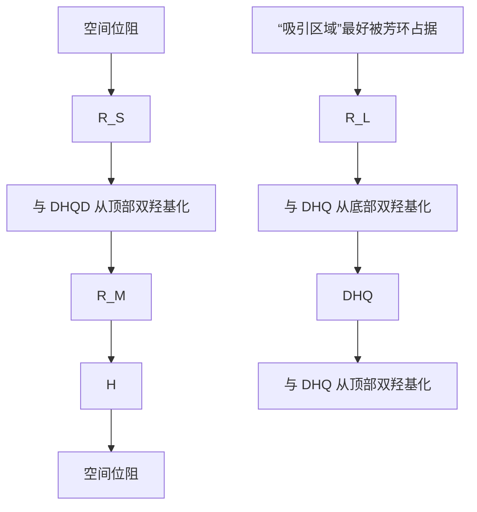
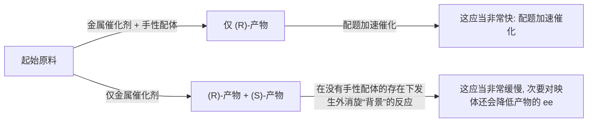

# 41

# 不对称合成

# 联系

# 基础

- 羰基反应 ch6, ch9-ch11  
- 立体化学和构象 ch14, ch16, & ch31  
- 对烯醇盐和烯烃的亲电加成 ch19 & ch20  
- 羟醛反应 ch26  
- 非对映选择性 ch32 & ch33  
- 环加成 ch34

# 目标

- 为什么制取纯对映体很重要  
- 从自然衍生的手性  
- 手性池可提供起始原料、助剂和催化剂  
- 手性助剂在不对称烷基化和羟醛反应中工作良好  
- 用于氧化还原反应的手性催化剂  
- 配体加速催化  
- 有和没有金属的催化

# → 展望

- 生命中的化学 ch42  
- 化学与未来 ch43

![[中文版clayden-chinese-41章1132-1164_images/9612a0605b1af062b875a60c08f32ce3efb1182664e1304aaffba27f1ee7ab38.jpg]]

natural_image

Snail with striped shell resting on mossy ground (no text or symbols visible)

“L'univers est dissymétrique (宇宙是不对称的)”。Louis Pasteur(路易斯·巴斯德), Comptes Rendus Acad. Sci., Paris June 1, 1874.   
本章建立在 Chapter 14 中介绍的概念之上：请确保您了解在那里定义的，所有被用于描述立体化学的术语。尤其是绝对清楚手性的、非手性的、对映体、非对映体，以及用于描述的标记 R、S、+、-、L、D。

# 大自然是不对称的

“你觉得住在镜中屋里怎么样，凯蒂？我不知道他们会不会给你牛奶？也许喝镜中牛奶并不好…”刘易斯·卡罗尔《爱丽丝镜中世界奇遇记》。

您是有手性的，阿丽斯、凯蒂、其他生物也是如此。您可能认为，镜子中的自己看起来相当对称，但您翻着本书的时候，您很可能在使用右手，而与此同时，是您的左脑在处理信息。有些生物表现出的手性更加明显：比如蜗牛壳的旋转方向可能是顺时针或逆时针。大自然不光是有手性的，而且大体上，它是仅以一种对映体存在的——大多数海蜗牛的壳是顺时针旋转的；人类的胃在左边，而肝脏在右边；忍冬/金银花（忍冬属）会逆时针爬升，而所有的旋花（旋花属）都顺时针爬升。

大自然具有左和右，它会告诉我们左右之间的区别。您可能认为，人类缺乏这方面的知识，因为在小时候，我们都得十分费力地去学哪个是哪个。然而，至少在更早的时候，您就毫无疑问能区分橙子和柠檬的味道了，但这项成就实际上和使正确的脚穿上正确的鞋子一样了不起。橙子和柠檬气味的不同之处在于，它们是同一分子，柠檬烯（limonene）的左旋和右旋版本。(R)-(+)-柠檬烯的味道是圆润的橙子味，(S)-(-)-柠檬烯则是刺激的柠檬味。相似地，留兰香和葛缕子的种子闻起来很不一样，但它们是香芹酮（carvone）的一对对映体。不过，进化也让很多人对(+)-雄烯酮（androstenone），陈腐的人类尿液的味道十分敏感，而(-)-雄烯酮则基本无味。

![[中文版clayden-chinese-41章1132-1164_images/e6a62d8345e9980544e603ceee94846b89d25b1fd17942a26b2b228303761a6c.jpg]]

即便是真菌也能分清楚左右：恶臭假单胞菌（Pseudomonas putida）可以将芳香烃作为食物，并将它们降解为二醇。由溴苯产出的二醇只以一种对映体形成。

这是如何做到的呢？我们在 Chapter 14 中说过，对映体在化学上是完全等价的，那么我们是如何用鼻子，细菌又是如何在选择性地生产中区分它们的呢？嗯，答案藏在我们关于对映体识别的假设的一个隐含条件中：只有在非手性环境中，它们才是完全相同的。此概念是我们在本章中研究如何在实验室中制取单一对映体的基础。我们将从大自然汲取起始：所有生命都是手性的，因此所有生命系统都是手性环境。

生命是复杂的，大自然在构筑生命结构中不得不用到手性分子，主要包括氨基酸和糖。而对于全部这些手性分子，进化会驱使它们变为单一对映体形态，例如您身体中的任何一种氨基酸都具有相同的构型 (通常标记为 S)。从此事实开始到所有生命结构大规模的手性，从 DNA 的右手螺旋到蓝鲸内部器官的位置。爱丽丝在本章开始提出的问题，它的答案肯定是否定的一一她的猫的消化系统能够很容易地水解镜中牛奶的非手性脂肪 （非手性化合物与它们的镜像完全重叠），但镜中蛋白质 (由 D-氨基酸组成) 和 L-乳糖 则难以被消化。

对于香料、香水制造商来说，区分同一分子具有不同香味的对映体显然是十分重要的。没有留兰香牙膏，我们的确可以忍受葛缕子牙膏。但是假如涉及到药物分子，制取正确的非对映体可能就会是生与死的关系。帕金森病患者用非蛋白氨基酸多巴 (3-(3,4-二羟基苯基)丙氨酸) 治疗。多巴是手性的，只有 (S)-多巴 (被称为 L-dopa) 对回复神经功能起作用。(R)-多巴不仅是无效的，它还具有很强的毒性，因此此药物必须以单一对映体出售。

(+)-雄烯酮也是一种猪(性)信息素。您也许不会想知道，杜邦以它为活性成分开发了给猪农用于给母猪人工授精的 Boarmate (猪欲灵)。

![[中文版clayden-chinese-41章1132-1164_images/93376b21b13174c6a9232a4bf749253ee917b81f6f21464c75d97364b231161b.jpg]]

chemical

苯环结构式与异臭假单胞菌取代的化学反应图

![[中文版clayden-chinese-41章1132-1164_images/91898f0d740dd2eaaa428567277db0dc4e58d3ef263b958e495382df07b12c1b.jpg]]  
下一章将详细考察生中的分子。

■天然的L-氨基酸都长成下面这个样子：

![[中文版clayden-chinese-41章1132-1164_images/d61fef6695268760834e149a3dd7aadca6f3af50a30ee213aa4385a581678db3.jpg]]

除半胱氨酸 (R=SH) 由于次序规则是 R 外，所有的都有 S 立体化学。一些细菌会由 “非天然的” R-氨基酸 构建它们的细胞壁，以使它们无法被高等生物用于水解肽的 (由 S 氨基酸衍生的) 酶所击破 (见 p. 1141)。

![[中文版clayden-chinese-41章1132-1164_images/53b3ebede66a9101b5ce545f97ee8055af8a23d2f004c98045bc3d8adfc2eb64.jpg]]  
L-多巴
帕金森病治疗药

![[中文版clayden-chinese-41章1132-1164_images/ed6e8efe466e94f6c0ca8730aeb6a69667b27fc4df0f70c041692020705bbc9c.jpg]]

chemical

Chemical structure of a substituted benzene derivative with cyano and dimethylamino groups

(S)-西酞普兰抗抑郁药

![[中文版clayden-chinese-41章1132-1164_images/a0d3ccca285137fe162d19aa8744e22f1307ae3012982da7e0e1235e86beb24a.jpg]]

chemical

Chemical structure of 2-methylphenyl ether (C6H5) with Me substituent and acetyl group

(+)-丙氧芬(达尔丰)
止痛药

![[中文版clayden-chinese-41章1132-1164_images/e098781e64585ffdb187adac853e87bb1cbea9c105b516acb8cc8f96521ff7d9.jpg]]  
D-多巴有毒

![[中文版clayden-chinese-41章1132-1164_images/107a1cbc5ae5a44e3adc11cfdb2f61f5a402000b7e9e2b7239a5047e766c77ff.jpg]]

chemical

Chemical structure of a substituted benzene derivative with cyano and dimethylamino groups

(R)-西酞普兰

![[中文版clayden-chinese-41章1132-1164_images/50d51bf75cb9b06749f6b3c54f347ec2b9508ceecdf7a3d3afe53b95294e6ae8.jpg]]

chemical

Chemical structure of a substituted benzene derivative with Me and Me2N groups

(-)-丙氧芬(挪尔外)
镇咳药   
抗抑郁效果是(S)对映体的<1%

![[中文版clayden-chinese-41章1132-1164_images/3573ec9e5a74f439abda043421217276f473ff33b354f46ff9b5d7cfb6c12df4.jpg]]

另一种情形是，一个药物分子的两种对映体中，只有一种能产生活性：抗抑郁药西酞普兰（citalopram）和止痛药萘普生（naproxen）都只以其 S 对映体出售，因为 R 对映体基本是不具有活性的。在很少的情形中，两种对映体都具有活性，但活性方式却不同：右丙氧芬达尔丰（Darvon）和左丙氧酚挪尔外（Novrad）分别是是止痛药和镇咳药。

不仅仅药物需要光学纯地生产。左边简单的内酯，是日本甲虫日本金龟子 (Popilia japonica) 释放的有交流之意的信息素。这种甲虫的幼虫是严重的作物害虫，它们会被信息素所吸引，因此以 “Japonilure” 出售的合成信息素被用于诱捕该甲虫。只要合成信息素是如图所示的对映体，具有 Z 型双键和立体中心上的 R 构型，那么每个陷阱只要 25 μg 就可以捕获成千上万只甲虫。您可能在 Chapter 27 中见过这种化合物，当时我们指出，双键立体化学的控制十分重要，因为 E 异构体作为诱饵几乎是没用的 (它只保留大约 10% 的活性)。而更重要的，是对手性中心上构型的控制，因为信息素的 S 对映体不仅在诱捕甲虫上没有活性，而且会作为 R 对映体强力的抑制剂——信息素样品中包含既是 1% 的 S 对映体都会破坏活性。

![[中文版clayden-chinese-41章1132-1164_images/862cfd165a6422e407b400952f8d0e082bc64e24b10cd748aa33579efb3f839d.jpg]]

chemical

Chemical structure of a thioester with methyl and hydroxyl substituents, labeled as (−)-薄荷醇

因此您看到了为什么化学家需要能够以单一对映体制取化合物。在 Chapters 32 和 33 中，我们关注了相对立体化学和控制它的方法，而本章，则是关于控制绝对立体化学的方法。我们将这称为不对称合成 (asymmetric synthesis)。

在过去 25 年或更长时间中，这一课题占据了非常多的有机化学家，现在的我们，不仅能够（由于严格的监管规则，这样做事实上是基本的）将许多药物以单一对映体形式制得，而且甚至能更便宜地在实验室中制造许多天然手性分子。例如，到 2007 年位置，全球至少 30% 的薄荷醇 (menthol) 并不是从植物中提取出来的，而是合成得到的。日本的高砂（Takasago）公司每年会生产成千上万吨的（-）-薄荷醇，它们会被用在您将在本章后文见到的不对称合成技术中。

# 手性池: 大自然 "现成的" 手性中心

当我们在 Chapter 14 中首次向您介绍对映体和手性的时候，我们就强调了，对映体间的不平衡往往归根结底都来源于自然。只由非手性或外消旋起始原料，在实验室中合成手性化合物，往往只能得到对映体的外消旋混合物。如果您只想要制取一种对映体，那么您需要用到一种本身就是单一对映体的起始原料或试剂。这看上去像是“先有鸡还是先有蛋”的情形，但事实上，是大自然提供了“现成的”供我们放肆利用的光学纯化合物。这些天然的光学纯化合物被称为手性池 (chiral pool)。手性池中化合物主要有下列几组：

1. 氨基酸。p.554 中有在蛋白质中发现的天然氨基酸的完整列表。但就本章的目标而言，您应当确保您对如下的结构熟悉。它们或具有简单烷基侧链，或具有有多种化学的官能化侧链，它们可以通过蛋白质的水解获得。

![[中文版clayden-chinese-41章1132-1164_images/5768ac6b3b8ac2634a5cfa1b9a678ce24acef25aae80a841caa71b5f09aa8aaf.jpg]]  
(S)-(+)-丙氨酸

![[中文版clayden-chinese-41章1132-1164_images/c91f26ff1e5e60b28dd70c7ae7a417f6e72e1c7194e768ccd7181319933fbb3b.jpg]]  
(S)-(+)-缬氨酸

![[中文版clayden-chinese-41章1132-1164_images/07c300c172f52ae14ae5501addd726fc766940334edfaeae8d5ea22f56905586.jpg]]  
(S)-(-)-苯丙氨酸

![[中文版clayden-chinese-41章1132-1164_images/966909a938c3350a429de64e051349f5f169260e172ef6e77f2b5b6e07420d93.jpg]]  
(S)-(-)-脯氨酸

![[中文版clayden-chinese-41章1132-1164_images/13791279e8e6991173d79ba90901669b3c6fa4854219539477bea98b6c35cd22.jpg]]  
(S)-(+)-丝氨酸

![[中文版clayden-chinese-41章1132-1164_images/04a7c48a73c10d78bec506d30d73b389d6fa1fc33d9908f16e03eca41c14fa02.jpg]]  
(S)-(+)-天冬氨酸

![[中文版clayden-chinese-41章1132-1164_images/844a7daa1a6aeaf4297815b8d180cb5877305605a23a1631af72ca426317cfef.jpg]]  
(S)-(+)-谷氨酸

2. 氨基酸的简单衍生物：氨基醇和羟基酸。用硼烷 $\left(\mathrm{BH}_{3}\right)$ 将氨基酸还原成氨基醇很容易，而通常来说，则是通过用硼氢化钠和浓硫酸处理反应混合物生成的。我们将在本章中用到大量天然衍生的氨基醇作为起始原料。

![[中文版clayden-chinese-41章1132-1164_images/9e40febb23f0819cf52103e389b63879451b8d40d75ab23cd08b42c85c5668e6.jpg]]

chemical

Chemical reaction equation showing conversion of a dihydroxyethylamine to an amino alcohol using formaldehyde and sodium hydroxide

![[中文版clayden-chinese-41章1132-1164_images/912c7e7e4d04d59f0385d906727f5e3976ea7e1752d31dc3092e5b2b63fc3c1a.jpg]]

麻黄碱 (ephedrine) 是一种氨基醇，它本身也是手性池中的一员——它是一种植物提取物，不寻常的是，两种非对映体，以及它们各自的对映体都可以获得 (见 p. 314)。

通过重氮化反应由氨基酸制取羟基酸也很容易。您在 Chapter 33 中见到了这一过程，但作为回忆我们还要提到，亚硝酸会生成重氮鎓盐，继而经历先被羧基分子内进攻得到的 $\alpha$ -内酯中间体，最后被水加成。涉及两次构型翻转，因此产物醇仍保留 S 立体化学。

氨基酸通过整体构型保持的重氮化-水解给出羟基酸

![[中文版clayden-chinese-41章1132-1164_images/4f90e7f6c54811ed453cfb3bd090acdeb31a8cd23cb53708ed8501136b869645.jpg]]

chemical

Chemical reaction pathway showing conversion of (S)-(-)-亮氨酸 to (S)-羟基酸 via intermediate and secondary recombination steps

回顾 p. 875 更多关于此转换的机理——这个反应整体伴随立体化学的保持而发生是非常重要的。

一些羟基酸本身在大自然中可以获得，因而同样是手性池的一员：例如 $(R)$ - 和 $(S)$ -乳酸 (lactic acid)，可以由细菌发酵产生；扁桃酸、苹果酸和酒石酸 (mandelic, malic, tartaric acids) 分别可以从杏仁、苹果和葡萄中提取出来。

![[中文版clayden-chinese-41章1132-1164_images/ccf1017faf1b66cb8eea124cc38ec63ae7ba2cacc740aee8f4d63a5005c8c213.jpg]]  
(S)-(+)-乳酸

![[中文版clayden-chinese-41章1132-1164_images/08655bad60e8f069548ca7d7619a63972c7dfd5d34fab2d9adcced0bf528ea12.jpg]]  
(S)-(+)-扁桃酸

![[中文版clayden-chinese-41章1132-1164_images/507a994bb437a2a20b0133933c570c699652deb7f2d848498f66839116b54799.jpg]]  
(R)-(-)-苹果酸

![[中文版clayden-chinese-41章1132-1164_images/1f37f8ed0fe58e51bb3d97992139ca4042ae9594c2c45bb5c9c9e6c27aa7a51c.jpg]]  
$(R,R)\text{-(+)-酒石酸}$ $[=\mathrm{L}-$ 酒石酸]

3. 糖及其衍生物。可获得的简单糖类十分多，但其中最重要的之一是甘露糖 (mannose)。将醇还原可给出 $C_{2}$ 对称的化合物甘露醇 (mannitol)，可以通过选择性地与丙酮，在 Lewis 酸下保护为双缩醛进而转化为一种非常有用的醛。剩下的二醇可以在高碘酸钠下裂解，给出两当量被保护形态的甘油醛 (glyceraldehyde)。

术语 $C_{2}$ 旋转对称性已于 p.320 讨论。 $C_{2}$ 对称性与手性兼容。二醇裂解为醛的氧化分解反应请见 p.443。

![[中文版clayden-chinese-41章1132-1164_images/6be96c8a7973f3ddae79e84d46c4f4c96972385b66e174a4f3ee5509418901f8.jpg]]

chemical

Chemical reaction pathway showing conversion of D-galactose to (S)-glyceraldehyde via intermediate D-galactose, involving NaBH4 and ZnCl2 reagents

在本章中，我们将向您展示把手性池中的成员以各种各样的方式应用在不对称合成中，最直接的应用是发现目标分子与，比如说某个氨基酸，具有结构上的相似性。Mori 在制取另一种重要的昆虫信息素，小蠹烯醇 (ipsenol) 时，分子左旋的一半具有与亮氨酸侧链相同的结构，S 手性中心也可以来源于 (S)-亮氨酸。

与亮氨酸在结构上相似  
![[中文版clayden-chinese-41章1132-1164_images/0880ba286a0ef646f5fa27cef9174468f2e96d4a27dbbfed75d301e8bd13d716.jpg]]

chemical

Chemical reaction equation showing conversion of (S)-(-)-小蠹烯醇 to (S)-亮氨酸衍生物 using BrMg catalyst

Mori 用 (S)-亮氨酸作为起始原料，通过 p. 875 的方法将其转化为了 (S)-羟基酸。然后羟基被 THP 衍生物 (Chapter 23) 所保护。

![[中文版clayden-chinese-41章1132-1164_images/772bf53944f39e244b103ba0861fd50d2dc659b3c43359811acd7ae53a1aa2f8.jpg]]

chemical

Organic reaction pathway showing esterification and subsequent reduction steps with CO2R and LiAlH4 reagents

经历酯将酸还原成醇，然后就可以引入对甲苯磺酰酯离去基团，可以被过氧的形成所取代。然后用格氏试剂使过氧开环，则可引入双烯部分并得到目标分子。

![[中文版clayden-chinese-41章1132-1164_images/d360e81d22457ed12b6ff84c6aeeb86d5e2e7b76dfe152874332d7be2859aca4.jpg]]

chemical

Organic synthesis reaction pathway showing conversion of a hydroxyethyl ether to (S)-(-)-isole-phenol via bromination and acid-catalyzed cyclization steps

This drawback is highlighted in the synthesis of oseltamivir in Chapter 43 (p. 1174).

这看起来相当冗长，而冗长就可能是由手性池开始合成的一个缺点：您必须把合成路线硬塞进可用的起始原料中。由手性池开始合成的另一个缺点是，很多中性化合物只以一种对映体形式可获得，或者两种对映体都可以获得但一种比另一种贵好多。在本章后文，您会见到很多用于回避这个问题的巧妙方式，在下一节中，我们将处理一个非常简单的例子。

我们将不再阐释拆分的含义：关于细节，请翻回 p.322。

![[中文版clayden-chinese-41章1132-1164_images/7061926f1cd268184a787519bc25788402eb31e67b8b8b73ffe5b43098384bef.jpg]]

chemical

Chemical structure of a benzene ring with amino and carboxyl functional groups, labeled in Chinese as '所需的对映体'

# 拆分对映体

在 Chapter 14 中，我们向您介绍了拆分 (resolution)，它的意思是对对映体的分离。拆分需要有一个光学纯的溶剂，必然是出自于手性池，或手性池化合物简单衍生物的化合物。瑞士公司 Cilag 想要页边的这种手性的不寻常的氨基酸的一种对映体，用于制取一种潜在药物，那里的化学家决定用最简单的方法，先制得它的外消旋体，然后再拆分。他们发现，被保护的衍生物的两种对映体中的一种，能于便宜而容易获得的 (-)-麻黄碱结晶，而另一种则留在溶液中。过滤并用酸处理，移去保护基，被酸质子化，可使它们得到目标氨基酸的单一对映体。

(+ 包含另一种对映体的溶液)

当然，用拆分的方法，最大产率只能达到 50%，因为如果您只想要其中一种对映体，那么另一种便浪费了。不过会有一些情况下，这两种对映体都是您想要的，比如说您可能需要分别测试生物活性。在这样的例子中，用拆分的方法是理想的——上文 Cilag 的化学家只需重结晶，将母液蒸发即可得到另一种对映体。这是拆分的一大好处：它让您仅由手性池中的一个化合物，得到两种对映体。

# 手性助剂

在 Chapter 33 中，我们向您展示了用非对映选择性的反应，制取单一非对映体的方法。非对映选择性反应在起始原料是外消旋的或光学纯的时都可以工作——两种情况下，您都会得到同一种非对映体，不过，如果您从外消旋原料开始，那么您还会得到外消旋产物，而如果从光学纯原料开始，您也还会得到光学纯产物。下面是 p.867 的一个例子：

因此如果您从手性池中挑选起始原料，那么只需要非对映选择性的反应，您就可以构建新的光学纯的手性中心。我们在 Chapter 33 的结尾展示了应用这一思想的两个合成例子：用一系列非对映选择性的反应向分子中引入更多手性中心可将手性池起始原料 (S)-乳酸和 (S)-丝氨酸转化为两种天然产物。

标记为 的手性中心是通过在手性池化合物上的非对映选择性反应得到的

这些合成依赖于手性池起始原料的结构被包含在产物中。不过，即使起始手性化合物不再是您要制取的目标分子的一部分，这种思想照样能运行。在这样的情形中，手性起始原料被称为手性助剂(chiral auxiliary)。手性助剂用途广泛，它们可被用于制取光学纯形态的各种目标分子。我们将以两个例子阐释它们工作的方式。

这些合成位于 pp. 872–875。

环戊二烯的 Diels–Alder 反应出现于 p. 880。

环戊二烯与丙烯酸苄酯的 Diels–Alder 反应必然会是外消旋的，因为两种试剂都是非手性的。虽然只会形成一种非对映体——内型产物——但它必然是以两种对映体精确的 50:50 混合物形成的。双烯体进攻亲双烯体的顶端和底端是没有区别的，因此它都会进攻，各占 50%。

![[中文版clayden-chinese-41章1132-1164_images/f588f65d969353eebf764f254e2573b6e4e9b9d65074e25985e926ac66b1b22a.jpg]]

chemical

Diels-Alder反应生成外消旋产物的化学方程式，包含非手性亲核试剂与双烯取代步骤

现在请看看，如果我们将亲双烯体上非手性的苄酯换成由缬氨酸衍生的一种酰胺时，会发生什么。这里亲双烯体的合成使用了您在 p.1105 见到的氨基酸还原反应。

![[中文版clayden-chinese-41章1132-1164_images/ae24f7c3322ac7577e8944ba34e12912af7972cc99a1f8f769bd66fb2bd8ac41.jpg]]

chemical

Chemical reaction pathway showing the synthesis of a cyclic amide from (S)-缬氨酸 via intermediates and reagents

如我们在 Chapter 34 中所讨论的，Lewis 酸的存在会增加 Diels–Alder 反应的速率，对于高立体选择性这也是关键的。

现在，由于有手性中心，亲双烯体双键的两面便不同了：它们是非对映异位的 (diastereotopic)，而双烯体便可以区分它们了。如果我们现在在 Lewis 酸，能螯合亲双烯体上两个氧原子以形成如下的刚性而活泼的结构的 $Et_{2}AlCl$ 的存在下做 Diels–Alder 反应。异丙基处在这样一种方式上，巨大的空阻阻止了双烯体从前手性（prochiral）烯烃的底面进攻。双烯别无选择要从上方进攻，而且也只会形成一种非对映体产物。

![[中文版clayden-chinese-41章1132-1164_images/de66e3d00b59ad43470f7ac1d00b253d91f36439479c2d5004b4f5a781465a21.jpg]]

chemical

环戊二烯碳酰胺的化学反应流程图，展示 Lewis酸与Et2AlCl反应生成双烯体及CO2X取代的过程

Interactive chiral auxiliary-controlled Diels–Alder reaction

我们将这个分子中绿色的缬氨酸衍生部分称为手性助剂——它协助底物以只能形成两种产物中的一种的那样的非对映选择性的方式反应。起始的手性助剂是光学纯的，因此产物必然既是非对映纯的，又是光学纯/对映纯的。

最后，是展示手性助剂策略实力的一步：我们会用亲核试剂处理产物，从上面移去手性助剂。手性助剂原则上可以再次使用，但能仅得到我们用此反应的外消旋版本制取的两种对映体中的一种才是最为重要的。这不是拆分，所有这些步骤都以高产率进行——这是一个真正的 Diels–Alder 产物的对映选择性合成法 (enantioselective synthesis)，其中手性助剂帮我们做到了这一点。

![[中文版clayden-chinese-41章1132-1164_images/a2eacf74759efcee2ee2d5affdf974c8baaa8f708457fb80f26e9e49e17311f8.jpg]]

chemical

Reaction mechanism of a cyclic carbamate with LiOBn and RO⁻, showing intermediate formation and regeneration steps

总得来说，通过加入助剂，发生对应选择性反应，移去助剂的流程，我们能够制取以单一对映体存在的相同产物。

# - 这是手性助剂策略的意思

1 被称为手性助剂的光学纯化合物 (通常由比如氨基酸的天然产物衍生地来)，附着在起始原料上。  
2 进行非对映选择性反应，由于手性助剂的光学纯，只会给出产物的一种对映体。  
3 手性助剂通过如水解去除，得到以单一对映体存在的产物最好的手性助剂可以回收(上面的例子就是这样一种)，因此虽然需要化学计量，但却没有浪费。

我们首先向您介绍的这种手性助剂比其他的更为常用，它是由哈佛大学的这种手性助剂，因为它比其他的更为常用。它是由 David Evans 开发的噁唑烷酮 (oxazolidinone，杂环的名称) 族助剂的一员，它很容易并很便宜由氨基酸 (S)-缬氨酸制取。即便它很便宜，它也能回收。上述路线的最后一步重新生成了以便再次使用的助剂。

最全能的手性助剂应当能用于合成全部两种对映体。但对于这里的缬氨酸衍生助剂，则不是这样的——(R)-缬氨酸不能在自然界中找到，因而它很贵。然而，由天然存在(并且便宜)的化合物去甲麻黄碱(nor-ephedrine)开始，则可以制得虽不是(S)-缬氨酸对映体，但能发生相似功能的助剂。

![[中文版clayden-chinese-41章1132-1164_images/ac20bea909443d9fa72338a9faa0586526cbf6a09c35ea61e60dbff7a34ce455.jpg]]

chemical

Reaction mechanism diagram showing conversion of (-)-methylamine to enone via K2CO3 and NaH, followed by cycloaddition and subsequent hydrolysis to form a chiral intermediate.

如上图所示，助剂的两个取代基处在双烯体的顶面，这回便迫使环戊二烯从底面进攻。然后从产物中清除助剂，即可形成相反的对映体。我们可以通过仅仅选择合适的助剂，来选择我们想要的对映体。

# 烯醇盐的烷基化

手性助剂可被用于大量其他的反应中，最常见的一些是烯醇盐的反应。Evans 的噁唑烷酮助剂尤

→ 烯醇盐是一类可以以顺式或反式形成的烯烃。此事实导致的一个结果已于 Chapter 33 中讨论。

其适用于此，因为它们可以很容易转化为可烯醇化的羧酸衍生物。用碱（通常是 LDA）在低温下产出烯醇盐，大空阻的助剂使得只会形成顺式烯醇盐：反式烯醇盐空阻太大。

![[中文版clayden-chinese-41章1132-1164_images/d24bd62344bdda4030114bc6625ba8d1b9a143dca794b31c04d7ef8639eaadab.jpg]]

chemical

Chemical structure of lithium-iononated tetrafluoride with labeled components and reaction conditions

![[中文版clayden-chinese-41章1132-1164_images/6bba792c5b3404b11c00231419d688e5f4098d12f18803f7756535f9ccc892e5.jpg]]

chemical

Chemical reaction pathway showing conversion of a cyclic amide to a lithium complex via LDA and reagent addition, with Chinese annotations

锂离子与另一个羰基的络合会使整个结构变为刚性，并将异丙基固定在了分子的背面，于是异丙基可以提供最大化的空阻，阻止烯醇盐在“错误的”面被进攻。亲电试剂几乎没有选择，只能从正面进攻烯醇盐，下图显示了由烷基化试剂的选择性而产生的非对映异构体的比例（非对映异构比 diastereoisomeric ratio，缩写为 d.r.）。

![[中文版clayden-chinese-41章1132-1164_images/530ad76b212a6a414aa48979bc4f16c0bfeacd50d8d540724383fc983f1d3b9f.jpg]]

chemical

Chemical reaction scheme showing R-X and R groups reacting to form a carbonyl-containing intermediate, with substituent variations (R-X, BnBr, etc.) and yield data.

如您所见，这些反应都不是真正 100% 非对映选择性的，并且事实上，只有最好的手性助剂（比如上例中的这个）才会给出 >98% 的单一非对映体。非对映选择性不够完美，便会导致在去除手性助剂后，最终产物包含一些其他对映体。94:6 比例的非对映体会得到 94:6 比例的对映体，即 94:6 e.r. (对映比 enantiomeric ratio)。

# 对映体过量

既不是外消旋也不是光学纯的化合物通常会被称作富对映的 (enantiomerically enriched)。化学家有两种方式表示富对映样本中对映体的比例。第一种是我们刚刚使用的最简单的一种：对映比 e.r.，两数相加为 100。而更常用的表示方法，是对映体过量 (enantiomeric excess, ee)，定义为一种对映体超过另一种对映体的程度，也以占总数的百分比表达。那么对于一种 94:6 的对映体混合物，其中一种对映体的比例超出另一种 88%，我们便称它为一种有 88% ee 的富对映混合物。为什么不说我们有 94% 的一种对映体呢？这是因为，对映体与其他异构体不同，它们仅仅互为镜像，而 6% 的另一种对映体可以与主要对映体中的 6% 配对，形成占总数 12% 的一份外消旋混合物，由此计算，整个混合物包含 12% 的外消旋体，和 88% 的单一对映体，即 88% ee.

![[中文版clayden-chinese-41章1132-1164_images/97292dae9eabce14c6c9e27c35f5f984017bb5c70b6b3d386a70c9f377f3fb63.jpg]]

chemical

Chemical reaction equation showing conversion of a non-dimethylcyclic amide to an enone using LiAlH4, with yields and enantiomeric excess noted.

不久我们将会了解，我们还可以进一步利用手性助剂，来增加反映产物的 ee。但首先，我们应当考虑如何测量 ee。一种方法是简单度量平面偏振光穿过样品时旋转的角度。旋转的角度近似与样品的对映体过量成正比 (见下文字框)。此方法的问题在于，若要测量样品的 ee 实际值，您需要先知道 100% ee 的样品所给出的旋转角度，而这通常是做不到的。同样，偏振仪的测量结果出了名的不可靠——它们还依赖温度、溶剂，浓度，而且，若含有少量高光活性的杂质，则也会造成巨大错误。

# 光旋转角正比于对映体过量吗？

想想您有一份样品，A，它是光学纯的化合物——比方说一种天然产物——您用偏振仪测量它，得到 $[\alpha]_{\mathrm{D}}$ 为 $+10.0$ 。对于另一份相同化合物的样品，B，您知道它只是化学纯的(比方说一份合成样品)，它显示 $[\alpha]_{\mathrm{D}}$ 为 $+8.0$ 对映体过量为多少呢？嗯，如果您将 $80\%$ 的光学纯样品A与 $20\%$ 没有旋光的外消旋(或非手性)化合物混在一起，您也会得到8.0的 $[\alpha]_{\mathrm{D}}$ 。因为您知道样品B是化学纯的，与A是同种化合物，那么您便可知它具有 $80\%$ 的光学纯原料，加上 $20\%$ 的外消旋原料，或者 $80\%$ 的一种对映体和 $20\%$ 的两种对映体1:1的混合物——即一种对映体 $90\%$ ，另一种对映体 $10\%$ ，或 $80\%$ 的对映体过量。旋光可以为对映体过量给出指导——在本书中又是被称为旋光纯度(optical purity)——但在一些例子中，微量具有大旋光的杂质化合物会导致旋光和ee的线性关系——被称为Horeau效应(effect)——的消失。您可以在Eliel and Wilen, Stereochemistry of organic compounds, Wiley, 1994中读到更多。

现在的化学家，通常用色谱法 (chromatography)，偶尔用光谱法，来定量确定对映体的比例。您可能认为这是不可能的一一对映体在化学上完全相同，它们也具有完全相同的 NMR 谱图，色谱法和光谱法都是如何分辨它们的呢？同样，在手性环境下，它们并不完全相同。我们在 Chapter 14 中准备性地介绍了在手性固定相 (chiral stationary phase) 上用 HPLC (高效液相色谱) 分离对映体的方法。这种方法也可被用在分析上——使少于一毫克的手性化合物，穿过包含被手性添加剂 (chiral additive) 修饰的二氧化硅的窄柱。一种对映体穿过的速度比另一种更快，于是两种对映体便被分开，每种的含量也能够得到测量 (通常通过紫外吸收或折射率的改变测量)，并得到 ee。以相同方式还可以进行气相色谱法 (gas chromatography)——固定相使用例如页边所示的异亮氨酸衍生物填充。

在光谱上区分对映体同样也依赖于将它们放在手性环境中。其中一种方法是，如果化合物是一种醇或者胺，那么可以分别用光学纯的和经检验外消旋的酰氯与它制取衍生物（酯或酰胺）。最常用的一种被称为 Mosher 酰氯 (Mosher's acyl chloride)，以其发现者 Harry Mosher 命名，除此之外还有其他多种。醇或酰胺的两种对映体现在便会转化为非对映异构的酯或酰胺，并在 NMR 谱图上给出不同组峰——积分可用于确定 ee。即使是下面这种非对映异构体混合物，它的 ${}^{1}$ H NMR 都会变得很混乱，但它包含 $CF_{3}$ 基，这意味着可以通过除此之外都没有区别的 ${}^{19}$ F NMR 谱图中两个单重峰的积分测量。

![[中文版clayden-chinese-41章1132-1164_images/f4cf0af79c9ae4a57c172140cea7400b12a5e87d51ad7f4b73c16c98942336e1.jpg]]

chemical

Chemical reaction equation showing the conversion of a mixture with MeO and F3C to a molybdenum complex, using 1H or 19F NMR spectrometry.

另一种区分对映体的强大方法是向 NMR 样品中加入一种光学纯化合物，仅仅通过与所研究的化合物形成复合物/配合物（complex）就可以了。由两种相反的对映体形成的配合物是非对映异构的，因而它们具有不同的化学位移，通过积分 NMR 信号，即可确定对映体的比例。其中最常用的是右侧的这种醇，2,2,2-三氟-1-(9-蒽基)乙醇，[2,2,2-trifluoro-1-(9-anthryl)ethanol]，或 TFAE，

![[中文版clayden-chinese-41章1132-1164_images/c91c2345b137b5eb4752f7d61258b76c29817af346cc08ba65c4f07b8f9dbf98.jpg]]

拆分也依赖此原理：见 p.

![[中文版clayden-chinese-41章1132-1164_images/3d0617d116a0809c458631fedfcce3dc013be4f4e96d9dcfd1624880219f1593.jpg]]

chemical

Chemical structure of a fluorinated amide compound with acetyl and methyl substituents

使用此手性固定相
的气相色谱法可用于分离对映体

![[中文版clayden-chinese-41章1132-1164_images/3cf497db9dc8a29fb8d8bf3fb9abbac3bbca0ed01009c11e420220f7e2d7eed8.jpg]]

chemical

Chemical structure of (S)-(+)-TFAE with trifluoromethyl and hydroxyl substituents on a naphthalene core

可以与许多官能化化合物形成 $\pi$ -堆积 ( $\pi$ -stacked) 复合物，通常会在对映体化合物非常干净时分裂 NMR 信号。

回到手性助剂。我们已经指出，虽然我们想要让手性助剂控制的反应的对映选择性达到最大的程度，但无论如何，总归会由少量的另一种非对映体，于是在去掉手性助剂后最终产物的 ee 还是会有所损失。在这一点上，我们可以使用一个小技巧，本质上是再次雇佣手性助剂，发挥它的第二个角色，作为拆分剂 (resolving agent)。只要产物可以结晶，那么将我们 94:6 对映体的混合物重结晶，则通常能够得到基本单一的非对映体，这很像是在一个本就很好的开端上进行拆分。做完了这一步，再移去手性助剂，则产物就可能非常接近 100% ee 了。当然，重结晶会牺牲几个百分点的产率，但这总比牺牲几个百分点的 ee 要好！下面是一个来自 Evans 自己的研究的离子。在对复杂的抗生素 X-206 的合成中，他需要很大量的下面的这种小分子。他决定用手性助剂控制的烷基化反应制取他，然后再还原给出醇。所需的手性助剂由伪麻黄碱衍生，烯醇盐与碘甲烷的反应会给出非对映体 98:2 的混合物。而在重结晶后，产率变为 83%，单一非对映体则在 >99% 纯度，去除手性助剂后原料基本上在 100% ee。

![[中文版clayden-chinese-41章1132-1164_images/7471cddf25eeef77e87c1a828091d6da90dcfefcd5b5b0107d89aa510d8716ca.jpg]]

chemical

Chemical reaction scheme showing synthesis of X-206 from a ketone using NaN(SiMe3)2 and LiAlH4, followed by reagent addition to form a chiral product.

在此阶段，我们应当澄清 p. 1108 介绍的不对称 Diels–Alder 反应：它本身并没有我们所暗示的那样具有高非对映选择性——它的次要异构体会以 7% 产率形成，主要异构体占 93%。但再经过重结晶，才会得到 81% 产率的 >99% 非对映异构纯的原料。

这是用手性助剂的一大好处——非对映体比对映体更容易纯化，而手性助剂控制的反应产生的就是非对映异构产物。

这些手性助剂控制的烷基化反应的例子都在去除助剂的一步，利用了 $LiAlH_{4}$ 还原反应。您在上文还见到了用烷氧基阴离子进攻，下面总结了它们和数种其他可行的方法。DIBAL ( $i-Bu_{2}AlH$ ，p.533) 可以将产物还原为醛，而通过将产物转化为 Weinreb 酰胺 (p.219)，则还可制取酮。

![[中文版clayden-chinese-41章1132-1164_images/673cf4e7a598f7b440f9de5fd66a82538c457a86957d9fa685fcb9d52265f1de.jpg]]

chemical

Chemical reaction pathway showing conversion of alcohol to ester via intermediates and reagents like LiAlH4, DIBAL, and H2O2

差向异构体 (Epimers) 指只在一个手性中心上构型不同的一对非对映体。差向异构化 (Epimerization) 是这样的非对映体的互相转化，如同对映体的外消旋化。

简单地在酸性或碱性条件下水解，则可能使新创造的手性中心发生差向异构化，好的解决方案是用碱性较弱而亲核性较强的氢过氧根阴离子。制取一种胶原酶抑制剂 (collagenase inhibitor) 的化学家们使用了这种方式，请注意用到的助剂是基于 L-苯丙氨酸的变体。

![[中文版clayden-chinese-41章1132-1164_images/500623091d9b0ac8d652c8fbd8d7997e465f2db020c3a00f1b31180db2f652b1.jpg]]

chemical

Chemical reaction scheme showing L-phenylalanine reacting with NaHMDS and BrCH2CO2t-Bu to form a diastereomer, followed by LiOH/H2O2 and H3O+ reagents.

这些各种各样的移去助剂的方法，展示了将它们的巨大缺点为自己所用的可能：手性助剂必须先附着在正在构建的化合物上，在它们完成它们的工作后，还必须被移去。最好的助剂是可以循环的，但即使这样，在合成中还是会出现两个“非生产性”步骤。

氢过氧根阴离子亲核性更好的原因已于 Chapter 22, p. 513 中讨论。

# 噁唑烷酮并不是唯一的手性助剂

其他助剂也会被使用，而对于助剂的选择，所依赖的，可能不只是反应的选择性，还有产物的物理性质。Oppolzer 基于樟脑的助剂以其衍生物的结晶度而闻名，Myers 的伪麻黄碱助剂则因为便宜，易于获取，非常容易引入而被看好。更大空阻的助剂，如 8-苯基薄荷醇 则在需要长程相互作用的控制，如共轭加成上也表现得很好。

![[中文版clayden-chinese-41章1132-1164_images/aa0dfeaa8e942255c82ceba767256a5b927d57f1e032ed6e958221cee00ec718.jpg]]  
基于樟脑的助剂

![[中文版clayden-chinese-41章1132-1164_images/34c821eacac1a1f00b0bf31395461ffc4145426f5f213a998cb7c4d4729c5236.jpg]]  
伪麻黄碱助剂

![[中文版clayden-chinese-41章1132-1164_images/6bd3ab8210f67c0d69819730b3d5ca793ceae91547f276879ea75811ef228a79.jpg]]  
8-苯基薄荷基助剂

Interactive mechanism for Oppolzer's sultam in conjugate addition

Interactive mechanism for 8-phenylmenthol in Diels–Alder reaction

# 手性试剂

不管是用附着在起始原料上的手性助剂，还是用来自手性池的化合物做起始原料，它们的非对映选择性都是根据起始原料的手性实现的，我们称这样的控制为底物控制。然而，对映选择性的反应同样可通过受手性试剂的控制而实现。例如，典型的非手性碱仅仅能够做到从底物上移去质子，而光学纯的碱则可以选择移去两个对映异位质子中的一个，并对映选择性地形成产物。实现这一过程，首先产物得是有手性的，比如我们不能用手性碱对映选择性地制取平面烯醇盐，但我们可以用手性碱制取手性有机锂。

烷基锂的碱性足够移去页边所示的 N-Boc 四氢吡咯上与氮原子相邻的质子，去质子的产物是一个手性的有机锂分子：携带锂的碳原子是手性的。

将烷基锂转变成需要用的手性碱很容易——通过与手性配体络合即可。被广泛使用的一个例子是四环二胺（-）-鹰爪豆碱[(-)-sparteine]。鹰爪豆碱的结构看起来很复杂，但它是一种相对广泛、易得的天然产物，可以折叠环绕在烷基锂的锂原子周围，并将碱置于手性环境中。

![[中文版clayden-chinese-41章1132-1164_images/973115d4856445412a675860d5ba8c43c442fdfe36933f8d9db3d3ac5b201976.jpg]]

chemical

Chemical reaction showing conversion of (-)-Cerocyclopropane to (Li) complex under Li catalyst at -78°C

所得的手性碱，现在可以选择从四氢吡咯底物上移去与氮相邻的对映异位质子中的一个了，于是便形成了一种手性的、富对映的有机锂。有机锂的立体化学可在它与亲电试剂，如下文所示的酮的反应中得以保持。

![[中文版clayden-chinese-41章1132-1164_images/5086b8f680f2088a53c63ed59d0c54ecf39c2ef06f45c6785a0612687f808414.jpg]]

chemical

Reaction mechanism showing green quaternary ammonium carbocation transfer to N-Boc and subsequent RLi addition to form a cyclic product with lithium center

![[中文版clayden-chinese-41章1132-1164_images/313d9ab93e534d5727c223877b9e44e99fa1a3a61a004c7b2968d1f81aeed87c.jpg]]

Interactive mechanism for

sparteine-mediated lithiation

![[中文版clayden-chinese-41章1132-1164_images/f814b5cc9bd8847b0be72fdb3609317a3133b70e3fd9cbaaf51137bfcc8a685f.jpg]]

chemical

Chemical reaction scheme showing conversion of a t-BuO-protected amide to a lithium-labeled intermediate using sec-BuLI and LiN, followed by two steps with reagents and yields.

这个反应如此有用的其中一个原因是，其产物不经意间成了较不易获得的 $(R)$ -脯氨酸衍生物。但是，和手性助剂一样，如果您在需要用到完整一当量的光学纯原料（这里是(-)-鹰爪豆碱），那么在大规模使用上就会变得非常昂贵。正因如此，不对称合成真正的巅峰境界是对不对称催化的利用，也就是我们下一节要论述的。

# 不对称催化

![[中文版clayden-chinese-41章1132-1164_images/270039236eaa530740154889f0f5a10de28fb36f7ccca7a86d6b6419f19506ad.jpg]]

如果您需要提醒关于术语前手性、对映异位、非对映异位的含义，请回顾 Chapters 31 和 33 (p.820)。

如果我们想要在一个分子上创造一个新的手性中心，那么我们的起始原料必须具有前手性——通过一个简单的转换变为手性的能力。最常见的产生新手性中心的前手性单元是烯烃或羰基的三角型碳原子，它们会在加成反应中变为四面体型。在上一节中，您见到了通过对其中一个质子对映选择性的移去，而变为新手性中心的前手性 $CH_{2}$ 基。但更为常见的，还是由前手性烯烃（也算烯醇盐），受能使烯烃的两面非对映异位的手性助剂的影响，选择性地在一面上反应而制取，这是您在此之前一直所见的情形。

# 酮的催化不对称还原

您可以想象的由前手性单元产生手性的最简单的转换中的一种是酮的还原。虽然人们也用手性助剂的策略使这类反应不对称，但在概念上，以单一对映体的形式得到产物的最简单方式是使用手性的还原剂，而非手性酮——换句话说，将手性影响不安排到底物（如我们在用手性助剂时所做）上，而是安排到试剂上。我们需要不对称版本的 $NaBH_{4}$ 。

![[中文版clayden-chinese-41章1132-1164_images/3e8aab62a7c88d932e2ad40c29416ed818421be4619e92e1abcae30e371f4e64.jpg]]

chemical

Reaction mechanism of phenol under NaBH4 catalysis, showing equilibrium with R groups and [H] catalyst

■ 杂环做催化剂意味着所需要的只有很少的量。请注意这与手性助剂的区别：虽然助剂是可以回收的，但回收是在反应结束后、一个单独步骤，而在反应进行中还是需要用到化学计量。在本章的后文中，您还会见到催化剂比这里少用1000倍的催化反应。

对此挑战最广泛使用的解决方案之一，是由日本的伊津野发明，并被（Itsuno）发明，并被Corey, Bakshi, and 柴田 (Shibata) 所发展的的手性硼氢化物类似物。它基于一种稳定的，来源于由脯氨酸衍生的氨基醇的硼杂环（合成方法见下面文字框），根据发展它的科学家，它被称为 CBS 催化剂 (catalyst)。当硼烷与这种杂环形成配合物时，便会得到反应所需的活泼还原剂了。由于硼烷只有在与氮原子络合的时候才足够活泼以还原酮，因而硼杂环只需要催化量 (通常大约 10%)。剩下的硼烷会静静地等待着有催化剂游离。

![[中文版clayden-chinese-41章1132-1164_images/2e32ccd3cf59020401d2a02b9581954ecdeb56f3d472deb3d973b8913f67c9d3.jpg]]

chemical

Reaction pathway of (S)-脯氨酸 catalyzed by CBS catalyst and BAH3, yielding 99% yield and 97% ee

CBS 还原反应表现最佳的时候，是当酮的两个取代基在空间上有明显差异的时候——如同上方例子中的 Ph 和 Me。反应的发生是由催化剂将硼烷 (与催化剂的碱性氮原子络合) 与羰基化合物 (与催化剂的 Lewis 酸性硼原子络合) 带到一起开始的。络合使两个搭档都得到了活化：将电子密度给到硼烷是说服负氢迁移的必要条件，而吸电子活化羰基氧则使羰基更容易与弱的负氢源发生反应。负氢通过一个六元环状过渡态传递，对映选择性则由酮两个取代基中较大的一个 $\left(\mathrm{R}_{\mathrm{L}}\right)$ 须于在环上假平伏而产生。

![[中文版clayden-chinese-41章1132-1164_images/61767679dc2e016d37beb63b6f3a9327d42f71a88e9ef1ba4d58db465387e655.jpg]]

Interactive asymmetric

reduction of ketone with CBS

catalyst

![[中文版clayden-chinese-41章1132-1164_images/e8e0da2e0c65bfe85ee2291edfe6038e5e451e60fb0aeb74c06add33087f724e.jpg]]

chemical

Bromination reaction mechanism of Lewis acid monomers, showing steps from alkene to alcohol with intermediate intermediates and reagents.

# 制取 CBS 催化剂

要制取 CBS 杂环，(S)-脯氨酸 需要先保护为其 N-Cbz 衍生物 (Chapter 23) 并转化为其甲酯。于是可以与格氏试剂两次反应，给出叔醇 (Chapter 10)，加入 PhMgBr 后再去保护可给出所需的氨基醇。与甲基硼酸 $(\mathrm{MeB(OH)}_{2})$ 缩合可得到稳定的催化剂。

![[中文版clayden-chinese-41章1132-1164_images/9af3e22748b1becf94c513d7a905acbdee981e6be98b987057a4ca38279f40e7.jpg]]

chemical

Chemical reaction pathway showing conversion of (S)-(-)-脯氨酸 to MeB-O via intermediates and reagents

要制取另一种对映体，您需要贵得多的“非自然”(R)-脯氨酸，您可以通过 p.1114 的方法制取它，但如果这样，您还不如考虑能否用下面描述的其他还原方法替代它。

直到前不久，CBS 试剂一直是最常用的对酮的不对称还原剂之一。但到了 21 世纪早期，一种新的反应取代了它的角色——此方法中将酮和还原剂带在一起的是一个钌原子。钌以 16 电子 Ru(II) 配合物 (见 p. 1116) 的形式添加，配体为一种芳香化合物，如 1,3,5-三甲基苯基 (均三甲苯 mesitylene)。还需要一种手性配体——此处所示的双胺是非常好的。催化剂和配体都只需非常少量 (通常 << 1%)，这是好的，因为它们二者相比于 CBS 还原反应中的试剂都贵得多。还原剂本身可以是氢气，更方便而易处理的氢原子源还可以是异丙醇 （被氧化为酮）或甲酸 （被氧化为一氧化碳）。下面是一个典型例子，我们稍后会解释它工作的方式。

![[中文版clayden-chinese-41章1132-1164_images/0190c5e064eb80fabdc072b637723eb60b1d3bd0e9c05ed5a371b7851fb0f741.jpg]]

chemical

Chemical reaction scheme showing hydrogenation of a substituted cyclohexene derivative using RuCl₂ and TsDPEN, with H₂ source and conversion to S-ethylphenol via i-PrOH or methanol.

这种使用过渡金属的手性配合物的对不对称催化的革新主要是由野依良治 Ryoji Noyori (他开发了本章所描述的 Ru 和 Rh 催化的还原反应) 和 K. Barry Sharpless (他开发了 Os 和 Ti 催化的氧化反应) 研究的。这项工作使野依和 Sharpless 并首个在工业目标中应用金属催化的不对称反应的 William Knowles 获得了 2001 年的诺贝尔化学奖。

您已经见到了多个钌配合物发生的反应，尤其在 Chapters 38 和 40 中，有用于催化烯烃复分解的钌卡宾。钌是被看中的过渡金属 (Pd、Ru、Rh、Cu、Os、Ti 等) 中的一员，它在不对称催化上扮演了重要的角色。它们成功的关键在于我们上一张所着眼的过渡金属络合化学：金属可以作为底物的络合位点，再加上使用其他手性而光学纯的配体，就可以使底物的反应在不对称环境下进行了。

钌催化的酮的还原反应始于对甲苯磺酰二胺配体 $((S,S)-N-$ 对甲苯磺酰基-1,2-二苯基-1,2-亚乙基二胺 $(S,S)-N-toluenesulfonyl-1,2-diphenyl-1,2-ethylenediamine$ 或 “TsDPEN”）对金属钌的络合。所得的是一个 16 电子配合物，可以用甲酸还原为 18 电子氢化钌配合物。

■ 本节讨论了数种金属有机化合物的反应。为了理解它们的机理，您必须熟悉 Chapter 40 中与金属有机配合物相关的术语，比如如何进行 “电子计数” 等，

![[中文版clayden-chinese-41章1132-1164_images/864148ac7e4f3deaf08c350c3415b4d02be983ab693b1978c81a375b500f69dc.jpg]]

chemical

Chemical reaction scheme showing the synthesis of 16 and 18 Ru complexes from RuCl₂ under basic conditions

现在，回到还原反应。只要酮可以以正确的取向抵达钌配合物上，18e 配合物就可以同时将 Ru 上的 $H^{-}$ 与质子化的氮上的 $H^{+}$ 转移到羰基上，而这种正确的取向是由较小的甲基折叠到铑下方，较大的芳基指向大配体的反方向而实现的。手性配体意味着醇也会以单一对映体形成，此过程重新生成钌催化剂。

![[中文版clayden-chinese-41章1132-1164_images/6975573a12d7d1cb63d3adcf59e66b9b3a3da7d454244bd264f35708582b0f9e.jpg]]

Interactive mechanism for

ruthenium-catalysed ketone hydrogenation

为了展示这一领域发展的快速程度，我们可以引用2001年出版的本书第一版的一段话：“您一般不会选择用不对称催化氢化法将羰基还原到醇，事实上，用手性催化剂完成的羰基氢化反应通常对映选择性不佳。”在仅仅十年多一点的时间里，发生了多么大的改变呀！

![[中文版clayden-chinese-41章1132-1164_images/4d90baa92e9934379556bfc40bd78102818e19060f0a16beb2b1003b768c9377.jpg]]

chemical

氢原子转移与S对映体生成反应示意图，展示加入酮、硫化氢生成及重新生成催化剂

下面所示的还原剂尤其重要，它被用于抗哮喘药物孟鲁司特 montelukast（顺尔宁 Singulair）工业合成路线后期中间体的生成。对于这个过程，已尝试了数种方法，但在 2008 年，克罗地亚制药公司 Pliva（普利瓦）申请了一种专利方法，使用钌催化剂和一种 TsDPEN 衍生物作为配体，以 83% 产率和 99.8% ee 以数千克的规模获得了产物。

![[中文版clayden-chinese-41章1132-1164_images/af82c4858f9cd80decaa641890db3bfb990920752a3816fe804d9f62bab707be.jpg]]

chemical

Chemical reaction equation showing synthesis of a sulfonamide derivative using RuCl₂ catalyst and TsDPEN reagent

- 对映选择性地还原羰基化合物的两种方法  
![[中文版clayden-chinese-41章1132-1164_images/3db7675100621c9bce3b021ebc23039cde3f2b2ebd68c217c03f139115bd618a.jpg]]

chemical

Reaction mechanism diagram showing catalytic hydrogenation of (S)-CBS catalyst and subsequent reduction to (S,S)-TsDPEN, with intermediate structures labeled in Chinese.

# 烯烃的催化不对称氢化

酮的还原反应可能得到手性的仲醇，而烯烃在两个对映异位面上，加两个氢的还原反应，则可能给出全部种类的产物，取决于烯烃的取代基，而创设一个或两个新的手性中心。作为例证，下面的烯烃氢化反应就在一步内，在一种减肥药泰伦那班 (taranabant) 的前提上创造了两个手性中心。单一非对映体由氢分子的 syn 加成形成，手性配体则保证了完美地形成单一对映体。

选择性地加成烯烃的正面？  
![[中文版clayden-chinese-41章1132-1164_images/aa5fe152963b79f838f27f37b31d3f57179097a120e2cdfd94d31f828a07c7b0.jpg]]

chemical

Chemical reaction showing hydrogenation of a chiral alkene to form a bridged product with R and Y substituents

![[中文版clayden-chinese-41章1132-1164_images/667efadb827ae5f76ededc3ec191a1279c098cf5ba64a323df141fd8d082a981.jpg]]

chemical

Chemical reaction scheme showing rhodium-catalyzed coupling of a bisphenylamine derivative with trifluoromethylamino to form a chiral product with 100% yield and 81% ee

cod 是配体环辛二烯 (cyclooctadien)，还用到了 6 个大气压的 $H_{2}$ 。

您曾多次见过烯烃氢化的反应，它们会使用在负载在木炭上的钯固体催化剂上的氢气（“异相 heterogeneous 氢化反应”），但烯烃的催化不对称氢化反应则使用一类不同的催化剂——一种可溶性的配合物，通常是有含膦配体的 Ru 或 Rh。不对称烯烃氢化的底物同样受限于 Pd/C 氢化的底物，因为它们必须在于烯烃很近的地方携有官能团，使之能于过渡金属催化剂络合。在上方的例子中，官能团是直接与烯烃相邻的酰胺基。

关于这些催化剂的灵感来源于伦敦的 Wilkinson 在 1960s 年代的研究，它展示了促进烯烃均相 (homogeneous，即在反应过程中，只有一相，溶液相存在) 氢化反应的 RhCl(PPh₃)₃ [被称为 Wilkinson 催化剂 (Wilkinson's catalyst)]。Wilkinson 催化剂是一种 Rh(I) 的 16 电子配合物，它可被用作催化剂是由于它很容易失去一个膦配体而形成 14 电子配合物，继而可被 H₂ 加成，给出 16 电子 Ru(III) 配合物。

![[中文版clayden-chinese-41章1132-1164_images/da67a92e4a11cdb03be01baceea2889df4f3944af7b45592f00d2deff2dfd30b.jpg]]

chemical

Chemical reaction equation showing hydrogenation of alkene with Rh(PPh3)3Cl under dilutive catalyst

![[中文版clayden-chinese-41章1132-1164_images/a285e5431530a79eb6f68f46f076bf80743f95f3e52d7f293e37f7fe85182cde.jpg]]

chemical

Rhodium-catalyzed hydrogenation reaction of 16e Ru(I) to 16e Ru(III) with phosphine ligands and H2 elimination

更多 Wilkinson 催化剂的信息请见 p. 1074。

![[中文版clayden-chinese-41章1132-1164_images/7753becb86f78d5cc4313e8fa61b63583cadd079ee535dc0aee7c72474f9cc2f.jpg]]

chemical

Chemical structure of (S)-BINAP showing PPh2 groups and a note on transformational stability

此反应的详细机理对于我们在此处的考察来说太过复杂。不寻常的是，它包含的两种非对映异构配合物中的一个更为活泼，因而也不受人们喜欢。

# L-多巴的工业合成法

![[中文版clayden-chinese-41章1132-1164_images/b34a7c15bffafeadb7ddb12a39622724dc662aadcb9f111c7e63bc37ee8c2f1b.jpg]]

用于获得上方产物的，与我们讨论的内容相关的氢化反应，使用的是一种不同的催化剂，由 William Knowles 在孟山都公司 (Monsanto) 开发。这一氢化反应，是不对称催化在手性药物合成上的首次表现，Knowles 也因此与野依、Sharpless 分享了 2001 年的诺贝尔奖。

配合物现在仍然配位不饱和，因此可再与烯烃 $\pi$ 络合，而形成完整的18电子构型。现在发生一个氢原子的迁移插入，然后是还原消除，再次给出14电子Rh配合物和被还原了的烯烃。

![[中文版clayden-chinese-41章1132-1164_images/a3342b3f57cda6a85773e6768b200690bf7426fde0c479303293e97a6a4cbe2c.jpg]]

chemical

Rhodium-catalyzed reaction mechanism of 18e and 16e Ru(III) to form Rh(I) complex, showing intermediate structures and radical formation

从概念上，让这类氢化反应不对称的进步，是通过将 Wilkinson 催化剂上两个非手性三苯基膦配体换为手性膦配体而实现的。注意观察，在整个反应机理中，两个三苯基膦配体始终保持络合，于是我们便可确保 Rh 始终处在手性环境中。

寻常的解决方案是使用一种包含两个磷原子的手性分子, 这样的配体中最常用的是 BINAP。BINAP 是一种螯合性的双膦: 金属处在两个磷原子之间, 被紧紧地固定在手性环境中。此处的手性是不寻常的一类, 您在 Chapter 14 中见过 BINAP (p. 319), 它没有手性中心, 但它是被称为阻转异构体 (atropisomers) 的一类手性中的一员, 这类手性是由两个萘环中间的键不能旋转所产生的。

将 (S)-或 (R)-BINAP 结合进与 Rh 的氢化反应中后，在迁移插入步骤中，配合物被迫只能将氢转移到烯烃两个可能的对映异味面中的一个，这便会导致产物较高的对映体过量。如前文所述，不对称氢化反应需要可于与金属络合的官能团，而与 Rh 络合的最佳底物是 N-酰基烯胺，下面的反应属于这一类，它给出了极好的结果，其中实用的是与 (S)-BINAP 反应的产物是一种与自然界中发现的氨基酸相反对映体的氨基酸的被保护形态。

![[中文版clayden-chinese-41章1132-1164_images/9fc5951c42423f1621ce117c9e83b1677cbe085873b10c2984af8e4f61868d60.jpg]]

chemical

Chemical reaction equation showing hydrogenation of a substituted cyclohexene derivative using (S)-BINAP catalyst and Rh(CIO4)2 catalyst, yielding (R)-catalyzed product with 92% ee

对于较昂贵的天然氨基酸，用此类反应合成相比于从自然资源中提取，甚至也可能是经济——比如苯丙氨酸，作为人工合成甜味剂阿斯巴甜的组分，在工业上是重要的，它就是用对映选择性的氢化反应批量合成的。

野依发现，用钌替代铑可于大幅地拓宽可以发生不对称氢化反应的底物范围。官能团仍然需要——通常是醇或羧酸的 OH 基——它们用于与金属络合。但是（官能团可以离得再远一些，）可以用烯丙醇或不饱和羧酸衍生物。BINAP 同样是良好的配体，当然，通过选择 BINAP 的对映体，您可以选择您想要得到的产物的对映体。

Ru 催化的不饱和羧酸的不对称氢化反应

![[中文版clayden-chinese-41章1132-1164_images/48abccc3f7a6e0d17301852e96c663d832b8827a4e3afe271811c42a965b9463.jpg]]

chemical

Chemical reaction scheme showing hydrogenation of a substituted cyclopropane derivative using Ru catalysts and BHA/ROAc catalysts

有两种重要的工业不对称合成法，例行地使用了此反应，分别用于生产止痛药 (S)-萘普生，和合成中间体，也是香水化合物 (R)-香茅醇 (citronellol)。令人欣慰的是，只使用 <1% 的 Ru，就可以以比此化合物的许多天然资源更高的对映纯度获得香茅醛了。

![[中文版clayden-chinese-41章1132-1164_images/a61c161cff38ff29da1fdcf4457dab49b750f11d714abe752543166f17e61288.jpg]]

chemical

Two-step organic synthesis reaction converting a naphthalene derivative to (S)-萘普生 and (R)-香茅醇, both with >98% ee yields

不饱和羧酸的还原反应会给出您可能也会考虑用手性助剂控制的烷基化反应制取的产物。当Nu-traSweet公司需要单一对映体的这种手性的带支链的羧酸时，它们起初使用p.1110中助剂的方法制取了少量，但它们发现钌催化的氢化反应在大规模上有利得多：只需 $22\mathrm{g}$ 的钌-(S)-BINAP配合物就可以以 $90\%$ ee生产 $50\mathrm{kg}$ 的产物。

![[中文版clayden-chinese-41章1132-1164_images/d64fe11e6398f81d0f41cf14d6a9ba01cc623976e43857aa47dc73ef0b3310ca.jpg]]

chemical

Chemical reaction pathway showing the synthesis of a 90:10 mixture from a cyclic amide and alkyne, involving NaHMDS, LiOH, and H2O2.

在过去的 20 年间，可用于氢化反应的钌或铑催化剂种类快速增长，以至于金属与配体正确的组合，可以以高对映体过量完成几乎任何不饱和羧酸衍生物的还原反应。细节超出了本书的讨论范围，但我们给您留了几个例子，都来自于药物的工业生产，它们可以说明方法的多样性。

![[中文版clayden-chinese-41章1132-1164_images/9c6a824635e0e6c81a38aa0b345ba6689c0c1cbc2184f9da15c3b67eb0a84607.jpg]]

chemical

Two organic reaction schemes showing RhBF4 and RuCl3 catalyzed transformations with yields and enantiomeric excesses

# BINAP 的拆分

BINAP 并不是由天然产物衍生的，它是在实验室中合成并用天然衍生的拆分试剂拆分得到的。下面的图表显示了制取光学纯 BINAP 的一种方法——拆分步骤不寻常，它依赖于分子配合物的形成而非盐的形成。(S)-BINAP 的双膦氧化物可与二-O-苯甲酰基-L-酒石酸共结晶 (co-crystallizes)，剩下 (R)-膦氧化物留在溶液中。加碱可以将 (S)-氧化膦释放回溶液中，用三氯硅烷可还原为膦。

![[中文版clayden-chinese-41章1132-1164_images/d54ef6947e37bf01099d98598607b47c82e53631590a3ee519b308ccc4b4ab20.jpg]]

chemical

Chemical reaction pathway showing the synthesis of (S)-BINAP from 2-magnesium bromide and phosphoric acid, including intermediate steps for acetylation and reduction.

# 不对称环氧化

K. B. Sharpless (1941-) 求学于斯坦福大学，最初在麻省理工大学任教，现在在加利福尼亚的斯克里普斯研究所 (Scripps Institute) 工作。他的成名毫无疑问是赖于他至少三个具有重大意义的反应的发明：本章会描述不对称环氧化反应 (AE) 和不对称双羟基化反应 (AD)。第三个反应是不对称氨基羟基化 asymmetric aminohydroxylation (AA) 还并没有达到前两个反应的完美程度。

烯烃的不对称氢化反应能够创造两个新的手性中心，但并不能引入新的官能。烯烃的不对称环氧化反应与之不同，它在创造两个新的手性中心的同时，还创造了两个新的官能团。我们将着眼于两个不对称环氧化反应的例子，它们都 Barry Sharpless (巴里·夏普利斯) 教授的实验室的作品。

Sharpless 的反应中的第一个是通过不对称环氧化反应对烯烃进行氧化的反应。您在烯烃被不对称 Chapter 32 中遇到过，与叔丁基过氧化氢配合，钒可以作为环氧化的过渡金属催化剂，此处新的反应利用的是钛，以四异丙基钛， $\mathrm{Ti(Oi-Pr)_4}$ 的形式完成同样的事情。Sharpless 和同事香月勗 (Tsutomu Katsuki) 猜测，通过向钛催化剂添加手性配体，可能会让这个反应不对称。工作得最好的配体是酒石酸二乙酯，下面展示出了这个反应的一个例子。

![[中文版clayden-chinese-41章1132-1164_images/eccbf6a54b4672b5bf12dcb76d44a139f6bafda95ff0e684da32a75c82adcdee.jpg]]

chemical

Chemical reaction scheme showing t-BuOOH (1.2 equiv.) reacting with Ti(Oi-Pr)4 (10%) under L-(+)-DET (15%) in CH2Cl2 at -20 °C to yield 85% and 94% ee

![[中文版clayden-chinese-41章1132-1164_images/188d27c5f8f3413cb9c02fd2bd2420094f1f80e866d4b677ea94e740d635962e.jpg]]

chemical

Chemical structure of L-(+)-DET with carboxylate group and alcohol side chain

过渡金属催化的环氧化反应只在烯丙醇上可以工作，这是此方法的局限性，但除此之外，也能使烯烃被对映选择性地环氧化的限制条件很少，这个反应于1981年被发现，到目前为止都是已知最好的不对称反应。由于它的重要性，人们做了大量的工作来研究这个反应具体如何运行，下方显示了被认为是其中的活性配合物的物种，由两个钛原子通过两个酒石酸酯配体（橙色所示）桥连形成。每个钛原子都保留了两个异丙基配体，并与其中一个酒石酸酯配体的羰基络合。若多将钛和酒石酸酯搅拌一会儿，让此二聚体干净地形成，这个反应便会工作得最佳。当向混合物中加入氧化剂(t-BuOOH，绿色显示)时，它会取代掉一个异丙基配体，并使一个酒石酸酯羰基脱离络合。

![[中文版clayden-chinese-41章1132-1164_images/71754e3c132a08237d3a1e1ca9139dc1d89dba0a783ba061cc64304896d4845d.jpg]]

chemical

Chemical reaction showing Ti(Oi-Pr)4 + L-(+)-DET forming a complex Ti(II) complex with t-BuOOH, using i-Pr and CO2Et ligands

要使此氧化剂与烯丙醇反应，醇就必须也跟钛络合，此过程进一步取代一个异丙基配体。由于配合物的形状，过氧配体只能从烯烃的底部 (如所示) 传递活性氧原子，环氧以高对映体过量形成。用另一分子的叔丁基过氧化氢取代产物，则可再次开始循环。

![[中文版clayden-chinese-41章1132-1164_images/5b61da298ab16d78afadf5e10a8c83786c8a1b9bfdf2e39e4c0ab2aafd4d4ff7.jpg]]

chemical

Chemical reaction pathway showing the formation of a hydroxyalkyl ether from methanol and ethanol under heating and oxygen catalysis

不同的烯丙醇可以以相同的方式与钛络合，并可靠地向氧化剂展示出相同的对映异位面，L-(+)-DET 氧化的倾向性如下图表哦所示。两种对映体的酒石酸酯都相对便宜，容易获得，因而是理想的手性配体。L-酒石酸酯是从葡萄中提取出来的，D-(-)-酒石酸酯相对稀少，虽然比前一种贵些，但以上一节使用的双膦等配体作为表准，还是更便宜的。当然，通过使用 D-(-)-酒石酸酯，我们可以同等选择性地生产另一种对映体的环氧。

![[中文版clayden-chinese-41章1132-1164_images/5d63ef09dad839b8fc925b808bf38e2a093184cc4773f23edf4e6c0bd4c56817.jpg]]

Interactive mechanism for the

Sharpless epoxidation of allylic alcohols

● Sharpless 不对称环氧化中的对映选择性  
![[中文版clayden-chinese-41章1132-1164_images/921bd5c7c7f027841273110db923183c67844d9c247a1d77c9dc4a0c3c6cc507.jpg]]

chemical

Chemical reaction diagram showing hydrogenation of diethylthio-1,3-dihydroxybenzene to form hydroxy and methylene at the top, with intermediate R group formation.

Sharpless 同样发现，这个反应用催化量的钛-酒石酸酯配合物就可以工作，因为两个新的配体可以从金属中心上取代掉反应的产物。不对称环氧化的催化版本很好地适用于工业利用，美国公司J. T. Baker 利用此反应，然后通过将环氧醇用重铬酸吡啶鎓（PDC）(p. 543)氧化为醛，发生Wittig 反应 (p. 689)再氢化制取了合成版的雌舞毒蛾引诱剂 (disparlure)，舞毒蛾的信息素。

![[中文版clayden-chinese-41章1132-1164_images/cf88dde184d4a078d871de3d07aed7a9136199e5272a2477de82d917c2179218.jpg]]

chemical

Organic synthesis reaction pathway showing transformation from a hydroxyalkene precursor to a chiral product via PDC and H2 catalysis, with reagents and yields labeled.

本身就是环氧的目标分子并不多，但环氧产物的优点在于它们的用途十分广泛——它们可以与很多类型的亲核试剂反应，得到 1,2-双取代产物。您在 Chapter 28 中见过 β-受体阻滞剂普萘洛尔 (propranolol)，它的 1,2,3-取代模式让此不对称环氧化反应成为其合成中很好的候选方案。

![[中文版clayden-chinese-41章1132-1164_images/95b84164037e54db3ed4f5398367a2c94da92a6cd125924712d3b97f5a24c63c.jpg]]

chemical

Chemical reaction pathway showing conversion of a naphthalene derivative to a diol using cyanohydrin and hydroxyethanol, with intermediate steps labeled in Chinese.

不幸的是，明显的起始原料，烯丙醇本身所给出的环氧难以处理，因此，进行普萘洛尔合成的 Sharpless 使用了下面硅取代的的烯丙醇替代。之后，将羟基甲基化并用 1-萘氧基取代，用氟离子处理移去硅后，再用异丙基胺取代即可。

![[中文版clayden-chinese-41章1132-1164_images/bcd51d85a32b2e179dad1828c3daa360705c0941a41be46ea0713bafb707a767.jpg]]

chemical

Synthetic pathway for naphthalene derivative using t-BuOOH and MsCl, yielding a chiral product with 60% yield and 95% ee

![[中文版clayden-chinese-41章1132-1164_images/bd2b8176ebe67d31113bbce8ebcf7b5722a0a51ea24594b4ceb758a29e3baa75.jpg]]

chemical

Chemical structure of a complex organic molecule featuring fluorinated benzene, amide, and hydroxyl groups

制药公司 Wyeth 的化学家需要页边所示的胺。1,2,3-官能团模式 让他们想到使用 Sharpless 不对称环氧化，他们用 D-(-)-酒石酸二异丙酯 (DIPT) 对一种氟代烯丙醇进行环氧化，以比酒石酸二乙酯稍好的选择性得到了他们想要的对映体。环氧的苄基端对亲核取代反应更加活泼，在这回仅仅扮演 Lewis 酸的 Ti(Oi-Pr) $_{4}$ 的存在下，氨基锂杂环将环氧打开，伴随构型翻转，得到了中间体。

![[中文版clayden-chinese-41章1132-1164_images/d92371446b8031c23768bea0611ed0a98c135a7f3d580e280cdf1633070957b8.jpg]]

chemical

Chemical reaction scheme showing fluorination and nucleophilic attack steps with reagents D-(−)-DIPT, t-BuO₂H, Ti(Oi-Pr)₄

最后，还需要将氨基带入分子，这可以通过在较小空阻的伯羟基上选择性地对甲苯磺酰化而实现，在碱性下会环为环氧，再用甲胺在较小空阻的末端位点将环氧打开即可得到产物。

![[中文版clayden-chinese-41章1132-1164_images/a4e23923cf263f5e146950aac8ff28ab3219adbd6283779592abe7213b1c9c4c.jpg]]

chemical

Reaction mechanism diagram showing fluorinated aromatic compounds undergoing nucleophilic attack and subsequent ring-opening with MeNH2 catalyst

“Salen”是亚乙基双水杨亚胺(salicylethylenediamine)的缩写，在配位化学较简单的salens长期被用作四齿配体。

Sharpless 不对称环氧化很可靠，但它至对于烯丙醇起作用。对于简单烯烃，还有一种替代方法。此方法是由 Eric Jacobsen (埃里克·雅克布森) 开发的，它使用一种镁催化剂，和一个由简单双胺构建的手性配体。所用的双胺并不是天然化合物，因此想以对映体形式获得，不得不通过拆分，但拆分至少还意味着两种对映体都可以容易地获得。双胺与一种水杨醛 (salicylaldehyde) 衍生物缩合，可制得被称为 “salen” 的双亚胺。

![[中文版clayden-chinese-41章1132-1164_images/68df00f09b3f664dd11221ab26798791c2153b31b4ad7817c80626d73adfea38.jpg]]

chemical

Chemical reaction scheme showing the synthesis of Mn(III) complex via salen and cyanide intermediates, involving hydroxylamine and salicylaldehyde derivatives.

Mn(III) 处在配体组成的四配位口袋中，并催化次氯酸钠，NaOCl，很普通的家用漂白剂对简单烯烃的环氧化反应。这个反应在烯烃是顺式的时候，可以获得最好的结果（香月聂开发的其他配体对反式烯烃工作得也很好），Jacobsen 环氧化反应最重要的应用之一是茚与 <1% 的催化剂已 84% ee 给出环氧产物的反应。此反应的机理较复杂，并未被完全理解，它可能涉及 Mn(V) 氧配物种，也许涉及自由基中间体。

![[中文版clayden-chinese-41章1132-1164_images/eaf2c2db0bf3f07965b46661a3bd5e68c89754ec3ec3f6530f086b16fccf2b1e.jpg]]

chemical

Molecular reaction scheme showing conversion of compound 1 to Mn(V) via Mn-salen complex, with yield and ee data

此环氧在抗 HIV 化合物茚地那韦的合成中扮演了一个明星角色：见 Chapter 43。

加在一起，Sharpless、Jacobsen、香月，加上另两位我们没来得及涵盖的科学家，通过实现环氧化反应，提供了许多合成问题有价值的解决方案——这尤其是因为环氧作为活泼合成中间体尤其有用。不过，还没有一种环氧化反应比我们接下来要阐述的这种氧化反应更加普遍(大的要来了！)。

# 不对称双羟基化

这种不对称氧化反应，事实上可能是最好的不对称反应。它是烯烃被四氧化锇 syn 双羟基化的不对称版本。这里有一个例子——虽然概念相当简单，但反应的配方有些复杂，需要我们一步一步娓娓而谈。

![[中文版clayden-chinese-41章1132-1164_images/79928b96f1e92bc90637199f0cfe9e80e45b8e9795a2dafcf0527ecdd169a621.jpg]]

chemical

Organic reaction scheme showing oxidation of a long-chain alkene to a hydroxy alcohol using osmium oxide and H2O/t-BuOH solvent, yielding 97% ee.

活性试剂基于 铀(VIII)，并被以催化量使用。这意味着需要有一种化学计量的氧化剂，在在每轮催化循环过后将饿重新氧化——最广泛使用的是 $\mathrm{K}_{3}\mathrm{Fe}(\mathrm{CN})_{6}$ 。由于 $OsO_{4}$ 挥发且有毒，因此饿通常以 $\mathrm{K}_{2}\mathrm{OsO}_{2}(\mathrm{OH})_{4}$ 加入，它会在反应混合物中形成 $OsO_{4}$ 。“其他添加物”包含 $K_{2}CO_{3}$ 和甲磺酰胺 $(\mathrm{MeSO}_{2}\mathrm{NH}_{2})$ ，它们通过在催化循环结尾重新生成催化剂提高了反应的速率。

现在对于手性配体。叔胺对饿来说是很好的配体，它增加了双羟基化反应的速率：我们之前学外消旋的双羟基化反应时 (见 p. 442) 用 NMO 做助氧化剂的一个原因就是它生成的副产物 N-甲基吗啉也可以加速反应。Sharpless 选择用一些可获得的手性叔胺做配体，结果表明最好的配体是生物碱二氢奎宁定 (dihydroquinidine) 和二氢奎宁 (dihydroquinine)，它们的结构如下一页所示。它们可通过绿色的氮原子与饿络合。

![[中文版clayden-chinese-41章1132-1164_images/173434901f6f4dc109e31e08c901327e3e20fe890e968b6d00457d0d644f9f2d.jpg]]

叔胺，如 $N$ -甲基吗啉可加快饿催化双羟基化反应的速率

![[中文版clayden-chinese-41章1132-1164_images/6fa6f306bec2037b35308c4489271533d41a179a7131e7df5401bcbaee95afd5.jpg]]

chemical

Chemical reaction diagram showing deprotonation of 2-hydroxyquinoline with Ar = H, comparing dihydrogenation (DHQD) and dihydrogenation (DHQ) conditions

生物碱 (通常分别缩写为 DHQD 和 DHQ) 必须连接在芳基 Ar 上，根据底物的不同，选择也各种各样。最普遍使用的配体是两种酞嗪 (phthalazines)，都包含携有两个生物碱配体，DHQ 或 DHQD 的芳基 Ar。

![[中文版clayden-chinese-41章1132-1164_images/bfb6d6680759e2659f9c2347ca2479e19d8169f6502183f70d3fdb59462d7679.jpg]]

chemical

Molecular structures of DHQD and DHQ2PHAL, labeled as基于酞嗪的配体

二氢奎宁和二氢奎宁定并不互为对映体（虽然它们中橙色标注的一对手性中心处在相反的构型，但棕色的一对则是相同的），但它们在双羟基化反应上，能像对映体一样发挥作用。

在所有的介绍之后，此处有一个真实的例子，可能是本章中最引人注目的一个。反-二苯乙烯(trans-stilbene)可比烯烃烯烃更选择性地发生双羟基化反应，这也是被发明出的催化反应中最具对映选择性的例子之一。

# AD-mix

除 $MeSO_{2}NH_{2}$ 外，所有这些试剂的混合物被打包出售为 AD-mix。AD-mix- $\alpha$ 包含 $DHQ_{2}PHAL$ ，AD-mix- $\beta$ 包含 $DHQD_{2}PHAL$ 。

![[中文版clayden-chinese-41章1132-1164_images/4ad928fa16b78195d325ffedbe7346aecd37ba94113589ae279e7b025cd8243c.jpg]]

chemical

Chemical reaction scheme showing conversion of a chiral alcohol to an enone using K2OsO2(OH)4 and K3Fe(CN)6 reagents, with yields and enantiomeric excess noted.

我们可以用下面所示的图表总结 AD 反应不寻常的选择性。将底物按如下方式排列，最大的基团 $\left(\mathrm{R}_{\mathrm{L}}\right)$ 和次大的基团 $\left(\mathrm{R}_{\mathrm{M}}\right)$ 分别处在左侧底部和右侧顶部，DHQD 基配体会使 $OsO_{4}$ 双羟基化烯烃的顶面，DHQ 基配体会使之双羟基化底部。

● Sharpless 不对称双羟基化的对映选择性  
![[中文版clayden-chinese-41章1132-1164_images/5d498b6c071cec3a093aa732f4adfd16f443c98832ea10f444dabe69cd17436f.jpg]]

flowchart

如此反应的原因必定来源于底物与饿-配体配合物相互作用的方式。然而，不对称双羟基化反应的详细机理仍然不清晰。我们所知道的是，配体会形成某种“手性口袋”，像是酶活性位点一样，饿处在其中。而烯烃，只有在手性口袋中以正确的方式排列，才能接近饿，正确的排列方式正是空阻所迫使的如上图表所示的方式。进一步与酶活性位点类比，口袋的一部分似乎对于芳基或强疏水性基团具有 “吸引力”。这一部分表现出适应 $R_{L}$ ，这也是 反-二苯乙烯 双羟基化的对映选择性如此之高的部分原因。

不对称双羟基化对它将要氧化的烯烃，不及 Sharpless 不对称环氧化那样挑剔。四氧化锇本身就是一种出色的试剂，它对各种类型的烯烃，不论富电子还是缺电子，都能或多或少地氧化，作为不对称双羟基化试剂，它同样如此。下面的例子说明了这一点，还说明了二醇产物的合成用途。

![[中文版clayden-chinese-41章1132-1164_images/f72e27db14ab934137fd44545eb563e0586071093252cd8036b304ba54e9bcd5.jpg]]

chemical

Organic reaction scheme showing conversion of cyclohexene to a chiral alcohol using K3Fe(CN)6 and DHQD2PHAL reagents, followed by a 76% yield and 98% ee

制取了此二醇的，西班牙礼来(Lilly)公司的化学家，想要将其转化为虚线箭头右侧被保护的氨基酸，作为一种抗HIV化合物合成的一部分。二醇的制取轻而易举，通过取代反应将它们转化成它们的衍生物的方法同样很多。此处使用的方法是先用硫酰氯， $\mathrm{SO}_2\mathrm{Cl}_2$ 将二醇制成环状硫酸酯，环状硫酸酯的反应很像环氧，此处的环状硫酸酯会在与羰基相邻的较活泼的位点与叠氮根反应。将剩下的硫酸酯水解，再将叠氮氢化为胺，并用Boc保护即可得到目标产物。

您可以从双羟基化反应的机理出发解释这一事实(p. 905): 双羟基化反应是一个环加成反应，因此烯烃既可以用 LUMO，也可以用 HOMO 参与。

我们在 Chapter 15 中阐述，与羰基相邻的 $S_{N}2$ 反应非常快速。环状硫酸酯开环的区域选择性，和环氧（在碱性下）一样，是由两个亲核取代反应相对速率的竞争控制得。苄基和羰基取代的位点通常开环得更快。在 p.351 有更多关于环氧开环的区域选择性的讨论。

![[中文版clayden-chinese-41章1132-1164_images/b51d7fe95245a1cdd6f28742f804c0f2787eb4d46eb57b4668e2a5fceb284362.jpg]]

chemical

环状亚硫酸酯的化学反应流程图，展示从有机碳中加入与再反应生成最终产物的过程

达到同样的，到环状硫酸酯的转换，的另一种方式，是使用亚硫酰氯 $\left(\mathrm{SOCl}_{2}\right)$ 先得到亚硫酸酯，然后再用钌催化的氧化反应氧化为硫酸酯。

二醇同样可以伴随立体化学保持地直接转化为环氧。用原乙酸三甲酯和乙酰溴处理二醇，首先可以得到环状原酸酯，溴离子可以将其开环，给出乙酸溴代酯的区域异构混合物。当下的区域化学无关紧要，因为用碱将酯水解并关环，可以使所得的两种溴代醇都转化为相同的环氧。

更多关于原酸酯的内容见 Chapter 39, p. 1059。

![[中文版clayden-chinese-41章1132-1164_images/86d10a48952ee9eb1e912ccae7f7b756e7a9c050a52cd97bdbf41309ebb5bf6c.jpg]]

chemical

Organic reaction mechanism showing bromination and deprotonation steps with reagents and conditions labeled

百时美施贵宝 (Bristol Myers Squibb) 的科学家想要制取下面的环氧，他们也不出人意料地抛弃了不对称环氧化方法，而选择了不对成双羟基化反应。Sharpless 环氧化仅能在烯丙醇上工作，Jacobsen 环氧化则表现得不是很好，只得到 70–74% ee (主要是因为底物不是顺式烯烃)。然而，不对称双羟基化反应用 98% ee 和 90% 左右的产率挽救了局面，他们用我们展示给您的反应的一个变种得到了环氧，产率为 90%——对于添加一个额外的步骤来说仍然值得。

![[中文版clayden-chinese-41章1132-1164_images/12af8dfb56496ee4aeaa16bbd9b102cf112525beef3d5de3e553496f9402683c.jpg]]

chemical

Organic synthesis reaction scheme showing conversion of a ketone to a diol using reagents and yields, with 90% yield and 98% ee noted.

# 配体加速催化

不对称双羟基化反应的好，不仅仅表现在对配体的精心设计上，更是由于一个更基本的原因：它本质上的反应 (饿催化双羟基化反应) 在没有胺配体的存在下运行得非常不好。手性胺配体不仅提供了手性环境，它们同时还加速了反应的发生。这就是“配体加速催化 (ligand accelerated catalysis)”的意思。

![[中文版clayden-chinese-41章1132-1164_images/5de7cb38177a812548cdcdaf0801cf6484773ed6d920e87c00086d9be9f06b4e.jpg]]

flowchart

对于任何不对称反应，我们都想要试剂，只在处于由手性配体提供的不对称影响的时候，才进行结合。如果反应在任何时候都能发生，包括没有手性配体存在的时候，那么我们就会遇到困难，因为试剂有自行反应并产出外消旋产物的能力。外消旋“背景”的反应的发生，正是您见过的许多在外消旋的情况下发生得很好的反应都不具有很好的不对称版本的原因，比如格氏试剂对醛的加成。在下一节中，您将遇到一些被手性配体的存在所明显促进的反应例子。

在本节中，我们不会考虑究竟是配体的哪个立体化学控制了产物的立体化学的具体机理：很多情形中，这都是无从得知的。我们只想将配体加速催化的思想对新不对称反应的发现起到的指导作用展示给您。

# 碳-碳键的不对称形成

在本书在，您最先遇到的反应 (Chapters 6 和 9) 是有机金属试剂对醛或酮的加成。如果这样的加成得到手性产物，那么它当然是外消旋的。不过，我们如何让这样的反应有对映选择性呢？其中一种方法就利用了配体加速催化的思想，同时，所使用的反应在外消旋系列中事实上工作得也不好。

这是当有机金属试剂是烷基锌时的情形。二乙基锌可以以甲苯或己烷溶液买到，但如果将它与一种醛放在一起搅拌，它只会非常缓慢地反应。然而，如果加入手性氨基醇，反应会快得多。氨基醇会在反应混合物中形成烷氧基锌，而此离子型手性配体与锌的络合，既加速了锌上烷基向醛的转移，还使这种转移有了对映选择性。

![[中文版clayden-chinese-41章1132-1164_images/462e1d62d6817dee5e3ae07e8cf4caa520fc1000a9b4c3433aa640554c54eba8.jpg]]

chemical

Chemical reaction scheme showing R-CHO reacting with Et2Zn to form an alcohol, then hydrolysis with Et2Zn to yield a hydroxy radical and 90% ee mixture.

对于 (有酸性的) 炔基亲核试剂，只需要加入催化量的锌即可运行反应，因为如果加入了弱碱，那么炔基锌会在反应混合物中形成。这是制取含炔醇的好方法。

![[中文版clayden-chinese-41章1132-1164_images/265d3cc0860f189715aeaae29f45745ee049c70dccb570cd6e5e232f3bcc2bb5.jpg]]

Interactive mechanism for

catalytic enantioselective

organozinc addition to aldehydes

![[中文版clayden-chinese-41章1132-1164_images/8d8a0821ede7c9e01f55058d520cff2dec9243f71086e16a05b0c300d9a3a237.jpg]]

chemical

Chemical reaction scheme showing conversion of TBDMSO to TBDMOSO using Zn(OTf)2 and Et3N under 100°C conditions

# 不对称共轭加成

在 Chapter 22 中，我们讨论过，铜可以促进对缺电子双键的共轭加成。同时，有机锌化合物对羰基化合物、对双键的活性都很弱，而这种弱活性正可以为我们所用，通过加入催化量的铜，并加入基于 BINAP 中轴手性的联萘结构的手性的含磷配体而实现。有机锌若想反应，则不得不与有机铜发生转金属反应，铜总是保留与手性配体成键，因此共轭加成仅会发生在手性环境中，于是便得到很好的 ee。

![[中文版clayden-chinese-41章1132-1164_images/b448a7f7ee529eee263ca6243194c3a2eb99229daed15fd2d46e9f0eced0413b.jpg]]

chemical

Chemical reaction scheme for (S)-BINOL showing phosphorus-containing compound reacting with ethyl azide under catalytic conditions to form a substituted cyclopentane derivative.

# 有机催化

您一定注意到了，我们在本章中介绍的大多数反应都利用了金属。金属有一些异变络合位点，它们可以携带手性配体，用于使底物和试剂在手性环境中相遇，同时还会在催化循环要继续进行的时候将产物解离出去。但在21世纪早期，世界范围内也有部分化学家意识到了，要在催化反应中得到高水平的对映选择性并不总需要用到金属。简单的手性和光学纯有机分子，大多数是胺类，同样可以可逆地与底物反应，创设手性环境，并同时促进它们进序对映选择性的进攻。

这里有一个例子，重新回到了我们刚才止步的地方：催化的对映选择性的共轭加成反应。如您在 Chapter 11 中所知，醛和酮可以与仲胺反应，通过亚铵离子而形成烯胺。但下面的不饱和醛可以形成亚铵离子，却不能形成烯胺，因为这里的亚铵离子没有质子可失。此缩合反应得到的亚铵离子是一条线的末端：它对于水的进攻表现得非常活泼（这回可逆地重新生成起始原料），而面对其他亲核试剂也是如此。这正满足了我们对于好的不对称催化的要求——有一个活泼、有手性、光学纯的中间体。

![[中文版clayden-chinese-41章1132-1164_images/69510c98989f263e66431c8560c783ae089443a00d7ac87b7ca7a61e599d7a21.jpg]]

chemical

Chemical reaction equation showing synthesis of 亚铵离子 from phenyl acetate and acetylene under hydrogenation

关于吡咯的一些反应见 Chapter 29 的 p.733。如果您都忘了吡啶为什么在 2 号位反应，那么您肯定要回顾 Chapter 29。

如果此缩合反应在弱亲核试剂的存在下完成——弱亲核试剂要足够进攻带正电的亚铵离子，而不足以进攻醛本身——那么加成反应就可以得以发生。吡咯可以完成此项工作：它能很好地与阳离子反应。画为绿色的苯环阻挡在分子的正面，因而吡咯只能在背面非对映选择性地进攻。产物是一个烯胺，因而在反应的酸性条件下，它就会被起初的缩合所生成的水所水解，重新生成催化剂，并以富对映体形式 (93% ee) 获得酮。

![[中文版clayden-chinese-41章1132-1164_images/36981b09261f05094c6b649f6041138e5ed880abedbfbf8281b1c20462a1156d.jpg]]

chemical

Chemical reaction mechanism showing nucleophilic substitution and hydrogenation steps in a heterocyclic compound

Interactive mechanism for enantioselective organocatalytic Friedel–Crafts alkylation

![[中文版clayden-chinese-41章1132-1164_images/3ad8d95965e395171a151da735cb8b40af0b0a04f3772026f06c7aa314e233e1.jpg]]

chemical

L-Phe酰胺的化学反应示意图，展示顺式亚铵生成顺式亚铵并释放L-Phe的酰胺的过程

此催化剂和这种策略是由格拉斯哥化学家 David MacMillan 在加州理工学院 (现在位于新泽西州普林斯顿大学) 发明的，并被命名为 “有机催化 (organocatalysis)”。有机催化利用有机小分子完成催化的不对称转换，可以从经典而更为广泛的利用金属催化的方法中区分出来。在本章的结尾，我们会介绍另一种有机催化，但在我们继续探索之前，更加详细地考察此胺催化剂以及它的作用方式是有必要的。

上方用橙色标出的偕二甲基，对于催化剂的功能也很重要。若没有它的存在，吡咯很明显有直接进攻亚铵离子 C=N 键的隐患，这个反应会杀死催化剂，因为产物是胺而不是烯胺，于是无法水解。在亚铵 C=N 键两面各一个的甲基组织了此隐患的发生。另一件事是，它确保了亚铵 C=N 键的几何构型。原先醛上的其他基团为了避开两个橙色甲基，而选择形成反式双键；包含绿色苯基的苄基从原子总数上讲可能比两个甲基大，但由于离这最近的碳同样携带 H 原子，因而这一侧的空间事实上更大。为什么亚铵的几何结构如此重要呢？嗯，如果它是顺式的话，它便会向吡咯展示出另外一面，这很可能会给出相反对映体的产物。

催化剂的用量不像手性助剂那样巨大，因此通常来说，它们的合成方法也不必要十分简单。不过，正如您在此处的几个例子中所见，有机催化剂相比于一些最佳的金属催化剂来说，通常仍需要很大的用量 (10–20 mol%)。在此情形中，您应当能发现，环状酰胺的左半边是 L-苯丙氨酸 的衍生物。用其 N-甲基酰胺与等当量的丙酮缩合即可得到催化剂本身。

下面是一个与之相关的催化剂——与 Rh 和 Ru 催化的反应一样，对催化剂进行微调在实际应用中很重要。此催化剂被用在了一种重要的药物化合物，一种 COX-2 抑制剂 (inhibitor) 的合成中。这时，亲核试剂是一个吲哚，并在其 3 号位特征性地发生反应。

![[中文版clayden-chinese-41章1132-1164_images/a4f22bc430d12cf0aaeb075558b388704d65a7ad020712b9688bcee04ca0d91e.jpg]]

chemical

Chemical reaction scheme showing conversion of a brominated indole derivative to a substituted quinone with 87% ee and 82% yield

# 不对称羟醛反应

在 Chapter 33 中，您了解到，羟醛反应可以在一步内实现对两个新的手性中心的构建，两个新的手性中心的相对立体化学在很多情况下取决于被用于羟醛反应的烯醇盐的几何构型。由此我们不难看出不对称羟醛反应的实力：它可以在控制绝对立体化学的情况下实现两个新手性中心的构建，并且还搭建了一根新的 C-C 键。此外，羟醛反应的产物是一类为数众多的，被称为聚酮 (polyketides) 的天然产物的共同特征——您将在下一章中了解到，聚酮在生命体中的合成也是通过一系列酶控制的羟醛反应完成的。

# 手性助剂控制的羟醛反应：Evans 羟醛

羟醛反应指烯醇盐对醛、酮亲电试剂的加成反应。在本章的前文中，您已经了解过了用烯醇盐对映选择性地制取新 C-C 键的方式，即用 Evans 手性助剂控制烯醇盐的烷基化。Evans 助剂同样也提供了发生不对称羟醛反应最直接的方式之一，在阐释用催化方法完成的不对称羟醛反应之前，我们会由一个助剂的例子开始。

此羟醛反应是使用碱（三乙胺）、三氟甲磺酸二丁基硼酸酯，再加入醛而完成的。羟醛产物以极其好的选择性及高产率形成，所剩的工作只是用碱移去助剂，并以单一非对映体及单一对映体分离羟基酸。

![[中文版clayden-chinese-41章1132-1164_images/7915a11ae4a547d5038e73c34113adb76d01f753c1d7d1d098aba3b312232a9c.jpg]]

chemical

Organic synthesis reaction scheme showing conversion of a lactam to a dipeptide using Bu2BOTf and PhCHO, followed by reduction with LiOH and H2O2

用酰基化的助剂的烯醇锂完成羟醛反应并不能给出很好的选择性，这是我们选择用烯醇硼的原因。三乙胺和三氟甲磺酸硼酸酯的结合形成了稳定的烯醇硼，由于助剂的空阻，烯醇硼以顺式形成，硼有空的 p 轨道，羰基氧向此轨道的给电子作用稳定了烯醇硼。

![[中文版clayden-chinese-41章1132-1164_images/493d6e04458169553c6f849a93ea868b92bca36f6dc5c0b67485c1fb595a9f80.jpg]]

Interactive mechanism for
antioselective organocatalytic
ole alkylation

![[中文版clayden-chinese-41章1132-1164_images/bca58c3ddc533996ad86c4c6783021dccc9fbd6033f6e68cb5d9fd3239464dc2.jpg]]

chemical

Chemical reaction mechanism showing electron transfer and radical ring formation steps with B-methyl groups

现在加入醛。如果要反应发生，醛就必须与硼结合，因为只有当被与之络合的 Lewis 酸活化后，醛才足以被活性较弱的烯醇硼进攻。但醛并不能简单地与硼原子络合，因为那样会导致硼成五根键，这对于第二周期元素是不可行的。因此，如果反应要进行，硼不得不放弃与助剂的羰基的配位而换与醛配位。

在此步骤下，有些相当引人注目的事情发生了：现在，助剂和烯醇硼的两个氧原子不再被硼连接在一起，它们之间的斥力（都是富电子原子）会迫使助剂部分旋转 $180^{\circ}$ ，并指向相反的方向。这对于下一步将要发生的反应非常重要，因为您能从图示中看出，异丙基被旋转到了烯醇盐的后部，这使得烯醇硼要用其前部与醛反应。

下面的图示延续了故事的放生。醛不得不从正面进攻烯醇硼，它同时还要遵循我们在 Chapter 33 中所说的 “Zimmerman-Traxler 过渡态” ——一个椅式六元环结构，使得烯醇盐可以在金属 (此处是硼) 由烯醇氧向新羟基转移的同时进攻醛。

您也许想要刷新您对于羟醛反应环状过渡态的记忆，见p.868。

![[中文版clayden-chinese-41章1132-1164_images/45417a4477c7229079d41ea775a514bc884c6f9af5a29b019f06eb178acca9c6.jpg]]

chemical

有机化学反应方程式，展示醛不进入烯醇盐的正反应，通过六元环和Zimmer-Traxler过渡态生成羟醛产物（Xc=助剂）

Interactive mechanism for the chiral auxiliary-controlled aldol reaction

手性助剂的所有寻常的优点和缺点都应用于此：产物以非常高的选择性形成，还可以纯化到更高的 ee，但却需要额外的步骤引入和去除手性助剂，这可能连累到反应总体上的产率和有效性。尽管如此，对此方法以及其他很多类似方法的使用，现在已然成为了用成功的羟醛反应，模拟天然方法，制取聚酮天然产物的常规操作。合成化学的实力有时会胜过自然资源，瑞士药物公司诺华 (Novartis) 的化学家用一条合成路线制取了 60 g 的抗癌化合物圆皮海绵内酯 (discodermolide)，路线中包含五个羟醛反应。其中的四个，对于如下结构中黑色标出的 C-C 见的构建，使用的都是由 Evans 噁唑酮手性助剂控制的羟醛或烷基化反应。要从自然资源，圆皮海绵 (Discodermia) 中获得这么多此化合物是不可能的：海绵生产得极少，且只能通过载人潜水器采集，同时还会损害海洋环境/

![[中文版clayden-chinese-41章1132-1164_images/3fe024352194fe1c8cf8631f72f60308cf660e6944cb8344247ea6c4660d193f.jpg]]

chemical

Chemical structure of a glycoside derivative with labeled functional groups and Chinese description of its role in anti-diabetic acid synthesis.

# 脯氨酸催化的羟醛反应

众多完成不对称羟醛反应的催化剂都已被发明，但由于篇幅有限，我们只谈其中一种。我们将这一种拿出来讨论，首先是因为它展示了一个极其简单的生物衍生化合物对一个复杂的反应的催化过程，其次还是因为，它的发现是21世纪早期，开启有机催化领域的革命性催化思想的一部分

我们将用到的催化剂是氨基酸 L-脯氨酸——无需衍生或保护。其实早在1971年，就有人首次指出L-脯氨酸可以催化不对称羟醛反应，但直到2000年，所涉及的例子还仅仅限制在下面的环化反应中。用脯氨酸处理一种三酮，可以引发对两个对映异位羰基中的一个的选择性的环化反应。首先，一分子的脯氨酸与空阻最小的酮发生缩合，于是可以形成烯胺(替换亚铵离子)。手性烯胺可以选择与另两个羰基中的一个发生反应，结果表明它以相当高的选择性，选择了下图中标绿色的那一个羰基。环化以Robinson增环方式发生，所得亚铵离子的水解会紧随其后，这释放了L-脯氨酸分子以进行下一轮的催化循环。所分离出的产物是双环酮，93% ee。

→ 您在 p.638 见过此 Robinson 增环反应的外消旋例子。

您也许会思考如何制得此反应的起始原料。需要线索的话，请回顾 Chapter 26 中关于 Robinson 增环的一节 (p. 638)。

![[中文版clayden-chinese-41章1132-1164_images/87092ff360bdfc46ff5c9b1538e7b9b89605ab5c41158a5471d8f991169daccc.jpg]]

chemical

Chemical reaction pathway showing the synthesis of a fused-ring ketone from a ketone and methoxycarbonyl compound, with reagents and conditions labeled.

直到 2000 年，这个反应都是独树一帜地存在的，而在这一年，斯克里普斯研究所的化学家，以及之后全世界各地的化学家，都采取了一种简单的研究方法，将 L-脯氨酸 加入到了许多其他的羟醛反应中，并取得了可观的成功。只要小心，总能获得极好的结果。下面便是一个例子。

![[中文版clayden-chinese-41章1132-1164_images/40afd022f4ee500eff033bd92c37388bbb48d502eec14d1bcbff2571e86d4b4e.jpg]]

chemical

Chemical reaction equation showing esterification with 30 mol% (S)-catalyzed by DMSO/丙酮 at 25°C, yielding 97% yield and 96% ee

您会记得 Chapter 26 中可烯醇化的两个搭档之间的交叉羟醛反应，和此处一样，通常需要先将一个试剂转化为烯醇盐等价物，来确保有选择性的反应。此处，虽然丙酮是大量添加的，但反应进行的方式只是在室温下将它们在 DMSO 中搅拌在一起！成功的关键于是就在于两个组分中的一个，必须能与脯氨酸形成比另一种的更活泼的烯胺。上述例子偏好了酮衍生的烯胺，这是因为 (1) 烯胺的形成是可逆的，(2) 酮过两天假，(3) 由酮形成烯胺空阻较小，于是活性更强。

Interactive mechanism for the proline-catalysed Robinson annellation

此环化反应的名字也很奇怪：有时被称为 Hajos-Parrish-Eder-Sauer-Wiechert 反应，这是该反应的发现着，这一名字的使用仅限于某人想给自己的朋友留下深刻印象的时候。

![[中文版clayden-chinese-41章1132-1164_images/c2f7febbdf61b9f2aef8073bcc2f8d61353b7734bec66e3ce07a0cdae10b3a37.jpg]]

chemical

Chemical reaction showing formation of pentamethylamine from a pyrrolidine derivative and acetyl group under acidic conditions

译者注：如文中所说，这样的不对称小分子催化在2000年以前是独树一帜的，而在如今已经得到了广泛的发展。文中给出的模型被称为Houk-List模型，List与MacMillan因不对称小分子催化获得了2021年诺贝尔化学奖。

在羟醛反应本身中，脯氨酸的羧基，参与了一根氢键的形成，继而组织起了只允许唯一可能的对映体产物形成的六元环过渡态，因而扮演着关键的角色。下面的图示展示了此过程发生的方式。初期缩合所生成的水将羟醛反应的亚铵产物水解，并重新生成了脯氨酸催化剂。

![[中文版clayden-chinese-41章1132-1164_images/e2558c5122fcae654a2e723c3e10e7b0b860ba9e808c8a33995d5b17b70f9d5d.jpg]]

chemical

烯酸反应方程式，展示R基团选择假平伏、H键组织过渡态及羟醛产物生成的步骤

![[中文版clayden-chinese-41章1132-1164_images/bea6132b430128fb3c8ee476697a169f08dd86e9d9ce9bd54003ca237dd6e9bc.jpg]]

Interactive mechanism for the line-catalysed enantioselective pol reaction

![[中文版clayden-chinese-41章1132-1164_images/4a09cbc597bf16c6a1288cc207382ae087580b938383590ce264cc1eff75509d.jpg]]

对于烯醇盐几何结构和

syn 和 anti 羟醛的讨论请见 p.868。

![[中文版clayden-chinese-41章1132-1164_images/2c9a6f144e2e003986650335e8c502b5096c903c3cd1b50e42aec6c443faf938.jpg]]

Interactive mechanism for the line-catalysed anti selective ol reaction

有机催化的羟醛反应对于羟基酮同样能很好地工作——例如下面的反应。在此情形中，烯胺会形成 E 双键，这意味着羟基会在六元环中处于平伏，您应当能推断出会形成 anti 羟醛。

![[中文版clayden-chinese-41章1132-1164_images/c63b81ed906292072056df1e89456fdd32e112ee1c83879198a461375128de2e.jpg]]

chemical

Chemical reaction scheme showing oxidation of aldehyde to anti-steroid product via reagent 0.3, involving S-butyryl enol and diethylamine under DMSO at 25°C

# 酶催化

在本章的开头我们就指出，所有的对应纯度，归根结底都来源于自然。我们在这一章兜兜转转，最后几乎又回到了原地：在刚刚我们所观察的反应中，我们直接使用了用于构建天然蛋白质的积木，L-脯氨酸作为了催化剂。更有趣的是，如果您读了下一章，您会发现上面形成酮二醇的反应非常能让人想到大自然用于构建糖类所用的羟醛反应。

但大自然不会仅仅使用氨基酸来催化不对称反应，它会使用酶 (enzymes)。酶相比于 L-脯氨酸有效得多，并且可以催化的反应范围更大，但与此同时，它们繁琐得多，它们的反应性根本上也来源于构成它们的氨基酸。

生命可以用酶来催化不对称反应，那么问题就来了——化学家可以这样做吗？答案是肯定的，人们会足够大量地生产许多种酶，并将它们用在光学纯分子的不对称合成中。这一领域——被称为生物催化 (biocatalysis)——融合了化学和生物学中的思想，我们却没有时间来详细讨论。我们只为您留下其中一个例子：用被称为酮还原酶 (ketoreductase) 的酶完成的，由酮到醇的还原反应。

![[中文版clayden-chinese-41章1132-1164_images/9d30a1b8223620f36a754d526ee974ba14b8ede5ccd53d238280fe582605e70a.jpg]]

NADPH 的结构将于 p. 1150

展示。

![[中文版clayden-chinese-41章1132-1164_images/cdb8f3c0276ef2d04eec91c83f6292c929e7f9fef593cd96f8bb5168463f5609.jpg]]

chemical

Chemical reaction equation showing conversion of a ketone to an alcohol using NADPH reagent, with 91% yield and >98% ee data.

酮还原酶会从还原剂 NADPH (您将在下一章遇到) 上获取负氢，然后将其对映选择性地转移到处在酶的活性部位 (active site) 中的羰基上。这种酮还原酶是从酵母中提取的，虽然它可能从来没见过这种非生物底物——苯甲酰氧基丙酮 (benzoyloxyacetone)——但反应依然能工作。事实上，这种反应会进行得十分好，以至于酮还原酶会被用来以 230 kg 规模，生产 p. 1116 所讨论的药物中间体。

![[中文版clayden-chinese-41章1132-1164_images/539cc4b8c79a1374dea3af665c3b078c90b0dfaa1efece948db30280afbb8495.jpg]]

chemical

Chemical structure of a chlorinated indole derivative with a phenyl group and hydroxyl substituent

由酶催化还原反应以1/4吨规模制造

另有许多其他的酶有相似的行为：它们一方面会参与特定的生物化学途径，然而它们又足够淫乱，乐意接受其他底物，并由此为化学提供有用的产品。酶就是催化剂，它们和其他催化剂一样。在下一章中，我们会更详细地研究那些生物化学途径，并讨论生命中的有机化学。

- 不对称合成的主要方法总结

<table><tr><td>方法</td><td>优点</td><td>缺点</td><td>例子</td></tr><tr><td>拆分</td><td>两种对映体同时得到</td><td>最大产率 50%</td><td>BINAP 的合成</td></tr><tr><td>手性池</td><td>通常确保 100% ee</td><td>通常只能得到其中一种对映体</td><td>由氨基酸或糖开始合成</td></tr><tr><td>手性助剂</td><td>通常有极好的 ees;可以通过重结晶纯化到高 ee</td><td>需要额外的步骤引入和去除助剂</td><td>噁唑啶</td></tr><tr><td>手性试剂</td><td>达成一些其他情况难以完成的转换</td><td>成功的试剂很少,通常也只能用于有限的底物</td><td>锂-(-)-鹰爪豆碱配合物</td></tr><tr><td>手性催化剂</td><td>经济:只需要用少量可循环的原料</td><td>只有少数反应真正成功;重结晶只能改善已经很高了的 ee</td><td>不对称氢化、环氧化、双羟基化反应</td></tr></table>

# 延伸阅读

有关气味与立体化学的关系的概述，请见 R. Bentley, The Nose as a Stereochemist: Enantiomers and Odour, Chem. Rev., 2006, 106, 4099。M. Ikunaka, Chem. Eur. J. 2003, 9, 379 提供了在药物分子的大规模合成上使用不对称方法的有趣例子。B. Kasprzyk-Hordern, Chem. Soc. Rev., 2010, 39, 4466 和 J. S. Carey, D. Laffan, C. Thomson and M. T. Williams Org. Biomol. Chem. 2006, 2337 两篇文章，讨论了手性药物的普遍性以及不对称合成和拆分的相对重要性。

对不对称合成更先进的处理请见 P. Wyatt and S. Warren, Organic Synthesis: Strategy and Control, Wiley, Chichester, 2007, chapters 22–31 (译本：有机合成:切断法，科学出版社，2010) 和附带的 Workbook，同样是 Wiley, 2008。对不对称氢化和不对称环氧化方法非常详细而先进的机理性讨论或许可以在 Asymmetric Synth-esis, vol. 5, ed. J. D. Morrison, Academic Press, New York (1985) 中找到，这套五卷合集虽然已经非常过时，但还是提供了一些关于不对称合成的经典方法非常有价值的讨论。

Chem. Rev. 1994, 94, 2483 和 Org. Synth. 1996, 73, 1 中是关于不对称双羟基化反应的综述，Acc. Chem. Res. 2007, pp. 1237–1419 和 Wiley, 2007 出版的 Handbook of homogeneous hydrogenation 是关于不对称氢化反应的综述。非常近期的关于不对称合成方法的全面综述可以在 Comprehensive Chirality, pub. Elsevier, 2011 中找到。

Org. Process Res. Dev. 2001, 5, 23 描述了吡啶基氨基酸的 Cilag 拆分。对于在一种简单手性羧酸的合成中，不同的助剂和催化方法的信息性比较，请见 Org. Process Res. Dev. 2003, 7, 370。有关酶催化还原酮的主要参考文献是 Codexis 在 Org. Process Res. Dev. 2010, 14, 193 中对孟鲁司特 (montelukast) 的研究。Org. Process Res. Dev. 2004, 8, 92, 101 和 107 中描述了诺华公司使用一系列羟醛反应合成圆皮海绵内酯的惊人方法。

# 检查您的理解

![[中文版clayden-chinese-41章1132-1164_images/c5ee53bf21c3dfa0a4292605627e385b7aa505461129877258b10c96f2ad85bf.jpg]]

为确保您真正掌握了这一章的内容，请尝试解决本书 Online Resource Centre (在线资源中心) 中的习题：

http://www.oxfordtextbooks.co.uk/orc/clayden2e/

# 42

# 生命中的有机化学

# 联系

# 基础

- 酸性和碱性 ch8  
- 羰基化学 ch10 & ch11  
- 立体化学 ch14  
- 构象分析 ch16  
- 烯醇盐化学和合成法 ch25 & ch26  
- 硫化学 ch27  
- 杂环 ch29 & ch30   
- 不对称合成 ch41

# 目标

- 核酸为蛋白质的合成储存信息  
- 修饰的核苷用于抗病毒药物的合成  
- 蛋白质催化反应并提供结构  
- 其他氨基酸衍生物扮演甲基化试剂和还原剂  
- 糖能储存能量，使对敏感官能团的识别和保护得以发生  
- 如何制取和操控糖和它们的衍生物  
- 脂质形成了膜结构的基础  
- 天然产物的主要种类有生物碱、聚酮、萜类和甾体  
- 生物碱是由氨基酸制得的胺类  
- 脂肪酸由乙酰 CoA 和丙二酰基 CoA 亚单位构筑

# → 展望

- 网络上更全面的三章:  
- 生命中的化学  
- 生物化学中的机理  
- 天然产物  
- 当今的有机化学 ch43

# 初级代谢

次级代谢 (Secondary metabolism) 与之相比是对生命的运行不那么基本的化学，它只局限在几小组生命体中。您将在本章后文中遇到由一些植物产生的生物碱、萜类。人类不能产生这些物质，但我们与其他动物(和少部分植物)能产生甾体。这些分子就都是次级代谢的产物。

生命是在化学的基础上运转的，也是因为这个原因，生物学中化学的一侧便非常迷人。意识到有一些分子同时存在于最简单的单细胞生物和我们自己中，这会令人自觉谦卑。核酸包含着任何生命体的基因信息，它们控制着蛋白质的合成。蛋白质一部分有结构性——比如结缔组织——一部分又有功能性——比如酶，催化着生物反应。糖和脂类 (lipids) 过去常常被认为是只能储存能量和构筑膜结构使用，但现在人们很清楚，它们在识别和运输上也起着关键性的作用。

所有生命体所共有的化学被称为初级代谢 (primary metabolism)，下一页的图表显示了初级代谢涉及的分子，以及它们之间的联系，我们还需要做一些解释。它显示了关键结构 (黑色粗字体) 之间简化了的关系，还显示了它们的来源——如 $\mathrm{CO}_{2}$ ——以及一些重要的中间体。葡萄糖、丙酮酸 (pyruvic acid)、柠檬酸 (citric acid)、乙酰辅酶 A acetyl coenzyme A (乙酰 CoA) 和核酸 (ribose) 中代谢的关键阶段发挥着作用，并被构建进了许多重要的生物分子中。此表不太详细，请您依照此表，