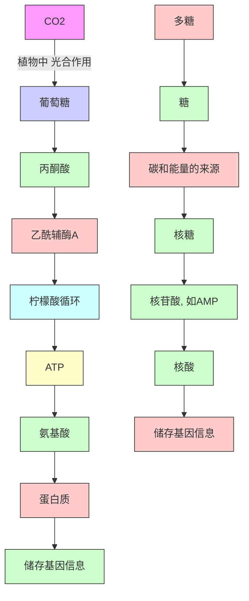

# 42

# 生命中的有机化学

# 联系

# 基础

- 酸性和碱性 ch8  
- 羰基化学 ch10 & ch11  
- 立体化学 ch14  
- 构象分析 ch16  
- 烯醇盐化学和合成法 ch25 & ch26  
- 硫化学 ch27  
- 杂环 ch29 & ch30   
- 不对称合成 ch41

# 目标

- 核酸为蛋白质的合成储存信息  
- 修饰的核苷用于抗病毒药物的合成  
- 蛋白质催化反应并提供结构  
- 其他氨基酸衍生物扮演甲基化试剂和还原剂  
- 糖能储存能量，使对敏感官能团的识别和保护得以发生  
- 如何制取和操控糖和它们的衍生物  
- 脂质形成了膜结构的基础  
- 天然产物的主要种类有生物碱、聚酮、萜类和甾体  
- 生物碱是由氨基酸制得的胺类  
- 脂肪酸由乙酰 CoA 和丙二酰基 CoA 亚单位构筑

# → 展望

- 网络上更全面的三章:  
- 生命中的化学  
- 生物化学中的机理  
- 天然产物  
- 当今的有机化学 ch43

# 初级代谢

次级代谢 (Secondary metabolism) 与之相比是对生命的运行不那么基本的化学，它只局限在几小组生命体中。您将在本章后文中遇到由一些植物产生的生物碱、萜类。人类不能产生这些物质，但我们与其他动物(和少部分植物)能产生甾体。这些分子就都是次级代谢的产物。

生命是在化学的基础上运转的，也是因为这个原因，生物学中化学的一侧便非常迷人。意识到有一些分子同时存在于最简单的单细胞生物和我们自己中，这会令人自觉谦卑。核酸包含着任何生命体的基因信息，它们控制着蛋白质的合成。蛋白质一部分有结构性——比如结缔组织——一部分又有功能性——比如酶，催化着生物反应。糖和脂类 (lipids) 过去常常被认为是只能储存能量和构筑膜结构使用，但现在人们很清楚，它们在识别和运输上也起着关键性的作用。

所有生命体所共有的化学被称为初级代谢 (primary metabolism)，下一页的图表显示了初级代谢涉及的分子，以及它们之间的联系，我们还需要做一些解释。它显示了关键结构 (黑色粗字体) 之间简化了的关系，还显示了它们的来源——如 $\mathrm{CO}_{2}$ ——以及一些重要的中间体。葡萄糖、丙酮酸 (pyruvic acid)、柠檬酸 (citric acid)、乙酰辅酶 A acetyl coenzyme A (乙酰 CoA) 和核酸 (ribose) 中代谢的关键阶段发挥着作用，并被构建进了许多重要的生物分子中。此表不太详细，请您依照此表，跟随我们逐一进行更细致地探究。我们将由核酸开始。

![[中文版clayden-chinese-42章1164-1199_images/ae78ca56976d57ef11a0505784e06751543fab1c21c922cf1a58156686f85747.jpg]]

flowchart

# 生命由核酸开始

核酸 (nucleic acids) 储存基因信息。它们是由核苷酸 (nucleotides) 单体构建的聚合物，核苷酸本身由三个部分组成——杂环碱基、糖和磷酸酯。在下面的例子中，碱基为腺嘌呤 (adenine，黑色显示)，碱基与糖组合在一起被称为核苷 (nucleoside)，本例子中为腺苷 (adenosine)，整个分子，即再加上磷酸酯就是核苷酸，此核苷酸被称为 AMP——腺苷单磷酸 (adenosine monophosphate)。磷酸酯在自然界中是关键的化合物，它们能够在分子间建立实用而稳定的连接，并且，通过增加磷酸酯残基的数目，它们还可被用于构建活泼的分子。最重要的一种核苷酸同样是自然界中最重要的分子之一——它就是腺苷三磷酸 (adenosine triphosphate) 或 ATP。

# 核苷和核苷酸

核苷与核苷酸的区别在于核苷酸多了磷酸酯基，而核苷仅由碱基和糖组成。

腺苷单磷酸 (AMP)  
![[中文版clayden-chinese-42章1164-1199_images/b6500d42d6004e945c0ca5e3fa18b20d18aa841302d68b36976c41ded0a89ce7.jpg]]

chemical

Chemical structure of phosphoric acid and its nucleotide base, showing phosphate group, sugar (cysteine), and adenine base

腺苷三磷酸 (ATP)  
![[中文版clayden-chinese-42章1164-1199_images/da1cded443b38f068ba7264f401a8a1fc00dae6d9600e5f0a52b4e9406c33966.jpg]]

chemical

Chemical reaction mechanism showing nucleophilic attack of hydroxyl phosphate on a sugar molecule, forming a sugar derivative with proton transfer and electron loss

ATP 是一种高度活泼的分子，因为磷酸根是稳定的阴离子和好的离去基团。它会被硬的亲核试剂在磷酸酯基上进攻 (通常在末端的一个上)，或被软的亲核试剂在糖的 $CH_{2}$ 基上进攻。当一个新的反应在自然界中被引发时，通常第一步都是与 ATP 反应来使化合物更加活泼。这很像是我们用 TsCl 处理醇，或将酸转化为酰氯来使它们更活泼的策略。

# DNA 和 RNA 中存在五种碱基

核酸由五种碱基、两种糖和磷酸酯基构成。碱基包括单环嘧啶与双环嘌呤 (purines)，它们都是芳香的。

- 在核酸中仅发现了两种嘌呤碱基：我们已经见到的腺嘌呤 (A) 以及鸟嘌呤 guanine (G);  
- 还有三种较简单的嘧啶碱基：尿嘧啶 uracil (U)、胸腺嘧啶 thymine (T) 和胞嘧啶 cytosine (C)。胞嘧啶存在于 DNA 和 RNA 中，尿嘧啶只存在于 RNA 中，胸腺嘧啶只存在于 DNA 中。

如下分子中涂色的部分强调了这些碱基的特征结构。

核酸中的嘌呤碱基  
![[中文版clayden-chinese-42章1164-1199_images/ce33454237ae569c9a0cad668c03691c4926fb8440f4b665318f238ff1a8b5d0.jpg]]  
腺嘌呤

![[中文版clayden-chinese-42章1164-1199_images/2361127cb7f80b22b6558f6ba50e784bb8211194d2fd30acd58e27b6415f0a55.jpg]]  
鸟嘌呤

![[中文版clayden-chinese-42章1164-1199_images/80ab873dbe6cc53d8ea6fbef98c22e37f97c90cc82f663e73b30d4bd9a2a58b5.jpg]]  
尿嘧啶

核酸中的嘧啶碱基  
![[中文版clayden-chinese-42章1164-1199_images/2b63de2649a2390453adca7a9a3304eb9cb62b6291def3429a5f4c73e9ac7300.jpg]]  
胸腺嘧啶

![[中文版clayden-chinese-42章1164-1199_images/ac68ef4ed5b8b6112b4dd8bdbe5102942daa099eaa65f11f2018a343239cd40e.jpg]]  
胞嘧啶

您在 Chapter 29 遇到了嘧啶，并在 Chapter 30 学习了制造它们的方法，但嘌呤环体系对您可能是新鲜的。请确保您能找到使这些碱基芳香的六个 (或十个) 电子，尤其对于 U、T 和 G，您可能需要画出离域结构。

![[中文版clayden-chinese-42章1164-1199_images/0832e7eee71ea2cc5967f14206643253bac7b9e7170615381082c5e7ed738a0c.jpg]]

chemical

Chemical structure of咖啡因 (cannamycin) with labeled nitrogen and methyl groups

# 茶和咖啡中的兴奋剂是甲基化的嘌呤

存在于茶和咖啡中，一种对很多人都很重要的兴奋剂是被完全甲基化了的嘌呤——咖啡因 (caffeine)。咖啡因是一种晶体物质，用有机溶剂可以很容易地从咖啡和茶中萃取。工业上脱咖啡因茶、咖啡的生产使用超临界 $CO_{2}$ (所谓的“天然气泡”) 萃取。

作为化学家，如果我们想添加甲基，我们会使用碘甲烷等试剂，而自然界使用的则是一种复杂得多的分子。生物体中发生的甲基化过程很多——甲基通常是由 (S)-腺苷甲硫氨酸 [(S)-adenosyl methionine，或 SAM] 添加的，该试剂本身是由甲硫氨酸与 ATP 反应形成的。形成试剂的反应发生得很好，因为硫是一个好的软亲核试剂，三磷酸根是好的离去基团，伯碳上的取代也容易。

![[中文版clayden-chinese-42章1164-1199_images/b9f9ebb13853079640c08ac6ec5479c8218e611608cf3985d82903bbaa7587d2.jpg]]

chemical

S-腺苷甲硫氨酸—SAM反应示意图，展示ATP与氨基甲硫氨酸结合生成S-腺苷甲硫氨酸的转化过程

SAM 是一个锍盐，可在三个不同的碳原子上被亲核试剂进攻。其中两个是伯中心，还有一个是甲基， $S_{N}2$ 反应在甲基上发生得最好。很多亲核试剂都会这样进攻 SAM。在咖啡植物中，可可碱 t-heobromine（一种也能在可可中发现的嘌呤）会通过与一分子的 SAM 反应转化为咖啡因。甲基化发生在氮上，部分原因是能够保留芳环和酰胺官能团，同时也是因为将它们带到一起的酶将它们摆成了发生 N-甲基化的正确取向。

![[中文版clayden-chinese-42章1164-1199_images/a6ecfeff500e114e7e06dd870c82b681af24c042b2bb808ac2020040816831ec.jpg]]

chemical

Chemical reaction mechanism in SAM showing nucleophilic attack on a thioether-containing sugar, with Chinese annotation

![[中文版clayden-chinese-42章1164-1199_images/1918c9d4e169fd44d4b7acfddc958d4b96e041afbf8880ebdc753c0d228f132a.jpg]]

chemical

Chemical reaction mechanism showing inter变异构 (inter变异构) converting a carbonyl compound to a lactam with SAM and Ad reagent, yielding a coffee derivative.

在此，我们应该指出一些容易遗忘的事情：化学只有一种。生物化学并没有魔法，自然界应用的化学原理与我们在化学实验室中的也是一样的。从前您学习到的机理，同样能帮您绘制生物反应的机理，您所遇到的大部分反应在自然界中也都有所对映。唯一的区别在于，大自然非常、非常擅长化学，而我们人类仅仅在学习化学。在我们体内，不加思考地进行着的化学，仍然比我们在体外，运用21世纪最先进的思想完成的化学要精妙得多。

# 核酸以双螺旋形式存在

现代科学最重要的发现之一是沃森 (Watson) 和克里克 (Crick) 在 1953 年阐明的 DNA 和 RNA 著名的双螺旋 (double helix) 结构。它们意识到碱基-糖-磷酸酯基的基本结构对三维缠绕十分合适。右侧示出了 DNA 一小部分的结构。注意观察，核糖的 2'（读作“二撇”）位置是空置的，没有羟基取代，这也是为什么它被称为脱氧核糖核酸 (deoxyribonucleic acid)。核苷酸上连有剩下的两个 OH 基的位点被称为 3' 位和 5' 位。这一部分 DNA 包括三个核苷酸（腺嘌呤核苷酸，腺嘌呤核苷酸和胸腺嘧啶核苷酸），因此简写作 -AAT-。

![[中文版clayden-chinese-42章1164-1199_images/8b3e4c3143fac8078ffbf45636a3a6bed8f124de34a476260cef64d58c788f2a.jpg]]

chemical

核苷酸分子结构示意图，标注了腺嘌呤、胸腺嘧啶和腺嘌呤的链路连接

![[中文版clayden-chinese-42章1164-1199_images/adc9476961315cbb86da731d025b6415b41fe7fd39c917b84c391fbc97b07af9.jpg]]

natural_image

3D illustration of a DNA double helix structure with teal and black strands (no text or labels)

DNA 的两条聚合物链会缠绕成螺旋，彼此通过碱基间的氢键连接。每种碱基都专一地/特异性地与另一种碱基称对——腺嘌呤与胸腺嘧啶 (A–T)、鸟嘌呤与胞嘧啶 (G–C)——如下所示。

![[中文版clayden-chinese-42章1164-1199_images/bd5ae109ffe86db8b29aa248e68c6315ca18efe76cf6d7a14cbcd57fd0f309e3.jpg]]

chemical

A-T碱基对与胸腺嘧啶的分子结构式图，标注腺嘌呤和胸腺嘧啶位置

![[中文版clayden-chinese-42章1164-1199_images/313b7ba9b4e32583766026bb52347ccf7b15a670d30bd4367859b545e911f8e6.jpg]]

chemical

鸟嘌呤与胞嘧啶的DNA双链结构示意图，标注G-C碱基对和鸟嘌呤位置

关于这些结构，有很多要注意的地方。每种嘌呤 (A 或 G) 都专一地与一种嘧啶 (T 或 C) 结合，通过两个或三个氢键。氢键有两种：一种连接胺与羰基 (黑色所示)，一种连接胺与亚胺 (绿色所示)。较大的嘌呤与较小的嘧啶成键方能弥合核酸缠绕时的空隙，这使得一种嘌呤必须要找一种嘧啶来称对。请回过头去看 p. 1136 中结构的绿色和橙色部分，您会发现只有一种可行的氢键结合模式。通过这种方式，每个核苷酸都能可靠地识别另一种核苷酸，并与它的搭档可靠地成对。上文的短链 DNA (-AAT-) 会与 -TTA- 可靠地成对。

# HIV 和 AIDS 可以用修饰的核苷治疗

修饰了的核苷是最好的抗病毒化合物。抗HIV药物AZT(齐多夫定zidovudine)是一种稍稍修饰了的DNA核苷(3'-叠氮胸苷3'-azidothymidine)。它用叠氮基替换了天然核苷中C3'位的羟基。修饰得更彻底的核苷3-TC(拉米夫定lamivudine)对AZT-耐受性病毒有活性。此药物基于胞嘧啶，糖则被另一种看起来十分相似，尤其在立体化学上相似的杂环所替代。阿昔洛韦acyclovir(舒维疗Zovirax)是用于治疗唇疱疹(cold sore/herpes)的修饰了的鸟苷，糖被修饰得只剩一点，没有环存在，也没有立体化学。

![[中文版clayden-chinese-42章1164-1199_images/5724b5643ccc91c7668d23a29272f51516dbf6a0288ae671c01878cca1f5e4b1.jpg]]

chemical

四种基因型蛋白的结构式，包括脱氧胸苷、AZT、3-TC和阿昔洛韦等

# 环状核苷和立体化学

DNA 比 RNA 更加稳定，这是因为它的糖缺少 2' 羟基。在核糖核酸 (ribonucleic acids) 中，2' 和 3'-OH 基在环的同一侧，这使得它由于有分子内亲核催化剂，而在碱 (alkaline) 中异常快速地水解。

取代基 B $^{1}$ 和 B $^{2}$ 代表任何嘌呤或嘧啶碱基。

![[中文版clayden-chinese-42章1164-1199_images/991e4e382b2aa1ec1c5cc1daafdf32bbe5faa74dd827d58e142730ca3193ba21.jpg]]

chemical

Chemical reaction mechanism showing phosphorylation and nucleophilic attack steps of a sugar derivative

碱会在 2'-OH 基上移去质子，继而环化到磷酸酯上——只有当环交点是顺式时，环化才能发生。下一步反应涉及五价磷中间体的坍塌，并得到环状磷酸酯。此反应释放走了一个核苷，当环状磷酸酯本身的上游继续被碱处理时，还会释放走更多的核苷。

另一种由核苷形成的环状磷酸酯则是重要的生物信使 (biological messenger)，它帮助控制血液凝结 (blood clotting) 和胃酸的分泌等过程。它是环状的 AMP (cAMP)，由 ATP 通过 3'-OH 基对磷酸酯的酶催化的亲核取代反应形成。

![[中文版clayden-chinese-42章1164-1199_images/696a9003089c8c31ce59be1c2104ccc6b985b5fbed41a89f336099fd2fd713d9.jpg]]

chemical

Enzymatic reaction diagram showing enzyme-cyclase catalyzed by lipase-2 to form AMP (cAMP) substrate

■ 注意 cAMP 具有反式的 6,5-稠环交点。

# 蛋白质由氨基酸制成

DNA 通过碱基三联体 (密码子 codons) 的形式，将制造蛋白质所需的信息进行编码，如下图所示的 胸腺嘧啶-腺嘌呤-胞嘧啶 (TAC)，当由 DNA 合成 RNA 之时，它们会通过与 p.1138 所示的碱基配对形成互补密码子 complementary codons (例子中为 AUG)。此 RNA 用于指示核糖体 (ribosome) 合成蛋白质——核糖体很可能具有宇宙中最复杂的分子结构。RNA 链上的每个密码子都会指示核糖体向正在生长的蛋白质中添加一种特定的氨基酸。例如，密码子 AUG 指示我们在 SAM 中见过的甲硫氨酸。甲硫氨酸是蛋白质中存在的一种典型氨基酸，同时也是所有蛋白质的起始单元 (starter unit)。

![[中文版clayden-chinese-42章1164-1199_images/70132ac04ac9487ad64edb7382934fc6ebf4e7b629a919bab934e87c41251f2b.jpg]]

chemical

DNA合成与蛋白质合成反应示意图，展示-TAC-DNA三联体经RNA合成、指示生成甲硫氨酸并最终产生蛋白质的合成步骤

RNA 的下一个密码子会引导核糖体继续添加新的氨基酸，并通过酰胺键与上一个氨基酸连接。用于制造蛋白质的氨基酸具有相同的基本结构与立体化学，如页边所示，只在 R 基上存在区别。

![[中文版clayden-chinese-42章1164-1199_images/247e9189defae3c2bd97d3a6c4af6d004b0377fdfdc3f66ab9887e57eb8968f2.jpg]]

chemical

Chemical reaction equation showing the synthesis of a new acrylonitrile derivative from methylenediamine and anisocyanate

过程会继续，更多的氨基酸会被加入到下面正在生长的分子的右侧。最终蛋白质的一节可能如下所示。蛋白质的骨架以通常的方式，锯齿状一上一下地排列；由于共轭，酰胺键（黑色所示）是刚性的，保持如下图所示的形状。

![[中文版clayden-chinese-42章1164-1199_images/ce4cef0bd7441918adc70b73018da2830788c5f62942c46dae660282d00890d5.jpg]]

chemical

Chemical structure of a peptide-like molecule with four R groups and amide linkages

![[中文版clayden-chinese-42章1164-1199_images/10747f490410246cdc75f05e442d9eeb2907fa9d7fa144d825e614a7aeaff4f6.jpg]]

chemical

氨基酸结构的两种视角，展示两个氢键化合物的相对位置

在 Chapter 23 (p. 554) 中讨论肽的实验室合成时，我们列出了天然存在的氨基酸。  
■ 酶和蛋白质的许多功能都来源于它们所保持的构象，对此的讨论超出了本书的讨论范围。

# 氨基酸结合形成肽和蛋白质

在自然界中，氨基酸会结合得到蛋白质，每个蛋白质中具有成百上千甚至成千上万个氨基酸。较少氨基酸的组合被称为肽(peptides)，连接它们的酰胺键被称为肽键(peptide bond)。

谷胱甘肽 (glutathione) 是一种存在于动植物组织中的重要的三肽。它是一种 “普遍的硫醇”，通过自身被氧化到二硫化物 (disulfide) 而消除危险的氧化剂。然而，谷胱甘肽并不是一种典型的三肽，它最左侧的氨基酸虽然是正常的谷氨酸，但它并没有通过正常的 $\alpha-CO_{2}H$ 基与下一个氨基酸相连，而是用了它的 $\gamma-CO_{2}H$ 基。中间的氨基酸——有一个游离 SH 基的半胱氨酸——是对其功能的实现关键的氨基酸。C-末端酸为甘氨酸。

![[中文版clayden-chinese-42章1164-1199_images/ca4f18e80674ef9715d75e73ae13476959e06d9ddb42c33aa1e1f4ef37757a81.jpg]]

chemical

Structural formulas of glutamic acid (谷胱甘肽) and γ-Glu (γ-Glu) with their modifications, including glutamic acid base coupling and glutamic acid.

硫醇很容易被氧化为二硫化物，谷胱甘肽同样会在遇到氧化剂时牺牲自己。谷胱甘肽氧化后的形态随后可通过被您将在本章后文遇到的 NADH 还原而重新转换回硫醇。

![[中文版clayden-chinese-42章1164-1199_images/705ffe16c3ceaeb6a1ba9360d659c2b541ca469ad6f420951191e53b497c6e2a.jpg]]

chemical

双链式脂肪肽合成反应示意图，展示γ-Glu与谷胱甘肽的氧化和还原过程

对于过氧化物，比如 $\mathrm{H}_2\mathrm{O}_2$ 这样迷路的氧化剂，下面的机理显示了它被还原为水，谷胱甘肽（以RSH表示)被氧化为二硫化物的机理。

![[中文版clayden-chinese-42章1164-1199_images/53e6c0c2ce144077357b40a88be3cea2d207e2e6a47a20766f839e6d744ad87e.jpg]]

chemical

Reaction mechanism diagram showing hydrolysis and dehydration steps of a sulfonated compound with RSH and H2O reagents

谷胱甘肽同样能给我们在本书前文描述的一些危险致癌物质，如 Michael 受体和 2,4-二硝基卤苯解毒。硫醇会扮演亲核试剂，反应后使亲电试剂失活。与谷胱甘肽共价结合后，它们变得无害，并可排出体外。失去的谷胱甘肽可由谷氨酸、半胱氨酸、甘氨酸合成而补充。

→反应方式请见 Chapter 22, p. 516 的讨论。

→ 您在 Chapter 23 见过一些例子。

![[中文版clayden-chinese-42章1164-1199_images/cb15d2ff123e78b980fc13f8e7eac8613c12a8b55e6840e3ae9c7fc85d1acf52.jpg]]

text_image

血管紧张素Ⅰ
包含十个氨基酸
对血压没有影响

Zn²⁺
↓
血管紧张
素转换酶
(ACE)

血管紧张素Ⅱ
包含八个氨基酸
会提高血压

![[中文版clayden-chinese-42章1164-1199_images/c08cce332482cf28810eaaf42a708ad6ba9fef22ec408bcc0d4fe61f7a7ad8e3.jpg]]

chemical

Chemical reaction mechanism showing the conversion of RSH to RS-CH2-C(=O)-X via intermediate with有毒 substances and enzyme cycle

一些在十个氨基酸左右的短肽作为激素存在。例如血管紧张素 II (angiotensin II)，是一种导致血压升高的肽——在某些情况下非常必要，但如果量太多，会导致心脏病和中风。

血管紧张素转换酶 (angiotensin-converting enzyme, ACE) 是一种依赖锌的酶，可从血管紧张素 I 的末端断裂两个氨基酸，并将其转化为血管紧张素 II，ACE 抑制剂可抑制这种酶的作用，因而用做高血压的治疗方案。赖诺普利 (lisinopril) 是其中一个例子：它是一种二肽的仿品，具有两个天然氨基酸，但却还有些不同，不同之处是分子的左侧用胺而非酰胺连接成二

肽 (Lys-Pro)，这能阻止酶水解该分子。赖诺普利能结合 ACE 正是因为它很像天然二肽，但由于它并不是天然二肽，因而会阻止酶发挥作用。很多人能活到今天，都得益于这种对酶的简单欺骗。

赖诺普利

“天然二肽”

# 结构蛋白必须具有强度和弹性

与功能性的酶不同，胶原蛋白（collagen）等蛋白质是纯结构性的。胶原蛋白是肌腱和结缔组织中的一种有强度的蛋白质，存在于皮肤、骨骼和牙齿中。它包含大量甘氨酸（大约三分之一的氨基酸是甘氨酸）、脯氨酸和羟基脯氨酸 hydroxyproline (同样，大约有三分之一的氨基酸是 Pro 或 Hyp 中的一个)。

羟基脯氨酸是一种特殊的氨基酸，在其他几乎所有地方都不会出现，它与脯氨酸一起，为胶原蛋白建立了一个非常强的三重缠绕结构。三重缠绕中没有空间容纳更大的氨基酸，此时便需要甘氨酸。官能化的氨基酸在胶原蛋白中十分稀有。

# 羟基脯氨酸和坏血病

羟基脯氨酸是一种非常不寻常的氨基酸。它并非在合成胶原蛋白时被加入生长的蛋白质链中，相反，胶原蛋白在用 Pro 组装时才需要其转化为 Hyp。当蛋白质构建完成使，一些脯氨酸残基会被氧化为羟基脯氨酸。此氧化反应需要维生素 C 参与，否则胶原蛋白无法形成，这也是为什么缺乏维生素 C 会导致坏血病 (scurvy)——18 世纪的水手所患的坏血病症状 (牙齿松动、溃疡和水泡) 就是由于不能建立胶原蛋白而引起的。

# 抗生素利用了真菌的特殊化学性质

我们一直强调，所有生命都具有非常相似的化学性质。从生物化学的观点来看，最重要的划分在原核生物和真核生物之间。原核生物包括细菌，它是最初进化得到的，没有细胞核的简单单细胞生物。而真核生物，包括植物、哺乳动物和其他多细胞生物，是而后进化得到的，它们具有更复杂的细胞，包含细胞核。即便如此划分，但这两方大部分的生物化学性质仍是相同的。

药物化学家进攻真菌的其中一种方法是去干扰那些在原核生物中发生，而在我们之中不发生的化学反应。这些进攻中最著名的一种瞄准了一些细菌细胞壁的构建中包含的“非天然”(R)-（或D-）氨基酸。细菌细胞壁由一种不寻常的糖肽（glycopeptides）组成，即多糖链与包含(R)-丙氨酸(D-Ala)的短肽交联的结构。在它们连接起来之前，一条链的末端是一个甘氨酸分子，另一条链的末端是D-Ala-D-Ala。在细胞壁合成的最后一步，甘氨酸进攻D-Ala-D-Ala序列，取代掉一个D-Ala残基并形成新的肽键。

![[中文版clayden-chinese-42章1164-1199_images/5490524bb62127beeb0b0e7ac594658173d58cc75883eee33a5b79d88f68f68f.jpg]]

chemical

Chemical reaction diagram showing the synthesis of D-Ala from two alpha-amino acids via nucleophilic attack and polymerization

![[中文版clayden-chinese-42章1164-1199_images/986ccf1007e86f52ff6ea8a9b7fdedf01a049228ea9b714fb0ab6d4d8100d9ae.jpg]]  
甘氨酸 Gly

![[中文版clayden-chinese-42章1164-1199_images/f40716669b8d6f249b30640138e04f7fc2374c5d3e8077c33aca117e697a9842.jpg]]  
(S)-脯氨酸 Pro

![[中文版clayden-chinese-42章1164-1199_images/428c2e6b762237798dbe1c87c811fe026b9e48942acdba57c2d522a2d09ba85d.jpg]]  
(2S,4R)-羟基脯氨酸 Hyp

![[中文版clayden-chinese-42章1164-1199_images/28842615c6322c8a46461a9d518b634f74391d6c5b7c5eed310e72e04aca07ec.jpg]]  
天然蛋白质中的 (S)-Ala

![[中文版clayden-chinese-42章1164-1199_images/1d4a4bdbac2f65d275da371f6ac007f056f97f0849cbb0fa0516c74c212d4fe1.jpg]]  
细菌细胞壁中的 $(R)$ -Ala  
细菌进化出使用这种“非天然的”D-氨基酸构建它们细胞壁的原因是，这样可由保护它们免受动植物中消化包含D-氨基酸的蛋白质的酶的进攻。

![[中文版clayden-chinese-42章1164-1199_images/ca8f2c995993fe85a3f6260e83193b2559cfb20a52d06df9f98796f011ae718d.jpg]]

chemical

Chemical structure of Dienylthiophene (Diethylcholine) with labeled functional groups and stereochemistry

β-内酰胺以黑色显示

抗生素盘尼西林就是通过干扰这一步而起作用的——但发现盘尼西林的时候人们并不了解。盘尼西林以一种非常特殊的方式抑制了催化 D-Ala 转移的酶。它首先与酶特异性地结合 (因此它必须与天然底物相似，下方将其与 D-Ala-D-Ala 做了对比)，然后它会与酶反应，并通过阻止活性位点上一个关键的 OH 即而使酶失活。

![[中文版clayden-chinese-42章1164-1199_images/f4c5ab1f5325c1b0d64ec999ecd48f800242ae61597587d0be0da17a2e5183c9.jpg]]

盘尼西林会模仿 D-Ala 并于酶的活性位点结合，使活性位点上丝氨酸残基的 OH 基进攻活泼的、有张力的 β-内酰胺。相同丝氨酸上的相同 OH 基在正常情况下会催化用于构建细菌细胞壁构建的 D-Ala-D-Ala 的断裂过程。与盘尼西林发生反应后，丝氨酸被 “保护”，酶被不可逆地抑制。细菌细胞壁的构建无法完成，因而在内容物的压力下，细菌细胞会破裂。盘尼西林不会杀死已经具有细胞壁的细菌，但却能阻止正在形成的新细菌。

目前，我们对于有青霉素和其他抗生素耐药性的细菌的最后一道防线是万古霉素 (vancomycin)。万古霉素通过与细菌细胞壁的 D-Ala-D-Ala 序列结合而起作用。

![[中文版clayden-chinese-42章1164-1199_images/024e5b5225aed83865fa59c46751bc893cebb651e764b2011a3f38e20ea21101.jpg]]

chemical

化学反应示意图，展示肽链与活性位点结合生成盘尼西林分子的结构

# 糖—只是能源吗？

糖(基)是糖类 (carbohydrates) 的基本组成部分。过去，它们常被认为是基本而相当没意思的分子，它们 (公认为有用的) 功能原则上只有储存能量。事实上，它们所扮演的角色比这有趣而丰富得多。我们已经注意到，核糖在 DNA 和 RNA 的结构和功能上起到了密切的作用。糖常被发现与蛋白质也密切相关，也常被发现涉及在识别 (recognition) 和附着 (adhesion) 过程中。

Chapter 43 中有更多关于治疗 HIV 的药物的发展的内容。

这里有两个例子。精子如何识别卵细胞并穿透其细胞膜？识别附着在卵细胞膜上的糖是我们所有人生命中遇到的第一件事。病毒又如何进入细胞？同样，识别过程涉及特定的糖类。取得一定成功的一种 AIDS 处理方法就利用了本章前文所遇到的抗病毒药物与 HIV 蛋白酶抑制药物的结合，它瞄准的方向是阻止 HIV 识别并穿透细胞。

# 糖通常以具有很多立体化学的环状形态存在

最重要的糖是葡萄糖 (glucose)。它具有一个饱和六元环，其中包含氧，最好画成几乎所有取代基都平伏的椅式构象，也可以画成平的构型图。在本章中，我们已经遇到过一种糖，也就是作为核酸结构的一部分的核糖。此糖是五元饱和氧杂环，具有许多 OH 基。事实上，您可以将糖定义为每个碳原子都带有基于氧的官能团——通常是 OH，也会是 C=O——的氧杂环。

葡萄糖的两种表达方式  
![[中文版clayden-chinese-42章1164-1199_images/3add489fa0264966fb9b542a0ecf9c21efffbab1cdaf45bbdb2513d82abc287b.jpg]]

chemical

Chemical structure of a polysaccharide with two glucose units linked by glycosidic bonds

核糖

![[中文版clayden-chinese-42章1164-1199_images/48687791410253cac31a3196b572d3905dc342cae27e5131e5464006a4e82041.jpg]]

一种核糖核酸  
![[中文版clayden-chinese-42章1164-1199_images/5b6caead0d254602c92d8f1854274baa39b144b3d334ace225b5533070a61fc4.jpg]]

chemical

Chemical structure of a phosphorylated sugar derivative with phosphate and hydroxyl groups

葡萄糖和核糖的结构图显示出了大量的立体中心，其中有一个中心未确定——以波浪线显示的一个OH基。这两种糖都具有这个中心，它是一个半缩醛中心，因而分子都会与开链的羟基酮保持平衡。对于葡萄糖，开链形式如下所示。

![[中文版clayden-chinese-42章1164-1199_images/d3d63278f29ca9e1f76ff767133d86a13841e025b0f85cf0b7bf90a77500e52b.jpg]]

chemical

葡萄糖环状形态与开链形态的化学反应示意图，标注半缩醛作用

当环再次关闭时，所有 OH 基都可以与醛环化，但事实上并不存在真正的竞争——因为六元环比其他任何替代品（如三元、四元、五元和七元环——请自行检查）都更加稳定。然而，对于核糖，有一种合理的五元环替代品存在。

![[中文版clayden-chinese-42章1164-1199_images/6594873faceba0f2d8a3a41210038687c49cedff04b406d3565d1f4009e3ab50.jpg]]

chemical

三元化合成反应示意图，展示呋喃核糖、开链（醛）形态和吡喃核糖的转化过程

最重要的糖可能以开链形态存在，也可能以五元氧杂环（根据五元芳香化合物呋喃，而称为呋喃糖 furanose）或六元杂环（根据六元化合物吡喃，被称为吡喃糖 pyranose）。葡萄糖倾向于吡喃糖结构，核糖倾向于呋喃糖结构。

![[中文版clayden-chinese-42章1164-1199_images/a1a9279bb02ba8fb5b9b9ef56669648cfe104004ce401678dfb16090dfc1bc09.jpg]]  
呋喃

![[中文版clayden-chinese-42章1164-1199_images/bb5d50048fe1053fcc9c99b9f04c038eee57519cd8a8e6df597c7e9642008f56.jpg]]  
吡喃

# 糖的形状可以通过形成缩醛而固定

将葡萄糖固定在吡喃形态最简单的方式，是将其捕捉并形成缩醛。与醇——如甲醇——酸催化的缩合反应可以给出缩醛，并且引人注目的是，缩醛还会具有直立 OR 基。缩醛的形成是在热力学控制下发生的 (Chapter 11)，因此直立化合物应当是更稳定的。这是异头碳效应/端基异构效应所致——此 C 原子被称为异头位点，缩醛非对映体被称为异头体 (anomers)。此效应是由环中氧上直立的孤对电子与 OMe 基的 $\sigma^{*}$ 成键相互作用而导致的。

![[中文版clayden-chinese-42章1164-1199_images/5a060e9721849290f78ba5c6eea713cb357372cec71318421e1905a87ac6d6bc.jpg]]

Chapter 31 中讨论过异头

碳效应，您应当检查您能够

写出 Chapter 11 中所学的缩

醛形成反应的机理。

![[中文版clayden-chinese-42章1164-1199_images/289816d98b06ef8e2dd37c815c3ac2edbd9980b1038f16b204dc75822386ebed.jpg]]

chemical

甘氨酸与直立异构体的反应式，标注了甘氨酸和直立异构体的取代过程

![[中文版clayden-chinese-42章1164-1199_images/44291d430a36d8e57f736e97f0d291dd5d16bf0f443d406fb1359873930c958b.jpg]]

chemical

碳原子结构与电子反应示意图，标注异头碳效应、直立孤对电子成键相互作用及QMe离子

![[中文版clayden-chinese-42章1164-1199_images/6ea28ea8d13c0ea1c27b980d1fc8ff6b43def7861b6afe4ea20c49968b8913a6.jpg]]

chemical

Chemical structure of a hydroxy ester with labeled functional groups including hydroxyl, methoxy, and OMe group

不能从异头碳效应上

获得稳定化作用

缩醛的形成对糖的化学性质起到了很大程度的控制。除去我们刚刚看到的葡萄糖缩醛，还有三种重要的缩醛值得我们理解，它们也说明了立体电子效应——立体化学与机理的相互影响——起作用的方式。如果我们由甲基化的葡萄糖和苯甲醛制取缩醛，我们会以单一立体异构体得到一种单一的化合物。

![[中文版clayden-chinese-42章1164-1199_images/a98da87c0c58c7bdad935077265752e7cdc0ca823789f7aad8304cc881d1426a.jpg]]

chemical

Chemical reaction showing deprotonation of a sugar derivative with methoxy and hydroxyl groups under PhCHO conditions

在起始原料中的任两个邻位 OH 基之间，都可以形成新的缩醛，但最好的一对是能形成六元环的(黑色 OH 基)。对于此葡萄糖中的立体化学，新的六元环与旧的六元环反式连接，得到了优美而稳定的全椅式双环结构，新的椅式缩醛环中的苯基也处在平伏位置。缩醛在热力学控制下形成，此产物也是可能的缩醛中最稳定的一种。

由糖和丙酮形成缩醛的过程表现出很不一致的选择性。首先，丙酮形成的环状缩醛倾向于五元而非六元。若为六元环，则丙酮的两个甲基必有其一处在直立，于是它更倾向于五元环。顺式相交的5,5或5,6环更加稳定，因此丙酮缩醛(丙酮叉acetonides)会优先以顺式1,2-二醇形式形成。吡喃式的葡萄糖不具有邻位而顺式的羟基，但呋喃式具有两对。与丙酮形成缩醛也将葡萄糖固定在了呋喃式。下面的图表总结了如上论述。

![[中文版clayden-chinese-42章1164-1199_images/7267cea2b36e10fab8fe0b3ac71c6c386d694870439be1e44e22fe326750cb9e.jpg]]

chemical

葡萄糖的开链式与呋喃糖生成葡萄糖的反应示意图，标注了H⁺、OH⁻和H⁺/H⁺代际变化

葡萄糖的开链式与吡喃、呋喃两种形态处在平衡当中，它们分别由用黑色和绿色 OH 基形成半缩醛得到。一般来说吡喃式更加有利，但呋喃式能和丙酮形成双缩醛，其中一个缩醛以顺势稠合的五元环存在，另一个处在侧链上，于是可以从反应中分离出双缩醛产物。

如果我们想要将葡萄糖固定在开链式，我们必须既不用醇，也不用醛、酮，而用硫醇 (RSH) 制取很不同的一种 “缩醛”。硫醇会与开链式中的醛基结合，给出稳定的双硫缩醛。双硫缩醛很明显比任何一种由吡喃、呋喃式得到的半缩醛或单硫缩醛都更加稳定。

当然，最重要的N-糖苷是核苷，我们已经较为详细地讨论过了。

在 Chapter 6 (p. 129) 中您了解了木属植物中丙酮氰醇葡萄糖苷的例子。

![[中文版clayden-chinese-42章1164-1199_images/14df1bf7e966fdcaa44d4f44eb2a6ce7856819ad0846bcc7f401564e5a4d2cca.jpg]]

chemical

D-Glucose ring opening reaction with RSH and H+ reagent, showing structural change of D-Glucose

# 自然界中的糖苷

很多醇、硫醇、胺在自然界中都是以糖苷/甙(glycosides)的形式存在的，也就是在葡萄糖的异头位置变为 O、S 或 N-缩醛。这些化合物附着在葡萄糖上的目的通常是提高溶解度或用于跨膜运输(transport across membranes)——例如将毒素从细胞中运输出来。有时候，其目的也包括稳定被附着的化合物，这表现出葡萄糖是大自然所使用的保护基，与化学家所使用的 THP 基异曲同工 (C-hapter 23)。

![[中文版clayden-chinese-42章1164-1199_images/818abdbf3f9df3645f68bd98f75af7053fa02b287d0cc29c4761e5b8be110315.jpg]]

chemical

Chemical structure of a sugar derivative with multiple hydroxyl groups and a OR group

O-葡萄糖苷

![[中文版clayden-chinese-42章1164-1199_images/6fd02483696095cfbbbe567af6c40b5740f451cf61937c3e286a36dd9c347ddd.jpg]]

chemical

Chemical structure of a sugar derivative with hydroxyl and SR substituents

S-葡萄糖苷

![[中文版clayden-chinese-42章1164-1199_images/9ceb40dcf61795f2b120465ab03e8ab086c5d08093630c958ce0968678f3cbbb.jpg]]

chemical

Chemical structure of a sugar derivative with hydroxyl and NHR groups

N-葡萄糖苷

葡萄糖或其他糖与醇、酚上的 OH 基形成缩醛得到的 O-糖苷 的种类繁多。这些化合物的立体化学通常由希腊字母 $\alpha$ 和 $\beta$ 描述。如果 OR 基朝下，则为 $\alpha$ -糖苷；如果朝上，则为 $\beta$ -糖苷。红玫瑰的色素是一个吸引人的例子，它是一种有趣的芳香氧杂环（一种花青素 anthocyanidin），而其中有两个酚 OH 基是以 $\beta$ -葡萄糖苷 的形式存在的。

![[中文版clayden-chinese-42章1164-1199_images/dfff20c4a1080ea7813c897a265fd818720efcb39e8822da47f9a101e93221a1.jpg]]

chemical

芳香吡喃翁（pyrylium）盐的色素与β-葡萄糖苷连接示意图

![[中文版clayden-chinese-42章1164-1199_images/43ecbc408ef573d028f00d695f62607fdba4b3c64576a13861560a76d0aca6fe.jpg]]

chemical

Chemical structure of a glycoside with hydroxyl and OAr groups

酚的 $\beta$ -葡萄糖苷

![[中文版clayden-chinese-42章1164-1199_images/a4e683e6bf8b878911d98baa2c12b9fec82dc7bd4864764243442094cb38fa8b.jpg]]

chemical

Chemical structure of a glycoside with multiple hydroxyl groups and an OAr group

酚的 $\alpha$ -葡萄糖苷

人们常说吃西兰花和抱子甘蓝对健康有特别的好处，这得益于它们具有的含硫抗氧化剂。这种化合物是不稳定的异硫氰酸酯（isothiocyanates），通常不直接存在于植物中，而会在被破坏——如切割和烹饪时——诱导糖苷酶 glycosidase（一种水解糖苷的酶）将它们从葡萄糖保护中释放出来。黑芥子苷（sinigrin）是一个简单的例子，水解时硫以阴离子离去，是好的离去基团（于是这种化合物在酸性下水解得没有氧离去基好），此外，阴离子还被共轭稳定。

![[中文版clayden-chinese-42章1164-1199_images/67532e34500be3925aec3a4bb864e153fd1eff86e3b8a29f36998d5e6d456faa.jpg]]

chemical

葡萄糖与异硫氰酸烯丙酯反应示意图，标注黑芥子苷、硫葡萄糖苷、葡萄糖和异硫氰酸烯丙酯的转移过程

下一步很令人惊奇。发生了一个重排反应，这很像 Beckmann 重排，其中烷基从碳迁移到了氮上并形成了一个异硫氰酸酯 $(R-N=C=S)$ 。黑芥子苷存在于芥末和辣根中，正是异硫氰酸烯丙酯的释放提供了它们的“辣”味。将芥末粉与水混合，几分钟后就能闻到黑芥子苷水解为异硫氰酸酯而产生的辣味。

西兰花和孢子甘蓝中的 S-糖苷 被认为可以预防癌症，其物质与上述类似，只是在链上多了一个碳原子，并同时还包含一个亚硫酰基。此 S-糖苷 的水解也遵循相同的重排过程，产出一种被称为萝卜硫素 (sulforaphane) 的分子。萝卜硫素通过诱导一种还原性酶的形成而对抗致癌的氧化剂。

# α-和β-葡萄糖苷

只要您承认设计这些术语的人恶毒而愚蠢，您就能很容易地记住它们。如同 E 代表反式，Z 代表顺式 (字母的形状都不是所对应的异构体) 一样， $\alpha$ 表示向下 (below) 而 $\beta$ 表示向上 (above) ——每个但此都由正好相反的字母开始。

![[中文版clayden-chinese-42章1164-1199_images/02aae17a063d662b76cdcaa5ce64aafdc23cf28ace0cc68811e55faeca6ddbda.jpg]]

Beckmann 重排已于 Chapt-

er 36, p. 958 描述。

![[中文版clayden-chinese-42章1164-1199_images/549bc12e044627b56ed3a3ffe18432106fc66c79d32a2b429a964318dca7f540.jpg]]

chemical

化学反应方程式，展示硫糖苷水解与萝卜硫素迁移过程

# 维生素 C 是葡萄糖的衍生物

大自然会由简单的糖制取一些重要化合物。维生素 C——抗坏血酸——就是其中之一。它也具有六个碳原携有氧原子取代基的碳原子，同时也具有氧杂环，看起来像一个糖。它一方面和谷胱甘肽一样，保护细胞免受迷路氧化剂的威胁；同时也被涉及在一些主要的氧化还原途径中（我们之前提到它在胶原蛋白的合成中发挥作用）。它的还原态和氧化态如下所示。

![[中文版clayden-chinese-42章1164-1199_images/4ffabc496008117dbdce8b029579a01105f057192b5de810d99bebefbfb9e7a5.jpg]]

chemical

Chemical reaction diagram showing conversion of alkaline to oxidized form with维生素C

# 大多数糖都嵌在复杂的糖类中

在所有糖 (sugars) 中，我们最熟悉的是蔗糖 (sucrose)——由葡萄糖和果糖 (fructose) 形成的混合缩醛。蔗糖当然是甜的，并很容易代谢成脂肪。但如果用氯原子取代蔗糖中的三个 OH 基，那么就会产生一种 600 倍甜度的化合物：获得同样的甜味需要更少的糖，而氯还降低了代谢的速率，因而会产生的脂肪也更少。这就是化合物三氯蔗糖/蔗糖素，由泰莱公司 (Tate & Lyle) 发明，如今被用于软饮料的增甜。

![[中文版clayden-chinese-42章1164-1199_images/1bae729549cd15ffa4552443b7681a5e7273ec1b53d7cb693efbd03888ddc20d.jpg]]

chemical

三氯蔗糖分子结构示意图，展示蔗糖、果糖和三氯蔗糖的缩醛与分解过程

纤维素的年产 $10^{15}$ kg 是一个天文数字：相当于火星的卫星之一，火卫二的质量。月球质量为 $10^{22}$ kg。

蔗糖是一种二糖 (disaccharide)——两个糖由缩醛连接。一般来说，糖类 (saccharides) 与糖 (sugars) 的关系就像是肽、蛋白质与氨基酸的关系。糖类是自然界中存在得最为丰富的化合物之一：纤维素 (cellulose)——植物的结构材料——就是葡萄糖的聚合物，产量非常大 (每年大约 $10^{15}$ kg)。每个葡萄糖分子都通过另一个葡萄糖 C4 羟基进攻异头碳原子形成的缩醛连接。基本序列如下。

![[中文版clayden-chinese-42章1164-1199_images/d8f1e2ef32106ad7d19b56e3acfbe97d2535095efe695ae132f450d212a056c9.jpg]]

chemical

Chemical structure of a glycoside with hydroxyl groups and labeled deep醛键 sites

葡萄糖是纤维素的单体

注意观察，异头键均为平伏。这意味着纤维素分子从总体轮廓上讲是直线形的。此刚性形状是由3-OH基与环中氧原子之间额外的氢键固定的——如下所示。

![[中文版clayden-chinese-42章1164-1199_images/468aaf63b8e5142f31115e7e048da510d93e28cb4bd380593a2b0b7c4376f895.jpg]]

chemical

Chemical structure of a polysaccharide with labeled carbon chain lengths and functional groups

此聚合物还会盘绕成圈来进一步提高稳定性。所有这些都使纤维素非常难以水解，人类没有所需要的酶，因此无法消化纤维素。其他哺乳动物进化出特别的设备，如多个胃（牛等反刍动物中）方可消化纤维素。

# 氨基酸增添了糖类的多样性

氨基糖 (amino sugars) 是包含了氮的糖类。这些分子让蛋白质和糖得以结合，并产出了多种多样引人注目的美丽结构。最常见的氨基糖是 N-乙酰基葡萄糖胺/氨基葡萄糖 (glucosamine) 和 N-乙酰基半乳糖胺 (galactosamine)，它们的区别仅在于立体化学。昆虫和甲壳类动物坚硬的外骨骼包含壳多糖/几丁质 (chitin)，一种非常类似于纤维素，只不过是由乙酰基葡萄糖胺与葡萄糖共同构成。它以相似的方式盘绕并提供了螃蟹壳、甲虫壳的强度。

![[中文版clayden-chinese-42章1164-1199_images/a5bd3a10d8dbf02528ca1b5253aaa0654aa6daff8707ea00516c0d48507b61ef.jpg]]

chemical

壳多糖的结构式，展示其分子与碳原子及氧键（如O=C、NH、OH）的连接关系

细胞膜的不透水性不能太好，因为它们还要允许水和其他复杂分子的通过。细胞膜包含糖蛋白(glycoproteins)——蛋白质中的天冬氨酸、丝氨酸、苏氨酸残基与氨基糖连接而成。连接位点在异头位置，因此这些化合物也是氨基糖的 O 或 N-糖苷。如下结构显示的是 N-乙酰基半乳糖以 N-糖苷的形式连接在天冬氨酸残基上。

N-乙酰基半乳糖   
![[中文版clayden-chinese-42章1164-1199_images/198c24b7137e561c77d526456a713928b1cd4084f6b6de13bbe87589bbcc1eb4.jpg]]

chemical

天冬氨酸残基与蛋白质骨架的分子结构图，标注了其作为天冬氨酸残基的脂肪链和蛋白质骨架

# 脂类

脂类 lipids (脂肪 fats) 是细胞膜的主要成分。连同同样作为细胞膜成分的胆固醇 (cholesterol)，它们虽然有不好的名声，但对于细胞膜的对分子移动的选择性屏障的功能，它们却是必不可少的。脂类中最常见的类别是甘油 (glycerol) 的酯。甘油是 1,2,3-丙三醇，这很简单，但它的立体化学很有趣。虽然它具有对称面，没有手性，但其中的两个伯 OH 基是对映异位的。如果其中一个被修饰了一一如被酯化了，那么分子将变得有手性。天然的 3-磷酸甘油酯就是这样的酯，它具有光学活性。

![[中文版clayden-chinese-42章1164-1199_images/dc9bc696eef997784673f99945b02d5792de476786b3ba1e2cf393257c2839aa.jpg]]

chemical

Chemical structure of N-乙酰基葡萄糖胺 with labeled functional groups and stereochemistry

![[中文版clayden-chinese-42章1164-1199_images/09bc2e3fa2796697228e2803451482cedb8e3478623c05e15f2fc115345f7c02.jpg]]

chemical

Chemical structure of N-乙酰基半乳糖胺 (N-acrylamino-2,4-dione)

![[中文版clayden-chinese-42章1164-1199_images/a2f5fa578ca951e316095a06b56450b6c2f0633f1e856de2973d6ad4498f9915.jpg]]

chemical

Chemical structures of two glycerol derivatives: hydroxyl and acetic anhydride

![[中文版clayden-chinese-42章1164-1199_images/bfccdac1a55a2eb73631537c907267583e31fafd509c9985622f52e077607edc.jpg]]  
3-磷酸甘油酯

食物中典型的脂类是由甘油和油酸 (oleic acid) 形成的三酯，这也是橄榄油中最丰富的脂类。有酸是一种单取代脂肪酸——它在其 $C_{18}$ 链的中部具有一根 Z 双键。这根双键让分子在中部有了一个明显的弯折。橄榄油中此化合物以三酯形式存在，三酯同样是有弯折的。

![[中文版clayden-chinese-42章1164-1199_images/0a1cbe1708613b7d9e3ad8397eaac5bd0e6ea32105a3a7d70779ebcc2db35089.jpg]]

chemical

化学结构式图，展示顺式（Z）烯烃与三油酸甘油酯植物油中的主要脂肪类

# 油和水不能混合

在物理化学实验课上，您可能做过 Langmuir 膜实验。该实验通过使油在水的表面扩散成单分子膜二测量分子大小。(高中物理选修：油膜法测分子直径)。

其他脂类大体上也具有如图所示的构象，一端是极性的酯基，一端则是束成一个非极性区域的烃链。油和水不能混合，但甘油三酯类脂类会以一种特殊的方式与水联系。滴入水中的一滴油回摊开，形成非常薄的一层。这便是因为酯基落入水中，二烃链则伸出水面外并彼此联系。

![[中文版clayden-chinese-42章1164-1199_images/ca623f1dfca23447ce7a7e7cc2febedc5086e4fd02fa69ff27ad95ee4bcb632f.jpg]]

chemical

化学结构示意图，展示空气与水经烃侧链在水外聚集后生成极性基团在水内部的过程

当用碱 (alkali) 煮沸甘油三酯时，酯会被水解，并形成羧酸盐和甘油的混合物。这是肥皂制作的原理——硬肥皂用钠盐，软肥皂用钾盐。

![[中文版clayden-chinese-42章1164-1199_images/c11bcf7553ce54e8171c03c2823e650b848ebf74e5f95dde8f0e7ad26f497db1.jpg]]

chemical

Chemical reaction equation showing conversion of glycerol triacrylate to glycerol with sodium hydroxide and water, producing 3Na⁺ and hydroxyethyl groups

当将肥皂放入水中时，羧酸盐分子中的羧基对水有很强的亲和力，侧链烃基则相反，这就形成了球状的羧酸盐分子团，或称胶束 (micelles)。正是胶束起到了去除油污的作用。

![[中文版clayden-chinese-42章1164-1199_images/113806c690117357c667cef50e3b365865939bc200475a4f5f32b7fbeb850b5d.jpg]]

chemical

Diagram of a molecular structure showing carbon and oxygen atoms arranged in a ring with wavy lines representing bonds or interactions.

# 生物化学中的机理

大自然所利用的化学原理与我们在实验室中的相同，她同样需要试剂完成化学反应。化学家能使用的温度通常从 $100^{\circ}$ C 到 $20^{\circ}$ C，可以选择任何溶剂，惰性或活性气氛等等。但大自然不行：所有自然反应都必须能在室温下，有水和活泼气体，氧气，的存在下进行。在本节中，我们将浏览一些大自然对这些问题的解决方案。

# 大自然的 $\mathrm{NaBH}_4$ 是一种核苷酸: NADH 或 NADPH

您在本章的前文遇到过核苷酸，也了解了它们在核酸结构中的作用。大自然同样用核苷酸作为试剂。下面是 AMP (磷酸腺苷) 的结构，帮您回忆您之前见过的核苷酸，它的右边还有一种含有吡啶的核苷酸。

![[中文版clayden-chinese-42章1164-1199_images/9879ddb8ec66d780ef910d6a8b09f87f33e949e18c9b8624a15819cd728c179c.jpg]]

chemical

Chemical structure of AMP-4-phosphate nucleoside showing phosphate group, nucleotide base, and sugar moiety

![[中文版clayden-chinese-42章1164-1199_images/5082f91615fcf858281815f43541e6689ffb4e7f24051681578ea5a740c8c09c.jpg]]

chemical

Chemical structure of a nucleoside analog with phosphoric acid, phosphate ester, and amino acid groups

这两种核苷酸可以以焦磷酸二酯的形式结合起来，得到一种二核苷酸（dinucleotide），被称为烟酰胺腺嘌呤二核苷酸 (nicotinamide adenine dinucleotide)，简称 NAD (或 $NAD^{+}$ ——用以标注带正电的吡啶鎓)。注意，其连接方式与核酸中的不同。后者是由磷酸酯连接两个核苷酸的 3' 和 5' 位置，此处的二核苷酸则由焦磷酸酯连接两个 5' 位置。

![[中文版clayden-chinese-42章1164-1199_images/bc8d802dd305ca829c24952301ce66d58897f460cf49a2d9a8746f406b029917.jpg]]

chemical

NAD+与NADP的活性部分，展示烟酰胺腺嘌呤二核苷酸结合及磷酸酯基存在不改变行为的化学结构

带正电的吡啶鎓环是完成该分子全部工作的部分，因此清晰起见，我们只会画出这一部分。NAD $^{+}$ 是自然界中最重要的氧化剂之一。某些生物化学途径会使用 NADP，但它们的不同之处仅在于腺苷部分有一个额外的磷酸酯基，起作用的吡啶鎓翁环对二者来说是相同的。NAD $^{+}$ 和 NADP 都通过从另一种化合物上接受负氢 (氢原子加一对电子) 而起作用。还原后的化合物被称为 NADH 和 NADPH。

![[中文版clayden-chinese-42章1164-1199_images/9487967da8a0acec99466228479b65a0033eef2ae597c854a62b82734cd893f4.jpg]]

chemical

NAD⁺-天然氧化剂与NADH-天然还原剂的化学反应示意图，标注氧化到X-H和还原为X+

酶的名称通过会告诉我们它们的来源和它们的工作，并以“-ase (酶)”结尾。脱氢酶是可以催化氢脱去(或此情形中为加成)的氧化还原酶。

NAD $^{+}$ (和 NADP) 的还原反应是可逆的，NADH 本身也是一个还原剂。我们将首先关注后者的一个反应：与一个酮典型的还原反应。酮为丙酮酸 (pyruvic acid)，还原产物为乳酸——它们都是重要的代谢物。反应受乙醇脱氢酶 (alcohol dehydrogenase) 催化。

![[中文版clayden-chinese-42章1164-1199_images/d9a694292d9b3d30e89912718b740b9c3aac0c484782ce010c3ba6a59da9db66.jpg]]

chemical

丙酮酸与乳酸反应生成肝脏乙醇脱氢酶的化学反应示意图

这个反应同样能在实验室中用 $NaBH_{4}$ 作为还原剂实现，但也有很大的区别。 $NaBH_{4}$ 反应的产物一定是外消旋——因为起始原料、试剂、溶剂全部都是非手性的。

![[中文版clayden-chinese-42章1164-1199_images/0aac83ee1d601b8531469e8ca3c8c7361e27db82e1634fd1cb561636a701244d.jpg]]

chemical

Chemical reaction equation showing conversion of acetic acid to acetic acid using NaBH4 and H2O/EtOH, yielding acetic acid and acetic acid with out-of-chromophenol group

如果您关于对映选择性的反应或者为什么 $NaBH_{4}$ 必定给出外消旋混合物不清楚，请重新阅读 Chapter 41。如果您对于术语 “对映异位” 和 “前手性” 不清楚，请重新阅读 Chapters 31 和 33。如果您根本不清楚对映体是什么，您必须立刻重新阅读 Chapter 14。

但酶催化反应的产物则具有光学活性。丙酮酸羰基的两面是对映异位的，通过控制，加成可以只在一面发生，酶催化的反应会给出乳酸的单一对映体。

![[中文版clayden-chinese-42章1164-1199_images/54647a43b824514bb2a81fd825968f1e2e327daa8aab1b6bbaed1d2c23651950.jpg]]

chemical

Chemical reaction equation showing conversion of acetic acid to acetic acid using NADH enzyme, with S-(+)-乳酸 as the product

更多关于还原消除反应的内容请见 Chapter 11。

# 大自然的还原胺化

在实验室中制取胺的最好方法之一是还原胺化反应，先由羰基化合物和胺得到亚胺，后者再被还原为饱和胺。常见的还原剂包括 $NaCNBH_{3}$ 和有催化剂的氢气。

实验室中的还原胺化

![[中文版clayden-chinese-42章1164-1199_images/2138d469579105c962ac5efc4a9ab02b3c3f93958b789d7b8d7ffa80f35cf5d7.jpg]]

chemical

Reaction mechanism showing nucleophilic attack of amine to form a cyanide intermediate and hydrogen bonding

此反应产出的胺当然是外消旋的。但自然界会将这一简单的反应转变为对映选择性而可逆的反应，它也因简单而美丽。所用的试剂是一对取代的吡啶，被称为吡哆胺（pyridoxamine）和吡哆醛(pyridoxal)，酶是氨基转移酶(aminotransferase)。

![[中文版clayden-chinese-42章1164-1199_images/3e2dcdc98691f51e4ff4397d8ddea39c76129dcc9d780881a52312cf3ceea8f3.jpg]]

chemical

磷酸吡哆胺酯与氨基转移酶反应生成磷酸吡哆醛酯的化学反应方程式

此还原胺化反应的机理开始于黑色的氨基与绿色的羰基形成亚胺的过程。然后，处在质子化的吡啶与共轭的亚胺酸之间的质子，现在酸性非常强，于是会被移去，并得到二氢吡啶。二氢吡啶会通过在邻近羧基的位置质子化而恢复芳香性。这一步中的质子来自于酶上，这一步也是对映选择性的。最后，新的亚胺会水解为酮，由此给出吡哆醛和氨基酸的单一对映体。

![[中文版clayden-chinese-42章1164-1199_images/b381a8499b7d531cab53407be84544fcc2c019677c0c27456b21ad07ec191249.jpg]]

chemical

磷酸吡哆胺酯与氨基转移酶反应生成磷吡哆醛酯酸的单一对映体结构示意图

# 大自然的烯醇盐等价物：赖氨酸参与形成的烯胺、辅酶A

大自然通过分解葡萄糖产生能量，此过程包含此葡萄糖先产生一些小分子，它们随后进入柠檬酸循环/三羧酸循环 (citric acid cycle) 并被最终转化为二氧化碳。对其反方向，六碳糖果糖可由两个三碳碎片制得。这两种情况的关键步骤都是连接两个 $C_{3}$ 糖的 C-C 键形成或断裂的过程。 $C_{3}$ 糖是甘油醛酯和二羟基丙酮，它们都以磷酸酯形式存在，它们之间的反应是一个羟醛缩合反应。磷酸二羟基丙酮酯的烯醇会进攻甘油醛酯亲电的醛基，此过程被一种名为醛缩酶 (aldolase) 的酶催化。产物是一种己酮糖 ketohexose (即带有一个酮羰基的六碳糖)，为果糖-1,6-二磷酸酯。

常用“OP”或“P”及一个圆圈来表示磷酸酯基。

![[中文版clayden-chinese-42章1164-1199_images/ee5f3e1f9b982015f34e48bdced80e6d3097924f99af857ea876aeaa0b31ad40.jpg]]

3-磷酸甘油醛酯  
![[中文版clayden-chinese-42章1164-1199_images/5bbc3354171b82d4cddfcd01ad183e8edd1643160e9342306c46c1c49887d2c7.jpg]]

chemical

Chemical structure of a phosphorylated sugar molecule with hydroxyl and carboxylate groups

3-磷酸二羟基丙酮酯

![[中文版clayden-chinese-42章1164-1199_images/224a09f570c1112449da450feb20b8e6bb60ad1cfd4166fc7e774c793c0f4968.jpg]]

chemical

三元二甲酸合成反应示意图，展示磷酸二羟基丙酮酯、3-磷酸甘油醛酯和果糖-1,6-二磷酸酯的转化过程

此羟醛反应中没有烯醇盐阴离子形成。首先进行的是醛缩酶中的赖氨酸残基与酮糖形成亚胺的过程。

■ 醛缩酶分子的剩余部分被表达为 “Enz”。

![[中文版clayden-chinese-42章1164-1199_images/cac682168d9689ea4109ccef5678d837cb33ca1641c988ce272e9f41955ff093.jpg]]

chemical

Chemical reaction showing deprotection of lysine phosphate to form a protected amino acid derivative

此亚胺会发生质子转移，于是转变为烯胺，后者会扮演羟醛反应中的亲核试剂。两个分子在结合的时候同时被酶持有，因而有立体化学控制 (它是一个 syn 羟醛)。产物是一个亚胺，会水解为果糖-1,6-二磷酸酯的开链形态。

![[中文版clayden-chinese-42章1164-1199_images/35e234adff62acc8284b590f4d3aeb967e9e2f69591425022053bd0f89ecdeea.jpg]]

chemical

Enzymatic reaction mechanism showing proton transfer and nucleophilic attack steps with labeled intermediates

果糖-1,6二磷酸酯

自然界中发生的许多其他反应也会用烯胺，而大部分的烯胺都由赖氨酸形成。然而，更常见的烯醇等价物基于由辅酶 A (coenzyme A) 衍生的硫醇酯。辅酶 A 在一端是一种腺嘌呤核苷酸，而在其另一端，则通过 5'-焦磷酸酯与泛酸 (pantothenic acid) 相连，泛酸是一种看起来相当像二肽的化合物，泛酸与一个氨基硫醇相连。下面是它的结构。

■ 将此结构与 NAD 的对比——腺嘌呤核苷酸是相同的，也同样通过 5'-焦磷酸酯连接。区别在于，焦磷酸酯的另一端并不是另一个核苷酸，而是一种类三肽分子。同样，此分子在核酸环的 3' 位有一个磷酸酯基，而 NAD 中没有 (虽然 NADP 也是磷酸酯化的核糖，但它的磷酸酯基在 2' 羟基上！)。

![[中文版clayden-chinese-42章1164-1199_images/7d4709097c09155ed13e4cda161741bff50f6ff1574104f09b0d102cb48d4e98.jpg]]

chemical

Chemical structure of CoA enzyme active function with phosphate and phosphoric acid residues, showing辅酶A composition

到现在，您会意识到，这个分子的大部分都是用以允许各种催化辅酶 A 反应的酶发生相互作用的。辅酶 A 的结构可方便地缩写为 CoASH，其中 SH 是关键的硫醇官能团，接下来我们要讨论

的，会让我们感兴趣的所有反应都发生在 CoASH 的酯上。它们是硫醇酯，与正常的酯截然相反，其区别值得我们加以备注。

硫醇酯的共轭比普通酯差，而由于酯水解反应的决速步是破坏了共轭的对羰基亲核进攻的步骤，因此硫醇酯的酯水解反应更快。烷硫基阴离子同样是更好的离去基团。

![[中文版clayden-chinese-42章1164-1199_images/30203b4e0718d499bf96a3f9650cdbd73ac5601b70c0e76f1a9f5adb87f3ca44.jpg]]

chemical

Reaction mechanism showing esterification of a carboxylic acid with hydroxyl radical, followed by esterification and dehydration to form ketone

四面体中间体: 共轭被破坏

另一个硫醇酯进行得比普通酯好的反应是烯醇化。烯醇化是一个平衡反应，烯醇失去了本存在于酯中的共轭。同样，硫醇酯的共轭本来就不好，损失并不大，因此更易烯醇化，我们将要讨论的就是辅酶A的硫醇酯的烯醇化反应。

我们之前提到过柠檬酸循环，但直到如今，我们都还没讨论所涉及的化学内容。柠檬酸循环使代谢过程能在小分子之间转移碳原子，其关键步骤是由草酰乙酸和乙酰 CoA 合成柠檬酸的过程。这个反应基本上是一个醋酸(硫醇)酯的烯醇与一个亲电的酮之间的羟醛反应，催化此反应的酶被称为柠檬酸合成酶 (citrate synthase)。

![[中文版clayden-chinese-42章1164-1199_images/00320cbc07dfe1f2cd5f4ecdd6b2646e0a16f20da58a1e7bcd805dd3111c3774.jpg]]

chemical

Chemical reaction mechanism showing conversion of acrylate to acetyl-CoA using柠檬酸合成酶 and new C-C bond formation

机理显示，进攻活泼酮的是乙酰 CoA 的烯醇。在自然界中，所有这些反应都受酶的催化。在形成 C-C 键的步骤中，会有一个组氨酸残基移去烯醇的质子，还有另一个组氨酸残基向酮氧原子提供质子。现在，您应当了解到组氨酸对于酶的用处之大：它的咪唑环既可以扮演酸，又可以扮演碱。

![[中文版clayden-chinese-42章1164-1199_images/e343e960c5d1f9706f1d2502690c2ecc04b4b32b9a1b4ecce86405e20afad238.jpg]]

chemical

Enzymatic reaction mechanism showing enzyme-catalyzed ring-opening of a thiazolidine derivative with SCoA, producing a modified sugar product.

甚至是活泼硫醇酯的水解，也会被酶所催化，组氨酸同样会充当质子给体，同时水解也和烯醇化一样被硫醇酯增强。

我们到目前为止见过的两种烯醇等价物都很普遍：赖氨酸的烯胺可被用于任何醛或酮，CoA 硫醇酯可被用于任何酯。另一类烯醇等价物只有一个例子，不过它却还是非常重要。

# 磷酸烯醇丙酮酸

我们不久就会了解到，丙酮酸本身是一种重要的代谢分子，它是最简单的 $\alpha$ -酮酸 (2-氧代丙酸)。它具有两个相邻的羰基，这意味着它更加活泼：酮更加亲电，也更容易烯醇化，羧基酸性同样更强。

大自然将丙酮酸的烯醇磷酸酯 (磷酸烯醇丙酮酸 phosphoenolpyruvate 或 PEP) 用做了一种重要的试剂。我们可能想到，这种化合物是首先形成烯醇，然后在氧上被一些磷酸酯化试剂如 ATP 酯化制得的。

![[中文版clayden-chinese-42章1164-1199_images/acd92f9816f0090a59831514186e305f79bdb13859de92e77f4cd189621ccfdf.jpg]]

chemical

Chemical structures of acetyl-CoA derivatives with labels for simple hydroxyl and ordinary酯

![[中文版clayden-chinese-42章1164-1199_images/85bb0f878f86f9dd96add24ef1f8723f291caa30d1de6daad3d199ee6f904e5a.jpg]]

chemical

Chemical equilibrium reaction equations showing conversion of hydroxylate to ester under different conditions

![[中文版clayden-chinese-42章1164-1199_images/efc5256bdf0b7dbaa0bb4438beee481b3d0d583e37f1870a76708a8a962ab332.jpg]]

质子化的咪唑的 $pK_{a}$

大约为 7: 见 Chapter 8。

![[中文版clayden-chinese-42章1164-1199_images/5903342ee3192a2794ab7a01c4b88d7a5723b91b8b9b1b038554c29ea74c1a5f.jpg]]

这是一种一般酸催化，

如 Chapter 39 所讨论。

![[中文版clayden-chinese-42章1164-1199_images/0aff8975171598a17af09b73f42dd0998be143d712ba9092fc7f84d217866b57.jpg]]

chemical

Chemical equilibrium showing conversion of acetic acid to acetic acid base

![[中文版clayden-chinese-42章1164-1199_images/378bd614847bbce2e9eb37abe737bd20122217286bf9721f523f17da683a2ee6.jpg]]

关于两个相邻羟基的影

响的解释，请见 Chapter 26, p. 643。

![[中文版clayden-chinese-42章1164-1199_images/2611f856c54c3b70d3dbb969b92ac21db6fb753dbb766aae4fbd0a4b6a8f2597.jpg]]

chemical

磷酸酯化反应 mechanism of acetic acid, showing conversion of acetic acid to phosphate and then to acetic acid via ATP

事实上，在自然中，这个反应作为糖酵解（glycolysis）途径的一部分确实这样发生，但整个过程恰好是颠倒的。PEP 在储能糖的氧化反应中被用作由 ADP 制取 ATP 的方式。烯醇是比普通醇更好的离去基团，尤其在烯醇可以在碳上质子化时更是如此。逆反应可能像这样进行。

![[中文版clayden-chinese-42章1164-1199_images/4cc6b729516f80fdee26b81d76a11e14b831eef01c76bea4fdd0ba62f31a4f8a.jpg]]

chemical

磷酸烯醇丙酮酸与丙酮酸激酶（pyruvate kinase）反应生成新ATP分子和丙酮酸根的化学反应方程式

PEP 在有糖分子做亲电试剂时，也会被用作用于制取碳-碳键的烯醇。但如果 PEP 并非由丙酮酸根的烯醇化得到，它又是如何制得的呢？答案在于脱水。磷酸酯是脱水发生之后的产物，这一过程由烯醇化酶 (enolase) 催化。

![[中文版clayden-chinese-42章1164-1199_images/c84b02d79f4eb1fe0933ef42b42c2e796f6eb911045ec1d83d76114dcee3c285.jpg]]

chemical

磷酸甘油酸酯与磷酸烯醇丙酮酸的化学反应示意图，标注了-氢化酶和烯醇化酶

您在 Chapter 17 见过了简单 OH 通过脱水反应失去的方式。OH 基要么被强酸质子化 (并不是生命体中可选的选项)，要么有烯醇或烯醇盐以类 E1cB 机理将 OH 基推出。此处必定是这种情况，因为它放着更好的磷酸根离去基团，而选择排出了较差的 OH 离去基团。

![[中文版clayden-chinese-42章1164-1199_images/1446feff51b4891ee0c3a31630cbeead9d18dce1141c118b5081a234bd70b69b.jpg]]

chemical

磷酸烯醇丙酮酸的化学反应示意图，展示B-Enz与Enz-H键在不同阶段的转化过程

2-磷酸甘油酸酯

![[中文版clayden-chinese-42章1164-1199_images/751970e012a9cd0c47843b051ac318196c6eac17827ce56032bec90aedbe3c37.jpg]]

chemical

Two organic molecular structures labeled Phe and Tyr, showing phenyl and amino groups with stereochemistry indicated

# 莽草酸途径

莽草酸途径 (shikimic acid)，尤其在植物中，负责着大量芳香化合物的生物合成。对许多哺乳动物来说，植物最重要的地方在于它们可以大量制造芳香氨基酸 Phe (苯丙氨酸)、Tyr (酪氨酸) 和 Trp (色氨酸)。它们是对于人体 “必须” 的氨基酸——但由于我们不能自身制取，因而我们需要作为饮食摄入它们。

那么植物是如何制取芳环的呢？奎宁酸咖啡醇酯 (caffeyl quinic acid)，一种形成了咖啡豆中大约 $13\%$ 的可溶性固体的化合物，它的结构为所涉及的化学过程提供了线索。速溶咖啡中含有大量比例的奎宁酸咖啡醇酯。

![[中文版clayden-chinese-42章1164-1199_images/8f0c443e7d18ac6a3d4384b7280ddfc0f53895e6fb3f2029028a4ebb29a9473a.jpg]]

chemical

Chemical structure of a glycoside derivative with carboxylic acid and phenolic hydroxyl groups

奎宁酸咖啡醇酯

![[中文版clayden-chinese-42章1164-1199_images/e42b5e84538d15f91e1fe9afdbee221e3bb099bd24884d969b56a75b0fc8b5b6.jpg]]

chemical

Chemical structure of a substituted cyclohexanol with hydroxyl groups and carboxylic acid group

奎宁酸

![[中文版clayden-chinese-42章1164-1199_images/1bab0a33b4567877706148e1c8cf77b309f8a653c8d83313ad8a27f2f3fd13f1.jpg]]

chemical

Chemical structure of a phenolic compound with two hydroxyl groups and a carbonyl group

咖啡酸

![[中文版clayden-chinese-42章1164-1199_images/51dc85a93b4b50d5d30be09e76d0c7d0dd1501968836efa12a503ab13ec32c72.jpg]]

chemical

Chemical structure of a substituted cyclohexanol with carboxylic acid and hydroxyl groups

莽草酸

此酯具有两个六元环——一个芳香，一个不芳香。您可能想过，环己三醇的脱水（失去三分子的水）可以制取苯环，而此处的奎宁酸看起来就是这样一种候选物。现在我们得知，奎宁酸咖啡醇酯分子中的两个环(黑色所示)都来源于同一个中间体，莽草酸。

此中间体为这条得到芳香化合物和许多其他相关的六元环化合物的天然普遍路线提供了名字：莽草酸途径。这条途径包含一些生物学中 (从化学家的视角看) 最为有趣的反应。它开始于磷酸烯醇丙酮酸做亲核的烯醇组分， $C_{4}$ 糖 4-磷酸赤藓糖 (erythrose) 做亲电组分之间的羟醛反应。

奎宁酸会再次于 Chapter 43 中出现，作为重要的抗流感化合物奥司他韦的合成前体。

![[中文版clayden-chinese-42章1164-1199_images/60effe2b3d0f025ed27c0e639a258f0820d180ce5acabda5bfb085d2ff2d3172.jpg]]

chemical

磷酸赤藓糖与七碳羟醛加成产物的化学反应示意图，展示酶催化与酶链转化过程

磷酸酯的水解会释放羟醛产物，带有一个新的立体中心的 $C_{7}$ $\alpha$ -酮酸，它像糖一样，与它的半缩醛式处在平衡中。此中间体与莽草酸具有相同数目的碳原子，我们会发现，余下所需的步骤只有环化了。如果我们将未环化的 $C_{7}$ $\alpha$ -酮酸重绘如右侧的形状，我们就能发现环化所需的工作了。绿色箭头显示需要形成的键。这跟键可以通过另一个羟醛反应形成，消除磷酸酯是得到所需的烯醇很明显的步骤，但这需要移去一个并不是酸性的质子(图中绿色)。

![[中文版clayden-chinese-42章1164-1199_images/2a42415516c2c77e764bac3219f76b2a7014ce3c0bb7f7ccc468cf8839faa3d8.jpg]]

chemical

Chemical reaction mechanism showing phosphorylation and ring opening steps with E2 and羟醛 intermediates

但如果 $C_{5}$ 位置上的羟基首先被氧化成酮 (用 $NAD^{+}$ 做氧化剂)，问题便可以得到避免了。然后绿色质子的酸性会强得多，消除反应会变为一个 E1cB 反应，与之前 PEP 合成中的相似。这样做之后，酮还得被还原回醇，但大自然可以很容易地解决这一问题。虽然得到莽草酸很明显还需要几步，但所有 C-C 键已经就位，其中最重要的两个都是由羟醛反应形成的。

在此形成一根新键以形成莽草酸  
![[中文版clayden-chinese-42章1164-1199_images/da37053d63b1f346a5b0d1a5be6c9c2083af0c1750cbd160240250e3b7403df4.jpg]]

chemical

Chemical structure of a sugar derivative with phosphate group and ester functional groups

网站链接：您可以在在线章节“Mechanisms in biological chemistry (生物化学中的机理)”中找到更多关于莽草酸途径的内容。

"Mechanisms in biological chemistry (生物化学中的机理)" 是关于生物化学的，在第二版中被合并为一章的，第一版中三章的其中一章，也是从内容角度被删减最为严重的一章。这三章的英文电子版在原书提供的在线资源中均可以下载。本译本翻译了“生物化学中的机理”一章，放在 Chapter 43 章后面，其中介绍了此处的脱氢奎宁酸得到莽草酸的步骤涉及一个 [3,3]-σ 重排，非常有趣。

![[中文版clayden-chinese-42章1164-1199_images/df0f967593fddce977525932c972e9b1bbb4c60a44368a137d8709b2509418ee.jpg]]

chemical

Chemical reaction pathway showing esterification, deprotection, and ring opening steps with intermediates E1cB and E1cB

# 天然产物

有机化学家所说的 “天然产物 (natural products)”，指的是一类特别的事物。虽然，之前我们讨论过的这些化合物固然都是天然的，但它们的化学对于大多数生物体都很常见。而生物体同样会通过次级代谢的过程制取化学物质，这些过程少见于其他生物体。草药和水果中的香味原理，霉菌中的抗生素和植物中有毒的生物碱都是例子。而这，尤其当它们对人类有用时，才被我们称为 “天然产物”。

天然产物常常似乎对生物体本身并没有多少价值，它们由次级代谢的过程产生。它们分为萜类/萜烯 (terpenes)、甾体 (steroids)、生物碱, (alkaloids) 和聚酮 (polyketides)。

# 茄科生物碱

茄科 (Solanaceae) 植物，不仅包括颠茄 (Atropa belladonna—阿托品命名来源)，还包括土豆和番茄。这些植物的某些部分同样包含有毒的生物碱，比如您不应当吃生土豆，因为它们包含有毒的生物碱，龙葵素 (solanine)。

![[中文版clayden-chinese-42章1164-1199_images/61d5af6198c5110b8b05b9fe33400e0e09b628a35ff67a51615a9a46872d4005.jpg]]

chemical

Molecular structure of a steroid derivative with labeled functional groups including benzene, hydroxyl, and glucose

阿托品是一种外消旋化合物，但在天仙子/莨菪子 (Hyoscyamus niger) 中存在单一 (S)-对映体，获知结构之前它被赋予了不同的名称，莨菪碱 (hyoscyamine)。事实上，在水中加热莨菪碱或用碱处理的话，很容易发生外消旋化。这很可能也是颠茄中所发生的变化。

![[中文版clayden-chinese-42章1164-1199_images/351c41dae453dd1cd5f212e520f9a0ee05f33a2ae93675490a4ae52c138fa20a.jpg]]

natural_image

Close-up of black berries on a green plant under a blue sky with scattered clouds (no text or symbols visible)

![[中文版clayden-chinese-42章1164-1199_images/3ee7266730c75c816a5aa9d889a48fb16b96a201203c7e11b2021025f86b3ef3.jpg]]

chemical

Chemical structure of a bicyclic ketone with side phenylalanine substituent, labeled as '侧柏酮—一种萜类'

![[中文版clayden-chinese-42章1164-1199_images/43b0f7029e9112c2da147fe06fb676c765f73cfbf3162e18e62f13de9514e667.jpg]]

chemical

Chemical structure of benzamide (benzene) with Chinese label indicating 'miceptive hydroxyl acetate—type of benzene'

![[中文版clayden-chinese-42章1164-1199_images/e1f657667e451b37fcfb9067fac64f5f8c0e05012acc4384af51f47b645b9010.jpg]]

chemical

Chemical structure of A2-phenylester with labeled functional groups and Chinese name

侧柏酮/苦艾脑 (thujone) 是一种萜类，它被认为是苦艾酒 (absinthe) 的毒性原理——1900 年左右许多喝了这种饮品的艺术家和作家变成了傻子。毒芹碱 (coniine) 则是一种生物碱，是处死苏格拉底所用的毒芹 (hemlock) 提取物中的毒药。血栓素 (t-hromboxane) 则是一种聚酮，参与血凝块的形成过程，是一种人类天然产物。

# 生物碱由氨基酸代谢制得

生物碱在古代就已为人所知，因为它们很容易从植物中提取，其中一些还具有强大的致命效果。任何植物都包含成千上万种化学化合物，但有些植物，如颠茄，可被捣碎并用水溶性酸提取出其中少量的，可溶于该介质而又会在中和后沉淀的化合物。这些化合物被看作“类碱 (like alkali)”，到1819年，黑尔的药剂师Meissner，将它们命名为“生物碱”。Lucrezia Borgia (注：意大利贵族)十分了解颠茄提取物阿托品 (atropine)，她会将阿托品滴入自己的眼睛中(以使她看上去更漂亮：阿托品能使瞳孔放大)，还会将其添加到政治对手的饮品中，这能避免未来的一切麻烦。现在，我们很容易就能说出，它们有碱性是因为它们是胺。下面选择了一些生物碱并用黑色标记了碱性的氨基。人们常用它们来源的生物体的名称与它们化学部分的名称结合，为天然产物取名。这些化合物都是胺，因此它们的名称都以“-ine”结尾。它们的结构看上去非常不同，但在自然界中都是由氨基酸制成的。

![[中文版clayden-chinese-42章1164-1199_images/bc939cc9b8d63a1d5a952a173aceff53126cd4e54841f220f8d0161fde3a8fbf.jpg]]

chemical

Three chemical structures: nitro-1,4-dimethyl-2-methoxyphenyl, and naphthol, labeled in Chinese.

# 吡咯烷生物碱由鸟氨酸制得

吡咯烷/四氢吡咯 (Pyrrolidine) 是简单的五元环状胺，吡咯烷生物碱，如尼古丁包含此环。它们在自然中都由鸟氨酸 (ornithine) 制得。鸟氨酸是一种通常不会在蛋白质中发现 (它比赖氨酸多一个碳原子) 的氨基酸，但大部分生物体，通常在有毒物质的排泄中，都会使用它。如果给鸟类喂食苯甲酸 (PhCO₂H)，它们就会排泄出二苯甲酰鸟氨酸。当动物尸体腐烂时，鸟氨酸的脱羧反应会得到腐胺 (putrescine)，即腐肉的味道。

![[中文版clayden-chinese-42章1164-1199_images/ac0e5744081425cd757dd4309eb4e4eb121d60c4e8959b030adce10ab9a68245.jpg]]

chemical

鸟氨酸合成与腐胺生成的化学反应示意图，标注二苯甲酰鸟氨酸、鸟氨酸和腐胺的转化路径

生物途径通常由对潜在前体进行同位素标记而确定，下图中被同位素标记的原子已用有颜色的斑点示出。某些植物——尤其是古柯植物——会产生简单的吡咯烷生物碱古液碱（hygrine），我们会用它来说明。如果用在 $\alpha$ 位被 ${}^{14}C$ 标记了鸟氨酸给植物喂食，则可以分离出标记了的古液碱。如果用 ${}^{15}N$ 依次标记鸟氨酸中的两个氨基，则会发现 $\alpha$ 氨基失去，而 $\gamma$ 氨基得以保留。

![[中文版clayden-chinese-42章1164-1199_images/ff031016affffbec0eb58da315d1712802244393cd35c79b817368da338e56fe.jpg]]

chemical

Two organic molecular structures: butyloxyethylamine and isobutane, labeled in Chinese.

![[中文版clayden-chinese-42章1164-1199_images/45cad90c7dab29999c9c11d0d59576e9db2cd55f7b067f55427fe34945172d8f.jpg]]

![[中文版clayden-chinese-42章1164-1199_images/5df7cc2ea06873ba7f2689646b55d058bbe691e43a14dff938453edee53ef675.jpg]]

![[中文版clayden-chinese-42章1164-1199_images/42e091c4ac5b8f625156bc8ebff554235faf1a1cd450fd0925cc6eab8dd4aa38.jpg]]

chemical

Chemical reaction pathway showing conversion of 14C- to 15N- via intermediate and reagents

沿着这些线索进行的进一步的标记实验表明，鸟氨酸中的 $CO_{2}H$ 基和 $\alpha$ 氨基都会失去，四氢吡咯环则由分子的剩余部分建立起来。古液碱中的三碳侧链来源于醋酸酯，更准确地说是乙酰 CoA，N-甲基则来源于 (S)-腺苷甲硫氨酸 (SAM, 见 p. 1136)。

像这样的标记研究能告诉我们天然产物中原子的来源，我们可以据此研究生物合成(biosynthesis)——分子由这些前体组成的方式。第一步是一个吡哆醛催化的鸟氨酸的脱羧。

![[中文版clayden-chinese-42章1164-1199_images/f8ad1bfc9f9813def685800d12ed2da3cb11f771a37119d7e3d1f15d42a0c144.jpg]]

chemical

鸟氨酸与磷酸吡哆醛酯反应生成磷酸二氢代位合成的化学过程图

现在，末端氨基会被 SAM 甲基化，所得的仲氨基继而进攻吡哆醛亚胺得到缩醛胺。缩醛胺从另一边分解，即可排出吡哆胺并释放出一个亲电亚铵盐。

在 p. 1151 中您见到，还原胺化反应涉及吡哆醛：在此——以及其他的生物化学途径中——吡哆醛还通过相似的机理导致脱羧。

![[中文版clayden-chinese-42章1164-1199_images/afd2f3b1cc7336a755a401cf0b7b00ef4714842d8179ee14d6206cbb73b3a2d4.jpg]]

chemical

Chemical reaction mechanism showing SAM-mediated nucleophilic attack on a pyridine derivative, followed by protonation and deprotection to form a dihydroxyquinoline derivative.

古液碱剩下的结构来自两分子乙酰 CoA。在本章的前文，我们已经见过，此硫醇酯是一种很好的亲电试剂也同样很容易烯醇化。乙酰 CoA 会利用这两种性质发生 Claisen 酯缩合，所得的酮酯非常像我们在 Chapter 25 中使用过的乙酰乙酸酯，它可以制得稳定的烯醇，CoA 硫醇酯 由于共轭的稳定化因素，主要以烯醇形式存在。

![[中文版clayden-chinese-42章1164-1199_images/eaf9ccce4a5995ecf2f8aede685a509c4051f85235498b5aec8d3920b7447ea1.jpg]]

chemical

Chemical reaction pathway showing CoAS conversion to acetal ester under Claisen酯缩合, converting 2x CoASH to stable ester

细胞含有大量的乙酰 CoA 及其缩合产物，一旦上述的亚铵离子得以产生，它马上就会被乙酰乙酰 CoA 所进攻。形成古液碱剩下所有的工作还有 CoA 硫醇酯的水解和酮酸的脱羧。这是标准的化学反应，您应当确保您能画出这些步骤的机理。

![[中文版clayden-chinese-42章1164-1199_images/d456c4333cdf3a7f33b78f3dd7da704df5636a17bc9dc9cad3efedc4b59947a6.jpg]]

chemical

Chemical reaction pathway showing the synthesis of acetone from a pyrrolidine derivative and thioamide, with CO2 elimination steps

托品酮（tropinone）由古液碱制得，所需的变化很明显。需要烯醇化甲基酮，继而模仿上一次进攻，再在另一侧进攻另一个亚铵离子。过程需要生物氧化剂，如 NADP。

![[中文版clayden-chinese-42章1164-1199_images/a0f15e7ce2478d4c3dc291da9f9c09837f15b8721312df2851a92a497108f03b.jpg]]

chemical

Reaction mechanism of imine nucleophilic substitution in a cyclic amide, showing intermediates and electron movement

# Robinson 脱品酮合成法

早在 1917 年，这种合成托品酮的复杂线路就被模仿了，这也是有史以来最著名的反应之一，Robinson 脱品酮合成法。Robinson 从纯化学的角度论述了亚铵盐和烯醇盐的流程，后来 (1970 年) 人们发现这与自然的路线异曲同工，可以在 “自然” 条件 (pH 7 的水溶液) 下进行，由一个 $C_{4}$ 二醛、 $MeNH_{2}$ 和丙酮二羧酸产出托品酮。它工作的原理以及中间体都与生物合成中的非常相似。

![[中文版clayden-chinese-42章1164-1199_images/2acfa014da952a0ecf6ed2a92f744176c199b1b13cee14b6f8f5eb567769422e.jpg]]

chemical

Chemical reaction equation showing the synthesis of a bridged bicyclic compound from aldehyde and amine under pH 7, followed by reduction to a bridged bicyclic alcohol with CO₂H and -CO₂ groups.

# 苄基异喹啉生物碱由酪氨酸制得

苄基异喹啉是另一个生物碱家族，具有相当不同的结构。它们都具有连接在一个异喹啉环2号位的苄基。通常，这类生物碱会在苯环上被氧化，罂粟(Papaver somniferum)中可以发现很多这类物质。罂粟碱(papaverine)是我们理想的例子。

![[中文版clayden-chinese-42章1164-1199_images/ac8ca24b3d662273173ac52b8ca3677f6e5785104ddec62ec14468f58c891b52.jpg]]  
异喹啉

![[中文版clayden-chinese-42章1164-1199_images/36f4bbf72b71f891833581c141ea81c79a378081c86d45649454775ef98ca236.jpg]]  
喹啉

![[中文版clayden-chinese-42章1164-1199_images/19004f396996e9df1f80c51df768840cd678cb65a557f478052c23660802b178.jpg]]

chemical

Chemical structure of a naphthalene derivative with a piperazine ring and two phenyl substituents

苄基异喹啉

![[中文版clayden-chinese-42章1164-1199_images/4c55694b631c8af535887d8dacdc87f3cfed1c5c24f55e8c629915b5d2424752.jpg]]

chemical

Chemical structure of a substituted benzene derivative with methoxy groups and a pyridine ring

罂粟碱

标记表明，这些生物碱来源于两分子的酪氨酸。其中一个必然会失去 $CO_{2}$ ，另一个则会失去 $NH_{3}$ 。我们可以很容易地看出，分子可被分为两半，但其他细节还有待考察。

![[中文版clayden-chinese-42章1164-1199_images/60f900d7b5b5ae0ba6235e35331b35c621fedff4b01afe472e14719354cf9e7c.jpg]]

chemical

Chemical reaction converting Tyr to罂粟, showing conversion of tyrosine to罂粟碱 via methylation

额外的 OH 基是什么时候加上的这个问题同样可通过标记解决，人们发现二羟基丙酮酸 dihydroxyphenyl pyruvate (DHPP) 对两半都有影响，二羟基苯丙氨酸（一种重要的代谢产物，同样也是有用的药物，常被称为多巴）则单影响异喹啉。

![[中文版clayden-chinese-42章1164-1199_images/bff115b655d746ed3310e77b604e26b2aa6e65272aa522552904211333176ec9.jpg]]

chemical

Chemical reaction pathway showing conversion of compound 多巴 to 1,4-dimethoxynaphthalene via intermediate 罂粟

二羟基苯基丙酮酸

多巴和丙酮酸之间的联系由一种吡哆醛介导的 (pyridoxal-mediated) 转氨酶建立，而羟基化反应则在开始时发生。

![[中文版clayden-chinese-42章1164-1199_images/1c50ad9defc15874e7eb468690855b8e2deb73c03eb5391369c583fcd6829a70.jpg]]

chemical

Chemical reaction pathway showing conversion of Tyr to a hydroxylase using cyclohexene and acetic anhydride, with isocyanate and isopropylamine as reagents.

多巴  
二羟基丙酮酸

吡哆醛介导的多巴的脱羧反应可给出多巴胺 (dopamine)，它会与二羟基丙酮酸反应形成一个亚铵离子，亚铵离子完美地处在可与富电子的二羟基苯环发生分子内芳香取代的位置上。

![[中文版clayden-chinese-42章1164-1199_images/897804ce5ca9842bb3755fe7d8fc50cfa2ad989db6d00d18252591667fb5dbe4.jpg]]

chemical

Biochemical reaction pathway showing conversion of CO2 to NH2 and then to a dihydroxyquinoline derivative with DHPP reagent

这会通过一个类 Mannich 过程关闭异喹啉环，其中苯酚取代了吡咯烷类生物碱的生物合成中烯醇的角色。

![[中文版clayden-chinese-42章1164-1199_images/2f84207162248956c81968ee8c0f5e6a591a92201e91d510fc7154037a11e2f9.jpg]]

chemical

Biochemical reaction pathway showing deprotonation and decarboxylation of a flavonoid derivative with multiple intermediates

环化产物仍然是一个氨基酸，并可被吡哆醛脱羧。现在，我们有了这种类似罂粟碱的东西，但它还缺少甲基和杂环的芳香性，它们可以通过与 SAM 的甲基化反应和氧化反应引入。

![[中文版clayden-chinese-42章1164-1199_images/b052b8a91a6442d6e96f57a6a7da79e8ac886b2e46e71d16978b92f258cbcf96.jpg]]

chemical

Chemical reaction pathway showing conversion of a substituted benzene derivative to a quinoline derivative using SAM and [O] catalyst

# 异喹啉的合成

与托品酮一样，只要我们用一个醛做羰基组分，那么就可以在实验室的温和条件下合成苄基异喹啉生物碱了。这个反应（有时被称为 Pictet-Spengler 反应）和生物合成中一样，也会给出被还原的芳杂环，但可通过化学氧化反应给出异喹啉。

![[中文版clayden-chinese-42章1164-1199_images/1141db159c102ee86bca34da527168e5521a4ba85d8a27ffaa53ef30ba5bfc84.jpg]]

chemical

Chemical reaction equation showing conversion of a hydroxy-substituted benzene derivative to a triphenyl-substituted aromatic compound under pH 6 at 25°C, water

机理很直接——形成的亚胺会在 pH 6 下被质子化，准备好形成 C—C 键，这既是一个 Mannich 反应也是一个芳香亲电取代反应。

![[中文版clayden-chinese-42章1164-1199_images/ae4e37d8245e25769c9eeae242c5ad3ac3e61ddaf707e639732796211b732229.jpg]]

chemical

Chemical reaction mechanism showing nucleophilic attack and proton transfer between two flavonoid molecules

注意，对 OH 基进行保护并不必要——下方环中缩醛并不是为了保护，这个基团 (亚甲二氧基 methylenedioxy 或二氧戊环 dioxolane) 存在于许多苄基异喹啉生物碱中。在自然界中，它是由在苯环上处于邻位的一个 MeO 基 OH 基发生氧化反应制取的。

# 脂肪酸和其他聚酮由乙酰 CoA 制得

在本章的最后一部分，我们将展示大自然用非常简单的分子——乙酰 CoA——构建具有惊人多样性的结构的方式。由乙酰辅酶 CoA 开始有两条主要路径，一条沿丙二酰/缩苹果酰 CoA，一条沿着甲羟戊酸 (mevalonic acid)，它们各自产生天然产物的两个重要系列。丙二酰 CoA 指向脂肪酸和聚酮，而甲羟戊酸给出萜类和甾体。我们将由其中最简单的，脂肪酸开始。如下列出了几种存在得脂肪酸：它们都存在于日常饮食中，您会发现其中很多都出现在加工食品的标签上。

![[中文版clayden-chinese-42章1164-1199_images/a80b4688a8c732274bf19f86339fd07b1ca0b4ad50ae831ec720269a7be161cc.jpg]]

chemical

Chemical structures of acetic acid and its derivatives: acetic acid CoA and methoxy戊酸

![[中文版clayden-chinese-42章1164-1199_images/535253c9d4f77767a5b4435129c8f2972d54666eff09afcb9d693fb7d39103d3.jpg]]

line

| 脂肪酸类型 | 碳原子量 |
| ---------- | -------- |
| 月桂酸 (lauric acid) | 12 |
| 软脂酸/棕榈酸 (palmitic acid) | 16 |
| 硬脂酸 (stearic acid) | 18 |

![[中文版clayden-chinese-42章1164-1199_images/541923c5b44111a69ea2c14694c23794b7a9c8fe77ba9c196cd5700d0a6e04c3.jpg]]

chemical

单不饱和脂肪酸的化学结构式，标注了从18到1的碳原子与CO₂H的位点

![[中文版clayden-chinese-42章1164-1199_images/4a4a7808af8e6f19461524628e167eddbedb1f62149a5a1705104b1fe6e48601.jpg]]

chemical

三倍脂肪酸的化学结构式，标注了亚油酸、亚麻酸和花生四烯酸的分子编号

脂肪酸具有一些您应当注意的重要特征：

- 它们都是直链，没有分支。  
- 它们都有偶数个碳原子。  
- 它们的链上可能没有双键，也可以有一个或多个 C=C 双键，若有的话通常都是顺式 (Z) 烯烃。如果有多于一个 C=C 双键，它们并不会共轭存在 (既不会与 $CO_{2}H$ 基共轭，也不会与彼此共轭)——双键之间一般会有一个饱和碳原子。

软脂酸 $\left(\mathrm{C}_{16}\right.$ 饱和)是生物体中最常见的脂肪酸。油酸 $\left(\mathrm{C}_{18}\right.$ 单不饱和)是橄榄油中的主要脂肪酸。花生四烯酸 $\left(\mathrm{C}_{20}\right.$ 四不饱和，花生酸arachidic acid为饱和正二十酸)是一种稀有的脂肪酸，是非常重要的生物学信使前列腺素 (prostaglandins)、血栓烷 (thromboxanes) 和白三烯 (leukotrienes) 的合成前体。

脂肪酸流行含有偶数个碳原子，这表明它们的组成部分是两个碳原子的，最明显的就是乙酸酯。如果向植物喂食标记了的乙酸酯，那么脂肪酸就会像这样交替着出现标记。

![[中文版clayden-chinese-42章1164-1199_images/892a89c39cd59ecdc4ef35b7340ff607d58434a4842fd77d9728e3f66e77ba3c.jpg]]

chemical

Chemical reaction showing the conversion of a carboxylic acid to a long-chain fatty acid via nucleophilic substitution

绿色半点可能代表氘 (如 $CD_{3}$ 基)，黑色斑点则可能代表 ${}^{13}C$ 。事实上，反应比这要复杂得多，它表明同样需要 $CO_{2}$ 和 CoA，并且只有第一个二碳单元是以乙酰 CoA 的形式添加的，其余的则是以丙二酰 CoA 的形式添加的。如果只标记丙二酰 CoA，那么起始单元不会被标记。

# 丙二酰 CoA

丙二酰 CoA 是 CoASH 和丙二酸组成的硫醇酯。它是由乙酰 CoA 与二氧化碳的酰基化反应生物合成的。

![[中文版clayden-chinese-42章1164-1199_images/fbe5d81033190968c672a0ecf6c757a74ccb987b37daaf12bdf7da9a45377233.jpg]]

chemical

Chemical reaction showing conversion of acetyl-CoA to a long-chain fatty acid with label '未被标记'

脂肪酸生物合成的第一个阶段是乙酰 CoA (起始单元) 与失去了 $CO_{2}$ 的丙二酰 CoA 之间的缩合反应。请将反应画成下面这样，在 $CO_{2}$ 失去的同时形成新的 C–C 键，这与化学家所喜欢的，先得到包含两个羰基的稳定烯醇，缩合，而后在释放 $CO_{2}$ (Chapter 25) 的不同。如您在 p. 1158 所见，大自然在生物碱的合成中也喜欢这样用乙酰乙酰 CoA，但这里的工作方式是有差别的。

![[中文版clayden-chinese-42章1164-1199_images/f646aa663ed2a51a5b7d1b4c497d3463816d9dc4c53e873151ddf7500650a598.jpg]]

chemical

Biochemical reaction pathway showing conversion of a cyclic ester to a carboxylic acid derivative via CO2-mediated synthesis and NADPH reagent

下一步是酮基的还原。虽然，由于下一个过程就要将羟基继续还原，因此立体化学非常浪费，但这个 NADPH 反应通常是立体和化学选择性的。当下所得的是典型的羟醛产物，下一步会发生一个酶催化的 E1cB 机理。消除反应将 H 和 OH 的顺式移去，双键完全为反式 (E)。在此循环的最后一步，双键会被另一分子的 NADPH 还原给出饱和侧链。

![[中文版clayden-chinese-42章1164-1199_images/c0e788e91bb628dd8a08eabc98a09aa17d5d1a8a8bf7ac6b1dd5abe0581f4b05.jpg]]

chemical

Chemical reaction pathway showing conversion of a diol to an enone using 3-羟基酰基-ACP and NADPH reagents

现在，用新制得的 $C_{4}$ 脂肪酸作为起始单元，可以再次进行整个循环，并构建一个 $C_{6}$ 脂肪酸，等等。每完成一轮循环，都会在增长的链的酰基端增加两个碳原子。

![[中文版clayden-chinese-42章1164-1199_images/6542a3c10b9cfeecfb381be75c8a3e0383c970b083d44b19ffb5017f75e0a675.jpg]]

chemical

Chemical reaction equation showing esterification of a ketone with NADPH under CO2 catalysis

# 为什么不饱和脂肪酸如此重要？

哺乳动物可以在链中间插入与羰基距离不远于 C9 的顺式烯烃。因此我们无法直接合成亚油酸和亚麻酸 (见 p.1161)，因为它们有在 C12 和 C15 的烯烃，因此它们需要存在于我们的饮食中。但为什么我们这么渴望拥有它们呢？它们是合成花生四烯酸，一种 $C_{20}$ 四烯酸所需要的，而后者是一些非常有趣而重要的化合物的合成前体。如下是花生四烯酸的生物合成过程。

不饱和脂肪酸的生物合成  
![[中文版clayden-chinese-42章1164-1199_images/1f1f1636e9f590e0ddead2bca08de054a2fffec3cabe858c19034f3f5ed02a52.jpg]]

chemical

合成反应方程式，展示油酸、亚油酸、γ-亚麻酸和花生四烯酸的顺式双键插入与再配制步骤

这一连串时间的最终产物是花生四烯酸，它是类花生酸/二十烷类衍生物 (eicosanoids) 的一种，英文名称中 eicosa 为希腊文二十。白三烯与花生四烯酸最为接近，前列腺素有一个形成了五元环的闭链，血栓烷类似前列腺素，但碳链有断裂。它们都是在正确的位点有烯烃 (C5、C8、C11 和 C14) 的 $C_{20}$ 化合物，各具功能和其他结构特征。

由花生四烯酸合成的化合物  
![[中文版clayden-chinese-42章1164-1199_images/e1edcdb457ce614bd6917c15b434160fa9925fd01f998dd575d58dfcc42f32f6.jpg]]

chemical

Chemical reaction pathway showing conversion of LTA4 to A2 via F2α, with labeled carbon chain lengths and functional groups

这些化合物都由花生四烯酸的氧化反应制得，它们都不稳定，并都与一些短暂事件，如炎症、凝血、受精、免疫反应有关。它们会在局部产生并很快降解，哮喘和关节炎等自身免疫性疾病与它们有关。

# 芳香聚酮

其他起始单元，如由莽草酸制取的 4-羟基肉桂酸 (4-hydroxycinamic acid)，可被用于芳香化合物的构建。加成三个丙二酰 CoA 单元，可以得到一个直线形的四酮 (与此类天然产物中相同)，它

![[中文版clayden-chinese-42章1164-1199_images/d8b21c568de5cfed10e4e609ad5dbc5bf5ac1e2f9c33f4e58796a33b85a3322b.jpg]]

关于脂肪酸的生物合成及

它们的代谢更详细的内容请见在线章节 “Natural products”。

能环化为白藜芦醇（resveratrole），红葡萄皮中的一种化合物，也被认为是红酒中可以预防心脏病的化合物之一。

![[中文版clayden-chinese-42章1164-1199_images/973c5aba56b6caa8203300e91005607f75b3f0f18f06f64cd2c8525b812e3061.jpg]]

chemical

Chemical reaction equation showing conversion of 4-羟基肉桂酸的CoA硫酯 to form a starting unit using 3×丙二酰 CoA

将此中间体重绘，可以显示出它环化为一个六元环的容易性。烯醇的形成会使之发生一个非常有利的强权环化反应，给出六元环，然后脱水和烯醇化即可给出芳环，然后，水解 CoA 酯并脱羧可得到白藜芦醇。

![[中文版clayden-chinese-42章1164-1199_images/a079eba6d8dc48ebc4197643dcb6dcb6d451bb14edfdc343ece8c6cd0457e8d0.jpg]]

chemical

Chemical reaction pathway showing conversion of COSCoA to white藜芦醇 via glycosylation and waterification steps

# 萜类是植物中的挥发性成分

萜类 (terpenes) 的命名来源松节油 (turpentine)，一种从松树中提取的，用于油画的挥发性油。其主要成分是 $\alpha$ -蒎烯。( $\alpha$ -pinene)。这一术语现在相当模糊地指代所有来自于植物，不溶于水，通常具有树脂性气味的挥发性油状化合物。从植物中直接蒸馏出的油，通常还具有香味化合物，它们被称为精油 (essential oils)，这些精油中也含有萜类。例子包括樟树中的樟脑，可用来保护衣服被虫蛀，啤酒花中的蛇麻烯 (humulene) 参与提供啤酒的风味。

![[中文版clayden-chinese-42章1164-1199_images/cc316eddcf9ddc09527e9d96866baf710323fd55a726ea0ffa4501b18d283a82.jpg]]  
α-蒎烯

![[中文版clayden-chinese-42章1164-1199_images/ada919c83595efd0c7615a24acced22066b8a5f5e85feef7aea84f4fb03ae301.jpg]]  
樟脑

![[中文版clayden-chinese-42章1164-1199_images/9a907f9c297a9d9c709b7a13e5ea1f421379ec8a1a2c8356008204282a92bf22.jpg]]

chemical

Chemical structure of a fused bicyclic compound with cyclopentadiene and methyl substituents

蛇麻烯

![[中文版clayden-chinese-42章1164-1199_images/2d435993ac6980b7612e6322c18db95bade699db5472695d166d97381777a161.jpg]]

chemical

Chemical structure of异戊二烯 (isopropyl-2-methylbenzene) with three labeled units and a dashed bond indicating a specific carbon-carbon interaction

3 个异戊二烯单元?

您会注意到，它们都是脂肪族化合物，带有零星的双键和环，少有官能团，并且有大量的甲基。当人们注意到这些化合物都具有 5n 个碳原子时，一个更好的定义方式产生了 (这也是基于生物合成的定义)。蒎烯和樟脑都是 $C_{10}$ 化合物，而蛇麻烯是 $C_{15}$ 化合物。很明显，萜类都是由一个 $C_{5}$ 前体制成的，最理想的候选结构是异戊二烯 isoprene (2-甲基-1,3-丁二烯)，所有这些结构都可由由 2-、3-或 4-异戊二烯骨架首尾相连而得到。

事实上，这是不正确的。异戊二烯并不是中间体，当人们相当惊奇地发现乙酸才是所有萜类的原始前体时，对真正途径的探索才刚刚开始。关键中间体是甲羟戊酸，由三个乙酸酯单元形成，通常以其内酯的形式分离。

![[中文版clayden-chinese-42章1164-1199_images/660b3d1058349147ca5474bfe60ec0a7ad554b25997dcad4caafc25262fe6156.jpg]]

chemical

Chemical reaction pathway showing conversion of acetoxyacetic acid to enone via methanol intermediate

第一步是两分子乙酰 CoA 的 Claisen 酯缩合反应，一个扮演烯醇，另一个扮演亲电的酰基化试剂给出乙酰乙酰 CoA。我们在本章前文吡咯烷类生物碱的生物合成中见过同样的反应。

![[中文版clayden-chinese-42章1164-1199_images/2c320687e5a474a2711bc0559ad40a1fa7c0333d41f4ade38709c8a768643d16.jpg]]

chemical

Organic synthesis reaction pathway showing esterification and deprotection steps with CoAS and B-Enz reagents

第三分子的乙酰 CoA 同样会扮演亲核的烯醇，并进攻乙酰乙酰 CoA 的酮基。这并不是一个 Claisen 酯缩合——这是一个硫醇酯的烯醇和亲电的酮之间的羟醛反应。

![[中文版clayden-chinese-42章1164-1199_images/ca115e971da6bc2d28db631f48bfcbef60012d7da5abe5c2bbb6a4064b2c1a2f.jpg]]

chemical

Chemical reaction showing CoAS reacting with OH to form a cyclic acetal intermediate, then oxidizing to form a chiral alcohol product.

我们画出了产物的立体化学，但它并不是手性的。这是因为，在两个对映异位的硫醇酯中的一个被水解的时候，中间体仍然与酶相连，因此只会得到单一对映体的半酸半硫醇酯。

![[中文版clayden-chinese-42章1164-1199_images/c07fe6e5e12989664a176fc5a4b3e9c661beeb11d7a8ed8034440fefad7afa2b.jpg]]

chemical

Chemical reaction equation showing conversion of a disulfide to a thioester using H2O in water, yielding 3-(S)-3-羟基-3-甲基戊二酸单酰基 CoA

所剩的硫醇酯比酸更加亲电，于是会被来自 NADPH 的亲核负氢还原。如同 $LiBH_{4}$ 对酯的还原 (Chapter 23) 一样，反应不会终止在醛的一步，最终两分子的 NADPH 将其还原为醇。所得的便是甲羟戊酸。

![[中文版clayden-chinese-42章1164-1199_images/5692cd569352b7acf95148dacef50da86998657c66abd628b87905042dea07fd.jpg]]

chemical

NADPH enzyme-mediated hydrolysis of a carboxylic acid to form an enol intermediate, showing reagents and products

甲羟戊酸确实是萜类的真正前体，但它是一个 $C_{6}$ 化合物，因此它必须很容易失去碳原子变为 $C_{5}$ 前体。多余的碳原子会通过消除反应变为 $CO_{2}$ 。首先，伯醇会被 ATP 焦磷酸酯化；然后 $CO_{2}H$ 基和叔醇会通过协同的消除反应失去。

■ “PP”代表从ATP转移来的焦磷酸酯(pyrophosphate)基团。

![[中文版clayden-chinese-42章1164-1199_images/c9c734d0d3bf4e273450184cff8b1894caaa339cbb8a08f9040a8320f102bc86.jpg]]  
一个焦磷酸单酯根

![[中文版clayden-chinese-42章1164-1199_images/352058b20c2e2bf395e21b1e1d372c1a82b58878940a55e8b4fdd98ecf2c698d.jpg]]

chemical

Chemical reaction pathway showing conversion of 甲羟戊酸 to 焦磷酸酸异戊烯酯 via ATP and reduction steps

那么焦磷酸异戊烯酯是最终的 $C_{5}$ 中间体吗？嗯，是，也不是。实际上有两种密切联系的 $C_{5}$ 中间体，并都在萜类的合成中起到专一而合适的角色。焦磷酸异戊烯酯与焦磷酸二甲基烯丙酯，由一个简单的烯丙基质子迁移而处在平衡中。

![[中文版clayden-chinese-42章1164-1199_images/e571220f9a8b9431de33ebdd537c6045536b0cc0a8f7a7ac9f509fe84036a9d3.jpg]]

chemical

Reaction mechanism of phosphoric acid ester to form diethylthioester, showing protonation and deprotonation steps

两种 $C_{5}$ 中间体会与彼此反应。焦磷酸二甲基烯丙酯由于烯丙基，是好的亲电试剂，烯丙型化合物无论是 $S_{N}1$ 还是 $S_{N}2$ 反应都能很好地完成 (Chapter 15)。焦磷酸异戊烯酯则是好的亲核试剂，因为它的反应是通过一个空阻较小的伯碳原子出发的，同时还会产生一个叔碳阳离子——我们可以这样绘制这个反应：

![[中文版clayden-chinese-42章1164-1199_images/6963a6b957f65fd968b6ec9de49bcd54c1045b80b46d9b3e406192fcfdbcd01a.jpg]]

chemical

Reaction mechanism diagram showing conversion of烯丙型亲电试剂 to stable叔碳阳离子 via OPP and CH2CH2CH2CH2CH2CH2CH2CH2CH2CH2CH2CH2CH2CH2CH2CH2CH2CH2CH2CH2CH2CH2CH2CH2CH2CH2CH2CH2CH2CH2CH2CH2CH2CH2CH2CH2CH2CH2CH2CH2CH2CH2CH2CH2CH2CH2CH2CH2CH2CH2CH2<fcel>更好的(烯丙型)亲电试剂<fcel>更好的亲核试剂<fcel>→<fcel>稳定的叔碳阳离子<nl>

虽然这种思路揭示了反应背后的思考，但事实上它并不会这样发生。并没有阳离子中间体出现，产物直接就是一种特定位置异构和几何异构的烯烃。事实上，这个反应是立体专一性的（可通过标记质子发现，我们不会再给出复杂的细节），这表明反应是一个协同过程。

![[中文版clayden-chinese-42章1164-1199_images/716d2e95929adcaf1faa2cc695ce44d3c1d3681706181b69a0c41ebfdd8ac933.jpg]]

chemical

Chemical reaction diagram showing the conversion of a chiral alcohol to a glycerol with phosphorus and cyclopropyl groups

所得的是焦磷酸牻牛儿酯 (geranyl pyrophosphate)，不过，我们无法用它开始制取典型的环状单萜，它由于含有反式双键而无法发生环化。顺式化合物 (焦磷酸橙花酯 neryl pyrophosphate) 可以环化，过去人们便认为它是由反式化合物作为中间体形成的。

![[中文版clayden-chinese-42章1164-1199_images/ff3aff782daa0912feb1b9c61235047c61d18108ff21d752d84ea7c0ab9d7f33.jpg]]

chemical

Chemical reaction mechanism showing oxidation of furanose to furanone via ring-opening, with cyclohexene intermediate and cyclohexene ring formation

现在我们知道，大自然然过了这个问题，而没有去制取焦磷酸橙花酯。现在会发生一个烯丙型重排，焦磷酸酯基会移动到叔中心上。这是一个热力学不利的重排，很可能是通过烯丙基阳离子并被Mg(II)催化而发生的。这时烯烃不再有几何结构，分子可以绕着单键自由旋转，进而发生环化。发生环化后更多的磷酸烯丙酯就可以发生异构化了。

![[中文版clayden-chinese-42章1164-1199_images/efe812cd599a88930080eb4b8ea41c1a44591f06c6e3b7a0b0fb8e66f9ad4b93.jpg]]

chemical

Catalytic cycle of cyclohexene showing electron transfer and σ-coupling steps

本过程中形成的阳离子，也会通过发生环化反应而产生更有趣的化合物。剩下的烯烃可以进攻阳离子并得到一个起初看上去很不稳定的化合物，但它事实上是一个有蒎烯骨架的叔碳阳离子。有成千上万种带有多个 $C_{5}$ 单元的萜类都是由甲羟戊酸制取的。

![[中文版clayden-chinese-42章1164-1199_images/dc4e14966942f103b5e20d6166d5f02f88002b30f7390b14ba3ca6b59e8c34fe.jpg]]

chemical

Reaction mechanism of cycloaddition forming α-蒎烯, showing intermediate and final product structures

甾体也是一类由甲羟戊酸衍生的化合物。它们包括睾酮、孕酮等性激素，构建细胞膜所需的胆固醇，同时动脉粥样硬化 (atherosclerosis) 所引起的对动脉的伤害也与它们有关。

![[中文版clayden-chinese-42章1164-1199_images/7d143bf8fbde2636af2ae635c09df5f6e55df7a87da8d16d794107b7743845e9.jpg]]

甾体的合成已于在线章节

"Natural products" 中讨论。

![[中文版clayden-chinese-42章1164-1199_images/1be155e44b1e99f5e02e4bb5a1b04ab40e324e7be159133da2d3e55c58a4561d.jpg]]

chemical

Structural formulas of睾酮 and 胆固醇, showing steroid backbone with hydroxyl groups and stereochemistry

阐明有机化学制成生命的方式，以及利用有机化学在实验室中构建自然所使用的分子，是近几十年来最伟大的科学成功案例之一。在本章中，我们只是窥见了生物有机化学巨大的复杂性中的一点；您可以在在线资源的三章中找到扩展版本，同时也可以在生物化学的书中找到更多细节。自然界美丽的分子结构和用于制造它们的反应为有机化学家提供了范例——有时望其项背，但总是穷追不舍。下一章，也是本书的最后一章，介绍了这样的科学灵感如何成为化学未来发展的关键，不仅出于化学本身考虑，而且正因为化学家的独创性，世界上数以万计的人的生活得到了改善，甚至是被拯救了生命。

# 延伸阅读

P. A. Frey and A. D. Hegeman, Enzymatic Reaction Mechanisms, Oxford University Press, Oxford, 2007。牛津初级读本中，更基本的两本关于生物化学的书：J. Mann 编著的 Chemical Aspects of Biosynthesis, OUP, 1994 和 T. Bugg 编著的 Introduction to Enzyme and Coenzyme Chemistry, OUP, Oxford, 2004。更复杂的：J. E. McMurry and T. P. Begley, The Organic Chemistry of Biological Pathways, Roberts, 2005。关于生物合成的介绍，请见 F. J. Leeper and J. C. Vederas, Biosynthesis: Polyketides and Vitamins, Springer, 2000。

![[中文版clayden-chinese-42章1164-1199_images/715d082a929be7fccaa98ebb56d8d5e3ab66d2008843cc88cf3a28a5eb0ce32e.jpg]]

第一版中的三整章扩展了本章的内容，您可以从互联网上下

载：The chemistry of life (生命的化学), Mechanisms in biological chemistry (生物化学中的机理) 和 Natural products (天然产物)。

# 检查您的理解

![[中文版clayden-chinese-42章1164-1199_images/5a1424d9d88af0584943662df4dad7b1beba005a0cec68c680d975a20d687f03.jpg]]

为确保您真正掌握了这一章的内容，请尝试解决本书 Online Resource Centre (在线资源中心) 中的习题：http://www.oxfordtextbooks.co.uk/orc/clayden2e/

# 当今的有机化学

# 联系

# 基础

\- 本书的其余部分 ch1-ch42

# 目标

- 生物学家联合有机化学生产 AIDS 的治疗方案  
- 有机化学家站在抗击流行榜的前线  
- 有机化学今后的方向

# → 展望

\- 您作为化学家的一生

# 科学通过学科间的交流而进步

中世纪那些发明了哥特式教堂建筑方法的石匠，改变了建筑的风格；而在比我们小 $10^{10}$ 倍规模构建分子的有机化学家，则改变了我们对日常生活的要求。当我们生病的时候，我们需要能治疗我们的药；当我们想要修补什么东西时，我们需要密封胶、胶水，或者图层。我们需要各种油漆、塑料，以及各种颜色的衣服。工程师对有特定强度和韧性的材料的需求需要有机化学家实现，生物学家对选择性地抑制一种酶的分子的需求也需要有机化学家实现。在未来，也许有导电、发光的塑料，也许有适应您个人基因组成的药物，它们固然也需要有机化学。有机化学这门创造性的艺术，在分子规模及更高的规模上改变了我们理解和掌控世界的能力，这得益于能制造这些分子的人与能使用这些分子的人之间的合作——也就是化学家和物理学家、工程师、材料科学家之间的交流。

涉及有机化学的，最引人注目的科学发展，便包括 21 世纪初有机化学家和生物学家在医学上的新方法。进程虽然缓慢，但它让一系列一直以来被认为难以治愈的疾病有了治疗方案。媒体喜欢说“治愈癌症”，但侧重点早已不是一次成功的“治愈”，而是对成百上千中所谓“癌症”的疾病成功的治疗方案。在二十、二十一世纪之交，所有已知类型的儿童癌症都有了一些生存的机会。2001 年推出的药物格列卫 (Glivec)，现今已基本治愈了 75% 的慢性粒细胞白血病 (chronic myeloid leukemia) 患者。5-氟尿嘧啶 (5-fluorouracil) 是一种公认的减缓癌症进程的化疗药物，与能阻止肿瘤自身的血液供应发展的安维汀（Avastin）共用，对某些特定的结肠癌的治疗有效得多。安维汀与紫杉醇 Taxol (1992 年推出) 共用，可以增加紫杉醇对治疗乳腺癌的有效性。安维汀于 2004 年推出，被认为将在 2014 年成为世界上最畅销的药物 (注：然而并没有)。