# 芳杂环 2: 合成

# 联系

# 基础

- 芳香性 ch7  
- 烯醇和烯醇盐 ch20   
- 烯醇盐的 Michael 加成 ch25  
- 烯醇盐的羟醛反应和酰基化反应 ch26  
- 逆合成分析 ch28  
- 芳杂环的反应 ch29

# 目标

- 热力学与我们同在  
- 首先切断碳-杂原子键  
- 如何由 1,4-二羰基化合物 制取吡咯、噻吩和呋喃  
- 如何制取吡啶和吡啶酮  
- 如何制取哒嗪和吡唑  
- 如何由 1,3-二羰基化合物 和脒制取嘧啶  
- 如何制取噻唑  
- 如何通过 1,3-偶极环加成 制取异噁唑和四唑  
- Fischer 吲哚合成法  
- 制取药物: 万艾可、舒马曲坦、昂丹司琼、吲哚美辛  
- 如何制取喹啉和异喹啉

# → 展望

- 环加成 ch34  
- 生物化学 ch42

在本章中，您将重新考察刚刚学过的杂环体系，并找出制取它们的方法。您也会遇到一些新的杂环体系，并也会寻找它们的制取方法。对于这么多将要考虑的杂环，您可能会失去信心，但不要担心。杂环的制取是容易的一一这也正是杂环如此繁多的原因。这反映出...

- 制取 C-O, C-N, 和 C-S 键是容易的。  
- 分子内的反应比分子间的反应更被喜欢。  
- 形成五元和六元环是容易的。  
- 我们在讨论的是芳香的，即，非常稳定的分子。

如果我们要将这些要点运用为我们的优势，那么开始前，我们必须思考策略。当我们制取苯化合物时，我们通常由一个预先得到的简单苯衍生物开始——加苯、苯酚、苯胺——并通过亲电取代反应添加侧链。而在本章中，我们的策略则常常是构建已经完成大多数取代的芳环，然后再添加一少部分，也许通过亲电取代反应，大多数通过亲核取代反应。

我们通常通过杂原子 (O, N, S) 作为亲核试剂，合适的官能化的碳原子作为亲电试剂的环化反应制取。亲电试剂几乎总是某种羰基化合物，本章也会帮您复习 Chapters 10, 11, 20, 25, 和 26 中的羰基化学，及 Chapter 28 中叙述的合成方法。

![[中文版clayden-chinese30-33章787-907_images/79fa42ac5f1c088276173980d13a7f8c29d0c44d45fa9b41c61d64b2f74ecbfd.jpg]]

chemical

Chemical reaction equation showing oxidation of acetone to pyridine under high temperature and pressure

Chapter 29, p. 751 讨论了别嘌醇。

# 热力学与我们同在

我们将要遇到的一些合成将会令人惊奇地简单！有时候，我们似乎可以直接将正确数目的原子混合在一起，并让热力学做余下的工作。吡啶的一种商业合成方法，就是将乙醛与氨直接在一定的压力下结合。

产率仅约为 50%，但在这样一个简单的过程中，这有何妨呢？通过数原子，我们猜测，四分子的乙醛和一分子的氨反应，但真正的方式是热力学战胜了机理。复杂得多的分子有时候也很容易制取。例如您在上一章遇到的别嘌醇。原子到了什么地方并不难得出——肼很明显产生了吡唑环中相邻的一对氮，酯基也一定是羰基的来源（颜色和数字说明了这些问题）——但您会计划用这种合成吗？

![[中文版clayden-chinese30-33章787-907_images/c18d155db36afd7ee321ae972c59a3c9ec8ed1a7bf6f41177c1b411023c93fc8.jpg]]

chemical

Chemical reaction equation showing conversion of a cyanomethyl ester to a heterocyclic compound with H2N-NH2 and HCONH2, yielding the same as '别嘌醇'

我们会发现，这种 “女巫的酿造 (witch's brew)” 方法只对于少部分基础环系可用，一般来说，仔细的设计在这里也一样重要。芳杂环合成与其他合成的差异在于容忍性——它通常 “正确”，很少错误。现在，我们将认真地着眼于芳环合成的设计。

# 首先切断碳-杂原子键

最简单的思路，是移去杂原子，并观察我们需要什么亲电试剂。我们会用吡咯作为例子。吡咯中的，氮在环的两侧各形成一个烯胺，我们知道，烯胺可通过羰基化合物和胺制得。

![[中文版clayden-chinese30-33章787-907_images/c632f1e94114b9b744cda939f6ba3167c5271c72bda6d22e0cd4e4f4ec8d0302.jpg]]

chemical

Chemical reaction scheme showing condensation of alkyne to alcohol and amide with water, producing ketone

如果我们对吡咯做同样的切断，并忽略中间状态，我们便可在两侧各重复一次 C-N 切断。

![[中文版clayden-chinese30-33章787-907_images/b5784dd464559615bbc3e925eee7773805004a33060c9ef40a503dd5977f04ae.jpg]]

chemical

Chemical reaction scheme showing ring-opening of an imidazole derivative with C-N and NH2 groups, forming a substituted carbonyl compound

因而，我们所需的是一个胺——在此情况下是氨——和一个二酮。如果两个羰基处于 1,4 关系，那么我们会得到一个吡咯。因此 2,5-己二酮与氨反应会高产率地给出 2,5-二甲基吡咯。制取呋喃更加容易，因为杂原子(氧)已经在那里了。与酸一同加热就足够了。

![[中文版clayden-chinese30-33章787-907_images/ae677f3003afe45e95662e9c29a5cfac57f3f1b4bd9f536481fe41f53282102c.jpg]]

chemical

Chemical reaction scheme showing amine hydrolysis followed by protonation to form cyclic carbene derivatives

# 避免羟醛产物

1,4-二酮 同样相当容易通过分子内羟醛反应（见 Chapter 26, p. 636）自缩合以得到含有全碳五元环的环戊烯。这也是一个有用的反应，但我们需要知道如何控制它。通常的规则是：

- 碱催化得到环戊烯。  
- 酸催化得到呋喃。

![[中文版clayden-chinese30-33章787-907_images/2a57a7f218178130290bac29543cb5ef099effb5ceacad01e457b48fbd5db8ab.jpg]]

chemical

Reaction mechanism of cyclohexene showing ring opening, deprotonation, and dehydrohalogenation steps

对于噻吩，理论上我们可以使用 $H_{2}S$ 或其他一些硫亲核试剂；但在实践上，通常用亲电试剂将两个 C=O 键转化为 C=S 键。硫酮 /Thioketonesfi 比酮不稳定得多，因而环化马上发生。常见的选择是 $P_{2}S_{5}$ 和 Lawesson 试剂 /Lawesson's reagentfz

![[中文版clayden-chinese30-33章787-907_images/53f09873fba1517918cdeb2c4f442335be65be385dd7776d6080e92b7b6812eb.jpg]]

chemical

Chemical reaction scheme showing ring-opening of a cyclic ketone with P2S5 to form a thioether product

# - 制取五元杂环

1,4-二羰基化合物与氮、硫，或氧发生环化反应，得到五元芳杂环吡咯、噻吩，和呋喃。

将此拓展到用 1,5-二酮 制取吡啶似乎是合乎逻辑的，但有一个小问题，两个烯胺生成时只引入了所需的三个双键中的两个。若要得到吡啶，则起初就要在量羰基间的碳链上存在一个双键。但另一个问题便产生了一一环化若想发生，这个双键必须是顺式的。

![[中文版clayden-chinese30-33章787-907_images/246b14723f984000a051cbd14951b1ded574fab849d0770a6a9b5dfa125e4ca6.jpg]]

chemical

Chemical reaction scheme showing ring-opening of a cyclic amide with NH3 and R1 substituents

大体上说，用饱和 1,5-二酮，并将产物氧化为吡啶是更容易的。这一过程由非芳香性化合物生成了芳香性化合物，因而氧化是容易的，上图中的问号，可以是几乎任何一种简单氧化剂，我们稍后就会了解到。

# - 制取六元芳杂环

1,5-二羰基化合物与氮亲核试剂的环化产物，可被氧化为六元芳杂环吡啶。

# 含两个氮原子的杂环也可用相同策略得到

将 1,4-二酮与肼 $\left(\mathrm{NH}_{2}\mathrm{NH}_{2}\right)$ 反应，可以再次制得烯胺，然后仅需一个氧化步骤即可得到哒嗪。这是一个很好的合成路线。

![[中文版clayden-chinese30-33章787-907_images/1e47ce38cd6eef61abc588a37b91ef45238acc9f795c3296a39994d253de4382.jpg]]

chemical

Chemical structure of a phosphorus-containing compound with methoxy and methoxycarbonyl substituents, labeled as 'Lawesson 试剂'

![[中文版clayden-chinese30-33章787-907_images/3970a4353332ebafdd6bce8d564abc7a38ed336f175bd9929deaa3871ef5ddda.jpg]]

chemical

Chemical reaction pathway showing nucleophilic substitution of a cyclic amide with amino groups, forming a dihydropyridine derivative with acetate group

如果我们用 1,3-二酮，那么则会得到五元杂环，并且所形成的亚胺和烯胺已经足够得到芳香性，无需任何氧化。产物是吡唑。当然，这个策略不要求两个杂原子相连。用脒与相同的 1,3-二羰基化合物结合，所得的是六元杂环，由于亲核试剂也包含一根双键，得到的直接是芳香的嘧啶。

![[中文版clayden-chinese30-33章787-907_images/3060239de7667400e40157d6897d4fdcbacfeb7672ae38b0f1143dd7166974df.jpg]]

chemical

Chemical reaction pathway showing conversion of a cyclic amide to a fused heterocyclic compound via isocyanate and triazine steps

由于二酮和其他二羰基化合物可以通过烯醇盐化学 (Chapters 25, 26, 和 28) 很容易地制得，这个策略也十分受欢迎，在讨论针对不同类别的芳环的特殊制取反应前，我们会先着眼于一些详细的例子。

# 吡咯、噻吩和呋喃来源于1,4-二羰基化合物

我们需要说明的一点是，用伯胺完成吡咯合成，与用氨是一样好的；我们在 Chapter 29 中讨论过的氯吡酸所需的吡咯，便是这一过程的很好的例子。合成非常简单。

![[中文版clayden-chinese30-33章787-907_images/654ed581e39499a22402d20aba48302c5115ec38118cf3f1c9874ee3bc1aeb74.jpg]]

chemical

Chemical reaction equation showing chlorinated benzene reacting with a cyclic amide to form a substituted pyridine derivative, followed by chlorine-catalyzed cyclization to yield chloroacetic acid.

有关呋喃合成的例子，我们选取的是薄荷呋喃 (menthofuran)，它贡献了薄荷的香味。它包含第二个环，但如之前的其他情况一样，简单地切断烯醇醚，也不会有任何问题。

![[中文版clayden-chinese30-33章787-907_images/2eb5f1ec4f1079f55580b5bac225dc7eba031cf579a7fa24359672e3f9fe453a.jpg]]

chemical

Chemical reaction equation showing deprotonation of a thio-substituted cyclohexene derivative under 2×C-O catalyst

起始原料还是一个 1,4-二羰基化合物，呋喃的 C1 上没有任何取代基，与之一致地，该位点是一个醛而非酮。这可能会在合成中导致问题，因此在进一步切断前，需要对中间体做出一些更改 (您在 Chapter 28 见过的记号)。

■ 卤代醛很不稳定，应当避免。

![[中文版clayden-chinese30-33章787-907_images/46bab76be4a7beda44a94481173b81dc869abdb5ec753d8d8bf3e2c4230895b8.jpg]]

chemical

Organic reaction mechanism showing FGI and FGA converting to ester under烯醇盐的烷基化, then to CO2Et and Hal groups with halogenation

尤其注意，我们将醛氧化为酯，以使之更稳定——在合成中，会需要还原。下面是合成中的烷基化步骤，在 $\alpha$ -碘代酯上确实发生得非常好。

![[中文版clayden-chinese30-33章787-907_images/4067dffc788d3983205ae091e30f5e9fa60e20c749809feff118125bed5448ec.jpg]]

chemical

Thermocyclopropane derivative synthesis reaction using NaH and iodomethane under 92% yield

酸性的环化一次性完成了许多个反应。首先，1,4-二羰基化合物会环化为一个内酯而不是一个呋喃，多余的酯基通过水解和脱羧失去。注意，形成的双键会与内酯羰基共轭。最后，通过还原得到呋喃；无需特殊的措施——一旦酯被部分地还原了，它便会脱水得到呋喃，而呋喃的芳香性又会阻止进一步的还原，即使是 $\mathrm{LiAlH_4}$ 也是没用的。

![[中文版clayden-chinese30-33章787-907_images/f5b2062cc95bccfdcbd7d281a72150ffe1d84a8cde56138d19cc5e9e0f274537.jpg]]

chemical

Organic synthesis reaction showing conversion of a ketone to a lactone using HCl and LiAlH4, with 65% yield and 75% yield noted

# ● 提醒

# 1,4-二羰基化合物与氮、硫，或氧发生环化反应，得到五元芳杂环吡咯、噻吩，和呋喃。

现在，我们需要进一步考察这些思路，并讨论一种遵循这一策略的，而又包含一个巧妙的转折的，重要的吡咯合成。这开始于血液中的卟啉。在 Chapter 29 中，我们给出了卟啉的结构，并且向您展示了，它含有通过一个大环（macrocycle）连接的四个吡咯环。我们将要着眼于其中一个吡咯。

卟啉可以通过将种种吡咯以正确的顺序连接起来得到，标出的部分（及其旁边的一个）所需的是一个在3号和4号位有正确的基团，5号位有甲基，2号位有氢原子的吡咯。2号位必须是空的。如下将其更方便地表示出来，然后用刚才使用过的方式切断。

![[中文版clayden-chinese30-33章787-907_images/3b88a6d7178d34300716cd6a262d733b9f9e69a09610638f8945f05a96a70de9.jpg]]

chemical

Chemical reaction showing conversion of a cyclic amide to a diester using 2×C-N catalyst, with hydrogen bonding indicated

毫无疑问，这样的合成是可行的，但出于一些原因，值得我们换一种方式进行。我们并不喜欢制取在 C2 位空缺的吡咯，因为这样的吡咯会非常活泼，据 Chapter 29, 我们可以用叔丁酯基可逆地阻碍这个位点。这给予我们了一个非常困难的，包含四个不同的羰基的起始原料。

![[中文版clayden-chinese30-33章787-907_images/b3865c46da7598b6149062f4e43cc3c21490d50d82ab71e753027d491acc4e62.jpg]]

chemical

Chemical reaction showing conversion of a substituted pyrimidine derivative to a cyclic ester under 2×C-N catalyst, with methoxy and methyl groups labeled.

![[中文版clayden-chinese30-33章787-907_images/7dec72ad6462efc36506a942e663c896b7a8da2f2ac56d31142b7727713bda6a.jpg]]

chemical

血红蛋白中卟啉的生成与吡咯组分过程示意图

![[中文版clayden-chinese30-33章787-907_images/0a4b246c3506c638258187eccd31b5ad08c150108c1ad0668002ebeedad3bd9e.jpg]]  
关于如何控制吡咯反应性讨论请见 p. 733 .

两个彼此相邻的羰基，便是我们给自己制造的选择性麻烦。我们可以通过将其中一个替换为胺来避免这个问题吗？这种方式所得的是一个 $\alpha$ 氨基酸的酯，一个比之前好得多的起始原料，这也对应于只断裂一根 C–N 键。

![[中文版clayden-chinese30-33章787-907_images/58766f7148b11334b6242571638461acd72aeb1442157a9effd96fa082f4072f.jpg]]

chemical

Chemical reaction showing conversion of a substituted pyrimidine derivative to a carbamate derivative using C-N catalyst

这样观察似乎并不能看出什么进展，但假如我们将双键移动倒与酮共轭，那么事情就不一样了。总之，双键开始时在哪里并不重要——我们往往会得到芳香产物。

![[中文版clayden-chinese30-33章787-907_images/3302632d6dfa41a8f4d11cdfb91a59b5e1f88b0e5cdffdb4bbdab3176936e328.jpg]]

chemical

Chemical reaction diagram showing oxidation of a β-keto ester to form a carbamate and then to a carboxylic acid derivative

与 1,3-二羰基化合物 发生的共轭加成已在 Chapter 26 中讨论过。如果您已阅读过 Chapter 28, 那么您应当能意识到这样的反应是制取 1,5-双官能化化合物的极好方法。

所得的两种简单得多的原料仍需要制取。酮酯是一个 1,5-二羰基化合物，因此可以通过烯醇盐的共轭加成制取，若加入第二个酯基，这一过程便会得到很大程度的促进。

![[中文版clayden-chinese30-33章787-907_images/a29748908eeb8e4ba839e3e07b9c6076cb0b703fdfc7b6a7c3b6a4f8d5eea52c.jpg]]

chemical

Chemical reaction mechanism showing the conversion of a ketone to a carboxylic acid via a chiral intermediate, with a shared轭 adduct

另一个化合物是一个氨基酮酯，如果我们试图制取纯化合物，那么它便一定会与自己反应。解决方案使之在最终的反应混合物中生成，这可以通过另一种稳定烯醇盐的亚硝化（得到肟）和还原（得到胺本身，Chapter 20)完成。

![[中文版clayden-chinese30-33章787-907_images/726e5faaeffe74cc1ddf98c8fb6702a242c926ac1404af9f6821a20e69ff440c.jpg]]

chemical

Chemical reaction equation showing esterification of a stable酮酯 to form an enolate and stable肟, with RONO and H⁺ as reagents.

醋酸中的锌 (Chapter 23) 可以将肟还原回胺。我们的合成，开始于共轭加成，而后是在酮二酯的存在下肟的还原。

![[中文版clayden-chinese30-33章787-907_images/c34c1e528a30e3a89d0d2cbf5416e37b68ff54b7988e45fcf45249c968c8f4ad.jpg]]

chemical

Chemical reaction scheme showing the synthesis of a substituted pyrimidine derivative from alkyne and ester under methanol and hydroxide conditions

这个反应在一步中形成了所需的吡咯！首先，肟被还原为胺，然后氨基与酮二酯中最活泼的羰基

(酮羰基) 形成亚胺。最后，非常形成的烯胺环化到 (cyclizes onto) 另一个酮上。

![[中文版clayden-chinese30-33章787-907_images/f6f0eeacf6fee1e335ff9814d384002da43ff7d1dabb56bf621fe3635c201703.jpg]]

chemical

Chemical reaction scheme showing the synthesis of a pyrrolidine derivative from a carbonyl ester and t-Bu, with intermediate steps and stereochemistry indicated.

这个吡咯合成方法足够重要，以至于它被以它的发明者命名为——Knorr 吡咯合成法 (Knorr pyrrole synthesis). Knorr 本人用一个格外有效的反应制得了一个较简单的吡咯。看看您是否能搞清楚发生了什么。

![[中文版clayden-chinese30-33章787-907_images/501c3703f458b384817f628337b0787b1cb20339b4b75e6e57dad7d6199fec76.jpg]]

chemical

Chemical reaction equation showing conversion of a ketone to a substituted pyrrolidine derivative using NaNO₂ and Zn catalysts, yielding 87% yield

# 杂环合成方法的名称

标准的杂环合成方法往往有与它们关联的名称。很多名称都很少有化学家使用，只有其中著名的几个：我们会提到 Knorr 吡咯合成法，Hantzsch 吡啶合成法，和 Fischer、Reissert 吲哚合成法。我们不会将由 1,4-二羰基化合物生成呋喃的方法叫做 Feist—Benary 合成法，当然这类的名称还有很多。如果您真的对其他的这类名称感兴趣，那么我们建议您阅读杂环化学的专业书籍。

# 如何制取吡啶: Hantzsch 吡啶合成法

将两个酮酯以一个氮原子偶联的思路，除去需要额外碳原子的情况，对于吡啶也是适用的。我们还需要一个醛，并且另一个重要的差异是，氮原子以亲核试剂而非亲电试剂的形式添加。这是Hantzsch 吡啶合成法 (Hantzsch pyridine synthesis) 的特征，它是一个由简单起始原料完成的四组分反应。

![[中文版clayden-chinese30-33章787-907_images/d6ec56315b88f998b347e790a66b768b91279b2cf28588c84c24d8ad7638f69b.jpg]]

chemical

Chemical reaction equation showing conversion of a substituted pyridine derivative to amide and acetone using Hantzsch et al., with R group substitution

从图示中，很难理解反应背后所依据的原理，因此让我们来探索它的细节吧。反应的产物事实上是一个二氢吡啶，它可以被 $HNO_{3}$ ，Ce(IV)，或喹啉等试剂氧化为吡啶。

仅仅将组分以正确的比例在乙醇中混合，反应便会非常简单地发生。水的存在不会破坏反应，加入的氨，有时是胺，也可保证所需的微碱性的 pH．任何醛，甚至是甲醛都可以使用，结晶的二氢吡啶的产率通常非常高。

![[中文版clayden-chinese30-33章787-907_images/44a0d22c03a11613f496a1ca945c197ea0ac0e05c16413208dc9790e0c482430.jpg]]

chemical

Chemical reaction pathway showing conversion of amide to dihydropyridine via hydrogenation and [O] elimination steps

Arthur Hantzsch, 1857–1935, 莱比锡“狂热的立体化学家”, 因他与 Werner 在苏黎世的 ETH (苏黎世联邦理工学院) 的工作闻名, 1890 年, 他在那里提出肟可以以顺式和反式形式存在。

这个反应令人印象深刻的小分子的分子识别 (molecular recognition) 的例子，写出详尽的机理是一种大胆的挑战。我们可以可以看出，某些事情必定会发生，但它们发生的先后顺序都只是猜测。氨必定会进攻酮基，但它会倾向于进攻更亲电的醛，因此这很有可能不是第一步反应。酮酯的烯醇或烯醇盐必定会 (两次) 进攻醛，因此让我们从这个过程开始。

![[中文版clayden-chinese30-33章787-907_images/1cf7cb48abd1ab07563e03e4629bce1b92e6a1dc4f5ff2bc05904a0e82315ef6.jpg]]

chemical

Reaction mechanism showing the formation of a cyclic ester from ethylenediamide and aldehyde, forming a hydroxyl radical intermediate.

![[中文版clayden-chinese30-33章787-907_images/2a639ac009dfe896fe47e411473ebe66667ec47230dd76571f12da2df29da2ce.jpg]]

Interactive mechanism for

Hantzsch pyridine synthesis

加合物与酮酯的稳定烯醇盐式处在平衡中，平衡现在会给出不饱和羰基化合物。这个过程关联的是我们在 Chapter 26 中讨论过的羟醛反应。所得的烯基酮在双键的一侧有两个羰基，因此是一个非常好的 Michael 受体 (Chapter 25). 第二分子的烯醇盐会通过共轭加成，来完成分子碳骨架的构建。现在，氨会进攻任意一个酮，继而将环化到另一个酮上。由于酮比酯更加亲电，可以料到，氨是倾向于如此反应的。

![[中文版clayden-chinese30-33章787-907_images/e4c365c20b41a2d862e258b86c3715500b7d1f37b817b385d6b9d91d7199ae82.jpg]]

chemical

Organic reaction mechanism showing esterification, carbocation rearrangement, and hydrogenation to form a dihydropyridine derivative

■ 我们将在 Chapter 42 中展示，自然界用相关的二氢吡啶作为生命体中的还原剂。

必要的氧化反应是简单的，既因为产物是芳香的，又因为氮原子可以帮助排出 4 号位上的氢原子，以及它的电子对。如果我们用醌 (quinone) 作为氧化剂，同一步中两个化合物都会变为芳香。

![[中文版clayden-chinese30-33章787-907_images/36a793e8122c202752c41d15bd51d84f8911824507bc1b142e99499ef24eecb6.jpg]]

chemical

DDQ二氯二氰基醌与芳香苯环反应生成芳香吡啶环的化学方程式

Interactive mechanism for

quinone oxidation of

dihydropyridines

概括这个机理，它的要点为：

- 醛和酮酯间的羟醛反应  
- 另一酮酯对烯基酮的 Michael (共轭) 加成  
- 氨对其中一个酮的加成  
- 亚胺或烯胺环化到另一个酮上。

其中一些步骤可能会以不同的顺序发生。

Hantzsch 吡啶合成法是一个古老的发现 (1882), 在 1980s 年代, 随着对于——由芳香醛制备的二氢吡啶中间体是钙通道阻滞剂 (calcium channel-blocking agents), 进而可作为有价值的心脏病药物, 治疗心绞痛和高血压——的发现, 它突然变得显要。

到目前为止都不错。同样有一点变得越来越清晰，即最好的药物是不对称的——有些的对称性很细微，比如非洛地平 (felodipine)，有些则十分严重，比如辉瑞的氨氯地平 (amlodipine)。虽然乍一看它们非常简单，但方便的 Hantzsch 合成法却不能合成这些化合物。

显然，分子的一半在第一步组装中需要修饰。解决方案来自由 Robinson 完成的早期工作，它是第一个由酮酯和胺制出烯胺的人。分子的一半由烯胺制得，另一半则来源于与之分开的烯基酮的合成。我们可以用非洛地平作为一个简单的例子。

# 其他的吡啶合成法

Hantzsch 合成法产生的是被还原的吡啶，而还有很多合成法是直接通向吡啶的。其中最简单的一种是用羟胺 $\left(\mathrm{NH}_{2}\mathrm{OH}\right)$ 替代氨做亲核试剂。1,5-二酮与之反应会得到氮上带有羟基的二氢吡啶，然后它会失去水，无需氧化便形成了吡啶。

下一页的例子展示了这些 1,5-二酮 如何能快速地由 Mannich (Chapter 26) 和 Michael (Chapter 25) 反应制得。我们的吡啶含有一个苯取代基和一个稠合的饱和环。首先我们必须切断 1,5-二酮。

这些药物抑制 $Ca^{2+}$ 例子跨细胞膜的运输，并在不影响心脏工作的情况下，选择性地舒张肌肉组织。它们可以降低高血压。辉瑞的氨氯地平(Istin $^{™}$ 或脉优Norvasc $^{™}$ )是一种非常重要的药物。

![[中文版clayden-chinese30-33章787-907_images/1872b430a7b07537c47a2c748507dd0a6cb4e22725eb0d89b667f2c3ad934825.jpg]]

chemical

Chemical reaction equation showing conversion of a fused bicyclic compound to a cyclic ketone with phenyl and hydroxyl groups

进一步的切断会显露出一个酮和一个烯基酮。这里出现了一个选择，两种路径都会很好地工作。

![[中文版clayden-chinese30-33章787-907_images/090e3c9bda90bf421d0b9c740e64609abc81bb4c6e61b22befbb688951d4174f.jpg]]

chemical

Chemical equilibrium reaction showing conversion of cyclohexanone to ketone using isocyanate and a chiral intermediate

用Mannich反应的胺产物（“Mannich碱”）替代将会非常不稳定的不饱和酮是很方便的，我们将选择切断“a”继续进行。

![[中文版clayden-chinese30-33章787-907_images/59ecf716163f684df5913efb891df03dbd044a979b3b3d85cf9306f1de368dd8.jpg]]

chemical

Chemical reaction scheme showing reduction of a ketone to an enol ether via Mannich reagent, with Mannich as the intermediate step

合成已经异常简单了。稳定得 Mannich 碱只需于另一个酮简单地加热，即可以高产率给出 1,5-二酮。用 $NH_{2}OH$ 的 HCl 盐在 EtOH 中处理它，即可直接得到吡啶，产率同样很高。

![[中文版clayden-chinese30-33章787-907_images/e8b8f68692ae8b746834def1bebb1eb62f0c104db52284b10933b915e32f8b0d.jpg]]

chemical

Organic synthesis reaction scheme showing conversion of a ketone to a fused bicyclic compound under specified conditions

![[中文版clayden-chinese30-33章787-907_images/160fba81ce5c5c711895bc928fd050dd7020c863bbcf7e90824e7ba4c2abd6f5.jpg]]  
烟酰胺

还有另一条路线，可直接得到吡啶酮。这些有用的化合物是在吡啶环上发生亲核取代反应的基础(Chapter 29). 我们选择了一个在3号位放有氰基的例子。烟酰胺 (nicotinamide) 在生命体中扮演的重要角色 (Chapter 42)，使人们对这种化合物的制取很感兴趣。在3-氰基吡咯酮上的羟醛切断为我们开启了正确的道路。现在，如果我们在环的另一侧切断形成烯胺的 C-N 键，那么我们就会得到真正的起始原料。这种方法是不寻常的，因为将变为吡咯氮的氮原子并不以氨的形式添加，而是已经存在于一分子的氰基乙酰胺中了。  
![[中文版clayden-chinese30-33章787-907_images/dd663ec74d28d5e6d16a4f6f9cab7372900dccb0cf6993e8cd96baf087cca10e.jpg]]

chemical

Chemical reaction pathway showing conversion of a cyclic amide to an enone using cyano and cyanide, followed by hydrogenation to form a dihydropyridine derivative.

用甲基酮与做亲电试剂的甲酸甲酯 $\mathrm{(HCO_2Et)}$ ，发生简单的Claisen酯缩合反应(Chapter26)，即可得到酮醛。事实上，它像很多1,3-二羰基化合物一样，以稳定的烯醇盐的形式存在(Chapter20).

![[中文版clayden-chinese30-33章787-907_images/5726b67ae0a2583001cd7fe013087eaec77f59d5eb7df5475c16a82d9ca4e6ee.jpg]]

chemical

Chemical reaction equation showing esterification of a ketone with R group, followed by Claisen addition to form ketone and ethyl acetate

在合成中，Claisen 酯缩合的产物事实上是酮醛的烯醇阴离子，它不经分离便可在一锅中，直接与氰基乙酰胺结合。

■ 如果先发生脱水，所得的烯烃中只有Z型能够继续环化，而主要产物，E烯烃则会浪费掉。

在羟醛反应发生前，这两个化合物应先交换质子（或者说，转换烯醇盐）。接下来的环化反应很有可能通过 C-N 键的形成发生，最后会被迫脱水得到 Z 烯烃。

在设计由二羰基化合物合成吡咯或吡啶的方法时，氧化态可能发生相当大的改变。我们应该根据后续碳骨架的切断如何更简单，而选择氧化态。下面我们便可以看到，相同的原则也适用于吡唑和哒嗪。

# 吡唑和哒嗪来源于肼和二羰基化合物

哒嗪的切断将显露出一分子的肼和一个 1,4-二酮，但它也有与吡啶相同的条件，即产物会是二氢哒嗪，需要将其氧化为芳香化合物。与吡啶相同，我们更喜欢避免顺式双键问题。

我们可以用氰胺公司 (Cyanamid) 制造的棉花除草剂作为一个例子。对肼的直接去除，会要求起始原料含有一个有问题的顺式双键。

氰胺公司棉花除草剂

起始原料拒绝采取顺式双键

■ 除草剂可杀死棉花作物中的杂草，而不伤害棉花本身。

如果我们先去除双键，那么浮现出的会是一个简单得多的化合物。注意这是一个酮酯而不是一个二酮。

当将肼添加到酮酯上时，肼会与酮反应形成一个亚胺，但在酯上发生的酰基化并不会得到我们设计的亚胺-醚，而是会得到一个酰胺。

![[中文版clayden-chinese30-33章787-907_images/86092e7531a350fb9b0e7465572e292c1838ee473c75cd65e9c1a3d0aa0f711e.jpg]]

chemical

Chemical reaction equation showing conversion of a ketone to an amide using H2N-NH2 in EtOH/H2O conditions

用溴单质，可通过溴化和脱氢溴酸，完成芳构化 (aromatization)，现在，我们将调用在 Chapter 29 中介绍的亲核取代反应。首先我们用 $\mathrm{POCl}_3$ 生成氯代物，然后用甲醇取代之。

![[中文版clayden-chinese30-33章787-907_images/87422eee6f2e40c50022b44b50efae04a7581300578535632ab5052d30b13880.jpg]]

chemical

Chemical reaction pathway showing bromination, phosphorylation, and methylation steps of a fluorinated compound

五元吡唑环甚至更简单，因为起始原料是一个可由羟醛反应或 Claisen 酯缩合获得的 1,3-二羰基化合物。

![[中文版clayden-chinese30-33章787-907_images/db2946e883d2a86ea17f0c791667c5e25539076053b47219bdf091286bebedce.jpg]]

chemical

Chemical reaction equation showing nucleophilic substitution of a pyrrolidine derivative with alkyne under 2×C-N catalyst

# 化学上了头条——万艾可

![[中文版clayden-chinese30-33章787-907_images/0af23bef1cde44bb294a3389f5eac1d65081f10bf62295859375ee2cee10ac2f.jpg]]

chemical

Chemical structure of 芳杂环 (furoxyclohexane) with labeled functional groups: 苯环, 磺酰胺, and 万艾可 (Wu Rui), used in male hormone therapy.

1998 年，化学突然以一种特殊的方式出现在了媒体上。化学一般并不是电视或报纸的最爱，但这一次，它提供的故事囊括所有正确的要素——性、浪漫、人类智慧——这一切都来源于一种吡唑。在对于心脏药物的研究上，辉瑞发现了一种能使阳痿男性拥有活跃的性生活的化合物。他们称之为万艾可（俗称伟哥，Viagra）。这个分子包含一个磺酰胺基和一个苯环，以及最令我们感兴趣的部分——一个双环芳杂环体系，包含一个稠和在嘧啶上的吡唑；稍后我们将细致地讨论辉瑞如何制造这一部分，而其余部分则将一笔带过。磺酰胺可以通过磺酸得到，磺酸可以通过苯的芳香亲电取代得到 (Chapter 21).

![[中文版clayden-chinese30-33章787-907_images/afb3157d974de6ec5563c187d7747578b81cd757fbb00dfaf52feb086a62b047.jpg]]

chemical

Chemical reaction scheme showing conversion of a thiazolidine derivative to a sulfonamide via磺酰胺 and芳香亲电取代 steps

检查余下的部分，可知杂环中与苯环相邻的碳原子 (橘色点出) 处于羧酸氧化程度。因而如果我们切断与这个原子相连的两根 C-N 键，那么我们便会得到两个简单得多的起始原料。

![[中文版clayden-chinese30-33章787-907_images/ae725ee74e09b49af6ee4a4926955a06edad0f5ef9dd45f82a7815c0b4afe1d2.jpg]]

chemical

Chemical reaction equation showing conversion of a pyridine derivative to a substituted pyrimidine derivative using 2×C-N catalyst and 1,1-diX enzyme

芳香酸是可获得的，我们需要考虑的只有图示中黑色吡唑。芳香氨基可由通过硝化和还原加入，酰胺可由通过对应的酯制得。由此留下的碳骨架，必须通过环合成法制取。

![[中文版clayden-chinese30-33章787-907_images/ff54f6c85ff5e8bdedc0087a0be3fdd255f7b867c5134a87f4deb69b61ad700f.jpg]]

chemical

Chemical reaction pathway showing conversion of a cyclic amide to a substituted pyrimidine derivative via FGI and C-N reagents

遵循我们在本章中建立的方法，我们可由将肼的部分移去，以显露出一个 1,3-二羰基化合物。事实上，这是一个三羰基化合物，一个二酮酯，算上以及存在的酯基，它包含 1,2-, 1,3-, 和 1,4-二羰基关系。最简单的合成通过 Claisen 酯缩合完成，切断后得到活泼，不能烯醇化的（草酸）二酯。而后唯一需要的控制是酮的烯醇化位置。

![[中文版clayden-chinese30-33章787-907_images/eacf46000c7fc3379fd831a76009c3957e8239c69854201bf6b66e5c70b1afd4.jpg]]

chemical

Chemical reaction scheme showing conversion of a cyclic amide to a diol using Claisen, with phenylalanine and esterification steps

碱处理的 Claisen 酯缩合可得到正确的产物。其原因已于 Chapter 26 中讨论共。然后，我们计划用甲基肼处理这个二酮，对于这个反应的区域选择性也存在疑问——酮比酯亲电是对的，但酮会被哪个氮原子进攻呢？

![[中文版clayden-chinese30-33章787-907_images/c4e22c07353327450c41b780e3829514b349c81ed1057593738230b22ff2700d.jpg]]

chemical

Chemical reaction sequence showing esterification with CO2Et and NHMe reagents

我们已经在 Chapter 29 中见过这个问题的解决办法。如果我们用对称的肼，那么我们可以在之后通过酰基化解决区域选择性问题。硫酸二甲酯是最佳的试剂。

![[中文版clayden-chinese30-33章787-907_images/ee3915b7a44121a383b87b529f1013c96660e9cb4a69b600138c7363add95eac.jpg]]

chemical

Chemical reaction scheme showing conversion of ethyl ester to a pyrrolidine derivative using diazonium reagent and two different reagents, yielding 71% yield

由酯水解得到的稳定的吡唑酸，是万艾可生产中关键的中间体。硝化仅会在唯一空缺的位置上发生，然后是酰胺的形成，以及还原反应，这便完成了将要组装为万艾可的，氨基吡唑酰胺的合成。

![[中文版clayden-chinese30-33章787-907_images/c438dd3f05aff9806b6c1df990ef756188bfcdd4d2044211116160cf70c9d922.jpg]]

chemical

Chemical reaction pathway showing diazotization and subsequent hydrogenation of a heterocyclic compound with SOCl₂ and NH₄OH

烷基化是区域选择性的，因为甲基取代的氮必定是类吡咯氮，分子喜欢是最长的共轭体系，最长的共轭体系便是包含在酯基邻位的类吡咯氮，和酯基的共轭体系。(p.742)

孤电子离域进酯基  
![[中文版clayden-chinese30-33章787-907_images/33be50d70d318333abd30ac1719e11e3ea6021c16d7d7f4767983556ec8d1d6a.jpg]]

由于合成的剩余部分涉及的大多都是本章讨论范围之外的内容，我们将非常简短地总结。您可能会注意到，第二个杂环（嘧啶）的构筑是多么容易——若非产物是芳香的，酰胺中氮原子对另一个羰基的进攻，是肯定不会发生的。

# 嘧啶可由 1,3-二羰基化合物和脒制取

在 Chapter 29 中，我们遇到了一些干扰叶酸代谢，并被用作抗真菌剂的化合物。其中一个是甲氧苄啶，它包含一个嘧啶环 (图中黑色)。它的合成与万艾可中嘧啶环的合成是相反的，我们将简短地考察。此处，我们将它切断为一分子胍和一个 1,3-二羰基化合物。

所得的 1,3-二羰基化合物 是一个醛和一个酰胺的结合，它与缩苹果酸酯非常相似，我们会将这个化合物思考为，稳定的烯醇盐，与方便的溴化苄烷基化的结果 (Chapter 25).

这个合成的效果良好，(在将酯基替换为醛基的步骤中，)结果表明，脱羧后将醛基作为亲电试剂加入 (比较 p. 766 的吡咯酮合成) 是比试图将酯还原为醛更好的选择。另一个酯基以及处于正确的氧化程度了。

![[中文版clayden-chinese30-33章787-907_images/66144f008eef830a20f3a68673f20389c1c36c39350c9363243fb5aa2fcf8683.jpg]]

chemical

Organic synthesis reaction pathway showing conversion of ethyl ester to a substituted benzene derivative using NaH and ArCH2Br, followed by acidification and DMSO.

■ 注意脱羧所用的是 NaCl 方法 (Chapter 25, p. 597).

发生与甲酸乙酯的缩合 $\mathrm{(HCO_2Et)}$ 和与胍的环化，即可得到嘧啶环烯，只是所需的氨基被OH替代。Chapter 29中吡啶方式的芳香亲核取代则可给出甲氧苄啶。

![[中文版clayden-chinese30-33章787-907_images/5e392c4068bf8eee99cd3617b849cf1856bba154fbe47074ef77579eac8e2e8f.jpg]]

chemical

Chemical reaction pathway showing the synthesis of 甲氧苄啶 from a substituted benzene derivative using HCO₂Et and EtO⁻, with intermediate steps including nucleophilic addition and nitro substitution.

# 不对称亲核试剂会导致选择性问题

由于区域选择性问题，噻唑的合成尤其有趣。如果我们试验刚刚用于嘧啶的两种策略，第一种策略要求一个羧酸衍生物与最怪异的烯胺，同时也是烯硫醇 (thioenol)，反应。这看起来不像一个稳定化合物。

![[中文版clayden-chinese30-33章787-907_images/b18855e318d8c7113c6fbe4ee6aeae74330ccc4082e1ad34f61688cb34e91c9d.jpg]]

chemical

苯环改性生成羧酸衍生物的化学反应示意图，标注C-N和C-S链式

另一种切断方式，是切断杂原子另一侧的 C-N 和 C-S 键。在这里我们必须小心，因为我们将要，或将会把氧化态弄错。我们将一步一步地完成以保证正确。将双键重新水合的方式有两种。第一种，我们可以尝试将 OH 基放置在氮旁边。

![[中文版clayden-chinese30-33章787-907_images/c0adfc2bd97a35e2038efd46da49aa5479453e60bafac933480ecb65c1e162f2.jpg]]

chemical

Chemical reaction equation showing the synthesis of a thioamide derivative from thiourea and hydroxyl groups, with reagents labeled in Chinese.

或者，我们可以反过来水合，将 OH 基放置在硫原子旁边，并以相同方式切断。两种情况中，我们都需要一个处在醇氧化程度的亲电碳原子，和一个处在酮氧化程度的亲电碳原子。换句话说，我们需要一个 $\alpha$ -卤代酮。

![[中文版clayden-chinese30-33章787-907_images/033b16dfabc7484c705c31cba8fbb51f4ff5db22355e24662a40071a536776bd.jpg]]

chemical

Chemical reaction scheme showing recombination of thiazolidine derivative with S and R groups under regenerative water conditions

Lawesson 试剂的结构位于 p. 759.

两种情况中的亲核试剂是同样的，如果我们没有意识到它只不过是硫代酰胺 (thioamide) 的一个互变体，它看起来确实挺奇怪的。硫代酰胺并不奇怪，相反，它是为数不多的稳定的硫代羰基衍生物之一，可以很容易地由普通酰胺和 $P_{2}S_{5}$ 或 Lawesson 试剂制取。

![[中文版clayden-chinese30-33章787-907_images/507c64f3ee82df3f07a86349b74a51a4e3c861a543484cf9ff22b734d6bc091c.jpg]]

chemical

Chemical reaction equation showing conversion of amine to thioamide via P2S5 intermediate

因此，剩下的唯一一个问题是：当硫代酰胺与 $\alpha$ -卤代酮 结合时，哪个亲核原子 (N 或 S) 会进攻酮，哪个 (N 或 S) 又会进攻卤代烃呢？羰基是 “硬” 的亲电试剂——它们的反应主要受电荷控制，因此它们与碱性亲核试剂反应得最好 (Chapter 10). 卤代烃是 “软” 的亲电试剂——它们的反应主要受前线轨道控制，因此它们与大的、不带电的，来源于周期表高周期的亲核试剂反应得最好。酮会与氮反应，卤代烃会与硫反应。

![[中文版clayden-chinese30-33章787-907_images/269c8c391272ea23b55d9af4441c80cba3c6c99fadc1f886b2cb435641480fb1.jpg]]

chemical

Chemical reaction diagram showing conversion of a compound with NH to a thiazole derivative via intermediate R¹, R², R³, and SH

芬替酸 (Fentiazac)，一种非甾体抗炎药是一个简单的例子。切断表明，我们需要一个硫代苯甲酸胺和一个容易制得的 $\alpha$ -卤代酮（由于酮只能在这一侧烯醇化，所以容易——见 Chapter 20).

![[中文版clayden-chinese30-33章787-907_images/1a92f269ef40d46a4919ba6569d8df541830db4cced2c91244028177ef417cfe.jpg]]

chemical

Chemical reaction equation showing conversion of a benzothiazole derivative to an amino acid and bromoacetylphenyl chloride

合成中包含将两个化合物加热在一起的过程，正确的噻唑很容易形成，双键也会在产物中找到它们正确的位置——唯一能形成稳定芳杂环的位置。

我们将在 Chapter 34 中细致地阐述环加成——事实上，您已经在上一章中遇到过其中一个例子了：Di-els—Alder 反应 (p. 739) 就是一个环加成反应。此处的环加成包含一个 1,3-偶极体，形成一个五元环，通过涉及六个电子的环状机理发生。

![[中文版clayden-chinese30-33章787-907_images/1b5b784e38a774b082331b76921785969ec22c922c118f9c88b4cd510fa13600.jpg]]

chemical

Chemical reaction showing the conversion of a cyclic amide to a pyrrolidine derivative using water as reagent

# 异噁唑由羟胺制取或通过环加成制取

合成异噁唑的两条主要路线是 (a) 羟胺 $\left(\mathrm{NH}_{2}\mathrm{OH}\right)$ 对二酮的进攻，和 (b) 氧化腈/腈氧化物 (nitrite oxides) 的一种称为 1,3-偶极环加成 (1,3-dipolar cycloaddition) 的反应。因此它在我们之前讨论过的策略（包含两个杂原子的亲核试剂和包含两个亲电碳原子的化合物的环化）和将要讨论的下一个策略——环加成反应——间建立了联系。

![[中文版clayden-chinese30-33章787-907_images/348db39c62369ac25bca2acbe1b7672d516c7ae9b04a7fcbefdd69d2f6da9c56.jpg]]

chemical

Chemical reaction scheme showing two pathways for synthesizing oxygen腈 from a peptide via isocyanate and ring-opening, with 1,3-dihydroxy carbonyl groups.

简单的对称异噁唑很容易通过羟胺流程制取。如果 $R^{1} = R^{3}$ ，我们还拥有了一个对称而容易制备的起始原料 1,3-二酮。中心 $R^{2}$ 基可以通过二酮的稳定烯醇盐的烷基化反应插入 (Chapter 25).

当 $R^{1} \neq R^{3}$ 时，二羰基化合物是不对称的，我们必须确保我们知道反应沿着哪个方向进行。 $NH_{2}OH$ 更亲核的一端会进攻更亲电的羰基。似乎很明显， $NH_{2}OH$ 更亲核的一端是氮原子，但这取决于溶液的 pH。一般，羟胺以结晶的盐酸盐的形式提供应，需要加入某种碱以得到亲核试剂。相关的 $pK_{a}s$ 如页边栏所示。如吡啶或醋酸钠等碱便可在较不活泼的阳离子的存在下，产生一些活泼的中性 $NH_{2}OH$ ，而如 NaOEt 这样的碱便会产生阴离子。在醋酸缓冲溶液中完成二者的反应，得到的通常是氮进攻醛所衍生的异噁唑。

![[中文版clayden-chinese30-33章787-907_images/ca3dc216e20fc626cf82375705108c878d2425ccce11460b45bf2608c6849670.jpg]]

chemical

Chemical reaction equation showing oxidation of a ketone to an enone using ammonium hydroxide under NaOAc conditions

对亲电试剂修饰后或许也能成功。羟胺与 1,2,4-二酮酯 的反应，通常得到由氮进攻较活泼的酮羰基的异噁唑。

![[中文版clayden-chinese30-33章787-907_images/5269425202488840992655ee369c45188fd5693ac8c306bb75671b829efe08e5.jpg]]

chemical

Chemical reaction equation showing conversion of a ketone to a cyclic carbamate using ammonium hydroxide and NaOAc catalyst

溴代烯基酮的反应为选择性提供了一个清晰的演示。亲电试剂的哪一端更亲电并不一目了然，但反应会告诉我们答案。

![[中文版clayden-chinese30-33章787-907_images/dfca8beb84882e055a52c7c9edabc5c43861cda0eaa1108ad93738bdd06cb5e4.jpg]]

chemical

Chemical reaction pathway showing deprotonation of a diazo compound with K2CO3 under NH2OH·HCl, followed by deprotonation with NaOEt

另一种制取异噁唑的方法依赖于氧化腈与炔烃的反应。我们将在 Chapter 34 中看到，有两种生成这类活泼化合物的良好路线，氯代肟的 γ-消除或硝基烷烃的脱水。

![[中文版clayden-chinese30-33章787-907_images/6de9972c7e9faf6505316879655d1644800933589cd60c7762e6f1678c7182bc.jpg]]

chemical

Chemical reaction pathway showing nucleophilic substitution of a nitro group to form a diazo compound, followed by deprotection and phenoxide formation

少数氧化腈足够稳定，可以被分离（例如带有吸电子基或高度共轭基取代的）；但大多数情况下，则用以上方法中的一种，在炔烃存在时制备，否则它们会迅速地二聚。这两种形成氧化腈的方法，都和它们与炔烃的迅速反应兼容。与芳基炔的反应通常干净而具区域选择性。

![[中文版clayden-chinese30-33章787-907_images/8655e4a2b721ac70d7594b50025ae26bddb43abababa785322136f63572bd71d.jpg]]

chemical

Chemical reaction mechanism showing electron transfer and ring opening steps with R¹ groups

反应在单一步骤中形成五元环：这是一个环加成反应，其中炔烃用其 HOMO 进攻了氧化腈的 LUMO (Chapter 34 中会有阐释). 如果炔烃带有吸电子基团，那么由于氧化腈的 HOMO 同样会进攻炔烃的 LUMO，便会产生异构体的混合物。分子内反应通常强迫发生某一种环化，无论电

羟胺的状态随 pH 的变化: 更亲电的原子已用黑色标出

![[中文版clayden-chinese30-33章787-907_images/e8d78b20ffb4a7c4171744a6b0b96e140d6873fd574cfa7dfc6312ea361373d0.jpg]]

chemical

Chemical reaction conditions showing H3N- and H2N-O groups with pKa values and Chinese annotations for活泼 and non-folvement states

![[中文版clayden-chinese30-33章787-907_images/ff05fe2037ea7e78e79d95a8811c14e8213b5f61897dce8abc192844d1652815.jpg]]

Interactive mechanism for ile oxide formation

![[中文版clayden-chinese30-33章787-907_images/ce2aa7f179568bf13b55d747edf9711b1d41a39bad874e0131e3e7ee29ac1555.jpg]]

Interactive mechanism for ile oxide cycloaddition

子取向如何，这样的反应也是干净的。下面的例子，由于反应物种的直线型特征，即使最有利的取向看起来非常差，但同样只有一种异构体形成。

![[中文版clayden-chinese30-33章787-907_images/4b74b7470d7c61a8a51dce70504e8e4629e52dda88cf49e337c5f028723a2577.jpg]]

chemical

Chemical reaction mechanism showing nucleophilic attack and ring-opening of a carbonyl compound on an ester, forming a fused heterocyclic product.

# 四唑和三唑同样通过环加成制取

用 1,3-偶极环加成 拆分四唑的方式，一旦我们意识到腈 (RCN) 会是其中的一个组分，就会很容易想到了。两种方式可以完成它：对中性化合物的切断需求危险的叠氮酸/氢叠氮酸 (hydrazoic acid, $\mathrm{HN}_3$ ) 做偶极体，但阴离子可直接切断为叠氮根离子。

![[中文版clayden-chinese30-33章787-907_images/4c5ab64da2c2e32976f68d0db2e6e29e25e1e68a7f5167a4780368d7e9de98d9.jpg]]

chemical

Chemical reaction mechanism showing ring-opening of a heterocyclic compound with R groups and N atoms

■ Chapter 29 中您了解到，四唑的酸性与羧酸相当。

![[中文版clayden-chinese30-33章787-907_images/ac1247d36b546804d21d70471b0b33b500a1ee9479a7c048446a1567b9a56b11.jpg]]

Interactive mechanism for azole formation

虽然这个反应可能看上去没有希望，但如果用叠氮化钠和腈的氯化铵缓冲混合物在 DMF 中加热，这事实上是有效的。真正的试剂是叠氮化铵，若 R 中有吸电子取代基时，反应发生得会更快。在反应混合物中，形成四唑的阴离子，用酸中和则可得到游离的四唑。

![[中文版clayden-chinese30-33章787-907_images/f6798d26c707d8267a0f62a001e2a6b59e7105ec28423a7f1f32f6483a5791ae.jpg]]

chemical

Reaction mechanism of cyanohydrin (RCN) catalyzed by LiCl and DMF at 100°C, forming a pyrrolidine derivative with protonation and deprotonation steps

由于腈一般很容易获得，这也是制取简单四唑的主要路线。更复杂的四唑可通过环加成产物的烷基化制取。我们在 Chapter 29 中提到的吲哚美辛的四唑取代物，就是用这种方法制造的。首先，由吲哚制备腈。所得的腈，即使相当容易形成“烯醇”，但刚刚讨论的叠氮根流程中的 1,3-偶极环加成仍然很好地工作。最终，吲哚氮被酰基化；四唑酸性更强，因而为了使反应在正确的位置上发生，有必要形成双阴离子；遵循双阴离子的通常规则 (见 Chapter 23)——最后形成的阴离子最不稳定，并首先反应。

![[中文版clayden-chinese30-33章787-907_images/18667313295236335248526a88ef734d13af50062dbe713a277e6f87e2784a25.jpg]]

这种取代模式的吲哚可以过 Fischer 吲哚合成法合成 777).

![[中文版clayden-chinese30-33章787-907_images/fa1adeac097d1cd7db9edc6d2be86bdf1d446a20e95d6fd3f8e3ee97a10cdecb.jpg]]

chemical

Multi-step organic synthesis reaction scheme for methylamine derivatives, showing intermediates and reagents including Mannich, NaCN, LiCl, DMF, and ArCOCl.

抗炎药溴哌莫 (broperamole) 的合成说明了用四唑的阴离子完成修饰的方法。四唑同样由腈构建——腈是一个带有吸电子取代基的芳香腈，因此这会是一个很好的反应。

四唑与丙烯酸发生共轭加成 (Chapter 22)，得到我们所画出的结构的互变体。阴离子中间体当然是离域的，可以在任何一个氮原子上反应。形成酰胺即可完成溴哌莫的合成。

![[中文版clayden-chinese30-33章787-907_images/710e2013aac35fb425cfebe0764acc9f7bb825802f51fc6e386a1a46fd545319.jpg]]

chemical

Chemical reaction mechanism showing bromination, cyclization, and cyclization steps with SOCl₂ and HN reagents

这类环加成中发生的最好的，是取代的叠氮根与炔烃的反应。仅仅将它们混合在一起，并加热即可得到三唑，通常是两种区域异构体的混合物。

![[中文版clayden-chinese30-33章787-907_images/bdcc72d8ac6f3fb94215ca4fd1a0fff040764f28fef1072aa361926677d0b2a4.jpg]]

chemical

Reaction mechanism diagram showing phosphonium cation and subsequent ring-opening reactions with labeled intermediates and rate constants

然而，对反应混合物做出一个简单的添加，便会大大地改善这个情况：催化量的 $\mathrm{Cu(I)}$ ，通常通过添加 $\mathrm{CuSO_4}$ 和温和的还原剂而原位生成，会使反应快得多，并且选择性地得到1,4-二取代的四唑。Sharpless的工作不但使这个反应成为非常强效的三唑制取方法，而且也是将两种除此之外相对不活泼的分子联系在一起的简单方法——这个反应即使在水中仍能工作。

![[中文版clayden-chinese30-33章787-907_images/61a77c49e69eb78942e174ece4e137654f1b642446111d5c0c09289bddefcf44.jpg]]

chemical

Chemical reaction equation showing copper-catalyzed coupling of a diazo compound with phenyl group, producing a chiral product with 95% yield

# Fischer 吲哚合成法

您将要看到的是有机化学中伟大的发明之一。它是一个引人注目的反应，拥有令人惊叹的机理，它由最伟大的有机化学家之一，Emil Fischer (埃米尔·费歇尔) 于 1883 年发现。Fischer 是苯肼 $\left(\mathrm{PhNHNH}_{2}\right)$ 的早期发现者，Fischer 吲哚合成法最简单的形式，当苯肼于一个醛或酮在酸性溶液中加热时便会发生。

![[中文版clayden-chinese30-33章787-907_images/826fb8db3f8e9dadcb7b23c07ca4b87dfdb00b4d863fe69db437382f5cf64531.jpg]]

chemical

Chemical reaction equation showing the formation of a fused bicyclic amine from aniline and cyclohexanone under HOAc conditions

![[中文版clayden-chinese30-33章787-907_images/e528bad27e2e268537e112d8654f85efe8049b5a39697c1042865a05a100357e.jpg]]

chemical

Chemical reaction scheme showing conversion of a brominated aromatic compound to a substituted pyridine derivative under LiCl and DMF conditions

![[中文版clayden-chinese30-33章787-907_images/160894eb79b109b27418f8952ad47ad58c1fae8cec4a592c514052bc7f3cfe99.jpg]]  
Interactive mechanism for   
triazole formation

1,2,4-三唑化合物 则通常直接由未取代的 1,2,4-三唑阴离子与亲电试剂制取 (反应位点在连起来的两个氮中的一个上), 见 Chapter 29.  
■ 可能看上去叠氮根更亲电的一端进攻了炔烃错误的一端，氮您会在 Chapter 34 中了解，(1) 1,3-偶极体更亲核的一端是非常难以预测的，(2) 主导反应的可能是偶极的 HOMO 和炔烃的 LUMO, 也可能是偶极的 LUMO 和炔烃的 HOMO.

Emil Fischer (1852–1919), 作为 PhD 学生，在 1875 年发现了苯肼，在 1900 年于柏林接替了在那里建立了世界上最大的化学研究所的 Hofmann, 并于 1902 年获得诺贝尔奖。除了对于吲哚的研究，他还通过研究主要糖类的结构和合成法奠定了糖化学 (carbohydrate chemistry) 的基础。要是他没有发明 Fischer 投影式就好了。

■ 这一步是一个 [3,3]-σ重排，您会在 Chapter 35 中发现：新形成的单键 (C-C) 与旧的单键 (N-N) 之间存在 3,3 关系。

![[中文版clayden-chinese30-33章787-907_images/b58562d1e60b0914825134cbe9cca5d13b0674861899170d6b60734983fbe6ce.jpg]]

chemical

Chemical structure of a fused ring system with labeled atoms and σ values, indicating new and old σ keys.

![[中文版clayden-chinese30-33章787-907_images/d7b20c406d02459bcfd1fef5dba1f671497f1054a784621d3095e18c3fa989f5.jpg]]

Interactive mechanism for

Fischer indole synthesis

机理的第一步是酮的苯腙 phenylhydrazone (腙：氮上连有另一个氮的亚胺) 的形成。它可以分离为一种稳定的化合物 (Chapter 11).

![[中文版clayden-chinese30-33章787-907_images/21a2bac87da2c043bdb33ecfe44ca279a71640061feda15dad44572281043ff1.jpg]]

chemical

Chemical reaction equation showing conversion of a phenylhydrazine to cyclohexanone via HOAc, yielding a cyclohexanone derivative

然后，腙需要异构化为烯胺，并来到反应的关键步骤。烯胺可以通过电子绕六元环移动，发生包含 C-C 强键的形成，和 N-N 弱单键的断裂的重排过程。

![[中文版clayden-chinese30-33章787-907_images/6dd3c776e216eb8ee94588c6498fe1713f2fa1a9b7e502410288ecc720229150.jpg]]

chemical

Reaction mechanism of benzene ring-opening under acidic conditions, showing intermediates and electron movement

接下来，苯环（通过由碳到氮的质子转移）重新芳构化得到一种芳香胺，它会立刻进攻另一个亚胺。这就产生了缩醛胺 (aminal), 缩醛 (acetal) 的氮等价物。

![[中文版clayden-chinese30-33章787-907_images/2e299f753a7b6c1c1c0b06b491ed0511e44d0f6d2de4812bbc77a42a6663a575.jpg]]

chemical

Reaction mechanism showing the formation of a fused bicyclic amine from a naphthalene derivative and an amino group, with proton transfer indicated.

最终，缩醛胺以缩醛方式发生酸催化分解，逐出氨，失去一个质子并形成芳香吲哚。

![[中文版clayden-chinese30-33章787-907_images/de528ac2c3e25d2c3087628c05ac8f90f35a7a205748aaacda6a5dc74ff550ac.jpg]]

chemical

Reaction mechanism diagram showing nucleophilic attack and ring-opening of a naphthalene derivative with NH3 and H groups

这个机理诚然很复杂，但如果您能记忆它的关键步骤——烯胺的重排——那么剩下的部分就很容易完成了。关键点是以 N-N 弱键为代价的 C-C 键的建立。自然，Fischer 对这个机理中的任何一步都不清楚。但他足够敏锐，观察到了所发生的变化；技巧也足够丰富，搞清楚了得到的是什么。

Fischer 方法是制取吲哚的主要方法，但它并不适用于全部的吲哚。现在，我们需要考虑它对于合成各种取代模式的吲哚的适用性。如果羰基化合物只能在一侧烯醇化，比如醛的情况，产物会很明显。

![[中文版clayden-chinese30-33章787-907_images/a2df5a30aa2e95d1a5a77a95a84f1cce701a87458e0746eb58bd2eded125fbb2.jpg]]

chemical

Chemical reaction equation showing the synthesis of a fused heterocyclic compound from aniline and aldehyde

如果苯环只有一个邻位空着，那么环化也必定在这个位置发生。环上的其他取代基是无关紧要的。

![[中文版clayden-chinese30-33章787-907_images/76db77f0f2a3edbdd80b2f0ecae1469a1427c6d4e27a2763c18a0100a13c86e1.jpg]]

chemical

Chemical reaction equation showing formation of a fluorinated amide from a fluorinated pyridine derivative and an enone

■ 此后，我们将不再画出中间体苯腙。

另一种由 Fischer 吲哚合成法获得单一的吲哚产物的方法，是确保试剂是对称的。这两个例子应该清楚地说明了由对称的起始原料获得的吲哚。

![[中文版clayden-chinese30-33章787-907_images/c3deccaa0fc80e9e847ab379c8c25761c12706c7f3177e442c3b51dab2847dd7.jpg]]

chemical

Two-step organic synthesis reaction showing the formation of indole derivatives from a naphthalene amine and a cyclohexanone derivative.

第一个例子的取代模式尤其重要，因为神经递质血清素是一个在5号位有羟基的吲哚，很多重要的药物也遵循这个模式。舒马普坦 Sumatriptan（以英明格 Imigran 为名出售，用于治疗偏头痛）是血清素的类似物，它的合成开始于由下面的苯胺形成重氮盐 (Chapter 22). 亚硝化得到的重氮盐再用 $\mathrm{SnCl}_2$ 和 $\mathrm{HCl}$ 还原，可转化为苯肼。

![[中文版clayden-chinese30-33章787-907_images/5cfa11717e73c6a59ac490f7e4e939dfd64289361d09bf6ad970136c16eb82eb.jpg]]

chemical

Chemical structure of a substituted benzene ring with hydroxyl, amine, and amino groups, labeled as 血清素

![[中文版clayden-chinese30-33章787-907_images/ad87da26a7917ff1cc1a44217b6b944a29b218d1a724390ca1eb0589f21930cb.jpg]]

chemical

Chemical reaction scheme showing sulfonation of a sulfonamide compound using sodium nitrate and concentrated sulfuric acid under acidic conditions

为避免自缩合，所需的醛 (3-氰基丙醛) 以缩醛的形式添加。酸性条件会释放醛，继而形成苯腙，等待下一步。

![[中文版clayden-chinese30-33章787-907_images/869d6acd1783f469ed4c69f5193e9e9231b7a3862201f468dedaed455047c878.jpg]]

chemical

Chemical reaction equation showing sulfonation of a sulfonamide compound with ethyl ester under chlorine conditions

这个情形中的 Fischer 吲哚合成本身被多聚磷酸 (polyphosphoric acid\~PPA) 催化，多聚磷酸是一种基于磷酸 $\left(\mathrm{H}_{3}\mathrm{PO}_{4}\right)$ 但被脱水了的粘性胶； $<1+3A/=5\;ff$ 它包含一些低聚物在其中。它经常在有机反应中被用作催化剂，在水中残留的多聚磷酸很容易去除。

![[中文版clayden-chinese30-33章787-907_images/ecad30e86cd6a272d3f51fb6882886c53eb4105c2e463550fe0dbb284f5c4c8d.jpg]]

chemical

Chemical reaction showing conversion of a thioamide-containing compound to a substituted benzene derivative under PPA conditions

剩下需要做的就是引入二甲氨基了。腈通过氢化反应被还原，剩下的两个甲基通过还原氨化反应

■ 通过这种方法进行的伯胺的双甲基化 (或仲胺的甲基化) 有时被称作 Eschweiler—Clarke 方法 (method), 我们同样在 Chapter 28, p. 716 提及了它。

引入，还原剂为甲酸，过程均为依次进行的亚胺(亚铵)的形成和还原。

![[中文版clayden-chinese30-33章787-907_images/93e244931a20341257f796c33e99682490ab0305eccd2cffba8a2f55c06b3174.jpg]]

chemical

Chemical reaction scheme showing conversion of a thiazolidine derivative to a naphthalene derivative using hydrogenation and formaldehyde, yielding a preservative compound.

对于某些吲哚的合成，控制与不对称羰基的区域选择性是必要的。昂丹司琼 (Ondansetron) 是其中一个例子，它是一种为了帮助癌症患者能服用比以往更大剂量的抗肿瘤化合物的抗恶心 (anti-na-usea) 化合物。它包含一个吲哚环和一个咪唑环。

![[中文版clayden-chinese30-33章787-907_images/c9b34caca0cc0cf8311c39e876d62b76ad1c749a30aa86ec9ed1f2d61e11b825.jpg]]

chemical

Chemical reaction showing conversion of compound 1 to 2 via Mannich intermediate, with labeled positions and stereochemistry

C–N 和 C–O 间的 1,3 关系表明吲哚环通过一个 Mannich 反应添加 (Chapters 26 和 28)，切断后得到一个右侧不对称的吲哚，带有一个额外的酮羰基。Fischer 切断会显露出一个作为苯肼搭档的二酮。将甲基添加到吡啶氮上的方法我们暂且放在一边。

![[中文版clayden-chinese30-33章787-907_images/8c69a8599f7550d6ec677020ae372754628e1d9f3e72e1c6eb53fe67e807bd65.jpg]]

chemical

Chemical reaction equation showing conversion of a naphthalene derivative to an amino acid under Fischer et al. conditions

二酮有两个完全相同的羰基，它们的烯醇化（或形成烯胺）都完全朝着另一个酮。因而苯腙只会形成我们想要的烯胺。

![[中文版clayden-chinese30-33章787-907_images/50a03596b1e2b5083bf77a9c88a0adf24fcd96c769998382a1ae46d50bebc12c.jpg]]

chemical

Chemical equilibrium reaction showing conversion of benzylamine to benzoic acid

在这个情形中，Fischer 吲哚反应被一种 Lewis 酸， $ZnCl_{2}$ 催化；然后是碱催化的甲基化。最后阶段总结如下。

![[中文版clayden-chinese30-33章787-907_images/dc43fad3fd5ed7c757d53bcc3abdaf49577c45dddc2cd08d9041bd5d24352c1d.jpg]]

chemical

Chemical reaction pathway showing fluorination, methylation, and coupling steps with reagents like Fischer, Mannich, and昂丹司琼

最差的情况，是烯胺在两侧形成没有如此简单的区别，那么我们必须依靠其他方法控制。非甾体抗炎药吲哚美辛便是一个很好的例子。N-酰基的移去会显露出一个在分子的两半都有取代基的吲哚。

苯环的部分是对称的，也是 Fischer 合成法中理想的；当右半部分却必须来源于一个不对称的开链酮酸。这样的合成能得到控制吗？

Fischer 吲哚是酸催化的，我们必须问：酸性溶液中，您觉得酮会在哪一侧烯醇化（因此形成烯胺）呢？答案（见 Chapter 20）是远离甲基，在烷基链中烯醇化。这是我们希望的，反应也确实依此方式。事实上，所用的是叔丁酯而不是游离酸。

在吲哚氮原子上的酰基化通过与酰氯在碱中反应完成，然后将叔丁酯去除则可得到游离的吲哚美辛。

还有很多其他的吲哚合成，但我们仅会简要地提及其中的一个，它允许合成在苯环上拥有不同取代模式的吲哚。如果您喜欢人名，那么您可能叫它 Reissert 合成法 (synthesis)，下面是基本的反应。

乙氧基阴离子的碱性足够去除原料中甲基上的质子，并将阴离子离域到硝基中。阴离子然后会进攻活泼的二酯(草酸二乙酯)，并被它酰基化。

# Fischer vs Reissert

我们可以比较通过 Fischer 和 Reissert 合成法制取的吲哚的取代基不同的理想位置。当然，都不是唯一可能的取代模式。

![[中文版clayden-chinese30-33章787-907_images/37d82c78bfc98bf13f1060d5e716551468f3ccd5b87b2528788234eb1fca4ac5.jpg]]

chemical

Chemical structures of Fischer and Reissert with labeled substituents R5 and R6, denoted as the original compound (甲基邻位定位)

![[中文版clayden-chinese30-33章787-907_images/6eec665ff1f78e9d868aaca1a63de9df68a57814c134010a4b0f9b5bf10a9eab.jpg]]

chemical

Reaction mechanism showing electron transfer and protonation steps in a nitro-substituted benzene derivative

合成中所剩下的更加简单：硝基可以被还原为胺，继而立刻通过对较活泼的羰基（酮羰基）的分子内进攻形成一个烯胺，以得到吲哚。由于硝基由苯环的酰基化反应制取，它与 Fischer 合成法所偏爱的对称性非常不同。对二甲苯的硝化就是一个很好的例子。

![[中文版clayden-chinese30-33章787-907_images/fd59cee79f8c77fd76fd8c9519cd505f37530f3f0e57b3dc64aaf484e5577826.jpg]]

chemical

Two-step organic synthesis reaction scheme involving nitro and ethyl acetate under different conditions

如果需要一个游离吲哚，那么酯基可以通过我们上一章讨论过机理的水解和脱羧去除。任何情况中，都不必用草酸二乙酯作为亲电的羰基化合物。下面的合成，是奇异的抗生素创新霉素(chuang-xinmycin)合成的一部分，使用了DMF的缩醛作为亲电试剂

![[中文版clayden-chinese30-33章787-907_images/dd44bc27d63657ec482f861a7814e316b594769f6d694c11e22bf0fc2cd8ab7b.jpg]]

chemical

Chemical reaction pathway showing the synthesis of a new alkaline derivative from a thioether-containing compound via DMF and FeSO4/NH4OH/HCl/CH2N2 steps.

![[中文版clayden-chinese30-33章787-907_images/20375474e66bfcf649014fe4c9d723ddf315476cda4e1cd1b4f45cde5e557a5c.jpg]]

chemical

Chemical structure of a quinolinone derivative with methoxy and hydroxyl substituents, labeled as 奎宁

# 喹啉和异喹啉

喹啉是奎宁结构的一部分，奎宁是一种在金鸡纳树 (cinchona) 树皮中发现的疟疾治疗药物，自印加文明 (Incas) 的时代就为人所知。奎宁是一个有 6-MeO 取代基和在 C4 上连接了侧链的喹啉。在讨论喹啉的合成时，我们将尤其对这种 (取代) 模式感兴趣。这是因为对抗疟疾化合物的研究还在继续，其他含有类似结构的喹啉也在现有的抗疟药物之中。

![[中文版clayden-chinese30-33章787-907_images/4e2e5b7b97b61ede24a7dcfdeffae1950a8eaa62a0c5b46d424aa266ef9a297a.jpg]]

![[中文版clayden-chinese30-33章787-907_images/2c7d0adda9e5e4c702e7c502c7d587cecf9eb22a62c33a89683effcf8309badc.jpg]]

![[中文版clayden-chinese30-33章787-907_images/07653dc07054310df1fbc35b51af1c0405544b2f0bbcc1c926b70342bcf17686.jpg]]

chemical

Chemical structure of quenol with substituents MeO and R, labeled as '奎宁中的喹啉'

我们也将对喹诺酮 (quinolones), 吡啶酮的类似物, 在 2 或 4 号位有羰基, 非常感兴趣, 因为它们是有用的抗生素。一个简单的例子是培氟沙星 (pefloxacin), 含有经典的 6-F 和 7-哌嗪取代基。

![[中文版clayden-chinese30-33章787-907_images/023bcc52fbe4668b011f52f7e6834607de2f02dc164e54178ea1e70f80fd66f8.jpg]]

chemical

Four chemical structures of naphthalene derivatives with Chinese labels: 2-butyl, 2-phenylenediamine, 4-naphthienediol, and a fluorinated quinoline derivative.

当我们考虑一种喹啉的合成时，最明显的切断，首先是对吡咯环中 C–N 键的切断，然后是对连接苯环和侧链的 C–C 键的切断。我们会需要一个三碳 $\left(\mathrm{C}_{3}\right)$ 合成子，在两端都亲电，并在并入后得到两根双键。明显的选择是 1,3-二羰基化合物。

![[中文版clayden-chinese30-33章787-907_images/e0ba72fb01a1cf34b557d8fd180f1ccc82a701ad8855256bf7964a2b5d4ae387.jpg]]

chemical

Chemical reaction equation showing conversion of naphthalene to aniline via C=N and C-C steps, with '缩苹果二醛' annotation

选择用芳香胺是很好的，因为不但 $NH_{2}$ 基可以很好地与羰基化合物反应，二醛它还活化在邻位的亲电进攻。然而，所需的二醛是缩苹果二醛（丙二醛，malonic dialdehyde），一种并不存在的化合物，因此必须找到某些替代物。如果喹啉在 2 和 4 号位被取代，那么这个流程看起来会更好。

![[中文版clayden-chinese30-33章787-907_images/aa567f57bb9c9d9f07b105a52310c65e99b3b2a595dee1ba8ab73450b4147e1e.jpg]]

chemical

Chemical reaction scheme showing conversion of a naphthalene derivative to an amino acid using C=N and C=C, with reagents labeled.

起初形成的亚胺会互变为共轭的烯胺，然后通过芳香亲电取代发生环化。但烯胺一般更喜欢采取所示的第一种构型（亚胺式），这样就会使得环化不能发送，因而这（也许因为这个原因，也许是因为难以预测由不对称1,3-二羰基化合物形成哪一种喹啉）还不足以证明这是一个非常重要的喹啉合成法。然而，这个合成计划是可行的，我们将描述这一主题的两种重要变体，其中一个用于喹啉，另一个用于喹诺酮。

![[中文版clayden-chinese30-33章787-907_images/352885fd0e73bbdd1df695412ae474faba7091a42d61238988dd41e39e0d0168.jpg]]

chemical

Reaction mechanism diagram showing the formation of a carbamate from aniline and amide, followed by dehydration to form a hydroxy carbamate intermediate.

吡啶的合成证实了，制得一个二氢吡咯，然后再将其氧化为吡咯是有好处的方法。同样的思路在可能是最有名的喹啉合成法 Skraup 反应 (reaction) 上，也很好地工作。二酮被不饱和羰基化合物替代，因而喹啉的形成会是区域选择性的。第一步是胺的共轭加成。在酸催化剂下，酮会以和刚才一样的方式环化，脱水后得到二氢喹啉。得到芳香喹啉的氧化反应，用很多可行的氧化剂都很容易实现。

![[中文版clayden-chinese30-33章787-907_images/19191a0d462b7be3ad9f3e70ed59cda6903a3a39610d3268b8a7b7a3e28fcb75.jpg]]

chemical

Reaction mechanism showing the conversion of a ketone to an enamine via protonation and ring opening steps

传统上，将所有东西混合在一起，并让它们毫无拘束地进行，即可完成 Skraup 氧化。用于合成在吡啶环上没有取代基的喹啉的经典方法，是将芳香胺、浓硫酸、甘油和硝基苯在一个大烧瓶中混合，并加热到 $100^{\circ}$ C 以上，配有宽冷凝器 (wide condenser).

![[中文版clayden-chinese30-33章787-907_images/39909a3ae13c3a1c433c7530c2d8f9067b4bced041b6231517d1bb8f769ee6b2.jpg]]

chemical

Chemical reaction equation showing phenol reacting with nitrobenzaldehyde under PhNO2 catalysis to form a naphthyl-substituted benzene derivative at >100°C

Skraup 反应这个难听的名字被用在这样的，所有杂环合成法中最差的“女巫的酿造”是恰如其分的。一些研究者会添加奇怪的氧化剂，如砷酸、铁(III)盐、锡(IV)盐，及有各种取代模式的硝基苯，或碘来使反应“更好地进行”。

甘油用于通过脱水提供丙烯醛 $(\mathrm{CH}_2 = \mathrm{CH}\cdot \mathrm{CHO})$ ，硝基苯作为氧化剂，宽冷凝器很多时候，Skra-up反应确实毫无拘束——并导致了毁灭性的结果。更安全的方法是先制备共轭加合物，再在酸性溶液中环化，然后再用我们在吡咯合成中描述过的氧化剂之一，尤其是醌类，例如DDQ氧化它。

![[中文版clayden-chinese30-33章787-907_images/8d4991a99d0a80a87c8df0c372f4f5b2c55fc2c69aa7e8cb9edc22dc055edef3.jpg]]

chemical

Chemical reaction pathway showing the conversion of acetyl group to naphthylamine via amine and dihydrazine intermediates

Skraup 合成更加现代的方式被用于合成 8-喹啉酚/羟基喹啉，也叫 “喔星 (oxine)”。邻氨基酚只有一个空着的氨基邻位，同时也非常亲核，因此可以用仅有痕量强酸的弱酸环境，完成它与丙烯醛的反应。铁(III)是氧化剂，为了运气，再加一点硼酸，产率会是极好的。

![[中文版clayden-chinese30-33章787-907_images/ce5e13756eccd0c5063880c86b2538aa9178934b532d05b42104f5ed96d9b410.jpg]]

chemical

Chemical reaction equation showing conversion of a hydroxyamine derivative to a naphthoquinone using formaldehyde and HOAc under basic conditions

# 喔星

这个化合物很重要，因为它可以与 Mg(II) 或 Al(III) 等金属离子形成不寻常的稳定的金属配合物。它同样被用作铜的缓蚀剂 (corrosion inhibitor)，因为它可以形成 Cu(II) 配合物的稳定层，并阻止内部的铜氧化。

![[中文版clayden-chinese30-33章787-907_images/1584591a5804c57b40106034df77642d5341a3231396c0466a726b20e715f089.jpg]]

chemical

Chemical structure of a copper complex with two fused aromatic rings and nitrogen atoms

铜的喔星配合物

# 喹诺酮同样由苯胺在邻位的环化得到

用通常方法制取喹诺酮类抗生素是可行的，因为它们都包含一个在 3 号位的羧酸。用与喹啉一致的方法切断，会得到一个相当不稳定得缩苹果酸酯衍生物作为起始原料。

![[中文版clayden-chinese30-33章787-907_images/25eb792e1eca740bd617ceff79cd25055f7d54a5d2cf200c57b6eb828584d5e3.jpg]]

chemical

Chemical reaction equation showing conversion of a naphthalene derivative to an amino acid using C-N and C-C catalysts, with Friedel-Crafts as reagent

事实上，这个化合物的烯醇醚很容易由缩苹果酸二乙酯和原甲酸 (orthoformate) 乙酯 $\left[\mathrm{HC}(\mathrm{OEt})_{3}\right]$ 制取。芳香胺会与这种化合物，通过一个加成-消除流程反应，所得的烯胺会在加热时环化。这次烯胺的几何结构不会令人担心。

![[中文版clayden-chinese30-33章787-907_images/ca40041c18a5e7401255702db6ca6a365d986a6b30921c86793a48837d9dfa30.jpg]]

chemical

Multi-step organic synthesis reaction scheme involving esterification, amine hydrolysis, and nitration steps

对于喹诺酮类抗生素的例子，我们选择了合成路线已在 Chapter 22 中详细讨论过的氧氟沙星，和合成路线将会在下文讨论的罗索沙星 (rosoxacin). 两个分子都包含相同的喹诺酮羧酸框架，以黑色表示，还包含在 7 号位的另一个杂环体系，及在各处的各种各样的其他取代基。

![[中文版clayden-chinese30-33章787-907_images/f62dc2d9384d73d953b9e8f1c52d1bee65bab74aca4f8606a7c13f8949ffa453.jpg]]

chemical

Chemical structure of a fluorinated quinoline derivative with methoxy and methyl substituents, labeled as 氧氟沙星

![[中文版clayden-chinese30-33章787-907_images/4cd1cff6d2b2f835746453d94c4bb5721cadbc86c08c02377656e1a9384210c5.jpg]]

chemical

Chemical structure of Rorodine (罗索沙星) with labeled functional groups and substituent N

为了制取罗索沙星，必须构建两个杂环体系。制药公司 Sterling 的研究者决定通过用炔基酯在3-硝基苯甲酸上发生 Hantzsch 合成法的一个巧妙版本制取吡啶。氨通过乙酸铵添加。用硝基氧化可制取吡啶，将酯水解后再脱羧即可移去羧基，再用 Fe(II) 和 HCl 还原可将硝基转化为喹诺酮合成法所需的氨基。

![[中文版clayden-chinese30-33章787-907_images/084ac5e1b6c474a65c81696ac6de4a20bbed90ef4476103bdd25857d67f6003a.jpg]]

chemical

Multi-step organic synthesis reaction sequence starting from amine and nitrobenzene, involving intermediates and reagents

现在，可以用我们之前使用的相同的试剂，成功地完成喹诺酮的合成，唯一所剩的是酯水解和在氮上的烷基化。注意，由于氨基有两个不同的邻位，理论上，喹诺酮环化可以以两种方式发生。实践中，环化会远离吡啶环发生，另一种方式得到的喹诺酮会很拥挤。

![[中文版clayden-chinese30-33章787-907_images/0dd5f3764539830c48ba0170472bf3d82af988cb71d44837492e6383d1fd95b8.jpg]]

chemical

Chemical reaction pathway showing conversion of a naphthalene derivative to a fused heterocyclic compound with ester and ketone groups

由于喹诺酮，像吡啶酮一样，可以与 $POCl_{3}$ 反应转化为氯代化合物，氯代物可以被用在亲核取代反应中，以构建更多复杂的喹啉。

■ 用 DMF 的 Vilsmeier 反应位于 p. 734.

■ 与 Pd 的反应仅仅是 Pd-催化氢化反应的逆反应。

![[中文版clayden-chinese30-33章787-907_images/552ad81d75e20c05321d18a8654f6edac5d9604c63ec88907fd63da48dc66bab.jpg]]

chemical

Chemical reaction sequence showing conversion of a substituted benzene derivative with methoxy and R groups under different conditions

在这里，我们只会给出一种异喹啉的重要合成。它是一个接近分子内 Vilsmeier 反应的二氢异喹啉合成法，亲电试剂由酰胺和 $POCl_{3}$ 反应得到。然后将其氧化（此处所用的是 $Pd(0)$ 的脱氢反应）即可得到喹啉。

![[中文版clayden-chinese30-33章787-907_images/2afebb7374abc45e5c38567ea4752db03b4b389369a399168bc7f2c98df201bf.jpg]]

chemical

Chemical reaction pathway showing synthesis of indole derivatives from amine and benzylamine under different reagents

# 稠环中更多的杂原子意味着更多的合成法选择

咪唑并吡嗪 (imidazo-pyridazine) 环系是很多人类、动物药物的基础。这个体系的合成用到了 Chapter 29 讨论过的知识来构筑哒嗪环。在那里，我们提出，二氯哒嗪的制取很容易，吡嗪可以用不同的亲核试剂一一取代氯原子。现在，我们将讨论得到双环体系的这些中间体的制取。

![[中文版clayden-chinese30-33章787-907_images/e7e9d773b8eccdb60565e6b1af9b7c7cbe56cb61d5891fcbb83bc30ab1d0cdd7.jpg]]

chemical

Nitration reaction equation of benzene

一种 2-溴代酸 衍生物是重要的试剂。它可以用羰基在氨基氮原子上反应，并用卤代烃在哒嗪环氮原子上反应。这是将分子组织成一个十电子芳香体系的唯一方法。

![[中文版clayden-chinese30-33章787-907_images/83c3b8cd67915aa2f7973ff574a59c94387acaf505959cdd99e9b1f3aaa20992.jpg]]

chemical

Chemical reaction mechanism showing bromination and nucleophilic substitution steps in a heterocyclic compound

在 Chapter 29 中，我们同样给出过噻吗洛尔 (timolol) 的结构，这是一种用于降低高血压的，基于噻二唑的，β-阻滞剂药物。这个化合物包含一个芳香 1,2,5-噻二唑环系，一个饱和吗啉环，以及一个脂肪族侧链。它的合成依赖于一个相当有趣的环化方法，然后是一个和上一个合成中类似的选择性的亲核取代反应。芳环由 $S_{2}Cl_{2}$ 在 “氰酰胺” 上的作用得到。

![[中文版clayden-chinese30-33章787-907_images/341f6fef4ab0812b986ec2f577a33ff1f5038fb51020e94636ed9bddce61283a.jpg]]

chemical

Chemical structure of a compound with naphthalene ring, methoxyphenyl group, and amino acid side chain labeled 1,2,5-噻二唑

![[中文版clayden-chinese30-33章787-907_images/7afb3abd4d746a42b3cd8f457473b6e3cc4be0f4b851b24306916d6d96d3bc18.jpg]]

chemical

Chemical reaction equation showing diazotization of a sulfonamide compound with chlorine and thioamide groups

这个反应必定由酰胺氮对亲电的硫原子的进攻开始。由于腈的直线型结构，环化还不能发生，因此必定先有氯离子 (由 ClS $^{-}$ 歧化得到) 进攻 CN. 此后环化便简单了。

然后与环氧氯丙烷反应，再在侧链上进行胺取代，最后用吗啉在环上发生亲核取代反应，则可完成这个合成。

![[中文版clayden-chinese30-33章787-907_images/a4bb5d7d2156c61fd32e29e62d5ca5dcadb1411f97ca13d3e559d1fa67c2c3a1.jpg]]

我们在 Chapter 28 中多次

使用了环氧氯丙烷。

# 总结: 芳杂环的三种主要合成方法

我们将以对三种主要的杂环合成策略的总结，结束这一章：

- 通过离子型反应构筑环  
- 通过环加成反应构筑环  
- 通过亲电、亲核芳香取代，或锂化后于亲电试剂反应来修饰已经存在的环。

我们将总结这三种策略的不同应用，同时也会提出各种策略所不适合的情境。本节也将回顾 Chapter 29 中的材料，因为绝大部分的环修饰方法都出现在那里。

■ 这只是一个总结。在 Ch-apters 29 和 30 中的相关节中有更多的细节。对于这些杂环的制取，还有很多很多的其他方法。如上我们所提供的那些方法，只起到带您迈进大门的作用。

# 通过离子型环化反应构筑环

面对杂环合成时，您应当尝试的第一种策略是切断杂原子于碳之间的键，中心思想是用杂原子作为亲核试剂，用碳碎片作为双亲电试剂。

# 带有一个杂原子的杂环

五元环

\- 吡咯、噻吩，和呋喃可以通过这种策略，由

1,4-二羰基化合物 理想地制得

<table><tr><td colspan="6">六元环</td></tr><tr><td rowspan="2">•吡啶可以通过这种策略,由1,5-二羰基化合物及氧化反应制得</td><td>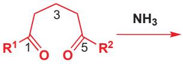</td><td></td><td>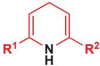</td><td>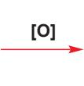</td><td>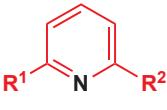</td></tr><tr><td></td><td></td><td>二氢吡啶</td><td></td><td>吡啶</td></tr><tr><td colspan="6">带有两个相邻杂原子的杂环</td></tr><tr><td colspan="6">五元环</td></tr><tr><td rowspan="2">•吡唑和异噁唑可以通过这种策略,由1,3-二羰基化合物理想地制得</td><td></td><td></td><td>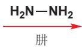</td><td>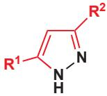</td><td>吡唑</td></tr><tr><td></td><td>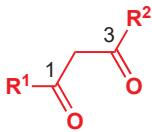</td><td>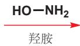</td><td>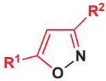</td><td>异噁唑</td></tr><tr><td>注意。这种策略不适用于异噻唑,因为“巯胺”是不存在的</td><td></td><td>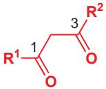</td><td>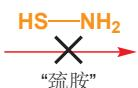并不存在</td><td>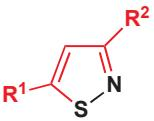</td><td>异噻唑</td></tr><tr><td colspan="6">六元环</td></tr><tr><td>•哒嗪可以通过这种策略,由1,4-二羰基化合物及氧化反应理想地制得</td><td></td><td>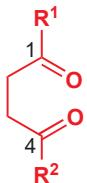 +</td><td>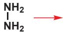</td><td>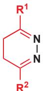</td><td>[7G04]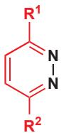</td></tr><tr><td colspan="6">带有两个分开的杂原子的杂环</td></tr><tr><td colspan="6">五元环</td></tr><tr><td rowspan="2">•咪唑和噻唑可以通过这种策略,由α-卤代羰基化合物理想地制得</td><td></td><td>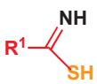 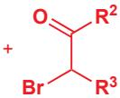</td><td></td><td>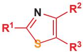</td><td>一种噻唑</td></tr><tr><td></td><td>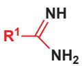 + 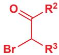</td><td></td><td>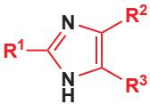</td><td>一种咪唑</td></tr><tr><td>注意。这种策略并不适用于噁唑,因为酰胺的活性通常不够:酰基化的羰基化合物的反应通常才是首选</td><td></td><td>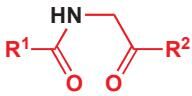</td><td></td><td>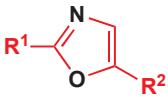</td><td>一种噁唑</td></tr><tr><td colspan="6">六元环</td></tr><tr><td rowspan="2">•嘧啶可以通过这种策略,由1,3-二羰基化合物理想地制得</td><td></td><td>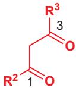</td><td>+ 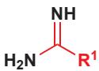</td><td></td><td>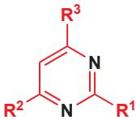</td></tr><tr><td></td><td></td><td>一种脒</td><td></td><td>一种嘧啶</td></tr></table>

一种脒  
一种嘧啶

# 通过环加成反应构筑环

# 1,3-偶极环加成反应

\- 异噁唑、1,2,3-三唑，和四唑理想的构筑方法

![[中文版clayden-chinese30-33章787-907_images/677452e07c5bb0625e24170536aa4f43d53e0ddd2eac2d6a95a5c2a71d9b3566.jpg]]

chemical

Reaction mechanism of nitrile-containing heterocyclic compounds under heating, showing three isomeric forms with 1,3-dipolar ring formation

# …或 $\sigma$ 重排

\- 一个特殊的反应，也是 Fischer 吲哚合成必不可少的步骤

![[中文版clayden-chinese30-33章787-907_images/53b8896310a3d73fc784e7c1ec7db37a956f3e2873a851104309e4180f229a20.jpg]]

chemical

苯肼与苯酮反应生成吲哚的化学方程式

# 环修饰

# 芳香亲电取代

- 在吡咯、噻吩，和呋喃上工作良好，最佳位点是2和5号位，但在3和4号位也几乎一样好  
- 通常，阻塞住不想使之取代的位点是最好的  
- 在吲哚上工作良好——只在 3 号位发生，但亲电试剂仍可能迁移到 2 号位

![[中文版clayden-chinese30-33章787-907_images/55099506db6aca43d073c48a5140db0d1f8465b450f4ac33cbeab9b76cb7659c.jpg]]  
吡咯

![[中文版clayden-chinese30-33章787-907_images/75e8531ecabd49e05a25872d73bcb5e06190497dc65d5c82200498aaee06149a.jpg]]  
噻吩

![[中文版clayden-chinese30-33章787-907_images/7af5bf6e8bc56979fabad44df31f0ba8f59810b261404f4c5abcabe50fafd785.jpg]]  
呋喃

![[中文版clayden-chinese30-33章787-907_images/3a3c4796e3196f91b2223bee88811089063f84484ed631500d0a0187b460d15f.jpg]]

flowchart

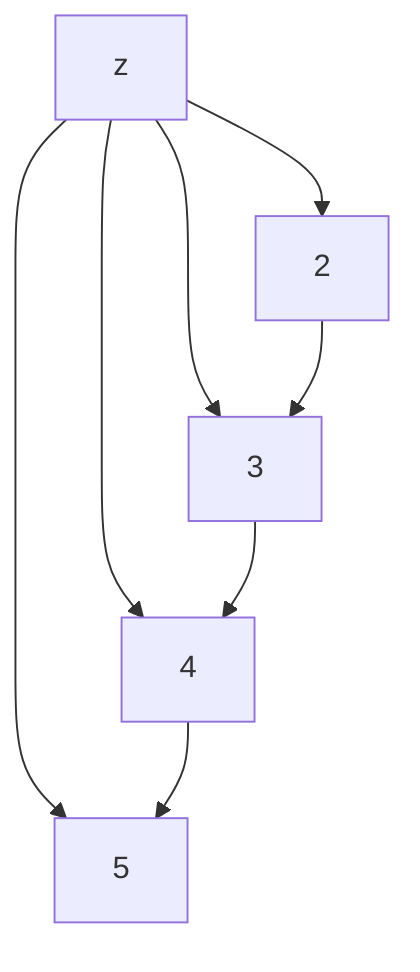

吲哚   
![[中文版clayden-chinese30-33章787-907_images/aef982329eadca06b14318fe588ab26ef4559af7b97d456941a0bcf72b01507a.jpg]]

chemical

Chemical reaction diagram showing conversion of compound 3 to compound 2 via nucleophilic substitution, with Chinese annotations for '有利' (good) and '由3号位迁移得到' (if the number is moved)

\- 对于带有硫、氧，或类吡咯氮原子的五元环工作良好，反应会发生在任何没有被阻塞的位点。(见前面的节)注意。不推荐用于吡啶、喹啉，或异喹啉

# 芳香亲核取代

\- 对于能使中间体中的电荷停留在氮上的吡啶和喹啉工作得尤其好

![[中文版clayden-chinese30-33章787-907_images/424843f8526fbf6b491fa635866a3dfd32f976f9d66baeb5431d88fdb869caeb.jpg]]

chemical

Two chemical structures showing nitrogen-containing heterocycles with directional arrows indicating electron flow or reaction direction

- 对于吡啶酮、喹诺酮特别重要，可通过将其转化为氯代化合物，再用亲核试剂取代氯，对于喹啉，可以取代苯环上的氟原子。  
- 对于带有两个氮原子的六元环 (哒嗪、嘧啶，和哌嗪) 在所有位点都工作良好

![[中文版clayden-chinese30-33章787-907_images/902bb6ab01293e4c6f5ec6a97bf860bc82f6993cbb9f0a1e7c66f94dbfc93bbc.jpg]]

chemical

Chemical reaction sequence showing nucleophilic substitution of a pyridine derivative under POCl3 and Nu⁻ conditions

![[中文版clayden-chinese30-33章787-907_images/d4e05a00d0d16932f0512661113c52b2f68121a0164dccf4500b07488aeb563c.jpg]]

chemical

Chemical reaction showing nucleophilic substitution of a fluorinated indole derivative to form a quinoline derivative

# 锂化和于亲电试剂的反应

\- 对于吡咯 (如果 NH 被阻塞)、噻吩、呋喃在杂原子邻位都

![[中文版clayden-chinese30-33章787-907_images/1cd302b64bf638af5ed23dfde2c15f929dfd4e6b77f5e34f3a071a9ba0a82450.jpg]]

chemical

Organic reaction scheme showing zirconium complex transformation with BuLi and Li ligands

工作良好。将 Br 或 I 交换为 Li 的方法，当任何酸性氢 (包括环上的 NH) 都被阻塞时，对于大多数亲电试剂都工作良好

# 延伸阅读

关于杂环的最好的一般性文本是：J. A. Joule and K. Mills, Heterocyclic Chemistry 4th edn, Chapman and Hall, London, 2010.

S. Warren and P. Wyatt, Workbook for Organic Synthesis: the Disconnection Approach, Wiley, Chichester, 2009, chapters 34–35 (译本：有机合成:切断法，科学出版社，2010).

# 检查您的理解

![[中文版clayden-chinese30-33章787-907_images/e747ecdb3d4c24bc86d2b6eaee4d97db9e889a9543cf882299641441e6e62602.jpg]]

为确保您真正掌握了这一章的内容，请尝试解决本书 Online Resource Centre (在线资源中心) 中的习题：http://www.oxfordtextbooks.co.uk/orc/clayden2e/

# 联系

# 基础

- 缩醛和半缩醛 ch11   
- 立体化学 ch13  
- 环状分子的构象 ch16  
- 立体专一性的消除反应 ch17  
- 质子 NMR ch18  
- 羟醛反应 ch26  
- 芳杂环 ch29 & ch30

# 目标

- 将杂原子放入环中会改变杂原子的反应性  
- 开环反应: 环张力的影响  
- 杂环中的孤对电子具有准确的定位效应  
- 一些取代基在六元饱和杂环中倾向于直立  
- 孤对电子与空轨道的相互作用可由控制构象  
- 闭环反应: 为什么五元环形成得快而四元环形成得慢  
- Baldwin 规则：为什么有些闭环可由很好地发生而另一些则根本不发生  
- 构象和环的大小如何影响偶合常数  
- Geminal 偶联   
- 对称性和 NMR 光谱的关系：非对映异构性

# → 展望

- 环状体系中的立体选择性 ch32  
- 非对映选择性 ch33  
- 不对称合成 ch41  
- 生命的化学 ch42

# 引入

环对分子的反应方式，和可行的合成方法都有影响。我们刚刚才用两章讨论了平面型的芳香杂环的反应和合成。而在本章，及紧跟着的一章中，我们还会继续着眼于环，但不是平面型的芳香环。环中的原子一旦是饱和原子，它们便会更加灵活，并表现出有趣的化学特征。我们在 Chapter 16 中介绍了讨论环的构象的方法 (conformation)，而在此我们还会回顾它们——环，由于限制了分子可以采取的构象的数目，因而使我们对其立体化学的思考更加容易，本章便会建立在这样一种思路上。我们还将介绍一种我们会在本书接下来的几章中不断发展的主题：立体选择性 (stereoselectivity)——如何制取单一非对映体的产物。

可能看起来有些奇怪，杂环——不仅包含碳原子，而且包含氧、氮，或硫的环——值得用整整三章来讨论，但您很快就会发现，这是合情合理的，这囿于杂环庞大的数目和种类，以及它们特殊的化学特征。在前两章中，我们讨论了芳杂环特殊的立体化学特征，尤其是它们独特的反应性、稳定性，和合成的容易性。下面示出了一些饱和杂环的例子，您或许熟悉其中的一些。

![[中文版clayden-chinese30-33章787-907_images/edbefb9c4681ba3a18b1428d5daa4f11c5381578d15a12321796cf2be1faa86c.jpg]]

饱和杂环以黑色显示，最重要的几类环的名称也已给出：有一些 (如哌啶 piperidine、吗啉 morpholine) 是您需要记住的；其他一些 (四氢呋喃 tetrahydrofuran、吡咯烷/四氢吡咯 pyrrolidine) 则很显然衍生于芳杂环的名称。这些化合物中，有一些 (尼古丁、毒芹碱、可卡因) 是属于生物碱 (alkaloids) 一类的植物产物，将于 Chapter 42 中讨论。另一类重要的饱和杂环，糖 (sugars)，也将出现于 Chapter 42.

但什么是饱和杂环“特殊的化学特征”呢？在环中放入杂原子，会完成两件重要的事情，它们便是本章中最重要的两个新话题。

虽然只有本章，立体电子效应出现在了标题中，但您很快就会意识到，我们将在此处涵盖的思路，与 E2 消除反应立体专一性的观点 (Chapter 17)，以及轨道重叠对 NMR 偶合常数的影响 (Chapter 18) 之间，具有相似之处。未来，我们还会用轨道排列来解释 Karplus 关系 (Chapter 32), Felkin-Anh 过渡态 (Chapter 33), 以及重排和碎片化反应中的构象需求 (Chapter 36).

- 首先，杂原子使环容易通过关环反应 (ring-closing reaction) 制取，或者 (有些情况下) 容易通过开环 (ring-opening) 反应断裂。环的开、关反应是您将必须掌握的内容，控制这些反应的原则将在本章的后文中讨论。  
- 其次，环固定了杂原子——相对于环绕它的原子——的取向——尤其是它们孤对电子的取向。这对杂环的反应性和构象有所影响，其影响可用立体电子效应 (stereoelectronics) 解释。

\- 立体电子效应，是轨道在空间中的排列，在化学上造成的影响。

# 饱和杂环的反应

# 饱和氮杂环：胺，但更加亲核

在很多反应中，简单饱和氮杂环——哌啶、吡咯烷、哌嗪 (piperazine)，和吗啉——都仅仅表现为恰巧是环状的仲胺。它们会发生其他胺发生的反应种类，如做加成和取代反应的亲核试剂。例如吗啉，可以被 3,4,5-三甲基苯甲酰氯 酰基化，得到镇静剂和肌肉松弛剂三甲氧啉 (trimetozine)，而 N-甲基哌啶 可以在与二苯基甲基氯的 $S_{N}1$ 反应中被烷基化，并得到晕车药苯甲嗪 (cyclizine).

![[中文版clayden-chinese30-33章787-907_images/2673a5676145b38dce876458d1718fe02bd71c13f857c05c7f07bc6f3f29a4ed.jpg]]

chemical

Chemical reaction mechanism showing conversion of 3-methyl oxime to 3-methoxy carbamate and then to benzyl methyl acetate via N-methyl methylation

吡咯烷对醛和酮的加成是一个尤其重要的反应，因为这个反应，会得到我们在 Chapter 25 中讨论的有价值的烯醇等价物，烯胺。

![[中文版clayden-chinese30-33章787-907_images/5ad2b2b23d80b612d7ab2b9300969b27e0c10a69e73edc9cc3440b86f362e364.jpg]]

chemical

Reaction mechanism of benzene isocyanate (benzene) to form propylamine, showing protonation, resonance, and ring opening steps

由吡咯烷、哌啶形成的烯胺尤其稳定，这是因为吡咯烷、哌啶相比于其他可比较的非环状胺，如二乙胺相当更加亲核。这是一个环状胺(及环状醚)的一般特征，这是一个立体效应。烷基取代基，被绑在后面的环中，避开了亲核试剂的孤对电子，使其能够没有空阻地接近亲电试剂。通过比较碘甲烷与三种胺——这次是叔胺——的反应速率，可以很好地说明这一效应。两种环状化合物都是桥环——奎宁环（quinuclidine）是一种桥连的(bridged)哌啶；另一种二胺，被称作DABCO(1,4-二氮杂双环[2.2.2]辛烷，1,4-diazabicyclo[2.2.2]octane)是一种桥连的哌嗪。下表展示了三乙胺，奎宁环和DABCO的相对反应速率，及 $\mathsf{pK}_{\mathrm{a}}$ 值。

![[中文版clayden-chinese30-33章787-907_images/9f81907874dd27f1ebd3a48fe0bf4be570f0b4ef6efc977fc14ad41baad59990.jpg]]

chemical

Chemical reaction mechanism showing nucleophilic attack of a trihydroxyl radical on an iodide ion

胺与碘甲烷的反应速率

<table><tr><td></td><td>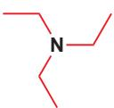</td><td>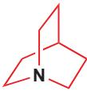</td><td>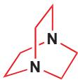</td></tr><tr><td></td><td>三乙胺</td><td>奎宁环</td><td>DABCO</td></tr><tr><td>相对反应速率a</td><td>1</td><td>63</td><td>40</td></tr><tr><td>R3NH+的pKa</td><td>10.7</td><td>11.0</td><td>8.8 (和3.0)</td></tr></table>

![[中文版clayden-chinese30-33章787-907_images/8ff126a15e4557057db2be36855deb2816ba43726c50b82667103741518e25ce.jpg]]

![[中文版clayden-chinese30-33章787-907_images/d1da2c91ef73dd7d3245f487ac9eb8ceecc543e5c6eea788146b1e4339ec3c0c.jpg]]

![[中文版clayden-chinese30-33章787-907_images/6e6cbc1171d14aded0444803066e89c0885f1e9fb1b985d578a9da5bcde0326e.jpg]]

![[中文版clayden-chinese30-33章787-907_images/7ff1124852dd13c9b3a89d6753c8aa288eefaed97e5e9a2413214144883d4b22.jpg]]  
$^{a}$ 20°C 下在 MeCN 中与 Mel 反应的相对速率。

![[中文版clayden-chinese30-33章787-907_images/9a2a2e700ac7f025cb882cd4ab55ca3f6d08dca2b6cd81c49373f8c7ea0fc6fb.jpg]]

chemical

Structures of R₂NH₂⁺ with labeled bond lengths and atom positions

澄清一下：我们在此讨论的 $pK_{a}s$ 都是铵离子 $R_{2}NH_{2}^{+}$ 的 $pK_{a}$ .

奎宁环和 DABCO 的活性比三乙胺高 40–60 倍。这同样是由于环结构使氮的取代基与用于进攻亲电试剂的孤对电子保持远离。您还应当比较环状结构对胺碱性的影响：没有影响！三乙胺和奎宁环的碱性等同，如页边栏中所示，二乙胺、二丁胺，和哌啶的碱性也差不多。这是由于，质子太小，几乎并不关心烷基是否被绑在后面。

决定 $pK_{a}$ 的因素中，重要得多的是氮富电子的程度，这也是奎宁环与 DABCO 的碱性，哌啶 $(pK_{a} 11.2)$ 与吗啉 $(pK_{a} 9.8)$ 或哌嗪 $(pK_{a} 8.4)$ 的碱性存在显眼的差异的原因。额外的杂原子，通过诱导作用，从氮原子上吸取电子密度，使其亲核性更弱，碱性也更弱。从这个意义上，吗啉可以作为非常实用的碱，碱性比三乙胺弱但又比吡啶 $(pK_{a} 5.2)$ 的碱性稍大。注意观察二胺 DABCO 和哌嗪的二级 $pK_{a}$ （即第二个氮质子化的 $pK_{a}$ ）低了多少：单质子化的胺上被质子化的氮原子会非常有效地从未被质子化的氮上吸电子。

# Baylis-Hillman 反应

DABCO 最重要的应用之一出现于 Baylis-Hillman 反应中，由纽约的塞拉尼斯公司 (Celanese Corporation) 的两名化学家在 1972 年发现。这个反应是羟醛反应 (Chapter 26) 的一种修饰，只是烯醇盐不是由去质子形成的，而是通过共轭加成形成的。在 Chapter 25 中您一见到，共轭加成的烯醇盐产物可以被烷基化试剂捕获，而在 Baylis-Hillman 反应中，亲电试剂是一个醛，这个醛在反应一开始就存在，这个反应也仅需在室温下搅拌各组分即可完成。下面是典型例子。

![[中文版clayden-chinese30-33章787-907_images/f0c47c372d820f75c439f2bb0e4d3f5f09c00c79cf06bad7048c76afb38de6f3.jpg]]

chemical

Chemical reaction equation showing acetaldehyde reacting with ethyl ester under DABCO at 7 days to form new ketone

反应开始于 (相对亲核的) DABCO 对丙烯酸乙酯的共轭加成。这会形成一个可以通过羟醛反应进攻乙醛的烯醇盐。

![[中文版clayden-chinese30-33章787-907_images/cbfea86ef25c6ff7d418c070a41ed459ce4a30677738f192556cfcff4d64551f.jpg]]

chemical

Reaction mechanism diagram showing nucleophilic attack and proton transfer steps in a cyclic carbocation compound

E1cB 消除通常紧跟着羟醛反应发生，并得到 $\alpha,\beta-$ 不饱和产物。但在此情形中，DABCO 是比羟基好得多的离去基团，因此烯醇化后，DABCO 会通过 E1cB 消除失去，得到反应产物。DABCO 得到复原，它是一个催化剂。

![[中文版clayden-chinese30-33章787-907_images/56c2bb91353c47e4bafc63a1f54c794882ed2e7a6e082013068f840315963a10.jpg]]

chemical

DABCO催化剂复原反应示意图，展示从正向阳极化生成丙酮的化学反应过程

Baylis-Hillman 反应的一个缺点是它的速度：通常，需要反应数天。压力有助于加速反应，而作为催化剂，DABCO 大概是最好的。因为被“绑在后面”的烷基，它是具有亲核性的；但更重要的是，它相对较低的 $pK_{a}$ 使之也是一个很好的离去基团，这意味着它很容易在最后一步中离去。如您之前所了解，好的亲核试剂通常是差的离去基团，但这有很多例外。DABCO 亲核性和离去能力的结合在此处是完美的。

环状胺中氮原子暴露的特性，意味着氮杂环会频繁出现于药物分子中，尤其是作用于中枢神经系统的药物 (可卡因 cocaine、海洛因 heroin、吗啡 morphine 都包含氮杂环，可待因 codeine 和许多镇静剂，如安定 Valium 也是如此) 中。环还可用于支撑添加上的取代基，它们会阻碍氮的孤对电子。正如哌啶中的氮原子一直暴露，2,2,6,6-四甲基哌啶 (TMP) 中的氮原子则一直栖息于甲基的深处。TMP 的锂盐 (LiTMP) 是 LDA 的类似物——一种具有很大空阻的碱，并可以用在即使是 LDA 都失败了的选择性情形中。

![[中文版clayden-chinese30-33章787-907_images/11d184841c1ffccbb5931806c55e48f140268b5959c588afbdfc9fbb52f1475f.jpg]]

chemical

Chemical reaction showing conversion of 2,2,6,6-diphenyl to LiTMP using BuLi catalyst

# 氮丙环: 环张力促进开环

氮丙环 (aziridine) 和氮丁环 (azetidine) 是稳定的，而易挥发的，它们是饱和氮杂环家族中的成员，氮丙环本身有一些有趣的化学。像吡咯烷和哌啶一样，氮丙环可以与酰氯反应而被酰基化，但产物是不稳定的。环会在氯离子，一个相对差的亲核试剂的进攻下打开，并得到开链的仲胺。

在 LDA 中，其中一个或另一个异丙基常常会通过旋转，使得只有一个 C-H 基在 N-Li 键附近。但在 LiTMP 中，则不可避免地有四个 Me 基在 Li 附近。

![[中文版clayden-chinese30-33章787-907_images/a1c7e2956ad5a180e97791849cdd348cb4e755d2073edfb049c9e3e584dcc15a.jpg]]

![[中文版clayden-chinese30-33章787-907_images/4affd52934ba250d8b28303923b24a6f0b9b5290f4a3f3ec578328fa561086f2.jpg]]

![[中文版clayden-chinese30-33章787-907_images/49da7aa9be91ee76b9373451973160a7a552f8c2c8fb47e369325a28e9eeebc0.jpg]]

chemical

Reaction mechanism diagram showing nucleophilic substitution and proton transfer steps with 95% yield

您可以将其看作非常类似于环氧开环 (Chapter 19)——尤其是其中氧带正电荷的，质子化的环氧——的开环过程。正电荷对氮丙环开环是非常重要的，因为如果在碱性下完成这个反应，质子的移去会立即得到中性的酰基氮丙环，它是稳定的。

![[中文版clayden-chinese30-33章787-907_images/9c266408c3d28b367d324929f562bc155e876a05d4c0db71fbe0a7321f15ead7.jpg]]

chemical

N-酰基氮丙环的化学反应示意图，展示从Cl和H中生成N-羟基氮丙环的步骤

氮丙环的开环是一个制取更大的杂环的实用方法：任何会在氮上放正电荷的事物，都会通过质子化或如下所示的烷基化，将 N 转变为一个更好的离去基团，进而促进开环。氮丙环在碱性中的烷基化会如您所料地得到 N-取代的氮丙环，但再次烷基化，则会产生一个带正电的氮丙环鎓盐 (aziridinium salt)，继而立即开环得到有用的溴代胺。

# 饱和杂环的系统命名法

氮丙环/吖丁啶 aziridine、氮丁环/吖丁啶 azetidine 的名称来源于一个逻辑合理的命名法体系，此体系通过下列规则得到一个由三部分组成的杂环名称：(a) 杂原子 ("az-吖" = 氮, "ox-噁" = 氧, "thi-噻" = 硫), (b) 环的大小 ("-ir-丙" = 3, 来源于 tri; "-et-丁" = 4, 来源于 tetra; "-ol-戊" = 5; 6 没用代称；"-ep-己" = 7, 来源于 hepta; "-oc-庚" = 8, 来源于 octa; 等)，和 (c) 饱和度 ("-ene烯" 或 "-ine" 代表不饱和，“-idine” 或 "-ane烷" 代表饱和）。由此可推知 az-ir-idine, az-et-idine, di-ox-ol-ane（二噁烷），和 ox-ir-ane（环氧乙烷）的名称。

![[中文版clayden-chinese30-33章787-907_images/1e030cc49c33f50c247ff93cb7b3d6c6cb29a1be9b40d0a1239473a6c645bf97.jpg]]

chemical

Multi-step organic reaction mechanism involving bromination, nitration, and hydrolysis steps

■ 这个情形的产物是两种天然产物，sandaverine 和 corgoine 的合成的中间体。

![[中文版clayden-chinese30-33章787-907_images/d486e23cd21278a8ee6a4645e8ea8479aad98d8cfe4e8680a9acbfaac50fc4d6.jpg]]  
有关环氧在酸性和碱性环境下开环的内容已于 Chapter 19 中阐明。  
■ $BF_{3}$ 最容易以其与乙醚的配合物处理，写作 $BF_{3}:OEt_{2}$ 或 $BF_{3}\bullet OEt_{2}$ ，其中乙醚将 z 孤对电子贡献进硼的空 p 轨道。在相关的反应中，HBr, $BBr_{3}$ ，或 $Me_{3}SiCl$ 被用于活化苯酚的甲基和苯基醚面对亲核进攻。见 Chapters 15, p. 351 和 23, p. 551.

我们刚刚提及了氮丙环的质子化，您可能会联想到我们之前所谈论的，氮杂环和它们的非环状对应物的亲核性和碱性的对比，并由此想到氮丙环会比吡咯烷更具亲核性，而碱性大约相同。嗯，这是错的。将烷基“绑在后面”的思路只适用于无环张力的五元环和六元环：对于小环，则有另一种效应取而代之。

氮丙环的碱性事实上比吡咯烷和哌啶弱得多：质子化的 $pK_{a}$ 只有 8.0. 这与包含一个 $sp^{2}$ 杂化的氮原子的化合物的 $pK_{a}$ 接近——例如页边中的亚胺。这是因为，由于三元环，氮的孤对电子处在比典型亚胺中 s 成分更高的轨道中。这是我们之前，在 Chapter 18 中就讨论过的效应，如果您需要刷新记忆，那么请重新阅读 pp. 412–415；在那里，我们将三元环与炔烃做了比较，并阐释了，它们都可以相对容易地被去质子；阴离子的负电荷处在一个 s 成分较高的较低能轨道：和此处，氮丙环的孤对电子处在较低能轨道一样。

氮丙环的氮的孤对电子的 s 成分还有另一种影响。该孤电子与相邻的羰基相互作用得非常差，因此 N-酰基氮丙环，例如您在 p. 973 见过的一个，表现得完全不像酰胺。氮原子是金字塔型而不是平面型，C=O 键的伸缩频率 $(1706 \, \text{cm}^{-1})$ 也与酮 $(1710 \, \text{cm})$ 更加接近，而不接近酰胺 $(1650 \, \text{cm}^{-1})$ .

孤对电子的 s 成分还意味着，氮原子的翻转非常缓慢，相当像一个磷。通常氮不可能作为一个立体中心，因为翻转发生得太快了——(其中孤对电子处在 p 轨道的) 氮翻转的过渡态能量较低。但对于氮丙环，将孤电子放入 p 轨道需要大得多的活化能，因而这种氮可以是具有立体化学的 (stereogenic). 页边栏中的 N-取代氮丙环的两种立体异构体可以得到分离。

# 氧杂环

开环化学同样是氧杂环的特征，在此我们也无需再回顾有关环氧开环的内容。环氧尤其活泼，因为环张力的释放驱动了开环反应的发生。不过，通常，氧杂环，如环状醚，是相对不活泼的：醚是所有常见官能团中活性最低的一个。这也是THF、二噁烷是重要溶剂的主要原因。第二个原因是因为，它们可以通过贡献孤对电子，稳定缺电子的金属阳离子（例如Li）来溶解有机金属。环状醚是比非环状醚更好的给体(更亲核)，与环状胺比非环状胺亲核性强的原因相同。

孤对电子与 Lewis 酸的相互作用，可以被利用来使醚更活泼。 $BF_{3}$ 常被用于活化面对亲核进攻的环状醚；即使对于环氧，当用有机金属试剂做亲核试剂时，它也能提高速率和产率。BuLi 在没有添加 Lewis 酸，如 $BF_{3}$ 时，不会与噁丁环 (oxetane) 反应，这个反应会打开四元环，以定量的产率得到正庚醇。若无环张力帮助反应进行，以 THF 为对比，即使有 Lewis 酸，产率仍较低。

![[中文版clayden-chinese30-33章787-907_images/10802a3f7b34a33a135f4063aa44e5b87c76eda4a9370d9d85db8c8126cfa38b.jpg]]

chemical

Chemical reaction equations showing deprotonation and hydrogenation of THF with BF₃ catalysts, yielding 20% yield

BuLi 和 THF 更常见 (然而却通常不想要) 的一个反应，并不是亲核进攻，而是去质子。您将会注意到，涉及 THF 中的 BuLi 的反应一贯在 $0^{\circ}$ C 或更低的温度下进行——通常是 $-78^{\circ}$ C. 这是因为，高于 $0^{\circ}$ C 的温度，会使得 THF 的去质子化开始发生。被去质子了的 THF 是不稳定的，会经历一个我们称之为逆 $[2 + 3]$ 环加成 (见 Chapter 34) 的反应分解。下面是其机理。产物是：(1) (碱性弱得多的) 乙醛的烯醇盐和 (2) 乙烯。前者倾向于聚合，后者通常 (其他情况见下面的文字框!) 从反应混合物中挥发出去。

![[中文版clayden-chinese30-33章787-907_images/0a0fe868be65167e74c4b57b1595699384ee9c17d50e008244c63dc11406145a.jpg]]

chemical

Organic reaction mechanism showing lithium-boron complex formation and subsequent ring-opening with acetic anhydride

# 出乎意料的乙基的情况

比利时的一些化学家曾在研究如下所示的有机金属的反应，以查明阴离子中心是否会进攻双键以形成一个五元环。这个反应是缓慢的，它们将有机锂在 THF 中，于 0 ℃ 下搅拌了 6 个小时。后处理后，他们没用发现五元环产物：而是得到了多一个乙基的化合物！它们发现，这个乙基事实上来源于 THF: 有机锂并没有加成到自己分子中的双肩上，而是缓慢、低产率地加成到了 THF 分解所得的乙烯上。

![[中文版clayden-chinese30-33章787-907_images/be525073dc1803a7461fcb40a881e6f42e058cb5b6f30bb4ec68b53092549794.jpg]]

chemical

Thermochemical reaction converting a lithium-containing alkene to a vinyl group under THF at 0°C, with an arrow indicating the conversion to THF as ethyl.

四氢吡喃衍生物最常见的用途，是被用作保护基：您在 Chapter 23 中遇到了这种情况。

# THF 稳定型

THF 中的 n-BuLi (在 TMEDA 的存在下) 的半衰期在 20℃ 下是 40 分钟, 0℃ 下是 5.5 小时, -20℃ 下是 2 天。乙醚的去质子困难得多: 20℃ 下, 乙醚中的 n-BuLi 的半衰期为 10 小时。有机锂的碱性越强, 在 THF 中分解的速率就越快, t-BuLi 只能在 -78 的 THF 中使用。在 -20℃ 下, t-BuLi 在 THF 中的半衰期仅为 45 分钟; 同等温度的乙醚中, 它的半衰期为 7.5 小时。

# 硫杂环

如您在 Chapter 27 中所了解，硫可稳定邻位的阴离子，这意味着，硫杂环比 THF 的去质子容易得多。其中最重要的一类，是包含两个硫原子的二噻烷 (dithiane)。二噻烷的去质子化发生在两个杂原子之间，您在 p. 661 已了解过一些由此产生的化学性质。下面的反应系列很好地说明了二噻烷化学，和氧杂环在 $\mathrm{BF}_3$ 存在下的开环反应。二噻烷衍生物被 BuLi 去质子，得到一个亲核性的有机锂，继而进攻亲电试剂——在 $\mathrm{BF}_3$ 存在下，甚至会是氧杂环。即使亲电试剂是 THP，没用任何的环张力驱动反应发生，产物仍会以极好的产率形成。加成反应后，二噻烷环可以与汞(II)发生水解，以得到一个带有其他有用官能团的酮。

![[中文版clayden-chinese30-33章787-907_images/96b02ec41ef924cc284cba5849883aaaae05aa7d0cfe4b442a6123867538cd83.jpg]]

chemical

Chemical reaction showing conversion of 二噻烷 to Li using BuLi catalyst

■ 二硫戊环 (Dithiolane), 二噻烷的五元环版本, 不能用于这个反应, 这是因为, 虽然它很容易去质子, 但形成的阴离子会通过与 THF 相同的机理分解。

![[中文版clayden-chinese30-33章787-907_images/2046dc05f109c66cedb648c0d622c22ef4987e05c4e846f2c46543c035ebe081.jpg]]

chemical

Chemical reaction scheme for sulfonated diethyl ether (S-phenylsulfonyl) synthesis using BuLi and BF₃, with yields for n=0,1,2 or 3 under different conditions.

→ 烯烃中的偶联已在

p. 293 描述；环己烷中的偶联在 p. 415.

![[中文版clayden-chinese30-33章787-907_images/435ec0cd53af0e55e4a39799dcb2e74be7a3b12e6caa7fb2872162fa2224df54.jpg]]  
双直立 Hs  
二面角 $180^{\circ}$   
$^{3}J$ \~ 10–12 Hz   
直立/平伏
Hs 二面角 60°

$^{3}J \sim 3-5$ Hz   
![[中文版clayden-chinese30-33章787-907_images/dbff3cea9afb97446a6e90e3c0dcf1d7a231c2a946b8b6b02ff8292d0cfbc071.jpg]]  
双平伏 Hs  
二面角 $60^{\circ}$   
$^{3}J \sim 2-3$ Hz

![[中文版clayden-chinese30-33章787-907_images/77818d40f854f821d0c28051e9e52c645e882d553215cc8dfbb83e36cf565778.jpg]]  
二面角 $90^{\circ}$   
$^{3}J \sim 0$ Hz

# 二面角

二面角在 Newman 投影式中十分清晰——二面角是两根 C-H 键投影在一个正交于 C-C 键的平面上所得的夹角。在 Newman 投影式中，纸面就是这个平面，此处该角为 $180^{\circ}$ .

![[中文版clayden-chinese30-33章787-907_images/09815905dc9434d565028f0ecc29be45514a6ecce029cace31d537eaae1c39a3.jpg]]

chemical

键键间二面角的化学结构示意图，标注从侧面看方向及角度180°

另一种思考二面角的方式，是通过想象 C-C 键是一本部分打开的书的书脊。如果两根 C-H 键分别处在所翻开的这两页上，那么书页之间的角度就是二面角。

![[中文版clayden-chinese30-33章787-907_images/3cf6eff42bf64d1212626d18ede619160b093d1abd1f285dbdb1cae74417e7e1.jpg]]

chemical

Molecular structure diagram of ethylene (C2H4) showing carbon atoms and hydrogen bonding

# 饱和杂环的构象

# 使用 NMR 研究构象：Karplus 关系

在 Chapters 13 和 18 中，我们阐释了 NMR 光谱中的偶合是沿键的 (而不是沿空间的) 效应——这也是为什么反式烯烃的偶合常数比顺式烯烃的大，也是为什么六元环中的直立-直立偶合比直立-平伏偶合或平伏-平伏偶合大。现在我们需要针对您对于构象和偶合常数的关系的理解，建立更多细节，我们可以使用 NMR 来探测饱和环采取的构象。

环己烷中的偶合常数告诉我们，当涉及的 C–H 键平行得——换句话说就是当它们的二面角接近 $180^{\circ}$ 或 $0^{\circ}$ 时——最多时，偶合常数最大。简单环己烷中的 C–H 键只能有 $60^{\circ}$ 或 $180^{\circ}$ 的二面角，但通过对大量其他化合物中偶合常数的研究，我们可以绘制出偶合常数随二面角变化的规律。例如，在页边的多环化合物中，黑色质子有一个接近 $90^{\circ}$ 的二面角，其偶合常数是 0 Hz. 完整的对应关系是由 Karplus 在 1960s 研究得出的，被称为 Karplus 关系 (relationship). J 对二面角的图像的形式是最容易理解的。

![[中文版clayden-chinese30-33章787-907_images/db94c251c0110bfcc4516717892d7fe0b0867165cd3eef2952f87ae84f1872d1.jpg]]

line

| 二面角 H-C-C-H | 偶合常数 J |
| -------------- | ---------- |
| 0°             | High       |
| 90°            | Minimum    |
| 180°           | High       |

仔细审视上方的图表，并注意以下原则特征：

- 偶合的最大值出现于 $180^{\circ}$ 时，此时两根 C-H 键的轨道是完美地平行的 (反式烯烃，或环己烷中反式双直立 C-H 键出现了这种情况)。  
- 偶合在 $0^{\circ}$ 时几乎也一样大，此时两条轨道在同一平面但不平行 (顺式烯烃的情况)。  
- 当二面角是 $90^{\circ}$ 时，偶合为零——两条正交的轨道不会相互作用。  
- 曲线在 $0^{\circ}, 90^{\circ}$ , 和 $180^{\circ}$ 周围变平——这些区域中的化合物的 $J$ 变化很小。  
- 曲线在大约 $60^{\circ}$ 和 $120^{\circ}$ 处急剧倾斜——这些区域中的化合物，很小的角度变化都会引起较大的 J 变化。  
- $J$ 的数值会随着取代，环的大小等因素变化，但Karplus关系仍然可用——它可用提供相对数值。

NMR 可以确定构象，同时，它也可能确定构型。这通常发生于两个或更多的取代基处在环上时。下面是一个简单的例子：您在 Chapter 16 中已了解了 4-叔丁基环己酮的还原，可以通过对试剂的选择，控制生成顺式或反式的醇。

![[中文版clayden-chinese30-33章787-907_images/d9da2a541af1a256512a7edb4b4c4692538a481901df58472ca03cb25c0331f0.jpg]]

chemical

Chemical reaction diagram showing conversion of 顺式醇 to 反式醇 via [H] bond formation, with hydroxyl groups and equilibrium at H

产物很容易区分，因为两种情况中，被标出的 H 在 NMR 光谱中出现的方式很不一样。其中一个以好的多重峰出现，而另一个则宽得多。

![[中文版clayden-chinese30-33章787-907_images/bffb41bc9b1a478ebba3df65f0c139620419fd5b50585696349739e5c730da66.jpg]]

庞大的叔丁基往往处在平伏键，每个 OH 基都有两个完全相同的直立邻居和两个完全相同的平伏邻居 (其中的一组已在 p. 796 底部的图表中示出——位点前方还有一组)。每个被标出的 H 都以三重峰的三重峰出现。在顺式醇中，两种偶合都很小 (2.72 和 3.00 Hz)，但在反式醇中，直立-直立偶合 (11.1 Hz) 比直立-平伏偶合 (4.3 Hz) 大得多。

相同的思路可被用于研究饱和杂环体系的构象。对下面的不饱和缩醛氢化，会以单一异构体得到饱和化合物。但是是哪一个呢？两个取代基，Me 和 OEt, 是顺式还是反式呢？

![[中文版clayden-chinese30-33章787-907_images/4eb2fac5affce5b1f73a21258b131fcbafd95de2a31021923c164813b17e16dd.jpg]]

chemical

Chemical reaction diagram showing hydrogenation of a cyclohexanone derivative to form a cyclic ester and its ring, with reagents H2 and Raney Ni indicated.

两个黑色氢在 NMR 光谱上出现的方式揭示了答案，同样也显示了分子采取的构象。在 3.95 ppm 处(因而是与氧相连的氢)有一个 1H 信号，而且是双重四重峰。由于是四重峰，该氢必定是与

从这个观察中，您可以得出一个普遍性结论：NMR信号的宽度大致等于它所有偶合的总和。在任何给定的化合物中，直立质子都会比平伏质子具有宽得多的信号。

$\delta_{H}$ 3.95, 1H, dq, $\delta_{H}$ 4.40, 1H, dd, J9 和 6.5 Hz, J9 和 2 Hz

![[中文版clayden-chinese30-33章787-907_images/af02e9d8c1832d07d68c313ce2e469d79de5faa3b5f7834185bf767e95449180.jpg]]

这个 H 只有
小偶合

![[中文版clayden-chinese30-33章787-907_images/ac52aaf94e41008e10abce897e37d1867f92ce2b1da37a6f453e8094fde38031.jpg]]

此处 OEt 基由 (通常有利的) 平伏转变为直立的过程看起来可能奇怪，我们将在下一节阐述。

![[中文版clayden-chinese30-33章787-907_images/8ddc42dfd060b3a7f1cc8d7a2e9d56f9587f06c4c695658037e6ea50dea384ea.jpg]]

chemical

Chemical reaction diagram showing deprotonation of a cyclic alcohol with R1 and R2 substituents, forming a chiral alcohol with PhCHO and H+

甲基相连的氢。四重峰的偶合常数 J 值是 “正常的” 6.5 Hz. 双重峰的偶合是 9 Hz, 若非直立-直立偶联，这个值都太大了，因此该氢是直立的。

在 4.40 ppm 处 (与两个氧相连) 有另一个 1H 信号，是一个双重双重峰信号，J = 9 和 2 Hz. 它表现出一个直立-直立 (9 Hz) 和一个直立-平伏偶合，这必定也是一个直立质子。我们现在知道了分子的构象。

两个黑色氢都是直立的，因此两个取代基都是平伏的。这也意味着，在此情况中，它们是顺式的。但请注意，这是因为它们在环的同一面，即上面，而不是因为它们都是平伏的！在前方的质子有两个邻居——一个直立 (棕色) H, J = 9, 和一个平伏 (绿色) H, J = 2 Hz. 所有这些都恰合 Karplus 关系所料。您可能注意到，后面的 H 失去了于其平伏邻居的小偶合。毫无疑问，它确实偶合了，但在双重四重峰的八条线中，小偶合的信号无法被注意到。小偶合很容易被忽视。

当这种化合物被置于微酸性的乙醇中时，它会转变为另一种异构体。反式化合物的 NMR 光谱同样非常有用。与甲基相连的质子几乎与前面相同，但两个氧原子之间的质子则很不同。它位于 5.29 ppm 处，是一个宽度大约为 5 Hz 的未被解决 (unresolved) 的信号。换句话说，它没有较大的偶合，因而必定是平伏质子。反式化合物的构象如页边所示。

由于六元环中的偶合常数定义完善，它可被用于确定所形成的杂环的立体化学。假设您有一个 1,3-二醇 的非对映体，并想要知道它是哪种。您可能会想要使用两种黑色质子的 NMR 偶合常数。但这样并不好，因为该分子没有固定的构象。所有 σ 键的自由旋转，意味着 Karplus 等式 (equation) 无法使用，无论质子的立体化学如何，所观察到的很有可能都是一个在大约 6–7 Hz 处的时间平均信号。

假定我们现在用苯甲醛，与该 1,3-二醇 反应制取缩醛。缩醛在热力学控制下形成，因此所得的是可能的构象中最稳定的一个，其中最大大苯基处于平伏，两个 R 基，取决于开始时使用的二醇的非对映化学，或都处于平伏，或一平伏一直立。

![[中文版clayden-chinese30-33章787-907_images/e2a241fee0ae862ec8d54eadfd7ab40ff0f757fd91f39951f12bcc3a6c2d2f58.jpg]]

chemical

Chemical reaction scheme showing non-phenyl group formation and structural rearrangement to form a chiral alcohol derivative

现在分子便有了固定的构象，黑色 $\mathrm{Hs}$ 对相邻的 $\mathrm{CH}_2$ 基的偶合常数可以被确定一一直立H会表现出一个大的 $J$ 值，平伏H只会表现出小的 $J$ 值。

![[中文版clayden-chinese30-33章787-907_images/b8b3130a38dc8878948d133f12503142967ebb0f5db9cc0522b69d621e871211.jpg]]

chemical

Chemical structure of a fused-ring compound with sulfur, methoxy, and hydroxyl groups

创新霉素

# 推断一种新抗生素的立体化学

只有完全饱和的六元环会是真正的椅式或船式。即使环中只有一根双键，环也会部分地平面化：此处，我们会着眼于一个较平的例子。这是一种由中国研究者发现的独特抗生素，被称作“创新霉素(chuangxinmycin)”(意思是“一种新的抗生素”，其中“霉素mycin”=抗生素)。它的独特性在于，它是一个含硫吲哚：很少有天然产物包含这种结构，并且没有其他的抗生素包含这种结构。

结构本身很容易阐明，但两个黑色氢的立体化学并不十分明显。偶合常数 $(^{3}J)$ 是 3.5 Hz. 试图合成该化合物时，Kozikowski 将下面的烯烃酯氢化，得到一个毋庸置疑的顺式产物（氢化是顺式选择性的：见 Chapter 23, p. 535).

![[中文版clayden-chinese30-33章787-907_images/d5ae0a244e4f8dc75c5cd1e45f20a3a66767ba3466cf0cdab2c139f958016a3e.jpg]]

chemical

Reaction mechanism of benzene derivative showing hydrogenation and radical formation under catalyst, followed by hydrolysis to form new霉素 and radical products.

黑色氢的 ${}^{3}J$ 偶合是 4.1 Hz, 与抗生素很像，在碱的水溶液中将酯基水解，主产物与天然的创新霉素完全相同。然而，还存在次要产物，即反式异构体， ${}^{3}J = 6.0$ Hz. 注意观察这个值比饱和六元环中的直立-直立偶合的 10 Hz 以上要小得多。环的平面化会减少二面角，进而减小 J 的大小。

偶合常数并不总能提供关于立体化学无歧义的信息，下一节中，我们将着眼于另一种技术，可以不依赖于偶合地从 NMR 光谱中提取结构信息。

# 在偶合常数不起作用时确定立体化学：核的欧沃豪斯效应

下面的化合物中绿色质子的偶合常数相当大，位于 11 Hz 处——与环己烷中反式双直立偶合相当。Karplus 关系会指出，绿色质子和它们的键，在大部分时间，必定接近 $180^{\circ}$ 二面角排列，由此我们可以推断出该化合物的构象，及构型。而更困难的，是确定由这个溴代胺与碱反应得到的消除产物的立体化学中的排列方式。这不是一个简单的问题，因为消除还包含胺基的重排。产物是一个有两种可能的几何结构的烯烃。

![[中文版clayden-chinese30-33章787-907_images/8d42ad1181e43d877b9e611f4c9224fea0237a504c49401c6e779d13b15aa922.jpg]]

chemical

Chemical reaction scheme showing conversion of a brominated cyclohexylamine derivative to an enone using EtO⁻ and EtOH

通常，我们会使用偶合常数确定烯烃的立体化学，但在此处，由于烯烃上只有一个质子，这就行不通了：两种化合物都只会有一个单峰。这样的情形下，我们可以利用 NMR 的一个奇异性质，被称作核的欧沃豪斯效应 (nuclear Overhauser effect, NOE). NOE 与偶合在所提供的信息上相当不同：NOE 告诉我们哪些氢在空间上接近，并不是如偶合常数揭示的，在沿键关系上接近。

关于核的欧沃豪斯效应的缘起的细节超出了本书的范围，但我们可以为您提供该效应的一个一般性思路。如您在 Chapters 3 和 13 中所了解的，取得质子 NMR 光谱的时候，射频电磁辐射的脉冲将质子的自旋振动到一个更高的能量状态。我们观察到的信号便是这些自旋跌落回它们的原始状态时所生成的。到目前为止，我们一直假设，跌落的过程是自发的，如同悬崖上的石头会自发掉下来一样。但事实上并不是这样——有时需要“帮助”质子跌落回去——这个过程被称为弛豫 (relaxation)。帮助其跌落的“某个事物”就是其他附近的磁活性核——通常是更多的质子。注意，是相邻的——在空间上相邻，而非沿键接近。对于质子，弛豫往往很快，附近质子的数目并不会对 NMR 光谱的外观产生影响。

虽然在正常的谱图中，峰的强度是独立于附近的质子数目的，但通过使用其描述超出本书讨论范围的方法，根据附近的质子数目，非常轻微地修改峰的强度是可能的。该方法的基础是特定的质子(或完全相同的质子的组）被选择性地照射（换句话说，它们精确地被恰当的频率的辐射脉冲——而非正常 NMR 实验中所需的宽脉冲——振动到高能状态，并保持在那里）。在实验条件下，这会使得原本依赖被照射的质子弛豫它们的质子，在 NMR 光谱中以稍强的峰强度出现（可能只是百分之几）。这个效应被称作核的欧沃豪斯效应，峰强度的增加是核的欧沃豪斯增强/因子 (nuclear Overhauser enhancement). 二者都缩写为 “NOE”。

![[中文版clayden-chinese30-33章787-907_images/f6bd7c5148d0eeb32ce6fd3a4fda7a23f2d5f4c457e798ccdb554a3bc522094d.jpg]]

关于如何使用偶合常数的小确定烯烃几何结构的详内容，请见 p.293.

# 为什么您不能积分 $^{13}$ C NMR 光谱

弛豫是您不能积分 $^{13}\mathrm{C}$ 光谱的真实原因。 $^{13}\mathrm{C}$ 的弛豫是缓慢的，但在附近有很多质子的时候是很快的。这就是您经常会发现—— $\mathrm{CH}_3$ 基在 $^{13}\mathrm{C}$ NMR光谱中表现出强信号，而未连有质子的季碳，则会表现出弱峰——的原因：季碳只会缓慢地弛豫，因此我们没用检测到强峰。让所有 $^{13}\mathrm{C}$ 原子在脉冲之间有大量的时间弛豫，可以得到更按比例的峰强度，但代价是非常长的NMR采集时间。

在此阶段，您只需要意识到，NOE 实验中被照射的质子会引起在空间上与之邻近的其他质子峰强度的增强——无需偶合，并且 NOE 也不是一个沿键现相。这种效应随距离变长而迅速衰减：增强的程度正比于 $1 / r^6$ (其中 $r$ 是质子间的距离)，将两个质子移动到原来两倍远的距离的地方，一个质子对另一个质子的增强会减小到64分之一。NOE 光谱通常表现为差距：增强的光谱减去未增强的光谱，因此特定质子峰强度的小增强会立即被发现。

将NOE应用到刚刚的问题上，可以解决结构问题。照射哌啶环中与氮原子相邻的质子，发现烯烃质子的信号会在强度上有所增加，这说明这两组质子必定在空间上邻近。化合物是 $E$ 烯烃。

![[中文版clayden-chinese30-33章787-907_images/3c48bb4b72db40c5deca188001f41dc7a02ee5cc8e8cacad7e46fc985e5dc800.jpg]]

chemical

Chemical structure of a protonated heterocyclic compound with labeled atoms and Chinese annotations explaining the resonance nature.

NOE 实验中的数据，在三维立体化学的确定上，很好地补充了从偶合常数得出的信息。用大位阻氢化物还原剂，还原下面的双环酮，会得到醇的一种非对映体，它是哪个呢？照射与 OH 相邻的质子，会导致绿色质子出现 NOE. 这表明，两个质子在分子的同一侧，还原反应通过将负氢传递到酮的，与三元环中两个甲基相对的一面，发生。

![[中文版clayden-chinese30-33章787-907_images/7295fb41f206aa075f79fa8c4dafa88ab89cbc7868a291defc1d437585a38a21.jpg]]

chemical

Reaction mechanism showing OSiEt3-mediated ring-opening of a cyclohexanone with H and OH groups, resulting in NOE and product formation

偶合常数与 NOE 效应的结合经常被用于确定反应产物的立体化学。

![[中文版clayden-chinese30-33章787-907_images/360891a35a37bcb10ee3c0680a3adbed605463944005c13ef879bedcfc6aca5f.jpg]]

chemical

Chemical structures of three organic compounds with labeled functional groups and Chinese annotations

# 环中的杂原子有直立和平伏的孤对电子

作为我们的首个近似，五元和六元杂环的构象遵循的规则，非常像我们在 Chapter 16 详细考察过的碳环化合物的构象。对于二噻烷，构象如页边所示。由于硫原子含有孤对电子，它们也会占据直立和平伏位置。二噁烷和哌啶同样如此。

我们已将孤对电子，根据它是直立还是平伏，涂为绿色和黑色，您也可以考虑其他的涂色方式：例如将与在环中的 C-C 或 C-杂原子键平行的孤对电子图为黑色，将与在环外的直立 C-H 键平行的质子涂为绿色，如果环带有取代基，这也相当于将与与取代基成的键平行的质子涂为绿色。下面的取代的四氢吡喃可以说明这一点。注意观察，与杂原子相邻的平伏取代基既不与绿色孤对电子平行，又不与黑色孤对电子平行。

为什么这是重要的？有很多孤对电子在其中扮演角色的反应。例如，缩醛的水解，相邻的孤对电子对所形成的正电荷的稳定化作用会促进机理的消除步骤。让我们考虑，当缩醛是一个饱和杂环时，缩醛水解中发生的变化。由 Chapter 11, 您会想到，此过程机理如下：

![[中文版clayden-chinese30-33章787-907_images/749250b941755314513a64c6f73d22be40a0260b9f4f47c4fe3d4f77390cf522.jpg]]

chemical

Organic reaction mechanism showing transformation of a cyclic ether with Ar and OH groups to form a hydroxy ketone

然而，当我们试图画出孤对电子的构象时，我们会遇到一个问题：它们都不与要断裂的 C-O 键重叠，因而它们也都不能向 C-O $\sigma^{*}$ 内贡献电子密度。另一种看待这个问题的方式，是说中间体锌离子——若要通过其中一对孤对电子成 C=O 双键——会极其扭曲。因而并不令人奇怪的是，这个缩醛的水解速率，相比于相似的，但氧的孤对电子与 C-O $\sigma^{*}$ 之间的重叠却是可行的缩醛的水解速率，要慢得多。右侧的缩醛比左侧的，水解速率快大约 $10^{10}$ 倍。

![[中文版clayden-chinese30-33章787-907_images/12b7f35624239a9c02978a7be5adb29c69fec0290e60a0dc679f65df1c7d8765.jpg]]  
没有孤对电子与与离去基团的 $\sigma$ 键重叠

这个锌离子会不切实际地扭曲  
![[中文版clayden-chinese30-33章787-907_images/26b2b79172e7bd52e3dff17465bc87216f6cbcf839939c447dde9129f9088f06.jpg]]

![[中文版clayden-chinese30-33章787-907_images/5be43a2f932459aba2413bc27cbc63fcc54fdfc1763b5c7bdddc87f11a93525f.jpg]]  
非常快速的水解

您刚刚已看到了，轨道间的重叠控制着 NMR 偶合常数；轨道重叠重要的其他情形还有：

• E2 消除反应 (Chapter 17)  
- 环状分子的反应 (Chapter 32)  
- Felkin-Anh 过渡态构象 (Chapter 33)   
- 碎片化和重排 (Chapter 36).

放在一起，这些因素，因为它们取决于轨道的取向，因而被称作立体电子效应。

# 一些饱和杂环的取代基倾向于处于直立：异头碳效应

上述列表中，很多立体电子效应控制的都是反应性，但在本节中，我们将会处理立体电子效应影响结构——尤其是构象的方式。最重要的饱和氧杂环中，有一些是糖。葡萄糖是一种环状半缩醛——一个五取代的四氢吡喃——它在溶液中的主要构象如下所示。溶液中，有三分之二的葡萄糖以这个立体异构体存在，但半缩醛的形成和断裂是迅速的，它同时也进一步与占比三分之一的，羟基处在直立键的半缩醛平衡(开链形式占比<1%).

![[中文版clayden-chinese30-33章787-907_images/a8046b982f4fe51f69ba9e5b91cdc357926276ed2fe804a4391daa85bff23080.jpg]]

chemical

异头取代基与异头碳反应示意图，展示葡萄糖与异头碳的平衡过程及不同碱基的分离

读过 Chapter 16 后，您不会对葡萄糖倾向于使其全部取代基处于平伏感到惊讶。对于其中四个，当然，别无选择：它们要不就全直立，要不就全平伏，这二者只需要通过环翻转即可转换。但对于第五个取代基，与环的氧相邻的羟基 (被称作异头 anomeric 羟基)，就可以通过半缩醛的断裂与重新形成使其能在直立和平伏间选择——即能够逆转它的构型。也许令人惊讶的是，这个羟基对于平伏的偏向性是如此小——只有 2:1. 更令人惊讶的是，对于大多数葡萄糖的衍生物，异头取代基倾向于处在直立而非平伏。

![[中文版clayden-chinese30-33章787-907_images/5bce75525ae8d741dbbec525b7bb4d7f98715ef28d3314cd934de7e65e1992cb.jpg]]

chemical

Chemical reaction showing conversion of a sugar derivative with methoxy and acetone groups to form cyclic products with yields 33% and 67%, and 14% and 86% respectively.

![[中文版clayden-chinese30-33章787-907_images/9320aa394aa411d947efd09f6a8cf8cffbdba2a03073b480a2fc538432b8e10b.jpg]]  
我们在 Chapter 6, p. 137 介了葡萄糖的半缩醛结构。

![[中文版clayden-chinese30-33章787-907_images/8e172b859535aab69a391004b0e98d4ae4264ea2f4f6e61e553fd41cdc688940.jpg]]

![[中文版clayden-chinese30-33章787-907_images/467ad6972b633b461cfb1428e0150cf3607ac86b79814eff1573e17b8271ecad.jpg]]

chemical

Chemical reaction diagram showing ring-opening of a sugar derivative with acetyl and chloro groups

抛开葡萄糖，这个效应在其他取代的四氢吡喃中也同样有容身之地。下面的表格是页边中的氯代化合物的 NMR 信号。这次只有两种可能的构象 (由于它不是半缩醛，因而不可能有构型变化)——都已展示出来——由 NMR 光谱，您应当能推断出这个化合物究竟是哪种。

<table><tr><td>δ</td><td></td><td></td><td>J, Hz</td><td></td></tr><tr><td>5.78</td><td>1H</td><td>t</td><td>2.0</td><td>H1</td></tr><tr><td>5.03</td><td>2H</td><td>m</td><td></td><td>H2, H3</td></tr><tr><td>4.86</td><td>1H</td><td>m</td><td></td><td>H4</td></tr><tr><td>4.37</td><td>1H</td><td>dd</td><td>12.9, 3.0</td><td>H5a</td></tr><tr><td>3.75</td><td>1H</td><td>ddd</td><td>12.9, 3.7,0.6</td><td>H5b</td></tr><tr><td>2.10</td><td>9H</td><td>s</td><td></td><td>OAc × 3</td></tr></table>

![[中文版clayden-chinese30-33章787-907_images/c3b58508e2ea80e3fdfb6e06f7f894ae17ac96b5fff68917c581aea8d71d88b4.jpg]]

chemical

Molecular structure diagram showing OAc and Cl atoms with bond frequencies labeled (3 Hz, 12.9 Hz, 2 Hz)

倾向的构象

关键点是，即使邻位有负电性原子 (倾向于减小偶合常数)，直立-直立 偶合仍很大 (如 >8 Hz). 因此如果 H1 是一个直立质子，您会判断出它在 H2 处会有一个较大的偶合，但它事实上没有——它与 H2 偶合的 J 仅为 2.0 Hz. (另一个偶合是与 H3 的 W-偶合，同样是 2.0 Hz: 见 p. 296.) 相似地，我们知道两个 H5 质子分享的 12.9 Hz 偶合，必定是一个 偕偶 ( $^{2}J$ ). H5a、H5b 中的一个必定为直立，但与 H4 的两个偶合，J 都 < 4 Hz, 因此 H4 不能是直立的。由此证据，我们不得不得出结论，H1 和 H4 是 (因而 H2 和 H3 也是) 平伏的，因此该化合物必定主要以全直立构象存在。(与 H5b 的 0.6 Hz 偶合也是一个 W-偶合，并且说明 H5b 是平伏质子，H5a 因而是直立质子。) 这种对直立的倾向性被称作异头碳效应/端基异构效应 (anomeric effect).

# - 异头碳效应

一般来说，任何在 2 号位带有负电性取代基的四氢吡喃，都会倾向于使该取代基处于直立。这被称作异头碳效应。

![[中文版clayden-chinese30-33章787-907_images/494d329c4ff963e550cb994ae1ee502f40ff41618ba97c961be6aaadb755ddb1.jpg]]

chemical

Chemical reaction diagram showing oxidation state of cyclohexane to cyclohexanone and then to cyclohexanone with stability comparison

但这是为什么？这违抗了我们在 Chapter 16 中所说的，关于直立取代基空阻更大，带有直立取代基的构象是不利的的结论。关键同样在于立体电子效应，我们现在可以结合上一节末时，我们留给您的信息：消除反应仅在所涉及的两个轨道平行时才可发生。

酰胺比酮更稳定 (更不活泼)，是因为 N 的 p 轨道与羰基低能的 C=O $\pi^{*}$ 可以处于平行——它们可以重叠，电子密度可以由氮移动进 C=O 键，并弱化 C=O. (证据来源于酰胺 C=O 在其他事物中，IR 伸缩频率较低。) C-X 键也有低能的反键轨道——C-X $\sigma^{*}$ ——因此我们会希望一个能类似地被邻位杂原子贡献电子进入其轨道而被稳定化的分子。以上方文字框中普遍化的四氢吡喃为例，比如 X=Cl 时。如页边所示，当有一个氧孤对电子能与 C-Cl $\sigma^{*}$ 平行时，分子最稳定。

但只有氯处在直立时，才能这么办！还记得我们在前文曾指出：氧的平伏孤对电子只会与环中的键平行，因此唯一能帮助分子稳定化的，只有氧的直立孤对电子，这也要求 Cl 处在直立。只有直立构象从这种稳定化因素中受益，这便是异头效应的缘起。

我们如何表达这种稳定化？再次与酰胺的稳定化对比，您可能会想到，用弯曲箭头来表示它：对于酰胺来说，这很简单，因为您已经多次见过了。但对于杂环，这看起来有点奇怪：电子密度由 O 移至 Cl, C–Cl 键被弱化。如果这个过程继续进行，Cl $^{-}$ 就会离去。这也是我们在 p. 801 给您举出的缩醛所发生的事：只有直立 OAr 可以离去，因为该过程的要求与此处与氧孤对电子重叠的要求是相同的。我们现在考察的化合物的真实结构中，Cl 仍在那里：C–Cl 键是较弱的，并且还有一些离域到 Cl 上的氧的电子密度。这可以从晶体结构中看出：显出异头效应的化合物在环外的键更长（因而被弱化），在环内的 C–O 键更短、更强。

![[中文版clayden-chinese30-33章787-907_images/4250bebdd878708549948a85e0e33a2c9871c4e93e75a107d6ab53634039e0ab.jpg]]

chemical

原子结构示意图，标注直立孤对电子与平伏孤对电子的相互作用

![[中文版clayden-chinese30-33章787-907_images/185d79f509696a39ad8be10c38d66f22ce7936ea2014e709b8bdfc488659f923.jpg]]  
任何一对孤对电子的排列都不能重叠

![[中文版clayden-chinese30-33章787-907_images/e3185ba8ac2ffb278a9ab823d64b9419308bacf58be676e05b59d1190c294f72.jpg]]

chemical

化学反应示意图，展示一种酰胺中的离域与直立负电性取代基的异头效应

# 螺缩酮中的异头效应

现在既然您已了解了异头效应，您就应当将其列入您头脑中解释“意外”结果的可行方法的序列中。下面是一个离子。很多果蝇都拥有基于“螺缩酮（spiroketal）”结构的信息素，如下方我们忽略了立体化学的表达。您可以想象出，螺缩酮（即，由两个连接到单一原子上的环组成的，一种酮的缩醛）可由二羟基酮制得——并且，确实，这也是螺缩酮的合成非常常用的方法。但这是一个很差的表达，因为这些化合物是含有立体化学的，它们的立体化学还非常有趣。

![[中文版clayden-chinese30-33章787-907_images/a62757fe46e52486b466e998d4ec1715471782d180323154e0f65a8069e7c5a5.jpg]]

chemical

Chemical reaction equation showing conversion of a cyclohexane derivative to a cyclic alcohol with R groups and hydroxyl substituents

让我们由最简单的例子开始，R=H 时 (油橄榄实蝇的一种信息素) 时。一旦您将其中一个环画作它的椅式构象，另一个环的附着就会存在三种方式，如下所示。如果您认为它们看起来是相同的，那么请考虑每个 C-O 键的取向，即它相对于它不属于的环的取向：您可以使每个 C-O 处于直立或平伏，因而就有三种可能的排列方式 (三种构象) 了。

![[中文版clayden-chinese30-33章787-907_images/d68c4647afbf1817bd7ac58293875392436f8316c7a18552d51ba38a328997b4.jpg]]

chemical

螺缩酮的三种构象及其相互作用的化学反应示意图，标注了绿色与橙色孤对电子贡献过程

若不了解异头效应，您将很难预测哪种构象是有利的，并且，确实，您会认为得到的是全部三种的混合物。但 NMR 告诉我们，这种化合物完全以其中一种构象存在：最后一种构象，其中每个氧原子都在另一个环上处于直立。只有在这个构象中，两根 C–O 键才能都受益于异头效应——这常被称为双异头效应 (double anomeric effect).

# 其他类型的化合物中的相关效应

异头效应的关键要求，是有一个带有孤对电子的杂原子 (通常是 O, N, S) 邻位于 (处在能与之相互作用的位置上) 一根低能的反键轨道——通常是一根 C-X $\sigma^{*}$ (其中 X=卤素或 O). C-X 键不必位于环中——例如下一页左侧的氮杂环，倾向于使其 R 基直立，这样氮就会得到一对处于平伏的孤电子。平伏孤对电子与环内的键，C-O 平行，因而这个构象是被一个 N 孤对电子/C-O $\sigma^{*}$ 相互作用所稳定的。

即使缩醛中心并不是一个手性中心，这也是一个手性化合物：没有含对称面的构象。

# 关于螺缩酮绘制的提示

如果您试图画这些螺环缩醛，您很快就会发现，有一个能让它们看起来很好的技巧：螺碳原子不得不是不处在任何一个环的四个“端点”处，否则画完之后，其中一个环看上去就会像平面型的。

![[中文版clayden-chinese30-33章787-907_images/c123101447e71d21f2830e562918293b802431df039f384468570bfee18edc8b.jpg]]

chemical

化学反应示意图，解释无益的表达过程

![[中文版clayden-chinese30-33章787-907_images/70dc6bf56a77e932552cee62ff51bec8efffc324cd1e02b8646273b101c35000.jpg]]

使右侧的 1,3,5-三嗪 含有三个处于直立的叔丁基，或许会有点困难 (空阻太大)，但它可以只使其中一个处于直立，这样也能从所得的可以与环中的两根 C-N σ\*s 重叠的平伏孤对电子中受益。

不仅在六元环中，填充与未填充的轨道间的立体电子效应相互作用，会使某些构象比其他的更为稳定。立体电子效应控制着很多类型的分子的构象。

# - 任何包含与一个低能反键轨道反叠的孤对电子的构象，都会被立体电子效应稳定化。

![[中文版clayden-chinese30-33章787-907_images/b7d0b4919765c4a052ccbf8963559ffb3f411d01a5cad7bd79abc3c225d69a6a.jpg]]

![[中文版clayden-chinese30-33章787-907_images/de2bf2cdb4b55f52c64fbf121812b7acfb9bc86bd894c521bebc5046b972336c.jpg]]

chemical

Chemical structures of戊烷的低能构象 and 简单缩醛的伸展构象, showing structural changes with σ* contribution

用于描述构象的术语 (旁式、顺错式等等) 已于 p. 365 定义。

我们会着眼于三种常见的，被立体电子效应所稳定的化合物：两个情形中，稳定化都专一于一种构象，我们可以用立体电子效应解释除此之外会成为意外的结果。

我们开始于一个非常简单的化合物，它简单到只有一种构象，因为它没有可旋转的键，它就是二氯甲烷。您可能会疑惑，为什么选择它，氯甲烷是一种活泼的亲电试剂，很容易参与取代反应中，但二氯甲烷却十分不活泼，可以被用作其他卤代烷发生取代反应的溶剂。您可能认为这是立体效应：确实，Cl比H大。但 $CH_{2}Cl_{2}$ 作为亲电试剂的活性，是要比氯乙烷和氯丙烷低得多的：因而必定有其他因素影响它的反应性。每个氯的一堆孤电子往往与另一根C-Cl键处于反叠式，这样就常常会有来源于这个效应的稳定化作用。

在显示出立体电子效应对构象的控制的非环状化合物中，分布最广泛的是缩醛。以甲醛和乙醇形成的简单缩醛为例：它的构象是什么？明显的建议是画出完全伸展的构象，每个基团都与另一个处在完全反叠式——这会是戊烷最低能的构象，但仅仅用 Os 替代 $CH_{2}s$ 后，您会得到什么呢。

麻烦在于，在这个构象中，没有一对氧的孤电子有机会贡献进 C-O σ\* 轨道。虽然将键从反叠式换成其他的，会在立体上产生影响，但从电子角度，分子更倾向于将其孤对电子放置得于 C-O 键反叠，因此键本身会彼此处于旁式 (顺错式)。这被称作旁式效应/邻位交叉效应 (gauche effect)，但事实上，这只是导致异头效应出现于非环状体系中的立体电子效应的另一种方式。

最后，是一个您可能从没思考过，但却非常熟悉的例子。您现在已经很清楚，酰胺是平面型的，带有 C-N 半双键，叔酰胺有一个与氧顺式，一个与氧反式的烷基。那么酯会是怎么样呢？因为氧 p 轨道有电子贡献进羰基的 $\pi^{*}$ ，酯没有酰氯活泼，因此我们会认为它们也是平面型的，它们是这样。但对于一种酯，有两种可能的平面型构象：一种是 R 与氧顺式的，一种是 R 与氧反式的。倾向于哪种呢？

![[中文版clayden-chinese30-33章787-907_images/bc212a4a45ecbff4595dda1a8f991a284e5640f13b7f59c9deb79f522927ee54.jpg]]

chemical

Chemical structures of enone and carboxylic acid derivatives with Chinese annotations on bond types and reaction conditions

下面所画的是乙酸乙酯的两种构象。当乙基（=R）与O处于顺式时，不仅氧的一对孤电子可以与 $\mathrm{C = O}\pi^{*}$ 相互作用，另一对孤电子也能贡献进 $\mathrm{C = O}$ 键的 $\sigma^{*}$ 中。当Et和O处于反式时，这都不可能了：它们不再是反叠式的。酯基一般倾向于处于顺式构象，即使在甲酸酯中，烷基要处于一个很明显空阻较大的取向时也是如此。

![[中文版clayden-chinese30-33章787-907_images/9af54927af05f19b1951ace61e4a3a270647d0035cd9065200699ba6cdbcbf8a.jpg]]

text_image

在这个构象中，附加的稳定化作用是可行的。O 的棕色孤对电子贡献进 C-O σ*
关于 C-O 顺式
清晰起见
没有画出 π 轨道
关于 C-O 反式
在这个构象中，附加的稳定化作用是不可行的。O 的棕色孤对电子无法贡献入 C-O σ*

环状酯——内酯——由于环的原因，不能处于顺式，这也是为什么内酯无疑比普通酯更加活泼的原因之一，它在很多反应中表现得更像酮：例如内酯很容易被 $NaBH_{4}$ 还原。

环强制要求
更活泼的反式排列

![[中文版clayden-chinese30-33章787-907_images/b3b6c16874c16c99651af6bb79a98ac191565a23cf00ebf7648e43f5e63f197c.jpg]]

# 杂环的制取: 关环反应

我们已经讨论了饱和杂环的结构，尤其是关于立体电子效应对构象对构象的控制，在此之前，我们还考察了一些它们的反应。现在，我们将着眼于如何制取它们。迄今为止，制取它们最重要的方法是使用关环反应 (ring-closing reactions)，因为我们经常可以在分子内取代反应或加成反应中，用杂原子作为亲核试剂。当然，关环反应是本章前文所述的开环反应的对立面，我们可以由一个在两个方向都能很好地工作的反应开始：关环形成环氧。您很清楚，环氧可以由烯烃和 m-CPBA 形成，但您也见过一些由分子内取代反应形成它们的例子，如是。

![[中文版clayden-chinese30-33章787-907_images/262388b97861ba93b3da299820c6aa7cebba12dc41651f00176b8b6570be5cc3.jpg]]

chemical

Chemical reaction diagram showing nucleophilic substitution of a cyclopentene derivative with chlorine, forming a bridged bicyclic structure

相同的方法也可被用于生成更大的环醚。例如噁丁环，可以方便地由热氢氧化钾对乙酸3-氯代丙酯的加成制得。这个反应的第一步是酯的水解。产生的烷氧基阴离子会经历一个分子内取代反应，产出噁丁环。

![[中文版clayden-chinese30-33章787-907_images/a2ea2ba5c07b6a6dab33e91789c7c879cbdaae23a0d199a83ae72c8a1c5492f5.jpg]]

chemical

Reaction mechanism diagram showing the conversion of a carboxylic acid derivative to a cyclic alcohol under KOH conditions

早在 1890 年，人们就已通过 1,5-戊二醇和硫酸的混合物，在加热时发生的关环反应制备四氢吡喃了。

![[中文版clayden-chinese30-33章787-907_images/ca5c43f362a20b1a85940f1169b032676e250a34cc37ea3e9d53bcc575ee31b5.jpg]]

chemical

Chemical reaction mechanism showing dehydration of a hydroxy alcohol under sulfuric acid at 100°C to form a cyclic ether with an OH group and radical ion

这些都是 $S_{N}2$ 反应，因此氮杂环可以以相同的方式被制备，也不会令您惊讶。例如氮丙环本身在 1888 年的首次制备，就是用 2-氯代乙胺完成的。相关的反应可被用于形成三、五，和六元氮杂环，但不能用于四元环的形成。事实上，四元环一般是最难形成的。

m-CPBA 环氧化反应已在 Chapter 19, p. 429 中讨论。

![[中文版clayden-chinese30-33章787-907_images/f7c4e671945f1a8f9f9f6ab3e0dd303746814142307bf08a7e9981905a086bc1.jpg]]

为说明这一点，下表中绿色的一栏显示了由各种链长的溴代胺环化得到饱和氮杂环，包括三到七元环的相对速率 (六元环形成 = 1).

<table><tr><td>环的大小</td><td>产物</td><td>相对速率a</td><td>产物b</td><td>相对速率a</td><td>速率评价</td></tr><tr><td>3</td><td>H
N</td><td>0.07°</td><td rowspan="2">E
E</td><td rowspan="2">0.58</td><td>适中</td></tr><tr><td>4</td><td>NH</td><td>0.0001</td><td>慢</td></tr><tr><td>5</td><td>NH</td><td>100</td><td>E
E</td><td>833</td><td>非常快</td></tr><tr><td>6</td><td>NH</td><td>1</td><td>E
E</td><td>1</td><td>快</td></tr><tr><td>7</td><td>NH</td><td>0.002</td><td>E
E</td><td>0.0087</td><td>慢</td></tr><tr><td>8</td><td></td><td></td><td>E
E</td><td>0.00015</td><td>非常慢</td></tr></table>

$^{a}$ 相对于六元环形成反应; $^{b}E = CO_{2}Et$

乍一看，这些速率似乎是由随机数生成器产生的！似乎没有任何韵律、原因可言，也没有一致的趋势。为了让您相信这些数据是有意义的，我们还在黄色一栏给出了由取代的缩苹果酸酯发生分子内烷基化反应得到四到七元碳环的相对速率。虽然在两个情形中，数字很不一样，但起伏的次序是同样的；最后的一栏总结了相对速率。话句话说，如下是对环形成反应速率的大致指导（只是大致的一一并非放之四海而皆准）。

# ● 饱和杂环形成反应的大致速率顺序

# 最快 5 > 6 > 3 > 7 > 4 > 8 - 10 最慢

■ 请回顾我们对于“小(small)”, “正常(normal)”, “中等(medium), 和“大(large)”环的定义, 以及环张力(ring strain)的意思。您可以重新阅读 p. 366. 马上我们就会处理大环中发生的事情。

我们给部分数字涂了色，这是为了突显一个事实：这些看似没有逻辑的数字顺序，实际上隐含着两个相互叠加的趋势。由“正常”的环的大小(5和6)，到“中等”的环的大小(8到13)，形成反应的速率持续地下降。“小”(3和4)环嵌入到了6之后的序列中。

导致这两个相互叠加的趋势的原因，是两个相反的因素。首先，小环形成缓慢，是因为它们的形成引入了环张力。环张力，即使在过渡态中也是存在的，这提高了其能量，并减缓反应的发生。三元环形成反应的活化能非常高，这是环张力导致的，因而它还会随着环变大而减少。这解释了为什么三元和四元环不能直截了当地适配进序列中。

但如果反应仅仅取决于产物的张力，那么三元环的形成反应会是最慢的，而 (基本上无张力的) 六元环则会形成得最快。但是数据显示，四元环形成得比三元环慢，五元环又比六元环快。为了解释这一点，我们需要带您回顾一个我们在 Chapter 12 中给出过的方程

$$
\Delta G ^ {\ddagger} = \Delta H ^ {\ddagger} - T \Delta S ^ {\ddagger}
$$

反应的活化能垒 $\Delta G^{\ddagger}$ 由两部分组成：活化焓 $\Delta H^{\ddagger}$ ，它告诉我们克服环张力，以及它们通常含有的排斥力，将原子组合在一起所需的能量；和活化熵 $\Delta S^{\ddagger}$ ，它告诉我们由扭来扭曲、随机旋转着的分子形成有序的过渡态的难易程度。

三、四元环形成反应的 $\Delta G^{\ddagger}$ 大，是由于 $\Delta H^{\ddagger}$ 大：将分子扭曲为有环张力的小环构象需要能量。五、六，和七元环的 $\Delta H^{\ddagger}$ 较小：活化焓是我们刚刚引入的“环张力”因素的定量化表达。第二个因素是一个取决于 $\Delta S^{\ddagger}$ 的因素：要想使分子发生反应，需要强迫到什么程度才可使其有序。这样思考：长链的无序情况有很多种，要想让它的两端相遇并反应，则需要它不得不放弃很多自由。因此，对于中等和大环的形成反应， $\Delta S^{\ddagger}$ 较大，且为负数，进而贡献了大的 $\Delta G^{\ddagger}$ 并减缓了反应。另一方面，对于三元环，反应原子已经非常接近，几乎无需被强迫，即可发生环化：唯一需要的是绕着仅一根键旋转，以确保，如在上面的例子中，氨基处在进攻 C-B 键的 $\sigma^{*}$ 的完美角度。三元环的 $\Delta S^{\ddagger}$ 非常小，而 $\Delta H^{\ddagger}$ 大， $T\Delta S^{\ddagger}$ 的附加贡献很小，因而环化相对快速。四元环在两个因素中都是最糟糕的：形成四元环不但引入了环张力 ( $\Delta H^{\ddagger}$ ) 而且还需要对分子有序的强迫 ( $\Delta S^{\ddagger}$ )。它的形成非常缓慢，是这二者的结果。

环大小 5-7   
多种可能的构象  
![[中文版clayden-chinese30-33章787-907_images/2c1f408e547374400da03410826a1dfd42f2895524033ac3cfe4e00398c6d883.jpg]]

chemical

Chemical reaction diagram showing formation of a cyclic amine with enthalpy change and stability conditions

环张力3或4   
少种可能的构象  
![[中文版clayden-chinese30-33章787-907_images/9ebbdae07291e4a8a2f2bc108b76fffafd693421065d41a5f7419e1477099d40.jpg]]

chemical

Chemical reaction mechanism showing bromination of a brominated alkane with hydrogen bonding and radical formation

没有环张力：小 $\Delta H^{\ddagger}$

结果如下文字框总结。

# 环的形成

- 三元环形成反应是快速的——产物有环张力，因此 $\Delta H^{\ddagger}$ 大，但由于反应原子接近于自由旋转的链，可以弥补。  
- 四元环形成反应是缓慢的——产物仍然有显著的环张力，但反应原子现在并不恰当地挨着彼此，因而不能弥补。  
- 五元环形成反应通常是所有中最快的。环张力显著地减小，两端也仍没有离得太远。  
- 六元环形成反应中没有环张力，但它也没有两端挨得近的优势。  
- 由于 $\Delta S^{\ddagger}$ 增加，七元及以上环形成得更加缓慢。

# 中等环和大环

对于七元以上的环，形成反应的速率保持较低，并开始趋于平稳；当到10或11元时，可能又会开始提升。由于环一边与另一边的C-H键之间的相互作用(跨环相互作用transannular interactions)，大约8-13元的“中等环/中环”也不同程度地承受着环张力，p.368 (Chapter 16)的图清楚地说明了这一点。这样的事在8和9元环中最糟糕，在10或11元环时开始减缓。对于14元及以上的环，没有跨环张力存在，关环的速率，在七元环左右也基本上保持恒定。14元以上环的反应基本上与非环状化合物没什么区别。若要形成大环，在非常稀的溶液中发生反应，以防止分子间反应的进攻通常是有必要的。

跨环相互作用
阻碍中环的形成  
![[中文版clayden-chinese30-33章787-907_images/20cced19823697e970a34eb5c31286cc394d7085176484175916fa968da2148c.jpg]]

chemical

Chemical structure of a brominated sugar derivative with amine and hydrogen substituents

八元环

# 环尺寸的热力学控制

本节中，我们已讨论过了环形成的速率：换句话说，就是环形成反应的动力学。然而，有很多的环形成反应是在热力学，而非动力学控制下完成的。例如，您已经了解了，葡萄糖在溶液中主要以六元环的形式存在。它也可以已五元环的形式存在：但它没有这样做，是由于虽然五元环比六元环形成得快，但五元环通常没有六元环稳定(记得，六元环基本上是无张力的)。出于相似的热力学原因，虽然您能画出合理的结构，它也不以七元环的形式存在。

![[中文版clayden-chinese30-33章787-907_images/52858b2ee4ede2fb7445cbb9c37f7652f0fde9f355734b99aa352de7242b726c.jpg]]  
葡萄糖的开链形式

![[中文版clayden-chinese30-33章787-907_images/83d36d4db311bbe0755013e61785c9ea3576fee8997c320a34ed4ff74a8055e2.jpg]]  
由葡萄糖形成的六元环

![[中文版clayden-chinese30-33章787-907_images/12b55718b687def3e9dca58d3b68955982c506b34f50d19c44a64d5acd85cb6f.jpg]]

chemical

Chemical structure of a sugar derivative with hydroxyl and ether functional groups

橘色羟基发生环化
得到五元环

无一得以形成  
![[中文版clayden-chinese30-33章787-907_images/ee626187492b6a4987a4bf4410e293f0d835f6c7f9f40401c896244afaa1b606.jpg]]

chemical

Chemical structure of a cyclic sugar molecule with hydroxyl and ether functional groups

绿色羟基发生环化
得到七元环

对环大小的控制，可以用于完成对糖中羟基的选择性保护，因而热力学控制在糖化学的其他方面也是重要的。对比下列两个反应。它们都是由同一起始原料，甘露醇 (mannitol)，形成的缩醛.

![[中文版clayden-chinese30-33章787-907_images/c13111ea683e03947240578ec557a92a5ee233cf1a2a1c59d6f3f2095403eb64.jpg]]

chemical

Chemical reaction pathway showing conversion of a cyclic compound to a glycerol under different conditions, involving carboxylic acid and phenyl alcohol.

![[中文版clayden-chinese30-33章787-907_images/94abae7ca04e55abdaf2ab45d0d3b4eeacc478b465078f306ba2071d218e8dd2.jpg]]  
所有取代基均平伏

![[中文版clayden-chinese30-33章787-907_images/88f0aaeaa6d0bd893c07e9a7974e80391107103915df682908d7f3b22bbbe6b1.jpg]]  
丙酮所得到的六元环缩醛不可避免地存在直立甲基

不要因为我们在绘制左边的结构时，不得不转动一半的分子，而失去信心：立体化学并没有改变。要点是，丙酮与甘露醇反应，形成的是五元环缩醛（二氧戊环），而苯甲醛只能形成六元环缩醛。这是一个很常见的结果：当有选择的余地时，丙酮会倾向于与1,2-二醇反应得到一个五元环缩醛，而醛（苯甲醛）倾向于与1,3-二醇反应形成六元环缩醛。画出产物的构象图，可以帮您理清原因。由醛所形成的六元环缩醛中，所有的取代基都是平伏的，这很稳定；但请想象若由丙酮形成这样的六元环缩醛，那么总会有一个直立甲基存在，这将会不那么稳定。

# 与 $\Delta S^{\ddagger}$ 竞争——Thorpe-Ingold 效应

环形成反应的速率不光受环大小的影响，还受欲形成的环上的取代基的影响。对比下列两种环氧形成反应的相对速率 $(k_{\mathrm{rel}})$ . 后者看起来受到了更大的空阻，但即便如此，它却比前者快数万倍！

![[中文版clayden-chinese30-33章787-907_images/84034d47a155410ea11a7647131199652d446dc6a6c20ae19417d3cc0d045a3f.jpg]]

![[中文版clayden-chinese30-33章787-907_images/44546c7f418447d598a4db360d7442188d75a144fcdae250989525c149b2726e.jpg]]

chemical

Chemical reaction diagram showing electron transfer and relative rate constant k_rel = 4 × 10⁴

在其他环形成反应中加入取代基，也可以使他们更快：下面的两个例子，产物是噁丁环和吡咯烷。

![[中文版clayden-chinese30-33章787-907_images/5ca154b67d0d7f028c3baed1a798176998266f8e951184ce249814246f32e6c9.jpg]]

chemical

Reaction mechanism diagram showing electron transfer and relative rate constants for a cyclic compound with amine and bromine substituents

这种效应很普遍，以 1915 年首次发现它的化学家命名为 Thorpe-Ingold 效应 (effect) (索普-英格尔效应，也称偕二甲基效应)。

# - Thorpe–Ingold 效应

Thorpe-Ingold 效应指通过环上的取代基，增加环形成反应的速率，和平衡常数。

如文字框中所述，受添加的取代基影响的不只有速率。下面是由一个 1,4-二羧酸 形成醛的反应的相对平衡常数 (非取代的酸，丁二酸被称作琥珀酸 succinic acid, 平衡常数都以琥珀酸肝形成反应为 1 换算) 形成醛的反应的相对平衡常数。取代越多，意味着平衡中环化的产物就越多。Thorpe--Ingold 效应既是动力学的现象，又是热力学的现象。

![[中文版clayden-chinese30-33章787-907_images/d4e528e7de0b121a159e1e512ed35db4bfadb362da733a1eea110f36fab409ab.jpg]]

chemical

Reaction mechanism showing relative thermal stability (K_rel) of a cyclic ester with carboxylic acid and water, forming a ketone product.

现在，我们需要解释一下为什么会这样。解释来源于两个部分，其中一部分——取决于欲形成的环——可能比另一部分更加重要。第一部分更适用于小环的形成，例如我们提供给您的第一个例子。

如果您测量碳原子链的键角，您会料到，它们接近于四面体角，109.5°．例如，1,3-二羧酸的晶体结构如页边所示，其C-C-C键角为110°.现在请想象在侧链上加入取代基。它们会排斥已经处在那里的碳原子，并强迫它们比先前离得更近，使键角轻微减小。X-射线晶体学告诉我们，向1,3-二羧酸中添加两个甲基，可以将键角减小大约4°.

我们可以假设，这一点在 p. 808 的环氧形成反应的醇起始原料中也是成立的 (这个化合物并不结晶，因而我们无法直接测量键角)。现在清考虑，当这两种醇在形成环氧时会发生什么。键角会变为大约 $60^{\circ}$ ，对于未取代的，这个过程增加了大约 $50^{\circ}$ 的张力 (以二酸的情况做近似)，而对于已取代的，则只剩下 $46^{\circ}$ 。甲基稍微地帮助了起始原料扭曲成环。

这部分论证只适用于小环。对于较大的环，我们需要另一种解释，这涉及熵。我们会使用吡咯形成反应作为例子。我们已经阐释了 $\Delta S^{\ddagger}$ （活化熵）对环形成反应速率的影响：随着欲形成的环的扩大，达到过渡态需要失去更多的熵，这使 $\Delta G^{\ddagger}$ 更不有利。

![[中文版clayden-chinese30-33章787-907_images/15c2370666388b86b8002396e0c0a147485ddcd42bda44cd1f4ce42909a55e0f.jpg]]

![[中文版clayden-chinese30-33章787-907_images/997d10db1e44859dcde5afb3cfb914ca192ea25db40d02c2b24947c6e175f735.jpg]]

chemical

Hydrogen-bonded compound structure diagram showing Br and H2N groups with hybrid bonds and low energy potential

![[中文版clayden-chinese30-33章787-907_images/86421d7fa7e9e05578ee90b9a2e45ad2603208f1fc29d565cd2920ca6bf45b11.jpg]]

![[中文版clayden-chinese30-33章787-907_images/20f5945488af59cf8ce862028d26389247b2703c4f7d3d12c273a9a6fb8a8925.jpg]]

chemical

Chemical structure of a brominated amine with substituent labels and reaction conditions

![[中文版clayden-chinese30-33章787-907_images/762d06a663ef5294c327165c88a53d04c9b3c2d837d2e49b2aa7c6687e852221.jpg]]

但当起始原料取代基更多时，它初始的熵反正已经较小了。取代基更多，就意味着起始原料不再能达到某些构象——上一页的右图中，绿色的弧线显示了，甲基阻碍着 N 和 $CH_{2}Br$ 取代基进入它的空间区域内旋转。在较少的这些构象中，有很多近似于过渡态的构象，由起始原料到过渡态也包含较小的熵减： $\Delta S^{\ddagger}$ 负值更小，因而 $\Delta G^{\ddagger} (= \Delta H^{\ddagger} - T\Delta S^{\ddagger})$ 负值更大，环形成得也更快了。同样的观点也适用于整个反应的 $\Delta S$ (起始原料和产物间的熵差)，因此即使在热力学控制下，增加的取代基也有利于关环反应。

# Baldwin 规则

几乎所有我们讨论过的环化反应，都是分子内的 $S_{N}2$ 反应，其中分子的一端做亲核试剂，取代掉另一端的离去基团。为了在不同大小的环之间进行有效而合理的比较，我们保留了这类反应。但您可以想象到，还有大量的其他方式可以用于饱和杂环的制取——例如对羰基的分子内取代反应，如下面的内酯化反应；或者氧阴离子对炔烃的分子内加成。

→ 您在 Chapter 27, p. 683 见过相似的炔烃加成反应。

![[中文版clayden-chinese30-33章787-907_images/e77399aa67cd37dd411813f612b29ae872f24be0266ab9829d12094c211578c5.jpg]]

chemical

Three chemical structures labeled 3-exo-tet, 5-exo-trig, and 6-endo-dig, showing atom numbering and electron movement arrows.

Interactive examples of Baldwin's rules

![[中文版clayden-chinese30-33章787-907_images/db437a036b3c68e5ee84ba22527a3ede3ca8606ecf484e0b693fd5015a3647c2.jpg]]

chemical

Chemical reaction sequence showing oxidation of a diol to a cyclic ester under acidic conditions

环化反应可以根据一个简单的体系分类，包括：(1) 欲形成的环的大小，(2) 环形成的同时，还断裂的键在新环的内部 (endo) 还是外部 (exo)，和 (3) 亲电试剂是 sp (对角型 digonal), $sp^{2}$ (三角型)，还是 $sp^{3}$ (四面体型) 原子。以下三种环化反应便可根据此体系分类。

1. 欲形成的环是三元环；断裂的 C—Br 键在新环之外 (exo)；携带 Br 的 C 是四面体型 $\left(\mathrm{sp}^{3}\right)$ 原子 (tet).  
2. 欲形成的环是五元环；断裂的 C=O 键在新环之外 (exo)；被进攻的 C 是三角型 $\left(\mathrm{sp}^{2}\right)$ 原子 (trig).  
3. 欲形成的环是六元环；断裂的 C≡C 键在新环内部 (endo)；被进攻的 C 是对角型 (sp) 原子 (dig).

环化反应的分类很重要，但这并不是因为难以控制的维多利亚式渴望 (Victorian desire)，不是为了分类而分类，而是因为反应的分类决定了它是否可能成功。即使很多反应在纸上看起来很好，但并非所有的环化反应都能成功！描述哪些反应会发生的准则被称为 Baldwin 规则 (鲍德温规则, Baldwin's rules): 它是一种经验规则，又由一些合理的立体电子效应因素支撑。根据这些规则，反应可以被划分为 “有利” 和 “不利”。我们将逐步地处理这些参考准则，并在最后将它们总结到一个表格中。

首先，我们可以接受 (由于我们已经在本章中讨论了很多这种类型的反应):

● 所有 exo-tet (外型-四面体型) 环化反应都是有利的

然后，相似地 (您在本书中同样见过很多例子):

\- 任何 exo-trig (外型-三角型) 环化都是有利的

尽管我们已经讨论过，这类反应的速率不尽相同，但 exo-tet 环化反应是没有立体电子效应困难的：不考虑环的大小，孤对电子和 C-X $\sigma^{*}$ (X 为离去基团) 是可以成功地重叠的。P. 809 列举的关环反应都属于这一分类。exo-trig 反应也是如此：亲核试剂的孤对电子很容易与 C=X $\pi^{*}$ 重叠，并形成新键。内酯形成反应，如 p. 810 所示的，就是一个例子。

![[中文版clayden-chinese30-33章787-907_images/1903f15bcd67f6e13250ccb977d1963f6c374e3cb46abe8e3e04ca61493486a4.jpg]]

text_image

[n+3]-exo-tet 关环
Y 上的孤对电子 Y
与 C-X σ* 重叠 X

![[中文版clayden-chinese30-33章787-907_images/6b00e897461ac59800020b38588aea35145f763392dd73ffa13d2ccd42b699e6.jpg]]

text_image

[n+3]-exo-trig 关环
Y 上的孤对电子
与 C=X π* 重叠

Endo-tet 反应就相当不同了。首先:

# - 5 和 6-endo-tet (内型-四面体型) 是不利的。

Endo-tet 反应事实上并不会制得一个环，但它们也是分类的一部分，我们将在此讨论。下面是一个看似与我们之前所说相矛盾的反应。右侧看似合理的机理中的箭头描述了一种 6-endo-tet 过程，其中断裂的 Me–O 键处于六元环过渡态 (即使环没有形成) 中。

![[中文版clayden-chinese30-33章787-907_images/ec0c9f8e5d2c46a2c4bd6c31135008a8d5194f4aec362fbefe223f0217ff904b.jpg]]

chemical

Reaction mechanism of sulfonamide (SO₂) formation from benzene and phenylsulfonyl compounds under basic conditions

但 Eschenmoser 指出，尽管这个机理很有吸引力 (分子内反应通常在速率上超过所有其他可能发生的反应)，但它是错的。他将上方反应的起始原料，与下方所示的六氘代化合物混合在一起，并重新进行反应。如果反应在分子内发生，那么产物就要么不含氘，要么含有六个氘。但结果与之相反，产物混合物中，以上的两种都占大约 25%，并还有一种包含三个氘的产物，占 50%。因而产物不可能是分子内形成的，这种分布恰恰是分子间反应的预期结果。

![[中文版clayden-chinese30-33章787-907_images/6cc7c6661112daa034a16ceb22022d532f24fe51b51788d932656b5639ac6bb3.jpg]]

chemical

Chemical reaction diagram showing dissociation of a sulfonate ester with CD3 to form a sulfonated diol intermediate, then deprotonation

对于 endo-trig, 它们是否反应取决于环的大小。

# - 3-, 4-, 和 5-endo-trig (内型-三角型) 是不利的；6 和 7-endo-trig 是有利的。

endo-trig 中最重要的情形是不利的 5-endo-trig 反应，如果您在这一节中收获了某条信息，那么它应该是：5-endo-trig 反应是不利的。我们这样说的原因在于，5-endo-trig 环化反应在纸上看起来非常好，第一次见时，您也会对它们不能反应感到很奇怪。例如下面的分子内共轭加成反应，似乎是制取取代的吡咯烷的一种合理方法。

Sir Jack Baldwin (杰克·鲍德温爵士) 教授曾在牛津工作；于 1976 年在麻省理工大学拟定了它的规则。它在生物合成 (生命体制造分子的方式) 方面研究广泛，尤其是与盘尼西林相关的内容，并将很多生物合成的思想运用在了实验室合成困难的解决上。Baldwin 规则与您将在 Chapters 34 和 35 了解的 Woodward-Hoffman 规则有根本上的不同。

Woodward-Hoffmann 规则是由理论推导出来的，然后才是逐渐发现符合它们的例子。它们是不能违反的：一个似乎违背了 Woodward-Hoffmann 规则却可以发生的“禁阻的 (forbidden)”反应，一定是通过其他机理绕开的。Baldwin 规则的制定，依据的是对反应是否起作用的观察。这也是为什么我们的措辞，使用的是“有利”、“不利”，而非“允许”、“受阻”。

■ 这是一个交叉实验 (crossover experiment). 见 Chapter 39, p. 1038.

■ 胺通常善于共轭加成不饱和酯：见 Chapter 22.

![[中文版clayden-chinese30-33章787-907_images/50e7973defae7938be0d9088ea9e3d6f2d515dc234fcda387135e6973ae9f9c0.jpg]]

chemical

Chemical reaction showing 5-endo-trig conversion of an amino group to a cyclic ketone with hydrogen bonding

但这个反应是不会发生的：相反，胺会进攻羰基，并发生(有利的)5-exo-trig环化反应。

![[中文版clayden-chinese30-33章787-907_images/e7fdf95364a2186a0f873b74e0fad68304f6def84bcdb4b7f374401a7149ca55.jpg]]

chemical

Reaction mechanism showing 5-exo-trig conversion with deprotonation and proton transfer

![[中文版clayden-chinese30-33章787-907_images/60860cc9a35e8bb0b7cc784790a15b388f8c75a34077616f3e16578f254d9899.jpg]]

Interactive mechanism for

5-endo-trig vs 5-exo-trig

为什么 5-endo-trig 这么糟呢？原因在于，氮的孤对电子在抵达 Michael 受体的 $\pi^{*}$ 轨道并发生反应时出现了问题。只要氮位于亲电碳原子所处的平面上，那么反应一点问题都没有，但如果它扭曲处这个平面——如果它像与 $\pi^{*}$ 轨道共轭，那么必须如此——就会离要反应的亚甲基很远。它就像被拴住的狗，刚好够不到骨头。

有模型的情况下，这些内容很容易理解。如果您有一套分子模型，那么您应当为自己搭建这些分子。

![[中文版clayden-chinese30-33章787-907_images/061d88eaebe41f1a7481c197d40d3cb7aaf6e8a9e3e9591b7f8dce2a211b6639.jpg]]

![[中文版clayden-chinese30-33章787-907_images/721b4f9cc2a71fdbfea85ea01f6523f405d818217a02347ccee6c12dc6583dbf.jpg]]

不过，如果链再长一些，狗便能吃到他的晚餐了。下面是一个很简单的 6-endo-trig, 其中没有轨道重叠的问题。

![[中文版clayden-chinese30-33章787-907_images/eb7b30eb96e8444dbcba069928db889c30eee287c4c2b00a8106ccfab87eff89.jpg]]

Interactive mechanism for

6-endo-trig cyclization

![[中文版clayden-chinese30-33章787-907_images/fa5808a5217c73d0074bc548d009f2b575b65e45d0f12da73ccc6602c3d93581.jpg]]

chemical

Chemical reaction mechanism showing stepwise reduction of a ketone to a ketone with 6-endo-trig, yielding 89% yield

# Baldwin 规则的例外

Baldwin 规则只是参考准则，当一个反应在热力学上很有利 (Baldwin 规则，当然描述的是反应的动力学有利性)，并且也没有其他可能的路径发生反应时，5-endo-trig 反应也是可以发生的。最引人注目的例子是您在本书很靠前的位置 (Chapter 11) 了解的反应：由羰基化

合物和乙二醇形成环状缩醛（二氧戊烷）的过程。我们无需再提供全部的机理，但您应当检查自己是否仍能写出来。有关于 Baldwin 规则的关键一步如绿色箭头所示。这是一个仍能工作的 5-endo-trig 反应！

![[中文版clayden-chinese30-33章787-907_images/6e406223fd7441f7bdc82e11cd3d232cf2c450c7e47bcf5807b34e14efad43df.jpg]]

chemical

Reaction mechanism diagram showing radical addition and ring opening steps in a cyclic acetal with TsOH, including 5-endo-trig intermediate

事实上，阳离子经常违背 Baldwin 规则。其他定义明确的 Baldwin 规则的例外，还包括周环反应 (Chapters 34 和 35) 以及环中包含第三周期元素，如硫时的反应。这个 5-endo-trig 反应，是刚刚不

能工作的胺环化反应的硫替代品，但它是却工作得很好。C-S 键很长，硫的空 3d 轨道可能会在初始就与 C-C π 轨道相互作用作用，进而起作用。

![[中文版clayden-chinese30-33章787-907_images/cb3472e57b7bfac60a8a99eb63b3411cc6fb801e610f7e16aea4c126d9d61769.jpg]]

chemical

Reaction mechanism of a thioester with methoxy carbonyl compound, showing stepwise reduction and 5-endo-trig formation

对于 tet 和 trig 环化反应，exo 都好于 endo；对于 dig 环化反应，则反之。

● 所有的 endo-dig (内型-对角型) 环化反应都是有利的。

从 5-endo-trig 到 5-endo-dig, 反应会变得简单得多：即便是 4-endo-dig 反应都是可以工作的。下面是一个 5-endo-dig 的例子。

![[中文版clayden-chinese30-33章787-907_images/f82fe54fb8859952bab5396522d92ab7ed91806e6a015061effb0f426eef7921.jpg]]

chemical

Reaction mechanism of acetaldehyde (ArCHO) under basic conditions to form a cyclic product with 5-endo-dig and H+ ions

我们警告过您，要提防 5-endo-trig 反应，因为即使在纸面上看起来很好，它们也是不利的。现在，警告的内容正好颠倒！我们希望您认可，即使这些 endo-dig 反应在纸面上看起来很糟：直线型的炔烃，似乎会将亲电碳很好地置于亲核试剂可以达到的范围之外，比 5-endo-trig 反应离得还要远。然而，在 endo-dig 环化反应中重要的一点是，炔烃有两个 $\pi^{*}$ 轨道，其中一个必然处在新环形成的平面上，进而使亲核试剂更容易达到。

![[中文版clayden-chinese30-33章787-907_images/93883926076acbdacfe08ab9c8be08bb7c3a3378de65cb75802e8d7a88ff220f.jpg]]

# 3 和 4-exo-dig 是不利的；5 到 7-exo-dig 是有利的。

这些反应不是很重要，我们不会展开讨论。

# Baldwin 规则和开环

Baldwin 规则之所以工作，是因为它们基于：是否容易达到过渡态所需的构象中的轨道重叠。但无论反应向前发生，还是向后发生，过渡态都是一样的——微观可逆性原理 the principle of microscopic reversibility (将在 Chapter 39 中进一步讨论) 提出，如果一个反应通过某种特定的机理进行，那么它的逆反应也必定以相反方向遵循相同的路径。因此 Baldwin 规则同样适用于开环反应。这是 5-endo-trig 的不利性真正的重要性之所在：例如，这个四氢呋喃酯，看起来可以在碱中发生 E1cB 消除。但事实上，当在氘代甲醇中用甲氧基阴离子处理它时，只是将酯的 $\alpha$ 质子交换为了氘，这证明了烯醇盐在过程中得到了形成，但并没有发生消除：消除的过程是一个逆 5-endo-trig 过程，因而是不利的。

![[中文版clayden-chinese30-33章787-907_images/f794a4a280614670ed177c5e08dfac8971a8c70c2853763dec9038d7792f9d3b.jpg]]

chemical

Reaction mechanism diagram showing the conversion of a cyclic ester to an enone via intermediate 5-endo-trig, with π and σ* orbitals noted.

当您思考一个开环反应时，请想想它的逆反应，并根据 Baldwin 规则评估它是否是有利的。

Baldwin 规则可以总结为一幅图表。您应当注意观察图表的大致轮廓，并记牢，笼统地讲，endo-tet 和 endo-trig 都是不利的；exo-tet 和 exo-trig 是有利的，对于 dig 来说正好相反。然后您只需要记住这种概述的视角与其反例的分界线：6-endo-trig 变为有利，4-exo-dig 变为不利。然后，如果您真的只能记一条，那么请记住，5-endo-trig 是不利的！

![[中文版clayden-chinese30-33章787-907_images/77cb8388b448db9a267ba53082d08b3e417d98d5221a152cb0a08c637e394bdb.jpg]]

heatmap

|        | endo (内型) | exo (外型) |
| ------ | ----------- | ---------- |
| tet (四面体型) | 3           | 7          |
| tet (四面体型) | 4           | 6          |
| tet (四面体型) | 5           | 5          |
| tet (四面体型) | 6           | 4          |
| tet (四面体型) | 7           | 3          |
| trig (三角型) | 3           | 7          |
| trig (三角型) | 4           | 6          |
| trig (三角型) | 5           | 5          |
| trig (三角型) | 6           | 4          |
| trig (三角型) | 7           | 3          |
| dig (对角型) | 3           | 7          |
| dig (对角型) | 4           | 6          |
| dig (对角型) | 5           | 5          |
| dig (对角型) | 6           | 4          |
| dig (对角型) | 7           | 3          |

# 环的大小和 NMR

在 p. 796, 我们考虑了二面角的变化对偶合常数的影响。但二面角并不是唯一值得考虑的角度：我们还应当考虑两根 C-H 键在空间中展开的方式。我们之前类比过，二面角是我们俯视书脊时看到的角度一一现在，我们想以正常方式看书页，与书脊成直角，和我们读书时一样。我们可以通过将二面角固定在 $0^{\circ}$ (C-H 键在同一平面内)，并着眼于一些环状烯烃中，J 随环的大小的变化情况，来说明我们的意思。

■ 所示的角度，是在假设结构为平面正多边形的情况下计算得出的，偶合常数 J 的单位为 Hz.

![[中文版clayden-chinese30-33章787-907_images/391dc28bfc5077149e7974d247008b60d12e6d96117d992b130c38ee9d09a7a1.jpg]]

chemical

Five stereoisomers of cyclohexane derivatives with bond angles and J values labeled

氢原子之间的距离越宽，偶合常数就越小。记住，二面角是保持不变的 $(0^{\circ})$ ——我们只是改变了平面中的角度。天然产物愈创醇（guaiol）与单质硫发生脱氢反应的产物，是一个激动人心的例子。从棕色，带有臭味的反应混合物中，可以蒸馏出一种深蓝色的油，愈创薁/愈创蓝油烃（guaiazulene）。

![[中文版clayden-chinese30-33章787-907_images/5c2c461288f6d0c7df9739bdf41698f2694bca722c7e7893ba50c1fca4435fc8.jpg]]

chemical

Three resonance structures of a cyclopentadiene with J values labeled as 0.8 Hz, 0.5 Hz, and 1.5 Hz

![[中文版clayden-chinese30-33章787-907_images/2549ec635f9f8401a92656462a12ec03440c94227804820c7d63cebd88225cba.jpg]]

chemical

Chemical reaction diagram showing conversion of acetic acid to enol under heating, with corresponding molecular structures and yield values listed

一些分配方式很清晰。6H 双重峰和 1H 七重峰是异丙基，两根 3H 单峰属于两个甲基——无法具体判断哪个属于哪个。1H 单峰没有邻居，必定属于绿色的氢原子。然后还剩下两对偶合了的质子，一对 $J = 4 \mathrm{~Hz}$ ，另一对 $J = 11 \mathrm{~Hz}$ 。根据上文数值，我们知道，更大的偶合来源于更小的 H-C-C-H 角，因此我们可以说，五元环上的质子对间产生了 $4 \mathrm{~Hz}$ 偶合，七元环中质子对间产生了 $11 \mathrm{~Hz}$ 偶合。

当环内双键上的质子有处在饱和碳上的邻居时，偶合常数都会很小，原因相同——环在平面内的角度都接近 $90^{\circ}$ ，即使左边的例子中，二面角为 $45-60^{\circ}$ 也不能逆转情况。这一点造成的一个怪诞的结果是，红色和黑色氢之间的 ${}^{3}J$ 偶合经常会与红色和绿色氢之间的 烯丙基偶合 ( ${}^{4}J$ ) 大小相同。马上就会有一个例子。

这种 “扩散 (spreading out)” 效应同样在简单饱和环中影响着邻偶 (vicinal, $^{3}J$ )。任何其他环的构象都没有六元环的定义得如此清晰，但当我们从 6 向 5 向 4 向 3 移动时，仍然能注意到有用的趋势。简要来说，在五元环中，顺式和反式偶合基本上是相同的。而在四元和三元环中，顺式偶合比反式偶合大。但在所有情况在，J 的绝对数值都随环变小，以及 C–H 键更 “扩散” 而减小。确实，如我们所见，您可以说，小环中的任何偶合常数都较小。但我们还需要稍详细地考察几个例子。

# 三元环

三元环不得不是平面型的，所有键都是重叠的，因此顺式 Hs 的二面角为 $0^{\circ}$ ，反式 Hs 的二面角为 $109^{\circ}$ 。看看 p. 796 的 Karplus 曲线，我们期望顺式偶合更大，事实也正是这样。菊虫酸 (chrys-anthemic acid) 是一个很好的例子，它是从匹菊属植物中发现的杀虫剂化合物的除虫菊酯 (pyrethrin) 基团。顺式和反式的菊虫酸都很重要，两个异构体中，环上绿色的质子与其在双键上棕色的邻居之间的偶合为 8 Hz。在顺式化合物中，绿色质子是一个三重峰，因此环中的顺式偶合也是 8 Hz；在反式化合物中，它是一个双重双重峰，还有一个，反式跨环到黑色 H 上的 5 Hz 偶合。

最重要的三元环是环氧。您在 Chapter 13 中了解过 (p. 295)，负电性原子会通过从传输偶合 “信息” 的键上吸取电子密度，从而减小偶合常数。这意味着，环氧的偶合非常小——打个比方，比与他们密切相关的烯烃的偶合小得多。对比图中的四种偶合常数：对于环氧，所有的耦合都很小，但顺式偶合比反式偶合大。在烯烃中，反式偶合更大 (Chapter 13, p. 293). 下表总结了烯烃、环氧，和环丙烷的偶合常数。

典型偶合常数 J, Hz

<table><tr><td>立体化学</td><td>烯烃</td><td>环丙烷</td><td>环氧</td></tr><tr><td>顺式</td><td>10-12</td><td>8</td><td>5</td></tr><tr><td>反式</td><td>14-18</td><td>5</td><td>2</td></tr></table>

![[中文版clayden-chinese30-33章787-907_images/04ef10b0d331dabbfd6d45dc8555ea4c4c2557f02c1f831c4434d52265a2d724.jpg]]

chemical

Chemical structure of conformationaldehyde (顺菊虫酸) with labeled stereochemistry and resonance frequency J = 8 Hz

![[中文版clayden-chinese30-33章787-907_images/7eeac994d71768ba8456e1f54ecbd732e315c36328dfa44689340051599efdef.jpg]]

chemical

Chemical structure of antiephrine with labeled substituents Me, H, CO2H, and J = 5 Hz

![[中文版clayden-chinese30-33章787-907_images/08a49423849cea7b830306f1280f27d5ba51b7f095c4c68ce006388de2f17dc5.jpg]]

chemical

Two organic molecular structures labeled J 2.0 Hz and J 5.0 Hz, showing stereochemistry with phenyl (Ph) and ester (CO₂Et) groups.

![[中文版clayden-chinese30-33章787-907_images/d012fcb89d07d3e309b4625129b3bd6143d51cd4d37eedd1b7c6a5edac3c1ca3.jpg]]

chemical

Two organic molecular structures labeled J 16 Hz and J 11 Hz, each with a phenyl group and ethyl ester substituent

■ 环氧的偶合常数比烯烃小得多，这是因为(1)C-C键比C=C键长，(2)存在负电性元素，(3)小环的“扩散”效应开始起作用。

# 浅蓝菌素

![[中文版clayden-chinese30-33章787-907_images/d6040ac76c317b88d41e788a3940d35c2bf422570c6f6605b03013a00a893714.jpg]]

chemical

Chemical structure of 浅蓝菌素 (light blue bacteria) showing a long-chain fatty acid chain with a carbonyl group and an amino acid side chain.

天然产物浅蓝菌素（cerulenin）是一种包含顺式环氧的抗生素。黑色氢之间的偶合常数为 5.5 Hz. 这个化合物已由一种不饱和内酯经环氧化和开环反应制得。看看随着这个流程的进行，黑色氢之间的偶合常数会发生什么变化。

![[中文版clayden-chinese30-33章787-907_images/62773eed9fcca81846fd9c24d3b182f0b764e4e1f50bba77b457e4876530ed1b.jpg]]

chemical

Chemical reaction scheme showing conversion of a cyclic ketone to an enone under different conditions, with reagents and yields labeled

烯烃中的顺式偶合较小，这是因为它处在五元环中。在双环环氧中，黑色 Hs 既处在五元环，又处在三元环中，并且都与氧相连，因而偶合常数变得更小。得到浅蓝菌素后，它变得更大，这是因为五元环被打开了。

![[中文版clayden-chinese30-33章787-907_images/f78004d23d977c19c961c03511d8172226c980d2527258e59f631d61e1552196.jpg]]

chemical

Chemical structure of a heterocyclic compound with sulfur, oxygen, and hydroxyl groups

青霉烷酸
(penicillanic acid)

![[中文版clayden-chinese30-33章787-907_images/c8d1f7932675cee66ed77cb66346156c69a50db1fd01bf198c2a26b49b42edcf.jpg]]

chemical

Chemical structure of硫霉素 (sulfonyl) with labeled functional groups including hydroxyl, amine, and carboxylic acid

# 四元环

四元环中也存在相似的情况——顺式偶合比反式偶合大，但它们一般又都比较大的环中的小。页边中的氨基酸，盘尼西林（青霉素）的骨架便是一个很好的例子。NMR光谱包含三个位于中间区域的1H信号。有一个位于 $\delta_{\mathrm{H}}4.15\mathrm{ppm}$ 的单峰，明显属于孤立的绿色质子；还有两个位于 $\delta_{\mathrm{H}}4.55$ 和 $5.40~\mathrm{ppm}$ 的双重峰，必定属于黑色质子。它们之间的偶合常为数 $5\mathrm{Hz}$ ，因而是顺式关系。

目前有大量已知的 $\beta$ -内酰胺类抗生素，其中一类在四元环上有相反的 (反式) 立体化学，典型成员是硫霉素 (thienamycin). 我么马上就会分析它的光谱，但请先看看它与上个结构，出去立体化学外的区别。硫原子现在位于五元环之外，羧基处在一根双键上 (在同一个环内的双键)，氨基离开了 $\beta$ -内酰胺环，原来的位置被羟烷基侧链取代。

再来看它的光谱，以及立体化学的关键问题，Merck 发现后在他的原始文章中这样说：“硫霉素 (及其衍生物) 的 ${}^{1}$ H NMR...显示，两个 β-内酰胺氢的邻偶常数较小， $J \leq 3$ Hz. 过去关于盘尼西林的经验...说明，β-内酰胺氢的顺式相互关系往往与较大的偶合相勾连。”我们刚刚也见过，盘尼西林的氢 $J \sim 5$ Hz.

在酰胺和羧酸上被保护了的硫霉素衍生物的 NMR 光谱如下所示。在阅读下文的解释之前，事实将它们解释清楚。您的目标是找到跨四元环的偶合常数。

![[中文版clayden-chinese30-33章787-907_images/abdf6c9980538d23999ac531f01580d7576ff0f0359b919b97ff6513a37252f3.jpg]]

chemical

Chemical structure of a protected sulfonamide衍生物 with labeled functional groups and stereochemistry

硫霉素衍生物在 $CD_{3}OD$ 中的 NMR 光谱

<table><tr><td>位移 ( $\delta_H$ ), ppm</td><td>积分</td><td>重数</td><td>偶合常数 (J), Hz</td></tr><tr><td>1.28</td><td>3H</td><td>d</td><td>6.5</td></tr><tr><td>2.95</td><td>2H</td><td>m</td><td>未解决</td></tr><tr><td>3.08</td><td>1H</td><td>dd</td><td>9, 18</td></tr><tr><td>3.15</td><td>1H</td><td>dd</td><td>2.5, 7</td></tr><tr><td>3.35</td><td>1H</td><td>dd</td><td>9, 18</td></tr><tr><td>3.37</td><td>2H</td><td>m</td><td>未解决</td></tr><tr><td>4.13</td><td>1H</td><td>dq</td><td>7, 6.5</td></tr><tr><td>4.19</td><td>1H</td><td>dt</td><td>2.5, 9</td></tr><tr><td>5.08</td><td>2H</td><td>s</td><td>—</td></tr><tr><td>5.23 和 5.31</td><td>2H</td><td>AB 体系a</td><td>AB 体系:a 12.5</td></tr><tr><td>5.80</td><td>1H</td><td>宽峰</td><td>—</td></tr><tr><td>7.34</td><td>10 H</td><td>多重峰</td><td>未解决</td></tr></table>

$^{a}$ 有关 AB 体系的讨论见 p. 297.

答案很简单，是 2.5 Hz. 位于 3.15 和 4.19 ppm 处的信号是 β-内酰胺环上的质子，9 Hz 额外的偶合是右侧质子与五元环中的 $CH_{2}$ 间发生的。如果您详细研究这份光谱，您可能会担心 12.5 和 (尤其是) 18 Hz 的偶合。它们是 $^{2}J$ (偕偶)，我们将在下一节中讨论。详细的分配方式如下所示。

![[中文版clayden-chinese30-33章787-907_images/7d84123f5867b5ad6ea815e863610970b288df8ad4c298b68d28e7c2d55e17d7.jpg]]

chemical

质子分配分子结构图，标注了δ值与氢原子位置

我们应当强调，仅有5到2.5 Hz的偶合常数，不足以让我们分配跨四元环的立体化学，但，如果我们同时有两种，那么我们便有勇气提出，较大的偶合来源于顺式Hs，较小的来源于反式Hs.

# 五元环

您可以将五元环的构象，简单地想象为其中一个原子被删去的椅式环己烷构象。但这幅图太过简单化，因为五元环可以屈伸（而不是翻转），其中的任何碳原子都可以成为在平面外的那一个。所有氢原子都快速地交换着位置，NMR 光谱“看到的”是时间平均化结果。一般来说，这种大小的环中，顺式和反式偶合都在大约 8–9 Hz.

对于五元环中顺式和反式偶合的相似性，最好的说明，是一个正因此而被错误地推导出的结构。加拿大青霉酯 (Canadensolide) 是一种发现于青霉属 (Penicillium) 霉菌的抗真菌化合物。由 (高分辨率) 质谱法很容易推断出总结构，即 $G_{F1}H_{14}O_{4}$ 的分子式；红外光谱，显示了 (位于 1780 和 1667 $cm^{-1}$ ) 一个共轭的五元环内酯，及质子 NMR 的一些方面。假设的结构如侧边所示。

环连接处的 Hs（以黑色和绿色显示）的立体化学并不构成问题。由于两个五元环几乎不可能以反式方式稠合，因而它们当然是顺式的。环左侧的第三个立体中心，是该分子立体化学的不确定性所在。黑色和绿色 Hs 之间的偶合常数是 6.8 Hz, 而绿色和棕色 Hs 间则为 4.5. 它们的差异足够大，而是前者变为反式的吗？最初的研究者给出了肯定的回答。

当一些日本化学家以毫无疑问的路线制取了这种化合物时，错误才得以显露。错误的化合物中的NMR光谱非常像加拿大青霉酯本身的，但并不完全一样。尤其，绿色和棕色Hs的偶合为 $1.5\mathrm{Hz}$ ——很不同！因此他们同样制取了另一种可能的非对映体，并发现这才与天然产物加拿大青霉酯完全相同。细节如页边所示。

# 邻偶在结构分析中的例子：黄曲霉素

我们可以将这一主题的很多要点汇聚在一种化合物的结构分析中，那就是可怕的黄曲霉素 (aflat-oxin). 我们已在 Chapter 19 中提及过黄曲霉素：它们出现于霉菌中，包括长在一些食物上的霉菌，并会导致肝癌。这些慢性毒药是已知毒性最强的化合物之一。黄曲霉素 $\mathrm{B}_{1}$ 便是一个例子，如页边。五元环饱和碳原子上的四个红色氢以两个三重峰出现： $\delta_{\mathrm{H}}$ 2.61 (2H, t, $J5\mathrm{Hz}$ ) 和 $\delta_{\mathrm{H}}$ 3.42 (2H, t, $J5\mathrm{Hz}$ ). 顺式和反式偶合是相同的。在两个五元环状醚的连接处的黄色质子，是一个双重峰 $\delta_{\mathrm{H}}$ 6.89 (1H, d, $J7\mathrm{Hz}$ ). 这当然是与黑色质子的顺式偶合。黑色质子也有这种偶合，但却以三重双重双重峰出现，其中有在 $2.5\mathrm{Hz}$ 处的双重峰偶合： $\delta_{\mathrm{H}}$ 4.81 (1H, dt, $J7$ , 2.5, $2.5\mathrm{Hz}$ )。这些小偶合只可能来源于两个绿色氢： $^{3}J$ 和 $^{4}J$ 偶合确实是相同的。

最后，还存在另一种奇怪的巧合——每个绿色氢都以 2.5 Hz 偶合的三重峰出现。显然，沿双键的顺式偶合也是 2.5 Hz. 我们期望环戊烯中的顺式偶合很小 (p. 814 的奠中为 4 Hz)，但事实并不是这样——一定是因为负电性的氧原子进一步减小了数值。

# 偕偶 $(^{2}J)$

能够被观察到的偶合，一定发生于两个具有不同化学位移的氢原子上——完全相同的质子不会偶合。对于 ${}^{2}J$ ，或偕 (geminal) 偶，两个氢原子在同一个碳原子上；因此，若想讨论偕偶，我们必须首先考虑，什么能让同一个 $CH_{2}$ 基上的两个氢原子具有不同的位移。

我们将用一个例子引入主题。您可能会认为，任何六元环都会在直立和平伏基团上表现出不同的化学位移。但事实上，这并不会发生。请考虑下面 Robinson 增环反应的结果。

![[中文版clayden-chinese30-33章787-907_images/41d273869cff16b81692f14fb3fbe6f7ada72c491f801860fbe214a71f133b2b.jpg]]

chemical

Chemical reaction diagram showing a cyclohexane ring with a black bond, labeled '删去黑色键' (reduced black key)

![[中文版clayden-chinese30-33章787-907_images/8ff1ed7104ec4b1a711e7081cea58adc7fef21f526c1bc21cb73a7558a3939c4.jpg]]

这个构象有时被称为“信代”。见 Chapter 32, p. 834.

![[中文版clayden-chinese30-33章787-907_images/0416592b951717ae0251f7a5a00492489a197ca25e91b80a5a35676c74095a69.jpg]]

chemical

Chemical structure of the original proposed加拿大青霉酯 (Guanan Quinol) with labeled stereochemistry and functional groups

![[中文版clayden-chinese30-33章787-907_images/4889151d77913995d36ec8d7c81c16176721ac12eb4354188f79ca102c0ab499.jpg]]

chemical

Molecular structure diagram with labeled hydrogen bond lengths and distances, including H3C, H, and specific diatomic distances

![[中文版clayden-chinese30-33章787-907_images/65d64a262f77719a98e0b12a190a96ca46aac058dd9139e18997167453f78cba.jpg]]

chemical

Molecular structure of Yellow Chrysin B₁, showing fused rings with functional groups and stereochemistry

# 呋喃中的偶合

含氧五元环中偶合常数的大小，已于糠醛(2-呋喃醛)中清晰地说明：注意这些偶合是多么小。

![[中文版clayden-chinese30-33章787-907_images/c0057200ef8aa1c477a81f84c485bea670447dbea4be180c4044cdc3ae5b080c.jpg]]

chemical

Chemical structure of a substituted furan with resonance labels at 3.6 Hz and 1.6 Hz

Robinson 增环反应以于 Chapter 26, p. 638 介绍。此处显示的，环己烯酮的 "变平的椅式" 构象将在 Chapter 32, p. 830 中详细描述。

C4 上的两个甲基，即使一个 (假)直立一个 (假)平伏，但在 ${}^{13}$ C NMR 中也只会产生一个信号，位于 27.46 ppm，因为该分子在溶液中，以两种构象快速平衡的混合物形态存在。左边的异象体中直立的绿色甲基，在右边的异象体中变为平伏，黑色甲基与之相反。平衡的位置必定是 50:50，快速较环使两个甲基的化学位移平均化。环后面的 $CH_{2}$ 基也类似，都以三重峰出现。

然而，烯基酮并不是这个反应的唯一产物。甲醇对共轭烯基酮的 Michael 加成会得到甲醇加合物。这个产物在 26.1 和 34.7 ppm 处出现了两个甲基信号。如果我们如第一个产物一样，通过构象分析考察这个分子，那么我们会看到相似的情况。

绿色：与 OMe syn
黑色：与 OMe anti

coniochaetone A

coniochaetone B

相似，但并不相同。这一次，两种构象就并不完全一样了。在其中一种构象中，OMe 基处于平伏，而在另一种中则处于直立。甚至，两个甲基都不完全是换了位置。的确，绿色甲基在左边直立，在右边平伏；但它在两种构象中，都与 OMe 基存在旁式/顺错式 (二面角 60°) 相对关系。而黑色甲基在左边构象中与 OMe 基旁式，在右边构象中却与 OMe 基反叠式。将两种不同的——黑色和绿色甲基不同 (也不仅仅是换了位置)——的构象平均化，并不会导致两个甲基的平衡。

也许，发现这一点更简单的方式是使用构型，而非构象图。绿色甲基处在分子中与 MeO 基相同的一面，而黑色甲基则处在另一面。再怎么样的环翻转也不能让它们相同。它们是非对映异位的 (diastereotopic)，我们稍后会定义这一术语。环中的全部三个 $CH_{2}$ 基也是如此。绿色 Hs 位于分子中与 MeO 基相同的一面，黑色 Hs 则位于另一面。

质子 NMR 例子可以证实这一点，此处给出的是一个奇怪来源的例子。有些真菌生活在动物粪便上，称为粪生(真)菌 (coprophilous fungi). 它们会生产抗真菌化合物，想必是用于对抗竞争！无论如何，在 1995 年，人们在生活于旅鼠粪便的真菌上发现了两种新的抗真菌化合物。它们被命名为 coniochaetones A 和 B，并被使用常规质谱和 NMR 光谱推得结构。运行于 600 MHz 机器上的质子光谱，如下一页所示，它们揭示了相当多的细节。

质谱中的一些项，对两种化合物基本上是相同的，但其他部分则很不同。Coniochaetone A 的光谱非常简单，很容易分配。Coniochaetone B 则更有趣，即使它只是比 coniochaetone A 多出一个 C-H (灰色)，但它的光谱却复杂得多。原因在于，这个 H 原子的加入，产生了一个立体立体中心，使分子的顶面和底面不同。每个 CH2 基中的 H 都被与它的搭档区分开了。

<table><tr><td colspan="2">Coniochaetone A</td></tr><tr><td> $\delta_{H}$ , ppm</td><td>偶合</td></tr><tr><td>2.41 (3H)</td><td>s</td></tr><tr><td>2.70 (2H)</td><td>m</td></tr><tr><td>3.07 (2H)</td><td>m</td></tr><tr><td>6.77 (1H)</td><td>宽 s</td></tr><tr><td>6.69 (1H)</td><td>宽 s</td></tr><tr><td>12.21 (1H) $^a$ </td><td>s</td></tr></table>

$^{a}$ 与 $D_{2}O$ 交换。

<table><tr><td colspan="2">Coniochaetone B</td></tr><tr><td> $\delta_{H}$ , ppm</td><td>偶合</td></tr><tr><td>2.38 (3H)</td><td>s</td></tr><tr><td>5.43 (1H)</td><td>ddd, J 1.4, 3.3, 7.6 Hz</td></tr><tr><td>2.49 (1H)</td><td>m</td></tr><tr><td>2.03 (1H)</td><td>m</td></tr><tr><td>3.10 (1H)</td><td>dddd, J 1.4, 5.1, 9.4, 18 Hz</td></tr><tr><td>2.81 (1H)</td><td>ddd, J 5.1, 9.3, 18 Hz</td></tr><tr><td>6.70 (1H)</td><td>宽 s</td></tr><tr><td>6.62 (1H)</td><td>宽 s</td></tr><tr><td>12.25 (1H) $^a$ </td><td>s</td></tr></table>

![[中文版clayden-chinese30-33章787-907_images/e5c9cba22bf1274976957dd984676a54836c291f0066e236c69db06798bbccc1.jpg]]

chemical

Molecular structure of coniochaetone A with labeled hydrogen bond lengths and distances

![[中文版clayden-chinese30-33章787-907_images/cfb142a7cbf992bf7a4fdc687b15418f639959b4f2bcba330b93f8b4defb7c74.jpg]]

chemical

Molecular structure of coniochaetone B with labeled bond lengths and frequencies

绿色 Hs 彼此耦合 $(J = 18 \text{ Hz})$ 并都与黑色 Hs 偶合，于是具有不同的偶合常数。绿色氢中的一个也表现出与红色 H 的长范围 $(^{4}J = 1.4 \text{ Hz})$ W-偶合。黑色 Hs 较复杂，即使在 600 MHz 也难以分析，它与红色 Hs 不同的偶合可见于 5.43 ppm 处的信号。

# 偕偶常数的大小

Coniochaetone B 中绿色质子之间的 18 Hz 偕偶常数较大，这对于偕偶常数来说并不罕见。在六元环中，更典型的数值可能接近 14 Hz, 我们稍后会了解为什么 coniochaetone B 中的数值大过典型值。下面的例子提供了考察偶合常数的机会，这是另一个 NMR 在确定结构时发挥了重要作用的例子。这个化合物是隐翅虫素 (pederin), 水疱甲虫毒隐翅虫亚科 (Paederus fuscipes) 的毒性酰胺。经过一些不正确的早期建议，最终被推出的真实结构如下所示。

![[中文版clayden-chinese30-33章787-907_images/1909c2a8821fcfb9de3dd005e158a53c3488daf7112aa28e434c6ca0f6e99986.jpg]]

chemical

Molecular structure of隐翅虫素 with labeled carbon positions and functional groups (OMe, OH, H)

我们并不打算讨论光谱与结构间完整的阐释，但我们愿意关注右侧环的立体化学。环上的五个(绿色)质子给出了页边栏列出的信号。

其中三个质子的信号 $\delta_{H}$ 3–4, 很明显处在与氧原子相连的碳上。另两个， $\delta_{H}$ 大约 2, 必定是 C5 上非对映异位的一对。两个信号中都出现了 12 Hz 的偶合，必定是偕偶，剩下的偶合可以在位于 $\delta_{H}$ 3.75 和 3.85 处的信号上找到；其中，在 $\delta_{H}$ 3.75 处的信号没有其他耦合，必定来源于 C4，因而剩下的 $\delta_{H}$ 3.85 来源于在 C6 上的氢原子，它同样与侧链上的氢偶合。10 Hz 偶合必定是直立-直立

$\delta_{H}$

![[中文版clayden-chinese30-33章787-907_images/5c7f8c62c740d09af6d8b767ce352517c4126f75ad71fe44ba51ced5961b20fa.jpg]]

chemical

Chemical structure of a steroid derivative with methoxy and hydroxyl substituents, labeled with stereochemistry indicators

隐翅虫素右侧环的构象

![[中文版clayden-chinese30-33章787-907_images/d9d2bf396d5e61b3a664d046c33de2aabb0b50b1816b93d4a5af03f3d48a0a34.jpg]]

chemical

Complex organic molecule structure with acetyl, hydroxyl, and phenyl groups

负电性原子对偶合的影响
已于 Chapter 13, p. 295 讨论
过。

偶合——其他偶合比它小得多，这意味着只有一个直立-直立偶合，因此左手边的侧链必定占据像左图所示的一样的直立位点。这可能有点令人震惊——它较大，且带支链——但该分子别无选择，必须将两个侧链中的一个置于直立。

自 25 年前以来，最重要的化合物之一是紫杉醇 (Taxol)，从太平洋紫杉 (Pacific yew) 树的树皮中分离得到的抗癌化合物。紫杉醇的结构包含四个环——有八元、(两个) 六元，和四元环——它太复杂，无法细致地分析；但页边所示的，与它密切相关的化合物的 NMR 光谱为我们提供了——说明环中的偕偶会多大程度地变化，以及分析控制这一变化的一些因素——的机会。黑色 Hs 间的偶合为 20 Hz，绿色 Hs 间仅为 6 Hz.

20 Hz，即使对于偕偶来说，也是非常大的偶合常数，它如此大的原因来源于邻位 $\pi$ 键。如果一个 $CH_{2}$ 基与烯烃、芳环、C=O 基、CN 基，或任何其他 $\pi$ -键合的官能团相连，那么它的偕偶常数会更大。这个效应也解释了 coniochaetone B 中较大的 18 Hz 偶合 (p. 819).

但为什么绿色偶合如此小呢？原因在于四元环。您已在 p.814 了解，小环中的邻偶很小，这对于偕偶也同样是正确的。另一个因素也在此发挥了作用——邻位的氧原子。负电性的氧原子往往会降低偶合常数。

# - $^{2}J$ 和 $^{3}J$ 偶合常数的大小

现在，我们已经阐释清楚了对偶合常数大小，所有重要的影响因素，它们是：

- 二面角: $^{3}J$ 在 $180^{\circ}$ 和 $0^{\circ}$ 时最大，在 $90^{\circ}$ 时大约0 Hz;  
- 环的大小，导致键的“扩散”效应，并降低小环中的 $^{2}J$ 和 $^{3}J$ ;  
- 负电性原子，降低质子间的 $^{2}J$ 和 $^{3}J$ 偶合常数；  
- $\pi$ 体系，增加质子间的 $^2 J$ 偶合常数。

为了理解此处的讨论，先理解我们在 Chapter 14 中阐述全面的思想，对您来说是非常重要的。在继续阅读前，您可能需要刷新关于立体化学的知识点的记忆。

![[中文版clayden-chinese30-33章787-907_images/ae1a989ba8e952e467b766134fd87eda29bb1166b8098e7b86468ae8d2a8d0a3.jpg]]

chemical

Reaction mechanism showing ring rotation of a carbonyl compound with 180° rotation, forming a chiral intermediate

![[中文版clayden-chinese30-33章787-907_images/3015867ba047fd46148b0facc81a2dfec5e528778e1c35e213de74730d891533.jpg]]

# 非对映异位基团

现在，您已经了解了不少，关于虽是连在同一个碳上的质子，但却不相同的例子，是时候更仔细地考察这些 $CH_{2}$ 基在 NMR 光谱中的外观了。为了做到这一点，我们必须讨论——建立在 Chapter 14 的知识的基础上的一一对称性的一些方面。您会发现，与 $CH_{2}$ 基存在联系的对称性有三种可能情况，这三种可能性既可能对分子的化学性质有所影响，也可能对它的 NMR 光谱的长相有所影响。

首先，是一个两个氢原子确实相同的例子。分子当然是非手性的，但我们也许可以画成，一个氢原子朝向我们，一个氢原子远离我们的样子，这两个 Hs 是相同的。这很容易演示。如果我们将一个 H 涂为黑色，一个涂为绿色，那么当我们将分子旋转 $180^{\circ}$ ，黑色 H 便会出现在原来绿色 H 的位置上，反之亦然。旋转后的分子并未改变，是因为另两个取代基 (此处是 OMe) 同样是相同的。

如果我们在本书中给出该分子未经涂色的模型，并要求每个读者将一个 H 涂为绿色，一个 H 涂为黑色，那么我们根本无法提供对哪个该涂什么颜色的指示。但这没有关系，因为即便不提供指示，每个读者给出的模型都会是完全相同的，不管它们如何为 Hs 涂色。

对于这对氢原子，恰当的描述方式是等位的 (homotopic)。它们在拓扑学上 (topologically) 是相同的 (homo)，不能被化学试剂、酶、NMR 光谱，或人体区分。

# ● 等位基团

等位基团不能被任何手段区分：它们在化学上是完全等价的。

如果剩下两个取代基是不同的，会发生什么呢？乍一看，情况似乎发生了改变。两个氢原子还与彼此相同吗？

事实上，它们不相同了一一并不很相同。如果我们给出这个分子未经涂色的模型，并说“请给一个 H 涂为绿色，另一个 H 涂为黑色”，那么我们所得到的将不只是一种模型。然而，这时我们便可以为哪个 H 需要哪种颜色给出指示了。我们只需要说“请将 MeO 基置于您左侧，将 Ph 基置于您右侧，将碳链向上弯，并将朝向您的氢原子涂为黑色。”那么我们便可得到第一种模型，任何读者提供的都会是完全相同的——只要读者知道能知道自己的左右。这一点很重要：这个分子（不像第一个）中的绿色和黑色氢，只能用包含“左”或“右”的短语描述，并且也只能在区分左右的系统中被区分开来。

人体就是这样一个系统：您将在 Chapter 41 中遇到的酶和不对称试剂是这样的。但 NMR 机器并不是。NMR 机器不能区分左右——例如，这两种对映体的 NMR 光谱是完全相同的。在该分子中，没有对映体的问题——它包含一个对称面，因而是非手性的。尽管如此，这两个氢之间的关系相当像对映体之间的关系 (以两种方式给 Hs 涂色后得到的是一对对映体——镜像)，因此它们被称为对映异位的 (enantiotopic)。对映异位质子在 NMR 光谱中完全相同地出现。

![[中文版clayden-chinese30-33章787-907_images/cea5a75ba8f3322141a33d9f953bf32a47e3aff1473190c744dc078ec6b75a65.jpg]]

chemical

Hs-Ph-(CH2)3-phenyl radical structures with two possible Hs groups

# - 对映异位基团

对映异位基团可以被区分左右的系统区分，但它们核等同 (magnetically equivalent)，并在 NMR 光谱中完全相同地出现。

第三种情况通常会在分子有一个立体中心时出现。我们可以用之前的 Michael 产物作为例子。现在，区分每个环碳原子上的两个氢是非常容易的，如果我们想为您的涂色提供指示，那么我们可以说“将所有与 OMe 处在环的同侧的 Hs 涂为绿色，处在 OMe 对侧的涂为黑色。”我们不需要在说明中使用“右”或“左”，因此区分这两类 Hs，不需要您知道自己的左右。普通的化学试剂以及 NMR 机器可以区分它们了。这些 Hs 的不同体现在非对映异构体的不同上，它们是非对映异位的 (diastereotopic)。我们料到，它们会在质子 NMR 光谱中具有不同的化学位移。这一思路对于两个甲基也是正确的：它们也是非对映异位的，并且具有不同的位移。

# ● 非对映异位基团

非对映异位基团在化学上是不同的：它们甚至可在不区分左右的系统中被区分，它们在 NMR 光谱中表现出不同的化学位移。

![[中文版clayden-chinese30-33章787-907_images/88fbcf8f02cdbb5e47606f534624875ab21abdc3a2f1bef8c3b2834ecc81a269.jpg]]

NMR 机器可以区分，但并不一定会区分。有很多不同质子具有相同化学位移的例子 (甲苯，PhMe，它的芳香质子，虽然有三种，但在 NMR 中只表现为一个单峰). 有时非对映异位质子具有相同的化学位移，有时它们略有不同，有时则非常不同。

# 如何分辨一个质子是等位的、对映异位的，还是非对映异位的

目前为止，我们所说的已经解释了为什么等位基和对映异位基在 NMR 光谱中完全等价的出现，而非对映异位基可能不会。现在，我们将为您提供一个，用于判断给定分子中的一对基团属于哪一类，的快速指导。

关键在于绘制两次您的分子。每次绘图(或搭建模型)中，都将Hs(我们假设我们在判断质子，而这些论述也适用于其他集团——例如Me基)中的一个替换为假想的基团“G”。写下您得到的第一个结构，并示出立体化学。然后，写下将另一个H换为基团G所得的结构。下面的一步稍难一点：识别您绘制的两个分子的立体化学关系。

- 如果它们是完全相同的分子，那么这对质子是等位的。  
- 如果它们是对映体，那么这对质子是对映异位的。  
- 如果它们是非对映体，那么这对质子是非对映异位的。

这实际上是对我们在上文涂绿色和黑色的方法的一种简化，对于任何分子都很容易操作。拿我们的第一个例子来说，轮流将每个 H 替换为 G。这两个分子是完全相同的，因为把其中一个旋转即可得到另一个：因而这对质子是等位的。

完全相同的结构  
![[中文版clayden-chinese30-33章787-907_images/413b1c685f1d2288a961494e03a9ef0fac170a9a345c6b25f5ae8c8ad9a1d1ed.jpg]]

chemical

Chemical structure of a symmetric ester with two chiral centers, labeled as 'Ph' and 'G', where G is denoted as 'H' and the structure is marked as '这对质子是等位的'.

![[中文版clayden-chinese30-33章787-907_images/e95ec02ab7b75b3bef32b8a77149330e51c295282ac5fb601bc711d4e72b3a47.jpg]]

chemical

Molecular structure of a chiral compound with labeled atoms and Chinese annotation

![[中文版clayden-chinese30-33章787-907_images/dfae85b7a2a4729681f794ecd5a04ded0c2917f27afbf771b16abfa1b29fb581.jpg]]  
互为非对映体的结构

![[中文版clayden-chinese30-33章787-907_images/c03b549e7274246564db40e7cf132cc84d37f088458c5eb5a5ab8fb141bcd9bb.jpg]]

chemical

Two identical organic molecular structures with ketone and hydroxyl groups, labeled as OMe and G atoms

![[中文版clayden-chinese30-33章787-907_images/6e3ca8067ae2a78b8b4b2a6e6fcf7b3b6d9dd872ef7480faf5924993cc35f618.jpg]]

chemical

Chemical structure of a cyclohexanone derivative with labeled stereochemistry and substituent groups

■ 其中 J 和化学位移差处在同一数量级的 NMR 信号的形状已于 Chapter 13 中讨论。这些论述适用于任何具有相似化学位移的质子间的偶合——我们只是拿二取代的芳环作为例子。

对于下一个例子。这两个分子不是等价的：其中一个，需要经纸面取镜像，才可的到另一个，它们是对映体，因而 Hs 是对映异位的。我们必须向您介绍，有关于这一分子的另一个术语，它会在下一章中变得有用，即“前手性的 (prochiral)”。我们开始于此的分子不具有手性——它具有对称面。但当将 Hs 中的一个换为不同的基团时，它便是手性的了。本身非手性，但经过一个简单的改变即变为手性的的分子，被称为前手性的(也称“潜手性的”)。

现在，我们会选择环己酮例子中三对 Hs 中的一对展开讨论。这个起始分子，当然是手性的，而当我们将每个 H 轮流换为 G 时得到的两个分子，则是非对映体：其中一个里，G 和 OMe anti，另一个里则 syn，因而这对氢是非对映异位的。其他 $CH_{2}$ 基也是如此。此外，附着在环上的两个甲基也是非对映异位的，我们料想它们以两个 3H 单峰出现。

# 在 NMR 光谱中找出非对映异位质子

带有非对映异位 Hs，而又与其他 Hs 分离的 $CH_{2}$ 基会产生两个信号，每个 H 对于一个，并且会相互偶合，因此完整的信号会是一对双重峰。典型的偕偶 $(^{2}J)$ 常熟是 14 Hz——相对较大。因为相同碳原子上的 Hs 间的化学位移差 $(\Delta\delta)$ 倾向于较小——通常少于 1 ppm——信号会具有 $\Delta\delta \sim J$ ，并畸变成一个“屋顶状”的 AB 体系。

下面是一个例子。信息素，南部松小蠹诱剂 (frontalin) 是一种神奇的化合物，同时被昆虫和大象用于吸引雄性。它的结构和 ${}^{1}$ H NMR 光谱如下所示。

![[中文版clayden-chinese30-33章787-907_images/9260f7c235f89a6696c8723ce53cb0d73a06545fcb1483fb73da996bc013acb7.jpg]]

line

| Chemical Shift (ppm) | Assignment        |
|----------------------|--------------------|
| ~4.1                 | ¹H NMR 光谱       |
| ~4.3                 | ¹H NMR 光谱       |
| ~0.7                 | 南部松小蠹诱剂   |

■ 确定非对映异位 AB 体系中，哪个峰由哪个质子产生，虽然在分配立体化学上可能很重要，但往往是不容易的。其他偶合的大小，或核的欧沃豪斯效应 (p. 799)，可能会参与其中。

红色和绿色氢是非对映异位的，并且没有其他的偶合。它们在 3.42 和 3.93 ppm 处给出了一对双重峰，都在 ${}^{1}$ H NMR 中具有 J 7 Hz (一个 AB 体系)。此处 ${}^{2}$ J 的偶合常数较小——只有 7 Hz ——但这并不应使您惊讶，因为它在五元环中，并且邻近有氧原子。

AB 体系的偶合常数很容易提取——它是上面的光谱中，相同颜色高亮的两条线之间的差，以 Hz 为单位。但化学位移并不容易测量。每个质子的化学位移处在它两条线的加权平均值处——信号越畸变，化学位移旧越接近更大的、在内侧的线。

![[中文版clayden-chinese30-33章787-907_images/c085e2f7158f500395dd9b3562e126e2f209ef3addb87f943200b272249b6c78.jpg]]  
甘氨酸

# 非环状化合物中的非对映异位质子

相同的原则也适用于开链化合物，例如氨基酸。除甘氨酸外，构成蛋白质的所有氨基酸都是手性的。甘氨酸包含一个 $CH_{2}$ 基，并由于其 Hs 对应异位，在 NMR 光谱中以单重峰出现。相似地，甘氨酸的 N-苄基衍生物包含第二个 $CH_{2}$ 基 ( $NCH_{2}Ph$ )，并由于 Hs 对应异位，在 NMR 光谱中产生另一个单重峰.

![[中文版clayden-chinese30-33章787-907_images/63587bcb59bf52ed5e59bea5265ca3c85316e0227eab23a98868ce2bfb113018.jpg]]

line

| ppm  | Signal Intensity |
|------|------------------|
| 7.5  | Peak (blue line)  |
| 4.0  | High (green area) |
| 3.0  | High (red area)   |
| 2.5  | DMSO (brown line) |

在上述绘制方法中，纸平面同样也是 N-苄基甘氨酸中两个 $CH_{2}$ 基的对称面。但对于其他氨基酸，全部具有手性，对称性就不同了。N-苄基丙氨酸的 ${}^{1}H$ NMR 光谱如下所示。此时不再有对称面，因此 $NCH_{2}Ph$ 基的 Hs 就是非对映异位的了。 $CH_{2}$ 基以 AB 样式出现。

![[中文版clayden-chinese30-33章787-907_images/c226024604a25f15c394d907c1d8bf8a8d6808834ad304ff9801472036e49e28.jpg]]

line

| Chemical Shift (ppm) | Peak Assignment |
|----------------------|-----------------|
| ~4.0                 | 13.3 Hz         |
| ~3.0                 | 7.1 Hz          |
| ~1.8                 | DMSO            |

在这种绘制方法中，绿色的 H 与 Me 基同面，而棕色的 H 在另一面。分子可以自由旋转并不重要——一对非对映异位质子绝不会出现于相同环境中，因此即使分子经过了所有可能的构象间的平均化后，它们仍以不同的化学位移出现。如果一个分子是手性的，那么该分子中的 $CH_{2}$ 基——无论多么灵活，无论离手性中心多么远——都是非对映异位的，并有可能以 AB 体系在光谱中出现。

找到邻位具有手性中心的非对映异位 $\mathrm{CH}_2$ 基更加常用，当NaOD存在时，将天冬氨酸溶于 $\mathrm{D}_2\mathrm{O}$ 则会得到一个例子。 $\mathrm{NH}_2$ 质子会与氘原子交换，不在光谱中出现；并且，分子以其双阴离子形式存在。

为了说明可能或可能不以 AB 体系在光谱中出现的非对映异位 $CH_{2}$ 基，请回顾 p.816 硫霉素的光谱。对比两个 $OCH_{2}Ph$ 基：都具有非对映异位的 $CH_{2}$ 对，但一对以单峰出现，一对以 AB 体系出现。

![[中文版clayden-chinese30-33章787-907_images/d9cbac5ca5e2c00d268ba221f3d47f2265a64a946d61f0a458fd07b27a0ce0e6.jpg]]

line

| ppm    | Intensity |
| ------ | --------- |
| 3.9 Hz | 9.9 Hz    |
| 3.9 Hz | 3.9 Hz    |
| 15.4 Hz | 15.4 Hz   |
| 15.4 Hz | 3.9 Hz    |
| 9.9 Hz | 9.9 Hz    |
| 15.4 Hz | 15.4 Hz   |

# 小结

在本章中，我们涵盖了很多领域，运用饱和杂环这一巨大主题阐释了很多内容，不仅仅是环的反应性性核构象。这些阐释中有很多涉及对轨道排列的思考——我们称之为立体电子效应。同样的分析让我们能够理解 NMR 光谱的意义，尤其对于环状分子，杂环或碳环的偶合常数。通过思考这些环状分子中的对称性，我们同样能够推断出非环状化合物在 NMR 光谱中，对称性相关特征 (例如非对映异位质子) 的起源。

下一章是连续的，以环作为主题的章目的第四章。它会向您介绍一些的实践性方法，用于控制环状体系中的立体选择性——制取带有特定立体化学的分子的第一步(注：非对映选择性)，这一部分还会在 Chapter 33 中继续，并会在 Chapter 41，不对称合成上达到顶峰。

# 延伸阅读

另一提醒：在手边持有一本关于光谱分析的，包含解释、全面的数据表格，和问题的短书，是会对您有帮助的。我们推荐 D. H. Williams and Ian Fleming, Spectroscopic Methods in Organic Chemistry, McGraw-Hill, London, 6th edn, 2007.

对于立体电子效应，较短的介绍有 A. J. Kirby, Stereoelectronic effects, OUP, Oxford, 1996, 较长的书有 P. Deslongchamps, Stereoelectronic Effects in Organic Chemistry, Pergamon, London, 1983.

# 检查您的理解

![[中文版clayden-chinese30-33章787-907_images/5d5e20bc079170faec244a07888724ab461f44d18cc66fae0c30ba3a30edac83.jpg]]

为确保您真正掌握了这一章的内容，请尝试解决本书 Online Resource Centre (在线资源中心) 中的习题：

http://www.oxfordtextbooks.co.uk/orc/clayden2e/

# 环状分子中的立体选择性

# 32

# 联系

# 基础

- 立体化学 ch14  
- 构象分析 ch16  
- 饱和杂环和立体电子效应 ch31

# 目标

- 环状体系中的立体选择性容易理解  
- 变平的四、五元环以与大基团 anti 的方式被进攻  
- 变平的六元环从直立方向被进攻   
- 桥环结构在外侧面被进攻  
- 将亲核试剂与亲电试剂拴在一起可以产生立体化学结果  
- 氢键可以逆转一个反应正常的立体化学结果

# → 展望

- 非对映选择性 ch33  
- 周环反应 ch34 & ch35  
- 不对称合成 ch41

# 引入

在上一章中，我们考察了环状分子的 NMR 光谱反映它们的形状的方式——形状既指构象，又指构型。现在，我们的研究将超出简单的立体化学分析，而将开始阐释控制立体化学的方法。在 Chapter 27 中，我们花了一些时间研究了立体选择性控制的一个方面——双键几何结构的控制。但立体化学的内容比这多得多，在本章和下一章中，我们会阐释制取单一非对映体和单一对映体的方法。

我们将开始于环中的立体化学。不仅仅是因为环中的立体化学更容易理解，还是因为环中的立体化学行为表现得更好。假设您要把这个酮还原为其中一种对应的醇。

![[中文版clayden-chinese30-33章787-907_images/4dcd4bccb493f9b99ef2558c1cdc308d3ca77a894cfb79aa3cf3dd6081964c3b.jpg]]

chemical

Chemical reaction showing deprotonation of a ketone using NaBH4 catalyst

相对立体化学？

为了在新的立体化学中心 (黑色显示) 上实现立体选择性反应，绿色的立体化学中心会不得不以某种方式影响亲核试剂对 C=O 基进攻的方向。在一个具有高度灵活性的分子中，又是隔着三根键，这个要求太过苛刻。我们会认为两种非对映体以近似 50:50 混合物的方式存在。

![[中文版clayden-chinese30-33章787-907_images/0b82c9b5b485c30d63f86e8a6de07d39d51e017fb161bc228e29bf0e02854c4a.jpg]]

chemical

Reaction mechanism diagram showing hydrogen bonding between carbonyl and alkene with electron transfer

如果您在 Chapter 16 中关于取代基对六元环构象的影响的记忆已经模糊，您现在应当刷新这段记忆。构象分析支撑了本章的大部分内容，您需要对它的概念和术语十分熟悉。  
非环状化合物的立体选择性费用将在 Chapter 33 中处理。  
虽然在此处，这是一个缺点，但在其他情形中，平衡为更稳定的全直立构象会是立体化学控制非常有用的来源。见 p. 829 的例子。

然而，如果我们像页边所示的，将分子连为一个环，那么事情就一瞬变得很不同了。(这当然不是一个化学反应，只是一个在思想中的过程！) 受必须处于平伏键的叔丁基决定，环状酮的构象被固定下来了。羰基的两面，因而明显很不同了，事实上，通过仔细地选择还原剂，可以做到根据意愿进攻任何一面，几乎专有地得到平伏醇或直立醇。如我们稍后会解释的 (p. 828)，大的试剂倾向于平伏着接近，小的试剂倾向于直立着接近，直立着接近会使新的 OH 基进入平伏位置。这些是立体选择性的反应，由于两种不同的结果之间是非对映体的关系，我们称它们为非对映选择性 (diastereoselective).

![[中文版clayden-chinese30-33章787-907_images/4af8a0fb31694ef908a0d5e919bb853494dc3eddd49c5d117ffe29f9c5b5aa86.jpg]]

chemical

Reaction mechanism of a carbonyl compound under NaBH4 and LiAlH(Ot-Bu)3 conditions, showing direct and parallel进攻 pathways

这两种化合物之间关键的区别在于它们的构象。环状酮的六元环只有一种构象，从酮的两个面接近是非常不同的。在开链化合物中，绕着所有的 C-C 键旋转都是可行的，化合物也由非常多种构象组成。在某一种构象中，可能对酮不同面的进攻是有选择性/倾向性的，但总和所有构象，平均选择性便会接近 1:1. 当谈论立体选择性反应时，环状和非环状化合物具有天壤之别。

在本章中，我们会着眼于发生在环状化合物身上的反应，带有环状中间体的反应，以及带有环状过渡态的反应。我们还会调查，当两个(或更多个)环以一根键，或一个原子连接在一起时发生的变化。之前，您就已经详细地考察过关环反应(Chapter 31, p. 805)，并且本章中涉及的很多反应也都是您在本书中已经遇到过的反应。我们的任务是揭示新的特征和微妙之处，并向您展示，如何运用这些反应来控制立体化学。

# 六元环中的立体化学控制

见于 Chapter 16, 环己烯受益于界定明确的构象偏好。取代基可以选择直立或平伏取向，并通常更喜欢平伏取向，尤其当它们较大时。取代基采取平伏位置的强偏好，意味着，当非对映异构的环己烷通过例如烯醇化等过程发生平衡时，它们也许会高选择性地给出全平伏化合物。例如，下面这种良好的香水原料，会通过烯醇化失去价值。

![[中文版clayden-chinese30-33章787-907_images/00806a17e287462c802690ed6aee4aae60200543e9b9483727836d8c4099e1e4.jpg]]

chemical

Chemical reaction showing conversion of concentrated phenol to unsaturated cyclohexanol under basic conditions

平衡倾向于反式异构体 (在平衡混合物中 92% 地形成) 的原因是，两种取代基都处在更稳定的平伏构象中。

![[中文版clayden-chinese30-33章787-907_images/f7c4349ab7a725c8faa4e09ff7d43afed22b576ad55b3ef390d6cb89ad8dc6b7.jpg]]

chemical

Chemical reaction mechanism showing conversion of a hydroxyalkane to a hydroxyethanol intermediate, with hydrogen bonding and ester exchange

# 包含一个 $\mathfrak{sp}^2$ -杂环碳原子的六元环: 环己酮

如果我们对六元环的反应感兴趣，那么我们会不得不考虑，当它们包含羰基或烯烃等活泼官能团时，构象上发生的变化——换句话说，就是向环中引入 $sp^{2}C$ 原子对其造成的影响。对于仅一个 $sp^{2}$ 碳原子，简单的答案是没有影响——环中仅存在的一个 $sp^{2}$ 中心并不会对构象造成显著的改变。亚甲基环己烷 (methylenecyclohexene) 和环己酮的构象如下所示。

![[中文版clayden-chinese30-33章787-907_images/873f4ea92ef4d00632ae9b77e0290972b49f426b47cdb8404290f24c2067522e.jpg]]

chemical

双环己烷与环己酮的分子结构式对比图，标注亚甲基环己烷和环己酮的绿色部分是平的

六元环所带有的，多于一个的 $\mathrm{sp}^2$ C 原子是会使他们失去椅式构象的一一当环内包含一根或多跟双键使，环回变平到某种程度，我们将在下一节中着眼于此。

# 环己酮上的直立和平伏进攻都是可行的

那么，当环己酮被亲核试剂进攻时，会发生什么呢？对于环己酮本身，下面的反应会得到一种可以采取两种构象的产物，其中 Nu 直立还是平伏，取决于 Nu 与 OH 的相对大小。这个反应并未提供太多关于对 C=O 基的进攻本身的内容——例如，我们无法分辨 $Nu^{-}$ 进攻 C=O 基的直立面，亦或平伏面。

# 绘制环己酮

确保您将酮指向了正确的方向！它应该处于当碳原子是四面体型时，平伏和直立取代基之间二等分的位置。往往将羰基画在环的一个“尖儿”上是最好的：如果您选择画在中间的碳上，那么将它画对要难得多。

![[中文版clayden-chinese30-33章787-907_images/36fd9b6cda4100dbfe769a84f1c55651d7c88af95fab2452a4a3d5b7b419de7a.jpg]]

chemical

氢键失真现象示意图，展示环己烷中氢的位置、正负极角和错误区域

![[中文版clayden-chinese30-33章787-907_images/882e83bd21161c5fbec10136ca743ad6ac94c2624696676b472515a71c67d897.jpg]]

chemical

Reaction mechanism diagram showing nucleophilic attack on a cyclohexanone derivative, forming a protonated intermediate and then equilibrated to form a bicyclic amine.

现在请思考对 4-叔丁基环己酮的亲核进攻。由于叔丁基锁住了环 (t-Bu 绝不能直立), Nu 是直立还是平伏完全取决于进攻 C=O 基的哪个面。进攻与叔丁基相同的面会得到亲核试剂平伏, 亲核试剂平伏, 羟基直立的结果; 进攻另一面, 则会得到亲核试剂直立, 羟基平伏的结果。也就是说, 亲核试剂的进攻方式可以是直立, 也可以是平伏, 这取决于它最终所处的位置。从图表中看得更清楚。

亲核试剂直立进攻

![[中文版clayden-chinese30-33章787-907_images/753d09384ef89c837b86a3064769e364abd397e3118d1feb9f751afb4067ffcd.jpg]]

chemical

Chemical reaction mechanism showing nucleophilic substitution and protonation steps in a cyclic compound

亲核试剂平伏进攻

![[中文版clayden-chinese30-33章787-907_images/328ca383c84c5f6ad69cf01ab486ad6a55a971ab1662e3a1b5650c485a9c7c4a.jpg]]

chemical

Chemical reaction mechanism showing nucleophilic attack on a carbonyl-containing heterocycle under acidic conditions

现在我们会给出观察结果——并稍后试图解释。通常，较大的亲核试剂会平伏地进攻，较小的亲核试剂会直立地进攻。例如，4-叔丁基环己酮与 $Et_{2}O$ 中氢化铝锂的还原反应，会得到 90% 的反式醇：90% 的负氢直立地添加。 $AlH_{4}^{-}$ 作为亲核试剂是很小的：要制取顺式醇，我们需要更大的亲核试剂——例如三仲丁基硼氢化锂，以 L-selectride $^{\circledR}$ 为名称出售。它只会平伏地进攻，一般产出95% 的顺式醇。

![[中文版clayden-chinese30-33章787-907_images/cdacdf26f8853c53d001a702bddc9af991fe15c06f2ee1818f92fdbe32a0b38d.jpg]]

chemical

Chemical reaction scheme showing Li-sulfur bismuth reduction and alkylation of aldehyde to alcohol, with 96% and 90% yield for parallel and direct actions respectively.

以碳为中心的（Carbon-centred）亲核试剂都遵循相同的趋势——如下表所示，大小由纤细的乙炔基阴离子，经伯、仲有机金属，增加到 t-BuMgBr，直立选择性随之下降。PhLi 表现得仿佛它很小，这是因为它的平面性。

<table><tr><td rowspan="2">亲核试剂</td><td colspan="2">%的产物产生于</td></tr><tr><td>直立进攻</td><td>平伏进攻</td></tr><tr><td>HC≡CLi</td><td>88</td><td>12</td></tr><tr><td>MeLi</td><td>35</td><td>65</td></tr><tr><td>PhLi</td><td>42</td><td>58</td></tr><tr><td>MeMgBr</td><td>41</td><td>59</td></tr><tr><td>EtMgBr</td><td>29</td><td>71</td></tr><tr><td>i-PrMgBr</td><td>18</td><td>82</td></tr><tr><td>t-BuMgBr</td><td>0</td><td>100</td></tr></table>

困难的部分来了——为什么会这样？这是一个答案并不真正确定的问题。直立进攻的接近方向比平伏进攻会受到更多的阻碍，这是肯定的，这也是大的亲核试剂倾向于平伏地进攻的原因。

但如果是这样的话，为什么小亲核试剂又倾向于直立进攻呢？一定还有另一种因素有利于直立进攻，并在那些足够小，可以避免与其他直立氢发生很不好的相互作用的试剂上起作用。在过渡态中，正在形成的 $-O^{-}$ 氧取代基会向直立方向或平伏方向移动。如同直立取代基没有平伏取代基有利一样，导致羟基直立的过渡态也不如导致它平伏的过渡态有利。

当化学家使用下面的反应制取药物阿法罗定 (alphaprodine) 时，他们发现靠近 C=O 邻位的甲基的平伏偏好，和对 C=O 基进攻的平伏偏好的结合，足够有利于其中一种非对映体的形成。下面是反应，起始原料和产物以构象图表达。

■ 还有人提出其他原因解释这个选择性，但它们超出了本书的讨论范围。

译者注：还有应用扭转张力(torsional strain)概念的一种解释。扭转张力指：在进行构象翻转时若经历重叠式构象，则有较高的能垒。

亲核试剂从直立方向和从平伏方向进攻时羰基碳的旋转方向是不同的，只有直立进攻时，才会经历羰基氧与邻位的平伏取代基重叠的高能状态，即产生扭转张力。此处当邻位是甲基时，扭转张力更明显，于是可解释苯基锂在此情况下更加倾向于平伏进攻。具体可参照Carey高等有机Part A p.176。

![[中文版clayden-chinese30-33章787-907_images/e27cdb031c4c48cc56e3c8f353224c807a2a4c24878e779e6a59ac10f0c3e7d0.jpg]]

chemical

Chemical reaction showing the conversion of a lithium complex to a carbonyl-containing intermediate with phenyl and methyl substituents

我们也可以用构型方式表示这个反应。这对于立体选择性的阐释并不那么好，但您应随时准备好将构象图转化为构型图。

下一个反应中，立体选择性不是很好。捷利康 Zeneca (现为阿斯利康 AstraZeneca) 公布了一种药物的工业合成方法，即噻吩的锂盐对另一种杂环酮的加成，起初得到的是非对映体的混合物。

非对映体的混合物

这样的混合物对于纯净药物的工业合成是不好的，但该化合物，可以在稀酸下，通过重复叔阳离子的 $S_{N}1$ 形成，和被水的捕获产生平衡，进而使所需产物（其中 Me 和噻吩基都平伏，较稳定）以 92:8 占主要，再经过重结晶即可纯化。不需要的那种异构体可以在下一批平衡中再利用。

请将这种策略与通过烯醇盐产生平衡的香水化合物合成方法对比，p. 826.

在这些反应中，我们唯一考虑的问题是分子对于——将取代基放在直立位点还是平伏位点上——这一问题的自由选择，因为反应的起始原料——酮或碳阳离子——所处的六元环，即便包含一个三角型 $(\mathrm{sp}^2)$ 原子，仍然处在椅式构象上。

# 有两个及以上 $\mathbf{sp}^2$ 碳原子的六元环：环己烯

环己烯，在环上包含两个碳原子，它不再采取椅式构象。环中至少四个原子要在同一平面内，表达这件事最好的方式如下图所示。四个共面的碳原子离您最近，剩下的两个碳原子，一个在平面上方，一个在平面下方。

环己烯采取 “变平的椅式 (flattened chair)” 或 “半椅式 (half-chair)” 构象

环己烷本身在上面两种构象间迅速地翻转，能垒大约 $22 \, kJ mol^{-1}$ ，大约是环己烷翻转能垒的一半。与环己烷一样，环己烯结构中饱和碳上的氢原子也采取两种位点类型，但它们的取向与环己烷并不完全一样，我们称它们为“假直立(pseudoaxial)”和“假平伏(pseudoequatorial)”。

# 环己烷仅接受直立进攻

这些带有多于一个三角型碳的六元环构象，很明显不是椅式构象，并且比椅式不稳定得多。任何能使它们恢复椅式的事件都会是高度有利的，这种反应的立体选择性更可能受过渡态的需要及生成椅式产物而非船式产物的需要。这种偏好性凌驾于形成平伏取代产物的偏好性之上。(后文会分析，直立进攻符合该偏好性，) 直立进攻于是控制了环己烯 (还有它们的环氧化物)、六元环状烯醇盐，及六元环状烯基酮反应的立体选择性。

# ● 环内三角型碳原子的数目决定了控制区立体选择性的因素

- 含有一个三角型 $(\mathfrak{sp}^2)$ 碳原子的六元环已经是椅式，既可以经历直立进攻，又可以经历平伏进攻。  
- 含有两个及以上三角型碳原子的六元环并非椅式，为了形成椅式而非船式，需要经历直立进攻。最终产物无论是直立取代还是平伏取代，都有可能，也不是反应本身考虑的事情。

![[中文版clayden-chinese30-33章787-907_images/7a46304c23a7a51e5949724c040e0ebec9c99ddb73c3665a45a47fc4ddbe2f03.jpg]]

Interactive mechanism for axial

alkylation of cyclohexanone
enamine

环己酮的烯醇盐、烯胺，和烯醇硅醚的烷基化反应，通常表现出直立进攻的倾向。4-叔丁基环己酮的烯胺，由于叔丁基的存在，构象是固定的，与 n-PrI 发生 90% 的直立烷基化，和仅 10% 的平伏烷基化。

![[中文版clayden-chinese30-33章787-907_images/ca43d515814ffb921f15bd2f8ac9e1da642b8548acb9be2a50f33a112f093f48.jpg]]

chemical

Chemical reaction scheme showing conversion of a cyclohexanone to a chiral alcohol using n-Pr and H2O, yielding 90% reagent

![[中文版clayden-chinese30-33章787-907_images/e93ed6e2bc29fd70621727e69bd7014a074031766775ce7105e6801a701b431c.jpg]]

烯醇盐等价物的讨论

位于 Chapter 25.

![[中文版clayden-chinese30-33章787-907_images/44418d7c834866428f3463647484de5bf535905f95302c38ca77158b8f00552d.jpg]]

为了搞清楚这个结果的原因，我们需要着眼于烯胺中间体的构象。在此，我们会将其普遍化，绘制表达任何烯醇盐生物的结构，其中 X 可能为 OH, O-, $OSiMe_{3}$ , $NR_{2}$ ，等等。环中的双键 $(2 \times sp^{2}$ 中心）意味着构象是部分变平的椅式，如上文叙述。我们将叔丁基放在了一个平伏位点上，因为如环己烷中一样，它太庞大，无法处于直立。这意味着只有一种待考虑的构象——如页边所示。

现在，亲电试剂必须进攻这个构象的 $\pi$ 体系，为了做到这一点，它需要几乎处在平面的正上或正下方，因为只有这样，它才可以与烯醇位点上，橙色标出的 p 轨道相互作用。需要与 $\pi$ 体系相互作用是环己烯和相关化合物发生直立取代的原因。分子的顶端看上去更欢迎进攻的到来，我们将先试试这种方式。

![[中文版clayden-chinese30-33章787-907_images/58b85d2d4ccf6bd77e9c65bed6b5729965871d35fb73e9c2670b755f72f5ade0.jpg]]

chemical

Reaction mechanism diagram showing electron transfer and subsequent ring formation under photoelectrochemical conditions

![[中文版clayden-chinese30-33章787-907_images/986da7838fcae5db55df4105dfce0a4a8231afc00b59b9015dd652230e81666f.jpg]]

chemical

Chemical reaction diagram showing t-Bu-catalyzed ring-opening of a ketone with X and E substituents, accompanied by Chinese explanatory text.

当亲电试剂与三角型碳原子成键时，该碳原子必定会变为四面体型，上述方式通过形成一根垂直向上的键完成这一过程。结果位于图中——环转变为一个扭船式（twist-boat）构象。当然，反应结束后，环还可以翻回椅式构象，新的取代基就将是平伏的了，但这些信息在反应的过渡态中是不存在的。我们可以说，分子并不“知道”它稍后可以形成椅式，也不知道在椅式中将会得到更好的平伏取代基：它唯独能看到的，是不稳定扭船式构象的形成，和导向它的高能过渡态（即动力学压倒热力学）。

从明显更受阻的底端进攻，会通过与亲电试剂形成垂直向下的键，而使三角型碳原子转变为四面体型。环直接变为椅式，其中亲电试剂位于直立位点。

![[中文版clayden-chinese30-33章787-907_images/20297108f2a52701a2a0fac2ae93afd5916e436635d6ce494f374a2be65a7c22.jpg]]

chemical

Reaction mechanism diagram showing t-Bu-catalyzed cyclization of a chiral intermediate to form a bicyclic ketone, with H2O as reagent

通过水解复原羰基 (如果必要的话——烯醇盐 X 还不是 O), 环不必翻转：它已经处于椅式，叔丁基也处于平伏，新的取代基在椅式构象上直立。这是该反应观察到的产物。

理解在这里发生了什么对您来说是重要的。试剂不得不从直立方向进攻，来与 p 轨道相互作用。如果它从上方进攻，新的取代基会在不稳定的扭船式中处于直立。如果从下方进攻，新的取代基会在椅式中处于直立——的确，这并不如在椅式上平伏，但那并不是一个选项——它必须在什么东西上处于直立，而椅式又比扭船式好。因此这是所形成的产物。对于取代基，真是不幸，它并不能知道，如果它经受住了扭船式，那么稍后它便会在椅式上平伏——它选择在椅式上渡过整个一生，那么它必须满足于直立。

下面是一个不饱和羰基化合物做亲电试剂的例子：这个反应是一个 Michael 加成反应。这里的酮稍微有些不同——它也有叔丁基，但处在 3 而非 4 号位上，Michael 加成中的反应中心也变为叔。但产物仍然是直立进攻。

→ Such reactions were discussed in Chapter 25.

![[中文版clayden-chinese30-33章787-907_images/51d57dcd291b4a3b84e3b0e31e529d51b6a01b013db072e567685465a62eb44b.jpg]]

chemical

Organic reaction mechanism showing t-BuOK and CO2Me pathways leading to a ketone product with H+ involvement

这个结果更令人印象深刻，因为大亲电试剂落在了环上与叔丁基相同的一侧，因此立体选择性的来源，并不是简单的——环的哪边空阻小——这样的思路。根据产物的构象图，它是名副其实的直立进攻。

环己烯酮 (Cyclohexenones) 比环己烯更平，但方便起见，我们也将它化成环己烯的构象。页边中对取代的环己烯酮的共轭加成得到反式产物。

这也是直接形成椅式 (而不是扭船式) 的直立进攻，亲核试剂由底端靠近。我们必须将环画作一个变平的椅式。

![[中文版clayden-chinese30-33章787-907_images/92dc6ef9750593b49e4d37bc3573206dbdf44ca251938b9ec818e4327c5911b5.jpg]]

chemical

Chemical reaction showing conversion of cyclohexanone to cyclopentenone using Me₂CuLi catalyst

![[中文版clayden-chinese30-33章787-907_images/e59e2591c4caf6432980c0089456dc6c3d0f1c35b0f1687e709d1e3a35bd5d6b.jpg]]

chemical

Reaction mechanism diagram showing nucleophilic attack and proton transfer steps in a cyclic carbocation system

被我们选为例子的 5-烷基环己酮 会得到最好的结果。机理提出，烯醇盐中间体在上方（还是直立加成）被质子化，然而我们无法分别这一现象，因为产物在该点没有立体中心。但，如果我们用不同亲电试剂捕获烯醇盐的串联反应，产物由直立进攻得到的事实就会变得清晰了。

注意：如果您以亲核试剂从较小空阻的一端靠近作为根据，也能得到正确的答案，但该原因是错的。

![[中文版clayden-chinese30-33章787-907_images/d0cd581110a5c3834a0d5c0c9e527e6ef46a3d3c87741e4388f972ee738339d2.jpg]]

chemical

Chemical reaction mechanism showing nucleophilic attack on a cyclic carbamate intermediate

8-苯基薄荷醇

我们将以在一种有用的手性分子的制备中用到的六元环构象控制结束本节，该分子是8-苯基薄荷醇（phenylmenthol)，来源于天然产物 $(R)$ - $(+)$ -胡薄荷酮(也称蒲勒酮，长叶薄荷酮，pulegone).第一步是一个铜促进的，对外环烯烃(exocyclic alkene)的共轭加成。烯醇盐中间体的质子化形成了新的立体中心，但却几乎没有立体选择性。

![[中文版clayden-chinese30-33章787-907_images/110588989e182e8856cd57ef3e19f9def6b2d12547463c77f788be6336a053ca.jpg]]

chemical

Chemical reaction mechanism showing conversion of R-(+)-thuronic acid to a non-phenylated mixture, involving Ph-MgBr and CuBr reagents

现在可以让热力学发挥实力。酮旁边的位点，可以通过烯醇盐发生差向异构化，并得到取代基均处于平伏的更稳定的异构体。这将非对映异构体的比例从 55:45 提高到 87:13.

![[中文版clayden-chinese30-33章787-907_images/3f105c11d1830ba785eec2e9b8a69a2219e8a90c044f4b8cdff14a1c1a2c8fad.jpg]]

chemical

Chemical reaction scheme showing conversion of a chiral ketone to a vinyl group via KOH and EtOH reflow, with equilibrium between two取代基均平伏 structures.

现在，可选用一种小型的试剂将酮还原，并将氢氧根置于平伏 (见 p. 826)——i-PrOH 中的 Na 便很好。这意味着所有的产物中，OH 都反式于挨着酮的大基团，非对映体混合物 87:13 的比例是相对于以 Me 为中心的相对构象而言的。

\- i-PrOH 中的 Na 是一种简单的单电子 Birch-类型 还原剂 (见 Chapter 23). 没有什么比电子更小的还原剂了!

■ 产物，8-苯基薄荷醇，可被用做手性助剂 (chiral auxiliary). 见 Chapter 41, p. 1113.

我们在 Chapter 31 中考察了环的大小对 NMR 光谱和关环反应速率的影响，见 pp. 814 和 805.

![[中文版clayden-chinese30-33章787-907_images/4be977afd6e92fb900c674af3d6c89961e790c22c5af638880b251824a12128b.jpg]]

chemical

Chemical reaction equation showing conversion of a chiral mixture to a cyclohexanol derivative using Na, i-PrOH in 87:13 solvent, yielding 87% and 13% respectively.

这些醇可以得到分离（它们当然可以，因为它们互为非对映体而非对映体)，全平伏的主产物是有用的一个。这是一个既涉及热力学，又涉及动力学的构象控制过程，构象仅起源于六元环中的一个距离遥远的甲基，这是一个令人印象深刻的例子。

# 小环上的反应

只有六元环所采取的椅式（或环己烯的半椅式）构象描述得那么清晰，其他环所采取的构象原则将会相当的粗略。但我们仍可为您提供一些参考准则和原则，并以一些例子说明它们。我们将细致地考察四元和五元环。

# 四元环可以是平的

饱和四元环拥有稍稍弯曲的构象，而四元环内酯则是平的。这些内酯的烯醇盐可以用 LDA 在 -78°C 下以通常方法制得，在此温度下稳定，并会如您在 Chapter 25 中所见，与亲电试剂反应。如果 β-内酯 已然拥有一个取代基，那么关于烯醇盐会在哪一面被亲电试剂进攻，将会存在一个选择。在下面的例子中，各种各样的卤代烷发生的简单烷基化反应，基本上仅给出一种非对映体的产物。

![[中文版clayden-chinese30-33章787-907_images/8d1bbc878604a66d2f49bd3847d751bf01de3ba92986a4e13943acf1d65d39b6.jpg]]

chemical

Reaction mechanism diagram showing conversion of a chiral alcohol to a lithium complex via i-Pr reagent, with R group substitution and product structure X=Br,I

如您所见，烯醇盐是平面型的，苯基处在平面内（这也是为什么用起始原料的哪种非对映体是无所谓的）。异丙基是唯一处在平面外的东西。亲电试剂仅仅是添加到了烯醇盐中，不被异丙基阻碍的一面。这是非对映选择性反应的一个简单的情况。

# 内酯烯醇盐

您可能认为，上述烯醇锂因为一个简单的消除反应而是不稳定的，但它是可以很好地反映的。通常来说，制取带有 $\beta$ 氧取代基的开链烯醇锂是不可能的，因为它们会发生消除反应。

![[中文版clayden-chinese30-33章787-907_images/ab4862239f78f276ee96d13cd9bac43227c990ec9a250c163d8c080dbaf242e6.jpg]]

chemical

Organic reaction mechanism showing LDA-mediated cyclization with Li and E1cB elimination steps

但在四元环中，烯醇盐的 p 轨道和 C-O 单键是正交的 (见下图)，因此它们之间并没有相互作用，也无法发生消除反应。用 Baldwin 规则 (Chapter 31, p. 810) 的术语来说，它是一个不利的 4-endo-trig (内型-三角型) 反应。

![[中文版clayden-chinese30-33章787-907_images/f32ff2ff7b71eaa08cd8257ebe0df5d1ffedd530fbd6728a2e52422525fe09a1.jpg]]

chemical

Reaction mechanism of a cyclic ester with Li and OLi ligands under LDA at -78°C, THF, followed by elimination of C-O bond and π species

取代的四元环酮的还原通常合理地具有立体选择性。如果取代基在 3 号位，选用的是如 $NaBH_{4}$ 的小型试剂，那么顺式异构体会有利。与饱和四元环一样，环丁酮稍稍收拢，以减少其与邻位碳原子上的氢原子之间的重叠相互作用，但还原剂的进攻仍会发生在与其他取代基远离的方向，得到顺式产物。

![[中文版clayden-chinese30-33章787-907_images/9852b212cf283dfcdcf3205055f7d01a523d45e960ef2c9baa840ac4a5b5bb39.jpg]]

chemical

Two-step organic reaction mechanism involving a ketone and amine under NaBH4 conditions

![[中文版clayden-chinese30-33章787-907_images/1d9a68b4ef7cee56956d080ee3f080928f5c5d31c375553ddec708c433e3588e.jpg]]

chemical

环丁烷的稍稍弯曲反应，生成烯醇锂的LDA和THF，最终生成烯醇盐的平均结构式

# 外消旋化合物的非对映选择性反应

我们在本章中讨论的立体选择性是非对映选择性：我们并不关心非对映体，并且，我们全部的讨论，无论对于外消旋化合物还是光学纯化合物都是同样有效的。此处的产物，和本章中很多其他例子一样，是外消旋的，因而我们可以在结构下方写下(±).在这个反应中，两种非对映体都可以作为起始原料，但其中一个手性中心会在烯醇盐形成时失去。

我们在 Chapter 31, p. 817 讨论了这种构象，及其灵活性在 NMR 上的结果。

![[中文版clayden-chinese30-33章787-907_images/9e2357fffb99ed5db77a748da6ba1a6b428fce5c13bb9053aa8201ff7d2d719f.jpg]]

text_image

环戊烷
环己烷
“信封式”

![[中文版clayden-chinese30-33章787-907_images/1a69329934141f335e6ea4c0fb71cfd708b9396472c2195d162afa2d7f9aa446.jpg]]

chemical

环戊烷的假平伏和假直立取代基分子结构图

我们在p.826 讨论了环己酮上进攻的方向。

这里很适合帮您回顾，我们在 Chapter 14 所强调的内容。如果所有的起始原料都是非手性或外消旋的，那么产物也会是非手性或外消旋的。本章前文涉及的很多反应都是这一的：我们并没有在所有化合物下面标注 (±)，但我们可以这样做。此处的起始原料确实是单一对映体，因而我们可以得到单一对映体的产物。无论起始原料是光学纯的，还是外消旋的，非对映选择性是相同的。

# 五元环酮是灵活的

饱和五元环的构象通常被称作 “信封式”。它看起来像是一个打开了的信封，包含一个在封口点上的原子。这种排列方式十分类似于从环己烷环上切下一个原子。在某个时刻，会有其中一个原子处在封口点上，但环的快速翻转会使所有异象体处于平衡，因而全部的五个原子，平均而言，是相同的。

环戊烷上的取代基可以处在假直立 (pseudoaxial) 或假平伏 (pseudoequatorial) 位点上 (换句话说，它们颇像环己烷上的直立和平伏位点)，但快速的平衡意味着，这是一个非常灵活、非常易变的体系。结果上，2-取代环戊酮的还原可能不那么具有立体选择性。 $LiAlH_{4}$ 对 2-甲基环戊酮的还原反应，具有立体选择性 (大约 3:1)，由于它是小型亲核试剂，因而倾向于在下面所绘制的构象中发生假直立进攻。

![[中文版clayden-chinese30-33章787-907_images/7c14388e4d741e9407cd9a394d82504c9879c88027ec5b1fe79d34699c2f31af.jpg]]

chemical

Reaction mechanism diagram showing transformation of a chiral intermediate to two products with yields and stereochemistry

若使用大得多的还原剂，如 $\mathrm{LiBH}(s\text{-Bu})_3$ ，则可戏剧性地逆转并提高立体选择性。基本上仅形成顺式化合物。

# 将具有两个及以上 $\mathbf{sp}^2$ 碳的五元环视为平的

当环内有两个或三个三角型碳时，环会更平，反应——如烯醇盐的烷基化和共轭加成——即使在简单的环戊烷和上发生，也会给出极好的立体选择性。不饱和五元环内酯 (被称作 “丁烯酸内酯 butenolides”) 为共轭加成中立体选择性的控制提供了非常清晰的说明。只存在一个可能的立体中心，环近乎平面，因此我们认为，亲核进攻会发生在空阻较少的一面。(亚)铜酸盐是这个反应很好的亲核试剂，此处 $Me_{2}CuLi$ 添加到了不饱和内酯上。

![[中文版clayden-chinese30-33章787-907_images/6e8d0f8d7770cd448780999125cb2494100500ac0c2a27ae13a1a2b3b727a9bf.jpg]]

chemical

Reaction mechanism of a nucleoside intermediate showing nucleophilic attack and proton transfer steps

若用下面的单一对映体作起始原料，则可得到一种昆虫信息素的单一对映体产物。

![[中文版clayden-chinese30-33章787-907_images/2058e24cd9e6c6acfb320a1b572b4fac26b0cf9cbe89dc23a438aad7f63e3f1d.jpg]]

chemical

Chemical reaction equation showing conversion of a single-alkene derivative to a bicyclic compound using Me₂CuLi catalyst, with 66% yield and (3S,4R)-(+)-非洲蔗螟性信息素 (eldanolide)

想要创造立体化学，立体中心的有无并不是必要的。如下串联的加成和烷基化，在一步操作中，创造了两个新的立体中心。铜酸锂的共轭加成制得烯醇锂，继而又和一种卤代烷反应。产物通常是反式的。

![[中文版clayden-chinese30-33章787-907_images/f9b3d19301f47b169b886656ac41c824f26fe5e8dc7eea1a26a67f7d0655b47d.jpg]]

chemical

Organic reaction mechanism showing conversion of cyclopentenone to aldehyde via CuLi and Br, followed by deprotonation and subsequent rearrangement with X and Li ligands

关键步骤是烯醇盐中间体的烷基化。五元环中的烯醇盐是近乎平面的，新来的橙色的溴代烷倾向于在较小空阻的一面反应，即与刚刚添加的绿色乙烯基反位。

下面是我们关于五元环中烯醇盐反应的主要例子，具普遍的重要性。它说明了立体化学信息绕环传递的方式，即使这些信息的原始来源可能在反应过程中消失。这可能听起来很神秘，但马上它便会清晰了。第一个反应是由光学活性的羟基酸制取环状缩醛，例子展示的是 $(S)-(+)-$ 扁桃酸/苦杏仁酸 (mandelic acid) 与 t-BuCHO 的反应。

缩醛形成反应包含 OH 基对醛的亲核进攻，这一步对原先的立体中心没有影响。但新形成的立体中心（缩醛中心）可能令您震惊——为什么顺式会是有利的呢？这是两个取代基都可占据假平伏位点的构象效应所致。

现在，如果我们加入 LDA，制得烯醇盐，那么原始立体中心将变为平面三角型，因而也将被破坏。唯一剩下的立体中心是在缩醛位置上新引入的那个。

环现在基本上是平的了，这归因于环中的 C=C 键。此烯醇盐与亲电试剂的反应，便又是一个简单的，对烯醇盐中叔丁基反侧的加成问题。

如果现在水解这个缩醛，所得的是最初原料的烯醇化形式，并包含立体中心。表面上看，这是一个构型保持的 (with retention)，立体专一性的烷基化反应，其中的原理，是缩醛中间体在反应过程中传递了立体化学信息。

五元环同样让我们能够探索烯烃上的亲电进攻。一个简单的 4-取代环戊烯有两个不同的面——与取代基同侧，或与取代基反侧。用过酸的环氧化反应主要发生在较少取代的一面。

共轭加成会区域选择性地形成一个烯醇锂，您在 Chapter 25 已遇到过这个流程。在前列腺素的合成中，我们已向您展示了一次对立体化学的戏剧性使用 (p.604).

检查您可以写出缩醛形成反应的机理 (Chapter 11). 缩醛形成反应是热力学控制的，因而它的产物是更稳定的一个。

![[中文版clayden-chinese30-33章787-907_images/63a3d39d12b9a5f38ecddc771911d3ea027076541220c8a468a6fa2531adfb13.jpg]]

$RCO_{3}H$ 环氧化反应的

机理已于 p. 430 讨论过。

注意，这个反应是非对映选择性的一一但反应物和产物都是非手性的。非对映选择性与手性没有任何关系！

在过渡态中 (以 $\ddagger$ 标出), 过酸倾向于远离 R, 即使 R 只是甲基时也是如此 (R=Me 时选择性为 76:24).

与之相反的非对映体，可以由在水中的溴化反应得到。溴 $\zeta$ 翁离子中间体立体选择性地形成在较小空阻的一侧，而水则在 $S_{N}2$ 反应中被迫立体专一性地从较多空阻的一侧进攻。

![[中文版clayden-chinese30-33章787-907_images/14428550cd9a0ed81ec04af6d8cd57b9b16b54dad83b629b15630f669a956023.jpg]]

chemical

Organic reaction mechanism showing bromination and deprotonation steps with cyclohexane ring

您应当发现，这个反应不再是双分子的，因为亲核试剂和离去基团都是同一分子的部分。然而我们仍称之为 $S_{N}2$ 反应，因为机理的路径和一般的 $S_{N}2$ 反应是完全相同的。取代反应已于 Chapter 15 详细讨论。

用碱 (NaOH) 处理产物，可通过氧取代溴的另一个 $S_{N}2$ 反应得到环氧。这一步也是立体专一性的，并得到与 R 基同侧的环氧。

![[中文版clayden-chinese30-33章787-907_images/3419357858b8e67e8318859549be6065c713fab6a40bed7071797746eabae633.jpg]]

chemical

Reaction mechanism of a brominated cyclohexanol derivative under NaOH and SN2 conditions

若五元环在同侧有两个取代基，那么它们的结合将可支配任何试剂，从另一面靠近；两种环氧都可以以基本上100%的选择性形成。

N-溴代马来酸亚胺 (NBS) 充当亲电性溴的来源：见 Chapter 19, p. 441.

![[中文版clayden-chinese30-33章787-907_images/4ef8bc2c542e550d9b05050eba4b6ef7d8d5c3e988cc19b40efd8b7cea58bcad.jpg]]

chemical

Chemical reaction scheme showing m-CPBA conversion to 1,3-dimethylcyclohexane using NBS and NaOH

# 亚环己基环氧中的区域选择性控制

上述两个反应说明了制取环氧的两种重要方式。现在，我们要稍细致地着眼于，当环氧被打开时发生的变化——这本质上是您刚刚见到的环氧关闭反应的逆过程。下面的两个反应中，环氧都与一个环己烷环稠合：

![[中文版clayden-chinese30-33章787-907_images/126fa04ad01b7940961ac90eff61f58a5fc39c1b9d03988f7b788ab5b0ea90f2.jpg]]

chemical

环氧环反应与环氧化开环反应的化学方程式，涉及碳原子化反应及电子化过程

环氧可以由包含邻位关系的羟基和离去基团的化合物，用碱处理制得。环氧形成反应是一个分子内 $S_{N}2$ 反应，与任何分子内或分子间的 $S_{N}2$ 取代一样，新来的亲核试剂仍必须进攻入离去基团的 $\sigma^{*}$ 轨道。如下面的示意图所示，唯一能使反应发生的方式，是 (a) 羟基和离去基团反式，且 (b) 羟基和离去基团都是直立取向。对于反式非对映体，基团当然可以采取双平伏或双直立排列方式 (双平伏是有利的，Chapter 16)，只有双直立可以反应。顺式非对映体不能形成环氧。

在 Chapter 36 中，您会见到，当您迫使像这样的顺式取代化合物发生反应时，替代取代反应而发生的重排反应。

反-2-溴代环己醇  
![[中文版clayden-chinese30-33章787-907_images/00380832318ed03d6709299f28a8d7ebdd9b53c7db736c2573b33a19d71dc270.jpg]]

chemical

有机碳化反应示意图，展示两个基团的平伏与远离过程及氧氧化可取代的步骤

顺-2-溴代环己醇   
![[中文版clayden-chinese30-33章787-907_images/3f816a3536f515bc6240ba94e899920a5e7245ca8bb8057b4416fd651e7681ac.jpg]]

chemical

Brominated cyclohexanol radical reaction mechanism showing Br and O⁻ hybridization with ring inversion steps

两种构象都不能形成环氧

我们应当如何绘制这样的，与六元环稠合的环氧？产物环氧环中的 CO 键不可能采取完美的直立或平伏位点。如果您搭建氧化环己烯 cyclohexene oxide (我们也可以称之为亚环己基环氧 cyclohexene epoxide) 的模型，您便会发现，环是稍稍畸形的椅式——事实上，这类似于环己烯的半椅式构象，其中四个原子在同一平面上 (您在 p. 829 遇到).

![[中文版clayden-chinese30-33章787-907_images/8cb671e136bb7fb2525b91a8b5eb2664b7c985f14dbc051e6e0368af11f4681c.jpg]]

chemical

3D ball-and-stick molecular model of a hydrocarbon with red oxygen and gray carbon atoms

氧化环己烯的模型

绘制氧化环己烯的常用方式如下所示：三元环导致的变形改变了与环相邻的直立、平伏氢的取向——它们是假直立、假平伏的了。在环背面的氢 (环的这一部分与椅式构象中的相同) 仍可当作 “一般的” 直立和平伏氢考虑。

![[中文版clayden-chinese30-33章787-907_images/37033bc824a618df8a18d924b882cfb85ba48834ad2d304f0d528ac67c84279a.jpg]]  
环己烯 半椅式

![[中文版clayden-chinese30-33章787-907_images/60f86a47d706cc946c5335fcc5281d285f5410d7aa0395f6140b8a732a6d4d0d.jpg]]

chemical

Chemical structure of a hydrocarbon-oxygen-hydrogen-oxygen hybrid with labeled bond types and structural features

![[中文版clayden-chinese30-33章787-907_images/f75f9dce562e85942a3dc34b87997c4231259938d4fc40e7465aee0d3278a70e.jpg]]  
氧化环己烯 半椅式
仅展示骨架

上文您已了解，环氧形成反应基本上就是环氧打开反应的逆过程。如果我们为两个反应的过渡态拍照，那么我们是无法分清到底是 $\mathrm{RO}^{-}$ 进攻 $\mathrm{C - X}\sigma^{*}$ 轨道， $\mathrm{X}^{-}$ 作为离去基团以形成环氧，还是亲核试剂 $\mathrm{X}^{-}$ 进攻环氧的 $\mathrm{C - O}\sigma^{*}$ 轨道，以形成开环醇。换句话说，两个反应的过渡态是相同的。

![[中文版clayden-chinese30-33章787-907_images/17cda77400ef6fe1dbeb7db28311e80cee6b26b31c62a7f63c391dc7e16d8cc2.jpg]]

chemical

Chemical reaction diagram showing electron transfer and radical addition to a cyclic ether structure

环氧的形成和开环反应的过渡态是相同的

对于关环反应，只有起始原料是双直立取代时，才是可能发生的，这便不得不意味着，开环反应也只有在产物是双直立时，才是可能的。这是一个一般性原则：氧化环己烯的开环反应直接得到双直立产物。双直立取代的产物可能会进一步翻转为双平伏，但最初形成的那个往往是双直立。

![[中文版clayden-chinese30-33章787-907_images/0d0e28a86fa4de562540c906eb2c54edafb36e497c72e21529cbc6bcb3848d83.jpg]]

chemical

Reaction mechanism diagram showing ring-opening of a cyclohexanol with x⁻, followed by double bond formation and cross-coupling to form a hydroxy group

我们如何得知这是正确的？如果环上载有一个大取代基，环翻转便会不可能发生，双直立产物不得不保持在双直立。卤离子对下面两个环氧的亲核进攻就是例子。环是哌啶而非环己烷，没有影响。平伏的苯基固定了构象，环氧与叠氮根发生开环的区域化学仅取决于起始原料的相对立体化学。

![[中文版clayden-chinese30-33章787-907_images/06be1414dccc64ce71e3e545aa7ed708120b5f8121748e9edbe4e8f997b4b010.jpg]]

chemical

Chemical reaction scheme showing nucleophilic substitution of a cyclic amide with phenyl and hydroxyl groups under NaN3 at 60°C, followed by proton transfer to a carbamate group.

![[中文版clayden-chinese30-33章787-907_images/3a70d18a537a763819cebaa8885109f537169d12f4e6f4472260abc95be14652.jpg]]

chemical

Reaction mechanism diagram showing nucleophilic substitution with NaN3 at 60°C, followed by ring opening and quaternization steps

# 要注意的点:

- 亲核试剂必须进攻环氧的对侧，来将电子放入 C-O σ\* 轨道。这意味着亲核试剂和羟基往往在产物中保持反式。  
- 苯基锁住了环氧的构象。它处于平伏，因而每种情况中我们都只有一种待考虑的环氧构象。  
- 每种情况中，环氧都仅在得到双直立取代椅式构型的一端开环。在另一端的开环仍会得到双直立取代的产物，但它们都是高能的扭船式构象。扭船式事实上可以翻转为全直立产物，但在这样的动力学控制过程中，只有反应的能垒对反应有影响，最终产物并不被关心。

![[中文版clayden-chinese30-33章787-907_images/a6e6de2efdcd0f78964af4325dedabfd0bd7d3cfa245a9ddca06ee7e11bc2cb1.jpg]]

chemical

核苷酸的核苷酸化反应示意图，展示错误开环与全平伏椅式两种路径

\- 对于六元环上立体和区域选择性的一些一般性观察：

- 还不是椅式的六元环 (如环己烯和氧化环己烯) 会以某种可以立即变为椅式的方式反应。  
- 通过直立方向反应完成：这可能支配反应的区域选择性。  
- 已经是椅式的六元环 (如环己酮) 保留椅式，并根据进攻试剂的大小 (注：与羟基相比) 选择直立或平伏方向反应。

# 双环化合物中的立体选择性

我们刚刚了解到了，当环氧与六元环稠合在一个双环结构中时，环氧会获得额外的微妙之处。现在我们将着眼于双环化合物和它们反应性的普遍特点，并考虑它们立体选择性的反应中的一些特征。

# 桥双环

双环化合物大体上分为三种。如果我们想象将第二个五元环添加到一个已有的五元环上的过程，便会想到三种方式，桥 (bridged), 稠 (fused), 或螺 (spiro), 如页边所示。桥双环化合物 (Bridged bicyclic compounds) 正如它们的名字所体现的——一个由原子 (可能为多个) 构成的桥，横跨环的一端和另一端。稠双环化合物 (Fused bicyclic compounds) 中的两个环有一根共用的键，螺环化合物 (spiro compounds) 中的两个环则有一个共用的原子。

您会发现，这三类含有五元环的双环化合物，向“亲本”五元环添加的原子数是不同的。桥环化合物添加了两个额外的原子，稠环添加了三个，螺环添加了四个。图中将原始五元标记为红色，将额外的原子标记为绿色。我们会考虑每种类型的双环体系中的区域选择性，由桥环结构开始。

页边所示的桥环被称作降冰片烷 (norbornane): 它是一个简单而非常重要的骨架，很多其他结构都以其为基础，花点时间学习如何令人信服地画出它是有必要的，下一页文字框中的说明将教给您！另一种看待降冰片烷的方式，是将其看作一个被桥碳原子保持船式构象的六元环。桥不得不在两个桥头位点 (bridgehead positions) 保持直立（否则便不能形成环），因此下面的环已烷除了船式，别无选择。

![[中文版clayden-chinese30-33章787-907_images/4139b1fc7b31fe6f3b88daa5f719beaf05521ab0f86196d4c1d9259f7e76ca44.jpg]]

相邻的C-H键交叉  
![[中文版clayden-chinese30-33章787-907_images/69bb4e395bc65699c9b6bbd2b7bcedbdcfdbe83310481bd122585bede1ce5a1b.jpg]]

![[中文版clayden-chinese30-33章787-907_images/f6671b698d2fbd67c73538695953d1654abff15058855edd5c605f9d713bdc7f.jpg]]

![[中文版clayden-chinese30-33章787-907_images/b37a79829e401c417b6dd343c846caa8cd34bdecccf1688c0baad071adf30199.jpg]]

# 双环化合物的命名

通常，我们不会在命名法上花费太多时间，但您可能会听到，用“双环[2.2.1]庚烷(bicyclo[2.2.1]hep-tanes)”表示降冰片烷结构的时候。“双环”和“庚烷”部分不言自明。而数字部分(通常用点分开)则指连接两个桥头碳的桥的长度。上面的两个化合物也可以表示为双环[3.3.0]庚烷、(bicyclo[3.3.0]octane)、螺[4.4]壬烷(spiro[4.4]nonane).

# 如何绘制降冰片烷结构

要画出令人信服的降冰片烷，最简单的方式由桥开始：如 1 所示，画一个向上弯折的 V 字型，然后如 2 所示，将 V 字型两端用三根键连起来，确保在经过 V 字型背后时，打断其中一根键，以表达分子的三维形状。最后，将第二个环在右侧连起来，如 3.

![[中文版clayden-chinese30-33章787-907_images/5d5382f2ee8f7050b99d992f88638254e18392a78c72974a759f56828139de08.jpg]]

text_image

1
开始于此
2
在此处
断裂一小下
3
结束于此

![[中文版clayden-chinese30-33章787-907_images/ca13689505f5df79dc29bc920e26fc50170a861cc32b04f7ebb395df86904d0e.jpg]]

![[中文版clayden-chinese30-33章787-907_images/e9524d34b4a0fa536970a85b86cd46e684baeeb67c7c8b7a90c73af56a23fc9e.jpg]]

![[中文版clayden-chinese30-33章787-907_images/769431694e98ece4aaaf6883c003dd79170ad39f8451fdba1e19c4d785cb15c5.jpg]]

chemical

Chemical structure of "DABCO" with labeled atoms and functional groups including cocaine and phenoxy carbonyl

页边挑选了一些重要的桥双环化合物。桥环结构 (有时也称为笼状结构 cage structures) 一般非常刚性，大多数时间都处于一个单一而确定的构象中，这种刚性也反映在了它们的反应的立体化学中。例如，对降冰片酮 (norbornanone) 的进攻主要发生于单原子桥的一侧 (绿色箭头)，而不是双原子桥侧 (橙色箭头).

![[中文版clayden-chinese30-33章787-907_images/b352a04b2c02db02af13fe285f0a7aaa0b8b6a37c837db1dd86371a8b58c838e.jpg]]

chemical

Organic reaction mechanism showing reduction of acetaldehyde to cyclohexanol using LiAlH4 under THF conditions, with yield percentages noted

在樟脑中，由于单碳桥携有两个甲基，这种选择性完全相反。两个甲基中的一个会阻碍负氢还原剂靠近的路线。

![[中文版clayden-chinese30-33章787-907_images/4c6a8a37db404bc56b2a6a794a7606c9e4285c4aa47edd1f5cd03385514ad8db.jpg]]

chemical

Chemical reaction scheme showing transformation of a chiral alcohol with two different bridge structures to form diol derivatives with 5% and 95% yields

![[中文版clayden-chinese30-33章787-907_images/78c79466818814a4a90b70c95fc1deffd4e895a5959060f5adab1b92eeddd0be.jpg]]

chemical

Chemical structures of decarboxylic acid and chiral carbon, showing conformational changes with internal labels

樟脑分子桥上的两个甲基是它的立体选择性反应的关键特征——将它们移去，通常结果也会戏剧性地改变。这种双环体系，有、无甲基，已被广泛用于建立一种立体选择性原则——比如樟脑中的酮基、降冰片烯（norbornene，降冰片烷的烯烃衍生物）中的 C=C 键的两个面，已被命名为内 (endo) 与外 (exo). 指黑色所示的船形六元环的内部和外部。通常来说，降冰片类结构的反应会发生在较小空阻的外面，但樟脑中的两个甲基会将这种选择性逆转为有利于内型进攻：

![[中文版clayden-chinese30-33章787-907_images/85326f40fe925c2d6051166e928ec1ebcd1c678e2a8ce0a8bb932f24a8f3ec77.jpg]]

chemical

Chemical reaction scheme showing deprotonation of a ketone using RMgBr and R groups, followed by intramolecular rearrangement to form a chiral alcohol product.

以相似的方式，这两种烯烃的环氧化也完全是立体选择性的，发生在降冰片烯的外面，当桥上有两个甲基存在时，发生于内面。这些立体选择性在简单的单环化合物中常常奇异而引人注目，但在刚性的双环结构中，基本与预期一致。

![[中文版clayden-chinese30-33章787-907_images/2cd3cefa0b40aefba06f5573cede057593ba33168ba4307e8e501ee0b8d29b5c.jpg]]

chemical

Chemical reaction showing m-CPBA-mediated reduction of a cyclohexane derivative to a bicyclic alcohol with H and O groups

![[中文版clayden-chinese30-33章787-907_images/61642306f09b8f610f4f235b8dca73801eb6a6a7053ef983a0783f2fddb47582.jpg]]

chemical

Chemical reaction diagram showing m-CPBA-mediated intramolecular rearrangement of a chiral alcohol with樟脑 (cyclohexane)

译者注：您也许认为由于 mCPBA 从双键中央进攻，单碳桥的空阻比双碳桥更大，另一种解释应用了扭转张力。

![[中文版clayden-chinese30-33章787-907_images/b5af45bbdc32d4e8c0a5a8e5592671c98125fc7b8e6acbaa85f56db0d69c34e1.jpg]]

chemical

Molecular structures of m-CPBA and m-CPBA hybridization reactions showing electron delocalization

# 打断桥连分子的反应可以保持立体化学

一些强氧化剂能够裂解 C-C 键。浓硝酸对樟脑的氧化反应会裂解 C=O 基邻位的 C-C 键，并产出一种被称为樟脑酸 (camphoric acid) 的二酸。常用试剂是硝酸 $\left(\mathrm{HNO}_{3}\right)$ ，氧化反应通过樟脑的烯醇进行。

这是一个不寻常的反应；更常见的 C=C 键断裂方法由臭氧完成，如您在 Chapter 19 中所了解。

![[中文版clayden-chinese30-33章787-907_images/71446a0a09dc44b401d11b71146694c60be5b3b6a830599b2f4a018d318c45ff.jpg]]

chemical

Organic reaction pathway showing oxidation of phenol to benzaldehyde, followed by acetic acidification and deprotection steps

由于桥将分子保持在固定的构象中，二酸的裂解不得不具有专一的立体化学。这一过程在立体中心上没有任何变化，因而反应必定会使构型保留。我们可以确信地写下带有顺式- $CO_{2}H$ 基的樟脑算结构，樟脑酸进而可以形成桥连双环酸酐的能力便也毋庸置疑了。

# 稠双环化合物

# 反式稠环

稠 6,5-元环 的环连接处 (ring junctions, 后文暂简作 “交点”) 可以拥有顺式或反式立体化学，任何较大环组成的一对也是如此。对于较小的环，可以制得反式的 5,5- 和 6,4- 交点，但比较困难，更小的环若想拥有反式交点，则基本上不可能。

![[中文版clayden-chinese30-33章787-907_images/6ea1922334021bae9fd0460f2ee923377b68b83e11119c2f820ca1f6b89d776c.jpg]]  
5,4 或更小环只能是顺式

![[中文版clayden-chinese30-33章787-907_images/a03edff9797cdaabc8018bdafb9a6f9951f04dad02839e811a66c65f73ce98ad.jpg]]

5,5 和 6,4 可能反式但具有困难更倾向于顺式  
![[中文版clayden-chinese30-33章787-907_images/a916fc879fdab2746adb86f7af95fae049f208e60a8342daae8de8177b0bebd9.jpg]]

![[中文版clayden-chinese30-33章787-907_images/0a33758e9e7580e1bb082f2c5ea4b65fe7675007478630fb79e675f117cee234.jpg]]  
5,6 可能是反式或顺式顺式更稳定

![[中文版clayden-chinese30-33章787-907_images/14103e9c7b39a2e9501e412b41bfc69a2609b59cc02e2c9d06daefae23b6db6e.jpg]]

chemical

Chemical structure of a cyclohexane derivative with H and H bonds, labeled as 反式十氢化萘

6,6 和更大环 顺式和反式都有可能
反式更稳定

反式稠合的 6,6 体系——反式十氢化萘 (trans-decalins)——由于它们组成了甾体结构的重要部分，因而已被非常广泛地研究。它们的构型已于 Chapter 16 讨论：十氢化萘倾向于反式交点，因为反式十氢化萘有全椅式结构，每根键都与任何其他一根键交叉。让 6,6 体系自己做出选择可以说明这一问题：金属锂对下面烯基酮的还原可得到一个烯醇锂 (Chapter 25). 其阴离子被溶剂 (液氨)质子化会得到反式交点。

![[中文版clayden-chinese30-33章787-907_images/0984937952e7a5ee6ab891a3e739c00a9e51513456da3b6d7baa2b3084088432.jpg]]

chemical

Organic reaction pathway showing conversion of a ketone to a hydroxy ketone using Li and NH3(I) reagents

剩下的烯醇锂可以用卤代烷以通常方式烷基化。当在两个环交点上都有氢原子时，如您现在应当预料到地发生直立烷基化，以 $>95\%$ 的立体选择性形成三个立体中心。

在此图，及下一幅图中，甲基进攻的都是手性已被移去的黄色 p 轨道。

![[中文版clayden-chinese30-33章787-907_images/bf77628953264f75bd0e083456ee473a626ac2bb6699e1337edbeaa794d6ad89.jpg]]

chemical

Molecular structure diagram showing lithium (Li) and oxygen (O) atoms with electron delocalization arrows

(注：实为半椅式构象)   
直立烷基化

![[中文版clayden-chinese30-33章787-907_images/48bce1d4a3bd874bdd0526cea7dfc7af8d1768399bb66642667c331968c9e34b.jpg]]  
>95% 这种非对映体

![[中文版clayden-chinese30-33章787-907_images/3473f1e032521ad3ed7e9bc00ed8c24722733728bacc7160e65da965e2d1bab4.jpg]]

chemical

Chemical structure of a steroid derivative with ketone and hydroxyl groups, showing stereochemistry indicated by wedges and dashes.

然而，还有另一件事，若焦点上有——即使是一个甲基——都会导致直立靠近过程，在过渡态中得到不好的 1,3-双直立相互作用，常规立体选择性将被改写，反应会转变为在另一面上的烷基化：

![[中文版clayden-chinese30-33章787-907_images/c604eb094788dbd9130200460378eb112e4f2f409c37547a327d9184edc9458b.jpg]]

chemical

Organometallic complex structure with lithium, oxygen, and methyl groups, showing electron delocalization arrows

→

![[中文版clayden-chinese30-33章787-907_images/7057b3e3c828be48b5bef2c5ed8b4c12ae5b755dbf5b17dc245b9d693d18d155.jpg]]  
>95% 这种非对映体

![[中文版clayden-chinese30-33章787-907_images/c084c666ef71b4273b8dfcc547c2cc298edcbd941386fe55459a7c4115157aaa.jpg]]

chemical

Chemical structure of a steroid derivative with methyl and hydrogen substituents

# 顺式稠环

见 p. 839 文字框关于 双环 [1.1.0] 丁烷 这样的名称的阐述。

![[中文版clayden-chinese30-33章787-907_images/271ab81a2246b1139b80e51d5be446e8b5e119d789389feacc6be9f4e6a217a6.jpg]]

chemical

Chemical structure of a diene with cyclopentadienyl and a double bond, labeled as [1.1.0]丁烷

顺式稠合的 5,4,6,4,
和 5,5 双环

您在 Chapter 23 遇到了催化氢化。关于立体选择性和立体专一性含义的回顾，请见 p. 396.

大约所有 3,3 以上的顺式交点都可被制取。甚至双环[1.1.0]丁烷，虽然很不稳定，但也是存在的。顺式稠合的 4,5, 4,6, 和 5,5 体系常见，并且比它们的反式异构体稳定得多。

因而，任何制取这样双环化合物的方法，都会自动形成这种立体化学，考虑下面的氢化反应：

![[中文版clayden-chinese30-33章787-907_images/92c90d7d134d565cada52cc0d2fa7512f591144c036bee6c5b62eaa4b7dde3fc.jpg]]

chemical

Chemical reaction showing hydrogenation of a ketone to form a methylated product, with H2 as reagent

两个新的氢原子（黑色显示），当然，必须彼此顺式：这是反应立体专一性的结果。真正有趣的是，它们也同时与原有的绿色氢原子处于顺式。这一过程确实给出了更稳定的顺式交点，但这种立体化学的获得，其实是因为另一个环阻碍了从烯烃另一面的靠近。用下列方式思考：烯烃有两个不同的面，在其中一面，有绿色氢原子，而在另一面，则有第二个环的橙色部分。被氢化时，烯烃或多或少地摊平在催化剂表面，这一过程，在所画的图中的顶面发生，是更容易的。

![[中文版clayden-chinese30-33章787-907_images/7f1ec707e750b7b4522b72879f5fe491bb7a96627ef4db6646925341261c49ad.jpg]]

chemical

Chemical reaction diagram showing hydrogenation of a cyclohexanone derivative under catalyst surface conditions

您可以将顺式稠合的环 (cis-fused rings) 看作是一只蝴蝶，或者一本打开的书。它们的反应的立体选择性的关键在于，所有事情都发生于外部 (发生在书的封面上——外面)。亲核试剂会从外部添加羰基，烯醇盐会与卤代烷或 Michael 受体在外部反应，烯烃也会与环氧在外部反应。注意，这也意味着它们与环交点上的取代基处在同侧。环通过折叠，与同样在外部的交点取代基分开。

真实的例子，来自由如下所示的酮缩醛得到的烯醇盐的酰基化反应 (Chapter 26). 分子向下折叠，烯醇盐基本上是平面的，因此在所画的图中，在顶部的面是外面。想必加成反应会完全地在外部发生；并且由于产物可逆地烯醇化，它最终的立体化学由热力学控制，黑色酯基也愿意采取空阻较小的外部位置。

酮产物的还原反应也会专一地从外部发生，这个过程所产生的，令人惊讶的结果是，新的 OH 基被推至内部位置。从内部进攻这个分子是非常受阻的，因为其中一个缩醛氧原子会挡在航线上。

重要的代谢物生物素 (biotin) 包含一个顺式双环结构，其中一个烷基链处在分子空阻更大的一面，任何成功的合成路线都必须解决这个问题。您在 Chapter 27 了解到，硫可以稳定邻位阴离子，但像下面这样，直接对硫醚烷基化不是很好，因为新的烷基会处于外型。相反，先将硫醚氧化，得外型:内型 8:1 比例的亚砜。环状亚砜的烷基化反应，会得到新烷基和亚砜氧原子处于反式立体化学的产物，进而得到所需的 (处于内型的) 产物。这个合成是非对映选择性的——由于无法区分对称亚砜的左右两侧，不是对映选择性的。

■ 马上您就会看到更多的，迫使基团加到双环分子内面的方法。

一个简单的环氧化反应的例子，发生在一个与五元环稠合的环丁烯上。这是一个非常刚性的体系，进攻完全从后部发生，以很好的产率给出单一环氧。

环氧化反应是顺式立体专一性的一一两根新的 C-O 不得不处在旧烯烃的同一面。Chapter 19 还向您介绍了一些反式立体选择性的烯烃亲电加成反应，其中很多通过溴鎓离子进行。如果在一个顺式稠合的双环烯烃上，发生反式立体专一性的加成反应，那么亲电试剂会先加成到分子的外部，继而强迫亲核试剂从内部添加。如下的例子能说明情况，即用水中的 N-溴代乙酰胺处理 5,4 稠合不饱和酮。

N-溴代乙酰胺，与 NBS (p. 836) 已于，可以提供低浓度的 Br₂.

![[中文版clayden-chinese30-33章787-907_images/9326bf6eec49c64994a6d35527e7309d222e280ae413fa7c68322e1488252b9d.jpg]]

chemical

Chemical reaction equation showing bromination of a cyclohexanone derivative under acidic conditions

溴鎓离子在刚性结构的外部形成，然后水被迫从内部进攻，以完成反式加成。除了表现出立体专一性（反式加成）和立体选择性（溴鎓离子在外部形成），这个反应也在水对溴鎓离子的进攻步骤中，表现出区域选择性。水必须从内部进攻，它会挑选空阻较小的一端。

![[中文版clayden-chinese30-33章787-907_images/10a613be5c696523634b1184ec1c0c67d2f5c70faa977b183f3c8b37ee0698db.jpg]]

chemical

Reaction mechanism showing bromination of a cyclic ketone with hydrogen bonding and water elimination

在对 OH 基保护后，用碱处理可关闭三元环，得到一个相当具张力的分子。酮形成烯醇盐，继而在分子内进攻溴代烷，以关闭第三个环。正是因为分子的折叠，烯醇盐恰在从背后进攻 C-Br 键的正确位置上。

![[中文版clayden-chinese30-33章787-907_images/3a815f2b4b2c04d43560ebff2f816ee03dacbc931a1e5f1d189bca39d7579842.jpg]]

chemical

Organic reaction mechanism showing t-BuOK transformation with Br and H substituents

内部/外部 选择性可能被用于区分两种在其他情况下相似的官能团。下面的顺式稠合双环二酯，第一眼看上去可能相当对称，但酯水解仅会将其中一个转变为酸，并保留另一个。

![[中文版clayden-chinese30-33章787-907_images/a4353a679ef8d6a8f2dfbb48586ccca85937d01d05ac50ebd564602d79e35386.jpg]]

chemical

Organic reaction showing conversion of a cyclohexane derivative to a bicyclic alcohol using NaOH and H2O

只有外部酯——与环交点氢在同侧的酯——被水解了。在酯水解的机理中，决速步是氢氧根离子的进攻，因而再次步骤中，官能团体积增大。这一步，在“打开了一半的书”中，外部的酯显然比内部的酯容易得多。

![[中文版clayden-chinese30-33章787-907_images/2bde95108229ef83f03222e356d7d3c339471db59ce373c22088030898b4efa2.jpg]]

chemical

Reaction mechanism showing deceleration and fast reaction of a cyclic ether with ethyl ester under high fields

最终的结果，又是两个基团中较大的一个处在了内侧！还有其他方法也能做到这一点。如果我们烷基化一个双环内酯的烯醇盐，那么烷基(黑色)会如您所料处在外侧。但如果我们换用另一种烷基再重复一次烷基化，会发生什么呢？新的烯醇盐会是平的，烯醇盐碳上的立体化学会消失。当新的卤代烷参与时，它会从外部(绿色)靠近，并将原有的烷基推向内侧。

![[中文版clayden-chinese30-33章787-907_images/337457b5c5807d3a2068248e4d5be84570846859e5ea9250b2bae0cf6460eb94.jpg]]

chemical

Reaction mechanism diagram showing LDA and R¹Br steps in a cyclic ketone with lithium intermediate, labeled as '在外面烷基化' (外面烷基化)

如果您想颠倒这两个基团的位置，仅仅需要调换添加顺序就可以了。任何首先添加的基团都处在内部，另一个则在外部。

# 顺式十氢化萘的反应

您在 Chapter 16 中了解到，虽然反式十氢化萘是刚性的，但顺式十氢化萘却可以在两种全椅式 (all-chair) 构象之间快速翻转。翻转时，所有取代基都改变它们的构象。在如下所示的顺式十氢化萘的第一种构象中，R 在环 B 上处于直立，在第二种构象中它处于平伏。环交点 Hs 往往在一个环上直立，在另一个环上平伏。绿色氢，在第一种构象上，在环 A 上平伏，在环 B 上直立，在第二种构象中反之。当然，它们在两个环上都是顺式的。由于 R 得以平伏，此情景倾向于第二种构象。

![[中文版clayden-chinese30-33章787-907_images/01fabd06e340a077f1846d85c5891e59a0bb982c543e70337c5976b63d5c45da.jpg]]

![[中文版clayden-chinese30-33章787-907_images/0c0f22ea0ddc7a146735818f0edb57fbc2692e4a8fece5bef3344d6f9841a6ba.jpg]]

chemical

顺式十氢化萘分子结构式，展示两个环A和环B的分子与碳原子编号

得到取代十氢化萘的标准反应是 Robinson 增环反应 (Chapter 26). 大量可获得的 Robinson 增环反应产物是有时被称为 Wieland-Miescher 酮的酮烯基酮，广泛应用于甾体合成。在不碰更稳定的、共轭的烯基酮的情况下，非共轭的酮基可被保护或还原。

![[中文版clayden-chinese30-33章787-907_images/1f96b81d2869de35dfed07cd9dab9edcdea5ac31992ac9a38831c4ba189e3188.jpg]]

chemical

Chemical reaction scheme showing conversion of a steroid derivative to a ketone using Wieland-Miescher reagent under NaBH4 and EtOH conditions

→ 这种酮的合成方法可以在 Chapter 26, p. 638 中找到。

如果两种产物中的任何一种，可被氢气和 Pd 催化剂还原 (醇首先被制成对甲苯磺酸酯)，便会得到顺式十氢化萘，这是因为虽然烯基酮是平的，但它也折叠到了某种程度。这两个分子带有构象的示意图可以表现出，顶面更有能力与催化剂的平表面结合。

![[中文版clayden-chinese30-33章787-907_images/10ed2e712af1850c1b7b634f493108e1c9d552470407e6d22d74bbde988a6e6b.jpg]]

chemical

Reaction mechanism of a steroid derivative with OTs and Pd under acidic conditions, showing intermediate formation and radical rearrangement

这两种产物，都展现出令人感兴趣的立体选择性反应。缩酮 (ketal) 可通过格氏加成反应和 E1 消除转化为烯烃，然后还可环氧化。这些事情都如我们所料地在外部发生，在环氧化反应的阶段，得到被迫处在内部的甲基。

![[中文版clayden-chinese30-33章787-907_images/e3c466e00aa498a927f92365948c2a53779b034ae8c0e2a782ea65686eb92ed1.jpg]]

chemical

Reaction pathway showing the conversion of a steroid-like molecule to a ketone via m-CPBA intermediate, with MeMgI and H+ reagents indicated.

用碱对另一产物，酮-对甲苯磺酸酯，的处理可引发一个分子内的烯醇盐烷基化反应——在折叠的分子内侧发生的环化反应事实上会关闭一个四元环。这个反应在构象图示中很容易被看出，其产物不能很容易地以常规图示表示。

![[中文版clayden-chinese30-33章787-907_images/1c64e637a551e027c8404bc6146b6c3048375bb5341dd12c7c295b29241608a4.jpg]]

chemical

Chemical reaction pathway showing the conversion of a steroid-like structure to a ketone via nucleophilic attack and ring opening

刚刚的环氧也能发生相似地反应，并产出一个漂亮的笼状结构。这次形成的是一个五元环，但原则是相同的一一分子沿着折叠的方向发生关环相当容易。新的立体中心仅能通过这种构型形成：其他立体异构体没有具此特征的结构。

注意，若要环化可能发生，绿色的环不得不处于船式构象。这是不利的；但相比于任何的分子间反应，这仍然不错。

![[中文版clayden-chinese30-33章787-907_images/39d9ad7593cd0f5034ce8ab951197b2a61b45eb207a9959ffad3db2188a9edac.jpg]]

chemical

Chemical reaction pathway showing the conversion of a steroid-like molecule to a bicyclic alcohol via nucleophilic attack and ring opening

# ● 关于发生在顺式稠环上的立体选择性反应的总结

1 在外部反应。

- 亲核试剂对环中羰基的加成反应；  
- 相同的酮的烯醇盐与亲电试剂的反应，亲电试剂：卤代烷、羟醛、Michael受体；  
- 对环状烯烃的顺式加成：催化氢化、硼氢化、环氧化。

2 先在外部反应，然后在内部反应。

\- 对环状烯烃的反式加成：溴代、环氧化，和环氧开环。

3 在内部反应。

\- 环之间的成键反应。

![[中文版clayden-chinese30-33章787-907_images/d5a65d757e1a3924ea0afe72b592cfdd4e8b3fb87ecadb779129ee54961caea0.jpg]]

# 螺环化合物

螺环靠一个单一的原子连接。这意味着，绕着共有的四面体型原子，这两个环是正交的。即使看起来很对称的结构，事实上也有手性；如页边所示的化合物，不能与它的镜像完全重叠，它的对称性与丙二烯的相似(见 Chapter 14).

这类化合物可能看上去相当难以得到，但其中有些简单的，还是容易制取的。(如下一页所示）这种酮酸与多聚磷酸发生得环化反应可得螺环二酮。能形成螺环化合物，是由于酸性溶液倾向于形成多取代的烯醇。

![[中文版clayden-chinese30-33章787-907_images/6846364109a818e940ecc1a84dae1c16430a7ffb62cfc7c1f979f8800bb9df04.jpg]]

chemical

Reaction mechanism of a cyclic ester under acidic conditions to form a ketone, with intermediate intermediates shown.

由于两环的正交性，若想将立体化学信息从一个环传递到另一个环则会困难得多。但有些反应仍然令人惊讶地具有立体选择性——其中一个是我们刚刚制取的螺环二酮的还原反应。用 $LiAlH_{4}$ 处理仅得到一种螺环二醇的非对映体。

![[中文版clayden-chinese30-33章787-907_images/222f30d7a85ebfb13b07ac2407648bf4d74d93c3b43fc6531f471e18797fc4d0.jpg]]

chemical

Organic reaction pathway showing conversion of a cyclic ketone to 1,6-cyclohexene via LiAlH4 and solvent elimination steps

这种二醇可以溶解，并被用于制取非常简单的螺环二烯的单一对映体。即使没有手性中心，但由于没有对称面，这种二烯是有手性的。

在 Chapter 14 中，我们阐述了，若想确定一个化合物是否有手性，关注的应当是对称面 (及对称中心)，而不是手性中心。

# 有环状中间体或环状过渡态的反应

环在控制立体选择性上表现得很好 (如您所了解)，因而即便最终产物并不需要环，我们也值得在过程中引入它们，这仅仅是为了享受这些高水平的立体化学控制。在本章的剩余部分，我们会考虑临时的环在立体化学控制上的使用：它们可能是合成路线中的环状中间体，或者仅仅是过渡态。它们都有助于良好的立体控制。我们会聚焦于，由于环，使得一般立体选择性逆转，并可能得到一些不同结果的例子。

# 被拴住的官能团仅能在分子的一侧反应

有个谚语故事，一头驴饿死在了有两堆干草的田野里，原因是它无法决定先吃哪一堆。如果把这头驴拴(tether)在挨近其中一堆干草的桩子上，使它只能够到这一堆干草，它便可以快乐地享用佳肴了。

这一原则也适用于分子。如果亲核试剂与它要进攻的基团通过较短的共价键链相连，它或许只能到达基团的一侧。我们可以用一个您在 Chapter 24 中见过的反应——碘代内酯化——说明这一思路。碘代内酯化是一个用 $NaHCO_{3}$ 水溶液中的碘，处理非共轭的不饱和酸的反应。产物是一个碘代内酯。

![[中文版clayden-chinese30-33章787-907_images/b3584d87c24e482beef7f32f125c825fe8e8a060df0b9fbbe6a45bf3927eba07.jpg]]

chemical

Chemical reaction equation showing esterification with iodination and basic conditions

这个环化反应是一个经典的，对烯烃的两阶段(two-stage)亲电加成反应(Chapter 19)，其中亲核试剂进攻中间体碘镓离子较多取代的一端。开环反应是一个立体专一性的 $S_{N}2$ 反应，烯烃的立体化学会反映在产物中。

![[中文版clayden-chinese30-33章787-907_images/fda69bc8042e9f5aaac364d7482e4db5918d87361b35e50d4bc219eb5ef3c947.jpg]]

chemical

Chemical reaction mechanism showing iodination and ring-opening steps of a cyclic ester with water, forming a chiral intermediate.

![[中文版clayden-chinese30-33章787-907_images/8f1687b4eece91ff58b4a449d9df859036c14aedb45dd81db943cc3e1ab49028.jpg]]

碘代内酯化已在 p. 569 描

述过。

起始酸包含一个 E 烯烃，因而得到反式碘鎓离子。当羧酸根阴离子进攻碘鎓离子时，发生翻转，我们通过将亲核试剂与离去基团都置于纸面上，并使亲核试剂与离去基团成 $180^{\circ}$ 角以表现这一点。立体专一性的反应得到单一非对映体的碘代内酯。

如果起始原料是环状的，事情会更加有趣。下面的碘代内酯化得到单一非对映体。

■ Chapter 34 将叙述制取这个六元环起始原料的方法。

![[中文版clayden-chinese30-33章787-907_images/a17c9ec8624b7f19ecdaaa1ce9d398e36c9dae3a862d6c37ad4188b65b901a74.jpg]]

chemical

Chemical structure of a diol with labeled bond and resonance notation

![[中文版clayden-chinese30-33章787-907_images/d82acc1590f1849f2239a93eed7f448b6071c4b78d3cae7458d3d75e7645962f.jpg]]

chemical

Chemical structure diagram of a steroid derivative with labeled rings A, B, C, D and substituents Me, R, H, including a reaction site marked '反式环交点'

→ 桥头烯烃的不可能性已于 Chapter 17 中提到。

![[中文版clayden-chinese30-33章787-907_images/0d4c73bbc496608b3fc33de1d98dc0ebd0cdc2640d8917838bead83dfde25631.jpg]]

chemical

Chemical reaction equation showing conversion of a cyclohexyl ketone to a cyclic ester using iodine and water in sodium bicarbonate.

形成碘鎓离子时创造了一对立体化学关系，但此关系可以通过开环、翻转，和重新成环得以改变(即碘鎓离子的形成是可逆的)，因此并不构成问题。但被拴住的羧酸只能够到原先双键离它较近的一侧，并且别无选择，只能顺式跨环进攻。这使得I与O必须处于反式。整体上看，这个反应是立体专一性的，将 $\mathrm{CO}_{2}\mathrm{H}$ 基拴在烯烃上，决定了产物的立体化学。

![[中文版clayden-chinese30-33章787-907_images/30835537348a9158f72f6f8b067174af940840efb7b1cd6acbce1d182b0ac1fc.jpg]]

chemical

可逆的碘镓离子形成反应示意图，展示从正向化到环化过程

这个反应可被用于解决甾体合成上的常见困难：带有反式稠合的 6,5 环，及一个处在环交点上的季碳的二酮的制取。一种解决办法是使用刚刚制得的内酯。

内酯环可以通过水解或还原，在 C-O 单键处切断，并在旧结构中显露出新的立体中心，这使之成为很好用的临时拴绳。在下面的流程中，内置环以两种方式控制了该分子所有后续的立体化学：它将构象刚性地固定在一种椅式上——进而强迫碘处于直立——并且阻碍环的一个面。从上文的内酯，可以通过碘代烷的 E2 反应引入烯烃。这个立体专一性的反应需求与碘反叠式的 H 原子，可行的邻位直立氢只有一种，见绿色显示，反应时带走的不得不只有它。棕色和黄色氢都不与之反叠，而且对棕色氢的相处还会产生桥头烯烃 (bridgehead alkene).

![[中文版clayden-chinese30-33章787-907_images/a34d83d1f6841fe59fe1e309792b694deb846831f4123d250b9982e86b433be5.jpg]]

chemical

Organic reaction mechanism showing dehydration of cyclohexanol to ketone via isocyanate intermediate, forming a bicyclic alcohol product with labeled intermediates B and H.

所得的烯烃顶面被内酯桥阻碍，因此环氧化完全地发生在底面。

![[中文版clayden-chinese30-33章787-907_images/9f8a7d27c2ed160727d361b42e5c9e631853d0bd45e05bdc9f7b509450089107.jpg]]

chemical

Chemical reaction scheme showing m-CPBA conversion to a cyclic ester with an aryl group, resulting in a final product with an arrow indicating 'm-CPBA 进攻底面 — 远离桥'

现在，环氧被 HBr 开环。只有反式双直立开环产物是可行的，因而溴只能从顶面进攻下图中的右侧。

![[中文版clayden-chinese30-33章787-907_images/012376a413c87e8c1f0d17f5a0317f665568cb317be2807eec9bbc839c2d1de8.jpg]]

chemical

Chemical reaction mechanism showing HBr-mediated ring-opening of a cyclic ketone to form a hydroxy carbonyl compound, with Br and OH groups as reactants.

这种环氧的类型，是我们在 p.836 讨论过的：它别无选择，只能开环为反式双直立产物。

您看到官能团是如何被推着绕环移动的了吗？这一过程又紧跟着第二个消除反应，消除时，还需要寻找唯一的邻位直立氢。

![[中文版clayden-chinese30-33章787-907_images/23fd824514eb9ee9cc845f207635cfc809ee708eb01d8cd20d6eb1e6404abcd9.jpg]]

chemical

Chemical reaction pathway showing bromination, acidification, and chlorination steps with stereochemistry indicated

硅基保护基可在酸性下去除，以便进行下一个重要反应：要求醇被氧化为酮的 Michael 加成。烯丙型（或苄型）醇可以被二氧化锰氧化，当下的三个三角型原子会使环变得更平。向 3-丁烯基格氏试剂中加入 Cu(I) 催化剂，确保共轭加成的发生。如我们在前文中所了解，共轭加成一般得到直立产物，幸运的是，所需的化合物正好由从未被桥阻碍的方向进攻得到。

![[中文版clayden-chinese30-33章787-907_images/30ce2a683fef39c941bafe17de636740b3d4de58c550801265d504cc48887b24.jpg]]

chemical

Chemical reaction pathway showing oxidation of a cyclic oxime to a chiral copper complex via BrMg-catalyzed coupling and CuBr·SMe₂

现在，桥已经完成了它所有的工作，并可通过金属锌的还原反应得以去除。这个反应可以移去与羰基相邻的离去基团。这个情境中，被锌挤掉的是直立的羧酸阴离子。随后，释放的羧基被酯化。

![[中文版clayden-chinese30-33章787-907_images/867a183a50c079dc6d6c0d08da1f486a75861761f817a9a67e8a85828a497653.jpg]]

chemical

Organic reaction mechanism showing nucleophilic attack and protonation steps with CO2⁻ and CO2Me substituents

这看上去可能是一种新的反应，但请回想 Reformatsky 反应 (Chapter 26, p. 631). 这两个反应都由带有邻位离去基团的羰基化合物形成了烯醇锌。

最后阶段如下所示。酮先被保护，烯烃通过臭氧解被氧化为羰基 (Chapter 19). 二酯可以通过 Claisen 酯缩合反应环化 (Chapter 26). 在这些反应中，环上的立体化学中心皆没有受到影响，因此反应得到的是反式环交点。酯水解后，用 HCl 使脱羧，再去除保护基即可得到产物。

![[中文版clayden-chinese30-33章787-907_images/0727280836663b2f9313806a1e18b027f5914766f7c034ac9dde80481380f417.jpg]]

chemical

Organic reaction pathway showing CO2Me-mediated cyclization with intermediates and reagents

建立反式稠合 5,6 体系并不容易。这个流程有效地蒙骗了分子，通过由内酯拴绳完成的工作制得了反式环交点。

# 环状过渡态可以逆转一般立体选择性

在中间体中形成环，可以达到增强某种特定的立体化学的目的——您刚刚见到的例子利用了内酯。但，即使是通过环状过渡态，在过渡态中形成环，也同样足以高度有效地控制立体化学。您会在下一章中见到更多的例子，但在此，我们仅想展示其中一种具有这一特点的反应：环氧化反应。

当然，环氧化反应形成环，即使在本章中，您也已经见到过用 m-CPBA 使烯烃，如环己烯发生环氧化的例子 (p. 848). 我们在 Chapter 19 中指出，环氧化是立体专一性的，新的两根 C-O 键都在烯烃的同一面形成。

如果我们用取代基——即使是很小的一个，例如一个乙酸酯基——阻碍环的其中一面——环氧化反应都会变得立体选择性，在与已经存在的取代基 anti 的一面发生。

![[中文版clayden-chinese30-33章787-907_images/8dfbc7653f3f94935e91ea048e1f130aef89e5223829a229f9a5cc77536938e1.jpg]]

chemical

Chemical reaction scheme showing conversion of acetylene to anti-oxygen using RCO3H catalyst and intermediate formation

但这个规则还有一个重要的例外，出现于当取代基是一个羟基时。当一个烯丙型醇被环氧化时，过酸会进攻烯烃与羟基 syn 的一面，即使这一面更加拥挤。对于环己烯醇，syn 环氧和 anti 环氧形成的比例，用 m-CPBA 时为 24:1，用 $CF_{3}CO_{3}H$ 时升至 50:1。

![[中文版clayden-chinese30-33章787-907_images/9ef188a39249c3fe9affbc2307fcf4ffae68ee31e8e9797c0466213c73561972.jpg]]

chemical

Reaction mechanism of cyclohexanol to syn-ethanol via RCO₃H and H₂O, showing intermediate products with redox reactions

原因如过渡态中所示：当环氧化 syn 发生时，OH 基可以沿醇的 H 与过酸形成氢键，以稳定过渡态。这根氢键意味着，即使不涉及立体化学，带有邻位羟基的烯烃的过酸环氧化反应，也要比普通烯烃的环氧化反应快得多。

过酸可以与 OH 基 syn 地环氧化烯丙型醇，而当 OH 基离烯烃较远时，另一个试剂会是更好的。例如 4-羟基环戊烯，可被转化为任意一种非对映体的环氧。如果醇被大基团，例如 TBDMS（叔丁基二乙基硅基）保护，它便变成了一个简单的阻碍基团，环氧会在对面形成。选择性 (83:17) 由于阻碍基很遥远所致。但如果 OH 基未被阻碍，而是游离，那么用钒配合物 VO(acac) $_{2}$ 与 t-BuOOH 结合做环氧化试剂，则可形成 syn 环氧。钒酰基 (vanadyl) 将试剂与醇螯合，并将活性氧传递至同侧，如图所示。

![[中文版clayden-chinese30-33章787-907_images/07cb8e5aaa4b85dd83411c832f335a13ec271e3280973ab5e08281d6ff351f7e.jpg]]

See p. 430 for this discussion.

![[中文版clayden-chinese30-33章787-907_images/00c51ddd91e3bfdc1fcbf68d0596b7bb91de74ec279aaa11bc45e7b115c9c7d4.jpg]]

chemical

Organic reaction mechanism showing silylation and t-BuOOCs with stereochemical conditions

在这两个环氧化例子中，立体选择性的来源都是过渡态的环状性质：存在氢键，或 O-金属键将试剂“传递”至烯烃的一侧。从效果上，我们从上一节研究的被拴住的亲核试剂，转向了（过渡态中）被拴住的试剂。这是一个非常重要的概念，我们还会在下一章中回顾：环状过渡态，是在非环状化合物的反应中，得到好的立体选择性的关键。

# 小结

环中的非对映选择性一般遵循下列几条简单的准则：

- 变平的，尤其是具有两个或三个三角型碳的，三、四，或五元环一般在较小空阻的一面被进攻。  
- 变平的，具有两个或三个三角型碳的 (不处于椅式构象的六元环——只包含一个三角型 C 原子的六元环不算在其中) 六元环，以能得到直立取代的椅式构象产物的方式反应。  
- 双环化合物在外面反应。  
- 在较多空阻的一面的反应可被——(1) 亲核试剂被拴住 (2) 环状过渡态 (试剂被拴住)——促进。

无环化合物的非对映选择性很不一样：由于分子可用的构象远远增多，控制得不会有那么好。但即使在非环状化合物在，非对映选择性也仍是重要的，当反应过渡态中会形成环时，最好的非对映选择性之一便会得以产生。不管有没有环状过渡态，有些时候，我们都有很大的希望来预测反应产物中占主要的非对映体，或解释我们已经知道的反应的非对映选择性。这是下一章的主题。

# VO(acac) $_{2}$

二乙酰丙酮钒酰是一种四方锥型/金字塔型 (square pyramidal) 配合物，包含两分子 “acac” (乙酰丙酮, acetyl acetone, 2,4-戊二酮) 的烯醇盐，和钒酰基 (V=0) 二阳离子。它可以很容易地接受另一个配体，以形成八面体配合物，因此会有足够的空间使醇加入，亦使 t-BuOOH 取代掉其中一个 “acac”，进而得到具有此处反应所需的必要条件的一些配合物。

另一个烯丙型醇能够非常有效地通过环状过渡态传递试剂的反应是被称为 Simmons-Smith 反应的环丙烷化反应，将在 p. 1017 描述。

# 延伸阅读

牛津初级读本 A. J. Kirby, \*Stereoelectronic effects\*, OUP, Oxford, 1996, 和 M. Grossel, \*Alicyclic Chemistry\*, OUP, Oxford, 1997 与本密切相关。最综合性的文本是：E. L. Eliel and S. H. Wilen, \*Stereochemistry of Organic Compounds\*, Wiley Interscience, New York, 1994.

由 Jeffrey Aubé 完成的优雅工作，描述了通过对构象的控制，完成的对于取代哌啶，选择性的形成反应，见 Angew. Chem. Int. Ed. 2011, 50, 2734.

# 检查您的理解

![[中文版clayden-chinese30-33章787-907_images/8d7a8e4ac7fea1ba1d436871b283f49af35f8cc0bdd167dfd8c7122e3339f109.jpg]]

# 33

# 非对映选择性

# 联系

# 基础

- 在 $C = 0$ 基上的亲核进攻 ch6  
- 立体化学 ch14  
- 构象 ch16  
- 控制烯烃的立体化学 ch27  
- 立体电子效应 ch31  
- 环中的立体化学 ch32

# 目标

- 如何从几何异构体制得单一非对映体  
- 如何预测和解释手性羰基化合物的反应  
- 对金属离子的螯合作用如何改变立体选择性  
- 如何预测和解释手性烯烃的反应  
- 立体选择性的羟醛反应  
- 使用天然衍生化合物制取单一对映体

# → 展望

- 不对称合成 ch41  
- 有机化学和生命 ch42  
- 如今的有机化学 ch43

# 回顾

关于立体化学，您已连续学习了两章：这是第三章，并且，也是时候让我们将本书前面涉及到的一些思想汇集起来了。我们的目标首先是帮您抓住一些重要的概念，其次是介绍一些与非环状体系中的立体选择性的反应有关的原则。首先的首先，我们要先做一些复习。我们向您讲述了两种类型的立体异构体。

# - 对映体和非对映体

- 对映体——互为镜像的立体异构体。  
- 非对映体——不互为镜像的立体异构体。

在本章中，我们将讨论如何以单一非对映体制取化合物。Chapter 41 将处理单一对映体的制取方法。Chapter 32 讨论的也是单一非对映体的制取，而我们希望，在阅读本章之后，您会习惯从立体化学角度上思考。我们将遇到两种不同的制取单一非对映体的方法。

# ● 制取单一非对映体的反应

- 立体专一性反应——此类反应的机理意味着起始原料的立体化学会决定产物的立体化学，在此没有选择的余地。  
- 立体选择性反应——此类反应会由于有多种可选择的路径，而其中一种又比其他的更有利，因而主要形成某一种立体异构体的产物。

这些术语已于 Chapter 17，消除反应的内容中介绍过，而接下来我们提到的很多反应都会与前面章节密切相关 (尤其是 Chapters 15–19, 25, 和 26)。一个很常见的错误认识是，立体专一性意味着非常显著的立体选择性。并非如此——这两个术语描述了一个反应在立体化学上很不同的性质。对于制取单一非对映体的目的，您可以将立体专一性反应视作一个将不同形式的立体化学 “货币” (例如，双键几何结构和三维相对立体化学之间) 做简单交换的过程，而将立体选择性反应视作创造立体化学 “附加值” 的过程。

# 用烯烃立体专一性的反应制取单一非对映体

通过一些熟悉的例子，刚刚的定义的本质将更容易理解。下面有两个。

\- $S_{\mathrm{N}}2$ 反应是立体专一性的：反应伴随构型翻转，因此起始原料的绝对立体化学决定产物的绝对立体化学。

![[中文版clayden-chinese30-33章787-907_images/d39e957bb4a298a22c38d4f6556f3331d0da54f725ce0be2252d98679153c168.jpg]]

chemical

Chemical reaction scheme showing deprotonation and subsequent ring-opening of a silyl ether with Bu4N+AcO- under DMF conditions

\- E2 反应是立体专一性的：反应经历反叠式过渡态，起始原料的相对立体化学决定产物的相对几何构型。

![[中文版clayden-chinese30-33章787-907_images/9ff1498cd5b7c6015d6e5f298bea154e2b49453f0b1d59982e5d2fa2f766e617.jpg]]

chemical

Two organic reaction schemes showing bromination and hydroxyl radical intermediates (Z and E)

这些例子都是有趣的，因为它们展现了一种规律，一旦我们的分子具有某种立体化学，那么我们可以在保证立体化学不变的情况下，改变官能团——这是立体专一性反应的本质。在第二个例子中，我们将溴换成了双键，但保留了立体化学（或“立体化学信息”），即双键的几何结构可以区分起始所用的溴代物。

如果我们向制取单一非对映体，这是很好的出发点，因为我们可以使用它的逆过程：并不是由单一非对映体制取单一几何结构的烯烃，而是从单一几何结构的双键制取单一非对映体。下面是一个例子——同样是您已遇到过的例子 (Chapter 19)。溴对烯烃的亲电加成是立体专一性的，得到在双键上的 anti 加成。因此如果我们想要 anti 二溴代物，我们可以选择以反式双键开始；如果我们想要 syn 二溴代物，我们可以开始于顺式双键。起始原料的几何结构决定了产物的相对立体化学。

![[中文版clayden-chinese30-33章787-907_images/7b9e2a8db83513c9a5710e373674c1d5e815fd20121683db9347979231f2d338.jpg]]

chemical

Reaction mechanism of anti- and syn-antioselective bromide derivatives showing Br₂, Br, Br, Br, Br, Br, Br, Br, Br, Br, Br, Br, Br, Br, Br, Br, Br, Br, Br, Br, Br, Br, Br, Br, Br, Br, Br, Br, Br, Br, Br, Br, Br, Br, Br, Br, Br, Br, Br, Br, Br, Br, Br, Br, Br, Br, Br, Br, Br, Br, Br, and their respective products.

碘代内酯化反应有相似地机理；注意观察在这两个例子中，起始原料中双键的立体结构定义产物中相对立体化学(以黑色高亮)的方式。

→ 此内容已于 Chapter 15, p. 344 介绍。

→ 此内容已于 Chapter 17, p. 395 介绍。

→ Chapter 27 描述了控制双键几何结构的可行方法。

Interactive mechanism for stereospecific anti addition to alkenes

此处的第二个例子中，还有两个立体中心，虽然它们没有影响黑色显示的相对立体化学，但它们确实影响了新的立体中心与原先存在的立体中心的相对关系。我们将在本章后讨论。

![[中文版clayden-chinese30-33章787-907_images/fc4157b5e4ccd0802037725226ef4e775073b4f9d7c34376dc02cd8a3593c75e.jpg]]

chemical

Reaction mechanism diagram showing transformation of a cyclic acetal to an anti-oxygen intermediate, with labeled intermediates and rotation steps

对于立体专一性的烯烃转换反应，可通过选择合适几何结构的起始原料，得到产物正确的非对映体。不要试图遵循任何在这方面的“规则”——请从机理推导。

现在是关于环氧的一些例子。环氧非常重要，因为它们可以从烯烃立体专一性地形成：顺式烯烃得到顺式 (或 syn) 环氧，反式烯烃得到反式 (或 anti) 环氧。

环氧的形成和反应已于 Chapter 19, p. 429 和 Chapter 15, p. 351 中讨论。

![[中文版clayden-chinese30-33章787-907_images/38418a95cf6c83c4decd909bb4c98679c6bb65412f1d0759065eebedec53f3b3.jpg]]

chemical

Chemical reaction pathway showing conversion of compound Z to E via m-CPBA and cyclopropane ring, then to cyclopropyl group

环氧同样立体专一性地发生反应，因为开环反应是 $S_{N}2$ 反应。单一非对映体的环氧得到单一非对映体的产物。

![[中文版clayden-chinese30-33章787-907_images/c53039c20da14e3c1b5375152a116fd63c46fe3a741094143cd97840d6abd082.jpg]]

chemical

Chemical reaction pathway showing m-CPBA conversion to cyclopentenone, then to diethylamine and final alcohol

# 白三烯

白三烯是花生酸(正二十酸，arachidonic acid)的代谢产物，与前列腺素(prostaglandins)和血栓素(thromboxanes)有关。它们在自然界中(也经常在实验室中)通过烯烃的环氧化反应制取。后面的字母(例如A)表示一般结构，下标表示烯烃的数目。它们不稳定，并可控制局部生理现象，例如凝血和炎症。

白三烯 (leukotrienes) 是调节细胞和组织生物学的重要分子。白三烯 $C_{4}$ ( $LTC_{4}$ ) 是一种带有 anti 1,2 S,O 官能团关系的单一非对映体。在自然界中，这种单一非对映体就由环氧开环得到：由于开环反应是 $S_{N}2$ ，环氧必须以 anti 开始，确实，环氧前体是另一种白三烯， $LTA_{4}$ .

![[中文版clayden-chinese30-33章787-907_images/4c1d961694c3c949f9d8f25f274f60bad25036294136864b8f34b6fcd6a3aef5.jpg]]

chemical

Chemical reaction diagram showing conversion of a diol A4 to C4 using S₂ and anti-chemical conditions, with reverse oxygen involvement

当 Corey 正于 1980s 早期制取这些化合物时，他需要确保 $LTC_{4}$ 的相对立体化学被正确地控制，为了做到，它不得不制取了一个反式环氧。对 $LTA_{4}$ 的切断可得到一种更简单的环氧。

![[中文版clayden-chinese30-33章787-907_images/d3bec1f4c6ffec09c105960eda2dadc54d05a86542d5785e3fbdd0b40c29ba0d.jpg]]

chemical

Organic synthesis reaction pathway showing conversion of alkyne A4 to a ketone via FGI oxidation and further reduction in oxygen

制取这个化合物所需的反式烯丙型醇，是用我们在 Chapter 27 介绍的方法得到的：用 LiAlH $_{4}$ 还原炔基（炔丙基）醇。下面是完整的合成过程：用异戊烯基溴使酯烯醇盐烷基化，得到一种新的酯，本身通过还原和对甲苯磺酰化转化为一个烷基化试剂。炔烃以其羟基被保护为 THP 缩醛的锂衍生物引入。用酸的水溶液水解缩醛，得到还原为 E 双键的反应所需的羟基炔烃。反应后环氧化。

# 立体选择性反应

本章剩余部分的大多数时间，所讨论的都会是立体选择性的反应。您已经遇到过一些例子，我们将开始于对最重要的几种方法的总结。

E1 反应是立体选择性的：主要形成更稳定的烯烃。  
- 对六元环酮的亲核进攻是立体选择性的：小亲核试剂直立进攻，大的平伏进攻。

\- 环状烯醇盐的烷基化反应是立体选择性的，四、五元环的反应发生在较小空阻的一面，六元环的反应通过直立进攻发生。

\- 环状烯烃的环氧化反应是立体选择性的，反应发生在较小空阻的一面，或通过与羟基成氢键被定位。

# ■ 关于单一非对映体结构绘制的注释

在上面的两个反应中，外消旋起始原料得到单一非对映体的外消旋产物。绘制带有一个立体中心的外消旋化合物很容易——我们不表现出立体化学即可。但在我们需要预测形成的非对映体的反应中，我们不得不示出相对立体化学。除了任选其中一种对映体并画出来，没有其他办法了。如果有混淆的风险，我们有时可能在结构下标明“(±)”。

这个环氧，事实上是通过我们将在 Chapter 41 描述的 Sharpless 环氧化反应，以单一对映体形式制得的。

→ Chapter 17, p. 391 和 Chapter 32, p. 829.

→ Chapter 32, pp. 833 和 850.

![[中文版clayden-chinese30-33章787-907_images/335dfcc876d21433cc67349dde3125ee0fc1ca1390f84d3bfc3c26f68feaf929.jpg]]

chemical

化学反应示意图，展示从不溶性化合物到换句式并得到产出的步骤

如果起始原料是对映体，那么产物既是单一非对映体，又是单一对映体，因而更容易绘制。我们会在本章的末尾，p.871开始，发展这一结果。

# 前手性

请换种方式，看待本章目前为止的反应——尤其是给出单一非对映体（而非单一对映体或几何异构体）的，换句话说，非对映选择性的反应。它们都包含在某个平面三角型碳上，建立新的四面体型立体中心的过程。这可以引出我们的第一个新定义。三角型碳原子本身不是立体中心（手性中心），但却可以被制成立体中心，我们称其为前手性的(prochiral)。

![[中文版clayden-chinese30-33章787-907_images/5c34decd3f7f2a270d51d726b7f50b2cb8f06250b4cdfee51e838b77c6169594.jpg]]

chemical

Chemical reaction showing conversion of a ketone to a new chiral center using PhLi catalyst

![[中文版clayden-chinese30-33章787-907_images/a1305428081852d048e49837034f33f8a22ffb8cb138e7be9cf0232764a121cb.jpg]]

chemical

Chemical reaction showing transformation of a chiral alcohol derivative to a new chiral center with Me substituent

在 Chapter 15 非常靠前的地方，我们思考了两类羰基化合物的反应的立体化学。如下：第一种化合物具有一个前手性羰基；第二种，则因为在反应物反应时没有立体中心的形成，因而不具有前手性。

![[中文版clayden-chinese30-33章787-907_images/e648bc7064fd2d24a5c0c4290f3a19a48d2415518d7b01212d8abb421b34de93.jpg]]

chemical

化学反应示意图，展示新立体中心与没有新立体化学中心的碳链取代过程

四面体碳原子也可以是前手性的一一如果它携有两个完全相同的基团（并因此不是手性中心），而替换其中一个基团，便可得到新的立体中心，那么这个碳原子是前手性的。

![[中文版clayden-chinese30-33章787-907_images/0b61415bf25ea4640332891853adeefc7b236383b0a4b5a985487d7319ba7535.jpg]]

chemical

Chemical reaction mechanism showing protonation and rearrangement of a carboxylic acid with H3N and Me groups, leading to CO2Et formation

对映异位、非对映异位质子、基团已于 Chapter 31, p. 820 讨论。

甘氨酸是常见的 $\alpha$ 氨基酸中唯一不带有立体中心的，但若，比方说用氘，替换中心碳上两个质子中的一个，则可建立一个立体中心： $\mathrm{CH}_2$ 碳是前手性的。相似地，将一种没有立体中心的缩苹果酸(二)酯衍生物转化为其单酯，则也可以得到一个手性中心：中心C是前手性的。现在，这令您想起什么来了吗？它应当让您想起Chapter31中有关NMR光谱的内容中，对应异位(enantiotopic)和非对映异位(diastereotopic)的定义。将两个对映异位基中的一个用另一种基团替代，则可得到两种对映体中的一种；替换两个非对映异位基中的一个，则可得到两种非对映体中的一种。非对映异位基在化学层面不同；对映异位基在化学层面完全相同。

对于前手性羰基或双键来说，这些东西都是对的。如果在前手性基团的两面上发生的反应生成了两种对映体中的一种，那么这两面是对映异位的；如果反应生成了两种非对映体中的一种，那么这两面是非对映异位的。现在，我们会将这一思考应用在本章前面的几个反应中：如下所示。第一行的两个例子，具有带有非对映异位面的，前手性的 C=C 或 C=O 键——选择进攻双键、羰基的哪面，等同于选择形成哪种非对映体。第三个例子中，前手性羰基是对映异位的：选择进攻哪面，等同于选择形成哪种对映体。在第四个例子中，C=O 的两面是等位 (homotopic): 无论进攻哪面，都形成完全相同的产物。

![[中文版clayden-chinese30-33章787-907_images/065b731aa0185cd8220f9ffb21c9aa4a362429e618d24120d7ce380d967a1589.jpg]]

知道这一点，将带给您对上一章的新的启示。几乎无一例外，当时涉及的所有立体选择性反应，都包含带有非对映异位面的双键（通常是 C=C，有时是 C=O）。非对映异位面被空阻，或临近的氢键合基团区分开来，进而使这两面与试剂的反应性不同。

![[中文版clayden-chinese30-33章787-907_images/ba37e1a7109b8d9207d832f2a25fc2e5af6e5f181ac7da27da71f607c31f1e52.jpg]]

chemical

Two-step organic reaction scheme showing acetylcyclohexene and cyclohexanol derivatives under RCO3H conditions

![[中文版clayden-chinese30-33章787-907_images/4968721b55b1d7601a2d427ca14246a6007b43873a005560916973d0ab99c889.jpg]]

chemical

Chemical reaction diagram showing RCO₃H formation in a surface with non-reflecting and non-reflecting regions, including OAc and OH groups

# 用 R/S 系统命名前手性面和基团

如同立体中心可以用 R 或 S 描述一样，给潜手性四面体碳原子上的对映异位基，或潜手性三角型碳原子上的对映异位面标记也是可行的。该系统的基础是立体中心常规的 R, S 系统，对于对应异位基，我们用 pro-R 和 pro-S 替代，对于面，则用 Re 和 Si 替代。如果我们将正在讨论的基团的次序，人为地置于其对映异位兄弟基团的更高处，以建立手性中心，那么就可以简单地用标记 R 或 S 的常规规则标记 pro-R 和 pro-S 了。如 Chapter 31 中一样，我们用 G 替换 H：仅仅假设 G 比 H 的次序稍高。如下甘氨酸的例子说明了这一方法。

![[中文版clayden-chinese30-33章787-907_images/078f9bce2362fee4bda33497b1bacdef7ecee2c88b0b13e541d1166d11b694c1.jpg]]

chemical

Chemical reaction diagram showing proton transfer between pro-S and pro-R ions with green and orange electron transfers

前手性三角形碳原子的面，可通过从所讨论的面的方向看，并以 1-3 次序数基团，进而将其标为 Re 和 Si。数基团时向右旋转 (顺时针) 意味着此面为 Re；向左旋转 (逆时针) 意味着其为 Si。记得我们在 Chapter 14 给出过的建议：想象您正把方向盘向着数字增大的方向转动，车往右开还是往左开？如同 R 和 S 一样，这些立体化学术语仅仅是标记：在化学层面上没有任何因果。

![[中文版clayden-chinese30-33章787-907_images/ffbe6d4aada21e755b9883c701ddb9f95bc355a31cf604aa3f96bdb79c399072.jpg]]

chemical

苯甲醛对称异位面的化学反应示意图，展示顺时针与逆时针相交的取代过程

在 Chapter 32 中，我们展示了，等位质子和对映异位质子在 NMR 中是相同的。相似地，等位面和等位基团往往也在化学层面完全相同。当反应所用的所有试剂都是非手性或外消旋的时，对映异位面便也在化学层面完全相同。在 Chapter 41 中，我们会考虑当使用光学纯的试剂时，对映异位面的作用。

如同 NMR 光谱中的非对映异位信号一样，非对映异位面也往往存在差异，原则上如此，有时在实践中不然。Chapter 32 的首个反应就是一种情况：该 C=O 基具有两个非对映异位面，但由于绕单键的自由旋转，反应性被平均地几乎相同，我们也无法预料合理水平的非对映选择性。

![[中文版clayden-chinese30-33章787-907_images/b20a1540479d0e6b5b4c2d391881de6302e546517a4e35159cab02ade8d706e6.jpg]]

chemical

Chemical reaction mechanism showing deprotonation and cross-coupling of a ketone to form a hydroxy carbocation, with NaBH4 as reagent in two surfaces.

我们将 Chapter 32 置于本章之前，用意也在于，环状构象定义明确，提前避免了这种 “平均化” 效应。我们即将释放它，并向您展示将其驯服为令人惊奇的好效应的方法。

# 对羰基的加成 即使没有环也可能是非对映选择性的

如果我们将上个例子中的立体中心放得再靠近羰基些，会怎么样？您可能会认为，它会对羰基的反应产生更大的影响。的确如此。下面是一个例子。

![[中文版clayden-chinese30-33章787-907_images/3099c72dae6b0ea629b19ba42e889bb0929a8828763208b60e77fa0c2dde4e6b.jpg]]

chemical

Organic reaction scheme showing conversion of a ketone to a hydroxy alcohol using LiAlH4, with two examples for relative production.

我们将这种非对映体措辞为 anti，这是因为两个取代基 (Me 和 OH) 处在所画的链的对侧。anti 和 syn 没有正式定义：它们应当仅与结构图结合使用。

两种非对映体产物中的一种是另一种的三倍，主要的 (anti) 非对映体由亲核试剂从如图绘制的正面，对羰基进攻得到。我们还可以通过有机金属对醛的加成反应，得到同样这两种非对映体。例如，这种 Grignard 试剂产出的 syn 非对映体是 anti 非对映体的三倍。主要产物发生了改变，但产物仍然产生于从如图所绘制的羰基的正面的进攻。

![[中文版clayden-chinese30-33章787-907_images/80f67b1fe43036a482af322d73f10ee7905c1a9d049c4b2d97a623106ceb65d0.jpg]]

chemical

Chemical reaction equation showing formation of two chiral alcohols from ethylmagnesium bromide, with annotations on relative quantities and 1:3 ratio.

# 绘制非环状分子的非对映异构体

如下三种结构表现的都是同一非对映体 (上个反应的主产物), 分别以三种构象 (仅通过绕一根键旋转得到的)。

![[中文版clayden-chinese30-33章787-907_images/4dd7c2577e20bd147ba85327c542b624c1d3e8154d0978c94cc250d9fbfe2d34.jpg]]

chemical

Reaction mechanism diagram showing conversion of Me and OH groups to Et using a chiral center, with three methods for mirror reflection.

哪一种最好呢？如我们在 Chapter 14 中建议的，应将最长碳链以锯齿状画在纸平面上，让较小的取代基在链的上方或下方延伸出去。第一种结构符合这一指导。但这只是一个指导，第二种结构却更能体现所发生的反应，您可以清晰地看出以及从什么方向进攻的羰基。我们的建议是，对于任何反应，先将产物画为或多或少类似于起始原料的构象，确保不出错，然后再通过绕单键的旋转，将最长碳链置于纸面上。如果在头脑中操作结构对您来说，仍存在问题——例如，如果您发现您很难判断未处在纸平面上的取代基到底向前还是向后——请搭建一些模型。

这两个反应远不如您在上一章遇到的，大多数环状化合物的反应的非对映选择性。但我们现在确实需要解释，为什么尽管非环状分子可以自由旋转，它们却仍能具有非对映选择性。不管是对于环状分子还是非环状分子，分析的关键都是构象。

# 手性醛的构象

页边栏中的醛的构象会是什么样的呢？运用我们在 Chapter 16 中概述的准则，我们认为它是交叉的，没有重叠相互作用，并且大取代基会尽可能地彼此远离。一种可行异象体的 Newman 投影式可能如页边所示，大苯基满意地远离 O 和醛的 H 原子。

通过绕醛的中心键（Newman 投影式中圆圈表示的那根）旋转，我们可以提出一系列可行的构象。如果我们以 $60^{\circ}$ 为一步行进，那么不会有任何一个带有重叠相互作用。整套六元环异象体如下所示。花些时间看看它们，并注意它们的不同点。

![[中文版clayden-chinese30-33章787-907_images/373dd4ecd2873a2cabb91da707477f69065c8b2f5f7d6f3ee6b3c9ab3d01a92b.jpg]]

chemical

Four chemical structures with labeled functional groups (Me, Ph) and Chinese annotations indicating their molecular clusters.

其中两个，以橙色圈出的，都将大 Ph 基置于与羰基正交的位置。这些被黄框圈出的构象因而是低能构象，并且为了接下来的讨论，我们将仅考虑这些异象体的反应。

我们将大量地利用 Chapter 16 的内容：如果您没有在近期读过，现在可能会是您刷新记忆的好时机。

![[中文版clayden-chinese30-33章787-907_images/9f05519ecc71179063717f181868a16dc75eaa7862b6d37377e8162b0cc39f9f.jpg]]

没有重叠相互作用  
![[中文版clayden-chinese30-33章787-907_images/753ad0064c7ce486996dfa01a23a8d0dd89d1acc8d3a807b3b0ad442f5fb8b2e.jpg]]

chemical

Chemical structure of a phosphorus-containing compound with Me, O, and H substituents, annotated with Chinese text describing its molecular properties.

一种可能构象的 Newman 投影式

# - 羰基化合物的最低能构象

羰基化合物最重要的构象，是将羰基邻位的立体中心上最大的基团置于与羰基正交的位置上所得的构象。

![[中文版clayden-chinese30-33章787-907_images/2f29b84e6455b6e96459fee675665041c6370cab3e1e21a6e54f5c08106f887f.jpg]]  
最重要的构象是  
L = 大基团，例如 Ph  
M = 中等大小的基团，例如 Me  
S = 小基团，例如 H

![[中文版clayden-chinese30-33章787-907_images/561e751c817de5900dd7e8b7175c46d2b2f109053584640ed7935f609c2647dd.jpg]]

和  
![[中文版clayden-chinese30-33章787-907_images/17eb7fabe8a61168e8b44b4db5422a53865a982583d177187955e1a5bf6d7c10.jpg]]

# 主产物来源于最活泼的异象体

我们既然已经确定了最重要的构象，那么我们该如何知道哪一种构象给出产物呢？我们需要确定哪一个最活泼。此时我们需要回忆起，任何对羰基的亲核进攻均成 Bürgi-Dunitz 角——大约与 C=O 键夹角 107°。进攻可以发生在 C=O 的任何一面，如下的图表显示了可行的进攻轨迹，重叠在我们已选出的，处在彼此的平衡上的两种构象上。

我们在 Chapter 6 (p. 127) 介绍了在 C=0 基上的进攻所遵从的轨道角。

这是 Curtin-Hammett 原理 (principle) 的一个例子，它认为，控制反应性的，是过渡态的相对能量，而不是起始原料的相对能量 (译者注：但限制条件是所分析的过渡态对应的起始原料处在快平衡中，比如同一化合物的不同构象)。与其说这是一个原则，不如说它只是为您避免犯错误的提醒。

# Cram 规则 (Cram's rule)

您可能听过：用于解释包含在手性羰基化合物上的进攻的反应的产物的“Cram规则”。Cram是第一个意识到去预测这些反应的人，而现在的我们，则还知道这些反应以可预测的方式进行的原因。虽然Cram规则通常能预测出正确的产物，但我们不会去描述它，因为它给出的原因是错误的。解释和清晰的逻辑思考比规则更加重要，您需要能够运用Felkin-Anh模型解释和预测手性醛、酮的反应。

![[中文版clayden-chinese30-33章787-907_images/cd52591a940fad9ad7d28dc3f65b58e984b0487bc8e2406332f930c66b64fefd.jpg]]

chemical

Chemical reaction diagram showing photoexcitation of Me and Buergi-Dunitz with Ph, leading to neutralization of Ph or Me

这四种可行的 “航线” 对于亲核试剂，并不同等有利。对于三种以棕色示出的，亲核试剂通过时会与另一取代基夹角小于 $30^{\circ}$ 。但对于黑色示出的，除了 H 并没有任何邻近的取代基会阻止进攻的发生：左侧的构象是最活泼的一种，并且也会得到如下所示的非对映体。

![[中文版clayden-chinese30-33章787-907_images/f22ebe8e7b6d6dbf2fbe562eb0961648861816e24b10b608a60907dcf503b7ec.jpg]]

chemical

Chemical reaction mechanism showing nucleophilic substitution and resonance formation with rotation direction

# ● 为了避免错误，我们建议您：

- 首先将产物的构象画得类似于起始原料;  
- 然后将最长链置于纸面上，并重绘。

在此，第二部意味着从 Newman 投影式的顶端观察——此情形中无需旋转任何键。

当 Nu=Et 时，我们便得到了正确的产物，更重要的是，正确的原因让我们很确信：这种，描述亲核试剂进攻羰基的方式的模型，被称作 Felkin-Anh 模型（费尔金-安 模型，Felkin-Anh model），它已得到了理论计算和大量实验结果的支撑。注意，我们无需确定，两种构象中哪种更加低能：这是不必要的，因为即使左侧的异象体，在混合物中处于次要，黑色进攻也同样会发生。

相同的规则也可解释 p. 858 还原反应的非对映选择性：首先我们需要画出该酮的两种重要异象体，即大基团 (Ph) 与 C=O 基正交的两种。

![[中文版clayden-chinese30-33章787-907_images/3d884ee5be52ccb5cc3abc3eec37315e44ed3c67fc7b18d0885da13ac7345253.jpg]]

chemical

Chemical reaction diagram showing nucleophilic substitution of a carbonyl compound with Ph and H ligands, indicating nucleophilic substitution with an anti阻碍 contactor.

现在，选择阻碍最小的进攻角度，并画出产物的 Newman 投影式。最终，将 Newman 投影式重绘为一般结构，尽可能使最长链位于纸平面上。

![[中文版clayden-chinese30-33章787-907_images/3c5ec38e5becaf13b8f5bc9c8a506d73568e4087b9c783d0d480b9ec8769652b.jpg]]

chemical

Chemical reaction mechanism showing recombination of aldehyde with H3Al to form a chiral alcohol using a central bond, with maximum chain length indicated.

# 负电性原子的影响

最强有力的抗癌剂之一被称作海兔毒素 (dolastatin)，分离自截尾海兔 (Dolabella)。海兔毒素包含一个不寻常的氨基酸，带有三个立体中心，德国化学家设法利用 Felkin-Anh 控制，非常有效地由分布得广泛得多的氨基酸，异亮氨酸制取了它。这是反应的流程。

![[中文版clayden-chinese30-33章787-907_images/c0246122047f0031f3156086c3e37f0f3f81e594bbdfe660e3c2731e1a7561c0.jpg]]

chemical

Chemical reaction pathway showing conversion of异亮氨酸 to >96:4 non-detectable amino acids via intermediate steps involving BnBr, LiAlH4, and oxidize.

关键步骤是乙酸甲酯的烯醇盐，与被保护的氨基醛的羟醛反应。为了合理化立体选择性，我们首先需要将该醛的两种最重要的构象画出来，其中最大的基团与 C=O 正交。困难在于，我们选择哪个基团为 “最大”： $NBn_{2}$ 基还是带有支链的烷基？由于我们已经知道了所产出的非对映体，我们可以向回逆推，得知必定是 $NBn_{2}$ 基，而非烷基在反应过渡态中与 C=O 正交。我们可以无需担心其他选择地画出最好的构象。

![[中文版clayden-chinese30-33章787-907_images/73ca3d1a5f344a36d0f87aaa8ba815ff63e43578e02c7fdfb11f68ce53897688.jpg]]

chemical

Chemical reaction mechanism showing reductive chain transformation with longest chain length indicated

在 H 旁边不受阻碍的进攻

现在，再来看反应的区域选择性：比我们之前所见的 3:1 大得多——大约 20:1。这确实表明，还有一个更深层次的原因作用于此，这个原因便是负电性的 N 原子。

羰基可以使邻位离去基团面对亲核取代反应的活性增强几个数量级。这是我们在 Chapter 15 所提到的效应，当时我们展示了，苯甲酰基氯甲烷通过 $S_{\mathrm{N}}2$ 机理反应的速率比氯甲烷本身快 5000 倍。我们的解释是，C=O 的 $\pi^{*}$ 与 C-C 的 $\sigma^{*}$ 重叠，形成了一个新的、更低能的 (并因而更活泼的)

![[中文版clayden-chinese30-33章787-907_images/75686ae5b25b65ca9c5fe2d051ae0630aff47ac51a16e5a20dadb280c23be1b4.jpg]]  
Interactive Felkin—Anh model ketone reduction

当给出“大于”某某的选择性时，这意味着另一种非对映异构体在所用的检测条件下未被发现，所给出的数值(96:4)指所用的检测方法(比如NMR)的检测极限。

尝试自己画出烷基与C=0正交导向的结果：您会得到错误的非对映体。

译者注：本段内容出现了混淆。两个偶极最大程度抵消的情况是它们反向的时候，而并非它们垂直的时候。注意，从 Cram 规则到 Felkin-Anh 规则的进步性就在于 Cram 规则分析的是原料的最稳定构象，Felkin-Anh 规则分析的是最具反应性的(能得到最稳定过渡态的)构象(Curtin-Hammett 原理)。因而使负电性原子与羰基垂直实际上是为了使羰基碳-负电性原子键与亲核试剂发生 $\sigma$ 共轭而稳定过渡态。

![[中文版clayden-chinese30-33章787-907_images/a7337faaf16b94fa766da987122c4a26488606ac3c7b710054180f8868b9f48f.jpg]]  
于 Chapter 15 的 p. 341 讨过。

LUMO。由于相关性微存，我们当时并没有着重强调：重叠仅能在 C-Cl 键与 C=O 键正交时发生。因为这是唯一的，能使 $\pi^{*}$ 和 $\sigma^{*}$ 轨道正确排列的构象。

![[中文版clayden-chinese30-33章787-907_images/9cbfb7ae72bda0dc89f0e53fd021d1051759050bef03a2694072d46833786758.jpg]]

![[中文版clayden-chinese30-33章787-907_images/c0e4797ab738ec96f0f4feeee512601c1647d426edea555b2d7193664599e808.jpg]]

chemical

化学反应示意图，展示两条LUMOs和新的分子LUMO的键构式及亲核进攻过程

![[中文版clayden-chinese30-33章787-907_images/5439010d4fdeeb7803da14b4f8ffe54216a7b72ce0e15aded8aa7fc613aefb70.jpg]]

chemical

能量图表述：展示新的分子LUMO及其能级，包括C=O键、π*、π*+σ*和C-X键的σ*

即使负电性元素 X 不做 $S_{N}2$ 反应的离去基 (例如， $X=OR, NR_{2}, SR,$ 等)，这样的事情还是会发生的。 $\pi^{*}$ 和 $\sigma^{*}$ 相互叠加，形成一条新的、低能的分子轨道，更易受亲核进攻。但，如果 X 不是离去基团，那么对这条轨道的进攻将不会得到亲核取代反应，而是会得到对羰基的加成反应。同样，这种效应仅在 C-X 和 C=O 键正交，以使轨道正确排列时才能发挥作用。

![[中文版clayden-chinese30-33章787-907_images/da08345a887c9b96742dbea1e1ad3932c3f1612bc2549d1bb9dd7f7b231c9d53.jpg]]

![[中文版clayden-chinese30-33章787-907_images/854a5a53737d231d0a2332587fe7aca20b7fb035920b4f4f1376158d61ed955c.jpg]]

chemical

化学反应示意图，展示两条LUMOs和新的分子LUMO的转化过程及亲核进攻容易

这对于立体选择性，意味着什么？手性羰基化合物，将负电性原子置于与 $\mathrm{C = O}$ 键正交的位置上的构象，将会是更活泼的——大小无关紧要。因此，在海兔毒素中氨基酸的例子里， $\mathrm{NBn}_2$ 与 $\mathrm{C = O}$ 正交的构象才应是我们唯一需要考虑的。

# - 使用 Felkin-Anh 模型

要预测或解释带有邻位立体中心的羰基化合物的反应的立体选择性，可使用Felkin-Anh模型。如果您正在看此文字框下面的例子，那么您可以遵循以下几步来分析：

- 画出起始原料的构象的 Newman 投影式，其中大基团或负电性基团与 $C = 0$ 正交。  
- 考虑到 Bürgi-Dunitz 轨道角，使亲核试剂沿着较小空阻的轨迹进攻。  
- 画出由此方式进攻得到的产物的 Newman 投影式。  
- 小心地将Newman投影式摊平到纸上，画出一般结构式，尽可能将最长的C原子链置于纸平面上。检查此步所完成的是否正确：这里很容易犯错误。如果必要，请使用模型，或者将“摊平”过程分两步完成——第一步，从上方或下方观察Newman投影式，将所看到的画下来；然后，如果必要的话，绕键旋转分子的某部分，以将长链置于纸平面上。

# 螯合可以逆转立体选择性

![[中文版clayden-chinese30-33章787-907_images/366e2984cb6460273036b5ec97767e4c7900de6c2c590e493b9d7cb652d32e18.jpg]]

chemical

Organic reaction showing the conversion of a ketone to a hydroxy alcohol using lithium and R3BH2

现在，您应当能不太费力地解释这个反应的结果了。硫是负电性原子，因此我们需要考虑的是如下所示的两种构象。在第二种构象上，不受阻碍的进攻可给出所示的非对映体。

![[中文版clayden-chinese30-33章787-907_images/479eae374f6e9d354d09a97ca163daa1ae95551a9b6bebf8c920a238b5047f90.jpg]]

chemical

Reaction mechanism showing SMe-mediated rearrangement of a chiral alcohol with H-BR3, involving intermediates MeS and Et.

但是，我们教您的方法会在下一个反应中，出现困难：将金属由锂换为锌，逆转了立体选择性。简单的 Felkin-Anh 模型不再适用了：它会给出错误的答案。

![[中文版clayden-chinese30-33章787-907_images/16231b33bbe9507de3f61b364c4c949b82195e7d6081e662e1a4f10c673ce50b.jpg]]

chemical

Chemical reaction showing conversion of a ketone to a hydroxy ketone using Zn(BH4)2 catalyst

原因在于，锌可以与硫和羰基螯合。螯合指两个携有孤对电子的杂原子与同一金属原子配位的现象，在此，它改变了起始原料的构象。最活泼和最受欢迎的构象不再是负电性 S 原子与 C=O 正交的构象；而是倾向于尽可能使 S 与羰基氧接近，继而使得 Zn 可以在 S 和 O 之间搭桥，如是：

![[中文版clayden-chinese30-33章787-907_images/6d1ca018416ec9cf701b881992cc7214308aac057d0e953560717f8c55a1ef94.jpg]]

chemical

Chemical reaction mechanism showing transformation of a chiral intermediate with Zn²⁺ ions and reductive hydroxyl groups, involving structural rearrangement and fragmentation.

当螯合作用可行时，需要考虑的构象——是羰基 O 与其他螯合原子几乎相互重叠时。这是最受欢迎的构象，因为它被螯合左右所稳定，因而也是最活泼的，因为 Lewis-酸性的金属离子提高了羰基的活性。进攻仍沿着空阻较小的路径发生，但若与无螯合存在的构象相比，进攻便是发生在了相反的一面，因而立体化学结果被颠倒了。

螯合作用发生所需的两个条件：

- 带有孤对电子的杂原子能与金属配位；  
- 金属离子倾向于与多于一个杂原子同时成键——主要是带电荷较多的原子，如表中所示。

下面是另一个有关选择性反转的例子， $Na^{+}$ 的结构可用无螯合的 Felkin-Anh 模型解释， $Mg^{2+}$ 可用有螯合的模型解释。

![[中文版clayden-chinese30-33章787-907_images/d8fdd8a539bfd37a356730e8b6a71efa9740c8991accddfe253ff6327bf38cc0.jpg]]

chemical

Chemical reaction scheme showing conversion of a ketone to two products with yields and substituents

螯合作用不仅会逆转反应性，而且会大大提高立体选择性的程度。对 C=O 基的，螯合控制的加成反应的立体选择性，通常 >95:5。这完美地恰合了我们在上一章的末尾提出的思路：涉及环状过渡态的反应的区域选择性，更有可能是高的。螯合作用就涉及了这样的过渡态，因此相比于非环状

螯合物 chelate (来源于希腊语 “claw (爪/螯)”) 指含有与有机分子在两个或更多原子上成键的金属原子的配合物。

![[中文版clayden-chinese30-33章787-907_images/3a62982ee44664b425642c89983144aa12ae14e970fd0bb62793e009d27e4e4a.jpg]]

Interactive model for chelation-
trolled ketone reduction

<table><tr><td>常见的涉及螯合的金属</td><td>通常不涉及螯合的金属</td></tr><tr><td>通常用 $Li^{+}$ </td><td> $Na^{+}$ </td></tr><tr><td> $Mg^{2+}$ </td><td> $K^{+}$ </td></tr><tr><td> $Zn^{2+}$ </td><td></td></tr><tr><td> $Cu^{2+}$ </td><td></td></tr><tr><td> $Ti^{4+}$ </td><td></td></tr><tr><td> $Ce^{3+}$ </td><td></td></tr><tr><td> $Mn^{2+}$ </td><td></td></tr></table>

![[中文版clayden-chinese30-33章787-907_images/1d340fead5afe3f6151ecbda34472d7ed0eb02ea1fb7e072fa38307e171d17e6.jpg]]

Interactive model for chelation-
trolled organo-Mg addition

Felkin-Anh 模型，它使我们得到了水平高得多的控制，这也是不出所料的。

# 螯合、速率，和立体选择性

加成反应的速率于非对映选择性之间的关系，已得到了一系列涉及 $Me_{2}Mg$ 与被保护的 $\alpha$ -羟基酮的实验的说明。当保护基从甲基醚变为三甲基硅基醚，再变为一系列逐渐增大的硅基醚时，速率与非对映选择性都在减小。保护基较小时，反应通过有螯合的过渡态发生——选择性表现出了这一点——由于 Lewis-酸性的镁离子的活化作用，速率较快。但保护基较大时， $Mg^{2+}$ 在两个氧原子间的螯合作用被阻挠了：速率下降，由 (无螯合的) Felkin—Anh 模型推出的结果的选择性升高。

![[中文版clayden-chinese30-33章787-907_images/50a711582f3612cf23a69f2f6e548311a3a645a78ac4eac2ba630ea969ac8609.jpg]]

chemical

Reaction mechanism diagram showing Mg-mediated coupling with Fe(He)phosphine under THF at -70°C, including R-time and R-day reaction conditions.

<table><tr><td>R</td><td>比例</td><td>相对速率</td></tr><tr><td>Me</td><td>&gt;99:1</td><td>1000</td></tr><tr><td> $SiMe_{3}$ </td><td>99:1</td><td>100</td></tr><tr><td> $SiEt_{3}$ </td><td>96:4</td><td>8</td></tr><tr><td> $SiMe_{2}t-Bu$ </td><td>88:12</td><td>2.5</td></tr><tr><td> $SiPh_{2}t-Bu$ </td><td>63:37</td><td>0.82</td></tr><tr><td> $Si(i-Pr)_{3}$ </td><td>42:58</td><td>0.45</td></tr></table>

# ● 螯合:

- 可能改变非对映选择性的取向，  
- 导致区域选择性水平升高，  
- 增加加成反应的速率。

不仅五元环可以螯合，六元环同样可以，下面的酮的还原反应，是一个，当向一般的硼氢化钠还原反应中，加入 $Ce^{3+}$ 离子时，所观察到的非对映选择性反转的完美例子。产物对于利用 Wittig 反应的一种改进完成的单一几何异构体的烯烃的制取是重要的。也要注意速率的变化：有 $Ce^{3+}$ 时，反应可以在 $-78^{\circ}C$ 下完成。

![[中文版clayden-chinese30-33章787-907_images/8c67970b6c9a4a5b52e6592bf472afb6afe884629c9a54f2bdea1d1b87a13a17.jpg]]

chemical

Chemical reaction scheme showing Feikin-Anh (uncovalent) coupling with a phosphorus-containing intermediate, including NaBH4 and EtOH conditions.

这是 Luche 还原反应，在 Chapter 23, p. 536 提到。

# ● 在 $\alpha$ 手性羰基化合物上的进攻：小结

下面的流程图总结了——当您需要预测或解释在手性羰基化合物上的亲核进攻的立体化学结果时——所应当考虑的方面。

![[中文版clayden-chinese30-33章787-907_images/1326da32313f4da3b1034de48a1df6c9158067669e1da155019a37ddfbae65d0.jpg]]

flowchart

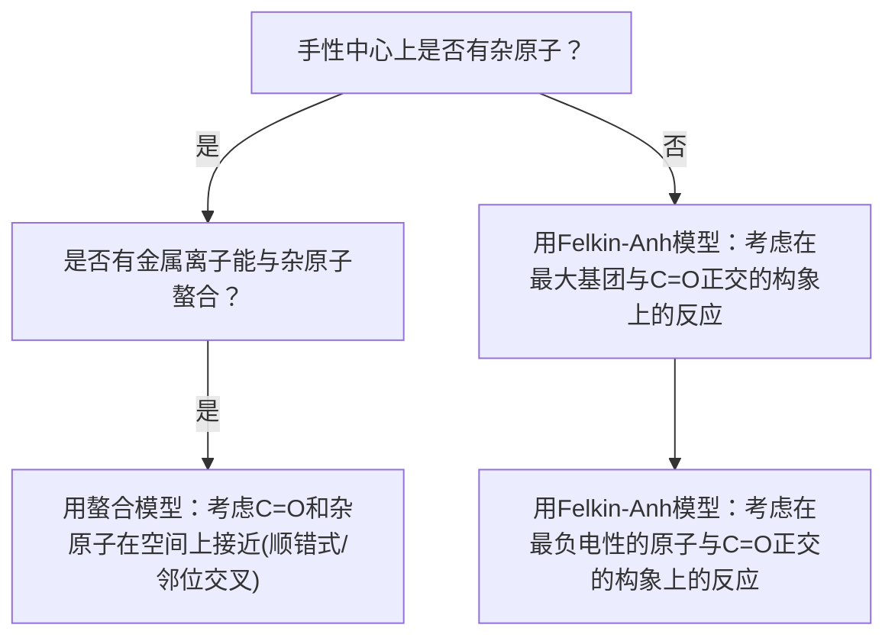

# 非环状烯烃立体选择性的反应

在本章的早期时候，我们讨论了如何通过对几何结构固定的双键的立体专一性加成反应，制取单一非对映体。但如果烯烃也包含一个手性中心，那么这个反应就还会存在立体选择性：它的两面会是非对映异位的，即使反应立体专一，也会得到两种可能的产物。下面是一个例子，选取了环氧化反应。

![[中文版clayden-chinese30-33章787-907_images/865945101cce089a510bd5e76b44ec8f0e340f89eba6114d02dbeb986f06515a.jpg]]

chemical

苯环式中m-CPBA与SiMe₂Ph的取代反应示意图，标注了从后部和从前部进程

# Houk 模型

为了解释像这样的手性烯烃的反应，与之前关于手性羰基化合物所做的一样，我们需要评估哪些构象重要(受欢迎)，还需要考虑它们如何反应。烯烃构象的大部分工作都由 K. N. Houk，通过计算机理论模型完成，我们会总结这些研究中最重要的一些结论。理论研究着眼于两种模型烯烃，如页边所示。

计算发现，这两者低能的构象，都是取代基与双键重叠的构象。(译者注：可以用另两个取代基的成键轨道与烯烃反键的超共轭解释。)对于简单的模型烯烃1,低能构象是质子处在烯烃平面上的那种；另一种低能构象——只比前者高 $3.1\mathrm{kJ mol^{-1}}$ ——是甲基与双键重叠，因此当我们着眼于这种类型的烯烃的反应时，我们会不得不考虑这两种构象。

![[中文版clayden-chinese30-33章787-907_images/cd1ae5463323384dbab88720770a48163632f01d060dbed74ee708703166ffed.jpg]]  
模型烯烃1

![[中文版clayden-chinese30-33章787-907_images/9f9b5ce9e83d77480f450747605fc2b72934a2e9f60e239f8c484b8534d164bc.jpg]]  
模型烯烃 2

K. N. Houk 工作于加州大学洛杉矶分校。它实验强大的计算机方法，提供了对大量立体化学结果的解释。

模型 1 具有两种低能构象

![[中文版clayden-chinese30-33章787-907_images/3d729572a47d7dc40aa960e8a0b1c6574109abf63ccf21a067f21388e34ce6e5.jpg]]

![[中文版clayden-chinese30-33章787-907_images/28b1cd6265ad49139d30a6bddaa6c6cef5fdf432b4be158b74ef61432b792dc4.jpg]]

chemical

Hydrogen-bonded double bond formation reaction showing low and稍微 high energy structures

模型系统2具有一种低能构象

![[中文版clayden-chinese30-33章787-907_images/b16ba036388bd0d315096d4632d603f194b809a341f5198beeb042e413401784.jpg]]

![[中文版clayden-chinese30-33章787-907_images/b0bb4bffd2cf1461709ac90c8d18acb227768a3aa65374dbd79db3b241be1949.jpg]]

chemical

有机碳键转移示意图，展示H与Me-反应生成高能构象的过程

■ 这种效应——顺式取代及对构象的控制——被称作烯丙位张力 (allylic strain) 或 A $^{1,3}$ 张力 (strain)，因为涉及的基团位于处在烯丙型系统上的 1 和 3 号碳。

对于模型烯烃 2, 它的取代基是顺式的，因而构象更加容易预测，唯一低能的异象体是氢于双键重叠的一种。没有足够的空间让甲基于双键重叠，因为这样的话，它就会与双键另一端与之顺式的取代基离得太近。

由计算结果得到的信息如下:

- 手性烯最低能的构象是 H 与双键重叠的一种。  
- 如果烯烃上有顺式取代基，那么这会是唯一重要的构象；如果没有顺式取代基，其他(其他基团与双键重叠的)构象也会是重要的。

现在，我们可以将这一理论模型应用在一些真实例子上。

# 立体选择性的环氧化反应

本节由对一个烯烃非对映选择性的环氧化反应开始。烯烃是下面的这种，它具有一个与立体中心顺式的取代基。因而我们料到，它具有一种重要构象，其中 H 与双键重叠。当试剂——此处是 m-CPBA ——进攻这一构象时，它会从较小空阻的一面接近，然后得到产物。

![[中文版clayden-chinese30-33章787-907_images/eb6360443c62abfd0d7a41286eaa1e4216feb8895782e9170a636027933faa14.jpg]]

chemical

Chemical reaction diagram showing m-CPBA attack on SiMe₂Ph with 95% relative non-reflective form

![[中文版clayden-chinese30-33章787-907_images/630d8e52eb2dfc6fc0507fa6e2ca33d62b55e5ce773a315f9e11ccb281efbabc.jpg]]

Interactive model for

epoxidation controlled by allylic strain

若无顺式取代基，选择性低得多：

![[中文版clayden-chinese30-33章787-907_images/bde08ae6278c53ccb837101fb1c9667250e35602dec9b6fbfc7776bc45209a76.jpg]]

chemical

Chemical reaction scheme showing m-CPBA-mediated cyclization of a silyl enol ether to form a chiral product with two isomeric products.

61:39 非对映体比例

m-CPBA 仍然进攻烯烃较小空阻的一面，但由于没有顺式取代基，因而有两种低能构象：其中一种是 H 与双键重叠的，另一种是 Me 与双键重叠的。它们会给出不同的立体化学结果，这便解释了反应的立体选择性。

![[中文版clayden-chinese30-33章787-907_images/f85e6b386b77df1784f9244f8ffed86c79f4b8655c6a8742d536b532e6dd1b31.jpg]]

chemical

Chemical reaction scheme showing m-CPBA conversion to two products with 61% and 39% yields, involving H/C≡C re折叠 and SiMe₂Ph groups.

同样，得到产物时，先以与起始原料相同的构象画出，然后再将其摊平到纸平面上。

在上一章的末尾，您了解了，m-CPBA 的反应可以被羟基定向，在非环状烯烃的反应中，也会发生相同的事情。这种烯丙醇的环氧化会给出 95:5 比例的非对映体。

![[中文版clayden-chinese30-33章787-907_images/bf8715e57f0b20a43fa5b3b06255e877ed9b1250a393f99a79ccac6dc56645a7.jpg]]

chemical

Chemical reaction showing m-CPBA-mediated cyclization of a hydroxy ketone to form a cyclic alcohol product

95:5 非对映体比例

将活泼构象画出，可以解释这一结果。需要重视的是顺式甲基：还有反式甲基存在，但因为它离立体中心太远了，不会对其构象造成什么影响。反应使用的是外消旋混合物，但解释非对映选择性时，我们只需要挑选其中一种对映体，并展示发生了什么变化。

![[中文版clayden-chinese30-33章787-907_images/8501e30b38488ad519fad37ee54b124489e57e021788e0242254ae6f0576f6c0.jpg]]

chemical

有机合成反应示意图，展示带有顺式取代基的烯烃生成甲醇并再经m-CPBA传递到乙酰胺的重链

# - 解释手性烯烃反应的立体选择性”

- 画出 H 与双键重叠的构象;  
- 使试剂从两面中较少空阻的一面进攻，如果还可能络合，那么就将其传递到与络合基团 syn 的一面；  
- 以与起始原料相同的构象画出产物；  
- 以使最长碳链位于纸平面上的一般构象重绘产物。

# 立体选择性的烯醇盐烷基化反应

手性烯醇盐可以由包含在羰基 $\beta$ 位的手性中心的化合物制取。一旦羰基被去质子，形成烯醇盐，立体中心就会与双键相邻，因而能够控制后者的反应的立体选择性。下面的图表显示了一些手性烯醇盐与碘甲烷反应的立体选择性。

![[中文版clayden-chinese30-33章787-907_images/af19ff7b1f694857bc15103ed03fd8501604f5e18a1c5afa2be44b4fa664676d.jpg]]

chemical

Organic reaction scheme showing conversion of a ketone to a lithium-containing ester using LDA and Mel, with yields listed for different substituents.

烯醇盐是一个顺式取代(O与OEt必有其一与立体中心顺式)，因此为解释立体选择性，我们只需考虑H与双键重叠的构象。(然后考虑这种构象的反应。)注意，随着R变大，Me与R尺寸的对比也会越大，非对映选择性会增加。亲电试剂进攻较小空阻的一面，R的对面。

![[中文版clayden-chinese30-33章787-907_images/e68d838b9ba81457b7497adce7b02c0365083bdd6c96765306578c3bd823c864.jpg]]

Interactive model for enolate vlation controlled by allylic in

![[中文版clayden-chinese30-33章787-907_images/a9a57e00edfe437786d67e9c170b6af3992f950c34b4a86686c53258ffc36db0.jpg]]

chemical

Reaction mechanism showing R-gene dehydrogenation and re-catalyzed rearrangement with key recombination

与之相反的非对映体的制取，可以通过将已有甲基的化合物，制成烯醇盐，再质子化获得。选择性较低（因为质子较小），但这说明了一个道理，我们可以通过调转基团的引入顺序，以逆转反应的立体化学结果。

■ 起始原料的相对立体化学会在烯醇化步骤中消时，因此用非对映体的混合物也可以完成。

![[中文版clayden-chinese30-33章787-907_images/27d3b7fbe06be2d64546f940f41e123f09b00f7877f9977591c62be4a67a363e.jpg]]

chemical

Reaction mechanism showing the formation of a chiral ester from aldehyde and ketone, with reagent R- and Li reacting under LDA to form a protonated intermediate.

# 羟醛反应能够具有立体选择性

在 Chapter 26 中，您遇到了羟醛反应：一种烯醇盐与一种醛或酮的反应。您所了解的很多例子，都近似于这种的普遍模式。

![[中文版clayden-chinese30-33章787-907_images/609df32f55f478114db9ad34f71a3c2b22b29322737914042fcb0e19a32d4b31.jpg]]

chemical

Reaction mechanism of acetaldehyde forming alcohol with R1 and R2 substituents, annotated as a new hand Syria center for non-detectable selective selection.

由于只创造了一个新的立体中心，并无非对映选择性的问题。但对于取代的烯醇盐，会同时创造两个新的立体中心，因而我们需要能够预测形成哪种非对映体。下面是一个来源于 p.626 的例子。在当时，我们没有考虑立体化学；而在现在，我们可以揭示，这个反应的主要产物是 syn 非对映体。

![[中文版clayden-chinese30-33章787-907_images/59d308211e883f07d0e20e5069961a9ab1b025bcdde711a73ca0b37f7c004063.jpg]]

chemical

Organic synthesis reaction scheme showing conversion of propyl ketone to enol and then to syn- and anti-羟醛 products with specified reagents and conditions

对于取代的烯醇盐，重要的点是，它们可以以两种几何异构体，顺式或反式存在。在羟醛反应的很多例子中，事实是，顺式烯醇盐优先给出 syn 羟醛，反式烯醇盐优先给出 anti 羟醛；因而形成哪一种烯醇盐是控制整个过程非对映选择性的重要因素。

# - 羟醛反应中的非对映选择性

通常 (但无疑并不总是!) 在羟醛反应中:

![[中文版clayden-chinese30-33章787-907_images/1b42d4dbef6a0ee248393b2ce28983ae0f13cdeb4514157e9028ef056bc7e9ab.jpg]]

chemical

Chemical reaction showing conversion of 1,3-diolamine to syn-alkene using formaldehyde intermediate

![[中文版clayden-chinese30-33章787-907_images/d01ca2f3118824ceed79e8879cca2f8cc3c4265a730d73c44d5ad0bf9da2d6f6.jpg]]

chemical

Chemical reaction showing conversion of alkyne to anti-steroid with reagent X, labeled as '反式烯醇盐' and 'anti 羟醛'

让我们先展示一些例子，并说明我们是如何知道这种情况的。由环状酮衍生的烯醇盐仅能以反式存在，例如这个烯醇盐，与醛反应时仅给出 anti 羟醛产物。

![[中文版clayden-chinese30-33章787-907_images/55f503de33f11856850936c9cabdf3ba32a009613f918979ae23eefb99c3ba65.jpg]]

chemical

Organic reaction pathway showing LDA conversion to alcohol intermediate and final product with anti-羟醛

只能形成反式烯醇盐

如果，我们将与羰基相邻的一个基团 “X”，选取为较大的基团，那么我们有把握只得到顺式烯醇盐。作为例子，这种叔丁基酮的烯醇锂仅以一种几何异构体形成，它与醛反应仅给出 syn 羟醛产物。

![[中文版clayden-chinese30-33章787-907_images/8b13effb4b1c7da4db45dd5d5ded6d34b046c75cd5b64dc7e60723449199cddc.jpg]]

chemical

Organic synthesis reaction pathway showing conversion of ketone to syn-bridged alkene via LDA and t-Bu elimination steps

# 顺式和反式，E 和 Z，syn 和 anti

继续之前，有两点事情我们必须澄清。第一点是有关命名法的问题，所要关心的是酯的烯醇盐。下面是两种联系紧密的酯烯醇盐等价物，双键几何结构一致，它们是 E 还是 Z 呢？

![[中文版clayden-chinese30-33章787-907_images/e1cd9b598cc6dcbe85e758c9e039d85c796c1dc0b75fbcd3ea29758e906bcbcb.jpg]]

chemical

Organic reaction sequence showing LDA and Me3SiCl steps converting ketone to siloxane derivative

答案是，二者都是！对于烯醇 Li 盐，通常规则中 OLi 比 OMe 的次序低 (因为 Li 的原子序数比 C 小)，因此它是 E；而对于烯醇硅醚 (或 “烯酮缩醛硅酯”)，因为 OSi 比 OMe 的次序高 (Si 原子序数比 C 大)，因此它是 Z。这仅仅是一个命名法上的问题，如果因此推翻了我们对于烯醇锂和烯醇硼衍生物的论述 (即从命名法上推知它们与烯醇硅醚等相反) 的论述，这会让人很恼火。因此，为了确保一致性，避免使用 E 和 Z，转而使用取代基相对于阴离子氧 (携带金属) 的顺式和反式会是很好的。

所担心的另一点是 syn 和 anti。我们之前说过，这两个术语没有精确的定义：它们是区分两种非对映体的实用方法，并且只能在至少一种非对映体以图表的形式画出时才有用。对于羟醛产物，惯例是在主链(以锯齿状)位于纸平面上时，用 syn 或 anti 指代烯醇盐取代基(上一个例子中的绿色 Me)与新的羟基的相对位置。即便如此我们还是建议您画出分子。

# 羟醛反应具有类椅式过渡态

上述是实验事实：那我们如何解释它们呢？羟醛反应是另一类包含环状过渡态的立体选择性过程。反应过程中，锂由烯醇盐的氧上转移到了亲电羰基的氧上。边栏中用弯曲箭头和过渡态结构表示了这一过程。涉及一个六元环，我们可以预料到，此环或多或少采取椅式构象。最简单的方式就

这是一个很普遍的规则，但也有很多例外——一些金属 [Sn(II), Zr, Ti] 的烯醇盐，无论几何构型如何，都给出 syn 羟醛。一些相关反应将于 Chapter 41 中讨论。

![[中文版clayden-chinese30-33章787-907_images/eeff7f57662308e436d3687daec530c3a360f98a8f98a1987ec46f27bbefe517.jpg]]

Interactive mechanism for anti eoselective aldol reaction

![[中文版clayden-chinese30-33章787-907_images/f6ddef69d0ca31eba3b16784dc92f56bc15dc70935b3618a5850f533d539df32.jpg]]

Interactive mechanism for syn
eoselective aldol reaction

![[中文版clayden-chinese30-33章787-907_images/6a6d6bd542f91e3f0174d9e9ffd2f208130e9764c5884bfc81d4948f125dbb57.jpg]]

![[中文版clayden-chinese30-33章787-907_images/db1203eaf4657e9b943714022c576e9e82be9d1335c84e9bdbe677f654168298.jpg]]

chemical

Chemical structure of a lithium-oxygen compound with labeled atoms and bonds

是先画出椅式，然后根据需要将原子转为 O 或 Li。如是。

羟醛反应的六元环过渡态由 Zimmerman 和 Traxler 提出，因而有时也被称作 Zimmerman-Traxler 过渡态 (transition state).

![[中文版clayden-chinese30-33章787-907_images/f1e4a9b9642e7d621ddc43f43104365a274eee1c06a01818a2384cff17801edb.jpg]]

chemical

Chemical structure of a diene with substituents R and H, showing reaction conditions for alkene and phenylalanine

![[中文版clayden-chinese30-33章787-907_images/402c5152bc77f4a5aba9b097ad42f13eabda4cd71f41b73225d47aff8b3c2dd3.jpg]]

chemical

Chemical structure of a substituted cyclohexane derivative with R group, Li, and Me substituents, labeled as '反式烯醇盐' (anti-alkoxy salicylate)

此处，我们再一次遵循了于 p.860 提供给您的建议：首先在起始原料的构象中画出产物，然后将其翻成“一般”结构。

在绘制椅式构象时，我们没有选择的余地：烯醇盐已经摆好，那么醛中的 R 应该直立还是平伏呢？都是可行的，但如您应当预料到的，如果 R 平伏，空间相互作用会较小。羟醛由最有利的过渡态结构形成，其中 R 假平伏，如下所示——首先画出与过渡态一致的构象，然后再摊平到纸上，它是 anti 的。

![[中文版clayden-chinese30-33章787-907_images/b7d6113717d01417c83f2d78da6391de82a82a60636071081936e65aabf576f7.jpg]]

Interactive mechanism: translate gives anti stereoselective vol reaction

![[中文版clayden-chinese30-33章787-907_images/b29fb8e15e445e06796a66f131d228306407f907fa425153c9a7e09928c01fdc.jpg]]

chemical

Organic reaction mechanism showing reductive coupling of a cyclic amide to form a carbonyl alcohol and alcohol, with reagent '反式羟醛' (anti-alkyl halogen)

对于顺式烯醇盐，我们可以完成同样的工作。烯醇盐没有选择的奢侈，只能将其甲基置于假直立；而醛，可以选择假平伏或假直立。假平伏同样更好，反应给出的是所示的产物——syn 羟醛。

![[中文版clayden-chinese30-33章787-907_images/84277e2f1b80eb5608053edced3cd3cbf7abb75a22a4cf6fecc7ee2dce8af4ac.jpg]]

Interactive mechanism: cis
plate gives syn stereoselective
ol reaction

![[中文版clayden-chinese30-33章787-907_images/d859263458269c978b06bb8f6b44fc96f99998342e50a759b5f2c1e0e2928075.jpg]]

chemical

Chemical reaction scheme showing conversion of diene to syn-alkene via intermediate R-hydroxyl radical, with reagents and conditions labeled.

# 立体选择性的羟醛反应需要立体选择性的烯醇化

环状机理解释了烯醇盐的几何结构控制羟醛反应的立体化学结果的方式。那么如何控制烯醇盐的几何结构呢？对于酮的烯醇锂，最重要的因素是未被烯醇化的基团的大小。大基团会强迫烯醇盐采取顺式几何结构（以减小烯醇盐取代基与自己间的排斥），小基团会使反式烯醇盐得以形成。因为我们无法分离烯醇锂，我们只能接受，较小R的酮的反应，非对映选择性会较小的事实。

注：由 LDA 得到的烯醇盐的几何结构由未被烯醇化的一侧的酮基团的大小决定，这被称为 Ireland 模型，当 R 基团大时顺式选择性好，但当 R 基团小时反式选择性并不好，这可从过渡态中得到更细致的解释。

![[中文版clayden-chinese30-33章787-907_images/1b8b443b5c479a6bc8019f13f7be2ffaf4f60c073da5c3a42f85a1509fe192c5.jpg]]

chemical

Organic reaction scheme showing LDA-catalyzed cyclization of aldehyde to alkene with yield percentages for t-Bu and Et substituents

对于烯醇硼，我们不再依赖底物的结构——通过选择硼上的基团——我们就可以得到顺式或反式。烯醇硼通过用胺碱（通常是 $Et_{3}N$ 或 $i-PrNEt_{2}$ ）和 $R_{2}B-X$ ——其中 $X^{-}$ 是好的离去基团，例如 $(\mathrm{CF}_{3}\mathrm{SO}_{3}^{-})$ ——处理酮制得。若硼上基团较大，例如两个环己基，那么大多数酮都会形成反式烯醇盐；

烯醇硼继而可靠地与醛反应，通过与烯醇锂相同的六元环过渡态，给出 anti 羟醛产物。

![[中文版clayden-chinese30-33章787-907_images/fde40f828e835d3b6a3dcd3374114813af9e27a6cc8c9be6359deb886cefe24c.jpg]]

chemical

Organic reaction scheme showing conversion of ketone to anti-steroid via B(c-Hex)2 intermediate, with cyclohexylboronic acid as the product

若 B 取代基较小，则会选择性地形成顺式烯醇盐。此处作为被称作 9-BBN (9-硼双环壬烷，9-borabicyclononane) 的双环体系的一部分出现。双环可能看上去很大，但就该分子的其余部分而言，它们被“绑在”了硼的后面，因而甲基可以容易地与氧顺式。顺式烯醇盐便给出 syn 羟醛产物。三氟甲磺酸二正丁基硼基酯 (Bu₂BOTf, di-n-butylboron triflate) 同样可以用来制顺式烯醇盐。

![[中文版clayden-chinese30-33章787-907_images/da9408f4429d762611f200fe63fcd99bd76b64ad14e8eacfe5884bd6db9d74d3.jpg]]

9-BBN 曾在 Chapter 19

中提到过。

![[中文版clayden-chinese30-33章787-907_images/e0bd40d39939664c72b26b20335fff6befbcdc6198029cccacb6e978b862c0ec.jpg]]

chemical

Organic reaction pathway showing conversion of a ketone to a syn-alkene using tetracyano and RCHO under Et3N conditions

\- 总结：如何制取 syn 和 anti 羟醛

制取酮的 syn 羟醛:

- 使用9-BBN-OTf或 $\mathrm{Bu}_2\mathrm{BOTf}$ 的烯醇硼  
- 使用酮 RCOEt 的烯醇锂，其中 R 很大

制取酮的 anti 烯醇：

- 使用 $(c\text{-Hex})_2\mathrm{BCl}$ 的烯醇硼  
- 使用环状酮的烯醇锂

# 由非对映选择性反应得到单一对映体

上一节的羟醛反应，都是由两种非手性化合物制得单一非对映体的过程。没有用到光学纯的试剂，因此反应别无选择，给出的非对映体以其两种对映体的外消旋混合物存在。

在本章所有其他的非对映选择性反应中，起始原料都是手性的，反应中又形成了新的手性中心，并受起始原料构型的控制。无论反应有什么样的非对映选择性，如果起始原料是外消旋的，那么产物也应当是外消旋的；如果起始原料是光学纯的，那么产物也是光学纯的。页边烯丙型醇的环氧化反应说明了这一点。

这个反应由外消旋混合物开始（手性中心的地方没有表现出任何立体化学），制得的是外消旋产物。当然，我们只画出了其中一种对映体——绘制某种非对映体的唯一方法，就是选择其中一种对映体画出来——然后在下方用“±”标记表明还有等量的另一种对映体存在。即使没有这个标记，您也应当在任何情形下，根据所得化合物的来源，判断它是否是外消旋的。在这里，起始原料是外消旋的，试剂是非手性的，因而产物必定是外消旋的。

本章前文提到的例子 (p. 856) 就是这种类型的反应。起始醇是外消旋的，产物是一种外消旋非对映体——全顺式化合物。但如果起始原料变为光学纯的，那么产物也会如此。一种对映体醇给出一种对映体产物，另一种醇则给出另一种产物。两种产物都是同一种非对映体（全顺式），但它们是彼此的镜像。如果您开始于光学醇化合物，那么产物也会是光学纯的。

![[中文版clayden-chinese30-33章787-907_images/af6670ffd6c6dba3adb4eb3c4c2bdf1ce4adb3408f4dc2ea685955aeb50d306b.jpg]]

chemical

Chemical reaction showing ring-opening of cyclohexanol with RCO3H to form a bicyclic alcohol product

(±)

![[中文版clayden-chinese30-33章787-907_images/337c2dae27e282cac0eef8f35d97571efe53202b117538222bbccf5c7dd34197.jpg]]

chemical

Chemical reaction showing hydroxyl group reacting with RCO₃H to form a cyclic alcohol product

仅这种对映体

![[中文版clayden-chinese30-33章787-907_images/69e763dab311abc76dee4bfe6ffda5a8e46c97fafb003a4c3fec78173c189bd7.jpg]]

chemical

Chemical reaction showing oxidation of cyclohexanol to cyclohexanol with RCO₃H

仅另一种对映体

在讨论 Felkin-Anh 模型时，我们给出过一个 (关于如上论述的) 例子。起始原料是天然氨基酸异亮氨酸，如下所示的对映体。因而对羰基加成的产物也会是单一对映体。这些例子中的原始手性中心都不受反应的影响，在反应前后保持不变。

![[中文版clayden-chinese30-33章787-907_images/e763b3bcbe62e4b29ba7ef619b8b0fa8bcdbb1474b74f7566e661064be43c17d.jpg]]

chemical

Chemical reaction pathway showing conversion of isomethylamine to amide and alcohol using BnBr, LiAlH4, and oxidize steps

来源于自然资源的单一对映体  
>96:4 非对映选择性还是单一对映体

特别是在药物的合成中，在制取非对映异构纯的化合物的同时，使之光学纯是非常有用的。此处使用的策略是选用来源于自然的光学纯化合物作为起始原料：此情形中是一种氨基酸。这些可用的光学纯化合物被统称为手性池 (chiral pool)。您可以在 Chapter 41，不对称合成上阅读到更多相关内容。

如果您正在制取多于一个立体中心的光学纯化合物，那么，如果您可以通过对相对立体化学的控制，用非对映选择性的反应引入其他立体中心，您就只需要从手性池中借用一个立体中心。因为第一个手性中心已经定义了绝对构型，任何控制了新手性中心相对立体化学的立体选择性反应，同样会定义这个新手性中心的绝对构型。

我们将用一种烯有的糖的合成作为例子，该糖是甲基碳霉糖 (methyl mycaminoside)，包含五个手性中心。只有其一直接来源于手性池——剩下的均被非对映选择性地引入。作为起始原料的，天然衍生的，光学纯化合物是 (S)-乳酸 (lactic acid)。起始的手性中心，在流程中保持不变，图中绿色所示。

环，通过类似于使 (S)-乳酸乙酰化的化学构建起来，环化步骤在如下图示中的最后一步引入了第二个手性中心。甲基在新形成的环上处于假平伏；由于我们在 Chapter 31, p. 801 阐释过的由于异头碳效应，甲氧基倾向于处在假直立位点。

![[中文版clayden-chinese30-33章787-907_images/3ffbd91caae36aed122a79c57b3f44c78acdf73b73f657df0e4544cbf84e6139.jpg]]

chemical

Chemical reaction showing conversion of (S)-alcohol to a cyclic ester with NMe2 group

甲基碳霉糖

![[中文版clayden-chinese30-33章787-907_images/b6666382448609fea9c7799bcf831c4c04f31d08cdb8574a512189e44cbafe92.jpg]]

chemical

Chemical structure diagram showing Me and OMe substituents with labeled bond orientations

环己酮还原反应中构象因素的控制作用已于 Chapter 16 中讨论。OH 基在环氧化反应中的定位作用已于 Chapters 32，和本章的前文中讨论过。

![[中文版clayden-chinese30-33章787-907_images/282b4227be223d0edea912e88b9a242620d8f13d301c696c2bd881f30a4195f4.jpg]]

chemical

Organic synthesis reaction scheme showing conversion of alcohols to acetyl-CoCl and bromomethyl ester under H2 in Lindlar solvent

第三个立体中心，由酮还原时的直立方向控制，给出平伏醇。平伏醇通过氢键，在环氧化反应中定位了第四和四五个立体中心的引入。

![[中文版clayden-chinese30-33章787-907_images/59ec8da3053c7c094980d5f2d8d3b09b7599cae471d231b084e5ed90a3b89281.jpg]]

chemical

Chemical reaction mechanism showing the conversion of a cyclic ester to a sugar derivative via intermediate steps

直立进攻
导致更稳定的平伏醇  
羟基通过氢键
将环氧化反应定位在顶面发生

最后，简单的亲核胺 $Me_{2}NH$ 伴随构型翻转地进攻环氧，给出了甲基碳霉糖。构象图显示，除了由于异头碳效应倾向于直立的 MeO 基外，所有取代基都处于平伏。由包含一个手性中心的光学纯化合物开始，我们通过各种类型的非对映选择性反应，引入了四个新的手性中心。最终产物必然是单一对映体。

![[中文版clayden-chinese30-33章787-907_images/feb5ed4bb1dddfa705386ea60283a59dc046917e8af8020839b78673297b94bc.jpg]]

chemical

Chemical reaction diagram showing conversion of a sugar derivative to a glycoside product via intermediate, with reagent addition

# Penaresidin 的结构与合成

我们的最后一个例子是一个被称作 penaresidin A 的天然产物，于 1991 由一种日本海绵中分离得到，现在已知它具有如下所示的结构。当时的人们发现，找出它的立体化学是很难的，尤其是，两组相距较远的手性中心的相对立体化学最初并不为人所知。

![[中文版clayden-chinese30-33章787-907_images/aa655f8da05f99023c42bc380adbb309255da05528a03b521c8e08c6b211b188.jpg]]

chemical

Chemical structure of penaresidin A, showing a cyclic compound with hydroxyl and amine functional groups

人们所确信的，是绕四元氮丁环的相对立体化学：通过 Chapter 31 所描述的 NMR 方法得知。同样无疑的是，天然 penarisidin A 是光学纯的。Mori 和他的合作者所做的，是用毫无疑问的立体选择性方法，制取 penaresidin A 所有可能的非对映体，并发现哪一种与天然产物相同。

构建分子左手边的三个手性中心的挑战，可以通过从天然资源中获取其中一个得以解决——此情形中，所用的是 L-丝氨酸。丝氨酸的氨基被 Boc 衍生物所保护 (保护一次)，羟基和氨基通过与丙酮的二甲氧基缩醛缩合，形成一个五元环。现在游离的酯基可以被 $LiBH_{4}$ 还原，并通过 Swern 方法 (Chapter 27) 氧化为醛。

一般来说，如我们在 Chapter 32 中所阐释的，亚环己基环氧上的进攻是直立的，但如您在此所见，这条规则并不严格。由于过渡态已经具有平伏取代的产物的大部分稳定性，因而发生平伏进攻。但对于其他环氧，您首先还是应当假设它们发生直立进攻。

Boc 保护基已于 p. 557 介绍；Swern 氧化反应位于 p. 667。

![[中文版clayden-chinese30-33章787-907_images/7ef6ee310ee3c5830b8ae2bce868ab4a2c6f894e42e7c8ac3212308e9454ac3e.jpg]]

chemical

Multi-step organic synthesis reaction scheme involving L-amine, Boc protection, and Swern oxidation steps

这个醛会如何与亲核试剂，例如炔基锂反应呢？考虑 Felkin-Anh 过渡态：同样，我们知道，被取代的氮原子，既负电性，又很大，在最活泼的构象中应与羰基正交。着眼于如下所示的二者，很容易看出，右侧的一种允许不受阻碍的进攻的发生；在合成中，选用炔基阴离子制得所示的产物。

![[中文版clayden-chinese30-33章787-907_images/11b540d61baedc9284a39c8f9fdf1832a637b7b5b0f71c5e24ea1306483cc229.jpg]]

chemical

Chemical reaction mechanism showing nucleophilic attack on a carbonyl-containing heterocycle, involving H and CO2t-Bu groups

将炔烃还原为 E 双键的方法已于 Chapter 27, p.681 涵盖。

然后，用溶解金属还原，将炔烃还原为 E 烯烃，这一步同样水解了五元杂环。下一步，是用于在 penarisidine 的左手边引入第三个手性中心的环氧化反应。然而，我们会料到，这个烯丙型醇受氢键定位的环氧化反应会给出所示的 syn 产物，其中棕色 OH 基和环氧处于错误的立体化学。

![[中文版clayden-chinese30-33章787-907_images/1efc31289ee4a173f8ede6dc2656c3303ba2b5bf3fac92d52526e540f6a13333.jpg]]

chemical

Reaction mechanism of lithium-catalyzed hydrolysis with m-CPBA, showing intermediate formation and hydrogenation steps

此处 E 双键环氧化的选择性仅仅是中等的 (大约 60:40)。由我们在 p.866 的讨论，您应当能推断出原因。

解决办法是用大基团阻止 OH 基与 m-CPBA 成氢键。叔丁基二甲基硅基 (TBDMS) 是最好的，当 OH 基都被保护时，m-CPBA 从烯烃顶面的进攻就会形成一些正确的非对映体。现在用 DIBAL (i-Bu $_{2}$ AlH) 还原这个环氧，即可得到正确的非对映体。

![[中文版clayden-chinese30-33章787-907_images/5ce821a5c45779d2b68db88c66853fa1ab0ce7f07807bbd5d03a2817cfdcd980.jpg]]

chemical

Chemical reaction pathway showing conversion of OTBDMS to TBDMSO and then to a chiral alcohol product via m-CPBA and i-Bu2AlH steps

为了关环，绿色羟基被转化为一个好的离去基团，甲磺酸酯/根 $\left(\mathrm{MeSO}_{3}^{-}\right)$ ，继而在碱处理下，被氮经历翻转地进攻。请确保您能看出这个中心是如何发生的翻转，才得到了所示的立体化学！在此阶段，化学家们认为他们处在考虑相对立体化学的正确路线上，这是因为包含任何长烷基链 R 的结构与天然化合物在 NMR 光谱中都会是非常相似的。

![[中文版clayden-chinese30-33章787-907_images/f58aef03d0bd2b3bec0ff25d677f9e448b1f9f31682092b67e4db6dea2626233.jpg]]

chemical

Chemical reaction pathway showing conversion of TBDMSO to a chiral alcohol using MsCl/Et3N and NaH/THF, with reagents and conditions labeled.

# 通过合成确认立体化学

链右手边的另两个手性中心离环太远 (间隔 10 个 $CH_{2}$ 基)，没有通过 NMR 的简单方法，能确定它们的立体化学与左手边三个手性中心的相对关系。这类分配问题的解决方案通常是，通过毫无疑问的合成制取多种异构体，并对比天然化合物与合成化合物的 NMR 光谱。这也是 Mori 在这个情形中所做的。

手性池，可以通过另一种氨基酸，L-异亮氨酸的使用，再次登上舞台。首先，氨基酸必须通过用亚硝酸（稀 HCl 中的亚硝酸钠）的亚硝化转化为一个离去基团，继而被水取代以给出羟基酸。酸可被酯化并被还原为一个二醇。

![[中文版clayden-chinese30-33章787-907_images/616d01694f014fc4b9dd370fd3445c2f847ff287bd28c608848b51927172c971.jpg]]

chemical

L-异亮氨酸合成反应方程式，展示从NH2和CO2H到CH2OH的转化步骤

我们用酸中的 $NaNO_{2}$ 将羟基转化为重氮盐，后者包含极好的离去团， $N_{2}$ ，Chapter 22, p. 520.

将二醇的伯羟基转化为离去基团 (这里用对甲苯磺酸酯/根)，继而在起始原料的两个立体中心皆保留的情况下，形成环氧。碱性下发生环化可给出环氧。总体上，光学纯的起始原料被立体专一性地转化为了单一非对映体的环氧的单一对映体。

![[中文版clayden-chinese30-33章787-907_images/ec5ed9f4d7a2bffb6157b92f6bd6f91eaf3ddae2f3d71df9461ca9e9fb794539.jpg]]

chemical

Reaction mechanism showing TsCl-catalyzed cyclization of a hydroxy alcohol to form a ketone and alcohol derivative

在我们继续之前，我们要先回顾一下这个流程的第一个反应——L-异亮氨酸到羟基酸的转化。立体化学可能让您震惊：仔细观察，您会发现，氨基被替代时立体化学保持了。取代基保持通常意味着发生两次翻转，在此处，羧酸先发生取代以（包含翻转地）给出一个非常不稳定的，称为 $\alpha$ -内酯的化合物，它具张力的环会被水打开，同样包含翻转。

在 Chapter 36 中，我们会处理相似的“邻基参与”例子。在 p. 934 有更多关于 α-内酯的内容。重氮化步骤的机理位于 Chapter 22, p. 521.

![[中文版clayden-chinese30-33章787-907_images/1aa8d60c9ce351d0883491a9e4fbfe0795f00b1382cf77232d86c55b6a25b701.jpg]]

chemical

Chemical reaction mechanism showing conversion of amine to α-hydroxy carbocation via nitration, retranslational, and protonation steps

现在，环氧化物可以被亲核试剂打开，以得到目标分子右手边的一半。所示的炔烃在羟基和甲基间具有 anti 关系，制得后可通过上文描述的方法，与 penaresidin A 在左手边连接。然而，最终产物并不与天然的 penarisidin A 相同！

![[中文版clayden-chinese30-33章787-907_images/bd86a2a7a1f9316b19133320299882f4e7db9ee4042ee832793b011484ff041e.jpg]]

chemical

Chemical reaction diagram showing the right-hand side of penarisidin (or part of a ketone) with reweighting step

很明显，相对立体化学的一些方面是错误的。因此需要重复一遍合成，这一次所用的是由我们将在 Chapter 41 中描述的方法获得的取代炔烃的 syn 非对映体。这个异构体所得的最终产物与天然产物的光谱数据完全相同，立体化学的问题便解决了。合成作为提供化合物具体结构的唯一可靠方法的时候并不少见。

![[中文版clayden-chinese30-33章787-907_images/950160aaa662d0822d098917663ca66a0691196c1690aa835d39f32bb515c677.jpg]]

chemical

Chemical reaction diagram showing the reorganization of Penarisidin from a chiral alcohol via method to yield the right half.

# 展望

一旦您获得了以单一对映体存在的分子，无论它可能多么简单，您往往可以可靠地使用本章，和前一章中所描述的类型的非对映选择性反应，用更多进一步的手性中心修饰它。这是不对称合成领域——我们将在 Chapter 41 全面阐述——非常重要的观点。在那里，您会看到我们刚才描述的这些思想的发展，手性中心来源于自然界的什么地方，以及如何用手性中心引入新的立体中心，即便前者不一定出现于最终产物中。在继续讨论这样的反应之前，我们需要处理一类重要的新反应机理，其中有很多都提供了向分子中引入新立体化学特征的进一步方法。这类反应的第一种是环加成反应。

# 延伸阅读

用分子轨道方法对周环反应和其他反应的解释，请查阅：Ian Fleming, Molecular Orbitals and Organic Chemical Reactions, Student Edition, Wiley, Chichester 2009. 还有一个准备给实践化学家的复杂版本，称作：Library Edition.

非对映选择性、不对称合成中的手性池方法，以及双键几何结构的控制，氢键：P. Wyatt and S. Warren, Organic Synthesis: Strategyand Control, Wiley, Chichester, 2007 (译本：有机合成:切断法，科学出版社，2010) 以及附有的 Workbook, 同样是 Wiley, 2008.

Penaresidin 合成的主要参考文献：K. Mori and group, J. Chem. Soc., Perkin Trans. 1, 1997, 97; S. Knapp and Y. Dong, Tetrahedron Lett., 1997, 38, 3813 和 H. Yoda and group, Tetrahedron Lett., 2003, 44, 977. 甲基碳霉糖 (methyl mycaminoside) 的合成来源于：Koga, K., Yamada, S.-I., Yoh, M., Mizoguchi, T. Carbohydr. Res. 1974, 36, C9–C11.

# 检查您的理解

![[中文版clayden-chinese30-33章787-907_images/723417d3de517916e10d8aa91b6f9928286300b2065f331d490e832385d72266.jpg]]

为确保您真正掌握了这一章的内容，请尝试解决本书 Online Resource Centre (在线资源中心) 中的习题：http://www.oxfordtextbooks.co.uk/orc/clayden2e/

# 周环反应 1:

# 环加成

# 34

# 联系

# 基础

- 分子结构 ch4  
- 反应机理 ch5  
- 共轭和离域 ch7  
- 烯烃的反应 ch19 & ch22  
- 芳杂环 ch29 & ch30

# 目标

- 环加成反应中，电子在环中移动  
- 环加成反应中，多于一根键协同形成  
- 环加成反应没有中间体  
- 环加成反应是周环反应的一个类别  
- 控制环加成反应的规则：如何预测什么会发生，什么不会发生  
- 光化学反应：需要光的反应  
- 通过 Diels–Alder 反应制取六元环  
- 通过 $[2 + 2]$ 环加成反应制取四元环  
- 通过1,3-偶极环加成反应制取五元环  
- 使用环加成反应将双键立体专一性地官能化  
- 使用臭氧断裂 C=C 双键

# → 展望

- 电环化反应和 $\sigma$ 重排 ch35  
- 自由基反应 ch37  
- 卡宾的反应 ch38  
- 不对称合成 ch41

# 一类新的反应

大多数有机反应是离子型的。电子由一个负电子原子移动到一个缺电子原子上：有阴离子或阳离子作为中间体。如下内酯（环状酯）的形成就是一个例子。反应涉及五步和四个中间体。反应是酸催化的，每个中间体都是一个阳离子。每一步中电子的流动方向都有共同点——朝着正电荷。这是一个离子型反应(ionic reaction)。

![[中文版clayden-chinese30-33章787-907_images/515b6e58bb53f2abfbd51a8844cd2950f7ac16e8dad8427b9f88869b1ddd86f1.jpg]]

chemical

Reaction mechanism diagram showing protonation, ring opening, and dehydration steps of a cyclic ester

而本章，则关于一种完全不同的反应类别。电子绕一个环移动，任何中间体上都没有正负电荷