# 37

# 自由基反应

# 联系

# 基础

- 能量剖面图 ch12  
- 亲核取代 ch15  
- 构象分析 ch16  
- 消除反应 ch17  
- 共轭加成 ch22  
- 区域选择性 ch24  
- 逆合成分析 ch28  
- 非对映选择性 ch32 & ch33  
- 主族化学 ch27

# 目标

- 自由基是带有未成对电子的物种  
- 自由基反应遵循与离子型反应不同的规则  
- 键的强度非常重要  
- I, Br, Cl, Sn, 和 B 可形成自由基  
- 有效的自由基反应是链式反应  
- 有亲电的自由基，也有亲核的自由基  
- 自由基喜欢共轭加成  
- 环化很容易通过自由基反应发生

# → 展望

- 卡宾化学 ch38  
- 机理的确定 ch39  
- 天然产物 ch42  
- 聚合反应 web

# 自由基包含未成对电子

您可能还记得，在 Chapter 8 的开始，我们说过，H–Cl 在溶剂中可以断裂为 $H^{+}$ 和 $Cl^{-}$ 只因为所形成的离子可以被溶剂化：在气相中，反应是吸热的， $\Delta G = +1347 \, kJ mol^{-1}$ ，这个值很大，以至于即使整个宇宙都由 273 K 下的气态 HCl 组成，也没有一个分子会解离为 $H^{+}$ 和 $Cl^{-}$ 离子。然而，在大约 200 °C 以上的温度下，HCl 就会开始解离，但并非解离成离子。氯原子不会带走整对成键电子，留下裸露的质子，相反，形成 H–Cl 键的电子对会均摊给两个原子。这个反应的 $\Delta G$ 是合理得多的 +431 kJ mol $^{-1}$ ，并且在高温下（即大约 200 °C 以上），HCl 气体会解离为 H 和 Cl 原子。

■ 每个原子拥有的单个的、未成对的电子被用点表达。当然，Cl原子还具有另三对没有示出的电子。

![[中文版clayden-chinese37-401000-1132_images/73dea69ee1240e70f4738ee8abf6d227a750276b961fe78eacd76139c904784b.jpg]]

<details>
<summary>chemical</summary>

Electrochemical reaction equations showing HCl reacting with H⁺ to form H and Cl⁻, with HCl increasing by 200 °C to form H⁺ and Cl⁻.
</details>

# - 异裂和均裂

- 键断裂时，若一个原子得到了整对成键电子，该过程被称为异裂 (heterolysis)。异裂的产物是离子。  
- 键断裂时，若每个原子都得到了其中一个成键电子，该过程被称为均裂 (homolysis)。均裂的产物是自由基 (radicals)，可能是原子，也可能是分子，但一定包含未成对电子。

在 Chapter 24 中，我们介绍了溴自由基与烯烃区域选择性反应的事实。让我们带您回想您遇到的一个反应：对烯烃的自由基加成。产物是一个溴代烷，同时也是与 HBr 以离子型方式加成到烯烃上所得的不同的溴代烷。

![[中文版clayden-chinese37-401000-1132_images/80228c2054a69b9f609177b71ac559e6d812282d2983f6b744db13849d22cbbf.jpg]]

<details>
<summary>chemical</summary>

Chemical reaction diagram showing bromination of 2-methyl-1,3-dimethylpropanoic acid to form a brominated product
</details>

![[中文版clayden-chinese37-401000-1132_images/85f7d4e9b86dd30f380c7b36680fbd15f58e1806da3fd0400ded017f5d662f95.jpg]]

<details>
<summary>chemical</summary>

Chemical structure of over氧化二苯甲酰 (isocyanate)
</details>

![[中文版clayden-chinese37-401000-1132_images/5fba1d320aa3b5f33804148949567fa3cafbc79144873848b9ac7c336dadbb92.jpg]]

过氧化物做了什么使反应机理发生了改变呢？过氧化物极其容易发生弱 O-O 键的均裂，并形成两个自由基。我们说过，HCl 在气相中发生均裂比发生异裂有利：这也是易发生均裂的另一类键。通过对比键解离能 $(X-Y \rightarrow X^{\bullet} + Y^{\bullet}$ 的 $\Delta G)$ ，您可以自己发现这一点。

<table><tr><td>X-Y键</td><td>X-Y → X• + Y• 的 ΔG, kJ mol-1</td><td>X-Y键</td><td>X-Y → X• + Y• 的 ΔG, kJ mol-1</td></tr><tr><td>H-OH</td><td>498</td><td>CH3-Br</td><td>293</td></tr><tr><td>H3C-H</td><td>435</td><td>CH3-I</td><td>234</td></tr><tr><td>H3C-OH</td><td>383</td><td>Cl-Cl</td><td>243</td></tr><tr><td>H3C-CH3</td><td>368</td><td>Br-Br</td><td>192</td></tr><tr><td>H-Cl</td><td>431</td><td>I-I</td><td>151</td></tr><tr><td>H-Br</td><td>366</td><td>HO-OH</td><td>213</td></tr><tr><td>H-I</td><td>298</td><td>MeO-OMe</td><td>151</td></tr><tr><td>CH3-Cl</td><td>349</td><td></td><td></td></tr></table>

过氧化二烷基/二烷基过氧化物 dialkyl peroxides（表中有过氧化二甲基）包含非常弱的 O–O 键。由这些键，仅需一点加热或光照，均裂而形成的自由基可引发我们称之为自由基链式反应（radical chain reaction）的过程，此过程会导致 Br• 自由基的形成，继而添加到烯烃的 C=C 键上（见 Chapter 24）。

![[中文版clayden-chinese37-401000-1132_images/e903d41eae1a4883bdfb7b1d0b9227075d6e3af23ae732f7987bfb9ef2afa46c.jpg]]

<details>
<summary>chemical</summary>

Chemical reaction equation showing oxidation of 2-methylpropan-1-ol under heat and temperature conditions
</details>

![[中文版clayden-chinese37-401000-1132_images/ffd27cbb3ba86d94d918e2988c28030beeb8ce93cba1221d64cd1fc501e3b2c2.jpg]]

现在会是回顾 Chapter 24

中关于自由基的一节的好时间，您可以重读 pp. 571–574。

对烯烃的离子型加成已于

Chapter 19 中阐明。

■ 试着了解一下键的强度：它们对于自由基反应非常重要，因而在本章中，我们会经常提及它们。将其与离子型反应中的情况对比，离子型反应中键的强度通常远不及极化效应重要(见 p.207 的例子)。

# 自由基由弱键的均裂形成

这是制取自由基最重要的方法：通过均裂使电子对分开，得到两根新的自由基。高于 $200^{\circ}$ C 的温度会使大多数键均裂，一些弱键还可能在稍高于室温下均裂。光照也是键均裂可行的能量源之一。红光对应于 $167 \, kJ mol^{-1}$ ，蓝光大约 $293 \, kJ mol^{-1}$ 。紫外光 (200 nm) 对应于 $586 \, kJ mol^{-1}$ 的能量，会使许多有机化合物分解 (包括皮肤细胞中的 DNA: 日光浴者要小心！)。

有许多化合物的均裂对于化学家是尤其重要的，下文会依此讨论最重要的几个。它们都具有弱的σ键，并会生成可用于某些化学用途的自由基。如上文表格中的键强所示，卤素单质很容易被光均裂，这驱动了我们稍后会讨论的自由基卤代反应。

您在 Chapter 24 中了解到，过氧化二苯甲酰，由于可以扮演自由基反应的另一种引发剂，因而是一种重要的化合物。仅仅在加热时，它便可发生均裂。另一种因为同种原因而在合成反应中常被

光促使均裂，在能量上是不够的；分子必须具有一种用于吸收光能的机理，而该能量也必须被汇集在会导致键断裂的振动模式中。我们将不会进一步考虑这些点：如果您感兴趣，您可以在光化学的专业书籍中找到详细阐释。

使用的化合物 (虽然它被用于与另一类化合物反应) 是 AIBN (偶氮二异丁腈 azobisisobutyronitrile)。

![[中文版clayden-chinese37-401000-1132_images/242e285d155e1420c1df05bfb7e61e7a79e20137888b4cffdeb40b77ef4b8c0e.jpg]]

<details>
<summary>chemical</summary>

Chemical reaction scheme showing nucleophilic addition of 66–72 °C to form a cyanomethyl cyanide intermediate, with Gibbs free energy change ΔG‡ = 131 kJ mol⁻¹
</details>

$\Delta G^{\ddagger}$ 是反应的活化能。

这种分解机理解释了所有电子的独立运动，但我们同样可以按一种稍微不同的方式绘制机理：我们示出了两个自由基（“鱼钩”）箭头形成氮分子，但对于每根 C-N 键的断裂仅画出一个箭头。我们假设，“剩下”的电子会形成自由基。

![[中文版clayden-chinese37-401000-1132_images/d36faec2be56fdd9f30e1a153797c8cd4f5f304b601b43940fc51aabc449cf50.jpg]]

<details>
<summary>chemical</summary>

Chemical reaction equation showing nucleophilic addition of 66–72 °C to a cyclic carbamate with N≡N group, using ΔG‡ = 131 kJ mol⁻¹
</details>

另一种在不失去精确机理的情况下削减箭头数量的方法，是在同一方向上（可以是任意方向），给每一步只画出一个箭头。第一种机理的优点是完全清晰；另两种的优点是使图表更整洁。选择最适合您的一种。

![[中文版clayden-chinese37-401000-1132_images/4585dc0f38d448122ca451c40d2740d722dc4ae5ed6479340188469d86317e45.jpg]]

<details>
<summary>chemical</summary>

Chemical reaction equation showing conversion of AIBN to N≡N using 66–72 °C at ΔG‡ = 131 kJ mol⁻¹
</details>

重要的事情是使用正确类型的箭头，使移动的的是一个而非两个电子更加清晰。更简单的例子是氢原子被氧中心自由基 (oxygen-centred radical) 攫取的过程：以下任何一种机理都是可以的。

![[中文版clayden-chinese37-401000-1132_images/aaba41544c2e767f5a89dd1576669683368ff6f78a95c2821238b4d210878161.jpg]]

<details>
<summary>chemical</summary>

Chemical reaction mechanism showing hydroxyl radical intermediates forming ROH and Br• species with electron transfer steps
</details>

# 通过攫取形成自由基

注意观察。我们并没有将 HBr 放入能通过均裂形成自由基的分子的列表中：与我们讨论过的弱键对比，H–Br 键很强 (大约与 C–C 键一样)。在 Chapter 24 中，我们描述了氧自由基从 HBr 上攫取/夺取/摘取 (abstract) 氢原子的方式。现在您可能愿意将其机理与相似的离子型反应进行对比。

![[中文版clayden-chinese37-401000-1132_images/8a238f7f799e63d413889ea1e489a3c8398cf47bc83de6edce6ab633edd97211.jpg]]

<details>
<summary>chemical</summary>

Redox reaction equations of benzene derivatives with ROH and Br groups, showing hydrogenation and deprotonation steps
</details>

■ 我们用 “自旋成对的分子” 表示 “正常的” 分子，其中所有电子均成对，与带有未成对电子的自由基相反。

攫氢是氢原子与它的电子一同被移去。它并不是质子的移去：拔氢是氢原子不与任何电子一同被移去，这发生于离子型反应中。

自由基通过攫取来增殖的能力，是我们稍后将研究的自由基链式反应的关键特征。均裂与攫取作为得到自由基的方式是重要差异是：均裂是自选成对的分子产生两个自由基的反应；攫取是自由基与自旋成对的分子反应，得到一个新的自由基和一个新的自旋成对分子的反应。

如上对比所示，自由基攫取事实上是取代反应 (此情形中是在 H 上的取代反应)。然而，自由基取代反应与 $S_{N}1$ 或 $S_{N}2$ 反应差异非常大：重要的是，自由基取代反应几乎绝不会在碳原子上发生。稍后，我们将回到自由基取代，或攫取反应 (取决于您是从 H 原子的角度还是从 Br 原子的角度看)，并阐释为什么会是这样。

# 首个被检测到的自由基

首个被检测到的自由基，三苯甲基自由基，是于1900年，通过金属Ag对 $\mathrm{Ph}_3\mathrm{CCl}$ 上 $\mathrm{Cl}^{\bullet}$ 的攫取得到的。 $\mathrm{Ag}^{\bullet}$ 和 $\mathrm{Li}^{\bullet}$ 等许多金属原子都具有单独的未成对电子。

这个自由基相对稳定 (我们马上就会了解到为什么)，但也会与它自己在溶液中可逆地反应。三苯甲基二聚的产物在 70 年间一直被认为是六苯基乙烷，但在 1970 年，NMR 显示，它事实上是不对称的。

![[中文版clayden-chinese37-401000-1132_images/243b33115ff27c5a6629e5d097db79a3f6054aa18d70759beb5dddab8e7d5799.jpg]]

<details>
<summary>chemical</summary>

三苯甲基二聚体结构（1900）的反应示意图，展示 AgCl 与 Cl 聚化、相对稳定三苯甲基自由基及二聚体正确的结构
</details>

# 通过加成形成自由基

Chapter 24 中 HBr 对烯烃自由基加成的关键步骤是由自由基加成反应 (radical addition) 得到自由基。Br• 自由基 (您会记得，它是由 RO• 攫取 HBr 中的 H• 形成的) 加成到烯烃上给出一个新的，碳中心自由基。下面是自由基加成机理：

![[中文版clayden-chinese37-401000-1132_images/87a05d1b6b80f87e2854c620a2ac8822b978765822ace4f4cc08aee0f7cc348c.jpg]]

<details>
<summary>chemical</summary>

Chemical reaction diagram showing bromide (Br) reacting with free base to form a new bromide product
</details>

就像电荷在化学反应中必须守恒一样，电子的自旋也必须守恒。如果一个反应物携带未成对电子，那么产物也得是这样。自由基对自旋成对的分子的加成往往生成新的自由基。因而自由基加成是第二类自由基形成反应。

最简单的自由基加成反应，是在单电子被添加到自旋成对的分子上时发生的。这是一个还原过程。您已经遇到了一些单电子还原反应的例子：Birch 还原 (Chapter 23) 使用 I 族金属 (通常是钠) 溶解在液氨中形成的单电子还原有机化合物。I 族金属是常用的单电子源：通过释放奇数 s 电子，它们可以形成稳定的 M $^{+}$ 离子。它们会将这个电子贡献给数类分子，例如酮可以被钠还原形成羰游基 (ketyl radicals)。

![[中文版clayden-chinese37-401000-1132_images/90539c82382e7df5bb7b21dceb496f80951977fb5d380aa4ecc1bb529133f0c0.jpg]]

<details>
<summary>chemical</summary>

Chemical reaction equation showing sodium ion reacting with potassium ion to form a radical intermediate, then oxidize to a radical base
</details>

我们将在 p. 980 讨论羰游基/羰基自由基和它们的反应。

# 通过消除形成自由基

第四类自由基形成反应是消除反应。我们可以回到本章前文所考虑的不稳定化合物，过氧化二苯甲酰来举个例子。由二苯甲酰通过均裂形成的自由基本身也是不稳定的，每一个自由基都可以通过C-C键的断裂来破裂，生成 $\mathrm{CO}_{2}$ 和苯基自由基。这是一个自由基消除反应，它是自由基加成反应的逆过程。

![[中文版clayden-chinese37-401000-1132_images/8c5b6f1d59b7e7743a5456ffeb9f3baab01039d93893967a06576e50a345f7e0.jpg]]

<details>
<summary>chemical</summary>

Organic reaction mechanism showing oxidation of 2-methylpropan-1-ol to benzyl ester, followed by free base elimination and CO₂ release
</details>

# - 自由基形成方法总结

自由基可通过下列方法从自旋成对的分子中形成:

\- 弱 $\sigma$ 键的均裂，如：

$$
\mathrm{RO} - \mathrm{OR} \longrightarrow \mathrm{RO} ^ {\bullet} (\times 2)
$$

\- 电子转移，即还原反应(电子的加成)，如：

![[中文版clayden-chinese37-401000-1132_images/dbf8c8f21725312a008d624e58583cb423aadf508dfc29f926a58227ef9ec087.jpg]]

从其他自由基形成自由基：

\- 取代 (攫取)

![[中文版clayden-chinese37-401000-1132_images/3efa228478d0415bb3aa0fae047112dc466a2082b7cb1b76f6c57bc438285ab9.jpg]]

\- 加成

![[中文版clayden-chinese37-401000-1132_images/df171c6c04b1fa61b4ea77b84bd0a412f91876c4b1029b7816a1c0bdad2f2477.jpg]]

\- 消除 (均裂)

![[中文版clayden-chinese37-401000-1132_images/0cfb219c23c387b3c49d5b30e6a0dcd3cb637f27102a994cf1eb4accb6c64797.jpg]]

单电子在法语中是 Electron-célibataire (单身汉)，描述单电子寻找伴侣的热切需求。

![[中文版clayden-chinese37-401000-1132_images/81a18a8b4776c558a90d4598356fe70e5e8b23ee0a18b17019298fd8faf66f45.jpg]]

<details>
<summary>chemical</summary>

Chemical structure of a biphenyl derivative with three phenyl groups attached to a central carbon
</details>

三苯甲基自由基—在溶液中稳定  
与其二聚体处于平衡

# 大多数自由基极其活泼...

未成对电子渴望重新成对。这也意味着自由基的寿命通常非常短；它们不能在发生化学反应前长时间存活。化学家对活泼的自由基更感兴趣，因为化学家可以说服它们去做有趣而实用的事。然而，在着眼于它们的反应之前，我们会先考虑不活泼的一些自由基，这样我们便可以分析贡献自由基反应性的因素了。

# …非常不活泼的自由基很少

在简单自由基都极其短暂的同时，还有其他一些自由基几乎可以无限期地存活。这样的自由基被称为持久性自由基(persistent radicals)。我们在 p. 973 提到了三苯甲基自由基：这种黄色的物质在溶液中与其二聚体平衡存在，它的持久性足以使之占据平衡混合物中的 2–10%。

氧或氮原子携带单电子的持久性自由基同样已知：下面四种自由基可以作为稳定化合物处理 (handle)。第一种稳定化合物，被称为 TEMPO，是甚至可以升华的商业性产物。

![[中文版clayden-chinese37-401000-1132_images/06d73f7368a9f85910e52bfb560acc41cd1b4f168b61a1a589f061788f696ad0.jpg]]  
TEMPO
四甲基哌啶 N-氧化物
熔点: 36–38 ℃

![[中文版clayden-chinese37-401000-1132_images/ce939d52568ad895c27e31f712162821dc52106835f42f5a5cc30215e7a58c80.jpg]]

<details>
<summary>chemical</summary>

Chemical structure of a substituted benzene ring with tert-butyl and methyl groups
</details>

深蓝色固体熔点: 97 ℃

![[中文版clayden-chinese37-401000-1132_images/bea944b258ebc227fa7ab9879cd5a0b45b89c7b4cbef956ad95e1040acb0a2d2.jpg]]

<details>
<summary>chemical</summary>

Chemical structure of a nitro-substituted quinolinone derivative with phenyl and nitro groups
</details>

紫色晶体

![[中文版clayden-chinese37-401000-1132_images/eeacd1fed76d010574ada0a008bc6c67b8efdb8ff83bfb10d7ea173aa67f8570.jpg]]

<details>
<summary>chemical</summary>

Chemical structure of a symmetric bisphenol derivative with two tert-butyl groups and a quaternary ammonium group
</details>

加尔万氧基 (galvinoxyl)
熔点: 158–189 °C

# 维生素 E 可驯服自由基

构成人体组织结构的很多分子在强光下都易发生均裂，人体也利用复杂精妙的化学保护自己免受这些活泼自由基的产物的作用。维生素 E 在 “驯服” 这些自由基上扮演着重要的角色：自由基对酚羟基上 H 的攫取可产生不会继续造成伤害的相对稳定的自由基。

![[中文版clayden-chinese37-401000-1132_images/0c5972cc71931f5e68eaf368a1337b88c2e7d6bf460e4c28ce1e7370698d8b87.jpg]]

<details>
<summary>chemical</summary>

Chemical reaction diagram showing the formation of R-OH from维生素E, involving free base activation and homologous homologism
</details>

有些自由基比其他自由基更持久的原因有两点：(1) 空间位阻，(2) 电子稳定化作用。在上面的四种极端情况中，它们例外的稳定性来源于这两种效应的混合。在我们分析其他自由基的稳定性之前，我们需要先着眼于已知的自由基形状及电子结构。

# 如何分析自由基的结构: 电子自旋共振

在前几页对我们称为自由基的物种的讨论中，我们没有提供任何它们真实存在的证据。嗯，但确实有一种证据，它来源于一种被称为电子自旋共振 (electron spin resonance)，或 ESR（也被称为 EPR，电子顺磁共振 electron paramagnetic resonance) 的光谱技术。ESR 不仅能确认自由基的存在，它同时也告诉我们关于它们结构的很多事情。

未成对电子，像特定原子的核一样，也是具有与它们关联的磁矩的。质子 NMR 通过考察氢原子的磁矩在磁场中两种可能取向间的能量差，来探测它们的环境；ESR 也以相似的方式工作于未成对电子。每个电子的磁矩都比质子的大得多，因此在电场中可能的量子态间的能量差也会大得多。这意味着 ESR 光谱仪中使用的磁体可以比 NMR 光谱仪中的弱，通常使用的大约为 0.3 特斯拉；即使在这样的低场强下，电子的共振频率也有大约 9000 MHz (与之对比，质子在 9.5 特斯拉下的共振频率为 400 MHz；也就是说，400 MHz 的 NMR 仪器具有 9.5 特斯拉的磁场强)。

但这些技术间有很强的相似性。例如，ESR 告诉我们自由基中未成对电子与质子的偶合。下面的光谱术语甲基自由基， $CH_{3}^{\cdot}$ 。1:3:3:1 四重峰图案正是您会认为，与三个等价质子偶合造成的；ESR 中的偶合是以毫特斯拉（或以高斯；1 高斯 = 0.1 mT）为单位测量的，对于甲基自由基，偶合常数（称为 $a_{H}$ ）为 2.3 mT。

注意，由于历史原因，ESR 谱图的记录方式与 NMR 谱图是不同的：图表显示的是吸收光谱 (您会从质子 NMR 仪器中直接得到吸收光谱) 的一阶导数。

![[中文版clayden-chinese37-401000-1132_images/241a2a904d20826f34b6db226a41f6a0e070b52e9eb5092489403e777091b80d.jpg]]

![[中文版clayden-chinese37-401000-1132_images/deb3058fe89df3797c1b99d8ad563ed7a22011480fa3fff7ba9c0155eab72a2c.jpg]]

<details>
<summary>line</summary>

| Signal Type         | Description              |
| -------------------- | ------------------------ |
| Top Chart            | 吸收光谱                 |
| Bottom Chart         | 甲基自由基的ESR 以吸收光谱的一阶导数记录 |
| Label               | 2.3 mT                   |
</details>

ESR 超精细分裂 hyperfine splittings (用于获知偶合图案) 可以给出关于自由基的很多信息。例如，下面是环庚三烯基自由基的超精细分裂图案。电子明显等价地看到环上的七个质子，因此它必须是充分离域的。定域的自由基会看到数种不同类型的质子，从而产生复杂得多分裂图案。

![[中文版clayden-chinese37-401000-1132_images/3bacaacad93087e2a67c9edaa2e69a5051fa5f7cdc11ca7d2bc7fa40578ced51.jpg]]

<details>
<summary>line</summary>

| Time | Value |
|------|-------|
| 0    | 0     |
| 1    | 1     |
| 2    | -1    |
| 3    | 2     |
| 4    | -2    |
| 5    | 3     |
| 6    | -3    |
| 7    | 4     |
| 8    | -4    |
| 9    | 5     |
| 10   | -5    |
| 11   | 6     |
| 12   | -6    |
| 13   | 7     |
| 14   | -7    |
| 15   | 8     |
| 16   | -8    |
| 17   | 9     |
| 18   | -9    |
| 19   | 10    |
| 20   | -10   |
| 21   | 11    |
| 22   | -11   |
| 23   | 12    |
| 24   | -12   |
| 25   | 13    |
| 26   | -13   |
| 27   | 14    |
| 28   | -14   |
| 29   | 15    |
| 30   | -15   |
| 31   | 16    |
| 32   | -16   |
| 33   | 17    |
| 34   | -17   |
| 35   | 18    |
| 36   | -18   |
| 37   | 19    |
| 38   | -19   |
| 39   | 20    |
| 40   | -20   |
| 41   | 21    |
| 42   | -21   |
| 43   | 22    |
| 44   | -22   |
| 45   | 23    |
| 46   | -23   |
| 47   | 24    |
| 48   | -24   |
| 49   | 25    |
| 50   | -25   |
| 51   | 26    |
| 52   | -26   |
| 53   | 27    |
| 54   | -27   |
| 55   | 28    |
| 56   | -28   |
| 57   | 29    |
| 58   | -29   |
| 59   | 30    |
| 60   | -30   |
| 61   | 31    |
| 62   | -31   |
| 63   | 32    |
| 64   | -32   |
| 65   | 33    |
| 66   | -33   |
| 67   | 34    |
| 68   | -34   |
| 69   | 35    |
| 70   | -35   |
| 71   | 36    |
| 72   | -36   |
| 73   | 37    |
| 74   | -37   |
| 75   | 38    |
| 76   | -38   |
| 77   | 39    |
| 78   | -39   |
| 79   | 40    |
| 80   | -40   |
| 81   | 41    |
| 82   | -41   |
| 83   | 42    |
| 84   | -42   |
| 85   | 43    |
| 86   | -43   |
| 87   | 44    |
| 88   | -44   |
| 89   | 45    |
| 90   | -45   |
| 91   | 46    |
| 92   | -46   |
| 93   | 47    |
| 94   | -47   |
| 95   | 48    |
| 96   | -48   |
| 97   | 49    |
| 98   | -49   |
| 99   | 50    |
| Note: The actual values may vary due to the random nature of the data generation. The provided values are just an example.
</details>

环庚三烯基自由基的 ESR 光谱

即使是相对简单的甲基自由基的光谱，也会告诉我们关于它结构的很多信息。例如，偶合常数 $a_{H}$ 的大小表明，甲基自由基是平面型的；但另一方面，三氟甲基自由基是金字塔型的 (pyramidal)。含氧自由基 $\cdot CH_{2}OH$ 和 $\cdot CMe_{2}OH$ 处在它们之中的某处。表明这些信息的计算超出本书的讨论范围。

![[中文版clayden-chinese37-401000-1132_images/d2438bac11dfd7a7cc76b48efbf61b12b6d5976d74eb89fa4931aa6a4b2e8465.jpg]]

<details>
<summary>chemical</summary>

两个氢原子结构示意图：平面型CH₃自由基与金字塔型CF₃自由基的分子结构差异
</details>

# 自由基具有单占分子轨道

ESR 告诉我们，甲基自由基是平面型的：因此碳原子必须是 $sp^{2}$ 杂化，未成对电子在一个 p 轨道上。我们可以用能级图表达。

![[中文版clayden-chinese37-401000-1132_images/3fd6167708579666e23172c7f5cf0c4f28ff347c9271f5a7ab3de3131e60bfb0.jpg]]

<details>
<summary>other</summary>

| 轨道类型       | 能级位置 |
| -------------- | -------- |
| 未占据 σ*(C-H) 轨道 | 上部箭头 |
| 单占 p 轨道 (SOMO) | 下部箭头 |
| 双占 σ(C-H) 轨道 | 下部箭头 |
</details>

在 Chapter 4 中，我们讨论了有机分子的 HOMO (最高占据分子轨道) 和 LUMO (最低未占据分子轨道)。 $CH_{3}^{\bullet}$ （与所有自由基一样）具有一条包含一电子的轨道，这样的轨道被我们称为单占分子轨道 singly occupied molecular orbital (SOMO)。

和所有分子一样，自由基分子轨道中电子的能量决定了它的稳定性。任何降低填充分子轨道能级的相互作用都会增强自由基的稳定性（也就是说，减弱它的不稳定性）。在外面用甲基自由基的能级图阐释自由基的稳定性之前，我们需要先着眼于一些能让我们衡量不同自由基稳定性差异的实验证据。

# 自由基稳定性

在 p. 971，我们用键能作为键被加热或光照均裂的可能性的量度。既然键能说明的是各种自由基形成的难易程度，那么它们也能表明形成的自由基的稳定性。

![[中文版clayden-chinese37-401000-1132_images/73f5a33b00e6a0a5c905c686c0d8f12b557fbe50f0284aacdec1b4fdd799465d.jpg]]

<details>
<summary>text_image</summary>

数值越大意味着键越强
ΔG = 均裂键所需的能量
X - Y ← → X • Y •
ΔG = 组合自由基释放的能量
数值越大意味着自由基能量越高 (更不稳定)
</details>

如果我们对比的是不同分子中相同原子间键的强度，例如碳和氢原子间的，那么这就更加正确了；如右侧表中所列。

有几个简单的趋势显而易见。例如，R-H 中 C-H 键的强度随着 R 从伯到仲，再到叔而键弱。因而叔烷基自由基是最稳定的；甲基自由基是最不稳定的。

![[中文版clayden-chinese37-401000-1132_images/ba581eaf9c7d8c71ee1926500617d8681e3dce6b463522c45b92a94020113c0d.jpg]]  
比

![[中文版clayden-chinese37-401000-1132_images/0a6e596fb5a34cabb9f8213924b8e957604958a208e86b98c85f85c3ab8ccaf8.jpg]]  
更稳定，比

![[中文版clayden-chinese37-401000-1132_images/9ec821af94b2ec53558fc956093a6a7107059f6e7df69f8aa30dd954a8c9d84f.jpg]]  
更稳定，比

![[中文版clayden-chinese37-401000-1132_images/a16ad8c9732246fef6856bc30ff655d88276ecf8971e241e37cf71d0873118fb.jpg]]  
更稳定，

与共轭基团相连的 C-H 键，例如烯丙基或苄基键尤其弱，因此烯丙基和苄基自由基也很稳定。但炔基、烯基，或芳基的 C-H 键是很强的。我们在 Chapter 24 了解过这种效应。

<table><tr><td>C-H 键</td><td>键解离能, kJ mol-1</td></tr><tr><td>CH3-H (甲基)</td><td>439</td></tr><tr><td>MeCH2-H (伯)</td><td>423</td></tr><tr><td>Me2CH-H (仲)</td><td>410</td></tr><tr><td>Me3C-H (叔)</td><td>397</td></tr><tr><td>HC≡C-H (炔基)</td><td>544</td></tr><tr><td>H2C=CH-H (烯基)</td><td>431</td></tr><tr><td>Ph-H (苯基)</td><td>464</td></tr><tr><td>H2C=CH2CH2-H (烯丙基)</td><td>364</td></tr><tr><td>PhCH2-H (苄基)</td><td>372</td></tr><tr><td>RC(=O)-H (酰基)</td><td>364</td></tr><tr><td>EtOCHMe-H</td><td>385</td></tr><tr><td>N≡CCH2-H</td><td>360</td></tr><tr><td>MeCOCH2-H</td><td>385</td></tr></table>

■ 本表中的绝对数值是在气相下测量的，但不同自由基的相对稳定性也反映溶液中的相对稳定性。

![[中文版clayden-chinese37-401000-1132_images/878dba05a8cf6f2c716ff200a8ff2796031764e331ebf24e14b9552732fd78bb.jpg]]

<details>
<summary>chemical</summary>

Comparison of ethylene and propylene structures with their stability conditions
</details>

邻位官能团表现出会削弱 C-H 键：与羰基、氰基、醚键相连的自由基，或以羰基碳原子为中心的自由基都甚至比烷基自由基更稳定。

![[中文版clayden-chinese37-401000-1132_images/0b886c6546df00dc8ed01022cd3b487e7ac2ab8b6b45679b4ef78cbff126fef2.jpg]]

<details>
<summary>chemical</summary>

Chemical structures of carbonyl, carbene, and ethyl ester groups with Chinese annotation
</details>

无论官能团是吸电子的还是给电子的，在这里显然都无关紧要：这两类官能团似乎都能稳定自由基。如果我们着眼于与自由基中心相连的不同基团，与自由基电子相互作用的方式，就可以解释这一切了。

# 自由基可被共轭、吸电子，和给电子基稳定

让我们首先考虑当自由基中心与吸电子基团相连时会发生的变化。C=O 和 C≡N 等基团具有低能的空 $\pi^{*}$ 轨道，因而它们都是吸电子的。通过将其与包含自由基的空 (通常是 p) 轨道 (SOMO) 重叠，就可以生成两个新的分子轨道。现在有一个电子 (旧 SOMO 中的一个) 用于填充两个新的轨道。它会进入新的，比旧的更低能的 SOMO 中，由于电子在能量上降低，自由基也会经历稳定化作用。

![[中文版clayden-chinese37-401000-1132_images/733d5e16cb1cd295f5a9cc5127485d0318c355152f18eaac3c1e0e9ebd732d0e.jpg]]

<details>
<summary>other</summary>

| 轨道类型       | 能量值     |
| -------------- | ---------- |
| 吸电子基团对自由基的稳定化作用 | 下部标注“吸电子基的 π* 轨道” |
| 新的SOMO能量更低   | 下部标注“由于电子处在更低能的轨道中自由基的能量降低” |
</details>

同时被吸电子基和给电子基稳定的自由基，有时被称为推拉自由基 (captodative radicals)

我们还可以按相似的方式分析富电子基，例如 RO 基的情况。醚氧原子具有高能的充满 n 轨道，即它们的孤对电子所致。将其与 SOMO 相互作用，可得到两个新的分子轨道。现在有三个电子用于填充它们。SOMO 现在在能量上比它开始时高了，但孤对电子则降低了。由于两个电子在能量上降低而只有一个电子升高，体系整体具有稳定化作用，但新 SOMO 是比旧的高能的。稍后我们将会了解到 SOMO 能量升高所造成的影响，它影响的并不是自由基的整体能量，而是它的活性。

![[中文版clayden-chinese37-401000-1132_images/7963944a62d23b9c683546e52c718e1eb77fd1a3d86c83e2dab461b54e8242af.jpg]]

<details>
<summary>flowchart</summary>

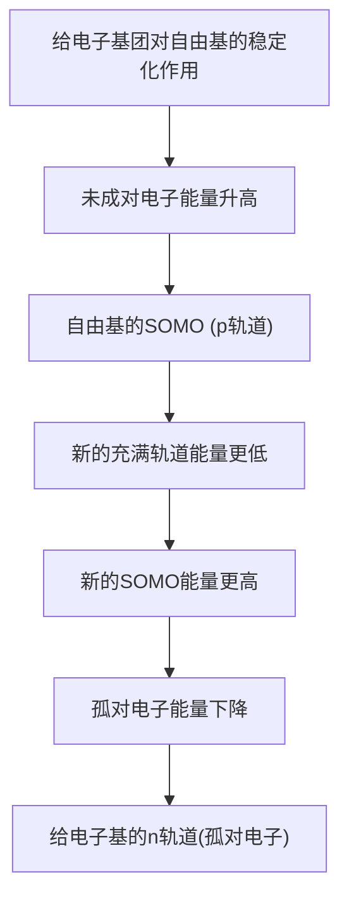
</details>

您在 Chapter 15 中了解了 C–H σ 键中的电子稳定阳离子的方式 (σ 共轭): 它们也以相同方式稳定自由基, 这就是为什么叔自由基比伯自由基更稳定。共轭在稳定自由基上也是有效的。由它们的 ESR 光谱 (p. 976), 我们可以获知, 与双键相连的自由基是离域的; 从烯丙基和苄基 C–H 键的键解离能也可明显看出它们更加稳定。

# - 任何稳定阴离子或阳离子的部件都能稳定自由基:

- 吸电子基  
- 给电子基 (包括用 C-H σ 键给电子的烷基)  
- 共轭基团。

# 空阻降低自由基活性

在 p. 975，我们向您展示了一些格外稳定的 (持久的) 自由基：有些甚至可被分离和提纯。现在您至少应该能看出一部分它们稳定性来源了：其中两个具有相邻的强给电子基，还有一个具有强吸电子基，四个中的三个都是共轭的。

这些自由基是持久的...

![[中文版clayden-chinese37-401000-1132_images/9e0b11b4ac7470520057dce496312609485e7d3b39294ffa41ee3462056369fa.jpg]]

<details>
<summary>chemical</summary>

Chemical structures of various organic molecules with functional groups including nitro, phenyl, and amide moieties
</details>

绿色的是给电子基团 黑色的是吸电子基团

但只有电子因素并不足以解释这四种自由基格外的稳定性，如右边的两个自由基只接受了与前文我们提到的自由基相同的电子稳定性，但前文的要比它们活泼得多。

事实上，我们知道三苯甲基自由基的稳定性主要来源于空间因素，而不是电子因素。X-射线晶体学显示此化合物中的三个苯基并不共面，它们都扭曲出平面大约 $30^{\circ}$ ，像螺旋桨一样。这意味着此自由基中的离域比理想的小（通过 ESR 光谱法可以了解它的离域），事实上，它只比二苯甲基或甚至苄基自由基多离域一点点，但它要比它们稳定得多。这必然是因为承担最多自由基特征的中心碳，在空间上被扭曲的苯基所屏蔽，使之难以与分子反应。

...而这些自由基是活泼的

![[中文版clayden-chinese37-401000-1132_images/13e516d62c4bef6d4b6317c2bdeb0e96b1356d7d39bdfb67908e30a70001431c.jpg]]

<details>
<summary>chemical</summary>

Two organic molecular structures: a cyclohexylamine ring and a benzene ring with oxygen atoms
</details>

![[中文版clayden-chinese37-401000-1132_images/974ad2a1f424e6572c201942de363878a71124c1f7db17b8e9c310baad94b0c5.jpg]]

<details>
<summary>chemical</summary>

Chemical structure of a biphenyl derivative with two phenyl groups attached to a central carbon
</details>

如您在 p.973 的文字框中所了解，它的反应是通过较小空阻的对位发生的。

本章余下的部分将专门讨论自由基的反应，您将看到我们所讨论的两种因素——电子稳定化作用和空间位阻——作为控制这些反应的关键因素。

# 自由基如何反应?

活泼自由基面临一个选择：它既可以找到另一个自由基并组合成一个自旋成对的分子 (或多个自旋成对的分子)，也可以与一个自旋成对的分子反应形成新的自由基。这两者都是可行的，我们将见到每一种的例子。自由基第三种可能的行为是通过一个单分子反应分解，产生新的自由基和一个自旋成对的分子。

# - 三种可能:

\- 自由基 + 自由基 → 自旋成对的分子

![[中文版clayden-chinese37-401000-1132_images/706a525f393d8529ad59e8ab5f33a8f5e01b59d2590e53265c91d81d80d961ad.jpg]]

\- 自由基 + 自旋成对的分子 $\rightarrow$ 新的自由基 + 新的自旋成对的分子

![[中文版clayden-chinese37-401000-1132_images/0c50d3bf7b0bcdf7fa4ef5c04ecf7bb66b036930d41e2b57334be2dadff48ba9.jpg]]

\- 自由基 $\rightarrow$ 新的自由基 + 自旋成对的分子

![[中文版clayden-chinese37-401000-1132_images/0ea73f67b515d20f596202a172b03b262e04bda7b0cda290e5d8b2296387f0f4.jpg]]

# 自由基-自由基反应

考虑到未成对电子成对时释放的能量，您可能认为这类自由基反应，会是比没有净成对的与自旋成对的分子的反应更常见的一类。自由基-自由基反应当然会发生，但它们并不是涉及自由基的反应中最重要的一类。马上我们就会了解为什么它们不像您可能认为的那样常见，首先我们需要先着眼于几个会很好地运行的自由基-自由基反应的例子。

# 频哪醇反应是一个自由基二聚反应

我们在 p. 973 概述了通过单电子转移获得自由基的方法：通过单电子对自旋成对的分子的加成是有效的。发生这类反应的分子是具有能使电子进入的低能反键轨道的一类，尤其是芳香体系或羰基化合物。由电子对酮的加成形成的自由基阴离子被称为羰游基/羰基自由基 (ketyl)。单电子处在 $\pi^{*}$ 轨道中，因而我们可以将羰游基表达为自由基在氧或碳上，阴离子在另一个原子上的形式。

![[中文版clayden-chinese37-401000-1132_images/d3b1263eb7e6cea3d6db233821ff4f7fcd8060cc6ce48542bfe77702c7c4e2d3.jpg]]

<details>
<summary>chemical</summary>

羰基化合物与羰游基分子的电子跃迁示意图，标注了C=O π*和C=O π
</details>

![[中文版clayden-chinese37-401000-1132_images/7f1b6c700b7ce7b6e4f48df8f1792ede73de2c37fa2f447faade6b11a71fa9ba.jpg]]

<details>
<summary>chemical</summary>

Electrochemical reaction equation showing electron transfer from carbonyl to oxygen with metal-catalyzed dissociation
</details>

羰游基的行为取决于它们所处的溶剂。在质子溶剂中（例如乙醇），羰游基会被质子化，然后从金属接受第二个电子(此情形中的金属通常使用钠)。反应结束后加入酸，所得的烷氧基阴离子会给出醇。注意，这是在乙醇中使用金属钠，而非使用乙氧基钠的反应，在乙醇中得到的基本产物是乙醇钠。因而让钠在反应发生的同时溶解(进行时)是重要的，这样才可得到自由电子。

羰游基阴离子在质子溶剂中的反应

![[中文版clayden-chinese37-401000-1132_images/9831fb080554a0b70a5d2b10b0ac1aecf50cf06f1fb218fa74c43bf1b817851c.jpg]]

<details>
<summary>chemical</summary>

Reaction mechanism showing electron transfer and protonation steps of a radical intermediate
</details>

在非质子溶剂，例如苯或醚中没有可用的质子；因而羰游基的浓度会显著增加，羰游基阴离子开始二聚。二聚过程既是一个自由基-自由基过程，也是一个阴离子-阴离子过程，那么为什么两个阴离子间的静电排斥不会阻止它们接近彼此呢？成功的关键是使用金属镁或金属铝，那些可以形成强的、共价的金属-氧键，并因此能够同时络合多于一个羰游基的金属。一旦两个羰游基呗同一金属原子络合，它们便能迅速地反应。

![[中文版clayden-chinese37-401000-1132_images/3c7d84da8a1d4de82c3a765778af8efa6a55cedc78f6bec9d0ce83156d738091.jpg]]

<details>
<summary>chemical</summary>

Chemical reaction scheme for the formation of a 43–50% yield using a magnesium-aluminum complex, showing intermediate formation and hydrogenation steps.
</details>

此例子显示，丙酮的二聚给出一种二醇 (2,3-二甲基-2,3-丁二醇)，它的俗称是频哪醇 (pinacol)，它的名字被用于指代使用任何酮进行的这类反应。有些频哪醇反应会产生新的手性中心：在下面的例子中，两种非对映体会以 60:40 混合物形成。如果您想要制取单一非对映体的二醇，频哪醇反应会是一个好的选择！

![[中文版clayden-chinese37-401000-1132_images/48e570af6b7138f1a925093cd93080ea689828baa8a45fe6bfdafc0bea6ce9ff.jpg]]

<details>
<summary>chemical</summary>

Chemical reaction scheme showing alkylation of a ketone with 50°C, yielding anti- and syn-phenyl derivatives with 60% and 40% yields respectively
</details>

# 二苯甲酮用做 THF 蒸馏的指示剂

到现在为止，您应该已经总结出，THF 是一种重要的有机溶剂，很多低温，惰性气氛的反应都是在其中进行的。然而它有一个缺点：它相当吸湿，而用它做溶剂的反应又常常需要绝对无水。因而在使用前，送需要将其与金属钠蒸馏，金属钠会与 THF 中的痕量水反应。然而，需要有一个指示剂来显示钠已经完成了它的工作，THF 是干燥的。所用的指示剂是一种酮，二苯甲酮。

![[中文版clayden-chinese37-401000-1132_images/1ceb6e90c769c9d132e33f3032d7af74de5756d82b1ea281de772d5abf5a4979.jpg]]

<details>
<summary>chemical</summary>

Chemical reaction equation showing conversion of 二苯甲酮 to 二苯丙烯 under Na, THF conditions with high-temperature ester and redoxalate base
</details>

当 THF 干燥时，包含二苯甲酮的蒸馏液就会变为明亮的紫色。此颜色来源于二苯甲酮的羰游基，它会在此条件下形成应当不出乎您的意料。此羰游基由于被共轭和大空阻稳定，是持久的（长寿的）——它不会发生频哪醇二聚反应（如上文所阐述的，您一般也不会用钠去推动频哪醇反应）。然而如果水存在，羰游基就会迅速通过上文描述的还原反应淬灭，给出（无色的）烷氧基阴离子：只有当水全部耗尽时，颜色才会恢复。

这个反应被称为Bouveault-Blanc还原(reduction)，被用于将羰基化合物还原为醇，但现在对羰基的还原更方便的方法是现在，更方便的是使用氢化铝盐或硼氢化物。您在Chapter 32 (p. 832)已经见过了一个Bouveault-Blanc还原的例子。

全过程:  
![[中文版clayden-chinese37-401000-1132_images/47967d8c4159641d5585486bd397cb4c883a4aafda3b0282fa436e31b898ed16.jpg]]

![[中文版clayden-chinese37-401000-1132_images/507448937bfe0f11969560f71aaf33165f994006c5a8cb270f28f3be0124acf2.jpg]]

Interactive mechanism for

pinacol reaction

在非对映选择性上，最好还是使用我们在 Chapter 33 中描述的方法。

频哪醇反应也可以在包含两个羰基的分子中分子内地发生。事实上，重要的抗癌化合物紫杉醇(Taxol)初期合成方法中的一个的关键步骤就是用钛做电子源的分子内频哪醇反应。

![[中文版clayden-chinese37-401000-1132_images/eb5cab1d456eb2da7dd5729e56e220bf248c591351f891e864ad71b734865a96.jpg]]

<details>
<summary>chemical</summary>

Chemical reaction pathway showing conversion of a steroid-like molecule to a zwitterionic product via TiCl₃/Zn/Cu catalyst and redox reaction
</details>

做电子源的金属钛是在 $TiCl_{3}$ 被锌-铜混合物还原时产出的。这个反应事实上是不寻常的，因为您会在下文了解到，用钛的频哪醇反应一般不会停留在二醇上，而是会给出烯烃。

# 钛推动的频哪醇偶联和产物的脱氧: McMurry 反应

钛，在反应保持低温，反应时间不长时，可用作频哪醇反应的金属电子源，如上面的例子，二醇也可以从反应中分离出。然而，和镁、铝不一样的是，钛会进一步与二醇产物反应，通过被以其发明者命名的 McMurry 反应给出烯烃。

环己酮的 McMurry 反应

![[中文版clayden-chinese37-401000-1132_images/0707894a7be953a1c3ce6069e187325106c4c203533cae48af6c99f649e63551.jpg]]

<details>
<summary>chemical</summary>

Chemical reaction equation showing cyclohexanone reacting with LiAlH4 under Ti(III) production to form a ketone, yielding 86% yield, with accompanying Chinese description.
</details>

注意，作为反应电子源的钛(0)，是在反应过程中通过对Ti(III)盐，通常是 $\mathrm{TiCl}_3$ 的还原产出的，还原剂可用 $\mathrm{LiAlH_4}$ 或 $\mathrm{Zn / Cu}$ 。反应并不能与粉末状金属钛发生。McMurry反应被认为是一个涉及第一步频哪醇自由基-自由基偶联的两步过程。

![[中文版clayden-chinese37-401000-1132_images/492b601353e34564b9999ed0cc69d4e9a6cc8e6d86c66176b0cbf969544fbc3d.jpg]]

<details>
<summary>chemical</summary>

McMurry reaction mechanism showing Ti(0) transformation to a bridged bicyclic complex
</details>

然后 Ti(0) 会继续以一种尚未完全明了的机理给二醇脱氧，机理可能涉及二醇结合 (bind) 到 $TiCl_{3}$ 还原产生的 Ti(0) 颗粒表面的过程。

![[中文版clayden-chinese37-401000-1132_images/59a64bbb8258c83772cdf6ba7672493d1c4ee4d01ba84d74aeaaac11be1ccfd7.jpg]]

<details>
<summary>chemical</summary>

Chemical reaction diagram showing McMurry reacting with titanium complex in Ti(0) crystal plane, forming a bridged polycyclic aromatic hydrocarbon.
</details>

我们期望您对上述机理的缺陷感到些许害怕。但不幸的是，没有人知道真正发生了什么，因而我们也没法做得更好了。McMurry 反应在制取四取代双键上是非常有效——少有其他真正高效的，完成这一工作的方式。然而，这根双键需要是对称的（也就是说，两侧取代基是相同的），因为两个不同的酮之间的 McMurry 反应很少能成功。

![[中文版clayden-chinese37-401000-1132_images/73186352748793372d9aca3ebcb8734287e933dee2fcea7057ded2e90e51d93d.jpg]]

<details>
<summary>chemical</summary>

Chemical reaction equation showing conversion of a ketone to a vinyl alcohol using TiCl3 and Zn/Cu catalysts, yielding 96% yield
</details>

分子内的 McMurry 反应同样能非常好地工作，它也会是制取环状烯烃很好的方法，尤其是当要形成的环是中等环或大环的时候 (超过八元)。例如天然产物 flexibilene，具有一个 15 元环，可用由 15-酮醛的环化反应制得。

![[中文版clayden-chinese37-401000-1132_images/ed5d1ca12dea672d0fc277aaa6ff5bf1cd0f457852b59faedc2ec7730855f4ea.jpg]]

<details>
<summary>chemical</summary>

Chemical reaction showing conversion of a ketone to a flexible amine using TiCl3 and Zn/Cu catalysts
</details>

# 酯发生类频哪醇偶联：酮醇反应

您已经见到了酮和醇发生频哪醇反应和 McMurry 反应的例子。那么酯呢？您会认为，酯也可以按相同的方式形成羰游基阴离子，然后发生自由基二聚，这也正是事实上所发生的。

![[中文版clayden-chinese37-401000-1132_images/24cc234bea02c46b241448c9dd9a92157877c58a0deb2563be38fb24e2154e9e.jpg]]

<details>
<summary>chemical</summary>

Chemical reaction pathway showing esterification of a ketone using Na and Et2O, followed by deprotection to form a stable product with free base and two protons.
</details>

二聚的产物看上去非常像羰基加成-消除反应中的四面体中间体，它会坍塌以给出1,2-二酮。

双“四面体中间体”的坍塌

![[中文版clayden-chinese37-401000-1132_images/f88a73a92ec3771031a7d6edab51571a82bd76f81d1a1f33549e7e76b3861dce.jpg]]

<details>
<summary>chemical</summary>

Chemical reaction mechanism showing esterification and deprotection steps in a cyclic ketone compound
</details>

然而二酮仍然是可被还原的一一事实上，1,2-二酮比原来的酮面对亲电试剂是更活泼的，因为它们的 $\pi^{*}$ 处在低能，它们马上就会发生两个电子的转移，形成一个分子，我们可称后者为烯二醇盐(enediolate)。当用酸淬灭反应时，双阴离子会被两次质子化，得到一种 $\alpha$ -羟基酮的烯醇，这种 $\alpha$ -羟基酮(酮醇)便是酮醇反应(acyloin reaction)的最终产物。此例子的产率是很可观的 $70\%$ 。然而在许多其他情况中，酮醇反应的实用性会被由于烯二醇双阴离子的高活性而产生的副产物的形成所妨碍。当然，它的亲核性很强，而它又是在高度亲电的二酮的存在下形成的。它同样是碱性的，通常会催化与酯被还原竞争的Claisen缩合的发生。

■ 没有 $Me_{3}SiCl$ 时，此反应的主要产物将会是下面的环状酮酯，它是由酯在碱催化下的 Dieckmann 环化 (见 Chapter 26) 得到的。

![[中文版clayden-chinese37-401000-1132_images/c2275a8b36876f1ea427d2e39dcbd2c2bbbd33c8f3787833565e8b780487b069.jpg]]

![[中文版clayden-chinese37-401000-1132_images/06850c37690b1d1343009e50b8e22c7660fe827fb5ce2ead85a4e7a6a6ccb675.jpg]]

<details>
<summary>chemical</summary>

电子转移形成二酮的化学反应示意图，展示两个阶段（前和次）从烯二醇盐到高纯度的转化过程
</details>

这些问题的解决办法是向反应混合物中加入三甲基氯硅烷。硅基氯会在烯二醇盐形成时将其硅基化，酮醇反应的产物变为了二硅基醚。

![[中文版clayden-chinese37-401000-1132_images/42bd10f0559a64394655833901a22ae179225f7f552d0f262da41b6724287771.jpg]]

<details>
<summary>chemical</summary>

Chemical reaction equation showing conversion of ethyl ester to a cyclopentanone derivative using Na and methacrylate under basic conditions
</details>

人们很少真正想要这些硅基醚作为最终产物，它们可以在酸的水溶液中被容易地水解为 $\alpha$ -羟基酮。这个改进版本可以有效地制取四元环。

![[中文版clayden-chinese37-401000-1132_images/67729fb3791b16064a7b698808f4ce1779436a3530504a18be0ecef161181cdf.jpg]]

<details>
<summary>chemical</summary>

Organic reaction scheme showing conversion of ethyl ester to ketone using Na and methethanesil under acidic conditions
</details>

这两个酮醇反应表现出的环状化合物的形成并非偶然。酮醇反应是从四元链上构造四元碳环尤其强大的手段：自由基-自由基反应步骤中两个电子配对获得的能量，补偿了成环造成的环张力。

# 频哪醇、McMurry和酮醇反应都只是例外

请将自由基想象成砸窗抢劫的抢劫犯。他们先看到哪家商店就去抢哪家商店，砸碎橱窗并把放在最前面展示的廉价珠宝抢走。而溶液中的离子则是鬼鬼祟祟的小偷。他们会搜索整条街上全部的房屋，选择最脆弱的，并小心地进入他们知道存有无价的油画的房间。

我们已经说过，两个自由基发生二聚的这类反应是相对不常见的。大多数自由基都太活泼，以至于不能彼此反应。这听起来是荒谬的，但原因仅仅在于，高活性物种对于与它们反应的物种是没有选择性的。虽然在能量上，它更像找到另一个自由基二聚，但它们更有可能的是与溶剂分子，或反应混合物中其他化合物相碰。溶液中的活泼自由基只会以非常低的浓度存在，因而自由基-自由基相碰的概率非常低。自由基对自旋成对的分子的进攻常见得多，由于这样的反应的产物仍是一个自由基，它们便提供了发生自由基链式反应的可能。

# 自由基链式反应

在了解自由基如何形成的时候，您已经见过了几个自由基发生反应的机理。事实上，在本章的开头，我们已经处理过了 (虽然很简要) 组成自由基反应的机理的反应流程的每个步骤，如下所示。

![[中文版clayden-chinese37-401000-1132_images/2b528b0001ab57b19618e469ef9f7273bf69a2ffb49f59480e4398e9d9baa7ae.jpg]]

现在让我们来依此详细地考虑每一步。

1. 过氧化二烷基 (通过加热或光照) 均裂给出两个烷氧基自由基。  
2. RO• 从 HBr 上攫 H (自由基取代反应) 给出 Br•。  
3. Br• 加成到异丁烯上给出碳中心自由基。  
4. 碳中心自由基从从 H-Br 上攫取氢原子，形成最终产物并重新生成 Br•，后者可以与另一分子的烯烃反应。

![[中文版clayden-chinese37-401000-1132_images/3ae975855c51c314d66e30d155f9d16da75c0065c656bf76d0b89674ecc4669a.jpg]]

![[中文版clayden-chinese37-401000-1132_images/d64b5050df3e1cd11872a812dbcb94e2948fd0e3e3a00542846ed09b74c4073a.jpg]]

![[中文版clayden-chinese37-401000-1132_images/cc6d7a5e1a41717fc6ea020b3059905882c364eae014f088f34504d17c9782b1.jpg]]

![[中文版clayden-chinese37-401000-1132_images/b36e477be0ae0687bce1a6a272c586efe24c410b175159b49f9d209a0c54e8f5.jpg]]

<details>
<summary>chemical</summary>

Bromination reaction of a brominated alkene under hydrogen bonding, forming a bromoalkane with Br• group
</details>

因而整个过程是一个循环，溴自由基在形成产物的最后一步又重新生成。

![[中文版clayden-chinese37-401000-1132_images/2f92229282ac24d0929afc3be05ef957338390547b838bdcdc62b2f2771d5701.jpg]]

<details>
<summary>chemical</summary>

Bromination reaction mechanism of ROOR, showing Br• recombination and product formation
</details>

![[中文版clayden-chinese37-401000-1132_images/ddb7831e1bf6aada46e4ccbe892acb605c8b143d2d571107a4dd978c6a666a4e.jpg]]

Interactive mechanism for

radical addition of HBr to

isobutene

在循环的每一步在，都有自由基的消耗和新自由基的形成。因而这类反应被称为自由基链式反应(radical chain reaction)，维持这条链继续运行的，组成循环的两步被称为链传递步骤（chain propagation steps)。于是，要形成大量的产物，也只需要一分子的过氧化物作为引发剂(initiator)，确实，让这个反应以很好的产率进行，过氧化物只需以催化量(大约 $10\mathrm{mol}\%$ )加入。

然而如果小于 10 mol%，产率则会下降。问题在于，链反应并不是 100% 有效的。如果反应混合物中自由基的浓度较低，那么自由基-自由基反应会很稀少，但尽管如此它们也足够经常地发生，进而要求更多的过氧化物来重新开始整条链。

可能的 自由基-自由基 链终止步骤

![[中文版clayden-chinese37-401000-1132_images/ea85b1ee6997517bb143133522f44c98af1a0d2c622ba1f92d22b07ed9b0afe4.jpg]]

![[中文版clayden-chinese37-401000-1132_images/d5c441548a03c3a8884cd39cee76f3f1269b85e13e95c7fcac8ddb0fe9ea3afe.jpg]]

<details>
<summary>chemical</summary>

Chemical reaction showing bromine substitution with a curved arrow indicating electron flow
</details>

像这样的反应被称为链终止步骤 (chain termination steps)，实际上是任何自由基链式反应的重要组成部分；若没有链终止步骤，反应会脱离控制。

\- 自由基链式反应的组成部分:

\- 引发

![[中文版clayden-chinese37-401000-1132_images/edf37eab83002a2dfe945d1689c4c735d5074c22d7aed6ef1ff883d8e212d2d4.jpg]]

![[中文版clayden-chinese37-401000-1132_images/cd27402161c2f2e74b0a2f5d79ec171c6fa0feaec26fd305f0bc890395b0ff72.jpg]]

\- 增长

![[中文版clayden-chinese37-401000-1132_images/3da44204af2bcfbfd1ae4762580c117696aba2caf0de2539119179f772c76a19.jpg]]

<details>
<summary>chemical</summary>

Chemical reaction diagram showing bromine radical conversion to bromoalkane derivative
</details>

![[中文版clayden-chinese37-401000-1132_images/a5f7f16d8e897be068fbf15972d23d81c6625fa1c3263a6e6a2783be04c6198c.jpg]]

<details>
<summary>chemical</summary>

Bromination reaction of a brominated alkene to form bromo-1,3-bromo-1,4-bromo-1,5-bromo-1,6-bromo-1,7-bromo-1,8-bromo-1,9-bromo-1,10-bromo-1,11-bromo-1,12-bromo-1,13-bromo-1,14-bromo-1,15-bromo-1,16-bromo-1,17-bromo-1,18-bromo-1,19-bromo-1,20-bromo-1,21-bromo-1,22-bromo-1,23-bromo-1,24-bromo-1,25-bromo-1,26-bromo-1,27-bromo-1,28-bromo-1,29-bromo-1,30-bromo-1,31-bromo-1,32-bromo-1,33-bromo-1,34-bromo-1,35-bromo-1,36-bromo-1,37-bromo-1,38-bromo-1,39-bromo-1,40-bromo-1,41-bromo-1,42-bromo-1,43-bromo-1,44-bromo-1,45-bromo-1,46-bromo-1,47-bromo-1,48-bromo-1,49-bromo-1,50-bromo-1,51-bromo-1,52-bromo-1,53-bromo-1,54-bromo-1,55-bromo-1,56-bromo-1,57-bromo-1,58-bromo-1,59-bromo-1,60-bromo-1,61-bromo-1,62-bromo-1,63-bromo-1,64-bromo-1,65-bromo-1,66-bromo-1,67-bromo-1,68-bromo-1,69-bromo-1,70-bromo-1,71-bromo-1,72-bromo-1,73-bromo-1,74-bromo-1,75-bromo-1,76-bromo-1,77-bromo-1,78-bromo-1,79-bromo-1,80-bromo-1,81-bromo-1,82-bromo-1,83-bromo-1,84-bromo-1,85-bromo-1,86-bromo-1,87-bromo-1,88-bromo-1,89-bromo-1,90-bromo-1,91-bromo-1,92-bromo-1,93-bromo-1,94-bromo-1,95-bromo-1,96-bromo-1,97-bromo-1,98-bromo-1,99-bromo-200
</details>

![[中文版clayden-chinese37-401000-1132_images/3531eb0e89c6a78adca11ebb02c768ca182f507b25d5482a5848d12d4c1342a4.jpg]]

Interactive mechanism for

radical termination steps

我们提出了两个问题，为什么 Br• 自由基会以得到伯溴代烷的特征区域选择性添加到烯烃上，而 HBr 对烯烃的极性加成则会给出叔溴代烷：(1) 对烯烃取代基较少的一端的进攻是空阻较小的，(2) 由此形成的叔自由基比伯自由基更稳定。事实上，在所有卤化氢中，只有 HBr 能给出这种形式的烯烃：HCl 和 HI 只能发生极性加成，并给出叔卤代烷。这是为什么？我们也需要回答这类问题。

![[中文版clayden-chinese37-401000-1132_images/4680e867807d3120316c611861c814e4b997eef09a73ac0be59ac0fe0f39c4b5.jpg]]

Interactive mechanism for

radical addition of $Cl_{2}$ to

cyclohexane

\- 终止

![[中文版clayden-chinese37-401000-1132_images/3325b03a32b226ef40fac332161bbd9e48011533b83f1549b071c0595957a0e6.jpg]]

![[中文版clayden-chinese37-401000-1132_images/aeadc8117ff674dd3b976552932a41a1d09272de5147d6bf9b4aed1c8ae6d712.jpg]]

<details>
<summary>chemical</summary>

Chemical reaction showing bromine substitution with a curved arrow indicating electron movement
</details>

# 自由基链式反应中的选择性

在之前我们考察的自由基-自由基反应中，没有任何关于自由基会与谁发应当问题出现：只有一种自由基得以形成，并发生完全相同的两部分的二聚过程。那么对于上文的链式反应呢——存在三种类型的自由基， $\mathrm{Br}^{\bullet}$ ， $\mathrm{BrCH_2Me_2CH^{\bullet}}$ 和 $\mathrm{RO}^{\bullet}$ ，它们全都专一性地选择与自旋成对的搭档反应： $\mathrm{Br}^{\bullet}$ 与烯烃， $\mathrm{BrCH_2Me_2CH^{\bullet}}$ 和 $\mathrm{RO}^{\bullet}$ 与 $\mathrm{HBr}$ 。我们需要了解控制这种化学选择性的因素。为了了解它，我们需要先着眼于几种具有已观察到化学选择性、区域选择性的其他自由基反应。

# 烷烃的氯代

烷烃会与氯自由基反应给出氯代烷。例如环己烷与氯气在光照条件下反应，可得到环己基氯和氯化氢。

![[中文版clayden-chinese37-401000-1132_images/4fcb1034562c529c813d6253b525c64ef658993d74d8f32e6399aa27e8af5fcd.jpg]]

<details>
<summary>chemical</summary>

Chemical reaction equation showing cyclohexene reacting with Cl₂ under hv to form a chlorinated cyclohexane and HCl
</details>

# Toray 过程

本反应的一个被称为 Toray 过程 (process) 的变体，被用于尼龙前体，己内酰胺工业规模的生产。与氯相比，亚硝酰氯被用于形成能迅速互变为肟的亚硝基化合物。如您在 Chapter 36 中所了解，此肟能在酸性条件下发生 Beckmann 重排以形成己内酰胺。

Toray 过程

![[中文版clayden-chinese37-401000-1132_images/3af8bf710034ae0781786eeb2494e5e2757085506d5b83af98f0bc683ec147ab.jpg]]

<details>
<summary>chemical</summary>

Nitration reaction equation of cyclohexene with nitro group under hv light, forming a hydroxy carbamate intermediate and then reacting with H+ in Beckmann reagent
</details>

这类反应是少数可由烷烃制取含官能团化合物的反应之一，因而在工业上是重要的。您可能已经猜出，这个反应需要光引发，因而其过程是另一个自由基链反应的例子。和 HBr 对烯烃的自由基加成一样，我们也可以识别出机理中的引发、增长和机理步骤。

引发

![[中文版clayden-chinese37-401000-1132_images/870e1f841f301293623583cb40b210b252344148cffd769d590a7ea74dd0456a.jpg]]

增长

![[中文版clayden-chinese37-401000-1132_images/65f25216ae619b9f9553cc62f45e69ce58c1d33e76ae8c8fb0e9e42527d42d3b.jpg]]

<details>
<summary>chemical</summary>

Cl₂-catalyzed hydrolysis reaction mechanism of cyclohexene under acidic conditions, showing two pathways with chlorine substitution and HCl addition
</details>

此情形的终止步骤没有我们上一个看到的情形中的重要，每次引发 (氯单质光解) 通常可以使链反应继续进行 $10^{6}$ 步。但要注意：像这样的反应在日光下会是易爆的，因而需要特殊的设备，不能

在开放实验室中进行。

当氯自由基从环己烷上攫取氢原子时，只会形成一种产物，因为全部的 12 个氢原子都是等价的。对于其他烷烃，或许并不是这样，得到的可能是氯代烷的混合物。例如，丙烷的氯代会给出包含 45% 1-氯代丙烷 和 55% 2-氯代丙烷 的氯代烷混合物，异丁烷的氯代会给出 63% 的异丁基氯和 37% 的叔丁基氯。

![[中文版clayden-chinese37-401000-1132_images/bbb71c7116fcc7840ddea3b26cd3731f2fb324df0859efc57a5dea581fff9cbc.jpg]]

<details>
<summary>chemical</summary>

Chemical reaction equation showing chlorination of alkene under light, yielding 45% and 55% yields
</details>

![[中文版clayden-chinese37-401000-1132_images/279b5d62a321829913cbfe5d14db0b7e386f7f1800247701149a16801bf3e699.jpg]]

<details>
<summary>chemical</summary>

Chemical reaction showing chlorination of alkene under light to form two products with yields 63% and 37%
</details>

我们如何解释所得产物的比例呢？关键在于着眼于每个反应所涉及的自由基的相对稳定性，以及所形成、所破坏的键的强度。首先是丙烷的氯代。由光解产生的氯自由基既可以从分子端攫取伯氢原子，也可以从中部攫取仲氢原子。对于这两个过程，能量的获得和失去如下：

![[中文版clayden-chinese37-401000-1132_images/9a10b6ac591bc172b939b9596e8a03069889ae087a105ccb3d4035b551370325.jpg]]

键能已于 p. 971 的表

格中给出。

<table><tr><td colspan="2">伯氢的
攫取</td></tr><tr><td></td><td>H-Cl + ·ΔH, kJ mol⁻¹</td></tr><tr><td>形成一根 H-Cl 键</td><td>-431</td></tr><tr><td>破坏一根伯 C-H 键</td><td>+423</td></tr><tr><td>总计</td><td>-8</td></tr></table>

<table><tr><td>Cl•H→仲氢的
攫取</td><td>H-Cl + ΔH, kJ mol⁻¹</td></tr><tr><td>形成一根 H-Cl 键</td><td>-431</td></tr><tr><td>破坏一根仲 C-H 键</td><td>+410</td></tr><tr><td>总计</td><td>-21</td></tr></table>

攫取仲氢原子所放的热比攫取伯氢原子的高，原因在于：(1) 仲 C–H 键比伯 C–H 键弱，(2) 仲自由基比伯自由基稳定。因此相比于 1-氯丙烷 我们会得到更多的 2-氯丙烷。但在此情形中，这并不是唯一涉及的因素：这里有六个伯氢原子，但只有两个仲氢原子，因此伯、仲位点的相对活性与反应产物表明的简单比例还是不一样的。这种统计因素对于我们给出的另一个例子，异丁烷的氯代更为明显。现在，选择在于叔自由基和伯自由基的形成之间。

<table><tr><td>伯氢的
攫取</td><td>H-Cl + ·</td></tr><tr><td></td><td>ΔH, kJ mol⁻¹</td></tr><tr><td>形成一根 H-Cl 键</td><td>-431</td></tr><tr><td>断裂一根伯 C-H 键</td><td>+423</td></tr><tr><td>总计</td><td>-8</td></tr></table>

<table><tr><td>Cl·H→叔氢的
攫取</td><td>H-Cl + ΔH, kJ mol⁻¹</td></tr><tr><td>形成一根 H-Cl 键</td><td>-431</td></tr><tr><td>断裂一根叔 C-H 键</td><td>+397</td></tr><tr><td>总计</td><td>-34</td></tr></table>

叔自由基的形成放热更多，但伯氯代烷却比叔氯代烷形成得多。然而，一旦考虑到伯氢原子与叔氢原子9:1的比例，此实验测得的相对活性，应该如下表所示。

<table><tr><td>产物形成的比例 (叔:伯)</td><td>37:63</td></tr><tr><td>氢原子的数目 (叔:伯)</td><td>1:9</td></tr><tr><td>每根 C—H 键的相对活性 (叔:伯)</td><td> $37/1:63/9 = 37:7 = \text{约 } 5:1$ </td></tr></table>

# - 键的强度在自由基反应中是重要的

这些反应说明了自由基反应的一个关键点——影响反应性的一个关键因素是形成和破坏的键的强度。

■ 键的强度只能作为自由基反应选择性的指导。我们马上就会了解到，它并不是所涉及的唯一因素。确实，您在在本章的第一个反应中已见到了空间因素在 Br• 自由基对烯烃较小空阻的一端的加成上发挥的作用；之后，您还会见到前线轨道效应的作用。  
我们用符号 ( $\bullet$ ) 表示部分自由基 (partial radical); 部分地位于某个原子上的自由基。我们曾类似地用符号 (-) 和 (+) 表示被多于一个原子分享的电荷。  
当然，我们涉及键能的计算只会为我们提供 $\Delta H$ 的数值，而不能提供此图表表达的 $\Delta G$ 的数值。然而，我们可以假设关系式 $\Delta G = \Delta H - T\Delta S$ 中的 $T\Delta S$ 项相对不重要。

Cl• 对叔 C–H 键进攻的速率，大约五倍于 Cl• 对伯 C–H 键进攻的速率。我们说过，这是因为叔自由基形成时比伯自由基放热更多。但反应的速率并不取决于反应的 $\Delta H$ ，而应取决于反应的活化能，也就是说，达到反应过渡态所需的能量。但由于过渡态必然具有显著的自由基特征，我们仍可以把自由基产物的稳定性作为衡量过渡态稳定性的指导。

![[中文版clayden-chinese37-401000-1132_images/2e54c8af13f72258583f1aa5d6ad8e57a3fa1aac3f9808ca81707c6bffddf225.jpg]]

<details>
<summary>chemical</summary>

Energy level diagram of a chlorinated alkane reaction, showing transition states and energy gaps (ΔG3±, ΔG1±)
</details>

上方的能级图说明了这一点。当底物 (Cl• 加异丁烷) 向产物移动时，它们会经历一个过渡态 (形成伯自由基的 TS₁ 和形成叔自由基的 TS₃)，过渡态中，Cl• 起始原料的自由基特征被分散到了 Cl 和 C 中心上。叔自由基与伯自由基相比较大的稳定性，必然会一定程度地反映在这些过渡态中：在 Cl 和叔中心间分享的自由基会比在 Cl 和伯中心间分享的更稳定。在叔 C-H 键上反应的过渡态 TS₃ 因而也会比在伯 C-H 键上反应的 TS₁ 更低能。换句话说，活化能 $\Delta G_{3}^{\ddagger}$ 会比 $\Delta G_{1}^{\ddagger}$ 小，因此在叔 C-H 键上发生的反应会更快。

# 烷烃的溴代选择性更高

溴同样能使烷烃卤代，并且它的选择性会比氯更高。例如下面的反应，在产出叔溴代烷时，仅伴随少于 1% 的伯异构体。

![[中文版clayden-chinese37-401000-1132_images/07460a9491bf717f377df011f9de40ff0b6e31c3cfb0c994268c803f4577cd6a.jpg]]

<details>
<summary>chemical</summary>

Bromination reaction of alkene under UV light, showing Br₂ and Br substituents with yield percentages
</details>

在此情形中，自由基链式反应的第一步是 H 被 Br• 攫取的过程，此步对于伯和叔氢原子来说都是吸热的，但对于伯自由基的形成则吸热得更多，因此更倾向形成叔自由基。

![[中文版clayden-chinese37-401000-1132_images/6861d1561df4b80f6546446532b2428655647b94c0a5aefeae8b5b5403161d71.jpg]]

<details>
<summary>chemical</summary>

Reaction mechanism diagram showing hydrogenation of bromoalkane to form H–Br and C–H, with enthalpy change values for each step
</details>

![[中文版clayden-chinese37-401000-1132_images/de3bd41c76c6485b9d0bfb67b9f2525c621ae56f3f9bddfaf061d239ce74fff1.jpg]]

<details>
<summary>chemical</summary>

Reaction mechanism diagram showing hydrogenation of bromoalkane to form H–Br and hydrogen, with enthalpy change values for each step
</details>

当然，溴代和氯代的总体反应都是有利的，因为其第二步——烷基自由基的卤代——是显著放热的，氯代时为大约 $106 \, kJ \, mol^{-1}$ ，溴代时为大约 $83 \, kJ \, mol^{-1}$ 。对氟代来说同样如此，但由于氟代时放热太多，因而氟代反应是危险易爆的。相反，自由基碘代却是不可行的，因为最后一步所放的热不足以补足烷基自由基形成时所吸的热。

为什么烷烃溴代的选择性比氯代多得多呢？这是 Hammond 假说 (Hammond postulate) 应用在真实化学上的一个很好的例子。由于溴代最后一步的产物 (R• 加 HBr) 在能量上比起始原料高，因而过渡态在结构和能量上必然都与其 (正在形成的烷基自由基) 相近；因此，伯和叔自由基产物在能量上的差异也应当更显著地反映在过渡态 TS₁ 和 TS₃ 在能量上的差异上，ΔG₁‡ 也会显著地比 ΔG₃‡ 更大。对于氯代反应来说，产物在能量上还比起始原料低一点，因而两种可能反应的过渡态看起来会更像起始原料而非产物。(译者注：越软的原子上的自由基越稳定。) 当然，贴近起始原料的过渡态对于叔氢和伯氢的攫取没什么两样，产物自由基对过渡态的能量差异也没有造成什么显著的影响。

卤代反应的第二步:往往是放热的

![[中文版clayden-chinese37-401000-1132_images/ae7a0a98699f344c2eccdf0241402d13fe96920e8e6d9c017d607da311326fa8.jpg]]

Hammond 假说 对过渡态的结构提供了信息。它表述，直接相互转化 (即在反应剖面图上直接相连的)，并在能量上接近的两个状态在结构上同样接近。因此对于起始原料、中间体、产物这些可观测的结构，过渡态在能量上接近于哪一个，其结构便接近于哪一个。

![[中文版clayden-chinese37-401000-1132_images/aa5b5967aa87a15379f1d5516a57518ca6ae5ab02d015b47fca7ed90d3083f81.jpg]]

<details>
<summary>chemical</summary>

反应坐标图，展示TS₁和TS₃的苯环结构及对应的能量变化路径
</details>

# 烯丙型溴代

由于自由基溴代反应如此高的选择性，它们可被成功地用在实验室制取溴代烷上。相对少有使未官能化的中心官能化的方法，自由基烯丙型溴代反应 (allylic bromination) 是其中最有效的一种。我们在 Chapter 24 中介绍了这个反应，在那里，我们对比了 $\mathrm{Br}_2$ 对烯烃的自由基选择性（通过攫氢指向烯丙基溴）和离子型选择性（指向溴对烯烃的加成）。现在我们可以更详细一点地着眼于所涉及的选择性。

![[中文版clayden-chinese37-401000-1132_images/d9603794a4469ea140d91d68e854988dbdeefe7e847a6e8d31da5de18d8c2578.jpg]]

我们在 p. 571 介绍了由基溴代反应。

NBS 完成此工作的方式已于 p. 573 阐述。

Interactive mechanism for allylic bromination

这些数据是在气相中确定的，此处我们的反应则在溶液中进行。尽管如此，因为溶剂化效应对于所有自由基都几乎是一样的，我们认为键强度的顺序仍与气相中相同。

![[中文版clayden-chinese37-401000-1132_images/525c8516fbcddeb3cf4f7905a1934130f48a639559a062f6b1124bd4ca48ed96.jpg]]

非极性  
溶剂  
使  
阳离子中间体  
不稳定

下面是一个典型的烯丙型溴代反应。NBS (N-溴代琥珀酰亚胺 N-bromosuccinimide) 被用于产生少量的 $Br_{2}$ 并保持 $Br_{2}$ 低浓度。

![[中文版clayden-chinese37-401000-1132_images/e06835a75285270476bcf9bf5d0a31cee6b1589f5f14bd8bd8a712a3cbe4cc4f.jpg]]

<details>
<summary>chemical</summary>

NMR spectrum reaction of cyclohexene under UV light yielding 85% yield and N-Br-substituted imidazole (NBS)
</details>

Br $_2$ 的光解会引发此反应，增殖过程如下所示。机理同样说明了选择性的第一个方面：只有 (绿色的) 烯丙型 H 原子会被攫取，因为烯丙型 C–H 键比伯 C–H 键显著地弱 (364 比 410 kJ mol $^{-1}$ ，见 p. 977 的表格)。

![[中文版clayden-chinese37-401000-1132_images/5c30fad0d51acb329d0a9dd049abfda2fa984f0c29989327a763ca2e51cf6baf.jpg]]

<details>
<summary>chemical</summary>

Bromination reaction mechanism of benzene with bromine, showing C-H bond elongation and HBr elimination steps
</details>

如果用溴本身完成这个反应，则会出现问题，因为同样可以进行的自由基加成反应会与自由基攫取反应竞争。

![[中文版clayden-chinese37-401000-1132_images/6e9fa3013592c9058454f657a846cfedc2d42131876055a0b099a32f479170e0.jpg]]

<details>
<summary>chemical</summary>

Chemical reaction diagram showing bromine substitution and ring opening reaction
</details>

竞争的加成反应的第一步是可逆的，捕捉产物自由基的第二分子溴会驱动反应的进行。因此如果反应中 $Br_{2}$ 的浓度被控制得非常低，这个副反应便能被阻止，这就是 NBS 扮演的角色。同样，与之竞争的还有 $Br_{2}$ 对烯烃的极性加成，这也能被 NBS 提供的溴的低浓度所阻止，非极性溶剂 $CCl_{4}$ 同样不利于溴鎓阳离子的形成。

虽然烷烃的自由基卤代反应很少被用在实验室中，但烷烃的自由基烯丙型溴代反应却全能并常被用于烯丙型溴代物的制取。然后可用亲核取代反应讲溴转化未其他官能团。例如，曼彻斯特的一些化学家需要制取下面的两种5-叔丁基-2-烯-1-环己醇的非对映体，以研究它们与四氧化锇的反应。叔丁基环己烯很容易购得，因而它们用自由基溴代反应向烯丙位引入了官能团，用碱的水溶液讲溴转化为了羟基。空阻在反应的区域选择性中也扮演了重要角色：只移去离叔丁基较远的，空阻较小的烯丙型氢。

![[中文版clayden-chinese37-401000-1132_images/de5f6fce628bae47d2dfeab5ef415632930be65f0c73cfdea2dae4f33e51e6a8.jpg]]

<details>
<summary>chemical</summary>

Chemical reaction scheme showing bromination and subsequent hydrolysis of a cyclohexene derivative under light irradiation
</details>

# 选择性的逆转: 用 H 取代 Br

自由基取代反应也可被用于从分子上移去官能团。完成此项工作的实用试剂 (如您将会了解到的，也是其他自由基反应的实用试剂)是叔丁基锡氢(tributyltin hydride)， $\mathrm{Bu}_{3}\mathrm{SnH}$ 。Sn-H键弱， $\mathrm{Bu}_{3}\mathrm{SnH}$ 会与卤代烷反应，用H替代卤原子，同时产出副产物 $\mathrm{Bu}_{3}\mathrm{SnHal}$ 。

![[中文版clayden-chinese37-401000-1132_images/33fd48ff5b03184a673d3287794acc4d35291fb93583e58bd60c3ec4d67bf700.jpg]]

<details>
<summary>chemical</summary>

Organic reaction scheme showing bromination of cyclohexyl ether under light to produce 81% yield using Bu₃SnH and Bu₃SnBr catalysts
</details>

很明显，这个反应在能量上是有利的，形成的新键 (Sn–Br 和 C–H) 都必然比断裂的旧键 (Sn–H 和 C–卤) 强。查看平均键能的表格，您会了解到确实如此。氢化脲（锡）的使用对于这个反应是至关重要的：Sn–H 键比 Sn–Br 键更弱，但对于碳，C–H 键则较强。因而 $Bu_{3}SnH$ 是 $Bu_{3}Sn^{\bullet}$ 自由基的有效源， $Bu_{3}Sn^{\bullet}$ 自由基会从有机卤代烃上攫取卤素，尤其是 I 或 Br，但也能攫取 Cl，断裂一根 C–Hal 键，形成一根强 Sn–Hal 键。这个反应的完整机理揭示了一个链式反应。

![[中文版clayden-chinese37-401000-1132_images/71fe65f7a2d628a366d823f2fe795253235b963d479b30c6270d1226118aa329.jpg]]

<details>
<summary>chemical</summary>

Bromination reaction mechanism of 2-butene with H-boron reagent, showing electron transfer and free energy change
</details>

# $\mathbf{Bu}_{3}\mathbf{SnH}$ 的均裂被引发剂AIBN所推动

您可能已经想到，最弱的 C-卤键最易断裂，因此溴代烷会比氯代烷被还原得更迅速，氟代烷则是不活泼的。对于碘代烷和溴代烷，光照就足以引发反应；但对于氯代烷，以及溴代烷也经常如此，通常需要通过添加引发剂产生更高浓度的 $Bu_{3}Sn^{\bullet}$ 自由基。最佳的选择通常是 AIBN，您在本章前文遇到过它 (p. 972)。此化合物可在高于 $60^{\circ}C$ 时发生热均裂，给出被腈稳定的自由基，继而从 $Bu_{3}SnH$ 上攫取氢原子。

![[中文版clayden-chinese37-401000-1132_images/fbcea936aca8a2bc8237335951584bb766a1dad718e02cfd0609a6b7360b3c8c.jpg]]

<details>
<summary>chemical</summary>

Chemical reaction scheme showing cyanomethyl cyanide reacting with 66–72 °C to form cyanomethyl cyanide and then with Bu3Sn, forming a cyanomethyl cyanide intermediate.
</details>

为什么用 AIBN 做引发剂而不用过氧化物呢？由于我们只想断裂一根弱 Sn-H 键，我们才可以用相对不活泼的被腈稳定的自由基。而另一方面，过氧化物生产的 RO• 自由基高度活泼，它不止会在 $Bu_{3}SnH$ 上攫取弱键合氢原子，还会从几乎任何有机分子上攫氢，这会导致副反应以及选择性的丧失。AIBN 只需能引发反应的量就足够了，因为 $Bu_{3}SnH$ 还要提供最后在产物中的氢原子，因此您通常需加入 0.02 到 0.05 当量的 AIBN，以及稍微过量的 (1.2 当量) 的 $Bu_{3}SnH$ 。

我们在 Chapter 23 讨论了官能团的移去和您可能想要这样做的理由。

<table><tr><td>键</td><td>代表键能, $\text{kJ mol}^{-1}$ </td></tr><tr><td>C—Br</td><td>280</td></tr><tr><td>Sn—H</td><td>308</td></tr><tr><td>C—H</td><td>418</td></tr><tr><td>Sn—Br</td><td>552</td></tr></table>

Interactive mechanism for tin hydride reduction of alkyl halides

在 p. 971，我们曾用过氧化物作为 H-Br 对烯烃加成的引发剂。

H-CH $_2$ CN 的键能仅为 360 kJ mol $^{-1}$ ; 而与 CN 基相连的叔 C-H 键则应当更弱。O-H 的键能 = 460 kJ mol $^{-1}$ ; 只有很少的 C-H 键能高于 440 kJ mol $^{-1}$ 。

![[中文版clayden-chinese37-401000-1132_images/862eeafe152388441182ea4d30e104528c3ee10f794927a31418d3b79b0924e0.jpg]]

<details>
<summary>chemical</summary>

Chemical reaction equation showing conversion of bromo-1,3-dicarbonyl compound to a ketone using Bu₃SnH and AIBN under basic conditions
</details>

![[中文版clayden-chinese37-401000-1132_images/49154990acfd8862d7f119c35171d07eb9c420123f14d4b5ae59b2d495492169.jpg]]

<details>
<summary>chemical</summary>

Chemical structures of hirsutene and甾体 with labeled stereochemistry
</details>

![[中文版clayden-chinese37-401000-1132_images/fa160880cb91a2bddade0cc38528f57c279c6a5069cebcf558aab06c50c71ac0.jpg]]

<details>
<summary>chemical</summary>

Organic reaction scheme showing bromocyclopropane reacting with BrCCl₃ under hv light to yield a 78% yield of CCl₃
</details>

# 用自由基形成碳-碳键

您现在见过的自由基链式反应的例子有如下两个：

1. 卤素对双键的自由基加成  
2. 卤素对氢，或氢对卤素的自由基取代

您也了解了这些反应的选择性，它们取决于所形成和所断裂的键的强度。在大约 1975 年之前，除少数例外，这些反应一直是自由基反应的全部。然而在那之后，自由基在合成化学上的使用急剧增加，以至于如天然产物 hirsutene 或甾体这样的复杂环结构都可以通过一个自由基推动步骤，由简单的非环状前体制得。

让这一切成为可能的原因是，化学家懂得了如何理解自由基反应到如此程度的选择性，于是它们可以设计明确了反应过程中要断裂和形成的键的起始原料和试剂。现在，我们会继续着眼于控制自由基反应的能力最重要的结果：它们可被用于碳-碳键的形成。

页边的自由基反应形成了一根新的碳-碳键。机理与我们在本章的开头，向您展示的首个自由基反应很相似。现在，有了对键强在自由基反应的选择性中扮演的角色更进一步的认识，您应能理解每一步都以每种方式进行的原因。

首先，最弱的键，C-Br键被光所断裂。形成两个自由基， $\mathrm{CCl}_3^{\bullet}$ 和 $\mathrm{Br}^{\bullet}$ 。其中 $\mathrm{CCl}_3^{\bullet}$ 加成到了烯烃(较少空阻的)未被取代的一端，并产出一个(更稳定的)仲苄基自由基。

![[中文版clayden-chinese37-401000-1132_images/abf49bf770bfc80be4c31e3d64d40bf1dc0adca1935e5a1895c4e191fc9edc2e.jpg]]

<details>
<summary>chemical</summary>

Organic reaction mechanism showing bromination and cyclization steps with light emission
</details>

然后 Br 原子被从 $BrCCl_{3}$ 上攫取下来，断裂 (最弱的) C—Br 键，形成产物，并重新生成 $\cdot CCl_{3}$ ，继而再加成到另一分子的烯烃上。注意，碳中心自由基从 $BrCCl_{3}$ 上攫取的是 Br• 而非 $\cdot CCl_{3}$ ——对 $\cdot CCl_{3}$ 的攫取需要在碳上的自由基取代反应——记住，自由基想要轻易地拿走橱窗最前面的商品；它们不会小心翼翼地绕道背后并观察是否有更好的选择。

对烯烃加成的 $\cdot CCl_{3}$ 主要由此步形成——起始的光解当然也产出了 Br·和 $\cdot CCl_{3}$ ，它们都可以加成，但一旦自由基链反应被引发了，以后产出的便都是 $\cdot CCl_{3}$ 了。

![[中文版clayden-chinese37-401000-1132_images/db877047c6e1f1282a19f60c1478f46df1633ca48da1c02996d20c9df87727c8.jpg]]

<details>
<summary>chemical</summary>

Chemical reaction equation showing bromination of a cationic alkene to form a chloride product
</details>

这个反应工作得很好，给出 78% 的产物，但它依赖于起始原料 BrCCl $_{3}$ 具有不寻常的弱 C–Br 键的事实 ( $^{\bullet}$ CCl $_{3}$ 自由基被三个氯原子高度稳定化)。由于大量的原因，不只是因为产物仍是溴代烷，大多数其他溴代烷都不能这样使用；若无 CCl $_{3}$ 基提供的选择性，结果将会是聚合物的混合物。问题在于，我们想要产物自由基从起始的溴代烷上攫取 Br，制得新的溴代烷和新的自由基，但此转换

的背后并没有从能量角度驱动它进行的动力。

![[中文版clayden-chinese37-401000-1132_images/5466e50fd80b83d3050fda76ea0067cec070dc8b3143bf478b9c005f48f63be2.jpg]]

<details>
<summary>chemical</summary>

Reaction mechanism diagram showing bromination of alkene 1 to form dihydride 2, with note on non-standard reaction conditions
</details>

为了得到克服这一困难的方式，让我们重新考察几页前讨论的反应， $\mathrm{Bu}_{3}\mathrm{SnH}$ 对卤代烷的脱卤反应。机理涉及 $\mathrm{Bu}_{3}\mathrm{Sn}^{\bullet}$ 对 Br 的攫取以形成烷基 (碳中心) 自由基的过程，然后此烷基自由基会再次从 $\mathrm{Bu}_{3}\mathrm{SnH}$ 上攫取 $\mathrm{H}^{\bullet}$ 。

![[中文版clayden-chinese37-401000-1132_images/d14c4cab0208daa1ecfa6544160d57381d72a2bdc6c0acd66f5dc6bc376b176e.jpg]]

<details>
<summary>chemical</summary>

Bromination reaction mechanism of Bn₃SnH with AIBN, showing radical addition and free base formation
</details>

我们能建设性地使用此烷基自由基，促使它与其他分子 (比如说烯烃，像 $\cdot CCl_{3}$ 那样) 反应吗？答案是肯定的：请看这个反应：

![[中文版clayden-chinese37-401000-1132_images/e98b1602a445c066073f0dabbc142539bd543e58eadb0ef8b4ffb3ada7f9c449.jpg]]

<details>
<summary>chemical</summary>

Chemical reaction equation showing iodobutyl cyanide reacting with Bu3SnH under AIBN conditions to form new C–C bond
</details>

我们将一个碳中心自由基，通过自由基链式反应加成到了烯烃上！下面是它的机理：

![[中文版clayden-chinese37-401000-1132_images/f212f45d0e4d3d4ccbe2ee6f27159b3ff00b407e9936c52977af15ec3dca76b0.jpg]]

<details>
<summary>chemical</summary>

Bromination reaction mechanism of Bn₃SnH with AIBN, showing sequential radical transformations and radical addition
</details>

在这里发生了一些重要的事：产物自由基不再从起始原料攫取卤素，相反，它从 $Bu_{3}SnH$ 上攫取了 H；这样形成的 $Bu_{3}Sn^{\bullet}$ 会重新生成起始自由基。以 Sn-H 为代价的 C-H 键的形成，和以 C-Br 为代价的 Sn-Br 的形成提供了驱动力。

氢化肠的使用惊人地增强了自由基反应在有机合成中的实力，由于这些反应的重要性，它们自由基链式过程的步骤已被十分细致地研究。我们不会太详细地考察细节，但我们需要回顾关于这个反应您需要进一步了解的一些细微之处。请记住，在这个反应的混合物中，同一时间存在四种自由基。它们都会与它们所选择的搭档反应，而摒弃其他一切。

让我们依此考虑每种类型的自由基，并着眼于它的选择性。很明显，键的强度对此有帮助，但您如何解释 R• 与被腈稳定的自由基相反的反应性呢？我们会了解到，这些选择性的起源会对可被用于这些 C-C 键形成反应的起始原料的类型施加一些限制。

![[中文版clayden-chinese37-401000-1132_images/56acca29b01a52e1a76f3ddd54e75bf3b573eebceaac7731e98d2c2ca026cbee.jpg]]

Interactive mechanism for
ical addition of an alkyl group
acrylonitrile

![[中文版clayden-chinese37-401000-1132_images/5bff289946d53eea530a12d3c7199cb2062eb343ff29cc7ee7286c798255d78b.jpg]]

我们在 p. 991 阐释了同样力的热力学驱动 $Bu_{3}SnH$ 推动卤代烷还原反应进行的方。

混合物中的四种自由基:

![[中文版clayden-chinese37-401000-1132_images/9ef87744f29f266043705e5d83fe3b4dc52a1c52e71e5b8667533cd2b6d8dc51.jpg]]

<details>
<summary>chemical</summary>

Chemical structures of CN, R, and Bu3Sn with labeled substituents [来自 AIBN]
</details>

<table><tr><td>自由基</td><td>反应的方式</td><td>反应不按此方式</td></tr><tr><td></td><td></td><td></td></tr><tr><td>[DQ00A]</td><td></td><td></td></tr><tr><td>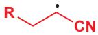</td><td>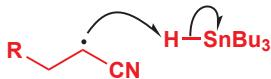</td><td></td></tr><tr><td>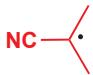</td><td></td><td>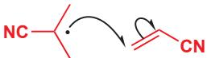</td></tr></table>

对于锡自由基， $\mathrm{Bu}_{3} \mathrm{Sn}^{\bullet}$ ，存在对搭档的选择：我们需要它攫取起始原料中的卤素，但它不能加成到烯烃上。 $\mathrm{Sn}-\mathrm{C}$ 键相对弱，因此若要让它对烯烃的加成显著发生，则需要：

- 有大量的烯烃存在。  
- 起始卤代烷相对不活泼。这意味着想要有效地成碳-碳键，仅可用溴代烷或碘代烷，氯代烷太不活泼了。

烷基自由基 R• 和 含腈自由基 迥异的选择性需要进一步的分析，浓度和电子效应都影响着它们的选择性。

# 浓度效应

您知道，R•完美地具有从 $Bu_{3}SnH$ 上掘 H 的能力，这也是 p.991 的脱卤反应中所发生的，但这里发生的不同的反应：对烯烃的加成。事实上，R•与 $Bu_{3}SnH$ 反应的速率常数大约与它与丙烯腈 ( $CH_{2}=CHCN$ ) 反应的相当，因此唯一获得好产率的方式，就是始终保持丙烯腈的浓度始终至少是氢化肠的 10 倍。然而反应混合物中太多的丙烯腈又会导致副反应的问题，因此好方法是在反应进行中非常缓慢地加入氢化肠——通常使用被称为注射泵（syringe pump）的设备完成。当然为了完成反应，加入一整当量的氢化肠是必要的，但它们是被分散在几个小时中加入的。

一种优雅的替代方式是使用类似于给自由基烯丙型取代反应提供低浓度 $Br_{2}$ 的 NBS 的技术。反应开始时无需加入一当量的 $Bu_{3}SnH$ ，只需要加入催化量 (通常是 0.1–0.2 当量) 的 $Bu_{3}SnCl$ 和 1 当量的 $NaBH_{4}$ 。 $NaBH_{4}$ 会将 $Bu_{3}SnHal$ 还原到 $Bu_{3}SnH$ ，因此立刻形成的只有大约 0.1 当量的 $Bu_{3}SnH$ 。伴随每轮链式反应，都会有一分子的 $Bu_{3}SnH$ 被转化成了 $Bu_{3}SnBr$ ，后者又可在被 $NaBH_{4}$ 还原回 $Bu_{3}SnH$ 。由于产出 $Bu_{3}SnH$ 的速率被反应速率控制，这会让它的量正好为反应所需。

尤其是当分子中具有活泼羰基时，对还原剂 $NaBH_{4}$ 的好的替代物是 $NaCNBH_{3}$ ，它仍能还原 $Bu_{3}SnHal$ 但无法触碰醛和酮 (见 Chapter 23).

![[中文版clayden-chinese37-401000-1132_images/8f72792f56367cb9700c8289216883886884024529c8bec8d80b851d23d38a38.jpg]]

<details>
<summary>chemical</summary>

Chemical reaction equation showing conversion of RI and CN to R and CN under catalytic conditions, followed by reduction with NaBH4 and reagents
</details>

此方法被用在了下面的例子中，其中我们由天然存在的甘油醛 (glyceraldehyde) 制得了一种作为实用的合成积木的光学纯内酯。

![[中文版clayden-chinese37-401000-1132_images/3e3b15e0bf55ba20c9f4596d47175b00d8e80c68bea363b59e4b61bdc47c288d.jpg]]

<details>
<summary>chemical</summary>

Organic synthesis reaction pathway showing conversion of hydroxyethylglyoxaldehyde to enone via esterification and acidification steps
</details>

# 前线轨道效应

让烷基自由基表现良好的成功的第二个关键是使用活泼自由基陷阱 (trap)。事实上，对分子间碳-碳键形成反应主要的限制是：捕捉烷基自由基的烯烃只能是亲电的 (与吸电子基团，如 -CN, -CO₂Me, 和 -COMe 相连的)。这是一种限制，但尽管如此，环己基碘加成到这些烯烃上的产率如下，并且对其中大多数的加成速率都 10³ 到 10⁴ 倍于对 1-己烯的加成。

![[中文版clayden-chinese37-401000-1132_images/2f13052f72a62e886e4292f812b497c226aeee8c436e62b106775a9d7881e590.jpg]]

<details>
<summary>chemical</summary>

Organic reaction equation showing cyclopentadiene reacting with alkene under Bu₃SnH catalysis to form a zwitterionic intermediate, using AIBN or hv solvent
</details>

<table><tr><td>烯烃</td><td>% yield</td><td>烯烃</td><td>% yield</td></tr><tr><td></td><td>95</td><td>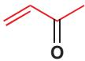</td><td>85</td></tr><tr><td></td><td>86</td><td>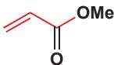</td><td>85</td></tr><tr><td></td><td>72</td><td></td><td>83</td></tr><tr><td>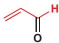</td><td>90</td><td>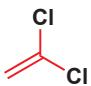</td><td>87</td></tr></table>

为了解释原因，我们不得不回顾我们对于自由基的电子结构及 SOMOs 能量的分析 (在 p. 978)。在那里我么说过，吸电子基和给电子基都能稳定自由基，但吸电子基会降低 SOMO 的能量，而给电子基会升高 SOMO 的能量。

# - 亲电自由基和亲核自由基

- 低能的SOMOs更愿意接受电子而不是给出电子，因而与吸电子基相邻的自由基是亲电的。  
- 高能的SOMOs更愿意给出电子而不是接受电子，因而与给电子基相邻的自由基是亲核的。

由此可知这些烷基自由基喜欢的反应性：它们相对亲核，因而倾向于与亲电的烯烃反应。亲核的烷基自由基与未官能化的 (因而是亲核的) 烯烃的反应十分缓慢。相似地，与吸电子基相邻的自由基不能很好地与亲电的烯烃反应。我们可以将全部这些都表现在能级图上。

![[中文版clayden-chinese37-401000-1132_images/16a549fb9c841051b282154e812cf572da452701a85cc8c97a3cf771260e1d4d.jpg]]

<details>
<summary>flowchart</summary>

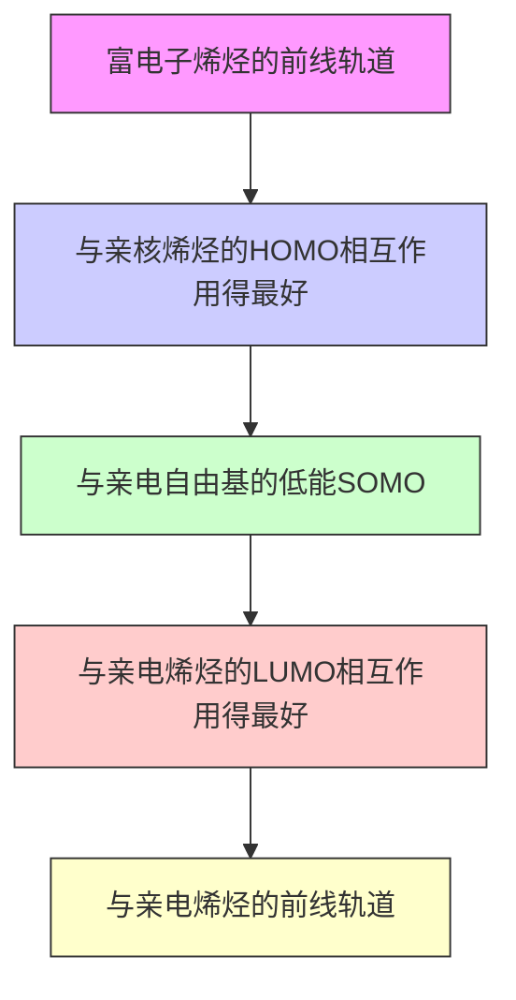
</details>

现在我们可以考虑 p. 993 标出的第三类自由基——被腈稳定的烷基自由基。上方的图表阐释了反应中自由基选择性的第三个方面：为什么产物自由基和 AIBN 产出的自由基都选择与 $Bu_{3}SnH$ 反应而不与丙烯腈反应呢。这些自由基是亲电的一一它们具有连接在自由基中心上的吸电子氰基，因而与缺电子烯烃的反应是缓慢的。

<table><tr><td>自由基</td><td>与之反应</td><td>不与之反应</td></tr><tr><td></td><td></td><td>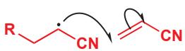</td></tr><tr><td></td><td>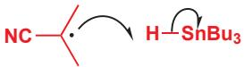</td><td>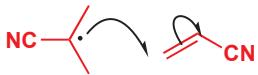</td></tr></table>

# - 锡方法成功使用的要求总结

$Bu_{3}SnH$

R-X 起始原料

自由基陷阱

必须缓慢地加入或缓慢地生成

必须包含弱 C-X 键 (C-I 或 C-Br)

必须是以至少 10 倍于 $Bu_{3}SnH$ 的浓度存在的亲电烯烃

注意，即使生成自由基时需要断裂的是 C-Cl 键，这个反应也能工作。通常只可使用 C-I 和 C-Br 键。然而，由于产出的自由基非常稳定，因而这根 C-Cl 键非常弱。此亲电自由基也可由对 H 的攫取或氧化反应形成。

# 亲电自由基

见过了如上所示的能级图，您会意外地获知，缩苹果酸自由基不会容易地添加到亲电烯烃上，而是会添加到亲核烯烃上，例如携有给电子氧取代基的乙烯基醚。缩苹果酸自由基是缺电子的；它具有的低能 SOMO 会与富电子、亲核的烯烃相对高能的 HOMO 最好地相互作用。

![[中文版clayden-chinese37-401000-1132_images/4107cd5eccb8b83eb4804709c82f8c319a7a94c0a521c32002ba8acc8bc3b90d.jpg]]

<details>
<summary>chemical</summary>

Chemical reaction equation showing esterification of chloroacetyl-CoA from ethyl acetate under Bu₃SnH to form a chiral alcohol with 60% yield
</details>

这种在反应性上的差异也适用于非碳中心自由基。例如，甲基自由基 $\cdot CH_{3}$ 和氯自由基 $Cl^{\bullet}$ 都会从丙酸上攫取氢原子。您会预料到，甲基自由基会攫取与羰基相连的氢原子，得到被羰基稳定的自由基。但可能令您意外的是（从我们前文对于自由基氯代反应的选择性上看，感到意外的），氯自由基会攫取酸末端甲基上的氢原子，即便这根 C-H 键较强。原因不得不归结于 HOMO-LUMO 相互作用。甲基自由基是亲核的，具有一个高能 SOMO。它因此会进攻具有低能 LUMO 的 C-H 键，也就是说，与羰基 $\alpha$ 的 C-H 键。另一方面，氯原子是亲电的；它具有低能的 SOMO（因为它是负电性元素）并会进攻具有最高能 HOMO 的末端甲基 C-H 键。官能化化合物的氯代并不如简单烷基一样直接！

![[中文版clayden-chinese37-401000-1132_images/8e7242cc22951cdb9605c73de1d05c03ee55c8db5d070ffd7a0b99a00dfec1ca.jpg]]

<details>
<summary>chemical</summary>

Chemical reaction diagram showing electron transfer between chloride and carboxylic acid with methyl groups
</details>

# 共聚

自由基链式反应尤其适合于聚合物的合成，这里有一个值得提及的聚合反应例子，因为它非常好地说明了吸电子和给电子基团对自由基反应性的影响。当用一种自由基引发剂处理醋酸乙烯酯和丙烯酸甲酯的混合物时，会发生一个非常引人注目的聚合反应。产出的聚合物会包含沿着链，交替的醋酸乙烯酯和丙烯酸甲酯单体。

![[中文版clayden-chinese37-401000-1132_images/eb070f2d2c25159dd4d9330ff2779d98f33c45f2a6cb15fa97a2035dbec931ac.jpg]]

<details>
<summary>chemical</summary>

Chemical reaction equation showing acetylene ester reacting with acrylamide to form a copolymer, with free base initiator indicated
</details>

这根反应的机理会将原因展现给您。由醋酸乙烯酯得到的亲核自由基(与OAc充满的n轨道相邻；具有高能SOMO)倾向于加成到亲电烯烃(丙烯酸酯)上。新的自由基(与 $\mathrm{CO}_{2}\mathrm{Me}$ 空的 $\pi^{*}$ 轨道相邻；具有低能SOMO)是亲电的，倾向于加成到亲核烯烃(醋酸乙烯酯)上。这回产出新的亲和自由基，它又倾向于加成亲电烯烃，整个循环会重复发生。

![[中文版clayden-chinese37-401000-1132_images/add959e63329a9091665f010b8655a23b1db2432a7cfd96d232eb8dfeb62f6e8.jpg]]

<details>
<summary>chemical</summary>

Chemical reaction mechanism showing ring-opening of a cyclic acetal with acetyl and methyl substituents
</details>

由对醋酸乙烯酯的加成反应产出的自由基是亲核的，因此它会加成丙烯酸甲酯；由对丙烯酸甲酯的加成反应产出的自由基是亲电的，因此它会加成醋酸乙烯酯。这根反应清楚地说明了前线轨道理论在解释有机分子反应性上的实力——很难找到其他令人信服的解释。

![[中文版clayden-chinese37-401000-1132_images/bae72aad5669252ad983850dafce5970c63c4b9bebfc5f194cf3d2a4983376b7.jpg]]

Interactive displays of common

polymer structures

![[中文版clayden-chinese37-401000-1132_images/f3d425c461be2f9d1028ecbac28f1fc077615aa8fd41de54110f325fbbd0b0fe.jpg]]

There is more on

polymerization in the online

chapter of that name

# 自由基的反应性模式与极性试剂很不同

本书中，您遇到的第一个反应是在 Chapter 6 中的对羰基的亲核加成反应。但我们没有向您展示过自由基对羰基加成的例子。这类极性试剂的典型反应真的很少用自由基进行。

在 Chapter 8 中，我们了解了酸和碱交换质子的过程，并介绍了 $pK_{a}$ 的概念。最强的有机酸是包含 O-H 键的一类，但在自由基反应中，您却没有见过 O-H 键的断裂。C-H 酸常常弱得多——但您已见到了大量 C-H 键被自由基进攻而断裂的例子。

在 Chapter 15 中，我们介绍了在饱和碳，例如溴代烷上的亲核取代反应。自由基也会与卤代烷反应——但取代并不发生在碳上！它们会攫取卤素，并留下烷基自由基。

比如说有机锂和自由基，它们都高度活泼，它们与烯基酮的反应很好地说明了它们之间反应性的差异。

![[中文版clayden-chinese37-401000-1132_images/5cc01cbd1630a3b61a33d0605bd7888164dc7aa1896f333389300f2509aea71f.jpg]]

<details>
<summary>chemical</summary>

Organic reaction mechanism showing two-step transformation of a lithium-containing ester with 1,2- and 1,4-butadiene as reagents
</details>

前文关于软核硬的讨论请见 p. 357 和 506.

P. 207 对简单分子中键的反应性与它们的强度间明显的不匹配提供了引人注目的说明。

我们在 Chapters 15 和 22 中使用了术语软和硬。由所有这些反应看，自由基很明显是非常软的物种：它们的反应不受原子上电荷密度的驱动，而是受被进攻的键的强度，以及前线轨道的能量和系数所驱动的。O-H 键很容易被强碱和所断裂，C=O 键也容易被强亲核试剂所进攻，这都是由于 O-H 和 C=O 键的极化。O-H 和 C=O 键都较强，自由基并不关心极化，因此自由基倾向于进攻弱得多的 C-H 键 (因为它们不极化)，并且对于离子型试剂通常是惰性的。

- 典型反应性模式总结

<table><tr><td>与</td><td>极性亲核试剂通常这样反应</td><td>自由基通常这样反应</td></tr><tr><td>不饱和C=0化合物</td><td>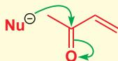</td><td>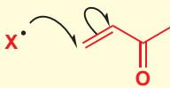</td></tr><tr><td>X-H键</td><td>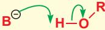</td><td>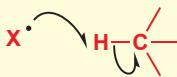</td></tr><tr><td>卤代烷</td><td></td><td>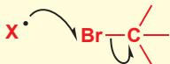</td></tr></table>

# 由硼烷和氧得到的烷基自由基

虽然氢化肠 + 卤代烷的方法非常有效，但由于锡化合物的毒性，它们并不招人喜欢。硼烷和氧之间的反应提供了简单的替代方法，pp. 993–997 中很多从前用氢化肠自由基化学进行的反应，现在都可用我们将要描述的反应替代。

将三烷基硼烷与 $\alpha,\beta-$ 不饱和羰基化合物 在水的存在下混合，可给出硼上一个烷基发生共轭加成的产物。羰基化合物可以是醛 $(R^{2}=H)$ 也可以是酮 $(R^{2}=$ 烷基 $)$ 。

![[中文版clayden-chinese37-401000-1132_images/13cdd4a1e3b4463b8b4883c178c7e75aef6b51d9dd09941c4ce80b08ae5b3afe.jpg]]

<details>
<summary>chemical</summary>

Chemical reaction equation showing esterification of boronate with water, producing alcohol and alcohol products
</details>

对于这个反应是自由基反应还是离子型反应，起初存在争论。离子型反应可能包含由周环反应得到硼烯醇盐，继而被水水解的过程。

![[中文版clayden-chinese37-401000-1132_images/7f289dc1d97723d623ed6f1d29b0b7eff4d28a15b632f8443f40dbac03c5e40f.jpg]]

<details>
<summary>chemical</summary>

Organic reaction mechanism showing boron-boron complex transformation with water to ketone
</details>

然而，H. C. Brown 发现这个反应可被仅 5% 的，常用做高效自由基清除剂的稳定自由基加尔万氧基自由基 (p. 975 所展示的) 所完全地抑制。但自由基是从哪来的呢？进一步的实验显示，让反应工作需要少量的氧。如您在 Chapter 3 中所见，氧是三线态的双自由基，它会取代从三烷基硼烷上的烷基自由基。这个反应看上去像 $S_{N}2$ 反应，它被称为 $S_{H}2$ （二级均裂取代 second order homolytic displacement），但事实上，氧会先加成到平面三角型硼空的 p 轨道上，然后再释放烷基自由基并开始链式反应。

![[中文版clayden-chinese37-401000-1132_images/9e940cb5cd4731b17454416e1f83fde72397ca748e14ff57ba572aa747ebcbbc.jpg]]

<details>
<summary>chemical</summary>

Chemical reaction mechanism showing boron-oxygen bond rearrangement with S₂H2 reagent
</details>

烷基自由基现在会加成到烯基酮上，得到一个可以被表达为碳中心或氧中心自由基的离域中间体。

![[中文版clayden-chinese37-401000-1132_images/cfbe0e0351a2941643a4391129e38b00cea5092e8084f8587ff75e7c29154f99.jpg]]

<details>
<summary>chemical</summary>

Reaction mechanism diagram showing ring-opening and resonance structures of a cyclic ketone with R1 and R2 substituents
</details>

离域自由基从氧上取代三烷基硼烷的另一个自由基，链就完成了，这一步也形成了与离子型反应所提出的相同的烯醇硼。烷基自由基会依此添加到烯基酮上，所得的烯醇硼经水解即可得到酮产物。只需要少量的氧气就可以引发这条链，因此，反应混合物周围的空气就足以开始整个典型反应。水(对自由基是惰性的，因此可以存在于反应混合物中)会水解烯醇硼。

![[中文版clayden-chinese37-401000-1132_images/c51633584f36f174da7907a1d002f7c1aba0e4d0eaad82528cf33132493d81f7.jpg]]

<details>
<summary>chemical</summary>

Reaction mechanism diagram showing ring-opening of a carbonyl compound with R¹ and R² substituents, followed by intramolecular hydrogenation to form ketone.
</details>

通过将形成硼烷的硼氢化步骤，与此自由基加成相结合，下列转换便成为了可能。

![[中文版clayden-chinese37-401000-1132_images/0af6fa4374992d4e96edb363246d7fdba6114b41ca71b29cd345782a77ee1b1f.jpg]]

<details>
<summary>chemical</summary>

Organic reaction scheme showing boron-containing compound reacting with ethyl acetate under basic conditions to form a ketone product, with 85% yield noted.
</details>

# 分子内比分子间的自由基反应更有效

到目前为止，您遇到的所有反应都涉及一个分子对另一个分子的自由基进攻。我们指出了这样形成 C-C 键的一些缺点：自由基陷阱必须被活化 (即具有亲电性以捕获亲核自由基)，通常还必须郭亮村在，自由基起始原料必须包含非常弱的 C-X 键 (例如 C-Br, C-I)。然而如果自由基反应是分子间的，这些要求就远没有那样严格了。例如下面的反应是可以工作的。

![[中文版clayden-chinese37-401000-1132_images/a0771cfd49259a808fcfce7dc78c48db9de13d6c1bffca98a2c2d08f030e0537.jpg]]

<details>
<summary>chemical</summary>

Chemical reaction scheme showing conversion of a silyl enol ether to a cyclic product using Bu3SnH and AIBN under 75% yield conditions
</details>

![[中文版clayden-chinese37-401000-1132_images/6c876af76fbf642e26eb8e0ba43dde1f36989fd7941dda4016de8af52c0eb309.jpg]]

文段中术语“三线

态”的解释可在 Chapter 38, p. 1010 找到。

注意观察，双键并未经活化：事实上，它反倒是亲核的，但即使自由基被给电子基所取代，反应仍能工作。发生断裂的 C-S 键同样相对强，但尽管如此，仍能以高产率获得产物。为什么会是这样？反应是分子内的时，有什么差异呢？

![[中文版clayden-chinese37-401000-1132_images/e361e05f34a562ee747bbf6c1da0f79ef7aa5950d60a87403d0f8ec179dddff3.jpg]]

Interactive mechanism for

intramolecular radical cyclization

![[中文版clayden-chinese37-401000-1132_images/fc784cdc0ee7b893ec0d323917c1a40928f4e417d2cb541a13e88a0701bf01f2.jpg]]

<details>
<summary>chemical</summary>

碳原子结构式与氢氧化碳反应示意图，展示C-S键相对强、亲核自由基及高SOMO能量变化
</details>

关键在于，现在发生的自由基的分子内环化反应，相较于自由基其他可能行为，是极其有利的。记得，当一个自由基反应分子间发生时，对自由基陷阱的加成被自自由基陷阱的高浓度和 $Bu_{3}SnH$ 的低浓度所鼓励，这避免了自由基还原反应。而对于分子内反应，扮演自由基陷阱的双键总是与自由基很近，环化反应，即使在未被活化的双键上，也会尤其迅速地发生。氢给体 $(\mathrm{Bu}_{3}\mathrm{SnH})$ 未能受到关照，因而其存在的浓度可以比其他情况的高。此外，由于只有一当量的自由基陷阱，而且该陷阱不需要高度活泼，因而让高浓度的 $Bu_{3}Sn^{\bullet}$ 与之反应也造成不了什么危险，于是 $Bu_{3}Sn^{\bullet}$ 的浓度可以建立在速率足以攫取 Cl, SPh, 和 SePh 这样较强的 C-X 键的程度上。

- 为什么分子内自由基反应如此地好？  
![[中文版clayden-chinese37-401000-1132_images/67ed06555cc4ca7fd07fbe2a4852b156d864c6c70cc9e611f9c6b553654b570f.jpg]]

<details>
<summary>flowchart</summary>

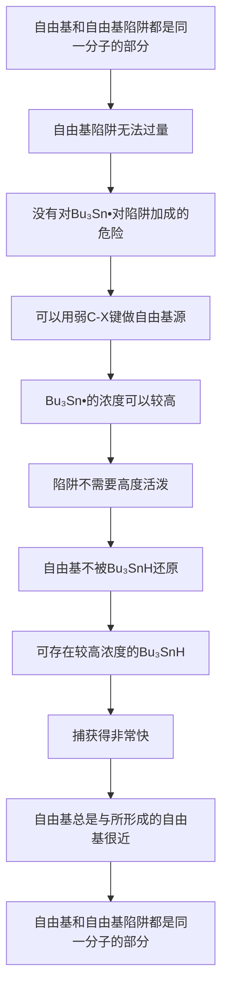
</details>

由于全部这些原因，分子内自由基反应是非常有实力的，它们常被用于五元环的制取。

![[中文版clayden-chinese37-401000-1132_images/1f7a748db5ca3cc7a251c5bae1061d0dfc95ce2f101e4b030179d275214d91e2.jpg]]

<details>
<summary>chemical</summary>

Chemical reaction equation showing bromo-substituted amine reacting with Bu3SnH in AIBN to form a cyclic imidazolone product, with 87% yield noted.
</details>

制取其他大小的环也是可行的，但范围相当有限。由于环张力，三元和四元环不能通过自由基反应形成。除此之外，较小的环会比较大的环形成得快：请着眼于下面这些选择性。

![[中文版clayden-chinese37-401000-1132_images/67364faf6404e6aca6c0a2e1a7494e4bd1324abbb384b04868c96537866341a3.jpg]]

<details>
<summary>chemical</summary>

Two-step organic synthesis reaction scheme involving bromoaniline and cyclopentane derivatives with yield percentages
</details>

形成较小环的有利性是非常强大的：下面的反应会形成五元环，而不会形成六元环，但其实给出六元环的环化过程会得到更稳定的自由基。

![[中文版clayden-chinese37-401000-1132_images/2c4991f189330f3064b1426a2e98f96c1976fe39c7062f60d9190e9955272d13.jpg]]

<details>
<summary>chemical</summary>

Chemical reaction showing conversion of a cyclic ketone with SePh to a bicyclic product with 77% yield under Bu3SnH, AlBN conditions
</details>

前文中，我们说过，锡的毒性产生了一些问题，因此硼-氧方法 (p. 998) 能很好地用于自由基环化反应的引发是很有用的。其实并不需要将硼包含进起始原料中，因为 $\mathrm{Et}_3\mathrm{B}, \mathrm{O}_2$ 和次磷酸， $\mathrm{H}_3\mathrm{PO}_2$ 的结合，可以由卤代烷生成自由基，它可以按您之前了解的锡促例子中相同的方式发生环化。同样，五元环比六元环更受喜爱。

![[中文版clayden-chinese37-401000-1132_images/65ff9db1a00855d0a99a2b0588b022c8ea3caa0f306835d0ad2f04955bbe3b2c.jpg]]

<details>
<summary>chemical</summary>

Organic reaction scheme showing conversion of a cyclic ether to a fused bicyclic alcohol using Et3B catalysis and NaH/H2O/H3PO2 catalysts
</details>

注意观察， $\mathrm{Et}_3\mathrm{B}$ 中的乙基并未被产物所包含。对 $\mathrm{Et}_3\mathrm{B}$ 上 $\mathrm{Et}^{\bullet}$ 的取代引发了链反应，后者会从起始原料上攫取碘原子。自由基发生环化，如所预料的一样，给出五元环。由于缩醛“拴绳”，不可避免地形成顺式环交点。

![[中文版clayden-chinese37-401000-1132_images/168be907ad50cbbe33e08a5ef5327155329de8d3ecda2de5a34a07b621df17ff.jpg]]

<details>
<summary>chemical</summary>

Organic reaction mechanism showing catalytic cycle involving ethyl iodide and alkene intermediates
</details>

产物自由基不得不与某处的氢相连，这是次磷酸所扮演的角色。对 H 的攫取会给出可以表示为 P 中心或 O 中心的自由基。

![[中文版clayden-chinese37-401000-1132_images/db510cfa4baf6250d0a61b18cfabdc0ccd7d187abdca135bc31968d3aa63f545.jpg]]

<details>
<summary>chemical</summary>

Chemical reaction mechanism showing phosphorylation of a cyclic compound with R and H groups
</details>

![[中文版clayden-chinese37-401000-1132_images/100bb0fedd37f7d949d89c7f75f7fe3fd1a0817fa01e1ecaa4ecd5738bf5ea91.jpg]]

Interactive mechanism for

radical ring closures

![[中文版clayden-chinese37-401000-1132_images/7bfcf32f74b99c4a1aa2d9ea28f50bf1b484936f7598fc5f5a3d64685e852424.jpg]]

我们在 Chapter 31, p. 810

介绍了描述不同大小的环的形成过程的 Baldwin 规则。它们同样也适用于自由基反应。

![[中文版clayden-chinese37-401000-1132_images/dcdb6adeb6abb2af640b7c2cfcaed5f852ac124f1cf4c14c3ccaeda6430403e7.jpg]]

这类立体化学控制已于

Chapter 32 中讨论过。

此链最终被由 $\mathrm{H}_3\mathrm{PO}_2$ 所得的自由基攫氢完成，该自由基会起到引发步骤中氧的角色。于是生成新的乙基自由基，继而再次开始循环。

![[中文版clayden-chinese37-401000-1132_images/f0a4646a37b2fd39866091568086483e790ceea82e562a2121acc4dc2eb2fdda.jpg]]

<details>
<summary>chemical</summary>

Reaction mechanism of boronic acid ester showing electron transfer and radical formation
</details>

# 展望

由于自由基会以阴离子、阳离子很难完成的方式发生反应，并表现出不同而有用的选择性，因而它们是重要的。虽然自由基反应通常没有离子型反应重要，但在有20%氧双自由基的气氛中发生的环境和生物自由基反应是十分常见的。双自由基的特征会在下一章中发展，我们将由携有七个价电子的碳原子移向携有六个价电子的碳原子，它们被称为卡宾/碳烯(carbenes)。

# 延伸阅读

对自由基化学的基本介绍：The Fundamentals, J. Perkins, Oxford Primer, OUP, Oxford, 2000。Reactive Intermediates, C. J. Moody and G. H. Whitham, Oxford Primer, OUP, Oxford, 2001, 包含关于自由基的一节。

McMurry 反应发生在金属表面的证据非常美好，如果您感兴趣，您可以阅读 McMurry's 本人的报告：Accounts of Chemical Research, 1983, 16, 405 和 J. E. McMurry, Chem. Rev., 1989, 89, 1513.

一些实践性方法：B. S. Furniss, A. J. Hannaford, P. W. G. Smith, and A. T. Tatchell, Vogel's Textbook of Practical Organic Chem-

istry, Longman, 5th edn, 1989, pp. 576–579 它提供了 NBS 和过氧化二苯甲酰使用的例子。

制取自由基的硼-氧方法被C.Ollivier和P.Renaud综述于Chemical Reviews,2001,101,3415。与Chemical Reviews中大多数文章一样，这是一篇很长的学术文章，但对于想要了解一种新试剂，一种新方法，或合成法的化学家，像这样的综述是基本的。

# 检查您的理解

![[中文版clayden-chinese37-401000-1132_images/bba8f9f99b17bea809293a51e3a9685779b7ef42ed4abe1f9379f22fadf0e638.jpg]]

为确保您真正掌握了这一章的内容，请尝试解决本书 Online Resource Centre (在线资源中心) 中的习题：http://www.oxfordtextbooks.co.uk/orc/clayden2e/

# 卡宾的合成与反应

# 联系

# 基础

- 能量剖面图 ch12  
- 消除反应 ch17  
- 主族化学 ch27  
- 控制立体化学 ch14 & ch31-ch33  
- 非对映选择性 ch33  
- 杂环 ch29 & ch30   
- 周环反应 ch34 & ch35  
- 重排 ch36  
- 自由基 ch37

# 目标

- 卡宾是带有六电子碳的中性物种  
- 卡宾可具有成对和未成对电子  
- 卡宾一般是亲电试剂  
- 典型反应包括对 $C = C$ 键的插入  
- 插入 C—H 和 O—H 键是可能的  
- 分子内插入是立体专一性的  
- 卡宾很容易重排  
- 卡宾在合成中很有用  
- 钉-卡宾络合物发生复分解反应

# → 展望

- 机理的确定 ch39  
- 金属有机化学 ch40

# 重氮甲烷可将羧酸制成甲酯

1981 年，宾夕法尼亚州的一些化学家需要将这种羧酸制成它的甲酯，来作为一种抗生素合成的一部分。他们选择了什么试剂完成这个反应呢？

![[中文版clayden-chinese37-401000-1132_images/6ab22fc76838f16096aea4a7e30360df3d6fce36aff648e20e136cdc4b7d84e7.jpg]]

<details>
<summary>chemical</summary>

Chemical reaction showing conversion of a cyclic ester to a cyclic ketone using a dipole solvent, with a question mark indicating transformation.
</details>

当然，您记得，羧酸和醇在酸催化剂下也可以成酯，因此您可能认为它们用了这类方法。小规模时，较好的方法通常将酸转化为酰氯，再与醇用吡啶 (或 DMAP) 做碱偶联；这类反应可能也是合理的选择。

![[中文版clayden-chinese37-401000-1132_images/72a12c5faddab7961f3b592517c7a8f6bdc9ea453dd3c3e2cd725abd8ce80197.jpg]]

<details>
<summary>chemical</summary>

Chemical reaction equation showing conversion of RCO₂H to RCOCl via SOCl₂ or (COCl)₂, then to RCO₂Me with MeOH and吡啶
</details>

但事实上，他们并没有选择这两种方法。相反，他们仅仅用一种被称为重氮甲烷 (diazomethane) 的化合物， $CH_{2}N_{2}$ 处理羧酸，便分离得到了甲酯。

→ 酰氯可由羧酸与亚硫酰氯或草酰氯制得。如果您需要回顾这些反应中的任何一个，请翻回 Chapter 10。

您可能愿意思考为什么其他方法不适用于这个情形。

您见到过其他像这样的分子——为了正确地解释电子，必须将电荷画上的中性化合物：一氧化碳是其一，硝基化合物，以及您在 Chapter 34 中见到的 1,3-偶极体也是。

![[中文版clayden-chinese37-401000-1132_images/5329e44a427e2739176ac776b472f4e627fd11f637ca96c7bdfba822e8af26f9.jpg]]

Interactive mechanism for

methylation of carboxylic acid with diazomethane

方便地，含有重氮甲烷的溶液是黄色的，因此这个反应是自滴定的 (self-titrating)——当羧酸反应时，黄色的重氮甲烷会被移除，但只要还剩有过量的重氮甲烷，那么黄色则仍会存在。

![[中文版clayden-chinese37-401000-1132_images/a0848930ed688f7b55a78aca66570321142c2e36e74074354bba0da6bea8a91f.jpg]]

<details>
<summary>chemical</summary>

Chemical reaction equation showing conversion of a ketone to a methylated ester using CH2N2 reagent
</details>

重氮甲烷， $\mathrm{CH}_2\mathrm{N}_2$ 是一种奇怪的，必须画成偶极形式的化合物。下面是表达它结构的数种不同方式。

![[中文版clayden-chinese37-401000-1132_images/f663ad2e98efd9b2c70c0bb870de8b760a6ca90dc52e3ccbd166d25e748f1deb.jpg]]

<details>
<summary>chemical</summary>

Chemical reaction mechanism showing protonation and elimination of a carbonyl compound
</details>

重氮甲烷可以甲基化（methylate）羧酸，这是因为，羧酸会很容易地使之质子化，并得到一个尤其不稳定的重氮阳离子。此化合物渴望失去 $N_{2}$ ，世界上最好的离去基团，失去的过程是 $N_{2}$ 被羧酸根阴离子取代的过程。如下所示，羧酸根阴离子正好在发生 $S_{N}2$ 反应恰当的位置上。

![[中文版clayden-chinese37-401000-1132_images/640289bd22fd3f63984591a51aac9f48cf3b656b1810d1a83b43443db1639090.jpg]]

<details>
<summary>chemical</summary>

Reaction mechanism diagram showing nucleophilic attack of amide group on carbonyl carbon, forming a carbamate ester and nitrogen gas
</details>

重氮甲烷甲基化反应是在小规模下，由羧酸制取甲酯的好方法，因为产率很高，并且唯一的副产物是氮气。然而另有一个缺点：重氮甲烷的沸点仅为 $-24^{\circ}\mathrm{C}$ ，它是有毒并高度易爆的气体。因此它只能在溶液中使用，通常是乙醚；溶液必须是稀溶液，因为重氮甲烷的浓溶液也是易爆的。它通常由 $N$ -甲基- $N$ -亚硝基脲或 $N$ -甲基- $N$ -亚硝基对甲苯磺酰胺与碱的反应生产，并与醚以共沸混合物的形式从反应混合物中被蒸出，直接进入羧酸溶液中。

![[中文版clayden-chinese37-401000-1132_images/709ba833ced88acd787cb705e42e64553c096ef81ef230ac383ba219c123f796.jpg]]

<details>
<summary>chemical</summary>

Chemical reaction equation showing the conversion of N-methyl-2-nitrosothiophene to N-methyl-2-nitrosothiophene using reagent NaOH, with H₂C substitution and hydroxyl group elimination.
</details>

形成重氮甲烷的反应机理如下所示。关键步骤是碱催化的消除反应，用弯曲箭头表示这一过程会相当曲折 (tortuous)!

重氮甲烷的形成

![[中文版clayden-chinese37-401000-1132_images/111f5131cbe94e3c92c8f78e01931d958fd7806fdebf41dcf71c4500e063b856.jpg]]

<details>
<summary>chemical</summary>

Chemical reaction mechanism of methylamine forming a sulfonamide intermediate, showing electron transfer and protonation steps
</details>

重氮甲烷同样可以甲基化苯酚，这是因为苯酚的酸性足够使重氮甲烷质子化。但普通的醇，则不会被甲基化，因为它们并不是足以质子化重氮甲烷的酸。

![[中文版clayden-chinese37-401000-1132_images/0b32e98e800d9da8e0cc6a8cd20f7f7b7bcb095e5122ce2bee3e955d2b67fb3c.jpg]]

<details>
<summary>chemical</summary>

Chemical reaction pathway showing oxidation of pKa 10 to pKa 16 using CH2N2, followed by reduction to non-response
</details>

# 选择性的甲基化

研究孕妇尿液中激素降解产物的化学家，需要甲基化下面的甾体雌二醇的酚羟基。通过使用重氮甲烷，他们避免了在另两个羟基上的反应。后来，当他们想让另两个甲基也被甲基化时，他们不得不向反应中加入酸 $\left(\mathrm{HBF}_{4}\right)$ 以使重氮甲烷质子化。

![[中文版clayden-chinese37-401000-1132_images/60c5dde9821f33ec1a653c6df6611983446361d4c60f2d3d9cc3d4b03805f9a2.jpg]]

<details>
<summary>chemical</summary>

Chemical reaction pathway showing conversion of aldehyde to steroid derivative using CH2N2 and HBF4 reagents
</details>

# 重氮甲烷的光解产生卡宾

当混合物被光照射时，醇也可以被重氮甲烷甲基化。

![[中文版clayden-chinese37-401000-1132_images/9fe5839ef3708e816e8a31d3ceb9cd01acb0a9b862fb64bbeef7db2342b99db2.jpg]]

<details>
<summary>chemical</summary>

Chemical reaction equation showing hydroxyl group reacting with CH₂N₂ under hv light to form OMe, with low-panumber yield noted
</details>

此时的机理与之前完全不同，这是因为氮气 $\left(\mathrm{N}_{2}\right)$ 从分子中离去的过程是由光能促使，而无需质子化的。这意味着所剩下的是一个只带有两个氢原子的碳原子 $\left(\mathrm{CH}_{2}\right)$ ，它只具有六个电子。像这样的物种被称为卡宾/碳烯 (carbenes)，它们就是本章的主题。

![[中文版clayden-chinese37-401000-1132_images/bfb8e024eff2085268376fc90c2fd9ba77389d93a2c90a358197892745c06b06.jpg]]

<details>
<summary>chemical</summary>

Electron transfer reaction diagram showing electron transfer from hydrogen to nitrogen via photon, with labels for electrons and a cardium
</details>

# - 卡宾是包含只具有六个价电子的碳原子的中性物种。

卡宾的六个电子中，有两对定域在两个键上，还有两个非键电子，通常可以用： $CR_{2}$ 表达 (好像它们是孤对电子一样)。但如您之后会了解到的，这可能会造成误导，但： $CR_{2}$ 已被广泛用于卡宾的符号。在由重氮甲烷生成： $CH_{2}$ 的情形中，卡宾被醇捕获制得醚。

如同 Chapter 37 中的自由基一样，卡宾是尤其活泼的物种。比它们与醇制得醚的反应更重要的，是它们与烯烃制得环丙烷，以及插入 C–H 键的反应。

虽然这个反应说明了一个重要观点，但它的产率是低的，有太多的副产物存在，产生严重爆炸的潜在太大，因而它无法作为制取甲基醚的实用方法。

■ 卡宾鎓离子 (Carbenium ions, 实际上就是碳阳离子), 例如 $+\mathrm{CH}_{3}$ 同样只具有六个价电子, 但当然, 它们与卡宾不同, 它们是带电的。

![[中文版clayden-chinese37-401000-1132_images/441271afad4083323c6c7e60eb14dc7cbb9a33334da48cd9c89f4f7d5f04331a.jpg]]

Interactive mechanism for gene formation by photolysis

![[中文版clayden-chinese37-401000-1132_images/2f9442176005ccdcef4f197a7bc00064d5e290c5668d260906b605dbd18b2f91.jpg]]

# - 典型卡宾反应

卡宾将自己插入一根 $\sigma$ 键或一根 $\pi$ 键。

![[中文版clayden-chinese37-401000-1132_images/1615e63e9a78521a71381ce916071f5f8acf613cc4047a53060b96c131a910a7.jpg]]

<details>
<summary>chemical</summary>

Three-step chemical reaction diagram showing oxygen-containing intermediates with hydrogen bonding and C=H bond insertion steps
</details>

我们不久将会讨论这三个重要反应的机理，但我们现在向您介绍它们的原因，是为了说明，卡宾的反应被强亲电性所驱动，被插入 (insertion) 所主宰 (此处是插入 O-H, C=C, 和 C-H)。一个只带有六个电子的碳原子会想尽一切办法来得到另外两个!

![[中文版clayden-chinese37-401000-1132_images/288ae053310b88d1759595e69cc6f9006bcb27e61632d96015e6fffca2a574d2.jpg]]

<details>
<summary>chemical</summary>

Chemical structure of a symmetric azo compound with N and C atoms, labeled with δC = 211 ppm
</details>

一种稳定的 N-杂环卡宾

# 我们如何得知卡宾的存在?

卡宾存在最好的证据来源于一组包含卡宾，但却是稳定化合物的结构。它们中最重要的是“N-杂环卡宾 (N-heterocyclic carbenes)”——其卡宾被包含进一个五元环内，并被两个邻位给电子氮原子以及大体积 N-取代基的存在所稳定。左侧的例子于 1991 年被首次制得：它是结晶的，它的 X-射线晶体显示，卡宾碳原子的键角是 $102^{\circ}$ ， $^{13}$ C NMR 确认了卡宾 C 原子是缺电子的。我们之后将回到它的重要性上。

这些稳定得卡宾是非常例外的：大多数卡宾太不稳定，难以分离。然而，活泼卡宾可通过照射前体(通常是像重氮甲烷这样的重氮化合物，如我们刚刚所讨论）被观察到，并在非常低温下（低于77K)的冷冻氩中被捕获。可以用IR和ESR光谱(见p.975)确定它们的结构。

您或多或少可能惊讶于卡宾的结构可以被 ESR 检测——毕竟，我们在 Chapter 37 中阐释了，ESR 观察的是未成对电子，而您可能认为，卡宾的六个价电子都成对了。确实，在有些卡宾中事实如此，但许多情况并不尽然。这是一个重点，我们将在本章后文中讨论它。

# 命名重氮化合物

不要将重氮 (diazo) 化合物与偶氮 (azo) 化合物混淆。重氮甲烷中每个碳原子配备的原子数是偶氮甲烷 (azomethane) 中的两倍。

![[中文版clayden-chinese37-401000-1132_images/1e0436cb7800e84e3ca034dc31eb6bdf2258769f3fea5fecd98583079e2bf687.jpg]]  
重氮甲烷  
偶氮甲烷

您在 Chapter 22 中遇到了重氮盐 (diazonium salts)，芳基重氮盐是稳定的化合物，但由重氮化合物质子化所得的烷基重氮盐不稳定，它们会快速地通过 $N_{2}$ 的失去分解——这也是本章最初羰基被甲基化的方式。其他与重氮和偶氮化合物相关的是烷基叠氮化物 (alkyl azides)。烷基叠氮化物带有三个氮原子，它们通常稳定，但小分子量的叠氮化物可能在撞击或加热时爆炸。

![[中文版clayden-chinese37-401000-1132_images/34840c65203420ca6c8447b9d33f85c2523202af9a513b50d9548a258e6fd33c.jpg]]

<details>
<summary>chemical</summary>

Chemical structure of benzene derivative with nitrile and nitrile ion, labeled as phenylalanine salt
</details>

# 制取卡宾的方法

卡宾通常由前体，通过小而稳定的分子的失去得以形成。我们将会依此讨论一些重要方法，您刚刚已经见到过一种方法的使用：由重氮化合物失去氮气。

# 由重氮化合物得到卡宾

我们向您展示了由重氮甲烷形成卡宾，来说明这个反应不同于羧酸 (离子型的) 甲基化反应。但不只是因为重氮甲烷的爆炸性，这并不是生成卡宾的非常实践性的方法。然而，重氮羰基化合物 (diazocarbonyl compounds) 的反应是另一回事。

![[中文版clayden-chinese37-401000-1132_images/0f6ba146ae1ffa08071144c5b30fa34a44a936a9f39ade78ba7fa0afcc07bbc0.jpg]]

<details>
<summary>chemical</summary>

Chemical reaction diagram showing deprotonation of a chiral amide to form a carbonyl group, with equilibrium between the two species.
</details>

由于吸电子的羰基对重氮偶极体的稳定作用，它们 (比重氮烷烃) 稳定得多，并且可以作为携有羰基取代基的卡宾的非常实用的来源。有两种制取重氮羰基化合物的主要方法：

1. 通过酰氯与重氮甲烷反应

![[中文版clayden-chinese37-401000-1132_images/da1fe7e69dccb422caf8c42b74ce91d680d362582e83bb498b8b86fae746cb77.jpg]]

<details>
<summary>chemical</summary>

Chemical reaction equation showing deprotonation of a chloroalkene derivative using H2C-N≡N to form a 100% product with 100% yield.
</details>

2. 通过将母体羰基化合物与对甲苯磺酰叠氮， $\mathrm{TsN}_{3}$ ，在碱的作用下反应。

![[中文版clayden-chinese37-401000-1132_images/d76b6862a64505afd99b4bfcd5740005bc5d6080f8aaea6160c07b88572b6243.jpg]]

<details>
<summary>chemical</summary>

Chemical reaction equation showing reduction of tert-butyl ester to oxime using TsN3 and Et3N under 95% yield
</details>

重氮甲烷与酰氯的反应，是一个简单的，得到重氮鎓化合物（重氮盐）的酰基化反应。如果有过量的重氮甲烷，那么第二分子的重氮甲烷会做碱以移去羰基和重氮鎓基团间的质子以给出重氮羰基化合物。

![[中文版clayden-chinese37-401000-1132_images/8848fb3b8c402daddfaaaace3133a35179b50bdabccf897833c67c11e9e70f31.jpg]]

<details>
<summary>chemical</summary>

Reaction mechanism diagram showing nucleophilic attack and proton transfer steps involving R, Cl, and N≡N groups
</details>

那么第二分子的重氮甲烷会发生什么呢？得到一个质子后，它变成了非常活泼的重氮盐，重氮盐会与氯离子发生取代，MeCl 以气体形式失去。第二种方法使用对甲苯磺酰叠氮，对甲苯黄线叠氮就是一个与好的离去基团连接的 $\mathrm{N}_2$ 。

![[中文版clayden-chinese37-401000-1132_images/2961a49c6b6ae232dfe72e4c58dc3a4835b2038672077eeaa327ba636a9fdc99.jpg]]

<details>
<summary>chemical</summary>

Chemical reaction equation showing the formation of a sulfonamide derivative from benzothiazole and pyridine, with reagent exchange noted
</details>

重氮羰基化合物可以通过加热或光照分解为卡宾。氮气的失去在能量上补偿了不稳定卡宾的形成。

![[中文版clayden-chinese37-401000-1132_images/18980d214c254a68307e2699773629aa3c93a0c652f52134bee9b7c9eba6ec96.jpg]]

<details>
<summary>chemical</summary>

Reaction mechanism showing nucleophilic addition of anions to carbonyl group under heating or hv conditions
</details>

现代化学上，常用得多的方法是使用过渡金属，如铜和铑，促使卡宾的形成。

![[中文版clayden-chinese37-401000-1132_images/c7c6ad6f2cc2da4a65ed27b784b31603027270c3cb30d88e8ee2b81a8db9d432.jpg]]

<details>
<summary>chemical</summary>

Rhodium-catalyzed reaction of an enamine to form a chiral alcohol or alkene, with Rh2(OAc)4 as reagent
</details>

以这种方式形成的卡宾事实上并不是真正的卡宾，因为它们仍保留与被用于形成它们的金属络合。它们被称为卡宾体 (carbenoids)，它们的反应将在本章后文中得到讨论。

# Fischer 卡宾

这些铑和铜的卡宾体是不稳定的，但例如钨和铬等一些过渡金属可以形成稳定，可分离的卡宾体，被称为金属卡宾化物 (metallocarbenes) 或 Fischer 卡宾 (Fischer carbenes)。

![[中文版clayden-chinese37-401000-1132_images/2a16b5c4f18ede879da2b769b0195b52832049ca93b6c5c0b571bc1b8f9e212f.jpg]]

<details>
<summary>chemical</summary>

Chemical structures of Cr(CO)5 and W(CO)5 with stereochemistry, labeled as stable Fischer card宾
</details>

# 由对甲苯磺酰腙得到卡宾

如果重氮烷烃仅仅是反应的中间体，而非起始原料，就可以被用于安全地制取很多卡宾。这些反应的好的起始原料是对甲苯磺酰腙，它可以通过对甲苯亚磺酸根的碱催化消除，短暂地产生重氮化合物。重氮化合物一般不经分离，会在加热下分解为卡宾。

![[中文版clayden-chinese37-401000-1132_images/7cddf51446f7d260c5b6e0d2f854581261acda643f17d6d6c0fa7232c1e81c51.jpg]]

Interactive mechanism for oene formation from acyl prides with diazomethane

$RhL_{n}$ 的意思是铑与不定数目的不定配体络合。此符号会经常在金属有机化学中使用，因为此时重要的是碳-金属键的性质，而非金属配合物的精确结构。

这个反应有时被称为Bamford-Stevens反应 (reaction)。注意观察，氮上的离去基团并不是熟悉的对甲苯磺酸根 $(\mathrm{TsO}^{-}$ 或 $\mathrm{TolSO_3^-})$ ，而是较不熟悉的对甲苯亚磺酸根 $(\mathrm{Ts}^{-}$ 或 $\mathrm{TolSO_2^-})$

![[中文版clayden-chinese37-401000-1132_images/617d209be39184ddd1693f0d31ba785b434cc58563eea5b9d0532d68f5c48e8f.jpg]]

<details>
<summary>chemical</summary>

Reaction mechanism of phenyl acetate catalyzed by sulfonamide and amide, forming a chiral amine product with 55% yield and heating conditions
</details>

Interactive mechanism for carbene formation from tosylhydrazones   
卡宾还可从大量其他相似的反应中形成——例如，由烯酮失去一氧化碳，或由氮丙烯（azirines）消去氮原子——但它们很少被用于卡宾的制取。

![[中文版clayden-chinese37-401000-1132_images/726be3ab01cab97ad569aef7d34f954a6bea569f0d75dd1a9fb482194afef9cf.jpg]]

<details>
<summary>chemical</summary>

Organic reaction mechanism showing bromination and hydrolysis steps with β elimination
</details>

# 通过 $\alpha$ 消除形成卡宾

在 Chapter 17 中，我们详细讨论了 $\beta$ 消除——其中一个氢原子被从离去基团的 $\beta$ 位移去。 $\alpha$ 消除 (质子和离去基团在同一个原子上的消除反应) 同样是可行的——事实上，我们刚刚讨论过的反应 (从对甲苯磺酰腙上消去对甲苯磺酸根) 就是一个 $\alpha$ 消除。 $\alpha$ 消除遵循类似于 E1cB $\beta$ 消除的机理——强碱移去与吸电子基相邻的酸性质子得到一个碳阴离子；离去基团从碳阴离子上失去，产生卡宾。

由氯仿失去 HCI 的碱催化 $\alpha$ 消除

![[中文版clayden-chinese37-401000-1132_images/b736b0ef920f631698f36674b357863e8406b6b999215f646d700046fb33c0d7.jpg]]

<details>
<summary>chemical</summary>

化学反应示意图，展示三个吸电子的Cl原子与酸性质子生成二氯卡宾的过程
</details>

Interactive mechanism for carbene formation by $\alpha$ elimination

最著名的 $\alpha$ 消除反应之一，会在用碱处理氯仿时发生。这是制取二氯卡宾 (dichlorocarbene)， $CCl_{2}$ ，以及其他二卤卡宾最重要的方法，二氯卡宾在化学上的广泛使用，主要就是因为它们可以通过这种方法得以制备！

氢氧根和烷氧基阴离子就是足以促使氯仿以及其他卤仿上 $\alpha$ 消除发生的碱了。用例如 LDA 等更强的碱可以使二卤烷烃去质子，并得到卡宾；对于一卤代烷，还可用极其强的碱，如苯基钠或 t-BuLi/t-BuOK 完成(较弱的碱仅能引发 $\beta$ 消除)。

![[中文版clayden-chinese37-401000-1132_images/2addd57489eb952f9fa4aef3eca2cf2b2596a7d9a0872b20d4d8c9700bd28ea3.jpg]]

<details>
<summary>chemical</summary>

Chemical reaction mechanism showing LDA-mediated cyclization of a chlorinated alkene to form a radical intermediate
</details>

![[中文版clayden-chinese37-401000-1132_images/b17714825ca2799aca654effd65e253a2eadea37cd125ee5b56a0966dc869369.jpg]]

<details>
<summary>chemical</summary>

Chemical reaction mechanism showing nucleophilic substitution of a chlorinated alkene to form a radical intermediate and then hydrogenated product
</details>

不幸的是,术语 carbenoid 被用于称呼两类容易混淆的分子——通常它指代由重氮化合物的金属催化分解得到的与过渡金属键合的卡宾(见 p. 1018)——对于此处讨论的 carbenoid，我们最好具体说明金属，称其为 lithium carbenoid。(但幸运的是，过渡金属卡宾化物的中文是“卡宾体”，有机金属卤代烷的中文是“类卡宾”。)  
t-BuLi/t-BuOK 的混合被称为 Schlosser 碱 (Schlosser's base)，是已知的最强的碱之一。它可以从烯丙位或苄位拔取质子，甚至可以给苯去质子。相似地，烷基锂与烷氧基Ⅰ族金属的其他结合也可制得非常强的碱 (译者注：烷氧基阴离子与锂络合增加碳-锂键的离子性)。

当用 BuLi 处理偕二溴代烷时，会发生卤素-金属交换反应，产出一种锂类卡宾 (lithium carbenoid)，带有连接在同一个碳原子上的一个金属原子和一个卤素。锂类卡宾在非常低温下是稳定的一一它们可以被 NMR 观察到，但会在大约 $-100^{\circ}\mathrm{C}$ 下分解为卡宾。

![[中文版clayden-chinese37-401000-1132_images/d8ff258f472a940ea800b543308750413587856279792095900211194f69e8c9.jpg]]

<details>
<summary>chemical</summary>

Organic reaction scheme showing lithium bromide substitution with LiBr under heating to -100°C, yielding a lithium cardium compound and LiBr product
</details>

这类类卡宾的本质是，它们应当具有一个可以接受一对电子的离去基团，例如卤素，另外，通常还具有一个可以贡献一对电子的金属。如果金属先离去，那么会产生一个碳阴离子，可以失去卤素得到卡宾。它们也可能一同离去。这两种机理都是 $\alpha$ 消除。

![[中文版clayden-chinese37-401000-1132_images/2bc9edb433ec46ff00f9258797741a91c9eb2879e94affed94d18c83d151af8f.jpg]]

<details>
<summary>chemical</summary>

Reaction mechanism diagram showing lithium-catalyzed coupling of lithium bromide with potassium iodide, involving electron transfer and α-catalyzed elimination
</details>

但锂类卡宾的适用范围有效，由锌插入二碘甲烷得到的锌类卡宾 (zinc carbenoid)，是化学中使用最广泛的类卡宾反应之一——Simmons-Smith 反应 (reaction)——的试剂。

![[中文版clayden-chinese37-401000-1132_images/84266e8b7719f135dc69e7586786914d6cdbc9318a07fa236c87a6461f19abec.jpg]]

<details>
<summary>chemical</summary>

Zn/Cu-catalyzed reaction of alkene to zinc complex, showing conversion and equilibrium
</details>

很多这类反应所面临的问题是，它们需要强碱——要么是有机金属化合物本身是碱性的，要么是需要用碱产生碳阴离子。卡宾太不稳定，因此必须要使它们在它们要反应的化合物的存在下形成，如果这个化合物对碱敏感，那么这就会是个问题。对于二氯卡宾，周旋这个问题的一种方式是通过失去 $CO_{2}$ 而非失去金属或质子制得碳阴离子。在溶液中，三氯乙酸钠的脱羧可在大约 $80^{\circ}C$ 下完成，这是理想的。

![[中文版clayden-chinese37-401000-1132_images/2d73f88e3477ed95431cb55ee7c191ca739466f27edaa9bdc4a0aa552d9548fe.jpg]]

<details>
<summary>chemical</summary>

Chemical reaction mechanism showing nucleophilic substitution with CO₂ and electron transfer, forming a carbon quaternary ammonium ion and then deprotonation to a potassium anion.
</details>

# 通过阳离子的去质子形成卡宾

我们的最后一种方法在机理上是最直接的：仅仅是从稳定阳离子上移去质子。这是制取非常稳定的卡宾的方法，它能够工作是因为被用作起始原料的起始原料和卡宾产物都被一个或更多的邻位孤对电子所稳定。下面是一个例子。咪唑是亲核试剂，可以被烷基化得到相对稳定的咪唑鎓阳离子，我们可以用电荷在两个氮原子上离域的形式表达，当然也有一种电荷在碳上的表达方式(不符合八隅体)。

![[中文版clayden-chinese37-401000-1132_images/3a38f1d97c03786c036a09a8e00dbff0cd9ed77c4546866629733d023a9b7330.jpg]]

<details>
<summary>chemical</summary>

电荷离域变化示意图，展示咪唑与RBr离子在两个N原子上的电荷离子的转化过程
</details>

当用强碱，例如氢化钠处理咪唑鎓阳离子时，中心的、部分带电的碳原子上的质子会被去除，并得到一个起初看起来像碳阴离子的化合物。

咪唑鎓阳离子的去质子得到卡宾

![[中文版clayden-chinese37-401000-1132_images/ba2b72f57e81561a50bc259985a7cf729f5d86269eb98ffc0a7955bbf3d117a5.jpg]]

<details>
<summary>chemical</summary>

Reaction mechanism diagram showing nucleophilic attack of a hydride (H) to form a carbonyl group (C-N-R) and a labeled card宾 (cardinomethyl)
</details>

→ Simmons–Smith 反应是制取环丙烷最好的方法之一，将在本章后文中讨论。

![[中文版clayden-chinese37-401000-1132_images/34557b45ca6cedab9dded57d2a3a1016ac8152e2d9333e1fe5a75ddde6c6b7bb.jpg]]

<details>
<summary>chemical</summary>

电子稳定性方程式，展示被邻位孤对电子稳定的卡宾的化学反应过程
</details>

译者注：这种“所谓的卡宾”其实只是可以离域成卡宾的碳阴离子，它们的性质是先亲核再亲电，例如维生素B1就是N-杂环卡宾，可用于催化需要羰基极性反转的安息香缩合反应。

但我们可以用弯曲箭头将负电荷移到正电氮上，并在碳上留下带有孤对电子的中性物种。然而仔细观察中心碳，它只具有两个取代基——它是一个卡宾。邻位具有孤对电子的卡宾，可以想象其邻位孤对电子会部分地离域到 C 原子上，以帮助稳定缺电子的卡宾。

# - 总结: 制取卡宾的重要方法

卡宾是包含一个只具有六个价电子的碳的中性物种。

<table><tr><td>卡宾的种类</td><td>形成方法</td></tr><tr><td></td><td>金属(铑或铜)催化的重氮羰基化合物(酰氯与重氮甲烷或羰基与对甲苯磺酰叠氮)的分解</td></tr><tr><td></td><td>重氮化合物热分解,重氮化合物通常来源于对甲苯磺酰腙</td></tr><tr><td></td><td>氯仿与碱的 $\alpha$ 消除或三氯乙酸根的脱羧</td></tr><tr><td></td><td>RCH=X+阳离子的去质子</td></tr></table>

![[中文版clayden-chinese37-401000-1132_images/bc27298997c302e5ef7bbc0495152c4bad1eec9b1036c505d2a328da4ac5c5d7.jpg]]

<details>
<summary>chemical</summary>

Molecular structure diagram of a chiral pyrrolidine derivative with 102° bond angle labeled
</details>

ESR (电子自旋共振)，也被称为 EPR (电子顺磁共振)，已于自由基的内容中，p. 975 讨论过。

假设的，但不正确的

卡宾的直线型结构

两条 p 轨道，都包含一个电子

![[中文版clayden-chinese37-401000-1132_images/88df1534bcf964ab0d853619e2e08588827634e962f063958fa12dcb6bb74b66.jpg]]

# 卡宾可分为两类

对于卡宾的结构，在 p. 1006 的文字框中我们做出了两个重要的观察，现在我们将返回并寻求解释。首先，我们说过，左侧稳定而结晶的卡宾的 X-ray 晶体结构显示，卡宾 C 上的键角是 $102^{\circ}$ ；其次，我们说过，很多卡宾可以被 ESR 观察到——换句话说，它们具有未成对电子。

对大量不同结构的卡宾的光谱研究已经表明，它们大体上可分为两组：(1) 那些 [您会学着称其为 “三线态 (triplets)” 卡宾的] ESR 光谱证实具有未成对电子，键角在 130–150° 之间的 (2) 那些 [如同上方所示的结晶卡宾，您会学着称其为 “单线态 (singlets)” 卡宾的] 键角介于 100–110° 并且不能被 ESR 观察到的。很多卡宾，如 CH₂ 本身，在两组中都可以找到，其中一种可能更常见。

<table><tr><td>类别1:三线态卡宾键角130-150°可被ESR观察到</td><td>类别2:单线态卡宾键角100-110°所有电子都成对</td></tr><tr><td>:CH2:CHPh:CHR:CPh2</td><td>:CCl2:CHCl:C(OMe)2</td></tr><tr><td></td><td>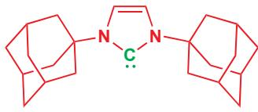</td></tr></table>

所有这些观察结果都可以通过考虑卡宾的电子结构加以解释。卡宾具有二配位碳原子：因而您可能认为它们应当具有直线型（对角型）结构——如炔烃那样——具有一个 sp 杂化碳原子。

像这样的直线型卡宾所具有的六个电子，会分布在两条 $\sigma$ 轨道和两条 (较高能的) p 轨道上。简并的 p 轨道中的两个电子会由于电子排斥而保持未成对，如同氧分子 $\bullet O-O\bullet$ 一样。

![[中文版clayden-chinese37-401000-1132_images/5232ca901ed6092962c1308a150b8d83cd8ac15d80ecb30ee491b05c71ec9e08.jpg]]

<details>
<summary>text_image</summary>

sp 杂化 C 原子
直线型卡宾
p
sp
σ* 轨道
C
π 轨道
C
H C C H
σ 轨道
1 s
</details>

但很少数的卡宾是直线型的：大多数是弯曲的，键角在 $100^{\circ}$ 和 $150^{\circ}$ 之间，这说明了三角型 $(sp^{2})$ 杂化状态。一个 $sp^{2}$ 杂化的卡宾将具有三条（较低能的） $sp^{2}$ 轨道和一条（高能的）p 轨道来分布六个电子。有两种方法完成这项工作。所有电子都成对，每对都占据 $sp^{2}$ 轨道中的一条，或者保持两个电子未成对，一个电子在 p 轨道上，另一个在 $sp^{2}$ 轨道。

弯曲 $(sp^{2})$ 卡宾中电子的两种排列方法：

![[中文版clayden-chinese37-401000-1132_images/8ef4a1bd757a6b0ec8b3c1bef50ea7426a00acbe5be2697cefb64c6a0e5ec3f9.jpg]]

<details>
<summary>chemical</summary>

Molecular orbital diagram showing electron and carbon atoms in p and sp² orbitals with H-bonding interactions
</details>

![[中文版clayden-chinese37-401000-1132_images/7dbf56c33aeb0e59bea1c9ea5488de808ec32806bdf0a418c2b6e62943082207.jpg]]

<details>
<summary>chemical</summary>

Molecular orbital diagram showing carbon (C), hydrogen (H), and sp² orbitals with electron density annotations
</details>

这两种可能性解释了我们所观察到的两类卡宾，两种可能的电子排列（自旋状态）被称为三线态和单线态。两种情形的轨道是相同的，但在三线态卡宾中，两条分子轨道中的每一条仅含有一个电子；而在单线态卡宾中，两个电子均进入 $sp^{2}$ 轨道。

具有两个未成对电子的

弯曲 $(sp^{2})$ 三线态卡宾的电子结构

![[中文版clayden-chinese37-401000-1132_images/826385be931cc18a4674b272dcf61b41731206dc5f6ed430ec4972b1267fa140.jpg]]

<details>
<summary>chemical</summary>

原子轨道示意图，展示杂化C原子与两个H原子之间的σ*轨道和p轨道关系
</details>

具有两个成对电子的

弯曲 $(sp^{2})$ 单线态卡宾的电子结构

![[中文版clayden-chinese37-401000-1132_images/0ccfaa1022777ed845d75de8aed57bdddeb0d63acd78cbd4e58b7b7309b6a7d3.jpg]]

<details>
<summary>chemical</summary>

原子轨道示意图，展示杂化C原子与两个H原子之间的σ*轨道和p轨道关系
</details>

# - 单线态和三线态卡宾

三线态卡宾具有两个未成对电子，分别填入一个 sp 和一个 p 轨道中；而单线态卡宾具则在非键 $sp^{2}$ 轨道中填入一对电子，并空置 p 轨道。

![[中文版clayden-chinese37-401000-1132_images/8156311840e5a190443473fb7454eb31499423b994ccecec2f48fc467632479f.jpg]]  
三线态卡宾

![[中文版clayden-chinese37-401000-1132_images/6186fa583a1e0b9d3066037410ea1c3e6c3f5e42d0def4d2ff7ca65701434adc.jpg]]  
单线态卡宾

两种自旋状态的存在解释了三线态和单线态卡宾在 ESR 光谱中的行为差异；轨道占据同样解释了在 $sp^{2}$ 轨道中具有有电子排斥的孤对电子的单线态卡宾中较小的键角。

# 三线态卡宾

两个未成对电子: 可被 ESR 观察到

![[中文版clayden-chinese37-401000-1132_images/6cb961ba119f37677f3fddf495649f424ba2fd8e780a65a2b922aa1d969bb9b7.jpg]]

较大的键角 (130–150°)

![[中文版clayden-chinese37-401000-1132_images/84ca14400a632e3e0b62066b69a1deefcf06e58ffdd9c955de6bdafbbef0d674.jpg]]

只有一个电子；排斥较小

# 单线态卡宾

无未成对电子:
不可被 ESR 观察到

![[中文版clayden-chinese37-401000-1132_images/875c116924c4543ed99cd6701fabf3f06d604d98e65fc8ab016a1876eacca620.jpg]]

较小的键角(100-110°)

![[中文版clayden-chinese37-401000-1132_images/89e42c03ebecd8874c872836e14be661476b24377452fc6342e806a7b49aea3d.jpg]]

两个电子;排斥较大

→ 洪特规则在此显灵—见 Chapter 4。

■ 我们将会了解到，卡宾真正在化学反应中形成时，得到的可能不会是其最稳定的状态。

在 p. 1010 的表格中，我们了解到，卡宾上的取代基会影响它归属于两类 (我们称为三线态和单线态) 中的哪一类。这是为什么？所有卡宾都有以单线态和三线态中的任意一种存在的倾向，当我们说，例如： $CH_{2}$ 是一种 “三线态卡宾” 时，我们的意思是该卡宾的三线态在能量上低于其单线态。对于： $CCl_{2}$ 则是相反的。大多数卡宾在三线态下稳定，这是因为将 p 轨道上的电子带下到 $sp^{2}$ 轨道所获得的能量不足以弥补同一轨道中两个电子间的排斥。

对于大多数三线态卡宾，两个电子配对所得的单重自旋态（单线态）仅比基态（三线态）高出大约 $40\mathrm{kJ mol^{-1}}$ ：换句话说，使两个电子成对需要 $40\mathrm{kJ mol^{-1}}$ 。

具有单线态基态的卡宾 (例如 :CCl₂) 都具有在卡宾中心邻位的，携有孤对电子的富电子取代基。孤对电子可以与卡宾的 p 轨道相互作用，产出一个能量更低的轨道给这两对电子占据。能够提供给孤对电子的稳定化作用，激励了 p 轨道中的电子在 sp² 轨道中成对。

![[中文版clayden-chinese37-401000-1132_images/f7acb3f7cc0a658806b466368bf6a05e86c53d4e63e2da3b2e5ebdc0f41b5860.jpg]]

![[中文版clayden-chinese37-401000-1132_images/db84779d3481cb551b3f49d50fc2754f4b9327f71acc4ce288564c1dbe4e8b85.jpg]]

<details>
<summary>flowchart</summary>

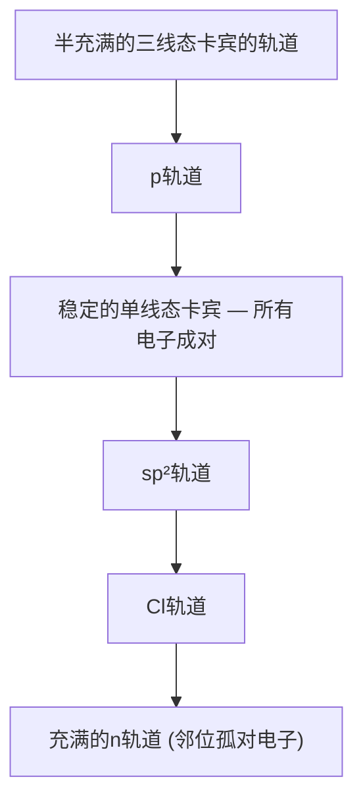
</details>

这种相互作用对应于我们上文中所讨论的，邻位孤对电子通过离域稳定卡宾的观点，如页边所示。正如箭头所示，具有大量给电子取代基的卡宾没有其他卡宾亲电：确实，二氨基卡宾可以很亲核。将卡宾分为两类解释了它们的结构。这也对解释它们的一些反应起到帮助，尤其是那些具有立体化学含义的反应。我们将会花费本章余下的部分讨论卡宾反应的方式。

# 卡宾的结构取决于制得它们的方式

到目前为止，我们仅考虑了给定卡宾的可能的结构中，最稳定的两种，单线态或三线态。在现实中，卡宾会在化学反应中形成，并可能以较不稳定的其他结构形成。如果反应通过在一个分子上的离子型机理，其中所有电子成对地（大多数分子都是这样！）发生，那么卡宾会以单线态形成。例如遵循 $\alpha$ 消除机理的过程。

![[中文版clayden-chinese37-401000-1132_images/6183a4ee53bee9fc5b9922574d75976ccf263ebb9a393c755cee1ce4f2c8139e.jpg]]

<details>
<summary>chemical</summary>

碳原子转移与电子分离过程示意图，展示两个电子离子在碳阴离子中移动及二氯卡宾反应
</details>

起始原料，一分子的氯仿 $CHCl_{3}$ ，所有电子均成对。C-H σ 键断裂，其中的两个成对电子会形成碳阴离子的孤对电子。碳阴离子中的电子同样都成对。其中一根 C-Cl 键中的两个电子离开碳阴离子，卡宾得以形成。剩下的两根 C-Cl 键中各有一堆电子，加上孤对电子，全都成对。卡宾以单线态形成。凑巧， $CCl_{2}$ 的单线态同样是较稳定的。但如果将卡宾换成 $CH_{2}$ ，并且如果卡宾会很快地反应，那么它将没有机会转变为较稳定的三线态。由于卡宾非常活泼，这个问题会很重要。在下一节，阐释它们的反应时，我们将需要思考：

- 卡宾如何形成  
- 卡宾反应得多块  
- 它是否有机会转变到另一种状态 (单线态或三线态)。

# 卡宾如何反应？

卡宾渴望找到另一对电子来补全自己的电子价壳层。在此方面，它们很像碳阳离子。像碳阳离子一样，它们是亲电的，但与碳阳离子不同的是，它们不带电。这对卡宾选择什么样的亲核试剂与自己反应是有影响的。碳阳离子会进攻具有高电荷密度的亲核试剂——那些携有负电荷或部分负电荷的亲核试剂 (想象 $S_{N}1$ 或 Friedel–Crafts 反应中的亲核试剂)。而在另一方面，卡宾则会进攻我们一般不会考虑为亲核试剂的化合物——甚至是简单的烷烃——也可被卡宾从 HOMO 中带走电子。当然，碳阳离子通常会与一个分子的 HOMO 反应，但对于与哪个 HOMOs 反应，它的选择性高得多——通常是孤对电子，或富电子烯烃。对于卡宾，则可以与任何 HOMO 反应——一对孤对电子，一根 C=C 双键 (富电子或缺电子均可)，甚至一根 C—H 键。

如您将会见到的 (并且也是我们在本章的开头概括过的)，这些反应中的很多都可以被考虑为插入反应——总地来说，卡宾表现为找到一根键，并插入到了其中。记住描述反应总体结果的术语“插入”是很重要的，但这并不是对反应机理的精确描述。

# 卡宾与烯烃反应得到环丙烷

这个反应是制取环丙烷最重要的方法，大有可能也是卡宾最重要的反应。这类反应 (页边有一个例子) 的机理取决于卡宾是单线态还是三线态，反应结果也会为我们在上一节中提出的结论提供一个

在这方面，卡宾像是一个亲电的自由基——非常活泼也非常软。

![[中文版clayden-chinese37-401000-1132_images/0dfd5bdf283776e9db5ffcbc2d1bf6f34b3ca82b9101236d3248a9a1d5c86f4a.jpg]]

<details>
<summary>chemical</summary>

Chemical reaction scheme showing cyclohexene transformation with CHCl3/t-BuOK and 59% yield, followed by cyclization to cyclohexene
</details>

在化学层面的测试。像这里这样的单线态卡宾 (记得，带有孤对电子的取代基可稳定单重自旋态) 可以通过一个完全协同的方式添加到烯烃上：过程的弯曲箭头可以写成上一页页边所示的样子。

由于这一过程是协同的，我们预料烯烃的几何结构应在产物中得到保留——反应应该是立体专一性的。下面的例子显示了，这的确是事实。更令人印象深刻的是，Z 烯烃会给出比反式环丙烷不稳定的顺式环丙烷，因此如果可能的话，它会转化为 E。

![[中文版clayden-chinese37-401000-1132_images/61e4afa83a8a25b92b0acaed98ce61077c32318d6e84af5342fd0e120b413b61.jpg]]

<details>
<summary>chemical</summary>

Two-step organic reaction scheme showing conversion of Z and E to products with CHBr3 and t-BuOK, yielding 70% and 80% respectively.
</details>

烯烃插入反应仅仅对于单线态卡宾是立体专一性的。对于三线态卡宾，反式不具有立体专一性。在下面的例子中，三线态卡宾会由纯的 Z 烯烃给出环丙烷非对映体的混合物。

虽然由重氮烯烃热形成的卡宾最初一定是单线态的，但光化学照射会将它们转化为更稳定的三线态。

![[中文版clayden-chinese37-401000-1132_images/668616822669ae92135202389c1c32afba46e956219677bc768a31625ac670f7.jpg]]

<details>
<summary>chemical</summary>

Photochemical reaction of 2-methylpyridine to form 65% and 35% products, showing photochemical shift under UV light
</details>

这个反应的机理一定与三线态卡宾的机理不同。事实上，由于涉及电子的自旋，协同反应对于三线态卡宾是不可行的。三线态卡宾的自旋不是成对的，它会先通过自由基反应添加到烯烃上，所得的双自由基（三线态）中间体必须等待其中一个自旋翻转（spin-flipping）后才可通过电子成对形成第二根 C-C 键。

Interactive mechanism for triplet carbenes in cyclopropane formation

![[中文版clayden-chinese37-401000-1132_images/60b1b003bfee4595185049b2c836555e9cc11ed27c7dd5641d96942eceb6cd93.jpg]]

<details>
<summary>chemical</summary>

Reaction mechanism diagram showing the conversion of Z-hydroxy to a cyclohexene derivative via three-state intermediate and C-C bond formation
</details>

自旋翻转仅会通过与另一分子 (或者通常是溶剂) 碰撞发生，在分子旋转的时间尺度上是相对较慢的，当电子处于用于配对的合适状态时，起始原料的立体化学便已经在中间体中通过自由旋转打乱了。

![[中文版clayden-chinese37-401000-1132_images/14aaa71e1baa377e0fe531756857bf34abff9ca07008d8c25302c8311a38964c.jpg]]

<details>
<summary>flowchart</summary>

```mermaid
graph TD
    A["Me"] -->|慢的自旋翻转| B["Me"]
    B -->|现在可能成键| C["Me"]
    C -->|现在可能成键| D["Me"]
    D -.-> E["Me"]
    E -.-> F["Me"]
    F -.-> G["Me"]
    G -.-> H["Me"]
    H -.-> I["Me"]
    I -.-> J["Me"]
    J -.-> K["Me"]
    K -.-> L["Me"]
    L -.-> M["Me"]
    M -.-> N["Me"]
    N -.-> O["Me"]
    O -.-> P["Me"]
    P -.-> Q["Me"]
    Q -.-> R["Me"]
    R -.-> S["Me"]
    S -.-> T["Me"]
    T -.-> U["Me"]
    U -.-> V["Me"]
    V -.-> W["Me"]
    W -.-> X["Me"]
    X -.-> Y["Me"]
    Y -.-> Z["Me"]
    Z -.-> AA["Me"]
    AA -.-> AB["Me"]
    AB -.-> AC["Me"]
    AC -.-> AD["Me"]
    AD -.-> AE["Me"]
    AE -.-> AF["Me"]
    AF -.-> AG["Me"]
    AG -.-> AH["Me"]
    AH -.-> AI["Me"]
    AI -.-> AJ["Me"]
    AJ -.-> AK["Me"]
    AK -.-> AL["Me"]
    AL -.-> AM["Me"]
    AM -.-> AN["Me"]
    AN -.-> AO["Me"]
    AO -.-> AP["Me"]
    AP -.-> AQ["Me"]
    AQ -.-> AR["Me"]
    AR -.-> AS["Me"]
    AS -.-> AT["Me"]
    AT -.-> AU["Me"]
    AU -.-> AV["Me"]
    AV -.-> AW["Me"]
    AW -.-> AX["Me"]
    AX -.-> AY["Me"]
    AY -.-> AZ["Me"]
    AZ -.-> BA["Me"]
    BA -.-> BB["Me"]
    BB -.-> BC["Me"]
    BC -.-> BD["Me"]
    BD -.-> BE["Me"]
    BE -.-> BF["Me"]
    BF -.-> BG["Me"]
    BG -.-> BH["Me"]
    BH -.-> BI["Me"]
    BI -.-> BJ["Me"]
    BJ -.-> BK["Me"]
    BK -.-> BL["Me"]
    BL -.-> BM["Me"]
    BM -.-> BN["Me"]
    BN -.-> BO["Me"]
    BO -.-> BP["Me"]
    BP -.-> BQ["Me"]
    BQ -.-> BR["Me"]
    BR -.-> BS["Me"]
    BS -.-> BT["Me"]
    BT --> BU["ME"]
    BU --> BV["ME"]
    BV --> BW["ME"]
    BW --> BX["ME"]
    BX --> BY["ME"]
    BY --> BZ["ME"]
    BZ --> CA["ME"]
    CA --> CB[X X X X X X X X X X X X X X X X X X X X X X X X X X X X X X X X X X X X X X X X X X X X X X X X X X X X X X X X X X X X X X X X X X X X X X X X X X X X X X X X X X X X X X X X X X X X X X X X X X X X X Y
```
</details>

由于电子自旋的守恒所产生的限制，不但适用于卡宾的反应，同样适用于它们的形成过程。当卡宾通过 $\alpha$ 消除形成时，也就是说，由一个所有电子均配对的分子得到时，不论三线态在能量上是否更稳定，它也一定以单线态形成。只有在之后，卡宾才会通过自旋翻转转化为三线态。由于大多数卡宾的反应非常迅速，这也意味着，我们所知的具有三线态基态的卡宾，事实上，由于没有时间翻转到三线态，它们也会以其最先形成的单线态发生反应。这对于由 $CH_{2}N_{2}$ 产出的： $CH_{2}$ 是正确的，由于后者以单线态形成，并且单线态比三线态更加活泼，因而会立体专一性地加成到双键上。

# 三线态卡宾在环丙烷形成过程中一些证据

如果反应被用大量的惰性溶剂，如 $C_{3}F_{8}$ (全氟丙烷) 稀释，那么： $CH_{2}$ 在反应前就会经历更多的硼撞，因而单线态： $CH_{2}$ 自旋翻转为三线态： $CH_{2}$ 的机会也就会增多。对烯烃的加成会更不具有立体专一性。

![[中文版clayden-chinese37-401000-1132_images/d373e17777ab2e55ac149b2ee25fc1d51c80d58221e0c1dfc49db8888816e1db.jpg]]

<details>
<summary>chemical</summary>

Chemical reaction equations showing conversion of Z-丁烯 to Z-ene using CH2N2 under hv, with yields and structural differences
</details>

卡宾对烯烃加成的立体专一性（或对立体专一性的缺乏）可以是检验参与反应的卡宾是单线态还是三线态的很好的测试方法：在卡宾加成中缺乏立体专一性，必定表明所涉及的是三线态卡宾，但具有立体专一性却不一定表面卡宾是单线态。有些情况下，键的旋转可能很缓慢，而自旋翻转是快的，这会导致立体专一性的加成。注意，这个例子使用了较不稳定的顺式(Z)烯烃：如果可能的话，反应会给出较小排斥的反式环丙烷。

三线态卡宾对烯烃的加成很像对双键的自由基加成，我们也可以这也考虑。另一方面，单线态卡宾的协同加成是一个周环反应，通过 Chapter 34 您应当能识别它是一个 $[1 + 2]$ 环加成。

三线态卡宾的加成是一个自由基反应

![[中文版clayden-chinese37-401000-1132_images/5ff05cb9202eee5b38e493c2f0d3406d8177bbd9cad94a9c554596b8efc71a3b.jpg]]

<details>
<summary>chemical</summary>

Chemical reaction mechanism showing cycloaddition and cyclization steps with CR₂ substituents
</details>

单线态卡宾的加成是一个 $[1 + 2]$ 环加成

![[中文版clayden-chinese37-401000-1132_images/27a6ed0a76399446b04f3b71849ac46eb09714a3e8f205060da51e10ec9c502c.jpg]]

<details>
<summary>chemical</summary>

Chemical reaction showing cycloaddition of a chlorinated alkene to form a bridged bicyclic compound with chlorine substituents
</details>

作为环加成，单线态卡宾对烯烃的加成必须遵循 Chapters 34 和 35 中讨论的轨道对称性规则。我们可以考虑为，卡宾的空 p 轨道 (LUMO) 与烯烃的 $\pi$ 键 (HOMO) 相互作用，或卡宾处在充满的 $sp^{2}$ 轨道中的孤对电子 (HOMO) 与烯烃的 $\pi^{*}$ 反键轨道 (LUMO) 相互作用。

卡宾直接接近  
![[中文版clayden-chinese37-401000-1132_images/4531d55ab92a0744511fd8b2474e4382097aa76aa376f3fc9b58cffbc5272d35.jpg]]

<details>
<summary>chemical</summary>

Molecular interaction diagram showing hydrogen bonding between HOMO and LUMO molecules, with labeled bond types and interactions
</details>

![[中文版clayden-chinese37-401000-1132_images/2efcf6426509f530eb60d9aae4a1211f1655c46d34f6cd4ff6d9bd23c3069262.jpg]]

<details>
<summary>chemical</summary>

Molecular interaction diagram showing hydrogen bonding and electron transfer in LUMO and HOMO systems, with partial charges labeled Me and H
</details>

您立即会发现，当我们试图让这些原子建设性地成两根键时，会出现困难——因为总是会有一个反键相互作用出现，因而卡宾对烯烃的直接靠近是不可行的。然而，如果卡宾以“侧向 (sideways--on)”方式靠近，两根新键就可以形成了。

![[中文版clayden-chinese37-401000-1132_images/484b4bb3687594f10ba5ee2d8a2e6221d3dce0dbff02aa97dee7c96545caf30b.jpg]]

Interactive comparison of

singlet and triplet carbenes in

cyclopropane formation

■ 其中一个组分是一个单独的原子的环加成反应 (换句话说就是 $[1+n]$ 环加成) 有时也被称为螯变反应 (cheletropic reactions)。

![[中文版clayden-chinese37-401000-1132_images/899fee0645b276fd45c241e463b9aef6f4581b3a0100ecd30eddd5e8faa98cd3.jpg]]

Interactive examples of other

cheletropic reactions with $SO_{2}$

卡宾的侧向接近  
![[中文版clayden-chinese37-401000-1132_images/4d3b0644dfcf06a432df6023ed9ac5ccaa94864538a03342f1c1d9c9037363b0.jpg]]

<details>
<summary>chemical</summary>

Molecular interaction diagram showing hydrogen bonding between HOMO and LUMO molecules, with labeled bond types and interaction mechanisms
</details>

![[中文版clayden-chinese37-401000-1132_images/debab429df06957e69daed978eaa5a8bf01483e5f2ad4eb7c544acf16aac91f3.jpg]]

<details>
<summary>chemical</summary>

Molecular orbital diagram showing H and Me orbitals with bonding interactions and HOMO interaction
</details>

当然，在环丙烷产物中，对于原来是卡宾的碳原子，必须具有四面体排列，因此，即使卡宾以侧向方式接近，它也会在成键的同时旋转 $90^{\circ}$ 。

卡宾“对接”到烯烃上  
![[中文版clayden-chinese37-401000-1132_images/c45d9563ac13dcfd1cf1a2186e81ebef3c5d5aa7007730d47dd68de4074646bf.jpg]]

<details>
<summary>chemical</summary>

Reaction mechanism diagram showing the formation of a cyclic carbocation from a cyclopentadienyl alcohol, with initial and final stereochemistry indicated.
</details>

![[中文版clayden-chinese37-401000-1132_images/7345a93411aef8239e8a5dab4fa7b806fa6ab8d92fdc75decad40204bcdb0183.jpg]]

Interactive mechanism for

singlet carbenes in cyclopropane formation

# 制取环丙烷

很多天然产物和生物活性化合物都包含环丙烷：我们将主要考察其中几个。首先，是一种最重要的天然杀虫剂，来源于非洲除虫菊的一种除虫菊酯（pyrethrin），它的合成类似物溴氰菊酯（decamethrin）是农业上最重要的杀虫剂之一。对于这种高活性而不持久的杀虫剂，使用时仅需很低剂量。

![[中文版clayden-chinese37-401000-1132_images/9c30487c3866efb170157aaf2061e0f6c997946d30dda1bbc1469fc3cbd8a367.jpg]]

![[中文版clayden-chinese37-401000-1132_images/d8963994818ebe86d8f6335a401d76c546e0fdbf140b7e7b0d48258ab6d1d409.jpg]]

![[中文版clayden-chinese37-401000-1132_images/283f55a884f992a2aa4b7c771dbb1823744f21854281a64721d12a56cc795168.jpg]]

![[中文版clayden-chinese37-401000-1132_images/06bcfa7fcd1430d680c4c97d48ab4a82b60d2990dd71299204a134483788a9f8.jpg]]

<details>
<summary>chemical</summary>

Chemical structure of 除虫菊酯 I, showing a chiral center with ester and cyclopentane rings
</details>

![[中文版clayden-chinese37-401000-1132_images/a5b2a5a4b819f1ea0bdd9059a7b56f0749352c7b6b93590ca19e3dcd3a0ba2b2.jpg]]

<details>
<summary>chemical</summary>

Chemical structure of溴氰菊酯 with labeled functional groups including bromine, cyclohexene, and cyanophenyl ether
</details>

海水中的 “臭氧” 和 “碘” 味与 $O_{3}$ 或 $I_{2}$ 无关。它更可能来源于网翅烯 (dictyopterene，译名系作者捏造)，一类挥发性的环丙烷，磁性褐藻用它来吸引雄性胚子配子 (gametes)。

其他环丙烷还包括两种天然但很不常见的氨基酸。次甘氨酸 (hypoglycin) 是一种来源于未成熟的阿奇果/西非荔枝 (ackee) 的降血糖药物。它是牙买加呕吐症的病原。请勿食用绿色的阿奇果。

第二种，也更简单的氨基酸可在苹果、梨，和西柚中找到，它们可以通过降解为乙烯促进果实的成熟。

我们的最后一种，也是最特别的一个例子是一种在 1996 年首次合成的抗真菌抗生素，它包含多达五个环丙烷。它具有一个平淡（prosaic）的名字 FR-900848，但还有一种非官方的叫法“jawsamycin”。

![[中文版clayden-chinese37-401000-1132_images/71f575c0a753e845697f2bef3564721d034fdc0642279223dace1669c5ea71ff.jpg]]

<details>
<summary>chemical</summary>

Chemical structure of FR-900848 or 'jawsamycin' with labeled functional groups and stereochemistry
</details>

大多数对包含环丙烷的化合物的化学合成法，都会利用卡宾或卡宾等价物对烯烃的加成。卡宾等价物是什么意思？通常，这指的是有形成卡宾的潜在性的分子，但它可能并不真正通过卡宾中间体反应。一个这样的例子是用金属锌与二碘甲烷反应时形成的锌类卡宾（更方便的是用与铜的混合物——“锌-铜偶 zinc-copper couple”）。它可以像一个卡宾一样与烯烃反应——发生对 $\pi$ 键的加成并产出一个环丙烷。

![[中文版clayden-chinese37-401000-1132_images/313abd3ed1a7023abb98d21c23c314fe74fcec42d8eb86e3116ceabaf349b83f.jpg]]

<details>
<summary>chemical</summary>

Zinc complex reaction equation showing formation of a cyclohexene derivative with 86–92% yield
</details>

这个反应被称为 Simmons-Smith 反应 (reaction)，得名于 1958 年在 DuPont 化学工厂发现它的两名化学家。它是制取环丙烷化合物最重要的方法，但如今，通常使用的是更易处理的起始原料的变体。二乙基锌取代了传统 Simmons-Smith 反应中的 Zn/Cu 偶。下面的例子在一个由酒石酸衍生的 $C_{2}$ 对称的双烯上发生了两次环丙烷化，该反应有非常好的立体选择性，其原因我们稍后会讨论。

![[中文版clayden-chinese37-401000-1132_images/6db5e13e2d0f4c526440be836120159f7fc93fa53f43eeea5b0b69b0a4341385.jpg]]

<details>
<summary>chemical</summary>

Chemical reaction pathway showing conversion of 2-butyl acetate to cyclopropane derivative using dodecyl substitution and alkene coupling
</details>

Simmons-Smith 反应的机理表现出是一个由金属到烯烃的卡宾转移 (carbene transfer)，此过程不释放任何游离卡宾，可能是下面这样的。

![[中文版clayden-chinese37-401000-1132_images/5a0ddbea8b5840282986b719262c59d35e3d889021a4b49f7e6c4d25947a62a8.jpg]]

<details>
<summary>chemical</summary>

Chemical reaction mechanism showing zinc complex formation from cyclopentadienyl iodide and alkene, forming a cyclohexane derivative with X=I or CH2I notation
</details>

对此的一些证据来源于一个反应，这个反应不仅为 Simmons–Smith 环丙烷化的机理提供了线索，而且使之在合成上产生了巨大的价值。当下面的烯丙型醇被环丙烷化时，新的亚甲基会立体选择性地加成到与羟基相同的一面上。

![[中文版clayden-chinese37-401000-1132_images/96fbdbefeaf3a1547c33122ef08cc2bd9eb070ac427aa17a35b580d6a24e44d4.jpg]]

<details>
<summary>chemical</summary>

Chemical reaction equation showing conversion of cyclohexanol to cyclohexane using CH2I2 catalyst under Zn/Cu conditions, yielding 63% yield and >99% relative difference
</details>

烯丙型醇被环丙烷化的速率，同样超过 100 倍快于它们非官能化的烯烃等价物。锌原子在过渡态中与羟基的配位不仅能解释立体选择性，而且能解释速率的增加。不幸的是，当转移亚甲基 $\left(\mathrm{CH}_{2}\right)$ 时，Simmons-Smith 反应工作得很好；但对于取代的亚甲基 (RCH: 或 $R_{2}C:$ )，就没那么好了。

由重氮乙酸乙酯通过金属催化分解衍生的卡宾，可进攻烯烃来向环丙烷中引入一个两碳碎片——这是菊酸乙酯 (ethyl chrysanthemate) 的工业合成法，菊酸乙酯是除虫菊酯杀虫剂 (见 p. 1016) 的合成前体。起始原料中的二烯比产物中的简单烯烃更亲核 （具有更高能的 HOMO，见 Chapter 19），因此反应可以在一次卡宾加成后停止。

您在 p. 1009 见到过此种锌类卡宾。Zn/Cu 偶是一类没有精确组成和结构的合金；通常它包含 >90% 锌。

您可能注意到了这与 Chapter 32 中烯丙型醇与 m-CPBA 的环氧化反应的相似之处。

Interactive mechanism for chelation-directed cyclopropanation

在立体化学上，请注意 Simmons-Smith 锌类卡宾表现得像一个单线态卡宾——它对烯烃的加成是立体专一性的 (产物环丙烷保留烯烃的几何结构) 和立体选择性的 (类卡宾添加到羟基的同面)。

![[中文版clayden-chinese37-401000-1132_images/3adfbb24e87ee24414be4b95a41c9034746f8882465c4425d7c31d199818db1f.jpg]]

<details>
<summary>chemical</summary>

Chemical reaction equation showing copper-catalyzed coupling of ethyl acetate and dimethyl carbonate to form a chiral alcohol using Cu metal catalyst
</details>

这个反应的分子内版本更加可靠，常被用于包含多取代环丙烷的化合物的制取。Corey 在雌诱素(sirenin)，雌性水霉的精子诱引剂 (sperm-attractant) 的一种合成路线中应用了它。

卡宾插入到这个双键中形成六元环

→ 二氧化硒氧化已在 Chapter 35, p. 919 讨论。

![[中文版clayden-chinese37-401000-1132_images/e2f241d01b8adea4947aa242a39fdf9128c7045c4114f0d4f686278937200906.jpg]]

<details>
<summary>chemical</summary>

Chemical reaction pathway showing conversion of a ketone to a chiral alcohol using CuI and SeO2, followed by acid-catalyzed cyclization with LiAlH4 catalyst.
</details>

您可能会想象到，像这样的被吸电子的羰基取代的卡宾，会比像 $\mathrm{CCl}_{2}$ 的卡宾具有更强的亲电性，甚至会添加到苯中的双键上。产物是不稳定的，会立即发生电环化开环反应。

→ 您在 Chapter 35 见到了这样的电环化反应。

![[中文版clayden-chinese37-401000-1132_images/1bec6c63d2b3d21541854792390ac4089d8a10be6883bb8da898eaa1767a14d1.jpg]]

<details>
<summary>chemical</summary>

Nucleophilic reaction mechanism of benzene with ethyl acetate under heating, showing intermediate formation and product formation steps
</details>

# "类宾" 试剂比较

在离开环己烷这一节之前，我们希望您后退一步，并普遍性地考虑形成三元环的试剂的类型。它们有一些共性，我们可以称之为“类宾 (enoid)”特征。卡宾 (单线态的卡宾具有一个空的、亲电的 p 轨道和一个充满的、名义上亲核的 $sp^{2}$ 轨道）进攻烯烃时，会形成环丙烷。Simmons-Smith 类卡宾并不是卡宾，但是，它具有一个既有亲核特征 (烷基锌)，又有亲电特征 (碘代烷) 的碳原子。如果您仔细思考，过酸的环氧化反应也是这样的，该反应通过烯烃对一个既带有孤对电子 (亲核性) 又带有羧酸根离去基团 (亲电性) 的氧原子的进攻，形成环丙烷的氧类似物。它是一个“类氧宾 (oxenoid)”。在 Chapter 27 中，您见到了通过转移 $CH_{2}$ 形成环氧或环丙烷的试剂——锍叶立德；它也是这样，具有一个既携有负电荷，又携有离去基团的碳原子。您可以将它们考虑为特别稳定的类卡宾。

![[中文版clayden-chinese37-401000-1132_images/28249e3ed48c56b75971c38b16387a0b09ec8f6a15c77617b9a425d420d59f2f.jpg]]

<details>
<summary>chemical</summary>

三元化碳原子离子迁移示意图，展示类卡宾、过酸和硫叶立德三种反应路径
</details>

# 插入 C-H 键

我们说过，通过取代的卡宾对烯烃的加成形成环丙烷的过程是很罕见的一一事实上，烷基取代的卡宾很少会发生分子间反应，因为它们会非常迅速地分解。当用碱处理伯卤代烷时，烯烃会通过消除反应形成。阅读过 Chapter 17 后，您应当料到这个消除的机理是 E2，并且如您由下面这种氘代化合物开始，烯烃产物则会被氘原子在其末端标记。

![[中文版clayden-chinese37-401000-1132_images/01fb46e695926dc2adc08617e5dfa6487d9e7c6c1c5554027dcf117550d5d56f.jpg]]

<details>
<summary>chemical</summary>

Organic reaction mechanism showing deprotonation, elimination, and phenching steps with NaOMe and E2 reagents
</details>

如果碱是甲氧基钠 $(pK_{a}[MeOH]$ 大约 16) 时，这确实会发生。但假如碱是苯基钠 $(pK_{a}[苯]$ 大约 50) 时，只有 6% 的产物会按这种方式被标记，94% 的产物只会留有一个氘原子。

很明显，这是一个氢原子由2号位迁移到了1号位上。用非常强的碱，如苯基钠进行的消除反应的整体机理被认为是：(1)通过 $\alpha$ 消除形成卡宾，然后(2)氢原子1,2-迁移到卡宾中心上。有 $\beta$ 氢的卡宾会极其迅速地发生氢向卡宾中心的1,2迁移，给出烯烃。

迁移已于 Chapter 36 中详细地阐明。在那里您见到过许多向亲电的碳阳离子中心的迁移反应，这些向卡宾的迁移反应实质上与之非常相似。

![[中文版clayden-chinese37-401000-1132_images/825af6d35b7cc96dd16c816ab8ed89b67758d679b67e18f74ef1971a6254ff1d.jpg]]

<details>
<summary>chemical</summary>

碳阳离子转化过程示意图，展示卤代烷与碳阳离子在两个步骤（α消除、迁移）的反应
</details>

快速迁移的原因是亲电的卡宾找到了邻近的电子源——C-H 键的 HOMO——它会将电子抓向它自己，如页边所示的，“插入 (insert)” 进 C-H 键中。

这类反应可以被两个例子较好地说明，这两个例子中的“插入反应”更加明显：当没有 $\beta$ 氢时，卡宾会插入到相同分子，甚至是溶剂（第二个例子中的环己烷）中离得稍有点远的 C-H 键中。第一种情形中，卡宾由 $\alpha$ 消除形成（使用一种“Schlosser 碱”，见 p. 1008）；第二种情形则通过重氮酮的光解形成。

![[中文版clayden-chinese37-401000-1132_images/e002f92c7da35aa2b5ee6d0c00796dad984fe57511483f3e3c7bcc81fb103d00.jpg]]

<details>
<summary>chemical</summary>

Molecular orbital diagram showing electron density distribution with labeled orbitals and charge states
</details>

![[中文版clayden-chinese37-401000-1132_images/2f98a8498133f5f754011e4a8594a3b6f59be94c3f7bbe29d603ad866d7c560f.jpg]]

<details>
<summary>chemical</summary>

Chemical reaction pathway showing conversion of a chlorinated alkene to a cyclohexanone via C-H insertion, with reagents and yields labeled.
</details>

因为这些插入反应会在完全未官能化的中心产生新键，它们在合成中会非常有用。下一个卡宾由重氮化合物与铑催化剂在两个羰基间产生，并会选择性地插入到五个原子以外的一根 C-H 键中，形成一个取代的环戊烷。

Interactive mechanism for carbene insertion into C—H bonds

![[中文版clayden-chinese37-401000-1132_images/09f74e96fde01f0b989a1a076ac1e942c99c6a3df4f76f7223afcac8043f5f3c.jpg]]

<details>
<summary>chemical</summary>

Organic reaction pathway showing rhodium-catalyzed cyclization with 60% yield, including intermediate C-H insertion and cycloaddition
</details>

# 使用卡宾的 pentalenolactone 合成

Pentalenolactone 指一种由链霉菌(Streptomyces)中提取的抗生素，具有一个有趣的三环结构。

![[中文版clayden-chinese37-401000-1132_images/2f55730043a9606445bcc4c354cf6a71e46f0fab03b2fb5f360e040582ea07bd.jpg]]

<details>
<summary>chemical</summary>

Molecular structure of pentalenolactone with labeled functional groups and stereochemistry
</details>

两组化学家都发布了利用铑促的卡宾对 C-H 键的插入的合成路线，彼此相差不足一年。Cane 的插入反应 (路线 1) 收获了立体化学保持的立体专一性。这是对协同的单线态卡宾反应极好的证据。

在 Taber 的合成中，卡宾则选择性地插入到了六元四氢吡喃环中，给出较小张力的 5,5-顺式环交点。

路线 1: Cane  
![[中文版clayden-chinese37-401000-1132_images/0d3a1e5814595ad40f6ffd83d62b1f40e779d93605a28f148d0142a693c6ee9c.jpg]]

<details>
<summary>chemical</summary>

Chemical reaction pathway showing transformation of a cyclic ketone with N2 and Rh2(OAc)4 under pentaleno-lactone conditions
</details>

路线 2: Taber

这些 C-H 插入反应，与形成环丙烷的对烯烃的插入的相似之处已经很清晰了，机理彼此也十分相似。对于环丙烷化反应，机理取决于卡宾是单线态还是三线态。单线态卡宾可以协同方式插入只要卡宾侧向接近，轨道则可建设性地重叠。

![[中文版clayden-chinese37-401000-1132_images/6b5892296c96d208dfdcba74818fd30d560617b8544e71a5d3cb27ddc9762e18.jpg]]

<details>
<summary>chemical</summary>

单线态卡宾对一根C-H键插入时的轨道相互作用示意图，展示卡宾的HOMO与LUMO结构及空间分布
</details>

机理表明，如果 C–H 键位于一个立体中心上，该中心上的立体化学则会反应过程中保留，如 Cane 的 pentalenolactone 合成路线中所表现出的那样 (见上方文字框)。对此结果的一个很好的例子是使用立体专一性的卡宾插入完成的 $\alpha$ -花侧柏酮 ( $\alpha$ -cuparenone) 精妙的合成方法。

原则上，三线态卡宾的插入应当遵循类似于对烯烃插入的，两步的自由基路径。然而，所观察到的三线态卡宾对 C-H 键的插入非常少，两步机理的立体化学结果(应当在对立体中心上的 C-H 键插入时得到立体异构体的混合物)也从未被核实。

![[中文版clayden-chinese37-401000-1132_images/283f76c08dc293ef27aac0a490de72b847ccd5e66ff7fd84ef34e1b78165d4f8.jpg]]

<details>
<summary>chemical</summary>

Chemical reaction pathway showing rhodium-catalyzed transformation of a substituted cyclohexene derivative with a C-H bond, leading to α-fused piperidine
</details>

# 重排反应

我们仅在本节的开始聊到了给出烯烃的，卡宾上氢的迁移反应，并谈到，这些反应可以视作对邻

C–H 键的插入反应。不具有 $\beta$ 氢的卡宾通常插入到分子中其他的 C–H 键中。然而，不具有 $\beta$ 氢原子的卡宾同样可经历包含烷基或芳基迁移的重排反应。

![[中文版clayden-chinese37-401000-1132_images/3cd01d1a8909bf532c6eec28524c9178801c1b38390826589295153a424e9359.jpg]]

<details>
<summary>chemical</summary>

Organic synthesis reaction pathway showing t-BuOK and t-BuLi steps with 66% yield
</details>

这类迁移最常见的例子中，卡宾与一个羰基相邻。这种被称为 Wolff 重排 (rearrangement) 的过程最初的产物是一个烯酮，它不能被分离，但可在后处理中被水解为酸。虽然在上文您见到这类物种也可发生分子内 C–H 插入反应 (p. 1019)，但 Wolff 重排加热重氮酮的典型结构。

烷基对卡宾中心的迁移与我们在 Chapter 36 中讨论的烷基对阳离子中心的迁移有非常多的相似之处——毕竟，卡宾和碳阳离子都是具有只在其外壳层中携带六个电子的碳原子的缺电子物种。

![[中文版clayden-chinese37-401000-1132_images/17c4c9a6bc9f5b84a0ada490d1f3b2c66d55fcba257794a738f60db70ff740fe.jpg]]

<details>
<summary>chemical</summary>

Chemical reaction pathway showing conversion of amide to ester under heating, forming α-ketanediol and then hydrogenation
</details>

对这个反应的一个重要的应用是酰氯到其同系 (homologous) 酯的扩链/增碳 (chain extension) 过程，被称为 Arndt–Eistert 反应 (reaction)。注意观察，Wolff 重排的起始原料被容易地由 $RCO_{2}H$ ，通过酰氯与重氮甲烷的反应制得；反应的产物是 $RCH_{2}CO_{2}H$ ——在链上增加了一个碳原子的羧酸。绿色标出的 $CH_{2}$ 基来源于重氮甲烷，被插入到了 R 与羰基间的 C–C 键中。

→ 您在 Chapter 34 见过烯酮。

■ 我们在 p. 1001 讨论了重氮酮的结构和分解反应。

# Arndt–Eistert 同系化反应 (homologation)

![[中文版clayden-chinese37-401000-1132_images/1e00a42fc05f5587a077a2ff8b950e5e526abd48956c896389aa780b3af8aa81.jpg]]

<details>
<summary>chemical</summary>

Chemical reaction pathway showing the formation of a ketone from aldehyde, chloroacetic acid, and ethylamine under heating and methylation
</details>

# 利用 Arndt-Eistert 扩链反应的诱杀烯醇合成路线

(棉铃)象鼻虫是棉花丛的一种严重害虫。它会产出一种被称为诱杀烯醇 (grandisol) 的性信息素。在农业上，制止虫害的常见策略就是利用它们自己性信息素的合成版本，诱引它们进入陷阱。化学家很快发现，通过一种有机铜衍生物共轭加成 (Chapter 22)，和烯醇酯的烷基化 (Chapter 25) 即可很容易地合成相关的酯。烯醇盐会与 Mel 在丙烯基侧链的对面反应——这也是环状化合物立体化学控制 (Chapter 32) 的很好例子。

![[中文版clayden-chinese37-401000-1132_images/f3af354af0beef80042a87a2581f3bfc4a550be086134ff632e12ecc8e1bd4ef.jpg]]

<details>
<summary>chemical</summary>

Organic synthesis reaction scheme showing conversion of a substituted cyclohexene derivative to a ketone using CuI and MgBr, followed by LDA and Mel reagents with yields.
</details>

但该酯比诱杀烯醇的完整侧链少一个碳原子，因此他们使用 Arndt-Eistert 反应将链增长了一个原子。首先，酯会与重氮甲烷反应，转化为重氮酮，然后用通过有银(I)盐的卡宾形成，引发 Wolff 重排。

![[中文版clayden-chinese37-401000-1132_images/05628e881e6a10cf1a4f1e32d81e2e24f975ec835f372590743a82725e442fc9.jpg]]

<details>
<summary>chemical</summary>

Organic reaction pathway showing conversion of a ketone to a chiral alcohol using KOH, (COCl)2, and CH2N2 under silver acetate catalysis
</details>

![[中文版clayden-chinese37-401000-1132_images/26a612b3bdfdee3aaecb043e6f25fdf7507fdb2f6eb04c7085d403bf5f5ef3a3.jpg]]

# 氮宾是卡宾的氮类似物

Wolff 重排具有一些重要的表亲，我们现在必须介绍给您——尽管它们事实上不涉及卡宾，但它们具有亲属关系，因而值得我们提到。它们是一组通过氮宾/乃春 (nitrene) 中间体进行的反应——氮宾是卡宾的氮类似物。由于正是 Wolff 重排直接的氮类似反应，因而也最容易理解的是 Curtius 重排 (rearrangement)。它开始于酰基叠氮，可由叠氮化钠对酰氯的亲核取代反应制得。当您将重氮酮的 CH=N₂ 替换为 -N:=N₂ 时，便会得到酰基叠氮。如果您加热它，那么不出所料，它会分解，释放氮气 (N₂) 并形成卡宾。氮宾 N 只具有一根键，并具有两对孤对电子，总计六个电子，与卡宾一样。

译者注：酰基叠氮形成氮宾的过程仅需加热，但重氮酮形成卡宾的经典方法是使用过渡金属催化。

![[中文版clayden-chinese37-401000-1132_images/777bbd149b1d595ba24fe34b8e4fd4c40aa39fbf9e022ae4e0b13162acf3ef20.jpg]]

<details>
<summary>chemical</summary>

氮宾形成与酰基叠氮反应示意图，展示R-Cl、N=N-、N=N-和N=N-的转化过程
</details>

氮宾像卡宾一样，极其活泼和亲电，此处会发生同样的类 Wolff 迁移 (插入进一根邻位 C-C 键中)，其中 R 取代基会由碳迁移到缺电子的氮宾氮原子上。产物是一个异氰酸酯 (isocyanate)。异氰酸酯不稳定，会发生水解：水对羰基的进攻会给出胺基甲酸 (carbamic acid)，后者然后分解为酰胺。与醇的反应则会给出氨基甲酸酯 (carbamate)。如果醇是 BnOH，那么产物则会是被 Cbz 保护的酰胺。

见 pp. 556–557 对于 Cbz 基的讨论。

Curtius 重排可以直接由羧酸使用叠氮磷酸二苯酯 (diphenylphosphoryl azide, DPPA), $(\mathrm{PhO})_{2}\mathrm{PON}_{3}$ 引发。

![[中文版clayden-chinese37-401000-1132_images/7ca232b789eca0dfae6ff96e4d55530f87443f1f0b57fdf8b6ad5e742dea0365.jpg]]

<details>
<summary>chemical</summary>

氮化碳酰胺的化学反应流程图，展示从C迁移到N上、异氰酸酯和氨基甲酸酯的转化路径
</details>

总得来说，Curtius 重排可以将酰氯 (或酸) 转化为胺，同时失去一个碳原子——非常有用。同样有用的是相关的 Hofmann 重排，可使酰胺失去一个碳原子并转化为胺。这次我们由一个伯酰胺开始，通过用碱和溴单质处理，制得氮宾。注意观察这里的氮宾形成反应与我们在 p. 1008 所讨论的卡宾形成反应是多么密切相关。氮宾会像 Curtius 反应中一样发生重排，给出可以水解为酰胺的异氰酸酯。

还有另一个相关的反应被称为 Lossen 重排 (rearrangement)，开始于对异羟肟酸 hydroxamic acid (即酰羟胺) 的对甲苯磺酰化。您应当能通过与 Hofmann 重排类比察觉出所发生的变化。

![[中文版clayden-chinese37-401000-1132_images/06dbec5fa77e967b4a4fba45927df9f32b61af7e4e01e44bd1e333f948ac518f.jpg]]

![[中文版clayden-chinese37-401000-1132_images/5736eb9f7ef49e74fb4e1398978d424552f6d6b47dff12d20bf5e921a923cfda.jpg]]

<details>
<summary>chemical</summary>

Hofmann重排反应示意图，展示酰胺与异氰酸酯的碳原子转化及脱氢过程
</details>

# 卡宾对孤对电子的进攻

包含烷基移位的 Wolff 重排是有效的对 C-C 键的分子内插入反应。而卡宾同样会插入到其他键中，尤其是通过在下面的情形中，包含先对杂原子上孤对电子进攻的机理进行的，对 O-H 和 N-H 键的插入反应。

![[中文版clayden-chinese37-401000-1132_images/2961c85eb7be2dc517cdd0ff79d71d77f17019b1f12850935bba615d6d09b4e7.jpg]]

<details>
<summary>chemical</summary>

Reaction mechanism diagram showing electron transfer and deprotonation steps in a hydrogen bond compound
</details>

卡宾进攻首先形成内盐（或“叶立德”），然后紧跟着质子转移以生成中性分子。然而，如果杂原子不携带氢，那么叶立德便不能以这种方式重排，这类反应是制取无法通过其他方式获得的活泼叶立德非常有用的方法。

由于羰基取代的卡宾 (像羰基取代的自由基一样) 是亲电的，它们对 O–H 和 N–H 键的插入可以成为制取极性翻转 (见 Chapter 28) 的键的实用方法。由于形成 β-内酰胺 (盘尼西林类抗生素中发现的四元环) 的困难性，制药公司默克 (Merck) 设计了围绕铑催化的对 N–H 键的插入反应，来在四元环的一侧建立五元环的，对一系列被称为碳青霉烯类 (carbapenems) 的化合物的合成方法。

![[中文版clayden-chinese37-401000-1132_images/c4c5ae686389c37958617212feff57a35b462a482eb5ca096223b43014aff83c.jpg]]

叶立德是两种电荷处在相

邻原子上的内盐——您在 Ch-

apter 27 见到过鏻和铳叶立德。

![[中文版clayden-chinese37-401000-1132_images/9458bb5550ba9576d6078658ffb92fdf9c48b7b0ee2e4d737853bf443b8161a8.jpg]]

Interactive mechanism for

carbene insertion into O—H bonds

![[中文版clayden-chinese37-401000-1132_images/6048347c187849fc49628024dfc558884ad99e09b73407c0bbb90e9ee4fe8cbc.jpg]]

<details>
<summary>chemical</summary>

Chemical reaction equation showing rhodium complex formation with stable octahedral intermediate
</details>

![[中文版clayden-chinese37-401000-1132_images/0e4e4748d5c441686c324cf15a829154a7da130e20ed5f1af075acbbe0097512.jpg]]

<details>
<summary>chemical</summary>

Chemical reaction scheme showing conversion of a chiral amide to β-alkyl acetate using reagent reagent and Rh2(OAc)4 catalyst
</details>

# 烯烃复分解

在上个例子以及之前的许多例子中，卡宾的形成都是通过金属引发的一一通常是铜、铑，或银。这些反应的卡宾中间体，都以与这些金属的活泼配合物的形式形成，在其他情形中，这些配合物可能极其稳定。例如，苯基重氮甲烷在钌(II)配合物的存在下分解，可给出一种稳定性足以被分离并被储存数月的卡宾配合物。这种配合物以及一个相关的Ru配合物家族，由于一个被称为烯烃复分解(alkene/olefin metathesis)的反应，成为了最重要的卡宾衍生试剂。

![[中文版clayden-chinese37-401000-1132_images/6e35765385f41b9d2d4f6d0f3e87c4363d895632a572569d05c76542ea667040.jpg]]

<details>
<summary>chemical</summary>

Chemical reaction scheme showing conversion of N-Ph to [HC-Ph] under PCy3 catalysis, with stable配合物 formation
</details>

最容易理解的反应，会在一个简单双烯与非常少量的 (在此情形是 2 mol%) 这种催化剂反应时发生。双烯会发生环化反应，产物同样是一个烯烃。产物烯烃不包含任何来源于催化剂的原子：确实，它失去了两个碳原子，后者以乙烯释放。

![[中文版clayden-chinese37-401000-1132_images/678ad427abbc97adca6ea6e55e6cef0302677c061b8acf9b109c50a7e97022f2.jpg]]

<details>
<summary>chemical</summary>

Ruthenium complex reaction with cyclopentadienyl ligand under catalytic conditions
</details>

这些配合物中的 Cy 表示环己基： $PCy_{3}$ 是三环己基膦，三苯基膦的饱和类似物。

■ 起始原料和产物中相同的四个原子已用黑色标记出。

所发生的变化是一个复分解（metathesis）过程——在分子两臂之间发生的基团的交换。但这是如何发生的呢？机理不难理解，但与您之前见过的其他任何形成烯烃的反应，也许除了 Wittig 反应，都不一样。首先，是卡宾配合物对其中一个烯烃的加成，可以画作 $[2 + 2]$ 环加成 (Chapter 34)，会给出一个在环内有金属原子的四元环（一个“金属代环丁烷 metallacyclobutane”）。

![[中文版clayden-chinese37-401000-1132_images/8268a3985d3ffab76c78ca6b9997f35090a8264d3048ae2f0526da71c2998f51.jpg]]

<details>
<summary>chemical</summary>

Chemical reaction equation showing ring-opening of a ruthenium complex with [2+2] cycloaddition to form metal-iodine derivative
</details>

现在，同样的反应会逆向发生，既可能非产出性地退回起始原料，也可能通过另两根键的断裂给出新的卡宾配合物和苯乙烯。

![[中文版clayden-chinese37-401000-1132_images/3a92439d0e9d634fcb9fa7b63c839619b5485fbdbe6f8e02cdb1cfc65242669e.jpg]]

<details>
<summary>chemical</summary>

Chemical reaction diagram showing conversion of metal-iodine to new compound via phenyl substitution and acetylene ring opening
</details>

新的配合物具有与开始的催化剂相同的反应性，因此它会快速找到另一个烯烃来发生 $[2 + 2]$ 环加成。现在，同一分子中便有这样一个烯烃，因此快速的分子内反应会将五元环连接并产出又一个金属代环丁烷。和先前一样，金属代环丁烷有两种破裂的方式，产出性的一种可得到第三种卡宾配合物以及环状产物。

![[中文版clayden-chinese37-401000-1132_images/d6cc35ca4b21992c90ad83ba4a67e783805f8d836ecd780db50ca0abde9fe8b8.jpg]]

Interactive mechanism forene metathesis

![[中文版clayden-chinese37-401000-1132_images/9610b76e3ee0c781acb077b92c15fcae92428b07e55e8a291ea6344940654960.jpg]]

<details>
<summary>chemical</summary>

Reaction mechanism diagram showing copper-catalyzed ring-opening of a ruthenium complex with Ts and PCy3 ligands, including [2+2] ring formation
</details>

新的卡宾配合物然后会进攻另一分子的起始原料，重复上述循环，只是第一步中的苯乙烯被换成了乙烯而已。

![[中文版clayden-chinese37-401000-1132_images/22412e923c9dda3516c2caa03f309201d81ad3d236400a858bacc6e64ff8c1dc.jpg]]

<details>
<summary>chemical</summary>

Organometallic reaction mechanism involving ruthenium complex and pyridine ligand, showing intermediates and products
</details>

整个流程会出的差错很少，这也是它产率很高的一个原因。大多数步骤是可逆的，而整个反应是不可逆的一步所驱动的一一这步是乙烯以气体失去。即使卡宾配合物以错误的方式围绕烯烃加成，也什么都不会失去，所得的金属代环回逆回起始原料。

![[中文版clayden-chinese37-401000-1132_images/480c654bec525145246eeba716237be2c73ec930253f051788efc8a5e1b62bd9.jpg]]

<details>
<summary>chemical</summary>

Chemical reaction equation showing copper complex formation with Ts and Ru catalysts, including error correction conditions
</details>

# 复分解催化剂

您可能已经想到，这样简单而有效的制取新 C=C 键的方法的发现，是有机化学史上革命性的时刻，并且也为在它的发展上起到重要作用的三位化学家赢得了 2005 年的诺贝尔奖——他们是伊夫·肖万 (Yves Chauvin)，理查德·施罗克 (Richard Schrock) 和罗伯特·格拉布 (Robert Grubbs)。我们刚刚研究的催化剂由 Grubbs 发展，并常以他的名字称呼。21 世纪的早期见证了复分解催化剂有效性的快速进步。最重要的发展是磷配体替代物的发现，一项增加了催化剂活性的改变。最重要的替代配体本身是我们在 p. 1006 介绍的稳定 “N-杂环” 类的卡宾。这里有一个重要的例子，由杂环阳离子的去质子制得：

![[中文版clayden-chinese37-401000-1132_images/3c746e6af8d223b1f5a78493754864e7320572a0ebe8a4229c00f99fbe14f363.jpg]]

<details>
<summary>chemical</summary>

碳原子转移示意图，展示从碱中到卡宾的氢键转移过程
</details>

在其结构中有很多的离域，为了显示两个氮孤对电子对卡宾 C 原子的贡献，通常会用曲线表达这些配体。您可能倾向于用上形式 +、- 电荷，但这些化合物确实将经典的价键表述拉长到了几乎极点，通常情况下这些电荷，由于已经抵消，是不会被表示出来的。

所剩的在碳上的（不离域的）孤对电子可以与 Ru 络合，如同磷的孤对电子一样，并得到被称为 “Grubbs II”（上方描述的复分解所用的 “Grubbs I” 催化剂的第二代）的催化剂。在另一个广泛使用的催化剂（被称为 “Hoveyda–Grubbs 催化剂”）中，第二个磷还被分子内络合所替代。

复分解常用催化剂  
![[中文版clayden-chinese37-401000-1132_images/e2f5975b301e34acb59be8d830dfb053ab2f1cb078e0097de56c99e625626916.jpg]]

![[中文版clayden-chinese37-401000-1132_images/a602f38a3254cb24821bcbbfb2ea0265349bb3e4300a921cbfa8e15ed324a507.jpg]]

<details>
<summary>chemical</summary>

Molecular structure of "Grubbs II" with ruthenium center and phosphine ligands labeled
</details>

![[中文版clayden-chinese37-401000-1132_images/f05132aab1ea5546f1e6cacb7cad2e76031db081819f391be8b2fe1fe4d6e57f.jpg]]

<details>
<summary>chemical</summary>

Molecular structure of "Hoveyda–Grubbs" showing a ruthenium complex with pyridine and phenyl ligands
</details>

# 交叉复分解

我们介绍给您的第一种复分解，很明显会被称为关环复分解 (ring closing metathesis) 反应，环的形成——包括其他方法很难形成的大小的环 (见 Chapters 16 和 31)—是复分解化学最大的应用方面之一。然而，分子间的复分解反应也可在某些环境下工作，尤其是参与偶联 (coupling) 的搭档具有差异很大的电子或空间性质的时候。挑战之处当然是要避免每个烯烃与自己偶联。当其中一个搭档有空阻而另一个没有时，交叉复分解反应就能很好地工作：两个烯烃的四个碳会抓住搭档并产出新的烯烃 (以其 E 异构体)，伴有乙烯副产物。

较不活泼，并且有较大空阻的烯烃为什么不与自己反应的原因是不难理解的，但为什么较活泼的烯烃不会二聚呢？重点在于．．它确实会这样！但这没有关系，因为二聚体作为复分解底物是活泼的，并可以继续反应来形成产物。所有的复分解步骤都通过您之前了解的可逆的 $[2 + 2]$ 环加成机理进行。

# 烯-炔复分解

在离开复分解和卡宾之前，我们需要介绍最后的一个反应，其中的复分解过程导向了一个引人注目的转换。复分解可以在任何 $C=C\pi$ 键上工作，而 $\pi$ 键不需要是烯烃——它还可以是炔烃。复分解反应的总结果如下方图表：两根 C=C 双键交换了位置。当烯烃与烯烃反应时，所得的是两根新的烯烃；但当烯烃与炔烃反应时，原来炔烃仍会留有一根单键，并将两根产物以一个双烯连接。

“烯-烯”复分解

机理遵循与之前完全相同的事件流程。首先钌卡宾催化剂会与烯烃经历 $[2 + 2]$ 环加成，此时的中间体是金属代环丁烯，后者发生逆 $[2 + 2]$ 时，Ru卡宾仍会连接在烯烃产物上。

注意观察，这一次我们是由 $[\mathrm{Ru}] = \mathrm{CH}_2$ 配合物，而非 $[\mathrm{Ru}] = \mathrm{CHPh}$ 开始的一一事实上，如p.1024所示，循环最开始进行时，催化剂会转换苯乙烯，但在那之后，进行的便会是我们示出的机理。

现在，卡宾可以再一次，与烯烃组分经历 $[2+2]$ 环加成和逆 $[2+2]$ 环加成，得到双烯，加上一个准备进行下一轮反应的 Ru 卡宾体。

![[中文版clayden-chinese37-401000-1132_images/ddb15ac3e725cf7e57520ba5065542ac9dfd68677b42862a72aa432924d7559e.jpg]]

<details>
<summary>chemical</summary>

Ruthenium-catalyzed reaction mechanism showing [Ru]-catalyzed rearrangement with [2+2] and [2+2] yields
</details>

因而 烯-炔 复分解是构建双烯——举个例子，是 Diels-Alder 反应可能需要的分子——的有价值的方式。与有机锂、格氏试剂等更活泼的有机金属试剂不同，Ru 卡宾体与 NH、OH 键，以及亲电羰基是完全兼容的。在 Chapter 40 中，您会遇到更多有机金属参加的温和化学过程。

![[中文版clayden-chinese37-401000-1132_images/84665de5005cd49016c476d2203df2d463642aed0f73b71e7d674a74175fb93b.jpg]]

<details>
<summary>chemical</summary>

Organic synthesis reaction scheme showing conversion of a ruthenium complex to a substituted cyclohexene derivative via Diels-Alder and [O] reagents
</details>

# 小结

在本章中，我们了解到，卡宾可以由很多其他活泼的中间体，例如碳阳离子、碳阴离子，和重氮烷烃形成，我们也了解了它们发生反应以进一步给出叶立德等活泼中间体的方式。下面是对卡宾： $\mathrm{CR}_2$ 和这些其他化合物间主要关系的总结。

![[中文版clayden-chinese37-401000-1132_images/238744f47c7030c2fe7d4ee6ddf7df6ccf5d954780b996e2c0e12d98c367cadc.jpg]]

<details>
<summary>chemical</summary>

碳阳离子与重氮烷烃在卡宾反应生成碳阴离子的化学反应路径图
</details>

前几章中，我们集中考察了被我们称为活性中间体的物种，如自由基、卡宾，或碳阴离子，它们难以被观察到，但确实会存在。大多数它们存在的证据来源于对反应机理的研究。对此，在我们遇到有关物种的时候，我们便讨论了一些方面。而在下一章中，我们则会细致地着眼于这些机理被阐明的方式，以及被用于更精确地确定活泼中间体结构的方法。

# 延伸阅读

Reactive Intermediates, C. J. Moody and G. H. Whitham, Oxford Primer, OUP, Oxford, 2001, 有关于卡宾的一节。更先进一本书是：G. Bertand, Carbene Chemistry, Fontis Media and Marcel Dekker, 2002. 交叉复分解的规则在 R. H. Grubbs, J. Am. Chem. Soc., 2003, 125, 11360.

由复分解的主要明星完成的复分解反应综述：R. H. Grubbs, Tetrahedron, 2004, 60, 7117 和 R. R. Schrock and A. H. Hoveyda, Angew. Chem. Int. Ed., 2003, 42, 4592.

# 检查您的理解

![[中文版clayden-chinese37-401000-1132_images/492d51c1cb727571b069eaf93258bd481c199cb0cab62d4f4bbfed8752240608.jpg]]

为确保您真正掌握了这一章的内容，请尝试解决本书 Online Resource Centre (在线资源中心) 中的习题：http://www.oxfordtextbooks.co.uk/orc/clayden2e/

# 探寻反应机理

# 39

# 联系

# 基础

- 主要建立在 ch12 上  
- 酸性和碱性 ch8  
- 羰基反应 ch6, ch10, & ch11  
- 饱和碳上的亲核取代反应 ch15  
- 控制立体化学 ch14, ch32, & ch33  
- 消除反应 ch17  
- 芳香亲电取代和芳香亲核取代 ch21 & ch22  
- 环加成反应 ch34  
- 重排反应 ch35 & ch36  
- 碎片化反应 ch36  
- 饱和杂环和立体电子效应 ch31  
- S, B, Si, 和 Sn 的化学 ch27

# 目标

- 机理的级别和种类  
- 提出机理的重要性  
- 产物的结构都是重要的  
- 标记和双标记  
- 系统的结构变化与电子需求  
- Hammett 关系解释   
- 氘同位素效应 (动力学和溶剂)  
- 特殊酸碱催化剂  
- 一般酸碱催化剂  
- 检测和捕捉中间体  
- 为什么立体化学重要

# → 展望

- 不对称合成 ch41  
- 生命中的化学 ch42

# 类推得到的机理和真正发现机理

对于 “这个反应的机理是什么？” 的问题，有两类答案。如果有人让您化学下面的酯在碱性溶液中水解的机理，您不难给出第一类好的答案。即便您从来没见过这种酯，或者您知道从来没人合成出过它，您也知道它水解的反应属于一类众所周知的反应 (羰基取代反应，Chapter 10)，您会认为它和其他酯水解的机理相同。您会是正确的——对羰基的亲核进攻，形成一个四面体中间体，然后失去烷氧基离去基，最后交换质子形成羧酸根阴离子。

注：原标题为 “There are mechanisms and there are mechanisms”。

![[中文版clayden-chinese37-401000-1132_images/ac0213e3ac3e69587d08441781bc4dd043a14d2a48fd2fbf45f054e3c2774134.jpg]]

<details>
<summary>chemical</summary>

Reaction mechanism diagram showing electron transfer and ring opening steps in a cyclic ester compound
</details>

但在此之前，必须得有人非常详细地确定此机理的存在。这项工作于 1940s 到 1960s 年间被完成，工作完成得非常好，没有人质疑它。

→ 此机理于 p.259 描述过。

您也还记得 Chapter 12 中的一个反应，如果我们将羰基化合物转化为酰氯，机理则会由于好的离去基团——Cl $^{-}$ 比 RO $^{-}$ 更稳定 (碱性更弱)—而改变为一个包含酰基鎓离子中间体的 S $_{N}$ 1 反应。用氢氧根完成这个反应是不值得的：由于最慢的步骤是第一步，而后面的过程水也可以完成。同样，必须得有人确定它的机理，并表明哪一步最慢，也必须根据它共轭酸的 pK $_{a}$ 表明它是一个好的离去基团。

![[中文版clayden-chinese37-401000-1132_images/9008ecaae2a7ade5bbf21e65b725df478387d96975d69fa0821e456a51af9c08.jpg]]

<details>
<summary>chemical</summary>

Reaction mechanism diagram showing nucleophilic substitution and radical ring opening steps
</details>

→ 三级动力学和此酰胺水解机理已于 p.260 讨论。

对于酰胺水解的反应，您可能还记得 Chapter 12，它是一个三级动力学过程，这种情况通常会在离去基团很差，值得用浓碱，使有氢氧根做催化剂时出现。同样，必须得有人发现：(1) 慢步骤是四面体中间体的分解，(2) 有涉及两分子的氢氧根的三级动力学，以及 (3) 第一分子氢氧根扮演亲核试剂，第二分子扮演碱。

![[中文版clayden-chinese37-401000-1132_images/9c39c65ffc05ad88816797962db886254cb7f8715ba32b7f053b0d284a402b84.jpg]]

<details>
<summary>chemical</summary>

Reaction mechanism diagram showing nucleophilic attack and proton transfer steps in a cyclic carbocation system
</details>

这三种机理是同一个反应的全部版本。对您来说，“书写机理”，主要考察的是识别反应的类型(羰基上的亲核取代反应)和评估离去基团的好坏。对于原始化学家，确定这些反应机理意味着：(1)准确确定反应的产物（这听起来很愚蠢，但这确实是一个重点），(2)探索反应过程的步骤和中间体的结构，(3)发现慢步骤（决速步），(4)找到催化剂。本章描述的是这类工作所用的方法——详细的，对“反应的机理是什么？”问题的第二类回答。

现在，假设有人问您，下面两个反应的机理可能是什么。这对您来说便是一类相当不同的问题了，因为您或许并不能识别这些试剂，您也可能无法匹配到某一种所见过的机理上。或许您起初都不知道应该用三大类机理——离子型、周环、自由基中的哪一类。

![[中文版clayden-chinese37-401000-1132_images/098b6b5b7d8bbfd0163f2d85478ea1d557abcd72e768b5b33675fa91655ec8d0.jpg]]

<details>
<summary>chemical</summary>

Organic reaction scheme showing synthesis of a ketone from aldehyde and amine under specified reagents
</details>

您可能只能根据您对有机化学的理解，将电子从亲核试剂移向亲电试剂，选择切合实际的中间体，并得到最终产物，以给出您认为最好的机理。作为有机化学家，您不会对结构声称任何的权威性，您只会希望，提出一种或更多种合理的可能性。

提出合理机理的过程，事实上是以第二类方式回答问题——找到真实的，被实验证实的反应机理——最基本的先决条件。现在，我们会着眼于一些用于发现答案的技术，以之前的人们对于 Cannizzaro 反应的好奇心为例。

# 探寻反应机理: Cannizzaro 反应

那么我们如何知道一个反应的机理呢？简单的答案是，我们并不能肯定地知道。有机化学家总会遇到起初认为是某种事情，后来又证实是另一种事情的情况。对于机理来说，也是同样。这是科学的本质特点，我们所能做的就是通过提出假设，来解释观察的结果。然后我们会用实验验证完美的假设，如果实验不符合，那么还要从头开始一个新的假设。对于机理，则尤其是这样的。当一个反应被发现时，人们总会假设出一个或多个机理，然后寻求实验证据，推翻其他机理，找到最好的选择。在找到其他证据证实它不成立前，它会被接受为反应的机理。

我们将要着眼于一个反应，Cannizzaro 反应，并用它来介绍阐明反应机理时所使用的不同技术，它们会让您欣赏每个实验所揭示的不同信息，以及将这些信息整合成可能的机理的过程。在强碱性条件下，没有 $\alpha$ 氢的醛会经历歧化 (disproportionation) 给出一半的醇和一半的羧酸根。歧化意味着原料的一半被另一半所氧化，另一半被这一半所还原。在此情形中，一般的醛将另一半的醛还原为伯醇，自己被氧化为羧酸。在 1946 年发现 $LiAlH_{4}$ 以前，这是将醛还原为醇的少数可靠反应中的一种，在合成中也取得了一些使用。

下面有一个机理性的图示，显示了所发生的变化——如果您之前没有见过这个反应，您可能会合理地提出这样的假设。

![[中文版clayden-chinese37-401000-1132_images/537a8368058c2093b78bb958b4a2340fcf7089f37fbe13ee3bf4ded8c57b4344.jpg]]

<details>
<summary>chemical</summary>

Reaction mechanism diagram showing radical intermediates and protonation steps in a cyclic acetaldehyde derivative
</details>

不管怎么说，这也不是唯一可能的机理——您可能看出，这与 Chapter 26 中的还有些许不同，当时的机理有一个双阴离子做最几天。现在，我们会研究一些为 Cannizzaro 反应假设的其他机理，以及支持它们或推翻它们的证据。大多数其他机理都已经消失了，剩下的是您方才遇到的这一个。最后，我们会了解，即使是这与的机理，也不能绝对地解释所有事。

# 机理 A: 自由基反应

早期，人们认为氢转移是通过一个自由基链式反应发生的。如果是这样的话，那么加入自由基引发剂后反应应当更快地进行，当加入自由基抑制剂时，反应也应当慢下来。这样干的时候，反应速率没有任何的改变，此机理被淘汰了。

# 离子型机理的动力学证据

必须能够得到解释的第一个证据是速率定律。对于苯甲醛与氢氧根的反应，对氢氧根来说是一级的，对苯甲醛来说是二级的(总体三级)。

$$
\mathrm{速率} = k _ {3} [ \mathrm{PhCHO} ] ^ {2} [ \mathrm{HO} ^ {-} ]
$$

对于某些醛，如甲醛或呋喃醛，氢氧根浓度的级数会随具体条件，在一和二之间变动。在高浓度碱的条件下，定律是四级的。

$$
\mathrm{速率} = k _ {4} [ \mathrm{RCHO} ] ^ {2} [ \mathrm{HO} ^ {-} ] ^ {2}
$$

![[中文版clayden-chinese37-401000-1132_images/d6278a0d57b1198f1bc49458611656dfa75130963e74515bbc3de1ca65107188.jpg]]

Cannizzaro 反应首次出现 Chapter 26。

对于自由基引发剂和自由基抑制剂的例子请见 Chapter 37。自由基抑制剂通常是稳定的自由基，例如 p. 975 的例子。

![[中文版clayden-chinese37-401000-1132_images/6d310b9f7804605788a78473a8d8ce63fcf8c997776c038a9dacc0b7f8e6d9b7.jpg]]

见 p.261 关于此重点的阐述。

在较低浓度碱的条件下，速率定律是三级和四级的混合。

$$
\mathrm{速率} = k _ {3} [ \mathrm{RCHO} ] ^ {2} [ \mathrm{HO} ^ {-} ] + k _ {4} [ \mathrm{RCHO} ] ^ {2} [ \mathrm{HO} ^ {-} ] ^ {2}
$$

仅仅从反应是三级或四级来看，我们并不能说所有的物种都必定在决速步中同时碰撞。在 Chapter 12 中，您了解到，速率定律所揭示的，实际上是在决速步及决速步以前所涉及的全部物种。

# 同位素标记

当反应在 $D_{2}O$ ，而非 $H_{2}O$ 中进行时，人们发现产物中并没有 C-D 键。这告诉我们，醇上的氢必定来源于醛而不是来源于溶剂。

![[中文版clayden-chinese37-401000-1132_images/8daebffd187cbb4586f7027dec83e6f98a0c678795c9b8ac933883f26ff9de4f.jpg]]

<details>
<summary>chemical</summary>

Chemical reaction equation showing oxidation of aldehyde to acetal under OD₂ conditions
</details>

# 机理 B: 中间体二聚体的形成

符合到目前为止全部这些实验证据的一种可能机理，涉及寻常的四面体中间体对另一分子醛的进攻，此步骤给出一个中间体加合物。这个加合物可通过负氢转移直接形成产物。您可能不喜欢最后一步，但这个机理已然被提出来，并需要证据来推翻。

![[中文版clayden-chinese37-401000-1132_images/5d6a8c37d0d26ee123cf35ac771114604741d15e0148bdb3d34687f54f6f3c44.jpg]]

<details>
<summary>chemical</summary>

Reaction mechanism diagram showing four-step transformation of a dipeptide into a carbonyl compound, with intermediate steps labeled in Chinese.
</details>

这个机理的决速步是哪一步呢？不会是第1步，因为如果是这样，那么速率定律对于醛会是一级，而非所观察到的二级关系。同样，将反应在被氧-18标记的水中进行，发现苯甲醛中的氧与溶剂中 $^{18}$ O交换的速率是远快于Cannizzaro反应发生的速率的，这说明第1步是快速的平衡，因而第1步也不能是决速步。

![[中文版clayden-chinese37-401000-1132_images/07e9aef2ee37749a8217bd9de08b9247c6067444b92a892d7c0d328098e2f187.jpg]]

<details>
<summary>chemical</summary>

Reaction mechanism diagram showing proton transfer and radical formation steps in organic acids
</details>

那么，对于机理 B，则要么第 2 步是决速步，要么第 3 步是决速步——这两种情况都符合所观察到的速率定律。第 2 步与第 1 步是相似的：它们都是氧阴离子对醛亲核进攻的过程。由于第 1 步中的平衡非常快速，因而认为第 2 步中的平衡也应当快速是合理的，那么第 3 步中的负氢迁移就必然是决速步了。机理 B 可符合速率方程。

机理 B 是如何被淘汰的呢？一种方法是改变进攻的亲核试剂。在甲醇和水的混合物中用甲氧基进攻，也能同样好地发生 Cannizzaro 反应。如果机理 B 是正确的，那么甲氧基会像下面这样反应。

![[中文版clayden-chinese37-401000-1132_images/11ff0994dfcad1cfed093305fdb027bea8cbcc96ed254994ed0659418bf20be3.jpg]]

<details>
<summary>chemical</summary>

四面体中四个步反应生成苄甲醚的化学方程式
</details>

此机理给出了一种不同的产物：会得到苄甲醚而非苄醇。但从实验角度，并不能观察到这种改变。另外，在实验条件下，苄甲醚并不能发生反应得到苄醇，因而也不能是先形成苄甲醚，再反应得到产物的过程。机理 B 因而也被淘汰了。

在本章的最后，我们还将讨论这种技术，以及用于评估中间体的其他证据。

# 机理 C: 形成酯中间体

此机理与机理 B 很像，但第 2 步所形成的加合物发生负氢迁移，则伴随了对 $OH^{-}$ 的取代，形成一个酯 (苯甲酸苄酯)，然后水解为产物。这一度被认为是 Cannizzaro 反应的正确机理。对此的一个证据，并且乍一看是非常有利的证据，是当将反应混合物冷却并避免过量碱 (alkali) 的加入时，可以在反应中分离出苯甲酸苄酯。重点在于，可以分离出苯甲酸苄酯，并不意味着它必然是反应的中间体——例如，它可能是在反应结束后形成的。然而，这一现象确实意味着，我们今后所提出的任何机理都必须能解释它的形成。现在，我们想要确认的是，酯究竟是 Cannizzaro 反应的中间体，还是它的副产物。

![[中文版clayden-chinese37-401000-1132_images/24366d247314a001c442ab8d197a2cf0ccb1617ad66a3f1fa5357762bac8a36b.jpg]]

<details>
<summary>chemical</summary>

Reaction mechanism diagram showing four-step transformation of a diol with phenyl groups, including intermediates and products like hydroxyl and aldehyde.
</details>

早期对机理 C 的反对意见是，酯水解的不会有那么快。当有人真正地在实验条件下尝试时，他们发现苯甲酸苄酯水解得其实非常快（这给我们的启示是“不要只想，要真正试试!”）。然而，仅仅因为酯可以水解，还是不能表明它就是反应的中间体。最终说明问题的方式相当机智。论述是这样展开的。我们可以通过观察纯的苯甲酸苄酯在与 Cannizzaro 反应相同的条件下发生的水解反应，来测量第 4 步的速率常数。我们同样知道这些产物在 Cannizzaro 反应本身中形成的速度。因而，如果机理是正确的，那么就可以计算出为了能给出所观察到的产物产生速率，所需要在任何时间存在的中间体酯的量。如果我们测量出了酯真正以多少的量存在，它又比我们预测得显著地小，我们就能说这个机理不正确了。结果表明，永远不存在足够 Cannizzaro 反应产物形成的那么多的酯，机理 C 可以被淘汰了。

# Cannizzaro 反应的正确机理

唯一没有被淘汰，并表现出符合所有已经给出的证据的机理，已经被我们给出了 (p. 1031)。事实上，这个机理的速率方程整体上之所以有时三级、有时四级，是取决于醛的种类和反应条件的，这可以用有时会涉及四面体中间体被氢氧根再去质子得到双阴离子的过程来解释。当在甲烷/水混合物中使用烷氧基阴离子进行反应时，会有一些甲酯形成，但它们不能长久地存在——在实验条件下，它们会迅速水解为羧酸根。

![[中文版clayden-chinese37-401000-1132_images/e3b82e67e964a4b6190e06022c7246d622279636f3b05dbe595bf9ac838d8da2.jpg]]

<details>
<summary>chemical</summary>

双阴离子反应 mechanism diagram showing electron transfer and ring opening
</details>

# 即使是这个机理也不符合所有的证据

我们之前说过，我们做不到去证实一个机理——只能推翻它。不幸的是，就在刚发现“正确的”的机理的时候，有些观察让我们质疑这个机理。在 Chapter 37 中，您见到了被称为电子自旋共振 (ESR) (或电子核磁共振，EPR) 的技术，它可以检测自由基并给出关于它们结构的一些信息。当用苯甲醛和一些被取代的苯甲醛在一台 ESR 光谱仪中进行 Cannizzaro 反应时，检测到了自由基。对于每一种醛，ESR 光谱都证实，所形成的自由基和醛被金属钠还原时所产生的是一样的。所形成的自由基是醛的自由基阴离子。

![[中文版clayden-chinese37-401000-1132_images/e3f6e39ec9734829a65836eb5e8fa192cb8dbfb0da8bffbf1e68bf61413acfcf.jpg]]

<details>
<summary>chemical</summary>

Chemical reaction diagram showing oxidation of an aryl carbonyl compound under NaOH and Cannizzaro conditions, followed by deprotonation and electron transfer
</details>

我们的机理不能解释这一结果，但其实，许多通过离子型过程得到产物的反应，也会产生少量的自由基。在反应混合物中检测出自由基并不能证明它就是中间体。少数化学家会认为自由基参与了Cannizzaro反应，而大多数化学家认为我们给出的机理是正确的。

# 醛结构的多样性

在离开 Cannizzaro 反应前，请着眼于在对位有不同取代基的芳香醛发生该反应的速率。这些醛可以分为两类：比未被取代的苯甲醛反应得快的，和比它反应得更慢的。那些反应得更慢的都具有一些共性——它们在环上都具有给电子取代基。

![[中文版clayden-chinese37-401000-1132_images/96276bda3f4cfdb9e342e4d939e431186dbb5c3506cc9d94fd14ff4a899bcb91.jpg]]

芳香醛发生 Cannizzaro 反应的速率

<table><tr><td>R =</td><td>与苯甲醛在 25°C下的相对速率</td><td>与苯甲醛在 100°C下的相对速率</td></tr><tr><td>H</td><td>1</td><td>1</td></tr><tr><td>Me</td><td>0.2</td><td>0.2</td></tr><tr><td>MeO</td><td>0.05</td><td>0.1</td></tr><tr><td>Me2N</td><td>非常慢</td><td>0.0004</td></tr><tr><td>NO2</td><td>210</td><td>2200</td></tr></table>

我们已经了解过苯环上的取代基对亲电取代反应速率的影响 (Chapter 21)。MeO、 $\mathrm{Me}_2\mathrm{N}$ 等给电子基会显著提高芳环被亲电试剂进攻的速率，而吸电子基，尤其是硝基，会减缓反应。Cannizzaro 反应并不在苯环本身上发生，但取代基仍然会显示它们的存在。有给电子基的 Cannizzaro 反应发生得更慢，有吸电子基的发生得更快的事实，告诉我们，不同于芳香亲电取代中正电荷的积累，在此反应中，必定有在与芳环邻近的某处负电荷的积累。当已经存在一个将电子密度推向环的基团时，更多负电荷的积累会变得不利。我们的机理与此一致，它所涉及的单阴离子或双阴离子中间体会被吸电子基团稳定，而被给电子基团去稳定。

在本章的后文中，您会了解对这种结构多样性更定量的处理。

本章的剩余部分将专门讨论与我们在 Cannizzaro 反应中简要考察了的相似的方法，每个方法也都有使用的例子。您可以假设，本书中我们所讨论过的机理都已经被这类方法所验证 (而不是证实) 过。

# 获知产物的结构

这似乎是显而易见的。但是，有很多的信息需要从产物的详细结构中获取：连接方式 (哪个原子在什么地方)，和立体化学。您会发现，我们可能有必要以微妙的方式改变起始原料的结构，来确保知道所有原子到达产物时到底经历了什么。

假设您在研究 HCl 对烯烃的加成反应。您发现您以很好的产率得到了单一的加合物，没有得到两种显然的加合物的混合物可能会让您有一点意外。您或许想知道，醚氧原子，或者酮的烯醇化是否参与到了反应中，并控制了反应结果。

![[中文版clayden-chinese37-401000-1132_images/3bc572d5e49f6776ad2274d37866b37cd7da9714a9898916029f06c28115e72e.jpg]]

<details>
<summary>chemical</summary>

Chemical reaction diagram showing ring-opening of a ketone under acidic conditions to form a chlorinated cyclohexane derivative, with Chinese annotation '都没有形成'
</details>

产物的 200 MHz $^{1}$ H NMR 谱图  
![[中文版clayden-chinese37-401000-1132_images/ad908e5351c091bba7ed8d8c7a12177d0133d07ad098fb0d8017c31e9f3a0d18.jpg]]

<details>
<summary>line</summary>

| Chemical Shift (ppm) | Signal Intensity |
|----------------------|------------------|
| ~3.5                 | High             |
| ~4.2                 | Medium           |
| ~3.8                 | Low              |
| ~3.6                 | Medium           |
| ~3.4                 | Low              |
| ~3.2                 | Medium           |
| ~3.0                 | Low              |
| ~2.8                 | Medium           |
| ~2.6                 | Low              |
| ~2.4                 | Medium           |
| ~2.2                 | Low              |
| ~2.0                 | Medium           |
| ~1.8                 | Low              |
| ~1.6                 | Medium           |
| ~1.4                 | Low              |
| ~1.2                 | Medium           |
| ~1.0                 | Low              |
</details>

如果您很谨慎，您或许会在开始机理调查前，先核查产物的结构。上方的 NMR 谱图立即告诉您，产物不同于两种猜想中的任何一种。它包含一个 $(\mathrm{CH}_{2})_{3}\mathrm{Cl}$ 单元，并且不含八元环。反应是得到五元环的缩环过程，这样，对机理的调查几乎已经不需要了，仅仅知道产物就可以让我们提出一种机理。发生了一个重排反应，我们可以用 Chapter 36 中的方式：给起始原料中的原子标号，并在产物中找到它们，这很容易完成。

![[中文版clayden-chinese37-401000-1132_images/20a1d09553243bdd599c56eae7224ad12f5c2df690b0b1bcd0db18cf1ab5089f.jpg]]

<details>
<summary>chemical</summary>

Chemical reaction showing conversion of a cyclic ketone to a chlorinated lactone using HCl
</details>

标号告诉我们，碳骨架没有被反应所影响，质子化发生在了 C5 上，醚氧原子扮演了分子内的亲核试剂跨到 C4 上，而氯离子进攻了 C7。机理是直截了当的。

![[中文版clayden-chinese37-401000-1132_images/65c74a94f8b43ddd49acfa0b5ff4fd04957400efe43144dda1c58e87266177b5.jpg]]

![[中文版clayden-chinese37-401000-1132_images/e7dfa16d2e0fc4a86d4297a58dcacf6bcfe7c3e1eeea254b2cedda8c1c4dbfd7.jpg]]

<details>
<summary>chemical</summary>

Reaction mechanism diagram showing the formation of a cyclic ester from a cyclohexanone intermediate and chlorination
</details>

可能令人失望的是，机理的每一步都是众所周知的，反应也正是我们应该认为八元环会发生的反应，八元环以跨环 (transannular) 形成 5/5 稠合体系的反应而闻名。不需要持久性的调查是一件好事。

# - 开始机理性调查前，请先获知产物的结构。

在对炔烃溴化的研究中，出现了一个更微妙的区别。苄基炔烃在乙酸中的溴化会给出一分子溴加成的产物——1,2-二溴烯烃。这个反应对于多种对位取代的化合物都很成功，起初，人们对产物的结构并没有什么特殊的兴趣。

![[中文版clayden-chinese37-401000-1132_images/ad2c5a009590a4950323107f6005a3b53a18c4d04b17c7f7efcd0e6c080a6bfd.jpg]]

<details>
<summary>chemical</summary>

Chemical reaction equation showing bromination of a substituted benzene derivative using Br₂ in HOAc solvent
</details>

更密切的调查揭示了它们之间明显的差异，这些差异从 NMR 谱图上并不明显：X=OMe 的化合物为溴发生顺式加成得到的 Z-二溴烯烃，而 $X=CF_{3}$ 的化合物则是反式加成得到的 E 烯烃。什么样的机理可以解释这样的差异呢？

![[中文版clayden-chinese37-401000-1132_images/8095ba2199c60eb06a6dbb59176bc1af9a98d2e48822ed60e6f922308182dea3.jpg]]

<details>
<summary>chemical</summary>

Bromination reaction of a substituted benzene derivative using Br₂ in HOAc solvent
</details>

反式加成很容易理解：这是与溴对烯烃加成的一般机理中相似的溴鎓离子的形成所致。溴单质会从一侧加成到烯烃上，而溴离子无论进攻哪一侧，都必然导致形成 $E$ -二溴代产物。

![[中文版clayden-chinese37-401000-1132_images/068303cdaeb971a7538fda96545bcd35ab57c5549635830e93e5d1af9b907473.jpg]]

<details>
<summary>chemical</summary>

Bromination reaction mechanism of a fluorinated aromatic ketone, showing Br and F3C substituents on the benzene ring
</details>

那么，为什么对甲氧基取代的化合物与之表现得不同呢？它一定不是以相同的机理发生反应的，合理的解释是，更加给电子的环参与了反应，给出了一个三元碳环中间体，然后再被反式进攻得到Z烯烃。这两个中间体都是三元环阳离子，被进攻时也都经历翻转，但对-MeO化合物在环的参与下发生了两次的翻转。

相似的芳基迁移也会发生在饱和化合物上，并给出“钵离子”中间体，请见 Chapter 36, p. 936。

![[中文版clayden-chinese37-401000-1132_images/d9fae113ecc7b3ec27652b430641a2cbf4ed2b0fec3e41f3ed98b248decb43a6.jpg]]

<details>
<summary>chemical</summary>

Reaction mechanism showing bromination and deprotonation steps of a cyclooctadiene derivative
</details>

# 标记实验解释每个原子的命运

通常情况下，起始原料中的原子和产物中的原子，如果不对其中至少一个进行标记的话，是不能对应的。很多元素以不同的同位素存在的事实为我们提供了完成此项工作的完美方法：核内中子数的多少回影响原子的物理性质 (不会影响化学性质)，因而也影响光谱特征。

Z-1-苯基丁二烯在酸中给出 $E$ 双烯的异构化反应看起来像是一个简单的反应。Z烯烃的质子化会给出一个稳定的仲苄基阳离子，它会存在足够长的时间发生旋转。然后质子的失去会给出更稳定的 $E$ 双烯。

事实上，一种被称为动力学同位素效应 (kinetic isotope effect) 的性质意味着一个元素的不同同位素也可以具有微妙的不同的化学性质，我们会在 p. 1050 解释。

![[中文版clayden-chinese37-401000-1132_images/2199032d87d17a112e1b7a31689b3e3c34b8ebf2e8a6431f7153516e6a958aec.jpg]]

<details>
<summary>chemical</summary>

Reaction mechanism diagram showing electron transfer and ring opening steps in benzene
</details>

然而，在 $D_{2}O$ 中与 $D^{+}$ 的反应，揭示了这一机理并不是正确的。产物在 C4 而非机理所预测的 C2 上包含了大量的氘。质子化必定在共轭体系的端位发生，这会产生更稳定的共轭阳离子，阳离子绕着相同的键旋转，并从 C4 上失去 H 或 D 得到产物。更多数的阳离子会失去 H 而非 D，这部分地由于 Hs 有两个，D 只有一个，同时也由于动力学同位素效应，它是位居其次的。

![[中文版clayden-chinese37-401000-1132_images/b2be7056a2831f57e058713d512cdb5a4534b665aba0f560ff77ff76fcbf2264.jpg]]

<details>
<summary>chemical</summary>

Reaction mechanism diagram showing electron transfer and ring opening steps in benzene derivative
</details>

用于此工作最简单的标记是 D、 $^{13}$ C 和 $^{18}$ O。这三者都不是放射性的，但它们可以被从质谱仪中发现，D 和 $^{13}$ C 更可以通过 NMR 发现。古老的机理研究会使用放射性示踪剂（radioactive tracers），如 T (氚, $^{3}$ H) 和 $^{14}$ C。

苯炔在氯苯与 $NH_{2}^{-}$ 的反应中作为中间体存在的第一种证据来源于放射性标记。如果反应有苯炔做中间体，那么产物应具有 50% 的在 C1 上的标记，和 50% 在两个完全相同的邻位碳上的标记，如下图所示。

![[中文版clayden-chinese37-401000-1132_images/67e76a9141a343510a9f21e62a8dc0017fdd8ed9253879e3a80773b37e13eced.jpg]]

<details>
<summary>chemical</summary>

Reaction mechanism diagram showing nucleophilic substitution of 14C to form a benzene ring, with intermediate steps involving chlorination and ammonia.
</details>

被标记的苯胺会被如下的反应降解，您必须认可，这是化学家将要完成的大量工作。每个潜在被标记的碳原子都必须与其他任何被标记的原子分离，然后再测量放射性。我们将观察黑色和绿色点出的两个被标记的原子的命运，由于两个邻位完全相同，我们将它们都标为黑色。

放射性同位素用起来当然更加危险，但它们至少总能被观察到。真正的缺点在于，要发现它们在产物中确切位置，必须以已知的方式将分子降解。现在，除了在您会在 Chapter 42 中见到的在生物机理的确定上之外，放射性同位素很少被使用。氚和 $^{14}\mathrm{C}$ 都是 $\beta$ 发射体——它们会释放电子——半衰期分别为12年和超过5000年。氚是在核反应堆中通过对 $^{6}\mathrm{Li}$ 的中子照射大规模制造的。

![[中文版clayden-chinese37-401000-1132_images/8a88e825ffb1243523fc81f7ee699cfc4c4c132a9caa5854a14fd48538aef14d.jpg]]

Interactive mechanism showing
zyne intermediate

![[中文版clayden-chinese37-401000-1132_images/e567f3525d51a90e42a9a01620280b2206dae769d38c7b46ad6be60f90e4a2cb.jpg]]

苯炔已于 Chapter 22 中，为芳香亲核取代反应的中间被讨论。

![[中文版clayden-chinese37-401000-1132_images/d9ebbeb70690bec5bb27d4a9fefb48c9bca207f49b525376e3dac34ca0307331.jpg]]

<details>
<summary>chemical</summary>

Chemical reaction pathway showing the synthesis of amino acid derivatives from aniline and sodium nitrate under catalytic conditions, followed by Cr(VI) and Beckmann steps.
</details>

其中大多数的反应都是众所周知的——Beckmann 重排已于 Chapter 36 中描述，Curtius 反应位于 Chapter 38——由二胺得到二羧酸的氧化反应并不是标准程序，我们不推荐使用。所有标记都

其他最初被以放射性标记法识别的对称中间体还包括 Chapter 36 p.950 中 Favorskii 重排中的环丙酮中间体和 Chapter 29, p. 746 中吲哚亲电取代的螺环中间体。

以 $CO_{2}$ 出现，几乎正好一半来源于黑色，一半来源于绿色的被标记的碳。这是使 1953 年的有机化学家确信苯炔是反应中间体的原始证据。Chapter 22 中展示的证据现代化得多。

# 双重标记实验的价值

一种对于标记研究更加现代的方法，被用在了一种羟基酸在酸性下令人惊讶的重排反应中。产物的结构表明， $CO_{2}H$ 迁移会是最有可能的机理。机理与 Chapter 36 的阳离子重排非常相似。

![[中文版clayden-chinese37-401000-1132_images/6e69741c0247d30c7291bfc4211de0346ad653d5c4b2c4d570961a3705cf2d2c.jpg]]

<details>
<summary>chemical</summary>

Reaction mechanism diagram showing protonation, ring opening, and resonance formation of a chiral alcohol derivative
</details>

但还要其他的可能性：人们公认 (Chapter 36)，在阳离子重排反应中最好的迁移基团是最能携带正电荷的基团，根据这个逻辑，我们更熟悉的 Ph 和 Me 的迁移应当成为首选。可以写出一个更复杂的机理：涉及两次甲基迁移，和依此苯基迁移，这也需要考虑。

我们一般看不到 ${}^{13}C-{}^{13}C$ 偶合，因为大多数分子都仅有 1.1% 的 C 原子是 ${}^{13}C$ ，因而还要让两个相邻的机会就太小了。但当两个 C 原子都总是 ${}^{13}C$ 时，偶合则会变得明显。

![[中文版clayden-chinese37-401000-1132_images/a86f7edb7883dec3586ac0fe2c9dd9536269ee73a22e18089d44d9209ef8db71.jpg]]

<details>
<summary>chemical</summary>

Organic reaction mechanism showing multi-step transformation of a hydroxy ester with phenyl and methyl substituents
</details>

这些机理可以通过了解 $\mathrm{CO}_{2} \mathrm{H}$ 仍留在原始位点，还是附着在了分子在碳骨架的其他碳原子上，而得到检验。这可以通过双重标记 (double labelling) 完成。如果制备包含两个 $^{13} \mathrm{C}$ 标记的化合物，其中一个在 $\mathrm{CO}_{2} \mathrm{H}$ 基本身上，另一个在苄基阳离子上，那么产物的 NMR 谱图则会显示出发生的变化。事实上，两个 $^{13} \mathrm{C}$ 标记最终与彼此相连，具有 $^{1} J_{\mathrm{CC}} = 71 \mathrm{~Hz}$ 的偶合常数。是 $\mathrm{CO}_{2} \mathrm{H}$ 基发生了迁移。

![[中文版clayden-chinese37-401000-1132_images/896bb020bf7917f22fd6b256c2dae04c361cc0e76de8a956f0f7dfc884b70544.jpg]]

<details>
<summary>chemical</summary>

Reaction mechanism of 13C isocyanate (13C) to form a carbonyl compound, showing intermediate formation and bond formation with Chinese annotations
</details>

那么，为什么 $\mathrm{CO}_{2} \mathrm{H}$ 基团会迁移呢？并不是因为它是一个好的迁移基团，而是因为它不能忍受被留在原地。 $\mathrm{CO}_{2} \mathrm{H}$ 迁移得到的碳阳离子是一个稳定的叔烷基阳离子，而 Me 迁移得到的则是非常不稳定的阳离子，正电荷与 $\mathrm{CO}_{2} \mathrm{H}$ 基相连，由于羰基非常吸电子的性质，这样的阳离子是未知的。

# "交叉" 实验

还有一个小小的质疑。让我们假设反应根本就不是分子内进行的，而是分子间进行的。 $CO_{2}H$ 基可能从一个分子中以质子化的 $CO_{2}$ 的形式失去，并被另一分子的烯烃捕捉。此过程根本不会涉及迁移。

![[中文版clayden-chinese37-401000-1132_images/254b93c67053e6df35561085f6a700533b18d37153c556b4e63bd0acd7005487.jpg]]

<details>
<summary>chemical</summary>

Reaction mechanism showing the formation of a phenyl alcohol from a cyclic anhydride and a cyclohexanone intermediate
</details>

此机理可以通过使用双重标记的和未被标记的起始原料的 50:50 混合物完成反应以检查。捕捉飘荡的被标记的质子化的 $CO_{2}$ 的烯烃分子，同等概率地可能是被标记的或未被标记的。如果分子间机理是正确的，我们则会得到被双重标记的，只标记一个的，和未被标记的产物以 1:2:1 比例的混合物（有两种被只标记一次的产物）。两种被只标记一次的产物被称为交叉产物 (crossover products)，这样的实验被称为交叉实验 (crossover experiment)，它可以发现一个分子的任何部分是否会交叉到另一分子上。

![[中文版clayden-chinese37-401000-1132_images/069ed24fccb7c8e807dc38f6cec527e2c5fc909127751eb43057b23c71d3ac72.jpg]]  
未被标记

![[中文版clayden-chinese37-401000-1132_images/a525b15cd66e88fb5471740ac77abd027fbbd86b62dad15bc71d9c88f74323da.jpg]]

被标记一次 (两种)  
![[中文版clayden-chinese37-401000-1132_images/6078a5a42d6126ba295f4e72f5cbfd85d53940d6f1a372e32f2c5cf9fa29d4bb.jpg]]

![[中文版clayden-chinese37-401000-1132_images/bef4c8ca256f41481448326c7bf714b35e9e46dfcc04b897098058579784492e.jpg]]  
被双重标记

事实上，没有发现任何被标记一次的产物：NMR 分析显示，产物完全由未被标记的和被双重标记的分子组成。 $CO_{2}H$ 基仍连在相同的分子上 (连在不同的原子上)，第一种机理于是是正确的。

交叉实验要求的是某种形式的双重标记，并不一定是同位素。在光引发的烯丙基硫醚的异构化反应中，观察到了交叉产物。

![[中文版clayden-chinese37-401000-1132_images/038636283d400d9c58076a8eca77c88aebc8a09addba84629b15e1f29ee0ce53.jpg]]

<details>
<summary>chemical</summary>

Photochemical reaction of a thio-substituted benzene ring to form a sulfone-containing compound under light, labeled as (日光)
</details>

这从形式上是一个硫的 $[1,3]$ $\sigma$ 移位反应 (Chapter 35)，但这并不是可能的机理 (您应当知道为什么)。随后用要么都是苯基，要么都是对甲基苯基的分子展开交叉实验，混合物可以在日光下重排，产物可以用质谱法考察。产物大约是两个苯基、一个苯基一个对甲基苯基、两个对甲基苯基的化合物 1:2:1 的混合物。下图仅显示了起始原料和两种交叉产物。

![[中文版clayden-chinese37-401000-1132_images/66792f870c13921b4ded4a6157117a9c422c95dd424bb0b495c486234072e077.jpg]]

<details>
<summary>chemical</summary>

Chemical reaction scheme showing the synthesis of a sulfonamide compound from biphenylsulfonyl and toluene derivatives
</details>

两种交叉产物

很明显，ArS 基必然与分子的其余部分分离了，最可能的解释是一个自由基链式反应 (Chapter 37)，光照产生的少量 ArS• 引发了链反应。在此，对位甲基扮演了标记。整个体系处在平衡中，更高取代的双键是反应的产物。

![[中文版clayden-chinese37-401000-1132_images/9c1c8948548713ee6be0ba4d1cfc3867d399c0181b79878282793321627ba03b.jpg]]

<details>
<summary>chemical</summary>

Chemical reaction mechanism showing SAr-mediated ring-opening of an aryl alkene with cyclopropyl ether
</details>

→ 在 Chapter 31, p. 811 有一个交叉实验的例子，证实了 $S_{N}2$ 反应是分子间的；pp. 959-960 还有一个证实了重排反应机理的例子。

# 系统性的结构改变

在上一个例子中，我们希望对位甲基的电子和空间效应都很弱，在任何情况下都不足以影响反应结果，我们的目的是在结构上做出与同位素标记一样轻微的变化。然而，很多结构调整的希望都与之恰恰相反，我们希望通过对分子结构做出系统性改变，根据可预测的速率变化的期待，进而获得一些信息。如果反应如果更快或更慢，我们可以推知过渡态中电荷分布的一些确切结论。

烯丙型化合物可以与亲核试剂通过 $S_{N}1$ 或 $S_{N}2$ 机理 (Chapter 15) 有效地反应。下面是两个例子。

![[中文版clayden-chinese37-401000-1132_images/bd54ac6544be651f8a8aeea84113c5a89204f2ff799debfea0686be9917d7373.jpg]]

<details>
<summary>chemical</summary>

Chemical reaction sequence showing conversion of a chiral alcohol to an iodinated alkene using H2O and NaI in water solvent
</details>

碳骨架在两个反应中是相同的，但离去基团和亲核试剂是不同的。这些反应可能都通过 $S_{N}1$ 或 $S_{N}2$ 进行，也可能一个通过 $S_{N}1$ ，一个通过 $S_{N}2$ 进行。了解真相的一种方法，是制造对碳骨架的电子性质较大的改变，然后观察对于每个反应速率的影响。在这些实验中，一个甲基被换作了 $CF_{3}$ 基一一将弱给电子基换成了强吸电子基。如果有阳离子作为中间体，如 $S_{N}1$ 反应中一样，那么氟代化合物则会以慢得多的速率反应。下面是第一种情形的结果。

![[中文版clayden-chinese37-401000-1132_images/00ce8d18c97f8d48db54ac6bdcc4730c5dabed98a9dfecc30812d6d0d7b95177.jpg]]

<details>
<summary>chemical</summary>

Chemical reaction equation showing conversion of a ketone to an alcohol using H2O in acetic acid solvent
</details>

相对速率 = 1.0

![[中文版clayden-chinese37-401000-1132_images/f60b550e4c17f37bbdeff5803d52f81571d81237a08e24c5f64d754a11f49536.jpg]]

<details>
<summary>chemical</summary>

Chemical reaction equation showing conversion of a ketone to an alcohol using H2O in acetic anhydride solvent
</details>

相对速率 $= 1.8 \times 10^{-6}$

氟代化合物以百万分之一于原来的速率反应，这看起来非常像是一个 $S_{N}1$ 机理。 $S_{N}1$ 机理中的慢步骤是碳阳离子的形成，因而任何使正电荷去稳定化的基团都会（也被证实地）对速率产生较大的影响。速率的倍数是十的多少次方值得注意，接近 $10^{6}$ 的速率比例是引人注目/可观的。在第二个情形中，速率差异小得多。

![[中文版clayden-chinese37-401000-1132_images/d538407339e78fe1ad95a71469da23981d1fa924235f5f87b9b7d52a64480c5d.jpg]]

<details>
<summary>chemical</summary>

Chemical reaction equation showing conversion of a chlorinated alkene to an iodinated alkene using NaI in acetic anhydride
</details>

相对速率 = 1.0

![[中文版clayden-chinese37-401000-1132_images/4be00f3dc7add889b40362f0c7feff18cc9de30505d333658812de6979ffefd9.jpg]]

<details>
<summary>chemical</summary>

Chemical reaction equation showing conversion of fluorinated alkene to iodinated alkene using NaI catalyst
</details>

相对速率 = 11.0

11 的速率比例不值得关注。要点在于，并不是氟代化合物反应得更快，而是这两个化合物反应得大约相同。这有力地说明了过渡态中并没有电荷生成，因而并没有发生 $S_{N}1$ 机理。带有协同的成键、断键，不要求在碳骨架上任何电荷的 $S_{N}2$ 机理更加有意义。

![[中文版clayden-chinese37-401000-1132_images/7658503f99b7c5d3b1c65bbeccb9674149285bb0870d2a150249c4acd0d5a4eb.jpg]]

<details>
<summary>chemical</summary>

Chemical reaction mechanism showing fluorination and chlorination steps forming a radical intermediate
</details>

$S_{N}2$ 过渡态

$\mathrm{CF}_3$ 基在这里发挥了很好的机理探针 (mechanistic probe) 作用，它被刚性 $\pi$ 体系牢牢地控制在了发生反应的路径之外，但却通过相同的烯丙基体系从电子层面上连接。空间效应会被最小化，而电子效应仍然清晰可见。具有像 $\mathrm{CF}_3$ 基这样性质的基团很少，具有像这样有利的碳骨架条件的反应也很少，这显然限制了这种方法的推行。现在，我们将介绍结构与反应性间最重要的联系。

# Hammett 关系

我们在理想上想要找到一种方法，来量化给电子或吸电子基团对反应过渡态或中间体的影响。这便会为我们提供关于过渡态真正样子的思考。第一个问题是：我们能精确地定义给电子或吸电子基团起到效果的程度吗？Hammett (哈米特) 武断地决定用酸的 $pK_{a}$ 作为指导。比如，酯水解的速率也许很好地与对应酸的 $pK_{a}$ 相对应。

Louis P. Hammett (1894–1987) 发明了“物理有机化学 (physical organic chemistry)”，并在 1935 年于哥伦比亚大学导出了 Hammett σ/ρ 关系。它的影响是巨大的，1960s 年代的化学家仍在研究更多的此类关系。

![[中文版clayden-chinese37-401000-1132_images/7db7633fd1ed85b7d599761a1f90cfed9fbdb112cf172c0fd8bc43fa325cf14f.jpg]]

<details>
<summary>chemical</summary>

Reaction equation showing R-oxide hydrolysis to form a protonated carboxylate ion with Kα and H+
</details>

![[中文版clayden-chinese37-401000-1132_images/dc7ff7513abed9ca11ae75d3341387909620dd68da019d9d502f2c4bc046ecbf.jpg]]

<details>
<summary>chemical</summary>

Reaction equation showing dehydration of an enol ether to form a carbonyl ester, with H2O as reagent
</details>

Hammett 用乙基酯水解的速率 (以 $\log k$ 的形式，和同在 $\log$ 尺度的 $pK_{a}$ 匹配) 对酸的 $pK_{a}s$ 作图，起初的结果并不非常鼓舞人心，因为整张图由随机散布的点组成。

Hammett 选用了一些脂肪酸 (取代的乙酸) 和一些芳香酸 (取代的苯甲酸)，并注意到，图表顶端的许多点都属于取代的乙酸。将它们去除（棕色点）会使图表更佳，它又发现剩下的芳香化合物可分为两类：邻位取代的酯相比它们的间位和对位异构体，水解得更缓慢，并处在图表的底端（橙色点）。将它们去除也会使图表更佳，只留下绿色的点。

这并不是一个完美的对应关系，但 Hammett 去除了空阻起到重要作用的例子。脂肪化合物可以采取多种构象 (Chapter 16)，其中一些上的取代基会干扰反应。相似地，对于邻位取代的芳香化合物，在反应时也会受到邻近取代基空阻的干扰。只有在间位取代和对位取代的化合物中，处在刚性骨架上的取代基才与反应路径远离，于是只会通过平而共轭的苯环与反应位点发生电子交流。

注意观察，直线并不是完美的。这幅图表是人类思维的产物，它是在没有直接关联的事物间建立的对应关系。假如您通过用浓度对时间作图而计算速率常数，但您得到的直线并不完美，这便出于您自己测量上的问题。但如果您绘制 Hammett 图 (Hammett plot)，而点并不在一条直线上，这就不是您的问题了，这些点确实不会符合一条完美的直线。但您将会了解到，这并不是问题。

![[中文版clayden-chinese37-401000-1132_images/09e227a43743632eaf3107bdb72a11ff8da2d705d532ebdf82785771b009bd77.jpg]]

<details>
<summary>text_image</summary>

log k
酯
[RCO₂Et]
水解
高 ← RCO₂H 的 pKₐ → 低
R = 脂肪基
R = 间位或对
位取代芳基
log k
酯
[RCO₂Et]
水解
高 ← RCO₂H 的 pKₐ → 低
所调查的反应
X-C₆H₅-C(O)OEt HO⁻ H₂O X-C₆H₅-C(O)
此轴为反应速率
log k
酯
[RCO₂Et]
水解
高 ← RCO₂H 的 pKₐ → 低
与对应酸(即有相同
取代基X的)的pKₐ
建立关系
X-C₆H₅-C(O)OH Kₐ X-C₆H₅-C(O)
</details>

■ 请试试。您无法将羧酸根阴离子上的负电荷推到环内。

# Hammett 取代基常数 σ

请快速浏览下表中某些取代的苯甲酸的 $pK_{a}s$ ，这显示出给电子程度与 $pK_{a}$ 存在很好的联系。在表格顶部的取代基都是给电子的，它们的苯甲酸根阴离子对应地较不稳定，因而它们是最弱的酸。在表格底部的取代基都具有吸电子基团，会稳定阴离子并使酸更强。变化范围并不大，从上到下仅有一个 pH 单位的差异，这是因为羧酸根阴离子并不能与环共轭。

Hammett 并不决定用 $pK_{a}s$ 本身完成它的对应关系，而是决定定义一个新的参数，他将其称为 $\sigma$ 。此 $\sigma$ 是苯甲酸与取代的苯甲酸在 $pK_{a}s$ 上的差异，反映了基团与 H 相比给电子或吸电子的程度。如果无法获取具有需要测定 $\sigma$ 的取代基的酸，那么 $\sigma$ 可以通过与其他反应的关系确定。下面是等式和最重要的几种取代基的 $\sigma$ 值表格。对于任何给定的取代基，间位和对位的 $\sigma$ 值都是不同的，它们分别被称为 $\sigma_{m}$ 和 $\sigma_{p}$ 。

$$
\sigma_ {\mathrm{X}} = \log \left(\frac {K _ {\mathrm{a}} \left(\mathrm{XC} _ {6} \mathrm{H} _ {4} \mathrm{COOH}\right)}{K _ {\mathrm{a}} \left(\mathrm{C} _ {6} \mathrm{H} _ {5} \mathrm{COOH}\right)}\right) = \mathrm{p} K _ {\mathrm{a}} \left(\mathrm{C} _ {6} \mathrm{H} _ {5} \mathrm{COOH}\right) - \mathrm{p} K _ {\mathrm{a}} \left(\mathrm{XC} _ {6} \mathrm{H} _ {4} \mathrm{COOH}\right)
$$

<table><tr><td>取代基X</td><td> $p-XC_6H_4COOH$ 的 $pK_a$ </td><td> $m-XC_6H_4COOH$ 的 $pK_a$ </td><td> $σ_p$ </td><td> $σ_m$ </td><td>备注</td></tr><tr><td> $NH_2$ </td><td>4.82</td><td>4.20</td><td>-0.62</td><td>0.00</td><td rowspan="2">给电子基团具有负的 $σ$ </td></tr><tr><td> $OCH_3$ </td><td>4.49</td><td>4.09</td><td>-0.29</td><td>0.11</td></tr><tr><td> $CH_3$ </td><td>4.37</td><td>4.26</td><td>-0.17</td><td>-0.06</td><td></td></tr><tr><td>H</td><td>4.20</td><td>4.20</td><td>0.00</td><td>0.00</td><td rowspan="2">没有邻位取代基的 $σ$ 数值</td></tr><tr><td>F</td><td>4.15</td><td>3.86</td><td>0.05</td><td>0.34</td></tr><tr><td>I</td><td>3.97</td><td>3.85</td><td>0.23</td><td>0.35</td><td></td></tr><tr><td>Cl</td><td>3.98</td><td>3.83</td><td>0.22</td><td>0.37</td><td rowspan="2">由于吸电子诱导 $σ_p < σ_m$ </td></tr><tr><td>Br</td><td>3.97</td><td>3.80</td><td>0.23</td><td>0.40</td></tr><tr><td> $CO_2CH_3$ </td><td>3.75</td><td>3.87</td><td>0.45</td><td>0.33</td><td></td></tr><tr><td> $COCH_3$ </td><td>3.71</td><td>3.83</td><td>0.49</td><td>0.37</td><td rowspan="2">共轭基团的 $σ_p$ 比 $σ_m$ 更有效</td></tr><tr><td>CN</td><td>3.53</td><td>3.58</td><td>0.67</td><td>0.62</td></tr><tr><td> $NO_2$ </td><td>3.43</td><td>3.47</td><td>0.77</td><td>0.73</td><td>吸电子基团具有正的 $σ$ </td></tr></table>

背下表内精确的数字毫无意义，但形成对 $\sigma$ 值的含义普遍性的思想对您是有帮助的。如果 $\sigma = 0$ 那么取代基没有任何效果：它与H在电子角度上是相同的。如果 $\sigma$ 是正的，那么取代基是吸电子的，将其与酸的强度联系，具有更强吸电子取代基的酸酸性更强。正的 $\sigma$ 值意味着更强的酸，取代基也更吸电子。取代基在环上引起的正电荷越大，它的 $\sigma$ 值也越大。负的 $\sigma$ 值意味着更弱的酸，也更加给电子。 $\sigma$ 键极化造成的诱导效应，对于取代基更近的 $\sigma_{\mathrm{m}}$ 比对于 $\sigma_{\mathrm{p}}$ 影响得更大。

共轭通常在对位更加有效 (见 Chapter 21)，因此共轭吸电子取代基的 $\sigma_{\mathrm{p}}$ 比 $\sigma_{\mathrm{m}}$ 更有效 (吸电子基团更正，给电子基团更负)。确实， $\mathrm{NH}_2$ 基具有较大的负 $\sigma_{\mathrm{p}}$ 值， $\sigma_{\mathrm{m}}$ 则为零。 $\mathrm{NH}_2$ 基可从对位将电子强烈地贡献到苯甲酸的羰基中，但在间位则不能这与共轭，它的给电子效应与负电性氮的吸电子效应平衡了。

OMe 基的 $\sigma_{p}$ 为负，而 $\sigma_{m}$ 为正，这是由于，在对位时，孤对电子较弱的给电子作用更重要，而在间位时，负电性氧在环 $\sigma$ 骨架上的吸电子效应更重要，此时孤电子的给电子作用并未抵达羰基。您不需要记忆任何 $\sigma$ 数值。但您需要能够得出常见取代基 $\sigma$ 的符号，并预测大概的值。

# Hammett 反应常数 $\rho$

现在，我们可以回到我们的反应上：各种间位或对位取代的苯甲酸乙酯的碱性水解反应。在前文我们已画过图表 (p. 1041)，但现在我们可以添加一些定量的细节。人们测量了这个二级反应的速率常数，下图中以 $\log(k_{\mathrm{X}}/k_{\mathrm{H}})$ 形式与 $\sigma$ 的关系示出，其中 $k_{X}$ 是取代苯甲酸酯的速率常数， $k_{H}$ 是未取代的苯甲酸酯的速率常数 (X=H)。

![[中文版clayden-chinese37-401000-1132_images/56f07ae6870750063ea685975f473fc6e20a6dd9841b94dace2190319dcaea43.jpg]]

<details>
<summary>chemical</summary>

Chemical reaction mechanism showing nucleophilic attack of amino group on benzene ring to form carboxylic acid and alcohol
</details>

进入羰基强的  
共轭作用:

留下负的 $\sigma_{\mathfrak{p}}$   
![[中文版clayden-chinese37-401000-1132_images/d23bbfa7562569b93407266404334d415ba92f7317683d46bec8d74269ccff19.jpg]]  
进入环但不进入羰基  
的共轭作用平衡了 N  
的弱诱导吸电子:  
$\sigma_{\mathfrak{m}}$ 为零

![[中文版clayden-chinese37-401000-1132_images/f1cc54d4da487c514a90a9743ee08ddc94b6a1205751bc794e240f732ab3c201.jpg]]

<details>
<summary>scatter</summary>

| x     | y     | Label   |
|-------|-------|---------|
| -0.6  | -1.8  | p-NH₂   |
| -0.3  | -1.0  | p-OMe   |
| -0.1  | -0.5  | p-CH₃   |
| 0.1   | 0.5   | p-Br    |
| 0.2   | 0.7   | p-Cl    |
| 0.3   | 1.0   | m-Cl    |
| 0.4   | 1.3   | m-NO₂   |
| 0.5   | 1.6   | X       |
| 0.6   | 1.9   | X       |
| 0.7   | 2.2   | X       |
| 0.8   | 2.5   | X       |
</details>

我们可以看出，反应发生的快慢与 $\sigma$ 值有很好的对应关系；换句话说，点或多或少地排成一条直线。这条符合得极好的直线的斜率，被定义为字母 $\rho$ ，表示所指的反应，相比于苯甲酸的电离，受取代基效应影响的敏感程度。水解反应的斜率 $\rho = +2.6$ 。这告诉我们，这个反应与苯甲酸的电离受取代基效应影响的方向一致 (都是 +)，它是 2.6 而非 1.0，即受影响得更多 ( $10^{1.6}$ 倍)。我们已经知道，这个反应的机理是这样的：

# ■ 认真理解 logs

两个值以 $x \log$ 单位的差异实际意味着 $10^{x}$ 倍的差异。由苯甲酸乙酯水解的图表，您可以看出 $p-NO_{2}$ 苯甲酸酯水解的速率 $10^{2}$ 倍快于未取代的苯甲酸酯，而 $p-NH_{2}$ 苯甲酸酯则慢 $10^{2}$ 倍。

■ Hammett 为取代基 (substituent) 选择了字母 σ (希腊字母 s)，为反应 (reaction) 选择了 ρ (希腊字母 r)。

![[中文版clayden-chinese37-401000-1132_images/9eeba2f9fb827c73cb4e7c12e4484f9890dfb3452235b9b99b8ee0f878a84e75.jpg]]

<details>
<summary>chemical</summary>

Reaction mechanism of benzaldehyde showing electron transfer and radical addition steps
</details>

第一步很像是苯甲酸的电离。在羰基氧原子上出现了负电荷，而此负电荷就会被吸电子的 X 基所稳定。如果第一步是决速步，那么正的 $\rho$ 值就说得通了。

现在，我们需要着眼于其他一些反应，先来深刻理解 Hammett $\rho$ 值的含义。

# - Hammett 反应常数 $\rho$ 衡量反应受电子效应影响的敏感程度

- $\rho$ 值为正，表明过渡态中的电子比起始原料中的多。  
- $\rho$ 值为负，表明过渡态中的电子比起始原料中的少。

典型 Hammett 图  
![[中文版clayden-chinese37-401000-1132_images/a36d272cbcf9f94e8876eb893819fcc11a15e9b8ee213891f40e6f5683f29d9d.jpg]]

<details>
<summary>line</summary>

| σ    | X (X = MeO, Me, NH₂ 等) | X (X = Cl, CO₂Et, CN, NO₂ 等) |
|------|--------------------------|-------------------------------|
| σ为正给电子基团 | -                        | -                             |
| σ=0.0 | -                        | -                             |
| σ为负吸电子基团 | -                        | -                             |
</details>

# Hammett $\rho$ 值为正的平衡

让我们举一个简单的例子，观察当我们仅仅将羧基远离环放置时 $\rho$ 发生的变化。电离的 $\rho$ 值更小了。这会是您所预期的一一羧基离环越远，它就越不会考虑环是富电子还是缺电子。对于羧基和苯环间有两个饱和碳原子的情况，苯环取代基对于 $pK_{a}$ 就几乎没什么影响了。但如果通过双键恢复电子联系， $\rho$ 则会再次反升。

![[中文版clayden-chinese37-401000-1132_images/1d17690051e3291247a69dde264d900ac277fa47d51a9fd3eecb3a789423c4bc.jpg]]

<details>
<summary>chemical</summary>

Chemical equilibrium reaction showing CO₂H reacting with CO₂ to form a radical species ρ = +1.0 (definition)
</details>

![[中文版clayden-chinese37-401000-1132_images/cadfe9c616a8b3499e102cee806296bce901a2e561884abcac72fa65ec5520d2.jpg]]

<details>
<summary>chemical</summary>

Three organic molecular structures with varying phosphorus (ρ) and carbon (CO₂H) substituents, each labeled with its structural formula.
</details>

如果阴离子上的负电荷真的可以离域到环内，如在被取代的苯酚中，我们便会期待， $\rho$ 的大小应当增加。苯酚和苯酚阴离子都是离域的，但离域在苯酚阴离子中更加重要。此效应对于苯铵盐 (anilinium salts) 的电离更加显著，因为酸 $\mathrm{ArNH}_3^+$ 并没有离域的孤对电子，而共轭碱 $(\mathrm{ArNH}_2)$ 有。

![[中文版clayden-chinese37-401000-1132_images/f296a0f074a15f0425b57f426c7e93254ca7870134f1659ca0d9d8be15503bbb.jpg]]

<details>
<summary>chemical</summary>

Chemical equilibrium reaction showing oxidation of phenol to benzylamine with rate constant ρ = +2.3 and ρ = +3.2
</details>

# Hammett $\rho$ 值为正的反应

ρ 值的大小和符号，会为我们提供在反应的决速步中所发生的事情。任何涉及亲核试剂进攻羰基的决速步的反应都会具有大到大约 2-3 的 $\rho$ 值，与酯的水解相同。较大的正 $\rho$ 值通常暗示在过渡态中，有额外电子向环内的离域。经典的例子是提供加成-消除机理进行的芳香亲核取代反应 (Chapter 22)，它的 $\rho$ 值为 +4.9，但即使是这样大的值，也不意味着在苯环上会具有完整的阴离子，因为在所有情形中，硝基都会带走绝大部分的负电荷。取代基 X 的帮助甚微。

![[中文版clayden-chinese37-401000-1132_images/8964e8ed29055cd33c91f27b66a78862e219f7ac30284392ded4a9b2121096d9.jpg]]

<details>
<summary>chemical</summary>

Reaction mechanism diagram showing nucleophilic substitution and proton transfer steps with labeled intermediates and reaction conditions
</details>

当没有硝基首当其冲地承担负电荷时，我们会得到完整的数值。此烯基取代基具有 $+9.0$ 的 $\rho$ 值。它不会是一个 $S_{\mathrm{N}}2$ 反应，要不然它的 $\rho$ 值会较小；而它也不会是一个 $S_{\mathrm{N}}1$ 反应，因为这样的话 $\rho$ 值则会为负(过渡态中电子较少)。它一定是通过有向两个苯环离域的苄基阴离子的中间体的加成-消除机理完成的。

![[中文版clayden-chinese37-401000-1132_images/69fe5645d7ac557d85cea41121d6ad01e260d68e7233532b8beedfae5d14fbcd.jpg]]

<details>
<summary>chemical</summary>

Organic reaction mechanism showing t-BuO and t-BuOH intermediates with rate constants ρ = +9.0 and rapid reaction
</details>

# Hammett $\rho$ 值为负的反应

负的 $\rho$ 值表明电子会自环向外流动。一个有代表性的例子是苯氧基阴离子对 EtI 上碘的 $S_{N}2$ 取代反应。这个酚氧的 $\rho$ 值为 -1.0。虽然过渡态具有负电荷，但由起始原料向过渡态变化时，芳环上的电荷实际上是在减少的。

![[中文版clayden-chinese37-401000-1132_images/8692a451a2039b90badc9a2ae46db8be7d762dbc79382e7413511e52f53c74c4.jpg]]

<details>
<summary>chemical</summary>

化学反应示意图，展示负电荷在环上与部分地离域的转化过程
</details>

在与环相连的碳原子上的 $S_{N}1$ 反应具有较大的负 $\rho$ 值。此例子有一个叔苄基阳离子中间体，而决速步当然是该阳离子的形成。阳离子与环相连，并会离域在环上，其 $\rho$ 值为 -4.5，大约与我们在上一节讨论的通过加成-消除机理对硝基苯的亲核取代反应的数值相同(只不过是负的)。

![[中文版clayden-chinese37-401000-1132_images/58b96cdb7a7f50a73f93858de762e700b2a2c9be0445205480cf960f23516999.jpg]]

<details>
<summary>chemical</summary>

Chemical reaction mechanism showing nucleophilic addition of chlorine to aldehyde, followed by nucleophilic attack and hydrolysis to form a substituted benzene derivative
</details>

在芳香亲电取代反应 (Chapter 21) 中，出现了最大的 $\rho$ 负值，此反应用到了环内的电子，并有一个在环本身上带正电荷的中间体。有些电荷在过渡态中已经存在。下面简单的硝化反应的 $\rho = -6.4$ ，而芳香亲电取代反应的 $\rho$ 值通常都在-5到-9的范围内。负的 $\rho$ 值意味着电子从环内流出。

![[中文版clayden-chinese37-401000-1132_images/eaaf08f1fb71685984db36f1d78491b98d5777cea95ca27a5e406f46d3a9db76.jpg]]

<details>
<summary>chemical</summary>

Reaction mechanism diagram showing nucleophilic substitution with nitro group and proton transfer, including reaction rate constant ρ = -6.4
</details>

# Hammett $\rho$ 值较小的反应

较小的 Hammett $\rho$ 值可以从如下三种方式中产生。第一种情形是，被用于机理探针的芳香环可能离能产生显著效果的位置太远了。比如 3-芳基丙酸酯碱性水解的 $\rho$ 值为 +0.5，能达到这么大已经很令人惊讶了。

![[中文版clayden-chinese37-401000-1132_images/0e3f5fe7099ebf6279dd9ad5905878fb5457c3229a41619dc202e74a64e8835b.jpg]]

<details>
<summary>chemical</summary>

Reaction mechanism showing nucleophilic addition of a phenyl ether to an enol ether, followed by nucleophilic attack and subsequent ring opening
</details>

第二个情形是知识性的，它包含那些不依赖电子流入或流出环的反应。周环反应是重要的例子，芳基丁二烯与马来酸酐的 Diels–Alder 反应表现出很小的 $\rho$ 负值，为 -0.6。这样的小值与不涉及电荷的积累或分散的机理是相一致的，但符号有些趣味。在 Chapter 34 中，我们用双烯的 HOMO 和亲双烯的 LUMO 解释了这类 Diels–Alder 反应。 $\rho$ 的负号，尽管数值本身很小，但也支持了电子由双烯流入亲双烯的观点（译者注：亲双烯为吸电子的马来酸酐），若在 Ar 上有给电子基团，这个反应会更快一点，因为给电子基团提高了双烯的 HOMO 能量。

![[中文版clayden-chinese37-401000-1132_images/453dd6dad704465284340fce75d723e3c47d7f2e4789cbfa168ea0d1f815eeca.jpg]]

<details>
<summary>chemical</summary>

Chemical reaction diagram showing conversion of a lactam to a fused bicyclic compound with HOMO and LUMO groups, under rapidity ρ = -0.6
</details>

第三种情形在很多方面上都是最有趣的一种。我们了解过，苯甲酸乙酯 $(\mathrm{ArCO_2Et})$ 碱性水解的 $\rho$ 值为 $+2.6$ ，这对于涉及与芳环共轭的羰基的亲核进攻，是一个合理的数值。同样的酯在酸性溶液中的水解，也涉及对同一个羰基的亲核进攻，但 $\rho$ 值则为 $+0.1$ 。换句话说，取代的苯甲酸酯，无论取代基如何，在酸性溶液中水解得几乎一样快。我们需要着眼于完整的机理并解释这一引人注目的结果。

![[中文版clayden-chinese37-401000-1132_images/9dbeb9b83fbe55bc940c016a92873304eda5a4a3a0189fed83055d42f0f210dc.jpg]]

<details>
<summary>chemical</summary>

Reaction mechanism diagram showing five steps of acetaldehyde formation and dehydration, with intermediates labeled Ar-OEt and Ar-OH2
</details>

我们在 Chapter 12, p. 258 已经提出过这一点。

第 1、3 和 5 步不会是慢的，因为它们仅仅是氧原子间的质子转移，只剩下第 2 步和第 4 步可能是决速步。弱亲核试剂水对低浓度的倍质子化的酯的双分子加成 (第 2 步) 是吸引人的候选者，而第 4 步——乙醇的分子内脱去和羰基的重新形成应当是快的。如果第 2 步是决速步的话， $\rho$ 值会是什么样的呢？它会由两部分组成。质子化步骤的平衡 $\rho$ 值和水加成步骤的反应 $\rho$ 值。第 1 步涉及电子的流出，第 2 步涉及电子的流入，这两个步骤的 $\rho$ 值具有相反的电荷。我们知道，第 2 步的 $\rho$ 值大约为 +2.5 (和酯碱性水解中一样)，那么质子化平衡步骤便大约为 -2.5，这是合理的。于是导出了解释：第 2 步是决速步，但第 1 和第 2 步的 $\rho$ 值大约与彼此抵消了。在决速步前所有的步骤都会出现在速率方程中，同样也影响着 Hammett $\rho$ 值。

- 总结: 诠释 Hammett $\rho$ 值   
![[中文版clayden-chinese37-401000-1132_images/e1c20f6a1bc1a874f69587c6801f612b60d238edfd80677e53ae5abb03c38aac.jpg]]

<details>
<summary>text_image</summary>

较大的 ρ 负值
环上有正电荷
或正电荷离域到环内
-6 -5
-4 -3 -2
-1 0 +1
+2 +3 +4
+5 +6
中等的 ρ 负值
电子在过渡态中流出
电荷接近环
失去共轭
较小的 ρ 值
1. Ar 离得太远
2. 没有电子改变
3. 两个 ρ-值 相互抵消
中等的 ρ 正值
电子在过渡态中流入
电荷接近环
失去共轭
较大的 ρ 正值
环上有负电荷
或负电荷离域到环内
</details>

您当然不应记忆图表中的数字，但您需要对每组数值所表明的信息有粗略的认识。现在，您应当能知道为什么 Hammett 关系是否是很好的直线并不重要了。我们只想知道 $\rho$ 是 + 还是 -，只想知道，比如，它是 3 还是 6，讨论 3.4 和 3.8 之间的差异是没有意义的。

# 用 Hammett ρ 值揭示机理

溴对烯烃的亲电进攻通常经历三元环溴鎓离子进行，有时我们会说，这是通过对立体化学的研究获得的结论。下面有两个非常相似的炔烃的反应——与溴单质的反应和与 PhSCI 的反应。在没有更多信息的情况下，我们可能认为它们都通过同一种机理进行。然而，这两个反应的 Hammett $\rho$ 值相当不同。

![[中文版clayden-chinese37-401000-1132_images/6236f9f7534bbfa5417b6edb77c1011684f3e030aeb288b439d96b23e9f53450.jpg]]

<details>
<summary>chemical</summary>

Chemical reaction scheme showing conversion of a chlorinated benzene derivative to a brominated benzene using PhSCl and Br₂ under different phosphorus polarities.
</details>

溴代反应的 $\rho$ 值当然在 “较大值” 的范围内，这意味着反应中会有正电荷形成，而正电荷会离域到苯环上。因此溴鎓离子显然没有形成，形成的是一个仲苄基阳离子，它可以被离域效应更有效地稳定。

![[中文版clayden-chinese37-401000-1132_images/31b95fb06904fcce1eed1e57212b71c5f45063f2dda36f857238f0ca7593dd8c.jpg]]

<details>
<summary>chemical</summary>

Bromination reaction mechanism of benzene with bromide, showing rapid step and slow state changes
</details>

另一方面，次磺酰化反应具有中等的 $\rho$ 负值。在此反应中，没有在环上离域的阳离子形成，但电子会流出环，我们也怀疑有共轭效应的损失。这些现象都很好地符合了三元环中间体的形成。由这样的实验，我可以知道，PhSCI 比溴单质更容易与烯烃通过环状阳离子中间体立体专一性地反应。

Chapter 19 提供了这些机理完整的描述。Chapter 27, p.658 还要更多关于次磺酰氯 (sulfenyl chlorides) 的内容。

![[中文版clayden-chinese37-401000-1132_images/142da7c542204387eb99f5e7da88fb797fc68d3c88f86e69ba61e0c5de4e74ab.jpg]]  
并未在此情形中形成

![[中文版clayden-chinese37-401000-1132_images/2d05f108ddfc3476586e360c77aab482bfeae6e9e9d1b712efea8bf8986be2a3.jpg]]

<details>
<summary>chemical</summary>

Reaction mechanism diagram showing S-Cl-mediated nucleophilic substitution and electron transfer steps
</details>

# 由 Hammett 图获取过渡态的完整特征

如果将机理探针插到试剂的两个不同的位点上，并分别进行实验，我们还可以获得更多的关于反应机理的信息。如果我们在要研究一个亲核试剂和一个亲电试剂之间的反应，我们就也许可以通过分别变化两个试剂上的取代基，绘制 Hammett 图。胺与酰氯的酰基化反应是一个例子。

![[中文版clayden-chinese37-401000-1132_images/801a90b990a004fa445c6bd3a5d5b9038c9f3b28456a1806181f0c4d6d6a74ae.jpg]]

<details>
<summary>chemical</summary>

Chemical reaction equation showing chlorination of benzene with aniline, followed by acidification and chloride elimination
</details>

如果我们变化酰氯的结构，我们可以得到 +1.2 的 $\rho$ 值，羰基亲核进攻过程的典型值。如果我们变化胺，我们可以得到 -3.2 的 $\rho$ 值，这也是原本与环共轭的电子从共轭中离开并形成新键的过程的典型值。数字的对比告诉我们，速率受胺亲核性的影响是 100 倍多于受酰氯亲电性的影响的。

![[中文版clayden-chinese37-401000-1132_images/cf49639422178e3605952ec8a6c8a892e779eae5a48a047b61f8f6ecb60b06a5.jpg]]

<details>
<summary>chemical</summary>

Reaction mechanism of benzyl chloride showing protonation, stepwise nucleophilization, and rapidity steps to form a phenylamine derivative
</details>

# 非线性 Hammett 图

![[中文版clayden-chinese37-401000-1132_images/73d409b7f7f7e44a86f4a3ec2d6f9cc41cffb6ebc49795e6c21bb27271f40bbb.jpg]]

<details>
<summary>line</summary>

| p-Cl | log k (ArCOCl) |
|------|----------------|
| -4.4 | ρ = -4.4       |
| +2.5 | ρ = +2.5       |
</details>

![[中文版clayden-chinese37-401000-1132_images/dfaa9efd0a8e35a943e32c2f15dfd0c0298601efc277586f0541930d65f00893.jpg]]

<details>
<summary>line</summary>

| σ    | log k ArCOCl 水解 |
| ---- | ----------------- |
| 0    | -4.4              |
| >0   | +2.5              |
</details>

苯甲酰氯在丙酮水溶液中水解的 Hammett 图确实非常古怪。想要给出有用的信息，Hammett 图不一定要是完美的直线，但此图显然是由两条相交的组成的。这可能让我们觉得是一个灾难，但事实上，它向我们展示了一些相当重要的信息。在有更强吸电子取代基的，曲线的右半部分，斜率为 +2.5：这是对于水进攻羰基的决速步，我们应当期待的数字。但当我经过对氯代化合物，转向吸电子能力没那么强的取代基时，反应速率突然开始增加，曲线左半部分的斜率为 -4.4。

这会意味着什么呢？如果一个反应的曲线具有一个不连贯的点，向左向右都会使反应加速——这必定是因为机理的改变。如果一个反应可以通过两种机理发生，它就会选择更快的一个运行。机理 1 是水对羰基决速的亲核进攻。

另一种机理对于更给电子的取代基发生得更快，它具有很大的 $\rho$ 负值，这表明决速步中有阳离子形成。此机理 (机理 2) 一定是在水进攻前，通过失去氯离子形成酰基镓离子的类 $S_{N}1$ 过程。

机理 2:

![[中文版clayden-chinese37-401000-1132_images/132ee50308ed998caf2f4f06aa0732ef68713d7daae333c5181b8a6016326f1b.jpg]]

<details>
<summary>chemical</summary>

Reaction mechanism diagram showing nucleophilic addition of a carbonyl compound to an alkyne, followed by nucleophilic attack and proton transfer
</details>

如果 Hammett 图向另一种方向弯曲，速率则会在不管从哪一侧经过不连贯点时减慢，这意味着机理只有一种机理，但机理的决速步发生了改变。虽然反应通过可能的机理 (仅一种) 中最快的一种发生，但速率会被机理中最慢的步骤所限制。二苯代物的分子内 Friedel-Crafts 酰基化反应便是一个例子，二芳基甲醇是其中的烷基化试剂，它会进攻其中一个苯环的邻位。

![[中文版clayden-chinese37-401000-1132_images/30b0912c7e3c59965ec6a0da5f64798999aed6c19c4be0e906cfe34a9da5aef3.jpg]]

<details>
<summary>chemical</summary>

Chemical reaction scheme showing hydroxylation of naphthalene with sulfuric acid under basic conditions to form a polycyclic aromatic ketone, alongside a log k probability density plot.
</details>

Friedel-Crafts 反应 (Chapter 21) 的碳阳离子中间体相当稳定，既是叔的，又是苄基的，一般是决速步的碳阳离子形成过程，必然具有负的 $\rho$ 值，当取代基的给电子能力增加时会发生得更快。而环化过程则会将电子从环中推向碳阳离子，并具有正的 $\rho$ 值。在这两个步骤中，电子的流入和流出都在相同的碳原子上发生，因而 $\rho$ 仅符号相反，而大小大约相同是合理的。

![[中文版clayden-chinese37-401000-1132_images/7aab7e1ddd344d0ccd973302f386515d0f1d4b14ffdddb9dfdc23f9760d5daed.jpg]]

<details>
<summary>chemical</summary>

有机化学反应方程式，展示有吸电子取代基的快反应及有给电子取代基的快反应过程
</details>

\- 一个反应会通过可能的机理中最快的一种发生，但却会将可能的决速步中最慢的一个作为决速步。

随着本章的发展，我们将见到更多Hammett $\rho$ 值与其他证据一同使用的情形。现在，是时候看看其他可用的证据了。

# 反应机理的其他动力学证据

# 动力学同位素效应

您知道，同位素具有不同的物理性质——比如它们的核自旋是不同的，核自旋影响它们在 NMR 机器中的行为。我们在 Chapter 3 中同样向您展示过，IR 振动频率是取决于质量的，在那里，您见到 C-D 键的振动频率低于 C-H 键。这与我们将要向您介绍的动力学同位素效应的来源有非常密切的联系。

■ 有关动力学同位素效应理论的完整解释超出了本章的内容，您可以从物理有机化学的书籍中读到。

到目前为止，您可能一直假设同一元素的不同同位素在化学上是完全相同的。这是恰当的，它们仅在原子核的中子数上有所区别：化学性质通常只取决于电荷、轨道，以及电子。发现这不一定完全正确可能令您感到震惊。同位素在化学上也可能有所差异，因为有些化学性质会与原子质量有关。然而，这种差异仅对于氢元素是显著地——其他元素都不会有相差两倍以上质量的同位素存在。当在同一反应中，将 $(^{1}\mathrm{H})$ 氢原子换为 $(^{2}\mathrm{H})$ 氘原子时，可用观察到速率上的改变，这就是动力学同位素效应 (Kinetic isotope effects)。反应的动力学同位素效应 (KIE) 被定义为

$$
_ {\mathrm{H}} / k _ {\mathrm{D}} \quad \mathrm{KIE} = k
$$

其中 $k_{H}$ 是含 ${}^{1}H$ 原子的分子的速率， $k_{D}$ 是含 ${}^{2}H$ (氘，D) 原子的分子的速率。

动力学同位素效应从何而来呢？即使在最低能的状态下，一根共价键也不会停止振动 (vibrate)。如果它停止振动，它将违反一个最基本的物理原理，海森堡不确定性原理 (Heisenberg's uncertainty principle)，即电子的位置和动量不能同时确定：不振动的一对电子动量为零，位置也固定。一根键可具有的最小振动能量被称为零点能 (zero point energy)，零点能取决于成键原子的质量——重原子的零点能低于轻原子。

![[中文版clayden-chinese37-401000-1132_images/77adb3a3e0545272806d2c5fcf483cf80f0496a28ffc3bd2b5db6f42d6b70a45.jpg]]

<details>
<summary>line</summary>

| 位移 (C 和 H 或和 D 间的距离) | 能量 |
| -------------------------- | ---- |
| C-C      | -    |
| C-D      | -    |
| C-H      | -    |
</details>

若要断裂一根共价键，原子核需要从开始的位置分开，这一过程需要特定数量的能量。此能量会将键的振动状态升高到断裂的位置。为了讨论的方便，让我们以断裂在最低能量的 C-H 键为例——上图显示了所需的能量，我们可以称之为 $\Delta G^{\ddagger}_{H}$ 。C-D 键的断裂也是相同的：但由于 C-D 键的零点能小于 C-H 键，因而 C-D 键的断裂就需要稍多一点的 $\Delta G^{\ddagger}_{D}$ ：换句话说，C-D 键比 C-H 键略强。这意味着只要决速步中涉及与 H (或 D) 成的键，有 C-H 键断裂的反应会比有 C-D 键断裂的反应发生得快。对于在室温下发生的有与 H 或 D 成的键断裂的反应，KIE 的最小值大约为 7。例如，对比下面两个消除反应的速率，在 $25^{\circ}$ C 下 $k_{H}/k_{D}$ 为 7.1。

![[中文版clayden-chinese37-401000-1132_images/d53650e12964501cdbec87cb8a0765cdcec8a18cfef655574bc7dfac24a6a326.jpg]]

<details>
<summary>chemical</summary>

Organic reaction mechanism showing bromination and deprotonation steps with rate constants k_H and k_D
</details>

KIE 不等于 1 告诉我们，C-H (或 C-D) 键在决速步中会发生断裂，因而这个反应必然是一个 E2 消除反应。E1 消除反应的决速步不涉及 C-H 键的断裂。

在 Chapter 21 中，我们告诉您，苯硝化反应的决速步是亲电试剂对苯的进攻。通过将苯上的氢原子换成氘，我们可以很容易地确认这一事实。如此替换后，反应的速率与之前相同，因而决速步中不涉及 C–H (或 C–D) 键的断裂。如果涉及 C–H 键断裂的第二步是决速步，那么反应应会在将 H 替换为 D 后变慢。

![[中文版clayden-chinese37-401000-1132_images/0fa1511ca33a1ef1fd8be18e97325810213f6248217168e814cd4624340b2bde.jpg]]

E1 和 E2 机理已于 Chapt-7 中阐明。

![[中文版clayden-chinese37-401000-1132_images/00d63f63399eb9a12444c6d39b1d67435faafc45e2b47b47a3c7f2c202d18d04.jpg]]

<details>
<summary>chemical</summary>

Reaction mechanism of nitrobenzene showing C-H bond formation and nucleophilic substitution with rate constant k_H/k_D
</details>

与之对比，苯酚在碱性下的碘代反应具有氘同位素效应， $k_{H}/k_{D}=4.1$ 。很明显，现在，从中间体上失去质子是决速步——酚氧基离子反应得非常迅速，第一步要比第二步快。

![[中文版clayden-chinese37-401000-1132_images/4d9fa269706e9e5b1deb1afae4abf64cff5c772e0f97311727f915974a4111e6.jpg]]

<details>
<summary>chemical</summary>

Reaction mechanism of benzaldehyde under acidic conditions to form a diol, with C-H bond breaking and rate constant calculation
</details>

氘同位素效应可以补充由Hammett图得知的信息，以建立对过渡态的认识。下面的消除反应可测得三个独立的Hammett $\rho$ 值，此信息非常有价值。另外，还观察到了被进攻的氢原子较大的KIE值， $k_{\mathrm{H}} / k_{\mathrm{D}} = 7.1$ 。

![[中文版clayden-chinese37-401000-1132_images/c390afd509721074bb98f58c113d07a0859ed73442efa4afa5254e37e4c2e44e.jpg]]

<details>
<summary>chemical</summary>

Reaction mechanism showing electron transfer and protonation of a sulfonamide-containing compound with X, Y, Z substituents
</details>

不出所料的是，碱 $(\mathrm{ArO}^{-})$ 会贡献电子，而离去基团 $(\mathrm{ArSO}_{3}^{-})$ 会接受电子， $\rho$ 值也如此表明。较大的氘同位素效应告诉我们，反应是一个 E2 反应。不仅如此，从与质子失去的位点相邻的芳环中等的 $\rho(\mathrm{Y})$ 正值，我们还可获知过渡态其他的特征。(对于完全协同的 E2 反应，)人们会认为这个环仅仅是旁观者，但事实上，反应涉及了负电荷的积累，负电荷会被吸电子取代基 Y 所稳定。如果我们假设过渡态中质子的拔取先于离去基团的离去，这便可以得到解释了。

![[中文版clayden-chinese37-401000-1132_images/6dfd601e7280ae0696083572507255c9b3afc36a3e1aed34043ad90aac532b35.jpg]]

<details>
<summary>chemical</summary>

Chemical reaction mechanism showing electron transfer and subsequent molecular rearrangement under E2 conditions
</details>

# 活化熵

译者注：本书没有提到如何获知活化熵，实际上活化熵可以与阿伦尼乌斯方程(p.257)的指前因子存在联系。

活化熵 (entropy of activation), $\Delta S^{\ddagger}$ , 会告诉我们一个反应由起始原料到过渡态, 秩序 (order) 上的增减程度。正的 $\Delta S^{\ddagger}$ 意味着熵的增加, 或秩序的减少; 而负的 $\Delta S^{\ddagger}$ 意味着秩序的增多。一般来说, 由一个分子得到两个产物的单分子反应具有正的 $\Delta S^{\ddagger}$ , 双分子反应则具有负的 $\Delta S^{\ddagger}$ 。碎片化反应 (Chapter 36), 比如下面的由一个分子碎裂成三个分子的脱羧反应, 具有正的 $\Delta S^{\ddagger}$ , 此情形中 $\Delta S^{\ddagger} = +36.8 \mathrm{~J} \mathrm{~mol}^{-1} \mathrm{~K}^{-1}$ .

![[中文版clayden-chinese37-401000-1132_images/38439d85a9714b0f8c6dff2912223ebf9f7a42ccf4134a4341f2e94beeae5efc.jpg]]

<details>
<summary>chemical</summary>

Chemical reaction equation showing photochemical transformation of a cyclic ester with sulfonate and carboxylate groups under photoionization
</details>

■ 活化熵以 J mol $^{-1}$ K $^{-1}$ 为单位。本书中所有的数值都以 J mol $^{-1}$ K $^{-1}$ 为单位，但您会在某些旧书中见到“熵单位 (entropy units)”(e.u.)，即 cal mol $^{-1}$ K $^{-1}$ 。以 e.u. 为单位的数值乘以 4.18 即可得到以 J mol $^{-1}$ K $^{-1}$ 为单位的数值。

另一个极端是环加成反应 (Chapter 34)，比如说几页之前提到的 Diels–Alder 反应。这类反应不仅需要由两个试剂组合成一个产物，而且还需要在过渡态中非常精确的取向，通常意味着较大的 $\Delta S^{\ddagger}$ 负值。Diels–Alder 反应的 $\Delta S^{\ddagger}$ 通常在 -120 到 $-160\ J\ mol^{-1}\ K^{-1}$ 之间。经典的环戊二烯与马来酸酐的反应 $\Delta S^{\ddagger} = -144\ J\ mol^{-1}\ K^{-1}$ 。

![[中文版clayden-chinese37-401000-1132_images/b93a3d3f4d6ca3fb34d41ea1a437142c09969f0f66dec61e1ee36c3f148f79a4.jpg]]

<details>
<summary>chemical</summary>

Reaction mechanism showing ring-opening of a cyclic ester with enthalpy change and enthalpy change
</details>

Interactive mechanism for the Diels–Alder reaction

上述数值是您也许能见到的活化熵的范围。较大的负值很常见，但只能找到较小的正值。最大的负值适用于所有试剂均不大量存在时的双分子反应；较小的负值可能意味着与溶剂或其他大量存在的试剂发生的双分子反应，下面苯乙烯氧化物的酸催化开环反应就是一个很好的例子。

![[中文版clayden-chinese37-401000-1132_images/ce9f2dff4ccfa6aa3a16b4c0c4d062a16ee034881d9fe24388c09d17e86ba0d5.jpg]]

<details>
<summary>chemical</summary>

Chemical reaction equation showing oxidation of a substituted benzene derivative using H+ and MeOH under heating conditions, yielding a chiral alcohol product with specified phosphorus and entropy values.
</details>

Hammett $\rho$ 值为-4.1，这表明存在碳阳离子中间体，反应的区域选择性(MeOH进攻苄位)也可表明同样的事实；但立体化学(反应伴随翻转发生)和不太负的活化熵 $(\Delta S^{\ddagger} = -48\mathrm{Jmol}^{-1}\mathrm{K}^{-1})$ 表明反应是一个具有松散过渡态的 $S_{N}2$ 反应，并在苄位碳上有大量的正电荷积累。这两类证据都不足以单独确定反应的机理。

![[中文版clayden-chinese37-401000-1132_images/f7d4e8ca4be9fecb49c1b52d385a2ea7ecd9a17980696b438b70d3f12b6bd465.jpg]]

<details>
<summary>chemical</summary>

Reaction mechanism of benzene oxide showing protonation, equilibrium, and resonance formation
</details>

# 酸催化和碱催化

如您在本书中一直见到的，酸和碱最广泛的用途是加速反应的发生。如果您想要成酯——请加一些酸。如果您想要酯水解——请加一些碱。我们在 Chapter 12 中解释了酸和碱帮助反应进行的方式，并向您介绍了特殊 (specific) 酸、特殊碱、一般 (general) 酸、一般碱的术语。现在，我们将更加详细地着眼于这些类催化剂，并为您提供关于在任何特定反应中，哪一种会起作用的指示。

首先，让我们着眼于一个特殊酸催化的例子。这是上文的反应所需要的种类——环氧不能与甲醇反应，但如果我们先将环氧质子化，反应然后就能发生了。特殊酸催化剂使亲电试剂质子化，并使之更加亲电。

关于酸碱催化剂早期的讨论，以及特殊、一般酸碱催化术语的含义，请见 Chapter 12, pp. 262–264。

![[中文版clayden-chinese37-401000-1132_images/aa769fddee0e763b2e95bc3468b6474c77edf1d5ec3b3bb2432396c5b6f317a6.jpg]]

<details>
<summary>chemical</summary>

Reaction mechanism diagram showing the transformation of a cyclic ester with H⁺ and MeOH under specific catalytic conditions
</details>

另一方面，我们可以推断出，甲醇并不是足够好的亲核试剂，用碱使之去质子，可以得到亲核得多的甲氧基阴离子，反应同样会进行。这类碱催化——使亲核试剂去质子并使之更加亲核的——是特殊碱催化。

![[中文版clayden-chinese37-401000-1132_images/f69e6f4ef9b052d097a17f06c48b18b6e4b06c436dc0fe10e269bafb1b53fae6.jpg]]

<details>
<summary>chemical</summary>

Reaction mechanism of methane catalyzed by methanol under acidic conditions, showing intermediate formation and subsequent HOMe-mediated cyclization
</details>

# 特殊酸催化

特殊酸催化 (specific acid catalysis, SAC) 涉及化合物快速的质子化过程，此过程后是慢步骤，而与未被催化的反应对比，慢步骤正是被质子化的化合物更强的或许所加快了。您刚刚见到了环氧开环的例子，Chapter 12 中的酯水解 (或形成) 亦是如此。

![[中文版clayden-chinese37-401000-1132_images/01e9e5bfa9886063a4b73009ae855245552c7b44e0fb0ef4a607c017bb9dec80.jpg]]

<details>
<summary>chemical</summary>

化学反应流程图，展示未被催化反应与特酸催化反应两种路径下的产物转化过程
</details>

更有趣的反应是二烯基酮-苯酚重排。没有酸存在下的重排反应非常慢，但是一旦酮氧被质子化，它便会非常快地发生。此反应同样包含快速的质子化平衡，紧跟着的是涉及质子化物种的反应

→ 您在 Chapter 36 中了解了此重排反应。

的决速步：这是一个 SAC。

![[中文版clayden-chinese37-401000-1132_images/ae476ff95ce0650f9982f82a859ab5a0eb0f6c79af5d645bb1912c8fd8e8840c.jpg]]

<details>
<summary>chemical</summary>

特酸催化反应示意图，展示从正向负向生成苯环的化学反应路径
</details>

这种催化仅取决于溶液的质子化能力。化合物必须被质子化才能反应，因而催化剂必须是一个足够强的酸。并不需要所有分子都被质子化——由于催化剂酸会在反应结束后重新生成，因而只要足够让反应发生就可以了。在特殊酸催化的反应中，反应的速率取决于反应混合物的 pH。只有在 pH 与底物共轭酸的 $pK_{a}$ 非常接近或低于它时，SAC 才可工作，反应速率的 log 与溶液 pH 成正比。

有这种机理的反应可通过一个相当显著的实验表明。如果反应在氘代溶剂 $\left(\mathrm{D}_{2}\mathrm{O}\right.$ 替换 $\left.\mathrm{H}_{2}\mathrm{O}\right)$ 中进行，反应的速率会增加。这不是动力学同位素效应，而是一种溶剂同位素效应 (solvent isotope effect)，需要一些解释。如果您考察前几页 SAC 的三个例子，您会发现他们都有如下的这种特征：快速的质子转移，和不涉及与氢成的键断裂或形成的决速步。通式为：

如您在 p. 1050 所见，通常的动力学同位素效应 $k_{H}/k_{D} > 1$ 。而像此处这样正好颠倒的效应， $k_{H}/k_{D} < 1$ ，即使我们不细细考究它的来源，它也必定是由溶剂逆同位素效应 (inverse solvent isotope effect) 引起的。

![[中文版clayden-chinese37-401000-1132_images/6338a010c01d6acf108db85c9c03316935533b88038ba28548376ea87914bf29.jpg]]

<details>
<summary>chemical</summary>

Chemical reaction diagram showing conversion of reactants X and H to products XH, with K and k as reactants and K and k as products
</details>

反应的速率是决速步的速率:

$$
\text { 速率 } = k \left[ \mathrm{XH} ^ {+} \right]
$$

中间体 $[XH^{+}]$ 的浓度与 pH 和底物的浓度相关，比例系数为质子化反应的平衡常数，K。即：

$$
\mathrm{速率} = k K [ \mathrm{H} ^ {+} ] [ \mathrm{X} ]
$$

在酸催化反应中，与 H (或 D) 成的键并没有在决速步中断裂，因而将氢换为氘也不会使 k 发生改变。这意味着如果反应在 $D_{2}O$ 中发生得比 $H_{2}O$ 快，那么一定是 K 在 $D_{2}O$ 中更大导致的。SAC 对于在 $D_{2}O$ 中的 $D_{3}O^{+}$ 比在 $H_{2}O$ 中的 $H_{3}O^{+}$ 更加有效，在任何时候都有更多的底物被质子化 (氘离子化) (热力学)。

# - 溶剂逆动力学同位素效应 $(k[\mathrm{D}_2\mathrm{O}] > k[\mathrm{H}_2\mathrm{O}])$ 可以表明特殊酸催化的存在。

当然，在 $H_{2}O$ 中使用 $D_{3}O^{+}$ 是不可行的，因为 H 和 D 会非常快速地交换。溶剂会决定所存在的酸。

这有时被以 $D_{3}O^{+}$ 是比 $H_{3}O^{+}$ 更强的酸来解释。这在一定程度上是正确的。完整的真相是， $D_{2}O$ 中的 $D_{3}O^{+}$ 是比 $H_{2}O$ 中的 $H_{3}O^{+}$ 更强的酸。水 ( $H_{2}O$ ) 对于 $H_{3}O^{+}$ 是比 $D_{2}O$ 对于 $D_{3}O^{+}$ 更好的溶剂化试剂，因为 O–H 键要比 O–D 键更长。同样请看我们在 p.1050 展示给您过的，只是改成了 O–H 和 O–D 键的，势能曲线。键的平均长度（平均位移）是在势能阱中代表其能级的线的中点值。您很容易看出，由于键的不对称性，O–H 键的中点比 O–D 键的中点更远。O–H 键也比 O–D 键更长，因而也可形成更强的氢键。这些氢键在使 $H_{3}O^{+}$ 溶剂化的作用上发挥着用途，因而 $H_{2}O$ 中的 $H_{3}O^{+}$ 相比于 $D_{2}O$ 中的 $D_{3}O^{+}$ 更不愿意给底物质子化。

![[中文版clayden-chinese37-401000-1132_images/a152918540b3e574c83cea1af4c9c3bf343c50f2026c87064ff9a292e1b49fe9.jpg]]

<details>
<summary>line</summary>

| 位移 (C 和 H 或 D 之间的长度) | C-H 的零点能 | C-D 的零点能 | C-H 键平均位移 - 稍稍更长 | C-D 键平均位移 - 稍稍更短 |
| ----------------------------- | ------------ | ------------ | ------------------------ | ------------------------ |
| Low                           | High         | High         | High                     | High                     |
| Medium                        | Low          | Low          | Low                      | Low                      |
| High                          | Low          | Low          | Low                      | Low                      |
</details>

让我们用一个例子说明这些问题。下面的 Z 烯丙醇会在酸性溶液中脱水得到 E 双烯。如图总结了我们获得的多个有关机理的数据。您可能也会留意，产物在 $D_{2}O$ 中脱水后并不含氘。

![[中文版clayden-chinese37-401000-1132_images/0ae0f05f060fa93e295d00f738ad87e2fa6f41b3c6447d93730df046389e0ef5.jpg]]

<details>
<summary>chemical</summary>

Chemical reaction equation showing formation of a chiral alcohol using formaldehyde and formaldehyde ion, with enthalpy ratio and enthalpy change
</details>

Hammett $\rho$ 值为-6.0，这表明反应有一个碳阳离子中间体；活化熵的正值表明，决速步中的无序性提高，也许决速步是一个分子断裂成两个分子的过程。溶剂氘逆同位素效应(在 $\mathrm{D}_2\mathrm{O}$ 中反应得比 $\mathrm{H}_2\mathrm{O}$ 中快)强烈表面SAC的存在。将这些信息放在一起，我们可以得到一个机理——一个SAC的简单例子。没有在碳上的质子化出现。

![[中文版clayden-chinese37-401000-1132_images/24c8dc7a7d5952fe48cb70c68b2d884f7d6374074ab9e8e97673b2363ead6d63.jpg]]

<details>
<summary>chemical</summary>

Phosphorus-containing reaction mechanism showing nucleophilic addition, deceleration, and ring-opening steps
</details>

您可以将此机理与本章前文描述的同一双烯的异构化作用对比。

# ● 特殊酸催化的特征总结

1 只有 $H_{3}O^{+}$ 是有效的催化剂；只有 pH 重要。  
2 通常意味着，决速步涉及质子化的物种。  
3 只在 pHs 接近或低于底物共轭酸的 $pK_{a}$ 时有效。  
4 决速步中不涉及质子转移。   
5 只有简单的单分子或双分子步骤——中等的 + 或 $-\Delta S^{\ddagger}$ 。  
6 溶剂逆同位素效应 $k(\mathrm{H}_{2}\mathrm{O}) < k(\mathrm{D}_{2}\mathrm{O})$ 。

# 特殊碱催化

硬币的另一面是特殊碱催化 (specific base catalysis, SBC)。SBC 通常涉及底物在快平衡中的去质子，所得阴离子发生反应的决速步。您所熟悉的大多数碱催化反应，都是通过 SBC 完成，比如硫醇使环氧开环。

![[中文版clayden-chinese37-401000-1132_images/b49110b15fe4a05422e1424ac86f99d2423ab42dd5a188531cc86e380dd657e2.jpg]]

<details>
<summary>chemical</summary>

Reaction mechanism diagram showing nucleophilic addition of hydroxide to R, followed by nucleophilic substitution and hydrolysis to alcohol
</details>

和 SAC 一样，反应的速率取决于溶液的 pH。如果它在硫醇的 $pK_{a}$ 附近或者还要高，那么则会有烷硫基阴离子形成，然后比未电离的硫醇快得多地使环氧开环。决速步产出的氧阴离子会将亲核试剂重新生成。

特殊酸和特殊碱催化可在同一反应中起作用的现象是很常见的，这取决于反应发生的 pH。事实上，您在 Chapter 12 中见到的酯水解就是这样的，简单酯，如醋酸乙酯水解的 pH-速率剖面图 (Chapter 12) 是两条直线在大约中性处 (于零速率) 相交构成的。醋酸乙酯可通过仅 SAC 或仅 SBC 发生。

酯水解速率随 pH 变化

![[中文版clayden-chinese37-401000-1132_images/3268932682ca0c69f035a1b34293815b636ad48f881a89b71e500581e8925b03.jpg]]

<details>
<summary>chemical</summary>

Chemical reaction equation showing esterification with water to form alcohol and ROH
</details>

![[中文版clayden-chinese37-401000-1132_images/cfb5e69911c0449c26044ca58d2c06d438400c329671d36e4030b2bdc75d3537.jpg]]

<details>
<summary>line</summary>

| pH  | log 速率 (特殊酸催化) | log 速率 (特殊碱催化) |
| --- | --------------------- | --------------------- |
| 0   | k_a = k_a[H_3O^+] [酯]    | -                     |
| 7   | -                     | -                     |
| 14  | -                     | k_b = k_b[HO^-][酯]    |
</details>

由杂原子碱拔取杂原子上的质子的过程绝不会是决速步，因为这样的过程往往发生得很快。但是，从碳上失去质子的过程可以是决速步。在叔胺在碱性溶液中的消除反应中，发现了引人注目的非常大的溶剂氘逆同位素效应。

![[中文版clayden-chinese37-401000-1132_images/f5d8cf6c5c817a6499fe344b087d5de2ba9b7a1ed354809acd49a055ab8daf9c.jpg]]

<details>
<summary>chemical</summary>

Chemical reaction equation showing diazotization of a nitro-substituted benzene derivative with ammonium counterion
</details>

E1, E2, 和 E1cB 机理已于 Chapter 17 中描述。

详细机理不会是E2，否则如果有同位素效应，也会与事实的方向相反。然而，既然有SBC，反应的机理可以是E1cB，有碳阴离子作为中间体。

![[中文版clayden-chinese37-401000-1132_images/c47322c05c3d02e4017d1e76a9a6f1100a4bc0c1cbc00fb455a87f34fafed3c7.jpg]]

<details>
<summary>chemical</summary>

Chemical reaction mechanism showing nucleophilic addition of nitro group to amine, forming a benzene ring with carbonyl group
</details>

# 微观可逆性

两种化合物，如此处的起始原料和中间体之间，只有一条最低能的路径实现相互转换。所有逆向反应的微观细节对于正向反应都完全是一致的。这是微观可逆性原理(principle of microscopic reversibility)。在这里，我们使用了来自逆向反应的证据(由水到碳阴离子慢的质子转移)告诉我们关于正向反应的信息。

所观察到的同位素效应确实是逆同位素效应 (在 $D_{2}O$ 中发生得比在 $H_{2}O$ 中快)，但是效应太强，溶剂同位素效应不太能做到如此，它更像是逆的动力学同位素效应。确实如此。叔胺，即使带正电荷，也不是非常好的离去基团 ( $R_{3}NH^{+}$ 的 $pK_{a}$ 大约为 10)，因而去质子的步骤是可逆的，碳阴离子既可以转化回起始原料，也可以消除得到产物。对于前一种出路，碳阴离子使 $H_{2}O$ 去质子要比使 $D_{2}O$ 去质子快得多 (事实上是 7.7 倍)，这是最普通的动力学同位素效应。在 $D_{2}O$ 中前一种出路发生得慢，后一种出路，碳阴离子消除得到产物就会发生得快了。

# ● 特殊碱催化的特征总结

1 只有 $HO^{-}$ 是有效的催化剂；只有 pH 重要。  
2 通常意味着，决速步涉及去质子化的物种。  
3 只在 pHs 接近或高于底物的 $pK_{a}$ 时有效。  
4 决速步中不涉及杂原子到杂原子的质子转移，但涉及包含 C-H 键的质子转移。  
5 只有简单的单分子或双分子步骤——中等的 + 或 $-\Delta S^{\ddagger}$ 。  
6 溶剂逆同位素效应 $k(\mathrm{H}_{2}\mathrm{O}) < k(\mathrm{D}_{2}\mathrm{O})$ (而且比特殊酸催化明显)。

# 一般碱催化

在 Chapter 12 (p. 263) 中我们指出了，即使很弱的碱——不能通过我们刚才描述的 SBC 的机理使亲核试剂去质子的碱——也可以扮演催化剂。这样的催化剂被称为一般碱催化剂，它们是被称为“一般”而非“特殊”的酸-碱催化剂平行类别。一般碱催化 (general base catalysis)，简称 GBC，它不仅取决于 pH（即氢氧根的浓度），还取决于其他碱的浓度。一般酸催化 (general acid catalysis)，简称 GAC，也是不仅取决于 pH（即 $H_{3}O^{+}$ 的浓度），也取决于其他未解离的酸 HA 的浓度。一般酸-碱催化是一类温和的催化剂，是生命体代谢过程中，酶催化反应的特征。

在一般碱催化反应中，质子迁移不会在决速步之前完成 (不像 SBC 中那样)，但却会在决速步中发生。简单的例子是乙酸根离子在由醇和乙酸酐成酯的反应中起到的催化作用。

![[中文版clayden-chinese37-401000-1132_images/0a259dc1456178d94d1e749311a8e7d4d99891d0d6aab051af7955972da62e36.jpg]]

<details>
<summary>chemical</summary>

Chemical reaction equation showing the formation of a product from ROH and acetic anhydride, producing ester and reagent
</details>

这个催化剂是如何工作的呢？乍一看，似乎没有可行的机理。乙酸根不能扮演特殊碱——它的碱性 $(\mathrm{pK}_{\mathrm{a}}$ AcOH 4.7)远弱于移去醇 $(\mathrm{pK}_{\mathrm{a}}$ 大约15)质子的所需。它也不能像吡啶(p.200)那样扮演亲核试剂，因为乙酸根对乙酸酐的亲核进攻相当于没有反应，只是重新生成起始原料。它唯一能做的是在反应发生的同时移去醇的质子。

![[中文版clayden-chinese37-401000-1132_images/16dffd4caa74bfe47180de1a2fa6807a7106511411723fee7cc2c0a476182e9f.jpg]]

<details>
<summary>chemical</summary>

亲电试剂与亲核试剂反应生成亲化产物的化学反应路径图
</details>

您马上就会发现，这个机理有非常大的缺点：决速步是三分子过程——三个分子要发生碰撞。这在活化熵中会非常明显地表现，是一个非常巨大的负值——此反应大约为 $\Delta S^{\ddagger} = -168 \, J mol^{-1} \, K^{-1}$ 。也是因此，GBC 或 GAC 反应通常都只能在三分子都大量存在时有效——例如上述反应可能在 ROH 溶剂中进行，以使 ROH 始终存在。我们同样可以预期，由于决速步中涉及 ROD、ROH 与氢成的键断裂，因而有一个正常的动力学同位素效应存在：此处 $k_{H}/k_{D} = 2.4$ 。

为了理解为什么 GBC 可以工作，着眼于没有催化剂时的机理会有所帮助。

![[中文版clayden-chinese37-401000-1132_images/3bce246df027c66c93aca6cd25d47f6c7fc1ed2be5a9f4848da28f044a886157.jpg]]

<details>
<summary>chemical</summary>

Reaction mechanism diagram showing nucleophilic addition of amide to nucleic acid, followed by nucleophilic substitution and nucleophilic attack to form a product
</details>

乙酸根催化剂不能移去起始原料中的质子，但却很容易移去在醇氧原子上带正电的中间体中的质子。起始原料的 $pK_{a}$ 高于 HOAc 的 $pK_{a}$ ，但中间体的 $pK_{a}$ 低于它很多。在决速步之中的某个位置，ROH 质子的 $pK_{a}$ 就会经过乙酸的 $pK_{a}$ ，这时乙酸根的碱性就足以移去它了。GBC 可有效地使过渡态去质子。

→ Chapter 12.中有对此反应的一些讨论。Chapter 10 提到了在涉及羰基的机理中确定质子转移的困难性。

您第一次遇到三级动力学时(由多于一个步骤组合得到的三级动力学，见 p.261)，我们就指出了，真正的三分子步骤是不可能的。

![[中文版clayden-chinese37-401000-1132_images/aa88a71946b45158a6be48ef4e1cedebb4932596ad68d1f985efacdf404ddb96.jpg]]

<details>
<summary>chemical</summary>

Reaction mechanism diagram showing acetic acid catalyzed by alkali and nucleic acid enzymes, forming a chelate intermediate with loss of hydrogen and radical intermediates.
</details>

那么我们如何发现 GAC 或 GBC 反应呢？嗯，首先我们需要控制恒定 pH，研究并去除“特殊”样式的酸和碱，SAC 或 SBC 只取决于 pH。如果我们发现，在恒定 pH 下反应的速率会随弱碱浓度的改变而改变，那么我们得到了 GBC。下面三元和五元环醚的形成过程显示了 GBC 和 SBC 之间的对比。环氧的形成一定是 SBC，在 pH 8 到 12 之间，它的速率与 pH 存在线性关系，在恒定 pH 下改变碳酸根离子 $\left(\mathrm{CO}_{3}^{2-}\right)$ 的浓度并不能改变速率。存在溶剂逆同位素效应，亲电碳原子上的芳基取代基会给出小 $\rho$ 正值，表明这个反应是阴离子的 $S_{N}2$ 反应。

![[中文版clayden-chinese37-401000-1132_images/0ec94a36e7d1bc0feb32f1ab7d04a1bb249616dbec6168961146fa7365702710.jpg]]

<details>
<summary>chemical</summary>

Organic reaction mechanism showing nucleophilic substitution and radical addition steps
</details>

四氢呋喃 (THF) 的形成反应，同样会在更高的 pH 下发生得更快，但与环氧的形成反应相比，在恒定的 pH 下改变碱还会额外增加它的速率。如果用酚氧基阴离子 $(\mathrm{ArO}^{-})$ 做催化剂，Hammett $\rho$ 值为 +0.8，这表明电子流出芳环。存在较小的正常动力学同位素效应， $k_{H}/k_{D} = 1.4$ ，因而在此反应中，SBC 和 GBC 都会起作用。下面是 ArO $^{-}$ 做 GBC 的机理。

![[中文版clayden-chinese37-401000-1132_images/c890ad872178147630f43ae31b3da36339032a9ae70ffd4c0f7da095d7f2a2f8.jpg]]

<details>
<summary>chemical</summary>

Organic reaction mechanism showing chlorination, hydrolysis, and deceleration steps with ArO and H substituents
</details>

为什么它们是不同的呢？因为 THF 很容易形成，过渡态没有张力存在，只需一点——GBC 能完成的——帮助就可以帮助反应的发生。但环氧的张力非常大，起始原料在环化发生前需要先在能量上升高，只有最强形式的催化剂——SBC——足已完成。

# ● 一般碱催化剂的特征总结

1 任何碱都是有效的催化剂；pH 同样重要。  
2 决速步中涉及质子转移。  
3 在中性甚至低于底物 $pK_{a}$ 的 pHs 下仍然有效。  
4 催化剂通常是不足以使试剂去质子的弱碱。  
5 催化剂移去在决速步中变得更加酸性的质子。  
6 除非质子在碳上，否则还涉及其他成键或断键步骤。  
7 决速步通常为三分子：较大的- $\Delta S^{\ddagger}$ 。  
8 正常的动力学同位素效应 $k(H) > k(D)$ 。

# 一般酸催化

GAC 涉及在决速步中，质子由弱酸 (不足以使底物完全质子化的弱酸) 到反应物上的转移。能向您说明此过程发生的方式的例子很少。这些发生了 GAC 的反应都是对涉及 SAC 的熟悉反应的修饰。

第一个例子通过使反应在分子内进行，避免了三分子问题(三分子问题指GAC和GBC都需要三个分子在过渡态中相遇)。通常，酯的形成和水解都只能特殊酸催化，但此处，催化剂是一种弱酸：乙酸。存在正常的动力学同位素效应， $k(\mathrm{HOAc})/k(\mathrm{DOAc})=2.3$ ，这表明决速步中发生了质子转移，并且还要较大的负 $\Delta S^{\ddagger}=-156\ J\ mol^{-1}\ K^{-1}$ 。这是在一个诚然非常特殊的分子中，亲核试剂对羰基进攻的GAC。

![[中文版clayden-chinese37-401000-1132_images/adef2f9d98f368c28a648f70cb631ad64b937e0e82f04be0e7692da457bb7493.jpg]]

<details>
<summary>chemical</summary>

Reaction mechanism diagram showing acid-catalyzed cyclization of a naphthoquinone derivative with rate constant and enthalpy change
</details>

在 Chapter 11 中，我们强调了缩醛形成和水解反应机理的重要性。它们是 SAC 反应：醇是差的离去基团，即使有另一个氧原子孤对电子的帮助，通常也需要在离去前被强酸充分地质子化。

自然界通常会利用 GAC 和 GBC，这是因为催化剂需要适用于接近中性的 pH。比如，酶通在它们的活性位点上构建催化官能团，减少 GAC 和 GBC 所需的分子数以发挥作用。

# 特殊酸催化缩醛水解

![[中文版clayden-chinese37-401000-1132_images/b55136a8c71a1f46a56ac12c22ef5024a315d3a4f04145033a02fa64214b57ce.jpg]]

<details>
<summary>chemical</summary>

Reaction mechanism diagram showing nucleophilic addition of methoxy carbonyl to aldehyde, forming a radical intermediate and then protonation
</details>

如果我们向分子中加入一些能稳定阳离子中间体的特征，以给慢步骤提速，可能也能发现 GAC。一个例子是下面环庚三烯酮缩醛的水解反应中芳香阳离子的形成。存在正常的动力学同位素效应，这表明了 GAC 的出现。

我们省略了决速步后的步骤，您可以在 Chapter 11 中找到完整细节。

![[中文版clayden-chinese37-401000-1132_images/10e413c917fb60615786fca1fb43d619645bc273df3ea99abbe51b0ce9ead63e.jpg]]

<details>
<summary>chemical</summary>

化学反应方程式，展示芳香阳离子在酸催化下生成芳香化氢的步骤
</details>

即使再加入一个烷氧基，将缩醛变为原酸酯，也是足够的。这些化合物在不太酸的 pH (5-6) 下，可以被多种弱酸催化。一旦一个 OMe 基被质子化，另两个则可以携手加它推出去，它们同时帮助稳定了中间体阳离子。自然界倾向于使用这些温和的催化方法，我们会在 Chapter 42 中了解。

# 一般酸催化原酸酯水解

![[中文版clayden-chinese37-401000-1132_images/6c7a99febee581461a653655a78b2ada9b4ff8fea1023e529fb0f5d99eb7f0a4.jpg]]

<details>
<summary>chemical</summary>

Reaction mechanism diagram showing nucleophilic addition of methoxy carbonyl to acetaldehyde, followed by nucleophilic attack and dehydration steps
</details>

关于 SAC 和 GAC 之间的另一个对比，我们只需要回到本章前文的两个 Z/E 异构化反应。双烯的异构化反应是 GAC——在碳上的质子化是慢步骤；而烯丙醇的异构化反应是 SAC。我们没有告诉您的是，前一个，GAC 反应具有正常动力学同位素效应， $k(\mathrm{H})/k(\mathrm{D}) = 2.5$ ，也具有负的活化熵 $\Delta S^{\ddagger} = -36 J mol^{-1} K^{-1}$ —如我们对于涉及从氧到碳的质子转移的决速步的双分子反应所预料的。注意观察，无论从哪里来，中间体阳离子是相同；只有来到这里的，包括决速步的路径是不同的。

# 特殊酸催化

![[中文版clayden-chinese37-401000-1132_images/ae94b02979a34e23ddc49aee687d4e0f623e75ab96d5527cd3f925ba32e67a47.jpg]]

<details>
<summary>chemical</summary>

质子转移反应示意图，展示从正向阳极化氢氧化钠生成正向阳极化氢的化学过程
</details>

这些例子告诉您，尤其是质子化发生在碳上时，在强酸中的GAC也是可行的，在这样的情形中，不涉及其他的成键或断键步骤。

# ● 一般酸催化剂的特征总结

1 任何酸都是有效的催化剂；pH 同样重要。  
2 决速步中涉及质子转移。  
3 在中性甚至高于底物共轭酸的 $pK_{a}$ 的 pHs 下仍然有效。  
4 催化剂通常是不足以使试剂质子化的弱酸。  
5 催化剂将质子添加到决速步中变得更加碱性的位点上。  
6 除非质子在碳上，否则还涉及其他成键或断键步骤。  
7 决速步通常为三分子：较大的 $-\Delta S^{\ddagger}$ 。  
8 正常的动力学同位素效应 $k(H) > k(D)$ 。

# 对中间体的检测

在前面的数章中，我们展示了一些可以得到制备的活泼中间体，为了确保这些看起来不太可能真实存在的物种真实存在，我们通常要用与正常研究非常不同的特殊条件。这类中间体包括 $S_{N}1$ 反应中的碳阳离子 (Chapter 15)，芳香亲电 (Chapter 21)、亲核取代反应 (Chapter 22) 中的阳离子和阴离子，羰基各种反应中的烯醇和烯醇阴离子 (Chapters 20、25 和 26)。在本章中，我们同样用过标记法，来向您展示反应中的对称中间体，比如芳香亲核取代反应中的苯炔中间体 (Chapter 22)。

![[中文版clayden-chinese37-401000-1132_images/445bc72e4df63bc8e74130c5943b72a7e05f82e143bacd9f3157e72ff69a1ecd.jpg]]

<details>
<summary>chemical</summary>

Chemical structures of various organic intermediates including S_N1, R, H, X, NO2, and R-O-oxide groups
</details>

本章讨论的是探寻反应机理的方法，但我们始终回避了有关中间体的证据，因为可以制备出中间体并不能证明反应机理涉及这个中间体。在本节中，我们将会考虑关于中间体其他更好的证据，同时也回顾前文的一些材料。

# 捕获反应

一个令人印象深刻的证据，是设计一个具有可与中间体反应的官能团的分子，这个官能团可以按可预测的方式与中间体反应，但不会与可能存在的其他物种合理地反应。比方说，芳香酯可以与硝化试剂在邻位和对位(Chapter 21)反应，中间体具有离域在苯环中三个碳原子上的正电荷。但如果将一个亲核性基团以恰当的方式搭建到苯环上，它可能会捕获中间体并阻止反应进一步进行。

![[中文版clayden-chinese37-401000-1132_images/9c58cac792278fa6262d5ead09ed3db78cfcba21361b6ed755c44ac9a628e2d5.jpg]]

<details>
<summary>chemical</summary>

Chemical reaction equation showing conversion of a naphthalene derivative to a fused bicyclic compound using HNO3 and CF3CO2H
</details>

如果我们尝试绘制此化合物形成的机理，我们会发现，我们对于芳香硝化反应的发生所倾向的一个机理正涉及酰胺进攻所需的中间体。酰胺，捕获了我们对于芳香硝化反应所提出的阳离子中间体，这使我们对于我们提出的机理更加肯定。产物是烯醇醚，会水解为我们所观察到的烯基酮。

![[中文版clayden-chinese37-401000-1132_images/7e3b262fabee1937060372dc28fac7e9fde377a7130401fbed58a3ad289101e4.jpg]]

<details>
<summary>chemical</summary>

Reaction mechanism showing the formation of a fused bicyclic compound from a nitro-substituted cyclohexane derivative, involving ester and methyl groups.
</details>

此机理解释了一切，也包括立体化学。 $NO_{2}^{+}$ 进攻芳环上 OMe 基的对位，并且在酰胺基的对侧。于是，酰胺便处在了在间位捕获阳离子的完美位置上，由于拴绳很短，它必须形成顺式桥。

为了让人信服，对于一个中间体的证据应当包括：

- 检测出反应混合物中的中间体，比如通过捕获反应；  
- 将中间体加入反应混合物，可以得到产物 (这同样意味着它必须至少能以稳定化合物制得);  
- 有足够的形成速率和分解速率的动力学证据;  
- 其他我们在本章讨论过的合适证据。

下面是为苯炔准备的一个整洁的分子内陷阱。标准的苯炔生成反应，邻氨基苯甲酸的重氮化 (Chapter 22)，会给出内盐，失去氮气和 $\mathrm{CO}_{2}$ 后即可释放苯炔。苯炔被被拴在邻位的呋喃，通过一个分子内 Diels-Alder 反应所捕获。产率令人印象深刻，陷阱非常有效。

为什么要用环状缩醛呢？它通过 Thorpe–Ingold 效应 (见 Chapter 31) 使环化更加有效。

![[中文版clayden-chinese37-401000-1132_images/e700a2f630545b12b2547a4159c35e12d33050b467787df6161640d7e39d10e4.jpg]]

<details>
<summary>chemical</summary>

Reaction mechanism of a heterocyclic compound undergoing HONO and Diels-Alder steps, yielding a 86% yield product.
</details>

这个反应无法被不包含苯炔中间体的机理所揭示。这种制取苯炔的方法也被用在了其他邻氨基苯甲酸上，这使我们推断出它们很有可能也产生苯炔。

# 由常见中间体联系的反应归纳

当很多化学家对于不同的反应，提出了相同的中间体，并且表现出，从一个反应中捕获中间体并放入另一个反应中，也可得到正常产物时，此中间体就会发展出很令人信服的证据。我们将描述这样的一组相关反应。在 Chapter 36 中，我们提出了设计一系列引人注目的中间体的 Favorskii 重排反应。下面是一个例子。

Favorskii 重排位于 p. 950。

![[中文版clayden-chinese37-401000-1132_images/3ab3924a79f09af75170da8c8ab8531eb483ac87b3e6e3b8e42411c1def68d91.jpg]]

<details>
<summary>chemical</summary>

Reaction mechanism diagram showing the formation of ester and carboxylic acid from phenyl acetate, including electron transfer and ring-opening steps
</details>

Interactive mechanism for the Favorskii rearrangement

我们会总结这个反应的证据。如果反应在 MeOD 而非 MeOH 中进行，那么起始原料则会在烯醇形成的位点被氘代，这表明这是一步快的可逆过程。反应的活化熵是 $\Delta S^{\ddagger} = +64 J mol^{-1} K^{-1}$ ，这表明在慢步骤中一个分子断裂成了两个。只有一个这样的步骤——第二步，电离的步骤。如果用不同取代的苯基，可测得 Hammett $\rho$ 值为 -5。这样较大的负值同样表明，电离是慢步骤，阳离子在苯环内离域。

![[中文版clayden-chinese37-401000-1132_images/360b4d6ada3b1be4648f64c42a9a9183b17095772ab1939f8727ac8296233918.jpg]]

<details>
<summary>chemical</summary>

Reaction mechanism of acrylonitrile showing electron transfer and ion migration steps
</details>

与溶剂的氘交换是第一种中间体存在的证据。事实上，烯醇盐的形成甚至也可以称为决速步。如果我们仅仅向氯代酮中添加一个甲基，反应就会变快220倍，此时决速步发生了改变。不再存在与溶剂的氘交换，Hammett $\rho$ 值也由-5变为了+1.4。这样小的正值，表明在环附近有电子密度上的中等增加，这匹配于烯醇盐形成反应的典型 $\rho$ 值。

![[中文版clayden-chinese37-401000-1132_images/1bb49f9c237abff19d40f7e2690863b5a3ac9a07fa4f26a95858a7f31c3a03ab.jpg]]

<details>
<summary>chemical</summary>

Chemical structure of aryl acetate with phenyl group and ZnBr₂ derivative, showing reaction condition ρ = +1.7
</details>

相关反应请见 Chapter 34, p. 894.

![[中文版clayden-chinese37-401000-1132_images/7107e5bc548e31c9de53b57cbc96e8d26a2fb735d1e92572e2509959748cb953.jpg]]

<details>
<summary>chemical</summary>

Reaction mechanism of acrylonitrile showing monomerization, nucleophilic attack, and ionization steps
</details>

然而，酮能在碱性溶液中形成烯醇阴离子是不足为奇的。氧烯丙基阳离子 (oxyallyl cation) 是更不寻常得多的物种。我们如何说服自己它真的是反应的中间体呢？一种方法是通过其他路径制取它。如果不用像甲氧基阴离子这样的碱性亲核试剂，我们可以在非亲核性溶剂，如二甘醇二甲醚 (diglyme) 中，用锌与 $\alpha, \alpha'$ -二溴代酮 的反应制取。氧烯丙基阳离子可以通过 “Diels-Alder 反应”，七元环基础的、很好的合成方法捕获。

![[中文版clayden-chinese37-401000-1132_images/1f56991473f6fc28b718371f8c4ec34c29f7fea6f7daa5441ede7f88a6ec198c.jpg]]

<details>
<summary>chemical</summary>

Organic reaction mechanism showing the conversion of a brominated amide to an enol ether via intermediate and deprotonation steps
</details>

但氧烯丙基阳离子会产生环丙酮吗？事实上，有一个好的证据，表明它们俩处在平衡中。如果在甲醇，而非二甘醇二甲醚中使用同样的方法制取二苯基氧烯丙基阳离子，那么将会产出正常的Favorskii产物。显然，产生烯醇盐需要用甲氧基阴离子——但使环丙酮分解，只用甲醇就足够了。

![[中文版clayden-chinese37-401000-1132_images/a857d1abde9472a311936c906be805ef6c647071341e9f6ec937f805b5629c4e.jpg]]

<details>
<summary>chemical</summary>

Chemical reaction scheme showing the formation of cyclopropane derivatives from bromoaniline and zirconium/ulfonyl chloride, forming a substituted cyclohexane derivative.
</details>

更多的信息来自于另一个反应。如果将合适的 (1,3-二叔丁基) 丙二烯用 m-CPBA 环氧化，事实上可以分离出不稳定的丙二烯氧化物。加热时，环氧会给出反式二叔丁基环己酮。若不用氧烯丙基阳阳离子做中间体，则很难看出这个反应发生的方式。。

![[中文版clayden-chinese37-401000-1132_images/27cc11b070adffebc62d8d37143ff976f93b529f44e6704ab5adb18d85eb4d3e.jpg]]

<details>
<summary>chemical</summary>

Chemical reaction pathway showing t-Bu-catalyzed cyclization with m-CPBA and 100°C conditions
</details>

但相同的环丙酮可以作为 Favorskii 反应的中间体吗？如果用甲醇中的甲氧基阴离子处理溴代酮，则可得到 Favorskii 产物；但如果用空阻大得多的碱，如下面所示的苄氧基钾，则会给出相同的环丙酮。

![[中文版clayden-chinese37-401000-1132_images/5c35b1fc873f27ef4b0613a3aafbc06cb53eaf645bee10653f32de65ec6eacf9.jpg]]

<details>
<summary>chemical</summary>

Chemical reaction scheme showing t-Bu-catalyzed coupling of a brominated ketone with an ether under dichloromethane to form a chiral alcohol product.
</details>

另外，一些不太稳定的环丙酮——比如这个 2,2-二甲基化合物——可以通过卡宾对烯酮的加成反应 (Chapter 38) 制取。这个化合物可以与甲醇中的甲氧基阴离子发生 Favorskii 反应：唯一的产物来源于不稳定性较小的碳阴离子的失去。没有任何游离的碳阴离子可以被释放到醇类溶剂中，这个反应当然是通过甲醇的一般酸催化完成的。

![[中文版clayden-chinese37-401000-1132_images/8a91577ad7eb363a4981d305c5baca93538aae255020cf28253297c59880965c.jpg]]

<details>
<summary>chemical</summary>

Organic reaction mechanism showing esterification and dehydration steps with reagents CH₂N₂, CH₂Cl₂, MeO⁻, MeOH, H–OMe, and CO₂Me
</details>

这种环丙酮还可以与呋喃给出环加成产物——这必然是氧烯丙基阳离子的反应。于是我们可以得出结论，氧烯丙基阳离子、环丙酮这一对异构的活泼中间体处在平衡中，它们根据所处的条件发生反应给出相应的产物。

![[中文版clayden-chinese37-401000-1132_images/cbb61f040670f2e607ae27cc0e2ba859e769da082b3d410fdd3e794271d77344.jpg]]

<details>
<summary>chemical</summary>

Chemical reaction mechanism showing the transformation of a ketone to a cyclic ester and then to a cyclic carbamate
</details>

虽然证实一种机理永远是不可能的，但由中间体构成的连锁网络是十分令人叹服的，每一个中间体都在反应条件下形成，并被各种各样的方式所捕获，并给出产物。如果机理的任何一部分是不正确的，它便会都网络中所有其他反应产生质疑。

# 立体化学和机理

尽管我们将立体化学放在了最后，但立体化学是澄清复杂机理最重要的工具之一。您已了解到，构型翻转是 $S_{N}2$ 机理关键的证据 (Chapter 15)，而构型保持是参与反应存在的最佳证据 (Chapter 36)。您也已经见到周环机理的一系列立体化学证据 (Chapters 34 和 35)。研究非对映选择性的章节 (32 和 33) 也提供了很多从对立体化学的分析，得到的关于机理的信息。我们将不再复习这些材料，而是会通过一些新的例子，总结证据的类型。第一个例子看起来不值得一提。

# 保持还是翻转？

![[中文版clayden-chinese37-401000-1132_images/b3b91dff0c07d1645ac986b021ed4927bf5f9ef398d54f3946250e20183a001a.jpg]]

<details>
<summary>chemical</summary>

Chemical reaction equation showing hydroxyl group reacting with chloromethane to form a naphthoquinone derivative
</details>

虽然这个反应看上去像萘氧基阴离子对伯氯代烷简单的 $S_{N}2$ 取代，但事实上还有另一种合理丁基锂——环氧在较小空阻的伯中心上的开环，以及环氧向另一侧再次关环的过程。此亲电试剂被称为环氧氯丙烷，它有两个合理的被亲核进攻的位点。

![[中文版clayden-chinese37-401000-1132_images/43d14d37b8ab1024155dca9b1c18aaca57e357a01b71e2b27d11ef7bba9e8cf2.jpg]]

<details>
<summary>chemical</summary>

Organic reaction mechanism showing electron transfer and ring opening steps with S_N2 reagents
</details>

这两种机理都涉及相同种类的反应，因而区分它们看上去是很难的。答案是立体化学。如果使用光学纯的环氧氯丙烷，那么这两种机理则会给出产物的不同对映体。虽然每种 $S_{N}2$ 反应都在伯中心上发生，立体中心都保持不变，但橙色的产物显然与棕色的产物是对映体的关系。

![[中文版clayden-chinese37-401000-1132_images/6d4412ba88977f3f792caca9f3b73963b50f85336dde25d0b60a0a2583c87a05.jpg]]

<details>
<summary>chemical</summary>

Chemical structure of (S)-Prenyl-Lin-1-phenylethanol, a naphthalene derivative with hydroxyl and methyl substituents
</details>

普萘洛尔的合成方法已于 Chapter 28 中给出。

![[中文版clayden-chinese37-401000-1132_images/90e9d345c095bb64f04f639495a210f0c603f36cedbaf96a4ada8075d918a735.jpg]]

<details>
<summary>chemical</summary>

Organic reaction mechanism showing transformation of an aryl ether with chloroanion and acetaldehyde under Sn2 conditions
</details>

探寻这个过程的机理并不是一种闲情雅致，用于对抗高血压和心脏病的一组药物，如普萘洛尔(propranolol)，就是由环氧氯丙烷制得的，因而必须知道用哪种对映体可以得到正确对映体的药物。事实上，与氯相比，是环氧先被进攻。

![[中文版clayden-chinese37-401000-1132_images/5621a437053c201b038a60447d6d36985185020d30f9081299b641645d150b5f.jpg]]

<details>
<summary>chemical</summary>

Organic reaction mechanism showing conversion of chloroalkyl ether to thioamide via intermediate and i-PrNH2
</details>

更复杂的例子来源于一个用三氯乙醛(chloral)和烯酮制取苹果酸的奇特反应。先进行 $[2 + 2]$ 环加成反应，然后用酸处理，再用过量的NaOH水溶液处理，最后中和可给出苹果酸。

![[中文版clayden-chinese37-401000-1132_images/ab55eb33b0e106e840b0716f0095f0c2f5e4986d8cadfb52c3fd3c080bdbabf1.jpg]]

<details>
<summary>chemical</summary>

Chemical reaction pathway showing conversion of acetic acid to acetic acid via intermediate and reagents like HCl, H2O, and H2C=O
</details>

这个反应的机理看起来同样很直接：正常的酯水解，然后 $\mathrm{CCl}_3$ 基被水解为 $\mathrm{CO_2H}$ 。但需要注意的是，尤其是四元环内酯，有时会通过在饱和碳上的 $S_{\mathrm{N}}2$ 取代，而不通过对羰基的进攻水解，这与Chapter36中讨论的三元环水解一样(p.934)。当人们发现，内酯可以以单一对映体制得时，答案终于要被揭晓了。用光学纯的内酯重复这个流程：内酯的水解会伴随构型的保持，因此它是通过对羰基进攻而发生的正常的酯水解反应。但 $\mathrm{CCl}_3$ 基水解意外地伴随了构型的翻转。

![[中文版clayden-chinese37-401000-1132_images/34f734c4e8131eb321e919a85c12fc8865f04b6a4c6882861806b3db3355c417.jpg]]

<details>
<summary>chemical</summary>

Chemical reaction mechanism showing nucleophilic substitution and hydrolysis steps of a cyclic anhydride derivative
</details>

答案一定是一个与我们刚刚讨论的环氧氯丙烷相关的机理。氢氧根对 $CCl_{3}$ 的进攻几乎是未知的，更有可能得多地发生的是氧阴离子对其的分子内进攻，并给出环氧。然后，羧酸根阴离子可以通过分子内 $S_{N}2$ 取代翻转立体中心。注意观察，拴绳确保进攻发生在环氧较近的一端。第二个四元环内酯同样通过对羰基的进攻而水解。

在 Chapter 31 中，我们讨论了像这样的关环过程的 Baldwin 规则。三氯甲基的惰性与二氯甲烷的惰性有关：见 p.804。

![[中文版clayden-chinese37-401000-1132_images/074af7929e855ea941e0b9e8836206ae3792d3de81e9de4900e964d7b9c21302.jpg]]

<details>
<summary>chemical</summary>

Chemical reaction pathway showing nucleophilic substitution and hydrolysis of a chlorinated sugar derivative to yield hydroxyacetic acid
</details>

# Ritter 反应和 Beckmann 碎片化

另一相关中间体的集合出现于 Ritter 反应和 Beckmann 碎片化之中。Ritter 反应涉及叔醇和腈在酸性溶液中的结合，所提出的机理涉及一系列中间体。

![[中文版clayden-chinese37-401000-1132_images/0d56b01a30d225219ee13d6b4e8a3b26747dff9bdbb592e78ded4b40a5e6e0c8.jpg]]

<details>
<summary>chemical</summary>

Ritter reaction mechanism diagram showing intermediates and products including hydroxyl, amide, and carbonyl groups
</details>

Beckmann 碎片化同样在酸性溶液中发生，发生碎片化的是有与 OH anti 的叔烷基取代的肟。碎片化步骤给出相同的阳离子和相同的腈，以及水分子，这三者以与上述相同的方式组合成相同的酰胺。我们需要碳阳离子和腈离子作为真正中间体存在的证据，也需要关于这两种反应相同流程的证据。

![[中文版clayden-chinese37-401000-1132_images/b0de35c90401e9814751b85ce7090c0cd528f3d42dfb2699dbf424396ea811ff.jpg]]

<details>
<summary>chemical</summary>

Chemical reaction equation showing hydroxyl group reacting with R-C≡N under H2SO4 conditions to form an amide product
</details>

Ritter 反应已于 Chapter 15 中介绍，Beckmann 碎片化于 Chapter 36 中。

Beckmann 碎片化

![[中文版clayden-chinese37-401000-1132_images/51ff11fea054c8bcad0898ada333d01801df3f1ad821ca83e6e2f3aeea2b9b74.jpg]]

<details>
<summary>chemical</summary>

Chemical reaction mechanism showing nucleophilic substitution and nucleophilic addition of sulfuric acid to a carbonyl compound, forming a cyanide ion and hydroxyl radical.
</details>

这两种反应紧密相关的证据，来源于从两个不同的起始原料——叔醇和肟，都在十氢化萘骨架上——都形成相同的酰胺的过程。在热力学控制下形成的肟的 OH 基与环交点 anti，由此使空阻最小化 (Chapter 11)。

![[中文版clayden-chinese37-401000-1132_images/8f595458410393419b025cc4b04ceb982c359e9a49570516e955a44974c7e121.jpg]]

<details>
<summary>chemical</summary>

Chemical reaction scheme showing ritter reflection and Beckmann fragmentation steps with Me-C≡N and H2SO4 reagents
</details>

实验同样提供了碳阳离子作为反应中间体的立体化学证据。两种起始原料都是顺式十氢化萘，但产物则都是反式十氢化萘。碳阳离子中间体不具有立体化学，它可以与腈在任何一面反应：直立进攻会得到更稳定的反式十氢化萘产物，因而受到倾向。下面是 Beckmann 碎片化反应的机理：

![[中文版clayden-chinese37-401000-1132_images/ac74d3d580ccde6e25cb892c9d938095c73e7428276796e822efef65f19c52a6.jpg]]

Interactive mechanism for the kmann fragmentation

以其他方式捕获碳阳离子同样是可行的。下面的芳香七元环状肟的 Beckmann 碎片化也会给出叔碳阳离子，我们可能认为它会重新环化给出酰胺。但是，形成酰胺的反应会给出不利的八元环（见 Chapter 32），因此，烷基链会以另一种方式扭曲，并通过分子内 Friedel-Crafts 烷基化反应形成稳定得多的六元环。

碳阳离子重排反应已于Chapter 36, pp. 940–947 描述。

对于 Ritter 反应中的阳离子，有一个相当不同的证据，那就是一类异构的醇都会给出相同的产物。用所形成的碳阳离子的重排反应很容易解释这些情形的产物。十氢化萘系列的一个例子是在酸性下与 KCN (HCN 是真正的试剂) 发生的 Ritter 反应。起始原料是螺环叔醇，但产物是由重排形成的反式十氢化萘。

■ 值得指出的是，在酸性下使用氰盐是极其危险的。

晴阳离子同样可被捕获。一个著名的例子是由羟基对晴离子进行分子内捕捉，而形成的杂环 (一个噁嗪环，Chapter 32)。注意，在这个例子中，叔醇用于脱水给出阳离子，仲醇用作亲核性陷阱。

非对映体的产生对机理的确定至关重要的一个例子，是顺式氨基茚醇（cis-aminoindanol）——Merck的抗HIV药物佳息患Crixivan(茚地那韦indinavir)的一部分——的合成。反应涉及在酸性溶液中，用乙腈(MeCN)处理茚环氧化物。产物是一个顺式稠合的杂环。观察出哪个原子来自于腈(绿色)很容易，但我们由顺式环氧得到了顺式产物，其中氮在环氧的一端对氧构象保持的取代反应很令人费解。很明显，这也是一类Ritter反应，铸离子被OH基所捕获了。

区域选择性会使怎么样呢？很明显的解释是，环氧通过特殊酸催化开环形成阳离子。但为什么腈要进攻阳离子的底面呢？由于羟基阻碍住了底面，我们应答期待它更优先地进攻顶面。

![[中文版clayden-chinese37-401000-1132_images/63139c3e979a59b58f7d36be8df12bee4e1d8db46314054d5bad69bd80a2a31c.jpg]]

<details>
<summary>chemical</summary>

Reaction mechanism diagram showing proton transfer and ring opening with N≡C-Me intermediate
</details>

合理的建议是，腈会可逆地加成到阳离子上，每当它加成到顶面，OH 基就无法与之环化形成杂环，因而它还会掉下来，但每当它（不那么频繁地）加成到底面，它就会迅速地被 OH 基所捕捕获，5,5 稠环在环交点是顺式时最有利。最终，所有化合物都被转化为了杂环。

![[中文版clayden-chinese37-401000-1132_images/86493eb60852e94484292c38286c1c14d15ea888fcd396992eb99e3076df8312.jpg]]

<details>
<summary>chemical</summary>

Chemical reaction mechanism showing protonation and ring opening steps of a naphthalene derivative with N≡C-Me and Me substituents
</details>

这个反应的机理非常重要，它是佳息患(茚地那韦)合成的基石，而这种抗HIV药物已经救下了成千上万条生命。

![[中文版clayden-chinese37-401000-1132_images/84459237b639be3437d85327d06c76c29d0b0b11481fa1d3fe2b19e0bdf746af.jpg]]

<details>
<summary>chemical</summary>

Chemical structure of a peptide-like molecule with t-Bu and phenyl groups, labeled as '佳良串'
</details>

佳息患

最后一步看上去需要伸得很长，但您在 Chapter 31 中已经了解，5-endo-dig 环化是有利的 (p. 813)。

Interactive mechanism for the formation of cis-aminoindanol by the Ritter reaction

→ Chapter 43 将会讲述茚地那韦的故事。

# 对机理的调查方法小结

这是一份仅供参考的摘要，所引用的数值皆为近似。更详细地说明请见本章正文。所有方法都不只限于在某一次调查中使用。

# 1. 获知产物结构

- 通过光谱方法得到基本结构 (Chapters 3、13 和 18) 和立体化学 (Chapter 31)。  
- 用 D、 $^{13}\mathrm{C}$ 和 ${}^{18}\mathrm{O}$ 标记法分析每个单独原子命运的细节，双重标记可能有所帮助。  
- 反应的立体化学变化 (对映和非对映选择性) 可能至关重要。

# 2. 动力学方法

- 速率方程给出主过渡态的组成。  
- 氘同位素效应： $k_{H} > k_{D}$ 表明与 H 的键会在过渡态中形成和/或断裂。 $k_{H}/k_{D}$ 的值一般在 2–7。  
- 活化熵显示混乱度的增加 $(\Delta S^{\ddagger}$ 为正)或减少 $(\Delta S^{\ddagger}$ 为负)。典型值和推断如此：

- $\Delta S^{\ddagger}$ 为正 (很少超过 $+50\mathrm{Jmol}^{-1}\mathrm{K}^{-1}$ ): 一个分子断裂为两个或三个;  
- 中等的负值：分子数没有变化 (一个变成一个等) 或者与溶剂的双分子反应；

\- 较大的负值：两个分子变成一个分子，或有有序过渡态的分子内反应 (环加成反应等)。

# 3. 构效关系

- 将一个基团换成有大小相近，但电子需求不同的另一基团 (用 $\mathrm{CF}_3$ 替换 $\mathrm{CH}_3$ ，或用OMe替换 $\mathrm{CH}_3$ )。  
- 系统性的间、对取代苯的 Hammett $\sigma/\rho$ 关系:  
- $\rho$ 的符号：+ρ 表明在过渡态中电子流入环，-ρ 表示电子流出环。  
- $\rho$ 值的大小显示对苯环的影响:  
- 较大 (5 左右) 表明环上会带电 (+ρ 带负电, 阴离子; -ρ 带正电, 阳离子);  
- 中等的 (2-4 左右) 表明与环相连的原子带点——可能有共轭作用的获得或失去;  
- 较小 (<1)，环可能与发生反应的位置很远，或者两个反号的 $\rho s$ 相互抵消。

# 4. 催化剂

- pH-速率 剖面图表明特殊酸或特殊碱催化剂的存在。  
- 在恒定 $\mathrm{pH}$ 下，速率随 [HA] 或 [B] 变化表明为 GAC 或 GBC。  
- 氘同位素效应：正常 $(k_{\mathrm{H}} > k_{\mathrm{D}})$ 表明为GA/BC，溶剂逆效应 $k(\mathrm{D}_2\mathrm{O}) > k(\mathrm{H}_2\mathrm{O})$ 表明为SA/BC。  
- GA/BC 是三分子过程，具有较大的负活化熵。

# 5. 中间体

- 独立制备中间体，更好的是从反应混合物中分离或检测出。  
- 中间体在反应条件下能给出产物。  
- 设计的捕获实验通常最为可信。

# 延伸阅读

一本极好的，既现代，而又相当高级的物理有机书是 E. V. Anslyn and D. A. Dougherty, Modern Physical Organic Chemistry, University Science Books, Sausalito, CA, 2005 （译本：现代物理有机化学，高等教育出版社, 2009）。

# 检查您的理解

![[中文版clayden-chinese37-401000-1132_images/8569932ab248f8cf30c3589ac0c0bc9028c93609ec989db31a7298c1ec05724b.jpg]]

为确保您真正掌握了这一章的内容，请尝试解决本书 Online Resource Centre (在线资源中心) 中的习题：http://www.oxfordtextbooks.co.uk/orc/clayden2e/

# 金属有机化学

# 联系

# 基础

- 饱和碳上的亲核取代反应 ch15  
- 共轭加成 ch22  
- 控制立体化学 ch14, ch32, & ch33  
- 氧化反应和还原反应 ch23  
- Si 和 Sn 的化学 ch27  
- 芳杂环 ch29 & ch30   
- 环加成反应 ch34  
- 碎片化反应 ch35 & ch36  
- 自由基和卡宾 ch37 & ch38

# 目标

- 形成有机化合物的过渡金属  
- $\sigma$ 和 $\pi$ 配合物的结构和 $\eta$ 数字的意思  
- 用寻常的轨道描述其中的成键作用  
- 大多数稳定配合物具有 18 个价电子  
- 金属可催化“不可能”的反应的发生  
- 关键步骤：氧化插入，还原消除，配体从金属到碳上的迁移  
- 一氧化碳插入金属-碳键  
- 钯是最重要的金属  
- C—C、C—O 和 C—N 键可用 Pd 催化剂制取  
- 两个配体的交叉偶联很常见  
- 烯丙基阳离子配合物是实用的亲电试剂

# → 展望

- 不对称合成 ch41  
- 生命中的化学，尤其是核酸 ch42

# 过渡金属拓宽了有机反应的范围

有机化学中有些十分令人兴奋的反应会利用过渡金属，近年来，诺贝尔奖三次颁给了此领域的研究工作。下面的例子如何呢？这是一个 Heck 反应 (reaction)，可以实现对未被活化的烯烃的共轭加成。要反应进行，只需催化量的钯：最有用的有机金属反应 (organometallic reactions) 都是金属扮演催化剂的反应。

![[中文版clayden-chinese37-401000-1132_images/c3eafe27d6abae5cf6e3aee13b3d316586c18b6a4f43d1c25df41987bf18a4e6.jpg]]

<details>
<summary>chemical</summary>

Chemical reaction equation showing iodination of an alkene using Pd(OAc)2 and Heck catalyst
</details>

包含有机金属的试剂和配合物在现代有机合成中也十分重要，它们可以让表面上不可能的反应容易进行。它们的化学补充了传统的官能团化学，并显著地拓宽了化学家会用来制取分子的反应的范

■ 在我们相信解释比事实更加重要的观点上，我们位大多数反应给出了机理。您应当理解，确信金属有机化学中的机理要比化学其他领域的机理困难得多：为了建立许多金属有机转化的机理，人们进行的大量的工作，但其中很多仍然是推测性的。接下来我们会给您的机理，是为了帮您理解所发生的变化，很可能不是每一个细节都是正确的。

围。本章将介绍 金属-配体 相互作用的概念，描述当配体与金属成键时可能发生的最重要的反应，并演示金属有机化学/有机金属化学 (organometallic chemistry) 在合成中的实力。过渡金属催化的反应的有效性，意味着它们可被常规性地用于工业合成。理解金属有机化学工作的规则对您十分重要。

# 18 电子规则

若要金属配合物为我们所用，有一个矛盾的要求存在。首先，它必须稳定，并具有足够长的时间让我们研究，最好是能储存。不过，一旦将它加到反应容器中，稳定性便是缺点了，我们需要的是它的活性。我们理想的催化剂是一种在休眠状态下稳定，并可在溶液中被迅速活化的配合物——此活化，可能是配体的失去——这样它便可以与底物反应。幸运的是，对于过渡金属配合物的稳定性存在一个简单的指南：18 电子规则 (18 electron rule)。如果一个配合物满足了 18 电子规则，这就意味着处在配合物中心的金属在价壳层中具有 18 电子的稀有气体构型，配合物便会是稳定的。18 电子的需求来源于对填充一个 “s” 轨道，五个 “d” 轨道和三个 “p” 轨道的需要。我们需要的 18 个电子来源于金属本身的电子加上所有配体 (ligands) 贡献的电子。

下表为您提供了每个金属在获得任何配体之前，本身具有的价电子数目。注意观察“新”的族号1-18为您提供了无需任何计算的答案。最重要的几种金属已被加粗。

<table><tr><td>族</td><td>IVB (4)</td><td>VB (5)</td><td>VIB (6)</td><td>VIIB (7)</td><td colspan="3">VIIIB (8, 9, 和 10)</td><td>1A (11)</td></tr><tr><td>价电子数目</td><td>4</td><td>5</td><td>6</td><td>7</td><td>8</td><td>9</td><td>10</td><td>11</td></tr><tr><td>3d 电子</td><td>Ti</td><td>V</td><td>Cr</td><td>Mn</td><td>Fe</td><td>Co</td><td>Ni</td><td>Cu</td></tr><tr><td>4d 电子</td><td>Zr</td><td>Nb</td><td>Mo</td><td>Tc</td><td>Ru</td><td>Rh</td><td>Pd</td><td>Ag</td></tr><tr><td>5d 电子</td><td>Hf</td><td>Ta</td><td>W</td><td>Re</td><td>Os</td><td>Ir</td><td>Pt</td><td>Au</td></tr></table>

![[中文版clayden-chinese37-401000-1132_images/6d3eee75a869f817aabe4f790e9eca7d3eba49cfb088bf38fa54d1f8a2177654.jpg]]  
18 单子络合物

$$
\left[ \mathrm{Me} - \equiv \mathrm{N} \right] _ {2} \mathrm{PdCl} _ {2}
$$

16 电子 Pd(II) 配合物

此列表左侧的金属很明显需要很多电子来构成 18。比如铬，会与提供六个电子的苯环，和三个提供两个电子的一氧化碳形成稳定化合物： $6 + 6 + 2 + 2 + 2 = 18$ 。而钯则只需要四个提供两个电子的三苯基膦（Ph₃P:）便会十分高兴了： $10 + 2 + 2 + 2 + 2 = 18$ 。

根据您的无机化学知识，您可能已经知道 18 电子规则存在许多例外，尤其是 Ti、Zr、Ni、Pd 和 Pt 所形成的配合物，它们都可以形成稳定的 16 电子配合物。本章也将重点介绍由两个氯，两个乙腈 (MeCN) 所构成的重要 16 电子 Pd(II) 配合物。所谓的铂族金属 Ni、Pd 和 Pt 在催化过程中都尤其重要，您稍后将会了解。它们稳定的 16 电子构型，会通过让配合物采取平面方形几何构型，来得到一个空出的高能轨道。

![[中文版clayden-chinese37-401000-1132_images/7d18b723f66bd01778d7cd6cfa8f552afe6fd601088b5a11a70897884795ed87.jpg]]

# 配体可以以许多不同的方式连接

过渡金属上可以连接多个配体，而每个配体也可以通过不止一个位点与金属相连。这影响了配体和金属的活性，因为每增加一个连接位点，便意味着配体共享更多的电子。我们可以用络合点数目(hapto number) $\eta$ 表达一个配体在与金属成键时涉及的原子数目。简单的格氏试剂，镁只连接在烷基的一个碳原子上，为 $\eta^1$ (读作“eta-一”); 而在金属-烯烃络合物中，烯烃的两个碳原子都等同地涉及在与金属的成键中，因而为 $\eta^2$ 。在上述这些简单的情形中， $\eta$ 称呼所能表达的信息都非常有限，因此常被省略。

页边这两种配合物中的成键非常不同。在第一种中，金属和烷基间有一个简单的 $\sigma$ 键，如在格氏试剂 R–MgBr 中一样，这类配合物被称为 $\sigma$ 配合物。而在烯烃配合物中，成键只与 p 轨道发生，没有与金属成的 $\sigma$ 键，因而金属处于两条 p 轨道之间的 $\pi$ 键的中央。这类配合物被称为 $\pi$ 配合物。

![[中文版clayden-chinese37-401000-1132_images/49605129206a4925df798717a9aa5a9c61f997d93ec0f2ab90646b6d89743cf4.jpg]]

![[中文版clayden-chinese37-401000-1132_images/bac48ff54655f6c91edce560c1b9240966a9bef150c05297f068fe01951446d7.jpg]]

# 表达过渡金属配合物中的键

知道如何确切地画出金属配合物中的成键是困难的，通常有几种不同的可接受的表达方式。当金属与如 Cl 或 C 形成 $\sigma$ 键时，并无任何问题，用我们通常用来表达共价键的简单线就可以确切地表达。但当配体通过贡献两个电子形成 $\sigma$ 键，或者对于 $\pi$ 配合物时，问题便会产生了。所有人在表示磷-硼配合物时都会画上两个电荷，但对于如果将硼换成金属，比如 Pd，我们一般不会画出电荷。

![[中文版clayden-chinese37-401000-1132_images/941be1e2789fbf2cf70c13dc28e807f545db15eb96983c5d15c9a5175526651f.jpg]]

![[中文版clayden-chinese37-401000-1132_images/68502d0ed21edb0baa52763ed683ceef53f1b3f03a5cce27108fce3a83f1b025.jpg]]

有时，您会见到用通向 $\pi$ 键中部的实线或虚线画出的 $\pi$ 配合物，有时您还会见到用通向旧 $\pi$ 键的两端的键(实线或虚线)表示的情形。如您所见，成键是复杂的，因此这些方式都可以接受。我们还几乎可以说，这样的含糊会有所帮助：通常我们不知道成键的确切性质或配合物中其他配体的数目。在本节正文的图示中，我们用了最简单的粗线表达了由金属到配体最主要的键，同时也提供了用虚线和实现可选的表达方式。不要担心——随着本章的发展，事情会变得简单。当您要画出一个配合物的结构但您不知道确切的成键情况时，从金属到配体画一根线就可以了。

绘制 $\pi$ 配合物可接受的不同方式  
![[中文版clayden-chinese37-401000-1132_images/0406b5fb553d510126cc55e8a510116004ee6a5b44914ee736862359d52824da.jpg]]

![[中文版clayden-chinese37-401000-1132_images/f819be32825fb4437487a74bebe03854e4a01f260b93d6ebb2e3f6487ea5c5a1.jpg]]

![[中文版clayden-chinese37-401000-1132_images/b05582bb9a547834443c88b804b7b6ae0139a8445530fea9b4d83c4e99425eeb.jpg]]

![[中文版clayden-chinese37-401000-1132_images/44353b2ba9e81bf9016d2478d815d9801faf61d1ef8a40f6684227ffbcf1bbec.jpg]]

![[中文版clayden-chinese37-401000-1132_images/aeb3bcbd4b3c0074a8b69a0db719805002466a749f8d004dc7892b2a51944fd2.jpg]]

![[中文版clayden-chinese37-401000-1132_images/5bb9120d3deeb51056dd4c5742fd837e51978b335e8d6c8816932109c0af0145.jpg]]

![[中文版clayden-chinese37-401000-1132_images/ee8542cf88c9556b8cba49b76a9e260a51e1022258026b1bd88afcafc3f6ad17.jpg]]

当对成键的类型有所选择时，标记就是有用的了，比如说烯丙型配体。金属既可以与单个碳原子形成 $\sigma$ 键 (即 $\eta^1$ )，也可以与烯丙基体系的全部三个碳的 $p$ 轨道形成 $\pi$ 配合物——这会是 $\eta^3$ 。如果由烯丙型阳离子制取 $\pi$ 配合物，则配体有两个电子，如果由烯丙型阴离子，则有四个。相似地，环戊二烯基阴离子也既可以扮演 $\sigma$ 配体 ( $\eta^1$ )，又可以扮演烯丙基配体 ( $\eta^3$ )，更寻常地还可以扮演环戊二烯基配体 ( $\eta^5$ )；这一区分对于电子的计数非常重要，这三种情况分别向金属贡献两个、四个和六个电子。

![[中文版clayden-chinese37-401000-1132_images/ed432d70eb509330e2339c7881267df579cd438fcabb815116639fdfdaeae013.jpg]]

![[中文版clayden-chinese37-401000-1132_images/61db115544019a4141b5e4051f52e9686554e125603361bff190c51ae8146809.jpg]]

![[中文版clayden-chinese37-401000-1132_images/1555810cdb49f0f0e3e856e36b478cdcae8ff5adcc62b4b117635039e2f77796.jpg]]

![[中文版clayden-chinese37-401000-1132_images/f5bb77711ed7a7a7affad00e3e852fb569b37bfdf4f29be8008f27b5e0213de2.jpg]]

![[中文版clayden-chinese37-401000-1132_images/b59c335660ea90c075ee24982b4ff37c0dd3149f75369e9d1e9a394bdea9a8dd.jpg]]

![[中文版clayden-chinese37-401000-1132_images/c5e0e2f5c94b1771138bdda7e894547263f2dedf628dc5aef1308c9954492823.jpg]]

![[中文版clayden-chinese37-401000-1132_images/b1438848a5a2f0fdb76a5c58c7fef3b08523b9c725d35c8ba7ced5244aafa15e.jpg]]

中性配体同样可以以各种方式成键。环庚二烯可以扮演烯烃 $(\eta^{2})$ 、双烯 $(\eta^{4})$ 、三烯 $(\eta^{6})$ 或四烯 $(\eta^{8})$ ，配体的活性也相应地改变。这些都是 $\pi$ 配合物，金属在环黑色部分的上方，并与烯烃平面成直角。

![[中文版clayden-chinese37-401000-1132_images/0675e6c60d5c190bdf9c297be4c5bcaad7796273686254d13e5f6dd0518291d6.jpg]]

![[中文版clayden-chinese37-401000-1132_images/cdecd153f75dff38ec05319c744e2cddb385c566668ba5fefa5f4be15a5dbbc1.jpg]]

![[中文版clayden-chinese37-401000-1132_images/e3f49eb9d7ed47970d3bd231f60f71dc67f5f9e7a924502135bc5e433d150beb.jpg]]

![[中文版clayden-chinese37-401000-1132_images/1a2614b1c7e3bdf892a0148fe0d0a658518db35a171cfc0ee6430e19edd33120.jpg]]

为了确定配合物中围绕过渡金属的电子数目，需要将金属离子的价电子与所有配体贡献的电子相加。各类配体所贡献的电子数目已总结在下表中。阴离子，如卤素、氰根、烷氧基、负氢及烷基都贡献两个电子，具有一对孤电子的中性配体，如膦、胺、醚、硫醚、一氧化碳、腈和异腈也是如此。

不饱和配体最多可以贡献八个电子，可以是中性的也可以是带负电荷的。如果总数是 18，那么配合物会是稳定的，如果总数小于 18，那么我们称此配合物络合不饱和 (coordinatively unsaturated)。

<table><tr><td colspan="8">配体特征</td><td>形式电荷</td><td>贡献的电子数</td></tr><tr><td colspan="10">阴离子配体</td></tr><tr><td> $Cl^-$ </td><td> $Br^-$ </td><td> $I^-$ </td><td> $^{-}CN$ </td><td> $^{-}OR$ </td><td> $^{-}H$ </td><td colspan="2"> $^{-}烷基$ </td><td>-1</td><td>2</td></tr><tr><td colspan="10">中性σ键配体</td></tr><tr><td rowspan="3"> $R^-P$ </td><td> $R^-N$ </td><td rowspan="2"> $R^-R$ </td><td rowspan="2"> $R^-O$ </td><td rowspan="2"> $R^-S$ </td><td> $C$ </td><td> $N$ </td><td> $C$ </td><td></td><td></td></tr><tr><td> $R^-R$ </td><td> $O$ </td><td> $C$ </td><td> $N$ </td><td>0</td><td>2</td></tr><tr><td></td><td></td><td></td><td></td><td></td><td> $R$ </td><td> $R$ </td><td></td><td></td></tr></table>

<table><tr><td>有机配体</td><td>络合点数目</td><td>形式电荷</td><td>贡献的电子数</td></tr><tr><td>不饱和 $\sigma$ 或 $\pi$ 给体配体</td><td></td><td></td><td></td></tr><tr><td>芳基、 $\sigma$ -烯丙基</td><td> $\eta^{1}$ </td><td>-1</td><td>2</td></tr><tr><td>烯烃</td><td> $\eta^{2}$ </td><td>0</td><td>2</td></tr><tr><td> $\pi$ 烯丙基阳离子</td><td> $\eta^{3}$ </td><td>+1</td><td>2</td></tr><tr><td> $\pi$ 烯丙基阴离子</td><td> $\eta^{3}$ </td><td>-1</td><td>4</td></tr><tr><td>共轭双烯</td><td> $\eta^{4}$ </td><td>0</td><td>4</td></tr><tr><td>戊二烯基阴离子</td><td> $\eta^{5}$ </td><td>-1</td><td>6</td></tr><tr><td>苯环、三烯</td><td> $\eta^{6}$ </td><td>0</td><td>6</td></tr><tr><td>环庚三烯基阴离子</td><td> $\eta^{7}$ </td><td>-1</td><td>8</td></tr><tr><td>环辛四烯</td><td> $\eta^{8}$ </td><td>0</td><td>8</td></tr><tr><td>卡宾、氮宾、氧</td><td> $\eta^{1}$ </td><td>0</td><td>2</td></tr></table>

![[中文版clayden-chinese37-401000-1132_images/b7ce6ad3b76a9cd7eb25f9a6ad676d6a745c67745c445edc7636d878a2df1aa2.jpg]]

<details>
<summary>chemical</summary>

Chemical structure of Pd(PPh3) showing phosphine ligand and electron configuration
</details>

![[中文版clayden-chinese37-401000-1132_images/fd82ae669d6e46e2f7a4614239a94773a94ba159a70a678fd77636509dfb63ff.jpg]]

<details>
<summary>chemical</summary>

Crystal structure diagram of Fe(II) showing 6 and 18 electrons with total 3x6e and 18 electrons in 二茂铁
</details>

![[中文版clayden-chinese37-401000-1132_images/eea277010687c2af8b24d91e5ab3d12da87cb6fbdbde40b97037802e1e7aad79.jpg]]

<details>
<summary>chemical</summary>

Chemical structure of Pd complex with Me ligands and electron density notation
</details>

# 电子计数可帮助解释金属配合物的稳定性

大多数配合物中的电子计数都很简单，结合上方配体特征的表格与 p.1070 金属价电子的表格即可。以四三苯基膦钯(0)为例：每个中性磷都贡献两个电子，总计为八个，零氧化态的钯还具有它额外的 10 个价电子——事实上它很稳定：它在加入反应之前必须失去一个 PPh₃ 配体。

上表中列出的所有不同类配体都可以按此方式处理。对于二茂铁，每个环戊二烯阴离子贡献六个电子，整个化合物是中性的，因此铁为 +2 氧化态，会具有六个价电子。配合物电子总数同样是 18，因此二茂铁是尤其稳定的配合物。

实用的化合物 $(\mathrm{MeCN})_{2}\mathrm{PdCl}_{2}$ ，由于有两个氯离子，因此钯处在 +2 氧化态， $\mathrm{Pd(II)}$ 有八个电子，四个配体每个还贡献两个电子，总计 16。此配合物并未满足 18 电子规则，既是稳定的，又是活泼的。

# 配合物中金属的氧化态

和绘制键的问题一样，对于金属的氧化态，也存在一个潜在的问题。您既可以说二茂铁是具有比正常的八个少的电子的 Fe(II) 与两个贡献六个电子的环戊二烯基阴离子的络合物，也可以说它是具有八个电子的 Fe(0) 与贡献五个电子的环戊二烯基（自由基）的配合物。最简单的方法，是若非金属与 Cl、AcO 或 Me 这样形成共享电子的键的（阴离子）配体成 σ 键，就将金属说成 (0) 氧化态。提供两个电子的中性配体，如 Ph₃P 不会影响金属的氧化态。

# 过渡金属络合物中的成键与反应

大多数配体都具有在充满的 $sp^{n}$ 类轨道中的孤对电子，此类轨道可以与金属由 d、p 和 s 轨道衍生的空 “dsp” 轨道重叠，形成一根普通的两中心两电子 $\sigma$ 键。这类配体会增加中心金属原子上的电子密度。

![[中文版clayden-chinese37-401000-1132_images/ee78a5b0fd84f7c36ad7244b6301c98e1d3ff49144d75e41c26d2e2abcd360fd.jpg]]

<details>
<summary>chemical</summary>

Molecular orbital diagram showing dispersion of particles and electron distribution in a molecular orbital
</details>

在金属上充满的 d 轨道与配体合适对称性的空轨道，如 $\pi^{*}$ 轨道之间，也可以形成成键相互作用。这会减少金属上的电子密度，被称为反馈成键 (back-bonding)。一氧化碳的一个配合物是这样的一个例子。很多金属都能形成这类配合物，它们被称为金属羰合物 (metal carbonyls)。配体 (CO) 会将孤对电子贡献到金属的空轨道中，与此同时，金属也会将电子贡献到 CO 低能的 $\pi^{*}$ 轨道中。这种反馈键作用的直接证据是 C–O 键长度的增加，以及由羰基 $\pi^{*}$ 轨道电子密度的增加引起的红外伸缩频率的下降。

由金属到配体的 $\pi$ 给电子  
![[中文版clayden-chinese37-401000-1132_images/f805728ce5cc9314a1001711a81a7c138c34bf016f3a990efbdeb2daf194ca9e.jpg]]  
由配体到金属的 $\sigma$ 给电子

![[中文版clayden-chinese37-401000-1132_images/373cfc7716ca2f5c1b4f21e1ea5faa4128cd3a86a24a40aee414e0d2157740f4.jpg]]

<details>
<summary>chemical</summary>

Molecular orbital diagram showing d orbit with sp, labeled as reactant electron
</details>

![[中文版clayden-chinese37-401000-1132_images/0d73822ccd11b076fd5171064af3fd11c1b5c043c52d5926e8935a99aaba877a.jpg]]

<details>
<summary>chemical</summary>

Molecular orbital diagram showing d orbitals and c=O bonding with electron transfer
</details>

当烯烃等不饱和配体从侧面靠近金属形成 $\pi$ 配合物时，也会有相似的相互作用出现，导致成键。配体充满的 $\pi$ 轨道会与金属空的d轨道相互作用，金属充满的d轨道也会与配体的空 $\pi^{*}$ 轨道成键。所得的便是具有与烯烃平面正交的金属-烯烃键的一个 $\pi$ 配合物。这根键既有 $\sigma$ 又有 $\pi$ 成分。

![[中文版clayden-chinese37-401000-1132_images/2edb6c9da312fc907528042645b69085475b9e1d561398edb60f226dd2c24baa.jpg]]

<details>
<summary>chemical</summary>

Molecular orbital diagram showing bonding and antibonding interactions between metal-organic d orbitals and π complex
</details>

通过上述任何一种成键方法与金属络合，都会戏剧性地改变配体的反应性，这也被利用到了金属有机化学中，我们将在本章的后半部分讨论。您不需要理解金属配合物所有的成键性质，但您需要能够数清电子，识别 $\sigma$ 和 $\pi$ 配合物，并意识到配合物所表现出的，金属贡献电子与接纳电子的平衡。

# 金属原子对单键的氧化加成插入

不具有孤对电子，不具有充满 $\pi$ 轨道的潜在配体 (potential ligands) 也能与过渡金属相互作用，但此过程需要破坏 $\sigma$ 键。这个步骤扮演了许许多多过渡金属催化过程的第一步，它被描述为氧化加成反应 (oxidative addition)，这是因为在此类步骤中，过渡金属的形式氧化态升高 2，例如 M(0) 会变为 M(II)。这是额外拥有两个具有形式负电荷的配体所导致的结果。在格氏试剂的形成反应中，您已经见过了这类步骤 (Chapter 9)。

![[中文版clayden-chinese37-401000-1132_images/d6149e5d51924f84f4d10c721d4bd3df73eb96603259045132afb4e35576159e.jpg]]

<details>
<summary>chemical</summary>

Mg(II) complex reaction with MgBr ligand, showing structural accuracy and final product structure
</details>

络合配体的数目同样会增加 2，因而起始的过渡金属通常具有低氧化态 (0 或 1；图示所示的是 0)，并且络合不饱和，具有可以让配体进入的空位点，比如只有 16 电子的 $(\mathrm{MeCN})_{2}\mathrm{PdCl}_{2}$ ，在过程之后，产物通常是络合饱和的，若不先失去一个，就不能再接受其他配体了。

![[中文版clayden-chinese37-401000-1132_images/0e465cbfea2da950ce89040e09c8dd6989c4fcd4c31aaa5f940bb2af93cb9c54.jpg]]

<details>
<summary>chemical</summary>

Chemical reaction equation showing oxidation of M(0) to M(II) with H-X and R-X substituents, yielding X-Y pairs
</details>

您会在 Chapter 41 中见到为什么 Wilkinson 催化剂及其衍生物可以作为均相催化的重要催化剂。

大量实用的中性物种都能发生氧化加成反应，包括氢分子，碳-氢键和硅烷，以及包括至少一个负电性原子的极性键或亲电物种。所得的具有金属-配体键的物种可以让实用的化学转换得以发生。Pd(0)对芳基碘的氧化加成和Wilkinson催化剂在溶液中通过对氢分子的甲醇对氢气的活化过程都是重要的例子。

![[中文版clayden-chinese37-401000-1132_images/69c1adb2e1d93592b611c3bbea6e101a3e4f55dd1d350c6f38f24cc5192460b4.jpg]]

<details>
<summary>chemical</summary>

Rhodium-catalyzed hydrogenation reaction of a brominated silyl compound to form Rh(III) and Rh(I)
</details>

# Vaska 配合物

氧化加成有多种可能的机理，具体的机理取决于反应组分的性质。Vaska 配合物 $[\mathrm{Ir}(\mathrm{PPh}_{3})_{2}\mathrm{COCl}]$ 已被广泛地研究过，它与氢分子（非极性）和碘甲烷（亲电）的反应是不同的。氢分子会进行顺式加成，两根铱-氢键是协同形成的；16e（数一数！）、 $d^{8}$ 的 Ir(I) 配合物变为新的 18e、 $d^{6}$ 的 Ir(III) 物种。而对于碘甲烷，动力学产物则是反式加成的产物，这从几何上就不可能是协同过程。相反，它是由一个对碘取代的类 $S_{N}2$ 机理与一个离子型重组 (recombination) 组成的。

![[中文版clayden-chinese37-401000-1132_images/7034e5e918aa05d64aeaec6fbec6b5249b9262afd6cfd15aebfefce32ea2119c.jpg]]

<details>
<summary>chemical</summary>

Reaction mechanism diagram showing Ir(I) complex formation with H3C-I, Vaska PPh3, and H2 under reverse and顺式加成 conditions
</details>

# 还原消除移去金属原子并形成新的单键

如果我们想用金属有机化学制取不包含金属的有机化合物，那么我们还必须能够在反应的结尾，从金属的络合层 (coordination sphere) 中移去分子。烯烃、磷、一氧化碳这样的中性有机物种可以简单地通过有其他合适配体存在，而自然解离；但与金属分享电子而成键的配体，则需要更活性的过程。幸运的是，大多数在过渡金属周围发生的反应都是可逆的，氧化加成的逆反应被称为还原消除反应 (reductive elimination)，路线很简单，就是从配合物中释放中性有机产物。一般的反应是由 M(II) 到 M(0)，并释放 X-Y。它们原先是在配合物中分开的两个配体，但会在产物中结合在一起。一根新的 X-Y σ 键得以形成。

![[中文版clayden-chinese37-401000-1132_images/ed8c49401d8dab03ead07e81f36a53a3dbdfab6ab1d99f234a17796be57429fe.jpg]]

<details>
<summary>chemical</summary>

Chemical reaction diagram showing reduction of M(II) to M(0) with X and Y substituents, labeled as reactivity removal
</details>

若要发生还原消除，两个配体必须彼此顺式。这是因为整个过程是协同的。钯化学的两个例子会使这一点更清晰。在 DMSO 中加热第一种钯配合物可以释放乙烷产物，这是因为两个甲基在平面方形 (square planar) 配合物中顺式。第二个例子更加复杂，双膦使两个甲基必须反式，因而在同样的条件下不能发生还原消除反应。

顺式配体: 还原消除

反式配体: 不反应

当然，没人想要这样制取乙烷 (就算有也不会有价值)，但很多其他对配体也可通过还原消除反应偶联 (be coupled)。还原消除是将过渡金属从反应流程中去除，并留下中性的有机化合物最重要的方法之一。随着本章的发展，我们将了解很多例子，这里有一个基于钯的还原消除的吲哚合成法的最后一步。在起始原料中，钯具有两根与 C 分享的 $\sigma$ 键，是 Pd(II)。在反应中，两个 C 取代基结合到一起形成吲哚并消除了一个 Pd(0) 物种。

# 迁移插入反应构建配体结构

配合物上的两个配体，同样可以一起反应并产生新的，仍然附着在金属上的复合配体，以待进一步修饰。这个反应涉及其中一个配体从金属到另一个配体上的迁移，这另一个配体同时也插入到前一个配体的金属-配体键中。这被称为迁移插入 (migratory insertion)。迁移过程是可逆的，由于过程中金属失去了一个配体，因而整个过程会被新配体 (L) 加成以产出络合饱和配合物的过程所驱动。如还原消除一样，配体需要顺式排列，迁移基团 (X) 在迁移过程中也会保持立体化学 (如果有的话)。

Wilkinson 催化剂被用在烯烃的均相氢化反应 (homogeneous hydrogenation) 中。该催化剂可溶于许多有机溶剂，如 EtOH，氯仿，或一些烃类。烯烃先与金属络合，然后发生插入反应，通过氢迁移形成烷基金属配合物。下一步，还原消除会迅速地跟着进行，给出烷烃和络合不饱和配合物，继而再加成氢分子重新生成催化剂。

# L 和 $L_{n}$

我们知道，此处的 Pd 产物必定还携带比还原消除所剩的两个更多的配体，但在此处，我们并不知道它们是什么，我们更关心的也是有机产物的结构而不是所剩的配合物的结构。因而我们选用这样方便的形式表示它们——用 “L” 表示一般的金属配体 (ligand) 或用 “ $L_{n}$ ” 表示未知数目的未知配体。

迁移反应通常伴随构型保持，见 Chapter 36。

![[中文版clayden-chinese37-401000-1132_images/cc4beabb47833abc1f0bbc3a67a3d900a96a29f87305ba7f59e5916a28e82b13.jpg]]

<details>
<summary>chemical</summary>

Rhodium-catalyzed reaction mechanism showing cycloaddition and subsequent rearrangement
</details>

聚合反应 (Polymerization) 于您可在在线资源中找到的附加章中阐明。

迁移插入反应是在消除前构建有机配体中的链的主要方式。发生插入的基团必须是不饱和的，来容纳新增的键，常见的基团包括一氧化碳、烯烃、炔烃，插入后分别形成金属-酰基、金属-烷基、金属-烯基配合物。每种情况中，插入都被新配体的加入所驱动，新配体的加入在羰基化反应/carbonylationfi中可能是增加一氧化碳的压力，在烯烃、炔烃插入中可能是简单的过量膦。原则上，通过Ziegler-Natta聚合反应/polymerizationfi可以无限地重复增长过程并产出聚合物。

![[中文版clayden-chinese37-401000-1132_images/625bc5f15cc0dcea23b98d043a57fa113879859ebf60be76561a90d1a7cf1678.jpg]]

<details>
<summary>chemical</summary>

羰基化反应与炔烃插入过程示意图，标注了金属碳化反应和氢化反应的反应条件
</details>

羰基化过程的一个例子是四羰基铁双阴离子 $\left[\mathrm{Fe}(\mathrm{CO})_{4}^{2-}\right]$ 与卤代烃的反应。此试剂是用溶解金属还原18电子的 $\mathrm{Fe}(0)$ 化合物 $\mathrm{Fe}(\mathrm{CO})_{5}$ 制得的。两个电子的加成会使之变为不稳定的20电子物种，但再失去一个配体和它的两个电子即可恢复稳定的18电子结构。

![[中文版clayden-chinese37-401000-1132_images/49b0e2538a3597c873e96ff9e6b729bade8c4d0bebc73005ed7164aeb6f3ea8b.jpg]]

<details>
<summary>chemical</summary>

Redox reaction equation of Fe(CO)5 catalyzed by Na/Hg and CO, showing electron transfer steps
</details>

此金属阴离子是对于卤代烃，好的软的亲核试剂，与之反应两次，先产出带有一个烷基的单阴离子，再产出带有两个烷基，四个 CO 配体的中性物种。这些配合物都有 18 电子。如果通过增加压力加入额外的 CO，那么 CO 就会插入一根 Fe-C 键中并形成金属酰基配合物。最后，还原消除可将酰基与烷基偶联，这在概念上是简单的酮合成法。插入时，哪根 Fe-C 键接受 CO 分子并不重要：最后产出的是相同的不对称酮。

![[中文版clayden-chinese37-401000-1132_images/7fc76f0760e2143aba41f70676b738c9df3040e593db66b6db496ec545700af9.jpg]]

<details>
<summary>chemical</summary>

Reaction mechanism of Fe(CO)4 showing intermediates 18e and CO, with reagents R¹-Br and S_N2
</details>

任何好的两电子配体都会导致 CO 插入反应：常用 $Ph_{3}P$ 替代增加 CO 压力。膦会加成到金属上，并将最弱的配体（其中一个烷基）通过配体迁移 (ligand migration) 的过程推向一个 CO 配体。我们可以用下面的机理表示，但膦的加成和烷基迁移可能会协同完成，以避免 20 电子配合物中间体的形成。

![[中文版clayden-chinese37-401000-1132_images/3fb25d9a706dc05e94e0d885229c3796a7cee888a8de9e1540dd129dedefdd2c.jpg]]

<details>
<summary>chemical</summary>

Organometallic reaction mechanism showing Fe-catalyzed rearrangement with Ph3P and phenylphosphine ligands, followed by deprotonation and elimination steps
</details>

# 一氧化碳的并入延长碳链

羰基化反应 carbonylation (一氧化碳对有机分子的加成) 是一种重要的工业过程，一氧化碳是方便的单碳原料，所得的金属-酰基配合物也可以转化为醛、酸，及其衍生物。烯烃醛化过程 (OXO process) 是烯烃，如丙烯，的氢甲酰基化反应 (hydroformylation)，应用两个迁移插入反应只去了更高价值的醛。虽然会形成混合物，但由于起始原料非常便宜而丰富，因而还是可接受的。此处的金属配合物做催化剂，不做化学计量比 (stoichiometric) 试剂。

![[中文版clayden-chinese37-401000-1132_images/d4882bf0d8d5e8ab36212fd606d71f73a2065653952e1fbac3b4adc23bc74d35.jpg]]

<details>
<summary>chemical</summary>

Rhodium-catalyzed carbocation rearrangement reaction of propene with cyclohexene under hydrogen reduction
</details>

催化循环 (由顶部顺时针开始) 显示了各种各样的步骤，包括烯烃的络合，产出烷基金属物种的金属氢化反应 (迁移插入)，一氧化碳的络合和它的另一个迁移插入，以及最后与氢气的还原消除，产出产物和金属-负氢中间体的继而进入下一个循环。为了清晰，我们省去了导向另一个区域异构的醛的步骤，和金属上的其他配体。

![[中文版clayden-chinese37-401000-1132_images/574e9dfd60c32c759b1fff9904034618933ff1923203a9056a5a98791bd70ac7.jpg]]

<details>
<summary>flowchart</summary>

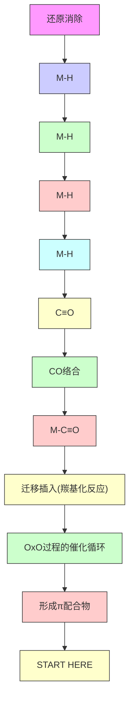
</details>

两个关键的迁移插入步骤的机理值得讨论。金属氢化反应 (hydrometallation) 通过先开始 $\pi$ 配合物的形成，之后金属对烯烃一端，氢对烯烃一端的加成反应发生。两种可能的区域异构体都会形成。羰基插入 (carbonyl insertion) 反应则是另一个由金属到 CO 碳原子的插入反应。

![[中文版clayden-chinese37-401000-1132_images/ca39db29f3ba91c35f341eb32b6a920c48aa4e8fc552d19c6c4fe0f53890d7e7.jpg]]

<details>
<summary>chemical</summary>

Reaction mechanism diagram showing π complex formation, metal hydrogenization, and羰基化 reaction steps
</details>

# 插入反应是可逆的

逆过程，脱羰基化反应 (decarbonylation)，同样是快速的，但它却会被在反应混合物上方持续的一氧化碳的压力所抑制。而金属氢化反应的逆过程涉及从金属烷基的邻位消除一个负氢，形成烯

![[中文版clayden-chinese37-401000-1132_images/9726506e2158b17a5a226afee115f0d6504f60442412c9e358c85f8c6e770150.jpg]]

Interactive mechanism for the O process

烃配合物。此过程被称为 $\beta$ 负氢消除反应 (hydride elimination) 或简单说 $\beta$ 消除。在此过程中，金属上的配题数目会增加，因而它需要金属上有空位，因此会被配体短缺的 16 电子配合物所喜欢。在更复杂的结构中，只有金属和负氢在碳链上彼此 syn 才能发生消除。产物是烯烃配合物，可以简单地通过配体交换失去中性烯烃。 $\beta$ 消除在很多过渡金属催化过程中都是重要的最后一步，但有时也会成为麻烦，比如我们无法使用 Pd-Et (或其他相似的 Pd-烷基) 络合物，因为它们的 $\beta$ 消除发生得太快了。

![[中文版clayden-chinese37-401000-1132_images/0ca3d1b6091e40a1732b648ec07748959130b905f9a4af529ad1b8c3a212b443.jpg]]

<details>
<summary>chemical</summary>

Reaction mechanism diagram showing β-hydrogen elimination of σ-methyl group to π-methyl group, followed by proton transfer
</details>

# 钯是均相催化中应用最广泛的金属

这些基本步骤构成了绝大部分有机过渡金属化学的基础，无论金属如何，配体的具体结构如何，它们都是相同的。过渡金属催化是一个庞大而快速发展着的领域，我们没有空间来详细地讨论。相反，我们会聚焦于一种重要且具有代表性的过渡金属：钯。在工业和学术实验室中，在小规模和非常大的规模上，Pd 催化反应都有广泛地应用。可以被 Pd 催化的反应的多样性，再加上它可以容忍很大范围的官能团存在，以及通常极好的化学和区域选择性，就意味着现今大多数复杂有机分子的合成都会在一个或多个关键步骤中涉及钯化学。

# 钯配合物的选择

钯(0) 和 钯(II) 都有多种可用的配合物可选。四三苯基膦钯(0)， $\mathrm{Pd(PPh_{3})_{4}}$ ，三(二亚苄基丙酮)二钯， $\mathrm{Pd}_{2}(\mathrm{dba})_{3}$ ，或其在空气中稳定的氯仿加合物， $\mathrm{Pd}_{2}(\mathrm{dba})_{3} \cdot \mathrm{CHCl}_{3}$ 是最常用的 钯(0)源。一些钯配合物的结构，尤其是二聚体的结构超出了本书的讨论范围，我们只会细致地讨论它们的反应。钯(II)配合物通常比它们对应的 钯(0) 配合物更稳定。二氯化物 $\mathrm{PdCl}_{2}$ 以聚合物的形式存在，相对不溶于有机溶剂。但 $(\mathrm{PhCN})_{2}\mathrm{PdCl}_{2}$ 和 $(\mathrm{MeCN})_{2}\mathrm{PdCl}_{2}$ (都很容易由 $\mathrm{PdCl}_{2}$ 制备)都是 $\mathrm{PdCl}_{2}$ 的可溶形态，腈配体很容易在溶液中被取代。二膦二氯合钯(II)配合物同样在空气中稳定，并且容易由 $\mathrm{PdCl}_{2}$ 制备。当然，钯是一种昂贵的金属——这些配合物的价格大约为每克 £50-100 (450-900 元)——但在催化反应中所需的量是非常小的。

![[中文版clayden-chinese37-401000-1132_images/9f3526ff3ae12cf75bb6f50335c834e329d061e959a3a80ada9a0c94a16d9fdd.jpg]]  
一种稳定的 Pd(0) 配合物 一种稳定的 Pd(II) 配合物

![[中文版clayden-chinese37-401000-1132_images/e8b00b05edc58b36fa3511e319a5a707f60459e3a8ecf3653016636559a26b99.jpg]]  
二亚苄基丙酮  
(dibenzylidene acetone)

让我们由对简单钯化学的一个综述开始，之后，您会在特定的情况下看到每个步骤更多的例子。钯化学由两种氧化态主导。较低的钯(O)，出现于如四三苯基膦钯中，是富电子的，并会与合适的底物，如卤代烃发生氧化加成反应，得到钯(II)配合物。氧化加成被认为是在通过在溶解中的配体解离形成的络合不饱和的14电子物种上发生的。

![[中文版clayden-chinese37-401000-1132_images/74b20fa164b1387066be16d1bcef3512b26c8b53a3212db6402d5efdd350e1b4.jpg]]

<details>
<summary>chemical</summary>

Reaction mechanism diagram showing palladium-catalyzed coupling with phosphine ligands and R-X catalyst
</details>

在这样的配合物中，所得的 Pd–R σ 键非常活泼，尤其容易与 碳–碳 π 键 (发生插入) 反应。在反应体系中，烯烃首先会络合，然后回迁移插入到 钯–碳 σ 键中。与金属氢化反应一样，此过程也是一个迁移插入反应，碳合钯连接在了烯烃的末端，因而被称为钯碳化反应 (carboplladation)。反应过程中没有氧化态的改变，但烯烃络合前必须先有配体 (通常是膦) 解离，最后得到稳定的 16 电子产物时也需要有配体结合。

![[中文版clayden-chinese37-401000-1132_images/803337c94d29f03114eb66d1ea3c1af5a6c9067d1f6ba852c90a5614c76bec08.jpg]]

<details>
<summary>chemical</summary>

Reaction mechanism of palladium(II) complex with Pd(II) ligand, showing carbon-boronization reaction and radical reorganization
</details>

如果用某些金属，烯烃络合合插入的过程还可能继续，导向聚合反应。但对于钯来说，金属会通过 $\beta$ -负氢消除 被排出分子之外，产物是一个烯烃与一个 Pd(II) 配合物。若要整个过程是催化性的， $\beta$ -负氢消除 的 Pd(II) 产物必须转化回 Pd(0)，此过程可通过碱从在碱的存在下，此过程可通过碱在钯(II) 物种上移去 HX 而发生。这是还原消除反应的一个例子：形成卤化氢，而非碳-碳键或碳-氢键。

![[中文版clayden-chinese37-401000-1132_images/d39a18a65fce73fea4260b8c9f248ef5dc7bd75412ad66b991013735e0cf8531.jpg]]

<details>
<summary>chemical</summary>

Reaction mechanism of palladium(II) to palladium(0) using β-hydride and alkoxide, forming a phosphorus-containing intermediate
</details>

β-负氢消除 是分子内反应，发生得非常快，这意味着我们必须小心地选择氧化加成反应的起始底物（否则在氧化加成之后，消除反应会直接在 $R^{2}$ 上发生）——必须避免 β 位 $sp^{3}$ 碳上氢的存在。因此，钯化学氧化加成反应的底物常是烯基卤、烯丙基卤或芳基卤，绝不会是乙基或异丙基卤。

# Heck 反应将有机卤代烃或三氟甲磺酸酯与烯烃偶联

以上列出的所有单独步骤结合在一起，就组成了用于开始本章的 Heck 反应 (reaction) 的催化路径。Heck 反应可将烯烃与卤代烃或三氟甲磺酸酯 R $^{1}$ -X 偶合形成新的烯烃。The R $^{1}$ -X 中的 R $^{1}$ 可以是芳基、烯丙基，或其他不具有在 sp $^{3}$ 碳原子上的 β 氢的烷基。X 基团可以是卤素 (Br 或 I) 或三氟甲磺酸根 (OSO $_{2}$ CF $_{3}$ )。烯烃可以是单取代或双取代，可以是富电子、缺电子，或普通。碱不需要很强，Et $_{3}$ N、NaOAc，或 Na $_{2}$ CO $_{3}$ 水溶液都可以。反应非常肯通融。

# 三氟甲磺酸酯

三氟甲磺酸酯阴离子， $\mathrm{CF_3SO_3^-}$ 或 $\mathrm{TfO^-}$ ，是极好的非碱性离去基团。它常被用做卤素的氧替代物，金属也会插入 $\mathrm{C - OSO_2CF_3}$ 键。三氟甲磺酸酯，尤其是三氟甲磺酸烯醇(酚)酯，可以方便地用Comins试剂(Comins'reagent)制取。

Comins 试剂  
![[中文版clayden-chinese37-401000-1132_images/1bb66312aa892bb0de791b5ba13705688ad53b221a3edb85f14ebfc50948045c.jpg]]

<details>
<summary>chemical</summary>

Chemical reaction equation showing chlorinated pyridine derivative reacting with aryl alcohol under basic conditions to form aryl trifluoromethyl and aryl toluoroacetate
</details>

![[中文版clayden-chinese37-401000-1132_images/2aba0f2eeba387288a92005f22b75eaa78ad603d16042ed387361cdac98f0d6e.jpg]]

Interactive mechanism for the

Heck catalytic cycle

Heck 反应

![[中文版clayden-chinese37-401000-1132_images/efd411caa1668bd7fb997e6ee28e0169694c468ceab930704379c92b4c7c1678.jpg]]

<details>
<summary>chemical</summary>

Chemical reaction equation showing hydrogenation of a ketone to form a radical intermediate and hydrogenated product
</details>

![[中文版clayden-chinese37-401000-1132_images/f92518cf6eff4f4157f30abac7ef5bd320e4c844ea7537f07cc90789c07216ed.jpg]]

<details>
<summary>flowchart</summary>


</details>

此芳基、烯基或取代的烯基对卤代烷、三氟甲磺酸的钯催化加成反应是在合成上最重要的钯催化反应之一。此方法非常有效，解决了传统奇数难以完成的转换。机理涉及卤代烃的氧化加成，烯烃的插入，和产物通过 $\beta$ -负氢迁移过程的消除。然后碱回重新生成钯(0)催化剂。整个过程是一个催化循环 (catalytic cycle)。

下面是用 Heck 反应偶合两个杂环底物的例子。化学反应很简单，但没有 Pd 催化剂是不可行的。

![[中文版clayden-chinese37-401000-1132_images/e9e2489bf3bcafcba0af57795d9cd2a626e824914963d913c1317094f6d1ddd8.jpg]]

<details>
<summary>chemical</summary>

Chemical reaction equation showing brominated pyridine reacting with a ketone under Pd(OAc)2 and PAr3 conditions
</details>

注意观察区域选择性：和 p. 1077 的羰基化反应不同，Heck 反应只喜欢一种异构体，当烯烃被吸电子基团极化时，新的 C-C 键会在烯烃的另一端形成。同样注意观察，在这个例子是下面的两个例子，Pd 以 Pd(II) 而非 Pd(0) 加入：下方文字框说明了作用的方式。

Heck 反应的温和条件意味着可以在不发生外消旋化的情况下制取被保护的氨基酸。下面的两个例子使用了更大空阻的三苯基膦类似物，机理仍然是相同的。

![[中文版clayden-chinese37-401000-1132_images/f1c9b9a679d3ee416605ab5730fae6bdaddd4ace49ada2b791750f679a540dbc.jpg]]

<details>
<summary>chemical</summary>

Chemical structure of a substituted benzene derivative with P, Me, and tri(o-tolyl)phosphine groups
</details>

![[中文版clayden-chinese37-401000-1132_images/c8a81365d1244011f0951109d1870b0939d876ad4712d9bb09a2b028822348ef.jpg]]

<details>
<summary>chemical</summary>

Two organic reaction schemes showing Pd-catalyzed cyclization of a brominated cyclohexanol derivative with amide and ketone to form enones with 77% and 87% yields.
</details>

# 通过 Pd(II) 的还原原位形成 Pd(0)

在需要钯(0)的反应中，活性配合物可能会由钯(II)配合物，如 $\mathrm{Pd(OAc)_2}$ 的还原反应而更方便地形成。这样，任何膦都可以应用在反应中，而不需要合成和分离相应的钯(0)-膦配合物。钯(II)到钯(0)的还原反应可以用胺、膦、烯烃，有机金属，如DIBAL-H、丁基锂、三烷基铝完成。机理由金属有机化学的基本步骤构成，值得我们调查。

![[中文版clayden-chinese37-401000-1132_images/a4e015086a8a5b59ebece9ad5f93c9f0a72cc2ab49e18bb288970e17fe9c7dc7.jpg]]

<details>
<summary>flowchart</summary>

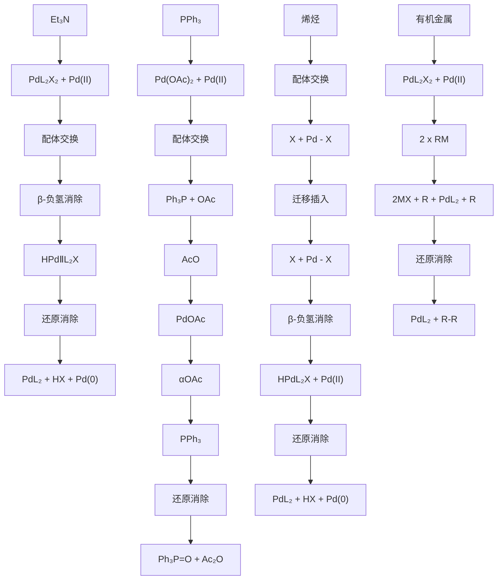
</details>

这样画岂不是更好？

![[中文版clayden-chinese37-401000-1132_images/afff9d7a63d88adb3203348304f0564fb3c92093a8b08351e19f8c09463c651d.jpg]]

与之相比，如果烯烃上有醚等给电子基团取代，则会导致进攻发生在有取代基的一端，产出1,1-双取代产物。这些反应一定是被烯烃充满的 $\pi$ 轨道与Pd的空d轨道之间的相互作用所主导的。在下面的例子中，即使没有膦配体，Heck反应也能很好地工作。

![[中文版clayden-chinese37-401000-1132_images/0ea94937d794b20ca70979e6e531258ddec92369a640e54d68d1325ff83963cb.jpg]]

<details>
<summary>chemical</summary>

Palladium-catalyzed reaction mechanism of benzyl ether with ethylene under specified conditions
</details>

由于 $\beta$ -负氢消除是可逆的，因此如果有选择的话，通过得到可能的烯烃中最稳定的一个。烯丙醇的反应尤其重要，因为两种烯烃中最稳定的一种是烯醇，并会形成羰基化合物。

![[中文版clayden-chinese37-401000-1132_images/e8e9574be2d6dfd4db4ff7cb04d165cc7279eb9a8889581c5c617742591dea07.jpg]]

<details>
<summary>chemical</summary>

Palladium-catalyzed reaction of aldehyde with alkene, showing intermediate and final product with phenol and alcohol
</details>

# 钯氢化-脱钯氢化反应可能使烯烃异构化

可逆的 $\beta$ -负氢消除提供了一种使烯烃区域异构体相互转化的机理。但还原消除反应还有另一个特点，下面的机理流程对其进行了说明：它是一个syn消除，C-Pd和C-H键需要彼此重叠，Pd-H键才能形成。芳基碘对由 $\mathrm{Pd(OAc)_2}$ 通过还原反应形成的钯(0）配合物的氧化加成反应，会给出活性的钯(II)配合物 $\mathrm{ArPdOAcL_2}$ 。钯碳化反应会在富电子烯烃上如预期地发生，给出芳基对烯烃氧一端syn加成的产物。但此时，芳基所连的碳上没有C-H键与C-Pd键syn(注：环限制构象)，因此 $\beta$ -负氢消除必须在远离芳基的一侧发生，于是双键在环上移动了一个位置。(译者注：即环状烯烃的Heck反应双键不能重新生成在原本的位置上。)

![[中文版clayden-chinese37-401000-1132_images/9291c0cb12a6b8cef64e9875ad98a3ea0b4bf68648e93c7cc22e940b2b7067f1.jpg]]

<details>
<summary>chemical</summary>

Organic reaction mechanism showing palladium-catalyzed cyclization with Pd(OAc)2 and Bu4NCl, followed by elimination of green hydrogen
</details>

再逆回去发生钯氢化反应，会形成新的 $\sigma$ 配合物，既可以消除黑色氢，又可以消除绿色氢。对绿色 H 的消除给出烯醇醚，由于共轭，这是可能的烯烃中最稳定的一种。

![[中文版clayden-chinese37-401000-1132_images/b2a93379a449d407a89127a9383d4e0ecef5337c4ab4d9b2f2fa417e4f550a66.jpg]]

<details>
<summary>chemical</summary>

Palladium-catalyzed reaction mechanism showing hydrogenation, β-elimination, and 78% yield
</details>

将产物与碘萘发生第二个 Heck 反应:

![[中文版clayden-chinese37-401000-1132_images/0fed7ca7fd5947fced2de7b96b2c7a19c4fa8e5ef18bf13c68afc1176ff36fb3.jpg]]

<details>
<summary>chemical</summary>

Organic synthesis reaction showing conversion of a substituted furan derivative to a chiral alcohol using palladium catalyst and Ag2CO3 catalyst
</details>

起初的机理大体是相同的。然而，烯醇醚具有两个非对映异位面：与第一步引入的芳基取代基 $(\mathrm{Ar}^{1})$ syn 或 anti 的两面。钯对空阻非常敏感，通常会形成可能的配合物中空阻较小的，因而钯(II)会络合在烯醇醚与 $Ar^{1}$ anti 的面上。这转而又控制了流程中必须是 syn 的所有步骤，最终产物于是具有 anti 立体化学。syn β-负氢消除的需求同样解释了消除中存在的区域化学。在 σ-键合环状结构中，只有一种氢 (绿色) 与钯 syn；带有萘基取代基的碳上的氢与钯 anti，无法消除。可逆的 β-负氢迁移容易导致产物中双键到 $Ar^{1}$ 进一步的异构化，加入的碳酸银可迅速地移去中间体中的碘离子，从而阻止 Pd-H 进一步的钯氢化反应并解决异构化的问题。

![[中文版clayden-chinese37-401000-1132_images/92063484d35a7ac7490df809295f8ed6e0296dc5b0e73bb3994dcb7c755872f7.jpg]]

<details>
<summary>chemical</summary>

Organometallic reaction pathway showing palladium-catalyzed transformation with phosphorus ligand and alkyl halide elimination steps
</details>

# 有机金属和卤代烃的交叉偶联

除 $\beta$ -负氢消除外，另一个将钯(II)中间体转化为中性有机碎片的重要途径是还原消除反应。这形成了金属有机试剂与卤代烃、三氟甲磺酸酯交叉偶联反应 (cross-coupling reactions) 的机理的基础。

![[中文版clayden-chinese37-401000-1132_images/2d4a626fdea147481c102832fc985e7e6d25e0796be29b5e1fb51be199f60494.jpg]]

<details>
<summary>chemical</summary>

Chemical reaction equation showing Pd(0) catalysis with R¹-M and M-X under different conditions
</details>

从合成的角度，这是一个看上去非常吸引人的反应，但若没有过渡金属催化剂的存在，产率会非常低。我们在 Chapter 27 中展示了在对立体化学的控制下制取乙烯基硅烷/锡烷并将其构型保持地转化为锂衍生物的过程。这两种乙烯基金属都不能独立与乙烯基卤偶联。但在过渡金属——Li 用 Cu(I)，Sn 用 Pd(0)——的存在下，偶合可以立体专一性地以很好的产率发生。

![[中文版clayden-chinese37-401000-1132_images/9765cff758e635f58c609e118bbc54e5df3c41056aba5f832b7d41e1f497da12.jpg]]

<details>
<summary>chemical</summary>

Chemical reaction scheme showing deprotonation and subsequent reduction of a silyl enol ether using SnBu3 catalyst under Pd(0) conditions
</details>

钯催化的交叉偶联反应的机理，如 Heck 反应中一样，开始于卤代烃或三氟甲磺酸酯对起始的钯(0)膦配合物的氧化加成反应，形成钯(II)物种。但下一步是不同的：会发生转金属反应(transmetallation)，其中亲核试剂 $(\mathbb{R}^1)$ 从有机金属试剂上转移到了钯上，钯上原有的反号离子 $(X =$ 卤素或三氟甲磺酸根）则按相反方向移动。新的，具有两个有机配体的钯(II)配合物会经历还原消除反应，给出偶合产物和准备进入下一个循环的钯(0)催化剂。

![[中文版clayden-chinese37-401000-1132_images/5918b85142dcf48da351d17422918930ae70657d189c6af158537ab6fe77739e.jpg]]

<details>
<summary>chemical</summary>

Palladium-catalyzed reaction mechanism involving oxidation, metal recombination, and reduction steps
</details>

这个反应是重要的，因为他可以让两个不同的，一个与金属 M 成键，一个与卤素或三氟甲磺酸根 X 成键的组分 $\left(\mathrm{R}^{1}\right.$ 和 $\left.\mathrm{R}^{2}\right)$ 偶合。这两个组分都与 Pd 形成 $\sigma$ 配合物，首先是卤代烃组分 $\left(\mathrm{R}^{2}\mathrm{X}\right)$ 通过氧化加成反应成键，此 $R^{2}-Pd$ 键必须能存活，然后金属组分 $\left(\mathrm{R}^{1}\mathrm{M}\right)$ 将 $R^{1}$ 通过转金属反应转移到 Pd 上。一旦两个组分都连接到钯原子上，交叉偶联产物就可以形成了。 $R^{2}X$ 与 $\mathrm{Pd}(0)$ 结合， $R^{1}M$ 与 $\mathrm{Pd(II)}$ 结合，没有混淆存在。相比于 Heck 反应，在此反应中金属确定了新 C-Pd 键形成的位置。

$$
\begin{array}{c} \mathrm{PdL} _ {2} \\ \mathrm{Pd(0)} \end{array} \xrightarrow [ \text {氧化加成反应} ]{\mathrm{R} ^ {2} \mathrm{X} \text {与Pd(0)反应}} \xrightarrow [ \mathrm{Pd(II)} ]{\mathrm{X}} \xrightarrow [ \text {转金属反应(慢)} ]{\mathrm{R} ^ {1} \mathrm{M} \text {与Pd(II)反应}} \xrightarrow {\mathrm{M-X}} + \begin{array}{c} \mathrm{R} ^ {1} \\ \mathrm{R} ^ {2} - \mathrm{PdL} _ {2} \end{array}
$$

卤代烃组分 (R²X) 必须小心选择，因为 β-负氢消除 会在慢的转金属步骤发生前分解第一个中间体。R² 必须是没有在 sp³ 碳原子上的 β 氢原子的取代基，如烯基、烯丙基、苄基、全氟烷基卤、三氟甲磺酸酯、磷酸酯都曾成功地偶联过。有机金属试剂 (R¹M) 可以基于镁、锌、铜、锡、硅、锆、铝或硼，由于最后还原消除的偶联反应快于 β-负氢消除，因而取代基有很广的多样性。

$R^{1}-M$ $R^{1}=$ 几乎可以随意选择，包括有 $\beta H$ 的基团

$$
\mathrm{M} = \mathrm{MgX}, \mathrm{ZnX}, \mathrm{Cu}, \mathrm{SnR} _ {3}, \mathrm{SiR} _ {3}, \mathrm{ZrCp} _ {2} \mathrm{Cl}, \mathrm{AlMe} _ {2}, \mathrm{B} (\mathrm{OR}) _ {2}, \mathrm{BF} _ {4} ^ {-} \quad \begin{array}{l} \mathrm{Cp} = \text {环戊二烯基} \end{array}
$$

$R^{2}-X$ $R^{2}$ 必须没有可以消除的 $\beta Hs$ X = I, Br, (Cl), OTf, OPO(OR) $_{2}$

![[中文版clayden-chinese37-401000-1132_images/729c108aa4b2834fb90aa653f018cdff1c72d4b5e7351d09bbab66eb4c829197.jpg]]

<details>
<summary>chemical</summary>

Chemical reaction equation showing aryl substitution with alkene and acrylate groups, yielding R_F as a ketone and R_F as an alkane
</details>

芳基碘和芳基甲磺酸酯在相对活性上的区别，被用有机锌试剂连续偶联制取取代三联苯 (terphenyl) 的合成流程中得到了应用。较活泼的芳基碘可在室温下与钯(0)与三呋喃基膦偶联，然后加热到 $65^{\circ}$ C 可发生与较不活泼的芳基甲磺酸酯的第二个偶联。

在命名两个搭档上存在着困难。卤代烃组分 $(\mathsf{R}^2\mathsf{X})$ 有时也被叫做亲电试剂，有机金属组分 $(\mathsf{R}^1\mathsf{M})$ 有时被叫做亲核试剂。这些名称描述了试剂的性质，但并不能反映反应机理，我们不会使用它们。

# 被命名的偶联反应

涉及基于 B, Mg, Sn 和 Zn 的有机金属组分的钯催化偶联反应尤其重要，常用它们发现者的名字指代：B 为铃木 (Suzuki) 偶联，Mg 为熊田 (Kumada) 偶联，Sn 为 Stille 偶联，Zn 为根岸 (Negishi) 偶联。

![[中文版clayden-chinese37-401000-1132_images/2a0f3c6167c8f1e0a675016d32ac5299df675acab1f866ec2f563ea6aa093f22.jpg]]

<details>
<summary>chemical</summary>

Chemical reaction scheme showing synthesis of 74–89% yield using ZnBr and Pd(dba)2 catalysts
</details>

# ■ 金属有机诺贝尔奖

金属有机化学一直是诺贝尔奖委员会认可的热门话题。1912年，Grignard (Mg) 获奖，1973年Wilkinson和Fischer因“夹心(sandwich)”化合物(如二茂铁)获奖，2005年，Chauvin, Grubbs, 和Schrock因烯烃复分解反应获奖，2010年，Heck, 根岸英一和铃木章(Stille在1989年去世)因过渡金属催化的偶联反应获奖。

在三氟甲磺酸酯的反应中，通常还需要卤离子源(通常是 LiCl)，因为三氟甲磺酸酯是非络合性反号离子，可能不会作为配体与金属结合：氯离子可以起到这一角色。

尽管可以选用的有机金属试剂有非常广的范围，但被证明尤其受欢迎的只有两类，它们本身是很稳定的中间体，可以在偶联反应之前分离地制备和纯化。它们的交叉偶联反应，被以使它们有价值的两位化学家命名。Stille 偶联采取锡烷作为有机金属组分 (R $^{1}$ M)，铃木 (Suzuki) 偶联则基于硼酸。

# Stille 偶联用锡烷作为有机金属试剂

自于 1970s 后期被发现以来，Stille 偶联已被广泛地用于芳基及烯基体系的偶联中。

![[中文版clayden-chinese37-401000-1132_images/8e61817a040bb0c9e0232da7dd00ed3f415cc2b01aa4de10de510457313f7cb8.jpg]]

<details>
<summary>chemical</summary>

Chemical reaction equation showing synthesis of a cyclopentadiene derivative using Pd(PPh₃)₄ catalyst under LiCl/THF conditions
</details>

机理涉及烯基或芳基卤、三氟甲磺酸酯的氧化加成反应，给出有机钯中间体。此中间体与有机锡烷的转金属反应会形成另一个带有两根 Pd-C σ 键的有机钯中间体。然后，还原消除步骤会释放产物，并重新生成钯(0)催化剂。三氟甲磺酸烯基酯可由可烯醇化的醛、酮制得 (注：p.1079 有 Co-mins 试剂)，芳基酯可由苯酚制得，反应对于烯基、芳基卤也可以工作。

![[中文版clayden-chinese37-401000-1132_images/0ea057d29bfd18d805b81da1435a26c62e2cf4ac6adff5a77a0aab77f280f0f4.jpg]]

<details>
<summary>chemical</summary>

Palladium-catalyzed reaction mechanism involving lithium chloride, metal reagent, and phosphorus catalyst
</details>

Interactive mechanism for the Stille coupling catalytic cycle

Stille 反应被广泛地应用于两个 $sp^{2}$ 碳原子之间的键的构筑上，不过它也能与 sp 碳工作：下面的例子是一个具有挑战性的具有两个炔烃的 10 元环合成。

![[中文版clayden-chinese37-401000-1132_images/715c20ad084c8f98870a8eec8686354404ecec24bf98fe9a31cab6bb6b63499b.jpg]]

<details>
<summary>chemical</summary>

Chemical reaction scheme showing conversion of a bis-siloxane derivative to a chiral alcohol using catalyst Pd(PPh₃)₄ and THF, yielding 46% yield
</details>

Stille 偶联可能以两种方式与羰基化反应结合。可以用酰氯作为与烯基、芳基锡烷反应的底物，为防止在氧化加成后发生脱羰基化反应，经常需要一氧化碳气氛的存在。

![[中文版clayden-chinese37-401000-1132_images/1a0c064b29a1ec96e0abdf379f4397407581b662d3ca26ebabd9084b2a95717d.jpg]]

<details>
<summary>chemical</summary>

Chemical reaction equation showing conversion of a furan derivative to a ketone using PdCl2(PPh3)2 catalyst under THF conditions
</details>

在一氧化碳的存在下，简单地进行一般的 Stille 反应也可以得到羰基化的产物。这些反应可以在一个大气压下的 CO 饱和溶液中进行。使用这些条件，可以获得极好产率的羰基化产物，而没有任何一般偶合产物存在。

![[中文版clayden-chinese37-401000-1132_images/e000e1170425d17ef4f80655878717158448e7ceb21b718e86d21780d869c1ee.jpg]]

<details>
<summary>chemical</summary>

Organic synthesis reaction showing iodination of allylic benzene with Me3Sn catalyst under catalytic conditions
</details>

机理遵循正常的 Stille 偶联，除了在氧化加成后，一氧化碳会首先交换其中一个膦配体，然后非常迅速地发生插入反应，产出酰基钯(II)配合物。与烯基锡烷寻常方式的转金属反应会形成三甲基锡基碘和携有两个碳配体的关键的钯配合物。转金属反应往往是这些偶合反应中的慢步骤，这位一氧化碳的插入提供了时间。最后的步骤——还原消除——会为下一轮循环释放 Pd(0) 催化剂。

![[中文版clayden-chinese37-401000-1132_images/a1ff8d301ec1e3b918b5215950eedf368247374b7b270ed99ee6ae5d2bf737d8.jpg]]

<details>
<summary>chemical</summary>

Palladium-catalyzed reaction mechanism involving PdI, PdII, and Me3Sn with metal reagents and conditions
</details>

# 酰基钯物种像被活化的羰基衍生物一样反应

卤代烃或三氟甲磺酸酯的羰基化反应提供了一种制取一系列延长碳链了的酰基衍生物的直接途径。PdX (X = 卤素或三氟甲磺酸根) 取代的羰基是非常活泼的酰基化试剂，和酸酐相当相似，因为 PdX 是好的离去基团。它可以与醇和胺反应给出酯和酰胺，也可以与三丁基氢化锡发生还原反应给出醛。醇的分子内进攻可给出内酯，下面由烯基碘得到 2H-呋喃酮 (白术内酯 butenolide) 的转换可以说明。我们之后将看到更多这样的反应。

![[中文版clayden-chinese37-401000-1132_images/e045038d14df91c6e25890f246650c82ac812297645c6c49e010ec2a05ad35b7.jpg]]

<details>
<summary>chemical</summary>

Reaction mechanism of palladium-catalyzed cyclization with CO insertion and reduction reaction
</details>

# 铃木偶联将硼酸与卤代烃偶联

硼酸或硼酸酯与烯丙基或芳基卤、三氟甲磺酸酯的铃木偶联反应可能是所有交叉偶联反应中最常用的一个。其原始版本最早被报道于 1979 年，包含炔烃与儿茶酚硼烷 (catecholborane) 的硼氢化反应 (hydroboration)，然后是所得的烯基硼酸酯与有机碘或有机溴的钯(0)-催化偶联反应。硼氢化反应通常区域选择性在较小空阻的位置上，硼和氢的加成则以顺式立体专一性发生。

![[中文版clayden-chinese37-401000-1132_images/5ecf003c27e3519e40e99f6efb5744e05fdf6e7bd720493d397e2c84b211b173.jpg]]

<details>
<summary>chemical</summary>

Reaction mechanism of boronate ester under heating and nitration with硼氢化 reaction, followed by Pd(PPh₃)₄ catalysis
</details>

![[中文版clayden-chinese37-401000-1132_images/8ef5da6a803599d20cbefa3405bac097f9b0f06e4027e51ea7a1c20cef2ef6de.jpg]]

Interactive mechanism for the
ponylative Stille coupling
alytic cycle

![[中文版clayden-chinese37-401000-1132_images/8ce90c8e386381341a16065892440639088ec34d6fd614121d2c827c6827560e.jpg]]

Interactive mechanism for
ladium-catalysed carbonylative
enolide formation

![[中文版clayden-chinese37-401000-1132_images/f9f09669d35d0839d3dce58450999ed6b2f320597c98be8b0348d520b67fe98b.jpg]]

硼氢化反应已于 Chapter p. 446 涵盖。

一些控制双键几何结构的烯烃合成法已于 Chapter 27 中涉及。

和 Stille 偶联一样，两种不饱和组分的几何结构都会在偶联过程中保留，因此这是一个立体选择性地合成双烯的极好方法。辛炔进行硼氢化反应之后将硼酸酯水解，可专有地得到 E-烯基硼酸。它与 Z-烯基溴在甲苯中发生钯(0)催化的偶联，氢氧化钾做碱，以很好的产率给出 E,Z-双烯。这些双烯在 Diels–Alder 反应中 (Chapter 34)非常有用。

![[中文版clayden-chinese37-401000-1132_images/71f6193145ae2a12649f797bd5c534dddb498b099422b98326dbf9bc4ced8069.jpg]]

<details>
<summary>chemical</summary>

Bromination reaction of a boronic acid using C6H13 and H2O, yielding 90% and 75% yields with PPh3PdCl2 catalyst
</details>

这类反应一直被用于大量天然产物中不饱和单元的合成，包括 trisporol B 的合成。关键的步骤是立体控制的一个 E,Z-双烯的合成。两个双键的几何结构都立体专一性地来源于单一几何异构体起始原料在反应中的构型保持。

![[中文版clayden-chinese37-401000-1132_images/1a40f53708e0c19a60444b68ce2f0f3125d03426d6c5003754c98174a871af99.jpg]]

<details>
<summary>chemical</summary>

Chemical reaction equation showing bromination of a bipyridine derivative using Pd(PPh3)4 catalyst under NaOEt conditions
</details>

铃木偶联的机理与 Stille 偶联非常相似。烯基或芳基卤对 钯(0) 配合物氧化加成，生成一种 钯(II) 中间体。它然后经历与烯基硼酸酯的转金属反应，产物从所得中间体中通过还原消除排出，并重新生成 钯(0) 催化剂。重要的区别在转金属步骤中，这解释了铃木偶联需要额外碱，通常是乙氧基、氢氧化钠、钾的原因。碱可能通过形成更亲核的“酸根 (ate)”配合物，加速了直接导向硼酸酯的转金属步骤。

![[中文版clayden-chinese37-401000-1132_images/a3184d8df3776ad6eb30ff074b0cb44f31795554f5e0b0ddfd3d7e8d9e7f4b94.jpg]]

<details>
<summary>chemical</summary>

Bromination reaction mechanism of benzodioxole using NaOEt and BrPdL2, showing conversion to NaBr via metal recombination
</details>

Interactive mechanism for the Suzuki coupling catalytic cycle

铃木偶联能很好地容忍对空间要求高的产物，并且常被用作芳基-芳基交叉偶联。下的例子在新形成的键(黑色标注)周围有三个邻位取代基，但仍能以极好的产率发生。

![[中文版clayden-chinese37-401000-1132_images/109f6c27f59312768057b982405f377ce39b0232e63e5a4a9f0abf6ff85d014d.jpg]]

<details>
<summary>chemical</summary>

Chemical reaction equation showing boron-containing compound reacting with iodomethane under palladium catalysis to form a substituted benzene derivative, with 85% yield noted.
</details>

芳杂环同样能很好地偶联。吡啶的 2 号位非常亲电，非常不亲核 (Chapter 29)，不过在此位置的卤代烃与在此位置的硼酸的偶合反应是很好的。很明显，这是将这些底物看作贡献“亲核碳”的错误所在。我们最好将这个反应看作两个具有不同取代基（卤原子或硼酸基），控制元素只是为了确保交叉偶联的发生而防止二聚的，同等组分的偶合反应。

![[中文版clayden-chinese37-401000-1132_images/54c9cf6c032bb59be73a5bad486675c7ac515e6df49e0aded70c04b8729984fa.jpg]]

<details>
<summary>chemical</summary>

Two chemical reaction schemes showing bromination and deprotection of a brominated compound using Pd(PPh3)4 catalysts, yielding 56% and 83% respectively.
</details>

# 与炔烃的偶联: 菌头偶合反应

末端炔烃与芳基或烯基卤在钯催化下的偶联反应被称为菌头反应 (Sonogashira reaction)，它很像 Heck 反应。它是一个催化过程，需要 钯(0) 配合物；它在碱的存在下进行，通常用碘化亚铜作为共催化剂 (co-catalyst)。其中一个组分——芳基或烯基卤——与 Stille 和 Suzuki 偶联中的一样，但炔烃组分不需要金属活化：该反应可与烯烃本身发生。

![[中文版clayden-chinese37-401000-1132_images/1932b8ad37e3fbfde4ead63312dbbd039b56a522d9690aeae1cfdbb34ca69228.jpg]]

<details>
<summary>chemical</summary>

Chemical reaction equation showing aryl-X reacting with H-≡R under Pd(0) and CuI in Et2NH to form Ar-≡R and Et2NH.HX, with yield and time noted.
</details>

通常采取温和的条件，经常是室温，这意味着这个反应可以用于热敏感底物。到目前为止，您不应该对机理感到奇怪！有机卤代烃的氧化加成反应会给出 钯(II) 中间体，继而与炔基亚铜（由末端烯烃、碱、碘化亚铜生成）发生转金属反应。两个有机配体偶合的还原消除反应可给出产物，并重新生成 钯(O) 催化剂。

![[中文版clayden-chinese37-401000-1132_images/77e7ae309a1cf8a1e78829c87492521246e84cb055cb43e3be15f5cc596aa92b.jpg]]

<details>
<summary>chemical</summary>

Redox reaction mechanism of aryl halide with Pd(0) catalysis, showing intermediate formation and reduction steps
</details>

和 Heck 反应中一样，用稳定而可溶的 Pd(II) 衍生物，如二三苯基膦二氯合钯(II) 替代 Pd(0) 通常会让反应更方便。前者会被原位还原，给出络合不饱和的，具有催化活性的钯(0) 物种。烯烃的几何结构通常会保持，因此顺式 (Z) 和反式 (E) 的二氯乙烯会给出烯炔 (enyne) 的两种不同几何异构体，立体化学纯度稍低于 >99%，产率同样极好。

![[中文版clayden-chinese37-401000-1132_images/ef6cd1a9b3ee504e03aaad3a245fcc6b346e518028bfecb7cbbd028f1925c120.jpg]]

<details>
<summary>chemical</summary>

Two organic reaction schemes showing Pd-catalyzed cyclization of a ziridine derivative with BuNH2 under 25°C for 5 hours, yielding 95% and 98% yields respectively.
</details>

# 烯二炔和 Bergmann 环化

菌头反应提供了制取烯二炔 (ene-diyne) 抗生素的一种重要方法。由两分子末端烯烃和 Z-二氯乙烯即在一步中合成烯二炔。分子中的烯二炔部分可以发生引人注目的 Bergmann 环化 (cyclization，伯格曼环化) 给出苯双自由基：烯二炔能够穿透 DNA，发生反应所得的双自由基也可以与后者反应，使化合物具有抗癌活性。菌头反应可用于制取这种在生物上最具活性的化合物，反应按流程发生，因而每个炔烃单元上的官能团也可以不一样。

![[中文版clayden-chinese37-401000-1132_images/1bae50f34a459a886e6aaeb768c5bf7b5fa8fdd956e48576619fa688ea586ba2.jpg]]

<details>
<summary>chemical</summary>

Two-step organic synthesis reaction scheme involving palladium-catalyzed coupling and hydrogenation, with yields and conditions noted
</details>

# - 钯催化偶合反应：总结

<table><tr><td>将芳基卤或烯基卤与...偶合</td><td>典型例子 (X=I, Br, OTf)</td><td>页码</td><td>反应名称</td></tr><tr><td>烯烃</td><td>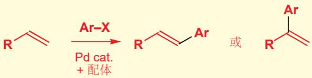</td><td>1079</td><td>Heck</td></tr><tr><td>芳基或烯基锡烷</td><td>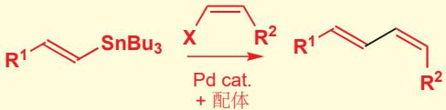</td><td>1084</td><td>Stille</td></tr><tr><td>芳基或烯基硼酸(酯)</td><td>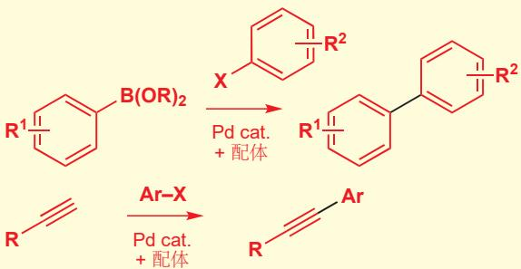</td><td>1085</td><td>铃木</td></tr><tr><td>炔烃</td><td></td><td>1087</td><td>菌头</td></tr><tr><td>胺</td><td>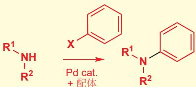</td><td>1092 (本章后文)</td><td>Buchwald-Hartwig</td></tr></table>

# 烯丙型亲电试剂被钯(0)活化

具有好的离去基团，如溴和碘的烯丙型化合物是极好的烷基化试剂，但由于 $S_{N}2$ 和 $S_{N}2'$ 反应间的竞争，它们会丧失区域化学。这些问题已于 Chapter 24 中描述。与之相比，与钯络合的 $\pi$ -烯丙基阳离子 ( $\pi$ -allyl cation) 与亲核试剂的取代反应则既可以控制立体化学，又可以控制区域化学。

![[中文版clayden-chinese37-401000-1132_images/1d1a6c33f66f56a37160febc7d9ea0d29dcc47f58ca9f5184ad6078af7c485f8.jpg]]

<details>
<summary>chemical</summary>

Chemical reaction equation showing palladium-catalyzed coupling of a halide to an enol under nucleophile, with Pd center and phosphorus ligand
</details>

另外，这会使通常认为不活泼的离去基团 (X) 能够工作，使起始原料的纯化的处理更加容易。乙酸根 (X=OAc) 是最常用的离去基团，大量其他的官能团 (X=OCO₂R, OPO(OR)₂, Cl, Br, OPh) 也可扮演相似的角色。完整的催化循环如下所示，中间体 π-烯丙基络合物处在离去基团与钯络合的中性形态与阳离子型 π-烯丙基配合物的平衡中。

![[中文版clayden-chinese37-401000-1132_images/1e98da679bf151366a57a8a000789c650d7d853868e6d9e48782f060c9be0aef.jpg]]

<details>
<summary>chemical</summary>

Palladium-catalyzed reaction mechanism involving PdL2 and X, showing intermediates and products like π and η³ catalysts
</details>

软的亲核试剂通常会给出最好的结果：被稳定的烯醇盐，如缩苹果酸酯的烯醇盐，或氰根用于碳-碳键形成都是极好的，对于 C-X (X=O, N, S) 键形成，用烷氧基阴离子、胺、烷硫基阴离子 $(\mathrm{RS}^{-})$ 也可成功。在下面的例子中，胺做亲核试剂进攻烯丙基体系并重新生成在环内有双键的更稳定的产物。

![[中文版clayden-chinese37-401000-1132_images/b07e7ed6ddccab76c1b2b155452acb694923f0a664bcb3b794a1c03149a4881f.jpg]]

<details>
<summary>chemical</summary>

Palladium-catalyzed reaction mechanism involving palladium complexes and intermediate intermediates
</details>

分子内反应也能很好地工作以给出杂环——区域选择性通常由链的长度，可以到达多远来决定。下面的例子更倾向于6/5并环产物，而不是包含两个七元环的桥环产物。

![[中文版clayden-chinese37-401000-1132_images/4e3f4b87247ee52343c34e455161e6e05be26517d3aa7d7ab4a1094ad0834edc.jpg]]

<details>
<summary>chemical</summary>

Palladium-catalyzed cyclization reaction of a chiral amine to form a chiral intermediate, with PdLn and NHBn reagents indicated.
</details>

反应通常伴随在反应中心的构型保持发生。和构型保持的 $S_{N}2$ 取代一样 (Chapter 36)，这事实上是两次翻转所导致的。Pd 与乙酸烯丙酯的络合会在与离去基团反方向的较小空阻的一面发生，于是我们可以将氧化加成步骤想象成是离去基团被 Pd 的电子对有翻转的取代反应。亲核试剂然后会

# Pd $\pi$ -烯丙基阳离子配合物

您可以用两种方式表达钯 $\pi$ -烯丙基阳离子络合物。您可以画成与 $Pd^{+}$ 络合的中性烯丙基，也可以画成与Pd络合的烯丙基阳离子。虽然计数方式不同( $Pd^{+}$ 只有九个电子；中性烯丙基有三个，但烯丙基阳离子也只有两个)，总计都是 $\eta^{3}16$ 电子物种，它们只是同一事物的两种不同画图方式。

Pd $\pi$ -烯丙基阳离子配合物  
![[中文版clayden-chinese37-401000-1132_images/b0d3fc339d817d905f4c9188ae4d92f643503dd0ea2b5f8e7a77d045a3d3a2ea.jpg]]

<details>
<summary>chemical</summary>

Two organometallic palladium (Pd) structures with electron counts and bond lengths labeled
</details>

![[中文版clayden-chinese37-401000-1132_images/4be6d4474e2c7bd62a4cc8fbf38e8019182831ad08889c5fdccba89437e6dfd4.jpg]]  
Interactive mechanism for the llyl palladium-mediated pling catalytic cycle   
注：构型保持的产物只会在使用软亲核试剂时得到；如果使用格氏试剂等有机金属做亲核试剂，那么反应过程不是直接亲核进攻，而是与钯转金属后再还原消除，故总体上得到构型翻转产物。另外，连同亲核试剂会从烯丙基阳离子配合物空阻小的一端进攻的区域选择性，这个反应的选择性多样，可检索 Tsuji-Trost 反应查看。

■ 中间两张图上的箭头是我们展示 Pd(0) 用其电子赶走离去基团，变成 Pd(II) 以及当亲核试剂进攻时再次接受电子的方式的最佳方式。它们并不是完美的：给金属有机机理画出精确的箭头通常是困难的，但想清楚在这些步骤中电子发生了什么样的变化是制得的，弯曲箭头的作用正是如此。

米氏酸有非常稳定的离域烯醇盐：它的酸性和羧酸 $(pK_{a}$ 4.97)接近。其烯醇盐不寻常的稳定性来源于两个羰基固定的构象(译者注：酯的共轭导致船式)。

![[中文版clayden-chinese37-401000-1132_images/6597ee3473dd60563a2154bd46af077aadfdf29c75f7aa42e44227d896a5dbc9.jpg]]  
米氏酸

■ 简单起见，本章剩下的许多图表中都会忽略钯上的其他配体。

# 制取烯基环氧

用双烯制取烯基环氧的方法已于 Chapter 19 中提及。由于双烯比单环氧中的烯烃更亲核，因而单环氧会首先形成。主要的困难在于，单环氧会在副产物酸的存在下发生重排。解决办法很简单：用缓冲混合物保持酸性较小。

![[中文版clayden-chinese37-401000-1132_images/a58a12573e69f87bcad126385f7910d956eb4214713dee57cc0d8091fc0f1d18.jpg]]

加成到 $\pi$ -烯丙基 Pd 阳离子配合物上 Pd 的方面。净结果是离去基团被亲核试剂构型保持地取代。

![[中文版clayden-chinese37-401000-1132_images/434d1045108c039bb9a1c1f7e6507ec9e018715799a0f3df6d1221e5c1068fcf.jpg]]

<details>
<summary>chemical</summary>

Palladium-catalyzed reaction mechanism involving Sn2 and X⁻ intermediates
</details>

乙酸烯丙酯与米氏酸 (Meldrum's acid) 钠盐的反应演示了钯(0)-催化过程的构型保持效果。中间体 $\pi$ -烯丙基配合物是对称的，因此在它的形成和反应，即整个反应的区域化学上没有任何歧义。

![[中文版clayden-chinese37-401000-1132_images/95e942104b3f1216f3a4571bc1a4c49e7b28f0d438347173da518b79da4ad5b0.jpg]]

<details>
<summary>chemical</summary>

Chemical reaction equation showing conversion of a lactone derivative to a chiral product with 73% yield, using Pd2(dba)3·CHCl3 and PPh3 catalysts.
</details>

# 烯基环氧本身可提供烷氧基碱

烯基环氧和碳酸一烯丙酯是尤其有用的亲电试剂，在钯(0)的作用下，它们可以生成烷氧基碱，因此这些底物的反应无需额外加入碱。整个反应在几乎中性的条件下进行——对于配合物和敏感的底物是理想的。三元环张力的释放驱动了与钯(0)的反应的进行，并产出内盐中间体。然后发生质子转移活化亲核试剂，继而更倾向于进攻π-烯丙基钯中间体较小空阻的一端，整体是NuH的1,4-加成。

![[中文版clayden-chinese37-401000-1132_images/55fe982cc338c4c00817d5bc89dfee44b2daa6b63fdcefc0870914220dbfbef7.jpg]]

<details>
<summary>chemical</summary>

Reaction mechanism of palladium-catalyzed nucleophilic substitution on a carbonyl compound, showing intermediates and products
</details>

取代的缩苹果酸酯与环戊二烯环氧的反应可以演示立体化学的保持。钯添加到环氧的对侧，因而亲核试剂被迫添加到 OH 基的同侧。这毫无疑问也有利于 1,4-区域选择性。

![[中文版clayden-chinese37-401000-1132_images/4526a7fa33c284213f527fd1425653a14ec3852594f5f70daab444b13634a6d1.jpg]]

<details>
<summary>chemical</summary>

Organic reaction scheme showing palladium-catalyzed cyclization with 55% yield
</details>

碳酸一烯丙酯可通过在 $\pi$ -烯丙基钯中间体的形成时所取代下来的羧酸根阴离子的脱羧产生所需的烷氧基阴离子。去质子可活化亲核试剂，继而快速捕捉 $\pi$ -烯丙基钯配合物，给出烯丙基化产物，并重新生成钯(0)催化剂。

![[中文版clayden-chinese37-401000-1132_images/11d994451769603a738168e8e04c661a2dedee2f4d298140268d1669e18b5cb4.jpg]]

<details>
<summary>chemical</summary>

Reaction mechanism diagram showing palladium-catalyzed nucleophilic substitution and subsequent protonation/deprotonation steps
</details>

Trost 与它的小组在由环戊二烯环氧制取芒霉素（aristeromycin）的合成中，把这两个钯催化烷基化反应都用上了。碳环核苷酸类似物的顺式立体化学是至关重要的，并且被两次取代反应的构型保持所控制。

第一个反应是环戊二烯环氧和腺嘌呤，构建核酸的一个杂环单元，之间的反应，它遵循我们刚刚描述的机理，给出顺式-1,4-二取代环戊烯。

![[中文版clayden-chinese37-401000-1132_images/5d1f232d8f785baea0dee5c917d0642ca3c72bc12702f0ec795726f76641f703.jpg]]

<details>
<summary>chemical</summary>

Chemical reaction equation showing nucleophilic addition of adenosine to piperidine under acidic conditions
</details>

醇然后通过转化为碳酸酯被活化，碳酸酯与苯基硝基甲基砜反应，产物之后可以转化为醇。同样，在钯催化取代反应中立体化学会保持，因而给出顺式产物。

![[中文版clayden-chinese37-401000-1132_images/7e1a57676c1649293e63ae92646edddfd631a3a919e3bccb8028b6f0f1b02f51.jpg]]

<details>
<summary>chemical</summary>

Organic reaction pathway showing palladium-catalyzed cyclization of a ketone to form a nitro sulfonate intermediate, followed by intramolecular steps and final product.
</details>

# 分子内烷基化反应成环

π-烯丙基最几天 同样可以用于环化反应，包括用分子内亲核取代反应合成小环和中等环。三元环令人惊讶地容易形成，并且离去基团还可以远离亲核试剂。反应的前体同样可以由烯丙基烷基化反应制备。缩苹果酸酯的钠盐可以与下面的单乙酸酯在钯催化下，在较小空阻的一端反应得到烯丙醇。

![[中文版clayden-chinese37-401000-1132_images/d6047a8ff5dd1cef594151540b56921a3c870d4dab06c4fd4e638a6f72ddfa18.jpg]]

<details>
<summary>chemical</summary>

Palladium-catalyzed reaction mechanism involving PPh3 and Pd(PPh3)4 intermediates
</details>

乙酰基化活化了第二个醇，做碱的氢化钠与钯(0)催化剂的结合可导致得到环丙烷的环化反应。

![[中文版clayden-chinese37-401000-1132_images/2a4ef8c949ace9575ae39b725cad7591296d888433bb62582c28209792c5de6a.jpg]]

<details>
<summary>chemical</summary>

Reaction mechanism of acetylene (OAc) catalyzed by Pd(PPh3)4 and PPh3, forming a radical intermediate and then to form a ketone product.
</details>

# 钯可以催化环加成反应

大量目标分子中存在的五元环，如环戊烷、环戊烯、二氢呋喃，有着各种各样的制备方法。制备方法中最成功的一个是三亚甲基甲烷 (trimethylenemethane) $[3+2]$ 环加成反应的使用，被钯(0)配合物所催化。这些反应中的三亚甲基甲烷单元由乙酸2-三甲基硅基甲基-2-炔-1-丙酯衍生，它同时是一个烷基硅烷又是一个乙酸烯丙酯。这使之在钯(0)的存在下既是弱的亲核试剂，又是亲电试剂。钯π-烯丙基配合物形成后，所得的乙酸根阴离子亲核进攻移去三甲基硅基，并产出内盐型钯配

![[中文版clayden-chinese37-401000-1132_images/cfbba2f475fc46e0bb4c033cf672fda16a129fd7c32f92fca05ca65bd52a8174.jpg]]

<details>
<summary>chemical</summary>

Chemical structure of a nucleoside analog with hydroxyl and amine functional groups
</details>

芒霉素

环加成反应已于 Chapter 34 中描述。

合物，可以发生环加成反应。

# 三亚甲基甲烷

带有绕一个碳原子三角形排列的三个 $CH_{2}$ 基的对称化合物在理论上十分有趣。它可以有带两种电荷的单线态结构，两种电荷都可以离域，但无法画出中性结构。同样，它也可以有有同等地离域在三个 $CH_{2}$ 基上的两个未成对电子的三线态结构，此形态可能更有利，单线态结构仅在我们正在描述的钯配合物中确信已知。您可能会将三亚甲基甲烷的结构与我们在 Chapter 38 中描述的卡宾结构对比。

完成环加成的一般方式是使配合物与带有使底物易发生 Michael 类共轭加成反应的吸电子取代基的烯烃反应。环戊烯酮很好地说明了这个反应。

机理被认为是逐步进行的 (换句话说，根本不是真正的环加成)，先是碳阴离子的共轭加成反应，然后是所得烯醇盐对 $\pi-$ 烯丙基钯单元的进攻，形成新的具有外亚甲基的五元环。

Interactive mechanism for the trimethylenemethane 'cycloaddition' catalytic cycle

# 钯催化芳环胺化

您已经看到，钯催化可以帮助传统反应很难制得的碳-碳键的形成。它同样可以帮助难以制得的碳-杂原子键形成，您在 $\pi$ -烯丙基配合物的反应中已经见到了一些例子。Buchwald和Hartwig在1990s开始的工作表明，Pd可用于促进在烯基或芳基中心上的亲核取代反应——一般不可行的反应。例如，芳香胺可以直接由对应的溴代物、碘代物，或三氟甲磺酸酯，与对应需要的胺在钯(0)和强烷氧基碱的存在下制取。

此 “Buchwald–Hartwig” 化学的机理和所用的催化剂，和之前涉及氧化加成、转金属、还原消除反应的偶联反应如出一辙。第一步，照例，是 Pd(0) 对 芳-卤 键的氧化加成反应。现在，Pd(II) 配合物会添加到胺上，要偶联的两个组分于是都连到了同一个钯原子上。碱会从配合物上消去 H–I，然后发生还原消除反应形成 Ar–N 键。

各种碱，如 t-BuONa、MeONa、LiN(TMS) $_{2}$ 或 K $_{2}$ CO $_{3}$ 都可成功地使用，一些最成功的配体 (用棕色所示的基团络合) 如下所示。第四种结构是催化量使用的预制配合物 (preformed complex)。

如果您对读更多关于设计和选择配体的内容，请见本章结尾的延伸阅读一节。

可以这样制取的化合物非常多：带有吸电子取代基和给电子取代基的都可以接受，空阻较大的化合物和如苯酚那样带酸性氢的化合物也会被容许。即使是比芳基溴、碘便宜得多的芳基氯也会成功。

芳杂环卤代物，不论是缺电子还是富电子，都能很好地工作。这些偶联使用页边所示的具有更大空阻的配体。

把这些反应中的胺看作 “亲核试剂” 非常诱人，但是，很明显在这里亲核性起到的作用很少，扮演钯的配体的能力才是重要的，在相似的条件下酰胺也可以与芳环偶联。下面的反应使用了配体 xantphos (见上方)，同样，苯环上取代基的性质影响较小。即使是有张力的氮丁环也可以很好地反映。

![[中文版clayden-chinese37-401000-1132_images/172867c2e29048ebcaf09d08f5164fdb1a9c7157d138fe3a207a989e9a0dc50d.jpg]]

<details>
<summary>chemical</summary>

Two-step organic synthesis reaction scheme showing bromination, reduction with Pd(OAc)2 in xantphos, and hydrogenation to yield 94% product
</details>

这些反应已被广泛应用在了制药工业中。Sepracor 想要制取它们的抗真菌化合物伊曲康唑 (itraconazole)，很明显它们应当带着立体化学制取两端，然后将它们接在一个非手性中心上。在正中间的是一个哌嗪环，与两个不同的苯环相连，这两个苯环一个通过 O，一个通过 N 与两端的手心部分相连。Buchwald 和 Hartwig 的 C–N 偶联化学正为解决此问题而生。

![[中文版clayden-chinese37-401000-1132_images/3ead6747aa71d9e28349bb1bb24307abb5f121f1b4072614f15c73090f6b5c84.jpg]]

<details>
<summary>chemical</summary>

Chemical structure of Sopranox (伊曲康唑抗真菌化合物) with labeled functional groups including chlorophenyl, piperazine, and methoxyphenol
</details>

我已经了解到，对溴苯酚可以与胺在钯催化下连接在一起，因此将其与哌嗪连接在一起也应当简单。然而，对于选择性存在一个潜在的问题：我们只想添加一次这个苯环。解决此问题的一个方法是将一个氮原子用与苯甲醛的还原胺化反映保护。所剩的 NH 基然后可以偶合，苄基又可通过氢化除去。

![[中文版clayden-chinese37-401000-1132_images/282665528da5cc7b5b1d341a0efae10ae7d5e424f63157c405890aec8f0aae32.jpg]]

<details>
<summary>chemical</summary>

Organic synthesis reaction pathway showing conversion of a diamino compound to an imidazole derivative using Pd catalyst and LiN(TMS)2
</details>

Sepracor 的工作者然后将分子的左半部分 (我们称其为 R $^{1}$ ) 连接到自由 OH 基上。然后再用第二个 Buchwald–Hartwig 胺化反应偶联分子右边已经官能化好的另一个芳环 (我们称其为 R2)，此过程通过芳环上的溴与自由 NH 基发生。您很容易看出这种化学，使如此庞大而复杂的分子的组装简化的方式。

双膦 BINAP 已于 p. 319 展示。它是一种手性化合物，但对于在此处的使用，手性是无关紧要的。

![[中文版clayden-chinese37-401000-1132_images/bca56b04ec487a1c1bcec20bb52c6b11dad93be390cd5b7e22f8c2a95e5218e5.jpg]]

<details>
<summary>chemical</summary>

Chemical reaction equation showing synthesis of a bis-phenyl derivative using Pd2(dba)3 catalyst under NaOt-Bu and Bu4NHF conditions
</details>

# 芳香亲核取代反应与钯催化的对比

您会注意到，Buchwald-Hartwig 化学与芳香亲核取代反应 ( $S_{N}Ar$ , Chapter 22) 完成了相同的任务：卤素被亲核试剂取代。那么区别在哪呢？

<table><tr><td></td><td> $S_NAr$ </td><td>Buchwald-Hartwig</td></tr><tr><td>离去基团</td><td>F &gt; Cl &gt; Br &gt; I氟不是最好的离去基团,但它会加速加成步骤的方式</td><td>I &gt; Br &gt; Cl &gt;&gt; F碘在氧化加成步骤表现最好不过氯同样能完成反应 而且芳基氯更便宜</td></tr><tr><td>区域化学</td><td>必须有与卤素处于邻对位的吸电子基团</td><td>任何取代模式都可接受</td></tr></table>

下面控制凝血的药物的合成法为我们提供了回顾这两种方法的机会。这个化合物童颜给具有一个中心哌嗪环，切断右侧的链，会显示出可通过与合适的苄基卤或用还原胺化反应来官能化的胺。

![[中文版clayden-chinese37-401000-1132_images/5f6fbe06750731e24a5f66a90bc1e9d757a52ee9277aaa6f3493f1cca3826946.jpg]]

<details>
<summary>chemical</summary>

Chemical reaction showing the formation of a diamino compound from a bisphenylamine derivative and a pyridine derivative
</details>

制取芳香胺的标准方法是通过硝化和还原 (Chapter 21)，因此我们会想，由下面的硝基苯制取氨基苯。现在，我切断两根 C–N，并在每个芳环偶联同伴的取代位点上放上一个卤原子 (X)。

![[中文版clayden-chinese37-401000-1132_images/b7a7bd31d7ab89ffc6166df2c9277183045c8c6897250b56e891792ecdaab663.jpg]]

<details>
<summary>chemical</summary>

Chemical equilibrium reaction showing the formation of Ar²Cl from F₃C-substituted benzene and nitrobenzene derivatives
</details>

右侧环上的取代基都是吸电子的，并都与离去基团处于邻对位。如您在 Chapter 22 中所知，这对于普通的芳香亲核取代反应十分完美——氯都足以完成反应，无需用氟。但左侧的环虽然也有好的吸电子取代基，但取代基与卤素处在间位，因而芳香亲核取代反应不能工作。我们需要钯催化剂。Berlex Biosciences 的化学家选择先引入左边的环。

![[中文版clayden-chinese37-401000-1132_images/bf764d7c9721c6d34edb1947288db647417383caeb8f5672f6d4eb4033e6b420.jpg]]

<details>
<summary>chemical</summary>

Chemical reaction scheme showing palladium-catalyzed cyclization of a substituted imidazole derivative using LiN(TMS)2 and Ar1Cl
</details>

# 与 钯(II) 配位的烯烃可被亲核试剂进攻

现在，我们将着眼于另一种过渡金属促进了一般条件下无法发生的反应的情况：对孤立双键的亲核进攻。通常，只有烯烃与吸电子基团共轭时，它才能与亲核试剂反应。但当富电子烯烃与过渡金属离子，如钯(II)络合时，它的反应性会戏剧性地改变：电子密度被金属吸离了烯烃的 $\pi$ 轨道，这活化了烯烃被亲核试剂进攻的能力，和共轭加成一样，不寻常的化学反应随之而来。不寻常是对于烯烃而言的，钯中心表现得与预期一致。

![[中文版clayden-chinese37-401000-1132_images/965234a616bd12688d71ac793812a621474f3b69ed771ce584d1f3c12f1a3bad.jpg]]

<details>
<summary>chemical</summary>

Chemical reaction equation showing nucleophilic addition of Nu-H to PdCl₂ and subsequent nucleophilic addition to 2HCl and Pd(0)
</details>

此区域选择性与 Heck 反应中的不同，后者大多在烯烃的末端发生。从钯转移到烯烃上的内部亲核试剂通常倾向于末端(电性主导)，而外部亲核试剂通常倾向于多取代端(钯的空阻主导)。

很多亲核试剂，如水、醇、羧酸根都可以与烯烃-Pd(II)配合物反应，它们会从钯的对侧进攻烯烃。亲核试剂的进攻对于较多取代的一侧有区域选择性，这与对溴鎓离子进攻的情况一致，很有可能是受较大的钯需要处在较小空阻的位置所决定的。

![[中文版clayden-chinese37-401000-1132_images/cc03e12ca457521841e46d877d8fe68d08873bac16bdc8bf81b4843d150057ef.jpg]]

<details>
<summary>chemical</summary>

Palladium-catalyzed reaction mechanism involving η²π and η¹σ complexes with Pd(II) ligand
</details>

所得的 $\mathrm{Pd(II)}$ $\sigma$ -烷基物种会通过 $\beta$ -负氢消除发生分解，揭示出取代烯烃。然后再发生质子与离去基团，通常是氯的还原消除反应，可得到钯(0)。本反应的缺点就是催化循环并未完成：与下一个烯烃络合所需的是 $\mathrm{Pd(II)}$ 而非 $\mathrm{Pd(0)}$ 。

![[中文版clayden-chinese37-401000-1132_images/5c940448f6421516678fbf39065df886065672d01004e1e1f5fc7afae49c9f22.jpg]]

<details>
<summary>chemical</summary>

Palladium-catalyzed reaction mechanism involving Pd(II) and Pd(0) intermediates
</details>

这个问题有两种解决方案。我们可以使用化学计量的 Pd(II)，但除非产物非常值钱，或者反应在小规模下进行，不然都是不能接受的。更好的选择是用额外的氧化剂将把氧化回 Pd(II)，继续循环。只有空气的话，反应速度不够（不过 Pd(0) 是需要隔绝空气保护的），但与氯化铜(II)结合的话，氧气就可以完成催化循环。CuCl₂ 会将 Pd(0) 氧化到 Pd(II)，它自身又会被氧气氧化回 Cu(II)，继续氧化更多的钯。

# 钯氧化反应和 Wacker 氧化

亲核试剂为水的组合方式，一直被用于将末端乙烯基氧化为甲基酮，它被称为 Wacker 氧化反应 (oxidation)。水会在更多取代的一端进攻被活化的烯烃，发生钯氧化 (oxypalladation) 步骤。然后在所得的 $\sigma$ -烷基钯配合物上发生 $\beta$ -负氢消除，可释放烯醇，继而迅速转化为更稳定的酮式。整体上，这个反应是末端烯烃的 (马氏) 水合氧化反应，可以容许大量官能团的存在。

![[中文版clayden-chinese37-401000-1132_images/f7fe9cfbec8e642f03865ce6dfc41f1cd6a93515d33fd0053839e28f4c6698ed.jpg]]

<details>
<summary>chemical</summary>

Chemical reaction mechanism showing PdCl2-catalyzed hydrolysis of alkenes to form enol and ketone, with reagents and products labeled.
</details>

一个相关的反应是将烯醇硅醚氧化为烯基酮的氧化反应。这需要化学计量的钯(II)，用苯醌(benzoquinone)重新氧化Pd(0)可将钯的量减少到一般当量。加上区域选择性地制取烯醇硅醚的方法(Chapter 20)，这形成了区域选择性地将酮氧化为烯基酮的有价值的方法。第一步同样是钯氧化反应，然后β消除会放置一个与酮共轭的烯烃：在另一侧没有β氢。

![[中文版clayden-chinese37-401000-1132_images/9c0e888b257af5bc8f756b8738dac07a0907f080f14e43a6c8e450567fb3a540.jpg]]

<details>
<summary>chemical</summary>

Palladium-catalyzed reaction mechanism involving silane and acetoxybenzene under acidic conditions
</details>

一个催化钯氧化反应的例子是醋酸烯丙酯与 Pd(II) 的重排反应。反应开始由烯烃的钯氧化反应开始，已经处在分子中的乙酸根提供了进攻烯烃的亲核试剂。中间体可以以另一种方向发生逆的钯氧化反应，产物是在更多取代烯烃上的另一种乙酸烯丙酯。在此情况中，三取代很轻易地战胜了单取代。

![[中文版clayden-chinese37-401000-1132_images/bf17d2cf43c70885c1f4bba4fc8c6cd7caa83603a9052850a0ecd25c658b0d38.jpg]]

<details>
<summary>chemical</summary>

Reaction mechanism of (MeCN)₂PdCl₂ catalyzed by palladium-catalyzed hydrolysis, showing 93% yield
</details>

反应是 $E$ -选择性的，这意味着由带有两个Z-烯丙基烯烃的对称的乙酸酯，可以简单地合成 $E,Z-$ 双烯。其中一个烯丙基烯烃会重排为 $E$ 烯烃并向后移动一格，另一个则仍然是 $Z$ 。这个由双取代烯烃到双取代烯烃重排的驱动力是共轭的形成。

![[中文版clayden-chinese37-401000-1132_images/42545aee71f05d98e201c3be0b16c76d0846fbe68a57643e682bdb2baf3e6a30.jpg]]

<details>
<summary>chemical</summary>

Chemical reaction equation showing conversion of a zwitterionic intermediate to an acetylene derivative under MeCN2PdCl2 catalysis at 25°C
</details>

# 醇和胺可作为分子内亲核试剂

环状醚和胺，可以由带有分子内醇或胺亲核试剂的分子得到。用苯醌作为化学计量的氧化剂，可以避免使用化学计量的钯。在这个例子中，双烯的分子内钯氧化反应后面，发生的是额外的亲核试剂对 $\pi-$ 烯丙基配合物的进攻。

![[中文版clayden-chinese37-401000-1132_images/addcbbe601d241eac57143c4530ce139407e7f46496b8e0469440ce177c7ca48.jpg]]

<details>
<summary>chemical</summary>

Chemical reaction equation showing conversion of 1,4-benzoic acid to a cyclopentanone using Pd(OAc)2 catalyst under LiCl/AcOH/丙酮 conditions
</details>

钯与双烯的其中一面络合，促使醇对另一面的分子内亲核进攻的发生。对于所得的 $\sigma$ -烯丙基钯，钯可以稍稍滑动与双键相互作用，就可以形成在底面的 $\pi$ -烯丙基配合物。氯化锂盐中的氯离子可以从与钯反面的通常方式亲核进攻。整体上，对双烯的加成反应是顺式的。

![[中文版clayden-chinese37-401000-1132_images/f1243aa6a2d6bd2eaff1214397864a25c44097c66641078a22c5ff8a2c6c6f09.jpg]]

<details>
<summary>chemical</summary>

Reaction mechanism of Pd(II) and Pd(0) showing π-配合物 transformation with 1,4-苯醌 catalyst
</details>

氮亲核试剂同样可以进攻被 Pd(II) 活化的烯烃，同样用苯醌做重新氧化剂，使钯的使用仅需催化量。机理遵从与氧亲核试剂相同的模式，最后的异构化过程产生了产物最稳定的异构体。在这个例子中，产物是一个芳香吲哚，因而双键会迁移到五元环内部。

![[中文版clayden-chinese37-401000-1132_images/3f3730a9c09052c614ccc3ceb64fc1df46b7256b81cbbc7565309d143eb24aad.jpg]]

<details>
<summary>chemical</summary>

Palladium-catalyzed cyclization reaction of aniline, showing intermediate β-catalyzed cyclization to form a fused heterocyclic product
</details>

如果底物缺少适合 $\beta$ 消除的氢，并且在分子中还有另一个烯烃存在，那么 $\sigma$ -烯丙基钯中间体可以遵循 Heck 模式，通过一个串联反应 (tandem) 反应流程，形成双环结构。同样，最后一步是得到内环烯烃的钯-负氢-促成的异构化过程。

![[中文版clayden-chinese37-401000-1132_images/aa25506430a64f2fc7eeb13adf9cfdad42b2655643149e9aee25549e553f8e07.jpg]]

<details>
<summary>chemical</summary>

Palladium-catalyzed reaction pathway showing conversion of amide to piperidine via PdCl2 and β-phenyl radical intermediates
</details>

# 钯催化在一种天然生物碱的全合成中的使用

我们将通过展示由 Hegedus 完成的，生物碱 N-乙酰基 clavicipitic 酸甲酯的合成方法与钯告别。金属有机化学的实力已在此七步过程中的五步中得到了说明 (金属已于橙色高亮出)。每个被 Pd(0) 或 Pd(II) 催化的有机金属步骤都已在本章中叙述过。整体产率是 18%，这对于这样复杂度的分子是引人注目的好结果。

第一步是通过有苯醌存在下的 Pd(II) 催化环化过程制取一个吲哚。吲哚 3 号位的亲核性质 (Chapter 30) 被在引入吲哚的官能团使得到了利用。相比于直接碘代，他使用了更高产率的先汞代再碘代的程序。

![[中文版clayden-chinese37-401000-1132_images/e51d7f5ad958d2900493ccdb85f6d15b62c5ca90eabdc3e2f8e1e425e11f78e8.jpg]]

<details>
<summary>chemical</summary>

Reaction scheme showing palladium-catalyzed coupling of brominated indole with imidazole to form trichloromethyl and iodobromate products, with 80% and 99% yields.
</details>

芳基碘相比于芳基溴面对氧化加成更加活泼，它可以在不管溴的情况下，与一个不饱和侧链发生敏感的 Heck 偶合 (不使用膦催化剂)。然后再用此溴代物与一个烯丙醇发生第二个 Heck 反应，用于引入第二个侧链。胺到烯丙醇上的环化反应由钯(II)催化剂完成，这产生了七元环。最终，共轭双键被还原，在光照条件下可移去硫酰胺保护基。

![[中文版clayden-chinese37-401000-1132_images/6aeae7d76b1956731ba156d46ddbb70639e80a1c6355086bcd083b9174be6172.jpg]]

<details>
<summary>chemical</summary>

Multi-step organic synthesis reaction scheme showing palladium-catalyzed coupling and subsequent product formation with 95% and 60% yields
</details>

# 对其他一些过渡金属的概述

一些金属——钯在其中是最主要的一一在催化方面持续发挥着作用，其他金属会有它们的一席之地，但在找到更好的替代品时，它们便不再被欢迎了。锡，由于它的毒性，在当下没有20年前受欢迎。更严重的情况是汞。汞(II)是炔烃加水极好的催化剂。但汞确实非常有毒，在过去十年来，您持续看到它的作用很大程度地被金取代。不要因为某些代价而退缩！金在用来制造戒指、镀层、奖牌、硬币的范围上很贵重，但在此，它仅会被以催化量使用。而事实上，金并不比钯、铑、钌贵。金自古以来的吸引力部分是来源于它作为金属的不活泼性：它非常稳定，但也会形成 $\mathrm{Au(I)}$ 和 $\mathrm{Au(III)}$ 盐，如 $\mathrm{AuCl}$ 和 $\mathrm{AuCl}_3$ ，都可以购买到，通常以其膦配合物形式使用。

# 金: 炔烃的活化

Au(I) 和 Au(III) 会与炔烃形成阳离子型 $\pi$ 配合物，它们会与多种类型的亲核试剂反应。与水反应的结果最简单：水会加成到炔烃更多取代的一端，净结果是炔烃水化得到酮。

![[中文版clayden-chinese37-401000-1132_images/f9a1618f93582cb8a202e1b383c6dc86f58af804d516fbf90df037b12a5bb7d3.jpg]]

<details>
<summary>chemical</summary>

Reaction mechanism diagram showing gold (Au) and hydrogen (H2O) intermediates forming a carbocation intermediate with curved arrows indicating electron movement
</details>

这种简单的反应性可以拓展到许多更精心设计的方法上，您可能会在其他地方读到，而简单的例子包括炔烃水化得到共轭酮，通过分子内缩醛形成反应捕捉酮。下面提供的细节帮您对试剂、溶剂以及产率有一点概念。

![[中文版clayden-chinese37-401000-1132_images/d7d60832f1e047b84256d38f44536b7541f955b3c7d56daa97833ec6ccd181dc.jpg]]

<details>
<summary>chemical</summary>

Two organic reaction equations showing enone and diol yields under different conditions with NaAuCl4 and AuCl catalysts
</details>

# 钌: 烯烃复分解反应

本章的主题是过渡金属让您对有机分子完成一些难以想象的事情。复分解反应就十分如此，我们将用对我们在 Chapter 38 中介绍的钌催化剂的实力的回顾完成这一章。在那里，我们讨论了反应基于卡宾的机理，我们也向您展示了一些简单的例子，如用催化量的被称为 Grubbs I 催化剂的钌络合物，使对称胺发生环化给出五元杂环的例子。

用于烯烃复分解催化剂的三种重要钌络合物已于p.1025给出。

![[中文版clayden-chinese37-401000-1132_images/dca93eb2e4942286db5aea9ee4355c5bd422c0cf9b9673eaa6a3c1ae7e41f806.jpg]]

<details>
<summary>chemical</summary>

Chemical reaction scheme showing Grubbs I catalyst yielding a pyrrolidine derivative with 98% yield and H₂C=CH₂ group
</details>

GlaxoSmithKline (葛兰素史克) 在其位于维罗纳的实验室中，用非常相似的复分解反应，其中一种不对称胺环化给出六元杂环，完成了一种催眠药 (sleep-inducing drug) 的合成。起始原料同样是单一对映体，环丙烷的立体化学十分重要，它是由在六元环侧链对面发生的 Simmons–Smith 反应 (Chapter 38) 引入的。

![[中文版clayden-chinese37-401000-1132_images/508afbbbd1ee147fb8828a28df33d3d89c0a4a96f2e2b72d2c81f37273336d0a.jpg]]

<details>
<summary>chemical</summary>

Chemical reaction scheme showing Grubbs I-mediated cyclization of a chiral amine to form a bicyclic intermediate, then cyclization with Et2Zn and TFA under CH2I2 conditions.
</details>

在 GlaxoSmithKline 的另一家，在美国的基地中，一种治疗骨质疏松和骨关节炎的药物的开发需要一个具有两个控制好手性的中心的七元杂环。他们使用了 Hoveyda-Grubbs 催化剂，负载量 (loading) 确实非常低。同样注意，游离的 OH 基并不会干扰反应。

![[中文版clayden-chinese37-401000-1132_images/c1ec033cc2b78cb81a04c3522cea1efed0d159092483d1a3574a92f3d8310fb1.jpg]]

<details>
<summary>chemical</summary>

Chemical reaction showing conversion of a naphthalene derivative to a chiral product using Hoveyda-Grubbs catalyst, yielding 0.25 mol%
</details>

![[中文版clayden-chinese37-401000-1132_images/8ced7787a09ddba63700b272dd8103dd3cc8094e46f6808c52e1ad5cc7d89b76.jpg]]

<details>
<summary>chemical</summary>

Molecular structure of Hoveyda-Grubbs catalyst, showing Ru center coordinated with N and Cl ligands
</details>

我们的第三个例子来源于位于巴塞尔的 Syngenta（先正达）作物保护实验试。这又是一个环化反应，但形成的是具有四个手性中心的氧杂环。此合成的最终产物是 malayamycin A，在细菌中发现的一种天然杀真菌剂。复分解步骤在合成路线前段，您会注意到此环化中形成得烯烃被用于了提供 malayamycin 中的另两个手性中心。

![[中文版clayden-chinese37-401000-1132_images/218b334b0f61851b5a74946d02ddb0beb9fc7d7dc21a62dbf91aa52623c3abe5.jpg]]

<details>
<summary>chemical</summary>

Chemical reaction pathway showing Grubbs I catalyzed transformation to malayamycin A via intermediate steps
</details>

在下一章中，您将会看到更多用钌——以及锇、钛、铑等等——来解决合成中的挑战的更多方法，我们的挑战是制取单一对映体的分子。

# 延伸阅读

大多数金属有机化学的教科书乐意用无机化学的方法介绍事实而不是去解释事实。通常会出现大量的结构和催化循环，但机理却很少。然而，有两本简单的介绍书籍可能对您有帮助：M. Bockmann, Organometallics 1 and 2: Oxford Primers, OUP, Oxford, 1994。还有一本包含了大量其他书籍中有的反应，以及机理的书：P. Wyatt and S. Warren, Organic Synthesis: Strategy and Control, Wiley, Chichester, 2007 (译本：有机合成:切断法，科学出版社，2010)。一本可能是最综合性的解释书籍：J. Hartwig, Organotransition Metal Chemistry, University Science Books, New York, 2010。

通过复分解反应合成药物的例子的参考：W. M. Maton and GlaxoSmithKline group in Verona, Organic Process Research and Development, 2010, 14, 1239; H. Wang and GlaxoSmithKline group in King of Prussia, Pennsylvania, Organic Process Research and Development, 2006, 10, 518。

Organic Syntheses 是关于制取反应试剂的方式，反应发生的方式的很好的资源杂志。Comins 试剂便是在 Organic Syntheses, 1997, 74, 77 中出现的。

Buchwald 和 Hartwig 化学的主要参考: J. F. Hartwig and group, Angew. Chem. Int. Ed., 2005, 44, 1371; S. L. Buchwald and group, Organic Letters, 2005, 7, 3965。金化学综述: A. Fürstner and P. W. Davies, Angew. Chem. Int. Ed., 2007, 46, 3410。药物合成来源于: C. H. Senanayake and group, Tetrahedron: Asymmetry, 2003, 14, 3487; B. Ye and group, Bioorg. and Med. Chem. Lett., 2004, 14, 761。

新的，炔烃和烯烃的金化学由一篇较长的综述描述：H. C. Shen, Tetrahedron, 2008, 64, 3885.

# 检查您的理解

![[中文版clayden-chinese37-401000-1132_images/44b1eb4434eabb644b98dbe482b962c8b7c4bf0413733bf06a219d3b580e63bd.jpg]]

为确保您真正掌握了这一章的内容，请尝试解决本书 Online Resource Centre (在线资源中心) 中的习题：

http://www.oxfordtextbooks.co.uk/orc/clayden2e/

# 41

# 不对称合成

# 联系

# 基础

- 羰基反应 ch6, ch9-ch11  
- 立体化学和构象 ch14, ch16, & ch31  
- 对烯醇盐和烯烃的亲电加成 ch19 & ch20  
- 羟醛反应 ch26  
- 非对映选择性 ch32 & ch33  
- 环加成 ch34

# 目标

- 为什么制取纯对映体很重要  
- 从自然衍生的手性  
- 手性池可提供起始原料、助剂和催化剂  
- 手性助剂在不对称烷基化和羟醛反应中工作良好  
- 用于氧化还原反应的手性催化剂  
- 配体加速催化  
- 有和没有金属的催化

# → 展望

- 生命中的化学 ch42  
- 化学与未来 ch43

![[中文版clayden-chinese37-401000-1132_images/3ecc2425f8d887cc5dfa136a78685a5efb7f3ad4e7892912eb636c014033f642.jpg]]

<details>
<summary>natural_image</summary>

Snail with striped shell resting on mossy ground (no text or symbols visible)
</details>

“L'univers est dissymétrique (宇宙是不对称的)”。Louis Pasteur(路易斯·巴斯德), Comptes Rendus Acad. Sci., Paris June 1, 1874.   
本章建立在 Chapter 14 中介绍的概念之上：请确保您了解在那里定义的，所有被用于描述立体化学的术语。尤其是绝对清楚手性的、非手性的、对映体、非对映体，以及用于描述的标记 R、S、+、-、L、D。

# 大自然是不对称的

“你觉得住在镜中屋里怎么样，凯蒂？我不知道他们会不会给你牛奶？也许喝镜中牛奶并不好…”刘易斯·卡罗尔《爱丽丝镜中世界奇遇记》。

您是有手性的，阿丽斯、凯蒂、其他生物也是如此。您可能认为，镜子中的自己看起来相当对称，但您翻着本书的时候，您很可能在使用右手，而与此同时，是您的左脑在处理信息。有些生物表现出的手性更加明显：比如蜗牛壳的旋转方向可能是顺时针或逆时针。大自然不光是有手性的，而且大体上，它是仅以一种对映体存在的——大多数海蜗牛的壳是顺时针旋转的；人类的胃在左边，而肝脏在右边；忍冬/金银花（忍冬属）会逆时针爬升，而所有的旋花（旋花属）都顺时针爬升。

大自然具有左和右，它会告诉我们左右之间的区别。您可能认为，人类缺乏这方面的知识，因为在小时候，我们都得十分费力地去学哪个是哪个。然而，至少在更早的时候，您就毫无疑问能区分橙子和柠檬的味道了，但这项成就实际上和使正确的脚穿上正确的鞋子一样了不起。橙子和柠檬气味的不同之处在于，它们是同一分子，柠檬烯（limonene）的左旋和右旋版本。(R)-(+)-柠檬烯的味道是圆润的橙子味，(S)-(-)-柠檬烯则是刺激的柠檬味。相似地，留兰香和葛缕子的种子闻起来很不一样，但它们是香芹酮（carvone）的一对对映体。不过，进化也让很多人对(+)-雄烯酮（andr-ostenone），陈腐的人类尿液的味道十分敏感，而(-)-雄烯酮则基本无味。