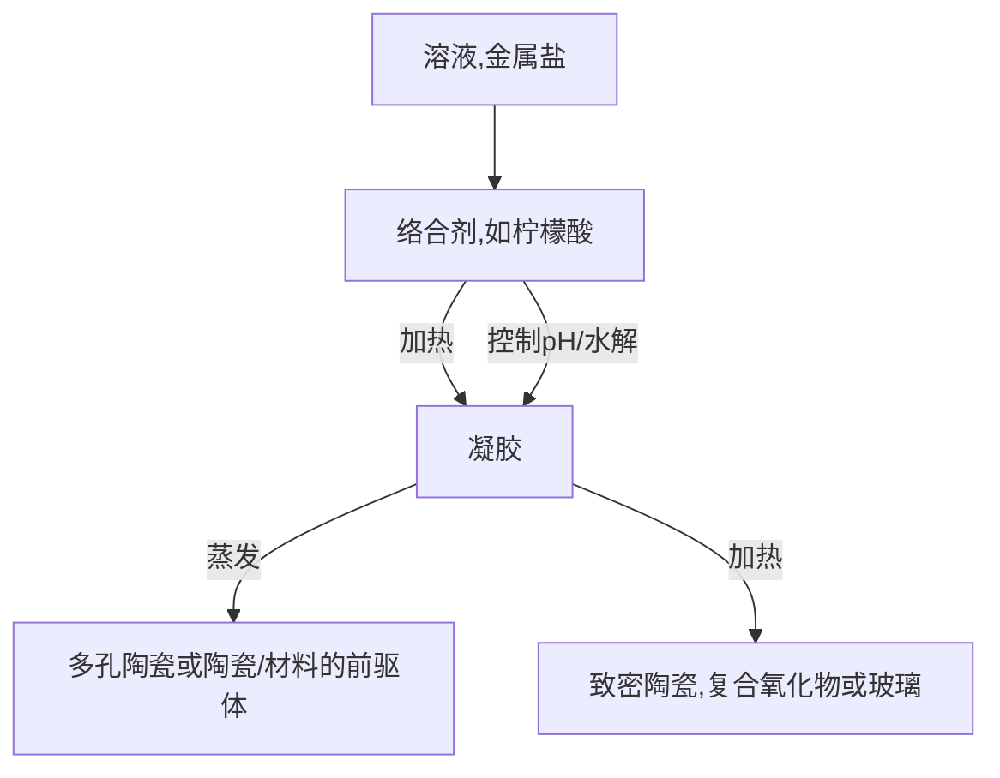
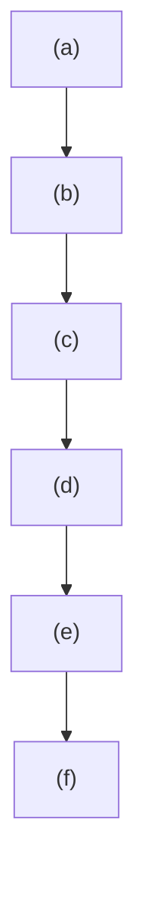
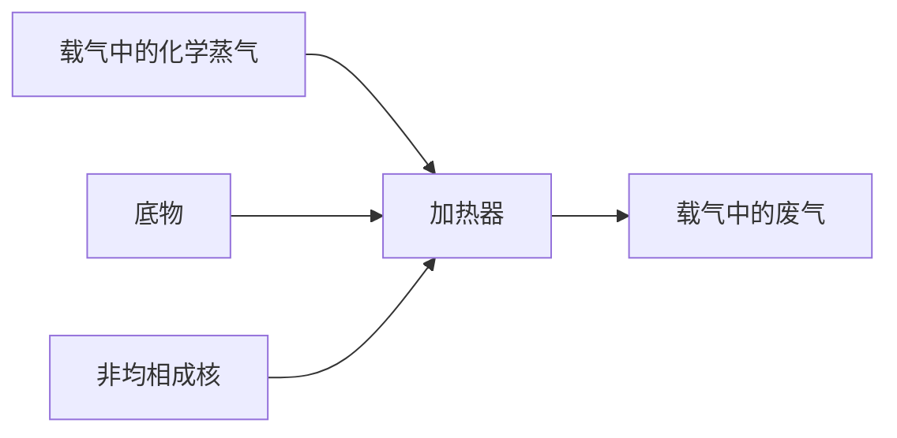
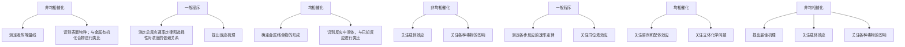
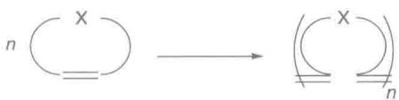
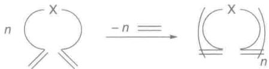
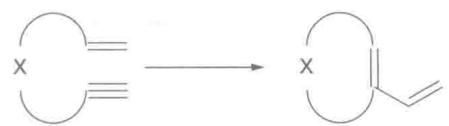
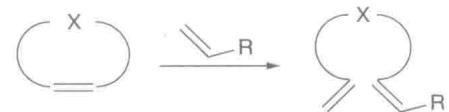
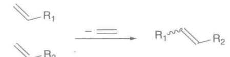

# 材料化学和纳米材料

材料化学主要关注显示出有用性能固体的研究,其中包括合成和表征。它是一个发展非常迅速的无机化学领域,本章介绍当今人们感兴趣的和新近取得进展的领域。从叙述块状固体无机材料的合成开始。缺陷在固体的离子迁移中起着重要作用,第3章做了简要描述。接着讨论无机材料的主要分类,包括嵌入型化合物、复合氧化物、磁性化合物、框架结构、颜料和分子材料。最后讨论纳米材料,它是一维方向上小于100 nm的一类无机固体。

当前对固态化学的研究多是受到商业上的启发，人们一直在寻找具有商业用途的固体材料。最近的一个焦点是在发电、存储、能源利用方面的研究，其中包括从可再生能源获得新的固体材料。人们正在寻求高效光伏材料和光催化分解水的材料，这些材料可将太阳能分别转化为电能和燃料（氢）。为了寻找用于储存和运输的可移动动力（用于便携式电子产品和电动汽车），需要研究可充电电池和燃料电池组件中使用的新材料。用于信息处理、信息存储和信息显示的电子设备和光学设备的多种组件也正在通过开发新的固态材料而处在改善之中。工业化学中，用于分子分离和非均相催化的新微孔固体也在开发之中。

固态化学是一个充满活力和令人兴奋的研究领域,部分是由于这类材料潜在的技术应用,也是由于了解它们的属性具有挑战性。本章将借鉴第3章中关于固体的一些概念,如晶格能和能带结构。我们也会介绍一些新概念,它们对理解固体内部发生的事件和讨论有用的固体性质(这些性质是由非化学计量和离子迁移引起的)显然是需要的。事实上在固体材料中,原子和离子可以通过协同方式相互作用产生许多引人注目且非常有用的化学性质。

合成新无机固体的范围非常巨大。例如，虽然已经知道当今存在的约100种结构类型中有 $95\%$ 为已知的二元 $(\mathrm{A}_a\mathrm{B}_b$ ，如黄铜 $\mathrm{CuZn})$ 和三元 $(\mathrm{A}_a\mathrm{B}_b\mathrm{C}_c)$ 金属间化合物，但仍有很多机会将研究扩展到4、5及6组分系统（所谓的多元组分系统）的合成和表征。过渡金属离子与阴离子形成化合物（如氧化物、氮化物和氟化物）的多组分结合尤其如此。此外，一旦得到一个新的功能性无机固体，人们就会试图合成不同形式（如薄层或纳米粒子）的一些潜在产物。纳米材料颗粒小（小于 $100~\mathrm{nm}$ )，可能会显示新的效应和性能从而导致新的用途。

# 材料的合成

很多合成无机化学(包括金属的配位化学和金属有机化学)利用溶液中的取代反应(一种配体取代另一种配体)实现分子的转化。这类方法的活化能通常比较小,并可在低温(通常在0℃到150℃之间)和某种溶剂(允许反应物种迁移)中进行。溶剂中分子的快速迁移导致反应时间相当短。然而,通过固体反应形成固体材料则涉及全然不同的反应,有些反应需要克服固体扩展结构的高晶格能(往往大于2000 kJ·mol $^{-1}$ ),有些固态中离子迁移的速率通常较缓慢(很高温度下除外)。有些无机材料可在低得多的温度下从溶液中制备,材料的构建单元凝聚起来形成扩展结构。这部分内容聚焦块状单相材料的合成而不是控制晶粒尺寸、颗粒形态和制造薄膜;材料化学中这些方面的内容与纳米材料化学密切相关,将安排在节24.22至节24.26做介绍。

# 24.1 材料的形成

新材料可通过两种主要方法制备。一种是通过两个或两个以上固体的直接反应（涉及破坏原有的晶

格和重新形成新结构）；另一种是将多面体单元在溶液中连接起来并沉积出新形成的固体。

# (a) 直接合成方法

提要: 许多复合型固体可由高温下组分之间的直接反应得到。开始阶段可通过在溶液中或溶胶凝胶法将各组分在原子尺度上相混合。

合成块状无机固体最广泛使用的方法涉及在高温下(通常在500\~1500℃)长时间加热固体反应物。加热各种金属氧化物的混合物可以得到复合氧化物；有些简单化合物(它们通过分解能够产生所需的氧化物)可用来代替氧化物本身。三元氧化物(如 $BaTiO_{3}$ )和四元氧化物(如 $YBa_{2}Cu_{3}O_{7}$ )可用数天时间加热氧化物(或简单化合物)的混合物来合成：

$$
\mathrm{BaCO} _ {3} (\mathrm{s}) + \mathrm{TiO} _ {2} (\mathrm{s}) \xrightarrow {1 0 0 0 ^ {\circ} \mathrm{C}} \mathrm{BaTiO} _ {3} (\mathrm{s}) + \mathrm{CO} _ {2} (\mathrm{g})
$$

$$
(1 / 2) \mathrm{Y} _ {2} \mathrm{O} _ {3} (\mathrm{s}) + 2 \mathrm{BaCO} _ {3} (\mathrm{s}) + 3 \mathrm{CuO} (\mathrm{s}) + (1 / 4) \mathrm{O} _ {2} (\mathrm{g}) \xrightarrow {9 3 0 ^ {\circ} \mathrm{C} / \text {空气}; 4 5 0 ^ {\circ} \mathrm{C} / \text {氧气}} \mathrm{YBa} _ {2} \mathrm{Cu} _ {3} \mathrm{O} _ {7} (\mathrm{s}) + 2 \mathrm{CO} _ {2} (\mathrm{g})
$$

为了加速固体中原本缓慢的离子扩散速率和克服离子间强大的库仑吸引力,上述反应需要高温合成。反应物通常为粒径小于 $10 \mu m$ 的粉末,加热前需要一起充分研磨以降低离子的扩散路径。直接法适用于许多其他类型的无机材料,如合成复合氯化物和致密且无水的金属铝硅酸盐:

$$
3 \mathrm{CsCl(s)} + 2 \mathrm {ScCl_ {3} (s)} \longrightarrow \mathrm {Cs_ {3} Sc_ {2} Cl_ {9} (s)}
$$

$$
\mathrm{NaAlO} _ {2} (\mathrm{s}) + \mathrm{SiO} _ {2} (\mathrm{s}) \longrightarrow \mathrm{NaAlSiO} _ {4} (\mathrm{s})
$$

大多数简单二元氧化物的纯品(颗粒大小为数个微米的多晶粉末)可从市场购得。另一种方法(即碳酸盐、氢氧化物、草酸盐和硝酸盐等前驱体的热分解)也能得到颗粒很细的氧化物。许多氧化物具有吸湿性并能吸收空气中的二氧化碳,而前驱体在空气中通常则是稳定的。在钛酸钡( $BaTiO_{3}$ )的合成中,碳酸钡 $BaCO_{3}$ (900 ℃以上开始分解为 $BaO$ )和 $TiO_{2}$ 以合适的化学计量比混合后用研钵(或球磨机)一起研磨,然后将混合物转移至坩埚(通常由惰性材料如石英玻璃、重新结晶的氧化铝或铂制造)并将坩埚置于炉中加热。即使在高温下反应也很慢,通常需要数天才能完成。

可以通过多种方法提高反应速率,其中包括,让反应混合物在高压下结成小球以增加反应物颗粒之间的接触;每隔一段时间将混合物再研磨以引入新的反应界面,使用合适的“助溶剂”(有助于离子扩散过程的低熔点固体)。反应物颗粒大小是控制反应所需时间的一个主要因素。颗粒越大,其总表面积越小,能发生反应的面积也越小。此外对大颗粒而言,所需要的离子扩散距离也要大得多。对多晶材料的大小而言通常为几个微米。为了提高反应速率并让固态反应在较低温度下发生,反应物往往需要小的颗粒(10 nm 和 1 μm 之间)和大的表面积。

改善反应物种的混合程度也可在反应过程的早期阶段利用溶液来实现。例如，图24.1示意性描述的溶胶凝胶法（sol-gel process，有时也叫Pechini法）。溶胶凝胶法可用于制备晶形的复合金属氧化物、陶瓷、纳米颗粒（节24.23和节24.24）和高表面积的化合物（如硅胶和玻璃，节24.7）。开始阶段使用溶液的优点是反应物以溶剂化物的形式在原子水平上相混合，使两个或两个以上固相组成的微米级颗粒直接反应带来的问题得以克服。在这类最简单的反应中，溶液中（如金属硝酸盐溶液）的金属离子通过多种方法（如将溶剂蒸发或作为简单的混合金属盐而沉淀）转化为固体，然后将固体加热以得到目的产物。制备复合氧化物 $\mathrm{La}_2\mathrm{CuO}_4$ 和 $\mathrm{ZnFe_2O_4}$ 的两个反应分别是

$$
2 \mathrm{La} ^ {3 +} (\mathrm{aq}) + \mathrm{Cu} ^ {2 +} (\mathrm{aq}) \xrightarrow {\mathrm{OH} ^ {-} (\mathrm{aq})} 2 \mathrm{La} (\mathrm{OH}) _ {3} \cdot \mathrm{Cu} (\mathrm{OH}) _ {2} (\mathrm{s})
$$

$$
\xrightarrow {6 0 0 ^ {\circ} \mathrm{C}} \mathrm{La} _ {2} \mathrm{CuO} _ {4} (\mathrm{s}) + 4 \mathrm{H} _ {2} \mathrm{O} (\mathrm{g})
$$

![[无机化学第6版Weller2425章753-866_images/d4150610d6cd7d303b4bc96b744539cb0a0101c3ded28e87ce29a2da6d72485e.jpg]]

flowchart

图 24.1 Pechini 溶胶凝胶法示意图  
凝胶在高温下干燥时形成致密的陶瓷或玻璃；高于水的临界压力下低温干燥时，产生的多孔固体叫干凝胶或气凝胶

$$
\mathrm{Zn} ^ {2 +} (\mathrm{aq}) + 2 \mathrm{Fe} ^ {2 +} (\mathrm{aq}) + 3 \mathrm{C} _ {2} \mathrm{O} _ {4} ^ {2 -} (\mathrm{aq}) \longrightarrow \mathrm{ZnFe} _ {2} (\mathrm{C} _ {2} \mathrm{O} _ {4}) _ {3} (\mathrm{s}) \xrightarrow {7 0 0 ^ {\circ} \mathrm{C}} \mathrm{ZnFe} _ {2} \mathrm{O} _ {4} (\mathrm{s}) + 4 \mathrm{CO(g)} + 2 \mathrm{CO} _ {2} (\mathrm{g})
$$

典型的溶胶凝胶法涉及先制备各种金属盐的水溶液、再加入络合剂（如羧酸或醇）、然后缓慢蒸发掉水分以得到黏稠的溶液或凝胶。另外一种方法是将金属的烷基氧化物前驱体溶解在乙醇中，然后加水导致其发生水解而得到稠凝胶。高温下干燥这些凝胶（由烷氧基和羧酸根连接的金属物种组成）导致固体可在相对低的温度下（300\~600℃）分解产生目的复合氧化物产品。由于反应物混合得较好，还可减少反应时间，最终的分解温度也低于氧化物直接反应的温度。使用较低温度也可减小最终分解反应中形成的颗粒。这种方法也用于合成纳米粒子（节24.23）。

如果要求特定的氧化态或反应物之一具有挥发性,则可能需要控制反应环境。固态反应可在受到控制的气氛中进行:在管式炉中让气体通过被加热的反应混合物上方。例如,制备 $TlTaO_{3}$ 时使用惰性气体以防止氧化:

$$
\mathrm{TI} _ {2} \mathrm{O(s)} + \mathrm{Ta} _ {2} \mathrm{O} _ {5} (\mathrm{s}) \xrightarrow {\mathrm{N} _ {2} / 6 0 0 ^ {\circ} \mathrm{C}} 2 \mathrm{TITaO} _ {3} (\mathrm{s})
$$

避免 Tl(Ⅰ) 在空气中被氧化为 Tl(Ⅲ)。

高压气体也可用于控制产物的组成。例如， $\mathrm{Fe(III)}$ 通常是在氧气或接近常压下得到的，但也可以形成 $\mathrm{Fe(IV)}$ 。例如，在数百个大气压氧气下由 $\mathrm{SrO}$ 和 $\mathrm{Fe_2O_3}$ 的混合物可以制得 $\mathrm{Sr_2FeO_4}$ 。对挥发性反应物而言，通常是将反应混合物密封在真空玻璃管中进行加热。例如：

$$
\begin{array}{r l} & \mathrm {Ta(s)+ S_ {2} (l)} \xrightarrow {5 0 0 ^ {\circ} \mathrm{C}} \mathrm {Ta S _ {2} (s)} \\ & \mathrm {Tl_ {2} O_ {3} (s) + 2BaO(s) + 3CaO(s) + 4CuO(s)} \xrightarrow {8 6 0 ^ {\circ} \mathrm{C}} \mathrm {Tl_ {2} B a _ {2} C a _ {3} Cu_ {4} O_ {12} (s)}. \end{array}
$$

硫和铊(Ⅲ)氧化物在各自的反应温度下具有挥发性,在敞口容器中会从反应混合物中丢失,从而导致产物错误的化学计量比。

也可通过高压影响固态化学反应的结果。专业化的设备(大型压力机)使固体之间的反应在压力高达约100 GPa(1 Mbar)、温度接近1500 ℃下发生。这样的反应条件能够促成形成致密的、高配位数结构。例如,这样制得的 $MgSiO_{3}$ 具有类钙钛矿结构(节3.9)和八面体 $SiO_{6}$ 单元中的六配位 Si 原子,而不是大多数硅酸盐中看到的正常四面体 $SiO_{4}$ 单元。这样的装置也可用于由石墨制造金刚石(应用相关文段14.1)。小规模的反应可在压力非常高的“金刚石砧盒”中进行,盒中两个面对面的钻石面被虎钳般的装置推在一起产生的压力高达100 GPA。

# (b) 溶液法

提要: 利用溶液中的缩合反应可以获得由多面体物种形成的框架结构。

许多无机材料(特别是框架结构的材料)可通过溶液中的结晶作用合成。虽然使用的方法多种多样,下面给出发生在水中的典型化学反应,反应中形成由阴离子连接金属中心而组成的、具有扩展结构的材料:

$$
\begin{array}{l} \mathrm{ZrO} _ {2} (\mathrm{s}) + 2 \mathrm{H} _ {3} \mathrm{PO} _ {4} (\mathrm{l}) \longrightarrow \mathrm{Zr} (\mathrm{HPO} _ {4}) _ {2} \cdot \mathrm{H} _ {2} \mathrm{O} (\mathrm{s}) + \mathrm{H} _ {2} \mathrm{O} (\mathrm{l}) \\ 3 \mathrm{KF(aq)} + \mathrm {MnBr_ {2} (aq)} \longrightarrow \mathrm {KMnF_ {3} (s)} + 2 \mathrm{KBr(aq)} \\ \end{array}
$$

$KMnF_{3}$ 采取钙钛矿结构类型(节3.9)。

水热法(hydrothermal techniques)可以扩展溶液法的应用范围,它是在密封容器中于正常沸点以上将反应溶液进行加热的一种方法。这种反应对以下各种结构的合成非常重要:具有开放式结构的铝硅酸盐(分子筛)、以含氧多面体为基础而连接起来的类似多孔结构、金属离子通过配位的有机物种(如羧酸根)连接起来的金属有机框架(metal-organic frameworks, MOF, 节 24.12)。然而一些沸石可在低于水沸点的温度下合成,如沸石 LTA 的合成:

$$
1 2 \mathrm{NaAlO} _ {2} (\mathrm{s}) + 1 2 \mathrm{Na} _ {2} \mathrm{SiO} _ {3} (\mathrm{s}) + (1 2 + n) \mathrm{H} _ {2} \mathrm{O} \xrightarrow {9 0 ^ {\circ} \mathrm{C}} \mathrm{Na} _ {1 2} [ \mathrm{Si} _ {1 2} \mathrm{Al} _ {1 2} \mathrm{O} _ {4 8} ] \cdot n \mathrm{H} _ {2} \mathrm{O} (\text {沸石LTA}) (\mathrm{s}) + 2 4 \mathrm{NaOH(aq)}
$$

LTA是由国际沸石协会用来识别不同铝硅酸盐沸石结构的、由三个字母代码组成的一个例子。其他沸石的合成则需要更高的温度并加入结构导向剂（structur-directing agent, SDA）以控制框架的拓扑结构。因此，沸石 $\mathrm{BEA}(\mathrm{Na}_{0.92}\mathrm{K}_{0.62}(\mathrm{TEA})_{7.6}[\mathrm{Al}_{4.53}\mathrm{Si}_{59.47}\mathrm{O}_{128}]$ ，式中的TEA为四乙基铵阳离子）的合成涉及铝酸钠、二氧化硅、NaCl、KCl和SDA四乙基铵氢氧化物之间的反应。这些多孔结构通常在热力学上处于介稳状态（相对于更致密结构的转化），所以不能通过高温反应直接制备。例如，在溶液中形成的钠铝硅酸盐沸石 $\mathrm{LTA}(\mathrm{Na}_{12}[\mathrm{Si}_{12}\mathrm{A}_{12}\mathrm{O}_{48}] \cdot n\mathrm{H}_2\mathrm{O})$ 加热超过 $800^{\circ}\mathrm{C}$ 时将转化为致密的铝硅酸盐 $\mathrm{NaSiAlO_4}$ 。最近，有些溶剂（如液氨、超临界二氧化碳和有机胺）已被用于所谓的溶剂热反应（solvothermal reactions）。离子液体（往往是具有低熔点[低于或接近室温；节 $4.13(\mathrm{g})]$ 的有机阳离子的盐）中的反应也可以合成沸石，并被称之为离子热（ionothermal）反应。

虽然高温直接合成法和溶剂热合成技术是材料化学中最常使用的方法,如果在结构上不发生重大变化,涉及固体的一些反应会在低温下发生。这些所谓的“嵌入反应”将在节24.9做讨论。

# 例题24.1 合成复合氧化物

题目:怎样合成高温超导体样品 $ErBa_{2}Cu_{3}O_{7-x}$ ?

答案: 参考类似化合物的合成方法制备该化合物。可以采用制备 $YBa_{2}Cu_{3}O_{7}$ 的同样方法进行制备，只是需要选用适当的镧系元素氧化物。即使用氧化铒 $(\mathrm{Er}_{2}\mathrm{O}_{3})$ 、碳酸钡和铜（Ⅱ）氧化物在 $940^{\circ}C$ 下进行反应，然后在 $450^{\circ}C$ 的纯氧中退火。

自测题 24.1 如何制备下列样品？（a） $SrTiO_{3}$ ，（b） $Sr_{3}Ti_{2}O_{7}$ 。

# 缺陷和离子迁移

正如节 3.16 所讨论的那样,所有固体在 T=0 以上都含有缺陷(结构或组成的不完善性)。也可通过一些机制(如掺杂)将缺陷(外赋缺陷)故意引入材料中。缺陷(主要包括填隙型和空穴型两大类)的重要性在于它们影响导电性和化学反应活性。电导产生于固体中离子的运动,这种运动往往因缺陷的存在而增强。具有高的离子电导率的材料在各种传感器和燃料电池中有重要应用。

# 24.2 扩展缺陷

提要: Wadsley 缺陷是将缺陷沿一定的结晶方向而集中起来的剪切面。

第 3 章中讨论的缺陷是点缺陷。这种缺陷造成局部结构明显变形（某些情况下局部电荷也不平衡）和高的生成焓。因此不足为奇的是，缺陷可能聚集在一起形成线和面，从而降低平均生成焓。

以钨的氧化物为例说明缺陷面的形成。如图24.2所示， $\mathrm{WO}_3$ 的理想结构[通常称之为“ $\mathrm{ReO}_3$ 结构”；见节24.6(b)]由 $\mathrm{WO}_6$ 八面体共享所有顶点组成。为了形象地描述缺陷平面的形成，不妨想象沿对角线移去共享的O原子。然后相邻的板块相互滑动，导致每个W原子周围的空位完成配位。这种剪切运动产生沿对角线共享棱边的八面体。A.D.Wadsley将由此产生的结构叫作晶体的剪切面（crystallographic shear plane），是他最先设计出这种方法描述扩展的面缺陷。固体中随机分布的晶体剪切面叫Wadsley缺陷（Wadsley defects）。这样的缺陷导致组成在连续范围内变化，如钨的氧化物（加热金属钨还原 $\mathrm{WO}_3$ 的反应得到）从 $\mathrm{WO}_3$ 变化到 $\mathrm{WO}_{2.93}$ 。然而，如果该晶体剪切面以非随机的、周期性方式分布并由此产生新的晶胞，那么就应该把该材料看作一种新的化学计量相。因此，如果更多的 $\mathrm{O}^{2-}$ 从钨的氧化物中被移除，就会观察到一系列具有有序晶体剪切面和组成为 $\mathrm{W}_n\mathrm{O}_{3n-2}(n = 20, 24, 25$ 和40)的离散相。含有剪切平面的、组成间隔紧密的化合物有W、Mo、Ti、V的氧化物和它们的某些复合氧化物，如钨青铜 $\mathrm{M}_8\mathrm{W}_9\mathrm{O}_{47}(\mathrm{M} = \mathrm{Nb}, \mathrm{Ta})$ 和“Magnéli相”， $\mathrm{V}_n\mathrm{O}_{2n-1}(n = 3-9)$ 。电子显微镜(节 8.17) 在实验上为观察这些缺陷提供了一种好方法, 它能揭示剪切平面的有序阵列和随机阵列 (见图 24.3)。

![[无机化学第6版Weller2425章753-866_images/e2840d4d6bc3d70d034b5e7bcbcfabf88969546e2765438aaa79375b5ebdb1d9.jpg]]

natural_image

Patterned fabric with repeating diamond shapes and dot patterns (no text or symbols)

(a)

![[无机化学第6版Weller2425章753-866_images/89097b82c2d65fd32a43a0c2a20b79887afc51d79432ae37a3fadd590267338b.jpg]]

natural_image

Two vertical panels with evenly spaced circles and dots, no text or symbols present

(b)

![[无机化学第6版Weller2425章753-866_images/f7da95e05b308e359ee1ad89a3e26b1c7e1865a2fcc5161e0c9c4c36ef4fe69e.jpg]]

natural_image

Patterned grid with alternating shaded and unshaded diamond shapes (no text or symbols)

(c)   
图 24.2 以 $ReO_{3}$ 结构的 (100) 平面为例说明晶体剪切面的概念: (a) 金属 (Re) 和氧 (O) 原子的平面, 图上示出围绕每个金属原子的八面体是由其上和其下的氧原子平面完成的, 阴影的八面体阐明了接下来的过程; (b) 垂直于页面的平面氧原子被移除, 留下金属原子 (没有第 6 个氧配体) 的两个平面; (c) 如图所示, 金属原子两个平面的八面体配位通过右方平板的平移而恢复, 这样就产生了一个垂直于页面的平面 (称为剪切面), 其中 $MO_{6}$ 八面体共享着棱边

![[无机化学第6版Weller2425章753-866_images/ba3b3332905e493135a8f8c4fea070a3966114a545b76aca3393a220115055f5.jpg]]

text_image

a
b
[120]
3.8 A
k-1

(a)

![[无机化学第6版Weller2425章753-866_images/fb09af749b8c43d50d12ce321984f14632983c855825e9c18dba4ff512d82f66.jpg]]

natural_image

Geometric pattern composed of interlocking diamond shapes with grid lines (no text or symbols)

(b)   
图 24.3 （a） $WO_{3-x}$ 中晶体剪切平面的高分辨电子显微晶格照片；（b）氧原子在 W 原子周围以八面体方式配位而得的电子显微成像，注意沿晶体剪切面共用棱边的八面体复制本图取得了版权持有人的许可：S. Iijima, J. Solid State Chem. 1975, 14, 52

# 24.3 原子和离子扩散

提要:固体中离子的扩散强烈依赖于缺陷的存在。

室温下原子或离子在固体中的扩散比气体和液体中的扩散过程缓慢得多。高温下离子的迁移率显著增加，这就是为什么大多数固态反应要在高温下才能进行（节24.1）。然而这一结论存在一些引人注目的例外。事实上，固体中原子或离子的扩散在固态技术的许多领域非常重要，如半导体制造、新固体的合成、燃料电池、传感器、冶金学和非均相催化。

离子在固体中的运动速率往往可根据它们的迁移机理和离子运动时遇到的活化能垒来解释。如图 24.4 所示,能量最低的途径通常涉及缺陷部位。适当温度下表现出高扩散速率的材料具有以下特点:

- 低能垒: 温度在 $300 \mathrm{~K}$ (或略高于 $300 \mathrm{~K}$ ) 时足以使离子从一个位置快速移动到另一位置。  
- 低电荷和小半径:如最具移动性的阳离子(除质子外)和阴离子分别是 $\mathrm{Li}^{+}$ 和 $\mathrm{F}^{-}$ 。 $\mathrm{Na}^{+}$ 和 $\mathrm{O}^{2-}$ 也显

示一定的移动性。电荷较高的离子因较强的静电相互作用而不易移动。

\- 高浓度的本征或外赋缺陷:缺陷通常通过一种结构(这种结构不涉及与从正常的、有利的离子部位将离子连续取代在能量上造成的不利后果)提供低能量的扩散途径。对晶体剪切面(节24.2)而言,这些缺陷应该不是有序的,因为这种有序性能够消除扩散路径。

\- 可移动离子在离子总数中占较大比例。

图 24.5 示出扩散系数对温度的依赖关系, 对固体在高温下选定的特定离子而言, 其流动性的一种量度。线的斜率与迁移的活化能成正比。因此, $Na^{+}$ 具有高流动性, 流过 $\beta-$ 氧化铝时的活化能低, 然而 CaO 中 $Ca^{2+}$ 的流动性低得多, 在岩盐结构中的迁移具有高的活化能。

![[无机化学第6版Weller2425章753-866_images/c3ceb5b016d663e0fee54e4897f7797bfec6fa744ea779204ee978dabc44cb5a.jpg]]

text_image

a
b
c
d

图 24.4 固体中离子或原子的扩散机理: (a) 两个原子或离子交换位置; (b) 结构中离子从正常占据的位置跳跃到间隙位置并产生空位, 然后另一位置的离子通过运动占据这个空位; (c) 离子在两个不同间隙位置间的跳跃; (d) 离子或原子从正常占据的位置移动到一个空位从而产生一个新空位

![[无机化学第6版Weller2425章753-866_images/00249abde509189174ea97e6287c8d5d93c0846e0fcb1c071b14a0242e0d02ea.jpg]]

line

| Compound           | (1000 K)/T | logD/(m²·s⁻¹) |
| ------------------ | ---------- | ------------- |
| Na in β-Al₂O₃      | ~0.6       | ~-11          |
| O in CaₓZrO₂₋ₓ    | ~0.8       | ~-13          |
| Cr in Cr₂O₃       | ~0.7       | ~-15          |
| Ni in NiO          | ~0.9       | ~-17          |
| Ca in CaO         | ~0.5       | ~-19          |
| Al in Al₂O₃       | ~0.5       | ~-17          |
| Co in CoO         | ~0.4       | ~-11          |

图24.5 选定固体中可移动离子的扩散系数（对数刻度）对温度倒数的函数

# 24.4 固体电解质

任何电化学电池（如普通电池、燃料电池、电致变色显示器或电化学传感器）都需要电解质。在许多应用中，离子的溶液（如铅酸蓄电池中的稀硫酸）是可以接受的电解质，但为了避免液相溢出的可能性，人们对发展固体电解质产生了很大兴趣。两个重要的、进行过深入研究的、具有移动阳离子的固体电解质是四碘合汞酸（Ⅱ）银 $\left(\mathrm{Ag}_{2}\mathrm{HgI}_{4}\right)$ 和组成为 $Na_{1+x}Al_{11}O_{17+x/2}$ 的β-氧化铝钠。其他重要的快阳离子导体包括组成为 $Na_{1+x}Zr_{2}P_{3-x}Si_{x}O_{12}$ 的NASICON（从“Na超离子导体”英文字母形成的名字），锂石榴石（如 $Li_{7-x}La_{3}Zr_{2-x}Ta_{x}O_{12}$ ）和许多在室温（或高于室温不多）运行的质子导体（如在高于160℃运行的 $CsHSO_{4}$ ）。

具有高流动性的阴离子固体比阳离子导体少，一般情况下只在高温下才具有高导电性：阴离子通常大于阳离子，在固体中扩散的能垒高。因此，固体中的快阴离子传导只限于 $\mathrm{F}^{-}$ 和 $\mathrm{O}^{2-}$ （离子半径分别为 $133\mathrm{pm}$ 和 $140\mathrm{pm}$ ）。尽管有这些限制，阴离子导体仍在传感器和燃料电池中起着重要作用，其中一个有代表性的材料是被钇稳定的氧化锆（YSZ），其组成为 $\mathrm{Y}_x\mathrm{Zr}_{1 - x}\mathrm{O}_{2 - x / 2}$ 。表24.1归纳了一些典型固体电解质的离子电导率值和其他一些离子导电介质。

表 24.1 离子和电子电导率的比较值

<table><tr><td>材料</td><td>电导率 $^*$ /(S·m $^{-1}$ )</td></tr><tr><td>离子导体</td><td></td></tr><tr><td>离子晶体</td><td> $10^{-16} \sim 10^{-2}$ </td></tr><tr><td>实例:LiI(298°C)</td><td> $10^{-4}$ </td></tr><tr><td>固体电解质</td><td> $10^{-1} \sim 10^{3}$ </td></tr><tr><td>实例:YSZ(600°C)</td><td>1</td></tr><tr><td>AgI(500°C)</td><td> $10^{2}$ </td></tr><tr><td>强(液体)电解质</td><td> $10^{-1} \sim 10^{3}$ </td></tr><tr><td>实例: $1\mathrm{mol}\cdot\mathrm{L}^{-1}\mathrm{NaCl(aq)}$ </td><td> $10^{2}$ </td></tr><tr><td>电子导体</td><td></td></tr><tr><td>金属</td><td> $10^{3} \sim 10^{6}$ </td></tr><tr><td>半导体</td><td> $10^{-3} \sim 10^{2}$ </td></tr><tr><td>绝缘体</td><td> $>10^{-7}$ </td></tr></table>

\* 符号 S 表示西门子；1 S = 1 Ω $^{-1}$ 。

# (a) 固体阳离子电解质

提要:固体无机电解质往往具有一个低温形式,结构子集合中离子的排列是有序的;温度升高后离子的位置变得无序,导致离子电导率增加。

随着越来越多不同组成和结构在接近或略高于室温下具有较高的阳离子迁移率,这种属性的基础不难以两种研究得较为充分的材料( $Ag_{2}HgI_{4}$ 和 $\beta-$ 氧化铝钠)为例做说明。

低于 $50^{\circ}C$ 时 $Ag_{2}HgI_{4}$ 的晶体结构为有序排列，其中 $Ag^{+}$ 和 $Hg^{2+}$ 与 $I^{-}$ 以四面体方式配位并具有空着的四面体穴 [图 24.6(a)]，这种结构的离子电导率低。高于 $50^{\circ}C$ 时 $Ag^{+}$ 和 $Hg^{2+}$ 随机分布在四面体位置 [图 24.6(b)]，其结果是结构内部银离子可以占据的位置比存在的银离子多很多。此温度下的材料是很好的离子导体，这在很大程度上是由银离子在不同可利用位置之间的流动性造成的。密堆积排列的、易被极化的 I 容易变形，导致银离子从一个位置到另一位置的活化能较低。许多相关的固体电解质具有含软阴离子的类似结构。例如，AgI 和 $RbAg_{4}I_{5}$ ，它们都具有高流动性的 $Ag^{+}$ ， $RbAg_{4}I_{5}$ 在室温下的电导率大于氯化钠水溶液的电导率。

β-氧化铝是物理学概念上硬材料的一个例子，它是个很好的离子导体。其中刚性和致密的 $Al_{2}O_{3}$ 层被稀疏排列的 $O^{2-}$ 所桥连（图 24.7）。含有这些桥 $O^{2-}$ 的平面也含有 $Na^{+}$ ，因为不存在任何重要的、瓶颈式的障碍阻碍其运动， $Na^{+}$ 可从一个位置移到另一个位置。许多类似的刚性材料（具有能够让离子移动的平面或通道）被称之为框架电解质（framework electrolytes）。另一个与之密切相关的材料（ $\beta^{\prime}-$ 氧化铝钠）对离子运动的限制少于 β-氧化铝，并且发现有可能用双电荷离子（如 $Mg^{2+}$ 、 $Ni^{2+}$ ）取代 $Na^{+}$ 。甚至可将大的镧系离子 ( $Eu^{2+}$ ) 引入 β'-氧化铝，尽管这种离子的扩散比较小的镧系离子慢。前面提到的材料 NASICON 是一种非化学计量的、由 $ZrO_{6}$ 八面体和 $PO_{4}$ 四面体构筑起框架的固溶系统，相应的母体相组成为 $NaZr_{2}P_{3}O_{12}$ （图 24.8）。用 Si 取代部分 P 可以得到固溶体 $Na_{1+x}Zr_{2}P_{3-x}Si_{x}O_{12}$ ，物种的电荷被增加的 $Na^{+}$ 所平衡。材料中所有可能的 $Na^{+}$ 位点只是部分被填充，这些位点处于由通道（允许剩余的钠离子快速迁移）组成的三维网状结构中。当前正在研究的其他类型材料（如快阳离子导体）包括具有锂离子晶格空位的锂离子导体 [将 V 掺杂到 $Li_{4}GeO_{4}$ 中 Ge 的位置，组成为 $Li_{4-x}(Ge_{1-x}V_{x})O_{4}$ ]、具有钙钛矿结构的 $La_{0.6}Li_{0.2}TiO_{3}$ 和钠离子导体硅酸钇钠 $Na_{5}YSi_{4}O_{12}$ 。室温下最好的锂离子电导率 ( $1.1\times10^{-3}\;S\cdot cm^{-1}$ ) 已有报道，其材料组成为 $Li_{6.4}La_{3}Zr_{1.4}Ta_{0.6}O_{12}$ ；人们对具有高锂离子电导率固体的兴趣在于用其作为锂离子电池的电解质。

![[无机化学第6版Weller2425章753-866_images/c7dd19ad84313341898771cc7530c4ba0fef5ae4508526b48c4855042d7ff39c.jpg]]

chemical

Crystal structure diagram of a magnesium-iron alloy showing atomic positions and unit cell axes

(a)

![[无机化学第6版Weller2425章753-866_images/5ce4e9a27822ed35233c0f656213b92717429a5a1565c154d4ae9a47fb08faf9.jpg]]

chemical

Crystal structure diagram of silver and hydrogen peroxide (Ag, Hg) showing atomic arrangement in a cubic unit cell

(b)

图 24.6 $^{*}$ （a） $Ag_{2}HgI_{4}$ 的低温有序结构；（b）高温无序结构显示出阳离子的无序排布 $Ag_{2}HgI_{4}$ 的高温形式是 $Ag^{+}$ 导体  
![[无机化学第6版Weller2425章753-866_images/b0ab6d86c4db8ddebe96448b0615247cb91e9180e9e99415f6490be09e0b070d.jpg]]

text_image

Al₂O₃ 尖晶石区
导体平面
Al₂O₃ 尖晶石区
1.120 nm
Na⁺
桥O²⁻

(a)

![[无机化学第6版Weller2425章753-866_images/d20c99cc83a5539dad749f43e20642109c07eb7e637fa00c6094d7ffa1700f36.jpg]]

chemical

Diagram showing Na⁺ ions in a crystal lattice with O²⁻ ions labeled

(b)

图 24.7 （a）β-氧化铝侧视示意图，示出 $Al_{2}O_{3}$ 片层之间的 $Na_{2}O$ 传导平面，平面中的 O 原子桥连着两个片层；（b）传导平面的视图，注意可移动离子和可让它们移动的空位的丰度  
![[无机化学第6版Weller2425章753-866_images/8f68c82e5b90e6f35d90cea6b704c693b912bb7328f32198edfb6e60df79c068.jpg]]

chemical

Crystal structure diagram of a ZrO6-based material showing Na⁺, (P,Si)O₄, and传导通道

图24.8\* 用 $(\mathrm{P},\mathrm{Si})_4$ 四面体和 $\mathrm{ZrO}_6$ 相连接的方法表示的 $\mathrm{Na}_{1 + x}\mathrm{Zr}_2\mathrm{P}_{3 - x}\mathrm{Si}_x\mathrm{O}_{12}$ (NASICON)的结构

# 例题 24.2 框架电解质中电导率与离子体积的关系

题目:含有半径不同的一价正离子的 $\beta-$ 氧化铝的电导率数据表明, $Ag^{+}$ 和 $Na^{+}$ (两者半径都接近100 pm)的活化能接近17 kJ·mol $^{-1}$ ,然而 $Tl^{+}$ (半径接近149 pm)约为35 kJ·mol $^{-1}$ 。请对这种差异做解释。

答案:首先需要想到离子迁移受到离子大小的限制。在 $\beta-$ 氧化铝钠和相关的 $\beta-$ 氧化铝中,具有相当高刚性的框架提供了允许离子迁移的二维网状通道。从实验结果看,离子运动的瓶颈似乎是足以让 $Na^{+}$ 或 $Ag^{+}$ (半径接近 100 pm) 相当容易地通过(具有较低的活化能),但对较大的 $Tl^{+}$ (半径约为 149 pm) 而言通道太小则不能轻易通过。

自测题 24.2 增加压力时， $\beta-$ 氧化铝中 $K^{+}$ 的电导率为什么比 $Na^{+}$ 的电导率降低得多？

# (b) 固体阴离子电解质

提要:高温下,离子迁移可发生在含高浓度阴离子空位的某些结构中。

Micheal Faraday 于 1834 年报道称红热的固体 $PbF_{2}$ 是良好的电导体。人们后来很晚才认识到其导电性是由 $F^{-}$ 通过固体迁移产生的。具有萤石结构的其他晶体也显示这种负离子的导电性。人们认为这种固体中离子的输送是通过间隙机理（interstitial mechanism）进行的，即 $F^{-}$ 先从正常位点迁移至间隙位点（Frenkel 型缺陷，节 3.16），进而迁移到一个空着的 $F^{-}$ 位点。

具有大量空位点的结构通常表现出最高的离子电导率，这是因为它们能够提供离子运动的路径（尽管缺陷浓度很高时缺陷或空缺形成簇的作用仍可降低电导率）。选择合适的、具有不同氧化态的金属离子进行掺杂可将这些空位（相当于外赋缺陷）以相当高的数量引入许多简单的氧化物和氟化物中。氧化锆 $\left(\mathrm{ZrO}_{2}\right)$ 在高温下具有萤石结构，但将纯物质冷却到室温时畸变为单斜多晶。用其他离子（如类似大小的 $Ca^{2+}$ 和 $Y^{3+}$ ）更换部分 $Zr^{4+}$ 可使立方萤石结构在室温下得以稳定。掺杂低氧化态的这种离子导致在阴离子位点上引入空位从而保持材料的电中性，并产生例如先前提到的被钇稳定的氧化锆 $\mathrm{Y}_x\mathrm{Zr}_{1 - x}\mathrm{O}_{2 - x / 2}(\mathrm{YSZ})$ 材料。这种材料的萤石结构中的阳离子位点已完全被占据，但却具有高浓度的阴离子空位点（ $0\leqslant x\leqslant 0.15$ )，这些空位点为 $\mathrm{O}^{2 - }$ 穿越结构的扩散提供了一条路径，因此具有典型的导电性（如 $\mathrm{Ca}_{0.15}\mathrm{Zr}_{0.85}\mathrm{O}_{1.85}$ 在 $1000^{\circ}C$ 下的电导率为 $5\mathrm{S}\cdot \mathrm{cm}^{-1}$ 。注意，由于阴离子的体积较大，即使在这样非常高的温度下，电导率也远低于典型的固态阳离子的电导率。

用钙和 $O^{2-}$ 掺杂的氧化锆具有高的 $O^{2-}$ 导电性，用作汽车废气系统中测量氧分压的固体电化学传感器（见图 24.9）。这种电池中的铂电极吸附氧原子，如果样品和参照侧之间的氧分压不同，氧就会有以 $O^{2-}$ 形式发生迁移穿越电解质的热力学趋势。热力学上有利的过程是

![[无机化学第6版Weller2425章753-866_images/828b17306920daf0c2193bb67bff46692d2a25dda826e13a26a108830c67f208.jpg]]

text_image

多孔 Pt 电极
测试气体中的O₂
电位差
固体 ZrO₂/CaO
电解质
空气(恒定
O₂标准)

图 24.9 以固体电解质 $Zr_{1-x}Ca_{x}O_{2-x}$ 为基础的氧传感器

$p(\mathrm{O}_{2})$ 高的一侧：

$$
\frac {1}{2} \mathrm{O} _ {2} (\mathrm{g}) + \mathrm{Pt(s)} \longrightarrow \mathrm{O(Pt,表面)}
$$

$$
\mathrm{O(Pt,表面)} + 2 \mathrm{e} ^ {-} \longrightarrow \mathrm{O} ^ {2 -} (\mathrm{ZrO} _ {2})
$$

$p(\mathrm{O}_{2})$ 低的一侧：

$$
\mathrm{O} ^ {2 -} (\mathrm{ZrO} _ {2}) \longrightarrow \mathrm{O(Pt,表面)} + 2 \mathrm{e} ^ {-}
$$

$$
\mathrm{O(Pt,表面)} \longrightarrow \frac {1}{2} \mathrm{O} _ {2} (\mathrm{g}) + \mathrm{Pt(s)}
$$

从 Nernst 方程(节 5.5) 可知电池的电位与氧的两个分压 $(p_{1}, p_{2})$ 有关, 对发生在两个电极上的半电池反应

$O_{2}+4e^{-}\longrightarrow2O^{2-}$ 而言：

$$
E _ {\mathrm{cell}} = \frac {R T}{4 F} \ln \frac {p _ {1}}{p _ {2}} \tag {24.1}
$$

因此，简单地测量电位差就能提供废气中氧的分压。例如，温度为 $1000 \, K$ 时空气一侧的 $p(\mathrm{O}_{2}) = 0.2 \, \mathrm{atm}$ ，燃烧后的燃料/空气混合物一侧的 $p(\mathrm{O}_{2}) = 0.001 \, \mathrm{atm}$ ，废气系统中由氧传感器运行产生的电位差约为 $0.1 \, V$ 。

前面提到即使在高温下阴离子电导率仍然很低。因此，许多复合金属氧化物目前正在研究之中，其目标是实现低温下的高迁移率。前景良好的化合物包括 $\mathrm{La}_{2}\mathrm{Mo}_{2}\mathrm{O}_{9}$ 、铟酸钡（ $\mathrm{Ba}_{2}\mathrm{In}_{2}\mathrm{O}_{5}$ ）、BIMEVOX（掺杂d金属的铋钒氧化物）、 $\mathrm{La}_{9.33}\mathrm{Si}_{6}\mathrm{O}_{26}$ 的磷灰石结构及用锶和镁掺杂的镓酸镧（Sr、Mg掺杂的 $\mathrm{LaGaO}_{3}$ ，或LSGM）。除用于传感器外，含 $\mathrm{O}^{2-}$ 和质子的导电材料对一些类型的燃料电池也很重要（应用相关文段24.1）。

# (c) 离子电子混合导体

提要:固体材料可以显示出离子和电子两种导电性。

大多数离子导体(如 $\beta^{\prime}-$ 氧化铝钠和 YSZ)具有低的电子导电性(即靠电子传导而非靠离子运动)。作为固体电解质(如在传感器中),其应用需要这种性质以避免电池短路。在某些情况下,人们需要将电子和离子导电性相组合;例如,有缺陷的某些 d 金属化合物(传导 $O^{2-}$ )和金属 d 轨道提供的导带(传导电子)之间的组合。许多这样的材料(如 $La_{1-x}Sr_{x}CoO_{3-y}$ 和 $La_{1-x}Sr_{x}FeO_{3-y}$ )是在 B 阳离子位点具有混合氧化态的钙钛矿结构(节 3.9)。这些氧化物体系是导带部分充满(d 金属非整数氧化数导致的结果)的良好的电子导体,并可通过 $O^{2-}$ 迁移流过钙钛矿型 $O^{2-}$ 位点进行传导。这类材料用于固体氧化物燃料电池(应用相关文段 24.1),它是应用相关文段 5.1 中提到的燃料电池类型之一,其中一个电极必须允许离子通过导电电极进行扩散。

# 应用相关文段 24.1 固体氧化物燃料电池

燃料电池由夹在两个电极之间的电解质组成；氧流过一个电极，燃料流过另一个电极，产生电力、水和热。本书已在应用相关文段5.1中描述了燃料电池的构建和运行程序，它是将燃料（如氢、甲烷或甲醇）通过与氧的反应转化为电能（以及燃烧产物水和二氧化碳）的一种装置。多种材料可被用作这种电池的电解质，包括磷酸、质子交换膜或固体氧化物燃料电池(SOFCs)中的 $O^{2-}$ 导体。

SOFCs 在高温下运行，并用 $O^{2-}$ 导体作为电解质。SOFC 的典型设计如图 B24.1 所示。每个单元产生有限的电位差,但与蓄电池一样,可以串联起来增加电位差并供电。各个小电池单元靠“互连件”接在一起,“互连件”也可用来将每个小电池的燃料源和空气源隔开。

人们对 SOFCs 产生兴趣的原因包括几个方面:以清洁的方式将燃料转化为电力、低噪音污染、与不同燃料电池的竞争力,最重要的一点是高效率。运行温度高(通常在 500\~1 000 ℃)是效率高的原因。高温 SOFCs 中的相互连接可以靠陶瓷(如钙钛矿型的亚铬酸镧 LaCrO₃);温度低于 1 000 ℃时也可使用合金(如 Y/Cr 合金)。通常用 YSZ 作为这类很高温度的 SOFCs 电解质的 O²⁻ 导体。

![[无机化学第6版Weller2425章753-866_images/5581cc6403bac85bda6a90ff463e39c04ab18c43823af739cec1b5525bf903f3.jpg]]

chemical

Electrochemical cell diagram showing oxygen and hydrogen bonding processes with YSZ electrolyte and Ni-YSZ electrodes

图 B24.1 固体氧化物燃料电池的结构

与很高温度运行的设备相比，中间温度运行（通常在 $500\sim 700^{\circ}\mathrm{C}$ ）的设备有许多优点：减少腐蚀、设计简单、大大减少将体系加热至运行温度所需的时间。然而，这种设备要求在较低温度下具有优异的 $\mathrm{O}^{2-}$ 电导率的材料作为电解质。研究得最好的中间温度（约低于 $600^{\circ}\mathrm{C}$ ）SOFCs的阳极为以Gd掺杂的 $\mathrm{CeO}_2(\mathrm{CGO}) / \mathrm{Ni}$ ，电解质为以Gd掺杂的氧化铈，阴极为钙钛矿型的LSCF[(La, Sr)(Fe, Co)O₃]。电解质材料CGO在较低温度下比YSZ的离子电导率高得多。然而不幸的是其电子导电性也较高，使用CGO作为电解质时会因电子流过电解质而导致效率降低和能源浪费。如正文中提到的那样，人们正在寻求新的、更好的 $\mathrm{O}^{2-}$ 导体。

与其他类型的燃料电池相比较，SOFCs的主要优点之一是操作碳氢化合物燃料时更方便：其他类型燃料电池在运行中必须依赖清洁氢的供应。高温下运行的SOFCs有机会在体系内将烃类催化转化为氢和碳的氧化物。由于体积大、需要加热及运行温度高，SOCFs主要用在中型或大型的静态系统，包括产生约 $2\mathrm{kW}$ 电力的小型家用发电系统。

# 金属氧化物、氮化物及氟化物

本部分讨论 O、N 及 F 与金属形成的二元化合物。这些化合物（特别是氧化物）对固态化学至关重要，这是因为它们的稳定性、容易合成，以及存在多种多样的组成和结构。这些属性导致大量的化合物已经被合成，并根据具体应用领域（电子、磁性或光学方面）的要求对化合物性质进行了调整。正如我们将要看到的那样，对其化学性质的讨论也有助于深入了解缺陷、非化学计量、离子扩散及这些特征对物理性质的影响。

金属氟化物的化学性质与金属氧化物非常相似,但 $F^{-}$ 电荷较低意味着能够产生等化学计量数的较低电荷的阳离子,如 $KMn(II)F_{3}$ 与 $SrMn(IV)O_{3}$ 相比就是这样。在过去的20年中,氮离子( $N^{3-}$ )与一个或多个金属离子化合而形成的化合物的研究取得显著进展。混合阴离子(过渡金属与一种以上阴离子形成化合物,如氧化物-氮化物和氧化物-氟化物)固态化学领域在新材料和新结构类型方面是一个正在迅速取得进展的领域。

# 24.5 3d金属的一氧化物

虽然通常制得的这些看似简单的 3d 金属一氧化物与形式上的化学计量 MO 存在显著偏差,但它们当中的大多数采取岩盐结构(见表 24.2)。

表 24.2 3d 金属的一氧化物

<table><tr><td>化合物</td><td>结构</td><td>组成,x</td><td>电学特征</td></tr><tr><td> $CaO_x$ </td><td>岩盐</td><td>1</td><td>绝缘体</td></tr><tr><td> $TiO_x$ </td><td>岩盐</td><td>0.65~1.25</td><td>金属性导体</td></tr><tr><td> $VO_x$ </td><td>岩盐</td><td>0.79~1.29</td><td>金属性导体</td></tr><tr><td> $MnO_x$ </td><td>岩盐</td><td>1~1.15</td><td>半导体</td></tr><tr><td> $FeO_x$ </td><td>岩盐</td><td>1.04~1.17</td><td>半导体</td></tr><tr><td> $CoO_x$ </td><td>岩盐</td><td>1~1.01</td><td>半导体</td></tr><tr><td> $NiO_x$ </td><td>岩盐</td><td>1~1.001</td><td>绝缘体</td></tr><tr><td> $CuO_x$ </td><td>PtS(被 $CuO_4$ 四方平面所连接)</td><td>1</td><td>半导体</td></tr><tr><td> $ZnO_x$ </td><td>纤维锌矿</td><td>Zn稍过量</td><td>宽带隙n型的半导体</td></tr></table>

# (a) 缺陷和非化学计量

提要: $Fe_{1-x}O$ 的非化学计量是由 $Fe^{2+}$ 八面体位点上的空位产生的,两个 $Fe^{2+}$ 转变为两个 $Fe^{3+}$ 补偿了每个空位的电荷。

FeO 中非化学计量的来源比大多数其他 MO 化合物研究得更详细。实验发现事实上不存在符合化学计量的 FeO，通过 Fe(Ⅱ) 氧化物的高温淬火（迅速冷却）得到的是范围相当大的一系列缺 Fe 的化合物 $\mathrm{Fe}_{1-x}\mathrm{O}(0.13 < x < 0.04)$ 。化合物 $Fe_{1-x}O$ 在室温下实际上是介稳的（metastable），这意味着它在热力学上不稳定（可歧化为金属 Fe 和 $Fe_{3}O_{4}$ ），只是动力学上的原因使其不能实现这种转化。当前取得的共识是， $Fe_{1-x}O$ 的结构是从理想的“FeO”岩盐结构派生的， $Fe^{2+}$ 的八面体位点存在空位，每个空位的电荷因相邻两个 $\mathrm{Fe}^{2+}$ 转化为两个 $\mathrm{Fe}^{3+}$ 而得到补偿。 $\mathrm{Fe}_{1 - x}\mathrm{O}$ 具有相当宽泛的组成，是因为 $\mathrm{Fe(II)}$ 相对容易氧化为$\mathrm{Fe(III)}$ 。在高温下，间隙型 $\mathrm{Fe}^{3+}$ 与 $\mathrm{Fe}^{2+}$ 空位（或缺陷）相互交结成簇分布于整个结构中（图24.10）。

类似的缺陷和缺陷聚簇现象似乎存在于其他所有3d金属一氧化物中，CoO和NiO可能是例外。 $\mathrm{Ni}_{1 - x}\mathrm{O}$ 的非化学计量范围极为狭窄，但电导率和离子扩散速率以某种方式随氧分压的改变而变化，这种方式表明存在孤立的点缺陷。如水溶液中标准电位所表明的那样，Fe（Ⅱ）比Co（Ⅱ）或Ni（Ⅱ）更容易被氧化；溶液中的氧化还原化学与CoO和NiO中更小范围的缺氧行为密切相关。与 $\mathrm{Fe}_{1 - x}\mathrm{O}$ 一样，Cr（Ⅱ）的氧化物能够自发地发生歧化：

$$
3 \mathrm{Cr(II)O(s)} \longrightarrow \mathrm {Cr(III) {} _ {2} O_ {3} (s) + Cr(0)(s)}
$$

然而,通过在铜(Ⅱ)氧化物基质中的结晶可使材料得以稳定。

![[无机化学第6版Weller2425章753-866_images/71b16a6cfeaa74262d54cec7255ec617a7f2dceaa70a84d130f2a4e39e1dff54.jpg]]

chemical

Crystal structure diagram of iron oxide showing Fe³⁺ intercalation, O, and Fe²⁺ vacancy sites

图 24.10 为 $Fe_{1-x}O$ 建议的缺陷位点
注意: 四面体的 $Fe^{3+}$ 间隙(灰色球)和八面体的 $Fe^{2+}$ 空位(圆圈)是聚集成簇

CrO 和 TiO 结构中阳离子和阴离子位点都存在高浓度缺陷, 形成富金属或缺金属的化学计量式 $\mathrm{Ti}_{1 - x}\mathrm{O}$ 和 $\mathrm{TiO}_{1 - x}$ 。事实上，TiO在阳离子和阴离子亚晶格中形成相同数量的大量空位，而不是人们预想的完美的无缺陷结构。

# (b) 电子性质

提要:3d 金属的一氧化物 MnO、FeO、CoO 和 NiO 是半导体;TiO 和 VO 是金属性导体。

3d金属的一氧化物 $\mathrm{MnO},\mathrm{Fe}_{1 - x}\mathrm{O},\mathrm{CoO}$ 和NiO的电导率低并随温度升高而增大（对应于半导体行为），或具有大的带隙以致成为绝缘体。这些氧化物半导体中的电子或空穴迁移是通过跳跃机理完成的。按照这一模型，电子从一个定域金属原子位置跳跃到下一个定域金属原子位置。移动到新的位置后，会导致周围的离子调整自己的位置，电子或空穴会被这种扭曲产生的势阱暂时所捕获。这个电子会停留在新位置，直到它被热激发迁移至附近另一个位置。电荷跃迁机理的另一个方面是，电子或空穴倾向于与定域缺陷相结合，因此电荷传输的活化能可能包括从紧靠缺陷的位置释放出空穴的能量。

跳跃模型不同于半导性的能带模型。如节3.20所述，传导作用和价电子占据了分布在整个晶体的轨道。这种差异源于中、后区3d金属一氧化物不那么松散的d轨道，它们过于密实而不能形成金属性导电所需的宽带。在 $\mathrm{O}_2$ 气氛下用 $\mathrm{Li}_2\mathrm{O}$ 掺杂NiO时得到组成为 $\mathrm{Li}_x(\mathrm{Ni}^{2+})_{1-2x}(\mathrm{Ni}^{3+})_x\mathrm{O}$ 的固溶体，能够大大增加导电性，其原因类似于掺杂In能够提高Si的导电性（节3.20）。金属氧化物半导体电子导电性随温度升高而显著增大的性质用于“热敏电阻”以测量温度。

与中部和右部3d系金属一氧化物的半导体相反，TiO和VO具有高的电子导电性，并随温度升高而降低。在宽泛的组成范围里（从富氧的 $\mathrm{Ti}_{1 - x}\mathrm{O}$ 到富金属的 $\mathrm{TiO}_{1 - x}$ )都存在这种金属性导电。这些化合物中的导带是由邻近八面体位点上金属离子 $\mathfrak{t}_{2g}$ 轨道互相重叠形成的，如图24.11所示，这些轨道相互朝对方取向。这些前d区元素d轨道的径向延伸大于该周期后面的元素，它们能够重叠形成部分被充满的能带（图24.12）。TiO组成在宽范围里变化的事实似乎与电子离域相关：导带作为可快速接近的聚拢源，将电子（它们容易补偿空位的形成）聚拢在一起。

# (c) 磁性质

提要:3d 金属一氧化物 MnO、FeO、CoO 和 NiO 的 Néel 温度按照从 Mn 到 Ni 的顺序升高。

除了 d 电子之间相互作用产生的电子性质外，d 区金属一氧化物还具有由单个原子磁矩协同作用产生的磁性（节 20.8）。MnO 和其他 3d 金属一氧化物的总磁结构如图 24.13 所示。d 金属氧化物系列的 Néel 温度 ( $T_{N}$ ，顺磁性/反铁磁性的转变温度；节 20.8) 如下：

<table><tr><td>MnO</td><td>FeO</td><td>CoO</td><td>NiO</td></tr><tr><td>122 K</td><td>198 K</td><td>271 K</td><td>523 K</td></tr></table>

![[无机化学第6版Weller2425章753-866_images/27d707307e0a7178784061eef2c7aff1bb6d30e1de0398afeb66b62d85847c44.jpg]]

chemical

Crystal structure diagram of titanium (Ti) showing atomic arrangement with O and Ti atoms

图 24.11 TiO 中 $d_{zx}$ 轨道重叠产生 $t_{2g}$ 能带垂直方向上 $d_{yx}$ 和 $d_{zy}$ 轨道以相同的方式重叠

![[无机化学第6版Weller2425章753-866_images/a471060e4f7a26732a6a95d9848b1d2032e37142ffc629a9a92e6d50f1857f1c.jpg]]

text_image

M²⁺
p 能带
e_g
d
t_zg 能带
p 能带
O²⁻

图24.12 前d区金属一氧化物的分子轨道能级图 $\mathrm{t}_{2\mathrm{g}}$ 能带仅部分填充并导致金属性传导

![[无机化学第6版Weller2425章753-866_images/900f85be7196294938d25e5c15bcd2bf3534e650bd022ed61e7230a2379c1505.jpg]]

chemical

Crystal structure diagram showing Mn and O atom arrangements in a lattice arrangement

图 24.13 MnO 和其他 3d 金属—氧化物的总磁结构

这些值反映了沿 $\mathrm{M} - \mathrm{O} - \mathrm{M}$ 方向超交换自旋相互作用的强度（节20.8），岩盐结构中这种作用在晶胞的所有三个方向上传播。随着 $\mathbf{M}^{2+}$ 体积从 $\mathrm{Mn}$ 到Ni减小，超交换机理变得更强。这是因为金属-氧轨道重叠程度的增大和 $T_{\mathrm{N}}$ 增加造成的。

# 24.6 高等氧化物和复合氧化物

金属与氧的比例不是1:1的二元金属氧化物被叫作高等氧化物(higher oxides)。含有一种以上金属离子的化合物往往被称为复合氧化物(complex oxides)或混合氧化物(mixed oxides)，包括含有三种元素的化合物(三元氧化物，如 $\mathrm{LaFeO_3}$ )、四种元素的化合物（四元氧化物，如 $\mathrm{YBa}_2\mathrm{Cu}_3\mathrm{O}_7$ )或更多种元素的化合物。本节介绍一些较重要的复合氧化物(混合金属氧化物)的结构和性质。

# (a) $M_{2}O_{3}$ 刚玉结构

提要:化学计量式为 $M_{2}O_{3}$ 的许多氧化物采取刚玉结构,包括掺铬的铝氧化物(红宝石)。

α-氧化铝(矿物刚玉)采取这样一种结构模式: $O^{2-}$ 按六方密堆积方式排列,阳离子占据三分之二的八面体穴(图24.14)。+3氧化态的Ti、V、Cr、Rh、Fe、Ga氧化物也采取刚玉结构。其中两种氧化物 $Ti_{2}O_{3}$ 和 $V_{2}O_{3}$ 分别在低于410 K和150 K时显示出金属性到半导性的转变(图24.15)。在 $V_{2}O_{3}$ 中,这种转变伴随着自旋的反铁磁有序。两个绝缘体 $Cr_{2}O_{3}$ 和 $Fe_{2}O_{3}$ 也显示反铁磁有序。

![[无机化学第6版Weller2425章753-866_images/025e86b0f99fad824af71c2b1c66ada3a3d9d04d64e40e175673762009b8f7be.jpg]]

chemical

Crystal structure diagram of aluminum oxide (AlO₃) showing atomic arrangement and unit cell boundaries

图 24.14 刚玉的结构  
像 $Al_{2}O_{3}$ 采取的结构那样, 阳离子占据 $O^{2-}$ 密堆积层之间 2/3 的八面体穴

![[无机化学第6版Weller2425章753-866_images/b9b129cc6517c53c0406b9c0bfc7d607e317906764fa05b6b8b8968bdf51c886.jpg]]

line

| (1000 K)/T | lg[电导率/(S·m⁻¹)] |
| ---------- | ------------------ |
| 2          | 6.0                |
| 6          | -4.0               |
| 10         | -5.0               |

图 24.15 $V_{2}O_{3}$ 电导率对温度的依赖关系，示出金属导体向半导体的转变

$\mathrm{M}_2\mathrm{O}_3$ 化合物另一有趣的方面是暗绿色的 $\mathrm{Cr_2O_3}$ 和无色的 $\mathrm{Al_2O_3}$ 固溶体形成明亮的红宝石。如节20.7中所述， $\mathrm{Cr}^{3+}$ 的配位场跃迁中的这种转变是由 $\mathrm{Al_2O_3}$ 宿主结构中围绕 $\mathrm{Cr}^{3+}$ 的 $\mathrm{O}^{2-}$ 的压缩造成的（在 $\mathrm{Al_2O_3}$ 中，晶格常数 $a = 475~\mathrm{pm}, c = 1300~\mathrm{pm}$ ，而在 $\mathrm{Cr_2O_3}$ 中相应的值较大，分别为 $493~\mathrm{pm}$ 和 $1356~\mathrm{pm}$ ）。随着配位场强度的增大，这种压缩转移为对蓝光的吸收，固体显示出白光中的红色。 $\mathrm{Cr}^{3+}$ 吸收光谱（和荧光光谱）对压缩作用的响应性有时用在高压实验中测量压力。在这种应用中，样品一个碎片中红宝石的微小晶体受到可见光的照射，荧光光谱的变化提供晶胞中压力方面的信息。

# (b) 三氧化铼结构

提要:三氧化铼结构是由 $ReO_{6}$ 八面体构建而成的,这些八面体在三维方向上共享所有顶点。

三氧化铼结构类型非常简单，它由立方晶胞构成，Re原子位于晶胞的角上，O原子位于晶胞棱边的中点（图24.16）。换一种说法，该结构可看作共享所有顶点的 $\mathrm{ReO}_6$ 八面体。这种结构也与钙钛矿结构（节3.9）密切相关，可以看作是从晶胞中移除了A型阳离子的钙钛矿结构。采用三氧化铼结构的材料相对少见，其部分原因是受到与氧结合时M的氧化态为M(VI)的限制。Re(VI)氧化物 $(\mathrm{ReO}_3)$ 本身和一种形式的 $\mathrm{UO}_3(\delta -\mathrm{UO}_3)$ 具有这种类型的结构， $\mathrm{WO}_3$ 的这种结构则稍微被扭曲。在 $\mathrm{WO}_3$ 中， $\mathrm{WO}_6$ 八面体略有扭曲并彼此相对倾斜，以致W—O—W键角不是 $180^{\circ}$ 。

三氧化铼本身是个亮红色有光泽的固体。室温下的导电性类似于金属铜。该化合物的能带结构包含来自 $\mathrm{Re}t_{2\mathrm{g}}$ 轨道和O2p轨道的能带（图24.17）。该能带每个Re原子最多含有6个电子，但对 $\mathrm{Re}^{6+}\mathrm{d}^1$ 组态而言只是部分充满，所以产生了人们看到的金属特性。

# (c) 尖晶石

提要: 许多 d 金属尖晶石不具正常尖晶石的结构, 这种现象是由于配位场稳定化能影响着离子在选择位置方面偏好性。

![[无机化学第6版Weller2425章753-866_images/9402ff608dca8a9ccce414d1b58d2119960f10d9c0df48c10fe83ebd8251b930.jpg]]

chemical

Crystal structure diagrams of a binary compound showing Re and O atoms in two configurations

图 24.16 $^{*}$ 以晶胞方式表示的 $ReO_{3}$ 结构和形成晶胞的 $ReO_{6}$ 八面体

![[无机化学第6版Weller2425章753-866_images/4e165db31c8c88d1fc3293ab2ba80ac703b9dd8b11269d3a9546168cd7feca0b.jpg]]

chemical

Molecular orbital diagram showing electron density distribution and spin states for a semiconductor device structure

图 24.17 $ReO_{3}$ 的能带结构

d区元素的高等氧化物（如 $\mathrm{Fe}_3\mathrm{O}_4$ 、 $\mathrm{Co}_3\mathrm{O}_4$ 、 $\mathrm{Mn}_3\mathrm{O}_4$ ）和许多相关的混合金属氧化物（如 $\mathrm{ZnFe_2O_4}$ 显示出非常有用的磁性质。它们全都采取尖晶石矿物（ $\mathrm{MgAl_2O_4}$ ）的结构类型，通式为 $\mathrm{AB}_2\mathrm{O}_4$ 。虽然有些尖晶石可由 $\mathrm{A}^{4+}$ 和 $\mathrm{B}^{2+}$ 阳离子组成（即 $\mathrm{A}^{4+}\mathrm{B}_{2}^{2+}\mathrm{O}_{4}$ ，如 $\mathrm{Ge}^{4+}[\mathrm{Co}^{2+}]_{2}\mathrm{O}_{4}$ ），但大多数氧化物尖晶石是由 $\mathrm{A}^{2+}$ 和 $\mathrm{B}^{3+}$ 阳离子形成的（即 $\mathrm{A}^{2+}\mathrm{B}_{2}^{3+}\mathrm{O}_{4}$ ，如 $\mathrm{Mg}^{2+}[\mathrm{Al}^{3+}]_{2}\mathrm{O}_{4}$ ）。节3.9中简要描述了尖晶石的结构，在那里我们看到，它由fcc排列的 $\mathrm{O}^{2-}$ 组成，其中A离子占据八分之一的四面体穴，B离子占据了一半八面体穴（图24.18）。这种结构通常表示为 $\mathrm{A}[\mathrm{B}_2]\mathrm{O}_4$ ，其中方括号内的原子类型表示它们占据着八面体穴。反尖晶石结构中的阳离子排布为 $\mathrm{B}[\mathrm{AB}]\mathrm{O}_4$ ，其中B阳离子分布在两种配位几何位置上。基于简单离子模型计算出来的晶格焓表明，阳离子为 $\mathrm{A}^{2+}$ 和 $\mathrm{B}^{3+}$ 的正常尖晶石结构 $\mathrm{A}[\mathrm{B}_2]\mathrm{O}_4$ 应该更稳定。许多d金属尖晶石不符合这种预期，这种现象是由于配位场稳定化能影响着离子在选择位置方面偏好性。

尖晶石的占有因子（occupation factor, $\lambda$ ）是指四面体位点上 B 原子的分数：正常尖晶石的 $\lambda = 0$ ，而反尖晶石（B[AB]O $_{4}$ ）的 $\lambda = 0.5$ 。处于 0\~0.5 的 $\lambda$ 值表明分布的无序程度，那里的 B 阳离子占据

了四面体的部分位点。以 $\left(\mathrm{A}^{2+},\mathrm{B}^{3+}\right)$ 型阳离子尖晶石（表24.3）的分布为例做说明： $d^{0}$ 组态的A和B离子优先采取正常尖晶石结构（如从静电因素所预言的那样）。表24.3表明，当 $A^{2+}$ 为 $d^{6}$ 、 $d^{7}$ 、 $d^{8}$ 或 $d^{9}$ 离子和 $B^{3+}$ 为 $Fe^{3+}$ 时，通常有利于形成反尖晶石结构。这种偏好性是由下述因素导致的：不论处在八面体位或四面体位的高自旋 $d^{5}Fe^{3+}$ 都不存在配位场稳定化作用（节20.1和图24.13），而处在八面体位点的其他 $d^{n}$ 离子都有配位场稳定化作用。对A、B位点上d金属离子的其他组合而言，与两种离子在八面体位点和四面体位点的不同排列相对应的配位场稳定化能需要进行计算。同样重要的是需要注意，简单的配位场稳定化作用似乎彻底改变了这一有限范围内的阳离子。如果存在不同半径的阳离子或存在的任何离子不采取高自旋组态（尖晶石中的大多数金属是如此，如 $Co_{3}O_{4}$ 中 $Co^{3+}$ 为低自旋 $d^{6}$ 组态），则必须进行更详细的分析。此外，由于 $\lambda$ 往往依赖于温度，合成具有特定阳离子分布方式的尖晶石时必须小心，从高的反应温度将样品缓慢冷却或淬火可能产生完全不同的阳离子分布。

![[无机化学第6版Weller2425章753-866_images/11513a25d196a149cd27c46a353c451d610a47f23d03b3229e918d46e16e5905.jpg]]

chemical

Crystal structure diagram of a boron-oxygen compound showing BO6 and AO4 atomic positions in a cubic unit cell

图 24.18 $^{*}$ 尖晶石 $(AB_{2}O_{4})$ 晶胞的一部分, 示出 A 离子的四面体环境和 B 离子的八面体环境(与图 3.44 比较)

表 24.3 某些尖晶石中的占有因子 ${\lambda }^{ * }$ 

<table><tr><td></td><td>A</td><td> $Mg^{2+}$ </td><td> $Mn^{2+}$ </td><td> $Fe^{2+}$ </td><td> $Co^{2+}$ </td><td> $Ni^{2+}$ </td><td> $Cu^{2+}$ </td><td> $Zn^{2+}$ </td></tr><tr><td></td><td>B</td><td> $d^0$ </td><td> $d^5$ </td><td> $d^6$ </td><td> $d^7$ </td><td> $d^8$ </td><td> $d^9$ </td><td> $d^{10}$ </td></tr><tr><td> $Al^{3+}$ </td><td> $d^0$ </td><td>0</td><td>0</td><td>0</td><td>0</td><td>0.38</td><td>0</td><td></td></tr><tr><td> $Cr^{3+}$ </td><td> $d^3$ </td><td>0</td><td>0</td><td>0</td><td>0</td><td>0</td><td>0</td><td>0</td></tr><tr><td> $Mn^{3+}$ </td><td> $d^4$ </td><td>0</td><td></td><td></td><td></td><td></td><td></td><td>0</td></tr><tr><td> $Fe^{3+}$ </td><td> $d^5$ </td><td>0.45</td><td>0.1</td><td>0.5</td><td>0.5</td><td>0.5</td><td>0.5</td><td>0</td></tr><tr><td> $Co^{3+}$ </td><td> $d^6$ </td><td></td><td></td><td></td><td></td><td>0</td><td></td><td>0</td></tr></table>

$\ast\lambda=0$ 相应于正常尖晶石； $\lambda=0.5$ 相应于反尖晶石。

# 例题 24.3 判断尖晶石型化合物的结构

题目： $MnCr_{2}O_{4}$ 可能是正常尖晶石结构还是反尖晶石结构？

答案:这里需要考虑是否存在配位场稳定化能。因为 $\mathrm{Cr}^{3+}(d^{3})$ 在八面体位点的配位场稳定化能大(从表20.2可知为 $1.2\Delta_{0}$ )(但在四面体场中的配位场稳定化能小得多),而高自旋 $d^{5}$ 组态的 $Mn^{2+}$ 没有任何 LFSE,故可判断化合物为正常尖晶石结构。表24.3显示,这一判断得到实验验证。

自测题 24.3 表 24.3 表明 $FeCr_{2}O_{4}$ 为正常尖晶石。解释实验结构的合理性。

化学式为 $\mathrm{AFe_2O_4}$ 的反尖晶石有时被归入铁氧体（ferrites，同一术语也适用于不同情况下的其他铁氧化物）。 $RT > J$ （ $J$ 是不同离子自旋相互作用的能量）时铁氧体具有顺磁性，然而当 $RT < J$ 时铁氧体可能是铁磁性或反铁磁性。 $\mathrm{ZnFe_2O_4}$ 是具有反铁磁性、自旋特征反平行取向的一个例子，其中阳离子配布方式为 $\mathrm{Fe[ZnFe]O_4}$ 。该化合物中四面体位和八面体位存在的 $\mathrm{Fe}^{3 + }(S = 5 / 2)$ 为反铁磁偶合，通过超交换机理（节20.8），该固体作为一个整体在低于 $9.5\mathrm{K}$ 时生成接近于零的净磁矩；注意，作为 $\mathrm{d}^{10}$ 组态的离子， $\mathrm{Zn}^{2 + }$ 对材料的磁矩无贡献。

表 24.3 中的化合物 $CoAl_{2}O_{4}$ 为正常尖晶石结构 ( $\lambda=0$ )，因此 $Co^{2+}$ 处在四面体位。可以预料， $CoAl_{2}O_{4}$ 的颜色（深蓝色）是四面体位 $Co^{2+}$ 的颜色。这个属性再加上易于合成和尖晶石结构的稳定性，导致铝酸钴被用作颜料 (“钴蓝”)。其他显示强烈色彩的混合型 d 金属尖晶石 [如绿色的 $CoCr_{2}O_{4}$ 、黑色的 $CuCr_{2}O_{4}$ 和橙棕色的 $(\mathrm{Zn},\mathrm{Fe})\mathrm{Fe}_{2}\mathrm{O}_{4}$ ] 也被用作颜料（节 24.15），也用于为各种建筑材料（如混凝土）着色。

# (d) 钙钛矿结构和与之相关的相

提要:钙钛矿的通式为 $ABX_{3}$ ，其中 $BX_{3}$ 结构 ( $ReO_{3}$ 型) 的 12 配位穴被大的 A 离子所占据；钙钛矿型钛酸钡 $BaTiO_{3}$ 显示铁电性和压电性，这种性质与离子的协同位移有关。

钙钛矿的通式为 $\mathrm{ABX}_3$ ，其中 $\mathrm{BX}_3$ 结构的12配位穴被大的A离子所占据（图24.19；该结构的不同视图见图3.42）。虽然也可合成出含氮负离子和含氢负离子的钙钛矿（如 $\mathrm{LiSrH_3}$ ），但更多出现的X离子是 $\mathrm{O}^{2-}$ 或 $\mathrm{F}^{-}$ （如在 $\mathrm{NaFeF}_3$ 中）。“钙钛矿”的名称来自自然界存在的氧化物矿 $\mathrm{CaTiO_3}$ ，最大的一类钙钛矿是那些以 $\mathrm{O}^{2-}$ 为阴离子的钙钛矿。人们发现，形成固溶体和非化学计量化合物（如形成 $\mathrm{Ba}_{1 - x}\mathrm{Sr}_x\mathrm{TiO}_3$ 和 $\mathrm{SrFeO}_{3 - y})$ 是钙钛矿结构的共同特征。一些富金属材料采用阳离子和阴离子部分倒置的正态分布钙钛矿结构（如 $SnNCo_{3}$ ）。人们往往能看到钙钛矿结构的畸变，以致晶胞不再具有中心对称，并且一部分晶体获得了整体的、永久性的电极化作用（这是那部分晶体内部离子位移方向调整的结果）。从类似于铁磁体这个意义上讲，一些极性晶体具有铁电性（ferroelectric），但不是晶体部分区域（往往被称为“畴”）电子自旋排布造成的，许多晶胞的电偶极矩都是一致的。因此，反映化合物极性的相对介电常数对于铁电材料而言通常会超过 $1 \times 10^{3}$ ，并可高达 $1.5 \times 10^{4}$ ；相比之下，液体水在室温的相对介电常数约为 80。钛酸钡（ $BaTiO_{3}$ ）是这种材料研究得最多的一个例子。该化合物在 $120^{\circ}C$ 以上具有完美的立方钙钛矿结构。室温下它采用对称性较低的四方晶胞，其中各种离子可被认为已从它们正常的高对称性位置发生了位移（图 24.20）。这种位移导致晶胞的自发极化和电偶极的形成；这些离子位移之间（以及引起的诱导偶极之间）的偶合非常弱。应用外电场将这些偶极子的排布遍及整个材料导致在特定方向上的体极化，这种极化在移去外电场后继续存在。低于某一温度时可发生这种自发极化作用导致材料表现出铁电体行为，该温度叫居里温度（Curie temperature, $T_{c}$ ），参见节20.8。BaTiO $_{3}$ 的 $T_{c}=120^{\circ}C$ 。钛酸钡高的相对介电常数导致其用在电容器中。与平板之间的空气电容器相比，它能存储高达1000倍的电荷。将掺杂剂引入钛酸钡结构后形成固溶体从而调节了该化合物的各种性质。例如，用Sr置换Ba，或用Zr置换Ti可导致 $T_{c}$ 大幅降低。

![[无机化学第6版Weller2425章753-866_images/063e7cb37010cbea96d6d629bdbf0289026c8d53b5aeb3ffeb8023c942f4bbb3.jpg]]

chemical

Crystal lattice structure diagram showing atomic positions labeled A, B, and O in a cubic unit cell

![[无机化学第6版Weller2425章753-866_images/ada403dfd99579c30434b027971518fafede5777e09d7f952ee329fcb431ece6.jpg]]

chemical

Crystal structure diagram of a cubic unit cell with labeled atoms A, B, O and unit cell (b), showing atomic positions and unit cell boundaries.

图 24.19\* 钙钛矿 (ABO₃) 结构视图: (a) 强调了大阳离子的 12 配位并显示出与图 23.22(b) 中 ReO₃ 结构的关系; (b) 简要给出 B 阳离子的八面体配位; (c) 突出了 BO₆ 八面体的多面体表示法

![[无机化学第6版Weller2425章753-866_images/bd30373e509a2789ee8ae9e4f986e08f8142d591e83d6211af45ffbb5157bdbb.jpg]]

chemical

Crystal structure diagram of a titanium-oxygen compound showing Ba, Ti, and O atoms in a cubic arrangement

图 24.20 $^{*}$ 四方 BaTiO $_{3}$ 的结构
图上显示出局域 Ti $^{4+}$ 位移导致材料的铁电行为

许多晶体材料（包括许多没有对称中心的钙钛矿晶体材料）的另一特征是它们的压电性（piezoelectricity），它是指晶体受到外压或在外电场下改变尺寸而产生电场的现象。压电材料具有多种用途，如用于压力转换器（如燃气灶具和火灾报警的机械点火装置）、超微操控装置（控制非常小的移动）、声音检测器，也用作扫描隧道显微镜（节8.16）的探针支架。一些重要材料包括 $\mathrm{BaTiO_3}$ 、 $\mathrm{NaNbO_3}$ 、 $\mathrm{NaTaO_3}$ 和 $\mathrm{KTaO_3}$ 。

另一个常见的结构类型[四氟合镍酸（Ⅱ）钾 $\mathrm{K}_2\mathrm{NiF}_4$ 所采用的结构类型，见图24.21]与钙钛矿有关。该化合物可认为是含有钙钛矿结构的单个片层，共享了层内八面体的四个F原子，但在层的上方和下方具有末端F原子。这些层相互之间发生了相对位移，并被 $\mathbf{K}^{+}$ 隔开（ $\mathrm{K}^{+}9$ 配位于一个层的8个 $\mathrm{F}^{-}$ 和邻近一层的末端 $\mathrm{F}^{-}$ ）。人们正在重新研究具有 $\mathrm{K}_2\mathrm{NiF}_4$ 结构类型的化合物，因为某些高温超导体（如 $\mathrm{La}_{1.85}\mathrm{Sr}_{0.15}\mathrm{CuO}_4$ )是以这种结构结晶的。除超导性方面的重要性外，具有 $\mathrm{K}_2\mathrm{NiF}_4$ 结构的化合物也提供了研究二维磁畴的可能性，这是因为连接在一起的八面体层内的电子自旋偶合作用比层间强得多。

我们已经介绍过作为来自钙钛矿结构单片层的 $\mathrm{K}_2\mathrm{NiF}_4$ 结构；其他相关的结构也可能存在，两个或两个以上的钙钛矿层彼此间发生了水平方向的位移。处在一端的 $\mathrm{K}_2\mathrm{NiF}_4$ 结构（一个钙钛矿层）和处在另一端的钙钛矿本身（无限数量的这种层）被称为Ruddlesden-Popper相（Ruddlesden-Popper phases），它们包括具有两个层的 $\mathrm{Sr}_3\mathrm{Fe}_2\mathrm{O}_7$ 和具有三个层的 $\mathrm{Ca_4Mn_3O_{10}}$ （图24.22）。

# (e) 高温超导体

提要:高温铜酸盐超导体的结构与钙钛矿结构相关。

钙钛矿结构的多样性延伸至超导性,因为1986年首次报道的大部分高温超导体可看作是钙钛矿结构的变体。超导体有两个显著的特征:它们在低于临界温度 $T_{c}$ (注意不要与铁电体的居里温度 $T_{c}$ 相混淆)时进入超导状态并具有零电阻;超导状态也显示Meissner效应(Meissner effect),即排斥磁场的性质。教师们用Meissner效应向学生演示超导性,演示实验中一小粒超导体可悬空于磁体上方。Meissner效应也是超导体许多潜在应用的基础,包括磁悬浮(如“磁悬浮”列车)。

继1911年发现汞在低于 $4.2\mathrm{K}$ 时显示超导性之后，物理学家和化学家在寻找具有较高 $T_{\mathrm{C}}$ 值的超导体方面取得了缓慢但却是稳定的进展；75年之后， $\mathrm{Nb}_3\mathrm{Ge}$ 的 $T_{\mathrm{C}}$ 值已微升至 $23\mathrm{K}$ 。大多数这样的超导材料是金属的合金，尽管在许多氧化物和硫化物中也发现了超导性（表24.4）；二硼化镁在低于 $39\mathrm{K}$ 时显示超导性（见应用相关文段13.4）。然后（1986年）发现了第一个高温超导体（high-temperature superconductor, HTSC）。现在已知存在 $T_{\mathrm{C}}$ 值远高于 $77\mathrm{K}$ （液氮的沸点，液氮是相对廉价的制冷剂）的数种材料，并在为数不多的几年里将最大的 $T_{\mathrm{C}}$ 值增加了5倍以上（约 $134\mathrm{K}$ ）。

已知存在两种类型的超导体：

- 第Ⅰ类超导体:外磁场超过材料的特征值时突然丧失超导性的超导体。  
- 第Ⅱ类超导体:高于临界磁场( $H_{c}$ )时超导性逐渐丧失的材料(包括高温材料)。

图 24.23 表明显示超导性的元素具有一定程度的周期性。特别需要注意的是铁磁性金属（Fe、Co、Ni）不显示超导性，碱金属或货币金属（Cu、Ag、Au）也不显示超导性。

![[无机化学第6版Weller2425章753-866_images/85ab62308846be468f7178cacb5f1e2e35109955b6e6881056d572a89a7b97b5.jpg]]

chemical

Crystal structure diagrams of K and NiF6, showing atomic arrangements and unit cell boundaries

图 24.21 $^{*}$ $K_{2}NiF_{4}$ 的结构：(a) $NiF_{6}$ 八面体位移了的层 ( $K^{+}$ 散布其中)；(b) 组成为 $NiF_{4}$ 的一个层，显示出通过 F 连接在一起的共角八面体

![[无机化学第6版Weller2425章753-866_images/67585b8ef976ed835325f1265bc7497ef23d9d0344f93ba29bb16bad47eb63ee.jpg]]

chemical

Crystal structure diagrams of BO₆ compounds showing unit cell arrangement and unit cell boundaries

图 24.22 $^{*}$ 化学计量式为 $A_{3}B_{2}O_{7}(a)$ 和 $A_{4}B_{3}O_{10}$ (b) 的 Ruddlesden-Popper 相，它们分别是由两个和三个钙钛矿层（被 A 阳离子隔开的、连接在一起的 $BO_{6}$ 八面体）形成的。

表 24.4 低于临界温度 ${T}_{\mathrm{C}}$ 时显示超导性的一些材料

<table><tr><td>元素</td><td> $T_c/K$ </td><td>化合物</td><td> $T_c/K$ </td></tr><tr><td>Zn</td><td>0.88</td><td> $Nb_3Ge$ </td><td>23.2</td></tr><tr><td>Cd</td><td>0.56</td><td> $Nb_3Sn$ </td><td>18.0</td></tr><tr><td>Hg</td><td>4.15</td><td> $LiTi_2O_4$ </td><td>13.7</td></tr><tr><td>Pb</td><td>7.19</td><td> $K_{0.4}Na_{0.6}BiO_3$ </td><td>29.8</td></tr><tr><td>Nb</td><td>9.50</td><td> $YBa_2Cu_3O_7$ </td><td>93</td></tr><tr><td></td><td></td><td> $Tl_2Ba_3Ca_3Cu_4O$ </td><td>134</td></tr><tr><td></td><td></td><td> $MgB_2$ </td><td>40</td></tr><tr><td></td><td></td><td> $K_3C_{60}$ </td><td>39</td></tr><tr><td></td><td></td><td> $PbMo_6S_8$ </td><td>15.2</td></tr><tr><td></td><td></td><td>NbPS</td><td>12</td></tr></table>

![[无机化学第6版Weller2425章753-866_images/65a1b13c42d7e06c5f390e9df08f7908a9465809eb1fc16d52afdf9de9eb41aa.jpg]]  
图24.23

![[无机化学第6版Weller2425章753-866_images/e57a400d2548a41b3ca5c8baeca8725a326b78cabd993c9b0e3c1fc9514b7b19.jpg]]

text_image

超导性
薄膜显示超导性
压力下显示超导性
Li Be
Na Mg
K Ca Sc Ti V Cr Mn Fe Co Ni Cu Zn Ga Ge As Se Br Kr
Rb Sr Y Zr Nb Mo Tc Ru Rh Pd Ag Cd In Sn Sb Te I Xe
Cs Ba La Hf Ta W Re Os Ir Pt Au Hg Tl Pb Bi Po At Rn
Fr Ra Ac Ce Pr Nd Pm Sm Eu Gd Tb Dy Ho Er Tm Yb Lu
Th Pa U Np Pu Am Cm Bk Cf Es Fm Md No Lr
H He

图 24.23 指定条件下显示超导性的元素

第一个报道的 HTSC 是 $\mathrm{La}_{1.8}\mathrm{Ba}_{0.2}\mathrm{CuO}_{4}(T_{\mathrm{C}}=35\mathrm{~K})$ ，它是固溶体系列 $La_{2-x}Ba_{x}CuO_{4}$ 中的一个，其中 Ba 代替了 $La_{2}CuO_{4}$ 中部分 La 的位点。这种材料具有 $K_{2}NiF_{4}$ 结构类型，共享着棱边的 $CuO_{6}$ 八面体层被阳离子 $La^{3+}$ 和 $Ba^{2+}$ 所隔开，尽管 Jahn-Teller 畸变在轴向上拉长了八面体 [节 20.1(g)]。一个类似的化合物 $\mathrm{La}_{1.8}\mathrm{Sr}_{0.2}\mathrm{CuO}_{4}(T_{\mathrm{C}}=38\mathrm{~K})$ 也具有这种结构，其中钡被锶所取代。

研究得最广泛的HTSC氧化物材料为 $\mathrm{YBa}_2\mathrm{Cu}_3\mathrm{O}_{7 - x}(T_{\mathrm{C}} = 93\mathrm{K})$ ，其结构类似于钙钛矿，但缺失了O原子。该化合物非正式地被称为“123”化合物（化学式前三个元素的原子比）或“YBCO”（四种元素英文名称首字母的缩写，读作“ib-co”）。图24.24所示的结构中，化学计量的 $\mathrm{YBa}_2\mathrm{Cu}_3\mathrm{O}_7$ 晶胞由三个简单钙钛矿立方体组成（垂直堆叠在一起），Y和Ba处在原始钙钛矿的A位点，铜原子处在B位点。然而与真正的钙钛矿结构不同，B位点没有被氧原子八面体所包围：123结构具有大量通常会被O占据但实际上空着的位点。因此，四方锥排列中的一些铜原子有5个邻近O原子，而其他一些铜原子只有4个，从而形成四方平面 $\mathrm{CuO_4}$ 单元。同样，A位点的Y和Ba达不到12配位。化合物 $\mathrm{YBa}_2\mathrm{Cu}_3\mathrm{O}_7$ 容易从 $\mathrm{CuO_4}$ 平面内的一些位点失去氧而形成 $\mathrm{YBa}_2\mathrm{Cu}_3\mathrm{O}_{7 - x}(0\leqslant x\leqslant 1)$ 。但随着 $x$ 增加至0.1以上，临界温度则从93K迅速下降。实验室制备的“123”材料样品（制备过程的最后阶段是在纯氧中于 $450^{\circ}C$ 加热）一般处于 $x < 0.1$ 的缺氧状态。

![[无机化学第6版Weller2425章753-866_images/29b29338c25fd1e1b744e304a06b1200f886a7af3a8cf97aa2a0c20558f73014.jpg]]  
图 24.24 $^{*}$ YBa $_{2}$ Cu $_{3}$ O $_{7}$ 超导体的结构：(a) 晶胞；(b) 围绕铜离子的氧多面体；(c) 示出连接 CuO $_{5}$ 四方锥形成的层和以顶角相连的 CuO $_{4}$ 平面四方形形成的链

如果按通常规则指定氧化数 $N_{\mathrm{OX}}(\mathrm{Y}) = +3, N_{\mathrm{OX}}(\mathrm{Ba}) = +2$ 和 $N_{\mathrm{OX}}(\mathrm{O}) = -2$ ，那么铜的平均氧化数就是2.33。因此可以推断 $\mathrm{YBa}_2\mathrm{Cu}_3\mathrm{O}_{7 - x}$ 是个含有 $\mathrm{Cu}^{2+}$ 和 $\mathrm{Cu}^{3+}$ 的混合氧化态材料。注意，直到 $x$ 增加至0.5以上， $\mathrm{YBa}_2\mathrm{Cu}_3\mathrm{O}_{7 - x}$ 材料在形式上都含有一些 $\mathrm{Cu}^{3+}$ 。另一种观点是， $\mathrm{YBa}_2\mathrm{Cu}_3\mathrm{O}_{7 - x}$ 中的电子数导致存在部分充满的能带：这种观点与室温下这种氧化物的高电导率和金属性行为相一致（节3.19）。如果该能带被看作是由 $\mathrm{Cu}3\mathrm{d}$ 轨道构建的，那么能带的部分充满就是这种浓度的空穴（相应于 $\mathrm{Cu}^{3+}$ 的浓度）造成的结果。

$\mathrm{YBa}_2\mathrm{Cu}_3\mathrm{O}_{7 - x}$ 中的四方形平面 $\mathrm{CuO_4}$ 单元按链状排列，而 $\mathrm{CuO_5}$ 单元连接在一起形成无限个层。共享顶点的 $\mathrm{CuO_4}$ 四方形平面无限层的化学计量为 $\mathrm{CuO_2}$ 。在层（这些层分别是由连接在一起的、以四方形为基础的棱锥体或八面体构建的）中添加一个或两个额外的顶端O原子以维持 $\mathrm{CuO_2}$ 层。这种结构特点在所有其他HTSCs中也可看到，并且被认为是超导机理的一个重要组成部分。

表 24.4 列出一些 HTSC 和其他超导材料。它们全都可以被看作至少部分结构来自钙钛矿结构，因为连接在一起的 $\mathrm{CuO}_{n}(n=4,5,6)$ 多面体层是这种结构类型的一部分。处在这些铜酸盐层（它们可能含有多达六个由钙钛矿衍生的 $CuO_{2}$ 层）之间可以是由 s 和 p 区金属与氧结合而形成的各种其他简单的结构单元（如岩盐和萤石结构）。因此， $Tl_{2}Ba_{2}Ca_{2}Cu_{3}O_{10}$ 可看作是以 Cu、O、Ca 为基础的三个钙钛矿层形成的，三个钙钛矿层被 Tl 和 O 构建的岩盐结构的双重层分隔；Ba 位于岩盐和钙钛矿层之间（图 24.25）。

各种定性考虑已用于指导高温超导体的合成。例如，层状结构的思路和与重 p 区元素结合而形成的混合氧化态 Cu 的思路被证明是成功的。其他因素还包括离子半径及离子对某种配位环境的偏好。许多这样的材料是用相当简单的方法制备的，即在敞口的氧化铝坩埚中将直接混合的金属氧化物加热到 900\~800 ℃。其他超导材料的合成反应（如合成含汞和含铊的复合铜氧化物需要涉及挥发性和毒性氧化物 $Tl_{2}O$ 和 HgO 的反应）通常是在密封的金管或银管中进行的（节 24.1）。

高温超导性迄今尚无固定的解释。人们认为，产生传统超导性的电子对（“Cooper 对”）的运动在高温材料中也很重要，但成对机理仍处在激烈争论之中。

# (f) 其他具有超导性的氧化物和相

提要: 许多复合氧化物在低温下显示超导性。

就达到高临界温度这一点而言，复合铜酸盐显示超导性的现象是不寻常的，但许多其他氧化物和氧化物相显示出向零电阻过渡的性质（尽管这种过渡通常是在相当低的温度下出现的）。某些成分简单的例子包括固溶相 $\mathrm{Li}_{1 + x}\mathrm{Ti}_{2 - x}\mathrm{O}_4$ （尖晶石结构， $x = 0$ 时 $T_{\mathrm{C}} = 13.7\mathrm{K})$ 和 $T_{\mathrm{C}}\approx < 5\mathrm{K}$ 的 $\mathrm{Na}_{0.35}\mathrm{CoO}_2\cdot \mathrm{H}_2\mathrm{O}$ （表24.4）。

组成为 $\left(\mathrm{K}_{0.87}\mathrm{Bi}_{0.13}\right)\mathrm{BiO}_{3}\left(T_{\mathrm{C}}=10.2\mathrm{~K}\right)$ 和 $\left(\mathrm{Ba}_{0.6}\mathrm{K}_{0.4}\right)\mathrm{BiO}_{3}\left(T_{\mathrm{C}}=30\mathrm{~K}\right)$ 的复合铋氧化物（钙钛矿结构，Bi为B阳离子）是许多具有超导性的类似铋酸盐中的两个。采取烧绿石结构、组成为 $M_{2-x}B_{2}O_{7-x}[M$ 为第1族、第2族或后过渡金属阳离子（如Cs、Ca、Cd），B为重d金属]的几种复合氧化物（图24.26）显示超导性。例如， $Cd_{2}Re_{2}O_{7}$ 在1.4K以下是超导体， $KOs_{2}O_{6}$ 低于10K是超导体。最近，人们的兴趣主要集中在临界温度接近最佳铜酸盐的新超导体家族。这些组成为 $\mathrm{LnFeAs(O,F)}_{1-x}$ 新的镧系元素铁砷氧化物中首个被报道的La化合物是 $LaFeAsO_{1-x}F_{x}\left(T_{\mathrm{C}}=26\mathrm{~K}\right)$ ，组成相似的Pr和Sm的化合物（临界温度分别为52K和55K）已合成成功。这些化合物的结构以组成为LnO和FeAs的交替层为基础（图24.27）。具有超导性的相关材料还包括 $LiFeAs\left(T_{\mathrm{C}}=18\mathrm{~K}\right)$ 和 $AFe_{2}As_{2}\left(A=Ca,Sr,Ba;T_{\mathrm{C}}\text{达}38\mathrm{~K}\right)$ 。

# (g) 巨磁阻

提要: B 阳离子位点为 Mn 的钙钛矿结构在磁场中的电阻显示出很大变化, 这种变化叫巨磁阻效应。

![[无机化学第6版Weller2425章753-866_images/ee69014166ff85818a2a3c39fdc0f2083371f42adedaecce1af62470cb6864e7.jpg]]

chemical

Crystal structure diagram of a copper-based material showing layered arrangement of CuO₂, Ca, and Ba layers with Ti₂O₂ and Ti₂O₂ units

图 24.25 $^{*}$ $Tl_{2}Ba_{2}Ca_{2}Cu_{3}O_{10}$ 的结构

它是由三个缺氧的钙钛矿层形成的，而钙钛矿层则是由连接在一起的 $CuO_{4}$ 四方平面和以四方平面为基础的棱锥体（被 A 阳离子位点上的 $Ca^{2+}$ 分开）产生的，由 Tl 和 O 原子按岩盐结构排列的、化学计量式为 $Tl_{2}O_{2}$ 的双重层插在多重钙钛

矿层之间

![[无机化学第6版Weller2425章753-866_images/fc27a758d3be83c2b154c033f70eb712ff4a626f1850535d3926cb17810da7fa.jpg]]

chemical

Crystal structure diagram of a boron-oxygen compound showing BO6 and A atoms in a unit cell

图 24.26 $^{*}$ 化学计量式为 $A_{2}B_{2}O_{7}$ 的许多化合物采取烧绿石结构图上给出 $BO_{6}$ 八面体和形成的含有 A 阳离子和氧离子的通道

亚锰酸盐[Mn(Ⅲ)和Mn(Ⅳ)的复合氧化物]形成通式为 $\mathrm{Ln}_{1 - x}\mathrm{A}_x\mathrm{MnO}_3$ (A=Ca、Sr、Pb、Ba;有代表性的Ln为La、Pr、Nd)的固溶体,冷却至室温以下(Curie温度通常在 $100\mathrm{K}$ 到 $250\mathrm{K}$ 之间)时按铁磁有序排列,同时由较高温度下的绝缘体转换为弱的金属性导体。这些材料也表现出磁阻效应(magnetoresistance),磁阻效应是接近或刚刚高于居里温度时在外磁场中电阻显著降低的现象(图24.28)。最近的研究表明这些亚锰酸盐电阻的下降可多达11个数量级。这些化合物因而被叫作巨磁阻锰酸盐(gaint magnetoresistance manganites或colossal magnetoresistance manganites)。A.Fert和P.Grünberg因发现这一现象荣获2007年度诺贝尔物理学奖。

![[无机化学第6版Weller2425章753-866_images/21a36fd7a1b667a57b21b0539e7d7846fd6c963362fb7858c611b22a53476a42.jpg]]

chemical

Crystal structure diagram of a lanthanum (La) showing atomic positions and bonding connections

图 24.27 $^{*}$ 超导体 LaFeAsO 的结构，绘出了两种类型的层

![[无机化学第6版Weller2425章753-866_images/498787e94f327774d8c266b143f42b55c5b8eab6827e5b6f1cc9703ecdc8f9f5.jpg]]

line

| T / K | lg{电阻率/(W m⁻¹)} |
|-------|-------------------|
| 0     | -3.0              |
| 100   | -2.8              |
| 165   | -0.5              |
| 200   | -1.5              |
| 300   | -2.0              |

图 24.28 显示巨磁阻的材料在不同磁场下电阻率随温度的变化
165 K 时, 外磁场会造成电阻率变化约两个数量级

巨磁阻(GMR或CMR)亚锰酸盐具有钙钛矿型结构,其中A阳离子位点被 $Ln^{3+}$ 和 $A^{2+}$ 阳离子混合占据,B位点被Mn占据。随着 $A^{2+}$ 比例的改变,这些固溶体中Mn的氧化数在+3和+4之间变化。低于Néel温度( $T_{N}=150K$ )时纯 $LaMnO_{3}$ 为反铁磁性排列,但随着 $Ln_{1-x}A_{x}MnO_{3}$ 中x值的增大(相应于 $Mn^{4+}$ 含量的增加),亚锰酸盐随温度降低而变为铁磁性排列。

人们并不完全理解实验上观察到的传导电子行为的变化和亚锰酸盐 $(\mathrm{Ln}_{1 - x}\mathrm{A}_x\mathrm{MnO}_3)$ 冷却时同时发生的铁磁性，也不完全理解CMR效应的原因，但却知道它们是基于材料中 $\mathrm{Mn(III)}$ 和 $\mathrm{Mn(IV)}$ 物种之间所谓的双交换(double exchange, DE)机理。这一机理的基本过程是通过O原子而发生的从 $\mathrm{Mn}^{3+}(t_{2g}^3 e_g^1)$ 到 $\mathrm{Mn}^{4+}(t_{2g}^3)$ 的电子转移，使 $\mathrm{Mn(III)}$ 和 $\mathrm{Mn(IV)}$ 位置发生改变。高温下的亚锰酸盐体系中电子有效地被特定位点所俘获[导致 $\mathrm{Mn(III)}$ 和 $\mathrm{Mn(IV)}$ 物种有序化]；即俘获导致了电荷有序（charge ordering）。这种电荷有序状态通常与绝缘性和顺磁性有关，而电荷无序状态（电子可在位点之间移动）则与金属性和铁磁性相关。高温电荷有序态只需通过外加磁场就可转化为金属性的、自旋有序的（铁磁性的）状态；因此在刚刚高于临界温度时，将磁场外加于亚锰酸盐就能使电荷有序状态变为电子离域状态，因而大大降低了电阻。

GMR 效应被用于磁数据存储设备(如计算机硬件装置,应用相关文段 24.2),人们已经对显示 CMR 的亚锰酸盐进行了这样的应用研究。其他研究目标包括自旋学(spintronics)的研究:不再用电子移动来传递信息,而是在电子学和硅芯片功能化的基础上通过材料的自旋运动以类似方式传递信息。由于自旋转移比电子运动快得多,以及没有因电阻效应而产生的热,以自旋学为基础的计算设备应当具有更高的处理能力并且不需要冷却。由于晶体管越来越密集地安装在计算机上,发热现象给半导体技术造成越来越多的问题。

# 应用相关文段 24.2 磁阻材料和硬盘数据存储

计算机硬盘装置(HDDs)上的信息利用微小的磁畴(其磁化方向表示逻辑上的0和1)进行编码。这种信息可用简单的铁尖晶石[节24.6(c)]磁“头”和线圈读取，通过编码表面上方的磁头在线圈中产生小的电流。然而这种装置的灵敏度低，不但需要相对较大的磁性材料，而且在设备上存储的信息量也有限。

1990 年代 HDDs 开始利用磁阻效应, 这种效应允许的灵敏度大得多, 因而数据存储密度也要高得多。基于 HDD 的巨磁阻 (GMR) 本质上是由隔离层 (导致层间的弱偶合) 隔开的两个铁磁层组成的; 反铁磁性材料层固定住 (或叫 “别住”) 一个铁磁层的取向。这一整体结构叫作自旋阀 (spin valve)。当弱磁场 (如来自硬盘编码位的磁场) 通过这种结构下方时, 未被别住的磁层的磁取向 (相对于被别住的磁层的取向) 发生了改变, 这种重新取向导致装置的电阻因磁阻效应而发生了显著变化。从而容易用电的方法测出编码表面的读数结果。

用于这种 SDDs 的材料大多是简单的铁磁性金属或合金(如 FeCr)层,然而由于开发更为灵敏的设备的兴趣,人们正在研究显示 CMR 效应的材料,如正文中叙述的亚锰酸盐材料。

# (h) 可充电电池材料

提要:与从氧化物结构中抽取和将金属离子插入氧化物结构有关的氧化还原化学被用在可充电电池中。

复合氧化物相的存在(这种存在显示出与 d 金属离子氧化态变化能力相关的、良好的离子性导电)导致了用作可充电电池阴极材料的发展(参见应用相关文段 11.2)。实例包括 $LiCoO_{2}$ (棱边相连的 $CoO_{6}$ 八面体层状结构, 层与层之间被锂离子隔开; 图 24.29) 和各种锂锰尖晶石(如 $LiMn_{2}O_{4}$ )。在每个这样的化合物中, 电池都是通过从复合金属氧化物中移去可移动的锂离子而充电的:

$$
\mathrm{LiCoO} _ {2} \longrightarrow \mathrm{CoO} _ {2} + \mathrm{Li} ^ {+} + \mathrm{e} ^ {-}
$$

![[无机化学第6版Weller2425章753-866_images/59402efe47d2e48cdbdd45f4fd6fded8093b3a94ead48010d33e61042123209e.jpg]]

chemical

Crystal structure diagram of lithium and cobalt dioxide (CoO₂) showing layered arrangement with atomic positions

图 24.29 LiCoO $_{2}$ 结构  
$CoO_{6}$ 八面体连在一起形成层，层与层被锂离子隔开；锂可用电化学方法从层间脱出

放电是通过上述电化学反应的逆过程进行的。用在许多商业锂离子电池中的锂钴氧化物具有这种应用所需要的许多特性。使用轻元素（如锂和钴）可使 $LiCoO_{2}$ 的比能量（储存的能量除以质量， $140 Wh \cdot kg^{-1}$ ）

最大化；这样的应用中几乎总是使用3d金属，这是因为它们是具有可变氧化态的、密度最低的元素。锂离子高的迁移率和良好的电化学充、放电可逆性源自较小的半径和 $LiCoO_{2}$ 的类层状结构，这让锂离子可在结构不发生重大破坏的情况下被抽取。由于化合物中存在大量的（每个 $LiCoO_{2}$ 单元存在一个锂离子）、能够可逆抽取（约500次放/充电循环）的Li，人们能够得到高容量电池。这种电池能够提供恒定的、高电位差（3.5\~4V）的电流。高电位差部分是由于涉及高氧化态（+3和+4）的钴造成的。

由于钴价格昂贵并具有相当的毒性，人们正在寻找比 $LiCoO_{2}$ 更好的氧化物材料。新材料要求具有比钴酸锂更好的可逆性，人们将相当大的精力放在掺杂的 $LiCoO_{2}$ 和 $LiNiO_{2}$ 、 $LiMn_{2}O_{4}$ 尖晶石及纳米结构的复合氧化物（节 24.23），后者由于粒径小而能提供优良的可逆性。 $LiFePO_{4}$ 具有阴极材料所需的优良特性并且含有价廉且无毒的铁。 $LiFePO_{4}$ 具有天然矿物橄榄石 $\left[(Mg,Fe)_{2}SiO_{4}\right]$ 的结构，它由围绕锂离子的、连接在一起的 $FeO_{6}$ 八面体和 $PO_{4}$ 四面体组成（图 24.30），锂离子在电池充电产生 $FePO_{4}$ 的过程中从结构中被抽走。由于电导率低， $LiFePO_{4}$ 通常以小颗粒形态使用，并涂以能导电的石墨质碳。然而与 $LiCoO_{2}$ 相比， $LiFePO_{4}$ 的能量密度较低，它提供了更高的峰功率额定值，其商业应用包括了动力工具和电动汽车。用作可反复充电锂离子电池阴极的、处在研究中的其他类似材料包括第一行过渡金属的硫酸盐和氟化物。

可反复充电的锂离子电池中的其他电极可以简单地使用金属锂，通过 $\mathrm{Li(s)}\rightarrow \mathrm{Li}^{+} + \mathrm{e}^{-}$ 这一过程完成电池总反应。锂离子通过电解质迁移到阴极，电解质常用溶解在聚合物[如聚（碳酸丙烯酯）]中的无水锂盐[如 $\mathrm{LiPF_4}$ 或 $\mathrm{LiC(SO_2CF_3)_3}$ ]。然而电池中使用金属锂会带来许多问题，这些问题都与锂的活泼性和锂在电池中发生的体积变化相关。因此，经常用于可充电电池的一种替代性阳极材料是石墨碳，其中可用电化学方法嵌入大量锂以形成 $\mathrm{LiC_6}$ （节14.5）。电池放电时，锂从阳极的碳层之间被转移并嵌入阴极的金属氧化物（相反的过程是充电），总过程（图24.31）如下：

![[无机化学第6版Weller2425章753-866_images/3d3de9f7c4324964d0af611ab50e417b6d1221155cc932f28a960986d26d8ea3.jpg]]

chemical

Crystal structure diagram of a lithium-iron alloy showing P, Fe, O, and Li atoms in a repeating unit cell

图 24.30 LiFePO $_{4}$ 的结构  
图上给出了连接在一起的 $FeO_{6}$ 八面体和 $PO_{4}$ 四面体形成的含有 $Li^{+}$ 阳离子的通道

$$
\mathrm{Li} _ {y} \mathrm{C} _ {6} + \mathrm{Li} _ {1 - x} \mathrm{CoO} _ {2} \xrightarrow [ \text {充电} ]{\text {放电}} \mathrm{C} _ {6} + \mathrm{Li} _ {1 - x + y} \mathrm{CoO} _ {2}
$$

![[无机化学第6版Weller2425章753-866_images/02672b88d00ef062189305f7d9a7c9b695a6b089fe2d55d9f3937c3fccc07cc3.jpg]]

text_image

e⁻
放电
LiₓCoO₂
充电
LiₓC₆
Li⁺
放电
Li⁺
充电
电解质
分离装置
e⁻

图 24.31 可反复充电的锂离子电池充电和放电原理示意图  
阴极为 $LiCoO_{2}$ ，阳极为石墨

# 24.7 氧化物玻璃

陶瓷（ceramic）这个术语往往用于所有的无机非金属材料和非分子材料（包括晶态和无定形），但更多用于描述经过热处理和烧结而形成的致密复合氧化物（包括化合物和混合物）。玻璃（glass）这一术语适用于多种场合，但本书用于描述黏度很高的非晶态陶瓷。这种陶瓷的黏度是如此之高，以致可将其看作刚性材料。玻璃形式的物质被认为处于其玻璃状态（vitreous state）。虽然人们自古以来就在使用陶瓷和玻璃，但它们的发展仍是当前科学和技术快速进步的一个领域。这种热情不但来自人们对新型高性能材料合成路线的兴趣，也来自进一步了解其性质的科学基础。本节将注意力集中在玻璃上。人们最熟悉的玻璃是碱金属或碱土金属硅酸盐玻璃和硼硅酸盐玻璃。

# (a) 玻璃的形成

提要:二氧化硅很容易形成玻璃,这是由于熔体中强共价性 Si—O 键的三维网状结构在冷却时不易破裂和重组;Zachariasen 规则总结了可能导致玻璃形成的一些性质。

玻璃是通过冷却熔体制备的，熔体冷却的速率比玻璃结晶的速率快得多。例如，冷却熔融的二氧化硅形成玻璃态石英。在这种条件下因为没有X射线衍射峰，人们不能做出玻璃为长程有序固体的判断；但光谱和其他数据表明，每个硅原子被周围按四面体排布的O原子所包围。不存在长程有序的现象是由变化着的Si—O—Si角导致的。用图24.32(a)来说明：二维结构中局部配位环境如何能够被维持，但以O为中心的键角的变化导致长程有序不能存在。玻璃散射X射线的事实表明它不再是长程有序[图24.32(b)]：不同于长程的、周期性排列的晶体材料（衍射产生一系列的衍射极大值，节8.1），玻璃的X射线衍射图只显示宽峰（由于不具长程有序）。二氧化硅容易形成玻璃，是因为熔体三维网状结构中的强共价Si—O键冷却时不易破裂和重组。金属和简单的离子型物质中没有强的定向键，使它们难以形成玻璃。然而，最近已经开发了超快速冷却技术，可使多种金属和简单的无机材料冻结为玻璃态。

![[无机化学第6版Weller2425章753-866_images/57015f68d988fb14631aa290a0a6cae184e25fd47da10ff66482b96b6d6383bd.jpg]]  
图 24.32 （a）二维晶体（左）与二维玻璃（右）对照示意图，（b）玻璃（ $SiO_{2}$ ，橙色线）与晶形固体（石英 $SiO_{2}$ ，蓝色线）X 射线粉末衍射图的对照  
石英中的长程有序(形成尖锐的最大衍射峰)在无定形 $SiO_{2}$ 中不再存在(仅出现宽的衍射峰)

W. H. Zachariasen 于 1932 年提出了玻璃形成元件局部配位层的概念,但围绕 O 的键角是可变的。他推测,这些条件会导致玻璃与相应的晶形物质具有类似的摩尔 Gibbs 自由能和类似的摩尔体积。他还提出,共享角氧原子(而不是共享棱边或面,因为这样将导致更大的有序性)的多面体结构对玻璃态的形成有利。这些概念和其他的 Zachariasen 规则(Zachariasen rule)对常见形成玻璃的氧化物都适用,但也存在例外。

玻璃和晶体材料之间的一个有指导意义的比较从体积随温度的变化可以看得出来（图24.33）。

熔料结晶时体积突然发生变化（通常是下降），这一现象表明熔体中的原子、离子或分子在固相中采取更有效、更紧密的堆积。相比之下，形成玻璃的材料在足够快速冷却时以介稳态过冷液体而存在。过冷液体在低于玻璃化转变温度（glass transition temperature, $T_{g}$ ）继续冷却时会变硬，而这种变化只伴随着冷却曲线出现的拐点而不是斜率的突然变化；这一现象说明玻璃态固体的结构与其液体的结构相类似。许多复杂的金属硅酸盐、磷酸盐、硼酸盐的结晶速率很慢，正是这些化合物往往能形成玻璃。

与从简单氧化物生成陶瓷的温度相比，含有 $\mathrm{TiO_2}$ 和 $\mathrm{Al_2O_3}$ 的玻璃或陶瓷可在低得多的温度下通过溶胶凝胶法（节24.1）制备。特定的形状往往可在形成凝胶的阶段成型。凝胶被制成纤维状然后加热脱水；这样可在低得多的温度下（与从相关成分的熔体制备相比）制成玻璃纤维或陶瓷纤维。

# (b) 玻璃的组成、生产和应用

提要:往往将低价金属氧化物(如 $Na_{2}O$ 和 CaO)加入二氧化硅中通过破坏硅氧框架以降低软化温度。其他阳离子也可引入玻璃,使其用在尽可能多的领域(如用于激光和盛装核废料的容器)。

尽管石英玻璃是一种强质玻璃(能够承受快速冷却并在加热时不开裂),但玻璃化转变温度高,必须在不易实现的高温下才能加工。通常是将像 $Na_{2}O$ 和 CaO 这样的改性剂(modifier)加于 $SiO_{2}$ 中。改性剂破坏了部分 Si—O—Si 键合关系,代之以与阳离子相关的末端 $Si—O^{-}$ 基(图 24.34)。部分 Si—O 网的断裂导致玻璃的软化温度降低。人们称普通玻璃(瓶玻璃和窗玻璃)为“苏打石灰玻璃”,使用的改性剂含有 $Na_{2}O$ 和 CaO。用 $B_{2}O_{3}$ 作为改性剂而生产的玻璃为“硼硅酸盐玻璃”。与苏打石灰玻璃相比,硼硅酸盐玻璃的热膨胀系数较低,因而在加热时不易破裂。硼硅酸盐玻璃(如 Pyrex®)因此广泛用于烤箱和实验室玻璃器皿。

![[无机化学第6版Weller2425章753-866_images/c373b83f670661fa2a0061ea0d44dea2310dcfc9a5584b93a33eca46d9820db9.jpg]]

line

| 温度 | 晶体 | 过冷液体 | 液体 |
| ---- | ---- | -------- | ---- |
| T_g  |      |          |      |
| T_f  |      |          |      |

图 24.33 用于结晶材料的过冷液体和玻璃体积变化的比较。 $T_{g}$ 为玻璃化转变温度， $T_{f}$ 为熔点。

![[无机化学第6版Weller2425章753-866_images/7253bc4af3467b838a2f116289eb87e820e603b8ba0ccc243aee00fb1064e98a.jpg]]

chemical

Chemical reaction diagram showing sodium ion (Na₂O) reacting with oxygen to form a sodium ion (Na⁺)

图24.34 改性剂的作用是引入从能破坏晶格的 $\mathrm{O}^{2-}$ 离子和阳离子。

玻璃是由多种氧化物形成的,实用玻璃中含有硫化物、氟化物和其他阴离子成分。某些最好的玻璃是由周期表中靠近硅的元素的氧化物 $\left(\mathrm{B}_{2}\mathrm{O}_{3},\mathrm{GeO}_{2},\mathrm{P}_{2}\mathrm{O}_{5}\right)$ 形成的,但大多数硼酸盐和磷酸盐玻璃在水中的溶解性及锗的高成本限制了其应用。

用于光传输和光处理的透明晶体和玻璃材料的发展已导致信号传输的一场革命。例如，目前生产的光学纤维，其组成从内部到表面呈现梯度式变化。这种梯度式的组成能够改变折射率，从而降低了光的损失。人们正在研究可能替代氧化物玻璃的氟化物玻璃，氧化物玻璃中含有少量能吸收近红外辐射的OH基团，这种基团能导致信号衰减。玻璃纤维中掺杂镧系元素离子产生的材料能够通过激光效应放大信号[节 23.5(b)]。正在开发的光学电路元件有可能最终取代电子集成电路中的所有组件,从而生产出非常快的光学计算机。

作为玻璃有效改性剂的阳离子应当具有高度的化学惰性和热力学稳定性,这种热力学稳定性使其难以转化为可溶性的结晶相。这种玻璃质材料(“人造岩石”)为储存核废料提供了一条潜在的途径。含有放射性物种的金属氧化物与形成玻璃的氧化物结合为稳定的玻璃材料,可以长期存放让放射性核素发生衰变。

所谓的“智能玻璃”是将功能无机化合物掺入玻璃制备的。智能玻璃具有可被转换的性能，其中包括电致变色（electrochromism）和可逆性的光致变色（photochromism）。前者是指响应外加电位差而改变颜色或改变光传输特性的能力；后者是指在一定的光照条件下改变颜色的能力。电致变色玻璃通常由涂有无色三氧化钨 $\mathrm{WO}_3$ 的玻璃组成，或者具有上述两种成分构成的、类似三明治那样的层结构。施加电位差于 $\mathrm{WO}_3$ 层时阳离子被插入，W部分被还原形成深蓝色的 $\mathbf{M}_{x}\mathbf{W}(\mathbf{VI},\mathbf{V})\mathbf{O}_{3}$ 。这种涂层一直保持其暗色，直到电位差颠倒过来后才变为无色。电致变色玻璃的应用包括隐私玻璃、汽车中自动调光后视镜和飞机的窗户。用作自洁玻璃的类似涂层是将玻璃上的金属氧化物涂层作为分解玻璃表面有机污垢的光催化剂（见节24.17中的应用相关文段24.4）。光致变色玻璃是在玻璃中添加少量无色的卤化银（通常为AgCl）制备的。暴露于紫外辐射时（如在阳光的照射下）氯化银分解形成小簇团的银原子吸收光谱可见区域的光导致玻璃呈灰色。移去紫外辐射后重新形成氯化银，导致玻璃变回其光透明状态。光致变色玻璃广泛用于眼镜和太阳镜的镜片。

# 24.8 氮化物、氟化物和混合阴离子相

金属与其他阴离子形成的化合物的固态化学不像复合氧化物那样得到高度发展。然而复合氮化物、氟化物和混合阴离子化合物（氮氧化物、硫氧化物及氟氧化物）正在变得越来越重要。

# (a) 氮化物

提要:复合金属氮化物和氮氧化物是含 $N^{3-}$ 阴离子的材料;最近已合成许多这种类型的新化合物。

人们知道主族元素简单金属氮化物(如 AlN、GaN 和 $Li_{3}N$ ) 的历史已有数十年。氮化物化学的许多最新进展集中在 d 金属化合物和复合氮化物。氮化物的种类少于氧化物，这一事实部分是由于 $N^{3-}$ 的生成焓高于 $O^{2-}$ 的生成焓。此外，由于许多氮化物对氧和水敏感，合成和操作也较为困难。一些简单的金属氮化物可由元素直接反应得到；如 $Li_{3}N$ 是在 400 ℃ 的氮气流中加热锂得到的。氮化钠的不稳定性使叠氮化钠用作氮化剂：

$$
2 \mathrm{NaN} _ {3} (\mathrm{s}) + 9 \mathrm{Sr} (\mathrm{s}) + 6 \mathrm{Ge} (\mathrm{s}) \xrightarrow {7 5 0 ^ {\circ} \mathrm{C} , \text {密封在Nb管中}} 3 \mathrm{Sr} _ {3} \mathrm{Ge} _ {2} \mathrm{N} _ {2} (\mathrm{s}) + 2 \mathrm{Na} (\mathrm{g})
$$

氧化物的氨解作用(氧化物导致 $NH_{3}$ 的脱氢,形成的副产物为水)为合成某些氮化物提供了一条方便的途径。例如,在快速流动的氨气流中加热五氧化二钽可以得到氮化钽:

$$
3 \mathrm{Ta} _ {2} \mathrm{O} _ {5} (\mathrm{s}) + 1 0 \mathrm{NH} _ {3} (\mathrm{g}) \xrightarrow {7 0 0 ^ {\circ} \mathrm{C}} 2 \mathrm{Ta} _ {3} \mathrm{N} _ {5} (\mathrm{s}) + 1 5 \mathrm{H} _ {2} \mathrm{O} (\mathrm{g})
$$

移去气流中的水蒸气可使上述反应的平衡向产物方向移动。类似的反应也可用于从复合氧化物制备复合氮化物，虽然涉及金属氧化物被氨部分还原的竞争反应也可能发生。形成的氮化物也存在一种倾向：其中的金属性元素处于较低的氧化态。这是因为化合物的键能高，氮作为氧化剂不如氧或氟那样有效。因此，在氧气中加热钛容易生成 $\mathrm{TiO_2}$ ，而氮化物的存在形式却是 $\mathrm{Ti}_2\mathrm{N}$ 和 $\mathrm{TiN}$ ，难以制备和表征 $\mathrm{Ti}_3\mathrm{N}_4$ 。同样， $\mathrm{V}_3\mathrm{N}_5$ 尚属未知，而 $\mathrm{V}_2\mathrm{O}_5$ 却不难通过在空气中分解多种钒盐的方法获得。

许多前 d 金属的氮化物是间隙化合物，并被用作高温耐火陶瓷。同样，硅和铝的氮化物（如 $Si_{3}N_{4}$ ，图 24.35）在很高的温度下是稳定的（特别是在非氧化性环境中），被用作坩埚和炉子的元件。由于 GaN（可以纤锌矿和闪锌矿两类结构形式存在）具有半导体性，人们在近期对其进行着大量研究。 $Li_{3}N$ 的结构不同寻常：六边形的 $Li_{2}N^{-}$ 层被 $Li^{+}$ 所隔开（图 24.36）。正如从层间存在自由空间的事实所预期的那样，这些锂离子具有高的流动性。人们正在研究这种化合物和结构与之相关的其他化合物用作可充电电池材料的可能性。已合成的许多复合氮化物是化学计量式为 $AMN_{2}$ （如 $SrZrN_{2}$ 和 $CaTaN_{2}$ ）和 $A_{2}MN_{3}$ 的材料， $AMN_{2}$ 的结构以共享棱边的 $MN_{6}$ 八面体形成的片层为基础 [见节 24.6(h) 中关于 $LiCoO_{2}$ 的讨论]。

![[无机化学第6版Weller2425章753-866_images/82aa517815f43ec2fb9833ea2bfafa3478c8771f3ffda0c40dd6f1bd8b957ab7.jpg]]

chemical

Crystal lattice structure diagram showing Si and N atom positions in a 2D lattice

图 24.35 $^{*}$ $Si_{3}N_{4}$ 的结构  
图上示出连接在一起的 $\mathrm{SiN}_4$ 四面体

![[无机化学第6版Weller2425章753-866_images/98a85296f806489d3e8509bdf5ed3dba9e0791b1729aef020c9a1476de0fc7bd.jpg]]

chemical

Crystal structure diagram of lithium-ion battery showing Li⁺ and N³⁻ ions in a cubic lattice

图 24.36 $^{*}$ $Li_{3}N$ 的结构  
图上示出被 $\mathrm{Li}^{+}$ 阳离子隔开、组成为 $[\mathrm{Li}_2\mathrm{N}]^{-}$ 的六边形层结构

# (b) 氧化物-氮化物

提要:用氧化物部分取代固体中的氮化物可以控制其带隙,使其在颜料和光催化剂中得到应用。

如上所述,在氨气中加热氧化物会导致氮化物取代全部或部分氧化物。一般来说,从产物中完全消除 $O^{2-}$ 可能很困难,因此反应产物中既含有 $O^{2-}$ 也含有 $N^{3-}$ :

$$
\mathrm{Ca} _ {2} \mathrm{Ta} _ {2} \mathrm{O} _ {7} (\mathrm{s}) + 2 \mathrm{NH} _ {3} (\mathrm{g}) \xrightarrow {8 0 0 ^ {\circ} \mathrm{C}} 2 \mathrm{CaTaO} _ {2} \mathrm{N} (\mathrm{s}) + 3 \mathrm{H} _ {2} \mathrm{O} (\mathrm{g})
$$

与 $\mathrm{O}^{2-}$ 比较, $\mathbf{N}^{3-}$ 较高的电荷导致在成键作用中存在更大程度的共价性, 因此氮化物 [特别是电正性较低的元素 (如 d 金属) 形成的氮化物] 不应该在纯离子性成键的条目下来讨论。在能带结构中, 由于氮化硅价带的能量较高, 氧化物-氮化物的带隙与纯氧化物相比带隙变窄。带隙变窄的能力在吸收可见光的材料设计中相当重要 (从价态到导带的电子跃迁或从 $\mathbf{N}^{3-}$ 到金属的电荷转移电子跃迁更有效)。许多氧化物 (如 $\mathrm{TiO}_{2}$ 和 $\mathrm{Ta}_{2} \mathrm{O}_{5}$ ) 由于其大的带隙而只能吸收紫外区的光。因此, 钛和钽的氧化物-氮化物 (如上面合成的 $\mathrm{CaTaO}_{2} \mathrm{~N}$ ) 具有深颜色 (通常为黄色、橙色和红色), 并已被用作颜料。人们认为氧化物-氮化物也可用作光催化剂 (节 24.17)。

# (c) 氟化物和其他卤化物

提要:由于氟和氧的离子半径相近,氟化物的固态化学与氧化物非常相似。

$\mathrm{F}^{-}$ 和 $\mathrm{O}^{2-}$ 的半径非常接近（都处在 $130~\mathrm{pm}$ 到 $140~\mathrm{pm}$ 之间），因此金属氟化物不论在化学计量关系上还是在结构上都显示出许多与复合氧化物的类似性。不同的是金属离子具有较低的电荷，这是 $\mathrm{F}^{-}$ 电荷较低的一种反映。许多二元金属氟化物采取根据半径比规则预期的简单结构类型（节3.10）。例如， $\mathrm{FeF}_2$ 、 $\mathrm{PdF}_2$ 具有金红石结构， $\mathrm{AgF}$ 具有岩盐结构；同样， $\mathrm{NbF}_3$ 采取 $\mathrm{ReO}_3$ 结构。对复合氟化物而言，已知其存在与典型氧化物结构类型类似的结构，包括钙钛矿结构（如 $\mathrm{KMnF}_3$ ），Ruddlesden-Popper相（如 $\mathrm{K}_3\mathrm{Co}_2\mathrm{F}_7$ ）和尖晶石结构（ $\mathrm{Li}_2\mathrm{NiF}_4$ ）[节24.6(c)和节24.6(d)]。复合氟化物的合成路线也与氧化物类似。例如，由两种金属氟化物直接反应产生复合氟化物：

$$
2 \mathrm{LiF(s)} + \mathrm {NiF_ {2} (s)} \longrightarrow \mathrm {Li_ {2} NiF_ {4} (s)}
$$

与某些复合氧化物一样,某些复合氟化物也可从溶液中沉淀出来:

$$
\mathrm{MnBr} _ {2} (\mathrm{aq}) + 3 \mathrm{KF} (\mathrm{aq}) \longrightarrow \mathrm{KMnF} _ {3} (\mathrm{s}) + 2 \mathrm{KBr} (\mathrm{aq})
$$

像氧化物氨解生成氮化物和氧化物-氮化物那样,适当处理复合氧化物也可能生成氧化物-氟化物。例如:

$$
\mathrm{Sr} _ {2} \mathrm{CuO} _ {3} (\mathrm{s}) \xrightarrow {\mathrm{F} _ {2} , 2 0 0 ^ {\circ} \mathrm{C}} \mathrm{Sr} _ {2} \mathrm{CuO} _ {2} \mathrm{F} _ {2 + x} (\mathrm{s})
$$

$Sr_{2}CuO_{2}F_{2+x}$ 是个超导体 $(T_{c}=45\ K)$ 。

硅酸盐玻璃(以连接在一起的 $SiO_{4}$ 四面体为基础)的氟化物类似物以下述形式存在:形成四面体单元的小阳离子与 $F^{-}$ 结合,如 $LiBF_{4}$ 中含有连接在一起的 $BF_{4}$ 四面体。锂的硼氟化物玻璃用于盛装 X 射线研究工作的样品,这是因为它们具有低电子密度而使其对 X 射线高度透明。前面已经介绍过以连接在一起的 $MF_{4}(M=Li,Be)$ 四面体为基础的框架结构和层结构。某些金属氟化物被用作有机化学中的氟化剂。然而与类似复合氧化物众多的用途相比,固体复合金属氟化物在技术上的用途却不多。

金属氯化物结构中的成键作用具有更大的共价性:氯化物的离子性小于氟化物,在结构中的配位数也较低。因此,简单的金属氯化物、溴化物和碘化物通常采取氯化镉或碘化镉结构,这类结构是以共享棱边的 $MX_{6}$ 八面体片层为基础形成的。复合氯化物往往含有相同的结构单元;例如, $CsNiCl_{3}$ 具有共享棱边的 $NiCl_{6}$ 八面体链,链与链被 $Cs^{+}$ 分隔。许多氧化物结构的类似物也出现在复合氯化物中,如具有钙钛矿结构的 $KMnCl_{3}$ 、 $K_{2}MnCl_{4}$ 和 $Li_{2}MnCl_{4}$ 和具有尖晶石结构的 $K_{2}NiF_{4}$ 。

# 硫化物、嵌入化合物和富金属相

软硫族元素(S、Se 和 Te)与金属形成的二元化合物通常与相应氧化物、氮化物和氟化物具有不同的结构。正如节 3.9、节 16.11 和节 19.2 中看到的那样，这种差异与硫及其同族更重元素的化合物具有较大的共价性相一致。例如，MO 化合物一般采用岩盐结构，而 ZnS、CdS 则结晶为闪锌矿或纤锌矿结构，其中的低配位数表示存在着定向键合。同样，d 区的硫化物一般采用更具特征的共价砷化镍结构，而不是采取碱土金属氧化物（如 MgO）的盐岩结构。更为令人诧异的是，许多 d 区元素形成 MS₂ 层状化合物，而不是形成萤石结构和许多 d 金属二氧化物形成的金红石结构。

# 24.9 层状 $\mathrm{MS}_2$ 化合物和嵌入

节 16.11 介绍了层状金属硫化物及其嵌入化合物。本节将介绍有关其结构和性质的更为广泛的概念。

# (a) 合成与晶体生长

提要:d 金属硫化物是通过密封管中元素的直接反应合成的,并利用与碘之间的化学气相转移法来提纯。

硫属元素与 d 金属的化合物是通过密封管中（防止挥发性元素的损失）加热元素的混合物制备的。

以这种方式获得的产物可能具有多种组分。如下所述，适用于进行化学和结构研究的晶态硫化物往往是通过化学气相转移（chemical vapour transport, CVT）法制备的。某些情况下只要将化合物进行升华就能制得样品，但固态化学中的CVT技术也可用于各种非挥发性化合物。

典型的做法是将粗产物装入硼硅酸盐玻璃管或熔融石英管的一端。抽真空后引入少量CVT试剂、将管密封并放进具有温度梯度的炉子里。多晶形的、可能带有杂质的金属硫属化合物从一端蒸发，纯晶体则在另一端重新沉积（图24.37）。因为体系中存在 CVT 试剂, 这种方法被称作化学气相“转移”而不叫升华, CVT 试剂往往是一种卤素, 过程中产生一种挥发性的中间物(如金属卤化物)。通常只需要少量转移试剂, 因为它在晶体形成过程中会重新释放出来并扩散至管子的另一端转移更多的反应物。例如, 在某一温度梯度下 $TaS_{2}$ 可用碘转移。与 $I_{2}$ 生成气态产物的反应

![[无机化学第6版Weller2425章753-866_images/5588253f87b345b33fcedd15a0203b86743a244b59c05363fd516de0d5b69482.jpg]]

text_image

低温
高温
TaS₂
晶体
不纯的TaS₂
粉末

图 24.37 $TaS_{2}$ 的气相转移晶体生长和纯化用少量 $I_{2}$ 作为转移试剂

$$
\mathrm{TaS} _ {2} (\mathrm{s}) + 2 \mathrm{I} _ {2} (\mathrm{g}) \longrightarrow \mathrm{TaI} _ {4} (\mathrm{g}) + \mathrm{S} _ {2} (\mathrm{g})
$$

是个吸热反应,其平衡常数随温度上升而增大。850 ℃时挥发性产物的分压比750 ℃时大,因而 $TaS_{2}$ 在温度较低的一端沉积。如果偶尔遇到放热反应,固体则从温度较低的一端向较热的一端转移。

# (b) 结构

提要:d 区左侧元素形成的硫化物是由金属与 6 个 S 离子配位的类三明治层状结构; 层间的成键作用非常弱。

正如节 16.11 中看到的那样，d 区元素的二硫化物可分为两大类：一类是由 d 区左侧金属形成的层状材料，一类是由该区中部和右侧金属形成的、含有形式上的 $S_{2}^{2-}$ 的化合物（如黄铁矿 $FeS_{2}$ ）。这里集中介绍层状材料。

在 $TaS_{2}$ 和许多其他层状硫化物中，d 金属离子位于密堆积 AB 层之间的八面体穴 [图 24.38(a)]。Ta 离子形成用 X 表示的密堆积层，因此金属和毗邻的硫化物层可描述为 AXB 三明治。这种类型的三明治板层以…AXBAXBAXB…的顺序堆叠起来形成三维晶体，其中强结合的 AXB 板层与邻近板层通过弱的色散力维系在一起。关于这些 $MS_{2}$ 结构（金属离子处于八面体穴中）的另一种观点是将其看作共享棱边的 $MS_{6}$ 八面体 [图 24.39(a)]。这种观点加强了一种看法：更大程度的共价成键作用存在于这些材料中，而不是存在于如具有反萤石结构的 $Li_{2}S$ 中。

![[无机化学第6版Weller2425章753-866_images/d04bf26e51e08baf6e39b179a84b3f61f1e98846404fafab5699f6e3b068ae11.jpg]]

chemical

Crystal structure diagram of a TaTa alloy showing atomic arrangement and unit cell boundaries

(a)

![[无机化学第6版Weller2425章753-866_images/1ef7241b55973855c8e77e3043724b74ec5d5bf838f8a517031aef1a7ae76ac8.jpg]]

chemical

Crystal structure diagram showing S and Ta atomic positions in a lattice arrangement

(a)

![[无机化学第6版Weller2425章753-866_images/187a7385d66d2462e1b2f884a5447eab6051f0adf77708a46821abb646fade72.jpg]]

chemical

Crystal structure diagram of Nb-S material showing atomic arrangement and unit cell axes

(b)

![[无机化学第6版Weller2425章753-866_images/5ffa59a7e1525e5019d16e2f6d583985cd5efd7dc062fe6af43848768e41f80b.jpg]]

chemical

Crystal structure diagram of a cubic unit cell with spherical atoms and connecting bonds

![[无机化学第6版Weller2425章753-866_images/a3931972de767a4c92a5279bef6c296486f0418a936d690275f42773f6194790.jpg]]

chemical

Crystal structure diagram of Nb showing atomic arrangement and bonding

(b)   
图 24.38 $^{*}$ (a) TaS $_{2}$ (CdI $_{2}$ 型) 的结构, Ta 原子位于 S 原子 AB 层之间的八面体位点; (b) NbS $_{2}$ 的结构, Nb 原子位于 S $^{2-}$ 层之间的三棱柱位点  
图 24.39\* 图 24.38 中金属二硫化物的结构绘作共享棱边的 $\mathrm{MS}_6$ 多面体：(a) $\mathrm{TaS}_2$ 的八面体，(b) $\mathrm{NbS}_2$ 的三棱柱体

在 $NbS_{2}$ 中 Nb 原子位于上下不发生错位的两层 $S^{2-}$ [AA, 图 24.38(a) 和图 24.39(b)] 之间的三棱柱穴中。强烈键合于毗邻 $S^{2-}$ 层的 Nb 原子形成密堆积排列（表示为 m），所以我们可将每个板层表示为 AmA 或 CmC。这些板层以…AmACmCAmACmC…的模式堆叠起来形成三维晶体，AmA 和 CmC 板层之间也靠弱的色散力相维系。二硫化物也存在多型体，这种多型体仅在垂直于板层平面的那个方向上以不同的方式堆积。例如， $\mathrm{NbS}_2$ 和 $\mathrm{MoS}_2$ 形成数种多型体，其中一种多型体的排列顺序为… $CmCAmAABmB\dots$ 。二硫化钼（ $\mathrm{MoS}_2$ ）用作高性能的润滑剂（如用在赛车上）；与润滑油相比，这种润滑剂可在更高的温度和压力下使用。这种材料的干涂层也有润滑作用：因为层间的相互作用力比较弱， $\mathrm{MoS}_2$ 层能够轻易地互相滑动。

# (c) 嵌入和插层

提要:插层化合物可由 d 金属二硫化物通过直接反应或电化学反应形成;插层化合物也可由分子客体形成。

前面介绍过嵌入化合物的概念,那些嵌入化合物是由碱金属离子插入石墨层之间(节14.5)、金属二硫化物夹心板层之间(节16.11)和金属氧化物层[如 $Li_{x}CoO_{2}$ ;节24.6(h)]之间形成的。对有资格称作嵌入反应或插层反应(insertion reaction)的反应而言,宿主的基本结构在反应过程中应该保持不变。反应中固体起始物料之一的结构不发生根本性改变的反应叫局部规整反应(topotactic reaction)。这类反应不限于此处讨论的插层化学,如水合反应、脱水反应和离子交换反应也可能是局部规整反应。

石墨 $\pi$ 导带的能量与价带的能量是连续的（实际上石墨在表观上是个半金属；节 3.19），碱金属原子的电子转移至石墨导带使嵌入过程具有有利的 Gibbs 自由能。碱金属原子插入二硫（属）化物与上述过程相类似：不同的是电子被 d 带所接受，用来补偿电荷的碱金属离子扩散至各块夹心层之间的位置上。某些有代表性的碱金属插层化合物列于表 24.5。

表 24.5 硫属化物中的一些碱金属嵌入化合物

<table><tr><td>化合物</td><td> $\Delta /pm^{*}$ </td></tr><tr><td> $K_{1.0}ZrS_{2}$ </td><td>160</td></tr><tr><td> $Na_{1.0}TaS_{2}$ </td><td>117</td></tr><tr><td> $K_{1.0}TiS_{2}$ </td><td>192</td></tr><tr><td> $Na_{0.6}MoS_{2}$ </td><td>135</td></tr><tr><td> $K_{0.4}MoS_{2}$ </td><td>214</td></tr><tr><td> $Rb_{0.3}MoS_{2}$ </td><td>245</td></tr><tr><td> $Cs_{0.3}MoS_{2}$ </td><td>366</td></tr></table>

\* 与母体相 $\mathrm{MS}_2$ 相比层间距的变化。

碱金属与二硫化物的直接化合可将碱金属离子插入宿主结构中：

$$
\mathrm{TaS} _ {2} (\mathrm{s}) + x \mathrm{Na(g)} \xrightarrow {8 0 0 ^ {\circ} \mathrm{C}} \mathrm{Na} _ {x} \mathrm{TaS} _ {2} (\mathrm{s})
$$

式中，0.4<x<0.7。还原性很强的碱金属化合物（如丁基锂）与二硫化物作用或运用叫作电嵌入（electroint-eralation）的电化学技术（图24.40）均可实现上述目的。电嵌入技术的优点之一是通过检测合成过程中的电流 $I$ （利用 $n_{\mathrm{e}} = It / F$ )可测得被掺入的碱金属量。它也可能区分过程中是形成固溶体还是形成离散相。如图24.41表示的那样，电位发生渐变是嵌入过程中形成固溶体的标志。与之相反，形成新的离散相时产生一个稳定的电势，在该电势范围内一个固相转变为另一个，反应完成后才发生突变。

插层化合物属于离子和电子混合型导体。一般来说，通过化学方法或电化学方法可以实现插入过程的逆过程。这就使得通过从化合物中移去 Li 的方法使 Li 电池重新充电成为可能。这些概念已被巧妙地应用于合成。例如，先在高温下制备已知的层状化合物 $LiVS_{2}$ ，然后由其成功地制备出新的层状二硫化物 $VS_{2}$ 。除去 Li 的过程是通过与 $I_{2}$ 的反应完成的，生成的亚稳态层状化合物 $VS_{2}$ 具有 $TiS_{2}$ 结构：

$$
2 \mathrm{LiVS} _ {2} (\mathrm{s}) + \mathrm{I} _ {2} (\mathrm{s}) \longrightarrow 2 \mathrm{LiI} (\mathrm{s}) + 2 \mathrm{VS} _ {2} (\mathrm{s})
$$

![[无机化学第6版Weller2425章753-866_images/5f9cbd11d564daa554292cd971d4e9d335d9590d71d5414da7c1288b9e5fba28.jpg]]

chemical

Electrochemical cell diagram with Li and Li+ ions, electrolyte CP, and ion exchange reactions

图 24.40 电嵌入实验装置示意图

含有无水锂盐的极性有机溶剂（如聚丙烯碳酸酯）作为电解质，R为参比电极，CP是库仑计（测量通过的电荷）和电位控制计

![[无机化学第6版Weller2425章753-866_images/7610e756881a32da4e11fb41a8e56115a16c97b779db560033a6d6119dbebb6f.jpg]]

line

| 组成，LiₓTiS₂中的x | 电位差 /V |
| ----------------- | --------- |
| 0.0               | 2.4       |
| 0.2               | 2.35      |
| 0.4               | 2.3       |
| 0.6               | 2.25      |
| 0.8               | 2.2       |
| 1.0               | 2.0       |

图 24.41 用电嵌入法将 Li 掺入 $TiS_{2}$ 时电位差与组成的关系
组成( $Li_{x}TiS_{2}$ 中 x)是根据电嵌入过程中流过的电荷数推算出来的

插层化合物也可通过分子客体形成。最有趣的客体或许是茂金属 $\left[\mathrm{Co}\left(\eta^{5}-\mathrm{Cp}\right)_{2}\right]$ （式中 $\mathrm{Cp}=\mathrm{C}_{5}\mathrm{H}_{5}$ ，节22.14）作为客体分子掺入如 $\mathrm{TiS}_{2}$ 、 $\mathrm{TiSe}_{2}$ 和 $\mathrm{TaS}_{2}$ 等基质，每个 $\mathrm{MS}_{2}$ 或 $\mathrm{MSe}_{2}$ 分子的掺入量约达0.25个 $\left[\mathrm{Co}\left(\eta^{5}-\mathrm{Cp}\right)_{2}\right]$ 。这个限量似乎与形成完整的 $\left[\mathrm{Co}\left(\eta^{5}-\mathrm{Cp}\right)_{2}\right]^{+}$ 层时可供利用的空间相对应。这个金属有机化合物在嵌入时似乎发生了氧化，反应中产生有利的 Gibbs自由能的原因相同于碱金属的嵌入过程。 $\left[\mathrm{Fe}\left(\eta^{5}-\mathrm{Cp}\right)_{2}\right]$ 不能被嵌入是它比 $\mathrm{Co}$ 的类似物难氧化（节22.19），这一现象与上述解释相一致。

可以想象,离子能够插入一维通道、插入我们正在讨论的二维平面之间,或者插入交叉形成的三维网状通道(图 24.42)。除了具有可供进入客体利用的空间外,基质还必须能够提供一个能量合适的、可接受电子的导带(或者在某些情况下可将电子给予基质)。表 24.6 说明多种化合物可能用作基质,包括金属氧化物及各种三元和四元化合物。这里可以看出,嵌入化学绝非只限于石墨和层状二硫化物。

![[无机化学第6版Weller2425章753-866_images/50717f173572b4abd6f4295df0d75236c968ccddb93c2c432f7caec39347645c.jpg]]

natural_image

3D diagram of a rectangular grid structure with internal cutouts and directional arrows, no text or symbols present.

(a)

![[无机化学第6版Weller2425章753-866_images/85cea44fd687024b71ce0603c3b75551e38bd6fc1ebabf292b2b0bf9e6e4dce3.jpg]]

natural_image

Diagram of three rectangular blocks with downward arrows indicating force or movement, no text or symbols present

(b)

![[无机化学第6版Weller2425章753-866_images/b643f394143a4617dec8d69bb2ad64100be94fdbb748d9f2636e928f360b7596.jpg]]

natural_image

3D diagram of a rectangular block with internal grid patterns and directional arrows (no text or symbols)

(c)   
图 24.42 嵌入反应中的基质材料示意图: (a) 具有交叉通道的三维基质, (b) 二维层状化合物, (c) 含有一维通道的基质

表 24.6 一些三维嵌入化合物

<table><tr><td>相</td><td>组成,x</td><td>相</td><td>组成,x</td></tr><tr><td> $Li_x[Mo_6S_8]$ </td><td>0.65~2.4</td><td> $H_xWO_3$ </td><td>0~0.6</td></tr><tr><td> $Na_x[Mo_6S_8]$ </td><td>3.6</td><td> $H_xReO_3$ </td><td>0~1.36</td></tr><tr><td> $Ni_x[Mo_6Se_8]$ </td><td>1.8</td><td></td><td></td></tr></table>

# 24.10 Chevrel 相和硫属化物热电材料

提要: Chevrel 相具有如 $Mo_{6}X_{8}$ 或 $A_{x}Mo_{6}S_{8}$ 这样的化学式, 其中 S 的位置可被 Se 或 Te 所占据, 嵌入原子 A 可以是各种金属, 如 Li、Mn、Fe、Cd 或 Pb。

R. Chevrel 于 1971 年首次报道 Chevrel 相能形成一类有趣的三元化合物。作为三维嵌入化合物的实例，它们具有如 $Mo_{6}X_{8}$ 或 $A_{x}Mo_{6}S_{8}$ 这样的化学式；式中的 S 可被 Se 或 Te 所代替，嵌入原子 A 可以是各种金属如 Li、Mn、Fe、Cd 或 Pb。母体化合物 $\left(\mathrm{Mo}_{6}\mathrm{Se}_{8}\right.$ 和 $\left.\mathrm{Mo}_{6}\mathrm{Te}_{8}\right)$ 可在约 $1000^{\circ}C$ 加热其元素的方法制备。该系列共同的结构单元是 $M_{6}S_{8}$ ，这种结构单元或可看作面桥 S 原子相连的 M 原子的八面体，或看作 S 原子立方体中由 M 原子构成的八面体（图 24.43）。第四周期和第五周期前 d 区元素的某些卤化物中也能看到这种类型的簇合物，如在 Mo 和 W 的二氯化物、二溴化物和二碘化物中发现的 $\left[M_{6}X_{8}\right]^{4-}$ 簇。

图24.44显示三维固体中的 $\mathrm{Mo}_6\mathrm{S}_8$ 簇不但彼此相对倾斜，而且也相对于嵌入离子占据的位置倾斜。这种倾斜有利于Mo的 $4\mathrm{d}_{z^2}$ 空轨道（该轨道从 $\mathrm{Mo}_6\mathrm{S}_8$ 立方体的二个面向外伸展）与毗邻簇中充满的S原子给予体轨道之间发生次级给予体-接受体相互作用。

![[无机化学第6版Weller2425章753-866_images/a08ae353d1a1157480be5eef9c631bb76afaf7a7098dbc15c3acd8600f672d6c.jpg]]

chemical

Molecular structure diagram of a molybdenum-silicon cluster with Mo and S labels

图 24.43 $^{*}$ 存在于 Chevrel 相 $Pb_{x}Mo_{6}S_{8}$ 中的 $Mo_{6}S_{8}$ 单元

![[无机化学第6版Weller2425章753-866_images/6c14b36149c82c8a7c9691e778393414ba1444a68add75225c832a41188fff75.jpg]]

chemical

Crystal structure diagram of lead (Pb) showing atomic arrangement and unit cell

图 24.44 $^{*}$ Chevrel 相的结构  
示出了倾斜的 $\mathrm{Mo}_6\mathrm{S}_8$ 单元在铅原子周围形成一个稍有畸变的立方体，一个立方体中的Mo原子可作为接受体接受邻近笼中S原子给予的电子对

Chevrel 相的超导性是引起人们关注的物理性质之一。 $PbMo_{6}S_{8}$ 具有超导性，不但临界温度高达 14 K，并且能够适应很高的磁场。后一性质具有相当重要的实际意义，因为许多超导体都是在高磁场（超过 25 T）中使用的（如下一代的 NMR 仪）。从这一角度讲，Chevrel 相似乎显著优于氧合铜酸盐高温超导体。

Chevrel相其他可能的应用包括用于热电装置中（将热能转换为电能）或者用于以电能直接进行冷却为目的的装置中。理想的热电材料具有良好的导电性和低的热导率。这一要求往往涉及设计不同结构单元相组合的材料：一种单元能够快速传输电子（这是与晶形固体相关的一种性质，晶形固体几乎不会通过正常的原子取代而散射电子）；第二种单元具有无序的或玻璃状的结构特征（这种结构能够散射产生热传输的振动模式从而获得低的热导率）。在Chevrel相中， $\mathrm{M}_6\mathrm{X}_8$ 单元之间插入各种阳离子的能力能够降低材料的热导率但不会消耗电导性。用于热电装置的许多其他金属的硫属化物相正在研究之中。与许多金属硫属化合物一样，化合物 $\mathrm{Bi}_2\mathrm{Te}_3$ 和 $\mathrm{Bi}_2\mathrm{Se}_3$ 具有类层状结构[与节24.9(b)中描述的 $\mathrm{MS}_2$ 相相似]。人们能够设计出以这些材料构筑起来的装置：层内显示良好的导电性，但在垂直于层的方向上显示弱的导热性，从而导致有用的热电效率。另一类重要的热电材料是所谓的“方钴矿”（以矿物方钴矿 $\mathrm{CoAs}_3$ 取名），通式为具有各种被插入阳离子的 $\mathbf{M}_x$ (Co, Fe,

Ni) $(P,As,Sb)_{3}$ ，其中的M为Ln或Na(如 $Na_{0.25}FeSb_{3}$ )。方钴矿的结构与 $ReO_{3}$ 的结构(节24.6)相似，尽管 $CoAs_{6}$ 八面体发生倾斜在结构中产生允许阳离子插入的空腔。这些阳离子能够降低结构的导热性（通过绕空腔内部的快速移动而吸收热），而 $(Co,Fe,Ni)(P,As,Sb)_{3}$ 网状物仍然维持了高的电导率。

# 框架结构

本章前面主要关注由密堆积的阴离子形成的结构（伴随有配位数通常为6的d金属离子）。许多这样的结构（如 $\mathrm{ReO}_3$ 、钙钛矿和 $\mathrm{MS}_2$ 结构）也可用连接在一起的多面体（其中 $\mathrm{MX}_6$ 八面体通过连接顶点或棱边形成各种阵列)来描述。大多数典型氧化态的d金属优先选择六配位，但体积较小的金属物种[如靠后的3d金属和较轻的p区金属和类金属(如Al和Si)]与O的四面体配位也是常见的，因而最好用连接在一起的 $\mathrm{MO}_4$ 四面体为基础来描述它们的结构。这种四面体单元可能是唯一存在的结构单元（如在沸石中），或者是与金属-氧八面体连接起来形成新的结构类型(图24.45)。许多这样连接起来的多面体在三维方向上再连接形成的结构叫框架结构（framework structures）。

![[无机化学第6版Weller2425章753-866_images/62ba0b4f44ba5f88dee767941bb9ee6346032c7b2a58dfa4b429a1cc914da525.jpg]]

flowchart

图 24.45 四面体(a)和八面体(b)单元通过其顶点连接起来形成人们称之为二级构筑单元的大单元[如(c)和(d)]，这些大单元又通过顶点桥连形成框架结构[如(e)和(f)]

# 24.11 以四面体氧合阴离子为基础的结构

如前所述,能形成非常稳定的四面体 $MO_{4}$ 物种(这些物种能够连接到框架结构中)的元素是靠后的3d系金属和较轻的p区金属和类金属。这些离子是如此之小,以致它们以较高的配位数与4个O原子强配位。尽管这种结构中已知存在 $GaO_{4}$ 、 $GeO_{4}$ 、 $AsO_{4}$ 、 $BO_{4}$ 、 $BeO_{4}$ 、 $LiO_{4}$ 、 $Co(II)O_{4}$ 和 $ZnO_{4}$ ，但主要的例子则是 $SiO_{4}$ 、 $AlO_{4}$ 和 $PO_{4}$ 。框架结构中很少发现包括 $Ni(II)O_{4}$ ， $Cu(II)O_{4}$ 和 $InO_{4}$ 等其他四面体单元。我们将注意力放在沸石(大孔的硅铝酸盐框架)、铝磷酸盐和磷酸盐结构中最常见

的单元。

沸石（只由 $\mathrm{SiO_4}$ 和 $\mathrm{AlO_4}$ 四面体相连而形成的三维框架）的通式为 $(\mathbf{M}^{n + })_{x / n}[(\mathrm{AlO}_2)_x(\mathrm{SiO}_2)_{2 - x}]\cdot$ $m\mathrm{H}_2\mathrm{O}$ ，式中的M为阳离子（通常为 $\mathrm{Na}^+$ 、 $\mathrm{K}^+$ 或 $\mathrm{Ca}^{2 + }$ ）；这些阳离子和水分子占据着框架的孔隙或通道。对溶液中合成的沸石（ $\mathrm{SiO_4}$ 和 $\mathrm{AlO_4}$ 结构单元的所有顶点为两个四面体所共享）而言，Lowenstein规则(Lowenstein's rule)指出，不存在两个 $\mathrm{AlO_4}$ 四面体共享的O原子。Lowenstein规则只适用于从溶液中合成的框架，高温反应产生的化合物中容易获得直接连接的 $\mathrm{AlO_4}$ 四面体。这一事实表明，在水溶液中以氧桥连的 $[\mathrm{O}_3\mathrm{Al}-\mathrm{O}-\mathrm{SiO}_3]$ 单元与 $[\mathrm{O}_3\mathrm{Al}-\mathrm{O}-\mathrm{AlO}_3]$ 单元相比相对更稳定，这大概是因为Si具有更高的形式电荷造成的。

另一个极端是沸石只由 $SiO_{4}$ 四面体构建而成, 不需要阳离子平衡框架的电荷 (x=0)。这些材料往往是疏水的, 沸石的总化学式变为简单的“ $SiO_{2}$ ”。

# (a) 现代沸石和铝磷酸盐化学

提要:通过复杂的模板分子能够合成新型的沸石骨架结构;沸石的重要应用包括气体的吸收和离子交换。铝磷酸盐的结构和物理性质与沸石相同。

节 14.15 介绍了结构导向剂在合成沸石材料中的作用。自 1950 年代发现大量新的微孔结构以来，实验室中使用有机模板制备出许多多孔化合物，最近沸石方面更多的工作指向了模板与框架关系的系统研究。这些研究可分为两大类。一类是通过计算机模拟和实验来了解框架和模板之间的相互作用；另一类是设计具有特定几何构型的模板以直接形成具有特定孔径和连通性的沸石。

备受关注的一个特定领域是用大体积有机和有机金属分子作为模板以寻找新的大孔隙结构。这种方法已用于制造含14元环通道的第一批沸石材料。人们通过大体积的双五甲基环戊二烯基合钴（Ⅱ） $\left[\mathrm{Co}\left(\mathrm{Cp}^{*}\right)_{2}\right]$ 制备了微孔二氧化硅UTD-1（图24.46），通过多环胺和锂制备了硅质的CIT-5（CFI结构，图24.47）。其他更复杂的胺也已被合成，其目的是以其作为沸石合成中的模板以获得所希望得到的孔隙的几何体。将氟化物加入沸石前驱体凝胶可以提高反应速率，并可用作某些较小笼单元的模板。例如，连接在一起的 $TO_{4}(T=Si、Al、P等)$ 四面体排列在环绕中心 $F^{-}$ 的立方体的角上。

![[无机化学第6版Weller2425章753-866_images/248baa1aefba21990ecbc616e313fc3bdf1ec514398e05a04c42c5ef460bae35.jpg]]

natural_image

Geometric pattern of interconnected triangles and hexagons forming a lattice structure (no text or symbols)

图 24.46° 合成沸石 UTD-1 中由连接起来的四面体形成的主通道

![[无机化学第6版Weller2425章753-866_images/ded819ee6b5614d84ab2ab09831c0c7608fce22bd3de3a540eaf4dd78cebb7bc.jpg]]

natural_image

Geometric pattern composed of interconnected triangles and circles, no text or symbols present

图 24.47 $^{*}$ 合成沸石 CIT-5 中由连接起来的四面体形成的主通道

合成沸石中采用纯二氧化硅(基本上)的比例正在显著增加,目前已知存在20种以上结构类型的硅多晶沸石。生产这些材料的关键因素是使用低的 $H_{2}O/SiO_{2}$ 比,得到的新的“二氧化硅”相具有很低的密度。例如,具有相同拓扑结构的一个纯硅质框架的天然矿物菱沸石 $\left[Ca_{1.85}(Al_{3.7}Si_{8.3}O_{24})\right]$ 是已知密度最小的硅多晶,根据正常的原子半径,只占晶胞体积的46%。它们在吸附低极性分子和催化方面的应用(节

25.14) 就是基于这种纯硅沸石的疏水性。

用作小分子吸收剂和用作离子交换是沸石的两种主要用途。沸石是大多数小分子（如 $H_{2}O$ 、 $NH_{3}$ 、 $H_{2}S$ 、 $NO_{2}$ 、 $SO_{2}$ 和 $CO_{2}$ 、直链和支链烃、芳香烃、醇及气相或液相中的酮）的优良吸收剂。不同孔径的沸石被用来根据体积大小分离分子混合物，正是这种用途让沸石被称作分子筛（molecular sieves）。正确选择沸石的孔径可以控制具有不同有效直径的各种分子的扩散速率，使它们得到分离和纯化。图 24.48 给出此类应用的示意性说明。

![[无机化学第6版Weller2425章753-866_images/5b901f3a7e63a92b763fd7439f99ea4ac593cb5a3254adcdefbc0a47de6dcad7.jpg]]

chemical

Molecular structure diagram of a calcium-containing organic compound with NaY layer, showing molecular arrangement and chemical composition table

图 24.48 $^{*}$ 利用多孔沸石的结构分离各种尺寸的分子：(a) 只有较小的分子可以扩散进入沸石孔道然后从孔道中出来，所以沸石膜可用于分离这种混合物；(b) 可被吸收进入不同直径孔道沸石的分子的最大体积，NaY 是八面沸石，它是个中等大小孔径的沸石

沸石在分离和提纯方面的工业应用包括石油精制（除去水、 $\mathrm{CO}_{2}$ 、氯化物和汞）、天然气脱硫（去除 $\mathrm{H}_{2} \mathrm{~S}$ 和其他含硫化合物以保护输送管道）、消除家庭用品的不良气味、低温蒸馏法液化和分离空气前去除其中的 $\mathrm{H}_{2} \mathrm{O}$ 和 $\mathrm{CO}_{2}$ 、干燥医药产品并去除其臭味等。重要性正在不断增大的一个领域是用不同于低温法的一种方法将空气分离为它的主要成分。许多脱水沸石吸收 $\mathrm{N}_{2}$ 进入孔隙的能力强于吸收 $\mathrm{O}_{2}$ ，这被认为是由于 $\mathrm{N}_{2}$ 比 $\mathrm{O}_{2}$ 具有更高的四极矩，与那里存在的阳离子有更强的相互作用力。控制压力的条件下将空气流过沸石床能够产生纯度超过 $95 \%$ 的氧。沸石如 $\mathrm{NaX}$ （结构为 X 的、钠交换的富铝沸石）和 $\mathrm{CaA}$ （骨架为 A 型的钙交换沸石，也称为 LTA）最初就是为此目的开发的。将挑选的阳离子交换到沸石孔中能够改变氮和氧分子吸附位点的尺寸，从而改善该过程的选择性。八面沸石（FAU 沸石，X 型）和 Linde A 型沸石（LTA）用锂、钙、锶、镁交换的形式被非常有效地用于这一过程。

沸石具有优良的离子交换性能,这种性能来自其开放的结构和其孔隙选择性地捕获大量阳离子的能力。高容量来自大量可被交换的阳离子。框架中 Al 比例高的沸石包括具有 LTA 和水钙沸石 (GIS) 拓扑类型的沸石,其最高的 Si:Al 比值可达 1:1。离子交换的选择性导致沸石的一个主要应用是作为洗衣用洗涤剂中的“助剂”,其作用是用“软”离子(如 Na $^{+}$ )代替水中的“硬”离子(Ca $^{2+}$ 和 Mg $^{2+}$ )。用作洗涤剂助剂的磷酸盐一直是人们关注的环境问题的主题,它会导致藻类的快速生长和自然水域的富营养化(节 5.15)。球形的 Na 型 LTA 沸石颗粒(直径仅为几微米)小得足以通过服装织物的微孔,故可添加到洗涤剂中以除去天然水中的硬离子,然后被无害地冲到环境中。

利用沸石的离子交换性能的另一个重要领域是捕获和去除核废料中的放射性核素。几种沸石（包括广泛使用的斜发沸石）对较大的碱金属和碱土金属阳离子（核废料中包括 $^{137}$ Cs 和 $^{90}$ Sr）具有较高的选择性（图 24.49）。如节 24.7 中讨论过的那样，这些沸石可与形成玻璃的氧化物进一步发生反应形成玻璃状材料。

二硅酸盐四面体单元 $(\mathrm{SiO}_4)_2$ 在结构和电子数方面与铝磷酸盐单元（ $\mathrm{AlO}_4\mathrm{PO}_4$ ）相同，它们存在于简单化合物 $\mathrm{SiO}_2$ 和 $\mathrm{AlPO}_4$ 中（二者均采取类似的致密多晶结构，包括石英结构）。硅含量很高的沸石是二氧化硅的多晶体，这类沸石的发展导致了铝磷酸盐（ALPO）框架结构（ $\mathrm{AlO}_4$ 和 $\mathrm{PO}_4$ 四面体为 $1:1$ 的混合结构）的发现。 $\mathrm{AlPO}_4$ 本身与石英（ $\mathrm{SiO}_2$ ）同结构，其中 Al 原子和 Si 原子交替排列在四面体的中心。人们已经开发出多种 ALPO，它们在许多方面与沸石相类似。例如，都是在水热条件下（虽然是在酸性条件下而不是用于合成沸石的碱性条件）合成的，也具有吸附和催化方面的性能。同样，人们设计了一些有机模板分子并将其用于制备多种不同结构的 ALPO，如代码为 VPI（具有由 18 个 $\mathrm{AlO}_4 / \mathrm{PO}_4$ 四面体形成的大通道）、DAF、BOZ 和 STA 的结构（图 24.50）。虽然铝磷酸盐框架为电中性，用较低电荷的金属离子取代 Al（Ⅲ）或 P（V）可以生成所谓的“固体酸催化剂”。这些固体酸催化剂能够选择性地将甲醇转化为烃类化合物，虽然铝硅酸盐沸石（特别是 ZSM-5）仍是这种应用中最好的材料（节 25.14）。将具有氧化还原性的 Co 和 Mn 掺入 ALPO 框架能够得到用于烷烃氧化的材料。

![[无机化学第6版Weller2425章753-866_images/2721ae6424d002427443746a476fd2b4789a06becd9d9e9725470573b56f1881.jpg]]

chemical

Crystal structure diagram of Cs+ ions showing atomic arrangement and unit cell boundaries

图 24.49 $^{*}$ 斜发沸石结构, 简要表示出被捕获的 $Cs^{+}$ (表示为半径180 pm 的圆球) 和框架之间的关系

![[无机化学第6版Weller2425章753-866_images/a202ed21e43b503f0ecaef9cc7548f5634341422887cb2339ea1b049e20a2d29.jpg]]

natural_image

Two 2D lattice structures labeled (a) and (b), showing geometric arrangements of circles, triangles, and squares (no text or symbols beyond labels)

图 24.50 由氧合四面体连接形成的  
(a) BOZ 和 (b) $^{*}$ CIT 的框架  
两图都突出了主通道，它们都是沿主通道方向的视图

# (b) 磷酸盐

提要:磷酸氢钙是形成骨骼的无机材料。

磷酸根基团 $\left(\mathrm{PO}_{4}^{3-}\right)$ 是常被纳入框架材料的另一个四面体氧合阴离子,虽然许多其他四面体单元也能形成这样的结构(见下节)。

节 15.15 中描述的简单磷酸盐结构一般是由 $PO_{4}$ 四面体以链、交联链和环单元形成的。这里只讨论一种金属的磷酸盐材料（磷酸氢钙）和与之密切相关的材料。骨骼和牙齿中的主要成分是羟基磷灰石 $\mathrm{Ca}_{5}(\mathrm{OH})(\mathrm{PO}_{4})_{3}$ ，其结构为 $Ca^{2+}$ 与 $PO_{4}^{3-}$ 和 $OH^{-}$ 配位产生的三维刚性结构（图 24.51）。矿物磷灰石是部分羟基被氟取代的羟基磷灰石，其组成为 $\mathrm{Ca}_{5}(\mathrm{OH},\mathrm{F})(\mathrm{PO}_{4})_{3}$ 。与之相关的生物矿物是 $\mathrm{Ca}_{8}\mathrm{H}_{2}(\mathrm{PO}_{4})_{6}$ 和无定形磷酸钙本身。生物矿物将在节 26.17 中详细做讨论。

![[无机化学第6版Weller2425章753-866_images/861f3f698d90d8a2f8f9e63b572c292584c2e6b3d1c9ecab100ce9f59b6d0685.jpg]]

chemical

Crystal structure diagram of calcium carbonate (Ca²⁺) showing atomic arrangement and unit cell boundaries

图 24.51 $^{*}$ 羟基磷灰石 $\mathrm{Ca}_{5}(\mathrm{OH})(\mathrm{PO}_{4})_{3}$ 的结构，显示出被磷酸根和 $OH^{-}$ 配位的 $Ca^{2+}$ 产生的三维结构单独的 O 原子实际上是 H 处在晶胞之外的 $OH^{-}$

# 24.12 以连接起来的八面体和四面体中心为基础而形成的结构

许多金属在氧合化合物中采取 $MO_{6}$ 的八面体配位。这种结构单元可看成是金属离子位于由 $O^{2-}$ 密堆积排列而产生的八面体穴中形成的（如岩盐结构的 MgO）。构建单元 $MO_{6}$ 多面体往往与氧合四面体物种一起被纳入框架结构。

# (a) 黏土, 柱状黏土和层状双氢氧化物

提要:许多金属氢氧化物和黏土中发现的类片状结构可由连接起来的金属氧合四面体和八面体构筑而成。

合成沸石中发现的最大孔隙直径为 1.2 nm。为了增大孔径以允许更大的分子被吸附在无机结构中，化学家已转向研究介孔材料（节 24.29）和“成柱作用”（即将二维材料相堆积和连接）而产生的结构。节 16.11 和节 24.9 中讨论了许多 d 金属二硫化物和嵌入化合物的二维性质。相似的嵌入反应可用于合成大孔隙材料。

天然界存在的黏土矿物(如高岭石、锂蒙脱石和蒙脱石)具有如图24.52所示的层状结构。其中的层是由共享顶点和共享棱边的八面体 $\left(\mathrm{MO}_{6}\right)$ 和四面体 $\left(\mathrm{TO}_{4}\right)$ 构筑的，并以双层体系和三层体系的形式存在。

前者包括两层:一层由八面体形成,一层由四面体形成(图24.52),如高岭石。后者包括三层:中间为八面体层,被两边的四面体层夹在中间,如膨润土。包含在层(整体显示负电荷)内的原子(M和T)通常为Si(占据四面体位点)和Al(占据八面体和四面体位点)。小的单电荷和双电荷离子(如 $Li^{+}$ 和 $Mg^{2+}$ )占据层间的位点。这些层间阳离子往往是水合离子,容易通过离子交换被置换。其他类似结构的材料有结构类似于 $\mathrm{Mg(OH)_2}$ 的层状双氢氧化物水镁石(它是自然界存在的一种矿物)。

黏土成柱时根据大小选择被交换进入层间区域的物种。如图24.53所示意的那样，像烷基铵离子和多核羟合金属离子这样的离子可以代替碱金属。使用最广泛的成柱物种是多核羟基型物种，例子包括 $\left[\mathrm{Al}_{13}\mathrm{O}_4(\mathrm{OH})_{28}\right]^{3+}$ 、 $\left[\mathrm{Zr}_4(\mathrm{OH})_{16-n}\right]^{n+}$ 和 $\mathrm{Si}_8\mathrm{O}_{12}(\mathrm{OH})_8$ 。上述例子中第一个物种是由以八面体方式配位于 $\mathrm{Al}^{3+}$ 的物种 $[\mathrm{Al(O, OH)_6}]$ 围绕中心的 $\mathrm{AlO_4}$ 四面体组成的。成柱过程可通过X射线粉末衍射来跟踪，因为该过程会导致层间距的扩大，相应于晶格参数 $c$ 的增大。

![[无机化学第6版Weller2425章753-866_images/3408f0a1e32b3eed0f495903a58d389f6eba8d40cd86c3cfc7f2eb018d8a0bb5.jpg]]

chemical

Crystal structure diagram of a magnesium-silicon alloy showing atomic arrangement and unit cell boundaries

图 24.52 $^{*}$ 黏土锂蒙脱石的类片状结构，它由连接在一起的八面体和四面体（中心通常为 Al、Si 或 Mg）层组成、层间被阳离子（如 K $^{+}$ 、Cs $^{+}$ ）隔开

![[无机化学第6版Weller2425章753-866_images/1973fed0a9754d8cd17866e826439a0686f69ed6bfc0f4b1e91af507d15f1574.jpg]]

chemical

Crystal structure evolution diagram showing molecular rearrangement from a 2D lattice to an embedded unit with water absorption and wall coverage

图 24.53 黏土成柱的示意图  
将简单的单原子层间阳离子通过离子交换交换为大的多核羟基金属酸盐，接着进行脱水和层的交联形成空腔

一旦离子[如 $\mathrm{Al}_{13}\mathrm{O}_4(\mathrm{OH})_{28}^{3+}$ ]被掺入层间，加热改性了的黏土会导致其发生脱水和离子与层的交连（图24.53）。得到的产物是柱状黏土，这种材料至少在 $500^{\circ}\mathrm{C}$ 下具有优良的热稳定性。扩大了的层间区域现在可以像沸石那样吸收大分子。然而由于成柱离子在层间的分布难以控制，柱状黏土的结构没有沸石那样规则。尽管缺乏均一性，由于柱状黏土具有作为催化剂的潜力而得到广泛研究。这是因为它们以类似于沸石的方式作为酸催化剂促进异构化和脱水过程。

# (b) 无机框架化学

提要:连接起来的多面体可以形成众多结构上的多样性,使用模板导致产生多孔框架。

铝硅酸盐和沸石的快速发展启发合成无机化学家寻找由其他多面体（四面体和八面体）构建而成的、相似的结构类型以用于离子交换、吸附和催化。使用不同的、更大的多面体为框架拓扑学提供了更大的灵活性。也出现了这样的机会：将具有相关性质（颜色、氧化还原性和磁性）的d金属离子掺入框架结构。除了前面提到的铝酸根、硅酸根和磷酸根基团外，已被掺入框架结构的四面体物种还包括 $ZnO_{4}$ 、 $AsO_{4}$ 、 $CoO_{4}$ 、 $GaO_{4}$ 和 $GeO_{4}$ 。八面体单元主要是以d金属、第13族和第14族较重、较大的金属为基础形成的。也存在其他的、但不常见的多面体单元（如五配位的四方锥单元）。

与沸石类似的物种叫沸石型(zeotypes)。金属磷酸盐体系中最先发现超过12个原子(这些原子以四面体方式配位)构成的环,20个和24个四面体连接起来的结构也已制备成功。铝磷酸盐是最先合成的微孔框架,其中含有配位数大于4的多面体。人们还合成了其他所谓的超四面体框架(hyrertetrahedral frameworks),如钛硅酸盐系列(Si为四配位,Ti为五配位和六配位)和一系列由 $MnO_{6}$ 单元连接而形成的八面体分子筛。

这种结构系列的实例是由 $\mathrm{SiO}_4$ 四面体和各种 $\mathrm{TiO}_n(n = 4\sim 6)$ 多面体构筑的硅酸盐沸石型。这些化合物可在水热条件（类似于合成许多沸石的条件）下制备，但使用了以钛化合物[如 $\mathrm{TiCl_4}$ 或 $\mathrm{Ti(OC_2H_5)_4}$ ]为原料、在高压釜中于碱性条件下进行水解的反应。模板也可用于这样的介质并作为结构导向单元，从而产生特定的孔径和几何形状。人们通过一个典型反应[ $\mathrm{TiCl_4}$ 、硅酸钠、氢氧化钠、有时还有用于形成模板的化合物（如四乙基铵溴化物）于密封的、聚四氟乙烯（PTFE）为内衬的高压釜中的反应,反应温度处于150\~230 ℃]制备了钛硅酸盐ETS-10(Engelhard TitanoSilicate 10)。钛硅酸盐材料的种类正在持续增加,但其中两种(ETS-10和 $Na_{2}Ti_{2}O_{3}SiO_{4}\cdot2H_{2}O$ )值得作为进一步讨论的实例。

ETS-10是由 $\mathrm{TiO_6}$ 八面体和 $\mathrm{SiO_4}$ 四面体构成的微孔材料，其中 $\mathrm{TiO_6}$ 基团连接起来形成链[图24.54(a)]。该结构在所有三个方向上具有12元环（即其中的孔是由12个多面体形成的）。 $\mathrm{Na_2Ti_2O_3SiO_4\cdot 2H_2O}$ 也含有 $\mathrm{TiO_6}$ 八面体，但这些八面体在这种结构中形成簇[4个 $\mathrm{TiO_6}$ 单元被四面体 $\mathrm{SiO_4}$ 单元所连接，如图24.54(a)]。这种连接性产生含水合 $\mathrm{Na^{+}}$ 的、大的八角形孔。该化合物与几种其他钛硅酸盐[如 $\mathrm{K}_3\mathrm{H}(\mathrm{TiO})_4(\mathrm{SiO}_4)_3\cdot 4\mathrm{H}_2\mathrm{O}$ ，自然界毒铁矿的人工合成类似物]一样[图24.54(b)]，具有优良的离子交换性能（特别是对大阳离子）。这些大离子对 $\mathrm{Na^{+}}$ 的取代具有很高的选择性，如可从 $\mathrm{Cs^{+}}$ 和 $\mathrm{Sr^{2 + }}$ 的稀溶液中将其引入钛硅酸盐结构。这种能力使这类材料用于从核废料（其中 $^{137}\mathrm{Cs}$ 和 $^{90}\mathrm{Sr}$ 具有高放射性）中除去放射性核素。

![[无机化学第6版Weller2425章753-866_images/43303c9ed9e7d0525a38f083760b12e0490d49bdfcea0fa648239384ddd6cd03.jpg]]  
图 24.54 (a) $^{*}$ 由 $SiO_{4}$ 四面体连接的 $TiO_{6}$ 八面体链构建而成的钛硅酸盐 ETS-10 的结构，(b) $^{*}$ $K_{3}H(TiO)_{4}(SiO_{4})_{3}\cdot4H_{2}O$ （天然矿物毒铁矿的合成类似物）的结构

多孔框架结构最新工作的目标是引入 d 金属离子。已合成的材料中包括 Néel 温度在 10\~40 K 的反铁磁性多孔铁（Ⅲ）氟磷酸盐。磷酸根基团连接的铁的簇合物的 Néel 温度相对较高，而且显示出中等强度的磁相互作用。人们已经制备出钴（Ⅱ）、钒（V）、钛（Ⅳ）、镍（Ⅱ）磷酸盐的沸石类材料，其中包括叫作 VSB-1（Versailles-Santa Barbara）的材料。VSB-1 是具有 24 元环通道的第一个微孔固体，并且是多孔的、具有磁性的、可作为离子交换介质的材料（图 24.55）。

正如在纤锌矿和闪锌矿中对 $\mathrm{ZnS}$ 讨论（节3.9）中看到的那样，简单金属硫化物化学中的四面体配位很常见，某些化合物可被看作含有被称之为超级四面体簇（supertetrahedral clusters）结构的碎片连接在一起。例如， $[\mathrm{N}(\mathrm{CH}_3)_4]_4[\mathrm{Zn}_{10}\mathrm{S}_4(\mathrm{SPh})_{16}]$ 中含有分立的超级四面体单元 $\mathrm{Zn}_{10}\mathrm{S}_{20}$ （苯基处于末端位置），见图24.56。

# (c) 金属有机框架(MOFs)

提要:金属中心之间使用有机交联剂(如羧酸根)可生成具有高孔隙率的无机-有机杂化材料。

金属有机框架(有时也被叫作配位聚合物)的结构基于处在金属原子之间的二齿或多齿有机配体。构建这类结构(往往具有多孔性)的简单配体的例子包括 $CN^{-}$ 、腈类、胺类、咪唑类，尤其是羧酸类化合物（图24.57）。迄今已制备出成千上万种这样的化合物，包括带有正电荷的框架[如 $\mathrm{Ag}(4,4^{\prime}-\mathrm{bpy})\mathrm{NO}_{3}$ ]和电中性的框架[如 $\mathrm{Zn}_{2}(1,3,5-\text{benzenetricarboxylate})\mathrm{NO}_{3}\cdot\mathrm{H}_{2}\mathrm{O}\cdot\mathrm{C}_{2}\mathrm{H}_{5}\mathrm{OH}$ ，其中的 $H_{2}O$ 分子可以可逆地被除去]。正电荷框架的电荷被处在空腔中的阴离子所平衡。

![[无机化学第6版Weller2425章753-866_images/264e591c30973ab4cd47a1cab9e131d2dd34246f6a3ca69b14b7447f7cbd8fa7.jpg]]

chemical

Crystal structure diagram of a polycrystalline material with NiO6 and PO4 labels

图 24.55 $^{*}$ 由 NiO $_{6}$ 八面体和 PO $_{4}$ 四面体连接组成的 VBS-1 的框架结构

主通道由 24 个这样的单元组成, 可使直径高达 0.88 nm 的分子通过

![[无机化学第6版Weller2425章753-866_images/c846dccb3eac4d0d3c08f81495d1c22fb01506faf77c84e8f4b14a043a2b5a0c.jpg]]

natural_image

3D geometric lattice structure diagrams showing polyhedral and triangular arrangements, labeled (a) and (b), with no text or symbols present.

图 24.56 $^{*}$ （a）由单个 $ZnS_{4}$ 四面体形成的化学计量为 $Zn_{10}S_{20}$ 的分立的超级四面体单元，（b）这些超级四面体单元可作为基块连接在一起形成大的、多孔的三维结构

![[无机化学第6版Weller2425章753-866_images/5be0231733ab2eb58d78bf135223078bca246812d4fc34308107d3ef15886657.jpg]]  
(a)

![[无机化学第6版Weller2425章753-866_images/997e38eb3a14b3990b69fc92142554e605c4b8db86e9a5e4df664c40969193a9.jpg]]  
(b)

![[无机化学第6版Weller2425章753-866_images/37fc43771a19b847a8fb3ff8d10e880d7c8fb71b2c4648e13993ea8409625527.jpg]]  
(c)

![[无机化学第6版Weller2425章753-866_images/8ceaba57789786d08f88574841e6c3d01bf16581a01603880dd1161e649bc1a8.jpg]]  
(d)

![[无机化学第6版Weller2425章753-866_images/b9e1b18b42c20d6cc23f114f50a4384aa04557291c809b9c5db97118b6ce9f87.jpg]]  
(e)

![[无机化学第6版Weller2425章753-866_images/e39fa2610fd5b341189ebc4d632bfb24f373490ff3c191f38b854b5b908882c3.jpg]]  
(f)

![[无机化学第6版Weller2425章753-866_images/7adb33b9392581f783e616db24db0ebbd87d6d43c6b27541df2490d316426a48.jpg]]

chemical

Chemical structure of a dipeptide with multiple hydroxyl groups and carbonyl groups

(g)

![[无机化学第6版Weller2425章753-866_images/2b216d50ebe1cb3db9654febb73d191d5b0ad7e7f61f14bba166161cc65a3572.jpg]]

chemical

Chemical structure of a complex organic molecule with multiple hydroxyl groups and a cyclohexane ring

(h)

![[无机化学第6版Weller2425章753-866_images/2c1087a2ee8fd0f4e9ce8a19dd6ddf8d503485596a299b8a12266c7465bedbe8.jpg]]  
(i)

![[无机化学第6版Weller2425章753-866_images/123be9312d84eef800ab21ed0512fb56aed6bec568f3ad2143de12f66f1b5e68.jpg]]  
(j)

![[无机化学第6版Weller2425章753-866_images/db3b6758452f5ac6316d15f50f76a4dcf642e0cb302227fdb79e79f622fde264.jpg]]  
(k)

![[无机化学第6版Weller2425章753-866_images/e23b7f69381acf6d8ff02800408b11cc437905cf8fff2a9bca1af5164edd39c7.jpg]]

chemical

Chemical structure of a substituted benzene ring with carboxylic acid and hydroxyl groups

(1)

![[无机化学第6版Weller2425章753-866_images/7686b45453194608898ff959c8a2385509e1a156bba4188965bb8746757a9a94.jpg]]  
(m)

![[无机化学第6版Weller2425章753-866_images/251b9b358cd75cca14c020563127c6e344882271573ee6f7481a7afb06e299fe.jpg]]

chemical

Chemical structure of a substituted benzene ring with carboxylic acid and hydroxyl groups

(n)

![[无机化学第6版Weller2425章753-866_images/04ad9d7d6d539aca910100c1102518e23ffd93ef5828cfcbd3ecf0c05826f399.jpg]]

chemical

Chemical structure of a naphthalene derivative with hydroxyl and carboxyl functional groups

(o)

(p)

(q)

(r)

图 24.57 用于构筑金属有机框架(MOFs)常用的有机配体:(a)乙二酸,(b)丙二酸,(c)丁二酸,(d)戊二酸,(e)3,4-二羟基-3-环丁烯-1,2-二酮,(f)丁炔二羧酸,(g)柠檬酸,(h)金刚烷四甲酸,(i)1H-1,2,3-三唑,(j)1H-1,2,4-三唑,(k)苯基-1,2-二羧酸(邻苯二甲酸),(l)苯基-1,3-二羧酸(间苯二甲酸),(m)苯基-1,4-二羧酸(对苯二甲酸),(n)苯基-1,3,5-三羧酸(间苯三甲酸),(o)2,6-萘羧酸,(p)苯三苄基酸,(q)甲烷四苄基酸,(r)2,5-二羟基对苯二甲酸(DOT)及其扩展形式

MOF 中通常用作连接物种的是相应酸的羧酸根阴离子

MOFs 材料通常是在溶剂热条件下通过金属盐和有机阴离子(用于连接)之间的反应制备的。与沸石化学不同,它们的合成没有必要使用 SDA,而且框架结构的孔隙中往往含有溶剂的分子。合成之后的 MOFs 也可进行修剪,特别是对桥连配体上连接的基团进行修剪(通过有机基团改性化学)。改性化学的目的往往是通过裁剪产生能吸附气体或催化作用的位点,或改善 MOF 的热稳定性和化学稳定性。

MOFs具有类似于沸石的性能，高的孔隙率导致它们在多个方面（如气体的吸附、分离和存储及那些发生在沸石孔穴和通道内部的催化反应）显示出潜在的应用价值（节25.14），人们正在积极地研究这些用途。与沸石相比，MOFs材料的潜在优势包括非常多的结构多样性（由于使用各种各样用于连接的有机基团而产生）和非常高的多孔结构（芳香族羧酸根这种长的连接基团所导致）。其中需要注意的是铬的对苯二酸盐（1,4-苯二羧酸盐）的框架，这种框架的孔直径约为 $3\mathrm{nm}$ ，对 $\mathbf{N}_2$ 的比内表面积超过 $5000\mathrm{m}^2\cdot \mathrm{g}^{-1}$ （图24.58）。通过选择连接配体和后合成中的修剪也可调节MOFs材料的性质，使其更强地吸附一种分子而超过另一种。作为碳捕获计划的一部分，人们正在研究优先于其他分子（特别是 $\mathrm{N}_2$ 和 $\mathrm{O}_2$ ）而吸附 $\mathrm{CO}_{2}$ 分子的材料，以封存空气和发电厂废气中的二氧化碳。

![[无机化学第6版Weller2425章753-866_images/63a160e6b47271d78772f17ef0b4ed47d854864a4ae62911b9ccc52096f205c4.jpg]]

chemical

Complex molecular structure diagram showing interconnected atoms and bonds, likely representing a crystal or coordination compound

图 24.58 $^{*}$ 由铬的对苯二酸盐单元形成的金属有机框架（MOF），图上显示出由有机阴离子连接的 CrO $_{6}$ 八面体  
中心大球表示该材料孔隙大小的程度，
可被溶剂或气体分子所填充

这种材料也在气体存储中具有潜在应用，如 $\mathrm{H}_{2}$ 和碳氢化合物的存储。虽然对 $\mathrm{H}_{2}$ 分子而言，液氮温度下的物理吸附在一定程度上只发生在内部表面。因此，MOFs材料最可能用来在液化天然气储存过程中降低压力。MOFs很大的孔径允许大的、复杂的分子（如许多药用活性化合物）插入其中，进一步的潜在应用涉及将MOFs作为药物投送剂：将活性化合物（如止痛药布洛芬）吸附于MOF孔内，人体摄入MOF后活性药物成分会缓慢释放至人体需要的地方。人们提出MOFs材料的其他应用是在催化领域，这种材料具有控制孔隙尺寸和形状的能力，也可通过手性有机连接单元在其中引入手性。

与沸石和其他纯无机纳米多孔材料相比，MOFs的一个缺点是热稳定性和化学稳定性小得多。这是因为结构中存在有机组分，虽然有些材料能在 $500^{\circ}\mathrm{C}$ 以上使用并在强酸或强碱条件下稳定。

# 氢化物和储氢材料

开发以氢为基础的能源经济中使用的材料是无机化学家面临的一个关键性挑战，储氢新材料是重要领域之一。由于质量和安全方面的问题，采用高压气体钢瓶和氢液化的方法不可能满足某些储氢应用（如运输和分散能源供应）的要求。储氢新材料在体积和质量方面都要求有较高的容量，当然也要求较为廉价。当今为运输用途而提出的技术目标是材料储氢的质量为系统质量的 $6\% \sim 9\%$ ，所储存能量的价格为每千瓦时的几个美元。进一步的要求是，储氢系统中的氢应该能在 $60^{\circ}\mathrm{C}$ 到 $120^{\circ}\mathrm{C}$ 之间可为人们所利用。当今寻找这些新材料的两个主要途径是以化学方式结合的氢（如金属氢化物）和能够物理吸附氢的新的、多孔性或高表面积的化合物。这里讨论与两种方法有关的无机化学问题，并介绍这种材料研究中取得的最新进展。

# 24.13 金属氢化物

氢与许多金属和金属合金反应形成金属氢化物[节10.6(b)和(c)]。这种反应过程在许多情况下可以倒过来进行：加热金属氢化物（或复合氢化物）释放出 $\mathrm{H}_{2}$ 并重新产生金属或合金。比起高压气体钢瓶和液化的氢（和许多物理吸附氢的系统）来，这些金属氢化物的一个重要优势是其安全性。安全性也被认为是储氢可行性的一个因素，人们十分关注氢的快速和不受控制地释放造成的问题（应用相关文段10.4和应用相关文段13.1）。在储氢应用方面，轻元素（如Li、Be、Na、Mg、B和Al）与氢形成的含氢化合物提供了一些最有前途的材料，特别是H：M比可达2或比2更高的材料。简单金属氢化物体系已在第10章、第11章和第12各章相关节中做了适当介绍，这里扩大介绍这些化合物和相关的复合金属氢化物的化学。

# (a) 镁基金属氢化物

提要:镁的氢化物含氢的质量分数比高,是潜在的储氢材料。

氢化镁 $\left(\mathrm{MgH}_{2}\right.$ ，金红石结构，图24.59）可能提供一个含氢7.7%（按质量计）的高容量储氢材料，高温下具有良好的吸氢和释氢可逆性，镁的成本也较低。然而它在1 atm氢气压力下的分解温度高达经济上难以承受的300℃，科学家花了相当大的精力来开发新的、释氢温度较低的材料。用各种金属掺入 $MgH_{2}$ 可以得到组成为 $Mg_{1-x}M_{x}H_{2xy}(M=Al,V,Ni,Co,Ti,Ge$ 和La/Ni混合物）的固溶体，其中一些固溶体的分解温度稍低些。较有希望的是由球磨造成的 $MgH_{2}$ 微结构的变化（节24.1），特别是与其他材料（如金属Ni、Pd和金属氧化物 $V_{2}O_{5}$ 、 $Cr_{2}O_{3}$ ）一起球磨时。球磨使 $MgH_{2}$ 增大了约10倍的固体表面积和微晶中的缺陷数，有助于氢的吸附和解吸附。

![[无机化学第6版Weller2425章753-866_images/311029a3d1215367f46087a925fea31354bf1af157ef89421d98eb8c3e12a009.jpg]]

chemical

Crystal structure diagram of magnesium and hydrogen atoms in a cubic lattice

图 24.59 $^{*}$ $MgH_{2}$ 的结构

# (b) 复合氢化物

提要:复合金属氢化物[如氢合铝酸盐(又叫铝氢化物)、氨化物和四氢合硼酸盐]加热时释放 $H_{2}$ 。

复合氢化物包括四氢合铝酸盐(含 $AlH_{4}^{-}$ )、氨化物( $NH_{2}^{-}$ )和硼氢化合物(应用相关文段13.1,包括含有 $BH_{4}^{-}$ 的四氢合硼酸盐),它们可能具有非常高的氢含量;如 $LiBH_{4}$ 中氢的质量百数可达18%。但这类体系的分解释氢是个问题:如四氢合硼酸盐在500℃左右才分解。对那些不要求可逆性的应用(即所谓的“一过性储氢系统”)而言,用水进行处理可以释放氢。

$NaAlH_{4}$ 和 $Na_{3}AlH_{6}$ 都具有良好的理论储氢能力（分别为 7.4% 和 5.9%）而且成本低，其结构基于四面体 $AlH_{4}^{-}$ 和八面体 $AlH_{6}^{3-}$ 络合阴离子（图 24.60）。这些体系的分解反应显示出较差的可逆性而且是分阶段进行的，这些缺点对应用而言不理想，特别是 400 ℃ 以上才能最终释放出全部的氢含量（汽车氢燃料系统的目标是低于 100 ℃ 释放氢，并在低于 700 bar 的条件下再充氢）：

$$
\begin{array}{l} 3 \mathrm{NaAlH} _ {4} (\mathrm{s}) \xrightarrow {2 0 0 ^ {\circ} \mathrm{C}} \mathrm{Na} _ {3} \mathrm{AlH} _ {6} (\mathrm{s}) + 2 \mathrm{Al} (\mathrm{s}) + 3 \mathrm{H} _ {2} (\mathrm{g}) \\ 2 \mathrm{Na} _ {3} \mathrm{AlH} _ {6} (\mathrm{s}) \xrightarrow {2 6 0 ^ {\circ} \mathrm{C}} 6 \mathrm{NaH} (\mathrm{s}) + 2 \mathrm{Al} (\mathrm{s}) + 3 \mathrm{H} _ {2} (\mathrm{g}) \\ 2 \mathrm{NaH(s)} \xrightarrow {4 2 5 ^ {\circ} \mathrm{C}} 2 \mathrm{Na(s)} + \mathrm{H} _ {2} (\mathrm{g}) \\ \end{array}
$$

![[无机化学第6版Weller2425章753-866_images/b25134a27a13907bc8358d964ff34d6d1a29b95188b5ffdfff212c2fe93308cf.jpg]]

chemical

Crystal structure diagram of aluminum (AlH₄) showing atomic arrangement and unit cell boundaries

![[无机化学第6版Weller2425章753-866_images/ef1b32cf928c29f3d0bb7b42f0fbe8ee7deb0f853f225e3a610e080ffab32f96.jpg]]

chemical

Crystal structure diagram of sodium (Na) and aluminum (AlH6) showing atomic arrangement in a cubic lattice

图 24.60 (a) $^{*}$ NaAlH $_{4}$ 和 (b) $^{*}$ Na $_{3}$ AlH $_{6}$ 的结构, 绘出了氢负离子在铝周围的配位

三步反应分别释出的氢相当于原始样品 $\left(\mathrm{NaAlH}_{4}\right)$ 质量的3.6%、1.8%和2.0%。各种添加剂(如Ti和Zr)已被用于制备掺杂材料,这些材料在某些情况下能够提高加氢和脱氢的速率。产生较小颗粒尺寸的球磨材料似乎也可改善释氢速率。

与相应的钠的化合物相比,锂的氢合铝酸盐 $LiAlH_{4}$ 和 $Li_{3}AlH_{6}$ 含氢的质量分数更高,除化学上不稳定外将对储氢具有吸引力; $LiAlH_{4}$ 最初容易分解,只是分解产物不能重新加氢回到 $LiAlH_{4}$ 。而且,LiH(初始产物之一)在 $680^{\circ}C$ 以上才能失去氢。

氮化锂 $\left(\mathrm{Li}_{3}\mathrm{N}\right)$ 与氢反应形成 $LiNH_{2}$ 和LiH：

$$
\mathrm{Li} _ {3} \mathrm{N(s)} + 2 \mathrm{H} _ {2} (\mathrm{g}) \longrightarrow \mathrm{LiNH} _ {2} (\mathrm{s}) + 2 \mathrm{LiH(s)}
$$

产物混合物在 $230^{\circ}$ C 以上放出氢（也产生 $Li_{2}NH$ ），理论上储氢容量为 6%（质量分数）。氮化物的一个问题是发生部分分解产生氨。

四氢合硼酸锂 $\left(\mathrm{LiBH}_{4}\right)$ 理论上是个有前景的储氢材料（氢的质量占18%），但它不发生涉及释氢和吸氢的可逆反应。氢合铍酸锂 $\left(\mathrm{Li}_{3}\mathrm{B}_{2}\mathrm{H}_{7}\right)$ 仅在150℃以上具有良好的可逆性。其他复合的锂的氨化物硼氢酸盐 $\left[\text{如}\mathrm{Li}_{3}\left(\mathrm{NH}_{2}\right)_{2}\mathrm{BH}_{4}\right.$ （图24.61）和 $\left.\mathrm{Li}_{4}\left(\mathrm{NH}_{2}\right)_{2}\left(\mathrm{BH}_{4}\right)_{2}\right]$ 已被建议用作储氢材料,这些化合物与 $LiNH_{2}$ 相比似乎减少了氨的放出,但可逆性却是有限的(应用相关文段 10.4)。因为含氢量高,相关的金属氨络合物[如 $\mathrm{Mg(NH_{3})_{6}Cl_{2}}$ ]也被建议用作“间接”储氢材料(释放出的氨可能会在另一个反应中转化为氢)。

![[无机化学第6版Weller2425章753-866_images/c518eea98e621166f9df8f70e929ee40673ded4c254668ce7046649c46d189ed.jpg]]

chemical

Crystal structure diagram of lithium (Li) showing tetrahedral coordination with ammonia (NH₂) and boron (BH₄) atoms in a cubic unit cell

图24.61 $\mathrm{Li}_3(\mathrm{NH}_2)_2\mathrm{BH}_4$ 的结构

# (c) 金属间化合物

提要:金属间相是由第一过渡系金属与氢通过可逆性反应形成的。

作为潜在储氢系统的几类金属间化合物正在研究之中，它们通常在低压(1\~20 bar)和刚刚高于室温的条件下具有优良的可逆性吸氢能力(表24.7)。然而因为金属的摩尔质量高，这些材料可吸附的氢的质量分数相对较低。被表示为 $\mathrm{LaNi}_{5}$ 的一个系统（ $\mathrm{AB}_{5}$ 型相）能够吸收氢生成 $\mathrm{LaNi}_{5}\mathrm{H}_{6}$ ，但氢在其中的质量分数仅为 $1.5\%$ 。

表 24.7 用于储氢的金属间化合物的结构类型

<table><tr><td>类型</td><td>金属</td><td>有代表性的氢化物组成</td><td> $H_2$ 质量分数/%</td><td> $p_{eq}, T^*$ </td></tr><tr><td>元素</td><td>Pd</td><td> $PdH_{0.6}$ </td><td>0.56</td><td>0.020 bar, 298 K</td></tr><tr><td> $AB_5$ </td><td> $LaNi_5$ </td><td> $LaNi_5H_6$ </td><td>1.5</td><td>2 bar, 298 K</td></tr><tr><td> $AB_2(Laves)$ </td><td> $ZrV_2$ </td><td> $ZrV_2H_{5.5}$ </td><td>3.0</td><td> $10^{-8}$  bar, 323 K</td></tr><tr><td>AB</td><td>FeTi</td><td> $FeTiH_2$ </td><td>1.9</td><td>5 bar, 303 K</td></tr><tr><td> $A_2B$ </td><td> $Mg_2Ni$ </td><td> $Mg_2NiH_4$ </td><td>3.6</td><td>1 bar, 555 K</td></tr><tr><td>BCC</td><td> $TiV_2$ </td><td> $TiV_2H_4$ </td><td>2.6</td><td>10 bar, 313 K</td></tr></table>

$^{*}$ $p_{eq}$ 和 T 的值是相形成/分解的压力和温度条件。

化学计量关系为 $AB_{2}(A=Ti,Zr$ 或 Ln,B 是 3d 区金属如 V、Cr、Mn、Fe) 的某些金属间化合物采取被称之为 Laves 相 (Laves phases) 的一系列合金相。这些材料具有高的容量和良好的氢吸附动力学, 形成的化合物（如 $ZrFe_{2}H_{3.5}$ 和 $ErFe_{2}H_{5}$ ）中氢的质量分数高达 2%。然而这些 Laves 相的氢化物室温下在热力学上很稳定，从而制约了氢的反向解吸附。

化合物 $Mg_{2}NiH_{4}$ (氢的质量分数为 3.6%) 是在 25 kbar 的氢气压力下将合金 $MgNi_{2}$ 加热至 300 ℃ 形成的：

$$
\mathrm{Mg} _ {2} \mathrm{Ni(s)} + 2 \mathrm{H} _ {2} (\mathrm{g}) \longrightarrow \mathrm{Mg} _ {2} \mathrm{NiH} _ {4} (\mathrm{s})
$$

$Mg_{2}NiH_{4}$ 结构在低温下由有序排列的 Mg、Ni 和 H 组成，但在高温或延长球磨时间时 $H^{-}$ 会随机分布在由 Mg 和 Ni 原子排列而成的立方相中（图 24.62）。

第三类正在研究的金属间化合物是所谓的“Ti基BCC合金”，如FeTi和具有相似组成的合金（它们由不同量的其他d金属如Ti、V、Cr或Mn所组成）。这些合金可以达到几乎 $2.5\%$ 的氢容量，但需要在高温和压力下才能达到这样的值。

![[无机化学第6版Weller2425章753-866_images/b7bdba4a92b3cd1c4336e6a5837966d48e9ad372d46e6f94b50014638bb03192.jpg]]

chemical

Crystal structure diagram of a magnesium-nitrogen-oxygen compound showing atomic positions and H atom

图 24.62 $^{*}$ 立方体 $Mg_{2}NiH_{4}$ 的理想结构；氢的位点只是部分被占据

# 24.14 其他无机储氢材料

提要:高表面积和多孔无机化合物吸附的氢可以达到高容量。

在非常高的表面积材料表面上(包括任何内部孔隙表面)发生的物理吸附能够产生高的储氢容量。然而这种高容量只有在将系统冷却或使用非常高的压力才能达到(这样两个条件都不适于应用)。当今处于研究中的一些无机体系包括对合成沸石、无机包合物或金属有机框架[MOFs；节24.12(c)]进行模拟的方法制备金属合金，所有这些合金都是由相对较轻的元素形成的具有高度多孔性的结构。

各种形式的碳也在研究用作储氢材料。虽然由被活化的炭/石墨材料开发的表面单层相当于质量分数为1.5%到2.0%的含氢量，但纳米结构形式的石墨本身（节24.27和节24.28）在1 MPa(10 bar)的氢气压力下吸附氢的质量分数为7.4%。与片状石墨相比，具有弯曲表面的碳纳米管（节24.27）倾向于显示出更强的吸附氢的能力，有报道称77 K时吸氢的质量分数高达8%。

沸石(节24.11)也被建议作为可能的储氢材料,迄今已对许多不同的拓扑结构进行了研究。最好的框架类型包括八面沸石(FAU,沸石X和Y)、沸石A(LTA)和菱沸石,最大容量的氢质量分数约为2.0%。这些沸石中存在相对较重的元素Si和Al,从而限制了它们吸氢的质量分数。以较轻元素(Li、Be、B)形成的其他相关的沸石类型也在研究之中。

# 无机材料的光学性质

许多无机固体具有强烈的色彩，在油墨、塑料、玻璃和釉料的着色中用作颜料。尽管许多不溶性有机化合物（例如，C.I.颜料红48，其成分为钙4-（（5-氯-4-甲基-2-磺苯基）氮）-3-羟基-2-萘羧酸）也被用作颜料，但无机材料在与化学稳定性、光稳定性和热稳定性相关的应用中往往占据优势。颜料最初是由天然存在的化合物[如水合氧化铁、氧化锰、碳酸铅、朱砂（HgS）、雌黄 $(\mathrm{As}_2\mathrm{S}_3)$ 和铜的碳酸盐]开发的，这些化合物甚至被用于史前洞穴壁画中。合成色素（通常是天然化合物的类似物）被一些早期化学家和炼金术士所发展，最早的合成化学家可能是那些参与制作颜料的人。早在3000年前，人们就用沙子、碳酸钙和铜矿物制成了颜料埃及蓝（ $\mathrm{CaCuSi_4O_{10}}$ ）。该化合物及其结构类似物中国蓝（ $\mathrm{BaCuSi_4O_{10}}$ ）大约在2500年前第一次被合成。中国蓝采取的结构见图24.63，其中含有被 $\mathrm{Si}_4\mathrm{O}_{10}$ 围绕的四方平面铜（Ⅱ）离子。无机颜料现在还是重要的商业材料，本节总结了这一领域的某些新进展。

除了吸收和反射可见光而产生的无机颜料外,一些固体还能吸收其他波长(如电子束)的能量并发射可见光。无机荧光粉(应用相关文段24.3)的性质就是由这种发光现象(luminescence)产生的。

![[无机化学第6版Weller2425章753-866_images/4bb36a92aa6dcbef959fe0f068f5a1e8897f2e2274941abe88f72e109fcb755e.jpg]]

chemical

Crystal structure diagram of a copper-based material showing CuO4 and SiO4 layers with Ca or Ba coordination sites

图 24.63 $^{*}$ 埃及蓝 (CaCuSi $_{4}$ O $_{10}$ ) 和中国蓝 (BaCuSi $_{4}$ O $_{10}$ ) 中由 Si $_{4}$ O $_{10}$ 基团形成的平面四方形铜/氧环境

最近开发了通过吸收太阳光发电或分解水产生氢的材料,它已成为一个新的研究领域。节 24.19 介绍了光伏半导体系统,那里将对无机光催化剂进行讨论。

# 应用相关文段24.3 无机荧光粉

发光现象是指材料因吸收某种形式的能量而发射出光的现象。光致发光现象的能量来源是光子（通常为电磁波谱的紫外区），输出的通常则是可见光。阴极发光现象以电子束作为能量来源，而电致发光现象则使用电能。需要区分两类不同的光致发光：荧光是指光子吸收和发射之间的时间不超过 $10^{-8}\mathrm{s}$ 的发光，磷光的延迟时间则要长得多（节20.7）。

光致发光材料（常被称之为荧光粉）通常由主体结构[如ZnS（纤锌矿结构；节3.9）、 $\mathrm{CaWO_4}$ （白钨矿结构，离散的 $\mathrm{WO}_4^{2-}$ 四面体被 $\mathrm{Ca}^{2+}$ 分开）或 $\mathrm{Zn}_2\mathrm{SiO}_4$ ]掺入激活剂离子组成。激活剂离子是某些d金属离子（如 $\mathrm{Mn}^{2+}$ 、 $\mathrm{Cu}^{2+}$ ）或某些镧系元素离子（如 $\mathrm{Eu}^{2+}$ ），它们具有吸收和发射所需波长的光的能力。某些情况下添加第二掺杂剂作为敏化剂以帮助吸收所需波长的光。这种材料的应用包括荧光灯和电视机屏幕，这种应用中需要在可见光区具有发出特定荧光的材料。

作为潜在的荧光材料,人们正在研究主体/激活剂的多种组合方式,其目的是得到一种材料能将紫外辐射或阴极射线(电子束)有效地转换为所需颜色的单色光。这些性质可通过改变主体结构和改变活化剂离子的性质和环境进行调整:

<table><tr><td>荧光粉主体</td><td>活化剂</td><td>颜色</td></tr><tr><td> $Zn_{2}SiO_{4}$ </td><td> $Mn^{2+}$ </td><td>绿色</td></tr><tr><td> $CaMg(SiO_{3})_{2}$ </td><td>透辉石 Ti</td><td>蓝色</td></tr><tr><td> $CaSiO_{3}$ </td><td>Mn</td><td>橘黄色</td></tr><tr><td> $Ca_{5}(PO_{4})_{3}(F,Cl)$ </td><td>Mn</td><td>橘色</td></tr><tr><td>ZnS</td><td> $Ag^{+},Cu^{2+},Mn^{2+}$ </td><td>蓝、绿、黄色</td></tr></table>

在许多荧光灯中,汞放电在 254 nm 和 185 nm 产生紫外辐射,接着由掺杂各种活化剂的 ZnS 涂层产生几种波长的荧光,这些荧光结合在一起产生白光。

彩色电视需要三种基本色，通常包括 $\mathrm{ZnS:Ag^{+}}$ （蓝色）、 $\mathrm{ZnS:Cu^{+}}$ （绿色）和 $\mathrm{YVO_4:Eu^{3+}}$ （红）。 $\mathrm{YVO_4:Eu^{3+}}$ 中的钒酸根基团吸收入射电子的能量，活化剂是 $\mathrm{Eu}^{3+}$ 。发光机制涉及钒酸根基团和 $\mathrm{Eu}^{3+}$ 之间的电子转移，这一过程的效率以与反铁磁体中的超交换过程相类似方式依赖于M—O—M键角（节20.8）。M—O—M键角越接近 $180^{\circ}$ ，电子转移过程就越快、越有效。 $\mathrm{YVO_4:Eu}$ 中的键角为 $170^{\circ}$ ，因而是一种高效荧光粉。

反斯托克斯荧光粉将两个或多个较低能量的光子转换为更高能量的光子（如将红外光转换为可见光）。它们是在发射一个光子之前在激发过程中吸收两个或多个光子而发生作用的。最好的反斯托克斯荧光粉具有离子性主体结构[如 $\mathrm{YF}_3$ 、NaLa $(\mathrm{WO}_4)_2$ 或 $\mathrm{NaYF}_4$ ]，掺入 $\mathrm{Yb}^{3+}$ 作为敏化剂离子（吸收红外辐射）和 $\mathrm{Er}^{3+}$ 作为活化剂（发射可见光，应用相关文段23.1）。应用包括夜视双筒望远镜。

# 24.15 有色固体

提要:无机固体的强烈色彩可通过 d-d 跃迁、电荷转移(和类似的带间电子转移)或价间电荷转移来产生。

$\mathrm{CoAl_2O_4}$ 和 $\mathrm{CaCuSi_4O_{10}}$ 的蓝色产生于电磁波谱可见光区的d-d跃迁。铝酸钴特征的深色是由金属离子具有非中心对称的四面体位点造成的，它消除了Laporte选律对中心对称性环境的约束（节20.6）。化学稳定性和热稳定性是由于 $\mathrm{Co}^{2+}$ 处于密堆积排列的 $\mathrm{O}^{2-}$ 环境中。其他基于d-d跃迁的无机有色颜料包括掺杂Ni的 $\mathrm{TiO_2}$ （黄色）、 $\mathrm{Cr_2O_3\cdot nH_2O}$ （绿色）和 $\mathrm{YIn}_{1 - x}\mathrm{Mn}_x\mathrm{O}_3$ （蓝色）。

许多无机化合物的电荷转移(节20.5)或电子在固体中的等效过程(将电子从主要来自阴离子轨道的价带激发至主要来自金属轨道的导带)也可产生颜色。由电荷转移产生的颜料包括如 $\mathrm{PbCrO_{4}}$ [其中含有橘黄色的铬酸根(VI)阴离子]和 $\mathrm{BiVO_{4}}$ [其中含有黄色的钒酸根(V)阴离子]这样的化合物。化合物CdS(黄色)和CdSe(红色)均采取纤锌矿结构,其颜色来自从充满的价带(主要来自硫属化物阴离子的p轨道)至主要为Cd的轨道的跃迁(应用相关文段19.4)。对带隙为 $2.4\mathrm{eV}$ 的材料(300K时的CdS)而言,这些跃迁对应于波长小于 $515\mathrm{nm}$ 的宽吸收;CdS因可见光谱的蓝色部分被完全吸收而显亮黄色。对CdSe而言,由于Se的4p轨道能量较高且带隙较小,吸收边界移向较低的能量。因此只有红色的光不被材料所吸收。某些混合价化合物中不同电荷金属中心之间的电子转移也可发生在可见光区,由于这种转移往往是完全允许的,因而会产生强烈的颜色。普鲁士蓝[Fe(III)] $_{4}$ [Fe(II)(CN) $_{6}$ ] $_{3}$ (图24.64)就是这样的化合物,它所呈现的深蓝色使其在油墨中得到广泛应用。深颜色(往往是暗棕色、蓝色或黑色)的Ru化合物(如三羧基三吡啶络合物[Ru(2,2',2''-(COOH) $_{3}$ -terpy)(NCS) $_{3}$ ])能够有效地吸收光谱中从可见区跨越到近 IR 区的光, 被用作 Grätzel 型太阳能电池的光敏剂(应用相关文段 21.1)。

无机自由基往往具有发生在可见光区的、能量相当低的电子跃迁。两个众所周知的例子是 $\mathrm{NO}_2$ （棕色）和 $\mathrm{ClO}_2$ （黄色）。一种无机颜料以无机自由基为基础，但因为具有高反应活性（通常与含有未成对电子的主族化合物相关），该物种被沸石笼捕获在笼的内部。因此，品蓝颜料群青（人工合成的、存在于自然界的次珍贵的天青石的模拟物）具有理想的化学式 $\mathrm{Na}_8[\mathrm{SiAlO}_4]_6\cdot (\mathrm{S}_3)_2$ ，其中含有 $\mathrm{S}_3^-$ 聚阴离子自由基（占据着铝硅酸盐框架形成的钠沸石笼），见图24.65。

![[无机化学第6版Weller2425章753-866_images/5cfb44f924269462f7981d8a32d5de013261269a21d5775cfe545ac9adb76938.jpg]]

chemical

Crystal structure diagram of a FeX13 unit cell showing CN and Fe atoms with X ligands

图 24.64 $^{*}$ 普鲁士蓝 $[Fe(III)]_{4}[Fe(II)(CN)_{6}]_{3}$ 铁离子通过氰根连接起来形成立方晶胞，结构中的正方形阴影
(X)表示的区域可能驻留有阳离子或水分子

![[无机化学第6版Weller2425章753-866_images/a20882fe7d92052fbfabb732563b87c505533cb4a614330c6949bf58fe2bb6c4.jpg]]

chemical

Crystal structure diagram of (Al, Si)O₄ with labeled atomic positions and unit cell axes S₃⁻

图 24.65 $^{*}$ 存在于群青 $Na_{8}[SiAlO_{4}]_{6}\cdot(S_{3})_{2}$ 中的一个钠沸石笼

骨架是由连接在一起的 $SiO_{4}$ 和 $AlO_{4}$ 四面体环绕空穴（含有多硫化物自由基 $S_{3}^{-}$ 和 $Na^{+}$ ）组成的（为清晰起见， $Na^{+}$ 离子被省略）

无机颜料化学的发展当今主要集中在寻找一些含有重金属(如 Pd 和 Cd)黄色和红色材料的替代品。已经研究出取代硫属化镉和铅基颜料的化合物包括镧系元素硫化物(如红色的 $Ce_{2}S_{3}$ ) 和前 d 金属氮化物-氧化物(如橙色的 $Ca_{0.5}La_{0.5}Ta(O_{1.5}N_{1.5})$ 。这里举出的两个例子中, 由 $S^{2-}$ 或 $N^{3-}$ 代替 $O^{2-}$ 具有缩小固体带隙的效果(相比于无色固体 $CeO_{2}$ 和 $Ca_{2}Ta_{2}O_{7}$ , 它们具有大的带隙并只在光谱的紫外区发生吸收)并将电子激发能转化为可见光。然而两种材料都不具有镉基和铅基颜料的稳定性。

# 24.16 白色和黑色颜料

改变塑料和涂料视觉特征的某些最重要的化合物能够导致它们呈现白色(在可见区无吸收)或黑色(在380 nm和800 nm之间全吸收)。

# (a) 白色颜料

提要:二氧化钛广泛用作白色颜料。

白色无机材料也可被归入颜料,这些化合物被大量合成以用于白色塑料和涂料的生产。历史上广泛使用的这类重要的商业化合物包括 $TiO_{2}$ 、ZnO、ZnS、碳酸铅(Ⅱ)和锌钡白(ZnO 和 $BaSO_{4}$ 的混合物)。注意,这些材料中没有任何一个金属具有不完全的 d 电子层,否则就可能通过 d-d 跃迁产生颜色。无论是金红石型或锐钛矿型 $TiO_{2}$ (图 24.66),都是由钛矿石(通常为钛铁矿, $FeTiO_{3}$ )通过硫酸盐法或氯化法生产的。硫酸盐法涉及在浓 $H_{2}SO_{4}$ 中分解和随后通过水解而发生的沉淀作用;氯化物法则是基于混合复合钛氧化物与氯气反应产生 $TiCl_{4}$ ,后者在超过 1000 ℃ 的温度下与氧发生燃烧反应。两种方法都能生产出高质量的 $TiO_{2}$ ,不但无杂质(这对亮白色颜料必不可少),而且可以控制颗粒的大小。作为白色颜料的 $TiO_{2}$ ,人们向往的质量源自多种因素:大的带隙(大于 3 eV,故不发生吸收可见光的跃迁)、优良的光散射能力[这种能力又是高折射率 ( $n_{r}=2.70$ ) 造成的结果]、成为所需颗粒大小的高纯材料的能力、光照时的不褪色性和耐天气变化的能力良好、无毒（与以前使用的碳酸铅相比）。二氧化钛目前主导着白色颜料的市场，其用途包括油漆、涂料、印刷油墨（通常与彩色颜料组合使用以增加其亮度和遮盖力）、塑料、纤维、纸张、白水泥，甚至食料（用于糖霜、糖果、加工鱼片并加于面粉以提高亮度）。

# (b) 黑色颜料、吸光颜料和专用颜料

提要: 特殊颜色、光吸收和干扰效应可以引入作为颜料的无机材料。

最重要的黑色颜料是炭黑，工业上是从煤烟制造的。炭黑是通过碳氢化合物部分燃烧或热解（隔绝空气的情况下加热）获得的。这种材料正好在可见光谱区具有优良的吸收性能，其应用领域包括印刷油墨、油漆、塑料和橡胶。具有尖晶石结构的铜（Ⅱ）亚铬酸盐 $\left(\mathrm{CuCr}_{2}\mathrm{O}_{4},\text{图24.18}\right)$ 不经常用作黑色颜料。这些黑色颜料也吸收可见光区以外的光（包括红外光），意味着在阳光照射下容易升温。由于这种升温在许多应用中显示其缺点，人们有兴趣开发能吸收可见光但反射红外波长的新材料； $Bi_{2}Mn_{4}O_{10}$ 是具有这种属性的一种化合物。

更专业的无机颜料的例子包括磁性颜料和防腐蚀颜料，前者基于有色的铁磁性化合物（如 $Fe_{3}O_{4}$ 和 $CrO_{2}$ ），后者的例子如磷酸锌。以薄层方式沉积在物体表面上的无机颜料可以产生不同于光吸收的其他光学效应。以层厚度为数百纳米的方式将 $TiO_{2}$ 或 $Fe_{3}O_{4}$ 沉积在云母薄片上可以得到有光泽的或珠母般的珠光颜料，不同表面和不同层的散射光之间的干涉效应能够产生闪闪发光的彩虹般的颜色。

# 24.17 光催化剂

![[无机化学第6版Weller2425章753-866_images/20a8d7edee49501ff40f190e328ac3a5ab9f86abb98fc449ce8ca845ebdb1b4b.jpg]]

chemical

Crystal structure diagram of titanium (Ti) showing atomic arrangement and unit cell boundaries

(a)

![[无机化学第6版Weller2425章753-866_images/b2b32f3f5111e63edcb565e4aeb39f580f49eba4206d951e44e11525c0afd5d2.jpg]]

chemical

Crystal structure diagram of a titanium-oxygen compound showing Ti and O atomic positions in a polyhedral arrangement

图 24.66 $TiO_{2}$ 存在多种晶形, 都可描述为连接在一起的 $TiO_{6}$ 八面体, 包括 (a) $^{*}$ 金红石型和(b) $^{*}$ 锐钛矿型

被无机颜料吸收的光通常会被重新发射出来或转化为固体中的振动能(或热能)。光伏材料(节3.20和节24.18)中光能的激发作用不但产生电子而且产生电子离开后留下的空穴,如果两者不立即重新结合,就会产生电流。化学过程中的催化作用(如将水分解为 $H_{2}$ 和 $O_{2}$ ,以及分解有机分子)是利用被吸收光能的另一种方法,加速这种过程的材料叫光催化剂(photocatalysts)。

研究最多的光催化剂之一是 $\mathrm{TiO_2}$ ，前面已经讨论过光学方面的性质[节24.16(a)]。 $\mathrm{TiO_2}$ 的宽带隙（锐钛矿型为 $3.2\mathrm{eV}$ ；金红石型为 $3.1\mathrm{eV}$ ）导致光吸收的波长低于 $390\mathrm{nm}$ ，即处在电磁波谱的紫外区。从图24.67的流程不难看出，这种能量明显大于分解水所需的能量（ $1.23\mathrm{eV}$ ）；被激发的电子与 $\mathrm{H^{+}}$ 结合产生 $\mathrm{H}_{2}, \mathrm{OH}^{-}$ 与空穴作用产生氧。因此，置于水中的 $\mathrm{TiO_2}$ 表面受到紫外光或阳光（其中含有 $5\%$ 的紫外光）照射时会通过光催化作用产生 $\mathrm{H}_{2}$ 和 $\mathrm{O}_{2}$ 。然而多种原因导致这类过程获得太阳能的效率不高。其中包括光吸收效率低，电子-空穴分

![[无机化学第6版Weller2425章753-866_images/d51252d1360aead56b5a2639a437c0bc338049b345714afbfbbb8da063523b67.jpg]]

chemical

Electrochemical reaction diagram showing electron transfer and water formation with H₂O/H₂ and O₂/H₂O species

图24.67 用于水分解的光催化剂原理

离过程的效率低,以及大块 $\mathrm{TiO}_{2}$ 表面(光催化反应发生在这里)的表面积小。各种改善光催化电池效率的方法正在研究之中,其中包括使用燃料以扩大太阳光被吸收的波长范围(如 Grätzel 电池中那样;应用相关文段 21.1)、形成具有高表面积的 $\mathrm{TiO}_{2}$ 纳米粒子(节 24.23),以及开发涂在 $\mathrm{TiO}_{2}$ 表面的、能促进催化作用的涂料[如 NiO 和 $(\mathrm{CH}_{3} \mathrm{NH}_{2}) \mathrm{PbI}_{3}$ ]。除 $\mathrm{TiO}_{2}$ 外,具有光催化作用的其他材料也在积极研究之中,其中包括带隙较窄的其他过渡金属氧化物(如 $\mathrm{Fe}_{2} \mathrm{O}_{3}$ )和化合物(这些化合物如 $\mathrm{TiO}_{2}$ 能够通过掺入掺杂剂的方法将带隙变窄)及阴离子取代物(如氧化物-氮化物 $\mathrm{TiO}_{2-x} \mathrm{~N}_{y}$ 和金属氧化物-硫化物中发生的阴离子取代)。复合氧化物(如 $\mathrm{NaTaO}_{3}$ 和 $\mathrm{SnWO}_{4}$ )也在研究之中。

光催化作用除了分解水外,光能也可用来催化氧化和分解有机分子。这类反应包括破坏污染物或表面自洁反应(应用相关文段24.4)。

# 应用相关文段 24.4 自洁玻璃

自洁窗玻璃（图 B24.2，如 Pilkington Active）是涂有透明锐钛矿型二氧化钛薄层的玻璃，它是通过二氧化钛的两种性质来清洁玻璃表面的：光催化作用和亲水性。阳光中的紫外线照射自洁窗的 $TiO_{2}$ 涂层时产生可流动的电子（如图 24.67 所示），并在 $TiO_{2}$ 表面与水分子反应形成羟基自由基。羟基自由基进攻脂肪族有机分子在玻璃表面形成油腻沉积物，减少了有机分子的链长并产生亲水性更强的含氧有机物种。玻璃外表面被雨水湿润时， $TiO_{2}$ 表面的亲水性使水滴的接触角降至很低的值，导致水形成薄层并将残留的有机物冲走。由于光催化反应发生在表面上的二氧化钛涂层，对疏松的最底层油腻沉积非常有效，所有的污物都会被冲走。

![[无机化学第6版Weller2425章753-866_images/5b78b22da9cde959a114d9f2198ca7ecf0f24c849a0b60a2564548199dfec630.jpg]]

natural_image

Grayscale abstract texture with soft gradients and no discernible text or symbols

图 B24.2 存在和不存在光催化自洁层的窗玻璃

# 半导体化学

第 3 章介绍了半导体材料的基础无机化学,特别是它们的电子能带结构。这里的目的是更详细地讨论无机半导性化合物本身,并介绍通过化学方法控制电子性能的一些应用。

半导体是根据其组成分类的。为了产生具有半导体典型带隙（为数不多的几个 eV，该数值相应于 $100 \sim 200 \, kJ \cdot mol^{-1}$ ）的材料，涉及的化合物通常包括 p 区金属和第 13/14 族的准金属，它们往往与较重的第 15 族和第 16 族元素组合在一起。这种组合中由原子轨道形成具有一定能量的能带，其价态和导带之间的带隙通常为 $0.2 \sim 4 \, eV$ 。影响半导体材料带隙的另一个因素是它的尺寸，纳米粒度半导体材料的形成（如第 13/15 族或第 12/16 族元素的组合）是当今研究的热点（节 24.30）。

# 24.18 第14族半导体

提要: 晶形和非晶形硅是廉价的半导体材料, 广泛用于电子器件。

硅是最重要的半导体材料,纯晶体形式(金刚石结构)的带隙为1.1 eV。正如从多种因素(原子半径、轨道能量和轨道重叠程度)预期的那样,Ge的带隙较小(0.66 eV),金刚石C的带隙则较大(5.47 eV)。第13族或第15族元素掺杂后的Si(实际上还有C和Ge)成为外赋半导体。纯硅(本征半导体)的电导率在室温下约为 $10^{-2}S\cdot cm^{-1}$ ,但掺杂第13族元素(成为p型半导体)或第15族元素(成为n型半导体)后增加了数个数量级。为了某种特定用途,可通过掺杂对半导体硅的性质进行调整。

非晶硅可通过化学气相沉积、 $\mathrm{SiH}_4$ 的热分解或重离子轰击结晶硅的方法获得。沉积出来的材料中含有小比例的 H，它们以 Si—H 基团的形式存在于许多 Si—Si 键的三维类似于玻璃的结构中。不规则的结构和 Si—H 基团的存在大幅度地改变了材料的半导体性。非晶硅的主要应用之一是在硅的太阳能电池中。形成 p-n 结的 p 型和 n 型非晶硅薄层受到光照时产生电流（应用相关文段 24.5）。由于正常 p-n 结造成的趋势（电子流向 p 型硅、空穴流向 n 型硅的趋势），入射光子提供的能量导致电子和空穴相互分开而不是重新结合在一起。如果将负载连接在结的两端，电流就会流过负载，从而由电磁辐射产生电能。设备的效率取决于多种因素。例如，就吸收太阳辐射的效率而言，非晶硅比单晶硅高出 40 倍，厚度约为 $1\mu \mathrm{m}$ 的薄膜可吸收 $90\%$ 可被利用的太阳能。此外，非晶硅中电子和空穴的寿命和流动性也更长，从而导致光电效率（入射能转化为电能的比例）高达约 $10\%$ 。经济上的优势是，非晶硅可在较低的温度下进行生产，并可沉积在低成本的基质上。非晶硅太阳能电池广泛用于袖珍计算器。由于生产成本低，在可再生能源设备方面可能找到更广泛的用途。

# 应用相关文段24.5 p-n结和LEDs

p-n 结由 n 型和 p 型两个硅片构成（图 B24.3），图中给出结的能带结构。不同掺杂材料的 Fermi 能级不同，但当它们接触时电子将会跨越结点从 n 型（高电位）流向 p 型（低电位），从而达到 Fermi 能级相等的平衡分布。如果按正确方向在 p-n 结两端施加一定电位差，这个过程将会继续，电子从 n 型流向 p 型，在此方向上产生电流。然而电子只能在这个方向上流动，p-n 结从而成为整流器的基础：只让电流在一个方向上通过。

发光二极管(LED)是电流通过时能发光的p-n结半导体二极管。从n型材料导带到p型半导体价带发生的电子转移伴随着光的发射。LEDs发出的光具有高度单色性(很窄频率范围内的单一色)。颜色是由带隙控制的:小带隙产生电磁波谱红外区和红色区的辐射;较大带隙则产生蓝色和紫外区的辐射。

![[无机化学第6版Weller2425章753-866_images/27e7257f8fb891b5d84fb24f05644b5fc6e40d5b846bb1fba7887e470aad05a0.jpg]]

text_image

n型
导带
p型
掺杂剂带
e⁻
掺杂剂带
价带

图B24.3 p-n结的结构

<table><tr><td rowspan="2">LED的颜色</td><td colspan="2">芯片材料</td></tr><tr><td>低亮度</td><td>高亮度</td></tr><tr><td>红色</td><td>GaAsP/GaP</td><td>lInGaP</td></tr><tr><td>橙色</td><td>GaAsP/GaP</td><td>AlInG P</td></tr><tr><td>琥珀色</td><td>GaAsP/GaP</td><td>AlInGaP</td></tr><tr><td>黄色</td><td>GaP</td><td>—</td></tr><tr><td>绿色</td><td>GaP</td><td>GaN</td></tr><tr><td>青绿色</td><td>—</td><td>GaN</td></tr><tr><td>蓝色</td><td>—</td><td>GaN</td></tr></table>

蓝色(氮化镓)LED表面上通过荧光层(钇铝石榴石,应用相关文段23.1)能够产生白光。白光LEDs能够高效地将电转化为光,远远超过白炽灯甚至超过节能荧光灯(应用相关文段24.3)。当今的生产成本仍高于荧光灯泡,仅限于小规模地用在以电池驱动的设备上。不过很可能成为未来许多照明产品的基础。

能够产生蓝光的 LEDs 的另一个优点是作为激光用在高容量的光电存储设备（如蓝光光盘）上。由这些 LEDs 产生的蓝光波长（405 nm）短于 DVD 模式设备中产生的波长（红光，650 nm），从而允许在光盘上以较小的“比特”写入数据。

# 24.19 与硅等电子的半导体体系

提要:由相等数量的第 13/15 族或第 12/16 族元素形成的半导体与硅等电子,通过改变电子结构和电子的运动可以提高其性能。

砷化镓(GaAs)是许多所谓的“第13/15族半导体”（或人们仍然称谓的“Ⅲ/V族半导体”）之一，其中也包括由第13族和第15族元素等量组合而形成的GaP、InP、AlAs和GaN。也可形成三元和四元的第13/15族化合物（如 $\mathrm{Al}_x\mathrm{Ga}_{1 - x}\mathrm{As},\mathrm{InAs}_{1 - y}\mathrm{P}_y$ 和 $\mathrm{In}_x\mathrm{Ga}_{1 - x}\mathrm{As}_{1 - y}\mathrm{P}_y$ ），其中许多具有有价值的半导体性质。注意：这些化合物的组成与纯第14族元素等电子，但元素电负性的变化和因此而发生的成键类型的变化（如纯硅可视为具有纯粹的共价键，而GaAs由于Ga和As电负性的差异而具有很小的离子性）导致其能带结构和与电子结构相关的基本性质也发生变化。

砷化镓性质的优点之一是由它制作的半导体器件对电信号的响应更迅速（与硅的半导体器件相比）。这种性质使 GaAs 在一些应用中优于硅，如放大卫星电视的高频（1～10 GHz）信号。砷化镓可用于高达约 100 GHz 的信号频率，甚至可用更高频率的材料如磷化铟（InP）。目前商业上很少用到超过 50 GHz 的频率，因此世界上大多数电子产品往往倾向于使用硅基材料，一些地方使用 GaAs，只有极少数采用 InP 器件。无论就原材料还是生产纯材料所需化学过程的成本而言，砷化镓也比硅更昂贵。

某些第 13/15 族半导体材料(如 GaN)中,立方的、类金刚石的闪锌矿结构只是介稳态,而稳定的多晶形则是六方纤锌矿结构。两种结构都可通过改变合成路线和合成条件的方法生长出来。由于它们大而直接的能带带隙,这些半导体可用于制造产生高强度蓝光的发光器件(应用相关文段 24.5),对高温显示的稳定性和良好的热传导能力也使它们具有制造高功率晶体管的价值。

第 12/16 族(Ⅱ/Ⅵ)半导体包括 Zn、Cd、Hg 阳离子和 O、S、Se、Te 阴离子形成的化合物。这些半导体材料既能以立方闪锌矿相也能以六方纤维锌矿相结晶出来，合成的形式都具有半导性质。例如，立方 ZnS 的带隙为 3.64 eV，而六方 ZnS 的带隙则为 3.74 eV。这些第 12/16 族化合物较第 13/15 族半导体和第 14 族元素具有更强的离子性（特别是对较轻的元素而言），ZnO 和 ZnS 的带隙为 3\~4 eV，而 CdTe 则为 1.475 eV。虽然非晶硅是主导薄膜光伏(PV)的材料，碲化镉(CdTe)的类似应用也处在研究之中。

节 3.20 中已经提及一些具有半导性的其他氧化物和硫化物, 其他性质更好的复合金属氧化物和硫属化物也在继续研究之中。例如, 当今薄膜太阳能电池效率的世界纪录高达 17.7%, 该项纪录是由以铜铟的二硒化物 (CuInSe₂; CIS) 为基础的装置保持的。该化合物的结构类似于立方 ZnS, 但 Cu 和 In 原子有序分布在四面体穴中。硫化锡 (SnS₂) 也具有制造光伏器件的伏良特性, 这种化合物含有廉价、易得和无毒的元素。

# 分子材料和富勒化物

到目前为止,本章中讨论的大部分化合物都是具有扩展结构的材料,离子性或共价性相互作用将所有原子和离子结合在一起形成三维结构。例如,以离子键为基础而形成的无限结构(如 NaCl)或以共价相互作用为基础而形成的化合物(如 $SiO_{2}$ )。由于结构造成的化学稳定性和热稳定性,这些材料得到广泛应用(如用于多相催化、充电电池和电子设备中)。人们也能通过掺杂、引入缺陷或形成固溶体等手段对固体的许多性质进行精确调节。然而,让原子排列得像分子系统那种程度结构的固体是不可能实现的。在配位化学或金属有机化学领域工作的化学家们通过引入不同配体的方法(往往是经由简单的置换反应而引入)可对络合物或分子进行修饰。人们产生了将合成化学与经典固态材料性质在化学上的可修饰性相结合的愿望,这种愿望导致分子材料化学(molecular materials chemistry)这一领域的迅速兴起。功能性固体是由连接起来的、相互作用的分子或分子离子形成的。

# 24.20 富勒化物

提要:固体 $C_{60}$ 可看作只由弱 van der waals 作用力相维系的、按密堆积方式排列的富勒烯分子； $C_{60}$ 分子排列产生的空穴可由简单阳离子、溶剂化阳离子或无机小分子所填充。

$C_{60}$ 的化学性质跨越了传统化学的许多界线，其中包括 $C_{60}$ 作为配体的化学行为（节 14.6）。本节描述固体富勒烯 $(\mathrm{C}_{60}(\mathrm{s}))$ 的固态化学和化学式为 $M_{n}C_{60}$ （其中含有离散的 $C_{60}^{n-}$ 分子离子）的富勒化物衍生物。更为复杂的碳纳米管的合成和化学性质将在节 24.27 中做讨论。

溶液中生长出来的 $C_{60}$ 晶体可能含有包含于其中的溶剂分子，但采用正确的结晶和纯化方法（如用升华法消除溶剂分子）可以长出纯的 $C_{60}$ 晶体。如图 24.68 所示，其固体结构具有 $C_{60}$ 分子的面心立方阵列。对近乎呈球形的这类分子而言，采取这种结构完全在人们预料之中。室温下分子可在晶格位置自由旋转，从 $C_{60}$ 晶体收集的 X 射线粉末衍射数据表明它是典型的面心立方晶格（晶格参数为 1417 pm）。分子之间的距离为 296 pm，接近石墨层间距离的值（335 pm）。固体一经冷却旋转即停止，相邻分子的排列方式是一个 $C_{60}$ 分子的富电子区接近邻近一个分子的缺电子区。

![[无机化学第6版Weller2425章753-866_images/8c40c31cca4d722bb9a4d8a4c75d56412366917032d15ea63ac06da2ad4c7875.jpg]]

chemical

Molecular structure diagram showing interconnected atoms and bonds, likely representing a crystal lattice or molecular framework

图 24.68 $^{*}$ 晶态材料面心立方格子中 $C_{60}$ 分子的排列

固体 $C_{60}$ 与碱金属蒸气反应形成一系列分子式为 $M_{x}C_{60}$ 的化合物，产物的精确化学计量取决于反应混合物的组成。与过量碱金属反应形成组成为 $\mathrm{M}_6\mathrm{C}_{60}(\mathrm{M} = \mathrm{Li},\mathrm{Na},\mathrm{K},\mathrm{Rb}$ Cs)的化合物。 $\mathrm{K}_6\mathrm{C}_{60}$ 为体心立方结构； $\mathrm{C}_{60}^{6-}$ 分子离子占据晶胞角和晶胞体心的位点， $\mathbf{K}^+$ 填充部分位点，与大约4个 $\mathrm{C}_{60}^{6-}$ 分子离子（它们接近每个面的中心）以四面体方式配位（图24.69）。令人感兴趣的是化学计量为 $\mathrm{M}_3\mathrm{C}_{60}$ 的化合物，这类化合物随金属类型不同在 $10\sim 40\mathrm{K}$ 的温度区间显示超导性。化学计量为 $\mathrm{K}_3\mathrm{C}_{60}$ 的化合物是填满 $\mathrm{C}_{60}^{3-}$ 立方密堆积排列而产生的所有四面体穴和所有八面体穴而获得的（图24.70）。 $\mathrm{K}_3\mathrm{C}_{60}$ 被冷却到 $18\mathrm{K}$ 时显示超导性，以较大的碱金属离子逐渐取代K时能够提高 $T_{\mathrm{c}}(\mathrm{Rb}_{3}\mathrm{C}_{60}$ 的 $T_{\mathrm{c}} = 29\mathrm{K}$ ， $\mathrm{CsRb}_2\mathrm{C}_{60}$ 的 $T_{\mathrm{c}} = 33\mathrm{K})$ 。注意， $\mathrm{Cs}_3\mathrm{C}_{60}$ 不会与其他 $\mathrm{M}_3\mathrm{C}_{60}$ 一样形成相同的fcc结构（事实上 $\mathrm{C}_{60}^{3-}$ 阴离子按体心结构排列）并且在常压下也不显超导性。然而在 $12\mathrm{kbar}$ 压力下可以制成临界温度为 $40\mathrm{K}$ 的超导体。

![[无机化学第6版Weller2425章753-866_images/266f7754e8c8f5ef6b0cfe28070e643be32e702cbc733fc9062fb5a83bef0a41.jpg]]

chemical

Molecular structure diagram showing K+ ion surrounded by atomic lattice

图 24.69 $^{*}$ $K_{6}C_{60}$ 的体心立方晶胞结构

分子离子 $C_{60}^{6-}$ 占据体心和顶角， $K^{+}$ 占据晶胞面中位点的一半，与四个 $C_{60}^{6-}$ 分子离子近似地形成四面体配位

![[无机化学第6版Weller2425章753-866_images/58bc8c967e10b00382e987795e6c71f3cf798031fec5355bc84a6f926416dab7.jpg]]

chemical

Molecular structure diagram showing K+ ion surrounded by organic ligands

图 24.70 $^{*}$ $K_{3}C_{60}$ 的结构

$\mathrm{K}^{+}$ 填充了由 $\mathrm{C}_{60}^{3-}$ 密堆积排列而产生的全部四面体穴和八面体穴

其他更复杂的物种可被掺入 $C_{60}$ 单元的基质。分子物种如碘 ( $I_{2}$ ) 或磷 ( $P_{4}$ 四面体) 可填入 $C_{60}$ 分子密堆积而产生的空间。溶剂化阳离子也可以以类似于简单碱金属阳离子的方式占据四面体和八面体穴。由 $Na_{2}CsC_{60}$ 与氨反应得到的 $\mathrm{Na(NH_{3})_{4}CsNaC_{60}}$ 在八面体位点含有被氨分子溶剂化了的 $Na^{+}$ ，在分子离子 $C_{60}^{6-}$ 以 fcc 排列而产生的四面体位点（数量为八面体位点的两倍）被未配位的 $Cs^{+}$ 和 $Na^{+}$ 占据。

# 24.21 分子材料化学

改变形状(从而改变无机分子在固体中的堆积和排列方式)的能力是分子材料化学值得研究的一个方面。当这种能力与一些无机化合物某种特定性质(如 d 金属未成对 d 电子)有关时,则可用来控制磁性质和电子性质。本节讨论学科前沿正在开发的一些无机分子材料。

# (a) 一维金属

提要:沿着一维方向相互作用的分子堆积(如许多晶态铂配合物中发生的那样)可以显示出那个方向的导电性;Peierls 畸变使得一维固体在低于临界温度时为非金属性导体。

一维金属是沿晶体的一个方向显示金属性而在垂直于该方向的方向上显示非金属性的材料。这种材料应该不同于节24.27中将要讨论的一维结构和纳米材料。如 $\mathrm{VO}_2$ 中发生的那样，轨道沿晶体的单一方向发生重叠时一维金属性则显示出来。已知存在几种类型的一维金属，包括（SN） $_x$ 和有机聚合物（如掺杂的聚乙炔 $[(CH)I_{0.25}]_n$ ）。但本节主要关注d金属（特别是Pt）相互作用形成的链。

这种材料中,一个平面正方形络合物堆积在另一个之上而满足了对一维金属在结构上的要求(图24.71)。金属原子周围的配体确保了链之间的距离较大(至少900 pm),而链内金属-金属的平均距离则小于300 pm。 $d^{8}$ 组态金属离子通常形成平面四方形络合物,第六周期重d金属(使用5d轨道) $d^{8}$ 物种轨道间的重叠也是最大的。因此,人们感兴趣的化合物主要与Pt(Ⅱ)和Ir(I)相关(其能带是由 $d_{z2}$ 和 $p_{z}$ 轨道重叠形成的)。对Pt(Ⅱ)而言 $d_{z2}$ 能带是充满的,特别是满能级是通过铂的氧化实现的。许多 $d^{8}$ 四氰合铂（Ⅱ）酸盐络合物是 $d_{\mathrm{Pt - Pt}} < 310~\mathrm{pm}$ 的半导体，这种盐的部分氧化导致 $\mathrm{Pt - Pt}$ 距离小于 $290~\mathrm{pm}$ ，也导致化合物显示金属性。将链进行氧化的常用方法是在结构中加进额外的阴离子或去除阳离子。第一个一维金属铂络合物是在1846年用溴氧化 $\mathrm{K}_2\mathrm{Pt}(\mathrm{CN})_4\cdot 3\mathrm{H}_2\mathrm{O}$ 的溶液制得的，蒸发溶液得到晶体 $\mathrm{K}_2\mathrm{Pt}(\mathrm{CN})_4\mathrm{Br}_{0.3}\cdot 3\mathrm{H}_2\mathrm{O}$ ，人们将其称为KCP（见图24.71）。

一维金属的电子性质不像到目前为止的讨论所暗示的那样简单，R. Peierls 提出的一个定理是这样表述的：T=0 时没有一维固体是金属！Peierls 定理的由来可追溯到迄今为止在讨论中隐藏起来的一个假设：化合物中的原子等距离地处在一条线上。然而，一维固体（和任何固体）中的实际间距是由电子的分布确定的，不能保证最低的能量状态是晶格间距相同的固体。事实上，T=0 的一维固体总是存在畸变即 Peierls 畸变（Peierls distortion），这种畸变导致固体的能量低于理想的等距离固体。

这里讨论 N 个原子和 N 个价电子形成的一维固体,通过讨论可以获得 Peierls 畸变起源和影响的概念(图 24.72)。原子线通过畸变扭曲为长短交替的键。尽管长键在能量上是不利的,强的短键则弥补了长键显示的弱点而有余,净结果是能量低于等长化学键的固体。现在不是Fermi面附近的电子自由移动穿过固体，而是被陷在距离较长的键合原子之间（这些电子具有反键特征，因此处在强键合原子之间的核间区之外）。Peierls畸变在原来导带的中心引入一个带隙，将满轨道与空轨道分开。因此，这种畸变导致产生半导体或绝缘体，而不是金属性导体。

![[无机化学第6版Weller2425章753-866_images/a3b47b85e718d7e3fad21ee7fb48e860e02f4939ce4324a49a3cf9340bb68d2c.jpg]]

chemical

Molecular structure diagram showing platinum (Pt) and cyano (CN) atoms with electron density clouds

图 24.71 $^{*}$ KCP(K $_{2}$ Pt(CN) $_{4}$ Br $_{0.3}$ ·3H $_{2}$ O)
无限链结构的图示及其 d 能带示意图

KCP 中的导带主要是由 Pt 的 $5d_{z2}$ 轨道重叠形成的 d 带。化合物中存在的少量 Br（以 Br⁻ 形式存在）从满 d 带移除少数电子使它变成导带。事实上室温下被掺杂的 KCP 为有光泽的青铜色，沿着 Pt 链轴具有最高的传导性。然而由于开始发生 Peierls 畸变，低于 150 K 时传导性急剧下降。较高的温度下原子的运动将畸变均化为零，原子间的距离相同（从平均意义上），不存在能隙，该固体是一维金属。人们能够离析出混合价的铂链络合物（如 $\left[\mathrm{Pt}(\mathrm{en})_{2}\right]\left[\mathrm{PtCl}_{2}(\mathrm{en})_{2}\right](\mathrm{ClO}_{4})_{4}$ ），这是因为 Pt 链的一维线被电子惰性的分子套（如阴离子脂质）所包围。这种类型的纳米线将在节 24.27 中更充分地做讨论。

由分子相互作用形成的一维固体显示金属性行为,这一现象反过来又促进了对此类材料超导性的研究。人们发现显示超导性的一类材料是由有机金属形成的一系列金属络合物和以 $\pi$ 体系相互作用堆叠起来的分子形成的超导体。TCNQ (7,7,8,8-四氰合-p-醌二甲烷,1) 与 TTF(四硫富瓦烯,2) 的盐显示出一些金属性性质,能传导和吸收一定范围波长的光。四甲基四硒基富瓦烯(TMTSF,3) 的盐[如(TMTSF) $_{2}$ ClO $_{4}$ ] 显示超导性,虽然只在低于 10 K 的温度,而且往往在压力下才显示这种性质。涉及含硫配体如 dmit(4)(dmit $^{2-}$ =1,3-二巯基-2-硫酮-4,5-硫基) 的分子金属络合物也显示超导性。由 TTF 和 [Ni(dmit) $_{2}$ ] 组成的化合物 [TTF] [Ni(dmit) $_{2}$ ] 在 10 bar 压力和低于 2 K 时显示超导性。

![[无机化学第6版Weller2425章753-866_images/1f0a75e4f1ca70a6d2c2911f627461dbb716b9ade93e5fa9c2ed2f2f40b9881b.jpg]]

natural_image

Sequence of identical oval-shaped objects with evenly spaced dots, no text or symbols present

![[无机化学第6版Weller2425章753-866_images/71632cf2a5c427b933fbae94c0d7d688e2c7253903251a2346c8a93c73edeef3.jpg]]

chemical

Chemical structure of TCNQ(7,7,8,8-dicarbonyl-4-methyl-2-methylphenyl) with labeled carbon positions

![[无机化学第6版Weller2425章753-866_images/0bf8e48539d5b407127f61c4d2288f3a13ce3d5b33fff68036d4af32f219d060.jpg]]

![[无机化学第6版Weller2425章753-866_images/bddc58471840e270dc5007fd94d29cadad9f507aab9e5efa2de17c0921c98037.jpg]]

natural_image

Diagram of a series of cylindrical objects with evenly spaced dots along a horizontal line, labeled (b) at bottom left (no text or symbols on objects)

![[无机化学第6版Weller2425章753-866_images/b5d00ba6fd2571253136b04c53045c47a375f968c7406279e3842b4398998131.jpg]]

chemical

Chemical structure of a dithioseous compound with selenium (Se) groups, labeled as (3) 四甲基四硒基富瓦烯(TMTSF)

![[无机化学第6版Weller2425章753-866_images/45eb2d4303948b8f3fa4a5f8ca3adb56652747c956ad615d68806e042e73b20a.jpg]]  
图24.72 Peierls畸变的形成  
交替键长的原子线(b)的能量低于均匀分布的原子(a)的能量

# (b) 分子磁体

提要:含有单个分子、簇或连接起来的分子链的分子固体显示出体磁效应(如铁磁性)。

人们越来越感兴趣的一类化合物是分子无机磁性材料,它们是以单个分子、或由这种含有未成对电子的 d 金属原子分子单元形成的材料。与电子自旋长程相互作用有关的这种现象(如铁磁性和反铁磁性)在通常情况下要弱得多,这是因为不存在短的、在金属氧化物中发现的那种超交换方式的路径。然而与所有的分子系统一样,通过对配体性质进行裁剪的方法可以调节金属中心之间的相互作用。

铁磁性分子无机化合物的例子包括十甲基二茂铁四氰基乙烯化物TCNE $\left[\mathrm{Fe}(\eta^5 -\mathrm{Cp}^*)_2\right](\mathrm{C}_2(\mathrm{CN})_4),\mathrm{Cp}^* = \mathrm{C}_5\mathrm{Me}_5$ ；5）和锰的同类物。这些材料的结构以交替出现的两种离子 $\left[\mathrm{M}\left(\eta^5 -\mathrm{Cp}^*\right)_2\right]^+$ 和TCNE-）链为基础，在 $T_{\mathrm{c}}$ 低于 $4.8\mathrm{K(M = Fe)}$ 或 $6.2\mathrm{K(M = Mn)}$ 时沿着链的方向显示铁磁性。另一种方法也可用于构筑以分子为基础的磁有序化合物，这种方法是对磁相互作用中心的链进行组装。例如，MnCu(2-羟基-1,3-丙烯双草胺酸）· $3H_{2}O$ (6)就是通过配体桥连交替出现的Mn(Ⅱ)和Cu(Ⅱ)离子链组成的。低于115 K时链中金属离子的磁矩为铁磁有序。这种铁磁有序最初只沿链发生（即发生在一个维度），然而一旦单个链彼此间发生磁相互作用，该材料在4.6 K时在三维方向完全有序。这是由配体和短距离Mn—Cu的强相互作用造成的。

![[无机化学第6版Weller2425章753-866_images/bd9669bc0f4e246f78bca491e2a2dbe1ff74d6faf7b5dc2931f2096bc429a7cb.jpg]]

chemical

Molecular structure of a ferrocene-based iron complex with two cyano ligands and a central Fe atom

(5) 十甲基二茂铁四氰基乙烯化物 (TCNE), $[Fe(\eta^{5}-Cp^{*})_{2}(C_{2}(CN)_{4})]$ 。

将数种 d 金属离子掺入简单络合物分子的方法为络合物提供了作为小磁铁分子的机会。这样的化合物叫作单分子磁体（single-molecule magnets, SMMs）。例如，醋酸锰络合物 $\left[\mathrm{Mn}_{12}\mathrm{O}_{12}\right]\left(\mathrm{O}_{2}\mathrm{CMe}\right)_{16}\left(\mathrm{H}_{2}\mathrm{O}\right)_{4} \cdot 2\mathrm{MeCO}_{2}\mathrm{H} \cdot 4\mathrm{H}_{2}\mathrm{O}$ ，其中含有 12 个 Mn(Ⅲ) 和 Mn(Ⅳ) 离子（它们是通过以乙酸根基团为端基的金属氧化物单元的氧原子连接起来的）组成的簇（图 24.73）。另一个例子是 $\left[\mathrm{Mn}_{84}\mathrm{O}_{72}\left(\mathrm{O}_{2}\mathrm{CMe}\right)_{78}\left(\mathrm{OMe}\right)_{24}\left(\mathrm{MeOH}\right)_{12}\left(\mathrm{H}_{2}\mathrm{O}\right)_{42}\left(\mathrm{OH}\right)_{6} \cdot x\mathrm{H}_{2}\mathrm{O} \cdot y\mathrm{CHCl}_{3}\right.$ ，其中含有 84 个 Mn(Ⅲ) 离子，它们形成直径为 4 nm 的大圆环形分子。磁化这种单个 SMMs 的能力提供了一条在极高密度下存储信息的一条路径，这是因为它们的尺寸（仅为几个纳米）远小于传统磁数据存储介质的磁畴尺寸。

![[无机化学第6版Weller2425章753-866_images/d0f0221afb81330002087caa7a97fb535d5f94c5f56294657dfead4543d1bb8a.jpg]]

chemical

Molecular structure diagram of a copper complex with manganese, nitrogen, and oxygen ligands

(6) MnCu(2-羟基-1,3-丙烯双草胺酸)·3H₂O

![[无机化学第6版Weller2425章753-866_images/674463ad0827f16bb014c5fb419b910fb398cd3e80ce8022ba9e2bc17c0c0f65.jpg]]

chemical

Molecular structure diagram showing Mn and CH₃CO₂⁻ ions in a coordination complex

图 24.73 $^{*}$ 含有 12 个 Mn(Ⅲ) 和 Mn(Ⅳ) 中心的单分子磁性化合物 $\left[\mathrm{Mn}_{12}\mathrm{O}_{12}\right]\left(\mathrm{O}_{2}\mathrm{CMe}\right)_{16}\left(\mathrm{H}_{2}\mathrm{O}\right)_{4} \cdot 2\mathrm{MeCO}_{2}\mathrm{H} \cdot 4\mathrm{H}_{2}\mathrm{O}$ 的核心

# (c) 普鲁士蓝类似物

提要:普鲁士蓝类化合物是具有相同结构的一类材料,其中的过渡金属通过氰离子连接在一起,它们显示出有用的光学和磁学性质。

前面(节24.15,图24.64)简单讨论过普鲁士蓝 $\mathrm{Fe(III)}_{4}[\mathrm{Fe(II)(CN)}_{6}]_{3}\cdot x\mathrm{H}_{2}\mathrm{O}$ ,它由于显示深蓝色而用作无机颜料。沉积在基质上的普鲁士蓝薄膜还显示电致变色现象,即通过电压可以改变薄膜的颜色。普鲁士蓝具有将大离子引入立方形空腔并困住或隔离这些大离子的能力,可用它治疗铊( $\mathrm{Tl^{+}}$ )或放射性铯 $^{137}\mathrm{Cs^{+}}$ 引起的中毒。

人们当今对普鲁士蓝和与之相关的相（与普鲁士蓝成分不同但结构相似）的兴趣已经超越了光学性能，如这种材料在低于 $5.6\mathrm{K}$ 时还显示出铁中心的铁磁有序。取代铁离子可能发生在 $\mathrm{Fe(III)_4[Fe(II)}$ $(\mathrm{CN})_6]_3\cdot n\mathrm{H}_2\mathrm{O}$ 的三价和二价离子位点；阳离子可与水分子一起引入空腔，过渡金属位点可能存在不同能级的空位。这样能够产生组成通式为 $\mathrm{A_y^{n + }(M',M''\dots)^{2 + }(M^{3 + }(CN)_6]\cdot xH_2O}$ 的一组材料，人们将其称之为普鲁士蓝类似物（Prussian blue analogues）；如人们已经合成出通式为 $\mathrm{M}_{1.5}^{2+}\left[\mathrm{Cr}^{3+}(\mathrm{CN})_{6}\right] \cdot x\mathrm{H}_{2}\mathrm{O}$ （ $\mathrm{M} = \mathrm{V}, \mathrm{Cr}, \mathrm{Mn}, \mathrm{Ni}, \mathrm{Cu}$ ）的系列化合物（如 $\mathrm{KV(II)[Cr(III)(CN)}_{6}$ ）。由于金属中心之间较强的相互作用，这些化合物的铁磁有序温度（即Curie温度， $T_{\mathrm{C}}$ ）比普鲁士蓝高得多。组成为 $\mathrm{V(II)[Cr(III)(CN)}_{6}]_{0.86} \cdot 2.8\mathrm{H}_{2}\mathrm{O}$ 的材料的 $T_{\mathrm{C}} = 315\mathrm{K}$ ，组成为 $\mathrm{KV(II)[Cr(III)(CN)}_{6}$ 的材料的 $T_{\mathrm{C}} = 385\mathrm{K}$ ；也就是说，这些材料在室温下显示铁磁性。

磁光效应基于光与磁性材料之间的相互作用。例如，偏振光穿过磁有序材料进行传播时可以看到Faraday效应（Faraday effect）。偏振光的偏振面发生了旋转，这种旋转以线性方式正比于传播方向上磁场的分量。在普鲁士蓝类似物（因为其中存在过渡金属离子和金属中心之间的价间电子转移而往往显示深颜色）中，Faraday效应是依赖于波长的。这种行为在光磁数据存储设备中具有潜在的应用价值，特定波长的光可以写入或读取存储在局部磁矩取向材料中的信息。

# (d) 无机液晶

提要:具有盘状或棒状几何形状的无机金属络合物可能显示液晶的性质。

液晶化合物是指性质处于液体性质和固体性质之间并包括两种性质的化合物。例如，它们虽是液体，但至少在一个维度上具有位置上的有序性。这类材料已广泛用于显示器。形成液晶材料的分子通常为棒状或盘状，这种形状导致分子在特定方向上排列形成有序的液体结构（图24.74）。尽管大多数液晶材料总体上为有机材料，但基于金属配位化合物和基于金属有机化合物的无机液晶的数目却在与日俱增。这些含金属的液晶显示出与纯有机体系类似的性质，但却能够提供与d金属中心有关的其他性质（如氧化还原性质和磁效应）。

由于液晶行为要求分子的形状为棒状或盘状，许多含金属的体系以后d区金属低配位几何构型为基础，特别是以第10族和第11族的平面四方形络合物为基础。 $\beta$ -二酮络合物(7)具有与四个O原子以四方平面方式配位的 $\mathrm{Cu^{2 + }}$ ，四个O原子来自两个 $\beta$ -二酮（它们带有长而悬垂其上的烷基）。这种铜（Ⅱ）材料具有顺磁性，但也形成向列相（nematic phase），其中棒状分子主要按一个方向排列（见图24.74）。

![[无机化学第6版Weller2425章753-866_images/caa2a96cb9f965f0f9c350f220e536669ba0e10a19f12f5aaa2b6bf74a84314e.jpg]]

chemical

Chemical structure of a copper(II) complex with two phenyl ligands and a substituted cyclopentadienyl group

(7) $\beta$ -二酮络合物

![[无机化学第6版Weller2425章753-866_images/3ff6429a6fb39d9695be14f94eb6b55b8f6ff25d3ea0a0897c2061c61890128e.jpg]]

natural_image

Abstract pattern of overlapping oval shapes with no text or symbols

(a)

![[无机化学第6版Weller2425章753-866_images/35fdab1dc5b89706d2df99b5c9cfb32c4722e7a1154b3bec32aa28d481914762.jpg]]

natural_image

Close-up of several gray oval-shaped objects arranged in a scattered pattern (no text or symbols visible)

(b)   
图 24.74 基于(a)棒状和(b)盘状分子的液晶材料示意图

# 纳米材料

以下各节集中讨论纳米材料,即能够合成为至少一个维度处在1\~100 nm的粒状或层状材料。这里将介绍基本的物理和化学原理(这些原理能够说明纳米材料为什么让人们产生如此强烈和广泛的兴趣),也要介绍用来制备和利用纳米材料的技术。首先(节24.22)通过定义和实例介绍纳米材料、纳米科学和纳米技术。接下来的三节(节24.23、节24.24和节24.25)讨论高质量纳米材料的制备方法和表征这些纳米材料所需的专业技术。节 24.26 至节 24.29 举出不同维度纳米材料的实例，以说明纳米体系中的化学原理和材料的性质是多么的不同，正是这些不同导致了纳米技术的新用途。

# 24.22 术语和历史

提要:纳米材料是指尺度范围在1\~100 nm的任何材料。一个更为专业的定义认为:纳米材料是一种物质,这种物质因为具有纳米范围的尺度而显示出分子材料和大块固体材料不能显示的性质。纳米材料的制备方法包括“从大到小”法和“从小到大”法:前者是通过物理方法将块材变成纳米尺度的材料,后者是以可控制的方式将原子或分子进行组装以构建纳米材料的方法。

纳米材料(nanomaterial)是一种固体材料,其尺寸范围在1\~100 nm,并能显示出与尺寸有关的新性能。同样，纳米科学（nanoscience）有时也仅限于研究那些只在纳米尺寸材料中显示的新效应。纳米技术（nanotechnology）同样仅限于开发只有纳米尺寸才能具有的功能的新方法。

尽管纳米粒子的化学只在近些年才引起人们高度兴趣并获得如此多的研究基金，但几个世纪以来人类实际上已经在运用纳米技术。例如，金和银的化合物一直用来分别生产红色和黄色的染色玻璃。金和银的金属原子在染色玻璃中以纳米粒子（以前叫作“胶体粒子”）的形式存在，这些粒子的光学性质强烈依赖于粒子的大小。金属性的纳米色素正在成为生物医学纳米技术的焦点，因为它们能够将DNA连接到其他活性纳米粒子上。纳米技术其他典型的例子包括卤化银乳剂（用于摄影）中的光敏纳米粒子、纳米颗粒状 $\mathrm{TiO_2}$ 颜料、“炭黑”中纳米尺度的碳粒（用于加固轮胎和制作打印机的墨水）。

制备纳米级实体的基本方法有两类(图 24.75)。第一种方法是将大尺度(或微尺度)的物体分成纳米尺度,这类方法被称之为从大到小法(top-down approaches)。从大到小法靠的是物理作用,如光印刷术、电子束印刷术和软印刷术;光印刷术用来制造大的集成电路,这种集成电路具有尺度范围在1\~100 nm的维度。第二种方法叫从小到大法(bottom-up approaches),这种方法是以可控制的方式将较小尺度的组分进行组装以构建较大的纳米尺度的材料。这里主要介绍后一种方法,因为这种方法着力于原子和分子的化学相互作用,通过化学过程有控制地将原子和分子进行排列形成大的功能性结构。两种基本方法广泛用于制备纳米材料,从小到大法则是在溶液和气相中进行的方法。

![[无机化学第6版Weller2425章753-866_images/afdc30e4e2547f58186ec86b9dff2227d44662d87df5d72b62b5f2ad1b5d8c90.jpg]]

text_image

从大到小法
1 mm
1 µm
块材
薄膜
异质结构
平版印刷线
量子点
1 nm
纳米晶体
分子线
蛋白质
分子
原子
100 pm
从小到大法

图 24.75 制备纳米结构的两种方法: 从大到小法将大物体切分为纳米级物体, 从小到大法将更小的物体组合为纳米尺寸的物体

# 24.23 溶液法合成纳米粒子

提要:从小到大法中的溶液法是合成纳米粒子的主要方法,这是因为这种方法是在原子级别进行混合的,而且试剂流动性也较高。溶液中的结晶过程涉及成核和生长两个阶段。

正如节 24.1 中讨论的那样,生成无机固体的两种基本方法包括直接化合法和溶液法。前一种方法不能很好地合成纳米粒子,那是因为反应物可能是微米级粒子,反应需要长时间才能达到平衡。除此之外,由于反应中粒子的生长需要在高温条件下进行,从而导致生成大的(通常大于 $1 \mu m$ ) 微晶。然而有实例表明,低温下通过球磨法可将微米大小的粉末磨成纳米粒子;这种方法已用于生产非常重要的金属氢化物纳米粒子(用作储氢材料,节 24.13)。溶液法可以很好地控制无机材料的结晶过程并广泛用于纳米化学中。仔细调节从溶液中结晶的过程,能够制备出高度单分散、形状均匀的各种不同组成的纳米粒子。

由于溶液法中反应物在原子水平相混合并在液体介质中发生了溶剂化,扩散进行得很快、扩散距离通常也较小。因此反应可在低温下进行（将热驱动的粒子生长过程减到最小），这在直接化合法（节24.1）中是难以做到的。虽然不同反应的具体情况可能有很大不同，但溶液化学的基本阶段却包括

1. 反应物种和添加物的溶剂化；  
2. 从溶液中形成稳定的固体晶核；  
3. 加入控制量的反应物种，控制从固体晶核生长为特定尺寸的纳米粒子。

溶液合成的基本目标是以一种可控制的方式产生大量稳定的晶核，这种晶核几乎不会进一步生长。如果生长，只会是独立于成核步骤的生长。因为只有这样，所有的粒子才有机会长成同样的大小。如果能够顺利完成这一过程，将形成单分散的粒子：即所有粒子都在纳米范围内具有类似的大小。溶液法的缺点是粒子会发生Ostwald熟化（Ostwald ripening）。熟化过程中较小的粒子重新溶解、溶剂化粒子随后重新沉淀在较大的粒子上，从而导致平均粒径的增大和粒子总数的减少。为了防止这种人们不希望发生的熟化过程，需要往体系中加入稳定剂（stabilizers）。稳定剂是一种表面活性剂分子，有助于防止小粒子的溶解和生长。合成纳米粒子的方法很多，下面的讨论仅限于几个著名的例子。

# (a)金的纳米粒子

提要:金的纳米粒子能在稳定剂存在条件下通过溶液中 $\left[AuCl_{4}\right]^{-}$ 的控制还原来获得。

1857年，M. Faraday发现在 $\mathrm{CS}_2$ 中用磷还原水溶液中的 $[\mathrm{AuCl}_4]^{-}$ 生成深红色的悬浊液；此溶液中含有金的纳米粒子。由于硫配体与金形成稳定的络合物（软软相互作用；节4.9），因而含硫物种是良好的稳定剂。对金的纳米粒子而言，用得最广泛的是含有硫醇基团（一SH）的稳定剂。人们建立了从 $[\mathrm{AuCl}_4]^{-}$ 制备金的纳米粒子的方法（该法与Faraday方法的实质相同），用硫醇作为稳定剂以控制纳米粒子的大小和分散度；该法生成直径在 $1.5\sim 5.2\mathrm{nm}$ 、对空气稳定的金的纳米粒子。在所谓的Brust-Schiffren法（Brust-Schiffrin method）中，使用相转移催化剂（四辛基铵溴化物）第一次将 $[\mathrm{AuCl}_4]^{-}$ 从水溶液中转移至甲苯。甲苯中含有十二烷硫醇作为稳定剂，转移之后用 $\mathrm{NaBH}_4$ 作为还原剂沉淀出具有十二烷硫醇表面基团的金纳米粒子：

转移： $\left[\mathrm{AuCl}_4\right]^{-}(\mathrm{aq}) + \mathrm{N}\left(\mathrm{C}_8\mathrm{H}_{17}\right)_4^+ (\mathrm{sol})\longrightarrow \mathrm{N}\left(\mathrm{C}_8\mathrm{H}_{17}\right)_4^+ (\mathrm{sol}) + \left[\mathrm{AuCl}_4\right]^{-}(\mathrm{sol})$

沉淀： $m[\mathrm{AuCl}_4]^{-}(\mathrm{sol}) + n\mathrm{C}_{12}\mathrm{H}_{25}\mathrm{SH}(\mathrm{sol}) + 3me^{-}\longrightarrow 4m\mathrm{Cl}^{-}(\mathrm{sol}) + [\mathrm{Au}_m(\mathrm{C}_{12}\mathrm{H}_{25}\mathrm{SH})_n](\mathrm{sol})$

沉淀为 $\left[\mathrm{Au}_{m}\left(\mathrm{C}_{12} \mathrm{H}_{25} \mathrm{SH}\right)_{n}\right]$ 纳米粒子，“sol”为甲苯。稳定剂 $\left(\mathrm{C}_{12} \mathrm{H}_{25} \mathrm{SH}\right)$ 与金属（Au）的比值控制着粒子的尺寸，较高的比值导致形成较小的金属粒子。快速加入还原剂 $\left(\mathrm{NaBH}_{4}\right)$ 并在反应完成之后尽快地将系统冷却可形成较小的、单分散的纳米粒子。还原剂的快速加入增加了所有晶核同时形成的机会。溶液的快速冷却可将粒子在成核之后的生长和溶解减至最小。相似的方法可用于制备其他金属的纳米粒子。

# (b) 半导体和氧化物纳米粒子

提要:从溶液中进行控制沉淀的方法可制备金属氧化物和半导体纳米粒子。

由于带间吸收和荧光发生在可见光谱区，对光学性质而言（节24.17和24.30；应用相关文段19.4和24.6），材料（如GaN、GaP、GaAs、InP、InAs、ZnO、ZnS、ZnSe、CdS和CdSe）的量子点已经得到研究。制备CdSe纳米粒子的早期描述如下：在室温下将二甲基镉 $\left[\mathrm{Cd}\left(\mathrm{CH}_{3}\right)_{2}\right]$ 溶解在三辛基膦（TOP）和三辛基膦氧化物（TOPO）的混合物中，并加入溶解于TOP或TOPO的Se溶液。然后将溶液混合物在剧烈搅拌下注入含有热TOPO的反应物容器中，导致被TOPO稳定的CdSe纳米粒子（也叫量子点QDs：参见节24.30）的成核作用。小心冷却和加热溶液以控制成核和粒子生长的速率，导致形成粒径分布窄和粒径大小在 $2\sim 12\mathrm{nm}$ 的粒子。近期研制出另外一条危险性少的合成方法，避免使用高毒性的 $\mathrm{Cd}(\mathrm{CH}_3)_2$ 。

通过加入含硫化合物的方法能够在 pH 受到控制的 Cd（Ⅱ）盐水溶液中（以聚磷酸盐为稳定剂）长出硫化镉纳米颗粒。例如，在 pH=10.3 的条件下往含有 $\mathrm{Cd(NO_{3})_{2}}$ 和聚磷酸钠的水溶液中加入 $Na_{2}S$ 得到 CdS 纳米粒子沉淀。这些量子点的尺寸范围从 1 nm 到 10 nm，颗粒的大小可通过反应物浓度和加入反应物的速率来控制。

胶体氧化物粒子(如 $SiO_{2}$ 和 $TiO_{2}$ ) 的用途涉及食品、墨水、油漆和涂料等多个方面, 它们也可通过溶液法进行生长。实现可控条件下生长纳米氧化物的努力许多来自传统陶瓷和胶体应用方面的早期工作。二氧化硅( $SiO_{2}$ ) 和二氧化钛( $TiO_{2}$ ) 可能是人所共知的、从溶液中生长出来的纳米氧化物, 制备方法通常涉及金属醇盐的控制水解。为了控制粒子最终的大小和形状, 所有情况下都需要对 pH、前体化学、反应物浓度、添加反应物的速率和温度进行严格监控。

使用纳米氧化物的一个重要例子是叫作 Grätzel 电池(Grätzel cell)的光电化学太阳能电池(应用相关文段21.1)。在剧烈搅拌下将异丙氧基钛逐滴加至0.1 mol·L $^{-1}$ HNO $_{3}$ (aq)溶液中,成核作用就发生在异丙氧基钛的水解过程中。过滤后的纳米粒子在水热条件下进行生长,粒子的大小、形状和聚集状态通过两个阶段(成核和生长)对pH、温度和反应时间的控制进行调整。

# 24.24 经由溶液或固体的纳米粒子的气相合成

提要:另一种合成纳米粒子的方法是气相合成法,这种方法可经由溶液或固体实现。

与溶液法合成中成核和生长相关的基本原理也适用于气相合成法。气相需要对某一点（在该点爆发性的产生高密度的均匀成核现象产生固体粒子）达到过饱和；后续发生的粒子生长步骤也必须进行限制和控制。工业上用气相合成法大量生产纳米级炭黑和雾状二氧化硅，气相法也不难制备金属、氧化物、氮化物、碳化物和硫属化合物。

气相法和溶液法之间存在显著差异。溶液法中的稳定剂以直接的和可控制的方式加入，粒子之间仍然保持分散和相互独立。然而气相法中不易加入表面活性剂或稳定剂，没有表面稳定剂的纳米粒子倾向于凝聚成更大的粒子。溶液法与气相法相比，前者得到的纳米粒子分散得更好些。

气相法按照前体(作为试剂)的物理状态或按照反应方法(如等离子体合成或火焰裂解)进行分类。任何例子中都要将试剂转化为过饱和或过热蒸气,从而能够通过反应的方法或冷却的方法以强制成核。固体试剂先进行汽化,然后以气体凝聚、激光烧蚀、溅射、火花放电等方法再凝聚。喷雾热解法、火焰合成法、激光热解法、等离子体合成法和化学蒸气沉积法中使用液体或蒸气前体。喷雾裂解法中溶液被直接喷到热的表面上(使溶剂得以快速蒸发)并将固体产物留在表面;而在火焰合成法或热解法中,液体或溶液直接进入火焰发生热分解生成细颗粒产品。激光热解法直接使用激光束快速加热溶液以造成溶剂的蒸发和和剩余固体分解为纳米颗粒。化学蒸气沉积法是将蒸气转移到底物上,在那里发生反应和成核(图24.76)。由化学蒸气沉积法变化而来的一种方法是将气态前体送入热壁反应器,在那里发生均匀反应(从气相生成有核固体)并在下游收集产生的粒子。粒子的大小受到反应器中流动速率、前体化学、浓度和滞留时间的控制。等离子体合成法(plasma synthesis)除了用于合成核壳纳米粒子[参见节24.30(b)]外，还可用于合成元素组成的固体、合金和氧化物。在这种方法中，气体或固体粒子被送入等离子体，在那里蒸发并电离为高能量的带电荷物种。等离子体内部的温度可超过10 000 K。离开等离子体后，温度快速下降并在远离平衡的条件下发生结晶。纳米粒子是在等离子区的下游收集的。依赖载气(即氧化条件)的不同，可以形成元素型固体、核壳结构或化合物粒子。通过气相法合成其他材料的例子包括金属、氧化物、氮化物和碳化物，如 $SiC_{x}$ 、 $SiO_{2}$ 、 $Si_{3}N_{4}$ 、 $SiC_{x}O_{y}N_{z}$ 、 $TiO_{2}$ 、TiN、 $ZrO_{2}$ 和ZrN。

溶液法和气相法都可用来制备复合纳米粒子,如制备核壳纳米复合材料。两种方法的制备途径都是在初始形成的核或初始形成的纳米粒子上产生第二相。如果两种材料的溶液具有相似的特征,溶液法设计生成核壳纳米复合材料的反应则比较简单。然而,实际上很难发现重叠的材料合成条件。气相法提供了设计核壳粒子的其他途径，即在生长阶段向反应器中注入第二种蒸气。

![[无机化学第6版Weller2425章753-866_images/03a93367c8fe372e99918f6932ab8909da09614c3b3346b47bd84f2e8b8b9dce.jpg]]

flowchart

(a)   
![[无机化学第6版Weller2425章753-866_images/da408ceca36acffca9bcf42bdb7b6d9d9c4093260fbe745e76be3e396e3a4c91.jpg]]

text_image

加热器
均相成核

(b)   
图 24.76 化学蒸气法实现薄膜生长(a)和纳米粒子的生产(b)

# 24.25 通过框架、载体和底物的纳米材料模板合成法

异相成核作用(heterogenous nucleation)是指发生在现成表面上的成核作用,它可用来生成包括零维、一维和二维材料在内的各种重要的纳米结构。该法与那些已介绍过的方法相似:它们要么是物理方法要么是化学方法,并且都涉及从液体或从蒸气的结晶过程。主要差别在于外部试剂也涉及其中,外部试剂也对纳米材料的形成进行直接控制。这种外部试剂可能是框架结构或载体结构,它们能够限制纳米粒子合成中反应体积的大小(如使用反向胶束框架)。外部试剂在二维薄膜生长过程中起到底物的作用。

# (a) 纳米尺度的反应容器

提要:纳米级反应容器中进行反应时固体产物的最终尺寸受容器大小的限制;反向胶团具有能在其中发生反应的水质芯。

在纳米容器中进行粒子合成时,粒子最终的大小受制于容器的大小。一个流行的方法是反向胶团合成(inverse micelle synthesis)法。反向胶团是由不相混溶的液体(如水和非极性的油)的两相分散而成的。通过两亲性表面活性分子(具有极性和非极性末端的分子)可将水相稳定为分散了的球体,球体的大小用水与表面活性剂的比值来表示(图24.77)。晶形粒子的大小受限于胶团的体积,后者可在纳米尺度上进行控制。

使用这种方法形成的纳米粒子包括 Cu、Fe、Au、Co、CdS、CdSe、 $ZrO_{2}$ 、各种铁素体和核壳粒子（如 Fe/Au）。

![[无机化学第6版Weller2425章753-866_images/ff04501b93c7aaea7a6507e5d4f67f1742bb983c1d7f1f31a6ea5ece8af713c1.jpg]]

chemical

水滴反应体积示意图，展示水滴在反应体中的结构

图 24.77 反向胶团示意图

# (b) 物理气相沉积

提要: 在物理气相沉积法中, 以蒸气存在的原子、离子或簇合物吸附在表面上并在那里与其他物种结合为固体; 分子束取向生长是一种技术, 这种技术中从初始进料蒸发出来的物种形成指向底物的束并在那里得到生长。

分子的亲水端围绕水滴,疏水尾端与作为分散介质的非极性溶剂相接触;反应物在水滴中发生溶剂化,然后引发在受限容器空间中发生的反应

在物理气相沉积(physital vapour deposition; PVD)法中,蒸气从其源头被送至它们结晶出来的固体底物上。送来的气态物种通常是元素的原子、离子或原子簇。广泛使用的几种PVD形式包括分子束取向生长(molecular beam epitaxy; MBE)、溅射和脉冲激光沉积(pulsed-laser deposition; PLD)。气相物种到达时可能具有相对低的动能(如在MBE法中)或者具有相对高的动能(如在溅射法和PLD法中)。所有PVD法共同具有的最重要的特征在于实现化学计量的复合薄膜的能力;这是因为蒸气沉积方法能让单原子层在载体或底物上以一种可控的方式进行沉积,用从小到大的方法构建纳米级结构。

分子束取向生长(MBE)是一种用于长出薄的取向生长膜(epitaxial films)的超高真空技术,这种膜与处在下方的底物具有明确的结晶学关系。在MBE中,分子束是通过加热初始源使原子蒸发而形成的,并在低压下发射至底物表面。薄膜的化学计量和薄膜的生长速率高度依赖于束的流量,束的流量通过对初始源温度的调节来控制。同质取向生长(homoepitaxy)是指材料薄膜在相同材料底物上的取向生长;异质取向生长(heteroepitaxy)则指材料薄膜在不同材料底物上的取向生长。异质取向生长使材料和底物之间产生张力,这种张力是由晶格参数不相匹配造成的。

脉冲激光沉积(PLD)是通用型的一种PVD技术,能够用来合成各种高质量薄膜(图24.78)。在PLD中,脉冲激光使靶蒸发,靶的表面释放出由原子化并电离了的粒子组成的羽状物,并凝聚到邻近的靶上。PLD法通常会产生与底物具有相同组成的薄膜,这种方法与需要进行调节的技术或需要昂贵的控制设备去实现特定化学计量的技术相比简单得多。PLD已用于生长各种高质量的超晶格,如生长出 $SrMnO_{3}$ 和

$PrMnO_{3}$ 交叠层(每层厚度只有1 nm)的晶格。

# (c) 化学蒸气沉积

提要:在化学蒸气沉积法中,底物上(或底物附近)靠化学分解而产生的蒸气分子吸附在底物表面并与其他物种化合生成固体(和残余气体产物)。

不只是物理气相沉积法能够通过对复杂化学计量的控制实现一层紧随一层生长的高质量薄膜，化学技术也能提供这样的控制。例如，金属有机化学蒸气沉积（metal-organic chemical vapour deposition; MOCVD）和原子层沉积（atomic layer deposition; ALD）都属于这种化学技术。与物理技术（物种直接凝聚在底物上并相互反应）不同，化学法需要将前体在底物或邻近底物处进行分解，以便将反应物物种输送至生长着的薄膜上。因此，化学蒸气方法必须考虑被选用的前体的分解过程的热力学，这是因为蒸气通常含有不能掺入生长着的薄膜中的元素。图24.76给出有代表性的化学蒸气沉积(CVD)系统的布局。这种系统通常是在不高的真空度甚至是在大气压下(通常在0.1\~100 kPa)运行的。其生长速率可能相当高,大于MBE法或PLD法生长速率的10倍。CVD技术中前体分子的分解发生在底物表面的上游,在底物表面长出目的产物。高温、激光或等离子体能够活化气体反应物的分解过程。各种材料已用CVD法大量生长出来。对第13/15(Ⅲ/V)族半导体(如GaAs)而言,有代表性的原材料是第13族元素的金属有机前体[如 $\mathrm{Ga}(\mathrm{CH}_{3})_{3}$ ]和第15族元素的氢化物或卤化物(如 $AsH_{3}$ )。一个有代表性的反应

![[无机化学第6版Weller2425章753-866_images/4a5a2374b9e03934fb7dab25c2e5b78d46329977866e094d6f02f6ffffe8dfcd.jpg]]

text_image

靶
激光束
沉积室
羽状流
基底
基底加热器

图 24.78 用于产生纳米结构的超晶格和人工层状薄膜的脉冲激光沉积室

$$
\mathrm{Ga} (\mathrm{CH} _ {3}) _ {3} (\mathrm{g}) + \mathrm{AsH} _ {3} (\mathrm{g}) \xrightarrow {5 5 0 \sim 6 5 0 ^ {\circ} \mathrm{C}} \mathrm{GaAs(s)} + 3 \mathrm{CH} _ {4} (\mathrm{g})
$$

是在氢气氛中进行的。对例如超导性铜酸盐 $\left(\mathrm{YBa}_{2}\mathrm{Cu}_{3}\mathrm{O}_{7}\right)$ 这样的复合氧化物而言，每种金属都需要找到合适的前体；科学家面临的挑战是找到正电性元素Ba和Y（它们通常形成离子型化合物）的挥发性分子。科学家发现在这方面可使用金属的 $\beta-$ 二酮类化合物（如钇的2,2,6,6-四甲基-3,5-庚二酮络合物）在约150℃进行升华。该法潜在的优势是能够改善对产物化学计量的控制。硫化锌能够从各种锌的硫代络合物[如 $\mathrm{Zn}(\mathrm{S}_{2}\mathrm{PMe}_{2})_{2}$ ]中沉淀出来；下一步的目标是研究出复杂的挥发性分子，如含有能同时沉积出几种不同金属原子从而得到复合氧化物的分子。

CVD 技术可通过微调生产出高质量的薄膜。该法的缺点包括需要使用有毒的化学品、反应室中发生的湍流，以及由于分解不完全而需要加入人们不希望存在的化学物质。这种技术可在没有底物的情况下通过蒸气的热解生成纳米粒子。此外，MOCVD 和 MBE 联合使用能够对粒子的生长进行原位监控，这种技术被称为化学束取向生长（chemical beam epitaxy；CBE）。

最后一种化学方法旨在控制发生在表面的精确的化学相互作用。在这种叫作原子层沉积（atomic layer deposition；ALD）的方法中，化学物种随后被送至底物并在底物上发生单分子层的沉积，过量的反应物被移除。反复进行单层覆盖、后续反应和移除过量反应物的操作能够对复合材料的生长进行精确控制。这种方法必须控制反应物种和它们的相互作用以确保只有单层覆盖和快速的后续反应。这样做意味着每种试剂的蒸气必须以一种适当的方式与之前沉积的膜层发生相互作用。这种方法能够得到平坦而均匀的涂层。用 ALD 法生长的纳米材料包括 $Al_{2}O_{3}$ 、 $ZrO_{2}$ 、 $HfO_{2}$ 、CuS 和 $BaTiO_{3}$ 。

# 24.26 使用显微技术表征和形成纳米材料

如果不能表征纳米材料的结构、化学性质和物理性质,就不会有纳米科学和纳米技术所取得的巨大进步。此外,直接观察纳米结构能够让人们了解加工过程与性质之间的重要联系。节8.16讨论了扫描探针显微技术这一重要的表征技术。与之相关的一种方法叫笔尖纳米光刻术(dip-pen nanolithography,DPN;

图 24.79)。这种技术以 AFM 的尖作为墨水笔,经由从纳米油墨(包含分子实体)到固体底物表面的分子传输形成自组装单层（self-assembled monolayers；SAMs）。这些单层往往涉及有机硫醇中的 S 原子与 Au 的表面之间特定的共价相互作用。

节 8.17 描述的电子显微术(TEM 和 SEM)对纳米粒子的可视化观察至关重要。

# 纳米结构及其性质

控制材料的维度可以控制材料的物理性质,如维度对电子态密度具有显著影响。在为数不多的后面几节中,我们通过几个具体实例介绍如何控制维度和维度产生的新性质。

![[无机化学第6版Weller2425章753-866_images/8de59f17f085b298ed4cbcffee42822a474c7608d945baf261a1d728b2791581.jpg]]

text_image

AFM
顶端
水
基底

图 24.79 笔尖纳米光刻术

有机硫醇从 AFM 尖端移至水的弯月面，在 Au 底物表面形成自组装的单层（引自 C. Mirkin, Nanoscience Boot Camp at Northwestern University 2001.)

# 24.27 一维控制:碳纳米管和无机纳米线

提要: 维度在决定材料性质方面起着关键作用。

科学家们广泛研究了纳米棒、纳米线、纳米纤维、纳米须晶、纳米带和纳米管等悠长的一维形态，这是因为一维系统是可用于有效传递电子和光激发的最低维度的结构。一维纳米结构还有其他许多用途，包括纳米电子学、非常牢固结实的复合材料、功能性纳米结构材料，以及新型扫描探针显微技术的尖。

一类重要的纳米材料为碳纳米管（carbon nanotubes；CNTs）。碳纳米管也许是用从小到大的化学合成法制备的新型纳米材料的最好例子。它们的化学组成和原子间成键模式都非常简单，但却显示出多种多样的结构和前所未有的物理性质。这类新的纳米材料已经得到应用，如用于化学传感器、燃料电池、场效应晶体管、电的相互连接和机械增强剂。碳纳米管为柱状壳体，从概念上讲是由石墨烯片卷成的、封闭的管状纳米结构，直径与 $C_{60}(0.5\ \text{nm})$ 相当，但长度高达数微米。单壁纳米管(SWNT)是由石墨烯片沿石墨烯平面(图24.80)的晶格矢量(m,n)卷成的圆柱体。指数(m,n)决定了CNT的直径和手性，而直径和手性又控制着CNT的物理性质。大多数CNTs的末端是闭合起来的、半球状单元帽盖着的空心管。碳纳米管自组装为两种不同的类型，即单层碳纳米管(SWNTs)和多层碳纳米管(MWNTs)。MWNTs的管壁是由多个石墨烯片同心缠绕而成的。

![[无机化学第6版Weller2425章753-866_images/7178b491f514ab059856667f2c7de0e4508e674105edc103027ec3a02d8e1858.jpg]]

text_image

(a)
(8, 8)
(10, -2)
(8, 0)
a₁ a₂

![[无机化学第6版Weller2425章753-866_images/1f87aa10b653b5b81ccfa85b3a3c070eeb17271813733cfd4e525ec7a5308ff9.jpg]]

natural_image

Three diagrams illustrating different types of nanorods or molecular structures, labeled (b), (c), and (d), with no visible text or symbols.

图 24.80 石墨烯片的蜂窝状结构(a)，沿晶格矢量折叠石墨片可形成单层碳纳米管，两个晶格矢量表示为 $a_{1}$ 和 $a_{2}$ ；沿矢量(8,8)，(8,0)和(10,-2)折叠分别生成扶手椅形(b)、之字形(c)和手性(d)纳米管（引自 H，Dai, Acc. Chem. Res., 2002, 35, 1035；此处转载得到美国化学会的许可）

CNTs 可通过多种方法进行合成。激光汽化技术通常用于相对少量的碳纳米管的制备，而专门的 CVD 技术已能合成出数量超过数毫克的 CNTs。在 CVD 法中，碳氢化合物（如甲烷）气体在高温下分解，C 原子在冷的底物（可能含有各种不同的催化剂，如 Fe）上凝聚。这种 CVD 技术具有吸引力，它能够生成开口式纳米管（其他方法不能生成这种纳米管）、能够连续制备、并容易放大至大规模生产。因为生产的纳米管为开口式，因而可用作模板剂。弧放电法是通过两根碳棒短路造成等离子放电以产生极高的温度。弧放电法需要低电压和比较高的电流，但这里的等离子体容易达到超过碳蒸发（大约 4500 K）所需的温度。弧放电法或 CVD 法形成的 CNT 通常是多层管。为了有利于 SWNT 的形成，碳源中需要加入金属催化剂（如 Co, Fe, Ni）。金属催化剂粒子阻断了每个纳米管的半球形端盖的形成，从而有利于生长成 SWNT。此外，碳纳米管的生长方向受到多种因素的控制，这些因素包括 van der Waals 力、外电场和不同底物中金属催化剂的模式。这种模式化的生长方法可用于离散的、催化的纳米粒子，得到可称量的、大阵列的纳米线（图 24.81）。

CNTs六边形图案来自石墨结构；然而纳米管的电性质取决于六边形的相对取向。纳米管既可以是半导体，也可以是金属性导体。采取椅形取向时，CNTs显示出显著的高导电性。电子能够流过零散射和零散热的微米长度的纳米线。CNTs也有非常高的热导率，能与已知最好的热导体（如金刚石、石墨和石墨烯）相提并论。与石墨烯一样，纳米管被看作集成电路连接器最理想的纳米材料。这种材料可能会解决计算机产业中两个关键性挑战：散热和提高处理速度。

除 CNTs 外,人们也已找到类似的方法制备与 C 具有共同成键特性的纳米管,包括半导体和金属氧化物。具体地说,BN、ZnO、ZnSe、Zn、InP、GaAs、InAs 和 GaN 都能制成纳米管。这些纳米管由于具有新的电性质和小的尺寸,使它们成为受到人们关注的无机纳米线。

芯鞘（core-sheath）纳米线也引起人们的极大兴趣，它们在概念上类似于宏观的同轴电缆。例如，人们已经制备出有序排列的 $\mathrm{Au} / \mathrm{TiO}_2$ 芯鞘纳米线，它是基于层叠和煅烧（空气中加热除去易挥发的模板试剂）的新型纳米线模板技术制备的。生长成模板的金纳米线阵列被用作阳性模板，阳离子聚合电解质和无机前体通过层叠技术在金纳米线上进行组装，然后通过煅烧将无机前体转化为二氧化钛（图24.82）。

![[无机化学第6版Weller2425章753-866_images/7608b24d48fcdb8954a96b6a712923a4076c583f66fa9e11f90566c1acafc02b.jpg]]

natural_image

Microscopic images of four different semiconductor structures labeled a, b, c, d, and e, with scale bar indicating 10μm (no text or symbols beyond labels)

图 24.81 直接化学气相沉积合成法获得的碳纳米管的有序结构：(a) 自我取向排列的 MWNT 的 SEM 照片；每个塔形结构都由许多密堆积的多层纳米管形成，每个塔中的纳米管按垂直于底物的方向取向；(b) 悬浮在硅柱（亮点）顶端的 SWNTs（线状结构）六方网俯视图；(c) 悬浮的 SWNTs 平面四方形网络的 SEM 俯视图；(d) 硅柱（亮线）上悬浮的 SWNTs 线的侧视图；(e) 被硅结构（亮区）悬浮的 SWNTs，纳米管沿电场方向取向（H. Dai, Acc. Chem. Res., 2002, 35,  
1035:此处转载得到美国化学会的许可)

![[无机化学第6版Weller2425章753-866_images/5fef20bf4d2f77d49290cafb74bf12ef515bdbaf803535c288f3d5f498688b61.jpg]]

text_image

纳米线
Ag
1μm

(a)

![[无机化学第6版Weller2425章753-866_images/8242d786674736572b5992ffe9de29e94743b8a1c780075b438a7589f8aea61a.jpg]]

natural_image

Microscopic view of porous material structure with 00nm scale indicator (no text or symbols beyond scale marker)

(b)   
图 24.82 Au/TiO $_{2}$ 芯鞘纳米线排列的 SEM 照片：(a) 低倍放大，(b) 高倍放大 (Y, -G.. Guo, et al., J. Phys. Chem. B, 2003, 107, 5441.)

# 24.28 二维控制: 石墨烯, 量子阱, 固态超晶格

最著名的二维结构或许是石墨烯,它是像单层石墨结构那样由碳原子形成的单层六边形网格。然而人们对石墨烯的兴趣集中在它极不寻常和非常有用的物理(而非化学)性质。制备石墨烯的多种路径都是值得讨论的。其他一些形成层状结构的材料(如节24.9讨论过的某些金属硫化物)也能生成宽度小于纳米的单层形式。节24.25介绍的各种加工方法只能沉积出一个原子(或一个晶胞)层厚度的薄膜。通过依次改变被沉积的原子(或晶胞)层的类型,有可能沿亚纳米尺度生长的方向上控制纳米材料的结构,从而允许采用从小到大的方法发展人造层状纳米结构。量子阱(QW)指的是一种材料的薄层夹在另一种材料的两个厚层之间的材料,是对应于零维量子点(QD;节24.30)的二维结构。在超晶格中,两种(或多种)材料沿生长方向以人工诱导的周期性方式交替生长。超晶格的重复周期往往为1.5\~20 nm或更大,子层的厚度变化在两个晶胞到数十个晶胞之间。人工晶体结构的重复距离通常类似于大块晶体(0.3\~2.0 nm),子层厚度变化在一个原子层和两个晶胞(约1 nm)之间。人们发现这些结构有广泛的商业用途,如在计算机芯片制造中用作关键的单元器件(包含硬盘读出磁头)。

# (a) 石墨烯和其他单层纳米材料

提要:单层石墨叫作石墨烯,可能通过剥离大块石墨的方法或化学蒸气沉积法获得。

石墨烯是单层石墨(参见应用相关文段14.2)。用摩擦石墨块的方法就能得到石墨烯,如用铅笔在石墨表面上划痕就能产生石墨烯片。2004年,曼彻斯特大学(UK)和微电子技术研究所(Russia)的物理学家用胶带粘贴的方法从石墨得到石墨烯,他们是用黏性胶带将石墨逐步剥离为石墨烯薄片的,这种方法有时叫作Scotch®-tape法。重复进行这种操作最终得到厚度小于0.05mm的石墨粒子,其中包括一些单分子层。为分离出石墨烯片而将胶带溶解于丙酮中,石墨烯片悬浮在溶剂中;然后将石墨烯片通过沉降进行沉积或蒸发沉积在底物(如硅片)上。在最初的实验中,石墨烯片是用光学显微镜识别的。类似的剥离方法已经用于大量生产,现在市场上可以买到数克的石墨烯。这种方法生产的石墨烯是具有不同粒子形状和粒子大小的材料,对仔细研究和应用而言不够理想。在底物上沉积石墨烯片的其他方法主要包括CVD法[节24.25(c)]。经由CVD法进行的取向生长可能使用不同的含碳源在金属底物上进行,一个有代表性的沉积过程是用 $\mathrm{CH}_{4}/\mathrm{H}_{2}$ 的混合物在 $\geqslant1000^{\circ}\mathrm{C}$ 的条件下进行的。使用铜箔作为底物并在非常低的压力下,单层石墨烯形成之后石墨烯的生长即自动停止。在铜箔上沉积之后,石墨烯薄膜在卷动过程中被转移至聚合物底衬上。这一过程中聚合物薄膜被压至由石墨烯覆盖的铜箔的顶端,然后用酸刻蚀掉金属。这种方法能够生产出尺寸大小超过50cm的单层石墨烯薄膜,在电子工业的许多应用中具有潜在重要性。

从石墨剥离得到薄膜的方法数十年来就为人们所熟知，但A. Geim和K. Novoselov却因发现石墨烯具有高度不寻常和非常有用的物理性质获得2010年度诺贝尔物理学奖。石墨烯是个非常好的电导体，理论电阻率低于最好的简单金属(如银)的电阻率。石墨烯在室温下也显示出非常高的热导率 $(>5000\mathrm{W}\cdot \mathrm{m}^{-1}\cdot \mathrm{K}^{-1})$ ，此值高于碳纳米管(节24.27)、石墨和金刚石的热导率。这些性质对含石墨烯成分的电子方面的应用具有潜在的重要性。由于电子设备的体积继续缩小和线路密度不断增加，低电阻产生的热量损失和高的热导率（消散产生的热量）会使设备具有更高的可靠性。

在垂直于层的方向上，石墨烯是已知最强和最硬的材料之一，而且它也非常轻；即便如此，它在沿着层方向的伸展可达初始长度的 $20\%$ 。这些性质意味着石墨烯可添加至聚合物中制成复合材料（节24.29），使复合材料具有良好的比物理性质（如单位质量的强度）。因为石墨烯也能导电，掺入聚合物也可在一定程度上增大聚合物的导电性。这样的复合塑料不能积存摩擦产生的静电荷；已被用于静电放电可能造成危害的场合，如用在电路板的包装上。

光透过石墨烯时只有 $2.3\%$ 被吸收，因而肉眼可以看到单层膜。然而，高透光性和高导电性结合起来导致石墨烯在显示器（尤其是折叠式电子显示屏和“智能窗”）方面的潜在应用。在这种类型的智能窗中，一层极性的液晶分子[节24.21(d)]被夹在两个由石墨烯和透明聚合物组成的折叠式电极中。设备不存在外加电压时,随机排列的液晶将光散射使智能窗不透明。在石墨烯层两端加上电压就会导致极性分子定向排列,从而允许部分光通过设备从而导致智能窗变得透明。

类似于大多数金属和石墨(节25.10)的表面,石墨烯也可吸附各种原子和分子,如吸附 $NO_{2}$ 、 $NH_{3}$ 、K 和 $H_{2}O/OH$ 。这些吸附物作为石墨烯层的给予体或接受体,导致膜中可移动的电子数发生变化。可用被吸附物种的传感器测量导电性的变化。点缺陷可以多种形式引入石墨烯,这些形式包括碳空位、位点被取代(如以氮取代碳)和在其表面上添加原子。点缺陷的引入会导致生成“磁性石墨烯”,从而导致在自旋电子学[节24.6(g)]领域的应用。最后,石墨作为电池材料(图24.31)具有重要的应用,高表面积的石墨烯在这种应用中可能显示出更好的性质。

自从发现石墨能够被剥离、沉积为单分子层以来，化学家们转向研究其他具有层状结构的化合物，一旦研究出这种形式的化合物之后就会继续研究它们的性质。这样的化合物包括金属二硫化物 $\mathrm{MS}_{2}(\mathrm{M}=\mathrm{Ti},\mathrm{Nb},\mathrm{Ta},\mathrm{Mo},\mathrm{W}$ ; 节 24.9) 和层状氧化物（如 $V_{2}O_{5}$ ）。

# (b) 量子阱

提要:量子阱由夹在两个厚层大带隙材料之间的薄层小带隙材料组成。阱与阱之间不发生相互作用时多重量子阱会增强量子阱的效果。

量子阱通常由两个具有不同带隙的半导体材料（如 $Al_{1-x}Ga_{x}As$ 和 GaAs）组成。小带隙材料（GaAs）夹在大带隙材料（ $Al_{1-x}Ga_{x}As$ ）的层间，小带隙材料层的厚度限制在纳米尺度（图 24.83）。量子阱的光学性质能够被裁剪，带间（指价带和导带之间）和带内（指量子化的子带之间，这种子带的存在是因为材料纳米尺度的厚度导致的）的吸收和发射可以被控制。两个量子阱 $In_{1-x}Ga_{x}As/GaAs$ 和 $Al_{1-x}Ga_{x}As/GaAs$ 都得到广泛研究，当厚度下降至大约 20 nm 时，观察到的光跃迁相对大块材料移至更高的能量。量子阱主要用在半导体激光器中，小带隙的量子阱是设备中的活性层。

![[无机化学第6版Weller2425章753-866_images/4ac281a55461227a4e63423427571dfab226583b00fc7490c6ce4f7fccc6d216.jpg]]

text_image

AlₓGa₁₋ₓAs
z
GaAs
AlₓGa₁₋ₓAs

图24.83 $(\mathrm{Al}_x\mathrm{Ga}_{1 - x}\mathrm{As}) - (\mathrm{GaAs})-$ $(\mathrm{Al}_x\mathrm{Ga}_{1 - x}\mathrm{As})$ 量子阱 GaAs层的厚度限制在纳米范围内

超晶格结构(superlattice structures)是指量子阱沿一个方向的周期性重复,这种结构能够增强发生在量子阱中的许多效应。这种超晶格在半导体中叫作多重量子阱(multiple quantum well, MQW)结构。如果活性层(小带隙层)之间不发生相互作用,电子就会限制在给定的层中而不能在层间隧穿。在这种情况下使用MQW结构就会增加给定设备的吸收和发射。例如,与相应的单量子阱激光器相比,MQW激光器具有更高的输出功率。

如果大带隙层足够薄,一个 QW 与邻近的 QW 发生相互作用,电子就会在它们之间隧穿。这一现象被用于量子级联(quantum cascade; QC)激光器中,这种激光器是在红外区高功率运转的。这种材料的激光特征从根本上不同于由半导体二极管和各种 MQW 激光器产生的激光特征。QC 激光器实现激光作用只需要一种类型的载体(电子),对其他两种激光器而言则需要电子和空穴两类载体。此外,QC 激光器中跃迁是由价带量子化所引起的带内跃迁。QC 激光器是由第 13/15(Ⅲ/V)族半导体材料(如 GaAs、InAs 和 AlAs)构建的。所有这些超晶格体系都已通过固体源分子取向法在单晶底物上生长出来。

# (c) 固态超晶格

提要:人工层状材料沿着薄膜的生长方向存在周期性重复;这种周期性重复受控于按顺序沉积的子层的数量和类型。

超晶格中沿薄膜生长方向的周期性重复受控于按顺序沉积的子层数量和类型。然而侧向周期性则决定于子层之间的内聚性：晶格特性的匹配（图24.84和图24.85）。这种超晶格是用从小到大的方法构建的，在纳米范围内具有周期性，产生了微米范围内的总厚度。

![[无机化学第6版Weller2425章753-866_images/82eff5a5e167bcbe9d3238ff34aef39d01168fefb5ddb25f4986772927087965.jpg]]

text_image

Al N
AlN
Ti
TiN
AlN
TiN

(a)

![[无机化学第6版Weller2425章753-866_images/c47aa79b3d3e6dda40876331d12a9c8c6e898a5267e9f5f0ee0713334a2e65bf.jpg]]

bar

| 材料 | 硬度 (h / Pa) |
| :--- | :--- |
| 铝 | 7 |
| 工具钢 | 10 |
| TiN | 21 |
| TiC₂ | 36 |
| AlN/TiN | 41 |
| NbN/TiN | 50 |
| c-BN | 51 |
| 金刚石 | 102 |

(b)

图 24.84 （a）超硬 AlN/TiN 超晶格的结构；(b) 常用作硬质材料的氮化物超晶格的硬度（引自 S. A. Barnett and A. Madan, Physics World, 1998, 11, 45.）  
![[无机化学第6版Weller2425章753-866_images/db20ee14ff310dffd21ba4fdb96fee5287ad67ab372d35b598ed212aea6eb0b2.jpg]]

text_image

人造晶体结构
λ
超晶格
基底
(a)

![[无机化学第6版Weller2425章753-866_images/905e74939632b986689bcb2fbb825df1af5318b603df2d432d0ad8cbff5a24ed.jpg]]

text_image

C
C_cr
TiO₂
SrO
SrO
(b)

图 24.85 （a）AB 型人工晶体和 AB 型超晶格的结构，c 和 $\lambda$ 分别代表人工结构生长期间的重复周期和超晶格的周期；（b）人工层状氧化物 $Sr_{2}TiO_{4}$ 的结构，多面体表示 Ti 为中心的共角 $TiO_{6}$ 八面体，球体表示 $Sr^{2+}$ 阳离子，这种层结构中 SrO 和 $TiO_{2}$ 子层之间的侧向内聚性非常好，晶体学重复参数 ( $c_{cr}$ ) 是生长重复周期 (c) 的二倍

超晶格氮化物是已知材料中最硬的材料。超晶格周期和化学组成在决定这类化合物的力学性能方面起着重要作用，这是因为高硬度是由两个氮化物层间的面产生的。如图24.86显示，周期性为5\~10 nm时常见的超晶格出现最大的硬度。这些超晶格已成功地用于溅射沉积、脉冲激光沉积和分子束取向生长技术沉积。对生产非常硬的刀具来说，溅射技术是一种非常经济的方法，该法中材料源以薄膜形式平置于底物上，用电子或离子轰击以产生气相物种。

钙钛矿型氧化物(节24.6)因其铁电性、声学、微波学、电子学、磁学和光学方面的性质而用在许多场合。用得最广的钙钛矿型材料是 $\mathrm{BaTiO_3}$ ，它是个非常重要的介电材料。人们发现层状铁电性 $\mathrm{BaTiO_3}$ （用同结构的钙钛矿 $\mathrm{SrTiO_3}$ 掺杂）会因晶格畸变而导致介电性能增强。PLD法、MBE法和CVD法都已用于生产 $\mathrm{SrTiO_3 / BaTiO_3}$ 超晶格薄膜（图24.87）。虽然两个晶体结构之间的错配度小得足以允许取向生长和每个双层之间形成内聚表面，但与未掺杂的 $\mathrm{BaTiO_3}$ 相比，界面处产生的应力足以改善介电的响应，尤其是对超晶格的剩余极化强度（不存在外加场的极化作用）而言是如此。

![[无机化学第6版Weller2425章753-866_images/6899e51d857b870f1539bce15b28b51a9b94ba67c8a6ac0af79148091f030c64.jpg]]

line

| 超晶格周期, λ/nm | 相对硬度 |
| --------------- | -------- |
| 0               | 2.0      |
| 5               | 4.5      |
| 10              | 4.0      |
| 15              | 3.8      |
| 30              | 3.7      |

图 24.86 （TiN） $_{m}$ （VN） $_{m}$ 超晶格的硬度对超晶格周期的依赖关系（引自 U. Helmersson, et al., J. Appl. Phys., 1987, 62, 481.）

![[无机化学第6版Weller2425章753-866_images/ac218f325de8cfd4713cb3b1938060bb9cc98711508ad6fef07797352705e4dc.jpg]]

text_image

BaTiO₃
SrTiO₃
BaTiO₃
SrTiO₃
BaTiO₃
SrTiO₃
BaTiO₃
SrTiO₃
BaTiO₃
SrTiO₃
BaTiO₃
3 nm

图 24.87 SrTiO $_{3}$ /BaTiO $_{3}$ 超晶格的 TEM 图像（引自 D. G. Schlom, et al., Oxide nano-engineering using MBE. Mater. Sci. Eng. B, 2001, 87, 282；转载此图获得 Elsevier 出版社的许可）

以钙钛矿为基础的结构也显示出有趣的磁效应。尤其是锰基钙钛矿薄膜[如 $(\mathrm{La},\mathrm{Sr})\mathrm{MnO}_3$ ]具有

有用的铁磁性和磁阻性质（节24.6）。PLD法已被用来沉积 $\mathrm{LaMnO_3 / SrMnO_3}$ 的超晶格；在 $\mathrm{LaMnO_3}$ 层中发现了 $\mathrm{Mn}^{3 + }$ 阳离子，在 $\mathrm{SrMnO_3}$ 层中发现了 $\mathrm{Mn}^{4 + }$ 阳离子。因此，对A位点阳离子（La，Sr）而言，薄膜超晶格技术允许进行精确排序，这种排序又会造成不同氧化态Mn的排序。在 $(\mathrm{LaMnO}_3)_m(\mathrm{SrMnO}_3)_m$ 的超晶格中， $m\leqslant$ 4的样品具有如同固溶体 $\mathrm{La}_{0.5}\mathrm{Sr}_{0.5}\mathrm{MnO}_3$ 一样的磁性质，然而拥有较大周期的超晶格却具有显著较高的电阻率和较低的Curie温度。层厚度不相等的超晶格中也观察到相似的效应，如用激光MBE技术（图24.88）制备的两个体系 $(\mathrm{LaMnO}_3)_m(\mathrm{SrMnO}_3)_m$ 和 $(\mathrm{PrMnO}_3)_m(\mathrm{SrMnO}_3)_m$ 。

# 24.29 三维控制:介孔材料和复合材料

由于在分子筛、传感器、尺寸选择性分离和催化剂方面的潜在应用，具有可调的、纳米孔径的、开放式通道的三维(3D)超分子结构的设计和合成已经引起人们很大的关注。制备孔隙远大于沸石（节24.11，孔径充其量\~1 nm）的多孔材料的能力是纳米材料领域的一个重要进展。

# (a) 介孔材料

提要:介孔材料是有序的孔隙结构,空隙的大小定义在纳米

![[无机化学第6版Weller2425章753-866_images/03c852119d001a14983c9226f5c550b3bcf13460af2bb9dba7c76b5a39e6d671.jpg]]

text_image

SMO
SMO
SMO
PMO
PMO
PMO
PMO
2 nm

图 24.88 用激光 MBE 技术制备的 SrMnO $_{3}$ 和 PrMnO $_{3}$ 的 2×2 超晶格 TEM 图像的截面图，插图示出确认 (SrMnO $_{3}$ ) $_{2}$ (PrMnO $_{3}$ ) $_{2}$ 结构计算的图像（引自 B. Mercey et al, J. Appl. Phys., 2003, 94, 2716；转载此图获得 American Institute of Physics 的许可）

尺度范围内；这类材料的合成是受自组装控制的；客体物种可被引入无机主体框架中。

一类重要的三维有序纳米材料是包括介孔材料在内的介孔结构纳米材料（mesostructured nanomaterials）。介孔材料在多相催化（第25章）中为人所共知，人们对其感到很大兴趣是因为这种材料的孔径能从现有的1.5 nm调整到10 nm（图24.89）。

![[无机化学第6版Weller2425章753-866_images/653b933f4f2e9ad7e3fb0499fb688e422baaedbb96b1847bd84359d1e14db2ab.jpg]]

text_image

1.5–10 nm
(a)

![[无机化学第6版Weller2425章753-866_images/123d9ac1501fd70b12bfe89519681bec9e6b0fe8e8038b62cbce8f7b903a9734.jpg]]

natural_image

Hexagonal pattern with six identical flower-like shapes arranged in a grid (no text or symbols)

图 24.89 (a) 可控纳米孔隙度的六方介孔结构；(b) 功能化孔隙的六方介孔结构

介孔无机纳米材料的合成涉及多步过程,这种过程包括表面活性剂分子的自组装和大块共聚物自组装为超分子结构(圆柱状、球状或薄片状胶束的液态晶体组装件;图24.90)。这些超分子框架的作用是充当介孔无机材料(通常为二氧化硅或二氧化钛)生长的结构导向模板。在溶剂热反应一步中,氧化物粒子(二氧化硅,图24.90)是在六方形棒的表面形成的,组装绕着超分子结构进行。模板试剂可通过酸洗或煅烧的方法移除,从而得到均一的、维度可控的六边形孔隙无机材料。这种孔度为催化作用和包合物化学提供了独特的性能。

![[无机化学第6版Weller2425章753-866_images/6a5ef6d9bb93e06ec9374859877c93483136ce32c96ac3a6bfcc7d15d36426f9.jpg]]

chemical

Chemical reaction diagram showing polymerization of siloxane molecules with RO₃SiCH₂CH₂CH₂R and Si(OR')₄, followed by polymerization to form a disulfide group.

图 24.90 大块共聚物结构导向剂自组装为六方排列的胶束棒,移除共聚物后得到纳米孔径的二氧化硅基体材料,这种材料可用于包合物化学和催化化学(引自 M. E. Davis, Chem. Rev., 2002, 102, 3601.)

选择不同的模板试剂和反应条件已经制备出多种具有介稳结构和介孔的无机材料。例如，叫作M41S的一族材料中含有二氧化硅或氧化铝二氧化硅无机相和不同的阳离子表面活性剂，后者导致形成六角片状（MCM-50）、立方（MCM-48）和六方（MCM-41）三种不同类型的结构（图24.91）。从图可以看到，合成中使用的表面活性剂形状和含水量控制着最终的纳米结构。表面活性剂也可用来对结构进行裁剪。例如，表面活性剂十六烷基三甲基铵阳离子 $(\mathrm{C}_{16}\mathrm{TMAC})$ 可用来制备具有六边形孔的二氧化硅纳米纤维。

![[无机化学第6版Weller2425章753-866_images/b402e684199977d0d37861f25994b1ec5a35af335302947b6240d6f722854c52.jpg]]  
图 24.91 三类有序介孔固体图：(a) 六方片状（层状材料），(b) 立方形，(c) 六方形（蜂窝状）  
(引自 A. Mueller and D. F. O'Brien, Chem. Rev., 2002, 102, 729.)

介孔纳米材料也能通过孔隙功能化提供增强催化活性和选择性的方法。它们作为宿主材料受到人们的重视，是因为这些宿主材料能够包含多种客体材料，如金属有机络合物、聚合物、d金属络合物、大分子和光学激光染料。图24.92所示的二氧化硅纳米纤维甚至能够作为宿主材料生长出其他各种氧化物材料的纳米线。

![[无机化学第6版Weller2425章753-866_images/bbd921a8f20b2f468819ab85c761b66b400e9e4191b1e023222094e851f2daa9.jpg]]

text_image

a
20µm
b
10nm
d
1µm
c
50nm

图 24.92 （a）介孔二氧化硅纳米纤维的 SEM 照片；（b）低倍放大的纳米纤维 TEM 照片；（c）一根纳米纤维高倍放大的 TEM 照片，插图是纳米纤维某选择性区域的电子衍射图案；（d）从一根纳米纤维边缘记录的高分辨率 TEM 照片（J. Wang, et al., Chem. Mater., 2004, 16, 5169.）

# 例题 24.4 控制分子筛中的纳米孔隙度

题目：(a) 比较 ZSM-5 沸石和 MCM-41 的纳米结构（包括通道维数和孔隙相对大小的比较）。（b）表面活性剂十六烷基三甲基铵硝酸盐阳离子 $\left[\mathrm{C}_{16}\mathrm{H}_{33}\mathrm{N}\left(\mathrm{CH}_{3}\right)_{3}\right]^{+}$ 和四丙基铵阳离子 $\left[\mathrm{N}\left(\mathrm{CH}_{2}\mathrm{CH}_{2}\mathrm{CH}_{3}\right)_{4}\right]^{+}$ 是用于合成这些材料的表面活性剂，哪一种表面活性剂是合成 MCM-41 的最佳选择？

答案:(a)从考虑两种催化材料孔隙的相对大小入手。ZSM-5是一种微孔沸石,孔隙大小约为0.5 nm。它具有类似于立方介孔相的三维交叉孔,但尺寸较小。MCM-41是六方形介孔固体,具有可在2 nm至10 nm之间进行调节的一维孔隙。(b)表面活性剂的选择必须与固体的孔径相匹配。对MCM-41材料的自组装而言,长链表面活性剂(十六烷基三甲基铵阳离子)是个更好的选择,因为它具有较长的碳氢化合物尾巴和较大的自发曲率。尾的增长促进了更大孔径尺寸的生成,这是胶束棒内部表面活性剂堆积(这种堆积生成六边形介稳相)的直接结果。

自测题24.4 MCM-41或ZSM-5两种材料中哪一种更有可能用作捕获QDs的宿主材料？

# (b) 无机-有机纳米复合材料

提要: 第Ⅰ类无机-有机材料具有非共价相互作用, 第Ⅱ类无机-有机材料具有一定的共价相互作用;

对杂化型纳米复合材料的设计和合成而言，溶胶凝胶法和自组装法是重要的化学方法。

无机-有机纳米复合材料是一类三维、有序的材料，其化学和物理性质可通过纳米尺度的无机和有机组分来调整。这类杂化材料是从油漆和高分子行业发展起来的，将无机填料和无机颜料分散在有机材料（包括溶剂、表面活性剂和高分子）中以制造材料性能得到改善的商业产品。杂化纳米材料为材料化学家提供了新的途径，即利用合理的材料设计来优化结构和性质的关系。它们的纳米结构和纳米结构导致的性能取决于组分的化学性质和组分之间的协同效应，如这种效应能够增加材料的强度和牢固性。设计这种杂化材料的关键是选择性调节无机和有机基块间界面的性质、延伸性和可及性。

纳米复合材料已经进入遮光剂、防火纤维，热塑性塑料、滤水器和汽车零件市场。例如，涂有靛蓝染料的电视屏幕嵌入二氧化硅/氧化锆的基体、有机物掺杂的溶胶凝胶玻璃器皿、溶胶凝胶包埋的酶等。

聚合物纳米复合材料(polymer nanocomposites, PNCs)是将无机纳米粒子分散在聚合物基体中形成的。早期的商业性PNCs使用二维有序的或层状的黏土，如将钠蒙脱土(Na-MMT)分散在聚合物基体中。这样的分散剂(或填充剂)具有夹心结构(层间存在通道)，每层的总厚度为0.3\~1 nm，长度为50\~100 nm；这些夹心结构通常形成微米尺寸的团聚体。PNC中无机相在有机聚合物基体中的分散是通过嵌入作用(黏土层之间插入聚合物)完成的。嵌入作用涉及层间距的扩张，这是有机胺或季铵盐离子交换的结果。剥离作用是通过强的化学作用或通过黏土与聚合物相强烈熔融混合实现的。

填充剂(分散剂)的性质和存在于PNC中的任何腔体(孔隙)都能显著影响复合材料的力学性质,这是因为它们能够控制通过复合物基体的应力分布。纳米复合材料的屈服强度(材料抗永久变形能力的量度)和韧性(断裂之前被吸收的能量的量度)都受控于纳米粒子的大小和分散情况,也受控于纳米粒子与聚合物相互接触而产生的相互作用。因此,控制纳米粒子的分散情况和填充物的取向为裁剪纳米复合材料的力学性质提供了一种方法。

一类重要的 PNCs 使用纳米碳作为分散剂。SWNTs（单壁纳米管）具有优越的力学性质；非常高的杨氏模量（抗力学应力）、低密度，以及高的长宽比使它们在用作提高聚合物强度的填充剂时具有很大的吸引力。SWNTs 具有高的抗拉强度（几乎是钢的 100 倍），而密度却只有钢的 1/6。用 SWNT 增强的复合材料的制备方法是，SWNTs 在聚合物溶液中进行物理混合、在 SWNTs 存在的条件下发生原位聚合、在表面活性剂辅助下加工 SWNT/高分子复合材料、对掺入的 SWNTs 进行化学修饰。在高温高压下将熔体压模，然后快速淬火。所谓的电纺丝法（electrospinning method）是用静电力将聚合物的液滴扭成细长的丝，然后将其沉积在底物上（图 24.93）。通过静电纺丝制造出的纳米纤维能够成型为各种形式（包括膜、涂层和细丝），并可沉积在不同形状的靶上。已经制备出直径小于 3 nm 的纤维，这种纤维具有高的表面积体积比和高的长度直径比，也具有可控制的孔隙大小。SWNTs 均匀分散在其中的电纺聚合物纳米复合材料也已制备成功，材料的力学强度显著地得到改善。

通过氧化反应共价结合在纳米管上的不同的有机官能团(图 24.94)已用于改善与特定聚合物之间的化学兼容性。使用不同功能的 SWNTs 可以研究填充剂和聚合物基体之间的界面相互作用。这种以化学方法实现的功能化为改善纳米复合材料的可加工性和材料成分的兼容性提供了一条有效的途径。特定的功能化可用于分离 SWNT 束并防止其凝聚。

金属氧化物填充剂也可用来优化聚合物的强度和热性质。一个特别有趣的例子是制造出靠粒子与聚合物之间弱相互作用的分布来控制氧化铝/聚甲基丙烯酸甲酯（PMMA）的力学性质。填充剂纳米粒子（氧化铝）以“类网状”结构形式（不是以“孤岛”结构形式）分散在聚合物基体中。与微粒/高分子复合材料相比，这种类网状结构会阻止裂纹的产生，负载时承受的张力会阻止微观裂纹的传播。氧化铝/PMMA复合材料也显示出较高的屈服强度，掺入氧化铝纳米粒子也会将脆性变为可延展性(图24.95)。这种延展性对复合材料而言显然是有利的,它使复合材料能够拉成细线并能承受突然的撞击,从而提高了机械弹性。加入纳米氧化铝和防聚剂(甲基丙烯酸)能够足够多地降低玻璃的转变温度以改变复合材料的应力-张力曲线,使负载承受张力时从脆性变为可延展性。

![[无机化学第6版Weller2425章753-866_images/20775b9ff165d68778918c7ffccaa80f6d32a090055b878614ed23290f503d58.jpg]]

text_image

注射器
聚合物溶液
高压电源

图 24.93 电纺丝装置  
(引自 R. Sen, et al., Nano Lett., 2004, 4, 459.)

![[无机化学第6版Weller2425章753-866_images/0ec5f90aed0c4aad611a90383bd92a1e89efb8a0ac81eed3a3463fb2339984bc.jpg]]

chemical

Chemical structure of a polymer chain with ester and methyl groups

图 24.94 用酯功能化了的 SWNT  
(SWNT-COO(CH $_{2}$ ) $_{11}$ CH $_{3}$ ) (引文同上)

# 24.30 纳米材料的特殊光学性质

量子限制效应导致材料纳米现象出现一些最基本表现形式，并常常作为研究纳米科学的出发点。纳米粒子新颖的光学性质是量子限制效应的结果，并在信息、生物传感和能源技术方面得到应用。

# (a) 半导性纳米粒子

提要:量子限制现象和粒子定域化作用支配着量子点的颜色；HOMO-LUMO 带的量子化导致了涉及带间和带内跃迁的新的光学效应。

人们着力研究了半导体纳米粒子的光学性能。因为量子效应在这些三维边界粒子（点）中变得非常重要，通常将这些粒子叫作量子点（quantm dots; QD）。当电子被限在极小的区域时，半导体中发生了两种重要效应。首先是从大块晶体中观察到的HOMO-LUMO的能隙增大；其次是LUMOs（和HOMOs中的空穴，那里没有电子）中的电子能级量子化。两种效应在决定QD的光学性质方面起着重要作用。

在狭小区域内捕获电子和空穴的量子限制（quantum confinement）提供了一种裁剪和设计材料带隙的方法。材料显示的重要铝/PMMA 纳米复合物材料
对(c)而言虽然强度略有减小(与应力曲线最大值的下降有关),总的延展性(与总张力有关)和韧性(与曲线下方的面积有关)却大大提高(引自 B. J. Ash, et al., Macromolecules, 2004, 37, 1358; 转载此图得到美国化学学会的许可)

![[无机化学第6版Weller2425章753-866_images/8a95dccad312b61ef8efdb92f49961cd093e8698ec9cf8e23204824f8630b444.jpg]]

line

| 张力 | (a) 应力 / MPa | (b) 应力 / MPa | (c) 应力 / MPa |
|------|----------------|----------------|----------------|
| 0.00 | 0              | 0              | 0              |
| 0.05 | ~75            | ~60            | ~40            |
| 0.10 | ~70            | ~55            | ~45            |
| 0.20 | ~65            | ~50            | ~42            |
| 0.30 | ~60            | ~45            | ~40            |

图 24.95 典型的应力-张力曲线；(a) 纯 PMMA，(b) 添加氧化铝（质量分数为 2%，微米级大小）的 PMMA 复合材料，(c) 添加 2.2%、38 nm（MMA）的氧化

特征是带隙随着临界尺寸的降低而增加。价带态(所谓的HOMO态)和导带态(LUMO态)之间的电子跃迁叫带间跃迁(interband transition)，相对于大块半导体而言，QDs中这种跃迁的最低能量增大。带间跃迁的波长取决于点的尺寸，只要改变点的尺寸就能对发光性能进行裁剪。这种QD材料一个重要的例子是CdSe，只要改变CdSe纳米粒子的尺寸，就能在整个可见光谱区对发光进行调节，使LED和荧光显示技术更为理想(应用相关文段24.6)。量子点另一激动人心的应用是作为“生物标签”的发色团，将不同尺寸的点官能化从而可检测不同的生物分析物。结果表明，尽管它们以可调的特定波长发射，但对高于带隙的能量而言，QDs却显示出宽吸收带。对生物应用而言令人好奇的一点是，用单一的宽带激发不同的QD发色团，可通过不同的光发射同时检测多个分析物。这种材料已用于乳腺癌细胞和神经活细胞的成像，以跟踪小分子向特定细胞类脂质的转移。

量子限制的第二种现象是，QD内部的量子化能级没有净的线性动量，所以它们之间的跃迁不需要任何动量传递。因此，任何两个态之间发生跃迁的概率较高。与动量无关的事实也能解释QDs显示的宽带吸收性质，这是因为从被占价带态到未占导带态的大多数跃迁的概率较高。带内跃迁(intraband transitions)是指LUMO带中不同态之间的电子跃迁或HOMO带中空穴之间的跃迁。这种跃迁的概率也很高。这些相对强的带内跃迁通常发生在光谱的红外区，目前正在利用这种性质制作一些装置，如红外的光检测器、红外传感器和红外激光。

# 应用相关文段24.6 用于LEDs的CdSe纳米晶体

硒化镉(CdSe)纳米晶体可用在各种商业场所,这些场所包括LEDs、太阳能电池、荧光显示器和活细胞的癌细胞成像。两种性质(光致发光效率高;纳米晶体发射颜色的可调性)使得它们在全色显示器方面具有吸引力。采用软纳米光刻术接触印刷来获得发光设备(图B24.4)的密堆积QD单分子层已经实现自组装。在软纳米光刻中,光刻或电子束光刻用于在硅片表面得到光刻胶层的图案。然后将聚二甲基硅氧烷(PDMS)的化学前体(一种自由流动的液体)浇注在图案化的表面并固化为橡胶状固体。固化之后,与原始图案匹配的PDMS印记与主体一样只有几个纳米那样小。制作主体非常昂贵,然而复制PDMS印记上的图案却要便宜和容易得多。复制的印记能以各种廉价的方法使用,包括微接触印刷和微模塑制备纳米结构。这些技术可用于生产亚波长的光学设备(设备元件的尺寸小于所使用的电磁辐射的波长)、波导管、光纤网络的光学偏振器,并最终或许会能用于全光学计算机。

![[无机化学第6版Weller2425章753-866_images/16f2e1d939e2b26d22ebb65e8001c34257456f21330c20b24c6222ba9b94a8fd.jpg]]  
图 B24.4

![[无机化学第6版Weller2425章753-866_images/641f247405896c63520102bdb2ebf3ccacbb334f5123dd0c87b15519310d27af.jpg]]

natural_image

Three circular grayscale images of varying sizes, each with a 1 mm scale indicator (no text or symbols beyond the scale)

(a)

![[无机化学第6版Weller2425章753-866_images/c468dc45cec8d638e85b1ed9b9a1f420b45d490d5edc5a1b1456abbb4d67bcf3.jpg]]

text_image

Ag
Ag/Mg
电子传输层
空穴阻挡层
空穴传输层
PEDOT:PSS
ITO 阳极

(b)

![[无机化学第6版Weller2425章753-866_images/610b9fa957664d31ca6081ff90001e0c3c8f270d647312cb9033378a9b3269a0.jpg]]

natural_image

Microscopic image showing granular texture with a 100 nm scale bar (no text or symbols beyond scale indicator)

(c)

![[无机化学第6版Weller2425章753-866_images/d395de6b41f61b7b549780894b8f7d098b82633228801196d3fe99c64efcd4d2.jpg]]

text_image

绿色
QD-LED
蓝色
QD-LED
HDTV
色三角
红色
QD-LED

(d)

![[无机化学第6版Weller2425章753-866_images/7e7ede9183db23648d1fee534a58699326e58db6b51910be8c15be3655eaa062.jpg]]

line

| X    | Y     |
| ---- | ----- |
| 400  | 0.0   |
| 450  | 1.0   |
| 500  | 0.0   |
| 550  | 1.0   |
| 600  | 0.0   |
| 650  | 1.0   |
| 700  | 0.0   |

波长, $\lambda$ /nm  
(e)   
图 B24.4 （a）电致发光（EL）的红、绿、蓝色 QD-LED 像素；（b）有代表性的 QD-LED 横截面示意图；（c）高分辨的 AFM 显微照片，该图显示出沉积在空穴传输聚合物层顶端的密堆积单层 QDs，这种沉积先于空穴阻塞和电子传输层的沉积；（d）色度图，该图显示出红、绿、蓝 QD-LED 颜色的位置，同时给出的 HDTV 色三角供比较；（e）制作的 QD-LEDs 产生的规范化 EL 光谱，对应于（d）中的色坐标

QD-LED 图像和 EL 光谱取自视频亮度 $(100\ \text{cd} \cdot \text{m}^{-2})$ ，红色 QD-LEDs 对应的外加电流密度为 $10\ mA \cdot cm^{-2}$ ，绿色 QD-LEDs 对应的外加电流密度为 $20\ mA \cdot cm^{-2}$ ，蓝色 QD-LEDs 对应的外加电流密度为 $100\ mA \cdot cm^{-2}$ （引自 L Kim, et al., Nanolett., 2008, 8, 4513.）

# (b) 金属性纳米粒子

提要: 分散在电介质中的金属性纳米粒子的颜色受到局域化表面等离子激光吸收的控制, 表面等离子激光是指金属介质界面上发生的电子的集体性振荡。

金属性纳米粒子的光学性质产生于复杂的电动效应,这种效应受到周围电介质的强烈影响。光线照射金属性粒子造成金属性粒子中电子的光激发。发生的光激发的主要类型是金属价带中电子的集体性振荡。这种相干性振荡发生在金属与电介质的界面上,并被称之为表面等离子激光(surface plasmons)。

大颗粒中的表面等离子激光是流动波，并用线性动量进行表征。为了用光子激发大块金属中的等离子激光，它的动量必须与光子的动量相匹配。这种匹配只有在光与物质间相互作用非常特殊的几何体中才有可能，而且对金属的光学性质只有很弱的贡献。然而纳米粒子中表面等离子激光被定域并且没有特征的动量。因此，等离子激光和光子的动量不需要相匹配，而且发生等离子激光激发时具有更大的强度。金和银的表面等离子激光吸收的峰值强度发生在光谱的光学区域，因此这种金属性纳米粒子与颜料一样是有用的。

除了依赖于纳米粒子的尺寸和形状外,等离子激光的吸收特征还强烈依赖于金属和介电环境。为了控制介电环境,人们设计出所谓的核壳复合纳米粒子(core-shell composite nanoparticles),这种粒子中的介电质纳米粒子被纳米级厚度的金属性外壳所囊包。金属性纳米粒子和金属性壳被用于介电传感器,这是因为它们与不同介电材料接触时其光学性质会发生改变。人们尤其对生物传感有兴趣,因为生物分析物可能结合在纳米粒子表面,造成等离子激光吸收带可检测出位移。

金的纳米粒子是常见金属性纳米粒子的一个例子。人们已经为它找到一些实际应用，例如，用于生物传感器和化学传感器、治疗癌症的“智能弹”、光开关和荧光显示材料。由于光敏性发色团结合到纳米粒子表面的技术的发展，这样的许多应用将成为可能。金的纳米粒子能够用生物分子进行标记进而传送到特定的细胞中，当今已经制成用于疾病早期检测的免疫探针。纳米材料在新一代太阳能材料中可用作重要的电子转移试剂，这种太阳能材料是将光敏性、π共轭的聚芳香分子偶合至金纳米粒子表面形成的。发色团功能化的金纳米粒子提供了一种独特的设备结构和设计的灵活性，这是因为这些杂化材料能够共价偶合至充当电极的导电玻璃基体中，从而改善电荷输送和发光效率。

在稀的溴化十六烷基三甲胺 $\left[\mathrm{CTAB},\left(\mathrm{C}_{16} \mathrm{H}_{33}\right)\left(\mathrm{CH}_{3}\right)_{3} \mathrm{NBr}\right]$ 存在的条件下，通过简单的室温液相化学还原法合成了尺寸在 $40 \sim 300 \mathrm{~nm}$ 的银纳米片。这些纳米片是具有像银的面心立方(111)平面基面那样的单晶。CTAB在(111)基面上的吸收强于在纳米片(100)侧平面上的吸收，这可能会解释纳米片的各向异性生长。正如本节前面所讨论的那样，金属纳米粒子具有与其表面等离子激光激发相关的有趣的光学性质。当纳米片的纵横比（长轴与短轴的比，或宽度与厚度的比）达到9时，光学（面内偶极）等离子激光共振峰能够移动至近红外 $1000 \mathrm{~nm}$ 波长处。对简单金属光学性质的这种控制打开了包括遥感在内的各种近红外应用的可能性。

# 延伸阅读资料

A. R. West, Basic solid state chemistry. John Wiley & Sons (1999). 从无机化学家角度看, 这是一本有关固体化学的基础性指导书。  
A. K. Cheetham and P. Day (eds), Solid state chemistry: compounds. Oxford University Press (1992). 一本有用的文集, 其中介绍了材料化学方面重要的化合物类型。  
R. M. Hazen, The breakthrough: the race for the superconductor. Summit Books (1988). 一本可读性很强的叙述，内容涉及高温超导体的发现。   
R. C. Mehrotra, Present status and future potential of the sol-gel process. Struct. Bonding, 1992, 77, 1. 溶胶凝胶法的化学评述。   
Cheetham, A. K., Férey G., and T. Loiseau, Open-framework inorganic materials. Angew. Chem., Int. Ed. Engl., 1999, 38,

3268. 框架固体结构化学和进展方面的一篇优秀评述。

D. W. Bruce and D. O'Hare, Inorganic materials. John Wiley & Sons (1997). 评述性论文集: 内容涉及材料化学的各种主题, 简要介绍了分子体系。

L. E. Smart and E. A. Moore, Solid state chemistry: an introduction. CRC Press (2012).

D. K. Chakrabarty, Solid state chemistry. New Age Science Ltd (2010). 以简单而易懂的方式介绍了固态科学的许多概念。

M. T. Weller, Inorganic materials chemistry. Oxford Chemistry Primers, vol 23. Oxford University Press (1994). 导论性教科书: 内容包括固态化学和材料表征的某些方面。

D. W. Bruce, D. O'Hare and R. I. Walton (eds), Inorganic Materials series. Wiley-Blackwell. 涉及单一主题的系列丛书: 功能性氧化物 (2010), 低维固体 (2010), 分子材料 (2010), 多孔材料 (2010), 能源材料 (2011)。

C. N. R. Rao and J. Gopalakrishnan, New directions in solid state chemistry. Cambridge University Press (1997). 评述固态化学研究的新领域。

L. V. Interrante, L. A. Casper, and A. B. Ellis (eds), Materials chemistry: an emerging discipline, Advances in Chemistry Series, no. 245. American Chemical Society (1995). 内容涉及无机和有机固体的一本文集。

S. E. Dann, Reactions and characterization of solids. Royal Society of Chemistry (2000). 固态化学方面一本不错的导论性教材。

A. F. Wells, Structural inorganic chemistry. Oxford University Press (1985). 以结构固态化学为内容的综合性和系统性论述。

U. Müller, Inorganic structural chemistry. John Wiley & Sons (1993). 结构固态化学方面一本有用的教科书, 其中有很多图形。

B. D. Fahlman, Materials chemistry. Springer (2007). 介绍半导体、金属和合金、表征方法。

P. Day, Molecules into materials; case studies in materials chemistry: mixed valency, magnetism and superconductivity. World Scientific Publishing (2007). 论文集: 内容涉及材料化学的重要领域。

P. Ball, Made to measure: new materials for the 21st century. Princeton University Press (1997). 涉及材料的一篇可读性评述，内容包括燃料电池、超硬材料和智能材料在内的应用方面的展望。

J. N. Lalena and D. A. Cleary, Principles of inorganic materials design. John Wiley & Sons (2005). 有关无机材料理论概念方面的评述。

A. Züttel, A. Borgschulte, and L. Schlapbach, Hydrogen as a future energy carrier. Wiley-VCH (2008). 氢能源经济的进展和思考。

M. D. Hampton, D. V. Schur, S. Yu. Zaginaichenko, 和 V. I. Treflov, Hydrogen materials science and chemistry of metal hydrides. Kluwer Academic Publishers (2002). 有关储氢材料的综合性论述。

G. A. Ozin and A. C. Arsenault, Nanochemistry: a chemical approach to nanomaterials. Springer (2005). 该书讨论化学方法、自组装和纳米材料合成方面的进展，是大学生和研究生一本非常宝贵的参考书。

C. P. Poole and F. J. Owens, Introduction to nanotechnology. Wiley Interscience (2003). 涉及多种纳米材料体系（包括量子结构、磁性纳米材料、纳米电机械体系（NEMS）、碳纳米管、纳米复合材料）的重要论述，重点介绍表征与合成策略。

M. Wilson, K. Kannangara, G. Smith, M. Simmons, and B. Raguse (eds), Nanotechnology: basic science and emerging technologies. CRC Press (2002). 这是另一本导论性好书，介绍了多方面的纳米技术。

Inorganic-organic nanocomposites. Special issue of Chemistry of Materials (October 2001). 文集:介绍在光学、电子学和化学传感器方面具有广泛应用的纳米复合物。

J. Hu, T. W. Odom, and C. M. Leiber, Chemistry and physics in one dimension: synthesis and properties of nanowires and nanotubes. Acc. Chem. Res., 1999, 32, 435. 纳米材料控制维度方面一篇优秀的评述，包括碳纳米管性质方面重要的先导性工作。

M. Meyyappan, Inorganic nanowires: applications, properties, and characterization. CRC Press (2012). 综合性论述: 内容涉及纳米制造、表征手段、无机纳米线 (INWs) 等方面的进展。

T. K. Sau and A. L. Rogach (eds), Complex-shaped metal nanoparticles: bottom-up syntheses and applications. Wiley-VCH (2012). 包括了制备和表征纳米粒子的方法和所有的重要方面。

W. Choi and J. -W. Lee (eds), Graphene: synthesis and applications. CRC Press (2012). 评述了石墨烯合成和性质方面的进展和未来研究的方向, 探讨了诸如电子学、散热、场发射、传感器、合成材料、能源等方面的应用。

C. Altavilla and E. Ciliberto, Inorganic nanoparticles: synthesis, applications, and perspectives. CRC Press (2012). 对无机纳米材料的总体评述，探讨了涉及应用的许多方法。

# 练习题

24.1 简要叙述如何制备下述样品的方法：(a) $MgCr_{2}O_{4}$ ，(b) $LaFeO_{3}$ ，(c) $Ta_{3}N_{5}$ ，(d) $LiMgH_{3}$ ，(e) $KCuF_{3}$ ，(f) $Na_{12}[Si_{12}Ga_{12}O_{48}] \cdot nH_{2}O$ （用 Ga 取代 Al 的沸石 A 类似物）。

24.2 给出下列反应可能的产物：

(a) $Li_{2}CO_{3} + CoO \xrightarrow{800\;^{\circ}C, O_{2}}$

(b) $2\mathrm{Sr(OH_{2})} + \mathrm{WO_{3}} + \mathrm{MnO} \xrightarrow{900^{\circ}\mathrm{C}, \mathrm{O}_{2}}$

24.3 NiO 中掺杂少量 $Li_{2}O$ 时导致固体的导电性增加。从化学上为此现象提出一种合理的解释。（提示： $Li^{+}$ 存在于 $Ni^{2+}$ 位点。）

24.4 化合物 $Fe_{x}O$ 中的 x 通常小于 1。叙述导致 x 小于 1 的可能的金属离子缺陷。

24.5 如何用实验方法从似乎具有可变组成材料的一系列晶体剪切面结构中区分出固溶体的存在？

24.6 根据离子半径数据(资源节1)提出可能增大下述化合物阴离子导电性的掺杂剂:(a) $PbF_{2}$ ;(b) $Bi_{2}O_{3}$ (六配位 $Bi^{3+}$ )。

24.7 绘出 $ReO_{3}$ 结构的一个晶胞，标示出 M 原子和 O 原子。这种结构开放得足以允许 $Na^{+}$ 嵌入吗？如果答案是肯定的， $Na^{+}$ 可能处于何种位置？描述 Na:Re 为 1:1 时材料可能具有的结构类型。

24.8 判断 CrO 的 Néel 温度。

24.9 写出采取尖晶石结构的硫化物和氟化物可能的化学式。

24.10 在含有化学计量 $CuO_{2}$ 层的下列化合物中，哪种材料有望成为高温超导体？(a) $YBa_{2}Cu_{4}O_{8}$ ，(b) $Ca_{1.8}Na_{0.2}CuO_{2}Cl_{2}$ ，(c) $Gd_{2}Ba_{2}Ti_{2}Cu_{2}O_{11}$ ，(d) $SrCuO_{2.12}$ 。

24.11 $Ta_{2}O_{5}$ 在 $NH_{3}$ 气流中加热时从白色变为红色,为什么?

24.12 陈述 Zachariasen 的两条有利于形成玻璃的规则, 利用这些规则解释为什么冷却熔化的 $CaF_{2}$ 生成晶形固体, 而以相同速率冷却熔化的 $SiO_{2}$ 时却生成玻璃。

24.13 按形成玻璃体和不形成玻璃体将下列氧化物分类：(a) BeO, (b) $TiO_{2}$ , (c) $La_{2}O_{3}$ , (d) $B_{2}O_{3}$ , (e) $GeO_{2}$ 。

24.14 哪种金属硫化物可能形成玻璃体？

24.15 描述能够用来制备嵌入化合物 $LiTiS_{2}$ 的两种方法。

24.16 解释下述现象: $\mathrm{ZrS}_{2}(c$ 晶格参数为 583 pm) 与 $\left[\mathrm{Co}\left(\eta^{5}-\mathrm{C}_{5}\mathrm{H}_{5}\right)_{2}\right]$ 反应生成晶格参数 c 为 1164 pm 的化合物; $\mathrm{ZrS}_{2}$ 与 $\left[\mathrm{Co}\left(\eta^{5}-\mathrm{C}_{5}\mathrm{Me}_{5}\right)_{2}\right]$ 反应生成晶格参数 c 为 1161 pm 的产物; $\mathrm{ZrS}_{2}$ 与 $\left[\mathrm{Fe}\left(\eta^{5}-\mathrm{C}_{5}\mathrm{H}_{5}\right)_{2}\right]$ 不发生反应。

24.17 描述 Chevrel 相中 $Mo_{6}S_{8}$ 单元之间的相互作用。

24.18 在 Be、Mg、Ga、Zn、P、Cl 中，哪一种元素可能形成元素被插入到框架中的氧合四面体结构？

24.19 写出与 $SiO_{2}$ 同晶形结构、Si 被 Al、P、B、Zn 或元素混合物所取代、相同化学计量的沸石的化学式。

24.20 形成 MOFs 需要哪种配体？

24.21 计算 $NaBH_{4}$ 中氢的质量分数,陈述这种材料是否适于用作储氢材料。

24.22 少量 Li 和 Al 取代 Mg 进入 $MgH_{2}$ 中提高了 $MgH_{2}$ 的储氢性能。写出这种镁铝锂二氢化物的化学式并且解释 Li 和 Al 为何能进入这种结构？

24.23 为什么 $BeH_{2}$ 不能被认为是合适的储氢材料？

24.24 埃及蓝 $\left(\mathrm{CaCuSi}_{4}\mathrm{O}_{10}\right)$ 为淡蓝色而尖晶石 $CuAl_{2}O_{4}$ 是深蓝绿色，试解释这种不同。

24.25 将 $Na_{2}S_{9}$ 溶于极性溶剂最初产生了深蓝色溶液，这种颜色在空气中几分钟后会褪去，试解释这种现象。

24.26 描述用于水裂解的理想 的光催化剂性能。

24.27 按带隙顺序排列半导体 AIP, BN, InSb 和 C(金刚石)。

24.28 用富勒烯化物分子离子密堆积中空穴填充方式描述 $Na_{2}C_{60}$ 和 $Na_{3}C_{60}$ 的结构。

24.29 （a）比较两种球形物体的表面积:一种直径为 10 nm,另一种直径为 1 000 nm;（b）根据对纳米材料尺寸的定义叙述这两种物体是否可看作纳米粒子。

24.30 （a）解释材料制备中“从大到小”和“从小到大”两种方法的不同，各举出一个例子。（b）列出每种合成方法的优点和缺点。

24.31 （a）描述从溶液中形成纳米粒子的三个基本步骤；（b）为了实现均匀的尺寸分布，为什么两个步骤应该独立发生？（c）纳米粒子合成中使用的稳定剂分子有哪些？

24.32 叙述 Ostwald 熟化过程。

24.33 （a）绘出核壳纳米粒子示意图；（b）简述用气相法或溶液法制备核壳纳米粒子；（c）人们期望核壳纳米粒子用于何种目的？

24.34 除石墨外,哪些无机材料具有强的层内键合和弱得多的层间相互作用,并因此可能会剥离为单片?

# 辅导性作业

24.1 描述汽车引擎中传感器(废气氧传感器)运行的无机化学过程。

24.2 为了获得复合氧化物中高氧化态的 d 金属, 化合物通常要在尽可能低的温度下制备。对反应使用这些条件的热力学原因进行讨论, 并且解释为什么生产 YBCO 的最佳温度涉及最后阶段在约 $450^{\circ}$ C 和纯氧条件下的退火操作?

24.3 在氨中加热复合氧化物可能导致氮化或还原过程。 $SrWO_{4}$ 在氨气中加热时可能形成何种产物？反应温度如何影响反应结果？

24.4 与直接的高温反应法相比,溶胶凝胶法合成复合金属氧化物的优点是什么?

24.5 描述铜铁矿（delafossite）的结构类型。已知何种元素结合形成了这种结构类型？讨论它们的电子性质及作为光催化剂的潜在应用。

24.6 超导体往往被分类为类型Ⅰ和类型Ⅱ。叙述决定这种分类的物理特征。

24.7 讨论各种不同的化学取代如何导致 LnFeOAs 结构类型半导体材料的发现和随后的优化。描述最近发现的其他含铁超导材料的组成和结构。

24.8 讨论沸石、沸石类型(除 $AlO_{4}$ 和 $SiO_{4}$ 之外的氧合四面体物种构建的框架)和金属有机框架(MOFs)在性质上的差别。

24.9 用于运输的储氢材料的标准之一是应该含 10%(质量分数)的氢。哪一类材料在这项应用中最有前景？可能用于从可再生能源产生的静态储氢系统有哪些不同的要求？

24.10 理想无机颜料的性质是什么？

24.11 对光催化分解水方面最近发现的、性能得到改善的材料研究工作进行总结。

24.12 比较石墨和 $C_{60}$ 与碱金属形成化合物的化学行为。

24.13 对下述说法进行评论：“分子单元材料设计与合成方面反应活性的增加也意味着这些化合物不适于目前使用无机材料的许多应用领域。”

24.14 解释气相法或溶液法是否会导致:(a)在纳米粒子合成中更大的粒径分布,(b)在所谓的硬团聚体中彼此强烈键合形成团聚粒子。

24.15 （a）讨论气相法中均相成核和异相成核之间的差别。（b）对该过程中薄膜的生长而言，哪一种成核现象优先发生？（c）对该过程中纳米粒子的生长而言，哪一种成核现象优先发生？

24.16 从气相物种的类型和稳定性方面描述物理气相法和化学气相法之间的差异。

24.17 （a）为扫描探针显微法下定义,定义需要明确什么是扫描探针显微法和为什么被称为扫描探针显微法。（b）选用你感兴趣的一种材料,描述如何用任何一种扫描探针显微法表征材料的一些重要性质。

24.18 比较量子点纳米晶体和大块半导体的频带能量。

24.19 （a）给出量子阱的两例应用。（b）为什么使用量子阱？分子材料和传统的固态材料是否能显示相似的性质？（c）如何制得量子阱？

24.20 (a) 自组装与纳米粒子的制备有何相关？(b) 它在纳米技术中起什么作用？

24.21 （a）根据成键类型描述两类无机-有机复合纳米材料。（b）举出每类复合纳米材料的一个例子。

24.22 本章关于 CdSe 量子点的合成方法中用到有毒化合物。查阅化学文献找到最近使用的、毒性较小的物质的例子。描述每个例子中的溶剂化步、成核步和生长步。评论每例中颗粒尺寸的分散情况（参考论文：G.C.Lisensky and E.M. Boatman, J. Chem. Educ., 2005, 82, 1360; W. William Yu and X.-G. Peng, Angew. Chem., Int. Ed. Engl., 2002, 41, 2368.)

24.23 Grätzel 电池已被描述为一种有用的光电化学电池,光电化学电池与光伏电池有何不同?为什么 $TiO_{2}$ 纳米结构

对性能的改善是重要的？其他无机物种在功能化 Grätzel 电池方面起何种作用？（参见 M.Grätzel, Nature, 2001, 414, 338.）

24.24 石墨烯的各种物理性能如何导致它可用于未来技术？  
24.25 人们已经建议用碳纳米管作为分子电子学中的电缆,连接两个功能性电子设备时使用碳纳米管作为电缆面临何种挑战?对可能克服这些难题的方法进行讨论。  
24.26 对碳而言纳米管已广为人知。给出非碳无机纳米管的一个实例，并描述其合成和性质。将其结构与本章讨论的碳纳米管的结构进行比较。

(刘斌译,史启祯审)

# 催化

本章将金属有机化学、配位化学和材料化学的诸多概念运用于催化。侧重介绍催化作用的一般原理，如催化循环的特征。催化循环包括反应中活性物种或表面的再生，以及维持有效循环所要求的脆弱的平衡。我们将会了解到有效催化循环所必须满足的多种条件：被催化的反应在热力学上必须是有利的，而且被催化了的反应进行得足够快；催化剂必须有较高的选择性（以生成目的产物）且寿命足够长（以保证经济上可行）。接下来简要介绍均相催化反应及如何提出相关的反应机理。最后讨论非均相催化，我们将会发现均相催化与非均相催化之间存在许多相似之处。不论是均相催化还是非均相催化，科学界尚未完全了解其机理，许多未解之谜等待人们去探索。

催化剂是指能增加反应速率但本身却未被消耗的物质，广泛涉及自然界的过程、并广泛用于工业界及实验室中。据统计，工业化国家工业总产值的1/6与催化过程相关。如表25.1所示，美国产量最大的20种合成化学产品中，16种是直接或间接通过催化过程生产的。例如，生产举足轻重的工业品硫酸时，关键步骤就是将 $\mathrm{SO}_2$ 催化氧化为 $\mathrm{SO}_3$ 。另一个例子如氨，这个对工业和农业都至关重要的化学产品是通过催化用 $\mathrm{H}_2$ 还原 $\mathbf{N}_2$ 的反应获得的。无机催化剂也用于生产重要的有机化学品和石油产品，如生产燃料、石油化学产品和聚烯塑料。催化剂在净化环境中的作用也与日俱增，如污染物的分解（如汽车排放系统中的催化转化器）；催化剂在开发新的工业过程（效率更高、不受欢迎的副产物更少）和通过燃料电池产生清洁能源方面也起着重要作用。酶是一类生化催化剂（往往是含有金属中心的复杂分子），这方面的讨论将安排在第26章。

表 25.1 美国产量最大的 20 种合成化学品 (按质量计)

<table><tr><td>排序</td><td>品名</td><td>催化过程</td><td>排序</td><td>品名</td><td>催化过程</td></tr><tr><td>1</td><td>硫酸</td><td> $SO_{2}$ 氧化,非均相</td><td>11</td><td>氢氧化钠</td><td>电解,非催化过程</td></tr><tr><td>2</td><td>乙烯</td><td>烃类裂解,非均相</td><td>12</td><td>硝酸铵</td><td>前体涉及催化</td></tr><tr><td>3</td><td>丙烯</td><td>烃类裂解,非均相</td><td>13</td><td>尿素</td><td>前体 $NH_{3}$ 涉及催化</td></tr><tr><td>4</td><td>聚乙烯</td><td>聚合,非均相</td><td>14</td><td>乙基苯</td><td>苯的烷基化,均相</td></tr><tr><td>5</td><td>氯</td><td>电解,非催化过程</td><td>15</td><td>苯乙烯</td><td>乙苯催化脱氢</td></tr><tr><td>6</td><td>氨</td><td> $N_{2}+H_{2}$ ,非均相</td><td>16</td><td>HCl</td><td>非均相</td></tr><tr><td>7</td><td>磷酸</td><td>非催化过程</td><td>17</td><td>异丙苯</td><td>苯的烷基化</td></tr><tr><td>8</td><td>1,2-二氯乙烷</td><td>乙烯+ $Cl_{2}$ ,非均相</td><td>18</td><td>环氧乙烷</td><td>乙烯+ $O_{2}$ ,非均相</td></tr><tr><td>9</td><td>聚丙烯</td><td>聚合,非均相</td><td>19</td><td>硫酸铵</td><td>非均相</td></tr><tr><td>10</td><td>硝酸</td><td> $NH_{3}+O_{2}$ ,非均相</td><td>20</td><td>碳酸钠</td><td>前体涉及催化</td></tr></table>

注：引自 Facts & Figures for the Chemical Industry, Chem. Eng. News, 2009, 87, 33.

除了经济上的价值以及对提高人类生活质量的贡献外,催化剂的魅力还在于它可能完全改变反应的结果。近年来,随着同位素分子标记、反应速率测定方法、光谱和衍射技术的改善以及更可靠的分子轨道计算法的发展,人们对催化机理的了解也取得了显著的进步。

# 一般原理

对同一反应而言,催化过程要快于非催化过程,这是因为催化剂能够提供一条活化能更低的反应途径。“负催化剂”这一术语有时用于描述能使反应减慢的物质。催化反应中能阻碍一个或多个基元步骤的物质叫催化剂毒物(catalyst poisons)。

# 25.1 催化术语

在讨论催化反应机理之前,我们需要介绍一些用来描述催化反应速率及其机理的术语。

# (a) 能量学

提要:催化剂之所以能增加反应速率,是由于提供了一条 Gibbs 活化能更低的反应路径。催化反应 Gibbs 自由能的剖面上既没有未催化反应的那个高峰,也没有低于产物能量的深谷。

催化剂能增大反应速率,是由于它能提供一条 Gibbs 活化能( $\Delta^{\pm}G$ )更低的反应路径。由于催化过程中新的基元步骤可能具有完全不同的活化熵,因而需要关注催化反应 Gibbs 自由能的剖面图,而不仅仅关注焓值或能值的剖面图。由于 G 是状态函数,催化剂不会影响总反应的 Gibbs 自由能( $\Delta_{r}G^{\ominus}$ )。图 25.1 示出了这种差别,两个剖面上总反应的 Gibbs 自由能是相同的。催化剂不能将热力学上不能发生的反应变成热力学上可以发生的反应。

图 25.1 还示出, 催化反应 Gibbs 自由能的剖面上既没有未催化反应的那个高峰, 也没有低于产物能量的深谷。催化剂改变了反应的机理, 新机理的剖面图具有完全不同的形状和较低的最大值。然而同等重要的一点是, 催化循环中不能存在稳定的 (或不活泼的) 催化中间体。同样, 产物必须在热力学上可行的步骤中释放出来。如果与催化剂形成了稳定的络合物（如图25.1中的蓝色线所示），该物质就是反应产物且催化循环到此中断。同样，杂质配位于催化剂的活性位点也能抑制催化过程，其作用相当于“催化剂毒物”。

# (b) 催化循环

提要:催化循环是一个反应序列,序列中包括了反应物的消耗、产物的生成及循环结束后催化剂的再生。

催化过程的实质是反应物的消耗、产物的形成，以及催化物种再生的过程。涉及均相催化剂催化循环的一个简单例子是以 $\left[\mathrm{Co}(\mathrm{CO})_{3}\mathrm{H}\right]$ 为催化剂催化2-丙烯基-1-醇（烯丙醇， $\mathrm{CH}_2 = \mathrm{CHCH}_2\mathrm{OH}$ ）异构化为1-丙烯基-1-醇（ $\mathrm{CH}_3\mathrm{CH} = \mathrm{CHOH}$ ）的反应。第一步是反应物配位于催化剂，接着发生络合物在催化剂配位层的异构化，继而释出产物，同时完成催化剂的再生（图25.2）。1-丙烯基-1-醇一旦被释放，即发生互变异构生成 $\mathrm{CH}_3\mathrm{CH}_2\mathrm{CHO}$ 。像所有机理一样，该催化循环也是根据所能掌握的信息（如图25.3所列）提出的。图25.3中的许多概念在第21章介绍取代反应机理时已经遇到过。然而，如果催化循环包含几个脆弱的平衡反应（这些反应往往难以分别做研究），想要阐明催化机理还是相当复杂的。

![[无机化学第6版Weller2425章753-866_images/5d665c974c4dcbf9818fe75d5c5e026e1e104b8a245e0fb55bbbe3669bcfdc15.jpg]]

line

| 反应进度 | 反应Gibbs自由能 |
| -------- | --------------- |
| ΔrG⁻     | (a)             |
| (b)      | (b)             |
| (c)      | (c)             |

图 25.1 催化循环的能量示意图: 非催化反应 (a) 比催化反应 (b) 每一步的 $\Delta^{\ddagger}G$ 都更高, 路径 (a) 和路径 (b) 总反应的 Gibbs 自由能 ( $\Delta_{r}G^{\ominus}$ ) 是相同的, 曲线 (c) 给出一种反应机理的剖面图, 在这种机理中, 反应中间体比产物更稳定

![[无机化学第6版Weller2425章753-866_images/db65f6b8b55e9960da11fc4d3a540d9dffc1f894213ff97fa60c9ec9c743a893.jpg]]

chemical

Catalytic cycle of a cobalt complex with acetaldehyde and alkene intermediates

图 25.2 2-丙烯基-1-醇异构化为 1-丙烯基-1-醇的催化循环

![[无机化学第6版Weller2425章753-866_images/dceb38b5d8ba0b3663369563c1dd695d5bcd98ce6091cb3800b70d4197a9bfe1.jpg]]

flowchart

图25.3 确定催化机理的步骤

测定速率定律和说明立体化学是检验反应机理的两种有效方法。如果假定形成了某种中间体，NMR、IR、UV-vis光谱也能提供支持(第8章)。如果建议的催化循环中包括了具体的原子转移步骤，则可采用同位素示踪法进行研究。不同配体和不同底物所造成的影响有时也可提供有效信息。尽管许多催化循环总反应的速率数据和相应的速率定律已经被测知，但测定基元反应的速率定律对提高机理的可信度仍然十分必要。事实上，由于实验工作的复杂性，做过如此详尽研究的催化循环少之又少。

# (c) 催化效率和寿命

提要:高活性催化剂(即使在低浓度下也能使反应快速的催化剂)具有较大的转化频率。实用催化剂必须能经得住许多次催化循环。

转化频率(turnover frequency, f)往往被用来表示催化剂的效率。如果催化剂 Q 使 A 转化为 B 的反应速率为 v，即

$$
\mathrm{A} \xrightarrow {\mathrm{Q}} \mathrm{B} v = \frac {\mathrm{d} [ \mathrm{B} ]}{\mathrm{d} t} \tag {25.1}
$$

如果非催化反应的速率可忽略不计,转化频率则可由下式表示:

$$
f = v / [ Q ] \tag {25.2}
$$

高活性催化剂(即使在低浓度下也能使反应快速的催化剂)具有较高的转化频率。

在非均相催化中,反应速率是用产物的量(代替浓度)的变化来表达的;催化剂的浓度则用加入催化剂的量代替。确定催化剂活性位点的数目是非常困难的,等式(25.2)中的分母通常用催化剂的表面积代替。

转化数(turnover number)是指催化剂能进行有效催化的循环次数。只有当催化剂具有很大的转化数时,经济上才是可行的。然而,催化剂可能会被副反应(对主循环而言)或原料中含有的少量杂质所破坏。例如,多种乙烯聚合催化剂都可被 $O_{2}$ 所破坏。因此在合成聚乙烯或聚丙烯时,原料乙烯或丙烯中 $O_{2}$ 的浓度应该低于几个ppb。

有些催化剂非常容易被再生。例如，烃类重整反应（将烃类转化为高辛烷值的燃料）中所使用的固载金属催化剂会被碳（产生于伴随重整反应的少量脱氢反应）所覆盖。定期中断催化过程，通过燃烧除去积炭的方法可对固载金属颗粒进行净化。

# (d) 选择性

提要:选择性催化剂能提高目标产物的产量,并将副产物减至最少。

发展选择性催化剂(selective catalysts)在工业上具有很大的吸引力,这些催化剂能提高目标产物的产量，并将副产物减至最少。例如，以金属银为催化剂用 $\mathrm{O}_2$ 氧化乙烯生产环氧乙烷(1,乙烯氧化物)的过程，反应过程伴随生成热力学上更有利、但却是人们不希望得到的副产物 $\mathrm{CO}_2$ 和 $\mathrm{H}_2\mathrm{O}$ 。这种没有选择性的催化剂增加了乙烯的消耗，化学家正在为合成乙烯氧化物不懈地寻找选择性更高的催化剂。为数不多的几个简单无机反应不必考虑催化剂的选择性，因为这些反应只形成一种热力学上有利的产物，如 $\mathrm{H}_2$ 和 $\mathrm{N}_2$ 合成 $\mathrm{NH}_3$ 的反应。催化剂的选择性在不对称合成领域中尤为重要，此时只需要得到特定化合物的一种对映异构体，因而需要设计一种催化剂，选择性地生产其中的一种手性异构体。

![[无机化学第6版Weller2425章753-866_images/05811343baf1965f9bb0b72271f1cab527f089d556ce2631592fc56e305d7656.jpg]]

chemical

3D ball-and-stick molecular model of methane (CH₄) showing carbon, hydrogen, and oxygen atoms in a tetrahedral geometry

(1) 环氧乙烷

# 应用相关文段 25.1 原子经济性

“原子经济性”是绿色化学中最重要的概念之一,它是从多少起始物进入产物的角度看待化学反应效率的。在一个理想的反应中,起始物的所有原子都应转到产物中。原子经济性表达式为

$$
\mathrm{原子经济性} = \frac {\mathrm{目标产物的相对分子质量}}{\mathrm{所有反应物的相对分子质量}} \times 100
$$

高效率反应的原子经济性高,产生的废物少,被视为环境可持续反应。不要将原子经济性与产率相混淆,百分产率不能反映废物或副产物的量。产率高的反应其原子经济性也可能很差。例如,如果目标产物是对映体的一种,该对映体的产率可能会接近100%,但反应的原子经济性却很低。

催化剂在提高反应的原子经济性方面起关键作用。催化路线通常反应步骤少，选择性强，而且催化剂可再生。例如，过去全世界每年有超过1500万吨的环氧乙烷(1)是通过非催化路线生产的，原子经济性仅为26%，每生产1kg环氧乙烷就要产生3.5kg废物 $CaCl_{2}$ 。而当采用催化路线（使用非均相的银催化剂）时，乙烯和氧通过一步加成反应得到环氧乙烷，原子经济性高达100%。

# 25.2 均相催化剂和非均相催化剂

提要：均相催化剂与反应物处于同一相，通常容易界定；非均相催化剂与反应物处于不同的相。

如果催化剂与反应物处于同一相,则称为均相(homogeneous)催化剂,通常意味着催化剂作为溶质溶于液态反应混合物中。如果催化剂与反应物处在不同的相中,则称为非均相(heterogeneous)催化剂,通常意味着催化剂为固体,而反应物则为气体或处于溶液中。本章讨论此两类催化剂,您会发现它们本质上是相似的。

从实用角度,均相催化剂的吸引力在于对目的产物具有更高的选择性。对工业上的大规模反应而言,均相催化剂是放热反应的首选。这是因为溶液比非均相催化的固体反应床散热更快。原则上,溶液中的每个均相催化剂分子都可以接触到反应物,从而可能导致非常高的活性。同时也要意识到,均相催化机理较非均相催化机理易于进行仔细研究。这不仅是由于前者的速率数据通常更易解释,而且由于溶液中的物种较固体表面的物种更易表征。均相催化剂的主要缺点是需要采取分离步骤。

非均相催化剂在工业上应用广泛，而且较均相催化剂具有更高的经济价值。非均相催化剂一个有魅力的特点是许多固体催化剂具有很好的高温耐受性，因而对操作条件的适应性比较强。反应在高温下进行得更快，在催化剂用量和反应时间给定的条件下，高温下使用固体催化剂通常较低温下在溶液中使用均相催化剂的产量更高。非均相催化剂获得广泛应用的另一个原因是不需要额外的步骤去分离催化剂和产物，从而使反应过程更加高效和环保。常见的操作是让气体或液体反应物从管式反应器的一端进入、流经管内的催化床，从另一端收集产物。非常简单的设计适用于制造处理汽车尾气的催化转化器：尾气流过催化转化器时CO和碳氢化合物被氧化，而氮氧化物则被还原[图25.4；也可参见节25.10(c)中的应用相关文段25.4]。

![[无机化学第6版Weller2425章753-866_images/b748daec7b3d3b989a6369e03bd00753a6e6402e95fee38532cc40919be3f080.jpg]]

chemical

Diagram of a catalytic reactor with labeled chemical species and catalyst structure

图 25.4 运转中的非均相催化剂：汽车的催化转化器氧化 CO 和碳氢化合物，还原氮和硫的氧化物；金属催化剂颗粒被担载于结实而耐用的陶瓷蜂窝体上

# 均相催化

这里着重介绍一些金属有机化合物和配位络合物的重要的均相催化反应，同时介绍目前获得大多数人认可的一些反应机理。但应当指出，像所有建议的其他机理一样，催化机理也随着人们获得更多的实验细节而处在不断修正或改变之中。不像简单反应，催化过程常包含实验者几乎无法控制的许多步骤。此外，高活性中间体往往因浓度太低而不能通过光谱法进行测定。对待这些催化机理最好的态度是学习各种转化模式，并接受、理解它们，同时也要随时准备接受基于未来工作所提出的新机理。

均相催化涉及加氢、氧化及许多其他过程。对某一特定反应而言，同一族金属原子的络合物往往都会显示出催化活性，但4d金属比处于其上方或下方金属的络合物催化活性更高。在某些情况下，这种差异可能与下述事实有关：4d元素的金属有机化合物较3d和5d金属类似化合物具有更大的取代活性。相较于廉价金属，价格高的金属的络合物往往具有更好的催化性能，因而常被用作催化剂。

第 21 章和第 22 章讨论了发生在金属中心上的反应: 这些反应恰恰是现在讨论的催化过程的核心。我们往往需要求助于那里所介绍的一系列过程, 因此做些回顾将会有助于学习:

- 配体取代反应: 节 21.5\~21.9, 节 22.21;  
- 氧化还原反应:节 21.10\~21.12;  
- 氧化加成和还原消除反应:节 22.22;

- 迁移插入反应:节 22.24;  
- 1,2-插入和 $\beta$ -H 消除: 节 22.25。

与配体上发生的直接进攻一起,上述这些反应类型(有时是它们的逆反应)往往是相互组合起来说明当今为有机反应建议的大部分均相催化循环的。尚待深入研究的反应毫无疑问将用到其他的反应步骤。

# 25.3 烯烃复分解

提要:烯烃复分解反应是由金属有机络合物均相催化的,这些金属有机络合物能够很好地控制产物的生成。反应机理的关键步骤是配体从金属中心的解离,这种解离产生的空位导致烯烃配位。

像交叉复分解反应一样,烯烃复分解(alkene metathesis)反应导致碳-碳双键重新分配:

![[无机化学第6版Weller2425章753-866_images/0ef05c9a39b25e805bb671eec8114bfd328d0599daa9e7ba97b16ebf631053f2.jpg]]

chemical

Chemical reaction equation showing R1 and R2 substituents forming a cyclic structure with double bonds

烯烃复分解反应于1950年代第一次见诸报道。当时使用了非常不明确的混合试剂（如 $\mathrm{WCl}_6 / \mathrm{Bu}_4\mathrm{Sn}$ 和 $\mathrm{MoO_3 / SiO_2}$ ），从而出现了很多不同的反应(表25.2)。近些年引入了多种新催化剂，其中影响最深远的两个例子是结构明确的亚烷基钌化合物（2,1992年由Grubbs报道）和亚氨基亚烷基钼化合物（3,1990年由Schrock报道）。由于对复分解催化剂研究的贡献，Robert Grubbs、Yves Chauvin和Richard Schrock共同获得了2015年的诺贝尔化学奖。

表 25.2 烯烃复分解反应的范围

<table><tr><td></td><td>开环复分解聚合(ROMP)</td></tr><tr><td></td><td>非环二烯复分解聚合(ADMET)</td></tr><tr><td></td><td>二烯关环复分解(RCM)</td></tr><tr><td></td><td>烯炔关环复分解(RCM)</td></tr><tr><td></td><td>开环复分解(ROM)</td></tr><tr><td></td><td>交叉复分解(CM或XMET)</td></tr></table>

![[无机化学第6版Weller2425章753-866_images/1ecfdf5b8c7348147b8948bbb0ca060240490267db11df80de7e3eba84cd3b9c.jpg]]  
(2)

![[无机化学第6版Weller2425章753-866_images/9c749216cb2facc48505b35958d089f050b5152fda5a3530f12cdf4cbadbeccb.jpg]]  
(3)

烯烃复分解反应进行过程中经历了金属环丁烷中间体：

![[无机化学第6版Weller2425章753-866_images/0a2d3e423eec124bdd7cfac2041ad402fdf064ab2d6be13eb7ae1c03f3e655e1.jpg]]

chemical

Chemical equilibrium reaction showing [M] groups forming cyclic structures with R1, R2, R3 substituents

在 Grubbs 催化剂催化的例子中, 配体 $PCy_{3}(Cy=cyclohexyl)$ 从金属中心 Ru 上的解离是关键步骤, 这一步骤为后续的烯烃分子与 Ru 的配位提供了可能。烯烃配位后才能形成金属环丁烷。

对反应机理的确认导致 Grubbs 用 N 杂环卡宾配体(NHC)更换了一个 $PCy_{3}$ 膦配体,NHC 具有更强的 $\sigma$ 给予体能力和更弱的 $\pi$ 接受体能力,两种因素都能更好地促使 $PCy_{3}$ 的解离并稳定烯烃络合物。根据这一理念设计了活性较双膦络合物更高的所谓第二代 Grubbs 催化剂(second generation Grubbs' catalyst),其结构见(4)。第二代 Grubbs 催化剂对含有许多不同功能基的底物及许多种溶剂体系都能保持高的催化活性。该催化剂已有商品出售并获得了广泛应用(包括许多天然产物的全合成)。第三代 Grubbs 催化剂能够缩短引发时间,催化剂中的膦配体被杂环化合物(如吡啶)所取代。

Shrock 发展了钨和钼的次烷基络合物作为烯烃复分解反应的催化剂，并于 1990 年商业化。随后于 1993 年开发了首例手性烯烃复分解催化剂(5)。这些手性钼催化剂可以实现 ROMP 过程(见表 25.2)中的立体化学控制，即通常所说的立构规正度(见节 25.18)。这些手性催化剂很快也被用于有机小分子的对映选择性合成(见节 25.4)。

![[无机化学第6版Weller2425章753-866_images/78c9cefb659fbe4ee3d3a4fb6e7d98d5bf140e663c3ab91a0c169968ab7b3d0d.jpg]]

chemical

Organometallic complex structure with ruthenium center, phenyl substituents, and chloride counterion

(4)

![[无机化学第6版Weller2425章753-866_images/f89d6d3a4ad77c968943c7840dcb2826b38f07c889dad10e8729ab3655f629d0.jpg]]

chemical

Complex organometallic complex with iridium center coordinated to phenyl and methyl ligands

(5)

烯烃复分解反应的驱动力各不相同。在 ROM 和 ROMP（见表 25.2）中，起始物环张力的释放促进反应进行。对于释出乙烯的复分解反应（如 RCM 或 CM）而言，释出乙烯促进了目标产物的生成。如果反应中没有明确清晰的热力学上有利的产物时，则形成多种烯烃的混合物。这种情况下，可用统计学的方法确定各自可能生成的相对比例。

# 25.4 烯烃加氢

提要: Wilkinson 催化剂( $\left[\mathrm{RhCl}\left(\mathrm{PPh}_{3}\right)_{3}\right]$ )和相关络合物能在接近或低于1 atm的氢气压力下对多种多样的烯烃加氢;合适的手性配体可以实现对烯烃的对映选择性加氢。

烯烃加氢生成烷烃的过程在热力学上是有利的（乙烯转化为乙烷的 $\Delta_{r}G^{\ominus}=-101\ kJ\cdot mol^{-1}$ ）。然而在通常条件和没有催化剂的情况下，反应的速率微不足道。许多高效均相和非均相烯烃加氢催化剂已为人们所熟知，并在人造奶制品、医药制品和石油化学品等许多生产领域获得应用。

研究最多的烯烃加氢催化体系之一是 Rh(I)络合物 $\left[\mathrm{RhCl}\left(\mathrm{PPh}_{3}\right)_{3}\right]$ , 该化合物通常叫作 Wilkinson 催化剂 (Wilkinson's catalyst)。室温和接近或小于 $1\mathrm{atm}$ 的氢气压力条件下, 该催化剂可让多种烯烃和炔烃加氢。Wilkinson 催化剂催化端烯烃加氢的主要循环过程见图 25.5。 $\mathrm{H}_{2}$ 与 16 电子络合物 $\left[\mathrm{RhCl}\left(\mathrm{PPh}_{3}\right)_{3}\right]$ (A) 发生氧化加成生成 18 电子的二氢络合物 (B)。(B) 中的一个膦配体发生解离形成配位不饱和络合物 (C), 后者接着形成烯烃络合物 (D)。(D) 中的氢原子从 Rh 上转移至配位烯烃, 形成瞬态的 16 电子烷基络合物 (E)。(E) 与膦配体配位形成 (F), 后者的氢原子迁移至碳导致烷基发生还原消除并重新生成 (A), 催化剂 (A) 开始重复下一次循环。已知还存在另一个与之平行、但速率较慢的催化循环 (循环中 $\mathrm{H}_{2}$ 和烯烃与金属配位的次序相反), 但图中未示出。一个基于 14 电子中间体 $\left[\mathrm{RhCl}\left(\mathrm{PPh}_{3}\right)_{2}\right]$ 的催化循环已知也是存在的。尽管该中间体在反应中存在得非常少, 但对催化循环有显著贡献。这是因为它与 $\mathrm{H}_{2}$ 反应的速率比 $\left[\mathrm{RhCl}\left(\mathrm{PPh}_{3}\right)_{3}\right]$ 快很多。在这个循环中, (E) 会直接消除烷烃再生 $\left[\mathrm{RhCl}\left(\mathrm{PPh}_{3}\right)_{2}\right]$ , 后者与 $\mathrm{H}_{2}$ 快速反应生成 (C)。

![[无机化学第6版Weller2425章753-866_images/cd3826f91373bdf759ec19eb4056caa56c3c5b62de6d33f95fd9018f233be0be.jpg]]

chemical

Organometallic reaction mechanism diagram showing phosphine-catalyzed transformations with intermediates A–F and products B, C, D, E

图 25.5 Wilkinson 催化剂催化端烯烃加氢的催化循环

Wilkinson 催化剂对膦配体和底物烯烃的性质高度敏感。类似的烷基膦配体络合物没有催化活性，多半是由于配体与金属原子之间的结合力较强而导致不易解离。与此相类似，烯烃的尺寸也要合适：Wilkinson 催化剂无法催化加氢大位阻的烯烃和完全没有空间位阻作用的乙烯，可能是由于空间位阻太大的烯烃无法与金属配位，而乙烯的配位能力太强导致无法进一步反应。这些现象说明了早前的结论：催化循环是一组保持着脆弱平衡的系列反应，任何打乱这个正常平衡的因素都会阻碍催化反应的进行或改变反应的机制。

Wilkinson 催化剂既可用于实验室规模的有机合成,也可用于精细化学品的生产。对映选择性反应 (enantioselective reaction) 是合成特定手性产物的反应,反应中利用含有手性膦配体的相关 Rh(I) 催化剂合成具有光学活性的产物。被加氢的烯烃必须是前手性 (prochiral) 烯烃,这意味着该烯烃必须具有一种结构,这种结构在与金属配位时能够产生 R 或 S 手性。依赖于烯烃以不同的面配位于金属原子,形成两种非对映形络合物。一般来说,非对映体具有不同的稳定性和不稳定性。在有利的情况下,一种或另一种作用将会导致产物的对映选择性。对映选择性通常用对映过量 (enantiomeric excess, ee) 来量度,它定义为主对映产物百分产率与副对映产物百分产率之差。例如，如果反应中两个对映体的产率分别为51%和49%，对映过量则为2%；如果反应中两个对映体的产率分别为99%和1%，ee则为98%。

含有手性膦配体(DiPAMP,6)的一种催化剂用于合成L-多巴胺(7)，它是用来治疗帕金森氏症的一种手性氨基酸。该过程一个有趣的细节是，溶液中次要的非对映体生成了主产物。次要异构体具有更大转化频率的事实在于 Gibbs 活化能的差别（图 25.6）。受益于巧妙的配体设计和多种多样的金属，该领域的发展非常迅速并提供了许多临床上有用的化合物，其中需要特别一提的是 Ru（Ⅱ）的 BINAP 络合物（8）。由于在不对称加氢方面的突出贡献，Ryoji Noyori 和 William Knowles 共同获得了 2001 年诺贝尔化学奖。Barry Sharpless 与他们一起分享了这项奖，他的贡献在不对称氧化（节 25.7）领域。

![[无机化学第6版Weller2425章753-866_images/da2be4b2e113ebaa0fb61367f2c30bc9583d4d341a9f80d1cd6556adaebf8e3b.jpg]]

chemical

Chemical structure of a phosphorus-containing compound with two phenyl groups and methoxy substituents

(6) DiPAMP

![[无机化学第6版Weller2425章753-866_images/434e6ccdb52e625e1acfcf93d0c04f5d1c9da32a699827463da12312525f8b45.jpg]]  
(7) L-dopa

![[无机化学第6版Weller2425章753-866_images/b20de082fe66ec551120249372d957e202293b3f790799d1d4b239e89db60552.jpg]]

chemical

Chemical structure of Ru(BINAP)Br₂ with PPh₂ substituent, showing a dimeric ligand bound to a polycyclic aromatic hydrocarbon chain

![[无机化学第6版Weller2425章753-866_images/02e71607ad9610fd0ee0160047da87d26274d31030411208826a554bb889a25a.jpg]]

line

| 反应进程 | 反应Gibbs自由能 (次要异构体) | 反应Gibbs自由能 (主要异构体) |
| -------- | -------------------------- | -------------------------- |
| 起始     | -                          | -                          |
| 起始段   | -                          | -                          |
| 起始段   | -                          | -                          |
| 起始段   | -                          | -                          |
| 起始段   | -                          | -                          |
| 起始段   | -                          | -                          |
| 起始段   | -                          | -                          |
| 起始段   | -                          | -                          |
| 起始段   | 0                          | -                          |
| 起始段   | 0                          | -                          |
| 起始段   | 0                          | -                          |
| 起始段   | 0                          | -                          |
| 起始段   | 0                          | -                          |
| 起始段   | 0                          | -                          |
| 起始段   | 0                          | -                          |
| 起初段   | -                          | -                          |
| 起初段   | -                          | -                          |
| 起初段   | -                          | -                          |
| 起初段   | -                          | -                          |
| 起初段   | -                          | -                          |
| 起初段   | -                          | -                          |
| 起初段   | -                          | -                          |
| 起初段   | -                          = 0                   | -                          |
| 起初段   | -                          = 0                   | -                          |
| 起初段   | -                          = 0                   | -                          |
| 起初段   | -                          = 0                   | -                          |
| 起初段   | -                          = 0                   | -                          |
| 起初段   | -                          = 0                   | -                          |
| 起初阶段 | -                          | -                          |
| 起初阶段 | -                          | -                          |
| 起初阶段 | -                          | -                          |
| 起初阶段 | -                          | -                          |
| 起初阶段 | -                          | -                          |
| 起初阶段 | -                          | -                          |
| 起初阶段 | -                          | -                          |
| 起初阶段 | -                          | -                          |
| 起初始阶段 | -                          | -                          |
| 起初始阶段 | -                          | -                          |
| 起初始阶段 | -                          | -                          |
| 起初始阶段 | -                          | -                          |
| 起初始阶段 | -                          | -                          |
| 起初始阶段 | -                          | -                          |
| 起初始阶段 | -                          | -                          |
| 起初始阶段 | -                          | -                          |
|
| 起初始阶段 | -                          | -                          |
| 起初始阶段 | -                          | -                          |
| 起初始阶段 | -                          | -                          |
| 起初始阶段 | -                          | -                          |
| 起初始阶段 | -                          | -                          |
| 起初始阶段 | -                          | -                          |
| 起初始阶段 | -                          | -                          |
| 起初始阶段 | -2                         | -2                         |
| 起初始阶段 | -2                         | -2                         |
| 起初始阶段 | -2                         | -2                         |
| 起初始阶段 | -2                         | -2                         |
| 起初始阶段 | -2                         | -2                         |
| 起初始阶段 | -2                         | -2                         |
| 起初始阶段 | -2                         | -2                         |
| 起初始阶段 | -1                         | -1                         |
| 起初始阶段 | -1                         | -1                         |
| 起初始阶段 | -1                         | -1                         |
| 起初始阶段 | -1                         | -1                         |
| 起初始阶段 | -1                         | -1                         |
| 起初始阶段 | 0                         | 0                          |
| 起初始阶段 | 0                         | 0                          |
| 起初始阶段 | 0                         | 0                          |
| 起初始阶段 | 0                         | 0                          |
| 起初始阶段 | 0                         | 0                          |
| 起初始阶段 | 0                         | 0                          |
| 起初始阶段 | 0                         | 0                          |
| 起初始阶段 | 1                         | 1                          |
| 起初始阶段 | 1                         | 1                          |
| 起初始阶段 | 1                         | 1                          |
| 起初始阶段 | 1                         | 1                          |
| 起初始阶段 | 1                         | 1                          |
| 起初始阶段 | 1                         | 1                          |
| 起初始阶段 | 1                         | 1                          |
| 起初始阶段 | -1                         | 1                          |
| 起初始阶段 | -1                         | 1                          |
| 起初始阶段 | -1                         | 1                          |
| 起初始阶段 | -1                         | 1                          |
| 起初始阶段 | -1                         | 1                          |
| 起初始阶段 | 0                         | 1                          |
| 起初始阶段 | 0                         | 1                          |
| 起初始阶段 | 0                         | 1                          |
| 起初始阶段 | 0                         | 1                          |
| 起初始阶段 | 0                         | 1                          |
| 起初始阶段 | 0                         | 1                          |
| 起初始阶段 | 0                         | 1                          |
| 赨初始阶段 | 0                         | 1                          |
| 赨初始阶段 | 0                         | 1                          |
| 赨初始阶段 | 0                         | 1                          |
| 赨初始阶段 | 0                         | 1                          |
| 赨初始阶段 | 0                         | 1                          |
| 赨初始阶段 | 0                         | 1                          |
| 赨初始阶段 | 0                         | 1, 1, 1, 1, 1, 1, 1, 1, 1, 1, 1, 1, 1, 1, 1, 1, 1, 1, 1, 1, 1, 1, 1, 1, 1, 1, 1, 1, 1, 1, 1, 1, 1, 1,<nl>

图 25.6 动力学控制的立体选择性  
注意 $\Delta^{\ddagger}G(S) <   \Delta^{\ddagger}G(R)$ ，所以次要异构体比主要异构体反应更快

# 25.5 氢甲酰化

提要:一般认为氢羰基化反应的机理涉及一个预平衡,预平衡中八羰基二钴(0)在高压下与氢结合生成一种单金属物种,正是这个物种参与实际上的氢羰基化反应。

在氢甲酰化反应中,烯烃、CO 和 $H_{2}$ 反应生成比原来烯烃多一个碳原子的醛:

$$
\mathrm{RCH} = \mathrm{CH} _ {2} + \mathrm{CO} + \mathrm{H} _ {2} \longrightarrow \mathrm{RCH} _ {2} \mathrm{CH} _ {2} \mathrm{CHO}
$$

“氢甲酰化”这个术语源于下述概念:产物是由甲醛(HCHO)加合于烯烃得到的。尽管实验结果显示此类反应具有不同的机理,但该名称却被沿用下来。一个更合适的名称是氢羰基化(hydrocarbon-ylation),虽然人们不常使用它。钴和铑的络合物均可用作氢羰基化反应的催化剂。氢甲酰化合成的醛通常会被还原为醇,后者可用作溶剂、增塑剂,也用于合成洗涤剂。生产规模十分庞大,每年达数百万吨。

通过与他们熟悉的金属有机化学反应进行类比, Heck 和 Breslow 于 1961 年提出了由钴的羰基化合物催化的氢甲酰化反应的总机理(图 25.7)。他们提出的机理虽然一直被引用,但很难对每一步都进行确认。机理中存在八羰基二钴(0)和四羰基氢合钴(A)之间的预平衡,八羰基二钴(0)与高压氢作用形成四羰基氢合钴(图 25.7):

$$
\left[ \mathrm{Co} _ {2} (\mathrm{CO}) _ {8} \right] + \mathrm{H} _ {2} \longrightarrow 2 \left[ \mathrm{Co} (\mathrm{CO}) _ {4} \mathrm{H} \right]
$$

建议的这个络合物失去一个 CO 形成配位不饱和的 $\left[\mathrm{Co}(\mathrm{CO})_{3}\mathrm{H}\right]$ (B):

$$
\left[ \mathrm{Co} (\mathrm{CO}) _ {4} \mathrm{H} \right] \longrightarrow \left[ \mathrm{Co} (\mathrm{CO}) _ {3} \mathrm{H} \right] + \mathrm{CO}
$$

一般认为， $\left[\mathrm{Co}\left(\mathrm{CO}\right)_{3}\mathrm{H}\right]$ 与烯烃配位形成(C)，Co 原子上的 H 接着迁移到烯烃上，CO 重新与 Co 配位。此阶段生成烷基络合物(D)。在高压CO存在条件下，(D)发生迁移插入并与另一个CO配位生成酰基络合物(E)，催化反应条件下通过红外光谱已经观测到这个化合物。产物醛的生成通常认为是由于 $\mathrm{H}_{2}$ 的进攻（如图25.7）或强酸性络合物 $[\mathrm{Co}(\mathrm{CO})_4\mathrm{H}]$ 的进攻形成的。同时生成了 $[\mathrm{Co}(\mathrm{CO})_4\mathrm{H}]$ 或 $[\mathrm{Co}_2(\mathrm{CO})_8]$ ，它们当中的任一个都可以再生成配位不饱和的 $[\mathrm{Co}(\mathrm{CO})_3\mathrm{H}]$ 。

钴催化的氢甲酰化反应中也生成相当量的支链醛。这可能是由于(C)可形成2-烷基钴中间体,继而形成(D)的异构体,最后加氢形成支链醛,如图25.8所示。如果所需要的产品为直链醛(如合成可生物降解洗涤剂时),则可通过向反应化合物中加入烷基膦配体来抑制上述异构化。这可能是由于CO被大位阻配体取代后,不利于形成空间更拥挤的2-烷基络合物:

![[无机化学第6版Weller2425章753-866_images/98dfa87f8bd58975003306486c3d627be5de3ed12a662fa499359d293ff532f7.jpg]]

chemical

Chemical equilibrium reaction showing Co-PBu3 complex with K<<1 bond

![[无机化学第6版Weller2425章753-866_images/c6e6b1c69a6157dfafb42c4535707138d28aafdadadfd105d326570bdd382611.jpg]]

chemical

Organic reaction mechanism diagram showing hydrogenation and intermediates with labeled steps A, B, C, D, E, F

图 25.7 羰基钴催化剂催化烯烃氢甲酰化反应的催化循环

![[无机化学第6版Weller2425章753-866_images/9fc0f2aedd7bf8e16bad8539b8653c38f177308e8e5152e5e7460f965b46e3bf.jpg]]

chemical

Organic reaction mechanism diagram showing intermediates A, B, C', D' with reagents R, H2, and stereochemistry

图 25.8 氢甲酰化反应中,烷基不是以末端方式与钴键合时形成支链醛

在此,我们又一次看到辅助配体强烈影响催化过程的例子。

另一个有效的氢甲酰化催化剂前体是 $\left[\mathrm{Rh}(\mathrm{CO})\mathrm{H}\left(\mathrm{PPh}_{3}\right)_{3}\right]$ (9)。它在反应中先失去一个膦配体形成配位不饱和的16电子络合物 $\left[\mathrm{Rh}(\mathrm{CO})\mathrm{H}\left(\mathrm{PPh}_{3}\right)_{2}\right]$ ，后者可在中等温度、1atm条件下催化氢甲酰化反应。这种行为与钴羰基化合物催化剂形成鲜明对比，钴催化剂通常需要在 $150^{\circ}\mathrm{C}$ 和 $250\mathrm{atm}$ 压力下进行。由于使用条件方便，铑催化剂在实验室合成中非常有用。由于有利于生成直链醛，因而在工业上与膦配体修饰的钴催化剂形成了竞争。钴催化剂主要用于中、长链醛的合成，铑催化剂主要用于1-丙烯的氢甲酰化。

![[无机化学第6版Weller2425章753-866_images/d823c164e161349c064e6c233dbd88a0959cb319f5cd3522df9a0f34ea2d8940.jpg]]

chemical

Molecular structure of Rh(CO)H(PPh₃)₃ with labeled atoms and bonds

# 例题25.1 预测氢甲酰化反应的产物

题目: 预测 $\left[\mathrm{Co}_{2}\left(\mathrm{CO}\right)_{8}\right]$ 催化 1-戊烯与 CO 和 $H_{2}$ 反应的产物, 讨论反应体系中加入 $PMe_{3}$ 或 $PPh_{3}$ 所产生的影响。增加 CO 的分压是如何影响直链醛与支链醛产品比例的?

答案:与图 25.7 和图 25.8 中的循环进行类比,可以指望烯烃配位和氢迁移后形成如下两个可能的中间体:

![[无机化学第6版Weller2425章753-866_images/a6f91c33962477acf770a37adc337532f4bd24a1b3593b9f204ed92f002b7aa2.jpg]]

chemical

Two organometallic compounds with cobalt center and acrylate groups, labeled '和' (and)

催化循环完成后分别生成两种产物：直链产物 $CH_{3}CH_{2}CH_{2}CH_{2}CH_{2}CHO$ 和支链产物 $CH_{3}CH_{2}CH_{2}CH(CHO)CH_{3}$ 。加入的膦配体与催化剂配位后增加了空间拥挤的程度，从而能够抑制支链产物的生成。 $PPh_{3}$ 的这种抑制效果比 $PMe_{3}$ 更强。增加 CO 压力会使配位不饱和物种 $[Co(CO)_{3}H]$ 的浓度降低。与该物种配位的烯烃能够通过 $\beta-H$ 消除过程发生异构化。因而增加 CO 压力将有利于直链产物的形成。

自测题 25.1 预测环己烯氢甲酰化反应的产物。

# 例题 25.2 解释化学变量对催化循环的影响

题目: 增加 CO 分压超过某一临界值时, 钴催化 1-戊烯氢甲酰化反应的速率会下降。请解释这一现象。

答案: 增加 CO 分压导致反应速率下降的事实表明作为催化物种之一的浓度被降低。CO 分压增大导致下述平衡中 $\left[\mathrm{Co}(\mathrm{CO})_{3}\mathrm{H}\right]$ 的浓度下降：

$$
[ \mathrm{Co(CO)} _ {4} \mathrm{H} ] \rightleftharpoons [ \mathrm{Co(CO)} _ {3} \mathrm{H} ] + \mathrm{CO}
$$

尽管没有用光谱手段检测到反应混合物中存在 $\left[\mathrm{Co}(\mathrm{CO})_{3}\mathrm{H}\right]$ ，上面观察到现象仍然是假定 $\left[\mathrm{Co}(\mathrm{CO})_{3}\mathrm{H}\right]$ 为催化过程中重要中间体的基础。

自测题 25.2 预测体系中加入 PPh₃ 对 [Rh(CO)H(PPh₃)₃] 催化的氢甲酰化反应速率的影响。

# 25.6 Wacker 法氧化烯烃

提要: Wacker 法是用氧和乙烯生产乙醛的工艺; 最为成功的体系是用钯催化剂氧化烯烃, 以铜为第二催化剂将钯重新氧化。

Wacker 法 (Wacker process) 主要用于从乙烯和氧得到乙醛：

$$
\mathrm{C} _ {2} \mathrm{H} _ {4} + 1 / 2 \mathrm{O} _ {2} \longrightarrow \mathrm{CH} _ {3} \mathrm{CHO} \quad \Delta_ {\mathrm{r}} G ^ {\ominus} = - 1 9 7 \mathrm{kJ} \cdot \mathrm{mol} ^ {- 1}
$$

该法是 1950 年代末期在瓦克电化学工业公司发明的,这一发明标志着由石化原料合成化学品时代的到来。虽然 Wacker 法已不再是工业界重要的关注点,但仍有一些值得讨论的机理特征。

目前所知,烯烃是被钯(Ⅱ)盐氧化的:

$$
\mathrm{C} _ {2} \mathrm{H} _ {4} + \mathrm{PdCl} _ {2} + \mathrm{H} _ {2} \mathrm{O} \longrightarrow \mathrm{CH} _ {3} \mathrm{CHO} + \mathrm{Pd(0)} + 2 \mathrm{HCl}
$$

虽然对 $Pd(0)$ 物种的准确性质仍不清楚,但大概是以混合化合物的形式存在的。氧将 $Pd(0)$ 缓慢地氧化至 $Pd(II)$ 是由 $Cu(II)$ 催化的。在这一过程中,铜在 $Cu(II)$ 和 $Cu(I)$ 之间往复穿梭:

$$
\begin{array}{l} \mathrm{Pd} (0) + 2 \left[ \mathrm{CuCl} _ {4} \right] ^ {2 -} \longrightarrow \mathrm{Pd} ^ {2 +} + 2 \left[ \mathrm{CuCl} _ {2} \right] ^ {-} + 4 \mathrm{Cl} ^ {-} \\ 2 \left[ \mathrm{CuCl} _ {2} \right] ^ {-} + 1 / 2 \mathrm{O} _ {2} + 2 \mathrm{H} ^ {+} + 4 \mathrm{Cl} ^ {-} \longrightarrow 2 \left[ \mathrm{CuCl} _ {4} \right] ^ {2 -} + \mathrm{H} _ {2} \mathrm{O} \\ \end{array}
$$

总的催化循环如图 25.9 所示。对相关体系详尽的立体化学研究显示: 烯烃/Pd(Ⅱ)络合物(B)通过溶液中的 $H_{2}O$ 分子进攻配位乙烯、而不是通过配位羟基的插入发生水合的。形成水合产物(C)后又通过两个步骤将配位了的醇异构化: 第一步通过 $\beta-H$ 消除反应生成(D); 接着发生氢迁移反应得到(E)。消除乙醛和质子后生成 Pd(0), 后者又被 Cu(Ⅱ) 催化的空气氧化辅助循环转化成 Pd(Ⅱ)。

该机理需要解释的一个重要实验现象是,如果反应在 $D_{2}O$ 存在的条件下进行,最终产物中没有发现氘。这一实验现象说明或者是中间体(D)的寿命非常短,Pd—H 来不及被 Pd—D 所交换;或者是中间体(C)直接发生重排形成(E)。

![[无机化学第6版Weller2425章753-866_images/f1ca8a032c7d753531189a789a8600d4f8c10b3f604112a7df2e874d1932d552.jpg]]

chemical

Reaction mechanism diagram showing palladium-catalyzed transformations with intermediates A–H and products including Pd(II), H2C=CH2, and H+

图 25.9 钯催化烯烃氧化为醛的催化循环

配位于 Pt(Ⅱ) 的烯烃配体同样敏感于亲核进攻,但只有钯建立了成功的催化体系。钯表现出独特性质的主要原因似乎是 4d 的 Pd(Ⅱ) 络合物较之 5d 的 Pt(Ⅱ) 对应络合物更具动力学活泼性。此外, Pd(0) 氧化为 Pd(Ⅱ) 的电位较对应 Pt 电对的电位更有利。

# 25.7 不对称氧化

提要:适当的手性配体和 d 金属催化剂联合使用,可将手性引入有机底物的氧化产物。

除催化还原外，d金属络合物也具有氧化活性。例如Sharpless环氧化作用(Sharpless epoxidation)，即在钛催化剂和酒石酸二乙酯手性配体共同存在的条件下，2-烯-1-丙醇（烯丙醇）或其衍生物被叔丁基过氧化氢氧化生成环氧化合物：

![[无机化学第6版Weller2425章753-866_images/1fc3d93e02e0ee0d97bbb7894b44aec5fe5274c583f3d8e318d25322af755926.jpg]]

chemical

Chemical reaction equation showing tBuOOH reacting with Ti(OR)4 to form a cyclic alcohol product

通常认为该反应经历了过氧化物和烯丙醇都通过其氧原子配位于 Ti 原子的过渡态。每个 Ti 原子都有一个酒石酸二乙酯与之结合，酒石酸二乙酯在 Ti 原子周围产生的手性环境足以区分烯丙醇的两种前手性面。进一步的实验证据指向一种二聚中间体（10）。Sharpless 环氧化作用 ee 值超过 98% 的例子已见诸报道。

Jacobsen 氧化作用 (Jacobsen oxidation) 是以 Mn 络合物为催化剂的一种反应, 作为催化剂的 Mn 络合物涉及 2N,2O 给予配体(叫作 salen)对 Mn 原子的混合配位(图 25.10)。次氯酸根离子( $ClO^{-}$ )的作用是将 Mn(Ⅲ)络合物氧化为 Mn(V)氧化物，后者能将自身的 O 原子传递给烯烃生成环氧化合物。Jacobsen 氧化作用已广泛用于多种底物，ee 值通常都超过 95%。迄今尚未给出精确的反应机理，但建议的机理包括存在二聚形式的催化剂或一个自由基氧转移步骤。

![[无机化学第6版Weller2425章753-866_images/c662cafd96542e5e8186fcff1587e39c1de1bda5d3f893752e9dedfab3c3f985.jpg]]

chemical

Chemical structure of a titanium complex with tert-butyl and ethyl ester ligands, labeled as compound (10)

![[无机化学第6版Weller2425章753-866_images/e62c642503f9d57d6cf9090b58467ef5caf9606289db5502ad38bbbf259e4644.jpg]]

chemical

Chemical reaction scheme showing tBu-catalyzed coupling of a molybdenum complex with ClO⁻, producing a chiral metal complex and R-substituted alkene.

图 25.10 Jacobsen 环氧化作用是依靠 Salen 配体的锰络合物和次氯酸根完成的

# 25.8 钯催化的 C—C 键形成反应

提要:存在许多钯催化的偶联反应,这类反应都经过试剂对金属中心的氧化加成,接着发生两个碎片的还原消除。

存在许多钯催化的 C—C 键形成反应(又叫偶联反应),其中包括 Grignard 试剂与卤代芳烃的偶联、Heck 偶联、Stille 偶联和 Suzuki 偶联:

![[无机化学第6版Weller2425章753-866_images/d88fb4f1e9f4a739a4ac356cbd6465d274db6cd2ab6816d695f5e51dae3a6da9.jpg]]

chemical

Chemical reaction equations showing cyclohexene derivatives with R groups reacting with alkene under catalyst and碱 conditions, yielding products from Suzuki and Stille.

由于在钯催化偶联反应领域的贡献, Richard Heck、Akira Suzuki 和 Ei-ichi Negishi 获得了 2010 年诺贝尔化学奖。

尽管多种 Pd/配体组合都具催化活性,但通常还是使用 Pd(Ⅱ)络合物(如在外加膦配体存在下的 $\left[\mathrm{PdCl}_{2}\left(\mathrm{PPh}_{3}\right)_{2}\right]$ 或 Pd(0)化合物(如 $\left[\mathrm{Pd}\left(\mathrm{PPh}_{3}\right)_{4}\right]$ )作为催化剂。尽管精确的反应路径尚不清楚(也可能因 Pd/配体/底物的组合的不同而不同),但这些反应显然都遵循相同的总循环。图 25.11 示出乙烯基与卤代芳烃偶联时理想化的催化循环。碳(芳基)-卤键与配位不饱和的 Pd(0)化合物(A)发生氧化加成形成 Pd(Ⅱ)物种(B);烯烃与其配位生成络合物(C);通过 1,2-插入生成烷基络合物(D);后者去质子化同时失去相应的卤素离子生成与钯结合的有机产物(E)。

其他钯催化的偶联反应中(如 Grignard 试剂与卤代芳烃偶联)，起始的氧化加成按图 25.11 那样进行。人们认为第二种有机基团是通过 Grignard 试剂引入的。Grignard 试剂就像亲核的 R $^{-}$ 一样，取代了 (B) 的金属中心上的卤素离子，得到连接于 Pd 原子的两个有机碎片（如图 25.12）。两个相邻的碎片随后发生偶联，还原性消除反应使起始的 Pd(0) 物种 (A) 得到再生。

![[无机化学第6版Weller2425章753-866_images/72a3d80bd03adbf704a4b37cd93006a4117fd3bab921de080d7763d07d17950b.jpg]]

chemical

Organometallic reaction mechanism involving palladium complexes and brominated phenyl groups

图 25.11 Heck 反应中取代 1-丙烯基与卤代芳烃偶联的理想催化循环

所有钯催化的偶联反应中,只有当连接在中心金属上的两个碎片相互处于顺位时才能发生插入或还原消除反应。这一条件让人们想到使用螯合双膦配体,如 dppe(11) 和二茂铁衍生物(12)。

![[无机化学第6版Weller2425章753-866_images/b41cedcabc284c62c69592bd85eb9ad694d06a04025961f7b9ea5760337cded3.jpg]]

chemical

Chemical reaction diagram showing Pd-catalyzed transformation of a phosphorus-containing intermediate with R⁻ and Br⁻ ligands

![[无机化学第6版Weller2425章753-866_images/e00a92927970a0783192d3e7c586d4301bff3e9fd2d9db4a4261aecba871e093.jpg]]

chemical

Two organometallic complexes labeled (11) dppe and (12), showing phosphine and iron coordination structures.

图25.12 发生在Pd中心上卤素与有机碎片的交换可认为是亲核取代

钯催化的偶联反应容许两个碎片上发生多种不同的取代。一个非常有用的反应是在室温和水溶液中进行的 Sonogashira 偶联反应：

$$
\mathrm{HC} \equiv \mathrm{CR} + \mathrm {R^ {\prime} X} \xrightarrow [ \text {碱} ]{\mathrm{Pd(0) / Cu(I)催化剂}} \mathrm {R^ {\prime} C} \equiv \mathrm{CR} + \mathrm{HX}
$$

两个催化剂为 $\mathrm{Pd}(0)$ 络合物（如 $[\mathrm{PdCl}_2(\mathrm{PPh}_3)_2]$ ，该络合物容易转化为相应的 $\mathrm{Pd}(0)$ 物种）和 $\mathrm{Cu(I)}$ 卤化物。该反应可用来合成多种药物，包括治疗银屑病、帕金森氏症、图雷特综合征和阿兹海默病的药物。Heck偶联可用来合成甾体、马钱子碱和已经大规模工业化生产的除草剂Prosulfuron®。合成中的C—C偶联步如下所示：

![[无机化学第6版Weller2425章753-866_images/f08efc4aa7ff90cec6d83f0c72ff1067c27079a1f4c1c034aeb5fd7c5a66b346.jpg]]

chemical

Chemical reaction equation showing sulfonation of a diazo compound with trifluoromethyl groups under Pd catalysis

# 25.9 甲醇羰基化:乙酸的合成

提要:铑和铱的络合物在甲醇羰基化制乙酸的反应中具有高活性和选择性。

合成乙酸的传统方法是在稀的乙醇溶液中利用需氧细菌的作用生产醋。然而这种方法在工业上生产高浓度乙酸时不经济。一种十分成功的工业生产方法是通过甲醇羰基化反应实现的：

$$
\mathrm{CH} _ {3} \mathrm{OH} + \mathrm{CO} \longrightarrow \mathrm{CH} _ {3} \mathrm{COOH}
$$

第9族三种元素（Co、Rh和Ir）都能催化这一反应。起初用的是Co络合物，Monsanto公司后来开发了Rh催化剂，通过降低反应压力极大地降低了生产成本，导致世界范围内广泛使用Rh催化剂催化的Monsanto法（Monsanto process）。英国石油（现在的BP）其后又开发了Cativa法（Cativa process），该法使用铱催化剂。两种方法都具有很高的选择性，生产出的乙酸都足够纯（可直接用作人类的食物）。

Monsanto 法和 Cariva 法本质上遵循相同的反应顺序, 所以这里介绍的铑催化剂的循环(图 25.13)也呈现了铱催化剂循环的主要特征。在反应条件下, 第一步是碘离子与甲醇反应得到一定浓度的碘甲烷。循环始于四配位的 16 电子络合物 $\left[\mathrm{Rh}\left(\mathrm{CO}\right)_{2} \mathrm{I}_{2}\right]^{-}(A)$ 。随后通过碘甲烷的氧化加成生成六配位的 18 电子络合物 $\left[\mathrm{Rh}\left(\mathrm{Me}\right)\left(\mathrm{CO}\right)_{2} \mathrm{I}_{3}\right]^{-}(B)$ 。接下来发生甲基迁移形成 16 电子的酰基络合物 (C)。CO 的配位再次形成 18 电子络合物 (D), 后者通过还原消除生成碘乙酰, 同时伴随着 $\left[\mathrm{Rh}\left(\mathrm{CO}\right)_{2} \mathrm{I}_{2}\right]^{-}$ 的再生。碘乙酰水解生成醋酸, 并完成 HI 的再生。在正常操作条件下, 铑催化体系的决速步是碘甲烷的氧化加成, 然而铱催化体系的决速步却是甲基迁移。一个重要的特点就是中性中间体的形成有利于铱上的甲基迁移, 在与 (B) 类似的铱络合物中, 碘离子受体促进剂有助于碘离子被 CO 所取代。

![[无机化学第6版Weller2425章753-866_images/4f3bda1ea9f6bbe64d14e2e6030da0f2d396ddc07d487dc061e9a966282d6ee6.jpg]]

chemical

Organic reaction mechanism diagram showing intermediates A, B, C, D with reagents like H2O, CH3I, and MeOH

图 25.13 铑催化剂合成醋酸的催化循环, 其中的氧化加成步骤 (A→B) 是决速步

# 非均相催化

许多工业生产过程得益于非均相催化。实用的非均相催化剂是具有高比表面积的材料，这种材料可能具有若干种不同的相态，且可在1 atm或更高压力条件下操作。许多情况下以这种高比表面积材料的宏观体充当催化剂，这样的材料叫均一催化剂（uniform catalyst）。一个简单的例子如骨架镍（又叫阮内镍，其组成为多孔结构的镍铝合金）这样高度分散的金属。另一个例子如用于催化的沸石ZSM-5，它具有分子能在其中扩散的通道或孔，为反应的发生提供了巨大的内表面。更常使用的是多相催化剂（multiphasic catalyst），它们是由活性催化剂沉积到具有高比表面积载体材料上制成的（图25.14）。根据活性表面位置的不同通常可将非均相催化剂分为两类。许多非均相催化剂为高度分散的固体，活性位点处于颗粒表面；另一类具有孔状结构（特别是微孔沸石类材料和介孔材料），活性位点处于微晶粒的内表面（如孔或孔腔的表面）。这里讨论一些能诠释非均相催化剂范畴的例子，但首先需要说明它们所显示的独特的机理特征。我们将注意力放在表面反应中涉及的无机化学问题，而不是放在吸附和反应的物理化学知识。

# 25.10 非均相催化剂的性质

非均相和均相催化的单个反应步骤之间有许多共同点，不过我们需要考虑更多方面的问题。

# (a) 表面面积和孔隙率

提要:非均相催化剂属于高表面面积的材料;这类材料或者由高度分散的基质构成,或者由内部具有可进入孔隙的微晶构成。

普通致密固体的表面积很低，因而不适于用作催化剂。例如， $\alpha-$ 氧化铝比具有微晶结构的 $\gamma-$ 氧化铝更致密，比表面积也更低，因而很少用作催化剂载体。微晶固体 $\gamma-$ 氧化铝可以制成具有很小颗粒尺寸的结构，因而具有很高的比表面积（表面积除以样品质量）。高的表面积是由众多小而相互连接的粒子构成的结构（如图25.14所示）造成的。 $1\mathrm{g}$ 左右典型催化剂载体的表面积相当于一个网球场那么大。同样，多晶石英不能用作催化剂载体，而表面积大的 $\mathrm{SiO}_2$ 则被广泛使用。在典型非均相催化剂中，或者是基质表面布覆着活性位点，或者微粒（如金属或金属氧化物微粒）产生大量的活性位点。

$\gamma-$ 氧化铝和高表面积的 $\mathrm{SiO}_2$ 属介稳材料，但在通常条件下不会转化为更稳定的相（分别为 $\alpha-$ 氧化铝和多晶石英）。 $\gamma-$ 氧化铝的制备涉及氢氧化氧铝的脱水：

$$
2 \mathrm{AlO(OH)} \xrightarrow {\triangle} \gamma - \mathrm{Al} _ {2} \mathrm{O} _ {3} + \mathrm{H} _ {2} \mathrm{O}
$$

与此相似，高表面积的二氧化硅是通过如下方法制备的：首先将硅酸盐酸化得到 $\mathrm{Si(OH)_4}$ ，后者迅速形成水合硅胶，继而通过加热除去水合硅胶中吸附的大部分水[参见节24.1(a)]。在电子显微镜下，二氧化硅与氧化铝看起来都如同粗糙的鹅卵石床，相互连接的微粒之间形成形状不规则的空隙（见图25.14）。用作非均相催化剂载体的高表面积材料包括 $\mathrm{TiO_2}$ 、 $\mathrm{Cr_2O_3}$ 、 $\mathrm{ZnO}$ 、 $\mathrm{MgO}$ 和碳。

沸石(节24.11)是均一催化剂的实例。它们被制成微细的晶体,其中含有由晶体结构决定的、大而规则的通道与笼穴(图25.15)。通道的孔径随沸石类型不同而不同,但通常介于0.3到2 nm之间。沸石可以吸附小到足以进入通道的分子而将大的分子排斥在外。这种尺度上的选择性与孔穴中的催化位点相结合,对催化反应提供了一种用硅胶或γ-氧化铝达不到的控制效果。合成新型沸石和与之类似的择形固体及在其中引入催化位点是当前研究的热门领域(见节24.12)。

![[无机化学第6版Weller2425章753-866_images/d830a961fa1c5b2884195941d86b3f31a6df21d5892e8272911aa2eb233d581a.jpg]]

text_image

Pt粒
硅胶
60 nm

图 25.14 担载在微细二氧化硅颗粒（如硅胶）上的金属微粒示意图

![[无机化学第6版Weller2425章753-866_images/5fb0d07f6509558691f75b1cf9d3b35d377f868f4a852da08b4eb963d1889142.jpg]]

chemical

Molecular structure diagram of a cobalt-silicon alloy with labeled atoms O, H, C, and Al/Si

图 25.15\* THETA-1 沸石吸附了苯分子的中央大通道视图（引自 A. Dyer, An introduction to molecular sieves. John Wiley & Sons (1988))

# (b) 表面的酸性和碱性位点

提要:表面酸和表面碱对某些催化反应具有高活性,如醇的脱水和烯烃的异构化。

暴露在潮湿大气中的 $\gamma$ -氧化铝表面被吸附的水分子所覆盖。100\~150 $^{\circ}$ C脱水导致水分发生解吸附，但表面的 OH 基团却留下来并充作弱的 Brønsted 酸：

![[无机化学第6版Weller2425章753-866_images/b0ea59860eb49371ae948ccee127608c207785e94fdc37d765e6b4b4aced6407.jpg]]

chemical

Chemical reaction equation showing hydroxyl group reacting with aluminum oxide to form a hydroxyl group and water

温度更高时,相邻 OH 基团缩合释放更多 $H_{2}O$ ,并生成裸露的 Lewis 酸位点 ( $Al^{3+}$ ) 和 Lewis 碱位点 ( $O^{2-}$ ),参见(13)。表面具有的刚性允许这些强 Lewis 酸碱位点共存,否则它们将立即结合形成 Lewis 酸碱络合物。表面酸碱位点在某些催化反应中具有高活性,如醇的脱水和烯烃的异构化。某些沸石的内部存在类似的 Brønsted 和 Lewis 酸位点。不同氧化物和它们的混合物会显示不同的表面酸性; $SiO_{2}/TiO_{2}$ 混合物的酸性比 $SiO_{2}/Al_{2}O_{3}$ 的酸性强,可用来加速不同的催化反应。

![[无机化学第6版Weller2425章753-866_images/7483cc49167ab9d5582b8bf7c6ac060d901963d73954dbd877866d426c251cc7.jpg]]

chemical

Molecular structure diagram showing aluminum (Al) bonded to boron (B) and oxygen (O), with hydrogen indicated

# 例题25.3 用IR光谱探查分子与表面之间的作用

题目:以氢键键合的吡啶络合物(X—H…Py)的红外特征吸收带在1540 cm $^{-1}$ 附近;而吡啶的Lewis酸络合物(如Cl $_{3}$ Alpy)的特征吸收谱带(对应于Al—Py之间的Lewis酸碱相互作用)则在1465 cm $^{-1}$ 附近。加热至200℃预处理过的γ-氧化铝冷却后与吡啶蒸气作用,其IR光谱吸收带接近1540 cm $^{-1}$ 而不是接近1465 cm $^{-1}$ 。另一个加热至500℃预处理的γ-氧化铝冷却后与吡啶作用的样品在1540 cm $^{-1}$ 和1465 cm $^{-1}$ 都有吸收带。试用课文中关于γ-氧化铝加热时表面结构的变化来解释上述光谱结果(关于γ-氧化铝表面化学性质的大部分证据都来自类似的实验)。

答案:红外谱图中吸收带的位置是分子中所含不同官能团的特征。将谱图中观测到的吸收带指认给这些官能团,可以推测反应在每个阶段所包含的物种类型。课文中提到加热至150℃时失去表面水,而OH基仍然与 $Al^{3+}$ 相键合。这种基团(变色指示剂判断它们显示温和的酸性)与吡啶作用在1540cm $^{-1}$ 附近产生吸收带,表明反应中形成了氢键键合的吡啶络合物:

![[无机化学第6版Weller2425章753-866_images/b031c94634ea127f185f586ce35151aeead00eca4bd22c6f75198fe15a19b131.jpg]]

chemical

Chemical reaction showing addition of pyridine to aluminum with a radical intermediate

加热至 $500^{\circ}C$ 时大部分 OH 基团以 $H_{2}O$ 的形式离去，留下 $O^{2-}$ 和裸露的 $Al^{3+}$ 。 $1465\ cm^{-1}$ 处出现的吸收带表明存在着 $Al^{3+}-NC_{5}H_{5}, 1540\ cm^{-1}$ 的吸收带来自 O—H …Py 氢键相互作用。

自测题 25.3 如果将 $\gamma-$ 氧化铝样品加热至 $900^{\circ}C$ 并在无水条件下冷却后暴露于吡啶蒸气中，试问制得样品的红外特征谱带强度如何变化？

高活性的酸性和碱性表面可以作为基质用于沉积其他催化中心，特别是沉积金属颗粒。用 $\mathrm{H}_2\mathrm{PtCl}_6$ 处理 $\gamma-$ 氧化铝继而在还原性环境中加热，可以得到覆盖在氧化铝表面的、尺寸介于 $1\sim 50~\mathrm{nm}$ 的Pt颗粒。

# (c) 表面金属位点

提要:担载于陶瓷氧化物基质上的细小金属颗粒是一系列反应的高活性催化剂。

沉积在载体上的金属微粒往往可以作为催化剂。例如，分散在 $\gamma-$ 氧化铝表面的 $\mathrm{Pt/Re}$ 合金颗粒可以催化碳氢化合物的转化反应。担载在 $\gamma-$ 氧化铝上的 $\mathrm{Pt/Rh}$ 合金微粒用于车辆的催化转换器中，以促进 $\mathrm{O}_2$ 与CO和碳氢化合物的混合物转化为 $\mathrm{CO}_2$ ，同时将氮的氧化物还原为氮（应用相关文段25.2）。直径约 $2.5\mathrm{nm}$ 被担载的金属微粒约 $40\%$ 的原子处于微粒表面，这些微粒由于彼此处于分离状态从而避免了积聚成大块金属。高比例外露原子是此类被担载微粒的一大优势，特别是像铂和甚至更为贵重的金属铑。

# 应用相关文段 25.2 催化转化器

催化转化器用于减少内燃机排放的毒物，这些毒物包括氮氧化物 $\left(\mathrm{NO}_{x}\right)$ 、一氧化碳和未燃烧的碳氢化合物（HC）。按照2009年在欧洲实行的“欧V”排放标准，尾气中这些化合物的排量分别被限制在0.50(CO)、0.23 $\left(\mathrm{NO}_{x}+\mathrm{HC}\right)$ 和0.18 $\left(\mathrm{HC}\right)\mathrm{g}\cdot\mathrm{km}^{-1}$ ；这些限值与加利福尼亚州的限制标准相似。这种催化转化器的构成方法如下：首先将二氧化硅和氧化铝沉积到蜂窝状不锈钢或陶瓷结构的表面，随后将铂/铑/钯混合物的纳米颗粒（直径介于10\~50nm）沉积上去。汽油发动机所使用的三段转化器催化下列三个反应：

$$
2 \mathrm{NO} _ {x} (\mathrm{g}) \longrightarrow x \mathrm{O} _ {2} (\mathrm{g}) + \mathrm{N} _ {2} (\mathrm{g})
$$

$$
2 \mathrm{CO(g)} + \mathrm {O_ {2} (g)} \longrightarrow 2 \mathrm {CO_ {2} (g)}
$$

$$
2 \mathrm{C} _ {x} \mathrm{H} _ {2 x + 2} (\mathrm{g}) + (3 x + 1) \mathrm{O} _ {2} (\mathrm{g}) \longrightarrow 2 x \mathrm{CO} _ {2} (\mathrm{g}) + (2 x + 2) \mathrm{H} _ {2} \mathrm{O} (\mathrm{g})
$$

催化转化器工作的第一个阶段涉及还原催化剂对 $NO_{x}$ 的还原，该催化剂为铂/铑混合物；铑对 NO 有很高的还原活性。第二阶段涉及催化氧化，使用铂/钯混合金属催化剂氧化除去未燃烧的烃和一氧化碳。与大多数柴油发动机搭配使用的二段式催化转化器仅仅利用了这些氧化反应（上述第二和第三个反应）。

为了使发动机所产生的气体能被几近完全转化，空气/燃料初始比例必需得当。进入发动机的空气/燃料理想的化学计量比应为14.7:1；只有这样，燃烧后进入催化转化器的气体中约含0.5%的氧。如果混合燃料中空气过多或过少（即更高或更低的空气含量），则导致进入转化器的气流中氧的含量高于或低于恰好使催化剂有效运行的氧浓度。由于这些原因，多种金属氧化物（特别是 $Ce_{2}O_{3}$ 和 $CeO_{2}$ ）被掺入催化涂层中，在发动机排出的气体中氧含量发生变化时，实现对氧的存储和释放。

金属簇表面的金属原子能够形成诸如 M—CO、M—CH₂R、M—H 和 M—O 之类的化学键（表 25.3）。表面配体的性质往往是根据与金属有机或无机络合物的红外光谱比较而推断出来的。表面上的端位和桥连的 CO 基团均可用 IR 光谱识别。表面上许多烃类配体的红外光谱也与未被吸附的金属有机合物的谱图相类似。N₂配体是个有趣的对照：二氮络合物被合成之前，配位于金属表面的 N₂ 分子就已能用红外光谱识别了。

表 25.3 化学吸附在表面上的配体

<table><tr><td>(a)</td><td>(b)</td><td>(c)</td><td>(d)</td><td>(e)</td><td>(f)</td></tr><tr><td>(g)</td><td>(h)</td><td>(i)</td><td>(j)</td><td>(k)</td><td></td></tr></table>

(a) $\gamma-$ 氧化铝的 Lewis 酸( $Al^{3+}$ )位点上吸附的 $NH_{3}$   
$(b,c)$ 与金属 Pt 配位的 CO  
(d) 金属 Pt 表面上 $H_{2}$ 的解离性化学吸附  
(e) 金属 Pt 表面上乙烷的解离性化学吸附  
(f) 金属 Fe 表面上 $N_{2}$ 的解离性化学吸附  
(g) ZnO 表面上 $H_{2}$ 的解离性化学吸附  
(h) 与单个 Pt 原子 $\eta^{2}$ 配位的乙烯  
(i) 与两个 Pt 原子键合的乙烯   
(j) 以超氧化物形式键合于金属表面的 $O_{2}$   
(k) 金属表面上 $O_{2}$ 的解离性化学吸附

单晶表面研究技术的发展大大扩展了人们对催化过程中存在的表面物种的知识。例如，研究分子从表面的脱附（通过加热方式或离子、原子撞击的方式）并结合对脱附物质的质谱分析能够让人们更深入地了解表面物种的化学属性。与此相类似，Auger能谱和X射线光电子能谱(XPS)则能提供表面元素组成的信息。低能电子衍射(LEED)能够提供单晶表面结构的信息；当存在被吸附的分子时，还能提供这些分子在表面排布情况的信息。从LEED研究得到的一个重要发现是，小分子在表面上的吸附可能使表面结构发生变化，脱附后往往能观察到表面结构回复到原来状态。扫描隧道显微镜（STM，见节8.16）为确定表面上吸附物种位置提供了一种独一无二的方法。这一惊人技术手段能以原子级或接近原子级的分辨率给出单晶表面的等高图。

尽管大多数近代表面技术无法用来研究担载的多相催化剂，但仍有助于揭示表面物种可能的范围和限定非均相催化机理中可能求助到的结构。这些技术在研究非均相催化中的应用类似于用X射线衍射和光谱技术表征金属有机均相催化剂前体化合物和模型化合物。

# (d) 化学吸附和脱附

提要:吸附对非均相催化的发生至关重要,但也不能太强,否则会堵塞催化位点,限制反应的进一步发生。

分子在表面的吸附往往能导致分子活化,就像络合物中的配位作用能导致分子活化一样。非均相催化中产物分子的脱附对活性位点的复原必不可少,这与均相催化中络合物的解离相类似。

非均相催化剂使用前通常要进行“活化”。活化是个包罗万象的术语：有些情况下是指被吸附的分子（如水分子）从表面脱附（如 $\gamma-$ 氧化铝的脱水），有些情况下则指通过化学反应制备活性位点（如通过还原金属氧化物得到活性的金属微粒）。

被活化的表面可通过吸附各种惰性和活性气体的方法进行表征。吸附既可能是物理吸附（physisorption）也可能是化学吸附（chemisorption），它们分别是指不形成新的化学键的吸附和表面与被吸附物之间形成化学键的吸附(图 25.16)。气体(如 $N_{2}$ ) 的低温物理吸附可用来测定固体的总表面积,而化学吸附可用来测定暴露在表面上的活性位点的数目。例如,化学吸附在担载的 Pt 微粒上的 $H_{2}$ 的脱附可揭示暴露于表面的 Pt 原子的数目。

小分子与金属表面之间作用与它们在低氧化态金属络合物中的相互作用相类似。表25.4表明许多种金属对CO发生化学吸附，但对 $\mathbf{N}_2$ 发生化学吸附的金属则要少得多。这就如同能形成羰基络合物的金属要比能形成 $\mathrm{N}_2$ 络合物的金属多得多。而且像金属羰基化合物那样，红外光谱表明CO的表面物种也存在桥连与端位两种形式。 $\mathrm{H}_2$ 的解离性学吸附与 $\mathrm{H}_2$ 对金属络合物的氧化加成相类似（节10.5和节22.2）。

![[无机化学第6版Weller2425章753-866_images/a8bcc8895d299c2555f67aa5161da7e004e7c4c66e0e831097b3e9a81a8e9960.jpg]]

chemical

Molecular structure diagrams showing hydrogen bonding between nickel and hydrogen atoms in two configurations (a)

(b)   
图25.16 $\mathrm{H}_{2}$ 在金属Ni表面的物理吸附(a）和化学吸附(b）示意图

表 25.4 金属对简单气体分子发生化学吸附的能力

<table><tr><td>金属</td><td> $O_{2}$ </td><td> $C_{2}H_{2}$ </td><td> $C_{2}H_{4}$ </td><td>CO</td><td> $H_{2}$ </td><td> $CO_{2}$ </td><td> $N_{2}$ </td></tr><tr><td>Ti,Zr,Hf,V,Ta,Cr,Mo,W,Fe,Ru,Os</td><td>+</td><td>+</td><td>+</td><td>+</td><td>+</td><td>+</td><td>+</td></tr><tr><td>Ni,Co</td><td>+</td><td>+</td><td>+</td><td>+</td><td>+</td><td>+</td><td>+</td></tr><tr><td>Rh,Pd,Pt,Ir</td><td>+</td><td>+</td><td>+</td><td>+</td><td>+</td><td>+</td><td>+</td></tr><tr><td>Mn,Cu</td><td>+</td><td>+</td><td>+</td><td>+</td><td>±</td><td>+</td><td>+</td></tr><tr><td>Al,Au</td><td>+</td><td>+</td><td>+</td><td>+</td><td>-</td><td>-</td><td>-</td></tr><tr><td>Na,K</td><td>+</td><td>+</td><td>-</td><td>-</td><td>-</td><td>-</td><td>-</td></tr><tr><td>Ag,Zn,Cd,In,Si,Ge,Sn,Pb,As,Sb,Bi</td><td>+</td><td>-</td><td>-</td><td>-</td><td>-</td><td>-</td><td>-</td></tr></table>

\*（+）强化学吸附，（±）弱化学吸附，（-）未观察到化学吸附；引自G.C.Bond,Heterogeneous catalysis,Oxford University Press(1987).

尽管吸附对催化作用的发生至关重要,但吸附作用不能太强,否则将会堵塞活性位点,限制反应进一步发生。这是只有为数不多的金属可用作有效催化剂的部分原因。甲酸在金属表面上的催化分解反应

$$
\mathrm{HCOOH} \xrightarrow {\mathrm{M}} \mathrm{CO} + \mathrm{H} _ {2} \mathrm{O}
$$

是对吸附与催化活性之间平衡的一个很好的诠释。

研究发现,使用甲酸盐稳定性适中的金属作为催化剂时催化最有效(图25.17)。图25.17中的图形是所谓“火山图”的一个例子,它对许多催化反应具有代表性。其含义是,前d区金属形成非常稳定的表面化合物,而偏后的贵金属(如银和金)则形成作用非常弱的表面化合物。两类情况都对催化过程不利。处于两个极端之间的第8\~10族金属(特别是铂系金属)具有较高的催化活性。节25.4中看到过这些金属的络合物在碳氢化合物转化的均相催化体系中表现出类似的高活性。

非均相催化剂的活性位点彼此不完全相同,许多不同的位点暴露在晶形差的固体(如 $\gamma-$ 氧化铝)或非晶固体(如硅胶)表面。然而,即使是晶形好的金属微粒,其活性位点也不尽相同。晶形固体通常有一种以上不同的外露面,每种表面都有本身特有的原子排列方式(图25.18)。此外,单晶金属的表面也显示出不规则性,如台阶上的原子显示出较低的配位数(图25.19)。这些高度暴露且配位不饱和的位点恰恰显示出特别高的活性。因此,表面上不同位点在催化反应中可能具有不同的功能。表面活性位点的多样性也是许多非均相催化剂的选择性不如同类均相催化剂的原因。

![[无机化学第6版Weller2425章753-866_images/d1657c935fe3070000a495acb8e5ac8e822ef85f7690d2d2a7069b9ade3d9ad4.jpg]]

scatter

| Element | ΔrH°/(kJ·mol⁻¹) | T / K |
|---|---|---|
| Au | -250 | 470 |
| Ag | -230 | 530 |
| Rh | -220 | 490 |
| Pd | -210 | 490 |
| Pt | -200 | 460 |
| Ir | -190 | 450 |
| Ru | -180 | 410 |
| Cu | -170 | 380 |
| Ni | -160 | 350 |
| Co | -150 | 520 |
| Fe | -140 | 510 |
| W | -130 | 470 |

图25.17 火山图

固定甲酸的分解速率,反应温度和相应金属甲酸盐的稳定性(以生成焓为判据)分别为纵坐标和横坐标;引自 W. J. M. Rootsaert, W. M. H. Sachtler, Z. Phyzik. Chem. 1960, 26, 16.

![[无机化学第6版Weller2425章753-866_images/0b589b3fe866d4ccbdc9380bf7469e79f2f537ef761b66bcf3ef9e551687a788.jpg]]

text_image

(100)
(111̅)
(111̅)
(010)
(001)
(1̅1̅1)

图 25.18 暴露在金属表面可能与反应气体接触的晶面: 用 $(1\ 1\ 1)$ , $(1\ \overline{1}\ 1)$ 等标记的晶面为六方密堆积平面; 用 $(000)$ , $(010)$ 等表示的晶面为四方形原子阵列

![[无机化学第6版Weller2425章753-866_images/ef500cc95fd9520db2038ebae8fff1bb03b9bf060f4c5db1851c7b2d99ecd3b2.jpg]]

text_image

台阶
缺陷

图 25.19 表面不规则性  
(台阶与缺陷)示意图

# (e) 表面迁移

提要: 被吸附于金属表面的分子或原子可在金属表面迁移。

表面扩散与簇中的瞬变性流动相类似。大量证据表明化学吸附于金属表面上的分子或原子可以发生扩散，如被吸附的H原子和CO分子在金属微粒表面的移动。扩散路径通常为金属表面上各种不同配位点之间，如一氧化碳在金属表面的移动。该过程的能垒相对较低（数十kJ·mol $^{-1}$ ），因此在催化反应条件下的迁移速率非常高。这种流动性对催化反应非常重要，因为它能使原子或分子彼此发现并迅速靠近。

# 25.11 加氢催化剂

提要:烯烃在担载的金属微粒表面上的加氢过程涉及 $H_{2}$ 的解离和 H·自由基向被吸附乙烯分子的迁移。骨架镍可用于将烷基醛还原为烷基醇。

P. Sabatier 于 1890 年发现镍能催化烯烃加氢, 这是非均相催化的一个里程碑。Sabatier 受到 Mond、Lan-

ger 和 Quinke 合成 $\left[\mathrm{Ni}\left(\mathrm{CO}\right)_{4}\right]$ （见节 22.18）的启发，事实上本想合成 $\left[\mathrm{Ni}\left(\mathrm{C}_{2}\mathrm{H}_{4}\right)_{4}\right]$ 。然而，当将乙烯气体流过加热的金属镍时，却检测到了乙烷。他重复进行了实验并将氢引入乙烯的反应体系，果然得到高产率的乙烷。

烯烃在担载的金属粒子表面的加氢反应被认为类似于金属络合物的加氢。如图25.20所示，通过解离性化学吸附结合于固体表面的 $\mathrm{H}_{2}$ 迁移到被吸附的乙烯分子上，首先生成表面烷基，然后生成饱和碳氢化合物。依据图25.20中所示的简单机理， $\mathrm{D}_2$ 与乙烯在铂表面反应的产物应该是 $\mathrm{CH}_2\mathrm{D}-\mathrm{CH}_2\mathrm{D}$ ，但事实上观察到了氘代乙烷全系列的物种 $\mathrm{C}_2\mathrm{H}_n\mathrm{D}_{6-n}$ 。正因为如此，才将中间一步写成可逆过程；逆反应速率必须大于乙烷分子的生成速率和最后一步脱附的速率。

“骨架镍”是最重要的非均相加氢催化剂之一,用于许多反应过程,如将烷基醛(即醛)转化为烷基醇(即醇):

$$
\mathrm{CH} _ {3} \mathrm{CH} _ {2} \mathrm{CH} _ {2} \mathrm{CHO} + \mathrm{H} _ {2} \longrightarrow \mathrm{CH} _ {3} \mathrm{CH} _ {2} \mathrm{CH} _ {2} \mathrm{CH} _ {2} \mathrm{OH}
$$

也用于将烷基硝基氯代苯胺还原为相应的胺。骨架镍和具有类似催化活性的金属合金是通过如下方法制备的：首先在高温下制成与铝合金（如 NiAl 合金）；然后用 NaOH 选择性地溶解其中大部分的铝。其他金属（如钼和铬）可加入到最初的合金中，作为促进剂以影响某些反应催化剂的活性和选择性。此类海绵状或多孔的金属富含有镍（>90%），高表面积导致高的催化活性。这类催化剂的另一个应用是将天然的多不饱和油脂（通常是液体）转化为固态的氢化油脂，用作非奶制涂抹食品。

![[无机化学第6版Weller2425章753-866_images/d811d77fb79316f388426dad92d945b02e0ea79c19e459d1dc1e390b67be4308.jpg]]

chemical

Chemical reaction diagram showing dehydration and dehydrolysis steps of a dihydropyran with CH₂=CH₂ and D–D groups

图25.20 乙烯与氘在金属表面发生加氢反应的不同阶段示意图

# 25.12 合成氨

提要:铁基催化剂用于以氮和氢合成氨。

前面已从不同角度讨论了氨的合成(节15.6)，本节主要介绍催化步骤。25℃时氨的生成是放能和放热过程，相关的热力学数据为 $\Delta_{r}G^{\ominus}=-116.5\ kJ\cdot mol^{-1},\Delta_{r}H^{\ominus}=-146.1\ kJ\cdot mol^{-1},\Delta_{r}S^{\ominus}=-199.4\ J\cdot K^{-1}\cdot mol^{-1}$ 。生成熵为负值反映了一个事实：形成2个产物分子则消耗了4个反应物分子。

$N_{2}$ 的巨大惰性( $H_{2}$ 的惰性稍小)要求反应必须使用催化剂。实际使用的催化剂为含少量氧化铝、钾盐及其他促进剂的金属铁。对合成氨机理进行的大量研究表明:常规操作条件下的决速步为配位于催化剂表面的 $N_{2}$ 分子的解离。另一反应物( $H_{2}$ )在金属表面上的解离要容易得多。被吸附物种之间的一系列插入反应导致 $NH_{3}$ 的生成：

![[无机化学第6版Weller2425章753-866_images/5f43379d89a8ba161d69268d5975263d331bfe869763f72527d64b46ceda9c2b.jpg]]

chemical

Chemical reaction pathway showing transformations of N₂(g), H₂(g), and NH₃(g) with intermediate steps and hydrogen bonding

由于 $N_{2}$ 解离得比较慢，合成氨的反应必须在高温下进行（通常为 $400^{\circ}C$ ）。但由于反应放热，提高温度会降低反应的平衡常数。为了挽回产率上的部分损失，通常会将压力提高至约 100 atm，以促进产物的生成。人们一直在探寻像固氮酶（节 26.13）那样在室温下就能给出较好平衡产率的催化剂。

在对合成氨的方法进行的早期研究中，Haber、Bosch及他们的合作者考察了周期表中大多数金属的催化活性，发现以Fe、Ru、U三种金属的活性为最佳（添加了少量氧化铝和钾盐进行促进）。基于价格和毒性的综合考虑，工业上选择铁作为工业催化剂的基础。各种促进剂（尤其是K）在Fe催化剂中所起的作用一直曾是科学研究的重要主题。G. Ertl发现有钾存在时， $\mathbf{N}_2$ 分子更容易吸附到金属表面上，吸附焓形成过程中多放热约 $15\mathrm{kJ}\cdot \mathrm{mol}^{-1}$ ，这多半是Fe/K表面给电子能力的增加引起的。被吸附得更强的 $\mathbf{N}_2$ 在反应的这一决速步中更易解离。由于在研究固体表面化学过程方面所作的贡献，G. Ertl被授予2007年诺贝尔化学奖。

# 25.13 $\mathrm{SO}_2$ 的氧化

提要:担载在高表面积二氧化硅上的熔融钒酸钾是将 $SO_{2}$ 氧化为 $SO_{3}$ 过程中用得最广泛的催化剂。

生产硫酸的关键步骤是将 $SO_{2}$ 氧化为 $SO_{3}$ （节 16.13）。硫与氧生成 $SO_{3}$ 虽然是个放能反应 ( $\Delta_{r}G^{\ominus} = -371\ kJ \cdot mol^{-1}$ )，但速率却很慢。因而硫燃烧的主要产物为 $SO_{2}$ ：

$$
\mathrm{S(s)} + \mathrm {O_ {2} (g)} \longrightarrow \mathrm {SO_ {2} (g)}
$$

燃烧后再将 $SO_{2}$ 催化氧化为 $SO_{3}$ :

$$
\mathrm{SO} _ {2} (\mathrm{g}) + 1 / 2 \mathrm{O} _ {2} (\mathrm{g}) \longrightarrow \mathrm{SO} _ {3} (\mathrm{g})
$$

该反应也是放热的。因此与氨的合成反应相类似，升高温度对平衡常数不利。 $SO_{3}$ 的生产过程通常是分段进行的：第一阶段是硫的燃烧，燃烧过程中体系温度升高至 $600^{\circ}C$ 左右；但催化反应之前，要对 $SO_{2}$ 进行冷却和加压，从而驱动 $SO_{2}$ 氧化为 $SO_{3}$ 的平衡向右移动，以提高转化率。

用于催化 $SO_{2}$ 与 $O_{2}$ 的化合的催化体系有多种。用得最为广泛的是覆于高表面积二氧化硅上熔化的钒酸钾或钒酸铯催化剂。根据现在的观点，反应机理中的决速步是 $O_{2}$ 将 V(Ⅳ) 氧化为 V(V)(图 25.21)。在熔体中，钒和氧离子都是聚钒酸盐络合物的一部分（参见应用相关文段 19.1），但人们迄今对这种氧合物种的情况知之甚少。

![[无机化学第6版Weller2425章753-866_images/e3bae6d4230d5b8addb7b907569e0556c933b8f9ccc97bfe1336780dd8573b22.jpg]]

chemical

Electrochemical reaction cycle involving oxygen and sulfur, showing electron transfer and oxidation steps

图 25.21 此循环展示了 V(V) 化合物催化二氧化硫氧化的关键要素

# 25.14 沸石催化芳香化合物的裂解和相互转化

提要:沸石催化剂含有强酸性位点,此类位点可以促进反应(如通过碳正离子促进异构化反应)进行。由于沸石通道与反应物、中间体和产物分子之间的相对尺寸,择形选择性可能在不同反应阶段都在起作用。

基于沸石(节14.15和节24.12)的非均相催化剂在碳氢化合物的相互转化和芳基化合物的烷基化、氧化、还原反应中发挥着重要作用。用于此类反应的两种重要的沸石是八面沸石(图25.22)和沸石ZSM-5。前者也称为沸石X或沸石Y(术语X和Y是依据Si:Al比定义的,沸石X中Al的含量较高);后者则是一种硅含量较高的铝硅酸盐沸石,其相互交叉的通道(图25.23)看上去好似三维迷宫。ZSM(Zeolite Socony-Mobil的缩写)催化剂是美孚石油公司(Mobil Oil)的研究实验室开发的。与其他铝硅酸盐催化剂一样,铝原子位点显示强酸性。 $\mathrm{Al}^{3+}$ 取代四面体配位的 $\mathrm{Si}^{4+}$ 所造成的电荷失衡需要存在一个额外的阳离子。当这个阳离子为 $\mathrm{H}^{+}$ 时(图25.24),这一铝硅酸盐的Brønsted酸性比浓 $\mathrm{H}_{2}\mathrm{SO}_{4}$ 的酸性还要强,因而被称为超强酸(节4.14)。这些位点上发生的烃类反应其周转频率会很高。

原油中仅含约 $20\%$ 适合作为汽油或柴油使用的烷烃，其链长介于 $\mathrm{C}_5\mathrm{H}_{12}$ （戊烷）和 $\mathrm{C}_{12}\mathrm{H}_{26}$ 之间。如果要将摩尔质量高的烃转化为有价值的较轻烃，不仅涉及断开C—C键，还涉及通过脱氢、异构化和芳构化反应实现结构的重排。所有这些过程都是由以氧化铝、二氧化硅和沸石为基础的固体酸催化剂催化的。1940年代，酸性黏土和混合的 $\mathrm{Al_2O_3 / SiO_2}$ 开始用于这一过程，但自1960年代以来，则在很大程度上被沸石所取代。用于裂解催化的主要沸石是沸石 Y，其骨架外的阳离子被替换为镧系元素阳离子（通常是 La、Ce 和 Nd 离子的混合物）。催化裂解机理的初始步骤涉及烷烃或烯烃在沸石空穴中被 Brønsted 酸位点质子化；继之以 $\beta$ 位上 C—C 键的断裂生成 C 原子带正电荷的物种。例如：

![[无机化学第6版Weller2425章753-866_images/67badde2464ecded951b7c34270a0f7c3c06e9c1fafbf95fe78af7279563442c.jpg]]

natural_image

Geometric pattern composed of interconnected triangles and circles (no text or symbols)

图 25.22 沸石 X 或 Y 的结构框架, 示出在其中发生催化裂解的大空穴
图中的四面体是 $SiO_{4}$ 或 $AlO_{4}$

![[无机化学第6版Weller2425章753-866_images/3c7a7d79243da022c2fb047df68165a55fb29b32c150c1e38ecf6eb1236fedc8.jpg]]

chemical

Molecular structure diagram showing a repeating lattice of interconnected atoms

图 25.23 沸石 ZSM-5 的结构  
图中示出了可能允许小分子沿其扩散的通道，四面体是 $SiO_{4}$ 或 $AlO_{4}$

![[无机化学第6版Weller2425章753-866_images/ac2bc4cf1e44ba6a1e134e119aeaba223d52284be8051326d7eb29c3090ed7e7.jpg]]

chemical

Chemical reaction diagram showing the formation of a boron-containing aluminum complex with BH+ ion

图 25.24 HZSM-5 中的 Brønsted 酸位点及其与碱（有代表性的有机分子）的相互作用（引自 W. O. Haag, R. M. Lago, P. B. Weise, Nature, 1984, 309, 589.）

$$
\mathrm{RCH} _ {2} \mathrm{C} ^ {+} \mathrm{HCH} _ {2} (\mathrm{CH} _ {2}) _ {2} \mathrm{R} ^ {\prime} \longrightarrow \mathrm{RCH} _ {2} \mathrm{CH} = \mathrm{CH} _ {2} + ^ {+} \mathrm{CH} _ {2} \mathrm{CH} _ {2} \mathrm{R} ^ {\prime}
$$

酸性沸石催化剂也能促进经由碳正离子的重排反应。例如，1,3-二甲基苯异构为1,4-二甲基苯可能就是按下述步骤进行的：

![[无机化学第6版Weller2425章753-866_images/69d0d19f4cb7253e4fc7be16f4ba2fb5c5682c4c0d97ac609e4b4a2f35fee654.jpg]]

chemical

Hydrogenation reaction of toluene to form butadiene and hydrogenated toluene

二甲苯的异构化反应和甲苯的歧化反应说明了酸性沸石具有选择性。这些酸性沸石的择形选择性已对很多过程做出了贡献。

在反应物的选择性方面,沸石对分子的筛选能力非常重要。这是因为只有尺寸和形状合适的分子才能进入沸石的空穴并发生反应。在产物的选择性方面,那些在外形和尺寸上与沸石通道相匹配的分子扩散较快并从孔道逃逸;外形和尺寸与通道不匹配的分子扩散速率慢。这些扩散慢的分子在沸石内部的滞留时间长,有充分的机会转化为流动性大、逃逸快的异构体。目前,人们更倾向于从过渡态选择性的角度去理解沸石的选择性:活性中间体在沸石通道中的取向促成了特定产物的生成。例如二甲苯异构化这个例子,在产生1,4-二烷基苯分子的过程中,相对较窄的中间体更适合沸石的空穴。另一个沸石催化的常见反应是芳烃与烯烃之间的烷基化反应。

例题 25.4 为苯的烷基化反应提出一种机理。

题目:质子化的 ZSM-5 能催化乙烯与苯反应生成乙苯,试为该反应提出一个可能的机理。

答案:质子化的 ZSM-5 是非常强的酸。因此,体系中有机物种的质子化应该是一个可能的途径。质子化 ZSM-5 的酸性强得足以使脂肪烃生成碳正离子,所以起始步骤应该是:

$$
\mathrm{CH} _ {2} = \mathrm{CH} _ {2} + \mathrm{H} ^ {+} \longrightarrow \mathrm{CH} _ {2} - \mathrm{CH} _ {3} ^ {+}
$$

正如在节 4.10 中看到的那样,作为强亲电试剂的碳正离子能够进攻苯。随后中间体发生去质子化生成乙苯:

$$
\mathrm{CH} _ {2} \mathrm{CH} _ {3} ^ {+} + \mathrm{C} _ {6} \mathrm{H} _ {6} \longrightarrow \mathrm{C} _ {6} \mathrm{H} _ {5} \mathrm{CH} _ {2} \mathrm{CH} _ {3} + \mathrm{H} ^ {+}
$$

自测题 25.4 可以制得只含二氧化硅的 ZSM-5 类似物。根据你的判断,该化合物能否作为苯的烷基化反应的活性催化剂?阐述理由。

1990 年代发现的介孔硅酸盐(节 24.29)具有大而有序排列的空穴,孔径介于 12 nm 到 20 nm 之间并具有很高的比表面积(超过 $1000 \, m^{2}/g$ )。虽然酸性弱于沸石,但大的空穴允许更大的分子参与催化过程。更为重要的是金属、合金、金属氧化物(如铂、铂/锡的氧化物)等其他催化中心的纳米粒子可以沉积在介孔结构的通道内。例如,沉积在介孔二氧化硅载体 MCM-41 上的金属 Co 可以促进炔烃与烯烃和 CO 的环加成反应生成环戊烯酮。这是 Pauson-Khand 反应的一个实例,在这种反应中,烯烃、炔烃和 CO 一起反应生成不饱和的五元环状酮:

![[无机化学第6版Weller2425章753-866_images/36dc620cd5b2ad1f5d09f99618161cdf30dc95c830099a312378d87493ed6824.jpg]]

chemical

Organic reaction scheme showing conversion of a cyclic ketone to a cyclopentenone using 20 atm CO at 130°C

作为可能的催化剂(或者单独用作催化剂,或者作为其他活性物种的载体),其他多孔的无机骨架材料(节24.14)也在研究之中。例如,d金属构成的金属有机骨架材料可以参与氧化还原反应,并具有能够掺入金属(如Pt)纳米粒子的大空穴。

# 25.15 Fischer-Tropsch 合成

提要:氢和一氧化碳在铁或钴催化剂上方反应可转化为烃和水。

合成气(syngas)是 CO 和 $H_{2}$ 的混合物, 合成气流过金属催化剂上方转化为烃的反应是 F. Fischer 和 H. Tropsch 于 1923 年发现的。在 Fischer-Tropsch 反应中, CO 与 $H_{2}$ 反应生成烃(象征性地表示为 $-CH_{2}-$ ) 和水:

$$
\mathrm{CO} + 2 \mathrm{H} _ {2} \longrightarrow - \mathrm{CH} _ {2} - + \mathrm{H} _ {2} \mathrm{O}
$$

这是一个放热反应 $\left(\Delta_{\mathrm{r}}H^{\ominus}=-165\mathrm{kJ}\cdot\mathrm{mol}^{-1}\right)$ 。产物是多种直链脂肪烃的混合物，包括甲烷 $\left(\mathrm{CH}_{4}\right)$ 、乙烷、液化石油气 $\left(\mathrm{C}_{3}\sim\mathrm{C}_{4}\right)$ 、汽油 $\left(\mathrm{C}_{5}\sim\mathrm{C}_{12}\right)$ ，柴油 $\left(\mathrm{C}_{13}\sim\mathrm{C}_{22}\right)$ 及轻型和重型石蜡 $\left(\mathrm{C}_{23}\sim\mathrm{C}_{32}\right.$ 和 $\left.\mathrm{>C}_{33}\right)$ 。副反应主要是形成醇类和其他含氧产品。产品的构成取决于催化剂、温度、压力及驻留时间等因素。Fischer-Tropsch合成的典型条件是温度在200\~350℃，压力介于15\~40 atm。

普遍同意此类烃合成反应的第一个步骤是 CO 在金属表面的吸附, 随后断裂生成表面碳化物(和水), 生成的物种继续加氢形成表面次甲基(CH)、亚甲基(CH₂)和甲基(CH₃)。仍然存在争论的是, 接下来发生了什么和链是如何增长的。一种观点认为, 表面—CH₃ 基团引发了桥连表面—CH₂—的聚合。然而事实(分离出了许多这样的物种, 而且都是稳定的金属络合物)表明反应机理可能没有那么简单。对过程进行的其他机理研究提出了烃类合成中碳链增长的另一种可能性: 过程中发生了表面桥接的—CH₂—与烯烃链(M—C=CHR)相结合,而不是烷基链(M—CH₂—CH₂R)与表面亚甲基相结合。

多种催化剂已用于 Fischer-Tropsch 合成,最重要的是基于 Fe 和 Co 的催化剂。钴催化剂的优点是转化速率更高、寿命也更长(超过 5 年)。对加氢反应而言,钴催化剂通常比铁催化剂活性更高,产生的不饱和烃和醇也更少。铁催化剂对硫的耐受性更高,更廉价,产生更多的烯烃类和醇类产物。铁催化剂的寿命虽短,但其工业安装通常能在八周之内完成。

# 25.16 电催化和光催化

提要:超电位代表电化学反应的动力学能垒,电催化剂可能用于增加电化学反应的电流密度。光催化剂能提高光反应(如水分解为氢和氧)的速率。

如节 5.18 中所述, 溶液与电极界面发生的电化学反应普遍存在着动力学能垒。动力学能垒通常用超电位( $\eta$ )表示, 超电位是指为驱动电池内的慢反应而必须施加于零电流电位(emf)之上的附加电位。超电位大小与通过电池的电流密度 j(单位面积电极上的电流)有关:

$$
j = j _ {0} e ^ {a \eta} \tag {25.3}
$$

这里的 $j_{0}$ 和 a 最好被看作经验常数。常数 $j_{0}$ 叫作交换电流密度 (exchange current density)，是处于动态平衡的正向和逆向电极反应速率的量度。对遵循这类关系式的反应体系而言，当 $a\eta > 1$ 时，反应速率（用电流密度来衡量）随外加电位差的增加而迅速增大。如果交换电流密度高，只需较小的超电位就能达到显著的反应速率。如果交换电流密度低，则需较高的超电位。因此，提升交换电流密度十分受关注。工业过程中的超电位意味着能量的浪费，因而需要超电位的合成步骤不经济。

具有催化性质的电极表面可以提高交换电流密度,从而大大降低缓慢电化学反应(如 $H_{2}$ 、 $O_{2}$ 和 $Cl_{2}$ 的逸出和消耗)所需的超电位。例如,“铂黑”(细碎了的铂)能有效提高交换电流密度,从而降低涉及消耗 $H_{2}$ 或逸出 $H_{2}$ 的那些反应所需的超电位。铂的作用是使强的 H—H 键发生解离,从而降低了那些涉及 $H_{2}$ 反应中由 H—H 键解离所产生的高的能垒。对 $H_{2}$ 的逸出和消耗而言,Pd 也具有很高的交换电流密度(因此也只需要很小的超电位)。

图 25.25 可用来判断各种金属的催化效率, 同时也能窥探相关的反应过程。这种火山图是通过交换电流密度对 M—H 键的键焓作图得到的, 它表明 M—H 键的形成和断裂对催化过程都很重要。M—H 键键能适中时, 可以提供催化循环得以存在所需的适当的平衡。电催化最有效的金属都聚集在第 10 族周围。

二氧化钌是逸出 $O_{2}$ 和 $Cl_{2}$ 的有效催化剂，也是电的良导体。电流密度高时， $RuO_{2}$ 作为 $Cl_{2}$ 逸出催化剂的效果比作为 $O_{2}$ 逸出催化剂的效果更好，因而广泛用作工业化生产 $Cl_{2}$ 的电极材料。迄今人们仍不十分了解电极过程中这种微妙的催化作用。

人们对设计新的催化电极(特别是能降低 $O_{2}$ 的表面超电位的电极,如石墨电极)具有很大兴趣。在石墨电极( $O_{2}$ 在其上的还原超电位很高)暴露的边缘上沉积一层四(4-N-甲基吡啶基)卟啉铁(Ⅱ)络合物( $[Fe(TMPyP)]^{4+},14$ )则能催化 $O_{2}$ 的电化学还原。对这一催化作用可能的解释如下:附着在电极上的 $[Fe(III)(TMPyP)]$ (以下用“\*”标出)先发生电化学还原:

$$
\left[ \mathrm{Fe(III)(TMPyP)} \right] ^ {*} + \mathrm{e} ^ {-} \longrightarrow \left[ \mathrm{Fe(II)(TMPyP)} \right] ^ {*}
$$

生成的 $\left[\mathrm{Fe(II)(TMPyP)}\right]$ 与 $\mathrm{O}_2$ 形成络合物：

$$
[ \mathrm{Fe(II)(TMPyP)} ] ^ {*} + \mathrm{O} _ {2} \longrightarrow [ \mathrm{Fe(II)(O} _ {2}) (\mathrm{TMPyP}) ] ^ {*}
$$

铁(Ⅱ)卟啉的氧络合物然后被还原为水和过氧化氢：

$$
\left[ \mathrm{Fe(II)} \left(\mathrm{O} _ {2} \mathrm{TMPyP}\right) \right] ^ {*} + n \mathrm{e} ^ {-} + n \mathrm{H} ^ {+} \longrightarrow \left[ \mathrm{Fe(II)} (\mathrm{TMPyP}) \right] ^ {*} + \left(\mathrm{H} _ {2} \mathrm{O} _ {2}, \mathrm{H} _ {2} \mathrm{O}\right) _ {n}
$$

尽管该机理的细节仍然难以捉摸,但上述一组总反应与电化学测量的结果和铁卟啉的已知性质相一致。以铁卟啉为催化剂研究的对象，显然是受到自然界中金属卟啉化合物活化氧分子这一现象的启发(参见节26.10)。

![[无机化学第6版Weller2425章753-866_images/ac370b6652534b54a775051231361bddc1714df85009c2360b901920607b89b2.jpg]]

scatter

| Element | B(M-H) (kJ·mol⁻¹) | -log i₀ |
|---|---|---|
| Pt | 230 | 3.1 |
| Re | 250 | 3.0 |
| Rh | 240 | 2.8 |
| Ir | 230 | 2.7 |
| Au | 160 | 5.3 |
| Co | 170 | 5.1 |
| Ni | 190 | 5.0 |
| Fe | 190 | 5.0 |
| W | 290 | 7.3 |
| Mo | 300 | 6.9 |
| Ti | 360 | 6.5 |
| Nb | 340 | 6.4 |
| Ta | 380 | 6.3 |
| Sn | 110 | 6.6 |
| Bi | 140 | 6.5 |
| Ag | 140 | 6.4 |
| Pb | 80 | 9.2 |
| Gd | 90 | 9.0 |
| In | 110 | 8.7 |
| Tl | 110 | 8.6 |
| Zn | 90 | 9.2 |
| Sn | 110 | 6.6 |
| Ga | 130 | 9.2 |
| Cu | 130 | 9.1 |
| Cu | 140 | 9.0 |
| XybZn | 140 | 9.1 |
| XybZn | 150 | 9.0 |
| XybZn | 160 | 8.9 |
| XybZn | 170 | 8.8 |
| XybZn | 180 | 8.7 |
| XybZn | 190 | 8.6 |
| XybZn | 200 | 8.5 |
| XybZn | 210 | 8.4 |
| XybZn | 220 | 8.3 |
| XybZn | 230 | 8.2 |
| XybZn | 240 | 8.1 |
| XybZn | 250 | 8.0 |
| XybZn | 260 | 7.9 |
| XybZn | 270 | 7.8 |
| XybZn | 280 | 7.7 |
| XybZn | 290 | 7.6 |
| XybZn | 300 | 7.5 |
| XybZn | 310 | 7.4 |
| XybZn | 320 | 7.3 |
| XybZn | 330 | 7.2 |
| XybZn | 340 | 7.1 |
| XybZn | 350 | 7.0 |
| XybZn | 360 | 6.9 |
| XybZn | 370 | 6.8 |
| XybZn | 380 | 6.7 |
| XybZn | 390 | 6.6 |
| XybZn | 400 | 6.5 |
The chart displays a single data series with no explicit title or axis labels provided in the image.

图 25.25 以交换电流密度的对数表示的释 $H_{2}$ 速率对 M—H 键键能作图

PEM(指质子交换膜,有时也指聚合物电解质膜;参见应用相关文段5.1)燃料电池急需价廉、高效的电催化剂。此类体系能在相当低的温度下(50\~100℃)运行,适合作为便携式和移动式电源(如手机电源)。电解质(能传输质子但不能传输电子的一种聚合物)将阳极(与氢气接触)和阴极(流过氧气)分隔开来。如上所述,氢气在使用了铂金属催化剂的阳极上容易解离,而氧在阴极上的还原却呈现出不少问题。由于还原过程具有相当高的超电位(电池效率大大降低),导致工作电压在0.7V左右,比理论电压(1.23V)低得多。或许可以使用铂来催化该反应,但即使如此,反应的效率仍不高,况且还使用了大量的高成本的铂。人们在寻找更好的电催化剂方面付出了很大努力,最近发现Pt₃Ni(111表面)合金在性能方面有很大提升。

![[无机化学第6版Weller2425章753-866_images/18469aa292a33fa399e9ac276e4bed7420337dba6007b3f4bc1459d8e2794b7b.jpg]]

chemical

Molecular structure of 4(ClO₄⁻) with iron center coordinated to four nitrogen-containing ligands

(14) $[Fe(TMPyP)]^{4+}$

光具有驱动无机化学反应的能力,如在 CO 的取代反应(节 22.21)中紫外光能促使 CO 分子从金属中心解离。然而许多原本可被光驱动的反应事实上并未发生,这是由于光能未被很好地吸收,或者被吸收后又被重新发射出去,或者是直接转化为热能。

非均相的光催化材料（photocatalytic material）往往通过电子从价带跃迁至导带而强烈吸收某一特定波长的光。如果被激发的电子和价层留下的空穴能够很快分离（而不是结合），它们就可转移到光催化剂表面，并与其他分子（如 $H_{2}O$ 、 $O_{2}$ 或有机物）反应产生自由基。尽管对其他氧化物（和复杂氧化物）的研究也在进行之中，但 $TiO_{2}$ 仍是目前研究得最广泛的非均相光催化剂（应用相关文段 25.3）。

# 应用相关文段 25.3 二氧化钛光催化剂

光催化作用是指光反应的催化作用。催化剂吸收紫外辐射在表面形成游离的自由基，后者参与进一步的反应。最广为人知的光催化剂是 $\mathrm{TiO_2}$ 。数百年来 $\mathrm{TiO_2}$ 一直被用作白色颜料（节24.16），白漆的剥落和聚氯乙烯窗框变色的现象就是 $\mathrm{TiO_2}$ 光催化作用的结果。自然界中的 $\mathrm{TiO_2}$ 存在金红石和锐钛矿两种晶形，锐钛矿型具有更好的光学活性。两种晶形都有宽的带隙（锐钛矿型为 $3.2\mathrm{eV}$ ，金红石型为 $3.1\mathrm{eV}$ ），都能吸收波长低于 $390~\mathrm{nm}$ 的紫外辐射。这种吸收导致形成成对的电子和空穴。空穴迁移至 $\mathrm{TiO_2}$ 表面并与表面吸附的水反应形成羟基自由基（·OH），电子通常会与氧分子反应形成超氧自由基负离子 $\mathrm{O}_2^-$ 。然后由这些非常活泼的物种参与催化反应。

沉积有 Pt 的 $TiO_{2}$ 电极表面在电解水时可以产生氢，这一事实深深地吸引着研究人员对 $TiO_{2}$ 作为光催化剂的兴趣。任何有机化合物均可被氧化，这种氧化能力导致 $TiO_{2}$ 在处理污染物和净化水方面的应用。虽然应用中往往将 $TiO_{2}$ 载于固体载体上以方便操作与分离，但仍可直接使用 $TiO_{2}$ 粉末和水的浆状物。由于氧化反应只发生在 $TiO_{2}$ 表面上，因而薄膜比粉末具有更好的效果和更高的效率。锐钛矿薄膜可以用作窗玻璃和百叶帘的自净化光催化涂层（应用相关文段 24.4）。只有当入射光子的数量远远大于抵达表面的有机物分子的数量时，自净化过程才能有效运转。所以自净化程度在某些天气条件下是有限的。

光催化的分解过程也可用于微生物。 $TiO_{2}$ 表面上的大肠杆菌细胞在阳光照射 1 h 后即可被破坏。由于白炽灯、荧光灯及进入室内的太阳光的强度远小于直射的阳光，所以直到现在 $TiO_{2}$ 的这种特性在室内的应用都十分有限。然而掺杂有 Cu 或 Ag 的 $TiO_{2}$ 的光催化抗菌活性得以提高。 $TiO_{2}$ 表面产生的活泼物种进攻细胞膜，铜或银离子随后进入细胞将细菌杀死。

$TiO_{2}$ 光催化剂的其他应用还包括手术设备的灭菌、清除敏感光学部件上的指纹、防污船舶漆、原油的清理、水的净化，以及多环芳烃污染物的分解等。

# 25.17 非均相催化剂研究的新动向

提要:非均相催化持续发展的方向包括发展选择性氧化催化剂,以催化碳氢化合物受控的部分氧化。随着新组分(特别石油化学品)的不断涌现,开发固相催化剂已成为无机化学最前沿的课题之一。其中一个非常活跃的领域是对选择性氧化催化剂的研究，以实现碳氢化合物的部分氧化，从而得到高分子和医药工业中非常有用的许多中间体。此类反应的例子包括烯烃环氧化，芳基羟化，烷烃、烯烃和烷基芳烃的氨氧化反应（氨存在条件下制备腈的氧化反应）。在这些例子中都希望得到部分氧化的产物，而不是把碳氢化合物彻底氧化为二氧化碳。

处于研究之中的另一个例子是能够将苯部分氧化为苯酚的新型催化剂。异丙苯法（cumene process）当今生产着约占全球耗量95%的苯酚并以丙酮为副产物，而其他工艺过程的丙酮产量已高于市场的需求。异丙苯法包含三个步骤：苯和丙烯通过烷基化反应合成异丙苯（该过程用磷酸或氯化铝催化）；用分子氧直接氧化异丙苯合成过氧氢异丙苯；后者在硫酸催化下裂解为苯酚与丙酮。一个更好的方法是一步实现下述转化：

$$
\mathrm{C} _ {6} \mathrm{H} _ {6} + 1 / 2 \mathrm{O} _ {2} \longrightarrow \mathrm{C} _ {6} \mathrm{H} _ {5} \mathrm{OH}
$$

为该过程或类似过程研究的催化剂包括具有二氧化硅骨架的含铁沸石（节24.12）、 $\mathrm{FeCl}_3 / \mathrm{SiO}_2$ 混合物、基于 $\mathrm{Pt} / \mathrm{H}_2\mathrm{SO}_4 / \mathrm{TiO}_2$ 的光催化剂及多种钒盐。

# 非均相化的均相与杂化催化

化学家们已开始研究很难被简单地归于均相或非均相的催化体系。研究工作的注意力集中在如何将两者的优点结合起来，即将均相催化剂的高选择性与非均相催化剂的易分离性结合起来。这种方法有时被称为“非均相化的”均相催化。

# 25.18 齐聚和多聚

提要:使用均相催化的镍催化剂可将乙烯齐聚为线形烯烃。非均相 Ziegler-Natta 催化剂可用于烯烃的聚合反应;Cossee-Arlman 机理描述了这种作用;相对分子质量低的均相催化剂也可用于催化烯烃的聚合反应;巧妙设计的配体在很大程度上可以控制聚合物的立构规正度。

20 世纪下半叶,烯烃聚合催化剂的发展(生产如聚丙烯和聚苯乙烯这样的聚合物)在建筑材料、织物和包装业等领域引发了一场革命。聚烯烃往往是利用金属有机催化剂合成的。使用的催化剂可以是均相催化剂、非均相化的均相催化剂或非均相催化剂。聚合反应提供的实例很好地说明:均相催化是如何影响具有重要工业价值的非均相催化剂的设计的。本节将讨论上述所有三种类型的催化剂。

乙烯非常容易从天然气和通过重烃蒸气裂解的方法从石油得到。通过相关工艺(如 Shell Higher Olefin Process, SHOP)可将乙烯转化为价值高得多的长链烯烃(有时也叫 olefins)。SHOP 将乙烯转化为链长为 C10\~C14 的内烯烃(即双键不在碳链末端的烯烃)。所得烯烃产品主要用来转化为生产洗涤剂用的链状伯醇,但也可通过改变工艺条件生产不同链长的烯烃。SHOP 工艺分三个步骤。第一步是均相催化的烯烃齐聚(oligomerization),得到不超过 10 个单体的短链。催化剂是用双(环辛二烯)镍(0)和双齿的膦羧酸盐配体原位产生的。镍氢络合物是利用进入的乙烯分子置换环辛二烯而形成的。经过氢转移(1,2-插入反应,见节 22.25)和随后连续发生的烯烃迁移形成齐聚体:

![[无机化学第6版Weller2425章753-866_images/7c8e385fae88b54775894eed786e39a8c8131dc817f2842d2bf4d3a88dceac8b.jpg]]

chemical

Chemical reaction pathway showing nickel complex transformation with CH2=CH2 and hydrogen bonding

碳氢链的增长最终被 $\beta-H$ 消除反应所终止,从而形成端烯烃:

![[无机化学第6版Weller2425章753-866_images/aa61853dc8673395c2f113999eda1da1002673e9687e71baf0bbb84e414677fa.jpg]]

chemical

Chemical reaction equation showing nickel complex reacting with ethylene to form a nickel complex and hydrogen

产物为含有 4\~20 个碳原子的链状 $\alpha-$ 烯烃（双键处在第一和第二碳原子之间），用分馏法进行分离。

产物然后可经异构化或复分解反应形成内烯烃(节25.3)，或者通过氢甲酰化反应进一步转化成醛和醇(节25.5)。但是SHOP体系的选择性不高(产品不得不进行分离)，某些其他催化剂对选择性齐聚则非常有效。例如，将Cr(Ⅱ)或Cr(Ⅲ)的卤化物与所谓的PNP膦(15)相混合而原位生成的铬的均相催化剂。该催化剂在乙烯氛围中被甲基铝氧烷(MAO)活化后得到活性非常高的乙烯三聚催化体系，对1-己烯的选择性可以达到99.9%。催化体系没有聚合物副产品，这一点对工业生产中保持反应器无固体附着物具有重要意义。改变PNP配体可实现对产物的调节，使用 $Ph_{2}PN(iPr)PPh_{2}$ 作为配体时的主产物为1-辛烯和1-己烯。

![[无机化学第6版Weller2425章753-866_images/2548f8f4544facab7cca8fef2bfbae3493b5f2af995fd3fd28a62483f5b39617.jpg]]

chemical

Chemical structure of a symmetric bis-pyridine derivative with two phenyl groups and an N-P-N bond, labeled (15)

1950 年代 J. P. Hogan 和 R. L. Banks 发现, 硅胶担载的铬氧化物即所谓的 Philips 催化剂 (Philips catalyst) 可将烯烃聚合为长链多烯。也是 1950 年代, 在德国工作的 K. Ziegler 发展了由 TiCl₄ 和 Al(C₂H₅)₃ 形成的乙烯聚合催化剂。此后不久, 意大利的 G. Natta 发现使用这种催化剂可以实现丙烯的立体定向聚合。Ziegler-Natta 催化剂 (Ziegler-Natta catalysts) 和铬基非均相聚合催化剂当今均获得广泛应用。

虽然至今对 Ziegler-Natta 催化剂作用机理的详情仍不确定，但 Cossee-Arlman 机理（Cossee-Arlman mechanism）则被认为是高度可信的（图 25.26）。该催化剂是由 $TiCl_{4}$ 和 $\mathrm{Al}(\mathrm{C}_{2}\mathrm{H}_{5})_{3}$ 制备的，两者反应生成混有 $AlCl_{3}$ 的 $TiCl_{3}$ 聚合物细粉。烷基铝首先将固体表面的 Ti 原子烷基化，乙烯随后在相邻的空位上配位。在聚合反应的链增长步骤中，配位的烯烃发生迁移插入反应并腾出相邻的空位，使反应得以继续进行并实现链的增长。最后聚合物经 $\beta-H$ 消除从金属原子上释放出来，链增长终止。虽然聚合物中残留了一些催化剂，但催化过程是如此有效，以致这些残留可忽略不计。

![[无机化学第6版Weller2425章753-866_images/f073cfbae573b9fb876cdb0f5570e3c39406270f2d05dfcf437de00f32adaf87.jpg]]

chemical

Reaction mechanism diagram showing titanium complex transformations with TiCl4, AlEt3, and Et ligands

图 25.26 催化乙烯聚合反应的 Cossee-Arlman 机理  
注意:钛原子不是裸原子,而是包含桥氯原子的扩展结构的一部分

为 Philips 催化剂建议的烯烃聚合反应机理包括:一个或多个烯烃分子首先与表面的 Cr(Ⅱ)位点配位;接着在形式上的 Cr(Ⅳ)位点重排形成环金属烷。不同于 Ziegler-Natta 催化剂,该固相催化剂不需要烷基化试剂引发聚合反应;相反,烷基化试剂被认为是由环金属烷直接产生的或者是通过铬位点上 C—H 键的断裂而形成的乙烯基氢化物。

与 Philips 和 Ziegler-Natta 催化剂相关的均相催化剂让人们对反应过程有了更为深入的了解。这些催化剂以自己的方式彰显出工业上的重要性：用于合成特定聚合物。Kaminsky 催化剂是基于第 4 族金属 (Ti, Zr, Hf) 的双环戊二烯基金属络合物体系，一个很好的例子是具有倾斜环结构的络合物 $\left[\mathrm{Zr}\left(\eta^{5}-\mathrm{Cp}\right)_{2} \left(\mathrm{CH}_{3}\right) \mathrm{L}\right]^{+}$ (16)。第 4 族茂金属络合物催化烯烃聚合反应是通过连续的插入步骤完成的，包含烯烃与亲电金属中心的预先配位。此类催化剂需要与共催化剂甲基铝氧烷 (MAO) 一起使用。MAO 是一种成分复杂的化合物，近似化学式为 $(\mathrm{MeAlO})_{n}$ 。该化合物还有其他功能，如用于氯络合物的甲基化。Kaminsky 催化剂也可担载在硅胶上，并在工业上用于 $\alpha$ -烯烃和苯乙烯的聚合。这些都是非均相化的均相催化剂 (heterogenized homogeneous catalysts) 的例子。

与乙烯相比,其他烯烃的聚合反应更复杂。这里仅讨论端烯烃(如丙烯和苯乙烯),因为它们相对简单些。第一个需要考虑的复杂因素是由烯烃两端的差异引起的。原则上,聚合物可在不同端形成,如头对头(17)、头对尾(18),或者无序。对催化剂(如16)的研究表明,不断增长的链偏向于迁移到烯烃上取代较多的C原子上,形成的聚合物链只含有头尾相连的取向:

![[无机化学第6版Weller2425章753-866_images/3a2a787b1b8aa2e614786b2d671daa4f81f8395fd59a7fe40d77e0bae813f421.jpg]]

chemical

Organometallic reaction scheme showing zinc complex formation from zirconium complexes (16) and (17), followed by a radical intermediate (18)

以丙烯为例,我们可以看到当丙烯较小的 $CH_{2}$ 端指向催化剂 $(\mathrm{Cp})_{2}\mathrm{Zr}(19)$ 的缺口时,配位所产生的空间张力要小于采用较大的甲基取代端(20)指向 $(\mathrm{Cp})_{2}\mathrm{Zr}$ 缺口的模式。因而,迁移的聚合物链则与丙烯分子的甲基取代端相邻,即链选择性地连接到甲基取代的 C 原子上,结果形成头对尾顺序连接的聚合物链。

聚丙烯另一个结构上的变化是其立构规正度(tacticity)，即聚合物中相邻基团的相对取向。常规的等规(isotactic)聚丙烯中，所有甲基都在聚合物骨架的同侧(21)。常规的间规(syndiotactic)聚丙烯中，甲基的取向是沿聚合物链交替变化的(22)。无规(atactic)聚丙烯中，相邻甲基的取向是随机的(23)。控制聚合物的规正度实际就是控制反应步骤的立体专一性。相邻取代基的取向不仅具有学术价值，它对聚合物的宏观性质也有重大影响。例如，等规、间规和无规聚丙烯的熔点分别为 $165^{\circ}\mathrm{C}, 130^{\circ}\mathrm{C}$ 和低于 $0^{\circ}\mathrm{C}$ 。

使用像(19)这样的 Zr 催化剂无法控制聚丙烯的立构规正度, 只能形成无规聚丙烯。但使用其他催化剂则可能实现对立构规正度的控制。能控制立构规正度的催化剂通常具有这样的结构: 一个金属原子与两个茚基基团键合, 而两种茚基基团之间通过 $CH_{2}CH_{2}$ 链相桥连。此类二茚基碎片与金属盐反应生成三个化合物: 两种具有 $C_{2}$ 对称性的对映异构体 (24 和 25) 和一个非手性化合物 (26)。这些化合物被称为柄形茂金属 (名字来源于拉丁语“手柄”, 这里用来表示“桥”)。有可能将两种对映异构体与非手性化合物相分离, 柄形茂金属的两种对映异构体都可催化丙烯的有规聚合反应。

![[无机化学第6版Weller2425章753-866_images/37499b192295b9a54bb9dcbd9a0b28c17cfd9b32d1cf6df2cd6c997b67cf71d4.jpg]]  
(19)

![[无机化学第6版Weller2425章753-866_images/cd4b9e7383f320064e791ac6047668f2312a3d9a5228fd5aec8447d1df3dec0b.jpg]]  
(20)

![[无机化学第6版Weller2425章753-866_images/85271cd79c5ff82bd7102f35faa8032a6cfdfadbf243444d47d6b5bbcd561188.jpg]]  
(21)

![[无机化学第6版Weller2425章753-866_images/e043f100c1065ce2ba9bba22c73f123976205bab461378a227fad211d54ac232.jpg]]  
(22)

![[无机化学第6版Weller2425章753-866_images/44bd48e913f280ded1193bdc3a6bafeec644c723ac76b27d12f815e276f4f56c.jpg]]  
(23)

如果现在讨论丙烯与对映体催化剂(24或25)中任何一个的配位情况就会发现,除上面提及的空间因素[即 $CH_{2}$ 指向催化剂 $(Cp)_{2}Zr$ 的缺口]外还有第二个限制因素。(27)和(28)示出的甲基的两种可能排布中,构型(28)更不利(由于茚基苯环的空间相互作用)。聚合反应过程中,R基团选择性地向丙烯分子的一侧迁移;随后是另外一分子烯烃的迁移,等等。图25.27示出最终得到等规聚丙烯的过程。

![[无机化学第6版Weller2425章753-866_images/32a47816f1af8191794f7366c7eea652897eaa9346e8ad05966bde1d078027bc.jpg]]

![[无机化学第6版Weller2425章753-866_images/b264ded24fbc8e9e74da1f1739fbc33d29fc8b45d63e64207b190d5e4f3ca4cd.jpg]]  
(24)

![[无机化学第6版Weller2425章753-866_images/a634d110015fc9c4e04db17a94b5a3452690c1a94cd9e10da0f70ffe75f4c771.jpg]]

![[无机化学第6版Weller2425章753-866_images/daba00e5ac2fce00cb9fcc7d1c7af764f68c8b5606245607db53a45f35967f88.jpg]]  
(25)

![[无机化学第6版Weller2425章753-866_images/daba4a786b482ca16cbb24c54babc21c6384284d494df318432aa349e444480a.jpg]]

![[无机化学第6版Weller2425章753-866_images/bf07e8f9894583aadfb11e60f011756e6f80f6d243fc2304aea4a9d48f72a72a.jpg]]  
(26)

![[无机化学第6版Weller2425章753-866_images/88cfbb9d7417bb72accfb8fc13c9da26b941e57fb2b81e7d29cc1d7cb1b93a23.jpg]]

chemical

Organometallic complex structure with zirconium center and R ligand

![[无机化学第6版Weller2425章753-866_images/4027f31ce1deea5796a8960cc46ed0b4cf979c9a93c84fef8b4c711212f40b49.jpg]]  
(27)

![[无机化学第6版Weller2425章753-866_images/7d9736cd2a9fb386768b2920e3c9e2628e386a42792a8c76a477673cac1d297f.jpg]]

chemical

Organometallic zirconium complex with R substituent and alkyl chain

![[无机化学第6版Weller2425章753-866_images/42ff4bac4d491cb56c3cbcbc755834dceb6f5df5ed8cad45eb6ba01666cfdf1f.jpg]]  
(28)

![[无机化学第6版Weller2425章753-866_images/09ee55892a0814c5310bd40c45a33a8b2ee13586e90341ffe5abefd070bc3f29.jpg]]

chemical

Organometallic reaction mechanism diagram showing Zr-R and R substituents forming a cyclic intermediate with curved arrows indicating electron movement

图 25.27 用茚基茂金属催化剂催化丙烯聚合反应时生成等规聚丙烯图中的锆物种全都带单位正电荷,为清晰起见被省略

# 例题25.5 控制聚丙烯的规正度

题目: 使用以 $CH_{2}CH_{2}$ 连接芴基和环戊二烯基的催化剂(29)催化丙烯聚合反应的产物为间规聚丙烯,试说明之。

![[无机化学第6版Weller2425章753-866_images/65d38a167b000c00e918affa2d4f0258682a36d4d32edf694736d742a38ccaa0.jpg]]

chemical

Molecular structure diagram showing Zr and Cl atoms with R substituents, labeled as compound (29)

答案:应从丙烯与催化剂配位模式的角度进行分析:在络合物(29)中,丙烯的配位模式总是以甲基端朝向环戊二烯基环而远离芴基。随后是烯烃的一系列连续的插入反应(如图25.28)得到间规聚丙烯产物。

![[无机化学第6版Weller2425章753-866_images/d3718bf37159335f35fbb936ced2f6057450cfa42510173992912c5ebf8abd32.jpg]]

chemical

Catalytic cycle diagram for a zirconium complex with cyclopentadienyl ligands and hydrogen bonding interactions

图 25.28 用芴基茂金属催化剂催化丙烯聚合反应时生成间规聚丙烯图中的锆物种全都带单位正电荷,为清晰起见被省略

自测题25.5 使用简单催化剂 $\left[\mathrm{Zr}(\mathrm{Cp})_{2}\mathrm{Cl}_{2}\right]$ 时丙烯聚合反应为什么得到无规聚丙烯？

对烯烃聚合反应而言，尽管最常用的是第4族金属的催化剂，但其他过渡金属和镧系元素的活性催化剂也有报道。由于热不稳定性，第5族金属络合物很少用作聚合反应的催化剂。但也有例外：巧妙地设计配体使得人们能够合成出对热稳定的催化剂(30)，这种催化剂在共催化剂（有机氯化铝）存在的条件下对乙烯聚合反应展现出很高的催化活性。Pd-和Ni-二亚胺络合物(31)的催化活性受配体中N原子上芳基取代基的影响：芳基上带有给电子基团时能稳定阳离子的金属中心，得到高相对分子质量的聚合物。工业上使用各种钕基催化剂催化1,3-丁二烯的聚合反应。

![[无机化学第6版Weller2425章753-866_images/363a423592cd969abe9319872d536a2a9749c894bb571decd1b07973bf4f1b52.jpg]]

chemical

Chemical structure of a chiral boron-containing compound with two phenyl groups and a vinyl group

(30)

![[无机化学第6版Weller2425章753-866_images/69b195edc06d3956fc164435508d8c757358a175deb1b762ebe814594cdf799a.jpg]]

chemical

Chemical structure of a metal complex with two pyridine rings and substituents R and X

(31)

# 25.19 被系留的催化剂

提要: 将催化剂“栓”在固体载体上可以容易地将催化剂分离, 仅仅损失些许催化活性。

被系留的催化剂即通常所谓的固载催化剂。一种流行的技术是将均相催化剂栓(tethering)于固体载体上,如利用一个长的烃链将加氢反应催化剂(如Wilkinson催化剂)接到二氧化硅表面上:

![[无机化学第6版Weller2425章753-866_images/48dbfeb9d37f43ef8fcc71aa0af254c8b7190982da008c61094ad04c5bd4b0b8.jpg]]

chemical

Chemical reaction showing the ring-opening of a siloxane polymer with PPh2 and RhCl catalyst

二氧化硅整体浸入溶液时，铑基催化位点的行为就像它在溶液中的行为一样，反应活性并未受到大的影响。产物与催化剂分离时，仅需轻轻倒出上部的溶液即可。市售官能团化的二氧化硅前体包括氨基、丙烯酸酯、烯丙基、苄基、溴、氯、氰基、羟基、碘、苯基、苯乙烯基和乙烯基等基团取代的试剂。通过相对简单的反应便可制得下一步所需的试剂（如上面的膦化合物）。除二氧化硅外，聚苯乙烯、聚乙烯、聚丙烯及多种类型的黏土都可用作固体载体，迄今已经报道过许多成功的例子利用这些载体将可溶性金属络合物用于非均相催化反应。

固载催化作用最新一个应用实例是将双阳离子的离子液体栓到超顺磁性氧化铁纳米颗粒上作为催化剂，并有效地合成了Betti碱(32)。该碱是对对映选择性反应有吸引力的手性配体，同时也是合成目前已在评估疗效阶段的治疗心率过缓和低血压病药物分子的前体。由于催化剂具有磁性，故可利用简单的外部磁体成功回收催化剂，从而免除过滤操作。

![[无机化学第6版Weller2425章753-866_images/1b1b0f565f9ef9998690901722570a018962bcf59ab266f2af772158f6311191.jpg]]

chemical

Chemical structure of a naphthalene derivative with amine and hydroxyl substituents

(32)

许多情况下固载催化剂的活性高于非担载类似物的活性。这种改善通常体现在两方面:一是提高了选择性,这是由于接近捆在表面的催化剂时有一定的空间要求;二是增加了催化剂的周转频率,这是由于载体对催化剂提供了保护。然而,固载催化剂往往受制于催化剂流失和活性降低两个问题。

# 25.20 两相体系

提要:两相体系能够提供将两方面优势(均相催化剂的选择性优势和非均相催化剂易于分离的优势)结合起来的另一条途径。

为了同时利用均相催化剂和非均相催化剂的优点,一个通行的做法是使用两个液相(室温下不相混溶,但在较高温度下相互混溶)组成的体系。人们熟悉的是添加了相转移催化剂的水相/有机相两相体系;两个值得讨论的两相体系是离子液体和“含氟的两相”体系。

离子液体通常是由 1,3-二烷基咪唑盐阳离子(33)和相反离子(如 $\mathrm{PF}_{6}^{-},\mathrm{BF}_{4}^{-}$ , $\mathrm{CF}_{3}\mathrm{SO}_{3}^{-}$ )组成的。这些体系的熔点低于 $100^{\circ}\mathrm{C}$ (往往比 $100^{\circ}\mathrm{C}$ 低很多), 黏度高, 并且蒸气压接近零。如果能将催化剂选择性地溶于离子相[节 $4.13(\mathrm{g})$ ] (如将其离子化), 不相混溶的有机溶剂则可萃取有机产物。以含有膦配体的 Rh 催化剂催化烯烃氢甲酰化反应的例子做说明。如果以 $PPh_{3}$ 作为配体，催化剂和产物一起从离子液体中被萃取；然而如果以离子型的磺化三苯基膦作为配体，催化剂则留在离子液体中，从而实现产物与催化剂的完全分离。应当时刻记着：离子液体并不总是惰性的，可能会诱导其他反应。

![[无机化学第6版Weller2425章753-866_images/6fe069f83016fe9f10ad0d47216159d4ad1b9d5af2de0fc8913f9cabde2c3332.jpg]]  
(33)

含氟的两相体系一般由氟代烃和“正常的”有机溶剂(如甲苯)组成。与传统的水/有机物两相体系相比,此类体系具有两个主要优点:含氟相是惰性的,敏感基团(如因水解而不稳定的基团)在其中稳定;多氟代烃与烃类在常温下不混溶,加热时逐步变成真正的均相体系。含有多氟代基团的催化剂倾向于保留在含氟溶剂中，而反应物（与产物）则倾向于溶解在烃类相里。图25.29给出此类体系的工作流程。催化剂与产物的分离就变成像倾倒液体这样的区区小事。迄今已发展了许多具有氟溶性催化剂的配体体系。它们通常含有如（34）、（35）和（36）这样的膦，并且已经制备了这些配体的铑基和钯基催化剂。含氟溶剂（如全氟代1,3-二甲基环己烷，37）在 $70^{\circ}\mathrm{C}$ 时可实现与有机相的互溶，这类催化剂已用于催化加氢反应（节25.4）、氢甲酰化反应（节25.5）和硼氢化反应。

![[无机化学第6版Weller2425章753-866_images/ecbe64024ad611b69561f2d7a2e7c5eb4b640a58c6723b72689cc3479014b041.jpg]]

flowchart

图 25.29 含氟两相体系运转过程示意图

![[无机化学第6版Weller2425章753-866_images/05c7939f4875930d72a21d10961f1c36b345c9b627ab5edf36f2711cc5ad1fda.jpg]]

chemical

Chemical structure of a bisphenol derivative with trifluoromethyl and phosphine substituents

(34)

![[无机化学第6版Weller2425章753-866_images/38c83ad5b6a8d0f9ea4732f2dd8b484c95385329a6fb4c5dc06392d53ae9e7a4.jpg]]  
(35)

![[无机化学第6版Weller2425章753-866_images/4234c94bc849705b2e7619b0c52eb73415fecacf872113a68f916b4508b7e16b.jpg]]

chemical

Chemical structure of a bisphenol-based polymer with two benzene rings and terminal phosphorus groups

(36)

![[无机化学第6版Weller2425章753-866_images/706b1be6a6f1b8985a0d55a050f9a2083c9d74edcee87a80575bdc618264869f.jpg]]

chemical

Chemical structure of a fluorinated cyclopropane derivative with trifluoromethyl and trifluoromethyl substituents

(37)

# 延伸阅读资料

R. Whyman, Applied organometallic chemistry and catalysis. Oxford University Press (2001).   
G. W. Parshall and S. D. Ittle, Homogeneous catalysis. John Wiley & Sons (1992).   
H. H. Brintzinger, D. Fischer, R. Mülhaupt, B. Rieger, and R. M. Waymouth, Angew. Chem., Int. Ed. Engl., 1995, 34, 1143. 控制聚合物立构规正度领域的一篇综述。   
P. Espinet and A. M. Echavarren, Angew. Chem., Int. Ed. Engl., 2004, 43, 4704. 一篇很好的综述，内容涉及钯催化偶合反应机理的 Stille 反应。

Chem. Rev., 2002, 102, 3215. 本期杂志讨论固载的均相催化剂。

E. G. Hope and A. M Stuart, J. Fluorine Chem., 1999, 100, 75. 详细讨论了含氟的两相体系。

T. M. Trnka and R. H. Grubbs, Acc. Chem. Res., 2001, 34, 18. 关于烯烃复分解催化剂发展状况的一篇综述。

V. Ponec and G. C. Bond, Catalysis by metals and alloys. Elsevier (1995). 综合讨论了化学吸附和金属催化作用的基础。

R. D. Srivtava, Heterogeneous catalytic science. CRC Press (1988). 简要叙述了实验方法和几种主要的非均相催化过程。

M. Bowker, The basis and applications of heterogeneous catalysis. Oxford Chemistry Primers vol. 53. Oxford University Press (1998). 简要介绍了非均相催化过程。

J. M. Thomas and W. J. Thomas, Principles and practice of heterogeneous catalysis. VCH (1997). 由世界著名专家执笔的一本

可读性很强的著作,内容涉及介绍非均相催化的基本原理。

K. M. Neyman and F. Illas, Theoretical aspects of heterogeneous catalysis: applications of density functional methods. Catalysis Today, 2005, 105, 15. 用于非均相催化的模型方法。

M. A. Keane, Ceramics for catalysis. J. Mater. Sci., 2003, 38, 4661. 用三种方法说明非均相催化作用: (i) 沸石的催化作用, (ii) 催化转化器, (iii) 固体氧化物燃料电池。

F. S. Stone, Research perspectives during 40 years of the Journal of Catalysis. J. Catal., 2003, 216, 2. 催化发展史。

G. Rothenberg, Catalysis: concepts and green applications. Wiley-VCH (2008). 催化与可持续发展。

D. K. Chakrabarty and B. Viswanathan, Heterogeneous catalysis. New Age Science Ltd (2008).

D. Takeichi, Recent progress in olefin polymerization catalysed by transition metal complexes: new catalysts and new reactions, Dalton Trans., 2010, 39, 311-328.

D. Astruc, The metathesis reactions: from a historical perspective to recent developments, New J. Chem., 2005, 29, 42-56. 有关该领域一篇可读性很高的说明。

# 练习题

25.1 下列实例哪些是催化反应,哪些不是?并阐述理由。

（a） $H_{2}$ 和 $C_{2}H_{4}$ 的混合物与细碎铂粉接触发生 $H_{2}$ 对 $C_{2}H_{4}$ 的加成反应；(b) 电弧引发 $H_{2}-O_{2}$ 混合气体所发生的反应；(c) 气体 $N_{2}$ 与金属 Li 反应生成 $Li_{3}N$ ，后者又与 $H_{2}O$ 反应生成 $NH_{3}$ 和 LiOH。

25.2 定义下列术语：

(a) 周转频率，(b) 选择性，(c) 催化剂，(d) 催化循环，(e) 催化剂载体。

25.3 将下列体系按均相催化和非均相催化分类，并阐述理由。

(a) NO (g) 存在时 $\mathrm{SO}_{2}(\mathrm{~g})$ 被 $\mathrm{O}_{2}(\mathrm{~g})$ 氧化为 $\mathrm{SO}_{3}(\mathrm{~g})$ 的反应速率增加，(b) 使用 Ni 粉催化剂使液态植物油加氢，(c) 用 HCl(aq) 催化将 D-葡萄糖的水溶液转化为 D-和 L-葡萄糖的混合物溶液。

25.4 某企业家请你开发催化剂,期望能在 $80^{\circ}$ C 且没有电能或者电磁辐射输入的情况下实现下列转化:

(a) 水分解为 $H_{2}$ 和 $O_{2}$ ,

(b) $CO_{2}$ 分解为 C 和 $O_{2}$ ,

(c) $N_{2}$ 和 $H_{2}$ 生成 $NH_{3}$ ,

(d) 植物油的双键加氢。

该企业家的公司将建立工厂去实施生产,你将平分所得的利润。你认为哪一项容易实施?哪一项值得研究?哪一项不可能?给出每个结论的化学依据。

25.5 向 Wilkinson 催化剂 $\left[\mathrm{RhCl}\left(\mathrm{PPh}_{3}\right)_{3}\right]$ 的溶液中加入 $PPh_{3}$ ，会使丙烯加氢反应的周转频率降低，从机理方面解释这一现象。

25.6 $25^{\circ}$ C 苯溶液中 $\left[\mathrm{RhCl}\left(\mathrm{PPh}_{3}\right)_{3}\right]$ 催化下列烯烃吸收 $H_{2}$ 的速率（单位： $L \cdot mol^{-1} \cdot s^{-1}$ ）分别为：己烯 2910；顺-4-甲基-2-戊烯 990；环己烯 3160；1-甲基环己烯 60。解释产生这种变化趋势的原因，并指出建议的机理（图 25.5）中哪一步反应受到了影响。

25.7 绘出利用 1-丙烯生产丁醛的催化循环图，并指出是哪一步决定正或异异构体的选择性。

25.8 绘出丙烯 Ziegler-Natta 聚合的催化循环图, 解释该聚合反应涉及的每一步骤, 并预测所得聚合物的物理性质。

25.9 红外光谱研究显示: 在氢甲酰化反应条件下, $CO, H_{2}$ 和 1-丁烯的混合物中存在图 25.7 中的化合物 (E); 而添加了三丁基膦的相同体系中却未观察到 (E) 或类似膦取代物的存在。当不存在膦配体时, 哪一步反应是决速步? 假定反应顺序保持不变, 三丁基膦存在时体系中可能的决速步反应是什么?

25.10 在 Monsanto 制备乙酸的工艺条件下, 如何让 MeCOOMe 与 CO 反应生成乙酸酐?

25.11 阐述为什么(a)烯烃开环复分解聚合反应和(b)闭环复分解反应能够进行?

25.12 （a）用 trans-DHC=CHD 代替图 25.9 中的乙烯，并假定溶解的 OH⁻ 从与金属相反的一侧发生进攻，给出所得化合物的立体化学结构图。（b）假定与 Pd 配位的 OH⁻ 进攻配位的反式 DHC=CHD，试绘出所得化合物的立体化学结构。（c）这些产物的立体化学是否与 Wacker 法中建议的步骤不同？

25.13 沸石中的硅铝酸盐表面充作强 Brønsted 酸位点, 而硅胶则是非常弱的酸。(a) 二氧化硅晶格中有 Al $^{3+}$ 存在时酸性为什么会增强? (b) 写出可以提高二氧化硅酸性的其他三种离子的名称。

25.14 为什么汽车催化转化器里的铂/铑催化剂要分散在陶瓷表面上,而不使用相应金属薄片的形式?

25.15 某些金属铂催化剂上可以观察到烷烃中的氢原子与 $\mathrm{D}_2$ 之间存在交换。当3,3-二甲基戊烷和 $\mathrm{D}_2$ 的混合物暴露于Pt催化剂时，反应早期阶段体系中主要存在 $\mathrm{CH}_3\mathrm{CH}_2\mathrm{C}(\mathrm{CH}_3)_2\mathrm{CD}_2\mathrm{CD}_3$ 和未反应的3,3-二甲基戊烷。试为上述现象设计一个合理的机理。

25.16 CO 存在时 Pt 催化反应 $2H^{+}(aq)+2e^{-}\rightarrow H_{2}(g)$ 的效率大大降低,为什么?

25.17 简述燃料电池中电催化剂对降低氧还原反应超电位所起的作用。

25.18 下列说法是否正确,如果错误请改正:

(a) 催化剂开辟了活化焓更低的一条新的反应路径。

(b) 当催化反应的 Gibbs 自由能更有利时, 催化可以提高产物的产率。

(c) 均相催化剂的一个例子是由 $\mathrm{TiCl}_{4}(1)$ 和 $\mathrm{Al}(\mathrm{C}_{2}\mathrm{H}_{5})_{3}(1)$ 制得的 Ziegler-Natta 催化剂。

(d) 反应物和产物附着于均相或多相催化剂上的 Gibbs 自由能有利,这一条件是高催化活性的关键。

# 辅导性作业

25.1 催化剂不只是降低活化焓,而且还可能使活化熵发生显著变化,试讨论这种现象。参阅:A. Haim, J. Chem., Educ., 1989, 66, 935.

25.2 助剂的加入可进一步提高催化反应的速率。叙述甲醇羰基化反应中助剂是如何使铱基 Cativa 工艺可与铑基工艺竞争的。参阅：A. Haynes, P. M. Maitlis, G. E. Morris, G. J. Sunley, H. Adams, and P. W. Badger, J. Am. Chem. Soc., 2004, 126, 2847.

25.3 当无法获得反应机理的直接证据时，化学家常常借助与其类似的体系做对比。试描述 J. E. Bäckvall, B. Åkermark 和 S. O. Ljunggren 是怎样推断 Wacker 法中是未配位的水分子对 $\eta^{2}-C_{2}H_{4}$ 进攻的。参阅：J. Am. Chem. Soc., 1979, 101, 2411.

25.4 尽管许多对映选择性催化剂需要底物的预配位,但也并非总是如此。以不对称环氧化反应为例证明这一说法的有效性,并指出这类催化剂比需要底物预配位的催化剂所显示的优点。参阅: M. Palucki, N. S. Finney, P. J. Pospisil, M. L. Güler, T. Ishida, and E. N. Jacobsen, J. Am. Chem. Soc., 1998, 120, 948.

25.5 讨论沸石在催化过程中的择形选择性。

25.6 总结化学中非均相氧化催化剂的潜在影响。参阅：J. M. Thomas and R. Raja, Innovations in oxidation catalysis leading to a sustainable society. Catalysis Today, 2006, 117, 22.

25.7 讨论氧化和氨氧化催化剂(如钼酸铋)的应用和机理。参阅：R. K. Grasselli, J. Chem. Educ., 1986, 63, 216.

25.8 参考烯烃异构化反应中使用 $\left[\mathrm{Ni}(\mathrm{POEt})_{3}\right]_{4}$ ，讨论催化过程中固体载体的好处。参阅：A. J. Seen, J. Chem. Educ., 2004, 81, 383; K. R. Birdwhistell and J. Lanza, J. Chem. Educ., 1997, 74, 579.

25.9 J. A. Botas 等人讨论了将植物油催化转化为适合用作生物燃料的烃 (Catalysis Today, 2012, 195, 1, 59)。这些反应的催化剂最重要的特点是什么？人们指望过渡金属的何种参与来改变催化剂的性能？概述如何制备和表征这些改良的催化剂。除催化裂化外，反应器中还发生了什么反应？哪个反应导致芳香产物？哪些改良的催化剂产生焦炭聚积？这种焦炭聚积为什么没有使催化剂失去活性？

25.10 $\alpha$ -蒎烯是天然松节油的主要组分, 它的聚合物无毒并获得了多种工业用途 (如黏合剂、清漆、食品包装和口香糖)。基于铌、钽五卤化物的 $\alpha$ -蒎烯聚合反应的新型催化剂 (M. Hayatifar, et al., Catalysis Today, 2012, 192, 1, 177) 已开始生产。哪种催化剂对聚合反应最有效? 为什么此类反应的条件会有如此大的吸引力? 试描述催化剂与 $\alpha$ -蒎烯之间相互作用的实质。

25.11 A. Arbaoui 和 C. Redshaw (Polym. Chem., 2010, 1, 801) 对利用开环复分解聚合反应合成可生物降解聚合物的催化剂进行了综述，总结了对可生物降解聚合物的需求及为什么需要发展新型催化剂。利用文中给出的细节，判断哪族金属与哪些类型的配体共同作用可得到高活性催化剂？举例说明。

25.12 Schrock 催化剂和 Grubbs 催化剂广泛用于催化烯烃复分解反应。写一篇关于如何将这些均相催化剂非均相化的综述。

(曾凡龙 译,史启祯 审)