# 第 1 族元素

第1族所有元素都是金属，但不像大多数金属，它们的密度低而且反应活性高。本章扼要介绍这些元素的化学,简要介绍性质的相似性和性质的变化趋势,并讨论锂的某些反常性质。接下来详细讨论碱金属的化学,包括在自然界的存在及提取方法和用途。本章还将使用离子模型说明简单二元化合物的性质变化趋势,介绍元素形成络合物和金属有机化合物的性质。

# A. 基本面

第 1 族元素叫碱金属（alkali metals），包括锂、钠、钾、铷、铯和钫。钫在自然界的存在量极少而且放射性高，所以不在本章讨论之列。所有元素都是金属，能形成多数可溶于水的简单离子型化合物。本族元素形成的络合物和金属有机化合物数目有限。下面第 1 节介绍第 1 族元素化学的关键特征。

![[无机化学第6版主族364-564_images/3f33d2de22a401f69b92c78050e36e6fc7816c3ffa03e945e9145d0643e35da4.jpg]]

text_image

1 2 13 14 15 16 17 18
Li Be B C N O F He
Na Mg
K Ca
Rb Sr
Cs Ba
Fr Ra

# 11.1 元素

提要:第1族金属及其化合物的性质变化趋势可从原子半径和电离能的变化趋势得到解释。

钠和钾在自然界的丰度较高，以像氯化物盐这样的形式广泛存在。锂的丰度相对较低，主要的存在形式为锂辉石 $(\mathrm{LiAlSi}_2\mathrm{O}_6)$ 矿物。铷和铯的丰度更低，但在某些矿物（如铯榴石 $\mathrm{Ca_2Al_2Si_4O_{12}\cdot nH_2O}$ ）中却有一定浓度。金属钠和金属锂用电解熔融金属氯化物的方法提取，金属钾则由KCl与金属钠反应的方法得到。通过金属氯化物与钙或钡的反应得到铷和铯。

所有第1族元素都是价电子组态为 $ns^{1}$ 的金属，能导电、导热，质软，熔点低而且自上而下下降。质软和熔点低两个性质是由金属键成键较弱造成的，每个原子只能向价带提供1个电子（节3.19）。Cs质软的性质更突出，29℃就熔化。液态钠和钠/钾混合物的导热性极好，在核动力工厂用作冷却剂。所有元素采取体心立方结构（节3.5）。因为不是密堆积结构及原子半径比较大，所以密度低。同族金属间及本族金属与其他许多金属间容易形成合金，前者例如NaK合金，后者例如钠/汞齐。表11.1归纳出第1族元素的某些重要性质。

表 11.1 第 1 族元素的某些性质

<table><tr><td>元素</td><td>Li</td><td>Na</td><td>K</td><td>Rb</td><td>Cs</td></tr><tr><td>金属半径/pm</td><td>152</td><td>186</td><td>231</td><td>244</td><td>262</td></tr><tr><td>离子半径/pm(配位数)</td><td>59(4)</td><td>102(6)</td><td>138(6)</td><td>148(6)</td><td>174(8)</td></tr><tr><td>电离能/(kJ·mol-1)</td><td>519</td><td>494</td><td>418</td><td>402</td><td>376</td></tr><tr><td>标准电位/V</td><td>-3.04</td><td>-2.71</td><td>-2.94</td><td>-2.92</td><td>-3.03</td></tr><tr><td>密度/ $(g \cdot cm^{-3})$ </td><td>0.53</td><td>0.97</td><td>0.86</td><td>1.53</td><td>1.90</td></tr><tr><td>熔点/°C</td><td>180</td><td>98</td><td>64</td><td>39</td><td>29</td></tr><tr><td> $\Delta_{\text{hyd}}H^{\ominus}(M^{+})/(kJ \cdot mol^{-1})$ </td><td>-519</td><td>-406</td><td>-322</td><td>-301</td><td>-276</td></tr><tr><td> $\Delta_{\text{sub}}H^{\ominus}/(kJ \cdot mol^{-1})$ </td><td>161</td><td>109</td><td>90</td><td>86</td><td>79</td></tr></table>

常用焰色反应检验碱金属及其化合物是否存在。火焰中形成金属原子和离子，其电子跃迁的能量落在光谱的可见部分，导致火焰产生特有的焰色：

<table><tr><td>Li</td><td>Na</td><td>K</td><td>Rb</td><td>Cs</td></tr><tr><td>绯红色</td><td>黄色</td><td>红色到紫色</td><td>紫色</td><td>蓝色</td></tr></table>

碱金属盐溶液发射光谱的强度可用火焰光度计测量,从而定量测定溶液中元素的浓度。

第 1 族元素的化学性质与原子半径的变化趋势(见图 11.1)密切相关。原子半径从 Li 到 Cs 增大(价层与核之间的距离增大)，导致第一电离能按同一方向减小(见图 11.2,节 1.7)。第一电离能全都很低，而且自上而下金属越来越活泼，越来越容易形成 $M^{+}$ 。金属与水之间的反应

$$
2 \mathrm{M} (\mathrm{s}) + 2 \mathrm{H} _ {2} \mathrm{O} (\mathrm{l}) \longrightarrow 2 \mathrm{MOH} (\mathrm{aq}) + \mathrm{H} _ {2} (\mathrm{g})
$$

可用来说明这种趋势：

![[无机化学第6版主族364-564_images/4c2bf3023c70b15ffb0031f8defae5802d22b12c3a627648a880b198dc3bb015.jpg]]

图 11.1 第 1 族元素原子半径的变化  
![[无机化学第6版主族364-564_images/6f60ce1c511d0f502ffd536e73da7eea6a72a6bf253c2c2ebbc0be014445a8a2.jpg]]

line

| Element | First Electrolyte (kJ·mol⁻¹) |
| :--- | :--- |
| Li | 519 |
| Na | 494 |
| K | 418 |
| Rb | 402 |
| Cs | 376 |

图 11.2 第 1 族元素第一电离能的变化

Rb 和 Cs 与水的反应具有爆炸性特征,部分原因在于两种金属都比水重而沉于水面之下,氢的突然着火使水剧烈分散开来。

$M^{+}/M$ 电对的标准电位(见表11.1)能够证实元素在水中形成 $M^{+}$ 的热力学趋势。标准电位全为很大的负值,表明这些金属容易被氧化。令人想不到的是不同碱金属的标准电位不相上下,这一事实可通过对半反应热力学循环(见图11.3)的研究作出解释。升华焓和电离焓自上而下都减小(更有利于氧化);而这一趋势却被随离子半径增大而减小的水合焓(更不利于氧化)所抵消。

所有元素都应保存在烃类油中，以防止与大气氧发生反应。虽然 Li、Na 和 K 可短时间里在空气中操作，但 Rb 和 Cs 的操作必须在惰性气氛保护下进行。

![[无机化学第6版主族364-564_images/b39f342c13e78d9df97c15bbd0a5df48c166e2cf88ea25afcbcd78928c461a3b.jpg]]

other

| Ion | State | Energy (eV) |
|---|---|---|
| M(g) | + e⁻ | 519 |
| M(s) | | 159 |
| L: | | -276 |
| Na | | -240 |
| K | | -260 |
| Rb | | -253 |
| Cs | | -259 |
| Δ_hyd (M⁺) + Δ_hyd (e⁻) = -954 | | 494 |
| Δ_hyd H (M⁺) + Δ_hyd (e⁻) = -841 | | 418 |
| Δ_hyd H (M⁺) + Δ_hyd (e⁻) = -767 | | 402 |
| Δ_hyd H (M⁺) + Δ_hyd (e⁻) = -736 | | 376 |
| Δ_hyd H (M⁺) + Δ_hyd (e⁻) = -711 | | 76 |
The diagram shows the energy levels of these ions in a system with arrows indicating transitions between states.

图11.3 氧化半反应 $\mathrm{M(s)}\longrightarrow \mathrm{M}^{+}(\mathrm{aq}) + \mathrm{e}^{-}(\mathrm{aq})$ 的热力学循环（标准焓变单位为 $\mathrm{kJ}\cdot \mathrm{mol}^{-1}$ 电子水合焓中包括了理论值 $435\mathrm{kJ}\cdot \mathrm{mol}^{-1}$ ，以便让 $1 / 2\mathrm{H}_2(\mathrm{g}) + \mathrm{H}_2\mathrm{O}\longrightarrow \mathrm{H}^{+}(\mathrm{aq}) + \mathrm{e}^{-}(\mathrm{aq})$ 这个半反应的水合焓数值能与表11.1提供的数值做比较

# 11.2 简单化合物

提要:碱金属二元化合物中含有元素的阳离子,主要显示离子型成键模式。

第1族元素形成具有岩盐结构的离子型（似盐型）氢化物，其中的阴离子为氢负离子 $(\mathrm{H}^{-})$ 。节10.6(b)中较详尽地讨论了这种氢化物。所有第1族元素都能形成卤化物MX。元素之间直接化合可以得到卤化物，但更多是从溶液中制备的。例如，通过金属氢氧化物（或碳酸盐）与氢卤酸（HX,X=F,Cl,Br,I)的反应。卤化物在自然界广泛存在，如1L海水中含NaCl约 $35\mathrm{g}$ 。大多数卤化物具有6：6配位的岩盐结构（见图11.4），但CsCl、CsBr和CsI却为8：8配位的CsCl结构（见图11.5），这是因为半径较大的铯离子周围能排布数量较多的卤素阴离子（节3.9）。

![[无机化学第6版主族364-564_images/ee844345eb2f88c14cf0a2fbc68326e11b7d557875c9d5123aabaca491cd1a87.jpg]]

chemical

Crystal structure diagram of sodium chloride (NaCl) showing Na⁺ and Cl⁻ ion arrangement in a cubic lattice

图 11.4 $^{*}$ 大多数第 1 族金属卤化物采取的岩盐结构

![[无机化学第6版主族364-564_images/e8c063cd097e9ee511f4b3756ae74d5379557d009dcad2e645ba84021d643f2d.jpg]]

chemical

Crystal structure diagram of cesium chloride (CsCl) showing Cl⁻ and Cs⁺ ions in a cubic arrangement

图 11.5 $^{*}$ 通常条件下 CsCl、CsBr 和 CsI 采取的 CsCl 结构

第1族元素与氧发生剧烈反应。与氧直接反应时只有Li生成简单氧化物 $\mathrm{Li}_2\mathrm{O}$ 。钠与氧反应生成过氧化物 $\mathrm{Na}_2\mathrm{O}_2$ ，其中含有过氧离子 $\mathrm{O}_2^{2-}$ 。其他第1族元素形成其中含有超氧离子 $\mathrm{O}_2^-$ 的超氧化物。所有氢氧化物是白色、半透明、易潮解的固体，能吸收大气中的水分同时放出热。LiOH形成稳定水合物 $\mathrm{LiOH} \cdot 8\mathrm{H}_2\mathrm{O}$ 。第1族元素的氢氧化物易溶于水，这一性质使其成为实验室和工业上方便的 $\mathrm{OH}^-$ 离子源。金属与硫反应形成化学式为 $\mathrm{M}_2\mathrm{S}_x$ （ $x$ 变化于 $1 \sim 6$ )的化合物。简单硫化物 $\mathrm{Na}_2\mathrm{S}$ 和 $\mathrm{K}_2\mathrm{S}$ 具有反萤石结构，而 $n \geqslant 2$ 的多硫化物结构中则含 $\mathrm{S}_n^{2-}$ 链。锂在氮气中加热时（室温下反应较慢）容易形成氮化物 $\mathrm{Li}_3\mathrm{N}$ ，而其他碱金属与氮气不起反应。

只有 Li 直接与碳反应形成具有化学计量式为 $Li_{2}C_{2}$ 的碳化物，其中含有二碳化物（又叫乙炔化物）阴离子 $C_{2}^{2-}$ 。其他碱金属在乙炔中加热时也形成类似碳化物。K、Rb 和 Cs 与石墨反应形成如 $C_{8}K$ 这样的插入化合物（节 14.5）。碱金属与 p 区金属（从第 13 族至第 15 族）化合时显示出强还原性，其产物往往是 Zintl 相；Zintl 相中含有碱金属阳离子和被还原了的、复杂的阴离子物种（如 $Ge_{4}^{4-}$ ）。

第1族金属的所有常见盐类都能溶于水，虽然大多数固体盐是无水盐。半径较小的 $\mathrm{Li^{+}}$ 和 $\mathrm{Na^{+}}$ 存在少数例外，如存在着水合物 $\mathrm{LiX\cdot 3H_2O(X = Cl,Br,I)}$ 和 $\mathrm{LiOH\cdot 8H_2O}$ 。碘化锂易潮解，容易吸收空气中的水分先形成 $\mathrm{LiI\cdot 3H_2O}$ ，后又形成溶液。

钠溶于液氨时不放出氢，低浓度下得到含有溶剂合电子的深蓝色溶液。在不接触空气的条件下，这些溶液在氨的标准沸点 $(-33^{\circ}\mathrm{C})$ 和低于标准沸点的条件下能够存活很长时间。金属-氨体系的浓溶液具有金属的青铜色，其电导与固体金属相接近（约 $10^{7}\mathrm{S}^{4}$ ）。从金属胺类溶液中可能离析出碱金属化合物的阴离子 $\mathbf{M}^{-}$ ，它是由元素歧化为 $\mathbf{M}^{+}$ 和 $\mathbf{M}^{-}$ 而形成的。

第1族元素的离子是硬Lewis酸，主要与小的硬给予体（如O原子和N原子）形成络合物。碱金属离子的硬度自上而下随离子半径的增大而减小。有证据显示大阳离子成键作用存在更多的共价性，如S和P配位于Cs而形成的络合物。金属离子与单齿配体的作用力较弱，水合物种 $\mathrm{M(H_2O)}_n^+$ 中的 $\mathrm{H}_2\mathrm{O}$ 配体容易与周围的溶剂分子发生交换。螯合配体（如乙二胺四乙酸根离子，edta4-）的形成常数则要高得多。只要离子半径适合配体的配位环境，第1族元素则能与大环配体和冠醚配体形成强络合物（节7.14）。

第1族较轻元素能形成反应活性高的金属有机化合物。这些化合物遇水发生水解、释放出氢、在空气中产生火花（自发燃烧）。酸性（能给出质子的）有机化合物能被碱金属还原生成离子型金属有机化合物，如环戊二烯与金属Na在THF溶剂中反应生成 $\mathrm{Na^{+}[C_{5}H_{5}]^{-}}$ 。锂的烷基化合物和芳基化合物是第1族元素最重要的金属有机化合物。这些化合物对热稳定、能溶于有机溶剂和非极性溶剂（如THF），有机合成中广泛用来提供亲核烷基和亲核芳基基团。

# 11.3 锂的不规则性质

提要:锂的化学性质有些反常,这是因为离子半径小、倾向于显示共价成键。

正如第9章看到的那样,周期表中元素化学性质的大多数变化趋势最好用同族元素的垂直变化趋势和同周期元素的水平变化趋势来讨论。然而同族中最轻的成员(这里是Li)的性质往往显著不同于它的同族元素。最轻成员与周期表中右下方的元素往往显示出对角线关系(节9.10)。与其他第1族元素相比,Li的反常可留意以下各点:

- 锂的成键可能显示高度的共价性。这是由 $\mathrm{Li^{+}}$ 的高极化力（这种高极化力与高电荷密度相关）造成的（节1.7）。  
- 锂在氧气中燃烧生成正常氧化物，而第1族其他元素则生成过氧化物或超氧化物。  
- 锂在氮气中加热时是第1族中唯一生成氮化物 $\mathrm{Li}_{3} \mathrm{~N}$ 的元素；与石墨一起加热时是该族中唯一能生成碳化物 $\mathrm{Li}_{2} \mathrm{C}_{2}$ 的元素。  
- 某些锂盐(如碳酸盐、磷酸盐和氟化物)在水中的溶解度极低;其他锂盐以水合物形式结晶或者生

成吸湿性固体。

- 锂能生成许多稳定的金属有机化合物。  
- 锂的硝酸盐能直接分解为氧化物；其他第1族元素的硝酸盐分解时先生成亚硝酸盐 $\mathrm{MNO}_2$ 。  
- 锂的氢化物加热至 $900^{\circ}\mathrm{C}$ 仍稳定；其他第1族元素的氢化物高于 $400^{\circ}\mathrm{C}$ 即分解。

锂的摩尔质量很小,从而使锂成为密度最小的金属 $(0.53\ g\cdot cm^{-3})$ 。正因为如此,它在需要考虑质量因素的场合找到了用途。例如,用于可充电电池 $\left(\mathrm{LiCoO}_{2},\mathrm{LiFePO}_{4},\mathrm{LiC}_{6}\right)$ 和储氢体系(如锂的氢化物、硼氢化物、胺化物和亚胺化物,见应用相关文段10.4)。

# B. 详述

以下各节较为详细地讨论第1族元素的化学，并从热力学角度对某些化学性质予以解释。由于化合物通常采用离子型成键，所以用离子模型概念做讨论。

# 11.4 存在和提取

提要: 第 1 族元素可用电解法提取。

锂的名称来源于希腊词“lithos”（意为“石头”）。锂在自然界的丰度不高，蕴藏最丰的矿物是锂辉石 $\left(\mathrm{LiAlSi}_{2}\mathrm{O}_{6},\text{过去常用来提取锂}\right)$ 和鳞云母[近似化学式为 $K_{2}Li_{3}Al_{4}Si_{7}O_{21}(F,OH)_{3}$ ]。当今主要从盐卤中以碳酸锂的形式提取锂（应用相关文段11.1）。

# 应用相关文段11.1 锂的分布和提取

锂在技术上不断增长的重要性[特别是用于原电池和可充电电池(见应用相关文段11.2)，更具体地说是用于车辆]使其储存和提取受到世界范围的关注。全球年耗量接近24000吨，供应安全已成为技术公司和汽车公司最优先考虑的问题。锂是地壳中相对丰度排在第25位的元素（20ppm），海水中的含量约为0.2ppm，相当于2300亿吨。少部分锂生成像锂辉石和透锂长石这样的火成岩，水辉石黏土是由火成岩风化而来的，所有这些物质从前都是商业上可用的资源。现在大部分锂是从盐卤或智利硝(caliche)提取的。盐卤是碱金属卤化物、硝酸盐和硫酸盐的水溶液；智利硝又名生硝，是固化了的沉积盐。生硝的主要成分通常为 $\mathrm{CaCO_3}$ ，但在世界某些地区则是由碱金属盐构成的。智利北部、阿根廷和玻利维亚的矿物中富含锂和钾。生硝岩溶解后产生盐卤，后者经太阳光蒸发浓缩。由于锂盐具有更高的溶解度（节11.7），溶液中的锂较其他第1族元素更富集。将碳酸钠溶液加至富集了锂的热盐卤得到碳酸锂沉淀。通过反向渗透也能富集盐卤中的锂，反向渗透是给稀溶液施以压力，使水通过半透膜发生迁移，从而增加溶液中盐的含量。在刚刚过去的几年内，用废旧电池再循环生产锂的工业迅速发展。世界范围里得到确认的锂资源约为3500万吨，如果车辆用电池按现在的速度迅速增加，如果车辆使用的电池都为 $24\mathrm{kWh}$ ，这些资源将足够装置30亿辆汽车，相当于现在汽车数量的3倍。然而其他工业对锂的需求也需要得到满足，包括非汽车用电池方面的应用。当今生产的锂大量用于陶瓷和玻璃工业（ $29\%$ ，生产低熔点材料），以及基于氢氧化锂的润滑脂（ $12\%$ ）。因此需要研究从低浓度资源中更有效地提取锂的方法，需要研究含锂电池材料的循环再利用。其他研究领域包括寻找锂基体系的替代体系以储存能源。对质量因素不是十分重要的应用领域（即非移动领域的应用，如储存间歇产生的风能）而言，则使用钠基可充电电池。

钠在自然界以岩盐矿(NaCl)的形式存在,也存在于盐湖和海水中,往往还以古代干涸盐湖沉积埋藏于地下。NaCl占生物圈质量的2.6%,大洋中含NaCl为 $4\times10^{19}$ kg。地下沉积可用传统方法开采,或者将水泵入地下以溶解岩盐,然后将饱和盐卤泵出。金属钠用Down's法(电解熔融NaCl的方法)提取:

$$
2 \mathrm{NaCl(l)} \longrightarrow 2 \mathrm{Na(l)} + \mathrm{Cl} _ {2} (\mathrm{g})
$$

熔体温度为 $600 \, ^{\circ}C$ ，该温度大大低于氯化钠的熔点（ $808 \, ^{\circ}C$ ）是因为电解质中加入了氯化钙。碳阳极和铁阴极浸于熔盐中并施以高电位差（通常在 $4 \sim 8 \, V$ ），阴极产生的液体金属钠浮至熔体表面并在惰性气氛保护下予以收集。该过程也用于氯的工业生产，氯气是在阳极产生的。

钾以钾碱 $\left(\mathrm{K}_{2}\mathrm{CO}_{3}\right)$ 和光卤石 $\left(\mathrm{KCl}\cdot\mathrm{MgCl}_{2}\cdot6\mathrm{H}_{2}\mathrm{O}\right)$ 的形式存在于自然界，自然界的钾中含有0.012%的 $^{40}K$ 放射性同位素，它能发生 $\beta$ 衰变生成 $^{40}Ca$ （半衰期12.5亿年）。 $^{40}K$ 也通过电子俘获生成 $^{40}Ar$ ，比值 $^{40}K/^{40}Ar$ 用于岩石纪年，以确定岩石固化（即岩石开始捕获 $^{40}Ar$ ）的年代。钾从原理上可通过电解法提取，但由于钾的反应活性高而导致太危险。代替电解过程的反应是钠熔体和氯化钾熔体一起加热时生成钾和氯化钠：

$$
\mathrm{Na(l)} + \mathrm{KCl(l)} \longrightarrow \mathrm{NaCl(l)} + \mathrm{K(g)}
$$

操作温度下钾为蒸气，钾从体系离开驱动平衡向右进行。

铷(来自拉丁文 rubidus, 意为深红色)和铯(来自 caesius, 意为天蓝色)是由 Robert Bunsen 于 1861 年发现、并根据盐在火焰中产生的颜色命名的。鳞云母矿物[组成为(K,Rb,Cs)Li₂Al(Al,Si)₃O₁₀(F,OH)₂]中含有少量二元素，Rb 和 Cs 是从矿物提取锂的副产物。硫酸处理鳞云母时得到碱金属的矾 M₂SO₄ · Al₂(SO₄)₃ · nH₂O(M=K,Rb,Cs)，生成的矾先用多次分级结晶的方法进行分离，然后用 Ba(OH)₂ 将其转化为氢氧化物，最后用离子交换法将其转化为氯化物。金属是用钙或钡还原熔融氯化物的方法获得的：

$$
2 \mathrm{RbCl(l)} + \mathrm{Ca(s)} \longrightarrow \mathrm {CaCl_ {2} (s)} + 2 \mathrm{Rb(s)}
$$

铯也存在于铯榴石 $\left(\mathrm{Cs}_{4}\mathrm{Al}_{4}\mathrm{Si}_{9}\mathrm{O}_{26}\cdot\mathrm{H}_{2}\mathrm{O}\right)$ 矿物中。从铯榴石提取该元素的方法是经硫酸沥取形成矾 $\left[\mathrm{Cs}_{2}\mathrm{SO}_{4}\cdot\mathrm{Al}_{2}\left(\mathrm{SO}_{4}\right)_{3}\cdot24\mathrm{H}_{2}\mathrm{O}\right]$ ，接着与碳一起焙烧转化为硫酸盐，再用离子交换法得到氯化物，最后像制备Rb的方法一样用钙或钡还原。电解熔融CsCN也可得到金属铯。

# 11.5 元素和化合物的用途

提要:锂的用途通常与其低密度有关。第1族中用途最广的化合物是氯化钠和氢氧化钠。

金属锂的用途大部分与其低原子质量而导致的低密度有关。锂用于制造质量受到关注的合金（如航空器部件），含锂约2%的金属铝其质量密度较纯铝低6%，用于制造飞机机翼部件以减轻飞机的总质量从而减少油耗。类似的含锂合金已用于制造发射航天飞机的一级火箭容器。

锂的摩尔质量（6.94 g·mol $^{-1}$ ）仅是铅的3.3%，再由于Li $^{+}$ /Li电对标准电位的负值很大（见表11.1），使锂电池成为铅酸电池有吸引力的替代品（应用相关文段11.2）。碳酸锂广泛用于治疗情绪反复无常的状态（狂躁型抑郁症，节27.4），硬脂酸锂则广泛用作汽车工业中的润滑剂。Li $^{+}$ 具有很高的极化力，这意味着某些复合氧化物（如LiMO $_{3}$ ，M=Nb或Ta）会显示非线性光学效应和吸光效应，并广泛用于移动通讯装置。

# 应用相关文段 11.2 锂电池

锂具有负值很大的标准电位和低的摩尔质量，这使它成为理想的电极阳极材料。由于金属锂和含锂化合物轻于电池使用的其他材料（如铅和锌），锂电池的比能（能产量除以电池的质量）相对较高。锂电池的应用非常广泛，但存在以不同化合物和反应为基础的多种类型。含有锂但使用一次就废弃的电池叫一次锂电池，而可充电体系则叫二次锂电池或锂离子电池。

# 一次锂电池

大多数这类电池涉及锂与 $MnO_{2}$ 之间的反应。这种电池产生的电压为 3 V，二倍于锌-碳电池或碱性电池（利用的是电正性较小的锌与 $MnO_{2}$ 之间的反应）产生的电压。相关的反应如下：

阳极： $Li \longrightarrow Li^{+} + e^{-}$

阴极： $\mathrm{Mn(IV)O_2 + Li^+ + e^-}\longrightarrow \mathrm{LiMn(III)O_2}$

这种电池在日本被广泛使用，占一次电池市场的30%，但只占英国和欧盟市场很小的一部分。工业上还生产锂-硫化铁 $\left(\mathrm{FeS}_{2}\right)$ 电池，其容量为碱性电池的二倍，产生约1.5 V的电压。这种电池的自放电速率较低，因而储存期限比较长。

另一种常见的锂电池用到亚硫酰氯 $\left(\mathrm{SOCl}_{2}\right)$ 。这种体系能得到一种质轻的、能量输出稳定的高电压电池。电池总反应是

$$
4 \mathrm{Li} (\mathrm{s}) + 2 \mathrm{SOCl} _ {2} (\mathrm{l}) \longrightarrow 4 \mathrm{LiCl} (\mathrm{s}) + \mathrm{S} (\mathrm{s}) + \mathrm{SO} _ {2} (\mathrm{l})
$$

因为 $SOCl_{2}$ 和 $SO_{2}$ 在电池内部压力下都是液体，因而电池不需要外加溶剂。由于 LiCl 和 S 都沉淀了出来，所以也不能充电。这种电池主要用于军事上和航天事业上。另一种电池体系基于 $SO_{2}$ 的还原反应：

$$
2 \mathrm{Li(s)} + 2 \mathrm {SO_ {2} (l)} \longrightarrow \mathrm {Li_ {2} S_ {2} O_ {4} (s)}
$$

固体 $Li_{2}S_{2}O_{4}$ 在阴极沉积，该体系也不是可充电体系。电池用乙腈( $CH_{3}CN$ )作为共溶剂，操作这个化合物和 $SO_{2}$ 存在安全风险。电池是密封的，用在军事通讯上而不向普通公众供应。

# 可充电锂电池

手提式计算机和电话上使用的锂充电电池主要采用 $\mathrm{Li}_{1-x}\mathrm{CoO}_{2}(x\leqslant1)$ 为阴极，锂/石墨( $LiC_{6}$ )为阳极。阳极在电池放电过程中产生锂离子。为了维持电荷平衡， $\mathrm{Co(IV)}$ 在阴极被还原至 $LiCoO_{2}$ 中的 $\mathrm{Co(III)}$ 。放电过程发生的反应是

$$
\mathrm{阴极}: \mathrm{Li} _ {1 - x} \mathrm{CoO} _ {2} (\mathrm{s}) + x \mathrm{Li} ^ {+} (\mathrm{sol}) + x \mathrm{e} ^ {-} \longrightarrow \mathrm{LiCoO} _ {2} (\mathrm{s})
$$

$$
\mathrm{阳极}: \mathrm{C} _ {6} \mathrm{Li} \longrightarrow 6 \mathrm{C(石墨)} + \mathrm{Li} ^ {+} (\mathrm{sol}) + \mathrm{e} ^ {-}
$$

电池是可充电电池，因为阴极和阳极都可作为 $Li^{+}$ 的宿主，充电和放电时 $Li^{+}$ 可在两电极之间来回移动。锂电池也可使用其他电极材料，这些材料主要是能像钴那样参与氧化还原反应的 d 金属化合物。最新一代电动汽车使用锂电池而不是铅-酸电池（应用相关文段 14.7）。

锂-空气电池也处于研究之中。这种电池能产生很高的能量密度 $(12\ \mathrm{kWh}\cdot\mathrm{kg}^{-1})$ ，大约5倍于先前叙述的 $Li_{1-x}CoO_{2}$ 体系。这种充电电池以大气氧为阴极（放电过程中氧在阴极被还原为锂的氧化物）和金属锂为阳极。然而这种电池尚需进行很多研究，因为存在许多副反应，如阴极在空气中生成锂的过氧化物、碳酸盐和氢氧化物。涉及电解质（处于阴极和阳极之间）的许多反应都可能发生，从而导致电池效率降低。

第 24 章将进一步讨论充电电池。

钠和钾的生理功能至关重要(节26.3)，NaCl的一个重要用途是对食物进行调味。金属钠用于提取稀有金属，如从四氯化钛提取金属钛。NaCl的重要用途还包括道路消冰和在氯碱工业(应用相关文段11.3)中用来生产NaOH。然而由于担心对环境造成的影响，正在考虑减少作为道路消冰剂的用途，而代之以其他物质，如有些地方已开始使用NaCl和糖浆的混合物。以年产吨位计，氢氧化钠是十大工业化学品之一。钠及其化合物常见的其他用途包括，金属钠用于某些类型的街灯(电流通过金属钠的蒸气时放电产生特有的黄色辉光，见应用相关文段1.4)，食盐、小苏打和苛性钠(NaOH)都是钠的化合物。有些化合物中的钠盐和化合物(其中含有 $\mathrm{Na}^{+}$ )可发生离子交换，广泛用于水的软化装置(应用相关文段11.4)。

# 应用相关文段 11.3 氯碱工业

氯碱工业兴起于工业革命，当时制造肥皂、纸张和加工纺织品都需要大量碱。按产量计，NaOH是当今十大重要无机化学品之一，而且在制造其他无机化学品及制造纸浆和纸张的工业中继续居于重要地位。氯和氢都是气体产物。氯在工业上非常重要，用于制造PVC、提取钛，也用于纸浆和纸张工业。

氯碱工业的工业过程基于电解氯化钠的水溶液。水在阴极被还原为氢气并留下氢氧根离子，氯离子在阳极被氧化为氯气：

$$
2 \mathrm{H} _ {2} \mathrm{O(l)} + 2 \mathrm{e} ^ {-} \longrightarrow \mathrm{H} _ {2} (\mathrm{g}) + 2 \mathrm{OH} ^ {-} (\mathrm{aq})
$$

$$
2 \mathrm{Cl} ^ {-} (\mathrm{aq}) \longrightarrow \mathrm{Cl} _ {2} (\mathrm{g}) + 2 \mathrm{e} ^ {-}
$$

电解过程使用三种不同类型的电解池。隔膜电解池（diaphragm cell）中的隔膜阻止阴极产生的 $OH^{-}$ 与阳极产生的 $Cl_{2}$ 气相接触。隔膜过去用石棉制造，现在则用聚四氟乙烯网制成。阴极的溶液在电解过程中保持流动和蒸发状态，以便杂质氯化钠结晶出来。得到的氢氧化钠产品通常含有约 1% 的 NaCl 杂质（按质量计）。

薄膜电解池(membrane cell)的功能类似于隔膜电解池,不同的是阳极溶液和阴极溶液是被微孔高分子膜隔开的,而这种膜只允许 $Na^{+}$ 透过。生产的氢氧化钠溶液通常约含50 ppm的 $Cl^{-}$ 。这种电解池的缺点是膜的价格昂贵,而且可能被存在的痕量杂质所填塞。

汞电解池(mercury cell)以液体汞为阴极。氯气是在阳极产生的,而阴极产生金属钠:

$$
\mathrm{Na} ^ {+} (\mathrm{aq}) + \mathrm{e} ^ {-} \longrightarrow \mathrm{Na(Hg)}
$$

钠-汞齐在石墨表面与水反应：

$$
2 \mathrm{Na(Hg)} + 2 \mathrm{H} _ {2} \mathrm{O(l)} \longrightarrow 2 \mathrm{NaOH(aq)} + \mathrm{H} _ {2} (\mathrm{g})
$$

该法生产的氢氧化钠纯度高,是生产高质量固体氢氧化钠优先的方法。遗憾的是汞以多种方式释放至环境,所以氯碱工业受到不再使用汞电极的压力。

# 应用相关文段 11.4 钠离子交换材料

硬水中存在高含量的 $Ca^{2+}$ 和 $Mg^{2+}$ ，加热时以水垢形式（主要成分为 $CaCO_{3}$ ）从水中沉淀出来。 $Ca^{2+}$ 和 $Mg^{2+}$ 使肥皂和洗衣粉不形成泡沫，从而降低洗涤效果。国产水软化剂包括沸石和离子交换树脂，其中含有能与 $Ca^{2+}$ 和 $Mg^{2+}$ 发生交换的 $Na^{+}$ 。沸石往往也是洗涤剂的成分，在洗涤剂中起着同样的作用。

沸石是微孔铝硅酸盐，孔穴中含有结合得很弱的阳离子和水分子（节14.15）。沸石包括天然沸石和人工沸石，人工合成的含钠沸石叫“钠-沸石”。硬水遇到钠-沸石后发生的离子交换反应是

$$
\mathrm{Na} _ {2} - \text {   沸石   } (\mathrm{s}) + \mathrm{Ca} ^ {2 +} (\mathrm{aq}) \longrightarrow \mathrm{Ca} - \text {   沸石   } (\mathrm{s}) + 2 \mathrm{Na} ^ {+} (\mathrm{aq})
$$

溶液中的 $Ca^{2+}$ 通过上述反应转移至固相。软化水中溶解的阳离子物种主要为 $Na^{+}$ 。由于碳酸钠、肥皂和洗涤剂的钠盐都易溶于水，软化水用于洗涤更有效，避免了像水壶、洗碗机和洗衣机加热时产生水垢那样的问题。

逆反应能使 Ca-沸石再生得到 Na-沸石, 其方法是让用过的沸石与高浓度的 $Na^{+}$ 溶液(如氯化钠溶液)接触:

$$
\mathrm{Ca} - \text {   沸石   (s)   } + 2 \mathrm{Na} ^ {+} (\mathrm{aq}) \longrightarrow \mathrm{Na} _ {2} - \text {   沸石   (s)   } + \mathrm{Ca} ^ {2 +} (\mathrm{aq})
$$

如果是加于洗衣粉中的沸石，由于生成的 Ca-沸石为细粉状固体，只能随污水一起排掉。不过这种操作属于环境友好型操作，因为流出物中含有钙、硅、铝、氧和水，与自然界许多矿物的成分相同。

某些离子交换树脂可代替沸石软化水。它是一类多孔性的有机聚合物，由以官能团（如羧酸根和磺酸根）修饰过的苯乙烯交联而成。阴离子基团的负电荷被树脂表面的 $Na^{+}$ 所平衡，正是这些 $Na^{+}$ 与溶液中的 $Ca^{2+}$ 和 $Mg^{2+}$ 发生交换。

肥皂业中用氢氧化钾制造“软”液体皂。氯化钾和硫酸钾用作肥料；硝酸钾和氯酸钾用于烟火业。溴化钾已被用作一种抗壮阳药（导致性欲下降的化合物）。氰化钾用于金属提取和电镀工业，以获得或帮助铜、银和金的沉积。

铷和铯往往具有同样的用途，二元素可相互替代。市场对它们的需求较小，应用高度专业化，包括远程通信工业中纤维光学用的玻璃、夜视装置和光电池。“铯钟”（原子钟）用于时间的国际标准测量中，也用来定义秒和米。铯盐也用作高密度钻孔液体：Cs 的高原子质量导致溶液的高密度。

# 11.6 氢化物

提要: 第 1 族元素的氢化物是离子型的、含有 $H^{-}$ 的化合物。

第 1 族元素与氢反应形成离子型(似盐型)的、具有岩盐结构的氢化物,其中的阴离子以氢负离子形式 $\left(\mathrm{H}^{-}\right)$ 存在。这些氢化物曾在节 10.6(b) 中详细讨论过。

氢化物与水发生剧烈反应：

$$
\mathrm{NaH(s)} + \mathrm {H_ {2} O(l)} \longrightarrow \mathrm{NaOH(aq)} + \mathrm {H_ {2} (g)}
$$

将粉碎得很细的氢化钠置于潮湿空气中甚至可能着火。这种火难以扑灭，甚至二氧化碳接触到热的金属氢化物时也会被还原。氢化物是非常有用的非亲核性碱和还原剂：

$$
\mathrm{NaH(s)} + \mathrm {NH_ {3} (l)} \longrightarrow \mathrm {NaNH_ {2} (am)} + \mathrm {H_ {2} (g)}
$$

式中，“am”表示物种处在氨溶液中。

# 11.7 卤化物

提要:同族自上而下,氟化物生成焓的负值变得越来越小,但氯化物、溴化物和碘化物生成焓的负值却变得越来越大。

所有第1族元素都能通过元素直接化合生成卤化物MX。大多数卤化物具有6：6配位的岩盐结构，但CsCl、CsBr和CsI却具有8：8配位的CsCl结构（节3.9）。节3.10介绍的半径比论据可以解释化合物采取不同结构的合理性。表11.2给出不同碱金属卤化物的半径比 $(\gamma)$ 。正如节3.10中看到的那样，6：6配位的岩盐结构的半径比预期在0.414到0.732之间，而CsCl结构的预期值大一些；4：4配位的硫化锌结构的比值预期低于0.414。CsCl结构与岩盐结构晶格能的差别只有很小的百分数，另外一些因素（如极化作用，节3.12）能够帮助稳定大多数碱金属卤化物的岩盐结构而不是CsCl结构。CsCl结构在 $445^{\circ}\mathrm{C}$ 时变为岩盐结构，冷至室温以下时RbCl转化为CsCl结构。

表 11.2 不同碱金属卤化物的半径比 $\left( \gamma \right)$ 

<table><tr><td>元素</td><td>F</td><td>Cl</td><td>Br</td><td>I</td></tr><tr><td>Li</td><td>0.57</td><td>0.42</td><td>0.39</td><td>0.35</td></tr><tr><td>Na</td><td>0.77</td><td>0.56</td><td>0.52</td><td>0.46</td></tr><tr><td>K</td><td>0.96</td><td>0.76</td><td>0.70</td><td>0.63</td></tr><tr><td>Rb</td><td>0.90</td><td>0.82</td><td>0.76</td><td>0.67</td></tr><tr><td>Cs</td><td>0.80</td><td>0.92</td><td>0.85</td><td>0.76</td></tr></table>

\*采用配位数为6的离子半径，加黑的数值是采取岩盐结构的化合物。

# 例题 11.1 用粉末 X 射线衍射法研究压力诱导的相变

题目:标准条件下 RbI 的粉末 X 射线衍射数据表明其晶格类型属面心立方,晶格参数为 734 pm。4 kbar 压力下粉末 X 射线衍射花纹发生变化,表明晶格变为简单立方(晶格参数为 446 pm)。已知 $Rb^{+}$ 和 $I^{-}$ 的 6 配位半径分别为 148 pm 和 220 pm,8 配位半径分别为 160 pm 和 232 pm,试对这些数据作解释。

答案:根据半径比规则和 $\gamma=0.67$ ，预期 RbI 应为 6:6 配位的岩盐结构 [节 3.10(b)]。这种结构的晶格类型为面心立方，与衍射数据相一致。用离子半径也可预言这种结构的晶格参数。在岩盐结构中，晶格参数等于 Rb—I—Rb 的总距离（参考图 11.4），二倍于阴离子半径与阳离子半径的总和。因此晶格参数应为 736 pm，与实验值基本相一致。压力下的结构显示出排布为较密结构的热力学趋势。对碘化铷而言，半径比向 0.732 靠近，高于此值时预期应为 CsCl 结构。因此在受到压力时，RbI 会发生相变。CsCl 结构的晶格类型是简单立方（见图 11.5），与 X 射线衍射数据相一致，这种类型结构的晶格参数可用 8 配位环境中 $Rb^{+}$ 和 $I^{-}$ 的离子半径（分别为 160 和 232 pm）进行计算，利用的公式为 $2(r_{+}+r_{-})/3^{1/2}$ ，计算结果为 453 pm。这一结果与实验数据接近：衍射数据是在 4 kbar 条件下收集的，所以晶格参数稍小于计算值，计算中取用的离子半径是 1 bar 条件下的半径值。

自测题 11.1 （a）在室温和 600 ℃ 两种条件下从实验上收集 CsCl 的粉末 X 射线衍射图，判断两种花纹有何不同？（b）X 射线衍射数据表明 FrI 采取简单立方单元晶胞，晶格参数为 490 pm。这些实验数据与资源节 1 中提供的离子半径所预言的结构一致吗？

所有卤化物的生成焓都是很大的负值，对每个元素而言，从氟化物到碘化物负值都在减小。对该族元素而言，氟化物的生成焓自上而下负值减小，而氯化物、溴化物和碘化物的负值却按同一方向增大（见图11.6）。通过讨论元素形成卤化物的Born-Haber循环（见图11.7），可以合理解释上述变化趋势。计算中是以纯离子模型处理碱金属化合物的成键问题的，然而对较重的金属离子而言，随着离子变得越来越大、越来越软和越来越易被极化，共价性的贡献也在增大。

![[无机化学第6版主族364-564_images/fa4af0a448ccacafa6df74ad0ede9c9c0d086f5e11e5c69d5e1723dec6d119b3.jpg]]

line

| Element | Li | Na | K | Rb | Cs |
|---|---|---|---|---|---|
| F | -616 | -574 | -567 | -558 | -554 |
| Cl | -409 | -411 | -437 | -435 | -443 |
| Br | -351 | -361 | -394 | -395 | -406 |
| I | -270 | -288 | -328 | -334 | -347 |

图 11.6 第一族元素卤化物的标准生成焓 (298 K)

![[无机化学第6版主族364-564_images/1160faab28a80fd45b1b27bbc5fb4fc4032edbc94b7f6817a14c2ff1c6e0fc73.jpg]]

chemical

Energy level diagram of halogenation reaction showing transitions between M⁺(g), e⁻(g), and Hal(g) states with energy differences labeled

图 11.7 生成第 1 族卤化物的 Born-Haber 循环，循环的总焓变等于零（Hal 表示卤原子）

正如节 3.11 中看到的那样,绕着 Born-Haber 循环循环一周的必要条件是总焓变为零,该条件暗示化合物的生成焓为

$$
\Delta_ {\mathrm{f}} H ^ {\ominus} = \Delta_ {\mathrm{sub}} H ^ {\ominus} + \Delta_ {\mathrm{ion}} H ^ {\ominus} + 1 / 2 \Delta_ {\mathrm{dis}} H ^ {\ominus} + \Delta_ {\mathrm{eg}} H ^ {\ominus} - \Delta_ {\mathrm{L}} H ^ {\ominus} \tag {11.1}
$$

对给定元素生成的不同卤化物而言，式(11.1)右方的前两项是固定值，接下来的两项从氟化物到碘化物发生变化，从表11.3中的数据可以看到，从F到I，总和的负值变得越来越小。最后一项为晶格焓，从节3.12(a)中介绍的Born-Mayer方程可知，该项数值反比于离子半径的加和。由于阴离子半径从 $\mathbf{F}^{-}$ 到 $\mathrm{I}^{-}$ 增大，晶格焓越来越小。因此， $\Delta_{\mathrm{f}}H^{\ominus}$ 的负值越来越小。

表 11.3 讨论第 1 族元素卤化物的某些数据

<table><tr><td>卤化物</td><td>F</td><td>Cl</td><td>Br</td><td>I</td></tr><tr><td>离子半径,r/pm</td><td>133</td><td>181</td><td>196</td><td>220</td></tr><tr><td> $1/2\Delta_{\text{dis}}H^{\ominus}/(\text{kJ}\cdot\text{mol}^{-1})$ </td><td>79</td><td>121</td><td>112</td><td>107</td></tr><tr><td> $\Delta_{\text{aq}}H^{\ominus}/(\text{kJ}\cdot\text{mol}^{-1})$ </td><td>-328</td><td>-349</td><td>-325</td><td>-295</td></tr><tr><td> $(1/2\Delta_{\text{dis}}H^{\ominus}+\Delta_{\text{aq}}H^{\ominus})/(\text{kJ}\cdot\text{mol}^{-1})$ </td><td>-249</td><td>-228</td><td>-213</td><td>-188</td></tr></table>

如果讨论的是不同金属的卤化物的形成反应，则 $\Delta_{\mathrm{dis}}H^{\ominus}$ 和 $\Delta_{\mathrm{eg}}H^{\ominus}$ 两项为常数。 $\Delta_{\mathrm{sub}}H^{\ominus}$ 和 $\Delta_{\mathrm{ion}}H^{\ominus}$ 两项的数值随金属不同而变化。如表11.1中看到的那样，该族卤化物数值的总和自上而下减小。随着阳离子半径自上而下增大，晶格焓也减小。生成焓的变化趋势依赖于这些数值之间的相对差值，即依赖于 $(\Delta_{\mathrm{sub}}H^{\ominus} + \Delta_{\mathrm{ion}}H^{\ominus}) - \Delta_{\mathrm{L}}H^{\ominus}$ 。对氯化物、溴化物和碘化物而言，总和值 $(\Delta_{\mathrm{sub}}H^{\ominus} + \Delta_{\mathrm{ion}}H^{\ominus})$ 的变化大于 $\Delta_{\mathrm{L}}H^{\ominus}$ 值的变化，生成焓自上而下变得越来越负。然而对氟化物而言，F较小的半径确保 $\Delta_{\mathrm{L}}H^{\ominus}$ 的差值大于 $(\Delta_{\mathrm{sub}}H^{\ominus} + \Delta_{\mathrm{ion}}H^{\ominus})$ 的差值，生成焓自上而下负值越来越小。

除微溶于水的 LiF 外, 卤化物全都溶于水。LiF 溶解度较小是因为离子半径较小, 晶格焓不能被水合焓所抵消。

# 例题11.2 计算生成焓

题目:用表 11.1 和表 11.3 提供的数据计算 NaF(s) 和 NaCl(s) 的生成焓,并讨论得到的结果。

答案:化合物的晶格能可用 Kapustinskii 方程(3.4)进行计算,算得 NaF 和 NaCl 的值分别为 $879 \, kJ \cdot mol^{-1}$ 、 $751 \, kJ \cdot mol^{-1}$ 。然后从方程(11.1)可知：

$$
\Delta_ {\mathrm{r}} H ^ {\ominus} (\mathrm{NaF}) = (1 0 9 + 4 9 4 + 7 9 - 3 2 8 - 8 7 9) \mathrm{kJ} \cdot \mathrm{mol} ^ {- 1} = - 5 2 5 \mathrm{kJ} \cdot \mathrm{mol} ^ {- 1}
$$

$$
\Delta_ {i} H ^ {\ominus} (\mathrm{NaCl}) = (1 0 9 + 4 9 4 + 1 2 1 - 3 4 9 - 7 5 1) \mathrm{kJ} \cdot \mathrm{mol} ^ {- 1} = - 3 7 6 \mathrm{kJ} \cdot \mathrm{mol} ^ {- 1}
$$

NaF 的生成焓更负, 因此可以预期氟化物比氯化物更稳定。在这个例子中, $\Delta_{f}H^{\ominus}$ 表达式中最重要的一项是晶格焓 ( $\Delta_{L}H^{\ominus}$ ), 由于阴离子体积较小, 氟化物的晶格焓大于氯化物。

自测题 11.2 用 Kapustinskii 方程计算 LiF(s) 和 CsF(s) 的晶格焓。用算得的数值和 M $^{+}$ 的水合焓解释两个碱金属盐溶解度的差别。

# 11.8 氧化物及相关化合物

提要: 直接与氧反应时只有 Li 形成正常氧化物; Na 形成过氧化物, 更重的元素形成超氧化物。

如前所述,所有第1族元素都能与氧发生剧烈反应。只有Li与过量氧的反应生成反萤石结构的氧化物 $Li_{2}O$ :

$$
4 \mathrm{Li(s)} + \mathrm {O_ {2} (g)} \longrightarrow 2 \mathrm {Li_ {2} O(s)}
$$

钠与氧的反应生成含有过氧离子 $O_{2}^{2-}$ 的过氧化物 $Na_{2}O_{2}$ :

$$
2 \mathrm{Na(s)} + \mathrm {O_ {2} (g)} \longrightarrow \mathrm {Na_ {2} O_ {2} (s)}
$$

其他第1族元素形成超氧化物：

$$
\mathrm{K(s)} + \mathrm {O_ {2} (g)} \longrightarrow \mathrm {KO_ {2} (s)}
$$

超氧化物中含有顺磁性超氧离子 $O_{2}^{-}$ ，并采取以岩盐结构为基础的 $CaC_{2}$ 结构类型（见图 3.31；图 11.8 是从另一个角度观察的）。

氧化物、过氧化物和超氧化物都是碱性氧化物，与水反应（Lewis 酸碱反应）时抽取 $H_{2}O$ 中的 $H^{+}$ 后留下 $OH^{-}$ ：

$$
\mathrm{Li} _ {2} \mathrm{O(s)} + \mathrm{H} _ {2} \mathrm{O(l)} \longrightarrow 2 \mathrm{Li} ^ {+} (\mathrm{aq}) + 2 \mathrm{OH} ^ {-} (\mathrm{aq})
$$

$$
\mathrm{Na} _ {2} \mathrm{O} _ {2} (\mathrm{s}) + 2 \mathrm{H} _ {2} \mathrm{O} (\mathrm{l}) \longrightarrow 2 \mathrm{Na} ^ {+} (\mathrm{aq}) + 2 \mathrm{OH} ^ {-} (\mathrm{aq}) + \mathrm{H} _ {2} \mathrm{O} _ {2} (\mathrm{aq})
$$

$$
2 \mathrm{KO} _ {2} (\mathrm{s}) + 2 \mathrm{H} _ {2} \mathrm{O} (\mathrm{l}) \longrightarrow 2 \mathrm{K} ^ {+} (\mathrm{aq}) + 2 \mathrm{OH} ^ {-} (\mathrm{aq}) + \mathrm{H} _ {2} \mathrm{O} _ {2} (\mathrm{aq}) + \mathrm{O} _ {2} (\mathrm{g})
$$

氧化物和过氧化物在与 $H_{2}O$ 发生的反应中发生了质子转移。而在超氧化物的反应中， $H_{2}O$ 先将质子转移至超氧离子生成“超氧化氢”（ $HO_{2}$ ），后者立即歧化为 $O_{2}$ 和 $H_{2}O_{2}$ 。

Na、K、Rb 和 Cs 的正常氧化物可采用下述两种方法之一制备:一种方法是将金属与一定量的氧反应,另一种则是利用过氧化物或超氧化物的热分解:

$$
\mathrm{Na} _ {2} \mathrm{O} _ {2} (\mathrm{s}) \longrightarrow \mathrm{Na} _ {2} \mathrm{O} (\mathrm{s}) + 1 / 2 \mathrm{O} _ {2} (\mathrm{g})
$$

![[无机化学第6版主族364-564_images/94c637979efef4143a014434a3051ee39c0aaf878f69bf0cf1ce4f1b8cff8386.jpg]]

chemical

Crystal structure diagram of a metal oxide compound showing M+ and O2- ions in a cubic lattice

图 11.8 $^{*}$ 第 1 族元素超氧化物 (MO $_{2}$ ) 的结构

$Na_{2}O$ 、 $K_{2}O$ 和 $Rb_{2}O$ 采取反萤石结构。第1族元素的过氧化物和超氧化物对上述分解反应的稳定性自上而下增大： $Li_{2}O_{2}$ 最不稳定，而 $Cs_{2}O_{2}$ 最稳定。过氧化钠加热时能方便地提供氧，因而广泛用作氧化剂。过氧化物或超氧化物具有分解为正常氧化物的趋势，这种趋势可从晶格焓的角度得到解释。像前面提到的那样，晶格焓与正、负离子半径的加和呈反比。由于 $O^{2-}$ 的半径既小于 $O_{2}^{2-}$ 也小于 $O_{2}^{-}$ ，任何氧化物的晶格焓都大于相应过氧化物或超氧化物。阳离子半径自上而下增大，氧化物和过氧化物（或超氧化物）的晶格焓都在减小。总之，两个晶格焓之间的差值在减小，过氧化物和超氧化物发生分解的趋势自上而下也减小。

超氧化钾能够吸收 $CO_{2}$ 并放出氧气：

$$
4 \mathrm{KO} _ {2} (\mathrm{s}) + 2 \mathrm{CO} _ {2} (\mathrm{g}) \longrightarrow 2 \mathrm{K} _ {2} \mathrm{CO} _ {3} (\mathrm{s}) + 3 \mathrm{O} _ {2} (\mathrm{g})
$$

该反应用于净化空气,如用在潜艇和呼吸装置中。航天工业中往往以过氧化锂代替 $KO_{2}$ 以减轻质量。

含臭氧离子 $(\mathrm{O}_3^-)$ 的化合物叫臭氧化物, 第1族所有元素都能生成这类化合物。K、Rb和Cs的过氧化物或超氧化物与臭氧一起加热可以制得臭氧化物, 液氨溶液中通过与 $\mathrm{CsO}_3$ 之间发生的离子交换可以制得钠和锂的臭氧化物。这些化合物非常不稳定, 会发生剧烈爆炸:

$$
2 \mathrm{KO} _ {3} (\mathrm{s}) \longrightarrow 2 \mathrm{KO} _ {2} (\mathrm{s}) + \mathrm{O} _ {2} (\mathrm{g})
$$

Rb 和 Cs 发生部分氧化生成不同组成的次氧化物, 其中碱金属元素的平均氧化数低于 +1。形成这些化合物需要特殊条件, 并严格排除空气、水和其他氧化剂。Rb 或 Cs 与限量氧的反应形成一系列富金属氧化物。这些化合物都是暗色的、高反应活性的金属性导体, 如 $Rb_{6}O$ 、 $Rb_{9}O_{2}$ 、 $Cs_{4}O$ 和 $Cs_{7}O$ 。 $Rb_{9}O_{2}$ 的结构可作为了解此类化合物性质的一条线索: $Rb_{9}O_{2}$ 中的 O 原子被 6 个 Rb 原子以八面体方式所围绕, 两个相邻的八面体共享一个三角面 (见图 11.9)。这些化合物属于最早合成和表征的一些金属簇化合物 (其中含有金属-金属键), 虽然也发现了包括 Zintl 相 (节 11.15) 在内的其他体系, 但这些体系具有金属性导电的性质, 从而表明价电子的离域超出了单个 $Rb_{9}O_{2}$ 簇的范围。

![[无机化学第6版主族364-564_images/a3a8236916afc0ed56b9de86a8d7a9bd8eb0e2899ae4a18c462da763d75422ed.jpg]]

chemical

Crystal structure diagram of a beryllium-organic framework showing O and Rb atomic positions within a unit cell

图11.9 $\mathrm{Rb}_9\mathrm{O}_2$ 的结构  
图上示出两个单元,每个单元的 O 原子被 Rb 原子以八面体方式所围绕,相邻两个八面体共享三角面。图上绘出的是单元晶胞的轮廓

# 例题 11.3 用热力学数据判断过氧化物的稳定性

题目： $O_{2}^{-}$ 和 $O_{2}^{2-}$ 的离子半径分别为 126 pm 和 180 pm。以此信息为基础，确认第 1 族元素过氧化物的分解趋势自上而下减小。

答案:评估稳定性需要比较晶格焓。为此可利用表11.1提供的数据,并通过用Kapustinskii方程计算 $Na_{2}O/Na_{2}O_{2}$ 和 $Rb_{2}O/Rb_{2}O_{2}$ 同一元素两物种之间晶格焓的差值。需要记住的是,过氧化物的化学式为 $(M^{+})_{2}(O_{2}^{2-})$ ,所以Kapustinskii方程中的离子数为3,电荷数为+1和-2。代入这些数据可得如下结果(单位: $kJ\cdot mol^{-1}$ ):

<table><tr><td> $Na_{2}O$ </td><td> $Na_{2}O_{2}$ </td><td> $Rb_{2}O$ </td><td> $Rb_{2}O_{2}$ </td></tr><tr><td>2 702</td><td>2 260</td><td>2 316</td><td>1 980</td></tr></table>

$Na_{2}O$ 和 $Na_{2}O_{2}$ 、 $Rb_{2}O$ 和 $Rb_{2}O_{2}$ 之间的差值分别为 $442\ kJ\cdot mol^{-1}$ 和 $336\ kJ\cdot mol^{-1}$ 。这些结果表明，该族元素的差值自上而下减小，表明过氧化物分解形成氧化物的热力学趋势按同一方向降低（假定熵因素的影响相似）。

自测题 11.3 除非低温保存,第 1 族所有元素的臭氧化物都不稳定且易发生分解。试判断自上而下分解温度的变化趋势。

# 11.9 硫化物、硒化物和碲化物

提要: 第 1 族元素与硫化合生成简单硫化物 $\left(\mathrm{M}_{2}\mathrm{S}\right)$ 和多硫化物。

所有第1族元素都能形成化学计量式为 $\mathrm{M}_2\mathrm{S}$ 的简单硫化物。离子半径较小的金属（从Li到K）硫化物采取反萤石结构，其中的硫为简单的 $\mathrm{S}^{2-}$ 。对较重的碱金属而言，多硫化物 $\mathrm{M}_2\mathrm{S}_n(n = 2\sim 6)$ 也是已知的，这些碱金属离子 $(\mathbf{M}^{+})$ 是软酸，从而能够稳定软碱离子 $(\mathrm{S}_n^{2-})$ 。对 $n\geqslant 3$ 的多硫化物而言，结构中含有被碱金属阳离子隔开的锯齿形链状多硫化物阴离子（见图11.10）。钠-硫电池可用作固定的储能体系，与风力和太阳能发电厂结合起来一起使用（应用相关文段11.5）。硒和碲与碱金属反应分别形成硒化物（如 $\mathrm{K}_2\mathrm{Se}$ )和碲化物；多硒化物（如 $\mathrm{K}_2\mathrm{Se}_5$ )和多碲化物（如 $\mathrm{Cs}_2\mathrm{Te}_5$ )也是已知的。

![[无机化学第6版主族364-564_images/bfbc24aba3f66a626f21887092c0f7bd94143e5b984e5aa232ff577a4673d8b9.jpg]]

chemical

Molecular structure diagram showing K+ and S2- ions in a crystal lattice

图 11.10 $^{*}$ $K_{2}S_{5}$ 的结构

# 应用相关文段 11.5 钠-硫电池

钠-硫电池通过钠与硫之间的反应产生功率。这种电池具有高的能量密度、良好的充电和放电效率（90%）、较长的循环寿命，以及使用相对廉价的材料制造。熔化的金属钠为阳极，阴极为钢（与吸收了硫的多孔碳相接触），阳极和阴极以β-氧化铝固体电解质隔开。钠β-氧化铝是一种离子导体，但却是一种不良的电导体，所以避免了电池自放电。电池放电时钠将电子释放给外电路，产生的 $Na^{+}$ 穿过钠β-氧化铝迁移至硫。来自外电路的电子在阴极与硫反应形成多硫化钠( $S_{2}^{2-}$ )。电池放电的总过程是

$$
2 \mathrm{Na(l)} + 4 \mathrm{S(l)} \longrightarrow \mathrm {Na_ {2} S_ {4} (l)} E _ {\mathrm{cell}} = 2. 1 \mathrm{V}
$$

充电过程发生逆反应，体系损失少量热以使操作温度保持在 $300\sim 350^{\circ}\mathrm{C}$ 。由于高温条件下操作及电池成分的高腐蚀性，这种电池主要适于用电荷量大的、静止态（而不是移动态）的场合。钠-硫电池提供了一种能量储存体系，与只能间歇运转的可再生能源工厂一起配合使用，如风力发电厂、波浪能发电厂及太阳能发电厂。用在风力发电厂时，电池在风大时储存能量，高峰负荷期将能量从电池中释放出来。

# 11.10 氢氧化物

提要: 所有第 1 族元素的氢氧化物能溶于水, 并能吸收大气中的水分和二氧化碳。

所有第1族元素的氢氧化物为白色、半透明、易潮解的固体，以放热反应的方式吸收大气中的水分和二氧化碳。锂形成稳定的氢氧化物水合物 $\mathrm{LiOH} \cdot 8\mathrm{H}_2\mathrm{O}$ 。第1族元素氢氧化物的可溶性使其成为实验室和工业上方便的 $\mathrm{OH}^-$ 离子源。氢氧化钾（KOH）溶于乙醇生成的“乙醇KOH”溶液是有机合成的有用试剂。碱金属氢氧化物溶液容易吸收空气中的二氧化碳：

$$
2 \mathrm{MOH(aq)} + \mathrm{CO} _ {2} (\mathrm{g}) \longrightarrow \mathrm{M} _ {2} \mathrm{CO} _ {3} (\mathrm{aq}) + \mathrm{H} _ {2} \mathrm{O(l)}
$$

因而置于空气中的溶液容易被碳酸盐所污染,用于容量分析的溶液使用前应核查其浓度。室温下 MOH 浓溶液也会与硅酸盐玻璃缓慢发生反应生成碱金属硅酸盐。加热时反应进行得更快,高温下实验室里的反应应在塑料质惰性容器中进行。

氢氧化钠是通过氯碱工业生产的(应用相关文段11.3)，在有机化学工业和其他无机化学品的制备中用作试剂。它也用于造纸工业，以及食品工业中用来分解蛋白质，如将橄榄浸于氢氧化钠溶液使外壳变软以便食用。挪威美味的碱渍鱼(Lutefish)是由碱分解干的鳕鱼制成的果冻状黏稠物。美国国内的应用领域主要基于NaOH对油脂的作用，如广泛用作炉灶和下水道的清洁剂。某些发泡的下水道清洁剂中混有铝粉，铝与水中的 $OH^{-}$ 反应放出氢气。

# 11.11 氧合酸的化合物

第 1 族元素与大多数氧合酸形成盐。工业上最重要的氧合酸盐是碳酸钠(通常叫苏打粉)和碳酸氢钠(通常叫小苏打)。

# (a) 碳酸盐

提要: 第 1 族元素碳酸盐可溶于水, 强热时分解为氧化物。

第 1 族元素形成可溶性碳酸盐(碳酸锂微溶)。

多年来持续使用 Solvay 法生产碳酸钠, 原料 NaCl 和 $CaCO_{3}$ 价廉易得, 总反应可表示为下述平衡:

$$
2 \mathrm{NaCl} (\mathrm{aq}) + \mathrm{CaCO} _ {3} (\mathrm{s}) \rightleftharpoons \mathrm{Na} _ {2} \mathrm{CO} _ {3} (\mathrm{s}) + \mathrm{CaCl} _ {2} (\mathrm{aq})
$$

然而由于 $CaCO_{3}$ 晶格能较高, 平衡更有利于反应式左端。实际过程中涉及氨, 操作需要分步完成。由碳酸钙热分解而产生的氧化钙与氯化铵反应产生氨:

$$
2 \mathrm{NH} _ {4} \mathrm{Cl(s)} + \mathrm{CaO(s)} \longrightarrow 2 \mathrm{NH} _ {3} (\mathrm{g}) + \mathrm{CaCl} _ {2} (\mathrm{s}) + \mathrm{H} _ {2} \mathrm{O(l)}
$$

将 $CaCO_{3}$ 和 $NaHCO_{3}$ 热分解产生的氨和二氧化碳通入饱和的氯化钠溶液生成含有 $NH_{4}^{+}$ 、 $Na^{+}$ 、 $Cl^{-}$ 和 $HCO_{3}^{-}$ 的溶液：

$$
\mathrm{NaCl} (\mathrm{aq}) + \mathrm{CO} _ {2} (\mathrm{g}) + \mathrm{NH} _ {3} (\mathrm{g}) + \mathrm{H} _ {2} \mathrm{O} (1) \longrightarrow \mathrm{Na} ^ {+} (\mathrm{aq}) + \mathrm{HCO} _ {3} ^ {-} (\mathrm{aq}) + \mathrm{NH} _ {4} ^ {+} (\mathrm{aq}) + \mathrm{Cl} ^ {-} (\mathrm{aq})
$$

冷却至低于 $15^{\circ} \mathrm{C}$ 过滤沉淀出来的 $\mathrm{NaHCO}_{3}$ , 然后加热得到目的产物 $\mathrm{Na}_{2} \mathrm{CO}_{3}$ 并放出 $\mathrm{CO}_{2}$ 。将残渣 $\mathrm{NH}_{4} \mathrm{Cl}$ 分离出来重新用于起始阶段与 $\mathrm{CaO}$ 的反应。该法耗能较高而且产生大量 $\mathrm{CaCl}_{2}$ 副产物。这些问题意味着, 从钠的倍半碳酸盐矿物 $[\mathrm{Na}_{3}(\mathrm{CO}_{3})(\mathrm{HCO}_{3}) \cdot 2 \mathrm{H}_{2} \mathrm{O}]$ 中提取 $\mathrm{Na}_{2} \mathrm{CO}_{3}$ 的途径仍有存在价值。

碳酸钠主要用于玻璃制造，与二氧化硅反应生成硅酸钠 $\left(\mathrm{Na}_{2}\mathrm{O}\cdot x\mathrm{SiO}_{2}\right)$ 。也用作水的软化剂，以碳酸钙的形式（硬水地区形成的锅垢）除去 $Ca^{2+}$ 。碳酸钾是用二氧化碳处理KOH的方法生产的，用于玻璃和陶瓷制造业中。

加热高于 $650^{\circ}$ C 时碳酸锂发生分解：

$$
\mathrm{Li} _ {2} \mathrm{CO} _ {3} (\mathrm{s}) \xrightarrow {\triangle} \mathrm{Li} _ {2} \mathrm{O} (\mathrm{s}) + \mathrm{CO} _ {2} (\mathrm{g})
$$

加热高于 $800^{\circ}$ C 时其他较重元素的碳酸盐才发生显著分解。更高的稳定性归因于大阳离子作用于大阴离子，这种影响可用晶格能的变化趋势作解释（参见节 3.15）。

# 例题 11.4 判断碳酸盐的热稳定性

题目:第1族元素碳酸盐的热稳定性自上而下增大,这种说法对吗?

答案:这里需要再一次聚焦晶格能。为了确认这种变化趋势,可用 Kapustinskii 方程估算 $Na_{2}CO_{3}/Na_{2}O$ 和 $Rb_{2}CO_{3}/Rb_{2}O$ 同一元素两物种之间晶格焓的差值。表 11.1 给出了相关的离子半径,氧化物和碳酸根离子的离子半径和热化学半径分别为 126 pm 和 185 pm。将有关数据代入方程(3.4)可得如下结果:

<table><tr><td></td><td> $Na_{2}CO_{3}$ </td><td> $Na_{2}O$ </td><td> $Rb_{2}CO_{3}$ </td><td> $Rb_{2}O$ </td></tr><tr><td> $\Delta_{L}H^{\ominus}/(kJ·mol^{-1})$ </td><td>2 246</td><td>2 732</td><td>1 954</td><td>2 316</td></tr><tr><td>差值/ $(kJ·mol^{-1})$ </td><td colspan="2">486</td><td colspan="2">362</td></tr></table>

计算结果表明,碳酸盐和氧化物之间晶格焓的差值自上而下减小,表明碳酸盐分解为氧化物的热力学趋势按同一方向降低(假定熵效应相似)。分解温度也按同一方向增高:碳酸钠在800℃以上开始分解,碳酸铷开始分解需要加热至近1000℃。

自测题 11.4 绘出第 1 族元素碳酸盐分解为氧化物和二氧化碳的热力学循环。

# (b) 碳酸氢盐

提要:碳酸氢钠在水中的溶解度小于碳酸钠,加热时分解放出 $CO_{2}$ 。

碳酸氢钠(小苏打)在水中的溶解度小于碳酸钠,将 $CO_{2}$ 通入碳酸盐饱和溶液可以制得这种化合物:

$$
\mathrm{Na} _ {2} \mathrm{CO} _ {3} (\mathrm{aq}) + \mathrm{CO} _ {2} (\mathrm{g}) + \mathrm{H} _ {2} \mathrm{O} (1) \longrightarrow \mathrm{NaHCO} _ {3} (\mathrm{s})
$$

碳酸氢盐加热时发生上述反应的逆反应：

$$
\mathrm{NaHCO} _ {3} (\mathrm{s}) \longrightarrow \mathrm{Na} _ {2} \mathrm{CO} _ {3} (\mathrm{s}) + \mathrm{CO} _ {2} (\mathrm{g}) + \mathrm{H} _ {2} \mathrm{O} (1)
$$

该反应为碳酸氢盐用作灭火剂提供了基础。粉状盐覆盖火焰，受热分解产生的二氧化碳和水都是灭火剂。碳酸氢钠用作焙粉同样以上述反应为基础，发酵过程中放出的二氧化碳和水蒸气使面团发胀。一种更为有效的膨胀剂叫发酵粉，它是碳酸氢钠和二磷酸氢钙的混合物：

$$
2 \mathrm{NaHCO} _ {3} (\mathrm{s}) + \mathrm{Ca} \left(\mathrm{H} _ {2} \mathrm{PO} _ {4}\right) _ {2} (\mathrm{s}) \longrightarrow \mathrm{Na} _ {2} \mathrm{HPO} _ {4} (\mathrm{s}) + \mathrm{CaHPO} _ {4} (\mathrm{s}) + 2 \mathrm{CO} _ {2} (\mathrm{g}) + 2 \mathrm{H} _ {2} \mathrm{O} (1)
$$

碳酸氢钾用作葡萄酒生产和水处理中的缓冲剂，也用作低 pH 液体洗涤剂中的缓冲剂、软饮料中的添加剂和治疗消化不良的抗酸药。

# (c) 其他氧合酸盐

提要: 第 1 族元素的硝酸盐用作肥料和炸药。

硫酸钠 $\left(\mathrm{Na}_{2}\mathrm{SO}_{4}\right)$ 的溶解度很大,而且容易形成水合物。硫酸钠的一个重要商业来源是从氯化钠生产氢氯酸的副产物:

$$
2 \mathrm{NaCl(aq)} + \mathrm{H} _ {2} \mathrm{SO} _ {4} (\mathrm{aq}) \longrightarrow \mathrm{Na} _ {2} \mathrm{SO} _ {4} (\mathrm{aq}) + 2 \mathrm{HCl(aq)}
$$

硫酸钠也可从其他工业过程以副产品形式获得，包括烟道气脱硫和人造纤维制造业。硫酸钠的主要用途是处理木浆，这种木浆用于制造包装用牛皮纸和纸板。硫酸钠在处理木浆的过程中被还原为亚硫酸钠，后者能够溶解木材中的木质素（木浆中的木质素回收后用作黏合剂）。它也用于玻璃制造业、洗衣粉的添加剂和温和的泻剂。

硝酸钠 $\left(\mathrm{NaNO}_{3}\right)$ 易潮解，用于制造其他硝酸盐、肥料和炸药。硝酸钾以硝石矿存在于自然界。硝酸钾在冷水中微溶，在热水中溶解度很大。从12世纪起就广泛用于制造火药，也用作炸药、烟火、火柴和肥料。

# 例题 11.5 用热重分析法研究碱金属硝酸盐的热分解

题目:加热至 $900^{\circ}$ C 以上时,质量为 100.0 mg 的硝酸锂( $LiNO_{3}$ )样品一次性失重 71.76%。加热至同样温度时硝酸钾( $KNO_{3}$ )发生了两阶段失重, $350^{\circ}$ C 时失去样品总质量的 15.82%,加热至 $950^{\circ}$ C 以上时失去起始样品总质量的 53.42%。确定硝酸锂和硝酸钾分解形成的不同产物的组成。

答案:这里需要考虑摩尔质量的变化以识别相应的经验式(节8.15)。 $LiNO_{3}$ 的摩尔质量为68.95 g·mol $^{-1}$ ，100.0 mg相应于(100.0 mg)/(68.95 g·mol $^{-1}$ )=1.450 mmol。由于1 mol硝酸锂产生1 mol含锂的固体分解产物X,1.450 mmol $LiNO_{3}$ 产生1.450 mmol X。然而我们知道产生的X的质量为28.24 mg，所以摩尔质量为(28.24 mg)/(1.450 mmol)=19.48 g·mol $^{-1}$ 。这样的摩尔质量相应于经验式 $LiO_{0.5}$ （或 $Li_{2}O$ ）。由于失去的是 $NO_{2}(g)$ 和 $O_{2}(g)$ ，硝酸锂分解反应的总方程是

$$
2 \mathrm{LiNO} _ {3} (\mathrm{s}) \longrightarrow \mathrm{Li} _ {2} \mathrm{O} (\mathrm{s}) + 2 \mathrm{NO} _ {2} (\mathrm{g}) + 1 / 2 \mathrm{O} _ {2} (\mathrm{g})
$$

对 $\mathrm{KNO}_3$ 进行类似计算的结果表明，开始的质量损失相应于 $350^{\circ}\mathrm{C}$ 时形成 $\mathrm{KNO}_2,450^{\circ}\mathrm{C}$ 时形成 $\mathrm{K}_2\mathrm{O}$ 。两步反应分别是

$$
\mathrm{KNO} _ {3} (\mathrm{s}) \longrightarrow \mathrm{KNO} _ {2} (\mathrm{s}) + 1 / 2 \mathrm{O} _ {2} (\mathrm{g})
$$

$$
2 \mathrm{KNO} _ {2} (\mathrm{s}) \longrightarrow \mathrm{K} _ {2} \mathrm{O} (\mathrm{s}) + 2 \mathrm{NO} (\mathrm{g}) + 1 / 2 \mathrm{O} _ {2} (\mathrm{g})
$$

硝酸锂和硝酸钾通过不同路线分解为各自的氧化物，这是锂性质反常的另一实例。半径较大的 $\mathrm{K}^{+}$ 能够稳定 $\mathrm{NO}_2^-$ ，使 $\mathrm{KNO}_2$ 不能立即分解为氧化物。分解路线和分解温度的类似区别也发生在碳酸锂那里，它是加热时容易分解的唯一碱金属碳酸盐。

自测题11.5 用类似的论据合理说明两种碱金属硝酸盐分解为最终产物时具有不同的温度。

# 11.12 氮化物和碳化物

提要:第1族元素只有Li分别与氮和碳直接反应生成氮化物和碳化物。

Li 虽是本族中最不活泼的金属,却是能与氮直接反应形成氮化物(通常为红色)的唯一元素:

$$
6 \mathrm{Li(s)} + \mathrm {N_ {2} (g)} \longrightarrow 2 \mathrm {Li_ {3} N(s)}
$$

这一性质倒是与 $\mathrm{Mg}$ 相似。氮化锂的结构（见图11.11）是由组成为 $\mathrm{Li}_2\mathrm{N}$ 的片层组成的，片层中含有被其他 $\mathrm{Li}^+$ 分隔开来的六配位 $\mathbf{N}^{3-}$ 。固体氮化锂中的这种 $\mathrm{Li}^+$ 具有很高的移动性，这是因为结构中存在可供 $\mathrm{Li}^+$

跳跃的空位,氮化锂也因此被归入“快离子导体”。氮化锂在充电电池中用作固体电解质和阳极材料的可能性正处在研究之中。

氮化锂也显示出用作储氢材料的前景(应用相关文段10.4)。在温度和压力都升高的条件下,放在氢气中的氮化锂的储氢量可达11.5%(按氢的质量计)。 $Li_{3}N$ 与氢通过下述可逆反应生成 $LiNH_{2}$ 和LiH:

$$
\mathrm{Li} _ {3} \mathrm{N(s)} + 2 \mathrm{H} _ {2} (\mathrm{g}) \rightleftharpoons \mathrm{LiNH} _ {2} (\mathrm{s}) + 2 \mathrm{LiH(s)}
$$

加热至 $170^{\circ}\mathrm{C}$ 时， $\mathrm{LiNH_2}$ 与LiH反应生成 $\mathrm{Li}_3\mathrm{N}$ 并放出氢。

氮化钠于新近被合成出来,其方法是在液氮温度下让 Na 原子和 N 原子沉积在冷却的蓝宝石表面上。氮化钠的结构类似于 $ReO_{3}$ 的结构类型(节 24.7), $N^{3-}$ 和 $Na^{+}$ 分别占据着 Re(VI) 和 $O^{2-}$ 的位置。

![[无机化学第6版主族364-564_images/9a00935a57f5dd692a22336b7b466553a43104f0d83648629570987492e68a0e.jpg]]

chemical

Crystal structure diagram of lithium (Li⁺) showing N³⁺ coordination with atomic positions

图 11.11 $^{*}$ $Li_{3}N$ 的结构

其他第1族元素不能形成氮化物,虽然可通过下述反应得到含有 $N_{3}^{-}$ 的叠氮化物:

$$
2 \mathrm{NaNH} _ {2} (\mathrm{s}) + \mathrm{N} _ {2} \mathrm{O} (\mathrm{g}) \longrightarrow \mathrm{NaN} _ {3} (\mathrm{s}) + \mathrm{NaOH} (\mathrm{s}) + \mathrm{NH} _ {3} (\mathrm{g})
$$

锂与碳在高温下直接反应生成化学计量式为 $Li_{2}C_{2}$ 的碳化物，其中含有二碳化物（乙炔化物）阴离子 $C_{2}^{2-}$ 。其他碱金属不能通过元素之间的直接化合反应生成碳化物，虽然在乙炔中加热金属可以获得化学计量式为 $M_{2}C_{2}$ 的碳化物。K、Rb 和 Cs 与石墨在低温下反应生成诸如 $C_{8}K$ 那样的插入型化合物（节 14.5）。锂可通过电化学方法插入石墨形成 $LiC_{6}$ ，该化合物在某些可充电电池体系（应用相关文段 11.2）中起着重要作用。碱金属从 Na 到 Cs 都可与富勒烯 $C_{60}$ 发生反应生成诸如 $Na_{2}C_{60}$ 、 $Cs_{3}C_{60}$ 和 $K_{6}C_{60}$ 的富勒化物，其中含有碱金属阳离子和富勒化物阴离子 $C_{60}^{n-}$ 。节 14.6 将会介绍 $K_{3}C_{60}$ 的结构， $C_{60}^{3-}$ 阴离子以密堆积方式排列而产生的所有八面体空穴和四面体空穴都被 $K^{+}$ 所占据；这种材料在 30 K 以下显示超导性。

# 例题11.6 用NMR研究第1族元素化合物

题目: 所有第 1 族元素都有四极核, 如 $I(^{23}\mathrm{Na})=3/2$ 和 $I(^{133}\mathrm{Cs})=7/2$ 。然而我们却可以得到这些原子核的 NMR 谱（包括固态的 MASNMR 谱, 见节 8.6），特别是当这些核处于高对称环境下。金属钠与富勒烯 $C_{60}$ 反应生成富勒化物 $Na_{3}C_{60}$ ，后者的 ${}^{23}Na-NMR$ 谱在 170 K 显示两个共振峰，高于室温时谱图上的两个峰则合二为一。试对这一信息作出解释，并叙述 $Na_{3}C_{60}$ 结构与 $C_{60}$ 结构的相关性。

答案:低温光谱上出现两个峰表明化合物中的 Na 有两种不同的环境。我们知道, $C_{60}$ 采取 $C_{60}$ 分子立方密堆积形成的结构(节 3.9)。在与金属钠发生的反应中, $C_{60}$ 分子被还原为阴离子;小体积的 $Na^{+}$ 阳离子可能占据所有可供利用的、稍微有所扩大的四面体和八面体空穴,而 $C_{60}^{3-}$ 阴离子的排列仍然是密堆的。每一种空穴类型对应于 NMR 检测到的一种环境。高温下钠离子在四面体部位和八面体部位之间快速迁移,在 NMR 的时间标度上变得不可区分,从而导致只能看到一个共振峰。

自测题 11.6 预言高温和低温下 $Li_{3}N$ （见图 11.11）的 ${}^{7}Li-NMR$ 谱（假定可以获得这种谱）。

# 11.13 溶解度和水合作用

提要: 常见盐的溶解度变化很大; 只有 Li 和 Na 形成水合盐。

第 1 族元素所有的常见盐可溶于水。溶解度数值变化很大,某些最易溶的盐是那些半径差值最大的阳离子和阴离子组成的盐。因此,卤化锂的溶解度从氟化物至溴化物增大,而铯的卤化物的变化趋势则相反(参见节 3.15)。

不是所有碱金属盐都能以水合物形式存在。水合盐的晶格焓低于无水盐，这是因为水合层有效地增大了阳离子的半径，导致阳离子距离它周围的阴离子更远。如果水合焓能够抵消晶格焓的减少值，则有利于形成水合盐。水合焓依赖于阳离子与水分子之间的离子-偶极子相互作用。电荷密度高的阳离子这种相互作用是最强的。第1族金属阳离子电荷密度低（离子半径大而电荷低），它们的大多数盐因此而是无水盐。半径较小的 $\mathrm{Li^{+}}$ 和 $\mathrm{Na^{+}}$ 存在一些例外，如 $\mathrm{LiOH\cdot 8H_2O}$ 和 $\mathrm{Na_2SO_4\cdot 10H_2O}$ （Glauber盐，芒硝）。

# 11.14 液氨溶液

提要:金属钠可溶于液氨,低浓度溶液显蓝色,高浓度溶液显青铜色。

钠可溶于纯的无水液氨中(不放出氢),得到的稀溶液为深蓝色。金属-氨溶液(metal-ammonia solutions)的这种颜色是由靠近红外区的强吸收峰峰尾产生的(包括Ca和Eu在内,其他升华焓低的电正性金属溶于液氨也产生蓝色,但这种蓝色与金属无关)。钠溶于液氨得到很稀溶液的溶解过程可用下述方程表示:

$$
\mathrm{Na(s)} \longrightarrow \mathrm {Na^ {+} (am)+ e^ {-} (am)}
$$

在液氨的沸点温度 $(-33\;^{\circ}\mathrm{C})$ 和隔绝空气的环境中溶液可长期放置。然而这种溶液是介稳状态的溶液，某些d金属化合物能催化其分解：

$$
\mathrm{Na} ^ {+} (\mathrm{am}) + \mathrm{e} ^ {-} (\mathrm{am}) + \mathrm{NH} _ {3} (1) \longrightarrow \mathrm{NaNH} _ {2} (\mathrm{am}) + 1 / 2 \mathrm{H} _ {2} (\mathrm{g})
$$

浓的金属-氨溶液具有金属的青铜色，电导接近于金属电导。有人将其描述为“扩展了的金属”，其中 $e^{-}(am)$ 将氨合阳离子缔合在一起。这种描述受到下述事实的支持：在饱和溶液中，氨与金属之比在5\~10，这样的数字大体相应于金属原子的配位数。

蓝色的金属-氨溶液是优良还原剂。例如，用液氨溶液中的钾还原 Ni(Ⅱ) 可以制得 Ni(I) 络合物 $\left[\mathrm{Ni}_{2}(\mathrm{CN})_{6}\right]^{4-}$ ，其中的镍处于非正常的低氧化态 Ni(I)：

$$
2 \mathrm{K} _ {2} [ \mathrm{Ni(CN)} _ {4} ] + 2 \mathrm{K} ^ {+} (\mathrm{am}) + 2 \mathrm{e} ^ {-} (\mathrm{am}) \longrightarrow \mathrm{K} _ {4} [ \mathrm{Ni} _ {2} (\mathrm{CN}) _ {6} ] (\mathrm{am}) + 2 \mathrm{KCN}
$$

反应是在隔绝空气和液氨沸点温度的条件下进行的。M(am)作为强还原剂的反应还包括了形成嵌入型石墨化合物(节14.5)、富勒化物(节14.6)和Zintl相(节11.15)的反应。制备反应的两个例子如下：

$$
8 \mathrm{C} (\text {石墨}) + \mathrm{K} ^ {+} (\mathrm{am}) + \mathrm{e} ^ {-} (\mathrm{am}) \longrightarrow [ \mathrm{K} (\mathrm{am}) ] ^ {+} [ \mathrm{C} _ {8} ] ^ {-} (\mathrm{s})
$$

$$
\mathrm{C} _ {6 0} (\mathrm{s}) + 3 \mathrm{Rb} ^ {+} (\mathrm{am}) + 3 \mathrm{e} ^ {-} (\mathrm{am}) \longrightarrow [ \mathrm{Rb} (\mathrm{am}) ] _ {3} \mathrm{C} _ {6 0} \xrightarrow {\triangle} \mathrm{Rb} _ {3} \mathrm{C} _ {6 0} (\mathrm{s})
$$

碱金属也能溶于醚类和烷基胺类化合物,所得溶液的吸收光谱依赖于金属的性质。对金属性质的依赖性表明,产生的光谱与从碱金属化物离子 $\left(\mathrm{M}^{-}\right)$ ,如钠化物离子 $\mathrm{Na}^{-}$ )至溶剂的电荷转移有关。以乙二胺(en)为溶剂时溶解方程可写为

$$
2 \mathrm{Na(s)} \longrightarrow \mathrm {Na^ {+} (en) + Na^ {-} (en)}
$$

存在碱金属化物离子的其他证据是，指派为 $\mathbf{M}^{-}$ 的物种（具有自旋成对的 $ns^2$ 价电子组态）显示反磁性。符合这种解释的另一个实验现象是，当溶解于溶剂中的物质是钠/钾合金时，依赖于金属性质的吸收带与金属Na溶液的吸收带相同。

$$
\mathrm{NaK(l)} \longrightarrow \mathrm {K^ {+} (en) + Na^ {-} (en)}
$$

# 11.15 含碱金属的Zintl相

提要:碱金属还原第13族至第16族金属得到含有聚阴离子的Zintl相。

第 1 族元素与 p 区第 13 族至第 16 族金属反应生成 Zintl 相。碱金属液氨溶液是强还原剂，能与金属反应形成这种相。或者说，Zintl 相是第 1 族元素与 p 区元素在高温下直接反应得到的。第 1 族的 Zintl 相是离子型化合物，电子从碱金属原子转移至由 p 区原子组成的簇形成多聚阴离子；生成的化合物通常是质脆的、反磁性的半导体或弱导体。

与第14族元素（E）反应时，得到化学计量式为 $\mathrm{M}_4\mathrm{E}_4$ （其中含有 $\mathrm{E}_4^{4-}$ 四面体阴离子）和 $\mathrm{M}_4\mathrm{E}_9$ （如 $\mathrm{Cs_4Ge_9}$ ，其中含有 $\mathrm{Ge}_9^{4-}$ 单盖帽四方反棱柱体阴离子)的化合物(见图11.12）。对第13族元素而言，已知存在着诸如 $\mathrm{Rb}_2\mathrm{In}_3$ （含有 $\mathrm{In}_6$ 八面体)和KGa(含有 $\mathrm{Ga}_8$ 多面体阴离子)这样的化合物。化合物 $\mathrm{Cs}_5\mathrm{Bi}_4$ 中含有化学计量式为 $\mathrm{Bi}_4^{5-}$ 的四聚链。第1族元素甚至能形成更为奇异的Zintl相，其中包括富勒烯型结构的 $\mathrm{Na}_{96}\mathrm{In}_{91}\mathrm{M}_2$ 和 $\mathrm{Na}_{172}\mathrm{In}_{192}\mathrm{M}_2$ ，化学式中的 $\mathbf{M} = \mathbf{Ni},\mathbf{Pd},\mathbf{Pt}$ （见图11.13）。

![[无机化学第6版主族364-564_images/1c3e175b443509b5f48827bb3ed71317015d6599a1f22ac480defb88cefae364.jpg]]

chemical

Crystal structure diagram of Ge4^4- with K+ and Ge4^4- atomic positions labeled

图 11.12 $^{*}$ $K_{4}Ge_{4}$ 的结构

![[无机化学第6版主族364-564_images/39d82008578c79487732476bc5b9b1bdcbb6ea525e76554219a3049444974f82.jpg]]

chemical

Molecular structure diagram showing a platinum complex with Na⁺ and In atoms in a cage-like arrangement

图 11.13 $^{*}$ $Na_{172}In_{192}Pt_{2}$ 的部分结构, 示出了 In 原子围绕 $Na^{+}$ 而形成的类富勒化物的复杂网状结构

# 11.16 配位化合物

提要:第1族元素与多齿配体形成稳定的络合物。

第1族离子(特别是从 $\mathrm{Li}^{+}$ 到 $\mathrm{K}^{+}$ ) 是硬 Lewis 酸(节 4.9), 因而与小体积的、硬给予体(如具有 O 原子和 N 原子的给予体) 形成的大多数络合物是靠库伦作用力结合的。由于这些离子的库伦作用力较弱及没有明显的共价成键作用, 它们与单齿配体的结合力很弱。然而许多现象(如较重的碱金属形成过氧化物或臭氧化物而不形成氧化物、高氯酸盐的难溶性) 表明, 本族金属的硬度自上而下减小。

$\mathrm{M(OH_2)_n^+}$ 中的 $\mathrm{H}_2\mathrm{O}$ 配体容易与周围的溶剂 $\mathrm{H}_2\mathrm{O}$ 分子发生交换。虽然对硬度很大的 $\mathrm{Li^{+}}$ 而言这种交换过程进行得很慢，但随着 $\mathrm{Rb^{+}}$ 和 $\mathrm{Cs^{+}}$ 硬度变小，交换却变得稍快些。乙二胺四乙酸根离子（ $[\mathrm{(O_2CCH_2)_2}$ $\mathrm{NCH_2CH_2N(CH_2CO_2)_2]^{4-}}$ ）的形成常数高得多，特别是与较大的碱金属阳离子形成的络合物。大环配体和相关配体与碱金属离子形成最稳定的络合物。冠醚（如18-冠-6,1）与碱金属离子在非水溶剂中形成有一定稳定性的络合物。双环的穴醚配体（如2.2.1-穴，2和2.2.2-穴，3）形成的络合物更稳定，甚至能存活于水溶液中(4)。这些配体对特定金属离子显示出选择性，主要因素是满足阳离子和容纳阳离子的配体空穴相匹配（见图11.14）。

![[无机化学第6版主族364-564_images/c8f0de3da318bfcc6cadb07e0fed30e7e4b2639d2fda8d434d1de228f4dca467.jpg]]  
图 1.1.14 第 1 族金属与穴醚配体络合物的形成常数对阳离子体积作出的图形注意, 空穴体积较小的 2.2.1-穴有利于与 $Na^{+}$ 形成络合物, 空穴体积较大的 2.2.2-穴有利于与 $K^{+}$ 形成络合物

阳离子和配体空穴相匹配的另一个例子被认为是 $Na^{+}$ 和 $K^{+}$ 能发生跨细胞膜转移的原因所在（节 26.3）。离子能够跨过疏水细胞膜，利用的是蛋白质分子中由给予体原子所规定的空穴。给予体原子安排出一个空穴，空穴大小决定了结合 $Na^{+}$ 还是结合 $K^{+}$ 。这样的离子通道（ion channels）能够调节细胞膜两侧 $Na^{+}/K^{+}$ 的浓度差别，细胞膜则是细胞具有这一特定功能的关键。自然界存在的缬氨霉素（5）是个选择与 $K^{+}$ 配位的抗生素，生成 1:1 的疏水络合物使 $K^{+}$ 能够穿过细菌的细胞膜发生转移，消除离子差异并导致细胞死亡。

钠与穴醚之间的络合作用可用来制备固体钠化物。例如，制备 $[Na(2.2.2)]^{+}Na^{-}$ ，式中的（2.2.2）是

![[无机化学第6版主族364-564_images/a79c421c711a89205e4d02ac7747ee597d8e9dec9007c3d86159cbc04bd16520.jpg]]  
图 11.15

![[无机化学第6版主族364-564_images/da9dbd19533308e5ede89d2218b56afc3270811c2ddfe9ac065b487ab9c2245d.jpg]]

chemical

Molecular structure diagram showing Cs+ ion and e- ion with electron density distribution

图 11.15 $^{*}$ $\left[\mathrm{Cs}(18-\text{冠}-6)_{2}\right]^{+}\mathrm{e}^{-}$ 的晶体结构蓝色球绘出最高电子密度的位置,因而表示的是电子这个“阴离子”的位置

指穴醚配体。X射线结构测定表明结构中存在着 $\left[\mathrm{Na}(2.2.2)\right]^{+}$ 和 $\mathrm{Na}^{-}$ ，后者处于晶体的空穴中。反应产物的精准性质随钠与穴醚比例不同而变化。反应也能结晶出含有溶剂合电子的所谓电子化物(electrides)的固体，并得到X射线晶体结构。图11.15中示出这种固体中推断出来的电子密度最大的位置。成功制备钠化物和其他碱金属化物的事实证明，溶剂和络合剂强烈影响着金属的化学性质。这种影响的例子还包括冠醚在有机溶剂中能够产生活泼 $\mathrm{Cl}^{-}$ 的能力。在分液漏斗中将 $\mathrm{NaCl}$ 水溶液与溶解于有机溶剂的18-冠-6一起摇动时， $\mathrm{Na}^{+}$ 拉着 $\mathrm{Cl}^{-}$ 一起进入有机相，溶剂化作用很弱的 $\mathrm{Cl}^{-}$ 显示出高反应活性。

# 11.17 金属有机化合物

提要: 第 1 族元素的金属有机化合物容易与水反应, 而且易生火花。

第 1 族元素形成许多金属有机化合物, 水存在时这些化合物不稳定, 而且在空气中生火花。这些化合物是在有机溶剂(如四氢呋喃, THF)中制备的。质子型有机化合物(能给出质子的化合物)与第 1 族金属形成离子型金属有机化合物, 如环戊二烯与金属钠在 THF 中的反应:

$$
\mathrm{Na(s)} + \mathrm{C} _ {5} \mathrm{H} _ {6} (\mathrm{l}) \longrightarrow \mathrm{Na} ^ {+} \left[ \mathrm{C} _ {5} \mathrm{H} _ {5} \right] ^ {-} (\mathrm{sol}) + 1 / 2 \mathrm{H} _ {2} (\mathrm{g})
$$

反应得到的环戊二烯基阴离子是合成 d 区金属有机化合物的重要中间体(第 22 章)。

锂、钠和钾与芳香族物种形成深色化合物。金属的氧化导致一个电子转移至芳香体系产生自由基阴离子（radical anion），自由基阴离子是具有未成对电子的阴离子：

![[无机化学第6版主族364-564_images/3c5554671f8991e9ef0a004ac202fcb661e7c465dba34e646ed6f6bc6c742286.jpg]]

chemical

Chemical reaction equation showing sodium salt reacting with a naphthalene derivative to form sodium ion ion

钠和钾的烷基化合物是不溶于有机溶剂的无色固体,稳定化合物具有相当高的熔化温度。它们是通过金属转移反应(transmetallation reaction)产生的,这种反应涉及一种金属-碳键的断裂和与另一种不同金属的金属-碳键的形成。反应起始物往往使用烷基汞化合物,如金属钠与烷基汞在烃类溶液中反应生成甲基钠:

$$
\mathrm{Hg} (\mathrm{CH} _ {3}) _ {2} + 2 \mathrm{Na} \longrightarrow 2 \mathrm{NaCH} _ {3} + \mathrm{Hg}
$$

有机锂是迄今最重要的第1族金属有机化合物。它们是液体或低熔点固体、最具热稳定性的进入基团、可溶于有机溶剂和非极性溶剂（如THF）中的化合物。有机锂可由烷基卤化物和金属锂合成，或由有机物种与丁基锂 $\mathrm{Li}(\mathrm{C}_4\mathrm{H}_9)$ 反应制备，后者通常简写为BuLi：

$$
\begin{array}{l} \mathrm{BuCl} (\mathrm{sol}) + 2 \mathrm{Li} (\mathrm{s}) \longrightarrow \mathrm{BuLi} (\mathrm{sol}) + \mathrm{LiCl} (\mathrm{s}) \\ \mathrm{BuLi} (\mathrm{sol}) + \mathrm{C} _ {6} \mathrm{H} _ {6} (\mathrm{l}) \longrightarrow \mathrm{Li} (\mathrm{C} _ {6} \mathrm{H} _ {5}) (\mathrm{sol}) + \mathrm{C} _ {4} \mathrm{H} _ {1 0} (\mathrm{g}) \\ \end{array}
$$

许多主族金属有机化合物的一个特征是存在桥式烷基基团。如果醚类作为溶剂，甲基锂则以 $\mathrm{Li}_4$ $(\mathrm{CH}_3)_4$ 存在，其中包括了Li原子四面体和桥 $\mathrm{CH}_3$ 基团(6)。烃类溶剂中形成 $\mathrm{Li}_6(\mathrm{CH}_3)_6(7)$ ，结构中的Li原子按八面体方式排布。其他烷基锂也采取类似结构，烷基基团很大时例外。例如，如果烷基为叔丁基 $[\mathrm{-C}(\mathrm{CH}_3)_3]$ ，则四聚体为形成的最大物种。这些烷基锂中不少是缺电子化合物，含有这种化合物特有的 $3c,2e$ 键（节2.11）。

有机锂化合物在有机合成中非常重要。最重要的反应是作为亲核试剂进攻羰基的反应：

![[无机化学第6版主族364-564_images/83ac40f02dabf11936b7914c605435125d5e3ddfadf796f6d9327024448eca40.jpg]]

chemical

Chemical reaction mechanism showing nucleophilic substitution of a carbonyl oxygen with R groups

正如后面章节将会看到的那样,有机锂化合物也用于将 p 区卤化物转化为元素有机化合物。例如,三氯化硼与丁基锂在 THF 中反应生成有机硼化合物:

$$
\mathrm{BCl} _ {3} (\mathrm{sol}) + 3 \mathrm{BuLi} (\mathrm{sol}) \longrightarrow \mathrm{Bu} _ {3} \mathrm{B} (\mathrm{sol}) + 3 \mathrm{LiCl} (\mathrm{s})
$$

上述反应和 s 区、p 区金属有机化合物的其他许多反应的驱动力是，电负性较小的金属生成了不溶解的卤化物。

烷基锂在烯烃立体选择聚合制造合成橡胶工业上非常重要。丁基锂也用作溶液聚合反应的引发剂，从而得到一系列高弹体和聚合物。有机锂化合物也用于合成多种药物，包括维生素A和D、止痛药、抗抑郁剂和抗凝血剂。烷基锂可用来合成其他金属有机化合物，如将烷基引入d金属的金属有机化合物（节22.8）：

$$
\left(\mathrm{C} _ {5} \mathrm{H} _ {5}\right) _ {2} \mathrm{MoCl} _ {2} + 2 \mathrm{CH} _ {3} \mathrm{Li} \longrightarrow \left(\mathrm{C} _ {5} \mathrm{H} _ {5}\right) _ {2} \mathrm{Mo} \left(\mathrm{CH} _ {3}\right) _ {2} + 2 \mathrm{LiCl}
$$

加入螯合配体(如四甲基乙二胺,TMEDA,8)可以提高烷基锂的反应活性和溶解度。TMEDA可破开任何四聚体生成像 $\left[\mathrm{BuLi}\left(\mathrm{TMEDA}\right)\right]_{2}$ 这样的络合物。

![[无机化学第6版主族364-564_images/2be16d038614b68a9a9d2a99796bc9519e9cd3a98157a9663f1008700a4f9d7a.jpg]]

chemical

Molecular structure diagram of lithium (Li) and methyl (CH₃) atoms in a tetrahedral arrangement

(6) $\mathrm{Li}_4(\mathrm{CH}_3)_4$

![[无机化学第6版主族364-564_images/acacea8c1ac63f84f35830bf3c0327e3b38932c6b1fdd3356ab1549b882088eb.jpg]]

chemical

Molecular structure diagram of lithium (Li) showing carbon and hydrogen atoms with bonds

(7) $\mathrm{Li}_6(\mathrm{CH}_3)_6$

![[无机化学第6版主族364-564_images/612efe602acdb11260f11f84eb38684d08de6a8568838dc4ca7e6a0bee8fbfcb.jpg]]  
(8) TMEDA

# 延伸阅读资料

R. B. King, Inorganic chemistry of the main group elements. John Wiley & Son (1994).

P. Enghag, Encyclopedia of the elements. John Wiley&Son (2004).

D. M. P. Mingos, Essential trends in inorganic chemistry. Oxford University Press (1998). 从成键和结构角度讨论无机化学的一本书。

V. K. Grigorovich, The metallic bond and the structure of metals. Nova science publishers (1989).

N. C. Norman, Periodicity and the s-and p-block elements. Oxford University Press (1997). 全面总结了 s 区化学的基本变化趋势和特征。

A. Sapse and P. V. Schleyer(eds.), Lithium chemistry: a theoretical and experimental overview. John Wiley&Son(1995).

# 练习题

11.1 第1族元素为什么是(a)强还原剂？(b)络合力弱？

11.2 叙述从自然界矿物提取金属铯所涉及的主要过程。

11.3 用半径比规则预言碱金属氢化物的结构， $H^{-}$ 半径使用 146 pm。

11.4 用表 11.1 和表 11.3 给出的数据计算第 1 族氟化物和氯化物的生成焓。将得到的数据绘在图上并讨论看到的变化趋势。

11.5 下列各对物种中哪一个最有可能生成所希望得到的化合物？为您的答案描述周期性变化趋势并从物理角度给予解释。（a）乙酸根离子/edta 离子与 $Cs^{+}$ ，(b) $Li^{+}/K^{+}$ 与 2.2.2-穴形成络合物。

11.6 (i) M 为 Li, (ii) M 为 Cs 时下列反应中含金属的化合物 A、B、C、D 各是什么?

$$
\begin{array}{r l} & \mathrm {A\xleftarrow {H_ {2} O} M\xrightarrow {O_ {2}} B\xrightarrow {\triangle} C} \\ & \Biggl \downarrow \mathrm {NH_ {3} (l)} \\ & \mathrm{D} \end{array}
$$

11.7 解释下述事实: LiF 和 CsI 在水中的溶解度很低, 而 LiI 和 CsF 却易溶。

11.8 铯的何种盐类最难溶，并因此可用于从溶液中离析该元素。

11.9 试解释: LiH 较其他第 1 族氢化物有更高的热稳定性, 而 $Li_{2}CO_{3}$ 较其他第 1 族碳酸盐在更低的温度下分解。

11.10 绘出 NaCl 和 CsCl 的结构, 并给出各自情况下金属的配位数, 解释两个化合物为什么采取不同的结构。

11.11 判断下列反应的产物：

(a) $CH_{3}Br+Li \longrightarrow$   
(b) $MgCl_{2} + LiC_{2}H_{5} \rightarrow$   
(c) $C_{2}H_{5}Li+C_{6}H_{6}\longrightarrow$

# 辅导性作业

11.1 叙述 Li 和 Mg 存在对角线关系的原因。

11.2 锂和钠在环境条件下采取简单的 bcc 结构。高压下这两个碱金属发生一系列复杂相变先生成 fcc，然后生成对称性较低的结构（M. I. McMahon et al., Proc. Natl. Acad. Sci. U. S. A., 2007, 104(44) 17297; B. Rousseau et al., Eur. Phys. J. B, 2011, 81, 1-14）。讨论这些相变和与之伴随的电子性质的变化。

11.3 解释烷基性质是怎样影响锂的烷基化合物结构的。

11.4 讨论锂的工业用途和未来对锂化合物可能的需求。这些需求如何才能得到满足？回答此题一个有用的参考资料是 the United States Geological Survey at http://minerals.úsgs.gov/minerals/pubs/commodity/index.html.

11.5 识别下列表述中不正确的短语并解释您的答案: (a) 钠能溶解于氨和胺中生成钠阳离子和溶剂化电子或钠负离子; (b) 溶解于液氨中的钠因为与溶剂发生了强的氢键合作用, 所以将不与 $NH_{4}^{+}$ 起反应。

11.6 Z. Jedlinski 和 M. Sokol 描述了碱金属在非水超分子体系中的溶解性 (Pure Appl. Chem., 1995, 67, 587)，他们将金属溶于含有冠醚或穴醚的 THF 中制备了这种溶液。试绘出 18-冠-6 配体的草图，给出为溶解过程建议的方程，概略叙述用于制备碱金属溶液的两种方法。什么因素影响这种溶液的稳定性？

11.7 固体“双功能盐受体”可从水溶液中提取碱金属卤化物（J. M. Mahoney, A. M. Beatty, and B. D. Smith, Inorg. Chem., 2004, 43, 7617），阅读相关文献并回答：（a）什么是双功能受体？（b）从水溶液中提取碱金属离子的选择性顺序是什么？（c）从固相提取的选择性顺序是什么？（d）解释您提出的选择性顺序。

11.8 冠醚衍生物的分子几何形状在捕获和输送碱金属离子方面起着重要作用。K. Okano 及其合作者(K. Okano et al., Tetrahedron, 2004, 60, 10877)研究了 12-冠-O3N 的稳定构象及它在水溶液和乙腈溶液中的 Li+络合物。阅读相关文献并回答：(a) 作者在他们的研究中用了哪三个程序，每个程序用来计算什么？(b) 他们发现哪个 Li+络合物在水溶液中 (i) 和乙腈溶液中 (ii) 最稳定？

(史启祯 译, 李珺 审)

# 第2族元素

![[无机化学第6版主族364-564_images/24de857264975515b981ef8c2b07aaad1cd2bf9e8345a90316bb21b44f795273.jpg]]

text_image

1 2
Li Be
Na Mg
K Ca
Rb Sr
Cs Ba
Fr Ra
13 14 15 16 17 18 He
B C N O F Ne
Al
Ga
In
Tl
He

本章讨论第2族元素的存在及分离，并介绍其简单化合物、络合物及金属有机化合物的化学性质。通章都会关注与第1族元素进行对比，并关注铍的化学性质与其他第2族元素的不同。某些钙化合物显示的难溶性具有特殊重要性，使得许多无机矿物能够以稳定态长期存在。这些矿物给人们提供了基础设施建设的原材料，也是生物体构建硬质结构器官所必需的材料来源。

钙、锶、钡和镭被称为碱土金属（alkaline earth metals），但碱土金属这一术语往往又通指第2族元素。所有这些元素都是银白色金属，其化合物中的成键作用通常用离子模型来描述（节3.9）。铍化学性质的某些方面更像准金属，其成键特征具有一定的共价性。与第1族元素相比，本族元素的密度稍大、硬度稍高、金属活泼性稍低，但仍比许多典型的金属要活泼。本族较轻的铍和镁能形成许多络合物和金属有机化合物。

# A. 基本面

本章第一部分概述第2族元素化学的关键特征。

# 12.1 元素

提要:影响第2族元素化学性质最重要的因素是其电离能和离子半径。

铍在自然界以次珍贵的矿物绿柱石 $\left[\mathrm{Be}_{3} \mathrm{Al}_{2} \left(\mathrm{SiO}_{3}\right)_{6}\right]$ 存在。镁在地壳中的丰度位列第8，在海水中的丰度则位列第3。工业上从海水和白云石矿 $\left(\mathrm{CaCO}_{3} \cdot \mathrm{MgCO}_{3}\right)$ 中提取镁。钙元素在地壳中的丰度位列第5，而在海水中的丰度则由于 $\mathrm{CaCO}_{3}$ 难溶仅位列第7。钙广泛存在于碳酸盐（如石灰岩、大理石和白垩）中，也是生物矿石（如贝壳和珊瑚）的重要成分。钙、锶和钡都是通过电解其熔融氯化物的方法提取的。镭可从含铀矿物中提取，虽然镭的所有同位素都有放射性。

第2族金属的机械硬度和熔点都高于第1族金属，这一事实表明从第1族到第2族金属成键作用增强，这种增强可归因于成键可利用的电子数增加（节3.19）。第2族元素的原子半径小于第1族，这种减小是造成密度增高和电离能增大的原因（见表12.1）。元素的电离能自上而下随着原子半径的增大而减小（见图12.1）；但由于自上而下更易生成 $+2$ 价离子,元素的反应活性和电正性都按此方向而增大。电对 $\left(\mathrm{M}^{2+}/\mathrm{M}\right)$ 标准电势的变化趋势(自上而下变得更负)反映了电离能的这种下降。事实上,钙、锶、钡和镭易与冷水起反应,而镁只与热水起反应:

![[无机化学第6版主族364-564_images/7a5961d9aec2ce31efa3720ffb8177d37d2941f79cf181a58231ba02dc7d499b.jpg]]

bar_stacked

| Element | 第一电离能 (I / eV) | 第二电离能 (I / eV) | 总电离能 (I / eV) |
| :--- | :--- | :--- | :--- |
| Be | 9.5 | 10.5 | 12.5 |
| Mg | 7.5 | 8.5 | 10.5 |
| Ca | 6.0 | 7.0 | 9.5 |
| Sr | 5.5 | 7.5 | 8.5 |
| Ba | 5.0 | 7.0 | 8.0 |
| Ra | 5.0 | 7.0 | 8.0 |

图 12.1 第 2 族元素第一电离能、第二电离能和总电离能的变化, 总电离能等于前两项相加

$$
\mathrm{M(s)} + 2 \mathrm {H_ {2} O(l)} \longrightarrow \mathrm {M(OH) _ {2} (aq)} + \mathrm {H_ {2} (g)}
$$

表 12.1 第 2 族元素的部分性质

<table><tr><td>元素</td><td>Be</td><td>Mg</td><td>Ca</td><td>Sr</td><td>Ba</td><td>Ra</td></tr><tr><td>金属半径/pm</td><td>112</td><td>150</td><td>197</td><td>215</td><td>217</td><td>220</td></tr><tr><td>离子半径 $r(M^{2+})/pm$ (配位数)</td><td>27(4)</td><td>72(6)</td><td>100(6)</td><td>126(8)</td><td>142(8)</td><td>170(12)</td></tr><tr><td>第一电离能 $I/(kJ·mol^{-1})$ </td><td>900</td><td>736</td><td>590</td><td>548</td><td>502</td><td>510</td></tr><tr><td> $E^{\ominus}(M^{2+},M)/V$ </td><td>-1.85</td><td>-2.38</td><td>-2.87</td><td>-2.89</td><td>-2.90</td><td>-2.92</td></tr><tr><td>密度 $\rho/(g·cm^{-3})$ </td><td>1.85</td><td>1.74</td><td>1.54</td><td>2.62</td><td>3.51</td><td>5.00</td></tr><tr><td>熔点/ $^{\circ}C$ </td><td>1280</td><td>650</td><td>850</td><td>768</td><td>714</td><td>700</td></tr><tr><td> $\Delta_{水合}H^{\ominus}(M^{2+})/(kJ·mol^{-1})$ </td><td>-2500</td><td>-1920</td><td>-1650</td><td>-1480</td><td>-1360</td><td>—</td></tr><tr><td> $\Delta_{升华}H^{\ominus}/(kJ·mol^{-1})$ </td><td>321</td><td>150</td><td>193</td><td>164</td><td>176</td><td>130</td></tr></table>

除钡和镭之外的所有其他元素均为六方密堆积,钡和镭则采取比较空旷的体心立方结构。金属密度从 Be 到 Mg 再到 Ca 的顺序而减小(与较轻的第 1 族元素相反),这是因为第 2 族元素的金属成键作用强得多,从而导致较轻元素 M—M 距离更短(如铍为 225 pm),形成更小的晶胞。铍在空气中形成表面薄层氧化膜(BeO)而钝化,因而显示惰性。金属镁和钙在空气中产生氧化层而失去光泽,加热时则完全燃烧生成相应的氧化物和氮化物。锶和钡(特别是粉状)在空气中能着火,因而存储在烃类油中。

与第 1 族元素的鉴别方法相类似(节 11.1)，通常用焰色反应鉴别第 2 族较重元素及其化合物的存在。第 2 族元素的化合物用于制造烟花。

$$
\begin{array}{c c c c} \text {Ca} & \text {Sr} & \text {Ba} & \text {Ra} \\ \text {橙红色} & \text {洋红色} & \text {黄绿色} & \text {深红色} \end{array}
$$

# 12.2 简单化合物

提要: 第 2 族金属的二元化合物含有该族元素的阳离子, 主要显示离子型成键作用。

所有元素以 M(Ⅱ) 出现在它们形成的简单化合物中, 这一事实与其价电子组态 $(ns^{2})$ 相一致。除 Be 以外, 各元素的化合物主要显示离子性。除 Be 以外, 第 2 族元素形成离子型 (似盐型) 氢化物, 其中的阴离子为氢负离子 $(H^{-})$ 。铍的氢化物为 $BeH_{4}$ 四面体连接起来的三维网状共价结构。镁的氢化物 $(\mathrm{MgH}_{2})$ 加热到 250 ℃ 以上时失去氢, 用作储氢材料的研究工作正在进行之中。这些氢化物与水反应生成氢。

所有元素都可通过元素间直接化合的方法生成卤化物 $\left(\mathrm{MX}_{2}\right)$ 。然而除Be之外，这些元素的卤化物通常都是在溶液中生成的。例如，用金属氢氧化物或碳酸盐与氢卤酸 $\left[\mathrm{HX}(\mathrm{aq}),\mathrm{X}=\mathrm{Cl},\mathrm{Br},\mathrm{I}\right]$ 反应得到水合盐，后者经脱水得产物。较大的阳离子（从Ca到Ba）的氟化物采取8∶4配位的萤石结构（见图12.2），然而较小的 $Mg^{2+}$ 则结晶为金红石结构（6∶3配位）的 $MgF_{2}$ 。铍的卤化物为共价网状结构，其中的四面体通过棱边或角连接在一起。

![[无机化学第6版主族364-564_images/4f92008c33030fb9b9e9fff225f457befa81f15682a97896b216d8fd81ef741e.jpg]]

chemical

Crystal structure diagram of calcium (CaF₃) showing atomic arrangement and unit cell representation

图 12.2 $^{*}$ $CaF_{2}$ 、 $SrF_{2}$ 、 $BaF_{2}$ 和 $SrCl_{2}$ 采取的萤石结构

如对 $\mathrm{Be}^{2+}$ （半径较小）所预期的那样，氧化铍（BeO）为具有纤锌矿结构（4：4 配位）的白色、难溶性固体。其他第 2 族元素的氧化物均采取 6：6 配位的岩盐结构。镁的氧化物难溶，但可与水缓慢反应生成 $\mathrm{Mg(OH)}_{2}$ 。同样，CaO 与水反应形成部分溶解的 $\mathrm{Ca(OH)}_{2}$ 。Sr 和 Ba 的氧化物（SrO 和 BaO）溶于水生成强碱性的氢氧化物溶液：

$$
\mathrm{BaO(s)} + \mathrm {H_ {2} O(l)} \longrightarrow \mathrm {Ba^ {2 + } (aq)} + 2 \mathrm {OH^ {-} (aq)}
$$

$\mathrm{Mg(OH)}_{2}$ 显碱性但微溶于水； $\mathrm{Be(OH)}_{2}$ 显两性，在强碱性溶液中形成四羟基合铍酸根离子 $\left(\left[\mathrm{Be(OH)}_{4}\right]^{2-}\right)$ ：

$$
\mathrm{Be(OH)} _ {2} (\mathrm{s}) + 2 \mathrm{OH} ^ {-} (\mathrm{aq}) \longrightarrow [ \mathrm{Be(OH)} _ {4} ] ^ {2 -} (\mathrm{aq})
$$

人们已离析出该离子的盐 $\mathrm{SrBe(OH)}_4$ 。

硫化物可通过元素间直接反应的方法制备，除 Be 的硫化物（闪锌矿结构，见图 3.34）之外均采取岩盐结构。碳化铍 $\left(\mathrm{Be}_{2}\mathrm{C}\right)$ 是含有 $\mathrm{Be}^{2+}$ 和 $\mathrm{C}^{4-}$ （甲烷化物离子）的反萤石结构。本族其他元素碳化物的通式为 $\mathrm{MC}_{2}$ ，其中含有二碳阴离子 $\mathrm{C}_{2}^{2-}$ （乙炔化物离子）；它们与水反应生成乙炔 $\left(\mathrm{C}_{2}\mathrm{H}_{2}\right)$ 。元素从 Mg 到 Ra 在加热下直接与氮气反应生成氮化物 $\left(\mathrm{M}_{2}\mathrm{N}_{3}\right)$ ，后者与水反应生成氨。

除氟化物外,单电荷阴离子盐一般可溶于水。尽管铍盐在水溶液中容易水解生成 $\left[\mathrm{Be}\left(\mathrm{OH}_{2}\right)_{3}(\mathrm{OH})\right]^{+}$ 和 $H_{3}O^{+}$ （这里也是由于 $Be^{2+}$ 具有较高的极化能力）。本族卤化物中以镭卤化物的溶解度最小，通过这一性质可用分级结晶法提取镭。一般来说，第2族元素盐的水溶性小于第1族元素，这是由于含有双电荷阳离子的结构具有更高的晶格焓，尤其是与高电荷阴离子结合时。例如，碳酸盐、硫酸盐和磷酸盐都不溶或微溶。

第2族元素的碳酸盐和硫酸盐对天然水系统和岩石的形成有重要作用，也是形成硬质结构的重要材料。由于“2+”与“2-”离子形成的结构具有高的晶格能，这些碳酸盐和硫酸盐都不溶。如果像雨水那样在水中溶有 $\mathrm{CO}_{2}$ ，碳酸钙的溶解度就会因形成低电荷的 $\mathrm{HCO}_{3}^{-}$ 而增大。水的“暂时硬度”是由于存在镁或钙的碳酸氢盐造成的，两种阳离子在将水加热至沸腾时生成碳酸盐沉淀。碳酸钙被活体生物用于构建硬质的结构性生物材料如贝壳、骨骼和牙齿（节26.17）。碱土金属碳酸盐受热分解为氧化物，尽管Sr和Ba碳酸盐的分解温度需要在 $800^{\circ}\mathrm{C}$ 以上。硫酸钙（石膏）广泛用于建筑业，自然界以石膏矿（硫酸钙的二水合物 $\mathrm{CaSO}_4\cdot 2\mathrm{H}_2\mathrm{O}$ ）的形式存在。

第2族元素的阳离子与带电荷的多齿配体[如分析上使用的乙二胺四乙酸根离子EDTA（见表7.1）、冠醚配体和穴醚配体]形成络合物。最重要的大环络合物是叶绿素，叶绿素是 $\mathrm{Mg}$ 的卟啉络合物，将会在讨论光合作用的相关章节(节26.2和节26.10)做介绍。

铍形成广泛系列的金属有机化合物。烷基和芳基镁卤化物是著名的 Grignard 试剂，作为烷基和芳基阴离子的来源广泛用于合成有机化学。

# 12.3 铍的反常性质

提要:铍化合物显示出高的共价性,铍和铝具有对角线关系。

$\mathrm{Be}^{2+}$ 的体积小（离子半径为 $27~\mathrm{pm}$ ）和由此产生的高电荷密度和极化力导致 Be 化合物主要显示共价性；该离子是个强 Lewis 酸。这种小原子的配位数多数情况下为 4，局部几何体为四面体。与铍同族的其他元素配位数一般为 6 或更高。配位数对性质的某些影响包括

- 共价性对化合物(如卤化铍 $\mathrm{BeCl}_2$ 、 $\mathrm{BeBr}_2$ 和 $\mathrm{BeI}_2$ 及氢化物 $\mathrm{BeH}_2$ ) 中的成键作用有较大贡献。  
- 具有更大倾向形成络合物和分子型化合物[如 $\mathrm{Be}_4\mathrm{O}(\mathrm{O}_2\mathrm{CCH}_3)_6$ ]。  
- 铍盐在水溶液中发生水解(去质子化)形成如 $\left[\mathrm{Be}\left(\mathrm{OH}_{2}\right)_{3} \mathrm{OH}\right]^{+}$ 这样的物种和酸性溶液。水合铍盐倾向于通过水解反应发生分解生成含氧或含羟基的铍盐而不是简单失去水。  
- 铍的氧化物和其他氧族元素的二元化合物采取定向性更大的4：4配位结构。

\- 铍生成多种稳定的金属有机化合物，包括甲基铍 $\left[\mathrm{Be}\left(\mathrm{CH}_{3}\right)_{2}\right]$ 、乙基铍、叔丁基铍和二茂铍 $\left[\left(\mathrm{C}_{5} \mathrm{H}_{5}\right)_{2} \mathrm{Be}\right]$ 。

铍的另一个重要通性是和 Al 较强的对角线关系(节 9.10):

- 铍和铝都形成共价氢化物和卤化物；其他同类化合物都具有显著的离子性。  
- 铍和铝的氧化物都具两性，第2族其余元素的氧化物均显碱性。  
- 过量 $\mathrm{OH}^{-}$ 存在时， $\mathrm{Be}$ 和 $\mathrm{Al}$ 分别形成 $[\mathrm{Be(OH)}_4]^{2-}$ 和 $[\mathrm{Al(OH)}_4]^{-}$ ， $\mathrm{Mg}$ 不存在这样的化学行为。  
- 两元素均形成以相连四面体单元为基础的结构: Be 形成 $\left[\mathrm{BeO}_{4}\right]^{n-}$ 和 $\left[\mathrm{BeX}_{4}\right]^{n-}(\mathrm{X}=\text{卤素})$ 四面体构筑而成的结构, Al 形成众多包含 $\left[\mathrm{AlO}_{4}\right]^{n-}$ 单元的铝酸盐和硅铝酸盐。  
- 两种元素均形成含有 $\mathrm{C}^{4-}$ 的碳化物,与水反应生成甲烷;其他第2族元素的碳化物都含 $\mathrm{C}_{2}^{2-}$ ,与水反应生成乙炔。  
- Be 和 Al 的烷基化合物都是含 M—C—M 桥的缺电子化合物。

Be 和 Zn 的化学性质之间同样存在相似性。例如，Zn 也溶于强碱生成锌酸盐。锌酸盐的结构通常为连接在一起的 $\left[ZnO_{4}\right]^{n-}$ 四面体。

# B. 详述

这里更为详细地讨论第 2 族元素及其化合物的化学。因为这些元素形成的化合物中的键通常为离子型（时刻不要忘记 Be 的个性），故往往可用离子模型解释其性质。

# 12.4 存在和提取

提要:镁是第2族元素中唯一实现工业规模提取的金属;镁、钙、锶和钡都可从熔融氯化物提取。

铍在自然界以次珍贵的矿物绿柱石 $\left[\mathrm{Be}_{3} \mathrm{Al}_{2} \left(\mathrm{SiO}_{3}\right)_{6}\right]$ 形式存在，铍的名称即来自绿柱石的名称“beryl”。绿柱石是翡翠绿宝石的基本成分，其中一小部分 $\mathrm{Al}^{3+}$ 被 $\mathrm{Cr}^{3+}$ 所取代。将绿柱石和六氟硅酸钠 $\left(\mathrm{Na}_{2} \mathrm{SiF}_{6}\right)$ 一起加热生成 $\mathrm{BeF}_{2}$ ，然后用镁还原得到元素铍。

镁在地壳中的丰度位列第八，自然界存在多种矿物如白云石 $\left(\mathrm{CaCO}_{3}\cdot\mathrm{MgCO}_{3}\right)$ 和菱镁矿 $\left(\mathrm{MgCO}_{3}\right)$ 。海水中镁的丰度列第三位（仅次于Na和Cl），工业上从海水提取镁。1 L海水中含有1 g以上的镁离子。从海水中提取镁是基于氢氧化镁的溶解度小于氢氧化钙，负一价阴离子与本族元素形成化合物的溶解度自上而下增加（节12.11）。将CaO（生石灰）或 $\mathrm{Ca(OH)}_{2}$ （熟石灰）加进海水中即形成 $\mathrm{Mg(OH)}_{2}$ 沉淀。氢氧化物经盐酸处理转化为氯化物：

$$
\mathrm{CaO(s)} + \mathrm {H_ {2} O(l)} \longrightarrow \mathrm {Ca^ {2 + } (aq)} + 2 \mathrm {OH^ {-} (aq)}
$$

$$
\mathrm{Mg} ^ {2 +} (\mathrm{aq}) + 2 \mathrm{OH} ^ {-} (\mathrm{aq}) \longrightarrow \mathrm{Mg(OH)} _ {2} (\mathrm{s})
$$

$$
\mathrm{Mg(OH)} _ {2} (\mathrm{s}) + 2 \mathrm{HCl(aq)} \longrightarrow \mathrm{MgCl} _ {2} (\mathrm{aq}) + 2 \mathrm{H} _ {2} \mathrm{O(l)}
$$

然后用电解熔融氯化镁的方法制备金属镁：

阴极： $\mathrm{Mg}^{2+}(1)+2\mathrm{e}^{-}\longrightarrow\mathrm{Mg}(s)$

阳极: $2Cl^{-}(l) \longrightarrow Cl_{2}(g)+2e^{-}$

镁也可从白云石提取。先在空气中将白云石加热得到镁和钙的氧化物，再将混合氧化物与硅铁合金（FeSi）加热反应产生硅酸钙 $\left(\mathrm{Ca}_{2}\mathrm{SiO}_{4}\right)$ 、铁和镁。高温下的镁为液体，因而可用蒸馏法分离。

金属镁生产中的一个重要问题是镁与水、氧气和潮湿空气之间容易起反应。通常可为生产其他活泼金属提供惰性环境的氮气不适用于提取镁，这是因为它与镁反应生成氮化物 $Mg_{3}N_{2}$ 。干燥空气中加入六氟化硫或二氧化硫气体用来代替氮气，它们能抑制 MgO 的生成。尽管热的液态镁非常易于与水和氧起反应，但由于金属表面存在钝化的氧化物薄膜，故可在常温常压条件下安全地进行操作。

钙在地壳中的丰度位列第五，以石灰岩的形式 $\left(\mathrm{CaCO}_{3}\right)$ 广泛存在于自然界。“calcium”这一名称来自拉丁词“calx”，意为“石灰”。钙在海水中的浓度低于镁，原因来自两个方面：一是 $CaCO_{3}$ 的溶解度比 $MgCO_{3}$ 更低，二是钙被海洋生物利用得更多。钙元素是生物矿石（如骨骼、贝壳、牙齿）的主要成分，也是细胞信号传输过程的中枢（如高等生命体中的激素或酶的电激活，参见节26.4和节26.17）。成年人体里平均约含1 kg钙。钙能与草酸根离子强烈结合生成不溶性的 $CaC_{2}O_{4}$ ，该反应如果发生在肾中就会造成肾结石。

钙用电解熔融氯化物的方法提取,氯化钙是作为 solvay 法(生产碳酸钠)的副产物得到的(节 11.11)。钙在空气中失去光泽,加热点燃生成钙的氧化物和氮化物。锶是以最先发现含锶矿的苏格兰村庄命名的。锶可用电解熔融 $SrCl_{2}$ 的方法提取,也可用 Al 还原 SrO:

$$
6 \mathrm{SrO(s)} + 2 \mathrm{Al(s)} \longrightarrow 3 \mathrm{Sr(s)} + \mathrm {Sr_ {3} Al_ {2} O_ {6} (s)}
$$

金属锶与水发生剧烈反应。锶粉在空气中燃烧最初生成 $\mathrm{SrO}$ ，一旦燃烧，同样也会生成氮化物 $\mathrm{Sr}_3\mathrm{N}_2$ 。钡可以通过电解熔融氯化物或将 $\mathrm{BaO}$ 用 Al 还原的方法制备。金属钡与水剧烈反应，在空气中易燃烧。

镭的所有同位素具有放射性。衰变时放射出 $\alpha, \beta$ 和 $\gamma$ 射线，半衰期从 $42\mathrm{min}$ 到1599年不等。镭元素是Pierre和Marie Curie在1898年从含铀的沥青矿中经过艰苦的提取发现的。沥青铀矿是含有多种元素的复合矿， $10\mathrm{t}$ 矿石中约含 $1\mathrm{gRa}$ ，Curies夫妇用了三年时间才提取出 $0.1\mathrm{gRaCl}_2$ 。

# 12.5 元素和化合物的用途

提要:镁及其化合物在烟花制造、合金和常用药物中有重要用途;钙化合物广泛用于建筑业;镁和钙都有着十分重要的生物学功能。

金属铍表面存在惰性氧化物钝化膜，这种钝化膜不但使金属铍在空气中稳定，也使它耐腐蚀。这种惰性（加上铍属于最轻的金属之一）导致其用于合金以制造精密仪器、飞行器和导弹。铍容易透过X射线（由于原子序数低，即电子数少），因而被用作X射线管的窗口。铍与铜和铝的合金有着极好的弹性和抗压性（能耐疲劳与耐破坏），其应用包括汽车悬架、机电设备、计算机键盘和打印机弹簧。铍也用作核反应的减速剂（通过非弹性碰撞使快速移动的中子运动速度减慢），这是因为铍核是非常弱的中子吸收剂，也因为金属具有高熔点。

金属镁主要用于制造轻合金(尤其是与铝形成的合金),广泛用于对质量有苛求的场合(如制造飞行器)。镁铝合金曾经用在军舰上,后来发现军舰遭受导弹袭击时十分易燃而弃用。一些用途基于金属镁在空气中燃烧时产生强烈的白光,如制造烟花和照明弹。

由于铍氧化物被人体吸入后有剧毒并致癌，以及可溶性铍盐也有一定毒性，所以铍化合物在工业上的应用有限。BeO用作大功率电器设备（这种设备同时必须具有高热导率）中的绝缘体。镁化合物的各种应用包括“镁乳” $\left[\mathrm{Mg(OH)}_{2}\right]$ 常用于治疗消化不良；“泻盐” $(\mathrm{MgSO}_4\cdot 7\mathrm{H}_2\mathrm{O})$ 经常用于各种保健疗法（包括治疗便秘，浸泡扭伤和瘀青）；镁的氧化物（MgO）用作炉子的耐火内衬。有机镁化合物作为Gridnard试剂广泛用于有机合成（见12.13）。

钙化合物比钙本身有用得多。氧化钙（石灰或生石灰）是沙浆和水泥的主要成分（应用相关文段12.1），此外还应用于炼钢和造纸。硫酸钙二水合物 $\left(\mathrm{CaSO}_{4}\cdot2\mathrm{H}_{2}\mathrm{O}\right)$ 广泛用作建筑材料，无水硫酸钙是常用的干燥剂。碳酸钙在Solvay法（节11.11）中用于生产碳酸钠（美国例外，那里的碳酸钠是作为天然碱开采的）也是生产CaO的原料。氟化钙不溶，可以透过很宽波长范围的光，用来作为红外和紫外光度计的液池和窗口。

锶常用于制造烟花(应用相关文段12.2)、荧光粉和当今市场快速下滑的彩色电视显像管的玻璃产业。由于 $Ba^{2+}$ 电子数多，钡化合物在吸收X射线方面十分有效，用在“钡餐法”和“钡灌肠法”对肠道系统做研究。由于钡的毒性较大，上述过程采用不溶性的硫酸盐。碳酸钡用于玻璃制造业，并作为助熔剂以帮助釉料和瓷釉流动。此外还可用作鼠药。硫化钡用作脱毛剂脱掉不想要的体毛。硫酸钡为纯白色(电磁波谱的可见区无吸收)，因此在紫外-可见光谱中用作标准参照物(节8.3)。

# 应用相关文段 12.1 水泥和混凝土

水泥是将石灰石和硅铝酸盐(如黏土、页岩或沙子)一起研磨,然后将混合物在水泥转窑中加热至1500℃而成。窑的低温区(900℃)首先发生的重要反应是石灰石的煅烧(加热至高温使物质氧化或分解转化为粉末的过程),此时碳酸钙(石灰石)分解为氧化钙(石灰)和二氧化碳,后者被排出窑体。更高温度时氧化钙与硅铝酸盐和硅酸盐发生反应生成熔融的 $Ca_{2}SiO_{4}$ 、 $Ca_{3}SiO_{5}$ 和 $Ca_{3}Al_{2}O_{6}$ 。这些化合物的相对比例决定着水泥的性质。混合物冷却后固化形成叫做“熟料”的产物。熟料研磨成粉后加入少量硫酸钙(石膏)即生成水泥(Portland 水泥)。

混凝土是将水泥与沙子、砾石或碎石块与水混合形成的。加入少量添加剂往往可得到一些特殊性质。加入聚合材料（如酚醛树脂）能够改善流动性和分散性，加入表面活性剂能够改善抗霜冻性质。水泥遇水时发生复杂的水合反应生成水合物 $Ca_{3}Si_{2}O_{7}\cdot H_{2}O$ 、 $Ca_{3}Si_{2}O_{7}\cdot3H_{2}O$ 和 $\mathrm{Ca(OH)}_{2}$ ：

$$
2 \mathrm{Ca} _ {2} \mathrm{SiO} _ {4} (\mathrm{s}) + 2 \mathrm{H} _ {2} \mathrm{O} (1) \longrightarrow \mathrm{Ca} _ {3} \mathrm{Si} _ {2} \mathrm{O} _ {7} \cdot \mathrm{H} _ {2} \mathrm{O} (\mathrm{s}) + \mathrm{Ca} (\mathrm{OH}) _ {2} (\mathrm{aq})
$$

$$
2 \mathrm{Ca} _ {2} \mathrm{SiO} _ {4} (\mathrm{s}) + 4 \mathrm{H} _ {2} \mathrm{O} (1) \longrightarrow \mathrm{Ca} _ {3} \mathrm{Si} _ {2} \mathrm{O} _ {7} \cdot 3 \mathrm{H} _ {2} \mathrm{O} (\mathrm{s}) + \mathrm{Ca} (\mathrm{OH}) _ {2} (\mathrm{aq})
$$

这些水合物形成胶体或泥浆涂覆在沙子或集料表面，或填充空洞形成固体混凝土。混凝土的性质取决于所用水泥中硅酸钙和硅铝酸钙的相对比例，以及添加剂和水（导致不同程度的水合）的用量。

制造水泥的原料中往往包含痕量的硫酸钠和硫酸钾，它们在水合过程中形成氢氧化钠和氢氧化钾。这些氢氧化物导致很多老化混凝土结构的开裂、膨胀和变形。氢氧化物参与了与集料发生的一系列复杂反应生成碱性硅酸盐胶体。这种胶体易吸潮，吸水后发生膨胀造成混凝土内部的应力进而导致开裂和变形。混凝土对这种碱性硅酸盐反应的敏感性可通过计算生产混凝土时的总碱量来监测，通过某些方法（如将燃煤电厂产生的废物“飘尘”加进混合物中）可将这种不利影响降至最小。

# 应用相关文段 12.2 烟花和照明弹

烟花利用放热反应产生热、光和声。常用的氧化剂是硝酸盐和高氯酸盐，它们受热时分解放出氧。常用的燃料是碳、硫黄、粉状铝或镁和有机材料[如聚氯乙烯（PVC），淀粉和各种树胶]。烟花最常用的成分是火枪药或黑火药，即硝酸钾、硫黄和木炭的混合物（既是氧化剂又是燃料）。特殊效果（颜色、闪光、烟雾、声音等）是烟花中混入的添加剂产生的。常用第2族元素制造烟花的颜色效果。

钡的化合物添加到烟花中能够提供绿色火焰。这种颜色是由 $Ba^{2+}$ 与 $Cl^{-}$ 结合而生成的 $BaCl^{+}$ 产生的。 $Cl^{-}$ 产生于氧化剂高氯酸盐的分解或燃料 PVC 的燃烧：

$$
\mathrm{KClO} _ {4} (\mathrm{s}) \longrightarrow \mathrm{KCl} (\mathrm{s}) + 2 \mathrm{O} _ {2} (\mathrm{g})
$$

$$
\mathrm{KCl(s)} \longrightarrow \mathrm{K} ^ {+} (\mathrm{g}) + \mathrm{Cl} ^ {-} (\mathrm{g})
$$

$$
\mathrm{Ba} ^ {2 +} (\mathrm{g}) + \mathrm{Cl} ^ {-} (\mathrm{g}) \longrightarrow \mathrm{BaCl} ^ {+} (\mathrm{g})
$$

氯酸钡 $\left[\mathrm{Ba}\left(\mathrm{ClO}_{3}\right)_{2}\right]$ 曾被用来代替 $\mathrm{KClO}_4$ 和钡化合物，但它对震动和摩擦过于不稳定。与此相类似，硝酸锶和碳酸锶被用来生成组成为 $\mathrm{SrCl}^{+}$ 的一种红色焰火。氯酸锶和高氯酸锶能够有效生成红色焰火，但日常使用中同样对摩擦和震动过于不稳定。

遇险时的信号弹也是使用锶的化合物。硝酸锶与木屑、蜡、硫黄和 $KClO_{4}$ 混合后装在防水管中即成为信号弹。信号弹点燃后燃烧并伴随着强烈的红色火焰持续时间长达 30 min。

镁粉加入到烟花或信号弹中不仅作为燃料,还能使发光效果最大化。镁燃烧的氧化反应产生的炽热高温发出白光,过程中产生的 MgO 颗粒还能提高光的强度。

镭发现之后不久便被用来治疗恶性肿瘤。镭化合物现在仍用作释放氡的前体。发光的镭涂料曾一度广泛用于钟和表的表面，但后来被危险性小的磷光物质所替代。

钙和镁对生命体有重要意义。镁不仅是叶绿素的组成成分，而且与生物学上许多重要配体形成络合物，包括与 ATP（三磷酸腺苷，节 26.2）。它对人体健康至关重要，许多酶的活性就是由它产生的。为成年人推荐的镁摄入量每日约为 0.3 g，成年人人体里平均含 25 g 镁。钙的生物无机化学将在 26.4 中做详细讨论。

# 12.6 氢化物

提要:除铍之外的所有第2族元素形成似盐型氢化物,只有铍形成聚合的共价化合物。

与第1族元素相似，除铍之外的第2族元素都形成含 $\mathrm{H}^{-}$ 的离子型似盐型氢化物。离子型氢化物可通过金属与氢直接反应制备。铍的氢化物是共价化合物，需要用烷基铍制备（节12.13）。 $\mathrm{BeH}_2$ 为含桥氢原子的三维网状结构（见图12.3）。长期以来认为它是线形化合物的观点是错误的。

较重元素的离子型氢化物与水剧烈反应产生氢气：

$$
\mathrm{MgH} _ {2} (\mathrm{s}) + 2 \mathrm{H} _ {2} \mathrm{O} (\mathrm{l}) \longrightarrow \mathrm{Mg(OH)} _ {2} (\mathrm{s}) + 2 \mathrm{H} _ {2} (\mathrm{g})
$$

该反应不像第1族元素氢化物那样剧烈,可用作燃料电池中氢的来源。就氢的储存而言,需要在接近室温条件下能吸收氢的可逆反应。氢化镁加热至250℃时失去氢,所以过程

$$
\mathrm{Mg(s)} + \mathrm {H_ {2} (g)} \longrightarrow \mathrm {MgH_ {2} (s)}
$$

是其逆过程。加上镁的摩尔质量低 $(24.3\ \text{g}\cdot\text{mol}^{-1})$ ，使 $MgH_{2}$ 成为潜在的优质储氢材料。人们试图将氢化镁的分解温度降低至接近室

![[无机化学第6版主族364-564_images/ad40692da6324a03b0ec3bd2b65af0c954cf08433e0b4fe254b090a0b664e91c.jpg]]

chemical

Crystal structure diagram of a boron compound showing Be and H atoms in tetrahedral arrangement

图 12.3 $BeH_{2}$ 的结构

温,采取的措施包括掺杂其他金属以制备氢化镁复合材料、制成纳米颗粒状材料、形成以氢化镁为核心的分子络合物等(应用相关文段12.3)。

氢化钙用作胺类溶剂的干燥剂,通过形成 $\mathrm{Ca(OH)}_{2}$ 和氢气的途径以除去溶剂中的水。与水发生的这一反应也是产生氢气的方便来源,产生的氢气用于气象探测气球和救生筏。

# 应用相关文段 12.3 以氢化镁为基础的储氢材料

发展可逆储氢材料对运输业具有重要意义(应用相关文段10.4)。 $MgH_{2}$ 中氢的质量分数为7.7%，在300℃以上显示出吸氢和释氢的可逆性，但这是一个缓慢的动力学过程：

$$
\mathrm{MgH} _ {2} (\mathrm{s}) \rightleftharpoons \mathrm{Mg(s)} + \mathrm{H} _ {2} (\mathrm{g})
$$

将过渡金属掺入 $\mathrm{MgH_2}$ （特别是将Ti以 $\mathrm{TiH_2}$ 的形式掺入）可以大大改善这种动力学状态。固体颗粒可通过球磨变细，或用含氟化物的溶液处理。从热力学角度考虑， $\mathrm{MgH_2}$ 分解反应的焓变为正值（ $74.4\mathrm{kJ}\cdot \mathrm{mol}^{-1}$ ），这是因为 $\mathrm{MgH_2(s)}$ 的晶格焓（ $\Delta_{\mathrm{L}}H = 2718\mathrm{kJ}\cdot \mathrm{mol}^{-1}$ ）远高于 $\mathrm{Mg(s)}$ 的晶格焓（ $\Delta_{\mathrm{L}}H = 147\mathrm{kJ}\cdot \mathrm{mol}^{-1}$ ）。然而熵变（ $\Delta S = 135\mathrm{J}\cdot \mathrm{mol}^{-1}\cdot \mathrm{K}^{-1}$ ）非常有利于氢的释出，该熵值意味着凝聚态的 $\mathrm{MgH_2}$ 只在显著高于室温时才分解，通常条件下 $\mathrm{MgH_2}$ 不能可逆地储氢。

理论计算表明 $\mathrm{MgH_{2}}$ 或 $(\mathrm{MgH_{2}})_{n}(n<20)$ 亚纳米簇合物固体的分解焓急剧下降。这是由于高表面积颗粒的晶格焓下降造成的。表面离子的配位数低，因而在 Born-Mayer 方程（节 3.12）中对晶格焓的贡献较少。对非常微小的 $(\mathrm{MgH_{2}})_{n}$ 簇合物而言,分解温度估计约为 $200^{\circ}C$ 。实验表明,与晶粒尺度约为 $1 \mu m$ 的材料相比, $1 \sim 10 nm$ 的 $MgH_{2}$ 纳米颗粒分解产生氢气的温度略有降低。

制备亚纳米尺度“氢化镁”涉及完全不同的另一类方法（即合成以镁和氢负离子为核心的分子），目标在于使亚纳米单元在室温或接近室温时可逆释出氢。已经报道了具有阳离子核心 $\left[\mathrm{Mg}_{8} \mathrm{H}_{10}\right]^{6+}$ （B1）的络合物（S. Harder, J. Spielmann, J. Intemann and H. Bandmann, Angew. Chem. Int. Ed., 2011, 50, 4156）。

该分子在 $200^{\circ}$ C 时能充分释氢，比固态 $MgH_{2}$ 晶体释氢的温度低很多。

![[无机化学第6版主族364-564_images/f920ca51a404aa057df7e8a794a5d0d0d70897935c12b9be843422c998f68ba4.jpg]]

chemical

Molecular structure diagram of a magnesium complex with labeled hydrogen atoms and a 6+ charge

# 12.7 卤化物

提要:铍的卤化物属共价化合物;除 $BeF_{2}$ 外的所有氟化物都不溶于水;其他所有卤化物均可溶。

铍的所有卤化物都是共价化合物。氟化铍由 $\left(\mathrm{NH}_{4}\right)_{2}\mathrm{BeF}_{4}$ 热分解的方法制备。与 $SiO_{2}$ 相似（节14.10），氟化铍是物相随温度而改变的玻璃状固体。它可溶于水，在水中形成水合物 $\left[\mathrm{Be}\left(\mathrm{OH}_{2}\right)_{4}\right]^{2+}$ 。 $BeCl_{2}$ 可由氧化铍制备：

$$
\mathrm{BeO(s)} + \mathrm{C(s)} + \mathrm{Cl} _ {2} (\mathrm{g}) \longrightarrow \mathrm{BeCl} _ {2} (\mathrm{s}) + \mathrm{CO(g)}
$$

$\mathrm{BeCl}_{2}(\mathrm{BeBr}_{2}\text{和}\mathrm{BeI}_{2})$ 也可在提高温度的条件下由元素直接反应制备。

固态 $BeCl_{2}$ 具有聚合链结构(1)。围绕 Be 原子的局域结构几乎是正四面体，成键作用可认为是通过 Be 原子的 $sp^{3}$ 杂化实现的。在 $BeCl_{2}$ 中，氯离子具有充分的电子密度使二中心二电子共价键合作用能够发生。氯化铍是个 Lewis 酸，容易与电子对给予体（如乙醚）形成加合物(2)。

在气相,该化合物倾向于通过 $sp^{2}$ 杂化形成二聚体(3)。温度高于 $900^{\circ}C$ 时形成直线形单体,表明是 sp 杂化(4)。

![[无机化学第6版主族364-564_images/7abad5ef721a6200b261f1bfdcabcf4ac9a3a52330409ea174823fcf12bf515c.jpg]]

chemical

Molecular structure of a beryllium complex with boron and chlorine ligands

(1) $(\mathrm{BeCl}_2)_n$

![[无机化学第6版主族364-564_images/6e7b24ec71f697289e8f5c705f335da201aecc364f95d9b10b7e95fdc79e357f.jpg]]

chemical

3D ball-and-stick molecular structure showing carbon, oxygen, and chlorine atoms with labeled functional groups

(2) $\mathrm{BeCl_{2}(O(C_{2}H_{5})_{2})_{2}}$

![[无机化学第6版主族364-564_images/3aeca9b5aafa7ebb4a163fef3268f45bc6a6c225557a060744323f36799404a8.jpg]]

chemical

Molecular structure of beryllium chloride (BeCl) showing a central carbon atom bonded to four chlorine atoms and two boron atoms in a tetrahedral geometry.

(3) $(\mathrm{BeCl}_{2})_{2}$

![[无机化学第6版主族364-564_images/d19079c786cadc80c32783fcac08f30f1999ff4b451071ae1ffdd55b3294380e.jpg]]  
(4) $BeCl_{2}$

镁的无水卤化物可由元素直接反应制得，而锶和钡的无水卤化物需要通过水合卤化物脱水的方法制备。水溶液中析出的卤化物为水合盐，较轻元素的水合卤化物受热发生部分水解。除 $BeF_{2}$ 外，其余所有的氟化物微溶于水，尽管溶解度自上而下略有增加。阳离子半径从 Be 到 Ba 增大，氟化物的配位数也由 4

增至8。 $BeF_{2}$ 形成类似于 $SiO_{2}$ 的结构（如石英的结构，4：2配位）， $MgF_{2}$ 采取金红石结构（6：3）， $CaF_{2}$ 、 $SrF_{2}$ 和 $BaF_{2}$ 则采取萤石结构（8：4）（节3.9）。第2族的其他卤化物形成层状结构，反映出卤离子递增着的可极化性。氯化镁采取 $CdCl_{2}$ 层状结构，其中每层的氯离子采取立方密堆积排列（见图12.4）。 $MgI_{2}$ 和 $CaI_{2}$ 都采取与碘化镉密切相关的结构，其中碘离子层是六方密堆积。

本族最重要的氟化物是 $CaF_{2}$ ，其矿物（萤石或氟石）是大规模制氟的唯一来源。浓硫酸与萤石反应制备无水氟化氢：

$$
\mathrm{CaF} _ {2} (\mathrm{s}) + \mathrm{H} _ {2} \mathrm{SO} _ {4} (\mathrm{l}) \longrightarrow \mathrm{CaSO} _ {4} (\mathrm{s}) + 2 \mathrm{HF} (\mathrm{l})
$$

所有的氯化物易潮解并形成水合物,它们的熔点低于氟化物。氯化镁是工业上和应用中最重要的氯化物。氯化镁从海水中提取,然后用于生产金属镁。氯化钙也具有重要用途，工业上大量生产氯化钙。易潮解性使其在实验室广泛用作干燥剂。 $MgCl_{2}$ 和 $CaCl_{2}$ 也用作道路融冰剂，两个原因使它们比 NaCl 更有效。原因之一是溶解过程为放热过程：

![[无机化学第6版主族364-564_images/50ec1ad7a1f92bfb8096345ed1e83ba2e10e6a511ccd02e84444895010e1185b.jpg]]

chemical

Molecular structure diagram showing Mg and Cl atoms in a lattice arrangement

![[无机化学第6版主族364-564_images/5ea7f29dd1a6b0beed7652d7947a3ae5abb0a8fa6bff19dca8142d3cfc39c935.jpg]]

chemical

Molecular structure diagram showing a lattice of atoms with bonds and atomic positions

图 12.4 $MgCl_{2}$ 采用 $CdCl_{2}$ 结构

$$
\mathrm{CaCl} _ {2} (\mathrm{s}) \longrightarrow \mathrm{Ca} ^ {2 +} (\mathrm{aq}) + 2 \mathrm{Cl} ^ {-} (\mathrm{aq}) \quad \Delta_ {\mathrm{sol}} H ^ {\ominus} = - 8 2 \mathrm{kJ} \cdot \mathrm{mol} ^ {- 1}
$$

产生的热量有助于融冰。原因之二是 $CaCl_{2}$ 与冰水混合物的凝固点最低可达 $-55^{\circ}C$ ，而 NaCl 与冰水混合物的最低凝固点为 $-18^{\circ}C$ 。氯化钙和氯化镁对城市道路附近植被的毒性和对钢铁的腐蚀性较氯化钠小。瞬时加热包装和自热饮料容器利用的就是氯化物溶解放出的热。

卤化镭的溶解度最小,这是大的 $Ra^{2+}$ 阳离子水合焓较低造成的。20 ℃时, $RaCl_{2}$ 和 $BaCl_{2}$ 的溶解度分别为 $\approx200\ g\cdot dm^{-3}$ 和 $\approx350\ g\cdot dm^{-3}$ ,该性质用于氯化物或溴化物的分级结晶以分离 $Ra^{2+}$ 和 $Ba^{2+}$ 。

# 例题 12.1 预判卤化物的性质

题目:用表 1.7 和图 2.38 的数据预判 $CaF_{2}$ 主要显离子性还是共价性。

答案:一种方法是比较化合物中两个原子的电负性,并参考 Ketelaar 三角(节 2.15)来判定化学键的类型。Ca 和 F 的 Pauling 电负性值分别为 1.00 和 3.98。所以平均电负性值是 2.49,差值为 2.98。图 2.36 的 Ketelaar 三角表明 $CaF_{2}$ 应该是离子化合物。

自测题 12.1 预判下述两个化合物主要显离子性还是共价性: (a) $BeCl_{2}$ ; (b) $BaF_{2}$ 。参考预判结果讨论两个化合物采取的结构。

# 12.8 氧化物、硫化物和氢氧化物

第 2 族元素与氧反应生成氧化物。除 Be 之外的所有元素也形成不稳定的过氧化物。从 Mg 到 Ra 的氧化物与水反应生成碱性的氢氧化物。BeO 和 Be(OH) $_{2}$ 是两性化合物。

# (a) 氧化物、过氧化物和复合氧化物

提要:除 Ba 之外的所有第 2 族元素与氧反应生成正常氧化物,Ba 则生成过氧化物。所有过氧化物分解生成氧化物,过氧化物的稳定性自上而下增加。

氧化铍由金属铍在氧气中燃烧制得。它是一种白色不溶性固体，具有纤锌矿结构（节3.9）。它具有高熔点（2570℃）、低活性、良好的热导率（所有氧化物中最高），因此被用作耐火材料。铍吸入肺部后毒性极大，导致慢性铍中毒症和癌症。铍的低密度 $(3.0\mathrm{g}\cdot \mathrm{cm}^{-3})$ 导致其毒性更易传播，这是因为其粉尘会在空气中长时间悬浮。但烧结成块后的BeO用作耐火材料不再是安全的。氧化铍与电正性金属氧化物化合形成复合氧化物铍酸盐（如 $\mathrm{K}_2\mathrm{BeO}_2$ 和 $\mathrm{La}_2\mathrm{Be}_2\mathrm{O}_5$ ），其中存在 $\mathrm{BeO}_4$ 四面体，与硅酸盐结构相类似。

第 2 族其他元素的氧化物可由元素直接反应直接制得(Ba 除外, 它形成过氧化物), 但通常是通过相应碳酸盐分解的方法制备的:

$$
\mathrm{MCO} _ {3} (\mathrm{s}) \longrightarrow \mathrm{MO} (\mathrm{s}) + \mathrm{CO} _ {2} (\mathrm{g})
$$

从 Mg 到 Ba 的氧化物均采用岩盐结构(节 3.9)。同族自上而下随着阳离子半径增大晶格焓减小、熔点降低。氧化镁在 2852 ℃ 才熔化，在工业炉中用作耐火材料。与 BeO 类似，MgO 具有高的热导率和低的导电性。两种性质结合在一起导致它被用作包裹家用发热元件和电线的绝缘材料。

氧化钙也叫生石灰，广泛用于钢铁工业以去除 P、Si 和 S。加热的 CaO 为热发光体，会发出一种亮白色的光（称作石灰光）。氧化钙也被用作水的软化剂，与可溶性碳酸盐和酸式碳酸盐反应生成不溶性的 $CaCO_{3}$ 以降低水的硬度。CaO 与水反应生成 $\mathrm{Ca(OH)}_{2}$ （有时叫作熟石灰），该性质被用来中和酸性土壤。

$SrO_{2}$ 和 $BaO_{2}$ 两种过氧化物可由元素直接反应得到，而 Mg 和 Ca 的过氧化物（均不溶于水）则用过氧化钠 $\left(\mathrm{Na}_{2}\mathrm{O}_{2}\right)$ 加入相关金属水溶液的方法制备。所有过氧化物都是强氧化剂，分解产物为氧化物：

$$
\mathrm{MO} _ {2} (\mathrm{s}) \longrightarrow \mathrm{MO} (\mathrm{s}) + 1 / 2 \mathrm{O} _ {2} (\mathrm{g})
$$

随着阳离子半径增大,该族过氧化物的热稳定性自上而下增加。这种变化趋势可用过氧化物和氧化物的晶格焓及它们当中阴、阳离子相对半径的关系来解释。由于 $\mathrm{O}^{2-}$ 小于 $\mathrm{O}_2^{2-}$ ，氧化物的晶格焓大于相应过氧化物的晶格焓。两种晶格焓之差自上而下减小（由于两个数值均随着阳离子半径增加而减小），所以分解的趋势减弱。因此，过氧化物中以过氧化镁最不稳定，在多种场合（如污染水渠的生物治理）用作即时供氧源。 $\mathrm{CaO}_2$ 在水的消毒和面粉漂白方面有类似用途。

# 例题12.2 解释过氧化物的热稳定性

题目:估算 Mg 和 Ba 的过氧化物和氧化物晶格焓的差值,并对所得的数值做讨论。

答案: 晶格焓可用 Kapustinskii 方程(3.4)进行估算, 计算中利用表 12.1 的离子半径及氧离子和过氧离子的半径(分别为 126 pm 和 180 pm)。记住, 过氧离子是简单阴离子( $O_{2}^{2-}$ ), 代入上述数值得到

$$
\begin{array}{r l} & {\Delta_ {\mathrm{L}} H / (\mathrm {kJ\cdot mol^ {-1}})} \\ & {\mathrm{差值} / (\mathrm {kJ\cdot mol^ {-1}})} \end{array}
$$

$$
\begin{array}{c c} \mathrm{MgO} & \mathrm{MgO} _ {2} \\ 4 0 3 7 & 3 3 1 5 \\ \hline 7 2 2 \end{array}
$$

$$
\begin{array}{c c} \mathrm{BaO} & \mathrm{BaO} _ {2} \\ 3 1 4 7 & 2 6 8 4 \\ \hline & 4 6 3 \end{array}
$$

计算结果表明:氧化物和过氧化物晶格焓之差自 Mg 至 Ba 减小。

自测题 12.2 计算 CaO 和 $CaO_{2}$ 的晶格焓，对上述结果进行验证。

较重的第2族元素也形成多种复合氧化物，如形成钙钛矿型的 $\mathrm{SrTiO_3}$ 和尖晶石 $\mathrm{MgAl_2O_4}$ （节3.9）。阳离子半径从 $\mathrm{Mg}^{2+}(72\mathrm{pm},6$ 配位）到 $\mathrm{Ba}^{2+}(142\mathrm{pm}$ 或更大，8配位或更高）的变化区间大，该事实意味着，这些阳离子可用于合成多种不同结构类型的复合氧化物。这种复合氧化物的重要实例包括铁电性钙钛矿型的 $\mathrm{BaTiO_3}$ 、磷光体 $\mathrm{SrAl_2O_4}:Eu$ 和许多高温超导体如 $\mathrm{YBa_2Cu_3O_7}$ 和 $\mathrm{Bi}_2\mathrm{Sr}_2\mathrm{CaCu}_2\mathrm{O}_8$ （节24.6）。阳离子配位数的选择决定着许多复合氧化物的构型类型，因而在固体化学中非常重要。如果需要一个双电荷离子占据钙钛矿结构（配位数为12）中A的位置（节3.9），通常就选择 $\mathrm{Sr}^{2+}$ （如在 $\mathrm{SrTiO_3}$ 中）或 $\mathrm{Ba}^{2+}$ 。另一方面，对尖晶石结构（通式为 $\mathrm{AB}_2\mathrm{O}_4$ ，具有6配位的B型部位）而言， $\mathrm{Mg}^{2+}$ 则是个不错的选择（如在 $\mathrm{GeMg_2O_4}$ 中）。

通过对 $\mathrm{Tl}_2\mathrm{Ba}_2\mathrm{Ca}_2\mathrm{Cu}_3\mathrm{O}_{10}$ 超导相结构的讨论可看出第2族离子对局域配位数的控制作用。较大的 $\mathrm{Ba}^{2+}$ 要求的配位数（对O）比 $\mathrm{Ca}^{2+}$ 高，所以前者形成特有的9配位而后者是8配位。用 $\mathrm{Ca}^{2+}$ 取代 $\mathrm{Ba}^{2+}$ 来合成 $\mathrm{Tl}_2\mathrm{Ca}_2\mathrm{Ca}_2\mathrm{Cu}_3\mathrm{O}_{10}$ 是不可能的，这样做在热力学上不利。

# (b) 硫化物

提要:硫化物大多采用岩盐结构,应用包括用作荧光粉。

铍的硫化物为闪锌矿结构,而较重元素的硫化物全都结晶为岩盐结构。硫化钡用焦炭还原自然界存在的重晶石 $\left(\mathrm{BaSO}_{4}\right)$ 的方法制得:

$$
\mathrm{BaSO} _ {4} (\mathrm{s}) + 2 \mathrm{C(s)} \longrightarrow \mathrm{BaS(s)} + 2 \mathrm{CO} _ {2} (\mathrm{g})
$$

硫化钡显示强磷光,是第一例人工合成的磷光体。掺杂铋的钙锶混合硫化物具有长效磷光性,应用在发光颜料中。

# 例题12.3 判断并识别第2族硫属化物的结构

题目: 对 CaSe 的粉末 X 射线衍射图进行分析得知其为面心格子类型(晶格参数 592 pm), 已知 $Ca^{2+}$ 和 $Se^{2-}$ 的离子半径分别为 100 pm 和 184 pm, 试预判该化合物的结构类型。你的预判与观察到的结果一致吗?

答案:首先需要知道像 CaSe 这样的二元化合物可能采用节 3.9 中描述的简单 AX 结构类型之一,然后用半径比规则来推测出可能的结构。两种 AX 结构类型包括面心格子类型(即岩盐结构)和闪锌矿结构类型。半径比为 $(100 \text{ pm}) / (194 \text{ pm}) = 0.52$ , 根据表 3.6 推测应该优先采取岩盐结构。通过对图 3.30 中单元晶胞的讨论可以计算岩盐结构的晶格参数, 因为它等于晶胞的边长。像图上可以看到的那样, 边长是 $r(\text{Ca}^{2+}) + r(\text{Se}^{2-})$ 的 2 倍, 所以从离子半径可以预判晶格参数为 $2 \times (100 + 194) \text{ pm} = 588 \text{ pm}$ , 该值与 X 射线衍射值相一致, 因此 CaSe 采用岩盐结构。

自测题 12.3 用离子半径判断 BeSe 的结构类型。

# (c) 氢氧化物

提要:氢氧化物的溶解度自上而下增大。

$\mathrm{Be}^{2+}$ 水溶液中加入氢氧化钠可沉淀出两性的氢氧化铍 $[\mathrm{Be(OH)}_2]$ ，它是由 $\mathrm{Be(OH)}_4$ 四面体通过共享氢氧根离子而形成的无限网状结构。第2族其余氢氧化物是由氧化物与水反应制得的。溶解度从 $\mathrm{Mg(OH)}_2$ 到 $\mathrm{Ba(OH)}_2$ 而增加，所以氢氧化物的碱性自上而下显著增大。氢氧化镁在水中微溶，由于饱和溶液中 $\mathrm{OH}^-$ 的浓度低，所以形成温和的碱性溶液。 $\mathrm{Ca(OH)}_2$ 的溶解度大于 $\mathrm{Mg(OH)}_2$ ，饱和溶液中 $\mathrm{OH}^-$ 浓度较大，溶液被描述为中强碱。 $\mathrm{Ca(OH)}_2$ 的饱和溶液俗称石灰水，用来检测 $\mathrm{CO}_2$ 气体的存在。 $\mathrm{CO}_2$ 通入石灰水中形成 $\mathrm{CaCO}_3$ 白色沉淀，后者与 $\mathrm{CO}_2$ 发生进一步反应形成碳酸氢根离子导致 $\mathrm{CaCO}_3$ 沉淀消失：

$$
\mathrm{Ca(OH)} _ {2} (\mathrm{aq}) + \mathrm{CO} _ {2} (\mathrm{g}) \longrightarrow \mathrm{CaCO} _ {3} (\mathrm{s}) + \mathrm{H} _ {2} \mathrm{O(l)}
$$

$$
\mathrm{CaCO} _ {3} (\mathrm{s}) + \mathrm{CO} _ {2} (\mathrm{g}) + \mathrm{H} _ {2} \mathrm{O} (\mathrm{l}) \longrightarrow \mathrm{Ca} ^ {2 +} (\mathrm{aq}) + 2 \mathrm{HCO} _ {3} ^ {-} (\mathrm{aq})
$$

氢氧化钡 $\left[\mathrm{Ba(OH)}_{2}\right]$ 可溶，其水溶液为强碱。

# 例题12.4 氢氧化铍的两性

题目: 写出 $\mathrm{Be(OH)_{2}}$ 在 (i) 稀硫酸中和 (ii) 氢氧化锶中的溶解平衡方程式。讨论 (ii) 中的两个第 2 族元素的酸碱性。

答案：(i) $\mathrm{Be(OH)}_2(\mathrm{s}) + \mathrm{H}_2\mathrm{SO}_4(\mathrm{aq}) \longrightarrow \mathrm{Be}^{2+}(\mathrm{aq}) + [\mathrm{SO}_4]^{2-}(\mathrm{aq}) + 2\mathrm{H}_2\mathrm{O}(1)$

这里氢氧化铍是个碱，形成了硫酸盐。产物是水合硫酸铍，四水合盐中含有溶剂化的 $Be^{2+}$ 。

(ii) $\mathrm{Be(OH)}_2(\mathrm{s}) + \mathrm{Sr(OH)}_2(\mathrm{aq}) \longrightarrow \mathrm{SrBe(OH)}_4(\mathrm{s})$

反应(ii)中的氢氧化锶是强碱,反应生成 $\mathrm{Sr}^{2+}\left[\mathrm{Sr}\left(\mathrm{OH}\right)_{2}\right.$ 的共轭酸]和四羟基合铍阴离子( $\left[\mathrm{Be}\left(\mathrm{OH}\right)_{4}\right]^{2-}$ )的盐。该反应说明第2族金属氧化物和氢氧化物的碱性自上而下增强。

自测题 12.4 将上述两反应中的产物加热到 $500^{\circ}$ C 失水后生成什么？

# 12.9 氮化物和碳化物

提要: 第 2 族的氮化物和碳化物与水反应分别产生氨和甲烷或乙炔。

所有元素在氮气中加热生成组成为 $M_{3}N_{2}$ 的氮化物，后者与水反应生成氨和金属氢氧化物：

$$
\mathrm{M} _ {3} \mathrm{N} _ {2} (\mathrm{s}) + 6 \mathrm{H} _ {2} \mathrm{O} (\mathrm{l}) \longrightarrow 3 \mathrm{M} (\mathrm{OH}) _ {2} (\mathrm{s}, \mathrm{aq}) + 2 \mathrm{NH} _ {3} (\mathrm{g})
$$

镁在氮气中燃烧生成黄绿色的 $Mg_{3}N_{2}$ ，后者已被用作制备立方 BN 的催化剂（节 13.9）。 $Ca_{3}N_{2}$ 在 400 ℃ 与氢反应生成 CaNH 和 $CaH_{2}$ 。氮化铍在 2200 ℃ 熔化，可用作耐火材料。

本族所有元素都能形成碳化物。碳化铍 $\left(\mathrm{Be}_{2}\mathrm{C}\right)$ 含有甲烷化物离子 $\left(\mathrm{C}^{4-}\right)$ ，虽然人们认为此化合物的

成键作用中有共价成分；它是具有反萤石结构的晶形固体（见图12.5）。Mg、Ca、Sr和Ba碳化物的最简式为 $\mathrm{MC}_2$ ，其中含有二碳阴离子（乙炔化物， $\mathrm{C}_{2}^{2-}$ ）。Ca、Sr和Ba的碳化物是用氧化物或碳酸盐与碳一起在 $2000^{\circ}\mathrm{C}$ 的炉子中加热制得的：

$$
\mathrm{MO(s)} + 3 \mathrm{C(s)} \longrightarrow \mathrm {MC_ {2} (s)} + \mathrm{CO(g)}
$$

$$
\mathrm{MCO} _ {3} (\mathrm{s}) + 4 \mathrm{C(s)} \longrightarrow \mathrm{MC} _ {2} (\mathrm{s}) + 3 \mathrm{CO(g)}
$$

所有这些碳化物与水反应均生成碳氢化合物,与碳离子的存在相吻合:碳化铍生成甲烷,其他元素的二碳化物则生成乙炔:

$$
\mathrm{Be} _ {2} \mathrm{C(s)} + 4 \mathrm{H} _ {2} \mathrm{O(l)} \longrightarrow 2 \mathrm{Be(OH)} _ {2} (\mathrm{s}) + \mathrm{CH} _ {4} (\mathrm{g})
$$

$$
\mathrm{CaC} _ {2} (\mathrm{s}) + 2 \mathrm{H} _ {2} \mathrm{O} (\mathrm{l}) \longrightarrow \mathrm{Ca(OH)} _ {2} (\mathrm{s}) + \mathrm{C} _ {2} \mathrm{H} _ {2} (\mathrm{g})
$$

甲烷和乙炔都易燃，乙炔燃烧产生炽热的碳微粒使其火焰明亮。

![[无机化学第6版主族364-564_images/aa3e83004b48c1ac7e7a301e38769460beae2b23321abaf11dfe235ed97dba77.jpg]]

chemical

Crystal structure diagram of beryllium (BeC) showing atomic arrangement in a unit cell

图 12.5 $Be_{2}C$ 采取的反萤石结构

19 世纪末发现的这个反应使碳化钙在车辆照明上得到广泛应用以确保夜间行车的安全,并为矿工和洞穴提供照明。

# 12.10 氧合酸的盐

第 2 族最重要的含氧化合物是碳酸盐、碳酸氢盐和硫酸盐。

# (a) 碳酸盐和碳酸氢盐

提要:除 $BeCO_{3}$ 外,其他的碳酸盐微溶于水;碳酸盐加热时分解为氧化物。碳酸氢盐的溶解性比碳酸盐好。

碳酸铍遇水容易生成 $CO_{2}$ 和 $\left[\mathrm{Be}\left(\mathrm{OH}_{2}\right)_{4}\right]^{2+}$ ，后者由于 $Be^{2+}$ 的高电荷密度和水合 $H_{2}O$ 分子中 O—H 键的极化作用而立即发生水解：

$$
\left[ \mathrm{Be} (\mathrm{OH} _ {2}) _ {4} \right] ^ {2 +} (\mathrm{aq}) + \mathrm{H} _ {2} \mathrm{O} (\mathrm{l}) \longrightarrow \left[ \mathrm{Be} (\mathrm{OH} _ {2}) _ {3} (\mathrm{OH}) \right] ^ {+} (\mathrm{aq}) + \mathrm{H} _ {3} \mathrm{O} ^ {+} (\mathrm{aq})
$$

其他元素的碳酸盐都微溶于水,加热分解生成氧化物:

$$
\mathrm{MCO} _ {3} (\mathrm{s}) \xrightarrow {\triangle} \mathrm{MO(s)} + \mathrm{CO} _ {2} (\mathrm{g})
$$

碳酸盐的分解温度从 Mg 的 350 ℃ 升高至 Ba 的 1360 ℃（见图 12.6）。第 2 族元素碳酸盐的热稳定性与第 1 族碳酸盐类似。由节 3.15 的讨论可知，这种变化趋势可用晶格焓的变化趋势做解释，本质上与离子半径的变化趋势相关。

![[无机化学第6版主族364-564_images/3f13988304b1d33d6e5a35c2feb7c396119085164bae6849dcd3994b3f57c809.jpg]]

line

| 离子半径, r⁺ / pm | 分解温度, θ / °C |
| ---------------- | ---------------- |
| 75               | 350              |
| 100              | 850              |
| 125              | 1050             |
| 150              | 1350             |

图 12.6 第 2 族碳酸盐的分解温度随离子半径的变化

碳酸钙是本族元素中最重要的含氧化合物，自然界广泛存在于石灰岩、白垩、大理石、白云石（与镁一起）、珊瑚、珍珠和贝壳中。碳酸钙结晶为多种多晶。最常见的类型有方解石、霰石和球霰石（见图12.7；应用相关文段12.4）。碳酸钙是重要的生物矿石，是骨骼和贝壳的重要成分（应用相关文段12.5），在建筑和筑路中广泛使用。 $CaCO_{3}$ 也用作抗酸剂，牙膏和泡泡糖中的磨料，保持骨密度以辅助健康。粉状石灰石叫作农用石灰，用以中和酸性土壤：

$$
\mathrm{CaCO} _ {3} (\mathrm{s}) + 2 \mathrm{H} ^ {+} (\mathrm{aq}) \longrightarrow \mathrm{Ca} ^ {2 +} (\mathrm{aq}) + \mathrm{CO} _ {2} (\mathrm{g}) + \mathrm{H} _ {2} \mathrm{O} (1)
$$

![[无机化学第6版主族364-564_images/d26e6fc8de0947abf9801feeb3ccbb31fc3e99ce2430bf9da67dbbae0b597048.jpg]]

chemical

Crystal structure diagram of calcium carbonate (Ca²⁺) and carbon dioxide (CO₃²⁻) atoms in a cubic unit cell

(a)

![[无机化学第6版主族364-564_images/1f024a02a863df615374184cbdf2816bfe74e512b1eb02020a3260dcc881077d.jpg]]

chemical

Crystal lattice structure diagram showing atomic arrangement in a cubic unit cell

(b)

![[无机化学第6版主族364-564_images/b2ab74a2b5c74ef29f4561291242954707c49a58520038b83bef97be23234e8c.jpg]]

chemical

Crystal lattice structure diagram showing atomic arrangement in a cubic unit cell

(c)   
图 12.7 $CaCO_{3}$ 的几种多晶形：(a) \* 方解石，(b) \* 霰石，(c) \* 球霰石

碳酸钙微溶于水,但水中含有 $CO_{2}$ 时(如雨水)溶解度增加。因此,洞穴中的石灰岩受到侵蚀后形成更易溶解的碳酸氢盐:

$$
\mathrm{CaCO} _ {3} (\mathrm{s}) + \mathrm{H} _ {2} \mathrm{O} (\mathrm{l}) + \mathrm{CO} _ {2} (\mathrm{g}) \longrightarrow \mathrm{Ca} ^ {2 +} (\mathrm{aq}) + 2 \mathrm{HCO} _ {3} ^ {-} (\mathrm{aq})
$$

该反应可逆进行，长时间就会形成组成为碳酸钙的钟乳石和石笋。

# 应用相关文段 12.4 碳酸钙的多晶

碳酸钙以沉积岩的形式大量存在,这些沉积岩是由海底生物的矿化遗迹形成的。最常见和稳定的形式是具有多种不同晶型的六方方解石。地壳中含有约4%(按质量计)的方解石,它们是在多种不同地质环境中形成的。方解石形成巨大的岩石群,由三类岩石组成:火成岩、沉积岩和变质岩。方解石是火成岩(叫作碳酸盐岩)的重要成分,也是许多水热岩脉的组成部分。石灰岩是方解石的沉积形式。

石灰岩在高温高压下密度增大、原来的结构遭到破坏而转变为大理石。纯白大理石是由非常纯的石灰岩转变而来的。许多大理石的特征纹理和色彩通常是掺杂了各种矿物杂质（如黏土、淤泥、沙石和铁的氧化物）造成的。冰岛石最早是在冰岛发现的，它是一种无色透明的方解石，显示双折射性质。双折射是一束光线通过某种材料时由于光的偏振而分成两束的现象。双折射行为是由材料对不同偏振光具有不同的折射率而产生的。两个光束从晶面射出时以不同的折射角偏转。

方解石中的霰石是丰度较少的多晶物质，是具有三种晶型的斜方晶系。霰石的稳定性不如方解石，400 ℃时转化为方解石。如果时间足够长，大自然环境中的霰石就会变为方解石。许多双壳类动物（如牡蛎、蛤蚌、贻贝）和珊瑚都能分泌霰石，它们的硬壳及珍珠主要都由霰石组成。海贝（如鲍鱼）的珍珠化过程和彩色条纹是形成多层霰石所致（应用相关文段 12.5）。温泉和火山岩洞穴中也含有霰石。

霰石也可人工合成并用作造纸工业的填料，细致的纹理、白度和吸附性能可提高纸张的质量。石灰石在窑中加热生成 CaO（石灰），后者加水调浆生成石灰乳，通入二氧化碳直至形成霰石：

$$
\mathrm{CaCO} _ {3} (\mathrm{s}) \xrightarrow {\triangle} \mathrm{CaO} (\mathrm{s}) + \mathrm{CO} _ {2} (\mathrm{g})
$$

$$
\mathrm{CaO(s)} + \mathrm {H_ {2} O(l)} \longrightarrow \mathrm {Ca(OH) _ {2} (s)}
$$

$$
\mathrm{Ca(OH)} _ {2} (\mathrm{s}) + \mathrm{CO} _ {2} (\mathrm{g}) \longrightarrow \mathrm{CaCO} _ {3} (\mathrm{s}) + \mathrm{H} _ {2} \mathrm{O(l)}
$$

反应条件(如温度、二氧化碳的流速)决定产物的粒度分布和晶型。

球霰石甚至是更稀有的碳酸钙多晶，也采用六方晶胞。其溶解性大于方解石和霰石，遇水逐渐转变为这两种形态。它是从寒冷气候条件下的矿泉中沉积而成的；胆石往往是由这种形式的 $CaCO_{3}$ 组成的。钙华是自然形成的一种白色、质地很硬的碳酸钙，它是从热矿泉水或富含钙的溪流中沉积出来的。

碳酸钙的两种主要多晶可由红外光谱加以区分(节8.5)，方解石和霰石中的 $CO_{3}^{2-}$ 阴离子被钙离子包围形成明显的局域环境，红外光谱图中看到的 $CO_{3}^{2-}$ 的振动频率稍有不同。而且由于局域对称性不同，每种多晶都检出了某些振动模式(见下表)。IR或Raman光谱谱图可用来迅速区分两种形式。例如，图B12.1示出蜗牛壳的红外光谱图， $\widetilde{\nu}1080cm^{-1}$ 附近的强峰属于霰石类碳酸钙的特征。

<table><tr><td colspan="2">波数/cm-1</td></tr><tr><td>方解石</td><td>霰石</td></tr><tr><td>714</td><td>698</td></tr><tr><td>876</td><td>857</td></tr><tr><td></td><td>1080</td></tr><tr><td>1420(宽峰)</td><td>1480(宽峰)</td></tr><tr><td>1800</td><td>1785</td></tr></table>

![[无机化学第6版主族364-564_images/f813892c6f599cd723fc6189f5aaf58d9dc7da0a349e23f074a853fb699147c0.jpg]]

line

| 波数, ν̃ / cm⁻¹ | T    |
| -------------- | ---- |
| 1787           |      |
| c.1480         |      |
| 1078           |      |
| 859            |      |
| 698            |      |

图 B12.1 蜗牛壳的红外谱图

# 应用相关文段 12.5 碳酸钙的生物矿石和矿物

生物成矿作用涉及无机固体中的各种生物体的造矿过程，迄今共确认了50种以上的生物矿，其中碳酸钙是最常见者之一。大自然擅长控制这种形成单晶、多晶和无定形结构的成矿过程，这种矿物具有奇异的形态和机械性质（节26.17）。这些生物矿往往能起到生物体中的结构性作用（如牙齿、骨骼或贝壳）。许多种贝壳主要都由碳酸钙组成，其中蛋白质的最高含量也仅约 $2\%$ 。

当今发现的大多数碳酸钙矿石是由海洋生物形成的。这些动物死亡后的硬壳沉积在海床上，受压形成石灰岩和白垩。英格兰 Dover 港的白色断崖就是由白垩组成的，是生活在 1.36 亿年前一种叫作有孔虫的海洋微生物的甲壳演变而成的。

在珍珠和母体珍珠中，微小的 $CaCO_{3}$ 晶体发生沉积形成坚硬、光滑、色彩绚丽的方解石和霰石的叠层。不同结构形式的碳酸钙叠层因断裂朝向不同（压力下叠层可抗断裂）导致甲壳非常坚硬。各层的厚度与光的波长相类似，导致干涉效应并产生珠光。

科学家尝试着在实验室复现碳酸钙复杂的结晶条件。晶体有时可围绕模板生长，然后从模板刮下以产生多孔结构；或者加入某种化学试剂使晶体在特定的溶液中长出不同的形状。与此相类似，骨骼[主要成分是羟基磷灰石 $\mathrm{Ca}_{5}(\mathrm{PO}_{4})_{3}\mathrm{OH}]$ 的生长（包括发展合成骨骼材料）也在研究之中。

因为 $HCO_{3}^{-}$ 的电荷比 $CO_{3}^{2-}$ 低，第 2 族的碳酸氢盐不能从含有这种离子的溶液中沉淀出来。水的临时硬度（使水沸腾可消除的硬度）是由于水中存在碳酸氢钙和碳酸氢镁造成的。沸腾时以下平衡向右移动，使碳酸氢盐以碳酸盐的形式沉淀下来：

$$
\mathrm{Ca} (\mathrm{HCO} _ {3}) _ {2} (\mathrm{aq}) \rightleftharpoons \mathrm{CaCO} _ {3} (\mathrm{s}) + \mathrm{CO} _ {2} (\mathrm{g}) + \mathrm{H} _ {2} \mathrm{O} (1)
$$

加入 $\mathrm{Ca(OH)}_{2}$ 也可沉淀出碳酸盐,从而降低水的临时硬度:

$$
\mathrm{Ca} \left(\mathrm{HCO} _ {3}\right) _ {2} (\mathrm{aq}) + \mathrm{Ca} (\mathrm{OH}) _ {2} (\mathrm{aq}) \longrightarrow 2 \mathrm{CaCO} _ {3} (\mathrm{s}) + 2 \mathrm{H} _ {2} \mathrm{O} (\mathrm{l})
$$

如果不除去硬水中的 $Ca^{2+}$ 和 $Mg^{2+}$ ，它们可与肥皂（硬脂酸钠， $NaC_{17}H_{35}CO_{2}$ ）或洗涤剂分子形成沉淀物（垢），从而降低洗涤剂的作用：

$$
2 \mathrm{NaC} _ {1 7} \mathrm{H} _ {3 5} \mathrm{CO} _ {2} (\mathrm{aq}) + \mathrm{Ca} ^ {2 +} (\mathrm{aq}) \longrightarrow \mathrm{Ca} (\mathrm{C} _ {1 7} \mathrm{H} _ {3 5} \mathrm{CO} _ {2}) _ {2} (\mathrm{s}) + 2 \mathrm{Na} ^ {+} (\mathrm{aq})
$$

# (b) 硫酸盐和硝酸盐

提要:最重要的硫酸盐是硫酸钙,自然界以石膏和雪花石膏的形式存在。

“永久硬度”（获得这一名称是因为通过沸腾方法不能消除）是由水中的硫酸镁和硫酸钙引起的。这时要让水通过离子交换树脂来进行软化，用 $Na^{+}$ 取代水中的 $Ca^{2+}$ 和 $Mg^{2+}$ 。

硫酸钙是第2族元素最重要的硫酸盐，自然界以石膏（二水合物， $\mathrm{CaSO_4 \cdot 2H_2O}$ ）的形式存在（见图12.8）。雪花石膏是致密的细粒石膏，与大理石相似可用于雕塑。二水合物加热到高于 $150^{\circ} \mathrm{C}$ 时失水形成半水合物 $\mathrm{CaSO_4 \cdot \frac{1}{2} H_2O}$ （即熟石膏），熟石膏又叫巴黎烧石膏，因最先开采于巴黎的Montmartre区而得名。熟石膏与水混合后因生成二水合物而膨胀，可用作固定断肢的强度材料。石膏也用作建筑材料。用作防火壁板，遇到火情时二水石膏脱水变成半水石膏并释放出水蒸气：

$$
2 \mathrm{CaSO} _ {4} \cdot 2 \mathrm{H} _ {2} \mathrm{O(s)} \longrightarrow 2 \mathrm{CaSO} _ {4} \cdot \frac {1}{2} \mathrm{H} _ {2} \mathrm{O(s)} + 3 \mathrm{H} _ {2} \mathrm{O(g)}
$$

这是一个吸热反应 $\left(\Delta_{\mathrm{r}}H^{\ominus}=+117\ \mathrm{kJ}\cdot\mathrm{mol}^{-1}\right)$ ，所以能吸收火灾放出的热量。此外，产生的水也能吸收热量并蒸发，水蒸气提供的惰性屏障能减少氧对火情的支持。

$\mathrm{BaSO_4}$ 的不溶性加上钡强烈吸收X射线的性质[钡的原子序数(56)高]，因而用作胃肠道系统的X射线成像剂。白色颜料立德粉是 $\mathrm{BaSO_4}$ 和 $\mathrm{ZnS}$ 的混合物，立德粉有着优良的化学稳定性，不像铅白（ $\mathrm{PbCO_3}$ ）那样易受硫化物的侵蚀。硫酸钡具有高密度（ $4.5\mathrm{g}\cdot \mathrm{cm}^{-3}$ ），作为许多钻浆的成分以清洁和冷却钻头并且带走井里的岩石。

水合硝酸盐[如 $\mathrm{Ca(NO_{3})_{2}\cdot4H_{2}O}$ ]由氧化物、氢氧化物或碳酸盐与硝酸的反应制得，然后再从反应溶液中结晶出来。利用加热脱水的方法不难制得从 Mg 到 Ba 的无水盐。水合硝酸铍 $\left[\mathrm{Be}\left(\mathrm{NO}_{3}\right)_{2}\cdot4\mathrm{H}_{2}\mathrm{O}\right]$ 加热时发生分解并放出 $NO_{2}$ 。无水硝酸铍 $\left[\mathrm{Be}\left(\mathrm{NO}_{3}\right)_{2}\right]$ 的制备方法是将 $BeCl_{2}$ 溶解在 $N_{2}O_{4}$ 中，然后加热生成的溶剂化物 $\mathrm{Be}\left(\mathrm{NO}_{3}\right)_{2} \cdot 2\mathrm{N}_{2}\mathrm{O}_{4}$ 以缓慢驱除 $NO_{2}$ 。加热 $\mathrm{Be}\left(\mathrm{NO}_{3}\right)_{2}$ 进一步生成碱式硝酸盐 $\mathrm{Be}_{4}\mathrm{O}\left(\mathrm{NO}_{3}\right)_{6}$ ，后者含有 $BeO_{4}$ 四面体单元中心，以棱边桥连着硝酸根基团。这种结构类似于碱式醋酸盐的结构（5）。

![[无机化学第6版主族364-564_images/a19d2d3b81ea09db920ed4a5671be48634bfab8d84228e032910884dc02b0f5e.jpg]]

chemical

Crystal structure diagram of calcium sulfate (Ca²⁺SO₄²⁻) showing atomic arrangement and unit cell axes

图 12.8 $CaSO_{4} \cdot 2H_{2}O$ 的结构, 简明示出 $150^{\circ}C$ 以上失去的水分子

![[无机化学第6版主族364-564_images/7763842034e62552caa40ce420c81749e4501a3ba4014569cb48b685546f1113.jpg]]

chemical

Molecular structure of a boron-oxygen compound with methyl and carbon dioxide functional groups

(5) $\mathrm{Be_{4}O(O_{2}CCH_{3})_{6}}$

# 12.11 溶解度、水合作用和铍酸盐

提要:负一价离子盐水合焓的负值大,使这类盐在水中易溶。对二价负离子形成的盐而言,晶格焓的影响更大,这类盐不溶于水。

第 2 族元素化合物在水中的溶解度通常远小于第 1 族化合物, 尽管其水合焓负值更大:

$$
\Delta_ {\mathrm{hyd}} H ^ {\ominus} / (\mathrm{kJ} \cdot \mathrm{mol} ^ {- 1}) \quad \begin{array}{l l l l} \mathrm{Na} ^ {+} & \mathrm{K} ^ {+} & \mathrm{Mg} ^ {2 +} & \mathrm{Ca} ^ {2 +} \\ - 4 0 6 & - 3 2 2 & - 1 9 2 0 & - 1 6 5 0 \end{array}
$$

除氟化物外,单电荷阴离子的盐通常在水中易溶,而双电荷阴离子(如氧化物)的盐在水中微溶。对后者(如碳酸根和硫酸根)而言,来自高电荷阴离子的高晶格焓是决定因素,超过了水合焓的影响。这种难溶性是巨量含钙、含镁的矿物沉积(如广泛用在建筑业的石灰石、石膏和白云石)能够存在的原因。除 $BeF_{2}$ 外,所有氟化物都不溶于水,这是因为 $F^{-}$ 的半径小,造成氟化物的晶格焓较大。因为在小阳离子上集中了高的电荷密度,氟化铍的水合焓很高,因而水合焓(而不是晶格焓)起主导作用:

$$
\mathrm{BeF} _ {2} (\mathrm{s}) + 4 \mathrm{H} _ {2} \mathrm{O} (1) \longrightarrow [ \mathrm{Be(OH} _ {2}) _ {4} ] ^ {2 +} (\mathrm{aq}) + 2 \mathrm{F} ^ {-} (\mathrm{aq}) \quad \Delta_ {\mathrm{r}} H ^ {\ominus} = - 2 5 0 \mathrm{kJ} \cdot \mathrm{mol} ^ {- 1}
$$

水溶液中直接与 $Be^{2+}$ 配位的 $H_{2}O$ 分子结合得很紧，与自由水分子的交换速率非常慢。水合 $Be^{2+}$ 阳离子 $\left(\left[\mathrm{Be}\left(\mathrm{OH}_{2}\right)_{4}\right]^{2+}\right)$ 在水中显酸性：

$$
\left[ \mathrm{Be} (\mathrm{OH} _ {2}) _ {4} \right] ^ {2 +} (\mathrm{aq}) + \mathrm{H} _ {2} \mathrm{O} (1) \longrightarrow \left[ \mathrm{Be} (\mathrm{OH} _ {2}) _ {3} (\mathrm{OH}) \right] ^ {+} (\mathrm{aq}) + \mathrm{H} _ {3} \mathrm{O} ^ {+} (\mathrm{aq})
$$

该反应可以认为是半径小的二价阳离子强的极化力所导致。较重元素水合盐的溶液显中性。

溶解度和水解的这些变化趋势也可以用软/硬酸碱理论来解释。该族离子自上而下硬度降低， $\mathrm{F}^{-}$ 和 $\mathrm{OH}^{-}$ （小而硬的阴离子）是硬碱，与 $\mathrm{Be}^{2+}$ 、 $\mathrm{Mg}^{2+}$ 这类较硬的酸形成的化合物不溶，但 $\mathrm{Ba}^{2+}$ 的化合物可溶。 $\mathrm{H}_{2}\mathrm{O}$ 分子中硬的 O 原子与 $\mathrm{Be}^{2+}$ 的结合力很强，但与较软的 $\mathrm{Ba}^{2+}$ 的结合力就很弱。

Be 的两性性质决定了在强碱性条件下形成 $\left[\mathrm{Be(OH)}_{4}\right]^{2-}$ ，这意味着能够广泛形成以 $BeO_{4}$ 四面体为基础的铍酸盐。阴离子 $\left[\mathrm{Be(OH)}_{4}\right]^{2-}$ 已在化合物 $\mathrm{SrBe(OH)}_{4}$ 中离析出来。

铍的矿物家族 $\mathrm{Be}_{3}\mathrm{Al}_{2}(\mathrm{SiO}_{3})_{6}$ (包括绿宝石、海蓝宝石、铯绿柱石) 含有这一单元, 其他许多复杂的铍酸盐（如硅铍石 $Be_{2}SiO_{4}$ ，沸石中的 $Na_{2}BeSi_{4}O_{10}\cdot4H_{2}O$ ）都含有这一单元。化合物 $BeAl_{2}O_{4}$ 在自然界以矿物金绿玉存在，金绿玉矿物的一种形式为掺杂铬的紫翠玉，将日光下的绿色改变为白炽灯下的紫色。

# 例题12.5 评估影响溶解度的因素

题目:估算 $MgCl_{2}$ 和 $MgCO_{3}$ 的晶格焓,讨论晶格焓对溶解度可能产生的影响。

答案:这里再一次要用到表12.1中的数据和Kapustinskii方程(3.4)，还需要知道 $Cl^{-}$ 和 $CO_{3}^{2-}$ 的半径分别为167 pm和185 pm(资源节1)。代入这些数据给出 $MgCl_{2}$ 和 $MgCO_{3}$ 的晶格焓分别为2 478 kJ·mol $^{-1}$ 和3 260 kJ·mol $^{-1}$ 。 $MgCO_{3}$ 的晶格焓比较大，可能抵消水合焓的影响，因此溶解度比 $MgCl_{2}$ 小。

自测题12.5 计算 $\mathrm{MgF_2}$ 、 $\mathrm{MgBr_2}$ 和 $\mathrm{MgI_2}$ 晶格焓，讨论第2族卤化物溶解度随卤离子半径增大而变化的趋势。

# 12.12 配位化合物

提要: 只有 Be 能与简单配体(如卤离子)形成配位化合物; 最稳定的络合物是由多齿螯合配体(如 EDTA)形成的。

Be 的化合物较同族其他元素的化合物显示更多的共价性, 它与普通配体形成的某些络合物是稳定的。铍络合物通常为四面体, 然而遇到大体积配体时配位数降低到 3 或 2。铍与卤素离子或以氧为给予原子的螯合配体 (如草酸根、烷氧基和二酮酸根负离子) 形成动力学上最不活泼的络合物。例如, 在碱式醋酸铍 [氧合醋酸铍, $\mathrm{Be}_{4} \mathrm{O}\left(\mathrm{O}_{2} \mathrm{CCH}_{3}\right)_{6}$ ] 的结构中, 中心 O 原子被四个 Be 原子以四面体方式所包围, 后者又被醋酸根离子所桥连 (5)。 $\mathrm{Be}_{4} \mathrm{O}\left(\mathrm{O}_{2} \mathrm{CCH}_{3}\right)_{6}$ 可通过 $\mathrm{BeCO}_{3}$ 与醋酸反应制得:

$$
4 \mathrm{BeCO} _ {3} (\mathrm{s}) + 6 \mathrm{CH} _ {3} \mathrm{COOH(l)} \longrightarrow 4 \mathrm{CO} _ {2} (\mathrm{g}) + 3 \mathrm{H} _ {2} \mathrm{O(g)} + \mathrm{Be} _ {4} \mathrm{O(O} _ {2} \mathrm{CCH} _ {3}) _ {6} (\mathrm{s})
$$

碱式醋酸铍为无色、可升华的分子化合物，可溶解在氯仿中并从其中再结晶。

第2族阳离子可与冠醚和穴醚配体形成络合物，其中动力学活性最小的是较大体积的阳离子 $\mathrm{Sr}^{2+}$ 和 $\mathrm{Ba}^{2+}$ 所形成的络合物。所有这些络合物都比体积较小的第1族络合物更稳定。最稳定的络合物是与分析化学上较为重要的带电荷的多齿配体（如乙二胺四乙酸根离子EDTA $^{4-}$ ）形成的。EDTA络合物形成常数的顺序为 $\mathrm{Ca}^{2+} > \mathrm{Mg}^{2+} > \mathrm{Sr}^{2+} > \mathrm{Ba}^{2+}$ 。固态时 $\mathrm{Mg}^{2+}$ 的EDTA络合物为7配位(6)，其中 $\mathrm{H}_2\mathrm{O}$ 占据一个配位点。

$\mathrm{Ca^{2+}}$ 络合物随相反离子不同可能是7配位或8配位，其中1个或2个 $\mathrm{H}_2\mathrm{O}$ 分子为配体。

自然界存在许多种 $Ca^{2+}$ 和 $Mg^{2+}$ 的络合物。最重要的是大环络合物叶绿素(7)，叶绿素是 $Mg^{2+}$ 的卟啉络合物，它是光合作用的核心[节 26.10(d)]。

镁参与磷酸根转移和糖类的代谢过程。钙是生物矿的组分，也被蛋白质所配位，特别是细胞中负责信号传递和肌肉收缩的蛋白质（节26.4）。第2族金属氢化物络合物（如 $\left[\left(\mathrm{DIPP - nacnac}\right)\mathrm{CaH}\left(\mathrm{THF}\right)\right]_{2}$ ，式中 $\mathrm{DIPP - nacnac = CH\{(CMe)(2,6 - iPr_2C_6H_3N)\}_{2}}$ 中含有被两个桥氢负离子分开的两个钙原子，对储氢材料的发展有重要意义（应用相关文段10.4和应用相关文段12.3）。

![[无机化学第6版主族364-564_images/263b9e90375457708dd57beab7091f4d18ecdeb08a4c6260ee24800c03795591.jpg]]

chemical

Molecular structure of magnesium (Mg) with labeled hydrogen and EDTA molecules

(6) $[Mg(edta)(OH_{2})]^{2+}$

![[无机化学第6版主族364-564_images/0d1f10576b10162d665aea6e884e3e44a112aad0faf5e0df06a9a8be0f5b0918.jpg]]

chemical

Molecular structure diagram of magnesium (Mg) showing coordination geometry with labeled atoms N, C, O and hydrogen bonding

(7) 叶绿素碎片(Mg—C—N—O骨架)

# 12.13 金属有机化合物

提要:烷基铍化合物在固相发生聚合;Grignard 试剂属于最重要的主族金属有机化合物。

铍的金属有机化合物在空气中自燃,在水中不稳定。甲基铍可通过甲基汞在烃类溶剂中的金属转移反应来制备:

$$
\mathrm{Hg} \left(\mathrm{CH} _ {3}\right) _ {2} (\mathrm{sol}) + \mathrm{Be} (\mathrm{s}) \longrightarrow \mathrm{Be} \left(\mathrm{CH} _ {3}\right) _ {2} (\mathrm{sol}) + \mathrm{Hg} (\mathrm{l})
$$

另一条合成路线是卤化铍与烷基锂之间的卤素交换反应或复分解反应，产物是卤化锂和烷基铍化合物。在这种方法中，卤素原子和有机基团在两个金属原子之间发生转移，发生这一反应和类似反应的驱动力是生成电正性更大的金属的卤化物：

$$
2 n - \mathrm{BuLi} (\mathrm{sol}) + \mathrm{BeCl} _ {2} (\mathrm{sol}) \longrightarrow (n - \mathrm{Bu}) _ {2} \mathrm{Be} (\mathrm{sol}) + 2 \mathrm{LiCl} (\mathrm{s})
$$

Grignard 试剂的醚溶液也可用来合成有机铍化合物：

$$
2 \mathrm{RMgCl} (\mathrm{sol}) + \mathrm{BeCl} _ {2} (\mathrm{sol}) \longrightarrow \mathrm{R} _ {2} \mathrm{Be} (\mathrm{sol}) + 2 \mathrm{MgCl} _ {2} (\mathrm{s})
$$

甲基铍 $\left[\mathrm{Be}\left(\mathrm{CH}_{3}\right)_{2}\right]$ 在气相和烃类溶剂中主要以单体形式存在。它采取线形结构，与VSEPR模型预测的结果相一致。在固相形成聚合链，其中通过桥甲基形成三中心二电子键[节2.11(e);8]。

较大体积的烷基基团导致聚合度下降；乙基铍 $\left(\left(\mathrm{BeEt}_{2}\right)_{2}\right)$ 为二聚体(9)，叔丁基铍 $\left[\left(\mathrm{t}-\mathrm{Bu}\right)_{2}\mathrm{Be}\right]$ 为单体(10)。

二茂铍 $\left[\left(\mathrm{C}_{5}\mathrm{H}_{5}\right)_{2}\mathrm{Be}\right]$ 是个有趣的有机铍化合物。尽管化学式表明它是二茂铁(节22.19)的类似物，晶态实际上具有完全不同的结构。Be原子直接位于一个环戊二烯基中心的上方和另一个环的一个碳原子的下方(11)。

然而二茂铍溶液的低温 $(-135\ ^{\circ}\mathrm{C})$ NMR 谱图表明两个环是等价的,这一事实表明在如此低的温度下,Be 原子和两个 $C_{5}H_{5}$ 环依然在快速重排。

![[无机化学第6版主族364-564_images/d44c875ff8bf4058309ecb2a3e8de5d009262c77544a6b911864a175f4627d00.jpg]]

chemical

Molecular structure diagram showing Be and Me substituents on a chain of carbon atoms

(8) $(\mathrm{Be}(\mathrm{CH}_{3})_{2})_{n}$

![[无机化学第6版主族364-564_images/2e833a6ec767850be79fde47817c4e213b8504b842fb2055b050c8f41060413b.jpg]]

chemical

Molecular structure of a boron-containing compound with C₂H₅ and Be functional groups

(9) $(\mathrm{BeEt}_2)_2$

![[无机化学第6版主族364-564_images/aed507ef099ff38431fa6334165ea47f8d24d8ab7479f0a387e96a1514c10033.jpg]]

chemical

Molecular structure of a beryllium complex with 'Bu' and Be ligands

(10) $Be^{t}Bu_{2}(^{t}Bu=(CH_{3})_{3}C)$

![[无机化学第6版主族364-564_images/2d0c8e487d999927d891887898c1866cde3a67ce714d13561fb85b4e1ef48bcc.jpg]]

chemical

Molecular structure diagram of a boron-containing compound with labeled bond lengths and substituents

(11) $\mathrm{BeCp_2(Cp = C_5H_5)}$

烷基和芳基卤化镁是非常知名的 Grignard 试剂（Grignard reagents），广泛用于有机合成作为 R⁻源。Grignard 试剂通过有机卤化物与金属镁反应制备。由于镁表面覆有一层钝态氧化膜，反应进行之前首先必须进行活化。通常在反应物中加入微量碘以形成碘化镁，后者在所用的溶剂中可溶，溶解后将活化了的金属镁表面暴露出来。也可用钾在 THF 中还原 MgCl₂ 制备高活性的金属镁细粉。产生 Grignard 试剂的反应是在乙醚或 THF 中进行的：

$$
\mathrm{Mg(s)} + \mathrm{RBr(sol)} \longrightarrow \mathrm{RMgBr(sol)}
$$

Grignard 试剂的结构远非那样简单。烷基基团很大时溶液中金属原子的配位数仅为 2。然而它被镁原子周围按四面体排列的溶剂分子溶剂化(12)。

另外,溶液中复杂的平衡叫 Schlenk 平衡(Schlenk equalibria),该平衡导致多个物种同时存在,其精确的性质取决于温度、浓度和溶剂。例如, $R_{2}Mg$ 、RMgX 和 $MgX_{2}$ 均在溶液中被检出:

$$
2 \mathrm{RMgX} (\mathrm{sol}) \longrightarrow \mathrm{R} _ {2} \mathrm{Mg} (\mathrm{sol}) + \mathrm{MgX} _ {2} (\mathrm{sol})
$$

Grignard 试剂广泛用于其他金属的金属有机化合物的合成,如合成上面提到的烷基铍化合物。它们也广泛用于有机合成领域。一个反应叫有机镁化(organomagnesiation)反应,该反应涉及 Grignard 试剂对不饱和键的加成:

$$
\mathrm{R} ^ {1} \mathrm{MgX} (\mathrm{sol}) + \mathrm{R} ^ {2} \mathrm{R} ^ {3} \mathrm{C} = \mathrm{CR} ^ {4} \mathrm{R} ^ {5} (\mathrm{sol}) \longrightarrow \mathrm{R} ^ {1} \mathrm{R} ^ {2} \mathrm{R} ^ {3} \mathrm{CCR} ^ {4} \mathrm{R} ^ {5} \mathrm{MgX} (\mathrm{sol})
$$

Grignard 试剂发生副反应[如 Wurtz 偶合(Wurtz coupling)]形成碳-碳键：

$$
\mathrm{R} ^ {1} \mathrm{MgX} (\mathrm{sol}) + \mathrm{R} ^ {2} \mathrm{X} (\mathrm{sol}) \longrightarrow \mathrm{R} ^ {1} \mathrm{R} ^ {2} (\mathrm{sol}) + \mathrm{MgX} _ {2} (\mathrm{sol})
$$

Ca、Sr、Ba 的金属有机化合物通常为离子型而且很不稳定。它们都是用金属细粉和有机卤化物直接作用产生的 Grignard 试剂的类似物。

最后，尽管本族元素各成员在其化合物中几乎都呈现+2氧化态，然而通过钾将 $\mathrm{Mg(II)}$ 还原至 $\mathrm{Mg(I)}$ 的反应已经合成了化合物LMg—MgL。LMg—MgL中的 $\mathrm{L} = [\mathrm{Ar(NC)(N^iPr_2)N(Ar)]^-},\mathrm{Ar} = 2,6-$ 二异丙基苯基。该化合物的结构中心含有一个 $\mathrm{Mg - Mg}$ 键（13），键长为 $285~\mathrm{pm}$ ，短于金属镁中 $\mathrm{Mg - Mg}$ 之间的距离(320pm）。

![[无机化学第6版主族364-564_images/0c6cd50aa33d68b711832d16723013873d8011ac29d6c0011dd62bcb9b66af7a.jpg]]

chemical

Molecular structure diagram showing magnesium (Mg), bromine (Br), and ethyl (Et) atoms in a coordination complex

(12) MgEtBr(OEt $_{2}$ ) $_{2}$

![[无机化学第6版主族364-564_images/ed53566b9ece0b8471196d70198772a49630eb583b32f6868692554688ff314c.jpg]]

chemical

Molecular structure diagram showing Mg and N atoms in a coordination complex

(13) LMgMgL(L=[Ar(NC)(N $^{i}$ Pr $_{2}$ )N(Ar)] $^{-}$ , Ar=2,6-二异丙基苯基, $^{i}$ Pr=异丙基)

# 延伸阅读资料

R. B. King, Inorganic chemistry of the main group elements. John Wiley & Sons (1994).   
P. Enghag, Encyclopedia of the element. John Wiley & Sons (2004).   
D. M. P. Mingos, Essential trends in inorganic chemistry. Oxford University Press (1998). 从成键和结构角度讨论无机化学的一本书。  
N. C. Norman, Periodicity and the s-and p-block elements. Oxford University Press(1997). 全面总结了 s 区和 p 区化学的基本变化趋势和特征。

J. A. H. Oates, Lime and limestone: chemistry and technology, production and uses. John Wiley & Sons (1998).

# 练习题

12.1 为什么铍的化合物主要为共价型,而第2族其他元素化合物主要为离子型?  
12.2 为什么铍的性质与铝和锌而不是与镁更相似？  
12.3 使用电负性数据(Be为1.57,Cs为0.79)和Ketelaar三角(图2.36)，预测两元素间可能形成化合物的类型。  
12.4 如下所示,识别出含金属的 A、B、C、D 四种化合物:

![[无机化学第6版主族364-564_images/95e5856ba1fd62b813a162ac94a4f6d748da7df42a710eb0b6c13107dd9c8522.jpg]]

flowchart

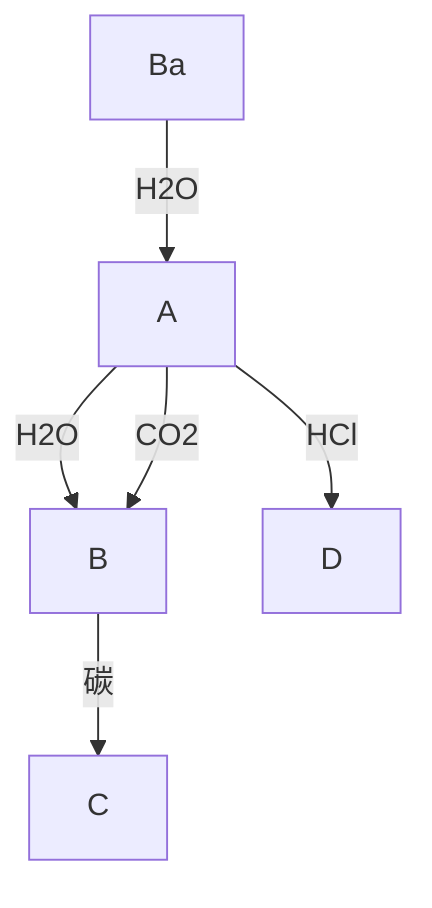

12.5 为什么熔融氟化铍冷却时形成玻璃态？

12.6 计算每种第2族元素氢化物中氢的质量分数。研究储氢材料时为什么研究 $MgH_{2}$ 的可行性而不是研究 $BeH_{2}$ ?

12.7 为什么第1族元素的氢氧化物比第2族元素的氢氧化物对金属更具腐蚀性？

12.8 $\mathrm{MgSeO_4}$ 和 $\mathrm{BaSeO_4}$ 两个盐中哪一个在水中溶解度更大？

12.9 如何将 Ra 从含有其他第 2 族金属阳离子的溶液中分离出来？

12.10 哪些第 2 族元素的盐被用作干燥剂？为什么？

12.11 已知 $Te^{2-}$ 的离子半径为 207 pm，试预测 BeTe 和 BaTe 的结构。

12.12 用表 1.7 的数据和 Ketelaar 三角(图 2.36)预测 $BeBr_{2}$ 、 $MgBr_{2}$ 和 $BaBr_{2}$ 的成键性质。

12.13 两个 Grignard 化合物 $C_{2}H_{5}MgBr$ 和 $2,4,6-(CH_{3})_{3}C_{6}H_{2}MgBr$ 都能溶解在 THF 中，你预期两个物种在溶液中的结构会有何不同？

12.14 写出下列反应的生成物：

(a) $MgCl_{2} + LiC_{2}H_{5} \rightarrow$   
(b) $\mathrm{Mg} + (\mathrm{C}_2\mathrm{H}_5)_2\mathrm{Hg}\longrightarrow$   
(c) $Mg+C_{2}H_{5}HgCl$

# 辅导性作业

12.1 大理石和石灰石建筑物易被酸雨腐蚀。什么是酸雨？讨论酸性的成因。描述大理石和石灰石被酸雨腐蚀的过程。请列出哪些化合物可以作为发电厂的淋洗剂将导致酸雨的排放物减至最小，并描述其原理。  
12.2 在论文“Noncovalent interaction of chemical bonding between alkaline earth cations and benzene?”(Chem. Phys. Lett. 2001,349,113)中,Tan与合作者进行了铍、镁和钙离子与苯形成的络合物的理论计算。碱土金属和苯的键合归因于哪些轨道的相互作用？这种轨道相互作用对苯中的C—C键长有何影响？用键焓增加的顺序排列M—C键。与第1族元素与苯作用的键强相比，这里的键强如何？示意绘出金属-苯络合物的几何构型。  
12.3 讨论氟化铍玻璃。注意 $BeF_{2}$ 的化学行为与 $SiO_{2}$ 的类似性。  
12.4 高温氧化铜复合物超导体（如 $YBa_{2}Cu_{3}O_{7}$ 、 $Bi_{2}Sr_{2}Ca_{2}Cu_{3}O_{10}$ 、 $HgBa_{2}Ca_{2}Cu_{3}O_{x}$ ）通常含有一个或多个第2族元素（C.N.R.Rao and A.K.Ganguli, Acta Cryst., 1995, B51, 604）。请叙述 $Ca^{2+}$ 、 $Sr^{2+}$ 和 $Ba^{2+}$ 在这些化合物中所起的作用，包括分析阳离子大小对氧原子的配位有何关系。  
12.5 P. C. Junk 和 J. W. Steed 用 Mg、Ca、Sr、Ba 的硝酸盐制备了冠醚络合物 (J. Chem. Soc., Dalton. Trans., 1999, 407)。概括叙述合成这些化合物的一般程序。绘出用到的两个冠醚的结构。讨论这些络合物的结构及它们如何随阳离子的不同而变化。  
12.6 根据你对第 2 族元素化学性质变化趋势的了解并参照表 12.1 的数据预测镭的化学性质。并将预测结果

# 第 13 族元素

本族元素的化学性质有明显的规律性,如氧化数和两性特征。本章将介绍第13族元素的存在和提取,并讨论这些元素及其简单化合物、配位化合物和金属有机化合物的化学性质。此外也将全面介绍硼的簇化合物。

本族元素（硼、铝、镓、铟、铊）具有多种物理性质和化学性质。第一个元素（硼）本质上是个非金属，而其他较重元素明显地具有金属性。铝是工业领域中最重要的一种元素，因用途广泛而大规模进行生产。硼与氢、金属、碳形成大量簇化合物。含有镓和铟的合金与化合物具有重要的光学性质和电子学性质。

# A. 基本面

本部分论述第 13 族元素的基本化学性质。

![[无机化学第6版主族364-564_images/8fc6d87b812eca267cc328740e6273f33cb26e0505408e61bf56ad2289187d0e.jpg]]

text_image

1 2 13 14 15 16 17 18
Li Be B C N O F Ne
Mg Al Si
Ca Ga Ge
Sr In Sn
Ba Tl Pb
Ra

# 13.1 元素

提要:硼是本族中唯一的非金属元素。铝是第13族中丰度最高的元素。

本族各元素在地壳岩石、海洋和大气中的丰度变化很大。铝的丰度较高，但硼在宇宙中和地球上的丰度却很低。像锂和铍一样，这一事实反映出核合成反应中避开了这些轻元素（应用相关文段1.1）。第13族较重元素丰度低的事实与铁后元素核稳定性递降的趋势相一致。硼在自然界以硼砂 $\left[\mathrm{Na}_{2} \mathrm{~B}_{4} \mathrm{O}_{5}(\mathrm{OH})_{4} \cdot 8 \mathrm{H}_{2} \mathrm{O}\right]$ 和四水硼砂 $\left[\mathrm{Na}_{2} \mathrm{~B}_{4} \mathrm{O}_{5}(\mathrm{OH})_{4} \cdot 2 \mathrm{H}_{2} \mathrm{O}\right]$ 的形式存在，人们从中提取硼的粗产品。铝存在于许多黏土和铝硅酸盐矿物中，但工业上最重要的则是铝土矿。铝土矿是水合氢氧化铝和氧化铝的复杂混合物，它被用来大规模地制备铝。氧化镓以杂质形式存在于铝土矿中，通常作为生产铝的副产品而回收。痕量的铟和铊存在于许多矿物中。

s区和d区都是金属元素，而p区元素的范围则包括非金属、准金属和金属。这一事实导致p区元素化学性质的多样性和一些明显的变化趋势（节9.4）。从B到Tl金属性增强：B是非金属；Al基本上是金属（虽然因具有两性往往被归入准金属）；Ga、In、Tl是金属。与之相关的变化趋势是，化合物中的成键趋势从硼的共价键主导过渡到重元素的离子键主导。这一事实可通过自上而下原子半径增加和与之相关的电离能的减小给出合理解释（见表13.1）。因为较重元素的电离能低，金属自上而下越来越容易形成阳离子。Ga的电负性比Al大[与预期中的变化趋势相左，节1.7(d)]，这是交替效应[节9.2(c)]的体现。

正如节 9.8 中所讨论的那样,由于原子半径小,各族第一个元素的性质与同族其他元素显著不同。这种差异在第 13 族中尤为明显,B 的化学性质明显不同于同族其他元素。但是 B 与第 14 族的 Si 存在明显的对角线关系:

- 硼和硅都形成酸性氧化物（如 $\mathrm{B}_2\mathrm{O}_3$ 和 $\mathrm{SiO}_2$ ）；铝形成两性氧化物。  
- 硼和硅都形成多种氧化物的聚合结构和玻璃。

\- 硼和硅都形成易燃的气态氢化物；铝的氢化物是固体。

本族元素的价电子组态为 $ns^{2}np^{1}$ 。像电子组态所表明的那样，所有元素在其化合物中均显示 +3 氧化态。然而本族较重元素也能以 +1 氧化态形成化合物，+1 氧化态的稳定性自上而下逐渐增加。事实上，Tl 的最常见氧化态是 Tl(I)。这一趋势在卤化物中尤为明显，这是惰性电子对效应（节 9.5）造成的结果。Tl(I)有强烈的毒性，其离子半径与钾离子非常接近，能进入细胞并破坏钾离子和钠离子的输送机制（节 26.3）。

表 13.1 第 13 族元素的某些性质

<table><tr><td>性质</td><td>B</td><td>Al</td><td>Ga</td><td>In</td><td>Tl</td></tr><tr><td>共价半径/pm</td><td>80</td><td>125</td><td>125</td><td>150</td><td>155</td></tr><tr><td>金属半径/pm</td><td></td><td>143</td><td>141</td><td>166</td><td>171</td></tr><tr><td>离子半径(配位数为6), $r(M^{3+})/pm$ </td><td>27</td><td>53</td><td>62</td><td>80</td><td>89</td></tr><tr><td>熔点/°C</td><td>2 300</td><td>660</td><td>30</td><td>157</td><td>304</td></tr><tr><td>沸点/°C</td><td>3 930</td><td>2 470</td><td>2 403</td><td>2 000</td><td>1 460</td></tr><tr><td>第一电离能, $I_1/(kJ·mol^{-1})$ </td><td>799</td><td>577</td><td>577</td><td>556</td><td>590</td></tr><tr><td>第二电离能, $I_2/(kJ·mol^{-1})$ </td><td>2 427</td><td>1 817</td><td>1 979</td><td>1 821</td><td>1 971</td></tr><tr><td>第三电离能, $I_3/(kJ·mol^{-1})$ </td><td>3 660</td><td>2 745</td><td>2 963</td><td>2 704</td><td>2 878</td></tr><tr><td>电子亲和能, $E_a/(kJ·mol^{-1})$ </td><td>26.7</td><td>42.5</td><td>28.9</td><td>28.9</td><td></td></tr><tr><td>Pauling电负性</td><td>2.0</td><td>1.6</td><td>1.8</td><td>1.8</td><td>2.0</td></tr><tr><td> $E^{\ominus}(M^{3+},M)/V$ </td><td>-0.89</td><td>-1.68</td><td>-0.53</td><td>-0.34</td><td>+0.72</td></tr></table>

硼存在多种同素异形体。无定形 B 是一种棕色粉末，但坚硬且难熔的晶态 B 是亮黑色晶体。已测定了晶体结构的三种固相中均含有二十面体 $B_{12}$ 基元（见图 13.1）。这种二十面体结构基元在硼化学中反复出现，在金属硼化物和硼氢化合物结构中还会再次遇到。二十面体单元也出现在与第 13 族之外的元素形成的某些金属互化物（如 $Al_{5}CuLi_{3}$ 、 $RbGa_{7}$ 和 $K_{3}Ga_{13}$ ）中。硼显示惰性，通常情况下粉状硼只能与 $F_{2}$ 和 $HNO_{3}$ 起反应。

![[无机化学第6版主族364-564_images/873cbe75eb3febf36d01f2dec2ee98bdf5d4ec3a688469ba12e1355be002ec44.jpg]]

chemical

3D molecular structure diagram showing a symmetric cage-like arrangement of atoms

(a)

![[无机化学第6版主族364-564_images/e11231e6eaa7e86ae19cccd3db8a29a832211c2b9303bd945e24b977f970f829.jpg]]

chemical

Molecular structure diagram of a cage-like compound with spherical atoms and bonds

(b)   
图 13.1 菱形硼中的 $B_{12}$ 二十面体：(a) 沿三重对称轴观察的侧视图；  
(b) 垂直该轴观察的俯视图。二十面体之间通过三中心二电子键 $(3c,2e)$ 相连

尽管 Al 是电正性金属(活泼金属),却由于存在表面钝化的氧化膜而非常稳定。如果移除表面氧化膜,Al 则会迅速被空气氧化。铝粉末具有很高的反射度,因此可用作银色油漆中的填料。铝也是电和热的良导体。

镓在低温下是脆性固体,但在 $30^{\circ}C$ 时会熔化。镓的低熔点归因于它的晶体结构,其中每个 Ga 原子只有 1 个最邻近原子和 6 个次邻近的相邻原子:这样,Ga 原子倾向于形成 Ga—Ga 双原子对。镓的液态范围很大( $30\sim2403^{\circ}C$ ),能够润湿玻璃和皮肤因而难以操作。镓容易与其他金属形成合金,能扩散到其他金属晶格中使其变脆。铟形成畸变的立方密堆积晶格(ccp),铊则是六方密堆积晶格(hcp)。

# 13.2 化合物

提要:本族所有元素能形成+3氧化态的氢化物、氧化物和卤化物。+1氧化态的稳定性自上而下逐渐增加，+1氧化态也是铊化合物的最稳定氧化态。

第 13 族较轻元素一个非常显著的特点是其具有 $ns^{2}np^{1}$ 电子组态。这种组态使其通过电子共享形成 3 个共价键时价层最多只能含 6 个电子。因此，许多化合物都不能形成完整的八隅体结构而显示 Lewis 酸性。作为 Lewis 酸，能够从给予体接受一对电子完成八隅体。此外，作为第 13 族的第一个元素，B 及其化合物与同族其他元素的化学性质明显不同。

![[无机化学第6版主族364-564_images/8c42f36410e8e37837e8ea15bd6ea12e9b7dfbcc8ea8597c2183c4519507c39b.jpg]]

chemical

Molecular structure diagram of methane (CH₄) showing two carbon atoms bonded to hydrogen atoms in a tetrahedral arrangement

(1) 乙硼烷， $B_{2}H_{6}$

应该注意区分“缺电子”和“不完整的八隅体”两种表述。前者是指缺乏足够的电子来形成原子间正常的共价键；后者是指主族原子最外层电子数少于8。

硼的二元氢化合物叫硼烷。硼烷系列中最简单的乙硼烷 $(1, \mathrm{B}_2\mathrm{H}_6)$ 是个典型的缺电子化合物，其结构通常用二中心二电子键 $(2c, 2e)$ 和三中心二电子键 $(3c, 2e)$ 两个术语来描述（节2.11）：桥式的 $3c, 2e$ 键在硼烷化学中是反复出现的一种键合方式。所有的硼氢化物燃烧产生特征的绿色火焰，其中有些与空气接触发生燃爆。碱金属的四氢合硼酸盐 $\left(\mathrm{NaBH}_{4}\right.$ 和 $\mathrm{LiBH}_{4}$ 是实验室中常用的还原剂，也用作合成大多数硼氢化物的前体。碱金属和碱土金属的四氢合硼酸盐及氨硼烷 $\left(\mathrm{NH}_{3}\mathrm{BH}_{3}\right)$ 都是有用的储氢材料（应用相关文段13.1）。

# 应用相关文段 13.1 储氢与第 13 族元素

氢燃料电池是碳基燃料的替代品并开始应用于移动技术和汽车。高效的燃料电池需要高效的氢源，人们对许多储氢方法都进行了研究。其中包括高压储氢和使用多孔材料，但也关注着加热或遇水时能生成 $\mathrm{H}_{2}$ 的物质。硼和铝的氢化物即属此类。有吸引力的化合物中含氢的质量分数高， $\mathrm{LiBH}_{4} 、 \mathrm{NaBH}_{4} 、 \mathrm{LiAlH}_{4}$ 和 $\mathrm{AlH}_{3}$ 中氢的质量分数分别约为 $18\%$ 、 $11\%$ 、 $11\%$ 和 $10\%$ 。四氢合硼酸钠（ $\mathrm{NaBH}_{4}$ ）与水反应生成氢气的反应是放热反应：

$$
\mathrm{NaBH} _ {4} (\mathrm{aq}) + 4 \mathrm{H} _ {2} \mathrm{O} (1) \longrightarrow 4 \mathrm{H} _ {2} (\mathrm{g}) + \mathrm{NaB(OH)} _ {4} (\mathrm{aq}) \quad \Delta_ {\mathrm{r}} H ^ {\ominus} = - 2 3 0 0 \mathrm{kJ} \cdot \mathrm{mol} ^ {- 1}
$$

该反应需要以镍或铂作为催化剂，能快速为发动机或燃料电池产生潮湿的氢气。 $NaBH_{4}$ 是以质量分数为30%的水溶液形式使用的，因此在大气压下是非挥发性的、不易燃的液体。由于没有副反应或挥发性副产物，该硼酸盐产物可以回收再利用。

氨硼烷 $\left(\mathrm{BH}_{3}\mathrm{NH}_{3}\right)$ 含氢21%，也用于产氢研究。1950年代曾经研究过将氨硼烷用作火箭燃料，但后来放弃了。将氨硼烷加热至500℃时分解并放出氢气，但残余物是不易回收的氮化硼。最近有研究探讨了硼氢化镁氨络合物 $\mathrm{Mg}\left(\mathrm{BH}_{4}\right)_{2}\cdot2\mathrm{NH}_{3}$ 的储氢潜能。该化合物含氢16%，其溶液流过钌催化剂时释放出氢。它在150℃开始分解，205℃时释氢速率最大，这些性质使它成为对氨硼烷 $\left(\mathrm{BH}_{3}\mathrm{NH}_{3}\right)$ 有竞争力的储氢材料。

三卤化硼 $\left(\mathrm{BX}_{3}\right)$ 是平面三角形分子，与本族其他元素的卤化物不同，三卤化硼在气态、液态和固态都是单体。三氟化硼和三氯化硼是气体，三溴化硼是挥发性液体，三碘化硼是固体（见表13.2）。挥发性的这种变化趋势与分子中电子数增多而导致色散力增加的趋势相一致。三卤化硼是不完整的八隅体，也是

Lewis 酸。Lewis 酸性的强度顺序是 $BF_{3}<BCl_{3}\leqslant BBr_{3}$ ，与从卤素电负性角度预期的结果正相反（节 4.7）。卤素原子和 B 原子之间通过 X—B $\pi$ 成键作用部分降低了缺电子性，导致 B 原子的空 p 轨道部分地被卤素原子提供的电子所占据（见图 13.2）。Lewis 酸性的变化趋势源于较轻、较小的卤素原子的 X—B $\pi$ 成键作用更有效，F—B 键是形式上已知的最强单键之一。

表 13.2 三卤化硼的性质

<table><tr><td>性质</td><td> $BF_{3}$ </td><td> $BCl_{3}$ </td><td> $BBr_{3}$ </td><td> $BI_{3}$ </td></tr><tr><td>熔点/°C</td><td>-127</td><td>-107</td><td>-46</td><td>50</td></tr><tr><td>沸点/°C</td><td>-100</td><td>13</td><td>91</td><td>210</td></tr><tr><td>键长/pm</td><td>130</td><td>175</td><td>187</td><td>210</td></tr><tr><td> $\Delta_{f}G^{\ominus}/(kJ·mol^{-1})$ </td><td>-1 112</td><td>-339</td><td>-232</td><td>+21</td></tr></table>

氧化硼 $\left(\mathrm{B}_{2}\mathrm{O}_{3}\right)$ 是最重要的硼氧化物,由硼酸的脱水反应制备:

$$
4 \mathrm{B} (\mathrm{OH}) _ {3} (\mathrm{s}) \xrightarrow {\triangle} 2 \mathrm{B} _ {2} \mathrm{O} _ {3} (\mathrm{s}) + 6 \mathrm{H} _ {2} \mathrm{O} (\mathrm{l})
$$

玻璃状氧化硼是由三角形 $BO_{3}$ 单元构成的、部分有序的网状体。晶形 $B_{2}O_{3}$ 则是由 $BO_{3}$ 单元通过 O 原子相连而构成的有序网状体。金属氧化物溶于熔融的 $B_{2}O_{3}$ 产生有色玻璃。氧化硼和二氧化硅是硼硅酸盐玻璃的主要成分。由于强的 B—O 键，这种玻璃的热膨胀性较低，用于制造耐热的实验室玻璃器皿。

许多分子化合物中都含有 B—N 键, 其中很多是碳化合物的类似物。含有 B—N 和 C—C 单元的化合物之间的相似性可用它们为等电子单元的事实来解释。B 和 N 组成的最简单的化合物是氮化硼 BN, 它不难用加热氧化硼与氮化合物的方法来合成 (应用相关文段 13.2):

$$
\mathrm{B} _ {2} \mathrm{O} _ {3} (1) + 2 \mathrm{NH} _ {3} (\mathrm{g}) \xrightarrow {1 2 0 0 ^ {\circ} \mathrm{C}} 2 \mathrm{BN(s)} + 3 \mathrm{H} _ {2} \mathrm{O(g)}
$$

![[无机化学第6版主族364-564_images/a154dee2024ac64dd4f12b37d063bb5423c85fd389a724630aeb9b48ff3359c1.jpg]]

chemical

Molecular structure diagram showing boron (B), x, and electron (e'') with partial atomic lattice a''₁

图 13.2 三卤化硼的成键 $\pi$ 轨道主要定域于大电负性的卤素原子上，但在 $a_{1}$ 轨道中，与硼 p 轨道的重叠是重要的

# 应用相关文段 13.2 氮化硼的应用

六方氮化硼最初被用来满足航空航天工业的需求，它在氧气中稳定，并在低于900℃时不与水蒸气起反应。它是一个好的热绝缘体，热膨胀性低，还能耐受热冲击。这些性质使它在工业上用来制作高温坩埚。硼粉末可用作脱模剂（分型粉）和热绝缘体。氮化硼纳米管是在高真空条件下将硼和氮沉积在钨的表面形成的。这些纳米管适用于高温条件，同样温度下碳纳米管则会被烧蚀。BN纳米管也提供了室温储氢的可能性，已经发现它能吸收质量分数为2.6%的 $H_{2}$ 。

粉状氮化硼质软而有光泽，在化妆品和个人护理行业应用最广泛。它无毒且不存在已知的危险，许多产品中都加入了高达10%的氮化硼粉。它使指甲油和口红等产品增添了珠光光泽，还被添加到粉底中用以遮掩皱纹。它对光的反射性可以散射光，使皱纹不易被察觉。

一种形式的氮化硼结构是由类似石墨片层的平面原子层构成的(节14.5)，某些物理性质也与石墨类似。例如，石墨和BN都有滑腻感，都能用作润滑剂。但BN是一种白色、不导电的固体，而不是黑色的金属性导体。除片层结构的氮化硼外，B与N最著名的不饱和化合物是环硼氮三烯 $B_{3}N_{3}H_{6}(2)$ ，它与苯等电子而且同结构。与苯相类似，也是无色液体(沸点55℃)。

Al、Ga、In、Tl都是化学性质存在许多相似之处的金属元素。它们类似硼，形成作为Lewis酸的缺电子

化合物。铝能与许多金属形成合金，制造既轻又耐腐蚀的器材。Ga在Al-Ga合金中能防止Al表面形成紧密的钝化膜。这种合金遇水时铝与水反应生成氢氧化铝并放出氢气。氢化铝 $\mathrm{(AlH_3)}$ 是固体，最好将其看作似盐化合物（类似s区金属的氢化物）。 $\mathrm{AlH}_3$ 在实验室用得很少，不像 $\mathrm{CaH}_2$ 和 $\mathrm{NaH}$ 那样容易从市场购得。然而 $\mathrm{NaAlH_4}$ 是个广泛使用的还原剂。烷基铝氢化物[如 $\mathrm{Al_2(C_2H_5)_4H_2}]$ 是众所周知的分子化合物，其中含有Al—H—Al $3c,2e$ 键（节2.11）。

![[无机化学第6版主族364-564_images/f7e350fa991994aadbeb6ead9ba1677a8ff43fefd0c4f2461390123a2276d39e.jpg]]

chemical

Molecular structure diagram of a boron-nitrogen-oxygen compound with labeled atoms B, H, and N

(2) 环硼氮三烯, $B_{3}N_{3}H_{6}$

所有第 13 族元素都能形成三卤化物,其中金属的氧化态为 +3。然而正如惰性电子对效应(节 9.5)所

预期的那样，该族自上而下+1氧化态变得更常见，Tl形成稳定的一卤化物。Ga、In和Tl也形成混合氧化态（I/Ⅲ）的卤化物。F体积是如此之小，以致三氟化物是物理上的硬离子固体（比其他卤化物的熔点和升华焓高得多）。高晶格焓也导致三氟化物在大多数溶剂中的溶解度很小；对简单给予体而言也起不到Lewis酸的作用。Al、Ga、In这些较重的三卤化物可溶于各种极性溶剂，是优良的Lewis酸。平面三角形 $\mathrm{MX}_3$ 单体

![[无机化学第6版主族364-564_images/f17db7bdb9b9bd51da5ab21e8b6852fe7593ba9c4be42e2786ba902818e6993c.jpg]]

chemical

Molecular structure diagram of aluminum chloride (AlCl) showing tetrahedral geometry with chlorine and aluminum atoms

(3) $Al_{2}Cl_{6}$

只出现在高温气相中,否则三卤化物在气相和溶液中均以 $M_{2}X_{6}$ 二聚体的形式存在。挥发性固体也是二聚物。 $AlCl_{3}$ 是一个例外,它在固相为六配位的层状结构,熔点温度转化为四配位的分子型二聚体。该二聚体含有 M—X 配位键,其中属于一个 $AlX_{3}$ 单元中 X 上的孤电子对让第二个 $MX_{3}$ 单元的 M 完成八隅体(3)。这种配位方式使每个 M 原子周围的 X 原子按四面体排布。与本族其他元素不同,Tl(I)是其卤化物中最稳定的氧化态。

α-氧化铝是 $Al_{2}O_{3}$ 最稳定的形式，它是一种质硬的、耐火的两性物质。氢氧化铝在低于 $900^{\circ}C$ 温度下脱水形成 γ-氧化铝，后者是个介稳的多晶形式 [有缺陷的尖晶石结构，节 3.9(b)]，而且比表面积非常高。 $Ga_{2}O_{3}$ 的 α 和 γ 形式与氧化铝对应的形式具有同样的结构。铟和铊分别形成 $In_{2}O_{3}$ 和 $Tl_{2}O_{3}$ 。铊也形成 $\mathrm{Tl(I)}$ 的氧化物和过氧化物，化学式分别为 $Tl_{2}O$ 和 $Tl_{2}O_{2}$ 。

第13族最重要的氧合酸盐是明矾类化合物 $\mathrm{MAl(SO_4)_2\cdot 12H_2O}$ ，式中M是一价阳离子如 $\mathrm{Na}^+$ 、 $\mathbf{K}^{+}$ 、 $\mathrm{Rb}^{+},\mathrm{Cs}^{+},\mathrm{Tl}^{+}$ 或 $\mathrm{NH}_4^+$ 。镓和铟也形成类似这种类型的系列盐，但B和Tl则不能：B离子太小，而Tl原子又太大。明矾类化合物被看作含有三价水合阳离子（ $[\mathrm{Al(OH_2)_6}]^{3 + }$ )的复盐，其余的水分子在阳离子和硫酸根离子之间形成氢键。明矾矿 $\mathrm{KAl(SO_4)_2\cdot 12H_2O}$ （铝的名称来自于它）是唯一常见的水溶性含铝矿物。自古以来被用作媒染剂将染料固定在纺织品上。媒染剂与染料形成配位络合物附着在纺织品上，从而防止染料在清洗时被洗掉。术语“矾”被广泛用于描述其他通式为M（I）M'（Ⅲ） $(\mathrm{SO}_4)_2\cdot 12\mathrm{H}_2\mathrm{O}$ 的化合物，其中M往往是d金属，如“铁矾” $\mathrm{KFe(SO_4)_2\cdot 12H_2O}$ 中的Fe。

# 13.3 硼的簇化合物

提要:硼可形成多种聚合的笼状化合物,包括硼氢化物、金属硼烷和碳硼烷。

硼不仅形成简单氢化物,还形成多个系列的电中性和阴离子型聚合的笼状硼氢化合物。形成硼氢化合物的硼原子数最多可达12个,这些化合物被分为闭合型(closo)、巢形(nido)和蛛网形(arachno)三大类。

化学式为 $\left[\mathrm{B}_n\mathrm{H}_n\right]^{2-}$ 的硼氢化物为闭合型结构（closo structure），“closo”这个名称来源于希腊词，意为“cage”。该系列阴离子中的 $n$ 值从5到12，如三角双锥体 $\left[\mathrm{B}_5\mathrm{H}_5\right]^{2-}(4)$ 、八面体 $\left[(\mathrm{B}_6\mathrm{H}_6)\right]^{2-}(5)$ 和二十面体 $\left[\mathrm{B}_{12}\mathrm{H}_{12}\right]^{2-}(6)$ 。化学式为 $\mathrm{B}_n\mathrm{H}_{n+4}$ 的硼簇合物采用巢形结构（nido structure），“nido”这个名称来源于拉丁词，意为“nest”，如 $\mathrm{B}_5\mathrm{H}_9(7)$ 。化学式为 $\left[\mathrm{B}_n\mathrm{H}_{n+6}\right]$ 的硼簇合物为蛛网形结构（arachno structure），“arachno”这个名称来源于希腊词，意为“spider”（因为它们类似于不整齐的蜘蛛网）。戊硼烷(11） $(\mathrm{B}_5\cdot \mathrm{H}_{11},8)$ 属于

此类。

硼形成叫作金属硼烷(metallaboranes)的许多含金属的簇合物。在某些情况下，金属通过氢桥连接至硼氢化物负离子。更常见也更牢固的金属硼烷含有直接的M—B键。

碳硼烷（carboranes，更正式的名称为carbaboranes）与多面体硼烷和硼氢化物密切相关，是一大族含有B原子和C原子的簇合物。 $\left[\mathrm{B}_6\mathrm{H}_6\right]^{2 - }(5)$ 的一个类似物是电中性的碳硼烷 $\mathrm{B_4C_2H_6(9)}$ 。其他杂原子（如N、P和As）也可引入硼烷分子中。

![[无机化学第6版主族364-564_images/bc74db2d0006bdd5a6fab69c8dd78ee02828d17efcb2bcc7a3fe8c9f6ba8c5b6.jpg]]

# B. 详述

这里将详细讨论第 13 族元素的化学性质,按非金属到金属的变化趋势、不完整八隅体及与之相关的 Lewis 酸性来解释所观察到的性质。硼的特性将分在不同节中做讨论。

# 13.4 存在和提取

提要:铝的丰度高;铟和铊是第13族中丰度最低的元素。

硼存在数种质硬而难熔的同素异形体。晶体结构已知的三种固相均含二十面体 $\mathrm{B}_{12}$ 这样的基本单元（见图13.1）。这种二十面体是硼化学中反复出现的结构单元，会在金属硼化物和硼氢化物的结构中再次遇到它。二十面体单元在其他第13族元素形成的金属间化合物和Zintl相[节3.8(c)]中也有发现，如 $\mathrm{Al}_{5}\mathrm{CuLi}_{3}$ 、RbGa和 $\mathrm{K}_3\mathrm{Ga}_{13}$ 。

硼在自然界以硼砂 $\left[\mathrm{Na}_{2} \mathrm{~B}_{4} \mathrm{O}_{5} (\mathrm{OH})_{4} \cdot 8 \mathrm{H}_{2} \mathrm{O}\right]$ 和四水硼砂 $\left[\mathrm{Na}_{2} \mathrm{~B}_{4} \mathrm{O}_{5} (\mathrm{OH})_{4} \cdot 2 \mathrm{H}_{2} \mathrm{O}\right]$ 的形式存在，它们也是制备粗硼的原料。先是将硼砂转化为硼酸 $\left[\mathrm{B} (\mathrm{OH})_{3}\right]$ ，再制成硼的氧化物 $\left(\mathrm{B}_{2} \mathrm{O}_{3}\right)$ 。氧化硼用 $\mathrm{Mg}$ 还原，然后分别用碱液和氢氟酸洗涤。纯硼是用 $\mathrm{H}_{2}$ 还原 $\mathrm{BBr}_{3}$ 蒸气制得的：

$$
2 \mathrm{BBr} _ {3} (\mathrm{g}) + 3 \mathrm{H} _ {2} (\mathrm{g}) \longrightarrow 2 \mathrm{B(s)} + 6 \mathrm{HBr(g)}
$$

铝是地壳中丰度最高的金属元素，约占地壳岩体质量的 $8\%$ 。铝元素存在于多种黏土和硅铝酸盐矿物中。工业上最重要的是铝土矿，它是水合氢氧化铝和氧化铝的复杂混合物。采用Hall-Heroult法大量地从铝土矿提取铝（节5.18）。过程中先将 $\mathrm{Al_2O_3}$ 溶于熔融的冰晶石（ $\mathrm{Na}_3\mathrm{AlF}_6$ ），混合物电解时在阴极沉积出金属铝。生产铝是个高耗能产业，但其耗费可通过规模化生产、原材料成本低和采用水电等措施得到补偿。氧化铝在自然界中以红宝石、蓝宝石和刚玉等形式存在，而且还是金刚砂的一种成分。

氧化镓以杂质存在于铝土矿中，通常作为生产铝的副产物而回收。镓在该过程中富集于残渣中，可通过电解提取出来。铟是提取铅和锌的副产品，也用电解法回收。铊化合物是在烟道尘中发现的，细颗粒的铊化合物随冶炼尾气一起排出。先将烟道灰溶于稀硫酸，然后加入盐酸以沉淀氯化铊（Ⅰ），再经电解法提取金属铊。

# 13.5 元素及其化合物的用途

提要:最有用的硼化合物是硼砂;工业上最重要的元素是铝。

硼主要用在硼硅酸盐玻璃中。硼砂有很多日常用途，如用作水的软化剂、清洁剂和温和的杀虫剂。硼酸 $\left[\mathrm{B}(\mathrm{OH})_{3}\right]$ 被用作温和的防腐剂。无定形的棕色硼掺入烟火可以产生明亮的绿色。硼还是植物所必需的微量营养物。质量轻而强度大的硼纤维用于航空航天工业所需的合成材料和体育器材。B的许多化合物是超硬材料，其硬度接近金刚石。立方氮化硼是在高压下合成的，从而导致价格昂贵。生成二硼化铼不需要高压，所以产品比较便宜，但Re是个昂贵的金属。一种叫作“杂钻石”的材料（有时会标上“BCN”）是金刚石和氮化硼通过爆炸冲击合成的。这些化合物作为金刚石的代用品制备切削工具和刀片。过硼酸钠 $\left(\mathrm{NaBO}_{3} \cdot \mathrm{H}_{2} \mathrm{O}\right)$ 以二聚体 $\mathrm{Na}_{2} \mathrm{~B}_{2} \mathrm{O}_{4}(\mathrm{OH})_{4}$ 形式用作洗衣业的无氯漂白剂、清洗材料和牙齿增白剂。与含氯漂白剂相比，它对纺织品的腐蚀性更小，在低温下与活化剂（如四乙酰乙二胺，TAED）混合会变得更具活性。硼氢化钠 $\left(\mathrm{NaBH}_{4}\right)$ 用于大规模漂白木浆。硼烷曾经是常用的火箭燃料，但后来发现太易燃烧而无法安全操作。目前正在研究硼烷用作储氢材料的可能性，将氢存储在氨硼烷复合物 $\left(\mathrm{NH}_{3}: \mathrm{BH}_{3}\right)$ 中（应用相关文段10.4、12.3和13.1）。

铝是使用最广泛的有色金属。金属铝在新技术上的应用是由于它具有质轻、耐腐蚀和易回收的性质。铝用于罐头业、箔纸和炊具，也用于建筑业和航空合金（应用相关文段13.3）。许多铝化合物用作媒染剂，用于水和污水处理、造纸、食品添加剂和防水的纺织材料。氯化铝和氯代氢化铝用作止汗剂，氢氧化铝用作抗酸剂。掺杂了 $\mathrm{TiF}_3$ 的四氢合铝酸钠（ $\mathrm{NaAlH_4}$ ）可用作储氢材料。

Ga 的熔点(30 ℃)刚刚高出室温,因此被用于高温温度计。镓和铟形成低熔点合金,可用作自动喷水灭火系统的安全装置。两种元素都能沉积在玻璃表面制成耐腐蚀的镜子,掺杂了锡的 $In_{2}O_{3}$ 用于电子显示器的透明导电涂层和灯泡的热反射涂层。氮化镓用于蓝色激光二极管,是蓝光技术的基础。它对电离辐射不敏感,用于卫星上的太阳能电池。砷化镓是半导体,用于集成电路、发光二极管和太阳能电池。铊的化合物一度曾用来治疗癣菌病,也作为灭鼠灭蚁的有毒药物,然而已因高毒性( $Tl^{+}$ 能与 $K^{+}$ 一起穿过细胞膜实现跨膜传输,节26.3)而禁止使用。铊能被肿瘤细胞更有效地吸收,已在核医学上用作成像剂。

# 应用相关文段 13.3 铝的循环使用

生产铝是能源密集型的高耗资产业，铝的回收具有很强的吸引力。回收铝的产业已有数十年历史，尤其是铝制易拉罐的流行和日用铝制品的回收大大增加了产业的活力。铝经济学是循环经济学的一个典范，循环经济学是将一个过程的废品变成另一个过程的原料，从而将对环境和自然资源造成的不利影响减至最小。铝产品在寿命期内并未被消耗，而是被多次回收再利用，这种再利用对金属的物理性质或化学性质不产生负面影响。

即便将收集和分离铝的成本考虑在内，回收铝的成本也只有从铝土矿提取铝成本的5%。另外还要考虑减少垃圾填埋和节约铝或铝土矿运输成本带来的效益。回收铝的方法相当简单：将饮料罐等铝制品与其他垃圾分开、粉碎成小片、然后清洗压块(压块可以降低铝的再氧化)。将压成块状的铝置于炉中加热至750℃生成熔态铝,除去固体废渣,加入高氯酸铵赶走溶解在其中的氢。高氯酸铵分解放出氮气、氧气和氯气,后者与氢反应将其除去。然后加入添加剂以改变最终合金的性质再浇铸成锭。从废机动车辆回收铝的产业也已经建立起来,该产业遵循着相同的基本流程。只是过程的分离阶段较复杂,因为需要捡出其他金属、聚合物和纺织品等。

全球易拉罐的回收率为 70%，巴西以 97% 的回收率领跑全球。全球用在建筑和运输业的铝的回收率接近 90%，回收铝在满足社会对金属的需求上起着越来越重要的作用。

# 13.6 硼的简单氢化物

硼最简单的氢化物是气态的乙硼烷 $\left(\mathrm{B}_{2}\mathrm{H}_{6}\right)$ 。也存在更大的硼烷，它们可能是液体（如 $B_{5}H_{9}$ ）或固体 $\left(\mathrm{B}_{10}\mathrm{H}_{14}\right)$ 。硼烷可被Lewis碱所裂解。

# (a) 硼烷

提要: 乙硼烷可用卤化硼和氢负离子源之间的复分解反应来合成; 许多更大的硼烷可通过乙硼烷部分热解的方法制备; 所有的硼氢化物都可燃, 有时甚至会发生爆炸, 其中很多易水解。

在实验室中，乙硼烷 $(\mathrm{B}_2\mathrm{H}_6)$ 可通过卤化硼与 $\mathrm{LiAlH_4}$ （或 $\mathrm{LiBH_4}$ )在醚溶液中的反应制备：

$$
3 \mathrm{LiBH} _ {4} (\mathrm{et}) + 4 \mathrm{BF} _ {3} (\mathrm{et}) \longrightarrow 3 \mathrm{LiBF} _ {4} (\mathrm{et}) + 2 \mathrm{B} _ {2} \mathrm{H} _ {6} (\mathrm{g})
$$

这是一个复分解反应。为了体现组分之间发生交换的关系，可写成下述简化形式：

$$
\frac {3}{4} \mathrm{BH} _ {4} ^ {-} (\mathrm{et}) + \mathrm{BF} _ {3} (\mathrm{et}) \longrightarrow \frac {3}{4} \mathrm{BF} _ {4} ^ {-} (\mathrm{et}) + \mathrm{BH} _ {3} (\mathrm{g})
$$

像 LiH 一样, $LiBH_{4}$ 和 $LiAlH_{4}$ 都是 $H^{-}$ 转移的良好试剂,但因为可溶于醚类溶剂通常优于 LiH 和 NaH。因为乙硼烷在接触空气时会燃烧,合成反应需要严格排除空气的条件下进行操作(通常是在真空线上操作)。室温下乙硼烷的分解非常缓慢,分解生成更大的硼烷和一种非挥发性的、难溶的黄色固体(其中含有 $B_{10}H_{14}$ 和 $BH_{n}$ 聚合物种)。

更大的硼烷分两类:一类的化学式是 $B_{n}H_{n+4}$ ，另一类的化学式是 $B_{n}H_{n+6}$ （含氢较多但稳定性较低）。例如戊硼烷(11) $(B_{5}H_{11},8)$ 、丁硼烷(10) $(B_{4}H_{10},10)$ 和戊硼烷(9) $(B_{5}H_{9},7)$ 。读者需要留意硼烷的系统命名法：B原子的数目用B原子的下标表示，H原子数用括号中的数字表示。按照这种方法乙硼烷应该命名为乙硼烷(6)；然而由于不存在乙硼烷(8)，所以“乙硼烷”这个比较简单的名称就沿用下来。

所有硼烷都是无色的抗磁性物质。其物理状态涉及气体 $\left(\mathrm{B}_{2}\mathrm{H}_{6},\mathrm{B}_{4}\mathrm{H}_{8}\right)$ 、挥发性液体 $\left(\mathrm{B}_{5}\mathrm{H}_{9},\mathrm{B}_{6}\mathrm{H}_{10}\right)$ 和可升华固体 $\left(\mathrm{B}_{10}\mathrm{H}_{14}\right)$ 。所有硼氢化物都是可燃的，其中几个较小的硼烷（包括乙硼烷）能自发与空气反应，往往伴随剧烈爆炸并产生绿色的闪光（反应中间体BO的激发态发射的光）。反应的最终产物是硼酸：

$$
\mathrm{B} _ {2} \mathrm{H} _ {6} (\mathrm{g}) + 3 \mathrm{O} _ {2} (\mathrm{g}) \longrightarrow 2 \mathrm{B} (\mathrm{OH}) _ {3} (\mathrm{s})
$$

硼烷遇水容易水解生成硼酸和氢：

![[无机化学第6版主族364-564_images/f62092962598e2aebab26f3c05a36690c8e1dfb02af00ee415234263b0bbe8d0.jpg]]

chemical

Molecular structure diagram showing boron (B) and hydrogen (H) atoms in a crystal lattice

(10) $B_{4}H_{10}$

$$
\mathrm{B} _ {2} \mathrm{H} _ {6} (\mathrm{g}) + 6 \mathrm{H} _ {2} \mathrm{O} (\mathrm{l}) \longrightarrow 2 \mathrm{B} (\mathrm{OH}) _ {3} (\mathrm{aq}) + 6 \mathrm{H} _ {2} (\mathrm{g})
$$

如下所述， $B_{2}H_{6}$ 是个 Lewis 酸，水解机理涉及 $H_{2}O$ 作为 Lewis 碱而配位。氢分子是 O 上带部分正电荷的 H 原子与 B 上带部分负电荷的 H 原子结合生成的。

# (b) Lewis 酸性

提要:大体积软 Lewis 碱使乙硼烷发生对称裂解;小体积硬 Lewis 碱非对称地切开氢桥键。尽管乙硼烷能与许多硬 Lewis 碱起反应,但最好将其看作软 Lewis 酸。

正如水解机理所暗示的那样，乙硼烷和许多较轻的硼氢化物可作为 Lewis 酸通过与 Lewis 碱反应而裂解。迄今已经观察到两种不同的裂解模式，即对称裂解和非对称裂解。在对称裂解（symmetrical cleavage）中， $B_{2}H_{6}$ 裂解为两个对称的 $BH_{3}$ 碎片，每个 $BH_{3}$ 碎片都与 Lewis 碱形成络合物：

![[无机化学第6版主族364-564_images/ff8d93240f4d44533e8bd5e35ba3556f75646c27659916eccea03b100dc7b548.jpg]]

chemical

Chemical reaction showing conversion of boron-boron triple bond to bidentate with NMe3, forming a bridged boron complex

存在多种这样的络合物,它们与碳氢化合物具有等电子关系。例如,上述反应的产物与2,2-二甲基丙烷 $\left[\mathrm{C}\left(\mathrm{CH}_{3}\right)_{4}\right]$ 等电子。稳定性变化趋势表明 $BH_{3}$ 是个软Lewis酸,如下述反应所表明的那样:

$$
\mathrm{H} _ {3} \mathrm{B} - \mathrm{N} (\mathrm{CH} _ {3}) _ {3} + \mathrm{F} _ {3} \mathrm{B} - \mathrm{S} (\mathrm{CH} _ {3}) _ {2} \longrightarrow \mathrm{H} _ {3} \mathrm{B} - \mathrm{S} (\mathrm{CH} _ {3}) _ {2} + \mathrm{F} _ {3} \mathrm{B} - \mathrm{N} (\mathrm{CH} _ {3}) _ {3}
$$

反应中 $BH_{3}$ 转移到软给予体原子 S 上，而硬 Lewis 酸 $BF_{3}$ 则与硬给予体原子 N 相结合。

乙硼烷与氨直接反应导致非对称裂解(unsymmetrical cleavage)，生成了离子型产物：

![[无机化学第6版主族364-564_images/827140a5635ca2ab6e49de56ed1c955b40398af164132c1d9141f865d0292baa.jpg]]

chemical

Chemical reaction showing deprotonation of a boron-containing compound to form a bipyridine derivative and a protonated anion

乙硼烷和为数不多的其他硼氢化物在低温下与强的、空间拥挤程度不大的碱反应时通常能观察到非对称裂解。只要 Lewis 碱足够小且能避免空间排斥，反应过程中两个配体就能进攻同一个 B 原子。

# 例题13.1 用NMR识别反应产物

题目:如何用 $^{11}$ B-NMR确定乙硼烷与NMR非活性Lewis碱的反应是对称裂解还是非对称裂解(节8.6)?

答案:首先需要确定两个反应可能的产物,然后确定其 NMR 谱的特征有何不同。 $B_{2}H_{6}$ 的对称裂解与 L 生成 $BH_{3}L+BH_{3}L$ , 不对称裂解则产生 $BH_{2}L_{2}^{+}$ 和 $BH_{4}^{-}$ 。 $BH_{3}L$ 中的 ${}^{11}B$ 与三个 ${}^{1}H$ 核相连, 因此会在 NMR 谱中观察到四重峰。非对称裂解的第一个产物中 ${}^{11}B$ 与两个 ${}^{1}H$ 核偶合, 会出现三重峰。第二个产物中 ${}^{11}B$ 与四个 ${}^{1}H$ 核偶合, 会出现五重峰。

自测题 13.1 $^{11}$ B 核的自旋量子数 I=3/2。预言 BH $_{4}^{-}$ 在 $^{1}$ H-NMR 中谱线的数目和相对强度。

# (c) 硼氢化反应

提要:硼氢化反应(乙硼烷与烯烃在醚类溶剂中的反应)生成有机硼烷,有机硼烷是有机合成化学中非常有用的中间体。

硼氢化反应是化学合成手段中的重要组成部分,其本质是 HB 跨重键的加成:

$$
\mathrm{H} _ {3} \mathrm{B} - \mathrm{OR} _ {2} + \mathrm{H} _ {2} \mathrm{C} = \mathrm{CH} _ {2} \xrightarrow {\triangle , \text {醚}} \mathrm{CH} _ {3} \mathrm{CH} _ {2} \mathrm{BH} _ {2} + \mathrm{R} _ {2} \mathrm{O}
$$

在有机化学家看来,硼氢化反应主要产物中的 C—B 键是通过立体选择形成 C—H 键或 C—OH 键的中间体。在无机化学家看来,该反应是制备一系列有机硼烷的便捷方法。硼氢化反应是 EH 跨重键加成反应中的一个;硅氢化反应[节 14.7(b)]则是另一个重要的例子。

# (d) 四氢合硼酸根离子

提要: 四氢合硼酸根离子是制备金属氢化物络合物和硼烷加合物的有用中间体。

乙硼烷与碱金属氢化物反应生成含四氢合硼酸根离子 $\left(\mathrm{BH}_{4}^{-}\right)$ 的盐。由于乙硼烷和LiH对水和氧敏感，合成反应必须在排除空气和非水溶剂（如短链聚醚 $CH_{3}OCH_{2}CH_{2}OCH_{3}$ ）中进行（这里将polyether缩写为“polyet”）：

$$
\mathrm{B} _ {2} \mathrm{H} _ {6} (\text { polyet }) + 2 \mathrm{LiH} (\text { polyet }) \longrightarrow 2 \mathrm{LiBH} _ {4} (\text { polyet })
$$

我们将此反应看作具有强 Lewis 酸性的 $BH_{3}$ 与具有强 Lewis 碱性的 $H^{-}$ 反应的又一个例证。 $BH_{4}^{-}$ 与 $CH_{4}$ 、 $NH_{4}^{+}$ 是等电子物种，三物种化学性质随中心原子电负性增加的变化如下：

<table><tr><td></td><td> $BH_{4}^{-}$ </td><td> $CH_{4}$ </td><td> $NH_{4}^{+}$ </td></tr><tr><td>性质</td><td>碱性(hydridic)</td><td>—</td><td>酸性(protic)</td></tr></table>

表中的“hydridic”和“protic”分别表示 Brønsted 碱性（接受质子）和 Brønsted 酸性（给予质子）。通常条件下 $CH_{4}$ 在水溶液中既不显酸性也不显碱性。

碱金属的四氢合硼酸盐是非常有用的工业和实验室试剂。它们往往被用作温和的 $\mathrm{H}^{-}$ 离子源、还原剂和合成多种硼氢化合物的前体，也用作储氢材料（应用相关文段10.4、12.3和13.1）。这些反应大都是在极性非水溶剂中进行的。例如，前面提到的制备乙硼烷的反应：

$$
3 \mathrm{NaBH} _ {4} (\mathrm{s}) + 4 \mathrm{BF} _ {3} (\mathrm{g}) \longrightarrow 2 \mathrm{B} _ {2} \mathrm{H} _ {6} (\mathrm{g}) + 3 \mathrm{NaBF} _ {4} (\mathrm{s})
$$

四氢呋喃(THF)溶液中用 $NaBH_{4}$ 可将醛和酮还原为醇。尽管 $BH_{4}^{-}$ 对水解显示热力学不稳定性，但在高 pH 条件下水解进行得非常缓慢。人们已经设计出在水溶液中进行合成的一些方法。例如，可将 $GeO_{2}$ 和 $KBH_{4}$ 溶解于氢氧化钾的水溶液、然后进行酸化的方法制备锗烷( $GeH_{4}$ )：

$$
\mathrm{HGeO} _ {3} ^ {-} (\mathrm{aq}) + \mathrm{BH} _ {4} ^ {-} (\mathrm{aq}) + 2 \mathrm{H} ^ {+} (\mathrm{aq}) \longrightarrow \mathrm{GeH} _ {4} (\mathrm{g}) + \mathrm{B} (\mathrm{OH}) _ {3} (\mathrm{aq})
$$

$\mathrm{BH}_4^-$ 在水溶液中也可用作简单的还原剂。例如，将 $\mathrm{Ni}^{2+}(\mathrm{aq})$ 或 $\mathrm{Cu}^{2+}(\mathrm{aq})$ 水合离子还原为金属或金属硼化物。四氢合硼酸根离子通过与4d和5d元素卤素络合物（也含有起稳定作用的配体，如膦）在非水溶剂中的复分解反应向络合物引入氢负离子配体：

$$
\mathrm{RuCl} _ {2} (\mathrm{PPh} _ {3}) _ {3} + \mathrm{NaBH} _ {4} + \mathrm{PPh} _ {3} \xrightarrow {\triangle , \text {苯/醇}} \mathrm{RuH} (\mathrm{PPh} _ {3}) _ {4} + \text {其他产物}
$$

通过瞬态 $\mathrm{BH}_4^-$ 络合物的形成进行许多此类复分解反应也是可能的。事实上，已知存在氢和硼酸根的络合物，尤其是与高电正性金属形成的络合物：它们当中包括 $\mathrm{Al(BH_4)_3(11)}$ 和 $\mathrm{Zr(BH_4)_4(12)}$ ，前者含有类似乙硼烷中的氢负离子双重桥，后者中存在氢负离子三重桥。这些化合物中的成键作用可用 $3c,2e$ 键描述。

![[无机化学第6版主族364-564_images/8c101df68767976cd3d05b7fe30df771bbe3c856cecf5f558bc42d4eb878cc9a.jpg]]

chemical

Molecular structure of aluminum (Al), showing boron (B), hydrogen (H), and carbon atoms with bonds

(11) $\mathrm{Al(BH_{4})_{3}}$

![[无机化学第6版主族364-564_images/08d43c1135fbe5cdd7bb4073cc5f1bc534be8f7542263594be7b776ca211064e.jpg]]

chemical

Molecular structure of a zirconium complex with boron (B) and hydrogen (H) ligands

(12) $Zr(BH_{4})_{4}$

# 例题13.2 预言硼氢化合物的反应

题目:用化学方程式表述等量的 $\left[\mathrm{HN}\left(\mathrm{CH}_{3}\right)_{3}\right]\mathrm{Cl}$ 与 $LiBH_{4}$ 在四氢呋喃(THF)中相互作用的产物。

答案:由于 LiCl 的晶格焓高,应该预期最可能生成的产物是氯化锂。如果是这样,溶液中就会剩下 $BH_{4}^{-}$ 和 $\left[\mathrm{HN}\left(\mathrm{CH}_{3}\right)_{3}\right]^{+}$ 。碱性的 $BH_{4}^{-}$ 和酸性的 $\left[\mathrm{HN}\left(\mathrm{CH}_{3}\right)_{3}\right]^{+}$ 相互作用放出氢并生成三甲胺和 $BH_{3}$ 。在没有其他 Lewis 碱的情况下, $BH_{3}$ 分子将与四氢呋喃配位;然而,较强的 Lewis 碱三甲胺在最初反应时已经生成,所以总反应将是

$$
\left[ \mathrm{HN} (\mathrm{CH} _ {3}) _ {3} \right] \mathrm{Cl} + \mathrm{LiBH} _ {4} \longrightarrow \mathrm{H} _ {2} + \mathrm{H} _ {3} \mathrm{BN} (\mathrm{CH} _ {3}) _ {3} + \mathrm{LiCl}
$$

自测题 13.2 写出下述两个反应的方程式: (1) $B_{2}H_{6}$ 与丙烯在乙醚溶剂中以化学计量 1:2 反应; (2) $B_{2}H_{6}$ 与氯化铵在四氢呋喃中以相同的化学计量反应。

# 13.7 三卤化硼

提要:三卤化硼是有用的 Lewis 酸, $BCl_{3}$ 比 $BF_{3}$ 的酸性强。对硼-元素键的形成而言,三卤化硼也是重要的亲电试剂。具有 B—B 键的低价卤化物(如 $B_{2}Cl_{4}$ )也已被发现。

除 $\mathrm{BI}_3$ 外，其他三卤化硼都可由元素之间的直接反应得到。然而制备 $\mathrm{BF}_3$ 的首选方法是 $\mathrm{B}_2\mathrm{O}_3$ 与 $\mathrm{CaF}_2$ 在 $\mathrm{H}_2\mathrm{SO}_4$ 中的反应。该反应的驱动力部分来自 $\mathrm{H}_2\mathrm{SO}_4$ 和 $\mathrm{CaF}_2$ 反应生成HF和 $\mathrm{CaSO}_4$ 的稳定性：

$$
\mathrm{B} _ {2} \mathrm{O} _ {3} (\mathrm{s}) + 3 \mathrm{CaF} _ {2} (\mathrm{s}) + 6 \mathrm{H} _ {2} \mathrm{SO} _ {4} (\mathrm{l}) \longrightarrow
$$

$$
2 \mathrm{BF} _ {3} (\mathrm{g}) + 3 \left[ \mathrm{H} _ {3} \mathrm{O} ^ {+} \right] \left[ \mathrm{HSO} _ {4} ^ {-} \right] (\text {soln}) + 3 \mathrm{CaSO} _ {4} (\mathrm{s})
$$

所有三卤化硼与合适的碱可形成简单的 Lewis 络合物, 如反应:

$$
\mathrm{BF} _ {3} (\mathrm{g}) +: \mathrm{NH} _ {3} (\mathrm{g}) \longrightarrow \mathrm{F} _ {3} \mathrm{B} - \mathrm{NH} _ {3} (\mathrm{s})
$$

然而氯化硼、溴化硼和碘化硼敏感于温和质子源（如水、醇，甚至胺）而发生质子转移。如图13.3所示，这种反应（与复分解反应）在制备化学中非常有用。例如， $\mathrm{BCl}_3$ 快速水解得到硼酸 $\mathrm{B(OH)}_3$ ：

$$
\mathrm{BCl} _ {3} (\mathrm{g}) + 3 \mathrm{H} _ {2} \mathrm{O} (\mathrm{l}) \longrightarrow \mathrm{B} (\mathrm{OH}) _ {3} (\mathrm{aq}) + 3 \mathrm{HCl} (\mathrm{aq})
$$

反应的第一步可能是形成络合物 $Cl_{3}B—OH_{2}$ ，消除 HCl 后再与水进一步起反应。

![[无机化学第6版主族364-564_images/d7852def7567a0e4b953a6a16b800acb8ff2052a90b9d452f9e2f3d94baed8a8.jpg]]

flowchart

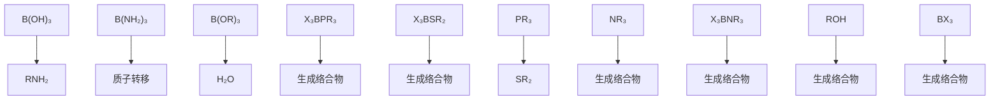

图 13.3 硼卤素化合物的反应 (X=卤素)

# 例题 13.3 推断三卤化硼反应的产物

题目:推断以下反应可能的产物并写出配平的化学方程式:(a) $BF_{3}$ 和过量氟化钠在酸性水溶液中;(b) $BCl_{3}$ 和过量氯化钠在酸性水溶液中;(c) $BBr_{3}$ 和过量 $NH(CH_{3})_{2}$ 在烃类溶剂中。

答案: 判断时需要充分考虑 B—X 键是否对水解敏感。(a) $F^{-}$ 是化学上相当强的硬碱; $BF_{3}$ 是强的硬 Lewis 酸, 对 $F^{-}$ 有较高的亲和力。因此反应会生成络合物:

$$
\mathrm{BF} _ {3} (\mathrm{g}) + \mathrm{F} ^ {-} (\mathrm{aq}) \longrightarrow \mathrm{BF} _ {4} ^ {-} (\mathrm{aq})
$$

过量的 $F^{-}$ 和酸能防止在高 pH 下生成水解产物（如 $BF_{3}OH^{-}$ ）。（b）不像 B—F 键（这种键对水解只是温和的敏感），其他 B—X 键发生强烈的水解反应。故可预期 $BCl_{3}$ 会发生强烈水解，而不是与水溶液中的 $Cl^{-}$ 配位：

$$
\mathrm{BCl} _ {3} (\mathrm{g}) + 3 \mathrm{H} _ {2} \mathrm{O} (1) \longrightarrow \mathrm{B} (\mathrm{OH}) _ {3} (\mathrm{aq}) + 3 \mathrm{HCl} (\mathrm{aq})
$$

(c) 三溴化硼将发生质子转移反应形成 B—N 键：

$$
\mathrm{BBr} _ {3} (\mathrm{g}) + 6 \mathrm{NH} (\mathrm{CH} _ {3}) _ {2} \longrightarrow \mathrm{B} [ \mathrm{N} (\mathrm{CH} _ {3}) _ {2} ] _ {3} + 3 [ \mathrm{NH} _ {2} (\mathrm{CH} _ {3}) _ {2} ] \mathrm{Br}
$$

该反应中，质子转移反应生成的 HBr 使过量的二甲胺加合质子。

自测题 13.3 解释下列物质之间可能发生的化学反应并写出配平的反应方程式: (a) $BCl_{3}$ 和乙醇; (b) $BCl_{3}$ 和吡啶在烃类溶液中; (c) $BBr_{3}$ 和 $F_{3}BN(CH_{3})_{3}$ 。

制备化学中如果需要相对较大的、无配位能力的阴离子，则要用到四氟合硼酸根阴离子 $\left(\mathrm{BF}_{4}^{-}\right)$ 。四卤合硼酸根阴离子 $BCl_{4}^{-}$ 和 $BBr_{4}^{-}$ 可在非水溶剂中制备。由于B—Cl和B—Br键容易发生溶剂解，它们在水和醇中都不稳定。

卤化硼是合成许多硼碳和硼拟卤素化合物的起始物(节17.7)。例如,制备烷基硼和芳基硼化合物。由 $BF_{3}$ 和甲基Grignard试剂在醚溶液中反应可制备三甲基硼：

$$
\mathrm{BF} _ {3} + 3 \mathrm{CH} _ {3} \mathrm{MgI} \longrightarrow \mathrm{B(CH} _ {3}) _ {3} + \text { 卤化镁 }
$$

过量 Grignard 试剂(或有机锂试剂)存在时会形成四烷基或四芳基硼酸盐：

$$
\mathrm{BF} _ {3} + \mathrm{Li} _ {4} (\mathrm{CH} _ {3}) _ {4} \longrightarrow \mathrm{Li} [ \mathrm{B} (\mathrm{CH} _ {3}) _ {4} ] + 3 \mathrm{LiF}
$$

含 B—B 键的硼卤化物已经制备出来, 其中最著名化合物的化学式为 $\mathrm{B}_{2}\mathrm{X}_{4}(\mathrm{X}=\mathrm{F},\mathrm{Cl},\mathrm{Br})$ , 还有四面体簇化合物 $B_{4}Cl_{4}$ 。 $B_{2}Cl_{4}$ 分子在固态时为平面结构（13），这种结构能实现空间的高效堆积；而在气态时则为交错结构（14）。构象上的差异表明 B—B 键易旋转，只有单键可预期到这种现象。

制备 $B_{2}Cl_{4}$ 的一种方法是，在 Cl 原子清除剂（如汞蒸气）存在的条件下对 $BCl_{3}$ 气体进行放电。光谱数据表明 BCl 是电子撞击 $BCl_{3}$ 而产生的：

$$
\mathrm{BCl} _ {3} (\mathrm{g}) \xrightarrow {\text {   电子撞击   }} \mathrm{BCl(g)} + 2 \mathrm{Cl(g)}
$$

氯原子被汞蒸气以 $\mathrm{Hg_2Cl_2(g)}$ 的形式清除掉，人们认为BCl碎片与 $\mathrm{BCl}_3$ 结合生成 $\mathrm{B}_2\mathrm{Cl}_4$ 。复分解反应可用来制备从 $\mathrm{B}_2\mathrm{Cl}_4$ 衍生出来的 $\mathrm{B}_2\mathrm{X}_4$ 。随着X基团与B形成π键的趋势增大，这些衍生物的热力学稳定性也增加：

$$
\mathrm{B} _ {2} \mathrm{Cl} _ {4} <   \mathrm{B} _ {2} \mathrm{F} _ {4} <   \mathrm{B} _ {2} (\mathrm{OR}) _ {4} \ll \mathrm{B} _ {2} (\mathrm{NR} _ {2}) _ {4}
$$

过去曾经认为，带孤对电子的X基团对 $\mathrm{B}_2\mathrm{X}_4$ 的存在至关重要，但一些烷基、芳基二硼化合物也已经被合成出来。当X基团足够大时，就可获得在室温下稳定存在的二硼化合物，如 $\mathrm{B}_2(^t)\mathrm{Bu})_4$ 。

合成 $\mathrm{B}_2\mathrm{Cl}_4$ 时分离得到的副产物是 $\mathrm{B}_4\mathrm{Cl}_4, \mathrm{B}_4\mathrm{Cl}_4$ 是由分子组成的一种浅黄色固体，分子中四个B原子形成四面体(15)。与 $\mathrm{B}_2\mathrm{Cl}_4$ 一样， $\mathrm{B}_4\mathrm{Cl}_4$ 不存在类似于硼烷分子（如 $\mathrm{B}_2\mathrm{H}_6$ ）那样的化学式。这种区别可能在于卤素与硼形成 $\pi$ 键的趋势，卤离子提供的孤对电子投入硼的空p轨道，如图13.2[节4.7(b)]。

![[无机化学第6版主族364-564_images/193f51153fe52d61e9b111c9e79f3cee77ce9fc12203ecb5ef6a66b8d952aafb.jpg]]  
(13) $B_{2}Cl_{4}, D_{2h}$

![[无机化学第6版主族364-564_images/8634c8f390fabaadb59db0e1af4b5e7154f25b66e35ceff2267e19c48e83950b.jpg]]  
(14) $B_{2}Cl_{4}, D_{2d}$

![[无机化学第6版主族364-564_images/0e1333e87a291d6c802f348ad93d482a8f71f3d9e09dbd26fd5cfa9fc263e426.jpg]]  
(15) $B_{4}Cl_{4}, T_{d}$

# 13.8 硼氧化合物

提要:硼形成硼酸、 $B_{2}O_{3}$ 、多聚硼酸盐和硼硅酸盐玻璃。

硼酸 $\left[\mathrm{B}(\mathrm{OH})_{3}\right]$ 在水溶液中是个非常弱的 Brønsted 酸。然而与后 p 区简单氧合酸所特有的 Brønsted 质子转移反应相比，其电离平衡更复杂。硼酸事实上主要是个弱的 Lewis 酸，它与 $\mathrm{H}_{2} \mathrm{O}$ 形成的络合物 $\left[\mathrm{H}_{2} \mathrm{OB}(\mathrm{OH})_{3}\right]$ 是个真正的质子源：

$$
\mathrm{B} (\mathrm{OH}) _ {3} (\mathrm{aq}) + 2 \mathrm{H} _ {2} \mathrm{O} (1) \rightleftharpoons \mathrm{H} _ {3} \mathrm{O} ^ {+} (\mathrm{aq}) + [ \mathrm{B} (\mathrm{OH}) _ {4} ] ^ {-} (\mathrm{aq}) \quad \mathrm{pK} _ {\mathrm{a}} = 9. 2
$$

这是许多 p 区较轻元素的典型特征, 阴离子有通过缩合(脱水)发生聚合的趋势。因此, 中性或碱性浓溶液中形成多核阴离子(16), 如下述平衡:

$$
3 \mathrm{B} (\mathrm{OH}) _ {3} (\mathrm{aq}) \rightleftharpoons \left[ \mathrm{B} _ {3} \mathrm{O} _ {3} (\mathrm{OH}) _ {4} \right] ^ {-} (\mathrm{aq}) + \mathrm{H} ^ {+} (\mathrm{aq}) + 2 \mathrm{H} _ {2} \mathrm{O} (1) \quad \mathrm{pK} _ {\mathrm{a}} = 0. 8 5
$$

硼酸与醇在硫酸存在条件下发生反应生成简单硼酸酯 $\left[\mathrm{B}(\mathrm{OR})_{3}\right]$

$$
\mathrm{B(OH)} _ {3} + 3 \mathrm{CH} _ {3} \mathrm{OH} \xrightarrow {\mathrm{H} _ {2} \mathrm{SO} _ {4}} \mathrm{B(OCH} _ {3}) _ {3} + 3 \mathrm{H} _ {2} \mathrm{O}
$$

硼酸酯是比三卤化硼弱得多的 Lewis 酸,可能是由于 O 原子作为分子内的 $\pi$ 电子给予体(类似于 $BF_{3}$ 中的 F 原子),将电子密度提供给 B 的 p 轨道。因此,从 Lewis 酸性的角度判断,作为对 B 原子的 $\pi$ 电子给予体,O 原子比 F 原子更有效。由于存在螯合效应(节 7.14),1,2-二醇(包括糖类)形成环硼酸酯(17)的趋势很强。

![[无机化学第6版主族364-564_images/737a844b5b48898be36a81929581bf8ec358e10b5aec7aa080be916fefba5f97.jpg]]

chemical

Molecular structure of a boronic acid derivative with hydroxyl and ether functional groups

(16) $\left[\mathrm{B}_{3} \mathrm{O}_{3}(\mathrm{OH})_{4}\right]^{-}$

![[无机化学第6版主族364-564_images/a02e8775a94637676154f67421943a2582a6a5a8b5d2ce92333e452e80d290cb.jpg]]

chemical

Molecular structure diagram of a boronic acid compound with labeled atoms and bonds

(17)

与硅酸盐和铝酸盐一样，也存在许多多核硼酸盐，其中环状和链状两类物种都是已知的，如环状多聚硼酸根阴离子 $\mathrm{B}_3\mathrm{O}_6^{3-}$ (18)。多聚硼酸根显著的特征是存在同时含有三配位B原子（如18中）和四配位B原子（如 $[\mathrm{B(OH)}_4]^{-}$ 中）的可能性。矿物硼砂中含有 $[\mathrm{B}_4\mathrm{O}_5(\mathrm{OH})_4]^{2-}$ 阴离子(19)，其结构中同时存在三配位和四配位的B原子。多聚硼酸根是相邻B原子共用一个O原子形成的（如18中）。两个相邻B原子共用2个或3个O原子的结构还未发现。

![[无机化学第6版主族364-564_images/e3153231afa1da543fd8f744885adccbf4e2819619b11ef9a8aa7f310b8b435b.jpg]]

chemical

Molecular structure diagram showing a boron atom bonded to oxygen and carbon atoms, with a labeled bond number 3-

(18) $\left[\mathrm{B}_{3} \mathrm{O}_{6}\right]^{3-}$

![[无机化学第6版主族364-564_images/5bf3459d952be8f1848821b28ce07f4f5f1710cb3a651f166e04eb25c021c701.jpg]]

chemical

Molecular structure diagram showing labeled atoms B, O, and OH

(19) $\left[\mathrm{B}_{4} \mathrm{O}_{5}(\mathrm{OH})_{4}\right]^{2-}$

氧化硼 $\left(\mathrm{B}_{2}\mathrm{O}_{3}\right)$ 是酸性氧化物,可通过硼酸的脱水反应制得:

$$
2 \mathrm{B} (\mathrm{OH}) _ {3} (\mathrm{s}) \xrightarrow {\triangle} \mathrm{B} _ {2} \mathrm{O} _ {3} (\mathrm{s}) + 3 \mathrm{H} _ {2} \mathrm{O} (\mathrm{g})
$$

熔融的 $B_{2}O_{3}$ 或金属硼酸盐通过迅速冷却往往可形成硼酸盐玻璃。尽管这种玻璃本身在技术上不重要，硼酸钠和二氧化硅一起熔融却能形成硼硅酸盐玻璃（如 Pyrex $^{®}$ ）。硼硅酸盐玻璃能抵抗热冲击，并且可在火焰或其他直接热源上加热。

过硼酸钠用于洗衣粉、自动洗碗机粉、美白牙膏的漂白剂。尽管过硼酸钠的化学式往往写成 $NaBO_{3} \cdot H_{2}O$ 或 $NaBO_{3} \cdot 4H_{2}O$ ，但其中含有过氧阴离子 $\left(\mathrm{O}_{2}^{2-}\right)$ ，更准确地应该描述为 $\mathrm{Na}_{2}\left[\mathrm{B}_{2}\left(\mathrm{O}_{2}\right)_{2}(\mathrm{OH})_{4}\right] \cdot 6\mathrm{H}_{2}\mathrm{O}$ 。该化合物在很多应用中胜过氧化氢，这是因为它更稳定，只在升高温度后才能放出氧。

# 13.9 硼与氮形成的化合物

提要:含有 BN(CC 的等电子体)的化合物包括氨硼烷 $H_{3}NBH_{3}$ (乙烷的类似物)、 $H_{3}N_{3}B_{3}H_{3}$ (苯的类似物) 及 BN(石墨和金刚石的类似物)。

氮化硼(BN)的热力学稳定相具有原子呈平面片层排布的类石墨结构(节14.5)。层内交替排布的B原子和N原子像石墨那样形成共边六角形,层内B—N之间的距离(145 pm)比层间距离(333 pm;见图13.4)短很多。氮化硼与石墨结构的不同在于相邻片层原子对准的方式:在BN中,六元环相互正对着堆叠在一起,堆

叠层之间 B 和 N 交替出现；而石墨中的六元环是交错堆积的。分子轨道计算表明 BN 的堆叠方式是由 B 上所带的部分正电荷和 N 上所带的部分负电荷造成的。这种电荷分布方式与两种原子电负性的差别 $\left[\chi^{p}(B)=2.04,\chi^{p}(N)=3.04\right]$ 相一致。

与含有杂质的石墨一样,层状氮化硼也是一种有滑腻感的物质,故可用作润滑剂。然而不同于石墨,它是个无色的电绝缘体。这是由于满带与空的 $\pi$ 带之间存在宽的能隙。宽的能隙与氮化硼的高电阻率和不吸收可见光的性质相符合。也是由于宽的能隙,BN 形成的嵌入化合物比石墨少得多。与石墨不同,层状氮化硼在空气中加热到 $1\ 000\ ^{\circ}C$ 仍是稳定的,使它成为实用的耐火材料。

![[无机化学第6版主族364-564_images/1d6691328d64e4e2e7333f48cb6e072deb0fabecd4aa30980a2d2d0125f0dfa5.jpg]]

chemical

Crystal lattice structure diagram showing B and N atom positions in a 3D unit cell

图 13.4 氮化硼的层状六方结构  
注意层间六元环的对准方式

层状氮化硼在高温和高压(60 kbar 和 2 000 ℃；见图 13.5)下转化为密度较大的立方相。这种相是金刚石坚硬的晶态类似物，但由于晶格焓较低，其机械硬度略小于金刚石（见图 13.6）。立方氮化硼是合成产品，在不能使用金刚石（生成碳化物）的情况下用作高温使用的磨料。

![[无机化学第6版主族364-564_images/b695705be186e24a86213af3c4d42109b2f81d56bd76b6f7314f43d500956255.jpg]]

chemical

Molecular structure diagram showing atom positions in a cubic lattice with labeled N and B sites

图 13.5 立方氮化硼的闪锌矿结构

![[无机化学第6版主族364-564_images/584ed0e0d7972134c38a811fa7f0cbca9ce802a12fd26d69b550b95337a15cb4.jpg]]

scatter

| Material | 晶格焓密度 / (MJ·cm⁻³) | 磨损硬度 |
| -------- | ---------------------- | -------- |
| WC       | 0.8                    | 12       |
| SiC      | 1.5                    | 15       |
| BN       | 2.2                    | 20       |
| C        | 5.2                    | 42       |

图 13.6 硬度和晶格焓密度(晶格焓除以物质的摩尔体积)之间的关系  
碳的点代表金刚石；氮化硼的点代表类似金刚石的闪锌矿结构

BN 与 CC 等电子的事实表明硼氮化合物与烃类之间应该存在相似性。许多有机胺硼烷 (amine-boranes) 是饱和烃的硼氮类似物, 可以通过含氮 Lewis 碱和含硼 Lewis 酸的反应来制备:

$$
\frac {1}{2} \mathrm{B} _ {2} \mathrm{H} _ {6} + \mathrm{N} (\mathrm{CH} _ {3}) _ {3} \longrightarrow \mathrm{H} _ {3} \mathrm{BN} (\mathrm{CH} _ {3}) _ {3}
$$

然而，尽管有机胺硼烷与烃等电子，其性质却有显著差别。这在很大程度上是由B和N电负性不同造成的。例如，氨硼烷 $\left(\mathrm{H}_{3} \mathrm{NBH}_{3}\right)$ 在室温（几个pascal的蒸气压）下是固体，而它的类似物乙烷 $\left(\mathrm{H}_{3} \mathrm{CCH}_{3}\right)$ 却是 $-89^{\circ} \mathrm{C}$ 才能液化的气体。这种差别可归因于两个分子的极性不同：乙烷为非极性分子，而氨硼烷(20)却有高达5.2D的偶极矩。

![[无机化学第6版主族364-564_images/714a1e716609cf495a4a8f614c5c4a93f540e02d32cd0776cf8c0622c06b49f1.jpg]]

chemical

Molecular structure of ammonia (NH₃BH₃) showing nitrogen and boron atoms with hydrogen bonding

已经合成成功氨基酸的几种 BN 类似物, 包括甘氨酸 $\left(\mathrm{NH}_{2}\mathrm{CH}_{2}\mathrm{COOH}\right)$ 的类似物氨羧基硼烷 $\left(\mathrm{H}_{3}\mathrm{NBH}_{2}\mathrm{COOH}\right)$ 。这类化合物具有重要的生理活性, 包括抑制肿瘤和降低血清胆固醇。

最简单的不饱和硼氮化合物是乙烯的等电子体氨基硼烷 $\left(\mathrm{H}_{2}\mathrm{NBH}_{2}\right)$ 。因为容易生成环状化合物（如生成环己烷的类似物，21），所以在气相中只能瞬间存在。然而如果双键被N原子上的大体积烷基和B原子上的Cl原子所保护，氨基硼烷确实存在单体(22)。例如，氨基硼烷的单体不难通过二烷基氨和卤化硼的反应来合成：

$$
((\mathrm{CH} _ {3}) _ {2} \mathrm{CH}) _ {2} \mathrm{NH} + \mathrm{BCl} _ {3} \longrightarrow \begin{array}{c} \mathrm{Cl} \\ \mathrm{B} = \mathrm{N} \\ \mathrm{Cl} \end{array} \begin{array}{c} \mathrm{CH} (\mathrm{CH} _ {3}) _ {2} \\ \mathrm{CH} (\mathrm{CH} _ {3}) _ {2} \end{array} + \mathrm{HCl}
$$

用 2,4,6-三甲基苯基取代反应物中的异丙基后，该反应也可以发生。

除层状氮化硼外，人们了解最多的不饱和硼氮化合物是环硼氮三烯 $\left(\mathrm{B}_{3}\mathrm{N}_{3}\mathrm{H}_{6},2\right)$ ，它与苯不仅等电子而且同结构。环硼氮三烯是1926年由Alfred Stock首次通过乙硼烷与氨之间的反应制备出来的。从那以后，人们利用铵盐使 $BCl_{3}$ 中B—Cl键发生质子迁移的方法制备出多种对称的三取代衍生物（23）：

$$
3 \mathrm{NH} _ {4} \mathrm{Cl} + 3 \mathrm{BCl} _ {3} \xrightarrow {\triangle} \begin{array}{c} \mathrm{H} \\ \mathrm{N} \\ \mathrm{B} \\ \mathrm{N} \\ \mathrm{H} \end{array} + 9 \mathrm{HCl}
$$

利用烷基氯化铵反应制出的是 N-烷基被取代的 B, B', B''-三氯环硼氮三烯。

![[无机化学第6版主族364-564_images/6cc78ee3024c706cd16fe7b699b64bc8d0efda750e8a9dc8eba39125d8cb0840.jpg]]

chemical

Molecular structure diagram showing atom labels N, B, and H in a 3D lattice arrangement

(21) $N_{3}B_{3}H_{12}$

![[无机化学第6版主族364-564_images/951e77679e424c39bbcb3574e537d8eefed95bb9767124ac1310f18dd49138af.jpg]]

chemical

Molecular structure diagram showing chlorine, boron, nitrogen, and phosphorus atoms with labeled bonds

(22) $\mathrm{Cl}_2\mathrm{B}-\mathrm{N}(\mathrm{iPr})_2\mathrm{iPr}=(\mathrm{CH}_3)_2\mathrm{CH}$

![[无机化学第6版主族364-564_images/e9123914d25d50e15c29b4644be547ee822433fdae6cd42539aca9caf0f011e9.jpg]]

chemical

Molecular structure diagram of a chlorinated aromatic compound with nitrogen and hydrogen atoms labeled

(23) $B_{3}N_{3}H_{3}Cl_{3}$

尽管结构相似,但环硼氮三烯和苯的化学相似性并不多。这里再一次指出,硼和氮的电负性差异是主要影响因素。三氯环硼氮三烯中的 B—Cl 键比氯苯中的 C—Cl 键活泼得多。在环硼氮三烯中， $\pi$ 电子集中在 N 原子上，B 原子带部分正电荷，导致 B 容易受亲核试剂的进攻。这种差异的标志是，氯代环硼氮三烯与 Grignard 试剂或氢化物的反应导致 Cl 被烷基、芳基或氢负离子所取代。差异的另一个例子是 HCl 容易对环硼氮三烯发生加成，生成三氯环己烷的类似物（24）：

![[无机化学第6版主族364-564_images/a68a4e49b1082bb740ae045790ffbbea20e2bd4a789054eea0c7cdfb3ff9ab55.jpg]]

chemical

Molecular structure diagram showing chlorine (Cl), boron (B), nitrogen (N), and hydrogen (H) atoms in a chain with labeled bonds

(24) $\mathrm{B}_{3} \mathrm{~N}_{3} \mathrm{H}_{9} \mathrm{Cl}_{3}$

![[无机化学第6版主族364-564_images/33589c4695e851deab2e7af1d8840e7c3cef457c2a1bec0c478d612601dae806.jpg]]

chemical

Chemical reaction showing deprotonation of a boron-containing heterocycle under 3 HCl conditions

反应中 $H^{+}$ （亲电试剂）进攻带部分负电荷的 N 原子； $Cl^{-}$ （亲核试剂）则进攻带部分正电荷的 B 原子。

# 例题 13.4 环硼氮三烯衍生物的制备

题目：以 $NH_{4}Cl$ 、 $BCl_{3}$ 和您选择的其他合适试剂合成环硼氮三烯，并写出配平的反应方程式。

答案:正如刚刚看到的那样,反应的第一步将是 $BCl_{3}$ 中的 B—Cl 键被铵离子作用而发生的质子转移。 $NH_{4}Cl$ 和 $BCl_{3}$ 的反应如下:

$$
3 \mathrm{NH} _ {4} \mathrm{Cl} + 3 \mathrm{BCl} _ {3} \longrightarrow \mathrm{H} _ {3} \mathrm{N} _ {3} \mathrm{B} _ {3} \mathrm{Cl} _ {3} + 9 \mathrm{HCl}
$$

$B, B', B''$ -三氯环硼氮三烯中的氯原子能被试剂（如 $LiBH_{4}$ ）中的氢负离子所取代生成环硼氮三烯：

$$
3 \mathrm{LiBH} _ {4} + \mathrm{H} _ {3} \mathrm{N} _ {3} \mathrm{B} _ {3} \mathrm{Cl} _ {3} \xrightarrow {\mathrm{THF}} \mathrm{H} _ {3} \mathrm{N} _ {3} \mathrm{B} _ {3} \mathrm{H} _ {3} + 3 \mathrm{LiCl} + 3 \mathrm{THF} \cdot \mathrm{BH} _ {3}
$$

自测题 13.4 设计一个或系列反应以甲基胺和三氯化硼为起始物合成 N,N',N''-三甲基-B,B',B''-三甲基环硼氮三烯。

# 13.10 金属硼化物

提要:金属硼化物包括各种硼阴离子,如单独的 B 原子、交联的闭合硼多面体和六方网状硼簇。

元素硼和金属在高温下直接反应为合成许多金属硼化物提供了有效途径。例如，Ca或其他高电正性金属与B反应生成组成为 $MB_{6}$ 的相：

$$
\mathrm{Ca(1)} + 6 \mathrm{B(s)} \longrightarrow \mathrm {Ca B _ {6} (s)}
$$

金属硼化物的组成范围很广,这是因为 B 能呈现出包括单独的 B 原子、链状的、平面的、折叠网状和簇在内的多种结构类型。最简单的金属硼化物是包含单独 $B^{3-}$ 的富金属化合物。此类化合物中最常见的例子具有化学式 $M_{2}B$ , 式中 M 是 3d 中部至后部(从 Mn 到 Ni)低氧化态金属中的某一个。另一类重要的金属硼化物的组分为 $MB_{2}$ , 其中包括平面的或折叠的六方网状结构(见图 13.7)。这类化合物主要由电正性金属所形成，包括 Mg、Al、前 d 区金属（如从 Sc 到 Mn 的第四周期元素）和 U（应用相关文段 13.4）。

富硼的金属硼化物（如 $MB_{6}$ 和 $MB_{12}$ ，其中 M 是电正性金属）甚至在结构方面的意义更大。这类金属硼化物中，B 原子相互交联形成连接成笼的复杂网状结构。在 s 区电正性金属（如 Na、K、Ca、Sr、Ba）和 f 区金属形成的 $MB_{6}$ 型化合物中， $B_{6}$ 八面体通过顶点相互连接形成立方框架（见图 13.8）。随着与其结合的阳离子的不同，连接在一起的 $B_{6}$ 簇分别带有 -1、-2 或 -3 的电荷。在 $MB_{12}$ 型化合物中，B 原子的网状结构以十四面体（25）为结构基元相互交联，而不是人们熟悉的二十面体。这类化合物由较重的电正性金属（尤其是 f 区金属）形成。

![[无机化学第6版主族364-564_images/7c34cc1cfea12bb5fd2063891dbd63214ceb86db9e68b514152a7d74874513be.jpg]]

chemical

Molecular structure diagram showing aluminum (Al) and boron (B) atoms in a coordination complex

图 13.7 $AlB_{2}$ 的结构  
清晰地显示了六角形层结构的图像，
也示出晶胞之外的 B 原子

# 应用相关文段13.4 二硼化镁超导体

二硼化镁 $\left(\mathrm{MgB}_{2}\right)$ 是一种廉价化合物，实验室合成这个化合物的历史已经超过50年。2001年发现这个简单化合物具有超导性（节24.6）。Jun Akimitsu及其同事偶然发现 $MgB_{2}$ 在低温下失去电阻。当时他们正在表征用于提高已知高温超导体性能的材料。这一发现导致世界范围里对这种新超导体进行研究的热潮。

块状 $MgB_{2}$ 材料的转变温度是 38 K，超过这一温度的只有更复杂的钙钛矿铜酸盐结构的材料（节 24.6）。起初的许多测量工作都是直接用瓶中的 $MgB_{2}$ 粉末进行的。高质量的 $MgB_{2}$ 可以通过高压下将硼粉和镁粉一起加热至 950 ℃ 左右来合成。薄膜、线状和带状产品在超导磁体、微波通信和动力装置上具有潜在的应用价值。

二硼化镁结构简单：B原子像石墨片层一样排列， $\mathrm{Mg}$ 原子在层间交替。 $\mathrm{Mg}$ 原子为B原子网提供了它的两个价电子。改变镁提供给硼导带中的电子数，可以显著影响二硼化镁的转变温度。如果部分 $\mathrm{Mg}$ 原子被Al所取代，转变温度会降低；若掺杂一些铜，转变温度则会升高。 $\mathrm{MgB}_2$ 的转变温度（ $T_{\mathrm{c}}$ ）比理论预期约高出 $15\mathrm{K}$ 。这种差别被认为是由晶格振动造成的，晶格振动允许两个电子形成Cooper对，从而能够无阻碍地在材料中流动。

![[无机化学第6版主族364-564_images/85b065b5d902a03c4053cd14d873294d6da09870f1a8f978efc423e95673a349.jpg]]

chemical

Crystal structure diagram of calcium (Ca) and boron (B) atoms in a cubic unit cell

图 13.8 $CaB_{6}$ 的结构  
所有 $\mathrm{B}_{6}$ 八面体由相邻的 $\mathrm{B}_{6}$ 单元的顶点相连接；其晶体是与CsCl类似的简单立方晶形；八个Ca原子环绕在中心 $\overline{\mathrm{B}}_6$ 八面体的周围

![[无机化学第6版主族364-564_images/ddf176bf80cffb95a327e669ee6e27de6f671e64a200ff1d36e9044e40037b50.jpg]]

natural_image

3D molecular structure diagram showing interconnected spheres and bonds (no labels or text)

(25) $\mathsf{B}_{12}$ 十四面体

# 13.11 相对分子质量更高的硼烷和硼氢化物

提要:硼氢化物和多面体硼氢根离子的成键作用可用传统的2c,2e键结合3c,2e键来描述。

本节讨论类笼状硼烷和硼氢化物的结构和性质，包括Stock系列的 $\mathrm{B}_n\mathrm{H}_{n + 4}$ 和 $\mathrm{B}_n\mathrm{H}_{n + 6}$ ，以及最新发现的 $\mathrm{B}_n\mathrm{H}_n^{2 - }$ 闭合多面体。硼氢化物作为一类值得关注的化合物已被研究了许多年，但仅仅在最近才被发掘出多种应用（应用相关文段13.5）。

# 应用相关文段 13.5 硼化合物用于癌症治疗

具有前景的一种新型放射疗法（针对脑、头、颈部肿瘤）叫硼中子俘获疗法（BNCT），该法涉及利用低能中子照射硼化合物。将 $^{10}$ B标记的硼化合物（优先与肿瘤细胞结合）注射到患者体内，用中子照射时 $^{10}$ B发生核裂变产生氦核（α粒子）和 $^{7}Li^{+}$ 核，同时释放大约2.4 MeV的能量：

$$
{ } _ { 5 } ^ { 1 0 } \mathrm{B} + { } _ { 0 } ^ { 1 } \mathrm{n} \longrightarrow { } _ { 2 } ^ { 4 } \mathrm{He} + { } _ { 3 } ^ { 7 } \mathrm{Li}
$$

最有应用前途的含硼化合物是多面体硼氢化物，已经用于临床的化合物是 $Na_{2}B_{12}H_{11}SH$ 。限制其发展的一个因素是进入肿瘤细胞中硼的量，这个量必需不对正常细胞产生毒性。最近对碳化硼纳米粒的研究可能带来突破。纳米粒被引入患者自身的 T 细胞（肿瘤细胞）样品中，然后将样品回注到患者体内，样品在那里运行至肿瘤区并将纳米粒传递出去。用肽涂覆在纳米粒表面以促进细胞的吸收，并用荧光标记以便在体里追踪。

讨论硼的簇化合物最好是从完全离域的分子轨道角度出发(分子轨道理论中,电子贡献于整个分子的稳定性)。不过对三原子组合而言,采用乙硼烷本身(1)那种3c,2e键讨论键合作用也就足够了。在更复杂的硼烷中,3c,2e键的三中心可以是BHB桥键,但也可以是另一种键合方式:三个B原子处在等边三角形的角,以其 $sp^{3}$ 杂化轨道在三角形的中心相重叠(26)。为了减少结构图的复杂性,后面的图示中不再标出结构中的3c,2e键。

![[无机化学第6版主族364-564_images/5a8b6e4b728a63fb3cdb604e140fd01493f39be4c6014c04fbf1775b88211e13.jpg]]

chemical

Molecular orbital diagram showing three lobes labeled B

(26)

# (a) Wade 规则

提要: Wade 规则可用来判断多面体硼氢化物的结构; 硼氢化物的结构包括简单多面体闭合型结构和开放程度逐渐增大的巢形和蛛网形结构。

1970 年代, Kenneth Wade 建立了电子数(用特定方法计数)、化学式和分子形状之间的相关性。所谓的 Wade 规则(Wade's rule)适用于 $\Delta$ 多面体(deltahedra)，这种多面体是由类似于希腊字母 $\Delta$ 的三角面围成的，并有两种用法。对硼烷分子和硼烷阴离子而言，Wade 规则能让我们从化学式判断分子或阴离子的一般形状。然而由于该规则也用电子数来表达，故其应用可扩展至存在非硼原子的类似物种（如碳硼烷和其他 p 区簇合物）。这里集中讨论硼的簇合物，只要知道化学式就足以判断其形状。然而为了处理其他簇合物，这里也要介绍骨架电子数的计数方法。

构成 $\Delta$ 多面体的结构基元被认为是贡献两个电子的 BH 基团(27)。计数时不考虑 B—H 键的电子,而所有其他的电子都要计算在内,无论其是否对维系整个骨架有明显作用。“骨架”(skeleton)是指簇合物的框架(framework),框架中

![[无机化学第6版主族364-564_images/6a32c239e19f241394c54e981d9e8d6fc66ba459acff446ca0c4ab636f08e782.jpg]]  
(27)

每个 BH 基团算作一个单元。如果一个 B 原子偶然连接着两个 H 原子，两个 B—H 键中只有一个 B—H 键被当作单元。第二个 B—H 键像 B 原子那样位于同一球面之内，并被包括在骨架电子计数之内。例如，在 $B_{5}H_{11}$ 中，有一个 B 原子连有两个“末端”H 原子，但只有一个 BH 实体被当作单元，另外的一对电子算作骨架的一部分，因此叫“骨架电子”。每个 BH 基有两个电子可为骨架所用（B 原子有 3 个价电子，H 原子有 1 个，但这 4 个电子中的 2 个已用于形成 B—H 键）。

这里以 $B_{4}H_{10}(10)$ 为例来计算骨架电子数。首先讨论 BH 单元和 H 原子的个数：有 4 个 BH 单元，提供 $4 \times 2 = 8$ 个电子；另外的 6 个 H 原子提供另外 6 个电子，总共 14 个。7 对电子的分布见 (28)：两对用于额外的终端 B—H 键，4 对用于四个 BHB 桥，1 对用于中心的 B—B 键。

根据 Wade 规则(见表 13.3)，化学式为 $\left[B_{n}H_{n}\right]^{2-}$ 、骨架电子数为 $(n+1)$ 对，物种形成闭合型结构，B 原子处于具有 n 个顶点的闭合 $\Delta$ 多面体的顶角， $\Delta$ 多面体中也不存在 B—H—B 键。该系列阴离子具有来自 n 个 BH 基团的 n 对骨架电子外加来自 2 个负电荷的 2 个电子。系列化合物已知的 $n$ 值从5到12，如三角双锥的 $\left[\mathrm{B}_5\mathrm{H}_5\right]^{2-}$ 阴离子、八面体 $\left[\mathrm{B}_6\mathrm{H}_6\right]^{2-}$ 阴离子和二十面体 $\left[\mathrm{B}_{12}\mathrm{H}_{12}\right]^{2-}$ 阴离子。闭合型硼氢化物和它们的碳硼烷类似物（节13.12）通常显示出热稳定性和中等程度的化学不活泼性。

![[无机化学第6版主族364-564_images/aa82984c22ac7fde27e69c94ea97160a68c317971352920a7db374695565fe18.jpg]]

chemical

Molecular structure diagram showing BH unit with four atoms and labeled 2 positions

(28)

化学式为 $\mathrm{B}_n\mathrm{H}_{n + 4}$ 的硼簇合物具有巢形结构。可将它们看作失去一个顶点的闭合型硼烷，但除具有B—B键外还具有B—H—B键。例如， $\mathrm{B}_5\mathrm{H}_9$ 中含有 $(5\times 2) + 4 = 14$ 个（即7对）骨架电子。（ $n + 1$ )规则（见表13.3）认为，硼氢化物结构的基础是顶点数为 $n$ 的 $\Delta$ 多面体。这里 $n = 6$ ，由于只有5个B原子，所以这个簇合物为缺少一个顶点的八面体(7)。巢形硼烷的热稳定性一般介于闭合型和蛛网形硼烷之间。注意：这里使用的变量 $n$ 存在两种不同的语境。硼氢化物通式中有 $n$ （如 $\mathrm{B}_n\mathrm{H}_{n + 4}$ ）；计算簇电子对数目时也用 $n$ 。

表 13.3 硼氢化物的分类

<table><tr><td>类型</td><td>化学式*</td><td>示例</td></tr><tr><td>闭合型(Closo)</td><td> $[B_nH_n]^{2-}$ </td><td> $[B_5H_5]^{2-}$ 到 $[B_{12}H_{12}]^{2-}$ </td></tr><tr><td>巢形(Nido)</td><td> $B_nH_{n+4}$ </td><td> $B_2H_6$ 、 $B_5H_9$ 、 $B_6H_{10}$ </td></tr><tr><td>蛛网形(Arachno)</td><td> $B_nH_{n+6}$ </td><td> $B_4H_{10}$ 、 $B_5H_{11}$ </td></tr><tr><td>高级硼烷( $Hypho^\dagger$ )</td><td> $B_nH_{n+8}$ </td><td>无 $^{\ddagger}$ </td></tr></table>

\*有些情况下可以去掉质子，这样， $\left[\mathrm{B}_{5} \mathrm{H}_{8}\right]^{-}$ 就是由 $\mathrm{B}_{5} \mathrm{H}_{9}$ 去质子得到的。  
$\dagger$ 名称来自希腊词,意为“net”。  
已知存在一些衍生物。

化学式为 $\mathrm{B}_n\mathrm{H}_{n + 6}$ 的簇合物为蛛网形结构。它们可以看作缺失两个顶点的闭合型硼烷多面体（必定具有B—H—B键）。例如，戊硼烷(11） $(\mathrm{B}_5\mathrm{H}_{11})$ ，该化合物有 $(5\times 2) + 6 = 16$ 个（即8对）骨架电子。根据 $(n + 1)$ 规则， $n = 7$ 说明其结构为移除两个顶点的七顶点多面体(8)。像多数蛛网形硼烷一样，戊硼烷(11)在室温下对热不稳定，并且非常活泼。

# 例题13.5 学会使用Wade规则

题目:从化合物的化学式和电子计数推断 $\left[B_{6}H_{6}\right]^{2-}$ 的结构。

答案:首先注意 $\left[B_{6}H_{6}\right]^{2-}$ 属于化学式为 $\left[B_{n}H_{n}\right]^{2-}$ 的闭合型硼氢化物阴离子。也可计算骨架电子对数并由骨架电子对数推断结构类型。假定每个B原子形成一个BH单元( $\left[B_{6}H_{6}\right]^{2-}$ 共有6个)，因此有12个骨架电子外加两个负电荷的2个电子共14个(7对)电子，即 $n+1=7,n=6$ 。因此，该化合物为不缺顶点的八面体，即闭合型簇合物。

自测题13.5（a） $\mathrm{B}_4\mathrm{H}_{10}$ 有多少骨架电子对？属于哪种结构类型？简述其结构。（b）判断 $[\mathrm{B}_5\mathrm{H}_8]$ 的结构。

# (b) Wade 规则的由来

提要:闭合型硼烷的分子轨道可由 BH 单元构建,每个 BH 单元贡献一个指向簇中心的径向原子轨道和相切于多面体的两个垂直的 p 轨道。

Wade 规则的合理性已由分子轨道计算所确认。首先应当讨论 $(n+1)$ 规则的合理性，具体地说是要说明：如果 $\left[B_{6}H_{6}\right]^{2-}$ 像 Wade 规则所预言的那样为闭合八面体，它将处于低能态。

B—H 键要使用 B 原子的一个电子和一个轨道,为骨架的成键留下三个轨道和两个电子。其中的一个轨道叫径向轨道(radial orbital),它可认为是指向碎片内部的硼的 sp 杂化轨道(如 26 中的轨道)。剩下的两个切线方向的硼 p 轨道叫切线轨道(tangential orbitals),它们垂直于径向轨道(29)。八面体 $\left[\mathrm{B}_{6} \mathrm{H}_{6}\right]^{2-}$ 簇中的 18 个原子轨道通过对称性匹配的线性组合产生 18 个分子轨道,其形状可从资源节 4 的图形中推导出来。图 13.9 给出具有净成键能力的几组分子轨道。

![[无机化学第6版主族364-564_images/ed7d37da1892d29e01d434e2d8ee3b1d5e633a0ebd974a4f8a73c8fdbc4d8079.jpg]]

chemical

Molecular orbital diagram showing electron density distribution with labeled H and B orbitals

(29)

![[无机化学第6版主族364-564_images/83b63aa6408015a383268e8c7c15b89470881417ab713dd365ab2c35bad1d479.jpg]]

chemical

Molecular orbital diagrams showing t2g, t1u, and a1g orbitals with atomic arrangements

图 13.9 $\left[B_{6}H_{6}\right]^{2-}$ 中径向和切线方向的成键分子轨道相对能量大小: $a_{1g}<t_{1u}<t_{2g}$

能量最低的分子轨道是完全对称的轨道 $(a_{lg})$ ，它产生于所有径向轨道的同相贡献。计算表明能量次高的分子轨道是三个 $t_{1u}$ 轨道，每个 $t_{1u}$ 轨道都是4个切线轨道和2个径向轨道的组合。比三个 $t_{1u}$ 简并轨道更高的是另外三个 $t_{2g}$ 分子轨道（具有切线方向的特征）。这样总共产生7个成键分子轨道。这样共有7个具有净成键能力的轨道离域在整个骨架上。它们与剩余的11个主要为反键性质的轨道之间存在较大的能隙间隔（见图13.10）。

簇合物总共要容纳7对电子，来自6个B原子各一对，来自总负电荷的一对。7对电子进入并填满全部7个骨架的成键分子轨道形成稳定的结构，与 $(n + 1)$ 规则相符合。值得注意的一个事实是，八面体中性分子 $\mathrm{B}_6\mathrm{H}_6$ 也许是因为电子数太少而不能填满 $\mathbf{t}_{2g}$ 成键轨道从而为未知物种。此处的论证方法可用于所有的闭合型结构。

# (c) 结构相关性

提要:从概念上讲,闭合型、巢形和蛛网形结构可用连续移去 BH 单元再加上 H 原子或电子的方法相关联。

![[无机化学第6版主族364-564_images/615cbab1c1542d0c343ea4353763c14bb0953b332097f91e0c1633bd168846a0.jpg]]

text_image

能量
LUMO
HOMO
t₁ᵤ
e_g
t₂g
t₂ᵤ
t₂g
t₁ᵤ
a₁g

图 13.10 $\left[B_{6}H_{6}\right]^{2-}$ 硼原子骨架的分子轨道能级示意图  
成键轨道的形式见图 13.9

闭合型、巢形和蛛网形物种之间非常有用的结构相关性基于对下述现象的观察:具有相同数目骨架电子数的簇合物可用连续移除 BH 单元再加上适当数目的 H 原子或电子的方法相关联。这种概念性的方法为理解各种硼簇合物的结构提供了一种很好的途径,但并非它们之间的化学转化方式。

图 13.11 中展开描述这一概念: 移除一个 BH 单元和两个电子、再加上四个 H 原子可将八面体闭合型阴离子 $\left[B_{6}H_{6}\right]^{2-}$ 转变为四方锥巢形硼烷 $B_{5}H_{9}$ ，再通过一个相似的过程（移除一个 BH 单元、再加上两个 H原子)将巢形 $B_{5}H_{9}$ 转变为蝶形蛛网形硼烷 $B_{4}H_{10}$ 。三个硼氢化物各自都有 14 个骨架电子，但随着每个 B 原子上平均骨架电子数的增加，其结构越开放。图 13.12 给出不同硼烷在结构上更为系统的相关性。

![[无机化学第6版主族364-564_images/59377450b8d804117e7da7abbe7a6cc4682743ca7c5b0bdeb32e84a91d33c72f.jpg]]

chemical

Molecular structure transformation showing bond rearrangement from closed form [B6H6]2- to octahedral form B5H9 and then to tetrahedral form B4H10

图 13.11 $B_{6}$ 的闭合型八面体结构、 $B_{5}$ 的巢形四方锥体结构和 $B_{4}$ 的蝶形蛛网形结构之间的相关性

![[无机化学第6版主族364-564_images/3d801a832792c49eaaa4177e77217a8317dd067cbe1f33906c2b8e8732674ed5.jpg]]

chemical

Molecular structure evolution diagrams showing闭合型, 墙形, and 蛚网形 states across B4 to B12 transition states

图 13.12 闭合型、巢形、蛛网形硼烷和杂原子硼烷结构之间的关系  
对角线联结了具有相同骨架电子数的物种；图中略去了 BH 单元以外的氢原子和电荷；移除圈内原子示意将演变为右上方的结构（参考文献：R.W.Rudolph, Acc.Chem.Res., 1976, 9, 446.）

# (d) 相对分子质量较大的硼烷和硼氢阴离子的合成

提要:高温热解后快速冷却为将小硼烷转变为相对分子质量较大的硼烷提供了一种方法。

气相中 $\mathrm{B}_2\mathrm{H}_6$ 的受控热解为大多数较大硼烷（如 $\mathrm{B}_4\mathrm{H}_{10},\mathrm{B}_5\mathrm{H}_9$ 和 $\mathrm{B}_{10}\mathrm{H}_{14}$ ）和硼氢阴离子的合成提供了一条合成路线。此法最初为Stock所发现，之后为许多化学家所完善。所建议的反应机理中关键的第一步是 $\mathrm{B}_2\mathrm{H}_6$ 的解离和所得 $\mathrm{BH}_3$ 碎片与硼烷碎片之间的缩合。例如，乙硼烷热解生成丁硼烷(10)的机理似乎是

$$
\begin{array}{l} \mathrm{B} _ {2} \mathrm{H} _ {6} \longrightarrow \mathrm{BH} _ {3} + \mathrm{BH} _ {3} \\ \mathrm{B} _ {2} \mathrm{H} _ {6} + \mathrm{BH} _ {3} \longrightarrow \mathrm{B} _ {3} \mathrm{H} _ {7} + \mathrm{H} _ {2} \\ \mathrm{BH} _ {3} + \mathrm{B} _ {3} \mathrm{H} _ {7} \longrightarrow \mathrm{B} _ {4} \mathrm{H} _ {1 0} \\ \end{array}
$$

但丁硼烷(10) $\left(\mathrm{B}_{4}\mathrm{H}_{10}\right)$ 的合成尤其困难,因为蛛网形物种 $\left(\mathrm{B}_{n}\mathrm{H}_{n+6}\right)$ 的稳定性都不高。为了提高产率,要使热的反应器中浮现的产物立即在低温表面上冷却。热解法合成更稳定的巢形系列化合物 $\left(\mathrm{B}_{n}\mathrm{H}_{n+4}\right)$ 时产率较高,而且不需要骤冷。因此, $B_{5}H_{9}$ 和 $B_{10}H_{14}$ 容易通过热解反应来制备。就是在最近,以强力热解为基础的路线已经发展了一些更为特效的方法,本章后面将会进行讨论。

# (e) 硼烷和硼氢化物的特征反应

提要:硼烷的特征反应包括 $NH_{3}$ 使乙硼烷和丁硼烷裂解产生 $BH_{2}$ 基的反应,相对分子质量大的硼氢化物遇碱脱去质子的反应,硼氢化合物与硼氢化物离子生成更大硼氢阴离子的反应,戊硼烷和一些更大硼氢化合物中发生的 Friedel-Crafts 反应(烷基取代氢)。

硼的簇合物与 Lewis 碱发生的特征反应包括从簇合物裂解出 $BH_{n}$ 到簇合物脱质子、簇扩大、抽取一个或多个质子的反应。所有的硼烷都活泼、对空气和湿气敏感而且易水解。硼烷水解生成硼酸和氢气，该反应的结果可用于确定硼烷的化学计量式：

$$
\mathrm{B} _ {n} \mathrm{H} _ {m} + 3 n \mathrm{H} _ {2} \mathrm{O} \longrightarrow n \mathrm{B(OH)} _ {3} + [ (3 n + m) / 2 ] \mathrm{H} _ {2}
$$

# 例题 13.6 确定硼烷或硼氢化物的化学计量式

题目：1 mol 硼氢化物水解生成 11 mol 的 $H_{2}$ 和 4 mol 的 $\mathrm{B(OH)}_{3}$ 。试确定其化学计量式。

答案: 水解反应是

$$
\mathrm{B} _ {n} \mathrm{H} _ {m} + 3 n \mathrm{H} _ {2} \mathrm{O} \longrightarrow n \mathrm{B(OH)} _ {3} + [ (3 n + m) / 2 ] \mathrm{H} _ {2}
$$

所以 $n = 4, (3n + m) / 2 = 11$ ，故可得到 $m = 10$ 。该化合物为 $\mathrm{B}_4\mathrm{H}_{10}$ 。

自测题 13.6 1 mol 硼氢化物水解产生 12 mol 的 $H_{2}$ 和 5 mol 的 $\mathrm{B(OH)}_{3}$ 。确认该化合物并给出其结构。

Lewis 碱裂解反应已从乙硼烷角度在节 13.6(b) 中做过介绍。对相对分子质量较大的硼烷 $B_{4}H_{10}$ 而言，裂解反应可能破坏某些 B—H—B 键，导致簇合物部分碎片化：

![[无机化学第6版主族364-564_images/642e517930d296c99ef29d66e97af61f68f79953d39a4cc98f236cf7aa7806c9.jpg]]

chemical

Chemical reaction showing nucleophilic attack of a boron-containing compound to form a hydrazine derivative

相对分子质量大的硼烷 $B_{10}H_{14}$ 容易发生脱质子而不是裂解：

$$
\mathrm{B} _ {1 0} \mathrm{H} _ {1 4} + \mathrm{N} (\mathrm{CH} _ {3}) _ {3} \longrightarrow [ \mathrm{HN} (\mathrm{CH} _ {3}) _ {3} ] ^ {+} [ \mathrm{B} _ {1 0} \mathrm{H} _ {1 3} ] ^ {-}
$$

产物阴离子的结构表明脱质子是从 3c,2e BHB 桥发生的,使硼簇合物上的电子计数保持不变。BHB 3c,2e 键的这种脱质子过程生成 2c,2e 键,成键作用没有发生明显的破坏:

![[无机化学第6版主族364-564_images/52c21b410d808724dde8c4c454f178f2b1cc3e6df6572dc111b51860b7ebb708.jpg]]

硼的氢化物的 Brønsted 酸性大致随体积增大而增强: $B_{4}H_{10}<B_{5}H_{9}<B_{10}H_{14}$ 。这一变化趋势与电荷在较大簇合物中具有更大的离域效应相关。同理, 苯酚酸性强于甲醇的现象也可用离域效应做解释。酸性变化可用下面观察到的现象作说明: 弱碱三甲基胺使癸硼烷(14)脱质子(如上所述), 然而使 $B_{5}H_{9}$ 脱质子则要使用甲基锂这个强得多的碱:

![[无机化学第6版主族364-564_images/f824f040bb22ee87b3627875f13e066ea245f27767764e83ea157cacf30acbf1.jpg]]

chemical

Chemical reaction showing the formation of Li⁺ complex with CH₄ and 1/4 Li₄(CH₃)₄ ligand

碱性(hydridic)是小硼氢化物阴离子的主要特征。下述事实可以作为说明： $\mathrm{BH}_{4}^{-}$ 阴离子容易在反应

$$
\mathrm{BH} _ {4} ^ {-} + \mathrm{H} ^ {+} \longrightarrow \frac {1}{2} \mathrm{B} _ {2} \mathrm{H} _ {6} + \mathrm{H} _ {2}
$$

中给出 $\mathrm{H}^{-}$ ，而较大的 $[\mathrm{B}_{10}\mathrm{H}_{10}]^{2-}$ 甚至可存在于强酸性溶液中。事实上，水合离子盐 $(\mathrm{H}_3\mathrm{O})_2\mathrm{B}_{10}\mathrm{H}_{10}$ 甚至也可从溶液中结晶出来。

硼烷和硼氢化物阴离子之间的簇构建反应是合成更大硼氢化物离子的方便路线：

$$
5 \mathrm{K} [ \mathrm{B} _ {9} \mathrm{H} _ {1 4} ] + 2 \mathrm{B} _ {5} \mathrm{H} _ {9} \xrightarrow {\text {聚醚,85°C}} 5 \mathrm{K} [ \mathrm{B} _ {1 1} \mathrm{H} _ {1 4} ] + 9 \mathrm{H} _ {2}
$$

类似的反应也用于合成其他硼氢化物如 $\left[\mathrm{B}_{10} \mathrm{H}_{10}\right]^{2-}$ 。这种反应已用于合成多种多核硼氢化物。 $^{11}\mathrm{B}-\mathrm{NMR}$ 图谱揭示 $\left[\mathrm{B}_{11} \mathrm{H}_{14}\right]^{-}$ 的硼骨架是由二十面体失去一个顶点形成的（见图13.13）。

![[无机化学第6版主族364-564_images/50bf19ae2417bfad8c3f21a097ac2562336f68a88ca428a5aaf0e6b4c576efcf.jpg]]

chemical

Molecular structure diagram showing atomic positions and bond lengths in a crystal lattice

图 13.13 质子去偶合的 $\left[B_{11}H_{14}\right]^{-11}B-NMR$ 谱  
1:5:5 的模式表明为巢形结构(削去顶点的二十面体)

$H^{+}$ 的亲电取代反应为合成烷基化物种和卤代物种提供了一条合成路线。像 Friedel-Crafts 反应那样，H 的亲电取代被 Lewis 酸（如三氯化铝）所催化，取代通常发生在硼簇合物的闭合部分：

![[无机化学第6版主族364-564_images/d968fb5161a4758118ab557b81c0b2cc7c1b411f1918e68a36199c4648b1b684.jpg]]

chemical

Chemical reaction equation showing chlorination of boron-boron complex with AlCl₃ catalyst, producing HCl

# 例题 13.7 提出硼簇合物反应产物的结构

题目：为 $B_{10}H_{14}$ 和 $LiBH_{4}$ 在聚醚 $CH_{3}OC_{2}H_{4}OCH_{3}$ 中回流的产物提出结构。

答案: 判断硼簇合物反应可能的产物比较困难, 因为虽然有几种产物看似合理, 但实际产物又会因微小的条件变化而不同。本题中我们注意到酸性的硼烷( $B_{10}H_{14}$ )与碱性的 $BH_{4}^{-}$ 阴离子在相当激烈的反应条件下相接触。因此可以预期该过程会产生氢气:

$$
\mathrm{B} _ {1 0} \mathrm{H} _ {1 4} + \mathrm{Li} [ \mathrm{BH} _ {4} ] \xrightarrow {\text {醚, R } _ {2} \mathrm{O}} \mathrm{Li} [ \mathrm{B} _ {1 0} \mathrm{H} _ {1 3} ] + \mathrm{R} _ {2} \mathrm{OBH} _ {3} + \mathrm{H} _ {2}
$$

这组产物预示发生进一步反应的可能性,中性的 $BH_{3}$ 醚络合物与 $\left[B_{10}H_{13}\right]^{-}$ 发生缩合生成更大的硼氢化物。给定条件下的实际反应是

$$
\mathrm{Li} \left[ \mathrm{B} _ {1 0} \mathrm{H} _ {1 3} \right] + \mathrm{R} _ {2} \mathrm{OBH} _ {3} \longrightarrow \mathrm{Li} \left[ \mathrm{B} _ {1 1} \mathrm{H} _ {1 4} \right] + \mathrm{R} _ {2} \mathrm{O} + \mathrm{H} _ {2}
$$

事实表明在 $LiBH_{4}$ 持续过量的条件下，继续发生簇构建反应生成非常稳定的二十面体阴离子 $\left[B_{12}H_{12}\right]^{2-}$ :

$$
\mathrm{Li} \left[ n i d o - \mathrm{B} _ {1 1} \mathrm{H} _ {1 4} \right] + \mathrm{Li} \left[ \mathrm{BH} _ {4} \right] \longrightarrow \mathrm{Li} _ {2} \left[ c l o s o - \mathrm{B} _ {1 2} \mathrm{H} _ {1 2} \right] + 3 \mathrm{H} _ {2}
$$

自测题13.7 请为 $\mathrm{Li}[\mathrm{B}_{10}\mathrm{H}_{13}]$ 和 $\mathrm{Al}_2(\mathrm{CH}_3)_6$ 反应提出可能得到的产物。

# 13.12 金属硼烷和碳硼烷

提要:主族元素和 d 区金属可以通过 BHM 桥或更强的 B—M 键引入硼氢化物。引入 CH 取代多面体硼氢化物的 BH 单元时,得到的碳硼烷就多出一个正电荷;碳硼烷阴离子是制备含硼金属有机化合物有用的前体。

金属硼烷（metallaboranes）是含金属的硼簇合物。有些时候金属通过氢桥附着在硼氢阴离子上，但更常见、也是更牢固的金属硼烷则涉及金属-硼的直接键合。例如，具有二十面体框架的主族金属硼烷为闭合型 $\left[\mathrm{B}_{11} \mathrm{H}_{11} \mathrm{AlCH}_{3}\right]^{2-}(30)$ 。它是由 $\mathrm{Na}_{2} \left[\mathrm{B}_{11} \mathrm{H}_{13}\right]$ 与三甲基铝在酸性条件下反应制备的：

$$
2 \left[ \mathrm{B} _ {1 1} \mathrm{H} _ {1 3} \right] ^ {2 -} + \mathrm{Al} _ {2} (\mathrm{CH} _ {3}) _ {6} \xrightarrow {\triangle} 2 - \left[ \mathrm{B} _ {1 1} \mathrm{H} _ {1 1} \mathrm{AlCH} _ {3} \right] ^ {2 -} + 4 \mathrm{CH} _ {4}
$$

$B_{5}H_{9}$ 与 $\mathrm{Fe(CO)}_{5}$ 混合并加热时生成戊硼烷的类似物: 金属化硼烷(31)。一般来说, 硼烷对含金属的试剂相当活泼, 进攻可以发生在多面体笼的数个位点上。因而反应生成多种金属硼烷的复杂混合物, 从中可以分离得到特定的产物。

碳硼烷（carborane；更准确的名称是 carbaborane）与多面体硼烷和硼氢化物密切相关，它们是含有硼原子和碳原子的一大族簇合物。至此我们可以看到 Wade 的电子计数规则的通适性：由于 BH 和 CH（32）等电子和等叶瓣，可以预期多面体硼氢化物和碳硼烷是相关的。例如， $C_{2}B_{3}H_{5}$ 骨架有 $(5\times2)$ 个电子来自 BH 和 CH 单元，每个 C 原子还额外提供 1 个电子，共 12 个（或 6 对）电子。根据 $(n+1)$ 规则预言该分子是基于 5 个顶点的多面体或三角双锥体（33）。Wade 规则不能判断出碳原子的位置。进一步阐明结构必须依靠光谱方法。

![[无机化学第6版主族364-564_images/c92710aba4ec0476d42a35ecbf9da6eed3b7c1c97d97c8e9a0a73f9eaa4724bd.jpg]]

chemical

Molecular structure diagram of a beryllium complex with aluminum, carbon, and hydrogen atoms labeled

(30) closo- $\left[B_{11}H_{11}AlCH_{3}\right]^{2-}$

![[无机化学第6版主族364-564_images/80009a2fe223cd839093ce701427fadae8c12cae4fe60f850ecf6b9a95a77d5b.jpg]]

chemical

Molecular structure of a iron-hydrogen compound with labeled atoms H, B, and CO

(31) $\left[\mathrm{Fe}(\mathrm{CO})_{3}\mathrm{B}_{4}\mathrm{H}_{8}\right]$

![[无机化学第6版主族364-564_images/12dec93ff3b54738c1172f00849cdf83fa7bd61e686fd7fbabd6766e4b8dd54e.jpg]]

chemical

Molecular orbital diagram showing electron density distribution with labeled H and B orbitals

(32)   
![[无机化学第6版主族364-564_images/bb52890f3fb7009ea237b6309c66b80e99dc96ca2117021e5b9c48ba017ec176.jpg]]

chemical

Molecular orbital diagram showing electron density distribution with labeled H and C orbitals

![[无机化学第6版主族364-564_images/5ed7f700a0916d66010d2183c2a9fb1a650a850d3e0c0e0e5432375b805c0727.jpg]]

chemical

Molecular structure diagram of a boron-hydrogen compound with labeled carbon, hydrogen, and boron atoms

(33)

# 例题13.8 运用Wade规则判断碳硼烷的结构

题目: 判断 $C_{2}B_{5}H_{7}$ 的结构。

答案:骨架电子数为 $(7\times2)+2=16$ （或8对）。（ $n+1$ ）规则判断其结构为基于7个顶点的多面体即五角双锥体（34）。因为有7个顶点原子，所以为闭合型结构。

自测题 13.8 判断 $C_{2}B_{4}H_{6}$ 的结构。

![[无机化学第6版主族364-564_images/bd7fc127a8c5d3b22a278877a21752899fa5ec9bc7c62624da4f6321b1bad735.jpg]]

chemical

Molecular structure diagram of a boron-containing compound with labeled atoms and bonds

(34)

碳硼烷往往是用硼烷和乙炔之间的反应制备的：

$$
\mathrm{B} _ {5} \mathrm{H} _ {9} + \mathrm{C} _ {2} \mathrm{H} _ {2} \xrightarrow {\mathrm{C} _ {2} \mathrm{H} _ {2} , 5 0 0 \sim 6 0 0 ^ {\circ} \mathrm{C}} 1, 5 - \mathrm{C} _ {2} \mathrm{B} _ {3} \mathrm{H} _ {5} + 1, 6 - \mathrm{C} _ {2} \mathrm{B} _ {4} \mathrm{H} _ {6} + 2, 4 - \mathrm{C} _ {2} \mathrm{B} _ {5} \mathrm{H} _ {7}
$$

一个有趣的反应是癸硼烷(14)转变成闭合型 $1,2-B_{10}C_{2}H_{12}(35)$ 。第一步反应是用硫醚从癸硼烷上取代出一个 $H_{2}$ 分子：

$$
\mathrm{B} _ {1 0} \mathrm{H} _ {1 4} + 2 \mathrm{Set} _ {2} \longrightarrow \mathrm{B} _ {1 0} \mathrm{H} _ {1 2} (\mathrm{Set} _ {2}) _ {2} + \mathrm{H} _ {2}
$$

反应中失去的两个 H 原子被来自硫醚的电子对所补偿,所以电子计数不变。反应产物用乙炔转化为碳硼烷:

$$
\mathrm{B} _ {1 0} \mathrm{H} _ {1 2} (\mathrm{Set} _ {2}) _ {2} + \mathrm{C} _ {2} \mathrm{H} _ {2} \longrightarrow \mathrm{B} _ {1 0} \mathrm{C} _ {2} \mathrm{H} _ {1 2} + \mathrm{Set} _ {2} + \mathrm{H} _ {2}
$$

乙炔的四个 $\pi$ 电子取代两个硫醚分子（两个二电子给予体）并释放一个 $H_{2}$ 分子（留下额外两个电子）。净失去两个电子与结构的变化有关：从反应物的巢形结构转变为产物的闭合型结构。C 原子处在相邻位置（1,2 位）是它们来自乙炔的一种反映。这种闭合型碳硼烷可存在于空气中，加热也不分解。在惰性气氛中加热到 $500^{\circ}C$ 时异构化为 $1,7-B_{10}C_{2}H_{12}$ （36），后者在 $700^{\circ}C$ 时又异构化为 1,12-异构体（37）。

![[无机化学第6版主族364-564_images/b2da51d75d1158f9ca26b64f9849cbccb514d45b6d123241a3f3d6ec2875e2a6.jpg]]

chemical

Molecular structure diagram of a fullerene-like cage compound with labeled atoms H, B, and C

(35) closo-1,2- $\mathrm{B_{10}C_2H_{12}}$

![[无机化学第6版主族364-564_images/6969bc55d0e019fd9eab273e8ab3b374e4fc9477c8507747cfaa0161af8f50d5.jpg]]

chemical

3D molecular structure diagram showing carbon (C), hydrogen (H), and boron (B) atoms in a polyhedral arrangement

(36) closo-1,7- $\mathrm{B}_{10}\mathrm{C}_2\mathrm{H}_{12}$

![[无机化学第6版主族364-564_images/01835613113cc3c9f92a3350c78e6b673b61f9d864d896cd8a1cef0f6cde720a.jpg]]

chemical

Molecular structure diagram of a boron-containing compound with labeled atoms H, B, and C

(37) closo-1,12- $\mathrm{B_{10}C_2H_{12}}$

闭合型碳硼烷 $B_{10}C_{2}H_{12}$ 中与碳结合的 H 原子具有很温和的酸性, 所以能被丁基锂所锂化:

$$
\mathrm{B} _ {1 0} \mathrm{C} _ {2} \mathrm{H} _ {1 2} + 2 \mathrm{LiC} _ {4} \mathrm{H} _ {9} \longrightarrow \mathrm{B} _ {1 0} \mathrm{C} _ {2} \mathrm{H} _ {1 0} \mathrm{Li} _ {2} + 2 \mathrm{C} _ {4} \mathrm{H} _ {1 0}
$$

这种锂化了的碳硼烷是良好的亲核试剂,能发生有机锂试剂所特有的许多反应(节 11.17)。这样一来,就能合成出一系列碳硼烷的衍生物。例如,与 $CO_{2}$ 反应得到碳硼烷基二羧酸:

$$
\mathrm{B} _ {1 0} \mathrm{C} _ {2} \mathrm{H} _ {1 0} \mathrm{Li} _ {2} \xrightarrow {\textcircled {1} 2 \mathrm{CO} _ {2} ; \textcircled {2} 2 \mathrm{H} _ {2} \mathrm{O}} \mathrm{B} _ {1 0} \mathrm{C} _ {2} \mathrm{H} _ {1 0} (\mathrm{COOH}) _ {2}
$$

与此相类似，二碘合碳硼烷与 NOCl 反应生成 $B_{10}C_{2}H_{10}(NO)_{2}$ 。

尽管 $1,2-B_{10}C_{2}H_{12}$ 非常稳定，但强碱可使其部分碎片化，然后用 NaH 使其脱氢，制得巢形 $\left[B_{9}C_{2}H_{11}\right]^{2-}$

$$
\mathrm{B} _ {1 0} \mathrm{C} _ {2} \mathrm{H} _ {1 2} + \mathrm{EtO} ^ {-} + 2 \mathrm{EtOH} \longrightarrow \left[ \mathrm{B} _ {9} \mathrm{C} _ {2} \mathrm{H} _ {1 2} \right] ^ {-} + \mathrm{B(OEt)} _ {3} + \mathrm{H} _ {2}
$$

$$
\mathrm{Na} \left[ \mathrm{B} _ {9} \mathrm{C} _ {2} \mathrm{H} _ {1 2} \right] + \mathrm{NaH} \longrightarrow \mathrm{Na} _ {2} \left[ \mathrm{B} _ {9} \mathrm{C} _ {2} \mathrm{H} _ {1 1} \right] + \mathrm{H} _ {2}
$$

该反应的重要性在于巢形 $\left[\mathrm{B}_{9} \mathrm{C}_{2} \mathrm{H}_{11}\right]^{2-}$ [图 13.14(a)] 是个优良的配体。它与环戊二烯基阴离子配体 $\left[\left[\mathrm{C}_{5} \mathrm{H}_{5}\right]^{-}\right.$ , 图 13.14(b)] 极为相似, 广泛用在金属有机化学中:

$$
2 \mathrm{Na} _ {2} \left[ \mathrm{B} _ {9} \mathrm{C} _ {2} \mathrm{H} _ {1 1} \right] + \mathrm{FeCl} _ {2} \xrightarrow {\mathrm{THF}} 2 \mathrm{NaCl} + \mathrm{Na} _ {2} \left[ \mathrm{Fe} \left(\mathrm{B} _ {9} \mathrm{C} _ {2} \mathrm{H} _ {1 1}\right) _ {2} \right]
$$

$$
2 \mathrm{Na} [ \mathrm{C} _ {5} \mathrm{H} _ {5} ] + \mathrm{FeCl} _ {2} \xrightarrow {\mathrm{THF}} 2 \mathrm{NaCl} + \mathrm{Fe} (\mathrm{C} _ {5} \mathrm{H} _ {5}) _ {2}
$$

这里虽然不去详细讨论合成方法,但的确可合成出一系列配位于金属的碳硼烷化合物。一个引人注目的特征是容易形成包含碳硼烷配体的多平台夹心化合物(38和39)。高负电荷阴离子配体 $\left[B_{3}C_{2}H_{5}\right]^{4-}$ 形成堆叠式夹心化合物的趋势比低负电荷阴离子(因而也是较弱配体)的 $\left[C_{5}H_{5}\right]^{-}$ 大得多。

![[无机化学第6版主族364-564_images/d7232bcf779b6ea97ab274fe9a107d8e409f2846d6a851dcd023585e4e9d8f43.jpg]]

chemical

Molecular structure diagram showing a cage-like arrangement with labeled atoms C and B, and a 2- charge indicated

![[无机化学第6版主族364-564_images/93d9727f963dc7e74d3470d60ea4f54f9812748a3c07a39eecf41d3342ee0b71.jpg]]

chemical

Molecular structure diagram showing a central atom bonded to surrounding atoms, with a labeled bond indicating a positive charge.

图 13.14 (a) $\left[B_{9}C_{2}H_{11}\right]^{2-}$ 和 (b) $\left[C_{5}H_{5}\right]^{-}$ 的等叶瓣关系为清晰起见略去了 H 原子  
![[无机化学第6版主族364-564_images/6a905344c18094e2a58b76fdc40dbe9f7e23cd3914a1a51ce98c4139b1025bdf.jpg]]

chemical

Two organometallic complexes labeled (38) and (39), showing cobalt coordination with bipyridine ligands and Ni centers.

# 例题13.9 设计合成碳硼烷衍生物

题目:以癸硼烷(14)和您选择的其他合适试剂为起始物,写出合成 $1,2-B_{10}C_{2}H_{10}(Si(CH_{3})_{3})_{2}$ 的化学方程式并配平。

答案:需要注意到连接在闭合型 $B_{10}C_{2}H_{12}$ 碳原子上的 H 原子具有很温和的酸性,故可用丁基锂对其进行锂化。首先从癸硼烷制备 $1,2-B_{10}C_{2}H_{12}$ :

$$
\mathrm{B} _ {1 0} \mathrm{H} _ {1 4} + 2 \mathrm{SR} _ {2} \longrightarrow \mathrm{B} _ {1 0} \mathrm{H} _ {1 2} (\mathrm{SR} _ {2}) _ {2} + \mathrm{H} _ {2}
$$

$$
\mathrm{B} _ {1 0} \mathrm{H} _ {1 2} (\mathrm{SR} _ {2}) _ {2} + \mathrm{C} _ {2} \mathrm{H} _ {2} \longrightarrow \mathrm{B} _ {1 0} \mathrm{C} _ {2} \mathrm{H} _ {1 2} + 2 \mathrm{SR} _ {2} + \mathrm{H} _ {2}
$$

产物用烷基锂进行锂化，过程中烷基碳负离子夺取 $\mathrm{B}_{10}\mathrm{C}_2\mathrm{H}_{12}$ 中的弱酸性氢原子将其换为 $\mathrm{Li^{+}}$

$$
\mathrm{B} _ {1 0} \mathrm{C} _ {2} \mathrm{H} _ {1 2} + 2 \mathrm{LiC} _ {4} \mathrm{H} _ {9} \longrightarrow \mathrm{B} _ {1 0} \mathrm{C} _ {2} \mathrm{H} _ {1 0} \mathrm{Li} _ {2} + 2 \mathrm{C} _ {4} \mathrm{H} _ {1 0}
$$

所得碳硼烷与 $\mathrm{Si(CH_{3})_{3}Cl}$ 通过亲核取代反应生成预期产物：

$$
\mathrm{B} _ {1 0} \mathrm{C} _ {2} \mathrm{H} _ {1 0} \mathrm{Li} _ {2} + 2 \mathrm{Si} (\mathrm{CH} _ {3}) _ {3} \mathrm{Cl} \longrightarrow \mathrm{B} _ {1 0} \mathrm{C} _ {2} \mathrm{H} _ {1 0} (\mathrm{Si} (\mathrm{CH} _ {3}) _ {3}) _ {2} + 2 \mathrm{LiCl}
$$

自测题 13.9 请提出用 $1,2-B_{10}C_{2}H_{12}$ 和您选择的其他合适试剂合成聚合物前体 $1,7-B_{10}C_{2}H_{10}(Si(CH_{3})_{2}Cl)_{2}$ 的方法。

# 13.13 铝和镓的氢化物

提要: $LiAlH_{4}$ 和 $LiGaH_{4}$ 是合成 $MH_{3}L_{2}$ 型络合物的前体; $LiAlH_{4}$ 也用作合成类金属氢化物（如 $SiH_{4}$ ）的 $H^{-}$ 离子源。烷基氢化铝用于偶联烯烃。

氢化铝 $\left(\mathrm{AlH}_{3}\right)$ 是聚合型固体，而烷基氢化铝 $\left[\text{如 }\mathrm{Al}_{2}\left(\mathrm{C}_{2}\mathrm{H}_{5}\right)_{4}\mathrm{H}_{2}\right]$ 则是分子化合物，并且含有 Al—H—Al 3c，2e 键（节 2.11）。这种氢化物用于偶联烯烃，初始步骤是将 AlH 实体加合在 C=C 双键上 [类似于节 13.6(c) 中的硼氢化反应]。最近制备出纯 $Ga_{2}H_{6}$ ，但其衍生物较早就已被发现。铟和铊的氢化物非常不稳定。

Al、Ga 的卤化物与 LiH 通过复分解反应生成氢化铝锂( $LiAlH_{4}$ )或氢化镓锂( $LiGaH_{4}$ ):

$$
4 \mathrm{LiH} + \mathrm{ECl} _ {3} \xrightarrow {\triangle , \text {   醚   }} \mathrm{LiEH} _ {4} + 3 \mathrm{LiCl} \quad (\mathrm{E=Al,Ga})
$$

Li、Al 和 $H_{2}$ 根据不同反应条件下的直接反应生成 $LiAlH_{4}$ 或 $Li_{3}AlH_{6}$ 。注意，它们在形式上类似于卤离子形成的络合物（如 $AlCl_{4}^{-}$ 和 $AlF_{6}^{3-}$ ）。

$\mathrm{AlH}_{4}^{-}$ 和 $\mathrm{GaH}_{4}^{-}$ 阴离子为四面体，比 $\mathrm{BH}_{4}^{-}$ 的碱性大得多。这样高的碱性与下述两个事实相一致：一是B的电负性大于Al和Ga，二是 $\mathrm{BH}_{4}^{-}$ 中化学键的共价成分高于 $\mathrm{AlH}_{4}^{-}$ 和 $\mathrm{GaH}_{4}^{-}$ 。例如， $\mathrm{NaAlH}_{4}$ 遇水剧烈反应，但如前所述， $\mathrm{NaBH}_{4}$ 的碱性水溶液却能用于化学合成。它们也都是强得多的还原剂； $\mathrm{LiAlH}_{4}$ 是市场购得到的试剂，广泛用作氢负离子源，也用作还原剂。

对许多非金属元素卤化物而言， $AlH_{4}^{-}$ 在复分解反应中作为氢负离子源。例如，四氢合铝锂与四氯化硅在四氢呋喃中反应生成硅烷：

$$
\mathrm{LiAlH} _ {4} + \mathrm{SiCl} _ {4} \xrightarrow {\mathrm{THF}} \mathrm{LiAlCl} _ {4} + \mathrm{SiH} _ {4}
$$

此类重要反应遵循的规律是， $H^{-}$ 由电负性较小的元素（此反应中为Al）迁移到电负性较大的元素（Si）上。

在可控的质子迁移反应中， $\mathrm{AlH_4^-}$ 和 $\mathrm{GaH_4^-}$ 都生成铝、镓氢化物的络合物：

$$
\mathrm{LiEH} _ {4} + \left[ \left(\mathrm{CH} _ {3}\right) _ {3} \mathrm{NH} \right] \mathrm{Cl} \xrightarrow {\mathrm{THF}} \left(\mathrm{CH} _ {3}\right) _ {3} \mathrm{N} - \mathrm{EH} _ {3} + \mathrm{LiCl} + \mathrm{H} _ {2} \quad (\mathrm{E} = \mathrm{Al}, \mathrm{Ga})
$$

明显不同于 $BH_{3}$ 的络合物, 这些络合物会加合第二个碱分子生成五配位的铝、镓氢化物的络合物:

$$
\left(\mathrm{CH} _ {3}\right) _ {3} \mathrm{N} - \mathrm{EH} _ {3} + \left(\mathrm{CH} _ {3}\right) _ {3} \mathrm{N} \longrightarrow \left(\left(\mathrm{CH} _ {3}\right) _ {3} \mathrm{N}\right) _ {2} \mathrm{EH} _ {3} \quad (\mathrm{E} = \mathrm{Al}, \mathrm{Ga})
$$

这种行为与第三周期和更重的 p 区元素形成五或六配位超价化合物的趋势[节 2.6(b)]相一致。

# 13.14 铝、镓、铟、铊的三卤化物

提要:铝、镓、铟有利于形成+3氧化态,其三卤化物是Lewis酸。三卤化铊不如同族其他三卤化物稳定。

虽然铝、镓、铟可以与卤素直接反应生成卤化物，但这些电正性金属也可与 HCl 或 HBr 气体反应，而后一种方法通常是更为便捷的制备途径：

$$
2 \mathrm{Al(s)} + 6 \mathrm{HCl(g)} \xrightarrow {1 0 0 ^ {\circ} \mathrm{C}} 2 \mathrm{AlCl} _ {3} (\mathrm{s}) + 3 \mathrm{H} _ {2} (\mathrm{g})
$$

$\mathrm{AlF}_3$ 和 $\mathrm{GaF}_3$ 可以形成 $\mathrm{Na}_3\mathrm{AlF}_6$ （冰晶石）和 $\mathrm{Na}_3\mathrm{GaF}_6$ 类型的盐，其中含有八面体 $[\mathrm{MF}_6]^{3-}$ 络离子。冰晶石存在于自然界，熔融的合成冰晶石在工业制铝中用作 $\mathrm{Al}_2\mathrm{O}_3$ 的溶剂。

三卤化物的 Lewis 酸性反映了第 13 族元素的化学硬度。因而对 Lewis 硬碱（如乙酸乙酯，它之所以是硬碱是因为 O 为给予体原子）而言，这些卤化物的 Lewis 酸性随接受体元素软度的增加而减弱，所以 Lewis 酸性按 $BCl_{3} > AlCl_{3} > GaCl_{3}$ 的顺序而降低。相反，对 Lewis 软碱 [如二甲硫烷 ( $Me_{2}S$ )，它之所以是软碱是因为 S 为给予体原子] 而言，这些卤化物的 Lewis 酸性则随接受体元素软度的增加而增强： $GaX_{3} > AlX_{3} > BX_{3}$ (X = Cl 或 Br)。

三氯化铝是合成其他铝化合物有用的起始物：

$$
\mathrm{AlCl} _ {3} (\mathrm{sol}) + 3 \mathrm{LiR} (\mathrm{sol}) \xrightarrow {1 0 0 ^ {\circ} \mathrm{C}} \mathrm{AlR} _ {3} (\mathrm{sol}) + 3 \mathrm{LiCl} (\mathrm{s})
$$

该反应是金属转移(transmetallation)反应的一个实例,这类反应对制备主族有机金属化合物十分重要。在金属转移反应中,电正性更高的元素形成卤化物,它的高晶格焓被认为是反应的“驱动力”(如例题13.9中看到的那样)。 $AlCl_{3}$ 的主要工业用途是在有机合成中用作Frieder-Crafts催化剂。

三卤化铊的稳定性远低于同族其他元素的三卤化物。这里有个容易受到欺骗的陷阱：三碘化铊其实是铊（Ⅰ）的而不是铊（Ⅲ）的化合物，因为其中包含了 $I_{3}^{-}$ 而非 $I^{-}$ 。这可从标准电位的讨论得到确认，标准电位表明铊（Ⅲ）能迅速被碘化物还原为铊（Ⅰ）：

$$
\mathrm{TI} ^ {3 +} (\mathrm{aq}) + 2 \mathrm{e} ^ {-} \longrightarrow \mathrm{TI} ^ {+} (\mathrm{aq}) \qquad E ^ {\ominus} = + 1. 2 5 \mathrm{V}
$$

$$
\mathrm{I} _ {3} ^ {-} (\mathrm{aq}) + 2 \mathrm{e} ^ {-} \longrightarrow 3 \mathrm{I} ^ {-} (\mathrm{aq}) \quad E ^ {\ominus} = + 0. 5 5 \mathrm{V}
$$

然而当碘化物过量时,会使铊(Ⅲ)形成络合物而稳定下来:

$$
\mathrm{TlI} _ {3} (\mathrm{s}) + \mathrm{I} ^ {-} (\mathrm{aq}) \longrightarrow [ \mathrm{TlI} _ {4} ] ^ {-} (\mathrm{aq})
$$

记住 p 区大原子配位数增高的总趋势, 铝和更重的同族元素的卤化物因此可以结合一个以上的 Lewis 碱:

$$
\mathrm{AlCl} _ {3} + \mathrm{N(CH} _ {3}) _ {3} \longrightarrow \mathrm{Cl} _ {3} \mathrm{AlN(CH} _ {3}) _ {3}
$$

$$
\mathrm{Cl} _ {3} \mathrm{AlN} (\mathrm{CH} _ {3}) _ {3} + \mathrm{N} (\mathrm{CH} _ {3}) _ {3} \longrightarrow \mathrm{Cl} _ {3} \mathrm{Al} (\mathrm{N} (\mathrm{CH} _ {3}) _ {3}) _ {2}
$$

# 13.15 铝、镓、铟、铊的低氧化态卤化物

提要: +1 氧化态从铝到铊逐渐变得更稳定。

所有的 AlX 化合物、GaF、InF 都不稳定，在固相中发生歧化：

$$
2 \mathrm{AIX(s)} \longrightarrow 2 \mathrm{Al(s)} + \mathrm{AIX} _ {3} (\mathrm{s})
$$

镓、铟、铊的其他一卤化物较稳定。一卤化镓可由 $GaX_{3}$ 与金属 Ga 按 1:2 反应得到：

$$
\mathrm{GaX} _ {3} (\mathrm{s}) + 2 \mathrm{Ga} (\mathrm{s}) \longrightarrow 3 \mathrm{GaX} (\mathrm{s}) \quad (\mathrm{X} = \mathrm{Cl}, \mathrm{Br}, \mathrm{I})
$$

一卤化物的稳定性从氯化物到碘化物逐渐增大。通过形成像 $Ga[AlX_{4}]$ 这样的化合物提高了 +1 氧化态的稳定性。表观上的二价化合物 $GaX_{2}$ 可通过 $GaX_{3}$ 与金属 Ga 按照 2:1 反应加热来制备：

$$
2 \mathrm{GaX} _ {3} (\mathrm{s}) + \mathrm{Ga(s)} \xrightarrow {\triangle} 3 \mathrm{GaX} _ {2} (\mathrm{s}) \quad (\mathrm{X=Cl,Br,I})
$$

$\mathrm{GaX}_{2}$ 是个有欺骗性的化学式，因为该固体和其他大多数表观上的二价盐不含 $\mathrm{Ga(II)}$ ，而是含有 $\mathrm{Ga(I)}$ 和 $\mathrm{Ga(III)}$ 的混合氧化态化合物 $\mathrm{Ga(I)[Ga(III)Cl_4]}$ 。较重的金属也存在混合氧化态卤素化合物（如 $\mathrm{InCl}_2$ 和 $\mathrm{TlBr}_2$ ）。M—X距离较短的这些盐中存在着络合物 $\mathrm{MX}_4^-$ ，这一事实表明其中存在 $\mathbf{M}^{3+}$ ；而M—X距离较长和距离不规则的现象则说明存在着 $\mathbf{M}^+$ 。事实上，形成混合氧化态的离子化合物与形成M—M键的化合物仅有一线之隔。例如，将 $[\mathrm{N(CH_3)_4}] \mathrm{Cl}$ 与 $\mathrm{GaCl}_2$ 在非水溶剂中混合生成化合物 $[\mathrm{N(CH_3)_4}]_2[\mathrm{Cl}_3\mathrm{Ga}-\mathrm{GaCl}_3]$ ，其中阴离子含有结构类似于乙烷的 $\mathrm{Ga}-\mathrm{Ga}$ 键。

一卤化铟是由元素间直接反应或通过加热金属与 $HgX_{2}$ 的方法制备的。其稳定性从一氯化铟到一碘化铟逐渐增加，稳定性也通过形成络合物（如形成 $In[AlX_{4}]$ ）而提高。Ga(I) 和 In(I) 的卤化物溶于水发生歧化：

$$
3 \mathrm{MX} _ {3} (\mathrm{s}) \longrightarrow 2 \mathrm{M} (\mathrm{s}) + \mathrm{M} ^ {3 +} (\mathrm{aq}) + 3 \mathrm{X} ^ {-} \quad (\mathrm{M} = \mathrm{Ga}, \mathrm{In}; \mathrm{X} = \mathrm{Cl}, \mathrm{Br}, \mathrm{I})
$$

铊（Ⅰ）在水中稳定而不歧化，这是因为难以转化为 $\mathrm{Tl}^{3+}$ 。铊（Ⅰ）卤化物是用HX作用于酸化了的可溶性 $\mathrm{Tl(I)}$ 盐溶液制备的。氟化铊（Ⅰ）具有畸变的岩盐结构，而TlCl和TlBr则为氯化铯结构（节3.9）。黄色碘化铊(TII)具有斜方晶系的层状结构，但加压时转变为氯化铯结构类型的红色碘化铊。碘化铊（Ⅰ）被用于检测电离辐射的光电倍增管。

已知存在铟和铊的其他低氧化态卤化物： $\mathrm{TlX}_2$ 实际上是 $\mathrm{Tl(I)[Tl(III)X_4]}$ ； $\mathrm{Tl_2X_3}$ 则是 $\mathrm{Tl(I)_3[Tl(III)X_6]}$ 。

# 例题13.10 第13族卤化物的反应

题目:写出下述两种物质之间的化学反应方程式(或指出其不反应)并说明原因:(a) $AlCl_{3}$ 和 $(C_{2}H_{5})_{3}NGaCl_{3}$ 在甲苯中;(b) $(C_{2}H_{5})_{3}NGaCl_{3}$ 和 $GaF_{3}$ 在甲苯中;(c)TlCl和NaI在水中。

答案:(a)需要注意到下述事实:三氯化物是强 Lewis 酸,Al(Ⅲ)是比 Ga(Ⅲ)较强、较硬的 Lewis 酸。因此预料会发生下述反应:

$$
\mathrm{AlCl} _ {3} + \left(\mathrm{C} _ {2} \mathrm{H} _ {5}\right) _ {3} \mathrm{NGaCl} _ {3} \longrightarrow \left(\mathrm{C} _ {2} \mathrm{H} _ {5}\right) _ {3} \mathrm{NAICl} _ {3} + \mathrm{GaCl} _ {3}
$$

（b）回答此题需要注意到氟化物是离子型化合物，因而 $GaF_{3}$ 具有很高的晶格焓，并且不是个好的 Lewis 酸，所以不会发生反应。

(c) Tl(I) 是个 Lewis 交界软酸, 所以与较软的 I 而不是与 Cl 相结合:

$$
\mathrm{TlCl(s)} + \mathrm{NaI(aq)} \longrightarrow \mathrm{TlI(s)} + \mathrm{NaCl(aq)}
$$

类似于卤化银，Tl（Ⅰ）的卤化物难溶于水，因而反应可能进行得非常缓慢。

自测题 13.10 请写出下述两种物质之间的化学反应方程式(或指出其不反应)并说明原因:(a) $\left(\mathrm{CH}_{3}\right)_{2}\mathrm{SAICl}_{3}$ 和 $GaBr_{3}$ ;(b) $TiCl_{3}$ 和甲醛(HCHO)在酸性水溶液中。(提示:甲醛易被氧化为 $CO_{2}$ 和 $H^{+}$ 。)

# 13.16 铝、镓、铟、铊的氧化物

提要:铝和镓形成+3氧化态的 $\alpha$ 型和 $\beta$ 型氧化物;铊形成+1氧化态的氧化物和过氧化物。

$\alpha - \mathrm{Al}_{2} \mathrm{O}_{3}$ (氧化铝中最稳定的形式) 是非常坚硬的耐火材料。它的矿物叫刚玉, 作为宝石有蓝宝石和红宝石之分。宝石颜色取决于所含的杂质金属离子: 蓝宝石的蓝色是由于杂质离子从 $\mathrm{Fe}^{2+}$ 到 $\mathrm{Ti}^{4+}$ 的电荷转移产生的 (节 20.5)。红宝石是 $\alpha-$ 氧化铝, 其中少量的 $\mathrm{Al}^{3+}$ 被 $\mathrm{Cr}^{3+}$ 所代替。 $\alpha-$ 氧化铝和氧化镓 $(\mathrm{Ga}_{2} \mathrm{O}_{3})$ 的结构都是由 $\mathrm{O}^{2-}$ (按 hcp 排列) 和金属离子一起组成的, 其中金属离子占据了八面体穴的三分之二。

氢氧化铝在低于 $900^{\circ}\mathrm{C}$ 的温度下脱水形成 $\gamma-$ 氧化铝。 $\gamma-$ 氧化铝是介稳态多晶，具有带缺陷的尖晶石结构[节3.9(b)]和高的比表面积。这种材料用作色谱柱的固相填料，并用作非均相催化剂和催化剂载体(节25.10)，这些用途部分是基于材料表面的酸性和碱性部位。

$\alpha - \mathrm{Ga}_{2} \mathrm{O}_{3}$ 和 $\gamma - \mathrm{Ga}_{2} \mathrm{O}_{3}$ 与同型氧化铝具有同样的结构。 $\beta - \mathrm{Ga}_{2} \mathrm{O}_{3}$ 是介稳形态，具有ccp结构， $\mathrm{Ga(III)}$ 处在畸变八面体和四面体的位点上。一半的 $\mathrm{Ga(III)}$ 离子为四配位，尽管其半径大于 $\mathrm{Al(III)}$ 。如前所述，这种配位方式可能是由于 $3 \mathrm{~d}^{10}$ 轨道充满电子的影响。铟和铊分别形成 $\mathrm{In}_{2} \mathrm{O}_{3}$ 和 $\mathrm{Tl}_{2} \mathrm{O}_{3}$ 。铊也会形成 $\mathrm{Tl(I)}$ 的氧化物 $(\mathrm{Tl}_{2} \mathrm{O})$ 和过氧化物 $(\mathrm{Tl}_{2} \mathrm{O}_{2})$ 。

铟锡氧化物(ITO)是 $In_{2}O_{3}$ 中掺入质量分数为 10% 的 $SnO_{2}$ 而形成的 n 型半导体。该材料在可见光区透明而且可导电。多种方法(如物理气相沉积和离子束溅射)可使其形成表面膜。这种膜主要用作液晶显示器、等离子体显示器、触摸板、太阳能电池、有机发光二极管的透明导电涂层。它们也被用作红外反射镜和作为增透膜用于双筒望远镜、天文望远镜和眼镜上。ITO 的熔点为 $1\ 900\ ^{\circ}C$ ，所以 ITO 膜应变测量仪常用在恶劣环境(如喷气发动机和燃气轮机)中。

# 13.17 铝、镓、铟、铊的硫化物

提要:镓、铟、铊形成多种构型的硫化物。

Al 的硫化物只有 $Al_{2}S_{3}$ ，是由两种元素在加热条件下直接化合生成的：

$$
2 \mathrm{Al(s)} + 3 \mathrm{S(s)} \xrightarrow {\triangle} \mathrm {Al_ {2} S_ {3} (s)}
$$

$Al_{2}S_{3}$ 在水溶液中快速水解：

$$
\mathrm{Al} _ {2} \mathrm{S} _ {3} (\mathrm{s}) + 6 \mathrm{H} _ {2} \mathrm{O} (\mathrm{l}) \longrightarrow 2 \mathrm{Al} (\mathrm{OH}) _ {3} (\mathrm{s}) + 3 \mathrm{H} _ {2} \mathrm{S} (\mathrm{g})
$$

硫化铝存在 $\alpha, \beta$ 和 $\gamma$ 三种形式。 $\alpha, \beta$ 形式以纤锌矿结构（见3.9）为基础：在 $\alpha - \mathrm{Al}_{2} \mathrm{~S}_{3}$ 中， $\mathrm{S}^{2-}$ 以hcp方式排列， $\mathrm{Al}^{3+}$ 有规律地占据着四面体三分之二的位点。在 $\beta - \mathrm{Al}_{2} \mathrm{~S}_{3}$ 中， $\mathrm{Al}^{3+}$ 随机地占据着四面体三分之二的位点。 $\gamma - \mathrm{Al}_{2} \mathrm{~S}_{3}$ 采用与 $\gamma - \mathrm{Al}_{2} \mathrm{O}_{3}$ 相同的结构。

Ga、In、Tl 的硫化物比铝的硫化物数量和种类更多，也具有更多的结构类型。表 13.4 列出一些实例。这些硫化物中很多都是半导体、光导体或发光体，应用于电子设备中。

表 13.4 镓、铟和铊的某些硫化物

<table><tr><td>硫化物</td><td>结构</td></tr><tr><td>GaS</td><td>含 Ga—Ga 键的层状结构</td></tr><tr><td> $\alpha-Ga_{2}S_{3}$ </td><td>含缺陷的纤锌矿结构(六方)</td></tr><tr><td> $\gamma-Ga_{2}S_{3}$ </td><td>含缺陷的闪锌矿结构(立方)</td></tr><tr><td>InS</td><td>含 In—In 键的层状结构</td></tr><tr><td> $\beta-In_{2}S_{3}$ </td><td>含缺陷的尖晶石结构(与  $\gamma-Al_{2}O_{3}$  同结构)</td></tr><tr><td>TIS</td><td>共享 Tl(III) $S_{4}$ 四面体棱的链结构</td></tr><tr><td> $Tl_{4}S_{3}$ </td><td> $[Tl(III)\( S_{4}$ ]和 Tl(I)[Tl(III) $S_{3}$ ]四面体的链结构</td></tr></table>

# 13.18 与第15族元素形成的化合物

提要:铝、镓、铟与磷、砷、锑反应生成用作半导体的材料。

第 13 族和第 15 族元素(氮族)之间形成的化合物由于与 Si 和 Ge 等电子也用作半导体(节 14.1 和节 24.19)，因而在工业和技术上有重要应用。氮化物采取纤锌矿结构，而磷化物、砷化物和锑化物全都采取闪锌矿结构(节 3.9)。所有 13/15 族(仍叫作“Ⅲ/V族”)二元化合物可在高温、高压下通过元素直接化合来制备：

$$
\mathrm{Ga(s)} + \mathrm{As(s)} \longrightarrow \mathrm{GaAs(s)}
$$

使用最广的 13/15 族半导体是砷化镓(GaAs)，用于制造集成电路、发光二极管和激光二极管等设备。砷化镓的带隙与 Si 的带隙相近，但大于其他 13/15 族化合物的带隙(见表 13.5)。砷化镓在一些应用领域优于 Si，这是因为它的电子迁移率更高，允许在 250 GHz 以上的频率工作。砷化镓器件比硅器件在工作中产生的电子噪声小。13/15 族半导体的缺点是在潮湿空气中分解，必须在惰性气氛下使用，通常使用氮气氛或将其完全密封。

表 13.5 298 K 时的带隙

<table><tr><td>13/15 族化合物</td><td> $E_g$ /eV</td></tr><tr><td>GaAs</td><td>1.35</td></tr><tr><td>GaSb</td><td>0.67</td></tr><tr><td>InAs</td><td>0.36</td></tr><tr><td>InSb</td><td>0.16</td></tr><tr><td>Si</td><td>1.11</td></tr></table>

# 13.19 Zintl相

提要: 第 13 族元素与第 1 族、第 2 族元素形成 Zintl 相, 后者是不良导体并具有抗磁性。

第 13 族元素与第 1 族、第 2 族金属形成 Zintl 相 [节 3.8(c)]。Zintl 相是两类金属的化合物，具有质脆、抗磁性性质并为不良导体。因此它们明显不同于合金。Zintl 相是在电正性很强的第 1 族或第 2 族金属与电负性适度的 p 区金属或准金属之间形成的。它们为离子型，电子从第 1 族、第 2 族金属转移到电负性较大的元素上。Zintl 相中的阴离子（叫“Zintl 离子”）具有完全的八电子价层结构并且聚合在一起；阳离子处在阴离子晶格内。NaTl 的结构中包含金刚石构型的共价聚合阴离子和嵌入到阴离子晶格中的$\mathrm{Na}^{+}$ 。在 $\mathrm{Na}_{2}\mathrm{Tl}$ 中，聚阴离子为四面体的 $\mathrm{Tl}_{4}^{8-}$ 。Zintl阴离子可通过四烷基季铵盐取代第1族、第2族金属离子的反应离析出来，也可通过穴醚的包封作用而离析。某些化合物似乎是Zintl相，但能导电并具有顺磁性。例如， $\mathrm{K}_{8}\mathrm{In}_{11}$ 含有 $\mathrm{In}_{11}^{8-}$ 阴离子，其中每个化学式单元含一个离域电子。

# 13.20 金属有机化合物

第 13 族元素中最重要的金属有机化合物是 B 和 Al 的金属有机化合物。虽然 B 不是金属,但有机硼化合物通常也当金属有机化合物看待。

# (a) 有机硼化合物

提要:有机硼化合物是缺电子化合物,可当作 Lewis 酸;四苯硼酸根是个重要的阴离子。

$BR_{3}$ 型有机硼烷可通过乙硼烷与烯烃的硼氢化反应来制备；

$$
\mathrm{B} _ {2} \mathrm{H} _ {6} + 6 \mathrm{CH} _ {2} = \mathrm{CH} _ {2} \longrightarrow 2 \mathrm{B} (\mathrm{CH} _ {2} \mathrm{CH} _ {3}) _ {3}
$$

制备有机硼烷的另一种方法是使用 Grignard 试剂(节 12.13):

$$
\left(\mathrm{C} _ {2} \mathrm{H} _ {5}\right) _ {2} \mathrm{O}: \mathrm{BF} _ {3} + 3 \mathrm{RMgX} \longrightarrow \mathrm{BR} _ {3} + 3 \mathrm{MgXF} + \left(\mathrm{C} _ {2} \mathrm{H} _ {5}\right) _ {2} \mathrm{O}
$$

烷基硼不水解但能引火。芳基取代的有机硼烷更稳定，它们都是单体分子和平面构型。与其他硼化合物类似，有机硼物种也缺电子，因而都是 Lewis 酸，易于形成加合物。

一个重要的阴离子是四苯基硼酸根离子 $\left(\left[\mathrm{B}\left(\mathrm{C}_{6}\mathrm{H}_{5}\right)_{4}\right]^{-}\right.$ ，通常写为 $BPh_{4}^{-}$ ，它类似于四氢合硼酸根离子 $BH_{4}^{-}$ （节13.6）。通过简单的加成反应可制得其钠盐：

$$
\mathrm{BPh} _ {3} + \mathrm{NaPh} \longrightarrow \mathrm{Na} ^ {+} \mathrm{BPh} _ {4} ^ {-}
$$

四苯基硼酸根的钠盐可溶于水，但一价大阳离子盐不溶。该阴离子因此作为沉淀剂用在质量分析上。

# (b) 有机铝化合物

提要:甲基铝和乙基铝是二聚体,大取代基导致形成单体。

实验室规模制备烷基铝化合物可以利用烷基汞和铝之间的金属转移反应：

$$
2 \mathrm{Al} + 3 \mathrm{Hg} (\mathrm{CH} _ {3}) _ {2} \longrightarrow \mathrm{Al} _ {2} (\mathrm{CH} _ {3}) _ {6} + 3 \mathrm{Hg}
$$

工业制备三甲基铝是使用金属铝与氯甲烷反应得到中间产物 $\mathrm{Al}_{2}\mathrm{Cl}_{2}(\mathrm{CH}_{3})_{4}$ ，然后用 Na 将其还原，再通过分级蒸馏得到 $\mathrm{Al}_{2}(\mathrm{CH}_{3})_{6}(40)$ 。

烷基铝二聚体在结构上类似于二聚卤化物，但成键作用不同。在卤化物中，Al—Cl—Al 桥是两个 2c, 2e 键，即每个 Al—Cl 键涉及一对电子。在二聚烷基铝中，Al—C—Al 两个键长于端位 Al—C 键，表明 Al—C—Al 键是 3c, 2e 键，键电子对被 Al—C—Al 所共享，一定程度上类似于乙硼烷（ $B_{2}H_{6}$ ）中的成键作用（节 13.6）。

![[无机化学第6版主族364-564_images/e07a629b293f74f121df11a4b913a24f0be9a668f1d75c5ebb75a5b0f6933d45.jpg]]

chemical

Molecular structure of aluminum (Al) with methyl group and surrounding carbon atoms

(40) $Al_{2}(CH_{3})_{6}$

三乙基铝和更长链的烷基铝是利用金属铝、氢气与相应烯烃在加热和加压条件下制备的：

$$
2 \mathrm{Al} + 3 \mathrm{H} _ {2} + 6 \mathrm{CH} _ {2} = \mathrm{CH} _ {2} \xrightarrow {6 0 \sim 1 1 0 ^ {\circ} \mathrm{C} , 1 0 \sim 2 0 \mathrm{MPa}} \mathrm{Al} _ {2} (\mathrm{CH} _ {2} \mathrm{CH} _ {3}) _ {6}
$$

这种合成路线在经济上相对廉价，为许多工业生产提供廉价的烷基铝。三乙基铝（往往写成单体 $\mathrm{Al}(\mathrm{C}_{2}\mathrm{H}_{5})_{3}$ 是具有工业重要性的、主要的 Al 的金属有机化合物。它用作 Ziegler-Natta 烯烃聚合催化剂（节 25.18）。

空间因素是影响烷基铝构型的重要因素。形成二聚体时，长而弱的桥键容易断裂。这种趋势随着配体的增大而增大。例如，三苯基铝是二聚体，但三(2,4,6-三甲苯基)铝却是单体，这是因为有三个非常大的2,4,6-三甲苯基 $[2,4,6-(\mathrm{CH}_3)_3\mathrm{C}_6\mathrm{H}_2]$ 。

# (c) 镓、铟、铊的金属有机化合物

提要: 只与环戊二烯基配体形成 +1 氧化态的金属有机化合物。

平面三角构型的 Ga(Ⅲ)、In(Ⅲ) 和 Tl(Ⅲ) 的有机化合物（如 $R_{3}Tl, R=Me, Et, Ph$ ）是活泼的、对空气敏感的化合物，可溶于有机溶剂（如 THF 和醚）。Ga(Ⅲ) 和 In(Ⅲ) 的有机化合物可由金属和 $R_{2}Hg$ 之间的直接反应来制备。该合成反应不需要溶剂，所以 $R_{3}Ga$ 或 $R_{3}In$ 容易离析出来。有机铊的一卤化物 ( $R_{2}TlX$ ) 对空气和水稳定也不溶于有机溶剂，可用来制备其他有机铊化合物：

$$
\mathrm{R} _ {2} \mathrm{TlX} + \mathrm{R} ^ {\prime} \mathrm{Li} \longrightarrow \mathrm{R} _ {2} \mathrm{TlR} ^ {\prime} + \mathrm{LiX}
$$

$R_{3}Tl$ 可用于形成 C—C 键：

$$
\mathrm{R} _ {3} \mathrm{Tl} + \mathrm{R} ^ {\prime} \mathrm{COCl} \longrightarrow \mathrm{R} _ {2} \mathrm{TlCl} + \mathrm{R} ^ {\prime} \mathrm{COR} \quad (\mathrm{R} = \mathrm{Me}, \mathrm{Et}, \mathrm{Ph}; \mathrm{R} ^ {\prime} = \text {烷基、芳基})
$$

$\mathrm{Me}_3\mathrm{Ga}$ 和 $\mathrm{Me}_3\mathrm{In}$ 在气态是平面三角形单体分子，但在固相中以四聚体存在。 $\mathrm{Ph}_3\mathrm{Ga}$ 和 $\mathrm{Ph}_3\mathrm{In}$ 由堆叠的平面三角形单元组成，Ga或In位于上下三角单元上的苯基环之间。两个一卤化物（ $\mathbb{R}_2\mathbb{G}\mathbb{A}\mathbb{X}$ 和 $\mathbb{R}_2\mathbb{In}\mathbb{X})$ 在固相中按堆叠方式排列(41)。两个氟化物（ $\mathrm{Me}_2\mathrm{GaF}$ 和 $\mathrm{Et}_2\mathrm{GaF})$ 采取六元环结构(42)。

![[无机化学第6版主族364-564_images/10eae107312ec71dc3fc7110e0fb208fd70e30eef21d2754c7abee4d5f9d55a2.jpg]]

chemical

Chemical structure showing chlorine and aluminum atoms with R substituents

(41)

![[无机化学第6版主族364-564_images/84f4890de8da9d8313ac35125c8c113e180e91eccd28192cbdc6c98258e2c2e6.jpg]]

chemical

Molecular structure of a gallium complex with iron and hydrogen atoms labeled

(42)

![[无机化学第6版主族364-564_images/6f0f44bef7f0424ab91b47dc5fb084bef7962350c2ab2286caa6192411178869.jpg]]  
(43)

Ga(I)、In(I)、Tl(I)只与环戊二烯基配体 $\left(\mathrm{C}_{5}\mathrm{H}_{5}^{-}\right)$ 形成稳定的金属有机化合物(43)。这类化合物是提供环戊二烯基配体合成其他金属有机化合物的常用来源：

![[无机化学第6版主族364-564_images/a6b15a16855e6e2f3a66bf67900cc5e7b8380364f3ba083687e5cb47a2a7bbcd.jpg]]

chemical

Chemical reaction equation showing titanium complex formation with phosphine ligands and TiCl ligand

$(C_{5}H_{5})$ In 是经由 In(Ⅲ) 中间体制备的：

$$
\mathrm{InCl} _ {3} + 3 \mathrm{NaC} _ {5} \mathrm{H} _ {5} \longrightarrow (\mathrm{C} _ {5} \mathrm{H} _ {5}) _ {3} \mathrm{In} + 3 \mathrm{NaCl}
$$

$$
\left(\mathrm{C} _ {5} \mathrm{H} _ {5}\right) _ {3} \mathrm{In} \longrightarrow \left(\mathrm{C} _ {5} \mathrm{H} _ {5}\right) \mathrm{In} + \left(\mathrm{C} _ {5} \mathrm{H} _ {5}\right) _ {2}
$$

$\left(\mathrm{C}_{5}\mathrm{H}_{5}\right)\mathrm{In}$ 是唯一稳定并可溶的 $\mathrm{In(I)}$ 金属有机化合物，与氢卤酸(HX)反应生成 $C_{5}H_{6}$ 和 $InX$ 。

# 延伸阅读资料

R. B. King, Inorganic chemistry of the main group elements. John Wiley & Sons (1994).

D. M. P. Mingos, Essential trends in inorganic chemistry. Oxford University Press (1998). 从成键和结构角度讨论无机化学。

N. C. Norman, Periodicity and the s- and p-block elements. Oxford University Press (1997). 涵盖元素性质的基本变化趋势和特征。

R. B. King (ed.), Encyclopedia of inorganic chemistry. John Wiley & Sons (2005).   
C. E. Housecroft, Boranes and metalloboranes. Ellis Horwood (2005). 介绍硼烷化学。   
C. Benson, The periodic table of the elements and their chemical properties. Kindle edition. MindMelder.com (2009).

# 练习题

13.1 写出并配平提取硼的反应方程式和反应条件。

13.2 描述下列化合物中的成键作用：(a) $BF_{3}$ 、(b) $AlCl_{3}$ 、(c) $B_{2}H_{6}$ 。

13.3 按 Lewis 酸性增强的顺序排列 $BF_{3}$ 、 $BCl_{3}$ 、 $AlCl_{3}$ 。根据这一顺序表达的观点完成并配平下列化学反应方程式（或标出不反应）：

(a) $BF_{3}N(CH_{3})_{3}+BCl_{3}\longrightarrow$   
(b) $BH_{3}CO + BBr_{3} \rightarrow$

13.4 三溴化铊(1.11 g)与 NaBr(0.257 g)定量反应生成产物 A。推定 A 的化学式并识别其阳离子和阴离子。

13.5 请识别如下所示的含硼化合物 A、B、C。

![[无机化学第6版主族364-564_images/554a92fe791c7d3d344c7698798bdaff293f3ea2ee20af96022a6187731f44e5.jpg]]

flowchart

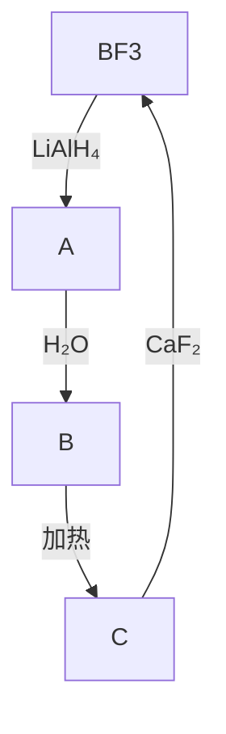

13.6 $B_{2}H_{6}$ 在空气中稳定吗？如果不稳定，请写出该反应的方程式。

13.7 判断下述两个化合物质子去偶合时存在多少种 $^{11}$ B-NMR环境?

(a) $B_{5}H_{11}$ , (b) $B_{4}H_{10}$

13.8 判断下列化合物发生硼氢化反应所生成的产物：(a) $\left(\mathrm{CH}_{3}\right)_{2}\mathrm{C}=\mathrm{CH}_{2}$ ，(b) $\mathrm{CH}\equiv\mathrm{CH}$ 。

13.9 乙硼烷被用作火箭推进剂。计算 $1.00\mathrm{kg}$ 乙硼烷释放的能量。已知 $\Delta_{\mathrm{f}}H^{\ominus}/(\mathrm{kJ}\cdot\mathrm{mol}^{-1})$ ： $\mathrm{B}_{2}\mathrm{H}_{6}$ 为31； $\mathrm{H}_{2}\mathrm{O}$ 为-242； $\mathrm{B}_{2}\mathrm{O}_{3}$ 为-1264。燃烧反应是 $\mathrm{B}_{2}\mathrm{H}_{6}(\mathrm{g})+3\mathrm{O}_{2}(\mathrm{g})\longrightarrow3\mathrm{H}_{2}\mathrm{O}(\mathrm{g})+\mathrm{B}_{2}\mathrm{O}_{3}(\mathrm{s})$ 。用乙硼烷作燃料会有什么问题？

13.10 以 $\mathrm{BCl}_3$ 与其他您选择的合适试剂作起始物，设计合成螯合型Lewis酸 $\mathrm{F}_2\mathrm{B} - \mathrm{C}_2\mathrm{H}_4 - \mathrm{BF}_2$ 的方法。

13.11 给出用 $NaBH_{4}$ 、一种合适的碳氢化合物、适当的辅助试剂和溶剂合成下列化合物的反应方程式和反应条件：

(a) $\mathrm{B}(\mathrm{C}_{2}\mathrm{H}_{5})_{3}$ , (b) $Et_{3}NBH_{3}$

13.12 绘出硼的 $B_{12}$ 基本结构单元沿 $C_{2}$ 轴的透视图。

13.13 硼氢化合物 $B_{6}H_{10}$ 和 $B_{6}H_{12}$ 哪个热稳定性更好些？给出判断硼烷热稳定性的规则。

13.14 $B_{5}H_{9}$ 中有多少个骨架电子？

13.15 (a) 写出并配平空气氧化戊硼烷(9)的反应方程式(包括所有反应物和产物的状态)。

(b) 对使用戊硼烷作为内燃机燃料而言,除成本高以外还可能存在哪些缺点?

13.16 (a) 从 $\mathrm{B}_{10} \mathrm{H}_{14}$ 的化学式确定它属于闭合型、巢形还是蛛网形？

(b) 使用 Wade 规则确定癸硼烷(14)骨架电子对的数目。

(c) 通过价电子计数证实 $B_{10}H_{14}$ 的簇价电子数与 (b) 中确定的数值相等。

13.17 使用 Wade 规则判断下列化合物的结构: (a) $B_{5}H_{11}$ , (b) $B_{4}H_{7}^{-}$

13.18 1 mol硼氢化物水解得到 $15\mathrm{mol}$ 的 $\mathrm{H}_{2}$ 和 $6\mathrm{mol}$ 的 $\mathrm{B(OH)}_{3}$ ，识别该化合物并推断其结构。

13.19 给出 $B_{4}H_{10}$ 、 $B_{5}H_{9}$ 和 $1,2-B_{10}C_{2}H_{12}$ 的结构和名称。

13.20 以 $\mathrm{B}_{10}\mathrm{H}_{14}$ 和您选择的合适试剂为起始物，写出合成 $[\mathrm{Fe}(nido - \mathrm{B}_9\mathrm{C}_2\mathrm{H}_{11})_2]^{2-}$ 的反应方程式并简要绘出该物种的结构。

13.21 使用 Wade 规则判断 $NB_{11}H_{12}$ 可能的结构。

13.22 (a) 层状 BN 和石墨(节 14.5)在结构上有哪些相似点和不同?

(b) 对比它们与 Na 和 $Br_{2}$ 的反应性。

(c) 对它们在结构和反应性上的差别做出合理解释。

13.23 以 $\mathrm{BCl}_3$ 和您选择的其他试剂为起始物，设计下列环硼氮三烯衍生物的合成方法并绘出产物的结构：(a) $\mathrm{Ph}_3\mathrm{N}_3\mathrm{B}_3\mathrm{Cl}_3$ ，(b) $\mathrm{Me}_3\mathrm{N}_3\mathrm{B}_3\mathrm{H}_3$ 。

13.24 按照 Brønsted 酸性增加的顺序排列下列硼的氢化物: $B_{2}H_{6}$ 、 $B_{10}H_{14}$ 、 $B_{5}H_{9}$ 。选取其中一个化合物给出脱质子后的可能结构。

13.25 硼烷以 $B_{2}H_{6}$ 形式存在，三甲基硼烷以单体 $\mathrm{B(CH_{3})_{3}}$ 形式存在。此外，中间组成的分子式为 $\mathrm{B}_{2}\mathrm{H}_{5}(\mathrm{CH}_{3})$ 、 $\mathrm{B}_{2}\mathrm{H}_{4}(\mathrm{CH}_{3})_{2}$ 、 $\mathrm{B}_{2}\mathrm{H}_{3}(\mathrm{CH}_{3})_{3}$ 和 $\mathrm{B}_{2}\mathrm{H}_{2}(\mathrm{CH}_{3})_{4}$ 。基于这些事实，描述后面几例取代硼烷可能的结构和成键作用。

13.26 ${}^{11}$ B-NMR 是推断硼化合物结构的重要光谱学工具。不考虑 ${}^{11}$ B- ${}^{11}$ B 偶合，通过共振多重性可能确定所连接的 H 原子的数目：BH 是双峰，BH $_{2}$ 是三重峰，BH $_{3}$ 是四重峰。巢形和蛛网形结构中，闭合一侧的 B 原子比开放一侧的 B 原子受到更多的屏蔽。假定不存在 B-B 或 B-H-B 偶合，判断下列样品 ${}^{11}$ B-NMR 谱图的一般形式：(a) BH $_{3}$ CO, (b) [B $_{12}$ H $_{12}$ ] $^{2-}$ 。

13.27 从关于第 13 族化学的下列表述中指出不正确的表述,依据化学概念或原理予以改正并给出正确的解释:

(a) 所有第 13 族元素都是非金属。

(b) 本族元素自上而下化学硬度的增加可从较重元素的氧亲和性和氟亲和性得到说明。

(c) 三卤化硼 $\mathrm{BX}_{3}$ 的 Lewis 酸性随卤原子从 F 到 Br 逐渐增强, 该事实可从 Br—B 更强的 $\pi$ 成键作用得到解释。  
(d) 蛛网形硼的氢化物的骨架电子计数为 $2(n+3)$ ，蛛网形硼的氢化物比巢形硼的氢化物更稳定。  
(e) 在巢形硼的氢化物系列中,酸性随体积的增大而增大。  
(f) 层状氮化硼与石墨的结构相似, 这是因为其 HOMO 和 LUMO 之间的距离较小, 是电的良导体。

# 辅导性作业

13.1 用合适的分子轨道软件计算闭合型 $\left[\mathrm{B}_{6} \mathrm{H}_{6}\right]^{2-}$ 的波函数和能级。根据所得结果绘制主要涉及 B—B 成键作用轨道的分子轨道能量图并绘出其轨道的形式。如何将这些轨道与本章中对阴离子的定性描述作定性比较？在算得的波函数中是否存在 B—H 成键作用与 B—B 成键作用相隔开的情况？  
13.2 在论文“Covalent and ionic molecules: why are $BeF_{2}$ and $AlF_{3}$ high melting point solids whereas $BF_{3}$ and $SiF_{4}$ are gases?”(J. Chem. Educ., 1998, 75, 923) 中，R. J. Gillespie 设定了一种对化学键的分类法，得出在 $BF_{3}$ 和 $SiF_{4}$ 中以离子键为主。总结作者的观点，描述这与对气态分子传统的成键观点有哪些不同。  
13.3 BN 和碳纳米管已经由 C. Colliex 等人所合成 (Science, 1997, 278, 653)。(a) BN 纳米管与碳纳米管相比有哪些优点？(b) 概述用于制备这些化合物的方法。(c) 纳米管的主要结构特点是什么，如何能在应用领域利用这些结构特征？  
13.4 M. Montiverde 讨论了“Pressure dependence of the superconducting temperature of $MgB_{2}$ ”(Science, 2001, 292, 75)。(a) 描述用以解释 $MgB_{2}$ 超导性所假设的两个理论基础。(b) $MgB_{2}$ 的 $T_{c}$ 如何随压力而变化？这给超导性提供了什么更深入的认识？  
13.5 Z. W. Pan, Z. R. Dai, 和 Z. L. Wang 在 Science, 2001, 291, 1947 发表了他们的论文。以论文的参考文献为基础，写一篇第 13 族元素金属线纳米材料的综述。指出 $\mathrm{In}_2\mathrm{O}_3$ 纳米带是如何制备的，并给出有代表性的纳米带尺寸。  
13.6 在论文“New structural motifs in metallaborane chemistry: synthesis, characterization, and solid-state structures of $\left[\left(\mathrm{Cp}^{*}\mathrm{W}\right)_{3}(\mu-\mathrm{H})\mathrm{B}_{8}\mathrm{H}_{8}\right]$ , $\left[\left(\mathrm{Cp}^{*}\mathrm{W}\right)_{2}\mathrm{B}_{7}\mathrm{H}_{9}\right]$ and $\left[\left(\mathrm{Cp}^{*}\mathrm{Re}\right)_{2}\mathrm{B}_{7}\mathrm{H}_{7}\left(\mathrm{Cp}^{*}=\eta^{5}-\mathrm{C}_{5}\mathrm{Me}_{5}\right)\right]$ ”(Organometallics, 1999, 18, 853) 中，A. S. Weller, M. Shang 和 T. P. Fehlner 讨论了一些新颖的富硼金属硼烷的合成和表征，绘出并解释 $\left(\mathrm{Cp}^{*}\mathrm{W}\right)_{2}\mathrm{B}_{7}\mathrm{H}_{9}$ 的 ${}^{11}B-NMR$ 和 ${}^{1}H-NMR$ 谱。  
13.7 硼中子俘获疗法(BNCT)用来治疗某些肿瘤。钆中子俘获疗法(GNCT)正逐渐成为新的替代治疗手段。对比两种疗法的不同。对载药试剂、放射性特征和生物应用做讨论。

(王文渊 译, 史启祯 审)

# 第 14 族元素

第14族元素无疑是所有元素中最重要的:碳是地球上构成生命的基本元素;硅对地壳岩石自然环境的物理结构至关重要。该族元素的性质极具多样性，碳是非金属，而锡和铅则是常见的金属。所有元素能与其他元素形成二元化合物。此外，硅也形成多种网状结构的固体。许多第14族元素的有机化合物具有重要的商业价值。

第 14 族元素（碳、硅、锗、锡、铅）的物理性质和化学性质表现出巨大的多样性。碳是生命的基石，也是有机化学的核心。本章着力关注碳的无机化学。硅广泛分布在自然界；工业和制造业中广泛用到锡和铅。

# A. 基本面

第 14 族(碳族)元素对工业和自然界都至关重要。本书许多章节涉及碳元素,其中包括第 22 章的金属有机化合物和第 25 章的催化作用。这里讨论第 14 族元素化学的基本内容。

![[无机化学第6版主族364-564_images/63c5c34f202bfe786b8746c3ddc4edada806b382f8db2fb6fd7750421aa638ae.jpg]]

text_image

1 2 13 14 15 16 17 18
Li Be B C N O F Ne
Al Si P
Ga Ge As
In Sn Sb
Ti Pb Bi
□ □ □ □ □ □

# 14.1 元素

提要:本族最轻的两个元素是非金属,锡和铅则是金属。除铅之外的其他元素都存在多种同素异形体。

本族最轻的元素碳和硅都是非金属，锗是准金属，而锡和铅则是金属。元素的金属性自上而下增加，这是p区元素的一个显著特点。这一现象是可以理解的，因为原子半径自上而下增加，与之相关的电离能按同一方向降低（见表14.1）。由于较重元素的电离能低，金属自上而下更容易形成阳离子。

表 14.1 第 14 族元素的某些性质

<table><tr><td>元素</td><td>C</td><td>Si</td><td>Ge</td><td>Sn</td><td>Pb</td></tr><tr><td>熔点/°C</td><td>3730(石墨,升华)</td><td>1410</td><td>937</td><td>232</td><td>327</td></tr><tr><td>原子半径/pm</td><td>77</td><td>117</td><td>122</td><td>140</td><td>154</td></tr><tr><td>离子半径, $r(M^{n+})$ /pm</td><td></td><td></td><td>73(+2)</td><td>93(+2)</td><td>119(+2)</td></tr><tr><td></td><td></td><td></td><td>53(+4)</td><td>69(+4)</td><td>78(+4)</td></tr><tr><td>第一电离能, $I/(kJ·mol^{-1})$ </td><td>1090</td><td>786</td><td>762</td><td>707</td><td>716</td></tr><tr><td>Pauling 电负性</td><td>2.5</td><td>1.9</td><td>2.0</td><td>1.9</td><td>2.3</td></tr><tr><td>电子亲和能, $E_{a}/(kJ·mol^{-1})$ </td><td>154</td><td>134</td><td>116</td><td>107</td><td>35</td></tr><tr><td> $E^{\ominus}(M^{4+},M^{2+})/V$ </td><td></td><td></td><td></td><td>+0.15</td><td>+1.46</td></tr><tr><td> $E^{\ominus}(M^{2+},M)/V$ </td><td></td><td></td><td></td><td>-0.14</td><td>-0.13</td></tr></table>

由于价层电子构型为 $ns^2 np^2$ ，该族元素在化合物中以 $+4$ 氧化态为主。主要的例外是铅，其常见氧化态为 $+2$ （比该族元素最高氧化态值小2）。低氧化态的相对稳定性是惰性电子对效应的一个例子（节9.5），最重的p区元素均具有这种性质。

碳和硅的电负性与氢接近,能形成多种共价氢化合物和烷基化合物。碳和硅具有强的亲氧性(oxophiles)和亲氟性(fluorophiles),分别对硬阴离子 $O^{2-}$ 和 $F^{-}$ 具有高的亲和力(节4.9)。广泛存在的氧合阴离子(如碳酸根和硅酸根)体现了这种亲氧性。相比之下, $Pb^{2+}$ 与软阴离子(如 $I^{-}$ 和 $S^{2-}$ )而不是硬阴离子形成更稳定的化合物,因此化学上将其归入软酸。

几乎为纯态的两种碳(金刚石和石墨)都可从自然界开采也可由人工合成。除了许多不纯的形式(如煤热解制得的焦炭和烃类不完全燃烧产生的灯黑)外,碳还存在其他一些纯的形式。硅广泛存在于自然界,占地壳质量组成的26%。硅以沙子、石英、水晶、玛瑙和猫眼石的形式存在,也分布在石棉、长石、黏土和云母中。锗的丰度很低,自然界以锗石 $\left(\mathrm{Cu}_{13}\mathrm{Fe}_{2}\mathrm{Ge}_{2}\mathrm{S}_{16}\right)$ 形式存在,也存在于锌矿和煤中。锡和铅的矿物分别为锡石 $\left(\mathrm{SnO}_{2}\right)$ 和方铅矿 $\left(\mathrm{PbS}\right)$ 。

金刚石和石墨是碳元素两种常见的晶体形式,其性质截然不同:金刚石是电绝缘体,而石墨则是良导体;金刚石是自然界已知最硬的物质,而石墨则很软;金刚石透明,而石墨则为黑色。迥异的物理性质源于两种同素异形体具有不同的结构和成键方式。

金刚石结构中，每个C原子与处于正四面体顶角的四个相邻碳原子形成键长为 $154\mathrm{pm}$ 的单键（见图14.1），成为共价的刚性三维框架。石墨由平面的石墨烯层堆叠而成，层中每个C原子有三个间距为 $142~\mathrm{pm}$ 的最邻近碳原子（见图14.2）。层内相邻碳原子通过 $\mathfrak{sp}^2$ 杂化轨道重叠形成 $\sigma$ 键，剩余的垂直p轨道相互重叠形成 $\pi$ 键，并离域于平面中。原子层之间易于滑裂（主要由存在杂质而引起）造成石墨的滑腻感。金刚石可以被切割，但由于晶体中具有对称性的作用力，这一古老工艺需要专长才能完成。

![[无机化学第6版主族364-564_images/d6711a19c8f4f90c462b70322b9cab7e113c307c6baab1085192b659f6d99f01.jpg]]

chemical

Crystal structure diagram of a compound with carbon (C) and hydrogen atoms (H) in a unit cell

图 14.1 $^{*}$ 立方金刚石结构

![[无机化学第6版主族364-564_images/4eef2f5667ede1df13bd746adfe1a69ee77a18b816ee289ef2f9ecefad77102d.jpg]]

natural_image

3D illustration of stacked hexagonal tiles with a spherical grid overlay (no text or symbols)

图 14.2 $^{*}$ 石墨的结构  
碳环是隔层对齐而非邻层对齐

碳的同素异形体不仅有金刚石和石墨。1980年代发现了富勒烯(非正式地叫作巴基球)，从而开辟了碳的无机化学的一个新领域。人们离析出了单层石墨(叫石墨烯)，1990年代前期发现了碳纳米管，后者是由类石墨烯管(具有半球形类巴基球的帽盖)组成的。

除铅外，本族其他元素至少有一种金刚石结构的固相（见图14.1）。锡的立方相叫灰锡或叫 $\alpha-$ 锡 $(\alpha -\mathrm{Sn})$ ，灰锡在室温下不稳定。灰锡会转化为更稳定、更常见的白锡（或叫 $\beta-$ 锡， $\beta -\mathrm{Sn}$ )，其中一个锡原子周围有6个最邻近的锡原子以高度扭曲的八面体方式排列。白锡冷至 $13.2^{\circ}C$ 时转变为质脆的灰锡。欧洲中世纪大教堂里的风琴管上首次意识到这种转化，当时认为是魔鬼造成的。传说拿破仑大军在俄国被击败是由于气温太低、士兵制服上的白锡纽扣转化为灰锡而碎裂脱落造成的。

价带和导带之间的带隙(节 3.19)从金刚石到锡逐渐减小。金刚石被归入宽带隙的半导体,但通常将其看作绝缘体。锡在其转变温度以上为金属。

煤或焦炭中的碳元素通常用作燃料,也可用作还原剂从矿物提取金属。石墨作为润滑剂也用在铅笔中。金刚石在工业上用作切割工具。硅的带隙和由其产生的半导性使它在集成电路、计算机芯片、太阳能电池和其他电子固态设备中获得了广泛应用。二氧化硅( $SiO_{2}$ )是制造玻璃的主要原料。锗是第一个广泛用于构建晶体管的材料,这是因为它比硅容易纯化、带隙(Ge:0.72 eV;Si:1.11 eV)更小,是个更好的本征半导体。

耐腐蚀的锡用于镀钢以加工成锡罐头盒。青铜是锡和铜的合金，锡的质量分数通常少于12%。含锡量更高的青铜用来铸钟。焊料是锡和铅的合金，从古罗马时期就开始使用。将熔态玻璃浮于熔态锡的表面制成窗玻璃或浮玻璃。窗玻璃受到紫外线照射时，“锡一侧”可看到雾状的氧化锡（Ⅳ）。三烷基和三芳基锡化合物广泛用作杀（真）菌剂和农药。

质软且具有展性的铅曾广泛用于制管业和焊料。鉴于铅的毒性，许多国家已禁止使用。铅的熔点低因而用作焊料；高密度 $(11.34\ g\cdot cm^{-3})$ 这一性质使其用作弹药和屏蔽电离辐射的材料。玻璃中加入氧化铅可以增加折射率，以生产“铅”玻璃或“水晶”玻璃。

# 14.2 简单化合物

提要: 所有第 14 族元素与氢、氧、卤素和氮形成简单二元化合物。碳和硅也与金属分别形成碳化物和硅化物。

所有第 14 族元素都可形成四价氢化物 $\left(\mathrm{EH}_{4}\right)$ 。此外，碳和硅可形成一系列链状分子型氢化物。碳形成的烃类化合物数量巨大，在有机化学中进行讨论更好些。

碳形成一系列通式为 $C_{n}H_{2n+2}$ 的简单烃类化合物（烷烃），它们的稳定性来自 C—C 键和 C—H 键的高键焓（见表 14.2；节 9.7）。碳在不饱和的烯烃和炔烃中（见表 14.2）也能形成强的多重键。C—C 键的强度和形成多重键的能力是碳化合物显示多样性和稳定性的主要原因。

表 14.2 某些化学键的平均键焓, $B\left( {\mathrm{X} - \mathrm{Y}}\right)$   
单位： $\mathrm{kJ}\cdot \mathrm{mol}^{-1}$ 

<table><tr><td>C—H</td><td>412</td><td>Si—H</td><td>318</td><td>Ge—H</td><td>288</td><td>Sn—H</td><td>250</td><td>Pb—H</td><td>&lt;157</td></tr><tr><td>C—O</td><td>360</td><td>Si—O</td><td>466</td><td>Ge—O</td><td>350</td><td></td><td></td><td></td><td></td></tr><tr><td>C=O</td><td>743</td><td>Si=O</td><td>642</td><td></td><td></td><td></td><td></td><td></td><td></td></tr><tr><td>C—C</td><td>348</td><td>Si—Si</td><td>226</td><td>Ge—Ge</td><td>186</td><td>Sn—Sn</td><td>150</td><td>Pb—Pb</td><td>87</td></tr><tr><td>C=C</td><td>612</td><td></td><td></td><td></td><td></td><td></td><td></td><td></td><td></td></tr><tr><td>C≡C</td><td>837</td><td></td><td></td><td></td><td></td><td></td><td></td><td></td><td></td></tr><tr><td>C—F</td><td>486</td><td>Si—F</td><td>584</td><td>Ge—F</td><td>466</td><td></td><td></td><td></td><td></td></tr><tr><td>C—Cl</td><td>322</td><td>Si—Cl</td><td>390</td><td>Ge—Cl</td><td>344</td><td>Sn—Cl</td><td>320</td><td>Pb—Cl</td><td>301</td></tr></table>

表 14.2 中的数据表明该族 E—E 键的键焓自上而下是如何下降的, 正是这个原因导致从 C 到 Pb 的成键趋势逐渐下降。硅能形成类似烷烃的化合物系列叫作硅烷, 但最长的链仅含 7 个硅原子 (庚硅烷, $Si_{7}H_{16}$ )。硅烷具有更多的电子数和更强的分子间作用力, 其挥发性低于相应的碳氢化合物。例如, 丙烷 ( $C_{3}H_{8}$ ) 在通常条件下为气体, 而硅的类似物三硅烷 ( $Si_{3}H_{8}$ ) 则是沸点为 53 ℃ 的液体。本族元素的氢化物自上而下稳定性降低, 从而严重限制了对锡烷和铅烷化学性质的研究。

四卤甲烷(即四卤化碳)是最简单的碳的卤化物, $CF_{4}$ 为稳定性高的挥发性化合物, $CI_{4}$ 则是对热不稳定的固体。硅和锗的全部四卤化物均为已知,它们都是挥发性的分子化合物。锗显现出一定的惰性电子对效应(节9.5),也形成不易挥发的二卤化物。惰性电子对效应对锡和铅的影响显著,其+2氧化态越来越稳定。

两种熟悉的碳氧化物是 CO 和 $CO_{2}$ ，而不熟悉的则是低氧化物 O=C=C=C=O。所有三个氧化物的物理参数见表 14.3。需要注意的是 CO 中的键更短、更强（键焓为 $1076 \, kJ \cdot mol^{-1}$ ），键的力常数也更高。这些特性与 CO 具有三重键（见节 2.9 中的 Lewis 结构式：C≡O:）的概念相一致。二氧化碳 $\left(\mathrm{CO}_{2}\right)$ 显著不同于一氧化碳（CO）：键更长、伸缩力常数也更小。这与其含有双键（而非三键）的概念相符合。石墨与强氧化剂（如浓硫酸和高氯酸钾）反应形成氧化石墨，氧化产物中石墨层的表面被环氧基团和羟基基团所修饰。这些基团的存在意味着石墨层容易被劈裂从而生成二维的氧化石墨烯层。将氧化石墨烯还原可以制备类石墨烯材料。

表 14.3 碳的某些氧化物的性质

<table><tr><td>氧化物</td><td>熔点/°C</td><td>沸点/°C</td><td colspan="2"> $(CO)/cm^{-1}$ </td><td> $k(CO)/(N·m^{-1})$ </td><td>键长(CO)/pm</td><td>键长(CC)/pm</td></tr><tr><td>CO</td><td>-199</td><td>-192</td><td>2 145</td><td></td><td>1 860</td><td>113</td><td></td></tr><tr><td> $CO_{2}$ </td><td>升华</td><td>-78</td><td>2 449</td><td>1 318</td><td>1 550</td><td>116</td><td></td></tr><tr><td>OCCCO</td><td>-111</td><td>7</td><td>2 290</td><td>2 200</td><td></td><td>128</td><td>116</td></tr></table>

硅与氧具有很高的亲和力,这是自然界存在大量硅酸盐矿物和人工能够合成大量硅氧化合物的原因。它们对矿物学、工业生产和实验室都很重要。硅的最简单的氧化物是化学上稳定的二氧化硅 $\left(\mathrm{SiO}_{2}\right)$ 。二氧化硅以多种形式存在，所有的形式均以 $SiO_{4}$ 四面体结构单元为基础。抛开罕见的高温相，硅酸盐中的硅都是四配位的四面体。正硅酸根为 $\left[SiO_{4}\right]^{4-}(1)$ ，二硅酸根为 $\left[O_{3}SiOSiO_{3}\right]^{6-}(2)$ 。二氧化硅和很多硅酸盐的结晶过程非常缓慢。叫作玻璃（glasses）的无定形固体是以适当速率冷却熔融物（而非通过结晶过程）制得的。玻璃在某些方面类似液体。像液体那样，玻璃的结构仅在几个原子的空间（如在一个 $SiO_{4}$ 四面体的范围内）是有序的。然而不像液体，它们的黏度非常高，在大多数实际应用中更像固体。

锗（Ⅳ）的氧化物 $\left(\mathrm{GeO}_{2}\right)$ 与二氧化硅类似。锗（Ⅱ）的氧化物（GeO）容易歧化为Ge和 $GeO_{2}$ 。锡（Ⅱ）的氧化物（SnO）以蓝黑色和红色多晶形存在，两种形式在空气中加热都易氧化为 $SnO_{2}$ 。铅形成棕色的铅（Ⅳ）氧化物 $\left(\mathrm{PbO}_{2}\right)$ 、红色和黄色的铅（Ⅱ）氧化物（PbO）和含有Pb（Ⅳ）和Pb（Ⅱ）的混合价氧化物 $\left(\mathrm{Pb}_{3}\mathrm{O}_{4}\right)$ ，最后这个氧化物又叫“红铅（铅丹）”。铅（Ⅱ）较铅（Ⅳ）更稳定的现象可由惰性电子对效应（节9.5）作解释。

碳能形成氰化氢(HCN)、含 $CN^{-}$ 的离子型氰化物和氰气( $CN_{2}$ )，它们全都是剧毒性化合物。硅和氮气在高温下直接反应生成氮化硅( $Si_{3}N_{4}$ )，这种物质非常硬且显惰性，可用作高温陶瓷材料。

![[无机化学第6版主族364-564_images/a78a89f1bae811446211c10c13db32f26636d28b907f90e3b662cdd7c13f3385.jpg]]

chemical

Molecular structure diagram of a silicon-oxygen compound showing tetrahedral geometry with labeled atoms O and Si

(1)

![[无机化学第6版主族364-564_images/9a1c681018a112eddcae5c339c44ae181c96525df70ccd7e9d1b0e7672e30524.jpg]]

chemical

Crystal structure diagram of a silicon-oxygen compound showing tetrahedral geometry

(2)

碳与金属和准金属形成许多二元碳化物。第1族和第2族金属与碳形成离子型似盐碳化物，d区金属形成金属型碳化物，硼和硅形成共价型固体。碳化硅（SiC）也叫金刚砂，被广泛用作磨料。

# 14.3 扩展的硅氧化合物

提要: 硅与氧除形成简单的二元化合物外, 还能形成各种扩展的网状固体, 这类固体在工业上具有广泛用途。

铝原子取代硅酸盐中的部分 Si 原子后形成铝硅酸盐（如自然界的黏土、矿物和岩石）。铝硅酸盐沸石广泛用作分子筛、微孔催化剂和催化剂载体。因为 Al 以 Al(Ⅲ) 的形式存在，所以取代 Si(Ⅳ) 后多出了一个单位负电荷。一个 Al 原子取代一个 Si 原子后需要另外的阳离子（如 H $^{+}$ 、Na $^{+}$ 或 1/2 Ca $^{2+}$ ）平衡电荷。这些阳离子的存在对材料性质具有重大影响。

许多重要矿物也含有像锂、镁、铁等金属的层状铝硅酸盐变体，其中包括黏土、滑石和各种云母。层状铝硅酸盐一个简单例子是矿物高岭土 $\left[\mathrm{Al}_{2}(\mathrm{OH})_{4}\mathrm{Si}_{2}\mathrm{O}_{5}\right]$ ，它在工业上用作瓷土，也用于医疗领域。长期以来高岭土用于治疗腹泻，最近还以高岭土纳米颗粒浸渍的绷带止血。这是因为该矿物能引发血液凝固。

矿物滑石 $\left[\mathrm{Mg}_{3}(\mathrm{OH})_{2}\mathrm{Si}_{4}\mathrm{O}_{10}\right]$ 中的 $\mathrm{Mg}^{2+}$ 和 $\mathrm{OH}^{-}$ 夹在 $\left[\mathrm{Si}_{4}\mathrm{O}_{10}\right]^{4-}$ 阴离子层之间。这种电中性结构导致滑石层间易于脱裂，也解释了滑石的滑腻感。白云母 $\left[\mathrm{KAl}_{2}(\mathrm{OH})_{2}\mathrm{Si}_{3}\mathrm{AlO}_{10}\right]$ 具有带电荷的层状结构，这是因为一个Al(Ⅲ)原子取代一个Si(Ⅳ)原子后多出的一个负电荷被位于层间的 $\mathbf{K}^{+}$ 所平衡。由于靠这种静电力相结合，白云母不像滑石那样柔软，但仍然容易劈裂为层片。还有以三维铝硅酸盐框架为基础的许多矿物，如长石就是最重要的一类成岩矿物。

分子筛(molecular sieves)是晶态微孔铝硅酸盐,具有分子尺度孔径的开放式结构。取名“分子筛”是因为人们看到这种材料只能吸附比其孔径尺寸小的分子,从而可用于分离不同尺寸的分子。分子筛的一个亚类叫沸石(“沸石”一词源自希腊词“沸腾的石头”,地质学家发现有些岩石遇到吹管火焰时似乎在沸腾)。沸石具有铝硅酸盐框架(见图14.3),通道或笼中捕获有阳离子(通常是来自第1族、第2族的阳离子)。除了作为分子筛的功能外,沸石也可用作离子交换树脂将自身所带的离子与周围溶液中的离子进行交换。沸石也用在择形的非均相催化中(第25章)。

![[无机化学第6版主族364-564_images/10f3388868eb8239aac4dc75e43bae9d57f545c1d3f4ca7f84326d50dd06b8f6.jpg]]

text_image

超级笼
立方笼
方纳石笼

图 14.3 A 型沸石的框架  
注意观察方钠石笼(截角八面体)、小的立方笼和中心的超级笼

# B. 详述

这里详细讨论第 14 族元素的化学性质,解释成链趋势减弱和金属性逐渐增强的原因。

# 14.4 存在和提取

提要:元素碳可以石墨和金刚石的形式进行开采;碳弧还原 $SiO_{2}$ 的方法可以制得元素硅。丰度低得多的锗是在锌矿中发现的。

碳以金刚石、石墨和几种低结晶度的形式存在。1996年诺贝尔化学奖授予Richard Smalley、Robert Curl和Harold Kroto，表彰他们发现了新的一种碳的同素异形体 $\mathrm{C}_{60}$ 。为了纪念设计网格形圆屋顶的建筑师Buckminster Fuller, $\mathrm{C}_{60}$ 被命名为富勒烯(节14.6)。碳以二氧化碳的形式存在于大气中、溶解在天然水体中，也存在于钙和镁的不溶性碳酸盐中。

在高温电弧炉中用碳还原二氧化硅可以制备硅：

$$
\mathrm{SiO} _ {2} (\mathrm{s}) + 2 \mathrm{C(s)} \longrightarrow \mathrm{Si(s)} + 2 \mathrm{CO(g)}
$$

锗的丰度低，在自然界一般不富集存在。一氧化碳或氢还原 $GeO_{2}$ 可以制得锗（见 5.16）。在电炉中用焦炭还原矿物锡石 $(\mathrm{SnO}_{2})$ 可以生产锡。铅是由硫化物矿制备的：先在鼓风炉中将其转化为氧化物，接着再用碳还原。

# 14.5 金刚石和石墨

提要:金刚石具有立方结构。石墨是由碳原子的二维片层堆叠而成的;伴随着电子转移,氧化剂或还原剂可被嵌入片层之间。

由于金刚石结构(见图 14.1)能在三维方向上有效地分配热运动,因而成为已知热导率最高的物质。测量热导率可以识别真假钻石。由于耐久性、透明度和高折射率,金刚石成为最珍贵的宝石之一。

平行的原子层之间存在杂质(见图14.2)是石墨容易剥离的主要原因,也造成了石墨的滑腻感。这些石墨烯平面彼此间相互远离(335 pm),表明层与层之间的作用力比较弱。有时将其不那么恰当地叫作“van der Waals 力”(这是因为常见杂质的形式为石墨氧化物,它们之间的作用力像分子间作用力一样弱),并因此将平面之间的区域叫 van der Waals 间隙(van der Waals gap)。与金刚石不同,石墨质软色黑并略有金属光泽;它既不耐用也不为人们所爱。

室温和常压下金刚石自发转化为石墨 $\left(\Delta_{\mathrm{trs}}G^{\ominus}=-2.90\mathrm{kJ}\cdot\mathrm{mol}^{-1}\right)$ ，但在通常条件下不会以可看得出的速率发生：比太阳系还古老的金刚石已从陨星中离析出来。金刚石是个密度更大的物相，密度为 $3.51\ g\cdot cm^{-3}$ （石墨为 $2.26\ g\cdot cm^{-3}$ ），所以高压条件有利于它的生成。大量的金刚石磨料是通过d金属催化的高温高压过程生产的（应用相关文段14.1）。外压可使掺硼金刚石薄膜电阻发生变化，沉积在二氧化硅表面上可用作高温压力传感器。

# 应用相关文段14.1 合成的金刚石

人工合成金刚石经历过多次失败。直到1955年才首次成功，其方法是石墨与d金属在7GPa压力下加热至1500\~2000K完成的。石墨和金属都必须处于熔融状态才能制得金刚石，因此合成温度依赖于金属的熔点。d金属（通常为镍）能溶解石墨，溶解度更小的金刚石从液相中结晶出来。金刚石颗粒的大小、形状和颜色取决于反应条件：低温下得到的产品是颜色较深的不纯晶体，高温下合成的产品是颜色较浅的较纯的晶体。常见杂质是能够纳入金刚石晶格使其发生最小畸变的物种。合成金刚石往往也受到石墨和金属催化剂的污染。例如，镍的晶格尺寸与金刚石相似，金刚石晶格中可能包含镍微晶。

金刚石晶体可通过加入小的金刚石晶种引发生长，但生长出来的晶体往往不均匀（具有裂隙和包合现象）。碳源为金刚石并且晶种处在装置中温度较低的部位时得到质量较好的金刚石。改变温度（溶解度发生变化）能使碳以缓慢而受控的方式结晶出来，从而生成高质量的金刚石。以这种方式结晶出1克拉(carat,200 mg)钻石可能需要一周时间。

温度和压力足够高时可直接从石墨合成金刚石（不需使用金属催化剂）。将石墨置于高爆炸药产生的强压力下的方法叫冲压合成法（Du Pont法），石墨只需几毫秒的时间就能达到1 000 K的温度和30 GPa的压力并部分转变成金刚石。静压法是在高压设备中通过电容器放电加热石墨，于3 300\~4 500 K和13 GPa下形成多晶团块金刚石。这种方法也可用碳氢化合物为碳源：芳香族化合物（如萘、蒽）生成石墨；脂肪族化合物（如固体石蜡、樟脑）则生成金刚石。

高压合成金刚石成本昂贵且烦琐，低压合成法将会更具吸引力。事实上，长期以来人们就知道在隔绝空气的热表面上沉积C原子可以生成混有石墨的金刚石微晶。甲烷热解能够产生C原子，过程中产生的原子氢也发挥着有利于生成金刚石而不是生成石墨的重要作用。原子氢的一种性质是，更容易与石墨（而不是与金刚石）起反应生成挥发性碳氢化合物，过程中不希望得到的石墨被清除。尽管这种法还不够完善，但合成的金刚石膜已经应用于硬化耐磨表面（如切割工具和钻头）并构建电子设备。例如，掺硼的金刚石膜是良导体，在电化学中用作电极。

用碳化硅合成金刚石比任何高温和高压法都更加环保和更廉价。以 $Cl_{2}$ 和 $H_{2}$ 作气氛、接近 1 atm 压力和相对较低的温度 (1300 K) 下，碳能以金刚石形态被提取出来。

石墨的导电性和许多化学性质与其离域 $\pi$ 键的结构密切相关。垂直于片层方向的电导率低（25℃时为 $5 S \cdot cm^{-1}$ ）并随温度的升高而增大，这一事实表明石墨在该方向上为半导体。平行于片层方向的电导率（25℃时为 $30 kS \cdot cm^{-1}$ ）高得多并随温度的升高而降低，表明石墨在该方向上的性质像金属，更准确地说是半金属（半金属是一种材料，其中价带和导带之间的能隙为零，但在费米能级的态密度为零，节3.19）。这种效应在热解石墨（真空炉高温分解烃的气体制造石墨）中更为显著。这样制得的石墨具有非常高的纯度和所需的机械性能、热性能和电性能。热解石墨已用于离子束格栅、绝热体、火箭喷嘴、加热元件并用作电极材料。

对插入层片间的原子和离子而言,石墨既可以是电子给予体也可以是电子接受体,形成所谓的嵌入化合物(intercalation compound)。K原子将价电子给予 $\pi^{*}$ 带中的空轨道以还原石墨,所得的 $K^{+}$ 插于片层之间(见图 14.4)。加至带中的电子可以流动,因此碱金属石墨嵌入化合物具有高的导电性。化合物的化学

计量数取决于碱金属的用量和反应条件。不同的化学计量数与一系列结构相关,其中碱金属离子可以每隔一层或每隔几层的方式插入(见图 14.4)。

从 $\pi$ 带移去电子使石墨氧化的一个实例是加热石墨与硫酸和硝酸的混合物生成石墨硫酸氢盐（graphite bisulfates）。这一反应中从 $\pi$ 带移除电子， $\mathrm{HSO}_4^-$ 插于片层之间得到近似组成为 $(\mathrm{C}_{24})^{+}\mathrm{HSO}_4^-$ 的物质。这一氧化性嵌入反应由于从满 $\pi$ 带中移除了电子，因此比纯石墨具有更高的电导率。该过程与通过接受电子的掺杂剂形成 $p$ 型硅（节3.20）相类似。用水处理石墨硫酸氢盐时片层遭到破坏；随后在高温下除去水得到高度可柔性的石墨；这种石墨带用于制造密封垫圈、阀门和制动衬片。强氧化剂（如 $HNO_{3}$ 、 $KClO_{3}$ 或 $KMnO_{4}$ ）将石墨氧化生成石墨氧化物。石墨氧化物片层的边缘可用环氧基和羧酸基团的羟基进行修饰。石墨氧化物溶解于水溶液时裂分为单层的石墨烯氧化物。作为石墨烯的前体，石墨烯氧化物已经引起人们的关注（应用相关文段14.2），但目前所生成的石墨烯含有太多杂质和结构上的缺陷。

![[无机化学第6版主族364-564_images/f96219360bc8a054095ab1b00f250d6c13a88763d5913464e1db8d5d9e17d6b1.jpg]]

text_image

石墨
335 pm
535 pm
KC₈
KC₃₆

图 14.4 钾的石墨化合物  
示出两种类型的原子嵌入方式

卤素与石墨形成嵌入化合物时的反应显示出交替效应。石墨与氟反应产生“石墨氟化物”，其化学式为 $\left(\mathrm{CF}\right)_{n}(0.59<n<1)$ 的非化学计量物种。在这一范围内，n值低时化合物为黑色，n值接近1时化合物为无色。它在高真空装置上用作润滑剂，也用作锂电池的阴极。温度升高时反应产物还包括 $C_{2}F$ 和 $C_{4}F$ 。氯与石墨之间的反应缓慢并形成 $C_{8}Cl$ ，碘与石墨根本不起反应。相比之下，溴更易发生嵌入反应生成 $C_{8}Br$ 、 $C_{16}Br$ 和 $C_{20}Br$ 。

# 应用相关文段 14.2 石墨烯:神奇材料

石墨烯是碳原子按六边形排列的单层石墨(见图 B14.1)。曼彻斯特大学的 Andre Geim 和 Konstantin Novoselov 因对石

墨烯的开创性工作获得了2010年诺贝尔物理学奖。石墨烯具有非凡的性质，往往被称为神奇的材料。它是已知强度最好的材料，断裂强度 $(\approx 40\mathrm{N}\cdot \mathrm{m}^{-1})$ 约为结构钢的200倍。石墨烯具有最高的热导率；比其他任何晶体显示出更大的弹性（可拉伸 $20\%$ ）。石墨烯也展现出一些其他的重要性质。例如，随着温度的升高而收缩，显示柔韧性的同时也显示脆性，因此既可进行折叠，在高应力下也会

![[无机化学第6版主族364-564_images/3e7f9414bf608068a3f702718c5e540e6191c45a1d23c361b4f6c0d702067f36.jpg]]

chemical

Molecular lattice structure diagram showing interconnected atoms in a hexagonal grid pattern

图 B14.1 石墨烯

像玻璃一样碎裂。对气体具有不可透性。石墨烯显示的高电导率引起人们的关注，预计将来可能用在计算机硬件上代替硅。然而，这种应用还有一段路要走，这是因为石墨烯没有带隙，永久性导电不能被切断。

现在还不能大规模地生产纯石墨烯片，这种现状制约着石墨烯技术的发展。剥离法（即从石墨晶体表面机械地撕裂）得到的石墨烯片最干净，这种方法往往被叫作“苏格兰胶带法”。使用具有黏性的胶带可以非常简单地实现石墨烯片的剥离，但要从石墨碎片剥离出实用的薄片既耗时又低效。如果能提出一条简单而廉价的路线，就可使其应用发生革命性的变化。该领域在工业上和学术上的研究相当活跃，人们正在探索许多新方法。有前途的方法包括将乙醇和金属钠一起加热数天、碳氢化合物为前体的化学气相沉积、石墨棒之间的放电、石墨烯的Fischer-Tropsch合成法、石墨烯氧化物的水（而不是通常的烷烃和水）还原，以及打开单壁碳纳米管等。

# 14.6 碳的其他形态

除形成富勒烯和相关的化合物外，碳还存在几种结晶度较低的形态。

# (a) 碳簇

提要: 在惰性气氛中, 碳电极之间的电弧放电可以形成富勒烯。

金属和非金属簇合物的发现已有数十年历史，但1980年代足球形 $C_{60}$ 簇的发现仍然引起科学界和大众媒体极大的兴趣。这种兴趣无疑源自下述事实：碳是普通元素，似乎不太可能发现碳的新型分子结构。

碳电极之间在惰性气氛中触发电弧时，一起形成的有大量的烟灰、相当量的 $\mathrm{C}_{60}$ 和量要少得多的相关富勒烯（fullerenes）如 $\mathrm{C}_{70},\mathrm{C}_{76}$ 和 $\mathrm{C}_{84}$ 。富勒烯可溶解于烃或卤代烃中，并可通过氧化铝色谱柱进行分离。 $\mathrm{C}_{60}$ 的结构已在低温下通过固体X射线晶体学和气相的电子衍射法所测定。 $\mathrm{C}_{60}$ 分子由五元和六元碳环组成，在气相的总对称性为二十面体(3)。

$\mathrm{C}_{60}$ 富勒烯可被还原形成富勒烯阴离子 $(\mathrm{C}_{60}^{n-}, n=1$ 到 12) 的盐。碱金属富勒烯盐是具有组成如 $\mathrm{K}_3\mathrm{C}_{60}$ 的固体。 $\mathrm{K}_3\mathrm{C}_{60}$ 的结构是由 $\mathrm{C}_{60}$ 离子的面心立方点阵组成的，其中 $\mathrm{K}^+$ 占据每个碳离子提供的一个八面体和两个四面体位点（见图 14.5）。该化合物在室温下为金属性导体，低于 $18\mathrm{K}$ 时为超导体。其他超导性的盐包括 $\mathrm{Rb}_2\mathrm{CsC}_{60}(T_c=33\mathrm{K})$ 和 $\mathrm{Cs}_3\mathrm{C}_{60}(T_c=40\mathrm{K})$ 。化合物 $\mathrm{E}_3\mathrm{C}_{60}$ 的导电性可以这样解释：传导电子提供给 $\mathrm{C}_{60}$ 分子，这些电子由于 $\mathrm{C}_{60}$ 分子轨道的重叠而移动（节 24.20）。

![[无机化学第6版主族364-564_images/47f6246c8d213d9d8c94dfb7482905f06889b84234227e2ccf04ddc639adc338.jpg]]

natural_image

Geometric diagram of a polyhedral structure resembling a soccer ball (no text or symbols)

![[无机化学第6版主族364-564_images/3efff61f9cb3bcc10ebb63b82cabcce63a41402ca2926a858c05eaf9161a8ce4.jpg]]

chemical

Molecular structure diagram of a fullerene-based nanomaterial, showing carbon and hydrogen bonding network

图 14.5 $^{*}$ $K_{3}C_{60}$ 的结构  
整个晶胞为面心立方（固态 $\mathrm{C}_{60}$ 本身的结构见图3.16）

# (b) 富勒烯与金属形成的络合物

提要: 多面体富勒烯可发生多电子的可逆性还原, 能与 d 金属的金属有机化合物和 $OsO_{4}$ 形成络合物。

富勒烯的有效合成方法已经建立起来，它们的氧化还原化学和配位化学也得到广泛研究。与形成碱金属富勒烯化物的方法相一致， $\mathrm{C}_{60}$ 在非水溶剂中发生五个电化学上可逆的电子转移步骤（见图14.6）。这些现象表明富勒烯遇到合适的金属时既可作为亲电试剂也可作为亲核试剂。这种能力的一个例子是富电子的 $\mathrm{Pt}(0)$ 膦络合物进攻 $\mathrm{C}_{60}$ 产生诸如(4)的化合物，其中的Pt原子跨着富勒烯分子中的一对C原子。该反应类似于双键配位于Pt膦络合物。类比节22.19介绍的 $\eta^6$ -苯铬络合物金属原子似乎可以与 $\mathrm{C}_{60}$ 的六元环面相配位，事实上却不能形成这种 $\mathrm{C}_{60}$ 的 $\eta^6$ -络合物。这一事实被归因于 $\mathrm{C}2\mathrm{p}\pi$ 轨道(5)的径向排列，这种排列导致与位于富勒烯六元环正上方的金属原子的d轨道不能很好地重叠。

![[无机化学第6版主族364-564_images/80883a28b231a2728fbcbd14b7180021e2dbc6f54111faf7150d64f75e890030.jpg]]

line

| 相对于Fe²⁺/Fe³⁺的电极电位/V | 电流 |
| -------------------------- | ---- |
| -1                         | ~0.5 |
| -2                         | ~0.8 |
| -3                         | ~1.0 |

图 14.6 低温下记录的 $C_{60}$ 在 DMF/甲苯溶液中的循环伏安图，参比电极为二茂铁 (Fc)

与富勒烯六元环面和单个金属原子间的弱相互作用不同，含多个金属原子的三钌簇合物 $\left[\mathrm{Ru}_{3}(\mathrm{CO})_{12}\right]$ 与富勒烯反应形成的化合物中 $\left[\mathrm{Ru}_{3}(\mathrm{CO})_{9}\right]$ 像帽子一样盖在 $\mathrm{C}_{60}$ 六元环的面上。过程中三个CO配体被取代(6)。三个金属组成了相对较大的三角形，这种构型更有利于与径向取向的 $\mathrm{C}2\mathrm{p}\pi$ 轨道重叠。

$C_{60}$ 的化学性质并不局限于与富电子金属络合物之间的相互作用。同样可以与强的亲电试剂和氧化剂反应，如与吡啶溶液中的 $OsO_{4}$ 反应得到氧桥络合物(7)，它与 $OsO_{4}$ 对烯烃的加成产物相类似。

![[无机化学第6版主族364-564_images/c259014e09e4c99a76d46d2f68903398401b7236cc6507e03734cbb8e842636c.jpg]]

富勒烯除了与金属形成笼外配位化合物外，也能让一个或多个原子嵌入 $\mathrm{C}_{60}$ 球壳内部形成内嵌型富勒烯（endohedral fullerenes）。这种配位化合物表示为 $\mathrm{M@C_{60}}$ ，意思是M原子处在 $\mathrm{C}_{60}$ 笼内。在高温 $(>600^{\circ}\mathrm{C})$ 和高压 $(>2000\mathrm{atm})$ 下，小的惰性气体原子和分子也可进入笼内如形成 $\mathrm{H}_3@\mathrm{C}_{60}$ 。形成内嵌碳笼化合物的另一种方法是在电弧法中使用掺有金属的碳棒，这种情况下往往形成较大的碳笼（如 $\mathrm{La@C_{82}}$ 和 $\mathrm{La}_3@\mathrm{C}_{106}$ ）。

# (c) 碳纳米管

富勒烯研究最有趣的结果之一是识别出碳纳米管（carbon nanotubes）。碳纳米管与富勒烯和石墨烯都密切相关。石墨烯是单层、六角形排列的碳原子（应用相关文段14.2）。碳纳米管是由一个或多个同心圆柱形管组成的，从概念上讲是由单层石墨烯卷成的。纳米管的末端往往盖有半球形的类富勒烯帽，帽中含有六个由C原子组成的五元环（见图14.7）。单层石墨烯形成的纳米管叫单壁碳纳米管（SWNT），管的

直径接近 1 nm, 其性质是由石墨烯卷起的方式和管的直径和长度决定的。多壁碳纳米管 (MWNT) 是由同轴石墨烯管组成的。MWNT 或者可按所谓的“俄罗斯套娃”模型由多层石墨烯的同轴圆柱体制备, 或者按“羊皮纸”模型由单层石墨烯绕着管自身卷成。纳米芽 (nanobuds) 是将碳纳米管和富勒烯相结合的结构。它们具有共价接合于碳纳米管外壁的富勒烯, 后者起到锚的作用, 以减少纳米管相互之间的滑动。石墨烯化了的碳纳米管 (g-CNTs) 沿着多壁碳纳米管外壁具有小的石墨烯片, 这些 g-CNTs 具有高表面积的三维框架。碳纳米管的制备大大促进了研究工作, 使这些化合物最终能够找到大范围的实际用途, 如储氢、催化及那些基于其高的机械强度的用途 (如人体的护甲)。这些将在第 24 章更为详细地做介绍。

# (d) 部分结晶的碳

提要: 小颗粒形式的无定形碳和部分结晶的碳大规模用作吸附剂和橡胶的增强剂; 碳纤维赋予聚合物材料的强度。

低结晶度碳具有多种形式。这些部分结晶的材料（包括炭黑、活性炭和碳纤维等)具有相当大的工业价值。因为没有适于进行全X射线分析的单晶,其结构一直不明确。然而有信息表明其结构类似石墨,但结晶度和颗粒形状不同。

![[无机化学第6版主族364-564_images/93df6d42584b095133bd59ce0bd341ac9691eee618cacdc518108bb2a0da6ba9.jpg]]

chemical

Molecular structure diagram of a graphene-based hexagonal lattice

![[无机化学第6版主族364-564_images/401a6a811e2d621675edbed63b4caa03daab6eb1016e1c39ef7616ea67c193d6.jpg]]

chemical

Molecular structure of a fullerene nanocomposite, showing hexagonal carbon lattice with hydrogen bonding

![[无机化学第6版主族364-564_images/ff6a2aa5dbfcfce089ffdc12f46a81878096f092f4d6a8fa46489c8351e65b30.jpg]]

natural_image

Circular molecular structure with hexagonal lattice and radiating bonds (no text or symbols)

图14.7 带帽单壁碳纳米管的一段结构

炭黑是颗粒度非常小的碳,是在缺氧条件下燃烧烃类制备的(年产量超过8百万吨)。对其结构提出了两种假说:一种类似石墨的平面堆叠,另一种是像富勒烯那样的多层球(见图14.8)。炭黑作为颜料大量用作打印机的墨粉;作为橡胶制品(包括轮胎)的填料能够大大改善橡胶的强度和耐磨性,并有助于保护橡胶免被阳光所降解。

![[无机化学第6版主族364-564_images/ecba239842ec11047cf64ab6ed98cbcab4e7ede381b9ab1ea58c8207b639c2a6.jpg]]

chemical

Molecular structure diagram of a fullerene cage with carbon atoms and hydrogen bonding network

图 14.8 为炭黑粒子建议的结构,弯曲的碳原子网未完全闭合;也提出了类似石墨的结构

活性炭是用有机材料(包括椰壳)的受控热解制备的。活性炭具有因粒度小而导致的高比表面积(有时超过 $1\ 000\ m^{2}\cdot g^{-1}$ 。因此对分子而言是一种非常有效的吸附剂，包括吸附饮用水中的有机污染物、空气中的有毒气体和反应混合物中的杂质。有证据表明：片层（由六元环组成）边缘的部分表面被氧化产物所覆盖，这种氧化产物包括羰基和羟基(8)。这种结构能解释它的部分表面活性。

![[无机化学第6版主族364-564_images/aba50d8aad3715cc190342af946e15ee186a86b6269c200b77b48fe74c42d7b9.jpg]]

chemical

Chemical structure of a flavonoid derivative with multiple hydroxyl groups and a carboxylic acid group, labeled as (8)

碳纤维是用沥青纤维或合成纤维在受控热解条件下制备的,可被掺入各种高强度塑料制品(如网球拍和飞机部件)中。碳纤维的结构与石墨结构相类似,但它的层是由平行于纤维轴的带(而不是石墨的扩展层)组成的。面内很强的化学键(这一点与石墨相似)赋予纤维以很高的拉伸强度。

# 例题 14.1 比较金刚石和硼的成键作用

题目:元素硼中每个硼原子与5个其他硼原子成键,但金刚石中每个碳原子键合于相邻最近的4个碳原子。请解释成键上的这种差别。

答案:需要考虑每个原子的价电子数和可用于成键的原子轨道数。B 原子和 C 原子都有 4 个可成键的原子轨道（1 个 s 轨道和 3 个 p 轨道）。然而每个 C 原子有 4 个价电子（每个轨道 1 个），因此可用所有的电子和轨道与相邻的 4 个碳原子形成 2c,2e 键。与此不同的是 B 原子仅有 3 个电子，因此利用所有 4 个轨道形成 3c,2e 键。这些三中心键的形成将另一个 B 原子拉至成键距离。

自测题 14.1 叙述石墨分别与下列两物质反应后电子结构的变化: (a) 钾; (b) 溴。

# 14.7 氢化物

第 14 族元素与 H 形成四价氢化物 $EH_{4}$ 。碳和硅与 H 形成链状的分子型氢化物。

# (a) 烃类

提要:链状烃类化合物的稳定性归因于 C—C 键和 C—H 键的高键焓。

甲烷 $\left(\mathrm{CH}_{4}\right)$ 这一无臭的易燃气体是最简单的烃类化合物。它在自然界存在于大的地下矿床中，并以天然气的形式被开采。作为日用和工业燃料的反应是

$$
\mathrm{CH} _ {4} (\mathrm{g}) + 2 \mathrm{O} _ {2} (\mathrm{g}) \longrightarrow \mathrm{CO} _ {2} (\mathrm{g}) + 2 \mathrm{H} _ {2} \mathrm{O} (\mathrm{g}) \quad \Delta_ {\text { comb }} H ^ {\ominus} = + 8 8 2 \mathrm{kJ} \cdot \mathrm{mol} ^ {- 1}
$$

除发生燃烧反应外甲烷并不活泼。遇水不发生水解(应用相关文段14.3)，只在受紫外线照射时才与卤素反应：

$$
\mathrm{CH} _ {4} (\mathrm{g}) + \mathrm{Cl} _ {2} (\mathrm{g}) \xrightarrow {h \nu} \mathrm{CH} _ {3} \mathrm{Cl} (\mathrm{g}) + \mathrm{HCl} (\mathrm{g})
$$

从甲烷到丁烷 $\left(\mathrm{C}_{4}\mathrm{H}_{10},\text{沸点}-1^{\circ}\mathrm{C}\right)$ 都是气体，含有5\~17个碳原子的烷烃是液体，更重的烃类则是固体。由于C—C键和C—H键的键焓高，碳的链状烃非常稳定。

# (b) 硅烷

提要: 硅烷是还原剂; 与醇类反应形成 Si(OR) $_{4}$ ; 铂络合物作为催化剂时能发生硅氢化反应。

甲硅烷 $\left(\mathrm{SiH}_{4}\right)$ 工业上是在NaCl和 $AlCl_{3}$ 熔盐混合物中于高压 $H_{2}$ 中用Al还原 $SiO_{2}$ 制备的。理想化的反应方程式是

$$
6 \mathrm{H} _ {2} (\mathrm{g}) + 3 \mathrm{SiO} _ {2} (\mathrm{s}) + 4 \mathrm{Al} (\mathrm{s}) \longrightarrow 3 \mathrm{SiH} _ {4} (\mathrm{g}) + 2 \mathrm{Al} _ {2} \mathrm{O} _ {3} (\mathrm{s})
$$

硅烷的反应活性高于烷烃，稳定性随着链长的增加而降低。与烷烃相比，硅烷具有较低的稳定性。这可归因于 Si—Si 键和 Si—H 键的键焓（与 C—C 键和 C—H 键相比）比较低（见表 14.2）。甲硅烷（ $\mathrm{SiH}_{4}$ ）本身在空气中自燃、与卤素剧烈反应。硅烷的反应活性明显高于烃类化合物是由多种原因造成的：包括 Si 原子半径大，空间上更易受到亲核进攻；Si—H 键的极性更大；具有可利用的低能 d 轨道，从而更易形成加合物。硅烷在水溶液中是还原剂，如将硅烷通入无氧的含 $\mathrm{Fe}^{3+}$ 水溶液时可将 $\mathrm{Fe}^{3+}$ 还原为 $\mathrm{Fe}^{2+}$ 。

# 应用相关文段 14.3 甲烷包合物:海底的化石燃料

甲烷包合物是在低温下水围绕 $CH_{4}$ 分子结冰而形成的晶状固体。包合物也叫甲烷水合物或天然气水合物。它们的生成在寒冷气候条件下曾是堵塞燃气管道的一个主要问题。水合物中也可能包含其他小的气体分子（如乙烷和丙烯）。已知存在几种不同的包合物结构。最常见的一种晶胞叫结构 I，其中含有 46 个水分子和多达 8 个 $CH_{4}$ 分子。包合物作为一种可能的能源备受关注， $1 \, m^{3}$ 包合物可释放高达 $164 \, m^{3}$ 的甲烷气体。

大洋洋底沉积物中发现了包合物，它们被认为是海洋底部沿地质断层迁移的甲烷遇到寒冷的海水结晶形成的。包合物中的甲烷产生于海洋底部低氧环境下细菌对有机物的降解。在沉积速率和有机碳含量都很高的那些地方，沉积物孔隙水中的含氧量很低，甲烷就是在厌氧细菌的作用下产生的。固体包合物沉积带的下方还可能存在大量甲烷以游离气体形式蕴含于沉积物中。甲烷水合物在低温和高压条件下是稳定的。因为这些条件和细菌产生甲烷气体需要相对大量的有机物质，包合物主要限于高纬度和海洋大陆架的边缘。大陆架边缘充分的有机物质能够产生大量甲烷，海水的温度接近凝结温度。在极地区域，甲烷水合物与永久冻土层的存在相关联。北极地区冻土层中储存的甲烷约为400 Gt的碳，但现在还没有关于南极地区储量的估计。海洋中的储量估计约为10 211 Tt的碳。

近些年来，许多国家对甲烷水合物可能作为化石燃料感到很大兴趣。由于意识到甲烷水合物在海洋底部和永久性冻土层的巨大储量，人们开始对利用水合物作为能源的方法进行研究。在1960年代和1970年代，苏联尝试从永久冻土层找到天然气水合物但未能成功。对海洋沉积物中甲烷水合物如何产生和存储缺乏足够了解的情况下，人们不能做出进行开采的计划。目前钻探已在极少数几个地方进行。

天然气包合物中甲烷的利用不是没有严重后果。甲烷是一种温室气体，大量释放至大气将会导致全球变暖。冰河期大气中甲烷的浓度低于间冰期。开采造成的干扰可能破坏海底甲烷水合物的稳定性，引发海底滑坡和巨量甲烷的释放。

硅和氢之间的化学键在中性的水中不易水解,但在强酸中或痕量碱存在时反应迅速发生。同样,催化量的烷基氧化物会加速醇解反应:

$$
\mathrm{SiH} _ {4} + 4 \mathrm{ROH} \xrightarrow {\triangle , \mathrm{OR} ^ {-}} \mathrm{Si(OR)} _ {4} + 4 \mathrm{H} _ {2}
$$

动力学研究表明,反应是通过 $OR^{-}$ 进攻 Si 原子,同时利用负性氢原子与质子氢( $H^{+}$ )之间的 H…H 氢键形成 $H_{2}$ 。

硅的硅氢化反应(hydrosilylation)类似硼的硼氢化反应[节13.6(c)]，前者是将SiH加成到烯烃和炔烃的重键上。既用于工业也用于实验室合成的这个反应能够在一定的条件(300℃或紫外线照射)下进行并产生自由基中间体。事实上，以铂络合物作催化剂可在温和得多的条件下实现：

$$
\mathrm{CH} _ {2} = \mathrm{CH} _ {2} + \mathrm{SiH} _ {4} \xrightarrow {\triangle , \dot {\mathrm{H}} _ {2} \mathrm{PtCl} _ {6} , \text {异丙醇}} \mathrm{CH} _ {3} \mathrm{CH} _ {2} \mathrm{SiH} _ {3}
$$

目前认为该反应是通过烯烃和硅烷二者都配位到 Pt 原子上形成中间体而发生的。

硅烷被用来生产半导体器件（如太阳能电池），也用在烯烃的硅氢化反应中。工业上通过氢、二氧化硅和铝的高压反应制备硅烷。

# 例题14.2 链状物种的形成

题目:运用表 14.2 的键焓数据和下面给出的数据计算 $C_{2}H_{6}(g)$ 和 $Si_{2}H_{6}(g)$ 的标准生成焓。

$$
\Delta_ {\mathrm{vap}} H ^ {\ominus} (\mathrm{C}, \mathrm{石墨}) = 7 1 5 \mathrm{kJ} \cdot \mathrm{mol} ^ {- 1}
$$

$$
\Delta_ {\mathrm{atm}} H ^ {\ominus} (\mathrm{Si}, \mathrm{s}) = 4 3 9 \mathrm{kJ} \cdot \mathrm{mol} ^ {- 1}; B (\mathrm{H} - \mathrm{H}) = 4 3 6 \mathrm{kJ} \cdot \mathrm{mol} ^ {- 1}
$$

答案: 计算生成反应中键断裂能与键形成能之间的差值可以得到化合物的生成焓。 $C_{2}H_{6}(g)$ 和 $Si_{2}H_{6}(g)$ 生成反应的相关方程如下：

$$
2 \mathrm{C(石墨)} + 3 \mathrm {H_ {2} (g)} \longrightarrow \mathrm {C_ {2} H_ {6} (g)}
$$

$$
2 \mathrm{Si(s)} + 3 \mathrm {H_ {2} (g)} \longrightarrow \mathrm {Si_ {2} H_ {6} (g)}
$$

计算得到：

$$
\Delta_ {f} H ^ {\ominus} \left(\mathrm{C} _ {2} \mathrm{H} _ {6}, \mathrm{g}\right) = [ 2 (7 1 5) + 3 (4 3 6) ] - [ 3 4 8 + 6 (4 1 2) ] \mathrm{kJ} \cdot \mathrm{mol} ^ {- 1} = - 8 2 \mathrm{kJ} \cdot \mathrm{mol} ^ {- 1}
$$

$$
\Delta_ {1} H ^ {\ominus} (\mathrm{Si} _ {2} \mathrm{H} _ {6}, \mathrm{g}) = [ 2 (4 3 9) + 3 (4 3 6) ] - [ 3 2 6 + 6 (3 1 8) ] \mathrm{kJ} \cdot \mathrm{mol} ^ {- 1} = - 4 8 \mathrm{kJ} \cdot \mathrm{mol} ^ {- 1}
$$

乙烷的负值更大，这在很大程度上是由于C—H键的键焓比Si—H键的键焓更大造成的。

自测题 14.2 运用表 14.2 和上面的键焓数据计算 $CH_{4}$ 和 $SiH_{4}$ 的标准生成焓。

# (c) 锗烷、锡烷和铅烷

提要:从锗烷到锡烷再到铅烷,热稳定性依次降低。

锗烷 $\left(\mathrm{GeH}_{4}\right)$ 和锡烷 $\left(\mathrm{SnH}_{4}\right)$ 可通过相应的四氯化物与 $LiAlH_{4}$ 在四氢呋喃溶液中合成。人们已通过镁/铅合金的质子转移反应合成了微量铅烷 $\left(\mathrm{PbH}_{4}\right)$ ，但铅烷极不稳定。四氢化物的稳定性是交替效应[节9.2(c)]的一个实例，稳定性的变化趋势是 $SiH_{4}<GeH_{4}>SnH_{4}>PbH_{4}$ 。烷基或芳基的存在能稳定所有三个元素的氢化物。例如，三甲基铅烷 $\left[\left(\mathrm{CH}_{3}\right)_{3}\mathrm{PbH}\right]$ 在-30℃时开始分解，但在室温下只能存在数小时。

# 14.8 与卤素形成的化合物

硅、锗、锡与所有卤素反应生成四卤化物；碳仅能与氟反应；铅生成稳定的二卤化物。

# (a) 碳的卤化物

提要:亲核试剂能够取代碳-卤键中的卤素;金属有机化合物亲核试剂产生新的 M—C 键;多卤代烃与碱金属的混合物具有爆炸危险。

碳的四氟化物为无色气体， $CCl_{4}$ 为致密的液体， $CBr_{4}$ 为浅黄色固体， $Cl_{4}$ 为红色固体。四卤甲烷的稳定性从 $CF_{4}$ 到 $Cl_{4}$ 依次降低（见表 14.4）。

表 14.4 四卤甲烷的性质

<table><tr><td>性质</td><td> $CF_{4}$ </td><td> $CCl_{4}$ </td><td> $CBr_{4}$ </td><td> $Cl_{4}$ </td></tr><tr><td>熔点/°C</td><td>-187</td><td>-23</td><td>90</td><td>171;分解</td></tr><tr><td>沸点/°C</td><td>-128</td><td>77</td><td>190</td><td>升华</td></tr><tr><td> $\Delta_{f}G^{\ominus}/(kJ·mol^{-1})$ </td><td>-879</td><td>-65</td><td>148</td><td>&gt;0</td></tr></table>

四氟化碳是任何形式的含碳化合物(包括元素碳)在氟中燃烧制备的。其他四卤甲烷则通过甲烷与卤素之间的反应制备：

$$
\mathrm{CH} _ {4} (\mathrm{g}) + 4 \mathrm{Cl} _ {2} (\mathrm{g}) \longrightarrow \mathrm{CCl} _ {4} (1) + 4 \mathrm{HCl} (\mathrm{g})
$$

四卤甲烷和类似的部分卤代烷烃提供了制备各种衍生物的途径，主要途径涉及一个或多个卤素原子的亲核取代反应。从无机化学角度看，一些有用和有趣的反应见图14.9。特别需要注意金属-碳键的形成反应，这种反应是通过卤素的完全置换或通过氧化加成发生的。

![[无机化学第6版主族364-564_images/be4ceab1adf8288f230902e740b71ebc8b33a792a4493f54075f1a0b2a3070cd.jpg]]

chemical

Organometallic complex structure with zinc, molybdenum, and iridium ligands, showing metallooms and substituents

图 14.9 碳-卤键的某些特征反应 (X=卤素)

亲核取代的速率从氟到碘显著增加,其顺序为 $F \ll Cl < Br < I$ 。就水解反应而言,所有四卤甲烷在热力学上不稳定:

$$
\mathrm{CX} _ {4} (\mathrm{l} \text {或} \mathrm{g}) + 2 \mathrm{H} _ {2} \mathrm{O} (\mathrm{l}) \longrightarrow \mathrm{CO} _ {2} (\mathrm{g}) + 4 \mathrm{HX(aq)}
$$

然而 C—F 键的反应非常缓慢, 氟碳聚合物(如聚四氟乙烯)不受水的进攻。

四卤甲烷能被很强的还原剂(如碱金属)所还原。例如,四氯化碳与钠反应时放出大量热:

$$
\mathrm{CCl} _ {4} (\mathrm{l}) + 4 \mathrm{Na(s)} \longrightarrow 4 \mathrm{NaCl(s)} + \mathrm{C(s)} \quad \Delta_ {\mathrm{r}} G ^ {\ominus} = - 2 4 9 \mathrm{kJ} \cdot \mathrm{mol} ^ {- 1}
$$

$CCl_{4}$ 和其他多卤代烃发生的这一反应具有爆炸性,所以永远不能用碱金属(如钠)来干燥这类化合物。聚四氟乙烯与碱金属或强还原性的金属有机化合物接触时在其表面发生类似的反应。碳氟化合物连同其他含氟化合物的分子显示出许多有意义的性质,如高的挥发性和强的吸电子特征(应用相关文段17.2)。

四氯化碳曾广泛用作实验室溶剂、干洗剂、制冷剂，并用于灭火器中，1980年代以来用量急剧下降，因为它已被确定为温室气体和致癌物。

羰基卤化物（carbonyl halides）的某些性质见表14.5。它们是平面形分子和有用的化学中间体。这些化合物中最简单的光气 $(\mathrm{OCCl}_2,9)$ 是剧毒性气体。通过氯气与一氧化碳反应大规模制备：

$$
\mathrm{CO(g)} + \mathrm {Cl_ {2} (g)} \xrightarrow {2 0 0 ^ {\circ} \mathrm{C,木炭}} \mathrm {OCCl_ {2} (g)}
$$

表 14.5 羰基卤化物的某些性质

<table><tr><td>性质</td><td> ${\mathrm{{OCF}}}_{2}$ </td><td> ${\mathrm{{OCCl}}}_{2}$ </td><td> ${\mathrm{{OCBr}}}_{2}$ </td></tr><tr><td>熔点/°C</td><td>-114</td><td>-128</td><td></td></tr><tr><td>沸点/°C</td><td>-83</td><td>8</td><td>65</td></tr><tr><td> ${\Delta }_{\mathrm{f}}{\mathrm{G}}^{\ominus }/\left( {\mathrm{{kJ}} \cdot {\mathrm{{mol}}}^{-1}}\right)$ </td><td>-619</td><td>-205</td><td>-111</td></tr></table>

光气的用途在于其中的 Cl 容易发生亲核取代而得到羰基化合物和异腈酸酯（见图 14.10）。水解产物为 $CO_{2}$ 而不是碳酸 $\left[\left(\mathrm{HO}\right)_{2}\mathrm{CO}\right]$ ，原因可以追溯至 $CO_{2}$ 中双键的稳定性。

![[无机化学第6版主族364-564_images/0299a256dd1c58410914d41737a33e1a1d8146fab00919d23864462c3d9610e3.jpg]]

chemical

Molecular structure of chlorine (ClCH₃) showing carbon bonded to oxygen and two chlorine atoms

(9)

![[无机化学第6版主族364-564_images/41bd89484a443ae7d83ee9b950905dd427ccab1ecf545f334381153a2437c319.jpg]]

chemical

Chemical structure diagram showing a central compound surrounded by various amino acid residues and functional groups like ROH, RNH2, and SbF3.

图 14.10 光气 $OCCl_{2}$ 的特征反应

# (b) 硅和锗与卤素形成的化合物

提要:由于硅能形成超价的中间态而碳不能,硅的卤化物比相应碳的卤化物更易发生取代反应。

硅的四卤化物中以四氯化物最重要,它是通过元素直接化合或碳存在下二氧化硅的氯化反应制备的:

$$
\mathrm{Si(s)} + 2 \mathrm{Cl} _ {2} (\mathrm{g}) \longrightarrow \mathrm{SiCl} _ {4} (\mathrm{l})
$$

$$
\mathrm{SiO} _ {2} (\mathrm{s}) + 2 \mathrm{Cl} _ {2} (\mathrm{g}) + 2 \mathrm{C} (\mathrm{s}) \xrightarrow {\triangle} \mathrm{SiCl} _ {4} (\mathrm{l}) + 2 \mathrm{CO} (\mathrm{g})
$$

硅和锗的卤化物是温和的 Lewis 酸, 加入一个或两个配体后生成五配位或六配位的络合物:

$$
\mathrm{SiF} _ {4} (\mathrm{g}) + 2 \mathrm{F} ^ {-} (\mathrm{aq}) \longrightarrow \mathrm{SiF} _ {6} ^ {2 -}
$$

$$
\mathrm{GeCl} _ {4} (1) + \mathrm{N} \equiv \mathrm{CCH} _ {3} (1) \longrightarrow \mathrm{Cl} _ {4} \mathrm{GeN} \equiv \mathrm{CCH} _ {3} (\mathrm{s})
$$

Si 和 Ge 的四卤化物的水解反应进行得很快, 可简要表示如下:

$$
\mathrm{EX} _ {4} + 2 \mathrm{H} _ {2} \mathrm{O} \longrightarrow \mathrm{EX} _ {4} (\mathrm{OH} _ {2}) _ {2} \longrightarrow \mathrm{EO} _ {2} + 4 \mathrm{HX(E=Si或Ge,X=卤素)}
$$

相应的四卤化碳在动力学上更难于发生水解,这是因为空间中被屏蔽的碳原子难以接近而不能形成水配位的中间体。

卤代硅烷的取代反应已得到广泛研究。由于 Si 原子更易扩展其配位层以容纳进入的亲核试剂，卤代硅烷比相应碳的类似物更易发生反应。这些取代反应的立体化学研究表明形成了五配位的中间体，电负性最强的取代基处于轴向位置。此外，取代基也从轴向位置离去。 $H^{-}$ 是不良的离去基团，烷基甚至更差：

![[无机化学第6版主族364-564_images/d060c073b4b3b2b5ace41976df26ce810c4fc3b453c3ac0e89993ffcb119d138.jpg]]

chemical

Chemical reaction mechanism showing MR4-mediated rearrangement of a silane with R1 and R2 groups to form a new Si-alkyl chain

注意,在这些例子中 $R^{4}$ 取代基取代 H 后仍保持其构型。

# (c) 锡和铅的卤化物

提要:锡可形成二卤化物和四卤化物;对铅而言只有二卤化物是稳定的。

Sn(Ⅱ)盐的水溶液和非水溶液是非常有用的温和还原剂。它们必须保存在惰性气氛下,因为在空气中的氧化反应既自发又迅速:

$$
\mathrm{Sn} ^ {2 +} (\mathrm{aq}) + \frac {1}{2} \mathrm{O} _ {2} (\mathrm{g}) + 2 \mathrm{H} ^ {+} (\mathrm{aq}) \longrightarrow \mathrm{Sn} ^ {4 +} (\mathrm{aq}) + \mathrm{H} _ {2} \mathrm{O} (\mathrm{l}) \quad E ^ {\ominus} = + 1. 0 8 \mathrm{V}
$$

锡的二卤化物和四卤化物都是已知的。四氯化物、四溴化物和四碘化物是分子化合物；但四氟化物是离子型固体，由 $SnF_{6}$ 八面体密堆积而成。四氟化铅被认为是离子型固体，但作为诠释惰性电子对效应的例子， $PbCl_{4}$ 则是共价的、很不稳定的黄色油状物，室温下即分解为 $PbCl_{2}$ 和 $Cl_{2}$ 。四溴化铅和四碘化铅尚属未知，因此铅的卤化物主要是二卤化物。锡和铅的二卤化物中，卤素原子围绕金属中心的排列通常会偏离正常的四面体和八面体构型，这可归因于存在着立体化学活性的孤对电子。结构扭曲的趋势对更小的 F 而言更明显，而更大的卤素显示出较小的结构扭曲。

$\mathrm{Sn(IV)}$ 和 $\mathrm{Sn(II)}$ 都能形成多种络合物。 $\mathrm{SnCl}_4$ 在酸性溶液中形成络离子（如 $[\mathrm{SnCl}_5]^-$ 和 $[\mathrm{SnCl}_6]^{2-}$ ）。在非水溶液中，许多给予体与中等强度的Lewis酸 $\mathrm{SnCl}_4$ 形成络合物（如 $cis - [\mathrm{SnCl}_4(\mathrm{OPMe}_3)_2]$ ）。在水溶液和非水溶液中， $\mathrm{Sn(II)}$ 能形成三卤络合物（如 $[\mathrm{SnCl}_3]^-)$ ，它所具有的角锥形结构表明存在立体化学活性的孤对电子(10)。 $[\mathrm{SnCl}_3]^-$ 可以作为d金属离子的软给予体。这种能力的一个不寻常的例子是三角双锥结构(11)的红色簇合物 $\mathrm{Pt}_3\mathrm{Sn}_8\mathrm{Cl}_{20}$ 。

![[无机化学第6版主族364-564_images/8c419e09046880801645cf38b8e872711e1295a059968acce657500d658146e8.jpg]]

chemical

Molecular structure of selenide (SnCl) showing Sn bonded to Cl and two other chlorine atoms

(10)

![[无机化学第6版主族364-564_images/930d307b85cc957035b5e2270369704a8384a764c41b174ee87eb458bf083335.jpg]]

chemical

Molecular structure of a tin(II) complex with chloride and phosphorus ligands

(11)

# 14.9 碳与氧、硫形成的化合物

提要:一氧化碳是炼铁中的重要还原剂和 d 金属化学中常见的配体;二氧化碳作为配体不那么重要,它是碳酸的酸酐;硫化物 CS 和 CS₂ 与对应的氧化物具有相似的结构。

碳形成 $CO, CO_{2}$ 和低价氧化物 O=C=C=C=O（见表 14.3）。CO 的用途包括在鼓风炉中还原金属氧化物（节 5.16）和在水煤气变换反应（节 10.4）中生成 $H_{2}$ ：

$$
\mathrm{CO(g)} + \mathrm {H_ {2} O(g)} \rightleftharpoons \mathrm {CO_ {2} (g)} + \mathrm {H_ {2} (g)}
$$

第25章讨论催化时将详细描述一氧化碳转化为醋酸和醛的过程。CO分子具有非常弱的Brønsted碱性；对中性电子对给予体显示出微不足道的Lewis酸性。尽管CO的Lewis酸性很弱，但它在高压和略高的温度下可被强的Lewis碱进攻。因此与 $\mathrm{OH}^{-}$ 反应产生甲酸根离子（ $\mathrm{HCO}_2^-$ ）：

$$
\mathrm{CO(g)} + \mathrm {OH^ {-} (aq)} \longrightarrow \mathrm {HCO_ {2} ^ {-} (aq)}
$$

同样地，与甲氧基离子 $\left(\mathrm{CH}_{3}\mathrm{O}^{-}\right)$ 反应生成乙酸根离子 $\left(\mathrm{CH}_{3}\mathrm{CO}_{2}^{-}\right)$ 。

一氧化碳是低氧化态 d 金属的良好配体(节 22.5)。CO 的毒性众所周知,与血红蛋白中的铁原子结合阻塞了与氧结合的途径从而导致受害者窒息。有趣的是 $B_{2}H_{6}$ 和 CO 在高压下反应制备 $H_{3}BCO$ ,这是难得一见的 CO 与简单 Lewis 酸配位的例子。 $BF_{3}$ 没有得到相似稳定性的络合物;这与 $BH_{3}$ 被归入软酸而 $BF_{3}$ 被归入硬酸的事实相一致。

二氧化碳只是个非常弱的 Lewis 酸。例如，在酸性水溶液中只有很小一部分分子被水络合形成 $H_{2}CO_{3}$ ；但在较高的 pH 下 $OH^{-}$ 配位于 C 原子形成碳酸氢根离子 ( $HCO_{3}^{-}$ ，重碳酸根离子)。这一反应非常缓慢；然而 $CO_{2}$ 与 $HCO_{3}^{-}$ 之间迅速达到平衡对生命而言至关重要。快速平衡是通过一种含锌酶的催化作用实现的，这种酶叫作二氧化碳水合酶 [碳酸酐酶，节 26.9(a)]，可使反应加速约 $10^{9}$ 倍。

二氧化碳是导致温室效应（greenhouse effect）的多原子分子之一。产生温室效应是因为大气层中的多原子分子允许可见光射至地球表面，却因为对红外振动的吸收而阻拦了从地球表面向外的快速热辐射。强有力的证据表明工业文明以来大气中的 $CO_{2}$ 浓度显著增加。在过去，大气中 $CO_{2}$ 的浓度是由自然界本身控制的（部分由于碳酸钙在深海中沉积），但似乎 $CO_{2}$ 向水体深处扩散的速率太慢而不能抵消大气中 $CO_{2}$ 浓度的增加（应用相关文段 14.4）。存在令人信服的证据表明温室气体（ $CO_{2}$ 、 $CH_{4}$ 、 $N_{2}O$ 、氟氯烃）的浓度正在增大，而且显然影响着全球的气温。为减慢大气层中 $CO_{2}$ 增加速率而建议的一个方法是二氧化碳封存（carbon dioxide sequestration）技术，相关的介绍参见应用相关文段 14.5。该法首先通过与胺的反应捕获工业烟尘中的二氧化碳，然后将其释放并压缩液化后泵入地下（往往是泵入油井或气田以驱出更多的石油或天然气）。这项技术目前非常昂贵，没有任何大的发电厂在实施。

# 应用相关文段 14.4 碳循环

人们对碳循环的兴趣是由于地球上所有生命形式都以碳为基础。如果不考虑地球上氧的循环（应用相关文段16.1），就无法单独讨论碳循环。图B14.2示出两个循环之间的密切关系。最近几十年内，地球大气中二氧化碳浓度的增加和日渐增强的温室效应导致气候可能发生变化，从而增大了科学家对碳循环的关注度。

地球表面开始冷却并出现液态水时还不存在氧气， $\mathrm{CO}_{2}$ 是大气中当时的主要气体。早期的微生物也需要能量，它们是将二氧化碳（或碳酸氢根离子）还原产生细胞功能所需的有机分子的。地球上早期微生物所涉及的光合作用是非常简单、不放出 $\mathrm{O}_{2}$ 的光合作用。现在的细菌中仍有这些无氧过程存在，它们用 $\mathrm{H}_{2} \mathrm{~S}, \mathrm{~S}_{8}$ 、硫代硫酸盐、 $\mathrm{H}_{2}$ 和有机酸这样的分子还原 $\mathrm{CO}_{2}$ 。由于这些分子的供应有限，所以不放出 $\mathrm{O}_{2}$ 的光合作用只能还原很小一部分 $\mathrm{CO}_{2}$ 。

光合作用后来(最近20亿年)发生了变化:水成为电子的来源,氧则成为过程中的副产物。一旦出现了释氧的光合

作用,行星产生生物质的能力被维持在高于以前2\~3个数量级的水平上。

光合作用既能将 $CO_{2}$ 还原为有机物，也能将水氧化为 $O_{2}$ （节 26.9 和节 26.10）。释氧的光合作用是在高等植物的叶绿体内、各种水藻和蓝藻细菌体内发生的。事实上，这种光合作用不但将水分解产生了 $O_{2}$ （作为副产物），也产生了用来还原 $CO_{2}$ 的“H 原子”。最初产生的活性氧是一种毒素，能够破坏那时的大多数生物分子。

图 B14.2 中生物循环的质量平衡不是定量的。除了火山喷发带入循环的 $CO_{2}$ 和硅酸盐风化消耗的 $CO_{2}$ 外，人们迄今仍然关注着不存在涉及氧和有机碳的纯地球化学物质源。因此，真正完全的循环并不积累 $O_{2}$ ：循环图中光合作用产生的全部 $O_{2}$ 将会被循环图中的呼吸作用和燃烧作用所消耗。然而随着每一次循环的进行，某些还原态的含碳生物质(包括大多数陆地植物、浅海盆地和湖泊中的藻类)被埋于沉积中。这种少量埋藏在地下的生物质逐渐变得不再参与氧化过程,有些则转化为烃类化石燃料。经过某个地质年代,这些埋藏的有机质逐渐积累并转化为煤、页岩、石油和天然气,构成当今的化石燃料库。

![[无机化学第6版主族364-564_images/f74508fc9d4684478cccb58ec5007bb868b81da52d503a24857724e5b49d1bcc.jpg]]

flowchart

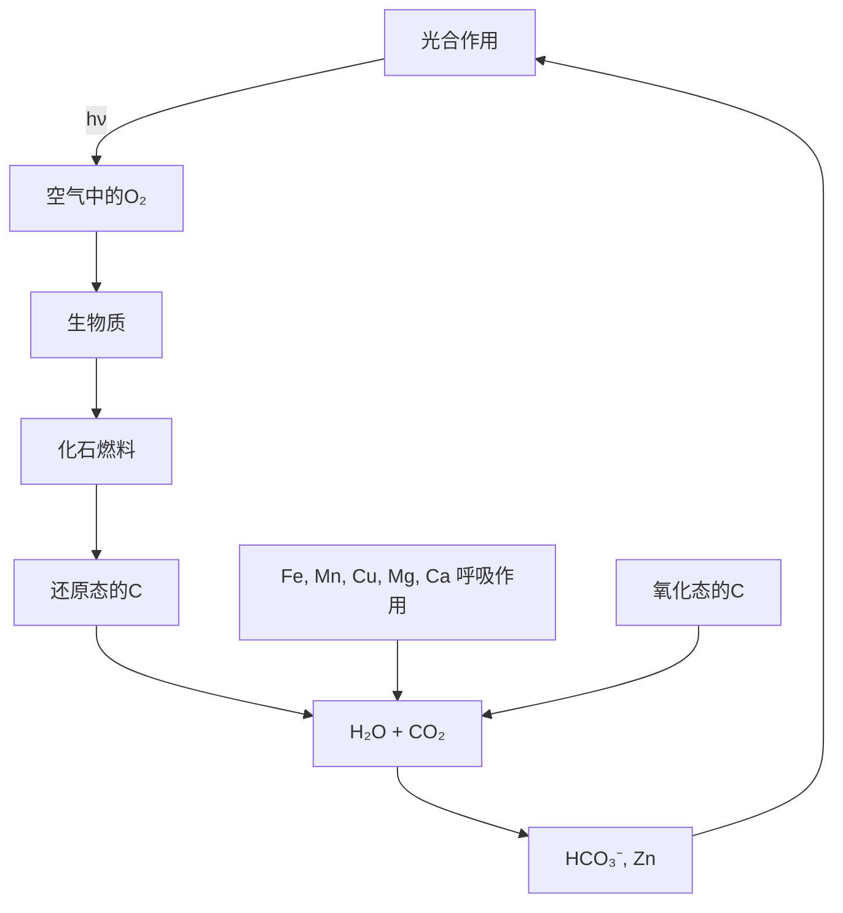

图 B14.2 碳循环的主要环节

经过数亿年的演化,产生化石燃料的这一过程中也产生了大气层中的 $O_{2}$ ,并使最初高含量的 $CO_{2}$ 浓度有所降低。由于海洋中存在大量 Fe(II),早期地球上氧气的积累速率相当缓慢。 $\mathrm{Fe(II)}$ 被 $O_{2}$ 氧化产生不溶性的 Fe(III) 化合物沉淀下来,从而形成了 Fe(III) 的矿带。一旦 Fe(II) 和还原态的硫被耗尽, $O_{2}$ 开始在大气层中积累,约在 10 亿年前接近了现在的浓度。

当今人们在开采并燃烧着化石燃料,这样就干扰了氧与碳之间的关系。燃烧显然是造成干扰的主要因素,但有些石油或天然气是通过自然界和人类的活动到达地表。未燃烧的石油或天然气通过生物降解作用产生 $CO_{2}$ ,从而完成了图 B14.3 所示的循环过程。生物降解过程几乎完全是由需氧微生物通过含铁酶来完成的。

![[无机化学第6版主族364-564_images/7c145668d599047ca324330e614bbbc15627d193787a9f3de2a42fa92c41941a.jpg]]

flowchart

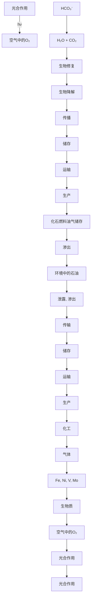

图 B14.3 修改后的碳循环

$\mathrm{CO}_{2}$ 的主要化学性质总结在图14.11中。从经济角度看， $\mathrm{CO}_{2}$ 与氨生成碳酸铵 $(\mathrm{NH}_{4})_{2}\mathrm{CO}_{3}$ 的反应是个重要的化学反应，升高温度时 $(\mathrm{NH}_{4})_{2}\mathrm{CO}_{3}$ 可以直接转化为尿素 $\mathrm{CO}(\mathrm{NH}_{2})_{2}$ ，它既是肥料，也是喂牛的饲料添加剂和化学中间体。 $\mathrm{CO}_{2}$ 的另一个重要用途涉及软饮料工业，高压将其溶解到饮料中形成碳酸以产生爽口的酸味；解压时 $\mathrm{CO}_{2}$ 从溶液中以气泡形式释放出来。有机化学中一个常见的合成反应是 $\mathrm{CO}_{2}$ 与碳负离子试剂作用生成羧酸。在一个叫作Calvin循环的、重要的生物过程中， $\mathrm{CO}_{2}$ 被“固定”于有机分子中（每年达 $100\mathrm{Gt}$ ）。有机产物是通过 $\mathrm{CO}_{2}$ 与“核酮糖氧合酶”（节26.9）中配位于 $\mathrm{Mg}^{2+}$ 的戊糖烯醇酯配体中富电子的 $\mathrm{C} = \mathrm{C}$ 双键反应产生的。

![[无机化学第6版主族364-564_images/c9952d9ab4a23d1c01991daf42abb37c1e54a035ed9d048539b0e2aa08b59c97.jpg]]

chemical

Chemical structure diagram showing coordination complexes and their intermolecular interactions with cobalt, nickel, lithium, and magnesium ligands

图14.11 $\mathrm{CO}_{2}$ 的典型反应

# 应用相关文段 14.5 降低大气中 $CO_{2}$ 的含量

自工业革命以来，化石燃料的消耗日益增长，导致大气中 $CO_{2}$ 含量不断增加，从而造成温室效应增大和与之相关的气候变化。21世纪人们面临的最大挑战之一是寻找一种途径，以最大限度降低大气中二氧化碳含量增加的速率。更高效地使用能源和减少能耗可以降低对碳基化石燃料的依赖；另一条途径则是更多地使用低碳燃料（如核能和可再生能源）。

减少大气中二氧化碳含量的一种方法是将二氧化碳封存，即从大气中分离出二氧化碳然后将其长期储存于地下。大气中的 $CO_{2}$ 主要来自燃煤和燃气发电站。一个新建的 1 GW 燃煤发电站每年产生约 6 百万吨 $CO_{2}$ 。增设捕获装置从废气中除去 $CO_{2}$ 可以大大减少 $CO_{2}$ 的排放，其中的一个过程就是利用各种胺的水溶液从气体中除去 $CO_{2}$ （和 $H_{2}S$ ）。 $CO_{2}$ 与胺反应生成氨基甲酸铵（ $NH_{2}COONH_{4}$ ）固体。该过程存在的一个问题是，水相会在气体流中蒸发。人们已经开发出非挥发性的 $CO_{2}$ 捕获材料，其中的方法之一是生产出结合有氨基的离子液体。这些低温下熔融的离子盐与 $CO_{2}$ 之间发生可逆反应，不需要水的参与并可再循环使用。

尽管有了这种技术,但发电站却尚未使用。二氧化碳封存技术会使发电站的产量减少25%\~40%,使能源生产成本增加20%\~90%,从而需要增加现有发电站的数目。

$\mathrm{CO}_{2}$ 的金属络合物也是存在的（12），但为数不多且远不如金属羰基化合物那么重要。在与低氧化态、富电子金属中心相互作用时，中性的 $\mathrm{CO}_{2}$ 分子作为Lewis酸，主要通过将金属原子中的电子投入 $\mathrm{CO}_{2}$ 分子的 $\pi^{*}$ 反键轨道来成键。 $\mathrm{CO}_{2}$ 侧配于金属原子土，类似于烯烃与富电子金属中心之间的成键（节22.9）。

超临界流体 $CO_{2}$ （即高度压缩、但温度处于临界温度以上的二氧化碳）的一个重要用途是用作溶剂。应用范围包括从咖啡豆中分离咖啡因到化学合成中代替常规溶剂，成为实施“绿色化学”战略的重要组成部分。

一氧化碳和二氧化碳的硫类似物（CS 和 $CS_{2}$ ）也是存在的（节 4.13）。前者是个瞬态分子，后者是个吸热化合物。也有一些 CS 和 $CS_{2}$ 形成的络合物（分别见 13、14），结构类似于 CO 和 $CO_{2}$ 形成的化合物。在碱性水溶液中， $CS_{2}$ 水解生成碳酸根离子 $\left(\mathrm{CO}_{3}^{2-}\right)$ 和三硫代碳酸根离子 $\left(\mathrm{CS}_{3}^{2-}\right)$ 的混合物。

![[无机化学第6版主族364-564_images/0ebb1a9c6b23b74a98d2e4a0463a56b5c0216da3ad6b22f5c3db5af8c7a46ddd.jpg]]

chemical

Molecular structure of nickel complex with R₃P ligands and CO₂ group

(12)

![[无机化学第6版主族364-564_images/f28612768049a30721627311ec09e3c95c59f286f137c705a8f288426aabfc7d.jpg]]

chemical

Molecular structure diagram showing Rh center bonded to Cl, CS, and PR₃ groups

(13)

![[无机化学第6版主族364-564_images/896839ac1756371eaa493607de69ced8b7894c93b4169c5ffc4c769e0227bd27.jpg]]

chemical

Molecular structure diagram showing platinum (Pt) bonded to phosphorus (PR₃) and sulfur (CS₂)

(14)

例题 14.3 设计 CO 参与反应的化学合成过程

题目:设计用 $^{13}$ CO 合成 $CH_{3}^{13}CO_{2}^{-}$ 的一种方案, $^{13}$ CO 是合成许多 $^{13}$ C 标记化合物的主要起始物。

答案:这里需要记住的是, $CO_{2}$ 容易受到强亲核试剂(如 $LiCH_{3}$ )的进攻生成乙酸根离子。一个恰当的方法是将 $^{13}CO$ 氧化为 $^{13}CO_{2}$ ，然后让后者与 $LiCH_{3}$ 反应。第一步可使用强氧化剂(如固体 $MnO_{2}$ )以避免直接氧化时过剩 $O_{2}$ 带来的问题。

$$
{ } ^ { 1 3 } \mathrm{CO} ( \mathrm{g} ) + 2 \mathrm{MnO} _ { 2 } ( \mathrm{s} ) \xrightarrow { \triangle } { } ^ { 1 3 } \mathrm{CO} _ { 2 } ( \mathrm{g} ) + \mathrm{Mn} _ { 2 } \mathrm{O} _ { 3 } ( \mathrm{s} )
$$

$$
4 ^ {1 3} \mathrm{CO} _ {2} (\mathrm{g}) + \mathrm{Li} _ {4} (\mathrm{CH} _ {3}) _ {4} (\mathrm{et}) \longrightarrow 4 \mathrm{Li} [ \mathrm{CH} _ {3} ^ {1 3} \mathrm{CO} _ {2} ] (\mathrm{et})
$$

式中，“el”表示乙醚。（另一种方法涉及 $\left[\mathrm{Rh}(\mathrm{I})_{2}(\mathrm{CO})_{2}\right]^{-}$ 与 $^{13}\mathrm{CO}$ 的反应，第25章将会讨论该反应的原理。）

自测题 14.3 设计以 ${}^{13}CO$ 为起始物合成 $D^{13}CO_{2}^{-}$ 的方案。

# 14.10 硅与氧形成的简单化合物

提要: Si—O—Si 链存在于二氧化硅、多种金属硅酸盐矿物和硅氧烷聚合物中。

如果将四面体结构的 $SiO_{4}$ 单元绘制成以 4 个氧原子为顶点、Si 原子为核心的四面体，往往更容易理解复杂的硅酸盐结构。采用的表示方法通常是略去其他原子而只绘出 $SiO_{4}$ 单元。 $SiO_{4}$ 单元中每个终端 O 原子的电荷为 -1，但每个共享 O 原子对电荷的贡献则为 0。这样，正硅酸根是 $\left[SiO_{4}\right]^{4-}(1)$ ；二硅酸根是 $\left[O_{3}SiOSiO_{3}\right]^{6-}(2)$ ；因为所有 O 原子被共享，二氧化硅的 $SiO_{2}$ 单元净电荷为 0。

根据电荷平衡原则,无限的单线链或由 $SiO_{4}$ 单元形成的环(每个 Si 原子上都有两个共享 O 原子)将具有带电荷的化学式 $\left[\left(\mathrm{SiO}_{3}\right)^{2-}\right]_{n}$ 。含环状偏硅酸根离子化合物的一个例子是矿物绿柱石 $\left(\mathrm{Be}_{3}\mathrm{Al}_{2}\mathrm{Si}_{6}\mathrm{O}_{18}\right)$ ，其中含有 $\left[Si_{6}O_{18}\right]^{12-}$ 阴离子(15)。绿柱石是铍的主要来源。翡翠绿宝石也是绿柱石，其中的部分 $Al^{3+}$ 被 $Cr^{3+}$ 所取代。链状偏硅酸根(16)存在于矿物硬玉 $\left[\mathrm{NaAl}\left(\mathrm{SiO}_{3}\right)_{2}\right]$ 中，它是两种在售翡翠中的一种，其中的绿色来自痕量的铁杂质。除单链结构外还存在一些双链结构的硅酸盐，其中包括工业上叫作石棉（应用相关文段 14.6）的一族矿物。

![[无机化学第6版主族364-564_images/315dd7ff6f4fec310db5a0622b6cb2e31f0e7ff437767e62b6259ad2e2da6a09.jpg]]

natural_image

Geometric star pattern composed of interlocking triangles (no text or symbols)

(15)

![[无机化学第6版主族364-564_images/869943f20ffd0ba5e7613d40620b50479783c85e0ef5388d94ab602f9e24b528.jpg]]

natural_image

Five identical 3D geometric pyramid shapes arranged horizontally (no text or symbols)

(16)

# 应用相关文段14.6 石棉

石棉是一个通用术语,它包括六种自然界存在的矿物纤维。其中只有三种找到了商业用途。白石棉(或温石棉)的通式为 $\mathrm{Mg}_{3}\mathrm{Si}_{2}\mathrm{O}_{5}(\mathrm{OH})_{4}$ , 具有片状硅酸盐结构, 这种纤维在显微镜下是缠在一起的。棕石棉、铁石棉、蓝石棉和青石棉为闪石。闪石为双链硅酸盐结构, 在显微镜下似乎为针状。

所有纤维在工业和日常应用中都具有非常引人的性质，包括热稳定性、耐热性、生物难降解性、对化学品的耐腐蚀性和低导电性。石棉应用最多的性质是热稳定性和加固基体的性质。首次使用石棉的记录是公元前2000年现今的芬兰地区，当时被用来增强陶器。Marco Polo用石棉纤维作为耐火焰的材料。工业革命期间石棉的需求量增加，石棉水泥板于1900年开始广泛用作建筑材料。20世纪世界各地的石棉产量都在增加，直到1960年代才因出现了健康问题而导致了产量减少或禁止使用。吸入长而细的纤维会导致呼吸系统疾病。石棉沉着病是由石棉造成的，这种病是长期处在高浓度石棉环境中导致的肺纤维化；肺癌往往伴随着石棉沉着病；间皮瘤是一种罕见的胸部和腹腔癌症。每种类型的石棉对健康的影响不同，最有害的品种是针形闪石。

如今石棉仍用在如水泥或有机树脂这样的基体中。用于绝热的石棉替代品包括玻璃纤维和蛭石。纤维素纤维或合成纤维（如聚丙烯）用在纤维水泥中。

硅酸盐玻璃的成分对其物理性质具有强烈影响。例如，熔融石英（非晶态 $\mathrm{SiO}_2$ ）在约 $1300^{\circ}\mathrm{C}$ 软化，硼硅酸盐玻璃（其中含有氧化硼；节13.8）在约 $800^{\circ}\mathrm{C}$ 软化，而苏打石灰玻璃的软化温度甚至更低。下述思路可用来理解软化点的变化趋势：硅酸盐玻璃通过Si—O—Si链形成框架结构，正是这种结构导致了玻璃的刚性。例如，苏打石灰玻璃中那样，碱性氧化物（如 $\mathrm{Na}_2\mathrm{O},\mathrm{CaO}$ 等）与熔融的 $\mathrm{SiO}_2$ 反应将Si—O—Si链转化为终端SiO基从而导致软化温度降低。科学家发现硅氧烷聚合物中的—Si—O—Si—骨架有着不同的性质，相关内容将在本章稍后叙述。

# 14.11 锗、锡和铅的氧化物

提要:从 Ge 到 Pb,+2 氧化态的氧化物越来越稳定。

锗（Ⅱ）氧化物（GeO）是个还原剂并可发生歧化生成 Ge 和 $GeO_{2}$ 。锗（Ⅳ）氧化物（ $GeO_{2}$ ）的结构以四配位的四面体 $GeO_{4}$ 单元为基础。它也存在于具有类金红石结构的六配位晶形物和类似于融合石英的玻璃状物质中，锗的硅酸盐和铝硅酸盐类似物也是已知的（节 14.15）。

蓝黑色 SnO 中的 Sn(Ⅱ)离子为四配位(见图 14.12)，但 Sn(Ⅱ)周围的 O $^{2-}$ 处在四方形平面中，Sn 上的孤对电子处在远离四方形平面的方向。这种结构可以认为是 Sn 原子上存在立体化学活性的孤对电子，也可以看作交替缺失阴离子层的萤石结构(节 3.9)。红色 SnO 有着相似的结构，通过加热、加压、用碱处理可转变为蓝黑色的 SnO。

隔绝空气加热时 SnO 发生歧化反应生成 Sn 和 $SnO_{2}$ 。后者在自然界以矿物锡石的形式存在，具有金红石结构(节 3.9)。 $SnO_{2}$ 在玻璃和釉料中的溶解度低,在陶瓷釉料中大量用作遮光剂和颜料载体以降低其透明度。

铅氧化物的结构很有趣。红色 PbO 与蓝黑色 SnO 具有相同的结构，都存在立体化学活性的孤对电子（见图 14.12）。铅也形成混合氧化态氧化物。最著名的是“铅红” $Pb_{3}O_{4}$ ，其中 Pb(Ⅳ) 和 Pb(Ⅱ) 分别处在八面体环境和不规则的六配位环境中。两种不同位置上铅的氧化数是根据的 Pb—O 的距离确定的，距 O 较近的 Pb 被看作 Pb(Ⅳ)。红褐色的 $PbO_{2}$ 以金红石结构结晶，作为氧化剂时被还原为更稳定的 Pb(Ⅱ)，这也

![[无机化学第6版主族364-564_images/95b7a4ee61559529628e10e2234e75700d784ba1f13e1101f6b99a7abec5f85d.jpg]]

chemical

Crystal structure diagram of a tin-oxygen compound showing atomic arrangement and unit cell view

![[无机化学第6版主族364-564_images/b8236a4d97eb656d99abb49eee74bcda6ff25803bf1aed5be2e83d0cf70969e5.jpg]]  
图14.12  
图 14.12 蓝黑色 SnO 的结构  
图中示出四方锥形 $\mathrm{SnO}_4$ 结构单元平行的层状排布

是惰性电子对效应的体现。该氧化物为铅酸电池阴极的成分(应用相关文段14.7)。

# 应用相关文段 14.7 铅酸电池

除了是最成功的可充电电池外,铅酸电池的化学性质也相当重要,因为它可用来说明动力学因素和热力学因素在电池运行中所起的作用。

在电池处于完全充电状态时，阴极和阳极上的活性材料分别为二氧化铅和金属铅；电解质是稀硫酸。这种设计的一个特点是，两个电极上含铅的反应物和产物都是不溶的。电池产生电流时，阴极反应为 $PbO_{2}$ 中的 $\mathrm{Pb(IV)}$ 还原为 $\mathrm{Pb(II),Pb^{2+}}$ 与硫酸作用生成不溶性的 $PbSO_{4}$ 沉积在电极上：

$$
\mathrm{PbO} _ {2} (\mathrm{s}) + \mathrm{HSO} _ {4} ^ {-} (\mathrm{aq}) + 3 \mathrm{H} ^ {+} (\mathrm{aq}) + 2 \mathrm{e} ^ {-} \longrightarrow \mathrm{PbSO} _ {4} (\mathrm{s}) + 2 \mathrm{H} _ {2} \mathrm{O} (1)
$$

铅在阳极被氧化为 $Pb^{2+}$ ，同样也生成不溶的硫酸铅：

$$
\mathrm{Pb(s)} + \mathrm{SO} _ {4} ^ {2 -} (\mathrm{aq}) \longrightarrow \mathrm{PbSO} _ {4} (\mathrm{s}) + 2 \mathrm{e} ^ {-}
$$

总反应是

$$
\mathrm{PbO} _ {2} (\mathrm{s}) + 2 \mathrm{HSO} _ {4} ^ {-} (\mathrm{aq}) + 2 \mathrm{H} ^ {+} (\mathrm{aq}) + \mathrm{Pb} (\mathrm{s}) \longrightarrow 2 \mathrm{PbSO} _ {4} (\mathrm{s}) + 2 \mathrm{H} _ {2} \mathrm{O} (\mathrm{l})
$$

对以水溶液为电解质的电池而言,约为2 V的电位差属于相当高的电位差,远远超过了水氧化为 $O_{2}$ 的电势(约为1.23 V)。该电池之所以取得成功是由于 $H_{2}O$ 在 $PbO_{2}$ 上的氧化和 $H_{2}O$ 在Pb上的还原具有较高的超电势(和因此而具有较低的速率)。

# 14.12 与氮形成的化合物

提要:氰根离子( $CN^{-}$ )与许多d金属离子形成络合物;它的高毒性可用与酶(如细胞色素c氧化酶)活性部位的配位做解释。

甲烷和氨在高温催化条件下发生的部分氧化能够大量生产氰化氢(HCN)，HCN是合成许多常见聚合物（如聚甲基丙烯酸甲酯和聚丙烯腈）的中间体。氰化氢极具挥发性（沸点 $26^{\circ}\mathrm{C}$ ），像 $\mathrm{CN}^{-}$ 一样有剧毒。 $\mathrm{CN}^{-}$ 的毒性在某些方面与等电子的CO分子相似，因为它们都能与铁卟啉分子配位形成络合物。毒性的不同在于：CO与血红蛋白中的铁结合后导致缺氧；而 $\mathrm{CN}^{-}$ 则与细胞色素 $c$ 氧化酶（线粒体中将氧还原为水的酶）中铁活性部位配位从而造成细胞能量生产上快速而灾难性的垮塌。与中性配体CO不同，带负电荷的 $\mathrm{CN}^{-}$ 是个强Brønsted碱（ $\mathrm{pK}_{\mathrm{a}} = 9.4$ ）和弱得多的Lewis酸 $\pi$ 电子接受体。CO配体能与零氧化态的金属配位形成络合物，这是由于它可通过 $\pi$ 体系移去电子密度。然而在 $\mathrm{CN}^{-}$ 的配位化学中往往与正氧化态的金属离子相结合。例如，与络合物 $[\mathrm{Fe(CN)}_6]^{4-}$ 中的 $\mathrm{Fe}^{2+}$ 相结合，那里金属离子的电子密度更低。

由于与卤素的性质相似,有毒且易燃的气体氰(NC—CN,17)被人们叫作拟卤素(pseudohalogen)。氰发生解离生成自由基(·CN)，然后形成拟卤素化合物(如FCN和ClCN)。同样， $\mathrm{CN}^{-}$ 也是拟卤离子(pseudohalide ion)的一个例子(节17.7)。

![[无机化学第6版主族364-564_images/d458801de15289c4783c826fc915df503ac4c8b18e52092ec1336895dbb4ee47.jpg]]

Si 和 $N_{2}$ 在高温下直接反应生成氮化硅 $\left(\mathrm{Si}_{3}\mathrm{N}_{4}\right)$ 。这种物质硬度高并且显示化学惰性，可用作耐高温的陶瓷材料。当前工业上的研究聚焦于使用有机硅氮化合物通过高温分解生产纤维状和其他形貌的氮化硅。三硅基胺 $\left(\mathrm{H}_{3}\mathrm{Si}\right)_{3}\mathrm{N}$ （三甲基胺的类似物）具有非常弱的 Lewis 碱性。它具有平面结构，或者由于能垒低而发生瞬变。这种弱碱性和平面结构按传统方式被解释为 d 轨道参与成键，允许 N 原子采用 $sp^{2}$ 杂化和孤对电子通过 $\pi$ 键离域。然而量子力学计算表明，d 轨道在离域作用中起着重要作用，但它们不是造成平面结构的原因。因为 Si 的电负性小于 C, Si—N 键的极性比 C—N 键更大。这种差异导致三硅基胺中硅基团之间的长程静电斥力，因而采取平面结构。

# 14.13 碳化物

碳与金属和类金属形成的许多二元化合物(碳化物)分为三大类：

- 似盐型碳化物(saline carbides)主要是离子型固体,是碳与第1族、第2族元素和铝形成的;  
- 金属型碳化物(metallic carbides)具有金属光泽和显示金属电性导,由碳与d区元素形成;  
- 类金属碳化物(metalloid carbides)是质硬的共价型固体,由碳与硼、硅形成。

图 14.13 中示出不同类型碳化物在元素周期表中的分布；表中还包括了电负性元素与碳形成的二元分子化合物（它们通常不看作碳化物）。这种分类对了解物质的物理性质和化学性质非常有用，但各类碳化物的边界有时并不明确。

![[无机化学第6版主族364-564_images/8b0c6cbe440976d74d9f72e2ca6342fdfd54db4afd2bb74e393d208a233620e1.jpg]]

text_image

Li Be
Na Mg
K Ca Sc
Rb Sr La
Cs Ba Ac
Ce Pr Nd Pm Sm Eu Gd Tb Dy Ho Er Tm Yb Lu
离子型(似盐型) 类金属
金属型 不存在
分子型
B N O F
Al Si P S Cl
Ti V Cr Mn Fe Co Ni
Zr Nb Mo To Ru
Hf Ta W Re Os
Ce Pr Nd Pm Sm Eu Gd Tb Dy Ho Er Tm Yb Lu

图 14.13 碳化物在元素周期表中的分布  
为完整起见,图中也包括碳的分子化合物(它们不属于碳化物)

![[无机化学第6版主族364-564_images/9ac787aca8d04c8ec0b521c682e81fa10bd222aa36c2f21c19b98f6182b6f59c.jpg]]  
图14.13

# (a) 似盐型碳化物

提要:高电正性金属与碳形成的化合物是似盐型碳化物。

第1族、第2族金属的似盐型碳化物可分为三个子类：石墨嵌入化合物（graphite intercalation compounds）、二碳化物（dicarbides）和甲烷化物（methides或methanides）。石墨嵌入化合物的一个例子如 $\mathrm{KC}_{8}$ ；二碳化物又叫“乙炔化物”，其中含有 $\mathrm{C}_2^{2-}$ 阴离子；甲烷化物含有形式上的 $\mathrm{C}^4-$ 阴离子。

第1族金属(节11.12)形成石墨嵌入化合物。它们是通过氧化还原过程形成的,具体地说是石墨与碱金属蒸气或与金属氨溶液反应形成的。例如,300 ℃下钾蒸气与石墨在密封管中反应生成 $KC_{8}$ ,其中的碱金属离子有序排列在石墨层之间(见图14.14)。调整金属与碳的比例,可制备一系列碱金属石墨嵌入化合物(包括 $KC_{8}$ 和 $KC_{16}$ )。

很多电正性金属(包括11.11介绍的第1族、第2族元素和镧系元素)都可形成二碳化物。某些二碳化物中 $C_{2}^{2-}$ 的C—C距离很短(如 $CaC_{2}$ 中为119 pm)，相当于三键的 $[C\equiv C]^{2-}$ （与 $[C\equiv N]^{-}$ 和N≡N等电子）。一些二碳化物的结构与岩盐相关，但球形的 $Cl^{-}$ 被拉长了的 $[C\equiv C]^{2-}$ 所替代，从而导致晶体沿一个轴伸长得到四方对称性晶体(见图14.15)。镧系元素二碳化物的C—C键比较长，这一事实表明简单的三键结构对它们来说并非一个好的近似模型。

![[无机化学第6版主族364-564_images/4ae3f2f05ac6d9f590007efd676018393ae91928a0b8e929ee78167e9586da94.jpg]]

natural_image

Geometric diagram of interconnected hexagons and circles forming a network (no text or symbols)

图 14.14 石墨嵌入化合物 $KC_{8}$ 中层间 K 原子的对称排列（是从平行于层的方向观察的）

![[无机化学第6版主族364-564_images/4aac665f6acb5c6dd55e85e0dc41f85b2cd321a1b15111cf4f282109adb1340c.jpg]]

chemical

Crystal structure diagram of calcium cations (Ca²⁺ and C₂²⁻) showing atomic arrangement

图 14.15 碳化钙的结构

该结构与岩盐型结构相类似； $C_{2}^{2-}$ 不是球形，晶胞沿一个轴被拉长，形成四方晶体而非立方晶体

# 例题 14.4 判断二碳化物阴离子的键级

题目:用分子轨道法判断 $C_{2}^{2-}$ 的键级。

答案: 使用图 2.18 的分子轨道能级图并填入 10 个电子得到的组态为 $1\sigma_{g}^{2}1\sigma_{u}^{2}1\pi_{u}^{4}2\sigma_{g}^{2}$ ，键级 b 由下式给出：

$$
b = 1 / 2 (n - n ^ {*}) = 1 / 2 (8 - 2) = 3
$$

自测题 14.4 如果 $C_{2}^{2-}$ 被氧化为 $C_{2}^{-}$ ，判断 $C_{2}^{2-}$ 的键长和键强度如何变化。

甲烷化物（如 $Be_{2}C$ 和 $Al_{4}C_{3}$ ）是似盐型碳化物和类金属碳化物的边界化合物，孤立的碳离子只在形式上为 $C^{4-}$ 。甲烷化物的晶体结构（不是人们预料中简单球形离子的堆叠）表明其中碳原子存在定向成键作用（不同于纯离子键的无方向性）。

第 1 族、第 2 族的似盐型二碳化物的主要合成路线非常简单，即两种元素在高温下直接化合。例如：

$$
\mathrm{Ca(g)} + 2 \mathrm{C(s)} \xrightarrow {> 2 0 0 0 ^ {\circ} \mathrm{C}} \mathrm {CaC_ {2} (s)}
$$

形成石墨嵌入化合物是直接反应的另一个实例,反应是在低得多的温度下进行的。这种插入反应容易发生是因为离子在石墨层间滑动时不需要断开 C—C 共价键。

金属氧化物与碳在高温下的反应可以制备二碳化物。例如：

$$
\mathrm{CaO(s)} + 3 \mathrm{C(s)} \xrightarrow {2 0 0 0 ^ {\circ} \mathrm{C}} \mathrm {CaC_ {2} (s)} + \mathrm{CO(g)}
$$

在电弧炉中使用这种方法可以制备碳化钙的粗制品，碳在反应中除作为还原剂移除氧外同时也是碳化钙中碳的来源。

乙炔与金属的氨溶液反应可以制备二碳化物。例如：

$$
2 \mathrm{Na} (\mathrm{am}) + \mathrm{C} _ {2} \mathrm{H} _ {2} (\mathrm{g}) \longrightarrow \mathrm{Na} _ {2} \mathrm{C} _ {2} (\mathrm{s}) + \mathrm{H} _ {2} (\mathrm{g})
$$

该反应是在温和条件下发生的，完整地保留了起始物中的 C—C 键。由于乙炔分子是非常弱的 Brønsted 酸 $(pK_{a}=25)$ ，反应可视为高活性的金属与弱酸之间的氧化还原反应，反应得到 $H_{2}(H^{+}$ 作为氧化剂）和金属的二碳化物。

似盐型二碳化物和甲烷化物的 C 原子上有高的电子密度,因而容易被氧化和加合质子。例如,二碳化钙与弱酸性的水反应生成乙炔:

$$
\mathrm{CaC} _ {2} (\mathrm{s}) + 2 \mathrm{H} _ {2} \mathrm{O} (\mathrm{l}) \longrightarrow \mathrm{Ca(OH)} _ {2} (\mathrm{s}) + \mathrm{HC} \equiv \mathrm{CH(g)}
$$

该反应不难这样去理解:从 Brønsted 酸( $H_{2}O$ )中将质子转移至更弱的酸(HC≡CH)的共轭碱( $C_{2}^{2-}$ )。反应可供某些可获得碳化钙的地区在工业上生产乙炔,因为那些地区使用这种方法比从石油制造乙炔更廉价、更便捷。同样,甲烷化铍水解生成甲烷:

$$
\mathrm{Be} _ {2} \mathrm{C(s)} + 4 \mathrm{H} _ {2} \mathrm{O(l)} \longrightarrow 2 \mathrm{Be(OH)} _ {2} (\mathrm{s}) + \mathrm{CH} _ {4} (\mathrm{g})
$$

石墨嵌入化合物 $KC_{8}$ 的控制水解或氧化可以复得石墨，同时形成金属氢氧化物或金属氧化物：

$$
2 \mathrm{KC} _ {8} (\mathrm{s}) + 2 \mathrm{H} _ {2} \mathrm{O} (\mathrm{l}) \longrightarrow 1 6 \mathrm{C} (\text {石墨}) + 2 \mathrm{KOH(aq)} + \mathrm{H} _ {2} (\mathrm{g})
$$

# (b) 金属型碳化物

提要:d 金属碳化物往往是硬质材料,金属原子按八面体方式绕碳原子排列。

d 金属提供了最大的一类金属碳化物（如 $Co_{6}Mo_{6}C$ 和 $Fe_{3}Mo_{3}C$ ）。它们有时也被称为填隙型碳化物（intersticial carbides），这是因为长期认为它们的结构与金属结构相同，是由碳原子插入金属的八面体穴得到的。事实上金属结构与金属碳化物结构往往不同。例如，金属钨为体心立方结构，而碳化钨（WC）则为六方密堆积。“填隙型碳化物”这个名称让人们误认为金属碳化物不是正统的化合物。事实上，金属碳化物的硬度和其他性质表明金属和碳之间存在强的成键作用。一些碳化物在经济上和技术上都是很有用的材料。例如，碳化钨（WC）可用在切割工具和高压设备（如生产钻石的设备）上。渗碳体（ $Fe_{3}C$ ）是钢和生铁的主要成分。

组成为 MC 的金属碳化物中金属原子为 fcc 或 hcp 排列，碳原子处在八面体穴中。fcc 排列方式导致盐岩结构。在组成为 $M_{2}C$ 碳化物中碳原子仅占一半由密堆积金属原子形成的八面体穴。八面体穴中的碳原子被 6 个金属原子所包围，形式上是超配位（hypercoordinate）的碳原子（即具有难得一见的高配位数）。然而其成键作用可用离域分子轨道来表达，这种离域分子轨道是由 C2s 轨道、C2p 轨道和周围金属原子的 d 轨道（也可能还有其他价轨道）形成的。

人们发现了一条经验规则: 当 $r_{c}/r_{m}<0.59(r_{c}$ 是碳的共价半径, $r_{m}$ 是 M 的金属半径) 时形成简单的金属碳化物, 即碳原子处在密堆积结构八面体穴中的碳化物。这种关系也适用于含氮和含氧的金属化合物。

# (c) 类金属碳化物

提要:硼和硅分别与碳形成非常硬的 $B_{4}C$ 和 SiC。

硅和硼分别与碳形成类金属碳化物。碳化硼是极硬的陶瓷材料，被用作坦克的装甲、防弹背心和许多工业领域（如切割工具和耐磨涂层），也可用作核反应堆的中子吸收剂。在电弧炉中用 C 还原 $B_{2}O_{3}$ 制得 $B_{4}C$ ：

$$
2 \mathrm{B} _ {2} \mathrm{O} _ {3} (\mathrm{s}) + 7 \mathrm{C} (\mathrm{s}) \longrightarrow \mathrm{B} _ {4} \mathrm{C} (\mathrm{s}) + 6 \mathrm{CO} (\mathrm{g})
$$

碳化硼的化学式通常都被写为 $B_{4}C$ ，但其结构复杂且是个缺碳化合物。一个更好的表示方法是写成 $B_{12}C_{3}$ ，缺电子性可用 $B_{12}B_{2}$ 单元的存在做解释。考虑化合物结构时这种表示的合理性是清楚的。碳化硼结构是二十面体的 $B_{12}$ 单元绕 C—B—C 链的菱形排列（见图 14.16）。C 与 $SiO_{2}$ 一起加热时生成碳化硅（SiC）并放出 $CO_{2}$ 。非常硬的碳化硅材料被广泛用作磨料（金刚砂）。通过高温处理可将碳化硅颗粒黏结在一起形成硬陶瓷，以用在汽车刹车片、离合器和防弹背心上。碳化硅在电子方面的应用包括发光二极管、高温和高电压的半导体。碳化硅存在 200 种以上不同的晶形。最常见的多晶为 $\alpha-SiC$ ，它是在高于 1700 ℃ 的温度下形成的，并具有六方纤维锌矿结构（见图 3.35）。低于 1700 ℃ 时会形成 $\beta-SiC$ 。 $\beta-SiC$ 具有立方闪锌矿结构（见图 3.6）， $\beta-SiC$ 的比表面积高，用作非均相催化载体方面具有很大的吸引力。

![[无机化学第6版主族364-564_images/dde1479c9634907007f6c2d038be75987dc829a4d2b8bcbd964344d02d4eb598.jpg]]

chemical

Molecular structure diagram showing interconnected nodes labeled B₁₂ and C₃ with numbered bonds

图 14.16 碳化硼的结构  
图中示出二十面体的 $B_{12}$ 单元

# 14.14 硅化物

提要:金属与硅形成的化合物(硅化物)含有孤立的硅原子、四面体的 $Si_{4}$ 单元或 Si 原子形成的六角形网。

与相邻的硼和碳一样，硅与金属也形成多种二元化合物。有些硅化物中含有孤立的硅原子。例如，在炼钢中起重要作用的硅铁 $\left(\mathrm{Fe}_{3}\mathrm{Si}\right)$ 可看作是按面心立方排列的某些Fe原子被Si所取代。某些化合物（如 $K_{4}Si_{4}$ ）中含有单独的四面体阴离子簇 $\left[Si_{4}\right]^{4-}$ ，该阴离子簇与 $P_{4}$ 等电子。许多f区元素形成化学式为 $MSi_{2}$ 的化合物。 $MSi_{2}$ 采取图13.7所示的 $AlB_{2}$ 的六边形层状结构。

# 14.15 扩展的硅氧化合物

硅与氧除形成简单二元化合物外，还形成工业上具有广泛用途的许多扩展的网状固体。铝硅酸盐以黏土、矿物和岩石的形式存在于自然界。沸石铝硅酸盐广泛用作分子筛、催化剂和催化剂载体材料。这些化合物将在第24章和第25章进一步做讨论。

# (a) 铝硅酸盐

提要:铝可取代硅酸盐骨架中的硅形成铝硅酸盐,脆的、层状的铝硅酸盐是黏土和一些常见矿物的主要成分。

铝原子取代部分 Si 原子形成的铝硅酸盐结构比硅酸盐本身的结构更加多样化。主要由铝硅酸盐构成丰富多彩的矿物世界。前面已经看到 $\gamma-Al_{2}O_{3}$ 中的 $Al^{3+}$ 既存在于八面体穴也存在于四面体穴中（节 3.3）。这种多变性延续到硅铝酸盐，Al 可能在那里取代四面体位点的 Si 原子并进入硅酸盐结构以外的八面体环境中，或者出现其他的配位数（这种情况很少见）。由于铝以 Al(Ⅲ) 形式存在，铝硅酸盐中的 Si(Ⅳ) 换成 Al(Ⅲ) 使体系多出了一个负电荷。因此，每个取代了 Si 的 Al 原子需要一个 $H^{+}$ 或一个 $Na^{+}$ 或 $\frac{1}{2}$ 个 $Ca^{2+}$ 相结合。我们将会看到，这些外来的阳离子对材料性质产生了重大影响。

许多也含有如 Li、Mg 和 Fe 等金属的重要矿物为各种层状铝硅酸盐，其中包括黏土、滑石和各种云母。一类层状硅铝酸盐中的重复单元是由硅酸盐层组成的，其结构如图 14.17 所示。这种类型的简单铝硅酸盐（“简单”的意思是指不存在其他元素）的一个例子是矿物高岭石 $\left[\mathrm{Al}_{2}(\mathrm{OH})_{4}\mathrm{Si}_{2}\mathrm{O}_{5}\right]$ 。这种矿物在工业上可用作瓷土。电中性层被相当弱的氢键维系在一起，所以矿物的层间容易劈裂并将水结合进去。

较大的一类铝硅酸盐在硅酸盐层之间夹有 $Al^{3+}$ （见图 14.18）。这样的一个矿物叫叶蜡石 $\left[\mathrm{Al}_{2}\left(\mathrm{OH}\right)_{2}\mathrm{Si}_{4}\mathrm{O}_{10}\right]$ 。矿物滑石 $\left[\mathrm{Mg}_{3}\left(\mathrm{OH}\right)_{2}\mathrm{Si}_{4}\mathrm{O}_{10}\right]$ 是 3 个 $Mg^{2+}$ 取代八面体位点的两个 $Al^{3+}$ 得到的。如前所述，滑石（和叶蜡石）中的重复层为电中性，因此层间容易劈裂。白云母 $\left[\mathrm{KAl}_{2}\left(\mathrm{OH}\right)_{2}\mathrm{Si}_{3}\mathrm{AlO}_{10}\right]$ 具有带电荷的层，这是因为一个 $\mathrm{Al}(\mathrm{III})$ 原子取代了叶蜡石结构中的一个 $\mathrm{Si}(\mathrm{IV})$ 原子。由此产生的负电荷可由 $K^{+}$ 来平衡， $K^{+}$ 处于重复层之间，从而导致较大的硬度。

![[无机化学第6版主族364-564_images/0547a4cb0dafb62ee1f93e9ea5064cfcf662616cf23a40b7c29b532faede98e9.jpg]]  
图 14.17 （a） $^{*}$ SiO $_{4}$ 四面体网状结构；（b） $^{*}$ SiO $_{4}$ 的四面体表示法；（c） $^{*}$ 上述网状结构的侧视图；（d） $^{*}$ 侧视网状结构的多面体表示法

(c) 和 (d) 表示叶蜡石的双层结构，其 M 为 Mg；当 M 为 Al $^{3+}$ 和底层的阴离子被 OH $^{-}$ 取代后，该结构接近于 1:1 黏土高岭石的结构  
图 14.18 （a） $^{*}$ 2：1 黏土矿如白云母 $KAl_{2}(OH)_{2}Si_{3}AlO_{10}$ 的结构， $K^{+}$ 位于带电荷层之间（可被交换的阳离子位点）， $Si^{4+}$ 处于配位数为 4 的位置， $Al^{3+}$ 处于配位数为 6 的位置；(b) $^{*}$ 多面体表示法：滑石中 $Mg^{2+}$ 占据八面体位置，顶层和底层的 O 原子被 OH 基团所取代， $K^{+}$ 位点空着

许多种矿物具有三维铝硅酸盐骨架。例如，长石是最重要的一类造岩矿物（也形成花岗岩）。长石的铝硅酸盐骨架是通过共享 $SiO_{4}$ 或 $AlO_{4}$ 四面体所有顶点构建起来的。三维网状骨架的空穴中容纳 $K^{+}$ 和 $Ba^{2+}$ ，如正长石 $(\mathrm{KAlSi}_{3}\mathrm{O}_{8})$ 和钠长石 $(\mathrm{NaAlSi}_{3}\mathrm{O}_{8})$ 。

# (b) 微孔固体

提要:沸石铝硅酸盐具有开阔的空腔或通道,使它们具有许多实用性能(如离子交换和对分子的吸附作用)。

分子筛是孔径为分子尺寸、结构开放的晶形铝硅酸盐。这些“微孔”物质[包括铝硅酸盐框架中捕获了阳离子(通常为第1族、第2族阳离子)的沸石]将具有挑战性的结构测定、富有想象力的合成化学和重要的实际应用相结合，因而代表了固态化学的重大胜利。由于笼是由晶体结构限定的，所以高度规整且具有精准的大小。与硅胶和活性炭等高比表面积的固体（分子可能被小颗粒之间的不规则空隙所捕获）相比，分子筛在捕获分子时具有更高的选择性。

沸石用于择形多相催化。例如，分子筛ZSM-5用于合成1,4-二甲苯（对二甲苯），对二甲苯是汽油的辛烷值增进剂。其他方法不能生产二甲苯类化合物，这是因为催化过程受控于沸石笼和通道的大小和形状。表14.6总结了沸石的用途，第24章和第25章也将进行相关的讨论。

表 14.6 沸石的某些应用

<table><tr><td>功能</td><td>应用</td></tr><tr><td>离子交换</td><td>洗涤剂中的水软化剂</td></tr><tr><td>分子吸附</td><td>选择性气体分离、气相色谱法</td></tr><tr><td>固体酸</td><td>裂解高摩尔质量的碳氢化合物以获得燃料和石油化学的中间体、芳香烃的择形烷基化和异构化以获得石油和聚合物的中间体</td></tr></table>

人工合成手段也可用于改造自然界存在的沸石。人们已制造出一些沸石，这种沸石具有特殊的笼体积，笼内也具有特殊的化学性质。这些人工沸石有时是在常压下制备的，但更多时候需在高压釜中制造。它们的开放结构似乎是围绕引入反应混合物中的水合阳离子或其他大阳离子（如 $\mathrm{NR}_4^+$ ）形成的。例如，合成反应可在含有四丙基铵氢氧化物水溶液的高压釜中将硅胶加热到 $100\sim 200^{\circ}\mathrm{C}$ 进行。微晶产物（有代表性的组成为 $[\mathrm{N}(\mathrm{C}_3\mathrm{H}_7)_4]\mathrm{OH}(\mathrm{SiO}_2)_{48})$ 在空气中于 $500^{\circ}\mathrm{C}$ 进行燃烧以除去季铵阳离子中的C、H和N后即转化为沸石。铝硅酸盐沸石是由在起始物中加入高比表面积的氧化铝制作的。

迄今已经制备成功了笼和瓶颈大小不同的多种沸石(见表14.7)。其结构基本上都以 $MO_{4}$ 四面体单元为基础,大部分是 $AlO_{4}$ 和 $SiO_{4}$ 四面体单元。因为沸石结构中包括许多这样的四面体单元,通常不采用多面体表示法以强调Si和Al原子所处的位置。在这种表示中,Si或Al原子位于四条线段的交点,O原子桥处于线段上(见图14.19),这种框架表示法(framework representation)能够示出沸石笼和通道的形状,一些示例见图14.20。

表 14.7 一些分子筛的组成和性质

<table><tr><td>分子筛</td><td>组成</td><td>瓶径/pm</td><td>化学性质</td></tr><tr><td>A</td><td> $Na_{12}[(AlO_2)_{12}(SiO_2)_{12}] \cdot xH_2O$ </td><td>400</td><td>吸附小分子、离子交换剂、亲水性</td></tr><tr><td>X</td><td> $Na_{86}[(AlO_2)_{86}(SiO_2)_{106}] \cdot xH_2O$ </td><td>800</td><td>吸附中等分子、离子交换剂、亲水性</td></tr><tr><td>菱沸石</td><td> $Ca_2[(AlO_2)_4(SiO_2)_8] \cdot xH_2O$ </td><td>400~500</td><td>吸附小分子、离子交换剂、亲水性、酸催化剂</td></tr><tr><td>ZSM-5</td><td> $Na_3[(AlO_2)_3(SiO_2)_{93}] \cdot xH_2O$ </td><td>550</td><td>中等亲水性</td></tr><tr><td>ALPO-5</td><td> $AlPO_4 \cdot xH_2O$ </td><td>800</td><td>中等疏水性</td></tr><tr><td>硅沸石</td><td> $SiO_2$ </td><td>600</td><td>疏水性</td></tr></table>

重要的沸石具有以“方钠石笼”为基础的结构（见图14.3），即切掉八面体的每个顶点而形成的截角八面体(18)。截断后每个顶点被正方形面所替代，八面体的三角面变成规则的六边形。以方钠石笼为基础的物质叫“A型沸石”，方钠石笼被四边形平面之间的氧桥联系在一起。8个这样的方钠石笼以立方模式连接在一起，中央形成的大空腔叫 $\alpha$ 笼（ $\alpha$ -cages）。 $\alpha$ 笼共享着正八边形的面，开口直径为 420 pm。这样，水或其他小分子就能进入并通过正八边形的面进行扩散。然而，由于这些面太小从而不允许 van der Waals 直径大于 420 pm 的分子进入。

![[无机化学第6版主族364-564_images/ef9135a3ead1c87d900f15664a19c193ec3634b55e92b61971ddb61bee5c4ce1.jpg]]

chemical

Molecular structure diagram showing a cage-like framework with gray and white atoms connected by bonds

图 14.19 截角八面体的框架表示法和  
Si、O 原子与框架的关系  
注意: Si 原子处在截角八面体顶点,
O 原子大体沿着截角八面体的边

![[无机化学第6版主族364-564_images/c795f09522b7085da517e0fe48120ebf477267a62f12dfc96e3c60c23cb65f76.jpg]]

natural_image

Two abstract geometric patterns labeled (a) and (b), showing interlocking polygons with triangular and hexagonal shapes (no text or symbols)

图 14.20 两种沸石框架的结构：  
(a) $^{*}$ 沸石 X, (b) $^{*}$ ZSM-5  
每种况下只表示出形成框架的 $SiO_{4}$ 四面体；略去了非框架原子（如用于平衡电荷的阳离子）和水分子

铝硅酸盐沸石框架的电荷通过笼中的阳离子得到平衡。A型沸石中的阳离子为 $\mathrm{Na}^{+}$ ，化学式为 $\mathrm{Na}_{12}(\mathrm{AlO}_2)_{12}(\mathrm{SiO}_2)_{12}\cdot x\mathrm{H}_2\mathrm{O}$ 。许多其他离子（包括d区阳离子和 $\mathrm{NH_4^+}$ )可通过水溶液中离子交换的方法引入。因此沸石可用于水的软化，洗衣粉中加入沸石可除去二价和三价阳离子以减小这些离子对表面活性剂的不利影响。沸石已经部分取代了聚磷酸盐，这是因为后者是植物营养素，进入天然水体后会促进藻类生长。

此外，选择合适的空腔和瓶径可对沸石的性质进行控制，根据沸石的极性（见表14.7）可与极性分子或非极性分子发生选择性相互作用。铝硅酸盐沸石总是含有用于补偿电荷的离子，对极性分子（如 $\mathrm{H}_2\mathrm{O}$ 和 $\mathrm{NH}_3$ )具有较高的亲和力。相比之下，接近纯二氧化硅的分子筛没有净电荷，这种分子筛为非极性物质，表现出轻微的疏水性。另一类疏水沸石以磷酸铝结构框架为基础； $\mathrm{AlPO_4}$ 与 $\mathrm{Si}_2\mathrm{O}_4$ 等电子，其框架同样不带电荷。

沸石化学中一个有趣的方向是大分子可由较小的分子在沸石笼中合成。就像瓶子里造船：一旦组装起来，因为分子太大就无法出来。例如，Y型沸石中的 $\mathrm{Na}^{+}$ 可通过离子交换的方法被 $\mathrm{Fe}^{2+}$ 取代， $\mathrm{Fe}^{2+}-\mathrm{Y}$ 型沸石与邻苯二甲腈一起加热，后者扩散进入沸石并绕 $\mathrm{Fe}^{2+}$ 形成被缚在笼中的铁酞菁（19）。

![[无机化学第6版主族364-564_images/0f41d3a2e74db420717046620d93a979144bba211567817c4f2fdd28c3ed38f7.jpg]]

natural_image

Geometric 3D polyhedron diagram with shaded faces, no text or symbols present

(18)

![[无机化学第6版主族364-564_images/a61f60b9b33b2a6dcba77a9842f3ba007b09a2cb4b94e588a823b651d4a8a87b.jpg]]

chemical

Molecular structure of a porphyrin-based coordination complex with four phenyl ligands

(19)

# 14.16 有机硅和有机锗化合物

提要:甲基氯硅烷是合成有机硅聚合物的重要起始物;有机硅聚合物的性质视交联度而定,可能是液体、凝胶或树脂。四烷基和四芳基锗(Ⅳ)化合物是化学上稳定的和热稳定的化合物。

所有的四烷基硅和四芳基硅化合物都是以四面体 Si 为中心的单体分子, 其中的 C—Si 键很强, 化合物相当稳定。与 $\mathrm{Si}(\mathrm{SiH}_{3})_{4}$ 不同, $\mathrm{Si}(\mathrm{CH}_{3})_{4}$ 不活泼。不活泼的 $\mathrm{Si}(\mathrm{CH}_{3})_{3}$ 基团广泛用于那些需要用到不活泼的和空间保护性基团的有机合成中。四烷基硅和四芳基硅化合物的合成方法很多, 例如:

$$
\mathrm{SiCl} _ {4} + 4 \mathrm{RLi} \longrightarrow \mathrm{SiR} _ {4} + 4 \mathrm{LiCl}
$$

$$
\mathrm{SiCl} _ {4} + \mathrm{LiR} \longrightarrow \mathrm{RSiCl} _ {3} + \mathrm{LiCl}
$$

甲基氯硅烷是合成硅树脂的重要起始物,Rochow法为其提供了一条经济的工业合成路线:

$$
n \mathrm{MeCl} + \mathrm{Si/Cu} \longrightarrow \mathrm{Me} _ {n} \mathrm{SiCl} _ {4 - n}
$$

这些甲基氯硅烷 $\left(\mathrm{Me}_{n}\mathrm{SiCl}_{4-n};n=1\sim3\right)$ 可水解为硅树脂或聚硅氧烷：

$$
\mathrm{Me} _ {3} \mathrm{SiCl} + \mathrm{H} _ {2} \mathrm{O} \longrightarrow \mathrm{Me} _ {3} \mathrm{SiOH} + \mathrm{HCl}
$$

$$
2 \mathrm{Me} _ {3} \mathrm{SiOH} \longrightarrow \mathrm{Me} _ {3} \mathrm{SiOSiMe} _ {3} + \mathrm{H} _ {2} \mathrm{O}
$$

反应产生的低聚物含有四面体硅基团和以 Si—O—Si 桥形式存在的 O 原子。 $Me_{2}SiCl_{2}$ 的水解产物为链状或环状， $MeSiCl_{3}$ 的水解产物为交联的聚合物（见图 14.21）。有趣的是，大部分硅聚合物以 Si—O—Si 链为主骨架，而碳聚合物通常以 C—C 链为主骨架，这一事实反映了 Si—O 键和 C—C 键的强度（见表 14.2）。

![[无机化学第6版主族364-564_images/eaf73065d14cd527789faea9d804d415d626a65879104d9dbea64a5d3f2462d0.jpg]]

chemical

Molecular structure diagram of a silicate compound with R and Si atoms, labeled (a)

(c)

![[无机化学第6版主族364-564_images/c4e3534fe15b77003176759cfa324352173ef4aa8d0b472e08cb798195815024.jpg]]

chemical

Molecular structure of a silicate compound with R-O-Si-R- units and labeled (b) and (d)

图 14.21 （a）链状结构；（b）环状结构；（c）交联硅树脂的结构；（d）交联碎片的化学式

硅氧烷聚合物具有多种结构和用途。它们的性质取决于聚合度和交联度，聚合度和交联度受反应物的选择和混合方式的影响，也与脱水剂（如硫酸）的使用和温度有关。液态硅油比烃油更稳定。此外，与碳氢化合物不同，硅油的黏性随温度变化不大，因此可被用作润滑剂和需要惰性液体的场合（如用在液压制动体系中）。硅油具有强的疏水性，在鞋子和其他商品中用作防水喷雾剂。低摩尔质量的硅油在个人护理用品中必不可少（如洗发剂、护发素、剃须泡沫液、发胶和牙膏等），可以增加柔滑感。硅脂、硅油和硅树脂可以用作密封剂、润滑油、上光油、防水剂、合成硅橡胶、修复性假体和液压油等。十甲基环戊硅氧烷液体用作环境友好干洗剂越来越受到欢迎，因为它无味、无毒，并分解为 $SiO_{2}$ 及痕量的 $H_{2}O$ 和 $CO_{2}$ 。

有机锗(Ⅳ)化合物以四面体 $R_{4}Ge$ 分子的形式存在, 其合成方法与有机硅化合物的合成方法相类似:

$$
\mathrm{GeCl} _ {4} + \mathrm{RLi} \longrightarrow \mathrm{RGeCl} _ {3} + \mathrm{LiCl}
$$

$$
n \mathrm{RCl} + \mathrm{Ge/Cu} \longrightarrow \mathrm{R} _ {n} \mathrm{GeCl} _ {4 - n}
$$

锗的四烷基和四芳基化合物是热稳定的和化学上不活泼的化合物。锗由于价格昂贵而用途受到限制,但四甲基和四乙基锗在微电子产业中常被用作化学沉积 $GeO_{2}$ 的前体。锗也形成有机锗（Ⅱ）化合物。体积很大的 R 基团可使锗烯 $\left(\mathrm{R}_{2}\mathrm{Ge}\right)$ 得以稳定:二甲基锗烯 $\left(\mathrm{CH}_{3}\right)_{2}\mathrm{Ge}$ 很不稳定,而二(2,4,6-三叔丁基苯基)锗烯(20)则是稳定的。虽然大的 R 基团降低了发生聚合的趋势,但锗烯仍有发生聚合的倾向:

![[无机化学第6版主族364-564_images/35f66203371c72e6452d8936f66fadd39f5167615967a01849182440b0529601.jpg]]

chemical

Organometallic complex structure with tert-butyl ligands and Ge center

(20)

$$
n \mathrm{R} _ {2} \mathrm{GeCl} _ {2} + 2 n \mathrm{Li} \longrightarrow (\mathrm{R} _ {2} \mathrm{Ge}) _ {n} + 2 n \mathrm{LiCl}
$$

锗烯的许多反应与碳烯相类似(节 22.15)。因为它们能插入碳-卤素键和金属-碳键,所以在金属有机化学中非常有用:

$$
\mathrm{RX} + \mathrm{R} _ {2} \mathrm{Ge} \longrightarrow \mathrm{R} _ {3} \mathrm{GeX}
$$

$$
\mathrm{R} _ {2} \mathrm{Ge} \xrightarrow {\mathrm{R} ^ {\prime} \mathrm{Li}} \mathrm{R} _ {2} \mathrm{R} ^ {\prime} \mathrm{GeLi} \xrightarrow {\mathrm{R} ^ {\prime} \mathrm{Cl}} \mathrm{R} _ {2} \mathrm{R} _ {2} ^ {\prime} \mathrm{Ge}
$$

# 14.17 金属有机化合物

提要:锡和铅形成四价有机化合物;有机锡化合物用作杀菌剂和杀虫剂。

第 14 族的许多金属有机化合物在商业上具有重要性, 尽管世界上许多地方宣布铅(有毒)的使用为非法。有机锡化合物用于稳定聚氯乙烯(PVC), 被用作船舶的防臭剂、木材的防腐剂和农药。第 14 族的金属有机化合物通常呈四价, 键的极性较小, 稳定性按照从硅到铅的方向减小。

有机锡化合物在多个方面不同于有机硅和有机锗化合物。它们存在更多的+2氧化态、配位数的范围更大，往往也存在卤离子桥。大部分有机锡化合物是对空气和水稳定的无色液体或固体。 $R_{4}Sn$ 化合物的结构全都非常类似，都是以锡原子为中心的四面体(21)。

卤化物的衍生物 $\left(\mathrm{R}_{3}\mathrm{SnX}\right)$ 往往含有 Sn—X—Sn 桥并形成链状结构。大体积的 R 基团会影响化合物的形状。例如， $\left(\mathrm{SnFMe}_{3}\right)_{n}$ (22) 中 Sn—F—Sn 骨架为“之”字形， $Ph_{3}SnF$ 为直链，而 $\left(\mathrm{Me}_{3}\mathrm{Si}\right)_{3}\mathrm{C}-\mathrm{SnPh}_{2}\mathrm{F}$ 则为单体。卤代烷基化合物的活性大于四烷基化合物，用于合成四烷基衍生物。

![[无机化学第6版主族364-564_images/fd682e1ce18259256bccd754e433bb64c56f4a080748af294120c188f06d11c6.jpg]]

chemical

Molecular structure of selenide (Sn) showing R group and four surrounding atoms

(21)

![[无机化学第6版主族364-564_images/0f7d3292983e1288ea5ed650c55801958c711b6c2f0d78595ed5e6fea53b28e5.jpg]]

chemical

Molecular structure of a tin(II) complex with fluorine and methyl groups, showing atomic positions and bonds

(22)

很多方法可用于合成烷基锡化合物,如利用 Grignard 试剂或利用复分解反应进行的合成:

$$
\mathrm{SnCl} _ {4} + 4 \mathrm{RMgBr} \longrightarrow \mathrm{SnR} _ {4} + 4 \mathrm{MgBrCl}
$$

$$
3 \mathrm{SnCl} _ {4} + 2 \mathrm{Al} _ {2} \mathrm{R} _ {6} \longrightarrow 3 \mathrm{SnR} _ {4} + 2 \mathrm{Al} _ {2} \mathrm{Cl} _ {6}
$$

主族金属有机化合物中以锡化合物的用途最广泛,全球年工业产量超过5万吨。它们主要用于稳定PVC塑料。不加稳定剂的卤代聚合物很快将会被热、光和空气中的氧所降解,生成褪色的脆性产物。锡稳定剂可以清除活泼的Cl⁻,是这种Cl⁻引发降解过程的第一步反应:失去HCl分子。有机锡化合物也具有与生物杀伤有关的广泛用途,如用作杀菌剂、除藻剂、木材防腐剂和防臭剂。然而在船舶防臭和防甲壳动物附着方面的广泛使用造成了环境问题,这是因为高浓度的有机锡化合物会杀死一些海洋生物,进而影响另一些海洋生物的生长和繁殖。许多国家现在限制长度超过25 m的船舶使用有机锡化合物。

四乙基铅曾经作为汽油的抗爆剂而大规模生产。然而由于担心环境中的铅含量升高已经被淘汰。烷基铅化合物 $\left(\mathrm{R}_{4}\mathrm{Pb}\right)$ 在实验室可通过 Grignard 试剂或通过有机锂试剂制备：

$$
2 \mathrm{PbCl} _ {2} + 4 \mathrm{RLi} \longrightarrow \mathrm{R} _ {4} \mathrm{Pb} + 4 \mathrm{LiCl} + \mathrm{Pb}
$$

$$
2 \mathrm{PbCl} _ {2} + 4 \mathrm{RMgBr} \longrightarrow \mathrm{R} _ {4} \mathrm{Pb} + \mathrm{Pb} + 4 \mathrm{MgBrCl}
$$

它们都是围绕 Pb 原子的四面体结构的单体分子。卤代衍生物可能含有形成链状结构的桥卤原子。大体积有机取代基有利于形成单体分子。例如， $\mathrm{Pb}(\mathrm{CH}_{3})_{3}\mathrm{Cl}(23)$ 为含有桥 Cl 原子的链结构，而 2,4,6-三甲基苯基的衍生物 $\mathrm{Pb}(\mathrm{Me}_{3}\mathrm{C}_{6}\mathrm{H}_{2})_{3}\mathrm{Cl}$ 则为单体。

![[无机化学第6版主族364-564_images/31e9edbaf99e5611f5967c7b9542738ef381d51fff31075c4eb586bd59420b02.jpg]]

chemical

Molecular structure of a palladium complex with chloride and methyl groups

(23)

# 延伸阅读资料

R. A. Layfield, Highlights in low-coordinate Group 14 organometallic chemistry, Organomet. Chem., 2011, 37, 133. 该综述总结了硅、锗、锡和铅在元素有机化学方面的重要进展。

M. A. Pitt 和 D. W. Johnson, Main group supramolecular chemistry, Chem. Soc. Rev., 2007, 36, 1441.

A. Schnepf, Metalloid Group 14 cluster compounds: an introduction and perspectives on this novel group of cluster compounds, Chem. Soc. Rev., 2007, 36, 745.

H. Berke, The invention of blue and purple pigments in ancient times, Chem. Soc. Rev., 2007, 36, 15. 关于硅酸盐颜料用途方面有趣的论文。

R. B. King, Inorganic chemistry of the main group elements. John Wiley & Sons (1994).

D. M. P. Mingos, Essential trends in inorganic chemistry. Oxford University Press (1998). 从结构和成键角度出发的无机化学变化趋势。

N. C. Norman, Periodicity and the s-and p-block elements. Oxford University Press (1997). 涵盖了 s 区和 p 区化学的重要变化趋势和特征。

R. B. King(ed.), Encyclopedia of inorganic chemistry. John Wiley & Sons (2005).

P. R. Birkett, A round-up of fullerene chemistry. Educ. Chem., 1999, 36, 24. 关于富勒烯化学的可读性总结。

J. Baggot, Perfect symmetry: the accidental discovery of buckminsterfullerene. Oxford University Press (1994). 发现富勒烯的历史故事。

P. J. F. Harris, Carbon nanotubes and related structures. Cambridge University Press (2002).

P. J. F. Harris, Carbon nanotube science: synthesis, properties and applications. Cambridge University Press (2011).

P. W. Fowler 和 D. W. Manolopoulos, An atlas of fullerenes. Dover Publications (2007).

# 练习题

14.1 改正下面对第 14 族元素化学描述中不准确的地方：

(a) 该族中没有金属元素；  
(b) 在很高的压力下,金刚石是碳的热力学稳定相;  
(c) $CO_{2}$ 和 $CS_{2}$ 都是弱的 Lewis 酸, 从 $CO_{2}$ 到 $CS_{2}$ 化学硬度逐渐增加;

(d) 沸石是仅由铝硅酸盐组成的层状材料；   
(e) 碳化钙与水反应生成乙炔,该反应说明碳化钙中存在碱性很高的 $C_{2}^{2-}$

14.2 最轻的 p 区元素往往显示出与较重元素不同的物理性质和化学性质。通过比较讨论它们的相似点和差异：

(a) 碳和硅的结构和电性质；  
(b) 碳氧化物和硅氧化物的物理性质和结构；  
(c) 碳的四卤化物和硅的四卤化物的 Lewis 酸碱性。

14.3 硅形成氯氟化物 $SiCl_{3}F$ 、 $SiCl_{2}F_{2}$ 和 $SiClF_{3}$ ，试描绘这些分子的结构。

14.4 解释 $CH_{4}$ 能在空气中燃烧而 $CF_{4}$ 则不能。已知 $CH_{4}$ 的燃烧焓是 $-888\ kJ \cdot mol^{-1}$ ，C—H 键和 C—F 键的键焓分别是 $-412\ kJ \cdot mol^{-1}$ 和 $-486\ kJ \cdot mol^{-1}$ 。  
14.5 $\mathrm{SiF}_4$ 与 $(\mathrm{CH}_3)_4\mathrm{NF}$ 反应生成 $[(CH_3)_4N][SiF_5]$ 。（a）用VSEPR规则确定产物中阴离子和阳离子的形状；（b）为什么 $^{19}\mathrm{F - NMR}$ 谱显示出氟具有两种不同的环境。  
14.6 绘出 $\left[\mathrm{Si}_{4} \mathrm{O}_{12}\right]^{n-}$ 的结构并确定该环状阴离子的电荷。  
14.7 预测 $\mathrm{Sn(CH_{3})_{4}}$ 的 ${}^{119}Sn-NMR$ 谱的形状。  
14.8 预测 $\mathrm{Sn(CH_{3})_{4}}$ 的 ${}^{1}H-NMR$ 谱的形状。  
14.9 利用表 14.2 中的数据和这里给出的键焓数据计算 $CCl_{4}$ 和 $CBr_{4}$ 的水解焓。键焓/ $(\mathrm{kJ}\cdot\mathrm{mol}^{-1})$ : O—H, 463; H—Cl, 431; H—Br, 366。  
14.10 对化合物 A 到 F 进行识别：

![[无机化学第6版主族364-564_images/0a1d2f7496b1e738466d3dbdb65bc173ec260548f1bdb0f91639aef4e0d8f390.jpg]]

flowchart

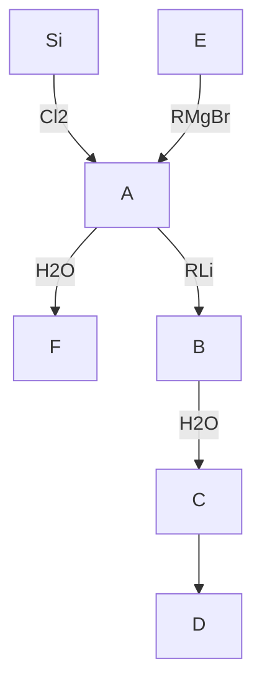

14.11 （a）总结第 14 族元素氧化态的相对稳定性变化趋势，并指出哪些元素显示惰性电子对效应；（b）利用这些信息写出配平的化学反应方程式或标注为 NR（不反应），解释您的答案与总结出的上述趋势相符合：

(a) $Sn^{2+}(aq)+PbO_{2}(s)$ (过量) $\xrightarrow{隔绝空气}$   
(b) $Sn^{2+}(aq)+O_{2}(空气)$

14.12 用资源节 3 的数据确定练习题 14.11(b) 中每个反应的标准电势。用您对这些反应给出的定性判断讨论结果是一致还是不一致。  
14.13 给出从相应矿石提取硅和锗的配平的化学方程式和反应条件。  
14.14 （a）说明带隙能量 $(E_{g})$ 从碳（金刚石）到锡（灰色）的变化趋势；（b）温度从20℃升至40℃时硅的电导率是增加还是降低？  
14.15 不用参考资料的情况下绘出元素周期表框架并标明形成似盐型、金属型和类金属碳化物的元素。  
14.16 叙述下列化合物的制备、结构和类型：(a) $KC_{8}$ ; (b) $CaC_{2}$ ; (c) $K_{3}C_{60}$   
14.17 写出 $K_{2}CO_{3}$ 与 HCl(aq) 及 $Na_{4}SiO_{4}$ 和酸性水溶液反应的化学方程式并配平。  
14.18 描述硬玉中 $\left[\mathrm{SiO}_{3}\right]_{n}^{2n-}$ 和高岭石中二氧化硅氧化铝骨架的特性。  
14.19 （a）一个方钠石笼的框架中含有多少个桥氧原子？（b）描述图 14.3 中 A 型沸石中心的（超级笼）多面体的结构。  
14.20 阐述叶蜡石和白云母的物理性质，并解释这些性质如何来自这些高度相似的铝硅酸盐的组成和结构。  
14.21 半晶态固体和无定形固体具有重要的商业用途,其中许多是由第 14 族元素或其化合物形成的。列举本章介绍过的无定形或部分结晶固体的 4 个例子,并简要陈述它们有用的性质。  
14.22 层状硅酸盐化合物 $\mathrm{CaAl_{2}(Al_{2}Si_{2})O_{10}(OH)_{2}}$ 中含有铝硅酸盐的双层，其中 Al 和 Si 都处在四配位位点上。绘制双层结构的垂视图（仅涉及 $SiO_{4}$ 和 $AlO_{4}$ 单元之间顶点共享）。讨论 $Ca^{2+}$ 在二氧化硅氧化铝双层之间可能占据的位置。

# 辅导性作业

14.1 讨论硅的固态化学(参考二氧化硅、云母、石棉和硅酸盐玻璃)。

14.2 一位朋友正在学习英语并正在上科幻课。课程涉及一个常常谈论的题材即生命以硅为基础。这位朋友好奇为什么选择硅元素，为什么所有的生命都以碳为基础。准备一篇短文阐述支持与反对硅基生命这一观点的理由。

14.3 Karl Marx 在《资本论》中说道：“如果我们能够以少量的劳动成本将碳转化为钻石，它们的价值可能会低于砖块。”回顾目前合成钻石的方法，讨论为什么这些进展还没有导致钻石价格大减。

14.4 论文“Mesoporous silica nanoparticles in biomedical applications”(Chem. Soc. Rev., 2012, 41, 2590) 中 Li 等讨论了利用介孔二氧化硅纳米粒子(MSNP)为载体在人体中传输治疗药物。MSNPs 的何种性质使它们特别适合这种用途？说明药物的释放速率是如何控制的？简要叙述 MSNPs 的合成方法，哪个化学家首次合成了 MSNPs?

14.5 在论文“Developing drug molecules for therapy with carbon monoxide”(Chem. Soc. Rev., 2012, 41, 3571)中作者讨论了一氧化碳用作治疗患病组织的治疗剂。简要叙述使用一氧化碳作为治疗剂的相关难题及作者是如何克服这些难题的。

14.6 论文“Metallacarboranes and their interactions: theoretical insights and their applicability”(Chem. Soc. Rev., 2012, 41, 3445) 讨论了金属碳硼烷的性质及如何用计算方法进行分析。简要叙述文中探讨的金属碳硼烷的性质，描述模拟它们所用的计算方法的原理。

14.7 介孔性和半导性的结合将产生性质有趣的材料。S. Gerasimo 等在论文“Hexagonal mesoporous germanium”（Science., 2006, 313, 5788）中讨论了此类材料的合成。预期这类材料可能具有哪些优点，并讨论介孔锗是如何合成的。

14.8 在论文“An atomic seesaw switch formed by tiled asymmetric Sn-Ge dimmers on a Ge(001) surface”(Science., 2007, 315, 1696) 中 K. Tomatsu 等描述了分子开关的合成和操作。阐述这些分子开关是如何操作的，总结在 $Cl_{2}$ 和 $H_{2}$ 氛围下它们现有的和潜在的应用。

(王文渊 译,史启祯 审)

# 第 15 族元素

第 15 族元素具有多变的化学性质。尽管仍能明显地看到在第 13 族和第 14 族元素那里看到的简单变化趋势，而下述两个事实则导致第 15 族元素化学性质的变化趋势复杂化：显示多种氧化态；与氧形成多种复杂化合物。氮是大气的主要成分，并广泛分布于生物圈。磷对动物和植物的生命都至关重要，而砷却截然相反，是众所周知的剧毒物质。

第 15 族元素氮、磷、砷、锑和铋属于生命体、地质学和工业上最重要的元素, 其存在状态从气体元素氮一直到金属元素铋。“氮族”元素有时统称为磷族元素(pnictogens, 该词来自希腊语, 意为“窒息”, 取意于氮的一种性质)。不过该名词既未被广泛使用, 也未得到正式确认。氮是本族的第一个元素, 性质上显著有别于其同族元素。这一现象在 p 区其余各族均有体现。氮的配位数一般较低, 是第 15 族元素中唯一以气态存在的元素, 通常为双原子分子。

![[无机化学第6版主族364-564_images/e93382468b17f44c8eda74cc8868070f71a214c7f4c73faeb1c519f05c6b3adf.jpg]]

text_image

1 2 13 14 15 16 17 18
Li Be B C N O F Ne
Si P S
Ge As Se
Sn Sb Te
Pb Bi Po
      0 0 0 0 0 0 0 0 0 0 0 0 0 0 0 0 0 0 0 0 0 0 0 0 0 0 0 0 0 0 0 0 0 0 0 0 0 0 0 0 0 0 0 0 0 0 0 0 0 0 13 14 15 16 17 He

# A. 基本面

第 15 族元素性质多样,与本书迄今讲过的 p 区元素相比,更难于简单地通过原子半径和电子构型得到合理解释。尽管通常看到的变化趋势(金属性自上而下增大,下部元素的低氧化态更稳定)仍然看得出来,但氧化态的多样性导致这种趋势变复杂。

# 15.1 元素

提要: 氮是气体, 而氮下方的元素都是固体, 并存在多种同素异形体。

在标准条件下,除氮以外的其他元素都是固体。自上而下金属性增强的趋势并非绝对,电导率从砷到铋实际上依次在减小(见表15.1)。同族元素的电导率通常自上而下增大,反映了较重元素具有靠得更近的原子能级间距,并因此导致价带与导带间的距离较小(节3.19)。本族元素电导率相反的变化趋势表明固体状态必定存在更明显的分子特征。事实上在固体结构中,As、Sb和Bi都存在3个最邻近的原子和3个明显远一些的相邻原子。原子间长距离相互作用与短距离相互作用的比率自上而下减小,表明具有聚合性质的分子型结构在起作用。Bi的能带结构显示出传导电子和传导空穴的密度较低,最好将其归入类金属而不是归入半导体或真正的金属。

表 15.1 第 15 族元素的某些性质

<table><tr><td>性质</td><td>N</td><td>P</td><td>As</td><td>Sb</td><td>Bi</td></tr><tr><td>熔点/°C</td><td>-210</td><td>44(白),590(红)</td><td>613(升华)</td><td>630</td><td>271</td></tr><tr><td>原子半径/pm</td><td>74</td><td>110</td><td>121</td><td>141</td><td>170</td></tr><tr><td>第一电离能/(kJ·mol $^{-1}$ )</td><td>1 402</td><td>1 011</td><td>947</td><td>833</td><td>704</td></tr><tr><td>电导率/ $(10^{6} \text{ S} \cdot \text{m}^{-1})$ </td><td></td><td>10</td><td>3.33</td><td>2.50</td><td>0.77</td></tr><tr><td>Pauling 电负性</td><td>3.0</td><td>2.2</td><td>2.2</td><td>2.0</td><td>2.0</td></tr><tr><td>电子亲和能/ $(\text{kJ} \cdot \text{mol}^{-1})$ </td><td>-8</td><td>72</td><td>78</td><td>103</td><td>105</td></tr><tr><td> $B(\text{E}-\text{H})/(\text{kJ} \cdot \text{mol}^{-1})$ </td><td>390</td><td>322</td><td>297</td><td>254</td><td></td></tr></table>

第 15 族固态元素存在多种同素异形体。类似于气体 $N_{2}$ 分子， $P_{2}$ 分子也有一个形式上的三键和短的键长（189 pm）。相对于第二周期元素，第三周期元素形成的 $\pi$ 键强度较弱，所以同素异形体 $P_{2}$ 的形成比 $N_{2}$ 的形成难得多。白磷是由四面体结构的 $P_{4}$ 分子(1)组成的蜡状固体。尽管四面体的 P—P—P 键角很小(60°)，在高达约 800 ℃ 的蒸气中仍以 $P_{4}$ 分子存在；温度继续升高时 $P_{2}$ 分子的平衡浓度显著增加。白磷非常活泼，在空气中自燃甚至爆炸生成 $P_{4}O_{10}$ 。将白磷在 300 ℃ 的惰性气氛中加热数天后转化为红磷。得到的红磷通常是无定形固体，但可以制得具有非常复杂的三维网状结构的晶态物质。与白磷不同，红磷在空气中不易自燃。高压下加热磷得到多种相组分的黑磷，是磷在 550 ℃ 以下热力学上最稳定的形式。如图 15.1 所示，黑磷的一种相是由锥形三配位磷原子的褶皱层构成的。热力学上通常选取元素的最稳定单质作为进行计算的参考相，但对磷而言选取的却是白磷，这是因为它组分单一，而且比其他形式的磷更易制备和表征。

![[无机化学第6版主族364-564_images/fe3d954e0c1b456af5f7ad3fabff18d4aab663e4e4786bfc7d6bc093cf69248a.jpg]]

chemical

Molecular geometry diagram of a phosphorus atom with bond angles and distance labeled

(1) $P_{4}, T_{d}$

砷有两种固态形式，即黄砷和灰砷（金属砷）。黄砷和气态砷均由四面体 $\mathrm{As}_4$ 分子组成。黄砷经光照转化为更稳定的金属砷。室温下金属砷和锑、铋的结构均由褶皱的六角形层堆积而成，层中每个原子具有3个最邻近的原子。如前所述，层与层之间的堆积方式能够使相邻一层中的3个原子在较远的距离与中心原子建立弱相互作用（见图15.2）。

![[无机化学第6版主族364-564_images/9f84841f0a2fe885dd171d7a1fa2105dd661e65a61550b7e2227c08ac3a8e745.jpg]]

chemical

Molecular structure diagram showing a central atom bonded to multiple surrounding atoms in a 3D lattice arrangement

图 15.1 黑磷的一个堆积层注意原子的三角锥形配位模式

![[无机化学第6版主族364-564_images/09882c1771031a3ee20c1c5fc7e6fd0468ac109f3718ac509c00a0885848d02a.jpg]]

chemical

Diagram illustrating the structural transformation of a graphene-like lattice, showing atomic arrangement and unit cell evolution.

图 15.2 金属铋的结构  
在同一褶皱层内(上图)，每个Bi原子与3个最邻近原子键合；该Bi原子又与相邻褶皱层的3个原子具有弱相互作用

近年来发现铋具有放射性,其 $\alpha$ 衰变的半衰期为 $1.9 \times 10^{19}$ 年,比宇宙当今的年龄还要长得多。

氮以氮分子 $(\mathrm{N}_2)$ 形式存在，占大气体积分数的 $78\%$ 。提取磷元素的主要原料是磷酸盐矿，它们是不溶于水、被压碎而变得密实的古生物遗存，主要矿物包括氟磷灰石 $[\mathrm{Ca}_5(\mathrm{PO}_4)_3\mathrm{F}]$ 和羟基磷灰石$\left[\mathrm{Ca}_{5}\left(\mathrm{PO}_{4}\right)_{3} \mathrm{OH}\right]$ 。化学上较软的元素砷、锑和铋往往以硫化物矿的形式存在。自然界发现的砷矿往往以雄黄 $\left(\mathrm{As}_{4} \mathrm{~S}_{4}\right)$ 、雌黄 $\left(\mathrm{As}_{2} \mathrm{~S}_{3}\right)$ 、砷华 $\left(\mathrm{As}_{2} \mathrm{O}_{3}\right)$ 或砷黄铁矿（FeAsS）的形式存在。锑在自然界的存在形式通常为辉锑矿 $\left(\mathrm{Sb}_{2} \mathrm{~S}_{3}\right)$ 和锑硫镍矿（NiSbS）。

# 15.2 简单化合物

提要:第15族元素可与许多元素直接反应形成二元化合物。氮只有与氧和氟反应时才能到达+5氧化数。磷、砷、锑的常见氧化态为+5；但铋很少出现这个氧化态，其+3氧化态更稳定。

本族元素显示多种可能存在的氧化态,这一事实在很大程度上可从他们的价电子组态 $(ns^{2}np^{3})$ 得到解释。该组态表明各元素的最高氧化态为+5,事实上也是如此。根据惰性电子对效应(节9.5)不难推测Bi的+3氧化态更稳定,这也符合实际。

氮的电负性很高(明显超过 N 的只有 O 和 F)，并在许多化合物中具有负氧化态，例如氨 $\left(\mathrm{NH}_{3}\right)$ 和氮化物(含有 $N^{3-}$ )。只有与电负性更高的元素(O 和 F)形成化合物时氮才显示正氧化态。氮的确能达到族氧化态(+5)，但达到此氧化态的氧化性条件比本族其他元素强得多。

氮的独特性质主要是由于其具有高的电负性、小的原子半径及没有可供利用的 d 轨道。因此，N 在简单分子化合物中难得出现大于 4 的配位数，而氮下方元素的配位数频频可以达到 5 和 6（如 $PCl_{5}$ 和 $AsF_{6}^{-}$ ）。

氮与几乎所有元素都能形成二元氮化物。氮化物可分为似盐型氮化物、共价型氮化物和填隙型氮化物。氮也形成其中含有 $\mathrm{N}_3^-$ 的叠氮化物，其中氮的平均氧化数为 $-1 / 3$ 。与氮相类似，磷也能与周期表中几乎所有元素形成化合物。磷形成化学式从 $\mathrm{M}_4\mathrm{P}$ 到 $\mathrm{MP}_{15}$ 的多种磷化物。磷原子可按环状、链状或笼状排列，如 $\mathrm{P}_7^{3-}(2),\mathrm{P}_8^{2-}(3)$ 和 $\mathrm{P}_{11}^{3-}(4)$ 。第13族元素In和Ga的砷化物和锑化物是半导体。

![[无机化学第6版主族364-564_images/5987658fe5d57e0b3de3b8569706b3cb6d06cdfd321e2289d22d1303c0fa3614.jpg]]

chemical

Molecular structure diagram of a phosphorus atom (P) in a polyhedral geometry

(2) $P_{7}^{3-}$

![[无机化学第6版主族364-564_images/7e89af4b9e2b8b694868cc92ce3b9b23b20ca32b1b8b6f71c8f27811d15a6623.jpg]]

chemical

Molecular structure diagram showing a central phosphorus atom bonded to three hydrogen atoms and two terminal groups

(3) $P_{8}^{2-}$

![[无机化学第6版主族364-564_images/23e5551977292f92d8172f759b6f228249fa729b231e3675ea4ff316ebf6f5c3.jpg]]

chemical

Molecular structure diagram showing a central atom labeled P connected to surrounding atoms

(4) $P_{11}^{3-}$

本族所有元素都能形成简单氢化物(节10.6)。氨 $NH_{3}(5)$ 是一种有刺激性气味的气体,生物体在高浓度 $NH_{3}$ 环境中会中毒。氨是第1族金属的优良溶剂,如-50℃下100g液氨可溶解330gCs。这些深色的导电溶液含有溶剂化电子(节11.14)。铵盐的化学性质与第1族金属离子(特别是 $K^{+}$ 和 $Rb^{+}$ )的化学性质类似。铵盐受热发生分解。硝酸铵是一些炸药的组分,也广泛用作肥料。氮也能形成无色液体联氨 $\left(\mathrm{N}_{2}\mathrm{H}_{4}\right)$ 。第15族的其他氢化物包括磷化氢 $\left(\mathrm{PH}_{3},\right.$ 正式的名称叫磷烷)、砷化氢 $\left(\mathrm{AsH}_{3},\right.$ 砷烷)和锑化氢 $\left(\mathrm{SbH}_{3},\right.$ 锑烷),均是有毒气体。这里提醒读者注意:虽然磷烷(phosphane)是磷化氢(phosphine)的系统命

名,但后者更为常用,本书也使用磷化氢这个名称。然而砷和锑的同类化合物及其衍生物不常见,应该使用其系统名称。

磷、砷、锑的卤化物种类很多，在合成化学上也很重要。第15族元素全都形成三卤化物；从磷到铋都形成五氟化物，磷、砷、锑形成五氯化物，只有磷形成五溴化物。氮在电中性二元卤化物中达不到它的族氧化态 $(+5)$ ，但在阳离子 $NF_{4}^{+}$ 中的确可以达到。最可能的原因是N原子太小，空间位阻不允许形成

![[无机化学第6版主族364-564_images/1c16ebb791371757512f25be9a9b36ebd2f2c2d974a3316e6c68b9150d51198d.jpg]]

chemical

Molecular structure diagram showing bond angles and distances between N and H atoms

(5) 氨, $NH_{3}, C_{3V}$

$NF_{5}$ 。氯与溴难以将 Bi(Ⅲ) 氧化至 Bi(V)，这是惰性电子对效应（节 9.5）的一个例子。五氟化铋 ( $BiF_{5}$ ) 事实上是存在的，但不存在 $BiCl_{5}$ 和 $BiBr_{5}$ 。

氮可以形成多种氧化物和氧合阴离子，将单独安排在15.3中做介绍。磷、砷、锑、铋能形成氧化数从+1到+5的氧化物和氧合阴离子，最常见的氧化态为+5，而铋的+3氧化态更重要。

磷完全燃烧生成磷（V）的氧化物 $\left(\mathrm{P}_{4}\mathrm{O}_{10}\right)$ 。每个 $P_{4}O_{10}$ 分子具有笼状结构，桥O原子将4个P原子维系在一起形成P原子四面体，每个P原子还结合一个末端O原子(6)。磷的不完全燃烧生成磷（Ⅲ）氧化物 $\left(\mathrm{P}_{4}\mathrm{O}_{6}\right)$ ， $P_{4}O_{6}$ 分子具有与 $P_{4}O_{10}$ 相同的氧桥连的骨架，只是没有末端的O原子(7)。砷、锑、铋都可形成+3氧化态的氧化物 $As_{2}O_{3}$ 、 $Sb_{2}O_{3}$ 和 $Bi_{2}O_{3}$ （节15.14）。

![[无机化学第6版主族364-564_images/5d5251a1c97d1b6b815c44fee2d438270f164dd9bd4bb493cf589e35ea79d8ae.jpg]]

chemical

Molecular structure diagram of a phosphorus-oxygen compound with labeled atoms P and O

(6) $P_{4}O_{10}, T_{d}$

![[无机化学第6版主族364-564_images/a4a02591417697b97a8155a22a4e3aab360fac7aa74a39cbb6df413623688dc1.jpg]]

chemical

Molecular structure diagram of a phosphorus-oxygen compound showing P and O atoms in a cubic lattice

(7) $P_{4}O_{6}, T_{d}$

# 15.3 氮的氧化物和氧合阴离子

提要:硝酸根离子是一种强而作用缓慢的氧化剂。氮的中间氧化态往往易歧化。二氮氧化物无反应活性。

氮在其氧化物和氧合阴离子中存在从+5到+1的所有氧化态。硝酸 $\left(\mathrm{HNO}_{3}\right.$ ，其中N的氧化态为+5）是生产化肥、炸药和各种含氮化合物的重要化学品。硝酸根离子 $\left(\mathrm{NO}_{3}^{-}\right)$ 是个中等强度的氧化剂。将浓硝酸和浓盐酸混合形成橙色发烟的王水，后者是能溶解铂和金的少数试剂之一。硝酸的酸酐是 $N_{2}O_{5}$ ，它是组成为 $\left[NO_{2}^{+}\right]\left[NO_{3}^{-}\right]$ 的一种晶态固体。

氮(Ⅳ)氧化物(通常叫二氧化氮)以棕色 $NO_{2}$ 和其无色二聚体 $N_{2}O_{4}$ (四氧化二氮)平衡混合物的形式存在。二聚反应

$$
2 \mathrm{NO} _ {2} (\mathrm{g}) \rightleftharpoons \mathrm{N} _ {2} \mathrm{O} _ {4} (\mathrm{g})
$$

25 ℃时的平衡常数 K=0.115。

亚硝酸 $\left(\mathrm{HNO}_{2}\right)$ 中的氮为N(Ⅲ)，它是个强氧化剂。三氧化二氮 $N_{2}O_{3}$ （亚硝酸的酸酐）是个蓝色固体，高于-100℃时熔化为蓝色液体，后者分解生成NO和 $NO_{2}$ 。

氮(Ⅱ)氧化物 NO 是个含奇数电子的分子。但与 $NO_{2}$ 不同, NO 在气相不形成稳定的二聚体。这是因为那个单电子几乎同等程度地分布在两个原子上, 而不像在 $NO_{2}$ 中主要局限于 N 原子上。直到 1980 年代末, 人们都不了解 NO 对生物体有益的作用。人们后来发现, 体内产生的 NO(节 26.2) 具有降低血压、传递神经及杀灭细菌的功能。有关 NO 生理功能的科学论文已经发表了数千篇, 但有关它的生物化学基础知识人们掌握得仍然相当贫乏。

一氧化二氮 $\left(\mathrm{N}_{2}\mathrm{O},\text{原子的排列顺序为NNO}\right)$ 通常叫作氧化亚氮，其中氮的平均氧化数为+1。 $N_{2}O$ 是一种无色、不活泼的气体，具有惰性的一个标志是用作快速搅打奶油的气体。同样因为惰性而用作温和的麻醉剂已有许多年。然而，由于使用中产生不良生理副作用（特别是可能造成癔症，正如俗名“笑气”所暗示的那样），所以这种应用已经停止。 $N_{2}O$ 与 $O_{2}$ 按50：50比例混合的气体仍用于分娩过程和临床医疗(如伤口缝合)中的止痛剂。有趣的是,现在公认 $N_{2}O$ 是一种相当于氯氟烃的破坏臭氧层的物质,此外还是一个潜在的温室气体。

# B. 详述

以下各节详细讨论第 15 族元素的化学性质。我们将会看到这些元素（特别是氮和磷）能够形成多种氧化态。

# 15.4 存在和提取

提要:通过分馏液态空气可以制取氮。氮常用作惰性保护气体,并用作工业上合成氨的原料。单质磷是通过焦炭电弧还原氟磷灰石或羟基磷灰石制备的,所得的白磷是分子型固体( $P_{4}$ )。硫酸处理磷灰石生成磷酸,后者可转化为肥料和其他化学品。

液态空气分馏法用于大规模生产氮。液氮是实验室中 $N_{2}$ 储存和 $N_{2}$ 操作的非常方便的一条途径。膜材料(对 $O_{2}$ 的渗透性高于 $N_{2}$ )用于室温下实验室规模的空气分离(见图 15.3)。

Hennig Brandt 在 1669 年最先制得磷。误解了尿液和沙石颜色的 Brandt 试图从中提取金，可是提取出一种在黑暗中发光的白色固体。该元素被称之为磷，希腊语的含义为“荷光者”。当今生产磷的方法是先由浓硫酸与氟磷灰石矿物作用产生磷酸，然后从磷酸提取元素磷。

$$
\begin{array}{r l} & \mathrm{Ca} _ {5} (\mathrm{PO} _ {4}) _ {3} \mathrm{F(s)} + 5 \mathrm{H} _ {2} \mathrm{SO} _ {4} (\mathrm{l}) \longrightarrow 3 \mathrm{H} _ {3} \mathrm{PO} _ {4} (\mathrm{l}) + 5 \mathrm{CaSO} _ {4} (\mathrm{s}) + \mathrm{HF(g)} \\ & \text { 反应生成的潜在污染物   HF   与矿石中硅酸盐反应产生反应活性较小的   SiF } _ {6} ^ {2 -} \text { 络离子而得到清除。 } \end{array}
$$

![[无机化学第6版主族364-564_images/ed10d5b08c21315d045c4093ba7b60f37ac02ed1d1bf817eaa1e0653fbd3e155.jpg]]

text_image

氧渗透膜
氮
空气
氧
氧

图 15.3 氮和氧的膜分离装置示意图

用酸处理磷酸盐矿物时,产物中含有难以彻底除去的 d 金属污染物,因此其用途主要限制在肥料和金属处理方面。大多数纯磷酸和磷化合物仍由元素磷制备,这是因为元素磷容易通过升华来纯化。单质磷的生产方法是在电弧炉中用碳还原磷酸钙粗制品。反应中加入二氧化硅(沙子)产生硅酸钙炉渣:

$$
2 \mathrm{Ca} _ {3} (\mathrm{PO} _ {4}) _ {2} (\mathrm{s}) + 1 0 \mathrm{C} (\mathrm{s}) + 6 \mathrm{SiO} _ {2} (\mathrm{s}) \xrightarrow {1 5 0 0 ^ {\circ} \mathrm{C}} 6 \mathrm{CaSiO} _ {3} (\mathrm{l}) + 1 0 \mathrm{CO} (\mathrm{g}) + \mathrm{P} _ {4} (\mathrm{g})
$$

高温下处于熔化状态的炉渣容易从炉中排出。汽化后的磷被冷凝为固体放入水中保存，以防止与空气反应。这种方法生产的单质磷大部分通过燃烧转化为 $P_{4}O_{10}$ ，后者水合产生纯磷酸。

砷通常是从铜和铅冶炼厂的烟道尘中提取的(应用相关文段15.1)。然而也可在无氧条件下加热矿石的方法得到：

$$
\mathrm{FeAsS(s)} \xrightarrow {7 0 0 ^ {\circ} \mathrm{C}} \mathrm{FeS(s)} + \mathrm{As(g)}
$$

辉锑矿与铁一起加热生产锑，反应中产生金属锑和硫化亚铁：

$$
\mathrm{Sb} _ {2} \mathrm{S} _ {3} (\mathrm{s}) + 3 \mathrm{Fe} (\mathrm{s}) \longrightarrow 2 \mathrm{Sb} (\mathrm{s}) + 3 \mathrm{FeS} (\mathrm{s})
$$

铋以铋华 $\left(\mathrm{Bi}_{2}\mathrm{O}_{3}\right)$ 、辉铋矿 $\left(\mathrm{Bi}_{2}\mathrm{S}_{3}\right)$ 的形式存在。其矿石通常是铜、锡、铅、锌等的共生矿，铋是通过还原的方法作为提取这些金属的副产物而提取的。

# 应用相关文段15.1 环境中的砷

地下水污染是砷的毒性对环境造成的一个问题。砷污染最严重的地区是在孟加拉及与孟加拉西部相邻的印度省份，那里成千上万的人被确诊为砷中毒。三条主要河流从山上带着含铁的沉积物排入这个地区。这个肥沃三角洲的种植业十分发达，有机质渗入浅层地表造成了还原性土壤。砷的含量与地下水中铁的含量相关联。人们认为砷是从铁的

氧化物和氢氧化物矿石中溶解而被释放出来的。

荒唐的是,问题的发展方向偏离了原来的目的。联合国在1960年代援助了一个饮用水项目,将水管深入到地下含水层提取清洁饮用水以替代地表污染水。尽管该饮用水管道减少了水生疾病的发病率从而改善了人们的健康状态,但许多年间都未能认识到水中的高含砷量。这些管道的深度通常为20\~100 m,接近地表的地下水没有足够的时间变成高砷浓度的水,100 m以下沉积物中的砷也随时间而耗尽。孟加拉现有的四百万条地下取水管中,多达一半的管道水含砷量超过该国标准50 ppb(世界卫生组织的标准是10 ppb),还有很多污染地区的含量超过500 ppb。人们提出了管道水除砷的几种方案,新的取水管似乎应深入到更深的非污染含水层。世界银行正在协调一个缓解计划,但大规模的行动可能要花去数年时间。

砷中毒发展长达20年。初始症状是皮肤角化，并发展为癌症；肝和肾也会受损。如果中断砷摄入，早期砷中毒是可以医治的。然而一旦发展为癌症，就很难有效治疗。砷中毒的生物化学目前尚不确定。体内的砷酸盐被还原为砷（Ⅲ）络合物，砷（Ⅲ）可能与巯基相结合。

# 15.5 用途

提要: 氮是工业上合成氨和硝酸的关键物质, 磷的主要用途是生产肥料。

氮气的主要非化学用途是作为金属加工、石油精炼和食品加工中的惰性气氛。氮气也用于提供实验室的惰性气氛；液氮（沸点-196℃，77K）则是工业上和实验室中一种便捷的制冷剂。氮的主要工业用途是Haber法生产氨（节15.6）和Ostwald法合成硝酸（节15.13）。氨提供了制备众多含氮化合物的途径，其中包括肥料、塑料和炸药（见图15.4）。氮在生命系统中起着至关重要的作用，因为它是氨基酸、核酸和蛋白质的成分；氮循环是生态系统中最重要的过程之一（应用相关文段15.2和节26.13）。

![[无机化学第6版主族364-564_images/60f0ff211b25d5cf7a3654e49bb5ddffac1f977c1294a956bdfbea1f3a55bcc3.jpg]]

chemical

Chemical reaction diagram showing ammonia (NH₃) reacting with various chemicals including HCN, CH₄, COCl₂, and various肥料 and oxygens.

图 15.4 氨的工业用途

# 应用相关文段15.2 氮的循环

生物系统的绝大多数分子(包括蛋白质、核酸、叶绿素、各种酶和维生素及许多其他细胞成分)中均含有氮。氮在所有这些化合物中以还原态(氧化数为-3)存在。虽然氮是大气中最丰富的成分,然而它的稳定性极高,用途因而受到限制。生物圈对氮的需求来自固氮过程。生命科学和生物技术面临的一个重大挑战涉及 $N_{2}$ 的还原,还原后才能被摄取进入上述重要的含氮化合物。

图 B15.1 示出氮循环过程。氮循环可看作一组酶催化的氧化还原反应，这组反应可让减少了的氮化合物得到补充。无机态氮的转化几乎全部由微生物来完成，Fe、Mo、Cu 处于催化这类转化的酶的活性位点上。参与氮循环的酶将在节 26.13 中做讨论。 $O_{2}$ 能够快速且不可逆地破坏固氮酶，所以固氮酶系统需要在厌氧环境下工作。然而，需氧菌也能参与氮的固定。在一些高等植物中，固氮菌生存于植物体内受控的环境中，如生存于根瘤的低 $O_{2}$ 浓度下。植物通过光合作用为细菌提供还原了的碳化合物，而细菌则把固定了的氮提供给植物。

生物固氮的必要条件是还原电位低于 $0.30\mathrm{V}$ 。生物系统中存在着还原态的铁氧还蛋白或黄素蛋白（还原电位处于 $-0.4\mathrm{V}$ 到 $-0.5\mathrm{V}$ 之间）（第27章）。电位数据表明固氮在热力学上可行，但动力学上不可行。还原氮分子的动力学能垒显然来自 $\mathbf{N}_2$ 转化为氨过程中需要形成相关的中间体。生物体提供的代谢能来自三磷酸腺苷（ATP）水解 $(\Delta_{\mathrm{r}}G^{\ominus}\approx$ $-31\mathrm{kJ / mol})$ 转化为二磷酸腺苷（ADP）和无机磷酸根（Pi）的过程，产生 $\mathbf{N}_2$ 活化过程的关键中间体。还原一个 $\mathbf{N}_2$ 分子需要耗费16个ATP分子的水解能。如果可能的话，大多数有固氮能力的生物会选择直接利用化合态的氮源（氨、硝酸盐、亚硝酸盐）并抑制复杂的固氮系统。

氮一旦被还原,生物体便将其结合进有机分子,后者即进入细胞的生物合成途径。死亡生物体的生物质发生腐烂,有机氮化合物发生分解,随条件不同以 $NH_{3}$ 或 $NH_{4}^{+}$ 的形式释放至环境中。

人口的增长及人类对合成肥料的依赖对氮循环产生了巨大影响。Haber氨合成法(节25.12)增加了地球上生命体所需的固定氮的总量。当今总固氮量的1/3到1/2是依靠科技手段和农业而不是依靠天然方法完成的。除氨本身之外，源于氨的硝酸盐也用在工业上生产氮肥。氨和硝酸盐以肥料的形式进入氮循环，增大了自然界氮循环的总量。面对过量输入的氮源，天然湖泊的数量显得不足。在这种条件下，硝酸盐与亚硝酸盐作为令人厌恶的成分污染地下水，导致湖泊、湿地、河流三角洲和沿海地区富营养化。

![[无机化学第6版主族364-564_images/55ad32154aa7f995c1cfae32e067f6ce6d544336bdc88a6f7ecab4ec6022a0fc.jpg]]

flowchart

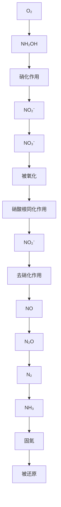

图 B15.1 氮循环

磷用于生产烟火、烟幕弹、炼钢和制造合金。红磷与细沙混合被用作火柴盒的划火带。火柴头部与之摩擦产生足够的热量将一些红磷转化为白磷，后者发生自燃。磷酸钠用作清洗剂、软水剂以防止锅炉和管道结垢。以助洗剂添加至洗涤剂中的缩聚磷酸盐通过与金属离子的络合作用使水软化从而提高洗涤剂的去污能力。天然环境中的磷通常以 $\mathrm{PO}_4^{3-}$ 形式存在。磷（与氮和钾一起）是植物必需的营养元素。由于许多金属的磷酸盐水溶性差，土壤中的磷营养素通常被耗尽。因此，酸式磷酸盐成为复合肥料的重要组分。大约 $85\%$ 的磷酸用于制造化肥。磷也是一系列组织的重要成分，包括骨骼和牙齿（主要是磷酸钙）、细胞膜（脂肪酸的磷酸酯）、核酸（包括RNA和DNA）、三磷酸腺苷（ATP，活生物体的能量转换单元，节26.2）。各种磷化合物广泛用作配体（节7.1）。

砷被用作固体器件（如集成电路和激光器）中的一种掺杂元素。GaAs 是一种Ⅲ/V 族半导体（节 13.18），其电子迁移率和热稳定性优于硅。砷化镓用于移动电话、卫星通信、太阳能电池和光学窗口。虽然砷是人们熟知的有毒物质，但也是鸡、大鼠、山羊和猪等动物必需的微量元素，缺乏砷将导致生长缓慢（应用相关文段 15.3）。 $As_{2}O_{3}$ 也用作抗白血病的一种药物（节 27.1）。

# 应用相关文段 15.3 砷试剂

“砷试剂”是用来描述含砷化学品的一个术语。砷及其化合物有强毒性，砷试剂的应用大都基于其广谱毒性。

以矿物雄黄 $\left(\mathrm{As}_{4}\mathrm{S}_{4}\right)$ 、砒霜 $\left(\mathrm{As}_{2}\mathrm{O}_{3}\right)$ 形式存在的无机砷试剂在古代被用来治疗溃疡、皮肤病和麻风。1900年代初，科学家发现一种有机砷化合物是治疗梅毒的有效药物，从而导致该领域的研究快速增多。那时使用的治疗药品现在已被青霉素所取代，但有机砷化合物当今仍然用于治疗枯氏锥虫病或由血液中寄生虫引起的昏睡病。组成为 $C_{11}H_{12}AsNO_{5}S_{2}$ 的砷化合物用作兽药治疗狗的心丝虫症。

阿散酸 $\left(\mathrm{C}_{6}\mathrm{H}_{8}\mathrm{AsNO}_{3}\right)$ 和阿散酸钠 $\left(\mathrm{NaC}_{6}\mathrm{H}_{7}\mathrm{AsNO}_{3}\right)$ 可用作畜禽饲料的抗菌剂，以防止霉菌生长。另一个强的抗菌剂叫OBPA（化学名为10,10'-oxybisphenoxarsine），这个化合物被广泛用来制造塑料。

砷试剂亦可用作杀虫剂和除草剂。甲基砷酸钠（MSMA）用来控制棉花和草坪作物的杂草。最早的含砷杀虫剂是1865年制造的巴黎绿[化学成分为 $\mathrm{Cu(CH_3CO_2)_2\cdot 3Cu(AsO_2)_2}$ ，用来防治马铃薯甲虫。亚砷酸钠（ $\mathrm{NaAsO_2}$ ）作为毒饵用来控制蝗虫和作为药水防止家禽寄生虫。

无臭、无味的 $As_{2}O_{3}$ 曾经是一种常用的毒药，甚至被称为“遗产粉”。然而，Marsh 试验的出现使砷第一次被检测出来。当砒霜与硫酸和锌一起反应时会产生砷化氢气体， $AsH_{3}$ 起火生成黑色粉末状砷。

$$
\mathrm{As} _ {2} \mathrm{O} _ {3} + 6 \mathrm{Zn} + 6 \mathrm{H} _ {2} \mathrm{SO} _ {4} \longrightarrow 2 \mathrm{AsH} _ {3} + 6 \mathrm{ZnSO} _ {4} + 3 \mathrm{H} _ {2} \mathrm{O}
$$

锑在半导体技术领域用于制造红外探测器和发光二极管。将锑加入合金可改善金属的强度和硬度。锑的氧化物用于增加氯代烃火焰阻燃剂的性能，其作用是释放更多的卤代自由基。

与 p 区其他各族自上而下的性质变化趋势相一致,本族元素从 P 到 Bi,+3 氧化态(相对于+5 氧化态)化合物的稳定性逐渐增加。因此,Bi(V)化合物是很实用的氧化剂。铋化合物的另一个重要用途是在医学上(节 27.3),碱式水杨酸铋 $\left(\mathrm{HOC}_{6}\mathrm{H}_{4}\mathrm{CO}_{2}\mathrm{BiO}\right)$ 结合抗生素使用可以治疗消化道溃疡疾病。铋(Ⅲ)氧化物用作痔疮膏。

# 例题 15.1 考察 $P_{4}$ 的电子结构和化学性质

题目: 绘出 $P_{4}$ 的 Lewis 结构, 并讨论它作为配体时可能的作用。

答案: 使用节 2.1 中所描述的书写 Lewis 结构的规则。共有 $20(4 \times 5)$ 个价电子。如果每个磷原子与其他三个磷原子各形成一个键，就会占去 12 个电子。剩下的 8 个电子分配给每个磷原子一对孤对 (8)。这种结构加上磷不大不小的电负性 ( $\chi_{p} = 2.06$ )，说明 $P_{4}$ 应该是一种温和的给予配体。事实上， $P_{4}$ 与 d 金属形成的络合物已经被发现。

自测题 15.1 （a）讨论图 15.2 中金属铋结构片段的 Lewis 结构。这种褶皱结构是否符合 VSEPR 模型？（b）用 VSEPR 模型预测 $N_{2}$ 的键合方式，并以此解释氮气的性质。

![[无机化学第6版主族364-564_images/1d90cc3b9493131879c07a3f7316560fcc8526d3b0bd72d2c0fce5534109de03.jpg]]

chemical

Molecular geometry diagram of a phosphorus-containing compound with four P atoms and single bonds

(8) $P_{4}$

# 15.6 氮的活化

提要: Haber 法需要高温、高压才能合成氨。氨是肥料的一个主要成分,也是重要的化学中间体。

许多化合物中含有氮，但 $N_{2}$ 本身（两个原子间有三重键）极不活泼。少数几种强还原剂可在室温下将电子转移给 $N_{2}$ 分子导致 N—N 键的断裂，但反应通常需要很强的还原剂并在极端条件下才能进行。一个重要例子是金属锂与 $N_{2}$ 在室温下缓慢发生的反应，产物为 $Li_{3}N$ 。与之相类似，镁（锂的对角线金属）在空气中燃烧时生成氧化镁的同时也生成氮化镁。

多种因素导致 $N_{2}$ 参与的化学反应比较缓慢。因素之一是 N≡N 三键的键能大，需要高活化能才能将其破坏（三键的强度也是氮元素没有同素异形体的原因）。另一因素是 $N_{2}$ 的 HOMO-LUMO 能隙相对比较大 [节 2.8(b)]，使分子难以发生简单电子转移的氧化还原过程。第三个因素是 $N_{2}$ 的极化率低，不利于形成亲电和亲核取代反应往往要涉及的高极性过渡态。

人们非常需要建立活化氮分子的廉价方法,因为这样的方法在经济上(特别是对相对贫困的农业经济区)有重大意义。在合成氨的 Haber 法中, $H_{2}$ 与 $N_{2}$ 在高温、高压和铁催化剂存在的条件下发生反应,其具体内容将在节 15.10 中详细介绍。新近研究的主要目标指向以更为经济的方法活化氮分子,其灵感源自下述事实:细菌能在室温下将氮转化为氨。

将 $N_{2}$ 催化转化为 $NH_{4}^{+}$ 的过程涉及固氮酶（金属酶中的一种），后者存在于固氮菌（如豆科植物中发现的根瘤菌）中。固氮酶在 Fe、Mo、S 活性位点上催化该反应的机理是一个重要的研究课题。金属的 $N_{2}$ 络合物是 1965 年发现的，几乎与此同时也发现固氮酶内含有钼（节 26.13）。这一发展使人们乐观地认为，金属离子可能与 $N_{2}$ 配位形成高效均相催化剂并促使 $N_{2}$ 被还原。事实上已经制备出许多 $N_{2}$ 的络合物，制备方法有时非常简单，直接将 $N_{2}$ 通入钌络合物的水溶液即可：

$$
\left[ \mathrm{Ru} \left(\mathrm{NH} _ {3}\right) _ {5} \left(\mathrm{H} _ {2} \mathrm{O}\right) \right] ^ {2 +} (\mathrm{aq}) + \mathrm{N} _ {2} (\mathrm{g}) \longrightarrow \left[ \mathrm{Ru} \left(\mathrm{NH} _ {3}\right) _ {5} \left(\mathrm{N} _ {2}\right) \right] ^ {2 +} (\mathrm{aq}) + \mathrm{H} _ {2} \mathrm{O} (1)
$$

与等电子体 CO 一样,作为配体的 $N_{2}$ 分子以端配方式为其典型特征(9,节 22.17)。与自由 $N_{2}$ 分子中的键长相比, $\mathrm{Ru(II)}$ 络合物中的 N—N 键长只略有改变。然而,当 $N_{2}$ 与还原性更强的金属中心配位时,由于电子密度反馈至 $N_{2}$ 的 $\pi^{*}$ 反键分子轨道,N—N 键会被显著拉长。

在室温和大气压条件下,人们已经用钼催化剂将 $N_{2}$ 直接还原为氨,使用的钼催化剂中含有四齿的三氨基胺配体 $\left[\left(\mathrm{HIPTNCH}_{2}\mathrm{CH}_{2}\right)_{3}\mathrm{N}\right]^{3-}$ (10)。氮与中心金属 Mo 配位,遇到质子源和还原剂时即转化为

$NH_{3}$ 。X 射线研究表明， $N_{2}$ 是在空间上被保护起来的钼中心上被还原的，而钼则在 Mo(Ⅲ) 和 Mo(VI) 之间循环。

![[无机化学第6版主族364-564_images/b276da69ed472dd886403a127c4f6da06bdd35df892e84a28372dcc9637acbe2.jpg]]

chemical

Molecular structure of a ruthenium complex with ammonia and nitrogen ligands

(9) $[Ru(NH_{3})_{5}(N_{2})]^{2+}$

![[无机化学第6版主族364-564_images/e786f4a2b5528f4891af88ad7b474799a1d33d70c7917fb01ec668d5ab80341a.jpg]]

chemical

Complex organometallic complex structure with metal centers, phosphine ligands, and HIPT (hydrogen iodide) counterions

(10) $[(HIPTNCH_{2}CH_{2})_{3}N]MoN_{2}$

# 15.7 氮化物和叠氮化物

氮与其他元素形成简单的二元化合物，它们被分为氮化物和叠氮化物两大类。

# (a) 氮化物

提要:氮化物分为似盐氮化物、共价氮化物和填隙式氮化物。

金属氮化物可通过元素与氮(或氨)直接作用制备,也可通过氨基金属化合物热分解:

$$
6 \mathrm{Li(s)} + \mathrm {N_ {2} (g)} \longrightarrow 2 \mathrm {Li_ {3} N(s)}
$$

$$
3 \mathrm{Ca(s)} + 2 \mathrm{NH} _ {3} (\mathrm{g}) \longrightarrow \mathrm{Ca} _ {3} \mathrm{N} _ {2} (\mathrm{s}) + 3 \mathrm{H} _ {2} (\mathrm{g})
$$

$$
3 \mathrm{Zn} (\mathrm{NH} _ {2}) _ {2} (\mathrm{s}) \longrightarrow \mathrm{Zn} _ {3} \mathrm{N} _ {2} (\mathrm{s}) + 4 \mathrm{NH} _ {3} (\mathrm{g})
$$

N 与 H、O、卤素形成的化合物将单独讨论。

似盐氮化物(saline nitrides)可看作是含有 $\mathbf{N}^{3-}$ 的化合物。然而 $\mathbf{N}^{3-}$ 的高负电荷意味着极易被极化[节1.7(e)]，很可能具有一定的共价性。与锂形成化学式为 $\mathrm{Li}_3\mathrm{N}$ 的氮化物，与第2族元素形成通式为 $\mathrm{M}_3\mathrm{N}_2$ 的氮化物，它们都属于似盐氮化物。

共价氮化物（covalent nitrides）中的 E—N 键是共价键。随着与氮键合的元素不同，氮化物性质的变化也十分宽泛。氮化硼（BN）、乙二腈（CN） $_{2}$ 、氮化磷（P $_{3}$ N $_{5}$ ）、氮化硫（S $_{4}$ N $_{4}$ ）和二氮化二硫（S $_{2}$ N $_{2}$ ）等均属于共价氮化物，对它们的讨论安排在讨论其他元素的章节中。

最多的一类氮化物是由 d 区元素形成的，通式为 MN、 $M_{2}N$ 或 $M_{4}N$ 的填隙式氮化物（interstitial nitrides）。金属原子按立方晶格或六方紧密堆积晶格排布，氮原子填充在金属晶格的部分或全部八面体空位。这类化合物硬度高、显惰性，且具有金属光泽和导电性。它们被广泛用作耐火材料，如用作坩埚、高温反应容器和热电偶套管等材料。

氮化物离子 $\left(\mathrm{N}^{3-}\right)$ 往往作为d金属络合物的配体。它的负电荷高、体积小、除作为 $\sigma$ 给予体外还有能力作为良好的 $\pi$ 给予体，这些性质意味着可以稳定高氧化态金属。 $N^{3-}$ 与金属原子之间的短配位键常表示为 $M\equiv N$ ，如饿的络合物 $\left[\mathrm{Os}(N)(\mathrm{NH}_{3})_{5}\right]^{2+}(11)$ 。

# (b) 叠氮化物

提要:叠氮化物有毒且不稳定,用于制作引爆用雷管。叠氮离子可形成多种金属络合物。

叠氮化物(其中氮以 $N_{3}^{-}$ 形式存在)用 $NO_{3}^{-}$ 或 $N_{2}O$ 在加热条件下氧化

![[无机化学第6版主族364-564_images/67c72ffe74961593f233052ec5b002099dedc77315242a5cb3b130978b8623f3.jpg]]

chemical

Molecular structure of a sulfonate (Os) complex with nitrogen and ammonia ligands, showing 2+ charge

(11) $[Os(NH_{3})_{5}N]^{2+}$

氨基钠的方法合成：

$$
\begin{array}{l} 3 \mathrm{NH} _ {2} ^ {-} + \mathrm{NO} _ {3} ^ {-} \xrightarrow {1 7 5 ^ {\circ} \mathrm{C}} \mathrm{N} _ {3} ^ {-} + 3 \mathrm{OH} ^ {-} + \mathrm{NH} _ {3} \\ 2 \mathrm{NH} _ {2} ^ {-} + \mathrm{N} _ {2} \mathrm{O} \xrightarrow {1 9 0 ^ {\circ} \mathrm{C}} \mathrm{N} _ {3} ^ {-} + \mathrm{OH} ^ {-} + \mathrm{NH} _ {3} \\ \end{array}
$$

叠氮离子中氮的平均氧化数为-1/3，与 $N_{2}O$ 和 $CO_{2}$ 是等电子体。与 $N_{2}O$ 和 $CO_{2}$ 分子一样，均为线形。叠氮根是一个相当强的Brønsted碱，其共轭酸叠氮酸( $HN_{3}$ )的 $pK_{a}$ 为4.75。叠氮离子也是d金属离子的良好配体。然而，叠氮离子与重金属离子的盐或络合物[如 $\mathrm{Pb(N_{3})_{2}}$ 和 $\mathrm{Hg(N_{3})_{2}}$ ]是对撞击敏感的引爆物质，受撞击后立刻分解产生金属和氮气：

$$
\mathrm{Pb} (\mathrm{N} _ {3}) _ {2} (\mathrm{s}) \longrightarrow \mathrm{Pb} (\mathrm{s}) + 3 \mathrm{N} _ {2} (\mathrm{g})
$$

离子型叠氮化物(如 $NaN_{3}$ ) 热力学不稳定而动力学上则是稳定的, 可以在室温下进行操作。叠氮化钠有毒, 可用作化学防腐剂和用于防治病虫害。加热或引爆碱金属叠氮化物时迅速放出 $N_{2}$ :

$$
2 \mathrm{NaN} _ {3} (\mathrm{s}) \longrightarrow 2 \mathrm{Na} (\mathrm{s}) + 3 \mathrm{N} _ {2} (\mathrm{g})
$$

该反应用于为汽车保护气囊充气,充气是由电加热引发的。一个气囊通常装有约 50 g 叠氮化钠,反应产生的钠与 $KNO_{3}$ 反应产生更多的氮气,充气形成的高压气囊可使人员得到保护。

含有聚氮阳离子 $N_{5}^{+}(12)$ 的化合物可由含有 $N_{3}^{-}$ 和 $N_{2}F^{+}$ 的化合物进行合成。例如，在无水 HF 中由 $N_{2}FAsF_{6}$ 与 $HN_{3}$ 反应制备 $N_{5}AsF_{6}$ ：

$$
\mathrm{N} _ {2} \mathrm{FAsF} _ {6} (\mathrm{sol}) + \mathrm{HN} _ {3} (\mathrm{sol}) \longrightarrow \mathrm{N} _ {5} \mathrm{AsF} _ {6} (\mathrm{sol}) + \mathrm{HF} (1)
$$

$N_{5}AsF_{6}$ 为白色固体, 微热即发生爆炸性分解。它是一种强氧化剂, 即使在低温下也可使有机材料燃烧。在无水 HF 中, 通过一价阴离

![[无机化学第6版主族364-564_images/b3a49554ea634acc482f54626701e86cf7daf37882b02197cc4d79ca5fb11e8c.jpg]]

chemical

Molecular structure diagram of N5+ ion with bond angles and distances labeled

子盐 $\left(\mathrm{N}_{5}\left[\mathrm{SbF}_{6}\right]\right)$ 与 $Cs_{2}\left[SnF_{6}\right]$ 之间的复分解反应能够制得二价阴离子的盐 $\left(\left(\mathrm{N}_{5}\right)_{2}\left[\mathrm{SnF}_{6}\right]\right)$ ：

$$
2 \mathrm{N} _ {5} \left[ \mathrm{SbF} _ {6} \right] (\mathrm{sol}) + \mathrm{Cs} _ {2} \left[ \mathrm{SnF} _ {6} \right] (\mathrm{sol}) \longrightarrow \left(\mathrm{N} _ {5}\right) _ {2} \left[ \mathrm{SnF} _ {6} \right] (\mathrm{sol}) + 2 \mathrm{Cs} \left[ \mathrm{SbF} _ {6} \right] (\mathrm{s})
$$

$\left(\mathrm{N}_{5}\right)_{2}\left[\mathrm{SnF}_{6}\right]$ 是对摩擦敏感的白色固体,容易分解为 $N_{5}SnF_{5}$ 。

# 15.8 磷化物

提要:磷化物可能是富金属化合物或富磷化合物。

磷与氢、氧和卤素形成的化合物将单独讨论。在惰性气氛中将合适的元素与红磷一起加热可以制备其他元素的磷化物：

$$
n \mathrm{M} + m \mathrm{P} \longrightarrow \mathrm{M} _ {n} \mathrm{P} _ {m}
$$

磷化物的组成多种多样，化学式在 $\mathrm{M}_4\mathrm{P}$ 到 $\mathrm{MP}_{15}$ 之间变化。 $\mathrm{M}:\mathrm{P} > 1$ 时叫富金属磷化物， $\mathrm{M}:\mathrm{P} = 1$ 时叫一磷化物，而 $\mathrm{M}:\mathrm{P} < 1$ 时则叫富磷磷化物。富金属磷化物通常是很不活泼的、硬而脆的耐高温材料；与形成化合物原来的金属类似，具有较高的导电性、导热性。其结构为三方棱柱体，磷原子周围排列着六个、七个、八个或九个金属离子(13)。一磷化物采取多种结构形式，依赖于键合M原子的相对大小。例如，AlP采取闪锌矿结构，SnP采取岩盐结构，VP采取砷化镍结构（节3.9）。富磷磷化物熔点较低，不如富金属磷化物和单磷化物稳定，它们为半导体而非导体。

![[无机化学第6版主族364-564_images/982053191981a5deb56fbd72ef18ff724db4d242179c4b2fdbc974456310f651.jpg]]

chemical

Crystal structure diagram of a compound with labeled atoms M and P, likely representing a metal-organic framework or coordination compound

# 15.9 砷化物、锑化物和铋化物

提要:镓和铟的砷化物和锑化物为半导体。

金属与砷、锑和铋形成的化合物可由元素间的直接反应制备：

$$
\mathrm{Ni(s)} + \mathrm{As(s)} \longrightarrow \mathrm{NiAs(s)}
$$

第 13 族元素 Ga 和 In 的砷化物和锑化物是半导体。砷化镓(GaAs)相对更重要,可用来制造如集成电路、发光二极管和激光二极管这样的器件。GaAs 的能带间隙类似硅，但大于其他第 13～15 族半导体（表 13.5，节 24.19）。砷化镓在这方面的应用优于硅，因为它具有较高的电子迁移率，器件产生的电子噪声也更小。然而硅在一些方面仍优于 GaAs：价廉、晶片强度好，所以更易加工。硅带来的环境问题也少于 GaAs。砷化镓集成电路通常用于移动电话、卫星通信和某些雷达系统。

# 15.10 氢化物

第 15 族所有元素均可与氢形成二元化合物。所有氢化物 $\left(\mathrm{EH}_{3}\right)$ 都有毒。氮还形成链氢化物联氨 $\left(\mathrm{N}_{2}\mathrm{H}_{4}\right)$ 。

# (a) 氨

提要:氨是通过 Haber 法生产的,用来制造肥料和许多有用的其他含氮化学品。

全世界氨的年产量非常大。氨既用于生产肥料，也是生产许多含氮化学品的氮源。正如已经提到的那样，氨在全球都是用 Haber 法生产的。Haber 法中 $NH_{3}$ 是在高温（450 ℃）、高压（100 atm）和铁催化剂存在（并使用助催化剂）条件下由 $N_{2}$ 和 $H_{2}$ 直接合成的：

$$
\mathrm{N} _ {2} (\mathrm{g}) + 3 \mathrm{H} _ {2} (\mathrm{g}) \rightleftharpoons 2 \mathrm{NH} _ {3} (\mathrm{g})
$$

助催化剂(增强催化剂活性的化合物)包括 $SiO_{2}$ 、MgO 和其他氧化物(节 25.12)。高温和催化剂用以克服 $N_{2}$ 的动力学惰性,高压是为了克服操作温度下不利的平衡常数在热力学上造成的影响。

高压技术是20世纪初大规模化学和工程上的难题，问题的解决既重要又有创新性，从而催生了两项诺贝尔化学奖。一项授予了Fritz Haber(1918年)，表彰他提出的化学合成方法；另一项授予了化学工程师Carl Bosch(1931年)，他设计了实现Haber法的第一个工厂。后来人们将工业合成氨的方法叫作Haber-Bosch法，以纪念Bosch做出的贡献。氨的合成对人类文明的发展有重要影响，因为氨是大多数含氮化合物的主要原料，包括肥料和工业上大多数含氮化合物。合成氨的工艺出现之前，肥料中氮的主要来源是鸟粪和南美洲产的硝石。20世纪初期人们曾经担心饥荒会席卷欧洲，由于合成氮肥料的出现，这一预言没有成为现实。

氨的沸点 $(-33\ ^{\circ}\mathrm{C})$ 高于本族其他元素氢化物的沸点,这一事实显示了氢键的影响。对醇类化合物、胺类化合物、铵盐、氨基化合物和氰化物等溶质而言,液氨是一种有用的非水溶剂。在液氨中的反应非常类似水溶液中的反应。例如,下面的自质子解平衡:

$$
2 \mathrm{H} _ {2} \mathrm{O} (\mathrm{l}) \rightleftharpoons \mathrm{H} _ {3} \mathrm{O} ^ {+} (\mathrm{aq}) + \mathrm{OH} ^ {-} (\mathrm{aq}) \quad \mathrm{pK} _ {\mathrm{w}} = 1 4. 0 0 \quad (2 5 ^ {\circ} \mathrm{C})
$$

$$
2 \mathrm{NH} _ {3} (\mathrm{l}) \rightleftharpoons \mathrm{NH} _ {4} ^ {+} (\mathrm{am}) + \mathrm{NH} _ {2} ^ {-} (\mathrm{am}) \quad \mathrm{pK} _ {\mathrm{am}} = 3 4. 0 0 \quad (- 3 3 ^ {\circ} \mathrm{C})
$$

许多反应类似在水中进行的反应。例如,可以进行简单的酸碱中和反应:

$$
\mathrm{NH} _ {4} \mathrm{Cl} (\mathrm{am}) + \mathrm{NaNH} _ {2} (\mathrm{am}) \rightleftharpoons \mathrm{NaCl} (\mathrm{am}) + 2 \mathrm{NH} _ {3} (\mathrm{l})
$$

氨是一种水溶性弱碱：

$$
\mathrm{NH} _ {3} (\mathrm{aq}) + \mathrm{H} _ {2} \mathrm{O} (1) \rightleftharpoons \mathrm{NH} _ {4} ^ {+} (\mathrm{aq}) + \mathrm{OH} ^ {-} (\mathrm{aq}) \quad \mathrm{pK} _ {\mathrm{b}} = 4. 7 5
$$

铵盐的化学性质与碱金属盐(尤其是 $K^{+}$ 和 $Rb^{+}$ 的盐)非常相似。铵盐溶于水,强酸盐(如 $NH_{4}Cl$ )的溶液因存在下述平衡而呈酸性:

$$
\mathrm{NH} _ {4} ^ {+} (\mathrm{aq}) + \mathrm{H} _ {2} \mathrm{O} (1) \rightleftharpoons \mathrm{NH} _ {3} (\mathrm{aq}) + \mathrm{H} _ {3} \mathrm{O} ^ {+} (\mathrm{aq}) \quad \mathrm{pK} _ {\mathrm{a}} = 9. 2 5
$$

铵盐受热易分解,许多种盐(如卤化物、碳酸盐、硫酸盐)受热分解都会放出氨:

$$
\mathrm{NH} _ {4} \mathrm{Cl(s)} \longrightarrow \mathrm{NH} _ {3} (\mathrm{g}) + \mathrm{HCl(g)}
$$

$$
\left(\mathrm{NH} _ {4}\right) _ {2} \mathrm{SO} _ {4} (\mathrm{s}) \longrightarrow 2 \mathrm{NH} _ {3} (\mathrm{g}) + \mathrm{H} _ {2} \mathrm{SO} _ {4} (\mathrm{l})
$$

铵盐中的阴离子具有氧化性(如 $NO_{3}^{-}$ 、 $ClO_{4}^{-}$ 和 $Cr_{2}O_{7}^{2-}$ 等)时， $NH_{4}^{+}$ 被氧化为 $N_{2}$ 或 $N_{2}O$ ：

$$
\mathrm{NH} _ {4} \mathrm{NO} _ {3} (\mathrm{s}) \longrightarrow \mathrm{N} _ {2} \mathrm{O(g)} + 2 \mathrm{H} _ {2} \mathrm{O(g)}
$$

加强热或引爆硝酸铵时, $2molNH_{4}NO_{3}$ 按反应

$$
2 \mathrm{NH} _ {4} \mathrm{NO} _ {3} (\mathrm{s}) \longrightarrow 2 \mathrm{N} _ {2} (\mathrm{g}) + \mathrm{O} _ {2} (\mathrm{g}) + 4 \mathrm{H} _ {2} \mathrm{O} (\mathrm{g})
$$

分解生成 7 mol 气体分子,体积从 200 cm $^{3}$ 变成约 140 dm $^{3}$ ,膨胀了 700 倍。这一性质被用作炸药。硝酸盐肥料往往与如碳酸钙或硫酸铵等混合以增加其稳定性。硫酸铵和磷酸氢铵 [NH $_{4}$ H $_{2}$ PO $_{4}$ 和 (NH $_{4}$ ) $_{2}$ HPO $_{4}$ ] 都可用作肥料,因为磷酸根是植物的一种营养物。高氯酸铵在固体燃料火箭推进剂中用作氧化剂。

# (b) 联氨和羟胺

提要:联氨的碱性比氨弱,能形成两个系列的盐。

联氨又名肼 $\left(\mathrm{N}_{2}\mathrm{H}_{4}\right)$ ，是个无色、发烟、具有类似氨的臭味的液体。其液态范围 $(2\sim114\;^{\circ}\mathrm{C})$ 类似水，表明有氢键存在。液相中的分子肼绕N—N轴呈扭曲构象(14)。

肼是由 Raschig 法制造的, 即在稀的水溶液中通过氨与次氯酸钠反应制备。反应的几个步骤可简化为

$$
\mathrm{NH} _ {3} (\mathrm{aq}) + \mathrm{NaOCl} (\mathrm{aq}) \longrightarrow \mathrm{NH} _ {2} \mathrm{Cl} (\mathrm{aq}) + \mathrm{NaOH} (\mathrm{aq})
$$

$$
2 \mathrm{NH} _ {3} (\mathrm{aq}) + \mathrm{NH} _ {2} \mathrm{Cl} (\mathrm{aq}) \longrightarrow \mathrm{N} _ {2} \mathrm{H} _ {4} (\mathrm{aq}) + \mathrm{NH} _ {4} \mathrm{Cl} (\mathrm{aq})
$$

过程中存在 d 金属离子催化产生的竞争性副反应：

$$
\mathrm{N} _ {2} \mathrm{H} _ {4} (\mathrm{aq}) + 2 \mathrm{NH} _ {2} \mathrm{Cl} (\mathrm{aq}) \longrightarrow \mathrm{N} _ {2} (\mathrm{g}) + 2 \mathrm{NH} _ {4} \mathrm{Cl} (\mathrm{aq})
$$

反应混合物中加入明胶后形成络合物，以除去 d 金属离子。通过蒸馏将得到的含肼稀溶液转化为水合肼 $\left(\mathrm{N}_{2}\mathrm{H}_{4} \cdot \mathrm{H}_{2}\mathrm{O}\right)$ 的浓溶液。商业上往往更喜欢水合肼，因为该产品在液态存在的范围更宽些，而且比纯肼更价廉。纯肼是在干燥剂（如固体 NaOH 或 KOH）存在条件下蒸馏水合物得到的。

肼是个比氨弱的碱：

$$
\mathrm{N} _ {2} \mathrm{H} _ {4} (\mathrm{aq}) + \mathrm{H} _ {2} \mathrm{O} (1) \longrightarrow \mathrm{N} _ {2} \mathrm{H} _ {5} ^ {+} (\mathrm{aq}) + \mathrm{OH} ^ {-} (\mathrm{aq}) \quad \mathrm{pK} _ {\mathrm{b} 1} = 7. 9 3 (\mathrm{pK} _ {\mathrm{a} 2} = 6. 0 7)
$$

$$
\mathrm{N} _ {2} \mathrm{H} _ {5} ^ {+} (\mathrm{aq}) + \mathrm{H} _ {2} \mathrm{O} (1) \longrightarrow \mathrm{N} _ {2} \mathrm{H} _ {6} ^ {2 +} (\mathrm{aq}) + \mathrm{OH} ^ {-} (\mathrm{aq}) \quad \mathrm{pK} _ {\mathrm{b} 2} = 1 5. 0 5 (\mathrm{pK} _ {\mathrm{a} 1} = - 1. 0 5)
$$

与酸 HX 反应生成两个系列的盐 $\left(\mathrm{N}_{2}\mathrm{H}_{5}\mathrm{X}\right.$ 和 $\left.\mathrm{N}_{2}\mathrm{H}_{6}\mathrm{X}_{2}\right)$ 。

肼及其甲基衍生物 $\left[CH_{3}NHNH_{2}\right.$ 和 $\left(CH_{3}\right)_{2}NNH_{2}$ 主要用作火箭燃料。肼还用作发泡剂和处理锅炉水以除去其中的溶解氧，防止管道氧化。 $N_{2}H_{4}$ 和 $N_{2}H_{5}^{+}$ 都是还原剂，用于回收贵金属。

羟胺 $NH_{2}OH$ (15) 为无色、易潮解的低熔点 (32 ℃) 固体。通常以它的一种盐或水溶液的形式获得。羟胺的碱性比氨或肼都要弱：

$$
\mathrm{NH} _ {2} \mathrm{OH} (\mathrm{aq}) + \mathrm{H} _ {2} \mathrm{O} (1) \rightleftharpoons \mathrm{NH} _ {3} \mathrm{OH} ^ {+} (\mathrm{aq}) + \mathrm{OH} ^ {-} (\mathrm{aq}) \quad \mathrm{pK} _ {\mathrm{b}} = 8. 1 8
$$

![[无机化学第6版主族364-564_images/414ea859d4fed9da7943a8535f3aaaa2bfabe1d66ea46340d84df5f955e70ecd.jpg]]

chemical

Molecular structures of ammonia (NH₃) and hydrogen (H₂O) with bond angles labeled

(14) 联氨, $N_{2}H_{4}$

![[无机化学第6版主族364-564_images/f551cba9609a4bffb1339b8dffd5eeb6a1b5be64d3480bfe6cf71950091ad751.jpg]]

chemical

Molecular structure of ammonia (NH₃) showing bond length 147 pm between oxygen and nitrogen atoms

(15) 羟氨, $NH_{2}OH$

无水羟胺是在盐酸羟氨的 1-丁醇溶液中加入正丁醇钠( $NaOC_{4}H_{9}$ , NaOBu)制备的。过滤除去生成的 NaCl, 滤液中加入乙醚沉淀出羟胺:

$$
\left[ \mathrm{NH} _ {3} \mathrm{OH} \right] \mathrm{Cl} (\mathrm{sol}) + \mathrm{NaOBu} \longrightarrow \mathrm{NH} _ {2} \mathrm{OH} (\mathrm{sol}) + \mathrm{NaCl} (\mathrm{s}) + \mathrm{BuOH} (\mathrm{l})
$$

羟胺的主要工业用途是合成己内酰胺，它是生产尼龙的中间体。

# 例题 15.2 火箭燃料的评价

题目: 肼 $\left(\mathrm{N}_{2}\mathrm{H}_{4}\right)$ 和二甲基肼 $\left[\mathrm{N}_{2}\mathrm{H}_{2}\left(\mathrm{CH}_{3}\right)_{2}\right]$ 都用作火箭燃料。根据下表给出的数据, 判断哪个是热化学上更高效的燃料。

<table><tr><td>物质</td><td> $\Delta_{r}H^{\ominus}/(kJ·mol^{-1})$ </td></tr><tr><td> $N_{2}H_{4}(l)$ </td><td>+50.6</td></tr><tr><td> $N_{2}H_{2}(CH_{3})_{2}(l)$ </td><td>+42.0</td></tr><tr><td> $CO_{2}(g)$ </td><td>-394</td></tr><tr><td> $H_{2}O(g)$ </td><td>-242</td></tr></table>

答案:首先计算标准燃烧焓,以评估哪个燃烧反应放出的热量更多。两个燃烧反应

$$
\mathrm{N} _ {2} \mathrm{H} _ {4} (\mathrm{l}) + \mathrm{O} _ {2} (\mathrm{g}) \longrightarrow \mathrm{N} _ {2} (\mathrm{g}) + 2 \mathrm{H} _ {2} \mathrm{O} (\mathrm{g})
$$

$$
\mathrm{N} _ {2} \mathrm{H} _ {2} (\mathrm{CH} _ {3}) _ {2} (1) + 4 \mathrm{O} _ {2} (\mathrm{g}) \longrightarrow \mathrm{N} _ {2} (\mathrm{g}) + 4 \mathrm{H} _ {2} \mathrm{O} (\mathrm{g}) + 2 \mathrm{CO} _ {2} (\mathrm{g})
$$

的反应焓(即燃烧焓)可用下列公式计算：

$$
\Delta_ {\mathrm{c}} H ^ {\ominus} = \sum_ {\text { products }} \Delta_ {\mathrm{r}} H ^ {\ominus} - \sum_ {\text { reactants }} \Delta_ {\mathrm{r}} H ^ {\ominus}
$$

结果显示 $N_{2}H_{4}$ 为 -535 kJ/mol, $N_{2}H_{2}(CH_{3})_{2}$ 为 -1798 kJ/mol。选择火箭燃料的一个重要参数是比焓（燃烧焓除以燃料质量）。换算为比焓分别是 -16.7 kJ/g 和 -29.9 kJ/g，表明 $N_{2}H_{2}(CH_{3})_{2}$ 是更好的燃料。

自测题 15.2 精炼的烃类和液氢也是火箭燃料,与它们相比,二甲基肼的优点是什么?

# (c) 磷化氢、砷烷和锑烷

提要:与液氨不同,液态的磷化氢、砷烷、锑烷不存在氢键相互作用;其烷基和芳基取代物更稳定,是有用的软配体。

与氨在氮化学中所起的重要作用不同,剧毒的第15族较重元素的氢化物(特别是磷化氢 $PH_{3}$ 和砷烷 $AsH_{3}$ )在各自元素的化学中并不重要。磷化氢和砷烷都用于半导体工业。例如,掺杂硅或通过化学气相沉积制备其他半导体化合物(如GaAs)。这里发生的热分解反应说明这些氢化物的生成Gibbs自由能为正值。

工业上利用白磷在碱性溶液中的歧化反应来制备 $PH_{3}$ :

$$
\mathrm{P} _ {4} (\mathrm{s}) + 3 \mathrm{OH} ^ {-} (\mathrm{aq}) + 3 \mathrm{H} _ {2} \mathrm{O} (\mathrm{l}) \longrightarrow \mathrm{PH} _ {3} (\mathrm{g}) + 3 \mathrm{H} _ {2} \mathrm{PO} _ {2} ^ {-} (\mathrm{aq})
$$

砷烷和锑烷可由含电正性金属化合物的质子迁移反应来制备：

$$
\mathrm{Zn} _ {3} \mathrm{E} _ {2} (\mathrm{s}) + 6 \mathrm{H} _ {3} \mathrm{O} ^ {+} (\mathrm{l}) \longrightarrow 2 \mathrm{EH} _ {3} (\mathrm{g}) + 3 \mathrm{Zn} ^ {2 +} (\mathrm{aq}) + 6 \mathrm{H} _ {2} \mathrm{O} (\mathrm{l}) \quad (\mathrm{E} = \mathrm{As}, \mathrm{Sb})
$$

磷化氢和砷烷是在空气中容易自燃的有毒气体，但其稳定得多的有机衍生物膦 $\left(\mathrm{PR}_{3}\right)$ 和肿 $\left(\mathrm{AsR}_{3}\right)$ （R为烷基或芳基）却是金属配位化学中广泛使用的配体。不同于氨和烷基胺配体的硬碱性质，膦和肿[例如 $\mathrm{P}\left(\mathrm{C}_{2}\mathrm{H}_{5}\right)_{3}$ 和 $\mathrm{As}\left(\mathrm{C}_{6}\mathrm{H}_{5}\right)_{3}$ ]都是软配体，往往结合在具有低氧化态中心金属原子的络合物中。这类络合物的稳定性与低氧化态金属的软接受体性质相关，即软给予体-软接受体结合所带来的稳定性（节4.9）。

本族元素氢化物都是锥形结构,但自上而下键角逐渐减小:

$$
\mathrm{NH} _ {3} \quad 1 0 7. 8 ^ {\circ} \quad \mathrm{PH} _ {3} \quad 9 3. 6 ^ {\circ} \quad \mathrm{AsH} _ {3} \quad 9 1. 8 ^ {\circ} \quad \mathrm{SbH} _ {3} \quad 9 1. 3 ^ {\circ}
$$

键角从 $NH_{3}$ 到 $SbH_{3}$ 的巨大变化归因于 $sp^{3}$ 杂化程度的减少，但空间效应可能也起到一部分作用。E—H 键的键电子对彼此排斥：中心原子(E)的半径小（如 $NH_{3}$ ）时，排斥力最大，氨的 H 原子（接近四面体方式排布）将尽可能远离。随着中心原子半径自上而下增大，键电子对的斥力减小，键角接近 $90^{\circ}$ 。

从图 10.6 给出的沸点可以明显地看出， $PH_{3}$ 、 $AsH_{3}$ 和 $SbH_{3}$ 中氢键相互作用很小（如果存在的话），但 $PH_{3}$ 和 $AsH_{3}$ 可被强酸（如 HI）质子化，分别生成磷离子 $\left(\mathrm{PH}_{4}^{+}\right)$ 和钾离子 $\left(\mathrm{AsH}_{4}^{+}\right)$ 。

# 15.11 卤化物

本族所有元素都可至少与一种卤素元素形成三卤化物。磷、砷、锑形成稳定的五卤化物。

# (a) 氮的卤化物

提要:除 $NF_{3}$ 外,氮的其他三卤化物不稳定。氮的三碘化物是危险的爆炸物。

三氟化氮 $\left(\mathrm{NF}_{3}\right)$ 是氮唯一的释能二元卤素化合物。这个锥形分子不活泼。不像氨那样， $NF_{3}$ 不是个Lewis碱。这是因为三个强电负性的F原子使得孤对电子不能再提供配位： $NH_{3}$ 分子中N—H键的极性是 $^{\delta-}N-H^{\delta+}$ ，而 $NF_{3}$ 中N—F键的极性则是 $^{\delta+}N-F^{\delta-}$ 。三氟化氮可通过下述反应转化为N(V)物种 $NF_{4}^{+}$ ：

$$
\mathrm{NF} _ {3} (\mathrm{l}) + 2 \mathrm{F} _ {2} (\mathrm{g}) + \mathrm{SbF} _ {3} (\mathrm{l}) \longrightarrow [ \mathrm{NF} _ {4} ^ {+} ] [ \mathrm{SbF} _ {6} ^ {-} ] (\mathrm{sol})
$$

三氯化氮 $\left(\mathrm{NCl}_{3}\right)$ 是个高吸能的、易爆的、黄色油状物。工业上用电解氯化铵水溶液的方法制备 $NCl_{3}$ 。它曾经用作面粉氧化加工的漂白剂。氮和氯的电负性相近，N—Cl键极性不强。三溴化氮 $\left(\mathrm{NBr}_{3}\right)$ 是一种爆炸性的深红色油状物。三碘化氮 $\left(\mathrm{NI}_{3}\right)$ 为易爆炸固体。氮的电负性比溴和碘都要大，所以从 $^{\delta-}N-X^{\delta+}$ 意义上看，N—X键具有极性。N的形式氧化数为-3，溴和碘的形式氧化数为+1。

# (b) 重元素的卤化物

提要:虽然氮的卤化物的稳定性有限,但是本族重元素却形成多种系列的化合物。三卤化物和五卤化物是通过卤化物的复分解反应合成衍生物的重要起始物。

本族元素除氮之外的三卤化物和五卤化物广泛用于合成化学。它们简单的化学式掩盖了有趣的结构化学问题。三卤化物的形态从气体到挥发性液体再到固体。例如， $\mathrm{PF}_3$ 沸点为 $-102^{\circ}\mathrm{C}$ ， $\mathrm{AsF}_3$ 的沸点为 $63^{\circ}\mathrm{C}$ ，而 $\mathrm{BiF}_3$ 的熔点是 $649^{\circ}\mathrm{C}$ 。制备三卤化物的常用方法是通过单质与卤素的直接化合。三氟化磷不能用直接化合的方法合成，只能通过氟化物与三氯化物的复分解反应制备：

$$
2 \mathrm{PCl} _ {3} (1) + 3 \mathrm{ZnF} _ {2} (\mathrm{s}) \longrightarrow 2 \mathrm{PF} _ {3} (\mathrm{g}) + 3 \mathrm{ZnCl} _ {2} (\mathrm{s})
$$

三氯化物 $PCl_{3}$ 、 $AsCl_{3}$ 、 $SbCl_{3}$ 是制备一系列烷基、芳基、烷氧基、氨基衍生物非常有用的起始物，这是因为它们容易发生质子迁移和复分解：

$$
\mathrm{ECl} _ {3} (\mathrm{sol}) + 3 \mathrm{EtOH} (1) \longrightarrow \mathrm{E} (\mathrm{OEt}) _ {3} (\mathrm{sol}) + 3 \mathrm{HCl} (\mathrm{sol}) \quad (\mathrm{E} = \mathrm{P}, \mathrm{As}, \mathrm{Sb})
$$

$$
\mathrm{ECl} _ {3} (\mathrm{sol}) + 6 \mathrm{Me} _ {2} \mathrm{NH} (1) \longrightarrow \mathrm{E} (\mathrm{NMe} _ {2}) _ {3} (\mathrm{sol}) + 3 [ \mathrm{Me} _ {2} \mathrm{NH} _ {2} ] \mathrm{Cl} (\mathrm{sol}) \quad (\mathrm{E} = \mathrm{P}, \mathrm{As}, \mathrm{Sb})
$$

三氟化磷 $\left(\mathrm{PF}_{3}\right)$ 在某些方面与CO相似，是个有趣的配体。像CO那样，是个弱的 $\sigma$ 给予体和强的 $\pi$ 接受体。 $PF_{3}$ 的络合物与羰基化合物相类似，如 $\left[\mathrm{Ni}\left(\mathrm{PF}_{3}\right)_{4}\right]$ 是 $\left[\mathrm{Ni}\left(\mathrm{CO}\right)_{4}\right]$ 的类似物（节22.18）。 $\pi$ 接受体性质归因于P—F的反键LUMO，它主要具有磷的p轨道性质。三卤化物也可作为温和的Lewis酸，与三烷基胺或卤化物离子等Lewis碱结合。许多卤离子络合物已被离析出来，如简单的单核物种 $AsCl_{4}^{-}(16)$ 和 $SbF_{5}^{2-}(17)$ 。由卤离子桥连的更为复杂的双核和多核阴离子也都有发现，如链状聚阴离子 $\left(\left[\mathrm{BiBr}_{3}\right]^{2-}\right)_{n}$ ，其中 $\mathrm{Bi(I)}$ 周围以畸变八面体方式排列着6个溴原子。

![[无机化学第6版主族364-564_images/037c9ffe31759dea631eaef1d16dd977929fd8269e0004456146b8fe4dd63627.jpg]]

chemical

Molecular structure of arsenic chloride (AsCl₃) showing atom types and bonds

(16) AsCl $_{4}^{-}$

![[无机化学第6版主族364-564_images/57c2caee554332912930884ef7817c6e68dbf8f89aea26110bb1d57703b24d97.jpg]]

chemical

Molecular structure of sulfide (SbF4) showing atom types and bonds

(17) $SbF_{5}^{2-}$

五卤化物存在着从气体（如 $\mathrm{PF}_5$ ，沸点 $-85^{\circ}\mathrm{C}$ 和 $\mathrm{AsF}_5$ ，沸点 $-53^{\circ}\mathrm{C}$ ）到固体（如 $\mathrm{PCl}_5$ ， $162^{\circ}\mathrm{C}$ 升华和 $\mathrm{BiF}_5$ ，熔点 $154^{\circ}\mathrm{C})$ 的各种形态。五配位的气相分子为三角双锥构型。不同于 $\mathrm{PF}_5$ 和 $\mathrm{AsF}_5$ ， $\dot{\mathrm{SbF}}_5$ 是一种高黏性液体,其分子间通过 F 原子桥聚合在一起。在固态 $SbF_{5}$ 中,F 原子桥连后形成环状四聚体(18),反映出 $\mathrm{Sb(V)}$ 有实现六配位的倾向。 $PCl_{5}$ 也存在相关现象,在固态以 $\left[PCl_{4}^{+}\right]\left[PCl_{6}^{-}\right]$ 的形式存在。在这种场合,离子作用力对晶格焓的贡献提供了 $Cl^{-}$ 从一个 $PCl_{5}$ 分子转移到另一个 $PCl_{5}$ 分子的驱动力。另一个贡献因素可能是 $PCl_{4}$ 和 $PCl_{6}$ 单元的交错搭建要比 $PCl_{5}$ 单元的搭建更高效。P、As、Sb、Bi 的五氟化物均是强 Lewis 酸(节 4.6)。 $SbF_{5}$ 是个很强的 Lewis 酸,如要比三卤化铝的酸性强得多。 $SbF_{5}$ 或 $AsF_{5}$ 加于无水 HF 时形成超强酸(节 4.14):

$$
\mathrm{SbF} _ {5} (\mathrm{l}) + 2 \mathrm{HF} (\mathrm{l}) \longrightarrow \mathrm{H} _ {2} \mathrm{F} ^ {+} (\mathrm{sol}) + \mathrm{SbF} _ {6} ^ {-} (\mathrm{sol})
$$

![[无机化学第6版主族364-564_images/cd1b8cc372bec952f02aa973ede0f32fe13a8943d97d0863f3087d481d7f2742.jpg]]

chemical

Molecular structure diagram of (SbF5)4 with labeled atoms Sb and F

![[无机化学第6版主族364-564_images/454ff3a0ba8d50e7378a9e97ad42eef17fdbcef1295cedf2cc69be77495a166e.jpg]]

chemical

Chemical structure diagram of a phosphorus-containing compound with labeled functional groups and substituents

图 15.5 五氯化磷的用途

五卤化物中的 $PCl_{5}$ 和 $SbCl_{5}$ 是稳定的，而 $AsCl_{5}$ 极不稳定。这种差别是交替效应 [节 9.2(c)] 的一个证明。 $AsCl_{5}$ 的不稳定性归因于 3d 电子的弱屏蔽力而导致有效核电荷增加，后者又导致了 “d 区收缩” 和 As 的 4s 轨道能量的降低。因此，4s 电子难以被激发而生成 $AsCl_{5}$ 。

P 和 Sb 的五氯化物在合成上非常重要。 $PCl_{5}$ 在实验室和工业上广泛用作反应起始物，图 15.5 中给出它的一些特征反应。需要注意的是， $PCl_{5}$ 与 Lewis 酸反应生成 $PCl_{4}^{+}$ 的盐，与像 $F^{-}$ 这样的简单 Lewis 碱生成六配位络合物（如 $PF_{6}^{-}$ ）。 $PCl_{5}$ 遇到含 $NH_{2}$ 的化合物时形成 P—N 键，遇到 $H_{2}O$ 或 $P_{4}O_{10}$ 生成 $O=PCl_{3}$ 。

# 15.12 氧卤化物

提要:亚硝基和硝基卤化物常用作卤化试剂。磷酰基卤化物是合成有机膦衍生物的重要工业原料。

氮可以形成所有卤素的亚硝基卤化物（NOX）和硝基卤化物（ $\mathrm{NO}_2\mathrm{X}$ ），化学式中的 $\mathrm{X} = \mathrm{F}, \mathrm{Cl}, \mathrm{Br}$ 和 $\mathrm{I}$ 。亚硝基卤化物和 $\mathrm{NO}_2\mathrm{F}$ 由卤素分别与 NO 或 $\mathrm{NO}_2$ 直接反应生成：

$$
\begin{array}{l} 2 \mathrm{NO(g)} + \mathrm{Cl} _ {2} (\mathrm{g}) \longrightarrow 2 \mathrm{NOCl(g)} \\ 2 \mathrm{NO} _ {2} (\mathrm{g}) + \mathrm{F} _ {2} (\mathrm{g}) \longrightarrow 2 \mathrm{NO} _ {2} \mathrm{F(g)} \\ \end{array}
$$

两个产物都是活泼气体,氧氟化物和氧氯化物都是有用的氟化试剂和氯化试剂。

室温下用 $O_{2}$ 与三卤化磷反应不难得到磷酰基卤化物 $POCl_{3}$ 和 $POBr_{3}$ 。氟和碘的类似化合物是由 $POCl_{3}$ 与金属氟化物或金属碘化物反应制备的：

$$
\mathrm{POCl} _ {3} (\mathrm{l}) + 3 \mathrm{NaF(s)} \longrightarrow \mathrm{POF} _ {3} (\mathrm{g}) + 3 \mathrm{NaCl(s)}
$$

所有这些 P(V) 分子都为四面体构型，其中含有 P=O 键。 $POF_{3}$ 是气体， $POCl_{3}$ 是无色液体， $POBr_{3}$ 是棕色固体， $POI_{3}$ 是紫色固体。它们均易水解，在空气中发烟，与 Lewis 酸形成加合物。它们提供了一条有机磷化合物的合成路线，这些有机磷化合物用于大规模制造增塑剂、润滑油添加剂、农药和表面活性剂。例如，与醇或酚反应生成 $(RO)_{3}PO$ ，与 Grignard 试剂（节 12.13）反应生成 $R_{n}POCl_{3-n}$ 。

$$
\begin{array}{l} 3 \mathrm{ROH} (1) + \mathrm{POCl} _ {3} (1) \longrightarrow (\mathrm{RO}) _ {3} \mathrm{PO} (\mathrm{sol}) + 3 \mathrm{HCl} (\mathrm{sol}) \\ n \mathrm{RMgBr} (\mathrm{sol}) + \mathrm{POCl} _ {3} (\mathrm{sol}) \longrightarrow \mathrm{R} _ {n} \mathrm{POCl} _ {3 - n} (\mathrm{sol}) + n \mathrm{MgBrCl} (\mathrm{s}) \\ \end{array}
$$

# 15.13 氮的氧化物和含氧阴离子

提要:在常温和 pH 为 7 的条件下,释出或消耗 $N_{2}$ 的氮氧化合物的反应通常都非常缓慢。

从图 15.6 给出的 Frost 图中能够推断第 15 族元素化合物在酸性水溶液中的氧化还原性质。图上最右部各线段斜率的陡度显示出各元素 +5 氧化态被还原的热力学趋势。例如，从图可知， $Bi_{2}O_{5}$ 可能是个强氧化剂，这一推断与惰性电子对效应和 $\mathrm{Bi(V)}$ 形成 $\mathrm{Bi(III)}$ 的趋势相一致。下一个最强的氧化剂是 $NO_{3}^{-}$ 。As(V) 和 Sb(V) 都是温和的氧化剂，以磷酸形式而存在的 P(V) 是个非常弱的氧化剂。

![[无机化学第6版主族364-564_images/3bcddc1cfce28fbbac7276c134214ae729c5aca02cb147506f4522aec3637976.jpg]]

line

| 氧化数, N | As   | P    | N    | Bi   | Sb   | As   | P    |
| --------- | ---- | ---- | ---- | ---- | ---- | ---- | ---- |
| -3        | +2.0 | 0.0  | -1.0 |      |      |      |      |
| -2        |      |      |      |      |      |      |      |
| -1        |      |      | +2.0 |      |      |      |      |
| 0         | 0.0  | 0.0  | 0.0  |      |      |      |      |
| 1         |      |      |      | +2.0 |      |      |      |
| 2         |      |      |      | +4.0 |      |      |      |
| 3         |      |      |      | +4.0 | +1.0 | +0.5 | -1.0 |
| 4         |      |      |      | +5.0 |      |      |      |
| 5         |      |      |      | +6.0 | +2.0 | +1.5 | -2.0 |

![[无机化学第6版主族364-564_images/9a221bb380cf013e076d838354b86280033f945815bad448e644545ca39fb9e7.jpg]]

line

| 氧化数, N | As    | Sb    | P     | N     | Bi    | As    | P     |
| --------- | ----- | ----- | ----- | ----- | ----- | ----- | ----- |
| -3        | +4.5  | +4.0  | +3.0  | +2.5  | -1.0  | -2.0  | -7.5  |
| -2        | -     | -     | -     | -     | -     | -     | -     |
| -1        | -     | -     | -     | -     | -     | -     | -     |
| 0         | 0.0   | 0.0   | 0.0   | 0.0   | 0.0   | 0.0   | 0.0   |
| 1         | -     | -     | -     | -     | -     | -     | -     |
| 2         | -     | -     | -     | -     | -     | -     | -     |
| 3         | -     | -     | -     | -     | -     | -     | -     |
| 4         | +2.0  | -     | -     | -     | -     | -     | -     |
| 5         | 1.0   | -     | -     | -     | -     | -     | -     |

图 15.6 氮族元素在酸性溶液(a)和碱性溶液(b)中的 Frost 图

氮元素广泛存在于大气圈、生物界、工业上和实验室中，所以氮的氧化还原性质很重要。氮化学相当复杂，部分是由于氮的氧化态繁多，也由于热力学允许的反应往往进行得十分缓慢或者严重依赖于反应物本身的反应速率。由于 $\mathbf{N}_2$ 分子的动力学惰性，耗 $\mathbf{N}_2$ 的氧化还原反应进行缓慢。此外， $\mathbf{N}_2$ 的形成往往也缓慢，而且在水溶液中可能就不能形成（见图15.7）。与几种其他p区元素一样，高氧化态含氧阴离子（如 $\mathrm{NO}_3^-$ ）的反应能垒大于低氧化态含氧阴离子（如 $\mathrm{NO}_2^-$ ）。也要记住，低 $\mathrm{pH}$ 能够增强含氧阴离子的氧化能力（节5.6）。低 $\mathrm{pH}$ 也能通过加合质子使氧化反应加速，这一步可能有利于其后发生的N—O键的断裂。

氮的氧化物和含氧阴离子的某些性质分别总结于表 15.2 和表 15.3 中,两张表能够帮助我们掌握性质的细节。

![[无机化学第6版主族364-564_images/ce58df08aa79e546017fa3305bcc902c8da6f7f85324898ec18cbde0478d5157.jpg]]

flowchart

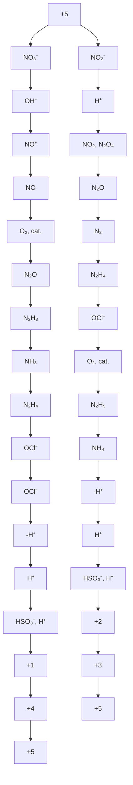

图 15.7 重要氮物种之间的相互转化

表 15.2 氮的氧化物

<table><tr><td>氧化数</td><td>化学式</td><td>名称</td><td>结构(气相)</td><td>备注</td></tr><tr><td>+1</td><td> $N_{2}O$ </td><td>亚氮氧化物(二氮氧化物)</td><td>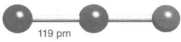</td><td>无色、不活泼气体</td></tr><tr><td>+2</td><td>NO</td><td>氮氧化物(一氧化物)</td><td>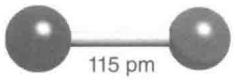</td><td>无色、活泼的顺磁性气体</td></tr><tr><td>+3</td><td> $N_{2}O_{3}$ </td><td>三氧化二氮</td><td>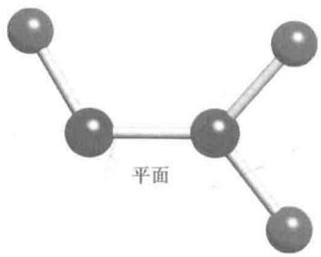</td><td>蓝色液体(熔点-101°C),气相中解离为NO和 $NO_{2}$ </td></tr><tr><td>+4</td><td> $NO_{2}$ </td><td>二氧化氮</td><td>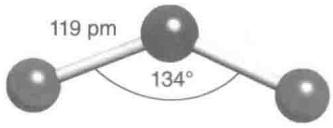</td><td>棕色、活泼的顺磁性气体</td></tr><tr><td>+4</td><td> $N_{2}O_{4}$ </td><td>四氧化二氮</td><td>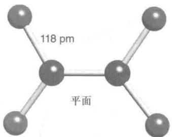</td><td>无色液体(熔点-11°C),气相中与 $NO_{2}$ 处于平衡</td></tr><tr><td>+5</td><td> $N_{2}O_{5}$ </td><td>五氧化二氮</td><td>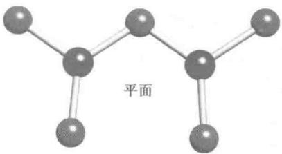</td><td>无色、不稳定、结晶为离子型固体[ $NO_{2}^{+}$ ][ $NO_{3}^{-}$ ]</td></tr></table>

表 15.3 氮氧离子

<table><tr><td>氧化数</td><td>化学式</td><td>名称(俗名)</td><td>结构</td><td>备注</td></tr><tr><td>+1</td><td> $N_{2}O_{2}^{2-}$ </td><td>连二次硝酸根</td><td>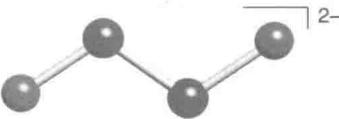</td><td>通常用作还原剂</td></tr><tr><td>+3</td><td> $NO_{2}^{-}$ </td><td>亚硝酸根</td><td>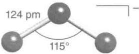</td><td>弱碱,用作氧化剂和还原剂</td></tr><tr><td>+3</td><td> $NO^{+}$ </td><td>亚硝镓离子(亚硝酰阳离子)</td><td>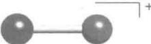</td><td>氧化剂和Lewis碱, $\pi$ 接受体配体</td></tr><tr><td>+5</td><td> $NO_{3}^{-}$ </td><td>硝酸根</td><td>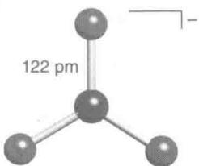</td><td>极弱的碱,氧化剂</td></tr><tr><td>+5</td><td> $NO_{2}^{+}$ </td><td>硝镓离子(硝酰阳离子)</td><td>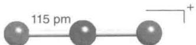</td><td>氧化剂,硝化试剂,Lewis酸</td></tr></table>

# (a) 氮(V)的氧化物和含氧阴离子

提要:室温下硝酸根离子是一种强而作用缓慢的氧化剂,强酸和加热可加速反应。

硝酸 $HNO_{3}$ 是最常见的氮（V）化合物，是用来生产肥料、炸药和多种含氮化学品的一种主要工业品。硝酸的生产使用现代版的 Ostwald 法，该法不是直接将 $N_{2}$ 转化为高氧化态化合物 $HNO_{3}$ ，而是经由最低氧化态化合物 $(\mathrm{NH}_{3})$ 实现这一转化。首先利用 Haber 法将 $N_{2}$ 还原至 -3 氧化态 $(\mathrm{NH}_{3})$ ，然后将其氧化至 +4 氧化态：

$$
4 \mathrm{NH} _ {3} (\mathrm{g}) + 7 \mathrm{O} _ {2} (\mathrm{g}) \longrightarrow 6 \mathrm{H} _ {2} \mathrm{O} (\mathrm{g}) + 4 \mathrm{NO} _ {2} (\mathrm{g}) \quad \Delta_ {\mathrm{r}} G ^ {\ominus} = - 3 0 8. 0 \mathrm{kJ} \cdot (\mathrm{molNO} _ {2}) ^ {- 1}
$$

加热条件下, $NO_{2}$ 在水中歧化为N(Ⅱ)和N(V):

$$
3 \mathrm{NO} _ {2} (\mathrm{aq}) + \mathrm{H} _ {2} \mathrm{O} (1) \longrightarrow 2 \mathrm{HNO} _ {3} (\mathrm{aq}) + \mathrm{NO} (\mathrm{g}) \quad \Delta_ {\mathrm{r}} G ^ {\ominus} = - 5. 0 \mathrm{kJ} \cdot (\mathrm{mol} \mathrm{HNO} _ {3}) ^ {- 1}
$$

所有各步在热力学上都是有利的。副产品 NO 用 $O_{2}$ 氧化为 $NO_{2}$ 参与再循环。之所以使用这个间接路线，是因为 $N_{2}$ 直接氧化为 $NO_{2}$ 的反应在热力学上不利 $\left[\Delta_{r}G^{\ominus}\left(\mathrm{NO}_{2},\mathrm{g}\right)=+51\mathrm{kJ}\cdot\mathrm{mol}^{-1}\right]$ 。这是一个耗能过程，主要原因是 $N\equiv N$ 键的强度大 ( $950\ kJ\cdot mol^{-1}$ )。

标准电位数据显示 $NO_{3}^{-}$ 是个中等强度的氧化剂。然而在稀酸溶液中反应通常进行得比较缓慢。由于 O 原子的质子化会促使 N—O 键的断裂，浓硝酸（其中的 $NO_{3}^{-}$ 被质子化）的反应快于稀硝酸（其中的 $NO_{3}^{-}$ 充分地脱去了质子）。低 pH 条件下， $HNO_{3}$ 也是个热力学上更有利的氧化剂。作为氧化性的一个标志是浓硝酸呈黄色，这是因为浓硝酸不稳定，分解为 $NO_{2}$ 所致：

$$
4 \mathrm{HNO} _ {3} (\mathrm{aq}) \longrightarrow 4 \mathrm{NO} _ {2} (\mathrm{aq}) + \mathrm{O} _ {2} (\mathrm{g}) + 2 \mathrm{H} _ {2} \mathrm{O} (\mathrm{l})
$$

光和热能加速分解。

$NO_{3}^{-}$ 的还原很难产生单一产物,而是得到多种低氧化态的氮化合物。例如,强还原剂(如 Zn)可将稀硝酸一直还原至氮的最低氧化态(-3):

$$
\mathrm{HNO} _ {3} (\mathrm{aq}) + 4 \mathrm{Zn} (\mathrm{s}) + 9 \mathrm{H} ^ {+} (\mathrm{aq}) \longrightarrow \mathrm{NH} _ {4} ^ {+} (\mathrm{aq}) + 3 \mathrm{H} _ {2} \mathrm{O} (1) + 4 \mathrm{Zn} ^ {2 +} (\mathrm{aq})
$$

较弱的还原剂(如 Cu)只能将浓硝酸还原为+4 氧化态:

$$
2 \mathrm{HNO} _ {3} (\mathrm{aq}) + \mathrm{Cu(s)} + 2 \mathrm{H} ^ {+} (\mathrm{aq}) \longrightarrow 2 \mathrm{NO} _ {2} (\mathrm{aq}) + \mathrm{Cu} ^ {2 +} (\mathrm{aq}) + 2 \mathrm{H} _ {2} \mathrm{O(l)}
$$

对稀硝酸而言,还原至+2氧化态(生成NO)是有利的:

$$
2 \mathrm{NO} _ {3} ^ {-} (\mathrm{aq}) + 3 \mathrm{Cu(s)} + 8 \mathrm{H} ^ {+} (\mathrm{aq}) \longrightarrow 2 \mathrm{NO(g)} + 3 \mathrm{Cu} ^ {2 +} (\mathrm{aq}) + 4 \mathrm{H} _ {2} \mathrm{O(l)}
$$

“王水”是浓硝酸和浓盐酸的混合物,其分解产物 NOCl 和 $Cl_{2}$ 的存在使液体呈黄色。随着这些挥发性产物的不断离去王水会失效:

$$
\mathrm{HNO} _ {3} (\mathrm{aq}) + 3 \mathrm{HCl} (\mathrm{aq}) \longrightarrow \mathrm{NOCl} (\mathrm{g}) + \mathrm{Cl} _ {2} (\mathrm{g}) + 2 \mathrm{H} _ {2} \mathrm{O} (1)
$$

由于能溶解金和铂等贵金属，冶金术士称这种混合物为“王水”（拉丁语为“御水”之意）。金在浓硝酸中仅被少量溶解，但王水中的 $\mathrm{Cl}^{-}$ 可快速与 $\mathrm{Au}^{3+}$ 络合生成 $[\mathrm{AuCl}_4]^{-}$ ，从而导致溶液中 $\mathrm{Au}^{3+}$ 的浓度极低，进而导致反应继续。

$$
\mathrm{Au(s)} + \mathrm{NO} _ {3} ^ {-} (\mathrm{aq}) + 4 \mathrm{Cl} ^ {-} (\mathrm{aq}) + 4 \mathrm{H} ^ {+} (\mathrm{aq}) \longrightarrow [ \mathrm{AuCl} _ {4} ] ^ {-} (\mathrm{aq}) + \mathrm{NO(g)} + 2 \mathrm{H} _ {2} \mathrm{O(l)}
$$

硝酸的酸酐是 $N_{2}O_{5}$ ，它是个晶形固体，更精确地化学式应是 $\left[NO_{2}^{+}\right]\left[NO_{3}^{-}\right]$ 。 $N_{2}O_{5}$ 可用 $P_{4}O_{10}$ 将硝酸脱水的方法制备：

$$
4 \mathrm{HNO} _ {3} (\mathrm{l}) + \mathrm{P} _ {4} \mathrm{O} _ {1 0} (\mathrm{s}) \longrightarrow 2 \mathrm{N} _ {2} \mathrm{O} _ {5} (\mathrm{s}) + 4 \mathrm{HPO} _ {3} (\mathrm{l})
$$

固体 $N_{2}O_{5}$ 在 $32^{\circ}C$ 升华，气态分子解离为 $NO_{2}$ 和 $O_{2}$ 。 $N_{2}O_{5}$ 是一种强氧化剂，可用于合成无水硝酸盐：

$$
\mathrm{N} _ {2} \mathrm{O} _ {5} (\mathrm{s}) + \mathrm{Na} (\mathrm{s}) \longrightarrow \mathrm{NaNO} _ {3} (\mathrm{s}) + \mathrm{NO} _ {2} (\mathrm{g})
$$

例题 15.3 N(V)、As(V)、Bi(V) 的稳定性变化趋势

题目: N(V)、As(V)、Bi(V)化合物的氧化性强于插入其间的两元素+5氧化态的化合物。解释周期表中这种变化趋势。

答案: 第9章讨论了一些周期性变化趋势。p区轻元素的电负性高于周期表中紧邻的下方元素, 因此是很好的氧化剂, 本身不易被氧化。正氧化态的氮通常是很好的氧化剂。由于存在交替效应(这种效应产生于3d电子弱的屏蔽效应而增加的有效核电荷 $Z_{eff}$ ), As(V)化合物的稳定性远不及同一氧化态的P和Sb的化合物。铋的电负性低得多, 但由于惰性电子对效应, +3氧化态要比+5氧化态稳定得多。

自测题 15.3 从周期表中的变化趋势,判断磷和硫哪个可能是更强的氧化剂?

(b) 氮(IV)和氮(III)的氧化物和含氧阴离子

提要: 氮的中间氧化态化合物容易发生歧化反应。

棕色的 $NO_{2}$ 和它的无色二聚体四氧化二氮 $N_{2}O_{4}$ 存在于平衡混合物中：

$$
\mathrm{N} _ {2} \mathrm{O} _ {4} (\mathrm{g}) \rightleftharpoons 2 \mathrm{NO} _ {2} (\mathrm{g}) \quad K (2 5 ^ {\circ} \mathrm{C}) = 0. 1 1 5
$$

$N_{2}O_{4}(19)$ 容易解离的事实与其长而弱的 N—N 键相一致。未成对电子占据的分子轨道几乎等同地分布在 $NO_{2}$ 的三个原子而不是集中在 N 原子上。这种结构不同于与其等电子的草酸根离子 $\left(\mathrm{C}_{2}\mathrm{O}_{4}^{2-}\right)$ ，后者中的 C—C 键更强些，是因为 $CO_{2}^{-}$ 中的电子更多地集中在 O 原子上。

氮(Ⅳ)氧化物是有毒的氧化剂,以低浓度存在于大气中,特别是存在于光化学烟雾中。它在碱性溶液中歧化为 N(Ⅲ)和 N(V),形成 $NO_{2}^{-}$ 和 $NO_{3}^{-}$ (见图 15.6):

$$
2 \mathrm{NO} _ {2} (\mathrm{g}) + 2 \mathrm{OH} ^ {-} (\mathrm{aq}) \longrightarrow \mathrm{NO} _ {2} ^ {-} (\mathrm{aq}) + \mathrm{NO} _ {3} ^ {-} (\mathrm{aq}) + \mathrm{H} _ {2} \mathrm{O} (1)
$$

酸性溶液中(如在 Ostwald 法中)的反应产物是 N(Ⅱ)而不是 N(Ⅲ), 这是因为亚硝酸本身容易歧化:

$$
3 \mathrm{HNO} _ {2} (\mathrm{aq}) \longrightarrow \mathrm{NO} _ {3} ^ {-} (\mathrm{aq}) + 2 \mathrm{NO(g)} + \mathrm{H} _ {3} \mathrm{O} ^ {+} (\mathrm{aq}) E ^ {\ominus} = + 0. 0 5 \mathrm{V} K = 5 0
$$

亚硝酸 $\left(\mathrm{HNO}_{2}\right)$ 是个强氧化剂：

$$
\mathrm{HNO} _ {2} (\mathrm{aq}) + \mathrm{H} ^ {+} (\mathrm{aq}) + \mathrm{e} ^ {-} \longrightarrow \mathrm{NO(g)} + \mathrm{H} _ {2} \mathrm{O(l)} \quad E ^ {\ominus} = + 1. 0 0 \mathrm{V}
$$

作为氧化剂的反应往往比其歧化反应更快速(应用相关文段 15.4)。

由于 $HNO_{2}$ 能转化为亚硝镓离子 $\left(\mathrm{NO}^{+}\right)$ ，所以酸能提高亚硝酸氧化反应的速率：

$$
\mathrm{HNO} _ {2} (\mathrm{aq}) + \mathrm{H} ^ {+} (\mathrm{aq}) \longrightarrow \mathrm{H} _ {2} \mathrm{NO} _ {2} ^ {+} (\mathrm{aq}) \longrightarrow \mathrm{NO} ^ {+} (\mathrm{aq}) + \mathrm{H} _ {2} \mathrm{O} (\mathrm{l})
$$

亚硝鎓离子是个强 Lewis 酸, 能与阴离子和其他 Lewis 碱迅速形成络合物。所得物种本身不易被氧化, 如在 $SO_{4}^{2-}$ 或 $F^{-}$ 溶液中分别形成 $[O_{3}SONO]^{-}(20)$ 或 ONF(21)。实验表明, $HNO_{2}$ 与 $I^{-}$ 反应能够快速生成 INO:

$$
\mathrm{I} ^ {-} (\mathrm{aq}) + \mathrm{NO} ^ {+} (\mathrm{aq}) \longrightarrow \mathrm{INO} (\mathrm{aq})
$$

![[无机化学第6版主族364-564_images/51555c8e0c5875f3d4d8cc37f2b4240c28117bcf0ddccab5d9057d86194e500f.jpg]]

chemical

Molecular structure diagram of a nitrogen-oxygen compound with bond lengths and angle labeled

(19) $N_{2}O_{4}, D_{2h}$

![[无机化学第6版主族364-564_images/ea15cd897bb9c28b150f9e6d55675dc1c2f155f8313036162006e1927ff190ea.jpg]]

chemical

Molecular structure diagram of sulfur (S), showing atom types and bonds

(20) $\mathrm{O}_3\mathrm{SONO}^-$

![[无机化学第6版主族364-564_images/c6c7ba3094aa254291b35214070a86b386b592e748cd34de84c5d03e8bf20259.jpg]]  
(21) ONF

接着两个 INO 分子之间发生决定速率的二级反应：

$$
2 \mathrm{INO(aq)} \longrightarrow \mathrm{I} _ {2} (\mathrm{aq}) + 2 \mathrm{NO(g)}
$$

亚硝鎓盐(如 $[NO][BF_{4}]$ )含有弱配位阴离子。这种盐是非常有用的实验室试剂,用作快速氧化剂和 $NO^{+}$ 源。

三氧化二氮 $\left(\mathrm{N}_{2}\mathrm{O}_{3}\right)$ 是亚硝酸的酸酐，在约-100℃以下为蓝色固体，熔化后生成蓝色液体，后者解离为NO和 $NO_{2}$

$$
\mathrm{N} _ {2} \mathrm{O} _ {3} (\mathrm{l}) \longrightarrow \mathrm{NO(g)} + \mathrm{NO} _ {2} (\mathrm{g})
$$

$NO_{2}$ 显示黄棕色的事实意味着, 解离得越多, 蓝色液体逐渐透出更多的绿色。

# (c) 氮(Ⅱ)氧化物

提要:一氧化氮是个强的 $\pi$ 接受体配体,是城市大气中难以处理的一种污染物。一氧化氮分子可作为一种神经递质。

氮(Ⅱ)氧化物与 $O_{2}$ 反应生成 $NO_{2}$ ，但气相的反应对 NO 是二级反应。这是因为其后与 $O_{2}$ 分子发生碰撞的是瞬间产生的二聚体 $(NO)_{2}$ 。因为是个二级反应，大气中的 NO（由燃煤火力发电厂和内燃机所释放）转化为 $NO_{2}$ 的速率较慢。

由于 NO 是个吸能化合物,应该有可能找到对应的催化剂将污染物 NO 转化为大气气体 $N_{2}$ 和 $O_{2}$ 排至自然界。人们已经知道沸石中的 $Cu^{+}$ 能催化分解 NO,对催化机理也有所了解。然而,因为对副产品二噁英的担心,该体系在世界一些地区未得到使用。

# 应用相关文段 15.4 亚硝酸盐在处理肉品时的作用

几个世纪以来，保存肉类的方法是用食盐腌制以脱去细菌生长所必要的水分。这种方法的一个副作用是某些肉类的色泽变红且味道独特。人们发现这种现象是由亚硝酸盐造成的，亚硝酸盐是由盐中存在的痕量硝酸钠在腌制过程中被细菌还原产生的。当今人们直接使用亚硝酸钠处理肉品（如熏肉、火腿和香肠）。

亚硝酸盐能够延缓肉毒杆菌的发作，减慢肉品腐烂，保持香料的香味。亚硝酸盐转化为NO，后者与肌红蛋白结合呈现的色素即鲜肉的自然红色。肌红蛋白NO复合物为深红色，致使腌肉颜色为典型的亮粉红色。腊肉中有时可看到亚硝酸盐与肌红蛋白反应呈现的绿色。绿色的出现被称为亚硝酸盐灼伤，肌红蛋白中的血红素被亚硝酸盐硝化时发生这种情况。

# (d) 低氧化态氮与氧形成的化合物

提要:由于动力学原因,一氧化二氮不活泼。

一氧化二氮 $N_{2}O$ 是无色的不活泼气体,由熔融硝酸铵的反歧化反应制备。操作时必须小心谨慎以免发生爆炸,反应中阳离子是被阴离子氧化的:

$$
\mathrm{NH} _ {4} \mathrm{NO} _ {3} (\mathrm{l}) \xrightarrow {2 5 0 ^ {\circ} \mathrm{C}} \mathrm{N} _ {2} \mathrm{O(g)} + 2 \mathrm{H} _ {2} \mathrm{O(g)}
$$

标准电位数据表明,不论在酸性或碱性溶液中, $N_{2}O$ 都是强氧化剂:

$$
\mathrm{N} _ {2} \mathrm{O(g)} + 2 \mathrm{H} ^ {+} (\mathrm{aq}) + 2 \mathrm{e} ^ {-} \longrightarrow \mathrm{N} _ {2} (\mathrm{g}) + \mathrm{H} _ {2} \mathrm{O(l)} \quad E ^ {\ominus} = + 1. 7 7 \mathrm{V} \quad \mathrm{pH} = 0
$$

$$
\mathrm{N} _ {2} \mathrm{O(g)} + \mathrm{H} _ {2} \mathrm{O(l)} + 2 \mathrm{e} ^ {-} \longrightarrow \mathrm{N} _ {2} (\mathrm{g}) + 2 \mathrm{OH} ^ {-} (\mathrm{aq}) \quad E ^ {\ominus} = + 0. 9 4 \mathrm{V} \quad \mathrm{pH} = 1 4
$$

然而这里起决定作用的是动力学因素,室温下 $N_{2}O$ 与许多试剂不发生反应。

# 例题 15.4 比较氮的含氧阴离子和含氧化合物的氧化还原性质

题目：比较(a)用作氧化剂的 $\mathrm{NO}_3^-$ 和 $\mathrm{NO}_2^-$ ，(b)用作还原剂的 $\mathrm{N}_2\mathrm{H}_4$ 和 $\mathrm{H}_2\mathrm{NOH}$ 。

答案: 参考图 15.6, 并用 5.13 的叙述做解释。(a) $NO_{3}^{-}$ 和 $NO_{2}^{-}$ 都是强氧化剂。前者的反应往往较慢, 但在酸性溶液中往往会加快。 $NO_{2}^{-}$ 的反应往往比较快, 在酸性溶液中甚至更快。 $NO^{+}$ 是 $NO_{2}^{-}$ 反应中常见的一种可识别的中间体。(b) 肼和羟胺都是良好的还原剂。在碱性溶液中, 肼是个更强的还原剂。

自测题 15.4 （a）比较 $NO_{2}$ 、NO、 $N_{2}O$ 在空气中被氧化的难易程度。（b）总结合成肼和羟胺的反应。电子转移过程和亲核取代过程哪一个更适合描述这些反应？

# 15.14 磷、砷、锑和铋的氧化物

提要:磷的氧化物包括 $P_{4}O_{6}$ 和 $P_{4}O_{10}$ ，两者都是具有 $T_{d}$ 对称性的笼状化合物。从砷到铋，+5 氧化态越来越易被还原至 +3 氧化态。

磷可形成磷(V)氧化物 $\left(\mathrm{P}_{4}\mathrm{O}_{10}\right)$ 和磷(Ⅲ)氧化物 $\left(\mathrm{P}_{4}\mathrm{O}_{6}\right)$ 。也可能离析出一个、两个或三个O原子以末端方式结合于P原子的中间组分。两个主要的氧化物都能发生水合生成相应的酸：P(V)氧化物水合为磷酸 $\left(\mathrm{H}_{3}\mathrm{PO}_{4}\right)$ ，P(Ⅲ)氧化物水合为亚磷酸 $\left(\mathrm{H}_{3}\mathrm{PO}_{3}\right)$ 。正如节4.3中讨论过的那样，亚磷酸中有一个H原子直接与P原子键合，因而是个二元酸，最好将其表示为 $\mathrm{O}=\mathrm{PH}(\mathrm{OH})_{2}$ 。

与高稳定性的磷（V）氧化物不同，砷、锑、铋更易形成氧化数为+3的氧化物，具体是指 $As_{2}O_{3}$ 、 $Sb_{2}O_{3}$ 和 $Bi_{2}O_{3}$ 。在气相，砷（Ⅲ）和锑（Ⅲ）氧化物的化学式为 $E_{4}O_{6}$ ，具有像 $P_{4}O_{6}$ 那样的四面体结构。砷、锑、铋的确能形成+5氧化态的氧化物，但铋（V）氧化物不稳定，迄今还未能表征其结构。这是惰性电子对效应的又一个实例。

# 15.15 磷、砷、锑和铋的含氧阴离子

提要:磷的重要含氧阴离子包括 P(I) 物种的次磷酸根 $\left(\mathrm{H}_{2}\mathrm{PO}_{2}^{-}\right)$ 、P(III) 物种的亚磷酸根 $\left(\mathrm{HPO}_{3}^{2-}\right)$ 和 P(V) 物种的磷酸根 $\left(\mathrm{PO}_{4}^{3-}\right)$ 。值得关注的是，两个低氧化态含氧阴离子中存在 P—H 键，并具有高的还原性。磷(V) 也形成被 O 桥连的多种聚磷酸盐。与氮(V) 物种不同，磷(V) 物种不是强氧化剂。As(V) 比 P(V) 更易被还原。

从表 15.4 中的 Latimer 图可以看出,除 P(V) 以外,元素磷及其大多数化合物都是强还原剂。白磷在碱性溶液中歧化为 -3 氧化态的磷化氢 $PH_{3}$ 和 +1 氧化态的次磷酸根离子 $H_{2}PO_{2}^{-}$ (见图 15.6):

$$
\mathrm{P} _ {4} (\mathrm{s}) + 3 \mathrm{OH} ^ {-} (\mathrm{aq}) + 3 \mathrm{H} _ {2} \mathrm{O} (\mathrm{l}) \longrightarrow \mathrm{PH} _ {3} (\mathrm{g}) + 3 \mathrm{H} _ {2} \mathrm{PO} _ {2} ^ {-} (\mathrm{aq})
$$

表 15.4 磷的 Latimer 图

<table><tr><td rowspan="2">酸性溶液</td><td> $H_3PO_4 \xrightarrow{-0.93} H_4P_2O_6 \xrightarrow{+0.38} H_3PO_3 \xrightarrow{-0.50} H_3PO_2 \xrightarrow{-0.51} P \xrightarrow{-0.06} PH_3$ </td></tr><tr><td>-0.28</td></tr><tr><td rowspan="2">碱性溶液</td><td> $PO_4^{3-} \xrightarrow{-1.12} HPO_3^{2-} \xrightarrow{-1.57} H_2PO_2^- \xrightarrow{-2.05} P \xrightarrow{-0.89} PH_3$ </td></tr><tr><td>-1.73</td></tr></table>

表 15.5 列出了一些常见磷的含氧阴离子(应用相关文段 15.5)。请注意结构中 P 原子的近四面体环境,即使存在 P—H 键的次磷酸根和亚磷酸根阴离子也是这样。各种 P(Ⅲ)氧合酸与含氧阴离子(包括 HPO $_{3}^{2-}$ 和烷氧基磷烷)可在温和条件下(如在冷的四氯化碳溶液中)通过磷(Ⅲ)氯化物的溶剂解反应方便地进行合成:

$$
\mathrm{PCl} _ {3} (\mathrm{l}) + 3 \mathrm{H} _ {2} \mathrm{O} (\mathrm{l}) \longrightarrow \mathrm{H} _ {3} \mathrm{PO} _ {3} (\mathrm{sol}) + 3 \mathrm{HCl} (\mathrm{sol})
$$

$$
\mathrm{PCl} _ {3} (\mathrm{l}) + 3 \mathrm{ROH} (\mathrm{sol}) + 3 \mathrm{N} \left(\mathrm{CH} _ {3}\right) _ {3} (\mathrm{sol}) \longrightarrow \mathrm{P} (\mathrm{OR}) _ {3} (\mathrm{sol}) + 3 \left[ \mathrm{HN} \left(\mathrm{CH} _ {3}\right) _ {3} \right] \mathrm{Cl} (\mathrm{sol})
$$

表 15.5 磷的一些含氧阴离子

<table><tr><td>氧化数</td><td>化学式</td><td>名称</td><td>结构</td><td>备注</td></tr><tr><td>+1</td><td> $H_{2}PO_{2}^{-}$ </td><td>次磷酸根(二氢二氧合磷酸盐)</td><td>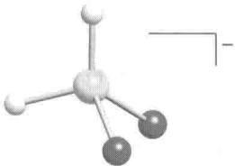</td><td>快速还原剂</td></tr><tr><td>+3</td><td> $HPO_{3}^{2-}$ </td><td>亚磷酸根</td><td>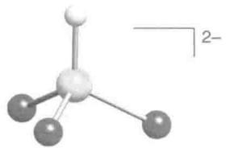</td><td>快速还原剂</td></tr><tr><td>+4</td><td> $P_{2}O_{6}^{4-}$ </td><td>连二磷酸根</td><td>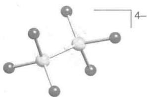</td><td>碱性</td></tr><tr><td>+5</td><td> $PO_{4}^{3-}$ </td><td>磷酸根</td><td>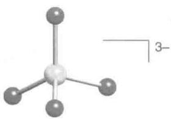</td><td>强碱性</td></tr><tr><td>+5</td><td> $P_{2}O_{7}^{4-}$ </td><td>焦磷酸根</td><td>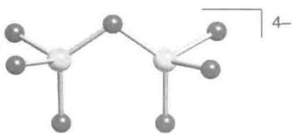</td><td>碱性,链状</td></tr></table>

$H_{2}PO_{2}^{-}$ 和 $HPO_{3}^{2-}$ 参与的还原反应通常比较快速。这种能力用在工业上一个例子是进行“无极电镀”：用 $H_{2}PO_{2}^{-}$ 还原 $\mathrm{Ni}^{2+}(\mathrm{aq})$ 将金属镍镀在物体表面上：

$$
\mathrm{Ni} ^ {2 +} (\mathrm{aq}) + 2 \mathrm{H} _ {2} \mathrm{PO} _ {2} ^ {-} (\mathrm{aq}) + 2 \mathrm{H} _ {2} \mathrm{O} (1) \longrightarrow \mathrm{Ni} (\mathrm{s}) + 2 \mathrm{H} _ {2} \mathrm{PO} _ {3} ^ {-} (\mathrm{aq}) + \mathrm{H} _ {2} (\mathrm{g}) + 2 \mathrm{H} ^ {+} (\mathrm{aq})
$$

元素的 Frost 图(见图 15.6)揭示了水溶液中类似的变化趋势。 $AsO_{4}^{3-}$ 不论从热力学趋势和动力学因素分析都容易被还原,这一点被看作是砷对动物有毒的关键因素。As(V)以 $AsO_{4}^{3-}$ 的形式模仿 $PO_{4}^{3-}$ 进入细胞。与磷不同的是,它容易被还原为 As(Ⅲ)物种,后者被认为是实际上的毒剂。As(Ⅲ)物种的毒性可能是 As(Ⅲ)与含硫氨基酸的亲和力造成的。某些细菌能制造亚砷酸氧化酶(其中含有 Mo 辅因子),它可用于将 As(Ⅲ)转化为 As(V)以降低砷的毒性。

# 应用相关文段 15.5 磷酸盐与食品工业

磷酸盐中的磷是生命的必需元素。人们自古以来就用磷酸盐（如骨粉、鱼肥、鸟粪等）作肥料。磷酸盐工业始于19世纪中期，那时是用硫酸分解遗骨和磷酸盐矿物的。当今合成路线更为经济，从而导致磷酸和磷酸盐的工业应用多样化。

世界磷酸产量的 90% 以上用来制造肥料,但仍有其他一些用途。最重要的用途之一是在食品工业中。磷酸的稀溶液无毒而且有酸味,广泛用于饮料中产生酸味,在果酱和果冻中作为缓冲剂,在制糖业中作为净化剂。

磷酸盐和磷酸氢盐在食品工业上有许多应用。磷酸二氢钠 $\left(\mathrm{NaH}_{2}\mathrm{PO}_{4}\right)$ 加于动物饲料作为食物补充剂。磷酸氢二钠 $\left(\mathrm{Na}_{2}\mathrm{HPO}_{4}\right)$ 用作加工奶酪的乳化剂，与酪蛋白作用可以防止脂肪与水分离。磷酸的钾盐比钠盐易溶而且价格也较高。

磷酸氢二钾（ $\mathrm{K}_2\mathrm{HPO}_4$ ）用作咖啡奶精的抗凝剂，与蛋白质的作用可防止咖啡酸凝结。一水合磷酸二氢钙 $[\mathrm{Ca(H_2PO_4)_2\cdot H_2O}]$ 用作面包的发酵剂、蛋糕混合剂和制作自发酵面粉。它与 $\mathrm{NaHCO_3}$ 一起在烘烤过程中会产生二氧化碳，也能与面粉蛋白作用以控制面团或混合物的弹性与黏性。磷酸一氢钙（ $\mathrm{CaHPO_4\cdot 2H_2O}$ ）的最大用途是添加到无氟牙膏中用作牙齿抛光剂。焦磷酸钙 $\mathrm{Ca_2P_2O_7}$ 用于含氟牙膏。磷酸钙 $\mathrm{Ca_3PO_4}$ 添加至糖和食盐中以提升流动性。

# 15.16 缩聚磷酸盐

提要:磷酸脱水生成链状或环状结构,这种结构可能是由多个 $PO_{4}$ 单元构建而成的。

磷酸 $\left(\mathrm{H}_{3}\mathrm{PO}_{4}\right)$ 加热至200℃以上时发生缩合，形成两个相邻 $PO_{4}^{3-}$ 单元之间的P—O—P桥（节4.5）。缩合程度取决于加热的温度和时间：

$$
\begin{array}{l} 2 \mathrm{H} _ {3} \mathrm{PO} _ {4} (1) \longrightarrow \mathrm{H} _ {4} \mathrm{P} _ {2} \mathrm{O} _ {7} (1) + \mathrm{H} _ {2} \mathrm{O(g)} \\ \mathrm{H} _ {3} \mathrm{PO} _ {4} (\mathrm{l}) + \mathrm{H} _ {4} \mathrm{P} _ {2} \mathrm{O} _ {7} (\mathrm{l}) \longrightarrow \mathrm{H} _ {5} \mathrm{P} _ {3} \mathrm{O} _ {1 0} (\mathrm{l}) + \mathrm{H} _ {2} \mathrm{O(g)} \\ \end{array}
$$

最简单的缩合磷酸是 $H_{4}P_{2}O_{7}$ 。工业上最重要的缩合磷酸盐是三聚磷酸钠 $Na_{5}P_{3}O_{10}(22)$ ，三聚磷酸钠广泛用作洗涤剂（加在洗衣机和洗碗机中），也用于其他清洁产品和水处理（应用相关文段 15.6）。聚磷酸盐也用作各种陶瓷制品和食品的添加剂。三磷酸盐（如三磷酸腺苷，ATP）对生物体至关重要（节 26.2）。

缩合磷酸盐的链长变化范围极大,最短的只含两个 $PO_{4}$ 单元,长的则多达数千个。二、三、四和五聚磷酸盐已被离析出来,含五个以上 $PO_{4}$ 单元的物种总是混合物。然而,平均链长可用通常的方法(如聚合物分析法或滴定法)进行测定,正如磷酸具有三个不同的酸性常数那样,多聚磷酸中两种类型 OH 基团的酸性常数也不同。端基 OH 基团(每个分子有两个)呈弱酸性;其余的 OH 基团(每个 P 原子有一个)呈强酸性(这是因为它们与强吸电子基团的=O基为邻)。弱酸性与强酸性质子数之比给出了平均链长。

如果加热使 $NaH_{2}PO_{4}$ 脱水并让水蒸气离开，则形成环状三聚阴离子 $P_{3}O_{9}^{3-}$ (23)。如果反应在封闭体系中进行，产物则为 Maddrell's 盐，它是个含 $PO_{4}$ 单元长链的晶态物质。 $P_{4}O_{10}$ 与冷的 NaOH 或 $NaHCO_{3}$ 溶液反应时生成环状四聚阴离子 (24)。

![[无机化学第6版主族364-564_images/0a51c8f3ef7b866b65c5b58c2aea0b32b43df054c548df56b4b7553a57865121.jpg]]

chemical

Molecular structure of a phosphorus-containing compound with oxygen and nitrogen atoms

(22) $\mathrm{P}_3\mathrm{O}_{10}^{5-}$

![[无机化学第6版主族364-564_images/633895914d6911c4dde4408f090661b2e4c79f655d2c3280f70f9714e0972f12.jpg]]

chemical

Molecular structure diagram of a phosphorus-oxygen compound with labeled atoms and bonds

(23) $P_{3}O_{9}^{3-}$

![[无机化学第6版主族364-564_images/252f0e61ba00736abb9aa788188a5569f307a4f36b71981a5ca1159b007a224f.jpg]]

chemical

Molecular structure diagram showing phosphorus (P) and oxygen (O) atoms with electron density clouds

(24) $P_{4}O_{12}^{4-}$

# 例题 15.5 滴定法测定聚磷酸链的链长

题目:聚磷酸样品溶于水后用稀 NaOH(aq) 进行滴定,两个化学计量点分别出现的碱液消耗 $16.8 \, cm^{3}$ 和 $28.0 \, cm^{3}$ 的时候,试确定聚磷酸盐链的长度。

答案:首先确定两种不同类型羟基的比例。强酸性的 OH 首先被滴定 $(16.8\ cm^{3})$ ，剩余两端的两个弱酸性 OH 基是由差值 $(28.0-16.8)\ cm^{3}=11.2\ cm^{3}$ 滴定的。由于每个羟基需要消耗 $5.6\ cm^{3}(11.2\ cm^{3}/2)$ 的滴定剂，不难算得每个分子含3个 $(16.8\ cm^{3}/5.6\ cm^{3})$ 强酸性OH。所以，含2个端羟基和3个其他羟基的聚磷酸是三聚磷酸。

自测题 15.5 用碱滴定聚磷酸样品的两个化学计量点消耗的滴定剂分别为 $30.4 \, cm^{3}$ 和 $45.6 \, cm^{3}$ 。链长度是多少？

# 应用相关文段 15.6 聚磷酸盐

三聚磷酸钠 $\left(\mathrm{Na}_{5}\mathrm{P}_{3}\mathrm{O}_{10}\right)$ 是使用最广的聚磷酸盐，其主要用途是作为合成洗涤剂的“增效助剂”用于洗衣产品、洗车液和工业清洗剂。其作用是与硬水中的钙离子、镁离子形成稳定的络合物（该过程叫“螯合作用”），有效地使它们不形成沉淀。它也作为缓冲剂，防止污垢结絮和防止土壤颗粒再沉淀。

食品级三聚磷酸钠用于处理火腿和腊肉，它与蛋白质作用以保证加工过程适宜的湿度。它也用来改善加工鸡肉和海产食品的质量。如前所述，工业级三聚磷酸钠可用作软水剂。纸浆工业和纺织工业中用它破坏纤维素。

三聚磷酸钾 $\left(\mathrm{K}_{5}\mathrm{P}_{3}\mathrm{O}_{10}\right)$ 比相应的钠化合物水溶性更好、价格也更高，用在液体洗涤剂中。对于某些应用而言，权衡溶解性和生产成本，还可选用三聚磷酸钾钠 $\left(\mathrm{K}_{2}\mathrm{Na}_{3}\mathrm{P}_{3}\mathrm{O}_{10}\right)$ 。

聚磷酸盐的使用已经造成藻类的过度生长，并导致一些天然水体富营养化。许多国家已限制使用这类产品，家用洗涤剂中的使用也有所减少。然而，磷酸盐仍然被广泛用作肥料，从农田流失进入河流和湖泊的量比洗涤剂还要多。

# 15.17 磷氮烯

提要:磷氮化合物的范畴广泛,包括环状磷氮烯和聚磷氮烯 $\left(\mathrm{PX}_{2}\mathrm{N}\right)_{n}$ 。磷氮烯生成高柔韧性的弹性体。

存在许多磷氧化合物的类似化合物，其中的O原子被等叶瓣的NR或NH基团所代替。例如， $\mathrm{P_4(NR)_6(25)}$ 可以看作是 $\mathrm{P_4O_6}$ 的类似物[节22.20(c)]。用等叶瓣的 $\mathrm{NH}_2$ 或 $\mathrm{NR}_2$ 取代OH或OR基团，则会衍生出另一系列的化合物，如 $\mathrm{P(OMe)_3}$ 的类似物为 $\mathrm{P(NMe_2)_3}$ 。学习PN化学需要记住的另一个要点是，PN在结构上等价于SiO。例如，含有 $\mathbb{R}_2\mathbb{PN}$ 单元（26）的各种链状和环状磷氮烯类似硅氧烷（节14.16）和其中的 $\mathbb{R}_2\mathbb{SiO}$ 单元(27)。

![[无机化学第6版主族364-564_images/a2c1b45952f6852a7cede9c71782e0d61262aede28287fe69f3daa3cf8600240.jpg]]

chemical

Molecular structure diagram showing a central atom bonded to surrounding atoms labeled N, P, and R

(25) $P_{4}(NR)_{6}$

![[无机化学第6版主族364-564_images/2e2067c1b33afe29f5911dd78489258cc67698fb4de5c8af3987f3e033359815.jpg]]

chemical

Molecular structure diagram showing phosphorus (P), nitrogen (N), and carbon (CH₃) atoms in a complex organic compound

(26) $\left(\mathrm{(CH_3)_2PN}\right)_3$

![[无机化学第6版主族364-564_images/910e0f29e055fd9713489b00bc9f5ab0d443b9b9c07495e6d78f1633d7eeb9af.jpg]]

chemical

Molecular structure diagram of a silane compound with silicon, methyl, and oxygen atoms labeled

(27) $\left(\mathrm{(CH_3)_2SiO}\right)_3$

环状磷氮烯的二氯化物是制备更多磷氮烯优良的起始物。它们不难通过下述反应合成：

$$
n \mathrm{PCl} _ {5} + n \mathrm{NH} _ {4} \mathrm{Cl} \longrightarrow (\mathrm{Cl} _ {2} \mathrm{PN}) _ {n} + 4 n \mathrm{HCl} \quad n = 3, 4
$$

该反应在氯代烃溶剂中加热到接近 $130^{\circ}$ C 时产生环状三聚磷氮烯(28)和四聚磷氮烯(29)。三聚体加热至约 $290^{\circ}$ C 时变成多聚磷氮烯(应用相关文段 15.7)。三聚体、四聚体和多聚体中的 Cl 原子易被其他 Lewis 碱所取代。

![[无机化学第6版主族364-564_images/620a71227fe1dfaba88ce3ecf7323bafc7dfbd6ae5edf0285ecf4d5561b308d8.jpg]]

chemical

Molecular structure of a phosphorus-nitrogen-oxygen compound with chlorine substituent

(28) $(\mathrm{Cl}_{2}\mathrm{PN})_{3}$

![[无机化学第6版主族364-564_images/e5f8c939b25032dcb93c93ce3193c7b12f65b91d0c009744d95b283daf860387.jpg]]

chemical

Molecular structure diagram of a phosphorus-nitrogen cluster compound with chlorine and nitrogen atoms

(29) $(\mathrm{Cl}_2\mathrm{PN})_4$

大阳离子双三苯基膦二亚胺 $\left[\mathrm{Ph}_{3} \mathrm{P} = \mathrm{N} = \mathrm{PPh}_{3}\right]^{+}$ (通常缩写为 $\mathrm{PPN}^{+}$ ) 与大阴离子的成盐非常有用。这种阳离子的盐在极性非质子溶剂中通常是可溶的。例如，溶解在 HMPA[六甲基磷酰三胺， $(\mathrm{Me}_{2} \mathrm{~N})_{3} \mathrm{P} = 0]$ 、二甲基甲酰胺(DMF)中，甚至能溶于二氯甲烷。

# 应用相关文段 15.7 聚磷氮烯在生物医学中的应用

可发生生物降解的聚合物是人们感兴趣的生物医学材料,因为这类材料在活体生物体内只能存在一段时间。聚磷氮烯被证明非常有用,这是因为它们可降解生成无害的副产物,而且其物理性质可通过改变P原子上的取代基进行调节。它们可以用作生物体植入设备的惰性外壳材料、心脏瓣膜和血管的结构材料,以及体内骨再生期间可降解的支撑材料。适于最后这一用途的最好的聚磷氮烯能够形成纤维,这种纤维的P—N骨架是由能够与 $Ca^{2+}$ 形成化学键的烷氧基组成的。该聚合物纤维能与患者的成骨细胞融合在一起。随着成骨细胞的繁殖,聚磷氮烯纤维逐步降解并占据纤维之间的空间。聚磷氮烯是这样设计的:它能以特定的速率发生水解,并在水解过程中保持其强度。

聚磷氮烯也用于药物的传递系统。具有生物活性的分子先被钳入聚合物结构或掺入聚合物的 P—N 骨架中，在随后的降解过程中释放出来。改变聚合物构架的结构可以控制其降解速率，从而控制药物的传递速率。可用这种方式传递的药物包括顺铂、多巴胺和类固醇：

$$
\left(\mathrm{Cl} _ {2} \mathrm{PN}\right) _ {n} + 2 n \mathrm{CF} _ {3} \mathrm{CF} _ {2} \mathrm{O} ^ {-} \longrightarrow \left[ \mathrm{CF} _ {3} \mathrm{CF} _ {2} \mathrm{O}\right) _ {2} \mathrm{PN} ] _ {n} + 2 n \mathrm{Cl} ^ {-}
$$

像硅橡胶那样,聚磷氮烯橡胶在低温下仍然保持着良好的弹性。这是因为像 SiOSi 基团那样,该分子为螺旋状分子,PNP 基团也具有很高的柔性。

# 15.18 砷、锑和铋的金属有机化合物

砷、锑和铋在许多金属有机化合物中呈现+3和+5氧化态。+3氧化态化合物的一个例子是 $\mathrm{As(CH_3)_3(30)}$ ，+5氧化态化合物的例子如 $\mathrm{As(C_6H_5)_5(31)}$ 。有机砷化合物曾被广泛用于治疗细菌感染，也用作除草剂和杀菌剂。但由于毒性高，已经不再具有重要的工业用途了。

![[无机化学第6版主族364-564_images/0b9004753252ac25f8fdd495ec69182bff0805197fd61f4d4072222f5a942451.jpg]]

chemical

Molecular structure of arsenic (As) and methyl (CH₃) atoms showing bonding geometry

(30) As(CH $_{3}$ ) $_{3}$

![[无机化学第6版主族364-564_images/a3a51a53a80528cc586c2eeda0e02fbfdf350278ee65dd57073c640a52a76ba5.jpg]]

chemical

Molecular structure of arsenic (As) with carbon and hydrogen atoms labeled

(31) As(C $_6$ H $_5$ ) $_5$

# (a) +3 氧化态

提要:金属有机化合物的稳定性按 As>Sb>Bi 的顺序减小;芳基化合物比烷基化合物更稳定。

砷（Ⅲ）、锑（Ⅲ）、铋（Ⅲ）的金属有机化合物可在乙醚溶剂中用 Grignard 试剂、有机锂试剂或有机卤化物制备：

$$
\mathrm{AsCl} _ {3} (\mathrm{et}) + 3 \mathrm{RMgCl} (\mathrm{et}) \longrightarrow \mathrm{AsR} _ {3} (\mathrm{et}) + 3 \mathrm{MgCl} _ {2} (\mathrm{et})
$$

$$
\mathrm{AsR} _ {2} \mathrm{Br} (\mathrm{et}) + \mathrm{R} ^ {\prime} \mathrm{Li} (\mathrm{et}) \longrightarrow \mathrm{AsR} _ {2} \mathrm{R} ^ {\prime} (\mathrm{et}) + \mathrm{LiBr} (\mathrm{et})
$$

$$
2 \mathrm{As} (\mathrm{et}) + 3 \mathrm{RBr} (\mathrm{et}) \xrightarrow {\mathrm{Cu/} \triangle} \mathrm{AsRBr} _ {2} (\mathrm{et}) + \mathrm{AsR} _ {2} \mathrm{Br} (\mathrm{et})
$$

这些化合物都易被氧化,但对水却是稳定的。对给定的 R 基团而言,M—C 键强度降低的顺序为 As>Sb>

Bi。因此，化合物的稳定性按同一顺序降低。另外，芳基化合物[如 $\mathrm{As}(\mathrm{C}_6\mathrm{H}_5)_3$ ]通常比烷基化合物更稳定。卤素取代的化合物 $\mathbf{R}_n\mathbf{MX}_{3 - n}$ 已被成功地制备和表征。

所有这些化合物都可作为 Lewis 碱并与 d 金属形成络合物。碱性降低的顺序为 As>Sb>Bi。许多烷基和芳基砷烷的金属络合物已经制备出来，但已知的锑烷络合物却不多。一个有用的配体是叫作邻苯二胂 (diars,32) 的二齿化合物，因为具有软给予体的特性，迄今已经制备出软金属离子 [Rh(I)、Ir(I)、Pd(II) 和 Pt(II)] 的许多烷基和芳基砷烷络合物。然而硬度的标准比较模糊，如果看到一些高氧化态金属与膦或胂烷形成的络合物，您不要感到惊奇。例如，络合物 (33) 中不常见的 +4 氧化态钯就是被 diars 稳定的。

![[无机化学第6版主族364-564_images/f8193ca26d535f337c1e5caefbf3114dfd80ad23697c881042aabe90a3062d2a.jpg]]  
(32) $C_{6}H_{4}(As(CH_{3})_{2})_{2}, diars$

![[无机化学第6版主族364-564_images/bc2469eb72fe67b362ad70650add99e0a3d2234e6ee335329a140467a7750790.jpg]]

chemical

Molecular structure of a palladium complex with chlorine, arsenic, and methyl groups

(33) $[PdCl_{2}(diars)_{2}]^{2+}$

邻苯二胂的制备提供了合成有机胂化合物一个良好的实例。起始物 $\left(\mathrm{CH}_{3}\right)_{2}\mathrm{AsI}$ 的合成并不方便，由 $AsI_{3}$ 和 Grignard 试剂（或类似的碳负离子）之间的复分解反应不能有选择性的提供二甲基取代产物。这是因为当有机基团很小时，无法控制反应实现砷原子上的部分取代。所以制备该化合物直接采用单质砷与卤代烷 $CH_{3}I$ 的反应：

$$
4 \mathrm{As(s)} + 6 \mathrm {CH_ {3} I(l)} \longrightarrow 3 (\mathrm {CH_ {3}}) _ {2} \mathrm{AsI(sol)} + \mathrm {AsI_ {3} (sol)}
$$

得到的 $\left(\mathrm{CH}_{3}\right)_{2}\mathrm{AsI}$ 再与钠反应产生 $\left[\left(\mathrm{CH}_{3}\right)_{2}\mathrm{As}\right]^{-}$ 。

$$
\mathrm {(CH_ {3}) _ {2} AsI(sol) + 2Na(sol)} \longrightarrow \mathrm{NaAs(CH_ {3})_ {2} (sol)+NaI(s)}
$$

生成的强的亲核试剂 $(\mathrm{CH}_3)_2\mathrm{As}^-$ 用于取代邻二氯苯中的氯：

![[无机化学第6版主族364-564_images/93c66c152acfe2a989ea9c14495a565fd7b39fcbf77af3a43aa9dff4828c5cdc.jpg]]

chemical

Chemical reaction equation showing chlorination of anisole with sodium ascorbate

聚胂烷化合物 $(\mathrm{RAs})_n$ 可用两种方法之一制备：在醚中还原五价金属有机化合物 $\mathrm{R}_5\mathrm{As}$ ，或者在醚中用Li处理有机砷化合物：

$$
n \mathrm{RAsX} _ {2} (\mathrm{et}) + 2 n \mathrm{Li} (\mathrm{et}) \longrightarrow (\mathrm{RAs}) _ {n} (\mathrm{et}) + 2 n \mathrm{LiX} (\mathrm{et})
$$

As—As 键容易断裂, 所以 $R_{2}AsAsR_{2}$ 是非常活泼的化合物。它可与氧、硫和含 C=C 双键的物种发生反应, 也与 d 金属形成络合物。不同反应中的 As—As 键可能断裂, 也可能保持键合态。

![[无机化学第6版主族364-564_images/2315b1ab771e047d8a2abb5972f4d7a3ec0a2828548c022b19710c500aeebfe9.jpg]]

chemical

Chemical reaction equation showing the formation of a manganese complex from arsenic and molybdenum compounds

多达六个单元的聚胂烷已经被表征。聚甲基胂烷以黄色的、褶皱环状五聚体 $\mathrm{As}_5(\mathrm{CH}_3)_5$ (34)和紫黑色的、梯状聚合物（ $\mathrm{AsMe}$ ） $_n$ (35)存在。 $\mathbf{M} = \mathbf{M}$ 键的强度按 $\mathrm{As > Sb > Bi}$ 的顺序减弱。所以砷形成链状金属有机化合物，而铋仅仅离析出 $\mathrm{R}_2\mathrm{Bi}-\mathrm{BiR}_2$ 。

As、Sb 和 Bi 不仅与碳形成 M—C 单键，而且也可形成 M=C 双键。一个被广泛研究的领域是芳香金属化合物，其中金属原子取代了苯环的一个碳原子而成为六元类苯环的一部分（36）。砷苯 $\left(\mathrm{C}_{5}\mathrm{H}_{5}\mathrm{As}\right)$ 在

200 ℃ 以下很稳定，锑苯 $\left(\mathrm{C}_{5}\mathrm{H}_{5}\mathrm{Sb}\right)$ 可以离析出来但容易聚合，铋苯 $\left(\mathrm{C}_{5}\mathrm{H}_{5}\mathrm{Bi}\right)$ 则很不稳定。这些化合物表现出典型的芳香性，虽然砷苯比苯活泼1 000倍以上。另一组相关的化合物是砷咯、锑咯和铋咯 $\left(\mathrm{C}_{4}\mathrm{H}_{4}\mathrm{MH},\mathrm{M}=\mathrm{As}、\mathrm{Sb}、\mathrm{Bi}\right)$ ，其中金属原子取代了吡咯五元环中的氮（37）。

![[无机化学第6版主族364-564_images/9533e6880d853b81f2a0a99a45a8453a652a8d72a44c20aef5b9244fa97c28b2.jpg]]

chemical

Molecular structure of a arsenic compound with methyl substituent

(34) $As_{5}(CH_{3})_{5}$

![[无机化学第6版主族364-564_images/8b95cdf1e89f94bac4bf615b51657a48d671a76b26c63e03e084675c131df468.jpg]]

chemical

Chemical structure diagram showing alternating Me and As atoms with double bonds

(35) (AsMe) $_{n}$

![[无机化学第6版主族364-564_images/ad1268e159c7724ac805708acba853629b28f27b09af7fdc49d7ff827877b316.jpg]]  
(36) $C_{5}H_{5}M$

![[无机化学第6版主族364-564_images/818a84740268e6912ad6a0b99951552eafe20c187635de68e5dbe20db81eb370.jpg]]  
(37) $C_{4}H_{5}M$

(b) +5 氧化态

提要: 四苯基胂正离子是制备其他 As(V) 金属有机化合物的起始物。

作为亲核试剂的三烷基胂与卤代烷作用可制备 As(V) 的四烷基胂盐：

$$
\mathrm{As} \left(\mathrm{CH} _ {3}\right) _ {3} (\mathrm{sol}) + \mathrm{CH} _ {3} \mathrm{Br} (\mathrm{sol}) \longrightarrow \left[ \mathrm{As} \left(\mathrm{CH} _ {3}\right) _ {4} \right] \mathrm{Br} (\mathrm{sol})
$$

这种类型的反应不能用于制备四苯基胂离子( $\left[AsPh_{4}\right]^{+}$ )，这是因为三苯基胂是比三甲基胂弱得多的亲核试剂。合成四苯基胂离子合适的反应是

$$
\mathrm{Ph} _ {3} \mathrm{As} = \mathrm{O} + \mathrm{PhMgBr} \longrightarrow \begin{array}{c c} \text { Ph } & \text { Ph } \\ \text { Ph } & \text { As } \\ \text { Ph } & \text { Ph } \end{array} \quad \begin{array}{c c} \text { Ph } & \text { Br } ^ {-} + \mathrm{MgO} \\ \text { Ph } & \text { Ph } \end{array}
$$

该反应看上去并不熟悉,但它事实上是个简单的复分解反应。苯基阴离子( $Ph^{-}$ )取代了结合在As原子上的 $O^{2-}$ ,产物中的砷维持其+5氧化态。生成高放能化合物MgO也对反应的Gibbs自由能有贡献,也是反应的驱动力。

四苯基胂离子、四烷基铵离子和四苯基磷离子在无机合成化学中作为大阳离子用于稳定大阴离子。四苯基胂离子也是制备其他 As(V) 金属有机化合物的起始物。例如，苯基锂

与四苯基胂盐作用产生 As(V) 化合物五苯基胂(31):

$$
\left[ \mathrm{AsPh} _ {4} \right] \mathrm{Br} (\mathrm{sol}) + \mathrm{LiPh} (\mathrm{sol}) \longrightarrow \mathrm{AsPh} _ {5} (\mathrm{sol}) + \mathrm{LiBr} (\mathrm{sol})
$$

五苯基胂 $\left(\mathrm{AsPh}_{5}\right)$ 为三角双锥结构，与VSEPR理论的预期相一致。节2.3讲过，四方锥结构在能量上与三角双锥结构接近，五苯基锑 $\left(\mathrm{SbPh}_{5}\right)$ 事实上为四方锥结构(38)。五甲基胂 $\left[\mathrm{As}\left(\mathrm{CH}_{3}\right)_{5}\right]$ 是个稳定性更差的As(V)化合物，可通过类似的反应在精密控制的实验条件下合成。

![[无机化学第6版主族364-564_images/5ea9101a0218908911d2765c655e04e75128c06cbad3a416737c65b9df2dfa7b.jpg]]

chemical

Molecular structure of selenide (Sb) showing its atom bonded to phenyl and other phosphorus atoms

(38) $\mathrm{Sb}(\mathrm{C}_6\mathrm{H}_5)_5$

# 延伸阅读资料

R. B. King, Inorganic chemistry of the main group elements. John Wiley & Sons (1994).   
D. M. P. Mingos, Essential trends in inorganic chemistry. Oxford University Press (1998). 从成键和结构角度讨论无机化学的一本书。  
R. B. King(ed.), Encyclopedia of inorganic chemistry. John Wiley & Sons (2005).   
H. R. Allcock, Chemistry and applications of polyphosphazenes. John Wiley & Sons (2002).   
J. Emsley, The shocking history of phosphorus: a biography of the devil's element. Pan(2001).   
W. T. Frankenberger, The environmental chemistry of arsenic. Marcel Dekker (2001).   
G. J. Leigh, The world's greatest fix: a history of nitrogen and agriculture. Oxford University Press (2004).

N. N. Greenwood and A. Earnshaw, Chemistry of the elements. Butterworth-Heinemann (1997).

C. Benson, The periodic table of the elements and their chemical properties. Kindle edition. MindMelder.com (2009).

# 练习题

15.1 列出第 15 族中的元素, 并指出哪些元素是 (a) 双原子气体, (b) 非金属, (c) 准金属, (d) (真) 金属。指出哪些元素表现出惰性电子对效应。

15.2 由羟基磷灰石制备 $H_{3}PO_{4}$ ，写出生成（a）高纯磷酸和（b）肥料级磷酸每一步配平的化学方程式。（c）说明两种方法为什么存在巨大的成本差异。

15.3 氨可由(a) $Li_{3}N$ 水解,或(b)高温、高压条件下用 $H_{2}$ 还原 $N_{2}$ 的方法制备。用配平的化学方程式表达以 $N_{2}$ 、Li、和 $H_{2}$ 为起始物合成氨的各种方法。(c)解释第二种方法的成本为什么较低。

15.4 用方程式说明为何硝酸铵水溶液呈酸性。

15.5 一氧化碳是个很好的配体,但是有毒。为什么等电子体 $N_{2}$ 分子无毒?

15.6 将常见氮氯化物氧化态的化学式和稳定性与磷氯化物进行比较。

15.7 用 VSEPR 理论预测下列物种可能的形状: (a) $PCl_{4}^{+}$ , (b) $PCl_{4}^{-}$ , (c) $AsCl_{5}$ 。

15.8 写出并配平下述反应的化学方程式：(a) 过量氧氧化 $P_{4}$ ，(b) (a) 的产物与过量水，(c) (b) 的产物与 $CaCl_{2}$ 溶液。并为每一步的产物命名。

15.9 以 $\mathrm{NH}_{3}(\mathrm{~g})$ 和您选择的其他试剂为起始物，写出合成下列物质的化学方程式和条件：(a) $HNO_{3}$ ，(b) $NO_{2}^{-}$ ，(c) $NH_{2}OH$ ，(d) $N_{3}^{-}$ 。

15.10 写出与 $P_{4}O_{10}(s)$ 标准生成焓相应的化学方程式。指出反应物的结构、物理状态（固态、液态或气态）和同素异形体。通常是将元素最稳定的同素异形体作为参照物，哪个反应物与习惯做法不一致？

15.11 不参考教材正文,勾画出磷(氧化态0至+5)和铋(0至+5)在酸性溶液中Frost图的一般形式,并讨论两种元素+3和+5氧化态的相对稳定性。

15.12 pH 降低时, $NO_{2}^{-}$ 作为氧化剂的反应速率是加快还是减慢? 机理上如何解释氧化过程中 $NO_{2}^{-}$ 对 pH 的依赖关系?

15.13 等体积一氧化氮(NO)和空气在常压下混合时迅速发生反应生成 $NO_{2}$ 和 $N_{2}O_{4}$ 。然而汽车尾气中的 NO（浓度为 ppm 级）与空气的反应进行得很缓慢，根据速率定律和可能的机理对此现象进行解释。

15.14 由于在电极上的反应缓慢,氮化合物的大部分氧化还原电位无法在电化学电池中测得,而必须通过其他的热力学数据确定。使用 $\Delta_{\mathrm{f}}G^{\ominus}(\mathrm{NH}_{3},\mathrm{aq})=-26.5\mathrm{kJ}\cdot\mathrm{mol}^{-1}$ 这一数据计算碱性溶液中 $N_{2}/NH_{3}$ 电对的标准电位。

15.15 写出下面所给试剂与 $PCl_{5}$ 反应的化学方程式，配平方程式并指出产物的结构。（a）水（1：1），（b）过量水，（c） $AlCl_{3}$ ，（d） $NH_{4}Cl$ 。

15.16 解释如何用 $^{31}$ P-NMR 谱区分 PF $_{3}$ 和 POF $_{3}$ 。

15.17 利用资料节3的数据计算 $\mathrm{H}_3\mathrm{PO}_2$ 与 $\mathrm{Cu}^{2+}$ 反应的标准电位。常用 $\mathrm{HPO}_3^{2-}$ 和 $\mathrm{H}_2\mathrm{PO}_2^-$ 作为氧化剂还是还原剂？

15.18 四面体的 $P_{4}$ 分子可通过 2c, 2e 定域键进行描述。试确定价电子的数目，并由此确定 $P_{4}$ 是闭合型、巢形或蛛网形（几个术语的含义参见节 13.11）。

15.19 识别图 15.8(a) 中 A、B、C 和 D 各是何种化合物。

![[无机化学第6版主族364-564_images/8229958faa3c12d48183fd6dcc2401591a1b787522fe9b0556d64181d1370de8.jpg]]

chemical

Chemical reaction pathway diagram showing transformations of compounds A, B, C, D and their reactions with reagents like LiAlH4, Cl2/hν, 3 RMgBr, NO, H2O, Zn/H+, Cu/H+, and (b)

图 15.8 练习题 15.19 附图

15.20 绘出八面体 $\left[\mathrm{AsF}_{4} \mathrm{Cl}_{2}\right]^{-}$ 可能存在的两种几何异构体，并解释如何利用 $^{19} \mathrm{~F}-\mathrm{NMR}$ 谱将它们相区分。  
15.21 识别图 15.8(b) 中氮的化合物 A、B、C、D 和 E。  
15.22 用资料节 3 中的 Latimer 图确定哪些氮和磷的物种在酸性溶液中发生歧化。

# 辅导性作业

15.1 人们发现一氧化二氮在生物体系中起着至关重要的作用。A. W. Carpenter 和 M. H. Schoenfisch 发表的一篇论文 (Chem. Soc. Rev., 2012, 41, 3742) 讨论了 NO 在医疗方面的应用，总结了 NO 气体作为治疗剂的主要用途和缺点。试讨论：NO 给予体分子如何能使 NO 疗法广泛用于医疗。  
15.2 试叙述哪些污水处理方法能减少废水中磷酸盐的含量,概略描述监测水中磷酸盐含量的实验室方法。  
15.3 含有五配位氮的化合物已经被表征(A. Frohmann, J. Riede, and H. Schmidbaur, Nature, 1990, 345, 140)，试描述它的(a)合成，(b)化合物结构，(c)成键情况。  
15.4 A. Lykknes 和 L. Kvittingen 的论文 (Arsenic: not so evil after all? J. Chem. Educ., 2003, 80, 497;) 和 J. Wang 和 C. M. Chien 的论文 (Arsenic in drinking water: a global environmental problem. J. Chem. Educ., 2004, 81, 207) 中对砷的毒性提出了相反的观点。试用文中列出的参考文献对砷的有益的和不利的影响做出评估。  
15.5 N. Tokitoh 等人发表的论文 (Science, 1997, 277, 78) 介绍了二铋烯 (含有 Bi = Bi 双键) 的合成与表征。试写出合成该化合物的方程式, 命名并绘出空间保护基团的结构。讨论为什么产品的离析方法很简单? 使用了什么方法确定该化合物的结构?  
15.6 Y. Zhang 等人发表的论文(Inorg. Chem., 2006, 45, 10446)描述了磷氮烯阳离子(聚磷氮烯的前体)的合成。聚磷氮烯是通过环状化合物 $\left(\mathrm{NPCl}_{2}\right)_{3}$ 的开环聚合反应制备的，该反应由磷氮烯阳离子引发。试讨论哪些 Lewis 酸可用以制备这种阳离子，并写出 $\left(\mathrm{NPCl}_{2}\right)_{3}$ 开环聚合反应的表达式。  
15.7 D. Yandulov 和 R. Schrock 在论文“Catalytic reduction of dinitrogen to ammonia at single molybdenum center” (Science, 2003, 301, 5629) 中描述了室温、常压下使用单核钼络合物催化氮至氨的转化。讨论为什么这种固氮技术具有工业上的重要性？评论非生物方法活化氮的方法。

(王文渊、马佳妮 译, 史启祯 审)

# 第 16 族元素

除该族最重的钋之外,第16族元素都是非金属元素。本族包含两种最重要的生命元素。氧通常存在于大气之中,对高等生物必不可少,氧也以水的形式为所有生命不可或缺。氧分子经光合作用由水产生,并通过高等生物的呼吸作用参与循环。硫同样是所有生命形式的必需元素,甚至微量硒对生命也是需要的。硫和硒具有进入环结构和链结构的趋势。

第 16 族元素氧、硫、硒、碲、钋往往又被称为硫族元素（calco-gens），该名称源自希腊语“bronze”，意为硫及其同族元素与铜形成铜的金属矿。与 p 区其他元素一样，该族第一个元素（氧）的性质明显不同于该族其他元素。氧在化合物中的配位数通常较低（频频形成双键）。正常条件下，氧是本族元素中唯一以双原子分子存在的元素。

![[无机化学第6版主族364-564_images/85c9cb0d38935dc468de002f37efaf201161bea008573a44dfb99f3b6a762f25.jpg]]

text_image

1 2 13 14 15 16 17 He
Li Be B C N O F Ne
P S Cl
As Se Br
Sb Te I
Bi Po At
18

# A. 基本面

除氧而外,本族元素的单质通常情况下都是固体。正如我们已经看到的那样,随着原子序数的增加金属性逐渐增强。本部分主要讨论第16族元素的基本性质。

# 16.1 元素

提要: 氧是第 16 族元素中电负性最大的元素, 也是唯一的气体元素; 所有元素都存在同素异形体。

氧、硫、硒是非金属，碲是准金属，而钋是金属。同素异形现象和多晶现象是第16族元素的重要特征，硫在这方面较其他元素更突出。

本族元素的电子组态是 $ns^{2}np^{4}$ ，表明第16族元素的最大氧化数为+6（见表16.1）。虽然其他元素有时能达到最大氧化态，但氧则不能。电子组态同样表明稳定的氧化数是-2，这对O而言极为常见。S、Se和Te最显著的特征是它们形成氧化数从-2到+6的化合物。

表 16.1 第 16 族元素的一些性质

<table><tr><td>性质</td><td>O</td><td>S</td><td>Se</td><td>Te</td><td>Po</td></tr><tr><td>共价半径/pm</td><td>74</td><td>104</td><td>117</td><td>137</td><td>140</td></tr><tr><td>离子半径/pm</td><td>140</td><td>184</td><td>198</td><td>221</td><td></td></tr><tr><td>第一电离能/(kJ·mol-1)</td><td>1310</td><td>1000</td><td>941</td><td>870</td><td>812</td></tr><tr><td>熔点/°C</td><td>-218</td><td>113(α)</td><td>217</td><td>450</td><td>254</td></tr><tr><td>沸点/°C</td><td>-183</td><td>445</td><td>685</td><td>990</td><td>960</td></tr><tr><td>Pauling电负性</td><td>3.4</td><td>2.6</td><td>2.6</td><td>2.1</td><td>2.0</td></tr><tr><td>电子亲和能*/(kJ·mol-1)</td><td>141</td><td>200</td><td>195</td><td>190</td><td>183</td></tr><tr><td></td><td>-844</td><td>-532</td><td></td><td></td><td></td></tr></table>

\* 第一个值对应的是 $X(g) + e^{-}(g) \to X^{-}(g)$ ; 第二个值对应的是 $X^{-}(g) + e^{-}(g) \to X^{2^{-}}(g)$ 。

除物理性质不同外，O 的化学性质也与同族其他元素显著不同（见节 9.10）。O 是周期表中电负性第二高的元素，比同族其他元素高得多。高电负性对 O 的化学性质具有相当大的影响。O 的原子半径较小并且没有 d 轨道，这一点同样造成 O 显示独特的化学性质。因此，简单化合物中 O 的配位数几乎不会大于 3，而同族其他元素的配位数常为 4 和 6，如 $SF_{6}$ 。

氧气 $\left(\mathrm{O}_{2}\right)$ 能氧化许多元素并在合适的条件下能与许多有机化合物和无机化合物起反应。只有稀有气体 He、Ne、Ar 不能直接形成氧化物。其他元素的氧化物在各自相关的章节做讨论，此处不做赘述。虽然 O=O 键能高达 $494\ kJ\cdot mol^{-1}$ ，但很多放热燃烧反应的发生却是因为得到了 E—O 共价键的焓值或者是因为 $MO_{n}$ 的晶格焓高的缘故。氧气最重要的反应之一是与氧转移蛋白血红素的配位[节 26.7(b)]。

氧是地壳中丰度最大的元素（质量分数为 $46\%$ ），存在于所有的硅酸盐物质中。氧构成大洋质量的 $86\%$ 和水质量的 $89\%$ 。人体平均质量的 $2/3$ 为氧。氧气全部由有机体光合作用中水的裂解反应产生，占到大气体积的 $21\%$ （应用相关文段 16.1）。太阳中氧的丰度占第三位，月球表面氧的丰度占第一位（质量分数为 $46\%$ ）。氧也以臭氧 $(\mathrm{O}_{3})$ 的形式存在，它是一种高活性、有刺激气味的气体。由于臭氧能屏蔽紫外线对地球表面的直接辐射，因此对地球上的生命至关重要。

硫以元素的沉积物存在于自然界，也以方铅矿（PbS）、重晶石（ $\mathrm{BaSO_4}$ ）和泻盐（ $\mathrm{MgSO_4 \cdot 7H_2O}$ ）的形式存在于陨石、火山和温泉中。天然气中存在 $\mathrm{H}_2\mathrm{S}$ 气体，原油中存在有机硫化物。S—S单键键能高达 $265\mathrm{kJ} \cdot \mathrm{mol}^{-1}$ [仅次于C—C单键（ $330\mathrm{kJ} \cdot \mathrm{mol}^{-1}$ ）和H—H键（ $436\mathrm{kJ} \cdot \mathrm{mol}^{-1}$ ），这一事实解释了硫元素为何具有如此多的同素异形体，即硫原子具有形成链的能力。室温下能够离析出来的所有硫的同素异形体都含有 $\mathbf{S}_n$ 环。

O—O 和 S—S 单键键能之间的显著差别具有重要影响。O—O 键键焓为 $+146 \, kJ \cdot mol^{-1}$ ，因而过氧化物是强氧化剂；与此相反，S—S 键键焓高达 $+265 \, kJ \cdot mol^{-1}$ ，以致生物体用它来稳定蛋白质结构。这种稳定作用是通过半胱氨酸残基（它们存在于不同蛋白质链和同一蛋白质链的不同区域）间形成永久稳定性链（RS—SR）实现的。键焓的这种差别不难从 O—O 键电子的排斥作用来理解。

化学上的软元素 Se、Te 存在于金属硫化物矿物中，它们主要来源于电解精炼铜的过程。钋具有 33 种已知同位素，这些同位素全都具有放射性。

# 应用相关文段16.1 大气中的氧

地球大气演变过程中氧是由光合作用产生的，最终占到大气体积的21%。早期地球大气中的氧是个有毒成分，曾导致许多物种灭绝。一些物种之所以能够留存到现在，是因为它们生存于无氧环境的深层土壤或水中。另外一些物种选择了适应环境这条路，开始利用现在这种丰度很高的氧化剂并发生进化。我们的祖先就是这些需要氧气生存的一些物种（需氧生物）。水的组成受到这一过程（从无氧环境到需氧环境的转变）的重大影响。大量以硫化物形式存在于厌氧水中的硫元素被氧化成硫酸盐。金属离子的浓度也发生了戏剧性的变化。受到显著影响的两种金属是钼和铁。

钼是现代大洋中丰度最大的 d 区元素(0.01 ppm)。然而在大洋和大气中有氧之前,钼是以不溶性的固体(主要是 $MoO_{2}$ 和 $MoS_{2}$ )存在的。这些固体被氧化为可溶性的钼酸根离子:

$$
2 \mathrm{MoS} _ {2} (\mathrm{s}) + 7 \mathrm{O} _ {2} (\mathrm{g}) + 2 \mathrm{H} _ {2} \mathrm{O} (\mathrm{l}) \longrightarrow 2 [ \mathrm{MoO} _ {4} ] ^ {2 -} (\mathrm{aq}) + 4 \mathrm{SO} _ {2} (\mathrm{g}) + 4 \mathrm{H} ^ {+} (\mathrm{aq})
$$

钼酸根离子被水生生物利用并运送至细胞中，运送过程的途径与获取海洋环境中广泛分布的其他d区金属阳离子物种的途径完全不同。铁就经历了与钼相反的过程。远古海洋中的铁以铁（Ⅱ）形式存在。铁（Ⅱ）的氢氧化物和硫化物具有可溶性，从而让水生有机体能够去利用。然而，大气的氧化作用将 $\mathrm{Fe}^{2+}$ 氧化为 $\mathrm{Fe}^{3+}$ ，使铁（Ⅲ）的氢氧化物和氧化物沉淀下来不再能被利用。生命体对铁的吸收依赖于叫作铁载体（节26.6）的特殊配体。加拿大和澳大利亚发现磁铁矿（ $\mathrm{Fe}_3\mathrm{O}_4$ ）和赤铁矿（ $\mathrm{Fe}_2\mathrm{O}_3$ ）的大量沉积带被证明是 $2\sim 3\mathrm{Ga}(2\times 10^{9}\sim 3\times 10^{9}$ 年）之间从海洋沉积出来的。

# 16.2 简单化合物

提要:第16族元素与氢、卤素、氧和金属元素形成简单二元化合物。

所有元素的氢化物中以氧的氢化物(即水)最重要。水的性质、水的反应和水中发生的反应对无机化学家都极其重要,对此所做的讨论将贯穿全书。

水是第16族元素氢化物中唯一一种没有毒性和恶臭的物质。相比于相对分子质量接近的化合物和同族其他氢化物而言，水的熔点和沸点都很高（分别为0℃和100℃）（见表16.2）。如此高的沸点是因为H与高电负性的O之间存在大量氢键(O—H…O)(节10.6)。氧也能形成过氧化氢 $\left(\mathrm{H}_{2}\mathrm{O}_{2}\right)$ ，过氧化氢同样形成氢键，因此在-0.4℃到150℃区间里为液体。

表 16.2 第 16 族氢化物的部分性质

<table><tr><td>性质</td><td> $H_{2}O$ </td><td> $H_{2}S$ </td><td> $H_{2}Se$ </td><td> $H_{2}Te$ </td><td> $H_{2}Po$ </td></tr><tr><td>熔点/°C</td><td>0.0</td><td>-85.6</td><td>-65.7</td><td>-51</td><td>-36</td></tr><tr><td>沸点/°C</td><td>100.0</td><td>-60.3</td><td>-41.3</td><td>-4</td><td>37</td></tr><tr><td> $\Delta_{f}H^{\ominus}/(kJ·mol^{-1})$ </td><td>-285.6(1)</td><td>-20.1</td><td>+73.0</td><td>+99.6</td><td></td></tr><tr><td>键长/pm</td><td>96</td><td>134</td><td>146</td><td>169</td><td></td></tr><tr><td>键角/(°)</td><td>104.5</td><td>92.1</td><td>91</td><td>90</td><td></td></tr><tr><td>酸度常数</td><td></td><td></td><td></td><td></td><td></td></tr><tr><td> $pK_{a1}$ </td><td>14.00</td><td>6.89</td><td>3.89</td><td>2.64</td><td></td></tr><tr><td> $pK_{a2}$ </td><td></td><td>14.15</td><td>11</td><td>10.80</td><td></td></tr></table>

氧与大部分金属元素形成氧化物，与第1族和第2族金属形成过氧化物和超氧化物。金属氧化数低于+4时形成的氧化物通常为离子型；氧化数大于+4时则为分子型。硫与金属形成硫化物（其中硫为 $S^{2-}$ ）或二硫化物（其中硫为 $S_{2}^{2-}$ ）。硒、碲则形成硒化物（其中硒为 $Se^{2-}$ ）和碲化物（其中碲为 $Te^{2-}$ ）。

S、Se、Te、Po与卤素之间有着非常丰富的化学行为，最常见的一些卤化物总结于表16.3中。硫的碘化物不稳定，而Te和Po的碘化物却很稳定。这是大阴离子稳定大阳离子[节3.15(a)]的一个例证。卤素中只有F能使硫族元素显示最大的族氧化态，但Se、Te和Po的低氧化态氟化物不稳定，容易歧化为元素和更高氧化态的氟化物。本族重元素能形成一系列链状低价卤化物，如 $\mathrm{Te}_2\mathrm{I}$ 和 $\mathrm{Te}_2\mathrm{Br}$ 是由共边的Te六边形带和卤素桥构成的(1)。

硫的两种常见氧化物的分子 $\left(\mathrm{SO}_{2},\text{沸点}-10^{\circ}\mathrm{C};\mathrm{SO}_{3},\text{沸点}44.8^{\circ}\mathrm{C}\right)$ 在气相时分别为角形(2)和平面三角形(3)。固态时硫的三氧化物以环状三聚体形式存在(4)。硫的二氧化物是一种有刺激性、令人窒息的有毒气体。 $\mathrm{SO}_{2}$ 的主要用途是用接触法制硫酸,过程中先将 $\mathrm{SO}_{2}$ 氧化为 $\mathrm{SO}_{3}$ 。 $\mathrm{SO}_{2}$ 也用作漂白剂、消毒剂和食品防腐剂。 $\mathrm{SO}_{3}$ 是由 $\mathrm{SO}_{2}$ 大规模的催化氧化制备的,很少将制得的 $\mathrm{SO}_{3}$ 离析出来,而是立刻将其转化为硫酸 $\left(\mathrm{H}_{2} \mathrm{SO}_{4}\right)$ 。由于强腐蚀性,实验室很少操作无水的 $\mathrm{SO}_{3}$ 。实验室的焦硫酸 $\left(\mathrm{H}_{2} \mathrm{~S}_{2} \mathrm{O}_{7}\right)$ 又叫发烟硫酸,它是浓硫酸中溶入 $25 \% \sim 65 \%$ (质量分数)的 $\mathrm{SO}_{3}$ 而制得的油状溶液。三氧化硫与水剧烈反应生成 $\mathrm{H}_{2} \mathrm{SO}_{4}$ 并放出大量热。与金属氧化物反应生成硫酸盐,利用这一反应处理工业过程中产生的三氧化硫废气。Se、Te、Po都能形成二氧化物和三氧化物。

表 16.3 硫、硒和碲的某些卤化物

<table><tr><td>氧化数</td><td>化学式</td><td>结构</td><td>备注</td></tr><tr><td rowspan="2">+1/2</td><td>Te2X(X=Br,I)</td><td>卤素离子桥</td><td>银灰色</td></tr><tr><td>S2F2</td><td>两种异构体</td><td></td></tr><tr><td></td><td></td><td>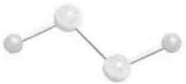</td><td></td></tr><tr><td></td><td></td><td>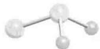</td><td></td></tr><tr><td></td><td>S2Cl2</td><td>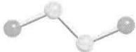</td><td>活泼</td></tr><tr><td>+2</td><td>SCI2</td><td>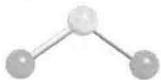</td><td>活泼</td></tr><tr><td></td><td>SF4</td><td></td><td>气体</td></tr><tr><td>+4</td><td>SeX4(X=F,Cl,Br)</td><td>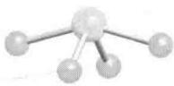</td><td>SeF4为液体</td></tr><tr><td></td><td>TeX4(X=F,Cl,Br,I)</td><td></td><td>TeF4为固体</td></tr><tr><td>+5</td><td>S2F10</td><td>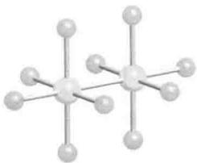</td><td>活泼</td></tr><tr><td></td><td>Se2F10</td><td></td><td></td></tr><tr><td>+6</td><td>SF6,SeF6</td><td>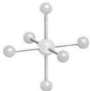</td><td>无色气体液体(沸点368°C)</td></tr><tr><td></td><td>TEF6</td><td></td><td></td></tr></table>

![[无机化学第6版主族364-564_images/ffbb0bbbe47dbc0d4bbaa2e0f34dbd78937f98e83a414ff2211f8d891802932a.jpg]]

chemical

Molecular structure diagram of a tellurium (Te) complex with labeled atomic positions

(1) $Te_{2}I$

![[无机化学第6版主族364-564_images/4889c971d3425bb83980ddc362769e5da26e8946a4ba903c503afcf9d3f66632.jpg]]  
(2) $SO_{2}, C_{2v}$

![[无机化学第6版主族364-564_images/295d1e45f7a00188953eaa90e246229d563618fb08613ed8fc51250f2bf186a2.jpg]]

chemical

Molecular structure of sulfur (S2H4) with bond length 120 pm and bond angle 142 pm labeled

(3) $SO_{3}, D_{3h}$

![[无机化学第6版主族364-564_images/8b30ad3cd3bc72d930566a2d29e5f04283309e361a29a7b5dabcd7541f1e245d.jpg]]

chemical

Molecular structure of sulfur (S2H4) showing atom types and bonds

(4) $(\mathrm{SO}_3)_3, C_{3v}$

硫酸 $\left(\mathrm{H}_{2}\mathrm{SO}_{4}\right)$ 是一种黏稠液体、强酸（基于第一步去质子）、具有广泛用途的非水溶剂，并显示很强的自质子解作用（节4.1）。浓硫酸的吸水作用能使有机物碳化生成碳化了的残渣。硫酸有两种盐：硫酸盐 $\left(\mathrm{SO}_{4}^{2-}\right)$ 和硫酸氢盐 $\left(\mathrm{HSO}_{4}^{-}\right)$ 。亚硫酸 $\left(\mathrm{H}_{2}\mathrm{SO}_{3}\right)$ 从未被离析出来。二氧化硫的水溶液被称作亚硫酸，最好将其看作水合物 $SO_{2}\cdot nH_{2}O$ 。亚硫酸盐也有两种：亚硫酸盐 $\left(\mathrm{SO}_{3}^{2-}\right)$ 和亚硫酸氢盐 $\left(\mathrm{HSO}_{3}^{-}\right)$ 。它们都是中等强度的还原剂，能被氧化为含硫酸根 $\left(\mathrm{SO}_{4}^{2-}\right)$ 和连二硫酸根 $\left(\mathrm{S}_{2}\mathrm{O}_{6}^{2-}\right)$ 的化合物。

# 16.3 环状化合物和簇化合物

提要:第16族元素形成的环状和链状化合物都是阴离子或阳离子。也与p区其他元素形成电中性的杂原子环状和链状化合物。

硫能形成多种多酸 $(\mathrm{H}_2\mathrm{S}_n\mathrm{O}_6)$ ， $n$ 值可高达6。例如，连四硫酸根 $\mathrm{S}_4\mathrm{O}_6^{2-}(5)$ 和连五硫酸根 $\mathrm{S}_5\mathrm{O}_6^{2-}(6)$ 。许多电正性元素的多硫化物已经被表征，它们都含有 $\mathrm{S}_n^{2-}(n = 2 - 6)$ ，如(7)。较小的多硒化物和多碲化物与多硫化物相似；大一点的结构较复杂，一定程度上依赖于阳离子的性质。直至9个原子 $(\mathrm{Se}_9^{2-})$ 的多硒化物为链状，更大的多硒化物则为环状（如 $\mathrm{Se}_{11}^{2-}$ ），给出的例子(8)中两个六元环共用着一个Se原子，围绕这个Se原子以平面四方形方式排列着4个Se原子。多碲化物可能具有双环结构，如 $\mathrm{Te}_7^{2-}(9)$ 。

p区元素形成的许多阳离子链、环和簇化合物已被制备出来，它们中大多含有S、Se和Te。从分子轨道角度可以解释平面四方形 $\mathrm{E}_4^{2+}(\mathrm{E} = \mathrm{S},\mathrm{Se}$ 或Te,10)特有的稳定性。每个E原子有6个价电子（共有 $24 - 2 = 22$ 个）；每个E原子还有两个孤对，这样就有6个电子占据可利用的分子轨道。在这些轨道中，一个是成键轨道，两个是非键轨道，还有一个是反键轨道。电子占据前3个轨道，反键轨道没有被占据。

p区元素形成的电中性杂原子环状化合物和簇化合物中包括四氮化四硫 $\mathrm{S}_4\mathrm{N}_4$ (11)，该化合物分解时发生爆炸。二氮化二硫 $(\mathrm{S}_2\mathrm{N}_2,12)$ 甚至更不稳定，但能发生聚合形成显示超导性的 $(\mathrm{SN})_n$ ，后者在 $240^{\circ}\mathrm{C}$ 以下能稳定存在。

![[无机化学第6版主族364-564_images/21afdae79b8f6a8be78a614540e223dbdac4f2bd2a1e9bff6c581711a48e6297.jpg]]

chemical

Molecular structure diagram of sulfur (S2O) with labeled bond angle 2-

(5) 连四硫酸根离子， $S_{4}O_{6}^{2-}$

![[无机化学第6版主族364-564_images/20808e48d957fe69b549f4f32986c533b1581747193a29d606b677f123ecc2ab.jpg]]

chemical

Molecular structure diagram showing sulfur (S) bonded to oxygen (O) and a chain with labeled bond length 2-

(6) 连五硫酸根离子， $S_{5}O_{6}^{2-}$

![[无机化学第6版主族364-564_images/280ac44dbeb7f75e02cd168cfcb4b5b6b197a10e35332edabf630b5e92664070.jpg]]  
(7) $S_{3}^{2-}, C_{2V}$

![[无机化学第6版主族364-564_images/cb4e2f1639ad10ec773edb3625b2413b9e4ec910ea682f78b2d64a4ba423cd8f.jpg]]

chemical

Molecular structure of selenium (Se) showing atomic arrangement with labeled 2- bonds

(8) $Se_{11}^{2-}$

![[无机化学第6版主族364-564_images/463dff20a15a4407df86eef7863b3806f3b434dc61b33a787f2c7ff65bfc80b3.jpg]]

chemical

Molecular structure diagram of a tellurium (Te) atom showing atomic positions and bonds

(9) $Te_{7}^{2-}$

![[无机化学第6版主族364-564_images/742b2c0f5c9201c7e51a0afa363dd848a334535eef7829fc0070d54810ac6baf.jpg]]

chemical

Selenium atom structure diagram showing four Se atoms arranged in a square with 2+ charge indicated

(10) $Se_{4}^{2+}$

![[无机化学第6版主族364-564_images/d7796a35256a05fce2be3b814b6e6ff32dae7990648c666f7686521143f5c21a.jpg]]

chemical

Molecular structure diagram showing sulfur (S) and nitrogen (N) atoms in a coordination complex

(11) $S_{4}N_{4}$

![[无机化学第6版主族364-564_images/54e2ff7564a0ad41137062760402bed5139c72ab5e64c586286df7255f32894d.jpg]]

chemical

Molecular geometry diagram showing bond angles and distances between sulfur (S) and nitrogen (N) atoms

(12) $S_{2}N_{2}$

# B. 详述

这里具体介绍第 16 族元素的化学行为和结构的多样性。

# 16.4 氧

提要:氧有两种同素异形体:氧气和臭氧。氧分子的基态是三重态,能通过自由基链反应氧化烃类物质。与激发态分子反应能产生长寿命的单重态氧,单重态氧可作为亲电试剂起反应。臭氧不稳定,是个强氧化剂。

氧气是一种生物产气体(即由有机体产生的气体):除高层大气紫外辐射作用于水蒸气而产生的痕量氧外，几乎所有的氧分子都是由光合作用产生的。氧气是一种无色、无味、能溶于水的气体。在25℃和大气压下，每100 cm³水能溶解3.08 cm³氧气。海水中的溶解度降至2.0 cm³以下，但仍能满足海洋生物生存的需要。O₂在有机溶剂中的溶解度约为水中的10倍。如此之高的溶解度使合成对氧敏感的化合物时必须通过鼓泡从所用溶剂中除去氧。

氧不难以 $O_{2}$ 的形式从大气中获得，通过空气液化和蒸馏液态空气的方法可从大气中得到大量氧。氧主要的商业用途是炼钢，过程中 $O_{2}$ 与焦炭（碳）反应（放热）产生一氧化碳。反应必须在高温下完成，从而加快一氧化碳和炭对铁氧化物的还原（节 5.16）。使用纯氧比使用空气更优越，因为不需加热氮而浪费更多能量。制造 1 t 钢 $(1\ t=10^{3}\ kg)$ 需要 1 t 氧。氧也用在工业上制造白色颜料二氧化钛：

$$
\mathrm{TiCl} _ {4} (\mathrm{l}) + \mathrm{O} _ {2} (\mathrm{g}) \longrightarrow \mathrm{TiO} _ {2} (\mathrm{s}) + 2 \mathrm{Cl} _ {2} (\mathrm{g})
$$

小规模制氧(如在家庭为哮喘病人制备)可采用压力摆动吸附法,即空气通过优先吸附氮的沸石从而得到氧。氧被用在许多氧化过程中,如由乙烯制备环氧乙烷。氧同时大量用于污水处理、污染水道的清理、纸浆漂白、医疗和潜水等方面,它也是电解水制备氢的重要副产物(应用相关文段16.2)。

# 应用相关文段 16.2 获得可再生能源用的水氧化催化剂

氧不仅在燃烧反应和燃料电池中必不可少，而且也是电化学裂解水制氢的重要副产物。

利用太阳能产生的电力从水制氢是一个重要方案，能够解决两种主要再生能源面临的问题（太阳光和风力的间歇性），也能解决化石能源面临的运输问题。电解过程中，阴极每产生2分子的 $\mathrm{H}_{2}$ ，阳极就要产生1分子的 $\mathrm{O}_{2}$ 。节10.4中已经提到开发高效制氢催化剂的重要性。直接将水氧化为分子氧（ $E^{\ominus} = 1.23\mathrm{V}$ ）是动力学上更大的挑战，因为这个过程需要从2分子水中移出4个质子和4个电子。这一过程涉及几种不稳定的中间体，因此需要较大的超电位以活化该反应。发展一种能降低超电位的催化剂显得尤为重要。这种催化剂必须要坚固、价格低廉，而且是由丰富存在的元素组成的。目前选择的催化剂是d区金属的多核水合/氧合络合物，这种催化剂能够通过偶合质子的电子转移发生连续氧化。

生物光合作用产生氧的过程发生在 Mn—O 簇合物上，每秒产生超过 100 分子的 $O_{2}$ （见 26.10）。一些有前景的非生物电催化剂基于钴的氧化物。电化学氧化含有硼酸根或磷酸根离子的水合 $Co^{2+}$ ，就会沉积出对释 $O_{2}$ 具有低的超电位的钴的氧化物层。一种可能的机理见图 B16.1，从配位水分子的酸度随着金属氧化数的增加而增加的角度考虑（见节 4.1），这个机理就不难理解。表面的钴离子发生连续的偶合质子的电子转移氧化，导致相邻的一对 $\mathrm{Co(IV)}$ 氧合物种高度缺电子，从而形成 O-O 键，释放出氧分子。

![[无机化学第6版主族364-564_images/f7e2fd45084b69785cebe0d85ed1dd01544a36e420bb1b95de123700088b8770.jpg]]

chemical

电极化学反应示意图，展示电子与电极结合生成电子和电极的过程

图 B16.1 催化制氧的可能机理

液氧为淡蓝色,沸点-183 ℃。产生这种颜色涉及相邻分子对的电子跃迁:可见光区红-黄-绿波段的一个光子能够将两个氧分子激发形成激发态的分子对。高压下,固态氧的颜色从淡蓝色变到橙色,压力升到10 GPa时变为红色。

$\mathrm{O}_2$ 的分子轨道暗示氧分子应该存在双键，然而正如节2.8看到的那样：最外层两个电子占据两个不同的

反键 $\pi$ 轨道并自旋平行，因而氧分子是顺磁性分子（见图16.1）。三重态基态的专业符号为 $^3\Sigma_{\mathrm{g}}^{-}$ （符号 $\Sigma$ 、 $\Pi$ 和 $\Delta$ 用于像分子氧这样的线性分子，以取代用于原子的符号S、P、D。这些希腊字母表示围绕核轴的总轨道角动量的大小），今后当指定分子的自旋态时将表示为 $\mathrm{O}_2(^3\Sigma_g^-)$ 。占据同样两个 $\pi^{*}$ 轨道但电子自旋方向相反的单线态 $(^{1}\Sigma_{\mathrm{g}}^{+})$ 的能量高出 $1.63\mathrm{eV}(158\mathrm{kJ}\cdot \mathrm{mol}^{-1})$ ；另一个单线态 ${}^{1}\Delta_{\mathrm{g}}$ （单线态 $\Delta$ )的两个电子在一个 $\pi^{*}$ 轨道上成对，该轨道的能量处于两项之间高于基态 $0.98\mathrm{eV}(94\mathrm{kJ}\cdot \mathrm{mol}^{-1})$ 的位置上。两个单线态中后者的激发态寿命长的多， $\mathrm{O}_2(^1\Delta_{\mathrm{g}})$ 的寿命长得足以让它参与化学反应。如果反应需要，光激发分子能够通过能量转移产生 $\mathrm{O}_2(^1\Delta_{\mathrm{g}})$ 。例如， $[\mathrm{Ru(bpy)}_3]^{2+}$ 吸收蓝光(452nm)到达激发态，该激发态表示为 ${}^{*}[\mathrm{Ru(bpy)}_3]^{2+}$ （见节20.7），然后将能量转移给 $\mathrm{O}_2(^3\Sigma_g^-)$ ：

![[无机化学第6版主族364-564_images/2b9b1949214e564faadccbd94af76c110c6edb4f1abd6d3b863635b43173eeda.jpg]]

text_image

能量
2σu
1πg
2p
1πu
2σg
1σu
2s
1σg
2s

图16.1 $\mathrm{O}_2$ 的分子轨道图

$$
^ {*} \left[ \mathrm{Ru} (\mathrm{bpy}) _ {3} \right] ^ {2 +} + \mathrm{O} _ {2} (^ {3} \sum_ {\mathrm{g}} ^ {-}) \longrightarrow \left[ \mathrm{Ru} (\mathrm{bpy}) _ {3} \right] ^ {2 +} + \mathrm{O} _ {2} (^ {1} \Delta_ {\mathrm{g}})
$$

另一个产生 $\mathrm{O}_2(^1\Delta_g)$ 的有效方法是臭氧化物的热分解：

$$
\begin{array}{c} \mathrm{RO} \\ \mathrm{RO} _ {1 1} ^ {\prime} \mathrm{P} + \mathrm{O} _ {3} \\ \mathrm{RO} ^ {\prime} \end{array} \xrightarrow {- 7 8 ^ {\circ} \mathrm{C}} \begin{array}{c} \mathrm{O} - \mathrm{O} \\ \mathrm{RO} _ {1 1} ^ {\prime} \mathrm{P} - \mathrm{O} \\ \mathrm{RO} ^ {\prime} \mathrm{OR} \end{array} \longrightarrow \begin{array}{c} \mathrm{RO} \\ \mathrm{RO} _ {1 1} ^ {\prime} \mathrm{P} = \mathrm{O} + \mathrm{O} _ {2} (^ {1} \Delta_ {\mathrm{g}}) \\ \mathrm{RO} ^ {\prime} \end{array}
$$

与许多 $O_{2}(^{3}\Sigma_{g}^{-})$ 反应的自由基特征不同， $O_{2}(^{1}\Delta_{g})$ 是作为亲电试剂参与反应的。反应能按这一模式进行，是因为 $O_{2}(^{1}\Delta_{g})$ 有个空的 $\pi^{*}$ 轨道，而不是两个轨道都被单电子占据。例如， $O_{2}(^{1}\Delta_{g})$ 能加合于二烯烃：

$$
\begin{array}{r l} & \text {   +   O } _ {2} (^ {1} \Delta_ {\mathrm{g}}) \\ & \longrightarrow \quad \text {   } \end{array}
$$

该反应类似于丁二烯与亲电烯烃的 Diels-Alder 反应。单线态氧被认为是光化学烟雾的危险产物之一。它可能造成细胞程序性死亡，还能用来进行光动力学治疗。

氧的另一个同素异形体是臭氧 $\left(\mathrm{O}_{3}\right)$ ，沸点为-112℃，是具有爆炸性、高活性和吸能的蓝色气体 $\left(\Delta_{\mathrm{f}}G^{\ominus}=+163\mathrm{kJ}\cdot\mathrm{mol}^{-1}\right)$ 。臭氧能分解为氧气：

$$
2 \mathrm{O} _ {3} (\mathrm{g}) \longrightarrow 3 \mathrm{O} _ {2} (\mathrm{g})
$$

但在无催化剂或无紫外线照射的条件下进行得很慢。

臭氧有刺鼻的臭味并因此而得名。其名称来源于希腊语“ozein”，意为“闻去吧”。臭氧为角形结构，与VSEPR模型(13)相一致，键角 $117^{\circ}$ ，反磁性物质。气态臭氧为蓝色，液态为蓝黑色，固态则为紫黑色。臭氧是由 $O_{2}$ 在放电条件下或紫外线照射下产生的，后一种方法用于产生低浓度臭氧以保存食物。臭氧能够大量吸收太阳光中波长为220\~290 nm的紫外线，使地球上的生物免受来自太阳的紫外线伤害（应用相关文段17.2）。臭氧能与不饱和聚合物发生反应产生人们不希望看到的交联和降解反应。

![[无机化学第6版主族364-564_images/00d53c2dc0d78bcfbc0a21959cc271938cb8815d47c26b6fd9b6fa88a2fef8e7.jpg]]

chemical

Chemical equilibrium diagram showing oxygen-oxygen bond formation with C2V group

臭氧的典型反应涉及氧化和O原子转移。臭氧在酸性溶液中很不稳定，碱性条件下则要稳定得多：

$$
\mathrm{O} _ {3} (\mathrm{g}) + 2 \mathrm{H} ^ {+} (\mathrm{aq}) + 2 \mathrm{e} ^ {-} \longrightarrow \mathrm{O} _ {2} (\mathrm{g}) + \mathrm{H} _ {2} \mathrm{O} (1) \quad E ^ {\ominus} = + 2. 0 8 \mathrm{V}
$$

$$
\mathrm{O} _ {3} (\mathrm{g}) + 2 \mathrm{H} _ {2} \mathrm{O} (\mathrm{l}) + 2 \mathrm{e} ^ {-} \longrightarrow \mathrm{O} _ {2} (\mathrm{g}) + 2 \mathrm{OH} ^ {-} (\mathrm{aq}) \quad E ^ {\ominus} = + 1. 2 5 \mathrm{V}
$$

臭氧的氧化能力仅次于 $F_{2}$ 、原子氧、羟基自由基和高氙酸根（节 18.7）。臭氧与第 1 族、第 2 族元素形成臭氧化物（节 11.8 和节 12.8）。它们是在低于 -10 ℃ 的温度下将气体臭氧通过氢氧化物 $[MOH, M(OH)_{2}]$ 粉末上方制备的。臭氧化物为红棕色固体，温热即分解：

$$
\mathrm{MO} _ {3} (\mathrm{s}) \longrightarrow \mathrm{MO} _ {2} (\mathrm{s}) + \frac {1}{2} \mathrm{O} _ {2} (\mathrm{g})
$$

臭氧化物离子 $O_{3}^{-}$ 和臭氧一样具有角形结构，但键角略大(119.5°)。

# 16.5 氧的反应活性

提要:氧的反应往往是热力学上有利的反应,但反应速率较慢。

氧是一种强氧化剂,但大多数反应进行得很慢(与节5.18介绍的超电位有关)。例如, $Fe^{2+}$ 的溶液只能缓慢地被空气所氧化,虽然此反应是热力学上有利的反应(节5.15)。很显然(对生命而言也很幸运)的是,有机物质在空气中不发生燃烧(除非有强热源引发),虽然这类反应比 $Fe^{2+}$ 的氧化更有利。

多种因素造成涉氧反应具有较大的活化能。第一个因素是 $O_{2}$ 具有高键能 $(494\ \text{kJ} \cdot \text{mol}^{-1})$ ，这使得依靠均裂解离的反应活化能很大。维持在高温下按自由基链机理而进行的强放热燃烧反应能够提供上述能量。相反，温和条件下就得依靠 $O_{2}$ 与反应中其他物质形成化学键的能力。两个 $\pi^{*}$ 轨道都被单占了的三线态基态 $O_{2}$ 既不是有力的 Lewis 酸也不是有力的 Lewis 碱，因此几乎没有与 p 区 Lewis 碱或 Lewis 酸按照能引发热力学上有利的 2 电子或 4 电子转移反应步骤发生反应的趋势。因此， $O_{2}$ 的这类反应往往叫作“自旋禁阻”反应。与 d 区金属离子（它们含有 1 个或多个未成对电子）的反应不以这种方式禁阻，虽然最简单的这种过程（一个电子转移至 $O_{2}$ 生成超氧化物）是热力学上不利的过程，需要合适还原剂的参与以达到明显的反应速率：

$$
\mathrm{O} _ {2} (\mathrm{g}) + \mathrm{H} ^ {+} (\mathrm{aq}) + \mathrm{e} ^ {-} \longrightarrow \mathrm{HO} _ {2} (\mathrm{g}) \quad E ^ {\ominus} = - 0. 1 3 \mathrm{V} (\mathrm{pH} = 0)
$$

$$
\mathrm{O} _ {2} (\mathrm{g}) + \mathrm{e} ^ {-} \longrightarrow \mathrm{O} _ {2} ^ {-} (\mathrm{aq}) \quad E ^ {\ominus} = - 0. 3 3 \mathrm{V} (\mathrm{pH} = 1 4)
$$

d 区金属对 $O_{2}$ 的还原涉及重要的催化反应, 如将乙烯氧化的 Wacker 法(见 25.6) 和燃料电池中氧在阴极转化为水的反应(应用相关文段 5.1)。在金属酶中(见 26.6), $O_{2}$ 通过与金属(如 Fe、Cu) 配位得到活化, 这种活化使 $O_{2}$ 能发生快速的 4 电子还原变成水, 或者将一个 O 原子或两个 O 原子插入到有机物中。

$O_{2}$ 是电化学法从水制氢过程中不可避免的副产物。人们对如何促进 $O_{2}$ 的快速生成显得很有兴趣，因为它在动力学上显示的惰性，对燃料电池中可再生 $H_{2}$ 的产生及超电位的降低都是主要障碍。科学家们正在研究释 $O_{2}$ 催化剂，近期进行的许多研究都是模拟光合作用（应用相关文段 16.2）中释氧的 Mn 氧化物簇。

# 16.6 硫

提要:硫以元素的形式从地下沉积物中提取。硫有多种同素异形体和多种多晶形式(包括介稳的聚合物),但最稳定的形式则是环状 $S_{8}$ 分子。

元素硫用 Frascb 法从地下沉积物中提取: 用过热水、水蒸气和压缩空气强使地下沉积物上升到地面。提取的硫处于融化状态, 然后将其导入大盆中冷却。该过程非常耗能, 之所以有商业价值是因为采用了廉价的水和能量。从天然气和原油中提取硫的 Claus 法已经超越了 Frascb 法。在 Claus 法中, $H_{2}S$ 首先在 1000\~1400 ℃ 被空气氧化。该步产生的部分 $SO_{2}$ 接着与剩下的 $H_{2}S$ 于 200\~350 ℃ 流过催化剂上方发生反应:

$$
2 \mathrm{H} _ {2} \mathrm{S(g)} + \mathrm{SO} _ {2} (\mathrm{g}) \longrightarrow 3 \mathrm{S(1)} + 2 \mathrm{H} _ {2} \mathrm{O(1)}
$$

与 O 不同, S(及本族中所有较重元素)倾向于与它本身形成单键而不是双键。这种成链(形成扩展的链或环)趋势的产生是因为 p—pσ 成键作用相对较强(从 O 到 S 增强)而 p—pπ 成键作用则减弱(节 9.7)。其结果是 S 聚集成大的分子或扩展的结构, 从而在室温下以固体形式存在。

常见的黄色正交多晶 $(\alpha-S_{8})$ 形成类似皇冠状的八元环(14)，所有其他晶形最终都转化为这种形式。正交 $\alpha$ 硫是热和电的绝缘体。这种 $S_{8}$ 环加热至93℃时发生变化形成单斜 $\beta-S_{8}$ 。加热至150℃以上的熔态硫经缓慢冷却得到单斜 $\gamma$ 硫，这种晶形同样具有 $S_{8}$ 环结构（与 $\alpha$ 和 $\beta$ 硫相同），但环的堆积更有效，因而密度较高。

可以合成和结晶出含6\~20个硫原子的硫环(见表16.4)。情况有点复杂的是,一些同素异形体存在多种晶形(S形成的各种分子实体叫S的同素异形体;这些实体存在的各种晶形叫多晶形物)。例如,已知 $S_{7}$ 有四种晶形,已知 $S_{18}$ 有两种晶形。正交硫在113℃熔化,高于160℃时黄色液体会变暗,并且由于硫环被破坏而聚合,液体变得更黏稠。快速冷却从熔体得到的螺旋状 $S_{n}$ 聚合物(15)得到介稳的、类似橡胶的物质,该物质在室温下缓慢转化为 $\alpha-S_{8}$ 。气相中观察到 $S_{2}$ 和 $S_{3}$ 的存在, $S_{3}$ 为樱桃红色,具有像臭氧那样的角形结构。更稳定的气相结构是紫色的 $S_{2}$ 分子,像 $O_{2}$ 一样具有 $\sigma$ 成键作用和 $\pi$ 成键作用生成三重基态,键解离能为421kJ·mol $^{-1}$ 。

![[无机化学第6版主族364-564_images/2714392b73c535d3e741d6aad1a11e170b51802c88ed7569db189fd5a637e159.jpg]]

chemical

Molecular structure diagram showing a sulfur atom bonded to carbon and hydrogen atoms in a chain

(14) $S_{8}$

![[无机化学第6版主族364-564_images/250d44870db2d1921d5421a973251e7e1f1151c38654ddaf63ff2edf32a4cbd1.jpg]]

chemical

Molecular structure diagram showing sulfur atom bonded to carbon atoms and a chain of white spheres

(15) $S_{n}$

硫在室温及加热条件下能与许多元素直接反应。在 $F_{2}$ 中点燃生成 $SF_{6}$ ，与 $Cl_{2}$ 快速反应生成 $S_{2}Cl_{2}$ ，溶解在 $Br_{2}$ 中得到容易发生解离的 $S_{2}Br_{2}$ 。硫与液体 $I_{2}$ 不发生反应，液体 $I_{2}$ 因而可用作硫的低温溶剂。原子硫(S)极其活泼，像 O 那样，三线态和单线态可能具有不同的反应活性。

工业上生产的大部分硫被用来制造硫酸 $\left(\mathrm{H}_{2}\mathrm{SO}_{4}\right)$ ，硫酸是最重要的化学制品之一。硫酸有很多用途，如生产化肥、稀的水溶液用作铅酸电池中的电解质。硫是火药（硝酸钾、炭、硫的混合物）的成分之一，还用于天然橡胶的硫化。

表 16.4 某些硫的同素异形体和多晶形物的性质

<table><tr><td>性质</td><td>熔点/°C</td><td>外观</td><td>性质</td><td>熔点/°C</td><td>外观</td></tr><tr><td> $S_{3}$ </td><td>气体</td><td>桃红色</td><td> $S_{10}$ </td><td>0(d)*</td><td>黄绿色</td></tr><tr><td> $S_{6}$ </td><td>50(d)*</td><td>橙红色</td><td> $S_{12}$ </td><td>148</td><td>浅黄色</td></tr><tr><td> $S_{7}$ </td><td>39(d)*</td><td>黄色</td><td> $S_{18}$ </td><td>128</td><td>柠檬黄</td></tr><tr><td> $\alpha-S_{8}$ </td><td>113</td><td>黄色</td><td> $S_{20}$ </td><td>124</td><td>浅黄色</td></tr><tr><td> $\beta-S_{8}$ </td><td>119</td><td>黄色</td><td> $S_{\infty}$ </td><td>104</td><td>黄色</td></tr><tr><td> $\gamma-S_{8}$ </td><td>107</td><td>浅黄色</td><td></td><td></td><td></td></tr></table>

\*d 表示发生分解。

# 16.7 硒、碲和钋

提要:Se、Te 结晶为螺旋链状,Po 结晶为简单立方晶形。

Se 可从制备硫酸的残渣沉积物中提取。Se 和 Te 可从硫化铜矿中提取，它们在矿石中以铜的硒化物和碲化物存在。提取方式依赖于矿石中存在的其他化合物或元素。第一步通常涉及碳酸钠存在下发生的氧化过程：

$$
\mathrm{Cu} _ {2} \mathrm{Se(s)} + \mathrm{Na} _ {2} \mathrm{CO} _ {3} (\mathrm{aq}) + 2 \mathrm{O} _ {2} (\mathrm{g}) \longrightarrow 2 \mathrm{CuO(s)} + \mathrm{Na} _ {2} \mathrm{SeO} _ {3} (\mathrm{aq}) + \mathrm{CO} _ {2} (\mathrm{g})
$$

含有 $Na_{2}SeO_{3}$ 和 $Na_{2}TeO_{3}$ 的溶液经硫酸酸化后 Te 以氧化物的形式沉淀出来, 溶液中留下硒酸 ( $H_{2}SeO_{3}$ )。接下来用 $SO_{2}$ 处理得到硒:

$$
\mathrm{H} _ {2} \mathrm{SeO} _ {3} (\mathrm{aq}) + 2 \mathrm{SO} _ {2} (\mathrm{g}) + \mathrm{H} _ {2} \mathrm{O} (1) \longrightarrow \mathrm{Se} (1) + 2 \mathrm{H} _ {2} \mathrm{SO} _ {4} (\mathrm{aq})
$$

碲可通过将 $TeO_{2}$ 溶解于氢氧化钠水溶液然后经电解还原得到：

$$
\mathrm{TeO} _ {2} (\mathrm{s}) + 2 \mathrm{NaOH(aq)} \longrightarrow \mathrm{Na} _ {2} \mathrm{TeO} _ {3} (\mathrm{aq}) + \mathrm{H} _ {2} \mathrm{O(l)} \longrightarrow \mathrm{Te(s)} + 2 \mathrm{NaOH(aq)} + \mathrm{O} _ {2} (\mathrm{g})
$$

与硫一样,硒的三种多晶形物都含有 $Se_{8}$ 环,唯一不同的是环堆积的方式得到的是红色的 $\alpha$ 、 $\beta$ 、 $\gamma$ 结构。室温下最稳定的形式是金属灰的硒,它是由螺旋链组成的晶体材料。常见的商业用硒是无定形黑硒,它具有高达 1000 个硒原子环组成的非常复杂的结构。另一种无定形硒(由硒蒸气沉积得到)用作静电印刷的感光器上。硒是一种人体必需元素,同多种必需元素一样,在每日最小服量和毒性之间的安全浓度范围很小。硒中毒的早期症状是呼出的气体具有大蒜味,这种气味是由甲基化的硒造成的。

硒既具光电特性(光直接转化为电)也具光导特性。灰硒的光导性是由入射光激发电子跨越其窄带隙的能力产生的(晶态时带隙宽度为2.6 eV,非晶态时为1.8 eV)。这些性质使得硒在光电池的生产、摄影曝光计、太阳能电池等方面显得有用。硒也是p型半导体(节3.20),用于电子学和固态物理方面。也被用作复印机硒鼓及玻璃工业中制作红色玻璃和瓷釉。

像灰硒结构一样,碲也以链状结构结晶出来。钋以简单立方结构结晶,36 ℃以上结晶为密切相关的高温形式。节 3.5 中曾经指出,简单立方结构是一种低效率堆积,而钋是在通常情况下唯一一种采用这一结构的元素。碲和钋毒性都很大,钋的毒性因其放射性而增大。钋的毒性是氢氰酸的 $2.5 \times 10^{11}$ 倍,它的 33 种同位素都有放射性。钋是烟草中的一种污染物,铀矿中也发现有钋。用中子照射 ${}^{209}\mathrm{Bi}$ (原子序数 83) 能产生少量(克量级)的 ${}^{210}\mathrm{Po}$ (原子序数 84):

$$
{ } _ { 8 3 } ^ { 2 0 9 } \mathrm{Bi} + { } _ { 0 } ^ { 1 } \mathrm{n} \longrightarrow { } _ { 8 4 } ^ { 2 1 0 } \mathrm{Po} + \mathrm{e} ^ { - }
$$

金属钋可用分馏的方法从剩余的 Bi 中分离出来,或者电沉积在金属表面上。

虽然不如 O 和 S 那么容易, Se、Te 和 Po 还是能与大多数元素直接反应。由于与硫相比更倾向于形成链或环并有多种同素异形体, 因而它们形成多重键的趋势低于 O 和 S。Se 很难被氧化为 Se(VI) (见图 16.2), 这是交替效应 [节 9.2(a)] 的一个例子。交替效应是第四周期元素化学性质的突出特征。

![[无机化学第6版主族364-564_images/538f8a90b92fe12b9efa634a2aca43b2d37307928ee543a172de764a360c21cf.jpg]]

line

| 氧化数, Nₒₓ | νEₑ/V (Te) | νEₑ/V (Se) | νEₑ/V (S) |
| ----------- | ---------- | ---------- | --------- |
| -2          | 1.5        | 1.5        | -2.5      |
| -1          | 0.5        | 0.5        | -1.0      |
| 0           | 0.0        | 0.0        | 0.0       |
| 2           | 0.8        | 0.8        | 0.8       |
| 3           | 2.0        | 2.0        | 2.0       |
| 4           | 2.5        | 2.5        | 2.0       |
| 6           | 4.0        | 4.0        | 2.0       |

图 16.2 第 16 族元素在酸性溶液中的 Frost 图  
氧化数-2的物种是 $\mathrm{H}_2\mathrm{E}$ ，氧化数为-1的化合物是 $\mathrm{H}_2\mathrm{O}_2$ ；正氧化数指的是氧合酸或氧合阴离子

# 16.8 氢化物

在第 16 族元素氢化物中氢键的影响看得非常清楚。氧的氢化物是水和过氧化氢，它们都是液体。该族较重元素的氢化物都有毒且有恶臭气味，暴露在高浓度下（或长时间暴露在低浓度下）会损伤嗅觉神经，因此不能采用闻气味的方法确定这些氢化物的存在。

(a) 水

提要:水中的氢键使其成为高沸点液体,导致其固体(冰)呈高度结构化排列。

迄今至少已确认了冰的9种不同结构。在0℃和大气压下冰为六角形 $\left(\mathrm{I}_{\mathrm{h}}\right)$ ，见图10.7），但在-120℃到-140℃之间得到立方形 $\left(\mathrm{I}_{\mathrm{c}}\right)$ 。更高压力下形成数种密度较高的多晶形物，其中一些基于类二氧化硅的结构。

水由两种元素直接反应得到：

$$
\mathrm{H} _ {2} (\mathrm{g}) + \frac {1}{2} \mathrm{O} _ {2} (\mathrm{g}) \longrightarrow \mathrm{H} _ {2} \mathrm{O} (\mathrm{l}) \quad \Delta_ {\mathrm{f}} H ^ {\ominus} (\mathrm{H} _ {2} \mathrm{O}, \mathrm{l}) = 2 8 6 \mathrm{kJ} \cdot \mathrm{mol} ^ {- 1}
$$

该反应大量放热,从而构成氢经济学和氢燃料电池发展的基础(见图 B5.1,应用相关文段 10.2 和节 24.14)。

水是最常用的溶剂,这不仅是因为它随处可得,还因为它具有较高的相对介电常数、较宽的液态范围及较高的溶剂化能力(这种能力是由水的极性和水形成氢键的能力联合造成)的缘故。许多无水和水合化合物溶于水以水合阳离子和水合阴离子的形式存在。许多主要显示共价性的化合物(如乙醇和乙酸)由于与水形成氢键而能溶于水或与水互溶。许多其他共价化合物与水发生水解反应,一些例子将在相应的章节中做讨论。除了简单的溶解和水解反应外,水溶液化学的重要性在氧化还原反应(第5章)及酸碱反应(第4章)中已经提及。水也在金属络合物中充当Lewis碱配体(节7.1)。去质子的形式(OH $^{-}$ ,特别是氧化物离子O $^{2-}$ )能够用作稳定高氧态的重要配体,这样的例子可在前d区元素的氧合阳离子中看到(如VO $^{2+}$ )。

(b) 过氧化氢

提要:升高温度或催化剂存在条件下过氧化氢易于歧化分解。

过氧化氢为淡蓝色的黏稠液体,其沸点(150 ℃)高于水,密度(1.445 g·cm $^{-3}$ ,25 ℃)大于水,能与水互溶,通常在水溶液中进行操作。氧的 Frost 图表明 $H_{2}O_{2}$ 是个好的氧化剂,但不稳定,会歧化分解:

$$
\mathrm{H} _ {2} \mathrm{O} _ {2} (1) \longrightarrow \mathrm{H} _ {2} \mathrm{O} (1) + \frac {1}{2} \mathrm{O} _ {2} (\mathrm{g}) \quad \Delta_ {\mathrm{f}} G ^ {\ominus} = - 1 1 9 \mathrm{kJ} \cdot \mathrm{mol} ^ {- 1}
$$

该反应进行得很慢,但用金属表面或玻璃溶出的碱催化时可发生爆炸。因此,过氧化氢及其溶液用塑料瓶保存,并要加入稳定剂。该反应可通过还原半反应进行讨论:

$$
\frac {1}{2} \mathrm{H} _ {2} \mathrm{O} _ {2} (\mathrm{aq}) + \mathrm{H} ^ {+} (\mathrm{aq}) + \mathrm{e} ^ {-} \longrightarrow \mathrm{H} _ {2} \mathrm{O} (1) \quad E ^ {\ominus} = + 1. 6 8 \mathrm{V}
$$

$$
\mathrm{H} ^ {+} (\mathrm{aq}) + \frac {1}{2} \mathrm{O} _ {2} (\mathrm{g}) + \mathrm{e} ^ {-} \longrightarrow \frac {1}{2} \mathrm{H} _ {2} \mathrm{O} _ {2} (\mathrm{aq}) \quad E ^ {\ominus} = + 0. 7 0 \mathrm{V}
$$

单电子氧化或还原的标准电位处于0.7\~1.68 eV，有合适结合位点的任何物质都能催化该反应。从上述标准电位推断，酸性溶液中的过氧化氢是个强氧化剂：

$$
2 \mathrm{Ce} ^ {3 +} (\mathrm{aq}) + \mathrm{H} _ {2} \mathrm{O} _ {2} (\mathrm{aq}) + 2 \mathrm{H} ^ {+} (\mathrm{aq}) \longrightarrow 2 \mathrm{Ce} ^ {4 +} (\mathrm{aq}) + 2 \mathrm{H} _ {2} \mathrm{O} (1)
$$

然而在碱性溶液中,过氧化氢却能充当还原剂:

$$
2 \mathrm{Ce} ^ {4 +} (\mathrm{aq}) + \mathrm{H} _ {2} \mathrm{O} _ {2} (\mathrm{aq}) + 2 \mathrm{OH} ^ {-} (\mathrm{aq}) \longrightarrow 2 \mathrm{Ce} ^ {3 +} (\mathrm{aq}) + 2 \mathrm{H} _ {2} \mathrm{O} (1) + \mathrm{O} _ {2} (\mathrm{g})
$$

过氧化氢具有氧化性的根本原因是 O—O 单键较弱（键能 $146 \, kJ \cdot mol^{-1}$ ）。过氧化氢与 d 区元素（如 $Fe^{2+}$ ）反应生成羟基自由基，该反应叫 Fenton 反应：

$$
\mathrm{Fe} ^ {2 +} (\mathrm{aq}) + \mathrm{H} _ {2} \mathrm{O} _ {2} (\mathrm{aq}) \longrightarrow \mathrm{Fe} ^ {3 +} (\mathrm{aq}) + \mathrm{OH} ^ {-} (\mathrm{aq}) + \mathrm{OH} \cdot (\mathrm{aq})
$$

产物 $Fe^{3+}$ 能与另一个过氧化氢分子继续反应重新产生 $Fe^{2+}$ ，所以产生羟基自由基的过程是催化过程。羟基自由基是已知最强的氧化剂之一 $(E=+2.85\ \text{eV})$ ，相关反应被用于氧化有机物。在活体细胞中可与 DNA 反应造成致命后果。

例题 16.1 确定离子物种能否催化 $H_{2}O_{2}$ 的歧化

题目:从热力学角度考虑, $Pd^{2+}$ 是否能催化 $H_{2}O_{2}$ 分解?

答案: $Pd^{2+}$ 要催化 $H_{2}O_{2}$ 分解就需要发生下述反应:

$$
\mathrm{Pd} ^ {2 +} (\mathrm{aq}) + \mathrm{H} _ {2} \mathrm{O} _ {2} (\mathrm{aq}) \longrightarrow \mathrm{Pd} (\mathrm{aq}) + \mathrm{O} _ {2} (\mathrm{g}) + 2 \mathrm{H} ^ {+} (\mathrm{aq})
$$

然后在下述反应中重新生成 $Pd^{2+}$ :

$$
\mathrm{Pd(aq)} + \mathrm {H_ {2} O_ {2} (aq)} + 2 \mathrm {H^ {+} (aq)} \longrightarrow \mathrm {Pd^ {2 + } (aq)} + 2 \mathrm {H_ {2} O(l)}
$$

净反应只是 $\mathrm{H}_2\mathrm{O}_2$ 的分解：

$$
2 \mathrm{H} _ {2} \mathrm{O} _ {2} (\mathrm{aq}) \longrightarrow \mathrm{O} _ {2} (\mathrm{g}) + 2 \mathrm{H} _ {2} \mathrm{O} (\mathrm{l})
$$

第一个反应是下述两个半反应之差：

$$
\mathrm{Pd} ^ {2 +} (\mathrm{aq}) + 2 \mathrm{e} ^ {-} \longrightarrow \mathrm{Pd} (\mathrm{aq}) \quad E ^ {\ominus} = + 0. 9 2 \mathrm{V}
$$

$$
\mathrm{O} _ {2} (\mathrm{g}) + 2 \mathrm{H} ^ {+} (\mathrm{aq}) + 2 \mathrm{e} ^ {-} \longrightarrow \mathrm{H} _ {2} \mathrm{O} _ {2} (\mathrm{aq}) \quad E ^ {\ominus} = + 0. 7 0 \mathrm{V}
$$

因而 $E_{cell}=+0.22\ eV$ ，表明反应为自发反应(K>1)。第二个反应是下述两个半反应之差：

$$
\mathrm{H} _ {2} \mathrm{O} _ {2} (\mathrm{aq}) + 2 \mathrm{H} ^ {+} (\mathrm{aq}) + 2 \mathrm{e} ^ {-} \longrightarrow 2 \mathrm{H} _ {2} \mathrm{O} (1) \quad E ^ {\ominus} = + 1. 7 6 \mathrm{V}
$$

$$
\mathrm{Pd} ^ {2 +} (\mathrm{aq}) + 2 \mathrm{e} ^ {-} \longrightarrow \mathrm{Pd} (\mathrm{aq}) \quad E ^ {\ominus} = + 0. 9 2 \mathrm{V}
$$

因而 $E_{cell}=0.84\ eV$ ，表明反应也是自发反应 $(K>1)$ 。因为两个反应都是自发反应，因此催化分解反应在热力学上是有利的。

自测题 16.1 使用资源节 3 的数据, 确定 $H_{2}O_{2}$ 在 $Cl^{-}$ 或 $Br^{-}$ 存在下是否会自发分解。

过氧化氢的酸性稍强于水：

$$
\mathrm{H} _ {2} \mathrm{O} _ {2} (\mathrm{aq}) + \mathrm{H} _ {2} \mathrm{O} (\mathrm{l}) \rightleftharpoons \mathrm{H} _ {3} \mathrm{O} ^ {+} (\mathrm{aq}) + \mathrm{HO} _ {2} ^ {-} (\mathrm{aq}) \quad \mathrm{pK} _ {\mathrm{a}} = 1 1. 6 5
$$

在其他碱性溶剂(如液氨)中,过氧化氢也能发生去质子化,产生的 $NH_{4}OOH$ 已被离析出来。人们发现 $NH_{4}OOH$ 是由 $NH_{4}^{+}$ 和 $HO_{2}^{-}$ 组成的。固体 $NH_{4}OOH$ 在 25 ℃熔化时,熔体中有氢键键合的 $NH_{3}$ 和 $H_{2}O_{2}$ 分子。

由于过氧化氢的氧化能力强而且副产物无毒害,从而导致多种用途。例如,用于污水的氧化处理、温和的防腐剂、漂白织物和纸张,以及护发行业等(应用相关文段16.3)。

# (c) 硫、硒和碲的氢化物

提要:形成氢键的程度比水小得多;这些氢化物都是气体。

硫化氢 $\left(\mathrm{H}_{2}\mathrm{S}\right)$ 有毒。由于具有麻痹嗅觉神经的趋势(使人们无法正确通过气味强度判断其浓度)，造成的毒害从而更危险。硫化氢是由火山活动产生的，某些微生物也会产生硫化氢(应用相关文段16.4)。它是天然气的杂质，使用天然气前必须将其除去。

纯硫化氢通过元素之间在 $600^{\circ}$ C 以上直接化合的方法制备：

$$
\mathrm{H} _ {2} (\mathrm{g}) + \mathrm{S} (1) \longrightarrow \mathrm{H} _ {2} \mathrm{S} (\mathrm{g})
$$

实验室不难通过 FeS 与稀盐酸(或磷酸)的反应制备:

$$
\mathrm{FeS(s)} + 2 \mathrm{HCl(aq)} \longrightarrow \mathrm {H_ {2} S(g)} + \mathrm {FeCl_ {2} (aq)}
$$

也能通过 $Al_{2}S_{3}$ 的水解反应制备, 点燃 Al 和 S 的混合物不难制得 $Al_{2}S_{3}$ :

$$
2 \mathrm{Al(s)} + 3 \mathrm{S(s)} \longrightarrow \mathrm {Al_ {2} S_ {3} (s)}
$$

$$
\mathrm{Al} _ {2} \mathrm{S} _ {3} (\mathrm{s}) + 3 \mathrm{H} _ {2} \mathrm{O} (\mathrm{l}) \longrightarrow \mathrm{Al} _ {2} \mathrm{O} _ {3} (\mathrm{s}) + 3 \mathrm{H} _ {2} \mathrm{S} (\mathrm{g})
$$

$H_{2}S$ 可溶于水, 是个弱酸:

$$
\mathrm{H} _ {2} \mathrm{S} (\mathrm{aq}) + \mathrm{H} _ {2} \mathrm{O} (1) \rightleftharpoons \mathrm{H} _ {3} \mathrm{O} ^ {+} (\mathrm{aq}) + \mathrm{HS} ^ {-} (\mathrm{aq}) \quad \mathrm{pK} _ {\mathrm{a} 1} = 6. 8 9
$$

$$
\mathrm{HS} ^ {-} (\mathrm{aq}) + \mathrm{H} _ {2} \mathrm{O} (1) \rightleftharpoons \mathrm{H} _ {3} \mathrm{O} ^ {+} (\mathrm{aq}) + \mathrm{S} ^ {2 -} (\mathrm{aq}) \quad \mathrm{pK} _ {\mathrm{a} 2} = 1 9. 0 0
$$

$H_{2}S$ 的酸性溶液是个温和的还原剂,静置时得到元素 S。

同样， $H_{2}Se$ 也能通过元素直接化合、FeSe 与稀盐酸反应、 $Al_{2}Se_{3}$ 的水解等方法制备：

$$
\mathrm{H} _ {2} (\mathrm{g}) + \mathrm{Se(s)} \longrightarrow \mathrm{H} _ {2} \mathrm{Se(g)}
$$

$$
\mathrm{FeSe(s)} + 2 \mathrm{HCl(aq)} \longrightarrow \mathrm {H_ {2} Se(g)} + \mathrm {FeCl_ {2} (aq)}
$$

$$
\mathrm{Al} _ {2} \mathrm{Se} _ {3} (\mathrm{s}) + 3 \mathrm{H} _ {2} \mathrm{O} (\mathrm{l}) \longrightarrow \mathrm{Al} _ {2} \mathrm{O} _ {3} (\mathrm{s}) + 3 \mathrm{H} _ {2} \mathrm{Se} (\mathrm{g})
$$

$H_{2}Te$ 可由 $Al_{2}Te_{3}$ 水解的方法制备，也可由盐酸作用于镁、锌和铝的碲化物得到：

$$
\mathrm{Al} _ {2} \mathrm{Te} _ {3} (\mathrm{s}) + 6 \mathrm{H} _ {2} \mathrm{O} (1) \longrightarrow 3 \mathrm{H} _ {2} \mathrm{Te} (\mathrm{g}) + 2 \mathrm{Al} (\mathrm{OH}) _ {3} (\mathrm{aq})
$$

$$
\mathrm{MgTe(s)} + 2 \mathrm{HCl(aq)} \longrightarrow \mathrm{H} _ {2} \mathrm{Te(g)} + \mathrm{MgCl} _ {2} (\mathrm{aq})
$$

$H_{2}Se$ 、 $H_{2}Te$ 在水中的溶解度与 $H_{2}S$ 相近。氢化物（质子酸）的酸性常数从 $H_{2}S$ 到 $H_{2}Te$ 逐渐增加（见表 16.2）。类似于 $H_{2}S$ ， $H_{2}Se$ 和 $H_{2}Te$ 的水溶液也容易被氧化，静置时得到元素硒和元素碲。

# 应用相关文段 16.3 环境友好漂白剂

由于过氧化氢对环境无害(只产生水和氧),因而正在迅速取代氯、次氯酸盐在漂白工业中的应用。

过氧化氢漂白主要用于造纸、织物和木浆工业中。废纸的脱墨循环和牛皮纸的制造正在越来越多地使用过氧化氢。大概85%的棉、毛织物用过氧化氢漂白。胜过氯基漂白剂的优点之一是它对许多现代染料没有影响。它还用于油和蜡的脱色。

过氧化氢还用于处理家庭及工业污水、污物。流过阴沟和下水管道时发生的厌氧反应阻止了 $H_{2}S$ 的产生，最大限度地减少 $H_{2}S$ 的气味。它还在污水、污泥处理厂充作氧的来源。其他工业用途还有对大豆油和亚麻籽油进行环氧化处理以制造塑料工业的增塑剂和稳定剂，并用作鱼雷和火箭推进剂。人们怀疑，俄罗斯潜艇“kursk”在2000年发生的爆炸就与作为鱼雷推进剂的过氧化氢有关。

过氧化氢作为绿色氧化剂正在发挥越来越多的作用,如果能够原位产生,过氧化氢就能在水溶液中直接使用,其唯一的副产物就是水。

# 应用相关文段 16.4 硫循环

硫是所有生命形式的必需元素,因为它存在于半胱氨酸、甲硫氨酸等氨基酸中,出现在许多重要活性位点结构(包括Fe-S蛋白的无机硫化物)中及所有的钼酶和钨酶中。此外,许多种生物体通过无机硫化合物的氧化或还原反应获得能量。这些转换就是硫循环。图B16.2是硫循环的一部分,重点包括了一些已知的参与循环的分子。

![[无机化学第6版主族364-564_images/1a96681440d022dee7d52c63e02728ae55a4b0a54e4fe62250f78e70c43db053.jpg]]

flowchart

图 B16.2 硫循环

硫化学中氧化还原的最高氧化态是硫酸根,最低还原态是 $H_{2}S$ 及其电离产生的 $HS^{-}$ 和 $S^{2-}$ 。生物体的许多类型占据着由硫定义的生态链位置。

硫还原细菌(SRBs)使用硫酸根作为它们的电子受体,并在无氧条件下得到硫化物。在硫酸根和还原性有机物共存的地方(如在无氧的海底沉积物中及牛和羊的胃中)发现存在这些厌氧细菌。硫还原细菌的存在对硫化物矿的形成、生物腐蚀、无氧条件下石油的酸化、反刍动物的 Cu-Mo 拮抗作用及许多其他生理、生态和生物地球化学方面都至关重要。

硫酸根的还原按两步进行：

$$
\mathrm{SO} _ {4} ^ {2 -} + 8 \mathrm{e} ^ {-} + 1 0 \mathrm{H} ^ {+} \longrightarrow \mathrm{H} _ {2} \mathrm{S} + 4 \mathrm{H} _ {2} \mathrm{O}
$$

首先,相对惰性的硫酸根必须得到活化。这一步是通过硫酸根与 ATP 反应生成腺苷磷酰硫酸(APS)和焦硫酸根实现的。焦硫酸根进一步的水解 $\left(\Delta_{r}H^{\ominus}=-30.5\mathrm{kJ}\cdot\mathrm{mol}^{-1}\right)$ 以确保 APS 的形成,使反应向右进行:

$$
\mathrm{ATP} + \mathrm{SO} _ {4} ^ {2 -} \longrightarrow \mathrm{APS} + \mathrm{P} _ {2} \mathrm{O} _ {7} ^ {4 -}
$$

APS 还原酶将硫酸根中间体催化还原为亚硫酸根：

$$
\mathrm{APS} + 2 \mathrm{e} ^ {-} + \mathrm{H} ^ {+} \longrightarrow \mathrm{AMP} + \mathrm{HSO} _ {3} ^ {-}
$$

亚硫酸还原酶将亚硫酸根催化还原为硫化物：

$$
\mathrm{HSO} _ {3} ^ {-} + 6 \mathrm{e} ^ {-} + 7 \mathrm{H} ^ {+} \longrightarrow \mathrm{H} _ {2} \mathrm{S} + 3 \mathrm{H} _ {2} \mathrm{O}
$$

硫循环的氧化部分是细菌(它们从各种氧化性S物种获得能量)存在的区域。某些硫杆菌属可氧化矿石中的硫化物(如硫化铁)。硫化物氧化为硫酸根的过程会产生酸性环境,硫杆菌属能在酸性条件下生存并能改变pH,产生有利于它们自身代谢过程的酸性条件。微生物作用的酸性矿排水的pH可低至1.5,商业上用硫杆菌属从硫化物矿中富集金属。例如,铁硫杆菌不仅能氧化硫化铁沉积物中的硫,而且能把Fe(Ⅱ)氧化为低pH下可溶解的Fe(Ⅲ):

$$
4 \mathrm{FeS} _ {2} + 1 5 \mathrm{O} _ {2} + 2 \mathrm{H} _ {2} \mathrm{O} \longrightarrow 4 \mathrm{Fe} ^ {3 +} + 8 \mathrm{SO} _ {4} ^ {2 -} + 4 \mathrm{H} ^ {+}
$$

硫杆菌属只靠无机矿物生存:它们用从硫化物氧化过程中获得能量驱动所有的细胞反应,包括从二氧化碳固定碳。

# 16.9 卤化物

提要:氧的卤化物稳定性有限,而同族其他元素则形成广泛的系列卤素化合物,有代表性的化学式是 $EX_{2}$ 、 $EX_{4}$ 和 $EX_{6}$ 。

除与氟化合外，O 在与其他卤素的化合物中氧化数都是 -2。二氟化氧 $\left(\mathrm{OF}_{2}\right)$ 是氧的最高氟化物，因而化合物中含有最高氧化数的 $\mathrm{O}(+2)$ 。

硫的卤化物 $\left(\mathrm{S}_{2}\mathrm{F}_{2},\mathrm{SF}_{4},\mathrm{SF}_{6},\mathrm{S}_{2}\mathrm{F}_{10}\right)$ 的结构（见表16.3）全都符合VSEPR理论的判断。 $SF_{4}$ 中硫原子周围有10个价电子，其中2个在三角双锥的赤道位置构成孤对。 $SF_{6}$ 中的F原子与中心S原子的分子轨道成键主要使用S的4s和4p轨道，3d轨道所起的作用相对不那么重要（节2.11），前面已经讲过相关的理论证据。 $SF_{4}$ 和 $S_{2}F_{10}$ 似乎也是这样。

室温下的 $SF_{6}$ 是气体。它很不活泼，其惰性很可能是中心硫原子受到空间上的保护造成的。以热力学上有利的水解反应为例：

$$
\mathrm{SF} _ {6} (\mathrm{g}) + 4 \mathrm{H} _ {2} \mathrm{O} (1) \longrightarrow 6 \mathrm{HF} (\mathrm{aq}) + \mathrm{H} _ {2} \mathrm{SO} _ {4} (\mathrm{aq})
$$

$SeF_{6}$ 分子的空间拥挤程度比较小, 因而活性大于 $SF_{6}$ , 更易发生水解。与此相类似, $SF_{4}$ 的空间位阻也较小, 活性也较大, 能够发生快速的部分水解:

$$
\mathrm{SF} _ {4} (\mathrm{g}) + \mathrm{H} _ {2} \mathrm{O} (\mathrm{l}) \longrightarrow \mathrm{OSF} _ {2} (\mathrm{aq}) + 2 \mathrm{HF} (\mathrm{aq})
$$

$SeF_{4}$ 和 $SF_{4}$ 都是选择性氟化剂，能将—COOH 转化为— $CF_{3}$ ，将 C=O，P=O 转化为— $CF_{2}$ 和— $PF_{2}$ ：

$$
2 \mathrm{R} _ {2} \mathrm{CO(l)} + \mathrm{SF} _ {4} (\mathrm{g}) \longrightarrow 2 \mathrm{R} _ {2} \mathrm{CF} _ {2} (\mathrm{sol}) + \mathrm{SO} _ {2} (\mathrm{g})
$$

硫的氯化物具有重要的商业价值。熔态硫与氯反应得到具有恶臭味的有毒物质二氯化二硫 $\left(\mathrm{S}_{2}\mathrm{Cl}_{2}\right)$ ，它在室温下为黄色液体（沸点138℃）。工业上大规模生产二氯化二硫及其进一步的氯化产物二氯化硫 $SCl_{2}$ （红色的不稳定液体），产物大量用在橡胶硫化过程中。在这一过程中，聚合物链之间引入了硫原子桥，从

而使橡胶维持其形状。

# 16.10 金属氧化物

提要:金属形成的氧化物包括与大多数 $M^{+}$ 和 $M^{2+}$ 形成的、氧配位数高的碱性氧化物。中间氧化态的金属氧化物通常结构较复杂,而且显两性。金属的过氧化物和超氧化物是由 $O_{2}$ 与碱金属、碱土金属反应形成的。末端 E=O 和 E-O-E 桥通常是由非金属和某些高氧化态金属形成的。d 区元素存在多种不同的氧化物,其结构包括离子型晶格到共价分子。

$O_{2}$ 分子很容易从金属得到电子形成包括阴离子 $O^{2-}$ （氧离子）、 $O_{2}^{-}$ （超氧离子）和 $O_{2}^{2-}$ （过氧离子）在内的金属氧化物。虽然 $O^{2-}$ 的存在可用形成闭壳层稀有气体电子构型来解释，但从 $O_{2}(g)$ 形成 $O^{2-}(g)$ 是个高吸热过程， $O^{2-}$ 是通过固态时非常有利的晶格能（因为较大的电荷/半径比，节 3.12）的释放而得到稳定的。

碱金属、碱土金属往往形成过氧化物或超氧化物（节11.8和节12.8），然而其他金属的过氧化物和超氧化物却很少见。在金属中，只有一些贵金属不形成热力学上稳定的氧化物。当暴露在痕量氧中时，即使没有形成大量的氧化物相，干净的金属表面（在超高真空下制备）上也很快被氧化物表面层所覆盖。

d区元素形成许多种不同的氧化物，其结构多种多样。氧有能力将某些元素氧化至最高氧化态，然而某些金属氧化物中的氧化态却很低，如 $\mathrm{Cu}_{2}\mathrm{O}$ 中的铜以 $\mathrm{Cu(I)}$ 存在。所有3d系金属的一氧化物都是已知的。一氧化物具有离子型固体的岩盐结构特征，但其性质（将在第24章详细讨论）却与简单离子模型 $(\mathbf{M}^{2+}\mathbf{O}^{2-})$ 显著偏离。例如，TiO具有金属性导电能力，FeO中的Fe原子总是存在缺陷。前d区的一氧化物是强还原剂。例如，TiO容易被水或氧所氧化，MnO是实验室常用的除氧剂，能将惰性气体中的氧杂质降至ppb数量级。

要归纳出金属氧化物结构的变化趋势是不容易的,但对金属氧化数为+1、+2和+3的氧化物而言, $O^{2-}$ 通常处在高配位数的位点上:

M(I): $M_{2}O$ 氧化物往往具有金红石或反萤石结构(分别为6:8和8:4配位);

M(Ⅱ): MO 氧化物通常为岩盐结构(6:6 配位);

M(Ⅲ): $M_{2}O_{3}$ 氧化物往往是 6:4 配位。

另一个极端的 $MO_{4}$ 化合物是分子型化合物，如四面体的四氧化锇 $OsO_{4}$ 。高氧化态金属氧化物和非金属氧化物往往具有多重键性质， $O^{2-}$ 提供一对电子形成 $\sigma$ 键，再用一对或两对电子形成 $\pi$ 键。p 区金属氧化物常常偏离这些简单结构，围绕金属的 $O^{2-}$ 的堆积方式对称性较小，这种堆积方式往往可从存在着具有空间化学活性的孤对电子得到合理解释，如 PbO 中那样（节 14.11）。对非金属和某些高氧化态金属而言，另一种常见结构模式是形成角形或线形的氧原子桥（E—O—E）。

# 16.11 金属的硫化物、硒化物、碲化物和钋化物

提要:已知以分立离子和配体方式而存在的单原子和多原子硫化物离子。大多数3d系金属的单硫化物具有砷化镍结构。4d系和5d系金属往往形成二硫化物,其结构为金属层和硫化物离子层交替排列;前d系金属的二元二硫化物往往具有层状结构,而 $Fe^{2+}$ 和许多后d系金属的二硫化物含有分立的 $S_{2}^{2-}$ 。螯合的多硫化物配体常见于4d系和5d系金属形成的金属硫配位化合物。

许多金属以其硫化物矿形式存在于自然界。将矿石在空气中焙烧生成氧化物或水溶性硫酸盐并从中提取金属。实验室和工业上用多种路线制备硫化物，包括元素的直接化合、硫酸盐的还原或通入 $H_{2}S$ 从溶液中沉淀出不可溶的硫化物：

$$
\mathrm{Fe(s)} + \mathrm{S(s)} \longrightarrow \mathrm{FeS(s)}
$$

$$
\mathrm{MgSO} _ {4} (\mathrm{s}) + 4 \mathrm{C(s)} \longrightarrow \mathrm{MgS(s)} + 4 \mathrm{CO(g)}
$$

$$
\mathrm{M} ^ {2 +} (\mathrm{aq}) + \mathrm{H} _ {2} \mathrm{S(g)} \longrightarrow \mathrm{MS(s)} + 2 \mathrm{H} ^ {+} (\mathrm{aq})
$$

金属硫化物的溶解性差别很大。第1族、第2族元素硫化物可溶，第11族、第12族重元素硫化物则是已

知溶解度最小的化合物。硫化物溶解度的这种巨大变化是进行选择性分离的基础。

第1族元素的硫化物 $(\mathrm{M}_2\mathrm{S})$ 采取反萤石结构（节3.9）。第2族和f区的一些元素形成具有岩盐结构的单硫化物（MS）。3d区元素形成的单硫化物很常见（见表16.5），大多具有砷化镍结构（见图3.36）。d区金属元素的二硫化物可分为两大类（见表16.6）：一类为层状化合物，结构为 $\mathrm{CdI}_2$ 型或 $\mathrm{MoS}_2$ 型；另一类含有分立的 $\mathbf{S}_2^{2-}$ 基团，结构为硫铁矿和白铁矿。

表 16.5 d 区 MS 化合物的结构

<table><tr><td>族</td><td>4</td><td>5</td><td>6</td><td>7</td><td>8</td><td>9</td><td>10</td></tr><tr><td>砷化镍结构(阴影)</td><td>Ti</td><td>V</td><td></td><td> $Mn^{+}$ </td><td>Fe</td><td>Co</td><td>Ni</td></tr><tr><td>岩盐结构(无阴影)</td><td>Zr</td><td>Nb</td><td></td><td></td><td></td><td></td><td></td></tr></table>

\*第6族金属的一硫化物没有示出，一些较重金属具有更复杂的结构；  
$\dagger$ MnS 有两种多晶形物，一种是岩盐结构，另一种是纤锌矿结构。

表 16.6 d 区 ${\mathrm{{MS}}}_{2}$ 化合物的结构

<table><tr><td>族</td><td>4</td><td>5</td><td>6</td><td>7</td><td>8</td><td>9</td><td>10</td><td>11</td></tr><tr><td>层状结构(阴影)</td><td>Ti</td><td></td><td></td><td>Mn</td><td>Fe</td><td>Co</td><td>Ni</td><td>Cu</td></tr><tr><td>黄铁矿或白铁矿结构</td><td>Zr</td><td>Nb</td><td>Mo</td><td></td><td>Ru</td><td>Rh</td><td></td><td></td></tr><tr><td>(无阴影)</td><td>Hf</td><td>Ta</td><td>W</td><td>Re</td><td>Os</td><td>Ir</td><td>Pt</td><td></td></tr></table>

\* 没有给出不形成二硫化物或二硫化物具有更复杂结构的金属；引自 A. F. Wells, Structural inorganic chemistry. Oxford University Press (1984).

层状二硫化物是这样构建的:两层硫负离子夹着一层金属正离子形成三明治式的硫化物块(如图16.3),这种硫化物块与毗邻硫化物块中的硫负离子层为邻堆积在晶体中。这种结构显然与简单的离子模型不一致,它的形成是软的硫离子与d区金属阳离子间存在共价性的一种标志。这种层状结构中的金属离子围绕着6个硫原子。金属离子的配位环境有时是八面体(如 $PtS_{2}$ ,采用如图16.3的 $CdI_{2}$ 结构),有时则是三方棱柱体(如 $MoS_{2}$ )。正如每个 $MoS_{2}$ 板层中S—S距离较短这一事实所表示的那样,层状 $MoS_{2}$ 结构有利于形成S—S键。有些层状金属硫化物容易发生嵌入反应,即离子或分子穿入毗邻的硫离子层之间(节24.9)。

含有分立 $S_{2}^{2-}$ 的硫化物采取黄铁矿（见图 16.4）或白铁矿结构。金属硫化物中 $S_{2}^{2-}$ 的稳定性比过氧化物中 $O_{2}^{2-}$ 的稳定性大得多，前者的存在也比后者多。群青（一种蓝色颜料）中存在 $S_{3}^{-}$ 自由基阴离子。群青是一种铝硅酸盐，其结构空隙中嵌有 $S_{3}^{-}$ 阴离子和 $Na^{+}$ 阳离子。用不同的离子取代 $Na^{+}$ 时颜色可能发生变化，如 Ag 群青显绿色。

![[无机化学第6版主族364-564_images/525b09549fa38919e3d96468f7232068afc062f5f554c15796157f7dc84d60ba.jpg]]

chemical

Molecular structure diagram showing Cd atom bonded to two parallel organic ligands

图 16.3 许多二硫化物采用 $CdI_{2}$ 结构

![[无机化学第6版主族364-564_images/8100fba45b869dd663893b6d4038e9b2707b84df28d4012fb77f345b567e85cb.jpg]]

chemical

Crystal structure diagram of iron-sulfur compound showing Fe and S atoms in a unit cell

图16.4 黄铁矿 $\mathrm{FeS}_2$ 的结构

简单的硫代金属酸盐络合物(如 $\left[MoS_{4}\right]^{2-}$ )不难通过将 $H_{2}S$ 气体通入含有钼酸根离子或钨酸根离子的强碱性水溶液来合成：

$$
\left[ \mathrm{MoO} _ {4} \right] ^ {2 -} (\mathrm{aq}) + 4 \mathrm{H} _ {2} \mathrm{S(g)} \longrightarrow \left[ \mathrm{MoS} _ {4} \right] ^ {2 -} (\mathrm{aq}) + 4 \mathrm{H} _ {2} \mathrm{O(l)}
$$

这些硫代金属酸根阴离子是合成含更多金属原子络合物的基块。例如，这种基块能配位于多种正二价金属离子（如 $Co^{2+}$ 、 $Zn^{2+}$ ）：

$$
\mathrm{Co} ^ {2 +} (\mathrm{aq}) + 2 \left[ \mathrm{MoS} _ {4} \right] ^ {2 -} (\mathrm{aq}) \longrightarrow \left[ \mathrm{S} _ {2} \mathrm{MoS} _ {2} \mathrm{CoS} _ {2} \mathrm{MoS} _ {2} \right] ^ {2 -} (\mathrm{aq})
$$

将元素硫加入硫化铵溶液中得到的多硫化物离子(如 $S_{2}^{2-}$ 、 $S_{3}^{2-}$ )也可用作配体。例如，由 $\left[MoS_{4}\right]^{2-}$ 和多硫化铵形成的 $\left[\mathrm{Mo}_{2}\left(\mathrm{S}_{2}\right)_{6}\right]^{2-}$ (16)，其中含有横侧键合的 $S_{2}^{2-}$ 配体。更大的多硫化物离子能与金属原子键合形成螯环，如 $\left[\mathrm{WS}\left(\mathrm{S}_{4}\right)_{2}\right]^{2-}$ (17) 中含有螯合的 $S_{4}^{2-}$ 配体。

![[无机化学第6版主族364-564_images/1574a04cd42fa7efcc0ab53e503d184a15cc3c4ec39963fc0b71dcfc1a6a67c9.jpg]]

chemical

Molecular structure diagram of a molybdenum complex with Mo and S atoms, labeled 2- plane

(16) $\left[\mathrm{Mo}_{2}(\mathrm{S}_{2})_{6}\right]^{2-}$

![[无机化学第6版主族364-564_images/6f3c1592100068b5002d65b7dbc41f05817d77c4d974fed5734b968e6657f9fd.jpg]]

chemical

Molecular structure diagram showing a central atom labeled W bonded to sulfur (S) and two oxygen atoms, with partial charges labeled 2- and -7.

(17) $\left[\mathrm{WS}(\mathrm{S}_4)_2\right]^{2-}$

硒化物和碲化物是两元素在自然界最常见的存在形式。第1和第2族的硒化物、碲化物、钋化物可通过元素在液氨中直接化合得到。除钋化物（该元素最稳定的存在形式）外，它们都是水溶性固体，在空气中迅速被氧化生成各自元素的单质。Li、Na、K的硒化物和碲化物采取反萤石结构，第1族较重元素的硒化物和碲化物则采取岩盐结构。d区金属的硒化物、碲化物和钋化物也能通过元素间的直接化合反应得到，而且具有非化学计量组成。两个例子是近似化学计量组成的化合物 $\mathrm{Ti}_{2}\mathrm{Se}$ 和 $\mathrm{Ti}_{3}\mathrm{Se}$ 。

第 12 族元素的硫化物、硒化物和碲化物是工业上重要的第 12/16 族半导体（以前叫 II/VI 族半导体，节 24.19）。这些化合物含有第 12 族阳离子和第 16 族阴离子，比第 13/15 族半导体具有更多的离子性。例如，CdS、CdSe、CdTe 和 ZnSe，它们被用在光电器件（如太阳能电池、发光二极管）上，也用作生物标记物，参见应用相关文段 19.4。

# 16.12 氧化物

除第 16 族外的其他元素的氧化物在相关族的章节做介绍。本节集中介绍氧与同族其他元素形成的氧化物。

# (a) 硫的氧化物和氧卤化物

提要:二氧化硫对 p 区的碱来说是个温和的 Lewis 酸;OSCl₂ 用作干燥剂。

二氧化硫和三氧化硫都是 Lewis 酸(硫原子处在接受体部位), 只是后者是个更强、更硬的酸而已。在室温和常压下, 三氧化硫是个以氧为桥原子的环状三聚体(4), 这是其显示强酸性的原因。

工业上大规模制备二氧化硫是通过在空气中燃烧硫或 $H_{2}S$ ，或者焙烧硫化物矿的方法：

$$
4 \mathrm{FeS(s)} + 7 \mathrm{O} _ {2} (\mathrm{g}) \longrightarrow 4 \mathrm{SO} _ {2} (\mathrm{g}) + 2 \mathrm{Fe} _ {2} \mathrm{O} _ {3} (\mathrm{s})
$$

二氧化硫可溶于水，溶于水后生成通常叫作亚硫酸 $\left(\mathrm{H}_{2}\mathrm{SO}_{3}\right)$ 的溶液，然而该溶液事实上是多物种的复杂混合物。二氧化硫与简单的p区Lewis碱形成弱络合物。例如，虽然与水不能形成稳定的络合物，但与较强的Lewis碱（如三甲基氨、 $F^{-}$ ）的确形成稳定的络合物。二氧化硫是酸性物质的有用溶剂。

# 例题 16.2 推断 $SO_{2}$ 络合物的结构和性质

题目：判断 $SO_{2}F^{-}$ 、 $(\mathrm{CH}_{3})_{3}\mathrm{NSO}_{2}$ 的结构，并预测它们与 $OH^{-}$ 的反应。

答案: 讨论形状问题时绘出 Lewis 结构是一个好的切入点。 $SO_{2}$ 的 Lewis 结构如(18)所示。我们知道， $SO_{2}$ 既能充

当 Lewis 酸又能充当 Lewis 碱, 然而在两个例子中, $SO_{2}$ 与都是作为 Lewis 酸与 Lewis 碱 $\left[\mathrm{F}^{-}, \mathrm{N}\left(\mathrm{CH}_{3}\right)_{3}\right]$ 形成络合物。两个络合物中的 S 原子上仍有一孤对, S 原子周围的 4 对电子形成四面体结构, 得到三角锥络合物 (19) 和 (20)。由于$OH^{-}$ 的 Lewis 碱性强于 $F^{-}$ 或 $(CH_{3})_{3}N$ ，将会优先与 $SO_{2}$ 起反应。当有 $OH^{-}$ 出现时，任何一种化合物都将得到亚硫酸氢根，后者存在两种异构体（21）和（22）。

![[无机化学第6版主族364-564_images/9f74e8208303dfbca05da7c45dcfa68f8bf037724388cfe45de0d92196432193.jpg]]

chemical

Chemical equilibrium diagram showing sulfonation of sulfur with oxygen, labeled as (18) SO₂, C₂v

![[无机化学第6版主族364-564_images/4281fa6f4099fcab2eb773161537d3dcad9eab5bde74dcefa46815eef9344270.jpg]]

自测题 16.2 绘出(a) $SO_{3}(g)$ 、(b) $SO_{3}F^{-}$ 的 Lewis 结构，并指出其点群。

# 应用相关文段 16.5 酸雨

酸雨的主要成分是氧化物与羟基自由基反应生成的硝酸和硫酸,羟基自由基是由臭氧光分解产生的 O 原子与水反应生成的:

$$
\mathrm{HO} \cdot + \mathrm{NO} _ {2} = \mathrm{HNO} _ {3}
$$

$$
\mathrm{HO} \cdot + \mathrm{SO} _ {2} = \mathrm{HSO} _ {3} \cdot
$$

$$
\mathrm{HSO} _ {3} \cdot + \mathrm{O} _ {2} + \mathrm{H} _ {2} \mathrm{O} \rightleftharpoons \mathrm{H} _ {2} \mathrm{SO} _ {4} + \mathrm{HO} _ {2} \cdot
$$

反应中产生的氢过氧自由基 $\left(\mathrm{HO}_{2}\cdot\right)$ 再产生羟基自由基：

$$
\mathrm{HO} _ {2} \cdot + \mathrm{X} \rightleftharpoons \mathrm{XO} + \mathrm{HO} \cdot \qquad \mathrm{X} = \mathrm{NO} \text {   或   } \mathrm{SO} _ {2}
$$

硫酸和硝酸分子能形成氢键，自身分子之间、与大气中的金属氧化物和气体之间、与水之间发生强相互作用形成微粒。这些微粒是受污染空气中对健康的主要危害。新近的研究证明，尺度为2.5μm或更小的悬浮微粒浓度的增加会导致肺病、心脏疾病，从而增加了死亡的风险。这种足够小的微粒（而且表面携带有毒化学物质）能被吸至肺部深处。

这些物质不但影响人体健康，而且也影响生态环境（由于含有酸）。随着降水酸度的增加，增加了的质子浓度将会冲刷土壤中的碱金属离子 $\left(\mathrm{Na}^{+},\mathrm{K}^{+}\right)$ 和碱土金属离子 $\left(\mathrm{Ca}^{2+},\mathrm{Mg}^{2+}\right)$ ，这些离子原先存在于黏土、腐殖质和石灰岩的离子交换位点上。这些营养元素的流失对植物生长不利。酸雨同样也会腐蚀大理石雕像和建筑物。内衬有花岗岩的湖泊（其缓冲能力较低）的湖水可以被酸化，最终会导致鱼类和其他水生生物的消失。由于燃烧源产生气体可长距离流动，所以酸雨成为区域性问题。大面积区域（尤其是处于火力发电厂下风向的区域）都受到酸雨的威胁（高耸的烟囱排放着NO和 $SO_{2}$ 废气）。鉴于对环境和健康的严重影响，NO和 $SO_{2}$ 已成为监管的焦点。

# (b) 硒和碲的氧化物

提要:硒和碲的二氧化物是多晶形物。二氧化硒的热力学稳定性不及 $SO_{2}$ 或 $TeO_{2}$ ; 三氧化硒 $SeO_{3}$ 的热力学稳定性不及 $SeO_{2}$ 。

硒、碲和钋的二氧化物可通过元素直接反应的方法制备。二氧化硒为白色固体，315℃升华。固体时

呈现多聚结构(23)。二氧化硒热力学稳定性不及 $\mathrm{SO}_2$ 或 $\mathrm{TeO}_2$ ，能被 $\mathrm{NH}_3$ 、 $\mathrm{N}_2\mathrm{H}_4$ 、 $\mathrm{SO}_2$ 水溶液还原成硒：

$$
3 \mathrm{SeO} _ {2} (\mathrm{s}) + 4 \mathrm{NH} _ {3} (\mathrm{l}) \longrightarrow 3 \mathrm{Se} (\mathrm{s}) + 2 \mathrm{N} _ {2} (\mathrm{g}) + 6 \mathrm{H} _ {2} \mathrm{O} (\mathrm{l})
$$

二氧化硒用作有机化学中的氧化剂。

二氧化碲自然界以黄碲矿 $\left(\beta-\mathrm{TeO}_{2}\right)$ 形式存在，为层状结构，其中 $TeO_{4}$ 单元形成二聚体（24）。合成的 $\alpha-TeO_{2}$ 含有类似 $TeO_{4}$ 的单元，这些单元共享所有顶点形成三维类金红石结构（25）。二氧化钋的萤石结构显黄色，四方结构显红色。

不像 $SO_{3}$ 或 $TeO_{3}$ ，三氧化硒的热力学稳定性不及二氧化硒（见表 16.7）。三氧化硒为白色、易潮解的固体，升华和分解温度分别为 $100^{\circ}C$ 和 $165^{\circ}C$ 。固态时形成以四聚体 $\mathrm{Se}_{4}\mathrm{O}_{12}(26)$ 为基础的结构，气相中以单体形式存在。三氧化碲以黄色的 $\alpha-TeO_{3}$ 形式存在，它是通过 $\mathrm{Te(OH)}_{6}$ 脱水制备的。更稳定的 $\beta-TeO_{3}$ 可由 $\alpha-TeO_{3}$ 或者 $\mathrm{Te(OH)}_{6}$ 在氧气中加热得到。

![[无机化学第6版主族364-564_images/c55ced5a8e846a0cda22516878fb4de5feaf88e9befe9f8978fb69cda06ccc6a.jpg]]

chemical

Molecular structure of a selenium-containing organic compound with two Se atoms and oxygen bridge

(23) $SeO_{2}$

![[无机化学第6版主族364-564_images/29f2d21d8fa751d93be21e2791f47e63c3dee7fb43490b53f3139fff90b8e497.jpg]]

chemical

Molecular structure of a tellurium (Te) complex with oxygen ligands

(24) $(\mathrm{TeO}_4)_2$ in $\beta -\mathrm{TeO}_2$

![[无机化学第6版主族364-564_images/ce6ab4cfc8b945db0606b6e1b44a1bff1cfb53c48cf159720a09b468ddebb701.jpg]]  
(25) $\mathrm{TeO}_4$ in $\alpha -\mathrm{TeO}_2$

表 16.7 硫、硒、碲氧化物的标准生成焓 ${\Delta }_{\mathrm{f}}{H}^{\ominus}/\left( {\mathrm{{kJ}} \cdot  {\mathrm{{mol}}}^{-1}}\right)$ 

<table><tr><td>化合物</td><td> $\Delta_{\mathrm{f}}H^{\ominus}$ </td><td>化合物</td><td> $\Delta_{\mathrm{f}}H^{\ominus}$ </td></tr><tr><td> $\mathrm{SO}_{2}$ </td><td>-297</td><td> $\mathrm{SO}_{3}$ </td><td>-432</td></tr><tr><td> $\mathrm{SeO}_{2}$ </td><td>-230</td><td> $\mathrm{SeO}_{3}$ </td><td>-184</td></tr><tr><td> $\mathrm{TeO}_{2}$ </td><td>-325</td><td> $\mathrm{TeO}_{3}$ </td><td>-348</td></tr></table>

# (c) 硫族元素的氧卤化物

提要:最重要的氧卤化物是硫、硒、碲的叫作氧氟化物的氧卤化物,“teflate”离子是一种有用的配体。

已知存在多种硫族元素的氧卤化物。最重要的是亚硫酰二卤 $\left(\mathrm{OSX}_{2}\right)$ 和硫酰二卤 $\left(\mathrm{O}_{2}\mathrm{SX}_{2}\right)$ 。亚硫酰二卤的一种用途是实验室脱去金属氯化物中的水：

$$
\mathrm{MgCl} _ {2} \cdot 6 \mathrm{H} _ {2} \mathrm{O(s)} + 6 \mathrm{OSCl} _ {2} (\mathrm{l}) \longrightarrow \mathrm{MgCl} _ {2} (\mathrm{s}) + 6 \mathrm{SO} _ {2} (\mathrm{g}) + 1 2 \mathrm{HCl(g)}
$$

已知存在着 $\mathrm{F}_5\mathrm{TeOTeF}_5$ 和硒的类似物。 $\mathrm{OTeF}_5^-$ 非正式地叫作“teflate”。它是一种大体积阴离子，其中的电负性氧原子能够提供一对孤对电子形成配位键。这种构筑良好的配体用来与高氧化态d区金属和主族元素形成络合物，如形成 $[\mathrm{Ti}(\mathrm{OTeF}_5)_6]^{2-}(27)$ 、 $[\mathrm{Xe}(\mathrm{OTeF}_5)_6]$ 和 $[\mathrm{M}(\mathrm{C}_2\mathrm{H}_5)_2(\mathrm{OTeF}_5)_6]$ ，后者中的 $\mathbf{M} = \mathbf{T}\mathbf{i},\mathbf{Z}\mathbf{r},\mathbf{H}\mathbf{f},\mathbf{W}$ 和Mo。

![[无机化学第6版主族364-564_images/e98bf71b72a856d8a8a588c99819dd73720976ff4f82822d03d7be4fbeee7794.jpg]]

chemical

Molecular structure of a selenium-containing compound with oxygen and selenium atoms labeled

(26) $(\mathrm{SeO}_3)_4, C_{4V}$

![[无机化学第6版主族364-564_images/961fe3057cce83e9b2636b7946790c5a72954b044d3f9176a4631b6b4f28cb57.jpg]]

chemical

Molecular structure diagram of a titanium-iron alloy showing Ti, O, and F atoms with labeled bonds

(27) $\left[\mathrm{Ti}(\mathrm{OTeF}_{5})_{6}\right]^{2-}$

# 16.13 硫的氧合酸

硫(与 N、P 相似)能形成多种氧合酸。它们存在于水溶液中或以氧合阴离子形式存在于固态盐中(见表 16.8)。氧合酸中的多种化合物在实验室和工业上都有重要用途。

表 16.8 硫的一些氧合阴离子

<table><tr><td>氧化数</td><td>化学式</td><td>名称</td><td>结构</td><td>备注</td></tr><tr><td>一个S原子</td><td></td><td></td><td></td><td></td></tr><tr><td>+4</td><td> $SO_{3}^{2-}$ </td><td>亚硫酸根</td><td>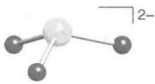</td><td>碱性,还原剂</td></tr><tr><td>+6</td><td> $SO_{4}^{2-}$ </td><td>硫酸根</td><td>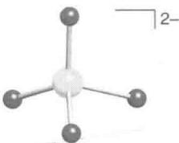</td><td>弱碱性</td></tr><tr><td>两个S原子</td><td></td><td></td><td></td><td></td></tr><tr><td>+2</td><td> $S_{2}O_{3}^{2-}$ </td><td>硫代硫酸根</td><td>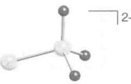</td><td>中等强度还原剂</td></tr><tr><td>+3</td><td> $S_{2}O_{4}^{2-}$ </td><td>连二亚硫酸根</td><td>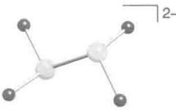</td><td>强还原剂</td></tr><tr><td>+4</td><td> $S_{2}O_{5}^{2-}$ </td><td>二亚硫酸根</td><td>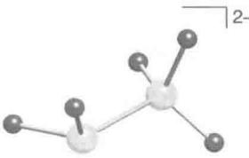</td><td></td></tr><tr><td>+5</td><td> $S_{2}O_{6}^{2-}$ </td><td>连二硫酸根</td><td>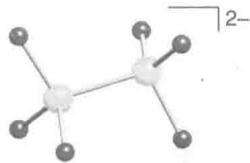</td><td>抗氧化和抗还原</td></tr><tr><td>硫原子数可变的多硫氧合阴离子</td><td> $S_{n}O_{2n+2}^{2-}$  $3 \leqslant n \leqslant 20$ </td><td> $n=3$ ,连三硫酸根</td><td>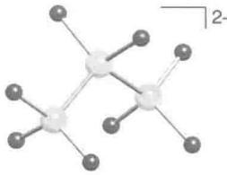</td><td></td></tr></table>

# (a) 氧合阴离子的氧化还原性

提要:硫的氧合阴离子包括还原性的亚硫酸根离子 $\left(\mathrm{SO}_{3}^{2-}\right)$ 、反应性相当低的硫酸根 $\left(\mathrm{SO}_{4}^{2-}\right)$ 和强氧化性的过氧二硫酸根 $\left(\mathrm{O}_{3}\mathrm{SO}-\mathrm{OSO}_{3}^{2-}\right)$ 。与硫相似,硒和碲的氧合阴离子的氧化还原反应往往较慢。

硫的常见氧化数为-2、0、+2、+4和+6，然而也存在许多S—S键合的物种。一个简单的例子是硫代硫酸根 $\left(\mathrm{S}_{2}\mathrm{O}_{3}^{2-}\right)$ ，其平均氧化数为+2，但两个S原子的化学环境完全不同。Frost图（见图16.2）总结了氧化态之间的热力学关系。与许多p区其他元素的氧合阴离子一样，元素处在最高氧化态时，许多热力学上有利的反应却很慢（如 $SO_{4}^{2-}$ 发生的反应）。人们根据下述事实提出了一个动力学因素：含单个S原子的化合物的氧化数每步通常改变2，从而需要机理中存在O原子转移途径。有些例子中采用自由基机理。例如，硫醇和醇类被过氧二硫酸氧化，过程中O—O键裂解产生瞬态自由基阴离子 $SO_{4}^{-}$ 。

节 5.6 中曾经看到, 溶液的 pH 对氧合阴离子的氧化还原性质具有显著影响。 $SO_{2}$ 和 $SO_{3}^{2-}$ 是很好的例证, 前者在酸性溶液中容易被还原, 因而是个氧化剂, 而后者在碱性溶液中是个还原剂:

$$
\mathrm{SO} _ {2} (\mathrm{aq}) + 4 \mathrm{H} ^ {+} (\mathrm{aq}) + 4 \mathrm{e} ^ {-} \longrightarrow \mathrm{S} (\mathrm{s}) + 2 \mathrm{H} _ {2} \mathrm{O} (1) \quad E ^ {\ominus} = + 0. 5 0 \mathrm{V}
$$

$$
\mathrm{SO} _ {4} ^ {2 -} (\mathrm{aq}) + \mathrm{H} _ {2} \mathrm{O} (1) + 2 \mathrm{e} ^ {-} \longrightarrow \mathrm{SO} _ {3} ^ {2 -} (\mathrm{aq}) + 2 \mathrm{OH} ^ {-} (\mathrm{aq}) \quad E ^ {\ominus} = - 0. 9 4 \mathrm{V}
$$

酸性溶液中存在的主要物种是 $\mathrm{SO}_2$ 而非 $\mathrm{H}_2\mathrm{SO}_3$ 。碱性溶液中 $\mathrm{HSO}_3^-$ 是以 $\mathrm{H}-\mathrm{SO}_3^-$ 和 $\mathrm{H}-\mathrm{OSO}_2^-$ 平衡存在的。 $\mathrm{SO}_2$ 的氧化性用作中等强度的消毒剂和食物防腐剂，如处理干果和酒类。

过氧二硫酸根离子 $(\mathrm{O}_3\mathrm{SO} - \mathrm{OSO}_3^{2-})$ 是个有用的强氧化剂：

$$
\mathrm{O} _ {\mathrm{O}} ^ {\mathrm{O}} \mathrm{S} - \mathrm{O} _ {\mathrm{O}} ^ {\mathrm{O}} \mathrm{O} - \mathrm{S} _ {\mathrm{O}} ^ {\mathrm{O}} + 2 \mathrm{e} ^ {-} \longrightarrow 2 \quad \mathrm{O} _ {\mathrm{O}} ^ {\mathrm{O}} \mathrm{S} - \mathrm{O} ^ {2 -} \quad E ^ {\ominus} = + 1. 9 6 \mathrm{V}
$$

如此高的反应性反映了 O 的而非 S 的性质,因为它是由于弱的 O—O 键导致的。这一点在介绍过氧化氢时已经讨论过。

硒酸在热力学上是个强氧化性的酸：

$$
\mathrm{SeO} _ {4} ^ {2 -} (\mathrm{aq}) + 4 \mathrm{H} ^ {+} (\mathrm{aq}) + 2 \mathrm{e} ^ {-} \longrightarrow \mathrm{H} _ {2} \mathrm{SeO} _ {3} (\mathrm{aq}) + \mathrm{H} _ {2} \mathrm{O} (\mathrm{l}) \quad E ^ {\ominus} = + 1. 1 5 \mathrm{V}
$$

像 $SO_{4}^{2-}$ 和其他处于高氧化态元素的氧合阴离子一样， $SeO_{4}^{2-}$ 的还原反应通常较慢。碲酸以 $\mathrm{Te(OH)}_{6}$ 的形式、也以 $(\mathrm{HO})_{2}\mathrm{TeO}_{2}$ 的形式存在于溶液中。您会再一次看到，其还原反应是热力学有利的反应，而动力学上却很慢。

# (b) 硫酸

提要:硫酸是强酸;强的质子自递作用使其成为一种有用的非水溶剂。

硫酸为黏稠液体,溶于水时放出大量热:

$$
\mathrm{H} _ {2} \mathrm{SO} _ {4} (1) \longrightarrow \mathrm{H} _ {2} \mathrm{SO} _ {4} (\mathrm{aq}) \quad \Delta_ {\mathrm{r}} H ^ {\ominus} = - 9 5. 3 \mathrm{kJ} \cdot \mathrm{mol} ^ {- 1}
$$

硫酸水溶液是强的 Brφnsted 酸 $(pK_{a1}=-2)$ ，但不是由二级电离 $(pK_{a2}=1.92)$ 造成的。无水硫酸的相对介电常数和导电性都很高，这一事实与其强的质子自递作用相一致：

$$
2 \mathrm{H} _ {2} \mathrm{SO} _ {4} (1) \rightleftharpoons \mathrm{H} _ {3} \mathrm{SO} _ {4} ^ {+} (\mathrm{sol}) + \mathrm{HSO} _ {4} ^ {-} (\mathrm{sol}) \quad K = 2. 7 \times 1 0 ^ {- 4}
$$

质子自递平衡常数比水大 $10^{10}$ 倍，这一特性使硫酸可以用作非水质子溶剂。

碱(质子接受体)的存在能够增加 $HSO_{4}^{-}$ 的浓度,这里所说的碱包括水和较弱的酸的盐,如硝酸盐:

$$
\mathrm{H} _ {2} \mathrm{O} (1) + \mathrm{H} _ {2} \mathrm{SO} _ {4} (\text {sol}) \longrightarrow \mathrm{H} _ {3} \mathrm{O} ^ {+} (\text {sol}) + \mathrm{HSO} _ {4} ^ {-} (\text {sol})
$$

$$
\mathrm{NO} _ {3} ^ {-} (\mathrm{s}) + \mathrm{H} _ {2} \mathrm{SO} _ {4} (\mathrm{l}) \longrightarrow \mathrm{HNO} _ {3} (\mathrm{sol}) + \mathrm{HSO} _ {4} ^ {-} (\mathrm{sol})
$$

另一个例子是浓硫酸与浓硝酸产生硝鎓离子 $\left(\mathrm{NO}_{2}^{+}\right)$ 的反应,芳香性物种的硝化反应就是由 $NO_{2}^{+}$ 完成的:

$$
\mathrm{HNO} _ {3} (\mathrm{aq}) + 2 \mathrm{H} _ {2} \mathrm{SO} _ {4} (\mathrm{aq}) \longrightarrow \mathrm{NO} _ {2} ^ {+} (\mathrm{aq}) + \mathrm{H} _ {3} \mathrm{O} ^ {+} (\mathrm{aq}) + 2 \mathrm{HSO} _ {4} ^ {-} (\mathrm{aq})
$$

因为硫酸是个非常弱的质子接受体，在硫酸中显酸性的物种的数目比在水中少得多。例如，氟磺酸

$\left(\mathrm{HSO}_{3}\mathrm{F}\right)$ 在硫酸中是个弱酸：

$$
\mathrm{HSO} _ {3} \mathrm{F} (\mathrm{sol}) + \mathrm{H} _ {2} \mathrm{SO} _ {4} (\mathrm{l}) \rightleftharpoons \mathrm{H} _ {3} \mathrm{SO} _ {4} ^ {+} (\mathrm{sol}) + \mathrm{SO} _ {3} \mathrm{F} ^ {-} (\mathrm{sol})
$$

除能发生质子自递作用外,硫酸还能分解为 $H_{2}O$ 和 $SO_{3}$ ,后者进一步与 $H_{2}SO_{4}$ 反应生成多种产物:

$$
\begin{array}{l} \mathrm{H} _ {2} \mathrm{O} + \mathrm{H} _ {2} \mathrm{SO} _ {4} \rightleftharpoons \mathrm{H} _ {3} \mathrm{O} ^ {+} + \mathrm{HSO} _ {4} ^ {-} \\ \mathrm{SO} _ {3} + \mathrm{H} _ {2} \mathrm{SO} _ {4} \rightleftharpoons \mathrm{H} _ {2} \mathrm{S} _ {2} \mathrm{O} _ {7} \\ \mathrm{H} _ {2} \mathrm{S} _ {2} \mathrm{O} _ {7} + \mathrm{H} _ {2} \mathrm{SO} _ {4} \rightleftharpoons \mathrm{H} _ {3} \mathrm{SO} _ {4} ^ {+} + \mathrm{HS} _ {2} \mathrm{O} _ {7} ^ {-} \\ \end{array}
$$

因此，无水硫酸是由至少7个被表征的物种组成的复杂混合物，而非成分单一的物质。

硫酸是按工业规模生产的最重要的化学品之一。超过80%的硫酸用来与磷矿反应制造磷肥：

$$
\mathrm{Ca} _ {5} \mathrm{F} (\mathrm{PO} _ {4}) _ {3} (\mathrm{s}) + 5 \mathrm{H} _ {2} \mathrm{SO} _ {4} (\mathrm{aq}) + 1 0 \mathrm{H} _ {2} \mathrm{O} (\mathrm{l}) \longrightarrow 5 \mathrm{CaSO} _ {4} \cdot 2 \mathrm{H} _ {2} \mathrm{O} (\mathrm{aq}) + \mathrm{HF} (\mathrm{aq}) + 3 \mathrm{H} _ {3} \mathrm{PO} _ {4} (\mathrm{aq})
$$

硫酸还用在除去石油中的杂质、电镀前对铁和钢进行浸泡（清洗）、用作铅酸电池的电解质（应用相关文段14.7），也用于制造其他多种大宗化学品（如盐酸和硝酸）。

浓硫酸的生产是通过接触法完成的。第一步是将硫(或硫的化合物)氧化为 $SO_{2}$ 的放热反应。大部分工厂使用单质硫,有的也使用金属硫化物和硫化氢:

$$
\begin{array}{l} \mathrm{S(s)} + \mathrm {O_ {2} (g)} \longrightarrow \mathrm {SO_ {2} (g)} \\ 4 \mathrm{FeS(s)} + 7 \mathrm {O_ {2} (g)} \longrightarrow 2 \mathrm {Fe_ {2} O_ {3} (s)} + 4 \mathrm {SO_ {2} (g)} \\ 2 \mathrm{H} _ {2} \mathrm{S(g)} + 3 \mathrm{O} _ {2} (\mathrm{g}) \longrightarrow 2 \mathrm{SO} _ {2} (\mathrm{g}) + 2 \mathrm{H} _ {2} \mathrm{O(g)} \\ \end{array}
$$

第二步是将 $SO_{2}$ 氧化为 $SO_{3}$ 。反应在高温和高压下进行，催化剂是二氧化硅小球负载的 $V_{2}O_{5}$ ：

$$
2 \mathrm{SO} _ {2} (\mathrm{g}) + \mathrm{O} _ {2} (\mathrm{g}) \longrightarrow 2 \mathrm{SO} _ {3} (\mathrm{g})
$$

然后从填充塔底层通入 $SO_{3}$ ，从顶层用发烟硫酸 $H_{2}S_{2}O_{7}$ 淋洗。气体接下来在第二个塔中用 98% 硫酸淋洗。 $SO_{3}$ 与 2% 的水反应得到硫酸：

$$
\mathrm{SO} _ {3} (\mathrm{g}) + \mathrm{H} _ {2} \mathrm{O} (\mathrm{sol}) \longrightarrow \mathrm{H} _ {2} \mathrm{SO} _ {4} (\mathrm{l})
$$

# (c) 亚硫酸和二亚硫酸

提要:亚硫酸和二亚硫酸从来都没有离析出来过,但它们的盐却是存在的。亚硫酸盐是个中等强度的还原剂并用作漂白剂;二亚硫酸盐在酸性条件下迅速分解。

虽然 $SO_{2}$ 的酸性水溶液被称为亚硫酸,但 $H_{2}SO_{3}$ 从来未被离析出来过,主要的存在形式是水合物 $\left(\mathrm{SO}_{2}\cdot n\mathrm{H}_{2}\mathrm{O}\right)$ 。第一步和第二步给出质子的过程最好表示如下:

$$
\mathrm{SO} _ {2} \cdot n \mathrm{H} _ {2} \mathrm{O(aq)} + 2 \mathrm{H} _ {2} \mathrm{O(l)} \rightleftharpoons \mathrm{H} _ {3} \mathrm{O} ^ {+} (\mathrm{aq}) + \mathrm{HSO} _ {3} ^ {-} (\mathrm{aq}) + n \mathrm{H} _ {2} \mathrm{O(l)} \quad \mathrm{pK} _ {\mathrm{a}} = 1. 7 9
$$

$$
\mathrm{HSO} _ {3} ^ {-} (\mathrm{aq}) + \mathrm{H} _ {2} \mathrm{O} (1) \rightleftharpoons \mathrm{H} _ {3} \mathrm{O} ^ {+} (\mathrm{aq}) + \mathrm{SO} _ {3} ^ {2 -} (\mathrm{aq}) \quad \mathrm{pK} _ {\mathrm{a}} = 7. 0 0
$$

无水亚硫酸钠 $\left(\mathrm{Na}_{2}\mathrm{SO}_{3}\right)$ 是按工业规模生产的，在纸浆和造纸工业中用作漂白剂，照相行业中用作还原剂，锅炉处理中用作氧清除剂。

二亚硫酸 $(28,H_{2}S_{2}O_{5})$ 不能以自由状态存在,但其盐可由亚硫酸氢盐的浓溶液制备:

$$
2 \mathrm{HSO} _ {3} ^ {-} (\mathrm{aq}) \rightleftharpoons \mathrm{S} _ {2} \mathrm{O} _ {5} ^ {2 -} (\mathrm{aq}) + \mathrm{H} _ {2} \mathrm{O} (1)
$$

二亚硫酸盐的酸性水溶液快速分解得到 $HSO_{3}^{-}$ 和 $SO_{3}^{2-}$ 。

# (d) 硫代硫酸

提要:硫代硫酸易于分解但其盐却是稳定的,硫代硫酸根离子是个中等强度的还原剂。

硫代硫酸 $\left(\mathrm{H}_{2}\mathrm{S}_{2}\mathrm{O}_{3},29\right)$ 的水溶液发生快速而复杂的分解过程，生成如 $S,SO_{2},H_{2}S,H_{2}SO_{4}$ 等多种产物。无水硫代硫酸比较稳定，缓慢分解为 $H_{2}S$ 和 $SO_{3}$ 。与酸相反，硫代硫酸盐稳定得多，并可通过亚硫酸盐或亚硫酸氢盐与硫共沸的方法制备，也可通过多硫化物的氧化反应制备：

$$
\begin{array}{l} 8 \mathrm{K} _ {2} \mathrm{SO} _ {3} (\mathrm{aq}) + \mathrm{S} _ {8} (\mathrm{s}) \longrightarrow 8 \mathrm{K} _ {2} \mathrm{S} _ {2} \mathrm{O} _ {3} (\mathrm{aq}) \\ 2 \mathrm{CaS} _ {2} (\mathrm{s}) + 3 \mathrm{O} _ {2} (\mathrm{g}) \longrightarrow 2 \mathrm{CaS} _ {2} \mathrm{O} _ {3} (\mathrm{s}) \\ \end{array}
$$

![[无机化学第6版主族364-564_images/55f4a0fdce7e7f6570cbcd091f334278ebc484f21cd3547290297d8484c1073b.jpg]]

chemical

Molecular structure of sulfuric acid (H2SO4) showing sulfur bonded to oxygen and hydrogen atoms

(28) 二亚硫酸， $H_{2}S_{2}O_{5}$

![[无机化学第6版主族364-564_images/2502b5a5c72929a9fb8413801c71944882e9db0c951f103e98c3c1ef25896a53.jpg]]

chemical

Molecular structure of sulfuric acid (H2SO4) showing sulfur bonded to oxygen and hydrogen atoms

(29) 硫代硫酸， $H_{2}S_{2}O_{3}$

硫代硫酸根离子 $\left(\mathrm{S}_{2}\mathrm{O}_{3}^{2-}\right)$ 是个中等强度的还原剂：

$$
\frac {1}{2} \mathrm{S} _ {4} \mathrm{O} _ {6} ^ {2 -} (\mathrm{aq}) + \mathrm{e} ^ {-} \longrightarrow \mathrm{S} _ {2} \mathrm{O} _ {3} ^ {2 -} (\mathrm{aq}) \quad E ^ {\ominus} = + 0. 0 9 \mathrm{V}
$$

与碘的反应是分析化学中碘量法滴定的基础：

$$
\frac {1}{2} \mathrm{I} _ {2} (\mathrm{aq}) + \mathrm{e} ^ {-} \longrightarrow \mathrm{I} ^ {-} (\mathrm{aq}) \quad E ^ {\ominus} = + 0. 5 4 \mathrm{V}
$$

$$
2 \mathrm{S} _ {2} \mathrm{O} _ {3} ^ {2 -} (\mathrm{aq}) + \mathrm{I} _ {2} (\mathrm{aq}) \longrightarrow \mathrm{S} _ {4} \mathrm{O} _ {6} ^ {2 -} (\mathrm{aq}) + 2 \mathrm{I} ^ {-} (\mathrm{aq})
$$

连四硫酸根阴离子 $\left(\mathrm{S}_{4}\mathrm{O}_{6}^{2-},5\right)$ 有3个S—S键，这一事实是其稳定存在的原因。强氧化剂（如氯）能将其氧化为硫酸根，漂白工业利用该反应除去过量的氯。

# (e) 过氧硫酸

提要: 过氧二硫酸盐是强氧化剂。

过氧一硫酸 $\left(\mathrm{H}_{2}\mathrm{SO}_{5},30\right)$ 是晶形固体,可通过硫酸与过氧二硫酸反应制备,或由电解 $H_{2}SO_{4}$ 合成 $H_{2}S_{2}O_{8}$ 的副产物得到。其盐不稳定,分解产生过氧化氢。过氧二硫酸 $\left(\mathrm{H}_{2}\mathrm{S}_{2}\mathrm{O}_{8},31\right)$ 也是晶形固体。工业上利用氧化硫酸铵或硫酸钾的方法制备过氧二硫酸铵或过氧二硫酸钾。它们都是强氧化剂和漂白剂。

$$
\frac {1}{2} \mathrm{S} _ {2} \mathrm{O} _ {8} ^ {2 -} (\mathrm{aq}) + \mathrm{H} ^ {+} (\mathrm{aq}) + \mathrm{e} ^ {-} \longrightarrow \mathrm{HSO} _ {4} ^ {-} (\mathrm{aq}) \qquad E ^ {\ominus} = + 2. 1 2 \mathrm{V}
$$

加热过氧二硫酸钾生成臭氧和氧。

# (f) 连二亚硫酸和连二硫酸

提要:连二亚硫酸盐和连二硫酸盐含有 S—S 键,易于发生歧化。连二亚硫酸钠是有用的还原剂。

无水连二亚硫酸 $\left(\mathrm{H}_{2}\mathrm{S}_{2}\mathrm{O}_{4},32\right)$ 和连二硫酸 $\left(\mathrm{H}_{2}\mathrm{S}_{2}\mathrm{O}_{6},33\right)$ 都未能离析出来，然而它们的盐都是稳定的晶形固体。连二亚硫酸盐可用锌粉或钠汞齐还原亚硫酸盐的反应制得。连二亚硫酸钠是生物化学中的重要还原剂。连二亚硫酸根离子在中性或酸性溶液中发生歧化生成 $HSO_{3}^{-}$ 和 $S_{2}O_{3}^{2-}$ ：

![[无机化学第6版主族364-564_images/8c4c07e0f51cd9c9eec3bc319a05323e5f7c24908fabad253bcd3456663e4732.jpg]]

chemical

Molecular structure of sulfuric acid (H2SO4) showing sulfur bonded to oxygen and hydrogen atoms

(30) 过氧一硫酸， $H_{2}SO_{5}$

![[无机化学第6版主族364-564_images/fddca8725b807f9d8aff14e1fe98bfc672d65300601596bc7fdcef327f787582.jpg]]

chemical

Molecular structure diagram showing sulfur, oxygen, and hydrogen atoms in a chain with labeled functional groups

(31) 过氧二硫酸， $H_{2}S_{2}O_{8}$

![[无机化学第6版主族364-564_images/f5f2f2f2f655d85fc79e9005196d5763b3f24dd9b6bb92b2aceb74292732ea02.jpg]]

chemical

Molecular structure of sulfuric acid (H2SO4) showing sulfur bonded to oxygen and hydrogen atoms

(32) 连二亚硫酸， $H_{2}S_{2}O_{4}$

![[无机化学第6版主族364-564_images/8a1dafcc7f9ef659848cb7441aeb51608e704ef1d68a01d539b6d8bb5acd3912.jpg]]

chemical

Molecular structure of sulfuric acid (H2SO4) showing sulfur bonded to oxygen and hydrogen atoms

(33) 连二硫酸， $H_{2}S_{2}O_{6}$

$$
2 \mathrm{S} _ {2} \mathrm{O} _ {4} ^ {2 -} (\mathrm{aq}) + \mathrm{H} _ {2} \mathrm{O} (1) \longrightarrow 2 \mathrm{HSO} _ {3} ^ {-} (\mathrm{aq}) + \mathrm{S} _ {2} \mathrm{O} _ {3} ^ {2 -} (\mathrm{aq})
$$

连二硫酸根离子 $\left(\mathrm{S}_{2}\mathrm{O}_{6}^{2-}\right)$ 可通过氧化相应的亚硫酸盐制备。强氧化剂（如 $MnO_{4}^{-}$ ）能将连二硫酸根氧化为硫酸根：

$$
\mathrm{SO} _ {4} ^ {2 -} (\mathrm{aq}) + 2 \mathrm{H} ^ {+} (\mathrm{aq}) + \mathrm{e} ^ {-} \longrightarrow \frac {1}{2} \mathrm{S} _ {2} \mathrm{O} _ {6} ^ {2 -} (\mathrm{aq}) + \mathrm{H} _ {2} \mathrm{O} (l) \quad E ^ {\ominus} = - 0. 2 5 \mathrm{V}
$$

强还原剂(如钠汞齐)能将其还原为 $SO_{3}^{2-}$ :

$$
\frac {1}{2} \mathrm{S} _ {2} \mathrm{O} _ {6} ^ {2 -} (\mathrm{aq}) + 2 \mathrm{H} ^ {+} (\mathrm{aq}) + \mathrm{e} ^ {-} \longrightarrow \mathrm{H} _ {2} \mathrm{SO} _ {3} (\mathrm{aq}) \quad E ^ {\ominus} = + 0. 5 7 \mathrm{V}
$$

连二硫酸盐的中性和酸性溶液缓慢分解为 $SO_{2}$ 和 $SO_{4}^{2-}$ :

$$
\mathrm{S} _ {2} \mathrm{O} _ {6} ^ {2 -} (\mathrm{aq}) \longrightarrow \mathrm{SO} _ {2} (\mathrm{aq}) + \mathrm{SO} _ {4} ^ {2 -} (\mathrm{aq})
$$

# (g) 聚硫酸

提要:当今能够制备出多达6个S原子的聚硫酸。

多种聚硫酸 $\left(\mathrm{H}_{2}\mathrm{S}_{n}\mathrm{O}_{6}\right)$ 是在研究Wackenroder's溶液的过程中最先确认的，该溶液是一种含有 $H_{2}S$ 的 $SO_{2}$ 水溶液。最先被表征的是连四硫酸根 $\left(5,S_{4}O_{6}^{2-}\right)$ 和连五硫酸根 $\left(6,S_{5}O_{6}^{2-}\right)$ 离子。近来找到了许多制备路线，其中不少涉及复杂的氧化还原反应和嵌入反应。有代表性的例子是用 $I_{2}$ 或 $H_{2}O_{2}$ 氧化硫代硫酸盐，聚硫烷 $\left(\mathrm{H}_{2}\mathrm{S}_{n}\right)$ 与 $SO_{3}$ 反应得到 $H_{2}S_{n+2}O_{6}$ （式中， $n=2\sim6$ ）：

$$
\mathrm{H} _ {2} \mathrm{S} _ {n} (\mathrm{aq}) + 2 \mathrm{SO} _ {3} (\mathrm{aq}) \longrightarrow \mathrm{H} _ {2} \mathrm{S} _ {n + 2} \mathrm{O} _ {6} (\mathrm{aq})
$$

# 16.14 硫、硒和碲的聚阴离子

提要:硫形成高达六个原子链状连接的聚阴离子;聚硒化物为链状和环状;聚碲化物为链状和双环状。

许多电正性元素的多硫化物已经被表征。它们都含有链状 $S_{n}^{2-}(n=2-6)$ ，如（7）、（34）、（35）所示。典型的例子有 $Na_{2}S_{2}$ 、 $BaS_{2}$ 、 $Na_{4}S_{4}$ 、 $K_{2}S_{4}$ 和 $Cs_{2}S_{6}$ ，它们都是通过密封管中加热化学计量比的 S 和其他元素制备的。

较大的聚硫化物阴离子与金属原子成键（如 $\left[\mathrm{WS}\left(\mathrm{S}_4\right)_2\right]^{2-}$ ），其中含有螯合的 $\mathrm{S}_4$ 配体。硫化铁矿物（又称“愚人金”）的化学式为 $\mathrm{FeS}_2$ ，具有岩盐结构，是由 $\mathrm{Fe}^{2+}$ 和分立的 $\mathrm{S}_2^{2-}$ 组成的。自由基阴离子 $\mathrm{S}_3^-$ 存在于群青矿中，它和 $\mathrm{Na}^+$ 一起存在于 $\mathrm{SiO}_4$ 和 $\mathrm{AlO}_4$ 四面体形成的空隙中（节24.15）。

被表征的聚硒化物和聚碲化物多于聚硫化物。较小聚阴离子的固体结构类似于聚硫化物，较大聚阴离子的固体结构较复杂，某种程度上与阳离子的性质有关。含 $\mathrm{Se}_{9}^{2-}$ 以下的聚硒化物为链状，更大的聚硒化物（如 $\mathrm{Se}_{11}^{2-}$ ）为环状结构，两个六元环共用1个Se原子，这个Se原子周围呈四方平面排列（8）。聚碲化物结构更加复杂，更多地呈现双环结构，如 $\mathrm{Te}_{7}^{2-}(9)$ 和 $\mathrm{Te}_{8}^{2-}(36)$ 。较大的聚硒阴离子和聚碲阴离子形成的d区金属络合物也是已知的，如 $[\mathrm{Ti}(\mathrm{Cp})_{2}\mathrm{Se}_{5}](37)$ 。聚硫化物、聚硒化物和聚碲化物中的电子密度似乎集中在 $\mathrm{E}_n^{2-}$ 链的尾端，这就解释了为何是通过末端原子配位的，如（17）和（37）所示。

![[无机化学第6版主族364-564_images/40b858da11fc741bcbf19c53ff512cd05e6b658e48646f5b6e1083ebba7c758e.jpg]]  
(34) $S_{4}^{2-}$

![[无机化学第6版主族364-564_images/be86c409ef919abd22f4234db99adb620dc9f446975526adf5bcbe137caebc55.jpg]]

chemical

Molecular structure diagram showing sulfur atom bonded to two oxygen atoms and a labeled 2- charge

(35) $S_{6}^{2-}$

![[无机化学第6版主族364-564_images/2ef184df18bff7bb4d1bf97d05456e28a07eb5b41f3c6cc0bde7d3e11ae6f301.jpg]]  
(36) $Te_{8}^{2-}$

![[无机化学第6版主族364-564_images/58dcef875b711b0859817210297a9531149b1864d12448b1b602cfc98cb489fc.jpg]]  
(37) $\left[\mathrm{Ti}(\mathrm{Cp})_{2}\mathrm{Se}_{5}\right],\mathrm{Cp} = \mathrm{C}_{5}\mathrm{H}_{5}^{-}$

# 16.15 硫、硒和碲的聚阳离子

提要: S、Se 和 Te 的聚阳离子可在强酸介质中用中等强度的氧化剂和元素之间的反应制备。

p区元素的许多阳离子链、环、簇化合物已制备成功，它们当中的大部分含有S、Se或Te。由于这些阳离子是氧化剂和 Lewis 酸, 制备条件完全不同于合成高还原性聚阴离子的条件。例如, $S_{8}^{2+}$ 是在液态二氧化硫中用 $AsF_{5}$ 氧化 $S_{8}$ 得到的:

$$
\mathrm{S} _ {8} + 3 \mathrm{AsF} _ {5} \xrightarrow {\mathrm{SO} _ {2}} [ \mathrm{S} _ {8} ] [ \mathrm{AsF} _ {6} ] _ {2} + \mathrm{AsF} _ {3}
$$

使用的溶剂(如氟磺酸)其酸性比聚阳离子的酸性更大。硫、硒和碲各自都能形成 $E_{4}^{2+}$ 形式的离子。例如， $Se_{4}^{2+}$ 是用强氧化性的过氧化合物 $FO_{2}SOOSO_{2}F$ 氧化元素 Se 得到的：

$$
4 \mathrm{Se} + \mathrm{S} _ {2} \mathrm{O} _ {6} \mathrm{F} _ {2} \xrightarrow {\mathrm{HSO} _ {3} \mathrm{F}} [ \mathrm{Se} _ {4} ] [ \mathrm{SO} _ {3} \mathrm{F} ] _ {2}
$$

$\mathrm{E}_4^{2+}$ 具有四方平面 $(D_{4\mathrm{h}})$ 结构（10）。在成键作用的分子轨道模型中，阳离子为闭壳层电子组态，其中6个电子填充 $\mathrm{a}_{2\mathrm{u}}$ 和 $\mathrm{e_g}$ 轨道，能量高的反键轨道 $\mathrm{b}_{2\mathrm{u}}$ 空置。相反，大部分更大的环体系可用定域的 $2c, 2e$ 键做解释。对这些更大的环而言，失去2个电子形成额外的 $2c, 2e$ 键，因此每个元素上保留了区域电子数。这种变化在 $\mathrm{S_8}$ 氧化为 $\mathrm{S_8^{2+}}(38)$ 的过程中不难看到。X射线单晶结构测定表明 $\mathrm{S_8^{2+}}$ 中的跨环键长于其他键。这类化合物中长的跨环键很常见。

![[无机化学第6版主族364-564_images/81edf8554b76e0ea4a96521d2cb054c00224e1cfb77202589ed150e9748e6552.jpg]]

chemical

Molecular structure diagram showing bond lengths and angles labeled 204 pm, 283 pm, and 2+

(38) $S_{8}^{2+}$

# 16.16 硫氮化合物

提要: p 区元素的电中性杂原子环和簇化物包括 $P_{4}S_{10}$ 和 $S_{4}N_{4}$ 。二氮化二硫聚合而成的聚合物在极低温度下是超导体。

硫氮化合物的结构和上节讨论过的聚阳离子有关。最早知道、也是最易制备的硫氮化合物是淡橙黄色的四氮化四硫 $\mathrm{S}_4\mathrm{N}_4(11)$ ，它是将氨气通入 $\mathrm{SCl}_2$ 溶液制备的：

$$
6 \mathrm{SCl} _ {2} (\mathrm{l}) + 1 6 \mathrm{NH} _ {3} (\mathrm{g}) \longrightarrow \mathrm{S} _ {4} \mathrm{N} _ {4} (\mathrm{s}) + 0. 2 5 \mathrm{S} _ {8} (\mathrm{s}) + 1 2 \mathrm{NH} _ {4} \mathrm{Cl} (\mathrm{sol})
$$

四氮化四硫是个吸能化合物 $\left(\Delta_{\mathrm{f}}G^{\ominus}=+536\mathrm{kJ}\cdot\mathrm{mol}^{-1}\right)$ ，可发生爆炸性分解。篮状分子是个八元环，四个氮原子处在一个平面上，处在平面上方和平面下方的硫原子桥连着四个N原子。短的S—S距离（258 pm）表明每对硫原子间存在弱相互作用。Lewis酸（如 $BF_{3}$ 、 $SbF_{5}$ 和 $SO_{3}$ ）与其中的一个N原子形成1∶1的络合物（39）， $S_{4}N_{4}$ 环在该过程中发生重排。

$\mathrm{S}_4\mathrm{N}_4$ 蒸气通过灼热银丝时得到 $\mathrm{S}_2\mathrm{N}_2$ （同时生成 $\mathrm{AgS}$ 和 $\mathrm{N}_2$ ）。 $\mathrm{S}_2\mathrm{N}_2$ 比其前体甚至更不稳定，室温以上就爆炸。 $0^{\circ}\mathrm{C}$ 下， $\mathrm{S}_2\mathrm{N}_2$ 静置数天后得到青铜色之字形聚合物（SN） $_n$ （40），聚合物较前体稳定得多，加热到 $240^{\circ}\mathrm{C}$ 以上才发生爆炸。该聚合物沿之字形链显示金属性导电， $0.3\mathrm{K}$ 以下变成超导体。这个发现非常重要，因为它是人们发现的第一个不含金属的超导体。卤化的 $\mathrm{S}_2\mathrm{N}_2$ 衍生物已经制备出来，其导电性更好。例如，部分溴化产生蓝黑色的单晶（ $\mathrm{SNBr}_{0.4}$ ） $_n$ ，该化合物在室温的导电性比（SN） $_n$ 大一个数量级。用 ICl、IBr 或 $\mathrm{I}_2$ 处理 $\mathrm{S}_4\mathrm{N}_4$ 得到导电性的非化学计量聚合物，其导电性比（SN） $_n$ 大 16 个数量级（应用相关文段 16.6）。

![[无机化学第6版主族364-564_images/8c0f727e8902696bed323254149526e1aaf2f889d85f520601cbe4633202c22f.jpg]]

chemical

Molecular structure diagram showing sulfur (S) bonded to nitrogen (N) and oxygen (O), with additional carbon atoms shown

(39) $S_{2}N_{4}SO_{3}$

![[无机化学第6版主族364-564_images/8270b9d6f0eb801923aa21127cda99623b6fea282f766a568b2250eac3e3a49a.jpg]]  
(40) $(SN)_{n}$

$120^{\circ}\mathrm{C}$ 和加压条件下，在 $\mathrm{CS}_2$ 中加热 $\mathrm{S}_4\mathrm{N}_4$ 和硫得到 $\mathrm{S}_4\mathrm{N}_2$

$$
\mathrm{S} _ {4} \mathrm{N} _ {4} + 4 \mathrm{S} \xrightarrow {\mathrm{CS} _ {2} / 1 2 0 ^ {\circ} \mathrm{C}} 2 \mathrm{S} _ {4} \mathrm{N} _ {2}
$$

产物为暗红色针状晶体,25 ℃时熔化为暗红色液体,100 ℃时发生爆炸性分解。

# 例题16.3 预测硫氮化合物的性质

题目:硫氮化合物有时看作显示无机芳香性的物质,即含有形成 $\pi$ 键所需要的 $2n+2$ 个电子的无机化合物。假设每个硫原子和氮原子都有一孤对,试预测 $S_{2}N_{2}$ 是否显示芳香性。

答案: 每个硫原子有 6 个价电子。如果每个硫原子有一孤对电子并且与 2 个氮原子形成 2 个键, 那么每个硫原子就留下 2 个电子以形成 $\pi$ 键。每个氮原子有 5 个价电子: 如果每个氮原子有一孤对电子, 用 2 个电子与 2 个硫原子成键, 那么将有 1 个电子形成 $\pi$ 键。共有 6 个电子形成 $\pi$ 键, 所以 $S_{2}N_{2}$ 被认为具有芳香性。

自测题 16.3 预测 $S_{4}N_{4}$ 是否具有芳香性。

# 应用相关文段16.6 硫的氮化物用于指纹检测

潜指纹是指偶然留在物体表面的指纹，肉眼无法看到。有时需要看到指纹，传统方法是使用软毛刷和铝粉。多硫化物聚合物 $(\mathrm{SN})_{n}$ 在指纹可视化方面非常有效。科学家偶然发现：沸石置于 $(\mathrm{SN})_{n}$ 气体中时，玻璃和其他表面的指纹都变得可以看到。 $S_{2}N_{2}$ 接触指纹时聚合为蓝黑色的 $(\mathrm{SN})_{n}$ ，使指纹显示出来。以这种方式聚合而成的聚硫氮化合物较之体相材料更稳定，通常条件下能保存数天，惰性气氛中可以无限期保存。 $S_{2}N_{2}$ 也能与喷墨印刷机墨水产生的印迹起反应，从而显示出接触过印刷机的各种封袋上的印迹。

$S_{2}N_{2}$ 为潜指纹检测提供了一种价廉、无损伤和无溶剂的成像技术。但缺点是不稳定，需要现配现用，从而限制了可携带性。用途的多面性和显示时间短的优点使它与高真空金属沉积技术结合起来（高真空下让金、锌沉积的方法使指纹显形）使用就变得可行。

# 延伸阅读资料

J. S. Thayer, Relativistic effects and the chemistry of the heaviest main-group elements, J. Chem. Educ, 2005, 82, 1721. 论文用相对论效应解释了各主族原子序数最大的元素与其原子序数较小的诸元素性质为何不同。

R. B. King, Inorganic chemistry of the main group elements. John Wiley & Sons (1994).

D. M. P. Mingos, Essential trends in inorganic chemistry. Oxford University Press (1998). 从结构和成键角度对无机化学的纵览。

R. B. King(ed), Encyclopedia of inorganic chemistry. John Wiley & Sons (2005).

N. Saunders, Oxygen and the elements of group 16. Heinemann (2003).

P. Ball, $H_{2}O$ : a biography of water. Phoenix (2004). 对水的化学性质和物理性质做了有趣的阐释。

R. Steudel, Elemental sulfur and sulfur-rich compounds. Springer-Verlag (2003).

N. N. Greenwood and A. Earnshaw, Chemistry of the elements. Butterworth-Heinemann (1997).

C. Benson, The periodic table of the elements and their chemical properties. Kindle edition. MindMelder.com (2009).

P. R. Ogilvy, Singlet oxygen: there is indeed something new under the sun, Chem. Soc. Rev, 2010, 39, 3181.

# 练习题

16.1 指出下面的氧化物是酸性、碱性、中性和两性中的哪一种： $CO_{2}$ 、 $P_{2}O_{5}$ 、 $SO_{3}$ 、MgO、 $K_{2}O$ 、 $Al_{2}O_{3}$ 、CO。

16.2 $O_{2}$ 、 $O_{2}^{+}$ 和 $O_{2}^{2-}$ 的键长分别为 121 pm、112 pm 和 149 pm，用分子轨道理论描述这些物质的成键状况，从成键状况解释这些键长不同的原因。

16.3 (a) 用标准电极电位(资源节3)计算酸性溶液中过氧化氢歧化的标准电极电位。

(b) $Cr^{2+}$ 是过氧化氢歧化的催化剂吗？

(c) 已知酸性溶液中的 Latimer 图为

$$
\mathrm{O} _ {2} \xrightarrow {- 0 . 1 3} \mathrm{HO} _ {2} \xrightarrow {+ 1 . 5 1} \mathrm{H} _ {2} \mathrm{O} _ {2}
$$

试计算超氧化氢 $\left(\mathrm{HO}_{2}\right)$ 歧化为 $O_{2}$ 和 $H_{2}O_{2}$ 的 $\Delta_{r}G^{\ominus}$ ，并将所得的结果与 $H_{2}O_{2}$ 歧化反应的相应值做比较。

16.4 改正下列陈述中的错误,改正之后举例说明:

(a) 第 16 族中间的元素比最轻和最重的元素更容易被氧化至该族的最高氧化态。  
(b) 基态时 $O_{2}$ 是三线态，在二烯烃上发生 Diels-Alder 亲电进攻。  
(c) 臭氧从平流层向对流层的扩散是主要的环境问题。

16.5 下面两个氢键哪个更强些: S—H…O; O—H…S?

16.6 $SO_{2}$ (酸性、氧化性)和乙二胺(碱性、还原性)两种溶剂,哪个可能不与下述物质起反应? (a) $Na_{2}S_{4}$ , (b) $K_{2}Te_{3}$ 。  
16.7 将下列物种按最强的还原剂到最强的氧化剂排序： $SO_{4}^{2-}$ 、 $SO_{3}^{2-}$ 、 $O_{3}SO_{2}SO_{3}^{2-}$ 。  
16.8 预测 Mn 的哪个氧化态能被碱性条件下的亚硫酸盐还原。  
16.9 (a) 给出 Te(VI) 在酸性水溶液中的化学式并与 S(VI) 的化学式作比较。

(b) 解释这种差别可能的原因。

16.10 使用资源节 3 中的标准电极电位数据判断硫的氧合阴离子中哪个会在酸性溶液中发生歧化。  
16.11 使用资源节 3 中的标准电极电位数据判断 $SeO_{3}^{2-}$ 在酸性或碱性溶液中更稳定。  
16.12 判断下列物种哪个在酸性条件下可能被硫代硫酸根离子 $\left(\mathrm{S}_{2}\mathrm{O}_{3}^{2-}\right)$ 还原： $VO^{2+}$ 、 $Fe^{3+}$ 、 $Cu^{+}$ 、 $Co^{3+}$ 。  
16.13 $SF_{4}$ 与 $BF_{3}$ 反应生成 $[SF_{3}][BF_{4}]$ ，用 VSEPR 理论判断阴、阳离子的形状。  
16.14 氟化四甲铵(0.7 g)与 $SF_{4}(0.81\ g)$ 反应生成离子型产物:(a)写出该反应平衡了的化学方程式;(b)绘出阴离子的示意性结构;(c)该阴离子的 ${}^{19}F-NMR$ 谱图中将能看到多少条线?  
16.15 识别含硫化合物 A、B、C、D、E 和 F:

![[无机化学第6版主族364-564_images/e0485ed3c8dac4e5b1d37e5a2a1c80bd3c23861a72a8534818a5a895403180af.jpg]]

chemical

Chemical reaction pathway showing transformations of substances F, S, A, B, C, E, D with reagents like O₂, Cl₂, and H₂S

16.16 判断下列物种哪个显示无机芳香性：(a) $S_{3}N_{3}^{-}$ ，(b) $S_{4}N_{3}^{+}$ ，(c) $S_{5}N_{5}$ 。

16.17 对比硫酸、硒酸和碲酸的性质。

# 辅导性作业

16.1 在论文“Spiral chain O $_{4}$ form of dense oxygen”(Pro. Nat. Acad. Sci. U.S.A., 2012, 109, 3751)中，L. Zhu 及其合作者描述了他们预测的氧的链状结构。在什么条件下这种预测的结构可能存在？第 16 族的其他元素能形成这种结构吗？根据这种结构预测的性质和该元素其他结构的性质有何不同？  
16.2 在论文“Oxygen, sulfur, selenium, tellurium and polonium”(Anunu. Rep. Prog. Chem., Sect. A: Inorg. Chem., 2012, 108, 113)中，作者L. Myongwon Lee和I. Vargas-Baca总结了2011年对第16族元素化学的研究。参考本文：(a)简述制备 $\left[\mathrm{Te}_{5} \mathrm{Mo}_{15} \mathrm{O}_{57}\right]^{8-}$ 的方法，(b)绘出芳香性一卤化碲的结构，(c)绘出AsSCl和 $\mathrm{AsS}_2$ 的结构，(d)描述 $\mathrm{ClP}_4\mathrm{S}_3$ 与硫反应的产物。  
16.3 在论文“Formation of tellurium nanotubes through concentration depletion at the surfaces of seeds”(Adv. Mater., 2002, 14, 279)中,作者 B. Mayers 和 Y. Xia 描述了碲纳米管的合成。叙述他们使用的方法与合成碳纳米管的方法有何不同?产生的碲纳米管的维度是多少?作者设想碲纳米管有何用途?  
16.4 2006 年 11 月发现前克格勃药剂师 Alexander Litvinenko 为放射性钋 210 中毒。综述钋的化学和放射性，并讨论其毒性。  
16.5 氯胺与亚硫酸盐反应的机理已有报道(B.S.Yin,D.M.Walker和D.W.Margerum,Inorg.Chem.,1987,26,3435)。总结观测到的反应速率和所提出的机理。假定你接受此机理，解释为什么 $\mathrm{SO}_2(\mathrm{OH})^-$ 和 $\mathrm{HSO}_3^-$ 应该显示不同的反应速率？为什么不可能区分 $\mathrm{SO}_2(\mathrm{OH})^-$ 和 $\mathrm{HSO}_3^-$ 在活性方面的差别？  
16.6 1989年成功制备了四甲基碲 $\left[\mathrm{Te}\left(\mathrm{CH}_{3}\right)_{4}\right]$ (R.W.Gedrige,D.C.Harris,K.R.Higa和R.A.Nissan,Organometallics,1989,8,2817)，其后不久又制备了六甲基化合物(L.Ahmed和J.A.Morrion,J.Am.Chem.Soc.,1990,112,7411)。解释这些化合物为什么不寻常？给出合成反应的方程式，这些合成方法为什么是成功的？与最后一点有关，解释 $\mathrm{TeF_4}$ 与甲基锂反应为什么不能生成四甲基碲？

16.7 节 16.15 讨论了四方平面离子的成键作用。借用计算机详细讨论这个议题，用你选择的软件计算 $S_{4}^{2+}, S_{4}^{2+}$ 中 S—S 键长为 200 pm（这里推荐硫是因为硫原子的半经验参数比 Se 的更可靠）。从输出结果：（a）绘出分子轨道能级图，（b）指出每个能级的对称性，（c）示意性绘出最高的分子轨道。预测它会是闭壳层分子吗？  
16.8 硫循环在古代就被研究过(J. Farquhar, H. Bao, 和 M. Thiemen, Science, 2000, 289, 756)。影响现代硫循环的三个因素是什么？作者提出循环何时发生了重大变化？如何解释古代和现代硫循环的差别？  
16.9 H. Keppler 研究了火山岩浆中硫的浓度 (Science, 1999, 284, 1652)。硫从火山中以什么状态喷出？1991 年从 Pinatubo 火山爆发中喷出的硫的浓度是多少？该浓度与预期值有差别吗？如果有，请做出解释。

(王文渊、马佳妮 译, 史启祯 审)

# 第 17 族元素

![[无机化学第6版主族364-564_images/fc4c8e99bcf78ff5c4dcbc598645e7a9ff2d9c2a877b4a01b99e010743ab61b5.jpg]]

text_image

1 2 13 14 15 16 17 18
Li Be B C N O F Ne
S Cl Ar
Se Br Kr
Te I Xe
Po At Rn
□ □ □ □ □
□ □ □ □ □

该族所有元素都是非金属。像第15族和第16族元素一样，卤素的氧合阴离子往往也是通过原子转移发生反应的氧化剂。阴离子中心原子的氧化数和氧化还原反应速率之间存在一种非常有用的关联。大多数卤素存在多种氧化态。单质卤素 $\left(\mathrm{X}_{2}\right)$ 参与的反应往往很快。

第 17 族元素氟、氯、溴、碘、砹统称卤素，希腊语意为“成盐元素”。氟和氯是有毒气体，溴为有毒的挥发性液体，碘是可升华的固体，它们都属于最活泼的非金属元素。卤素具有多方面的化学性质，卤素的化合物前面章节已多次提到，节 9.8 还做了评述。因此，本章将扼要介绍性质的规律性和卤素与氧的化合物，并讨论卤素互化物。

# A. 基本面

在本章您会发现,讨论 p 区前面各族用到的许多原理在此也适用。例如,VSEPR 模型可用于预言卤素相互之间、卤素与氧、卤素与氙生成的分子的形状。

# 17.1 元素

提要:除氟和高放射性的砹外,卤素均存在-1至+7氧化数;体积小、电负性高的氟原子能将许多元素氧化至高氧化态。

卤素的原子性质见表 17.1, 价电子组态全为 $ns^{2}np^{5}$ 。特别需要指出的是它们具有高电离能、高电负性和高电子亲和能。电子亲和能高是因为进入的是电子占据不完全价层的轨道并受到强的核引力。记住，同一周期元素的 $Z_{eff}$ 值自左向右逐渐增大（节 1.4）。

表 17.1 卤素的某些性质

<table><tr><td>性质</td><td>F</td><td>Cl</td><td>Br</td><td>I</td><td>At</td></tr><tr><td>共价半径/pm</td><td>71</td><td>99</td><td>114</td><td>133</td><td>140</td></tr><tr><td>离子半径/pm</td><td>131</td><td>181</td><td>196</td><td>220</td><td></td></tr><tr><td>第一电离能/(kJ·mol-1)</td><td>1681</td><td>1251</td><td>1139</td><td>1008</td><td>926</td></tr><tr><td>熔点/°C</td><td>-220</td><td>-101</td><td>-7.2</td><td>114</td><td>302</td></tr><tr><td>沸点/°C</td><td>-188</td><td>-34.7</td><td>58.8</td><td>184</td><td></td></tr><tr><td>Pauling电负性</td><td>4.0</td><td>3.2</td><td>3.0</td><td>2.6</td><td>2.2</td></tr><tr><td>电子亲和能/(kJ·mol-1)</td><td>328</td><td>349</td><td>325</td><td>295</td><td>270</td></tr><tr><td>E(θ(X2,X-)/V)</td><td>+3.05</td><td>+1.36</td><td>+1.09</td><td>+0.54</td><td></td></tr></table>

讨论 p 区前面各族时我们看到,各族第一个元素的性质明显不同于同族下部元素。这种异常现象在卤素族并不明显,最值得注意的差别则是 F 的电子亲和能小于 Cl。这一性质直观上似乎与 F 的高电负性不一致,而 F 原子的这一性质是由于这个密实原子(相对于较蓬松的 Cl 原子而言)电子间斥力较大的原因。 $F_{2}$ 分子中 F—F 键较弱也是这种斥力造成的。尽管电子亲和能存在着这种反常,金属氟化物的生成焓通常却远大于金属氯化物的生成焓。这是因为 F 原子较低的电子亲和能被离子型氟化物( $F^{-}$ 体积小)较高的晶格焓(见图 17.1)和共价氟化物(如高氧化态金属的氟化物)较高的键强所抵消。

![[无机化学第6版主族364-564_images/9e9963d8eab3c54c0b8cfdda322b356dfe543c9292f4581b7b14f7dec95a420f.jpg]]  
图 17.1 氟化钠(a)和氯化钠(b)的热化学循环  
数值单位均为 $\mathrm{kJ}\cdot \mathrm{mol}^{-1}$

氟是淡黄色气体，能与大多数无机分子、有机分子及稀有气体Kr、Xe、Rn起反应（节18.5），涉及氟的实验操作因此而变得非常困难。不过，氟可用钢制容器或蒙乃尔合金（一种镍/铜合金）制容器储存，这些合金材料遇氟形成钝化的金属氟化物表面膜。氯是黄绿色有毒气体，溴则是暗红色、易挥发的有毒液体，而且是室温常压下唯一的液态非金属元素。碘是紫灰色固体，易升华为紫色蒸气。溶于非极性溶剂（如 $\mathrm{CCl_4}$ ）后保持紫色不变，溶于极性溶剂则得到红棕色溶液。后一现象表明溶液中存在像 $\mathrm{I}_3^-$ 那样的多碘阴离子[节17.10(c)]。

单质卤素如此活泼，以致在自然界只能以化合物形式存在。卤化物是其主要存在形式，而最易被氧化的元素碘也以碘酸钠或碘酸钾 $\left(\mathrm{KIO}_{3}\right)$ 形态存在于碱金属硝酸盐沉积中。由于氯化物、溴化物和碘化物大都溶于水，其阴离子存在于海水和盐卤中。氟的主要资源是氟化钙，氟化钙在水中难溶解，往往以萤石 $\left(\mathrm{CaF}_{2}\right)$ 形式存在于沉积矿床中。氯还以岩盐（氯化钠）形式存在；盐卤中的 $Br^{-}$ 被氯取代可制溴。碘原先是从富集有碘的海藻中提取的，现在则从盐沉积中提取，包括那些与油气田相关的盐沉积。

# 17.2 简单化合物

提要: 所有卤素都能形成卤化氢, HF 是液体, HCl、HBr 和 HI 是气体。所有第 17 族元素都能形成氧化物和氧合阴离子。

氟的电负性在所有元素中最高，因而不能以正氧化态存在（瞬态气相物种 $\mathrm{F}_2^+$ 是个例外）。氟、氯、溴、碘都存在从-1到 $+7$ 的各种氧化数，At可能是个例外。与Cl（VII）和I（VII）的化合物相比，Br（VII）的化合物很不稳定，这是交替效应[节9.2(c)]的另一实例。At的化学信息之所以缺乏，既是因为它没有稳定同位素；也是因为放射性同位素寿命相对较短。在33种已知同位素中，寿命最长的同位素半衰期也不过 $8.3\mathrm{h}$ 。砹溶液的放射性很强，只有高度稀释后才能进行研究。砹似乎能以 $\mathrm{At}^{-}$ 阴离子、At（I）和At（III）氧合阴离子形式存在，但尚未获得At（VII）存在的证据。

F 的高电负性导致含氟化合物的 Brønsted 酸性高于不含氟的同类化合物。高电负性和小原子半径（这意味着中心原子周围可堆积更多 F 原子）两种因素相叠加，导致 F 能稳定大多数元素的高氧化态，如$\mathrm{UF}_6$ 和 $\mathrm{IF}_7$ 。（氧往往能稳定更高氧化态的中心原子，因为其氧化数按-2计，而氟只能计为-1。）低氧化态金属氟化物中的化学键主要为离子型，而金属氯化物、溴化物和碘化物则有明显的共价特征。

氟碳化合物(如聚四氟乙烯,PTFE)的合成工艺十分重要,是因为其应用广泛。例如,用作不粘锅涂层和耐卤素腐蚀的实验室器皿,挥发性氟碳化合物还用作空调设备和电冰箱的制冷剂。氟碳化合物的衍生物往往具有某些不同寻常的性质,它们的探索性合成一直是化学家一个重要的研究课题。作为制冷剂和火箭推进剂;氢氟烃被用作氯氟烃的替代物;它们也被用作麻醉剂,较之未氟化的对应物更不易燃。四氟乙烷 $\left(\mathrm{CHF}_{2}\mathrm{CHF}_{2}\right)$ 是提取天然产物的重要溶剂,如提取香草精和紫杉醇,后者是治疗癌症的化疗药。

所有第 17 族元素都能形成分子型氢化物卤化氢。HF 的性质明显不同于其他的卤化氢（见表 17.2），主要是由于参与形成氢键的能力不同。由于形成广泛的氢键（节 10.6），HF 是挥发性液体，而 HCl、HBr 和 HI 在室温下都是气体。氟化氢在很宽的温度范围里是液体，具有高的相对介电常数和导电性。所有的卤化氢都是 Brønsted 酸：HF 的水溶液（即氢氟酸）是弱酸，而 HCl、HBr 和 HI 在水中几乎脱去全部质子（见表 17.2）。

表 17.2 卤化氢的某些性质

<table><tr><td>性质</td><td>HF</td><td>HCl</td><td>HBr</td><td>HI</td></tr><tr><td>熔点/°C</td><td>-84</td><td>-114</td><td>-89</td><td>-51</td></tr><tr><td>沸点/°C</td><td>20</td><td>-85</td><td>-67</td><td>-35</td></tr><tr><td>相对介电常数</td><td>83.6(0°C)</td><td>9.3(-95°C)</td><td>7.0(-85°C)</td><td>3.4(-50°C)</td></tr><tr><td>电导/(S·cm-1)</td><td>c.10-6(0°C)</td><td>c.10-9(-85°C)</td><td>c.10-9(-85°C)</td><td>c.10-10(-50°C)</td></tr><tr><td>ΔGfθ/(kJ·mol-1)</td><td>-273.2</td><td>-95.3</td><td>-54.4</td><td>+1.72</td></tr><tr><td>键解离能/(kJ·mol-1)</td><td>567</td><td>431</td><td>366</td><td>298</td></tr><tr><td>pKa</td><td>3.45</td><td>c.-7</td><td>c.-9</td><td>c.-11</td></tr></table>

氢氟酸虽是弱酸,却是已知毒性最大和腐蚀性最强的物质之一,能够侵蚀玻璃、金属、水泥和有机物。操作氢氟酸的危险性远大于其他氢卤酸,它非常容易穿透皮肤被吸收,甚至短暂接触都能导致皮肤和深层组织的严重灼伤和坏死,并因对钙的脱除作用(与磷酸钙反应生成氟化钙)而伤害骨骼。

卤素与氧形成多种二元化合物,它们大多不稳定,在实验室不常遇到。这里仅提及其中最重要的几种。

二氟化氧 $(\mathrm{OF}_2)$ 是氟最稳定的氧化物，但高于 $200^{\circ}\mathrm{C}$ 即分解。氯在其氧化物中存在多种不同氧化数（见表17.3）。这些氧化物中有的是奇数电子物种，包括 $\mathrm{ClO}_2$ 和 $\mathrm{Cl}_2\mathrm{O}_6$ ，前者中的Cl具有反常氧化数 $+4$ 后者是个离子型固体（ $[\mathrm{ClO}_2^+] [\mathrm{ClO}_4^- ]$ )，其中的Cl以混合氧化态存在。所有氯的氧化物都是吸能化合物 $(\Delta_{\mathrm{f}}G^{\ominus} > 0)$ 和不稳定化合物，加热时全都发生爆炸。溴的氧化物的种类比氯少，得到充分表征的化合物包括 $\mathrm{Br}_2\mathrm{O},\mathrm{Br}_2\mathrm{O}_3$ 和 $\mathrm{BrO}_2$ 。卤素氧化物中以碘的氧化物最稳定，其中以 $\mathrm{I}_2\mathrm{O}_5$ 最重要。BrO和IO是奇数电子物种，产生于自然界火山的活动，科学家认为它们参与了臭氧耗损过程。

表 17.3 氯的某些氧化物

<table><tr><td>氧化数</td><td>+1</td><td>+3</td><td colspan="2">+4</td><td>+6</td><td>+7</td></tr><tr><td>化学式</td><td> $Cl_{2}O$ </td><td> $Cl_{2}O_{3}$ </td><td> $ClO_{2}$ </td><td> $Cl_{2}O_{4}$ </td><td> $Cl_{2}O_{6}$ </td><td> $Cl_{2}O_{7}$ </td></tr><tr><td>颜色</td><td>棕黄</td><td>暗棕</td><td>黄</td><td>淡黄</td><td>暗红</td><td>无色</td></tr><tr><td>状态</td><td>气体</td><td>固体</td><td>气体</td><td>液体</td><td>液体</td><td>液体</td></tr></table>

所有第 17 族元素都形成氧合阴离子和氧合酸。卤素广泛形成氧合阴离子和氧合酸的事实对系统命名法提出了挑战。我们将采用俗名，如将 $ClO_{3}^{-}$ 叫氯酸根而不叫三氧合氯酸根（V）。表 17.4 给出氯的氧合阴离子的俗名和系统命名。

Pauling 规则 [节 4.3(b)] 可用来预言卤素氧合酸的强度 (如高氯酸 $\mathrm{HClO}_4$ 可表示为 $\mathrm{O}_3\mathrm{Cl(OH)}$ ，根据规则， $\mathrm{p}K_{\mathrm{a}} = 8 - 5p$ ，因为 $p = 3, \mathrm{p}K_{\mathrm{a}} = -7$ ，从而预言高氯酸是强酸)。所有卤素的氧合阴离子都是强氧化剂。

表 17.4 卤素的氧合阴离子

<table><tr><td>氧化数</td><td>化学式</td><td>名称*</td><td>点群</td><td>形状</td><td>备注</td></tr><tr><td>+1</td><td> $ClO^{-}$ </td><td>次氯酸根[一氧合氯酸根(I)]</td><td> $C_{\infty V}$ </td><td>线形</td><td>良好氧化剂</td></tr><tr><td>+3</td><td> $ClO_{2}^{-}$ </td><td>亚氯酸根[二氧合氯酸根(III)]</td><td> $C_{2V}$ </td><td>角形</td><td>强氧化剂,能发生歧化</td></tr><tr><td>+5</td><td> $ClO_{3}^{-}$ </td><td>氯酸根[三氧合氯酸根(V)]</td><td> $C_{3V}$ </td><td>锥形</td><td>氧化剂</td></tr><tr><td>+7</td><td> $ClO_{4}^{-}$ </td><td>高氯酸根[四氧合氯酸根(VII)]</td><td> $T_{d}$ </td><td>四面体</td><td>氧化剂,很弱的配体</td></tr></table>

\* 方括号中给出 IUPAC 的名称。

# 17.3 卤素互化物

提要:所有卤素都能与该族其他成员形成化合物。

卤素互化物是一类有趣的化合物，它们是第17族元素之间以其他族未能观察到的一种方式形成的。二元卤素互化物是分子型化合物，化学式为 $\mathrm{XY},\mathrm{XY}_3,\mathrm{XY}_5$ 和 $\mathrm{XY}_7$ ，式中较重的、电负性较小的卤素X是中心原子。它们也形成形式为 $\mathrm{XY}_2\mathrm{Z}$ 和 $\mathrm{XYZ}_2$ 的三元化合物，式中的Z也是卤素原子。卤素互化物的特殊重要性既在于它们是高活性的中间体，还在于能为更深入地了解成键作用提供了有用信息。

已经制备成功该族元素所有结合形式的二元卤素互化物 XY，但其中不少不能长时间存活。F 的所有卤素互化物都是放能化合物 $\left(\Delta_{\mathrm{f}}G^{\ominus}<0\right)$ 。最不活泼的卤素互化物是 ClF，但也已制得纯晶态的 ICl 和 IBr。它们的物理性质处于其组成元素之间。例如，深红色的 $\alpha-ICl$ （熔点 27 ℃，沸点 97 ℃）处于黄绿色的 $Cl_{2}$ （熔点 -101 ℃，沸点 -35 ℃）和暗紫色的 $I_{2}$ （熔点 114 ℃，沸点 184 ℃）之间。光电子光谱表明，混合二卤素分子的分子轨道能级顺序为 $3\sigma^{2}<1\pi^{4}<2\pi^{4}$ ，与同核二卤素分子的能级顺序相同（见图 17.2）。一个有趣的历史记录是 19 世纪早期发现了 ICl，后来才制得 $Br_{2}$ （熔点 -7 ℃，沸点 59 ℃）的第一个暗红棕色样品，当时还将 $Br_{2}$ 误认为 ICl。

大多数配位数较高的卤素互化物是氟化物（见表17.5）。中心原子氧化态为+7的唯一电中性卤素互化物是 $\mathrm{IF}_7$ ，但氯的氧化态为 $+7$ 的阳离子化合物 $\mathrm{ClF}_6^+$ 也已制备成功。不能制得电中性化合物 $\mathrm{ClF}_7$ 的事实反映了氟原子的非键电子之间排斥作用所产生的去稳定效应（实际上，第三周期p区其他中心原子都未观察到配位数大于6的现象）。不存在 $\mathrm{BrF}_7$ 的事实可用类似理由做解释，不过稍后还会看到Br难以达到其最大氧化态的另一个理由,即所谓的交替效应[节9.2(c)]。从这一角度,溴相似于某些第三周期的其他元素,特别是砷和硒。

![[无机化学第6版主族364-564_images/893444b323e132a5fcd9c6125b618599435cec32eb4d5b3ffc70ba709491991c.jpg]]

line

| 电离能, I / eV | 信号强度 |
| -------------- | -------- |
| 16             | 3σ       |
| 14             | 1π       |
| 12             | 2π       |
| 10             | 2π       |

图 17.2 ICI 的光电子光谱由于正离子中的自旋-轨道相互作用, $2\pi$ 能级产生两个峰

表 17.5 有代表性的卤素互化物

<table><tr><td>XY</td><td> $XY_{3}$ </td><td> $XY_{5}$ </td><td> $XY_{7}$ </td></tr><tr><td>ClF</td><td> $ClF_{3}$ </td><td> $ClF_{5}$ </td><td></td></tr><tr><td>BrF*</td><td> $BrF_{3}$ </td><td> $BrF_{5}$ </td><td></td></tr><tr><td>IF</td><td> $(IF_{3})_{n}$ </td><td> $IF_{5}$ </td><td> $IF_{7}$ </td></tr><tr><td>BrCl</td><td></td><td></td><td></td></tr><tr><td>ICl</td><td> $I_{2}Cl_{6}$ </td><td></td><td></td></tr><tr><td>IBr</td><td></td><td></td><td></td></tr></table>

\* 很不稳定。

卤素互化物分子的形状大体与VSEPR模型(节2.3)的判断相一致，见(1)、(2)和(3)。例如， $\mathrm{XY}_3$ 化合物（如 $\mathrm{ClF}_3$ )有5对价电子，在X原子周围以三角双锥方式排布。Y原子结合在两个轴向位置和一个赤道位置的电子对上，两个轴向成键电子对接下来向远离两个赤道孤对电子的方向移动，导致 $\mathrm{XY}_3$ 分子呈 $C_{2v}$ 弯T形。然而也有些不符合VSEPR模型判断的，如 $\mathrm{ICl}_3$ 是个Cl桥二聚体。

$\mathrm{XF}_5$ 的Lewis结构中，中心的X原子上有5对成键电子和1对孤对电子，正如VSEPR模型所预期的那样，分子形状为四方锥体。前面提到，唯一已知的 $\mathrm{XY}_7$ 化合物是 $\mathrm{IF}_7$ ，按预判它应为五角双锥体，实际结构却未能得出明确的实验结论。像其他超价分子一样， $\mathrm{IF}_7$ 的成键不必求助d轨道参与，采用分子轨道模型就能得到解释。按照分子轨道模型，成键和非键轨道被占用，而反键轨道则空着。

![[无机化学第6版主族364-564_images/780dc4a19be34d49926e9e78416f6b322e634ca8e1c5071ba0940152046d0a80.jpg]]

chemical

Molecular structure of dichloride (ClF₃) showing central atom bonded to four peripheral atoms

(1) $CIF_{3}, C_{2v}$

![[无机化学第6版主族364-564_images/2c3dff01dbb86e20b53104429dcf5c22b8d3c397f08a4558f62baed4e9fd25b7.jpg]]

chemical

Molecular structure of bromine (Br), showing central atom bonded to five peripheral atoms labeled F and Br

(2) $BrF_{5}, C_{4v}$

![[无机化学第6版主族364-564_images/8654003f4346394c1445627421ea6e849f80c6a4d1427b3032bae5898265023b.jpg]]

chemical

Molecular structure diagram of fluorinated metal ion (F) showing central atom I bonded to surrounding atoms

(3) $IF_{7}, D_{5h}$

也可生成多聚卤素互化物，而且可以是阳离子或阴离子。阳离子多卤化物有如 $\mathrm{I}_3^+$ (4) 和 $\mathrm{I}_5^+$ (5)，阴离子多卤化物则以碘最多。多碘阴离子以 $\mathrm{I}_3^-$ 最稳定，但也形成通式为 $[\mathrm{(I_2)_nI^-}]$ 的其他多碘阴离子。其他阴离子多卤化物包括 $\mathrm{Cl}_3^-$ 和 $\mathrm{BrF}_4^-$ 。

![[无机化学第6版主族364-564_images/39167a66b34f770157842c1f25a927e79e5d3eccacf73907e6c49dd76e7b32e2.jpg]]

chemical

Molecular geometry diagram showing bond angles and distance between atoms

(4) $I_{3}^{+}C_{2v}$

![[无机化学第6版主族364-564_images/ab066b4539f17fac6fd4fc515c754690c8095575d89a4a7db0cd670d3497d0a4.jpg]]

chemical

Molecular structure diagram with bond lengths and angle标注

(5) $I_{5}^{+}$

# B. 详述

这部分较为详细地讨论卤素化学。大多数元素能与卤素形成卤化物，并分别在各族元素那里做了介绍。这里集中讨论卤素互化物和卤素的氧化物。

# 17.4 存在、提取和用途

提要:氟、氯和溴是用电化学氧化卤化物的方法制备的; $Br_{2}$ 和 $I_{2}$ 用氯氧化 $Br^{-}$ 和 $I^{-}$ 制备。

所有的 $\mathrm{X}_2$ (放射性的 $\mathrm{At}_2$ 例外) 都已实现大规模工业生产, 迄今为止的产量以氯最大, 氟次之。生产这些元素的主要方法是电解卤化物 (节 5.18)。标准电势的正值高 $[E^{\ominus}(\mathrm{F}_2, \mathrm{F}^-) = +2.87\mathrm{V}, E^{\ominus}(\mathrm{Cl}_2, \mathrm{Cl}^-) = +1.36\mathrm{V}]$ , 表明氧化 $\mathrm{F}^-$ 和 $\mathrm{Cl}^-$ 需要使用强氧化剂, 而工业上只有电解氧化才是可行的。电解质水溶液不能用来生产 $\mathrm{F}_2$ , 因为水在低得多的电位 (+1.23 V) 就会被氧化, 过程中产生的氟也会迅速与水起反应。制备元素氟要用熔盐电解法, 电解质为 $\mathrm{KF}$ 和 $\mathrm{HF}$ (比例 1:2) 的熔融混合物, 电解池装置见图 17.3。十分重要的是, 要让氟与副产品氢隔离, 二者相遇会发生剧烈反应。

商用氯主要由电解氯化钠水溶液的方法生产,操作在氯碱池(见图 17.4)中完成。相关的半反应是

![[无机化学第6版主族364-564_images/093d6a63ed9cf91e81215379b58d582c3e826559328415b062eb4b96ab7b9a2b.jpg]]

text_image

HF入口
H₂出口
F₂出口
H₂出口
钢阴极(-)
碳阳极(+)
HF/KF电解质

图 17.3 电解池示意图: 从溶于液体 HF 中的 KF 生产氟

![[无机化学第6版主族364-564_images/36dbe56d54811b1532e682425866b633b2a83d3c98c8a526261fbdf9727b52bf.jpg]]

text_image

浓盐水
Cl₂
H₂
35%
NaOH(aq)
阳极 (+)
阴极 (-)
稀盐水
Na⁺
稀
NaOH(aq)

图 17.4 氯碱池示意图  
两室之间为一种阳离子迁移膜,这种膜对 $Na^{+}$ 的渗透度高,对 $OH^{-}$ 和 $Cl^{-}$ 的渗透度低

阳极半反应： $2Cl^{-}(aq) \longrightarrow Cl_{2}(g)+2e^{-}$

阴极半反应： $2H_{2}O(l)+2e^{-}\longrightarrow2OH^{-}(aq)+H_{2}(g)$

电解中使用释氧超电压高于释氯超电压的阳极材料（节5.18），因而水在阳极不会被氧化。迄今最好的阳极材料似乎是 $\mathrm{RuO_2}$ （节19.8），该过程是氯碱工业（批量生产氢氧化钠）的基础（应用相关文段11.3）：

$$
2 \mathrm{NaCl(s)} + 2 \mathrm{H} _ {2} \mathrm{O(l)} \longrightarrow 2 \mathrm{NaOH(aq)} + \mathrm{H} _ {2} (\mathrm{g}) + \mathrm{Cl} _ {2} (\mathrm{g})
$$

溴是由化学氧化海水中的 $Br^{-}$ 生产的, 类似过程也用于从某些富含 $I^{-}$ 的天然卤水中制取碘。氯是一种氧化性更强的卤素, 作为氧化剂用于制溴和制碘, 生成的 $Br_{2}$ 和 $I_{2}$ 用空气从溶液中驱出:

$$
\mathrm{Cl} _ {2} (\mathrm{g}) + 2 \mathrm{X} ^ {-} (\mathrm{aq}) \xrightarrow {\text {空气}} 2 \mathrm{Cl} ^ {-} (\mathrm{aq}) + \mathrm{X} _ {2} (\mathrm{g}) \qquad (\mathrm{X=Br或I})
$$

# 例题17.1 分析从盐卤提取 $\mathbf{Br}_2$ 的方法

题目：从热力学观点， $Br^{-}$ 既可被 $Cl_{2}$ 也可被 $O_{2}$ 氧化为 $Br_{2}$ ，试给出不用 $O_{2}$ 作氧化剂的原因。

答案:除需考虑相关的标准电位外,还要用到一个概念:一个氧化还原电对可在氧化方向上被标准电位正值更大的电对所驱动。对被氯氧化的反应而言,需要考虑的两个半反应是

$$
\begin{array}{l} \mathrm{Cl} _ {2} (\mathrm{g}) + 2 \mathrm{e} ^ {-} \longrightarrow 2 \mathrm{Cl} ^ {-} (\mathrm{aq}) \qquad E ^ {\ominus} = + 1. 3 5 8 \mathrm{V} \\ \mathrm{Br} _ {2} (\mathrm{g}) + 2 \mathrm{e} ^ {-} \longrightarrow 2 \mathrm{Br} ^ {-} (\mathrm{aq}) \qquad E ^ {\ominus} = + 1. 0 8 7 \mathrm{V} \\ \end{array}
$$

由于 $E^{\ominus}(\mathrm{Cl}_{2},\mathrm{Cl}^{-})>E^{\ominus}(\mathrm{Br}_{2},\mathrm{Br}^{-})$ ，氯可通过下述反应氧化 $Br^{-}$ ：

$$
\mathrm{Cl} _ {2} (\mathrm{g}) + 2 \mathrm{Br} ^ {-} (\mathrm{aq}) \longrightarrow 2 \mathrm{Cl} ^ {-} (\mathrm{aq}) + \mathrm{Br} _ {2} (\mathrm{g}) \qquad E _ {\mathrm{cell}} ^ {\ominus} = + 0. 2 7 1 \mathrm{V}
$$

为了促进反应向右进行,将生成的 $Br_{2}$ 以蒸气空气混合物驱离反应体系。从热力学观点,氧能够驱动酸性溶液中的反应:

$$
\begin{array}{l} \mathrm{O} _ {2} (\mathrm{g}) + 4 \mathrm{H} ^ {+} (\mathrm{aq}) + 4 \mathrm{e} ^ {-} \longrightarrow 2 \mathrm{H} _ {2} \mathrm{O} (1) \qquad E ^ {\ominus} = + 1. 2 2 9 \mathrm{V} \\ \mathrm{Br} _ {2} (1) + 2 \mathrm{e} ^ {-} \longrightarrow 2 \mathrm{Br} ^ {-} \qquad E ^ {\ominus} = + 1. 0 8 7 \mathrm{V} \\ \end{array}
$$

总反应是

$$
\mathrm{O} _ {2} (\mathrm{g}) + 4 \mathrm{Br} ^ {-} (\mathrm{aq}) + 4 \mathrm{H} ^ {+} (\mathrm{aq}) \longrightarrow 2 \mathrm{H} _ {2} \mathrm{O} (\mathrm{l}) + 2 \mathrm{Br} _ {2} (\mathrm{l}) \quad E _ {\mathrm{cell}} ^ {\ominus} = + 0. 1 4 2 \mathrm{V}
$$

然而在 pH=7 的条件下反应不能进行, 此时 $E_{cell}^{\ominus}=-0.15\ V$ 。尽管如此, 酸性溶液中的反应在热力学上还是有利的。让人怀疑的是反应的速率, 因为 $O_{2}$ 参与的反应涉及约 0.6 V 的超电压(节 5.18)。

即使酸性溶液中用氧氧化在动力学上是有利的,该方法也不具吸引力。这是因为酸化大量盐卤然后又对流出液进行中和造成的成本问题。

自测题 17.1 碘酸钠 $NaIO_{3}$ 是制备碘的一种起始物，从热力学可行性的标准观点判断， $\mathrm{SO}_{2}(\mathrm{aq})$ 或 $\mathrm{Sn}^{2+}(\mathrm{aq})$ 两种还原剂中哪一种更可行？试评判其成本。标准电位数据参见资源节 3。

所有第 17 族元素在气相都能发生热解离和光化学解离生成自由基,生成的自由基参与链反应。例如:

$$
\begin{array}{l} \mathrm{X} _ {2} \xrightarrow {\triangle / h \nu} \mathrm{X} \cdot + \mathrm{X} \cdot \\ \mathrm{H} _ {2} + \mathrm{X} \cdot \longrightarrow \mathrm{HX} + \mathrm{H} \cdot \\ \mathrm{H} \cdot + \mathrm{X} _ {2} \longrightarrow \mathrm{HX} + \mathrm{X} \cdot \\ \end{array}
$$

氯和甲烷之间这种类型的反应被用于氯仿 $\left(\mathrm{CH}_{3}\mathrm{Cl}\right)$ 和二氯甲烷 $\left(\mathrm{CH}_{2}\mathrm{Cl}_{2}\right)$ 的工业合成。

氟化合物的用途遍及工业领域。在某些地区，氟以 $\mathbf{F}^{-}$ 形式加在家用水和牙膏中以预防牙齿腐烂（应用相关文段17.1）。核动力工业中用 $\mathrm{UF}_4$ 分离铀的同位素。氟化氢用于刻蚀玻璃并用作非水溶剂。工业上广泛用氯制造烃的氯化物，并用在需要使用强氧化剂的场合，包括用作消毒剂和漂白剂。然而这类用途的用量在不断下降，因为某些有机氯化合物能致癌，氯氟烃（CFCs）则参与平流层中臭氧的耗损过程（应用相关文段17.2）。在制冷和空调这样的用途中，CFCs正在被氢氟烃（HFCs）所取代。有机溴化合物被用于合成有机化学：C—Br键不像C—Cl键那样强，Br比较容易被取代（和循环再使用）。有机溴化合物是使用最广泛的化学阻燃剂，用于电器材料、衣料和家具中。碘是个重要元素，碘缺乏是造成甲状腺肿、甲状腺肥大的一个原因。正因为如此，食盐中往往添加少量碘化钾（应用相关文段17.3），二氢碘酸乙二胺则被用作动物饲料添加剂。甲醇生产乙酸的工艺中碘被用作共同催化剂（节25.9）。

# 应用相关文段 17.1 水中加氟与牙齿健康

20世纪上半叶，牙齿腐烂病在发达世界人群中广泛流行。1901年，卡罗拉多牙医F.S.McKay注意到，他的许多病人的牙齿珐琅质上出现斑驳状棕色污点，而这些病人似乎较少发生牙齿腐烂。他怀疑地区饮用水中的某些物质是造成这种状况的原因。直到1930年代（在此之前分析科学尚未得到发展），McKay的猜疑才得到证实，该地区的饮用水中发现高达 $12\mathrm{ppm}$ 的氟离子。

研究证实,出现斑驳状棕色污点(它被称之为“氟中毒”)的人数与出现牙齿空洞的人数呈反比关系。研究发现,水中高至1 ppm的氟离子会降低牙齿空洞的出现率而不致引起氟中毒。该发现导致西方世界普遍在饮用水中加氟,这一措施急剧降低了各类人群患牙齿腐烂病的人数。使用的第一个化合物是NaF,它是一种固体,容易操作,现在仍小规模使用着。近些年更多使用 $H_{2}SiF_{6}$ 或 $Na_{2}SiF_{6}$ ,前者是磷酸盐肥料制造过程中的廉价液体副产物,后者是操作和运输更容易的一种固体。含有氟离子的化合物也被加进牙膏和漱口水,甚至加到食盐中。

研究表明,氟离子防止牙齿空洞的功能既是由于抑制了去矿化作用,也是由于抑制了细菌在齿斑区的活动。珐琅质和牙质的组成为羟基磷灰石 $\mathrm{Ca}_{5}(\mathrm{PO}_{4})_{3}\mathrm{OH}$ , 它能溶解于食物中存在的或细菌作用于食物而产生的酸。氟离子与珐琅质形成氟磷灰石 $\mathrm{Ca}_{5}(\mathrm{PO}_{4})_{3}\mathrm{F}$ , 它在酸中的溶解度小于羟基磷灰石。氟离子也被细菌接纳, 破坏了酶的活性从而减少酸的产生。

公共用水中加氟的做法是有争议的。反对者认为它会增大罹患癌症、Down's综合征和心脏病的风险，虽然迄今仍没有支持这种观点的确凿证据。反对者还认为，大规模加氟不但侵犯了公民的自由权，对江河地区造成的长期效应也属未知。

# 应用相关文段 17.2 氯氟烃和臭氧洞

臭氧层从地表上方 10 km 处延伸至 50 km 处，对保护人类免受太阳紫外辐射的伤害起着至关重要的作用。臭氧层吸收波长低于 300 nm 的辐射，从而减弱了辐射到地面的太阳光。

来自太阳的 UV 辐射作用于高层大气中的 $O_{2}$ 分子产生臭氧：

$$
\mathrm{O} _ {2} \xrightarrow {h \nu} \mathrm{O+O}
$$

$$
\mathrm{O} + \mathrm{O} _ {2} \longrightarrow \mathrm{O} _ {3}
$$

臭氧分子吸收一个紫外光子发生解离：

$$
\mathrm{O} _ {3} \xrightarrow {h \nu} \mathrm{O} _ {2} + \mathrm{O}
$$

反应产生的 O 原子通过下述反应消除臭氧：

$$
\mathrm{O} _ {3} + \mathrm{O} \longrightarrow \mathrm{O} _ {2} + \mathrm{O} _ {2}
$$

这些反应构成氧-臭氧循环的主要步骤,该循环维持了臭氧的平衡浓度(但随季节而变化)。如果将大气中的臭氧聚集为 $1 \, atm (25^{\circ}C)$ 气层,将会以大约 $3 \, mm$ 的厚度覆盖地球表面。

平流层天然存在的一些物种(如·OH、NO)能催化臭氧层遭破坏的过程,例如下述反应:

$$
\mathrm{X} + \mathrm{O} _ {3} \longrightarrow \mathrm{XO} + \mathrm{O} _ {2}
$$

$$
\mathrm{XO+O} \longrightarrow \mathrm{X+O} _ {2}
$$

然而，关于臭氧层耗损的主要注意力却集中在由人类工业活动而引入的Cl原子和Br原子上，它们能够很有效地催化臭氧层耗损过程。氯和溴作为有机卤素分子(RHal)的组分进入平流层，远紫外光照射RHal分子导致C—Hal键发生断裂释放出卤素原子。这类分子可能破坏臭氧层的观点是莫利纳(M. Molina)和罗兰(S. Rowland)在1974年提出的，他们（与P. Crutzen一起）因此获得1995年诺贝尔化学奖。

一项跟踪了13年之久的国际性研究发现了南极上空的臭氧洞，为大气臭氧层的脆弱性提供了明确的证据。1987年，以蒙特利尔议定书的形式为这项研究增添了新动力。南极臭氧洞的发现甚至让参加这项研究的科学家吃惊，对其做出解释需要更多的化学知识，包括如何解释冬季在极地平流层形成的云层。云层中的冰晶能吸收氯和溴的硝酸盐（ClO-NO₂、BrONO₂），这些硝酸盐是平流层的ClO和BrO与NO₂化合形成的。冰粒表面的这种分子与水发生反应：

$$
\mathrm{H} _ {2} \mathrm{O} + \mathrm{XONO} _ {2} \longrightarrow \mathrm{HOX} + \mathrm{HNO} _ {3}
$$

式中， $\mathrm{X} = \mathrm{Cl}$ 或 $\mathrm{Br}$ 。它们也与一同被吸收的 HCl 或 HBr（ $\mathrm{Cl}^{-}$ 或 $\mathrm{Br}^{-}$ 进攻从对流层逃逸出来的甲烷分子形成的）反应：

$$
\mathrm{HX} + \mathrm{XONO} _ {2} \longrightarrow \mathrm{X} _ {2} + \mathrm{HNO} _ {3}
$$

具有很强吸湿性的硝酸进入冰晶，HOX 和 $X_{2}$ 在极地黑暗的冬季被释放出来。春季阳光增强时，释放出来的分子发生光解，生成高浓度的能破坏臭氧的自由基：

$$
\mathrm{HOX} \xrightarrow {h \nu} \mathrm{HO} \cdot + \mathrm{X} \cdot
$$

$$
\mathrm{X} _ {2} \xrightarrow {h \nu} 2 \mathrm{X} \cdot
$$

有机卤素分子既然威胁到臭氧层，其存活的时间必定比它们从地球表面迁移到平流层所用的时间长。那些含有H原子的分子在对流层（最低的大气层）与OH自由基反应被破坏，但如果有足够多的量，仍可能是个问题。对农业上用作熏蒸剂的溴甲烷 $\mathrm{(CH_3Br)}$ 存在广泛争论，然而破坏臭氧层的最大可能却归于在工业上广泛应用、不含H原子的分子氯氟烃（CFCs），以及用作灭火剂的溴化类似物哈龙（the halons）。这些化合物在对流层不受任何阻拦地扩散至平流层，它们是1987年制定的国际公约（1990年和1992年做过修订）的主要关注对象。大部分CFCs和哈龙已被禁止生产，它们在大气中的浓度已开始下降。不过CFCs还有一个强温室气体的问题。

# 应用相关文段 17.3 碘: 一个重要元素

碘是生产甲状腺素(一种含碘激素)和三碘甲状腺原氨酸(见图 B17.1, 产生于甲状腺)的重要元素。这些激素对人

体的正常生长、发育和脑功能非常重要，对神经系统和代谢过程也有重要作用。

缺碘既会导致体质问题,也会导致智力问题。缺碘者可能罹患甲状腺肿和智力下降,并出现疲劳、抑郁、体重增加、头发粗糙、皮肤干燥、肌肉痉挛和注意力不集中等甲状腺素下降的征兆。缺碘妇女可能生下有严重出生缺陷的孩子,童年期缺碘会造成智力和体力发育缓慢。

人体所需的全部碘都必须从食物吸收,推荐的日剂量为 $150 \mu g$ 。以碘化物形式存在的碘从血液中被吸收,钠与碘离子一起在吸收过程中被输送至细胞内部,然后在甲状腺囊将其富集至血液中浓度的大约 30 倍。

富碘食物包括海藻、鱼类、奶产品及富碘土壤中长出的蔬菜。碘不能在人体内储存，因此，这些食物不能无规则地过量摄取。许多国家以KI或NaI的形式将碘加至食盐中，这一措施使缺碘问题变得相对不再多见。然而，近期有证据表明，牛奶消费量减少和强调低盐进食有利健康的宣传可能导致缺碘现象重新发生。

(a)   
![[无机化学第6版主族364-564_images/bad5293f7e2ca1032558a9deb85066d1beb767c76151d443629c0ba9d4ef959f.jpg]]

chemical

Chemical structure of a complex organic molecule with iodine, hydroxyl, and amide functional groups

(b)   
![[无机化学第6版主族364-564_images/727f0fefc03b7272677abc944a38709741f465a8d3ce2dbe3712c5276f396273.jpg]]

chemical

Chemical structure of a substituted benzene derivative with methoxy and hydroxy groups

图 B17.1 甲状腺素(a)和三碘甲状腺原氨酸(b)的结构

# 17.5 分子的结构和性质

提要：F—F 键弱于 Cl—Cl 键；从 $Cl_{2}$ 开始，本族元素自上而下 X—X 键依次减弱。

颜色是卤素最显著的物理性质。在蒸气状态，从几乎无色的 $F_{2}$ ，经过黄绿色的 $Cl_{2}$ 和红棕色的 $Br_{2}$ ，变化至紫色的 $I_{2}$ 。最大吸收逐渐移向长波的事实反映出 HOMO—LUMO 之间的能隙自上而下减小。四种元素的吸收光谱产生于同一机制：电子从充满的最高占有轨道 $2\sigma_{g}$ 和 $1\pi_{g}$ 激发至空着的反键轨道 $2\sigma_{u}$ （见图 17.5）。

除 $F_{2}$ 之外，UV 吸收光谱分析给出的 X—X 键的解离能数值都是准确的（见图 17.6）。人们发现，从 $Cl_{2}$ 开始，自上而下键强度减小。然而， $F_{2}$ 的 UV 光谱是个没有特征峰的连续宽带，这是由于吸收过程同时伴随着 $F_{2}$ 分子的解离。由于没有特征吸收峰，光谱法难以用来估算解离能；而 $F_{2}$ 的强腐蚀性，又使热化学法复杂化。这些问题解决之后，人们发现 F—F 键键焓小于 Br—Br 键键焓，该族键焓自上而下的线性变化趋势不复存在。然而，F—F 键键焓低的事实并不孤立，第二周期元素的 N—N、O—O 单键及 N、F、O 两两结合的单键键焓都较低（见图 17.7）。最简单的解释是，小体积的 $F_{2}$ 分子中非键电子间的强排斥力使 F—F 键变弱（氟的低电子亲和能也是这样解释的）。用分子轨道的语言， $F_{2}$ 分子中有众多电子处在强的反键轨道中。

![[无机化学第6版主族364-564_images/a089378a25262f195a0d718c9c2d5a8dcfab79e75801dc1e6a811517d2f365cf.jpg]]

chemical

Energy level diagram of a semiconductor device showing spin states and band gaps labeled in sigma units

图 17.5 $Cl_{2}$ 的分子轨道能级示意图 $(Br_{2} \text{ 和 } I_{2} \text{ 的图与之相似})$

![[无机化学第6版主族364-564_images/48a96c083094f40d9c82cb057adb3745559c2a430c65ec6c7bfaea6c007848e3.jpg]]

bar

| 质量 | 键解离焓 (kJ·mol⁻¹) |
| :--- | :--- |
| F₂ | 159 |
| Cl₂ | 243 |
| Br₂ | 193 |
| I₂ | 151 |

图 17.6 卤素分子的键解离焓

对 $F_{2}$ 而言， $\pi_{u}$ 轨道与其上方的 $\pi_{g}$ 轨道要颠倒过来

![[无机化学第6版主族364-564_images/b6d9990f7c992795d09947e4fdbe80f74751e7ad9908aae49bc17ada093f8e56.jpg]]

line

| 100/(R / pm) | Δ / (kJ·mol⁻¹) - F | Δ / (kJ·mol⁻¹) - Cl | Δ / (kJ·mol⁻¹) - Br | Δ / (kJ·mol⁻¹) - I |
| ------------ | ------------------ | ------------------- | ------------------- | ------------------ |
| 0.4          | ~300               | ~300                | ~300                | ~300               |
| 0.5          | ~350               | ~350                | ~350                | ~350               |
| 0.6          | ~400               | ~400                | ~400                | ~400               |
| 0.7          | ~450               | ~450                | ~450                | ~450               |
| 0.8          | ~500               | ~500                | ~500                | ~500               |
| 0.9          | ~550               | ~550                | ~550                | ~550               |
| 1.0          | ~600               | ~600                | ~600                | ~600               |

图 17.7 解离焓与键长倒数关系图：  
(a) C—X 键，(b) H—X 键，(c) X—X 键（X 表示卤素原子）

![[无机化学第6版主族364-564_images/0c1cb745bd16d13620040a767daec8880fca9a15ff72a7576d14e528c561a6cb.jpg]]  
图17.7

氯、溴和碘的晶格具有相同的对称性(见图 17.8)，从而提供了一种可能：对其中键合原子与非键合相邻原子间的距离进行详尽比较(见表 17.6)。得出的重要结论是，非键合相邻原子间距离不如键长增加得快。这一现象暗示，从 $Cl_{2}$ 到 $I_{2}$ ，存在着依次增强的分子间弱成键作用。固态碘是个半导体，高压下显示金属性导电。

![[无机化学第6版主族364-564_images/6b8b9cf275cc3f058cd59f0c52fb57ab371f5ad8bafccc6722500ec57b3c4ae8.jpg]]

natural_image

Close-up of spherical white spheres arranged in a grid pattern (no text or symbols visible)

图 17.8 固体氯、溴、碘有相似结构  
与 $\mathrm{I}_2$ 相比， $\mathrm{Cl}_2$ 和 $\mathrm{Br}_2$ 中最邻近的非键相互作用压缩得相对较少

表 17.6 固态卤素分子中的键长和最短的非键距离

<table><tr><td>元素</td><td>温度/°C</td><td>键长/pm</td><td>非键距离/pm</td><td>比值</td></tr><tr><td> $Cl_{2}$ </td><td>-160</td><td>198</td><td>332</td><td>1.68</td></tr><tr><td> $Br_{2}$ </td><td>-106</td><td>227</td><td>332</td><td>1.46</td></tr><tr><td> $I_{2}$ </td><td>-163</td><td>272</td><td>350</td><td>1.29</td></tr></table>

# 17.6 反应活性变化趋势

提要:氟是氧化性最强的卤素元素,该族元素的氧化能力自上而下依次减弱。

$\mathrm{F}_2$ 是最活泼的非金属，也是卤素中最强的氧化剂。氟与其他元素的许多反应进行得很快，部分原因可能与弱F一F键相关的低动力学能垒有关。尽管大多数金属氟化物显示热力学稳定性，氟却可以在某些金属（如Ni）容器中操作。这是因为许多金属与气体氟接触时，表面形成钝化了的金属氟化物薄膜。氟碳聚合物（如聚四氟乙烯，PTFE）也是一种有用材料，用来构筑容纳氟和氧化性氟化合物的装置（见图17.9）。只有为数不多的实验室具有这种研究 $\mathrm{F}_2$ 的装置和专长。

![[无机化学第6版主族364-564_images/7098995210deb1590f65edbe5ec65e78b294f8b29d6190d287bb4c3c17744a44.jpg]]

flowchart

图 17.9 用于操作氟和活泼氟化物的代表性金属真空系统，全部使用镍制金属管线 A. 蒙乃尔阀，B. 镍制 U 形阱，C. 蒙乃尔压力计，D. 镍制容器，E. PTFE 反应管，F. 镍制反应容器，G. 填有碱石灰的镍制罐，用以中和 HF，并与 $F_{2}$ 和氟化合物反应

卤素的标准电位(见表17.1)表明, $F_{2}$ 是比 $Cl_{2}$ 强得多的氧化剂。从 $Cl_{2}$ 经 $Br_{2}$ 到 $I_{2}$ ，氧化能力继续了下降的趋势，但不像由氟到氯下降得那样剧烈(相对平缓得多)。虽然半反应

$$
1 / 2 \mathrm{X} _ {2} + \mathrm{e} ^ {-} \longrightarrow \mathrm{X} ^ {-} (\mathrm{aq})
$$

对高电子亲和能的卤素有利(这意味着 F 的标准电位似应低于 Cl)，而实际过程却更有利于 $F_{2}$ 显示低键焓和小体积 $F^{-}$ 显示高放热水合作用(见图 17.10)。三种竞争因素的净结果是，F 为该族中氧化性最强的元素。

![[无机化学第6版主族364-564_images/d14f9b2641b460bc333431b01dffadb1cd3c3d12b06165bd5c9ca0ef784db9b3.jpg]]

other

| State | Transition | Value |
| :--- | :--- | :--- |
| (a) | F(g) + Na⁺(g) + e⁻(g) | +78.99 |
| (a) | ½ F₂(g) + Na⁺(g) + e⁻(g) | -334.38 |
| (a) | F⁻(g) + Na⁺(g) | -609.36 |
| (a) | ½ F₂(g) + Na(s) | -572.75 |
| (a) | NaF(aq) | -926.72 |
| (b) | Cl(g) + Na⁺(g) + e⁻(g) | +121.88 |
| (b) | ½ Cl₂(g) + Na⁺(g) + e⁻(g) | -354.81 |
| (b) | Cl⁻(g) + Na⁺(g) | +609.36 |
| (b) | ½ Cl₂(g) + Na(s) | -407.27 |
| (b) | NaCl(aq) | -783.50 |

图 17.10 水溶液中生成氟化钠(a)和氯化钠(b)的热化学循环 $F^{-}$ 水合过程放出的热量比 $Cl^{-}$ 高得多, 数值单位均为 $kJ \cdot mol^{-1}$

# 17.7 拟卤素

提要:拟卤素和拟卤化物分别相似于卤素和卤化物;拟卤素以二聚体形式存在,与非金属形成分子化合物,与碱金属形成离子化合物。

许多化合物的性质与卤素化合物的性质如此相似，以致称它们为拟卤素（见表17.7）。例如，与二卤素 $(\mathrm{X}_2)$ 相似，气相的氰 $[(CN)_2]$ 能发生热解离和光化学解离，解离产生的自由基(CN)与卤素原子等叶瓣，并发生类似卤素原子的反应，如与氢发生的链反应：

$$
\begin{array}{l} \mathrm{NC-CN} \xrightarrow {\text {   热或光   }} 2 \mathrm{CN} \cdot \\ \mathrm{H} _ {2} + \mathrm{CN} \cdot \longrightarrow \mathrm{HCN} + \mathrm{H} \cdot \\ \mathrm{H} \cdot + \mathrm{NC} - \mathrm{CN} \longrightarrow \mathrm{HCN} + \mathrm{CN} \cdot \\ \text { 总反应 }: \mathrm{H} _ {2} + \mathrm{C} _ {2} \mathrm{N} _ {2} \longrightarrow 2 \mathrm{HCN} \\ \end{array}
$$

另一个相似处是拟卤素的还原过程：

$$
1 / 2 (\mathrm{CN}) _ {2} (\mathrm{g}) + \mathrm{e} ^ {-} \longrightarrow \mathrm{CN} ^ {-} (\mathrm{aq})
$$

形式上来自拟卤素的阴离子叫拟卤素离子，如上面方程式右端的氰阴离子 $\mathrm{CN}^{-}$ 。相似于p区元素共价卤化物的共价拟卤化物也很常见。它们在结构上往往相似于对应的共价卤化物[比较(6)和(7)]，也发生相似的复分解反应。

![[无机化学第6版主族364-564_images/95730022f38973f941914f08c141041cd157b20aa2e3aaf590a8297e81594a33.jpg]]

chemical

Molecular structure of a silicon-containing compound with CN, CH₃, and methyl groups

(6) $(CH_{3})_{3}SiCN$

![[无机化学第6版主族364-564_images/febaba6030e1ba9dc2ea129d928cfdf5a3141e165be19db0938c00798e092def.jpg]]

chemical

Molecular structure of silicon (Si) with chlorine and methyl groups

(7) $(\mathrm{CH}_3)_3\mathrm{SiCl}$

像所有类比一样，拟卤素和拟卤化物概念有许多局限。例如，拟卤素离子不是球形，所以它们的离子化合物的结构往往不同：NaCl是fcc，而NaCN则类似于 $\mathrm{CaC}_2$ （节11.12和节14.13）。拟卤素电负性通常小于较轻的卤素，某些拟卤化物具有更为多样性的给予体性质。例如，硫代氰酸根离子（ $\mathrm{SCN}^{-}$ ）是个两可配体，既有软碱配位原子S，又有硬碱配位原子N（节4.15和节7.1）。

表 17.7 拟卤化物、拟卤素和相应的酸

<table><tr><td>拟卤化物</td><td>拟卤素</td><td> $E^{\ominus}/V$ </td><td>酸</td><td> $pK_{a}$ </td></tr><tr><td> $CN^{-}$ </td><td>NCCN</td><td>+0.27</td><td>HCN</td><td>9.2</td></tr><tr><td>氰化物</td><td>氰</td><td></td><td>氰化氢</td><td></td></tr><tr><td> $NCS^{-}$ </td><td>NCSSCN</td><td>+0.77</td><td>HNCS</td><td>-1.9</td></tr><tr><td>硫氰酸盐</td><td>二硫代氰</td><td></td><td>硫代氰酸</td><td></td></tr><tr><td> $NCO^{-}$ </td><td></td><td></td><td>HNCO</td><td>3.5</td></tr><tr><td>氰酸盐</td><td></td><td></td><td>异氰酸</td><td></td></tr><tr><td> $CNO^{-}$ </td><td></td><td></td><td>HCNO</td><td>3.66</td></tr><tr><td>雷酸盐</td><td></td><td></td><td>雷酸</td><td></td></tr><tr><td> $NNN^{-}$ </td><td></td><td></td><td>HNNN</td><td>4.92</td></tr><tr><td>叠氮化物</td><td></td><td></td><td>叠氮酸</td><td></td></tr></table>

# 17.8 氟化合物的特殊性质

提要:氟取代基能提高挥发性,提高 Lewis 酸和 Brønsted 酸的强度,还能稳定高氧化态。

表 17.8 的沸点数据表明, F 的分子化合物倾向于高挥发性。其挥发性在有些情况下甚至高于相应的氢化合物(比较: PF₃, 沸点 -101.5 ℃; PH₃, 沸点 -87.7 ℃); 任何情况下, 挥发性都比 Cl 的对应化合物大得多。化合物的挥发性是色散作用(瞬时电偶极矩之间的相互作用)强度变化的结果, 分子的极化性越高, 色散作用就越强。小体积氟原子中的电子被核控制得更紧, 氟化合物极化性低, 色散作用弱。

表 17.8 氟化合物及其类似物的标准沸点  
单位：℃ 

<table><tr><td>化合物</td><td>沸点</td><td>化合物</td><td>沸点</td><td>化合物</td><td>沸点</td></tr><tr><td> $F_{2}$ </td><td>-188.2</td><td> $H_{2}$ </td><td>-252.8</td><td> $Cl_{2}$ </td><td>-34.0</td></tr><tr><td> $CF_{4}$ </td><td>-127.9</td><td> $CH_{4}$ </td><td>-161.5</td><td> $CCl_{4}$ </td><td>76.7</td></tr><tr><td> $PF_{3}$ </td><td>-101.5</td><td> $PH_{3}$ </td><td>-87.7</td><td> $PCl_{3}$ </td><td>75.5</td></tr></table>

氢键的形成不利于挥发性。固体 HF 是以 H—F…H 为结构单元的平面内锯齿形链聚合物；虽然液体 HF 的密度和黏度低于水，该事实却暗示不存在大范围的三维和二维氢键网；气相 HF 形成由氢键合起来的低聚物 $(\mathrm{HF})_{n}$ ，式中的 n 值最高为 5 或 6。像 $H_{2}O$ 和 $NH_{3}$ 一样，HF 的性质（例如，在较宽的温度范围内以液态存在）使它成为优良的非水溶剂。

氟化氢能发生自质子解：

$$
2 \mathrm{HF(l)} \rightleftharpoons \mathrm {H_ {2} F^ {+} (sol)+ F^ {-} (sol)} \qquad \mathrm {p K _ {\text { auto }} = 12.3}
$$

其酸性(水中的 $pK_{a}=3.45$ ) 较其他卤化氢弱得多。该现象虽然有时被归因于 $H_{3}O^{+}F^{-}$ 离子对的形成，但理论研究表明，弱质子给予体这一性质是 H—F 键极强的直接结果。在无水 HF 中，羧酸作为碱与质子结合：

$$
\mathrm{HCOOH(l)} + 2 \mathrm{HF(l)} \longrightarrow \mathrm {HC(OH) _ {2} ^ {+} (sol)} + \mathrm {HF_ {2} ^ {-} (sol)}
$$

含氟化合物的一个重要特征是 F 原子吸引其他原子中电子的能力, 如果化合物是 Brønsted 酸, F 原子的存在将会提高其酸性。这种效应的一个例子是, 三氟甲基磺酸 ( $HOSO_{2}CF_{3}$ ) 的酸性 (在溶剂硝基甲烷中的 $pK_{a}=3.0$ ) 比同一溶剂中的甲基磺酸 ( $HOSO_{2}CH_{3}, pK_{a}=6.0$ ) 提高了 3 个数量级。基于同样原因, 分子中 F 原子的存在也导致 Lewis 酸性增高。例如, 在 4.14 和 15.11(b) 曾经看到, $SbF_{5}$ 是最强的 Lewis 酸之一, 比对应的 $SbCl_{5}$ 强得多。

F 与相关元素形成高氧化态化合物, 如 $IF_{7}$ 、 $PtF_{6}$ 、 $BiF_{5}$ 、 $KAgF_{4}$ 、 $UF_{6}$ 和 $ReF_{7}$ 。七氟化铼(Ⅶ)是唯一热稳定的金属七氟化物, 六氟化铀(Ⅵ)在核燃料前处理中用于分离 U 同位素。所有这些化合物都是相关元素所能达到的最高氧化态, 其中难得一见的 Ag(Ⅲ) 氧化态和 $HgF_{4}$ 中的 Hg(Ⅳ) 氧化态也许最著名, 它们是在温度为 4 K、以固体氖为基体的基体隔离研究中发现的。另一个例子是 $PbF_{4}$ , 它比其他 Pb(Ⅳ) 卤化物都稳定。

与之相关的一个现象是，氟不利于形成低氧化态化合物。例如，铜（I）的固体氟化物不稳定，而 $\mathrm{CuCl}$ 、 $\mathrm{CuBr}$ 和 $\mathrm{CuI}$ 则是稳定的，不发生歧化反应。节3.11用简单的离子模型讨论过类似趋势：小体积的 $\mathbf{F}^{-}$ 与小体积、高电荷的阳离子结合时导致高的晶格焓。这样一来， $\mathrm{CuF}$ 就存在发生歧化生成 $\mathrm{Cu}$ 和 $\mathrm{CuF}_2$ 的热力学趋势（ $\mathrm{Cu^{2 + }}$ 所带电荷高1倍，离子半径也小于 $\mathrm{Cu^{+}}$ ， $\mathrm{CuF_2}$ 具有较高的晶格焓）。

能接受 $F^{-}$ 的化合物（如 $SbF_{5}$ ）是 Lewis 酸，能给出 $F^{-}$ 的化合物（如 $XeF_{6}$ ）是 Lewis 碱：

$$
\mathrm{SbF} _ {5} (\mathrm{s}) + \mathrm{HF(l)} \longrightarrow \mathrm{SbF} _ {6} ^ {-} (\mathrm{sol}) + \mathrm{H} ^ {+} (\mathrm{sol})
$$

$$
\mathrm{XeF} _ {6} (\mathrm{s}) + \mathrm{HF} (1) \longrightarrow \mathrm{XeF} _ {5} ^ {+} (\mathrm{sol}) + \mathrm{HF} _ {2} ^ {-} (\mathrm{sol})
$$

离子型氟化物溶于HF得到高导电溶液。氯化物、溴化物和碘化物与HF反应生成相应氟化物和HX，从

而提供了制备无水氟化物的一条途径：

$$
\mathrm{TiCl} _ {4} (\mathrm{l}) + 4 \mathrm{HF} (\mathrm{l}) \longrightarrow \mathrm{TiF} _ {4} (\mathrm{s}) + 4 \mathrm{HCl} (\mathrm{g})
$$

# 17.9 卤化物的结构特征

二氟化物 $\mathrm{MF}_2$ (M代表第2族元素或d区金属)通常以 $\mathrm{CaF}_2$ 结构或金红石结构出现，这些结构可很好地用离子模型做描述。第2族元素二氯化物、二溴化物和二碘化物的结构可用离子模型描述，而d区金属的类似化合物则采取 $\mathrm{CdI}_2$ 或 $\mathrm{CdCl}_2$ 层状结构，离子模型和共价模型都不能描述其成键作用。许多金属三氟化物具有三维离子结构，而三氯化物、三溴化物和三碘化物则为层状结构。化合物 $\mathrm{NbF}_3$ 和 $\mathrm{FeF}_3$ （在高温下）采取 $\mathrm{ReO}_3$ 结构形式（节3.6和图24.16），许多其他金属三氟化物（包括 $\mathrm{AlF}_3$ 、 $\mathrm{ScF}_3$ 和 $\mathrm{CoF}_3$ )则为略有畸变的 $\mathrm{ReO}_3$ 结构的变体。

随着金属原子氧化数的增大，卤化物显示更多的共价性。所有金属六卤化物（如 $\mathrm{MoF_6}$ 和 $\mathrm{WCl}_6$ ）都是分子型共价化合物。对中间氧化态（如 $\mathrm{MF_4}$ 和 $\mathrm{MF}_5$ ）而言，结构通常由连接在一起的 $\mathrm{MF_6}$ 多面体组成。 $\mathrm{TiF_4}$ 和 $\mathrm{NbF_5}$ 的结构分别由两个不同的结构单元 $\mathrm{Ti}_3\mathrm{F}_{15}(8)$ 和 $\mathrm{Nb}_4\mathrm{F}_{20}(9)$ 搭建而成，前一结构单元为3个 $\mathrm{TiF_6}$ 八面体连在一起形成的三角柱，后一结构单元则为4个 $\mathrm{NbF_6}$ 八面体连在一起形成的四方柱。

![[无机化学第6版主族364-564_images/ebc53c709653f1811ccf64d7cb2e401b7c9c71813e6b8ffb713406e11b62b76e.jpg]]

chemical

Molecular structure of a titanium complex with fluorine ligands

(8) $Ti_{3}F_{15}$

![[无机化学第6版主族364-564_images/7a4aa7f17a0fb0806ff7b74b65899264dc566fb9446362dc95eb087f0c3c305e.jpg]]

chemical

Molecular structure of a dinuclear beryllium complex with fluorine (F) and nitrogen (Nb) atoms labeled

(9) $Nb_{4}F_{20}$

复杂固体氟化物和氯化物（如三元相 $\mathrm{MM}^{\prime}\mathrm{F}_{n},\mathrm{MM}^{\prime}\mathrm{Cl}_{n}$ 和四元化合物 $\mathrm{MM}^{\prime}\mathrm{M}^{\prime \prime}\mathrm{F}_{n}$ ）用途虽不像复杂氧化物那样重要，其结构却与对应的氧化物类似。由于 $\mathbf{F}^{-}$ 的氧化数（-1）低于 $\mathrm{O}^{2 - }$ 的氧化数（-2），与氧化物相比，组成等价的氟化物和氯化物通常含有较低氧化态的d金属。这样，当三元化合物 $\mathrm{ABF}_3$ 的 $\mathrm{A = K}$ 、Rb或Cs，B为二价d区金属离子时，则采取尖晶石结构(节3.9)。氟化钾加于 $\mathrm{Mn(II)}$ 溶液时沉淀出来的 $\mathrm{KMnF_3}$ 就是一例。电化学法提铝时用来熔化氧化铝的熔态冰晶石（ $\mathrm{Na}_3\mathrm{AlF}_6$ )，其结构与尖晶石（ $\mathrm{ABO}_3$ )结构相关：A位置被Na占据，B位置被Na和Al混占，化学式为 $\mathrm{Na(Al_{1 / 2}Na_{1 / 2})F_3}$ ，与 $\mathrm{Na}_3\mathrm{AlF}_6$ 等价。含有卤离子的混合阴离子化合物也已被表征，包括显示超导性的酮酸盐 $\mathrm{Sr}_{2 - x}\mathrm{Na}_x\mathrm{CuO}_2\mathrm{F}_2$ 。

# 17.10 卤素互化物

不同卤素元素间形成化学式为 XY 到 $XY_{7}$ 的许多化合物（见表 17.9），其结构通常可由 VSEPR 模型准确判断，并通过实验技术（如 ${}^{19}F-NMR$ 技术）证实。

\* 很不稳定。  
表 17.9 卤素互化物的性质

<table><tr><td>XY</td><td> $XY_{3}$ </td><td> $XY_{5}$ </td><td> $XY_{7}$ </td></tr><tr><td>CIF</td><td> $ClF_{3}$ </td><td> $ClF_{5}$ </td><td></td></tr><tr><td>无色</td><td>无色</td><td>无色</td><td></td></tr><tr><td>熔点-156°C</td><td>熔点-76°C</td><td>熔点-103°C</td><td></td></tr><tr><td>沸点-100°C</td><td>沸点12°C</td><td>沸点-13°C</td><td></td></tr><tr><td>XY</td><td> $XY_3$ </td><td> $XY_5$ </td><td> $XY_7$ </td></tr><tr><td>BrF*</td><td>BrF3</td><td>BrF5</td><td></td></tr><tr><td>亮棕色</td><td>黄色</td><td>无色</td><td></td></tr><tr><td>熔点≈-33°C</td><td>熔点9°C</td><td>熔点-61°C</td><td></td></tr><tr><td rowspan="2">沸点-20°C</td><td rowspan="2">沸点126°C( $IF_3$ )n</td><td>沸点41°C</td><td></td></tr><tr><td>IF5</td><td>IF7</td></tr><tr><td rowspan="3">IF*</td><td>黄色</td><td>无色</td><td>无色</td></tr><tr><td rowspan="2">分解:-28°C</td><td>熔点9°C</td><td>熔点6.5°C(三相点)</td></tr><tr><td>沸点105°C</td><td>升华:5°C</td></tr><tr><td>BrCl*</td><td></td><td></td><td></td></tr><tr><td>红棕色</td><td></td><td></td><td></td></tr><tr><td>熔点≈-66°C</td><td></td><td></td><td></td></tr><tr><td>沸点5°C</td><td></td><td></td><td></td></tr><tr><td>α-ICl,β-ICl</td><td> $I_2Cl_6$ </td><td></td><td></td></tr><tr><td>宝石红固体,黑色液体</td><td>亮黄色</td><td></td><td></td></tr><tr><td>熔点27°C,14°C</td><td>熔点101°C(16 atm)</td><td></td><td></td></tr><tr><td>沸点97~100°C</td><td></td><td></td><td></td></tr><tr><td>IBr</td><td></td><td></td><td></td></tr><tr><td>黑色固体</td><td></td><td></td><td></td></tr><tr><td>熔点41°C</td><td></td><td></td><td></td></tr><tr><td>沸点≈116°C</td><td></td><td></td><td></td></tr></table>

# 例题 17.2 核实卤素互化物分子的形状

题目: $BrF_{5}$ 是个瞬变分子,其结构在四方锥(10)和三角双锥(11)之间快速来回转化。如果两种结构可以离析出来,试解释 $^{19}F-NMR$ 如何将二者区分。

![[无机化学第6版主族364-564_images/66abba884595e0791b1df6b91de40d5ecc849b0c226a60e03cf076df9b772ef9.jpg]]

chemical

Molecular structure of bromine (BrF₃) showing central atom bonded to six peripheral atoms

(10) BrF $_{5}$ . C $_{4v}$

![[无机化学第6版主族364-564_images/5f271554caa6cc22758bbaf5c300cbe2640fed25a1876f9d66d3ff625fb1d63c.jpg]]

chemical

Molecular structure of bromine (BrF₃) showing central atom bonded to four peripheral atoms

(11) BrF $_{5}$ , D $_{3h}$

答案:我们需要知道 $^{19}$ F在每种情况下所处的化学环境的数目,进而考虑每种环境是如何与其他环境偶合的。四方锥结构中F有两种不同的环境,分别等价于4个和1个F原子。 $^{19}$ F-NMR应显示两个信号:一个是双重峰信号,由相同环境的4个F原子与另外一种环境的F原子偶合分裂而成;另一个是五重峰信号,由不同环境的那个F原子偶合分裂而成。三角双锥结构中F也存在两种不同的环境,分别等价于3个和2个F原子,其共振将通过自旋-自旋偶合分裂为一个三重峰和一个四重峰。

自测题 17.2 预言 $IF_{7}$ 的 ${}^{19}F-NMR$ 模式。

# (a) 化学性质

提要: 含氟卤素互化物是典型的 Lewis 酸和强氧化剂。

所有卤素互化物都是氧化剂，氧化速率与其热力学稳定性之间通常不存在简单对应关系。像所有已知的卤素氟化物一样， $\mathrm{ClF}_3$ 是个放能化合物。从热力学观点，它是个弱于 $\mathrm{F}_2$ 自身的氟化剂。然而， $\mathrm{ClF}_3$ 氟化其他物质的速率通常却超过氟。对许多元素和化合物而言， $\mathrm{ClF}_3$ 事实上是个强氟化剂。比起 $\mathrm{ClF}_5$ 、 $\mathrm{BrF}_5$ 和 $\mathrm{IF}_7$ 、 $\mathrm{ClF}_3$ 和 $\mathrm{BrF}_3$ 是强得多的氟化剂。 $\mathrm{IF}_5$ 是个氟化能力温和、使用方便的氟化剂，如氟化操作可在玻璃装置中进行。作为氟化剂， $\mathrm{ClF}_3$ 的一个用途是形成金属氟化物钝化膜，氟化学上用于钝化镍制装置的内壁。

$\mathrm{ClF}_{3}$ 和 $\mathrm{BrF}_{3}$ 能与有机物、水、氨和石棉发生剧烈反应（往往爆炸），能从许多金属氧化物中驱出氧：

$$
2 \mathrm{Co} _ {3} \mathrm{O} _ {4} (\mathrm{s}) + 6 \mathrm{ClF} _ {3} (\mathrm{g}) \longrightarrow 6 \mathrm{CoF} _ {3} (\mathrm{s}) + 3 \mathrm{Cl} _ {2} (\mathrm{g}) + 4 \mathrm{O} _ {2} (\mathrm{g})
$$

液态 $BrF_{3}$ 发生自电离：

$$
2 \mathrm{BrF} _ {3} (1) \rightleftharpoons \mathrm{BrF} _ {2} ^ {+} (\mathrm{sol}) + \mathrm{BrF} _ {4} ^ {-} (\mathrm{sol})
$$

这是一种 Lewis 酸碱行为, 这种行为也表现在它溶解许多卤化物(盐)的能力:

$$
\mathrm{CsF(s)} + \mathrm {BrF_ {3} (l)} \longrightarrow \mathrm {Cs^ {+} (sol)} + \mathrm {BrF_ {4} ^ {-} (sol)}
$$

对那些必须在高氧化性条件下完成的离子反应而言,三氟化溴是个有用的溶剂。其他卤素互化物也具有 $BrF_{3}$ 的 Lewis 酸特征,都能与碱金属氟化物反应生成阴离子氟络合物。

# 例题 17.3 判断卤素互化物的形状

题目: 判断前述反应的反应物 $\left(\mathrm{BrF}_{3}\right)$ 和产物 $\left(\mathrm{BrF}_{2}^{+},\mathrm{BrF}_{4}^{-}\right)$ 的形状：

$$
2 \mathrm{BrF} _ {3} (\mathrm{l}) \rightleftharpoons \mathrm{BrF} _ {2} ^ {+} (\mathrm{sol}) + \mathrm{BrF} _ {4} ^ {-} (\mathrm{sol})
$$

答案: $\mathrm{BrF}_{3}$ （和所有 $XY_{3}$ 卤素互化物）有 5 个电子对围绕中心原子排布，即三角双锥形排布。两个孤对占据赤道位置，导致形成如（1）那样的 T 形分子。 $BrF_{2}^{+}$ 有 4 个电子对围绕中心原子排布，其中的 2 对是孤对，形成如（4）那样的角形（弯形）分子。 $BrF_{4}^{-}$ 有 6 对电子围绕中心原子排布，2 个孤对互为反位，是个四方平面形分子（12）。

![[无机化学第6版主族364-564_images/407ef89050f96be71ccda3c63fa82e4b0db66b75d66bcd0a94f0d0595c8b3486.jpg]]

chemical

Molecular structure of bromine (BrF₃) showing Br and F atoms with bonds

(12) BrF $_{4}^{-}$

自测题 17.3 判断下述反应两个反应物和产物中两个离子的形状：

$$
\mathrm{ClF} _ {3} + \mathrm{SbF} _ {5} \longrightarrow [ \mathrm{ClF} _ {2} ] [ \mathrm{SbF} _ {6} ]
$$

# (b) 阳离子卤素互化物

提要:阳离子卤素互化物的结构与 VSEPR 模型的判断相一致。

在特强氧化性条件下（如在发烟硫酸中）， $\mathrm{I}_2$ 被氧化为蓝色顺磁性二碘阳离子 $\mathrm{I}_2^+$ 。二溴阳离子 $\mathrm{Br}_2^+$ 也已为人们所知。这些阳离子中的化学键短于对应电中性卤素分子中的化学键。这是一个预料中的结果，因为从一条 $\pi^*$ 轨道失去1个电子，键级伴随着从1增至1.5（见图17.5）。已知还存在 $\mathrm{Br}_5^+, \mathrm{I}_3^+, \mathrm{I}_5^+$ 等3个原子数更多的多卤素阳离子，X射线衍射法确定的两个碘物种的结构示于(4)和(5)。 $\mathrm{I}_3^+$ 的中心I原子具有2对孤对电子，其角形结构与VSEPR模型判断相一致。

化学式为 $XF_{n}$ 的另一类多卤素阳离子已制备成功,他们是卤素氟化物中的 $F^{-}$ 被强 Lewis 酸(如 $SbF_{5}$ ) 抽走后形成的:

$$
\mathrm{ClF} _ {3} + \mathrm{SbF} _ {5} \longrightarrow [ \mathrm{ClF} _ {2} ^ {+} ] [ \mathrm{SbF} _ {6} ^ {-} ]
$$

这是个理想化的表达式。含这种阳离子的固体化合物的 X 射线衍射研究表明，卤素氟化物中的 $F^{-}$ 并未彻底被抽走，氟桥仍然较弱地连接着阴、阳两种离子（13）。表 17.10 列出用类似方法制得的卤素互化物阳离子。

![[无机化学第6版主族364-564_images/9c3b78f5421915e992ddbaf20b2a31235c6b6e4f2b3f3abd3bcc5681ba549011.jpg]]

chemical

Chemical structure of a dichloroalkane compound with two SbF5 groups and labeled bond lengths

(13) $(\mathrm{CIF}_2)(\mathrm{SbF}_6)_2$

表 17.10 有代表性的卤素互化物阳离子

<table><tr><td>化合物</td><td>形状</td><td>化合物</td><td>形状</td></tr><tr><td> $ClF_{2}^{+}, BrF_{2}^{+}, ICl_{2}^{+}$ </td><td>弯曲形, $C_{2v}$ </td><td> $ClF_{6}^{+}, BrF_{6}^{+}, IF_{6}^{+}$ </td><td>八面体, $O_{h}$ </td></tr><tr><td> $ClF_{4}^{+}, BrF_{4}^{+}, IF_{4}^{+}$ </td><td>跷跷板, $C_{2v}$ </td><td></td><td></td></tr></table>

# (c) 多卤阴离子

提要: 多卤阴离子 $I_{3}^{-}$ 是将 $I_{2}$ 加于 $I^{-}$ 形成的; 它们能被大阳离子所稳定。某些最稳定的多卤阴离子含有氟取代基, 其结构通常与 VSEPR 模型的判断相一致。

$\mathrm{I}_2$ 加于 $\mathrm{I}^{-}$ 溶液时显现深棕色，这是包括 $\mathrm{I}_3^-$ 和 $\mathrm{I}_5^-$ 在内的多碘阴离子的特征色。这些多碘阴离子是Lewis酸碱络合物，其中作为碱的是 $\mathrm{I}^{-}$ 和 $\mathrm{I}_3^-$ ，而作为酸的则是 $\mathrm{I}_2$ （见图17.11）。 $\mathrm{I}_3^-$ 的中心碘原子三个赤道位置各有1对孤对电子，两个轴向位置各有1对键对电子，电子对呈三角双锥排布。这种超价Lewis结构与观察到的 $\mathrm{I}_3^-$ 的直线结构相一致，下面还将更详细地做描述。

$\mathrm{I}_3^-$ 能与其他 $\mathrm{I}_2$ 分子作用产生组成为 $[\mathrm{(I_2)_nI^-}]$ 的单负电荷多碘阴离子， $\mathrm{I}_3^-$ 是其序列中最稳定的成员。与大阳离子（如 $[\mathrm{N(CH_3)_4}]^+)$ 结合时，它具有对称的线形结构， $\mathrm{I}-\mathrm{I}$ 键长大于 $\mathrm{I}_2$ 分子中的 $\mathrm{I}-\mathrm{I}$ 键长。然而， $\mathrm{I}_3^-$ 通常情况下像其他多碘阴离子一样，其结构对抗衡离子的性质高度敏感。例如， $\mathrm{Cs}^+$ （体积小于四甲基铵离子）能使 $\mathrm{I}_3^-$ 发生畸变，导致两个 $\mathrm{I}-\mathrm{I}$ 键一长一短（14）。结构对环境的高度敏感性，反映该离子中的化学键是如此之弱，弱至仅仅能将几个原子维系在一起。对阳离子敏感的一个例子是 $\mathrm{NaI}_3$ ，它能在水溶液中形成，但水分蒸发时则发生分解：

![[无机化学第6版主族364-564_images/c32f0d56a3cd736b6f3169d4206d85221e8e5018e7de4cb1f0fdfd7a4e4b7c06.jpg]]

chemical

Energy level diagram showing conduction (成键), non-conduction (非键), and antibonding (反键) states in a semiconductor structure

![[无机化学第6版主族364-564_images/740ddb2b37c652f6992dd0501ade7c96c83d9b9dd9fd739054d477feb33fab47.jpg]]

chemical

Molecular structure diagram of I₃⁻ with labeled bond lengths (310 pm, 282 pm)

图 17.11 多碘离子 $I_{3}^{-}$ 的某些描述方法：(a) $\sigma$ 相互作用；  
(b) 线形结构的 Lewis 解释和 VSEPR 解释, 5 个电子对围  
绕中心原子以三角锥方式排列

$$
\mathrm{Na} ^ {+} (\mathrm{aq}) + \mathrm{I} _ {3} ^ {-} (\mathrm{aq}) \xrightarrow {\text {除水}} \mathrm{NaI(s)} + \mathrm{I} _ {2} (\mathrm{s})
$$

一个更极端的例子是 $\mathrm{NI}_{3} \cdot \mathrm{NH}_{3}$ ，它是碘晶体加于浓氨溶液形成的一种黑色粉末。游离的 $\mathrm{NI}_{3}$ 通过一氟化碘与氮化硼之间的反应制备：

$$
3 \mathrm{IF(g)} + \mathrm{BN(s)} \longrightarrow \mathrm {NI_ {3} (s)} + \mathrm {BF_ {3} (g)}
$$

三碘化氮及其氨合物极不稳定,最轻微的触摸或震动都将引发爆炸:

$$
2 \mathrm{NI} _ {3} \cdot \mathrm{NH} _ {3} (\mathrm{s}) \longrightarrow \mathrm{N} _ {2} (\mathrm{g}) + 3 \mathrm{I} _ {2} (\mathrm{s}) + 2 \mathrm{NH} _ {3} (\mathrm{g})
$$

三碘化氮的化学式通常虽被写成 $NI_{3}$ ，但更精确的式子应为 $I_{3}N$ 。这是因为人们认为该化合物由 $I^{+}$ 和 $N^{3-}$ 组成，两个离子的氧化还原不稳定性导致化合物对震动敏感。这一性质也为下述规律提供了一个实例：大阴离子与小阳离子结合的化合物不稳定。正如节 3.15 中看到的那样，该规律可由离子模型得到合理解释。

类似理由可以解释为什么存在着碘原子更多的多碘阴离子，为什么其结构对抗衡离子具有敏感性，为什么在固态需要大阳离子才能将其稳定。事实上已经观察到多碘阴离子与不同大阳离子结合时具有完全不同的形状。这是因为阴离子的结构大部分是由离子在晶体中的堆积方式决定的。多碘阴离子中的键长往往暗示，它们可看作 $\mathrm{I}^{-},\mathrm{I}_{2},\mathrm{I}_{3}$ （有时还有 $\mathrm{I}_4^{2-}$ ）等结构单元组成的链（见图17.12）。含多碘阴离子的固体显示导电性，这既可能产生于电子在空穴中的跳动（或空穴移位），也可能产生于沿多碘阴离子链发生的离子传输（图17.13）。

![[无机化学第6版主族364-564_images/e18b08fc0c1e0f5e9046b2d77f9417a92230c079151b8d3cddb500bc230aef25.jpg]]

chemical

Molecular structure diagrams showing bond lengths and angles for I₅⁻, I₉⁻, and I₇⁻ ions with labeled atomic positions and angles

图 17.12 某些代表性多碘离子的结构及用 $I^{-}$ 、 $I_{3}^{-}$ 和 $I_{2}$ 构建这些多碘离子的近似描述。
键长和键角随阳离子不同而变化

![[无机化学第6版主族364-564_images/c7ddbd552f307f8566a3504ec8f9fa86e4c9c2b45090b0993676ba5496baaea1.jpg]]

text_image

-|-|-|-|-|-|-|-|-|-|-|-|-|-|-|-|-|-|-|-|-|-|-|-|-|-|-|-|-|-|-|-|-|-|-|-|-|-|-|-|-|-|-|-|-|-|-|-|-|-|-|-|-|-|-|-|-|-|-|-|-|-|-|-|-|-|-|-|-|-|-|-|-|

图 17.13 沿多碘阴离子链的电荷转移的一种可能模式是长键和短键的移动, 这种移动导致 I⁻沿链发生有效迁移

该图示出连续三步迁移过程; 注意, 从 $I_{3}^{-}$ 左侧迁移了的碘离子与新的 $I_{3}^{-}$ 右侧出现的碘离子不是同一个离子

某些负二价多碘阴离子也已被发现，其中的I原子数为偶数，通式为 $\left[\mathrm{I}^{-}\left(\mathrm{I}_{2}\right)_{n}\mathrm{I}^{-}\right]$ 。这些负二价阴离子对负一价阴离子敏感的那些抗衡阳离子同样敏感。

尽管多卤离子的形成以碘最特征，其他多卤离子也是已知的。这些离子包括 $\mathrm{Cl}_3^-$ 、 $\mathrm{Br}_3^-$ 和 $\mathrm{BrI}_2^-$ ，不但存在于溶液中，而且与大阳离子为伴存在于固态。在低温惰性基体中，用光谱法甚至检出了 $\mathrm{F}_3^-$ 。这种叫做基体隔离的技术利用反应物与超过量惰性气体在极低温度下（4\~14 K）的共沉积作用。作为惰性基体的是惰性气体固体， $\mathrm{F}_3^-$ 则占据着基体中化学隔离的位置。

除卤素分子与卤离子形成的络合物外，某些卤素互化物也可作为Lewis酸接受卤离子。反应也形成多卤离子，与多碘阴离子的类链状结构不同，这种多卤离子是围绕高氧化态中心卤素接受体原子组装起来的。例如，前文提到的 $\mathrm{BrF}_3$ 与CsF反应形成 $\mathrm{CsBrF}_4$ ，其中的 $\mathrm{BrF}_4^-$ 阴离子为平面四方形(12)。许多这样的卤素互化物阴离子已被合成出来（见表17.11），其形状通常与VSEPR模型的判断相一致。但存在一些有趣的例外，例如， $\mathrm{ClF}_6^-$ 和 $\mathrm{BrF}_6^-$ ，中心卤素原子上有一对孤对电子，而表观结构仍是畸变的八面体。 $\mathrm{IF}_6^-$ 参与一种扩展型排列，这样的结构是通过I—F…I相互作用实现的。

表 17.11 有代表性的卤素互化物阴离子

<table><tr><td>化合物</td><td>形状</td><td>化合物</td><td>形状</td></tr><tr><td> $ClF_{2}^{-}, IF_{2}^{-}, ICl_{2}^{-}, IBr_{2}^{-}$ </td><td>直线形</td><td> $IF_{6}^{-}$ </td><td>三方畸变八面体</td></tr><tr><td> $ClF_{4}^{-}, BrF_{4}^{-}, IF_{4}^{-}, ICl_{4}^{-}$ </td><td>四方平面形</td><td> $IF_{8}^{-}$ </td><td>四方反棱柱体</td></tr><tr><td> $ClF_{6}^{-}, BrF_{6}^{-}$ </td><td>八面体</td><td></td><td></td></tr></table>

# 例题17.4 提出 $\mathbf{I}^{+}$ 络合物的成键模型

题目: 在某些情况下, $I_{2}$ 与强给予配体作用形成阳离子络合物, 如形成二吡啶碘 (+1) ( $[py-I-py]^{+}$ )。从两种角度提出该线性络合物的成键模型: (a) VSEPR 模型观点, (b) 简单分子轨道理论角度。

答案:(a) Lewis 电子结构安排 10 个电子在 $[py—I—py]^{+}$ 的中心 $I^{+}$ 周围, 其中 6 个来自碘阳离子, 4 个来自两个吡啶配体的孤对电子。根据 VSEPR 模型, 这些电子对应该排列成三角双锥体。孤对电子将占据赤道位置, 因而络合物应是线形。(b) 从分子轨道理论观点, N—I—N 轨道模式可看作由碘的一条 5p 轨道和两个配体原子各一条 $\sigma$ 对称轨道组合而成, 共构筑成 3 条分子轨道: $1\sigma$ (成键轨道)、 $2\sigma$ (近乎非键轨道) 和 $3\sigma$ (反键轨道)。轨道要接纳 4 个电子 (每个配位原子 2 个; 碘的 5p 轨道空着), 得到 $1\sigma^{2}2\sigma^{2}$ 电子组态, 表示净成键作用。

自测题 17.4 从结构和成键观点, 写出类似 $[py-I-py]^{+}$ 的若干种多卤离子, 并描述其成键作用。

# 17.11 卤素氧化物

提要:卤素氧化物中,只有 F 显示负氧化态,生成 $OF_{2}$ 和 $O_{2}F_{2}$ ; Cl 的氧化态为 +1、+4、+6 和 +7; $ClO_{2}$ 是容易制备的强氧化剂,也是最常使用的卤素氧化物。

二氟化氧(F—O—F,熔点-224℃,沸点-145℃)是O与F形成的最稳定的二元化合物,将氟通入OH⁻稀的水溶液中制备二氟化氧:

$$
2 \mathrm{F} _ {2} (\mathrm{g}) + 2 \mathrm{OH} ^ {-} (\mathrm{aq}) \longrightarrow \mathrm{OF} _ {2} (\mathrm{g}) + 2 \mathrm{F} ^ {-} (\mathrm{aq}) + \mathrm{H} _ {2} \mathrm{O} (1)
$$

高于室温时纯二氟化物以气相存在,而且与玻璃无反应。它是个强氟化试剂,但氟化能力弱于 $F_{2}$ 本身。 $OF_{2}$ 是角形分子,符合 VSEPR 模型的判断。

光解两个元素的液体混合物合成二氟化二氧(FOOF,熔点-154℃,沸点-57℃)。液态化合物不稳定,100℃以上即迅速分解,但可在金属真空线上以低压气体的形态转移(过程中存在一定程度的分解)。二氟化二氧甚至是个比 $ClF_{3}$ 更强的氟化剂,如能将金属钚和钚的化合物氧化为 $PuF_{6}$ ,后者是核燃料加工过程的中间物。氧化是通过 $ClF_{3}$ 无法完成的一个反应实现的:

$$
\mathrm{Pu(s)} + 3 \mathrm {O_ {2} F_ {2} (g)} \longrightarrow \mathrm {PuF_ {6} (g)} + 3 \mathrm {O_ {2} (g)}
$$

二氧化氯是唯一大规模生产的卤素氧化物,用的是 $ClO_{3}^{-}$ 与 HCl 或 $SO_{2}$ 在强酸性溶液中的反应:

$$
2 \mathrm{ClO} _ {3} ^ {-} (\mathrm{aq}) + \mathrm{SO} _ {2} (\mathrm{g}) \xrightarrow {\text {酸}} 2 \mathrm{ClO} _ {2} (\mathrm{g}) + \mathrm{SO} _ {4} ^ {2 -} (\mathrm{aq})
$$

二氧化氯是个强吸能化合物 $\left(\Delta_{\mathrm{f}}G^{\ominus}=+121\ \mathrm{kJ}\cdot\mathrm{mol}^{-1}\right)$ ，因而必须保持在稀释状态以避免爆炸分解，并在使用的现场进行生产。二氧化氯主要用于纸浆漂白及污水和饮用水消毒。围绕这些用途存在着一些争论，因为氯（或氯的水解产物HClO）和二氧化氯与有机物作用产生低浓度的含氯烃的化合物，其中有些可能致癌。然而，水消毒所挽救的生命无疑多于致癌副产物夺去的生命。氯漂白剂正在被以氧为基础的漂白剂（如过氧化氢）所代替（应用相关文段16.3）。

人们最熟知的溴的氧化物如下：

<table><tr><td>氧化数</td><td>+1</td><td>+3</td><td>+4</td></tr><tr><td>化学式</td><td> $Br_{2}O$ </td><td> $Br_{2}O_{3}$ </td><td> $BrO_{2}$ </td></tr><tr><td>颜色</td><td>暗棕色</td><td>橙色</td><td>淡黄色</td></tr><tr><td>状态</td><td>固体</td><td>固体</td><td>固体</td></tr></table>

结构研究表明 $BrO_{2}$ 是 $\mathrm{Br(I)/Br(VII)}$ 混合氧化物 $BrOBrO_{3}$ 。所有溴的氧化物在 $-40^{\circ}C$ 以上对热不稳定，加热时发生爆炸。

卤素氧化物中以碘形成的氧化物最稳定。碘的氧化物中以 $I_{2}O_{5}(15)$ 最重要，分析血液中和空气中的 CO 时，能将一氧化碳定量氧化为二氧化碳。它是个白色、易潮解的固体，溶于水生成碘酸 $HIO_{3}$ 。碘的氧化物 $I_{2}O_{4}$ 和 $I_{4}O_{9}$ 稳定性较低，二者都是黄色固体，加热时都分解生成 $I_{2}O_{5}$ ：

$$
5 \mathrm{I} _ {2} \mathrm{O} _ {4} (\mathrm{s}) \longrightarrow 4 \mathrm{I} _ {2} \mathrm{O} _ {5} (\mathrm{s}) + \mathrm{I} _ {2} (\mathrm{g})
$$

$$
4 \mathrm{I} _ {4} \mathrm{O} _ {9} (\mathrm{s}) \longrightarrow 6 \mathrm{I} _ {2} \mathrm{O} _ {5} (\mathrm{s}) + 2 \mathrm{I} _ {2} (\mathrm{g}) + 3 \mathrm{O} _ {2} (\mathrm{g})
$$

![[无机化学第6版主族364-564_images/aeffd70ccfa779f2c4c369c54f9d811e31dbb5aac034c1c30fd2dc067f7a777e.jpg]]

chemical

Molecular structure of I₂O₅, showing two connected atoms with labeled oxygen and iodine atoms

# 17.12 含氧酸和氧合阴离子

提要:卤素氧合阴离子是热力学上的强氧化剂,能被氧化的阳离子的高氯酸盐不稳定。

含氧酸的强度随中心原子上 O 原子数目的变化发生有规律地变化[见表 17.12, 并参见节 4.2(b) 的 Pauling 规则]。与高氯酸对应的高碘酸 $\left(\mathrm{H}_{5}\mathrm{IO}_{6}\right)$ 是个弱酸 $\left(\mathrm{pK}_{\mathrm{a}1}=3.29\right)$ ，如果将化学式写成 $\left(\mathrm{HO}\right)_{5}\mathrm{IO}$ （式中只有 1 个 I=O 基），您就会立刻明白其原因。因为存在下述快速平衡，共轭碱 $H_{4}IO_{6}^{-}$ 中的 O 原子具有很高的动力学活泼性：

$$
\mathrm{H} _ {4} \mathrm{IO} _ {6} ^ {-} (\mathrm{aq}) \rightleftharpoons \mathrm{IO} _ {4} ^ {-} (\mathrm{aq}) + 2 \mathrm{H} _ {2} \mathrm{O} (1) \quad K = 4 0
$$

碱性溶液中，占优势的离子是 $IO_{4}^{-}$ 。与之相类似，相邻的第 16 族元素碲的含氧酸也具有扩大其配位层的趋势，碲在最高氧化态也形成弱酸 $\mathrm{Te(OH)}_{6}$ 。

表 17.12 氯的氧合酸的酸性

<table><tr><td>酸</td><td> $p/q$ </td><td> $pK_a$ </td><td>酸</td><td> $p/q$ </td><td> $pK_a$ </td></tr><tr><td>HOCl</td><td>0</td><td>7.53(弱)</td><td> $HOClO_2$ </td><td>2</td><td>-1.2</td></tr><tr><td>HOCIO</td><td>1</td><td>2.00</td><td> $HOClO_3$ </td><td>3</td><td>-10(强)</td></tr></table>

像许多氧合阴离子一样,卤素氧合阴离子也能形成金属络合物,包括这里讨论的高氯酸根离子和高碘酸根离子。因为 $HClO_{4}$ 是很强的酸而 $H_{5}IO_{6}$ 是弱酸,不难理解 $ClO_{4}^{-}$ 是很弱的碱而 $H_{4}IO_{6}^{-}$ 是相对强的碱。

考虑到 $ClO_{4}^{-}$ 的 Brønsted 碱性低和只带一个负电荷，下述事实就不足为奇了：它在水溶液中是个几乎没有与阳离子形成络合物倾向的弱 Lewis 碱。极弱的配位能力让金属高氯酸盐用于研究溶液中六水合离子的性质； $ClO_{4}^{-}$ 也被用做弱配位离子，生成配体易被其他配体所取代的络合物； $ClO_{4}^{-}$ 具有中等大小的体积，能够通过取代配阴离子稳定含有大阳离子的固体盐。

然而， $\mathrm{ClO}_4^-$ 是强氧化剂，应当避免与可被氧化的配体或离子出现在同一高氯酸盐固体中（常常会遇到这种情况）。 $\mathrm{ClO}_4^-$ 参与的反应一般很慢，有可能制备出许多容易让人误解为操作安全的介稳高氯酸根络合物和高氯酸盐。一旦反应受到机械作用、热或静电的引发，这些介稳化合物会发生造成灾难性后果的爆炸。这类爆炸曾经伤害过一些化学家，他们在受到伤害之前曾多次操作过、但并未预期会发生爆炸的化合物。某些容易购得且易于控制的弱碱性阴离子可用来代替 $\mathrm{ClO}_4^-$ ，其中包括三氟甲基磺酸阴离子 $[\mathrm{SO}_3\mathrm{CF}_3]^-$ 、四氟硼酸根阴离子 $[\mathrm{BF}_4]^-$ 和六氟磷酸根阴离子 $[\mathrm{PF}_6]^-$ 。

许多年间,人们相信不存在高溴酸盐。然而,1968年由放射化学途径( $^{83}Se$ 的β衰变)将其制备成功,现在已设计出化学合成方法来。高溴酸根离子的氧化性强于任何其他卤素氧合阴离子。高溴酸盐不如高氯酸盐和高碘酸盐稳定,提供了后3d区元素不易达到其最高氧化态一个实例,也为交替效应[节9.2(c)]提供了又一个证据。

与高氯酸盐相比,高碘酸盐是个快速氧化剂和较强的 Lewis 碱。这种性质导致高碘酸盐在有机化学中用作氧化剂,并用作稳定高氧化态金属离子的配体。后一种情况下的某些高氧化态很不寻常,其中包括$\mathrm{Cu(III)}$ 和 $\mathrm{Ni(IV)}$ 。 $\mathrm{Cu(III)}$ 是在含有 $[\mathrm{Cu(HIO_6)_2}]^{5-}$ 的络盐中稳定的，而 $\mathrm{Ni(IV)}$ 则靠含有 $[\mathrm{Ni(IO_6)}]^{-}$ 结构单元的扩展型络合物得以稳定。高碘酸根在这些络合物中都是二齿配体；在后一例子中，配体在两个 $\mathrm{Ni(IV)}$ 离子之间形成桥。

# 17.13 氧合阴离子氧化还原反应的热力学趋势

提要: 卤素的氧合阴离子是强氧化剂, 特别是在酸性溶液中。

卤素氧合阴离子和含氧酸参与氧化还原反应的热力学趋势已得到广泛研究。正如将会看到的那样，化学上可用Frost图总结其行为。反应速率(变化范围很宽)问题是个完全不同的故事，尽管研究了许多年，其机理仍只是部分被人们所了解。近些年对某些机理的研究有些进展，得益于快反应测量技术的发展和人们对振荡反应(应用相关文段17.4)的兴趣。

节 5.13 曾经看到, 如果 Frost 图中某物种处于与之紧邻的较高和较低氧化数物种连线的上方, 该物种就不稳定, 就会歧化为相邻物种。从卤素氧合阴离子和含氧酸的 Frost 图(见图 17.14) 不难看到, 许多中间氧化态的氧合阴离子易发生歧化反应。例如, 亚氯酸 $HClO_{2}$ 处在两相邻物种连线上方, 易于发生歧化:

$$
2 \mathrm{HClO} _ {2} (\mathrm{aq}) \longrightarrow \mathrm{ClO} _ {3} ^ {-} (\mathrm{aq}) + \mathrm{HClO} (\mathrm{aq}) + \mathrm{H} ^ {+} (\mathrm{aq}) \quad E _ {\text { cell }} ^ {\ominus} = + 0. 5 2 \mathrm{V}
$$

虽然 $BrO_{2}^{-}$ 已被很好地做过表征，相应的 I(Ⅲ) 物种则是如此不稳定，以致不能在溶液中存在。

![[无机化学第6版主族364-564_images/d6fae8414c99c1128812f7721dfe6d59954a7240ce5447082639ff3f4f550719.jpg]]  
图 17.14

![[无机化学第6版主族364-564_images/482aae98bb625e26aa06af57970c00bcdedfde954f72c2eb20fe9eecd1165d0f.jpg]]

line

| 氧化数, N | Cl⁻ (V) | ClO⁻ (V) | HClO₂ (V) | ClO₃⁻ (V) | ClO₄⁻ (V) |
| --------- | ------- | -------- | --------- | --------- | --------- |
| -1        | -2      | -        | -         | -         | -         |
| 0         | 0       | 0        | 1.5       | -         | -         |
| 1         | -       | 0.5      | -         | -         | -         |
| 3         | -       | 2.5      | 5         | -         | -         |
| 5         | -       | 2.5      | -         | 7.5       | -         |
| 7         | -       | 3        | -         | -         | 9.5       |

![[无机化学第6版主族364-564_images/363123e5128ca96698aa7bcfcb85c2fb88751068a57187c5cd8df2de075394ec.jpg]]

line

| 氧化数, N | vE₀ (V) |
| --------- | -------- |
| -1        | -2       |
| 0         | 0        |
| 1         | 1        |
| 5         | 7        |
| 7         | 10.8     |

![[无机化学第6版主族364-564_images/059bd319dd5534579ce49f2ae5edda6741561005c10b91870e2e53f802bfae05.jpg]]

line

| 氧化数, N | vE₀ (V) |
| --------- | -------- |
| -1        | -1       |
| 0         | 0        |
| 1         | 1        |
| 5         | 6        |
| 7         | 8        |

图 17.14 氯、溴、碘在酸性溶液（红线）和碱性溶液（蓝线）中的 Frost 图

节 5.13 也曾看到, Frost 图中高、低氧化态两相邻物种连线的斜率越正, 电对的氧化力就越强。一眼看上去, 图 17.14 的三张 Frost 图中都有陡的正斜率连线, 这直接表明所有氧化态 (最低氧化态的 Cl⁻、Br⁻、I⁻ 例外) 都具强氧化性。

最后,碱性条件使氧合阴离子的还原电位低于其共轭酸(节5.5和节5.15),表现在碱性溶液的Frost图中连线陡度下降。通过 $1\ mol\cdot L^{-1}$ 酸溶液和 $1\ mol\cdot L^{-1}$ 碱溶液中 $ClO_{4}^{-}E^{\ominus}$ 值的比较,就不难看清这种关系:

$$
\mathrm{pH} = 0: \quad \mathrm{ClO} _ {4} ^ {-} (\mathrm{aq}) + 2 \mathrm{H} ^ {+} (\mathrm{aq}) + 2 \mathrm{e} ^ {-} \longrightarrow \mathrm{ClO} _ {3} ^ {-} (\mathrm{aq}) + \mathrm{H} _ {2} \mathrm{O} (1) \qquad E ^ {\ominus} = + 1. 2 0 \mathrm{V}
$$

$$
\mathrm{pH} = 1 4: \quad \mathrm{ClO} _ {4} ^ {-} (\mathrm{aq}) + \mathrm{H} _ {2} \mathrm{O} (1) + 2 \mathrm{e} ^ {-} \longrightarrow \mathrm{ClO} _ {3} ^ {-} (\mathrm{aq}) + 2 \mathrm{OH} ^ {-} (\mathrm{aq}) \quad E ^ {\ominus} = + 0. 3 7 \mathrm{V}
$$

还原电位表明，与酸性溶液中相比，碱性溶液中的高氯酸根是个热力学上较弱的氧化剂。

# 应用相关文段 17.4 振荡反应

时钟反应和振荡反应是个活跃的研究课题，并能提供令人着迷的演示实验。大多数振荡反应以卤素氧合阴离子的反应为基础，显然是因为它们当中的卤素原子存在多种氧化态，以及这类反应对 pH 变化的敏感性。

H. Landot 在 1895 年发现, 酸性水溶液中的亚硫酸盐、碘酸盐和淀粉混合物在开始一段时间内维持几乎无色, 然后突然变成 $I_{2}$ -淀粉络合物特有的蓝色。调整到合适浓度时, 反应即在近无色和暗蓝色之间振荡。造成振荡的第一步反应是在 $\left[\mathrm{Fe}\left(\mathrm{CN}\right)_{6}\right]^{4-}$ 存在的情况下, 亚硫酸盐将碘酸盐还原为碘化物:

$$
\mathrm{IO} _ {3} ^ {-} (\mathrm{aq}) + 3 \mathrm{SO} _ {3} ^ {2 -} (\mathrm{aq}) \longrightarrow \mathrm{I} ^ {-} (\mathrm{aq}) + 3 \mathrm{SO} _ {4} ^ {2 -} (\mathrm{aq})
$$

接着发生 $\mathrm{I}^{-}$ 与 $\mathrm{IO}_3^-$ 之间的反歧化反应产生 $\mathrm{I}_2$ ，后者与淀粉形成深蓝色络合物：

$$
\mathrm{IO} _ {3} ^ {-} (\mathrm{aq}) + 6 \mathrm{H} ^ {+} (\mathrm{aq}) + 5 \mathrm{I} ^ {-} (\mathrm{aq}) \longrightarrow 3 \mathrm{H} _ {2} \mathrm{O} (1) + 3 \mathrm{I} _ {2} (\text {   淀粉   })
$$

某种条件下， $I_{2}$ -淀粉络合物是最终形态。如果调节至合适浓度，亚硫酸盐可将碘还原为无色的 $I^{-}(aq)$ 而将络合物漂白：

$$
\mathrm{I} _ {2} (\text {   淀粉   }) + \mathrm{SO} _ {3} ^ {2 -} (\mathrm{aq}) + \mathrm{H} _ {2} \mathrm{O} (\mathrm{l}) \longrightarrow 2 \mathrm{I} ^ {-} (\mathrm{aq}) + 2 \mathrm{H} ^ {+} (\mathrm{aq}) + \mathrm{SO} _ {4} ^ {2 -} (\mathrm{aq})
$$

随着 $I_{2}/I^{-}$ 比值的变化，反应在无色与蓝色之间振荡。 $\left[\mathrm{Fe}\left(\mathrm{CN}\right)_{6}\right]^{4-}$ 引发振荡是由于与亚硫酸根竞争发生与 $IO_{3}^{-}$ 和 $I_{2}$ 之间的反应，只是前者的反应明显慢于亚硫酸根的反应：

$$
\mathrm{IO} _ {3} ^ {-} (\mathrm{aq}) + 6 \left[ \mathrm{Fe(CN)} _ {6} \right] ^ {4 -} (\mathrm{aq}) + 6 \mathrm{H} ^ {+} (\mathrm{aq}) \longrightarrow \Gamma^ {-} (\mathrm{aq}) + 6 \left[ \mathrm{Fe(CN)} _ {6} \right] ^ {3 -} (\mathrm{aq}) + 3 \mathrm{H} _ {2} \mathrm{O} (1)
$$

$$
\mathrm{I} _ {2} (\text {   淀粉   }) + 2 \left[ \mathrm{Fe(CN)} _ {6} \right] ^ {4 -} (\mathrm{aq}) \longrightarrow 2 \Gamma (\mathrm{aq}) + 2 \left[ \mathrm{Fe(CN)} _ {6} \right] ^ {3 -} (\mathrm{aq})
$$

振荡开始于所有 $\left[\mathrm{Fe}(\mathrm{CN})_{6}\right]^{4-}$ 耗尽之后，并通过 $\left[\mathrm{Fe}(\mathrm{CN})_{6}\right]^{3-}$ 与 $\mathrm{SO}_3^{2-}$ 的反应重新产生：

$$
2 \left[ \mathrm{Fe} (\mathrm{CN}) _ {6} \right] ^ {3 -} + \mathrm{SO} _ {3} ^ {2 -} + \mathrm{H} _ {2} \mathrm{O} \longrightarrow 2 \left[ \mathrm{Fe} (\mathrm{CN}) _ {6} \right] ^ {4 -} + \mathrm{SO} _ {4} ^ {2 -} + 2 \mathrm{H} ^ {+}
$$

另一个振荡反应叫 Belousov-Zhabotinsky 反应, 该反应基于 $H_{2}O_{2}$ 的双重作用: 既能作氧化剂, 又能作还原剂。反应中将 $H_{2}O_{2}$ 、 $KIO_{3}$ 、 $H_{2}SO_{4}$ 和淀粉混合在一起, 过氧化氢将碘酸钾还原为碘, 自身则被氧化为氧气:

$$
5 \mathrm{H} _ {2} \mathrm{O} _ {2} (\mathrm{aq}) + 2 \mathrm{IO} _ {3} ^ {-} (\mathrm{aq}) + 2 \mathrm{H} ^ {+} (\mathrm{aq}) \longrightarrow \mathrm{I} _ {2} (\text {   淀粉   }) + 5 \mathrm{O} _ {2} (\mathrm{g}) + 6 \mathrm{H} _ {2} \mathrm{O} (\mathrm{l})
$$

过氧化氢也能将碘氧化为碘酸盐：

$$
5 \mathrm{H} _ {2} \mathrm{O} _ {2} (\mathrm{aq}) + \mathrm{I} _ {2} (\text {   淀粉   }) \longrightarrow 2 \mathrm{IO} _ {3} ^ {-} (\mathrm{aq}) + 2 \mathrm{H} ^ {+} (\mathrm{aq}) + 4 \mathrm{H} _ {2} \mathrm{O} (1)
$$

反应净结果是碘酸盐催化了过氧化氢的歧化，反应振荡在无色和蓝色之间。

化学家和化学工程师们仍在对振荡反应的动力学条件进行详尽分析。化学家面临的挑战是，如何用反应各步分别测得的动力学数据模拟振荡现象，以检验设计的总反应机理的有效性。由于工业催化过程中已经发现振荡反应，化学工程师们的关注点则是，如何避免生产过程出现大的波动，甚至出现可能破坏生产过程的混沌反应。需要指出，对振荡反应的兴趣超出了工业领域，因为心搏节奏是靠振荡反应维持的，反应中断可能导致纤维性颤动甚至死亡。

# 例题 17.5 判断氧合阴离子的歧化反应。

题目:根据图 17.4,判断哪些氯物种在碱性溶液中能发生歧化,写出平衡了的反应方程式。

答案:首先要看哪个物种处在与之紧邻的较高和较低氧化数物种连线的上方(节5.13)。根据此判据,能发生歧化的物种是 $Cl_{2}$ 和 $ClO_{2}^{-}$ 。反应方程式如下:

$$
\mathrm{Cl} _ {2} + 2 \mathrm{OH} ^ {-} \longrightarrow \mathrm{ClO} ^ {-} + \mathrm{Cl} ^ {-} + \mathrm{H} _ {2} \mathrm{O}
$$

$$
2 \mathrm{ClO} _ {2} ^ {-} \longrightarrow \mathrm{ClO} _ {3} ^ {-} + \mathrm{ClO} ^ {-}
$$

自测题 17.5 判断(a)溴、(b)碘中哪个物种在碱性条件下发生歧化,写出平衡了的反应方程式。

# 17.14 氧合阴离子氧化还原反应速率的变化趋势

提要:低氧化态卤素氧合阴离子氧化反应进行得更快;酸性介质既有利于提高反应速率,也有利于提高反应的热力学趋势。

研究表明,氧合阴离子的氧化还原反应机理较复杂。尽管如此,仍有为数不多能已辨别出来的模式帮

助人们关联反应速率的变化趋势。这种相关性既有实用价值，也能给出与反应机理相关的某些线索。

随着卤素氧化数的下降,许多氧合阴离子和分子的氧化速率逐渐加快。研究中观察到的速率往往有如下顺序:

$$
\begin{array}{l} \mathrm{ClO} _ {4} ^ {-} <   \mathrm{ClO} _ {3} ^ {-} <   \mathrm{ClO} _ {2} ^ {-} \approx \mathrm{ClO} ^ {-} \approx \mathrm{Cl} _ {2} \\ \mathrm{BrO} _ {4} ^ {-} <   \mathrm{BrO} _ {3} ^ {-} \approx \mathrm{BrO} ^ {-} \approx \mathrm{Br} _ {2} \\ \mathrm{IO} _ {4} ^ {-} <   \mathrm{IO} _ {3} ^ {-} <   \mathrm{I} _ {2} \\ \end{array}
$$

例如，在没有溶存氧的条件下，含 $Fe^{2+}$ 和 $ClO_{4}^{-}$ 的水溶液可稳定数月之久。然而，在 HClO 和 $Cl_{2}$ 处于平衡的水溶液中， $Fe^{2+}$ 则迅速被氧化。

较重卤素的氧合阴离子倾向于更快地反应,特别对最高氧化态卤素形成的物种是如此:

$$
\mathrm{ClO} _ {4} ^ {-} <   \mathrm{BrO} _ {4} ^ {-} <   \mathrm{IO} _ {4} ^ {-}
$$

正如已经指出的那样，高氯酸根离子在稀的水溶液中通常没有氧化性，而高碘酸根离子的氧化却快得足以用于滴定。机理方面的详情往往较复杂，但存在四配位和六配位两种高碘酸根离子的事实表明，对高碘酸根中的Ⅰ原子而言，亲核试剂更易与之靠近。

我们已经看到,氧合阴离子以氧化剂起作用时的热力学趋势随 pH 降低而增加,现在则发现它们的反应速率也是如此。因此,动力学和平衡两方面能够联合促成原本难以进行的氧化过程。例如,卤素阴离子被 $BrO_{3}^{-}$ 氧化的反应对 $H^{+}$ 浓度的二级依赖关系:

$$
\mathrm{速率} = k _ {\mathrm{r}} \left[ \mathrm{BrO} _ {3} ^ {-} \right] \left[ \mathrm{X} ^ {-} \right] \left[ \mathrm{H} ^ {+} \right] ^ {2}
$$

反应速率因之随 pH 下降而增大。酸的作用被认为是使氧合阴离子中的氧基质子化，有助于氧原子与卤素原子之间的化学键断开。质子化的另一个作用是增加卤素的亲电性。例如 HClO，正如下面将要叙述的那样，对进入的还原剂而言，Cl 原子可看作亲电试剂（16）。说明酸性影响反应速率的一个例子是，某些分析操作中氧化有机物的最后阶段使用 $H_{2}SO_{4}$ 和 $HClO_{4}$ 的混合物。

![[无机化学第6版主族364-564_images/ad9719554081c71f1c3d5570bf4ea85db418ba43a4ef18315154476b5aa7bc51.jpg]]

chemical

Molecular structure diagram showing sulfur bonded to oxygen and HCl, with partial charges labeled

# 17.15 各氧化态的氧化还原性质

提要:卤素分子在水溶液中发生歧化,次氯酸盐是个易得氧化剂;次卤酸根和亚卤酸根离子发生歧化。氯酸根离子在溶液中歧化,而溴酸根和碘酸根离子则不能。

本节在图示卤素氧化还原通性的同时,还要讨论各具体氧化态的特征性质和特征反应。虽然这里讨论的是卤素氧化物,为全面起见,也将零氧化态卤素的氧化还原性质包括在内。图17.15总结出氯的各种氧化态的氧合阴离子和含氧酸相互转化的反应。需要注意的一点是歧化反应和电化学反应在图中所起的重要作用。例如,图中包含了节17.4讨论过的电化学氧化 $Cl^{-}$ 生产 $Cl_{2}$ 的反应。

$Cl_{2}$ 、 $Br_{2}$ 和 $I_{2}$ 在碱性溶液中的歧化反应热力学上是有利的，碱性水溶液中的平衡是

$$
\mathrm{X} _ {2} (\mathrm{aq}) + 2 \mathrm{OH} ^ {-} (\mathrm{aq}) \rightleftharpoons \mathrm{XO} ^ {-} (\mathrm{aq}) + \mathrm{X} ^ {-} (\mathrm{aq}) + \mathrm{H} _ {2} \mathrm{O} (1) \quad K = \frac {[ \mathrm{XO} ^ {-} ] [ \mathrm{X} ^ {-} ]}{[ \mathrm{X} _ {2} ] [ \mathrm{OH} ^ {-} ] ^ {2}}
$$

式中 X=Cl、Br 和 I 时，K 值分别为 $7.5 \times 10^{15}$ 、 $2 \times 10^{8}$ 和 30。

酸性溶液中发生歧化的有利程度低得多。这一事实是可以预期的，因为歧化反应产物中包括了 $H^{+}$ ：

$$
\mathrm{Cl} _ {2} (\mathrm{aq}) + \mathrm{H} _ {2} \mathrm{O} (1) \rightleftharpoons \mathrm{HClO} (\mathrm{aq}) + \mathrm{H} ^ {+} (\mathrm{aq}) + \mathrm{Cl} ^ {-} (\mathrm{aq}) \quad K = 3. 9 \times 1 0 ^ {- 4}
$$

$\mathrm{Cl}_2$ 的氧化还原反应速率往往很快， $\mathrm{Cl}_2$ 的水溶液被广泛用作廉价强氧化剂。 $\mathrm{Br}_2$ 和 $\mathrm{I}_2$ 在酸性溶液中发生水解的平衡常数比 $\mathrm{Cl}_2$ 更小，如果溶解于微酸化的水，则观察不到发生的变化。由于 $\mathrm{F}_2$ 是较其他卤素强得多的氧化剂，与水接触时主要生成 $\mathrm{O}_2$ 和 $\mathrm{H}_2\mathrm{O}_2$ ，正因为如此，次氟酸（HFO）的发现比其他次卤酸晚得多。

![[无机化学第6版主族364-564_images/d85e0c13b90e32b7f2dfb27bb255f204c5b6069d35a2e90384ad0e751d89d336.jpg]]

flowchart

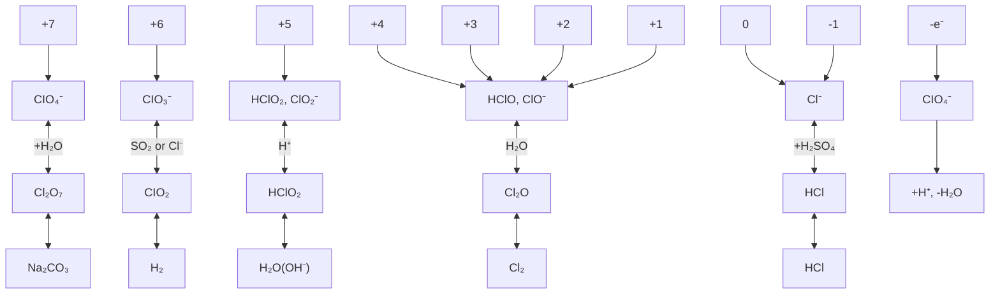

图 17.15 某些重要含氯物种不同氧化态之间的相互转化

水溶液中的 Cl(I) 物种是次氯酸(角形分子物种 H—O—Cl) 和次氯酸根离子 (ClO⁻)，它们都是易得的氧化剂，家庭中用作漂白剂和杀毒剂，实验室里用作氧化剂（应用相关文段 17.5）。该化合物的氧化还原反应速率相当快，似乎是由于还原剂容易无障碍地接近亲电的 Cl 原子。高氯酸根离子中的 Cl 原子受周围 O 原子阻碍而不易接近，其氧化还原反应速率慢得多。不少教科书和化学文献将次卤酸的化学式写成 HOX 是强调其结构，本书采用 HXO 这样的化学式则强调与其他氧合酸 HXOₙ 的关系。

次卤酸根离子能发生歧化，如 $ClO^{-}$ 歧化为 $Cl^{-}$ 和 $ClO_{3}^{-}$ :

$$
3 \mathrm{ClO} ^ {-} (\mathrm{aq}) \rightleftharpoons 2 \mathrm{Cl} ^ {-} (\mathrm{aq}) + \mathrm{ClO} _ {3} ^ {-} (\mathrm{aq}) \quad K = 1. 5 \times 1 0 ^ {2 7}
$$

该反应在工业上用于生产氯酸盐。 $ClO^{-}$ 在室温或低于室温时反应较慢，而 $BrO^{-}$ 的反应则要快得多。 $IO^{-}$ 的反应如此之快，以致只能检出该离子的中间体。

亚氯酸根离子 $\left(\mathrm{ClO}_{2}^{-}\right)$ 和亚溴酸根离子 $\left(\mathrm{BrO}_{2}^{-}\right)$ 都能发生歧化，然而反应速率强烈依赖于溶液的pH。碱性溶液中 $ClO_{2}^{-}$ 的歧化过程伴随着缓慢分解， $BrO_{2}^{-}$ 的分解程度低一些。与之形成对照的是，亚氯酸 $HClO_{2}$ 和亚溴酸 $HBrO_{2}$ 的歧化都相当迅速。碘（Ⅲ）物种甚至更难捕捉，只在水溶液中识别出亚碘酸 $HIO_{2}$ 的瞬态物种。

# 应用相关文段 17.5 氯系漂白剂

用作漂白剂的物质是强氧化剂。正如节17.2中提到的那样，卤素氧合阴离子的氧化能力随卤素原子氧化数的下降而增强，氯系漂白剂中即含有低氧化态的Cl原子。

氯在水中歧化生成氧化性的次氯酸根离子 $\left(\mathrm{ClO}^{-}\right)$ 和氯离子 $\left(\mathrm{Cl}^{-}\right)$ 。造纸工业、纺织工业和洗衣业使用浓度高至15%(质量分数)的次氯酸钠溶液作漂白剂，也用作游泳池的杀菌剂。家用漂白剂中NaClO的浓度较低(5%)，牙科医生在根管病治疗中使用0.5% NaClO水溶液，起到杀死病原体和清除坏死组织的作用。

其他次氯酸盐也被用作氧化剂。次氯酸钙 $\mathrm{Ca(ClO)_{2}}$ 在制酪业、酿酒业、食品加工业和装瓶厂用作消毒剂，也是一种家用除霉剂。漂白粉是 $\mathrm{Ca(ClO)_{2}}$ 和 $CaCl_{2}$ 的混合物，大规模用于海水、水库和污水管道的消毒，也用于清除化学武器（如芥子气）生产场所的污垢。

二氧化氯气体广泛用作木浆工业的漂白剂，比用其他漂白剂生产出来的纸张更白、强度也更大。这是因为不像氯、臭氧和过氧化氢等其他漂白剂那样破坏纤维素，从而维持了纸浆的机械强度。使用氯系漂白剂会产生有毒的有机氯化合物，毒性最大的多氯代酚（如二噁英）主要是使用了 $ClO_{2}$ 产生的。但如用 $Cl_{2}$ 代替部分 $ClO_{2}$ ，多氯代酚的含量就会急剧下降。

Cl 的 Frost 图(见图 17.14)表明,氯酸根离子 $\left(\mathrm{ClO}_{3}^{-}\right)$ 在酸性和碱性溶液中都不稳定,都易发生歧化:

$$
4 \mathrm{ClO} _ {3} ^ {-} (\mathrm{aq}) \rightleftharpoons 3 \mathrm{ClO} _ {4} ^ {-} (\mathrm{aq}) + \mathrm{Cl} ^ {-} (\mathrm{aq}) \quad \Delta_ {\mathrm{r}} G ^ {\ominus} = - 2 4 \mathrm{kJ} \cdot \mathrm{mol} ^ {- 1} \quad K = 1. 4 \times 1 0 ^ {2 5}
$$

由于 $HClO_{3}$ 是强酸及反应在高、低 pH 条件下都很慢， $ClO_{3}^{-}$ 容易在水溶液中操作。溴酸根离子和碘酸根离子热力学上都是稳定的，因而不发生歧化反应。

$\mathrm{BrO}_4^-$ 是三个 $\mathrm{XO}_4^-$ 中最强的氧化剂。高溴酸根偏离了相邻卤素类似化合物的变化趋势，该事实与第四周期p区元素化学往往反常的模式相符合。为了确认高溴酸根是氧化性最强的高卤酸根离子，我们需要考虑Frost图中高卤酸根离子与邻居离子间连线的斜率。连线的斜率越正，电对的氧化能力越强。由图不难看出，电对 $\mathrm{BrO}_4^-$ / $\mathrm{BrO}_3^-$ 连线的斜率是最正的。事实上，酸性溶液中 $\mathrm{ClO}_4^-$ / $\mathrm{ClO}_3^-$ 、 $\mathrm{BrO}_4^-$ / $\mathrm{BrO}_3^-$ 和 $\mathrm{IO}_4^-$ / $\mathrm{IO}_3^-$ 几个电对的 $E^{\ominus}$ 值分别为 $1.201\mathrm{V}, 1.853\mathrm{V}$ 和 $1.600\mathrm{V}$ ，从而表明高溴酸根离子是最强的氧化剂。

然而,稀酸中还原高碘酸根的反应快于还原高氯酸根和高溴酸根的反应,因而分析化学中用高碘酸盐作为滴定剂。 $IO_{4}^{-}$ 也用于合成反应,如用于二醇类化合物的氧化裂解:

$$
\mathrm{HOC} \left(\mathrm{CH} _ {3}\right) _ {2} \mathrm{C} \left(\mathrm{CH} _ {3}\right) _ {2} \mathrm{OH} + \mathrm{IO} _ {4} ^ {-} (\mathrm{aq}) \longrightarrow\begin{array}{c}\mathrm{Me} _ {2} \mathrm{C} \dots \mathrm{O}\\\mathrm{Me} _ {2} \mathrm{C} = \mathrm{O}\end{array}\stackrel {\mathrm{O}} {\underset {\mathrm{O}} {\rightleftharpoons}} \stackrel {\mathrm{OH}} {\underset {\mathrm{OH}} {\rightleftharpoons}} 2 \left(\mathrm{CH} _ {3}\right) _ {2} \mathrm{CO} + \mathrm{IO} _ {3} ^ {-} (\mathrm{aq}) + \mathrm{H} _ {2} \mathrm{O}
$$

# 17.16 氟碳化合物

提要:氟碳化合物分子和聚合物都能抗氧化。

氟碳化合物用途广泛(应用相关文段17.6)。脂肪烃与氧化性金属氟化物直接反应形成强C—F键 $(456\ \mathrm{kJ}\cdot\mathrm{mol}^{-1})$ ，副产物为HF：

$$
\mathrm{RH(1)} + 2 \mathrm {CoF_ {3} (s)} \longrightarrow \mathrm{RF(sol)} + 2 \mathrm {CoF_ {2} (s)} + \mathrm{HF(sol)} \qquad \mathrm{R=烷基或芳基}
$$

R 为芳基时, $CoF_{3}$ 与之反应得到的是饱和环状氟化物:

$$
\mathrm{C} _ {6} \mathrm{H} _ {6} (\mathrm{l}) + 1 8 \mathrm{CoF} _ {3} (\mathrm{s}) \longrightarrow \mathrm{C} _ {6} \mathrm{F} _ {1 2} (\mathrm{l}) + 1 8 \mathrm{CoF} _ {2} (\mathrm{s}) + 6 \mathrm{HF} (\mathrm{l})
$$

反应中使用的强氧化性氟化试剂 $CoF_{3}$ 可通过 $CoF_{2}$ 与 $F_{2}$ 之间的反应再生：

$$
2 \mathrm{CoF} _ {2} (\mathrm{s}) + \mathrm{F} _ {2} (\mathrm{g}) \longrightarrow 2 \mathrm{CoF} _ {3} (\mathrm{s})
$$

形成 C—F 键的另一重要方法是在催化剂(如 $SbF_{3}$ ) 存在条件下, 非氧化性氟化物(如 HF)与碳氯化合物之间发生的卤素交换反应:

$$
\mathrm{CCl} _ {4} (1) + \mathrm{HF} (1) \longrightarrow \mathrm{CCl} _ {3} \mathrm{F} (1) + \mathrm{HCl(g)}
$$

$$
\mathrm{CHCl} _ {3} (1) + 2 \mathrm{HF} (1) \longrightarrow \mathrm{CHClF} _ {2} (1) + 2 \mathrm{HCl(g)}
$$

这种过程从前被常用于生产氯氟烃(CFCs)和氢氯氟烃(HCFCs)，产品被用作制冷剂、喷雾罐里的喷雾剂和制造塑料泡沫产品的发泡剂。有些国家已禁止上述领域的应用，世界范围里也将全面禁止，这是因为CFCs和HCFCs参与臭氧层耗损过程。CFCs和HCFCs正在被氢氟烃(HFCs)所取代。后者的工业生产需要投入资金，因为与生产CFCs和HCFCs时简单的一步合成法不同，生产HFCs需要多步反应。例如， $\mathrm{CF_3CH_2F}$ (CFC的替代物之一)的合成路线是

$$
\mathrm{CCl} _ {2} = \mathrm{CCl} _ {2} \xrightarrow {\mathrm{HF} + \mathrm{Cl} _ {2}} \mathrm{CClF} _ {2} \mathrm{CCl} _ {2} \mathrm{F} \xrightarrow {\text {异构化}} \mathrm{CF} _ {3} \mathrm{CCl} _ {3} \xrightarrow {\mathrm{HF}} \mathrm{CF} _ {3} \mathrm{CCl} _ {2} \mathrm{F} \xrightarrow {\mathrm{H} _ {2}} \mathrm{CF} _ {3} \mathrm{CH} _ {2} \mathrm{F}
$$

氯二氟甲烷加热可转化为非常有用的 $C_{2}F_{4}$ 单体：

$$
2 \mathrm{CHClF} _ {2} \xrightarrow {6 0 0 \sim 8 0 0 ^ {\circ} \mathrm{C}} \mathrm{C} _ {2} \mathrm{F} _ {4} + 2 \mathrm{HCl}
$$

四氟乙烯单体的聚合需要使用自由基引发剂：

$$
n \mathrm{C} _ {2} \mathrm{F} _ {4} \xrightarrow {\mathrm{ROO}} (- \mathrm{CF} _ {2} - \mathrm{CF} _ {2} -) _ {n}
$$

市售聚四氟乙烯(PTFE)有多种商标,杜邦公司(DuPont)的商标为Teflon®（特氟龙）。聚四氟乙烯在高温下进行解聚是实验室制备四氟乙烯最方便的方法：

$$
\left(- \mathrm{CF} _ {2} - \mathrm{CF} _ {2} -\right) _ {n} \xrightarrow {6 0 0 ^ {\circ} \mathrm{C}} n \mathrm{C} _ {2} \mathrm{F} _ {4}
$$

尽管四氟乙烯毒性不高,反应副产物1,1,3,3,3-五氟-2-三氟甲基-1-丙烯却有毒,因而操作四氟乙烯粗制产品时需要仔细。

# 应用相关文段 17.6 PTFE: 一种高性能聚合物

聚四氟乙烯(PTFE)是塑料工业中独一无二的产品。PTFE在化学上显惰性,在很宽的温度区间里(-196\~260℃)对热稳定,是优良的电绝缘体,而且摩擦系数低,是由四氟乙烯聚合而制成的白色固体:

$$
n \mathrm{CF} _ {2} = \mathrm{CF} _ {2} \longrightarrow (\mathrm{CF} _ {2} \mathrm{CF} _ {2}) _ {n}
$$

PTFE 价格昂贵, 是由于单体的成本较高。单体的合成和提纯是经由多步反应完成的:

$$
\mathrm{CH} _ {4} (\mathrm{g}) + 3 \mathrm{Cl} _ {2} (\mathrm{g}) \longrightarrow \mathrm{CHCl} _ {3} (\mathrm{g}) + 3 \mathrm{HCl} (\mathrm{g})
$$

$$
\mathrm{CHCl} _ {3} (\mathrm{g}) + 2 \mathrm{HF(g)} \longrightarrow \mathrm{CHClF} _ {2} (\mathrm{g}) + 2 \mathrm{HCl(g)}
$$

$$
2 \mathrm{CHClF} _ {2} (\mathrm{g}) \xrightarrow {\triangle} \mathrm{CF} _ {2} = \mathrm{CF} _ {2} (\mathrm{g}) + 2 \mathrm{HCl} (\mathrm{g})
$$

用到的氟化氢由硫酸作用于氟化物产生：

$$
\mathrm{CaF} _ {2} (\mathrm{s}) + \mathrm{H} _ {2} \mathrm{SO} _ {4} (\mathrm{l}) \longrightarrow \mathrm{CaSO} _ {4} (\mathrm{s}) + 2 \mathrm{HF(g)}
$$

由于过程中用到 HF 和 HCl，反应器必须用铂作内衬。反应生成多种副产物，经过复杂的提纯才能得到终产品。

四氟乙烯用两种方法聚合:一种是剧烈搅拌下的溶液聚合,产生一种叫做“粒状 PTFE”的树脂;另一种是存在分散剂和缓和搅拌下的乳浊液聚合,产生一种叫做“分散状 PTFE”的小颗粒。熔融的聚合物不能流动,因而不能使用常用的加工方法。替代的加工方法相似于加工金属的方法,如将分散状 PTFE 通过冷挤压方法成型,金属铅就是这样加工的。

PTFE的非凡性质来自F原子绕碳骨架形成的护套，F原子的大小恰恰适合形成平滑护套。这种平滑护套能够减少聚合物表面上分子间力的断裂，从而导致低的摩擦系数和人们熟悉的不黏性。PTFE用途广泛：低导电性适于制造电绝缘胶布、电缆和同轴电缆；良好的机械性能适于制作密封件、活塞环和轴承；PTFE也用作包装材料、制作软管和密封螺纹的胶带。人们熟悉的还有不粘锅的涂层和戈尔斯特（Gore-Tex®）多孔纤维面料。

# 延伸阅读资料

M. Schnürch, M., Spina, A. F. Khan, M. D. Mihovilovic, and P. Stanetty, Halogen dance reactions: a review, Chem. Soc. Rev., 2007, 36, 1046.   
S. Purser, P. R. Moore, S. Swallow, and V. Gouverneur, Fluorine in medicinal chemistry, Chem. Soc. Rev., 2008, 37, 2, 320.   
A. G. Massey, Main group chemistry. John Wiley&Son (2000).   
D. M. P. Mingos, Essential trends in inorganic chemistry. Oxford University Press (1998).   
R. B. King(ed), Encyclopedia of inorganic chemistry. John Wiley&Son(2005).   
N. N. Greenwood and A. Earnshaw, Chemistry of the elements. Butterworth-Heinemann (1997).   
P. Schmittinger, Chlorine: principles and industrial practice. Wiley-VCH(2000).   
M. Howe-Grant, Fluorine Chemistry. John Wiley&Son (1995).   
C. Benson, The periodic table of the elements and their chemical properties. Kindle edition. MindMelder.com (2009).

# 练习题

17.1 不看参考资料,在周期表方框中写出卤素符号,并回答以下几方面的变化趋势:(a)室温常压下的物理状态(固体、液体或气体),(b)电负性,(c)卤素离子的硬度,(d)颜色。

17.2 叙述从自然界存在的卤化物提取卤素的方法，并用标准电位解释提取途径的合理性。给出平衡的化学方程式和反应条件。

17.3 绘出氯碱池略图,写出半反应,标出离子扩散方向。如果 $OH^{-}$ 迁移透过隔膜进入阳极室,写出将会发生的反应的方程式。

17.4 画出卤素分子 $\sigma^{*}$ 空轨道的形式, 叙述该轨道在卤素分子显示 Lewis 酸性中所起的作用。

17.5 从热力学观点出发,哪些卤素分子能将 $H_{2}O$ 氧化产生 $O_{2}$ ?

17.6 三氟化氮 $\left(\mathrm{NF}_{3}\right)$ 在 $-129^{\circ}C$ 沸腾，且是个很弱的 Lewis 碱。而相对分子质量较低的 $NH_{3}$ 却在 $-33^{\circ}C$ 沸腾并是个人所共知的 Lewis 碱。(a)叙述挥发性差别如此之大的原因，(b)叙述碱性不同的可能原因。

17.7 根据卤素和拟卤素之间的类比: (a) 氰 $(\mathrm{CN})_{2}$ 与 NaOH 水溶液可能发生反应, 写出平衡方程式, (b) 酸性水溶液中过量硫代氰酸盐与氧化剂 $\mathrm{MnO}_{2}(\mathrm{s})$ 可能发生反应, 写出化学方程式, (c) 写出三甲基硅氰化物可能的结构。

17.8 $1.84 \, g \, IF_{3}$ 与 $0.93 \, g[(CH_{3})_{4}N]F$ 反应生成 X，(a) X 是何物，(b) 用 VSEPR 模型预言 $IF_{3}$ 的形状以及 X 中阳离子和阴离子的形状，(c) 预言 $IF_{3}$ 和 X 中将会看到多少个 ${}^{19}F-NMR$ 信号。

17.9 用 VSEPR 模型预言 $SbCl_{5}$ 、 $FClO_{3}$ 和 $\left[ClF_{6}\right]^{+}$ 的形状。

17.10 给出 $ClF_{5}$ 与 $SbF_{5}$ 反应的产物，判断反应物和产物的形状。

17.11 绘出 $MCl_{4}F_{2}$ 和 $MCl_{3}F_{3}$ 二络合物的所有异构体，指出每种异构体的 ${}^{19}F-NMR$ 谱图中氟显示出多少种化学环境。

17.12 (a) 用 VSEPR 模型预言 $\left[\mathrm{IF}_{6}\right]^{+}$ 和 $\mathrm{IF}_{7}$ 可能具有的形状；(b) 写出可能制备出 $\left[\mathrm{IF}_{6}\right]\left[\mathrm{SbF}_{6}\right]$ 的反应方程式。

17.13 用 VSEPR 模型预言双氯桥分子 $I_{2}Cl_{6}$ 的形状并指派其点群。

17.14 预言 $ClO_{2}F$ 的形状并识别其点群。

17.15 判断下述溶质是否可能将液体 $BrF_{3}$ 当作 Lewis 酸或 Lewis 碱：(a) $SbF_{5}$ ，(b) $SF_{6}$ ，(c) CsF。

17.16 已知 $I_{5}^{-}$ 的键长和键角(5)，试用二中心和三中心 s 键描述其成键作用，并用 VSEPR 模型说明其结构。

17.17 预言 $IF_{5}^{+}$ 的 ${}^{19}F-NMR$ 光谱的形貌。

17.18 判断下述化合物与 $BrF_{3}$ 接触时是否可能存在爆炸危险，并给出你的解释：(a) $SbF_{5}$ ，(b) $CH_{3}OH$ ，(c) $F_{2}$ ，(d) $S_{2}Cl_{2}$ 。

17.19 由四烷基铵溴化物与 $Br_{2}$ 生成 $Br_{3}^{-}$ 的反应是个略微放能的反应，写出 $CH_{2}Cl_{2}$ 溶液中 $[NR_{4}][Br_{3}]$ 与 $I_{2}$ 相互作用的方程式（不反应时写 NR），并做出解释。

17.20 解释为什么 $CsI_{3}(s)$ 不易分解而 $NaI_{3}(s)$ 易分解。

17.21 写出(a) $ClO_{2}$ , (b) $I_{2}O_{6}$ 似乎合理的 Lewis 结构, 并预言它们的形状和相关的点群。

17.22 (a) 写出高溴酸和高碘酸的化学式并给出可能的相对酸性。(b) 哪一个更稳定?

17.23 （a）叙述溶液中氧合阴离子标准电位随 pH 下降而变化的趋势。（b）计算 pH=7 时 $ClO_{4}^{-}$ 的还原电位并与表中 pH=0 时的数值做比较，以证明答案（a）所述的现象。

17.24 根据 pH 影响氧合阴离子标准电位的一般规律,解释低 pH 环境往往更有利于氧合阴离子的歧化反应。

17.25 高氯酸和高碘酸两个氧化剂，哪一个在稀水溶液中更容易起反应？从机理上解释其差别。

17.26 利用图 17.4 中的 Frost 图或资料节 3 中的 Latimer 图, 计算下列电对在碱性溶液中的标准电位, 并论述还原反应的相对可行性。(a) $ClO_{4}^{-}/ClO^{-}$ , (b) $BrO_{4}^{-}/BrO^{-}$ , (c) $IO_{4}^{-}/IO^{-}$ 。

17.27 （a） $ClO^{-}$ 、 $ClO_{2}^{-}$ 、 $ClO_{3}^{-}$ 和 $ClO_{4}^{-}$ 四个阴离子中，哪种在酸性溶液中的歧化反应在热力学上有利（如果您不知道这些离子的性质，请从资料节3中的标准电位表确定）？（b）上述热力学上有利的物种中，哪一个在室温下反应很慢？

17.28 下列化合物中哪个(哪些)存在爆炸危险? (a) $NH_{4}ClO_{4}$ , (b) $\mathrm{Mg(ClO_{4})_{2}}$ , (c) $NaClO_{4}$ , (d) $[\mathrm{Fe(OH_{2})_{6}}]$ $[ClO_{4}]_{2}$ 。

17.29 用标准电位判断下列离子中哪个(哪些)在酸性条件下能被ClO $^{-}$ 氧化？(a) Cr $^{3+}$ ，(b) V $^{3+}$ ，(c) Fe $^{2+}$ ，(d) Co $^{2+}$ 。

17.30 识别从 A 到 G 的所有化合物。

![[无机化学第6版主族364-564_images/4047d9c96238ffedd5655b237c607891901e11a3ba6dfb60871203000a9337c1.jpg]]

chemical

Chemical reaction pathway diagram showing transformations between substances E, A, F₂, B, and C with reagents like CsF, Cl₂, SiO₂, OH⁻, H₂O, and H₂SO₄

17.31 正氧化态卤素的许多酸和盐未被列入主要的国际商品目录。(a) $KClO_{4}$ 和 $KIO_{4}$ 可买到, 而 $KBrO_{4}$ 不能, (b) $KClO_{3}$ 、 $KBrO_{3}$ 和 $KIO_{3}$ 都可买到, (c) $NaClO_{2}$ 和 $NaBrO_{2} \cdot 3H_{2}O$ 可买到, 而 $IO_{2}^{-}$ 的盐不能, (d) 只有 $ClO^{-}$ 的盐可买到, 而溴和碘的对应物则不能。几种氧合阴离子的盐不能从市场购得, 试说明可能是什么原因。  
17.32 指出下列叙述中哪些是错的，并给出正确的叙述：（a）卤化物的氧化是制备从 $F_{2}$ 到 $I_{2}$ 所有卤素元素唯一的工业方法。（b） $ClF_{4}^{-}$ 和 $I_{5}^{-}$ 是等叶瓣、同结构化合物。（c）被卤素氧合阴离子氧化的机理中，原子转移过程都是共同的。例如， $ClO^{-}$ 氧化 $SO_{3}^{2-}$ 时发生的氧原子转移。（d）高碘酸根似乎是个较高氯酸根更快捷的氧化剂，因为前者的中心原子 I（VII）易与还原剂配位，而还原剂更难接近后者的中心原子 Cl（VII）。

# 辅导性作业

17.1 卤素键的现象已经知道一个世纪以上。M. Erdelyi 在他的论文“The halogen bond in solution”(Chem. Soc. Rew., 2012,41,3547)中总结了这方面知识的现状。“halogen bonding”的意思是什么？关于卤素键的工作获得了1969年诺贝尔化学奖，谁是该奖项的获得者？叙述卤素成键作用对生物学的意义。列出已用于研究卤素成键相互作用的方法，简要给出这种化学键的分子轨道描述。说明二碘化物碱性大小尺度被用来量度什么，并给出基于这一尺度的假定。给出最先提出这一尺度的参考文献。  
17.2 R. Berger 及其合作者在一篇论文中讨论了有机氟化合物在材料化学中的潜在价值 (Chem. Soc. Rew., 2011, 40, 3496)。氟化富勒烯是他们讨论的一组化合物。给出最常使用的氟化富勒烯与一个有机物种反应形成反式轮烯 [18] 的反应方程式，并绘出产物的草图。论文也描述了氟在药物学中的应用，试总结氟为什么在制药化学中有广泛用途。  
17.3 I⁻的反应往往用于滴定ClO⁻，生成深色I₃⁻及Cl⁻和H₂O。虽然从未得到证实，人们过去还是认为开始发生的反应是从Cl到I的氧原子转移。然而现在则认为，反应中发生的是Cl原子的转移，生成ICI作为反应中间体（K. Kumar, R. A. Day, and D. W. Margerum, Inorg. Chem., 1986, 25, 4344），试总结发生Cl原子转移的证据。  
17.4 K. O. Christe 的研究成果(Inorg. Chem., 1986, 25, 3721)发表之前， $F_{2}$ 一直是用电化学方法制备的，写出克里斯特制备反应的化学方程式，并归纳出背后的原因。  
17.5 文献(A.J.Blake et al.,Chem.Soc.Rev.,1998,27,195)叙述了模板法合成长链多碘离子的方法。(a)根据作者的说法,已表征的最长链的多碘离子是什么?(b)阳离子的性质怎样影响多阴离子的结构?(c) $I_{7}^{-}$ 以 $I_{12}^{-}$ 的合成中使用的模板剂是什么?(d)这项研究中是用何种光谱方法表征多阴离子的?  
17.6 评论我国已经发表的关于饮用水加氟的研究工作。总结继续使用加氟方法处理饮用水的原因和反对这种方法的主要观点。  
17.7 工业上使用氯系漂白剂,请写一篇与此有关的环境问题的评论,并提出解决问题可能使用的方法。  
17.8 写出一篇评论,评述人体碘过量造成的生物学效应。讨论碘如何能用于治疗甲状腺作用不足(a)和甲状腺作用过度(b)的处方。

(李珺译,史启祯审)

# 第 18 族元素

p区最后一族包括6个元素，其性质是如此不活泼，以致只形成数目有限的化合物。直到19世纪末，人们才不再怀疑第18族元素的存在。它们的发现不但导致周期表的重构，对成键理论的发展也起过关键作用。

第18族6个元素(氦,氖,氩,氪,氙,氡)都是单原子气体,是周期表中反应活性最低的元素。随着某些性质确认后又否定的反复,这些元素的族名在过去多年间经历了给了又改的过程。它们曾被叫做“rare gases”和“inert gases”,现在的名称则是“noble gases”(译注:中译名为“稀有气体”,请读者留意这个译名的含义,它不是译自“rare gases”)。第一个名称被放弃,是因为氩并不稀有(氩在大气中的丰度大大高于 $CO_{2}$ );氙的化合物发现后,“惰性气体”这个名称也不再适用了。科学界现在接受了“noble gases”这个名称,是因为它更符合实际:反应活性低,但仍具反应活性。

![[无机化学第6版主族364-564_images/c9a17c5b227880f9902aa3151fd19188b52018881afa5a1159856481a576d863.jpg]]

text_image

1 2 13 14 15 16 17
Li Be B C N O F He Ne Ar Kr Xe At Rn
18

# A. 基本面

这里介绍稀有气体有限的化学行为,着力介绍表征较完全的氙化合物。

# 18.1 元素

提要:稀有气体中,只有氙能在较大范围里与氟和氧形成化合物。

所有第18族元素的反应活性都很低，这可从它们的原子性质（见表18.1）、特别是从它们的基态价电子组态 $(ns^2 np^6)$ 得到解释。值得注意的特征包括高电离能和负的电子亲和能，第一电离能高是由于周期右端元素具有高的有效核电荷；电子亲和能为负值是由于再进入的电子需要占据的轨道属于新的电子层。

表 18.1 元素的某些性质

<table><tr><td>性质</td><td>He</td><td>Ne</td><td>Ar</td><td>Kr</td><td>Xe</td><td>Rn</td></tr><tr><td>共价半径/pm</td><td>99</td><td>160</td><td>192</td><td>197</td><td>217</td><td>240</td></tr><tr><td>熔点/°C</td><td>-272</td><td>-249</td><td>-189</td><td>-157</td><td>-112</td><td>-71</td></tr><tr><td>沸点/°C</td><td>-269</td><td>-246</td><td>-186</td><td>-152</td><td>-108</td><td>-62</td></tr><tr><td>电子亲和能/(kJ·mol $^{-1}$ )</td><td>-48.2</td><td>-115.8</td><td>-96.5</td><td>-96.5</td><td>-77.2</td><td></td></tr><tr><td>第一电离能/(kJ·mol $^{-1}$ )</td><td>2373</td><td>2080</td><td>1520</td><td>1350</td><td>1170</td><td>1036</td></tr></table>

氦在宇宙和太阳中的质量分数高达 $2.3\%$ ，其丰度仅次于氢而高居第二位。大气中氦的含量极少，是因为氦原子运动速度快，以致能逃逸地球引力场。其他5种稀有气体元素在大气中都存在，地壳中氩和氖的丰度（体积分数分别为0.94和 $1.5\times 10^{-3}$ )比人们熟悉的许多元素（如砷和铋，见图18.1）都要高。氙和氡是该族最稀少的元素。氡是放射性衰变产物，其本身也不稳定（原子序数在铅之后），本底放射线约50%是氡产生的。

# 18.2 简单化合物

提要: 氙形成氟化物、氧化物和氟氧化物。

化合物中 Xe 最重要的氧化数是 +2、+4 和 +6。含有 Xe—F 键、Xe—O 键、Xe—N 键、Xe—H 键、Xe—C 键、Xe—M（金属）键的化合物都已制备出来。Xe 还以配体出现在化合物中。人们对氮的化学性质的了解比 Xe 少得多；像砹一样，氡的放射性高，对其化学行为难以进行研究。

氙与氟直接反应生成 $\mathrm{XeF}_2(1)$ 、 $\mathrm{XeF}_4(2)$ 和 $\mathrm{XeF}_6(3)$ 。固体 $\mathrm{XeF}_6$ 的结构较其气相单体的结构要复杂，其中含有氟离子桥连的 $\mathrm{XeF}_5^+$ 阳离子。氙的氟化物是强氧化剂，并能与 $\mathbf{F}^{-}$ 形成络合物（如 $\mathrm{XeF}_5^-$ ）。

氙形成三氧化氙 $\mathrm{XeO_3}$ (4) 和四氧化氙 $\mathrm{XeO_4}$ (5)，二者都发生爆炸性分解。碱金属的高氙酸盐已制备成功，这种白色晶体中的阴离子为 $\mathrm{XeO_6^{4-}}$ 。氙也形成若干种氟氧化物， $\mathrm{XeOF_2}$ (6) 和 $\mathrm{XeO_3F_2}$ (7) 分别为 T 形和三角双锥结构。四方锥分子 $\mathrm{XeOF_4}$ (8) 的物理性质和化学性质酷似 $\mathrm{IF}_5$ 。

![[无机化学第6版主族364-564_images/c1af173bd74bcde2fffb70091beb2a0334e802445d7e33ff94b51b707c444233.jpg]]

bar

| Element | log(丰度 / ppmV) |
|---|---|
| He | 0.72 |
| Ne | 1.26 |
| Ar | 3.97 |
| Kr | 0.06 |
| Xe | -1.07 |
| Rn | -6 |

图 18.1 稀有气体在地壳中的丰度纵坐标为大气中 ppm（按体积计）的对数值

![[无机化学第6版主族364-564_images/d831b257cedb216dc9fa6641a14ca04fb5c7762c451704a3393f45aaed1b84b4.jpg]]

chemical

Molecular orbital diagram showing Xe and F orbitals with electron density lobes

(1) $XeF_{2}$

![[无机化学第6版主族364-564_images/5888cde1de8626e0c9cf6a20381117d90a6b6941572cbf337bb25c73f83f10b1.jpg]]

chemical

Molecular structure of xenon (Xe) showing its atomic arrangement with fluorine atoms

(2) $\mathrm{XeF}_4$

![[无机化学第6版主族364-564_images/1998064d61d23a5b68ddad899ecb4444e94cfe0abb2a3254c9d772d5ec54d6a3.jpg]]

chemical

Molecular structure of xenon (Xe) and fluorine (F) atoms showing atomic positions

(3) $XeF_{6}$

![[无机化学第6版主族364-564_images/a2b8e28843645c52fe457c46a75f289664aea62c028b27339e6cc3a280924381.jpg]]  
(4) $\mathrm{XeO}_3$

![[无机化学第6版主族364-564_images/7dc89b13c8018c48a34e29b9a9e52ee20c9d7755de0bc452f845c8b4b725ecea.jpg]]  
(5) $XeO_{4}$

![[无机化学第6版主族364-564_images/7dbb828757834a7b6ab2efc9f97a47ef00ecdc88576b0047449fd3be2613f06d.jpg]]

chemical

Molecular structure diagram showing Xe, O, and F atoms in a trigonal planar geometry

(6) $XeOF_{2}$

![[无机化学第6版主族364-564_images/9a3a8e25268a3c9e8adefa47f7f114aa6812038bd5eba8938c694ba73d067dac.jpg]]

chemical

Molecular structure of xenon (Xe) showing oxygen and fluorine atoms in a coordination geometry

(7) $XeO_{3}F_{2}$

![[无机化学第6版主族364-564_images/2f61497685548b6fe3d9e33ffe199712f8388a66a467680a425ec677968ce44c.jpg]]

chemical

Molecular structure of xenon (Xe) showing oxygen and fluorine atoms with a central metal atom bonded to oxygen and two fluorine atoms

(8) $\mathrm{XeOF}_4$

氙形成多种氢化物，如 HXeH、HXeOH 和 HXeOXeH。在冰冻和高压条件下，氙、氩和氪与水能形成包合物（参见应用相关文段 14.3）。稀有气体还以客体原子存在于冰的三维结构中，其组成为 $E \cdot 6H_{2}O$ 。包合物的形成为操作氪和氙的放射性同位素提供了一种方便的方法 [节 10.6(a)]。

# B. 详述

这里详细叙述第18族元素的化学。该族元素虽属最不活泼的元素，它们（特别是氙）与氢、氧和卤素形成化合物的范围之广仍出乎人们的想象。

# 18.3 存在和提取

提要:稀有气体是单原子分子;氡是放射性元素。

由于稀有气体不活泼并难以在自然界富集，人们直到19世纪末才认识到它们的存在。门捷列夫根据其他元素化学性质的规律性设计了周期表，这些性质未能暗示可能存在稀有气体，因而表中没有为它们留下空位。1868年，太阳光谱中发现了当时已知元素都不存在的一条新谱线，人们最终认识到它是由氦产生的，氦及其同族元素才逐渐在地球上被发现。

稀有气体的名称反映了性质的奇特性。氦的名称来自希腊语“helios”，意为“太阳”；氖来自希腊语“neos”，意为“新”；氙来自“argos”，意为“不活泼”；氪来自“kryptos”，意为“隐藏”；氙来自“xenos”，意为“陌生”；氡是镭发生放射性衰变的产物，故随镭（Radium）而命名。

氦原子太轻,不能被重力场维持在地球上。因此,地球上的 He(按体积计约 5 ppm)主要是放射性元素衰变( $\alpha$ 辐射)的产物。某些天然气沉积(主要在美国和东欧)中氦的质量分数高达7%,可利用低温蒸馏技术从天然气中提取该元素(应用相关文段18.1)。地球上的氦有些来自太阳的太阳风( $\alpha$ 粒子)。氖、氩、氪和氙是用低温蒸馏技术从液态空气提取的。

# 应用相关文段 18.1 氨:需求正在增加的一种稀有气体

通过三步操作将氦从天然气中分离出来:第一步,脱除 $H_{2}O$ 、 $CO_{2}$ 和 $H_{2}S$ 等杂质;第二步,脱除相对分子质量高的烃;第三步,低温蒸馏法除净甲烷。上述步骤得到的产品为粗制氦,其中含有 $N_{2}$ 和含量少于 $N_{2}$ 的 Ar、Ne 和 $H_{2}$ 。氦的提纯或在液氮温度和高压下用活性炭处理,或用压力摆动吸附技术(pressure-swing adsorption)处理。

液氦用于冷却核反应堆、红外检测器和磁共振成像(MRI)中使用的超导磁体。设在欧洲核子研究中心的大型强子对撞机使用96 t液氦维持其磁体的低温，航天工业中用氦清洗火箭中剩余的燃料，氦3同位素( $^{3}$ He)用于中子检测器和肺部成像，氦在核聚变反应堆中也显示出潜在用途。

氦的需求量正在超过供应量，有科学家预言，全部氦将在20\~30年内用尽。美国曾在地下大规模储存氦，但1996年立法要求耗尽该储存，市场因而受到廉价氦的冲击，导致氦的耗量增加，人们也不再关心循环使用问题。目前氦的价格正快速上涨，人们正在寻找新资源，各种循环使用方法也受到鼓励。

该族所有元素室温下都是单原子气体，液态时则靠色散力形成低浓度的二聚体。位置靠上的稀有气体元素沸点很低（见表18.1），也是由于原子之间的色散力弱，而且不存在其他作用力。氦（具体指 $^{4}$ He，而不是含量更少的同位素 $^{3}$ He）冷至2.178 K以下时转化为第二液相（氦Ⅱ）。氦Ⅱ能发生无黏度流动，因而是一种超流体。固体氦只能在高压下才能形成。

# 18.4 用途

提要:氦用作惰性气体,也用作激光和放电灯的光源。液体氦是极低温制冷剂。

凭借低密度和不可燃性,氦用于气球和轻于空气的航空器。极低的沸点让它广泛用于低温实验,并用作产生极低温度的制冷剂。它还是超导磁体的冷却剂,超导磁体用在 NMR 光谱和磁共振成像。半导体材料(如 Si)的晶体生长中以氦为惰性气氛。He 与 $O_{2}$ 按 4:1 比例混合制造供潜水员使用的人工大气,由于氦的溶解度低于氮,能使发生减压症(沉箱病)的危险降至最低。该气体混合物的密度低于氧空气混合物,吸入肺部后受到的阻力较小,因此用于治疗急性气喘。

氩最广泛的用途是为制造空气敏感化合物提供惰性气氛，并为金属焊接提供氩弧以防止氧化。它也用作制冷剂。由于导热性低，密封的两层窗玻璃之间充氩以减少热散失。

氙具有麻醉性,但并未广泛用于临床,这是因为其价格比 $N_{2}O$ 高出大约 2000 倍。氙的同位素在医学上用于成像(应用相关文段 18.2)。

# 应用相关文段 18.2 $^{129}$ Xe-NMR 用于医疗和材料化学研究

磁共振成像(MRI)在医疗上广泛用于人体内部软物质的高质量成像。这项技术依赖组织中水分子的质子提供MRI信号，但某些部位(特别是肺部和脑部)的质子却难以成像。幸运的是，其他NMR活性核也能用于MRI，如 $^{129}$ Xe(丰度26.4%，I=1/2)。 $^{129}$ Xe核自旋的极化程度太低而无法给出良好信号，信号质量往往通过使用低温或增大外磁场的方法来改善。通过与极化了的碱金属之间的自旋交换可将极化程度提高 $10^{5}$ 数量级，将这种超极化的 $^{129}$ Xe吸入肺里，就能获得肺部的MRI图像。吸入肺部的氙经血液转移到其他组织，从而也能获得循环系统、脑部和其他活体器官的图像。超极化的 $^{129}$ Xe-NMR也用于材料化学研究，如考察介孔材料（如沸石、水泥等）和软物质（如高分子物质熔体、弹性体等）的结构。

$^{129}$ Xe 的丰度为 26.4% 这一事实意味着, 它在氙化合物的光谱表征中可用于记录常规 NMR。该过程在其他 NMR 核的谱图 (见 8.6) 中产生相对强度为 13:74:13 的卫星峰。

氡既是核电厂的产物,也是自然界 U 和 Th 发生放射性衰变的产物。氡产生的电离核辐射对人体健康存在危险。宇宙射线产生的氡和地球本身的氡通常不是环境本底辐射的主要来源,然而一些地域的土壤、岩石或建筑材料含有足够浓度的铀,使建筑物中出现过量气体氡。

由于化学反应活性极低,稀有气体被广泛用作各种光源,包括霓虹灯、荧光灯(氖和氦分别产生红光和黄光)和氙闪光灯(产生短暂的突发性可见光和紫外光)等传统光源。它们也用作激光光源,如氦氖激光、氩离子激光和氪离子激光。氩作为惰性气氛用在白炽灯灯泡中减弱灯丝的燃烧。不论是哪种场合,都是通过气体放电使其中的一些原子电离、并让离子和中性原子处于激发态,后者在返回较低能态的过程中发射出电磁波。

# 18.5 氙的氟化物的合成和结构

提要:氙与氟反应生成 $XeF_{2}$ 、 $XeF_{4}$ 和 $XeF_{6}$ 。

发现稀有气体之后,人们就对其反应活性进行着零散的研究,但早期迫使它们形成化合物的尝试都不成功。直到1960年代,才用光谱方法检测到 $He_{2}^{+}$ 、 $Ar_{2}^{+}$ 等不稳定双原子物种的存在。1962年3月,N.巴利特(University of British Columbia)观察到稀有气体的反应。巴利特的报道和R.Hoppe研究组(University of Munster)在此后几周的报道掀起的热潮遍及全世界。一年之内合成并表征了一系列氙的氟化物和氧化物。该领域的发展从某种意义上讲仍然有限,但稀有气体与氮、与碳、与金属形成的化合物都已制备成功。

巴利特研究氙的意念来自一个现象和一个事实。一个现象是 $PtF_{6}$ 能将 $O_{2}$ 氧化生成固体 $O_{2}PtF_{6}$ ，一个事实是氙的电离能与氧分子电离能相近。实际上氙与 $PtF_{6}$ 反应的确生成固体物质，但产物组成因反应复杂而仍不清楚。氙与氟直接反应则生成氧化数为 $+2(\mathrm{XeF}_{2})$ 、 $+4(\mathrm{XeF}_{4})$ 和 $+6(\mathrm{XeF}_{6})$ 的系列化合物。

$\mathrm{XeF_2}$ 和 $\mathrm{XeF_4}$ 的结构已由衍射法和光谱法所确定，然而在气相对 $\mathrm{XeF_6}$ 进行的类似测定则得出这样的结论： $\mathrm{XeF_6}$ 是瞬变分子。红外光谱法和电子衍射法研究表明， $\mathrm{XeF_6}$ 的结构在三重轴方向发生畸变，表明张开的F原子三角面接纳了一对孤对电子(3)。一种解释是，瞬变产生于孤对电子从一个三角面移到另一个。固态 $\mathrm{XeF_6}$ 由 $\mathbf{F}^{-}$ 桥连的 $\mathrm{XeF}_5^+$ 单元组成，溶液中则形成 $\mathrm{Xe_4F_{24}}$ 四聚体。气相和固态的分子结构和电子结构都相似于与之等电子的多卤阴离子 $\mathrm{I}_3^-$ 和 $\mathrm{ClF}_4^-$ [节17.10(e)]。

氙的氟化物由元素直接反应的方法合成。反应通常在镍制容器中完成，容器事先用 $F_{2}$ 钝化使表面生成 $NiF_{2}$ 保护层。这种处理方法也是为了除去金属表面的氧化物，否则氧化物会与生成的氙的氟化物起反应。下列反应式中标出的合成条件表明，较高的氟/氙比和较高的总压力有利于生成较高氧化态的氟化物：

$$
\mathrm{Xe(g)} + \mathrm {F_ {2} (g)} \xrightarrow {4 0 0 ^ {\circ} \mathrm{C,1atm}} \mathrm {XeF_ {2} (g)} \qquad (\mathrm{Xe过量})
$$

$$
\mathrm{Xe(g)} + 2 \mathrm {F_ {2} (g)} \xrightarrow {6 0 0 ^ {\circ} \mathrm{C,6atm}} \mathrm {XeF_ {4} (g)} \qquad (\mathrm{Xe:F} _ {2} = 1: 1. 5)
$$

$$
\mathrm{Xe(g)} + 3 \mathrm {F_ {2} (g)} \xrightarrow {3 0 0 ^ {\circ} \mathrm{C,60atm}} \mathrm {XeF_ {6} (g)} \qquad (\mathrm{Xe:F} _ {2} = 1: 2. 0)
$$

也可用简单的“窗台”合成法进行合成。氙和氟被密封于玻璃球（预先严格干燥，以防止生成HF和HF对玻璃的腐蚀）中并将其置于太阳光下，球中即缓慢生成美丽的 $\mathrm{XeF}_2$ 晶体。您应当记得 $\mathbf{F}_2$ 会发生光分解（节17.5），“窗台”合成法中正是光化学产生的F原子与Xe原子发生反应。

# 18.6 氙的氟化物的反应

提要:氙的氟化物是强氧化剂,能与 $F^{-}$ 形成络合物(如 $XeF_{5}^{-}$ 、 $XeF_{7}^{-}$ 和 $XeF_{8}^{2-}$ );还被用来制备含 Xe—O、Xe—N 键的化合物。

氙的氟化物的反应类似于高氧化态卤素互化物的反应（节17.10），其主要反应类型包括氧化还原和复分解。 $\mathrm{XeF_6}$ 的一个重要反应是与氧化物之间的复分解：

$$
\mathrm{XeF} _ {6} (\mathrm{s}) + 3 \mathrm{H} _ {2} \mathrm{O} (\mathrm{l}) \longrightarrow \mathrm{XeO} _ {3} (\mathrm{aq}) + 6 \mathrm{HF(g)}
$$

$$
2 \mathrm{XeF} _ {6} (\mathrm{s}) + 3 \mathrm{SiO} _ {2} (\mathrm{s}) \longrightarrow 2 \mathrm{XeO} _ {3} (\mathrm{s}) + 3 \mathrm{SiF} _ {4} (\mathrm{g})
$$

氙的氟化物另一引人注目的性质是强氧化性：

$$
2 \mathrm{XeF} _ {2} (\mathrm{s}) + 2 \mathrm{H} _ {2} \mathrm{O} (1) \longrightarrow 2 \mathrm{Xe(g)} + 4 \mathrm{HF(g)} + \mathrm{O} _ {2} (\mathrm{g})
$$

$$
\mathrm{XeF} _ {4} (\mathrm{s}) + \mathrm{Pt} (\mathrm{s}) \longrightarrow \mathrm{Xe} (\mathrm{g}) + \mathrm{PtF} _ {4} (\mathrm{s})
$$

类似于卤素互化物，氙的氟化物与强 Lewis 酸反应生成氟化氙阳离子：

$$
\mathrm{XeF} _ {2} (\mathrm{s}) + \mathrm{SbF} _ {5} (\mathrm{l}) \longrightarrow [ \mathrm{XeF} ] ^ {+} [ \mathrm{SbF} _ {6} ] ^ {-} (\mathrm{s})
$$

这些阳离子能被 $\mathbf{F}^{-}$ 桥连于相反离子。

与卤素互化物的另一相似性表现在: 在乙腈( $CH_{3}CN$ )溶液中, $XeF_{4}$ 与作为 Lewis 碱的 $F^{-}$ 反应生成 $XeF_{5}^{-}$ :

$$
\mathrm{XeF} _ {4} + \left[ \mathrm{N} \left(\mathrm{CH} _ {3}\right) _ {4} \right] \mathrm{F} \longrightarrow \left[ \mathrm{N} \left(\mathrm{CH} _ {3}\right) _ {4} \right] ^ {+} \left[ \mathrm{XeF} _ {5} \right] ^ {-}
$$

$\mathrm{XeF}_5^-$ 具有五角平面结构(9)，根据VSEPR模型，Xe原子上的两个电子对占据轴向位置分布在平面两侧。与之相类似，多年来人们就知道，随着 $\mathbf{F}^{-}$ 用量比的不同， $\mathrm{XeF}_6$ 与 $\mathbf{F}^{-}$ 离子源反应分别生成 $\mathrm{XeF}_7^-$ 或 $\mathrm{XeF}_8^{2-}$ 。人们只知道 $\mathrm{XeF}_8^{2-}$ 的形状为四方反棱柱体(10)，这种形状难以与简单的VSEPR模型一致起来，因为它不能给Xe原子上的孤对电子提供位置。

作为起始物,氙的氟化物也用来制备稀有气体与 F 和 O 之外的元素形成的化合物。对这类化合物而言,一个有用的合成策略是利用亲核试剂与氟化氙之间的反应。例如:

$$
\mathrm{XeF} _ {2} + \mathrm{HN(SO} _ {2} \mathrm{F)} _ {2} \longrightarrow \mathrm{FXeN(SO} _ {2} \mathrm{F)} _ {2} + \mathrm{HF}
$$

反应向右进行的驱动力来自产物 HF 的稳定性和 Xe—N 键(11)的生成能。强 Lewis 酸(如 AsF₅)能从该反应产物中抽取 F⁻ 得到阳离子 [XeN(SO₂F)₂]⁺。获得 Xe—N 键化合物的另一途径是先让氟化物与强 Lewis 酸反应：

$$
\mathrm{XeF} _ {2} + \mathrm{AsF} _ {5} \longrightarrow [ \mathrm{XeF} ] ^ {+} [ \mathrm{AsF} _ {6} ] ^ {-}
$$

接着引入 Lewis 碱(如 $CH_{3}CN$ ) 得到 $\left[CH_{3}CNXe\right]^{+}\left[AsF_{6}\right]^{-}$ 。

![[无机化学第6版主族364-564_images/cab3c219fbf6e605c0c5947b9cb248b087d4d6703192d8a79e322b55ed148239.jpg]]

chemical

Molecular structure of xenon (Xe) showing atom types and bonding geometry

(9) $XeF_{5}^{-}$

![[无机化学第6版主族364-564_images/7bf79caa3ec215d8168a2d2133ee0ee613ff442702e05fe1a673fbd17115b521.jpg]]

chemical

Molecular structure of xenon (Xe) showing atomic arrangement and unit cell representation

(10) XeF $_{8}^{2-}$

![[无机化学第6版主族364-564_images/30c6ea6758316d06f4cef10b975ada7b115b4fde9f0f4dca98667af2eac356d3.jpg]]

chemical

Molecular structure diagram showing sulfur (S), nitrogen (N), oxygen (O), fluorine (F), and xenon (Xe) atoms with labeled bonds

(11) FXeN(SO $_2$ F) $_2$

# 18.7 氙氧化合物

提要: 氙的氧化物不稳定, 具有高爆炸性。

氙的氧化物是吸能化合物 $\left(\Delta_{\mathrm{f}}G^{\ominus}>0\right)$ ，不能通过元素直接反应的方法制备。氧化物和氧氟化物是用氟化物水解的方法制备的：

$$
\mathrm{XeF} _ {6} (\mathrm{s}) + 3 \mathrm{H} _ {2} \mathrm{O} (1) \longrightarrow \mathrm{XeO} _ {3} (\mathrm{s}) + 6 \mathrm{HF} (\mathrm{aq})
$$

$$
3 \mathrm{XeF} _ {4} (\mathrm{s}) + 6 \mathrm{H} _ {2} \mathrm{O} (1) \longrightarrow \mathrm{XeO} _ {3} (\mathrm{s}) + 2 \mathrm{Xe(g)} + 3 / 2 \mathrm{O} _ {2} (\mathrm{g}) + 1 2 \mathrm{HF(aq)}
$$

$$
\mathrm{XeF} _ {6} (\mathrm{s}) + \mathrm{H} _ {2} \mathrm{O} (1) \longrightarrow \mathrm{XeOF} _ {4} (\mathrm{s}) + 2 \mathrm{HF} (\mathrm{aq})
$$

$\mathrm{XeO_3}$ 具锥形结构（4），这个吸能化合物具有高爆炸性，因而存在严重危险。它在酸性溶液中是个很强的氧化剂， $E^{\ominus}(\mathrm{XeO}_3,\mathrm{Xe}) = +2.10\mathrm{V}$ 。在碱性水溶液中， $\mathrm{Xe(VI)}$ 的氧合阴离子 $\mathrm{HXeO_4^-}$ 以歧化和水氧化相偶合的反应缓慢分解生成高氙酸根离子 $(\mathrm{XeO}_6^{4-}$ ，其中 $\mathrm{Xe}$ 的氧化数为 $+8)$ 和氙：

$$
2 \mathrm{HXeO} _ {4} ^ {-} (\mathrm{aq}) + 2 \mathrm{OH} ^ {-} (\mathrm{aq}) \longrightarrow \mathrm{XeO} _ {6} ^ {4 -} (\mathrm{aq}) + \mathrm{Xe(g)} + \mathrm{O} _ {2} (\mathrm{g}) + 2 \mathrm{H} _ {2} \mathrm{O(l)}
$$

碱性条件下用臭氧处理 $XeO_{3}$ 能制备碱金属的高氙酸盐, 这些化合物为白色晶形固体, 其中含有八面体 $XeO_{6}^{4-}$ 单元(12)。在酸性溶液中, 它们是强的氧化剂:

$$
\mathrm{XeO} _ {6} ^ {4 -} (\mathrm{aq}) + 3 \mathrm{H} ^ {+} (\mathrm{aq}) \longrightarrow \mathrm{HXeO} _ {4} ^ {-} (\mathrm{aq}) + 1 / 2 \mathrm{O} _ {2} (\mathrm{g}) + \mathrm{H} _ {2} \mathrm{O} (1)
$$

用浓硫酸处理 $Ba_{2}XeO_{6}$ 产生唯一已知的、爆炸性的、不稳定气体的氙氧化物 $XeO_{4}(5)$ 。很多氙化合物的分子结构可以用 VSEPR 模型成功预测。高氙酸盐离子的 Lewis 结构见（13），Xe 原子周围有 6 对电子。VSEPR 模型能成功判断许多氙化合物的结构，根据此模型，成键电子对应该按八面体方式排布，整体结构也应是八面体。

氙的氧氟化物包括 $\mathrm{XeOF_2(6)}$ 、 $\mathrm{XeO_3F_2(7)}$ 和 $\mathrm{XeOF_4(8)}$ 。将碱金属氟化物溶于 $\mathrm{XeOF_4}$ ，生成组成为 $\mathrm{F}^{-}\cdot 3\mathrm{XeOF}_{4}$ 的溶剂化氟离子。从溶剂化物脱除 $\mathrm{XeOF_4}$ 的尝试却得到五方锥的 $\mathrm{XeOF}_5^-$ (14)。

![[无机化学第6版主族364-564_images/7921c6d85c8a33eee563aa0d5ab3eeb7c83554a6791c3638d0af56bb65f92ee1.jpg]]

chemical

Molecular structure of xenon (Xe) showing electron density distribution

(12) $XeO_{6}^{4-}$

![[无机化学第6版主族364-564_images/38b851e0e3bca4fd0b6c0262f79dc7e59a3851aac77c0a8fb2f125fc5ad0b971.jpg]]  
(13) $XeO_{6}^{4-}$

![[无机化学第6版主族364-564_images/06249e3f1344a2b5ea7902e6a988733aa38505cda0cbecd91f8f27a097846ffd.jpg]]

chemical

Molecular structure of an iron (Xe) center with oxygen and fluorine atoms labeled

(14) $\mathrm{XeOF}_5^-$

$^{129}$ Xe-NMR 谱可用来研究氙化合物的结构。例如， $\mathrm{XeOF_{4}(8)}$ 的 $^{129}$ Xe-NMR 谱为五重峰，相应于 Xe 原子与 4 个等价 $^{19}$ F 原子偶合而形成的单一化学环境。

# 例题18.1 稀有气体化合物的合成

题目:以氙和您选用的其他试剂为起始物,叙述高氙酸钾的合成步骤。

答案:氙氧化合物是吸能化合物,不能通过氙与氧直接反应合成,需要找到一个间接方法。如课文所述, $XeF_{6}$ 水解生成 $XeO_{3}$ ,后者在碱性溶液中发生歧化生成高氙酸根离子 $XeO_{6}^{4-}$ 。 $XeF_{6}$ 可由氙与过量氟在300℃和6MPa条件下于镍制容器中合成。制得的 $XeF_{6}$ 可转化为高氙酸钾。这种转化可将 $XeF_{6}$ 置于KOH水溶液中一步完成,以水合物形式析出的高氙酸钾通过结晶进行提纯。

自测题 18.1 写出氙酸根离子在碱性溶液中分解制备高氙酸根离子、氙和氧的化学方程式并配平。

# 18.8 氙的插入化合物

提要: 氙能插入 H—Y 键。

低温下能离析出通式为 HEY 的多种稀有气体氢化物，通式中的 E 代表第 18 族元素，Y 代表电负性元素或碎片。最早确认的插入化合物包括 HXeCl、HXeBr、HXeI 和 HKrCl，新近表征的化合物有 HKrCN 和 HXeC₃N。它们全部经由低温下 UV 光解固态稀有气体中 HY 前体的方法制备（应用相关文段 18.3）。如果用此法让 Xe 与 H₂O 反应，则产生 HXeOH(15) 和 HXeO 自由基，后者再与另一 Xe 原子和氢反应生成 HXeOXeH(16)。HXeOXeH 相对于 H₂O 和 2 个 Xe 原子而言是个介稳物种，却比 HXeOH、HXeH 和 HXeBr 更稳定。对 C₂H₂ 和 Xe 的固体混合物进行光解和退火操作，已成功将 Xe 原子插入烃类化合物的 C—H 键。利用这种方法还制得了稀有气体的氢化物 HXeCCH(17) 和 HXeCCXeH(18)。

![[无机化学第6版主族364-564_images/4009a5703b3e35ea609b757bfab2df5a05ba1b9c30af5b31761f9b55c94f0a11.jpg]]

chemical

Two chemical structures labeled (15) HXeOH and (17) HXeCCH, showing atomic arrangements with hydrogen and oxygen atoms connected by bonds.

![[无机化学第6版主族364-564_images/ab26d1bde1e1234e34d619e605a635d450d3114e191060e7106ce96f4d8fbd9e.jpg]]

chemical

Two organic molecular structures labeled (16) O(XeH)₂ and (18) HXeCCXeH, showing hydrogen bonding interactions.

插入反应可能握有解释所谓“氙迷失”现象的钥匙。相对于其他稀有气体元素，大气中氙的含量偏低20倍。一种理论认为，地球内部的氙能形成稳定化合物。形成插入化合物的事实暗示，极端条件下的确存在形成氙化合物的可能性。新近的研究表明，高温和高压条件下氙能与硅酸盐矿物中的Si发生交换。

# 应用相关文段18.3 基体隔离中的稀有气体

术语“基体隔离”原被用来描述将活泼物种捕集至任何惰性基体（如高分子和树脂类物质）的技术，但更多是指将活泼物种捕集于稀有气体基体或氮基体中。使用稀有气体作为基体是基于它们的两种性质：低反应活性和固态的光学透明度。基体隔离法使各种光谱技术能用来研究非常活泼或非常不稳定的物种。在低温和高真空条件下，将活泼物种捕集至大体积的惰性基体中，低温条件确保了基体的刚性。为了进行研究，需要先将基体和样品凝结至某种表面或光池上。客体物种被镶嵌于固态主体基体之中，并保持足够稀释的状态以确保相互分隔。以稀有气体为主体的“基体隔离”也被用来研究活泼的含稀有气体的物种，如在Xe中已经研究了HXeI，在Kr中已经研究了HKrCN。

# 18.9 有机氙化合物

提要:通过有机硼化合物的氙去硼作用制备有机氙化合物。

第一个含 Xe—C 键的化合物是 1989 年报道的。自那时以来，已制备出多种有机氙化合物。对有机氙化合物的合成而言，最有用的路线是以 $XeF_{2}$ 和 $XeF_{4}$ 为起始物的路线。

有机氙(Ⅱ)的盐类可由有机硼烷的氙去硼作用(xenodeborylation,即硼被氙取代)制备。例如,三(五氟苯基)硼烷与 $XeF_{2}$ 在二氯甲烷中反应生成芳基氙(Ⅱ)的氟硼酸盐(19):

$$
\left(\mathrm{C} _ {6} \mathrm{F} _ {5}\right) _ {3} \mathrm{B} + \mathrm{XeF} _ {2} \xrightarrow {\mathrm{CH} _ {2} \mathrm{Cl} _ {2}} \left[ \mathrm{C} _ {6} \mathrm{F} _ {5} \mathrm{Xe} \right] ^ {+} + \left[ \left(\mathrm{C} _ {6} \mathrm{F} _ {5}\right) _ {n} \mathrm{BF} _ {4 - n} \right] ^ {-} \quad n = 1, 2
$$

如果反应在无水 HF 中进行, 所有的 $C_{6}F_{5}$ 基则被转移至 Xe:

$$
\left(\mathrm{C} _ {6} \mathrm{F} _ {5}\right) _ {3} \mathrm{B} + 3 \mathrm{XeF} _ {2} \xrightarrow {\mathrm{HF}} 3 \left[ \mathrm{C} _ {6} \mathrm{F} _ {5} \mathrm{Xe} \right] ^ {+} + \left[ \mathrm{BF} _ {4} \right] ^ {-} + 2 \left[ \mathrm{F(HF)} _ {n} \right] ^ {-}
$$

如果以有机二氟硼烷 $\left(\mathrm{RBF}_{2}\right)$ 为起始物，则能引入其他有机基团：

$$
\mathrm{RBF} _ {2} + \mathrm{XeF} _ {2} \xrightarrow {\mathrm{CH} _ {2} \mathrm{Cl} _ {2}} [ \mathrm{RXe} ] ^ {+} + [ \mathrm{BF} _ {4} ] ^ {-}
$$

除氙去硼作用外，有机氙（Ⅱ）化合物（20）也可由 $\mathrm{C_6F_5SiMe_3}$ 制备：

$$
3 \mathrm{C} _ {6} \mathrm{F} _ {5} \mathrm{SiMe} _ {3} + 2 \mathrm{XeF} _ {2} \xrightarrow {\mathrm{CH} _ {2} \mathrm{Cl} _ {2}} \mathrm{Xe(C} _ {6} \mathrm{F} _ {5}) _ {2} + \mathrm{C} _ {6} \mathrm{F} _ {5} \mathrm{XeF} + 3 \mathrm{Me} _ {3} \mathrm{SiF}
$$

有机氙(Ⅱ)化合物对热不稳定,高于-40℃即分解。

第一个有机氙（Ⅳ）化合物是在 $CH_{2}Cl_{2}$ 溶液中通过 $XeF_{4}$ 与 $C_{6}H_{5}BF_{2}$ 之间的反应制备的：

$$
\mathrm{C} _ {6} \mathrm{H} _ {5} \mathrm{BF} _ {2} + \mathrm{XeF} _ {4} \xrightarrow {\mathrm{CH} _ {2} \mathrm{Cl} _ {2}} [ \mathrm{C} _ {6} \mathrm{H} _ {5} \mathrm{XeF} _ {2} ] [ \mathrm{BF} _ {4} ]
$$

有机氙(Ⅳ)化合物的热稳定性不如类似的有机氙(Ⅱ)化合物。所有有机氙(Ⅱ)和有机氙(Ⅳ)的盐中,Xe原子都与π体系中的C原

![[无机化学第6版主族364-564_images/47a590286c8c9295c82e657cfc0365488a2fe99c34cb077843fa359eebdba3e0.jpg]]

chemical

Chemical structure of a fluorinated benzene derivative with Xe substituent

(19) $C_{6}F_{5}Xe^{+}$

![[无机化学第6版主族364-564_images/ec677ab570ff4d6e85b592152b78eab10bb1be6db15a9186a20beb0dddb8b4e3.jpg]]

chemical

Chemical structure of a fluorinated benzene derivative with Xe substituent

(20) $\mathrm{Xe}(\mathrm{C}_{6}\mathrm{H}_{5})_{2}$

子键合。扩展的 $\pi$ 体系（如芳基中的 $\pi$ 体系）能增加 Xe—C 键的稳定性，如果芳基上存在吸电子取代基（如氟），稳定性则会进一步增加。

# 18.10 配位化合物

提要:氩、氙和氪形成配位化合物,这些化合物通常是用基体隔离法进行研究的;络合物的稳定性顺序是 Xe>Kr>Ar。

1970年代中期制备出稀有气体的配位化合物。第一个合成的稀有气体的稳定配位化合物是 $\left[\mathrm{AuXe}_{4}\right]^{2+}\left[\mathrm{Sb}_{2}\mathrm{F}_{11}\right]^{2-}$ ，其中的阳离子 $\left[\mathrm{AuXe}_{4}\right]^{2+}$ 为四方平面形结构（21）。该化合物是在气体氙中用 $\mathrm{HF}/\mathrm{SbF}_{5}$ 还原 $\mathrm{AuF}_{3}$ 的方法制备的，反应中生成在 $-78^{\circ}\mathrm{C}$ 以下能稳定存在的暗红色晶体。也可采用加氙于 $\mathrm{Au}^{2+}$ 的 $\mathrm{HF}/\mathrm{SbF}_{5}$ 溶液的方法制备，此时生成 $-40^{\circ}\mathrm{C}$ 以下能稳定存在的暗红色溶液。如果气体氙的压力提高至 $1\mathrm{MPa}$ （约 $10\mathrm{atm}$ ），该溶液在室温也是稳定的。 $\mathrm{HF}/\mathrm{SbF}_{5}$ 体系极强的Brønsted酸性（节15.11）对 $\mathrm{Au}^{3+}$ 还原为 $\mathrm{Au}^{2+}$ 的过程至关重要，下述总反应显示出质子所起的作用：

$$
\mathrm{AuF} _ {3} + 6 \mathrm{Xe} + 3 \mathrm{H} ^ {+} \xrightarrow {\mathrm{HF/SbF} _ {5}} [ \mathrm{AuXe} _ {4} ] ^ {2 +} + \mathrm{Xe} _ {2} ^ {+} + 3 \mathrm{HF}
$$

-60 ℃时同时还产生绿色晶体 $\left[Xe_{2}\right]^{+}\left[Sb_{4}F_{21}\right]^{-}$ ，其中Xe—Xe键键长为309 pm。蓝色线形 $Xe_{4}^{+}$ 阳离子也已被表征，两种键的键长分别为353 pm和319 pm(22)，是同核主族元素之间最长的化学键。用基体隔离技术已经研究了 $\left[HXeXe\right]^{+}F^{-}$ ， $\left[HArAr\right]^{+}F^{-}$ 和 $\left[HKrKr\right]^{+}F^{-}$ 。

许多稀有气体形成的络合物是用基体隔离法表征的瞬态物种。固体氙中的 $\left[\mathrm{Fe}(\mathrm{CO})_{5}\right]$ 于 $12\mathrm{K}$ 发生光解生成 $\left[\mathrm{Fe}(\mathrm{CO})_{4}\mathrm{Xe}\right]$ 。与之相类似，固体氙、氮和氙中的 $\mathrm{M}(\mathrm{CO})_{6}(\mathrm{M} = \mathrm{Cr},\mathrm{Mo},\mathrm{W})$ 于 $20\mathrm{K}$ 发生光解生成 $\left[\mathrm{M}(\mathrm{CO})_{5}\mathrm{E}\right](\mathrm{E} = \mathrm{Ar},\mathrm{Kr},\mathrm{Xe})$ 。合成上述络合物的另一种方法是在氩、氪或氙的气氛中完成的，氙的络合物也能在液体氙中离析出来。络合物的稳定性按 $\mathrm{W} > \mathrm{Mo} \approx \mathrm{Cr}$ 和 $\mathrm{Xe} > \mathrm{Kr} > \mathrm{Ar}$ 的顺序下降。它们都为八面体结构（23），人们认为其成键涉及稀有气体p轨道与赤道位置CO基团轨道之间的相互作用。因此，稀有气体被认为是潜在配体，事实上，它们形成的络合物已被包括NMR在内的方法充分地表征（节22.18）。

![[无机化学第6版主族364-564_images/da9c95c2e43bbe95483c766315ce45dd77a9e6822784e1b673519f6e73772c26.jpg]]

chemical

Molecular structure of gold (Au) and lead (Xe) showing 2+ charge

(21) $\left[\mathrm{AuXe}_{4}\right]^{2+}$

![[无机化学第6版主族364-564_images/837f1f0a163e216f335612b8042e09edaea672b32596ea38af396636984324e2.jpg]]  
(22) $Xe_{4}^{+}$

![[无机化学第6版主族364-564_images/e0ee98cff5258f8cbc8f5321e4dc0fc7dbaed0359f0b6ae76fa98a3adffae82f.jpg]]

chemical

Molecular structure diagram showing a central metal atom (M) bonded to two oxygen atoms (E) and one carbon atom (CO), with additional ligands shown as spheres.

(23) $\left[\mathrm{M}(\mathrm{CO})_{5}\mathrm{E}\right],\mathrm{E} = \mathrm{Ar},\mathrm{Kr},\mathrm{Xe}$

在超临界氙或氪中和室温条件下，光解 $\left[\mathrm{Rh}(\eta^5 -\mathrm{Cp})(\mathrm{CO})_2\right]$ 或 $\left[\mathrm{Rh}(\eta^5 -\mathrm{Cp} * )(\mathrm{CO})_2\right]$ 生成络合物 $\left[\mathrm{Rh}(\eta^5 -\mathrm{Cp})(\mathrm{CO})\mathrm{E}\right]$ 或 $\left[\mathrm{Rh}(\eta^5 -\mathrm{Cp} * )(\mathrm{CO})\mathrm{E}\right]$ ，式中 $\mathrm{E = Xe}$ 或Kr。 $\eta^5 -\mathrm{Cp*}$ 为配体的络合物不如配体 $\eta^5 -\mathrm{Cp}$ 形成的络合物稳定，Kr的络合物不如Xe的络合物稳定。

# 18.11 稀有气体的其他化合物

提要: 氪和氡都能形成氟化物, 但对其化学性质的了解远不如氙的氟化物。

氡的电离能低于氙，人们甚至指望它更易形成化合物。有证据表明它能形成 $\mathrm{RnF_2}$ 和阳离子化合物（如 $[\mathrm{RnF}^+][\mathrm{SbF}_6^-]$ ），但因放射性太强而难以进行详尽表征。氪的电离能比氙高得多（见表18.1），形成化合物的能力因而受到更多限制。氪的二氟化物（ $\mathrm{KrF_2}$ ）是在低温条件下（-196℃）让氟和氪的混合物通过放电或电离辐射的方法制备的。像 $\mathrm{XeF_2}$ 那样， $\mathrm{KrF_2}$ 也是挥发性无色固体，其分子也是线形的。 $\mathrm{KrF_2}$ 是个吸能的、反应活性很高的化合物，必须储存在低温条件下。

固体氩中的单体 HF 发生光解并在 18 K 淬火生成 HArF。该化合物在 27 K 以下稳定，其中含有 HAr $^{+}$ 和 F $^{-}$ 。光谱方法已观察到与之相关的分子离子 HHe $^{+}$ 、HNe $^{+}$ 、HKr $^{+}$ 和 HXe $^{+}$ 。

较重的稀有气体能形成包合物。氩、氮和氙与对苯二酚 $[1,4 - C_6H_4(OH)_2]$ 生成包合物，气体原子与对苯二酚分子之比为 $1:3$ 。它们也形成包合水合物，气体原子与 $\mathrm{H}_2\mathrm{O}$ 分子之比为 $1:46$ 。氦和氖因体积太小而不能形成稳定的包合物。泰坦（土星的卫星）周围有一层浓密的大气，其中Kr和Xe的含量与Ar相比明显偏低，人们认为这是由于包合物捕集了Kr和Xe，而体积较小的Ar则较难被有效捕集。

实验上观察到了 $C_{60}^{n+}$ 和 $C_{70}^{n+}(n=1,2$ 或 3) 与 He、 $C_{60}^{+}$ 与 Ne 形成的内嵌式富勒烯络合物，内嵌式富勒烯络合物是指“客体”原子或离子处在富勒烯笼内部的络合物 [节 14.6(b)]。分子轨道计算表明 Ar 能够穿透 $C_{60}^{+}$ 笼，但实验上还未观察到络合物的生成。

除富勒烯络合物、高能分子束中瞬间识别到的络合物和气相中的范德华络合物外，还没有发现已知的He化合物。然而，理论计算却表明HeBeO是个放能化合物。

# 延伸阅读资料

W. Grochala, Atypical compounds of gases which have been called 'noble', Chem. Soc. Rev., 2007, 36, 1632.

A. G. Massey, Mian group chemistry. John Wiley & Sons (2000).

D. M. P. Mingos, Essential trends in inorganic chemistry. Oxford University Press (1998).

M. S. Abert, G. D. Cates, B. Driehuys, W. Happer, B. Saam, C. S. Springer, and A. Wishnia, Biological magnetic resonance imaging using laser-polarized $^{129}$ Xe, Nature, 1994, 370, 199–201.

R. B. King(ed), Encyclopedia of inorganic chemistry. John Wiley & Sons (2005).

M. Ozima and F. A. Podosec, Noble gas geochemistry. Cambridge University Press (2002).

P. Lazlo and G. J. Schrobilgen, Angew, Chem. Int. Ed. Engl., 1988, 27, 479. 有关稀有气体化合物研究过程中早期的失败和最后成功的一篇令人愉悦的叙述。

J. Holloway, Twenty-five years of noble gas chemistry. Chem. Br., 1987, 658. 该领域发展过程的一篇好综述。

H. Frohn and V. V. Bardin, Organometallics, 2001, 20, 4750. 关于稀有气体有机化合物的一篇可读性很强的评论。

C. Benson, The periodic table of the elements and their chemical properties. Kindle edition. MindMelder. com(2009).

# 练习题

18.1 氦在大气中的浓度为什么很低，而在宇宙中的丰度却高居第二位？

18.2 您会选用哪种稀有气体作为(a)制冷温度最低的液体制冷剂,(b)电离能最低、使用又安全的放电光源气体,(c)最价廉的惰性气氛?

18.3 下列化合物是怎样合成的？用平衡了的化学方程式表达并标注反应条件。（a）二氟化氙，（b）六氟化氙，（c）三氧化氙。