18.4 绘出下列物种的 Lewis 结构: (a) $XeOF_{4}$ , (b) $XeO_{2}F_{2}$ , (c) $XeO_{6}^{2-}$   
18.5 给出与下列物种同结构的稀有气体物种的式子并描述其结构：(a) $ICl_{4}^{-}$ ，(b) $IBr_{2}^{-}$ ，(c) $BrO_{3}^{-}$ ，(d) ClF。  
18.6 (a) 给出 $\mathrm{XeF}_7^-$ 的Lewis结构，(b)用VSEPR模型推测其可能的结构，并与其他氙的氟化物阴离子做比较。  
18.7 用分子轨道理论计算双原子物种 $\mathrm{E}_2^+(\mathrm{E}=\mathrm{He},\mathrm{Ne})$ 的键级。  
18.8 用 VSEPR 模型判断下列物种的结构：(a) $XeF_{3}^{+}$ ，(b) $XeF_{3}^{-}$ ，(c) $XeF_{5}^{+}$ ，(d) $XeF_{5}^{-}$ 。  
18.9 指出 A, B, C, D 和 E 各是氙的哪种化合物。

![[无机化学第6版副族金属有机565-748_images/3a82d6dd2c265595fb7d8ae34e5171584d10303d0153354531d7b637747b107e.jpg]]

<details>
<summary>chemical</summary>

Chemical reaction pathway showing hydrogenation, oxidation, and reduction steps with F₂ as reagents
</details>

18.10 判断 $XeOF_{3}^{+}$ 的 ${}^{129}Xe-NMR$ 谱的形状。  
18.11 判断 $XeOF_{4}$ 的 ${}^{19}F-NMR$ 谱的形状。

# 辅导性作业

18.1 在一篇题为“Predicted chemical bonds between rare gases and Au”的论文(J. Am. Chem. Soc., 1995, 117, 2067)中，P. Pyykkii用计算方法预言了 $\mathrm{RgAuRg^{+}}$ 和 $\mathrm{AuRg^{+}}$ （化学式中的 $\mathrm{Rg}$ 代表“稀有”气体）中 $\mathrm{Au}-\mathrm{Rg}$ 键的键能和键长。作者为什么将 $\mathrm{Au}-\mathrm{Rg}$ 键等同于 $\mathrm{H}-\mathrm{Rg}$ 键？给出几种稀有气体 $\mathrm{Au}-\mathrm{Rg}$ 键键能和键长的数值，如何判断这些数值不同于 $\mathrm{Cu}-\mathrm{Rg^{+}}$ 键的值？列出 $\mathrm{Cu}-\mathrm{Rg^{+}}$ 键的相关值，并解释其差别。  
18.2 论文“Atyoical compounds of gases which have been called ‘noble’”(Chem. Soc. Rev., 2007, 36, 1632)叙述了 $XeF_{5}Cl$ 、 $HXeOOXeH$ 和 $ClXeFXeCl^{+}$ 等化合物。阅读该论文，绘出上述几个分子的草图；概略说明作者将稀有气体原子归入 Lewis 碱的理由；说明 $XeF_{2}$ 为什么能作为金属阳离子的配体。论文只描述了氙与汞的一个化合物，给出该化合物的化学式，简要叙述其合成途径，给出 Hg—Xe 键的键能和键长。  
18.3 R. D. LeBlond 和 K. K. DesMarteau 报道了含 Xe—N 键的第一个化合物 (J. Chem. Soc., Chem. Commun., 1974, 14, 554)。简要叙述其合成和表征方法。（作者建议的结构后来得到 X 射线晶体结构测定的确认。）  
18.4（a）参考O.S.Jina,X.Z.Sun和M.W.George的论文(J.Chem.Soc.,Dalton Trans.,2003,1773)，写出用基体隔离法表征金属有机稀有气体络合物的一段评论。（b）作者使用的方法与常用的基体隔离技术有何不同？（c）按照对CO取代稳定性增大的顺序排列下述络合物： $\left[\mathrm{MnCp}\left(\mathrm{CO}\right)_2\mathrm{Xe}\right]$ 、 $\left[\mathrm{RhCp}\left(\mathrm{CO}\right)\mathrm{Xe}\right]$ 、 $\left[\mathrm{MnCp}\left(\mathrm{CO}\right)_2\mathrm{Kr}\right]$ 、 $\left[\mathrm{Mo}\left(\mathrm{CO}\right)_5\mathrm{Kr}\right]$ 和 $\left[\mathrm{W}(\mathrm{CO})_5\mathrm{Kr}\right]$ 。  
18.5 S. Seidel 和 K. Seppelt 在题为“Xe as a complex ligand: the tetra xenon gold(Ⅱ)cation in AuXe $_{4}^{2+}$ (Sb $_{2}$ F $_{11}^{-}$ ) $_{2}$ ”的论文 (Science, 2000, 290, 117) 中叙述了首个稳定的稀有气体配位化合物的合成。详细描述该化合物的合成和表征方法。  
18.6 A. Ellern 和 K. Seppelt 在他们的论文 (Angew. Chem., Int. Ed. Engl., 1995, 34, 1586) 中描述了 $\mathrm{XeOF}_5^-$ 阴离子的合成和表征。(a) 总结 $\mathrm{XeOF}_4$ 和 $\mathrm{IF}_5$ 之间的相似性，(b) 为 $\mathrm{XeOF}_5^-$ 和 $\mathrm{IF}_6^-$ 之间在结构上的差别给出可能的原因，(c) 总结制备 $\mathrm{XeOF}_5^-$ 的方法。  
18.7 W. Koch 及其合作者在题为“Helium chemistry: theoretical predictions and experimental challenge”的论文(J. Am. Chem. Soc., 1987, 109, 5917)中用量子力学计算证明氦能与碳以强键结合为阳离子。(a)给出这些 He-C 阳离子计算得到的键长范围,(b)元素与 He 形成强键的必要条件是什么?(c)作者认为本工作与哪个学科分支密切相关?  
18.8 E. Kim 和 M. Chan 在题为“Observation of superflow in solid helium”的论文（Science, 2004, 305, 5692, 1941）中描述了他们观察到的固体氦的超流动性。请定义超流动性，描述作者为证明这种性质而进行的实验，并总结作者对超流动性所做的解释。

(李珺译,史启祯审)

# d 区元素

d区元素全部为金属元素，其化学性质对生物学、工业及当代研究工作的许多领域都至关重要。前面介绍过d区各周期元素性质自左至右和各族元素自上而下的变化趋势，本章较详细地介绍单个金属及其化合物的性质。

d 区金属 (d-block metal) 和过渡金属 (transition metal) 两个术语往往交替使用, 然而它们的确不是一回事。“过渡金属”这一术语最早表达的含义是, 它们的化学性质是 s 区元素和 p 区元素之间的过渡。然而, IUPAC 现在则将过渡元素 (transition element) 定义为中性原子或其离子的 d 亚层未被电子填满的元素。这样一来, 第 12 族的两个元素 (Zn, Cd) 虽是 d 区的成员, 但不再是过渡元素了, 因为它们的确不生成不完全 d 亚层的任何化合物。本族第 3 个元素 (汞) 的情况有所不同: 有人报道了 Hg(IV) 化合物 (HgF₄), 其中汞的电子组态为 d⁸, 从而取得了过渡金属的资格。为方便起见, 下面将 d 区的横排叫作“系” (series), 第一横排 (第四周期) 叫 3d 系, 第二横排 (第五周期) 叫 4d 系, 等等。提醒读者注意一个重要事实: 5d 系之前插进了 f 区元素 (即镧系元素), 它们属内过渡元素 (inner transition elements)。d 区左部和右部元素通常又分别叫作前过渡元素和后过渡元素。

本章和接下来的三章都讨论 d 区元素(又叫 d 金属)的化学性质。第 9 章曾介绍过发生在 d 区的各种变化趋势,学生们学习从本章开始的 4 章教材时,始终要记着元素性质的变化趋势及性质与电子结构之间的相关性,也要记住元素在周期表中的位置。在分族讨论各金属及其化合物的性质前,先简要地总体介绍它们在自然界的存在状况和通性。

# A. 基本面

# 19.1 存在和提取

提要:化学上的“软”d区元素以硫化物矿存在,其中一些矿物可通过在空气中进行焙烧的方法得到金属;电正性较高的“硬”金属以氧化物形式存在,金属提取则用还原法。

3d系左部元素在自然界主要以金属氧化物或金属阳离子与氧合阴离子结合的方式存在（见表19.1）。钛的矿物最难还原，金属钛的制取通常分两步进行：先将 $\mathrm{TiO_2}$ 与氯气和碳一起加热生成 $\mathrm{TiCl_4}$ ，再将后者在惰性气氛和约 $1000^{\circ}\mathrm{C}$ 条件下用熔融的金属镁还原。Cr、Mn和Fe的氧化物用碳还原（节5.16），碳是个廉价的还原剂。3d系中处于Fe右方的几个元素（Co、Ni、Cu和Zn）主要以硫化物和砷化物形式存在，这是因为其正二价离子的Lewis酸“软”度较高之故。通常是将硫化物矿在空气中进行焙烧，或者直接生成金属（如Ni），或者生成氧化物后再还原（如Zn）。铜大量用作导电材料，粗铜通过电解精炼以达到高导电性所需的纯度。

由于发生了亲氧到亲硫的转变,第二排和第三排过渡金属矿物中只有第3族和第4族金属在地壳中主要以含氧化合物形式存在。从表19.1不难看出,用还原法制备前d区的Mo(4d)和W(5d)时较为困难,该事实反映了这些元素高氧化态较稳定的趋势(参见节9.5)。处在d区偏右下位置的铂系金属(Ru和Os,Rh和Ir,Pd和Pt)通常以硫化物或砷化物与宏量的Cu、Ni、Co共存,它们是从电解精炼铜和镍过程中形成的泥状物中提取的。金(一定程度上还有银)在自然界以元素状态存在。

表 19.1 具有工业重要性的某些 d 区金属的矿物资源和提取方法

<table><tr><td>金属</td><td>主要矿物</td><td>提取方法</td><td>备注</td></tr><tr><td>钛</td><td>钛铁矿, $FeTiO_{3}$ 金红石, $TiO_{2}$ </td><td> $TiO_{2}+2C+2Cl_{2}\longrightarrow TiCl_{4}+2CO$ ,继之用Na或Mg还原 $TiCl_{4}$ </td><td></td></tr><tr><td>铬</td><td>铬铁矿, $FeCr_{2}O_{4}$ </td><td> $FeCr_{2}O_{4}+4C\longrightarrow Fe+2Cr+4CO$ </td><td>(a)</td></tr><tr><td>钼</td><td>辉钼矿, $MoS_{2}$ </td><td> $MoS_{2}+7O_{2}\longrightarrow 2MoO_{3}+4SO_{2}$ 继之用Fe或 $H_{2}$ 还原: $MoO_{3}+2Fe\longrightarrow Mo+Fe_{2}O_{3}$  $MoO_{3}+3H_{2}\longrightarrow Mo+3H_{2}O$ </td><td></td></tr><tr><td>钨</td><td>白钨矿, $CaWO_{4}$ 钨锰铁矿, $FeMn(WO_{4})_{2}$ </td><td> $CaWO_{4}+2HCl\longrightarrow WO_{3}+CaCl_{2}+H_{2}O$ 继之以 $WO_{3}+3H_{2}\longrightarrow W+3H_{2}O$ </td><td></td></tr><tr><td>锰</td><td>软锰矿, $MnO_{2}$ </td><td> $MnO_{2}+2C\longrightarrow Mn+2CO$ </td><td>(b)</td></tr><tr><td>铁</td><td>赤铁矿, $Fe_{2}O_{3}$ 磁铁矿, $Fe_{3}O_{4}$ 褐铁矿, $FeO(OH)$ </td><td> $Fe_{2}O_{3}+3CO\longrightarrow Fe+3CO_{2}$ </td><td></td></tr><tr><td>钴</td><td>CoAsS砷钴矿, $CoAs_{2}$ 硫钴矿, $Co_{3}S_{4}$ </td><td>生产铜和镍的副产品</td><td></td></tr><tr><td>镍</td><td>镍黄铁矿, $(Fe,Ni)_{6}S_{8}$ </td><td> $NiS+O_{2}\longrightarrow Ni+SO_{2}$ </td><td>(c)</td></tr><tr><td>铜</td><td>黄铜矿, $CuFeS_{2}$ 辉铜矿, $Cu_{2}S$ </td><td> $2CuFeS_{2}+2SiO_{2}+5O_{2}\longrightarrow 2Cu+2FeSiO_{3}+4SO_{2}$ </td><td></td></tr></table>

（a）制造不锈钢时直接使用铬铁合金。（b）与 $\mathrm{Fe_2O_3}$ 一起在鼓风炉中生产合金。（c）先将矿物熔化制得NiS，再用物理方法分离；NiO与氧化铁一起在鼓风炉中生产钢；用电解法或通过 $\mathrm{Ni(CO)_4}$ （即Mond法，参见应用相关文段22.1）提纯镍。

# 19.2 化学和物理性质

提要:3d 金属的化学和物理性质往往明显不同于 4d 和 5d 金属,后二者彼此间显得非常相似。d 金属及其化合物在颜色、导电性、磁性和金属有机化学方面的特征都与价层 d 电子的存在有关。

表 19.2 列出全部 d 金属的电负性和原子半径。不难看出，3d 金属的数值明显小于 4d 和 5d 同族元素。4d 和 5d 金属原子半径的相似性是镧系收缩（节 9.3 和节 23.4）造成的。体积较大的 4d 和 5d 金属配位数相对较大，也能显示不大常见的几何形状（如四方反棱柱体）。d 金属从左向右过渡时电负性显示增大的趋势，从而导致软 Lewis 酸行为逐渐增大。表 19.3 给出 d 金属在常见化合物（不是金属有机化合物）中的常见氧化态和最大氧化态。从表中不难看出氧化态的变化趋势：同族元素高氧化态的稳定性自上而下增大（节 9.5），最大氧化态的峰值出现在系列中部（节 9.5）。d 金属在化学上也表现出硬/软特征：较硬的第一排过渡金属和前 4d、5d 元素显示与氧结合的化学行为，既能生成简单氧化物，也能生成复合氧化物，这些氧化物形成许多固体功能材料（如非均相催化剂材料、电子材料和光学材料）；后 4d、5d 元素结合软配体（如 S $^{2-}$ 配体）的化学行为更特征。

表 19.2 d 金属的原子半径和电负性

<table><tr><td>族号</td><td>3</td><td>4</td><td>5</td><td>6</td><td>7</td><td>8</td><td>9</td><td>10</td><td>11</td><td>12</td></tr><tr><td>金属</td><td>Sc</td><td>Ti</td><td>V</td><td>Cr</td><td>Mn</td><td>Fe</td><td>Co</td><td>Ni</td><td>Cu</td><td>Zn</td></tr><tr><td>Pauling 电负性</td><td>1.3</td><td>1.5</td><td>1.6</td><td>1.6</td><td>1.5</td><td>1.9</td><td>1.9</td><td>1.9</td><td>1.9</td><td>1.6</td></tr><tr><td>原子半径/pm</td><td>164</td><td>147</td><td>135</td><td>129</td><td>137</td><td>126</td><td>125</td><td>125</td><td>128</td><td>137</td></tr><tr><td>金属</td><td>Y</td><td>Zr</td><td>Nb</td><td>Mo</td><td>Tc</td><td>Ru</td><td>Rh</td><td>Pd</td><td>Ag</td><td>Cd</td></tr><tr><td>Pauling 电负性</td><td>1.2</td><td>1.4</td><td>1.6</td><td>1.8</td><td>1.9</td><td>2.2</td><td>2.2</td><td>2.2</td><td>1.9</td><td>1.7</td></tr><tr><td>原子半径/pm</td><td>182</td><td>160</td><td>140</td><td>140</td><td>135</td><td>134</td><td>134</td><td>137</td><td>144</td><td>152</td></tr><tr><td>金属</td><td>La</td><td>Hf</td><td>Ta</td><td>W</td><td>Re</td><td>Os</td><td>Ir</td><td>Pt</td><td>Au</td><td>Hg</td></tr><tr><td>Pauling 电负性</td><td>1.0</td><td>1.3</td><td>1.5</td><td>1.7</td><td>1.9</td><td>2.2</td><td>2.2</td><td>2.2</td><td>2.4</td><td>1.9</td></tr><tr><td>原子半径/pm</td><td>187</td><td>159</td><td>141</td><td>141</td><td>137</td><td>135</td><td>136</td><td>139</td><td>144</td><td>155</td></tr></table>

表 19.3 d 金属在常见化合物中的氧化态 (括号中为非常见氧化态)

<table><tr><td>族号</td><td>3</td><td>4</td><td>5</td><td>6</td><td>7</td><td>8</td><td>9</td><td>10</td><td>11</td><td>12</td></tr><tr><td></td><td>Sc</td><td>Ti</td><td>V</td><td>Cr</td><td>Mn</td><td>Fe</td><td>Co</td><td>Ni</td><td>Cu</td><td>Zn</td></tr><tr><td></td><td>3</td><td>(2)</td><td>(2)</td><td>2</td><td>2</td><td>2</td><td>2</td><td>2</td><td>1</td><td>2</td></tr><tr><td></td><td></td><td>3</td><td>(3)</td><td>3</td><td>3</td><td>3</td><td>3</td><td>(3)</td><td>2</td><td></td></tr><tr><td></td><td></td><td>4</td><td>4</td><td>(4)</td><td>4</td><td>(4)</td><td>(4)</td><td>(4)</td><td>(3)</td><td></td></tr><tr><td></td><td></td><td></td><td>5</td><td>(5)</td><td>(5)</td><td>(5)</td><td></td><td></td><td>(4)</td><td></td></tr><tr><td></td><td></td><td></td><td></td><td>6</td><td>(6)</td><td>(6)</td><td></td><td></td><td></td><td></td></tr><tr><td></td><td></td><td></td><td></td><td></td><td>7</td><td></td><td></td><td></td><td></td><td></td></tr><tr><td></td><td>Y</td><td>Zr</td><td>Nb</td><td>Mo</td><td>Tc</td><td>Ru</td><td>Rh</td><td>Pd</td><td>Ag</td><td>Cd</td></tr><tr><td></td><td>3</td><td>(2)</td><td>(3)</td><td>(2)</td><td>(3)</td><td>2</td><td>1</td><td>2</td><td>1</td><td>2</td></tr><tr><td></td><td></td><td>(3)</td><td>4</td><td>(3)</td><td>4</td><td>3</td><td>(2)</td><td>(3)</td><td>(2)</td><td></td></tr><tr><td></td><td></td><td>4</td><td>5</td><td>4</td><td>5</td><td>4</td><td>3</td><td>4</td><td>(3)</td><td></td></tr><tr><td></td><td></td><td></td><td></td><td>5</td><td>6</td><td>5</td><td>4</td><td></td><td></td><td></td></tr><tr><td></td><td></td><td></td><td></td><td>6</td><td>7</td><td>(6)</td><td>(5)</td><td></td><td></td><td></td></tr><tr><td></td><td></td><td></td><td></td><td></td><td></td><td>(7)</td><td>(6)</td><td></td><td></td><td></td></tr><tr><td></td><td></td><td></td><td></td><td></td><td></td><td>(8)</td><td></td><td></td><td></td><td></td></tr><tr><td></td><td>La</td><td>Hf</td><td>Ta</td><td>W</td><td>Re</td><td>Os</td><td>Ir</td><td>Pt</td><td>Au</td><td>Hg</td></tr><tr><td></td><td>3</td><td>(2)</td><td>(3)</td><td>(2)</td><td>(3)</td><td>(2)</td><td>1</td><td>2</td><td>1</td><td>2</td></tr><tr><td></td><td></td><td>(3)</td><td>4</td><td>(3)</td><td>4</td><td>3</td><td>(2)</td><td>(3)</td><td>(2)</td><td>4</td></tr><tr><td></td><td></td><td>4</td><td>5</td><td>4</td><td>5</td><td>4</td><td>3</td><td>4</td><td>3</td><td></td></tr><tr><td></td><td></td><td></td><td></td><td>5</td><td>6</td><td>5</td><td>(4)</td><td></td><td>(5)</td><td></td></tr><tr><td></td><td></td><td></td><td></td><td>6</td><td>7</td><td>(6)</td><td>(5)</td><td></td><td></td><td></td></tr><tr><td></td><td></td><td></td><td></td><td></td><td></td><td>(7)</td><td>(6)</td><td></td><td></td><td></td></tr><tr><td></td><td></td><td></td><td></td><td></td><td></td><td>(8)</td><td></td><td></td><td></td><td></td></tr></table>

\* 译者注:2014年,科学家首次用实验确定了Ir(8)和Ir(9)氧化态的存在。铱是元素周期表中继钌、锇和氙之后第4个氧化态为8的元素,9则是迄今发现的最高氧化态。

将 d 金属与 s 区元素(第 11 章和第 12 章)和 p 区元素(第 11 章至第 16 章)的化学性质做对照,不难看出其差别最终在于是否存在价层 d 电子。第 20 章详尽讨论 d 金属络合物的电子结构,这里需要提醒的是,络合物中的金属 d 轨道是非简并轨道。这些轨道之间可能发生电子跃迁,跃迁所需的能量相应于可见光,导致 $d^{1} \sim d^{9}$ 组态金属形成有色络合物。d 轨道中的未成对电子使某些化合物具有导电性,未成对电子也是产生磁性的原因;还有一些组态中的未成对电子数可以变化。络合物可能存在高自旋和低自旋,尽管体积较大的第二和第三排 d 金属主要还是形成低自旋络合物。第 22 章详尽讨论 d 区元素的金属有机化学,这里仅需指出:由于存在可供利用的 d 轨道,才允许某些物种(如烯烃、芳烃和羰基)与金属结合。因此,d 金属的金属有机化学比其他区的金属丰富得多。

与化学性质一样，d金属的物理性质也与d电子的存在和数目密切相关。各系列开始阶段，其金属键强度从左至右逐渐增大，于系列中部达到峰值（节9.4），表现为熔点、密度和原子化焓最高。在历史上，过渡金属的用途与多种不起眼的物理性质有关：矿物（有些是天然存在的金属）易得、矿物容易被还原、金属易加工等。例如，金（自然界以游离状态存在，延展性强）已使用了数千年，由于缺乏强度，限于用作装饰品和货币。铜（矿物易得且易被还原）至少已使用了5000年，金属的强度足以使它用作结构材料。然而人们发现青铜合金（铜与锡的比例约为2∶1）的强度比铜大得多，从而用于制造最早的金属工具（和武器）。青铜的发现使人类渐渐远离石器时代而走向现代文明。随着熔炼技术的发展，铁（强度更大，准确地说应为钢）的冶炼才成为可能。铁的出现使金属在结构材料和工具制造中的应用得到巨大发展，从而产生了现代文明。铁的应用涉及诸多方面，在所有金属中占着至高无上的地位。正如后面将会提到的那样，在当今冶炼的金属中，铁的份额超过 $90\%$ 。20世纪发展了特种合金（如用于航天工业的轻质材料）和复合材料，与金属相关的工艺技术将会以更快的步伐发展。d区每种金属当今至少都有一种特殊应用（尽管是小规模应用），如用于功能合金、电子材料，还用作高温超导材料的成分。

在生物学上，d 金属是酶的活性中心，这些酶能够催化许多生物化学反应。

# B. 详述

不可能利用一章篇幅对 30 个元素的化学做全面介绍,以下各节仅提供 d 金属化学的关键特征,并在章末给出延伸阅读材料。

# 19.3 第3族:钪、钇、镧

# (a) 存在和用途

提要:第3族金属全部是在镧系元素的矿物中发现的,以小量掺入其他金属可以制造特种合金,并能用作光学上的基质材料。

钪是银白色金属，化学性质与镧系金属十分相似。它以低含量存在于许多镧系元素矿物之中，产量很小的钪也是从这些矿物提取的。钪的商业用途有限，部分是因为提取过程价格昂贵。铝中掺入少量钪以制造航天工业所需的合金，当今的年产量约为 $2\mathrm{t}$ 。少量碘化钪用于某些高强度水银蒸气放电灯，产生的光类似太阳光。尚未发现钪有毒性，但也未发现其生物学功能。钇也存在于大多数镧系元素矿物之中，也是从这些矿物中分离的（节23.2）。钇化合物的用途是多方面的，年产量约 $600\mathrm{t}$ 。常见用途包括以镧系元素离子掺杂的钇化合物（基质化合物）制作的光学元件。掺杂后的复合氧化物（如 $\mathrm{Eu:YVO_4}$ ）用于显示装置、引发荧光和LED（节23.5）的磷光体，钇铝石榴石（YAG, $\mathrm{Y}_3\mathrm{Al}_5\mathrm{O}_{12}$ ）用作多种激光的元件，钇钡铜氧化物（ $\mathrm{YBa}_2\mathrm{Cu}_3\mathrm{O}_7$ ）用于高温超导体（节24.6）。尚未确认钇具有生物功能，但它却富集在肝和骨中；钇的可溶盐被认为具有温和的毒性。镧存在于许多镧系元素矿物之中，其中独居石[(Ce,La,Th,Nd,Y) $\mathrm{PO}_4]$ 和氟碳铈镧矿[(Ce,La,Y) $\mathrm{CO}_3\mathrm{F}]$ 是主要工业资源。镧最初用作汽灯纱罩的成分（其中 $\mathrm{La}_2\mathrm{O}_3$ 约占 $20\%$ )，随着时代的变迁，该项用途大部分已被制造闪烁计数器这一用途所代替。金属镧本身是稀土金属混合物(又叫商品镧)的一种成分,它被用作镍金属氢化物多次充电电池阳极的成分。迄今尚未发现镧具有生物学功能,但患有慢性肾机能障碍的人群服用碳酸镧能防止血液中的磷酸根含量升得过高。这是因为 $LaPO_{4}$ 极难溶解,溶度积常数仅为 $3.7\times10^{-23}$ 。

# (b) 二元化合物

提要: 第 3 族金属全都形成氧化态为 +3 的化合物, 也形成一些低卤化物。

钪、钇、镧全是电正性金属，在其化合物中几乎只以+3氧化态存在。钪在化学上更相似于铝和铟，而不是更相似于其他d金属。通式为 $M_{2}O_{3}$ 的氧化物是白色固体，不溶于水但溶于稀酸。尽管某些碘化物发生水解沉淀为MO(OH)，但仍可将所有卤化物( $MX_{3}$ )看作离子型化合物。已经制备出多个次卤化物（如 $Sc_{7}Cl_{10}$ 和 $Sc_{7}Cl_{12}$ ），其链状结构中含有多重金属-金属键（见图19.1）。高温下，金属钪和钇与 $N_{2}$ 反应生成化学式为MN的氮化物。

# (c) 复合氧化物和复合卤化物

提要:以氧化钇为基础掺杂镧系元素离子制成的材料在光学上具有重要应用价值。

$Y^{3+}$ 的半径（配位数为8的化合物中为102 pm）与许多三价镧系元素阳离子 $\left(\mathrm{Ln}^{3+}\right)$ 相似（节23.3）。与镧系元素离子不同， $Y^{3+}$ 没有未成对的f电子。这意味着，钇的复合氧化物和复合卤化物是多种 $Ln^{3+}$ 阳离子进行掺杂（用量仅为几个百分数）的优质基质材料。这些用镧系元素掺杂的钇化合物在光学元件中有重要用途。它们的这类性质与 $Ln^{3+}$ 带入的f电子（在没有其他未成对电子的基质中相互远离）有关。

这类化合物的一个例子是掺杂了镧系元素离子的钇铝石榴石（用在高强度激光器中）。钇铝石榴石 $\left(\mathrm{YAG},\mathrm{Y}_{3}\mathrm{Al}_{5}\mathrm{O}_{12}\right)$ 的结构见图19.2，钇周围以立方体形式配位着8个氧离子。该结构中1%的钇被钕置换后得到一种材料（通常表示为Nd：YAG），该材料经闪光灯的高强度闪光照射时产生波长为1064nm的高强度激光辐射。改用其他镧系元素掺杂时可产生不同波长辐射的激光：Er：YAG产生波长为2940nm的辐射，用于牙科学和医学。钇的复合氟化物 $LiYF_{4}$ 也用作基质，掺杂镧系元素离子后用于产生激光； $LiYF_{4}$ 中的钇采取畸变立方体配位方式，4个氟离子距离 $Y^{3+}$ 222pm，另外4个氟离子距离 $Y^{3+}$ 230pm。

![[无机化学第6版副族金属有机565-748_images/0c560a8b64aa5b9336264229a86b44d4d08266732a89a23501e29f3444168e7a.jpg]]

<details>
<summary>chemical</summary>

Molecular structure diagram showing Sc and Cl atoms in a crystalline lattice arrangement
</details>

图 19.1 $^{*}$ $Sc_{7}Cl_{10}$ 的结构

![[无机化学第6版副族金属有机565-748_images/ab7686d21d48c6c8776502f7013728bbd88cec14a5d5467db160a5a45f36e71d.jpg]]

<details>
<summary>chemical</summary>

Crystal structure diagram of a layered material showing AlO₆, AlO₄, and YO₈ layers with unit cell axes
</details>

图 19.2 $^{*}$ 钇铝石榴石 (YAG, Y $_{3}$ Al $_{5}$ O $_{12}$ )

钇的复合氧化物也能用作镧系离子的基质得到将紫外光转化为可见光的磷光体。掺铒的 $\mathrm{YVO_4}$ 具有锆石 $(\mathrm{ZrSiO_4})$ 结构，产生的红光用于显示装置和引发荧光。钇铁石榴石（YIG， $\mathrm{Y}_3\mathrm{Fe}_5\mathrm{O}_{12}$ ）的结构与钇铝石榴石相同,只是后者的 $Al^{3+}$ 被 $Fe^{3+}$ 所取代。YIG 是个居里温度为 500 K 的铁磁材料,在磁光方面有许多应用。外加于 YIG 样品上的磁场变化时能改变穿过样品的微波频率,这一性质对移动电话技术非常重要。

$\mathrm{ZrO_2}$ 中掺入少量 $\mathrm{Y}_2\mathrm{O}_3$ 能在氧化物亚格子中引入空穴，形成一种叫做“被氧化钇稳定的氧化锆”的材料，该材料具有萤石结构（节3.9）。因为 $\mathrm{Y}^{3+}$ 置换 $\mathrm{Zr}^{4+}$ 引入了 $\mathrm{O}^{2-}$ 空穴，将 $(\mathrm{Zr},\mathrm{Y})\mathrm{O}_{2-x}(0\leqslant x\leqslant 0.08)$ 加热至 $800^{\circ}\mathrm{C}$ 以上时，氧离子迅速迁移穿过该固体结构，使这种材料可用于氧气体传感器和固体氧化物燃料电池（参见24.4和应用相关文段24.1）。

# (d) 配位络合物

提要: 第 3 族金属与硬配体形成络合物, 配位数等于 6 或大于 6。

钪的络合物大多是八面体，六配位的硬配体络合物有 $\left[\mathrm{ScF}_6\right]^{3-}$ 和 $\left[\mathrm{ScCl}_3(\mathrm{OH}_2)_3\right]$ 。更高配位数也有可能，已经表征的络合物有 $\left[\mathrm{Sc}\left(\mathrm{H}_2\mathrm{O}\right)_9\right]^{3+}$ 。钇和镧采取高配位数的倾向更大些；镧和镧系元素的六配位络合物不多见（节9.6和节23.8）。

# (e) 金属有机化合物

提要:第3族元素的金属有机化学与镧系元素非常相似,且内容不多。

第3族元素的金属有机化学与镧系元素大体相同，将在节23.9做介绍。由于 $+3$ 氧化态没有向有机碎片反馈的d电子，从而使所需的那种成键模式受到限制。钪、钇和镧具有强电正性，这一事实意味着它们需要良好的给予体作为配体，而不是需要接受体配体。这样，它们的金属有机化合物中的常见配体有烷氧基、氨基和卤离子（它们既是 $\sigma$ 给予体，也是 $\pi$ 给予体）；很少看到CO配体和膦配体（二者都是 $\sigma$ 给予体，但却是 $\pi$ 接受体）。第3族元素的金属有机化合物对空气和湿气都极为敏感。

钇只有一种天然同位素 $^{(89)}$ Y): 其自旋为 1/2, 这一性质使它用于金属有机化合物的 NMR 研究。钇络合物也用作研究镧系元素络合物的模型, 从钇络合物的 NMR 谱图能够洞察镧系元素络合物的反应性能和结构。镧系元素络合物不可能得到这样的图谱, 因为其离子具有顺磁性。

# 19.4 第4族:钛、锆、铪

# (a) 存在和用途

提要:纵使钛的提纯过程价格不菲,但资源分布较广,用途仍然广泛。锆和铪都用在核电厂。

钛在地壳中的丰度仅次于铁，是丰度第二的 d 金属。其主要矿物为金红石（ $TiO_{2}$ ）和钛铁矿（ $FeTiO_{3}$ ），二者的分布都很广泛。钛具有许多人们希望的性质：强度像钢，但密度只有钢的一半，还具有抗腐蚀性和高熔点。钛在质量因素非常重要的场合（如航天工业）有许多用途。尽管具有这些优良性质，但提取和精炼过程费用高昂。Kroll 法是使用最广的方法，在碳存在的条件下将氯气与原料 $TiO_{2}$ 一起加热生成 $TiCl_{4}$ 。生成的 $TiCl_{4}$ 经分馏制得纯液体，后者在氩气氛中用熔融的金属镁进行还原。二氧化钛掺入油漆广泛用作白色颜料和防晒，甚至用作食品着色剂。迄今未发现钛在生物体内的作用，人们认为它无毒；金属本身被用于固定骨骼、髋骨和膝盖骨的替代物，还用作头盖骨板和牙齿。

锆主要以硅酸盐矿物(锆石, $ZrSiO_{4}$ )存在,澳大利亚和南非占全球开采量的80%。大量锆石直接用于装饰性陶瓷,用作陶瓷釉料时掺入 $V^{4+}$ 、 $Pr^{3+}$ 和 $Fe^{3+}$ 生成蓝色、黄色和橙色化合物。小量锆石经由Kroll法转化为金属。金属锆容易被中子穿透,可用作核电厂燃料棒的包层材料。现在还未发现锆在生物学和医药上的功能。锆石(和锆)中含有百分数不高的铪,而且是铪的主要来源。铪是通过液液萃取方法从溶液中制备的,主要用在白炽灯灯泡中(有助于保护钨丝)。铪还是非常有效的中子吸收剂,用来制作核电厂的控制棒。迄今尚未发现铪在生物体中的作用,它被认为无毒。

# (b) 二元化合物

提要: 第 4 族元素是电正性金属, +4 氧化态支配其化学行为。

钛、锆、铪都是电正性金属，正常情况下为+4氧化态。 $\mathrm{MO}_2$ 为高熔点固体，室温下 $\mathrm{MF}_4$ 和 $\mathrm{ZrCl}_4$ 是结构复杂的固体(金属离子被卤素负离子所桥连)。与之形成对照的是， $\mathrm{MX}_{4}(\mathrm{X}=\mathrm{Cl},\mathrm{Br},\mathrm{I};\mathrm{ZrCl}_{4}$ 例外)则是挥发性共价液体或具有四面体几何构型的低熔点固体。这些 $\mathrm{MX}_{4}(\mathrm{X}=\mathrm{Cl},\mathrm{Br},\mathrm{I})$ 化合物是强 Lewis 酸，遇水快速水解。小心还原正常卤化物或正常氧化物可以制备低氧化态化合物（如 $MCl_{3}$ 、 $M_{2}O_{3}$ 、MO）。高温下于密封管中用金属锆还原四氯化锆可以制得锆的一卤化物：

$$
3 \mathrm{Zr(s)} + \mathrm {ZrCl_ {4} (g)} \longrightarrow 4 \mathrm{ZrCl(s)}
$$

ZrCl 的结构见图 19.3, 相邻两层金属原子夹在两层 Cl⁻ 之间, Zr⁺ 相互间处在成键距离之内。

与钛形成单一氢化物 $\left(\mathrm{TiH}_{2}\right)$ 不同，锆形成通式为 $\mathrm{ZrHx}(1<x<4)$ 的多种氢化物，这些不同组成的氢化物显示多种各自独立的相和结构。所有已知氢化物都能与水猛烈反应。在 $\mathrm{Zr(IV)}$ 形成的硼氢化物络合物中，1个Zr原子配位了12个氢原子(1)。

![[无机化学第6版副族金属有机565-748_images/376fdefce5a1e0dfd533c65ddbab56e95672bb0ed001eac473cdb6bd13790eae.jpg]]

<details>
<summary>chemical</summary>

Molecular structure diagram showing Zr and Cl atoms in a crystal lattice
</details>

图 19.3 $^{*}$ ZrCl 结构由类石墨的六方网状金属原子层组成

![[无机化学第6版副族金属有机565-748_images/7ea5e0966f6ab6e5ca967e0a6883ddd8b1018a8abc1fd5a46566ea1ca497a8a4.jpg]]

<details>
<summary>chemical</summary>

Molecular structure of zirconium (ZrH4) showing atomic positions and bonds
</details>

(1) $\left[\mathrm{Zr(BH}_{4})_{4}\right]$

# (c) 复合氧化物和复合卤化物

提要:以钙钛矿为基础的第4族金属复合物在技术上用途广泛;氧化锆中引入氧空穴可得到氧负离子发生迁移的固体材料。

第4族金属形成多种复合氧化物，与第2族和第14族体积较大的二价阳离子 $(\mathrm{Ca}^{2+}, \mathrm{Sr}^{2+}, \mathrm{Ba}^{2+}; \mathrm{Pb}^{2+})$ 形成技术上重要的、具有钙钛矿结构的物相（节3.9）。按照钙钛矿的化学计量数 $(\mathrm{ABO}_3)$ ，第4族金属阳离子相当于阳离子B的部位，具有理想的八面体配位方式（6配位）。 $\mathrm{BaTiO}_3$ 的钙钛矿结构从正常的立方体排布畸变为四方相，围绕 $\mathrm{Ti}^{4+}$ 的环境中有1个键长短的键（Ti—O, 199.8 pm）和1个键长长的键（Ti—O, 211 pm）。前d区元素高氧化态配位几何体的这种不对称性是其结构化学的共同特征，这一特征导致 $\mathrm{BaTiO}_3$ 具有高介电常数（约为空气的2000倍），从而用于储存电荷的电容器。铅的锆钛酸盐[PZT, $\mathrm{Pb(Zr_xTi_{1-x})O_3, 0 \leqslant x \leqslant 1}$ ]显示很强的压电效应，该性质用在转换器中完成声电或电声转换。

$\mathrm{ZrO_2}$ 采取萤石结构的畸变形式，如果用不多百分数的 $\mathrm{Y}^{3+}$ 代替 $\mathrm{Zr}^{4+}$ ，得到一种叫做“被氧化钇稳定的氧化锆”（YSZ），后者具有理想的立方萤石结构。这种材料 $(\mathrm{Zr}_{1-x}\mathrm{Y}_x\mathrm{O}_{2-x/2})$ 在高于 $750^{\circ}\mathrm{C}$ 的氧化物亚晶格中含有空穴，允许氧负离子快速扩散穿过该结构。氧负离子的这种移动性使该材料在机动车和燃料电池中用作氧气传感器。

硅酸锆 $\left(\mathrm{ZrSiO}_{4}\right)$ 结构(见图19.4)中含有氧原子八配位的 $Zr^{4+},Zr^{4+}$ 的部位可用多种金属阳离子掺杂，

得到自然色的氧化锆宝石（应用相关文段3.6）或者亮色的陶瓷釉料。一些化合物（如 $\mathrm{BaTiF_6}$ 和 $\mathrm{K}_2\mathrm{HfF}_6$ ）中发现了 $[\mathrm{MX}_6]^{2-}$ 八面体离子，后者的一种多晶物中， $[\mathrm{MX}_6]^{2-}$ 形成反萤石排布。

# (d) 配位络合物

提要: 第 4 族金属的络合物为八面体, 六水合离子酸性高。

$\mathrm{M}^{4+}$ 主要与硬给予体配体形成络合物，而且都是八面体。迄今尚不知简单六水合离子 $[\mathrm{M(H_2O)_6}]^{4+}$ 的存在，高的电荷/体积比导致其高酸性。水溶液中主要存在的络合物为 $[\mathrm{M(H_2O)_4(OH)_2}]^{2+}$ 和 $[\mathrm{M(H_2O)_3(OH)_3}]^+$ 等物种。金属氟化物没有发生水解的趋势，过量氟离子存在下能够形成$\left[\mathrm{MF}_{6}\right]^{2-}$ ; 否则即生成像 $\left[\mathrm{MF}_{4}(\mathrm{OH})_{2}\right]^{2-}$ 或 $\left[\mathrm{MF}_{4}(\mathrm{H}_{2}\mathrm{O})(\mathrm{OH})\right]^{-}$ 这样的物种。金属(特别是钛)的烷氧基化合物 $\left[\mathrm{M}(\mathrm{OR})_{4}\right]$ 的可控水解提供了一种溶胶-凝胶法(节 24.1)制备复合材料和纳米金属氧化物的路线。

![[无机化学第6版副族金属有机565-748_images/34efe06a91b80902b366ee8c14d27f66a611ce0ef193f35885b78e370bb0157d.jpg]]

<details>
<summary>chemical</summary>

Crystal structure diagram of a zirconium-based material showing SiO4 and ZrO8 coordination sites
</details>

图 19.4 $^{*}$ 锆石 (ZrSiO $_{4}$ ) 的结构

# (e) 金属有机化合物

提要:第4族金属的大多数金属有机化合物是少于18电子的化合物,对空气和湿气敏感。

电正性d金属Ti、Zr和Hf的金属有机化合物通常是缺电子化合物；全羰基化合物 $\left[\mathrm{M}(\mathrm{CO})_{6}\right]$ 应该是16电子物种，迄今只制得Ti的这种络合物。 $\left[\mathrm{Ti}(\mathrm{CO})_{6}\right]$ 相对不稳定，容易还原为18电子阴离子 $\left[\mathrm{M}(\mathrm{CO})_{6}\right]^{2 - }$ ，已经离析出 $\mathbf{Z}\mathbf{r}$ 的相关阴离子。二（环戊二烯基）络合物的形式通常为 $[\mathrm{M}(\mathrm{Cp})_2\mathrm{XY}](X,Y =$ H,Cl,R)，其中的两个环不平行(2)。该化合物仍然是16电子化合物。这种形式的化合物是具有活性的烯烃聚合催化剂，用于合成高度有规立构聚合物（节25.18）。其他烃类络合物包括 $\mathbf{Z}\mathbf{r}$ 的16电子环戊二烯基环庚三烯基络合物(3，其中两环平行)；也包括Ti、Zr和Hf与空间位阻很大的三(叔丁基)苯配体形成的二(芳烃)络合物(4)。第4族金属的大多数金属有机化合物对空气和湿气敏感，但这种性质并未阻碍其化学研究的快速发展。

![[无机化学第6版副族金属有机565-748_images/0cc14cb7a8674ff7cacc29544008238de48250fede020878344a32e84875812a.jpg]]  
(2)

![[无机化学第6版副族金属有机565-748_images/2857269dc4efa7082c48541711474db1efb0372666b716b4a1dcbd5e7a45980b.jpg]]  
(3)

![[无机化学第6版副族金属有机565-748_images/f454117cf150a1dbd349fdda90267aed01743add333a52fad046ccd68b32b0ff.jpg]]

<details>
<summary>chemical</summary>

Molecular structure of a metal complex with two tert-butyl groups and a central metal atom M
</details>

(4)

# 19.5 第5族:钒、铌、钽

# (a) 存在和用途

提要:钒在自然界分布较广,用于制造硬化钢;自然界的铌和钽则要少得多,而且只有某些特殊用途。

钒在自然界的矿物在60种以上，也存在于化石燃料沉积中。某些国家从炼钢的炉渣中提取，另一些国家则从燃烧重油的烟道灰提取，或者以开采铀矿的副产物获得。钒主要用于硬化钢，也用于生产合金（如制造高速工具的合金）。 $V_{2}O_{5}$ 是最重要的工业化合物，用作生产硫酸的催化剂。钒是第5族金属中唯一明确具有生物功能的。它对包括人类在内的许多物种至关重要，管控着生物体中控制钠离子浓度的某些酶。钒是卤代过氧化物酶中起催化作用的中心部位，该酶与海藻作用产生卤代天然产物。钒还在另一类固氮酶（氨的生物合成的一种微生物酶）中替代钼。

铌和钽的化学性质和物理性质非常相似，因而难以区分和分离。1801年报道了一种新元素并将其命名为钶，后来又得出“它就是钽”的错误结论。1846年，发现了另一个“新”元素并命名为铌；1865年，实验证明铌和钶是同一元素（而不是钽）。1949年起，铌才成为41号元素的正式名称，在此之前两名称可交换使用。铌和钽都是从钽铁矿和铌铁矿提取的，巴西供应了全世界用量的75%。分离铌和钽依赖其复合氟化物在水中溶解度的差别。虽然人们认为铌有毒，但却未发现它具有生物学功能。

铌主要用于特种钢合金，铌的掺入（掺入量很低）增加了钢的硬度和强度。其他合金（掺入量高得多）在液氦温度(4.2 K)下具有超导性（纯金属也具有超导性），这些合金（如铌锡合金， $Nb_{3}Sn$ ）广泛用于NMR光谱仪和MRI扫描器的超导磁体。钽也能掺入钢中（掺入量很低），从而增加金属的硬度和抗腐蚀性。迄今尚不知道钽具有生物学功能。人们认为钽无毒，外科手术中用到钽的板材、线材和螺栓。

# (b) 二元化合物

提要:钒形成+3、+4和+5氧化态的二元化合物,+5氧化态具有氧化性;铌和钽的二元化合物以+5氧化态最稳定。

钒形成多种氧化态的稳定化合物，而铌和钽的化学则被+5氧化态支配。钒（V）的化合物具有明显的氧化性,而铌(V)和钽(V)的化合物则否。三种金属在空气中燃烧都能生成通式为 $M_{2}O_{5}$ 的氧化物。 $V_{2}O_{5}$ 为层状结构(见图19.5),每层均由化学组成为 $V(=O)O_{4}$ 的四方锥体共用锥体底面4个氧原子组成。该氧化物为高熔点固体,在酸碱度为中性的水中只能微溶。随着pH的变化,氧化物在溶液中的形式由 $\left[MO_{4}\right]^{3-}$ 变化至 $\left[MO_{2}\right]^{+}$ ,其间形成多种聚氧合金属酸盐(应用相关文段19.1)。所有第5族金属的较低氧化物 $\left(MO_{2}\right)$ 都是已知的,它们具有畸变的金红石结构,但只有钒能形成稳定的 $M_{2}O_{3}$ 。 $VO_{2}$ 的物相与温度有关:室温下为半导体相,68℃以上转变为金属相。室温结构含有弱的V—V键,电子对定域于两个V原子之间;加热时V—V键被破坏,从而产生高的电子传导性。

在卤素中，只有氟能与钒形成 $VX_{5}$ 使钒达到 +5 氧化态，然而，Cl、Br、I 与铌和钽都能形成 $MX_{5}$ 化合物。所有 $MX_{5}$ 化合物都是挥发性固体，易于发生水解并对氧敏感。第 5 族 3 个成员都存在较低卤化物 $MX_{4}$ 和 $MX_{3}$ 。 $NbF_{3}$ 采取 $ReO_{3}$ 结构类型，只有钒形成 $MX_{2}$ 化合物。

用激光熔化第5族金属与硼的混合物样品时，铌和钽也形成 $\left[MB_{10}\right]^{-}$ 平面形离子(5)。

![[无机化学第6版副族金属有机565-748_images/7bebf52d3bad59312c040a7ff5294e363e02736a99eb507913f5a433243dc238.jpg]]

<details>
<summary>chemical</summary>

Crystal structure diagram of VO₅, showing layered arrangement with spherical atoms and connecting lines
</details>

图 19.5 $^{*}$ $V_{2}O_{5}$ 的结构

![[无机化学第6版副族金属有机565-748_images/047f76d9feafa0b472e40b0139a3b80bc3a28175558b3f263fe90cdfb339a712.jpg]]

<details>
<summary>chemical</summary>

Molecular structure diagram showing a central atom bonded to multiple peripheral atoms
</details>

(5)

# 应用相关文段 19.1 多金属氧酸根(盐)

多金属氧酸根是指含一个以上金属原子的氧合阴离子。低 pH 条件下，单核氧合金属酸根离子的 O 配体加合质子变成 $H_{2}O$ 配体，后者从中心原子消除后导致单核物种发生缩合形成多氧合阴离子。一个熟悉的例子是，碱性溶液中的铬酸根（黄色）与酸反应形成 O 桥连的重铬酸根离子（橙色）：

![[无机化学第6版副族金属有机565-748_images/b5a900674b3fa752df3bd2efb869d093a99d44b6d1d15d490462f1ca96d5b149.jpg]]

<details>
<summary>chemical</summary>

Chemical reaction equation showing hydrogenation of a chromium complex with water, producing two CrO₄ and Cr₂O₇ species
</details>

溶液酸性更高时形成链更长的 $\mathrm{Cr(VI)}$ 物种。 $\mathrm{Cr(VI)}$ 形成多氧合物种的趋势受限于氧四面体的联结方式，它的氧四面体只能以顶点相连，棱桥连和面桥连将会导致金属原子靠得过近。然而五配位和六配位的氧合络合物（半径较大的4d和5d金属原子常形成这种络合物）则可共享多面体棱边两端的2个O配体或三角面顶角的3个O配体。结构上的这种可能性导致4d和5d多金属氧酸根的化学性质比3d金属更丰富多彩。

第5族、第6两族中铬附近的元素（见图B19.1）形成六配位的多氧合络合物。第5族中以钒形成的多金属氧酸根数目最多，包括许多V(V)络合物、为数不多的V(IV)或V(IV)-V(V)混合氧化态络合物。两族元素中以V(V)、Mo(VI)和W(VI)形成的多金属氧酸根最著称。

多金属氧酸根离子的结构可用多面体方便地表示出来。金属原子处于多面体中心，氧原子处于多面体顶端。例如，共享氧原子的重铬酸根离子 $\left(\left[\mathrm{Cr}_{2}\mathrm{O}_{7}\right]^{2-}\right)$ 既可用传统方法表示（B1），也可用多面体表示（B2）。同样， $\left[Nb_{6}O_{19}\right]^{8-}$ 、 $\left[Ta_{6}O_{19}\right]^{8-}$ 、 $\left[Mo_{6}O_{19}\right]^{2-}$ 和 $\left[W_{6}O_{19}\right]^{2-}$ 中非常重要的 $M_{6}O_{19}$ 结构也可用上述两种方法表示（见图B19.2）。这些多金属氧酸根结构中含有终端氧原子和两种类型的桥氧原子：两个金属原子之间的氧桥（M—O—M）和超级配位的氧原子。后者处于结构的中心位置，为全部6个金属原子所共用。该结构由6个 $MO_{6}$ 八面体组成，每个八面体与邻近的4个八面体分别共用棱边。 $M_{6}O_{19}$ 结构的总对称性为 $O_{h}$ 。多金属氧酸根的另一个例子是 $\left[\mathrm{W}_{12}\mathrm{O}_{40}(\mathrm{OH})_{2}\right]^{10-}$ （B3），如化学式所示，该聚氧阴离子发生了部分质子化。

![[无机化学第6版副族金属有机565-748_images/1b38b2a1f15e3b7817456cd92966be5b054f11e4740e3c8bc8d05569923884f0.jpg]]

<details>
<summary>text_image</summary>

4
Ti
V
+4,+5
Cr
+6
6
Mn
Zr
Nb
+5
Mo
+6
Tc
Hf
Ta
+5
W
+6
Re
</details>

图 B19.1 形成多金属氧酸盐的前 d 区元素的符号为黑体方框底色为红色的元素形成的多金属氧酸盐最多

![[无机化学第6版副族金属有机565-748_images/0bb2ed7e3648696b50afe772699c56e7910fb6c705579bccbcce38391221cb3e.jpg]]  
B19.1

![[无机化学第6版副族金属有机565-748_images/aedb312dba68c8b1b4412c73238880d7faeaa8a02cf4d91f8c2352c9c7340edd.jpg]]

<details>
<summary>chemical</summary>

Molecular structure of chromium (Cr) showing two Cr atoms bonded to oxygen and two oxygen atoms with double bonds, labeled with 2- charge.
</details>

(B1) $\left[\mathrm{Cr}_{2} \mathrm{O}_{7}\right]^{2-}$

![[无机化学第6版副族金属有机565-748_images/06abb2e3bdfb2485b1c3c55bf054e64dc25bdcd59db49bfd6c1d6c10fdd6c215.jpg]]

<details>
<summary>chemical</summary>

Crystal structure diagram of chromium (Cr) showing two Cr-O coordination sites with a 2- charge plane
</details>

(B2) $\left[\mathrm{Cr}_{2} \mathrm{O}_{7}\right]^{2-}$

![[无机化学第6版副族金属有机565-748_images/ceb525fbeae34b7c9703ecb609be2d282561c6ff1086f0645683ea79ab13c0bc.jpg]]

<details>
<summary>chemical</summary>

3D molecular structure diagram showing a cage-like arrangement of atoms with bonds and spatial arrangement
</details>

(a)

![[无机化学第6版副族金属有机565-748_images/e7ca8cb6b55be850c4d7904baf9cd7d824f50f9350e2c63e11593f28e232715d.jpg]]

<details>
<summary>natural_image</summary>

3D geometric crystal structure diagram with polyhedral units and spherical atoms (no text or labels)
</details>

(b)

![[无机化学第6版副族金属有机565-748_images/7ca7e8ed535214d3d43bb43aa38a039cd39a5fb9e23225b7930e2da4323b95ca.jpg]]

<details>
<summary>chemical</summary>

Molecular structure diagram showing a polyhedral arrangement with labeled atoms O and W, and a 10–10 unit label
</details>

(B3) $\left[\mathrm{W}_{12}\mathrm{O}_{40}(\mathrm{OH})_{2}\right]^{10-}$   
图 B19.2 $^{*}$ $[M_{6}O_{19}]^{2-}$ 结构中共享 6 个棱边的八面体：(a) 传统表示法，(b) 多面体表示法

多金属氧酸根离子能发生质子转移平衡,而且可能伴随缩合反应和碎裂反应。多金属氧酸根阴离子可通过仔细调节 pH 和浓度的方法制备。例如,将含有简单钼酸根或钨酸根离子的溶液酸化可以制得多金属氧酸根离子或多金属氧钨酸根离子:

$$
6 \left[ \mathrm{MoO} _ {4} \right] ^ {2 -} (\mathrm{aq}) + 1 0 \mathrm{H} ^ {+} (\mathrm{aq}) \longrightarrow \left[ \mathrm{Mo} _ {6} \mathrm{O} _ {1 9} \right] ^ {2 -} (\mathrm{aq}) + 5 \mathrm{H} _ {2} \mathrm{O} (1)
$$

$$
8 \left[ \mathrm{MoO} _ {4} \right] ^ {2 -} (\mathrm{aq}) + 1 2 \mathrm{H} ^ {+} (\mathrm{aq}) \longrightarrow \left[ \mathrm{Mo} _ {8} \mathrm{O} _ {2 6} \right] ^ {4 -} (\mathrm{aq}) + 6 \mathrm{H} _ {2} \mathrm{O} (1)
$$

混合金属的多金属氧酸根也很常见，如 $\left[\mathrm{MoV}_{9} \mathrm{O}_{28}\right]^{5-}$ 。还存在一大类叫做杂多金属氧酸根的化合物，如含有 P、As 或其他杂原子的钼酸盐和钨酸盐。 $\left[\mathrm{PMo}_{12} \mathrm{O}_{40}\right]^{3-}$ 含有 1 个 $\mathrm{PO}_{4}^{3-}$ 四面体，该四面体与周围 $\mathrm{MoO}_{6}$ 基团的八面体共用 O 原子（B4）。多种不同杂原子可进入这种结构，生成的物种用通式 $\left[\mathrm{X}(+N) \mathrm{Mo}_{12} \mathrm{O}_{40}\right]^{(8-N)-}$ 表示，式中 $\mathrm{X}(+N)$ 代表杂原子 X 和它的氧化态，如 As(V)、Si(IV)、Ge(IV) 和 Ti(IV)。钨的类似杂多氧合阴离子甚至含有范围更广的杂原子。钼和钨的杂多氧合阴离子能在结构不变的前提下发生一电子还原而变成深蓝色。这种蓝色似乎产生于这个外加的电子从 Mo(V) 或 W(V) 激发至与之邻接的 Mo(VI) 或 W(VI)。

![[无机化学第6版副族金属有机565-748_images/9d595d658eaf06250452f79a4c11e6c2e1e5d5cd53da408f42682b2e7ba98120.jpg]]

<details>
<summary>chemical</summary>

Crystal structure diagram of a molybdenum compound with labeled atoms O, P, and Mo
</details>

(B4) $\left[\mathrm{PMo}_{12}\mathrm{O}_{40}\right]^{3-}$

聚氧合金属酸盐具有多种用途。其中有些能被逆向还原（从而用作许多有机反应的催化剂）；有些能发光；有些含未成对电子的物种具有不同寻常的磁性质（正在用此性质研究制造纳米计算机储存装置的可能性）。此外，人们还在药学领域提出许多潜在应用，如抗肿瘤和抗病毒方面的治疗。

# 例题 19.1 溶液中钒物种的氧化还原稳定性

题目:酸性水溶液中的 $V^{2+}$ 遇氧形成一种热力学上稳定的物种,给出其化学式和氧化态。

答案:钒在酸性水溶液中的 Latimer 图如下(参见资源节 3, 还原电位的单位为 V):

![[无机化学第6版副族金属有机565-748_images/bff2c0172c08ccb8be764d461b2fef1a1c1512ba31cbaec324cd711576cc9766.jpg]]

<details>
<summary>chemical</summary>

Reaction pathway diagram showing oxidation states of VO₂⁺ and V²⁺ with rate constants
</details>

由于电对 $O_{2}/H_{2}O$ 的还原电位为 1.229 V, $V^{2+}$ 易被氧化为 $V^{3+}$ ; 只要存在足够的 $O_{2}$ , 还会被一直氧化至 $VO_{2}^{+}$ (钒为 +5 氧化态)。净反应是

$$
4 \mathrm{V} ^ {2 +} + 3 \mathrm{O} _ {2} + 2 \mathrm{H} _ {2} \mathrm{O} \longrightarrow 4 \mathrm{VO} _ {2} ^ {+} + 4 \mathrm{H} ^ {+}
$$

自测题 19.1 利用相关的 Latimer 图, 评估 $V^{2+}$ 在碱性溶液中的稳定性。

# (c) 复合氧化物和复合卤化物

提要: 第 5 族金属的复合氧化物用在高技术上。

$\mathrm{LiNbO_3}$ 和 $\mathrm{LiTaO_3}$ 能生长出大晶体，两个化合物显示铁电效应、压电效应及非线性光学极化率。晶体结构由 $\mathrm{Nb(Ta)O_6}$ 和 $\mathrm{LiO_6}$ 八面体组成。 $\mathrm{LiNbO_3}$ 用于光导波器和移动电话的表面声波(SAW)过滤器。钒具有多种氧化态，从而提供了高储能容量的可能性，科学家正在研究锂和钒的复合氧化物（如 $\mathrm{Li_xVO_2}$ 和 $\mathrm{Li_xV_6O_{13}}$ ）用作多次充电电池材料的可能性。 $\mathrm{YVO_4}$ 用作镧系离子的基质材料，这种材料能产生磷光。

# (d) 配位络合物

提要:钒形成氧钒基离子的许多络合物;铌和钽形成大配位数络合物。

氧化态为+4的氧钒基离子 $\left(\mathrm{VO}^{2+}\right)$ 支配着钒的配位化学，氧钒基离子再与4个配体（或2个螯合配体）配位形成四方锥络合物。 $\left[\mathrm{V}\left(\mathrm{H}_{2}\mathrm{O}\right)_{6}\right]^{3+}$ 的水溶液可作为制备为数众多的其他八面体络合物的前体。虽然通过还原钒的高氧化态化合物也能在溶液中形成 $\left[\mathrm{V}\left(\mathrm{H}_{2}\mathrm{O}\right)_{6}\right]^{2+}$ ，然而该溶液是强还原剂，必须隔绝空气才能稳定。铌和钽能与硬给予体形成许多络合物，常见配位数为6、7（五角双锥体，6）和8（十二面体，7）。

![[无机化学第6版副族金属有机565-748_images/2c89092153bbbe9b7ba46cf6a76342711470d3fce2f046f88113245768f89453.jpg]]

<details>
<summary>chemical</summary>

Molecular structure of a beryllium complex with labeled atoms (Nb, H, O, C)
</details>

(6) $\left[\mathrm{Nb}(\mathrm{OH}_2)_2(\mathrm{O})(\mathrm{ox})_2\right]^{-}$

![[无机化学第6版副族金属有机565-748_images/7e4d60abf1c596d759d41ca73d3604b1dd125cee9993480fd602558f788553f3.jpg]]

<details>
<summary>chemical</summary>

Molecular structure of a titanium(II) complex with oxygen and tetrahedral coordination geometry
</details>

(7) $\left[\mathrm{Ta}(\eta^{2}-\mathrm{O}_{2})_{4}\right]^{3-}$

# (e) 金属有机化合物

提要:第5族金属与大多数金属有机配体形成络合物;但许多络合物具有顺磁性,从而成为对其进行表征的障碍。

第 5 族金属的金属有机化学未能得到充分发展,相当大的一部分原因是大多数络合物具有顺磁性,难以用 NMR 进行表征;金属有机化学的发展虽然面临挑战,但频频会有一些令人吃惊的结果。二元羰基化合物 $\left[\mathrm{M}(\mathrm{CO})_{6}\right]$ 是17电子物种，而且只有钒离析出了这种化合物。然而，所有第5族金属的18电子阴离子 $\left[\mathrm{M}(\mathrm{CO})_{6}\right]^{-}$ 都是已知的；它们是用金属盐进行还原羰基化反应的产物（节22.18）。事实上，电中性的 $\left[\mathrm{V}(\mathrm{CO})_{6}\right]^{-}$ 只能从 $\left[\mathrm{V}(\mathrm{CO})_{6}\right]^{-}$ 阴离子合成。简单的15电子物种 $\left[\mathrm{M}(\mathrm{Cp})_{2}\right]$ 也只有 $\mathbf{M} = \mathbf{V}$ 时才能离析出来。混合配体18电子络合物 $\left[\mathrm{CpM}(\mathrm{CO})_{4}\right]$ 容易制备，为合成 $\left[\mathrm{CpM}(\mathrm{CO})_{3}\mathrm{L}\right]$ 型或 $\left[\mathrm{CpM}(\mathrm{CO})_{2}\mathrm{LL}^{\prime}\right]$ 型的许多其他络合物提供了一条途径。几乎每一种金属有机配体的络合物都属已知，Nb和Ta的一些络合物已在Fischer-Tropsch法中得到应用。钽能形成 $\eta^8 -\mathrm{COT}$ 络合物（如8），这在d金属中很不寻常，可能是因为体积较大的缘故。即使如此，这些COT配体却能互变为络合物(9)中看到的并环戊二烯配体。

![[无机化学第6版副族金属有机565-748_images/fdceb794befbf071d78fd0a96e4be4dbbd9ed86f36e25228ed64eeba6df50371.jpg]]

<details>
<summary>chemical</summary>

Organometallic complex structure with metal centers and cyclopentadienyl ligands
</details>

(8)

![[无机化学第6版副族金属有机565-748_images/16b342f20e9e92b9e2f8fb8177b10645a729857523625b615ec5c7faed5cd27c.jpg]]

<details>
<summary>chemical</summary>

Organometallic complex structure with titanium center and cyclopentadienyl ligands
</details>

(9)

# 19.6 第6族:铬、钼、钨

# (a) 存在和用途

提要:本族三种金属在钢中有广泛用途,能增加钢的硬度和抗腐蚀性;三种金属都具有生物功能。

铬广泛散布在地壳中，主要以氧化物矿的形式（如铬铁矿， $\mathrm{FeCr_2O_4}$ ）存在，偶然也以金属形式出现。当今，南非以还原铬铁矿的方式生产全世界供应量的 $40\%$ 。铬不但硬，而且抗腐蚀性极强，这些性质决定了其用途：用作钢的成分，特别是生产不锈钢，其中铬的含量在 $10\%$ 至 $40\%$ 之间。铬镀层也被用来保护钢，同时增加表面的光亮度。用电弧炉熔炼的方法还原铬铁矿生产铬铁合金，后者直接用来生产钢。如果需要制得纯铬，先将铬铁矿在空气中焙烧，然后将可溶性的铬（VI）盐与不溶性的 $\mathrm{Fe_2O_3}$ 分离，最后用碳或铝将铬盐还原。多种铬的盐被用作染料、颜料和防腐剂；铬的化合物如固载 $\mathrm{CrO_3}$ （本身发生原位还原）或茂铬用作烯烃聚合催化剂。铬（通常是 $+3$ 氧化态）对人体也至关重要，它涉及体内葡萄糖水平的控制，虽然尚不清楚其作用机理。 $+6$ 氧化态的铬（或过量使用 $+3$ 氧化态的铬）对人体有毒且能致癌。

钼和钨都是很硬的金属，都被广泛用作钢的成分。钼在钢中的用量超过其产量的80%，有些钢中含钼量高达10%。用来提取金属钼的主要矿物是辉钼矿 $\left(\mathrm{MoS}_{2}\right)$ ，先将矿物在空气中焙烧得到氧化物，接下来如果用于制钢则用铁还原，如果是其他用途则用氢还原。钼对所有物种都至关重要，已知植物和动物体里至少有20种酶含有钼。作为酶的活性中心，其主要作用是催化氧原子转移，这种作用利用了钼具有较高氧化态的这一性质。钼也是固氮酶的活性中心（FeMo辅酶），豆科植物根瘤菌中的固氮酶能将 $N_{2}$ 转化为氨。

所有金属中以钨的熔点为最高，正因为如此，它被用做白炽灯的灯丝。除用于制钢外，钨还以碳化钨的形式广泛使用。碳化钨是一种硬度极高的材料，用于制作钻头和锯条。钨是从钨锰铁矿 $\left[\left(\mathrm{Fe},\mathrm{Mn}\right)\mathrm{WO}_4\right]$ 或白钨矿 $\left(\mathrm{CaWO_4}\right)$ 提取的，首先经焙烧生成氧化物，然后再用碳或氢还原。当今全球用量的 $75\%$ 以上是由中国提供的。钨是第三横排d金属中唯一具有生物功能的元素，人们发现它在某些微生物体里处于酶的活性部位。与对应的钼酶相比，这种酶催化的是需要更强还原性条件的那些反应。含钨的甲酸脱氢酶能催化 $\mathrm{CO}_{2}$ 转化为甲酸的反应。

# (b) 二元化合物

提要:铬形成强氧化性的+6氧化态化合物,而钼和钨的对应化合物却不具明显的氧化性。

第6族3种金属都能形成三氧化物 $\left(\mathrm{MO}_{3}\right)$ 。 $\mathrm{CrO}_3$ （及它在水溶液中的存在形式 $[\mathrm{CrO}_4]^{2-}$ 和 $[\mathrm{Cr}_2\mathrm{O}_7]^{2-})$ 具有很强的氧化性, $MoO_{3}$ 和 $WO_{3}$ 的氧化性则要弱得多。这种行为部分是 d 区第 2 排和第 3 排金属高氧化态稳定性增大(与第 1 排相比)的一种反映,部分则是三氧化物结构导致的结果。 $CrO_{3}$ 为共享四面体顶点的链结构,而 $MoO_{3}$ 和 $WO_{3}$ 的结构则由连接起来的 $MO_{6}$ 八面体组成; $WO_{3}$ 采取 $ReO_{3}$ 结构(节 3.9)的畸变形式。固体 $WO_{3}$ 还能发生还原插入反应,在 W(VI)还原为 W(V)的过程中,小阳离子(如 $Li^{+}$ 或质子)插入到结构中:

$$
2 n - \mathrm{BuLi} (\mathrm{sol}) + 2 \mathrm{WO} _ {3} (\mathrm{s}) \longrightarrow 2 \mathrm{LiWO} _ {3} (\mathrm{s}) + (n - \mathrm{Bu}) _ {2} (\mathrm{sol})
$$

用氢谨慎还原 $MO_{3}$ 可以制备较低氧化态的钼、钨氧化物（如 $MO_{2}$ ），然而，采用温和还原剂还原 $CrO_{3}$ 时则得到稳定的 +3 氧化态（或者是 $Cr_{2}O_{3}$ ，或者是 $Cr^{3+}$ ）。高温高压条件下在水中还原 $CrO_{3}$ ，可以制得长棒形 $CrO_{2}$ 晶体，该晶体采取金红石结构。 $CrO_{2}$ 显示出优良的铁磁性，1970—1980 年代在高质量（低噪声）音频磁带和视频磁带中得到广泛使用，当今仍用于数据储存。 $Cr_{2}O_{3}$ 广泛用作绿色颜料，这种颜料对太阳光显示惰性和稳定性。铬也能形成还原性的黑色氧化物 CrO。

已经制备出化学式为 $Cr_{2}S_{3}$ 和 $MS_{2}(M=Mo,W)$ 的硫化物。 $MS_{2}$ 为层状结构（见图 19.6），这种结构让它们用作固态润滑剂。本族所有 3 种金属都能形成 X=F 的六卤化物 ( $MX_{6}$ )，但只有 Mo 和 W 形成六氯化物和六溴化物。所有六卤化物都是挥发性液体，遇水发生迅速而猛烈的水解。较低的离子型卤化物（如 $CrX_{3}$ ）容易制备，Cr 与 HX 谨慎反应还可制得强还原性盐 $CrX_{2}$ 。钼、钨与除氟之外的其他卤素都能形成固体盐 $MX_{3}$ ，但它们往往具有层状结构或者形成簇，如 $W_{6}Cl_{18}(10)$ 。

![[无机化学第6版副族金属有机565-748_images/0c42e08ddd041af073340ad60aac719fd8cdf289af5b55f0f43b3ef405876c8e.jpg]]

<details>
<summary>chemical</summary>

Molecular structure diagram of MoS6, showing layered arrangement with atomic positions and unit cell boundaries
</details>

图 19.6 $^{*}$ MoS $_{2}$ 的层状结构

![[无机化学第6版副族金属有机565-748_images/02887ac3baa960da0fdfe1009f04721bde95ffb8c6d7e57c82bfd455e2a68563.jpg]]

<details>
<summary>chemical</summary>

Molecular structure diagram showing chlorine (Cl) and water (W) atoms in a cubic lattice arrangement
</details>

(10) $W_{6}Cl_{18}$

# (c) 复合氧化物

提要:钨和钼能与其他金属形成导电的复合氧化物,如钨青铜和钼青铜。

钨青铜和钼青铜最早是由Wöhler在1824年发现的，它们是通式为 $\mathrm{M}_x\mathrm{WO}_3$ 或 $\mathrm{M}_x\mathrm{MoO}_3$ （M通常为碱金属， $0 < x\leqslant 1)$ 的非化学计量数化合物。钒、铌、钛制备出了类似的化合物，也具有相似的性质。“青铜”这一术语现在用于通式为 $\mathrm{M}_x^{\prime}\mathrm{M}_y^{\prime \prime}\mathrm{O}_z$ 的三元复合氧化物，式中：（i） $\mathbf{M}^{\prime \prime}$ 是个过渡金属，（ii） $\mathrm{M}_y^{\prime \prime}\mathrm{O}_z$ 是它的最高二元氧化物，（iii） $\mathbf{M}^{\prime}$ 是第2种金属，通常具有电正性，（iv） $x$ 是个可变数字，变化范围为 $0 < x < 1$ 。

出于电子结构的原因,这些化学上显示惰性的钨和钼的青铜化合物表现出一些特有的性质。电子组态为 $d^{0}$ 的 $WO_{3}$ 和 $MoO_{3}$ 是绝缘体,青铜中数量可变的碱金属将过渡金属还原,并将电子引入导带(导带被 x 个电子部分填充)。这一过程使青铜具有金属性(包括高导电性),晶体形式具有光泽,从而有了“青铜”这个商品名。钨青铜可通过电解反应制备:碱金属钨酸盐和 $WO_{3}$ 的熔融混合物在铂电极上被还原。这种方法制备的 $NaWO_{3}(x=1$ 的青铜)可以长成很大的(大至 $1\ cm^{3}$ )金棕色立方晶体。该化合物采取钙钛矿结构(节 3.9),电性质类似金属性的 $ReO_{3}$ (节 24.6)。

# (d) 配位络合物

提要:第6族金属形成众多多金属氧酸盐,也形成含四重M—M键的二聚体。

# 应用相关文段 19.2 金属-金属键

d区中第一个被确认含金属-金属键的物种是 $\mathrm{Hg(I)}$ 化合物（如 $\mathrm{Hg_2Cl_2}$ ）中的 $\mathrm{Hg}_{2}^{2+}$ ，大多数d金属现在都能制得含金属金属键的化合物和簇化物。它们的基本结构包括类乙烷结构（B5）、共边双八面体结构（B6）、共面双八面体结构(B7)和 $[\mathrm{Re}_2\mathrm{Cl}_8]^{2-}$ 的四方棱柱体结构（B8）。

![[无机化学第6版副族金属有机565-748_images/875b2257e06c4daf1ccafb270d545c4dcef560ab17b0f41d26cc1dcac3d7481d.jpg]]

<details>
<summary>chemical</summary>

3D molecular structure showing atom types including chlorine, nitrogen, methyl, and water (W)
</details>

(B5) $\left[(\mathrm{Me}_2\mathrm{N})_3\mathrm{W}-\mathrm{WCl}(\mathrm{NMe}_2)_2\right]$

![[无机化学第6版副族金属有机565-748_images/db05b46a877b457e6b1b1e9b232607c305c6285789bf4f3c895f38294bc2219a.jpg]]

<details>
<summary>chemical</summary>

Molecular structure diagram showing atom types W and Cl with py label
</details>

(B6) $[(py)_{2}Cl_{2}W(\mu-Cl)_{2}WCl_{2}(py)_{2}]$

![[无机化学第6版副族金属有机565-748_images/9ca07a2568ec25b1600734177b7370a21b78bd87ca59d5b749bc6ee074dbb2a4.jpg]]

<details>
<summary>chemical</summary>

Molecular structure diagram of a chlorine-based compound with labeled atoms W and Cl, and a 3'-bonded carbon
</details>

(B7) $[Cl_{3}W(\mu-Cl)_{3}WCl_{3}]^{3-}$

![[无机化学第6版副族金属有机565-748_images/97a1cafa0c37ec800eddf447dd5742251b90387d74a003677681396c4b41aec5.jpg]]

<details>
<summary>chemical</summary>

Molecular structure of a rare earth element with chlorine and 2- charge labels, showing bond angles of 104°
</details>

(B8) $\left[\mathrm{Re}_{2} \mathrm{Cl}_{8}\right]^{2-}$

如果考虑邻近金属原子上 d 轨道之间可能发生的重叠,则不难看到(见图 B19.3):

- 两个金属原子间的 $\sigma$ 键是由各原子的一条 $\mathrm{d}_{2}$ 轨道重叠形成的；  
- 两个 $\pi$ 键是由 $d_{xx}$ 轨道或 $d_{xz}$ 轨道重叠形成的；  
- 两个 $\delta$ 键是由两个面对面的 $d_{xy}$ 轨道或 $d_{x^2-y^2}$ 轨道重叠形成的。

如果所有成键轨道被占用,就形成电子组态为 $\sigma^{2}\pi^{4}\delta^{4}$ 的五重键(见图 B19.4)。

形成五重键的每个金属原子需要有5个d电子， $d^{5}$ 组态的中心原子Cr(I)恰好符合该要求(18)。分子中的两个Cr原子相隔的距离很短（183.5 pm，可供比较的一个数据是，大块金属中铬原子间的距离为258 pm），没有任何额外的桥配体支撑。Re的化合物(B8)中也没有桥配体，但两个 $d^{4}Re(Ⅲ)$ 原子之间只能形成四重键。化合物(B8)中每个Re原子的4个d电子导致电子组态为 $\sigma^{2}\pi^{4}\delta^{2}$ ，与 $Cl^{-}$ 配体成键的轨道被认为是 $d_{x^{2}-y^{2}}$ 轨道。存在四重成键作用的证据来自下述实验观察： $\left[Re_{2}Cl_{8}\right]^{2-}$ 采用重叠方式排布，这种排布从空间拥挤程度讲是不利的。人们认为是δ键将络合物锁定在重叠构象，而这种键只有在 $d_{xy}$ 轨道共面的情况下才能形成。

已知存在着许多含金属-金属多重键的物种（与配体物种成键所涉及的金属轨道是 $\mathrm{d}_{\mathrm{x}^2 -\mathrm{y}^2}$ 轨道），所有这类络合物适于使用图B19.5所示的分子轨道图，最大键级可达4。最著名的一个例子是四重键合的醋酸钼（Ⅱ）（11），它是 $\mathrm{Mo(CO)_6}$ 与醋酸一起加热制备的：

![[无机化学第6版副族金属有机565-748_images/504444404d8e360478d8e2c2998a1e46709b1990443db683188b469e7214345c.jpg]]

<details>
<summary>chemical</summary>

Molecular orbital diagrams showing sigma, pi, and delta orbitals with labeled atomic positions
</details>

图 B19.3 $^{*}$ 两个 d 金属原子 d 轨道之间沿 z 轴的 $\sigma$ 、 $\pi$ 和 $\delta$ 相互作用

图中只给出成键结合

![[无机化学第6版副族金属有机565-748_images/c359004b1f9fcafb083cffff5dcfbf3ab6eddd80e32e1c8ee9d582c40273e514.jpg]]

<details>
<summary>text_image</summary>

能量
σ*
π*
δ*
δ
π
σ
</details>

图 B19.4 M—M 相互作用的近似分子轨道能级示意

![[无机化学第6版副族金属有机565-748_images/71ec925f7468693fe19407471e38386918b263f74d9c7528e3fe443d734c9e05.jpg]]

<details>
<summary>text_image</summary>

能量
σ*
π*
δ*
δ
π
σ
</details>

图 B19.5 四重成键体系中 M—M 相互作用的近似分子轨道能级示意，在与配体的成键中只利用了 $d_{x^{2}-y^{2}}$ 轨道

$$
2 \left[ \mathrm{Mo} (\mathrm{CO}) _ {6} \right] + 4 \mathrm{CH} _ {3} \mathrm{COOH} \longrightarrow \left[ \mathrm{Mo} _ {2} (\mathrm{O} _ {2} \mathrm{CCH} _ {3}) _ {4} \right] + 2 \mathrm{H} _ {2} + 1 2 \mathrm{CO}
$$

双钼络合物是制备其他 Mo—Mo 化合物优良的起始物。例如，在低于室温条件下，浓盐酸与醋酸络合物反应可以制备四重键合的氯配位络合物：

$$
\left[ \mathrm{Mo} _ {2} (\mathrm{O} _ {2} \mathrm{CCH} _ {3}) _ {4} \right] (\mathrm{aq}) + 4 \mathrm{H} ^ {+} (\mathrm{aq}) + 8 \mathrm{Cl} ^ {-} (\mathrm{aq}) \longrightarrow \left[ \mathrm{Mo} _ {2} \mathrm{Cl} _ {8} \right] ^ {4 -} (\mathrm{aq}) + 4 \mathrm{CH} _ {3} \mathrm{COOH} (\mathrm{aq})
$$

如表 B19.1 所示, 成键轨道未被完全占据时能使形式键级降至 3.5, 或者降至 M≡M 三重成键体系。三重键络合物的数目多于四重键络合物, 由于 δ 键是弱键, M≡M 键键长往往类似四重键键长。键级的下降也可能是因为电子占据了 δ\* 轨道, 一旦这些轨道被填满, 电子还会接着占据上部的两个 π\* 轨道, 导致键级进一步从 2.5 降至 1。

多重碳-碳键是有机反应的枢纽,多重金属-金属键同样也是反应的枢纽。然而,与前者生成的有机化合物相比,金属-金属多重键化合物的反应产物的结构更加多样化。例如:

$$
\mathrm{Cp} (\mathrm{CO}) _ {2} \mathrm{Mo} \equiv \mathrm{Mo} (\mathrm{CO}) _ {2} \mathrm{Cp} + \mathrm{HI} \longrightarrow \mathrm{Cp} (\mathrm{CO}) _ {2} \mathrm{Mo} \begin{array}{c} \mathrm{H} \\ \mathrm{I} \end{array} \mathrm{Mo} (\mathrm{CO}) _ {2} \mathrm{Cp}
$$

上述反应中，HI 以 H 桥和 I 桥的形式代替三重键桥架在两个金属原子之间；完全不像 HX 与炔烃加合生成取代烯烃的反应。上述反应产物可看作含一个 3c,2eM—H—M 桥和一个 I 阴离子桥，后者与两个 Mo 原子之间的化学键是传统的 2c,2e 键。

通过加合于多重金属-金属键的方法可合成出较大的金属簇。例如， $\left[\mathrm{Pt}\left(\mathrm{PPh}_{3}\right)_{4}\right]$ 加合于 $\mathrm{Mo} \equiv \mathrm{Mo}$ 三键时失去2个三苯基膦配体生成一个三金属簇：

![[无机化学第6版副族金属有机565-748_images/bb71bdb32b500ed3a0f17caba972cc869e1fff55f3efce680e1c19b18a69be72.jpg]]

<details>
<summary>chemical</summary>

Chemical reaction equation showing formation of a platinum complex from cobalt and phosphorus ligands
</details>

表 B19.1 含金属-金属键的四棱柱络合物举例

<table><tr><td>络合物</td><td>组态</td><td>键级</td><td>M—M 键键长/pm</td></tr><tr><td>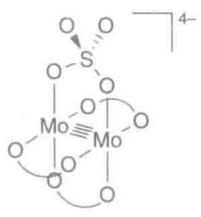</td><td> $\sigma^{2} \pi^{4} \delta^{2}$ </td><td>4</td><td>211</td></tr><tr><td>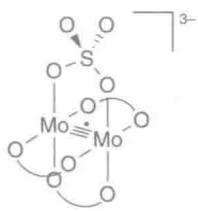</td><td> $\sigma^{2} \pi^{4} \delta^{1}$ </td><td>3.5</td><td>217</td></tr><tr><td>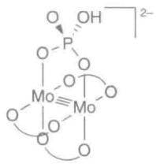</td><td> $\sigma^{2} \pi^{4}$ </td><td>3</td><td>222</td></tr><tr><td>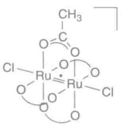</td><td> $\sigma^{2} \pi^{4} \delta^{2} \delta^{*1} \pi^{*2}$ </td><td>2.5</td><td>227</td></tr><tr><td>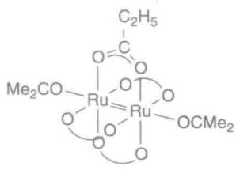</td><td> $\sigma^{2} \pi^{4} \delta^{2} \delta^{*2} \pi^{*2}$ </td><td>2</td><td>238</td></tr><tr><td>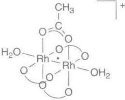</td><td> $\sigma^{2}\pi^{4}\delta^{2}\delta^{*2}\pi^{*3}$ </td><td>1.5</td><td>232</td></tr><tr><td>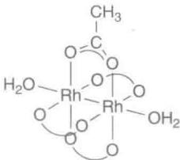</td><td> $\sigma^{2}\pi^{4}\delta^{2}\delta^{*2}\pi^{*4}$ </td><td>1</td><td>239</td></tr><tr><td colspan="4">* 如果存在多重桥配体,图中只表示出其中的一种。</td></tr></table>

第6族金属氧合络合物最典型的基本单元为 $\mathrm{MO}_4^{2-}$ 四面体，但也形成多种多金属氧酸盐（应用相关文段19.1），它们可看作共享棱边的 $\mathrm{MO}_6$ 八面体。水溶液中的低氧化态金属离子也是八面体。 $\mathrm{Cr}^{3+}$ 阳离子的 $\mathrm{d}^3$ 络合物具有大的配位场稳定能（LFSE，节20.1），一般情况下显惰性，高自旋 $\mathrm{d}^4$ 组态的 $\mathrm{Cr}^{2+}$ 形成Jahn-Teller畸变（节20.1）络合物，通常是非常活泼的络合物（节21.1）。

所有三种金属的+2氧化态都形成含四重M—M键的二聚体。以羧酸盐(11)为例,这种络合物的化学键中包含1个 $\sigma$ 键、2个 $\pi$ 键和1个 $\delta$ 键(应用相关文段19.2)。

![[无机化学第6版副族金属有机565-748_images/5c2a787f8777286be3b40802e698da8e9f8fea32006c8c26516cc5a1be900332.jpg]]

<details>
<summary>chemical</summary>

Molecular structure diagram of a molybdenum complex with labeled atoms: Mo, O, C, and CH₃
</details>

(11) $\left[\mathrm{Mo}_{2}(\mu-\mathrm{CO}_{2}\mathrm{CH}_{3})_{4}\right]$

# (e) 金属有机化合物

提要:18 电子络合物支配着第 6 族金属的金属有机化学;电中性的 $\left[\mathrm{M}\left(\mathrm{CO}\right)_{6}\right]$ 对空气稳定,电中性的二(芳烃)络合物研究得较透彻。

第6族金属的金属有机化学内容丰富，而且完全被容易制备出来的18电子络合物所支配。18电子电中性的六羰基化合物（ $\left[\mathrm{M}(\mathrm{CO})_{6}\right]$ ）都是极为稳定的白色固体，在空气和湿气存在下操作不存在任何困难。羰基化合物的取代反应是制备其他配体络合物的重要途径，如制备烯烃配体、炔烃配体、NHCs、膦配体、二烯配体、三烯配体和芳烃配体的络合物。Cr和Mo形成18电子的二(芳烃)络合物（12）。有代表性的环戊二烯基络合物的衍生物有 $\left[\left(\mathrm{Cp}\right)_2\mathrm{MH}_2\right]$ （13）、所谓的柄形络合物（14）和半夹心络合物 $\left[\mathrm{CpML}_3\mathrm{Cl}\right]$ （15）。被称之为茂铬（ $\left[\left(\mathrm{Cp}\right)_2\mathrm{Cr}\right]$ ）的16电子化合物是个强还原剂。

![[无机化学第6版副族金属有机565-748_images/5ab6cbd38b65bc7849edd96bf78eb15b9ac2fb2858b3abf10d54bbd42ac502c1.jpg]]  
(12)

![[无机化学第6版副族金属有机565-748_images/a005bfaa008699ed9a9acc9b6dcf8694d42de3438e221bd80667db2bca9f688e.jpg]]  
(13)

![[无机化学第6版副族金属有机565-748_images/c1caf9c06d06890400c60a6f0a8297b87e6571d218c901f92059c26f9c3d1c3b.jpg]]  
(14)

![[无机化学第6版副族金属有机565-748_images/e7ea41dac2369dbc450eade2564a5a53d9d63eab1b3c6de94f3ed331f338a89e.jpg]]  
(15)

钨能形成许多亚烷基络合物和次烷基络合物，如(16)和(17)，形式上的金属碳键分别为双键和三键。金属原子间形成重键也是可能的（见应用相关文段19.2），新近离析出来的一个化合物(18)是第一次明确获得五重键的稳定络合物。

![[无机化学第6版副族金属有机565-748_images/7085ce35781f212ec8a07edeb1f008915a101e91b10a121d11c893a13656f434.jpg]]

<details>
<summary>chemical</summary>

Chemical structure of a tungsten complex with tert-butyl and tert-butyl ligands
</details>

(16)

![[无机化学第6版副族金属有机565-748_images/25a15653ad82ce2bc8a477ff813241dcc5c8dc1167c6ea53a164e8146c3d8a2d.jpg]]  
(17)

![[无机化学第6版副族金属有机565-748_images/f893ab221bbdce8936e90ab3a93d821f7f211436f7b0ddaac4d8d33cf0edc0be.jpg]]

<details>
<summary>chemical</summary>

Chemical structure of a chromium complex with two aryl substituents and a cyclopentadienyl group
</details>

(18)

# 19.7 第7族:锰、锝、铼

# (a) 存在和用途

提要:锰广泛散布在地球上,其化合物具有多种用途;锝虽然没有稳定同位素,但用途广泛。铼很少见。

虽然约 $80\%$ 已知的锰资源以软锰矿 $(\mathrm{MnO}_2)$ 形式存在于南非，但却广泛分布在行星上。据估计，大洋洋底约有5000亿吨锰结核，经济上可行的提取路线正在研究之中。金属锰本身比较脆，但钢中加入锰（ $1\% \sim 13\%$ ）则可改善金属的强度。锰也用于铝合金（如制造饮料罐的铝合金），加入约 $1\%$ 即可改善金属的抗腐蚀性。 $\mathrm{MnO}_2$ 是碱性蓄电池的主要成分，电池运行时 $\mathrm{MnO}_2$ 被还原为 $\mathrm{Mn}_2\mathrm{O}_3$ ，而金属锌则被氧化至 $\mathrm{ZnO}$ ，产生 $1.5\mathrm{V}$ 的电压。锰盐的其他用途包括用作陶瓷和玻璃的颜料。锰是生物学上的重要元素，它在所有生命形式的多种酶中处于活性部位。最引人注目的是，它是光合作用中唯一的释 $\mathrm{O}_2$ 酶的活性中心。锰（II）化合物无毒，但锰（VII）化合物具有高氧化性且有毒。

1936 年,通过中子轰击钼得到锝的第一个样品,成为第一个人工合成的放射性元素。它不存在稳定同位素,自然界发现的放射性锝也极少。它是铀裂变的副产物,当今从废的核燃料棒中批量提取。 $^{99m}$ Tc 是个介稳同位素,发生衰变的半衰期为 6 h。医疗上利用这一性质作为放射性示踪剂,它的化合物(如 Cardiolyte $^{\circledR}$ )被广泛用于心脏成像(节 27.9)。 $^{98}$ Tc 和 $^{97}$ Tc 是两个寿命最长的同位素,半衰期超过 200 万年。红巨星探测中证实,星体中发生着重原子的核合成反应。锝的化学性质因其放射性而被迟滞,但有人认为,Tc 的化学行为与 Re 很相似。

铼是 1925 年在硅铍钇矿(镧系元素的一种矿物,其中含铼仅 10 ppm)中发现的,它是最晚发现的一个非放射性元素。铼是地壳中最稀有的元素之一,不过钼矿中发现有铼,当今即从钼熔炼炉的烟道尘中提取。铼用于制造喷气发动机的高温合金,与铂一起用作重整烷烃的催化剂。迄今尚不知道铼的生物功能,它被认为是无毒的。

# (b) 二元化合物

提要:锰形成多种氧化态的稳定化合物,锝和铼的化学则受较高氧化态化合物的支配。

锰形成的氧化物包括 $\mathrm{MnO}$ 、 $\mathrm{Mn_2O_3}$ 、 $\mathrm{MnO_2}$ 和 $\mathrm{Mn_2O_7}$ ，而锝和铼只形成 $\mathrm{MO}_2$ 、 $\mathrm{MO}_3$ 和 $\mathrm{M}_2\mathrm{O}_7$ 。节3.5中已介绍过立方体的 $\mathrm{ReO_3}$ 结构， $\mathrm{ReO_2}$ 则属金红石结构类型。三种金属的 $+7$ 氧化态氧化物 $\mathrm{M}_2\mathrm{O}_7$ 都具有挥发性，都能溶于水生成 $[\mathrm{MO}_4]$ 阴离子。人们熟悉的紫色“高锰酸根”离子是锰的络合物，它是个很强的氧化剂，Tc和Re的对应络合物的氧化性则较弱。单个金属周围难以达到七配位的事实导致一个现象：二元 $\mathrm{MX}_7$ 型卤化物中只看到过有关 $\mathrm{ReF}_7$ 的报道。然而，Re和Tc能形成 $\mathrm{MF}_6$ 、 $\mathrm{MF}_5$ 和所有四种 $\mathrm{MX}_4(\mathrm{X} = \mathrm{F},\mathrm{Cl},\mathrm{Br},\mathrm{I})$ 型卤化物。铼与Cl、Br和I形成 $\mathrm{MX}_3$ （实际上是化学式为 $\mathrm{M}_3\mathrm{X}_9$ 的三聚体，19）；锰形成 $\mathrm{MnF}_4$ 、 $\mathrm{MnF}_3$ 和所有四种 $\mathrm{MX}_2$ 型卤化物。 $\mathrm{MnF}_3$ 与 $\mathrm{MnF}_4$ 之间的平衡被用来纯化氟： $MnF_{3}$ 与不纯的 $F_{2}(g)$ 反应生成 $MnF_{4}(s)$ ，后者加热至 $400^{\circ}C$ 以上即释放出纯的气体氟。

![[无机化学第6版副族金属有机565-748_images/77193c9ae4af4b20bd28e1c6615cb580a730a879f5a7b1f79250ad979bdb18dd.jpg]]

<details>
<summary>chemical</summary>

Molecular structure diagram showing chlorine (Cl) and rare earth (Re) atoms in a cubic arrangement
</details>

(19)

# (c) 复合氧化物和复合卤化物

提要:锰形成多种具有有用磁性质的复合氧化物和复合卤化物。

通式为 $(\mathrm{Ln}_{1 - x}\mathrm{Sr}_x)\mathrm{MnO}_3$ 的复合氧化物（Ln代表三价镧系元素阳离子，有代表性的是 $\mathrm{Pr}^{3 + }$ ）显示一种叫做巨磁阻（colossal magnetoresistance）的性质（置于磁场中时，电阻发生几个数量级的巨大变化）。这类材料采取钙钛矿结构， $\mathrm{Mn}^{3 + }$ 和 $\mathrm{Mn}^{4 + }$ 的混合物占着B阳离子的位置。一种叫作锰紫的颜料被描述为焦磷酸铵锰的化合物，其中含有 $\mathrm{Mn}^{3 + }$ 。具有尖晶石结构的 $\mathrm{LiMn_2O_4}$ 用作某些充电电池的正极。锰锌铁混合存在的尖晶石类化合物 $[(Mn_{1 - x}Zn_x)Fe_2O_4]$ 作为软铁氧体用于变压器芯。

KF 加于 $Mn^{2+}$ 溶液制备的 $KMnF_{3}$ 采取钙钛矿结构（节 3.9）， $Mn^{2+}$ 占着 B 阳离子的部位，以八面体方式配位着 $F^{-}$ ; $K^{+}$ 则占着 A 阳离子的部位。该化合物作为 $Ln^{3+}$ 的主体用于成像中。在碱金属氟化物存在条件下将 $MnF_{2}$ 进行氟化，生成组成为 $M_{2}MnF_{6}(M=K,Rb,Cs)$ 的 $Mn(IV)$ 的氟络合物。

# (d) 配位络合物

提要: Mn(Ⅱ) 是 Mn 在水溶液中最稳定的存在形式, 具有高自旋 $d^{5}$ 电子组态; 锝和铼的溶液化学受较高氧化态支配。

Mn(VII)和 Mn(VI)络合物(形式电子组态分别为 $d^{0}$ 和 $d^{1}$ ) 具有以四面体 $MO_{4}$ 单元为基础的结构(在某些络合物中,1个氧被1个卤素所代替),在溶液中都是强氧化剂。其他氧化态中,只有+3态(高自旋,发生了Jahn-Teller畸变的 $d^{4}$ 八面体络合物)和+2态的溶液化学有重要意义。两种氧化态中,+2态起着支配作用:络合物(甚至包括氰络合物)总是高自旋,半充满的 $d^{5}$ 组态显著地被量子力学交换能(节1.5)所稳定。Mn(II)络合物不存在配位场稳定能,对配位几何形状几乎不显示偏爱,与小体积配位物种(如 $OH_{2},O^{2-},F^{-}$ )结合时, $Mn^{2+}$ (离子半径65 pm)通常形成八面体络合物。由于不能发生电子跃迁,Mn(II)络合物基本上为无色。

与之形成对照的是,锝和铼的+2氧化态没有溶液化学,与氧配体和氮配体形成的高氧化态络合物支配着它们的配位化学。这些络合物具有多种几何形状,八面体和四方形底面的锥体(氧配体和氮配体占据顶点位置)最常见。与高锰酸根阴离子的深色不同,Tc和Re相应的阴离子(高锝酸根和高铼酸根)为无色,这是因为电荷转移过程所需的能量在UV吸收区。与Mn(VII)相比,Tc(VII)和Re(VII)的氧化性也要弱得多。

# (e) 金属有机化合物

提要:第7族金属的大多数金属有机化合物是含有羰基配体的18电子物种。

含有羰基配体的化合物构成所有3个第7族金属已知金属有机化合物的主体。所有3个金属都形成电中性18电子双金属羰基络合物 $\left[\mathrm{M}_{2}(\mathrm{CO})_{10}\right]$ ，其中的M—M键容易断裂，不论被氧化（如用 $\mathrm{Br}_2$ ）还是被还原（如用Na），都得到单核的八面体络合物（如 $\left[\mathrm{BrMn}(\mathrm{CO})_5\right]$ 或 $\left[\mathrm{MeMn}(\mathrm{CO})_5\right]$ ）。通过这些络合物的取代反应可以制备单环戊二烯基络合物（如 $\left[\mathrm{CpM}(\mathrm{CO})_3\right]$ ）；芳烃络合物和分子氢络合物(20)也已被合成出来。

二(环戊二烯基)络合物应是17电子络合物,但已知只有锰形成单体物种。由于强烈选择形式氧化态为+2的 $Mn^{2+}$ 而保持高自旋(S=5/2)(节20.1和节22.19),单体 $\left[\left(\mathrm{Cp}\right)_{2}\mathrm{M}\right]$ 的结构难以解得,只有那些具有更大空间要求的环戊二烯基(预期自旋S=1/2)的结构被解出,它们容易还原为18电子物种。锝形成化学式为 $\left[\left(\mathrm{Cp}\right)_{4}\mathrm{Tc}_{2}\right]$ 的二聚化合物,但结构尚属未知。光照产生的16电子物种 $\left[\left(\mathrm{Cp}\right)_{2}\mathrm{Re}\right]^{+}(21)$ 经由氧化加成反应生成18电子的芳基氢化物(22),该化合物能够活化苯。

![[无机化学第6版副族金属有机565-748_images/cc0e14e0e314474ebb44c7c1c3ab07afe84f30dc3e582ca2f49498ed54af54f0.jpg]]  
(20)

![[无机化学第6版副族金属有机565-748_images/5fc9da11f7bc1d974d6511e2f9aa4403d953e7d81380261812297b75ce32d14a.jpg]]  
(21)

![[无机化学第6版副族金属有机565-748_images/546959718d5e37f3bac0b484b818ddcad69c243787d6930d9c491bcfaa707092.jpg]]  
(22)

# 19.8 第8族:铁、钌、锇

# (a) 存在和用途

提要:地球上丰度很高的铁不但广泛为人类所使用,而且是生物学上利用最多的 d 区元素。自然界的钌和锇非常稀有,它们只有某些特殊用途,而且不具生物学功能。

按质量计，铁是整个地球（包括外层和内核）中最常见的元素，在地壳中的丰度排在第4位。所有同位素中以 $^{56}$ Fe的核最稳定，是所有核融合过程的最终结果。在人类文明中，金属铁的重要性独一无二：每年生产和使用的铁超过10亿吨，占全部金属产量的90%以上。铁矿分布广泛，大部分铁是在鼓风炉中用焦炭和石灰石还原生产出来的。人类用铁的历史至少已有3000年。实际上，纯的铁相当软，使用中与其他金属（V, Cr, Mo, W, Co, Ni）和碳一起构成各种钢。铁构成地球的内核（应用相关文段3.1），铁在肥料的工业制备中至关重要，是哈伯法由氮和氢制备氨的催化剂。

铁是生物体内丰度最高的过渡金属，人体里 Fe 的平均含量超过 4 g。其众多作用包括以血红蛋白形式输氧、电子转移、以多种酶的形式起催化作用（酸碱催化、自由基催化和氧化还原催化）、控制基因表达，甚至包括感知地球磁场。

钌资源极端稀有，工业上以精炼镍和钴的副产物制备，也从铂族金属矿物的加工过程中获得。钌用于铂和钯的合金，这种硬质合金用于制作耐磨的电接触器件，二氧化钌、铅和铋的钌酸盐用于制作片状电阻器。上述两项电器方面的用途占钌耗量的50%以上，其余部分用于多种化学过程，如用作电解法生产氯的阳极材料。

锇的密度 $(22.6\ g\cdot cm^{-3})$ 为铅的2倍，是所有元素中密度最大的一个。锇是自然界丰度最低的元素，自然界中发现它以金属形态（和铱一起）存在。不过，作为精炼镍的副产品而提取锇更经济，年产量约100 kg。锇的熔点 $(3\ 054\ ^{\circ}\mathrm{C})$ 很高而且特硬，因而很难加工。其用途主要依赖它的硬度和耐磨性：较老的用途包括钢笔尖、钟表和指南针的轴承、留声机的针头，现代一些的用途包括电接触器件，四氧化物用于有机合成。现在尚不了解钌和锇的生物学功能；其大多数盐类被认为无毒，挥发性的四氧化物 $\left(\mathrm{MO}_{4}\right)$ 具有高毒性。

# (b) 二元化合物

提要:铁的已知最高氧化态低于钌和锇,铁的低氧化态(+2 和 +3)化合物最稳定。

铁形成许多氧化物，包括 $\mathrm{Fe}_{1 - x}\mathrm{O}(x\approx 0.04$ ，氧化态主要为 $+2)$ 、 $\mathrm{Fe_2O_3}$ （氧化态为 $+3$ )和具有尖晶石结构的 $\mathrm{Fe}_3\mathrm{O}_4$ [混合氧化态，1/3铁原子为Fe（Ⅱ），2/3铁原子为Fe（Ⅲ)]。 $\mathrm{Fe}_3\mathrm{O}_4$ 以磁铁矿形式存在于自然界，可被永久磁化（因此又叫天然磁石）；用作海上航行罗盘至少已有800年。虽然铁在含 $[\mathrm{FeO}_4]^{2-}$ 阴离子的化合物中以Fe（VI）存在，同样氧化态的 $\mathrm{FeO}_3$ 却属未知。与之类似的是，Fe（IV）与F-的络合物（如 $[\mathrm{FeF}_6]^{2-})$ 是存在的，却不存在简单的 $\mathrm{FeF}_4$ 。所有卤素都能形成化学式为 $\mathrm{FeX}_3$ 和 $\mathrm{FeX}_2$ 的二元卤化物。铁既形成硫化物（FeS）也形成二硫化物（ $\mathrm{FeS}_2$ )，后者是自然界发现的黄铁矿（又叫“愚人金”），它是二硫化物离子 $(\mathrm{S}_2^{2-})$ 形成的一种络合物（节16.14）。

金属钌在室温下被空气氧化生成 $RuO_{2}$ 钝化膜，需要更高温度才能将金属完全氧化为 $RuO_{2}$ 。与钌不同，饿被空气非常缓慢地氧化为挥发性的 $OsO_{4}$ 。氧化剂不过量的情况下生成二氧化锇 $(\mathrm{OsO}_{2})$ 的黑色晶形粉末。Ru 和 Os 的二氧化物都采取金红石结构。使用强氧化剂可以制得 $RuO_{4}$ ，虽然该氧化物不稳定，分解生成 $RuO_{2}$ 和 $O_{2}$ 。 $RuO_{4}$ 和 $OsO_{4}$ 都是黄色的、挥发性的极毒物质。 $RuO_{2}$ 在燃料电池的释氧过程中用作电催化剂（节 25.16）。

Ru 和 Os 都能形成六氟化物、五氟化物和四氟化物，Os 也形成四氯化物和四溴化物。对 +3 氧化态而言，Ru 能形成所有四种卤化物，饿只形成溴化物和碘化物。

# (c) 复合氮族化物、复合氧化物和复合卤化物

提要:第8族金属形成多种复合物固体;铁形成的复合物固体具有重要的电性质和磁性质。

多种二价阳离子(A)形成具有尖晶石结构( $AB_{2}O_{4}$ ，式中B的典型物种为 $Fe^{3+}$ )的复合铁氧体氧化物，包括 $ZnFe_{2}O_{4}$ 及A部位为混合阳离子的材料（如锰锌铁氧体 $Mn_{1-x}Zn_{x}Fe_{2}O_{4}$ 和镍锌铁氧体 $Ni_{x}Zn_{1-x}Fe_{2}O_{4}$ ）。这些叫做软铁氧体的材料被用做变压器芯材（利用其铁磁性和容易可逆磁化的性质），也用作棕色和黑色颜料。硬铁氧体（如组成为 $AFe_{12}O_{19}$ 的锶和钡铁氧体）是优异的永久磁体。钇铁石榴石( $Y_{3}Fe_{5}O_{12}$ )用于各种基于磁光性质的场合。

铁基超导体包括 $\mathrm{Ln(O,F)FeAs(Ln = La,Ce,Sm,Nd,Ga)}$ 和两种砷化物LiFeAs和NaFeAs；前者的超导临界温度 $(T_{\mathrm{c}})$ 高达 $53\mathrm{K}$ ，两种砷化物的 $T_{\mathrm{c}}$ 分别为 $18\mathrm{K}$ 和 $25\mathrm{K}$ 。在这些氮族化物和氧合磷族化物中，铁与层状排列的砷相配位，而电正性更强的阳离子和氧负离子（如果存在的话）则形成相互隔离的层。

中间氧化态的锇和钌形成复合氧化物，如具有烧绿石结构的 $\mathrm{Pb}_{2}\mathrm{Os}(+5)_{2}\mathrm{O}_{7}$ 。在较高氧化态，所有第8族金属都能形成具有独立氧合阴离子的复合氧化物，如 $\mathrm{BaFeO}_{4}\left(\mathrm{FeO}_{4}^{2-}\right.$ 四面体）、 $\mathrm{Na}_{4}\mathrm{FeO}_{4}\left(\mathrm{Fe}^{4+},\mathrm{d}^{4}\right.$ ，发生了偏离理想四面体的 Jahn-Teller 畸变，形成扁平的 $\mathrm{FeO}_{4}^{4-}$ 四面体）和 $\mathrm{K}_{2}\mathrm{OsO}_{5}\left(\mathrm{OsO}_{5}^{2-}\right.$ 三角双椎体）。

# (d) 配位络合物

提要:在水溶液中,所有第8族金属都以八面体络合物最常见,铁的高自旋络合物和低自旋络合物之间存在着脆弱的平衡。

虽然存在着由 $FeO_{4}^{2-}$ 和 $FeO_{4}^{4-}$ 阴离子而得到的高氧化态络合物，溶液中仍以 Fe(Ⅱ) 和 Fe(Ⅲ) 形成的络合物最常见。有代表性的铁(Ⅲ)络合物为八面体并可能具有氧化性。高自旋络合物和低自旋络合物之间存在着脆弱平衡，低场配体（如水分子和卤离子）形成高自旋络合物，高场配体（如氰离子和联吡啶）络合物则为低自旋。调整温度、压力、溶剂等条件，可能制备从低自旋变化到高自旋的 Fe(Ⅲ) 络合物（“自旋交叉络合物”）。铁(Ⅲ)相对较硬，更倾向于结合氧给予体配体；较强的极化力意味着 $\left[\mathrm{Fe}\left(\mathrm{H}_{2}\mathrm{O}\right)_{6}\right]^{3+}$ 的溶液显酸性，溶液中存在像 $\left[\mathrm{Fe}\left(\mathrm{H}_{2}\mathrm{O}\right)_{5}(\mathrm{OH})\right]^{2+}$ 和 $\left[\left(\mathrm{H}_{2}\mathrm{O}\right)_{5}\mathrm{Fe}\left(\mu-\mathrm{O}\right)\mathrm{Fe}\left(\mathrm{H}_{2}\mathrm{O}\right)_{5}\right]^{4+}$ 这样的物种。铁(Ⅱ)络合物通常为八面体并可能具有还原性， $\left[\mathrm{Fe}\left(\mathrm{H}_{2}\mathrm{O}\right)_{6}\right]^{2+}$ 因而可被氧化为 Fe(Ⅲ) 化合物。Fe(Ⅱ) 与强场配体（如氰离子或菲咯啉）发生络合时，络合物变成具有 $d^{6}$ 电子组态的低自旋，从而显著地被稳定，并显示惰性。

在较高氧化态的配位化学中，钌和锇都与卤离子形成八面体阴离子 $\left[\mathrm{MX}_6\right]^{2-}$ ，氧阴离子参与配位形成复杂结构， $\left[\mathrm{Ru}_4\mathrm{O}_6\left(\mathrm{H}_2\mathrm{O}\right)_{12}\right]^{4+}$ （23）是一个例子。低自旋八面体络合物支配着两元素较低氧化态的化学，+2氧化态的钌形成稳定络合物的数目非常大。络合物 $\left[\mathrm{Ru}(\mathrm{bpy})_3\right]^{2+}$ 是个有代表性的感光剂，可见光可将中心原子 $\mathrm{Ru}$ 上的1个电子激发至bpy配体的反键轨道，从而将钌氧化至 $+3$ 氧化态。

![[无机化学第6版副族金属有机565-748_images/899df7854e7186c32e37bd66a31297c79a44e38faae4a8088c85767f2f8d283b.jpg]]

<details>
<summary>chemical</summary>

Molecular structure of a ruthenium-oxygen coordination complex with water molecules
</details>

(23) $\left[\mathrm{Ru}_{4} \mathrm{O}_{6} \left(\mathrm{H}_{2} \mathrm{O}\right)_{12}\right]^{4+}$

# (e) 金属有机化合物

提要:第8族金属形成稳定的二(环戊二烯基)络合物和多种羰基簇化合物。

第8族金属的金属有机化合物包括了二茂铁(24)这个所有金属有机络合物中最神奇的化合物。正是1950年代发现的18电子的二茂铁和其后对成键作用的解释,开启了现代金属有机化学的新时代(第22章)。钌和锇形成叫做二茂钌和二茂锇的类似化合物;所有3个化合物都非常稳定,都可在空气中无顾忌地进行升华操作。金属铁粉与一氧化碳反应形成18电子的三角双锥羰基化合物 $\left[\mathrm{Fe}\left(\mathrm{CO}\right)_{5}\right]$ (25)。 $\left[\mathrm{Fe}\left(\mathrm{CO}\right)_{5}\right]$ 失去一氧化碳可以生成像 $\left[\mathrm{Fe}_{2}\left(\mathrm{CO}\right)_{9}\right]$ (26)和 $\left[\mathrm{Fe}_{3}\left(\mathrm{CO}\right)_{12}\right]$ 这样的簇化合物(节22.20)。事实上,钌和锇形成的最简单的羰基化合物就是簇化合物 $\left[\mathrm{M}_{3}\left(\mathrm{CO}\right)_{12}\right]$ (27)。结合羰基、环戊二烯基和许多其他配体的第8族金属的金属有机络合物容易制备,一大批簇化合物中都含有第8族金属。

钌的卡宾络合物(28)是烯烃复分解反应中的活性物种, Grubbs、Chauvin 和 Schrock 因发现该反应而获得 2005 年诺贝尔化学奖(节 25.3)。

![[无机化学第6版副族金属有机565-748_images/ff735402bc78e94c29f09d84c9876c3e7e8ffe302f891d627438b5a3dd092b76.jpg]]  
(24) 二茂铁

![[无机化学第6版副族金属有机565-748_images/5cc1a1de76732bdc643b2b2df923c6c786864c082983dfeb0dc6383c62ac2acc.jpg]]  
(25)

![[无机化学第6版副族金属有机565-748_images/258148c63223d84112885dd134b618676dbf19ecbdb9d5dd47fa60538ebb9ed8.jpg]]  
(26)

![[无机化学第6版副族金属有机565-748_images/bb064b72d6c058b80a8a7e8ea3c6935958100dd5bb95a9af4a59659c4eeb8b95.jpg]]  
(27)

![[无机化学第6版副族金属有机565-748_images/bf0451b956dffc6a0ba2a12fbbee5aec052a58e6d75eefdcae1d063c2df6548e.jpg]]  
(28)

# 19.9 第9族:钴、铑、铱

# (a) 存在和用途

提要:钴是多个钢种的重要成分,其盐类用作颜料的历史已有数千年。铑和铱的资源非常稀有,但在催化上有重要用途。

大多数岩石和土壤中存在低含量的钴，它是1819年从陨石中离析出来的。钴在经济上相当重要，资源主要来自开采铜矿和镍矿的副产物。与用于钢中（增加硬度）同样重要的是，它也广泛用于制造磁体。钴化合物可使玻璃、釉料和陶瓷产生浓艳的蓝色，用作颜料的历史已有数千年。从公元前300年的埃及雕塑品、波斯珠宝饰物和公元79年遭到破坏的庞贝遗迹中都检出了钴。维生素 $B_{12}$ （也叫钴胺素）的核心是金属有机钴。痕量钴胺素对所有动物维持生命都至关重要。含有钴胺素的酶能催化自由基重排和甲基迁移反应，其活性中心是第一批用X射线测定的结构之一。大多数钴盐被认为无毒。

铑是地球上丰度最低的元素之一,是以非常小量的游离金属的形式发现的。通常是由开采铜矿和镍矿的副产物获得,年产量约为20 t。金属铑抗氧化性高,且具有很强的反射性,以薄膜形式用于覆镀光学纤维、某种镜面和汽车前灯的反射镜。铑主要用在汽车废气处理系统的催化转化器中,这种用途约占总产量的80%。在孟山都法(节25.9)中,铑化合物用于催化甲醇羰基化反应生成醋酸。

铱是已知抗腐蚀性最强的金属，但其存在量如此之少，以致年提取和使用量仅约3 t。虽然主要工业资源来自精炼铜过程中形成的阳极泥，但自然界发现的多数铱却以锇铱合金（osmiridium）存在。铱的用途与其硬度和抗腐蚀性有关：铱和锇的合金用于轴承、钢笔尖，也用于X射线望远镜的反射镜。铱盐用于甲醇羰基化反应的Cativa法中，该法正在逐渐替代铑基催化剂的孟山都法（节25.9）。不论是铑还是铱，都没有发现任何生物功能，但吞入体内的盐类有温和毒性。

# (b) 二元化合物

提要:第9族金属的最高氧化态是在氟化物中发现的,铑和铱为+6,钴为+4;钴最稳定的氧化态为+2,铑和铱则为+3。

第9族金属的高氧化态化合物局限于氟化物 $(\mathrm{RhF}_6,\mathrm{IrF}_6,\mathrm{RhF}_5,\mathrm{IrF}_5,\mathrm{MF}_4)$ 和氧化物 $(\mathrm{RhO}_2,\mathrm{IrO}_2$ ，均为金红石型结构）；氟化物具有强氧化性而且往往不稳定。铱的稳定氧化物是 $\mathrm{IrO_2}$ ，而铑则更多形成 $\mathrm{Rh_2O_3}$ 。钴的 $+3$ 氧化态形成相对少的二元氟化物，氧化物 $\mathrm{Co_3O_4}$ 中的部分钴为 $+3$ 氧化态。溶液中更多地形成配位络合物。对铑和铱而言， $+3$ 氧化态是最稳定的氧化态，所有4种卤化物都存在，氧化物也是一样。钴的 $+2$ 氧化态化合物多得多，氧化物和所有4种卤化物都为已知化合物。

# (c) 复合氧化物和复合卤化物

提要:深色钴颜料中的 $Co^{2+}$ 为四面体配位。

$\mathrm{LiCoO_2}$ 为层状结构，被锂离子隔开的 $\mathrm{Co(III)O_6}$ 八面体连接在一起。其中部分锂离子可用电化学方法抽取出来，这一性质导致该材料在多次充电电池系统中得到应用（节24.6）。 $\mathrm{CoAl_2O_4}$ 中的 $\mathrm{Co(II)}$ 处于四面体部位，这个具有尖晶石结构的化合物能产生深的品蓝色，广泛用作颜料。其他复合氧化物和化合物也能含有四面体配位的钴（Ⅱ），如硅酸盐中加入 $\mathrm{Co^{2+}}$ 化合物可形成亮蓝色的钴玻璃。

# (d) 配位络合物

提要: 钴比其他任何 d 金属形成更多的四面体络合物, 而铑和铱则主要形成八面体络合物。

Co(Ⅱ)和 Co(Ⅲ)支配着钴的水溶液的配位化学,两种氧化态的络合物之间存在着平衡,这种平衡依赖于络合物的配体: $\left[\mathrm{Co}\left(\mathrm{H}_{2}\mathrm{O}\right)_{6}\right]^{3+}$ 能将水氧化放出氧、本身还原为 $\left[\mathrm{Co}\left(\mathrm{H}_{2}\mathrm{O}\right)_{6}\right]^{2+}$ ;而 $\left[\mathrm{Co}\left(\mathrm{NH}_{3}\right)_{6}\right]^{2+}$ 则能被空气氧化生成 $\left[\mathrm{Co}\left(\mathrm{NH}_{3}\right)_{6}\right]^{3+}$ 。钴(Ⅱ)既能形成八面体络合物,也能形成四面体络合物。钴(Ⅱ)形成的四面体络合物比其他所有d金属都要多,这是因为对 $d^{7}$ 组态而言,八面体几何体与四面体几何体之间的配位场稳定能之差处在最小值(节20.1)。像大多数八面体络合物一样,所有四面体络合物均为高自旋。一般说来,八面体络合物为粉红色或红色,四面体络合物则为深蓝色。钴(Ⅲ)络合物通常为八面体,它们当中的大多数为低自旋 $d^{6}$ 组态,而且显惰性。

铑和铱的配位化学完全由 $M^{3+}$ 阳离子形成的八面体低自旋 $d^{6}$ 组态络合物所支配。将 $MCl_{3}$ 溶解于 HCl 水溶液，依赖于 $Cl^{-}$ 浓度的变化，可能形成 $\left[\mathrm{M}\left(\mathrm{H}_{2}\mathrm{O}\right)_{6}\right]^{3+}$ 和 $\left[\mathrm{MCl}_{6}\right]^{3-}$ 之间的所有络合物。与硬给予体配体（如氨配体）形成的许多其他络合物也是已知的。

# (e) 金属有机化合物

提要:第9族金属形成具有催化活性的16电子四方平面络合物,也形成18电子络合物。

对第9族金属而言,已知最小的电中性羰基化合物是二聚化合物 $\left[\mathrm{Co}_{2}\left(\mathrm{CO}\right)_{8}\right]$ (29)、四聚化合物 $\left[\mathrm{Rh}_{4}\left(\mathrm{CO}\right)_{12}\right]$ 和 $\left[\mathrm{Ir}_{4}\left(\mathrm{CO}\right)_{12}\right]$ (30),其他更高的簇化合物也是已知的。这些羰基化合物是非常有用的前体,以它们为起始物制备对氢甲醛化反应(节25.5)和羰基化反应(节25.9)具有催化活性的络合物。

电中性二(环戊二烯基)络合物应是19电子化合物,不过只有钴形成简单的单体物种。铑被认为在低于-196℃的气相中形成单体物种,但通常条件下明确无误地形成二聚物(每个Rh原子的形式电子计数为18)。

![[无机化学第6版副族金属有机565-748_images/1a1d324607744c20fdc75479738997ec504a05bb1ba3e73187f5de01a058ae58.jpg]]  
(29)

![[无机化学第6版副族金属有机565-748_images/476a160e8d8e8bf054ca1bef36c4ec72ae4a187125ee8ae4f2c50b1d32f6e0b2.jpg]]  
(30)

![[无机化学第6版副族金属有机565-748_images/c678e68318c3cfd8c247b7bcab15b4b05050fdeae5897c67832f9d53414b29ac.jpg]]

<details>
<summary>chemical</summary>

Chemical equilibrium diagram showing Rh-catalyzed transformation between two rhodium complexes
</details>

然而，所有3种金属都能形成非常稳定的18电子物种 $\left[\left(\mathrm{Cp}\right)_{2}\mathrm{M}\right]^{+}$ 。一（环戊二烯基）物种（如31和32）的化学内容非常丰富，包括烷烃活化领域的化学。

形式上的+1氧化态形成16电子四方平面Rh（I）和Ir（I）络合物。这类络合物（如有历史意义的Vaska络合物，33)是通过氧化加成反应得到M（Ⅲ）18电子八面体络合物的理想起始物。容易实现氧化加成反应的催化剂包括均相加氢催化剂（Wilkinson催化剂，节25.4）和经由甲醇羰基化反应合成醋酸的催化剂（节25.9）。有趣的是，甲醇羰基化反应最早的工业方法使用了钴催化剂，第二代使用了铑催化剂，当今则使用铱催化剂。

![[无机化学第6版副族金属有机565-748_images/d272612d4991949b6a6ecbd9d5c59a7ae942e56cf625bd14adf054f9519abca9.jpg]]  
(31)

![[无机化学第6版副族金属有机565-748_images/ffb8fb84435a7467bd9f61193a2ab4eb7b70b153dae4def9f76899999ba08695.jpg]]  
(32)

![[无机化学第6版副族金属有机565-748_images/d08344cae6c24f399aff6aedfa0240e47fb9d12e7e615605dbd91472fe7520db.jpg]]  
(33)

# 19.10 第10族:镍、钯、铂

# (a) 存在和用途

提要:第10族所有3个金属都有重要用途:镍主要掺于钢中,钯和铂主要用作催化剂。

镍在地壳中有广泛分布,地心中的含量大约为 $10\%$ 。虽然加拿大发现了巨大的针镍矿(NiS)资源(据认为由巨大陨星撞击形成),但通常是与铁一起在砖红色矿物[如含镍的褐铁矿(Ni,Fe)O(OH)]或糊状硫化物[如镍黄铁矿(Ni,Fe) $_{9}$ S $_{8}$ ]中发现的。利用传统方法在空气中焙烧接着用碳还原可得到纯度约 $75\%$ 的镍,这种镍适于制造大多数合金。高纯度镍是用电解法或蒙德法生产的,1890年实现商业化的蒙德法基于[Ni(CO) $_{4}$ ]的挥发性,[Ni(CO) $_{4}$ ]的化学式在此之前不多几年才确定,但其成键作用当时并未得到解释(节22.5)。简单地说,一氧化碳通过磨得很细的镍粉上方即可得到羰基化合物,后者流经高温区即重新分解为镍和一氧化碳,得到的一氧化碳进入再循环。该法也适于制造镀镍物件,将待镀物件置于[Ni(CO) $_{4}$ ]气流中,[Ni(CO) $_{4}$ ]在物件表面发生分解并沉积出镍。全部镍产量的约 $60\%$ 用于制造抗腐蚀的钢合金,其余用于制造其他合金或制造镀件。镍在高级生命形式中少有重要作用,但却是微生物界的一个重要元素,以酶的形式催化 $\mathrm{H}_{2}$ 的氧化、 $\mathrm{H}_{2}$ 的产生和 $\mathrm{CO}_{2}$ 的还原,这些都是与新能源有关的备受关注的反应。作为生物学上一个臭名昭著的事实,镍是脲酶中有催化活性的金属。脲酶是由胃病原体幽门螺杆菌(Helicobacter pylori)产生的一种酶,这种酶导致胃溃疡和胃癌。虽然大多数镍盐无毒,但一些接触金属镍的人会罹患皮炎。即使在很低剂量,[Ni(CO) $_{4}$ ]也极毒。

钯不是特别稀有，在自然界与金和铂一起存在。钯主要是从精炼镍的副产物中提取的，当今大部分纯钯用于汽车废气的催化转化器中，帮助氧化发生部分燃烧的烃类化合物。其余部分用于牙科、宝石业，也用于制作微电容器。合成化学家或者用钯作为加氢催化剂（通常悬浮于碳上），或者用于一系列由钯催化的碳-碳键的形成反应（该工作获得2010年诺贝尔化学奖，节25.8）。现在尚不知钯的生物功能，但 $PdCl_{2}$ 一度被写进治疗肺结核的处方，没有发现它的任何有害效果（实际上可能还有好效果）。

铂虽属于稀有资源，但全球均有发现。虽然在1750年左右才将铂确认为一个新元素，但多处古代文明遗迹都发现了由铂加工的物件。南非、俄国和加拿大当今都在开采铂矿，但通常是从铜和镍的精炼过程中提取的。纯铂是银白色、有光泽、具有延性（所有纯金属中以其延性为最强）和展性的金属。铂在任何温度下都不会被空气所氧化，对大多数化学品耐腐蚀，并有很高的熔点（1768℃）。如果反应条件需要，实验室通常会使用铂制器皿（如坩埚、电极等）。这些性质也能解释它的第二大主要用途：珠宝。铂制珠宝是一种尊贵的标志，往往比金更受尊敬。当今铂主要用在催化转化器中。铂的生物功能尚属未知，但从 $cis-[PtCl_{2}(NH_{3})_{2}]$ （顺铂）（节27.1）制得的化合物却广泛用于治疗癌症。据认为顺铂治癌是铂结合于细胞的DNA，从而阻止了细胞的复制过程。

# (b) 二元化合物

提要: 第 10 族金属最常见的氧化态为 +2。

所有3种第10族金属都生成氧化态为+2的化合物，这些化合物在正常条件下都十分稳定。对铂而言，进一步氧化至+4氧化态相对容易些，甚至能氧化至+6氧化态。所有金属和所有卤素都存在化合物 $\mathrm{MX}_2$ ；所有卤素都形成 $\mathrm{PtX}_4$ ；但Ni和Pd只形成 $\mathrm{MF}_4$ 。氧化性很强的 $\mathrm{PtF}_6$ 既能将 $\mathrm{O}_2$ 氧化，也能将Xe氧化。3种金属的氧化物（MO）和硫化物（MS）都属已知，铂的二氧化物（ $\mathrm{PtO}_2$ ）和混合价态氧化物（ $\mathrm{Pt}_3\mathrm{O}_4$ ）也能离析出来。虽然PdO和PtO中的金属原子采取四方平面配位结构，而NiO却为岩盐结构（ $\mathrm{Ni}^{2+}$ 和 $\mathrm{O}^{2-}$ 均为八面体配位）。

钯在室温下容易吸收氢气形成间充型氢化物,其氢的密度大于固态氢本身。镍可以制成叫做 Raney 镍的多孔镍,这种镍吸收氢的能力很强,然后将其释放至有机底物。

# (c) 氢氧化物、复合氢化物和复合氧化物

提要:镍的氢氧化物用于电池,复合氧化物用于固体燃料电池。

镍金属氢化物充电电池用的是 $\mathrm{Ni(OH)}_2$ 和 $\mathrm{NiO(OH)}$ 轮换充作正极的原理，使用的 $\alpha -\mathrm{Ni(OH)}_2$ 为层

状结构，该结构是由共享三角面的 $\mathrm{Ni(OH)}_6$ 八面体形成的。

合金 $\mathrm{LaNi}_5$ 与氢气反应生成复合氢化物 $\mathrm{LaNi}_5\mathrm{H}_6$ ，单位体积的含氢量高于液氢。该材料在减压条件下加热时放出氢，人们有兴趣在质量因素不很重要情况下将其用作储氢材料。

在固体氧化物燃料电池中，用 NiO 和被钇稳定的氧化锆组成的复合物作为阳极（这种阳极具有高催化活性），用作阴极的则是镧的镍酸盐 $\left(\mathrm{La}_{2}\mathrm{NiO}_{4+\delta},0\leqslant\delta\leqslant0.2\right)$ 。用镍氧化物和锑氧化物掺杂的二氧化钛 $\left[\left(\mathrm{Ti}_{0.85}\mathrm{Ni}_{0.05}\mathrm{Sb}_{0.10}\right)\mathrm{O}_{2}\right]$ 用作塑料和陶瓷釉料的黄色颜料（应用相关文段 24.1）。

# (d) 配位络合物

提要:镍络合物具有多种几何体,Pd(Ⅱ)和Pt(Ⅱ)络合物为四方平面形。

溶液中的 $\mathrm{Ni}^{2+}$ 络合物具有多种几何体，包括八面体（如 $[\mathrm{Ni(H_2O)_6}]^{2+})$ 、三角双锥体（如 $[\mathrm{Ni(CN)_5}]^{3-}$ 和某些阳离子）、四方锥体（如 $[\mathrm{Ni(CN)_5}]^{3-}$ 和某些阳离子）、四面体（如 $[\mathrm{NiCl}_4]^{2-}$ ）和平面四方形（如 $[\mathrm{Ni(CN)}_4]^{2-})$ 。与之形成对照， $\mathrm{Pd}^{2+}$ 和 $\mathrm{Pt}^{2+}$ 络合物几乎不变地显示平面四方形几何体，这与它们的 $\mathrm{d}^8$ 电子组态相一致（节7.7和节20.1）。铂（较小程度上还有钯）显示出多组 $+4$ 氧化态的络合物，这些络合物全为低自旋八面体 $\mathrm{d}^6$ 组态，也是典型的惰性络合物。

# (e) 金属有机化合物

提要:镍形成全羰基化合物 $\left[\mathrm{Ni}(\mathrm{CO})_{4}\right]$ ，但钯和铂却不形成对应的络合物。钯的四方平面金属有机络合物广泛用于催化过程。

第10族金属的金属有机化合物包括两个有历史意义的化合物，一个是四羰基镍，一个是叫做蔡氏盐的 $\mathrm{K}[(\mathrm{CH}_2 = \mathrm{CH}_2)\mathrm{PtCl}_3]$ （节22.9）。[Ni(CO)4]是个四面体的18电子物种，一直被用作合成许多其他形式上的镍(0)络合物的前体。但在正常条件下，Pd和Pt却不形成相应的络合物。+2氧化态的第10族金属形成最大数目的络合物，它们几乎全是像Zeise's盐那样的16电子四方平面化合物。这些络合物往往容易发生氧化加成反应(节22.22)生成18电子八面体络合物[往往继之以还原消除反应，产生另一个M(Ⅱ)物种]。同样，形式上的M(0)络合物也可能发生氧化加成反应，钯存在许多利用这种途径的催化反应实例，如加氢反应(节25.4)、Wacker法(节25.6)及形成碳-碳键的一些方法(节25.8)。科学家对用铂活化简单烷烃抱有很大兴趣，因为铂的金属有机化合物的性质似乎有能力实现烷烃的官能化。镍的金属有机络合物可用作加氢反应和聚合反应催化剂，也可用在炔烃生成芳烃的环三聚反应中。

# 19.11 第11族:铜、银、金

# (a) 存在和用途

提要:人类使用第11族金属的历史至少已有5000年,3种金属的展性都极高。

本族3种金属为人所知并进行加工的历史至少已有5000年。金属铜质软，显淡红色，导电性和导热性都很高。虽然金属表面没有光泽并在潮湿空气中变成松软状绿色（铜绿，碱式碳酸铜），但正常条件下的确不被腐蚀。铜易于加工制成柔韧的线材，这种材料具有高导热性和高导电性。当今年产量约为1500万吨，有经济价值的资源只能持续15\~20年。硫化矿经焙烧、石灰石处理、加热分解生成有杂质的铜，后者通过电解将纯度提高至99.99%。粗铜中其他金属的泥状物沉落在阳极下方，从中可以提取Ag、Au、Ir、Os、Pd、Pt、Rh、Ru等多种金属。铜主要用于电器器材和管件（包括热交换器），约5%用于制造合金（如黄铜）。铜在生物学上非常重要：至少有10种酶与铜有关，其中包括所有高级生命形式都离不开的细胞色素c氧化酶（一种产生能量的酶，节26.8）。蓝色的血蓝蛋白中也含铜，它是节肢动物和软体动物体里的一种 $O_{2}$ 转移蛋白。铜盐用作杀真菌剂，大量摄入体内的铜盐有毒。

银虽然也从电解精炼铜的副产物中提取，但仍以辉银矿 $\left(\mathrm{Ag}_{2}\mathrm{S}\right)$ 、氯银矿 $\left(\mathrm{AgCl}\right)$ 和深红银矿 $\left(\mathrm{Ag}_{3}\mathrm{SbS}_{3}\right)$ 的形式广泛分散在自然界并被人们所开采。金属银具有很高的延性和展性，也具有能够磨得特亮的白色金属光泽（虽然在大气中的确会变暗）。它的导电性和导热性在所有金属中是最高的。除了用在人们熟悉的珠宝业外，也用在制镜业和电器工业，最后这项用途靠的是它优良的传导性。随着数字摄影技术的不断改善，银盐在胶卷制造业中的用量逐渐下降。尚不知道银在生物学上的作用，但 $\mathrm{Ag^{+}}$ 阳离子对细菌和病毒都是致命的，某些医药敷料和制品中也含银。利用这种性质的世俗方法是在衣物（如袜子）中塞进少量金属银以防止细菌生长，这种细菌能让衣物产生令人作呕的臭味。

金的价格在所有金属中虽然并不总是最贵的，传统上却曾经价格最高。金在许多场合以金属形式存在，年产量约为2000 t。金不会变暗的亮黄色为人们所熟悉。所有金属中以金的展性为最高，1 g 金（一粒大米的大小）可被捶打成面积 $1 \, m^2$ 以上的薄片。珠宝方面的传统用途约占当今金产量的75%，其余部分的大多数用于投资，相当一部分用作电接触器件。随着颗粒大小的变化，金的胶态纳米微粒的颜色从红色变到紫色，数百年来一直被用作玻璃和瓷器的颜料。虽然尚不知道金有生物功能，其盐类却被用于治疗风湿性关节炎，金属本身用于牙科的历史至少已有2500年。

# (b) 二元化合物

提要:铜的+2氧化态最稳定,银和金在多数化合物中分别为+1和+3氧化态。

第11族金属全都形成+1和+2氧化态的二元化合物，金和银也显示+3氧化态，金还能形成 $\mathrm{AuF}_5$ 。虽然存在某些 $+3$ 氧化态铜的复合氟化物和复合氧化物，但却不形成二元化合物。铜最稳定的氧化态为 $+2$ ， $\mathrm{Cu(II)}$ 形成的氧化物、硫化物和除碘化物以外的其他卤化物都是已知的。正常情况下，溶液中的 $\mathrm{Cu(I)}$ 化合物不稳定，能发生歧化反应，但配体的存在却能影响反应的平衡位置。还原溶液中的 $\mathrm{Cu^{2+}}$ 而形成的 $\mathrm{Cu_2O}$ （见图19.7）是个稳定的红色固体，其中含有线性配位于氧的 $\mathrm{Cu^{+}}$ 。 $\mathrm{Cu_2O}$ 用作颜料，也用作船舶防污漆的成分。 $\mathrm{CuO}$ 是含有四方平面 $\mathrm{Cu^{2+}}$ 结构的暗棕色固体。

相反，银和金的+2氧化态并不常见。Ag(Ⅱ)具有强氧化性，但化合物 $\mathrm{AgF_2}$ 却是已知的。银和金的 $+3$ 氧化态卤化物（ $\mathrm{AgF_3}$ 、 $\mathrm{AuF_3}$ 、 $\mathrm{AuCl_3}$ 和 $\mathrm{AuBr_3}$ ）也已知其存在。金的稳定氧化物是 $\mathrm{Au_2O_3}$ ，而银的稳定氧化物则是 $\mathrm{Ag_2O}$ 。 $\mathrm{Ag_2O}$ 用于银氧化物电池，在那里是被锌还原的。硫化物也是已知的，它们是小带隙的半导体。

# (c) 复合硫属化物和复合卤化物

提要:第11族金属的高氧化态复合物可被 $F^{-}$ 阴离子和 $O^{2-}$ 阴离子所稳定;铜的复合氧化物能形成高温超导体。

$\mathrm{Cu(III)}$ 氧化态可被稳定在复合氧化物（如 $\mathrm{LiCuO_2}$ ）和复合氟化物（如 $\mathrm{CsCuF_4}$ ）中， $\mathrm{Cs}_2\mathrm{CuF}_6$ 中还存在氧化性很强的 $\mathrm{Cu(IV)}$ 氧化态。金和银的高氧化态复合氟化物也可合成出来，如 $\mathrm{KAgF_4}$ 、 $\mathrm{La(AuF_4)_3}$ 和 $\mathrm{KAuF_6}$ 。

高温超导体是一组铜的复合氧化物。Bednorz 和 Muller 于 1986 年发现 $La_{2-x}Ba_{x}CuO_{4}$ 之后，50 种以上的复合铜氧化物的组成和结构已经被发现，其中包括得到广泛研究的两个物相 $YBa_{2}Cu_{3}O_{7-d}(YBCO)$ 和 $Bi_{2}Sr_{2}CaCu_{2}O_{8}(BISCO)$ 。这些化合物（全与钙钛矿结构相关）中铜的平均氧化态在 +2.15 和 +2.35 之间。对这些超导体而言，一个关键的结构特征是通过顶点全部连接起来的四方平面 $CuO_{4}$ 层，其总组成为 $CuO_{2}$ （见图 19.8）。

![[无机化学第6版副族金属有机565-748_images/94e62e3fbbdcce926fb930645b0cadeef1415fe5d82910f72df63a90631d685f.jpg]]

<details>
<summary>chemical</summary>

Crystal structure diagram of a copper(II) oxide compound showing Cu and O atoms in a cubic unit cell
</details>

图 19.7 $^{+}$ Cu $_{2}$ O 的结构

![[无机化学第6版副族金属有机565-748_images/2f673874c213af4eb2c828abd67dae6290a4b99af91bff4fad8555900860ab63.jpg]]

<details>
<summary>chemical</summary>

Crystal structure diagram of a copper-sulfur-oxygen compound showing layered arrangement of Bi, O, Sr, and Ca atoms
</details>

图 19.8 $^{*}$ BISCO 的结构, 绘出了连在一起的 $CuO_{4}$ 四方形平面

二硒化铜铟(CIS, $CuInSe_{2}$ )及其掺镓的铜铟镓的硒化物(CIGS, $CuIn_{1-x}Ga_{x}Se_{2}$ )是光伏电池中的重要半导体,这是由于它们对能量高于1.5 eV的光子具有高吸收系数,从而导致太阳能电池的效率接近20%。

# (d) 配位络合物

提要:铜(Ⅱ)络合物发生Jahn-Teller畸变;银络合物几乎没有配位几何体的偏爱;Au(Ⅲ)络合物为四方平面形,而Au(I)络合物为线形。

发生Jahn-Teller畸变的 $\mathrm{d}^9\mathrm{Cu}^{2+}$ 的配位化学支配了铜的配位化学：铜的八面体络合物中，相对位置上的2个配体或者更远离或者更靠近其他4个配体。六水合离子为蓝色，水分子被氨配体取代后变为深蓝色。溶液中的铜（I）盐不稳定，容易歧化为 $\mathrm{Cu(0)}$ 和 $\mathrm{Cu(II)}$ 。银的配位化学主要是 $\mathrm{d}^{10}\mathrm{Ag}^{+}$ 络合物的配位化学，对配位几何体几乎没有偏爱。例如， $[\mathrm{Ag(NH_3)_2}]^+$ 为线形， $[\mathrm{Ag(NH_3)_3}]^+$ 为三角形， $[\mathrm{Ag(NH_3)_4}]^+$ 为四面体。 $\mathrm{Au(III)d^8}$ 络合物总是四方平面形（如 $[\mathrm{AuCl}_4]^-)$ ，而 $\mathrm{Au(I)}$ 络合物通常为线形。

# (e) 金属有机化合物

提要:除金以外,第11族金属的金属有机化学被研究得非常少。

第11族金属的金属有机化学相当有限，主要由于金属有机络合物中 $\mathrm{d}^{10}$ 组态的 $+1$ 氧化态占支配地位。铜的金属有机化合物主要限于形式上的 $\mathrm{Cu(I)}$ 氧化态形成的简单的 $\eta^1$ -烷基和 $\eta^1$ -芳基络合物，为数不多不稳定的羰基化合物和个别烯烃和芳烃配位的络合物也有所报道。文献报道的 $\mathrm{Ag(III)}$ 四方平面形 $\mathrm{d}^8$ 络合物的化学性质很有限（这些络合物全部不稳定而且具有氧化性），银的金属有机化合物同样主要是 $\eta^1$ -烷基和 $\eta^1$ -芳基络合物。作为一种碱，银的氧化物新近流行的一种用途是将咪唑鎓盐去质子，生成经由碳与银结合的NHC配体（节22.15），从而形成大数目的、新的、形式上的金属有机化合物。但实际上，银的作用只是传送NHC配体的一个方便管道。在所有第11族金属中，金的金属有机化学发育最快，除了研究较透彻的 $\mathrm{Au(I)}$ 化学外，还有许多活泼的和具有催化活性的四方平面 $\mathrm{Au(III)}$ 络合物。已知存在着 $\eta^2$ -烯烃络合物，但较高配位点的络合物尚无报道。仅有的两个具有一定稳定性的羰基化合物是 $[\mathrm{Au(CO)Cl}]$ 和 $[\mathrm{Au(CO)Br}]$ 。

# 19.12 第 12 族: 锌、镉、汞

# (a) 存在和用途

提要:锌在工业上和生物学上都很重要,镉用于电池,汞因其毒性高,其应用正在被禁止。

虽然迟迟没有意识到锌是个独立的元素,但人类用锌的历史至少已有2300年,当时的罗马人就知晓黄铜(铜锌合金)。锌是地球上第四位广泛使用的金属(处在铁、铝、铜之后),年产量约为1000万吨。锌的主要矿物为闪锌矿和纤锌矿(二者的成分都是ZnS),提取金属时先将矿物焙烧得到氧化物,接着用焦炭还原。生产的锌一半以上用于锌镀以保护钢(镀锌),其余大部分或以纯金属和氧化物使用,或用于制造合金(如黄铜)。氧化锌(ZnO)用于橡胶硫化,也用在多种药物(如炉甘石洗液和抗菌膏)中。它也用作白色颜料(如涂在纸面),添加于塑料以阻拦紫外光。硫化锌(ZnS)用作许多磷光体的基质和活化剂。受UV或X射线激发的掺锰ZnS发橙光,掺银后则发蓝光。掺铜ZnS是一种磷光材料,黑暗处用作辉光涂料。

锌在生物学上是丰度占第二位的 d 金属,存在于 200 种以上的各种酶中。其主要作用是作为多种酸碱催化酶(如碳酸酐酶,节 26.9)活性部位的金属,也是“锌指”转录因子中的结构金属。“锌指”转录因子是一种能识别 DNA 特殊序列的蛋白,从而能调控基因序列。锌也在神经化学中起着极其重要的作用。锌盐大部分无毒,氧化物用于防晒霜和治疗皮肤传染病。

镉是质软的银蓝色金属，在空气中失去光泽。它以杂质存在于大多数锌矿中，这类资源中提取的镉足够当今的全部耗量而有余。大约90%的镉用于充电电池，其余大部分用做特种钢涂层。土壤中的镉被许多植物吸收，除了在海生硅藻中的作用（碳酸酐酶中发现了镉）外，尚不了解存在其他任何有益的作用。镉能不可逆地取代酶中的锌并破坏酶的功能，因而是大多数动物体内的一种积累性毒物。

汞是所有金属元素在室温下唯一以液体存在的元素,这是充满的电子亚层、相对论效应和镧系收缩共同作用的结果。汞是一种令人着迷的、明白无误的金属性流体（铅可以浮于其上）。汞最重要的矿物是辰砂（HgS），500 ℃焙烧时金属汞即被蒸馏出来。汞以金属形式用于温度计，以金属蒸气形式用于白炽灯管，汞的各种合金（汞齐）用途广泛，如用于修复牙齿。长期以来辰砂（又叫朱砂）被用作红色颜料：在西班牙和法国的洞穴中发现，约3万年前的古代绘画就是由朱砂绘制的。由于环境因素，汞的多数用途正在被废止。汞的毒性很强（应用相关文段19.3），迄今尚不知道汞在生物学上的功能。

# 应用相关文段 19.3 环境中的有毒金属

周期表所有元素参与了生物圈的演化，并在演化过程中逐渐适应环境。气候变化导致金属从岩石中释放出来，并接受生物学机理和其他多种机理的处置。事实上，许多金属因具有重要的生物化学功能而成为生物体的一部分（第26章和第27章），同时也发育起另一些生物化学体系将金属排除在生物体之外，使之不能起到伤害作用。采矿业的发展严重扰乱了自然界原来的生物地质化学循环，从前工业时代开始，多种金属的循环水平急剧扩大。

许多金属和准金属(包括 Be、Mn、Cr、Ni、Cd、Hg、Pb、Se 和 As)对职业和环境构成危险。生物体接触这些元素的机会依赖于元素的应用模式和它们的环境化学行为。最受关注的是那些能与蛋白质中的硫醇基牢固结合的重金属,如化学上的软金属:汞。

科学家往往采用剂量-响应度曲线表达某物质对生命体的影响,如图 B19.6。受生物体生理敏感程度和金属本身化学行为的影响,不同金属的曲线形状各不相同。例如,铁和铜都是生命必需元素,却具有形状完全不同的曲线:铜开始产生毒性的浓度比铁低得多。有理由将铜的毒性与铜离子对硫配体和氮配体显示出较高亲和力相联系,这种亲和力使铜更易对蛋白质关键部位造成干扰。铁在更高的剂量才造成危害,铁的催化作用能产生氧自由基,过量铁还能刺激细菌生长。

![[无机化学第6版副族金属有机565-748_images/5b7a3c03ed2439a4912a13e9b4c1a1b439cbcc855dd5a6200ada242ded183904.jpg]]

<details>
<summary>line</summary>

| 元素的浓度 | 需必需元素 (铜) | 需必需元素 (铁) |
| ---------- | -------------- | -------------- |
| 0          | 0              | 0              |
| 高浓度     | 高度           | 高度           |
</details>

图 B19.6 非必需元素和两种必需元素的剂量-响应度理想曲线。

元素对生物体是否存在危害,可能与其氧化还原状态有关。对特定金属而言,不同氧化态化合物的溶解度往往差别甚大。许多金属在地壳中以不溶性硫化物形式存在而难以发生迁移;但接触空气被氧化后情况就会发生变化。例如,暴露在空气中的硫化汞(Ⅱ)会被氧化为可迁移的硫酸汞(Ⅱ)。

铁在很多场合以黄铁矿 $\left(\mathrm{FeS}_{2}\right)$ 形式存在,开采过程中往往被某些细菌催化,通过下述反应而排出酸性污水:

$$
\mathrm{FeS} _ {2} + (1 5 / 4) \mathrm{O} _ {2} + (7 / 2) \mathrm{H} _ {2} \mathrm{O} \longrightarrow \mathrm{Fe(OH)} _ {3} + 2 \mathrm{SO} _ {4} ^ {2 -} + 4 \mathrm{H} ^ {+}
$$

$S_{2}^{2-}$ 在反应中被氧化为硫酸， $Fe^{2+}$ 则被氧化为 $Fe^{3+}$ ，后者水解生成 $\mathrm{Fe(OH)}_{3}$ 。矿区排出的酸性污水是反应产物中的 $H^{+}$ 造成的。

对金属而言，氧化还原状态对溶解度可能产生相反的效果。锰的还原状态可迁移，其他金属则需要在氧化状态下才能发生迁移。例如，还原状态的 $\mathrm{Cr(III)}$ 不能发生迁移，因为它或者形成不溶性氧化物，或者与土壤成分形成动力学上显惰性的络合物。况且， $\mathrm{Cr(III)}$ 的自由离子也不能发生跨生物膜的传递。然而，一旦被氧化为 $\mathrm{Cr(VI)}$ 离子 $(\mathrm{CrO}_4^{2-})$ ，即成为可溶性物种。铬（VI）物种毒性高，且能致癌。 $\mathrm{CrO}_4^{2-}$ 与 $\mathrm{SO}_4^{2-}$ 具有相同的形状和电荷，能被硫酸根转移蛋白摆渡穿过生物膜。一旦进入细胞内部，铬酸根就会被内源还原剂（如抗坏血酸）转化为 $\mathrm{Cr(III)}$ 络合物。该过程产生反应性强、能破坏DNA的氧物种。此外，还原产物 $\mathrm{Cr(III)}$ 还能络合DNA并使DNA发生交联。 $\mathrm{Cr(III)}$ 不能穿过生物膜，只能蓄积在细胞内部。

对其他金属而言,其毒性受两种因素相互作用的控制:一种因素是跨膜传输,另一种因素是细胞内部与该氧化还原状态的结合状况。例如,汞盐相对无害,是因为细胞膜对离子物种存在能垒,不允许 $Hg^{2+}$ 透过。同样,吞咽下去的汞也没有毒性,因为金属汞不能被内脏吸收。然而,汞蒸气毒性很高(洒落的汞珠需要彻底清除的原因所在),因为中性原子容易穿过肺膜并能跨越血脑障。一旦进入脑部,Hg(0) 就会被具有强氧化活性的脑细胞线粒体氧化为 Hg(Ⅱ),后者则能与神经元蛋白关键部位的硫醇基牢固结合。汞是很强的神经毒素,但只有进入神经细胞内部才是这样。有机汞化合物(特别是甲基汞)甚至比汞蒸气更危险。 $CH_{3}Hg^{+}$ 能被胃液中的氯离子络合形成 $CH_{3}HgCl$ ,这个电中性物种具有穿过细胞膜的能力,因而在通过内脏时能够被吸收。一旦进入细胞内部, $CH_{3}Hg^{+}$ 则与硫醇基结合并在那里蓄积下来。

汞对环境的毒性几乎全都和吃鱼有关。硫酸盐还原菌与淤泥中的 $\mathrm{Hg}^{2+}$ 反应生成甲基汞，并通过水生食物链得到富集。任何地方的鱼体中都存在一定量级的汞。如果淤泥受到汞污染，鱼体中汞的量级就会显著增加。最糟的汞中毒事件于1950年代发生在日本渔村水俣镇，当地一生产聚氯乙烯的企业（该企业将 $\mathrm{Hg}^{2+}$ 用作催化剂）将含汞废水排入水俣湾，那里鱼体中蓄积的甲基汞接近 $100~\mathrm{ppm}$ 。数千人因以鱼为食而中毒，许多儿童出生前因为母亲食用这些鱼而患上弱智和运动神经失调症。这一灾难导致政府开始建立严格的鱼类消费标准，限制了对食物链顶端鱼类的消费，如淡水鱼中的狗鱼和鲈鱼，大洋中捕捞的剑鱼和金枪鱼。

建章行动已开始指向汞排放源，工厂选址也受到限制。生产 $\mathrm{Cl}_2$ 和 $\mathrm{NaOH}$ 的氯碱企业是汞的主要排放源之一，那里利用汞池电极将金属钠转化为氢氧化钠。汞池电解法正在被淘汰，现代氯碱厂采用阳离子交换膜隔开的电极室。如果燃料中含有汞化合物，燃烧过程中会将汞排放至大气中。垃圾焚化装置和医院的焚化炉已开始安装过滤设备以减少汞的排放。煤中含有少量汞矿物，但因煤的耗量巨大，也成为汞进入环境的一个主要来源。

汞蒸气和挥发性有机汞化合物能在大气中长距离漂移，导致汞污染成为全球性问题。元素汞被臭氧或大气中的羟基自由基、卤素自由基等氧化为 $\mathrm{Hg}^{2+}$ ，有机汞化合物分解的最终产物也是 $\mathrm{Hg}^{2+}$ 。遇到水分子的 $\mathrm{Hg}^{2+}$ 发生溶剂化，随降水一起落至地面。落汞可发生在远离排放源的地方并分布在全球各地。据估计，北美洲排放的汞实际上只有大约三分之一落在美国，占美国落汞的一半。巴西的炼金场用生成汞齐的方法提取金，然后加热汞齐将汞驱出以回收。这种过程排放的汞估计占全球排放总量的 $2\%$ （占南美洲排放量的一半）。其实，准确估算排放量是困难的，因为很大一部分落汞形成挥发性化合物和汞蒸气而参与再循环。例如，硫酸盐还原菌具有生物甲基化活性，甲基化产生的挥发性二甲基汞 $(\mathrm{CH}_3)_2\mathrm{Hg}$ 会进入大气。有些细菌含有甲基汞裂解酶，这种酶能破坏甲基与汞之间的化学键。另一种酶叫甲基汞还原酶，它可将得到的 $\mathrm{Hg(II)}$ 还原至 $\mathrm{Hg}(0)$ ；这是一种保护性机制，使微生物免受挥发性 $\mathrm{Hg}(0)$ 的危害。

# (b) 二元化合物

提要：+2 氧化态支配着锌和镉的化学性质；汞也形成 $Hg_{2}^{2+}$ 阳离子（其中含 Hg—Hg 单键）的络合物。

锌和镉的化学性质非常相似，它们也相似于第2族金属的化学性质。锌与镉之间的主要差别都可归因于镉有较大的体积；它们的化学行为（包括已知的所有氧化物、硫化物和卤化物）几乎是这些 $\mathrm{d}^{10}$ 电子组态的 $\mathbf{M}^{2+}$ 独有的化学行为。锌形成稳定的氢化物 $\mathrm{ZnH}_2$ 。汞形成数目庞大的 $\mathrm{Hg}^{2+}$ 化合物，但也形成 $[\mathrm{Hg}_2]^{2+}$ 阳离子（其中两个 $\mathrm{Hg}$ 离子彼此键合在一起）的化合物。最近文献报道了低温下存在于基体中的化合物 $\mathrm{HgF_4}$ （其 $\mathrm{d}^8$ 组态暗示汞是个过渡金属），但却未能离析出独立的化合物。

锌的氧化物存在两种多晶，分别采取纤锌矿和闪锌矿结构，前者在热力学上更稳定。这两种4：4配位结构在大于10 GPa的高压下都转变为岩盐结构。白色ZnO加热时可逆地失去少量氧生成亮黄色的$Zn_{1+x}O$ ，其中多出的Zn原子以Frenkel缺陷形式存在，填充在晶格间隙中（节3.16）。CdO中较大的 $Cd^{2+}$ 形成岩盐结构。HgO采取由线形O—Hg—O单元连接而成的链结构（见图19.9）。其多晶形式为红色固体，但从溶液中快速沉淀出来的微粒为黄色。HgO受热分解为金属汞和氧气，Joseph Priestley于1774年用此方法第一次制得纯氧。

像 ZnO 一样, ZnS 也具有多晶, 两种结构形式也随自然界存在的矿物命名 (六方纤锌矿结构和立方闪锌矿结构)。CdS 显示与 ZnS 同样的多晶行为, 形成

![[无机化学第6版副族金属有机565-748_images/de20108de6d5a4eb131495b7a071efdd0ab0d79aea3cad83f1096395e4d3813f.jpg]]

<details>
<summary>chemical</summary>

Molecular structure diagram showing hydrogen bonding between oxygen and hydrogen atoms in a cubic lattice
</details>

图 19.9 $^{*}$ HgO 的结构

4：4 配位结构。CdS 为黄色并用作颜料（镉黄）。CdSe 是一种更稳定的多晶物；纤锌矿结构的 CdSe 为红色，也用作颜料（镉红）。CdTe 是个小带隙半导体，用于光伏电池。红色 HgS 的结构中含有由线性 S—Hg—S 单元形成的螺旋线。应用相关文段 19.4 中较详细地讨论了第 12 族硫属化物半导体的性质和用途。

# 应用相关文段 19.4 第 12 族的硫属化物: 半导体、颜料和太阳能电池

第 12 族与第 16 族元素形成的化合物因其半导性和相关的光学性质而具有许多重要应用。这些金属硫属化物 (MX) 中的价带主要来自 $X^{2-}$ 的轨道，而导带则来自 $M^{2+}$ 的轨道，它们形成的带结构的简明图见图 B19.7。

体系中的带隙依赖于轨道（分别由M和X贡献给带）的相对能量，这种相对能量既决定着带宽，也决定着 $\mathbf{M}^{2+}$ 和 $\mathbf{X}^{2-}$ 能级之间的距离。对某一特定的硫属化物（如硒化物）而言，随着由Zn到Cd到Hg向下的方向，轨道能量变得更匹配，带隙也变得越来越小。而对 $\mathrm{MO}\rightarrow \mathrm{MS}\rightarrow \mathrm{MSe}\rightarrow \mathrm{MTe}$ 这个系列而言，逐个上升的硫属化物轨道能量也减小带隙。实验观察到的第12族MX化合物的带隙见表B19.2。

![[无机化学第6版副族金属有机565-748_images/37a3b4fa65c7cad8f6533cd6ebf80946f70c4240e9d60f18adcefb2fe6dab652.jpg]]

<details>
<summary>text_image</summary>

空带
M²⁺
能量
带隙
满带
X²⁻
</details>

图 B19.7 MX 盐的简明带结构

表 B19.2 温度为 300 K 时的带隙 单位: eV

<table><tr><td>MX</td><td>O</td><td>S</td><td>Se</td><td>Te</td></tr><tr><td>Zn</td><td>3.37</td><td>3.54/3.91*</td><td>2.7</td><td>2.25</td></tr><tr><td>Cd</td><td>2.37</td><td>2.42</td><td>1.84</td><td>1.49</td></tr><tr><td>Hg/Cd</td><td>2.15</td><td>2.1(α)</td><td>0.8</td><td>-0.1</td></tr></table>

\* 依赖于多晶形物:闪锌矿/纤锌矿。

光与这些不同带隙的材料的相互作用导致若干重要用途。可见光覆盖着1.76 eV（红光）至3.1 eV（蓝光）之间的能量区间，能量足够的光子会将化合物MX中的1个电子从价带激发至导带。大带隙半导体（如ZnO，其带隙大于3.1 eV）只能吸收紫外光，利用这一性质制造防晒膏；ZnO和ZnS在可见光区无吸收，也被用作白色颜料。随着材料（如CdS和CdSe）带隙的减小，光的吸收移入可见区。CdS吸收蓝光，CdSe则吸收除红光之外的所有光。正因为如此，CdS为亮黄色固体（蓝色的互补色，参见图8.14）而CdSe为红色。相关材料因此而用作镉黄颜料和镉红颜料。中间色调（如橙色）可由固溶体 $CdS_{1-x}Se_{x}$ 得到。对带隙较小的材料[如CdTe和第12族金属构成的混合体系(Cd,Hg)Te]而言，带隙变得非常小，材料能够吸收从紫外到可见再到近红外区的整个光谱，这一性质被用在太阳能电池中，这种电池基于CdTe和镉汞碲化物做成的红外辐射检测器。

气相的卤化锌 $\left(\mathrm{ZnX}_{2}\right)$ 虽为线形X—Zn—X分子，但室温下全为固体。氟化锌 $\left(\mathrm{ZnF}_{2}\right)$ 熔点高，采取金红石结构，而其余三种卤化物则为层状结构，熔点很低且易溶于水。镉同样形成高熔点的氟化物（萤石结构），而氯化物、溴化物和碘化物则为层状结构。汞形成两种卤化物 $HgX_{2}$ 和 $Hg_{2}X_{2}$ ，除了 $Hg_{2}I_{2}$ ， $Hg_{2}X_{2}$ 容易歧化为Hg和 $HgX_{2}$ 。 $Hg_{2}I_{2}$ 又叫碘化亚汞，是碘含量最小的碘化物。19世纪用作治疗从痤疮到肾病等无所不治的药物，特别是治疗梅毒。不过其副作用也很强烈，以致“治疗”引起的恐惧超过疾病本身的危害。

# 例题 19.2 金属金属成键作用和簇

题目:哪种作用力将 $\left[Hg_{2}\right]^{2+}$ 中的两个Hg原子结合在一起?并给出其中金属金属键的键级。

答案:首先需要从每个金属原子可供利用的原子轨道判断出能够形成的化学键类型,再从轨道占有情况判断键级。 $\left[Hg_{2}\right]^{2+}$ 中汞的氧化态为Hg(I),因而电子组态为 $d^{10}s^{1}$ 。虽然d轨道可能按图B19.3绘出的方式发生重叠,两个Hg离子的20个d电子将会填满成键和反键两种轨道，从而不存在有效成键。因此，成键作用必定来自各离子的s轨道的重叠和两个s电子：重叠构成了 $\sigma$ 成键轨道和 $\sigma$ 反键轨道， $\sigma$ 成键轨道被占据的情况下形成 $\mathrm{Hg}-\mathrm{Hg}$ 单键。即使涉及一定程度的sd杂化，描述成键作用时仍然离不开s轨道，键级仍然是1。

自测题 19.2 $Re_{3}Cl_{9}$ 溶于含 $PPh_{3}$ 的溶剂时形成一种化合物，试描述该化合物可能存在的结构。

# (c) 复合氧化物和复合卤化物

提要: 四面体配位的锌离子形成类似沸石的多孔结构。

氧化锌是个两性化合物，在碱性条件下，形成含有四面体离子 $\left[\mathrm{Zn(OH)}_{4}\right]^{2-}$ 的溶液。这些离子与其他四面体物种（如磷酸根）可缩合为一种叫做锌磷酸盐（类似于铝硅酸盐沸石，见14.15）的多孔网状结构。磷酸锌 $\left(\mathrm{Zn}_{3}(\mathrm{PO}_{4})_{2}\right)$ 涂于金属表面用作防腐剂，也用作牙科的黏固粉。

虽然 $HgBa_{2}Ca_{2}Cu_{3}O_{8-x}(0 \leqslant x \leqslant 0.35)$ 创造了高温超导临界温度的记录 (133 K)，但合成出来的汞的复合氧化物却相对较少。

# (d) 配位络合物

提要: $M^{2+}$ 阳离子存在四面体和八面体络合物, $\left[Hg_{2}\right]^{2+}$ 阳离子的络合物为线形。

第 12 族 $M^{2+}$ 阳离子既形成四面体络合物，也形成八面体络合物。由于 $d^{10}$ 组态没有晶体场稳定能，意味着对任何几何体都没有强的选择性。例如，镉在稀氨溶液中形成四面体 $\left[\mathrm{Cd}\left(\mathrm{NH}_{3}\right)_{4}\right]^{2+}$ ，在浓氨溶液中却形成八面体 $\left[\mathrm{Cd}\left(\mathrm{NH}_{3}\right)_{6}\right]^{2+}$ ；汞甚至形成如 $\left[HgI_{3}\right]^{-}$ 这样的三角形络合物。 $Zn^{2+}$ 处于软、硬酸的交界处，容易与软、硬两类给予体形成络合物，而 $Cd^{2+}$ 和 $Hg^{2+}$ 两个阳离子明显属软酸。 $\left[Hg_{2}\right]^{2+}$ 阳离子的络合物通常为线形（X—Hg—Hg—X）。

# (e) 金属有机化合物

提要: 第 12 族元素形成金属有机络合物的能力有限, 但具有重要用途。

虽然1848年就第一次离析出二乙基锌，但很晚才被确立下来作为试剂的二烷基锌和二芳基锌 $(\mathbb{R}_2\mathbb{Z}\mathfrak{n})$ 及其衍生物在合成中的用途，它们都是在合成中代替格氏试剂或锂试剂的一种选择。实际上，锌的金属有机化学内容非常有限。其金属有机络合物的配位数不超过4，而且不存在 $\pi$ 相互作用。因此，没有制备出锌的 $\eta^2$ -烯烃化合物和 $\eta^5$ -环戊二烯基化合物；同样，其羰基化合物也属未知。与之相类似，镉和汞的金属有机化合物只限于 $\sigma$ 键合的烷基和芳基化合物。有机镉络合物少有让人感兴趣的特征，实际用途也不大。有机汞化合物（如二烷基汞和二芳基汞）对水和空气具有显著的稳定性（这一点不像对应的锂试剂、镁试剂和锌试剂），因而用于小规模的实验室合成，尽管它们具有毒性。

# 延伸阅读资料

J. Emsley, Nature's building blocks. Oxford University Press (2011). 按英文字母顺序排序的元素化学导读。   
J. A. McCleverty and T. J. Meter (eds), Comprehensive coordination chemistry II. Elsevier (2004).   
R. H. Crabtree, The organometallic chemistry of the transition metals. John Wiley & Sons (2009).   
C. Elschenbroich, Organomrtallics. Wiley-VCH (2006).   
R. J. P. Williams and R. E. M. Rickaby, Evolution's destiny. RSC Publishing(2012). 讨论生活与环境如何共同发展的一本令人振奋的书。

# 练习题

19.1 写出第一横排过渡金属已观察到的最高族氧化态,给出这些金属离子族氧化态氧合物种的一个实例。写出第二横排和第三横排过渡金属已观察到的最高族氧化态,比较同族最高氧化态自上而下的稳定性。  
19.2 利用“资源节 3”给出的信息构筑第 6 族元素（Cr、Mo 和 W）在酸性条件下的 Frost 图，并通过构筑的图形判断：（a）各元素哪种氧化态的氧化性最强？（b）是否有哪种氧化态易发生歧化反应？

19.3 绘出下列离子的结构示意图：(a) 重铬酸根(VI)，(b) 氧钒根基，(c) 正钒酸根，(d) 锰酸根(VI)。  
19.4 为什么 $TiO_{2}$ 、 $V_{2}O_{5}$ 和 $CrO_{3}$ 是人们熟知的化合物，而 $FeO_{4}$ 和 $Co_{2}O_{9}$ 却未能制备出来？  
19.5 下列说法中哪一个是错的：

(a) 钼在化学上更像钨而不是更像铬；  
(b) 第二和第三横排过渡元素较高氧化态占优势；  
(c) 过渡金属原子体积大, 因而密度不很高;   
(d) 同一横排中部金属的原子化焓达到最大值。

19.6 查找 Cu、Ag、Au 的得电子焓和第 1 族金属的电离能, 根据相关数据讨论: 化合物 $M^{+}M^{\prime-}$ 可能是稳定的 (化学式中的 M 为第 1 族金属, $M^{\prime}$ 为第 11 族金属)。  
19.7 试解释: $\text{HfO}_2$ 和 $\text{ZrO}_2$ 是同结构化合物,为什么密度(分别为 $9.68 \, \text{g} \cdot \text{cm}^{-3}$ 和 $5.73 \, \text{g} \cdot \text{cm}^{-3}$ )却差别如此之大?  
19.8 利用“资源节 3”给出的信息构筑汞在酸性溶液中的 Frost 图, 讨论 $\left[Hg_{2}\right]^{2+}$ 发生歧化的倾向。  
19.9 许多 d 金属化合物用作颜料,除颜色外,对颜料这一用途而言还必须有哪些有用的性质?

# 辅导性作业

19.1 叙述并解释从过渡系的第二横排向第三横排过渡时，离子半径和高氧化态稳定性的变化趋势。  
19.2 讨论在下述两种制造业中用轻质钛合金代替传统钢材带来的好处：(a) 小汽车；(b) 飞机。  
19.3 $TiO_{2}$ 可由氯化物法和硫酸盐法制造，从使用的原材料、生产出来的颜料的性质、生产过程对环境的影响等三个方面简要评述两种方法的优缺点。  
19.4 铁对所有生命形式都至关重要。评估 Fe 的 +2 和 +3 氧化态的稳定性；将您的评估与正常条件下可能稳定的氧化态结合在一起，评述铁的生物可利用性。涉及氧的光合作用发生时（应用相关文段 14.4）大气是如何变化的，评述该过程如何影响铁的生物可利用性。  
19.5 多年来一直使用附着在二氧化硅上的铬化合物作为烯烃聚合催化剂,请为铬化学在这方面的应用写一篇评述。(包括讨论 Phillips and Union Carbide 公司的体系,也包括讨论最近两年发表的与该主题相关的一篇论文。)  
19.6 金、铂和钯都是价格昂贵的金属,评述它们在技术领域和其他领域的用途,并讨论不同时期的价格为什么在变化。  
19.7 讨论纳米金微粒的生产历史,说明纳米金微粒的颜色。  
19.8 M. Grzelczak 及其合作者在他们的论文“Shape control in gold nanoparticle synthesis”(Chem. Soc. Rev. 2008, 37, 1783) 中从形态学角度讨论了纳米金微粒的合成。试描述论文总结出来的不同形态，并简要叙述存在银离子和不存在银离子两种情况下论文为纳米粒子的生长机理提出的建议。  
19.9 讨论服用碘化亚汞 $\left(\mathrm{Hg}_{2}\mathrm{I}_{2}\right)$ 产生的副作用和过量服用可能造成的危险。

(李珺译,史启祯审)

# 20章

# d 金属络合物:电子结构和性质

d 金属络合物在无机化学领域扮演着重要角色。本章通过两种理论模型讨论金属-配体之间成键作用的本质。从简单但却实用的晶体场理论开始，然后深入到较为复杂的配位场理论。晶体场理论基于成键作用的静电模型，但两种模型求助同一个参数（配位场分裂参数）解释光谱性质和磁性质。接下来考察络合物的电子光谱，了解配位场理论如何用来解释电子跃迁的能量和强度。

现在详细考察第7章介绍过的d金属络合物的成键作用、电子结构、电子光谱和磁性质。当Werner阐释过渡金属络合物的结构时，许多络合物的颜色让他感到困惑。从1930年至1960年这段时间内，只有当用轨道描述电子结构时才对产生颜色的机理做阐释。四面体络合物和八面体络合物是最重要的络合物，本章的讨论从它们开始。

# 电子结构

广泛使用两种模型讨论 d 金属络合物的电子结构。一种是晶体场理论，这种理论产生于对固体中 d 金属离子光谱进行的分析；另一种是配位场理论，产生于分子轨道理论的应用。晶体场理论比较原始，严格地说只适用于晶体中的离子；然而，它可用来直接获得络合物电子结构的实质。配位场理论是在晶体场理论的基础上建立的：它可更完善地描述络合物电子结构并解释更多的性质。

# 20.1 晶体场理论

晶体场理论(crystal-field theory)将配体孤对电子当作能对中心金属离子d轨道中的电子产生排斥力的点负电荷(或者看作电偶极子的部分负电荷)。这种排斥力使d轨道分裂为几个组,化学家通过这种分裂来说明络合物的光谱、热力学稳定性和磁性质。

# (a) 八面体络合物

提要:在八面体晶体场中,d 轨道分裂为能量较低的三重简并组( $t_{2g}$ )和能量较高的二重简并组( $e_g$ ),两组能量之差为 $\Delta_{0}$ ;配位场分裂参数沿配体光谱化学序列而增加,也随中心金属离子的性质和电荷而变化。

八面体络合物的晶体场理论模型将6个负电荷(代表配体)安排在围绕中心金属离子以八面体方式排列的点上。这些电荷(后面我们都将其叫作“配体”)与金属离子发生强相互作用,络合物的稳定性在很大程度上源自这种相反电荷之间的吸引力。然而,这样一个小得多(但却非常重要)的二级作用则产生于不同d轨道上的电子与配体之间发生不同程度的作用。虽然这种作用小于中心金属-配体作用总能量的10%,但却是影响络合物性质的重要因素。这也是本节的重要聚焦点。

$\mathrm{d}_{z^2}$ 和 $\mathrm{d}_{x^{2}-y^{2}}$ 轨道（对称类型为 $\mathbf{e}_{\mathrm{g}}$ ，节6.1）上的电子集中在沿坐标轴的方向上并靠近配体，而 $\mathrm{d}_{xy}$ 、 $\mathrm{d}_{yz}$ 和 $\mathrm{d}_{zx}$ 轨道（对称类型为 $\mathfrak{t}_{2\mathrm{g}}$ )上的电子则集中在配体之间的区域（见图20.1）。结果导致前者较后者受到配体负电荷更强的排斥而处于相对较高的能级。群论表明两个简并的 $\mathbf{e}_{\mathrm{g}}$ 轨道具有相同的能量（虽然两条轨道的形状不同），三个简并的 $\mathfrak{t}_{2\mathrm{g}}$ 轨道也具有相同的能量。这一简单模型能够导出图20.2的能级图，其中 $\mathfrak{t}_{2g}$ 轨道的能级低于 $\mathbf{e}_{\mathrm{g}}$ 轨道。两组轨道之间的能级差叫配位场分裂参数（ligand-field splitting parameter），符号为 $\Delta_0$ ，下角“o”表示八面体晶体场。（晶体场理论中将配位场分裂参数叫晶体场分裂参数，这里统一叫作配位场分裂参数以避免命名复杂化。）

(a)   
![[无机化学第6版副族金属有机565-748_images/880bb3397dff672eecb126e6494cbbf5639ef475756b2bd56526ed7f706410b3.jpg]]

<details>
<summary>chemical</summary>

Two 3D molecular models with labeled axes (x, y, z) and basis vectors (dz², dg), showing electron density distributions.
</details>

(b)   
![[无机化学第6版副族金属有机565-748_images/7f8715a7422ac29af5845717c3bf73c5b2a73239e734ca33d213d9747b663894.jpg]]

<details>
<summary>chemical</summary>

Three 3D molecular models labeled d_zx, d_yz, and d_xy within cubic unit cell boundaries
</details>

图 20.1 5 个 d 轨道相对于八面体方式排列的配体的取向：(a) 二重简并 $e_{g}$ 轨道；(b) 三重简并 $t_{2g}$ 轨道

与假想中的球形对称环境(配体的负电荷在球体上平均分布,而不是定域在6个点)相应的能级限定了能级排布的重心(barycentre),两个 $e_{g}$ 轨道位于重心之上(3/5) $\Delta_{0}$ 处,而三个 $t_{2g}$ 轨道则位于重心之下(2/5) $\Delta_{0}$ 处。像表示原子组态一样,轨道上角标用来表示占据这组轨道的电子数(如 $t_{2g}^{2}$ )。

一电子络合物的吸收光谱是能用晶体场理论做解释的最简单的性质。图20.3示出 $\mathrm{d}^1$ 六水合钛离子 $[\mathrm{Ti(H_2O)}_{6}^{3 + }]$ 的吸收光谱。晶体场理论很好地解释了 $493~\mathrm{nm}(20300~\mathrm{cm}^{-1})$ 处的最大吸收，这一吸收相应于 $\mathrm{e_g}\gets \mathrm{t}_{2\mathrm{g}}$ 电子跃迁（传统光谱符号将跃迁表示为[高能态]←[低能态]），该络合物的 $\Delta_0$ 为 $20300~\mathrm{cm}^{-1}$

![[无机化学第6版副族金属有机565-748_images/20742ce9973f12ec8f238554ec75b1d94c93b475a597a4f6c5929aae65c264d7.jpg]]

<details>
<summary>text_image</summary>

球形环境
八面体晶体场
d
3/5Δo
2/5Δo
e_g
Δ_o
t_2g
</details>

图 20.2 八面体晶体场中 d 轨道的能量注意, 相对于球形对称环境(如自由原子中的环境)中 d 轨道的平均能量保持不变

![[无机化学第6版副族金属有机565-748_images/bed3dbdffbdecb565a0a179381bd6e57c497e8fab312586f72bcbea14886699f.jpg]]

<details>
<summary>line</summary>

| λ / nm | 吸光度 |
| ------ | ------ |
| 490    | Peak   |
| 20300  | Peak   |
</details>

图20.3 $\mathrm{Ti(H_2O)}_{6}^{3 + }$ 的吸收光谱

对 d 轨道电子超过一个的金属离子的络合物而言,不能这样直接得到 $\Delta_{0}$ 值。这是由于那种情况下的跃迁能不仅依赖于轨道的能量,还依赖于电子间的排斥能。这部分内容将在节 20.4 详细讨论,根据那里的分析得到表 20.1 中的 $\Delta_{0}$ 值。

表 20.1 络合物 $\left\lbrack  {\mathrm{{ML}}}_{6}\right\rbrack$ 的配位场分裂参数 ${\Delta }_{0}^{ * }$ 

<table><tr><td rowspan="2"></td><td rowspan="2">离子</td><td colspan="5">配体</td></tr><tr><td> $CI^{-}$ </td><td> $H_{2}O$ </td><td> $NH_{3}$ </td><td>en</td><td> $CN^{-}$ </td></tr><tr><td> $d^{3}$ </td><td> $Cr^{3+}$ </td><td>13 700</td><td>17 400</td><td>21 500</td><td>21 900</td><td>26 600</td></tr><tr><td rowspan="2"> $d^{5}$ </td><td> $Mn^{2+}$ </td><td>7 500</td><td>8 500</td><td></td><td>10 100</td><td>30 000</td></tr><tr><td> $Fe^{3+}$ </td><td>11 000</td><td>14 300</td><td></td><td></td><td>(35 000)</td></tr><tr><td rowspan="3"> $d^{6}$ </td><td> $Fe^{2+}$ </td><td></td><td>10 400</td><td></td><td></td><td>(32 800)</td></tr><tr><td> $Co^{3+}$ </td><td></td><td>(20 700)</td><td>(22 900)</td><td>(23 200)</td><td>(34 800)</td></tr><tr><td> $Rh^{3+}$ </td><td>(20 400)</td><td>(27 000)</td><td>(34 000)</td><td>(34 600)</td><td>(45 500)</td></tr><tr><td> $d^{8}$ </td><td> $Ni^{2+}$ </td><td>7 500</td><td>8 500</td><td>10 800</td><td>11 500</td><td></td></tr></table>

\* 数值的单位为 $\mathrm{cm}^{-1}$ , 括号内为低自旋络合物的数据。

配位场分裂参数 $(\Delta_0)$ 随配体性质而变化。例如，当 $\mathrm{X} = \mathrm{I}^{-},\mathrm{Br}^{-},\mathrm{Cl}^{-},\mathrm{H}_{2}\mathrm{O}$ 和 $\mathrm{NH}_3$ 的络合物 $[\mathrm{CoX(NH_3)_5}]^{n + }$ 序列中，络合物从紫色 $(\mathrm{X} = \mathrm{I}^{-})$ 到粉红色 $(\mathrm{X} = \mathrm{Cl}^{-})$ 最后变为黄色 $(\mathrm{X} = \mathrm{NH}_3)$ 。这种变化表明能量最低的电子跃迁能（因此也包括 $\Delta_0$ )随配体沿序列变化而增加，遵循的顺序与中心金属离子的性质无关。因此，配体可按光谱化学序列（spectrochemical series）进行排列。光谱化学序列中的配体是按它们出现在络合物中时跃迁能增加的顺序排列的：

$$
\mathrm{I} ^ {-} <   \mathrm{Br} ^ {-} <   \mathrm{S} ^ {2 -} <   \underline {{\mathrm{SCN}}} ^ {-} <   \mathrm{Cl} ^ {-} <   \mathrm{NO} _ {2} ^ {-} <   \mathrm{N} _ {3} ^ {-} <   \mathrm{F} ^ {-} <   \mathrm{OH} ^ {-} <   \mathrm{C} _ {2} \mathrm{O} _ {4} ^ {2 -} <   \mathrm{O} ^ {2 -} <   \mathrm{H} _ {2} \mathrm{O} <
$$

$$
\underline {{\mathrm{NCS}}} ^ {-} <   \mathrm{CH} _ {3} \mathrm{C} \equiv \mathrm{N} <   \mathrm{py} <   \mathrm{NH} _ {3} <   \mathrm{en} <   \mathrm{bpy} <   \text { phen } <   \underline {{\mathrm{NO}}} _ {2} ^ {-} <   \mathrm{PPh} _ {3} <   \underline {{\mathrm{CN}}} ^ {-} <   \mathrm{CO}
$$

两可配体中有下划线的原子是给予体原子。上述顺序表明：对相同的金属而言，氰合络合物较氯合络合物的光吸收发生在更高的能量。产生高能跃迁的配体（如 CO）叫强场配体（strong-field ligand）；而产生低能跃迁的配体（如 Br⁻）则叫弱场配体（weak-field ligand）。只靠晶体场理论不能解释这种强度，但正如 20.2 将会看到的那样，配位场理论则能做出解释。

配位场强度也依赖于中心金属离子的性质,其顺序大致如下:

$$
\mathrm{Mn} ^ {2 +} <   \mathrm{Ni} ^ {2 +} <   \mathrm{Co} ^ {2 +} <   \mathrm{Fe} ^ {2 +} <   \mathrm{V} ^ {2 +} <   \mathrm{Fe} ^ {3 +} <   \mathrm{Co} ^ {3 +} <   \mathrm{Mo} ^ {3 +} <   \mathrm{Rh} ^ {3 +} <   \mathrm{Ru} ^ {3 +} <   \mathrm{Pd} ^ {4 +} <   \mathrm{Ir} ^ {3 +} <   \mathrm{Pt} ^ {4 +}
$$

$\Delta_0$ 值随着中心金属离子氧化态的增加而增大（如比较Co和Fe两栏）。同一族金属离子自上而下也增大（如比较Co、Rh和Ir的位置）。随氧化态而变化的事实表明较高电荷的阳离子其半径也较小，金属与配体之间的距离变短，因而相互作用的能量也较强。同一族自上而下增大的事实反映了4d和5d轨道较密实的3d轨道更伸展，因此与配体的作用也更强。

# (b) 配位场稳定化能

提要:络合物的基态组态能够反映配位场分裂参数和成对能的相对值。对 $n=4\sim7$ 的八面体 $3d^{n}$ 物种而言,弱场和强场环境分别存在高自旋和低自旋络合物,而 4d 和 5d 系金属有代表性的八面体络合物为低自旋。

由于八面体络合物中的 d 轨道并非全都具有相同的能量,因此不能立即从直观上判断络合物的基态电子组态。为了做出判断,常用图 20.2 给出的轨道能级图作为使用构建原理的基础。也就是说,需要根据两条原则来识别能量最低的组态:一条是 Pauli 不相容原理(一个轨道最多占据 2 个电子),一条是电子优先占据不同轨道且自旋平行(如果存在 2 条或多于 2 条简并轨道)。

先讨论3d系元素形成的络合物。在八面体络合物中，前3个电子分别占据 $\mathrm{t}_{2\mathrm{g}}$ 非键轨道且自旋平行。例如， $\mathrm{Ti}^{2+}$ 和 $\mathrm{V}^{2+}$ 的电子组态分别为 $3\mathrm{d}^2$ 和 $3\mathrm{d}^3$ 。d电子占据较低的 $\mathrm{t}_{2\mathrm{g}}$ 轨道，分别见(1)和(2)。相对于八面体离子的重心， $\mathrm{t}_{2\mathrm{g}}$ 轨道的能量为 $-0.4\Delta_0$ 。因此， $\mathrm{Ti}^{2+}$ 络合物和 $\mathrm{V}^{2+}$ 络合物被稳定的能量分别为 $2\times (-0.4\Delta_0) = -0.8\Delta_0$ 和 $3\times (-0.4\Delta_0) = -1.2\Delta_0$ 。相对于重心而言，这一额外的稳定性叫配位场稳定化能（ligand-field stabilization energy），缩写为LFSE。

对 $3\mathrm{d}^4$ 离子 $\mathrm{Cr}^{2+}$ 而言，第4个电子可能进入三个 $\mathbf{t}_{2g}$ 轨道之一与那里已经存在的另一个电子成对（3）。然而这样成对会产生强烈的库仑排斥，这种库仑排斥能叫成对能（pairing energy），符号为 $P$ 。另一种方式是第4个电子进入 $\mathbf{e}_g$ 轨道之一(4)。这种方式虽然没有成对能，但轨道的能量高出 $\Delta_0$ 。第一种情况（ $\mathbf{t}_{2g}^4$ ）下，稳定化能 $(-1.6\Delta_0)$ 部分被成对能所抵消，净 $\mathrm{LFSE} = -1.6\Delta_0 + P$ 。第二种情况 $(\mathbf{t}_{2g}^3\mathbf{e}_g^1)$ 下不存在成对能， $\mathrm{LFSE} = 3\times (-0.4\Delta_0) + 0.6\Delta_0 = -0.6\Delta_0$ 。采取哪种电子组态取决于 $(-1.6\Delta_0 + P)$ 和 $(-0.6\Delta_0)$ 哪个数值更大些。

![[无机化学第6版副族金属有机565-748_images/90302b4ab828d98e3c3700538a83481f3a95b52ff115a871133466b675e6f38b.jpg]]

<details>
<summary>flowchart</summary>

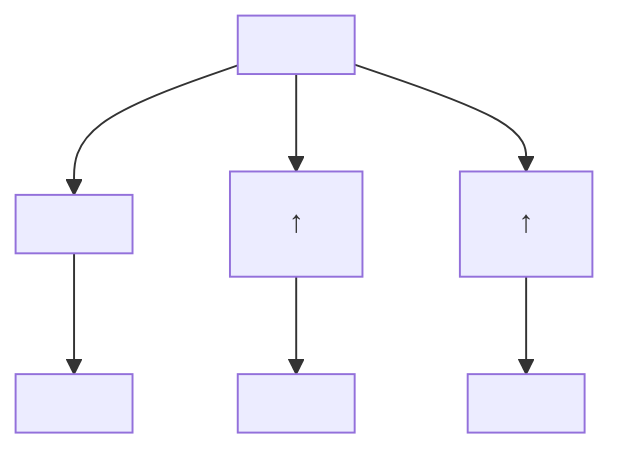
</details>

(1)

![[无机化学第6版副族金属有机565-748_images/5315a8838070f127d695e68b1b79d18dc3b9d4a6dba6bdd4e5af2f58ee80c830.jpg]]

<details>
<summary>flowchart</summary>

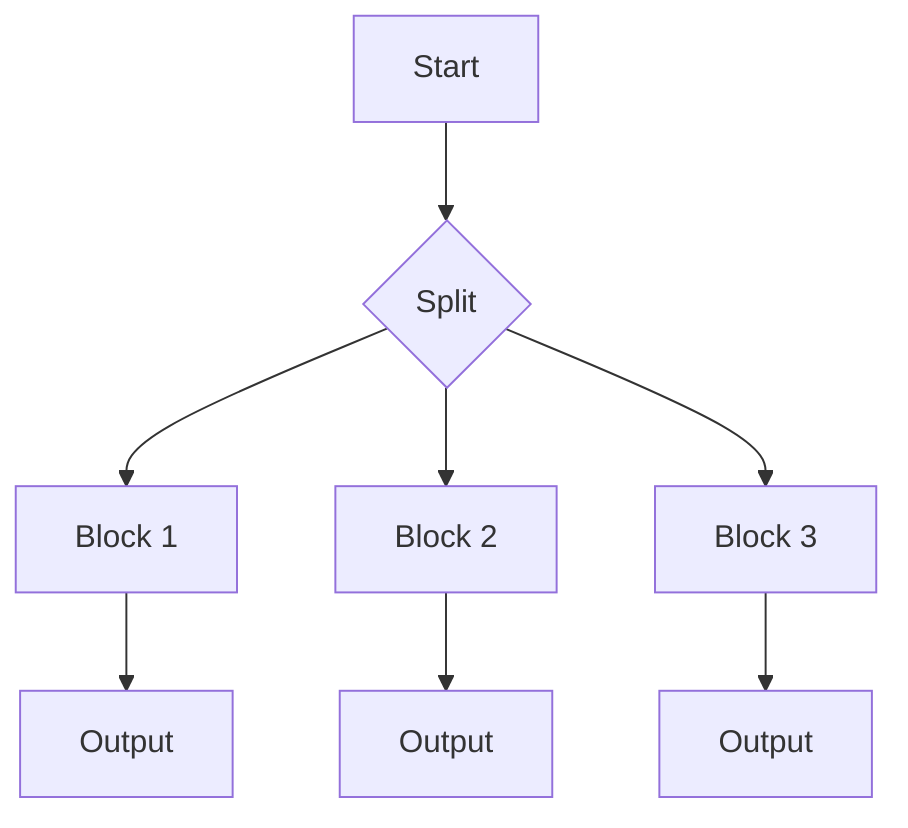
</details>

(2)

![[无机化学第6版副族金属有机565-748_images/ac1fe5638d363a7c61a1c7a84848479a07ddd9ce0377390461b2ce919abba877.jpg]]

<details>
<summary>flowchart</summary>

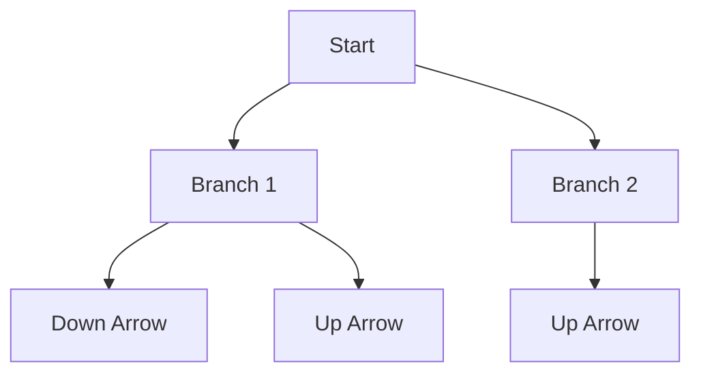
</details>

(3)

![[无机化学第6版副族金属有机565-748_images/df8a23cbfd4ab0391324f772115e39e1f42169f8630a9d5d903254291150d6d8.jpg]]

<details>
<summary>flowchart</summary>

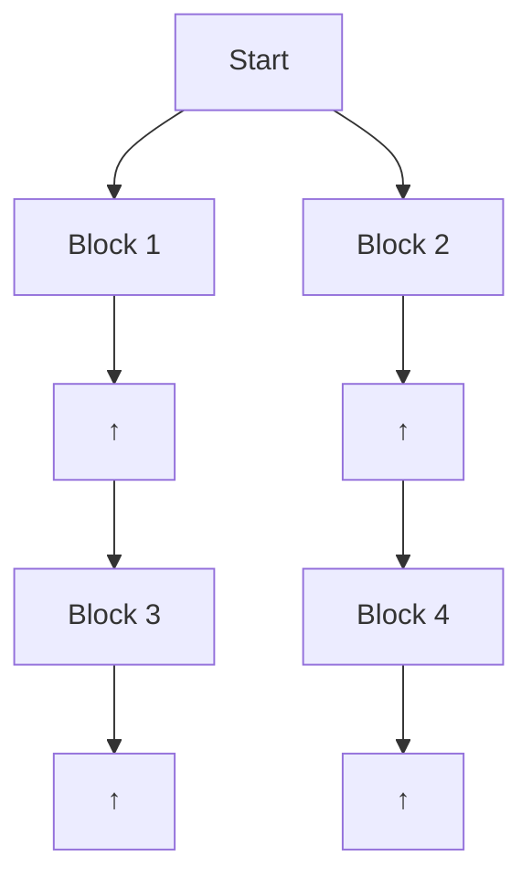
</details>

(4)

配位场分裂参数小于成对能时叫弱场情况（weak-field case）。如果 $\Delta_0 < P$ ，占据高位轨道形成 $\mathrm{t}_{2\mathrm{g}}^3\mathrm{e}_\mathrm{g}^1$ 组态的能量更低。配位场分裂参数大于成对能时叫强场情况（strong-field case）。如果 $\Delta_0 > P$ ，尽管要付出成对能的代价，电子仍只占据低位轨道从而得到 $\mathrm{t}_{2\mathrm{g}}^4$ 组态。例如， $[\mathrm{Cr(H_2O)_6}]^{2+}$ 为 $\mathrm{t}_{2\mathrm{g}}^3\mathrm{e}_\mathrm{g}^1$ 组态，而相对的强场配体（见光谱化学序列）形成的 $[\mathrm{Cr(CN)_6}]^{4-}$ 则为 $\mathrm{t}_{2\mathrm{g}}^4$ 组态。弱场情况下所有电子占据不同轨道且自旋平行，获得的自旋相关效应有助于抵消电子占据高位轨道所付出的代价。

因为不存在占据 $\mathrm{t}_{2\mathrm{g}}$ 轨道而产生的额外稳定化能与成对能之间的竞争， $3\mathrm{d}^1, 3\mathrm{d}^2$ 和 $3\mathrm{d}^3$ 八面体络合物的基态电子组态是明确的，分别为 $\mathrm{t}_{2\mathrm{g}}^1, \mathrm{t}_{2\mathrm{g}}^2$ 和 $\mathrm{t}_{2\mathrm{g}}^3$ ，每个电子占据不同的轨道。如前所述， $\mathrm{d}^4$ 络合物存在两种可能的组态， $n = 5, 6$ 和7的 $3\mathrm{d}^n$ 络合物也是如此。强场情况下优先占据低位轨道，弱场情况下电子占据高位轨道从而避免了成对能。

如果组态存在两种可能性,则平行自旋电子数较小的物种叫低自旋络合物(low-spin complex),平行自旋电子数较大的物种叫高自旋络合物(high-spin complex)。正如已经看到的那样,八面体 $3d^{4}$ 络合物在强晶体场中可能是低自旋,在弱场中则可能是高自旋(见图20.4)。同样的叙述也适用于 $3d^{5}$ 、 $3d^{6}$ 和 $3d^{7}$ 络合物。

<table><tr><td rowspan="2"></td><td colspan="2">弱场配体</td><td colspan="2">强场配体</td></tr><tr><td>组态</td><td>未成对电子</td><td>组态</td><td>未成对电子</td></tr><tr><td> $3d^{4}$ </td><td> $t_{2g}^{3}e_{g}^{1}$ </td><td>4</td><td> $t_{2g}^{4}$ </td><td>2</td></tr><tr><td> $3d^{5}$ </td><td> $t_{2g}^{3}e_{g}^{2}$ </td><td>5</td><td> $t_{2g}^{5}$ </td><td>1</td></tr><tr><td> $3d^{6}$ </td><td> $t_{2g}^{4}e_{g}^{2}$ </td><td>4</td><td> $t_{2g}^{6}$ </td><td>0</td></tr><tr><td> $3d^{7}$ </td><td> $t_{2g}^{5}e_{g}^{2}$ </td><td>3</td><td> $t_{2g}^{6}e_{g}^{1}$ </td><td>1</td></tr></table>

$3d^{8}$ 、 $3d^{9}$ 和 $3d^{10}$ 络合物的基态电子组态是明确的，分别为 $t_{2g}^{6}e_{g}^{2}$ 、 $t_{2g}^{6}e_{g}^{3}$ 和 $t_{2g}^{6}e_{g}^{4}$ 。

不考虑成对能的一般情况下， $t_{2g}^{x}e_{g}^{y}$ 组态相对于重心的净能量为 $(-0.4x+0.6y)\Delta_{0}$ 。只有出现额外的成对现象（与球形场中的成对现象相比）时则需考虑成对能。图 20.5 示出 $d^{6}$ 离子的情况：无论是自由离子还是高自旋络合物都是2个电子成对，而低自旋络合物中6个电子都成对(3对)。所以，高自旋络合物中不需要考虑成对能，因为相对于自由离子没有额外的成对作用。但低自旋络合物中多了两对成对电子，所以必须考虑两对电子成对能的贡献。高自旋络合物总是与球形场（自由离子）具有相同数目的未成对电子，所以不需要考虑电子的成对能。表20.2列出了八面体离子各种组态的LFSE值及低自旋络合物需要考虑的成对能。需要提醒的是，LFSE在金属离子与配体相互作用的总能量中只占很小的一部分。

![[无机化学第6版副族金属有机565-748_images/7236fb6f716014628511a0f8b393f1c864f898bbfce36359ac21ac065f4993bc.jpg]]

<details>
<summary>text_image</summary>

弱场
自由离子
强场
高自旋
低自旋
</details>

图 20.4 弱配位场和强配位场对 $d^{4}$   
络合物轨道占据情况的影响  
前者导致高自旋组态,后者导致低自旋组态

![[无机化学第6版副族金属有机565-748_images/cbdf250a776f4d002d313af1c55a3b398cb19b47306a4af69cdc5ab12c04e2b3.jpg]]

<details>
<summary>text_image</summary>

弱场
自由离子
强场
高自旋
低自旋
</details>

图 20.5 弱配位场和强配位场对 $d^{6}$ 络合物轨道占据情况的影响  
前者导致高自旋组态，后者导致低自旋组态

晶体场的强度(用 $\Delta_{0}$ 度量)和自旋成对能(用 P 度量)不仅与配体的性质有关,还与中心金属离子的性质有关。因此不可能完全用配体的光谱化学序列来解释络合物电子组态采取高自旋或低自旋。对 3d 金属离子而言,低自旋络合物往往形成于光谱化学序列强场配体的一端(如 $CN^{-}$ ),而高自旋络合物通常是由光谱化学序列中的弱场配体(如 $F^{-}$ )形成的。有些 $d^{n}$ 络合物(n=1\~3 和 n=8\~10)的组态是明确的(如表 20.2),不以“高自旋”和“低自旋”进行区分。

表 20.2 八面体络合物的配位场稳定化能

<table><tr><td> $d^n$ </td><td>例子</td><td>N(高自旋)</td><td>LFSE/ $\Delta_0$ </td><td>N(低自旋)</td><td>LFSE</td></tr><tr><td> $d^0$ </td><td></td><td>0</td><td>0</td><td></td><td></td></tr><tr><td> $d^1$ </td><td> $Ti^{3+}$ </td><td>1</td><td>-0.4</td><td></td><td></td></tr><tr><td> $d^2$ </td><td> $V^{3+}$ </td><td>2</td><td>-0.8</td><td></td><td></td></tr><tr><td> $d^3$ </td><td> $Cr^{3+},V^{2+}$ </td><td>3</td><td>-1.2</td><td></td><td></td></tr><tr><td> $d^4$ </td><td> $Cr^{2+},Mn^{3+}$ </td><td>4</td><td>-0.6</td><td>2</td><td> $-1.6\Delta_0 + P$ </td></tr><tr><td> $d^5$ </td><td> $Mn^{2+},Fe^{3+}$ </td><td>5</td><td>0</td><td>1</td><td> $-2.0\Delta_0 + 2P$ </td></tr><tr><td> $d^6$ </td><td> $Fe^{2+},Co^{3+}$ </td><td>4</td><td>-0.4</td><td>0</td><td> $-2.4\Delta_0 + 2P$ </td></tr><tr><td> $d^7$ </td><td> $Co^{2+}$ </td><td>3</td><td>-0.8</td><td>1</td><td> $-1.8\Delta_0 + P$ </td></tr><tr><td> $d^8$ </td><td> $Ni^{2+}$ </td><td>2</td><td>-1.2</td><td></td><td></td></tr><tr><td> $d^9$ </td><td> $Cu^{2+}$ </td><td>1</td><td>-0.6</td><td></td><td></td></tr><tr><td> $d^{10}$ </td><td> $Cu^+,Zn^{2+}$ </td><td>0</td><td>0</td><td></td><td></td></tr></table>

\*N 是未成对电子数。

正如我们已经看到的那样，4d和5d系金属络合物的 $\Delta_{0}$ 值通常大于3d系金属络合物。4d和5d系金属络合物的成对能可能较3d系金属低，这是因为轨道较离散，也是因为电子-电子之间的排斥力较弱。结果导致这些金属的组态具有强晶体场的特征，络合物通常为低自旋。例如，具有 $t_{2g}^{4}$ 组态的 $4d^{4}$ 络合物 $\left[RuCl_{6}\right]^{2-}$ ，尽管光谱化学序列中的 $Cl^{-}$ 是弱场配体，但却表现为强场行为。同样 $\left[Ru(ox)_{3}\right]^{3-}$ 具有低自旋组态 $t_{2g}^{5}$ ，而 $\left[Fe(ox)_{3}\right]^{3-}$ 则为高自旋组态 $t_{2g}^{3}e_{g}^{2}$ 。

# 例题20.1 计算LFSE

题目:根据第一原理计算下列八面体离子的 LFSE,并确认计算值与表 20.2 的值相匹配:(a) $d^{3}$ ,(b)高自旋 $d^{5}$ ,(c)高自旋 $d^{6}$ ,(d)低自旋 $d^{6}$ ,(e) $d^{9}$ 。

答案:先考虑每种情况下的总轨道能量,需要时再考虑成对能。(a) $d^{3}$ 离子的组态为 $t_{2g}^{3}$ (不存在成对能),因此 $LFSE=3\times(-0.4\Delta_{0})=-1.2\Delta_{0}$ 。(b)高自旋 $d^{5}$ 离子的组态为 $t_{2g}^{3}e_{g}^{2}$ (不存在成对能),因此 $LFSE=3\times(-0.4\Delta_{0})+2\times0.6\Delta_{0}=0$ 。(c)高自旋 $d^{6}$ 离子的组态为 $t_{2g}^{4}e_{g}^{2}$ (有2个电子成对);然而由于这两个电子在球形场中已经成对,不存在人们关心的额外成对能,因此 $LFSE=4\times(-0.4\Delta_{0})+2\times0.6\Delta_{0}=-0.4\Delta_{0}$ 。(d)低自旋 $d^{6}$ 离子的组态为 $t_{2g}^{6}$ (有3对成对电子);由于一对电子在球形场中已经成对,额外的成对能为2P。因此 $LFSE=6\times(-0.4\Delta_{0})+2P=-2.4\Delta_{0}+2P$ 。(e) $d^{9}$ 离子的组态为 $t_{2g}^{6}e_{g}^{3}$ (有8个电子成对);由于所有4对电子在球形场中已经成对,不存在额外的成对能。因此 $LFSE=6\times(-0.4\Delta_{0})+3\times0.6\Delta_{0}=-0.6\Delta_{0}$ 。

自测题 20.1 计算高自旋和低自旋 $d^{7}$ 组态的 LFSE。

# (c) 磁性测量

提要:磁性测量用于确定络合物中的未成对电子数,进而确定其基态组态。不过这种唯自旋计算对低自旋 $d^{5}$ 和高自旋 $d^{6}$ 、 $d^{7}$ 络合物可能失败。

根据磁性质的测定从实验上区分八面体络合物是高自旋或低自旋。化合物分为两类：受磁场排斥的性质叫抗磁性（diamagnetic），受磁场吸引的性质叫顺磁性（paramagnetic）。实验上区分两类物质的方法是磁量法（第8章）。络合物顺磁性的大小通常用磁偶极矩来表示：磁偶极矩越高，样品的顺磁性就越强。

在自由离子或原子中,磁矩是由轨道角动量和自旋角动量共同产生并贡献于顺磁性。原子或离子作为络合物的一部分时,由于非球形环境中电子间相互作用的结果,任何轨道角动量通常都会被淬灭(quenched)或者叫做被抑制。然而如果存在未成对电子,净的电子自旋角动量仍会保存下来并产生唯自旋顺磁性(spin-only paramagnetism),这是许多d金属络合物的特征。总自旋量子数为S的络合物的唯自旋磁矩( $\mu$ )为

$$
\mu = 2 \left[ S (S + 1) \right] ^ {1 / 2} \mu_ {\mathrm{B}} \tag {20.1}
$$

式中， $\mu_{\mathrm{B}}$ 为玻尔磁子（Bohr magneton）， $\mu_{\mathrm{B}} = e\hbar / 2m_{\mathrm{e}}$ ，一个电子的磁矩为 $9.274 \times 10^{-24} \mathrm{~J} \cdot \mathrm{T}^{-1}$ 。因为 $S = \frac{1}{2} N$ （ $N$ 为未成对电子数），每个电子的自旋 $s = \frac{1}{2}$ ，

$$
\mu = \left[ N (N + 2) \right] ^ {1 / 2} \mu_ {\mathrm{B}} \tag {20.2}
$$

d区络合物磁矩测量的结果通常可用它所拥有的未成对电子数做解释。因此可用测量结果来区分高自旋和低自旋络合物。例如， $\mathrm{d}^6$ 金属络合物的磁性测量很容易区分它是高自旋 $\mathrm{t}_{2\mathrm{g}}^{4}\mathrm{e}_{\mathrm{g}}^{2}(N = 4,S = 2,\mu = 4.90\mu_{\mathrm{B}})$ 组态还是低自旋 $\mathrm{t}_{2\mathrm{g}}^{6}(N = 0,S = 0,\mu = 0)$ 组态。

表 20.3 列出一些电子组态的唯自旋磁矩，并与许多 3d 络合物的实验值进行了比较。大多数 3d 络合物（及某些 4d 络合物）的实验值与唯自旋磁矩计算值很接近，因此可以用来确定未成对电子数，进而用于确定基态组态。例如， $\left[\mathrm{Fe}\left(\mathrm{H}_{2}\mathrm{O}\right)_{6}\right]^{3+}$ 是磁矩为 $5.9\mu_{B}$ 的顺磁性物种。如表 20.3 所示，该物种与存在 5 个未成对电子 $(N=5,S=5/2)$ 相一致，意味着它为高自旋 $t_{2g}^{3}e_{g}^{2}$ 组态。

表 20.3 计算得到的唯自旋磁矩

<table><tr><td>离子</td><td>电子组态</td><td>N</td><td>S</td><td> $\mu/\mu_{B}$ 计算值</td><td>实验值</td></tr><tr><td> $Ti^{3+}$ </td><td> $t_{2g}^{1}$ </td><td>1</td><td>1/2</td><td>1.73</td><td>1.7~1.8</td></tr><tr><td> $V^{3+}$ </td><td> $t_{2g}^{2}$ </td><td>2</td><td>1</td><td>2.83</td><td>2.7~2.9</td></tr><tr><td> $Cr^{3+}$ </td><td> $t_{2g}^{3}$ </td><td>3</td><td>3/2</td><td>3.87</td><td>3.8</td></tr><tr><td> $Mn^{3+}$ </td><td> $t_{2g}^{3}e_{g}^{1}$ </td><td>4</td><td>2</td><td>4.90</td><td>4.8~4.9</td></tr><tr><td> $Fe^{3+}$ </td><td> $t_{2g}^{3}e_{g}^{2}$ </td><td>5</td><td>5/2</td><td>5.92</td><td>5.9</td></tr></table>

对磁矩测量结果的解释有时也不像例子中判断的那样直观。例如， $\left[\mathrm{Fe}(\mathrm{CN})_{6}\right]^{3-}$ 的钾盐的实验磁矩 $\mu = 2.3\mu_{\mathrm{B}}$ ，该值位于一个未成对电子和两个未成对电子的唯自旋磁矩值（分别为 $1.7\mu_{\mathrm{B}}$ 和 $2.8\mu_{\mathrm{B}}$ ）之间。这种情况下唯自旋的假定是失败的（轨道的贡献很显著）；然而该数值仍可能用来区分 $\mathrm{d}^5\mathrm{Fe}^{3+}$ 的两种可能性：低自旋络合物将只有1个未成对电子 $(1.7\mu_{\mathrm{B}})$ ，而高自旋络合物将具有5个未成对电子 $(5.9\mu_{\mathrm{B}})$ 。

对轨道角动量的贡献而言(因而也是对顺磁性显著偏离唯自旋值的事实而言),必定存在一个或多个未充满或半充满轨道,这些轨道的能量接近未成对自旋占据的轨道并具有相关的对称性(这种对称性与绕外磁场方向旋转而导致的被占轨道有关)。如果是那样,外磁场可迫使电子在低能级轨道上绕金属离子旋转,因此产生了轨道角动量和对总磁矩的相应的轨道贡献(见图20.6)。对低自旋 $d^{5}$ 和高自旋 $3d^{6}$ 、 $3d^{7}$ 络合物而言,偏离唯自旋磁矩的程度通常比较大。金属离子的电子态也可能随条件(如温度)变化而变化,导致高自旋转变为低自旋和磁矩的变化。这种络合物叫自旋交叉(spin-crossover)络合物,这方面的内容将和协同磁效应一起在节20.8和节20.9做详细讨论。

# 例题 20.2 由磁矩推断电子组态

题目:某八面体 Co(Ⅱ)络合物的磁矩为 $4.0 \mu_{B}$ ，试推断其电子组态。

答案:首先需要将络合物可能的电子组态与实验观测到的磁矩匹配起来。Co(Ⅱ)络合物是 $d^{7}$ 络合物。两种可能的组态是具有3个未成对电子的 $t_{2g}^{5}e_{g}^{2}$ （高自旋，N=3，S=3/2）和具有1个未成对电子的 $t_{2g}^{6}e_{g}^{1}$ （低自旋，N=1，S=1/2）。唯自旋磁矩分别为3.87 $\mu_{B}$ 和1.73 $\mu_{B}$ （见表20.3）。因此，络合物应该是高自旋 $t_{2g}^{5}e_{g}^{2}$ 组态。

自测题 20.2 络合物 $\left[\mathrm{Mn}(\mathrm{NCS})_{6}\right]^{4-}$ 的磁矩为 $6.06\mu_{B}$ ，试推断其电子组态。

# (d) 热化学相关性

提要:实验水合焓的变化趋势反映了金属离子半径线性变化趋势和 LFSE 锯齿状变化趋势的结合。

配位场稳定化能的概念有助于解释高自旋八面体 3d 金属 $M^{2+}$ 水合焓变化的双峰曲线（见图 20.7）。二价离子的水合焓是下述反应的焓变：

$$
\mathrm{M} ^ {2 +} (\mathrm{g}) + 6 \mathrm{H} _ {2} \mathrm{O} \longrightarrow [ \mathrm{M} (\mathrm{H} _ {2} \mathrm{O}) _ {6} ] ^ {2 +}
$$

本可预期周期表从左到右随着金属离子半径的减小导致金属离子与 $\mathrm{H}_2\mathrm{O}$ 的成键作用增强，从而导致水合焓近乎线性增加的趋势（见图20.7中的实心圆）。水合焓偏离了这条直线，这是从自由离子形成八面体络合物过程中额外的配位场稳定化能引起的。如表20.2所示，LFSE从 $\mathrm{d}^1$ 到 $\mathrm{d}^3$ 增加，从 $\mathrm{d}^3$ 到 $\mathrm{d}^5$ 减小，从 $\mathrm{d}^5$ 到 $\mathrm{d}^8$ 再次增加。图20.7中的实心圆是从水合焓 $\Delta_{\mathrm{hyd}}H$ 扣除高自旋的LFSE（来自表20.1给出的光谱值 $\Delta_0$ ）得到的。此例不难看出，由光谱数据算得的LFSE能够说明络合物额外的配体结合能。

![[无机化学第6版副族金属有机565-748_images/dafab4c1f4cf4521bf6c805468dcd0588eda086619b0a1d5b464b50a2c404dcf.jpg]]

<details>
<summary>chemical</summary>

Molecular orbital diagram showing dₓ²₋ᵧ² and dₓᵧ orbitals with electron density lobes
</details>

图 20.6 $^{*}$ 如果存在对称性匹配的低能级轨道，外加磁场则可能影响络合物中电子绕核的旋转进而产生轨道角动量。此图给出外加磁场垂直于 xy-面（即垂直于纸面）时可能产生的绕核旋转的运行方式

![[无机化学第6版副族金属有机565-748_images/7a6fa5f6fb9357c56ec0322f8210520727a8aede211369a272d9c0f983fa6e31.jpg]]

<details>
<summary>line</summary>

| Element | -ΔHγd^0 (kJ·mol⁻¹) |
|---|---|
| Ca | 2468 |
| Sc | 2729 |
| Ti | 2581 |
| V | 2814 |
| Cr | 2799 |
| Mn | 2743 |
| Fe | 2843 |
| Co | 2904 |
| Ni | 2986 |
| Cu | 2936 |
| Zn | 2989 |
</details>

图 20.7 第一过渡系金属 $M^{2+}$ 的水合焓虚线表示扣除配位场稳定化能后焓变呈现线性增加的趋势；注意，从左到右焓变的总趋势是增大的（水合过程放热更多）

# 例题20.3 用LFSE解释热化学性质

题目:化学式为 MO 的下列氧化物(金属离子全为八面体配位,岩盐结构)的晶格焓(单位:kJ·mol $^{-1}$ )如下:

<table><tr><td>CaO</td><td>TiO</td><td>VO</td><td>MnO</td></tr><tr><td>3 460</td><td>3 878</td><td>3 913</td><td>3 810</td></tr></table>

试用 LFSE 解释这种变化规律。

答案:首要考虑因离子半径变化而造成的简单变化趋势,然后考虑LFSE造成的偏离。一般情况下,MO晶格能的大小随M离子从 $\mathrm{CaO(d^{0})}$ 到 $\mathrm{MnO(d^{5})}$ 半径减小而线性增加(晶格焓正比于 $1/(r_{1}+r_{2})$ ,节3.12)。 $\mathrm{Ca^{2+}}$ (没有d电子)的LFSE为0,高自旋 $\mathrm{Mn^{2+}(O^{2-}为弱场配体)}$ 的LFSE也为零。对 $\mathrm{Ca^{2+},Sc^{2+},Ti^{2+},V^{2+}}$ 和 $\mathrm{Mn^{2+}}$ 这个系列的氧化物而言,可以预期晶格能从 $\mathrm{Ca^{2+}}$ 到 $\mathrm{Mn^{2+}}$ 大约按 $[(3810-3460)/5]\mathrm{kJ}\cdot\mathrm{mol}^{-1}$ 的步长线性增加。由此可以预期TiO和VO的晶格能分别应为3600和 $3670\mathrm{kJ}\cdot\mathrm{mol}^{-1}$ ,事实上 $\mathrm{TiO(d^{2})}$ 的晶格能为 $3878\mathrm{kJ}\cdot\mathrm{mol}^{-1}$ ,差值 $278\mathrm{kJ}\cdot\mathrm{mol}^{-1}$ 可以看作来自LFSE的 $-0.8\Delta_{0}$ 。同样, $\mathrm{VO(d^{3})}$ 实际的晶格能为 $3913\mathrm{kJ}\cdot\mathrm{mol}^{-1}$ ,高出的 $243\mathrm{kJ}\cdot\mathrm{mol}^{-1}$ 可以看作来自LFSE的 $-1.2\Delta_{0}$ 。

自测题 20.3 解释下述八面体氟化物晶格能的变化规律: $\mathrm{MnF}_{2}(2\ 780\ \mathrm{kJ}\cdot\mathrm{mol}^{-1})$ , $\mathrm{FeF}_{2}(2\ 926\ \mathrm{kJ}\cdot\mathrm{mol}^{-1})$ , $\mathrm{CoF}_{2}(2\ 976\ \mathrm{kJ}\cdot\mathrm{mol}^{-1})$ , $\mathrm{NiF}_{2}(3\ 060\ \mathrm{kJ}\cdot\mathrm{mol}^{-1})$ 和 $\mathrm{ZnF}_{2}(2\ 985\ \mathrm{kJ}\cdot\mathrm{mol}^{-1})$ 。

# (e) 四面体络合物

提要: 四面体络合物中的 e 轨道能级低于 $t_{2}$ 轨道; 通常只会遇到高自旋络合物。

对 3d 金属而言, 四配位四面体络合物的数量仅次于八面体络合物。像用于八面体络合物那样, 晶体场理论也适用于讨论四面体络合物。

四面体晶体场也将 d 轨道分裂为两组，不同的是两个 e 轨道 $\left(\mathrm{d}_{x^{2}-y^{2}}\text{ 和 } \mathrm{d}_{z^{2}}\right)$ 的能量低于三个 $t_{2}$ 轨道 $\left(\mathrm{d}_{xy}\right.$ 、 $\left.\mathrm{d}_{yz}\right.$ 和 $\left.\mathrm{d}_{xz}\right)$ ，见图 20.8（四面体络合物没有反演中心，因而轨道符号下标没有 g 和 u）。e 轨道能量低于 t 轨道的事实可从轨道空间排布方面去理解：e 轨道指向配体和配体部分负电荷之间的位置，而 t 轨道则较为直接地指向配体（见图 20.9）。另一个差别是四面体络合物的配位场分裂参数 $\Delta_{T}$ 小于 $\Delta_{0}$ [事实上 $\Delta_{T} \approx (4/9)\Delta_{0}$ ]，这是因为配体数目少，没有配体完全指向 d 轨道。成对能总是不如 $\Delta_{T}$ 那么大，通常只会遇到高自旋络合物。

![[无机化学第6版副族金属有机565-748_images/020054c402644b4fb984aad191d8f1e3f623c239680f50e63cded6258b77ab7e.jpg]]

<details>
<summary>text_image</summary>

球形环境
四面体晶体场
d
t₂
2/5ΔT
3/5ΔT
ΔT
e
</details>

图 20.8 分析四面体络合物中构建原理时使用的晶体场轨道能级图

![[无机化学第6版副族金属有机565-748_images/e502cc42844b461aeb7d09c764ce5e27592dcf209b1b674dc3bbf4c02ae0f55f.jpg]]

<details>
<summary>text_image</summary>

z
x
y
t₂
dzx
</details>

![[无机化学第6版副族金属有机565-748_images/c12dd73966b8ec6ad4c674af8a08de438f2933c9dd6e6ea912f064ed7ddb52d2.jpg]]

<details>
<summary>chemical</summary>

Molecular orbital diagram showing four electron density lobes within a cubic unit cell labeled d_yz
</details>

![[无机化学第6版副族金属有机565-748_images/05988b0f313ba407b130417cd411ea6e97b1033afba3f0e2267f73e1353ae9ac.jpg]]

<details>
<summary>chemical</summary>

Crystal lattice structure of d_xy, showing spherical atoms in a unit cell with axes labeled
</details>

![[无机化学第6版副族金属有机565-748_images/c7c9084ed34d7a8b66078c4264597885e5a065a7fdb0c94e765ff9464a969dca.jpg]]

<details>
<summary>chemical</summary>

3D molecular orbital diagram showing electron density distribution with unit cell d_z²
</details>

![[无机化学第6版副族金属有机565-748_images/f3420cb06764a50295a7ab73b06d0c132b050f09d2f7739e530341033df20f92.jpg]]

<details>
<summary>chemical</summary>

Molecular orbital diagram showing electron density distribution in a cubic unit cell with dₓ²₋ᵧ² notation
</details>

图 20.9 $^{*}$ 四面体晶体场将一组 d 轨道分裂为两组；一对 e 轨道（指向配体的程度小）的能级低于三重简并的 $t_{2}$ 轨道

按照八面体络合物中使用的方法可以准确计算四面体络合物的配位场稳定化能。由于四面体络合物总是高自旋，因而不用考虑LFSE中的成对能。唯一的区别是轨道占据的先后（e轨道先于 $\mathrm{t}_2$ 轨道）和每个轨道对总能量的贡献[每条e轨道和每条 $\mathbf{t}_2$ 轨道分别为 $(-3 / 5)\Delta_{\mathrm{T}}$ 和 $(+2 / 5)\Delta_{\mathrm{T}}]$ 。表20.4列出四面体 $\mathrm{d}^n$ 络合物的组态和LFSE的计算值。表20.5列出一些络合物 $\Delta_{\mathrm{T}}$ 的实验值。

表 20.4 四面体络合物的配位场稳定化能

<table><tr><td> $d^n$ </td><td>组态</td><td>N</td><td>LFSE/ $\Delta_T$ </td></tr><tr><td> $d^0$ </td><td></td><td>0</td><td>0</td></tr><tr><td> $d^1$ </td><td> $e^1$ </td><td>1</td><td>-0.6</td></tr><tr><td> $d^2$ </td><td> $e^2$ </td><td>2</td><td>-1.2</td></tr><tr><td> $d^3$ </td><td> $e^2 t_2^1$ </td><td>3</td><td>-0.8</td></tr><tr><td> $d^4$ </td><td> $e^2 t_2^2$ </td><td>4</td><td>-0.4</td></tr><tr><td> $d^5$ </td><td> $e^2 t_2^3$ </td><td>5</td><td>0</td></tr><tr><td> $d^6$ </td><td> $e^3 t_2^3$ </td><td>4</td><td>-0.6</td></tr><tr><td> $d^7$ </td><td> $e^4 t_2^3$ </td><td>3</td><td>-1.2</td></tr><tr><td> $d^8$ </td><td> $e^4 t_2^4$ </td><td>2</td><td>-0.8</td></tr><tr><td> $d^9$ </td><td> $e^4 t_2^5$ </td><td>1</td><td>-0.4</td></tr><tr><td> $d^{10}$ </td><td> $e^4 t_2^6$ </td><td>0</td><td>0</td></tr></table>

\* N 是未成对电子数。

表 20.5 某些四面体场络合物的 ${\Delta }_{\mathrm{T}}$ 值

<table><tr><td>络合物</td><td> $\Delta_{\text{T}}/\text{cm}^{-1}$ </td></tr><tr><td> $[\text{VCl}_{4}]$ </td><td>9 010</td></tr><tr><td> $[\text{CoCl}_{4}]^{2-}$ </td><td>3 300</td></tr><tr><td> $[\text{CoBr}_{4}]^{2-}$ </td><td>2 900</td></tr><tr><td> $[\text{CoI}_{4}]^{2-}$ </td><td>2 700</td></tr><tr><td> $[\text{Co(NCS)}_{4}]^{2-}$ </td><td>4 700</td></tr></table>

# (f) 四方平面络合物

提要: $d^{8}$ 组态在强晶体场条件下容易形成四方平面络合物。4d 和 5d 金属这种趋势更明显,这是由它们较大的体积和电子更易成对导致的。

尽管四面体排布是四个配体空间需求最小的排布方式，但还是存在一些能量明显较高的四方平面四配位络合物。如果只考虑静电相互作用，四方平面排布形成如图20.10所示的d轨道分裂 $\left(\mathrm{d}_{x^{2}-y^{2}}\right.$ 轨道的能量高于其他轨道）。当存在8个d电子及晶体场强得足以有利于低自旋 $d_{yz}^{2}d_{xz}^{2}d_{z2}^{2}d_{xy}^{2}$ 组态时，上述排布方式可能在能量上变得更有利。在这种组态中，电子的稳定化能能够补偿任何不利的空间相互作用。因此，半径大的 $4d^{8}$ 和 $5d^{8}$ 离子 $[Rh(I),Ir(I),Pt(II),Pd(II)$ 和 $Au(III)]$ 发现了许多四方平面络合物，这些络合物中不利空间张力的影响较小，却存在与4d和5d系金属有关的大的配位场分裂。与之形成对照的是，半径小的3d金属形成的络合物（如 $[NiX_{4}]^{2-}$ ，X为卤素离子）通常为四面体，这是因为其配位场分裂参数通常相当小，不足以补偿不利的空间相互作用。只有当配体在光谱化学序列中的位置高，产生的LFSE才能大得足以形成平面四方络合物（如 $[Ni(CN)_{4}]^{2-}$ ）。我们注意到4d和5d金属离子比3d金属离子倾向于具有更低的成对能，这一差别是他们有利于形成低自旋四方平面络合物的另一个重要因素。

![[无机化学第6版副族金属有机565-748_images/2201c39b9c42486fab8355030080adf9f5a1e23fdf543be12c755ebde2fd1a19.jpg]]

<details>
<summary>text_image</summary>

x² - y²
Δ₃
ΔSP
Δ₂
xy
z²
Δ₁
yz, zx
</details>

图20.10 四方平面络合物的轨道分裂参数

# (g) 四方畸变的络合物: Jahn-Teller 效应

提要:如果络合物基态电子组态出现轨道简并,就可能发生四方畸变。络合物畸变是为了消除简并从而达到较低的能量。

六配位 $d^{9}Cu(II)$ 络合物常常严重偏离八面体几何形状, 显示出明显的四方畸变(见图 20.11)。高自旋 $d^{4}(Cr^{2+}$ 和 $Mn^{3+})$ 和低自旋 $d^{7}(Ni^{3+})$ 六配位络合物也存在类似的畸变, 但这些络合物并不常见, 畸变程度也不像 $Cu(II)$ 络合物那样明显。这类畸变用 Jahn-Teller 效应(Jahn-Teller effect) 表述: 如果一个非线性络合物的基态电子组态是简并的且电子在轨道中的占据不对称, 络合物就会发生畸变消除简并性从而使能量变得更低。

Jahn-Teller 效应在物理意义上是容易理解的。正八面体通过四方畸变（相应于沿 z 轴方向拉长和沿 x、y 轴方向压缩）降低了 $\mathrm{e}_{\mathrm{g}}(\mathrm{d}_{z^{2}})$ 轨道的能量而提高了 $\mathrm{e}_{\mathrm{g}}(\mathrm{d}_{x^{2}-y^{2}})$ 轨道的能量（见图 20.12）。因此，如果一个或三个电子占据该 $\mathrm{e_g}$ 轨道（如高自旋的 $\mathrm{d^4}$ 、低自旋的 $\mathrm{d^7}$ 络合物，以及 $\mathrm{d^9}$ 络合物），发生四方畸变可能在能量上有利。例如， $O_{\mathrm{h}}$ 场中组态为 $\mathrm{t}_{2\mathrm{g}}^{6}\mathrm{e}_{\mathrm{g}}^{3}$ 的 $\mathrm{d^9}$ 络合物发生四方畸变后，能量更低的 $\mathrm{d}_{z^2}$ 轨道上留下两个电子，另一电子则占据能量较高的 $\mathrm{d}_{x^2 -y^2}$ 轨道。

![[无机化学第6版副族金属有机565-748_images/6e4b63d4b6e769415e33f19a74b71fd353cf7af4349e48e06d58ad626bac2bbc.jpg]]

<details>
<summary>chemical</summary>

Two 3D molecular structures labeled (a) and (b), showing atom arrangements with bonds and spheres
</details>

图 20.11 (a) 两个配体远离中心离子的四方畸变络合物；  
(b) 两个配体更接近中心离子的四方畸变络合物

![[无机化学第6版副族金属有机565-748_images/70af3f7e6edb33f1fd55d34f8412292bb6c88f0c317d21eb41b604caff9aac12.jpg]]

<details>
<summary>text_image</summary>

O_h
D_4h
x² - y²
z²
xy
yz, zx
八面体
四方体
</details>

图 20.12 四方畸变(x,y 方向压缩和 z 方向拉长) 对 d 轨道能量的影响.

Jahn-Teller 效应识别出一种不稳定的几何体(具有轨道简并基态的非线性络合物),但却不能判断优先发生哪种畸变。例如,对八面体络合物而言,轴向拉长和平伏方向压缩可以消除简并性,但这种方式可被轴向压缩和平伏方向伸长所代替。究竟发生哪种畸变实际上是个能量问题而不是对称性问题。然而由于轴向拉长会弱化两个键而平伏方向拉长会弱化四个键,轴向拉长比轴向压缩更常见。

八面体络合物的其他电子组态 $(\mathrm{d}^1, \mathrm{d}^2$ 、低自旋 $\mathrm{d}^4$ 和 $\mathrm{d}^5$ 、高自旋 $\mathrm{d}^6$ 、 $\mathrm{d}^7$ 组态)和四面体络合物的一些电子组态 $(\mathrm{d}^1, \mathrm{d}^3, \mathrm{d}^4, \mathrm{d}^6, \mathrm{d}^8$ 和 $\mathrm{d}^9$ 组态)可能存在Jahn-Teller效应。然而，无论是八面体络合物的 $\mathbf{t}_{2g}$ 轨道还是四面体络合物的任何d轨道都不直接指向配体，因此Jahn-Teller效应通常小得多（正如可测得的任何畸变所看到的那样）。四面体 $\mathrm{Cu}^{2+}$ 化合物往往显示略微“压扁了的”的四面体几何形状，如 $\mathrm{Cs}_2\mathrm{CuCl}_4$ 中的 $[\mathrm{CuCl}_4]^{2-}$ 阴离子(5)。

![[无机化学第6版副族金属有机565-748_images/d71e082d0732bc61948a95766be5f9d2b5ca35a54ac08721cae7eb07c48fc1ba.jpg]]

<details>
<summary>chemical</summary>

Molecular geometry diagram showing bond angles of 99° and 130° between atoms
</details>

(5) 压扁了的 $\left[CuCl_{4}\right]^{2-}$ 阴离子

畸变方向变换的现象叫动态Jahn-Teller效应（dynamic Jahn-Teller effect）。例如，温度低于 $20\mathrm{K}$ 时 $\left[\mathrm{Cu}(\mathrm{OH}_2)_6\right]^{2+}$ 的EPR谱上观察到静态畸变（准确地说，是在共振实验时标内的一种有效静止）。然而温度高于 $20\mathrm{K}$ 时这种畸变就会消失，这是因为畸变方向发生了快于EPR观测时标的变换。

# (h) 八面体配位和四面体配位的竞争

提要:从 LFSE 角度判断, $d^{3}$ 和 $d^{8}$ 离子强烈选择八面体的趋势超过了选择四面体;其他组态的选择性没有那么显著;LFSE 对 $d^{0}$ 、高自旋 $d^{5}$ ,以及 $d^{10}$ 组态的几何形状没有影响。

八面体络合物有6个M—L成键作用，在没有显著的空间和电子效应的情况下，这种排布的能量低于只有4个M—L成键作用的四面体。我们已经讨论过空间位阻对络合物的影响（节7.3），也看到过有利于形成四方平面络合物电子方面的理由。现在介绍更有利于形成八面体络合物（与形成四面体络合物相比）的电子效应以完成整个讨论。

图 20.13 给出四面体络合物和高自旋八面体络合物的 LFSE 随电子组态变化而发生的变化。可以明显地看出，对 $d^{3}$ 和 $d^{8}$ 电子组态而言，八面体络合物显著优先于四面体络合物：电子组态分别为 $d^{3}$ 和 $d^{8}$ 的铬（Ⅲ）和镍（Ⅱ）的确显示出对八面体几何体的特殊优先选择。同样，分别为 $d^{4}$ 和 $d^{9}$ 的电子组态也优先选择八面体几何体[如 Mn(Ⅲ) 和 Cu(Ⅱ)，注意：Jahn-Teller 效应提高了这一优先性]；然而 $d^{1}$ 、 $d^{2}$ 、 $d^{6}$ 和 $d^{7}$ 离子的四面体络合物将不是太不利，所以 V(Ⅱ) ( $d^{2}$ ) 和 Co(Ⅱ) ( $d^{7}$ ) 与氯离子、溴离子和碘离子配体形成四面体络合物 ( $[MX_{4}]^{2-}$ )。 $d^{0}$ 、 $d^{5}$ 和 $d^{10}$ 离子络合物的几何形状将不受电子数目的影响，因为这些物种不存在 LFSE。

由于 d 轨道分裂的程度(因而也是由于 LFSE 的大小)依赖于配体,因而弱场配体对八面体配位优先的程度最不显著。对强场配体而言,低自旋络合物可能优先,虽然成对能使情况变得复杂化,低自旋八面体络合物的 LFSE 将大于高自旋络合物的 LFSE。所以当八面体络合物为低自旋时,对八面体配位的优先程度将大于对四面体的配位。

由于影响 d 金属化合物所采取的结构, 对八面体配位的优先在固态起着重要作用。这种影响以下述方式得到证明: 各种尖晶石 [化学式为 $AB_{2}O_{4}$ ; 节 3.9(b) 和节 24.6] 中的不同金属离子 A 和 B 占据着八面体或四面体的位置。因此, $Co_{3}O_{4}$ 是正常尖晶石, 因为低自旋$\mathrm{d}^{6}\mathrm{Co(III)}$ 离子强烈有利于八面体配位，从而导致生成 $(\mathrm{Co}^{2+})_{\mathrm{T}}(2\mathrm{Co}^{3+})_{0}\mathrm{O}_{4}$ ；而 $\mathrm{Fe}_3\mathrm{O}_4$ （磁铁矿）是反尖晶石，因为 $\mathrm{Fe(II)}$ [而不是 $\mathrm{Fe(III)}$ ] 占据八面体位置能够获得更大的 LFSE。因此磁铁矿的式子应表示为 $(\mathrm{Fe}^{3+})_{\mathrm{T}}(\mathrm{Fe}^{2+}\mathrm{Fe}^{3+})_{0}\mathrm{O}_{4}$ 。

![[无机化学第6版副族金属有机565-748_images/4c2c73019f066749fe6d7633b295a0f89586fe33433bd2e6f4aed3a092ffbc69.jpg]]  
图 20.13 八面体（高自旋，圆圈）和四面体（方框） $d^{n}$ 络合物的配位场稳定化能 LFSE 用关系式 $\Delta_{\tau} = (4/9) \Delta_{0}$   
得到的 $\Delta_0$ 表示

# (i) Irving-Williams 序列

提要:Irving-Williams 序列总结了 $M^{2+}$ 形成的络合物的相对稳定性,反映了静电效应和 FLSE 的联合作用。

图 20.14 给出 3d 系 $M^{2+}$ 八面体络合物的 $\lg K_{f}$ 值（节 7.12）。形成常数的变化可总结为下述 Irving-Williams 序列（Irving-Williams series）：

$$
\mathrm{Ba} ^ {2 +} <   \mathrm{Sr} ^ {2 +} <   \mathrm{Ca} ^ {2 +} <   \mathrm{Mg} ^ {2 +} <   \mathrm{Mn} ^ {2 +} <   \mathrm{Fe} ^ {2 +} <   \mathrm{Co} ^ {2 +} <   \mathrm{Ni} ^ {2 +} <   \mathrm{Cu} ^ {2 +} > \mathrm{Zn} ^ {2 +}
$$

该顺序对配体的选择相对不敏感,但由于形成常数指的是由水合离子形成络合物的形成常数,因此相关的配体必需能够置换与中心离子配位的 $H_{2}O$ 分子。

一般来说,稳定性的增大与离子半径具有反相关关系,这表明Irving-Williams序列是静电效应的反

映。然而除 $Mn^{2+}$ 外，具有强场配体的 $d^{6}Fe(II)$ 、 $d^{7}Co(II)$ 、 $d^{8}Ni(II)$ 和 $d^{9}Cu(II)$ 络合物的 $K_{f}$ 均出现锐增。这些离子经受着额外的稳定化作用（这种作用正比于络合物中的 LFSE，比水分子被置换而产生的 LFSE 强得多，参见表 20.2）。一个重要例外是 $Cu(II)$ 络合物的稳定性大于 $Ni(II)$ 络合物，尽管 $Cu(II)$ 有额外的一个反键 $e_{g}$ 电子。这一反常现象是由 Jahn-Teller 效应的稳定化影响造成的，该效应导致四方畸变 $Cu(II)$ 络合物处在同一平面上的四个配体的结合力增强，这种稳定化作用提高了 $K_{f}$ 值。 $Zn(II)$ 络合物的形成常数（既未被 Jahn-Teller 效应所提高，也不存在 LFSE 因素的影响）通常大于 $Mn(II)$ 和 $Fe(II)$ 的形成常数，而小于 $Co(II)$ 、 $Ni(II)$ 和 $Cu(II)$ 络合物的形成常数。

![[无机化学第6版副族金属有机565-748_images/5394e29a61983261e600f74df8974fb9d6203a7830886878f4b5e8a92c40c6e3.jpg]]

<details>
<summary>line</summary>

| Element | Ig Kt |
|---|---|
| Ba | 0.5 |
| Sr | 1.2 |
| Ca | 2.0 |
| Mg | 3.0 |
| Mn | 3.8 |
| Fe | 4.5 |
| Co | 5.5 |
| Ni | 6.2 |
| Cu | 8.5 |
| Zn | 5.0 |
</details>

图 20.14 Irving-Williams 序列中 $M^{2+}$ 离子络合物的形成常数。

# 20.2 配位场理论

晶体场理论提供了一种简单的概念模型，只用实验上测得的 $\Delta_0$ 值就能对磁性、光谱和热化学数据做解释。然而这种理论是有缺陷的，它将配体视为点电荷或偶极，没有考虑配体和金属原子轨道的重叠。这种过度简单化的结果之一是晶体场理论不能解释配体的光谱化学系列。配位场理论（ligand-field theory）为理解 $\Delta_0$ 的大小提供了更具实质性的框架，是分子轨道理论（集中关注中心金属原子的d轨道）的应用。

描述 d 金属络合物分子轨道的基本方法与第 2 章描述多原子分子成键作用的方法相类似:金属和配体的价轨道用于形成对称性匹配的线性组合(SALCs;节 6.6),然后用经验能值并考虑重叠因素以估出分子轨道的相对能级。通过与实验数据(特别是紫外-可见吸收光谱和光电子能谱的实验数据)的比较可对估出的相对能级进行核实并将其调整得更精确。

首先讨论八面体络合物。先讨论只存在金属-配体 $\sigma$ 成键作用的八面体，然后讨论 $\pi$ 成键效应，我们将会看到这种讨论对理解 $\Delta_0$ 至关重要。最后讨论具有不同对称性的络合物，了解类似的论据为什么适用于这些络合物。本章稍后将会看到从光谱学得到的信息如何用于完善这种讨论并提供配位场分裂参数和电子-电子排斥能的定量数据。

# (a) $\sigma$ 成键作用

提要: 在配位场理论中, 构建原理与分子轨道能级图(从金属原子轨道与对称性匹配的配体轨道线性组合构建而成) 结合使用。

从讨论八面体络合物着手,络合物中每个配体(L)只有一条指向中心金属原子(M)的价轨道;这些轨

道中的每一条都具有相对于 M-L 轴的局域 $\sigma$ 对称性。这种配体的例子包括 $NH_{3}$ 分子和 $F^{-}$ 。

在八面体 $(O_{h})$ 环境中，中心金属原子轨道按对称性被分为四个组（见图20.15和资源节4）：

<table><tr><td>金属轨道</td><td>对称性标记</td><td>简并度</td></tr><tr><td>s</td><td> $a_{1g}$ </td><td>1</td></tr><tr><td> $p_x, p_y, p_z$ </td><td> $t_{1u}$ </td><td>3</td></tr><tr><td> $d_{x^2-y^2}, d_{z^2}$ </td><td> $e_g$ </td><td>2</td></tr><tr><td> $d_{xy}, d_{yz}, d_{zx}$ </td><td> $t_{2g}$ </td><td>3</td></tr></table>

如 6.10 所解释的那样,6 个配体 $\sigma$ 轨道也能形成 6 个对称性匹配的线性组合。这种组合方式可由资源节 5 查得,同时表示在图 20.15 中。一个(非归一化的)SALC 具有对称性 $a_{lg}$ :

![[无机化学第6版副族金属有机565-748_images/c9959a2ac84d6bb7e8d0ca5db2c8575ae580d4c0a54cd3479b07254fa475f403.jpg]]  
图 20.15\* 八面体络合物中配体 σ 轨道(这里用球体表示)的对称性匹配组合其他点群的对称性匹配轨道参见资源节 5

$$
\mathrm{a} _ {1 \mathrm{g}}: \sigma_ {1} + \sigma_ {2} + \sigma_ {3} + \sigma_ {4} + \sigma_ {5} + \sigma_ {6}
$$

列中 $\sigma_{i}$ 表示配体 i 的 $\sigma$ 轨道。存在 3 个对称性为 $t_{1u}$ 的 SALCs:

$$
\mathrm{t} _ {1 \mathrm{n}}: \sigma_ {1} - \sigma_ {3}, \sigma_ {2} - \sigma_ {4}, \sigma_ {5} - \sigma_ {6}
$$

和两个对称性为 $e_{g}$ 的 SALCs:

$$
\mathrm{e} _ {g}: \sigma_ {1} - \sigma_ {2} + \sigma_ {3} - \sigma_ {4}, 2 \sigma_ {6} + 2 \sigma_ {5} - \sigma_ {1} - \sigma_ {2} - \sigma_ {3} - \sigma_ {4}
$$

这 6 个 SALCs 能够解释具有 $\sigma$ 对称性的所有配体轨道: 不存在配体 $\sigma$ 轨道与金属 $t_{2g}$ 对称性轨道的组合, 因此后者不能参与 $\sigma$ 成键作用。

分子轨道是由SALCs与相同对称性的金属原子轨道组合而成的。例如， $\mathrm{a}_{1\mathrm{g}}$ 分子轨道的形式 $c_{\mathrm{M}}\psi_{\mathrm{Ms}} + c_{\mathrm{L}}\psi_{\mathrm{La}_{1\mathrm{g}}}$ （非归一化的）是 $\psi_{\mathrm{Ms}}$ 是金属原子M的s轨道， $\mathrm{La}_{1\mathrm{g}}$ 是配体具有 $\mathrm{a}_{1\mathrm{g}}$ 对称性的SALC。金属的s轨道与配体的 $\mathrm{a}_{1\mathrm{g}}$ SALC重叠生成两个分子轨道（一个成键轨道和一个反键轨道）。同样，二重简并的金属 $\mathbf{e}_{\mathrm{g}}$ 轨道和配体的 $\mathrm{e_gSALCs}$ 重叠生成4个分子轨道（两个简并的成键轨道和两个简并的反键轨道）；三重简并的金属 $\mathrm{t}_{1\mathrm{u}}$ 轨道和配体的 $\mathrm{t}_{1\mathrm{u}}$ SALCs重叠生成6个分子轨道（三个简并的成键轨道和三个简并的反键轨道）。因此总计存在6种成键组合和6种反键组合。3个三重简并的金属 $\mathrm{t}_{2\mathrm{g}}$ 轨道保持非键状态，且完全定域在金属原子上。得到的能量的计算结果（调整至与20.4中讨论的各种光谱数据相一致）绘制出图20.16所示的分子轨道能级图。

对最低能量分子轨道的最大贡献来自最低能量原子轨道(节2.9)。对 $NH_{3}$ 、 $F^{-}$ 及其他大多数配体而言，配体 $\sigma$ 轨道来自其能量显著低于金属d轨道能量的原子轨道。因此，络合物的6个成键分子轨道主要具有配体轨道的特征(即 $c_{L}^{2}>c_{M}^{2}$ )。这6个成键轨道可以容纳由6个配体孤对提供的12个电子。因此可以认为配体提供的电子主要局限在络合物的配体上，这正是晶体场理论的假设。然而因为 $c_{M}$ 是个非零系数，成键分子轨道的确具有某些d轨道特征，“配体电子”部分离域到中心金属原子上。

可以容纳的电子总数除了那些由配体提供的电子外，还取决于金属原子提供的 d 电子数 n。这些额外的电子占据非键 d 轨道 $\left(t_{2g}\right)$ 轨道和 d 轨道与配体轨道的反键组合轨道（上部的 $e_g$ 轨道）。 $t_{2g}$ 轨道完全局限于金属原子上（按照当今的近似处理），反键 $\mathrm{e_g}$ 轨道主要具有金属轨道的特征，所以中心原子提供的 $n$ 个电子仍然主要在那个原子上。所以络合物的前线轨道是非键的金属 $\mathrm{t}_{2\mathrm{g}}$ 轨道和反键轨道（主要是金属 $\mathbf{e}_{\mathrm{g}}$ 轨道）。这样一来就得到与晶体场理论定性上相同的结果。在配位场方法中，八面体配位场分裂参数 $(\Delta_0)$ 相应于前线轨道之间的分离能，而不是完全局限于金属原子（见图20.16）。

分子轨道能级图确立后，就可用构建原理去构建络合物的基态电子组态。对六配位的 $\mathrm{d}^n$ 络合物而言，存在 $(12 + n)$ 个电子待容纳。6个成键分子轨道容纳配体提供的12个电子，剩余的 $n$ 个电子被放置在非键 $\mathbf{t}_{2g}$ 轨道和反键 $\mathbf{e}_g$ 轨道中。现在这种说法在本质上与晶体场理论相同，所得到的络合物类型（如高自旋或低自旋）取决于 $\Delta_0$ 和成对能 $P$ 的相对值。与晶体场讨论的主要差别是，配位场理论对配位场分裂的原因给出了更深层次的理解，我们开始理解为什么一些配体强而另一些配体弱。例如，一个好的 $\sigma$ 配体应该导致强的金属-配体重叠和更强的反键 $\mathbf{e}_g$ 轨道组，从而导致较大的 $\Delta_0$ 值。然而在得出进一步的结论之前，必须继续讨论晶体场理论完全忽略了的部分： $\pi$ 成键所起的作用。

![[无机化学第6版副族金属有机565-748_images/942470a9a8cea22b659fc20d42e20fd5e54a084e1f38bd6ec6d306cc71494945.jpg]]

<details>
<summary>chemical</summary>

Energy level diagram of a metal-organic compound showing electron transitions and transition states
</details>

图20.16 典型八面体络合物的分子轨道能级方框中的轨道为前线轨道

# 例题 20.4 使用光电子能谱获得关于络合物的信息

题目: 图 20.17 给出了气相 $\left[\mathrm{Mo}(\mathrm{CO})_{6}\right]$ 的光电子能谱, 使用该谱图推断络合物分子轨道的能量。

答案:需要确定该络合物的电子组态,然后将电离能的顺序与电子可能出现的轨道顺序相匹配。12个电子由6个CO配体(以“:CO”的方式)提供;它们进入成键轨道并导致 $a_{1g}^{2}t_{1u}^{6}e_{g}^{4}$ 组态。第6族钼的氧化数为0,所以Mo能提供另外6个价电子。配体和金属的价电子分布在图20.16方框中显示的轨道上;由于CO是强场配体,可以预期络合物的基态电子组态为低自旋的 $a_{1g}^{2}t_{1u}^{6}e_{g}^{4}t_{2g}^{6}$ 。HOMOs是主要局限于Mo原子上的三个 $t_{2g}$ 轨道,它们的能量能够通过最低电离能(接近8 eV)的峰值来识别。14 eV左右的一组电离能很可能是由于Mo—CO的 $\sigma$ 成键轨道。14 eV的数值接近CO本身的电离能,所以在那个能量的各种峰也来自CO的成键轨道。

自测题20.4 解释图20.18中 $\left[\mathrm{Fe}\left(\mathrm{C}_5\mathrm{H}_5\right)_2\right]$ 和 $\left[\mathrm{Mg}\left(\mathrm{C}_5\mathrm{H}_5\right)_2\right]$ 的光电子能谱。

![[无机化学第6版副族金属有机565-748_images/d202a55fd5d56fa8cdea980b95697d9f727218b3a4b0e1f2d4db1cf53ff3c4c9.jpg]]

<details>
<summary>line</summary>

| 电离能 / eV | 信号强度 |
| ----------- | -------- |
| 8           | t₂g      |
| 12          |        |
| 16          |        |
| 20          |        |
</details>

图20.17 [Mo(CO)6]的光电子能谱

![[无机化学第6版副族金属有机565-748_images/f8361a580073afef500fa92fff09192141f33ff4482848cace84c2199009c0b1.jpg]]

<details>
<summary>line</summary>

| 电离能 / eV | Mg(Cp)₂ | Fe(Cp)₂ |
| ----------- | ------- | ------- |
| 6           | ~0.2    | ~0.1    |
| 7           | ~0.8    | ~0.3    |
| 8           | ~0.1    | ~0.2    |
| 9           | ~0.6    | ~0.4    |
| 10          | ~0.1    | ~0.1    |
| 11          | ~0.3    | ~0.2    |
| 12          | ~0.9    | ~0.5    |
| 13          | ~1.2    | ~0.7    |
| 14          | ~0.8    | ~0.3    |
| 15          | ~0.4    | ~0.6    |
| 16          | ~0.2    | ~0.8    |
| 17          | ~0.1    | ~0.6    |
| 18          | ~0.05   | ~0.4    |
</details>

图 20.18 二茂铁和二茂镁的光电子能谱

# (b) $\pi$ 成键作用

提要: $\pi$ 给予体配体使 $\Delta_{0}$ 值降低, 然而 $\pi$ 接受体配体则是 $\Delta_{0}$ 值增大; 如果这种成键可行, 光谱化学序列则主要来自 $\pi$ 成键作用的影响。

如果络合物的配体具有相对于 M—L 轴的局域 $\pi$ 对称轨道（像卤离子配体的两个 p 轨道），它们则可能与金属轨道形成成键或反键 $\pi$ 轨道（见图 20.19）。对八面体络合物而言，这种可从配体 $\pi$ 轨道形成的组合包含了 $t_{2g}$ 对称的 SALCs。这种配体组合与金属 $t_{2g}$ 轨道具有净重叠， $t_{2g}$ 轨道因此不再是金属原子上的纯非键轨道。根据配体和金属轨道的相对能量，分子 $t_{2g}$ 轨道的能量高于或低于非键原子轨道所具有的能量，所以 $\Delta_{0}$ 分别降低或增加。

为了更为详细地探究 $\pi$ 成键所起的作用, 需要用到第 2 章叙述过的两个一般原理。首先需要用到这

样的概念:原子轨道有效重叠时强烈混合,得到的成键分子轨道能量显著低于原子轨道,而反键分子轨道能量则显著高于原子轨道。其次需要注意:能量相近的原子轨道之间产生强相互作用,而那些能量相差较大的原子轨道之间只能发生轻度混合,即使它们的重叠程度比较大。

$\pi$ 给予体配体（ $\pi$ -donor ligand）是在考虑任何成键作用之前具有充满的 $\pi$ 对称（相对于M—L轴）轨道的配体。这样的配体包括 $\mathrm{Cl}^{-}$ 、 $\mathrm{Br}^{-}$ 、 $\mathrm{OH}^{-}$ 和 $\mathrm{O}^{2-}$ ，甚至还有 $\mathrm{H}_{2} \mathrm{O}$ 。Lewis酸碱术语中（节4.6）将 $\pi$ 给予体配体叫 $\pi$ 碱（ $\pi$ base）。配体上满 $\pi$ 轨道的能量通常不会高于它们的 $\sigma$ 给予体轨道（HOMO）的能量，因此也必定低于金属d轨道的能量。因为 $\pi$ 给予体配体的满 $\pi$ 轨道能量低于部分充满的金属d轨道，当它们与金属 $t_{2g}$ 轨道形成分子轨道时，成键组合的能量低于配体轨道，反键组合则高于自由金属原子d轨道的能量（见图20.20）。配体 $\pi$ 轨道提供的电子占据并充满成键组合，留下原来在中心金属原子d轨道中的电子占据反键 $\mathrm{t}_{2g}$ 轨道。净结果是之前的非键金属 $\mathrm{t}_{2g}$ 轨道成为反键轨道，因此能量被提升至更接近反键 $\mathbf{e}_{\mathrm{g}}$ 轨道。结果是 $\pi$ 给予体配体减少了 $\Delta_0$ 。

![[无机化学第6版副族金属有机565-748_images/fee2705a6be16d4696310681640ea6c2c836511c41bf948011b5950dc414b804.jpg]]

<details>
<summary>text_image</summary>

d_{xy}(M)
p_y(L)
x
y
</details>

图 20.19 $^{*}$ 可能发生在垂直于 M—L 轴的配体 p 轨道与金属 $d_{xy}$ 轨道之间的 $\pi$ 重叠

$\pi$ 接受体配体（ $\pi$ -acceptor ligand）是具有能用于占据的空 $\pi$ 轨道的配体。Lewis 酸碱术语将 $\pi$ 接受体配体叫 $\pi$ 酸（ $\pi$ acid）。典型的 $\pi$ 接受体轨道是配体上空的反键轨道（通常是 LUMO，如在 CO 和 $N_2$ 中），它们的能量高于金属 d 轨道。例如，CO 的两个 $\pi^*$ 轨道在 C 原子上具有最大的振幅，并具有与金属 $t_{2g}$ 轨道重叠的、匹配的对称性，所以 CO 可作为 $\pi$ 接受体（节 22.5）。膦类化合物（ $PR_3$ ）也可接受 $\pi$ 电子密度，并且也可作为 $\pi$ 接受体（节 22.6）。

由于大多数配体 $\pi$ 接受体轨道的能量高于金属 d 轨道能量, 它们形成分子轨道中的成键 $t_{2g}$ 组合主要具有金属 d 轨道的特征(见图 20.21)。这些成键组合的能量低于它们 d 轨道本身的能量。净结果是 $\pi$ 接受体配体增加了 $\Delta_{0}$ 。

现在我们可以正确地解释 $\pi$ 成键所起的作用。光谱化学序列中配体的顺序部分是这些配体参与M—Lσ成键作用强度的顺序。例如， $\mathrm{CH}_3^-$ 与 $\mathrm{H}^-$ 都是很强的 $\sigma$ 给予体，因而处在光谱化学序列的高位（与NCS类似）。然而当 $\pi$ 成键作用显著时则对 $\Delta_0$ 显示强烈的影响： $\pi$ 给予体配体减少了 $\Delta_0, \pi$ 接受体配体增加了 $\Delta_0$ 。这种影响解释了CO(强 $\pi$ 接受体)处于光谱化学序列的高位，而 $\mathrm{OH}^-$ （强 $\pi$ 给予体）处于光谱化学序列的低位。光谱化学序列的总体顺序也可通过 $\pi$ 效应的支配作用做解释（存在极少数重要的例外）。一般来说该序列可解释如下：

$\Delta_{0}$ 值增大的方向→

$\pi$ 给予体 弱的 $\pi$ 给予体 无 $\pi$ 效应 $\pi$ 接受体

各类中有代表性的配体是

$\pi$ 给予体 弱的 $\pi$ 给予体 无 $\pi$ 效应 $\pi$ 接受体

$I^{-}, Br^{-}, Cl^{-}, F^{-}, \quad H_{2}O \quad NH_{3} \quad PR_{3}, CO$

σ 成键效应占主导地位的著名例子包括胺类 $\left(\mathrm{NR}_{3}\right)$ 、 $CH_{3}^{-}$ 和 $H^{-}$ 。三种配体都不具有能量合适的 π 对称性轨道，因此既不是 π 给予体配体也不是 π 接受体配体。重要的是需要注意，将配体按强场或弱场分类对 M—L 键强度的解释没有提供任何帮助。

![[无机化学第6版副族金属有机565-748_images/2af4f482a6ad1373901176594fa1a0dd7b32ab5bac8fd0994912ec1733bc1e03.jpg]]

<details>
<summary>chemical</summary>

Energy level diagram of a molecular system showing M, ML₆, and 配体 states with associated parameters like σ only, e_g, t₂g, Δ₀, and π.
</details>

图20.20 $\pi$ 成键作用对配位场分裂参数的影响作为 $\pi$ 给予体的配体减少了 $\Delta_0$ ，图上只给出  
配体的 $\pi$ 轨道

![[无机化学第6版副族金属有机565-748_images/af20e2fd8528e3f2e9b2e0a1f140aca45892e2e92dbd3a0235dc67670e43d840.jpg]]

<details>
<summary>text_image</summary>

M
σ only
e_g
ML6
σ + π
ΔO
t2g
配体
π
</details>

图20.21 作为 $\pi$ 接受体的配体增大了 $\Delta_0$ 图上只给出配体的 $\pi$ 轨道

$\pi$ 成键作用对八面体之外的几何体的影响从定性上讲是类似的，尽管我们注意到四面体几何体中是e轨道形成 $\pi$ 相互作用。在四方平面络合物中，某些想象中的金属d轨道顺序与纯晶体场给出的顺序会发生变化。图20.22给出金属d轨道（这些轨道考虑具有 $\pi$ 相互作用)的排列；如果将该图给出的顺序与图20.10（晶体场理论只考虑了静电相互作用）做比较，就会发现两种情况下都是 $\mathrm{d}_{x^2 -y^2}$ 轨道的能量最高，因此 $\mathrm{d}^8$ 金属离子络合物的 $\mathrm{d}_{x^2 -y^2}$ 轨道没有被占据。

# 电子光谱

既然已经讨论过 d 金属络合物的电子结构,这里则要讨论它们的电子光谱并利用电子光谱提供的数据完善对结构的讨论。配位场分裂的大小指的是紫外-可见吸收的电子跃迁能。然而金属轨道内部电子-电子排斥作用的存在意味着吸收频率通常不是配位场分裂的直接描述。电子-电子排斥作用最初是通过分析气相中球形对称的原子和离子确定的,那里提供的信息很多可用于分析金属络合物(这些络合物具有较低的对称性)的光谱。

记住,以下各节的目的是要从络合物(它们含有1个以上的d电子,电子-电子排斥作用在这样的络合物中才显得重要)的电子吸收光谱找到获取配位场

![[无机化学第6版副族金属有机565-748_images/f01eb2988b2985bb5f2b28a262f3bb9d8c492c3f3c0db3182fc80cb853b83b63.jpg]]

<details>
<summary>text_image</summary>

ML₄
σ + π
x² - y²
z²
yz, zx
xy
</details>

图20.22 考虑 $\pi$ 相互作用的四方平面络合物的轨道分裂模式

分裂参数值的一种方法。首先讨论自由原子的光谱，看看如何将电子-电子排斥作用考虑在内。然后讨论原子嵌入八面体场时采用何种能态。最后介绍在各种场强和电子-电子排斥能[节20.4(e)中的Tanabe-Sugano图]的条件下如何表示这些状态的能量及如何利用这些图获取配位场分裂参数的值。

# 20.3 原子的电子光谱

提要: 电子-电子排斥造成电子光谱中的多重吸收。

从对图20.23的考察开始本节的讨论。该图示出水溶液中 $\mathrm{d}^3$ 络合物 $[\mathrm{Cr}(\mathrm{NH}_3)_6]^{3+}$ 的电子吸收光谱。能量最低（波长最长）的吸收带非常微弱；后面我们将会明白它是“自旋禁阻”跃迁的一个实例。能量较高的两个谱带具有中等强度；它们是络合物 $\mathbf{t}_{2\mathrm{g}}$ 和 $\mathbf{e}_{\mathrm{g}}$ 轨道（这种轨道主要来自金属的d轨道）之间的“自旋允许”跃迁。谱图的第三个特征是在短波长处有一个强的电荷转移吸收带（标记为CT，表示“电荷转移”），图上只显示出低能量的尾部曲线。

![[无机化学第6版副族金属有机565-748_images/f0b39330b1a86829d8a9e24fa1bf5215d2a8aa0c7d4dd1ad848b28cc033ddbf3.jpg]]

<details>
<summary>line</summary>

| λ / nm (ν̄ / cm⁻¹) | lg(ε/(dm³·mol⁻¹·cm⁻¹)) |
| ----------------- | ------------------------ |
| 200               | 3.0                      |
| 300               | 1.0                      |
| 400               | 1.5                      |
| 500               | 1.0                      |
| 600               | 0.5                      |
| 700               | 0.2                      |
| 800               | 0.1                      |
</details>

图 20.23 $d^{3}$ 络合物 $\left[\mathrm{Cr}\left(\mathrm{NH}_{3}\right)_{6}\right]^{3+}$ 的谱图
吸收峰的归属在课文中有说明

立即面临的问题是，同一种跃迁 $(\mathrm{t}_{2\mathrm{g}}^2\mathrm{e}_\mathrm{g}^1\leftarrow \mathrm{t}_{2\mathrm{g}}^3)$ 为什么会得到能量不同的两个吸收带？跃迁分裂为两个吸收带的事实是由上面提到的电子-电子排斥造成的。为了弄明白它是如何产生及如何获取其中所包含的信息，这里需要讨论自由原子和离子的光谱。

# (a) 光谱项

提要:同一电子组态存在不同的微状态;Russell-Saunders 偶合用于描述轻原子的光谱项,光谱项符号中的 L 值表示为 S,P,D,…符号之一,2S+1 值表示为左上角标。

第1章中用电子组态（即给出每条轨道中电子的数目）表示原子的电子结构（如Li的电子组态为 $1\mathrm{s}^2 2\mathrm{s}^2$ ）。然而，组态是原子中电子排列的不完全描述。例如，在 $2\mathrm{p}^2$ 组态中，两个电子可能占据轨道角动量取向不同的轨道（即 $l = 1$ 时， $\mathfrak{m}_l$ 值可以是 $+1,0$ 和-1的不同值）。同样， $2\mathrm{p}^2$ 没有告诉我们两个电子的自旋取向（ $m_{s}$ 可能是 $+1 / 2$ 或 $-1 / 2)$ 。实际上，原子的总轨道和自旋角动量可能具有数种不同的状态，每一种状态对应于着 $m_{s}$ 值不同的电子占据不同 $m_l$ 值的轨道。用组态表示的电子占据轨道的不同方式叫组态的微状态（microstates）。例如， $2\mathrm{p}^2$ 组态的一种微状态是 $(1^{+},1^{-})$ ；这一标记表示两个电子占据 $\mathfrak{m}_l = +1$ 的同一轨道但自旋相反，上标“+”表示 $m_{s} = +1 / 2$ ，“-”表示 $m_{s} = -1 / 2$ 。同一组态的另一种微状态是 $(-1^{+},0^{+})$ 。这一微状态中的两个电子都占据 $m_{s} = +1 / 2$ 的轨道，但一个占据 $\mathfrak{m}_l = -1$ 的2p轨道，另一个则占据 $\mathfrak{m}_l = 0$ 的轨道。

如果将原子中电子-电子排斥力忽略不计,给定组态的微状态则具有相同的能量。然而因为原子和大多数分子比较密实,电子间的排斥力很强而不能忽略。其结果是微状态(对应于电子不同的相对空间分布)具有不同的能量。如果考虑电子-电子排斥的情况下合并具有相同能量的微状态,就会得到用光谱方法能够区分出来的叫作光谱项或谱项(terms)的能级。

对轻原子和3d系原子而言，对确定能量有帮助的最重要的微状态性质是电子自旋的相对取向。其次重要的才是该电子轨道角动量的相对取向。这就是说，我们可以确定轻原子的光谱项并根据它们的总自旋量子数 $S$ （决定于单个自旋的相对取向）然后根据它们的总轨道角动量量子数 $L$ （决定于该电子单个轨道角动量的相对取向)按照能量升高的顺序排列微状态。这种首先加合自旋角动量、然后加合轨道角动量，最后将两者组合在一起的过程叫Russell-Saunders偶合（Russell-Saunders coupling）。

对重原子(如4d和5d系原子)而言,轨道角动量或自旋角动量的相对取向不是那么重要。这些原子中单个电子的自旋和轨道角动量通过自旋-轨道偶合(spin-orbit coupling)强烈地偶合在一起,以致每个电子自旋和轨道角动量的相对取向成为决定能量最重要的特征。因此,重原子光谱项的分类是基于每一微状态中电子的总角动量量子数j值。这种组合叫j,j-偶合(j,j-coupling),这里不做进一步讨论。

回到 Russell-Saunders 偶合在 3d 金属中的应用。首先要做的是确定单个电子轨道和自旋角动量组合得到的 L 值和 S 值。假定两个电子的量子数为 $l_{1}$ 、 $s_{1}$ 和 $l_{2}$ 、 $s_{2}$ ；然后根据 Clebsch-Gordan 系列（Clebsch-Gordan series），L 和 S 的可能值为

$$
L = l _ {1} + l _ {2}, l _ {1} + l _ {2} - 1, \dots , \left| l _ {1} - l _ {2} \right| \quad S = s _ {1} + s _ {2}, s _ {1} + s _ {2} - 1, \dots , \left| s _ {1} - s _ {2} \right| \tag {20.3}
$$

（模量符号出现是因为根据定义 $L$ 或 $S$ 不可能为负值）。例如，组态为 $\mathrm{d}^2 (l_1 = 2,l_2 = 2)$ 的原子可能具有如下 $L$ 值：

$$
L = 2 + 2, 2 + 2 - 1, \dots , | 2 - 2 | = 4, 3, 2, 1, 0
$$

总自旋(因为 $s_{1}=\frac{1}{2}, s_{2}=\frac{1}{2}$ ) 可能值为

$$
S = \frac {1}{2} + \frac {1}{2}, \frac {1}{2} + \frac {1}{2} - 1, \dots , | \frac {1}{2} - \frac {1}{2} | = 1, 0
$$

为了找到含三个电子原子的 L 和 S 值, 我们继续使用这个方法将 $l_{3}$ 与刚刚得到的 L 值相组合, 将 $s_{3}$ 与刚刚得到的 S 值相组合。

一旦找到了 $L$ 与 $S$ , 就能写出量子数 $M_{L}$ 和 $M_{S}$ 的允许值:

$$
M _ {L} = L, L - 1, \dots , - L \quad M _ {S} = S, S - 1, \dots , - S
$$

这些量子数能够给出相对于任意轴的角动量取向：对给定的 $L$ 值而言， $M_L$ 有 $2L + 1$ 个值；对给定的 $S$ 值而言， $M_S$ 有 $2S + 1$ 个值。对给定的微状态而言，将每个电子的 $m_l$ 或 $m_s$ 值加在一起就不难确定 $M_L$ 和 $M_S$ 值。因此，如果一个电子的量子数为 $m_{l1}$ 而另一个电子的量子数为 $m_{l2}$ ，那么

$$
M _ {L} = m _ {l 1} + m _ {l 2}
$$

类似的表达式也适用于总自旋：

$$
M _ {s} = m _ {s 1} + m _ {s 2}
$$

例如， $(0^{+}, -1^{+})$ 是 $M_{L} = 0 - 1 = -1$ 和 $M_{S} = \frac{1}{2} + (-\frac{1}{2}) = 0$ 的微状态，并可能有助于这两个量子数适用的任何光谱项。

前面曾用 s、p、d 等符号表示 l=0、1、2 等轨道，原子光谱项的总轨道角动量也可用相应字母的大写来表示：

$$
L = 0 \quad 1 \quad 2 \quad 3 \quad 4
$$

S P D F G 后面按照字母顺序表示(但不用 J)

总自旋通常报道为 $2S+1$ 值, 此值叫作光谱项的多重度 (multiplicity):

$$
\begin{array}{l l l l l l} S = & 0 & \frac {1}{2} & 1 & 3 / 2 & 2 \\ 2 S + 1 = & 1 & 2 & 3 & 4 & 5 \end{array}
$$

多重度写在表示 L 值的字母的左上角, 光谱项的整个标记叫光谱项符号(term symbol)。例如, 光谱项符号 $^{3}$ P 表示 L=1 和 S=1 的光谱项(近乎简并态的集合), $^{3}$ P 叫三重态光谱项。

# 例题 20.5 推导光谱项符号

题目:给出下列组态的原子光谱项符号:(a) $s^{1}$ , (b) $p^{1}$ , (c) $s^{1}p^{1}$ 。

答案:这里需要用 Clebsch-Gordan 系列偶合任意角动量,从上表识别光谱项符号,然后将多重度加为左上角标。(a) 单个 s 电子的 $l=0, s=\frac{1}{2}$ 。因为只有一个电子,所以 $L=0$ (S 谱项)。 $S=s=\frac{1}{2}, 2S+1=2$ (双重谱项),谱项符号为 $^{2}S$ 。(b) 单个 p 电子的 l=1,故 L=1,谱项符号为 $^{2}P$ (这些谱项出现在碱金属原子如 Na 原子的光谱中)。(c) 对一个 s 和一个 p 电子的体系而言, $L=0+1=1$ (P 谱项)。由于电子可能成对 (S=0) 或平行 (S=1),因而 $^{1}P$ 和 $^{3}P$ 谱项都是可能的。

自测题 20.5 $p^{1}d^{1}$ 组态可能产生哪些谱项？

# (b) 微状态的分类

提要:识别原子微状态能够提供的 L 值和 S 值以确定组态的允许谱项。

Pauli原理限制了组态中能够存在的微状态并最终影响能够存在的光谱项。例如，两个电子不可能具有相同的自旋，也不可能处于 $m_{l} = +2$ 的d轨道中，因此微状态 $(2^{+},2^{+})$ 是被禁阻的。通过对 $\mathrm{d}^2$ 组态的讨论我们将会说明如何确定哪一种光谱项是允许的，所得的结果将有助于本章稍后关于络合物的讨论。具有 $\mathrm{d}^2$ 组态物种的一个例子是 $\mathrm{Ti}^{2+}$ 。

从建立 $\mathrm{d}^2$ 组态的微状态表(表20.6)开始做分析；该表只包括了Pauli原理允许的微状态。下面使用消去法对所有微状态进行分类。首先讨论 $\mathrm{d}^2$ 组态 $M_L$ 的最大值（+4）。这个微状态必定属于 $L = 4$ 的谱项（G谱项）。与之相应的唯一的 $M_S$ 值为0，所以G谱项为单重态。此外，由于 $L = 4$ 时有9个 $M_L$ 值，因而表中位于 $(2^{+},2^{-})$ 下方一列中与每个 $M_L$ 值对应的位置上各有一个微状态属于这个谱项。因此可从表20.6中间一列中的每一行消去一个微状态（包括 $M_L = -1$ 到-4的微状态），消去后留下36个微状态待归属。

表 20.6 ${\mathrm{d}}^{2}$ 组态的微状态.

<table><tr><td rowspan="2"> $M_{L}$ </td><td colspan="3"> $M_{S}$ </td></tr><tr><td>-1</td><td>0</td><td>+1</td></tr><tr><td>+4</td><td></td><td> $(2^{+},2^{-})$ </td><td></td></tr><tr><td>+3</td><td> $(2^{-},1^{-})$ </td><td> $(2^{+},1^{-})(2^{-},1^{+})$ </td><td> $(2^{+},1^{+})$ </td></tr><tr><td>+2</td><td> $(2^{-},0^{-})$ </td><td> $(2^{+},0^{-})(2^{-},0^{+})(1^{+},1^{-})$ </td><td> $(2^{+},0^{+})$ </td></tr><tr><td>+1</td><td> $(2^{-},-1^{-})(1^{-},0^{-})$ </td><td> $(2^{+},-1^{-})(2^{-},-1^{+})$ </td><td> $(2^{+},-1^{+})(1^{+},0^{+})$ </td></tr><tr><td></td><td></td><td> $(1^{+},0^{-})(1^{-},0^{+})$ </td><td></td></tr><tr><td>0</td><td> $(1^{-},-1^{-})(2^{-},-2^{-})$ </td><td> $(1^{+},-1^{-})(1^{-},-1^{+})$ </td><td> $(1^{+},-1^{+})(2^{+},-2^{+})$ </td></tr><tr><td></td><td></td><td> $(2^{+},-2^{-})(2^{-},-2^{+})$ </td><td></td></tr><tr><td></td><td></td><td> $(0^{+},0^{-})$ </td><td></td></tr><tr><td>-1到- $4^{*}$ </td><td></td><td></td><td></td></tr></table>

\* 表的下半部是上半部反射得到的镜像。

次大的 $M_{L}$ 值为 +3，它应该属于 L=3 的 F 谱项。相应的 $M_{s}$ 的最大值为 +1（即 S=1），所以该谱项为三重态谱项，微状态属于 ${}^{3}F$ 。该谱项包含 $(2L+1)\times(2S+1)=7\times3=21$ 个微状态。如果从这 21 个位置上分别消去一个微状态，则待归属的微状态还剩 15 个。

在 $M_{L}=+2$ （即 L=2）的横行与 $M_{S}=0$ （即 S=0）的直列相交叉的位置上的那个微状态必定属于 $^{1}D$ 谱项。 $^{1}D$ 谱项有 5 个 $M_{L}$ 值。将其从 $M_{S}=0, M_{L}=+2$ 至 -2 的位置上消去后留下 10 个待归属的微状态。在留下的 10 个微状态中 $M_{L}$ 最大值和相应的 $M_{S}$ 最大值均为 +1，因而有 9 个微状态属于 $^{3}P$ 谱项。最后剩下的一个微状态 ( $M_{L}=0, M_{S}=0$ ) 属于 $^{1}S$ 谱项 (L=0, S=0)。

至此可以得出结论: $3d^{2}$ 组态的谱项是 $^{1}G, ^{3}F, ^{1}D, ^{3}P$ 和 $^{1}S$ 。容许的微状态总数为45个：

<table><tr><td>谱项</td><td>状态的数目</td></tr><tr><td> $^1G$ </td><td>9×1=9</td></tr><tr><td> $^3F$ </td><td>7×3=21</td></tr><tr><td> $^1D$ </td><td>5×1=5</td></tr><tr><td> $^3P$ </td><td>3×3=9</td></tr><tr><td> $^1S$ </td><td>1×1=1</td></tr><tr><td>总计</td><td>45</td></tr></table>

# (c) 谱项的能量

提要: Hund 规则给出气相原子或离子的基谱项。

一旦知道了给定组态的 L 和 S 值, 就可用 Hund 规则识别最低能量的谱项。节 1.5 介绍了 Hund 的第一规则(经验规则), 那里将其表述为“如果电子自旋是平行的, 就能获得最低能量的组态”。因为高的 S 值来自电子自旋平行, 另一种表述则是:

1. 对给定的组态而言, 最大多重度的谱项能量最低。

该规则意味着组态三重态谱项的能量低于相同组态单重态谱项的能量。例如，根据该规则判断， $d^{2}$ 组态的基态可能是 ${}^{3}F$ 或 ${}^{3}P$ 。

Hund 通过对光谱数据的考察也对给定多重度谱项的相对能量提出了第二规则。

2. 对给定多重度的谱项而言, L 值最大的谱项能量最低。

该规则的物理意义是，L 值高时电子之间相互远离，相互间排斥力较低；L 值低时电子之间可能靠得更近，因此会产生强烈排斥。第二规则意味着， $d^{2}$ 组态的两个三重态谱项中 ${}^{3}F$ 谱项的能量低于 ${}^{3}P$ 谱项。由此得出的结论是，可以预言， $d^{2}$ 组态物种（如 $Ti^{2+}$ ）的基谱项是 ${}^{3}F$ 。

用自旋多重度规则预言谱项的能级顺序相当可靠,但“最大 L”规则只在判断基谱项(能量最低的谱项)时可靠;由于电子之间的相互排斥作用更为复杂,L 值与较高谱项的能级顺序通常几乎没有关联。对 $d^{2}$ 组态而言,该规则判断的顺序为

$$
^ 3 \mathrm{F} <   ^ {3} \mathrm{P} <   ^ {1} \mathrm{G} <   ^ {1} \mathrm{D} <   ^ {1} \mathrm{S}
$$

但光谱学观察到 $Ti^{2+}$ 的顺序为

$$
^ 3 \mathrm{F} <   ^ {1} \mathrm{D} <   ^ {3} \mathrm{P} <   ^ {1} \mathrm{G} <   ^ {1} \mathrm{S}
$$

造成这种差异的原因将在下一节做探讨。

通常想要知道的信息不过是原子或离子基谱项的性质,其方法可简化、归纳如下:

1. 找出具有最高 $M_{s}$ 值的微状态。该步告诉我们该组态的最高多重度。  
2. 确定该多重度下允许的最高 $M_{L}$ 值。该步告诉我们与最高多重度一致的最高 L 值。

# 例题20.6 识别组态的基谱项

题目:下列两种组态的基谱项是什么? (a) $3d^{5}Mn^{2+}$ , (b) $3d^{3}Cr^{3+}$

答案:首先需要识别最大多重度的谱项,因为该谱项将是基谱项。然后需要识别具有最大多重度的任意谱项的L值,因为具有最高L值的谱项将会是基谱项。(a) 因为 $d^{5}$ 组态允许自旋平行的电子单占d轨道,最大值S是5/2,多重度为 $2\times5/2+1=6$ ,即六重态谱项。如果每个电子具有相同的自旋量子数,所有这些电子应当占据不同的轨道并具有不同的 $M_{L}$ 值。因而被占轨道的 $M_{L}$ 值将是+2,+1,0,-1和-2。这种组态对六重态谱项而言是唯一可能的。因为 $M_{L}$ 的总和是0,结论是L=0,谱项为 $^{6}S$ 。(b) 对 $d^{3}$ 组态而言,最大多重度对应于所有3个电子具有相同的自旋量子数,所以S=3/2。多重度为 $2\times(3/2)+1=4$ ,即四重态谱项。同样,如果这些电子全都自旋平行,3个 $M_{L}$ 值必定不同。产生四重态谱项的可能排布有数种,但产生 $M_{L}$ 最大值的那一种具有 $M_{L}=+2$ 、+1、0的3个电子,总和为+3,其必定源于L=3的谱项(即F谱项)。因此 $d^{3}$ 的基谱项是 $^{4}F$ 。

自测题 20.6 识别(a) $2p^{2}$ 和(b) $3d^{9}$ 的基谱项。[提示: 因为 $d^{9}$ 是闭壳层 $(L=0, S=0)$ 缺少一个电子的组态, 处理方法与处理 $d^{1}$ 组态的方法相同。]

图 20.24 示出自由原子 $d^{2}$ 和 $d^{3}$ 组态谱项的相对能量。随后我们将会看到如何将这些图扩展至将配位场效应包括在内（节 20.4）。

# (d) Racah 参数

提要: Racah 参数总结了电子-电子排斥作用对由一个组态产生的谱项能量的影响; 参数定量表达了在 Hund 规则基础上产生的概念并解释了对概念的偏离。

组态的不同谱项因电子之间的排斥作用而具有不同的能量。为了计算这些谱项的能量，我们必须对被电子占据的轨道进行复杂的积分以求得电子间的排斥能。然而幸运的是，给定组态的所有积分能够在三种特定的组合中整合在一起，任何谱项的排斥能均可表示为这三个量的总和。三种积分的组合叫 Racah 参数（Racah parameters），表示为 A、B 和 C。参数 A 相应于电子间总排斥能的平均值，B 和 C 将个体 d 电子之间的排斥能关联在一起。我们甚至不需要知道这些参数的理论值或它们的理论表达式，因为由气相原子光谱得到的 A、B、C 的经验值使用起来

![[无机化学第6版副族金属有机565-748_images/0c24b23f36b7326aef90cdec73d93c4709e9ddba6528989955b9a61f29c1fd39.jpg]]

<details>
<summary>text_image</summary>

d²
¹S
¹G
³P
¹D
³F
d³
²D
²F
²D
²P
²H
²G
⁴P
⁴F
</details>

图 20.24 自由原子 $d^{2}$ (左) 和 $d^{3}$ (右) 组态谱项的相对能量

更可靠。

给定组态每个谱项的能量可表述为三个 Racah 参数的线性组合。例如，对 $d^{2}$ 组态的详细分析如下：

$$
E (^ {1} \mathrm{S}) = A + 1 4 B + 7 C \quad E (^ {1} \mathrm{G}) = A + 4 B + 2 C
$$

$$
E (^ {1} \mathrm{D}) = A - 3 B + 2 C \quad E (^ {3} \mathrm{P}) = A + 7 B \quad E (^ {3} \mathrm{F}) = A - 8 B
$$

通过这些表达式与谱项能量的观测值相似合,可以确定 A、B 和 C 值。注意,A 对所有谱项来说是共同的(如前所述,它是总电子间排斥能的平均值);因此如果只对它们的相对能量感兴趣,就不需要知道其数值。由于它们表示电子-电子间的排斥,所有三个 Racah 参数都是正值。因此,如果 $C>5B,d^{2}$ 组态的谱项能量顺序则为

$$
^ 3 \mathrm{F} <   ^ {3} \mathrm{P} <   ^ {1} \mathrm{D} <   ^ {1} \mathrm{G} <   ^ {1} \mathrm{S}
$$

该顺序与Hund规则得到的顺序几乎相同。然而如果 $C < 5B$ ，则轨道角动量大的谱项就比自旋多重度大的谱项更有利，从而使 ${}^{3}\mathrm{P}$ 高于 ${}^{1}\mathrm{D}$ （参见上述 $\mathrm{Ti}^{2+}$ 谱项的实际顺序）。表20.7给出 $B$ 和 $C$ 的一些实验值。括号中的数值表明 $C\approx 4B$ ，所以表列离子处在Hund规则预言不可靠的区域（Hund规则只能预言组态的基谱项）。

表 20.7 某些 d 区离子的 Racah 参数 B 和 B/C\*

<table><tr><td></td><td>1+</td><td>2+</td><td>3+</td><td>4+</td></tr><tr><td>Ti</td><td></td><td>720(3.7)</td><td></td><td></td></tr><tr><td>V</td><td></td><td>765(3.9)</td><td>860(4.8)</td><td></td></tr><tr><td>Cr</td><td></td><td>830(4.1)</td><td>1 030(3.7)</td><td>1 040(4.1)</td></tr><tr><td>Mn</td><td></td><td>960(3.5)</td><td>1 130(3.2)</td><td></td></tr><tr><td>Fe</td><td></td><td>1 060(4.1)</td><td>600(5.2)</td><td></td></tr><tr><td>Co</td><td></td><td>1 120(3.9)</td><td></td><td></td></tr><tr><td>Ni</td><td></td><td>1 080(4.5)</td><td></td><td></td></tr><tr><td>Cu</td><td>1 220(4.0)</td><td>1 240(3.8)</td><td></td><td></td></tr></table>

\* 表值是单位为 $\mathrm{cm}^{-1}$ 的参数 $B$ （括号中是 $C / B$ 的值）。

参数 C 只出现在不同于基态多重度的能态表达式中。因此，如果像通常那样只对基态（即自旋态没有变化的激发）相同多重度谱项的相对能量感兴趣，就不需要知道 C 值。最有趣的是参数 B，将在节 20.4(f) 讨论影响 B 值的因素。

# 20.4 络合物的电子光谱

之前的讨论只与自由原子相关，下面将讨论延伸至将络离子包括进来。图20.23的 $\left[\mathrm{Cr}\left(\mathrm{NH}_{3}\right)_{6}\right]^{3+}$ 谱图中有两条中等强度的主要谱带，像我们很快将会解释的那样，其能量与电子-电子排斥所产生的能量有所不同。因为两个跃迁都主要是金属d轨道之间的跃迁（分离能由配位场分裂参数 $\Delta_0$ 的强度表征），因而被称为d-d跃迁(d-d transitions)或配位场跃迁(ligand-field transitions）。

# (a) 配位场跃迁

提要: 电子-电子排斥作用将配位场跃迁分裂为能量不同的部分。

根据 20.1 的讨论, 八面体 $d^{3}$ 络合物 $\left[\mathrm{Cr}\left(\mathrm{NH}_{3}\right)_{6}\right]^{3+}$ 的基态组态应该是 $t_{2g}^{3}$ 。 $t_{2g}^{2}e_{g}^{1}\leftarrow t_{2g}^{3}$ 的激发能够识别靠近 $25\ 000\ cm^{-1}$ 处发生的吸收, 因为对应的能量在络合物的配位场分裂中具有代表性。

开始对跃迁进行类 Racah 分析之前,从分子轨道理论角度定性了解跃迁为什么产生两个谱带将是有益的。首先要注意的是, $d_{z^{2}} \leftarrow d_{xy}$ 跃迁(它是实现 $e_{g} \leftarrow t_{2g}$ 跃迁的一种途径)将一个电子从 xy 面激发至已经富电子的 z 方向: z 轴富电子是因为 $d_{yz}$ 和 $d_{zx}$ 轨道都已被占据(见图 20.25)。然而 $d_{z^{2}} \leftarrow d_{zx}$ 跃迁(实现 $e_{g} \leftarrow t_{2g}$ 跃迁的另一种途径)只不过是将已经主要沿 z 轴集中的一个电子重置。前一种情况下(而不是后一种情况)电子排斥作用明显增加,结果导致两个 $e_{g} \leftarrow t_{2g}$ 跃迁处于不同的能量。存在 6 个 $t_{2g}^{2}e_{g}^{1} \leftarrow t_{2g}^{3}$ 跃迁,所有跃迁都像两种情况中的一种或另一种：三种属于第一种情况，其余三种属于第二种情况。

# (b) 光谱项

提要:八面体络合物的谱项用其总轨道状态的对称物种标记;左上角标表示该谱项的多重度。

图20.23所讨论的两条谱带被标记为 $^{4}\mathrm{T}_{2\mathrm{g}} \leftarrow ^{4}\mathrm{A}_{2\mathrm{g}}(21550\mathrm{cm}^{-1})$ 和 $^{4}\mathrm{T}_{1\mathrm{g}} \leftarrow ^{4}\mathrm{A}_{2\mathrm{g}}(28500\mathrm{cm}^{-1})$ 。这种符号叫分子光谱项符号（molecular term symbols），标记的目的与原子光谱项标记的目的相类似。左上角标表示多重度，所以左上角标“4”表示S=3/2的四重态。这正是存在3个未成对电子时所预期的多重态。光谱项符号的其余部分是该络合物总电子轨道状态的对称性标记。例如， $d^{3}$ 络合物（三个 $t_{2g}$ 轨道上各有一个电子）几乎完全对称的基态表示为 $A_{2g}$ 。我们说“几乎”完全对称是因为：对三个被占 $t_{2g}$ 轨道行为的详细考察显示， $O_{h}$ 点群的 $C_{3}$ 旋转将乘积 $t_{2g} \times t_{2g} \times t_{2g}$ 变换为它本身，它能确定该络合物为A对称物种（见资源节4中的特征标表）。此外，由于每个轨道都有偶宇称(g)，所以总宇称也是g。然而，每个 $C_{4}$ 旋转将一个 $t_{2g}$ 轨道变换为它本身的负值，其余两个 $t_{2g}$ 轨道则相互变换（见图20.26），所以这种操作下总符号发生变化，其特征标为-1。因此谱项是 $A_{2g}$ 而不是闭壳层完全对称的 $A_{1g}$ 。

![[无机化学第6版副族金属有机565-748_images/5b57e076e2edb7535d7c5585f7443d8af7539b98d46deee798c08a279581493d.jpg]]

<details>
<summary>chemical</summary>

Molecular orbital diagram showing electron density distribution in a cubic unit cell
</details>

![[无机化学第6版副族金属有机565-748_images/7e28e3b8055aadf692f92c649006f8220b691840030c2968cf5d42478bd31916.jpg]]

<details>
<summary>natural_image</summary>

3D diagram of three spheres inside a cube with directional arrows, labeled (b) (no text or symbols on spheres)
</details>

图 20.25 $^{*}$ 与课文讨论的两种跃迁相伴随的电子密度转移：  
(a) 对 z 轴上的配体具有相当大的电子密度重置，(b) 重置要少得多

![[无机化学第6版副族金属有机565-748_images/aad8466d4323c49f2950dd8aefa0e99a0c3ea7474bad2b830c61671832d1e7c3.jpg]]

<details>
<summary>chemical</summary>

Molecular structure diagram showing a central atom bonded to three surrounding atoms in a cubic unit cell
</details>

![[无机化学第6版副族金属有机565-748_images/c5f3e4f75c16072d33311fee1d8af6b017e03527909bac7a958a1e86fa139917.jpg]]

<details>
<summary>chemical</summary>

Crystal structure diagram showing C4 atom bonded to three spherical atoms in a cubic unit cell
</details>

(a)

![[无机化学第6版副族金属有机565-748_images/bf655d60e7207c12c00505eedd428105a9d519fe488886116191628b57402943.jpg]]

<details>
<summary>natural_image</summary>

3D diagram of a cube with five spherical atoms arranged in a flower-like pattern (no text or labels)
</details>

![[无机化学第6版副族金属有机565-748_images/9416e79e9baed4ca049c431f516f79bded61d3ca15df1af548a7095a9d06602b.jpg]]

<details>
<summary>chemical</summary>

Crystal structure diagram showing C4 atom bonded to three spherical atoms in a cubic unit cell
</details>

(b)   
图20.26\* 绕 $z$ 轴 $C_4$ 旋转条件下发生的符号改变：  
(a) $\mathrm{d}_{xy}$ 轨道旋转为本身的负值，  
(b) $d_{yz}$ 轨道旋转为 $d_{zx}$ 轨道

确立由四重 $t_{2\mathrm{g}}^{3}\mathrm{e}_{\mathrm{g}}^{1}$ 被激发的组态而产生的光谱项 $(^{4}\mathrm{T}_{2\mathrm{g}}$ 和 ${}^{4}\mathrm{T}_{1\mathrm{g}})$ 更为困难，这里将不讨论这方面的问题。上角标“4”意味着，上面的组态仍具有和基态一样的未成对自旋数，下角标“g”是因为所有参与的轨道具有偶宇称。

# (c) 谱项相关

提要: 在八面体络合物的配位场中, 自由原子谱项发生分裂然后用它们的对称性种类进行标记, 像表20.8中列举的那样。

表 20.8 ${Q}_{\mathrm{h}}$ 络合物中 $\mathbf{d}$ 电子谱项的相关

<table><tr><td>原子的光谱项</td><td>状态的数目</td><td> $O_{h}$ 对称性的光谱项</td></tr><tr><td>5</td><td>1</td><td> $A_{1g}$ </td></tr><tr><td>P</td><td>3</td><td> $T_{1g}$ </td></tr><tr><td>D</td><td>5</td><td> $T_{2g} + E_g$ </td></tr><tr><td>F</td><td>7</td><td> $T_{1g} + T_{2g} + A_{2g}$ </td></tr><tr><td>G</td><td>9</td><td> $A_{1g} + E_g + T_{1g} + T_{2g}$ </td></tr></table>

在自由原子中，壳层中的所有5个d轨道是简并的。我们只需要考虑电子-电子排斥作用就能得出给定 $\mathrm{d}^n$ 组态谱项的相对排序。络合物中的d轨道不都是简并的，除了考虑电子-电子排斥作用外还得考虑 $\mathrm{t}_{2\mathrm{g}}$ 和 $\mathbf{e}_{\mathrm{g}}$ 轨道能量的差异。

这里讨论原子或只有1个价电子的离子这种最简单的情况。因为一种环境中完全对称的轨道会变成另一种环境中完全对称的轨道，自由原子中的s轨道会变成八面体场中的 $a_{1g}$ 轨道。我们用下面的说法表达这种改变：原子的s轨道与络合物的 $a_{1g}$ 轨道“相关”。同样，自由原子中的5个d轨道与八面体络合物中的三重简并 $t_{2g}$ 轨道和二重简并 $e_g$ 轨道组相关。

现在讨论多电子原子。与单电子的方式完全相同，多电子原子完全对称的总S谱项与八面体络合物完全对称的 $\mathrm{A}_{1\mathrm{g}}$ 谱项相关。同样，原子D谱项分裂为 $O_{\mathrm{h}}$ 对称性中的 $\mathrm{T}_{2\mathrm{g}}$ 谱项和 $\mathrm{E_g}$ 谱项。同样的分析也适用于其他状态，表20.8总结了自由原子谱项与八面体络合物谱项之间的相关性。

# 例题20.7 确定谱项之间的相关性

题目：对称性为 $O_{\mathrm{h}}$ 的络合物中哪些谱项与 $\mathrm{d}^2$ 组态自由原子的 ${}^{3}\mathrm{P}$ 谱项相关？

答案:通过类比可知:如果知道 p 轨道与络合物的轨道如何相关,就可用将小写字母改变为大写字母的简单方法利用那些信息去表达如何将其与总状态相关起来。自由原子的 3 个 p 轨道成为八面体络合物中的三重简并 $t_{1g}$ 轨道。因此,如果不考虑该动量的宇称,多电子原子的 P 谱项就变成点群 $O_{h}$ 的 $T_{1}$ 谱项,因为 d 轨道具有偶宇称,所有的谱项必然都为 g,具体为 $T_{1g}$ 。多重度在相关过程中不发生变化,所以 ${}^{3}P$ 谱项即成为 ${}^{3}T_{1g}$ 谱项。

自测题20.7 $O_{\mathrm{h}}$ 对称的 $\mathrm{d}^2$ 络合物中哪些谱项与自由原子的 ${}^{3}\mathrm{F}$ 和 ${}^{1}\mathrm{D}$ 谱项相关？

# (d) 谱项的能量: 弱场极限和强场极限

提要:对于给定的金属离子,单个谱项的能量对场强增加着的配体的响应是不同的,用 Orgel 图显示自由原子谱项和络合物谱项之间的相关性。

具体讨论电子-电子之间的排斥作用非常困难，但可通过对两种极端情况的讨论得以简化。以 $\Delta_0$ 量度的弱场极限的配位场是如此之弱，以致只需考虑电子间的排斥作用。由于Racah参数 $B$ 和 $C$ 能够充分描述电子间的排斥，所以它们是这种极限情况下所需的唯一参数。强场极限的配位场是如此之强，以致电子-电子间的排斥作用可忽略不计，只用 $\Delta_0$ 能项就可表达谱项的能量。确定了两个极端情况之后，就能绘出两者之间的相关图以讨论各种中间状态。我们将通过 $\mathrm{d}^1$ 和 $\mathrm{d}^2$ 这两种最简单情况的讨论说明所要涉及的内容，然后说明如何用同样思路处理更复杂的情况。

自由原子 $d^{1}$ 组态产生的唯一谱项是 ${}^{2}D$ 。八面体络合物中这种组态或者是 $t_{2g}^{1}$ （生成 ${}^{2}T_{2g}$ 谱项），或者是 $e_{g}^{1}$ （生成 ${}^{2}E_{g}$ 谱项）。由于不存在电子间的排斥作用， ${}^{2}T_{2g}$ 和 ${}^{2}E_{g}$ 谱项的分裂能应等于 $t_{2g}$ 和 $e_{g}$ 轨道的分裂能 $(\Delta_{0})$ 。因此， $d^{1}$ 组态的相关图相似于图 20.27 中的相关图。

之前看到自由原子 $\mathrm{d}^2$ 组态能量最低的谱项是三重态的 $^3\mathrm{F}$ 。我们只需要考虑由基态开始的电子跃迁，本节将只讨论自旋没有变化的跃迁。存在一个附加的三重态谱项（ $^3\mathrm{P}$ ）；相对于能量较低的谱项（ $^3\mathrm{F}$ ），这些谱项的能量是 $E(^3\mathrm{F}) = 0$ 和 $E(^3\mathrm{P}) = 15B$ 。两个谱项标在图20.28的左侧。极强场极限下 $\mathrm{d}^2$ 原子的组态如下：

$$
\mathrm{t} _ {2 \mathrm{g}} ^ {2} <   \mathrm{t} _ {2 \mathrm{g}} ^ {1} \mathrm{e} _ {\mathrm{g}} ^ {1} <   \mathrm{e} _ {\mathrm{g}} ^ {2}
$$

八面体场中的这些组态具有不同的能量；也就是说像我们早些时候看到的那样， $^{3}$ F谱项分裂为三个谱项。从图20.2的信息可以写出它们的能量为

$$
E \left(\mathrm{t} _ {2 \mathrm{g}} ^ {2}\right) = 2 [ - (2 / 5) \Delta_ {0} ] = - 0. 8 \Delta_ {0}
$$

$$
E \left(\mathrm{t} _ {2 \mathrm{g}} ^ {\mathrm{I}} \mathrm{e} _ {\mathrm{g}} ^ {\mathrm{I}}\right) = [ - (2 / 5) + (3 / 5) ] \Delta_ {0} = + 0. 2 \Delta_ {0}
$$

$$
E \left(\mathrm{e} _ {\mathrm{g}} ^ {2}\right) = 2 (3 / 5) \Delta_ {0} = + 1. 2 \Delta_ {0}
$$

![[无机化学第6版副族金属有机565-748_images/18f5c54ee6b595be72addc5cda404e84f21ff1b6afe69caeba7ca4fea48a440e.jpg]]

<details>
<summary>line</summary>

| 配位场强度 | 能量 |
| ---------- | ---- |
| 0          | 0    |
| >0         | 2E2g |
</details>

图 20.27 自由离子(左)和 $d^{1}$ 组态强场谱项(右)的相关图

![[无机化学第6版副族金属有机565-748_images/7cc6eeebe34c6d689485ed848e707c13fa8ac1abe5997edf32ae5fb71cef7489.jpg]]

<details>
<summary>line</summary>

| 配位场强度 | 能量 (能量) |
| ---------- | ----------- |
| 0          | 0           |
| 15B        | e_g^2       |
| 15B        | t_2g^1      |
| 15B        | ΔO          |
| 15B        | ³T_2g       |
| 15B        | ³T_1g       |
| 2ΔO        | 3A_2g       |
| 2ΔO        | 3T_1g       |
| 2ΔO        | 3T_2g       |
| 2ΔO        | 3T_1g       |
</details>

图 20.28 自由离子(左)和 $d^{2}$ 组态强场谱项(右)的相关图

因此,它们相对于最低谱项的能量是

$$
E \left(\mathrm{t} _ {2 \mathrm{g}} ^ {2}, \mathrm{T} _ {1 \mathrm{g}}\right) = 0 \quad E \left(\mathrm{t} _ {2 \mathrm{g}} ^ {1} \mathrm{e} _ {\mathrm{g}} ^ {1}, \mathrm{T} _ {2 \mathrm{g}}\right) = \Delta_ {0} \quad E \left(\mathrm{e} _ {\mathrm{g}} ^ {2}, \mathrm{A} _ {2 \mathrm{g}}\right) = 2 \Delta_ {0}
$$

这些能量标记在图 20.28 的右侧。

现在的问题是要说明无论配位场还是电子间排斥两项都不占主导地位时的能量。为此，需要将两个极端情况的谱项相关联。三重态 $t_{2g}^{2}$ 组态生成 $^{3}T_{1g}$ 谱项，这与自由原子的 $^{3}F$ 谱项相关。与此相类似也可建立其余的相关性，我们看到 $t_{2g}^{1}e_{g}^{1}$ 组态生成 $^{3}T_{2g}$ 项， $e_{g}^{2}$ 组态生成 $^{3}A_{2g}$ 项；两个谱项均与自由原子的 $^{3}F$ 项相关。需要注意的是，某些谱项（如与 $^{3}P$ 相关的 $^{3}T_{1g}$ 谱项）与配位场强度无关。所有这些相关性见图20.28，它是Orgel图（Orgeldiagram）的简化形式。任何d电子组态都能构筑起Orgel图，而且多个电子组态能够表示在同一张图上。如果要对络合物的电子光谱进行简单的讨论，Orgel图是很有价值的；然而它们只讨论一些可能的跃迁（即自旋允许的跃迁，这就是我们为什么只讨论三重态谱项的原因），且不能用来获取配位场分裂参数 $\Delta_{0}$ 值。

# (e) Tanabe-Sugano 图

提要: Tanabe-Sugano 图是一种相关图, 这种图描述络合物电子态的能量随配位场强度的变化。

任何电子组态和配位场强度都能构建显示所有谱项相关性的相关图。用得最广泛的形式叫 Tanabe-Sugano 图（Tanabe-Sugano diagram），它是以设计这种图的科学家的名字命名的。图 20.29 给出了 $d^{2}$ 组态的图，图上能看到发生分裂的所有原子谱项的分裂能；如 ${}^{3}F$ 分裂为 3 个， ${}^{1}D$ 分裂为 2 个， ${}^{1}G$ 分裂为 4 个。此类图中的谱项能量 E 表示为 E/B，以 E/B 对 $\Delta_{0}/B$ 作图（B 是 Racah 参数）。来自给定组态的谱项的相对能量与 A 值无关，通过选择 C 值（通常设定 $C \approx 4B$ ）可将所有谱项的能量绘制在相同的图上。Tanabe-Sugano 图中的一些线是弯曲的，这是因为具有相同对称类型的谱项相混合而造成的。相同对称性的谱项服从不相交规则（noncrossing rule），该规则称：如果配位场增加造成两个相同对称性的弱场谱项相互靠近，这时它们不会相交而是彼此弯离（见图 20.30）。图 20.29 中两个 ${}^{1}E$ 谱项、两个 ${}^{1}T_{2}$ 谱项和两个 ${}^{1}A_{1}$ 谱项中能够看到不相交规则的影响。

资源节 6 给出了 $d^{2}$ 至 $d^{8}$ 组态 $O_{h}$ 络合物的 Tanabe-Sugano 图。Tanabe-Sugano 图中的零能量总是取自最低谱项的能量。因此，随着场强增大（如 $d^{4}$ 组态的图）由高自旋变为低自旋而导致基谱项性质发生变化时，图中线的斜率会发生突然变化。

之前讨论的目的一直是找到一种方法来获取多于1个d电子的络合物的电子吸收光谱的配位场分裂参数值（当电子-电子排斥作用显得重要时，如图20.23所示的情况）。这一目的涉及将观察到的跃迁与Tanabe-Sugano图中的相关线相拟合，并确定与观察到的跃迁能模式相匹配的 $\Delta_0$ 值和 $B$ 值，这个过程在例题20.8中做了说明。

![[无机化学第6版副族金属有机565-748_images/11e59443893a3a3ccdc92b601f3d22806952700d6cd3c88e977e8fe09ec416cc.jpg]]  
图 20.29 $d^{2}$ 组态的 Tanabe-Sugano 图  
注意,左侧轴对应于图 20.24(左);资源节 6 给出了所有 $d^{n}$ 组态的图;为清晰起见,省略了谱项的宇称下标 g

![[无机化学第6版副族金属有机565-748_images/7ee1f50a6150005531b61433b9ec30d7c04de29c5696501b7118d52aa51b44f0.jpg]]  
图 20.30

![[无机化学第6版副族金属有机565-748_images/d242f967bac67a0c9bd19032511ff2704b7b4659dc4e57f872a95d45a166a4b9.jpg]]

<details>
<summary>line</summary>

| 参数变化 | 能量 (状态1) | 能量 (状态2) |
| --------- | ------------ | ------------ |
| Low       | Low          | High         |
| Medium    | Medium       | Medium       |
| High      | High         | Low          |
</details>

图 20.30 不相交规则称: 对称性相同的两个状态随着参数的变化看起来要相交（如图中蓝线所示），实际上却发生混合从而避免相交（如图中褐色线所示）

正如节20.6中将会看到的那样，有些跃迁是允许跃迁而有些跃迁是禁阻跃迁。特别是对应于自旋态改变的跃迁是禁阻跃迁而不是允许跃迁。一般来说，自旋允许跃迁在紫外-可见吸收光谱中占主导地位；因此预期只能看到三种 $\mathrm{d}^2$ 离子的跃迁，即 ${}^{3}\mathrm{T}_{2\mathrm{g}}\leftarrow{}^{3}\mathrm{T}_{1\mathrm{g}},{}^{3}\mathrm{T}_{1\mathrm{g}}\leftarrow{}^{3}\mathrm{T}_{1\mathrm{g}}$ 和 ${}^{3}\mathrm{A}_{2\mathrm{g}}\leftarrow{}^{3}\mathrm{T}_{1\mathrm{g}}$ 。然而，某些络合物（如高自旋 $\mathrm{d}^5$ 离子 $\mathrm{Mn}^{2+}$ 的络合物）不具有任何自旋允许跃迁，而且在11种可能的跃迁中没有一种占主导地位。

Tanabe-Sugano图也能为某些吸收线的宽度提供解释。让我们讨论图20.29和 $^{3}T_{2g}\leftarrow{}^{3}T_{1g}$ 、 $^{3}A_{2g}\leftarrow{}^{3}T_{1g}$ 跃迁。Franck-Condon原理说，电子跃迁是如此之快，以致这种跃迁的存在不伴随有核运动（振动）；相反，在各种处于振动状态的分子中，任何电子跃迁将会瞬间检测所有这些状态。如果振动影响那个跃迁的能量，则会导致宽泛的电子跃迁。因此，由于表示 $^{3}T_{2g}$ 的线不平行于表示基态 $^{3}T_{1g}$ 的线，所以 $\Delta_{0}$ 值的任何变化（如由分子振动引起的变化）将会导致电子跃迁能的变化和吸收谱带的加宽。表示 $^{3}A_{2g}$ 的线甚至更不平行于表示 $^{3}T_{1g}$ 的线；这种跃迁的能量将会更多地受到 $\Delta_{0}$ 值变化的影响，吸收谱带甚至会更宽。相比之下，表示能量较低的 $^{1}T_{2g}$ 谱项的线几乎平行于表示 $^{3}T_{1g}$ 的线，因此这种跃迁的能量基本上不受 $\Delta_{0}$ 值变化的影响，吸收峰非常尖锐（虽然很弱，因为它是禁阻的）。

# 例题20.8 利用Tanabe-Sugano图计算 $\Delta_0$ 和 $B$ 值

题目:根据图 20.23 中的谱图和 Tanabe-Sugano 图推断 $\left[\mathrm{Cr}\left(\mathrm{NH}_{3}\right)_{6}\right]^{3+}$ 的 $\Delta_{0}$ 和 B 值。

答案:首先需要识别相关的 Tanabe-Sugano 图,然后在图上找到跃迁能(以波数表示)观察到的比值与理论比值相匹配的位置。与 $d^{3}$ 组态相关的图见图 20.31。我们只需要关注自己关心的自旋允许跃迁,其中 $d^{3}$ 离子有三种跃迁(一种是 ${}^{4}T_{2g}\leftarrow{}^{4}A_{2g}$ 跃迁,两种是 ${}^{4}T_{1g}\leftarrow{}^{4}A_{2g}$ 跃迁)。在图 20.23 的谱图中已经看到 $21550\ cm^{-1}$ 和 $28500\ cm^{-1}$ 处的两个低能配位场跃迁,它们相应于两个最低能量的跃迁( ${}^{4}T_{2g}\leftarrow{}^{4}A_{2g}$ 和 ${}^{4}T_{1g}\leftarrow{}^{4}A_{2g}$ )。跃迁能的比值为 1.32,图 20.31 中满足这一能量比的唯一一点处在右部偏远处。我们能从该点的位置读出 $\Delta_{0}/B=33.0$ 。表示较低能量跃迁的箭头尖端在纵轴的 32.8B 处,由于 $32.8B=21550\ cm^{-1}$ ,所以 $B=657\ cm^{-1}$ 。因此 $\Delta_{0}=21700\ cm^{-1}$ 。

自测题20.8 $\left[\mathrm{Cr(OH_2)_6}\right]^{3+}$ 谱图中的 $\Delta_0 = 17600\mathrm{cm}^{-1}$ 和 $B = 700\mathrm{cm}^{-1}$ ，使用相同的Tanabe-Sugano图预言前两个自旋允许的四重态谱带的能量。

![[无机化学第6版副族金属有机565-748_images/32979ca3c124ecd10cb79fae0dab2bd3084342daa622693c0b4a672e48332c64.jpg]]

<details>
<summary>line</summary>

| Δ₀/B | E/B (2^D) | E/B (2^F) | E/B (2^G) | E/B (2^H) | E/B (2^I) | E/B (2^J) | E/B (2^K) | E/B (2^L) | E/B (2^M) | E/B (2^N) | E/B (2^O) | E/B (2^P) | E/B (2^Q) |
|------|-----------|-----------|-----------|-----------|-----------|-----------|-----------|-----------|-----------|-----------|-----------|-----------|-----------|
| 0    | 0         | 0         | 0         | 0         | 0         | 0         | 0         | 0         | 0         | 0         | 0         | 0         | 0         |
| 10   | ~30       | ~25       | ~20       | ~18       | ~15       | ~12       | ~10       | ~8        | ~6        | ~5        | ~4        | ~3        | ~2        |
| 30   | ~60       | ~50       | ~40       | ~35       | ~30       | ~25       | ~20       | ~15       | ~12       | ~10       | ~8        | ~6        | ~5        |
| >30  | >70       | >60       | >50       | >45       | >40       | >35       | >30       | >25       | >20       | >15       | >10       | >8        | >6        |
</details>

图 20.31 d³ 组态的 Tanabe-Sugano 图  
注意，左侧轴相应于图20.24（右）；资源节6给出了所有 $\mathrm{d}^n$ 组态的图；为清晰起见，省略了谱项的宇称下标g

# (f) 电子云重排序列

提要:由于电子的离域作用,络合物中的电子-电子排斥作用低于自由离子中的电子-电子排斥作用;电子云重排参数是 d 电子向络合物配体离域程度的量度;配体越软,电子云重排参数越小。

在例题20.8中我们求得 $\left[\mathrm{Cr}\left(\mathrm{NH}_{3}\right)_{6}\right]^{3+}$ 的 $B = 657~\mathrm{cm}^{-1}$ ，该值仅是气相中 $\mathrm{Cr}^{3+}B$ 值的 $64\%$ 。这种下降是普遍现象，它表明络合物中电子间的排斥作用弱于自由原子和离子中的排斥作用。这种弱化的发生是因为被占分子轨道离域于配体且远离金属。离域作用增加了电子的平均间距，因而减少了它们的相互排斥。

自由离子 B 值的下降通常记录为电子云重排参数（nephelauxepic parameter，该名称源自希腊语单词 “cloud-expanding”），用符号 $\beta$ 表示：

$$
\beta = B (\text {络合物}) / B (\text {自由离子}) \tag {20.4}
$$

$\beta$ 值依赖于金属离子和配体的性质,按 $\beta$ 值顺序排列的配体顺序即电子云重排序列(nephelauxepic series):

$$
\mathrm{Br} ^ {-} <   \mathrm{CN} ^ {-} <   \mathrm{Cl} ^ {-} <   \mathrm{NH} _ {3} <   \mathrm{H} _ {2} \mathrm{O} <   \mathrm{F} ^ {-}
$$

$\beta$ 值小说明d电子离域到配体的程度大，因而络合物具有更显著的共价特征。该序列显示配体 $\mathrm{Br}^{-}$ 比 $\mathbf{F}^{-}$ 更有效地减小中心离子中电子间的排斥作用，这与溴络合物比对应的氟络合物共价特征更明显的事实相一致。作为一个例子，请对 $[\mathrm{NiF}_6]^{4-}(B = 843\mathrm{cm}^{-1})$ 和 $[\mathrm{NiBr}_4]^{2-}(B = 600\mathrm{cm}^{-1})$ 做比较。电子云重排序列表示的趋势也可用另一种方式描述：配体越软，电子云重排参数就越小。

# 20.5 电荷转移带

提要:电荷转移带是由配体性质占主导的轨道和金属性质占主导的轨道之间的电子运动引起的;这种跃迁通过两个特点做识别:高强度和能量对溶剂极性的敏感性。

$\left[\mathrm{Cr}\left(\mathrm{NH}_{3}\right)_{6}\right]^{3+}$ 谱图(见图20.23)中仍然需要解释的另一特征是图上非常强的肩峰(最大值似乎远超过 $50\ 000\ cm^{-1}$ )。高强度表明这种跃迁不是简单的配位场跃迁,但却符合电荷转移跃迁(charge-transfer transition),又叫CT跃迁。在CT跃迁中,电子在由配体性质占主导的轨道和金属性质占主导的轨道之间跃迁。如果电子跃迁是从配体到金属，跃迁被归为配体到金属的电荷转移跃迁（ligand-to-metal charge-transfer transition），即LMCT跃迁。如果电子转移发生在相反的方向，跃迁则被归为金属到配体的电荷转移跃迁（metal-to-ligand charge-transfer transition），即MLCT跃迁。MLCT跃迁的一个例子是红色的三（联吡啶）铁（Ⅱ）络合物[该络合物用于Fe(Ⅱ)的比色分析]产生的跃迁。在这个例子中，电子发生从中心金属d轨道到配体 $\pi^{*}$ 轨道的跃迁。图20.32总结了对电荷转移跃迁的分类。

多种证据用于识别由 CT 跃迁而产生的谱带。谱带的高强度(这一点在图 20.23 中是显著的)是一种很强的迹象,因为 CT 跃迁是完全被允许的跃迁(节 20.6)。另外一种迹象是,如果一个配体被另一个配体取代之后出现了这样的谱带,则意味着该谱带强烈依赖于配体。通常是通过溶剂化显色(solvato-chromism)的方法来识别 CT 特征的(并与配体的 $\pi^{*} \leftarrow \pi$ 跃迁相区别),跃迁频率随溶剂介电常数的变化而变化。溶剂化显色表明跃迁导致电子密度发生了大的转移,它更符合金属-配体跃迁而不是配体-配体跃迁或金属-金属跃迁。

![[无机化学第6版副族金属有机565-748_images/40a96cf5ac95c997006bcbdd4f1139d563f61c0666570b2b3ff628d526d0ce35.jpg]]

<details>
<summary>text_image</summary>

Lπ*
e_g
MLCT
t_{2g}
M d
LMCT
LMCT
LMCT
LMCT
Lπ
Lσ
</details>

图 20.32 八面体络合物中的电荷转移跃迁

![[无机化学第6版副族金属有机565-748_images/3d541abaec6b35b777be2947e1df23b4013208b7d26d226a5415ec405e3c69fe.jpg]]

<details>
<summary>line</summary>

| λ / nm | lg[ε/(dm³·mol⁻¹·cm⁻¹)] |
| ------ | ---------------------- |
| 200    | ~4                     |
| 300    | ~1                     |
| 400    | ~0.5                   |
| 500    | ~1                     |
| 600    | ~0                     |
</details>

图20.33 水溶液中 $\left[\mathrm{CrCl}\left(\mathrm{NH}_{3}\right)_{5}\right]^{2+}$ 在紫外-可见区的吸收光谱图该放大图上看不到对应于 ${}^{2}\mathrm{E}\leftarrow{}^{4}\mathrm{A}$ 跃迁的峰

图20.33给出 $\left[\mathrm{CrCl}\left(\mathrm{NH}_3\right)_5\right]^{2+}(6)$ 紫外-可见谱图上的另一种CT跃迁。如果将这一谱图与图20.23中的 $\left[\mathrm{Cr}\left(\mathrm{NH}_3\right)_6\right]^{3+}$ 谱图做比较，就会辨认出可见区的两个配位场谱带。一个$\mathrm{NH}_{3}$ 配体被场强较弱的 $\mathrm{Cl}^{-}$ 配体所取代将最低能量的配位场谱带移至比 $[\mathrm{Cr}(\mathrm{NH}_3)_6]^{3+}$ 谱带能量更低的位置。在配位场谱带之一的高能量一侧也出现一个肩峰，它是对称性降低（从 $O_{\mathrm{h}}$ 降至 $C_{4v}$ )而产生的另一种跃迁。谱图中这一重要的新特征是在紫外区靠近 $42000~\mathrm{cm}^{-1}$ 处出现强吸收最大值。该谱带能量低于 $[\mathrm{Cr}(\mathrm{NH}_3)_6]^{3+}$ 谱图中对应谱带的能量，它是由 $\mathrm{Cl}^{-}$ 配体到金属的LMCT跃迁产生的。 $[\mathrm{CoX}(\mathrm{NH}_3)_5]^{2+}$ 中类似谱带的LMCT特征被下述事实所证实：随着X从Cl变为Br再变为I，在 $8000~\mathrm{cm}^{-1}$ 附近出现能量的分步降低。在这一LMCT跃迁中，卤离子配体的孤对电子被激发至占主导的金属轨道。

![[无机化学第6版副族金属有机565-748_images/cec3c60ba80b88ec173b0713a473ff4afebab3830fe9d3429cdf2979672c40f1.jpg]]

<details>
<summary>chemical</summary>

Molecular structure of chromium complex with ammonia and chlorine ligands, labeled 2+ charge
</details>

(6) $\left[\mathrm{CrCl}(\mathrm{NH}_3)_5\right]^{2+}$

# (a) LMCT 跃迁

提要:金属处于高氧化态及配体包含非键电子时,谱图可见区能观察到配体到金属的电荷转移跃迁;LMCT 谱带位置的变化可能与电化学序列的顺序有关。

如果配体具有能量相对较高(如硫和硒中)的孤对电子或金属原子具有位置低的空轨道,谱图的可见区就可能产生电荷转移带(许多络合物因此而具有强的颜色)。

金属具有高氧化数的四氧合阴离子(如 $\left[MnO_{4}\right]^{-}$ )提供了我们可能最熟悉的LMCT谱带的例子。这些例子中,O的孤对电子被激发至能量低的金属e空轨道。金属氧化数高相应于占据d轨道的电子数目少(许多在形式上是 $d^{0}$ ),所以接受体能级低、能量低。LMCT能量的变化趋势是

氧化数

$$
\begin{array}{l} + 7 \quad [ \mathrm{MnO} _ {4} ] ^ {-} <   [ \mathrm{TcO} _ {4} ] ^ {-} <   [ \mathrm{ReO} _ {4} ] ^ {-} \\ + 6 \quad [ \mathrm{CrO} _ {4} ] ^ {2 -} <   [ \mathrm{MoO} _ {4} ] ^ {2 -} <   [ \mathrm{WO} _ {4} ] ^ {2 -} \\ + 5 \quad [ \mathrm{VO} _ {4} ] ^ {3 -} <   [ \mathrm{NbO} _ {4} ] ^ {3 -} <   [ \mathrm{TaO} _ {4} ] ^ {3 -} \\ \end{array}
$$

图 20.34 给出第 6 族金属四氧合阴离子 ( $\left[CrO_{4}\right]^{2-}$ 、 $\left[MoO_{4}\right]^{2-}$ 、 $\left[WO_{4}\right]^{2-}$ ) 的紫外-可见谱图。跃迁能与电化学序列的顺序(节 5.4)有关, 最易被还原的金属离子跃迁能最低。这种相关性与电子从配体到金属离子的跃迁相一致, 实际上对应于金属离子被配体所还原。聚离子和单体氧合阴离子遵循相同的变化趋势, 金属氧化态是决定性因素。这种相似性暗示这些 LMCT 跃迁是发生在孤立分子片上的局部过程。

![[无机化学第6版副族金属有机565-748_images/7ff61367234e2d19e81f9c0e909b8c521aff3df2b0fb2d66a50939f9ad40ddb4.jpg]]

<details>
<summary>line</summary>

| λ / nm | [MoO₄]²⁻ | [WO₄]²⁻ | [CrO₄]²⁻ |
| ------ | -------- | ------- | -------- |
| 200    | High     | Low     | Low      |
| 250    | Medium   | Medium  | Low      |
| 300    | Low      | Medium  | Low      |
| 350    | Low      | Low     | Medium   |
| 400    | Low      | Low     | High     |
| 450    | Low      | Low     | Low      |
</details>

图 20.34 $\left[CrO_{4}\right]^{2-}$ 、 $\left[MoO_{4}\right]^{2-}$ 和 $\left[WO_{4}\right]^{2-}$ 离子的吸收光谱  
沿该族向下,最大吸收移向波长较短的方向,
表明 LMCT 谱带能量的增加

# (b) MLCT 跃迁

提要:金属处于低氧化态且配体具有低的接受体轨道时能够观察到从金属到配体的电荷转移跃迁。

从金属到配体的电荷转移跃迁常见于具有低的 $\pi^{*}$ 轨道配体（尤其是芳香配体）的络合物中。如果金属离子处于低氧化态，就会发生低能量处的跃迁并出现在可见区。这是因为金属 d 轨道的能量与空的配体轨道能量相对较近。

涉及 MLCT 跃迁最常见的一组配体是具有两个 N 给予体原子的二亚胺: 两个重要的例子是 2,2'-联吡啶(联吡啶,7) 和 1,10-邻二氮杂菲(邻二氮杂菲,8)。具有强 MLCT 谱带的二亚胺络合物包括三(二亚胺)物种,如橙色的三(2,2'-联吡啶)钌(Ⅱ)(9)。二亚胺配体也容易引入含有其他配体(这些配体要有利于金属处于低氧化态)的络合物(如 $\left[\mathrm{W}(\mathrm{CO})_{4}(\mathrm{phen})\right]$ 和 $\left[\mathrm{Fe}(\mathrm{CO})_{3}(\mathrm{bpy})\right]$ ) 中。然而能发生 MLCT 跃迁的物种不限于二亚胺配体。显示典型 MLCT 跃迁的另一类重要配体是二硫纶离子 $\mathrm{S}_{2}\mathrm{C}_{2}\mathrm{R}_{2}^{2-}(10)$ 。共振 Raman 光谱(节 8.5) 是研究 MLCT 跃迁的强有力的技术。

![[无机化学第6版副族金属有机565-748_images/5a4872dd027cbd760beb4a616a68f607ebfe16b7eb59f3a66fd32f5a148f11b3.jpg]]  
(7) 2, 2'-联吡啶(bpy)

![[无机化学第6版副族金属有机565-748_images/73d3e5b102401c4d61c788b93e7137367694ea66677eb150d4538afa8bd6c803.jpg]]  
(8) 1,10-邻二氮杂菲(phen)

![[无机化学第6版副族金属有机565-748_images/9e3eff9d73b930df526425d61b898c54e56bd8dcbeba2fe2006e3f6f44af2171.jpg]]

<details>
<summary>chemical</summary>

Molecular structure of a ruthenium complex with pyridine ligands and 2+ charge counterion
</details>

(9) 三(2, 2'-联吡啶)钌(Ⅱ)

![[无机化学第6版副族金属有机565-748_images/9fd0bbdcc760c6afd633f0367da3ed6dd1089eff03bd884bb3327515c106058b.jpg]]  
(10) 二硫纶离子

三(2,2'-联吡啶)钌(Ⅱ)的MLCT激发一直是个热门研究课题,因为由电荷转移形成的激发态具有微秒级寿命,并且该络合物是一种多用途的光化学氧化还原试剂。许多相关络合物的光化学行为也已经被研究,原因是它们的激发态寿命相对比较长。

# 20.6 选律和谱带强度

提要:电子跃迁的强度是由跃迁偶极矩决定的。

将典型电荷转移谱带与典型配位场谱带进行比较时会产生一个疑问：什么因素支配着吸收谱带的强度？八面体、近似八面体和四方平面络合物中最大的摩尔吸收系数 $\varepsilon_{\mathrm{max}}$ （度量吸收强度的物理量）通常小于或接近配位场跃迁的 $100\mathrm{dm}^3\cdot \mathrm{mol}^{-1}\cdot \mathrm{cm}^{-1}$ 。在四面体络合物（没有对称中心）中，配位场跃迁的 $\varepsilon_{\mathrm{max}}$ 可能超过 $250~\mathrm{dm}^3\cdot \mathrm{mol}^{-1}\cdot \mathrm{cm}^{-1}$ 。相比之下，电荷转移谱带的 $\varepsilon_{\mathrm{max}}$ 值通常在 $1000\sim 50000\mathrm{dm}^3\cdot \mathrm{mol}^{-1}\cdot \mathrm{cm}^{-1}$ 。

为了理解络合物的跃迁强度,必须考察该络合物与电磁场相偶合的强度。强跃迁表示强偶合;弱跃迁表示弱偶合。当电子从波函数为 $\psi_{i}$ 的状态跃迁至波函数为 $\psi_{f}$ 的状态时,偶合强度用跃迁偶极矩(transition dipole moment)测定。跃迁偶极矩定义为积分

$$
\pmb {\mu} _ {\mathrm{fi}} = \int \psi_ {\mathrm{f}} * \pmb {\mu} \psi_ {\mathrm{i}} \mathrm{d} \tau \tag {20.5}
$$

式中， $\mu$ 是电子偶极矩算子 $(-er)$ 。跃迁偶极矩可看作是跃迁施加到电磁场的冲量的量度：大冲量相应于强跃迁；零冲量相应于禁阻跃迁。跃迁强度正比于跃迁偶极矩的平方。

光谱学选律(selection rule)陈述了哪些跃迁是允许跃迁和哪些跃迁是禁阻跃迁。允许跃迁(allowed transition)是具有非零跃迁偶极矩的跃迁,因此具有非零强度。禁阻跃迁(forbidded transition)是跃迁偶极矩的计算值为零的跃迁。如果计算跃迁偶极矩的假设无效(如对称性低于假设值的络合物),形式上的禁阻跃迁就可能出现在谱图上。电荷转移跃迁是完全允许的跃迁,因而与强吸收相关。

# (a) 自旋选律

提要: 多重度发生变化的电子跃迁是禁阻的; 与 3d 系金属类似的络合物相比, 4d 或 5d 系金属络合物自旋禁阻跃迁的强度更大。

入射光的电磁场不能改变络合物中电子自旋的相对取向。例如，起始的反平行电子对不能转换成平行

的电子对,所以单重态 $(S=0)$ 不能跃迁至三重态 $(S=1)$ 。这种限制可以归纳为,自旋允许跃迁(spin-allowed transition)的选律是 $\Delta S=0$ （见图20.35）。

自旋与轨道角动量的偶合可以放宽自旋选律，但这种 $\Delta S \neq 0$ 的自旋禁阻（spin-forbidden）跃迁通常远弱于自旋允许跃迁。因为重原子自旋-轨道偶合的强度大于轻原子，自旋禁阻谱带的强度随着原子序数的增加而增大。自旋选律被自旋-轨道偶合所破坏的现象往往叫作重原子效应（heavy-atom effect）。3d系元素的自旋-轨道偶合比较弱，自旋禁阻谱带的 $\varepsilon_{\mathrm{max}}$ 小于 $1\mathrm{dm}^3 \cdot \mathrm{mol}^{-1} \cdot \mathrm{cm}^{-1}$ ；然而，自旋禁阻谱带却是d区重元素络合物光谱的重要特征。

![[无机化学第6版副族金属有机565-748_images/5c986e3e4f0cab07306ea55d397dd9f40d47360ae32a6ecc597437d343bc8d99.jpg]]

<details>
<summary>text_image</summary>

Diagram showing a transformation or mapping between two vertical panels with upward and downward arrows, likely representing a mathematical or physical concept.
</details>

(a)

![[无机化学第6版副族金属有机565-748_images/f2649621a41890572eabb70c064e85276c25128560746437f10694b0e01ec349.jpg]]

<details>
<summary>text_image</summary>

Diagram showing a transformation or mapping between two vertical bars with upward and downward arrows, possibly indicating movement or change.
</details>

(b)   
图 20.35 （a）自旋允许跃迁不改变多重度；（b）自旋禁阻跃迁导致多重度发生变化

图 20.23 中标记为 ${}^{2}E_{g}\leftarrow{}^{4}A_{2g}$ 非常弱的跃迁是自旋禁阻跃迁的一个实例。一些金属离子（如高自旋的 $d^{5}Mn^{2+}$ ）不具有自旋允许跃迁，因而颜色很淡。

# (b) Laporte 选律

提要:八面体络合物中 d 轨道之间的跃迁是禁阻的;非对称振动放宽了这一限制。

Laporte 选律(Laporte selection rule)表述为,具有中心对称的分子或离子中只有伴随着宇称改变的跃迁才是允许跃迁。也就是说,谱项 g 和谱项 u 之间的跃迁是允许的,而两个 g 谱项或两个 u 谱项之间的跃迁则是禁阻的:

$$
\mathrm{g} \leftrightarrow \mathrm{u} \quad \mathrm{g} \nleftrightarrow \mathrm{g} \quad \mathrm{u} \nleftrightarrow \mathrm{u}
$$

足够多的例子中注意到，在中心对称络合物中，如果量子数 $l$ 没有改变，宇称也不会发生改变。因此s-s、p-p、d-d和f-f跃迁是禁阻的。因为s和d轨道是g谱项，p和f轨道是u谱项，因此s-p、p-d和d-f跃迁

是允许的，而 s-d 和 p-d 跃迁则是禁阻的。

Laporte 选律更正式的论述基于跃迁偶极矩的性质, 跃迁偶极矩与 r 成正比。因为 r 经反演(从而是 u 对称)会改变符号, 如果 $\psi_{i}$ 和 $\psi_{f}$ 字称相同, 则由于

$$
\mathrm{g} \times \mathrm{u} \times \mathrm{g} = \mathrm{u} \quad \text {和} \quad \mathrm{u} \times \mathrm{u} \times \mathrm{u} = \mathrm{u}
$$

使方程(20.5)的整个积分经反演也改变符号。因此，由于积分值又与坐标的选择无关（积分的结果是面积，而面积与积分运算所采用的面积无关），如果 $\psi_{\mathrm{i}}$ 和 $\psi_{\mathrm{f}}$ 具有相同的宇称，积分值就会为零。然而如果 $\psi_{\mathrm{i}}$ 和 $\psi_{\mathrm{f}}$ 宇称相反，由于

$$
\mathrm{g} \times \mathrm{u} \times \mathrm{u} = \mathrm{g}
$$

使坐标反演不改变积分的符号,积分就不需为零。

中心对称络合物中的 d-d 配位场跃迁是 $g \leftrightarrow g$ ，因而是禁阻的。禁阻特征导致中心对称的八面体络合物的这种跃迁相对弱于四面体络合物。Laporte 选律不适用于四面体络合物（它们没有对称中心，轨道不具有 g 或 u 的下标）。

紧接着提出的一个问题是,为什么八面体络合物的 d-d 配位场跃迁尽管很弱却总是会发生? Laporte 选律可通过两种方式放宽。首先,晶体中络合物分子的环境畸变或多原子配体固有的不对称性使络合物的基态可能略微偏离完美的中心对称。另一种方式是,络合物可能发生不对称振动从而破坏其反演中心。两种情况都会导致 Laporte 禁阻 d-d 配位场谱带的强度远远超过自旋禁阻跃迁。

表 20.9 3d 络合物的谱带强度

<table><tr><td>谱带类型</td><td> $\varepsilon_{\max }/(dm^{3} \cdot mol^{-1} \cdot cm^{-1})$ </td></tr><tr><td>自旋禁阻</td><td>&lt;1</td></tr><tr><td>Laporte 禁阻 d-d</td><td>20~100</td></tr><tr><td>Laporte 允许 d-d</td><td>~250</td></tr><tr><td>对称性允许(如 CT)</td><td>1 000~50 000</td></tr></table>

# 例题20.9 用选律归属谱带

题目:根据强度对图 20.33 中的谱带进行归属。

答案: 如果假定络合物为近似八面体, 考察 $d^{3}$ 离子的 Tanabe-Sugano 图就会发现基谱项是 ${}^{4}A_{2g}$ 。至较高谱项 ${}^{2}E_{g}$ 、 ${}^{2}T_{1g}$ 和 ${}^{2}T_{2g}$ 的跃迁是自旋禁阻的, 其 $\varepsilon_{max}$ 将小于 $1\ dm^{3}\cdot mol^{-1}\cdot cm^{-1}$ 。由此不难预期这些跃迁的谱带将会很弱, 而且将难以识别。随后两个具有相同多重度的较高谱项是 ${}^{4}T_{2g}$ 和 ${}^{4}T_{1g}$ 。向这些谱项的跃迁是自旋允许而 Laporte 禁阻的配位场跃迁, $\varepsilon_{max}\approx100\ dm^{3}\cdot mol^{-1}\cdot cm^{-1}$ : 它们是 360 nm 和 510 nm 处的两个谱带。近紫外区 $\varepsilon_{max}\approx10\ 000\ dm^{3}\cdot mol^{-1}\cdot cm^{-1}$ 的那个谱带相应于 LMCT 跃迁, Cl 的 $\pi$ 孤对电子跃升到以金属 d 轨道特征为主的分子轨道中。

自测题20.9 $\left[\mathrm{Cr}(\underline{\mathrm{NCS}})_6\right]^{3-}$ 的谱图在靠近 $16000~\mathrm{cm}^{-1}$ 处有一条非常弱的谱带， $17700~\mathrm{cm}^{-1}$ 处谱带的 $\varepsilon_{\max} = 160~\mathrm{dm}^3 \cdot \mathrm{mol}^{-1} \cdot \mathrm{cm}^{-1}, 23800~\mathrm{cm}^{-1}$ 处谱带的 $\varepsilon_{\max} = 130~\mathrm{dm}^3 \cdot \mathrm{mol}^{-1} \cdot \mathrm{cm}^{-1}, 32400~\mathrm{cm}^{-1}$ 处有一条非常强的谱带。用 $\mathrm{d}^3\text{Tanabe-Sugano}$ 图和选律归属这些跃迁。（提示： $\mathrm{NCS}^{-}$ 具有低的 $\pi^{*}$ 轨道。）

# 20.7 发光现象

提要: 发光络合物是受到电子激发后再次发出辐射的络合物。多重度不变时产生荧光；激发态系间跨越至不同多重态，随后经历辐射衰变时产生磷光。

发光(luminescent)是指通过光吸收使络合物受到激发后再发光。发光现象与非辐射衰变(将热能衰减至环境中)相竞争。室温下d金属络合物通常很少发生相对快速的辐射衰变,所以强发光体系比较少见。不过这种体系的确存在,其发光过程可分为两大类。习惯上将迅速衰减的发光称“荧光”,而将激发光源撤去后仍能持续一段时间的发光称“磷光”。这种以寿命为判据进行的分类不可靠,两种发光现象的现代定义以发光过程明显不同的机理为依据。与基态具有相同多重度的激发态发生辐射衰减回到基态时发射荧光(fluorescence)。这种跃迁属自旋允许跃迁因而一般都很快;荧光的半衰期为纳秒级。磷光(phosphorescence)是从不同多重度的状态回到基态的辐射衰变。因为是自旋禁阻过程而往往较缓慢。磷光现象应用于荧光粉(应用相关文段24.3)。

因为磷光络合物的起始激发通常都经过自旋允许跃迁增加了一个态的粒子布居，所以磷光机理还涉及系统间过渡(intersystem crossing)，即初始激发态至不同多重度的另一激发态的非辐射转化。第二种态的作用相当于一种能量库，因为从它向基态的辐射衰变属自旋禁阻过程。然而正如自旋-轨道偶合允许发生系统间过渡那样，这里也会突破自旋选律的限制而发生辐射衰变。返回至基态的辐射衰变很慢，所以d金属络合物的磷光态可存活数微秒甚至更长。

红宝石为磷光现象提供了一个重要实例。氧化铝中的 $Al^{3+}$ 被低浓度的 $Cr^{3+}$ 取代形成红宝石，每个 $Cr^{3+}$ 周围以八面体方式排列着 6 个 $O^{2-}$ 。初始激发是自旋允许过程：

$$
\mathrm{t} _ {2 \mathrm{g}} ^ {2} \mathrm{e} _ {\mathrm{g}} ^ {1} \leftarrow \mathrm{t} _ {2 \mathrm{g}} ^ {3}: ^ {4} \mathrm{T} _ {2 \mathrm{g}} \leftarrow^ {4} \mathrm{A} _ {2 \mathrm{g}} \text {和} ^ {4} \mathrm{T} _ {1 \mathrm{g}} \leftarrow^ {4} \mathrm{A} _ {2 \mathrm{g}}
$$

这些吸收发生在光谱的绿色区和紫色区，因而使宝石显红色（见图20.36）。向 $\mathrm{t}_{2\mathrm{g}}^{3}$ 组态的 ${}^{2}\mathrm{E}$ 谱项发生的系统间过渡只需几皮秒甚至更短的时间，然后由此二重态衰变返回四重基态发出 $627~\mathrm{nm}$ 的红色磷光。这种红光辐射与由白光减去绿色和紫色光后呈现的红色加在一起产生了宝石的光泽。该效应用于构建第一个激光器（1960年）。

多种溶液中的 Cr(Ⅲ)络合物可以观察到类似的 ${}^{2}E\rightarrow{}^{4}A$ 磷光。 ${}^{2}E$ 谱项来自 $t_{2g}^{3}$ 组态（与基态相同），因此配位场强度并不重要，而且谱带很窄。这种发射总是红色（并接近红宝石发射的波长）。如果是刚性配体（如 $\left[\mathrm{Cr(bpy)}_{3}\right]^{3+}$ 中的配体），则 ${}^{2}E$ 谱项在溶液中的寿命可达数微秒。

磷光态另一个有趣的例子是在 $\left[\mathrm{Ru}(\mathrm{bpy})_{3}\right]^{2+}$ 中发现的。这一 $\mathrm{d}^6$ 络合物中自旋允许的MLCT跃迁产生的激发单重态通过系统间过渡到达组态相同 $(\mathrm{t}_{2\mathrm{g}}^{5}\pi^{*1})$ 但能量较低的三重态，然后发射出寿命约为 $1\mathrm{ms}$ 的亮橘红色的光（见图20.37）。其他分子（淬灭剂）对发射寿命的影响可用于监控电子从激发态转移的速率。

![[无机化学第6版副族金属有机565-748_images/c381e348ac34df6fcc1479b28b9c92c894570dd5c44a15423d772611c713350a.jpg]]

<details>
<summary>other</summary>

| Stage       | Energy (eV) |
| ----------- | ----------- |
| 紫色吸收   | 2.0         |
| 绿色吸收   | 2.0         |
| 红光发射   | 2.0         |
| 内转换     | 2.3         |
| 系统间过渡 | 2.0         |
| ²E_g        | 2.0         |
| ⁴A₂g        | 0           |
</details>

图 20.36 红宝石中导致 $Cr^{3+}$ 产生吸收和发光作用的跃迁

![[无机化学第6版副族金属有机565-748_images/8d15327488caa3825f8a522a82598160799d8fe4f346208528a78166007790cb.jpg]]

<details>
<summary>line</summary>

| λ / nm | ¹MLCT吸收 | ³MLCT发射 |
| ------ | --------- | --------- |
| 400    | -         | -         |
| 480    | -         | -         |
| 500    | -         | -         |
| 580    | -         | -         |
| 600    | -         | -         |
</details>

图 20.37 $\left[\mathrm{Ru}(\mathrm{bpy})_{3}\right]^{2+}$ 的吸收光谱和磷光光谱

# 磁性

20.1(c)介绍了络合物的抗磁性和顺磁性,但对络合物磁性的讨论仅局限于磁性弱的物种。在这些物种中,单个顺磁性中心(具有未成对d电子的原子)之间相互分离。这里进一步从两个方面讨论磁性,一个方面是磁性中心之间发生的相互作用,另一个方面是自旋态可能发生的改变。

# 20.8 协同磁性

提要:在固体中,相邻金属中心的自旋可能发生相互作用而产生磁行为,如整个固体显示的铁磁性和反铁磁性。

在固态中,单个磁性中心往往靠近在一起,也通过原子(尤其是O原子)相隔离。这种排列中的协同性质可能是由不同原子电子自旋之间的相互作用产生的。

材料的磁化率(magnetic susceptibility)用符号 $\chi$ 表示。磁化率是电子自旋排列难易程度随外加磁场变化的量度， $\chi$ 是感生磁场正比于外加磁场的比例常数。顺磁性材料的磁化率为正值，抗磁性材料的磁化率为负值。协同现象导致的磁效应远大于单个原子和离子导致的磁效应。不同类型磁性材料的磁化率及其随温度的变化是不同的，见表20.10和图20.38。

表 20.10 材料的磁性行为

<table><tr><td>磁性行为</td><td>有代表性的 $\chi$ 值</td><td> $\chi$ 值随温度的变化</td><td>场依赖性</td></tr><tr><td>抗磁性(无未成对自旋)</td><td> $-8\times 10^{-6} (Cu)$ </td><td>无</td><td>否</td></tr><tr><td>顺磁性</td><td> $+4\times 10^{-3} (FeSO_{4})$ </td><td>下降</td><td>否</td></tr><tr><td>铁磁性</td><td> $5\times 10^{3} (Fe)$ </td><td>下降</td><td>是</td></tr><tr><td>反铁磁性</td><td> $0\sim 10^{-2}$ </td><td>增加</td><td>(是)</td></tr></table>

顺磁性材料在磁场中的平行自旋部分沿外场排列。将顺磁性材料冷却时，热运动产生的无序化效应减少，更多的自旋变得有序并导致磁化率增大。铁磁性物质（ferromagnetic substance）是协同磁性质的一个实例，不同金属中心的自旋偶合为平行取向，将千万个原子维系在一起形成磁畴（magnetic domain），见图20.39。净磁矩（因此磁化率）可能很大，这是单个自旋磁矩彼此叠加造成的。磁性一旦建立并将温度维持在Curie温度（Curie temperature, $T_{c}$ ）以下时，因为自旋被锁定在一起，外磁场撤去后磁化仍将维持。d轨道（或很少数f轨道）中含有未成对电子的材料显示铁磁性，这种轨道上的未成对电子能与周围原子类似轨道上的未成对电子相偶合。关键的特征是，这种相互作用强得足以让自旋取向，但却不足以形成共价键（共价键的电子应该成对）。在温度高于 $T_{c}$ 的情况下，由于热运动的无序化效应胜过相互作用的有序化效应，材料变为顺磁性（图20.38）。

铁磁体的磁化强度 M（即宏观磁矩）与外加磁场强度(H)不成正比，而是出现如图 20.40 所示的“滞后回线”。硬铁磁体(hard ferromagnet)的回线宽，外加磁场降为零时 M 值仍然大。硬铁磁体用在磁化方向不需要逆转的永久磁体中。软铁磁体(soft ferromagnet)的回线窄，因此对外加磁场的响应容易得多。软铁磁体用在对快速振动场作出响应的变压器中。

在反铁磁性材料(antiferromagnetic material)中,邻近的自旋被锁入反平行排列(见图20.41)。因此,单个磁矩的集合体消失,样品具有低的磁矩和磁化率(实际上趋于零)。顺磁性材料冷却至较低温度时往往会观察到反铁磁性,其标志为磁化率在Neel温度(Neel temperature, $T_{N}$ )(见图20.38)急剧下降。温度高于 $T_{N}$ 时的磁化率就是顺磁性物质的磁化率,随温度的升高而降低。

![[无机化学第6版副族金属有机565-748_images/6c8cf9277fd2f418c6335f56c8514e6f8dc0e0b9abde89857362fae9d85cc302.jpg]]

<details>
<summary>line</summary>

| 温度, T | 铁磁性 (x) | 反铁磁性 (x) |
| ------- | ---------- | ------------ |
| T_N     | ~0.8       | ~0.6         |
| T_C     | ~0.4       | ~0.3         |
</details>

图 20.38 顺磁性、铁磁性和反铁磁性物质的磁化率对温度的依赖关系

![[无机化学第6版副族金属有机565-748_images/fa453601ee71ce6dbdbd5dd0ba4dd93cbbc7f62b2947db3b68d301f6cbed01f6.jpg]]

<details>
<summary>natural_image</summary>

Grid of identical gray arrow shapes arranged in rows and columns (no text or symbols)
</details>

图 20.39 铁磁性材料中单个磁矩的平行排列

![[无机化学第6版副族金属有机565-748_images/e84bebafe45fe4978081b0a7bff9adf654382978a77a25ffdd267cc022a1504b.jpg]]  
图 20.40

![[无机化学第6版副族金属有机565-748_images/79452e326967a6f0c6468f7ecf8bff42420af10eb14b7c591a7c471c6dd48b86.jpg]]

<details>
<summary>text_image</summary>

M
H
</details>

图 20.40 铁磁性材料的磁化曲线  
得到滞后回线是因为样品的磁化随着磁场的增加(→)不能按磁场降低(←)的路线折返；蓝线：硬铁磁体；红线：软铁磁体。

![[无机化学第6版副族金属有机565-748_images/9077ecc37beac33cb1524a7a1c692bcbf8183096b27c6bc5b3aa9921e60adbb9.jpg]]

<details>
<summary>natural_image</summary>

Repeating pattern of gray arrow shapes on white background (no text or symbols)
</details>

图 20.41 反铁磁性材料中单个磁矩的反向平行排列

造成反铁磁性的自旋偶合一般通过插入配体而产生,其机理叫作超交换(superexchange)。如图20.42所示的那样,一个金属原子上的自旋诱发了配体被占轨道小的自旋极化,该自旋极化导致了邻近金属原子上自旋的反平行排列。这种交替出现的自旋排列( $\cdots\uparrow\downarrow\uparrow\downarrow\cdots$ )随后传播到整个材料中。许多d金属氧化物显示出反铁磁性行为,这种行为可用涉及O原子的超交换机理来描述。例如,MnO和 $Cr_{2}O_{3}$ 分别在122 K以下和310 K以下显示反铁磁性。含有被配体桥连的两个金属离子的分子型络合物中频频观察到通过插入配体而发生的自旋偶合,但这种自旋偶合弱于金属间被 $O^{2-}$ 连接的自旋偶合,这是有序化温度低得多(通常低于100 K)所造成的结果。

在亚铁磁性(ferrimagnetism)中,低于Curie温度时也能观察到具有不同单个磁矩离子净的磁有序。这些离子可能像反铁磁性物质中那样按相反的自旋进行排序,但因为单个磁矩不同,不能完全抵消而使样品具有净的总磁矩。像反铁磁性一样,这种相互作用通常通过配体进行传递,如磁铁矿 $Fe_{3}O_{4}$ 。

大量分子体系中也观察到磁偶合作用。有代表性的体系含有以配体(它们能够传递偶合)桥连起来的两个或多个金属原子。简单的例子包括醋酸铜(11)，它是两个 $d^{9}$ 中心之间反铁磁性偶合的二聚体。许多金属酶(节26.8至节26.15)也具有显示磁偶合现象的多金属中心。

![[无机化学第6版副族金属有机565-748_images/91e7eca75b0304447aaac9e2b9748f531844be72f6a0a757023995e2f57c9bcd.jpg]]

<details>
<summary>text_image</summary>

成对自旋
极化作用
(有利排列)
</details>

图 20.42 $^{*}$ 桥配体自旋极化引起两个金属中心之间的反铁磁性偶合

![[无机化学第6版副族金属有机565-748_images/d58bf196f927d3c84f75b2111622f0fc6af14263e6bb622bb4525148790fc02c.jpg]]

<details>
<summary>chemical</summary>

Molecular structure of a copper(II) complex with water molecules and oxygen ligands, labeled (11)
</details>

# 20.9 自旋交叉络合物

提要:决定 d 金属中心自旋状态的因素密切匹配时,络合物为响应这种外部刺激而可能改变其自旋状态。

我们已经看到多种因素(如氧化态和配体类型)决定络合物为高自旋或低自旋。一些络合物(通常是3d金属络合物)两种状态间的能量差别很小,从而导致可能出现自旋交叉(spin-crossover)络合物。这种络合物改变其自旋状态以应对外部刺激（如热或压力），进而导致其宏观磁性的改变。例如，两个二苯基三联吡啶配体（12）的 $\mathrm{d}^6$ 铁络合物，低于 $300\mathrm{K}$ 时为低自旋（ $S = 0$ )，高于 $323\mathrm{K}$ 时则为高自旋（ $S = 2$ )。这种从一种自旋态到另一种自旋态的转化可能是急剧的、平缓的或者甚至是阶梯式的（见图20.43）。在固态，自旋交叉络合物的另一特征是磁性中心之间存在协同性，从而导致如图20.44中所示的滞后现象。

![[无机化学第6版副族金属有机565-748_images/6bcb639b571913df30a6508a2f0b7f06dcf46f62858cba656ca395e03e417f50.jpg]]

<details>
<summary>chemical</summary>

Chemical structure of a symmetric azo compound with two phenyl groups and a pyridine ring, labeled as (12)
</details>

![[无机化学第6版副族金属有机565-748_images/3612823fdb9ef1c4214dba2f29a7b57307fdf1f203cdbd6d1ae04791e965c4ce.jpg]]

<details>
<summary>line</summary>

| 温度, T | (a) | (b) | (c) |
| ------- | --- | --- | --- |
| Low     | ~0  | ~0  | ~0  |
| Medium  | ~50 | ~40 | ~30 |
| High    | 100 | ~80 | ~60 |
</details>

图 20.43 改变到高自旋可能是急剧的(a)，平缓的(b)，或阶梯式的(c)

![[无机化学第6版副族金属有机565-748_images/a2e727af9db50da4f1cb0e3ccfca58115217fe534979610ac4eeec1717c51ae3.jpg]]

<details>
<summary>line</summary>

| 温度, T | 高自旋的百分数 / % |
| ------- | ------------------ |
| Low     | 0                  |
| Medium  | ~50                |
| High    | ~100               |
</details>

图20.44 发生在一些自旋交叉体系中的滞后回线

低自旋态通常更倾向于在高压和低温条件下存在。这种倾向可在如下的基础上作理解： $e_{g}$ 轨道（该轨道在高自旋态更多地被占据）具有显著的金属-配体反键特征，低压和高温才有利于占较大分量的高自旋形式。

自旋交叉络合物存在于许多地质环境系统中,还与 $O_{2}$ 键合于血红蛋白有关,并且可能用于磁信息储存和压敏器件中。

# 延伸阅读资料

E. I. Solomon and A. B. P. Lever, Inorganic electronic structure and spectroscopy. John Wiley & Sons (2006). 对本章涉及的材料做了透彻的说明, 包括对溶剂化显色现象所做的有益讨论

S. F. A. Kettle, Physical inorganic chemistry: a co-ordination chemistry approach. Oxford University Press (1998).

B. N. Figgis and M. A. Hitchman, Ligand feld theory and its applications. John Wiley & Sons (2000).

E. U. Condon and G. H. Shortley, The theory of atomic spectra. Cambridge University Press (1935). E. U. Condon and H. Oda-basi, Atomic structure. Cambridge University Press (1980). 原子光谱方面的标准参考教科书。

A. F. Orchard, Magnetochemistry. Oxford University Press (2003). 用配位场理论对络合物和材料中磁效应做了详尽的说明。

# 练习题

20.1 利用光谱化学序列确定下列络合物哪些可能是高自旋？哪些可能是低自旋？并确定电子组态（用 $t_{2g}^{x}e_{g}^{y}$ 或 $e^{x}t_{2}^{y}$ 的形式）、未成对电子数和配位场稳定化能（以 $\Delta_{0}$ 、 $\Delta_{T}$ 和 P 为单位）。(a) $\left[\mathrm{Cr}\left(\mathrm{NH}_{3}\right)_{6}\right]^{3+}$ ，(b) $\left[\mathrm{Fe}\left(\mathrm{OH}_{2}\right)_{6}\right]^{2+}$ ，(c) $\left[\mathrm{Fe}\left(\mathrm{CN}\right)_{6}\right]^{3-}$ ，(d) $\left[\mathrm{Cr}\left(\mathrm{NH}_{3}\right)_{6}\right]^{3+}$ ，(e) $\left[\mathrm{W}\left(\mathrm{CO}\right)_{6}\right]$ ，(f) 四面体 $\left[FeCl_{4}\right]^{2-}$ ，(g) 四面体 $\left[NiCl_{4}\right]^{2-}$ 。

20.2 配体 $H^{-}$ 和 $\mathrm{P}\left(\mathrm{C}_{6}\mathrm{H}_{5}\right)_{3}$ 的场强相近，均处于光谱化学序列的高场位置。试回答：只有 $\pi$ 酸配体（膦配体显示 $\pi$ 酸性）才可能是强场配体吗？怎样解释上述每种配体的场强？

20.3 估算练习题 20.1 的络合物中唯自旋对磁矩的贡献。

20.4 $\left[\mathrm{Co}\left(\mathrm{NH}_{3}\right)_{6}\right]^{2+},\left[\mathrm{Co}\left(\mathrm{OH}_{2}\right)_{6}\right]^{2+}$ （两者均为 $O_{\mathrm{b}}$ 对称）， $\left[\mathrm{CoCl}_4\right]^{2+}$ 的水溶液都有颜色。一个是粉红色（吸收蓝光），另一种是黄色（吸收紫光），第三种是蓝色（吸收红光）。根据光谱化学序列以及 $\Delta_0$ 和 $\Delta_{\mathrm{T}}$ 的相对大小确定每种颜色所对应的络合物。

20.5 从下列每对络合物中确定具有较大 LFSE 的那一个：

(a) $\left[\mathrm{Cr(OH_{2})_{6}}\right]^{2+}$ 或 $\left[\mathrm{Mn(OH_{2})_{6}}\right]^{2+}$

(b) $\left[\mathrm{Fe(OH_{2})_{6}}\right]^{2+}$ 或 $\left[\mathrm{Fe(OH_{2})_{6}}\right]^{3+}$

(c) $\left[\mathrm{Fe}\left(\mathrm{OH}_{2}\right)_{6}\right]^{3+}$ 或 $\left[\mathrm{Fe}\left(\mathrm{CN}\right)_{6}\right]^{3-}$

(d) $\left[\mathrm{Fe}(\mathrm{CN})_{6}\right]^{3-}$ 或 $\left[\mathrm{Ru}(\mathrm{CN})_{6}\right]^{3-}$

(e) 四面体 $\left[\mathrm{FeCl}_{4}\right]^{2-}$ 或四面体 $\left[\mathrm{CoCl}_{4}\right]^{2-}$

20.6 下列氧化物都为岩盐结构,试解释其晶格焓 $\left(\mathrm{kJ}\cdot\mathrm{mol}^{-1}\right)$ 的大小。回答该问题时不要忽略了3d元素自左向右性质的变化趋势:CaO(3460),TiO(3878),VO(3913),MnO(3810),FeO(3921),CoO(3988),NiO(4071)。

20.7 下表给出一些以八面体方式配位的离子的水合焓和配位场分裂参数 $\Delta_{0}$ 的值。（a）以水合焓对 d 电子数作图。（b）计算高自旋组态的 LFSE 值 ( $\Delta_{0}$ )。用给定的 $\Delta_{0}$ 值求算每一种离子的 LFSE (kJ·mol $^{-1}$ )。（c）将这种能量用作水合焓的矫正项，并标出没有配位场效应时 $\Delta H$ 的估算值。对此作讨论 (1 kJ·mol $^{-1}$ = 83.7 cm $^{-1}$ )。

<table><tr><td>离子</td><td> $\Delta_{\text{hyd}}H/(kJ \cdot mol^{-1})$ </td><td> $\Delta_0/cm^{-1}$ </td></tr><tr><td> $Ca^{2+}$ </td><td>2 478</td><td>0</td></tr><tr><td> $V^{2+}$ </td><td>2 789</td><td>12 600</td></tr><tr><td> $Cr^{2+}$ </td><td>2 806</td><td>13 900</td></tr><tr><td> $Mn^{2+}$ </td><td>2 747</td><td>7 800</td></tr><tr><td> $Fe^{2+}$ </td><td>2 856</td><td>10 400</td></tr><tr><td> $Co^{2+}$ </td><td>2 927</td><td>9 300</td></tr><tr><td> $Ni^{2+}$ </td><td>3 007</td><td>8 300</td></tr><tr><td> $Cu^{2+}$ </td><td>3 011</td><td>12 600</td></tr><tr><td> $Zn^{2+}$ </td><td>2 969</td><td>0</td></tr></table>

20.8 如果阴离子是配位能力弱的 $ClO_{4}^{-}$ ，则含四个配位原子的电中性大环配体与 Ni(Ⅱ) 形成一反磁性的低自旋 $d^{8}$ 红色络合物。如果高氯酸根离子被两个 $SCN^{-}$ 所代替，该络合物则变成含两个未成对电子的高自旋紫色络合物。试从结构上对此变化做解释。

20.9 用 Jahn-Teller 效应判断 $\left[\mathrm{Cr}\left(\mathrm{OH}_{2}\right)_{6}\right]^{2+}$ 的结构。

20.10 $\mathrm{d}^{1}\mathrm{Ti}^{3+}(\mathrm{aq})$ 的光谱是由 $\mathrm{e_g}\leftarrow \mathrm{t}_{2\mathrm{g}}$ 单电子跃迁产生的。图20.3中的不对称谱带表明所涉及的态数大于1。可否用Jahn-Teller效应解释这一现象？

20.11 写出下列给定角动量量子数 $(L,S)$ 的 Russell-Saunders 符号：(a) $(0,5/2)$ ，(b) $(3,3/2)$ ，(c) $(2,1/2)$ ，(d) $(1,1)$ 。

20.12 从下列各组谱项中选出基谱项：(a) $^{1}$ P, $^{3}$ P, $^{3}$ F, $^{1}$ G; (b) $^{3}$ P, $^{5}$ D, $^{3}$ H, $^{1}$ I, $^{1}$ G; (c) $^{6}$ S, $^{4}$ P, $^{4}$ G, $^{2}$ I。

20.13 给出下列组态的 Russell-Saunders 谱项并确定基谱项: (a) $4s^{1}$ , (b) $3p^{2}$ 。

20.14 气相 $V^{3+}$ 的基谱项为 ${}^{3}F$ 。 ${}^{1}D$ 和 ${}^{3}P$ 谱项分别比它高 $10\,642\,cm^{-1}$ 和 $12\,920\,cm^{-1}$ 。这些谱项的能量由 Racah 参数表示如下： $E({}^{3}F)=A-8B, E({}^{3}P)=A+7B, E({}^{1}D)=A-3B+2C$ 。试计算 $V^{3+}$ 的 B 值和 C 值。

20.15 写出下列络合物的 d 轨道组态并用 Tanabe-Sugano 图（资源节 6）确定基谱项：（a）低自旋 $\left[\mathrm{Rh}\left(\mathrm{NH}_{3}\right)_{6}\right]^{3+}$ ，(b) $\left[\mathrm{Ti}\left(\mathrm{OH}_{2}\right)_{6}\right]^{3+}$ ，(c) 高自旋 $\left[\mathrm{Fe}\left(\mathrm{OH}_{2}\right)_{6}\right]^{3+}$ 。

20.16 利用 Tanabe-Sugano 图(资源节 6)估算下列络合物的 $\Delta_{0}$ 值和 B 值：

(a) $\left[\mathrm{Ni}\left(\mathrm{OH}_{2}\right)_{6}\right]^{2+}$ (吸收带位于8500,15400和 $26000\mathrm{cm}^{-1}$ )

(b) $\left[\mathrm{Ni}\left(\mathrm{NH}_{3}\right)_{6}\right]^{2+}$ （吸收带位于10750,17500和 $28200\mathrm{cm}^{-1}$ ）

20.17 $\left[\mathrm{Co}\left(\mathrm{NH}_{3}\right)_{6}\right]^{3+}$ 的电子光谱在红色区有一条非常弱的吸收带，而在可见到近紫外区有 2 个中等强度的吸收带。应该如何归属这些跃迁？

20.18 为什么 $\left[FeF_{6}\right]^{3-}$ 几乎无色而 $\left[CoF_{6}\right]^{3-}$ 有色但在可见区只有一条吸收带？

20.19 $\left[\mathrm{Co}(\mathrm{CN})_{6}\right]^{3-}$ 和 $\left[\mathrm{Co}(\mathrm{NH}_{3})_{6}\right]^{3+}$ 的 Racah 参数 B 分别为 $460\ cm^{-1}$ 和 $615\ cm^{-1}$ 。试讨论这两种配体成键作用的性质并解释电子云重排效应的差别。

20.20 Co(Ⅲ)与氨配体和氯配体形成的近似“八面体”络合物生成下列谱带： $\varepsilon_{max}$ 在 $60 \sim 80 \, dm^{3} \cdot mol^{-1} \cdot cm^{-1}$ 的两个谱带； $\varepsilon_{max} = 2 \, dm^{3} \cdot mol^{-1} \cdot cm^{-1}$ 的一个弱带； $\varepsilon_{max} = 2 \times 10^{4} \, dm^{3} \cdot mol^{-1} \cdot cm^{-1}$ 的一个高能量强谱带。你认为这些谱带是由哪种跃迁产生的？

20.21 普通玻璃瓶在透过瓶壁看去几乎无色,但从瓶底看去(光线透过玻璃的光程较长)则显绿色。这种颜色与硅酸盐基质中 $Fe^{3+}$ 的存在有关。试解释这一现象。

20.22 $\left[\mathrm{Cr}\left(\mathrm{OH}_{2}\right)_{6}\right]^{3+}$ 的溶液为淡蓝绿色而铬酸根离子 $\left[CrO_{4}\right]^{2-}$ 则为深黄色。试说明这些吸收来自何种跃迁并解释其相对强度。

20.23 试确定四方 $C_{4V}$ 对称性络合物（如 $\left[\mathrm{CoCl}\left(\mathrm{NH}_{3}\right)_{5}\right]^{2+}$ ，其中 Cl 位于 z 轴上）中 d 轨道的对称类型。

(a) 八面体分子轨道图中的哪些轨道会因金属与配体( $Cl^{-}$ )孤对电子的 $\pi$ 相互作用而移动位置?

(b) 哪一个轨道将因 $Cl^{-}$ 配体不像 $NH_{3}$ 配体 $\sigma$ 碱性那样强而移动？

(c) 绘出 $C_{4V}$ 络合物定性的分子轨道图。

20.24 试讨论四面体络合物(根据图20.8)的分子轨道图和相关的d轨道组态。说明 $\left[MnO_{4}\right]^{-}$ 的紫色不可能由配位场跃迁所产生。已知 $\left[MnO_{4}\right]^{-}$ 两种跃迁的波数是 $18\ 500\ cm^{-1}$ 和 $32\ 200\ cm^{-1}$ ，试说明如何由这两个电荷转移跃迁的归属估算 $\Delta_{T}$ 值( $\Delta_{T}$ 不能直接观测)。

# 辅导性作业

20.1 在能结晶出硅酸盐矿物的熔浆中，金属离子可能为四配位。橄榄石晶体中 M(Ⅱ) 的配位结构是八面体。分配系数（定义为 $K_{p}=\left[M(\mathrm{II})\right]_{\text{橄榄石}}/\left[M(\mathrm{II})\right]_{\text{熔体}}$ ）的大小顺序是 Ni(Ⅱ) > Co(Ⅱ) > Fe(Ⅱ) > Mn(Ⅱ)。试用配位场理论对该顺序做解释。（参阅：I. M. Dale and P. Henderson, 24th Int. Geol. Congress, Sect. 10, 1972, 105.）

20.2 在辅导性作业 7.12 中我们看到了三种不同金属与 1,2-乙二胺形成络合物的逐级形成常数。用相同的数据讨论金属对形成常数的影响。如何利用 Irving-Williams 序列理解这些形成常数？

20.3 考虑到对称性降低时八面体轨道的分裂, 绘出 $trans-\left[ML_{4}X_{2}\right]$ 中 $\sigma$ 成键作用的对称性匹配线性组合和分子轨道能级图(假定配体 X 在光谱化学序列中的位置低于配体 L)。

20.4 参考资源节 5, 绘出平面四方形络合物中 $\sigma$ 成键作用的对称性匹配线性组合和分子轨道能级图。该络合物为 $D_{4h}$ 群。要注意配体与 $d_{s2}$ 轨道小的重叠。什么叫 $\pi$ 成键效应？

20.5 从图 20.12 入手并使用晶体场方法,说明极端的四方畸变如何得到图 20.10 中的轨道能级图。对二配位的线性络合物进行类似的分析。

20.6 讨论 $D_{3h}$ 对称的三棱柱形六配位 $ML_{6}$ 络合物。假设配体相对于 xy 平面的角度相同（就像四面体络合物那样），试通过 $D_{3h}$ 特征标表（资源节 4）按对称类型将金属原子 d 轨道分组。

20.7 三角双锥络合物中的轴向和赤道位点与中心金属离子具有不同的空间和电子相互作用。考虑一些常见配体并决定这些配体在三角双锥络合物的哪类位点配位更有利。（参阅：A.R.Rossi and R.Hoffmann,Inorg.Chem.,1975,14,365.)

20.8 含 V=O 基的 V(IV) 物种具有非常清晰的光谱。V(IV) 的 d 电子组态是什么？这类络合物对称性最高的物种为 $\left[\mathrm{VOL}_{5}\right]$ ( $C_{4v}$ 对称，O 原子位于 z 轴)， $\left[\mathrm{VOL}_{5}\right]$ 络合物中 5 个 d 轨道的对称物种是什么？据您判断这些络合物的光谱中有多少个 d-d 谱带？这些络合物在 $24\,000\,cm^{-1}$ 附近的一个谱带显示出 V=O 振动的振动行为，这一事实暗示存在涉及 V=O 成键的轨道。这是哪种 d-d 跃迁造成的？（参阅：C. J. Ballhausen and H. B. Gray, Inorg. Chem., 1962, 1, 111.）

20.9 能量敏感于溶剂极性(因为激发态的极性大于基态)这一事实能够用来识别 MLCT 谱带。图 20.45 给出两个简化的分子轨道图。(a) 中的配体 $\pi$ 能级高于金属 d 轨道,(b) 中的金属 d 轨道能级与配体能级相同。两个 MLCT 谱带中哪一个对溶剂更敏感? 两种情况的例子分别为 $[W(CO)_4(\text{phen})]$ 和 $[W(CO)_4(^iPr-DAB)]$ , 式中 DAB=1,4-二氮杂-1,3-丁二烯(参阅: P. C. Servas, H. K. van Dijk, T. L. Snoeck, D. J. Stufkens, and A. Oskam, Inorg. Chem., 1985, 24, 4494)。讨论跃迁的 CT 特征与金属原子反馈程度的关系。

![[无机化学第6版副族金属有机565-748_images/ee875ef85e6ebd175cfa1975f4ed2645bc811a2ddf8096c2849dd843b532a1cf.jpg]]

<details>
<summary>text_image</summary>

LUMO
配体 π*
金属 d
HOMO
(a)
LUMO
金属 d
HOMO
配体 π*
(b)
</details>

图 20.45 涉及 MLCT 跃迁的轨道表示  
配体 $\pi^{*}$ 轨道的能量相对于金属 d 轨道的能量发生了变化

20.10 讨论自旋交叉络合物并确定络合物在下述两种场合所需具有的特征: (a) 用于实用性压力传感器, (b) 用于实用性信息储存设备。(参阅: P. Gütlich, Y. Garcia, and H. A. Goodwin, Chem. Soc. Rev., 2000, 29, 419.)

(刘斌译,史启祯审)

# 21章

# 配位化学:络合物的反应

本章介绍研究金属络合物反应途径的证据和实验,从而对反应机理有更多的理解。不过始终应当记住:由于反应机理难以明确确定,同样的证据可能支持不同的机理。本章先讨论配体交换反应并介绍反应机理的分类,讨论反应发生的步骤和形成过渡态的细节。然后用所得的概念讨论络合物氧化还原反应的机理。

并非 d 区元素才有配位化学问题。第 20 章的内容只涉及 d 区金属，而本章则是在第 7 章（配位化合物导论）的基础上展开并适用于所有金属元素，不管这些金属元素属于周期表的哪个区。

# 配体取代反应

络合物最基本的反应是配体取代(ligand substitution)反应:一个 Lewis 碱在反应中取代了与 Lewis 酸结合的另一个 Lewis 碱。

$$
\mathrm{Y} + \mathrm{M} - \mathrm{X} \longrightarrow \mathrm{M} - \mathrm{Y} + \mathrm{X}
$$

这类反应包括络合物形成反应,其中的离去基团(leaving group)是溶剂分子(即被取代的碱X),进入基团(entering group)是某种其他配体(即发生取代的碱Y)。一个例子是配体水分子被Cl⁻取代的反应:

$$
\left[ \mathrm{Co} \left(\mathrm{OH} _ {2}\right) _ {6} \right] ^ {2 +} (\mathrm{aq}) + \mathrm{Cl} ^ {-} (\mathrm{aq}) \longrightarrow \left[ \mathrm{CoCl} \left(\mathrm{OH} _ {2}\right) _ {5} \right] ^ {+} (\mathrm{aq}) + \mathrm{H} _ {2} \mathrm{O} (1)
$$

节 7.12 至节 7.15 中讨论了络合物形成的热力学问题。

# 21.1 配体取代反应的速率

提要:取代反应的速率跨度很大,而且与络合物结构有关;反应快的络合物叫活泼络合物;反应慢的络合物叫惰性络合物或不活泼络合物。

配位化学中的反应速率与反应平衡同等重要。Co(Ⅲ)和Pt(Ⅱ)氨络合物的许多异构体在配位化学发展过程中起过至关重要的作用,然而如果配体取代反应和异构体相互转换的速率非常快,会导致难以离析出这些异构体。下面探讨何种因素决定了某些络合物能够稳定较长一段时间,而另外一些络合物则发生快速反应。

一种络合物转换为另一种络合物的速率是由二者之间活化能垒的高度决定的。能够稳定较长时间（按传统至少稳定1 min）的热力学上不稳定的络合物通常称之为“惰性”络合物，但使用不活泼（non-labile）这一术语表达这种惰性可能更合适。发生快速平衡的络合物叫活泼（labile）络合物。例如， $\left[\mathrm{Ni}\left(\mathrm{OH}_{2}\right)_{6}\right]^{2+}$ 是个活泼络合物，在配位 $H_{2}O$ 分子被另一个 $H_{2}O$ 分子或其他更强的碱取代时，半衰期仅为毫秒级；而不活泼络合物 $\left[\mathrm{Co}\left(\mathrm{NH}_{3}\right)_{5}\left(\mathrm{OH}_{2}\right)\right]^{3+}$ 中的配位 $H_{2}O$ 分子被更强的碱所取代的半衰期长达数小时。

图 21.1 示出一些重要水合金属离子络合物的特征寿命。跨度一端物种的寿命只有 1 ns（大体相当于分子在溶液中扩散一个分子直径距离所需的时间），另一端物种的寿命则长达数年。即使如此，该图也并未显示出寿命最长的时间（相应于地质年代的时间）。

![[无机化学第6版副族金属有机565-748_images/3a0ef6495bc220936311eff4c0152732ac0097672568f3b607f1f2ee7a7f753d.jpg]]

<details>
<summary>bar</summary>

| Element | Value (log scale) |
|---------|-------------------|
| Ir³⁺    | ~10¹⁰ to ~10⁸     |
| Rh³⁺    | ~10¹⁰ to ~10⁸     |
| Cr³⁺    | ~10⁴ to ~10⁶      |
| Al³⁺    | ~1 to ~10²        |
| Fe³⁺    | ~1 to ~10²        |
| V³⁺     | ~1 to ~10²        |
| Ti³⁺    | ~1 to ~10⁻⁴       |
| In³⁺    | ~1 to ~10⁻⁴       |
| La³⁺    | ~1 to ~10⁻⁴       |
| V²⁺     | ~10⁻² to ~10⁻⁴   |
| Be²⁺    | ~10⁻² to ~10⁻⁴   |
| Mg²⁺    | ~10⁻² to ~10⁻⁴   |
| Ni²⁺    | ~10⁻² to ~10⁻⁴   |
| Co²⁺    | ~10⁻² to ~10⁻⁴   |
| Fe²⁺    | ~10⁻² to ~10⁻⁴   |
| Mn²⁺    | ~10⁻² to ~10⁻⁴   |
| Zn²⁺    | ~10⁻² to ~10⁻⁴   |
| Cd²⁺    | ~10⁻² to ~10⁻⁴   |
| Cu²⁺    | ~10⁻² to ~10⁻⁴   |
Li⁺    | ~10⁻⁸ to ~10⁻¹⁰  |
Li⁺ Na⁺, K⁺, Rb⁺, Cs⁺
Ca²⁺, Sr²⁺, Ba²⁺, Hg²⁺
</details>

图 21.1 水合络合物中 $H_{2}O$ 分子交换的特征寿命

本节后面讨论反应机理时将会更详细地讨论络合物的活泼性,不过现在可以归纳出以下两点。第一,没有其他额外稳定因素[如配位场稳定化能(LFSE)和螯合效应]的金属络合物是最活泼的络合物。任何额外的稳定因素都会增大配体取代反应的活化能,从而减小络合物的活泼性。第二,非常小的离子往往不活泼。这不但是因为M—L键的强度比较大;从空间角度考虑,进入的配体也更难靠近金属原子。

可以归纳出来的其他要点如下：

- 除最小的离子 $(\mathrm{Be}^{2+}$ 和 $\mathrm{Mg}^{2+})$ 形成的络合物外，所有s区离子的络合物都极为活泼。  
- f区M(Ⅲ)离子的络合物都很活泼。  
- $\mathrm{d}^{10}$ 离子（ $\mathrm{Zn}^{2+}$ 、 $\mathrm{Cd}^{2+}$ 及 $\mathrm{Hg}^{2+}$ ）的络合物通常很活泼。  
- d区3d系M(Ⅱ)离子的络合物通常显示中等活泼性,其中畸变的Cu(Ⅱ)络合物最活泼。  
- d区M(Ⅲ)离子的络合物明显不如d区M(Ⅱ)离子的络合物活泼。  
- 具有 $\mathrm{d}^3$ 和低自旋 $\mathrm{d}^6$ 组态[如 $\mathrm{Cr(III)}$ 、Fe(II)和 $\mathrm{Co(III)}$ ]的d金属络合物通常不活泼，这是因为它们具有较大的LFSE。具有相同组态的金属螯合络合物（如 $[\mathrm{Fe}(\mathrm{phen})_3]^{2+}$ )尤其不活泼。  
- 4d 和 5d 系金属的络合物通常不活泼,这一事实反映他们具有高的 LFSE 和强的金属-配体键合力。

表 21.1 给出若干反应的时间标度。  
表 21.1 化学和物理过程有代表性的时间标度

<table><tr><td>时间标度*</td><td>过程</td><td>举例</td></tr><tr><td> $10^{8}$  s</td><td>配体交换(惰性络合物)</td><td> $[Cr(OH_{2})_{6}]^{3+}-H_{2}O$ (约32年)</td></tr><tr><td>60 s</td><td>配体交换(不活泼络合物)</td><td> $[V(OH_{2})_{6}]^{3+}-H_{2}O$ (50 s)</td></tr><tr><td>1 ms</td><td>配体交换(活泼络合物)</td><td> $[Pt(OH_{2})_{4}]^{2+}-H_{2}O$ (0.4 ms)</td></tr><tr><td>1 μs</td><td>价态间电荷转移</td><td>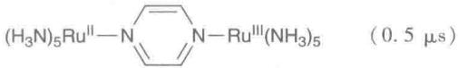</td></tr><tr><td>1 ns</td><td>配体交换(活泼络合物)</td><td> $[Ni(OH_{2})_{5}(py)]^{2+}-H_{2}O$ (1 ns)</td></tr><tr><td>10 ps</td><td>配体结合</td><td> $Cr(CO)_{5}+THF$ (10 ps)</td></tr><tr><td>1 ps</td><td>液体中的旋转</td><td> $CH_{3}CN$ (1 ns)</td></tr><tr><td>1 fs</td><td>分子振动</td><td>Sn—Cl伸展(300 fs)</td></tr></table>

\* 室温下的近似时间。

络合物中配体的性质也会影响反应的速率。进入配体的影响最大，取代反应的平衡常数能够用来对配体按 Lewis 碱性强度大小进行排序。然而，如果按碱置换出中心金属离子上另一配体的速率衡量，就可能得到不同的顺序。因此，动力学上用亲核性（nucleophilicity）这一动力学概念代替“碱性”这一平衡概念。亲核性是指给定的 Lewis 碱进攻络合物的速率（相对于 Lewis 碱参照物进攻络合物的速率）。为了强调从平衡至动力学这一变化，通常将配体取代叫作亲核取代（nucleophilic substitution）。

在控制反应速率方面,进入基团和离去基团以外的其他配体也起着重要作用;这些配体被称为旁观配体(spectator ligand)。例如,实验观察到,四方平面络合物中反位于离去基团(X)的配体对X被进入基团Y取代的反应速率具有很大的影响。

# 21.2 反应机理的分类

反应的机理（mechanism）是指反应的基元步序列。一旦识别了合适的反应机理，人们会转而更加关注决速步活化过程的细节。有些情况下得不到反应的总机理，唯一可以获得的是关于决速步的信息。

# (a) 缔合, 解离, 交换

提要:亲核取代反应的机理是指反应过程中基元步骤的序列,这些基元步骤被分为缔合、解离或交换三大类;缔合机理区别于交换机理的判据是前者具有寿命相对较长的中间体。

研究反应动力学总是从研究反应物浓度变化对反应速率的影响开始的，目的在于确定速率定律（rate laws），速率定律是支配反应物（或产物）浓度变化速率的一种微分方程。例如，实验观察到 $\left[\mathrm{Ni}\left(\mathrm{OH}_2\right)_6\right]^{2+}$ 生成 $\left[\mathrm{Ni}\left(\mathrm{NH}_3\right)\left(\mathrm{OH}_2\right)_5\right]^{2+}$ 的速率与 $\mathrm{NH}_3$ 和 $\left[\mathrm{Ni}\left(\mathrm{OH}_2\right)_6\right]^{2+}$ 的浓度均成正比，这意味着对每种反应物而言均属一级，反应的总速率是

$$
\mathrm{速率} = k \left[ \mathrm{Ni} (\mathrm{OH} _ {2}) _ {6} ^ {2 +} \right] \left[ \mathrm{NH} _ {3} \right] \tag {21.1}
$$

k 为速率常数, 方括号表示物质的量浓度, 书写速率方程时略去作为络合物一部分的那个方括号。

反应序列中,控制着总反应速率和总速率定律的最慢基元步骤叫决速步(rate-determining step)。然而一般来说,反应中的所有步骤都可能贡献于速率定律并影响反应速率。因此,确定速率定律并与立体化学研究和同位素标记方法相结合,是研究反应机理的基本途径。

已经识别出反应机理的三种主要类型。解离机理(dissociative mechanism)用 D 表示,是指通过离去基团的离去而形成配位数减少的中间体的反应序列:

$$
\begin{array}{l} \mathrm{ML} _ {n} \mathrm{X} \longrightarrow \mathrm{ML} _ {n} + \mathrm{X} \\ \mathrm{ML} _ {n} + \mathrm{Y} \longrightarrow \mathrm{ML} _ {n} \mathrm{Y} \\ \end{array}
$$

式中， $\mathrm{ML}_n$ （金属原子与旁观配体的结合体）是真正的中间体，它们原则上可以被检测、甚至可以被离析出来。有代表性的反应剖面见图21.2。例如，六羰基钨(0)与 $\mathrm{PPh}_3$ 之间的取代反应就是按解离机理发生的。络合物先解离一个CO：

$$
[ \mathrm{W(CO)} _ {6} ] \longrightarrow [ \mathrm{W(CO)} _ {5} ] + \mathrm{CO}
$$

接着是膦的配位：

$$
\left[ \mathrm{W} (\mathrm{CO}) _ {5} \right] + \mathrm{PPh} _ {3} \longrightarrow \left[ \mathrm{W} (\mathrm{CO}) _ {5} (\mathrm{PPh} _ {3}) \right]
$$

中间体 $\left[\mathrm{W}(\mathrm{CO})_{5}\right]$ 先被溶剂迅速捕获，如被四氢呋喃捕获形成 $\left[\mathrm{W}(\mathrm{CO})_{5}(\mathrm{THF})\right]$ 。后者又转变为含膦产物，这里可能发生了第二次解离。

缔合机理(associative mechanism)用 A 表示,过程中形成一个较初始络合物配位数更高的中间体:

$$
\begin{array}{l} \mathrm{ML} _ {n} \mathrm{X} + \mathrm{Y} \longrightarrow \mathrm{ML} _ {n} \mathrm{XY} \\ \mathrm{ML} _ {n} \mathrm{XY} \longrightarrow \mathrm{ML} _ {n} \mathrm{Y+X} \\ \end{array}
$$

与解离机理一样，中间体 $\mathrm{ML}_{\mathrm{n}}\mathrm{XY}$ 原则上至少可以被检测出来。该机理在 $\mathrm{Au(III)}$ 、Pt（II）、Pd（II）、Ni（II）和Ir（I）的 $\mathrm{d}^8$ 四方平面络合物的反应中起作用。典型的反应剖面形式与解离机理的剖面相类似（见图21.3）。

![[无机化学第6版副族金属有机565-748_images/56d7f8c22a05404064e4b4eb8a667c1776e4f2134d62632ac650ff563111d0b0.jpg]]

<details>
<summary>line</summary>

| 反应坐标 | 势能 |
| -------- | ---- |
| X-M + Y  | (labeled as {X,M,Y}) |
| X + M - Y | (labeled as X + M - Y) |
</details>

图 21.2 解离机理典型的反应剖面图

![[无机化学第6版副族金属有机565-748_images/1719269cfd7f3d220bb8d0ca5be4baef175b89d634353f1f69de2b7a770e69f2.jpg]]

<details>
<summary>line</summary>

| 反应坐标 | 势能 |
| -------- | ---- |
| X-M+Y    | (labeled as X-M+Y) |
| X-M-Y    | (labeled as X-M-Y) |
| X + M-Y  | (labeled as X + M-Y) |
</details>

图 21.3 缔合机理典型的反应剖面图

例如， $^{14}CN^{-}$ 与四方平面络合物 $\left[\mathrm{Ni}\left(\mathrm{CN}\right)_{4}\right]^{2-}$ 中配体发生交换的第一步是 $^{14}CN^{-}$ 与络合物配位：

$$
\left[ \mathrm{Ni} (\mathrm{CN}) _ {4} \right] ^ {2 -} + ^ {1 4} \mathrm{CN} ^ {-} \longrightarrow \left[ \mathrm{Ni} (\mathrm{CN}) _ {4} (^ {1 4} \mathrm{CN}) \right] ^ {3 -}
$$

接着失去一个 CN 配体：

$$
\left[ \mathrm{Ni} (\mathrm{CN}) _ {4} \left(^ {1 4} \mathrm{CN} ^ {-}\right) \right] ^ {3 -} \longrightarrow \left[ \mathrm{Ni} (\mathrm{CN}) _ {3} \left(^ {1 4} \mathrm{CN} ^ {-}\right) \right] ^ {2 -} + \mathrm{CN} ^ {-}
$$

C14 的放射性提供了跟踪这一反应的方法, 中间体 $\left[\mathrm{Ni}(\mathrm{CN})_{5}\right]^{3-}$ 已被检测和离析出来。

交换机理(interchange mechanism)用 I 表示,它是一步发生的机理:

$$
\mathrm{ML} _ {n} \mathrm{X} + \mathrm{Y} \longrightarrow \mathrm{X} \dots \mathrm{ML} _ {n} \dots \mathrm{Y} \longrightarrow \mathrm{ML} _ {n} \mathrm{Y} + \mathrm{X}
$$

与形成中间体的前两种机理不同,交换机理只形成过渡态而非真正的中间体。也就是说,离去基团(X)与进入基团(Y)通过一步反应发生了交换。这种交换机理在许多六配位络合物的反应中较常见。典型的反应剖面形式见图21.4。

![[无机化学第6版副族金属有机565-748_images/70ba821baa53228f383f6e695f7a149c085a222fa0a67b139748e66cf30b4911.jpg]]

<details>
<summary>line</summary>

| 反应坐标 | 势能 |
| -------- | ---- |
| X-M + Y  | (labeled as X-M + Y) |
| X… M … Y | (labeled as X… M … Y) |
| X + M−Y  | (labeled as X + M−Y) |
</details>

图 21.4 交换机理典型的反应剖面图

A 机理和 I 机理的区别在于中间体的存活时间是否长得能被检测出来。也可采用这种类型的证据：在与其相关的反应中或在不同条件下的反应中离析出中间体。如果外推至实际反应条件下的证据能够表明所讨论的那个反应存在寿命适当较长的中间体，则表明此反应是按 A 路径发生的。例如，人们能够合成出三角双锥 Pt(Ⅱ)络合物 $\left[\mathrm{Pt}\left(\mathrm{SnCl}_{3}\right)_{5}\right]^{3-}$ ，这一事实即表明四方平面 Pt(Ⅱ)氨络合的取代反应中形成五配位铂络合物的假定是合理的。同样，溶液中的光谱测定显示存在着 $\left[\mathrm{Ni}\left(\mathrm{CN}\right)_{5}\right]^{3-}$ ，该物种也可离析为晶态。这一事实支持下述观点： $CN^{-}$ 与四方平面络合物四氰基合镍酸根（Ⅱ）离子的交换过程中涉及 $\left[\mathrm{Ni}\left(\mathrm{CN}\right)_{5}\right]^{3-}$ 。

中间体持久性的另一类证据来自对立体化学变化的观察，持久性象征着中间体的存活时间长得足以发生重排。某些 Pt(Ⅱ) 四方平面膦络合物的取代反应中观察到 cis 至 trans 的异构化现象，而不同于通常看到的组态保持。这一差别暗示三角双锥中间体存活的时间足够长，允许轴向配体与平伏配体之间发生交换。

如果能积累到足够的量(即反应按 A 路径而不是按 I 路径发生),对中间体进行直接光谱检测则是可能的。然而,这种直接证据只有对非常稳定并具有特征光谱的中间体才能获得。

# (b) 决速步

提要:根据速率对进入基团性质的依赖关系,决速步被分为缔合决速步和解离决速步。

我们现在讨论反应的决速步和形成决速步的细节。如果决速步的速率强烈依赖于进入基团的性质，该步则是缔合(associative)决速步，并用a表示。Pt(Ⅱ)、Pd(Ⅱ)、Au(Ⅲ) $d^{8}$ 四方平面络合物的反应中可

以找到实例,一个例子是

$$
\left[ \mathrm{PtCl} (\text {dien}) \right] ^ {+} (\mathrm{aq}) + \Gamma^ {-} (\mathrm{aq}) \longrightarrow \left[ \mathrm{PtI} (\text {dien}) \right] ^ {+} (\mathrm{aq}) + \mathrm{Cl} ^ {-} (\mathrm{aq})
$$

式中，dien 是二乙三胺 $\left(\mathrm{NH}_{2}\mathrm{CH}_{2}\mathrm{CH}_{2}\mathrm{NHCH}_{2}\mathrm{CH}_{2}\mathrm{NH}_{2}\right)$ 。研究发现，用 I 代替 Br 时速率常数增大一个数量级。四方平面络合物取代反应的实验研究支持决速步是缔合决速步这一观点。

决速步对进入基团强烈的依赖关系表明过渡态必定涉及对 Y 的强结合力。如果 Y 与起始反应物 $(\mathrm{ML}_{n}\mathrm{X})$ 的结合是决速步，具有缔合机理 (A) 的反应将会以缔合方式被活化 (a)；这样的反应标示为 $A_{a}$ ，这样的中间体 $(\mathrm{ML}_{n}\mathrm{XY})$ 将检测不到。如果 Y 与中间体 $(\mathrm{ML}_{n})$ 的结合是决速步，具有解离机理 (D) 的反应将会以缔合方式被活化 (a)；这样的反应标示为 $D_{a}$ 。图 21.5 给出 A 机理和 D 机理被缔合活化的反应剖面。为了使这类反应能够进行，必须在预平衡步设定一个邂逅络合物 $\{X-M,Y\}$ 。

![[无机化学第6版副族金属有机565-748_images/4c1063fef31aba504c9f84c1140d17ff33d566459a66a11bceb0ebd68bc1cf95.jpg]]

<details>
<summary>line</summary>

| 反应坐标 | 势能 |
| -------- | ---- |
| X-M+Y    | 低点 |
| X-M-Y    | 高点 |
</details>

![[无机化学第6版副族金属有机565-748_images/bb948a775c1acf1712987ba3cdc78871eb7e7f0d99bc540c27a4f65895a878d7.jpg]]

<details>
<summary>line</summary>

| 反应坐标 | 势能 |
| -------- | ---- |
| X-M + Y  | (labeled as {X,M,Y}) |
| X + M - Y | (labeled as X + M - Y) |
</details>

图 21.5 含缔合方式活化步的反应典型的反应剖面形状：(a) 缔合机理， $A_{a}$ ; (b) 解离机理， $D_{a}$

如果决速步的反应速率很大程度上不受 Y 性能的支配, 决速步就是解离 (dissociative) 过程, 用 d 表示。一些八面体 d 金属络合物的配体交换是按这种机理进行的。例如:

$$
\left[ \mathrm{Ni} \left(\mathrm{OH} _ {2}\right) _ {6} \right] ^ {2 +} (\mathrm{aq}) + \mathrm{NH} _ {3} (\mathrm{aq}) \longrightarrow \left[ \mathrm{Ni} \left(\mathrm{NH} _ {3}\right) \left(\mathrm{OH} _ {2}\right) _ {5} \right] ^ {2 +} (\mathrm{aq}) + \mathrm{H} _ {2} \mathrm{O} (1)
$$

研究发现,吡啶代替 $NH_{3}$ 作为进入配体时反应速率最多变化几个百分数。

解离性活化反应对 Y 的依赖性较弱,这一事实表明,过渡态的形成速率很大程度上决定于离去基团 (X) 配位键的断裂速率。如果从中间体 $\left(\mathrm{YML}_{n}\mathrm{X}\right)$ 失去 X 是反应的决速步,缔合机理 (A) 的反应将会发生解离性活化 (d);这样的反应标记为 $A_{d}$ 。如果从起始的反应物 $\left(\mathrm{ML}_{n}\mathrm{X}\right)$ 失去 X 是反应的决速步,解离机理 (D) 的反应将会发生解离性活化 (d);这样的反应标记为 $D_{d}$ 。在这种情况下,中间体 $ML_{n}$ 是检测不到的。图 21.6 示出 A 机理和 D 机理解离性活化反应的剖面。

![[无机化学第6版副族金属有机565-748_images/96cab82b4b451d62f0ecb3eb65cb7ba1a6c4be8bbea9da85e405441ebadf66b8.jpg]]

<details>
<summary>line</summary>

| 反应坐标 | 势能 |
| -------- | ---- |
| X-M+Y    | 约 0  |
| X-M-Y    | 约 1  |
| X+M-Y    | 约 0  |
</details>

![[无机化学第6版副族金属有机565-748_images/fe827255563208c4cd12535632617182120fcf3e658fc08cc01ec365b040fab8.jpg]]

<details>
<summary>line</summary>

| 反应坐标 | 势能 |
| -------- | ---- |
| X-M + Y  | 0    |
| {X,M,Y}  | Peak |
</details>

图 21.6 解离性活化反应的典型剖面：(a) 绀合机理， $A_{d}$ ; (b) 解离机理， $D_{d}$

具有交换机理的反应或者被缔合活化，或者被解离活化，分别标记为 $I_{a}$ 和 $I_{d}$ 。在 $I_{a}$ 机理中，反应速率取决于M…Y键的形成速率，而在 $I_{d}$ 机理中，反应速率则取决于M…X键的断裂速率（见图21.7）。

![[无机化学第6版副族金属有机565-748_images/1cd9ccc3059c38644180bb21f79e8d683a396d1b8eb78acd87b3f92e474f1297.jpg]]  
图 21.7 交换机理反应的典型剖面：(a) 缔合性活化， $I_{a}$ ；(b) 解离性活化， $I_{d}$

这些可能性之间的区别总结如下,其中 $ML_{n}X$ 代表起始络合物:

四方平面络合物的配体取代反应

<table><tr><td>机理</td><td colspan="2">A</td><td colspan="2">I</td><td colspan="2">D</td></tr><tr><td>活化方式</td><td>a</td><td>d</td><td>a</td><td> $\cdot d$ </td><td>a</td><td>d</td></tr><tr><td>决速步</td><td>Y结合于 $ML_{n}X$ </td><td>从 $YML_{n}X$ 中失去X</td><td>Y结合于 $ML_{n}X$ </td><td>从 $YML_{n}X$ 中失去X</td><td>Y结合于 $ML_{n}$ </td><td>从 $ML_{n}X$ 中失去X</td></tr><tr><td>中间体可否检测到?</td><td>不能</td><td> $ML_{n}XY$ 可检测</td><td>不能</td><td>不能</td><td> $ML_{n}$ 可检测</td><td>不能</td></tr></table>

四方平面 Pt 络合物的配体交换机理已经得到广泛研究,这主要是因为反应正好发生在容易测量的时标区间里。人们往往认为四方平面络合物容易按缔合机理发生配体交换反应,这是因为这种络合物在空间上不拥挤(四方平面络合物被看作失去两个配体的八面体络合物),而实际情况却不那么简单。由于存在不同的反应途径,对四方平面络合物取代反应的机理的阐明往往比较复杂。例如:反应

$$
[ \mathrm{PtCl(dien)} ] ^ {+} (\mathrm{aq}) + \Gamma^ {-} (\mathrm{aq}) \longrightarrow [ \mathrm{PtI(dien)} ] ^ {+} (\mathrm{aq}) + \mathrm{Cl} ^ {-} (\mathrm{aq})
$$

对络合物为一级，而与 $\Gamma^{-}$ 的浓度无关，反应速率等于 $k_{1}[\mathrm{PtCl(dien)}^{+}]$ 。如果一个反应途径的速率定律对络合物和进入基团都为一级（即总级数为二级），则速率应等于 $k_{2}[\mathrm{PtCl(dien)}^{+}][\Gamma^{-}]$ 。如果两个反应途径的速率相当，则速率定律具有如下形式：

$$
\mathrm{速率} = (k _ {1} + k _ {2} [ \mathrm{I} ^ {-} ]) [ \mathrm{PtCl(dien)} ^ {+} ] \tag {21.2}
$$

这类反应通常是在 $[I^{-}] >> [\text{络合物}]$ 的条件下进行研究的，以保持反应过程中 $[I^{-}]$ 不发生明显变化。这就简化了数据处理 $(k_{1} + k_{2}[I^{-}]$ 实际上是个常数），速率定律变为拟一级：

$$
\mathrm{速率} = k _ {\mathrm{obs}} [ \mathrm{PtCl(dien)} ^ {+} ] \qquad k _ {\mathrm{obs}} = k _ {1} + k _ {2} [ \mathrm{I} ^ {-} ] \tag {21.3}
$$

以表观拟一级速率常数对 $\left[I^{-}\right]$ 作图，图上的斜率为 $k_{2}$ ，截距为 $k_{1}$ 。

下面各节先讨论影响二级反应的因素,然后再讨论一级过程。

# 21.3 进入基团的亲核性

提要: 进入基团的亲核性用亲核参数表示, 亲核参数是以特定四方平面铂络合物的取代反应为基准定

义的；其他铂络合物对进入基团变化的敏感性用亲核性识别因子表示。

先讨论反应速率随进入基团 Y 的改变而发生的变化。Y 基团的反应性（如上例中的 $I^{-}$ ）用亲核参数（nucleophilicity parameter） $n_{Pt}$ 表示：

$$
n _ {\mathrm{Pt}} = \log (k _ {2} (\mathrm{Y}) / k _ {2} ^ {\circ}) \tag {21.4}
$$

式中， $k_{2}(\mathrm{Y})$ 是反应

$$
\operatorname{trans} - \left[ \mathrm{PtCl} _ {2} (\mathrm{py}) _ {2} \right] + \mathrm{Y} \longrightarrow \operatorname{trans} - \left[ \mathrm{PtClY} (\mathrm{py}) _ {2} \right] ^ {+} + \mathrm{Cl} ^ {-}
$$

的二级速率常数, $k_{2}^{\circ}$ 是参考亲核试剂(甲醇)同一反应的速率常数。如果 $n_{Pt}$ 值大,则进入基团是高度亲核的,或者说具有高的亲核性。

表 21.2 给出了部分的 $n_{Pt}$ 值。一个显著的特征是，虽然表中的进入基团全都相当简单，但速率常数跨度达 9 个数量级。另一个特征是，进入基团对 Pt 的亲核性似乎与 Lewis 碱性（见 4.9）有关： $Cl^{-}<I^{-}, O<S, NH_{3}<PR_{3}$ 。

表 21.2 部分亲核试剂的 ${n}_{\mathrm{{pt}}}$ 值

<table><tr><td>亲核试剂</td><td>给予体原子</td><td> $n_{\text{P1}}$ </td></tr><tr><td> $CH_3OH$ </td><td>O</td><td>0</td></tr><tr><td> $CI^-$ </td><td>CI</td><td>3.04</td></tr><tr><td> $Br^-$ </td><td>Br</td><td>4.18</td></tr><tr><td> $I^-$ </td><td>I</td><td>5.42</td></tr><tr><td> $CN^-$ </td><td>C</td><td>7.14</td></tr><tr><td> $SCN^-$ </td><td>S</td><td>5.75</td></tr><tr><td> $N_3^-$ </td><td>N</td><td>3.58</td></tr><tr><td> $C_6H_5SH$ </td><td>S</td><td>4.15</td></tr><tr><td> $NH_3$ </td><td>N</td><td>3.07</td></tr><tr><td> $(C_6H_5)_3P$ </td><td>P</td><td>8.93</td></tr></table>

亲核性参数用特定 Pt 络合物的反应速率来定义。当络合物本身改变时，反应速率对进入基团变化显示出不同的敏感性。为了表示这种敏感性，可将方程(21.4)改写为

$$
\lg k _ {2} (\mathrm{Y}) = n _ {\mathrm{Pt}} (\mathrm{Y}) + C \tag {21.5}
$$

式中， $C=\lg k_{2}^{\circ}$ 。现在讨论通式为 $\left[PtL_{3}X\right]$ 的类似络合物的取代反应：

$$
\left[ \mathrm{PtL} _ {3} \mathrm{X} \right] + \mathrm{Y} \longrightarrow \left[ \mathrm{PtL} _ {3} \mathrm{Y} \right] + \mathrm{X}
$$

若用式

$$
\lg k _ {2} (\mathrm{Y}) = S n _ {\mathrm{pt}} (\mathrm{Y}) + C \tag {21.6}
$$

代替式(21.5)，则这些反应的相对速率也能用相同的亲核性参数 $n_{Pt}$ 表示。参数S（用来表征速率常数对亲核性参数的敏感性）叫亲核识别因子（nucleophilic discrimination factor）。能够看出，以 $\lg k_{2}(Y)$ 对 $n_{Pt}$ 作图得到的是直线。Y与 $trans-\left[\mathrm{PtCl}_{2}\left(\mathrm{PEt}_{3}\right)_{2}\right]$ 反应所得的直线（图21.8中的圆圈）要比与 $cis-\left[\mathrm{PtCl}_{2}(\mathrm{en})\right]$ 反应所得的直线（图21.8中的方块）更陡。因此前一反应的S值更大，表明反应速率对进入基团亲核性的变化更敏感。

![[无机化学第6版副族金属有机565-748_images/944bde69d4c288f90eb8684302db57823769d74284677bd7ebab78be6f4e8355.jpg]]

<details>
<summary>scatter</summary>

| Species | n_Pt(Y) | lg k2(Y) |
|---|---|---|
| CH3OH | 0.1 | -7.0 |
| H2O | 0.5 | -4.5 |
| NH3 | 1.8 | -3.8 |
| N3 | 2.0 | -3.9 |
| Cl- | 2.0 | -4.8 |
| NO2- | 2.0 | -5.2 |
| Br- | 2.8 | -3.0 |
| N3- | 2.8 | -3.6 |
| Br- | 3.0 | -3.1 |
| I- | 4.0 | -1.0 |
| SCN- | 4.5 | -0.5 |
| Tu | 5.5 | -1.2 |
| SeCN- | 5.5 | 0.5 |
</details>

图 21.8 $\lg k_{2}(Y)$ 对不同配体的亲核性参数 $n_{\mathrm{Pt}}(Y)$ 作图所得直线的斜率是对络合物对进入基团亲核性响应度的量度

表 21.3 给出一些 S 值。注意: 所有 S 值都接近 1, 表明所有络合物对 $n_{Pt}$ 都相当敏感。这种敏感性就是我们对以缔合方式活化的反应所预期的性质。需要注意到的另一个特征是, 更软配体形成的 Pt 络合物 S 值更大。

表 21.3 亲核识别因子

<table><tr><td>络合物</td><td>S</td></tr><tr><td> $trans-[PtCl_2(PEt_3)_2]$ </td><td>1.43</td></tr><tr><td> $trans-[PtCl_2(py)_2]$ </td><td>1.00</td></tr><tr><td> $[PtCl_2(en)]$ </td><td>0.64</td></tr><tr><td> $trans-[PtCl(dien)]^+$ </td><td>0.65</td></tr></table>

# 例题 21.1 学会应用亲核性参数

题目: 在 $30^{\circ}$ C 条件下, 甲醇溶剂中 $I^{-}$ 与 trans- $\left[\mathrm{Pt}\left(\mathrm{CH}_{3}\right)\mathrm{Cl}\left(\mathrm{PEt}_{3}\right)_{2}\right]$ 反应的二级速率常数为 $40\ dm^{3} \cdot mol^{-1} \cdot s^{-1}$ 。与 $N_{3}^{-}$ 反应的相应二级速率常数 $k_{2}=7.0\ dm^{3} \cdot mol^{-1} \cdot s^{-1}$ 。试估算反应的 S 值和 C 值, 两个亲核试剂的 $n_{Pt}$ 值分别为 5.42 和 3.58。

答案:为了确定 S 值和 C 值,我们需要利用两个信息去建立和求解以方程式(21.6)为基础的联立方程式。将两个 $n_{P_{1}}$ 值带入方程(21.6)中：

$$
1 6 0 = 5. 4 2 S + C (\mathrm{I} ^ {-} \text {的方程})
$$

$$
0. 8 5 = 3. 5 8 S + C (\mathrm{N} _ {3} ^ {-} \text {的方程})
$$

解联立方程得 S=0.41, C=20.62。S 值相当小，表明这种络合物对不同亲核试剂的区别不是很大。缺乏敏感性的事实与较大的 C 值有关，这相应于较大的速率常数和络合物的反应活性较高。人们通常发现，高活性络合物往往与低选择性有关。

自测题21.1 计算同一络合物与 $\mathrm{NO}_2^-$ 反应的二级速率常数， $\mathrm{NO}_2^-$ 的 $n_{\mathrm{P1}} = 3.22$ 。

# 21.4 过渡态的形状

仔细研究四方平面络合物反应速率随反应络合物组成及反应条件变化而发生的变化,能够阐明过渡态的一般形状。它们也能证实取代过程几乎总有一个缔合决速步,因此很少能检测到中间体。

# (a) 反位效应

提要: 强 $\sigma$ 给予体配体或 $\pi$ 接受体配体能够大大加速四方平面络合物中处于反位位置配体的取代过程。

四方平面络合物中反位于离去基团的旁观配体(T)影响着取代反应的速率,这种现象叫反位效应(trans effect)。人们通常接受反位效应由两方面原因分别造成的观点:一个来自基态,另一个则来自过渡态本身。

反位影响(trans influence)是指配体 T 对络合物基态中反位于自身的那个化学键的弱化程度。反位影响与配体 T 的 $\sigma$ 给予能力有关，这是因为从广义上说，相互处于反位的配体使用金属原子的同一轨道成键。因此，如果配体是强的 $\sigma$ 给予体，处于其反位的配体就不能向金属原子很好地提供电子，与金属原子的相互作用就会较弱。反位影响的大小可通过测量键长、伸缩振动频率，以及金属-配体

NMR 偶合常数(节 8.6)的方法做出定量估量。过渡态效应 (transition-state effect)与配体的 $\pi$ 接受能力有关。人们认为它源自进入基团增加了金属原子上的电子密度。因此,能接受这种增加了电子密度的配体有利于稳定过渡态(1)。反位效应是两种效应的结合;应该注意的是,同样的因素对大的配位场分裂能有贡献。反位效应列于表 21.4 并遵循下列顺序:

![[无机化学第6版副族金属有机565-748_images/e4cefe4731d4832c399a8b27d26d5c19389c4ef5ac5bcfc58133088f5cf8170f.jpg]]

<details>
<summary>chemical</summary>

Molecular orbital diagram showing electron density distribution with labeled X, Y, and T orbitals
</details>

(1)

对 $\mathrm{T}\sigma$ 给予体而言： $\mathrm{OH}^{-} <   \mathrm{NH}_{3} <   \mathrm{Cl}^{-} <   \mathrm{Br}^{-} <   \mathrm{CN}^{-},\mathrm{CH}_{3}^{-} <   \mathrm{I}^{-} <   \mathrm{SCN}^{-} <   \mathrm{PR}_{3},\mathrm{H}^{-}$

对 $\mathrm{T}\pi$ 接受体而言： $\mathrm{Br}^{-} <   \mathrm{I}^{-} <   \mathrm{NCS}^{-} <   \mathrm{NO}_{2}^{-} <   \mathrm{CN}^{-} <   \mathrm{CO},\mathrm{C}_{2}\mathrm{H}_{4}$

表 21.4 反位配体对 trans- $\left[\mathrm{PtCl}\left(\mathrm{PEt}_{3}\right)_{2}\mathrm{L}\right]$ 反应的影响

<table><tr><td>L</td><td> $k_{1}/s^{-1}$ </td><td> $k_{2}/(dm^{3} \cdot mol^{-1} \cdot s^{-1})$ </td></tr><tr><td> $CH_{3}^{-}$ </td><td> $1.7 \times 10^{-4}$ </td><td> $6.7 \times 10^{-2}$ </td></tr><tr><td> $C_{6}H_{5}^{-}$ </td><td> $3.3 \times 10^{-5}$ </td><td> $1.6 \times 10^{-2}$ </td></tr><tr><td> $CI^{-}$ </td><td> $1.0 \times 10^{-6}$ </td><td> $4.0 \times 10^{-4}$ </td></tr><tr><td> $H^{-}$ </td><td> $1.8 \times 10^{-2}$ </td><td>4.2</td></tr><tr><td> $PEt_{3}$ </td><td> $1.7 \times 10^{-2}$ </td><td>3.8</td></tr></table>

# 例题21.2 反位效应在合成中的应用

题目：利用反位效应序列提出从 $\left[\mathrm{Pt}\left(\mathrm{NH}_{3}\right)_{4}\right]^{2+}$ 和 $\left[\mathrm{PtCl}_4\right]^{2-}$ 合成 $cis - \left[\mathrm{PtCl}_2\left(\mathrm{NH}_3\right)_2\right]$ 和 $trans - \left[\mathrm{PtCl}_2\left(\mathrm{NH}_3\right)_2\right]$ 的路线。

答案: 先让 $\left[\mathrm{Pt}\left(\mathrm{NH}_{3}\right)_{4}\right]^{2+}$ 与 HCl 反应, 生成 $\left[\mathrm{PtCl}\left(\mathrm{NH}_{3}\right)_{3}\right]^{+}$ 。因为 $Cl^{-}$ 的反位效应强于 $NH_{3}$ 的反位效应, 第二步取代应优先发生在 $Cl^{-}$ 的反位上, 与 HCl 反应生成 trans- $\left[\mathrm{PtCl}_{2}\left(\mathrm{NH}_{3}\right)_{2}\right]$ :

$$
\left[ \mathrm{Pt} (\mathrm{NH} _ {3}) _ {4} \right] ^ {2 +} + 2 \mathrm{Cl} ^ {-} \longrightarrow \left[ \mathrm{PtCl} (\mathrm{NH} _ {3}) _ {3} \right] ^ {+} \longrightarrow t r a n s - \left[ \mathrm{PtCl} _ {2} (\mathrm{NH} _ {3}) _ {2} \right]
$$

起始物为 $\left[\mathrm{PtCl}_{4}\right]^{2-}$ 时，与 $\mathrm{NH}_{3}$ 反应先生成 $\left[\mathrm{PtCl}_{3}(\mathrm{NH}_{3})\right]^{-}$ 。与 $\mathrm{NH}_{3}$ 的第二步取代应该发生在相互处于反位的 $\mathrm{Cl}^{-}$ 配体上，从而生成 $cis-\left[\mathrm{PtCl}_{2}(\mathrm{NH}_{3})_{2}\right]$ ：

$$
\left[ \mathrm{PtCl} _ {4} \right] ^ {2 -} + \mathrm{NH} _ {3} \longrightarrow \left[ \mathrm{PtCl} _ {3} (\mathrm{NH} _ {3}) \right] ^ {-} \longrightarrow c i s - \left[ \mathrm{PtCl} _ {2} (\mathrm{NH} _ {3}) _ {2} \right]
$$

自测题21.2 已知反应物为 $\mathrm{PPh}_3$ 、 $\mathrm{NH}_3$ 和 $[\mathrm{PtCl}_4]^{2-}$ ，提出合成 $cis-$ 和 $trans-\left[\mathrm{PtCl}_2\left(\mathrm{NH}_3\right)\left(\mathrm{PPh}_3\right)\right]$ 的路线。

# (b) 空间效应

提要: 反应中心周围的空间拥挤现象通常会抑制缔合反应并促进解离反应的发生。

大体积基团能够阻塞进攻性亲核试剂接近反应中心，从而抑制缔合反应的发生。在 $25^{\circ}C$ 条件下， $cis-\left[\mathrm{PtClL}\left(\mathrm{PEt}_{3}\right)_{2}\right]^{+}$ 络合物中 $H_{2}O$ 取代 $Cl^{-}$ 的速率常数能够对此做说明：

L 吡啶 2-甲基吡啶 2,6-二甲基吡啶

$k / \mathrm{s}^{-1}$ $8\times 10^{-2}$ $2.0\times 10^{-4}$ $1.0\times 10^{-6}$

与 N 配位原子相邻的甲基基团极大地降低了反应速率。它们在 2-甲基吡啶络合物中阻断了平面上方或平面下方的位置。在 2,6-二甲基吡啶络合物中平面上方和下方的位置都被阻断(2)。也就是说，系列中的甲基基团增加了 $H_{2}O$ 进攻的障碍。

如果 L 处于 $Cl^{-}$ 的反位, 这种效应则会较小。对此所做的解释是: 如果吡啶配体处在三角平面上(3), 三角双锥过渡态中的进入基团和离去基团离甲基比较远。相反, 解离反应中配位数减少(空间拥挤程度减小), 解离反应的速率就会增大。

# (c) 立体化学

提要:四方平面络合物的取代保持了原来的几何构型,这一事实表明过渡态为三角双锥体。

四方平面络合物的取代过程保持了原来的几何构型(cis 络合物生成 cis 产物, trans 络合物生成 trans产物），这一现象被解释为形成了近似于三角双锥体的过渡态，其中进入基团、离去基团和反位基团处在三角平面上(4)。这类三角双锥中间体是两个cis旁观配体对取代速率影响相对较小的原因，因为反应过程基本不影响它们的成键轨道。

![[无机化学第6版副族金属有机565-748_images/a461a1a875e5b21c902e0dae9f38e7a306dbb16f22f884c3ef7d15d7cddee2fe.jpg]]

<details>
<summary>chemical</summary>

Molecular structure diagram showing atom labels CH₃, N, M, Cl, and PEt₃ with surrounding atomic arrangement
</details>

(2)

![[无机化学第6版副族金属有机565-748_images/723111b95f1c4cb62e25ea5b606357f31c25500a952f3b93b91f9c8b2d7f8e6d.jpg]]

<details>
<summary>chemical</summary>

Molecular structure diagram showing atom labels including M, CH₃, Y, Cl, and N
</details>

(3)

![[无机化学第6版副族金属有机565-748_images/69fb5ef386c01615ce8de307038ca1101492823772561c0e770d2c9bf7b89a37.jpg]]

<details>
<summary>chemical</summary>

Molecular structure diagram showing two configurations labeled A and X with directional arrows indicating interaction or transformation
</details>

(4)

图21.9给出反应的立体过程。可以预期，只有寿命长得足以在空间发生移动的中间体才能发生cis配体与三角平面中T配体之间的位置交换。也就是说，它必须是一个长寿命的缔合的 $(A)$ 中间产物，从五配位中间体释出配体将成为决速步。

![[无机化学第6版副族金属有机565-748_images/02c875210c8d25b3268fa72d7d86f3b5c2400c6d0c4b327d27eb073cf84c85a3.jpg]]

<details>
<summary>chemical</summary>

Molecular transformation diagram showing transition from (a) trans to (c) trans with labeled structures (d), (e), and (b)
</details>

图 21.9 $^{*}$ 四方平面络合物取代过程的立体化学  
正常途径(结构保持)是从(a)到(c);然而如果中间体(b)的存活时间足够长,它会经历到(d)的假回旋,形成异构体(e)

# (d) 与温度和压力的依赖关系

提要: 活化体积和活化熵为负值的事实支持一种观点: 四方平面 Pt(Ⅱ) 络合物的决速步是缔合步。

了解过渡态性质的另一线索来自 Pt(Ⅱ) 和 Au(Ⅲ) 络合物反应的活化熵和活化体积(见表 21.5)。活化熵得自速率常数对温度的依赖关系图, 表示过渡态形成时反应物和溶剂混乱度的改变。与之相类似, 活化体积(用特殊装置测定) 得自速率常数对压力的依赖关系图, 表示过渡态形成时体积发生的改变。配体取代反应中, 活化体积的极限相应于离去配体(对解离反应而言) 摩尔体积的增加和进入配体(对缔合反应而言) 摩尔体积的减少。例如, H₂O 的摩尔体积是 18 mL (0.018 dm³), 因此, 对 H₂O 配体完全解离形成过渡态的反应而言, 活化体积将接近 0.018 dm³。

表 21.5 四方平面络合物取代反应的活化参数 (在甲醇中)

<table><tr><td rowspan="2">反应 $\dagger$ </td><td colspan="3"> $k_1$ </td><td colspan="3"> $k_2$ </td></tr><tr><td> $\Delta^{\ddagger}H$ </td><td> $\Delta^{\ddagger}S$ </td><td> $\Delta^{\ddagger}V$ </td><td> $\Delta^{\ddagger}H$ </td><td> $\Delta^{\ddagger}S$ </td><td> $\Delta^{\ddagger}V$ </td></tr><tr><td> $trans-[PtCl(NO_2)(py)_2]+py$ </td><td></td><td></td><td></td><td>50</td><td>-100</td><td>-38</td></tr><tr><td> $trans-[PtBrP_2(mes)]+SC(NH_2)_2$ </td><td>71</td><td>-84</td><td>-46</td><td>46</td><td>-138</td><td>-54</td></tr><tr><td> $cis-[PtBrP_2(mes)]+I^-$ </td><td>84</td><td>-59</td><td>-67</td><td>63</td><td>-121</td><td>-63</td></tr><tr><td> $cis-[PtBrP_2(mes)]+SC(NH_2)_2$ </td><td>79</td><td>-71</td><td>-71</td><td>59</td><td>-121</td><td>-54</td></tr><tr><td> $[AuCl(dien)]^{2+}+Br^-$ </td><td></td><td></td><td></td><td>54</td><td>-17</td><td></td></tr></table>

\* 单位: 焓单位为 kJ·mol $^{-1}$ ，熵单位为 J·K $^{-1}$ ·mol $^{-1}$ ，体积单位为 cm $^{3}$ ·mol $^{-1}$ ； $\dagger[\mathrm{PtBrP}_{2}(\mathrm{mes})]$ 为 $[\mathrm{PtBr}(\mathrm{PEt}_{3})_{2}(2,4,6-\mathrm{Me}_{3}\mathrm{C}_{6}\mathrm{H}_{2})]$ 。

表 21.5 中数据最显著的两个特点是,两个物理量都具有较大的负值。最简单的解释是,混乱度和体积的减少是由于进入配体插入过渡态时不涉及离去基团的释放。也就是说,我们可以得出这样的结论:决速步为缔合步。

# (e) 一级途径

提要:对速率定律的一级贡献是有溶剂参与的拟一级过程。

在完成影响二级途径因素的讨论后,现在能够讨论四方平面络合物取代反应的一级途径了。首先需要弄清楚速率方程的一级途径,必须确定方程(21.2)和其通式

$$
\mathrm{速率} = (k _ {1} + k _ {2} [ \mathrm{Y} ]) [ \mathrm{PtL} _ {4} ] \tag {21.7}
$$

中 $k_{1}$ 是否的确代表了一种完全不同的反应机理。研究表明并非如此，因为 $k_{1}$ 可以代表涉及溶剂的缔合反应。甲醇作溶剂用吡啶取代 $Cl^{-}$ 的过程分两步进行：

$$
\left[ \mathrm{PtCl} (\mathrm{dien}) \right] ^ {+} + \dot {\mathrm{CH}} _ {3} \mathrm{OH} \longrightarrow \left[ \mathrm{Pt} (\mathrm{CH} _ {3} \mathrm{OH}) (\mathrm{dien}) \right] ^ {2 +} + \mathrm{Cl} ^ {-} \tag {慢}
$$

$$
\left[ \mathrm{Pt} (\mathrm{CH} _ {3} \mathrm{OH}) (\text { dien }) \right] ^ {2 +} + \mathrm{py} \longrightarrow \left[ \mathrm{Pt} (\mathrm{py}) (\text { dien }) \right] ^ {2 +} + \mathrm{CH} _ {3} \mathrm{OH} \quad (\text { 快 })
$$

其中第一步为决速步。两步机理的证据来自上述反应的速率与溶剂分子的亲核性参数有关，实验观察到进入基团和溶剂络合物之间的反应比溶剂取代配体的反应快。因此，四方平面铂络合物的配体取代反应是由两个互相竞争的缔合反应导致的。

# 八面体络合物的配体取代反应

多种氧化态的不同金属离子均能形成八面体络合物,而且具有各种各样的成键模式。本来可以指望存在多种多样的取代反应机理;然而,几乎所有八面体络合物都是按交换机理(I)发生反应的。需要解决的唯一问题是决速步是缔合步还是解离步。按这种机理发生反应时,对速率定律进行分析有助于找到区分两种可能性的精确条件,以区别取代过程是按 $I_{a}$ 机理(缔合交换)或按 $I_{d}$ 机理(解离交换)发生。两类反应之间的区别在于决速步是形成新的Y…M键还是破坏旧的M…X键。

# 21.5 速率方程及其解释

由于建议的任何机理都必须符合测得的速率定律,在这种意义上,速率定律能够帮助人们深入了解反应机理的详情。随后各节中我们将会明白,实验测得的配体取代速率定律是如何解释的。

# (a) Eigen-Wilkins 机理

提要: 在 Eigen-Wilkins 机理中, 预平衡中生成一个邂逅络合物, 邂逅络合物在随后的决速步中生成产物。

作为配体取代反应的一个例子,我们讨论下述反应:

$$
\left[ \mathrm{Ni} (\mathrm{OH} _ {2}) _ {6} \right] ^ {2 +} + \mathrm{NH} _ {3} \longrightarrow \left[ \mathrm{Ni} (\mathrm{NH} _ {3}) (\mathrm{OH} _ {2}) _ {5} \right] ^ {2 +} + \mathrm{H} _ {2} \mathrm{O}
$$

Eigen-Wilkins 机理(Eigen-Wilkins mechanism)的第一步是形成邂逅络合物,邂逅络合物是络合物 $ML_{6}$ , (此时为 $\left[\mathrm{Ni}\left(\mathrm{OH}_{2}\right)_{6}\right]^{2+}$ ) 和进入基团 Y(此处为 $NH_{3}$ ) 扩散到一起而相互接触:

$$
\left[ \mathrm{Ni} (\mathrm{OH} _ {2}) _ {6} \right] ^ {2 +} + \mathrm{NH} _ {3} \longrightarrow \left\{\left[ \mathrm{Ni} (\mathrm{OH} _ {2}) _ {6} \right] ^ {2 +}, \mathrm{NH} _ {3} \right\}
$$

邂逅对 $\{A, B\}$ 的两个组分也可在其能力支配下以一定的速率在溶剂中通过扩散迁移而分开：

$$
\left\{\left[ \mathrm{Ni} (\mathrm{OH} _ {2}) _ {6} \right] ^ {2 +}, \mathrm{NH} _ {3} \right\} \longrightarrow \left[ \mathrm{Ni} (\mathrm{OH} _ {2}) _ {6} \right] ^ {2 +} + \mathrm{NH} _ {3}
$$

由于邂逅对在水溶液中的寿命约为 1 ns, 邂逅对的形成可认为是所有长于几个纳秒才能发生的反应的预平衡。因此可用预平衡常数 $K_{E}$ 表示浓度：

$$
\mathrm{ML} _ {6} + \mathrm{Y} \rightleftharpoons \{\mathrm{ML} _ {6}, \mathrm{Y} \} \quad K _ {\mathrm{E}} = \frac {[ \{\mathrm{ML} _ {6} , \mathrm{Y} \} ]}{[ \mathrm{ML} _ {6} ] [ \mathrm{Y} ]}
$$

机理的第二步是邂逅络合物生成产物的决速步：

$$
\left\{\left[ \mathrm{Ni} \left(\mathrm{OH} _ {2}\right) _ {6} \right] ^ {2 +}, \mathrm{NH} _ {3} \right\} \longrightarrow \left[ \mathrm{Ni} \left(\mathrm{NH} _ {3}\right) \left(\mathrm{OH} _ {2}\right) _ {5} \right] ^ {2 +} + \mathrm{H} _ {2} \mathrm{O}
$$

通式为

$$
\{\mathrm{ML} _ {6}, \mathrm{Y} \} \longrightarrow \mathrm{ML} _ {5} \mathrm{Y+L} \qquad \text {速率} = k [ \{\mathrm{ML} _ {6}, \mathrm{Y} \} ]
$$

不能简单地将 $\left[\mathrm{ML}_6,\mathrm{Y}\right] = K_{\mathrm{E}}\left[\mathrm{ML}_{6}\right]\left[\mathrm{Y}\right]$ 代入该表达式，这是因为 $\mathrm{ML}_6$ 的浓度应该考虑到下述事实：部分 $\mathrm{ML}_6$ 是以邂逅对的形式存在的。也就是说，络合物的总浓度 $[\mathbf{M}]_{\text{总}} = [\{\mathrm{ML}_6,\mathrm{Y}\}] + [\mathrm{ML}_6]$ 。因此，

$$
\mathrm{速率} = \frac {k K _ {\mathrm{E}} [ \mathrm{M} ] _ {\mathrm{tot}} [ \mathrm{Y} ]}{1 + K _ {\mathrm{E}} [ \mathrm{Y} ]} \tag {21.8}
$$

在浓度足够宽的范围内实验检测等式(21.8)几乎不可能。然而,进入基团为低浓度时(即 $K_{E}[Y]<<1$ ),速率方程可简化为

$$
\mathrm{速率} = k _ {\mathrm{obs}} [ \mathrm{M} ] _ {\mathrm{总}} [ \mathrm{Y} ] \qquad k _ {\mathrm{obs}} = k K _ {\mathrm{E}} \tag {21.9}
$$

正如下面将要叙述的那样， $k_{obs}$ 可测， $K_{E}$ 既可测也可估算， $k_{obs}/K_{E}$ 能够用来获得速率常数。表21.6给出Ni(Ⅱ)六水合络合物与各种亲核试剂反应的结果。k的变化非常小，表明反应是按 $I_{d}$ 模式进行的，对进入基团亲核性的敏感度很弱。

表 21.6 由 $\left[\mathrm{Ni}\left(\mathrm{OH}_{2}\right)_{6}\right]^{2+}$ 离子形成络合物

<table><tr><td>配体</td><td> $k_{\text{obs}}/(dm^{3} \cdot mol^{-1} \cdot s^{-1})$ </td><td> $K_{E}/(dm^{3} \cdot mol^{-1})$ </td><td> $(k_{\text{obs}}/K_{E})/s^{-1}$ </td></tr><tr><td> $CH_{3}CO_{2}^{-}$ </td><td> $1 \times 10^{5}$ </td><td>3</td><td> $3 \times 10^{4}$ </td></tr><tr><td> $F^{-}$ </td><td> $8 \times 10^{5}$ </td><td>1</td><td> $8 \times 10^{3}$ </td></tr><tr><td>HF</td><td> $3 \times 10^{3}$ </td><td>0.15</td><td> $2 \times 10^{4}$ </td></tr><tr><td> $H_{2}O^{*}$ </td><td></td><td></td><td> $3 \times 10^{3}$ </td></tr><tr><td> $NH_{3}$ </td><td> $5 \times 10^{3}$ </td><td>0.15</td><td> $3 \times 10^{4}$ </td></tr><tr><td> $[NH_{2}(CH_{2})_{2}NH_{3}]^{+}$ </td><td> $4 \times 10^{2}$ </td><td>0.02</td><td> $2 \times 10^{4}$ </td></tr><tr><td> $SCN^{-}$ </td><td> $6 \times 10^{3}$ </td><td>1</td><td> $6 \times 10^{3}$ </td></tr></table>

\*溶剂分子总是与离子相遇，以致 $K_{\mathrm{E}}$ 值无法确定，永远是一级速率。

当 Y 是溶剂分子时，在络合物通常被溶剂分子所包围这个意义上讲，邂逅平衡是“饱和的”，总会有一个溶剂分子代替离开络合物的那个溶剂分子。在这种情况下， $K_{E}[Y]>>1, k_{obs}=k$ 。因此，与溶剂的反应可以和与其他进入基团的反应进行直接比较，而无须去估算 $K_{E}$ 值。

# (b) Fuoss-Eigen 方程

提要: Fuoss-Eigen 方程用来估算预平衡常数, 这种估算依据的是反应物之间的距离和电荷间库仑作用力的大小。

邂逅平衡常数 $K_{E}$ 可通过 R. M. Fuoss 和 M. Eigen 各自独立提出的方程进行估算。两人都考虑了络合物体积的大小和电荷，认为电荷相反的较大离子比相同电荷的小离子相遇更频繁。Fuoss 用的是统计热力学的方法，Eigen 用的则是基于动力学的方法。他们所得的结果叫 Fuoss-Eigen 方程（Fuoss-Eigen equation）：

$$
K _ {\mathrm{E}} = \frac {4}{3} \pi a ^ {3} N _ {\mathrm{A}} \mathrm{e} ^ {- V / k _ {\mathrm{B}} T} \tag {21.10}
$$

式中， $a$ 是电荷数为 $z_{1}$ 和 $z_{2}$ 的离子在介电常数 $\varepsilon$ 的介质中最接近的距离， $V$ 是此距离下离子的库仑势能 $(z_{1}z_{2}e^{2} / 4\pi \varepsilon a)$ ， $N_{\mathrm{A}}$ 是Avogadro's常量。虽然方程的预测值很大程度上依赖于离子的电荷和半径，但如果反应物大（即 $a$ 值大）或者带相反电荷（即 $V$ 为负值），显然更容易相遇。

举个例子。如果反应物之一不带电荷（如被 $NH_{3}$ 取代的情况），这时 $V=0, K_{E}=4/3\times(\pi a^{3}N_{A})$ ，电中性物种的邂逅距离为 200 pm，可以得到：

$$
K _ {\mathrm{E}} = 4 \pi / 3 \times (2. 0 0 \times 1 0 ^ {- 1 0} \mathrm{m}) ^ {3} \times (6. 0 2 2 \times 1 0 ^ {2 3} \mathrm{mol} ^ {- 1}) = 2. 0 2 \times 1 0 ^ {- 5} \mathrm{m} ^ {3} \cdot \mathrm{mol} ^ {- 1}
$$

或 $2.02 \times 10^{-2} \, dm^{3} \cdot mol^{-1}$ 。

# 21.6 八面体络合物的活化

八面体络合物的许多取代反应研究支持决速步是解离过程这一观点，我们将首先总结这些研究。然而，在中心离子体积大（如4d和5d金属的中心离子）或金属d电子密度低（如前d区元素）的情况下，八面体络合物的反应显示出明显的缔合特征。更多的进攻空间或较低的 $\pi^{*}$ 电子密度似乎有利于亲核性进攻，因而允许发生缔合。

# (a) 离去基团的影响

提要:人们预期 $I_{d}$ 反应中离去基团 $X^{*}$ 的影响较大;速率常数的对数与平衡常数的对数之间存在线性关系。

人们预期离去基团 X 的性质在解离活化的反应中起重要作用, 这是因为这种反应的速率取决于 M…X 键的断裂。当 X 是唯一变量时, 如反应

$$
\left[ \mathrm{CoX} \left(\mathrm{NH} _ {3}\right) _ {5} \right] ^ {2 +} + \mathrm{H} _ {2} \mathrm{O} \longrightarrow \left[ \mathrm{Co} \left(\mathrm{NH} _ {3}\right) _ {5} \left(\mathrm{H} _ {2} \mathrm{O}\right) \right] ^ {3 +} + \mathrm{X} ^ {-}
$$

的速率常数与平衡常数存在下述关系：

$$
\ln k = \ln K + c \tag {21.11}
$$

图21.10表明这种相关性。因为两个对数值都与Gibbs自由能成正比（ $\ln k$ 与活化Gibbs自由能 $\Delta^{\ddagger}G$ 近似成正比， $\ln K$ 与标准反应Gibbs自由能 $\Delta_{\mathrm{r}}G^{\ominus}$ 成正比），因而可以写出下列线性自由能关系（linear free-energy relation, LFER）：

$$
\Delta^ {\ddagger} G = p \Delta_ {\mathrm{r}} G ^ {\ominus} + b \tag {21.12}
$$

p 和 b 是常数 $(p \approx 1)$ 。

LFER 的斜率为 1（就像 $\left[\mathrm{CoX}\left(\mathrm{NH}_{3}\right)_{5}\right]^{2+}$ 的反应那样）的事实表明，改变 X 对两个过程的 Gibbs 自由能（Co-X 转化为过渡态的 $\Delta^{\ddagger}G$ 和完全消除 $X^{-}$ 的 $\Delta_{r}G^{\ominus}$ ）具有同样的影响（见图 21.11）。该现象还表明，以交换机理和解离决速步进行的反应 $(I_{d})$ 中，离去基团（一种阴离子配体）已经成为过渡态中的溶剂化离子。相应 Rh(Ⅲ) 络合物的反应观察到斜率小于 1 的 LFER（表明反应具有一定的缔合特征）。Co(Ⅲ) 络合物的反应速率顺序为 $I^{-}>Br^{-}>Cl^{-}$ ，然而 Rh(Ⅲ) 络合物的反应速率顺序则相反： $I^{-}<Br^{-}<Cl^{-}$ 。这种差别是在预料之中，因为与 $Br^{-}$ 、 $Cl^{-}$ 形成的络合物相比，较软的 Rh(Ⅲ) 中心与 $I^{-}$ 形成更稳定的络合物，而较硬的 Co(Ⅲ) 中心则与 $Cl^{-}$ 形成更稳定的络合物。

![[无机化学第6版副族金属有机565-748_images/c4b8f19548b8fa99fb83dbff05f9d1718ad661e2d505fcaf125ccc927986acf3.jpg]]

<details>
<summary>scatter</summary>

| Ion | lg K | lg (k_f / s^-1) |
|---|---|---|
| F^- | -1.5 | -7.2 |
| H_2PO_4^- | -0.8 | -6.9 |
| Cl^- | 0.0 | -6.0 |
| Br^- | 0.6 | -5.5 |
| I^- | 1.2 | -5.0 |
| NO_3^- | 1.8 | -4.7 |
</details>

图21.10 速率常数的对数对平衡常数的对数作图所获得的直线表明存在线性自由能关系本图所涉及的反应是 $\left[\mathrm{CoX}\left(\mathrm{NH}_{3}\right)_{5}\right]^{2+} + \mathrm{H}_{2}\mathrm{O}\longrightarrow$ $\left[\mathrm{Co}\left(\mathrm{NH}_{3}\right)_{5}\left(\mathrm{H}_{2}\mathrm{O}\right)\right]^{3+} + \mathrm{X}^{-},\mathrm{X}$ 代表不同的离去基团

![[无机化学第6版副族金属有机565-748_images/feaef6710d5370d5f6d82ebf5baee17cad10e6e0061f353d669d1e527599d59f.jpg]]

<details>
<summary>line</summary>

| 反应坐标 | 势能 |
| -------- | ---- |
| Co-X'    | ΔrG⁻° |
| Co-X     | ΔrG⁺° |
| Co...X   | ΔrG⁺° |
| Co...X'  | ΔrG⁻° |
| CoY + X  | ΔrG⁻° |
| CoY + X' | ΔrG⁺° |
</details>

图 21.11 LFER 的斜率为 1 的事实表明，改变 X 对两个过程的 Gibbs 自由能 (Co—X 转化为过渡态的 $\Delta^{+}G$ 和完全消除 $X^{-}$ 的 $\Delta_{r}G^{\ominus}$ ) 具有同样的影响  
反应剖面表示将离去基团从 X 改变为 X' 造成的影响

# (b) 旁观配体的影响

提要:旁观配体影响着八面体络合物取代反应的速率;这种影响与金属-配体相互作用的强度有关,作用力更强的给予配体通过稳定过渡态而增大了反应速率。

在 Co(Ⅲ)、Cr(Ⅲ) 及相关的八面体络合物中, cis 和 trans 配体都影响着取代反应的速率。这种影响与它们各自和金属原子形成的键的强度成正比。水解反应例如：

$$
\left[ \mathrm{NiXL} _ {5} \right] ^ {+} + \mathrm{H} _ {2} \mathrm{O} \longrightarrow \left[ \mathrm{NiL} _ {5} (\mathrm{OH} _ {2}) \right] ^ {2 +} + \mathrm{X} ^ {-}
$$

的 L 为 $NH_{3}$ 时比 L 为 $H_{2}O$ 时的速率快得多。这是因为 $NH_{3}$ 是比 $H_{2}O$ 更强的 $\sigma$ 给予体，增大了金属原子上的电子密度，从而有利于 M—X 键的断裂和形成 $X^{-}$ 。在过渡态中，更强的给予体能够稳定配位数减少了的络合物。

# (c) 空间效应

提要:拥挤的空间有利于解离活化,因为过渡态的形成能够缓解张力。

空间因素对解离式决速步反应的影响可通过考察两个络合物 $\left(\left[\mathrm{CoCl}_{2}\left(\mathrm{bn}\right)_{2}\right]^{+}\right)$ 中第一个 $Cl^{-}$ 的水解速率来说明：

$$
\left[ \mathrm{CoCl} _ {2} (\mathrm{bn}) _ {2} \right] ^ {+} + \mathrm{H} _ {2} \mathrm{O} \longrightarrow \left[ \mathrm{CoCl} (\mathrm{OH} _ {2}) (\mathrm{bn}) _ {2} \right] ^ {+} + \mathrm{Cl} ^ {-}
$$

配体 bn 是 2,3-丁二胺, 可以手性(5)或非手性(6)的方式配位。一个重要现象是, 配体以手性形式形成的络合物的水解速率要比非手性配位的络合物慢 30 倍。这两种配体有着非常相似的电子效应，但(5)中的 $\mathrm{CH}_3$ 基团处于螯环的对侧，而(6)中则相互邻近并且更拥挤。后一种排列的反应活性更大，因为伴随配位数减少而形成的解离过渡态中的张力得到释放。一般来说，更大的空间拥挤程度有利于 $I_{d}$ 过程，因为五配位的过渡态能够缓解张力。

![[无机化学第6版副族金属有机565-748_images/85aa446e5a1fabd4d34301ec4f9e262c8465af319398084a0a062c4da3e6d808.jpg]]

<details>
<summary>chemical</summary>

Molecular structure diagram of a cobalt complex with chlorine, nitrogen, and methyl groups
</details>

(5) $\left[\mathrm{Co}(\mathrm{Cl})_{2}(\mathrm{bn})_{2}\right]^{+}$

![[无机化学第6版副族金属有机565-748_images/b3c93db22969259682ed183303ea69ebdc1136b70ab94f296d183c3d615d742e.jpg]]

<details>
<summary>chemical</summary>

Molecular structure of a cobalt complex with chlorine, nitrogen, and methyl groups
</details>

(6) $\left[\mathrm{Co}(\mathrm{Cl})_{2}(\mathrm{bn})_{2}\right]^{+}$

以 van de Waals 作用力为基础而建立的分子模型计算机程序软件的使用发展了配体空间效应的定量

处理。然而 C. A. Tolman 建立了一种更为直观的半定量方法。在这种方法中，用配体锥角的概念近似估计络合物中各种配体（特别是膦配体）之间的拥挤程度，确定这些锥角时假定膦络合物中的 M—P 键长为 228 pm（Tolman 研究的是镍络合物，严格说来是 Ni—P 的距离为 228 pm），见图 21.12 和表 21.7。从具有小锥角的意义上说，CO 是个小配体； $P(^{t}Bu)_{3}$ 被认为是个大体积配体，因为它的锥角大。堆积在金属中心周围的大体积配体相互间具有相当大的空间排斥力。它们有利于解离活化而不利于缔合活化。

![[无机化学第6版副族金属有机565-748_images/9571e72bf1a4a7de3ee3a0a6239296f08e2c57b307bf5a7069bb7e8cb7a50745.jpg]]

<details>
<summary>text_image</summary>

228 pm
θ
</details>

图 21.12 $^{*}$ 从配体的空间模型确定配体的锥角（假定 M—P 键长为 228 pm）

表 21.7 各种配体的 Tolman 锥角

<table><tr><td>配体</td><td> $\theta/(^{\circ})$ </td><td>配体</td><td> $\theta/(^{\circ})$ </td></tr><tr><td> $CH_{3}$ </td><td>90</td><td> $P(OC_{6}H_{5})_{3}$ </td><td>127</td></tr><tr><td>CO</td><td>95</td><td> $PBu_{3}$ </td><td>130</td></tr><tr><td>Cl, Et</td><td>102</td><td> $PEt_{3}$ </td><td>132</td></tr><tr><td> $PF_{3}$ </td><td>104</td><td> $\eta^{5}-C_{5}H_{5}(Cp)$ </td><td>136</td></tr><tr><td>Br, Ph</td><td>105</td><td> $PPh_{3}$ </td><td>145</td></tr><tr><td> $I,P(OCH_{3})_{3}$ </td><td>107</td><td> $\eta^{5}-C_{5}Me_{5}(Cp^{*})$ </td><td>165</td></tr><tr><td> $PMe_{3}$ </td><td>118</td><td> $2,4-Me_{2}C_{5}H_{3}$ </td><td>180</td></tr><tr><td> $t-Butyl$ </td><td>126</td><td> $P(t-Bu)_{3}$ </td><td>182</td></tr></table>

作为一个说明， $\left[\mathrm{Ru}(\mathrm{CO})_3(\mathrm{PR}_3)(\mathrm{SiCl}_3)_2\right]$ （7）与Y反应生成 $\left[\mathrm{Ru}(\mathrm{CO})_2\mathrm{Y}(\mathrm{PR}_3)(\mathrm{SiCl}_3)_2\right]$ 的反应速率与Y的性质无关，这一事实说明决速步是解离步。而且人们发现，用相似锥角的配体代替Y时速率变化较小而 $\mathfrak{p}K_{\mathrm{a}}$ 值却显著不同。这一事实意味着可将速率的变化归因于空间效应，而 $\mathfrak{p}K_{\mathrm{a}}$ 值的变化应当与配体中电子分布的变化有关。

# (d) 活化过程的能量关系

提要:从起始络合物变到过渡态的过程中 LFSE 显著减小,这种减小导致形成不活泼的络合物。

对络合物的活化具有强烈影响的一个因素是反应络合物配位场稳定化能(LFSE,节20.1)与过渡态配位场稳定化能( $LFSE^{\ddagger}$ )之差。这一差值叫配位场活化能(Ligand field activation energy,LFAE):

![[无机化学第6版副族金属有机565-748_images/b66f01cc427a448cc01f9193afcc6676f6373f7bbba2764bcc821dc51ada6103.jpg]]

<details>
<summary>chemical</summary>

Molecular structure diagram of a ruthenium complex with silicon, chlorine, carbon dioxide, and phosphorus ligands
</details>

(7) $\left[\mathrm{Ru}(\mathrm{CO})_{3}(\mathrm{SiCl}_{3})_{2}(\mathrm{PR}_{3})\right]^{+}$

$$
\mathrm{LFAE} = \mathrm{LFSE} ^ {\ddagger} - \mathrm{LFSE} \tag {21.13}
$$

表 21.8 给出了六水合离子中 $H_{2}O$ 被取代的 LFAE 的计算值（假定过渡态为四方锥体，即以解离方式被活化的反应），数据显示大的 $\Delta^{+}H$ 和大的 LFAE 之间存在相关性。于是就会明白 $Ni^{2+}$ 和 $V^{2+}$ 络合物为什么很不活泼：它们具有大的活化能，这种大活化能部分产生于从八面体络合物到过渡态过程中 LFSE 发生的显著减少。

表 21.8 $H_{2}O$ 交换反应 $\left[\mathrm{M}\left(\mathrm{OH}_{2}\right)_{6}\right]^{2+} + H_{2}^{17}O \longrightarrow \left[\mathrm{M}\left(\mathrm{OH}_{2}\right)_{5}\left(^{17}\mathrm{OH}_{2}\right)\right]^{2+} + H_{2}O$ 的活化参数

<table><tr><td>M</td><td> $\Delta^{\ddagger}H/(kJ·mol^{-1})$ </td><td> $LFSE/\Delta_{0}^{\dagger}$ </td><td> $LFSE^{\ddagger}/\Delta_{0}^{\varphi}$ </td><td> $LFAE/\Delta_{0}$ </td><td> $\Delta^{\ddagger}V/(cm^{3}·mol^{-1})$ </td></tr><tr><td> $Ti^{2+}(d^{2})$ </td><td></td><td>-0.8</td><td>-0.91</td><td>-0.11</td><td></td></tr><tr><td> $V^{2+}(d^{3})$ </td><td>68.6</td><td>-1.2</td><td>-1</td><td>0.2</td><td>-0.41</td></tr><tr><td> $Cr^{2+}(d^{4},hs^{*})$ </td><td></td><td>-0.6</td><td>-0.91</td><td>-0.31</td><td></td></tr><tr><td> $Mn^{2+}(d^{5},hs^{*})$ </td><td>33.9</td><td>0</td><td>0</td><td>0</td><td>-5.4</td></tr><tr><td> $Fe^{2+}(d^{6},hs^{*})$ </td><td>31.2</td><td>-0.4</td><td>-0.46</td><td>-0.06</td><td>+3.8</td></tr><tr><td> $Co^{2+}(d^{7},hs^{*})$ </td><td>43.5</td><td>-0.8</td><td>-0.91</td><td>-0.11</td><td>+6.1</td></tr><tr><td> $Ni^{2+}(d^{8})$ </td><td>58.1</td><td>-1.2</td><td>-1</td><td>0.2</td><td>+7.2</td></tr></table>

\*hs=高自旋；†八面体； $^{♀}$ 四方锥体。

# (e) 缔合活化

提要: 活化体积为负值表明进入基团缔合于过渡态。

正如已经看到的那样,反应物形成过渡态时活化体积反映了空间密实度(包括围绕着的溶剂的密实度)的变化。表21.8中最后一列给出了某些 $H_{2}O$ 配体自交换反应的 $\Delta^{\ddagger}V$ 。活化体积的负值可被解释为 $H_{2}O$ 分子成为过渡态一部分时发生收缩(暗示显著的缔合性质)的结果;而活化体积为正值可被解释为 $H_{2}O$ 分子的离开,从而导致形成过渡态时发生膨胀,膨胀暗示显著的解离性质( $\Delta^{\ddagger}V$ 的极限值约为 $\pm18~cm^{3}\cdot mol^{-1}$ ,即水的摩尔体积;A反应中为负值,D反应中为正值)。可以看到, $\Delta^{\ddagger}V$ 从 $V^{2+}$ 的 $-4.1~cm^{3}\cdot mol^{-1}$ 到 $Ni^{2+}$ 的 $+7.2~cm^{3}\cdot mol^{-1}$ 正值变大,这一事实相应于3d系列自左至右缔合性减少。造成这一结果的部分原因是向右横穿该系列时离子半径减小,部分原因则是按3d系列同一方向从 $d^{3}$ 到 $d^{8}$ 非键d电子数目的增加:缔合活化需要金属中心容易受到亲核试剂的进攻,要么是金属中心大,要么是非键或 $\pi^{*}$ 轨道具有低的d电子分布(以致进入的孤对电子能够投进这些轨道)。较大的4d和5d离子[如Rh(Ⅲ)]也观察到负的活化体积,表明在反应过渡态中进入基团表现出缔合相互作用。

表 21.9 给出 $\left[\mathrm{Cr}\left(\mathrm{OH}_{2}\right)_{6}\right]^{3+}$ 、 $\left[\mathrm{Cr}\left(\mathrm{NH}_{3}\right)_{5}\left(\mathrm{OH}_{2}\right)\right]^{3+}$ 形成 $Br^{-}$ 、 $Cl^{-}$ 、 $NCS^{-}$ 络合物的一些数据。与六水络合物的强依赖性相比，五氨络合物只显示出对亲核试剂的弱依赖性，这表明从 $I_{a}$ 到 $I_{d}$ 机理的过渡。除此之外， $Cl^{-}$ 、 $Br^{-}$ 、 $NCS^{-}$ 取代 $\left[\mathrm{Cr}\left(\mathrm{OH}_{2}\right)_{6}\right]^{3+}$ 中的 $H_{2}O$ 的速率常数要小于类似 $\left[\mathrm{Cr}\left(\mathrm{NH}_{3}\right)_{5}\left(\mathrm{OH}_{2}\right)\right]^{3+}$ 反应中取代 $H_{2}O$ 的速率常数约 $10^{4}$ 倍。这种差异表明 $NH_{3}$ 比 $H_{2}O$ 是更强的 $\sigma$ 给予体，能够有效地促进第 6 个配体的解离。正如上面所看到的那样，这种行为在解离式活化反应中是不难理解的。

表 21.9 阴离子进攻 Cr(III) 的动力学参数

<table><tr><td>X</td><td> $k/(10^{-8} \text{ mol}^{-1} \cdot \text{s}^{-1})$ </td><td> $L = H_{2}O\Delta^{\ddagger}H/ (kJ \cdot mol^{-1})$ </td><td> $\Delta^{\ddagger}S/ (J \cdot K^{-1} \cdot mol^{-1})$ </td><td> $L = NH_{3}/ k/(10^{-4}dm^{3} \cdot mol^{-1} \cdot s^{-1})$ </td></tr><tr><td> $Br^{-}$ </td><td>0.46</td><td>122</td><td>8</td><td>3.7</td></tr><tr><td> $Cl^{-}$ </td><td>1.15</td><td>126</td><td>38</td><td>0.7</td></tr><tr><td> $NCS^{-}$ </td><td>48.7</td><td>105</td><td>4</td><td>4.2</td></tr></table>

\* 反应是 $\left[\mathrm{CrL}_{5}\left(\mathrm{OH}_{2}\right)\right]^{3+}+\mathrm{X}^{-}\rightarrow\left[\mathrm{CrL}_{5}\mathrm{X}\right]^{2+}+\mathrm{H}_{2}\mathrm{O}$

# 例题21.3 用机理解释动力学数据

题目： $\left[\mathrm{V}(\mathrm{OH}_2)_6\right]^{2 + }$ 与 $\mathrm{X}^{-}$ （依次为 $\mathrm{Cl}^{-},\mathrm{NCS}^{-},\mathrm{N}_{3}^{-})$ 反应形成 $[\mathrm{VX(OH_2)_5}]^+$ 的二级速率常数的比值为 $1:2:10$ 。取代反应中决速步的数据表明了什么？

答案:需要考虑可能影响反应速率的因素。由于三个配体都是大小相似的单电荷离子,可以预料它们的邂逅平衡常数类似。因此,二级速率常数正比于邂逅络合物取代反应的一级速率常数。二级速率常数等于 $K_{E}k_{2},K_{E}$ 是预平衡常数, $k_{2}$ 是邂逅络合物取代反应的一级速率常数。NCS $^{-}$ 的速率常数大于Cl $^{-}$ 的速率常数,特别是NCS $^{-}$ 的速率常数是N $_{3}^{-}$ (结构类似于NCS $^{-}$ )的5倍。相比之下,Ni(Ⅱ)络合物与这些阴离子的反应则没有这种系统变化的模式,它们被认为是按解离机理进行的。

自测题21.3用表21.8中的数据估算出合适的 $K_{\mathrm{E}}$ 值，并计算V（Ⅱ）与 $\mathrm{Cl^-}$ 反应的 $k_{2}$ 值（假定表观二级速率常数为 $1.2\times 10^{2}\mathrm{dm}^{3}\cdot \mathrm{mol}^{-1}\cdot \mathrm{s}^{-1})$ 。

# 21.7 碱解

提要: 当带有酸性氢的配体存在时, $OH^{-}$ 能够大大加快八面体的取代反应。这是因为 $OH^{-}$ 导致反应物种电荷的减少和脱质子配体稳定过渡态的能力增大。

让我们讨论配体带有酸性质子的配体取代反应,如

$$
\left[ \mathrm{CoCl} \left(\mathrm{NH} _ {3}\right) _ {5} \right] ^ {2 +} + \mathrm{OH} ^ {-} \longrightarrow \left[ \mathrm{Co(OH)} \left(\mathrm{NH} _ {3}\right) _ {5} \right] ^ {2 +} + \mathrm{Cl} ^ {-}
$$

一系列研究显示, 尽管速率方程 (速率 = k[CoCl(NH $_3$ ) $_5^{2+}$ ][OH $^-$ ]) 总体为二级, 但机理却非 OH $^-$ 对络合物简单的双分子进攻。例如, OH $^-$ 取代 Cl $^-$ 的速率较快, 而 F $^-$ 取代 Cl $^-$ 的速率却较慢; 尽管就大小和亲核性而言 F $^-$ 与 OH $^-$ 更相似。有关此问题的间接证据相当多, 其中只有一个重要实验指向解决问题的关键。确凿的证据来自产物 [Co(OH)(NH $_3$ ) $_5$ ] $^{2+}$ 中 $^{18}\text{O}/^{16}\text{O}$ 同位素分布的研究。众所周知, 平衡状态下 H $_2$ O 与 OH $^-$ 的 $^{18}\text{O}/^{16}\text{O}$ 比率不同, 这一事实可用来判断进入基团是 H $_2$ O 还是 OH $^-$ 。研究发现钴产物中同位素 $^{18}\text{O}/^{16}\text{O}$ 的比值与 H $_2$ O 而不是与 OH $^-$ 相对应, 从而证明进入基团是 H $_2$ O 分子。

考虑到这些实验现象,人们假定 $OH^{-}$ 在机理中只起 Brønsted 碱的作用而不是进入基团:

$$
\left[ \mathrm{CoCl} \left(\mathrm{NH} _ {3}\right) _ {5} \right] ^ {2 +} + \mathrm{OH} ^ {-} \rightleftharpoons \left[ \mathrm{CoCl} \left(\mathrm{NH} _ {2}\right)\left(\mathrm{NH} _ {3}\right) _ {4} \right] ^ {+} + \mathrm{H} _ {2} \mathrm{O}
$$

$$
\left[ \mathrm{CoCl} (\mathrm{NH} _ {2}) (\mathrm{NH} _ {3}) _ {4} \right] ^ {+} \longrightarrow \left[ \mathrm{Co} (\mathrm{NH} _ {2}) (\mathrm{NH} _ {3}) _ {4} \right] ^ {2 +} + \mathrm{Cl} ^ {-} \quad (\text {慢,决速步})
$$

$$
\left[ \mathrm{Co} (\mathrm{NH} _ {2}) (\mathrm{NH} _ {3}) _ {4} \right] ^ {2 +} + \mathrm{H} _ {2} \mathrm{O} \longrightarrow \left[ \mathrm{Co(OH)} (\mathrm{NH} _ {3}) _ {5} \right] ^ {2 +} \quad (\text {快})
$$

第一步反应中,配位 $NH_{3}$ 分子的作用是个 Brønsted 酸,起始络合物与其共轭碱(其中含有一个氨基 $NH_{2}^{-}$ 配体)之间建立起来一个快速平衡。络合物的去质子化形式具有较低的电荷,它比质子化形式的络合物更易失去 $Cl^{-}$ ,因此加速了反应进程。此外,氨基配体是个较 $NH_{3}$ 配体更强的 $\sigma$ 给予体,也是一个良好的 $\pi$ 给予体。 $NH_{2}^{-}$ 的强给予作用使占据反位的 $Cl^{-}$ 更易离去并能稳定五配位的过渡态(参见 21.8 中对立体化学结果的讨论）。最后一步是快速结合进入的 $H_{2}O$ 分子， $H_{2}O$ 分子的一个质子转移到氨基上。

# 21.8 立体化学

提要:形成四方锥中间体的反应保留了原来的几何结构,形成三角双锥中间体的反应则导致异构化。

Co(Ⅲ)络合物为八面体取代反应的立体化学提供了典型实例。表21.10给出 $cis-\left[\mathrm{CoAX}\left(\mathrm{en}\right)_{2}\right]^{+}$ (8)和 $trans-\left[\mathrm{CoAX}\left(\mathrm{en}\right)_{2}\right]^{+}(9)$ 水解的一些数据，X为离去基团 $\left(\mathrm{Cl}^{-}\text{或}\mathrm{Br}^{-}\right)$ ，A为 $OH^{-}$ 、 $NO_{2}^{-}$ 、 $NCS^{-}$ 或 $Cl^{-}$ 。八面体络合物取代反应的立体化学结果比四方平面络合物更复杂。cis络合物在取代反应中不发生异构化，而trans络合物则按 $NO_{2}^{-}<Cl^{-}<NCS^{-}<OH^{-}$ 的顺序表现出异构化趋势。

表 21.10 $\left\lbrack  {\mathrm{{CoAX}}{\left( \mathrm{{en}}\right) }_{2}}\right\rbrack  ^{ + }\left( {\mathrm{X}\text{为离去基团}}\right)$ 水解反应的立体化学结果

<table><tr><td></td><td>A</td><td>X</td><td>cis 产物百分数/%</td></tr><tr><td rowspan="4">cis</td><td> $OH^{-}$ </td><td> $Cl^{-}$ </td><td>100</td></tr><tr><td> $Cl^{-}$ </td><td> $Cl^{-}$ </td><td>100</td></tr><tr><td> $NCS^{-}$ </td><td> $Cl^{-}$ </td><td>100</td></tr><tr><td> $Cl^{-}$ </td><td> $Br^{-}$ </td><td>100</td></tr><tr><td rowspan="4">trans</td><td> $NO_{2}^{-}$ </td><td> $Cl^{-}$ </td><td>0</td></tr><tr><td> $NCS^{-}$ </td><td> $Cl^{-}$ </td><td>50~70</td></tr><tr><td> $Cl^{-}$ </td><td> $Cl^{-}$ </td><td>35</td></tr><tr><td> $OH^{-}$ </td><td> $Cl^{-}$ </td><td>75</td></tr></table>

通过 $I_{d}$ 机理并认识到下述事实就能理解这些实验数据: 过渡态中的五配位金属中心可能类似于两种稳定的五配位几何结构(四方锥体和三角双锥体)中的任一种。从图 21.13 可以看到, 通过形成四方锥络合物的反应保留了原来的几何结构, 通过形成三角双锥络合物的反应则能导致异构化。cis 络合物产生四方锥中间体, trans 异构体则产生三角双锥中间体。对 d 金属而言, 当平伏位置的配体是良好的 $\pi$ 给予体时有利于形成三角双锥络合物, 反位于离去基团( $Cl^{-}$ ) 的良好 $\pi$ 给予体则有利于异构化(10)。

![[无机化学第6版副族金属有机565-748_images/a7401e9f2fac1f025b40a866345d58016d789d593acd801497b5ff88e60ecbfa.jpg]]

<details>
<summary>chemical</summary>

Molecular structure of a cobalt complex with labeled atoms and ligands
</details>

(8) cis- $[CoAX(en)_{2}]^{+}$

![[无机化学第6版副族金属有机565-748_images/41cba29f7430234d42bf1eff5e742fcb1ef89d0fc43a494f1a06fc11e8e8b24f.jpg]]

<details>
<summary>chemical</summary>

Molecular structure diagram of a cobalt complex with labeled atoms and ligands
</details>

(9) trans- $[CoAX(en)_{2}]^{+}$

![[无机化学第6版副族金属有机565-748_images/c5a8134bb9a84618819caccb011380c4b4820faad28405619bbf160fcc93163f.jpg]]

<details>
<summary>chemical</summary>

Molecular orbital diagram showing Co and T orbitals with electron density distribution
</details>

(10)

$\left[\mathrm{CoAX}(\mathrm{en})_{2}\right]^{+}$ 型 $\mathrm{Co(III)}$ 络合物的取代反应只有在反应被碱催化的情况下才会导致trans至cis的异构化。在碱水解反应中，en配体的一个 $\mathrm{NH}_2\mathrm{R}$ 基失去质子变成它的共轭碱（： $\mathrm{NHR^{-}}$ ）。这个： $\mathrm{NHR^{-}}$ 配体基团是个强的 $\pi$ 给予体，倾向于形成图21.13中的三角双锥类型，此三角双锥可能会受到图中所示的进攻。如果进入配体的进攻方向是随机的，就会形成 $33\%$ trans产物和 $67\%$ cis产物。

![[无机化学第6版副族金属有机565-748_images/0a7c1014eb864b8b277dcee2d7c435a50e54aee5acbe6848f6ed12cb798675cb.jpg]]

<details>
<summary>chemical</summary>

Molecular structure transformation showing conformational change of a central atom with labeled X, Y, and A atoms
</details>

图 21.13\* 通过形成四方锥络合物(上部途径)的反应保留了原来的几何结构，但是通过形成三角双锥络合物(下部途径)的反应则导致异构化

# 21.9 异构化反应

提要:络合物的异构化过程按照取代、键断裂和重新形成的机理发生,或通过扭转机理发生。

异构化反应与取代反应密切相关；实际上，异构化的主要路径往往经由取代过程。前面已经讨论过的四方平面 Pt(Ⅱ)络合物和八面体 Co(Ⅲ)络合物能够形成五配位的三角双锥过渡态，三角双锥络合物中轴向配体和平伏配体的互变能够用经过一个四方锥构象的 Berry 假旋转来描述（节 7.9 和图 21.14）。正如已经看到过的那样，三角双锥络合物增加一个配体形成六配位络合物时，进入基团新的进攻方向能够导致异构化。

如果存在螯合配体,异构化能够以金属-配体键断裂的结果而发生,不需要发生取代。例如,取代的三(乙酰丙酮)Co(Ⅲ)络合物(11)至(12)的异构化过程中“外侧” $CD_{3}$ 基团与“内侧” $CD_{3}$ 基团发生了交换。

![[无机化学第6版副族金属有机565-748_images/c7b8f2964ad41f5831297f4f0066b9cec587e360cdb4395c955f687e8c7b80af.jpg]]

<details>
<summary>chemical</summary>

Molecular structure transformation diagram showing electron movement and ring symmetry
</details>

图 21.14\* 通过扭转（经由四方锥构象络合物）而发生的轴向配体和平伏配体的互换

![[无机化学第6版副族金属有机565-748_images/21c2eb1a50553c28a8ebdccfc4e09239f09874b4f15e2f00cfb609fd1dd2f738.jpg]]

<details>
<summary>chemical</summary>

Two organic molecular structures labeled (11) and (12), showing dimeric transformations with Co, D3C, and CD3 groups.
</details>

八面体络合物也能发生异构化，这种异构化是通过分子内的扭转实现的，不需要失去一个配体或键的断裂。例如，有证据表明 $\left[\mathrm{Ni}(\mathrm{en})_3\right]^{2+}$ 通过这种内旋转发生了外消旋化。两种可能的路径是Bailar扭转（Bailar twist）和Ray-Dutt扭转（Ray-Dutt twist），见图21.15。

![[无机化学第6版副族金属有机565-748_images/69f3952a735e4bd9d1b4537fb65a948d966cf089b252196eca03c6ae2ee9dbc9.jpg]]

<details>
<summary>text_image</summary>

(a)
(b)
</details>

图 21.15 $^{*}$ Bailar 扭转 (a) 和 Ray-Dutt 扭转 (b)  
八面体络合物能够通过这种扭转发生异构化，而不需通过失去配体和键断裂

# 氧化还原反应

第 5 章提到,氧化还原反应可通过电子的直接转移(如一些电化学电池中的反应和许多溶液中的反应)及原子和离子的转移(如氧合阴离子的反应中 O 原子的转移)实现。由于溶液中的氧化还原反应涉及氧化剂和还原剂,因而通常具有双分子反应的特性。但有例外:同一个分子既有氧化中心也有还原中心。

# 21.10 氧化还原反应的分类

提要: 内层氧化还原反应通过共享一个配体形成过渡态; 外层氧化还原反应中反应物种之间不形成桥配体。

Henry Taube 于 1950 年代识别出金属络合物氧化还原反应的两种机理。一种是包括原子转移过程的内层机理（inner-sphere mechanism），另一种是包括许多简单电子转移的外层机理（outer-sphere mechanism）。在内层机理中，反应物的配位层短暂共享一个配体并形成桥式过渡态；在外层机理中，络合物以没有桥配体的方式相互接触，也没有从一个金属原子到另一个金属原子的电子通道。

有些氧化还原反应被明确指定为内层或外层机理,然而大量反应的机理仍不清楚。这是因为对活泼络合物进行明确分类是很困难的。对明确确定了机理的反应而言,大量研究针对如何鉴别区分两种路径的参数,其目的是对那些难以确定的机理做出正确的分类。

# 21.11 内层机理

提要:内层氧化还原反应的决速步可能是反应的任一过程,但通常是电子转移过程。

内层机理是在活泼的 $\mathrm{Cr}^{2+}(\mathrm{aq})$ 还原不活泼的 $\left[\mathrm{CoCl}\left(\mathrm{NH}_{3}\right)_{5}\right]^{2+}$ 的反应中首次确认的。反应产物既包

括活泼的 $\mathrm{Co}^{2+}(\mathrm{aq})$ ，也包括不活泼的 $\left[\mathrm{CrCl}\left(\mathrm{OH}_{2}\right)_{5}\right]^{2+}$ 。溶液中加入 ${}^{36}Cl^{-}$ 并未导致该同位素进入 $\mathrm{Cr(III)}$ 产物。电子转移步大大快于从不活泼 $\mathrm{Co(III)}$ 移去 $Cl^{-}$ 的反应，也大大快于将 $Cl^{-}$ 掺入不活泼 $\left[\mathrm{Cr}\left(\mathrm{OH}_{2}\right)_{6}\right]^{3+}$ 络合物的反应。这些现象表明反应中 $Cl^{-}$ 从一种络合物的配位层直接转移到另一种络合物的配位层。既然结合于不活泼 $\mathrm{Co(III)}$ 络合物的 $Cl^{-}$ 能够容易地进入 $\left[\mathrm{Cr}\left(\mathrm{OH}_{2}\right)_{6}\right]^{2+}$ 的活泼配位层产生桥式络合物（13），就表明此种类型的络合物是反应中间体。

![[无机化学第6版副族金属有机565-748_images/e8c257ea47419a56821d5d845823b939560c4bc34e9475b22f7a589b2107372e.jpg]]

<details>
<summary>chemical</summary>

Molecular structure diagram of a cobalt complex with chloride, chromium, and hydroxyl groups, labeled with atom types and a 4+ charge
</details>

虽然内层反应比外层反应涉及更多的步骤,但却进行得相当快。图21.16总结了发生这类反应所必要的步骤。内层反应的前两步是形成前体络合物和形成桥连的双核中间体。第一步等同于Eigen-Wilkins机理(节21.5)的第一步;最后一步是通过桥式配体发生电子转移生成后继络合物并继而发生解离生成产物。

![[无机化学第6版副族金属有机565-748_images/ecfaa269faa8c85f92035f703d03e034e597eed2011094860b52110661a2029a.jpg]]

<details>
<summary>chemical</summary>

化学反应物结构示意图，展示内层与外层中反应物、缔合、前体络合物、桥形成、电子转移及后继络合物的迁移过程
</details>

图 21.16 $^{*}$ 内层机理和外层机理遵循的不同路径

总反应的决速步可能是这些过程中的任一过程，但最常见的是电子转移步。然而，如果两个金属离子在电子转移之后都具有不活泼的电子组态，桥式络合物的断开就是决速步。例如， $\left[\mathrm{Cr}\left(\mathrm{OH}_{2}\right)_{6}\right]^{2+}$ 还原 $\left[\mathrm{RuCl}\left(\mathrm{NH}_{3}\right)_{5}\right]^{2+}$ 的反应中， $\mathrm{Cl}^{-}$ 桥络合物 $\left[\mathrm{Ru}^{\mathrm{II}}\left(\mathrm{NH}_{3}\right)_{5}\right](\mu-\mathrm{Cl})\mathrm{Cr}^{\mathrm{III}}\left(\mathrm{OH}_{2}\right)_{5}]^{4+}$ 的断裂就是决速步。对给定物种相似络合物的系列而言，决速步为桥式络合物形成的反应倾向于具有相似的速率常数。例如，具有不同桥式配体的 Co(Ⅲ) 系列氧化剂氧化 $V^{2+}$ 的反应具有相近的速率常数。对此所作的解释是，决速步是从 V(Ⅱ) 的配位层取代一个 $H_{2}O$ 分子，这一步相当缓慢（见表 21.8）。

决速步为电子转移步的许多反应不显示这种简单的规律,其速率随金属离子和桥式配体的变化而变化很大。表 21.11 列出随桥式配体、氧化性金属和还原性金属的改变而发生的一些典型变化。

表 21.11 某些内层机理反应的二级速率常数随桥式配体不同而发生的变化

<table><tr><td>氧化剂</td><td>还原剂</td><td>桥式配体</td><td> $k/(dm^{3} \cdot mol^{-1} \cdot s^{-1})$ </td></tr><tr><td> $[Co(NH_{3})_{6}]^{3+}$ </td><td> $[Cr(OH_{2})_{6}]^{2+}$ </td><td></td><td> $8 \times 10^{-5}$ </td></tr><tr><td> $[CoF(NH_{3})_{5}]^{2+}$ </td><td> $[Cr(OH_{2})_{6}]^{2+}$ </td><td> $F^{-}$ </td><td> $2.5 \times 10^{5}$ </td></tr><tr><td> $[Col(NH_{3})_{5}]^{2+}$ </td><td> $[Cr(OH_{2})_{6}]^{2+}$ </td><td> $Cl^{-}$ </td><td> $6.0 \times 10^{5}$ </td></tr><tr><td> $[Col(NH_{3})_{5}]^{2+}$ </td><td> $[Cr(OH_{2})_{6}]^{2+}$ </td><td> $I^{-}$ </td><td> $3.0 \times 10^{6}$ </td></tr><tr><td> $[Co(NCS)(NH_{3})_{5}]^{2+}$ </td><td> $[Cr(OH_{2})_{6}]^{2+}$ </td><td> $NCS^{-}$ </td><td> $1.9 \times 10^{1}$ </td></tr><tr><td> $[Co(SCN)(NH_{3})_{5}]^{2+}$ </td><td> $[Cr(OH_{2})_{6}]^{2+}$ </td><td> $SCN^{-}$ </td><td> $1.9 \times 10^{5}$ </td></tr><tr><td> $[Co(OH_{2})(NH_{3})_{5}]^{2+}$ </td><td> $[Cr(OH_{2})_{6}]^{2+}$ </td><td> $H_{2}O$ </td><td> $1.0 \times 10^{-1}$ </td></tr><tr><td> $[CrF(OH_{2})_{5}]^{2+}$ </td><td> $[Cr(OH_{2})_{6}]^{2+}$ </td><td> $F^{-}$ </td><td> $7.4 \times 10^{-3}$ </td></tr></table>

表 21.11 中所有反应导致氧化数的改变为 $\pm1$ 。这种反应往往仍被叫作一当量过程（one-equivalent processes），该名称反映了“化学当量”这一过时的术语。与此相类似，导致氧化数变化 $\pm2$ 的反应往往叫作二当量过程（two-equivalent processes），该过程可能与亲核取代过程相似。这种相似性可通过对反应

$$
\left[ \mathrm{Pt} ^ {\mathrm{II}} \mathrm{Cl} _ {4} \right] ^ {2 -} + \left[ \mathrm{Pt} ^ {\mathrm{IV}} \mathrm{Cl} _ {6} \right] ^ {2 -} \longrightarrow \left[ \mathrm{Pt} ^ {\mathrm{IV}} \mathrm{Cl} _ {6} \right] ^ {2 -} + \left[ \mathrm{Pt} ^ {\mathrm{II}} \mathrm{Cl} _ {4} \right] ^ {2 -}
$$

的讨论看得出来,反应是通过 $Cl^{-}$ 桥(14)发生的。该反应取决于后继络合物断裂时 $Cl^{-}$ 的转移。

当反应涉及配体从起始不活泼的反应物转移到不活泼的产物时，指认内层反应机理不存在困难。对比较活泼的络合物而言，除电子转移外还存在配体转移，并且存在良好的桥基团[如 $\mathrm{Cl}^{-}$ 、 $\mathrm{Br}^{-}$ 、 $\mathrm{I}^{-}$ 、 $\mathrm{N}_{3}^{-}$ 、 $\mathrm{CN}^{-}$ 、 $\mathrm{SCN}^{-}$ 、吡嗪(15)、4,4'-联吡啶(16)、4-二甲氨吡吡(17)]时，内层反应机理总被认为是可能的。虽然这些配体都有形成桥的孤对电子，但拥有孤对电子并非必要条件。例如，在碘甲烷的水解反应中，甲基的碳原子能够充当 $\mathrm{OH}^{-}$ 与 $\mathrm{I}^{-}$ 之间的桥，所以它能在 $\mathrm{Cr(II)}$ 还原甲基钴物种的反应中充当 $\mathrm{Cr(II)}$ 与 $\mathrm{Co(III)}$ 之间的桥。

![[无机化学第6版副族金属有机565-748_images/e40a0dada9bc78a994bf8eb8fd5a46d2120b62898ac410cf72408d85ba4475a2.jpg]]

<details>
<summary>chemical</summary>

Molecular structure diagram of a platinum complex with two phosphorus centers and chlorine ligands
</details>

(14)

![[无机化学第6版副族金属有机565-748_images/09cadf45196ed378ea5f1d795836731cec61681bd003048b86eecafe5b304439.jpg]]  
(15) 吡嗪

![[无机化学第6版副族金属有机565-748_images/859f23ee75b96f5fd86fe08765d7271d37d05d83f84254e62c0774f55735de74.jpg]]  
(16) 4,4'-联吡啶

![[无机化学第6版副族金属有机565-748_images/4f88789addd7736bb8d2e8c33dc4c83a59f8966d15566dc1957dda642e73c691.jpg]]  
(17) 4-二甲基氨吡啶

含氧阴离子氧化金属中心也是内层反应机理的一个例子，这在一些酶（节26.12）中比较重要。例如， $\mathrm{NO}_3^-$ 氧化 $\mathrm{Mo(IV)}$ ，它的O原子与Mo原子结合促进了Mo到N的电子转移，然后仍结合在Mo(VI)

产物中。

$$
\mathrm{Mo(IV)} + \mathrm{NO} _ {3} ^ {-} \longrightarrow \mathrm{Mo} - \mathrm{O} - \mathrm{NO} _ {2} ^ {-} \longrightarrow \mathrm{Mo} = \mathrm{O} + \mathrm{NO} _ {2} ^ {-}
$$

双金属络合物(18)中 Co(Ⅲ)中心氧化 Ru(Ⅱ)中心的速率常数为 $1.0 \times 10^{2} \, dm^{3} \cdot mol^{-1} \cdot s^{-1}$ ，而络合物(19)的速率常数则为 $1.6 \times 10^{-2} \, dm^{3} \cdot mol^{-1} \cdot s^{-1}$ 。两个络合物中都由吡啶羧酸基团桥连两个金属中心。这些基团与两个金属原子相结合，并能通过形成的桥促进电子转移过程，从而表明反应为内层机理。由于两个络合物之间的差异仅在于吡啶环上的取代模式，两者速率常数的不同证实了桥在电子转移过程中发挥着作用。

![[无机化学第6版副族金属有机565-748_images/9e9b44af25d48b8956c9d4c13acd6ece593884e1f0455f3080545b1c89504019.jpg]]

<details>
<summary>chemical</summary>

Chemical structure of a ruthenium complex with pyridine ligand and amine groups
</details>

(18)

![[无机化学第6版副族金属有机565-748_images/8b4eab4907f296d21b0d084fd8b28f12270eb48855a949f83b971ef6cbe925ae.jpg]]

<details>
<summary>chemical</summary>

Chemical structure of a ruthenium complex with pyridine ligand and amine groups
</details>

(19)

# 21.12 外层机理

提要:外层氧化还原反应涉及两个反应物之间的电子隧穿,共价成键或内配位层没有显著干扰;速率常数取决于反应物的电子结构和几何结构,也取决于反应的 Gibbs 自由能。

理解外层电子转移原理的概念性出发点是容易使人产生误解的、叫作电子自交换(electron self-exchange)的简单反应。一个典型的例子是水中的两个离子 $\left[\mathrm{Fe}\left(\mathrm{OH}_{2}\right)_{6}\right]^{3+}$ 与 $\left[\mathrm{Fe}\left(\mathrm{OH}_{2}\right)_{6}\right]^{2+}$ 之间的电子交换：

$$
\left[ \mathrm{Fe} (\mathrm{OH} _ {2}) _ {6} \right] ^ {3 +} + \left[ \mathrm{Fe} (\mathrm{OH} _ {2}) _ {6} \right] ^ {2 +} \longrightarrow \left[ \mathrm{Fe} (\mathrm{OH} _ {2}) _ {6} \right] ^ {2 +} + \left[ \mathrm{Fe} (\mathrm{OH} _ {2}) _ {6} \right] ^ {3 +}
$$

自交换反应能够在宽的动态范围里进行研究,采用的技术包括从同位素标记到 NMR,EPR 甚至可用于研究更快的反应。25 ℃时, $Fe^{3+}/Fe^{2+}$ 反应的速率常数大约为 $1\ dm^{3}\cdot mol^{-1}\cdot s^{-1}$ 。

为了给上述反应的机理建立一个方案,我们假定 $Fe^{3+}$ 和 $Fe^{2+}$ 靠近形成一个弱的外层络合物(见图21.17)。我们需要在各自的接受体轨道和给予体轨道发生足够重叠形成合理隧穿(根据经典物理概念,隧穿是指电子因为没有足够能量翻越能垒从而穿入或穿过能垒的过程)可能性的基础上,讨论两个金属离子之间的电子转移有多快。为了探究这一问题,需要求助于 Franck-Cotton 原理:电子跃迁是如此快速,以致它们能在静止核的框架下发生。Franck-Cotton 原理最先是为了解释光谱学中电子跃迁的振动结构而提出的。图21.18中,与“反应物”( $Fe^{3+}$ )及其“共轭产物”( $Fe^{2+}$ )相关的核运动表示为沿坐标轴方向的取代。如果 $\left[\mathrm{Fe}\left(\mathrm{OH}_{2}\right)_{6}\right]^{3+}$ 位于其能量最低值,瞬间电子转移将会生成 $\left[\mathrm{Fe}\left(\mathrm{OH}_{2}\right)_{6}\right]^{2+}$ 的压缩态。同样,从 $Fe^{2+}$ 的能量最低值状态移去一个电子会生成 $\left[\mathrm{Fe}\left(\mathrm{OH}_{2}\right)_{6}\right]^{3+}$ 的扩展态。前体络合物中电子能够转移的唯一瞬间是当 $\left[\mathrm{Fe}\left(\mathrm{OH}_{2}\right)_{6}\right]^{3+}$ 和 $\left[\mathrm{Fe}\left(\mathrm{OH}_{2}\right)_{6}\right]^{2+}$ 通过热诱导起伏获得相同核结构的时刻。该结构相应于两条曲线的交点,达到这一位置所需的能量是活化 Gibbs 自由能 $\Delta^{\ddagger}G$ 。如果 $\left[\mathrm{Fe}\left(\mathrm{OH}_{2}\right)_{6}\right]^{3+}$ 和 $\left[\mathrm{Fe}\left(\mathrm{OH}_{2}\right)_{6}\right]^{2+}$ 的核结构不同, $\Delta^{\ddagger}G$ 则更大,电子交换更慢。穿过邂逅络合物发生电子转移的速率由下述方程定量表述:

$$
k _ {\mathrm{ET}} = v _ {\mathrm{N}} \kappa_ {\mathrm{e}} \mathrm{e} ^ {- \Delta^ {\ddagger}} G / R T \tag {21.14}
$$

式中， $k_{ET}$ 是电子转移速率常数， $\Delta^{\ddagger}G$ 由 Marcus 方程 (Marcus equation) 给出：

$$
\Delta^ {\ddagger} G = \frac {1}{4} \lambda \left(1 + \frac {\Delta_ {\mathrm{r}} G ^ {\ominus}}{\lambda}\right) ^ {2} \tag {21.15}
$$

![[无机化学第6版副族金属有机565-748_images/7cf9d41c90b216ed2e760f1ca776ba6b0e38c74b1cc7f437b058645d3785370f.jpg]]

<details>
<summary>chemical</summary>

Molecular structure diagram showing two configurations labeled 2+ and 3+ with central atom bonded to surrounding atoms
</details>

![[无机化学第6版副族金属有机565-748_images/bfda7fec428bf057c54d234865726a2a9f1668f6c6e403ffcee6152156e539e4.jpg]]

<details>
<summary>chemical</summary>

Molecular structure diagram showing electron delocalization (e⁻) between two central atoms
</details>

![[无机化学第6版副族金属有机565-748_images/cb145b603d5f2156c87843e46f42a519a6d032058157f96bd8b0113672f05c10.jpg]]

<details>
<summary>chemical</summary>

Molecular structure diagram showing two central atoms labeled 2+ and 3+ with surrounding atoms
</details>

图 21.17\* 前体络合物中两个金属离子之间的电子转移直到它们的配位壳层重组至同等大小时才产生：(a) 反应物，(b) 反应络合物已经扭曲至相同的几何体，(c) 产物

![[无机化学第6版副族金属有机565-748_images/a5074731288930d59ccec836af27923c44c9d15d587566946191cecc3175dbe0.jpg]]

<details>
<summary>text_image</summary>

"反应物"形式
"产物"形式
势能
λ
Δ≠G
核坐标
</details>

图 21.18 电子自交换的势能曲线  
氧化态物种、还原态物种（沿反应坐标位移）和周围溶剂的核运动用势阱表示；一旦内配位壳层和外配位壳层起伏至其能量面（该能量面与还原态（右）的能量面恰好相一致）上的一个点（图上用\*表示），即发生至氧化态金属离子（左）的电子转移；该点是两条曲线的交点；活化能取决于两条曲线（表示氧化型和还原型体积的不同）的水平位移

式中， $\Delta_{r}G^{\ominus}$ 是标准反应 Gibbs 自由能（由氧化还原电对的标准电位差获得）， $\lambda$ 为重组能（reorganization energy），即需要将与反应物相关的所有核移到它们能够接纳产物但却没有电子转移的位置所需的能量。这个能量依赖于金属-配体键键长的改变（所谓的内层重组能）及溶剂极化作用的改变，后者主要是溶剂分子围绕络合物的取向（外层重组能）。

方程(21.14)的指前因子有两部分:核频率因子(nuclear frequency factor) $\nu_{N}$ 和电子因子(electronic factor) $\kappa_{E}$ 。前者是在溶液中相遇了的两个络合物到达过渡态的频率。电子因子的大小可能变化在从0到1的区间,达到过渡态时转移1个电子;其精确值取决于给予体和接受体轨道重叠的程度,并且随轨道重叠程度的增加而增加。

重组能较小和 $\kappa_{E}$ 值接近 1 的事实相应于氧化还原电对具有快速电子自交换的能力。如果被转移的电子是从非键轨道移除或添加到非键轨道中（金属-配体键键长的变化减至最低），此时第一个需求就能实现。也可能有这样的情况：金属离子被屏蔽而不能接近溶剂（溶剂分子在空间上很难接近金属离子），这是因为溶剂的极化作用通常是重组能的主要组成部分。简单金属离子（如水合金属离子）的 $\lambda$ 值通常远超过 1 eV，而埋在酶中的氧化还原中心受到强屏蔽而无法与溶剂分子接近， $\lambda$ 值低至 0.25 eV。

自交换反应的 $\Delta_{\mathrm{r}}G^{\ominus} = 0$ ，因此从方程(21.15)可知 $\Delta^{\ddagger}G = (1 / 4)\lambda$ ，电子转移速率是由重组能控制的[图21.19(a)]。自交换速率在很大程度上可用转移所涉及的轨道类型做解释（表21.12）。 $[\mathrm{Cr(OH_2)_6}]^{3 + / 2 + }$ 自交换反应的电子转移发生在反键轨道 $\sigma^{*}$ 之间，因而金属-配体键键长发生的变化较大，从而造成内层重组能较大并导致反应变慢。 $[\mathrm{Co(NH_3)_6}]^{3 + / 2 + }$ 的重组能甚至更大，这是因为随着重组的发生两个电子被转入 $\sigma^{*}$ 轨道，反应甚至更慢。对表中其他六水合和六氨合络合物而言，电子转移发生在弱反键或非键 $\pi$ 轨道之间，内层重组能较小，反应较快。大体积的疏水性螯合配体联吡啶可充当溶剂的屏蔽物，从而降低了外层重组能。

![[无机化学第6版副族金属有机565-748_images/4cfa4ff66c299bc8abc3b36cc64f3891c3df11fa926107760fd9a871cb93904d.jpg]]

<details>
<summary>line</summary>

| 核坐标 | 势能 (Δr) | 势能 (Δr±G) |
| ------ | --------- | ----------- |
| λ      | 0         | 0           |
| Δr±G   | 0         | λ/4         |
</details>

![[无机化学第6版副族金属有机565-748_images/88f63ffbe58d22531b70ffa79364ea402fdfb9369d10536eca01991a86ff3454.jpg]]

<details>
<summary>text_image</summary>

势能
Δ⁺G = 0
ΔᵣG° = -λ
核坐标
(b)
</details>

![[无机化学第6版副族金属有机565-748_images/1b53a27df3fdf84f5c1a51c6ed0172a401dc14a00b0234aa18139ce34bcbdfbe.jpg]]  
图 21.19 活化 Gbbis 自由能( $\Delta^{\ddagger}G$ )随标准反应 Gibbs 自由能( $\Delta_{r}G^{\ominus}$ )的变化  
(a) 自交换反应中 $\Delta_{r}G^{\ominus}=0,\Delta^{\ddagger}G=(1/4)\lambda$ ; (b) $\Delta_{r}G^{\ominus}=-\lambda$ 时，反应“无活化”；  
(c) 随着 $\Delta_{r}G^{\ominus}$ 变得更负超过 $\Delta_{r}G^{\ominus}=-\lambda,\Delta^{\ddagger}G$ 增加（速率减小）

表 21.12 电子自交换反应中速率常数与电子组态的关系

<table><tr><td>反应</td><td>电子组态</td><td> $\Delta d/\text{pm}^{*}$ </td><td> $k_{11}/(\text{dm}^{3} \cdot \text{mol}^{-1} \cdot \text{s}^{-1})$ </td></tr><tr><td> $[\text{Cr(OH}_{2}\text{)}_{6}]^{3+/2+}$ </td><td> $t_{2g}^{3}/t_{2g}^{3}e_{g}^{1}$ </td><td>20</td><td> $1 \times 10^{-5}$ </td></tr><tr><td> $[\text{V(OH}_{2}\text{)}_{6}]^{3+/2+}$ </td><td> $t_{2g}^{2}/t_{2g}^{3}$ </td><td>13</td><td> $1 \times 10^{-5}$ </td></tr><tr><td> $[\text{Fe(OH}_{2}\text{)}_{6}]^{3+/2+}$ </td><td> $t_{2g}^{3}e_{g}^{2}/t_{2g}^{4}e_{g}^{2}$ </td><td>13</td><td>1.1</td></tr><tr><td> $[\text{Ru(OH}_{2}\text{)}_{6}]^{3+/2+}$ </td><td> $t_{2g}^{5}/t_{2g}^{6}$ </td><td>9</td><td>20</td></tr><tr><td> $[\text{Ru(NH}_{3}\text{)}_{6}]^{3+/2+}$ </td><td> $t_{2g}^{5}/t_{2g}^{6}$ </td><td>4</td><td> $6.6 \times 10^{3}$ </td></tr><tr><td> $[\text{Co(NH}_{3}\text{)}_{6}]^{3+/2+}$ </td><td> $t_{2g}^{6}/t_{2g}^{5}e_{g}^{2}$ </td><td>22</td><td> $6 \times 10^{-6}$ </td></tr><tr><td> $[\text{Fe(bpy)}_{3}]^{3+/2+}$ </td><td> $t_{2g}^{5}/t_{2g}^{6}$ </td><td>0</td><td> $3 \times 10^{8}$ </td></tr><tr><td> $[\text{Ru(bpy)}_{3}]^{3+/2+}$ </td><td> $t_{2g}^{5}/t_{2g}^{6}$ </td><td>0</td><td> $4 \times 10^{8}$ </td></tr><tr><td> $[\text{Ni(bpy)}_{3}]^{3+/2+}$ </td><td> $t_{2g}^{6}e_{g}/t_{2g}^{6}e_{g}^{2}$ </td><td>12</td><td> $1.5 \times 10^{3}$ </td></tr></table>

\* $\Delta d$ 是平均 M—L 键键长的改变量。

联吡啶和其他 $\pi$ 接受体配体允许金属离子 $\pi$ 轨道中的电子离域至该配体。当电子在 $\pi$ 轨道之间转移时，这种离域有效地降低了重组能。例如，Fe 和 Ru 发生的那样，电子转移发生在 $t_{2g}$ 轨道之间（如节 20.2 中解释的那样， $t_{2g}$ 轨道能参与 $\pi$ 成键作用）。但对 Ni 而言，其电子则在 $e_{g}$ 轨道之间转移。离域作用也会增大电子因素。

自交换反应有助于说明电子转移中所涉及的概念,但化学上有用的氧化还原反应发生在不同物种之间,并涉及净的电子转移。对这类反应而言, $\Delta_{r}G^{\ominus}$ 不是零,并通过方程(21.14)和方程(21.15)影响着反应速率。如果 $|\Delta_{r}G^{\ominus}|<<|\lambda|$ ,方程(21.15)变为

$$
\Delta^ {\ddagger} G = \frac {1}{4} \lambda \left(1 + \frac {\Delta_ {\mathrm{r}} G ^ {\ominus}}{\lambda}\right) ^ {2} \approx \frac {1}{4} \lambda \left(1 + \frac {2 \Delta_ {\mathrm{r}} G ^ {\ominus}}{\lambda}\right) = \frac {1}{4} (\lambda + 2 \Delta_ {\mathrm{r}} G ^ {\ominus})
$$

根据方程(21.14)，

$$
k _ {\mathrm{ET}} \approx \nu_ {\mathrm{N}} \kappa_ {\mathrm{e}} \mathrm{e} ^ {- (\lambda + 2 \Delta_ {\mathrm{r}} G ^ {\ominus}) / 4 R T}
$$

因为热力学可行反应的 $\lambda > 0$ 和 $\Delta_{\mathrm{r}}G^{\ominus} < 0$ ，如果 $|\Delta_{\mathrm{r}}G^{\ominus}| << |\lambda|$ ，随着 $\Delta_{\mathrm{r}}G^{\ominus}$ 变得更有利（即更负），速率常数以指数方式增加。但当 $|\Delta_{\mathrm{r}}G^{\ominus}|$ 变得与 $|\lambda|$ 相近时，该方程不成立，可以看到由于 $|\Delta_{\mathrm{r}}G^{\ominus}| > |\lambda|$ ，反应速率在降低之前达到峰值。

方程(21.15)表明 $\Delta_{r}G^{\ominus}=-\lambda$ 时， $\Delta^{\ddagger}G=0$ 。即标准反应 Gibbs 自由能与重组能抵消时[图 21.19(b)]反应变得“无活化”。活化能现在则随 $\Delta_{r}G^{\ominus}$ 变得更负而增大，反应速率减小。随反应的标准 Gibbs 自由能变得更放能而导致反应变慢的现象叫逆转行为（inverted behaviour），见图 21.19(c)。逆转行为具有重要后果，一个著名的后果与光合作用中的长程电子转移有关。光合系统是含有由光激活的色素（如叶绿素）的复杂蛋白质，氧化还原中心链具有低的重组能。在此链中，光电子与氧化态叶绿素之间一个高放能的重新结合充分被迟滞（30 ns）以允许电子逃逸（在 200 ps 内）并沿光合系统的电子传递链向下传递，最终生成还原态的碳化合物（节 26.10）。图 21.20 绘出反应速率对标准 Gibbs 自由能在理论上的依赖关系，图 21.21 给出从铱络合物（20）观察到的反应速率随 $\Delta_{r}G^{\ominus}$ 的变化。图 21.21 所描绘的结果为合成络合物给出了逆转区域的第一个实验观察。实际上，因为速率不受扩散作用的限制，研究分子内的电子转移反应更直接。

Marcus 方程能够用来预言不同物种之间外层电子转移反应的速率常数。让我们讨论氧化剂 $Ox_{1}$ 和还原剂 $Red_{2}$ 之间的电子转移反应：

![[无机化学第6版副族金属有机565-748_images/200025f2e259c8c97d99268aca5dfe6051530294dd3603ac9d4b8a938e891cfb.jpg]]

<details>
<summary>line</summary>

| -ΔrG⁻/(kJ·mol⁻¹) | lg k |
| ---------------- | ---- |
| 0                | 0    |
| 50               | 4    |
| 100              | 5    |
| 150              | 4    |
| 200              | 0    |
</details>

图21.20 $\lambda = 1.0\mathrm{eV}(100\mathrm{kJ}\cdot \mathrm{mol}^{-1})$ 的氧化还原反应的 $\Delta_{\mathrm{r}}G^{\ominus}$ 与反应速率（任意单位）的对数在理论上的依赖关系

![[无机化学第6版副族金属有机565-748_images/8dc63c1aad95dc6571b3659e0b3cc80356cd186f814240567732fb28fd8c7f61.jpg]]

<details>
<summary>line</summary>

| -ΔrG⁻/(kJ·mol⁻¹) | lg k |
| ---------------- | ---- |
| 0                | 6.5  |
| 20               | 8.3  |
| 40               | 10.5 |
| 60               | 11.2 |
| 80               | 11.4 |
| 100              | 11.3 |
| 120              | 10.8 |
| 140              | 10.2 |
| 160              | 9.8  |
| 180              | 9.5  |
| 200              | 7.9  |
</details>

图 21.21 室温下乙腈溶液中铱络合物（20）lgk 对 $-\Delta_{\tau}G^{\ominus}$ 的曲线，用刚性络合物中不同的 R 基团改变反应的自由能

![[无机化学第6版副族金属有机565-748_images/8854c47a9364668e9a95bea346efc0efc12ea418a9e9edaff2392277bef7b995.jpg]]

<details>
<summary>chemical</summary>

Organometallic complex structure with iridium center coordinated to phosphine and phenyl ligands
</details>

(20)

$$
\mathrm{Ox} _ {1} + \mathrm{Red} _ {2} \longrightarrow \mathrm{Red} _ {1} + \mathrm{Ox} _ {2}
$$

如果假设该反应的重组能是两个自交换过程重组能的平均值,则能写出 $\lambda_{12}=(\lambda_{11}+\lambda_{22})/2$ , 然后处理方程 (21.14) 和方程 (21.15) 可得 Marcus 交叉关系 (Marcus cross-relation):

$$
k _ {1 2} = (k _ {1 1} k _ {2 2} K _ {1 2} f _ {1 2}) ^ {1 / 2} \tag {21.16}
$$

式中， $k_{12}$ 为速率常数， $K_{12}$ 是由 $\Delta_{r}G^{\ominus}$ 获得的平衡常数， $k_{11}$ 和 $k_{22}$ 分别是两个伙伴反应各自的自交换速率常数。

对溶液中简单离子之间的反应而言,如果标准反应 Gibbs 自由能不是太大, $\Delta^{\ddagger}G$ 和 $\Delta_{r}G^{\ominus}$ 之间存在方程(21.12)所表示的这种 LFER 关系, $f_{12}$ 通常可设定为 1。然而,热力学上高度有利的反应(即 $\Delta_{r}G^{\ominus}$ 为大的负值)不存在这种 LFER 关系。 $f_{12}$ 将采取 $\Delta^{\ddagger}G$ 和 $\Delta_{r}G^{\ominus}$ 之间的非线性关系并由下式给出:

$$
\log f _ {1 2} = \frac {\left(\log K _ {1 2}\right) ^ {2}}{4 \log \left(k _ {1 1} k _ {2 2} / Z\right)} \tag {21.17}
$$

式中，Z 为溶液的邂逅密度（单位为 $mol^{-1} \cdot dm^{3} \cdot s^{-1}$ ）与反应物物质的量浓度之间的比例常数；往往取值 $10^{11} \, mol^{-1} \cdot dm^{3} \cdot s^{-1}$ 。

举个例子:钴的联吡啶(bpy)、三吡啶(terpy)络合物各自反应

$$
\left[ \mathrm{Co} (\mathrm{bpy}) _ {3} \right] ^ {2 +} + \left[ \mathrm{Co} (\mathrm{bpy}) _ {3} \right] ^ {3 +} \longrightarrow \left[ \mathrm{Co} (\mathrm{bpy}) _ {3} \right] ^ {3 +} + \left[ \mathrm{Co} (\mathrm{bpy}) _ {3} \right] ^ {2 +}
$$

$$
\left[ \mathrm{Co} (\text {terpy}) _ {2} \right] ^ {2 +} + \left[ \mathrm{Co} (\text {terpy}) _ {2} \right] ^ {3 +} \longrightarrow \left[ \mathrm{Co} (\text {terpy}) _ {2} \right] ^ {3 +} + \left[ \mathrm{Co} (\text {terpy}) _ {2} \right] ^ {2 +}
$$

的速率常数分别为 $k_{11}=9.0\ dm^{3}\cdot mol^{-1}\cdot s^{-1}$ 和 $k_{22}=48\ dm^{3}\cdot mol^{-1}\cdot s^{-1}$ ，而 $K_{12}=3.57$ 。对 $\left[\mathrm{Co}(\mathrm{terpy})_{2}\right]^{2+}$ 外层还原 $\left[\mathrm{Co}(\mathrm{bpy})_{3}\right]^{3+}$ 而言，上述 $f_{12}=1$ 的方程 (21.16) 可以给出：

$$
k _ {1 2} = (9. 0 \times 4 8 \times 3. 5 7) ^ {1 / 2} \mathrm{dm} ^ {3} \cdot \mathrm{mol} ^ {- 1} \cdot \mathrm{s} ^ {- 1} = 3 9 \mathrm{dm} ^ {3} \cdot \mathrm{mol} ^ {- 1} \cdot \mathrm{s} ^ {- 1}
$$

实验值为 $64 \, dm^{3} \cdot mol^{-1} \cdot s^{-1}$ ，与上述结果符合得较好。

# 光化学反应

络合物吸收紫外或可见辐射光子后能量可提高至 $170 \, kJ \cdot mol^{-1}$ 和 $600 \, kJ \cdot mol^{-1}$ 之间。因为这种能量大于典型的活化能，打开新的反应通道就不足为奇。然而，当光子的高能量用来提供主要的正反应能量时，逆反应几乎总是非常有利的。设计有效光化学体系的不少努力花在试图避免逆反应发生上。

# 21.13 瞬发反应和缓发反应

提要:被电子激发的物种的反应分为瞬发和缓发两大类。

有些情况下,吸收光子而形成的激发态在形成之后几乎立即解离。例子包括作为金属羰基化合物配体取代反应第一步而形成的五羰基中间体:

$$
\left[ \mathrm{Cr} (\mathrm{CO}) _ {6} \right] \xrightarrow {h \nu} \left[ \mathrm{Cr} (\mathrm{CO}) _ {5} \right] + \mathrm{CO}
$$

和 Co—Cl 键的断裂：

$$
\left[ \mathrm{Co} ^ {\mathrm{III}} \mathrm{Cl} (\mathrm{NH} _ {3}) _ {5} \right] ^ {2 +} \xrightarrow {h \nu (\lambda = 3 5 0 \mathrm{nm})} \left[ \mathrm{Co} ^ {\mathrm{II}} (\mathrm{NH} _ {3}) _ {5} \right] ^ {2 +} + \mathrm{Cl}
$$

两个过程发生的时间都短于 10 ps, 因此被叫作瞬发反应 (prompt reaction)。

在第二个反应中,量子产率(quantum yield)是指被吸收的每摩尔光子引发反应的数量,它随辐射波长的降低(和光子能量 $E_{光子}=hc/\lambda$ 的增加)而增加。超出键能的那部分能量用于形成新的碎片,从而增加了碎片在溶液中重新结合之前彼此逃逸的机会。

有些激发态的寿命比较长，可将它们看作能够参与缓发反应（delayed reaction）的基态能量异构体。 $\left[\mathrm{Ru}^{\mathrm{II}}\left(\mathrm{bpy}\right)_{3}\right]^{2+}$ 中金属至配体的电荷转移带（节20.5）吸收光子而产生的激发态可看作是与配体的自由基阴离子相络合的 $\mathrm{Ru}(\mathrm{III})$ 阳离子。在基态的还原电位加上激发能（用 $-FE=\Delta_{r}G$ 表达为电位形式， $\Delta_{r}G$ 为摩尔激发能）即可对氧化还原反应作解释（见图21.22）。

![[无机化学第6版副族金属有机565-748_images/2ef7dd27accb10675e4b1ae0622a637874b8c973eeb29bd040fa5bf369520e8a.jpg]]

<details>
<summary>other</summary>

| Energy Level | Band Description                     |
| ------------ | ------------------------------------- |
| +202 kJ·mol⁻¹ | hν (590 nm)                          |
| +80 kJ·mol⁻¹  | [Ru(III)(bpy)₃]³⁺                    |
| +122 kJ·mol⁻¹ | E⁻ (E⁻ = -1.26 V)                  |
</details>

图 21.22 $\left[\mathrm{Ru}^{\mathrm{II}}\left(\mathrm{bpy}\right)_{3}\right]^{2+}$ 的光激发可处理为仿佛激发态是络合于配体自由基阴离子的 $\mathrm{Ru}(\mathrm{III})$ 阳离子

# 21.14 d-d 跃迁和荷移反应

提要:一个有用的一级近似是分别将光取代和光异构化与 d-d 跃迁、光氧化还原反应与电荷转移相联系,但这一规则并非绝对正确。

光谱上可观察到的 d 金属络合物的两类主要形式的电子激发包括 d-d 跃迁和电荷转移跃迁（节 20.4 和节 20.5）。d-d 跃迁相应于 d 壳层内部电子角度的重新分布。在八面体络合物中，这种重新分布往往对应于占据 M—L 反键 $e_{g}$ 轨道。例如， $\left[\mathrm{Cr}\left(\mathrm{NH}_{3}\right)_{6}\right]^{3+}$ 络合物中的 ${}^{4}\mathrm{T}_{1\mathrm{g}}\leftarrow{}^{4}\mathrm{A}_{2\mathrm{g}}\left(\mathrm{t}_{2\mathrm{g}}^{2}\mathrm{e}_{\mathrm{g}}^{1}\leftarrow\mathrm{t}_{2\mathrm{g}}^{3}\right)$ 跃迁。在光取代反应

$$
\left[ \mathrm{Cr} (\mathrm{NH} _ {3}) _ {6} \right] ^ {3 +} + \mathrm{H} _ {2} \mathrm{O} \xrightarrow {h \nu} \left[ \mathrm{Cr} (\mathrm{NH} _ {3}) _ {5} (\mathrm{OH} _ {2}) \right] ^ {3 +} + \mathrm{NH} _ {3}
$$

中，占据反键 $e_{g}$ 轨道导致量子产率接近 1（具体数值为 0.6）。这是个瞬发反应，反应发生的时间不超过 5 ps。

电荷转移跃迁相当于电子密度的自由基重新分布。如果跃迁是从金属到配体，电荷转移跃迁相应于将电子激发至主要为配体轨道特征的轨道；如果跃迁是从配体到金属，则相应于将电子激发至主要为金属轨道特征的轨道。前一过程相应于金属中心的氧化；而后一过程则相应于金属中心的还原。这种光激发通常能引发像已经讲过的 Co(Ⅲ) 和 Ru(Ⅲ) 那样的光氧化还原反应。

尽管将光取代和光异构化与 d-d 跃迁相联系、将光氧化还原反应与电荷转移相联系是个有用的一级近似，但这一规则并非绝对正确。例如，通过间接路径的电荷转移跃迁导致光取代反应的例子并非少见：

$$
\begin{array}{l} \left[ \mathrm{Co} ^ {\text { III }} \mathrm{Cl} \left(\mathrm{NH} _ {3}\right) _ {5} \right] ^ {2 +} + \mathrm{H} _ {2} \mathrm{O} \xrightarrow {h \nu} \left[ \mathrm{Co} ^ {\text { II }} \left(\mathrm{NH} _ {3}\right) _ {5} \left(\mathrm{OH} _ {2}\right) \right] ^ {2 +} + \mathrm{Cl} \cdot \\ \left[ \mathrm{Co} ^ {\mathrm{II}} \left(\mathrm{NH} _ {3}\right) _ {5} (\mathrm{OH} _ {2}) \right] ^ {2 +} + \mathrm{Cl} \cdot \longrightarrow \left[ \mathrm{Co} ^ {\mathrm{III}} \left(\mathrm{NH} _ {3}\right) _ {5} (\mathrm{OH} _ {2}) \right] ^ {3 +} + \mathrm{Cl} ^ {-} \\ \end{array}
$$

在这个例子中,通过 Co—Cl 键均裂而形成的水合络合物被 Cl 原子重新氧化,净结果是 Co(Ⅲ)络合物中的 Cl⁻ 被取代。相反,某些激发态的取代反应活性与基态相比没有差别: $\left[\mathrm{Cr}(\mathrm{bpy})_{3}\right]^{3+}$ 的长寿命 $^{2}$ E 激发态是由纯 d-d 跃迁形成的,几个微秒的寿命允许它将过多的能量用来促进它的氧化还原反应。由基态还原电位加上激发能而算得的标准电位(+1.3 V)说明它是个好的氧化剂,自身在反应中还原为 $\left[\mathrm{Cr}(\mathrm{bpy})_{3}\right]^{2+}$ 。

应用相关文段 21.1 叙述了过渡金属离子在太阳能电池中的应用。

# 应用相关文段 21.1 钉染料和太阳能电池

将太阳能转化为电能的商业太阳能电池主要仍以硅为基础,然而以半导体氧化物(如 $TiO_{2}$ )为基础的体系正在开发之中。吸收阳光通常涉及将半导体中的一个电子从价带激发至导带;价带与导带之间的能量差控制着能被转化为电能的阳光的波长。纯 $TiO_{2}$ 的带隙大(>3 eV),所以只有紫外光能够直接被这种材料所吸收,从而导致只有百分之几的低转化效率。如果使用能吸收可见光的染料,获取阳光的比例就会显著增加。 $TiO_{2}$ 与染料结合起来的电池叫 Gratzel 电池或染料太阳能电池(DSCs),这种电池已经证实具有约为 11% 的光电转化效率。效率增加的关键是染料,最常使用的是以钌(Ⅱ)为基础的染料。

像 S1 中这个化合物（叫作 N-3 染料）的络合物那样，除显示金属至配体的电荷转移（MLCT）跃迁（4d- $\pi^{*}$ ）外，也显示配体中心的电荷转移（LCCT）跃迁（ $\pi-\pi^{*}$ ）。这些跃迁能在 400\~600 nm 产生强的光吸收（图 B21.1）。在 Gratzel 电池中，阳光是通过涂覆在 $TiO_{2}$ 纳米晶薄膜表面的染料单分子层吸收的。吸收的光子促进一个电子从 $Ru^{2+}$ 化合物的基态跃迁至激发态 $(\mathrm{Ru}^{2+})^{*}$ 。然后这个被激发的电子在 1 ps 之内转移至 $TiO_{2}$ 的导带。这种转移导致有效的电荷分离，即 $TiO_{2}$ 中的电子和 $Ru^{3+}$ 染料分子表面吸收的正电荷相分离。 $Ru^{3+}$ 物种然后在数纳秒之内被电池电解质体系中的碘化物 $(\mathrm{I}^{-})$ 还原。射入 $TiO_{2}$ 的电子扩散至导体表面以收集电流和发电。

![[无机化学第6版副族金属有机565-748_images/de879a4757c2035784042e992662904d6557d547eb959bd28f4605f1f64c1ea2.jpg]]

<details>
<summary>chemical</summary>

Molecular structure of a ruthenium complex with pyridine and carboxylic acid ligands
</details>

S1 顺式二(异硫氢-kN)二(4,4'-二羧基-2,2'-联吡啶)合钌(Ⅱ)

![[无机化学第6版副族金属有机565-748_images/2d0603968253304bdc82ddcd5607d9dbce8ed3ff399f40c29b69dd19d58ccea7.jpg]]

<details>
<summary>line</summary>

| 波长, λ / nm | 吸光度, A |
| ------------ | --------- |
| 250          | ~0.8      |
| 300          | ~1.2      |
| 350          | ~0.6      |
| 400          | ~1.1      |
| 450          | ~0.9      |
| 500          | ~1.3      |
| 550          | ~0.7      |
| 600          | ~0.4      |
| 650          | ~0.2      |
| 700          | ~0.1      |
| 750          | ~0.05     |
| 800          | ~0.03     |
</details>

图 B21.1 S1 的吸收光谱

DSCs 中的光转化效率依赖于各种动力学过程。电子从钌染料的激发态转移至 $TiO_{2}$ 导带的速率比电子弛豫回到基态或其他化学副反应的速率都要快得多。而且， $I^{-}$ 对氧化态染料 $\left(\mathrm{Ru}^{3+}\right)$ 的还原也显著快于入射电子与 $Ru^{3+}$ 之间的直接重新结合的反应。

# 21.15 金属-金属键体系的跃迁

提要:金属-金属反键轨道的排布有时可引发光解离;已经证明这样的激发态能引发多电子氧化还原光化学过程。

人们也许可以预期金属-金属键合体系中的 $\delta^{*} \leftarrow \delta$ 跃迁能引发光解离；因为这种跃迁能导致金属-金属体系反键轨道的电子排布。更有趣的是这种激发态能够引发多电子氧化还原光化学过程。

表征得最透彻的化合物之一是铂的双核络合物 $\left[\mathrm{Pt}_{2}\left(\mu-\mathrm{P}_{2}\mathrm{O}_{5}\mathrm{H}_{2}\right)_{4}\right]^{4-}$ ，该化合物非正式地称之为“PtPOP”（21）。这个 $\mathrm{Pt(II)-Pt(II)d^{8}-d^{8}}$ 物种在基态时不存在金属-金属成键作用。图21.23中的HOMO-LUMO模式表明，通过激发将占据两个金属原子之间的一个成键轨道。最低位置激发态的寿命为 $9 \mu s$ ，它是个强还原剂，可通过电子转移和卤素原子转移的方式发生反应。最有趣的氧化产物是 Pt(Ⅲ)-Pt(Ⅲ) 物种，其中含有一个金属-金属单键而且两端都结合有 X⁻ 配体（X⁻ 代表预先存在于溶液中的卤素或拟卤素）。 $(\mathrm{Bu})_{3}\mathrm{SnH}$ 存在时通过光照射可得到一种含两个配位 H 的产物，该产物能够消除 $H_{2}$ 。

含四重键的双核簇化合物 $\left[\mathrm{Mo}_{2}\left(\mathrm{O}_{2} \mathrm{P}\left(\mathrm{OC}_{6} \mathrm{H}_{5}\right)_{2}\right)_{4}\right]$ (22) 在 $\mathrm{ClCH}_{2} \mathrm{CH}_{2} \mathrm{Cl}$ 存在的情况下用 $500 \mathrm{~nm}$ 的光进行照射生成乙烯，并将两个 Cl 原子加到两个 Mo 原子上伴随发生二电子氧化。反应按单电子过程分步进行，而且要求络合物中的金属原子被空间位阻大的配体所屏蔽。如果配体比较小，代之发生的则是有机分子的光化学氧化加成。

![[无机化学第6版副族金属有机565-748_images/a81e5a977a459610cc71b794e0974d4313f0fdd7fa85cc0e80535c2116c20481.jpg]]

<details>
<summary>chemical</summary>

Molecular structure diagram of a platinum complex with phosphorus and oxygen ligands
</details>

(21) $\left[\mathrm{Pt}_{2}(\mu-\mathrm{P}_{2}\mathrm{O}_{5}\mathrm{H}_{2})_{4}\right]^{4-},\mathrm{PtPOP}$

![[无机化学第6版副族金属有机565-748_images/422ba5104194bec62c52b822e5090efe17bdb5f18acf4fcae6cfb1da9c9e5833.jpg]]

<details>
<summary>chemical</summary>

Diagram of a semiconductor device structure showing Pt-Pt intermetallic compound with dσ* and dσ components, including charge distributions and doping levels.
</details>

图 21.23 双核络合物 $\left[\mathrm{Pt}_{2}\left(\mu-\mathrm{P}_{2}\mathrm{O}_{5}\mathrm{H}_{2}\right)_{4}\right]^{4}$ 是由两个面对面的四方平面络合物组成的，两个四方平面络合物通过桥式焦亚磷酸配体联系在一起

金属的 $p_{2}$ 和 $d_{2}$ 轨道沿 Pt—Pt 轴方向相互作用；其他 p 轨道和 d 轨道被看作非键轨道；光激发导致反键 $\sigma^{*}$ 轨道中的一个电子转移到成键 $\sigma$ 轨道

![[无机化学第6版副族金属有机565-748_images/cdf91db9bd06fb4301f70b3cf4bec45178939e69ba8e31aee27ad60a6d09c990.jpg]]

<details>
<summary>chemical</summary>

Molecular structure diagram of a molybdenum complex with phosphorus, oxygen, and molybdenum ligands
</details>

(22) $\left[\mathrm{Mo}_{2}(\mathrm{O}_{2}\mathrm{P}(\mathrm{OPh})_{2})_{4}\right]$

# 延伸阅读资料

G. J. Leigh and N. Winterbottom (ed.), Modern coordination chemistry: the legacy of Joseph Chatt. Royal Society of Chemistry (2002). 该领域一本具有可读性的历史问题讨论。

M. L. Tobe and J. Burgess, Inorganic reaction mechanisms. Longman (1999).

R. G. Wilkins, Kinetics and mechanism of reactions of transition metal complexes. VCH (1991).

A special issue of Coordination Chemistry Reviews has been dedicated to the work of Henry Taube. See Coord.Chem.Rev., 2005, 249.

两篇可读性的关于氧化还原过程的讨论参见：（1）Taube获得1983年诺贝尔化学奖后发表的演讲（由Science,1984,226,1028重印）；（2）Marcus获得1992年诺贝尔化学奖后发表的演讲，发表于Nobel lectures:chemistry 1991-1995,World Scientific(1997).

# 练习题

21.1 $\left[\mathrm{Co}\left(\mathrm{NH}_{3}\right)_{5}\left(\mathrm{OH}_{2}\right)\right]^{3+}$ 生成 $\left[\mathrm{CoX}\left(\mathrm{NH}_{3}\right)_{5}\right]^{2+}\left(\mathrm{X}=\mathrm{Cl}^{-},\mathrm{Br}^{-},\mathrm{N}_{3}^{-},\mathrm{SCN}^{-}\right)$ 的速率常数相差不到两倍，给出取代反应的机理。

21.2 如果取代过程按缔合机理进行,为什么难以表征一种水合离子是活泼还是不活泼?

21.3 取代反应 $\left[\mathrm{Ni}(\mathrm{CO})_{4}\right] + \mathrm{L}\longrightarrow \left[\mathrm{Ni}(\mathrm{CO})_{3}\mathrm{L}\right] + \mathrm{CO}$ 对不同 $\mathrm{L}$ （膦或亚磷酸酯）均有相同的反应速率，试判断反应类型是 $d$ 还是 $a?$

21.4 写出水合离子与 $X^{-}$ 反应生成 $\left[\mathrm{MnX}\left(\mathrm{OH}_{2}\right)_{5}\right]^{+}$ 的速率定律, 如何确定反应类型是 d 还是 a?

21.5 高氧化态金属中心和第 2、第 3 系列 d 金属的八面体络合物不如低氧化态金属中心和第 1 系列 d 金属中心的八面体络合物活性大，试根据解离式决速步解释此现象。

21.6 Pt(Ⅱ)的四甲基二亚乙基三胺络合物与它的二乙三胺类似物相比被Cl⁻进攻的速率低 $10^{5}$ 倍。试用缔合式决速步解释这种现象。

21.7 从 $\left[\mathrm{W}(\mathrm{CO})_{4} \mathrm{~L}(\mathrm{PhCl})\right]$ 失去氯苯(PhCl)的速率随 L 锥角的增大而增大。这种现象对机理而言说明什么？

21.8 人们研究了络合物 $\left[\mathrm{W}(\mathrm{CO})_{4} \mathrm{~L}(\mathrm{PhCl})\right]$ 中氯苯（PhCl）被哌啶取代时对压力的依赖关系，活化体积为 $+11.3 \mathrm{~cm}^{3} \cdot \mathrm{mol}^{-1}$ 。活化体积的测定结果表明过程为何种机理？

21.9 通过实验可以离析出 $\left[\mathrm{Ni}(\mathrm{CN})_{5}\right]^{3-}$ 物种，这一事实有助于解释 $\left[\mathrm{Ni}(\mathrm{CN})_{4}\right]^{2-}$ 的取代反应速率为什么快的事

实吗？

21.10 $\left[\mathrm{Pt}(\mathrm{Ph})_{2}(\mathrm{SMe}_{2})_{2}\right]$ 与二齿配体1,10-邻二氮菲（phen）作用生成 $\left[\mathrm{Pt}(\mathrm{Ph})_{2}(\mathrm{phen})\right]$ 。已知活化参数 $\Delta^{\ddagger}H = +101\mathrm{kJ}\cdot \mathrm{mol}^{-1}$ 和 $\Delta^{\ddagger}S = +42\mathrm{J}\cdot \mathrm{K}^{-1}\cdot \mathrm{mol}^{-1}$ 。试建议一种机理。

21.11 以 $\left[\mathrm{PtCl}_{4}\right]^{2-}$ 为起始物，设计出 $cis-$ 和 $trans-\left[\mathrm{PtCl}_{2}(\mathrm{NO}_{2})(\mathrm{NH}_{3})\right]^{-}$ 的两步合成法。

21.12 下列改变是如何影响四方平面络合物的取代反应速率的？

(a) 将 trans 配体从 $H^{-}$ 改变为 $Cl^{-}$ ;  
(b) 将离去基团从 $Cl^{-}$ 改变为 $I^{-}$ ;  
(c) 向 cis 配体中添加一个大体积取代基；  
(d) 给络合物增加一个正电荷。

21.13 进入基团进攻 $\left[\mathrm{Co}\left(\mathrm{OH}_{2}\right)_{6}\right]^{3+}$ 的反应速率几乎与Y的性质无关，一个引人注目的例外是与 $\mathrm{OH}^{-}$ 的反应特别快，试解释这种反常现象。对没有Brønsted酸性配体形成的络合物而言，你的解释意味着什么？

21.14 预测下列反应的产物：

(a) $\left[\mathrm{Pt}(\mathrm{PR}_3)_4\right]^{2+} + 2\mathrm{Cl}^-$   
(b) $\left[\mathrm{PtCl}_{4}\right]^{2-}+2\mathrm{PR}_{3}$   
(c) $cis - [\mathrm{Pt(NH_3)_2(py)_2}]^{2 + } + 2\mathrm{Cl}^-$

21.15 排列下列络合物被 $H_{2}O$ 取代时速率增大的顺序：

(a) $\left[\mathrm{Co}(\mathrm{NH}_3)_6\right]^{3+}$   
(b) $\left[\mathrm{Rh}\left(\mathrm{NH}_{3}\right)_{6}\right]^{3+}$   
(c) $\left[\mathrm{Ir}\left(\mathrm{NH}_{3}\right)_{6}\right]^{3+}$   
(d) $\left[\mathrm{Mn(OH_2)_6}\right]^{2+}$   
(e) $\left[\mathrm{Ni}(\mathrm{OH}_2)_6\right]^{2+}$

21.16 陈述下列各种变化对 Rh(Ⅲ)络合物解离活化速率的影响：

(a) 增加络合物的总电荷；  
(b) 将离去基团从 $NO_{3}^{-}$ 换成 $Cl^{-}$ ;  
(c) 将进入基团从 $Cl^{-}$ 换成 $I^{-}$ ;  
(d) 将 cis 配体 $NH_{3}$ 换成 $H_{2}O$ 。

21.17 写出 $V^{2+}(aq)$ 还原 $\left[\mathrm{Co}\left(\mathrm{N}_{3}\right)\left(\mathrm{NH}_{3}\right)_{5}\right]^{2+}$ 的内层机理和外层机理。什么样的实验数据可用来区分这两种路径？  
21.18 在 $\left[\mathrm{Fe}(\mathrm{NCS})(\mathrm{NH}_3)_5\right]^{2+}$ 与 $\mathrm{Fe}^{2+}(\mathrm{aq})$ 反应生成 $\mathrm{Fe}^{3+}(\mathrm{aq})$ 和 $\mathrm{Co}^{2+}(\mathrm{aq})$ 的反应中能够检出 $\left[\mathrm{Co}(\mathrm{SCN})(\mathrm{OH}_2)_5\right]^{2+}$ 中间体。这一事实能够表明反应是何种机理吗？  
21.19 Cr(Ⅱ)还原 $\left[\mathrm{Co}\left(\mathrm{NH}_{3}\right)_{5}\left(\mathrm{OH}_{2}\right)\right]^{3+}$ 的反应速率比Cr(Ⅱ)还原其共轭碱 $\left[\mathrm{Co}\left(\mathrm{NH}_{3}\right)_{5}\left(\mathrm{OH}\right)\right]^{2+}$ 的反应速率慢7个数量级，对于 $\left[\mathrm{Ru}\left(\mathrm{NH}_{3}\right)_{6}\right]^{2+}$ 相应的还原反应而言，两者速率的差别小于10倍。这一事实能够表明反应是何种机理吗？  
21.20 计算 $\left[\mathrm{V}\left(\mathrm{OH}_{2}\right)_{6}\right]^{2+}\left[E^{\ominus}\left(\mathrm{V}^{3+}/\mathrm{V}^{2+}\right)=-0.225\mathrm{~V}\right]$ 被下列两种氧化剂氧化的电子转移速率常数：

(a) $\left[\mathrm{Ru}\left(\mathrm{NH}_{3}\right)_{6}\right]^{3+}\left[E^{\ominus}\left(\mathrm{Ru}^{3+}/\mathrm{Ru}^{2+}\right)=+0.07\mathrm{V}\right]$   
(b) $\left[\mathrm{Co}(\mathrm{NH}_3)_6\right]^{3+}\left[E^{\ominus}(\mathrm{Co}^{3+}/\mathrm{Co}^{2+}) = +0.10\mathrm{V}\right]$

对速率常数的相对大小做讨论。

21.21 计算 $\left[\mathrm{Cr}\left(\mathrm{OH}_{2}\right)_{6}\right]^{2+}\left[E^{\ominus}\left(\mathrm{Cr}^{3+}/\mathrm{Cr}^{2+}\right)=-0.41\mathrm{~V}\right]$ 被下列各氧化剂氧化的电子转移速率常数： $\left[\mathrm{Ru}\left(\mathrm{NH}_{3}\right)_{6}\right]^{3+}\left[E^{\ominus}\left(\mathrm{Ru}^{3+}/\mathrm{Ru}^{2+}\right)=+0.07\mathrm{~V}\right],\left[\mathrm{Fe}\left(\mathrm{OH}_{2}\right)_{6}\right]^{3+}\left[E^{\ominus}\left(\mathrm{Fe}^{3+}/\mathrm{Fe}^{2+}\right)=+0.77\mathrm{~V}\right]$ 和 $\left[\mathrm{Ru}\left(\mathrm{bpy}\right)_{3}\right]^{3+}\left[E^{\ominus}\left(\mathrm{Ru}^{3+}/\mathrm{Ru}^{2+}\right)=+1.26\mathrm{~V}\right]$ 。对速率常数的相对大小做讨论。  
21.22 $\left[\mathrm{W}(\mathrm{CO})_{5}(\mathrm{py})\right](\mathrm{py} =$ 吡啶)与 $\mathrm{PPh}_3$ 之间的光化学取代反应生成 $\left[\mathrm{W}(\mathrm{CO})_{5}(\mathrm{PPh}_{3})\right]$ 。过量膦配体存在下的量子产率约为0.4。闪光光解研究表明存在 $\left[\mathrm{W}(\mathrm{CO})_{5}\right]$ 中间体。如果体系中存在过量的三乙胺，你能判断 $\left[\mathrm{W}(\mathrm{CO})_{5}(\mathrm{py})\right]$ 取代反应的产物和量子产率吗？该反应能否被络合物的配位场或MLCT激发态引发？  
21.23 根据图 20.33 中 $\left[\mathrm{CrCl}\left(\mathrm{NH}_{3}\right)_{5}\right]^{2+}$ 的谱图提出一种合适的波长以引发 $\mathrm{Cr(III)}$ 还原为 $\mathrm{Cr(II)}$ 的反应（伴随着一个配体被氧化）。

# 辅导性作业

# 21.1 假定螯合物的形成具有下述机理：

$$
\left[ \mathrm{Ni} (\mathrm{OH} _ {2}) _ {6} \right] ^ {2 +} + \mathrm{L} - \mathrm{L} \Longleftrightarrow \left[ \mathrm{Ni} (\mathrm{OH} _ {2}) _ {6} \right] ^ {2 +}, \mathrm{L} - \mathrm{L} K _ {\mathrm{E}}, \text {快}
$$

$$
\left[ \mathrm{Ni} (\mathrm{OH} _ {2}) _ {6} \right] ^ {2 +}, \mathrm{L} - \mathrm{L} \rightleftharpoons \left[ \mathrm{Ni} (\mathrm{OH} _ {2}) _ {5} \mathrm{L} - \mathrm{L} \right] ^ {2 +} + \mathrm{H} _ {2} \mathrm{O} \quad k _ {\mathrm{a}}, k _ {\mathrm{n}} ^ {\prime}
$$

$$
\left[ \mathrm{Ni} (\mathrm{OH} _ {2}) _ {5} \mathrm{L} - \mathrm{L} \right] ^ {2 +} \rightleftharpoons \left[ \mathrm{Ni} (\mathrm{OH} _ {2}) _ {4} \mathrm{L} - \mathrm{L} \right] ^ {2 +} + \mathrm{H} _ {2} \mathrm{O} \quad k _ {\mathrm{b}}, k _ {\mathrm{b}} ^ {\prime}
$$

试写出螯合物形成反应的速率定律，并讨论用两个单齿配体2L代替L—L时所产生的不同的反应步骤。研究发现，与结合力强的配体形成螯合物的反应速率与类似单齿配体的速率相同，但结合力弱的螯合配体的反应速率往往慢得多。假定反应为 $I_{d}$ 机理，试解释这种实验现象。（参阅：R. G. Wilkins, Acc. Chem. Res., 1970, 3, 408.)

21.2 在氘代丙酮溶液中对络合物 $\left[\mathrm{PtH}\left(\mathrm{PEt}_{3}\right)_{3}\right]^{+}$ 在 $\mathrm{PEt}_{3}$ 存在下进行的研究表明，配体不过量时 ${}^{1}\mathrm{H}-\mathrm{NMR}$ 光谱的 $\mathrm{H}^{-}$ 区出现两个三重线。加入过量 $\mathrm{PEt}_{3}$ 时三重线开始衰减，产生的谱线形状与配体浓度有关。试给出反应机理以说明过量 $\mathrm{PEt}_{3}$ 所造成的影响。  
21.3 溶液中存在 $\left[\mathrm{PtH}_{2}(\mathrm{PMe}_{3})_{2}\right]$ 的 cis 和 trans 异构体的混合物。加入过量 $\mathrm{PMe}_{3}$ 生成能由 NMR 光谱检测出来的 $\left[\mathrm{PtH}_{2}(\mathrm{PMe}_{3})_{3}\right]$ 。该络合物能与 trans 异构体但却不能与 cis 异构体发生膦配体快速交换。试提出一种反应路径并讨论 H 对 $\mathrm{PMe}_{3}$ 产生的反位效应。（参阅：D. L. Packett and W. G. Trogler, Inorg. Chem., 1988, 27, 1768.)  
21.4 图 21.24(J. B. Goddard and F. Basolo, Inorg. Chem., 1968, 7, 936) 示出 $[PdBrL]^{+}$ 与各种 $Y^{-}$ 反应生成 $[PdYL]^{+}$ （反应物和产物中的 L 为 $Et_{2}NCH_{2}CH_{2}NHCH_{2}CH_{2}NEt_{2}$ ）的表观一级速率常数。注意 $S_{2}O_{3}^{2-}$ 的大斜率和 $Y^{-}=N_{3}^{-}$ 、 $I^{-}$ 、 $NO_{2}^{-}$ 和 $SCN^{-}$ 时的零斜率。试提出一种反应机理。

![[无机化学第6版副族金属有机565-748_images/bc09f47e49cfbc48084afb84f6c5fe6ec6cb1b49b0fc03236c8f889651ae162a.jpg]]

<details>
<summary>scatter</summary>

| [反应物] / (10⁻³ mol·dm⁻³) | Kobs / 10⁻³ s⁻¹ | Ion        |
| -------------------------- | --------------- | ---------- |
| ~5                         | ~1.5            | SO₃²⁻ + HSO₃⁻ |
| ~5                         | ~1.5            | I⁻         |
| ~5                         | ~1.5            | N₃⁻        |
| ~5                         | ~1.5            | NO₂⁻       |
| ~5                         | ~1.5            | SCN⁻       |
| ~5                         | ~1.5            | OH⁻        |
| ~5                         | ~1.5            | S₂O₃²⁻     |
| ~10                        | ~2.0            | SO₃²⁻ + HSO₃⁻ |
| ~10                        | ~2.0            | I⁻         |
| ~10                        | ~2.0            | N₃⁻        |
| ~10                        | ~2.0            | NO₂⁻       |
| ~10                        | ~2.0            | SCN⁻       |
| ~10                        | ~2.0            | OH⁻        |
| ~10                        | ~2.0            | S₂O₃²⁻     |
| ~20                        | ~3.0            | SO₃²⁻ + HSO₃⁻ |
| ~20                        | ~3.0            | I⁻         |
| ~20                        | ~3.0            | N₃⁻        |
| ~20                        | ~3.0            | NO₂⁻       |
| ~20                        | ~3.0            | SCN⁻       |
| ~20                        | ~3.0            | OH⁻        |
| ~20                        | ~3.0            | S₂O₃²⁻     |
| ~40                        | ~4.0            | SO₃²⁻ + HSO₃⁻ |
| ~40                        | ~4.0            | I⁻         |
| ~40                        | ~4.0            | N₃⁻        |
| ~40                        | ~4.0            | NO₂⁻       |
| ~40                        | ~4.0            | SCN⁻       |
| ~40                        | ~4.0            | OH⁻        |
| ~40                        | ~4.0            | S₂O₃²⁻     |
| ~50                        | ~5.0            | SO₃²⁻ + HSO₃⁻ |
| ~50                        | ~5.0            | I⁻         |
| ~50                        | ~5.0            | N₃⁻        |
| ~50                        | ~5.0            | NO₂⁻       |
| ~50                        | ~5.0            | SCN⁻       |
| ~50                        | ~5.0            | OH⁻        |
| ~50                        | ~5.0            | S₂O₃²⁻     |
</details>

图21.24 辅导作业21.4所需的数据

21.5 $\mathrm{Cr}^{2+}(\mathrm{aq})$ 还原 $cis - [\mathrm{CoCl}_2(\mathrm{en})_2]^+$ 时反应的活化焓为 $-24\mathrm{kJ}\cdot \mathrm{mol}^{-1}$ 。解释活化焓为什么是负值。（参阅：R.C.Patel,R.E.Ball,J.F.Endicott,and R.G.Hughes,Inorg.Chem.,1970,9,23.)  
21.6 讨论 21.11 中的络合物(18)和(19)。讨论两个络合物电子转移的可能路径,并解释为什么两个络合物之间会有如此不同的电子转移速率。  
21.7 从下列数据计算外层反应的速率常数。将你的计算结果与最后一列的测量值进行比较。

<table><tr><td>反应</td><td> $k_{11}/(\text{dm}^{3} \cdot \text{mol}^{-1} \cdot \text{s}^{-1})$ </td><td> $k_{22}/(\text{dm}^{3} \cdot \text{mol}^{-1} \cdot \text{s}^{-1})$ </td><td> $E^{\ominus}/\text{V}$ </td><td> $k_{\text{obs}}/(\text{dm}^{3} \cdot \text{mol}^{-1} \cdot \text{s}^{-1})$ </td></tr><tr><td> $\text{Cr}^{2+} + \text{Fe}^{2+}$ </td><td> $2 \times 10^{-5}$ </td><td>4.0</td><td>+1.18</td><td> $2.3 \times 10^{3}$ </td></tr><tr><td> $[\text{W(CN)}_{8}]^{4-} + \text{Ce(IV)}$ </td><td> $>4 \times 10^{4}$ </td><td>4.4</td><td>+0.54</td><td> $>10^{8}$ </td></tr><tr><td> $[\text{Fe(CN)}_{6}]^{4-} + [\text{MnO}_{4}]^{-}$ </td><td> $7.4 \times 10^{2}$ </td><td> $3 \times 10^{3}$ </td><td>+1.30</td><td> $1.7 \times 10^{5}$ </td></tr><tr><td> $[\text{Fe(phen)}_{3}]^{2+} + \text{Ce(IV)}$ </td><td> $>3 \times 10^{7}$ </td><td>4.4</td><td>+0.66</td><td> $1.4 \times 10^{5}$ </td></tr></table>

21.8 在催化量的 $\left[\mathrm{Pt}\left(\mathrm{P}_{2} \mathrm{O}_{5} \mathrm{H}_{2}\right)_{4}\right]^{4-}$ (21) 和光存在的条件下 2-丙醇生成 $\mathrm{H}_{2}$ 和丙酮 (E. L. Harley, A. E. Stiegman, A. Vlcek, Jr., and H. B. Gray, J. Am. Chem. Soc., 1987, 109, 5233; D. C. Smith and H. B. Gray, Coord. Chem. Rev., 1990, 100, 169):

(a) 写出总反应方程；

（b）给出该四方棱柱络合物的金属-金属成键作用合理的分子轨道图，并给出被认为是导致光化学过程的激发态的性质；

(c) 给出该金属络合物的中间体和中间体存在的证据。

(刘斌译, 史启祯审)

# d 区元素金属有机化学

金属有机化学是研究含有M—C键化合物的化学。早在20世纪初期，人们就对s区和p区的基本金属有机化学知识有所了解，本书第11章至第16章对此做了讨论。d区和f区元素金属有机化学的研究近些年才发展起来。1950年代中期该领域开始兴旺，发现了一些新的反应类型和不同寻常的结构，并在有机合成和工业催化方面找到实际应用。我们将在本章和接下来的一章分别讨论d区和f区元素的金属有机化学。金属有机化合物在合成中的广泛应用（催化过程）被安排在第25章。

早在19世纪，人们就合成出为数不多的d区金属有机化合物并部分进行了表征。W. C. Zeise于1827年合成了铂（Ⅱ）的乙烯络合物，这是第一例合成的d区金属有机化合物（1，俗称Zeise's盐），P. Schützenberger随后于1868年第一次报道了铂（Ⅱ）的金属羰基络合物 $\left[\mathrm{PtCl}_2(\mathrm{CO})_2\right]$ 和 $\left[\mathrm{PtCl}_2(\mathrm{CO})\right]_2$ 。接下来的一个重要发现是四羰基镍(2)，它是由L. Mond、C. Langer和F. Quinke于1890年合成的。1930年代初，W. Hieber 合成了一系列金属羰基簇合物，其中许多是阴离子（如(3)中的 $\left[\mathrm{Fe}_4\left(\mathrm{CO}\right)_{13}\right]^{2-}$ ）。显而易见，这一工作使金属羰基化合物化学成为一个潜在的重要领域。由于它们和其他 d 区和 f 区金属有机化合物的结构很难（或者不可能）仅用化学方法推断出来，只能等待 X 射线衍射技术（获得固体样品的精确结构信息）以及 IR 和 NMR 光谱技术（获得溶液中的结构信息）的发展。相当稳定的金属有机化合物 $\left[\mathrm{Fe}\left(\mathrm{C}_{5} \mathrm{H}_{5}\right)_{2}\right]$ (4) 就是在有了这些技术之后发现的（1951 年）。二茂铁的“夹心”结构很快通过其红外光谱正确地推导了出来，接着才用 X 射线晶体衍射技术测定其细节。

![[无机化学第6版副族金属有机565-748_images/0b4cf0d9cb8eb2966bafeb2c84515f366de95cc91b3304db76dbd85198ead179.jpg]]

<details>
<summary>chemical</summary>

Molecular structure of a platinum complex with chloride and ethylene groups, showing Pt center bonded to Cl and CH₂=CH₂ group
</details>

(1) $\left[\mathrm{Pt}(\mathrm{C}_{2}\mathrm{H}_{4})\mathrm{Cl}_{3}\right]^{-}$

![[无机化学第6版副族金属有机565-748_images/f3d818e76439a02a91d4a63b3cb6840a8f45bd58e302913e44509456cc956906.jpg]]

<details>
<summary>chemical</summary>

Molecular structure of nickel (Ni) showing coordination geometry with CO and other ligands
</details>

(2) $\left[\mathrm{Ni}(\mathrm{CO})_{4}\right]$

![[无机化学第6版副族金属有机565-748_images/c209f1622b4a3d1cafa37f64e7b9aebd9515c9825f39b44dcd5b95f491f4876a.jpg]]

<details>
<summary>chemical</summary>

Molecular structure of iron (Fe) showing coordination geometry with CO and 2- charge labels
</details>

(3) $\left[\mathrm{Fe}_{4}(\mathrm{CO})_{13}\right]^{2-}$

![[无机化学第6版副族金属有机565-748_images/c62b4bc5ad42162e050315c24ef0e7343074699b88c27ed5f8fa3effff3a066c.jpg]]

<details>
<summary>chemical</summary>

Molecular structure diagram showing Fe and Cp atoms in a layered arrangement
</details>

(4) $\left[\mathrm{FeCp}_{2}\right], \mathrm{Cp} = \mathrm{C}_{5} \mathrm{H}_{5}$

二茂铁的结构、稳定性和成键状况不符合经典的 Lewis 规则，从而超出了化学家的想象力。这一难题又启动了合成、表征和理论人才的培养，进而导致 d 区金属有机化学的快速发展。该领域发展的初期阶段，开展先导性研究的两位伦敦化学家 Ernst-Otto Fischer 和 Geoffrey Wilkinson 共同获得 1973 年诺贝尔化学奖。同样，f 区元素的金属有机化学是在 1970 年代后期发现五甲基环戊二烯配体形成稳定的 f 区化合

物(5)之后才蓬勃发展起来的。

本书依然遵循传统的原则:金属有机化合物是至少含有一个金属-碳键(M—C)的化合物。因此,化合物(1)至(5)都是金属有机化合物,而像 $\left[\mathrm{Co}(\mathrm{en})_{3}\right]^{3+}$ 这样的络合物则不是。后者尽管含有碳原子,但却不含M—C键。氰络合物(如 $\left[\mathrm{Fe}(\mathrm{CN})_{6}\right]^{2-}$ )含有M—C键,但由于性质更类似于传统络合物,通常也不把它们看作金属有机化合物。与此相反, $CN^{-}$ 配体的等电子配体CO形成的络合物却被认为是金属有机化合物。这样认定多少有些任意性,那是因为羰基络合物无论在物理性质还是在化学性质上都与传统络合物不同。

![[无机化学第6版副族金属有机565-748_images/a9151b66b6c0f803c931baf08c31c3010c5c8295bf7add56cc4cddf39a0b2441.jpg]]

<details>
<summary>chemical</summary>

Chemical structure of a chiral complex with two chiral centers and a thiol group, labeled as (5) [Th(Cp*)2(H)(OR)]
</details>

总体上说,两类化合物的区别还是清晰的:配位络合物通常带有电荷、拥有可变的 d 电子数、溶于水;金属有机化合物通常为电中性、拥有固定的 d 电子数、溶于有机溶剂(如四氢呋喃)。在性质上,绝大多数金属有机化合物更接近有机化合物而不是接近无机盐,许多金属有机化合物拥有低熔点(有些在室温下为液体)。

# 成键

尽管存在 s 区和 p 区的许多金属有机化合物,但其成键方式相对较简单,通常只用 $\sigma$ 键进行描述也就足够了。与此形成对照的是,d 金属则以不同的成键方式形成大量的金属有机化合物。例如,为了充分描述二茂铁中环戊二烯基与铁成键的状况,则需求助于 $\sigma$ 键、 $\pi$ 键和 $\delta$ 键。

不同于配位化合物，d区元素金属有机化合物的稳定电子组态相对较少，金属原子周围往往含有16或者18个价电子。对电子组态数的这种限制是由金属和含碳配体之间强的 $\pi$ 成键作用（有时也可能是 $\sigma$ 成键作用）造成的。

# 22.1 稳定的电子组态

我们将从研究成键模式开始,以便能够意识到 $\pi$ 键的重要性和 d 金属的金属有机化合物电子组态受到限制的真正原因。

# (a) 18 电子化合物

提要:八面体络合物中可能存在6个 $\sigma$ 成键作用。当 $\pi$ 接受体配体存在时, $t_{2g}$ 轨道组的3条轨道参与成键组合形成9条成键分子轨道,共容纳18个电子。

1920 年代, N. V. Sidgwick 就认识到这样的事实: 简单金属羰基化合物 (如 $\left[\mathrm{Ni}\left(\mathrm{CO}\right)_{4}\right]$ ) 的价电子数为 18, 与金属所在长周期末尾那个稀有气体元素的价电子数相同。Sidgwick 提出了“稀有气体规则”这一术语用来判断化合物的稳定性。该规则现在通常称为 18 电子规则 (18-electron rule), 有时也叫“有效原子序规则” (或简称为 EAN 规则)。众所周知, 第二周期元素的化合物遵守 8 电子规则, 而 d 区元素的金属有机化合物显然不完全遵守 18 电子规则。我们需要更为仔细地了解成键模式, 以确定两类化合物 (遵守和不遵守 18 电子规则的化合物) 显示稳定性的原因。

图22.1示出强场配体（如一氧化碳）与d金属原子键合而产生的能级（节20.2）。尽管一氧化碳是个弱的 $\sigma$ 电子给予体，但仍然是一种强场配体。这是因为它可利用其空的 $\pi^{*}$ 轨道作为一个良好的 $\pi$ 接受体。按照这种成键图像，金属原子的 $t_{2g}$ 轨道不再是非键轨道而是成键轨道。能级图显示出6个成键分子轨道（来自配体与金属之间的 $\sigma$ 相互作用）和由 $\pi$ 相互作用产生的3个分子轨道。因此，9个成键分子轨道中可以容纳高达18个电子。具有这种电子组态的化合物很稳定，如18电子的 $[\mathrm{Cr}(\mathrm{CO})_6]$ 为无色、对空气稳定的化合物。化合物为无色的事实暗示着HOMO-LUMO能隙 $(\Delta_0)$ 比较大，光谱可见区不存在电子跃迁；或者说， $\Delta_0$ 如此之大，以致这种跃迁移到紫外区。

强场配体形成的正八面体络合物中，如果要容纳的价电子超过18个，唯一的方法是利用反键轨道。这样的络合物不稳定，倾向于作为还原剂失去电子。少于18电子结构的络合物不一定非常不稳定，但从能量角度倾向于通过反应获得电子，以便达到分子轨道的全充满状态。后面将会看到，此类少于18电子的化合物往往以中间体形式出现在反应过程中。

其他配体(往往是弱 $\sigma$ 配体,但却是良好的 $\pi$ 接受体配体)的成键特征类似于羰基配体。因此,中心金属原子周围价电子总数为18的八面体金属有机化合物多是稳定的。

相似的理由也可用来解释 18 电子组态的其他几何形状(如四面体和三角双锥体)的稳定性。由于空间因素的限制，d 区元素金属有机化合物的配位数通常不会大于 6。

# (b) 16 电子平面四方形化合物

提要: 强场配体形成的平面四方形络合物只有 8 个成键分子轨道, 所以能量上最有利的组态是 16 电子组态。

节 20.1 从配位化学角度讨论了由 4 个配体按平面四方形排列的几何构型, 那里已经注意到这种构型多是 $d^{8}$ 金属离子与强场配体形成的。由于金属有机配体往往产生强的配位场, 所以形成许多平面四方形金属有机化合物。稳定的平面四方形络合物的价电子总数通常为 16, 16 个电子填满了所有成键分子轨道, 而反键分子轨道上则没有电子填充 (见图 22.2)。

![[无机化学第6版副族金属有机565-748_images/3091114b3da644c0b2945c5b72eaeb04407b40a0079a4c2b0383d86d73529cba.jpg]]

<details>
<summary>text_image</summary>

金属
4p
4s
3d
络合物
反键
t₁u
a₁g
e_g↑
Δ₀
t₂g↓
e_g
成键
t₁u
a₁g
配体
t₂g
e_g
t₁u
a₁g
</details>

图22.1 强场配体正八面体络合物的分子轨道能级图

![[无机化学第6版副族金属有机565-748_images/dc37cca580819974cf6967b0225cc2be62f3fb13a25faba7af216f7bcfad6daa.jpg]]

<details>
<summary>flowchart</summary>

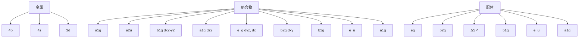
</details>

图 22.2 强场配体平面正方形络合物的分子轨道能级

四个最低分子轨道相应于成键相互作用；最高轨道相应于反键相互作用；这些分子轨道是由得到它们的d轨道标记的

平面四方形络合物的每个配体通常只能提供2个电子(共提供8个电子);为了达到16个电子,金属离子必须提供其余8个电子。正因为如此,具有16个价电子的金属有机化合物仅常见于d区右部的金属,特别是第9族和第10族元素(见表22.1)。此类络合物的例子包括 $\left[\mathrm{IrCl}\left(\mathrm{CO}\right)\left(\mathrm{PPh}_{3}\right)_{2}\right]$ (6)和Zeise's盐阴离子 $\left[\mathrm{Pt}\left(\mathrm{C}_{2}\mathrm{H}_{4}\right)\mathrm{Cl}_{3}\right]^{-}$ (1)。平面四方形16电子络合物特别常见于第9族和第10族的重元素,尤其是Rh(I)、Ir(I)、Pd(II)和Pt(II)。这是因为配位场分裂大,这些络合物的配位场稳定化能有利于采用平面四方形构型。

表 22.1 16/18 电子规则对 d 区金属有机化合物的有效性

<table><tr><td colspan="3">通常小于18电子</td><td colspan="3">通常为18电子</td><td colspan="2">18或16电子</td></tr><tr><td>Sc</td><td>Ti</td><td>V</td><td>Cr</td><td>Mn</td><td>Fe</td><td>Co</td><td>Ni</td></tr><tr><td>Y</td><td>Zr</td><td>Nb</td><td>Mo</td><td>Tc</td><td>Ru</td><td>Rh</td><td>Pd</td></tr><tr><td>La</td><td>Hf</td><td>Ta</td><td>W</td><td>Re</td><td>Os</td><td>Ir</td><td>Pt</td></tr></table>

# 22.2 电子计数的选择

提要: 在 d 区左部, 空间因素的限制可能意味着中心金属周围不可能安排足够多的配体以达到 16 或 18 个价电子。

一个金属原子对某种几何构型和电子计数的选择专一性不是强到足以使其他几何构型无法存在的程度。例如，尽管16电子的平面四方形络合物支配着Pd(Ⅱ)和Rh(Ⅰ)的化学，而(7)中Pd(Ⅱ)的环戊二烯基络合物和(8)中的Rh(Ⅰ)络合物都是18电子化合物。

空间因素会限制金属原子周围配体的数目，并能使低于预期电子计数的化合物得以稳定。例如，三方铂(0)络合物 $\left[\mathrm{Pt}(\mathrm{PCy}_3)_3\right]$ ，其中的三环己基膦配体(9)是如此之大，以致金属原子周围只能安排3个配体，从而导致只有16个价电子。对金属中心的空间稳定化作用在一定程度上是一种动力学效应，大的配位基团可保护金属使之不参与反应。许多络合物在反应过程中容易失去或得到配体形成其他瞬时组态，正是这些组态的存在使d区元素金属有机化学变得如此有趣。

非常规的电子组态常见于电子数较少的 d 区左部元素，金属原子周围往往不能挤下足够多的配体以达到 16 或 18 个电子。例如，第 5 族最简单的羰基化合物 $\left[\mathrm{V}\left(\mathrm{CO}\right)_{6}\right]$ 是个 17 电子化合物，其他例子包括 12 电子的 $\left[\mathrm{W}\left(\mathrm{CH}_{3}\right)_{6}\right]$ 和 17 电子的 $\left[\mathrm{Cr}\left(\mathrm{Cp}\right)\left(\mathrm{CO}\right)_{2}\left(\mathrm{PPh}_{3}\right)\right]$ (10)。后一化合物为立体位阻效应提供了一个很好的例证。大位阻配体 $PPh_{3}$ 被密实配体 CO 取代时，二聚化合物 (11) 在其固态或溶液状态都能观察到较长的、但却十分明确的 Cr—Cr 键。 $\left[\mathrm{Cr}\left(\mathrm{Cp}\right)\left(\mathrm{CO}\right)_{3}\right]_{2}$ 中，Cr—Cr 键的形成使每个金属原子的电子计数达到 18。

![[无机化学第6版副族金属有机565-748_images/5785a4d381268dcf2a17c7c5a44cf803dc5b834e1e84e2c34834540fd9e1d762.jpg]]

<details>
<summary>chemical</summary>

Molecular structure of Ir complex with phosphine, chlorine, and carbon ligands
</details>

(6) trans-[IrCl(CO)(PPh $_3$ ) $_2$ ]

![[无机化学第6版副族金属有机565-748_images/e697c48a0cd75a20f08d20bec58bddf468f7322e9f158c2603465e91777a621c.jpg]]

<details>
<summary>chemical</summary>

Molecular structure of a palladium complex with phenyl and methoxy substituents
</details>

(7)

![[无机化学第6版副族金属有机565-748_images/91132536b18fb15a8ddcbce01d0164f9239ff407e6a7c5c13b5813c12e74712f.jpg]]

<details>
<summary>chemical</summary>

Molecular structure of Rh center bonded to C, PMe₃, and H atoms with hydrogen bonds
</details>

(8) $\left[\mathrm{RhMe}(\mathrm{PMe}_3)_4\right]$

![[无机化学第6版副族金属有机565-748_images/bc758f8f18627aba5ced2c3f7fa0cba2bde027531aff8b0b13e92e718dee6a6b.jpg]]

<details>
<summary>chemical</summary>

Simple molecular structure diagram with labeled atoms P and lone pairs
</details>

(9) PCy $_{3}$ , Cy=cyclo-C $_{6}$ H $_{11}$

![[无机化学第6版副族金属有机565-748_images/c6177cb32c23c59530b72afad9bbbba716dfd7ebe4f75a9677077496db838a93.jpg]]  
(10) $\left[(\mathrm{C}_{5}\mathrm{H}_{5})\mathrm{Cr}(\mathrm{CO})_{2}(\mathrm{PPh}_{3})\right]$

![[无机化学第6版副族金属有机565-748_images/e7a35ff08c3da7c0af36f5cfda37f0e6c1319035ff239ab622dc1c8b5673a5b1.jpg]]  
(11) $\left[(\mathrm{Cp})(\mathrm{CO})_{3}\mathrm{Cr}-\mathrm{Cr}(\mathrm{CO})_{3}(\mathrm{Cp})\right]$

# 22.3 电子计数和氧化态

16 和 18 电子组态在金属有机化学中占据着支配地位,从而使得计算中心金属原子的价电子数成为必需,这是因为通过这种计算可以预测化合物的稳定性和反应模式。虽然对金属有机化合物而言“氧化态”的概念脆弱无力,但学术界仍然认为它是描述电子组态的一个传统而方便的方法。氧化态(和相应的氧化数)可以帮助人们对反应(如 22.22 将要介绍的氧化加成反应)进行归类,也可用来类比金属有机络合物和配位络合物的化学性质。幸运的是,计算电子数和确认氧化数的工作可合并进行。

通常采用两种模式计算电子数:即所谓的中性—配体法(neutral-ligand method)和给予体(电子)对法(donor-pair method)。前者和后者有时各自也叫共价法(covalent method)和离子法(ionic method)。这里对两种方法(它们给出相同的电子计数)都要做简要介绍,但本章后续课文使用的却是给予体(电子)对法,因为它也可用来确认氧化数。

# (a) 中性配体法

提要: 所有配体都被看作中性配体, 并按其提供的电子数来分类。

为了电子计数,每个金属原子和配体都被看作电中性。金属原子的所有价电子和配体提供的所有电子都将计算在内。如果络合物带电荷,将要从电子总数中简单地加上或减去相应的电子数。中性二电子给予体(如 CO 和 PMe $_3$ )定义为 L 型(L type)配体;被看作电中性的一电子自由基给予体(如卤素原子、H 和 CH $_3$ )则定义为 X 型(X type)配体。例如,[Fe(CO) $_5$ ]共 18 个价电子,其中包括 Fe 原子的 8 个价电子和 5 个 CO 配体提供的 10 个电子。有些被看作两种类型相组合的配体;如环戊二烯基被看作是 5 电子的 L $_2$ X 给予体(参见表 22.2)。中性配体法的优点(相关信息见表 22.2)是确定电子计数并不十分困难;缺点是过高估计了共价性,从而低估了金属上的电荷。此外还会使金属原子氧化数的确定变得混乱,某些配体的重要信息被丢失。

# 例题 22.1 用中性配体法计数电子

题目：络合物（a） $\left[\mathrm{IrBr}_2\left(\mathrm{CH}_3\right)(\mathrm{CO})(\mathrm{PPh}_3)_2\right]$ 和（b） $\left[\mathrm{Cr}(\eta^5 -\mathrm{C}_5\mathrm{H}_5)(\eta^6 -\mathrm{C}_6\mathrm{H}_6)\right]$ 是否遵守18电子规则？

答案：(a) 铱有 9 个价电子，Br 原子和 $CH_{3}$ 各自都是单电子给予体，CO 和 $PPh_{3}$ 各自都是二电子给予体，金属原子上的价电子总数为 $9+(3\times1)+(3\times2)=18$ 。(b) 按照同样的方法，Cr 原子有 6 个价电子， $\eta^{5}-C_{5}H_{5}$ 配体提供 5 个电子， $\eta^{6}-C_{6}H_{6}$ 配体提供 6 个电子，金属原子上的价电子总数 $6+5+6=17$ 。该络合物不遵守 18 电子规则，并且不稳定。与之相关，而且稳定的化合物是 $\left[\mathrm{Cr}\left(\eta^{6}-\mathrm{C}_{6}\mathrm{H}_{6}\right)_{2}\right]$ 。

自测题 22.1 $\left[\mathrm{Mo}(\mathrm{CO})_{7}\right]$ 是否稳定？

# (b) 给予体(电子)对法

提要:配体都被看作成对提供电子,人们需要将有些配体看作电中性,有些看作带电荷的配体。

给予体(电子)对法需要计算氧化数。计算金属有机化合物中元素氧化数的规则与传统配位化合物中的计算规则相同。中性配体(如 CO 和膦)是二电子给予体,被指定的形式氧化数为 0 。配体(如卤素、H 和 CH₃ )被认为形式上从金属原子得到一个电子,看作卤离子(如 Cl⁻ )、H⁻ 和 CH₃⁻ (氧化数因此为 -1 )。在阴离子状态下它们都是二电子给予体。环戊二烯基配体 C₅H₅(Cp) 被视为 C₅H₅⁻ (氧化数为 -1 )；在阴离子状态下是个六电子给予体。综上所述：

- 金属原子的氧化数是络合物的总电荷数减去配体的总电荷；  
- 金属提供的电子数是族数减去其氧化数；  
- 总电子计数是金属原子上的电子数与配体提供的电子数之和。

该法的主要优点是,通过少许训练就可同时确定电子计数和氧化数。主要缺点是,高估了金属原子上的电荷,据此提出的反应活性可能不正确(参见节22.7关于氢化物的讨论),表22.2给出常见配体可向金属原子提供的最大电子数。

表 22.2 有代表性的配体及其提供的电子数

<table><tr><td>配体</td><td>化学式</td><td>配体类型</td><td>提供的电子数</td></tr><tr><td colspan="4">(a)中性配体法</td></tr><tr><td>羰基</td><td>CO</td><td>L</td><td>2</td></tr><tr><td>膦</td><td> $PR_3$ </td><td>L</td><td>2</td></tr><tr><td>氢负离子</td><td>H</td><td>X</td><td>1</td></tr><tr><td>氯负离子</td><td>Cl</td><td>X</td><td>1</td></tr><tr><td>二氢</td><td> $H_2$ </td><td>L</td><td>2</td></tr><tr><td> $η^1$ -烷基, $η^1$ -烯基, $η^1$ -炔基, $η^1$ -芳香基</td><td>R</td><td>X</td><td>1</td></tr><tr><td> $η^2$ -烯烃</td><td> $CH_2=CH_2$ </td><td>L</td><td>2</td></tr><tr><td> $η^2$ -炔烃</td><td>RC≡CR</td><td>L</td><td>2</td></tr><tr><td>二氮</td><td> $N_2$ </td><td>L</td><td>2</td></tr><tr><td>二丁烯</td><td> $CH_2=CH-CH=CH_2$ </td><td> $L_2$ </td><td>4</td></tr><tr><td>苯</td><td> $C_6H_6$ </td><td> $L_3$ </td><td>6</td></tr><tr><td> $η^3$ -烯丙基</td><td> $CH_2CHCH_2$ </td><td>LX</td><td>3</td></tr><tr><td> $η^5$ -环戊二烯基</td><td> $C_5H_5$ </td><td> $L_2X$ </td><td>5</td></tr><tr><td colspan="4">(b)给予体(电子)对法*</td></tr><tr><td>羰基</td><td>CO</td><td></td><td>2</td></tr><tr><td>膦</td><td> $PR_3$ </td><td></td><td>2</td></tr><tr><td>氢负离子</td><td> $H^-$ </td><td></td><td>2</td></tr><tr><td>氯负离子</td><td> $Cl^-$ </td><td></td><td>2</td></tr><tr><td>二氢</td><td> $H_2$ </td><td></td><td>2</td></tr><tr><td> $η^1$ -烷基, $η^1$ -烯基, $η^1$ -炔基, $η^1$ -芳香基</td><td> $R^-$ </td><td></td><td>2</td></tr><tr><td> $η^2$ -烯烃</td><td> $CH_2=CH_2$ </td><td></td><td>2</td></tr><tr><td> $η^2$ -炔烃</td><td>RC≡CR</td><td></td><td>2</td></tr><tr><td>二氮</td><td> $N_2$ </td><td></td><td>2</td></tr><tr><td>二丁烯</td><td> $CH_2=CH-CH=CH_2$ </td><td></td><td>4</td></tr><tr><td>苯</td><td> $C_6H_6$ </td><td></td><td>6</td></tr><tr><td> $η^3$ -烯丙基</td><td> $CH_2CHCH_2^-$ </td><td></td><td>4</td></tr><tr><td> $η^5$ -环戊二烯基</td><td> $C_5H_5^-$ </td><td></td><td>6</td></tr></table>

\* 本书使用这种方法。

# 例题 22.2 用给予体(电子)对法指定氧化数和计数电子

题目:指定下列络合物中金属原子的氧化数并计数价电子:(a) $\left[\mathrm{IrBr}_{2}\left(\mathrm{CH}_{3}\right)(\mathrm{CO})(\mathrm{PPh}_{3})_{2}\right]$ ，(b) $\left[\mathrm{Cr}\left(\eta^{5}-\mathrm{C}_{5}\mathrm{H}_{5}\right)\left(\eta^{6}-\mathrm{C}_{6}\mathrm{H}_{6}\right)\right]$ ，(c) $\left[\mathrm{Mn}(\mathrm{CO})_{5}\right]^{-}$

答案：(a) 将两个 Br 和 $CH_{3}$ 看作三个带负电荷的二电子给予体，CO 和两个 $PPh_{3}$ 配体是三个二电子给予体，它们共提供了 12 个电子。整个络合物为中性，第 9 族的 Ir 原子必须为 +3 价（即氧化数为 +3）以平衡三个阴离子配体所带的电荷，从而贡献了 9-3=6 个电子。通过这种分析得知 Ir(Ⅲ) 共有 18 个价电子。(b) 将 $\eta^{5}-C_{5}H_{5}$ 配体看作 $C_{5}H_{5}^{-}$ ，它提供 6 个电子， $\eta^{6}-C_{6}H_{6}$ 配体提供另外 6 个电子。为了保持络合物为中性，铬原子必须为 +1 价（氧化数为 +1），贡献 6-1=5 个电子。Cr(I) 的价电子总数为 $12+5=17$ 。该络合物不遵循 18 电子规则，可能不稳定。(c) CO 是中性配体，可提供 2 个电子，共提供 10 个电子。化合物的总电荷为 -1；因为所有配体都为中性，所以这个电荷处在金属原子上，金属的氧化数为 -1。第 7 族的 Mn 原子提供 $(7+1)$ 个电子，Mn(-1) 络合物是 18 电子络合物。

自测题 22.2 铂的 Zeise's 盐阴离子 $\left[\mathrm{Pt}\left(\mathrm{CH}_{2}=\mathrm{CH}_{2}\right)\mathrm{Cl}_{3}\right]^{-}$ 的电子计数和氧化数各是多少？（提示：将 $CH_{2}=CH_{2}$ 看作电中性二电子给予体。）

# 22.4 命名法

提要:金属有机化合物的命名与配位化合物的命名相似,但某些具有多重配位模式的配体使用 $\eta$ 和 $\mu$ 标明。

根据推荐,本书对金属有机化合物命名与节7.2介绍的配位络合物命名采用相同的命名系统。在金属之后按字母顺序列出配体的名称,金属名称后面要在括号中给出氧化数。然而,期刊中的命名法不总是遵守这些规则,通常将金属名称放在化合物名称的中间,而且省略了氧化数。例如,(12)有时被称为苯钼三羰基,而不是苯(三羰基)钼(0)。

IUPAC 建议采用与书写配位络合物化学式相同的方式书写金属有机化合物的化学式: 先写金属的化学符号, 随后写配体, 配体按化学符号的先后排序。本书将遵循这些惯例, 除非不同的配体顺序有助于阐述某种特点。

以碳为给予体原子的配体往往显示出多种键合模式。例如，环戊二烯基通常可以以三种不同的方式键合到一个d金属原子，因此我们需要一些额外的命名方法。此处不需要关注各种配体的键合细节（本章稍后将介绍这方面的内容），需要的额外信息倒是描述键合模式中键合点的数量。这里出现了齿合度(hapticity)的概念，齿合度是指配体中与金属原子直接键合的原子数。齿合度用 $\eta^n$ （ $\eta$ 的读音为eta）表示，其中 $n$ 为原子数。例如，以单键(M—C)与金属原子键合的 $\mathrm{CH}_3$ 是单齿合配体，表示为 $\eta^1$ 。如果乙烯的两个C原子都在与金属键合的距离之内，该配体就是二齿合配体，表示为 $\eta^2$ 。环戊二烯基的三种络合物可描述为具有 $\eta^1(13)$ 、 $\eta^3(14)$ 或 $\eta^5(15)$ 的环戊二烯基。

![[无机化学第6版副族金属有机565-748_images/a8b872d8cbbc3eb53b850c936d7c8a2b809ee954c69589f1350681f3d82eb486.jpg]]

<details>
<summary>chemical</summary>

Molecular structure diagram of a molybdenum complex with labeled atoms: Mo, CO, and C6H6
</details>

(12) $\left[\mathrm{Mo}(\eta^{6}-\mathrm{C}_{6}\mathrm{H}_{6})(\mathrm{CO})_{3}\right]$

![[无机化学第6版副族金属有机565-748_images/e17c0327582a2e922d326c7e82fcaa2c47014bd6300fd20e19aa432948f36736.jpg]]  
(13) $\eta^{1}$ -环戊二烯基

![[无机化学第6版副族金属有机565-748_images/dbed035334dfbc8963e841893fa0574586f357fcf812d0dc14ce72063282c699.jpg]]  
(14) $\eta^3$ -环戊二烯基

![[无机化学第6版副族金属有机565-748_images/047ccf4d76a9853e8c8c92282bc24a5cd7b1ce78a83b5ce6254e0933fed0f716.jpg]]  
(15) $\eta^5$ -环戊二烯基

有些配体(包括所有配体中最简单的配体, $H^{-}$ )在同一化合物中可键合一个以上的金属原子,这种配体叫桥式配体(bridging ligands)。我们不需要任何新概念(与节2.11叙述的概念相比)去理解桥式配体。

回顾节 7.2 讲述的内容,希腊字母 $\mu(\text{读 mu})$ 用于表示该配体桥连的原子数。 $\mu^{2}-CO$ 表示羰基桥连 2 个金属原子； $\mu^{3}-CO$ 表示羰基桥连 3 个金属原子。

# 例题22.3 命名金属有机化合物

题目：正确命名(a)二茂铁(4)和(b)[RhMe(PMe $_3$ ) $_4$ ](8)。

答案:(a)二茂铁含两个环戊二烯基,都通过5个碳原子与金属原子键合,两个环戊二烯基都被标为 $\eta^{5}$ 。因此,二茂铁的全称应为双( $\eta^{5}$ -环戊二烯基)铁(Ⅱ)。(b)这个铑化合物含1个形式上为阴离子的甲基和4个中性的三甲基膦配体,正式名称应为甲基四(三甲基膦)铑(I)。

自测题22.3 给出 $\left[\mathrm{Ir}\left(\mathrm{Br}\right)_2\left(\mathrm{CH}_3\right)(\mathrm{CO})(\mathrm{PPh}_3)_2\right]$ 的正式名称。

# 配体

金属有机络合物中发现具有不同键合模式的多种配体。因为金属原子和配体的反应性能受 M—L 成键作用的影响，对每种配体做详细了解是非常重要的。

# 22.5 一氧化碳

提要:一氧化碳的 $3\sigma$ 轨道可以用作非常弱的给予体, $\pi^{*}$ 轨道可以用作接受体。

一氧化碳是金属有机化学中一个非常常见的配体，金属有机化学中叫羰基（carbonyl group）。一氧化碳稳定低氧化态金属的能力非常强，许多化合物（如 $\left[\mathrm{Fe}(\mathrm{CO})_{5}\right]$ ）中金属原子的氧化态为零。节2.9中介绍过CO分子轨道的结构，这里从实用角度作个回顾。

一氧化碳与金属原子间一种简单的成键图像可以描述为，碳原子上的孤对电子作为Lewis $\sigma$ 碱（电子对给予体）；CO分子中空的反键轨道作为Lewis $\pi$ 酸(电子对接受体)接受金属原子满d轨道上的 $\pi$ 电子密度。按照这种图像，键合作用可看作由两个部分组成：一是从配体到金属的 $\sigma$ 键(16)；一是从金属到配体的 $\pi$ 键(17)。后者有时被称为 $\pi$ 反馈成键作用（ $\pi$ -backbonding）。

![[无机化学第6版副族金属有机565-748_images/fb5e636a5bae2de4529f707f4eabfc162069e73f0e0cfd70210574c953512a6a.jpg]]

<details>
<summary>chemical</summary>

Molecular structure diagram showing a propeller with M and C atoms connected to oxygen, likely representing a metal-organic framework or catalyst.
</details>

(16)

![[无机化学第6版副族金属有机565-748_images/a0046250e6a4800b015586468f4f0f89c24f0908e5baf37affefba37fac207e4.jpg]]

<details>
<summary>chemical</summary>

Molecular orbital diagram showing electron density distribution with labeled C and O orbitals
</details>

(17)

一氧化碳的亲核性不强,这意味着与 d 金属原子形成的 $\sigma$ 键是弱键。由于许多 d 金属的羰基化合物都很稳定,不难推断 $\pi$ 反馈成键作用较强,羰基络合物的稳定性主要是由 CO 的 $\pi$ 接受体性质产生的。支持这一观点的其他证据是,只有满 d 轨道和与 CO 反键轨道能量匹配的金属原子才能形成稳定的羰基络合物。例如,s 区和 p 区元素不能形成稳定的羰基络合物。最好将 CO 与 d 金属原子的成键看成 $\sigma$ 和 $\pi$ 两种成键作用协同的(即相互增强的)结果:从金属到 CO 的 $\pi$ 反馈成键增加了 CO 上的电子密度,反过来又增强了 CO 与金属原子形成 $\sigma$ 键的能力。

一种更为正式的描述可由CO分子轨道示意图(见图22.3)得到。从图可以看出HOMO具有 $\sigma$ 对称性，轨道波瓣从C原子向外伸展。当CO作为配体时，这个 $3\sigma$ 轨道作为一个非常弱的给予体向金属原子提供电子，与中心金属原子形成 $\sigma$ 键。CO的LUMOs是反键 $2\pi$ 轨道，两个反键 $2\pi$ 轨道起着重要作用，因为它们可与金属具有局部 $\pi$ 对称性的d轨道（如 $O_{\mathrm{h}}$ 络合物中的 $\mathfrak{t}_{2\mathrm{g}}$ 轨道）相互重叠。这种 $\pi$ 相互作用可使金属原子满d轨道中的电子向CO上空的 $\pi^{*}$ 轨道离域，导致该配体也可作为 $\pi$ 接受体。

这种成键模式的一个重要结果是影响了 CO 分子中三重键的强度: 金属原子将电子密度推入 $2\pi$ 轨道导致 M—C 键变得更强, 因为电子密度进入了 CO 的反键轨道, C—O 键就会变得更弱。金属原子完全给出两个电子的极端情况下, 就形成真正的 M=C 双键; 由于两个电子占据了 CO 的反键轨道, 从而导致 CO 的键级降低为 2。

络合物中的实际成键状况处于 M—C≡O（无反馈成键）和 M=C=O（完全反馈成键）之间的某种状态，红外光谱可用来方便地估计 $\pi$ 成键作用的程度。人们可以清楚地辨认出 CO 的伸缩振动峰，这不但因为峰的强度大，而且因为通常情况下不与其他吸收峰重叠。气体 CO 三重键吸收峰的位置在 $2143 \, cm^{-1}$ ，但羰基络合物的特征吸收峰却为 $2100 \sim 1700 \, cm^{-1}$ （见表 22.3）。具体羰基化合物中 IR 吸收峰的数目将在节 $22.18(\text{g})$ 中做介绍。

![[无机化学第6版副族金属有机565-748_images/c1704ab2de73d0deb35b493d2d858dc0dde88451c1338982cbe320984e954836.jpg]]

<details>
<summary>text_image</summary>

4σ
2π
C2p
3σ
O2p
C2s
1π
2σ
1σ
O2s
能量
</details>

图 22.3 CO 分子轨道示意图  
HOMO 具有 $\sigma$ 对称性, 轨道波瓣从碳原子向外伸展; LUMO 具有 $\pi$ 对称性

表 22.3 配位作用和电荷对 CO 伸缩带的影响

<table><tr><td>化合物</td><td> $\tilde{\nu }/{\mathrm{{cm}}}^{-1}$ </td></tr><tr><td>CO</td><td>2 143</td></tr><tr><td> ${\left\lbrack \mathrm{{Mn}}{\left( \mathrm{{CO}}\right) }_{6}\right\rbrack }^{ + }$ </td><td>2 090</td></tr><tr><td> $\mathrm{{Cr}}{\left( \mathrm{{CO}}\right) }_{6}$ </td><td>2 000</td></tr><tr><td> ${\left\lbrack \mathrm{V}{\left( \mathrm{{CO}}\right) }_{6}\right\rbrack }^{ - }$ </td><td>1 860</td></tr><tr><td> ${\left\lbrack \mathrm{{Ti}}{\left( \mathrm{{CO}}\right) }_{6}\right\rbrack }^{2 - }$ </td><td>1 750</td></tr></table>

对络合物中的其他配体而言,羰基的伸缩振动频率往往也用来确定接受体或给予体强弱的顺序。这种方法的原理是,CO作为 $\pi$ 接受体时它的吸收频率会降低。但当同一络合物中含有其他 $\pi$ 接受体争夺金属原子的d电子时,CO的吸收频率就会升高。这种情况恰好与从给予配体那里看到的情况相反:给予配体导致CO的伸缩频率下降,因为它们向金属原子提供电子,从而向CO $\pi^{*}$ 轨道间接提供了电子。因此,不论是金属羰基络合物中存在强的 $\sigma$ 给予体配体,还是金属羰基络合物阴离子的形式负电荷,都会导致CO键稍稍拉长和伸缩频率明显降低。

一氧化碳是个具有多种配位方式的配体，除了上面所描述的成键模式（往往叫“末端”配位）外，还可以桥连两个(18)或三个(19)金属原子。尽管对其成键作用的描述比较复杂，但提出 $\sigma$ 给予体配体和 $\pi$ 接受体配体的概念仍然是有用的。CO的伸缩频率通常遵循以下顺序： $\mathrm{MCO} > \mathrm{M}_2\mathrm{CO} > \mathrm{M}_3\mathrm{CO}$ 。这种顺序表明：CO键合的金属原子越多，就有越多的电子密度从金属原子进入 $\mathrm{CO}\pi^*$ 轨道。一个经验规则是，对桥连两个金属原子的羰基而言，典型的伸缩带频率的范围为 $1900\sim 1750~\mathrm{cm^{-1}}$ ；对桥连三个金属原子的羰基而言，典型的伸缩带频率的范围为 $1800\sim$

![[无机化学第6版副族金属有机565-748_images/f728d752cc2e72971fc0e551b2fe9f81a694ddacbb10a2cc3b35f1abef9f1258.jpg]]

<details>
<summary>chemical</summary>

Molecular structure diagram of a metal-oxygen compound with M and CO atoms labeled
</details>

![[无机化学第6版副族金属有机565-748_images/038421dbb62bdeefbe97212003a36be7953f2cc086a048de3cf4ec11edd5bf07.jpg]]

<details>
<summary>chemical</summary>

Molecular structure diagram of a metal complex with CO and M atoms labeled
</details>

$1600\mathrm{cm}^{-1}$ （见图22.4）。当CO为末端配位或桥式配位时，可将其看作二电子中性配体（桥连两个金属原子时向每个金属原子提供一个电子）。

有时也可以观察到 CO 的其他成键模式,与一个金属原子以末端方式配位的 CO 配体同时其 C≡O 三键以侧向方式键合于另外一个金属原子(20),这种描述最好被理解为两种独立的相互作用:一种是前面介绍过的末端键合;另一种则是后面要讨论的本质上类似于其他侧向 $\pi$ 给予体(如炔和 $N_{2}$ )的成键。

![[无机化学第6版副族金属有机565-748_images/65e1126f9e37b45b43760dec95ed22de5918634c59383ed2ad9fec0d33a5bff9.jpg]]

<details>
<summary>bar</summary>

| 波数, ν̃ / cm⁻¹ | Value |
| -------------- | ----- |
| M              | 2100  |
| C              | 2000  |
| O              | 1900  |
</details>

图 22.4 中性金属羰基化合物中 CO 伸缩带的近似区域  
注意: 高波数(即高频率)在左边,与红外光谱通常  
采用的表达方式相一致

![[无机化学第6版副族金属有机565-748_images/4a67301fbe1f567a5a4c82038dc0fc1e38d0b377047f9f145be7d7a1f2a28a7f.jpg]]

<details>
<summary>chemical</summary>

Molecular structure diagram showing CO and M atoms with M' bond, labeled as (20)
</details>

节 22.18 将详细讨论羰基化合物的合成、性质、反应性能。

# 22.6 隣

提要: 膦与金属的键合包括从 P 原子到金属原子的 $\sigma$ 给予和从金属原子到配体的 $\pi$ 成键作用。

膦配体不是以碳原子与金属键合的,其络合物不是金属有机化合物。我们仍然在这里对其做讨论,是因为它们的成键方式与一氧化碳有很多相似之处。

磷化氢 $\left(\mathrm{PH}_{3}\right.$ ，形式上的磷烷）是一种活泼、令人厌恶且有毒的可燃烧的气体（节15.10）。与氨一样，磷化氢是个Lewis碱，并利用其孤对电子向Lewis酸提供电子密度，因而可用作配体。然而由于存在操作方面的问题，作为配体实际上用得很少。另一方面，磷化氢的取代物三烷基膦（如 $PMe_{3}$ 、 $PEt_{3}$ ）、三芳基膦（如 $PPh_{3}$ ）、三烷基和三芳基亚磷酸酯[如 $P\left(OMe\right)_{3}$ 、 $P\left(OPh\right)_{3}$ ，21]及大量的二膦和三膦（如dppe= $Ph_{2}PCH_{2}CH_{2}PPh_{2}$ ，22）容易操作（事实上它们当中的一些是对空气稳定、无臭和没有显著毒性的固体），被广泛用作配体并总称为“膦”。

膦中的 P 原子含一对孤对电子, 因此具有碱性和亲核性并可用作 $\sigma$ 给予体。膦同时也是 $\pi$ 接受体, 因为其中的 P 原子有空轨道, 这些轨道可与 3d 金属离子的满 d 轨道发生重叠 (23)。膦与金属原子的键合作用 (包括从膦配体到金属的 $\sigma$ 键和从金属反馈至配体的 $\pi$ 键) 完全类似于 CO 与 d 金属原子的键合。P 原子究竟以哪个轨道作为 $\pi$ 接受体轨道, 过去曾有过相当激烈的争论。有人认为是 P 原子的 3d 空轨道, 有人则认为是 P—R 的 $\sigma^{*}$ 轨道; 当今一致支持后一观点。在任何场合, 价电子计数中膦都提供 2 个电子。

![[无机化学第6版副族金属有机565-748_images/188240a0359ba0dcccadce0f6a7014a66efab808f84062f7845e59d51a4020e9.jpg]]

<details>
<summary>chemical</summary>

Chemical structure of phosphorus-containing compound with phenyl and benzene ligands, labeled (21) P(OPh)₃
</details>

![[无机化学第6版副族金属有机565-748_images/2e33449433c0a36f1d80c5c0e18f3a61690fbbe9a732d34b52ede7013821646d.jpg]]

<details>
<summary>chemical</summary>

Chemical structure of a phosphorus-containing compound with three phenyl groups and a diphosphine ligand
</details>

![[无机化学第6版副族金属有机565-748_images/acd50a2b92de35d7da6fe44b5160962f5c2ba893e72530cb36a6bb8670aecaba.jpg]]

<details>
<summary>chemical</summary>

Molecular orbital diagram showing electron density distribution with labeled M and F orbitals and P orbital
</details>

正如已经讲过的那样,可能形成和可以获得多种多样的膦配体,包括像2,2'-二(双苯膦基)-1,1'-联萘(BINAP,24)这样的手性体系。在讨论含膦络合物的反应活性时,膦配体的两种性质比较重要:体积的大小和提供(与接受)电子的能力。

节21.6中曾经介绍过如何用锥体概念表示膦配体空间位阻的大小，表22.4列出了一些配体的锥角。正如前面看到的那样，膦配体与d金属原子的键合作用是由两部分组成的：从配体到金属原子的 $\sigma$ 键合和从金属原子到配体的 $\pi$ 反馈成键。富电子膦（如 $\mathrm{PMe}_3$ ）是强 $\sigma$ 给予体和弱的 $\pi$ 接受体，而贫电子膦（如 $\mathrm{PF}_3$ ）是弱的 $\sigma$ 给予体和强的 $\pi$ 接受体；从这个意义上，膦的 $\sigma$ 给予能力和 $\pi$ 接受能力反相关。因此，膦的Lewis碱性可当作判断其提供/接受电子能力的单一尺度。人们广泛接受的膦的碱性顺序如下：

$$
\mathrm{PCy} _ {3} > \mathrm{PEt} _ {3} > \mathrm{PMe} _ {3} > \mathrm{PPh} _ {3} > \mathrm{P(OMe)} _ {3} > \mathrm{P(OPh)} _ {3} > \mathrm{PCl} _ {3} > \mathrm{PF} _ {3}
$$

表 22.4 部分膦化合物的 Tolman 锥角 (°)  
![[无机化学第6版副族金属有机565-748_images/4defc119f3df317cfb5d012107b6eab0be79b6c62cbd194336aa2c65f9566912.jpg]]

<details>
<summary>chemical</summary>

Chemical structure of a polycyclic aromatic compound with two PPh2 substituents
</details>

(24) BINAP

<table><tr><td> ${\mathrm{{PF}}}_{3}$ </td><td>104</td></tr><tr><td> $\mathrm{P}{\left( \mathrm{{OMe}}\right) }_{3}$ </td><td>107</td></tr><tr><td> ${\mathrm{{PMe}}}_{3}$ </td><td>118</td></tr><tr><td> ${\mathrm{{PCl}}}_{3}$ </td><td>125</td></tr><tr><td> $\mathrm{P}{\left( \mathrm{{OPh}}\right) }_{3}$ </td><td>127</td></tr><tr><td> ${\mathrm{{PEt}}}_{3}$ </td><td>132</td></tr><tr><td> ${\mathrm{{PPh}}}_{3}^{ - }$ </td><td>145</td></tr><tr><td> ${\mathrm{{PCy}}}_{3}$ </td><td>169</td></tr><tr><td> ${\mathrm{P}}^{1}{\mathrm{{Bu}}}_{3}$ </td><td>182</td></tr><tr><td> $\mathrm{P}{\left( o\text{-tolyl}\right) }_{3}$ </td><td>193</td></tr></table>

从 P 原子上取代基电负性的大小不难理解这一顺序。络合物中 M—P 键的强度不能简单地与膦配体的碱性相关联；例如，贫电子金属原子能与富电子膦（碱性的）形成较强的键，富电子金属原子也可与贫电子膦形成较强的键。

如果金属膦络合物中存在羰基,该羰基的伸缩频率就可用来评估膦配体的碱性:利用该法可以得出结论, $PF_{3}$ 是个与CO相当的 $\pi$ 接受体。

膦在金属有机化学中的广泛应用是对其用作多功能配体的最好证明:对络合物中的金属原子而言,通过审慎选择膦配体既可控制其立体性质,也可控制其电子性质。 $^{31}$ P(自然丰度为100%)容易通过NMR进行检测, $^{31}$ P的化学位移和与金属原子的偶合常数都可用来了解络合物的成键和反应情况。与羰基一样,膦也可桥连两个或者三个金属原子,从而提供不同的键合模式。

# 例题 22.4 解释络合物中一氧化碳的伸缩频率和 M—C 键的键长

题目：(a) 在 $\left[\mathrm{Cr}(\mathrm{CO})_{6}\right]$ 和 $\left[\mathrm{V}(\mathrm{CO})_{6}\right]^{-}$ 两个等电子体中，哪个络合物的 CO 伸缩频率更高？(b) 在铬的两个化合物 $\left[\mathrm{Cr}(\mathrm{CO})_{5}(\mathrm{PEt}_{3})\right]$ 和 $\left[\mathrm{Cr}(\mathrm{CO})_{5}(\mathrm{PPh}_{3})\right]$ 中，哪个的 CO 伸缩频率更低？哪个 M—C 键的键长更短？

答案:我们需要考虑对配体 CO 的反馈成键是增强还是减弱了:更多的反馈将导致更弱的 C—O 键。(a)与 Cr 络合物相比较,V 络合物所带的负电荷将导致向 CO $\pi^{*}$ 轨道更大的反馈。这种较大程度的反馈将降低 C—O 键的强度,从而导致 CO 的伸缩频率降低。所以 Cr 络合物具有较高的 CO 伸缩频率。(b)相对于 PPh $_{3}$ ,PEt $_{3}$ 具有较强的碱性,因而 PEt $_{3}$ 络合物的金属原子上电子密度较高,从而会产生对 CO 较多的反馈。反馈得越多,CO 的伸缩频率越低,M—C 键的键长越短。

自测题22.4 $\left[\mathrm{Fe}(\mathrm{CO})_{5}\right]$ 和 $\left[\mathrm{Fe}(\mathrm{CO})_{4}(\mathrm{PEt}_{3})\right]$ 中，哪个络合物的CO伸缩频率更高？哪个络合物的M—C键更长？

# 22.7 氢化物络合物和氢分子络合物

提要: 氢原子与金属原子的键合是 $\sigma$ 相互作用, 而氢分子与金属原子的键合涉及 $\pi$ 反馈成键。

氢原子与金属原子直接键合在金属有机络合物中很常见，这里的氢原子叫作氢化物配体（hydride ligand）。“氢化物”这个名称或许具有一定的误导性，实际上它指的是 $\mathrm{H}^{-}$ 配体。尽管大多数氢化物（如 $[\mathrm{CoH}(\mathrm{PMe}_3)_4]$ 中的“H”表达为“ $\mathrm{H}^{-}$ ”是合适的，然而有些氢化物明显显酸性，其行为更像含有 $\mathrm{H}^+$ 。例如，在乙腈溶液中， $[\mathrm{CoH}(\mathrm{CO})_4]$ 是 $\mathrm{pK_a = 8.3}$ 的酸。节22.18中将会讨论金属有机羰基化合物的酸性。在电子计数的给予体（电子）对法中，将氢化物配体贡献的电子数看作2，即看作带有一个负电荷的 $\mathrm{H}^{-}$ 。

氢原子与金属原子之间的键合比较简单，因为氢原子中能量匹配的唯一轨道是H1s轨道，形成的M—H键可看作两个原子之间的 $\sigma$ 相互作用。氢化物不难用NMR进行识别，因为其化学位移很特殊，通常为 $-50 < \delta < 0$ 。红外光谱对金属氢化物的识别也非常有用，它们的伸缩振动谱带通常在 $2250\sim$ $1650~\mathrm{cm}^{-1}$ 。X射线衍射法对鉴定晶体材料的结构很有价值，但并非总是能鉴定氢化物。这是因为衍射与电子密度相关，氢化物配体最多有两个电子，比其他配体少得多（如Pt原子核周围有78个电子）。探测氢化物配体时更多地使用中子衍射法，特别是氢原子被氘原子取代时。这是因为氘原子具有更大的中子散射截面。

M—H 键有时可通过金属有机化合物[如中性的和阴离子的羰基化合物,节 22.18(e)]加合质子的方法产生。例如,强酸可将二茂铁质子化产生 Fe—H 键:

$$
\left[ \mathrm{Cp} _ {2} \mathrm{Fe} \right] + \mathrm{HBF} _ {4} \longrightarrow \left[ \mathrm{Cp} _ {2} \mathrm{FeH} \right] ^ {+} \left[ \mathrm{BF} _ {4} \right] ^ {-}
$$

桥氢化物中的氢原子可以桥连两个或三个金属原子。处理二硼烷 $\left(\mathrm{B}_{2}\mathrm{H}_{6}\right)$ 成键作用的方法（见节2.11）可用来处理桥氢化物。

尽管1931年就报道了金属有机氢化物，但氢分子 $(\mathrm{H}_2)$ 络合物仅于1984年才被确认。氢分子络合物中 $\mathrm{H}_{2}$ 与金属原子侧向键合（过去的化学文献有时也将其称为非经典氢化物）。二氢与金属原子的成键作用由两部分组成： $\mathrm{H}_{2}$ 中两个电子对金属原子的 $\sigma$ 给予(25)和金属原子向 $\mathrm{H}_{2}$ $\sigma^{*}$ 反键轨道的 $\pi$ 反馈(26)。这种成键图像带来很多有趣的问题，特别是H—H键的强度在反馈增强时会减弱，结构会向氢化物转化：

![[无机化学第6版副族金属有机565-748_images/71b1695c09ca25cbf674782ada100140c5c98f45a823fa24b88aabf4589fecb9.jpg]]

<details>
<summary>chemical</summary>

Molecular orbital diagram showing electron density distribution with M and H atoms
</details>

(25)

![[无机化学第6版副族金属有机565-748_images/1686f01bcb0a5bbed653e41391e22285ee86dd63996190dc8a4d6d26639b6556.jpg]]

<details>
<summary>chemical</summary>

Molecular orbital diagram showing electron density distribution with H atoms and M orbital
</details>

(26)

![[无机化学第6版副族金属有机565-748_images/266e1e67893a9333ca1b7d29ab0e9d8ed8ce32cd10b428c32c874dbf030a876f.jpg]]

二氢分子可被当作二电子给予体。二氢配体转化为两个氢化物配体（各自带一个负电荷、贡献一对电子）要求金属原子的形式电荷升高2，即金属原子被氧化2个单位 $\left(\mathrm{H}_{2}\right.$ 被还原）。尽管金属原子的这种氧化作用可被看作电子计数方法导致的非正常变化，金属原子上的2个电子已被用于与氢分子形成反馈键，不可能参与新的成键。氧化加成是二氢配体向氢化物配体转化的一个例子，我们将在节22.22对其进行详细讨论。

现在人们知道络合物的结构可存在于两个极限结构之间的任合状态,两种结构之间有时处于平衡。G. Kubas 关于钨络合物的研究表明,可能通过 H—D 偶合常数检测二氢络合物(27, $^{1}J_{HD}=34Hz$ )和氢化物络合物（28， $^{2}J_{HD}<2Hz$ ），并可跟踪从一个到另一个的转化过程。某些微生物体内存在氢化酶，这种酶以Fe和Ni为催化中心催化 $H_{2}$ 的快速氧化和 $H^{+}$ 的还原，过程中经历了金属二氢络合物和氢化物络合物中间体（节26.14）。

![[无机化学第6版副族金属有机565-748_images/6f0317b66e4ba9dd389c715eb82c284c9eb7054032cb26e52a7ed0b8f173f539.jpg]]

<details>
<summary>chemical</summary>

Molecular structure diagram of a phosphorus-containing compound with labeled atoms and bonds
</details>

(27) $\left[\mathrm{W(HD)(P^{i}Pr_{3})_{2}(CO)_{3}}\right]$

![[无机化学第6版副族金属有机565-748_images/d13ea2959f3006b95f2281a4d94b72655b678efc694cc5cac7a5ddbf6b31cebf.jpg]]

<details>
<summary>chemical</summary>

Molecular structure diagram of a phosphorus-containing compound with labeled atoms: CO, W, P, H, D, and P'Pr3
</details>

(28) $\left[\mathrm{W(H)(D)(P^{i}Pr_{3})_{2}(CO)_{3}}\right]$

# 22.8 $\eta^1$ -烷基、 $\eta^1$ -烯基、 $\eta^1$ -炔基和 $\eta^1$ -芳基配体

提要: $\eta^{1}$ -碳氢化合物配体与金属的成键是 $\sigma$ 相互作用。

烷基往往会作为 d 区元素金属有机化学中的配体出现, 其成键作用没有新特征, 最好看作有机碎片中的碳原子与金属原子之间简单的共价 $\sigma$ 相互作用。如果与金属键合的那个 C 原子的相邻 C 原子上氢原子有通过 $\beta-H$ 消除反应(节 22.25) 导致配位烷基发生分解的可能性, 则不能发生这类反应的烷基[如甲基、苄基 $\left(\mathrm{CH}_{2}\mathrm{C}_{6}\mathrm{H}_{5}\right)$ 、新戊基 $\left(\mathrm{CH}_{2}\mathrm{CMe}_{3}\right)$ 和三甲基硅基甲基 $\left(\mathrm{CH}_{2}\mathrm{SiMe}_{3}\right)$ ] 络合物比能发生这类反应的烷基(如乙基)络合物更稳定。

烯基(29)、炔基(30)和芳基(31)都能以相同的方式和金属原子键合。通过一个碳原子与金属原子键合的方式叫单齿键合,表示为 $\eta^{1}$ 。尽管以上三种基团都有可能接受电子密度进入其反键轨道,但是很少有证据表明这种作用的存在。例如，尽管人们认为 $\eta^{1}$ -炔基基团类似于 CO 基团，但炔基络合物中炔基三重键伸缩频率的变化却很小。桥烷基和桥芳基基团也是存在的，成键方式与我们讨论过的其他桥配体一样，都采用 3c, 2e 键方式。

烷基、烯基、炔基和芳基通常利用锂试剂或格氏试剂取代金属中心上卤素原子的方法引入金属有机化合物中。例如：

![[无机化学第6版副族金属有机565-748_images/8516cf254dbf1ac94571b6e1c45465ad107f778d7a4c3217c7ed8509c4b2bb68.jpg]]

<details>
<summary>chemical</summary>

Three resonance structures labeled (29), (30), and (31) of a substituted cyclohexene ring with M substituents
</details>

$$
\begin{array}{c} \mathrm{Cl} _ {1 1} \mathrm{Pd} _ {1 2} ^ {\dots} \mathrm{PPh} _ {3} \\ \mathrm{Ph} _ {3} \mathrm{P} \xrightarrow {} \mathrm{Cl} \end{array} \xrightarrow {2 \mathrm{PhLi}} \begin{array}{c} \mathrm{Ph} _ {1 1} \mathrm{Pd} _ {1 2} ^ {\dots} \mathrm{PPh} _ {3} \\ \mathrm{Ph} _ {3} \mathrm{P} \xrightarrow {} \mathrm{Ph} \end{array} + 2 \mathrm{LiCl}
$$

电子计数法将烷基、烯基、炔基和芳基配体都看作负一价（如 $Me^{-}$ 和 $Ph^{-}$ ）的二电子给予体。

# 22.9 $\eta^{2}$ -烯烃和 $\eta^{2}$ -炔烃配体

提要:烯烃或炔烃与金属原子的键合作用最好被描述为从多重键到金属原子的 $\sigma$ 相互作用和从金属原子到烯烃或炔烃 $\pi^{*}$ 反键轨道的反馈作用。

烯烃能与金属中心原子相键合,第一个离析出来的金属有机化合物(Zeise's盐)是个乙烯络合物。烯烃通常侧向键合到金属原子上,金属与双键上的两个碳原子等距,烯烃上的其他基团与金属原子和两个碳原子构成的平面基本垂直(32)。按照这种排布,C=Cπ键的电子密度提供给金属原子的空轨道形成σ键;与此同时,金属原子的满d轨道将其电子密度反馈给烯烃空着的π\*轨道形成π键。这种描述被称为Dewar-Chatt-Duncanson模型(Dewar-Chatt-Duncanson model),见图22.5。η²-烯烃被看作二电子中性配体。

![[无机化学第6版副族金属有机565-748_images/a28bf0ecb9f46653b863672b238006b0bc730cc9ee9f22d790a986b4e9e637e2.jpg]]

<details>
<summary>chemical</summary>

Molecular structure of dimethylmethylene (CH₂=CH₂) showing two configurations with M atoms and single bonds
</details>

(32) $\eta^{2}-CH_{2}=CH_{2}$

![[无机化学第6版副族金属有机565-748_images/d6e41dfd64fa412b0ccee230f42936e8d3330c41fe34151eda4992f4124db5bc.jpg]]

<details>
<summary>chemical</summary>

Molecular orbital diagrams showing electron density distributions in a π-π* configuration, labeled (a) and (b)
</details>

图 22.5 $^{*}$ 乙烯与金属原子之间的相互作用：(a) 乙烯分子中充满的 $\pi$ 分子轨道上的电子密度投向金属空的 $\sigma$ 轨道；(b) 乙烯分子中空的 $\pi^{*}$ 轨道接受金属充满的 d $\pi$ 轨道上的电子密度

d金属的大多数乙烯络合物中，电子给予体特征和电子接受体特性大体均衡，但金属原子和烯烃分子上的取代基可以改变电子给予和电子反馈的程度。金属原子的 $\pi$ 反馈成键作用增加时，因为电子密度处于 $C = C$ 反键轨道而导致 $C = C$ 键强度减弱，结构趋向于 $C - C$ 以单键相结合的结构，从而形成金属环丙烷：

$$
\overline {{\mathrm{M}}} \rightarrow \bigtriangledown_ {\mathrm{M}} \rightarrow \bigtriangledown_ {\mathrm{M}}
$$

从金属原子那里只得到很小程度电子反馈的二齿烯烃将其取代基向远离金属原子的方向稍稍弯曲，C=C 键键长也稍长于自由烯烃的键长（134 pm）。随着反馈程度的增大，烯烃上的取代基向远离金属原子的方向发生更大弯曲，C=C 键键长接近单键键长。空间应力也可导致烯烃上的其他基团向远离金属原子的方向弯曲。

炔烃有两个 $\pi$ 键, 因此可能是四电子给予体。侧向键合于一个金属原子时, $\eta^{2}$ -碳-碳三键最好被看成二电子给予体, 以烯烃那样的方式用 $\pi^{*}$ 轨道接受来自金属原子的电子密度。炔烃上结合有强吸电子基团时, 配体就会变成一个优良的 $\pi$ 接受体从而能取代其他配体(如膦)。乙炔二甲酸二甲酯( $CH_{3}OCOC\equiv CCOOCH_{3}$ ) 就是此类化合物一个很好的例子。

取代的炔烃可形成非常稳定的多金属络合物，其中的炔烃可看作四电子给予体。一个例子是 $\eta^2$ -二苯基乙炔(六羰基)二钴(0)，我们不妨将成键看成一个 $\pi$ 键为一个Co原子提供电子，第二个 $\pi$ 键与另一个Co原子实现有效交盖(33)。这个例子中，炔分子上烷基或芳基的存在降低了配位乙炔发生副反应（如乙炔失去弱酸性的炔基H原子并投给金属原子）的趋势，从而增加了络合物的稳定性。

![[无机化学第6版副族金属有机565-748_images/15c26a5f0fe9d6a093afc0a2a7f4f102d29ae261caa95083544de8d25ce6302a.jpg]]

<details>
<summary>chemical</summary>

Chemical structure of a cobalt complex with phenyl and carbonyl ligands, labeled as compound (33)
</details>

# 22.10 非共轭的二烯和多烯配体

提要:非共轭烯烃与金属原子的键合作用可很好地描述为多个独立烯烃与金属中心的成键。

非共轭的二烯 $(-C = C - X - C = C -)$ 和多烯配体也可与金属原子成键。可以简单地将它们看作连

接在一起的烯烃，因此不存在新的成键概念。由于配位络合物中存在螯合效应，熵效应导致多烯络合物通常比单烯配体(与多烯含有等量烯键)形成的络合物更稳定。例如,双 $\left(\eta^{4}-环辛-1,5-二烯\right)$ 镍(0)(34)比含有四个乙烯配体的络合物更稳定。环辛-1,5-二烯(35)是金属有机化学中相当常见的配体,人们给其一个叫“cod”的爱称。通常可通过简单的配体置换反应引入金属的配位层。例如:

![[无机化学第6版副族金属有机565-748_images/40b0c354ab46ab7639b5595c8b095524dffae5c47560faaeb037f0534d60fc4f.jpg]]  
(34) $[Ni(cod)_{2}]$

![[无机化学第6版副族金属有机565-748_images/f802109419a378cec177eff951d4936a815cb015664ca9380ce2967b7852f6fb.jpg]]  
(35) 环辛-1,5-二烯, cod

![[无机化学第6版副族金属有机565-748_images/26073ce42695a2468c706258716ebbcb423de767a7087ce3eaef444ae300f368.jpg]]

<details>
<summary>chemical</summary>

Palladium-catalyzed coupling reaction using cod, producing 2 PhCN
</details>

金属环辛二烯络合物具有中等稳定性，因而常被用作起始物。许多金属环辛二烯络合物较稳定，因而易于操作并能被离析出来。但环辛二烯配体也可被其他许多配体所取代。例如，如果反应过程中需要剧毒的 $\left[\mathrm{Ni}(\mathrm{CO})_{4}\right]$ 分子，就可在反应瓶中由 $\left[\mathrm{Ni}(\mathrm{cod})_{2}\right]$ 原位制备：

$$
\left[ \mathrm{Ni} (\mathrm{cod}) _ {2} \right] (\mathrm{soln}) + 4 \mathrm{CO(g)} \longrightarrow \left[ \mathrm{Ni(CO)} _ {4} \right] (\mathrm{soln}) + 2 \mathrm{cod(soln)}
$$

# 22.11 丁二烯、环丁二烯和环辛四烯

提要:如果将丁二烯和环丁二烯看作两个烯烃单元,就可对其成键状况有一定程度的了解;然而充分了解则需考虑其分子轨道。环辛四烯能以多种不同方式成键;在 d 金属化学中最常见的模式是作为类似于丁二烯的 $\eta^{4}$ 给予体。

尽管有诱惑力将丁二烯和环丁二烯都看作含有两个孤立的双键,然而想要充分了解其成键作用仍需要用到分子轨道法,这是因为配体与金属原子之间的相互作用在两种情况下都是不同的。

图22.6给出了丁二烯中 $\pi$ 体系的分子轨道。两个被占的低能分子轨道（最低的 $\sigma$ 给予体轨道和次低的 $\pi$ 给予体轨道）可以作为投向金属的给予体轨道。下一个较高的未占分子轨道(LUMO)可作为 $\pi$ 接受体从金属原子接受电子。因此，丁二烯分子与金属原子的结合占据的是两个中心C原子间（表面上以单键相连）的成键轨道和表观上由双键结合起来的两个C原子间的反键轨道。电子密度的改变导致中心C—C单键的缩短和 $\mathrm{C} = \mathrm{C}$ 双键的拉长；有些络合物中，中心碳-碳键甚至比其他两个碳-碳键更短。从理论上讲，金属原子的 $\mathrm{d}_{xy}$ 轨道与丁二烯分子轨道中最强反键轨道之间的δ相互作用是可能的，但并没有明确证据表明它会发生。因此，电子计数法中将丁二烯看作四电子中性配体。

![[无机化学第6版副族金属有机565-748_images/779c338499c7d00a543d2cb165a9aa1364cfa40cad80deef0344308e2a8affba.jpg]]

<details>
<summary>chemical</summary>

Molecular orbital diagrams showing electron density distributions at different angles (1π, 2π, 3π, 4π) for d_xy, d_yz, d_zx, and d_z2 orbitals
</details>

图 22.6 $^{*}$ 丁二烯中 $\pi$ 体系的分子轨道，同时也给出形成成键相互作用时对称性合适的金属 d 轨道

作为键角应力和四电子反芳香组态的结果,环丁二烯自由分子为矩形对称 $(D_{2h})$ 的不稳定分子。然而它能形成稳定的络合物如 $\left[\mathrm{Ru}\left(\eta^{4}-\mathrm{C}_{4}\mathrm{H}_{4}\right)(\mathrm{CO})_{3}\right]$ (36),这是通过与金属原子配位来稳定自身不稳定分子的一个例子。

由于四方形结构扭曲[我们可将其看作Jahn-Teller效应[节20.1(g)]在有机化学中的一个实例]的结果，环丁二烯的分子轨道图与丁二烯类似（见图22.7）。LUMO通过反馈成键作用被占据，导致矩形环丁二烯分子中长边的键合作用更大，从矩形排布向正方形排布 $(D_{4\mathrm{h}})$ 变化。如果环丁二烯接受金属原子的两个电子，它将会有6个 $\pi$ 电子（排布在三条分子轨道上），正方形就不再有发生扭曲的动力。在此组态中，三个分子轨道中的两个是简并轨道。人们发现所有金属环丁二烯络合物中的环丁二烯都为正方形，表明六电子的芳香组态比四电子组态更能准确地描述碳环内的成键作用。这种

![[无机化学第6版副族金属有机565-748_images/93f2dad3220a9cbbd2cdf14056c036e6711008a6295883e5552e033d80e3b993.jpg]]

<details>
<summary>chemical</summary>

Molecular structure of ruthenium (Ru) complex with carbon and oxygen ligands, labeled as compound (36)
</details>

成键观点导致一些人将环丁二烯络合物看作二价阴离子 $R_{4}C_{4}^{2-}$ （六电子给予体）的络合物。不过为了方便，大多数人仍将环丁二烯看作四电子中性配体。这里再一次看到：金属原子的 $d_{xy}$ 轨道与丁二烯分子轨道中最强反键轨道间存在 δ 成键相互作用的可能性。也再一次看到没有明确证据表明这种作用的存在。

![[无机化学第6版副族金属有机565-748_images/b54a7f04d00ddb785d09a8ad959c68e570679d0d6d3de7974d1282e498d2c9e6.jpg]]

<details>
<summary>chemical</summary>

Molecular orbital diagrams showing electron density distributions at different angles (1π to 4π) for d_xy, d_yz, and d_zx orbitals
</details>

图 22.7° 环丁二烯中 $\pi$ 体系的分子轨道，同时也给出形成成键相互作用时对称性合适的金属 d 轨道

由于环丁二烯不稳定,该配体必须在与其配位的金属存在的条件下制备。这种合成可通过多种途径完成,其中一种是通过卤代环丁烯的脱卤反应:

![[无机化学第6版副族金属有机565-748_images/f2fd6077924dd84644a58941d58638987930fb7ad77e3220060374d6040351f4.jpg]]

<details>
<summary>chemical</summary>

Chemical reaction equation showing formation of FeCl₂ and CO from a dichloroalkane ligand
</details>

另一条途径是通过取代乙炔的二聚反应：

![[无机化学第6版副族金属有机565-748_images/6eef2084d61b6c5a957bce2108160532f52fc73bc67cf5aa886d41dfa2bd2be4.jpg]]

<details>
<summary>chemical</summary>

Organometallic reaction scheme showing conversion of a cobalt complex to a cyclopentene derivative and PPh3
</details>

环辛四烯(37)是个具有多种成键方式的大配体。与环丁二烯一样，环辛四烯自由分子是反芳香性分子。以 $\eta^8$ 方式与金属原子配位的环辛四烯为平面结构，其中所有C—C键的键长都相等。与环丁二烯相似，这种组态中的环辛四烯得到2个电子，形式上变成芳香性的负二价配体 $[\mathrm{C_8H_8}]^{2-}$ （即10电子给予体）。d金属化合物中很少看到这种配位模式，这种模式通常出现在与镧系元素和锕系元素形成的络合物中（节23.9）。例如，两个负二价环辛四烯配体出现在通常称之为茂铀的双（ $\eta^8$ -环辛四烯基）合铀（IV） $([\mathrm{U}(\eta^8 -\mathrm{C}_8\mathrm{H}_8)_2])$ 中。

d 金属化合物中更常见的成键模式是环辛四烯以皱褶的 $\eta^{4}-C_{8}H_{8}$ 配位（38），配体的成键部分可以看作丁二烯。环辛四烯的桥式配位也是可能的，如（39）和（40）。

![[无机化学第6版副族金属有机565-748_images/8033842865ffc03027747eaa19e57ab3637840b23378f88c32b6d2d9c2c79faf.jpg]]  
(37) 环辛四烯

![[无机化学第6版副族金属有机565-748_images/274249f054c28d5460b22bb50d2258d37c3a7e1e4560b9ce98e2425992cdd72d.jpg]]  
(38) $\left[\mathrm{Ru}(\eta^{4}-\mathrm{C}_{8}\mathrm{H}_{8})(\mathrm{CO})_{3}\right]$

![[无机化学第6版副族金属有机565-748_images/b7ad4a7f2d1abfe7634eba50a723ccf8cd70783c1c714d2cac631fb024ff9ce1.jpg]]

<details>
<summary>chemical</summary>

Molecular structure of a ruthenium complex with (CO)3 ligands and a cyclopentadienyl group
</details>

(39)

![[无机化学第6版副族金属有机565-748_images/86e6194e109b3e666b12333ef9d1ca882fb54de61ce8f61ec6ac49b3748a04fb.jpg]]  
(40)

# 22.12 苯和其他芳烯

提要:根据苯分子的分子轨道,苯与金属原子的成键图像中包括了非常重要的δ反馈成键相互作用。

如果将苯看作含有3个定域双键（每个双键可以充当一个配体），它则是个三齿的 $\eta^6$ -配体。如二 $(\eta^6$ -苯基)铬(0)(41)这样的化合物可认为是由6个配位的双键形成的，每个双键向 $\mathrm{d}^6$ 金属原子提供2个电子形成总数为18个价电子的八面体络合物。二 $(\eta^6$ -苯基)铬(0)这个化合物的确是存在的，而且相当稳定（可在空气中进行操作，升华时也不会分解）。对成键作用的这种描述只是了解其结构的第一步，真实的成键图像则需要更深层次地考虑所涉及的分子轨道。

苯的 $\pi$ 成键分子轨道中有3个成键轨道和3个反键轨道。如果只考虑一个苯分子与一个金属原子的键合并且只考虑d轨道，最强的相互作用则是苯分子轨道中最强的成键 $\mathrm{a}_2$ 轨道与金属原子的 $\mathrm{d}_{z2}$ 轨道间的 $\sigma$ 相互作用。苯分子的其他2个成键分子轨道与 $\mathrm{d}_{zx}$ 和 $\mathrm{d}_{yz}$ 轨道之间形成 $\pi$ 键也是可能的。由于 $\mathrm{d}_{x^2 -y^2}$ 和 $\mathrm{d}_{xy}$ 轨道与苯分子空的反键 $\mathbf{e}_2$ 轨道之间的δ相互作用（见图22.8），可能存在从金属原子到苯的反馈成键作用。 $\eta^6$ -芳烯被看作是提供6个电子的中性配体，且通常认为占据金属的3个配位点。

六齿的 $\eta^{6}$ -芳烯络合物非常容易合成,通常只需将含有3个可取代配体的络合物溶解在芳烃中并回流该溶液即可:

![[无机化学第6版副族金属有机565-748_images/08ffb284d92e6020408f579721fb3a30438ca661ade87050426ea4c4039f31f8.jpg]]

<details>
<summary>chemical</summary>

Molecular structure diagram of chromium (Cr) showing carbon atoms bonded to hydrogen and other ligands
</details>

(41) $\left[\mathrm{Cr}\left(\mathrm{C}_{6} \mathrm{H}_{6}\right)_{2}\right]$

![[无机化学第6版副族金属有机565-748_images/288751ed6209845eb22d99f6ee66f196202ce3ffddf729c1a1c0321724d4ecb1.jpg]]

<details>
<summary>chemical</summary>

Chemical reaction showing Mo(CO)6 reacting with PhOMe to form a bridged complex with two CO ligands
</details>

$\eta^{6}$ -芳烃络合物一种常见的活性中间体是 $\eta^{4}$ -络合物,后者中的芳烃只提供4个电子给金属,因而允许发生不丢失原来配体的取代反应:

![[无机化学第6版副族金属有机565-748_images/8665fee9b39295d5529c75e209dfcf829c0f2df809cbc8dce9c0c7a56839780d.jpg]]

<details>
<summary>chemical</summary>

Chemical reaction scheme showing the formation of η⁶-芳烯 from n⁶-芳烯 and n⁴-芳烯 under PR₃ and -CO conditions
</details>

一些 $\eta^{4}$ -芳烃络合物(如 42)事实上已被离析出来并进行了晶体学表征。

$\eta^{2}$ -芳烃与 $\eta^{2}$ -烯烃类似, 它们在利用金属络合物活化芳烃的过程中起着重要作用; 我们再次看到已经离析出来的某些实例, 如(43)。

![[无机化学第6版副族金属有机565-748_images/fea65c38acbdd52b5a2e913c57eb0cab32274daa232c406a5991a4e4d2420f79.jpg]]

<details>
<summary>chemical</summary>

Molecular orbital diagrams showing electron density distributions and a nuclear reaction mechanism involving Ru, Ni, and phosphorus species
</details>

图 22.8 $^{*}$ 苯分子中 $\pi$ 体系的分子轨道，同时也给出形成成键相互作用时对称性合适的金属 d 轨道

# 22.13 烯丙基配体

提要: 对 $\eta^{3}$ -烯丙基络合物的分子轨道进行分析得知其中两个 C—C 键等长的成键模式; 由于烯丙基配体成键方式多变, 所以 $\eta^{3}$ -络合物通常具有高反应活性。

烯丙基配体 $\left(\mathrm{CH}_{2}=\mathrm{CH}-\mathrm{CH}_{2}^{-}\right)$ 可通过两种结构中的任何一种与金属原子键合。以 $\eta^{1}$ -配体(44)方式配位时可与 $\eta^{1}$ -烷基作相同看待（即负一价的二电子给予体）。然而烯丙基配体也可以其双键作为额外的二电子给予体，起到 $\eta^{3}$ -配体(45)的作用。这种情况下它是带一个负电荷的四电子给予体。可将 $\eta^{3}$ -烯丙基配体看作处于两种共振形式之间的结构(46)，因为所有证据都指向对称结构，往往用曲线来表示所有的成键电子(47)。

![[无机化学第6版副族金属有机565-748_images/8b7cf85cde4b391f8d9c6989094ddf82e784d2c271cf32d1de4bf38b0f7f9f07.jpg]]

<details>
<summary>chemical</summary>

Chemical structures of methyl-substituted cyclohexane derivatives labeled (44), (45), and (47)
</details>

与苯一样，对烯丙基成键状况的深入了解需要讨论有机碎片的分子轨道（见图22.9），这样才能明白为什么对称排布才能准确地描述 $\eta^3$ -成键模式。烯丙基上充满的 $1\pi$ 轨道充当 $\sigma$ 给予体（进入 $\mathrm{d}_{z2}$ 轨道）， $2\pi$ 轨道充当 $\pi$ 给予体（进入 $\mathrm{d}_{zx}$ 轨道）， $3\pi$ 轨道充当 $\pi$ 接受体（电子来自 $\mathrm{d}_{yz}$ 轨道）。因此，金属原子与每个端基碳原子的作用完全相同，从而导致对称结构。

![[无机化学第6版副族金属有机565-748_images/c56807801653cf926a75b0d4e8ae250a2d153a3f91028e75292c3dffb579b61e.jpg]]

<details>
<summary>chemical</summary>

Molecular orbital diagrams showing electron density states d_yz, d_zx, and d_z² with spin angles 1π, 2π, 3π
</details>

图 22.9 $^{*}$ 烯丙基负离子中 $\pi$ 体系的分子轨道，同时也给出形成成键相互作用时对称性合适的金属 d 轨道

$\eta^{3}$ -烯丙基的端位取代基稍微弯离三个碳原子构成的骨架平面,形成相对于中心氢原子的顺式(48)或反式(49)结构。通常可观察到两种基团的交换,这种交换有时进行得很快(NMR时间标度)。可以利用 $\eta^{3}$ 到 $\eta^{1}$ 再到 $\eta^{3}$ 转化的机理解释这种交换。

![[无机化学第6版副族金属有机565-748_images/a336b685aa246f31e9d8d6b48dd2fa914954113a90ac97524b2ca0bae24d18ac.jpg]]

<details>
<summary>chemical</summary>

Molecular structures and reaction pathways for (48) syn and (49) anti forms
</details>

成键作用的这种瞬变性导致 $\eta^{3}$ -烯丙基络合物往往具有高反应活性。这是因为当转化为 $\eta^{1}$ 形式时，络合物容易键合另外一个配体。

烯丙基络合物有多种合成路线。其中一条路线是用烯丙基格氏试剂亲核进攻金属卤化物：

$$
2 \mathrm{C} _ {3} \mathrm{H} _ {5} \mathrm{MgBr} + \mathrm{NiCl} _ {2} \longrightarrow [ \mathrm{Ni} (\eta^ {3} - \mathrm{C} _ {3} \mathrm{H} _ {5}) _ {2} ] + 2 \mathrm{MgBrCl}
$$

低氧化态金属原子亲核进攻卤代烯烃也可生成烯丙基络合物：

$$
\left[ \mathrm{Mn} (\mathrm{CO}) _ {5} \right] ^ {-} + \mathrm{CH} _ {2} = \mathrm{CHCH} _ {2} \mathrm{Cl} \longrightarrow \left. \begin{array}{c} \mathrm{OC} _ {1 1} \\ \mathrm{OC} ^ {-} \end{array} \right| _ {\mathrm{Mn}} ^ {\mathrm{CO}} + \mathrm{Cl} ^ {-} \longrightarrow \left. \begin{array}{c} \mathrm{OC} _ {1 1} \\ \mathrm{OC} ^ {-} \end{array} \right| _ {\mathrm{Mn}} ^ {\mathrm{CO}} + \mathrm{CO}
$$

在金属中心不被直接质子化的络合物中，丁二烯配体的质子化也可形成 $\eta^{3}$ -烯丙基络合物：

![[无机化学第6版副族金属有机565-748_images/c0375bc89a966ad9b91a09619b2b0e71b412c8a5b727ea5188ab4d046090db13.jpg]]

<details>
<summary>chemical</summary>

Chemical reaction equation showing Fe complex formation with HCl
</details>

# 22.14 环戊二烯和环庚三烯

提要:可根据有机碎片对金属的 $\sigma$ 给予和 $\pi$ 给予的共同作用及金属对有机碎片的 $\delta$ 反馈成键理解环戊二烯基常见的 $\eta^{5}$ -成键模式;环庚三烯通常或者形成 $\eta^{6}$ -络合物,或者形成芳香性环庚三烯基阳离子 $(\mathrm{C}_{7}\mathrm{H}_{7})^{+}$ 的 $\eta^{7}$ -络合物。

环戊二烯 $\left(\mathrm{C}_{5}\mathrm{H}_{6}\right)$ 是个具有温和酸性的碳氢化合物，可以脱去质子形成环戊二烯基阴离子 $\left(\mathrm{C}_{5}\mathrm{H}_{5}^{-}\right)$ 。不难理解后者的稳定性是因为 $\pi$ 体系中6个电子使之具有芳香性。6个电子的离域分布导致形成5个键等长的环结构。作为配体，环戊二烯基在金属有机化学的发展中起了重要作用[前面已经提到二茂铁(4)在金属有机化学发展中的作用]，并将继续作为环多烯配体的原始模型。众多的金属环戊二烯基化合物和金属取代的环戊二烯基化合物已为人们所熟知。某些化合物以 $C_{5}H_{5}^{-}$ 作为 $\eta^{1}$ -配体(13)，这种情况下它就像是 $\eta^{1}$ -烷基基团；有些化合物以 $C_{5}H_{5}^{-}$ 作为 $\eta^{3}$ -配体(14)，这种情况下它就像是 $\eta^{3}$ -烯丙基基团。通常情况下 $C_{5}H_{5}^{-}$ 会作为 $\eta^{5}$ -配体(15)，环中的5个碳均与金属原子键合。有些化合物中同时包含 $\eta^{1}$ -和 $\eta^{5}$ -环戊二烯基基团，如(50)；(51)中则同时包含 $\eta^{3}$ -和 $\eta^{5}$ -环戊二烯基基团。

我们将 $\eta^{5}-C_{5}H_{5}^{-}$ 基团看作 6 电子给予体。从形式上看，是分子轨道中充满的 $1\pi(\sigma$ 成键) 和 $2\pi(\pi$ 成键)（见图 22.10）向金属中心提供电子，同时还有金属原子 $d_{xy}$ 和 $d_{x2-y2}$ 轨道指向配体的 $\delta$ 反馈成键作用。节 22.19 将会讲到，配位的 Cp 配体保持 6 电子芳香结构。

![[无机化学第6版副族金属有机565-748_images/4353502d0e7099ac33892dc31809ce1dee407ab6682018d806f9fe557213eaa5.jpg]]  
(50)

![[无机化学第6版副族金属有机565-748_images/598aca57336ddf181edea327414cba340d7baed8619560c8911d6c2768b84bb9.jpg]]  
(51)

![[无机化学第6版副族金属有机565-748_images/fb9d2c7739d8b60de2d6a0b93b87950fd229b697282e74f82ae0ea8fa18a1b65.jpg]]

<details>
<summary>chemical</summary>

Molecular orbital diagrams showing electron density distributions for d_xy, d_x2-y2, d_yz, d_zx, and d_z2 orbitals with spin states 1π, 2π, 3π
</details>

图 22.10 $^{*}$ 环戊二烯基负离子中 $\pi$ 体系的分子轨道，同时也给出形成成键相互作用时对称性合适的金属 d 轨道

环戊二烯的电子和立体性质不难进行调节:吸电子和给电子基团可以接到五元环上以改变电子性质,取代基可以提高空间位阻。五甲基环戊二烯基 $\left(\mathrm{Cp}^{*}\right)$ 常被用来提高金属原子的电子密度和空间保护作用。手性基团连接到Cp上可使络合物用在立体选择反应中,最常用的基团见(52)。环戊二烯基络合物的合成、性质和反应性能将在节22.19中详细讨论。

环庚三烯 $C_{7}H_{8}(53)$ 可形成如(54)的 $\eta^{6}$ 络合物，可将其看作3个 $\eta^{2}$ -烯烃分子与金属原子配位。从络合物中抽取氢负离子可形成六电子芳香阳离子 $\left(\mathrm{C}_{7}\mathrm{H}_{7}\right)^{+}(55)$ 的 $\eta^{7}$ 络合物，如(56)。 $\eta^{7}$ -环庚三烯络合物中所有的 C—C 键等长；配体与金属原子的成键和金属的反馈成键与芳烯、环戊二烯基络合物中的成键方式相似。

![[无机化学第6版副族金属有机565-748_images/3438de7716657618c3e2c0b3360408d1d409e772f5950ca641ebe39c1f3f5753.jpg]]

<details>
<summary>chemical</summary>

Chemical structure diagram showing a cyclohexane ring with a cyclopentene ring attached to one cyclohexane ring, and a methyl group on the adjacent carbon.
</details>

(52) neo-孟基环戊二烯基

![[无机化学第6版副族金属有机565-748_images/b58863a29e8a08e8051ce89ac99f2228aa64df6b60312987ba01d59aca475f17.jpg]]

![[无机化学第6版副族金属有机565-748_images/a4a59397f13951c65618564b8625ae6905ec2dc564328a69c9ebe3c3597ea571.jpg]]

![[无机化学第6版副族金属有机565-748_images/96b9159ff9e95067a1e7373224f8b0541d87fbb1d78ef100cd40742ecc051eb1.jpg]]

![[无机化学第6版副族金属有机565-748_images/2319e0e65f92a30481f573bb9c698cfde1be5cfc8a8921c5159793c194489449.jpg]]

<details>
<summary>chemical</summary>

Chemical structure of a molybdenum complex with BF4- counterion and labeled atoms (56)
</details>

# 22.15 卡宾

提要:人们认为 Fischer 型和 Schrock 型卡宾络合物含有金属-碳双键,而 N-杂环卡宾则含有金属-碳单键和 $\pi$ 反馈键。

卡宾 $\left(\mathrm{CH}_{2}\right)$ 碳原子周围有6个电子并因此具有高反应活性。其他取代卡宾的反应活性明显低一些，可以充当金属的配体。

卡宾原则上可采取下述两种结构之一:一种是键合在碳原子上的两个基团线性排布,剩下两个p轨道中的两个电子不成对(57);另一种是两个基团弯曲排布,剩下的两个电子成对,留下一个空的p轨道(58)。前一种组态的卡宾称为“三重态卡宾”(因为两个电子未成对,而且S=1),卡宾碳上接有空间位阻很大的基团时容易形成这种排布。后一种是卡宾的常规组态,叫作“单线态卡宾”(因为两个电子已成对,而且S=0)。单线态卡宾碳原子上的电子对适于与金属原子结合生成配体-金属键。碳原子上的空p轨道可接受金属原子的电子密度从而稳定贫电子的碳原子(59)。由于历史原因,以这种形式与金属成键的卡宾叫Fischer卡宾(Fischer carbenes),并被表示为金属-碳双键。Fischer卡宾中碳原子贫电子,因此容易受到亲核进攻。对碳的反馈成键作用很强时变成富电子卡宾,因此容易受到亲电进攻。这类卡宾发现之后,人们将其叫作Schrock卡宾(Schrock carbenes)。亚烷基(alkylidene)这一术语仅指带有烷基取代基的卡宾( $CR_{2}$ ),但有时也指Fischer卡宾和Schrock卡宾。

![[无机化学第6版副族金属有机565-748_images/39dafa3663902b4bf59c8de2b57d72b31f3900392ae1a354fe7899f2ddc79861.jpg]]

<details>
<summary>natural_image</summary>

Abstract diagram of three overlapping spheres with directional arrows, no text or symbols present
</details>

(57)

![[无机化学第6版副族金属有机565-748_images/d6ae27a89fc3ac15cd9f00159c4750aeaab2a596ea4fb3348f0c2a6c2413648b.jpg]]

<details>
<summary>chemical</summary>

Molecular orbital diagram showing electron density distribution with spin arrows and bonding
</details>

(58)

![[无机化学第6版副族金属有机565-748_images/a753d31609f639f5b1ee02595cb84ff324f4e57d732d579d6f2f6642d7612a0a.jpg]]

<details>
<summary>chemical</summary>

Molecular orbital diagram showing electron density distribution with labeled M and C orbitals
</details>

(59)

最近, 多种 N-杂环状卡宾 (N-heterocyclic carbenes, NHCs) 的衍生物被用作配体。大多数 NHCs 中的两个氮原子与卡宾碳原子相邻, 如果认为氮原子上的孤对电子主要在 p 轨道上, 那么两个氮原子的强 $\pi$ 给予体相互作用就有助于稳定该卡宾 (60)。卡宾碳原子和两个氮原子在一个环 (通常为五元环) 时有利于稳定该卡宾 (61)。环上引入双键可以提高卡宾的稳定性, 双键额外提供的两个电子可视为 6 电子芳香共振结构的一部分(62)。NHC配体被看作二电子 $\sigma$ 给予体,最初关于成键作用的描述认为金属原子只有很小的 $\pi$ 反馈成键作用,然而现在认为这种 $\pi$ 反馈成键作用很强。

![[无机化学第6版副族金属有机565-748_images/2477404fa31158a291f7decdc38d6a921241f990e1f3091a6970fc7008446d99.jpg]]

<details>
<summary>chemical</summary>

Molecular structure diagram showing a central carbon atom bonded to three nitrogen atoms, with directional arrows indicating electron movement.
</details>

(60)

![[无机化学第6版副族金属有机565-748_images/51ac121b18bc1db919e7f841bae57b0cdd874be0eb5a33083f6518a80204222e.jpg]]

<details>
<summary>chemical</summary>

Molecular structure diagram showing N and C atoms with electron delocalization arrows
</details>

(61)

![[无机化学第6版副族金属有机565-748_images/ecf8f4a5e21107473c701631fe04cd670bf88bebb84edfa781599bf10faaf2cb.jpg]]

<details>
<summary>chemical</summary>

Molecular structure diagram showing a central carbon atom bonded to multiple nitrogen atoms, with one N atom also bonded to the central carbon.
</details>

(62)

# 22.16 烷烃、抓氢和稀有气体

提要:烷烃可将 C—H 单键的电子密度提供给金属原子;没有其他给予体存在时甚至稀有气体原子的电子密度也能使它充当配体。

通过光解作用可以生成高反应活性的金属中间体,如果没有其他配体存在,人们发现烷烃和稀有气体可配位于金属原子。1970年代,在固体甲烷和稀有气体基体中首次发现了这类物种,这一发现最初仅出于好奇心。然而,溶液中的两类物种近来都做了充分的表征,而且被认为是一些反应的重要中间体。

像二氢那样（节22.7），烷烃将其C—Hσ键的电子密度提供给金属原子(63)，并接受从金属原子反馈的π电子密度进入相应的σ\*轨道(64)。尽管大多数烷烃络合物是短命的而且烷基容易被取代，但环戊烷络合物(65)于1998年仍然成为第一个烷烃络合物（用NMR法从溶液中得到明确确认）；2009年，用NMR表征了最简单烃(甲烷)的络合物(66)；2012年报道了烷烃络合物的晶体结构。

人们也观察到业已配位的配体中的 C—H 键与金属原子之间的相互作用。这些物种具有抓（agostic）C—H 相互作用，“agostic”一词来自希腊文，意为“抓住并使之靠近自己”，就像握住盾牌那样。人们还认为螯合效应进一步增加了物种的稳定性（节 7.14）。已经发现了具有抓氢键的多种络合物，如（67）。尽管每个 C—H 键与金属原子的作用都很弱，然而是否存在抓氢键的依据仍然是，该 C—H 键是否能让金属原子分享自身的两个电子。（译注：1983 年发现的抓氢键是指氢原子共价键合于一个 C 原子和一个过渡金属原子。）

![[无机化学第6版副族金属有机565-748_images/1423dc8cb3f5b5e4d0f786ace806b65abb48658dad292aa4e9b77f474ef5804b.jpg]]

<details>
<summary>chemical</summary>

Molecular orbital diagram showing electron density distribution with labeled M, C, and H atoms
</details>

(63)

![[无机化学第6版副族金属有机565-748_images/2e0e7560280ca1c298723242b0a0833db3ab5766f318ddcb3dc8155bd85304ca.jpg]]

<details>
<summary>chemical</summary>

Molecular orbital diagram showing electron density distribution with labeled M, C, and H atoms
</details>

(64)

超出想象的是,稀有气体原子也可充当金属中心原子的配体。Kr 和 Xe 的多种络合物已为 IR 所确认。2005 年,通过 NMR 技术在溶液中表征了寿命相对较长的 Xe 络合物(68)。这些络合物仅在没有更好配体(如烷烃)存在时才稳定。通常认为稀有气体是提供两个电子的中性配体。

![[无机化学第6版副族金属有机565-748_images/9cd5f96b6cb309f833c37bb3a18ac702a06e79623ec2d41200d84c70691b8c9b.jpg]]  
(65)

![[无机化学第6版副族金属有机565-748_images/01ff6132745a9713f94906017bb9e57cf3e83c0883b0c8b818b81c52da0c08f6.jpg]]

<details>
<summary>chemical</summary>

Organometallic rhodium complex with phosphine ligands and tert-butyl substituents
</details>

(66)

![[无机化学第6版副族金属有机565-748_images/012857331cef34cf97c28750212b902eacd3a30dc60c28c49ffb186c648b69e6.jpg]]

<details>
<summary>chemical</summary>

Molecular structure of a platinum complex with phenyl and methyl substituents
</details>

(67)

![[无机化学第6版副族金属有机565-748_images/9a057fadca1b306c4063e57fecc16c51d4661d13b118ded303c733ea3c606ad6.jpg]]  
(68)

# 例题 22.5 络合物中的电子计数

题目:下列络合物中哪些是18电子化合物:(a)具有抓氢键的Pt化合物(67),(b) $\left[\mathrm{Re}\left(^{i}\mathrm{Pr}-\mathrm{Cp}\right)(\mathrm{CO})(\mathrm{PF}_{3})\mathrm{Xe}\right]$ (68)?

答案:(a) $\eta^{1}$ -芳基和氯配体是负一价的二电子给予体,吡啶基也被看作中性二电子给予体。因此,化合物是Pt(Ⅱ)络合物,Pt(Ⅱ)提供8个电子。在考虑抓氢键之前,电子总数是 $(3\times2)+8=14$ 。抓氢键可认为提供了另外两个电子,所以是16电子络合物。事实上(67)的晶体结构表明,一个甲基上氢原子中的两个氢原子间存在相互作用,这意味着该络合物是18电子化合物。(b) $^{i}Pr-Cp$ 配体被看作负一价的六电子配体,CO、 $PF_{3}$ 、Xe都是中性的二电子配体,这意味着Re的氧化数必为+1,提供6个电子。因此,总电子计数为 $6+2+2+2+6=18$ 。

自测题22.5 说明(a) $\left[\mathrm{Mo}(\eta^{6}-\mathrm{C}_{7}\mathrm{H}_{8})(\mathrm{CO})_{3}\right]$ (54)和(b) $\left[\mathrm{Mo}(\eta^{7}-\mathrm{C}_{7}\mathrm{H}_{7})(\mathrm{CO})_{3}\right]^{+}(56)$ 都是18电子物种。

# 22.17 二氮和一氧化氮

提要: 尽管二氮与金属原子的成键作用很弱, 但仍包含 $\sigma$ 给予和 $\pi$ 接受两部分; 一氧化氮以两种方式与金属键合: 弯曲方式或直线方式。

尽管二氮和NO有时出现在金属有机化合物中，但它们并非严格意义上的金属有机配体。二氮是个很受关注的配体，因为络合物的 $\mathbf{N}_2$ 配体有可能被还原成更有用的氮物种。二氮能以多种方式与金属成键。大多数络合物采取端位单齿连接 $(\eta^1 -\mathrm{N}_2)$ 的方式，可将这种方式看作类似于它的等电子体CO配体(69)。与CO相比，二氮既是较弱的 $\sigma$ 给予体，也是较弱的 $\pi$ 接受体，因而成键作用相当弱；事实上，只有强 $\pi$ 给予体的金属原子才能与 $\mathbf{N}_2$ 结合。像CO一样， $\mathbf{N}_2$ 配体在 $2150\sim 1900~\mathrm{cm}^{-1}$ 存在明显的IR伸缩振动带。

二氮分子能参与两个成键作用从而桥连两个金属原子(70)。这种络合物中如果金属至氮的反馈作用很强,形式上可认为氮分子已被还原为肼(71)。二氮配体偶然也会发现以 $\eta^{2}$ 方式侧向键合于金属原子(72)。这些络合物中的二氮配体最好被看作 $\eta^{2}$ -炔烃。这种侧向键合模式在 f 金属络合物中似乎特别常见(第 23 章)。

一氧化氮是个具有11个价电子的自由基。配位状态的NO叫作亚硝酰配体，以两种方式（弯曲方式和直线方式）之一与金属原子成键。直线方式(73)中的配体可看作 $\mathrm{NO}^{+}$ 阳离子。 $\mathrm{NO}^{+}$ 阳离子与CO互为等电子体，可认为成键方式与CO相似（具有强π接受能力的二电子σ给予体）。可将弯曲方式(74)中的NO看作提供两个电子 $\mathrm{NO}^{-}$ 。许多络合物中的NO可改变其配位模式；直线模式转换为弯曲模式后，金属上的电子数实际减少了2。

![[无机化学第6版副族金属有机565-748_images/f08d092949e71d43e7ae058b7cd913e01da1f95b360e5b607a32b8974851a96e.jpg]]

# 化合物

前面讨论的配体及其键合方式表明,可能存在大量16个或18个价电子的金属有机化合物。详细讨论所有这些化合物远远超出了本书的范围。然而还是应当考察一些不同类型的化合物,它们可为理解其他化合物的结构和性质提供帮助。首先讨论金属羰基化合物的结构、成键和反应，这类化合物在历史上曾经构成d区元素金属有机化学的基础。接着介绍一些夹心化合物，最后介绍金属簇化合物的结构和反应。

# 22.18 d区金属羰基化合物

从 1890 年发现四羰基镍开始, d 区元素的金属羰基化合物得到广泛研究。由于许多重要工业过程有赖于羰基化合物中间体, 人们对羰基化合物的兴趣一直未减。

# (a) 同种配体金属羰基化合物

提要:第四周期第6至第10族元素的金属羰基化合物服从18电子规则;化学式中交替出现一个和两个金属原子,CO配体数目也在减少。

同种配体络合物（homoleptic complex）是仅有一种配体的络合物。多数 d 金属可以制得简单的同种配体金属羰基化合物，但 Pd 和 Pt 的这类化合物如此不稳定，以致只能在低温条件下存在。Cu、Ag、Au 及第 12 族元素不形成简单的中性金属羰基化合物。金属羰基化合物是合成其他金属有机化合物有用的前体，也可用于有机合成和用作工业催化剂。

18 电子规则有助于将金属羰基化合物的化学式变得系统化。如表 22.5 所示,第四周期第 6 到第 10 族金属元素羰基化合物的化学式中交替出现一个和两个金属原子,CO 配体的数目也在减少。族号为奇数的元素形成双核羰基化合物,这是因为它们的价电子为奇数,通过金属-金属键(M—M)的形成(每形成一个 M—M 键,金属的价电子数增加 1)发生双聚。同一周期自左至右 CO 配体数目减少与达到 18 个价电子所需 CO 配体数目的减少相匹配。钒的简单羰基化合物 $\left[\mathrm{V}(\mathrm{CO})_{6}\right]$ 是个例外,它只有 17 个价电子,空间位阻使其不能发生二聚。然而它却容易被还原为 18 电子的 $\left[\mathrm{V}(\mathrm{CO})_{6}\right]^{-}$ 阴离子。

表 22.5 部分 3d 系羰基化合物的化学式和电子计数

<table><tr><td>族</td><td>化学式</td><td colspan="2">价电子</td><td>结构</td></tr><tr><td rowspan="3">6</td><td rowspan="3"> $[Cr(CO)_6]$ </td><td>Cr</td><td>6</td><td rowspan="3">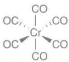</td></tr><tr><td>6(CO)</td><td>12</td></tr><tr><td>总数</td><td>18</td></tr><tr><td rowspan="4">7</td><td rowspan="4"> $[Mn_2(CO)_{10}]$ </td><td>Mn</td><td>7</td><td rowspan="4">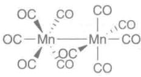</td></tr><tr><td>5(CO)</td><td>10</td></tr><tr><td>M—M</td><td>1</td></tr><tr><td>总数</td><td>18</td></tr><tr><td rowspan="3">8</td><td rowspan="3"> $[Fe(CO)_5]$ </td><td>Fe</td><td>8</td><td rowspan="3">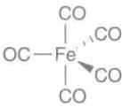</td></tr><tr><td>5(CO)</td><td>10</td></tr><tr><td>总数</td><td>18</td></tr><tr><td rowspan="4">9</td><td rowspan="4"> $[Co_2(CO)_8]$ </td><td>Co</td><td>9</td><td rowspan="4">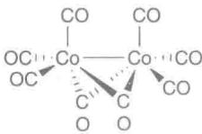</td></tr><tr><td>4(CO)</td><td>8</td></tr><tr><td>M—M</td><td>1</td></tr><tr><td>总数</td><td>18</td></tr><tr><td rowspan="3">10</td><td rowspan="3"> $[Ni(CO)_4]$ </td><td>Ni</td><td>10</td><td rowspan="3">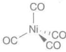</td></tr><tr><td>4(CO)</td><td>8</td></tr><tr><td>总数</td><td>18</td></tr></table>

简单的金属羰基化合物分子往往具有明确、简单、对称的形状，这种形状相应于CO占据彼此距离最远的区域(VSEPR模型)。因此，第6族元素的六羰基化合物为八面体构型，五羰基合铁(0)为三角双锥结构，四羰基合镍(0)为四面体构型，十羰基合二锰(0)由金属-金属键连接在一起的两个 $\mathrm{Mn(CO)_5}$ 四方锥组成。桥连的金属羰基合物也较为常见，如八羰基二钴(0)的一种异构体就含有被两个CO桥连着的金属-金属键。

# (b) 同种配体金属羰基络合物的合成

提要:一些金属羰基络合物可用直接反应的方法合成,然而这类反应大多要在高温、高压条件下进行;合成金属羰基化合物通常采用还原羰基化反应。

合成单金属羰基化合物的两个主要方法是,一氧化碳与金属粉末直接化合;金属盐在高压一氧化碳条件下进行还原。许多多金属羰基化合物是由单金属羰基化合物合成的。

1890 年, Mond、Langer 和 Quinke 发现镍与一氧化碳直接化合生成四羰基合镍(0) $\left(\left[\mathrm{Ni}\left(\mathrm{CO}\right)_{4}\right]\right)$ 。Mond 法(应用相关文段 22.1)精制镍就是利用这一反应:

$$
\mathrm{Ni(s)} + 4 \mathrm{CO(g)} \xrightarrow {5 0 ^ {\circ} \mathrm{C,1atm}} [ \mathrm{Ni(CO)} _ {4} ] (\mathrm{g})
$$

实际上，四羰基合镍(0)是最易利用该法进行合成的羰基化合物，其他金属羰基化合物[如 $\mathrm{Fe(CO)_5}$ ]相应的反应则比较缓慢，需要在高压和加热条件下进行（见图22.11）：

$$
\mathrm{Fe(s)} + 5 \mathrm{CO(g)} \xrightarrow {2 0 0 ^ {\circ} \mathrm{C,200atm}} [ \mathrm{Fe(CO)} _ {5} ] (1)
$$

$$
2 \mathrm{Co(s)} + 8 \mathrm{CO(g)} \xrightarrow {1 5 0 ^ {\circ} \mathrm{C,35atm}} [ \mathrm{Co} _ {2} (\mathrm{CO}) _ {8} ] (\mathrm{s})
$$

直接反应法不适用于其余大多数 d 金属, 合成这些化合物通常采用还原羰基化法(reductive carbonylation): 在 CO 存在条件下还原金属盐或金属络合物。还原剂可以是活泼金属(如铝、钠)、烷基铝化合物、 $H_{2}$ 及 CO 本身:

![[无机化学第6版副族金属有机565-748_images/129176d82ac0fb19803f83c489051de79b9fb3f8b90729c3405dba4b7794e355.jpg]]

<details>
<summary>text_image</summary>

提供高压气体
热电偶
金属热电偶井
玻璃容器
不锈钢压力容器
</details>

图 22.11 高压反应器  
反应混合物装在玻璃容器中

$$
\mathrm{CrCl} _ {3} (\mathrm{s}) + \mathrm{Al} (\mathrm{s}) + 6 \mathrm{CO(g)} \xrightarrow {\mathrm{AlCl} _ {3} , \text {苯}} \mathrm{AlCl} _ {3} (\mathrm{soln}) + [ \mathrm{Cr(CO)} _ {6} ] (\mathrm{soln})
$$

$$
3 \mathrm{Ru(acac)} _ {3} (\mathrm{soln}) + \mathrm{H} _ {2} (\mathrm{g}) + 1 2 \mathrm{CO(g)} \xrightarrow {1 5 0 ^ {\circ} \mathrm{C} , 2 0 0 \mathrm{atm,CH} _ {3} \mathrm{OH}} \mathrm{Ru} _ {3} (\mathrm{CO}) _ {1 2} (\mathrm{soln}) + \dots
$$

$$
\mathrm{Re} _ {2} \mathrm{O} _ {7} (\mathrm{s}) + 1 7 \mathrm{CO(g)} \xrightarrow {2 5 0 ^ {\circ} \mathrm{C}, 3 5 0 \mathrm{atm}} \mathrm{Re} _ {2} (\mathrm{CO}) _ {1 0} (\mathrm{s}) + 7 \mathrm{CO} _ {2} (\mathrm{g})
$$

# 应用相关文段22.1 Mond法

1890年，Ludwig Mond、Carl Langer和Friederich Quinke在研究CO气体存在下镍制阀门腐蚀过程中发现了 $\left[\mathrm{Ni}(\mathrm{CO})_{4}\right]$ 。他们无法充分表征这个新的化合物（将其称之为“镍-碳-氧化物”），评论说：“目前我们不知道这个引人注目的化合物的构成”。然而他们给出了新化合物的化学式“ $\mathrm{Ni}(\mathrm{CO})_{4}$ ”，并很快将其发现用于精制镍的工业过程（Mond法）。这个方法非常成功，以致人们不远万里将镍从加拿大运到威尔士Mond的工厂。

Mond 法依赖的是 $\left[\mathrm{Ni}(\mathrm{CO})_{4}\right]$ 容易合成: 在一个大气压的一氧化碳氛围下, 金属镍在大约 $50^{\circ}C$ 时就能反应得到 $\left[\mathrm{Ni}(\mathrm{CO})_{4}\right]$ :

$$
\mathrm{Ni} + 4 \mathrm{CO} \longrightarrow [ \mathrm{Ni(CO)} _ {4} ]
$$

$\left[\mathrm{Ni}\left(\mathrm{CO}\right)_{4}\right]$ 在该温度下为气体(沸点34℃)并易与镍残渣分离,并在220℃分解放出一氧化碳得纯镍。过程中释放的一氧化碳可循环利用。所用的不纯镍原料通常是利用氢和一氧化碳的混合物还原氧化镍矿石得来的。

Mond、Langer 和 Quinke 也曾尝试合成类似的其他金属羰基化合物，但都没有成功。然而却成功地从钴样品中除去镍污染物，发现了一种精制钴的方法。

为庆祝发现四羟基镍一百周年，J. Organomet. Chem.杂志发行了专刊(J. Organomet. Chem., 1990, 383)献给金属羰基化合物化学。

# (c) 同种配体金属羰基化合物的性质

提要:所有的单核金属羰基化合物都具挥发性;所有的单核和许多多核金属羰基化合物能溶于烃类溶剂;多核金属羰基合物有颜色。

铁和镍的金属羰基化合物在室温常压下是液体，而其他所有常见的金属羰基化合物则是固体。所有的单核金属羰基化合物具有挥发性；室温下的蒸气压范围介于四羰基合镍(0)(约50 kPa)和六羰基合钨(0)(约10 Pa)之间。 $\left[\mathrm{Ni}\left(\mathrm{CO}\right)_{4}\right]$ 的强挥发性和极大的毒性要求操作起来必须非常小心。虽然其他金属羰基化合物低毒，但也不能吸入体内或接触皮肤。

它们是非极性化合物，所有单核和很多多核金属羰基化合物能溶于烃类溶剂。九羰基合二铁(0) $\left(\left[\mathrm{Fe}_{2}\left(\mathrm{CO}\right)_{9}\right]\right)$ 是一个特例，其蒸气压非常低，在不与其反应的溶剂中不溶解。

大部分单核金属羰基化合物为无色或浅色。多核金属羰基合物有颜色，其颜色随着金属原子数的增加而加深。例如，五羰基合铁(0)是个淡黄色液体，九羰基合二铁(0)为金黄色，十二羰基合三铁(0)是个深绿色化合物，固体状态下看起来呈黑色。多核金属羰基化合物的颜色产生于不同轨道之间的电子跃迁，而这些轨道主要定域在金属骨架上。

简单金属羰基化合物金属中心的主要反应包括取代反应（节22.21）、氧化反应、还原反应、缩合为簇合物的反应（节22.20）。某些情况下，CO配体本身也可受到亲核试剂或亲电试剂的进攻。

# (d) 羰基化合物的氧化和还原反应

提要:大多数金属羰基化合物可被还原为金属羰基阴离子;某些金属羰基化合物在强碱性配体存在下歧化为配位的阳离子和金属羰基阴离子;金属羰基化合物容易被空气氧化;金属-金属键能发生氧化断裂。

大多数中性金属羰基化合物可被还原为阴离子形式,这种形式叫作金属羰基阴离子(metal carbonylate)。单金属羰基化合物的二电子还原通常伴随着失去二电子CO配体,从而保持电子计数为18:

$$
2 \mathrm{Na} + [ \mathrm{Fe(CO)} _ {5} ] \xrightarrow {\mathrm{THF}} (\mathrm{Na} ^ {+}) _ {2} [ \mathrm{Fe(CO)} _ {4} ] ^ {2 -} + \mathrm{CO}
$$

该金属羰基阴离子中 Fe 的氧化数为 -2，容易被空气氧化。实验发现 CO 的 IR 伸缩频率很低（约为 $1785 \, cm^{-1}$ ），这一事实表明负电荷主要离域在 CO 配体上。多核金属羰基化合物（通过形成 M—M 键实现 18 电子结构）中的 M—M 键遇到强还原剂通常会断裂。还原产物同样遵循 18 电子规则并生成负一价单核金属羰基阴离子的盐：

$$
2 \mathrm{Na} + [ (\mathrm{OC}) _ {5} \mathrm{Mn} - \mathrm{Mn(CO)} _ {5} ] \xrightarrow {\mathrm{THF}} 2 \mathrm{Na} ^ {+} [ \mathrm{Mn(CO)} _ {5} ] ^ {-}
$$

强碱性配体存在时,有些金属羰基化合物会歧化生成配位阳离子与金属羰基阴离子的盐。该过程的驱动力为金属阳离子被强碱性配体包围时所显示的稳定性。Lewis 碱(如吡啶)存在时,八羰基合二钴(0)极易发生此类反应:

$$
3 \left[ \mathrm{Co} _ {2} ^ {(0)} (\mathrm{CO}) _ {8} \right] + 1 2 \mathrm{py} \longrightarrow 2 \left[ \mathrm{Co} ^ {(+ 2)} (\mathrm{py}) _ {6} \right] \left[ \mathrm{Co} ^ {(- 1)} (\mathrm{CO}) _ {4} \right] _ {2} + 8 \mathrm{CO}
$$

强碱性配体 $OH^{-}$ 存在时, 配体 CO 也可能被氧化, 净结果是中心金属被还原:

$$
3 \left[ \mathrm{Fe} ^ {(0)} (\mathrm{CO}) _ {5} \right] + 4 \mathrm{OH} ^ {-} \longrightarrow \left[ \mathrm{Fe} _ {3} ^ {(- 2 / 3)} (\mathrm{CO}) _ {1 1} \right] ^ {2 -} + \mathrm{CO} _ {3} ^ {2 -} + 2 \mathrm{H} _ {2} \mathrm{O} + 3 \mathrm{CO}
$$

具有 17 个价电子的羰基化合物很易被还原为 18 电子的金属羰基阴离子。

金属羰基化合物易被空气所氧化。尽管非控制性氧化过程导致生成金属氧化物、CO或 $CO_{2}$ ，而对金属有机化学更有意义的则是生成金属有机卤化物的可控氧化反应。这类反应中最简单的一类反应是M—M键的氧化断裂：

$$
\left[ (\mathrm{OC}) _ {5} \mathrm{Mn} ^ {(0)} - \mathrm{Mn} ^ {(0)} (\mathrm{CO}) _ {5} \right] + \mathrm{Br} _ {2} \longrightarrow 2 \left[ \mathrm{Mn} ^ {(+ 1)} \mathrm{Br} (\mathrm{CO}) _ {5} \right]
$$

卤素原子与金属键合导致金属电子密度降低，产物中CO的伸缩频率明显高于 $\left[\mathrm{Mn}_2(\mathrm{CO})_{10}\right]$ 。

# (e) 金属羰基化合物的碱性

提要:大多数金属有机羰基化合物的金属中心可被质子化;质子化的金属羰基化合物的酸性取决于金

属中心上的其他配体。

许多金属有机羰基化合物的金属中心可以质子化。金属羰基阴离子能为这种碱性提供许多实例：

$$
\left[ \mathrm{Mn} (\mathrm{CO}) _ {5} \right] ^ {-} (\mathrm{aq}) + \mathrm{H} ^ {+} (\mathrm{aq}) \longrightarrow \mathrm{HMn} (\mathrm{CO}) _ {5} (\mathrm{s})
$$

金属羰基阴离子对质子的亲和力差别很大(见表22.6)。根据实验观察,金属中心的电子密度越大,Brønsted碱性就越强,因而其共轭酸(金属羰基氢化物)的酸性就越低。

表 22.6 d 金属氢化物在乙腈溶液中的酸性常数 (25 ℃)

<table><tr><td>氢化物</td><td> $pK_{a}$ </td></tr><tr><td> $[CoH(CO)_4]$ </td><td>8.3</td></tr><tr><td> $[CoH(CO)_3P(OPh)_3]$ </td><td>11.3</td></tr><tr><td> $[Fe(H)_2(CO)_4]$ </td><td>11.4</td></tr><tr><td> $[CrH(Cp)(CO)_3]$ </td><td>13.3</td></tr><tr><td> $[MoH(Cp)(CO)_3]$ </td><td>13.9</td></tr><tr><td> $[MnH(CO)_5]$ </td><td>15.1</td></tr><tr><td> $[CoH(CO)_3PPh_3]$ </td><td>15.4</td></tr><tr><td> $[WH(Cp)(CO)_3]$ </td><td>16.1</td></tr><tr><td> $[MoH(Cp^*)(CO)_3]$ </td><td>17.1</td></tr><tr><td> $[Ru(H)_2(CO)_4]$ </td><td>18.7</td></tr><tr><td> $[FeH(Cp)(CO)_2]$ </td><td>19.4</td></tr><tr><td> $[RuH(Cp)(CO)_2]$ </td><td>20.2</td></tr><tr><td> $[Os(H)_2(CO)_4]$ </td><td>20.8</td></tr><tr><td> $[ReH(CO)_5]$ </td><td>21.1</td></tr><tr><td> $[FeH(Cp^*)(CO)_2]$ </td><td>26.3</td></tr><tr><td> $[WH(Cp)(CO)_2PMe_3]$ </td><td>26.6</td></tr></table>

正如节22.7中看到的那样，d区元素M—H络合物通常被称之为“氢化物”，这表示与金属相连接的H原子的氧化数被指定为-1。然而，d区右部的大多数金属羰基氢化物是Brønsted酸。金属羰基氢化物的Brønsted酸性反映了CO配体（能够稳定共轭碱）作为 $\pi$ 接受体的强度。因此， $[\mathrm{CoH}(\mathrm{CO})_4]$ 显酸性，而 $[\mathrm{CoH}(\mathrm{PMe}_3)_4]$ 则显强碱性。与p区元素氢化合物截然相反，d区同族中M—H化合物的Brønsted酸性自上而下减弱。

中性金属羰基化合物（如 $\left[\mathrm{Fe}(\mathrm{CO})_{5}\right]$ ）在排除空气的浓酸中可被质子化；氧化数为零的金属原子的Brønsted碱性与非键d电子的存在有关。含金属-金属键的化合物（如节22.20中介绍的簇合物）甚至更易质子化；这里的Brønsted碱性与M—M键易被质子化生成类似于乙硼烷中形式上的 $3c, 2e$ 键有关：

$$
\left[ \mathrm{Fe} _ {3} (\mathrm{CO}) _ {1 1} \right] ^ {2 -} + \mathrm{H} ^ {+} \longrightarrow \left[ \mathrm{Fe} _ {3} \mathrm{H} (\mathrm{CO}) _ {1 1} \right] ^ {-}
$$

M—H—M 桥是簇合物中氢原子迄今最常见的成键模式。

金属的碱性可用于合成各种各样的金属有机化合物。例如，利用卤代烷烃或酰卤与金属羰基化合物阴离子反应可使烷基和酰基与金属原子相结合：

$$
\left[ \mathrm{Mn} (\mathrm{CO}) _ {5} \right] ^ {-} + \mathrm{CH} _ {3} \mathrm{I} \longrightarrow \left[ \left(\mathrm{H} _ {3} \mathrm{C}\right) \mathrm{Mn} (\mathrm{CO}) _ {5} \right] + \mathrm{I} ^ {-}
$$

$$
\left[ \mathrm{Co} (\mathrm{CO}) _ {4} \right] ^ {-} + \mathrm{CH} _ {3} \mathrm{COI} \longrightarrow \left[ \mathrm{Co} (\mathrm{CO}) _ {4} (\mathrm{COCH} _ {3}) \right] + \mathrm{I} ^ {-}
$$

利用金属有机卤化物的类似反应可以合成 M—M 键化合物：

$$
\left[ \mathrm{Mn} (\mathrm{CO}) _ {5} \right] ^ {-} + \left[ \mathrm{ReBr} (\mathrm{CO}) _ {5} \right] \longrightarrow \left[ (\mathrm{OC}) _ {5} \mathrm{Mn} - \mathrm{Re} (\mathrm{CO}) _ {5} \right] + \mathrm{Br} ^ {-}
$$

# (f) CO 配体的反应

提要：CO 与贫电子金属原子结合时，其上的 C 原子容易受到亲核试剂的进攻；对富电子金属羰基化合物而言，CO 的 O 原子容易受到亲电试剂的进攻。

与 CO 键合的原子不是富电子金属原子时，CO 的 C 原子容易受到亲核试剂的进攻。因此，CO 伸缩频率高的末端羰基易受亲核试剂的进攻。中性或阳离子金属羰基化合物中金属中心 d 电子没有向羰基 C 原子广泛离域，因此 CO 的碳原子容易受到富电子试剂的进攻。例如，强亲核试剂（如甲基锂，见节 11.17）可以进攻许多中性金属羰基化合物中的 CO：

$$
(1 / 4) \mathrm{Li} _ {4} (\mathrm{CH} _ {3}) _ {4} + [ \mathrm{Mo(CO)} _ {6} ] \longrightarrow \mathrm{Li} [ \mathrm{Mo(COCH} _ {3}) (\mathrm{CO}) _ {5} ]
$$

生成的酰基阴离子化合物与碳正离子试剂反应生成稳定且易于操作的中性产物：

![[无机化学第6版副族金属有机565-748_images/dcef29622fb348841941a1eb126dcb9417caa29ec27748a6db43cfcfdc3246dc.jpg]]

<details>
<summary>chemical</summary>

Chemical reaction equation showing the formation of LiBF4 and Et2O from a molybdenum complex with ester and borate counterions
</details>

该反应产物具有直接的 M=C 键,属于 Fischer 卡宾(节 22.15)。亲核试剂进攻 C 原子对金属羰基化合物的羟基诱导解离机理也是重要的:

$$
\left[ (\mathrm{OC}) _ {n} \mathrm{M} (\mathrm{CO}) \right] + \mathrm{OH} ^ {-} \longrightarrow \left[ (\mathrm{OC}) _ {n - 1} \mathrm{M} (\mathrm{COOH}) \right] ^ {-}
$$

$$
\left[ (\mathrm{OC}) _ {n - 1} \mathrm{M(COOH)} \right] ^ {-} + 3 \mathrm{OH} ^ {-} \longrightarrow \left[ \mathrm{M(OC)} _ {n - 1} \right] ^ {2 -} + \mathrm{CO} _ {3} ^ {2 -} + 2 \mathrm{H} _ {2} \mathrm{O}
$$

在富电子金属羰基化合物中,相当大的电子密度离域到 CO 配体上。这种离域作用导致某些例子中 CO 配体的 O 原子容易受到亲电试剂的进攻。我们再一次会看到,IR 数据能够提供此类反应是否可能发生的暗示。由于低的 CO 伸缩频率表示向 CO 有强的反馈作用,因而 O 原子上具有相当可观的电子密度。因此桥羰基的氧原子特别容易受到进攻:

![[无机化学第6版副族金属有机565-748_images/ac1b59875ad22228fcfd468b130f93b81cacbcc9ebc643cfdd9217695c314f51.jpg]]

<details>
<summary>chemical</summary>

Chemical reaction showing iron complex formation with aluminumEt3, forming a Fe(II) complex with AlEt3 and Et3Al ligands
</details>

亲电试剂与 CO 氧原子的连接(如上述方程式右边的结构)能够促进迁移插入反应(节 22.24)和 C—O 键断裂反应。

节 22.24 将详细讨论一些烷基取代的金属羰基化合物发生迁移插入反应生成酰基配体 $\left[\left(\mathrm{CO}\right)\mathrm{R}\right]$ 的能力。

# 例题22.6 CO转化为卡宾或酰基配体

题目:请设计一组反应,以六羰基合钨(0)和你选择的其他试剂为起始物合成 $\left[\mathrm{W}\left(\mathrm{C}\left(\mathrm{OCH}_{3}\right)\mathrm{Ph}\right)\left(\mathrm{CO}\right)_{5}\right]$ 。

答案:我们知道六羰基合钨(0)中的 CO 配体易受亲核试剂的进攻,因此与苯基锂的反应应能生成 C-苯基中间体:

![[无机化学第6版副族金属有机565-748_images/b1080d57a4b76ab5545d923561271ec2f17fe798f98eaf2ff738b7f23ff2d2d5.jpg]]

<details>
<summary>chemical</summary>

Chemical reaction equation showing conversion of W(CO)6 and PhLi to Li+ with a chelating intermediate
</details>

上述反应的阴离子与碳亲电试剂反应在 CO 配体的 O 原子上引入一个烷基：

![[无机化学第6版副族金属有机565-748_images/0a0c28eeccc07b6d21a73ece538dce43dd381e6d96b5922e4c5d71091368156b.jpg]]

<details>
<summary>chemical</summary>

Organometallic reaction scheme showing lithium complex formation with BF4 and LiBF4 as reactants
</details>

自测题22.6 以 $\left[\mathrm{Mn}_{2}(\mathrm{CO})_{10}\right]、\mathrm{PPh}_{3}、\mathrm{Na}、\mathrm{CH}_{3}\mathrm{I}$ 为原料，提出合成 $\left[\mathrm{Mn}(\mathrm{COCH}_3)(\mathrm{CO})_4(\mathrm{PPh}_3)\right]$ 的路线。

# (g) 羰基化合物的光谱性质

提要: CO 作为 $\pi$ 接受体时, 其伸缩频率会降低; 给电子配体能够向金属提供电子, 因而也能导致 CO 伸缩频率降低。 $^{13}$ C-NMR 谱较少用于研究羰基化合物, 这是由于许多羰基化合物在 NMR 时标具有瞬变性。

IR 光谱和 ${}^{13}$ C-NMR 谱广泛用于确定金属羰基化合物的原子排布, 这是因为不等价的 CO 配体可以观察到不同的独立信号。如果分子不具瞬变性 (NMR 和 IR 跃迁的时标不同, 参见节 8.5 和节 8.6), NMR 谱比起 IR 光谱通常含有更为详尽的结构信息。然而 IR 光谱通常更易得到, 特别适用于反应过程的跟踪。大多数 CO 伸缩谱带出现在 2100\~1700cm $^{-1}$ , 该区域通常不会出现有机基团的谱带。CO 伸缩频率的范围 (见图 22.4) 和谱带的数目 (见表 22.7) 二者都是推断结构的重要依据。

群论能判断 IR 和 Raman 光谱的活性 CO 伸缩振动的数目(节 6.5)。如果 CO 配体不涉及反演对称或者三重及其他高次轴对称性, 分子中 N 个 CO 配体将会有 N 个独立的伸缩吸收带。因此, 弯曲的 OC—M—CO 基团(只有一个二次对称轴) 将有两个 IR 吸收带, 这是因为对称的 (75) 和反对称的 (76) 伸缩振动都能引起电偶极矩变化而显示 IR 活性。高对称性分子的谱带数少于含有的 CO 配体数目。因为对称伸缩振动不能引起偶极矩的变化, 线性 OC—M—CO 基团在 CO 伸缩振动区只观察到一个 IR 带(该谱带对应于两个 CO 配体的异相伸缩振动)。如图 22.12 所示, 金属羰基化合物中 CO 配体位置的对称性比整个化合物点群所表明的对称性更高。因此, 观察到的吸收带数目少于总点群所预言的数目。由于 Raman 光谱的选律补充了 IR 光谱的选律, 前者对确定结构非常有用(节 6.5 和节 8.5)。Raman 光谱中能观察到线性 OC—M—CO 基团两个 CO 配体的对称伸缩振动。

![[无机化学第6版副族金属有机565-748_images/63390ad4570bd1a5c11596651fe3551e2586db286e91036d81fc83fad19d9a3c.jpg]]

<details>
<summary>chemical</summary>

NMR spectrum and molecular orbital diagrams showing Fe-O bonds and their 75- and 76-molecular orbitals
</details>

图22.12 $\left[\mathrm{Fe}_2(\mathrm{Cp})_2(\mathrm{CO})_4\right]$ 的IR光谱图  
说明:2个高频吸收为端基CO、低频吸收为桥式CO的伸缩振动;虽然桥式CO按照预期应该出现两个吸收峰(因为络合物的低对称性),但实际上只看到一个单峰,这是因为两个桥式CO几乎是共线的

正如节 22.5 中提到的那样, IR 光谱也是将末端 CO(MCO) 与桥式 CO( $\mu_{2}$ -CO) 和面桥 CO( $\mu_{3}$ -CO) 区分开来的有效手段。它也可用来确定络合物中其他配体的 $\pi$ 接受体强度的顺序。

当分子的结构变化快于该技术的解析能力时，图上会观察到一个均化的NMR信号(节8.6)。尽管这种现象在金属有机化合物的NMR谱中很常见，但在Raman谱图或IR谱图中却不常出现。例如， $\mathrm{Fe(CO)_5}$ 的 ${}^{13}\mathrm{C - NMR}$ 信号出现 $\delta = 210$ 的一条线，而IR和Raman光谱信号则符合三角双锥体结构。

# 例题 22.7 利用 IR 光谱数据确定羰基化合物的结构

题目:络合物 $\left[\mathrm{Cr}\left(\mathrm{CO}\right)_{4}\left(\mathrm{PPh}_{3}\right)_{2}\right]$ 在 CO 伸缩振动区有一个很强的 $(1\ 889\ \mathrm{cm}^{-1})$ 和两个很弱的 IR 吸收带,该化合物可能具有何种结构?(与 CO 相比, $PPh_{3}$ 是个较强的 $\sigma$ 给予体和较弱的 $\pi$ 接受体,所以化合物中 CO 的振动波数低于相应的六羰基化合物。)

答案:二取代六羰基化合物可能存在顺式或反式,顺式异构体中4个CO处于低对称性环境 $(C_{2v})$ ,应该出现4个IR带(如表22.7所示)。反式异构体中4个CO配体以平面四方形排布 $(D_{4h})$ ,应出现1个CO吸收峰(表22.7)。题中所给信息表明该络合物为反式结构,两个弱吸收带是由于 $PPh_{3}$ 配体导致CO配体稍稍偏离正常的 $D_{4h}$ 对称性。

自测题22.7络合物 $\left[\mathrm{Ni}_2\left(\eta^5 -\mathrm{C}_5\mathrm{H}_5\right)_2\left(\mathrm{CO}\right)_2\right]$ 的IR谱上出现一对CO伸缩振动谱带： $1857\mathrm{cm}^{-1}$ （强）和 $1897\mathrm{cm}^{-1}$ （弱）。该络合物分子中的羰基是桥式还是端式？或者是两者都有？（ $\eta^5 -\mathrm{C}_5\mathrm{H}_5$ 取代CO配体会导致端式CO伸缩频率的微小移动。）

\* 在 CO 的伸缩区域, IR 谱带的数量基于正常的选律。某些情况下出现的带数较少, 节 22.18(g) 中解释了这个现象。+ 如果配体 CO 中的四个 CO 与金属原子共平面, 则出现两个带。; 如果反式 CO 配体几乎共线, 则会少出现一个带。§ 如果赤道上的三个 CO 几乎共平面, 仅仅出现两个带。  
表 22.7 羰基络合物的结构与 CO 的 IR 光谱谱带之间的关系

<table><tr><td>络合物</td><td>异构体</td><td>结构</td><td>点群</td><td>带数*</td></tr><tr><td> $[M(CO)_6]$ </td><td></td><td>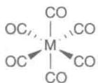</td><td> $O_h$ </td><td>1</td></tr><tr><td> $[M(CO)_5L]$ </td><td></td><td>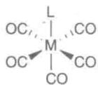</td><td> $C_{4v}$ </td><td>3*</td></tr><tr><td> $[M(CO)_4L_2]$ </td><td>trans</td><td>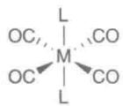</td><td> $D_{4h}$ </td><td>1</td></tr><tr><td> $[M(CO)_4L_2]$ </td><td>cis</td><td>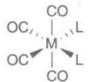</td><td> $C_{2v}$ </td><td>4‡</td></tr><tr><td> $[M(CO)_3L_3]$ </td><td>mer</td><td>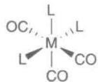</td><td> $C_{2v}$ </td><td>3‡</td></tr><tr><td> $[M(CO)_3L_3]$ </td><td> $foc$ </td><td>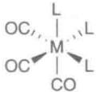</td><td> $C_{3v}$ </td><td>2</td></tr><tr><td> $[M(CO)_5]$ </td><td></td><td>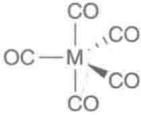</td><td> $D_{3h}$ </td><td>2</td></tr><tr><td> $[M(CO)_4L]$ </td><td> $ax$ </td><td>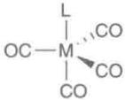</td><td> $C_{3v}$ </td><td> $3^8$ </td></tr><tr><td> $[M(CO)_4L]$ </td><td> $eq$ </td><td>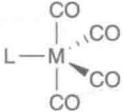</td><td> $C_{2v}$ </td><td>4</td></tr><tr><td> $[M(CO)_3L_2]$ </td><td> $trans$ </td><td>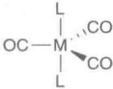</td><td> $D_{3h}$ </td><td>1</td></tr><tr><td> $[M(CO)_3L_2]$ </td><td> $cis$ </td><td>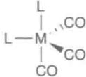</td><td> $C_s$ </td><td>3</td></tr><tr><td> $[M(CO)_4]$ </td><td></td><td>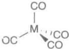</td><td> $T_d$ </td><td>1</td></tr></table>

# 22.19 金属茂

我们知道,环戊二烯基化合物相当稳定。1951年,二茂铁( $[(Cp)_2Fe]$ )的发现重新点燃了人们对整个d区元素金属有机化合物的兴趣。许多Cp络合物是金属夹在两环之间的二环体系。由于对此类所谓“夹心化合物”(即金属茂类化合物)的研究,Wilkinson和Fischer获得了1972年诺贝尔化学奖。

根据金属茂是指金属原子夹在两个平面碳环之间化合物这个标准，可将 $\eta^{4}$ -环丁二烯、 $\eta^{5}$ -环戊二烯基、 $\eta^{6}$ -芳烃、 $\eta^{7}$ -环庚三烯基阳离子 $\left(\mathrm{C}_{7}\mathrm{H}_{7}^{+}\right)$ 、 $\eta^{8}$ -环辛四烯及 $\eta^{3}$ -环丙烯阳离子 $\left(\mathrm{C}_{3}\mathrm{H}_{3}^{+}\right)$ 形成的类似化合物都看作金属茂。此类配位了的配体中所有碳-碳键键长都相等，因此可将配体视作芳香体系。其中包括：

<table><tr><td rowspan="4"></td><td rowspan="4"> $\eta^{3}$ -环丙烯+</td><td> $\eta^{4}$ -环丁二烯 $^{2-}$ </td><td rowspan="4"> $\eta^{8}$ -环辛四烯基 $^{2-}$ </td></tr><tr><td> $\eta^{5}$ -环戊二烯基-</td></tr><tr><td> $\eta^{6}$ -芳烃</td></tr><tr><td> $\eta^{7}$ -环庚三烯基+</td></tr><tr><td> $\pi$ 电子数:</td><td>2</td><td>6</td><td>10</td></tr></table>

金属茂结构的电子计数方式与其他体系不完全相同,但更接近于给予体(电子)对法的计数方式。

讨论配体(如环戊二烯基配体)的成键模式时已经接触到一些金属茂的结构和反应活性,这里将从其他方面进一步介绍其成键特征和反应活性。

# (a) 环戊二烯基化合物的合成和反应活性

提要:通过环戊二烯去质子化可方便地获得制备许多环戊二烯基化合物的前体;键合的环戊二烯基环为芳香化合物,能发生 Friedel-Crafts 亲电反应。

环戊二烯钠(NaCp)是制备环戊二烯基化合物的常用起始物。它可从四氢呋喃溶液中由金属钠和环戊二烯反应方便地制得：

$$
2 \mathrm{Na} + 2 \mathrm{C} _ {5} \mathrm{H} _ {6} \xrightarrow {\mathrm{THF}} 2 \mathrm{Na} [ \mathrm{C} _ {5} \mathrm{H} _ {5} ] + \mathrm{H} _ {2}
$$

接着再用环戊二烯钠与 d 金属卤化物反应制得金属茂化合物。溶液中环戊二烯本身的酸性足以与氢氧化钾反应脱去质子，如二茂铁可通过下述反应顺利地制备出来：

$$
2 \mathrm{KOH} + 2 \mathrm{C} _ {5} \mathrm{H} _ {6} + \mathrm{FeCl} _ {2} \xrightarrow {\mathrm{DMSO}} [ \mathrm{Fe(C} _ {5} \mathrm{H} _ {5}) _ {2} ] + 2 \mathrm{H} _ {2} \mathrm{O} + 2 \mathrm{KCl}
$$

由于高稳定性,18 电子的第 8 族元素茂合物(茂铁、茂钌和茂锇)在相当苛刻的条件下也能维持金属与配体之间的化学键,而且环戊二烯基配体上可以发生多种化学转化。例如,发生类似于简单芳烃的反应(如 Friedel-Crafts 酰基化反应):

![[无机化学第6版副族金属有机565-748_images/39a4bf86a840d79b4ccdded4cbe559642bb2abfeeb89c5b5983877e5233c538c.jpg]]

<details>
<summary>chemical</summary>

Chemical reaction equation showing oxidation of cyclopentadienyl to cyclopentanone using MeCOCl and AlCl3
</details>

还可发生 $C_{5}H_{5}$ 环上 H 被 Li 取代的反应：

![[无机化学第6版副族金属有机565-748_images/96fa3f5bddc714190e28b9e0c291e826a6b1c0169bb0184eb70f16f68724538f.jpg]]

<details>
<summary>chemical</summary>

Chemical reaction showing conversion of iron complex Fe to lithium complex Li under BuLi and BuH conditions
</details>

不难想象,类似于简单的有机锂化合物(节 11.17),锂代产物是合成多种环取代化合物非常好的起始物。其他金属的大多数 Cp 络合物能发生类似于上述两类反应的反应,其中的五元环为芳香体系。

应用相关文段 27.1 中描述了二茂铁在葡萄糖传感器中的应用。

# (b) 二(环戊二烯基)金属络合物的成键作用

提要:二(环戊二烯基)金属络合物成键分子轨道图像表明,其前线轨道既不是强成键轨道,也不是强反键轨道;因此可能存在不服从18电子规则的络合物。

让我们从二茂铁谈起。尽管二茂铁的成键细节并未完全敲定，但图22.13所示的分子轨道能级图能够解释很多实验现象。络合物的这个重叠式 $(D_{5\mathrm{h}})$ 构象能级图表明，气相中的能量比交叉式构象[节22.19(c)]的能量约低 $4\mathrm{kJ}\cdot \mathrm{mol}^{-1}$ 。我们将集中关注前线轨道。如图22.13所示， $\mathbf{e}_1^{\prime \prime}$ 轨道是对称性匹配线性组合的配体轨道，与金属原子的 $\mathrm{d}_{zx}$ 和 $\mathrm{d}_{yz}$ 轨道具有相同的对称性。低能前线轨道 $(\mathrm{a}_1^{\prime})$ 是由 $\mathrm{d}_{z2}$ 轨道和配体相应的SALC(对称匹配线性组合)轨道组合而成的。然而，由于配体 $\pi$ 轨道碰巧处在金属原子 $\mathrm{d}_{z2}$ 轨道的圆锥节面，因而配体与金属轨道之间几乎没有相互作用。二茂铁和其他18电子二（环戊二烯基）络合物的 $\mathrm{a}_1^{\prime}$ 前线轨道和所有能量更低的轨道都是充满轨道，而其 $\mathbf{e}_1^{\prime \prime}$ 前线轨道和能量更高的轨道都是空轨道。

![[无机化学第6版副族金属有机565-748_images/9a4ff9af6c09938d3b0690f6de49b2beeb40cd93d5985238732f6d65b621ead8.jpg]]

<details>
<summary>flowchart</summary>

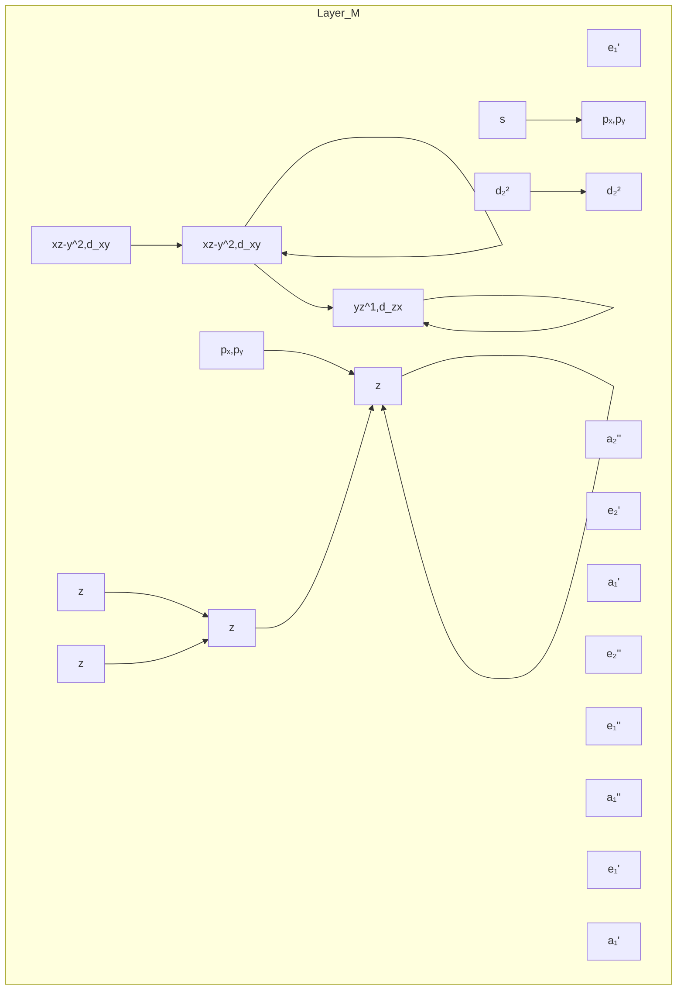
</details>

图22.13 具有 $D_{5\mathrm{h}}$ 对称性的 $[\mathbf{M}(\mathbf{cp})_2]$ 分子轨道能级图  
左边是对称性匹配的 $C_{5}H_{5}$ 配体 $\pi$ 轨道能级，右边是该金属相关的 d 轨道，中间是形成的分子轨道能级；  
包括方框内的 $a_{1}^{\prime}$ 轨道在内的分子轨道全部充满时正好为 18 电子，方框表示这类分子的前线轨道

前线轨道既不是强成键轨道，也不是强反键轨道。这一特点使违背18电子规则的二（环戊二烯基）络合物有了存在的可能。因此，二茂铁容易被氧化为17电子络合物 $\left[\mathrm{Fe}\left(\eta^{5}-\mathrm{Cp}\right)_{2}\right]^{+}$ ，相应于从非键轨道 $a_{1}^{\prime}$ 移走一个电子。如果 $e_{1}^{\prime \prime}$ 轨道填充电子，则可生成19电子络合物 $\left[\mathrm{Co}\left(\eta^{5}-\mathrm{Cp}\right)_{2}\right]$ 和20电子络合物 $\left[\mathrm{Ni}\left(\eta^{5}-\mathrm{Cp}\right)_{2}\right]$ 。然而，偏离18电子规则的确能显著改变与分子轨道排布密切相关的M—C键的键长（表22.8）。

表 22.8 络合物 $\left\lbrack  {\mathrm{M}\left( {{\eta }^{5} - \mathrm{{Cp}}}\right) }_{2}\right\rbrack$ 的电子构型和 $\mathrm{M} - \mathrm{C}$ 键键长

<table><tr><td>络合物</td><td>价电子表</td><td>电子组态</td><td>M—C 键键长/pm</td></tr><tr><td> $[V(\eta^{5}-Cp)_{2}]$ </td><td>15</td><td> $e_{2}^{'2}a_{1}^{'1}$ </td><td>228</td></tr><tr><td> $[Cr(\eta^{5}-Cp)_{2}]$ </td><td>16</td><td> $e_{2}^{'3}a_{1}^{'1}$ </td><td>217</td></tr><tr><td> $[Mn(\eta^{5}-Me-C_{5}H_{4})_{2}]^{*}$ </td><td>17</td><td> $e_{2}^{'3}a_{1}^{'2}$ </td><td>211</td></tr><tr><td> $[Fe(\eta^{5}-Cp)_{2}]$ </td><td>18</td><td> $e_{2}^{'4}a_{1}^{'2}$ </td><td>206</td></tr><tr><td> $[Co(\eta^{5}-Cp)_{2}]$ </td><td>19</td><td> $e_{2}^{'4}a_{1}^{'2}e_{1}^{'1}$ </td><td>212</td></tr><tr><td> $[Ni(\eta^{5}-Cp)_{2}]$ </td><td>20</td><td> $e_{2}^{'4}a_{1}^{'2}e_{1}^{'2}$ </td><td>220</td></tr></table>

\* 由于 $\left[\mathrm{Mn}\left(\eta^{5}-\mathrm{Cp}\right)_{2}\right]$ 具有高自旋组态，导致 M—C 键反常的长，所以这里引用了此络合物的数据。

与八面体络合物进行比较是有益处的。金属茂合物的 $e_{1}^{\prime\prime}$ 前线轨道类似于八面体络合物的 $e_{g}$ 轨道； $a_{1}^{\prime}$ 轨道加上 $e_{2}^{\prime}$ 的两个轨道类似于八面体络合物的 $t_{2g}$ 轨道。形式上的这种相似性使二（环戊二烯基）络合物出现高自旋和低自旋。

# 例题 22.8 识别金属茂合物的电子结构和稳定性

题目:参考图22.13,讨论 $\left[\mathrm{Co}\left(\eta^{5}-\mathrm{C}_{5}\mathrm{H}_{5}\right)_{2}\right]^{+}$ 中HOMO轨道的填充情况和性质。相对于中性二茂钴而言, $\left[\mathrm{Co}\left(\eta^{5}-\mathrm{C}_{5}\mathrm{H}_{5}\right)_{2}\right]^{+}$ 中配体与金属的成键作用有何变化?

答案: 如果将 $\left[\mathrm{Co}\left(\eta^{5}-\mathrm{C}_{5}\mathrm{H}_{5}\right)_{2}\right]^{+}$ 看作离子, 它则含有 18 个价电子 [6 个来自 Co(Ⅲ), 12 个来自两个 $Cp^{-}$ 配体]。如果茂铁的分子轨道能级图同样适用于茂钴络合物, 按照 18 电子规则, $a_{1}^{\prime}$ 及其以下轨道都应填充有 2 个电子。19 电子的中性茂钴分子多出来的一个电子应填在 $e_{1}^{\prime\prime}$ 轨道上, 该轨道对金属和配体而言属反键轨道, 因而电子容易失去 (二茂钴比二茂铁更易被氧化)。因此相对 $\left[\mathrm{Co}\left(\eta^{5}-\mathrm{C}_{5}\mathrm{H}_{5}\right)_{2}\right]$ 而言, $\left[\mathrm{Co}\left(\eta^{5}-\mathrm{C}_{5}\mathrm{H}_{5}\right)_{2}\right]^{+}$ 中的金属与配体之间的键应该更强更短。结构数据也证实了这一点。

自测题 22.8 使用相同的分子轨道图预测:从 $\left[\mathrm{Fe}\left(\eta^{5}-\mathrm{Cp}\right)_{2}\right]$ 中移去一个电子产生 $\left[\mathrm{Fe}\left(\eta^{5}-\mathrm{Cp}\right)_{2}\right]^{+}$ ，相对于中性二茂铁而言，络合物中 M—C 键键长会有明显变化。

# (c) 茂金属的瞬变性

提要:由于各种形式间发生互变的能垒低,许多茂金属化合物显示瞬变性并发生内旋转。

环状多烯络合物最显著的性质之一是其立体化学上的非刚性(即瞬变性)。例如,室温下二茂铁中的两个环彼此相对发生快速转动,这是因为交错式构象与重叠式构象之间的转换能垒低。这种类型的瞬变过程叫作内旋转(internal rotation),这是一个类似于乙烷中两个甲基相对旋转的过程。然而我们已经注意到下述事实:气相二茂铁的重叠式构象较交错式稍稳定;这种差异源于重叠式构象中金属d轨道与Cp环轨道之间交盖程度的提高。然而,金属茂环上取代基的空间位阻可以使重叠构象变得不稳定,形成空间位阻较小的交错构象。金属茂类化合物的环通常被绘成交错式构象,只是因为这样可以多出一点空间以表明取代的情况。

更有趣的立体化学瞬变性是共轭环多烯通过部分碳原子（而不是全部碳原子）与金属原子相键合。此类络合物中的金属-配体成键部位可以绕环跳跃；金属有机化学家将这种内旋转非正式地称为“环旋离”。一个简单的例子是 $\left[\mathrm{Ge}(\eta^{1}-\mathrm{Cp})(\mathrm{CH}_{3})_{3}\right]$ ，化合物中的Ge原子与环戊二烯环的一个碳原子连接，但连接部位以一系列1,2-迁移(1,2-shift)的方式绕环跳跃，即一个C—M键被环上相邻碳原子形成的另一个C—M键所代替。这种移动被称为1,2-迁移是因为从1号原子开始，结束于相邻的2号原子（图22.14）。迄今研究过的瞬变性共轭多烯络合物中，绝大多数都以1,2-迁移方式发生迁移，但不清楚这种移动方式究竟受制于最小移动原理，还是受制于轨道对称性的某些方面？

![[无机化学第6版副族金属有机565-748_images/d20c87ae489174888ff9ac7d016f13749df92d30b8c19e79e64660553570b397.jpg]]  
图 22.14 (a) $\left[\mathrm{Ge}\left(\eta^{1}-\mathrm{Cp}\right)\left(\mathrm{Me}\right)_{3}\right]$ 中通过一系列 1,2-迁移而发生的瞬变过程：  
(b) $\left[\mathrm{Ru}(\eta^{4}-\mathrm{C}_{8}\mathrm{H}_{8})(\mathrm{CO})_{3}\right]$ 的瞬变性可用类似的方式描述  
我们需要想象Ru原子离开此纸面，为清楚起见可不绘出CO配体

核磁共振能为这种迁移的存在和机理提供主要证据，因为发生这种迁移的时标在 $10^{-2} \sim 10^{-4} \mathrm{~s}$ ，可以用 ${}^{1} \mathrm{H}-\mathrm{NMR}$ 和 ${}^{13} \mathrm{C}-\mathrm{NMR}$ 进行研究。以化合物 $\left[\mathrm{Ru}\left(\eta^{4}-\mathrm{C}_{8} \mathrm{H}_{8}\right)(\mathrm{CO})_{3}\right]$ (77)为例作说明：室温下的 ${}^{1} \mathrm{H}-\mathrm{NMR}$ 谱上出现一个尖峰，它可解释为产生于对称性的 $\eta^{8}-\mathrm{C}_{8} \mathrm{H}_{8}$ 配体。然而，单晶 X 射线衍射研究不能明确显示 $C_{8}H_{8}$ 为四齿配体。这种矛盾可以通过低温 ${}^{1}H-NMR$ 谱得到解决。温度逐渐降低时谱图上的单峰开始变宽并接着分裂为四个峰，它们对应于 $\eta^{4}-C_{8}H_{8}$ 配体的四对质子。低温谱图上的四个峰不难理解：室温下环绕金属原子的“旋离”快于 NMR 实验中的时标（节 8.6），因而只能观察到一个均化信号。低温下环运动减慢，不同构象存在的时间足以被分辨出来。对 NMR 谱线形状的详细分析可用于测量迁移过程的活化能。

![[无机化学第6版副族金属有机565-748_images/2f22ef5d92b42503d6519b063cdd8dadf1eaebe577ea8aa34294508c88b26220.jpg]]

<details>
<summary>chemical</summary>

Organometallic ruthenium complex structure with cyclopentadienyl ligand and acetylene ligands
</details>

# (d) 弯曲的金属茂络合物

提要:弯曲夹心化合物的结构可用统一的模型做解释:金属的三个原子轨道伸向弯曲 $Cp_{2}M$ 碎片空着的方向。

除了简单的具有平行环结构的双(环戊二烯基)和双(芳烃)络合物外,还存在许多与之相关的结构。业内称其为“弯曲夹心化合物”(78),“半夹心”或“琴凳式”化合物(79)及“三层平台化合物”(80)。弯曲夹心化合物在前d区和中d区元素的金属有机化学中起着重要作用,如 $\left[\mathrm{Ti}\left(\eta^{5}-\mathrm{Cp}\right)_{2}\mathrm{Cl}_{2}\right]$ 、 $\left[\mathrm{Re}\left(\eta^{5}-\mathrm{Cp}\right)_{2}\mathrm{Cl}\right]$ 、 $\left[\mathrm{W}\left(\eta^{5}-\mathrm{Cp}\right)_{2}(\mathrm{H})_{2}\right]$ 和 $\left[\mathrm{Nb}\left(\eta^{5}-\mathrm{Cp}\right)_{2}\mathrm{Cl}_{3}\right]$ 。

![[无机化学第6版副族金属有机565-748_images/b352764745cfdd46a377d10fa3b8b2976ba43575f2b593a93300c4b865cc5468.jpg]]

<details>
<summary>chemical</summary>

Molecular structure diagram of titanium chloride (TiCl2) showing Cp and Cl atoms in a crystal lattice
</details>

(78) $\left[\mathrm{Ti}(\mathrm{Cp})_{2}\mathrm{Cl}_{2}\right]$

![[无机化学第6版副族金属有机565-748_images/ed36491e188f1c9bea4b62cc9430c5f1c44295d7600cd2b290c5566f69c19c10.jpg]]

<details>
<summary>chemical</summary>

Molecular structure of chromium (Cr) showing carbon, hydrogen, and oxygen atoms with a central chromium atom bonded to carbon and hydrogen atoms
</details>

(79) $\left[\mathrm{Cr}(\eta^{6}-\mathrm{C}_{6}\mathrm{H}_{6})(\mathrm{CO})_{3}\right]$

![[无机化学第6版副族金属有机565-748_images/886768e774600ea4da2c4b547c54b8ecd4461b309fad61092055ebcecb85a7dd.jpg]]  
(80) $\left[\mathrm{Ni}_{2}(\mathrm{Cp})_{3}\right]^{+}$

如图 22.15 所示: 这些弯曲夹心化合物可以具有不同的电子计数和立体化学结构。这些结构可看做是金属原子的 3 条轨道伸向弯曲 $Cp_{2}M$ 碎片空着的空间。根据这种模型, 电子数小于 18 的金属原子往往会通过与配体上的孤对电子或抓 C—H 基团的作用来满足自身的缺电子状况。

![[无机化学第6版副族金属有机565-748_images/c083efb9e1b0655ec61e5f07c86f38d37b481eaf2591fbb46c38bf75b8964185.jpg]]  
图 22.15 $^{*}$ 弯曲夹心化合物和它们的电子数

# 22.20 金属间的成键作用和金属簇化合物

有机化学家为了合成像立方烷(81)那样的笼状化合物付出了惊人的努力,而与之形成鲜明对照的是,无机化学本身的特点之一就是存在为数众多的闭合多面体分子。例如,四面体 $P_{4}$ 分子(节15.1)、含卤桥的前d区金属八面体原子簇化合物(应用相关文段19.2)、多面体的碳硼烷(节13.12)及本节将要讨论的金属有机簇化合物。簇化合物的结构往往类似于金属本身的密堆积结构,这种相似性为研究簇化合物提供了主要的基础理论——簇化合物配体的化学性质反映了金属表面的属性。近些年来,各种不同原因激发了人们研究簇化合物的兴趣,如量子点和纳米颗粒材料(节24.22)的电性质依赖于簇自身的大小。

# (a) 簇的结构

提要:簇包括所有利用金属-金属键形成的三角形或更大的环状结构。

金属簇(metal clusters)的严格定义将其限制在利用金属-金属键形成的三角形或更大环状结构的分子络合物。该定义既排除了线性M—M化合物，也排除了仅由桥配体将多个金属原子相连接的笼形化合物。然而，这一严格定义执行得比较宽松，我们将把任何通过M—M键键合的体系作为簇来讨论。笼形化合物与簇络合物的区别似乎带有任意性。例如，化合物(82)，簇中同时存在桥配体的事实提出了一种可能性：金属原子是被M—L—M相互作用而不是被M—M键维系在一起。键长数据一定程度上有助于解决这一争议：如果M—M之间的距离远大于金属半径的2倍，则可合理地认为M—M键极弱或者不存在。然而，即使金属原子处在合理的成键距离之内，也无法明确回答M—M之间的成键有多少成分是由M—M直接相互作用引起的。例如，自从1938年分离出 $\left[\mathrm{Fe}_{2}(\mathrm{CO})_{9}\right]$ (83)以来，关于Fe—Fe之间在多大程度上成键一直存在争议。最初认为Fe—Fe之间不存在相互作用的观点后来被普遍承认存在M—M键的观点所代替；然而现在一些成键理论在不求助任何M—M成键作用的条件下就能解释 $\left[\mathrm{Fe}_{2}(\mathrm{CO})_{9}\right]$ 的结构（参见辅导作业22.12）。

![[无机化学第6版副族金属有机565-748_images/f226fbe404a497c81f39457f92976a25b2751136bad6f7d381c346048666892c.jpg]]

<details>
<summary>chemical</summary>

3D molecular structure of methane (CH₃) showing carbon and hydrogen atoms in a cubic lattice
</details>

(81) 立方烷, $C_{8}H_{8}$

![[无机化学第6版副族金属有机565-748_images/19403fec599783092c079c06eabfebfebf6310665ae40cfac1131eb382c6942a.jpg]]

<details>
<summary>chemical</summary>

Molecular structure of a cobalt complex with CO and ligands
</details>

(82) $\left[\mathrm{Co}_{4}(\mathrm{CO})_{12}\right]$

![[无机化学第6版副族金属有机565-748_images/8e94ed4210f65512f0d4a122f7f48277c1cb9f267dd9548c2fd85ff76959570c.jpg]]

<details>
<summary>chemical</summary>

Molecular structure of iron (Fe) showing coordination geometry with CO ligands
</details>

(83) $\left[\mathrm{Fe}_{2}(\mathrm{CO})_{9}\right]$

金属络合物中金属-金属键的强度不能准确测定，但有证据（如化合物的稳定性和M—M键的力常数）表明d区同族金属所形成的M—M键自上而下依次增强。这种趋势相反于p区元素。对后者而言，同族中较重元素之间的化学键较弱。这种变化趋势导致4d和5d金属元素通过M—M键形成的化合物为数众多。

# (b) 簇化合物的电子计数

提要:18 电子规则适用于少于六个金属原子的簇化合物;而 Wade-Mingos-Lauher 规则适用于确定更大金属有机络合物的价电子计数与结构之间的关系。

前 d 区金属形成的金属有机簇合物很少，f 区元素的金属有机簇合物尚属未知。但是第 6\~10 族 d 区元素存在大量金属簇羰基化合物。对金属原子数较少的簇合物而言，其成键作用不难用 M-M 定域键和 M-L 电子对键以及 18 电子规则做解释。

如果以 $\left[\mathrm{Mn}_{2}(\mathrm{CO})_{10}\right]$ (84) 和 $\left[\mathrm{Os}_{3}(\mathrm{CO})_{12}\right]$ (85) 为例, 则可得到一个简单但却具有说明性的图像。在考虑 Mn—Mn 键之前, $\left[\mathrm{Mn}_{2}(\mathrm{CO})_{10}\right]$ 中每个锰原子与五个羰基端位键合, 因此每个锰原子有 17 个价电子 (7 个来自于锰, 10 个来自 5 个羰基)。Mn—Mn 键中两个电子由两个金属原子共享, 因此每个原子的电子数增加 1, 两个金属原子都是 18 电子结构, 但总电子数只有 34 而非 36。 $\left[\mathrm{Os}_{3}(\mathrm{CO})_{12}\right]$ 中每个锇原子与四个羰基配位, 在考虑金属与金属的键合之前, 一个 $\left[\mathrm{Os}(\mathrm{CO})_{4}\right]$ 碎片中有 16 个电子 (8 个来自金属, 8 个来自4个羰基）。每个金属中心与其他两个金属中心相键合，形成三角形金属原子排列（簇中有三个M—M键），使每个金属原子的价电子数增加2，总数变成18。但是总电子数只有48而非54。这里讨论的成键电子被称为簇价电子（cluster valence electrons，缩写为CVEs）。显然，一个含有 $x$ 个金属原子和 $y$ 个金属-金属键的簇合物需要 $18x - 2y$ 个电子。正八面体的 $\mathbf{M}_6$ 和更大的簇合物不符合这一模式；被称为Wade's规则（节13.11）的多面体骨架电子对规则已被D.M.P.Mingos和J.Lauher所改进以适用于金属簇合物。表22.9总结了Wade-Mingos-Lauher规则（Wade-Mingos-Lauher rules），这些规则用于第 $6\sim 9$ 族金属簇合物时相当可靠。一般情况下，簇价电子计数较高时容易形成更开放的结构（其中的M—M键较少），这种情况与硼氢化物相类似。

![[无机化学第6版副族金属有机565-748_images/a4172a0212cb6d60c45ed456707a8f78270c657a8b4b6fde6e0f3b68e25ece8f.jpg]]

<details>
<summary>chemical</summary>

Molecular structure of manganese complex (84) with cobalt ligands and CO ligands
</details>

![[无机化学第6版副族金属有机565-748_images/462ed070f73e77b8fb2d911b55d92cb0063d349bbc3775f1629a44d48691756f.jpg]]

表 22.9 簇化合物的价电子 (CVE) 数与结构的关系

<table><tr><td>金属原子数目</td><td colspan="2">金属骨架结构</td><td>CVE 数</td><td>举例</td></tr><tr><td>1</td><td>单原子</td><td>M</td><td>18</td><td> $[Ni(CO)_4](2)$ </td></tr><tr><td>2</td><td>线形</td><td>M—M</td><td>34</td><td> $[Mn_2(CO)_{10}](84)$ </td></tr><tr><td>3</td><td>密封三角形</td><td>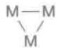</td><td>48</td><td> $[Os_3(CO)_{12}](85)$ </td></tr><tr><td rowspan="3">4</td><td>四面体</td><td>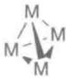</td><td>60</td><td> $[Co_4(CO)_{12}](82)$ </td></tr><tr><td>蝶形</td><td>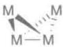</td><td>62</td><td> $[Fe_4(CO)_{12}C]^{2-}$ </td></tr><tr><td>四方形</td><td>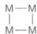</td><td>64</td><td> $[Os_4(CO)_{16}]$ </td></tr><tr><td rowspan="2">5</td><td>三角双锥形</td><td></td><td>72</td><td> $[Os_5(CO)_{16}]$ </td></tr><tr><td>四方锥</td><td>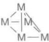</td><td>74</td><td> $[Fe_5C(CO)_{15}]$ </td></tr><tr><td rowspan="2">6</td><td>八面体</td><td>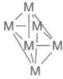</td><td>86</td><td> $[Ru_6C(CO)_{17}]$ </td></tr><tr><td>三棱柱体</td><td>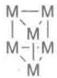</td><td>90</td><td> $[Rh_6C(CO)_{15}]^{2-}$ </td></tr></table>

# 例题 22.9 光谱数据、簇价电子数和结构之间的关联

题目： $\mathrm{CHCl}_3$ 与 $[\mathrm{Co}_2(\mathrm{CO})_8]$ 反应生成 $[\mathrm{Co}_3(\mathrm{CH})(\mathrm{CO})_9]$ ，NMR和IR光谱数据均表明分子中只有端羰基配体和一个CH基团。试提出一个与光谱数据相符合的结构并将此结构与CVE相关联。

答案:这里假定 CH 配体只有 C 成键:C 上一个电子用于形成 C—H 键,其余 3 个电子用于簇化合物中的成键。簇化合物可用的价电子数为,3 个 Co 提供的 27 个电子,9 个 CO 提供的 18 个电子,CH 提供的 3 个电子。得到的 CVE 总数为 48,这表明该化合物为三角形簇合物(见表 22.9)。符合以上要求的结构见(86)。

自测题 22.9 $\left[\mathrm{Fe}_{4}\mathrm{Cp}_{4}(\mathrm{CO})_{4}\right]$ 为一暗绿色固体，IR 谱上只出现一个羰基峰 $(1640\ \mathrm{cm}^{-1})$ ，即使在低温， $^{1}H-NMR$ 谱图上也只有一个单线。根据这些光谱信息和 CVE 数提出该化合物的结构。

# (c) 等叶瓣相似

提要:等叶瓣用来描述分子中结构类似的碎片,等叶瓣分子碎片基团用来判断看似无关的碎片间的成键模式,从而解释多种结构的合理性。

我们能够识别表面上无关联的分子在结构上的相似性。例如， $\mathrm{N(CH_3)_3}$ 可以看作是由 $\mathrm{NH}_3$ 分子中的每个 $\mathrm{H}$ 原子被碎片 $\mathrm{CH}_3$ 取代而来的。化学术语中将结构上类似的碎片叫作等叶瓣，等叶瓣之间的关系用符号 $\rightarrow$ 表示。名字起源于分子碎片杂化轨道类似叶片的形状。如果两个碎片的最高能级轨道具有相同的对称性（如 $\mathrm{H}_{1\mathrm{s}}$ 和 $\mathrm{Csp}^3$ 杂化轨道的 $\sigma$ 对称性）、相似的能量和相同的电子填充（如 $\mathrm{H}_{1\mathrm{s}}$ 和 $\mathrm{Csp}^3$ 轨道都填充一个电子），它们则是等叶瓣碎片。表22.10选列了一些等叶瓣碎片，第一行示出具有一个前线轨道的等叶瓣碎片。认识该组碎片让我们通过与 $\mathrm{H}-\mathrm{H}$ 类比的方法预期能够形成像 $\mathrm{H}_3\mathrm{C}-\mathrm{CH}_3$ 和 $(\mathrm{OC})_5\mathrm{Mn}-\mathrm{CH}_3$ 这样的分子；表22.10第二行列出了具有两个前线轨道的一些等叶瓣碎片；第三行为一些具有三个前线轨道的等叶瓣碎片。

表 22.10 部分等叶瓣碎片  
![[无机化学第6版副族金属有机565-748_images/04de296252efa2e1a8fae48cad9d392ac966a965c61c02d1a18d584ee4efd1c6.jpg]]

<details>
<summary>chemical</summary>

Molecular orbital diagrams of molybdenum complexes showing electron delocalization and coordination geometry
</details>

说明: 各组等叶瓣的每个叶瓣可以添加或移除电子, 等叶瓣保持不变。

等叶瓣类似法提供了一种很好的方式来描述掺入杂原子的金属簇。这种方法能将 $\mathrm{Co}_{3}(\mathrm{CO})_{9}(\mathrm{CH})$ (86)与 $\mathrm{Co}_{4}(\mathrm{CO})_{12}(82)$ 的结构相关联：两个分子的结构可分别看做三角形 $\mathrm{Co}_{3}(\mathrm{CO})_{9}$ 碎片的一侧帽盖了CH或 $\mathrm{Co}(\mathrm{CO})_{3}$ 。这种类比中有点复杂的是 $\mathrm{Co}_{4}(\mathrm{CO})_{12}$ 中 $\mathrm{Co}(\mathrm{CO})_{2}$ 基团与桥CO配体一起出现，这是因为桥式和端位配体往往具有相似的能量。从表22.10不难看出P原子与CH互为等叶瓣，因此存在与(86)相似的一个簇合物，但一侧帽盖的是P原子。同样，配体 $\mathrm{CR}_2$ 和 $\mathrm{Fe}(\mathrm{CO})_4$ 都能与簇合物中的两个金属原子成键； $\mathrm{CH}_3$ 和 $\mathrm{Mn}(\mathrm{CO})_5$ 能与一个金属原子键合。

等叶瓣类比的最后一个例子是锰和铂的混合金属络合物(87): $\{Mn, Pt, P\}$ 三元环可看作含有一个配位双键的金属环丙烷形式(88)。如果把磷和锰两部分处理为 $PR_{2}^{+}$ 和 $\mathrm{Mn(CO)}_{4}^{-}$ ，则 Mn=P 碎片的两半个都是 $CH_{2}$ 的等叶瓣；整个碎片则可看类似于乙烯分子。这样处理意味着可将(87)看作双(乙烯)羰基铂(0)(89)的类似物，它是一个已知的16电子简单化合物。

![[无机化学第6版副族金属有机565-748_images/4c7c5fb7665809033f9031018cfdd4b0f5faca94073b14887ad3e1da9d4850b6.jpg]]

<details>
<summary>chemical</summary>

Molecular structure of a cobalt complex with hydrogen and carbon atoms labeled
</details>

(86) $\left[\mathrm{Co}_{3}(\mathrm{CH})(\mathrm{CO})_{9}\right]$

![[无机化学第6版副族金属有机565-748_images/e5cfd747904551f8fcb2dac820bd2d9007b837764b3bd03ce3412bf55c277d02.jpg]]

<details>
<summary>chemical</summary>

Molecular structure of a platinum complex with phosphorus and cobalt ligands, showing R and OC substituents
</details>

(87)

![[无机化学第6版副族金属有机565-748_images/ad4efdb04ed5b0321966291e9f7fd17723ea5cfaa35c53bc6db2e2133c1eb3ca.jpg]]

<details>
<summary>chemical</summary>

Molecular structure of a platinum complex with phosphorus and cobalt ligands, showing R and CO substituents
</details>

(88)

![[无机化学第6版副族金属有机565-748_images/a0a50ff8841a8e3ec5a9b541e63a4f17ab5cff19184089ebb98d467a8ce60806.jpg]]  
(89)

# (d) 簇的合成

提要:制备金属簇化合物通常采用三种方法:加热金属羰基化合物驱出 CO;羰基化合物阴离子与中性金属有机化合物缩合;金属有机络合物与不饱和金属有机化合物之间的缩合。

人们最早用加热金属羰基化合物驱出部分 CO 的方法合成金属簇合物。我们可从电子计数的角度来看通过热解形成金属簇合物：失去 CO 导致金属周围价电子数减少，这种减少由 M—M 键的形成得到补偿。例如，加热 $\left[\mathrm{Co}_{2}\left(\mathrm{CO}\right)_{8}\right]$ 合成 $\left[\mathrm{Co}_{4}\left(\mathrm{CO}\right)_{12}\right]$ ：

$$
2 \left[ \mathrm{Co} _ {2} (\mathrm{CO}) _ {8} \right] \longrightarrow \left[ \mathrm{Co} _ {4} (\mathrm{CO}) _ {1 2} \right] + 4 \mathrm{CO}
$$

该反应在室温也能缓慢进行，因而 $\left[\mathrm{Co}_{2}(\mathrm{CO})_{8}\right]$ 样品通常会被 $\left[\mathrm{Co}_{4}(\mathrm{CO})_{12}\right]$ 所污染。

应用广泛而且较易控制的一类反应基于羰基化合物阴离子与中性金属有机化合物之间的缩合：

$$
\left[ \mathrm{Ni} _ {5} (\mathrm{CO}) _ {1 2} \right] ^ {2 -} + \mathrm{Ni} (\mathrm{CO}) _ {4} \longrightarrow \left[ \mathrm{Ni} _ {6} (\mathrm{CO}) _ {1 2} \right] ^ {2 -} + 4 \mathrm{CO}
$$

$\mathrm{Ni}_{5}$ 络合物的CVE是76，而 $\mathrm{Ni}_{6}$ 络合物的电子计数则是86。人们往往给此类反应一个描述性的名称：氧化还原缩合（redox condensation），这类方法对制备金属羰基簇合物阴离子非常有用。在这个例子中，镍（氧化数为-2/5）的三角双锥簇合物与 $\mathrm{Ni}(0)$ 化合物 $[\mathrm{Ni}(\mathrm{CO})_{4}]$ 反应生成镍（氧化数为-1/3）的八面体簇合物。簇合物 $[\mathrm{Ni}_{5}(\mathrm{CO})_{12}]^{2-}$ 较三角双锥结构所预期的72个CVE多出4；这里显示出第10族金属簇合物一个相当普遍的趋势：电子计数超过了Wade-Mingos-Lauher规则的预期。

F. G. A. Stone 最先发展起来第三类方法, 这类方法基于含可置换配体的金属有机络合物与不饱和金属有机化合物之间的缩合反应。不饱和络合物可以是金属亚烷基化合物 ( $L_{n}M=CR_{2}$ )、金属次烷基化合物 ( $L_{n}M\equiv CR$ ) 或含金属-金属多重键的化合物:

$$
\mathrm {(OC)_{5} Mo\xlongequal {OMe} Ph + Pt(cod)_{2} \xrightarrow {-cod} (OC)_{5} Mo - Pt(cod)}
$$

$$
\begin{array}{l} \mathrm {(Cp)(CO) _ {2} W\equiv Ph + Co_ {2} (CO) _ {8} \xrightarrow {- 2 CO} (Cp)(CO) _ {2} W\xlongequal {(CO) _ {3}} Co(CO) _ {3}} \\ \mathrm (Cp^ {*})Rh\equiv Rh(Cp^ {*}) + Pt(PR_ {3}) _ {2} (CH_ {2} CH_ {2}) _ {2} \xrightarrow {- 2 C_ {2} H_ {4}} (Cp^ {*})Rh\underset {(Cp^ {*})Rh}\overset {(Cp^ {*})Rh)}\underset {(Cp^ {*})Rh}\overset {(Cp^ {*})Rh)}\underset {(Cp^ {*})Rh}{\overset {(Cp^ {*})Rh)}\underset {(Cp^ {*})Rh}{\overset {(Cp^ {*})Rh)}\underset {(Cp^ {*})Rh}{\overset {(Cp^ {*})Rh)}\underset {(Cp^ {*})Rh}{}}} \\ \mathrm {(Cp)(CO) _ {2} Mo\equiv Mo(CO) _ {2}(Cp) + Pt(PPh_ {3}) _ {4} \xrightarrow {- 2 PPh_ {3}} (Cp)(CO) _ {2} Mo\text { — } Mo(CO) _ {2}(Cp)}} \end{array}
$$

# 反应

事实上,大多数金属有机化合物能够通过多种方式参与反应,这也是它们常被用作催化剂的原因。我们在前面介绍了配体及如何将它们引入到金属中心;这一节将介绍配体如何进一步反应或者互相反应。接下来的讨论中一个不必言明的事实是,配位饱和络合物的反应活性不如配位不饱和络合物。

# 22.21 配体取代反应

提要:金属有机络合物的配体取代反应与配位络合物中的配体取代反应非常相似,都受到金属原子价电子计数不超过18的约束;配体的空间位阻将增加解离过程的速率和降低缔合过程的速率。

对简单羰基络合物的 CO 取代反应进行了广泛研究,这类研究揭示了机理与速率方面的系统性变化趋势;由此发现的规律性在很大程度上适用于所有的金属有机络合物。金属有机络合物中一个配体被另一配体取代的简单反应与配位化合物中看到的取代反应非常相似,即反应通过缔合方式、解离方式或互换方式进行,反应以缔合方式或解离方式被活化(节 21.2)。

取代反应最简单的例子涉及CO被其他电子对给予体(如膦)所取代。如果 $\left[\mathrm{Ni}(\mathrm{CO})_{4}\right]、\left[\mathrm{Fe}(\mathrm{CO})_{5}\right]$ 和铬族元素六羰基化合物中的CO被三烷基膦和其他配体取代的速率对进入基团相对不敏感，即表明解离活化机理在过程中起作用。某些情况下已检测到溶剂化的中间体（如 $\left[\mathrm{Cr}(\mathrm{CO})_{5}(\mathrm{THF})\right]$ ），这类中间体进而通过双分子过程与进入基团相结合：

$$
\mathrm{Cr} (\mathrm{CO}) _ {6} + \mathrm{sol} \longrightarrow [ \mathrm{Cr} (\mathrm{CO}) _ {5} ] (\mathrm{sol}) + \mathrm{CO}
$$

$$
\mathrm{Cr(CO)} _ {5} (\mathrm{sol}) + \mathrm{L} \longrightarrow [ \mathrm{Cr(CO)} _ {5} \mathrm{L} ] + \mathrm{sol}
$$

当缔合活化要求中间体的价电子数超过18时(这意味着形成中间体时电子要占据高能级的反键分子轨道),金属羰基化合物预期将会发生解离活化的取代反应。

$\left[\mathrm{Ni}(\mathrm{CO})_{4}\right]$ 非常容易解离其第一个CO基团，室温下就能很快被取代；但第6族羰基化合物中的CO配体结合得较牢固，往往需要加热或光化学激发才能促使其离去。例如， $\mathrm{CH}_3\mathrm{CN}$ 取代CO要在乙腈回流的条件下进行，并且要用氮气流吹走一氧化碳才能使反应趋于完全。为了实现光解，单核羰基化合物（在可见区没有强吸收）需要暴露在近紫外辐射中（装置如图22.16所示）。如同加热过程一样，强有力的证据表明光助取代反应也生成含有溶剂的活性中间体络合物，溶剂分子接下来被进入配体所取代。人们已经检测到金属羰基化合物在光解作用下形成的溶剂化中间体：不仅在像THF这样的极性溶剂中，而且对已经试验过的每一种溶剂(甚至包括烷烃和稀有气体)都不例外。

16 电子络合物的配体取代反应速率敏感于进入基团的性质和浓度,表明反应为缔合活化。例如, $\left[Ir\right.$

(CO)Cl(PPh $_{3}$ ) $_{2}$ ]与三乙基膦的反应是通过缔合活化进行的：

$$
\left[ \mathrm{Ir} (\mathrm{CO}) \mathrm{Cl} \left(\mathrm{PPh} _ {3}\right) _ {2} \right] + \mathrm{PEt} _ {3} \longrightarrow \left[ \mathrm{Ir} (\mathrm{CO}) \mathrm{Cl} \left(\mathrm{PPh} _ {3}\right) _ {2} \left(\mathrm{PEt} _ {3}\right) \right] \longrightarrow \left[ \mathrm{Ir} (\mathrm{CO}) \mathrm{Cl} \left(\mathrm{PPh} _ {3}\right) \left(\mathrm{PEt} _ {3}\right) \right] + \mathrm{PPh} _ {3}
$$

16 电子金属有机化合物似乎倾向于发生缔合活化的取代反应,这是因为形成 18 电子活化络合物比通过解离机制形成的 14 电子活化络合物在能量上更有利。

与配位络合物发生的反应相类似,可以预期配体间较高的空间位阻能加速解离过程、降低缔合过程的速率(节21.6)。配体相互拥挤的程度可用Tolman锥角(表21.7)大致判断出来。通过对 $\mathrm{Ni}(\mathrm{PR}_{3})_{4}$ 解离常数的考察(表22.11),能够了解锥角是如何影响配体配位反应的平衡常数的。小锥角膦配体[如锥角为 $118^{\circ}$ 的 $\mathrm{P}(\mathrm{CH}_{3})_{3}$ ]形成的络合物在溶液中微弱解离,大锥角配体 $\mathrm{P}(t-\mathrm{Bu})_{3}(182^{\circ})$ 形成的络合物 $[\mathrm{Ni}(\mathrm{P}^{t}\mathrm{Bu}_{3})_{4}]$ 在溶液中高度解离。

![[无机化学第6版副族金属有机565-748_images/d2f33583b1dfbb8a654862a53fcbf9bbf8aa568bfd59c08e142253e52138f537.jpg]]

<details>
<summary>text_image</summary>

电源
水
N₂
N₂ + CO
汞蒸气灯
配体+
羰基化合物溶液
水冷却套
</details>

图 22.16 金属羰基化合物的光化学配体取代反应装置

表 22.11 锥角和某些 Ni 络合物的解离常数

<table><tr><td>L</td><td> $\theta / ( ^{\circ } )$ </td><td> $K_{\mathrm {d}}$ </td></tr><tr><td> $PMe_{3}$ </td><td>118</td><td> $< 10^{-9}$ </td></tr><tr><td> $PEt_{3}$ </td><td>137</td><td> $1.2 \times 10^{-5}$ </td></tr><tr><td> $PMePh_{2}$ </td><td>136</td><td> $5.0 \times 10^{-2}$ </td></tr><tr><td> $PPh_{3}$ </td><td>145</td><td>大</td></tr><tr><td> $P^{1}Bu_{3}$ </td><td>182</td><td>大</td></tr></table>

\* 数据取自 25 ℃ 苯溶液中的反应: NiL $_{4}$ ⇌ NiL $_{3}$ +L。

六配位金属羰基化合物 CO 取代反应的速率随着 CO 被碱性更强的配体取代而减小，烷基膦配体往往只能取代两个或三个羰基配体。对于大体积膦配体而言，热力学上可能不利于发生进一步的取代（由于空间位阻较大），而金属原子上增大了的电子密度（它产生于 $\pi$ 接受体配体被单纯的给予体配体所取代）似乎能够更紧地结合剩余的 CO 配体，从而降低了 CO 解离取代的速率。 $\sigma$ 给予体配体影响 CO 键合作用的解释如下：膦配体增大了中心金属的电子密度，进而增强了金属原子对剩余 CO 配体的 $\pi$ 反馈成键作用，从而强化了 M—CO 键。M—C 键的增强减弱了 CO 从金属原子离去的倾向，从而降低了解离取代的速率。观察到的另一个现象是，第二个被取代的羰基通常处于第一个被取代羰基的顺位；第三个羰基被取代后生成面式络合物。这种区域化学行为产生于 CO 配体强的反位效应（节 21.4）。

# 例题 22.10 制备取代的金属羰基化合物

题目:以 $MoO_{3}$ 为 Mo 源、CO 和 $PPh_{3}$ 为配体,加上你选用的其他试剂,写出制备 $\mathrm{Mo(CO)_{5}(PPh_{3})}$ 的反应式并注明反应条件。

答案:一个可行的方法是先合成 $\mathrm{Mo(CO)_{6}}$ ，然后利用配体取代反应合成目标产物。在一定的 CO 压力下，以 $\mathrm{Al(CH_{2}CH_{3})_{3}}$ 为还原试剂对 $MoO_{3}$ 进行还原羰基化反应。该反应所需的温度和压力低于 Mo 与 CO 直接化合的相应条件：

$$
\mathrm{MoO} _ {3} + \mathrm{Al} (\mathrm{CH} _ {2} \mathrm{CH} _ {3}) _ {3} + 6 \mathrm{CO} \xrightarrow {5 0 \mathrm{atm,150°C,庚烷}} \mathrm{Mo(CO)} _ {6} + \mathrm{Al(CH} _ {2} \mathrm{CH} _ {3}) _ {3} \text {的氧化产物}
$$

接着用图 22.16 所示的装置进行光化学取代反应：

$$
\mathrm{Mo(CO)} _ {6} + \mathrm{PPh} _ {3} \longrightarrow \mathrm{Mo(CO)} _ {5} (\mathrm{PPh}) _ {3} + \mathrm{CO}
$$

每隔一段时间从反应器中取出少量样品用红外光谱的 CO 伸缩带跟踪反应进程。

自测题22.10 对高取代络合物 $\mathrm{Mo(CO)_3L_3}$ 的合成而言，配体 $\mathrm{P(CH_3)_3}$ 和 $\mathrm{P(t - Bu)_3}$ 哪个更合适？说明理由。

尽管上述总结的规律具有广泛的适用性,但仍然存在例外,特别是在环戊二烯基和亚硝酰基配体存在的情况下。这些情况下,甚至对18电子络合物也能看到缔合活化的证据。通常认为这是由于NO的配位模式可由直线形(如73中)转变为角形(如74中),提供的电子数相应减少2(节22.17)。

与此相类似， $\eta^{5}-\mathrm{Cp}^{-}$ 六电子给予体相对于金属发生滑移变成 $\eta^{3}-\mathrm{Cp}^{-}$ 四电子给予体。这种情况下人们认为 $\mathrm{C}_{5} \mathrm{H}_{5}^{-}$ 配体中三个碳原子与金属相互作用，剩余两个电子形成一个简单的 $\mathrm{C}=\mathrm{C}$ 双键与金属原子之间没有相互作用（90），电子数的相对减少导致中心金属更易发生取代反应：

![[无机化学第6版副族金属有机565-748_images/b6c6b7a201b042a24bcd6b69f06b3a030ce4c379a13f160c0dbedd24fdbca5f6.jpg]]

$$
\left[ \mathrm{V} (\mathrm{CO}) _ {5} (\mathrm{NO}) \right] + \mathrm{PPh} _ {3} \longrightarrow \left[ \mathrm{V} (\mathrm{CO}) _ {4} (\mathrm{NO}) (\mathrm{PPh} _ {3}) \right] + \mathrm{CO}
$$

$$
\left[ \mathrm{Re} \left(\eta^ {5} - \mathrm{Cp}\right) (\mathrm{CO}) _ {3} \right] + \mathrm{PPh} _ {3} \longrightarrow \left[ \mathrm{Re} \left(\eta^ {3} - \mathrm{Cp}\right) (\mathrm{CO}) _ {2} \left(\mathrm{PPh} _ {3}\right) \right] + \mathrm{CO}
$$

研究发现产生阴离子或阳离子自由基的电子转移过程能催化某些金属羰基化合物的羰基取代反应。这些自由基不具有18电子结构，图22.17给出这类反应有代表性的一个过程。由图可以看出，这种过程的关键特征是，19电子自由基阴离子中的CO较之金属羰基化合物起始物中的CO更具不稳定性。同样，不常见的19电子或17电子金属化合物更易发生取代反应。

由于分子碎片化较常见,所以簇合物中的配体取代往往不是一个直接过程。簇合物容易碎片化是因为其中 M—M 键的强度与 M—L 键相当,而且断开 M—M 键能为反应提供一条活化能更低的反应路径。例如,十二羰基铁(0)与三苯基膦在温和条件下反应会生成简单的单取代、二取代产物及某些簇碎片化产物:

![[无机化学第6版副族金属有机565-748_images/8028510d621da7e007e385a0720e9c297da0d3ca459e3193ba2b253f77ff17b6.jpg]]

<details>
<summary>flowchart</summary>

```mermaid
graph TD
    A["[M(CO)₅"]⁻] -->|17e| B["[M(CO)₅"]⁻]
    B -->|18e| C["[ML(CO)₅"]⁻]
    C -->|19e| D["[M(CO)₆"]⁻]
    D -->|18e| C
    C -->|L| E["CO"]
    style A fill:#ccc,stroke:#333
    style B fill:#ccc,stroke:#333
    style C fill:#ccc,stroke:#333
    style D fill:#ccc,stroke:#333
    style E fill:#ccc,stroke:#333
```
</details>

图 22.17 电子转移催化的 CO 取代示意图  
加入少量还原性引发剂，可使催化循环一直持续下去直至 M(CO) $_{6}$ 或 L 被耗尽

$$
3 \left[ \mathrm{Fe} _ {3} (\mathrm{CO}) _ {1 2} \right] + 6 \mathrm{PPh} _ {3} \longrightarrow \left[ \mathrm{Fe} _ {3} (\mathrm{CO}) _ {1 1} \mathrm{PPh} _ {3} \right] + \left[ \mathrm{Fe} _ {3} (\mathrm{CO}) _ {1 0} (\mathrm{PPh} _ {3}) _ {2} \right] +
$$

$$
\left[ \mathrm{Fe} (\mathrm{CO}) _ {5} \right] + \left[ \mathrm{Fe} (\mathrm{CO}) _ {4} \mathrm{PPh} _ {3} \right] + \left[ \mathrm{Fe} (\mathrm{CO}) _ {3} \left(\mathrm{PPh} _ {3}\right) _ {2} \right] + 3 \mathrm{CO}
$$

然而，适当延长反应时间或提高反应温度就只能得到单核铁原子产物。由于同族元素M—M键的强度自上而下增大，所以制备较重元素簇合物的取代产物（如 $\left[\mathrm{Ru}_{3}(\mathrm{CO})_{10}(\mathrm{PPh}_{3})_{2}\right]$ 或 $\left[\mathrm{Os}_{3}(\mathrm{CO})_{10}(\mathrm{PPh}_{3})_{2}\right]$ 时不会显著碎片化为单核络合物。

# 例题 22.11 评估取代活性

题目:化合物(91)和(92)中哪一个的CO配体更容易被膦配体所取代?

答案:18 电子化合物(92)中包含茚基配体。茚基配体比正常的环戊二烯基配体更容易发生环滑移形成16电子的 $\eta^{3}$ 化合物(93)，这是因为形成的双键成为六元芳香环的一部分。通过环滑移提供了一条形成配位不饱和物种的低能量途径，因此茚基化合物比Cp化合物更易发生反应。

![[无机化学第6版副族金属有机565-748_images/35b42e6d45fe9bcf7204d1e92633226e4dbb589dfb55a9e0d80a3d5ca7c68a3e.jpg]]  
(91)

![[无机化学第6版副族金属有机565-748_images/fb3272ba6be294b7a2e5653791a74fb67016247bc05c7238c03fa0984f7aa3ca.jpg]]  
(92)

![[无机化学第6版副族金属有机565-748_images/6beb440b54d744b8b6024a272d15116cc5d1ead88cdd9fdbc5008639d7038f63.jpg]]  
(93)

![[无机化学第6版副族金属有机565-748_images/84509fc464cedeebd6bc82a9047439c3064341f225755dde94f45e94592e8cfa.jpg]]  
(94) 苜基

自测题 22.11 评估茚基化合物和芴基化合物(94)的相对取代活性。

# 22.22 氧化加成和还原消除

提要:氧化加成是指分子 X—Y 加合于金属原子时,随着 X—Y 键的断裂形成新的 M—X 和 M—Y 键的过程。氧化加成导致金属原子的配位数和氧化数都增加 2;还原消除是氧化加成的逆过程。

节 22.7 中讨论金属原子与二氢之间的成键时曾经注意到,二氢反应生成两个负氢离子化合物时金属原子的氧化数增加 2:

$$
\mathrm{M} (N) + \mathrm{H} _ {2} \longrightarrow [ \mathrm{M} (N + 2) (\mathrm{H}) _ {2} ]
$$

式中，N 代表氧化数。金属的氧化数增加 2，是因为虽然将二氢看作一个中性配体，但氢离子配体却被看作 $H^{-}$ 。从 $H_{2}$ 分子形成两个 M—H 键相应于金属原子的形式电荷增加 2。金属原子的这种氧化似乎只是电子计数方式的考虑，其实金属原子的两个电子已被用于与二氢形成反馈键，不再可能利用它们参与新的成键作用。这种类型的反应相当常见，并被称之为氧化加成（oxidative addition）。多种分子能氧化性地加于金属原子上，包括烷基和芳基卤化物、二氢和简单的碳氢化合物。一般来说，任何 X—Y 分子加合于金属原子生成 M(X)(Y) 都可归入氧化加成。因此，金属络合物 $[ML_{n}]$ 与酸（如 HCl）反应生成 $[ML_{n}(H)(Cl)]$ 的反应就是氧化加成反应。氧化加成反应不仅局限于 d 区金属，镁生成格氏试剂的反应（节 12.13）就是一种氧化加成反应。

氧化加成反应导致金属原子上增加两个配体,电子计数也增加2。因此通常需要一个配位不饱和的金属中心,特别常见的是四方平面形16电子金属络合物:

![[无机化学第6版副族金属有机565-748_images/7ae21325d46722ee4d31eb8156b5726d181ca80217499d49567ff01702844997.jpg]]

<details>
<summary>chemical</summary>

Chemical reaction showing conversion of Pt(II) to Pt(IV) with Me ligand and Mel group
</details>

氢的氧化加成是个协同反应:二氢配位于金属形成 $\sigma$ 键合的 $H_{2}$ 配体,然后金属的反馈成键作用导致 H—H 键断裂形成顺式双氢化物:

![[无机化学第6版副族金属有机565-748_images/01280cae79756e50bdab5262eefda01e931515dd6f3b731bbe107b380c102320.jpg]]

<details>
<summary>chemical</summary>

Rhodium-catalyzed hydrogenation reaction of phosphine ligand, showing four and six positions with Rh(I) and Rh(III) substituents
</details>

其他分子(如烷烃和芳基卤化物)都以协同方式反应。所有这些情况下,两个进入配体最终彼此处于顺位。

一些氧化加成反应不是通过协同机制,而是经由自由基中间体或者最好将其看作 $S_{N}2$ 取代反应。自由基氧化加成反应极为少见,这里不再进一步讨论。 $S_{N}2$ 氧化加成反应中,金属上的孤对电子进攻 X—Y 分子将 Y 取代,随后 Y 再键合到金属原子上:

![[无机化学第6版副族金属有机565-748_images/dbedfe831c2ec23506c9b42cd91b1d53e0f6cece66c7cf9b461b37df449a673e.jpg]]

<details>
<summary>chemical</summary>

Organometallic reaction mechanism showing conversion of iridium complex to phosphine ligand via melting and radical intermediates
</details>

这种反应造成两种立体化学结果。首先，两个进入配体不需要最终相互处于顺位；第二，不同于协同反应，不论基团 X 是何种手性，都会发生反演。 $S_{N}2$ 氧化加成常见于像烷基卤化物这样的极性分子。

与氧化加成相反,中心金属上两个配体发生偶合然后离开金属原子的反应叫还原消除(reductive elimination):

![[无机化学第6版副族金属有机565-748_images/90749e26105d0f845c6af13da67fc1419a23a0175e92811d03e693483af9f90a.jpg]]

<details>
<summary>chemical</summary>

Chemical reaction showing platinum complex formation from 18e and 16e with ethyl group substitution
</details>

还原消除反应要求消除的片段彼此相互处于顺位,最好将其理解为协同形式氧化加成的逆反应。

氧化加成和还原消除反应原则上是可逆的。实际上，一个方向通常比另一个方向在热力学上更有利。氧化加成和还原消除反应在许多催化过程中发挥着重要作用(第25章)。

# 例题 22.12 识别氧化加成和还原消除

题目:说明下述反应是一例氧化加成反应:

![[无机化学第6版副族金属有机565-748_images/d00624839611b6b6c6a850af371873dd95d0d724db542a8a4a27bef3e9c0f451.jpg]]

<details>
<summary>chemical</summary>

Rhodium-catalyzed reaction converting ethyl phosphine to alkene using MeCCH catalyst
</details>

答案:为了识别氧化加成反应,需要确定原料和产物的价电子计数和氧化态。四配位Rh的平面正方形起始物含有一个 $\eta^{1}$ -炔基配体和三个中性膦配体,因而是个16电子的Rh(I)物种;六配位的八面体产物包含两个 $\eta^{1}$ -炔基配体,一个氢化物配体和三个中性膦配体,因而是个18电子的Rh(Ⅲ)物种。配位数和氧化数均增加了2,故可认为是氧化加成反应。

自测题 22.12 说明下述反应是一例还原消除反应：

![[无机化学第6版副族金属有机565-748_images/715ed782468ff9b027713fd9636521ce2f9fad2635aec061b981f7f155aca577.jpg]]

<details>
<summary>chemical</summary>

Chemical reaction equation showing palladium complex formation with PhCl and PPh3 ligands
</details>

# 22.23 $\sigma$ 键复分解

提要: $\sigma$ 键复分解是个有时(即不能发生氧化加成时)会发生的协同过程。

反应过程表面上似乎是氧化加成-还原消除反应，而实际上可能是通过一种叫做 $\sigma$ 键复分解（ $\sigma-$ bond metathesis）的过程实现两物种交换的。 $\sigma$ 键复分解反应通常发生在前d区金属的络合物，这是由于金属原子没有足够的电子参与氧化加成。例如，16电子化合物 $\left[\left(\mathrm{Cp}\right)_2\mathrm{ZrHMe}\right)$ 不能与 $\mathrm{H}_2$ 反应生成三氢化物，因为其所有的电子都参与了与现有配体的成键。化学家为此提出了一个四元环过渡态，通过成键、断键的协同过程导致甲烷的消除：

![[无机化学第6版副族金属有机565-748_images/a2e6b6ae1ede3f1753a1d5bf3acc3682756dd5f9caf0c710b08b646332743818.jpg]]

<details>
<summary>chemical</summary>

Organometallic reaction mechanism showing hydrogenation and rearrangement of a zirconium complex with methyl groups
</details>

# 22.24 1,1-迁移插入反应

提要:1,1-迁移插入反应是指一物种(如氢化物或烷基)迁移至相邻配体(如羰基)生成金属原子上少两个电子的金属络合物的反应。

1,1-迁移插入反应(1,1-migratory insertion reaction)的一个例子是 $\eta^{1}-CO$ 配体上发生的如下反应：

![[无机化学第6版副族金属有机565-748_images/068a1e90b59dcdab2aa7f39e2c6b1b91c5c403de19b1117eb059b10184b3b05f.jpg]]

<details>
<summary>chemical</summary>

Chemical reaction showing oxidation of a metal complex to form a carbonyl compound
</details>

该反应之所以被称为“1,1-反应”，是因为与金属原子一键之遥的X基团最终结合在与金属原子也是一键之遥的原子上。X通常是烷基或芳基物种，产物则含有一个酰基。这种反应原则上可通过X基团的迁移或CO插入M—X键实现，但实际机理的不确定性导致出现迁移插入(migratory insertion)这样一个明显矛盾的术语。然而，术语“迁移插入”中的“迁移”和“插入”在口头上可以互换使用。反应导致金属原子上的总电子数减少2，氧化态不发生变化。因此，引入可作为配体的另一个物种可能诱导1,1-迁移插入反应的发生：

$$
\left[ \mathrm{Mn(Me)(CO)} _ {5} \right] + \mathrm{PPh} _ {3} \longrightarrow \left[ \mathrm{Mn(MeCO)(CO)} _ {4} \mathrm{PPh} _ {3} \right]
$$

对 $\left[\mathrm{Mn}(\mathrm{Me})(\mathrm{CO})_{5}\right]$ 的CO迁移插入反应的研究能够阐明此类反应的许多重要特点。首先，反应

$$
\left[ \mathrm{Mn(Me)(CO)} _ {5} \right] + ^ {1 3} \mathrm{CO} \longrightarrow \left[ \mathrm{Mn(MeCO)(CO)} _ {4} (^ {1 3} \mathrm{CO}) \right]
$$

![[无机化学第6版副族金属有机565-748_images/b572961c67ae07bd1d3345ed3b72481bd3719a21c778a7939938cf635eaf4b19.jpg]]

<details>
<summary>chemical</summary>

Chemical reaction showing molybdenum complex undergoing CO radical addition to form a molybdenum complex
</details>

产物中只有一个标记的 CO, 而且这个 CO 处于新形成的酰基的顺位。这种立体化学现象表明进入的 CO 基团并未插入 Mn—Me 键, 或者是甲基迁移到相邻的一个 CO 配体, 或者是一个与甲基相邻的 CO 配体插入 Mn—Me 键。其次, 通过逆反应

$$
c i s - \left[ \mathrm{Mn(MeCO)(CO)} _ {4} (^ {1 3} \mathrm{CO}) \right] \longrightarrow \left[ \mathrm{Mn(Me)(CO)} _ {5} \right] + \mathrm{CO}
$$

可能区分是甲基的迁移还是CO的插入（根据微观可逆性原理，逆反应和正反应的机理相同）。为了反应能够进行， $cis-[Mn(MeCO)(CO)_{4}(^{13}CO)]$ 必须失去与酰基处于顺位的CO。下面列出了可能的反应途径：失去标记CO配体的概率是25%，如果失去标记的CO，将不能获得任何重要信息。失去未标记CO配体的概率为50%，如果是这样，将留下一个与标记CO配体和酰基基团都处于顺式的空位。这种情况下存在两种可能之一：甲基迁移回金属原子(a)；CO被逐出(b)。两种情况下都使甲基和 $^{13}CO$ 相互处于顺位，因而不能获得任何信息。然而，剩下25%的概率是失去与标记CO处于反位的CO。这种情况下则可将CO的逐出(c)与甲基迁移(d)相区分：如果是甲基的迁移，则其与标记CO处于反位；如果是CO的逐出，则甲基与标记CO处于顺位。

![[无机化学第6版副族金属有机565-748_images/910da4621a2fb2c14d8f9d4bebcf1eb38e60b20e38ae504f55f08635bf756923.jpg]]

<details>
<summary>chemical</summary>

Reaction mechanism diagram showing coordination and nucleophilic attack steps of a manganese complex with acetylene ligands
</details>

因为有大约 $25\%$ 的产物是甲基与 ${}^{13}\mathrm{CO}$ 处于反位，因此可以断定甲基确实发生了迁移。应用微观可逆性原理便可得出结论：正向反应是通过甲基迁移反应进行的。所有的1,1-迁移插入反应现在都被认为是通过X基团的迁移进行的。此类反应途径的一个重要推论是，相对于迁移原子，迁移基团上其他原子的相对位置都保持不变。因此，X基团在上述过程中的立体化学保持不变。

# 22.25 1,2-插入和 $\beta -\mathrm{H}$ 消除

提要:1,2-插入反应常见于 $\eta^{2}$ 配位的配体(如烯烃)。反应生成 $\eta^{1}$ 配位的配体,金属的氧化数则不变。 $\beta-H$ 消除是 1,2-插入的逆反应。

1,2-插入反应常见于 $\eta^2$ 配位的配体（如烯烃和炔烃）。实例如下：

![[无机化学第6版副族金属有机565-748_images/a0ebdf3e0633819b4d3b28dcaeb30b1098f13043ec859725e852b26c9b7bd609.jpg]]

反应之所以定义为 1,2-插入(1,2-insertion)是因为起始物中的 X 基团与金属原子只有一键之遥,产物中则位于与金属原子相距两个化学键的原子上。X 基团通常是 H⁻、烷基或芳基物种。在这种情况下,产物含有一个(取代的)烷基基团。与 1,1-插入反应相似,总反应导致金属原子的电子数减少 2,而氧化态不变。

如果上面反应中的 X 为 H, 另外一个配体是乙烯分子, 则得到的乙基基团能够通过迁移生成丁基基团:

![[无机化学第6版副族金属有机565-748_images/8c043f5268a8ba6384e20370cea27306b7ea44c51dc5893db80b1a48247e3f29.jpg]]

<details>
<summary>chemical</summary>

Organic reaction mechanism showing hydrogenation and elimination steps of a molecule with M- and Et groups
</details>

重复上述过程便可得到聚乙烯。这种类型的催化反应在工业生产中非常重要，将安排在第25章中做讨论。

1,2-插入的逆过程也可以发生,但这样的例子非常少见,除非X为H。X为H时该反应称为 $\beta-H$ 消除( $\beta-hydride\ elimination$ ):

![[无机化学第6版副族金属有机565-748_images/fa001702bc7a48964fa1ee702caca36bb9bfbd7188fe4285d788afc0f21f645c.jpg]]

实验证据表明，1,2-插入和 $\beta -\mathrm{H}$ 消除都是通过顺式（syn）中间体进行的：

![[无机化学第6版副族金属有机565-748_images/55701300ed22ee2e3d470e63e239d17b9b4a8f16130ae683aabc2988fc7ea5ca.jpg]]

<details>
<summary>chemical</summary>

Chemical reaction pathway showing fluorination and rearrangement steps of a fluorinated cyclopentadienyl carbene derivative
</details>

如节 22.8 中看到的那样, $\beta-H$ 消除反应可为含烷基化合物的分解提供一条方便的路径。1,2-插入和 $\beta-H$ 消除相结合的过程也可为烯烃异构化提供一条低能途径：

![[无机化学第6版副族金属有机565-748_images/3fb244c64b7a7b8cdec10dbc58f101517ebbe329633fce5fadf56e34e28ccf25.jpg]]

<details>
<summary>chemical</summary>

Reaction mechanism showing hydrogen insertion and β-H elimination steps
</details>

# 22.26 $\alpha^{-},\gamma^{-},\delta -\mathrm{H}$ 消除和环金属化

提要:环金属化反应(即金属插入一个远端 C—H 键)相当于 H 消除反应。

叫作 $\beta-H$ 消除的原因是被消除的氢原子处在离开金属原子的第 2 个 C 原子上。对 $\alpha-$ 、 $\gamma-$ 、 $\delta-H$ 消除而言,被消除的氢原子则处在离开金属原子的第1个、第3个和第4个C原子上。 $\alpha-H$ 消除反应偶然发生在没有 $\beta-$ 氢的络合物中,这类反应的产物是非常活泼的碳烯:

$$
\mathrm{M} - \mathrm{CH} _ {3} \xrightarrow {\alpha - \mathrm{H} \text {消除}} \begin{array}{c} \mathrm{H} \\ | \\ \mathrm{M} = \mathrm{CH} _ {2} \end{array}
$$

$\gamma -\mathrm{H}$ 消除和 $\delta -\mathrm{H}$ 消除较常见。由于产物含有金属环（metallocycle，即有金属原子插入的环结构），这类反应通常称为环金属化（cyclometallation）反应：

$$
\xrightarrow {\delta - H \text {消除}} \xrightarrow {\mathrm{H} _ {\mathrm{M}}}
$$

环金属化反应往往也被看作远端 C—H 键的氧化加成反应。 $\alpha-$ 和 $\beta-H$ 消除也都可看作环金属化反应。如果将烯烃看作金属环丙烷的形式， $\beta-H$ 消除的环金属化特征更明显：

$$
\mathrm{M} \xrightarrow {\mathrm{H}} \mathrm{M}
$$

# 例题22.13 判断插入和消除反应的结果

题目：试判断 $\left[\mathrm{Mn}(\mathrm{Me})(\mathrm{CO})_{5}\right]$ 与 $\mathrm{PPh}_3$ 反应的产物（包括产物的立体化学）。

答案： $\left[\mathrm{Mn}(\mathrm{Me})(\mathrm{CO})_{5}\right]$ 与 $\mathrm{PPh}_3$ 之间的反应不可能是膦配体与羰基配体之间的简单取代反应，因为这样的反应需要结合牢固的羰基配体发生解离。一个可能发生的反应是甲基迁移到相邻的CO配体上生成酰基，然后由膦配体填补空出来的配位位置。这一反应的活化能垒较低，产物应该是顺式 $\left[\mathrm{Mn}(\mathrm{MeCO})(\mathrm{PPh}_3)(\mathrm{CO})_4\right]$ 。

自测题22.13 解释 $\left[\mathrm{Pt}(\mathrm{Et})(\mathrm{Cl})(\mathrm{PEt}_3)_2\right]$ 为什么容易分解而 $\left[\mathrm{Pt}(\mathrm{Me})(\mathrm{Cl})(\mathrm{PEt}_3)_2\right]$ 却不易分解。

# 延伸阅读资料

J. F. Hartwig, Organotransition metal chemistry: from bonding to catalysis. University Science Books (2010). 该课题最好的单卷本书籍。

R. H. Crabtree, The organometallic chemistry of the transition metals. John Wiley & Sons (2009).

C. Elschenbroich, Organometallics. Wiley-VCH(2006).

R. H. Crabtree and D. M. P. Mingos (eds), Comprehensive organometallic chemistry III. Elsevier (2006).

G. J. Kubas, Chem. Rev., 2006, 107, 4152. 全面介绍二氢络合物历史和发现。

D. M. P. Mingos and D. J. Wales, Introduction to cluster chemistry. Prentice Hall (1990); J. W. Lauher, J. Am. Chem. Soc., 1978, 100, 5305. 叙述簇合物成键的某些概念。

R. Hoffmann, Angew. Chem., Int. Ed. Engl., 1982, 21, 711. 等叶瓣类似在金属簇合物中的应用, 本文为 Hoffmann 获得诺贝尔化学奖的获奖演说。

# 练习题

22.1 给下列化合物命名，绘出其结构，并给出金属原子的价电子计数：(a) $\left[\mathrm{Fe}(\mathrm{CO})_{5}\right]$ ，(b) $\left[\mathrm{Mn}_{2}(\mathrm{CO})_{10}\right]$ ，(c) $\left[\mathrm{V}(\mathrm{CO})_{6}\right]$ ，(d) $\left[\mathrm{Fe}(\mathrm{CO})_{4}\right]^{2-}$ ，(e) $\left[\mathrm{La}(\eta^{5}-\mathrm{Cp}^{*})_{3}\right]$ ，(f) $\left[\mathrm{Fe}(\eta^{3}-\text {allyl})(\mathrm{CO})_{3}\mathrm{Cl}\right]$ ，(g) $\left[\mathrm{Fe}(\mathrm{CO})_{4}(\mathrm{PEt}_{3})\right]$ ，(h) $\left[\mathrm{Rh}(\mathrm{Me})(\mathrm{CO})_{2}(\mathrm{PPh}_{3})\right]$ ，(i) $\left[\mathrm{Pd}(\mathrm{Me})(\mathrm{Cl})(\mathrm{PPh}_{3})_{2}\right]$ ，(j) $\left[\mathrm{Co}(\eta^{5}-\mathrm{C}_{5}\mathrm{H}_{5})(\eta^{4}-\mathrm{C}_{4}\mathrm{Ph}_{4})\right]$ ，(k) $\left[\mathrm{Fe}(\eta^{5}-\mathrm{C}_{5}\mathrm{H}_{5}(\mathrm{CO})_{2}\right]^{-}$ ，(l) $\left[\mathrm{Cr}(\eta^{6}-\mathrm{C}_{6}\mathrm{H}_{6})(\eta^{6}-\mathrm{C}_{7}\mathrm{H}_{8})\right]$ ，(m) $\left[\mathrm{Ta}(\eta^{5}-\mathrm{C}_{5}\mathrm{H}_{5})_{2}\mathrm{Cl}_{3}\right]$ ，(n) $\left[\mathrm{Ni}(\eta^{5}-\mathrm{C}_{5}\mathrm{H}_{5})\mathrm{NO}\right]$ 。上述络合物中有无偏离18电子规则的？如果有，请说明这种偏离如何反映在络合物的结构和化学性质上。

22.2 绘出 1,3-丁二烯与金属原子两种相互作用的图形：(a) $\eta^{2}$ 相互作用，(b) $\eta^{4}$ 相互作用。

22.3 给出下列配体与 d 金属原子（如 Co）间可能的齿合度：(a) $C_{2}H_{4}$ ，(b) 环戊二烯基，(c) $C_{6}H_{6}$ ，(d) 环辛二烯，(e) 环辛四烯。

22.4 绘出下列络合物合理的结构并给出电子计数：(a) $\left[\mathrm{Ni}\left(\eta^{3}-\mathrm{C}_{3}\mathrm{H}_{5}\right)_{2}\right]$ ，(b) $\mathrm{Co}\left(\eta^{4}-\mathrm{C}_{4}\mathrm{H}_{4}\right)\left(\eta^{5}-\mathrm{C}_{5}\mathrm{H}_{5}\right)$ ，(c) $\left[\mathrm{Co}\left(\eta^{3}-\mathrm{C}_{3}\mathrm{H}_{5}\right)(\mathrm{CO})_{2}\right]$ 。如果电子计数偏离18，能根据周期性变化趋势予以解释吗？

22.5 叙述制备简单金属羰基化合物的两种常用方法,并用化学方程式说明你的答案。所选用的方法是基于热力学还是动力学的考虑?

22.6 在没有参考资料的情况下判断:对称性分别为 $C_{2v}$ 、 $D_{3h}$ 和 $C_{s}$ 的三个金属三羰基化合物中哪个的红外谱图上 CO 伸缩带最多? 参考表 22.7, 核对你的答案并给出每个化合物可能的谱带数。

22.7 对下列每对化合物中各化合物之间 IR 伸缩频率的差别做出合理解释：(a) $\left[\mathrm{Mo}(\mathrm{CO})_{3}(\mathrm{PF}_{3})_{3}\right]$ (2040, $1991~\mathrm{cm}^{-1}) / \left[\mathrm{Mo}(\mathrm{CO})_{3}(\mathrm{PMe}_{3})_{3}\right]$ (1945, $1851~\mathrm{cm}^{-1}$ ), (b) $\left[\mathrm{Mn}(\mathrm{Cp})(\mathrm{CO})_{3}\right]$ (2023, $1939~\mathrm{cm}^{-1}) / \left[\mathrm{Mn}(\mathrm{Cp}^{*})(\mathrm{CO})_{3}\right]$ (2017, $1928~\mathrm{cm}^{-1}$ )。

22.8 络合物 $\left[\mathrm{Ni}_{3}\left(\mathrm{C}_{5} \mathrm{H}_{5}\right)_{3}(\mathrm{CO})_{2}\right]$ 只有一个 CO 伸缩振动谱带 $1761 \mathrm{~cm}^{-1}$ 。IR 数据表明所有的 $\mathrm{C}_{5} \mathrm{H}_{5}$ 都是五齿配体，而且可能具有相同的化学环境。（a）根据这些信息给出该化合物的结构；（b）在给出的结构中，是否每一金属原子都服从 18 电子规则？如果不服从，周期表中这一区域的 Ni 违背 18 电子规则的现象普遍吗？

22.9 下列络合物中哪一个与 $^{13}$ CO 的交换最快？并做出说明。(a) $\left[\mathrm{W}\left(\mathrm{CO}\right)_{6}\right]$ ，(b) $\left[\mathrm{Ir}\left(\mathrm{CO}\right)\mathrm{Cl}\left(\mathrm{PPh}_{3}\right)_{2}\right]$ 。

22.10 下列两组络合物中哪一个对质子表现出的碱性更强？并说明理由。（a） $\left[\mathrm{Fe}\left(\mathrm{CO}\right)_{4}\right]^{2-}/\left[\mathrm{Co}\left(\mathrm{CO}\right)_{4}\right]^{-}$ ，(b) $\left[\mathrm{Mn}\left(\mathrm{CO}\right)_{5}\right]^{-}/\left[\mathrm{Re}\left(\mathrm{CO}\right)_{5}\right]^{-}$ 。

22.11 以 18 电子规则为指导, 指出下列络合物中 n 可能具有的值: (a) $\left[\mathrm{W}\left(\eta^{6}-\mathrm{C}_{6}\mathrm{H}_{6}\right)(\mathrm{CO})_{n}\right]$ , (b) $\mathrm{Rh}\left(\eta^{5}-\mathrm{Cp}\right)(\mathrm{CO})_{n}$ , (c) $\left[\mathrm{Ru}_{3}(\mathrm{CO})_{n}\right]$ 。

22.12 写出两种以 $\left[\mathrm{Mn}_{2}(\mathrm{CO})_{10}\right]$ 为原料合成 $\left[\mathrm{MnMe}(\mathrm{CO})_{5}\right]$ 的方法：一种方法用到 $\mathrm{Na}$ ；另一种用到 $\mathrm{Br}_{2}$ 。自选用到的其他试剂。

22.13 $\left[\mathrm{Mo}(\mathrm{CO})_{6}\right]$ 先与 LiPh, 再与强碳正离子试剂 $CH_{3}OSO_{2}CF_{3}$ 反应, 写出产物可能的结构。

22.14 Na $\left[\mathrm{W}\left(\eta^{5}-\mathrm{C}_{5} \mathrm{H}_{5}\right)(\mathrm{CO})_{3}\right]$ 与 3-氯-1-丙烯反应生成固体 A, A 分子的化学式为 $\left[\mathrm{W}\left(\mathrm{C}_{3} \mathrm{H}_{5}\right)\left(\mathrm{C}_{5} \mathrm{H}_{5}\right)(\mathrm{CO})_{3}\right]$ 。化合物 A 在光照下失去 CO 生成化合物 B, B 分子的化学式为 $\left[\mathrm{W}\left(\mathrm{C}_{3} \mathrm{H}_{5}\right)\left(\mathrm{C}_{5} \mathrm{H}_{5}\right)(\mathrm{CO})_{2}\right]$ 。化合物 A 依次用氯化氢和六氟磷酸钾 $\left(\mathrm{K}^{+} \mathrm{PF}_{6}^{-}\right)$ 处理生成盐 C, C 的化学式为 $\left[\mathrm{W}\left(\mathrm{C}_{3} \mathrm{H}_{6}\right)\left(\mathrm{C}_{5} \mathrm{H}_{5}\right)(\mathrm{CO})_{3}\right] \mathrm{PF}_{6}$ 。利用以上信息和 18 电子规则，对化合物 A、B 和 C 进行识别，并给出它们的结构（提示：特别注意烃类化合物的齿合度）。

22.15 (a) 从 $\left[\mathrm{Mo}(\mathrm{CO})_{6}\right]$ 合成 $\left[\mathrm{Mo}(\eta^{7}-\mathrm{C}_{7}\mathrm{H}_{7})(\mathrm{CO})_{3}\right]\mathrm{BF}_{4}$ , (b) 从 $\left[\mathrm{Ir}(\mathrm{CO})\mathrm{Cl}(\mathrm{PPh}_{3})_{2}\right]$ 合成 $\left[\mathrm{Ir}(\mathrm{COMe})(\mathrm{CO})(\mathrm{Cl})_{2}(\mathrm{PPh}_{3})_{2}\right]$ 。

22.16 $\left[\mathrm{Fe}(\mathrm{CO})_{5}\right]$ 在环戊二烯中回流时形成化合物A，其经验式为 $\mathrm{C_8H_6O_3Fe}$ ，但 $^1\mathrm{H}-\mathrm{NMR}$ 谱复杂。化合物A容易失去CO形成化合物B，B的 $^1\mathrm{H}-\mathrm{NMR}$ 谱有两个共振信号：一个信号的化学位移为负值（相对强度为1）；另一个在 $5\mathrm{ppm}$ 附近（相对强度为5）。接着加热B失去 $\mathrm{H}_2$ 生成化合物C，C的 $^1\mathrm{H}-\mathrm{NMR}$ 谱只有一个信号，经验式为 $\mathrm{C_7H_5O_2Fe}$ 。化合物A、B和C都具有18个价电子。对各物质进行识别，并解释你所观察到的谱图数据。

22.17 低温下 $\mathrm{TiCl}_4$ 与 EtMgBr 反应得到一种在 $-70^{\circ}\mathrm{C}$ 以上不稳定的金属有机化合物，而低温下 $\mathrm{TiCl}_4$ 与 MeLi 或 $\mathrm{LiCH}_2\mathrm{SiMe}_3$ 反应得到的金属有机化合物在室温下则是稳定的。对上述现象给出一个合理的解释。

22.18 $\mathrm{TiCl}_4$ 与4个当量的NaCp反应生成单一的金属有机化合物（同时生成副产物NaCl）。室温下 $^1$ H-NMR谱显示一个锐单峰；冷却至-40°C时该单峰分裂成两个强度相等的峰；进一步冷却时，其中一个单峰分裂为信号强度比为 $1:2:2$ 的三个峰。解释这些结果。

22.19 写出将 $\left[\mathrm{Fe}\left(\eta^{5}-\mathrm{C}_{5} \mathrm{H}_{5}\right)_{2}\right]$ 分别转换为下列两个化合物的反应方程式：(a) $\left[\mathrm{Fe}\left(\eta^{5}-\mathrm{C}_{5} \mathrm{H}_{5}\right)\left(\eta^{5}-\mathrm{C}_{5} \mathrm{H}_{4} \mathrm{COCH}_{3}\right)\right]$ ，(b) $\left[\mathrm{Fe}\left(\eta^{5}-\mathrm{C}_{5} \mathrm{H}_{5}\right)\left(\eta^{5}-\mathrm{C}_{5} \mathrm{H}_{4} \mathrm{CO}_{2} \mathrm{H}\right)\right]$ 。

22.20 绘出两个具有 $D_{5h}$ 对称性的重叠式 $C_{5}H_{5}$ 配体堆砌在一起的 $a_{1}^{\prime}$ 对称性匹配轨道图。列出位于两环之间的金属原子可能的非零重叠的 s、p 和 d 轨道。说明可能形成几条 $a_{1}^{\prime}$ 分子轨道。

22.21 化合物 $\left[\mathrm{Ni}\left(\eta^{5}-\mathrm{C}_{5} \mathrm{H}_{5}\right)_{2}\right]$ 容易加合一个 HF 分子生成 $\left[\mathrm{Ni}\left(\eta^{5}-\mathrm{C}_{5} \mathrm{H}_{5}\right)\left(\eta^{4}-\mathrm{C}_{5} \mathrm{H}_{6}\right)\right]^{+}$ , 而 $\left[\mathrm{Fe}\left(\eta^{5}-\mathrm{C}_{5} \mathrm{H}_{5}\right)_{2}\right]$ 与强酸反应则生成 $\left[\mathrm{Fe}\left(\eta^{5}-\mathrm{C}_{5} \mathrm{H}_{5}\right)_{2} \mathrm{H}\right]^{+}$ 。后一化合物中 H 与 Fe 相结合。试为这种差别提供合理的解释。

22.22 写出下列反应可能的机理并说明原因：

(a) $\left[\mathrm{Mn}(\mathrm{CO})_{5}(\mathrm{CF}_{2})\right]^{+} + \mathrm{H}_{2}\mathrm{O}\longrightarrow \left[\mathrm{Mn}(\mathrm{CO})_{6}\right]^{+} + 2\mathrm{HF}$   
(b) $\left[\mathrm{Rh}(\mathrm{CO})(\mathrm{C}_2\mathrm{H}_5)(\mathrm{PR}_3)_2\right] \longrightarrow \left[\mathrm{RhH}(\mathrm{CO})(\mathrm{PR}_3)_2\right] + \mathrm{C}_2\mathrm{H}_4$

22.23 提出 $\left[\mathrm{Mo}(\mathrm{Cp})(\mathrm{CO})_{3}\mathrm{Me}\right]$ 中 CO 配体可与膦发生交换的两条合理的路线, 两条路线都不能从 CO 的解离开始。

22.24（a）八面体和三棱柱体簇合物的簇价电子(CVE)计数有何特征？(b)这些CVE值能否从18电子规则推导出来？(c)确定 $\left[\mathrm{Fe}_6(\mathrm{C})(\mathrm{CO})_{16}\right]^{2-}$ 和 $\left[\mathrm{Co}_6(\mathrm{C})(\mathrm{CO})_{16}\right]^{2-}$ 可能的几何构型（正八面体或三棱柱体）。（两个分子中的C都处于簇合物中心，且可看作四电子给予体。）

22.25 根据等叶瓣类似法,从给定基团中选择可以替换下列化合物中用黑体表示的基团:

(a) $\left[\mathrm{Co}_{2}(\mathrm{CO})_{9}\mathrm{CH}\right]:\mathrm{OCH}_{3},\mathrm{N}(\mathrm{CH}_{2})_{2}$ 或 $\mathrm{SiCH}_3$

(b) $\left[(\mathrm{OC})_{5}\mathrm{MnMn}(\mathrm{CO})_{5}\right]:\mathrm{I},\mathrm{CH}_{2}$ 或 $\mathrm{CCH}_3$

22.26 金属簇合物的配体取代反应往往按缔合机理进行。通常假定先发生 M—M 键的断裂过程，从而为进入配体提供一个开放的配位位置。如果这一机理适用， $\left[\mathrm{Co}_{4}(\mathrm{CO})_{12}\right]$ 和 $\left[\mathrm{Ir}_{4}(\mathrm{CO})_{12}\right]$ 哪个化合物加合 $^{13}$ CO 的速率最快？

# 辅导性作业

22.1 为 $\left[\mathrm{Re}(\mathrm{CO})(\eta^{5}-\mathrm{C}_{5}\mathrm{H}_{5})(\mathrm{PPh}_{3})(\mathrm{NO})\right]^{+}$ 与 $\mathrm{Li}[\mathrm{HBEt}_{3}]$ （含一个亲核性很强的 $\mathrm{H}^{-}$ )反应所得的产物提出一个结构。详情可参阅：W.Tam,G.Y.Lin,W.K.Wong,W.A.kid,V.Wong,J.A.Gladysz,J.Am.Chem.Soc.,1982,104,141.  
22.2 如果金属羰基化合物中存在多个 CO 配体, 每个羰基与金属之间的键强可由力常数(来自实验测得的 IR 频率)确定。 $\left[\mathrm{Cr}\left(\mathrm{CO}\right)_{5}\left(\mathrm{PPh}_{3}\right)\right]$ 中 cis-CO 有较高的力常数, 而 $\left[\mathrm{Ph}_{3}\mathrm{SnCo}\left(\mathrm{CO}\right)_{4}\right]$ 中则是 trans-CO 有较高的力常数。为什么? 并解释两种情况下哪一种的 CO 碳原子更易受到亲核进攻。参阅: D. J. Darensbourg, M. Y. Darensbourg, Inorg. Chem., 1970, 9, 1691.  
22.3 金属有机化合物往往可能指定不同的共振结构，如卡宾与两性离子形式之间的竞争关系。提出区分两种形式的方法，并简述可能有利于形成某一种形式的条件。参阅：N. Ashkenazi, A. Vigalok, S. Parthiban, Y. Ben-David, L. J. W. Shimon, J. M. L. Martin, D. Milstein, J. Am. Chem. Soc., 2000, 122, 8797; C. P. Newman, G. J. Clarkson, N. W. Alcock, J. P. Rourke, Dalton Trans., 2006, 3321.  
22.4 往往认为抓氢作用很弱,试举例说明抓氢作用也可取代其他配体的相互作用。参阅: B. L. Conley, T. J. Williams, J. Am. Chem. Soc., 2010, 132, 1764; S. H. Crosby, G. J. Clarkson, R. J. Deeth, J. P. Rourke, Dalton Trans., 2011, 40, 1227.   
22.5 说明如何用 NMR 技术对 d 金属的烷烃络合物进行明确的识别。X 射线衍射可以获得哪些额外的信息。参阅：S. Geftakis and G. E. Ball, J. Am. Chem. Soc., 1998, 120, 9953; W. H. Bernskoetter, C. K. Schauer, K. I. Goldberg, M. Brookhart, Science, 2009, 326, 553; S. D. Pike, A. L. Thompson, A. G. Algarra, D. C. Apperley, S. A. Macgregor, A. S. Weller, Science, 2012, 337, 1648.  
22.6 有可能区分两种概念上不同的抓氢作用:抓和反抓。试描述两种类型之间的区别。参阅:M. Brookhart, M. L. H. Green, G. Parkin, Proc. Nat. Acad. Sci. U. S. A., 2007, 104, 6908.  
22.7 二氮络合物 $\left[\mathrm{Zr}_{2}\left(\eta^{5}-\mathrm{Cp}^{*}\right)_{4}\left(\mathrm{N}_{2}\right)_{3}\right]$ 已被成功分离出来，并用单晶X射线衍射测定了其结构。每个Zr原子与两个 $\mathrm{Cp}^{*}$ 和一个端基 $\mathbf{N}_2$ 键合，第三个 $\mathbf{N}_2$ 配体桥连于两个Zr原子之间（ZrNNZr近乎呈直线）。阅读参考资料前，先写出该化合物可能具有的结构，并使之符合样品在 $27^{\circ}\mathrm{C}$ 测得的 ${}^{1}\mathrm{H}-\mathrm{NMR}$ 谱。谱图显示两个单峰，意味着 $\mathrm{Cp}^{*}$ 环具有两种不同的化学环境；而高于室温时，这些环在NMR时标上是等价的。 $^{15}\mathrm{N}-\mathrm{NMR}$ 表明端基 $\mathbf{N}_2$ 与溶解的 $\mathbf{N}_2$ 分子之间的交换与 $\mathrm{Cp}^{*}$ 配体位置的转换过程有关。试提出一种 $\mathrm{Cp}^{*}$ 配体配位位置相互转换的方式。参阅：J.M.Marnriquez,D.R.McAlister,E.Rosenberg,H.M.Shiller,K.L.Williamson,S.I.Chan,J.E.Berrcaw,J.Am.Chem.Soc.1978,108,3078.  
22.8 如何明确地识别金属有机络合物中含有稀有气体原子配体？参阅：G. E. Ball, T. A. Darwish, S. Geftakis, M. W. George, D. J. Lawes, P. Portius, J. P. Rourke, Proc. Natl Acad. Sci., 2005, 102, 1853.   
22.9 从二氢与低氧化态 d 区金属的成键情况和反应活性,你可得出适用于烷烃与金属成键的什么结论?这对碳氢化合物与金属原子的氧化加成有什么意义?可供参阅的资料有如:R. H. Crabtree, J. Organomet. Chem., 2004, 689, 4083.  
22.10 比较和对照 Fischer 卡宾与 Schrock 卡宾。参阅: E. O. Fischer, Adv. Organomet. Chem., 1976, 14, 1; R. R. Schrock, Acc. Chem. Res., 1984, 12, 98.  
22.11 造成不同数目碳原子与中心金属原子配位的配体重排叫齿合点重排。(芴基)(环戊二烯基)铁络合物存在哪些可能的齿合点重排异构体?参阅 E. Kirillov, S. Kahlal, T. Roisnel, T. Georgelin, J. Saillard, J. Carpentier, Organometallics,

2008,27,387.

22.12 桥羰基配体可能以不同的方式实现桥连，不同的桥连方式则向金属原子提供数目不同的电子。试叙述不存在Fe—Fe键的情况下， $\left[\mathrm{Fe}_{2}\left(\mathrm{CO}\right)_{9}\right]$ 的结构如何实现每个Fe原子都满足18电子。参阅J.C.Green,M.L.H.Green,G.Parkin,Chem.Comm.,2012,48,11481.

(曾凡龙 译, 史启祯 审)

f区是周期表中引人入胜的一个区。从总体上讲，该区元素涉及原子结构和成键方面许多最重要的规则；但对单个元素而言，这些规则也存在如何运用和面临挑战的问题。4f元素（镧系元素Ln）特有的相似性是下述事实的反映：原子填充电子的4f轨道是类芯层轨道，这种轨道与给予体原子轨道几乎不重叠。镧系元素是电正性金属，许多性质与第2族元素性质类似。例如， $6s^{2}$ 和 $5d^{1}$ 电子发生电离生成稳定的阳离子 $\left(\mathrm{Ln}^{3+}\right)$ ，后者以离子方式与其他物种相作用。能量相对有利时，具有 $4f^{n}/5d^{1}$ 电子组态的元素也能合成Ln(II)和Ln(IV)化合物，这些不常见的物种往往具有高反应活性。具有电子部分充满f轨道的Ln(III)离子显示出良好的电性质、光学性质和磁性质，并在技术上得到广泛应用。5f元素（锕系元素，An）分为两组。前六种元素（Th\~Am）能够用其6d和5f轨道成键，与许多d金属的性质（丰富的氧化还原性质和配位化学行为）相类似。U、Np、Pu和Am化学的一个重要特性是具有稳定的、共线结构的 $AnO_{2}^{n+}(n=1,2)$ 单元。后锕系元素的性质更像镧系元素，这是因为5f轨道更深地向芯层收缩。后锕系元素的原子核不稳定，其化学性质很难进行研究。

f区元素因电子分别填充7个4f轨道和7个5f轨道而分为两个系列。占据从 $f^{1}$ 到 $f^{14}$ 的f轨道分别对应于从铈(Ce)到镥(Lu)的第六周期元素和从钍(Th)到铹(Lr)的第七周期元素。然而鉴于化学性质的相似性，通常将元素镧(La)和锕(Ac)也包括在f区一起讨论。4f区元素统称为镧系元素(lanthanoids,以前叫“lanthanides”,后一名称现仍在用),5f区元素统称为锕系元素(actinoids,以前叫“actinides”)。镧系元素有时被称为“稀土元素”;然而这个名称并不恰当,因为除钷(不存在稳定同位素)之外,它们并非特别稀有。镧系元素通常用符号Ln表示,锕系元素用符号An表示。

镧系元素与锕系元素的化学性质明显不同，在一般性介绍之后将分别进行讨论。正如我们将会看到的那样，除了一些有趣的例外，镧系元素在性质上具有惊人的一致性。然而锕系元素却显示更大的多样性，许多化合物类似于d区元素。

# 元素

本章的讨论从 f 区元素的通性和提取方法开始。

# 23.1 价轨道

提要:4f 轨道很少参与成键:它的径向分布函数处在 6s 和 5d 轨道之内,容易失去 6s 和 5d 轨道上的电子形成 3+离子。因此镧系元素主要显示离子型成键。5f 轨道略微向外更多的伸展,所以锕系前几种元素的化学性质较为丰富,包括形成共价键和形成多种氧化态。

为了对镧系元素和锕系元素的性质进行比较,首先需要考虑4f和5f轨道是怎样从芯层伸展到各自的外层轨道(包括s、p和d轨道)所占的区域的。正如第1章看到的那样,f轨道的角度波函数和由这些轨道形成的共价键应该是高度定向的。然而,除前几种锕系元素(Th\~Pu)外,人们发现f轨道对共价成键作用的贡献相对较小。为理解这一事实,需要考虑它们在芯层之外的径向投射。如果把f和d轨道都比作花的瓣,f轨道的波瓣就是雏菊的花瓣,而d轨道则像是巨大的罂粟花瓣!这一比喻可在图23.1中得到说明,该图给出有代表性的镧系离子( $Sm^{3+}$ )和与其对应的锕系离子( $Pu^{3+}$ )外层轨道的径向分布函数。两种情况下,f轨道的收缩程度都比d轨道大得多。

![[无机化学第6版副族金属有机565-748_images/33aaa5baa5b3a1765433a747050a76fd0cd36f1ae2891c2769a545ba991bc501.jpg]]

<details>
<summary>line</summary>

| Material | Peak Position (Å) | Peak Height (μm) |
|----------|-------------------|------------------|
| Sm³⁺     | ~0.3              | ~1.1             |
| Sm³⁺     | ~0.9              | ~0.5             |
| Sm³⁺     | ~1.7              | ~0.4             |
| Sm³⁺     | ~2.2              | ~0.3             |
| Sm³⁺     | ~2.8              | ~0.2             |
| Sm³⁺     | ~3.5              | ~0.1             |
| Sm³⁺     | ~4.0              | ~0.05            |
| Pu³⁺     | ~0.3              | ~0.7             |
| Pu³⁺     | ~0.9              | ~0.8             |
| Pu³⁺     | ~1.7              | ~0.5             |
| Pu³⁺     | ~2.2              | ~0.4             |
| Pu³⁺     | ~2.8              | ~0.3             |
| Pu³⁺     | ~3.5              | ~0.2             |
| Pu³⁺     | ~4.0              | ~0.1             |
</details>

图 23.1 $Sm^{3+}$ 和 $Pu^{3+}$ 的径向分布函数对照图  
$\mathrm{Pu}^{3+}$ 的图上也给出6s和6p轨道，它们被认为恰好处在芯层中

镧系元素的 4f 轨道没有靠内的峰值, 受到核电荷较为强烈的吸引; 因而被深埋在 5d 和 6s 轨道下方并大幅收缩, 甚至对核电荷增加的最微小变化也变得像芯层那样做出响应。锕系元素的 5f 轨道具有靠内的峰值(更具穿透力), 对核电荷形成较好的屏蔽。因此 5f 轨道比 4f 轨道向外更扩展, 更可能与配体轨道有效重叠。6d 轨道比 5d 轨道向外更为扩展的事实延续了第 20 章看到的 3d 至 5d 轨道向外扩展的趋势, 可以预计 6d 轨道将更为有效地形成共价键。事实上将会看到, 前锕系元素像 d 金属那样显示丰富多样的络合物和氧化态。与此相反, 镧系元素的表现更像第 2 族金属, 几乎完全以非定向的静电模式相键合。

# 23.2 存在和提取

提要:镧系元素的主要矿物是磷酸盐矿;最重要的锕系元素铀是从其氧化物中提取的。

除钷(Pm)之外,其他镧系元素在地壳中相当常见;事实上,即使是“最稀有”的镧系元素铥,在地壳中的丰度也大于银(见表23.1)。前镧系元素的主要矿物为独居石[(Ln,Th)PO $_{4}$ ],该矿物是含有镧系元素和钍的混合物。另一种磷酸盐矿物叫磷钇矿(类似的组成为LnPO $_{4}$ ),是重镧系元素的主要来源。氟碳铈镧矿(LnCO $_{3}$ F)是一种碳酸盐氟化物矿,它是轻镧系元素(特别是Ce和La)的另一个主要来源。图23.2示出提取镧系元素的简化流程。所有镧系元素主要显示 $3+$ 氧化态的事实导致其相互分离较困难，尽管铈[可被氧化为铈（IV）]和铕[可被还原为Eu（II）]可利用其氧化还原性质从其他镧系元素中分离出来。其余镧系元素 $(\mathrm{Ln}^{3+}$ 离子)的大规模分离是通过多级液液萃取实现的。在液液萃取体系中，离子分布在水相和含有络合剂的有机相。如果需要高纯度的单一镧系元素，则用离子交换色谱法来分离。纯的和混合的镧系金属可由镧系元素卤化物熔融电解法制备。

表 23.1 镧系元素(加黑)与其他一些广泛使用的金属元素在地壳中丰度的比较

<table><tr><td>元素</td><td>丰度/ppm</td><td>元素</td><td>丰度/ppm</td><td>元素</td><td>丰度/ppm</td><td>元素</td><td>丰度/ppm</td></tr><tr><td>Fe</td><td>43 200</td><td>Pb</td><td>15</td><td>Eu</td><td>1.3</td><td>Ag</td><td>0.07</td></tr><tr><td>Cr</td><td>126</td><td>Pr</td><td>6.7</td><td>Mo</td><td>1.1</td><td>Hg</td><td>0.04</td></tr><tr><td>Ce</td><td>60</td><td>Sm</td><td>5.3</td><td>W</td><td>1.0</td><td>Au</td><td>0.002 5</td></tr><tr><td>Ni</td><td>56</td><td>Gd</td><td>4.0</td><td>Ho</td><td>0.8</td><td>Pt</td><td>0.000 4</td></tr><tr><td>La</td><td>30</td><td>Dy</td><td>4.0</td><td>Tb</td><td>0.7</td><td>Rh</td><td>0.000 06</td></tr><tr><td>Nd</td><td>27</td><td>Er</td><td>2.1</td><td>Lu</td><td>0.35</td><td></td><td></td></tr><tr><td>Co</td><td>24</td><td>Yb</td><td>2.0</td><td>Tm</td><td>0.30</td><td></td><td></td></tr></table>

![[无机化学第6版副族金属有机565-748_images/aee0fc0698fbb6bb91809c201e1ba4d77a4a5658d71b2d4d29b39d8c230e3aa9.jpg]]

<details>
<summary>flowchart</summary>

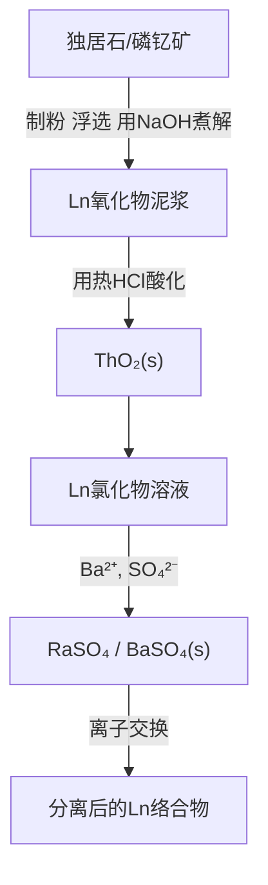
</details>

(a)

![[无机化学第6版副族金属有机565-748_images/f62010a8ef0a31f4c5382a671c0a5497ec99e22ae003c3d4f20cb404adba425e.jpg]]

<details>
<summary>flowchart</summary>

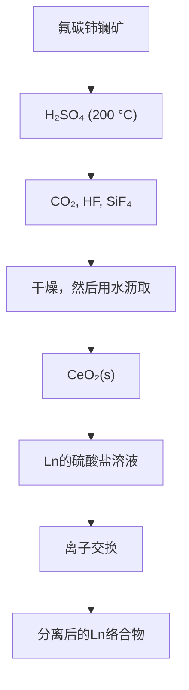
</details>

(b)   
图 23.2 从矿石中分离镧系元素的简要步骤

铅 $(Z=82)$ 之后的所有元素都不存在稳定同位素，只是钍 $(Th,Z=90)$ 和铀 $(U,Z=92)$ 两个锕系元素具有量大（与Sn和I相当）且寿命足够长的同位素，太阳形成之前已存在于作为恒星的超新星中（应用相关文段1.1）。较轻的超铀元素是由中子轰击的方法合成的（应用相关文段1.1），而微量的重锕系元素（通常只有几个原子）则由轻原子 $(O,C)$ 轰击的方法产生：

$$
{ } _ { 9 2 } ^ { 2 3 8 } \mathrm{U} + { } _ { 0 } ^ { 1 } \mathrm{n} \longrightarrow { } _ { 9 2 } ^ { 2 3 9 } \mathrm{U} \longrightarrow { } _ { 9 3 } ^ { 2 3 9 } \mathrm{Np} + \mathrm{e} ^ { - } + v
$$

$$
{ } _ { 9 3 } ^ { 2 3 9 } \mathrm{Np} \rightarrow { } _ { 9 4 } ^ { 2 3 9 } \mathrm{Pu} + \mathrm{e} ^ { - } + v
$$

$$
{ } _ { 9 7 } ^ { 2 4 9 } \mathrm{Bk} + { } _ { 8 } ^ { 1 8 } \mathrm{O} \rightarrow { } _ { 1 0 3 } ^ { 2 6 0 } \mathrm{Lr} \rightarrow { } _ { 2 } ^ { 4 } \mathrm{He} + 3 { } _ { 0 } ^ { 1 } \mathrm{n}
$$

表 23.2 给出锕系元素最稳定同位素的半衰期。人们对元素镧的关注是由于它是自然界存在的最重元素，以痕量存在于富铀沉积物（连续多步中子俘获和 $\beta$ 衰变过程的产物）中。

表 23.2 鋰系元素最稳定同位素的半衰期

<table><tr><td>Z</td><td>名称</td><td>符号</td><td>质量数</td><td> $t_{1/2}$ </td></tr><tr><td>89</td><td>锕</td><td>Ac</td><td>227</td><td>21.8 a</td></tr><tr><td>90</td><td>钍</td><td>Th</td><td>232</td><td> $1.41 \times 10^{10}$  a</td></tr><tr><td>91</td><td>镤</td><td>Pa</td><td>231</td><td> $3.28 \times 10^{4}$  a</td></tr><tr><td>92</td><td>铀</td><td>U</td><td>238</td><td> $4.47 \times 10^{9}$  a</td></tr><tr><td>93</td><td>镎</td><td>Np</td><td>237</td><td> $2.14 \times 10^{6}$  a</td></tr><tr><td>94</td><td>钚</td><td>Pu</td><td>244</td><td> $8.1 \times 10^{7}$  a</td></tr><tr><td>95</td><td>镅</td><td>Am</td><td>243</td><td> $7.38 \times 10^{3}$  a</td></tr><tr><td>96</td><td>锔</td><td>Cm</td><td>247</td><td> $1.6 \times 10^{7}$  a</td></tr><tr><td>97</td><td>锫</td><td>Bk</td><td>247</td><td> $1.38 \times 10^{3}$  a</td></tr><tr><td>98</td><td>锎</td><td>Cf</td><td>251</td><td>900 a</td></tr><tr><td>99</td><td>锿</td><td>Es</td><td>252</td><td>460 d</td></tr><tr><td>100</td><td>镄</td><td>Fm</td><td>257</td><td>100 d</td></tr><tr><td>101</td><td>钔</td><td>Md</td><td>258</td><td>55 d</td></tr><tr><td>102</td><td>锘</td><td>No</td><td>259</td><td>1.0 h</td></tr><tr><td>103</td><td>铹</td><td>Lr</td><td>260</td><td>3 min</td></tr></table>

# 23.3 物理性质和应用

提要:镧系元素是活泼金属,少量用在专业领域;锕系元素具有放射性,其用途受到限制。

镧系元素是软的白色金属,其密度与3d金属的密度(6\~10 g·cm $^{-3}$ )差不多。金属本身的导热性和导电性相对较差,分别低于铜的25倍和50倍。金属能与水蒸气和稀酸起反应,但表面氧化物层使其有所钝化。虽然许多元素采取立方密堆积结构(尤其是在高压下),但大多数镧系金属则采取六方密堆积结构。

商业上将前镧系金属的混合物（包括铈）叫混合金属（mischmetal），炼钢过程中加入混合金属以去除如氧、氢、硫、砷等杂质，这些杂质的存在会降低钢的机械强度和韧性。钐和钴的合金（ $\mathrm{SmCo_5}$ 和 $\mathrm{Sm}_2\mathrm{Co}_{17}$ ）具有很高的磁强度，超过铁和一些磁性铁氧化物（ $\mathrm{Fe}_3\mathrm{O}_4$ ）的10倍。温度升高时它们还具有优良的耐腐蚀性和良好的稳定性。钕铁的硼化物（ $\mathrm{Nd}_2\mathrm{Fe}_{14}\mathrm{B}$ ）显示出类似的磁性质而且生产成本较低，但因为易受腐蚀，磁体往往需要镀锌或镀镍或涂以环氧树脂。这类高强度磁性材料的应用范围包括耳机、麦克风、磁性开关、粒子束制导部件的成分、制造电动汽车节能装置（制动能量回收）及制造风力涡轮发电机等。

镧系元素化合物具有广泛用途,其中许多用途与这些化合物的磁性和光学性质有关(节23.5):氧化铕和铕的钒酸盐用作显示屏和照明中的红色荧光粉,钕( $\mathrm{Nd}^{3+}$ )、钐( $\mathrm{Sm}^{3+}$ )和钬( $\mathrm{Ho}^{3+}$ )用于固体激光器。精心设计并巧妙选择有机配体的镧系络合物正在医学科学中找到应用,如用作对不同组织具有选择性的磁共振成像剂和用作生物分析筛选的发光材料。镧系元素发光体的多种广告牌利用了这样的性质:如果配体能引入“天线”功能(强吸光性)或用电化学方法激发的功能,发光强度和可控性就会大大提高。作为一系列有机反应的催化剂,镧系元素络合物也具有重要用途。

锕系元素的密度从锕 $(10.1\ g\cdot cm^{-3})$ 至镎 $(20.4\ g\cdot cm^{-3})$ 逐渐增加，之后逐渐下降。金属钚在大气压下至少有6个晶相，其密度之差超出20%。锕系元素的许多物理性质和化学性质仍不清楚，主要是由于离析出来的量太少，也由于它们具有放射性和许多锕系元素具有化学毒性而属于危险物品。它们最主要的和平用途是用在核反应堆中，但极少量也用于各种日常技术。例如，铀被用于制造某些玻璃，镅被用在烟雾报警器中。

# 镧系元素化学

镧系元素都是化学性质极为相似的电正性金属。两个镧系元素之间的主要差别往往只是其尺寸大小不同，选择其中一个特定大小的元素往往可对化合物的性质进行“微调”。例如，材料的磁性质和电性质往往取决于相关原子的精确距离和各种原子轨道的重叠程度。选择一个适当大小的镧系元素即可控制这一距离，从而影响其电导率和磁有序温度。

# 23.4 一般变化趋势

提要:镧系元素是高电正性的金属, $\mathrm{Ln(III)}$ 化合物最常见;只有当f亚层全空、半满或全满状态时其他氧化态才是稳定的。

镧系元素最常见的氧化态是 $\mathrm{Ln(III)}$ ，这种一致性在周期表中绝无仅有。在许多其他方面，它们的化学性质类似于第2族元素。所有金属与稀酸溶液反应放出氢。 $Ln^{3+}$ 是硬 Lewis 酸，优先与 $F^{-}$ 或含氧配体结合，最常见的矿物是磷酸盐矿。

镧系元素(不论原子序数是多少)优先选择+3氧化态,最根本的原因在于其4f轨道的类芯性,即4f轨道相对较深地埋在原子内层,与相邻原子的轨道只存在弱相互作用。随着原子序数自左至右增加,电子主要填充在4f亚层中,从而导致其化学性质变化很小。本书从简要描述自由原子或离子开始来了解镧系元素的化学性质,从描述中将会看到,每个镧系元素性质之间差异细微是由电离能、原子化能和键形成之间存在有趣平衡造成的,其中键的形成几乎不受配位场效应的影响。下面讨论这些属性。

# (a) 电子结构和电离能

表 23.3 给出镧系元素原子和相应 $Ln^{3+}$ 的电子组态。除 5d 轨道占有 1 个电子的 Ce、Gd 和 Lu 外，所有 $Ln^{3+}$ 的电子组态均为 $[Xe]4f^{n}6s^{2}$ 。如图 23.1 中看到的那样，4f 轨道没有径向节点；其结果是 4f 轨道电子受到核电荷较强的引力。一旦移去 2 个 6s 价电子和从 4f 轨道或 5d 轨道移去其他 1 个电子，其余 4f 电子将被原子核紧紧地吸引而不会扩展到类氙芯层之外。图 23.3 示出镧系元素的电离能是如何变化的。

表 23.3 镧系元素的原子性质

<table><tr><td>Z</td><td>名称</td><td>符号</td><td colspan="2">电子组态</td></tr><tr><td></td><td></td><td></td><td>M</td><td> $M^{3+}$ </td></tr><tr><td>57</td><td>镧</td><td>La</td><td> $[Xe]5d^{1}6s^{2}$ </td><td> $[Xe]$ </td></tr><tr><td>58</td><td>铈</td><td>Ce</td><td> $[Xe]4f^{1}5d^{1}6s^{2}$ </td><td> $[Xe]4f^{1}$ </td></tr><tr><td>59</td><td>镨</td><td>Pr</td><td> $[Xe]4f^{3}6s^{2}$ </td><td> $[Xe]4f^{2}$ </td></tr><tr><td>60</td><td>钕</td><td>Nd</td><td> $[Xe]4f^{4}6s^{2}$ </td><td> $[Xe]4f^{3}$ </td></tr><tr><td>61</td><td>钷</td><td>Pm</td><td> $[Xe]4f^{5}6s^{2}$ </td><td> $[Xe]4f^{4}$ </td></tr><tr><td>62</td><td>钐</td><td>Sm</td><td> $[Xe]4f^{6}6s^{2}$ </td><td> $[Xe]4f^{5}$ </td></tr><tr><td>63</td><td>铕</td><td>Eu</td><td> $[Xe]4f^{7}6s^{2}$ </td><td> $[Xe]4f^{6}$ </td></tr><tr><td>64</td><td>钆</td><td>Gd</td><td> $[Xe]4f^{7}5d^{1}6s^{2}$ </td><td> $[Xe]4f^{7}$ </td></tr><tr><td>65</td><td>铽</td><td>Tb</td><td> $[Xe]4f^{9}6s^{2}$ </td><td> $[Xe]4f^{8}$ </td></tr><tr><td>66</td><td>镝</td><td>Dy</td><td> $[Xe]4f^{10}6s^{2}$ </td><td> $[Xe]4f^{9}$ </td></tr><tr><td>67</td><td>钬</td><td>Ho</td><td> $[Xe]4f^{11}6s^{2}$ </td><td> $[Xe]4f^{10}$ </td></tr><tr><td>68</td><td>铒</td><td>Er</td><td> $[Xe]4f^{12}6s^{2}$ </td><td> $[Xe]4f^{11}$ </td></tr><tr><td>69</td><td>铥</td><td>Tm</td><td> $[Xe]4f^{13}6s^{2}$ </td><td> $[Xe]4f^{12}$ </td></tr><tr><td>70</td><td>镱</td><td>Yb</td><td> $[Xe]4f^{14}6s^{2}$ </td><td> $[Xe]4f^{13}$ </td></tr><tr><td>71</td><td>镥</td><td>Lu</td><td> $[Xe]4f^{14}5d^{1}6s^{2}$ </td><td> $[Xe]4f^{14}$ </td></tr></table>

![[无机化学第6版副族金属有机565-748_images/f872158aa1b968c69f438bed0a9eab9ebce06fbdc057d438a96ad369a872b58d.jpg]]

<details>
<summary>line</summary>

| Element | I₁ (kJ·mol⁻¹) | I₂ (kJ·mol⁻¹) | I₃ (kJ·mol⁻¹) | I₄ (kJ·mol⁻¹) |
|---|---|---|---|---|
| La | 600 | 1150 | 1900 | 4900 |
| Ce | 550 | 1100 | 2000 | 3600 |
| Pr | 550 | 1100 | 2150 | 3800 |
| Nd | 550 | 1100 | 2200 | 3950 |
| Pm | 550 | 1100 | 2250 | 4050 |
| Sm | 450 | 1100 | 2350 | 4100 |
| Eu | 450 | 1100 | 2450 | 4200 |
| Gd | 650 | 1200 | 2050 | 4350 |
| Tb | 650 | 1150 | 2150 | 3900 |
| Dy | 650 | 1150 | 2250 | 4050 |
| Ho | 650 | 1150 | 2250 | 4150 |
| Er | 650 | 1150 | 2250 | 4150 |
| Tm | 350 | 1150 | 2350 | 4150 |
| Yb | 650 | 1200 | 2450 | 4250 |
| Lu | 650 | 1350 | 2050 | 4450 |
</details>

图 23.3 镧系元素电离能和原子化能的变化趋势

作为一种粗略近似，第四电离能 $I_4$ 约为前三个电离能之和 $(I_4 = I_1 + I_2 + I_3)$ 。这一事实在很大程度上解释了很难看到 $\mathrm{Ln(IV)}$ 化合物的现象。镧系元素自左至右核的吸引力增大，导致电离能（它是由电子结构和本章后面将要讨论的基态项总轨道角动量 $L$ 的变化调节的）按同一方向逐渐增大。第三电离能 $I_3$ 的连续性变化趋势存在三处中断，最大的中断发生在 Eu 和 Gd 之间。 $\mathrm{Eu}^{2+}([Xe]4f^7)$ 的电离必须克服高能级的自旋相关能[节 1.5(a)]，而 $\mathrm{Gd}^{2+}([Xe]4f^75d^1)$ 的电离则涉及束缚得不很紧的一个 d 电子。其他两个中断点不明显,发生在 Pm 和 Nd 之间(四分之一亚层效应)及 Ho 和 Er 之间(四分之三亚层效应):这些效应是由轨道角动量(L)的变化(包括损失、无变化或增加)造成的,这种变化将在节 23.5 做概述。除了中断点向后移动一个原子序数外, $I_{4}$ 的变化趋势类似于 $I_{3}$ 。

# (b) 原子化能

镧系元素原子化焓 $\left(\Delta_{\mathrm{a}}H^{\ominus}\right)$ 自左至右的变化趋势几乎与 $I_{3}$ 的变化趋势成镜像关系。金属性成键几乎不涉及类芯层4f电子，但随着5d轨道填充状况的变化，可以重叠形成包含离域（“巡游的”）电子的一个带。当原子凝聚为金属状态时，大多数情况下能量上有利于将4f电子激发至5d轨道。对Gd $\left(\left[\mathrm{Xe}\right]4\mathrm{f}^{7}5\mathrm{d}^{1}6\mathrm{s}^{2}\right)$ 而言不需要这种激发，但对Eu $\left(\left[\mathrm{Xe}\right]4\mathrm{f}^{7}6\mathrm{s}^{2}\right)$ 而言，则需要消耗较大的能量（这是因为每个Eu原子都含有一个稳定的半满4f亚层）。因此看到 $\Delta_{a}H^{\ominus}$ 值在Eu和Gd之间出现增加，Yb和Lu之间也看到类似现象。

# (c) 半径

金属半径从 La 到 Lu 平滑减小, 只有 Eu 和 Yb 例外 (见图 23.4)。两处例外是由于两个金属为保留 $4f^{7}$ 或 $4f^{14}$ 的电子组态而选择将一个电子激发到5d轨道。正如刚才提到的那样，这样将导致较强的金属性成键作用，M—M的距离较小。因此，Eu和Yb的金属半径分别对应于 $[\mathrm{Xe}]4\mathrm{f}^7$ 和 $[\mathrm{Xe}]4\mathrm{f}^{14}$ 电子组态 $[\mathrm{Ln}^{2+}(\mathrm{e}^{-})_2]$ ，其他镧系元素的电子组态则对应于 $[\mathrm{Xe}]4\mathrm{f}^n 5\mathrm{d}^1 [\mathrm{Ln}^{3+}(\mathrm{e}^{-})_3]。(e^-)_n$ 是巡游着的s和d电子的数目，它们在形式上占据着形成的那个带[参见节23.4(b)]。

![[无机化学第6版副族金属有机565-748_images/4c81002b928bef4ff4e7707907da8333bc403e8c12840a8442eb2a83c5cd771b.jpg]]

<details>
<summary>line</summary>

| Element | M (半径 / pm) | M³⁺ (半径 / pm) |
| ------- | ------------- | --------------- |
| La      | 185           | 115             |
| Ce      | 180           | 112             |
| Pr      | 178           | 110             |
| Nd      | 177           | 108             |
| Pm      | 176           | 106             |
| Sm      | 175           | 104             |
| Eu      | 205           | 102             |
| Gd      | 178           | 100             |
| Tb      | 176           | 98              |
| Dy      | 175           | 96              |
| Ho      | 174           | 94              |
| Er      | 173           | 92              |
| Tm      | 172           | 90              |
| Yb      | 195           | 88              |
| Lu      | 170           | 86              |
</details>

图23.4 Ln的金属半径和 $\mathrm{Ln}^{3+}$ 的离子半径的变化

所有 $Ln^{3+}$ 的电子组态为 $[Xe]4f^{n}$ ，其八配位半径从 $La^{3+}$ 的 116 pm 平稳收缩至 $Lu^{3+}$ 的 98 pm。如前所述（第 19 章），镧系收缩对 4d 和 5d 前过渡金属有重要影响：尽管主量子数有所增加，但半径和化学性质却非常相似。所以，两对元素（Zr 和 Hf, Nb 和 Ta）几乎显示出相同的性质。离子半径从左到右平缓下降的现象在周期表中绝无仅有：尽管详细的计算表明相对论效应对半径收缩具有实质性贡献，但主要归因于电子填充在被屏蔽得较弱的 4f 亚层而导致的有效原子序数 $(Z_{\mathrm{eff}})$ 的增大（节 1.4）。所以与 d 区元素不同，配位场效应的影响很小，接下来将会进行讨论。

# (d) 配位场效应

f轨道被深埋内层的一个结果是， $\mathrm{Ln}^{3+}$ 的前线轨道不存在方向特异性；因此配位场效应足够小，以致确保了自由离子所有态的热分配（节23.5），对化学性质也没有显著影响。图23.5显示出 $\mathrm{Ln}^{3+}$ 的水合焓是逐渐增加的（伴随一些起伏），没有出现 $3\mathrm{dM}^{2+}$ 所清晰显示的“双峰”图（节20.1）。水溶液中 $[\mathrm{Ln}(\mathrm{OH}_2)_n]^{3+}$ 的配位数仅由离子大小控制：前镧系元素配位数为9，采取三帽三角棱柱几何形状(1)；随后连续失去帽位上的 $\mathrm{H}_2\mathrm{O}(2,3)$ 或重组为四方反棱柱体(4)，使其配位数减小到7\~8。由于大的阳离子没有足够的配位场稳定化能，可以预期这些水合离子具有高活泼性（图21.1）。它们也显示弱酸性， $\mathsf{pK}$ 值从 $\mathrm{La}^{3+}(\mathrm{aq})$ 的8.5到 $\mathrm{Lu}^{3+}(\mathrm{aq})$ 的7.6。

![[无机化学第6版副族金属有机565-748_images/2c8d1f125886b0fca0ace641cc996b2612fed97c98fb1295ebf71f773c397b32.jpg]]

<details>
<summary>chemical</summary>

Molecular structure diagram showing a central atom bonded to surrounding atoms in a tetrahedral arrangement
</details>

(1)

![[无机化学第6版副族金属有机565-748_images/2530f0b11654b7fa5610f10264441af839c325e73c834ad50b70b2d4006e4fe8.jpg]]

<details>
<summary>chemical</summary>

Molecular structure diagram showing a central atom bonded to surrounding atoms in a tetrahedral arrangement
</details>

(2)

![[无机化学第6版副族金属有机565-748_images/7e7e7abae54a3bd655f436af0aa2a37eecbf2ebbfc6c2323671d4befb3b695b5.jpg]]

<details>
<summary>chemical</summary>

Molecular structure diagram showing a central atom bonded to surrounding atoms in a tetrahedral arrangement
</details>

(3)

![[无机化学第6版副族金属有机565-748_images/d9fd02d3614fe9c55e8b735cdff26b458ec8f4cb49bbd784fdfce5caf85b3336.jpg]]

<details>
<summary>natural_image</summary>

Geometric diagram of a hexagonal lattice structure with eight spherical nodes (no text or labels)
</details>

(4)

# (e) 标准电位和氧化还原化学

Ln(Ⅲ)氧化态在4f元素中占绝对优势,这主要是由于形成 $\mathrm{Ln}^{3+}$ 的前三步电离能之和 $(I_{1}+I_{2}+I_{3})$ （见图23.3）被 $\mathrm{Ln}^{3+}$ 强烈的水合作用或晶格能所抵偿。因此,形成 $\mathrm{Ln}^{3+}$ 比形成 $\mathrm{Ln}^{2+}$ 更有利,而形成 $\mathrm{Ln}^{4+}$ 的电离能 $I_{4}$ 通常则不能被抵偿。离子半径从 $\mathrm{La}^{3+}$ 到 $\mathrm{Lu}^{3+}$ 下降了18%,这种下降导致整个系列的水合焓增加,抵消

![[无机化学第6版副族金属有机565-748_images/aba44db2f608a89bcb4d97dbdc21559d3c1e31fe473d2bd8538557d37f4a1184.jpg]]

<details>
<summary>line</summary>

| Element | -Δ hyd H° (kJ·mol⁻¹) |
| ------- | --------------------- |
| La      | ~3250                 |
| Ce      | ~3300                 |
| Pr      | ~3450                 |
| Nd      | ~3400                 |
| Pm      | ~3450                 |
| Sm      | ~3500                 |
| Eu      | ~3600                 |
| Gd      | ~3550                 |
| Tb      | ~3550                 |
| Dy      | ~3600                 |
| Ho      | ~3650                 |
| Er      | ~3550                 |
| Tm      | ~3650                 |
| Yb      | ~3750                 |
| Lu      | ~3550                 |
</details>

图 23.5 $Ln^{3+}$ 的水合焓及与 3d 金属 $M^{2+}$ 阳离子水合焓的比较

了 $(I_{1}+I_{2}+I_{3})$ 的增加值，也反映了原子化能的变化趋势。因此，镧系元素的标准电位（见表23.4）都非常接近 $\left[E^{\ominus}\left(\mathrm{La}^{3+}/\mathrm{La}\right)=+2.38\mathrm{~V}\right.$ 与系列另一端的 $E^{\ominus}\left(\mathrm{Lu}^{3+}/\mathrm{Lu}\right)=+2.30\mathrm{~V}$ 几乎相同]，并接近于 $Mg^{2+}/Mg$ 电对的 $E^{\ominus}$ 值。

表 23.4 镧系元素的标准电位、离子半径和氧化数 (O.N.)

<table><tr><td>元素</td><td> $E^{\ominus}(\text{Ln}^{3+}/\text{Ln})$ </td><td> $r(\text{Ln}^{3+})/\text{pm}$ </td><td>O.N.*</td></tr><tr><td>La</td><td>-2.38</td><td>116</td><td>3,</td></tr><tr><td>Ce</td><td>-2.34</td><td>114</td><td>3,4</td></tr><tr><td>Pr</td><td>-2.35</td><td>113</td><td>3,4</td></tr><tr><td>Nd</td><td>-2.32</td><td>111</td><td>2,3,4</td></tr><tr><td>Pm</td><td>-2.29</td><td>109</td><td>3</td></tr><tr><td>Sm</td><td>-2.30</td><td>108</td><td>2,3</td></tr><tr><td>Eu</td><td>-1.99</td><td>107</td><td>2,3</td></tr><tr><td>Gd</td><td>-2.28</td><td>105</td><td>3</td></tr><tr><td>Tb</td><td>-2.31</td><td>104</td><td>3,4</td></tr><tr><td>Dy</td><td>-2.29</td><td>103</td><td>2,3,4</td></tr><tr><td>Ho</td><td>-2.33</td><td>102</td><td>3</td></tr><tr><td>Er</td><td>-2.32</td><td>100</td><td>3</td></tr><tr><td>Tm</td><td>-2.32</td><td>99</td><td>2,3</td></tr><tr><td>Yb</td><td>-2.22</td><td>99</td><td>2,3</td></tr><tr><td>Lu</td><td>-2.30</td><td>98</td><td>3</td></tr></table>

\* 加黑数字为主要氧化数。

Ln(Ⅲ)之外的其他氧化态在镧系元素化学中也很重要。如果离子达到相对更为稳定的全空亚层 $(f^{0})$ 、半满亚层 $(f^{7})$ 或全满亚层 $(f^{14})$ （见表23.3）时（最优化的自旋相关能），便能形成这些非典型的Ln(Ⅱ)和Ln(Ⅳ)氧化态。就水溶液化学而言，元素Ce和Eu显示出最重要和最有用的氧化还原性质。因此， $Ce^{3+}(f^{1})$ 可以被氧化为 $Ce^{4+}(f^{0})$ ，后者是个强而有用的氧化剂。 $Eu^{2+}$ 的水溶液足够稳定，是一种方便的一电子还原剂。金属Eu和Yb与液氨反应除生成 $Eu^{2+}$ 和 $Yb^{2+}$ 外还得到含有溶剂化电子的蓝色溶液，类似于第2族元素的化学性质。水溶液中的 $Sm^{2+}$ 和 $Yb^{2+}$ 能迅速将水还原放出氢。

越来越多的 $\mathrm{Ln(IV)}$ ，尤其是 $\mathrm{Ln(II)}$ 的分子化合物正在被合成。 $\mathrm{Ln(IV)}$ 主要限于 Ce，而 $\mathrm{Ln(II)}$ 除 $Eu^{2+}$ 和 $Yb^{2+}$ 外，还包括 $Sm^{2+}$ 、 $Tm^{2+}$ 、 $Dy^{2+}$ 和 $Nd^{2+}$ 的许多络合物可在非还原性溶剂（如醚）中合成。 $\mathrm{Ln(II)}$ 络合物的发展在金属有机化学领域特别兴旺。

许多氧化态为“2+”和“4+”的镧系离子出现在固体状态。Ln(Ⅳ)著名的例子包括Pr(Ⅳ)和Tb(Ⅳ)，它们在空气中分别形成 $\mathrm{Pr}_6\mathrm{O}_{11}$ 和 $\mathrm{Tb}_4\mathrm{O}_7$ ，两者都是Ln(Ⅲ)和Ln(Ⅳ)的混合物。在非常强的氧化性条件下也可制得Dy(Ⅳ)和Nd(Ⅳ)。容易形成Ln(Ⅳ)化合物的事实与 $I_{4}$ 有关。许多Ln(Ⅱ)的二元化合物（包括硫化物）是电子导体，这是因为它们的5d电子进入了导带。

# 23.5 电子性质、光学性质和磁性质

镧系元素的许多商业和技术价值源于它们的电子性质、光学性质和磁性质。

# (a) 电子吸收光谱

提要:由于 f 轨道很少受配体的影响,镧系离子通常显示微弱而尖锐的吸收光谱。

镧系离子(Ⅲ)为浅色,其吸收通常与f-f跃迁相关(见表23.5)。一般说来,其络合物光谱较d金属络合物光谱显示出更窄、更特征的吸收带。两个特征(峰的狭窄性和对配体性质的不敏感性)都是由于4f轨道的径向延伸不如充满电子的5s轨道也不如5p轨道。与Ln(Ⅲ)络合物的浅色相反,许多Ln(Ⅱ)和Ln(Ⅳ)络合物的颜色则较深,这是光谱可见区发生荷移跃迁的结果。

由于 f-f 跃迁的复杂性(例如, $f^{2}$ 组态有 91 个微态),我们不会像第 20 章分析 d-d 跃迁那样去分析 f-f 跃迁。然而,由于 f 轨道位于原子相对较深的内层而且与配体轨道只发生弱重叠,从而可以简化对光谱的讨论。作为一级近似,我们可以当作自由离子来讨论它们的电子态(即电子光谱);Russel-Saunders 偶合模式也是一个很好的近似方法,尽管这些元素具有高的原子序数。

# 例题 23.1 推导镧系离子基态项的符号

题目： $\mathrm{Pr}^{3 + }(f^2)$ 基态项的符号是什么？

答案: 节 20.3 中总结了 d 区元素基态项符号（其通式为 ${}^{2S+1}\{L\}_{f}$ ）的推导程序，我们可用类似的途径进行。根据 Hund's 规则，基态将有两个电子（每个的 I=3）占据不同的 f 轨道，所以 $M_{L}=M_{I1}+M_{I2}$ 的最大值将是 $M_{L}=(+3)+(+2)=+5$ ，这必定来自 L=5 的态，即 H 项。不同轨道上两个电子的低自旋排列是一个 S=1 的三重态，所以这个项将是 ${}^{3}H$ 。根据 Clebsch-Gordan 系列（节 20.3），L=5 和 S=1 的项的总角动量将为 J=6、5 或 4。根据 Hund's 规则，对不到半满状态的壳层而言，J 值最低（此例中 J=4）的能级处在最低处，故可预期项符号为 ${}^{3}H_{4}$ 。

自测题 23.1 导出 $Tm^{3+}$ 的基态。

每个电子组态存在大数量的微态，这意味着相应地存在大数量的项，因此它们之间存在很多个可能发生的跃迁。由于这些项几乎完全是由f轨道导出的（很少有d-f轨道混合或与配体轨道混合），所以跃迁属Laporte禁止跃迁（节20.6）。此外，4f轨道电子与配体只有弱相互作用，所以电子跃迁与分子振动几乎没有偶合，导致频带很窄，几乎没有从振动偶合获得增强。因此与d金属（通常显示中等强度的一个或两个宽带）不同，镧系元素的可见光谱通常由多个尖锐的、低强度的峰组成，几乎不受配位环境改变的影响。与八面体d金属络合物的摩尔吸收系数 $\varepsilon$ （振动偶合将其增高至接近 $100\mathrm{dm}^3\cdot \mathrm{mol}^{-1}\cdot \mathrm{cm}^{-1}$ )不同，镧系

元素络合物的 $\varepsilon$ 值通常为 $1\sim 10\mathrm{dm}^3\cdot \mathrm{mol}^{-1}\cdot \mathrm{cm}^{-1}$

表 23.5 中给出所有 $Ln^{3+}$ 的基态项, 图 23.6 为激发态能级的简化图。吸收光谱是电子由基态激发到激发态上产生的, 图 23.7 为 $\mathrm{Pr}^{3+}(\mathrm{aq})$ 从近红外区到紫外区的实验吸收光谱。吸收 (图 23.6 中向上的箭头) 主要发生在 450 nm 和 500 nm 之间 (蓝色) 和 580 nm (黄色) 附近, 所以从 $Pr^{3+}$ 化合物反射到达人眼的剩余光主要是绿色和红色, 使 $Pr^{3+}$ 产生特征的绿色。 $Gd^{3+}$ 为无色, 从它具有大的能隙不难解释这一事实。 $Nd^{3+}$ 在 580 nm 处有一尖锐的吸收峰, 它是由 ${}^{4}I_{9/2} \leftarrow {}^{4}F_{3/2}$ 跃迁产生的。这一波长几乎精确地对应于激发态钠原子发射的黄色 (节 11.1)。钕是玻璃工用护目镜的成分, 主要用来减少热的硅酸钠玻璃产生的刺目的光。某些情况下可以发生 4f 和 5d 轨道之间的跃迁, 但一般发生在光谱的高能紫外区; 如 $Er^{3+}$ 的 $4f^{10}5d^{1} \leftarrow 4f^{11}$ 跃迁发生在约 150 nm 处。

表 23.5 ${\mathrm{{Ln}}}^{3 + }$ 的颜色、项符号和磁矩

<table><tr><td rowspan="2"></td><td rowspan="2">在水溶液中的颜色</td><td rowspan="2">基态</td><td colspan="2"> $\mu /\mu_{\mathrm {B}}$ </td></tr><tr><td>理论值</td><td>观测值*</td></tr><tr><td> $La^{3+}$ </td><td>无色</td><td> $^{1}S_{0}$ </td><td>0</td><td>0</td></tr><tr><td> $Ce^{3+}$ </td><td>无色</td><td> $^{2}F_{5/2}$ </td><td>2.54</td><td>2.46</td></tr><tr><td> $Pr^{3+}$ </td><td>绿色</td><td> $^{3}H_{4}$ </td><td>3.58</td><td>3.47~3.61</td></tr><tr><td> $Nd^{3+}$ </td><td>紫色</td><td> $^{4}I_{9/2}$ </td><td>3.62</td><td>3.44~3.65</td></tr><tr><td> $Pm^{3+}$ </td><td>粉红色</td><td> $^{5}I_{4}$ </td><td>2.68</td><td>—</td></tr><tr><td> $Sm^{3+}$ </td><td>黄色</td><td> $^{6}H_{5/2}$ </td><td> $0.84(1.55~1.65)^{\dagger}$ </td><td>1.54~1.65</td></tr><tr><td> $Eu^{3+}$ </td><td>粉红色</td><td> $^{7}F_{0}$ </td><td> $0(2.68~3.51)^{\dagger}$ </td><td>3.32~3.54</td></tr><tr><td> $Gd^{3+}$ </td><td>无色</td><td> $^{8}S_{7/2}$ </td><td>7.94</td><td>7.9~8.0</td></tr><tr><td> $Tb^{3+}$ </td><td>粉红色</td><td> $^{7}F_{6}$ </td><td>9.72</td><td>9.69~9.81</td></tr><tr><td> $Dy^{3+}$ </td><td>黄绿色</td><td> $^{6}H_{15/2}$ </td><td>10.65</td><td>10.0~10.6</td></tr><tr><td> $Ho^{3+}$ </td><td>黄色</td><td> $^{5}I_{8}$ </td><td>10.60</td><td>10.4~10.7</td></tr><tr><td> $Er^{3+}$ </td><td>淡紫色</td><td> $^{4}I_{15/2}$ </td><td>9.58</td><td>9.4~9.5</td></tr><tr><td> $Tm^{3+}$ </td><td>绿色</td><td> $^{3}H_{6}$ </td><td>7.56</td><td>7.0~7.5</td></tr><tr><td> $Yb^{3+}$ </td><td>无色</td><td> $^{2}F_{7/2}$ </td><td>4.54</td><td>4.0~4.5</td></tr><tr><td> $Lu^{3+}$ </td><td>无色</td><td> $^{1}S_{0}$ </td><td>0</td><td>0</td></tr></table>

\* 得自如 $\mathrm{Ln}_{2}(\mathrm{SO}_{4})_{3}\cdot8\mathrm{H}_{2}\mathrm{O}$ 和 $\mathrm{Ln}(\mathrm{Cp})_{2}$ 这样的化合物；† 括号内的值包括了来自除基态外的项的预期贡献。

# (b) 发光

提要:镧系元素离子显示出有用的发射光谱,可用于磷光体、激光器和成像。

镧系元素一些最重要的应用源于f轨道电子激发（用高能光子或电子束）后产生的发射光谱。“发光”一词通常用来描述两种类型的发射：荧光发射和磷光发射。荧光是指从高能态向具有相同多重度 $(\Delta S = 0)$ 的低能态的跃迁，而磷光则指从高能态向具有不同多重度 $(\Delta S\neq 0)$ 的低能态的、较长寿命的跃迁。发射光谱显示出吸收光谱的许多特征，这些吸收光谱主要是由镧系阳离子特征频率的锐锋组成，与配体基本无关。

自然发光受到低概率吸收的限制，低概率吸收意味着激发态不易被占据。即便如此，除 $\mathrm{La}^{3+}(\mathrm{f}^0)$ 和 $\mathrm{Lu}^{3+}(\mathrm{f}^{14})$ 外的其他所有镧系离子都显示固有发光，其中最强的和最有用的发射是与 $\mathrm{Eu}^{3+}({}^{7}\mathrm{F}_{0-6}\leftarrow{}^{5}\mathrm{D}_{0}$ ，产生红光）和 $\mathrm{Tb}^{3+}({}^{7}\mathrm{F}_{6-0}\leftarrow{}^{5}\mathrm{D}_{4}$ ，产生绿光）相关的发射（图23.6中向下的箭头所示）。 $\mathrm{Eu}^{3+}$ 和 $\mathrm{Tb}^{3+}$ 显示较强的发光，部分是由于存在大量的激发态，这种存在增加了从基态通过系统间过渡至不同自旋多重度激发态的概率，从而导致发磷光。更为常见的是，由于被激发的电子与其环境只有弱相互作用（由于f轨道收缩），发射强度从而具有长的无辐射寿命(毫秒到纳秒)。然而,鉴于自然发射受限于通过吸收只略微允许产生激发这一事实,在络合物的配体上或在固体材料上引入一个吸光基团(“天线”)可使发光大大增强。天线基团通过允许跃迁被激发,并将能量直接或间接(经由系统间过渡)转移到镧系元素的激发态上。这一过程通常可用Jablonski图表示(图23.8)。在电致发光中,镧系元素化合物受到电化学方法的激发,通过电极将电子注入配体上合适的有机基团的较高轨道上,并从被占轨道上移走电子。电致发光构成发光二极管(LEDs)的基础。

![[无机化学第6版副族金属有机565-748_images/8e8489731866a81f62e45b7b8479c0e5881ba0c3a4b290a071f67146cf9dfb0e.jpg]]

<details>
<summary>bar</summary>

| 基态 | 能量 / 10³ cm⁻¹ |
| ---- | --------------- |
| ²F₇/₂ Ce | ~2.5 |
| ³H₄ Pr | ~20.5 |
| ¹D₂ Nd | ~18.5 |
| ¹G₄ Nd | ~16.5 |
| ⁴F₃/₂ Sm | ~25.5 |
| ⁶H₅/₂ Sm | ~27.5 |
| ⁷F₀ Eu | ~17.5 |
| ⁵D₂ Gd | ~30.5 |
| ⁶P₇/₂ Sg | ~38.5 |
| ⁷F₆ Tb | ~20.5 |
| ⁵D₄ Dy | ~33.5 |
| ⁴F₉/₂ Ho | ~30.5 |
| ⁵S₂ Ho | ~30.5 |
| ⁴S₃/₂ Er | ~32.5 |
| ³H₆ Tm | ~28.5 |
| ²F₇/₂ Yb | ~10.5 |
</details>

图 23.6 镧系元素的简化能级图  
向上的箭头代表 $\mathrm{Pr}^{3+}$ 和 $\mathrm{Nd}^{3+}$ 的主要吸收线；向下的箭头代表 $\mathrm{Eu}^{3+}$ 和 $\mathrm{Tb}^{3+}$ 的主要发射线

![[无机化学第6版副族金属有机565-748_images/cedd2c900f330a4cb0bcd1944f650ce824d1af29a3ccf873f5ad6ca6967ac950.jpg]]

<details>
<summary>line</summary>

| ν̃ / cm⁻¹ | 吸收 |
| -------- | ---- |
| ~10000   | ¹G₄  |
| ~15000   | ¹D₂  |
| ~20000   | ³P₀  |
| ~25000   | ³P₁  |
| ~27000   | ³P₂  |
</details>

图 23.7 $Pr^{3+}$ 的吸收光谱能量显示在图 23.6 中

![[无机化学第6版副族金属有机565-748_images/0fb78800de5524c0c577a4ed3bf64c5533ddbe69690fd64bafbda6bd460ad856.jpg]]

<details>
<summary>flowchart</summary>

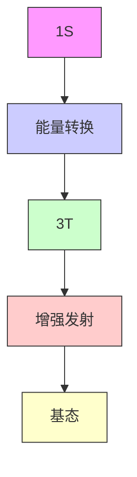
</details>

图 23.8 Jablonski 图  
表示出能量从光吸收天线转移至发光中心发射能级的过程

利用镧系元素及其化合物的发光特性是一个兴旺的高技术发展领域,其应用范围涉及从医疗成像到平板屏幕电子显示系统。通过激发激发态的发射可以获得高强度的激光辐射,如钕钇铝石榴石(Nd:YAG)激光器(应用相关文段23.1)。

# 应用相关文段 23.1 以镧系元素为基础的荧光粉和激光器

荧光粉是将高能光子(通常在电磁谱的紫外区)转化为低能量可见光波长的荧光材料。很多荧光材料以d金属体系(如以Cu和Mn掺杂的硫化锌)为基础,而一些含镧系元素的材料则能提供最佳的性能。特别是制造显示屏所需的红色荧光粉(如等离子显示屏)和荧光照明[利用 $Eu^{3+}$ 在580nm(橙色)到700nm(红色)之间出现的一系列发射谱线]。铽(以 $Tb^{3+}$ 形式)也广泛应用于类似的荧光粉,产生480\~580nm的发射谱线(绿色)。磷光化合物(如 $Eu^{3+}$ 掺入 $YVO_{4}$ 得到的化合物)涂覆于荧光灯管的内部,并将汞放电产生的紫外辐射转化为可见光。荧光灯管通过可见光谱不同区域发射的荧光相混合产生白光(见图B23.1)。

![[无机化学第6版副族金属有机565-748_images/3fd1e7841ee598789f36b80032fd2e0a583f393907554cd3363da86f35bb2ca1.jpg]]

<details>
<summary>line</summary>

| 波长 / nm | 强度 |
| --------- | ---- |
| 400       | ~0   |
| 500       | ~0   |
| 600       | ~0   |
| 700       | ~0   |
| 800       | ~0   |
</details>

图 B23.1 荧光灯的光谱。图上的线是由磷光体中的镧系元素离子产生的

钕可以 Y 含量的 1% 掺入钇铝氧化物石榴石 $\left(\mathrm{Y}_{3}\mathrm{Al}_{5}\mathrm{O}_{12}\right)$ 结构中得到一种用于 Nd:YAG 激光器的材料。 $Nd^{3+}$ 强烈吸收波长在 730\~760 nm 和 790\~820 nm 的光（如由含氮闪光灯产生的高强度光）。 $Nd^{3+}$ 从基态 $\left(^{4}\mathrm{I}_{9/2}\right)$ 被激发至多个激发态，这些激发态然后转移到寿命相对较长的 ${}^{4}F_{3/2}$ 激发态。后者受到同一频率光子的激发辐射衰变为 ${}^{4}I_{11/2}$ 态（仅位于基态 ${}^{4}I_{9/2}$ 之上），从而导致激光辐射。一旦激发态存在大量 $Nd^{3+}$ ，它们全都受到激发而同时发光，从而产生非常强的辐射。

Nd:YAG 通常在电磁波谱的近红外区以脉冲和连续模式发射 1.064 μm 的激光。在 0.940 μm、1.120 μm、1.320 μm 和 1.440 μm 处有较弱的跃迁。高强度的脉冲可能使频率倍增以产生波长为 532 nm（可见光区域）、甚至是 355 nm 和 266 nm 高谐振波激光。Nd:YAG 激光器的应用包括除去白内障和多余毛发，用在测距仪中，也用于塑料和玻璃的制造。后一应用是将红外区有强吸收（处于 Nd:YAG 的主要发射线 1.064 μm 附近）的一种白色颜料加进透明塑料中，激光照射在塑料上时，照射点的颜料将能量吸收并将塑料加热至足以燃烧的温度，使其成为除不掉的标记。

也存在以其他镧系元素作为掺杂剂的YAG增益介质。例如，Yb:YAG在 $1.030\mu \mathrm{m}$ （最强线）或 $1.050\mu \mathrm{m}$ 的波长产生发射，并往往用在所需的激光薄盘上；Er:YAG激光器在 $2.94\mu \mathrm{m}$ 的波长产生发射，并用于牙科医疗和皮肤修复。

# (c) 磁性质

提要:镧系元素化合物中未成对 4f 电子的类芯性质导致它们显示磁矩,其磁矩数值与根据 Russel-Saunders 偶合对自由离子的预测值相接近。

镧系元素络合物的磁性质明显不同于d区元素[节20.1(d)]并相对容易预测和解释。正如已经看到的那样，4f轨道中未成对电子的自旋与轨道角动量强烈偶合但与配体环境的相互作用很弱；其结果是，一个给定 $4f^{n}$ 组态的磁矩接近自由离子的计算值（不管化学上多么复杂）。磁矩 $\mu$ 用总角动量量子数 J 表示：

$$
\mu = g _ {j} \left\{J (J + 1) \right\} ^ {1 / 2} \mu_ {\mathrm{B}}
$$

式中， $\mu_{B}$ 为玻尔磁子，Landé g 因子为

$$
g _ {j} = 1 + \frac {S (S + 1) - L (L + 1) + J (J + 1)}{2 J (J + 1)}
$$

基态 $Ln^{3+}$ 磁矩的理论值汇总在表 23.5 中；这些数值通常较好地与实验数据相吻合。

下面举个计算 $g_{j}$ 和计算 $\mu$ 值的例子。前面已经看到， $\Pr^{3+}(f^{2})$ 的基态项符号是 ${}^{3}H_{4}, L=5, S=1, J=4$ 。由此可得

$$
g _ {j} = 1 + \frac {1 (1 + 1) - 5 (5 + 1) + 4 (4 + 1)}{2 \times 4 (4 + 1)} = 1 + \frac {2 - 3 0 + 2 0}{4 0} = \frac {4}{5}
$$

因此

$$
\mu = g _ {j} \left\{J (J + 1) \right\} ^ {1 / 2} \mu_ {\mathrm{B}} = \frac {4}{5} \left\{4 (4 + 1) \right\} ^ {1 / 2} \mu_ {\mathrm{B}} = 3. 5 8 \mu_ {\mathrm{B}}
$$

上例分析中假定实验温度下只有一个 $^{2S+1}\{L\}_{J}$ 能级被占用，对大多数镧系元素离子而言这是一个很好的假定。例如， $Ce^{3+}(^{2}F_{7/2})$ 的第一激发态高于基态 $(^{2}F_{5/2})1000cm^{-1}$ ，当 $kT\approx200cm^{-1}$ 时室温下几乎没有布居。高能量项的微小贡献导致观测值对基于单一项数量值发生了小的偏离。对 $Eu^{3+}$ （在较小程度上也对 $Sm^{3+}$ ）而言，第一激发态接近于基态 $(Eu^{3+}的^{7}F_{1}仅仅高于基态^{7}F_{0}300cm^{-1})$ ，甚至在室温下也只是部分被布居。虽然基于只占据基态的 $\mu$ 值为零（因为J=0），实验观测值却为非零，其值随温度而变化（根据较高激发态的Boltzmann分布）。

许多镧系元素化合物中观察到长程磁有序效应、铁磁性和反铁磁性（节20.8），虽然一般说来金属原子之间的偶合比d区化合物弱得多，这是配置电子的4f轨道发生收缩造成的。这种弱偶合作用的结果是镧系元素化合物的磁有序温度非常低。在 $\mathrm{BaTbO_3}$ 中， $\mathrm{Tb}^{3+}$ 的磁矩在温度低于 $36\mathrm{K}$ 时成为反铁磁有序。镧系元素的络合物处在单分子磁体研究的中心位置，单分子磁体为分子水平存储信息提供了重要的新的可能性。一个特别特殊的例子是本章末尾辅导作业23.5中提到的三角形Dy(Ⅲ)络合物。

# 23.6 二元离子型化合物

提要:离子型镧系元素化合物的结构是由镧系离子的大小决定的;二元氧化物、二元卤化物、二元氢化物和二元氮化物都是已知的。

镧系元素(Ⅲ)离子的半径变化在116 pm到98 pm之间；作为比较，高自旋六配位的 $Fe^{3+}$ 半径仅为65 pm。因此，一个 $Ln^{3+}$ 占据的体积通常是3d典型金属离子所占体积的3到4倍。与配位数很少超过6（也常见配位数为4的）的3d金属不同，镧系元素化合物往往具有高配位数（通常在6到12之间），且有多种不同的配位环境。

所有镧系元素在高温下与 $O_{2}$ 反应生成氧化物: 大多数情况下生成倍半氧化物 $Ln_{2}O_{3}$ ，但若第四电离能 $I_{4}$ 低到一定程度，则可形成较高氧化态的氧化物，如二氧化物 $CeO_{2}$ . 和非化学计量氧化物 $Pr_{6}O_{11}$ 与 $Tb_{4}O_{7}$ 。后者在高压下与 $O_{2}$ 进一步发生反应生成 $PrO_{2}$ 和 $TbO_{2}$ 。

$$
4 \mathrm{Ln(s)} + 3 \mathrm{O} _ {2} (\mathrm{g}) \longrightarrow 2 \mathrm{Ln} _ {2} \mathrm{O} _ {3} (\mathrm{s})
$$

$$
\mathrm{Ce(s)} + \mathrm{O} _ {2} (\mathrm{g}) \longrightarrow \mathrm{CeO} _ {2} (\mathrm{s})
$$

工业上广泛使用二氧化铈作为催化剂和催化剂载体。在太阳能生产氢的应用中也具前景，因为它在非常高的温度（如太阳炉产生的温度）下能失去 $\mathrm{O}_2$ ，并在冷却时与水反应产生 $\mathrm{H}_{2}$ 的同时使 $\mathrm{CeO}_2$ 得到再生（应用相关文段10.3）。所有二氧化物采取半径比规则所预期的萤石结构（节3.10），然而倍半氧化物的结构却较复杂， $\mathrm{Ln}^{3+}$ 的平均配位数通常为7。已知存在三种主要的结构类型（ $\mathrm{A}-\mathrm{Ln}_{2}\mathrm{O}_{3},\mathrm{B}-\mathrm{Ln}_{2}\mathrm{O}_{3}$ 和$\mathrm{C - Ln_2O_3}$ ，而且其许多氧化物为多晶，随温度变化发生结构之间的转换。配位几何体是由镧系离子半径决定的，结构中阳离子的平均配位数随着离子半径的减小而降低。例如， $\mathrm{La}_2\mathrm{O}_3$ 中 $\mathrm{La}^{3+}$ 的配位数为7，而在 $\mathrm{Lu}_2\mathrm{O}_3$ 中 $\mathrm{Lu}^{3+}$ 的配位数则为6。Nd、Sm、Eu、Yb的单质与对应的氧化物 $\mathrm{Ln}_2\mathrm{O}_3$ 反应生成具有岩盐结构的一氧化物LnO。例如：

$$
\mathrm{Eu} _ {2} \mathrm{O} _ {3} (\mathrm{s}) + \mathrm{Eu} (\mathrm{s}) \longrightarrow 3 \mathrm{EuO} (\mathrm{s})
$$

NdO 和 SmO 都是电子导体（因为它们容易被一个巡游的 5d 电子 [表示为 $\mathrm{Ln}^{3+}\left(\mathrm{O}^{2-}\right)\left(\mathrm{e}^{-}\right)$ ] 占据形成导带），而 EuO 和 YbO 则是白色的绝缘性固体。

具有岩盐结构的化学计量硫化物 LnS 可在 1000 ℃ 下通过元素间的直接反应来获得。除 SmS、EuS 和TmS外的其他的硫化物都是电导体，并表示为 $\mathrm{Ln}^{3+}(\mathrm{S}^{2-})(\mathrm{e}^{-})$ ，硒和碲也形成类似的化合物。组成为 $\mathrm{Ln}_2\mathrm{S}_3$ 的物相也可通过镧系元素氯化物与 $\mathrm{H}_2\mathrm{S}$ 反应得到；因其具有强的红/橙/黄色，已被作为颜料进行研究以代替有毒的CdS和CdSe。镧系元素通常直接与卤素反应形成三卤化物 $\mathrm{LnX}_3$ ，它们具有复杂的结构特征（由于这些大离子具有高的配位数）。例如， $\mathrm{LaF}_3$ 中的 $\mathrm{La}^{3+}$ 处在一个不规则的11配位环境中，而 $\mathrm{LaCl}_3$ 中的 $\mathrm{La}^{3+}$ 则处在一个9配位的三帽三方棱柱体环境中(见图23.9)。系列末端较小镧系元素的三卤化物具有不同的结构类型，其中 $\mathrm{LnF}_3$ 为畸变的三帽三棱柱体(5)， $\mathrm{LnCl}_3$ 则为六配位的立方密堆积层状结构。除氧之外，氟离子是唯一能够稳定 $\mathrm{Ln(IV)}$ 化合物的元素。铈与 $\mathbf{F}_2$ 在室温下反应生成 $\mathrm{CeF_4}$ ，其晶体结构为共享顶点而形成的 $\mathrm{CeF_8}$ 多面体（见图23.10）。与之形成对照的是 $\mathrm{PrF_4}$ 和 $\mathrm{TbF_4}$ ，它们显示高活性，只有在极端条件下（溶剂采用液态HF，紫外光照射，以 $\mathrm{Pr}_6\mathrm{O}_{11}$ 或 $\mathrm{Tb}_4\mathrm{O}_7$ 与 $\mathrm{F}_2$ 反应数天）才能合成。二碘化物 $\mathrm{LnI}_2$ 是合成 $\mathrm{Ln(II)}$ 络合物有用的起始物，尤其是 $\mathrm{SmI}_2$ 被用作有机合成试剂（见后）。二碘化物通常是在惰性气氛、高温条件下（ $600^{\circ}\mathrm{C}$ ）由 $\mathrm{LnI}_3$ 与粉末状 $\mathrm{Ln}$ 之间的反歧化反应得到的：

![[无机化学第6版副族金属有机565-748_images/2543aec73a3639dd537bfd377aa63e35435f343a2e3ba83e5b67915f955b4b96.jpg]]

<details>
<summary>chemical</summary>

Molecular structure of lanthanum (Ln) showing its atomic arrangement with fluorine atoms and hydrogen bonding
</details>

(5)

$$
2 \mathrm{LnI} _ {3} (\mathrm{s}) + \mathrm{Ln} (\mathrm{s}) \longrightarrow 3 \mathrm{LnI} _ {2} (\mathrm{s})
$$

此外,实验室中也可通过 Sm 粉与二碘乙烷反应方便地制得 $SmI_{2}$ :

$$
\mathrm{Sm(s)} + \mathrm {ICH_ {2} CH_ {2} I(l)} \longrightarrow \mathrm {SmI_ {2} (s)} + \mathrm {C_ {2} H_ {4} (g)}
$$

![[无机化学第6版副族金属有机565-748_images/2fec9b87411b67b3afd4f5703fcddea18bdb7fb1172db96364d553d5dc1a8740.jpg]]

<details>
<summary>chemical</summary>

Crystal structure diagram of a lanthanum compound with La and Cl ligands
</details>

图 23.9 $^{*}$ LaCl $_{3}$ 结构, 主图示出的是顶点相连的盖帽反棱柱体 LaCl $_{9}$ : 简单单元示在插图中

![[无机化学第6版副族金属有机565-748_images/882fa0e641a3dc92e14e8e42da3963a0e142172336e764a4644319e842242e7f.jpg]]

<details>
<summary>chemical</summary>

Molecular structure diagram showing Ce and F atoms in a crystal lattice arrangement
</details>

图 23.10 $^{*}$ CeF $_{4}$ 的结构含有共享顶点的 CeF $_{8}$ 反棱柱体

所有镧系金属与 $\mathrm{H}_{2}$ 反应得到二元氢化物，其化学计量在 $\mathrm{LnH}_{2}$ 和 $\mathrm{LnH}_{3}$ 之间变化。二氢化物是萤石结构[节3.9(a)]，其中镧系离子采取立方密堆积形式，氢负离子处于四面体空隙中。这些化合物大多为黑色，并显示金属的性能。这是因为松散的5d轨道上保留了一个电子，从而在固体中形成导带。值得注意的例外出现在Eu、Gd和Yb那里： $\mathrm{EuH}_{2}$ 和 $\mathrm{YbH}_{2}(\mathrm{Ln}^{2+}$ 的电子组态分别为 $4\mathrm{f}^{7}$ 和 $4\mathrm{f}^{14})$ 是白色绝缘固体，而 $\mathrm{GdH}_{2}$ 则高度不稳定（ $\mathrm{Ln}^{2+}$ 的电子组态为 $4\mathrm{f}^{7}5\mathrm{d}^{1})$ 。一些较小的镧系元素（如Dy、Yb和Lu）形成具有化学计量组成的三氢化物 $LnH_{3}$ 。含镧的复合金属氢化物（如 $LaNi_{5}H_{6}$ ）已被作为可能的储氢材料进行了深入研究。

所有镧系元素形成组成为 $\mathrm{LnN}$ 的氮化物，采用预期中的岩盐结构（ $\mathrm{Ln}^{3+}$ 与 $\mathrm{N}^{3-}$ 交替排列）。已知的镧系元素碳化物有三种，化学计量分别为 $\mathrm{M}_3\mathrm{C}, \mathrm{M}_2\mathrm{C}_3$ 和 $\mathrm{MC}_2$ 。重镧系元素形成的物相 $\mathrm{M}_3\mathrm{C}$ 含有孤立的间隙 C 原子，遇水发生水解产生甲烷。轻镧系元素（ $\mathrm{La} \sim \mathrm{Ho}$ ）形成的物相 $\mathrm{M}_2\mathrm{C}_3$ 含有 $\mathrm{CaC}_2$ （节 3.9）中看到的那种二碳化物阴离子 $\mathrm{C}_2^{2-}$ 。物相 $\mathrm{MC}_2$ 显示金属性，除了能形成稳定的二价阳离子的元素（如 Yb）外，由于 d 电子进入导带，可将它们表示为 $\mathrm{Ln}^{3+}(\mathrm{C}_2^{2-}, \mathrm{e}^-)$ ； $\mathrm{MC}_2$ 与水反应生成乙炔。镧系元素的镍硼碳化物（ $\mathrm{LnNi}_2\mathrm{B}_2\mathrm{C}$ ）具有化学计量组成分别为 $\mathrm{LnC}$ 和 $\mathrm{Ni}_2\mathrm{B}_2$ 的交替层结构。这些硼碳化物在低温下是超导体，如 $\mathrm{LuNi}_2\mathrm{B}_2\mathrm{C}$ 的转变温度为 $16\mathrm{K}$ 。

# 23.7 三元氧化物和复杂氧化物

提要:镧系离子往往在钙钛矿和石榴石中被发现,选择不同大小的阳离子可对材料性质进行调节。

镧系元素是大的、稳定的三价阳离子的良好来源，离子半径在相当宽的范围里发生变化，而无须依赖于某种配位场。它们因此可在三元和更复杂的氧化物中占据一个或多个阳离子位置。例如， $\mathrm{ABO}_3$ 型的各种钙钛矿结构容易被制备。一个例子是 $\mathrm{LaFeO}_3$ ， $\mathrm{La}$ 在其中处于阳离子A的位置。事实上，某些扭曲的结构类型就是以镧系元素命名的；如 $\mathrm{GdFeO}_3$ 的结构类型（见图23.11），这种结构中的 $\mathrm{Gd}^{3+}$ 周围是以顶点相连的 $\mathrm{FeO}_6$ 八面体（像母体钙钛矿结构那样，见图3.42），只是八面体彼此相对倾斜。这种倾斜使其能够更好地配位于中心 $\mathrm{Gd}^{3+}$ 。以人们能够控制的方式改变 $\mathrm{LnBO}_3$ 系列化合物中 $\mathrm{B}^{3+}$ 的大小可以调节复杂氧化物的物理性质。例如，对系列化合物 $\mathrm{LnNiO}_3$ （ $\mathrm{Ln} =$ 从 $\mathrm{Pr}$ 至 $\mathrm{Eu}$ ）而言，随着镧系离子半径的减小，绝缘性-金属性的转变温度（ $T_{\mathrm{IM}}$ ）增高（见表23.6）。

![[无机化学第6版副族金属有机565-748_images/9cc53e7cd00bd81ffae858ddc866c35781af848f9d93fc8558b8855db4ed010b.jpg]]

<details>
<summary>chemical</summary>

Crystal structure diagram of an iron-based material showing Fe and Gd coordination environments with unit cell view
</details>

图 23.11 $^{*}$ GdFeO $_{3}$ 的结构类型  
$\mathrm{FeO}_6$ 八面体只给出轮廓，插图显示 $\mathrm{GdFeO_3}$ 结构如何与钙钛矿结构相关

表 23.6 几种三元氧化物的性质

<table><tr><td>性质</td><td> $PrNiO_{3}$ </td><td> $NdNiO_{3}$ </td><td> $EuNiO_{3}$ </td></tr><tr><td> $r(Ln^{3+})/pm$ </td><td>113</td><td>111</td><td>107</td></tr><tr><td> $T_{IM}/K$ </td><td>135</td><td>200</td><td>480</td></tr></table>

更复杂的氧化物结构中往往会发现钙钛矿型晶胞的结构构建基块，镧系元素在材料中频频以这种方式被使用。众所周知的例子是最初的高温超导铜酸盐 $La_{1.8}Ba_{0.2}CuO_{4}$ 和“123”复合氧化物系列 $(\mathrm{LnBa}_{2}\mathrm{Cu}_{3}\mathrm{O}_{7})$ ，它们在低于 93 K 显示超导性。这些高温超导体中最著名的是 d 区元素（钇）的化合物 $YBa_{2}Cu_{3}O_{7}$ ，但所有镧系元素都发现了这种化合物（节 24.6）。为了获得人们所要求的某种性质的其他材料，选择合适的镧系元素至关重要。例如，制备复杂的亚锰酸盐 $Ln_{1-x}Sr_{x}MnO_{3}$ （其抗阻效应强烈依赖于外加磁场和温度），选择 Ln 为 Pr 时性能最好。

尖晶石结构（如图3.44）只含有 $\mathrm{O}^{2-}$ 密堆积排列而产生的小的四面体和八面体空隙，因而容纳不下大体积的镧系元素离子。然而，化学计量为 $\mathrm{M}_3\mathrm{M}'_2(\mathrm{XO}_4)_3$ （式中的M和M'通常为正二价和正三价阳离子，X为Si、Al、Ga和Ge)的材料采取石榴石结构，有八配位位置可供镧系元素离子占据。除钇铝石榴石（激光材料Nd：YAG中钕离子为主体材料）外，一种叫作钇铁石榴石（YIG）的材料在微波和光通信器件中用作重要的铁磁体（见图23.12）。

![[无机化学第6版副族金属有机565-748_images/4a259dd633789b403c65bbdc2fa6f7b6e7f46ed097c39802ecb948133328618f.jpg]]

<details>
<summary>chemical</summary>

Crystal structure diagram of a boron-oxygen compound showing BO₄ and MO₆/AO₈ sites
</details>

图 23.12 $^{*}$ 石榴石结构, 示为连  
接在一起的 $\mathrm{AO}_8$ 、 $\mathrm{BO}_4$ 和 $\mathrm{MO}_6$ 多面体  
常被钇占据的八配位 A 位置可由其他镧系元素占据

# 23.8 配位化合物

提要:镧系元素(Ⅲ)与含有氧原子给予体(这种给予体适合于静电键合)的阴离子多齿配体形成众多络合物。中心原子的配位数通常超过6,络合物采取配体间斥力最小的几何构型。Ln(Ⅱ)络合物具有强还原性。镧系元素(Ⅳ)络合物以铈的许多络合物为代表。

# (a) Ln(Ⅲ)络合物

由于不存在轨道的强重叠， $\mathrm{Ln}^{3+}$ 与配体之间靠静电作用成键，并且只能与多齿螯合配体形成稳定络合物。空间上深埋的f电子没有明显的立体化学影响，因此配体占据配体间斥力最小的位置。多齿配体必须满足自己的立体化学限制，非常类似于s区离子和 $\mathrm{Al}^{3+}$ 的络合物。像其水合离子 $[\mathrm{Ln}(\mathrm{OH}_2)_n]^{3+}$ (1\~4)那样，络合物的配位数和结构也是跨系列变化的。例如，半径小的 $\mathrm{Yb}^{3+}$ 形成七配位络合物 $[\mathrm{Yb(acac)}_3(\mathrm{OH}_2)]$ ，而较大的 $\mathrm{La}^{3+}$ 则形成八配位络合物 $[\mathrm{La(acac)}_3(\mathrm{OH}_2)_2]$ 。两个络合物的结构分别近似为单帽三棱柱体(6)和四方反棱柱体(7)。与立方几何体相比，四方反棱柱体配体间的斥力较小。

![[无机化学第6版副族金属有机565-748_images/669956cc5a66fe375e17b504ee5533f90be3100e95e1f56e655bf05f91c462f6.jpg]]

<details>
<summary>chemical</summary>

Crystal structure diagram of a Yb-oxygen compound showing atomic positions and bonds
</details>

(6)

![[无机化学第6版副族金属有机565-748_images/dc5dc601142f156c3ad54dda8e330a6a1cd9f4661facf481d1fda205455b45da.jpg]]

<details>
<summary>chemical</summary>

Molecular structure of a lanthanum (La) complex with acac and H atoms labeled
</details>

(7)

许多镧系元素络合物是由冠醚和 $\beta$ -二酮配体形成的。部分氟化的 $\beta$ -二酮配体 $\left[\mathrm{CF}_{3} \mathrm{COCHCOCF}_{3}\right]$ （绰号叫“fod”）与 $\mathrm{Ln}^{3+}$ 生成的络合物具有挥发性并可溶于有机溶剂。由于具有挥发性，这些络合物可用作前体通过气相沉积法合成含镧系元素的超导体（节24.24）。

带电荷的配体对最小的镧系离子通常具有最高的亲和力，从而导致从半径较大、较轻的 $\mathrm{Ln}^{3+}$ （系列的左部)到半径较小、较重的 $Ln^{3+}$ (系列的右部)络合物的形成常数逐渐增大,这一事实为镧系离子的色谱纯化提供了一种方便的方法(见图23.13)。在镧系元素化学的早期年代(离子交换色谱法发展起来之前),镧系元素是用烦琐重复的结晶法分离的。

镧系元素的配位化学是一个蓬勃发展的研究领域,这在很大程度上要归功于其在生物成像中的应用(作为光学或磁性示踪剂)。这里的诀窍是在多齿/大环配体上接上一个具有目标功能(如天线或生物接受基团)的基团,以便能与镧系元素形成一个牢固的惰性络合物。许多牢固的络合物是由大环骨架形成的。例如,将荧光素接到大环多胺上(8)。其他的例子将在节27.9中提到,在那里将会更为详细地讨论生物成像。不同于水合离子(交换水分子的时标在纳秒级),许多大环络合物的交换半衰期以年来衡量。

![[无机化学第6版副族金属有机565-748_images/05c09a98f61aa64845b752ae466dba2cd359f88bb84b6208d1aaf66a7813ec18.jpg]]

<details>
<summary>line</summary>

| 洗脱液的体积 | 浓度 |
| ------------ | ---- |
| Lu           | 71   |
| Yb           | 70   |
| Tm           | 69   |
| Er           | 68   |
| Ho           | 67   |
| Dy           | 66   |
| Tb           | 65   |
| Gd           | 64   |
| Eu           | 63   |
</details>

图 23.13 用 2-羟基异丁酸铵作为淋洗液从阳离子交换柱洗脱重 Ln(Ⅲ) 离子  
注意,较高原子序数的镧系元素首先被洗脱,因为它们具有较小的半径并能与络合剂发生更强的络合

![[无机化学第6版副族金属有机565-748_images/3255620fa752d69b56680c7eeaf2e21208be49d6f43407549120c1bfae112853.jpg]]

<details>
<summary>chemical</summary>

Chemical structure of a complex organic molecule with two aromatic rings, carbonyl groups, and hydroxyl substituents
</details>

# (b) $\mathrm{Ln(II)}$ 和 $\mathrm{Ln(IV)}$ 的络合物

在表 23.7 中给出的 $Ln^{3+}/Ln^{+2}$ 氧化还原电对的标准电位为预测 $\mathrm{Ln(II)}$ 络合物的稳定性提供了一个很好的实用指南。铕是 2+ 氧化态中水溶液化学性质做过广泛研究的唯一镧系元素。这一属性源于相对较高的 $I_{3}$ 值（见图 23.3），最根本的原因在于 $4f^{7}$ 组态的相对稳定性。事实上，通过将聚阴离子配体加进 $Eu^{2+}$ 溶液的方法或通过电化学还原 $\mathrm{Eu(III)}$ 络合物的方法可在水溶液中方便地制得许多 $\mathrm{Eu(II)}$ 络合物。EGTA [乙二醇双 (2-氨基乙基) - N, N, N', N' - 四乙酸 (4-) ] 或 DTPA [二乙三胺 - N, N, N', N'' - 五乙酸 (5-)] 的 $\mathrm{Eu(II)}$ 络合物是在水溶液中使用的一种强的单电子还原剂；由于聚阴离子配体更偏好 3+ 氧化态，它们比 $\mathrm{Eu}^{2+}(\mathrm{aq})$ 具有负得多的还原电位，不过也能缓慢地放出 $H_{2}$ 并持续很长时间。

表 23.7 电对 $Ln^{3+}/Ln^{2+}$ 在 $H_{2}O$ 中的标准电位, $E^{\ominus}/V$ 

<table><tr><td>Eu</td><td>-0.35</td></tr><tr><td>Yb</td><td>-1.15</td></tr><tr><td>Sm</td><td>-1.55</td></tr><tr><td>Tm</td><td>-2.3</td></tr><tr><td>Dy</td><td>-2.5</td></tr><tr><td>Nd</td><td>-2.6</td></tr></table>

除金属有机化合物外,其他最重要的 $\mathrm{Ln(II)}$ 络合物是用非还原性螯合醚作为溶剂合成的。从成功合成 $LnI_{2}$ 开始,多种高活性的 $\mathrm{Ln(II)}$ 乙氧基络合物被合成出来,其稳定性顺序为 $Sm>Tm>Dy$ ,与表 23.7 中给出的标准电位变化趋势相一致。二碘化钐 $(\mathrm{SmI}_{2})$ 从市场上可以以深蓝色四氢呋喃溶液(其中所含的物种被写为 $[\mathrm{SmI}_{2}(\mathrm{THF})_{n}]$ (9)) 形式购得, $SmI_{2}$ 中的两个碘离子配体占据轴向位置。暗绿色晶体 $[\mathrm{TmI}_{2}(\mathrm{DME})_{3}]$ (10) 是由 $TmI_{3}$ 与粉末状 Tm 在二甲氧基乙烷(DME)中通过反歧化过程生成的:

$$
\mathrm{TmI} _ {3} + \mathrm{Tm} \xrightarrow {\mathrm{DME}} [ \mathrm{TmI} _ {2} (\mathrm{DME}) _ {3} ]
$$

这些络合物在非水醚类溶剂中是强的单电子还原剂,也是还原性 C—C 偶联反应的有用试剂。例如,从卤代烷和酮形成叔醇的反应:

![[无机化学第6版副族金属有机565-748_images/978c794e14534329d2c1c6c01890bc30232b38d6209f822fcd6370f91bb772b1.jpg]]

<details>
<summary>chemical</summary>

Chemical reaction equation showing oxidation of a tBu-substituted cyclohexane derivative using Rx and 2 LnI2 catalyst in Sm/Tm solvent
</details>

碳-碳偶联反应也可发生在配体之间。 $TmI_{2}$ 与吡啶反应形成络合物 $\left[\left(\left(\mathrm{Py}\right)_{4}\mathrm{TmI}_{2}\right)\right)_{2}\left(\mu-\mathrm{C}_{10}\mathrm{H}_{10}\mathrm{N}_{2}\right)$ (11)，其中偶联产物（1,1-二氢-4,4'-联吡啶）桥连着两个 Tm(Ⅲ)。

![[无机化学第6版副族金属有机565-748_images/27205b87ee91b2bba8d7b3f3baa27bf0ba8b0a70ec51c2a6330b6e0e651bba42.jpg]]

<details>
<summary>chemical</summary>

Molecular structures of three iridium complexes labeled (9), (10), and (11), showing atom arrangements and coordination geometry.
</details>

$\mathrm{Ce(IV)}$ 的配位化学研究得相当广泛。除 $[\mathrm{Ce}(\mathrm{NO}_3)_6]^{2-}$ 外，多数 $\mathrm{Ce(IV)}$ 络合物是由烷氧化物或羧酸配体形成的。与桥连氧合配体形成的双核 $\mathrm{Ce(IV)}$ 络合物是通过前体3-(氨基) $\mathrm{Ce(III)}$ 与 $\mathrm{O}_2$ 反应形成的。

$$
\mathrm{Ce} \left(\mathrm{NR} _ {2}\right) _ {3} \xrightarrow [ \text {hexane} ]{\mathrm{O} _ {2} , - 2 7 ^ {\circ} \mathrm{C}} \quad \begin{array}{l} \mathrm{R} _ {2} \mathrm{N}, \\ \mathrm{R} _ {2} \mathrm{N} \end{array} \begin{array}{c} \mathrm{Ce} \\ \mathrm{O} \end{array} \begin{array}{c} \mathrm{O} \\ \mathrm{Ce} \\ \mathrm{NR} _ {2} \end{array} \begin{array}{c} \mathrm{NR} _ {2} \\ \mathrm{NR} _ {2} \end{array}
$$

# 23.9 金属有机化合物

提要:镧系元素的金属有机化学以 $\mathrm{Ln(III)}$ 化合物为主导,主要涉及离子型成键或被强给予体配体稳定而成键。18 电子规则不适用于镧系元素的金属有机化合物,它们与那些电正性强的前 d 区金属的金属有机化合物较相似。空间效应比电子效应更重要,一些 $\mathrm{Ln(III)}$ 的环戊二烯基化合物在立体选择性催化领域具有重要应用。 $\mathrm{Ln(II)}$ 的金属有机化合物是强还原剂。

镧系元素金属有机化学的发展程度不如 d 区元素。大多数镧系元素金属有机化合物形式上含有 $\mathrm{Ln(III)}$ ，没有任何能参与至有机碎片的 $\pi$ 反馈成键轨道（5d 轨道是空的，4f 轨道也被深埋），从而限制了可利用的共价成键模式的数目。

镧系元素的第一个 $\eta^2$ -烯烃络合物 $\left[\left(\mathrm{Cp}^{*}\right)_{2} \mathrm{Yb}\left(\mathrm{C}_{2} \mathrm{H}_{4}\right) \mathrm{Pt}\left(\mathrm{PPh}_{3}\right)_{2}\right]$ (12) 是 1987 年才被表征的, 较分离出第一个 d 金属烯烃络合物 (Zeise 盐) 晚了一个半世纪。在这个络合物中, 由于烯烃配体已经键合到一个 $\pi$ 给体 Pt(0) 中心使其特别富电子, 所以来自 Yb 原子的反馈键对稳定该络合物并非必要。镧系元素的强电正性意味着它们需要好的给予体配体而不是好的接受体配体。因此, 镧系元素化学中很少看到

CO、膦和烯烃这样的配体，而在多种络合物中却发现了像 N 杂卡宾（节 22.15）这样的强给予体配体。例如，双卡宾及含有五个金属-碳键的三烷基 Er 络合物（13）。

(12)

(13)

18 电子规则不适用于镧系元素金属有机化合物的事实不足为奇, 这与前 d 区化合物有些相似之处。可以预料, 第 3、4 两族元素也是高电正性、d 电子数少的元素, 几乎没有 d 电子对配体 $\pi$ 反馈。一般来说, 镧系元素金属有机化合物比 d 区金属有机化合物更多地依赖于离子性成键作用, 它们对空气和湿气都很敏感。从 La 到 Lu 随着离子半径的减小, 其化学性质更多地受到空间张力的影响而不是受电子组态的控制。

到目前为止，镧系元素数目最多的金属有机化合物是由环戊二烯基阴离子 $\left(\mathrm{Cp}^{-}\right)$ 配体形成的，将它们看作 $Cp^{-}$ 基团靠静电力结合于 $\mathrm{Ln}^{3+}$ （或 $\mathrm{Ln}^{2+}$ ）阳离子的化合物是合适的。较大的镧系元素离子可以轻松容纳三个环戊二烯基配体，它们甚至趋向于发生低聚，表明还有可容纳额外配体的空间。利用五甲基环戊二烯基 $\left(\mathrm{Cp}^{*}\right)$ 配体的空间需求能够大大提高对络合物反应性能的控制，虽然制得化合物 $\left[\mathrm{Ln}\left(\mathrm{Cp}^{*}\right)_{3}\right]$ 的时间与最初离析出化合物 $\left[\mathrm{Ln}\left(\mathrm{Cp}\right)_{3}\right]$ 的时间过去了将近40年，甚至它们在 $\eta^{5}$ 和 $\eta^{1}$ 两种形式之间存在如下平衡：

目前对镧系元素金属有机化合物的研究主要涉及 $\left[\left(\mathrm{Cp}\right)_2\mathrm{LnR}\right]_2$ 、 $\left[\left(\mathrm{Cp}\right)_2\mathrm{LnR}(\mathrm{sol})\right]$ 、$\left[\left(\mathrm{Cp}^{*}\right)\mathrm{LnRX}(\mathrm{sol})\right]$ 和 $\left[\left(\mathrm{Cp}^{*}\right)\mathrm{LnR}_{2}(\mathrm{sol})\right]$ 等几种类型。常见的有 $\sigma$ 键合的烷基基团，含环戊二烯基配体的化合物占支配地位。已知存在含 $\eta^{8}$ -环辛四烯配体的化合物，如 $\left[\mathrm{Ce}\left(\mathrm{C}_{8} \mathrm{H}_{8}\right)_{2}\right]$ (14)。正如节22.11中提到的那样，最好将其看作富电子的 $\mathrm{C}_{8} \mathrm{H}_{8}^{2-}$ 配体形成的络合物。许多芳烃络合物也是已知的，如 $\left[\left(\mathrm{C}_{6} \mathrm{Me}_{6}\right) \mathrm{Sm}\left(\mathrm{AlCl}_{4}\right)_{3}\right]$ (15)，人们认为这种络合物主要是 $\mathrm{Sm}^{3+}$ 与富电子环之间静电诱导偶极成键的结果。

(14)

(15)

已合成的多数 $\mathrm{Ln(II)}$ 分子化合物含有 $\mathrm{Cp^{*}}$ 配体。一个典型的例子是 $[\mathrm{Sm}(\mathrm{Cp}^{*})_{2}(\mathrm{THF})_{2}]$ (16)，其中含有配位的溶剂分子。正如所预期的那样， $\mathrm{Ln(II)}$ 金属茂络合物的存在和反应活性与较低的 $I_{3}$ 值存在很好的相关性。因此，容易制得 $\mathrm{Eu(II)}$ 、 $\mathrm{Yb(II)}$ 和 $\mathrm{Sm(II)}$ 的化合物，而制备 $\mathrm{Tm(II)}$ 和 $\mathrm{Dy(II)}$ 的化合物则较难。然而，甚至是 $\mathrm{Er(II)}$ 和 $\mathrm{Ho(II)}$ 的茂金属也是已知的。 $\mathrm{Ln(II)}$ 的茂金属是有用的单电子还原剂，它们显示不同的反应活性。茂钐 $[\mathrm{Sm}(\mathrm{Cp}^{*})_{2}]$ 与 $\mathbf{N}_{2}$ 反应生成暗红色晶体 $[\mathrm{Sm}(\mathrm{Cp}^{*})_{2}\mathbf{N}_{2}]$ (17)，这是人们发现的第一个含分子 $\mathbf{N}_{2}$ 配体的f区化合物；与之形成对照的是，还原性更强的铥（II）化合物 $[\mathrm{Tm}(\mathrm{Cp}^{*})_{2}]$ 与 $\mathbf{N}_{2}$ 发生还原反应得到一个结构相似、苍白色的含 $(\mathbf{N}_{2})^{2-}$ 桥连配体的双核 $\mathrm{Tm(III)}$ 络合物。

![[无机化学第6版副族金属有机565-748_images/735e70761d161b3522d173ecb12550b45f6861f69cd47a9d9734cb314d855dde.jpg]]

<details>
<summary>chemical</summary>

Molecular structure diagram of a compound with labeled atoms including Sm, O, C, and carbon
</details>

(16)

![[无机化学第6版副族金属有机565-748_images/62b9148d091f7716c28763c7375b7e471413cee56f9d4192e54e92f425f7904b.jpg]]

<details>
<summary>chemical</summary>

Molecular structure diagram showing Sm and C atoms in a coordination complex with N ligand
</details>

(17)

镧系元素金属有机化合物是重要的均相催化剂。不像 d 区元素，它们不能催化氧化加成或还原消除反应，这是因为没有哪个 f 区元素具有相差 2 的两个氧化态。但 $\mathrm{Ln(III)}$ 金属有机化合物（特别是 $[\mathrm{Ln}(\mathrm{Cp}^{*})\mathrm{X}]$ 络合物）是碳-碳插入反应和 $\sigma$ 键复分解反应的高活性催化剂。不像多数 d 区化合物，它们不会发生 CO 或硫化物中毒。人们熟悉的一类碳-碳插入反应是烯烃的 Ziegler-Natta 聚合（也见节 25.18）：

![[无机化学第6版副族金属有机565-748_images/b392d15ebfac11190bc451abc2288ea570a6327eb4383206a16c8507da7fdb10.jpg]]

<details>
<summary>chemical</summary>

Chemical reaction scheme showing the formation of a polymer from Ln-E and Ln-CH2-ene monomers
</details>

另一个反应( $\sigma$ 键复分解)表示如下:

![[无机化学第6版副族金属有机565-748_images/7742eb12104df233ebbb064a7ee0ff2e7a79cec7dd466d7b81dee2528442e382.jpg]]

<details>
<summary>chemical</summary>

Organic reaction mechanism showing conversion of a lanthanum complex to a lithium complex via 13CH4 and 13C-C bond rearrangement
</details>

镧系元素金属有机化学引人关注的另一个重要事件是人们发现它们可以活化甲烷中的 C—H 键。人们发现， $^{13}CH_{4}$ 可与连接在 Lu 上 $CH_{3}$ 基团交换 ${}^{13}C$ 。

# 例题 23.2 解释镧系元素金属有机反应的活性

题目:为下述转化建议一个可能的反应途径:

![[无机化学第6版副族金属有机565-748_images/53981a93990caa4a27c902c06b324fcba12f51fd252ce7983a3232676ddae194.jpg]]

<details>
<summary>chemical</summary>

Chemical reaction equation showing Ln-Bu reacting with H₂ to form Ln-H and BuH
</details>

答案:由于镧系元素化合物不能催化氧化加成反应,所以与 $H_{2}$ 的反应不能通过形成二氢络合物的途径(先氧化加成为二氢化物,然后还原消除丁烷)进行。一个可能的中间体见右图。

自测题 23.2 在上面的反应中, 如果 $Cp^{*}$ 配体被 Cp 取代, 你预期得到什么样的产物?

![[无机化学第6版副族金属有机565-748_images/3fdad6e72ad6ef3611e9fc93e592e8479dbb1cc8568b857c193a5710cee65ad4.jpg]]

# 锕系元素化学

锕系元素化学性质整系列的一致性不如镧系元素，从显示多种氧化态这一角度看，前锕系元素（Ac\~Am）类似于前d区金属。然而，大多数锕系元素的放射性阻碍了对它们的研究。因为可获得的后锕系元素的量非常少，有关它们的反应几乎无人所知。镅后元素（跟在95号元素之后的元素）的大多数化学性质是在微克量级甚至只有数百个原子的实验基础上建立的。例如，锕系离子络合物是被吸附到直径为0.2 mm的单珠离子交换材料上并从那里洗脱的。最重的和最不稳定的锕系后元素（如Hs, Z=108）应该属于d区元素，因寿命太短而不能用化学方法分离，元素的性质完全是基于它发出的射线性质鉴定的。前锕系元素（特别是铀和钚）在核裂变发电中有着重要意义（应用相关文段23.2）。

# 应用相关文段 23.2 核裂变

中子轰击可以引发重元素(如 $^{235}$ U)的裂变。热中子(低速中子)引发 $^{235}$ U裂变产生中等质量的两个核素。裂变过程中释放大量能量,这是因为原子序数超过约26(Fe)时,每个核子的平均结合能稳步下降。裂变产物的双驼峰分布表明了铀核的不对称裂变(见图B23.2),其最大值接近质量数95(钼的同位素)和135(钡的同位素)。几乎所有裂变产物都是不稳定核素。最难处理的是那些裂变半衰期在数年至数百年的核素:这些核素因衰变速率快而具有高放射性,但又快得不足以在有限时间内消失。

![[无机化学第6版副族金属有机565-748_images/deacd5bfe053cbd400532658ee65964c258acd144350fb1afb2c8dfd719efd9f.jpg]]

<details>
<summary>line</summary>

| 质量数, A | 裂变率 /% |
| --------- | ---------- |
| 60        | 10^-4      |
| 80        | 10^0       |
| 100       | 10^-1      |
| 120       | 10^-2      |
| 140       | 10^0       |
| 160       | 10^-3      |
| 180       | 10^-4      |
</details>

图 B23.2 铀裂变产物的双驼峰分布

第一个核电站就是依靠 U 裂变释放的热量。放出的热量用来产生蒸气从而驱动涡轮机发电，发电原理与燃烧燃料产生热量的传统发电厂相类似。然而，由重元素裂变产生的能量比传统燃料燃烧产生的能量大得多：例如，1 kg 辛烷完全燃烧产生约 50 MJ 的热量，而 $1 \, kg^{235}U$ 裂变释放的能量约为 $2 \, TJ (1 \, TJ = 10^{12} \, J)$ ，约为前者的 40 000 倍。后来设计的核电厂以钚为燃料，通常是与铀混合使用的。虽然核动力提供了大量低成本能源的潜力，但迄今尚未找到如何处理由它产生的放射性废物的满意方法。

# 23.10 一般变化趋势

提要: 前锕系元素(Th\~Pu)没有表现出镧系元素化学性质的一致性, 而更像 d 区元素。一个普遍的模式是形成共线的 O—An—O 单元, 这样的单元是通过向金属 6d 轨道和 5f 轨道的强 $\sigma$ 给予和 $\pi$ 给予稳定的。5f 区元素自左至右 3+ 氧化态变得越来越占主导地位, 重的超铀元素与镧系元素相似。

从锕(Ac, Z=89)到铹(Lr, Z=103)的15个元素涉及5f亚层电子的逐个填充，在这个意义上他们类似于镧系元素。然而，锕系元素不具有镧系元素化学性质的一致性。许多锕系元素以An(Ⅲ)存在（类似于镧系元素）；但前锕系元素也存在多种其他氧化态。这种差异的根本原因在于4f和5f轨道具有不同的贯穿性。如图23.1中看到的那样，5f轨道有一个靠内的峰，它屏蔽了靠外轨道受到的核电荷引力：因此至少直到Pu那里，5f轨道的类芯性都比4f轨道小得多。此外，6d轨道也比5d轨道更扩展。

表 23.8 列出了所有锕系元素的电子组态和所遇到的氧化态（主要氧化态加黑）。与镧系元素（表 23.4）相比，我们立即看到锕系元素如何更多地利用了 d 轨道和为何具有多种氧化态；我们也看到，前锕系元素保留了这些特征。对镅（Am, Z=95）和镅以后的元素而言，锕系元素的性质开始与镧系元素性质靠近。随着原子序数的增加，相对于较高氧化态，An（Ⅲ）逐渐变得更稳定，并且是 Cm、Bk、Cf 和 Es 的主要氧化态。后面的元素因此相似于镧系元素。2+氧化态最初出现在 Am，反映了半充满壳层（ $5F^{7}$ ）的特殊稳定性，然后从 Cf 开始持续出现。

表 23.8 铜系元素的电子组态和氧化态 (O.N)

<table><tr><td>Z</td><td>名称</td><td>符号</td><td>金属的电子组态</td><td>O.N.*</td></tr><tr><td>89</td><td>锕</td><td>Ac</td><td> $[Rn]6d^{1}7s^{2}$ </td><td>3</td></tr><tr><td>90</td><td>钍</td><td>Th</td><td> $[Rn]6d^{2}7s^{2}$ </td><td>4</td></tr><tr><td>91</td><td>镤</td><td>Pa</td><td> $[Rn]5f^{2}6d^{1}7s^{2}$ </td><td>3,4,5</td></tr><tr><td>92</td><td>铀</td><td>U</td><td> $[Rn]5f^{3}6d^{1}7s^{2}$ </td><td>3,4,5,6</td></tr><tr><td>93</td><td>镎</td><td>Np</td><td> $[Rn]5f^{4}6d^{1}7s^{2}$ </td><td>3,4,5,6,7</td></tr><tr><td>94</td><td>钚</td><td>Pu</td><td> $[Rn]5f^{6}7s^{2}$ </td><td>3,4,5,6,7</td></tr><tr><td>95</td><td>镅</td><td>Am</td><td> $[Rn]5f^{7}7s^{2}$ </td><td>2,3,4,5,6</td></tr><tr><td>96</td><td>锔</td><td>Cm</td><td> $[Rn]5f^{7}6d^{1}7s^{2}$ </td><td>3,4</td></tr><tr><td>97</td><td>锫</td><td>Bk</td><td> $[Rn]5f^{9}7s^{2}$ </td><td>3,4</td></tr><tr><td>98</td><td>锎</td><td>Cf</td><td> $[Rn]5f^{10}7s^{2}$ </td><td>2,3,4</td></tr><tr><td>99</td><td>锿</td><td>Es</td><td> $[Rn]5f^{11}7s^{2}$ </td><td>2,3</td></tr><tr><td>100</td><td>镄</td><td>Fm</td><td> $[Rn]5f^{12}7s^{2}$ </td><td>2,3</td></tr><tr><td>101</td><td>钔</td><td>Md</td><td> $[Rn]5f^{13}7s^{2}$ </td><td>2,3</td></tr><tr><td>102</td><td>锘</td><td>Nb</td><td> $[Rn]5f^{14}7s^{2}$ </td><td>2,3</td></tr><tr><td>103</td><td>铹</td><td>Lu</td><td> $[Rn]5f^{14}6d^{1}7s^{2}$ </td><td>2,3</td></tr></table>

\* 主要的氧化态加黑。

镧系元素和前锕系元素之间化学性质的显著差异引起了锕系元素在周期表中最合适位置的争议。1945之前，周期表通常将U放在W的下方，这是由于两元素的最大氧化数均为 $+6$ 。后锕系元素氧化态An(Ⅲ)的出现是确定目前布局的关键。重锕系元素与镧系元素在离子交换分离中相似的洗脱行为说明了它们的相似性（比较图23.13和图23.14）。

![[无机化学第6版副族金属有机565-748_images/c8e280af15d1093e2ca743d6e1e9eaf38ca259f0d25b68579ca50a1e83ee9eb9.jpg]]

<details>
<summary>line</summary>

| 洗脱液的体积 | 浓度 |
| ------------ | ---- |
| 101Md        |      |
| 100Fm        |      |
| 99Es         |      |
| 98Cf         |      |
| 97Bk         |      |
| 96Cm         |      |
| 95Am         |      |
</details>

图 23.14 以 2-羟基异丁酸铵作洗脱剂从阳离子  
交换柱上淋洗重锕系离子的洗脱曲线  
注意：洗脱顺序与图23.13的相似性：较重的（较小的） $\mathrm{An}^{3+}$ 先被洗脱

图 23.15 的 Frost 图显示出锕系元素序列中不同氧化态水合物种的稳定性是如何变化的。  
![[无机化学第6版副族金属有机565-748_images/3e6b895d52823271f27ba3f6196ba0b0162b3accc56e3ac4f9bc9526dacd779f.jpg]]

![[无机化学第6版副族金属有机565-748_images/8f1e8cb9b647ec03cf1c2a95b94165afd5225fb9e228ab978831ad2f79a77161.jpg]]  
图23.15 钢系元素在酸性溶液中的Frost图  
(引自 J. J. Katz, G. T. Seaborg, and L. Morss, Chemistry of the actinide elements. Chapman and Hall (1986))

# 例题23.3 评估锕系离子的氧化还原稳定性

题目:通过钍的 Frost 图(图 23.15)描述 Th(Ⅱ)和 Th(Ⅲ)的相对稳定性。

答案:这里需要用到节5.13中描述的Frost图。Frost图中最左方的斜率表明 $Th^{2+}$ 也许容易成为温和的氧化剂。然而,它位于Th(0)与较高氧化态之间的连接线上方,所以容易发生歧化。Th(Ⅲ)容易被氧化为Th(Ⅳ),陡峭的负斜率表明它容易被水氧化:

$$
\mathrm{Th} ^ {3 +} (\mathrm{aq}) + \mathrm{H} ^ {+} (\mathrm{aq}) \longrightarrow \mathrm{Th} ^ {4 +} (\mathrm{aq}) + 1 / 2 \mathrm{H} _ {2} (\mathrm{g})
$$

从资源节2确知，由于 $E^{\ominus} = +3.8\mathrm{V}$ ，所以该反应是非常有利的。因此，Th(IV)将是水溶液中的唯一氧化态。

自测题 23.3 使用 Frost 图和资源节 2 中的数据, 确定空气存在条件下酸性水溶液中铀离子最稳定的氧化数。

线性或近似线性的二氧合单元 $\left(\mathrm{AnO}_{2}^{+}\right.$ 和 $\left.\mathrm{AnO}_{2}^{2+}\right)$ 主导着前锕系元素 $\left(\mathrm{U},\mathrm{Np},\mathrm{Pu}\right.$ 和 $\left.\mathrm{Am}\right)$ 氧化数为+5和+6的化学性质。其余的配体占据平伏位置或平伏位置附近的位置。共线的An—O键非常强：An为U、Np和Pu时 $AnO_{2}^{2+}$ 的气相解离能分别为 $618\ kJ\cdot mol^{-1},514\ kJ\cdot mol^{-1}$ 和 $421\ kJ\cdot mol^{-1}$ ，而且氧原子交换极为缓慢（酸性水溶液中， $UO_{2}^{2+}$ 的半衰期约为 $10^{9}\ s$ 数量级）。前锕系元素化学中线性二氧合单元显示出明显优势，这一事实是5f和6d轨道成键作用具有共价性质的强有力证明。这种性质完全不同于镧系元素展现出的无方向性的静电键合。为了理解 $AnO_{2}^{2+}$ 单元中的成键作用，不妨看看图23.16所示的分子轨道。我们认为， $AnO_{2}^{2+}$ 单元具有 $D_{\infty h}$ 对称性。

反式几何构型使 $\sigma$ 成键作用最大化，2个 $\sigma$ 键是通过O2p的 $\sigma$ 轨道与锕系元素的 $6\mathrm{d}_{z^2}(\mathrm{g}$ 对称性）及一个杂化轨道（u对称性，由 $5\mathrm{f}_{z^3}$ 和 $6\mathrm{p}_z$ 混合）形成的。这种成键作用既使用了对称性轨道（g），也使用了反对称性(u)的OσSALCs。四个An—Oπ键是通过O2pπ轨道与锕系元素的两个6dπ轨道 $(xz,yz)$ 和两个具有π对称性的5f轨道相结合而形成的。因为5fδ和5fφ是非键轨道，所以这种模式适用于所有轻锕系元素。

![[无机化学第6版副族金属有机565-748_images/cc8b959f9e75a34de58c5cf53926512f54a456d42e847eaea0d9d780cd514133.jpg]]

<details>
<summary>chemical</summary>

Energy level diagram of an anion and anion O₂²⁺ ion showing 6d, 5f, and 6p orbitals with associated σ, π, δ, φ bands and electron spin interactions
</details>

图 23.16 $AnO_{2}^{2+}$ 单元的分子轨道图, 展示出 An 的 6d(红色) 和 5f(紫红色) 轨道是如何与具有 s 和 p 对称性的 O2p 原子轨道相互作用的

![[无机化学第6版副族金属有机565-748_images/5bdd845f5948ff9129e03f5940bc66a05c608236017d9f53390ca99f43f69c69.jpg]]  
图 23.16

相比于镧系元素4f轨道的类芯性，前锕系元素的5f轨道更发散（图23.1）。其结果是，锕系元素络合物的光谱受配体的影响更强烈。 $\mathrm{Pu}^{3+}$ 掺杂的 $\mathrm{CaF}_2$ 的EPR谱（图23.17）为5f轨道延伸至成键区域提供了有力的证据，其中 $\mathrm{Pu}^{3+}$ 占据一部分立方位置。超精细二重峰（由未成对电子与 $^{239}\mathrm{Pu}$ 核（ $I = 1/2$ ）相互作用产生）的每一组通过该电子与八个等价 $^{19}\mathrm{F}(I = 1/2)$ 的相互作用进一步分裂为9条线。

![[无机化学第6版副族金属有机565-748_images/455de24f7e99d8f976a700c718c769480b38ea75831c55525baf96428c6ebbbf.jpg]]

<details>
<summary>line</summary>

| Time (T) | Amplitude |
| -------- | --------- |
| 0.011    | 0.011     |
</details>

图23.17 用 $\mathrm{Pu}^{3+}$ 掺杂 $\mathrm{CaF}_2$ 的EPR谱，展示了由于与 $^{239}\mathrm{Pu}(I = 1 / 2)$ 的超精细偶合和与8个等价 $\mathrm{F}^{-}(I = 1 / 2)$ 的极超精细偶合而产生的二重峰

锕系收缩也是存在的。但不像镧系收缩，锕系收缩对紧随其后的d区元素的性质没有任何实际影响。锕系元素的原子半径和离子半径较大( $An^{3+}$ 半径比对应 $Ln^{3+}$ 半径通常大出约5 pm)且预期具有较高的配位数。像较大的镧系元素一样，3+锕系水合阳离子为9配位。固体 $\mathrm{UCl}_4$ 中的铀为8配位，固体 $\mathrm{UBr}_4$ 中的铀为7配位（以五角双锥体方式排列），但在固态结构中也观察到高达12的配位数（节8.3）。

# 23.11 铜系元素的电子光谱

提要:前锕系元素的电子光谱有配体至金属的电荷转移跃迁(5f→6d 和 5f→5f)的贡献。铀酰离子强烈发荧光。

对锕系离子而言,仅仅涉及f轨道间、5f和6d轨道间,以及配体至金属的电荷转移(LMCT)等电子态之间的跃迁全都是可能的。由于.5f轨道与配体的相互作用更强烈，因而f-f跃迁比镧系元素的更宽、更强，摩尔吸收系数通常在 $10\sim 100\mathrm{dm}^3\cdot \mathrm{mol}^{-1}\cdot \mathrm{cm}^{-1}$ 。最强的吸收与LMCT跃迁有关。例如，LMCT跃迁导致铀酰离子 $\mathrm{UO}_2^{2 + }$ 溶液及其化合物呈亮黄色。含有振动精细结构的光谱说明在 $\mathrm{UO}_2^{2 + }$ 单元中键合作用的强度。物种[如 $\mathrm{U}^{3 + }(f^3)$ ]的跃迁（如 $5\mathrm{f}^2 6\mathrm{d}^1\leftarrow 5\mathrm{f}^3$ )发生在波数为 $20000\sim 33000~\mathrm{cm}^{-1}$ （ $500\sim 300~\mathrm{nm}$ )，使得这种离子的溶液和化合物呈深橙红色。对 $\mathrm{Np}^{3 + }$ 和 $\mathrm{Pu}^{3 + }$ 而言，5f和6d能级间的距离随有效核电荷的增加而增大，相应的跃迁移向更高的能量，进入光谱的紫外区。 $\mathrm{Np}^{3 + }$ 的溶液呈紫色，而 $\mathrm{Pu}^{3 + }$ 的溶液呈亮紫蓝色，主要是由于f-f跃迁产生的。

铀酰离子 $UO_{2}^{2+}$ 也强烈发荧光，紫外光激发时在 500～550 nm 产生强的发射峰（图 23.18）。这一性质已被用于玻璃着色，加入 0.5%\~2% 的铀盐会产生明亮的金黄色（产生于前面讨论过的荷移吸收）。这种玻璃在阳光下具有明亮的黄绿色荧光，从而增加了对外界吸引力；紫外光下还能看到强绿色。然而由于这种玻璃具有放射性，工业化生产近些年已经基本被淘汰。

![[无机化学第6版副族金属有机565-748_images/761f4537e1dbd58c3abd357d9f5b16ae198ab1bfaae176595d0bef1f722c7588.jpg]]

<details>
<summary>line</summary>

| 波长 / nm | 荧光强度 |
| --------- | -------- |
| 400       | ~0       |
| 450       | ~0       |
| 500       | ~1.0     |
| 550       | ~0.8     |
| 600       | ~0.3     |
| 650       | ~0       |
| 700       | ~0       |
</details>

图23.18 铀酰离子 $\mathrm{UO}_2^{2+}$ 在紫外辐射下的发射光谱

# 23.12 钍和铀

提要: 钍和铀的常见核素只具有低的放射性, 所以化学性质得到广泛研究; 许多具有不同配体给予原子的络合物中发现了铀酰阳离子; 这些元素的金属有机化合物主要是五甲基环戊二烯基络合物。

由于钍和铀容易购得且放射性较低,因而可用普通的实验室技术操作。如图23.15所示,钍在水溶液中最稳定的氧化态为Th(Ⅳ)。这种氧化态在钍的固态化学中也占主导地位。钍在简单Th(Ⅳ)化合物中的配位数通常为8,如 $ThO_{2}$ 的萤石结构(Th原子处于立方体顶角8个 $O^{2-}$ 的中央)。 $ThCl_{4}$ 和 $ThF_{4}$ 中钍的配位数也是8,分别为十二面体和四方反棱柱体。 $\left[\mathrm{Th}\left(\mathrm{NO}_{3}\right)_{4}\left(\mathrm{OPPh}_{3}\right)_{2}\right]$ (18)中Th的配位数为10, $NO_{3}^{-}$ 和三苯基膦氧化物基团以盖帽立方阵列排列在Th原子周围。水合硝酸盐 $\mathrm{Th}\left(\mathrm{NO}_{3}\right)_{4}\cdot5\mathrm{H}_{2}\mathrm{O}$ (19)中的Th原子出现难得一见的配位数11,其中 $Th^{4+}$ 与二齿方式配位的4个 $NO_{3}^{-}$ 和3个 $H_{2}O$ 分子配位。

U 比 Th 的化学性质更丰富, 它能形成从 U(Ⅲ) 到 U(Ⅳ) 的全部氧化态, 其中以 U(Ⅳ) 和 U(Ⅵ) 最常见。正如 Frost 图所显示的那样, $U^{3+}$ 水合离子显强还原性, 而以 $UO_{2}^{+}$ 形式存在的 U(V) 则会发生歧化。金属铀不会形成钝化的氧化物层, 长时间暴露于空气的金属铀被腐蚀形成组成的混合氧化物 (包括 $UO_{2}$ 、 $U_{3}O_{8}$ 和几种化学计量组成的多晶形 $UO_{3}$ )。 $UO_{2}$ 采取萤石结构, 但其间隙位置也能吸纳 O 原子形成非化学计量组成的系列化合物 $UO_{2+x}(0<x<0.25)$ 。最重要的氧化物为 $UO_{3}$ , 其中一种形式 ( $\delta-UO_{3}$ ) 采取 $ReO_{3}$ 的结构类型 (节 24.6)。 $UO_{3}$ 溶于酸得到非常稳定的 $UO_{2}^{2+}$ 阳离子, 后者与多种阴离子 (如 $NO_{3}^{-}$ 和 $SO_{4}^{2-}$ ) 形成络合物, 其中阴离子占据平伏位置。线性 $UO_{2}^{2+}$ 单元在固体状态仍被保持; 如 $UO_{2}F_{2}$ , 6 个 $F^{-}$ 以微皱环的形式绕 $UO_{2}^{2+}$ 单元排布。

![[无机化学第6版副族金属有机565-748_images/c9f0d0c6748394e8d96a1be11b5bcb93fc1b89aa44cb4029b67d6532ce8d1dc3.jpg]]

<details>
<summary>chemical</summary>

Molecular structure diagram showing a central metal atom (Th) bonded to oxygen (O) and phosphorus (P), with NO₃ and C₆H₅ substituents.
</details>

(18)

![[无机化学第6版副族金属有机565-748_images/7d87494021e950e9e80d3427473e8854c854bd09c912755437e347de07ce853b.jpg]]

<details>
<summary>chemical</summary>

Molecular structure diagram of a thorium complex with NO₃ and H₂O ligands
</details>

(19)

铀卤化物具有从 U(Ⅲ) 到 U(VI) 的全部氧化态, 配位数具有随氧化数增加而减少的趋势。最重要的氟化物是 $UF_{6}$ , 它可由 $UO_{2}$ 大规模合成:

$$
\mathrm{UO} _ {2} + 4 \mathrm{HF} \longrightarrow \mathrm{UF} _ {4} + 2 \mathrm{H} _ {2} \mathrm{O}
$$

$$
3 \mathrm{UF} _ {4} + 2 \mathrm{ClF} _ {3} \longrightarrow 3 \mathrm{UF} _ {6} + \mathrm{Cl} _ {2}
$$

$UF_{6}$ 的高挥发性(在 $57^{\circ}C$ 升华)用于铀同位素的分离(通过气体扩散或离心)。四氯化物 $UCl_{4}$ [合成多种 U(Ⅳ) 化合物的一种有用的起始物] 是由 $UO_{3}$ 与六氯丙烯反应制备的。固体 $UCl_{3}$ 中的 U 原子为 9 配位， $UCl_{4}$ 中为 8 配位，而在 U(V) 和 U(VI) 的氯化物 ( $U_{2}Cl_{10}$ 和 $UCl_{6}$ ) 中则是 6 配位， $U_{2}Cl_{10}$ 和 $UCl_{6}$ 都是分子化合物（图 23.19）。

从大多数其他金属中分离铀是通过从水相将中性硝酸铀酰络合物 $\left[\mathrm{UO}_{2}\left(\mathrm{NO}_{3}\right)_{2}\left(\mathrm{OH}_{2}\right)_{4}\right]$ 萃取到极性有机相（如磷酸三丁酯溶于烃类溶剂而得到的溶液）完成的。溶剂萃取法也用于从核工业乏燃料裂变产物中分离锕系元素。

U 和 Th 的金属有机化学得到了较好的发展。除存在多种氧化态和半径大于有代表性的 Ln 离子外，Th 和 U 的金属有机化学与镧系元素有许多类似性。因此，那些含有良好的给予体配体（如 $\sigma$ 键合的烷基、环戊二烯基及含氮杂环卡宾)的化合物占主导。与典型镧系元素相比，Th和U半径的增大意味着可离析出四面体物种 $\left[\mathrm{Th}\left(\mathrm{Cp}\right)_4\right]$ 和 $\left[\mathrm{U}\left(\mathrm{Cp}\right)_4\right]$ (20)单体来，不仅能离析出 $\left[\mathrm{U}\left(\mathrm{Cp}^{*}\right)_{3}\right]$ ，而且能离析出 $\left[\mathrm{U}\left(\mathrm{Cp}^{*}\right)_{3}\mathrm{Cl}\right]$ (21)。正如镧系元素金属有机化合物那样，锕系元素的金属有机化合物也不服从18电子规则（节22.1）。

![[无机化学第6版副族金属有机565-748_images/8bc84458bf8263a419e3c86fe770a94440f6562fc217b213a5f638126b48ba29.jpg]]

<details>
<summary>chemical</summary>

Molecular structure diagram showing chlorine (Cl) and uranium (U) atoms in a chain with hydrogen bonding
</details>

图 23.19 $^{*}$ 由孤立分子组成的 $U_{2}Cl_{10}$ 的晶体结构, 孤立分子是由共边的 $UCl_{6}$ 八面体对形成的

与 $\eta^{8}$ -环辛四烯配体可以形成夹心化合物,典型的例子是茂针 $\left[\mathrm{Th}\left(\mathrm{C}_{8}\mathrm{H}_{8}\right)_{2}\right]$ 和茂铀 $\left[\mathrm{U}\left(\mathrm{C}_{8}\mathrm{H}_{8}\right)_{2}\right]$ (22),两者都具有重叠环 $D_{8h}$ 对称性。其成键轨道示于图 23.20。来自两个 $C_{8}H_{8}^{2-}$ 的 20 个电子填充在成键轨道,留下一个具有锕系特征的弱成键 $\mathrm{e}_{3\mathrm{u}}(\mathrm{f}\phi)$ 轨道。茂铀 $\left(\mathrm{e}_{3\mathrm{u}}^{2}\right)$ 有一个三重基态。迄今为止，锕系元素的环辛四烯化合物是可能包含 $\phi$ 成键贡献的仅有的“真正”化合物（与气相的金属二聚体相反）。

![[无机化学第6版副族金属有机565-748_images/037067696157dca934b91fe46174e585eacba3be88f6681c57878537f5ce23a6.jpg]]  
(20)

![[无机化学第6版副族金属有机565-748_images/5398a6c381fd5fa218a7db213d78c562c31988dd7a0ca7a7c0974ff76317f88e.jpg]]

<details>
<summary>chemical</summary>

Molecular structure diagram showing a central metal atom bonded to two organic ligands with chlorine substituent
</details>

(21)

![[无机化学第6版副族金属有机565-748_images/f6f536673a9813a80e0519b1c5939192cc715ac75582f1dfb1e5a87f1c871c8c.jpg]]  
(22)

![[无机化学第6版副族金属有机565-748_images/f95d7d7e90ecd4d712b6b4944ab4afd78cf47437fddf6fbb19ed947c8026781a.jpg]]

<details>
<summary>chemical</summary>

Molecular orbital diagram showing electron density and orbital splitting from 2 electrons to 20 electrons, with U⁴⁺ and C₈H₈²⁻ orbitals labeled.
</details>

图 23.20 钢系元素的 $\eta^{8}$ -环辛四烯夹心化合物的部分分子轨道图, 展示出 6d 和 5f 原子轨道如何与 $Cp_{z}$ 轨道相互作用 (只显示了一个波瓣)

# 例题23.4 $\eta^8$ -环辛四烯络合物的磁性质

题目: 推测 $\left[\mathrm{Th}\left(\mathrm{C}_{8}\mathrm{H}_{8}\right)_{2}\right]$ 、 $\left[\mathrm{Np}\left(\mathrm{C}_{8}\mathrm{H}_{8}\right)_{2}\right]$ 和 $\left[\mathrm{Pu}\left(\mathrm{C}_{8}\mathrm{H}_{8}\right)_{2}\right]$ 中的未成对电子数，以及这些化合物各自为反磁性或顺磁性。

答案: $Th^{4+}$ 为 $5f^{0}$ 组态, 所以 $\left[\mathrm{Th}\left(\mathrm{C}_{8}\mathrm{H}_{8}\right)_{2}\right]$ 中没有未成对电子且为反磁性; $Np^{4+}$ 为 $5f^{3}$ 组态, 所以 $\left[\mathrm{Np}\left(\mathrm{C}_{8}\mathrm{H}_{8}\right)_{2}\right]$ 中有一个未成对电子且为顺磁性; $Pu^{4+}$ 为 $5f^{4}$ 组态, 所以 $\left[\mathrm{Pu}\left(\mathrm{C}_{8}\mathrm{H}_{8}\right)_{2}\right]$ 中没有未成对电子且为反磁性。

自测题 23.4 根据图 23.20 所示的部分分子轨道图，简要描述 $e_{2g}$ 轨道的锕系元素与 $C_{8}H_{8}^{2-}$ 成键相互作用。

# 23.13 锸、钚和镅

提要:钚的几种不同氧化还原态可以共存于水溶液中。前锕系元素电子光谱有来自配体到金属荷移跃迁(5f→6d 和 5f→5f)的贡献。

Np、Pu 和 Am 三种元素形成含有类似物种的化合物，虽然其主要氧化态的稳定性显著不同。图 23.15 的 Frost 图总结了其行为。镍溶于稀酸生成 $Np^{3+}$ ，后者易被空气氧化为 $Np^{4+}$ 。强氧化剂会将其氧化产生 $\mathrm{NpO}_{2}^{+}[\mathrm{Np(V)}]$ 和 $\mathrm{NpO}_{2}^{2+}[\mathrm{Np(VI)}]$ 。钚的四种常见氧化态 $[\mathrm{Pu(III)},\mathrm{Pu(IV)},\mathrm{Pu(V)}]$ 和 $\mathrm{Pu(VI)}]$ 彼此差别不到 1 V，Pu 的溶液往往是 $Pu^{3+},Pu^{4+}$ 和 $\mathrm{PuO}_{2}^{2+}(\mathrm{PuO}_{2}^{+}$ 倾向于歧化为 $Pu^{4+}$ 和 $\mathrm{PuO}_{2}^{2+}$ 的混合物。碱性条件下 ( $>1\ mol\cdot L^{-1}\mathrm{NaOH}$ ) 可氧化形成氧化态为 7+ 的物种 $[\mathrm{NpO}_{4}(\mathrm{OH})_{2}]^{3-}$ 和 $[\mathrm{PuO}_{4}(\mathrm{OH})_{2}]^{3-}$ ，二物种各自含有处于平伏位置的 4 个强结合的氧原子 (23)。 $Am^{3+}$ 是水溶液中最稳定的镅物种，这一事实反映出 An(Ⅲ) 在高原子序数的锕系元素化学中开始占主导地位。强氧化条件下可以形成 $AmO_{2}^{+}$ 和 $AmO_{2}^{2+}$ ; Am(Ⅳ) 在酸性溶液中发生歧化。

An(Ⅳ)的氧化物 $NpO_{2}$ 、 $PuO_{2}$ 和 $AmO_{2}$ （由各自的单质或盐在空气中加热形成）都采取萤石结构。低价氧化物包括 $Np_{3}O_{8}$ 、 $Pu_{2}O_{3}$ 和 $Am_{2}O_{3}$ 。三氯化物（ $AnCl_{3}$ ）可在 450 ℃ 温度下由元素间的直接反应制得，且与 $LnCl_{3}$ 的结构相类似，其中 An 原子为 9 配位。虽然只有 Np 和 Pu 形成四氯化物，将 锪氧化到 Am(Ⅳ) 更困难，但所有三个锕系元素的四氟化物都已制得。Np 和 Pu 都形成六氟化物，它们像 $UF_{6}$ 一样，都是挥发

性固体。

所有三种金属的化学性质都与铀的化学性质相类似，形成类似于铀酰离子的 $\mathrm{NpO}_2^{2+}$ 、 $\mathrm{PuO}_2^{2+}$ 和 $\mathrm{AmO}_2^{2+}$ ，都可通过与三丁基磷酸酯形成 $\mathrm{AnO}_2(\mathrm{NO}_3)_2\{\mathrm{OP}(\mathrm{OBu})_3\}_2$ 的形式从水溶液中萃取。四卤化物都是 Lewis 酸，能与电子对给予体（如 DMSO）形成加合物[如 $\mathrm{AnCl}_4(\mathrm{Me}_2\mathrm{SO})_7$ ]。镎形成许多类似于铀金属有机化合物那样的金属有机化合物，如 $[\mathrm{Np(Cp)}_4]$ 。

对核加工厂附近的地区而言,钚具有潜在的环境危害,总是存在钚被沥取进入地下水源和污染土壤的可能性。因此,人们对由Pu的不同氧化态与无处不在的配体(如氯离子、硝酸根离子、碳酸根离子或磷酸根离子)形成的络合物的性质有很大兴趣。碳酸根离子通过形成六方双锥体的 $\left[\mathrm{PuO}_{2}\left(\mathrm{CO}_{3}\right)_{3}\right]^{4-}$ 阴离子(24)使Pu(VI)得以稳定。正如节27.8将要看到的那样,特殊的络合剂已用于除去以某种途径进入人体中的钚。

![[无机化学第6版副族金属有机565-748_images/60d6ca861421a2a6119918268496326d91f0942e75d2822fa39e70ae2917b9c5.jpg]]

<details>
<summary>chemical</summary>

Chemical structure of a phosphorus-containing compound with hydroxyl and carbonyl groups, labeled 3-
</details>

(23)

![[无机化学第6版副族金属有机565-748_images/ebc6ea15ccf20cb6f5e2fa7df17362c5dcb02de9ddddc47020c30e33b808b9b7.jpg]]

<details>
<summary>chemical</summary>

Molecular structure of a ruthenium complex with labeled atoms: Pu, O, and C
</details>

(24)

# 延伸阅读资料

N. Kaltsoyannis and P. Scott, The felements, Oxford University Press (1999).   
J. Katz, G. Seaborg and L. R. Morss, Chemistry of the actinide elements, Chapman and Hall (1986). 超铀化学奠基人写的一本早期的教科书。  
D. L. Clarke, The chemical complexities of plutonium. Los Alamos Sci., 2000, 26, 364. 一篇关于 Pu 的配位化学的指导性论文。  
D. M. P. Mingos and R. H. Crabtree (eds), Comprehensive organometallic chemistry III. Elsevier (2006). M. Bochmann 编辑的第 4 卷讨论第 3 族、第 4 族以及镧系和锕系元素。  
W. J. Evans, The importance of questioning scientific assumptions: some lessons from f element chemistry. Inorg. Chem., 2007, 46, 3435. 论文描述 $\mathrm{Ln}^{2+}$ 络合物的发现、表征和重要性。   
P. L. Arnold and I. J. Casely, f-Block 'N-heterocyclic carbene complexes'. Chem. Rev., 2009, 109, 3599. 关于 f 区金属有机化合物的综合性评述，内容聚焦在强给予体配体形成的金属有机化合物。  
M. L. Neidig, D. L. Clarke and R. L. Martin, Covalency in f-element complexes. Coord. Chem. Rev., 2013, 257, 394. 解释锕系元素络合物中共价成键作用的好论文。   
R. Sessoli and A. K. Powell, Strategies towards single molecule magnets based on lanthanide ions. Coord. Chem. Rev., 2009, 253, 2328. 对含有几种镧系离子的分子的磁性质作了很好的说明。   
G. J. Stasiuk, S. Faulkner and N. J. Long, Novel imaging chelates for drug discovery. Curr. Opin. Pharmacol., 2012, 12, 576. 一篇有意义的文章，内容涉及 $\mathrm{Ln}^{3+}$ 配位化学用到的配体的设计。  
J. -C. G. Bünzli and S. V. Eliseeva, Basics of lanthanide photophysics. In Lanthanide Luminescence: Photophysical, Analytical and Biological Aspects (eds P. Hänninen and H. Härmä), Volume 7 in the Springer Series on Fluorescence, Springer (2011), pp.1-46. 关于镧系元素光学性质的叙述。   
J. -C. G. Bünzli, Lanthanide luminescence for biomedical analyses and imaging. Chem. Rev., 2010, 110, 2729. 有关 Ln 化合物生物医学应用的综合性评述。  
X. Huang, S. Han, W. Huang and X. Liu, Enhancing solar cell efficiency: the search for luminescent materials as spectral converters. Chem. Soc. Rev., 2013, 42, 173. 叙述镧系材料的“量子切割”和其他光物理性质的论文。

# 练习题

23.1 （a）写出所有镧系元素与水溶液酸反应的平衡方程式。（b）用还原电位和镧系元素最稳定的氧化态判断你的答案。（c）给出最易偏离正常氧化态的两个镧系元素的名称并给出这种偏离与电子结构的相关性。

23.2 解释 $La^{3+}$ 和 $Lu^{3+}$ 离子半径之间的变化。

23.3 根据化学性质的有关知识推断离子交换色谱发展起来之前铈和铕为什么是最易分离的镧系元素。

23.4 解释为什么 $UF_{3}$ 和 $UF_{4}$ 是高熔点固体，而 $UF_{6}$ 在 57 ℃ 就能升华。

23.5 判断金属 Pu 溶解在稀盐酸中会生成什么物种，以及随后加入 HF 时生成的固体产物的性质。

23.6 判断下列 $\mathrm{AnO}_{2}^{2+}(\mathrm{aq})$ 阳离子中 An—O 键的平均键级，并解释这些阳离子为什么都为线性排列：

$$
\mathrm{UO} _ {2} ^ {2 +}, \mathrm{NpO} _ {2} ^ {2 +}, \mathrm{PuO} _ {2} ^ {2 +}, \mathrm{AmO} _ {2} ^ {2 +}
$$

23.7 导出下列离子基态项的符号： $Tb^{3+}$ 、 $Nd^{3+}$ 、 $Ho^{3+}$ 、 $Er^{3+}$ 、 $Lu^{3+}$ 。

23.8 判断以下陈述可能正确、不正确或部分正确：

(a) $Gd^{3+}$ 的磁矩是由唯自旋公式给出的(节 20.1);

(b) $\mathrm{Ln}^{3+}(\mathrm{aq})$ 的水取代速率低于 3d 元素 $\mathrm{M}^{3+}(\mathrm{aq})$ 的取代速率；

(c) $An^{3+}$ 在水中与多齿配体只能形成不活泼络合物。

23.9 文献报道了一个镧系元素化合物,其中的 Ln 似乎呈 5+氧化态。解释这样的发现(此例是不真实的)为什么非常重要,并推测该镧系元素最可能的性质。

23.10 元素 Eu 和 Gd 与 Mn 和 Fe 显示出一定的相似性,试解释这一陈述。

23.11 为什么稳定的和可离析出来的羰基化合物对镧系元素而言尚属未知？

23.12 提出从 $NpCl_{4}$ 合成茂镎的一种方法。

23.13 $Eu^{3+}$ 与各种配体的络合物具有相似的电子光谱，而 $Am^{3+}$ 络合物的电子光谱则随配体的变化而变化，试说明原因。

23.14 根据离子半径 $\left[r\left(\mathrm{Bk}^{3+}\right)=96\mathrm{pm},r\left(\mathrm{N}^{3-}\right)=146\mathrm{pm}\right]$ 预判 BkN 的结构类型。

# 辅导性作业

23.1 镧系元素络合物在溶液中很少出现同分异构现象,提出可能导致这种现象的两个因素,解释你的推理。(参阅D. Parker, R. S. Dickins, H. Puschmann, C. Crossland, and J. A. K. Howard, Chem. Rev., 2002, 102, 1977.)

23.2 镧系元素和锕系元素的金属有机化合物都不服从18电子规则，以Ln和An的三(Cp)和三(Cp $^{*}$ )络合物结构为例讨论其原因。(参阅W.J.Evans and B.L.Davis, Chem.Rev., 2002, 102, 2119.)

23.3 许多有机镧系元素化合物的催化活性受控于 $Ln^{3+}$ 离子半径。一般说来，作为烯烃聚合催化剂的络合物 $\left[\mathrm{Ln}\left(\mathrm{Cp}^{*}\right)_{2}\mathrm{X}\right]$ 中的 La 被 Lu 取代后反应活性降低，但有些反应进行得更快。请从速率和选择性两个方面讨论调节有机镧系元素催化剂催化活性的原理。（参阅 C. J. Weiss and T. J. Marks, Dalton Trans., 2010, 39, 6576.）

23.4 “量子切割”是单一高能量光子吸收的过程(相当于在紫外光谱区的入射光),它能导致可见光区发射两个低能量的光子。这是个高效过程,在提高太阳能光伏电池的光谱范围和提供高效的室内照明方面有重要用途。参阅 X.Huang, et al.(Chem. Soc. Rev., 2013, 42, 173) 和 C. Lorbeer, et al. (Chem. Comm., 2010, 46, 571) 的文章,解释为什么 Gd(与其他镧系元素一起)对发展这项技术非常重要。

23.5 单分子磁体(SMMs)提供了诱人的新的存储和数据处理的可能性:镧系元素因具有大量的未成对电子而吸引了人们的极大兴趣。三角形络合物 $\left[\mathrm{Dy}_{3}(\mathrm{OH})_{2}(o-\mathrm{van})_{3}(\mathrm{H}_{2}\mathrm{O})_{5}\mathrm{Cl}\right]^{3+}$ (25)由3个 $Dy^{3+}$ 组成,每个配位一分子香草醛,3个 $Dy^{3+}$ 之间通过氢氧根离子连接。参阅R.Sessoli和A.K.Powell的论文(Coord.Chem.Rev.,2009,253,2328),解释Dy(Ⅲ)三角对SMM领域的工作者为什么特别值得关注。

23.6 受到 U 和 W 在早期周期表中位置的提示, 铀 (Z=92) 和钨 (Z=74) 都存在最大氧化数 +6。1940 年发现铀后面的元素镎 (Z=93) 以后, 其性质与铼 (Z=75) 的性质并不对应, 这一发现使人们对起初铀的位置产生了怀疑 [参见 G. T. Seaborg and W. D. Loveland, The elements beyond uranium. Wiley-Interscience (1990), pp.9 ff]。利用资源节 2 的标准电极电位数据讨论 Np 和 Re 之间氧化态稳定性的差异。

23.7 24元环U化合物(26)因显示刚性和含有桥叠氮和桥氮配体而很不寻常。请描述这个络合物是如何合成的，并叙述所看到的这种成键作用的意义(参阅W.J.Evans,S.A.Kozimor,and J.W.Ziller.Science,2005,309,1835)。