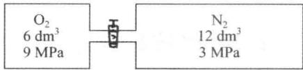

# 目录

# 第1章 绪论 (1)

1.1 什么是化学？ (1)  
1.2 化学变化的特征 (3)  
1.3 化学的疆域 (4)  
1.4 化学：一门以实验为基础的科学 ………………………………………… (6)  
1.5 化学：面向未来 (7)

# 第2章 气体 (10)

2.1 理想气体定律 (10)   
2.2 气体化合体积定律和Avogadro假说 (14)  
2.3 气体分压定律 (15)   
2.4 气体扩散定律 (18)   
2.5 气体分子运动论 ………………………………………… (19)  
2.6 分子的速率分布和能量分布 (23)  
2.7 实际气体和 van der Waals 方程 ………………………………………… (25)

# 第3章 相变·液态 ………………………………………… (31)

3.1 气体的液化·临界现象 ………………………………………… (31)   
3.2 液体的蒸发·蒸气压 (33)   
3.3 液体的凝固·固体的熔化 (37)  
3.4 水的相图 ………………………………………… (38)  
3.5 液体和液晶 (42)

# 第4章 溶液 (48)

4.1 溶液的浓度 (49)  
4.2 溶解度 (52)  
4.3 非电解质稀溶液的依数性 ………………………………………… (56)  
4.4 电解质溶液的依数性与导电性 ………………………………………… (65)  
4.5 胶体溶液 (70)

# 第5章 化学热力学 (76)

5.1 反应热的测量 (77)  
5.2 内能与焓· (80)  
5.3 热化学方程式与热化学定律 ………………………………………… (84)  
5.4 生成焓· (87)   
5.5 键焓· (89)

5.6 过程的性质 ………………………………………… (92)   
5.7 熵· (94)   
5.8 Gibbs自由能 (98)  
5.9 Gibbs-Helmholtz方程的应用 (101)

# 第6章 化学平衡 ………………………………………… (109)

6.1 平衡常数 (109)  
6.2 平衡常数与Gibbs自由能变 ………………………………………… (113)  
6.3 多重平衡 (116)  
6.4 化学平衡的移动 ………………………………………… (118)

# 第7章 化学反应速率 (127)

7.1 反应速率的意义 ………………………………………… (127)  
7.2 浓度与反应速率 (129)  
7.3 反应级数 (131)  
7.4 温度与反应速率·活化能 ………………………………………… (137)  
7.5 反应机理 (142)  
7.6 催化 (146)

# 第8章 酸碱平衡 (155)

8.1 酸碱质子理论 (155)  
8.2 水的自耦电离平衡 (161)  
8.3 弱酸弱碱电离平衡 (163)   
8.4 酸碱电离平衡的移动 (167)   
8.5 缓冲溶液 (170)   
8.6 酸碱中和反应 (174)

# 第9章 沉淀溶解平衡 ………………………………………… (180)

9.1 溶度积 (180)   
9.2 沉淀的生成 (183)  
9.3 沉淀的溶解 (186)   
9.4 沉淀的转化 (188)  
9.5 分步沉淀 ………………………………………… (189)

# 第10章 氧化还原·电化学 (196)

10.1 氧化数和氧化还原方程式的配平 ………………………………………… (197)  
10.2 电池的电动势和电极电势 ………………………………………… (200)   
10.3 标准电极电势和氧化还原平衡 ………………………………………… (203)  
10.4 电极电势的间接计算 ………………………………………… (207)  
10.5 浓度对电极电势的影响——Nernst方程式 ………………………………………… (209)  
10.6 由电势测定求 $K_{\mathrm{sp}}$ 或 $\mathrm{pH}$ (212)  
10.7 分解电势和超电势 ………………………………………… (214)

10.8 化学电源 (216)

# 第11章 原子结构 (224)

11.1 经典核原子模型的建立与量子概念的提出 ………………………………………… (224)  
11.2 氢原子光谱和Bohr氢原子理论 (230)   
11.3 微观粒子特性及其运动规律 ………………………………………… (234)  
11.4 氢原子的量子力学模型 ………………………………………… (237)  
11.5 多电子原子结构与周期律 ………………………………………… (247)  
11.6 元素基本性质的周期性变化规律 ………………………………………… (255)

# 第12章 化学键与分子结构 ………………………………………… (266)

12.1 离子键理论 (266)  
12.2 经典Lewis学说 (272)  
12.3 价键理论 (276)  
12.4 分子轨道理论 (284)  
12.5 价层电子对互斥理论 ………………………………………… (290)  
12.6 分子的极性 ………………………………………… (295)  
12.7 金属键理论 ………………………………………… (297)  
12.8 分子间作用力和氢键 ………………………………………… (299)

# 第13章 晶体与晶体结构 ………………………………………… (309)

13.1 晶体的特征 ………………………………………… (309)   
13.2 晶体结构的周期性 ………………………………………… (311)  
13.3 等径圆球的堆积 ………………………………………… (315)   
13.4 晶体的基本类型及其结构 ………………………………………… (317)  
13.5 化学键键型和晶体构型的变异 ………………………………………… (324)  
13.6 晶体的缺陷·非晶体 ………………………………………… (328)

# 第14章 配位化合物 (334)

14.1 配位化合物及其组成 ………………………………………… (334)  
14.2 配位化合物的类型和命名 ………………………………………… (337)  
14.3 配位化合物的异构现象 ………………………………………… (341)  
14.4 配合物的价键理论 ………………………………………… (345)  
14.5 晶体场理论 (349)  
14.6 配位平衡及其平衡常数 ………………………………………… (353)  
14.7 配位平衡的移动 ………………………………………… (354)  
14.8 配位化合物的应用 ………………………………………… (359)

# 第15章 元素化学 (365)

15.1 s区元素 (365)   
15.2 p区元素 (372)   
15.3 d区元素 (391)

15.4 f区元素 (400)   
15.5 元素在自然界的丰度 ………………………………………… (406)  
15.6 无机物的制备 ………………………………………… (408)

# 第16章 化学与社会发展 (421)

16.1 能源的综合利用 (421)  
16.2 功能非凡的材料 ………………………………………… (429)  
16.3 环境与可持续发展 (441)  
16.4 生命科学的化学语言 ………………………………………… (449)

# 附录

A. 习题答案 ………………………………………… (457)  
B.1 SI单位制的词头 (462)  
B.2 一些非推荐单位、导出单位与SI单位的换算 (463)  
B.3 一些常用的物理化学常数 (463)  
C.1 不同温度下的水蒸气压 (464)  
C.2 常见物质的 $\Delta_{\mathrm{f}}H_{\mathrm{m}}^{\ominus}$ 、 $\Delta_{\mathrm{f}}G_{\mathrm{m}}^{\ominus}$ 和 $S_{\mathrm{m}}^{\ominus}$ (465)  
C.3 弱酸、弱碱的电离平衡常数 (471)  
C.4 常见难溶电解质的溶度积 (472)  
C.5 酸性溶液中的标准电极电势 (473)  
C.6 碱性溶液中的标准电极电势 (475)  
C.7 常见配(络)离子的稳定常数 (477)  
D.1 元素周期表与原子价层的电子结构 ………………………………………… (478)  
D.2 原子半径 (479)  
D.3 元素的第一电离能 (480)  
D.4 主族元素的第一电子亲和能 (481)  
D.5 元素的电负性 (482)  
D.6 金属原子化热和熔点 (483)  
D.7 离子半径 (484)   
D.8 地壳与海水中元素的丰度 (485)

# 元素名称和相对原子质量 (486)

# 索引 (488)

# 第1章绪论

1.1 什么是化学？  
1.2 化学变化的特征  
1.3 化学的疆域  
1.4 化学：一门以实验为基础的科学  
1.5 化学：面向未来

欢迎进入化学世界！这是一个迷人的科学领域，也是一个取得过无数辉煌成就的科学分支。在过去几百年里，化学工作者的辛勤工作和无畏探索为人类社会作出了巨大的贡献，使得化学这门古老学科时时焕发出青春光彩。作为三大基础学科之一，化学拥有一个光荣的称号，即中心科学，或者说化学和物理是自然科学的轴心（示意于图1.1）。这是因为众多科学分支的发展都与化学密切相关，例如，生命、能源、材料、环境等学科领域都从化学的知识宝库中汲取了无数创造灵感，使得化学得以伫立于众山之巅。不仅如此，化学自创立以来一直以解决实际问题为己任，因此化学对于人们的生活有着直接的、重大的影响。每一个重要的化学发现，都有可能成为人类文明发展的里程碑，例如冶铁技术、合成氨技术、高分子和纳米材料等等，都最先出自于化学家之手。毫不夸张地讲，化学是人类文明的基石之一。每时每刻，在世界的各个角落，化学家都在创造着新的物质，探索着自然的奥秘，为创造一个更美好的世界而努力。在这里，你可以学到几百年来人类的智慧结晶，你也有机会像那些化学巨匠一样思考具体的科学问题，当然，还可以追随无数先辈，踏上探索未知世界之路。

# 1.1 什么是化学？

化学是一门关于如何创造新物质的科学，它的任务是研究物质的性质、组成、结构和化学变化及其能量变化的规律。从“化学”二字的中文含义讲，化学是一门关于变化的科学，或者也可以说，化学是一门关于创造前所未有的新物质的科学。

在现实生活中，化学可谓无所不在，化学研究的对象也是包罗万象。从星际空间有机物的进化到地面上造化万物的聚散离合，再到地层深处矿物的生成和利用，化学的对象几乎包括整个物质世界。由于物质世界永远处于动态变化之中，因此化学注定会成为我们认识物质世界的重要科学工具。

化学是神奇的。在悠悠历史深处，化学发源于古人对于神秘力量的敬畏和追求。早期的金丹术士试图跨越生命和财富的自然极限，为追求更美好的人生而努力。“尽管他们失败了，但是他们却完成了更伟大的工作！”(Ralph Waldo Emerson,美国作家、哲学家)。在金丹术士们追求长生不老以及把黑铅变成黄金的过程中，人类学会了化学实验，学会了观察总结实验现

象，学会了客观分析和思考。终于在17世纪末，化学作为一门科学诞生了。尽管化学并没有真正把铅变成黄金，但是她创造了更可宝贵的东西；尽管化学也并没有带给我们长生不老之药，但是她带给我们健康与长寿，带给我们新的、科学的生活方式。化学延续了她最初的神奇。化肥和杀虫剂促进了粮食生产，使许多国家和无数人民摆脱了饥饿的威胁；塑料制品的普及大幅度降低了日用品的价格，使无数普通人能够过上以前只有少数人才能拥有的生活；青霉素以及其他药物的人工合成和批量生产拯救了无数垂危的生命，使无数家庭免于破碎；化学燃料和功能陶瓷的制备与技术革新推动了航天技术的发展，使人类得以实现飞天的梦想。当我们回顾人类的前进足迹时，总是可以看到化学家的身影。化学之神奇令人叹为观止。

![[普通化学原理第4版 1-200_images/4beaf6362bb6785df5ff093ce9a88b9f1da06c41f10d5da146160235f18a6ad5.jpg]]  
图1.1 化学是一门中心科学

化学是一把开启自然奥秘的钥匙。当我们在襁褓中睁开双眼、一天天长大的时候，大千世界的无穷变化就时时令我们惊奇：花儿为什么会那么鲜艳？铁器为什么会生锈？蜡烛为什么会燃烧？篝火为什么会发出炙热的光芒？一个个问题不时涌现在我们的脑海之中，而化学就是解答这些问题的钥匙。在化学史上，正是类似的问题推动着化学的进步。化学家在好奇心和社会需求的推动下，积极探索未知世界，搜寻心中问题的答案，揭开自然的奥秘。与此同时，化学本身也在实践中不断发展壮大，成为今天的三大基础学科之一。例如，花瓣的颜色引出了酸碱概念以及酸碱指示剂，金属的腐蚀引出了氧化还原问题，蜡烛的故事引出了燃烧的本质问题，等等。在寻找问题答案的过程中，化学家逐步建立起严谨的实验规范，发展出有效的实验技术，并通过归纳推理，描绘自然的法则。

化学是人类的无价财富。化学不仅可以化腐朽为神奇，不仅可以满足人类的好奇心和求知欲，也能解决我们身边的现实问题。在工业文明高度发展之后，人类的生存环境遇到了前所未有的挑战。化石能源的过度开采使得能源危机成为人类社会挥之不去的阴影，人类活动的不断扩大导致了水资源以及其他自然资源的日益枯竭。能源与环境问题已经成为限制人类发展的羁绊，而化学可以帮助我们在荆棘丛生中开辟出一条可持续发展之路。很多新能源，如太阳能、核能的开发、存储和利用以及节能材料的发展都与化学密切相关，环境的保护和恢复也需要化学工作者的不懈努力。当新时代来临的时候，我们会发现化学变得越来越重要，化学已经成为人类迎接未来各种挑战的有力武器。

尽管化学已经取得了巨大的成就，但是一般大众对于化学的印象可能仍然是相当模糊的，人们仍会习惯地把喷着浓烟的烟囱、有害的气体、发出呛人气味的废水、食品添加剂等等与化学联系起来。但是人们也许没有想到，所有“天然的”物质也都是由化合物组成的，天然与化学并无必然界限。在正常的操作规程下，某些有害化学品的危害是完全可以避免的。我们学习化学知识，就是为了将来可以利用化学制品为人类造福，为社会的进步作出贡献。

# 1.2 化学变化的特征

世界上物质的变化分为两种：一种是物理变化，另一种是化学变化。化学家主要研究化学变化的规律和机理、化学变化所涉及的物质量和能量的变化。化学变化有以下3个特征。

# 1.2.1 化学变化是质变

化学变化涉及化学键的断裂和形成，即反应过程中各个原子之间的重新组合。以水的电解为例：电解过程中涉及O—H键的断裂和 $\mathrm{H - H,O = O}$ 键的形成。因为 $\mathrm{H}_2\mathrm{O}$ 与 $\mathrm{H}_{2},\mathrm{O}_{2}$ 是完全不同的物质，所以说化学变化是一种质变的过程。化学变化的实质是化学键的变化以及分子结构的相应变化，涉及电子和化学基团的迁移。化学键、原子结构和分子结构是化学的核心概念。

# 1.2.2 化学变化是定量的变化

化学变化发生在原子水平之上，只涉及原子核外电子在分子中的重新排布，而不涉及原子核内的变化（核化学除外）。因此，在化学变化中，参与反应的元素类型不会变化，即没有原有元素的消失和新元素的产生。在化学变化前后各物质的量维持恒定，服从质量守恒定律，反应前后物质的量有确定的计量关系。例如，加热 $1\mathrm{t}$ （吨） $\mathrm{CaCO_3}$ 并使它完全分解，应该得到 $0.56\mathrm{tCaO}$ 和 $0.44\mathrm{tCO_2};0.261\mathrm{g}$ 的 $\mathrm{Na}_2\mathrm{CO}_3$ 恰好中和 $40.0~\mathrm{cm}^3$ 、浓度为 $0.123\mathrm{mol}\cdot \mathrm{dm}^{-3}$ 的HCl溶液。反应物之间、反应物与生成物之间的质量关系是可以定量计算的。某些化学反应同时存在多种副反应，这时各物种之间的计量关系就比较复杂些。

# 1.2.3 化学变化伴随着能量变化

由于化学键的能量各不相同，所以当化学键发生变化时，必然伴随着能量的变化，伴随着体系和环境的能量交换。破坏原有化学键需要吸收能量，形成新的化学键会放出能量。若一个化学变化的过程中，放出的能量多于吸收的能量，则将有净能量向环境释放；反之，若放出的能量少于吸收的能量，则需从环境吸收能量，才能维持化学变化的顺利进行。化学热力学就是研究化学反应中能量变化的化学分支。化学热力学通过分析化学变化中的能量变化，可以预测化学反应的方向和限度，从而指导具体的生产实践。此外，化学动力学是研究化学反应快慢以及反应机理的化学分支学科。通过揭示化学反应的机理，可以改进重要化合物的合成路线，降低生产成本，提高生产效率。化学热力学和化学动力学是化学的两大重要领域，它们之间相辅相成，是化学的重要理论支柱。

在普通化学课程里，我们将遇到大量的不同类型的化学变化，但这些化学变化大都符合上述3个基本特征。因此，了解并掌握化学变化的这些特征，将有助于加深对于各种化学变化实质的理解。从化学变化的特征来看，化学原理最基本的内容一般包括：物质的物态（气、液、固），化学热力学，化学动力学，化学平衡，电化学，原子结构，分子结构和晶体结构等。本书将分章介绍这些方面的知识。

# 1.3 化学的疆域

人们经常说：化学无所不在，所以化学的对象也几乎无所不包。传统上，根据研究对象和方法的不同一般把化学分为5个分支领域，即无机化学、有机化学、分析化学、物理化学和高分子化学。下面逐一介绍。

# 1.3.1 无机化学

无机化学是研究无机化合物的性质及反应的化学分支。无机化合物包括除碳链和碳环化合物之外的所有化合物，因此，无机化合物种类众多，内容丰富。

# 1.3.2 有机化学

有机化学是一门研究碳氢化合物及其衍生物的化学分支，也可以说有机化学就是有关碳的化学。在19世纪初期，碳元素的化学远比金属以及其他常见元素（如硫、磷和氮）的化学落后。1828年，德国化学家Feiderich Wohler发现，用无机化合物 $\mathrm{NH_4Cl}$ 和 $\mathrm{AgOCN}$ （氰酸银）作用生成 $\mathrm{NH_4OCN}$ （氰酸铵），蒸发该溶液所得白色结晶是它的异构体 $\mathrm{CO(NH_2)_2}$ （尿素），后者是动物体内的有机物。人工合成尿素是有史以来第一个人工合成的有机物，也是人类第一次认识到有机物可以从无机物制得。
# 1.3.3 分析化学

除了合成新的化合物之外，化学家的另一个主要工作是分析物质的组成、结构、性质，以及分离和提纯物质。这就是分析化学的任务。从化学诞生以来，分析化学一直扮演着非常重要的角色。经典的分析技术被广泛用于分析化学实验的产物组成、矿物的组分以及鉴定未知元素中。20世纪以来，分析化学的发展经历了三次重大的变革。第一次是在20世纪初，物理化学基本概念和理论的发展为分析化学方法提供了理论基础，使分析化学从一种技术上升为一门科学。第二次是二次世界大战之后，由于物理学和电子学的发展，产生了大量的分析仪器，改变了经典的化学分析手段，使分析化学有了一个大的飞跃。
# 1.3.4 物理化学

物理化学是化学中的一个理论分支，它应用物理方法来研究化学问题。在化学探索中，化学家不仅要合成新的化合物，还要理解和掌握化学反应的内在规律。物理化学就是这样一个领域，它从物理学的发展中获得灵感，并将其应用到更为复杂的化学领域中去，研究化学体系的原理、规律和方法。19世纪后半叶以来，物理化学逐渐形成了若干分支：化学热力学、化学

# 1.3.5 高分子化学

高分子化学是研究高聚物的合成、反应、化学和物理性质以及应用的化学分支。与化学的其他分支学科相比，高分子化学是一个年轻的学科。合成高分子的历史不超过100年，但是它的发展非常迅速。在20世纪20年代，德国化学家Staudinger首先提出了高分子的重复链节结构，并在随后的实践中得到验证。到20世纪40年代，高分子合成已经发展成为一支新兴化学学科，获得迅猛发展。

一般化合物的分子量是几十到几百，而高分子化合物的分子量通常是几万甚至几十万。由成千上万小分子单体聚合成链并交织在一起，就组成了橡胶、纤维或塑料等高分子材料。

# 1.4 化学：一门以实验为基础的科学（无知识点）

关于实验和理论在化学中的地位，在历史上曾经引起过很多争论。例如，法国实证主义哲学家A. Comte说：“任何企图将数学应用于化学研究的做法都会被视为极为无理的行为，这违反了化学的精神。”而美国化学家Walter Eyring则持截然相反的观点：“迄今为止量子力学都(被证明)是正确的，因此化学问题就是应用数学问题。”如果抛开争议，有一点毋庸置疑，即化学仍然是一门以实验为基础的科学。化学实验仍然是人类认识物质化学性质、解释化学变

化规律和检验化学理论的基本手段。化学家在实验室中模拟各种条件，细致地对实验现象进行观察比较，并从中得出有用的结论。例如，很多新元素和新的化合物都是在实验室中被发现的，Mendeleev的周期律也是建立在大量实验事实的基础之上的，而且Mendeleev周期律的正确性也是由实验来验证和确立的。可见，实验对于化学家的重要性不言而喻。

在辽阔的化学领域中，绝大多数化学家都从事着实验发现的工作。这不仅仅因为实验是化学学科的传统，也由于化学研究对象的复杂性。当我们面对复杂体系时，在很多时候，通过实验来认识或深入理解几乎是唯一选择。在化学史上，有无数这样的实例来印证化学实验对于化学发展的重要性，例如Curie夫人发现镭的故事就是其中一个精彩的范例。

当我们强调化学实验的重要性时，也决不应当忽视理论对于化学探索的指导意义。的确，在化学发展的某些阶段，理论的突破会给化学带来突飞猛进的发展。一个突出的例子就是LinusPauling关于化学键的理论：Pauling的价键理论不仅为人们认识化学键奠定了坚实的理论基础，它的影响也扩大到化学学科之外，对于相关领域的发展也起到了非常重要的作用。

总之，在我们开始化学学习的时候，我们要重视实验技能的训练，掌握熟练的实验技巧，为以后的实验探索打好基础。同时，我们也要不断加强自身的理论素养，学会从实验数据中总结和发现规律的能力。

# 1.5 化学：面向未来（无知识点）

在21世纪中，化学仍然要面对艰巨的任务和挑战。展望未来，世界的人口、环境、资源和能源问题将更趋严重，解决这些问题需要化学家与其他领域的科学家共同作出努力。根据预测，在21世纪，化学将具有如下3个主要趋势：（i）重视解决重大实际问题——化学是一门与社会生活关系紧密的科学，从社会发展的需要出发，化学家会有更广阔的发挥空间，反过来也会深化和丰富化学自身。（ii）与相关学科进一步融合，吸取相关的理论和实验成果，开拓化学

新领域——在化学愈来愈深入其他相关学科的今天，化学也需要积极从外部吸收新的概念和方法。化学所具有的惊人的创造力将随着新兴领域的开辟得以获得持久的生命力。（iii）复杂体系的研究——化学科学建立在分子水平之上，在分子的结构和性质方面化学家过去已经积累了很多经验，而在超分子、介观领域、多尺度问题方面的化学研究才刚刚开始。复杂体系对于我们认识生命现象、材料性能至关重要，抓住这些领域中的关键化学问题并加以解决是当前化学的重要课题。

为了社会的可持续发展，为了化学学科的发展与进步，在21世纪，化学需要解决的重大问题有：

合成化学 掌握高效、专一、高产率、节能和环保的合成路线；理解和控制不同规模尺度化学反应的进程；实现合成过程的计算机设计。

生命化学 理解生命过程中的重要化学现象；针对威胁人类健康和生命的重大疾病发展出有效的药物和疗法。

材料科学 发展和应用自组装方法合成新材料；发展纳米技术和纳米机械；引入分子设计和材料设计，改变化学实验的传统试误方式，提高研发效率。

环境科学 大力发展绿色化学，设计无公害的化学工艺流程；深入了解地球（包括陆地、海洋、大气和生物圈）的生态化学系统，防止人类过度发展可能导致的生态灾难。

能源化学发展更稳定和更低成本的太阳能利用和存储方案；研制超导材料用于远距离电力传送；发展更实用和低成本的燃料电池：设计氢能和电力装置代替汽油燃料。

化学教育 向公众传达化学的成就和目标；吸引有志青年投身化学，为人类所面临的各种挑战寻找有效的解决方案。

预言化学在21世纪会取得哪些成就无疑是非常困难的，因为没有人能够洞悉未来。但是，目前至少有几点是清楚的：具有神奇功能的新材料将会不断涌现，并有可能带动计算机和激光器的突破性进展；新的超级药物研制和医学疗法将会取得重大进展，功能多样的微型机械将被用于临床；化学家将有可能找到消除工业污染的有效方法，环境问题也将不再是社会发展的制约因素；太阳能的利用将进入新的阶段，成为世界的主要能源选择之一。不过，有一点可以肯定，那就是化学将不断地创造奇迹，21世纪必将是化学又一个辉煌的舞台。

# 第2章 气体

2.1 理想气体定律   
2.2 气体化合体积定律和Avogadro假说  
2.3 气体分压定律   
2.4 气体扩散定律   
2.5 气体分子运动论  
2.6 分子的速率分布和能量分布  
2.7 实际气体和 van der Waals 方程

气体(gas)、液体(liquid)和固体(solid)是物质的三种常见状态。其中气体的结构和性质都比较简单，人们对较高温度及较低压力下气体的性质及其微观模型研究得最早，也最透彻。

在化学学科发展过程中，气体的研究占有重要地位。气态物质相对分子质量的测定对确定和统一相对原子质量极其重要，而准确的相对原子质量是发现周期律的重要依据。化学也从此由定性发展到定量，由经典过渡到近代。低压气体的激发光谱（首先是氢光谱）的发现和研究，深化了对原子结构的认识。理想气体方程式和各种气体定律在生产和科研上都有广泛应用，如气体计量、气体物质的分离和提纯等。

气体分子运动论是科学家建立的气体微观模型，是人类认识微观世界的早年的成功尝试。气体分子运动论的压力方程式、温度的统计解释，还有气体分子速率和能量分布都是很重要的概念。掌握这些基本概念，对学习和应用化学原理，及解释某些化学方程式有很大的帮助。

# 2.1 理想气体定律

# 2.1.1 理想气体定律

温度(temperature, $T$ )、压力(又叫压强，pressure, $p$ )和体积（volume, $V$ )是描述一定量气体状态的3个参量，它们之间的联系可用下面的方程式表示

$$
p V = n R T \tag {2.1}
$$

式中： $n$ 为气体物质的量(其单位为mol)， $R$ 为摩尔气体常数（也叫普适气体恒量)。这个方程式普遍适用于一切气体，但限于稀薄的气体，即温度不太低、压力不太高的“理想”气体，所以称之为理想气体定律，或理想气体状态方程，也叫Clapeyron方程。在这个简单的方程中，除 $R$ 之外其他4个物理量都是变量。这个方程以形式简单、变量多、适用范围广而著称。但在人类

认识自然规律的长河中，这是经历了两个多世纪许多科学家的认真观察归纳总结才取得的成果。这个涉及4个变量的方程式是综合了数个只涉及2个变量的实验定律而导出的。

17世纪中叶，英国科学家RobertBoyle曾用类似于图2.1的J形玻璃管进行实验。他利用水银压缩被密封在管内的空气，水银加入量不同，空气所受压力也不同，观测空气体积随水银柱高度不同而发生的变化。他发现当温度不变时，一定质量空气的体积与气体所受压力成反比。若管径均匀，则空气的体积与空气柱长度 $l$ 成正比，空气所受压力则为大气压与水银柱压差 $\Delta h$ 之和。表2.1列举了Boyle的一些原始实验数据，读者可进行验算。

![[普通化学原理第4版 1-200_images/11ffcf91b0bbc809cd37ccc8e98d05be451eeae598d5721b64be27c1ffbde94d.jpg]]  
图2.1 用J形管测定恒温下的 $p - V$ 关系

表 2.1 Boyle 的实验数据  
（一定量空气在室温，大气压为 $29.1\mathrm{inHg}^*$ ）  

<table><tr><td>l(刻度读数)</td><td>40</td><td>38</td><td>36</td><td>34</td><td>32</td><td>30</td></tr><tr><td>Δh/inHg</td><td>6.2</td><td>7.9</td><td>10.2</td><td>12.5</td><td>15.1</td><td>18.0</td></tr></table>

* 1 in(英寸) = 25.4 mm（毫米）

用各种气体进行试验，都得到相同的结果，由此总结为Boyle气体定律。该定律可叙述为：温度恒定时，一定量气体的压力和它的体积的乘积为恒量。其数学表达式为

$$
p V = \text {恒 量} \quad (T, n \text {恒 定}) \tag {2.2}
$$

研究另外一对变量 $(T$ 和 $V)$ 关系的是法国科学家Charles和Gay-Lussac①。在18世纪末，他们研究在恒压条件下气体体积随温度升高而膨胀的规律。他们发现在压力不太大时，任何气体随温度的膨胀率都是一样的，而且都是摄氏温度的线性函数。若某一定量气体在沸水 $(100^{\circ}\mathrm{C})$ 中的体积为 $V_{100}$ ，而在冰水 $(0^{\circ}\mathrm{C})$ 中的体积为 $V_{0}$ ，实验证明，任意气体由 $0^{\circ}\mathrm{C}$ 升温到 $100^{\circ}\mathrm{C}$ ，其体积增加约为 $37\%$ ，即

$$
\frac {V _ {1 0 0} - V _ {0}}{V _ {0}} = 0. 3 6 6 = \frac {1}{2 . 7 3} = \frac {1 0 0}{2 7 3}
$$

推广到更为一般的情况，若用温度 $t(\mathrm{C})$ 时气体体积 $V_{t}$ 代替 $V_{100}$ ，则有

$$
\frac {V _ {t} - V _ {0}}{V _ {0}} = \frac {t}{2 7 3}
$$

或 $V_{t} = V_{0}\left(1 + \frac{t}{273}\right)$

上式可以表述为：当压力不变时，一定量气体每升高 $1^{\circ}\mathrm{C}$ ，它的体积膨胀了 $0^{\circ}\mathrm{C}$ 时体积的 $1/273$ 。这就是 Charles 和 Gay-Lussac 当时的研究结果。

近1个世纪之后，物理学家 Clausius 和 Kelvin 在研究热机效率问题时建立了热力学第二定律，并提出了热力学温标（曾叫绝对温标）的概念。其后，Charles-Gay Lussac 气体定律才表述为：压力恒定时，一定量气体的体积 $(V)$ 与它的热力学温标 $(T)$ 成正比；或恒压时，一定量气体的 $V$ 对 $T$ 的商值是恒量。其数学表达式为

$$
\frac {V}{T} = \text {恒 量} \qquad (p, n \text {恒 定}) \tag {2.3}
$$

热力学温标单位是国际单位(SI)制7个基本单位之一，温标符号为 $T$ ，单位是Kelvin，符号为K。中文单位名称叫“开尔文”，代号为“开”，1开等于水的三相点热力学温度的1/273.16（详见3.4节）。热力学温标的零度相当于摄氏 $-273.15^{\circ}\mathrm{C}$ ，即

$$
\frac {T}{K} = \frac {t}{^ {\circ} C} + 2 7 3. 1 5
$$

那么，273.15是怎样确定的呢？可根据实验数据用外延法求出。任选几种不同起始状态的理想气体（如图2.2的A、B、C），在恒压下测定不同温度 $t$ 的体积 $V$ ，以 $V$ 对 $t$ 作图得直线，外延到与横坐标相交处，交点的 $V = 0,t = -273.15^{\circ}C$ ，各种气体的各种起始状态的 $V - t$ 延长线都交于此。在这个温度，理想气体的体积似应等于零，所以也叫热力学零度(曾叫绝对零度)，水的冰点 $0^{\circ}C$ 称相对零度。

![[普通化学原理第4版 1-200_images/be8ecb2ef19241539bb7b9db83cd9d023c0c6b2effe5676095e667364f9367bc.jpg]]  
图2.2 恒压下气体体积与温度的关系

温度越低，气体体积越小，当温度降到 $-273.15^{\circ}C$ 时，难道气体的体积真等于零吗？实际上这是不可能的，气体冷却到一定程度就凝聚为液体了，再冷就凝为固体。沸点最低的气体是氦（He），它的沸点是 $4.2\mathrm{K}$ 凝固点是 $1.0\mathrm{K}(25\mathrm{atm})$ 。迄今在实验室用液氦制冷特殊技术可达最低温度 $0.0001\mathrm{K}$ 。所以热力学零度是一个理想的极限概念，但热力学温标却极其重要而有用，许多科学定律都用热力学温标表示温度。

19世纪中叶，法国科学家Clapeyron综合Boyle定律和Charles定律，把描述气体状态的3个参量 $(p,V,T)$ 归并于一个方程式，给出一定量气体，体积和压力的乘积与热力学温度成正比。设某一定量气体的原始状态是 $p_1,V_1$ 和 $T_{1}$ ，其最终状态是 $p_2,V_2$ 和 $T_{2}$ ，这个变化过程可分解为2个步骤：先发生等温变化，即由 $p_1V_1T_1$ 变为 $p_2V'T_1$ ；然后发生等压变化，即由 $p_2V'T_1$ 变为 $p_2V_2T_2$ 。变化关系如下：

首先，温度 $T_{1}$ 不变

$$
p _ {1} V _ {1} = p _ {2} V ^ {\prime}
$$

其次，压力 $p_2$ 不变

$$
\frac {V ^ {\prime}}{T _ {1}} = \frac {V _ {2}}{T _ {2}} \quad \text {或} \quad V ^ {\prime} = V _ {2} \frac {T _ {1}}{T _ {2}}
$$

将 $V^{\prime}$ 代入第一步，得

$$
\frac {p _ {1} V _ {1}}{T _ {1}} = \frac {p _ {2} V _ {2}}{T _ {2}} = \text {恒 量}
$$

对于 $1\mathrm{mol}$ 气体，恒量等于 $R$ ；对于物质的量为 $n(\mathrm{mol})$ 的气体，恒量等于 $nR, R$ 称为摩尔气体常数。后经Horstmam，Mendeleev等人的支持和提倡，到19世纪末，人们开始普遍使用如下形式的理想气体状态方程式

$$
p V = n R T
$$

# 2.1.2 理想气体状态方程的应用

用理想气体状态方程进行计算时，务必注意各参量的单位：其中温度 $T$ 必须用热力学温标，单位开尔文(K)；气体物质的量 $n$ 的单位是摩尔(mol)；体积 $V$ 的单位常用立方分米或立方厘米 $(\mathrm{dm}^3$ 或 $\mathrm{cm}^3)$ ；压力 $p$ 按国际单位制应该用帕斯卡 $\mathrm{Pa}$ (Pascal)或千帕斯卡 $\mathrm{kPa}$ ，以往也经

常使用大气压（atm）为压力单位。在实验室常用水银压力计测量压力，所以也用水银柱高度 $(\mathrm{mmHg}$ 或 $\mathrm{cmHg})$ 表示压力①。摩尔气体常数 $R$ 的值随 $p$ 和 $V$ 单位不同而异，如 $p$ 用 $\mathrm{kPa}, V$ 用 $\mathrm{dm}^3$ ，已知 $1\mathrm{mol}$ 理想气体在标准状况(273.15K,101.33kPa)下体积为 $22.414\mathrm{dm}^3$ ，则

$$
R = \frac {p V}{n T} = \frac {1 0 1 . 3 3 \mathrm {k P a} \times 2 2 . 4 1 4 \mathrm {d m} ^ {3}}{1 \mathrm {m o l} \times 2 7 3 . 1 5 \mathrm {K}} = 8. 3 1 4 9 \mathrm {k P a} \cdot \mathrm {d m} ^ {3} \cdot \mathrm {m o l} ^ {- 1} \cdot \mathrm {K} ^ {- 1}
$$

在3位有效数字计算中，我们常用 $R = 8.31\mathrm{kPa}\cdot \mathrm{dm}^3\cdot \mathrm{mol}^{-1}\cdot \mathrm{K}^{-1}$ 。当阅读中外各类参考资料、书刊时，还可能见到其他单位表述的 $R$ ，可参照物理量单位换算关系②进行必要的换算。常见的几种表述如下：

$$
\begin{array}{l} R = \frac {p V}{n T} = 8. 3 1 \mathrm {k P a} \cdot \mathrm {d m} ^ {3} \cdot \mathrm {m o l} ^ {- 1} \cdot \mathrm {K} ^ {- 1} = 0. 0 8 3 1 \mathrm {b a r} \cdot \mathrm {d m} ^ {3} \cdot \mathrm {m o l} ^ {- 1} \cdot \mathrm {K} ^ {- 1} \\ = 0. 0 8 2 1 \mathrm {a t m} \cdot \mathrm {d m} ^ {3} \cdot \mathrm {m o l} ^ {- 1} \cdot \mathrm {K} ^ {- 1} = 6 2. 4 \mathrm {m m H g} \cdot \mathrm {d m} ^ {3} \cdot \mathrm {m o l} ^ {- 1} \cdot \mathrm {K} ^ {- 1} \\ = 8. 3 1 \mathrm {J} \cdot \mathrm {m o l} ^ {- 1} \cdot \mathrm {K} ^ {- 1} = 1. 9 9 \mathrm {c a l} \cdot \mathrm {m o l} ^ {- 1} \cdot \mathrm {K} ^ {- 1} \\ \end{array}
$$

完全理想的气体虽然不存在，但是许多实际气体，特别是那些不易液化的气体，如 $\mathrm{He}$ 、 $\mathrm{H}_2$ 、 $\mathrm{O}_2$ 、 $\mathrm{N}_2$ 等，在常温常压下的性质颇近似于理想气体。此外只需粗略估算时，用这个方程也很方便。现举例说明该方程的应用。关于实际气体对理想状态的偏离和方程式的修正将在2.7节介绍。

【例2.1】淡蓝色氧气钢瓶体积一般为 $50\mathrm{dm}^3$ ，在室温 $20^{\circ}\mathrm{C}$ ，当其压力降为 $1.5\mathrm{MPa}$ 时，估算钢瓶中所剩氧气的质量。

解 在 $pV = nRT$ 式中 $p, V, T$ 都已知，即可求算 $n$ （注意 $R$ 的选用）。

$$
n = \frac {p V}{R T} = \frac {1 5 0 0 \mathrm {k P a} \times 5 0 \mathrm {d m} ^ {3}}{8 . 3 1 \mathrm {k P a} \cdot \mathrm {d m} ^ {3} \cdot \mathrm {m o l} ^ {- 1} \cdot \mathrm {K} ^ {- 1} \times (2 7 3 + 2 0) \mathrm {K}} = 3 1 \mathrm {m o l}
$$

氧气摩尔质量为 $32\mathrm{g}\cdot \mathrm{mol}^{-1}$ ，故所剩氧气的质量为

$$
3 1 \mathrm {m o l} \times 3 2 \mathrm {g} \cdot \mathrm {m o l} ^ {- 1} = 9. 9 \times 1 0 ^ {2} \mathrm {g} = 0. 9 9 \mathrm {k g}
$$

【例2.2】惰性气体氙能和氟形成多种氟化氙 $\mathrm{XeF}_x$ 。实验测定在 $80^{\circ}\mathrm{C}$ ， $15.6\mathrm{kPa}$ 时，某气态氟化氙试样的密度为 $0.899\mathrm{g}\cdot \mathrm{dm}^{-3}$ 。试确定这种氟化氙的分子式。

解 求出摩尔质量，即可确定分子式。

设氟化氙摩尔质量为 $M$ ，密度为 $\rho (\mathrm{g}\cdot \mathrm{dm}^{-3})$ ，质量为 $m(\mathrm{g})$ ， $R$ 应选用 $8.31\mathrm{kPa}\cdot \mathrm{dm}^3$ · $\mathrm{mol}^{-1}\cdot \mathrm{K}^{-1}$ 。

$$
p V = n R T = \frac {m}{M} R T
$$

所以 $M = \frac{m}{V}\frac{RT}{p} = \rho \frac{RT}{p}$

$$
\begin{array}{l} = \frac {0 . 8 9 9 \mathrm {g} \cdot \mathrm {d m} ^ {- 3} \times 8 . 3 1 \mathrm {k P a} \cdot \mathrm {d m} ^ {3} \cdot \mathrm {m o l} ^ {- 1} \cdot \mathrm {K} ^ {- 1} \times (2 7 3 + 8 0) \mathrm {K}}{1 5 . 6 \mathrm {k P a}} \\ = 1 6 9 \mathrm {g} \cdot \mathrm {m o l} ^ {- 1} \\ \end{array}
$$

已知相对原子质量：Xe为131，F为19，所以

$$
1 3 1 + 1 9 x = 1 6 9, \quad x = 2
$$

这种氟化氙的分子式为 $\mathrm{XeF_2}$ 。

# 2.2 气体化合体积定律和Avogadro假说

(Gas Law of Combining Volume and Avogadro's Hypothesis)

# 2.2.1 气体化合体积定律

Gay-Lussac不只是研究气体体积随温度变化的规律，他还大量研究化学反应中各气体体积的相互关系，从而发现了气体化合体积定律：在恒温恒压下，气体反应中各气体的体积互成简单整数比。例如氢气和氯气化合生成氯化氢气体时，三者体积比为 $1:1:2$ ，而氢气和氧气化合生成水汽时，它们的体积比为 $2:1:2$ 。现在我们对原子、分子、分子式、相对原子质量等都已有明确认识，对这个定律是很容易理解的。但在19世纪初，Dalton原子论问世不久，它对定比定律、倍比定律的圆满解释，曾博得科学界一片赞誉，但却不能解释气体化合体积定律。按原子论的观点，化学反应中各种元素的原子数是互成简单整数比的，若气体体积比也成简单整数比，那么就容易设想同体积气体中所含原子数目相同。按此，可有以下推论：

1体积氢气 $+1$ 体积氯气 $= 2$ 体积氯化氢气  
1原子氢气 $+1$ 原子氯气 $= 2$ 原子氯化氢气  
0.5原子氢 $+0.5$ 原子氯 $= 1$ 原子氯化氢气

即生成1个氯化氢需要半个原子氢气和半个原子氯气。这个说法和Dalton原子论是抵触的，后者认为原子是化学反应中不可分割的最小微粒，“半个原子”是不可思议的。Gay-Lussac总结出来的气体化合体积定律揭示了原子论的美中不足。解决这个矛盾的是意大利科学家Avogadro，他在1811年明确提出了“分子”的概念，并指出气体分子可由几个原子组成，如氢气、氯气可能都是双原子分子。他还认为，“同温同压下，同体积气体所含分子数目相等”。这个说法当时并无直接的实验根据，只是一种假说。按Avogadro的观点，上述推论可修改为：

1体积氢气 $+1$ 体积氯气 $= 2$ 体积氯化氢气  
1分子氢气 $+1$ 分子氯气 $= 2$ 分子氯化氢气  
0.5分子氢气 $+0.5$ 分子氯气 $= 1$ 分子氯化氢气  
1原子氢 $+1$ 原子氯 $= 1$ 分子氯化氢气

# 2.2.2 Avogadro定律

Avogadro 假说使气体化合体稳定律得到了圆满的解释, 它在原子分子学说形成过程中有特殊的历史作用。到 19 世纪末这个假说由气体分子运动论给予理论证明 (见第 2.5 节), 所以现在叫做 Avogadro 定律。这个定律现代的表述是: 在相同的温度与相同的压力下, 相同体积的气体的物质的量相同。其实这也是气体状态方程的一个例证。若有 A、B 两种气体, 它们的

气态方程分别是

$$
p _ {\mathrm {A}} V _ {\mathrm {A}} = n _ {\mathrm {A}} R T _ {\mathrm {A}}
$$

$$
p _ {\mathrm {B}} V _ {\mathrm {B}} = n _ {\mathrm {B}} R T _ {\mathrm {B}}
$$

当 $p_{\mathrm{A}} = p_{\mathrm{B}}, T_{\mathrm{A}} = T_{\mathrm{B}}, V_{\mathrm{A}} = V_{\mathrm{B}}$ 时， $n_{\mathrm{A}}$ 必然等于 $n_{\mathrm{B}}$ 。这个定律对于处理气体反应问题是很有用的，化学方程式表明了反应中各气体物质的量的关系，但实际测量的往往是体积关系，我们就借助于Avogadro定律把它们联系在一起。

【例2.3】在 $100\mathrm{kPa}, 24.0^{\circ}\mathrm{C}$ 时， $100\mathrm{g}$ 乙醇完全燃烧，需消耗纯氧多少立方分米？产生多少立方分米的二氧化碳？

解 首先写出配平的化学方程式

$$
\mathrm {C} _ {2} \mathrm {H} _ {5} \mathrm {O H} + 3 \mathrm {O} _ {2} \longrightarrow 2 \mathrm {C O} _ {2} + 3 \mathrm {H} _ {2} \mathrm {O}
$$

它表明 $1\mathrm{mol}\mathrm{C}_2\mathrm{H}_5\mathrm{OH}$ 燃烧需 $3\mathrm{mol}\mathrm{O}_2$ ，所以 $100\mathrm{g}$ 乙醇燃烧时需 $\mathrm{O}_2$ 量

$$
n \left(\mathrm {O} _ {2}\right) = 3 \times \frac {1 0 0 \mathrm {g}}{4 6 . 1 \mathrm {g} \cdot \mathrm {m o l} ^ {- 1}} = 6. 5 1 \mathrm {m o l}
$$

代入理想气体状态方程，可求 $\mathrm{O}_2$ 的体积

$$
V \left(\mathrm {O} _ {2}\right) = \frac {n R T}{p} = \frac {6 . 5 1 \mathrm {m o l} \times 8 . 3 1 \mathrm {k P a} \cdot \mathrm {d m} ^ {3} \cdot \mathrm {m o l} ^ {- 1} \cdot \mathrm {K} ^ {- 1} \times (2 7 3 + 2 4) \mathrm {K}}{1 0 0 \mathrm {k P a}} = 1 6 1 \mathrm {d m} ^ {3}
$$

按化学方程式可知，消耗 $3\mathrm{mol}O_2$ 产生 $2\mathrm{molCO}_{2}$ ，即消耗3体积 $\mathrm{O}_2$ ，产生2体积 $\mathrm{CO}_{2}$ 则 $V(\mathrm{CO}_{2}) = 161\mathrm{dm}^{3}\times \frac{2}{3} = 107\mathrm{dm}^{3}$

# 2.3 气体分压定律

# (Law of Partial Pressure)

前面两节所讨论的几个气体定律都是处理的纯气体。假若体系是混合气体，不必分别计量时仍可使用以上定律；若要分别计量，那么就必须应用气体“分压”的概念。如空气就是 $\mathrm{N}_2$ 、 $\mathrm{O}_2$ 、Ar 等多种气体的混合物，当空气处于标准大气压（ $101\mathrm{kPa}$ ）时，其中各组分气体的分压力各是多少？又如，用排水集气法收集的氢气中自然含有水汽，干燥之后，氢气的体积或压力有没有变化？这些都要用分压概念来处理。

设在温度 $T(\mathrm{K})$ 时，将物质的量为 $n_{\mathrm{A}}(\mathrm{mol})$ 的A气体，放在体积为 $V$ 的容器中，压力为 $p_{\mathrm{A}}$ ；而将 $n_{\mathrm{B}}(\mathrm{mol})$ 的B气体单独放在该容器中的压力则为 $p_{\mathrm{B}}$ 。若将这两份理想气体共储于该容器中 $(T,V$ 不变），只要A和B之间不起化学作用，它们各自所显示的压力，犹如它们单独存在时一样，那么混合气体的总压力 $p_{\text{总}}$ 等于 $p_{\mathrm{A}}$ 与 $p_{\mathrm{B}}$ 之和，即

$$
p _ {\text {总}} = p _ {\mathrm {A}} + p _ {\mathrm {B}} \tag {2.4}
$$

在此场合， $p_{\mathrm{A}}$ 就是 $\mathrm{A}$ 气体的分压力， $p_{\mathrm{B}}$ 就是 $\mathrm{B}$ 气体的分压力。A、B各自都遵守理想气体状态方程，则

$$
p _ {\mathrm {A}} = \frac {n _ {\mathrm {A}} R T}{V}, \quad p _ {\mathrm {B}} = \frac {n _ {\mathrm {B}} R T}{V} \tag {2.5}
$$

代入（2.4）式，得 $p_{\text{总}} = p_{\mathrm{A}} + p_{\mathrm{B}} = \frac{(n_{\mathrm{A}} + n_{\mathrm{B}})RT}{V}$ (2.6)

（2.5）和（2.6）式相除，得

$$
\frac {p _ {\mathrm {A}}}{p _ {\text {总}}} = \frac {n _ {\mathrm {A}}}{n _ {\mathrm {A}} + n _ {\mathrm {B}}} = \frac {n _ {\mathrm {A}}}{n _ {\text {总}}} \quad \text {或} \quad p _ {\mathrm {A}} = p _ {\text {总}} \times \frac {n _ {\mathrm {A}}}{n _ {\text {总}}}
$$

以及 $\frac{p_{\mathrm{B}}}{p_{\text{总}}} = \frac{n_{\mathrm{B}}}{n_{\text{总}}}$ 或 $p_{\mathrm{B}} = p_{\text{总}} \times \frac{n_{\mathrm{B}}}{n_{\text{总}}}$ (2.7)

$(2.4)\sim (2.7)$ 式都是在温度 $(T)$ 、体积 $(V)$ 恒定时适用。

在恒温 $(T)$ 与恒压 $(p = p_{\text{总}})$ 条件下，如果 $n_{\mathrm{A}}(\mathrm{mol})$ 的A气体单独存在所占的体积是 $V_{\mathrm{A}}$ ， $n_{\mathrm{B}}(\mathrm{mol})$ 的B气体单独存在所占体积是 $V_{\mathrm{B}}$ ，当这两份气体混合后，总体积 $V_{\text{总}}$ 则等于 $V_{\mathrm{A}}$ 与 $V_{\mathrm{B}}$ 之和，即

$$
V _ {\text {总}} = V _ {\mathrm {A}} + V _ {\mathrm {B}} \quad (T, p \text {恒 定}) \tag {2.8}
$$

在此场合 $V_{\mathrm{A}}$ 和 $V_{\mathrm{B}}$ 则分别是A气体和B气体的分体积，这也就是指在一定的 $T$ 及 $p_{\text{总}}$ 条件下，A气体与B气体单独存在所占有的体积。某组分气体的分体积等于该气体在总压力条件

下，所单独占有的体积，即 $V_{\mathrm{A}} = \frac{n_{\mathrm{A}}RT}{p_{\text{总}}}$

在相同的温度与压力下，气体物质的量与它的体积成正比，所以

$$
\frac {n _ {\mathrm {A}}}{n _ {\text {总}}} = \frac {n _ {\mathrm {A}}}{n _ {\mathrm {A}} + n _ {\mathrm {B}}} = \frac {V _ {\mathrm {A}}}{V _ {\mathrm {A}} + V _ {\mathrm {B}}} = \frac {V _ {\mathrm {A}}}{V _ {\text {总}}} \tag {2.9}
$$

代入(2.7)式，得 $p_{\mathrm{A}} = p_{\text{总}} \times \frac{V_{\mathrm{A}}}{V_{\text{总}}}$ 或 $V_{\mathrm{A}} = V_{\text{总}} \times \frac{p_{\mathrm{A}}}{p_{\text{总}}}$

以及 $p_{\mathrm{B}} = p_{\text{总}} \times \frac{V_{\mathrm{B}}}{V_{\text{总}}} \quad \text{或} \quad V_{\mathrm{B}} = V_{\text{总}} \times \frac{p_{\mathrm{B}}}{p_{\text{总}}}$ (2.10)

综上所述，气体分压定律可表述为：在温度与体积恒定时，混合气体的总压力等于各组分气体分压之和；某气体分压等于总压力乘该气体摩尔分数或体积分数，即

$$
p _ {\text {总}} = \sum p _ {i}, \quad p _ {i} = p _ {\text {总}} \times \frac {n _ {i}}{\sum n _ {i}} = p _ {\text {总}} \times \frac {V _ {i}}{\sum V _ {i}} \tag {2.11}
$$

这个定律是1807年Dalton首先提出的，所以也叫Dalton分压定律，它是处理混合气体的基本定律。若各组分气体都符合理想状态，则各组分气体的分压可按(2.5)、(2.7)及(2.10)等式具体计算。在使用这些方程式时务需注意实验条件，现举例说明之。

【例2.4】在 $25^{\circ}\mathrm{C}$ 与 $101.0\mathrm{kPa}$ 压力下，已知丁烷气中含硫化氢的质量分数为 $1.00\%$ 求 $\mathrm{H}_2\mathrm{S}$ 和 $\mathrm{C_4H_{10}}$ 的分压。

解 设现有 $1\mathrm{kg}$ 丁烷气，则其中

$$
n(\mathrm{H_2S}) = \frac{1000\mathrm{g}\times 1.00\%}{34.1\mathrm{g}\bullet\mathrm{mol}^{-1}} = 0.293\mathrm{mol}
$$

$$
n \left(\mathrm {C} _ {4} \mathrm {H} _ {1 0}\right) = \frac {1000 \mathrm {g} - 1000 \mathrm {g} \times 1.00 \%}{58.1 \mathrm {g} \cdot \mathrm {mol} ^ {- 1}} = 17.0 \mathrm {mol}
$$

代入（2.7）式，得

$$
p (\mathrm {H} _ {2} \mathrm {S}) = p _ {\text {总}} \times \frac {n (\mathrm {H} _ {2} \mathrm {S})}{n _ {\text {总}}} = 1 0 1. 0 \mathrm {k P a} \times \frac {0 . 2 9 3 \mathrm {m o l}}{0 . 2 9 3 \mathrm {m o l} + 1 7 . 0 \mathrm {m o l}} = 1. 7 1 \mathrm {k P a}
$$

$$
p \left(\mathrm {C} _ {4} \mathrm {H} _ {1 0}\right) = 1 0 1. 0 \mathrm {k P a} \times \frac {1 7 . 0 \mathrm {m o l}}{1 7 . 0 \mathrm {m o l} + 0 . 2 9 3 \mathrm {m o l}} = 9 9. 3 \mathrm {k P a}
$$

【例2.5】现有一个 $6\mathrm{dm}^3$ 、9MPa的氧气储罐和另一个 $12\mathrm{dm}^3$ 、3MPa的氮气储罐。两个容器由活塞连接，打开活塞待两种气体混合均匀后（设混合前后温度不变），求此时氧气、氮气的分压与分体积。

解两份气体起始状态压力不同，混合之后总体积为 $18\mathrm{dm}^3$ ，但总压力并不是 $12\mathrm{MPa}$ $(9\mathrm{MPa} + 3\mathrm{MPa})$ ，而是 $5\mathrm{MPa}$ 。因为由Boyle定律可知，当 $\mathrm{O}_2$ 的体积由 $6\mathrm{dm}^3$ 膨胀为 $18\mathrm{dm}^3$ 时，压力则由 $9\mathrm{MPa}$ 降为 $3\mathrm{MPa}$ ；而 $\mathbf{N}_2$ 的体积由 $12\mathrm{dm}^3$ 膨胀为 $18\mathrm{dm}^3$ 时，压力则由 $3\mathrm{MPa}$ 降为 $2\mathrm{MPa}$ 。在这 $18\mathrm{dm}^3$ 的混合气体中 $p(\mathrm{O}_2) = 3\mathrm{MPa}, p(\mathrm{N}_2) = 2\mathrm{MPa}$ ，所以混合后总压力等于 $5\mathrm{MPa}$ 。

混合之后总体积是 $18\mathrm{dm}^3$ ，分体积并不是 $6\mathrm{dm}^3$ 和 $12\mathrm{dm}^3$ （为什么？），而应按(2.10)式计算。

氧的分体积 $V(\mathrm{O}_2) = V_\text{总}\times \frac{p(\mathrm{O}_2)}{p_\text{总}} = 18\mathrm{dm}^3\times \frac{3\mathrm{MPa}}{5\mathrm{MPa}} = 11\mathrm{dm}^3$

氮的分体积 $V(\mathrm{N}_2) = V_\text{总}\times \frac{p(\mathrm{N}_2)}{p_\text{总}} = 18\mathrm{dm}^3\times \frac{2\mathrm{MPa}}{5\mathrm{MPa}} = 7\mathrm{dm}^3$

【例2.6】在 $100.0\mathrm{kPa}$ 和 $20^{\circ}\mathrm{C}$ 时，利用排水集气法收集 $28.4~\mathrm{cm}^3$ 的氢气，干燥后氢气的体积是多少？已知在 $20^{\circ}\mathrm{C}$ 水的饱和蒸气压 $p(\mathrm{H}_2\mathrm{O}) = 2.34\mathrm{kPa}$ 。

解 按题意知 $28.4 \mathrm{~cm}^{3}$ 是 $\mathrm{H}_{2}$ 和 $\mathrm{H}_{2} \mathrm{O}$ 在 $100 \mathrm{kPa}$ 和 $20^{\circ} \mathrm{C}$ 条件下的总体积，即 $V_{\text {总}} = 28.4 \mathrm{~cm}^{3}$ ，又知水汽的分压 $p(\mathrm{H}_{2} \mathrm{O}) = 2.34 \mathrm{kPa}$ ，那么氢气分压 $p(\mathrm{H}_{2}) = (100.0 - 2.34) \mathrm{kPa} = 97.7 \mathrm{kPa}$ ，干燥后氢气的体积就是 $\mathrm{H}_{2}$ 在 $20^{\circ} \mathrm{C}, 100.0 \mathrm{kPa}$ 的分体积 $V(\mathrm{H}_{2})$ ，所以用（2.10）式即可求得干燥后氢气的体积：

$$
V (\mathrm {H} _ {2}) = V _ {\text {总}} \times \frac {p (\mathrm {H} _ {2})}{p _ {\text {总}}} = 2 8. 4 \mathrm {c m} ^ {3} \times \frac {9 7 . 7 \mathrm {k P a}}{1 0 0 . 0 \mathrm {k P a}} = 2 7. 7 \mathrm {c m} ^ {3}
$$

也可以用理想气体状态方程先求出 $n_{\text{总}}$ 和 $n(\mathrm{H}_2)$ ，然后再算 $V(\mathrm{H}_2)$ ，读者可自行验算。注意正确选用 $p, n, R$ 。

在一个化学反应里，往往有几种气体同时存在，所以在处理与气体有关的溶解度、化学平衡、反应速率等问题时都经常要应用分压的概念。进行气体分析更是离不开分压、分体积等概念，由于气体的体积便于直接测量，所以常由体积分数求气体的摩尔分数和分压。

当年Ramsay等人曾用如图2.3所示的仪器来验证Dalton分压定律：仪器由内外两层套管制成，内管是钯(Pd)制小管，它的特性是能让氢分子自由通过而氩分子(Ar)不能透过。将

一定量Ar通入内管，并用右侧相连的压力计测定它的压力。然后再通入一定量的 $\mathrm{H}_{2}$ ，钯制内管中则含有 $\mathrm{H}_{2}$ 和Ar混合气体。同时向外管中通入氢气，若外管 $\mathrm{H}_{2}$ 的压力大于内管 $\mathrm{H}_{2}$ 的分压，将有 $\mathrm{H}_{2}$ 渗入内管；反之，若内管 $\mathrm{H}_{2}$ 分压大于外管 $\mathrm{H}_{2}$ 压力，则 $\mathrm{H}_{2}$ 由内管渗入外管。当内外两管 $\mathrm{H}_{2}$ 的压力相等时，右侧压力计读数稳定不变，并由此测出 $\mathrm{H}_{2}$ 和Ar混合

![[普通化学原理第4版 1-200_images/6a398c1c8c56671093dd9aa74ce4444559a2dd28ab6f79b38d079748869f88c5.jpg]]  
图2.3 气体分压力的测定

气的总压力，而与此同时可由与外管相连的压力计测出 $\mathrm{H}_{2}$ 的分压。Ramsay等人证明，Ar的分压和 $\mathrm{H}_{2}$ 的分压之和恰等于混合气体的总压。

# 2.4 气体扩散定律

# (Law of Gas Diffusion)

气体分子间距离大，作用力小，并不停地做无规则运动，尽量扩散到所能达到的空间，那么气体分子扩散速率有无规律？

取一支玻璃管，在其左端放浸有浓氨水的棉花团，右端放浸有浓盐酸的棉花团（图2.4）。 $\mathrm{NH}_3$ 分子向右扩散，HCl分子向左扩散，它们相遇时生成 $\mathrm{NH}_4\mathrm{Cl}$ 白色固体而出现白色雾环。

![[普通化学原理第4版 1-200_images/02c062a1739a8343cfc0e0ed080ed13703f107b5bd8a8be2d574ec70a02336e4.jpg]]  
图2.4 $\mathbf{NH}_3$ 和HCl的扩散

可以观察到这个白色雾环出现在中间偏右部位，左右距离比约为 $3:2$ 。这个实验现象告诉我们， $\mathrm{NH}_3$ 的扩散速率比 $\mathrm{HCl}$ 的快。上述玻璃管中还有空气， $\mathrm{NH}_3$ 分子和 $\mathrm{HCl}$ 分子运动时必然要和 $\mathrm{N}_2, \mathrm{O}_2$ 等分子不断碰撞，所以观察到的扩散速率只是分子运动速率的相对比较。定量测定时可将气体A密封在某容器中，该容器一端与气压计相连，另一端有活塞经毛细管与真空室相接，借此可测定气体A由压力 $p_1$ 降至 $p_2$ 所需的时间 $t_\mathrm{A}$ 。在相同条件下测定B气体由 $p_1$ 降至 $p_2$ 的时间 $t_\mathrm{B}$ 。所需时间越短，表示气体扩散速率越快， $t_\mathrm{A}$ 与 $t_\mathrm{B}$ 之比可以代表扩散速率 $v_\mathrm{B}$ 与 $v_\mathrm{A}$ 之比。这种经小孔向真空的扩散叫隙流， $v_\mathrm{A}$ 和 $v_\mathrm{B}$ 也叫隙流速率，即

$$
\frac {t _ {\mathrm {A}}}{t _ {\mathrm {B}}} = \frac {v _ {\mathrm {B}}}{v _ {\mathrm {A}}}
$$

1828年，Graham由实验发现：等温等压条件下，气体的隙流速率 $(v,\mathrm{mol}\cdot \mathrm{s}^{-1})$ 和它的密度 $(\rho)$ 的平方根成反比，而气体的密度又与摩尔质量 $(M)$ 成正比，即

$$
p V = \frac {m}{M} R T, \quad M = \rho \frac {R T}{p}
$$

所以 $\frac{t_{\mathrm{A}}}{t_{\mathrm{B}}} = \frac{v_{\mathrm{B}}}{v_{\mathrm{A}}} = \sqrt{\frac{\rho_{\mathrm{A}}}{\rho_{\mathrm{B}}}} = \sqrt{\frac{M_{\mathrm{A}}}{M_{\mathrm{B}}}}$

上式称为Graham气体扩散定律。例如，将 $\mathrm{NH}_3$ 和HCl的摩尔质量代入(2.12)式，得

$$
\frac {v \left(\mathrm {N H} _ {3}\right)}{v (\mathrm {H C l})} = \sqrt {\frac {M (\mathrm {H C l})}{M (\mathrm {N H} _ {3})}} = \sqrt {\frac {3 6 . 5 \mathrm {g} \cdot \mathrm {m o l} ^ {- 1}}{1 7 \mathrm {g} \cdot \mathrm {m o l} ^ {- 1}}} \approx 1. 5 = \frac {3}{2}
$$

由实验测定已知摩尔质量的化合物的 $v_{\mathrm{A}}$ ，再测定未知物的 $v_{\mathrm{B}}$ ，即可用(2.12)式求未知物的摩尔质量 $M_{\mathrm{B}}$ 。Ramsay等人曾用此法测定了稀有气体 $\mathbf{Rn}$ 的原子量。

这个实验定律，现已从分子运动论加以推导证明（见p.22）。这个简单的定律曾解决过核化学中的复杂问题。核燃料铀在自然界有两种重要同位素 $^{235}\mathrm{U}$ 和 $^{238}\mathrm{U}$ （还有很少量的 $^{234}\mathrm{U}$ ）。 $^{235}\mathrm{U}$ 核受热中子轰击可以裂变而释放很大的能量，但它在自然界的同位素丰度只有 $0.72\%$ 而 $^{238}\mathrm{U}$ 的丰度虽高达 $99.28\%$ ，却不能由热中子引起裂变反应。因此必须将 $^{235}\mathrm{U}$ 和 $^{238}\mathrm{U}$ 进行同位素分离，使 $^{235}\mathrm{U}$ 富集之后才能制作核燃料。同一种元素两种同位素的化学性质极其相似，一般化学方法难于将它们分离。20世纪40年代，富集 $^{235}\mathrm{U}$ 的成功方法就是利用了铀的挥发性化合物 $^{235}\mathrm{UF}_6$ 和 $^{238}\mathrm{UF}_6$ 扩散速率的差别。世界上第一个大规模铀分离工厂在美国田纳

西州橡树岭，六氟化铀气体通过一种多孔隔板经几千次扩散分离而使 ${}^{235}\mathrm{UF}_6$ 富集。

【例2.7】比较 ${}^{235}\mathrm{UF}_6$ 、 ${}^{238}\mathrm{UF}_6$ 与 $\mathrm{H}_{2}$ 三种气体在 $100.0\mathrm{kPa}$ 及 $100.0^{\circ}\mathrm{C}$ 时的扩散速率之比。

解 $\frac{v_{\mathrm{B}}}{v_{\mathrm{A}}} = \sqrt{\frac{M_{\mathrm{A}}}{M_{\mathrm{B}}}}$

$\mathrm{U}\mathrm{F}_{6}$ 的摩尔质量为

$$
M \left(^ {2 3 5} \mathrm {U F} _ {6}\right) = (2 3 5. 0 + 6 \times 1 9. 0 0) \mathrm {g} \cdot \mathrm {m o l} ^ {- 1} = 3 4 9. 0 \mathrm {g} \cdot \mathrm {m o l} ^ {- 1}
$$

$\mathrm{U}\mathrm{F}_{6}$ 的摩尔质量为

$$
M \left(^ {2 3 8} \mathrm {U F} _ {6}\right) = (2 3 8. 0 + 6 \times 1 9. 0 0) \mathrm {g} \cdot \mathrm {m o l} ^ {- 1} = 3 5 2. 0 \mathrm {g} \cdot \mathrm {m o l} ^ {- 1}
$$

$\mathrm{H}_{2}$ 的摩尔质量为

$$
M \left(\mathrm {H} _ {2}\right) = (2 \times 1. 0 0 8) \mathrm {g} \cdot \mathrm {m o l} ^ {- 1} = 2. 0 1 6 \mathrm {g} \cdot \mathrm {m o l} ^ {- 1}
$$

六氟化铀是最重的气体之一， $\mathrm{H}_{2}$ 是最轻的气体。 $\mathrm{H}_{2},^{235}\mathrm{UF}_{6}$ 与 $^{238}\mathrm{UF}_{6}$ 三者摩尔质量之比为 $1:173.1:174.6$ ，扩散速率和它的摩尔质量平方根成反比，所以

$$
v \left(\mathrm {H} _ {2}\right): v \left(^ {2 3 5} \mathrm {U F} _ {6}\right): v \left(^ {2 3 8} \mathrm {U F} _ {6}\right) = 1: \sqrt {\frac {1}{1 7 3 . 1}}: \sqrt {\frac {1}{1 7 4 . 6}} = 1: 0. 0 7 6 0: 0. 0 7 5 7
$$

而 $^{235}\mathrm{UF}_6$ 和 $^{238}\mathrm{UF}_6$ 扩散速率之比为

$$
\frac {v ^ {(2 3 5} \mathrm {U F} _ {6})}{v ^ {(2 3 8} \mathrm {U F} _ {6})} = \sqrt {\frac {1 7 4 . 6}{1 7 3 . 1}} = 1. 0 0 4
$$

两者差别很小，所以必须经过几千次的扩散，才能达到富集的要求。Graham气体扩散定律(2.12式)是实验定律，只表明了分子运动速率的比值。理论证明及速率的具体计算将在下一节再介绍。

# 2.5 气体分子运动论

# (The Kinetic Theory of Gases)

人类对自然规律的认识是从宏观深入到微观的，通过对宏观现象、实验事实的观察和归纳分析，提出合理的假设和微观的模型。微观模型不仅要能阐明有关的宏观现象和规律，还要能预测新的实验事实。当解释某些实验事实遇到矛盾时，就要进一步修改和完善模型。模型是人类对事物认识的深化。气体分子运动论就是认识气体的一种微观模型。早在1738年，Daniel Bernoulli将Newton定律应用于气体，并对Boyle定律作了理论推导，但当时并未引起人们的关注。经历了一个世纪之后，到1848—1898年间，经Joule、Clausius、Maxwell和Boltzmann等人的研究，逐步形成了气体分子运动论，到20世纪初发展成为统计力学，气体分子运动论也成为其中一个分支。统计力学的研究对象是大量微观粒子集合而成的宏观体系，它用到一些数学和物理概念，将是后继课程的内容。本章仅对气体分子运动论作简要介绍，以加深对气体定律的认识和理解。本节介绍气体分子运动论的假设、压力方程式和温度的统计解释，下一节将介绍气体分子的速率分布和能量分布，这些都是气体分子运动论的基本内容。

# 2.5.1 气体分子运动论的基本假设

（1）气体由大量分子组成，分子是具有一定质量的微粒。与气体所占体积以及分子间的距离相比，分子本身的体积是很小的，分子间距离很大，分子间作用力很小，所以分子运动自由，并且容易被压缩。  
（2）分子不断做无规则热运动，并均匀分布于整个容器空间。无规则的分子运动不做功，就没有能量损失，体系的温度不会自动降低。  
（3）分子运动时不断相互碰撞，同时也撞击器壁而产生压力，这种碰撞是完全弹性的，撞击后能量没有损失。

# 2.5.2 气体分子运动论的理想气体压力方程

按物理学公式，压力 $p$ 为单位面积所受的力（ $F$ ）。若面积为 $S$ ，即 $p = F / S$ 。压力也可以

![[普通化学原理第4版 1-200_images/eb7cb729e4ab1048870682df1baa33225500bf353dbcae311a1e2a6741f4803a.jpg]]  
图2.5 分子在立方箱中的运动

用单位时间、单位表面积动量的变化表示。若分子质量为 $m$ ，运动速率为 $v$ ，在与器壁相撞 $\Delta t$ 时间内动量改变为 $\Delta mv$ 则 $p = \Delta mv / (S\cdot \Delta t)$ 。动量变化等于冲量，即器壁所受冲量 $\Delta mv = F\cdot \Delta t_{\circ}$

在大量气体中某一个分子对器壁的碰撞是不连续的，每次给器壁多大冲量（动量的改变量）、碰在什么地方都是偶然的。容器中气体分子数目是巨大的，如 $25^{\circ}\mathrm{C},101\mathrm{kPa}$ 下， $1\mathrm{cm}^3$ 容器中的气体分子有 $2.5\times 10^{19}$ 个， $10^{-6}\mathrm{s}$ 瞬间氧分子碰撞 $1\mathrm{cm}^2$ 器壁的次数是 $2\times 10^{17}$ 次。因此，宏观物理量气体压力 $\mathcal{P}$ 的微观含义是大量气体分子连续不断碰撞器壁的平均结果，具有统

计平均意义。这和雨点打在雨伞上很相似，大量密集的雨点打在雨伞上，就形成了一个持续、均衡的压力。

按气体分子运动论的概念，对压力定律可作如下简化推导。气体分子体积很小，分子间距离很大，推导时气体分子体积和分子间相互作用力都可忽略不计，这也就是理想气体的两点假设。图2.5是一个边长为 $l$ 的立方体容器，其体积 $V = l^3$ 。实际上容器形状是任意的，只是数学处理会变得复杂罢了。容器中有 $q = nN_{\mathrm{A}}$ 个气体分子，它们可沿任何方向运动，但任意方向皆可分解为 $x, y, z$ 3个方向分量，所以简化为气体分子分别沿 $x, y, z$ 3个坐标方向运动，用 $\mathcal{V}$ 表示分子运动速率 $(\mathrm{m} \cdot \mathrm{s}^{-1})$ ，那么：

（1）当一个质量为 $m$ 的分子在箱子的左壁和右壁间运动，当向左飞行时，速率为 $v$ ，动量则为 $mv$ ，撞击左壁后速率为 $v^{\prime}$ ，动量则为 $-mv^{\prime}$ 。若是完全弹性碰撞， $v = v^{\prime}$ ，所以分子每碰撞器壁一次，动量变化为 $2mv$ ，即给器壁的冲量为 $2mv$ 。  
（2）单位时间内一个分子碰撞器壁的次数为 $v / l$ ，某一个分子在运动过程中，很可能与另一个分子相碰改变速率的数值和方向，不能沿直线前进；但在大量分子中会有另一个分子接替它的。这样，单位时间一个分子碰撞器壁的冲量为 $(v / l)2mv = 2mv^2 /l$   
（3）若箱中 $q$ 个分子中， $q_{1}$ 个分子速率为 $v_{1}, q_{2}$ 个分子速率为 $v_{2}$ 等等。用 $\overline{v^{2}}$ 表示速率平方的平均值，即

$$
\overline {{v ^ {2}}} = \frac {q _ {1} v _ {1} ^ {2} + q _ {2} v _ {2} ^ {2} + \cdots}{q}
$$

那么 $q$ 个分子在单位时间内对器壁的作用力为

$$
F = 2 q m \overline {{v ^ {2}}} / l
$$

（4）分子沿 $x, y, z$ 3个方向运动， $q$ 个分子作用于 $6l^2$ 面积上，那么

$$
p = \frac {F}{6 l ^ {2}} = \frac {2 q m \overline {{v ^ {2}}}}{6 l ^ {3}}
$$

立方容器体积 $V = l^3$ ，所以 $pV = \frac{1}{3} qm\overline{v^2}$

理想气体分子的平均动能 $\overline{E}_{\mathrm{k}} = \frac{1}{2} m\overline{v^2}$ ，又知 $q = nN_{\mathrm{A}}$ ，所以

$$
p V = \frac {1}{3} n N _ {\mathrm {A}} m \overline {{v ^ {2}}} = \frac {2}{3} n N _ {\mathrm {A}} \overline {{E}} _ {\mathrm {k}} \tag {2.13}
$$

这就是气体分子运动论导出的理想气体压力方程。式中左边的 $p$ 和 $V$ 是可由实验室测定的宏观量，右边 $n$ 和 $m$ 是可计算的微观量， $\overline{v^2}$ 含有统计平均的意义。方程是从微观的角度阐明了宏观物理量压力的统计平均意义。

# 2.5.3 温度的统计平均解释

温度是物体冷热程度的量度。假设两物体相接触，若分子平均动能不一样，能量就从平均动能大的物体传入动能小的一方，直到两物体内分子平均动能相等。同样，两个温度不同的物体相接触时，热自高温物体传向低温物体，直至温度相等。也就可以说具有相同温度的不同物体有相同的分子平均动能，也可以说平均动能是温度的函数，即 $\overline{E}_{\mathrm{k}} = f(T)$ 。当 $T$ 恒定时，则理想气体压力方程

$$
p V = \frac {2}{3} n N _ {\mathrm {A}} \overline {{E}} _ {\mathrm {k}} = \text {恒 量}
$$

这就是Boyle定律。

如果对比理想气体状态方程 $pV = nRT$ 和分子运动论的理想气体压力方程，那么

$$
n R T = \frac {2}{3} n N _ {\mathrm {A}} \overline {{E}} _ {\mathrm {k}}, \quad N _ {\mathrm {A}} \overline {{E}} _ {\mathrm {k}} = \frac {3}{2} R T
$$

$$
\overline {{E}} _ {\mathrm {k}} = \frac {3}{2} \frac {R}{N _ {\mathrm {A}}} T = \frac {3}{2} k T \tag {2.14}
$$

其中Boltzmann常数 $k = R / N_{\mathrm{A}}$ ，值为 $1.38065\times 10^{-23}\mathrm{J}\cdot \mathrm{K}^{-1}$ 。(2.14)式揭示了理想气体平均动能与温度的关系①。温度是分子热运动动能的量度，这就是温度的统计平均解释。温度对个别分子或者少量分子体系是没有意义的。

# 2.5.4 气体定律的内在联系

根据气体分子运动论的基本概念和(2.13)、(2.14)式，就可以了解前面几节所介绍的实验

气体定律的内在联系。例如

# 1.Boyle定律

对一定量气体而言，分子数 $q$ 是定值，若温度不变，则平均动能 $\overline{E}_{\mathrm{k}} = (3 / 2)kT = (1 / 2)m\overline{v^{2}}$ 是定值。那么在 $pV = (1 / 3)qm\overline{v^2}$ 式中，既然 $q$ 和 $m\overline{v^2}$ 都不变， $pV$ 乘积当然恒定。这就是Boyle定律。

# 2. Charles定律

参考(2.13)和(2.14)式，当气体的分子数 $q$ 和压力 $p$ 恒定时，显然 $V$ 与 $T$ 成正比。

# 3. Avogadro定律

若有A、B两种气体，按（2.13）式

$$
p _ {\mathrm {A}} V _ {\mathrm {A}} = \frac {1}{3} q _ {\mathrm {A}} m _ {\mathrm {A}} \overline {{v _ {\mathrm {A}} ^ {2}}}
$$

$$
p _ {\mathrm {B}} V _ {\mathrm {B}} = \frac {1}{3} q _ {\mathrm {B}} m _ {\mathrm {B}} \overline {{v _ {\mathrm {B}} ^ {2}}}
$$

当温度相同时，平均动能相同，即 $(1 / 2)m_{\mathrm{A}}\overline{v_{\mathrm{A}}^{2}} = (1 / 2)m_{\mathrm{B}}\overline{v_{\mathrm{B}}^{2}}$ ；压力相同，即 $p_{\mathrm{A}} = p_{\mathrm{B}}$ ；体积相同，即 $V_{\mathrm{A}} = V_{\mathrm{B}}$ ，因此 $q_{\mathrm{A}}$ 必定等于 $q_{\mathrm{B}}$ 。这就是Avogadro定律。

# 4. Graham气体扩散定律

作为一个实验定律，Graham只发现了分子运动速率与气体密度的比较关系，而根据(2.13)式不仅可以推证各种气体分子速率的比值，还可计算它们的具体速率。对于物质的量为 $n$ (mol)的理想气体

$$
p V = \frac {1}{3} n N _ {\mathrm {A}} m \overline {{v ^ {2}}} = n R T
$$

$$
\sqrt {v ^ {2}} = v _ {\mathrm {r m s}} = \sqrt {\frac {3 p V}{n N _ {\mathrm {A}} m}} = \sqrt {\frac {3 p V}{n M}} = \sqrt {\frac {3 p}{\rho}} = \sqrt {\frac {3 R T}{M}} \tag {2.15}
$$

式中： $v_{\mathrm{rms}}$ 是分子速率平方的平均值的根值，叫均方根速率(root mean square velocity)。它和算术平均速率 $\overline{v}$ 略有不同①。利用(2.15)式，可以直接计算分子的均方根速率，如在 $25^{\circ}C$ 时 $\mathrm{H}_{2}$

$$
\begin{array}{l} v \left(\mathrm {H} _ {2}\right) = \sqrt {\frac {3 R T}{M}} \\ = \sqrt {\frac {3 \times 8 . 3 1 5 \mathrm {J} \cdot \mathrm {m o l} ^ {- 1} \cdot \mathrm {K} ^ {- 1} \times 2 9 8 . 2 \mathrm {K}}{2 . 0 1 6 \times 1 0 ^ {- 3} \mathrm {k g} \cdot \mathrm {m o l} ^ {- 1}}} \\ = 1. 9 2 1 \times 1 0 ^ {3} \mathrm {m} \cdot \mathrm {s} ^ {- 1} \\ \end{array}
$$

气体隙流速率正比于分子运动速率。利用(2.15)式也可直接导出Graham定律——(2.12)式

$$
\frac {v _ {\mathrm {A}}}{v _ {\mathrm {B}}} = \sqrt {\frac {3 R T / M _ {\mathrm {A}}}{3 R T / M _ {\mathrm {B}}}} = \sqrt {\frac {M _ {\mathrm {B}}}{M _ {\mathrm {A}}}}
$$

# 5. 气体分压定律

压力既然是由分子撞壁而产生，那么A、B两种相互不起化学作用的气体混合在同一容器

中时，A气体分子给器壁的压力为 $p_{\mathrm{A}}$ ，而B气体的压力为 $p_{\mathrm{B}}$ ，器壁所受总压力当然是 $p_{\mathrm{A}}$ 与 $p_{\mathrm{B}}$ 之和。

分子运动理论很好地解释了实验气体定律的本质。但需注意，它所依据的基本假设是忽略了气体分子间的作用力和分子本身所占体积，以及假设气体分子碰撞时是完全弹性的。这些去粗取精、由表及里的科学抽象是完全必要的。但是，实际气体和理想模型之间总是有偏差的。了解这些差异，便能更正确地理解理想气体概念的实质，也能更恰当地使用这些定律和方程。

# 2.6 分子的速率分布和能量分布

# (Distribution of Molecular Speed and Energy)

由于气体分子在容器内不断地做高速的不规则运动以及分子与分子间频繁的相互碰撞，所以每个分子的运动速率随时在改变。某一个分子在某一瞬间的速率是随机的，但分子总体的速率分布却遵循一定的统计规律，即在某特定速率范围内的分子数占总分子数中的份额是可以统计估算的。

19世纪60年代，物理学家Maxwell和Boltzmann用数学的方法从理论上推导了气体分子速率分布与能量分布的规律。到20世纪中叶，随着高真空技术的发展，科学家们通过实验直接测定了某些气体分子的速率分布①，验证了Maxwell分布律。有关细节虽已超出本教程的讨论范围，但对其某些结论作简要介绍，对于理解某些化学概念颇为有益。中学物理已介绍过一些分子运动速率的分布数据，本节将简要介绍分布曲线和分布方程式②。

# 2.6.1 气体分子的速率分布

图2.6为氧分子在 $25^{\circ}C$ 和 $1000^{\circ}C$ 的两条速率分布曲线。横坐标代表分子运动速率 $\mathcal{V}$ ，纵坐标是 $\frac{1}{N}\cdot \frac{\Delta N}{\Delta v}$ 。其中 $\frac{\Delta N}{N}$ 代表速率在 $\mathcal{V}$ 和 $v + \Delta v$ 之间的分子数（ $\Delta N$ )占总分子数 $N$ 中的份额。那么， $\frac{\Delta N}{N}\cdot \frac{1}{\Delta v}\left(\text{或}\frac{1}{N}\cdot \frac{\Delta N}{\Delta v}\right)$ 则代表在速率 $\mathcal{V}$ 处单位速率间隔内的分子份额。

由图2.6可以看到，氧分子在 $25^{\circ}\mathrm{C}$ 的速率分布曲线的最高点位于速率为 $400\mathrm{m}\cdot \mathrm{s}^{-1}$ 处，这就表示速率在 $(400\pm \Delta v)\mathrm{m}\cdot \mathrm{s}^{-1}$ 区间的分子数占总分子数的份额最大，或者说速率在 $400\mathrm{m}\cdot \mathrm{s}^{-1}$ 左右的分子最多，这个速率称为最可几速率。而速率小于 $100\mathrm{m}\cdot \mathrm{s}^{-1}$ 或大于

$1200\mathrm{m}\cdot \mathrm{s}^{-1}$ 的分子所占份额都很小。从氧分子在 $1000^{\circ}\mathrm{C}$ 的分布曲线可知：在此温度下氧分子的最可几速率是 $800\mathrm{m}\cdot \mathrm{s}^{-1}$ ，速率在 $1200\mathrm{m}\cdot \mathrm{s}^{-1}$ 左右的氧分子也占有较大的份额，而速率在 $400\mathrm{m}\cdot \mathrm{s}^{-1}$ 左右的分子则比 $25^{\circ}\mathrm{C}$ 时的少得多。比较以上两条曲线可见：温度较高时，速率高的分子所占份额较大，而且温度高时速率分布曲线较为宽阔而平坦，也即分子的速率分布较为宽广；而温度低时，分子速率分布则比较集中。然而不论在高温或低温，速率分布都显示两头少、中间多的不对称峰形分布规律。

![[普通化学原理第4版 1-200_images/fca24120518d3cb44a24f75453c49dbed1c916a5122d6afde51b584d7f19dc97.jpg]]  
图2.6 氧分子的速率分布曲线

# 2.6.2 气体分子的能量分布

气体分子运动的动能与速率有关 $(E = mv^2 /2)$ ，所以气体分子的能量分布也可用类似的曲线表示。如图2.7所示：图中横坐标代表分子的动能 $E$ ，纵坐标是 $\frac{1}{N}\cdot \frac{\Delta N}{\Delta E}$ ，其中 $\frac{\Delta N}{N}$ 代表动能在 $E$ 和 $E + \Delta E$ 区间的分子数（ $\Delta N$ )占总分子数(N)的份额， $\frac{\Delta N}{N}\cdot \frac{1}{\Delta E}$ 或 $\frac{1}{N}\cdot \frac{\Delta N}{\Delta E}$ 则代表在能量 $E$ 处单位能量间隔内的分子份额。能量分布曲线也呈现两头小、中间大的不对称峰形分布规律，和速率分布曲线之不同在于开始时就很陡。

![[普通化学原理第4版 1-200_images/bc83a4ff69d79b8d4a9f993edb23e9a63e1ab039861126d6f8255bcd41a53c45.jpg]]  
图2.7 分子能量分布曲线

气体分子的能量分布还可用（2.16）式表示

$$
f _ {E} = \frac {n _ {i}}{n _ {\text {总}}} = \mathrm {e} ^ {- E / R T} \tag {2.16}
$$

式中： $n_{\text{总}}$ 是气体物质的量 $(\mathrm{mol})$ ， $n_{i}$ 是指能量等于和大于 $E$ 的气体物质的量 $(\mathrm{mol})$ ， $E$ 是指气体分子的摩尔能量， $f_{E}$ 则是指能量等于和大于 $E$ 的气体分子的份额。（2.16）式是Maxwell-Boltzmann分布律的简化方程①。这是一个重要的方程式，在讨论蒸气压、化学反应速率等问题时将用到它。

# 2.7 实际气体和 van der Waals 方程

(Real Gases and van der Waals Equation)

# 2.7.1 实际气体和理想气体的偏差

以上所讨论的各气体定律，可以说是既有实验根据，又有理论解释，但应用于实际气体时还是有偏差的。如实验测定 $1\mathrm{mol}$ 乙炔气在 $20^{\circ}\mathrm{C},0.101\mathrm{MPa}$ 时，体积为 $24.1\mathrm{dm}^3$ ，乘积 $pV = 24.1\times 0.101 = 2.42\mathrm{MPa}\cdot \mathrm{dm}^3$ ；而在 $20^{\circ}\mathrm{C},8.42\mathrm{MPa}$ 时，其体积为 $0.114\mathrm{dm}^3$ ，乘积 $pV = 8.42\times 0.114 = 0.960\mathrm{MPa}\cdot \mathrm{dm}^3$ 。这两个乘积彼此相差很多，只能说这种气体不符合Boyle定律了，或者说它不是理想气体。凡遵守前述各气体定律的气体称为理想气体，实际气体与理想气体相比都有一定的偏差。偏差的大小取决于气体本身的性质以及温度、压力条件，一般地说：凡沸点低的气体在较高温度与较低压力时这种偏差就小，如 $\mathrm{O_2}$ 的沸点是一 $183^{\circ}\mathrm{C}$ $\mathrm{H}_{2}$ 的沸点是 $-253^{\circ}\mathrm{C}$ ，它们在常温常压时，摩尔体积值与理想值之间偏差仅在 $0.1\%$ 左右；而 $\mathrm{SO}_2$ 的沸点是 $-10^{\circ}\mathrm{C}$ ，在常温常压时摩尔体积的偏差就大得多，约为 $2.4\%$ 。我们常用压缩系数 $Z$ 表示实际气体的实验值与理想值的偏差

$$
Z = \frac {p V}{n R T}
$$

其中 $p, V, T$ 都是实测值。若气体完全理想，则 $Z = 1$ ，如图2.8中虚线所示；若有偏差，则 $Z > 1$ 或 $< 1$ 。图2.8表示几种气体在不同温度、压力的压缩系数。

由图2.8可见，当气压接近于零（即压力很低时），各种气体的性质都接近于理想状态。随压力升高各种气体偏离理想状态情况不同， $\mathrm{CO}_{2}$ 偏离最多， $\mathrm{N}_{2}$ 和 $\mathrm{H}_{2}$ 次之， $\mathrm{He}$ 最少，且 $\mathrm{N}_{2}$ 在 $-100^{\circ} \mathrm{C}$ 的偏离又大于它在 $25^{\circ} \mathrm{C}$ 的偏离。那么，压缩系数为什么既可大于1又可小于1呢？这源于实际气体分子有一定大小，分子之间存在相互作用。

理想气体的两点基本假设 (i) 分子间距离很

![[普通化学原理第4版 1-200_images/f1d9b15375089fd38ef3d1ec4b7520478779cc54871a05a9f62146cacae8f32f.jpg]]  
图2.8 $1\mathrm{mol}$ 气体的压缩系数

大，分子间的吸引力可略而不计。（ii）分子自身的体积很小，与气体所占体积相比，分子本身的体积可略而不计。实际上分子间不可能没有吸引力，这种内聚力使气体分子对器壁碰撞产生的压力减小，也就是实测的压力要比理想状态的压力小些，因此 $Z = pV / nRT(<1)$ ；另一方面，分子虽小但不可能不占有一定的空间体积，那么实测体积总是大于理想状态，因此 $Z > 1$ 。实际上以上两个因素同时存在，当分子的吸引力因素起主要作用时， $Z$ 小于1；而当气体的体积因素比较突出时， $Z$ 将大于1；也有两个因素恰好相抵消的情况，此时 $Z = 1$ （如 $\mathrm{CO}_{2}$ 在 $40^{\circ}\mathrm{C}$ 与 $52\mathrm{MPa}$ 时 $Z \approx 1$ ）。

# 2.7.2 修正的气态方程——van der Waals 方程

参照以上一些观点，vanderWaals研究了许多实际气体之后，提出一个修正的气态方程

$$
\left(p + \frac {a n ^ {2}}{V ^ {2}}\right) (V - n b) = n R T \tag {2.17}
$$

$$
\left(p + \frac {a}{V ^ {2}}\right) (V - b) = R T \quad (n = 1 \mathrm {m o l} \text {时})
$$

这是一个半经验性的方程式，式中 $a$ 和 $b$ 都是常数，叫做 $\text{vanderWaals}$ 常数： $a$ 用于校正压力， $b$ 用于修正体积。表2.2列出了一些常见气体的 $\text{vanderWaals}$ 常数。

表 2.2 几种常见气体的 vander Waals 常数  

<table><tr><td>气体</td><td>a/dm³·kPa·mol⁻²</td><td>b/dm³·mol⁻¹</td><td>沸点tb/℃</td><td>液态的摩尔体积/dm³·mol⁻¹</td></tr><tr><td>He</td><td>3.46</td><td>0.0238</td><td>-268.93</td><td>0.0320</td></tr><tr><td>H₂</td><td>24.52</td><td>0.0265</td><td>-252.76</td><td>0.0285</td></tr><tr><td>O₂</td><td>138.2</td><td>0.0319</td><td>-182.95</td><td>0.0280</td></tr><tr><td>N₂</td><td>137.0</td><td>0.0387</td><td>-195.80</td><td>0.0347</td></tr><tr><td>CO₂</td><td>365.8</td><td>0.0429</td><td>-78.46(升华)</td><td>-</td></tr><tr><td>C₂H₂</td><td>451.8</td><td>0.0522</td><td>-84.7</td><td>-</td></tr><tr><td>Cl₂</td><td>634.3</td><td>0.0542</td><td>-34.04</td><td>0.0453*</td></tr></table>

摘自CRC Handbook of Chemistry and Physics, 91st ed. (2010), 6-55, 4-43~4-101   
*摘自 Lange's Handbook of Chemistry, 16 ed. (2005), 3.2

由表中数据可见，常数 $b$ 近似等于气体在液态时的摩尔体积。如 $\mathrm{H}_{2}$ 的液态摩尔体积为 $0.0285\mathrm{dm}^3$ ，而它的 $b$ 为 $0.0265\mathrm{dm}^3\cdot \mathrm{mol}^{-1}$ ，这表示气体分子体积虽小但不等于零而大致相

![[普通化学原理第4版 1-200_images/1785115d247c07e6d8582c2e2c940b2a09ef80655a8f2688980c8aaee59e1875.jpg]]  
图2.9 气体分子的内聚力

当于 $b$ ，因此，物质的量为 $n$ （mol）的气体，其可压缩的体积修正为 $V - nb$ 。参考表2.3，常数 $a$ 随沸点 $t_{\mathrm{b}}$ 升高而增大，液体的沸点高意味着分子间作用力大，分子间的相互吸引力可以看做是气体的内聚力，它使气体的实际压力减小，所以要加一个修正项。如图2.9所示，位于容器中间的分子，四周所受吸引力是均匀的，而靠近器壁的分子所受引力是不均匀的，由此产生分子的内聚力。这种内聚力与单位体积中的分子数目 $N(N - 1)$ 成正比，当 $N \gg 1$ 时， $N(N - 1) = N^2$ ，当 $V(\mathrm{dm}^3)$ 气体中有 $n(\mathrm{mol})$ 气体时，内聚力与 $n^2 / V^2$ 成正比，可表示为 $an^2 / V^2$ ，压力项便修正为 $p + (an^2 / V^2)$ 。实际气

体按 van der Waals 方程计算的结果要比按理想气体方程的计算结果好得多。

表2.3列举了 $\mathrm{CO}_{2}(\mathrm{g})$ 的一些数据，以资比较。

表 2.3 理想气体状态方程和 vander Waals 方程的比较  

<table><tr><td rowspan="2">温度 K</td><td rowspan="2">1 mol CO2的体积 cm3</td><td rowspan="2">实测压力 kPa</td><td colspan="4">压力计算值/kPa</td></tr><tr><td>p理</td><td>误差/(%)</td><td>p范</td><td>误差/(%)</td></tr><tr><td>273</td><td>1320</td><td>1520</td><td>1722</td><td>13</td><td>1560</td><td>2.6</td></tr><tr><td></td><td>880</td><td>2150</td><td>2583</td><td>20</td><td>2239</td><td>4.1</td></tr><tr><td></td><td>660</td><td>2702</td><td>3444</td><td>27</td><td>2836</td><td>5.0</td></tr><tr><td>373</td><td>1320</td><td>2227</td><td>2340</td><td>5</td><td>2218</td><td>0.4</td></tr><tr><td></td><td>880</td><td>3243</td><td>3515</td><td>8</td><td>3231</td><td>0.3</td></tr><tr><td></td><td>660</td><td>4229</td><td>4690</td><td>11</td><td>4181</td><td>1.1</td></tr></table>

vanderWaals方程是最早提出的实际气体的状态方程，表2.3所列压力数据最高仅几个MPa，压力更高时，误差也是相当大的。人们根据实际经验又总结归纳出上百个状态方程，以便更准确地反映实际气体的变化情况，尽管其形式都比较复杂，并且适用范围也较小，但在化学工业生产上确实非常有用，是从事化工设计必不可少的依据。其中一些实际气体状态方程在物理化学课程中会学到。

# 2.7.3 气体摩尔体积的测定

$22.4\mathrm{dm}^3$ 是大家很熟悉的数值，它是指“在 $0^{\circ}\mathrm{C},101\mathrm{kPa}$ 时 $1\mathrm{mol}$ 任何理想气体所占体积都是 $22.4\mathrm{dm}^3$ ”。20世纪50年代气体摩尔体积的精确值是 $22.412\mathrm{dm}^3\cdot \mathrm{mol}^{-1}$ ，到70年代则修正为 $22.414\mathrm{dm}^3\cdot \mathrm{mol}^{-1}$ 。1986年国际科学联合会理事会科学技术数据委员会(CODATA)加拿大渥太华会议推荐值为 $22.41410\mathrm{dm}^3\cdot \mathrm{mol}^{-1}$ 。摩尔气体常数 $R$ 是由气体摩尔体积确定的，而许多公式、定律中常用到 $R$ ，气体摩尔体积是一个非常重要的数据。但在 $0^{\circ}\mathrm{C},101\mathrm{kPa}$ 下任何气体都不完全理想，压力越低虽越接近理想状态，但测量压力的误差也越大，那么这个精确值究竟是怎样测定的？

一般可用 $pV - p$ 图的外延法。由于实际气体不完全理想，所以某一定量气体在恒温条件下，压力 $p$ 不同时， $pV$ 乘积并不等于恒量（见表2.3及表2.4），但在压力较低时，实验测定 $pV$ 与 $p$ 呈直线关系。

表 2.4 ${\mathrm{O}}_{2}$ 在 ${0}^{ \circ  }\mathrm{C}$ 的密度和 $p\mathrm{\;V}$   

<table><tr><td>p/atm</td><td>ρ/(g·dm-3)</td><td>V/dm3</td><td>pV/(atm·dm3)</td></tr><tr><td>1.00000</td><td>1.42897</td><td>22.3929</td><td>22.3929</td></tr><tr><td>0.75000</td><td>1.07149</td><td>29.8638</td><td>22.3979</td></tr><tr><td>0.50000</td><td>0.71415</td><td>44.8068</td><td>22.4034</td></tr><tr><td>0.25000</td><td>0.35699</td><td>89.6350</td><td>22.4088</td></tr></table>

实际上人们测定 $0^{\circ}\mathrm{C}$ 时，不同压力下的气体密度 $\rho$ ，由此计算气体摩尔体积（ $\rho = M / V,M$ 为摩尔质量， $V$ 为气体摩尔体积），再计算 $pV$ 乘积，并以它为纵坐标、 $p$ 为横坐标作图，可得直线。将直线外延到 $p\approx 0$ 时，所得 $pV$ 乘积，可看做是完全理想状态的数值。理想气体的 $pV$ 乘积不随压力而变(见图2.10的水平线)，即可求得标准状况时的 $V$ ，这就是气体摩尔体积的精确值 $V _ { \text{理} }$

这个数值的精确程度取决于测定气体密度的实验技术以及原子量及分子量的精确程度。表2.4列出了 $\mathrm{O_2}$ 在 $0^{\circ}\mathrm{C}$ 时、不同压力下所测得的密度 $(\rho)$ ，这是求得 $22.4141\mathrm{dm}^3\cdot \mathrm{mol}^{-1}$ 的一组文献数据，压力

所用单位为 $\mathrm{atm}(1\mathrm{atm} = 101.3\mathrm{kPa})$ 。当时公认的氧原子量为15.9994，由此计算 $\mathrm{O_2}$ 的摩尔体积(V)，再算 $pV$ 。将 $pV$ 对 $p$ 作图得直线(见图2.10)，直线外延到 $p\approx 0$ 时，求得 $pV$ 乘积。理想气体 $pV$ 不随压力变化，所以在标准状况时 $\mathrm{O_2}$ 的摩尔体积等于 $22.4141\mathrm{dm^3}\cdot \mathrm{mol}^{-1}$ 。

![[普通化学原理第4版 1-200_images/528a31ea60e4b94b9aa150958ef3c1426ffebaf31d167b49b82c6fca28e95d0a.jpg]]  
图2.10 $\mathbf{O}_2$ 在 $0^{\circ}\mathrm{C}$ 的 $p\mathrm{V} - p$ 图

也可以将 $\rho / p$ 对 $p$ 作图，外延到 $p \approx 0$ 时求出理想状态的密度，然后代入理想气体状态方程，求未知物的分子量（见习题2.22）。这种方法在20世纪初曾被广泛用于确定分子量及原子量。 $p \approx 0$ 的状态虽然是一种实际不存在的状态，但把它看做理想状态确实是合理的。借助外延到一个极限状态来处理问题是一种通用的科学方法。

# 小结

本章介绍了一些在化学领域中常用的气体定律。这些定律都是在实验中发现的经验规律，随后又得到分子运动理论的解释证明。但这些方程式仅适用于气体的理想状态，完全的理想状态虽不存在，但近似的理想状态还是很常见的。所以，这些概念和方程式仍有广泛应用。理想气体状态方程和分压定律是本章重点，要求熟练掌握。对气体分子运动论、分子的速率分布和能量分布等只要求初步了解。学习 vander Waals 方程，可略知实际气体与理想气体之间的偏差以及这种偏差应如何修正。

本章涉及较多的方程式，现归纳如下，供复习时参考。

<table><tr><td>理想气体状态方程</td><td>pV=nRT=m/MRT, M=ρRT/p</td></tr><tr><td rowspan="3">分压定律</td><td>p总=pA+pB (T,V总恒定), pA=nART/V总</td></tr><tr><td>V总=VA+VB(T,p总恒定), VA=nART/p总</td></tr><tr><td>pA=VA/VA+VB×p总=nA/nA+nB×p总 (T,V总,p总恒定)</td></tr><tr><td>气体扩散定律(恒温)</td><td>vA/vB=√ρB/ρA=√MBA/MA √v2=vrms=√3RT/M</td></tr><tr><td>气体分子运动论</td><td>pV=1/3NAm v2=2/3NAEk=RT (n=1 mol时)</td></tr><tr><td>van der Waals 方程</td><td>(p+n2a/V2)(V-nb)=nRT</td></tr><tr><td>Maxwell-Boltzmann 分布律</td><td>fE=ni/n总=e-E/RT</td></tr></table>

# 思考题

1.现行国际单位制的 $R$ 是多少？过去常用的 $R$ 有哪几种表达方式？  
2. 联系习题 2.20 和 2.21，讨论理想气体状态方程适用的范围。  
3. 简述 Avogadro 假说的历史作用。  
4. 现在公认的 Avogadro 常数等于多少？查阅参考书，列举它的测定方法。  
5. 在混合气体中, 气体 A 的分压 $p_{\mathrm{A}} = \frac{n_{\mathrm{A}}RT}{V_{\mathrm{A}}}$ , 对吗? 为什么? $p_{\mathrm{A}}V_{\text{总}} = p_{\text{总}}V_{\mathrm{A}}$ , 对吗? 为什么?  

6. 一个密闭容器中若有 $1 \mathrm{~mol} \mathrm{Ne}$ 和 $2 \mathrm{~mol} \mathrm{N}_{2}$ , 哪种分子碰撞器壁次数多?   
7. $\mathrm{N}_2$ 和 $\mathrm{O}_2$ 在相同的温度与压力下，分子平均动能是否相同？平均速率是否相同？  
8. 平均动能相同、密度不同的两种气体，它们的温度是否相同？压力是否相同？为什么？  
9. 用外延法求相对分子质量，为什么比较精确？

# 习题

2.1 在 $25^{\circ} \mathrm{C}$ 时，若电视机用显像管的真空度为 $4.0 \times 10^{-7} \mathrm{~Pa}$ ，体积为 $2.0 \mathrm{dm}^{3}$ ，试求管中气体的分子数 $(N)$ 。  
2.2 一个体积为 $40.0\mathrm{dm}^3$ 的氮气钢瓶（黑色），在 $22.5^{\circ}\mathrm{C}$ 时，使用前压力为 $12.6\mathrm{MPa}$ ，使用后压力降为 $10.1\mathrm{MPa}$ ，估计总共用了多少千克氮气。  
2.3 标准参考温度计都是气体体积温度计，借气体体积膨胀划分刻度，优质的水银温度计常用气体体积温度计校准。某定压氢气温度计在 $25.0^{\circ}\mathrm{C}, 101\mathrm{kPa}$ 时体积为 $150\mathrm{cm}^3$ ，在沸腾的液氨中体积降为 $121\mathrm{cm}^3$ ，求液氨的沸点。  
2.4 实验测定在 $310^{\circ}\mathrm{C}, 101\mathrm{kPa}$ 时单质气态磷的密度是 $2.64\mathrm{g} \cdot \mathrm{dm}^{-3}$ ，求磷的分子式。  
2.5 辛烷 $\left(\mathrm{C}_{8} \mathrm{H}_{18}\right)$ 是汽油的主要成分， $100 \mathrm{~g}$ 辛烷完全燃烧需要多少立方分米的空气（ $22.5^{\circ} \mathrm{C}, 101 \mathrm{kPa}$ ）？  
2.6 在标准状况下 $1.00\mathrm{m}^3\mathrm{CO}_2$ 通过炽热的炭层后，完全转变为 $\mathrm{CO}$ ，这时温度为 $900^{\circ}\mathrm{C}$ 、压力为 $101\mathrm{kPa}$ ，求 $\mathrm{CO}$ 的体积。  
2.7 在 $20^{\circ}\mathrm{C}, 99\mathrm{kPa}$ 时要用排水集气法收集 $1.50\mathrm{dm}^{3}$ 氧气，至少要取多少克 $\mathrm{KClO}_3$ （用 $\mathrm{MnO}_2$ 作催化剂）进行热分解？已知：在 $20^{\circ}\mathrm{C}, p(\mathrm{H}_2\mathrm{O}) = 2.34\mathrm{kPa}$ 。  
2.8 在恒温条件下，将下列3种气体装入 $250~\mathrm{cm}^3$ 的真空瓶中，混合气体的分压力、总压力各是多少？

（1） $250\mathrm{Pa}$ 的 $\mathrm{N}_250\mathrm{cm}^3$ ； (2） $350\mathrm{Pa}$ 的 $\mathrm{O}_275\mathrm{cm}^3$ （3） $750\mathrm{Pa}$ 的 $\mathrm{CO}_2150\mathrm{cm}^3$ 。

2.9 人在呼吸时，呼出气体的组成与吸入空气的组成不同，在 $36.8^{\circ}\mathrm{C}$ 与 $101\mathrm{kPa}$ 时某典型呼出气体的体积分数是： $\mathrm{N}_275.1\%$ ； $\mathrm{O}_215.2\%$ ； $\mathrm{CO}_23.8\%$ ； $\mathrm{H}_2\mathrm{O}5.9\%$ 。试求：

（1）呼出气体的平均相对分子质量；（2） $\mathrm{CO}_{2}$ 的分压。

2.10 在 $27^{\circ} \mathrm{C}$ , 将纯净干燥、体积比为 $1:2$ 的氮气和氢气贮于 $60.0 \mathrm{dm}^{3}$ 容器中, 混合气体总质量为 $64.0 \mathrm{~g}$ , 求氮气与氢气的分压。  
2.11 $200\mathrm{cm}^3\mathrm{N}_2$ 和 $\mathrm{CH_4}$ 的混合气与 $400~\mathrm{cm}^3\mathrm{O}_2$ 点燃起反应后，用干燥剂除去水分，干气的体积为 $500~\mathrm{cm}^3$ 。求原来混合气中 $\mathbf{N}_2$ 和 $\mathrm{CH_4}$ 的体积比（各气体体积都是在相同的温度、压力下测定的）。  
2.12 $45~\mathrm{cm}^3$ CO、 $\mathrm{CH}_4$ 、 $\mathrm{C}_2\mathrm{H}_2$ 的混合气体与 $100~\mathrm{cm}^3~\mathrm{O}_2$ 完全燃烧并冷却到室温且干燥后，体积变为 $80~\mathrm{cm}^3$ ；用KOH吸收 $\mathrm{CO}_{2}$ 之后，体积缩减为 $15~\mathrm{cm}^3$ 。求原混合气中 $\mathrm{CO},\mathrm{CH}_4,\mathrm{C}_2\mathrm{H}_2$ 的体积分数。  
2.13 在 $57^{\circ}\mathrm{C}$ ，让空气通过水，用排水集气法在 $1.00 \times 10^{5} \mathrm{~Pa}$ 下，把气体收集在一个带活塞的瓶中。此时，湿空气体积为 $1.00 \mathrm{dm}^{3}$ 。已知：在 $57^{\circ}\mathrm{C}, p(\mathrm{H}_{2} \mathrm{O}) = 17 \mathrm{kPa}$ ；在 $10^{\circ}\mathrm{C}, p(\mathrm{H}_{2} \mathrm{O}) = 1.2 \mathrm{kPa}$ ，问：

（1）温度不变，若压力降为 $5.00 \times 10^{4} \mathrm{~Pa}$ 时，该气体体积变为多少？  
（2）温度不变，若压力增为 $2.00 \times 10^{5} \mathrm{~Pa}$ 时，该气体体积又变为多少？  
（3）压力不变，若温度升高到 $100^{\circ}\mathrm{C}$ ，该气体体积应是多少？  
（4）压力不变，若温度降为 $10^{\circ}\mathrm{C}$ ，该气体体积应是多少？

2.14 已知在 $40^{\circ}\mathrm{C}$ 三氯甲烷 $\left(\mathrm{CHCl}_3\right)$ 的蒸气压为 $49.3\mathrm{kPa}$ 。若有 $4.0\mathrm{dm}^3$ 干空气在 $40^{\circ}\mathrm{C}, 98.6\mathrm{kPa}$ 条件下缓慢通过三氯甲烷，并收集之。试求：

（1）为 $\mathrm{CHCl}_3$ 所饱和的空气，在该条件下的体积应是多少？  
（2）这 $4.0\mathrm{dm}^3$ 干空气带走多少克 $\mathrm{CHCl}_3?$

2.15 在 $250^{\circ}\mathrm{C}, \mathrm{PCl}_{5}$ 全部气化并能部分解离为 $\mathrm{PCl}_{3}(\mathrm{~g})$ 和 $\mathrm{Cl}_{2}(\mathrm{~g})$ 。将 $2.98\mathrm{~g}$ $\mathrm{PCl}_{5}$ 置于 $1.00\mathrm{dm}^{3}$ 容器中，在 $250^{\circ}\mathrm{C}$ 全部气化之后，测定其总压力为 $113\mathrm{kPa}$ ，那么其中含有哪些气体？它们的分压各是多少？  
2.16臭氧的分子式是1868年Soret用气体扩散法测定的。臭氧和氯气扩散速率的比值是1.193。试核算臭氧的相对分子质量及分子式。  
2.17 声速与气体扩散速率的关系可表示为：

$$
\text {声 速} = \sqrt {r R T / M}
$$

其中 $r$ 是校正因子，单原子分子的 $r = 1.67$ ，双原子分子的 $r = 1.41$ 。试求在 $25^{\circ}\mathrm{C},0.1\mathrm{MPa}$ 空气中声音传播的速率，并和在氦气中的声速比较。

2.18 扩散法分离同位素时，分离因子 $f = \frac{n_1 / n_2}{n_1 / n_2}$ ，其中 $n_1 / n_2$ 为分离前物质的量之比，而 $n_1' / n_2'$ 则为分离后物质的量之比。天然铀中 $^{235}\mathrm{U}$ 的摩尔分数仅为 $0.70\%$ ， $^{238}\mathrm{U}$ 则为 $99.30\%$ 。若实用核燃料要求 $^{235}\mathrm{U}$ 富集到 $5.0\%$ （摩尔分数），试求 $^{235}\mathrm{U}$ 的分离因子。  
2.19一次扩散操作分离因子 $f^{\prime}$ 是由扩散速率比决定的，那么 $\mathrm{UF_6}$ 的一次扩散分离因子 $f^{\prime}$ 是多少？由天然铀得到丰度为 $5.0\%$ （摩尔分数）的 ${}^{235}\mathrm{U}$ ，理论上应经过几次扩散操作？  
2.20 $40.0^{\circ}C$ 时 $1.00\mathrm{molCO_2(g)}$ 在 $1.20\mathrm{dm^3}$ 容器中，实验测定其压力为 $1.97\mathrm{MPa}$ 。试分别用理想气体状态方程和 van der Waals 方程计算 $\mathrm{CO_2}$ 的压力，并和实验值比较。  
2.21 $0^{\circ}\mathrm{C}$ 时， $11.3\mathrm{mgHe}$ 盛于 $1.25\mathrm{dm}^3$ 容器中，实验测定其压力为 $5.10\mathrm{kPa}$ 。试分别用理想气体状态方程和 van der Waals 方程计算其压力，并比较计算结果。  
2.22 某有机卤化物，在 $0^{\circ}\mathrm{C}$ 、实验测定不同压力下 $(p)$ ，其密度 $(\rho)$ 数据如下表。试用外延法求该化合物的精确相对分子质量 $(M_{\mathrm{r}})$ 。

<table><tr><td>p/kPa</td><td>101.3</td><td>67.54</td><td>50.65</td><td>33.76</td><td>25.33</td></tr><tr><td>ρ/(g·dm-3)</td><td>2.307</td><td>1.526</td><td>1.140</td><td>0.7571</td><td>0.5666</td></tr></table>

# 第3章 相变·液态

3.1 气体的液化·临界现象   
3.2 液体的蒸发·蒸气压   
3.3 液体的凝固·固体的熔化  
3.4 水的相图  
3.5 液体和液晶

在一定温度、压力条件下，物质存在的三种状态①（气态、液态、固态）可以互相转化。例如，固体受热会熔化而变成液体，液体受热会气化而变成气体。反之，对气体加压并降温会使气体凝聚成液体，将液体冷却会使液体凝固而得到固体。固体熔化、液体气化、气体液化以及液体凝固等物态变化，在化学上统称为相变（phase change）。相变时两相之间的动态平衡叫相平衡（phase equilibrium）。温度、压力与物相存在状态的关系图叫做相图（phase diagram）②。本章拟先介绍液-气相平衡和液-固相平衡及固-气平衡，然后介绍水的相图，并进一步讨论气-液-固之间的三相平衡。

气体可凝聚为液体，液体可凝固为固体，在液体与晶体之间还有一种过渡态叫液晶。液体、液晶、晶体和非晶体统称为凝聚态。本章最后一节简要介绍液体和液晶，晶体和非晶体将在第13章介绍。

# 3.1 气体的液化·临界现象

(Liquefaction of Gases, Critical Phenomenon)

气体分子的热运动使气体有扩散膨胀的倾向，同时分子间的相互吸引又使气体有凝聚的倾向。物质是气态还是液态就由这两种因素决定。温度越高，压力越低，第一种因素占优

势，液体就气化；反之，降温加压则有利于第二种因素，气体就液化。各种物质分子间作用力不同，液化的难易也不同。如水汽在 $101\mathrm{kPa}$ 下，低于 $100^{\circ}\mathrm{C}$ 就可能液化；氯气在室温必须加压才能液化；而氧气在室温下加多大压力都不能液化，必须使其温度降到 $-119^{\circ}\mathrm{C}$ 以下，至少再外加 $5\mathrm{MPa}$ 压力才能使氧气变成液态氧；而氮气、氢气的液化必须降到更低的温度；氦气最难液化，必须把温度降低到 $-268.0^{\circ}\mathrm{C}(5.2\mathrm{K})$ 。每种气体各有一个特定温度，叫做临界温度(critical temperature)，记为 $T_{\mathrm{c}}$ 。在临界温度以上，不论怎样加大压力都不能使气体液化，气体的液化必须在临界温度之下才能发生。加压虽可使分子间距离缩小，吸引力增大，但吸引力的增加并不是无限制的，当加压使分子间距离缩小到一定程度仍不能克服热运动的扩散膨胀因素时，只靠加压的办法气体是不能液化的，只有同时降温（减少热运动）和加压（增加吸引力），气体才能液化。在临界温度使气体液化所需的最低压力叫临界压力(critical pressure)，记为 $p_{\mathrm{c}}$ 。在 $T_{\mathrm{c}}$ 和 $p_{\mathrm{c}}$ 条件下， $1\mathrm{mol}$ 气体所占的体积叫临界体积(critical volume)，记为 $V_{\mathrm{c}}$ 。表3.1列举了几种常见物质的临界数据。

表 3.1 几种物质的临界数据  

<table><tr><td colspan="2">物质</td><td>\( {T}_{\mathrm{b}}/\mathrm{K} \)￥</td><td>\( {T}_{\mathrm{c}}/\mathrm{K} \)</td><td>\( {p}_{\mathrm{c}}/{100}\mathrm{{kPa}} \)</td><td>\( {V}_{\mathrm{c}}/\left( {{\mathrm{{cm}}}^{3} \cdot  {\mathrm{{mol}}}^{-1}}\right) \)</td></tr><tr><td rowspan="5">永久气体</td><td>He</td><td>4.22</td><td>5.19</td><td>2.27</td><td>57</td></tr><tr><td>\( {\mathrm{H}}_{2} \)</td><td>20.28</td><td>32.97</td><td>12.93</td><td>65</td></tr><tr><td>\( {\mathrm{N}}_{2} \)</td><td>77.36</td><td>126.21</td><td>33.9</td><td>90</td></tr><tr><td>\( {\mathrm{O}}_{2} \)</td><td>90.20</td><td>154.59</td><td>50.83</td><td>73</td></tr><tr><td>\( {\mathrm{{CH}}}_{4} \)</td><td>111.67</td><td>190.56</td><td>45.99</td><td>98.60</td></tr><tr><td rowspan="5">可凝聚气体</td><td>\( {\mathrm{{CO}}}_{2} \)</td><td>194.65</td><td>304.13</td><td>73.75</td><td>94</td></tr><tr><td>\( {\mathrm{C}}_{3}{\mathrm{H}}_{8} \)</td><td>231.1</td><td>369.83</td><td>42.48</td><td>200</td></tr><tr><td>\( {\mathrm{{Cl}}}_{2} \)</td><td>239.11</td><td>416.9</td><td>79.91</td><td>123</td></tr><tr><td>\( {\mathrm{{NH}}}_{3} \)</td><td>239.82</td><td>405.5</td><td>113.5</td><td>72</td></tr><tr><td>\( n - {\mathrm{C}}_{4}{\mathrm{H}}_{10} \)</td><td>272.7</td><td>425.12</td><td>37.96</td><td>255</td></tr><tr><td rowspan="5">液体</td><td>\( n - {\mathrm{C}}_{5}{\mathrm{H}}_{12} \)</td><td>309.21</td><td>469.7</td><td>33.70</td><td>311</td></tr><tr><td>\( n - {\mathrm{C}}_{6}{\mathrm{H}}_{14} \)</td><td>341.88</td><td>507.6</td><td>30.25</td><td>368</td></tr><tr><td>\( {\mathrm{C}}_{6}{\mathrm{H}}_{6} \)</td><td>353.24</td><td>562.05</td><td>48.95</td><td>256</td></tr><tr><td>\( n - {\mathrm{C}}_{7}{\mathrm{H}}_{16} \)</td><td>371.6</td><td>540.2</td><td>27.4</td><td>428</td></tr><tr><td>\( {\mathrm{H}}_{2}\mathrm{O} \)</td><td>373.2</td><td>647.14</td><td>220.6</td><td>56</td></tr></table>

*摘自CRC Handbook of Chemistry and Physics, 91 ed. (2010~2011), 6-58~6-84

由表3.1的数据可见，气体的沸点越低，临界温度也越低，就越难液化。凡沸点和临界温度都低于室温的气体，如 $\mathrm{CH}_4$ 、 $\mathrm{O}_2$ 、 $\mathrm{N}_2$ 等，就不能在室温加压液化，这种气体叫做永久气体。凡沸点低于室温而临界温度高于室温的气体，如 $\mathrm{CO}_2$ 、 $\mathrm{C}_3\mathrm{H}_8$ 、 $\mathrm{Cl}_2$ 等在室温加压可以液化，减压即可气化，这种气体叫做可凝聚气体。凡沸点和临界温度都高于室温的物质，在常温常压下就是液体了，如 $\mathrm{C}_6\mathrm{H}_6$ 、 $\mathrm{H}_2\mathrm{O}$ 等。家用石油液化气的主要成分是丙烷和丁烷，由表3.1数据可见，它们是可凝聚气体，在工厂加压时即成液体贮于高压瓶里，使用时打开减压阀，它们即气化，经管道输送到炉灶点燃。但有时会有“钢瓶还很重，却不能点燃”的现象，这是因为液化时带进一定量的 $\mathrm{C}_5\mathrm{H}_{12}$ 或 $\mathrm{C}_6\mathrm{H}_{14}$ 等杂质，这些化合物的沸点略高于室温，当炼油厂炉气温度很高时，它们的气体同 $\mathrm{C}_3\mathrm{H}_8$ 、 $\mathrm{C}_4\mathrm{H}_{10}$ 混在一起被液化，但在室温减压时却不能气

化，仍以液态残留于瓶中。

超临界流体19世纪末科学家们对临界点附近物质的性质进行详细研究之后发现，气体在临界温度和临界压力以上，如图3.10和3.11所示（ $\mathrm{H}_2\mathrm{O}374^{\circ}\mathrm{C}, 2.2 \times 10^{7}\mathrm{Pa}, \mathrm{CO}_231^{\circ}\mathrm{C}, 7.38 \times 10^{6}\mathrm{Pa}$ ），既能像气体那样自由扩散充满容器，又能像液体那样做很好的溶剂，溶解能力还随温度压力而变。这种物质叫超临界流体（supercritical fluid），简写为SCF。SCF最成功的应用实例是处理咖啡豆：咖啡豆具有诱人的香味，但其中含的咖啡因却对人体有害。过去曾用二氯甲烷 $\mathrm{CH}_2\mathrm{Cl}_2$ （沸点 $40^{\circ}\mathrm{C}$ ）溶剂萃取进行分离，但残留痕量的 $\mathrm{CH}_2\mathrm{Cl}_2$ 却是很难除尽的一种致癌物。现在改用 $\mathrm{CO}_2$ 超临界流体分离咖啡因的效果很好，恢复到常温常压， $\mathrm{CO}_2$ 气化逸出后，即得到优质的产品。烟草工业用 $\mathrm{CO}_2$ -SCF技术，降低有害的尼古丁含量。食品工业还利用 $\mathrm{CO}_2$ -SCF法去除食品中的油腥味。1997年，美国总统绿色化学奖授予North Carolina大学的J.M.DeSimone，以表彰他在“新型的超临界二氧化碳绿色干洗剂设计”方面的贡献。以超临界二氧化碳替代四氯代乙烯等含氯干洗剂，可减少有害溶剂的使用和污染，使干洗过程更为环保。中医药工业利用 $\mathrm{CO}_2$ -SCF提取有效成分，提高效率，有很重要的价值。电子工业利用 $\mathrm{H}_2\mathrm{O}$ -SCF制备 $\mathrm{SiO}_2$ 大晶体。利用 $\mathrm{H}_2\mathrm{O}$ -SCF技术，在超临界水中可溶入较多的氧，并具有较高的温度，使有机污染物和 $\mathrm{O}_2$ 的均相氧化作用进行得很完全，不仅C、H、N被氧化成 $\mathrm{CO}_2$ 、 $\mathrm{H}_2\mathrm{O}$ 、 $\mathrm{NO}_x$ 等气态物质而分离，S、Cl、P等元素则被氧化成含氧酸，适当加碱成盐而除去。

# 3.2 液体的蒸发·蒸气压

(Evaporation of Liquid, Vapor Pressure)

液体的气化有两种方式：蒸发和沸腾。这两种现象有区别也有联系。

# 3.2.1 蒸发

现在先讨论蒸发现象。液体中的分子和气体分子一样，都在不停地运动，速率有快有慢，动能有大有小。但液面分子受力不均匀，如图3.1所示。位于液体内部的a分子受四周同类分子的吸引力是均匀的，而位于液体表层的b分子所受四周吸引力则是不均匀的。这些表层分子的运动速率和能量也呈现Maxwell-Boltzmann不对称的峰形分布规律。那些能量足够

大、速率足够快的表层分子就可以克服分子间的引力，逸出液面而气化。这种液体表面的气化现象叫蒸发（evaporation），在液面上的气态分子群叫蒸气（vapor）。装在敞口容器里的液体，蒸发出来的气体分子能很快扩散到周围空间去。蒸发是吸热过程，液体从周围吸收热量保持温度不变，那么表层分子的能量分布、速率分布也不变。只有那些高能量分子才具有足够的动能克服液

![[普通化学原理第4版 1-200_images/2291ba80e884d9d8323e0a17f4fbbb8ed8eba14d1d43f40d30c25ce6dca753e0.jpg]]  
图3.1 液体内部分子和液体表面分子受力情况

体分子间的束缚力而变成蒸气，它们蒸发之后，液体从外界吸收热量又有一些分子能量升高，它们继续蒸发，直到液体全部蒸发为止。液体若装在密闭容器中，情况就不同了，在恒温条件下液体蒸发到一定程度似乎就停止了。因为由液面逸出的蒸气分子在相互碰撞过程中还会返回液相，这个逆过程叫做冷凝（condensation）。蒸发与冷凝两个过程同时进行，但开始时前者

居优势，所以气相中分子逐渐增多；随后分子返回液相的机会也逐渐增多，到一定程度，分子的“出入数目相等”，此时气相和液相就达到动态平衡，两种物相处于平衡状态，简称相平衡。从宏观看，此时液态的蒸发似乎停止了；从微观看，蒸发和冷凝都在继续不断进行，不过两者的速率是相等的。与液相处于动态平衡的这种气体叫饱和蒸气(saturated vapor)，它的压力叫饱和蒸气压，简称蒸气压（vapor pressure）。

若密闭容器的盖子是一个活塞，在恒温条件下我们用它来调节容器的体积，可发现蒸气压是不随容器体积变化的，也不随液体量的多少而变化。这是因为当体积增大后，单位体积中气相分子数减少（即气体密度减小），破坏了平衡，则又有更多的分子从液相逸出，以达到新的平衡，故蒸气压仍保持为原值。反之，当容器体积减小时，单位体积中气相分子数目增加，就会有更多的气体分子冷凝，达平衡时蒸气压也和原来一样。而液相犹如一个气体分子的“大仓库”，它随时调节气相中气体密度的大小，所以在一定温度下，液体的蒸气压是一个定值，而与气相的体积、液相的量无关。

【例3.1】已知在 $25^{\circ}\mathrm{C}$ ，苯的蒸气压 $p = 12.3\mathrm{kPa}$ 。现有 $0.100\mathrm{mol}$ 的苯，在 $25^{\circ}\mathrm{C}$ 时，试计算：

（1）当这些苯全部气化，并保持容器压力等于蒸气压时，应占多少体积（设气体处于理想状态）？  
（2）若苯蒸气体积为 $10.2\mathrm{dm}^3$ 时，苯的蒸气压是多少？  
（3）若苯蒸气体积为 $15.1\mathrm{dm}^3$ 时，苯的蒸气压是多少？  
（4）当苯蒸气体积变为 $30.0\mathrm{dm}^3$ 时，其蒸气压又是多少？

解（1）当苯全部气化时，其体积可用 $pV = nRT$ 公式计算

$$
V = \frac {n R T}{p} = \frac {0 . 1 0 0 \mathrm {m o l} \times 8 . 3 1 \mathrm {k P a} \cdot \mathrm {d m} ^ {3} \cdot \mathrm {m o l} ^ {- 1} \cdot \mathrm {K} ^ {- 1} \times 2 9 8 \mathrm {K}}{1 2 . 3 \mathrm {k P a}} = 2 0. 1 \mathrm {d m} ^ {3}
$$

（2）当体积为 $10.2\mathrm{dm}^3$ 时，苯没有全部气化，气液共存时，饱和蒸气压在 $25^{\circ}\mathrm{C}$ 仍是 $12.3\mathrm{kPa}$ 。  
（3）当苯蒸气的体积为 $15.1\mathrm{dm}^3$ 时，仍是气液共存状态，蒸气压与液相的量、气相的体积无关，即在此状态苯的蒸气压仍是 $12.3\mathrm{kPa}$ 。  
（4）当苯蒸气体积为 $30.0\mathrm{dm}^3$ 时，它已全部气化，并变成不饱和蒸气了，它的压力可用 $pV = nRT$ 公式计算

$$
p = \frac {n R T}{V} = \frac {0 . 1 0 0 \mathrm {m o l} \times 8 . 3 1 \mathrm {k P a} \cdot \mathrm {d m} ^ {3} \cdot \mathrm {m o l} ^ {- 1} \cdot \mathrm {K} ^ {- 1} \times 2 9 8 \mathrm {K}}{3 0 . 0 \mathrm {d m} ^ {3}} = 8. 2 5 \mathrm {k P a}
$$

比较以上几种状态可以了解，在一定温度下气液共存时，液体的饱和蒸气压与气相体积无关。而全部气化时，蒸气所占体积 $(V)$ 与蒸气压 $(p)$ 的关系可用理想气体方程式估算。

液体的饱和蒸气压随温度有明显变化，当温度升高时，液体分子中能量高、速率快的分子百分率增多，表层分子逸出液面的机会也增加，随之气相分子返回液面的数目也逐渐增多，直到建立一个新的平衡状态，这个过程的总效果是蒸气压增大。表3.2列举了一些水在不同温度的蒸气压数据。若将表3.2中水的蒸气压 $p(\mathrm{H}_2\mathrm{O})$ 对温度 $t$ （或 $T$ ）作图，得一条曲线（图3.2）①，

而将 $p(\mathrm{H}_2\mathrm{O})$ 的对数 $\lg p(\mathrm{H}_2\mathrm{O})$ 对 $1 / T$ 作图，则得一条直线（图3.3）。

表 3.2 水在不同温度的蒸气压  

<table><tr><td>t/℃</td><td>p(H2O)/kPa</td><td>T/K</td><td>1/T/K-1</td><td>lg p(H2O)/kPa</td></tr><tr><td>0</td><td>0.611</td><td>273</td><td>0.00366</td><td>-0.214</td></tr><tr><td>20</td><td>2.34</td><td>293</td><td>0.00341</td><td>0.369</td></tr><tr><td>40</td><td>7.38</td><td>313</td><td>0.00319</td><td>0.868</td></tr><tr><td>60</td><td>19.9</td><td>333</td><td>0.00300</td><td>1.299</td></tr><tr><td>80</td><td>47.4</td><td>353</td><td>0.00283</td><td>1.676</td></tr><tr><td>100</td><td>101.4</td><td>373</td><td>0.00268</td><td>2.006</td></tr></table>

![[普通化学原理第4版 1-200_images/cc94db959d139182a4aa4487a4feec0501fa6f630824e16a01c51f18316c463b.jpg]]  
图3.2 水的蒸气压 $p(\mathrm{H}_2\mathrm{O})$ 对温度 $T$ 的曲线

![[普通化学原理第4版 1-200_images/4c9669bbafc26c8213f9755fb25666223adf3e99a020c62a9bd9c51ebe324f82.jpg]]  
图3.3 $\lg p(\mathrm{H}_2\mathrm{O})$ 对 $\frac{1}{T}$ 的直线关系

图3.3的直线关系可用一般代数方程表示

$$
\lg p = \frac {A}{T} + B \tag {3.1}
$$

式中： $p$ 代表液体蒸气压， $A$ 是直线的斜率， $B$ 是截距。实验证明，常数 $A$ 与液体的摩尔蒸发热(molar heat of vaporization) $\Delta H_{\mathrm{vap}}$ 有关，在温度区间不太大①的情况下

$$
A = - \frac {\Delta H _ {\mathrm {v a p}}}{2 . 3 0 3 R}
$$

将其代入(3.1)式，得

$$
\lg p = - \frac {\Delta H _ {\mathrm {v a p}}}{2 . 3 0 3 R} \times \frac {1}{T} + B \tag {3.2}
$$

许多液体（如乙醇、乙醚、丙酮、苯等）的蒸气压与温度的关系，都符合上述方程式。（3.2)式也可以用Maxwell-Boltzmann能量分布律 $\left(f_{E} = \frac{n_{i}}{n} = \mathrm{e}^{-E / RT}\right)$ 予以说明：在此， $n_i / n$ 代表能量较高而能逸出液面的分子数 $n_i$ 在液面总分子数 $n$ 中所占的份额 $f_{E}$ ，逸出液面成为蒸气所需能量 $E\approx \Delta H_{\mathrm{vap}}$ （蒸发热)；或者说，液体蒸气压 $(p)$ 的大小与其中高能量分子的份额 $(f_{E})$ 成正比，即 $p$ 与 $1 / T$ 呈指数关系

$$
p = Z e ^ {- \Delta H _ {\mathrm {v a p}} / R T}
$$

取对数，则得 $\lg p = -\frac{\Delta H_{\mathrm{vap}}}{2.303R} \times \frac{1}{T} + \lg Z$

其中 $\lg Z$ 相当于(3.2)式中的常数项 $B$

实验测定不同温度的蒸气压，然后将 $\lg p$ 对 $1 / T$ 作图，由直线斜率可以求出液体的摩尔蒸发热 $\Delta H_{\mathrm{vap}}$ 。设在 $T_{1}$ 时，液体蒸气压的对数为 $\lg p_{1}$ ，在 $T_{2}$ 时为 $\lg p_{2}$ ，则(3.2)式可改述为

$$
\begin{array}{l} \lg p _ {1} = - \frac {\Delta H _ {\mathrm {v a p}}}{2 . 3 0 3 R} \times \frac {1}{T _ {1}} + B \\ \lg p _ {2} = - \frac {\Delta H _ {\mathrm {v a p}}}{2 . 3 0 3 R} \times \frac {1}{T _ {2}} + B \\ \end{array}
$$

两式相减，得

$$
\lg p _ {2} - \lg p _ {1} = - \frac {\Delta H _ {\mathrm {v a p}}}{2 . 3 0 3 R} \left(\frac {1}{T _ {2}} - \frac {1}{T _ {1}}\right)
$$

或 $\lg \frac{p_2}{p_1} = \frac{\Delta H_{\mathrm{vap}}}{2.303R}\left(\frac{T_2 - T_1}{T_2\times T_1}\right)$ (3.3)

式中 $\Delta H_{\mathrm{vap}}$ 和 $R$ 的单位必须相一致。实验测定了不同温度（ $T_{1}$ 和 $T_{2}$ ）的液体蒸气压（ $p_{1}$ 和 $p_{2}$ ），即可用(3.3)式求出液体的摩尔蒸发热 $\Delta H_{\mathrm{vap}}$ 。或者当 $\Delta H_{\mathrm{vap}}$ 已知时，实验测定了某温度下的蒸气压（ $T_{1}$ 和 $p_{1}$ ），即可推算其他温度（ $T_{2}$ ）的蒸气压（ $p_{2}$ ）。表明液体饱和蒸气压与温度关系的(3.3)式叫做 Clapeyron-Clausius 方程。

# 3.2.2 沸腾

温度升高，蒸气压增大，当温度升高到蒸气压与外界气压相等时，液体就沸腾，这个温度就是沸点（boiling point, $T_{\mathrm{b}}$ ）。液体的沸点随外界压力变化而异，例如水在 $101 \mathrm{kPa}$ 时沸点是 $100^{\circ} \mathrm{C}$ ；在珠穆朗玛峰顶，大气压约为 $30 \mathrm{kPa}$ ，水烧到 $70^{\circ} \mathrm{C}$ 左右就可沸腾了；水在密闭容器中减压至 $2.34 \mathrm{kPa}, 20^{\circ} \mathrm{C}$ 就沸腾了。而高压锅炉内气压达到 $1000 \mathrm{kPa}$ 时，水的沸点大约在 $180^{\circ} \mathrm{C}$ 左右。平时所说“某液体的沸点”都是指外界压力等于 $101 \mathrm{kPa}(1 \mathrm{atm})$ 时的正常沸点（normal boiling point）。沸腾与蒸发都是液体的气化，不过蒸发只是在液体表层发生，而沸腾是在液体的表面和内部同时发生，所以沸腾时我们可以看到液体内部逸出的气泡。

仔细观察在常压下加热纯水的过程会发现：把水加热到了沸点并不沸腾，必须加热到一百零几摄氏度才开始沸腾，随后温度又降低到正常沸点，这种现象叫过热（superheating），这种温度高于沸点的液体称为过热液体。因为沸腾时液体内部必须有许多小气泡，液体在其周围气化，小气泡起着“气化核”的作用，纯液体内小气泡不容易形成，就容易产生过热现象。过热现象是化学工作者必须注意防止的事情，因为过热程度越大，沸腾的发生越剧烈，即暴沸，液体往往大量溅出，造成事故。尤其在处理易燃液体（如乙醚、丙酮、酒精等）时，随气泡喷溅出的液体与加热火焰相遇有引起火灾的危险。搅拌和加入沸石是减少“过热”的有效办法。沸石是一种多孔性的硅酸盐，平时小孔中总存有一定量空气，加热时，空气逸出，起了气化核的作用，小气泡容易在其边角上产生。搅拌也有利于气化核的形成。

【例3.2】已知异丙醇在 $2.4^{\circ} \mathrm{C}$ 时的蒸气压是 $1.33 \mathrm{kPa}$ ，在 $39.5^{\circ} \mathrm{C}$ 时蒸气压是 $13.3 \mathrm{kPa}$ 。试求异丙醇的摩尔蒸发热和正常沸点。

解利用(3.3)式 $\lg \frac{p_2}{p_1} = \frac{\Delta H_{\mathrm{vap}}}{2.30R}\left(\frac{T_2 - T_1}{T_2\times T_1}\right)$

有 $\lg \frac{13.3}{1.33} = \frac{\Delta H_{\mathrm{vap}}}{2.30\times 8.31\mathrm{J}\cdot\mathrm{mol}^{-1}\cdot\mathrm{K}^{-1}}\times \left(\frac{312.7 - 275.6}{312.7\times 275.6}\right)\mathrm{K}^{-1}$

$$
\Delta H _ {\mathrm {v a p}} = 4 4. 4 \mathrm {k J} \cdot \mathrm {m o l} ^ {- 1}
$$

当外界气压为 $101\mathrm{kPa}$ 时，液体蒸气压 $p = 101\mathrm{kPa}$ 时的温度就是沸点 $(T^{\prime})$

$$
\lg \frac {1 0 1}{1 . 3 3} = \frac {4 . 4 4 \times 1 0 ^ {4} \mathrm {J} \cdot \mathrm {m o l} ^ {- 1}}{2 . 3 0 \times 8 . 3 1 \mathrm {J} \cdot \mathrm {m o l} ^ {- 1} \cdot \mathrm {K} ^ {- 1}} \times \left(\frac {T ^ {\prime} - 2 7 5 . 6 \mathrm {K}}{T ^ {\prime} \times 2 7 5 . 6 \mathrm {K}}\right)
$$

异丙醇的沸点 $T^{\prime} = 355\mathrm{K}$ $(\approx 82^{\circ}\mathrm{C})$

# 3.3 液体的凝固·固体的熔化

# (Solidification of Liquid, Fusion of Solid)

在常压下液体冷却到一定温度就会凝结成固体，如水冷却到 $0^{\circ}\mathrm{C}$ 就会结冰。液体、固体两相平衡的温度叫凝固点。仔细记录冷却过程时间与温度的变化并作图，可得到冷却曲线（cooling curve），见图3.4。

将液体放在冷阱中冷却，温度沿AB线逐渐下降，当温度降到凝固点 $\mathrm{A}^{\prime}$ 时，并无晶体析出，当温度一直降到凝固点以下的B点时，才有晶体析出， $\mathrm{A}^{\prime}\mathrm{B}$ 所代表的状态（低于凝固点）叫过冷液体，这种现象称之为过冷现象（super cooling phenomena）。液体越纯过冷现象越严重，如高纯水可以冷到一 $40^{\circ}C$ 才开始结冰。产生过冷现象是因为晶体里的质点（原子、分子或离子）排列是有规则的（有序的），而液体的质点排列是无规则的（无序的）。当液体温度降低到凝固点，此时液体中如有某种“结晶中心”存在，将会有助于上述过程的完成。液体越纯，结晶中心越难形成，以致液体温度下降至低于凝固点也无结晶中心形成，使液体处于过冷状态。然而温度越低，分子平均动能越低，越容易产生结晶中心，所以过冷到一定程度就会析出晶体。

图3.4 液体的冷却曲线  
![[普通化学原理第4版 1-200_images/b72c2865d5b1d847d14b842d08dc52b829f903d74bf5c84e42367aec68cce616.jpg]]  
$\mathrm{AA^{\prime}B}$ 线一液体温度逐渐下降过程  
B点一开始析出晶体  
BC线一析出晶体，温度回升到凝固点温度  
CD线一不断析出晶体，温度不变   
DE线一晶体的温度不断下降

结晶开始之后又出现BC段的温度回升。这是因为过冷液体是不稳定的状态，结晶一旦开始，体系有趋向平衡的趋势，液体凝固是放热过程，所以随着结晶析出，体系温度回升到液相-固相的平衡温度。

CD段的温度为什么又不随时间而变呢？这段水平线是代表液-固共存的阶段，冷阱对液体吸热而使固体析出，液体凝固时又放热，若吸热多于放热就继续有固体析出；反之，固体则熔化。所以在液-固共存时，加热或吸热只能改变液体、固体的相对量，而温度却是不变的，这个液-固共存的温度就是凝固点(freezing point或solidifying point)。

固体里的分子也是处于不断热运动的状态，那些能量较高的分子有可能逸出固体表面，所

以固体表面也有蒸气压，并且它的蒸气压也随温度升高而增大。在三相点，液相的凝固和固相的熔化处于平衡状态，液相的蒸气压等于固相的蒸气压，即 $p_{\text{液}} = p_{\text{固}}$ 。温度低于凝固点的过冷液体，其蒸气压大于在该温度应存固相的蒸气压，因而过冷液体处于不稳定状态。

图3.5表明了液体及固体的蒸气压与温度的关系，图中F代表凝固点，FL是液体的蒸气压-温度曲线，FS是固体的蒸气压-温度曲线，在F点两者蒸气压相等。 $\mathrm{FL}^{\prime}$ 则是过冷液体的蒸气压-温度曲线，过冷液体的蒸气压大于固体的蒸气压。

![[普通化学原理第4版 1-200_images/9abb7ef4b3daaf56633c983232614ba2d699af34123f47088edb762f3baff189.jpg]]  
图3.5 液体及固体的蒸气压与温度的关系

![[普通化学原理第4版 1-200_images/98e698cb0df7d136631aee6bb2d2c6fdcda7e375edce21a4a37465ff13b4dac7.jpg]]  
图3.6 固体受热曲线

以上讨论了液体的冷却曲线和凝固点，现在再看看固体受热的加热曲线（图3.6）。图中AB段代表固体受热升温过程，BC段代表固体受热熔化后的固-液共存阶段，此阶段温度不变，固相逐渐减少、液相逐渐增加，但温度保持不变，该温度就是固体的熔点。从相平衡的关系看，熔点(melting point)和凝固点(freezing point)是同义词，都是指固相液相共存的温度，只是习惯上把固体变为液体叫熔化，所以叫熔点，而液体变为固体叫凝固，所以叫凝固点。CD段则是液体受热升温过程。在此没有“过热的固体”，当升温到熔点B时，固体开始熔化，熔化需要吸热，只要不断加热，固体就不断熔化，到了C点固体全部熔化成为液体，继续加热，液体的温度就沿着CD线逐渐升高。

液体的冷却曲线和固体的加热曲线都有水平段，这是我们测定相图的重要依据。

# 3.4水的相图

(Phase Diagram for Water)

前面几节讨论了单组分气体、液体、固体三种物相（即物态）之间的相互转化。物质存在的状态一方面由物质的性质决定，另一方面与温度、压力有关。如在常温常压下水、苯都是液体，而氨是气体；在常压冷却到 $5.6^{\circ} \mathrm{C}$ 苯开始凝固，冷却到 $-34.4^{\circ} \mathrm{C}$ 氨即可液化，而冷却到 $-177.7^{\circ} \mathrm{C}$ 液氨可以凝固；或在常温加压到 $1 \times 10^{7} \mathrm{~Pa}$ ，氨气也可液化；减压到 $1 \times 10^{3} \mathrm{~Pa}$ ，水和苯也全部气化。化学工作者习惯用相图表明温度压力与各种相态及其变化的关系，这种表达方法比用数据列表表示更加一目了然。本节以水为例对相图作一些简单的介绍。

将一定量纯水盛在一个带活塞的密闭容器里，该容器又被安装在恒温箱内。用活塞控制压力，用恒温箱控制温度。在一定温度下，水的饱和蒸气压是一定的，表3.3列举了一些水的蒸气压数据。将蒸气压对温度作图，得蒸气压曲线（图3.7）。

在图3.7中，位于曲线上的某一个点如A，表示在 $21.6^{\circ}\mathrm{C}$ 水的蒸气压为 $2.50\mathrm{kPa}$ ，也就是说在 $21.6^{\circ}\mathrm{C}$ 与 $2.50\mathrm{kPa}$ 条件下，水和水汽共存，是平衡状态，而曲线代表了气相液相共存的各种平衡状态①。若温度降低到 $17.5^{\circ}\mathrm{C}$ ，与水相平衡的蒸气压降为 $1.95\mathrm{kPa}$ ；若温度降低到 $10.0^{\circ}\mathrm{C}$ ，蒸气压则降为 $1.23\mathrm{kPa}$ 。

表 3.3 水的蒸气压  

<table><tr><td>t/℃</td><td>p/kPa</td></tr><tr><td>-10</td><td>0.29</td></tr><tr><td>0</td><td>0.61</td></tr><tr><td>10</td><td>1.23</td></tr><tr><td>15</td><td>1.71</td></tr><tr><td>20</td><td>2.34</td></tr><tr><td>25</td><td>3.17</td></tr><tr><td>30</td><td>4.25</td></tr><tr><td>35</td><td>5.62</td></tr></table>

![[普通化学原理第4版 1-200_images/e633b20c18c16a8f029d372fe074f5c1fdd81297d69dddbdf3411f9658b8aa07.jpg]]  
图3.7 水的蒸气压曲线

但在B、C、D、E各点的条件下情况就不同了，这些点位于曲线的上方或下方。如B点代表维持压力 $2.50\mathrm{kPa}$ 不变（可用活塞控制），而升高温度到 $35^{\circ}C$ 的状态。由A到B是等压升温过程，在 $35^{\circ}C$ 水的饱和蒸气压为 $5.62\mathrm{kPa}$ ，若用活塞控制压力为 $2.50\mathrm{kPa}$ ，随着液体逐渐蒸发，活塞移动，体积增大，只要外压维持 $2.50\mathrm{kPa}$ 不变，在 $35^{\circ}C$ 水将全部气化，也就是说在 $35^{\circ}C$ 、 $2.50\mathrm{kPa}$ 条件下 $\mathrm{H}_2\mathrm{O}$ 是以气态存在的。同理，在 $25^{\circ}C$ 、 $1.25\mathrm{kPa}$ （C点）的条件下 $\mathrm{H}_2\mathrm{O}$ 也是以气态存在的。凡在曲线下面的各种状态， $\mathrm{H}_2\mathrm{O}$ 都以气态存在，这就叫气相区。从A到D则是等压降温过程，当温度降到 $10^{\circ}C$ 时，水的饱和蒸气压只有 $1.23\mathrm{kPa}$ ，外压维持 $2.50\mathrm{kPa}$ 蒸气就将逐渐冷凝成液体，移动活塞，体积缩小，只要 $2.50\mathrm{kPa}$ 压力不变，蒸气将全部液化。同理，E点代表 $20^{\circ}C$ 、 $4.50\mathrm{kPa}$ 的条件下蒸气也将全部液化。凡在曲线上面各种状态， $\mathrm{H}_2\mathrm{O}$ 都以液态存在，这就是液相区。B、C、D、E各种状态从等压变温过程来讨论或者从等温变压过程来讨论都得同样结论，请读者自己考虑。综上所述，图3.7的这条曲线不仅表示了气-液两相的平衡状态，也是气相区与液相区的分界线。

图3.7所示曲线最高温度只达到 $35^{\circ}C$ ，若水温再高，蒸气压将相应增大，曲线延长。当延长到 $100^{\circ}C$ ，水蒸气压等于标准大气压 $101.3\mathrm{kPa}$ 时，即达到了水的正常沸点，在敞口容器中水就沸腾。当温度超过 $100^{\circ}C$ 时，曲线仍可继续延长，例如在 $110^{\circ}C$ 水的蒸气压为 $143.4\mathrm{kPa}$ ，在 $120^{\circ}C$ 为 $198.7\mathrm{kPa}$ ，只有保持外压等于水蒸气压， $\mathrm{H}_2\mathrm{O}$ 仍可以液态存在。然而曲线并不能无限延长，实验证明： $374.0^{\circ}C(647.14K)$ ，这是水的临界温度（ $T_{c}$ )，其蒸气压为 $2.21\times 10^{4}\mathrm{kPa}$ （临界压力 $p_c$ )，高于 $374.0^{\circ}C$ ，水只能以气态的形式存在，再加多大的压力也不能液化。在 $374.0^{\circ}C$ 以上既然液态已不再存在，当然也没有气-液平衡，所以 $374.0^{\circ}C$ 及

![[普通化学原理第4版 1-200_images/eb82248dd0c5c4053802af7bba562fa5a7fb6d991c7ef96e0b7b88795458394b.jpg]]  
图3.8 过冷水和冰的蒸气压曲线

$2.21 \times 10^{4} \mathrm{kPa}$ 就是气-液平衡曲线的顶端，也就是水的临界状态。

现在再看曲线的下端，当温度降低到 $0^{\circ}C$ 时，水就要结冰变成固体，但也可成过冷的液体而暂时不结冰。冰和过冷水的蒸气压列入表3.4，以温度对蒸气压作图得图3.8。在图3.8中，TA是水的蒸气压曲线，即气-液平衡曲线；TB是冰的蒸气压曲线，也就是气-固平衡曲线，曲线上方为固相区、下方为气相区。 $\mathrm{TB^{\prime}}$ 线则是过冷液体的蒸气压曲线，以虚线表示它的不稳定性，它是位于固相区里的气-液曲线，很容易析出固体变为气-固平衡状态。气-液平衡线和气-固平衡线相交于T点，在T点气-液-固三相处于平衡状态，所以叫三相点（triple point）。中国著名化学家黄子卿教授1938年在美国实验测定水的三相点精确值

为 $(0.00981 \pm 0.00005)^\circ \mathrm{C}$ , $4.579 \mathrm{Torr}^{(1)}(6.105 \times 10^2 \mathrm{~Pa})$ 。后来又经美国、苏联、法国、加拿大、波兰、日本等各国学者的反复测定和按热力学关系式的必要修正, 现在国际公认的水的三相点是 $(0.0099 \pm 0.0001)^\circ \mathrm{C}$ , 粗略值为 $0.01^\circ \mathrm{C}$ 。

表 3.4 过冷水和冰的蒸气压  

<table><tr><td>温度t/℃</td><td>过冷水的蒸气压/Pa</td><td>冰的蒸气压/Pa</td></tr><tr><td>0</td><td>611</td><td>611</td></tr><tr><td>-5</td><td>422</td><td>402</td></tr><tr><td>-10</td><td>287</td><td>260</td></tr><tr><td>-15</td><td>191</td><td>165</td></tr></table>

水的三相点和冰点是否相同？三相点是纯 $\mathrm{H}_2\mathrm{O}$ 气-液-固三相的平衡点，也就是其平衡水蒸气压下的凝固点。而冰点 $(0^{\circ}\mathrm{C})$ 则是指在标准压力下，被空气饱和的水的凝固点，即空气的饱和水溶液和冰的平衡温度，液相是含有少量 $\mathrm{N}_2, \mathrm{O}_2, \mathrm{Ar}$ 等气体的水溶液，固相是纯 $\mathrm{H}_2\mathrm{O}$ 。水的“冰点”是指一个比较复杂的体系，随外界条件的不同略有差异；而水的三相点是指一个纯净简单的体系，是一个固定不变的状态。最先人们用水的冰点、水的沸点作为温度的标准点，但由于空气组成总是因时因地略有差异，用它们作为标准点就不很理想。现行国际单位制选用水的三相点来定义热力学温标，水的三相点定标为 $273.16\mathrm{K}$ ，它的 $1/273.16$ 就是热力学温度单位Kelvin（开尔文），那么水的冰点应为 $273.15\mathrm{K}$ （即 $0^{\circ}\mathrm{C}$ ）。

水可以在低于 $0^{\circ}\mathrm{C}$ 的情况下以液体形式存在，这就是所谓的“过冷水”。液态水的凝固需要冰核。在非常纯净的水中，不存在诱导冰晶形成的污染物或微粒，结晶便难以发生。目前，实验测得的过冷水的最低温度为 $-41^{\circ}\mathrm{C}$ ，科学家猜测这一温度可以更低。2011年，Nature期刊报道，美国Utah大学的化学家利用分子力学模型模拟了32768个水分子冷却时的行为，发

现过冷水的最低极限温度是 $-48^{\circ}C$ 。该发现对于预测全球气候变化趋势亦有重要意义，因为建立全球气候模型需要知道在云层中水结冰的温度和速度。

气-液、气-固的平衡曲线，已如前述。液-固曲线怎样表示呢？液体和固体的平衡温度就是凝固点或熔点，相图纵坐标是压力，所以液-固平衡曲线描述压力与凝固点或熔点的关系。不同压力下，冰的熔点如表3.5所示，以压力对熔点作图，即得液-固平衡线（图3.9）。

表 3.5 不同压力下冰的熔点  

<table><tr><td>p/105Pa</td><td>t/℃</td></tr><tr><td>1</td><td>0.0</td></tr><tr><td>330</td><td>-2.5</td></tr><tr><td>604</td><td>-5.0</td></tr><tr><td>902</td><td>-7.5</td></tr><tr><td>1135</td><td>-10.0</td></tr></table>

![[普通化学原理第4版 1-200_images/959f0f05ba7b2379867010cdabd871ed91f6a3fd65790933e0eba7560212d640.jpg]]  
图3.9 压力与冰的熔点

由图3.9可见：压力越高，冰的熔点越低，这个现象中学物理已提到过。从平衡移动原理也很容易理解，冰浮于水面，意味着冰的密度 $(\mathrm{g} \cdot \mathrm{cm}^{-3})$ 小于水，也就是冰的“比体积 $(\mathrm{cm}^{3} \cdot \mathrm{g}^{-1})$ ”大于水。压力增大时平衡是向体积缩小方向移动的，也就是向生成水的方向移动，即冰融化，压力越大则熔点越低。所以，水的液-固平衡线斜率为负值①。

前面讨论各种相平衡曲线时，为了明显看清它们的变化规律，所用坐标比例都是不同的。现将图3.7、图3.8和图3.9的这些曲线归总在图3.10中，但曲线坐标不是按比例画的。这些简单的相图表明了水的各种存在状态，相变关系一目了然。三相点表示气-液-固共存的条件，曲线上的任意一点表示两相共存的条件，而两线间的平面表示一相独存的条件。

图3.10和图3.11分别为水和二氧化碳的相图。纵坐标为体系的压力（蒸气压或外压），横坐标为温度 $(^{\circ}C)$ 。TA为气-液共存的蒸气压曲线，TB为气-固共存的升华曲线，TC为固-液共存的熔化曲线。图上还划分为固相、液相、气相和超临界态四区。图中T为三相点，A为临界点。

图3.11和图3.10很相似，只是液-固平衡线倾斜方向不同。因为二氧化碳熔化时体积是膨胀的，按平衡移动原理，压力增大，平衡向体积缩小方向移动，即凝固。这就是说， $\mathrm{CO}_{2}$ 的熔点随压力升高而升高，液-固平衡曲线斜率为正值。

在通常条件下，多数固体物质受热熔化变成液体，液体受热才变成气体。但也有些固态物质受热直接变成气体，例如在室温常压下固态的二氧化碳可以直接变为气态，而不经过液态，它的俗名叫“干冰”。固体直接变成气体的过程叫升华（sublimation）。从相图上看，

升华现象发生在三相点以下，在三相点压力以下等压升温，固体就直接升华变成气体。水的三相点压力很低 $(6.1\times 10^{2}\mathrm{Pa})$ ，所以在常压常温下看不到升华现象。参考图3.11可知，二氧化碳的三相点 $p_{\mathrm{t}} = 5.2\times 10^{5}\mathrm{Pa},t_{\mathrm{t}} = -56.6^{\circ}\mathrm{C}$ ，所以我们在常压常温下可以看到干冰的升华，而看不到液态的二氧化碳。压力必须大于 $5.2\times 10^{5}\mathrm{Pa}$ 时，二氧化碳才能以液态的形式存在，高压钢瓶中的 $\mathrm{CO}_{2}$ 就是液态。在 $-78^{\circ}\mathrm{C}$ （升华点）固体二氧化碳的蒸气压已达 $1\times 10^{5}\mathrm{Pa}$ 这个温度叫做正常升华点 $(t_{\mathrm{s}})$ 。三相点以下这条气-固平衡线上任意一点都代表不同压力下的升华点。

![[普通化学原理第4版 1-200_images/ae09fae31e03cf1c13afa1e0ce70b76824c6529328913611bec8234c89bfac42.jpg]]  
图3.10 水的相图（坐标未按比例）

三相点 $t_{\mathrm{t}} = 0.01^{\circ}\mathrm{C},p_{\mathrm{t}} = 6.11\times 10^{2}\mathrm{Pa}$

沸点 $t_{\mathrm{b}} = 100^{\circ}\mathrm{C},p_{\mathrm{b}} = 1.01\times 10^{5}$ Pa

临界点 $t_{\mathrm{c}} = 374^{\circ}\mathrm{C},p_{\mathrm{c}} = 2.21\times 10^{7}\mathrm{Pa}$

![[普通化学原理第4版 1-200_images/b3142e6f0ffa81d7ac9ff48e03afea1f536028c826871c2a3f5376c8173feb49.jpg]]  
图3.11 二氧化碳的相图（坐标未按比例）

升华点 $t_{\mathrm{s}} = -78^{\circ}\mathrm{C},p_{\mathrm{s}} = 1.01\times 10^{5}\mathrm{Pa}$

三相点 $t_{\mathrm{t}} = -56.6^{\circ}\mathrm{C},p_{\mathrm{t}} = 5.17\times 10^{5}\mathrm{Pa}$

临界点 $t_{\mathrm{c}} = +31^{\circ}\mathrm{C},p_{\mathrm{c}} = 7.38\times 10^{6}\mathrm{Pa}$

本节以水为例初步介绍了相图的知识，两种或三种物质混合在一起时的相变关系也可用这类平衡曲线表示存在状态，这些问题将在物理化学课程中详细讨论。总之，相图是化学家描述物质状态变化的简明办法，物质三态千变万化的情况汇总在其相图之中，它含有较高的信息密度。化学工作者应懂得相图的各种含义，以便实际应用。

# 3.5 液体和液晶

(Liquid and Liquid Crystal)

气体、液体和固体中的分子（或原子、离子）都在不停地运动，运动的剧烈程度依次递减，即分子间的作用力依次递增。气体分子间距离最大、作用力最小，气体分子既能自由扩散，均匀充满空间，又能被压缩到很小的体积。加压降温，气体即可凝聚为液体，液体的分子间距离比气体小得多，比固体稍大。液体的可压缩性很小，而流动性很大，它有一定的体积但无一定形状（形状随容器变化）。液体冷却则凝固为固体，固体既难于压缩，更不能流动，它有一定的形状和体积。固体物质随其内部结构是否有规则排列而有晶体和非晶体之分。介于液体和晶体之间有一类物质叫液晶，它是一大类新型材料。液体、液晶、固体分子间作用力虽

然有所不同，但这些微粒都不能像气体分子那样自由扩散，统称为凝聚态。本节对液体和液晶作简要介绍。

# 3.5.1 液体

液体具有能自由流动和各向同性的特点。液体盛放在容器中，与气相接触的液面分子，四周所受吸引力不均匀（见图3.1），其中有些能量较高的分子便逸出液面而变成蒸气，各种液体在一定温度具有一定的蒸气压。液体表层分子四周受力不均匀，来自内部的净力使表面存在一种缩小的趋势，这种垂直于液体表面单位长度、沿表面切线方向的力叫做表面张力，它是液体化学中最重要的一种物理量，和液体的摩尔质量、密度、温度等有关。表面张力可用多种实验方法测定，其单位可以是 $\mathrm{N} \cdot \mathrm{m}^{-1}$ 或 $\mathrm{mN} \cdot \mathrm{m}^{-1}$ 。表3.6列举了几种液体的表面张力。

表 3.6 几种液体的表面张力和黏度 $\left( {{20}^{ \circ  }\mathrm{C}}\right)$   

<table><tr><td>物 质</td><td>表面张力γ/(mN·m-1)</td><td>黏度η/(mPa·s)</td></tr><tr><td>水</td><td>72.25</td><td>1.002</td></tr><tr><td>苯</td><td>28.85</td><td>0.652</td></tr><tr><td>氯仿</td><td>27.14</td><td>0.580</td></tr><tr><td>甲醇</td><td>22.61</td><td>0.597</td></tr><tr><td>甘油</td><td>63.40</td><td>1490.0</td></tr><tr><td>橄榄油</td><td>-</td><td>84.0</td></tr></table>

当液体和固体接触时，随液面分子与固体分子间作用力的强弱不同，又有浸润和不浸润之别。将毛细管插入液体中，毛细管中的液面呈弯月形（或凹或凸）并且与管外液面有一定的高度差，测定高度差、毛细管半径和液体密度可以计算表面张力。蒸发现象、表面张力、润湿现象、毛细现象等都与表层分子运动状况直接有关。从液体内部结构看，液体既不能像气体分子那样无规则地自由运动，也不像固体那样难于移动。显微镜下可以看到花粉微粒在液体中做布朗运动，这是液体分子做无规则运动的实验基础。从总体上看，液体呈无序结构。现代实验方法已证明液体在很小的范围内（如液态金属中为 $1.5 \mathrm{~nm}$ ）却可呈暂时的有序状态，液体的流动性就是这种“长程无序，短程有序”的表现。人们用黏度描述液体的流动性，黏度反映了液体流动时内摩擦力的大小，它和液体的密度、温度和压力有关。表3.6中也列出了一些液体的黏度。人体血液黏度必须保持一定水平，血栓症就是血液黏度异常引起的，阿司匹林有降低血液黏度的作用。液体还有一个重要特性就是用做溶剂，许多物质（不论是气态、液态，还是固态）可溶解在其中成为混合均匀的溶液，任何化学工作中都离不开溶液的使用。本书第4章将专门讨论溶液的通性，第 $8 \sim 9$ 章的内容也都与溶液有关。

# 3.5.2 液晶

液晶类物质的力学性质像液体，可以自由流动，而它的光学性质却像晶体，显各向异性，在某个方向远程有序，在另一方向却近程有序。19世纪末奥地利植物学家F.Reinitzer在研究

胆甾醇苯甲酸酯①时发现，加热到 $145.5^{\circ}\mathrm{C}$ 时，晶体熔化为各向异性的浑浊黏稠液体；继续加热到 $178.5^{\circ}\mathrm{C}$ 时，则变为各向同性、清亮透明。在 $145.5^{\circ}\mathrm{C}$ （熔点）至 $178.5^{\circ}\mathrm{C}$ （清亮点）之间为液晶态，它是液态和晶态间的过渡态。

![[普通化学原理第4版 1-200_images/ef6e87a54974a5ebb8b923a5aa016525c216bef8258a11aa03e03955f4256959.jpg]]

这两个温度也就是液晶的相变温度，表3.7列举了几种胆甾型液晶的相变温度。

表 3.7 几种胆甾型液晶的相变温度  

<table><tr><td>化合物</td><td>熔点/℃</td><td>清亮点/℃</td></tr><tr><td>胆甾醇苯甲酸酯</td><td>145.5</td><td>178.5</td></tr><tr><td>胆甾醇丙酸酯</td><td>102</td><td>116</td></tr><tr><td>胆甾醇己酸酯</td><td>99.5</td><td>101.5</td></tr><tr><td>胆甾醇月桂酸酯</td><td>85.5</td><td>92.5</td></tr></table>

这类液晶分子呈层状排列（长轴与层的平面平行），层与层间的重叠呈螺旋状结构，因而对不同波长的光反射情况不同，液体就显示鲜艳的色彩，反射情况还随温度有所变化。如将几种液晶化合物按一定比例混合，并制成胶囊薄膜，就是一个新型的彩色液晶温度计，在不同温度显示不同颜色。各种商品液晶温度计测量范围可在 $0\sim 250^{\circ}\mathrm{C}$ 间，精确度可达 $0.5^{\circ}\mathrm{C}$ 。这类温度计使用方便、显示清晰。在肿瘤病变位置检测、金属材料探伤、电子元件检查、彩色电视、全息照相等方面都已取得很好的实用效果。

还有一类棒形分子也具有液晶态，如4-甲氧基苄叉 $-4^{\prime}$ -正丁基苯胺（简写为MBBA）的结构简式是

$$
\mathrm {C H} _ {3} \mathrm {O} - \left\langle \right\rangle - \mathrm {C H} = \mathrm {N} - \left\langle \right\rangle - \mathrm {C} _ {4} \mathrm {H} _ {9}
$$

该分子一端有甲氧基 $\mathrm{(CH_3O - )}$ ，另一端则是正丁基 $(\mathrm{C}_4\mathrm{H}_9$ 一），中央基团叫苄叉基。它是极性化合物，分子间的互相作用使它们作有序排列，当熔化成液态时也能保持一定的有序性，这些分子接近于平行地交错排列，既容易转动，也容易滑动。两个苯环直接相连的联苯类化合物（苯环也可被环己烷取代），它们也有很好的液晶态，这类化合物统称为向列型液晶，表3.8列举了它们的相变温度。这些液晶态物质随电压变化透明性不同，是理想的显示材料，具有工作

![[普通化学原理第4版 1-200_images/fa5574e6dcc025748141a2a467c4a082e01ce6e8791ed6fd3dcdce84f57476bc.jpg]]

电压低、功耗低并能与集成电路配套等突出优点，现已广泛用于手表、车辆计程表和各种电子仪器。

表 3.8 几种向列型液晶的相变温度  

<table><tr><td>化 合 物</td><td>熔点/℃</td><td>清亮点/℃</td></tr><tr><td>CH3O-CH=CH-N-C4H9</td><td>21</td><td>48</td></tr><tr><td>C6H13-COO-CN</td><td>44</td><td>47</td></tr><tr><td>C6H13-C-CN</td><td>14</td><td>28</td></tr><tr><td>C5H11-C-CN</td><td>22</td><td>35</td></tr><tr><td>C5H11-C-CN</td><td>62</td><td>83</td></tr></table>

生物体内许多物质（如蛋白质、核酸、类脂）等也都显液晶态，有胆甾型螺旋结构，也有向列型棒形结构。要探讨生命奥秘，要研究致病原因，都离不开对液晶的认识和了解。

有些高分子化合物是由小分子单体聚合成链并卷曲交织在一起，它们容易聚集成短程有序的液晶态。高分子液晶材料的研究对提高材料机械强度、改善合成纤维色泽等方面正产生深远的影响。

现已发现几千种液晶化合物，液晶制品已经进入千家万户日常生活之中，液晶已成为化学家、物理学家和生物学家共同感兴趣的新兴研究领域。

# 小结

本章重点讨论了液体的气化和液体的凝固，讨论中涉及气-液-固三种物态之间的相平衡。相图是描述物质相变化的简明表示法。本章以水的相图为例，简要讨论了单一组分相图中点、线、面的各种含义。“线”是两相的分界线，线上任意一点都代表两相共存的平衡条件。两线之间的“面”代表单相区，气相区位于温度高、压力低的位置（右下方），固相区位于压力高、温度低的部位（左方），液相区介乎其中。相图中3条两相线交于一点，这就是三相点，亦即气-液-固三相共存的平衡点。对一种物质来说，三相点是个定值（ $T$ 、 $p$ 确定不变）。热力学温标选用纯水的三相点作为温度的标准点。

气体、液体和固体是物质常见的三种聚集状态。随着科学技术的不断发展，人们发现有些化合物在一定温度范围内呈现液态的流动性和晶态的各向异性，取名为液晶态。液态、固态和液晶态统称为凝聚态。

# 课外读物

[1] 王良御,廖松生.液晶化学.北京:科学出版社,1988  
[2] 李芝芬.国际实用温标(IPTS-68)和水的三相点测定的渊源.大学化学，1990，(1)，58

[3] 屈德宇. 水的沸点不再是 $100^{\circ}\mathrm{C}$ . 大学化学, 1992, (6), 47  
[4] 赵化桥.等离子体化学及其应用.大学化学，1994，(4)，1  
[5] E B Moore, V Molinero. Structural transformation in supercooled water controls the crystallization rate of ice. Nature, 2011, 479, 506   
[6] CC Pradzynski, et al. A fully size-resolved perspective on the crystallization of water clusters. Science, 2012, 337, 1529

# 思考题

1. 在常温常压呈液态的金属与非金属单质各有哪些？  
2. 什么是临界温度？它与沸点有什么关系？  
3. 在沸点以上，液体能否存在？在临界温度以上，液体能否存在？  
4. 饱和蒸气压随温度变化的规律与理想气体压力随温度变化的规律有何不同？为什么？  
5. 在一定温度下，饱和蒸气压与体积有什么关系？为什么？  
6. 外压小于 $1 \times 10^{2} \mathrm{kPa}$ 时，沸腾现象是否存在？举例说明。  
7. 在什么条件下，理想气体方程式可用于液体蒸气压的计算？  
8. 化工生产上常用水蒸气加热，水蒸气由锅炉进入反应设备夹层。若水蒸气温度为 $120^{\circ}\mathrm{C}$ ，锅炉内的压力是多少？  
9. 液体受热沸腾的温度-时间曲线是怎样的，有无过热现象？蒸气降温凝结成液体的温度-时间曲线又是什么样的，有无过冷现象？  
10. 冰和水共存的体系，受热时温度是否变化？为什么？  
11. 水的“三相点”温度、压力各是多少？它与冰点有何不同？  
12. 在常温常压下，能看到干冰 $\mathrm{(CO_2)}$ 的升华，而不易看到冰 $\mathrm{(H_2O)}$ 的升华，为什么？  
13. 液晶态具有哪些特征？你使用过哪种液晶制品？  
14. 凝聚态包括哪些状态？

# 习题

3.1 参考临界点数值，判断 $\mathrm{O}_2, \mathrm{H}_2, \mathrm{Cl}_2, \mathrm{NH}_3, \mathrm{C}_4\mathrm{H}_{10}$ 几种物质常温下在高压钢瓶里的存在状态。在使用过程中，氧气钢瓶的压力逐渐降低，而氯气钢瓶的压力几乎不变，为什么？

3.2丙烯的蒸气压数据如下，试用作图法求：（1）丙烯的正常沸点，（2）丙烯的摩尔蒸发热。

<table><tr><td>温度/K</td><td>150</td><td>200</td><td>225</td><td>250</td></tr><tr><td>蒸气压/kPa</td><td>0.509</td><td>26.4</td><td>98.6</td><td>276.5</td></tr></table>

3.3 已知丙酮的正常沸点是 $56.5^{\circ} \mathrm{C}$ ，摩尔蒸发热是 $30.3 \mathrm{~kJ} \cdot \mathrm{mol}^{-1}$ 。试求在 $20.0^{\circ} \mathrm{C}$ 时丙酮的蒸气压。  
3.4 参考附录C.1的数据，作图求水的摩尔蒸发热，并求 $51.0^{\circ}\mathrm{C}$ 时水的蒸气压。  
3.5 在青藏高原某山地，测得水的沸点为 $93^{\circ}\mathrm{C}$ ，估计该地大气压是多少？  
3.6在一个体积为 $482~\mathrm{cm}^3$ 的密闭容器里有 $0.105\mathrm{g}$ 水。在 $50^{\circ}\mathrm{C}$ 时，其中蒸气和液体各是多少？  
3.7 实验测定液态溴在 $25.0^{\circ} \mathrm{C}$ 的饱和蒸气密度是 $0.00194 \mathrm{~g} \cdot \mathrm{cm}^{-3}$ ，计算液溴在 $25.0^{\circ} \mathrm{C}$ 时的蒸气压。

3.8 “0℃以下，100℃以上， $\mathrm{H}_2\mathrm{O}$ 都不能以液态存在”，这种说法对吗？  
3.9 在 $20^{\circ}\mathrm{C}$ 及恒定外压的条件下，若有 $1.00\mathrm{dm}^3$ 含饱和水蒸气的空气通过焦性没食子酸溶液后，其中 $\mathrm{O}_2$ 全部被吸收，求剩余气体的总体积。（干燥空气的体积分数： $\mathrm{O}_2$ 为 $21\%$ ， $\mathrm{N}_2$ 为 $79\%$ ；忽略焦性没食子酸对水蒸气压的影响。）  
3.10在 $293\mathrm{K}$ 和 $101.3\mathrm{kPa}$ 条件下，有 $1.00\mathrm{dm}^3$ 干燥空气（设其体积分数为： $\mathrm{O}_221.0\%$ ， $\mathrm{N}_279.0\%$ 通过盛水气瓶后，饱和湿空气的总体积应是多少？湿空气中各气体的分压又是多少？  
3.11 0.0396 g Zn-Al 合金片与过量的稀盐酸作用放出氢气，用排水集气法收集到氢气的体积为 $27.10 \, \mathrm{cm}^3$ (24.3℃, 101 kPa)。求该合金的组成。  
3.12 $0.100\mathrm{molH_2}$ 和 $0.050\mathrm{molO_2}$ 在一个 $20.0\mathrm{dm^3}$ 的密闭容器中，用电火花使它们完全起反应生成水，然后冷却到 $27^{\circ}C$ ，试求容器中的压力。  
3.13 在 $120^{\circ}\mathrm{C}$ 的 $5.0\mathrm{dm}^3$ 密闭容器中有 $2.5\mathrm{gH_2O}$ 。用计算说明：

（1） $\mathrm{H}_2\mathrm{O}$ 完全以气态存在； （2）冷却到什么温度，水汽开始凝聚为液态？

3.14 参考图 3.7 和表 3.3, 判断在下表四种条件下 $\mathrm{H}_2\mathrm{O}$ 的存在状态各是什么?

<table><tr><td>温度/℃</td><td>15</td><td>20</td><td>30</td><td>30</td></tr><tr><td>压力/kPa</td><td>1.71</td><td>4.07</td><td>2.00</td><td>4.24</td></tr><tr><td>存在状态</td><td>(1)</td><td>(2)</td><td>(3)</td><td>(4)</td></tr></table>

3.15 国际单位制里，热力学温标选水的三相点为标准，而不用 $\mathrm{H}_2\mathrm{O}$ 的冰点和沸点，为什么？

3.16 已知苯的临界点是 $289^{\circ}\mathrm{C}, 4.86\mathrm{MPa}$ ，沸点是 $80^{\circ}\mathrm{C}$ ；三相点是 $5^{\circ}\mathrm{C}, 2.84\mathrm{kPa}$ 。在三相点液态苯的密度是 $0.894\mathrm{g} \cdot \mathrm{cm}^{-3}$ ，固态苯的密度是 $1.005\mathrm{g} \cdot \mathrm{cm}^{-3}$ 。根据上述数据，画出苯在 $0 \sim 300^{\circ}\mathrm{C}$ 范围内的相图。（参照图3.11，坐标可以不按比例。）

# 第4章 溶液

4.1 溶液的浓度  
4.2 溶解度  
4.3 非电解质稀溶液的依数性  
4.4 电解质溶液的依数性与导电性  
4.5 胶体溶液

两种或两种以上的物质混合形成均匀稳定的分散体系叫做溶液（solution）。按此定义，溶液可以是液态，也可以是气态或固态。例如，空气就是 $\mathrm{O}_2$ 、 $\mathrm{N}_2$ 、 $\mathrm{Ar}$ 等多种气体混合而成的气态溶液。由于气体分子间作用力很小，各种分子互不干扰，行动自由，所以气态溶液犹如气体的均匀混合物。在2.3节介绍的分压定律就是处理这类问题的。 $\mathrm{Zn}$ 溶于 $\mathrm{Cu}$ 而成黄铜这是固态溶液，它是稳定均匀的分散体系，但组成元素原子间的作用力较强，结构也比较复杂。这类固态溶液属于“合金”的范畴。本章只讨论液态溶液的有关问题。一般我们把能溶解其他物质的化合物叫做溶剂(solvent)，被溶解的物质叫做溶质(solute)。凡气体或固体溶于液体时，则称液体为溶剂，而称气体或固体为溶质。若两种液体相互溶解时，一般把量多的叫做溶剂，量少的叫做溶质。如啤酒的乙醇含量约为 $4\%$ ，所以水是溶剂，乙醇是溶质。而白酒的乙醇含量可高达 $60\%$ ，此时乙醇是溶剂，水是溶质了。也可以说啤酒是乙醇的水溶液，而白酒则是水的乙醇溶液。

溶液形成的过程总伴随着能量变化、体积变化，有时还有颜色变化。如 $\mathrm{H}_2\mathrm{SO}_4$ 溶于水放热，而 $\mathrm{NH_4NO_3}$ 溶于水则吸热； $50~\mathrm{cm}^3$ 无水乙醇与 $50~\mathrm{cm}^3$ 水相溶的总体积小于 $100~\mathrm{cm}^3$ 而 $50~\mathrm{cm}^3$ 醋酸与 $50~\mathrm{cm}^3$ 水相溶的总体积却大于 $100~\mathrm{cm}^3$ ；无水硫酸铜是白色粉末，溶于水却成蓝色溶液。这些现象说明，溶解不是机械混合的物理过程，而总伴有一定程度的化学变化。但这种变化又与通常的纯化学过程不同，因为用蒸馏、结晶等物理方法仍能很容易使溶质从溶剂中分离出来。所以说，溶解是一种特殊的物理化学过程。溶解实际上包括两个过程：（i）溶质分子或离子的离散，需吸热以克服原有质点间的吸引力，从而使溶液体积增大；（ii）溶剂分子与溶质分子间进行新的结合，也就是溶剂化的过程，这是放热的、体积缩小的过程。整个溶解过程是放热还是吸热，体积是缩小还是增大，全受这两个因素制约。颜色变化也与溶剂化有关：二价铜离子本身无色，但溶于水生成的水合铜离子则是蓝色的， $\mathrm{CuSO_4}\cdot 5\mathrm{H_2O}$ 固体显蓝色，就是因为其中 $\mathrm{Cu^{2 + }}$ 和 $\mathrm{H}_2\mathrm{O}$ 生成 $\mathrm{Cu(H_2O)_4^{2 + }}$ 离子；而无水硫酸铜则是无色的。

不论化工生产上还是科学实验中都经常使用溶液。在制备与使用溶液时，首要的问题是浓度和溶解度：浓度是指溶液中溶剂和溶质的相对含量，溶解度是指饱和溶液中溶剂、溶质的相对含量。

溶液可分为电解质溶液和非电解质溶液。非电解质稀溶液具有某些共同的特性，称为依

数性。电解质溶液则常偏离依数性定律。这些问题也是本章将要讨论的内容。最后还介绍一些胶体溶液的知识。

# 4.1 溶液的浓度

# (Concentration of Solution)

若将水倒进浓硫酸 $(98\%)$ ，因大量放热引起水的沸腾，并可能导致硫酸飞溅而伤人毁物，但将水倒进稀硫酸（如 $10\%$ ）则平静无事。铁和稀硫酸起置换反应放出氢气；但浓硫酸则可使铁钝化，在铁表面生成的致密的氧化膜可阻止硫酸继续和铁作用，因此浓硫酸可储存于铁制容器中。一浓一稀，性质迥异。配好一份溶液不仅要标明溶质和溶剂的名称（若是水溶液，只标明溶质即可），还必须注明浓度。

浓度的表示方法很多，可分为两大类：一类是用溶质与溶剂或溶液的相对量表示，它们的量可以用 $\mathrm{g}$ （克），也可以用mol（摩尔）；另一类是用一定体积溶液中所含溶质的量表示。

# 4.1.1 质量分数

质量分数为溶质的质量与溶液质量之比，符号为 $\omega$ ，无量纲，可用分数或百分数表示（曾称质量百分浓度）。例如将 $10.0\mathrm{gNaCl}$ 溶于 $100.0\mathrm{g}$ 水，则其浓度为

$$
w(\mathrm{NaCl}) = \frac{10.0\mathrm{g}}{(100.0 + 10.0)\mathrm{g}}\times 100\% = 0.091 = 9.1\%
$$

若将 $0.1\mathrm{gNaCl}$ 溶于 $100~\mathrm{cm}^3$ 水，则 $\mathrm{NaCl}$ 的质量分数为 $0.1\%$ 。因为水的密度近似为 $1.0\mathrm{g}\cdot \mathrm{cm}^{-3}$ ，很稀的溶液中溶剂质量又近似等于溶液质量，所以

$$
w(\mathrm{NaCl}) = \frac{0.1\mathrm{g}}{(100 + 0.1)\mathrm{g}}\times 100\% = 0.001 = 0.1\%
$$

但如果由此认为 $100\mathrm{cm}^3$ 水中所含溶质克数即为质量分数，则是不妥的。

# 4.1.2 摩尔分数或物质的量分数

摩尔分数符号为 $x$ ，无量纲，可用分数或百分数表示。

溶质和溶剂的量都用物质的量表示，如将 $10.0\mathrm{gNaCl}$ 和 $90.0\mathrm{g}$ 水配制成的溶液，则

$$
n (\mathrm {N a C l}) = \frac {\text {质 量}}{\text {摩 尔 质 量}} = \frac {1 0 . 0 \mathrm {g}}{5 8 . 4 \mathrm {g} \cdot \mathrm {m o l} ^ {- 1}} = 0. 1 7 1 \mathrm {m o l}
$$

$$
n (\mathrm {H} _ {2} \mathrm {O}) = \frac {9 0 . 0 \mathrm {g}}{1 8 . 0 \mathrm {g} \cdot \mathrm {m o l} ^ {- 1}} = 5. 0 0 \mathrm {m o l}
$$

$\mathrm{NaCl}$ 及 $\mathrm{H}_2\mathrm{O}$ 的摩尔分数

$$
x (\mathrm {N a C l}) = \frac {0 . 1 7 1 \mathrm {m o l}}{5 . 0 0 \mathrm {m o l} + 0 . 1 7 1 \mathrm {m o l}} = 0. 0 3 3
$$

$$
x \left(\mathrm {H} _ {2} \mathrm {O}\right) = \frac {5 . 0 0 \mathrm {m o l}}{5 . 0 0 \mathrm {m o l} + 0 . 1 7 1 \mathrm {m o l}} = 0. 9 6 7
$$

在化学反应中物质的质量比是复杂的，但其间物质的量之比是简单的，所以用摩尔分数表示浓度可以和化学反应直接联系起来。

无论溶液由多少种物质组成，其摩尔分数之和总是等于1，即溶质和溶剂摩尔分数之和为1，或摩尔百分数之和为 $100\%$ 。

# 4.1.3 质量摩尔浓度

质量摩尔浓度为溶质的物质的量除以溶剂的质量，符号为 $m$ ，单位为 $\mathrm{mol}\cdot \mathrm{kg}^{-1}$ 。

例如 $\mathrm{NaCl}$ 的摩尔质量为 $58.4\mathrm{g}\cdot \mathrm{mol}^{-1}$ ，若将 $58.4\mathrm{g}$ 的 $\mathrm{NaCl}$ 溶于 $1000\mathrm{g}$ 水或 $5.84\mathrm{g}$ $\mathrm{NaCl}$ 溶于 $100\mathrm{g}$ 水，所得溶液的浓度都是 $1.00\mathrm{mol}\cdot \mathrm{kg}^{-1}$ 。上述 $10\%$ $\mathrm{NaCl}$ 溶液的 $m = ?$ 这种溶液根据前面的计算得知 $90\mathrm{g}$ 水中含有 $0.17\mathrm{mol}$ 的 $\mathrm{NaCl}$ ，所以很容易求得 $1000\mathrm{g}$ 水中含有 $1.9\mathrm{mol}$ 的 $\mathrm{NaCl}$ ，即该溶液的质量摩尔浓度等于 $1.9\mathrm{mol}\cdot \mathrm{kg}^{-1}$ 。

以上3种浓度的表示方法中，溶剂和溶质都用质量或物质的量表示，其优点是浓度数值不随温度变化，缺点是用天平或台秤来称量液体很不方便。在实验室里经常用量筒或容量瓶等来量度溶液体积，下面就介绍几种与溶液体积有关的浓度的表示方法。

# 4.1.4 体积分数

相同温度、压力下，溶液中某组分混合前的体积与混合前各组分的体积总和之比，称为某组分的体积分数，符号为 $\varphi$ ，无量纲。例如，在 $20^{\circ}\mathrm{C}$ 时将 $70~\mathrm{cm}^3$ 乙醇与 $30~\mathrm{cm}^3$ 水混合，则

$$
\varphi \left(\mathrm {C} _ {2} \mathrm {H} _ {5} \mathrm {OH}\right) = 70 \mathrm {cm} ^ {3} / 100 \mathrm {cm} ^ {3} = 0.70 = 70 \%
$$

# 4.1.5 物质的量浓度

物质的量浓度简称浓度（曾称摩尔浓度），是溶质的物质的量除以溶液体积，即溶液的单位体积中所含溶质物质的量，符号为 $c$ ，单位为 $\mathrm{mol}\cdot \mathrm{L}^{-1}$ （或 $\mathrm{mol}\cdot \mathrm{dm}^{-3}$ ，曾用M表示）、 $\mathrm{mmol}\cdot \mathrm{mL}^{-1}$ （或 $\mathrm{mmol}\cdot \mathrm{cm}^{-3}$ ）。若将 $58.4\mathrm{gNaCl}$ 溶于 $1.00\mathrm{dm}^3$ 的水中，它的浓度并不是 $1.00\mathrm{mol}\cdot \mathrm{dm}^{-3}$ 。因为溶解过程有体积变化，溶液的体积不等于 $1.00\mathrm{dm}^3$ 。要配制 $1.00\mathrm{mol}\cdot \mathrm{dm}^{-3}$ 的NaCl溶液，是先将 $58.4\mathrm{gNaCl}$ 溶于水，然后再在容量瓶里冲稀到 $1.00\mathrm{dm}^3$ 。上述 $10\%$ 的NaCl溶液换算为物质的量浓度该是多少？前者溶质和溶剂的量都用克表示，后者则用摩尔表示溶质的量，换算时要知道摩尔质量，并用 $\mathrm{dm}^3$ 表示溶液的量，所以换算时还要知道该溶液的密度。密度可以直接测量，也可查阅手册。例如，已知质量分数为 $10.0\%$ 的NaCl溶液在 $10^{\circ}\mathrm{C}$ 时的密度 $\rho = 1.07\mathrm{g}\cdot \mathrm{cm}^{-3}$ ，NaCl的摩尔质量为 $58.4\mathrm{g}\cdot \mathrm{mol}^{-1}$ ，那么

$$
\begin{array}{l} c (\mathrm {N a C l}) = \frac {\text {溶 质 物 质 的 量 (m o l)}}{1 . 0 0 \mathrm {d m} ^ {3} (\text {溶 液 的 体 积})} \\ = \frac {1 0 . 0 \mathrm {g} / (5 8 . 4 \mathrm {g} \cdot \mathrm {m o l} ^ {- 1})}{1 0 0 . 0 \mathrm {g} / (1 . 0 7 \mathrm {g} \cdot \mathrm {c m} ^ {- 3})} \times 1 0 0 0 \mathrm {c m} ^ {3} \cdot \mathrm {d m} ^ {- 3} \\ = 1. 8 3 \mathrm {m o l} \cdot \mathrm {d m} ^ {- 3} \\ \end{array}
$$

这种浓度表示法是实验室最常用的，只要用滴定管、量筒或移液管取一定体积的溶液，很容易计算其中所含溶质的量（mol）。如 $25\mathrm{cm}^3 18\mathrm{mol}\cdot \mathrm{dm}^{-3}$ 的浓硫酸中所含 $\mathrm{H}_2\mathrm{SO}_4$ 的量

$$
n \left(\mathrm {H} _ {2} \mathrm {S O} _ {4}\right) = 1 8 \mathrm {m o l} \cdot \mathrm {d m} ^ {- 3} \times \frac {2 5 \mathrm {c m} ^ {3}}{1 0 0 0 \mathrm {c m} ^ {3} \cdot \mathrm {d m} ^ {- 3}} = 0. 4 5 \mathrm {m o l}
$$

此法的缺点是溶液密度或体积随温度略有变化。如 $10\%$ NaCl 溶液在 $20^{\circ}\mathrm{C}$ 时的 $\rho = 1.07074\mathrm{g} \cdot \mathrm{cm}^{-3}, 10^{\circ}\mathrm{C}$ 时的 $\rho = 1.07411\mathrm{g} \cdot \mathrm{cm}^{-3}$ 。按 3 位有效数字计算, $10^{\circ}\mathrm{C}$ 和 $20^{\circ}\mathrm{C}$ 的浓度可以说没有差别; 若按 4 位或 5 位有效数字计算, 则 $10^{\circ}\mathrm{C}$ 和 $20^{\circ}\mathrm{C}$ 的浓度是略有不同的。所以在讨论有些理论问题时, 浓度单位常用 $\mathrm{mol} \cdot \mathrm{kg}^{-1}$ 而不用 $\mathrm{mol} \cdot \mathrm{dm}^{-3}$ 。

以上几种浓度表示方法所表示的浓度值，可相当粗略，也可十分精确。如用台秤、量筒配制的 $\mathrm{NaCl}$ 溶液，其浓度值可以取2位有效数字，如 $10\%$ ，或 $1.9\mathrm{mol}\cdot \mathrm{kg}^{-1}$ 或 $1.8\mathrm{mol}\cdot \mathrm{dm}^{-3}$ 等；若用分析天平精确称出 $0.7212\mathrm{gNaCl}$ ，用容量瓶配制成 $100.0\mathrm{cm}^3$ 溶液，则其浓度可精确地表示为 $0.1234\mathrm{mol}\cdot \mathrm{dm}^{-3}$ （4位有效数字）。

$$
c (\mathrm {N a C l}) = \frac {0 . 7 2 1 2 \mathrm {g}}{5 8 . 4 4 \mathrm {g} \cdot \mathrm {m o l} ^ {- 1}} \times \frac {1 0 0 0 \mathrm {c m} ^ {3} \cdot \mathrm {d m} ^ {- 3}}{1 0 0 . 0 \mathrm {c m} ^ {3}} = 0. 1 2 3 4 \mathrm {m o l} \cdot \mathrm {d m} ^ {- 3}
$$

商品硫酸、硝酸、盐酸都是浓溶液，工作中需用各种浓度的试剂，可按比例加水冲稀配制。

【例4.1】市售浓硫酸密度为 $1.84\mathrm{g}\cdot \mathrm{cm}^{-3}$ ，质量分数为 $98\%$ ，现需 $1.0\mathrm{dm}^3 2.0\mathrm{mol}\cdot \mathrm{dm}^{-3}$ 的硫酸，应怎样配制？

解 稀释前后溶质 $\mathrm{H}_2\mathrm{SO}_4$ 的质量不变， $\mathrm{H}_2\mathrm{SO}_4$ 的摩尔质量为 $98\mathrm{g}\cdot \mathrm{mol}^{-1}$ ，设需用浓硫酸 $x(\mathrm{cm}^3)$ ，则

$$
\begin{array}{l} 1.0 \mathrm{dm}^{3} \times 2.0 \mathrm{mol} \cdot \mathrm{dm}^{-3} \times 98 \mathrm{~g} \cdot \mathrm{mol}^{-1} = x \times 1.84 \mathrm{~g} \cdot \mathrm{cm}^{-3} \times 98 \% \\ x = 1. 1 \times 1 0 ^ {2} \mathrm {c m} ^ {3} \\ \end{array}
$$

用量筒取 $110~\mathrm{cm}^3$ 浓硫酸，慢慢倒入盛有大半杯水的 $1\mathrm{L}$ 烧杯中，搅拌，待溶液冷却后，再转入试剂瓶，加水冲稀到 $1.0\mathrm{dm}^3$ ，并摇匀。

此外，还有2种浓度粗略表示法，尽管不规范，但实用而方便，被广泛采用。

# 4.1.6 比例浓度

实验室常用 $1:1$ 盐酸来溶解矿物样，这种用比例表示的浓度是指用市售浓盐酸（含 $\mathrm{HCl} 37\%$ ， $12 \, \mathrm{mol} \cdot \mathrm{dm}^{-3}$ ）和水按体积比 $1:1$ 配制的。取 $100 \, \mathrm{cm}^3$ 浓盐酸加 $100 \, \mathrm{cm}^3$ 水，配成的溶液浓度为 $1:1$ 的盐酸。这种表示方法极简单，这样的溶液也最容易配制。但由于商品浓盐酸的浓度是粗略的，比例浓度当然也是粗略的，在溶解样品过程中并不需要知道盐酸的精确浓度。如直接用浓盐酸溶矿，会有大量 $\mathrm{HCl}$ 挥发，污染空气；用太稀的盐酸往往速率太慢，使用 $1:1$ 的盐酸较为合适。这种浓度表示方法也常用于硝酸、硫酸、氨水等市售试剂的配制。

# 4.1.7 ppm和ppb

微量成分的浓度过去常用 $\mathrm{ppm}(10^{-6}$ ，百万分之一，parts per million)或 $\mathrm{ppb}(10^{-9}$ ，十亿分之一，parts per billion)来表示，可以指质量，也可以指物质的量，有时也指体积。对气态溶液常指物质的量或体积，如空气中 $\mathrm{SO}_2$ 的浓度在 $0.2\mathrm{ppm}$ 左右对植物生长会有很大伤害，会使支气管炎患者咳嗽不止。 $0.2\mathrm{ppm}$ 就是指 $10^{6}\mathrm{mol}$ 空气中有 $0.2\mathrm{molSO}_2$ （或100万体积空气分子中有0.2体积 $\mathrm{SO}_2$ 分子）。对液态溶液来说，则往往指质量。如某化工厂污水中含汞量为 $6\mathrm{ppm}$ ，即指 $10^{6}\mathrm{g}$ 水中含 $6\mathrm{g}$ 汞。在研究微量元素时，常用 $\mathrm{ppm}$ 来表示它们的浓度。

按国际纯粹与应用化学联合会(IUPAC)的现行规定，ppm和ppb不应再使用。其理由是这个概念存在模糊之处：（i）指质量比还是体积比，不明确；（ii）ppb中的billion在欧洲表示 $10^{12}$ ，而在美国则表示 $10^{9}$ 。目前，浓度表示还可以用单位体积中物质的质量来表示，如 $\mathrm{mg} \cdot \mathrm{m}^{-3}, \mu \mathrm{g} \cdot \mathrm{m}^{-3}$ 。

综上所述，浓度的表示方法多种多样，都表明溶剂和溶质的相对含量，根据不同的需要，采用不同的表示方法。它们之间都可相互换算。

# 4.2溶解度

(Solubility)

# 4.2.2 溶解度及其经验规律

在 $20^{\circ}\mathrm{C}$ ，将 $5.855\mathrm{gNaCl}$ 溶于 $100\mathrm{g}$ 水中，得到浓度为 $5.53\%$ 或 $1.00\mathrm{mol}\cdot \mathrm{kg}^{-1}$ 的溶液。若将 $35.7\mathrm{gNaCl}$ 溶于 $100\mathrm{g}$ 水中，则其浓度为 $26.3\%$ 或 $6.11\mathrm{mol}\cdot \mathrm{kg}^{-1}$ 。在 $20^{\circ}\mathrm{C},100\mathrm{g}$ 水中最多只能溶解 $35.9\mathrm{gNaCl}$ ，再多就溶解不了，固体 $\mathrm{NaCl}$ 和溶液共存。表观地看，溶液中 $\mathrm{Na^{+}}$ 、 $\mathrm{Cl^-}$ 的含量和固相 $\mathrm{NaCl}$ 的量都不再变化；微观地看则不然，固体 $\mathrm{NaCl}$ 仍不断溶解，而溶液中的 $\mathrm{Na^{+}}$ 和 $\mathrm{Cl^-}$ 也不断结晶析出，这就形成了溶解过程的动态平衡①。这正好说明固-液两相界面的离子处于不停运动的状态。这种与溶质固体共存的溶液叫饱和溶液（saturated solution）。在一定温度与压力下，一定量饱和溶液中溶质的含量叫溶解度，或者说溶解度表明了饱和溶液中溶质和溶剂的相对含量。IUPAC建议用饱和溶液的浓度 $c_{\mathrm{b}}$ 表示溶解度 $s_{\mathrm{b}}$ ，即 $s_{\mathrm{b}} = c_{\mathrm{b}}$ ，单位为 $\mathrm{mol}\cdot \mathrm{cm}^{-3}$ 或 $\mathrm{mol}\cdot \mathrm{dm}^{-3}$ 。习惯上最常用 $100\mathrm{g}$ 溶剂所能溶解溶质的最大克数表示溶解度，如在 $20^{\circ}\mathrm{C}$ $\mathrm{NaCl}$ 在水中的溶解度是 $35.9\mathrm{g} / 100\mathrm{g}$ 水。对固体溶质而言，温度对溶解度有明显的影响，而压力的影响极小，所以在常压下，一般只注明温度而不必注明压力。但是气体溶质的溶解度必须同时注明温度与压力，并且因为气体不易称量而便于量体积，所以常用气体体积表示溶解量。如在 $20^{\circ}\mathrm{C},93.2\mathrm{kPa}$ 时， $\mathrm{NH_3}$ 气在水中的溶解度为 $653~\mathrm{cm^3 / cm^3}$ $\mathrm{H}_2\mathrm{O}$ ，即1体积水中可溶解653体积的 $\mathrm{NH_3}$ ；此外，还用 $\mathrm{cm^3 / 100gH_2O}$ 表示。

物质的溶解度数据在实际工作中非常有用。各种化学手册都载有常见的无机物、有机物在常温常压下在各种溶剂中的溶解度数据，也有专门的溶解度手册，详载不同温度和压力下的各种溶解度数据。不同溶质在同一溶剂中的溶解度不同；同一溶质在不同溶剂中的溶解度不同；同一溶质在同一溶剂中的溶解度随温度不同而不同；同一溶质（气体）在同一溶剂中的溶解度随压力不同而不同。表4.1和表4.2分别给出了几种固体和气体的溶解度数据。由表4.1可见，固体在水中有溶解性很强的，如 $\mathrm{NaCl}$ 、KOH、 $\mathrm{AgNO_3}$ 等，也有溶解性差的，如 $\mathrm{TII},\mathrm{Ca(OH)_2}$ 。随温度升高固体在水中的溶解度通常增大，有些变化显著，如 $\mathrm{K_2Cr_2O_7}$ 、 $\mathrm{AgNO_3}$ ，也有变化不大的如 $\mathrm{NaCl}$ 。还有少数物质，在水中的溶解度随温度升高而减小，如 $\mathrm{Ce_2(SO_4)_3\cdot 9H_2O, Ca(OH)_2}$ 或者随温度升高先增大再减小，如 $\mathrm{Na_2SO_4}$ 和 $\mathrm{MnSO_4}$ 。由表4.2可见，气体的溶解度随温度升高而减小，随压力增大而增大。

表 4.1 几种物质的溶解度 $s$ (单位: $\mathrm{g}/{100}\mathrm{\;g}{\mathrm{H}}_{2}\mathrm{O}$ )与温度的关系  

<table><tr><td>化合物</td><td>0°C</td><td>20°C</td><td>40°C</td><td>60°C</td><td>80°C</td><td>100°C</td></tr><tr><td>NaCl</td><td>35.7</td><td>35.9</td><td>36.4</td><td>37.1</td><td>38.0</td><td>39.2</td></tr><tr><td>KOH</td><td>95.7</td><td>112</td><td>134</td><td>154</td><td>-</td><td>-</td></tr><tr><td>K2Cr2O7</td><td>4.7</td><td>12.3</td><td>26.3</td><td>45.6</td><td>73.0</td><td>-</td></tr><tr><td>AgNO3</td><td>122</td><td>216</td><td>311</td><td>440</td><td>585</td><td>733</td></tr><tr><td>TII</td><td>0.002</td><td>0.006</td><td>0.015</td><td>0.035</td><td>0.070</td><td>0.120</td></tr><tr><td>Ce2(SO4)3·9H2O</td><td>21.4</td><td>9.84</td><td>5.63</td><td>3.87</td><td>-</td><td>-</td></tr><tr><td>Ca(OH)2</td><td>0.189</td><td>0.173</td><td>0.141</td><td>0.121</td><td>-</td><td>0.076</td></tr><tr><td>Na2SO4</td><td>4.9</td><td>19.5</td><td>48.8</td><td>45.3</td><td>43.7</td><td>42.5</td></tr><tr><td>MnSO4</td><td>52.9</td><td>62.9</td><td>60.0</td><td>53.6</td><td>45.6</td><td>35.3</td></tr></table>

表 4.2 几种气体的溶解度  

<table><tr><td rowspan="2">气体</td><td rowspan="2" colspan="2">条件</td><td colspan="2">\( {\mathrm{s}}^{ * } \)</td><td rowspan="2">结论</td></tr><tr><td colspan="2">\( {\mathrm{{cm}}}^{3}/{100}\mathrm{\;g} \) 溶剂</td></tr><tr><td rowspan="2">\( {\mathrm{H}}_{2} \)</td><td>\( {0}^{ \circ  }\mathrm{C} \)</td><td>101 kPa</td><td>2.14</td><td>(水)</td><td rowspan="2">相同压力下,温度高,溶解度小</td></tr><tr><td>80 °C</td><td>101 kPa</td><td>0.88</td><td>(水)</td></tr><tr><td rowspan="2">\( {\mathrm{{NH}}}_{3} \)</td><td>\( {20}^{ \circ  }\mathrm{C} \)</td><td>93.2 kPa</td><td>\( {65.3} \times  {10}^{3} \)</td><td>(水)</td><td rowspan="2">相同温度下,压力大,溶解度大</td></tr><tr><td>\( {20}^{ \circ  }\mathrm{C} \)</td><td>266 kPa</td><td>\( {126} \times  {10}^{3} \)</td><td>(水)</td></tr><tr><td rowspan="2">\( {\mathrm{C}}_{2}{\mathrm{H}}_{2} \)</td><td>18°C</td><td>101 kPa</td><td>100</td><td>(水)</td><td rowspan="2">同温同压下,溶剂不同,溶解度不同</td></tr><tr><td>18°C</td><td>101 kPa</td><td>769</td><td>(乙醇)</td></tr></table>

* 体积已换算到 $0^{\circ}\mathrm{C},101\mathrm{kPa}$ 时的状况

关于溶解度的规律性至今尚无完整的理论。归纳大量实验事实所获得的经验规律是“相似者相溶”原理，即物质结构越相似，越容易相溶。溶解过程是溶剂分子拆散、溶质分子拆散、溶剂与溶质分子相结合（溶剂化）的过程。凡溶质与溶剂的结构越相似，溶解前后分子周围作用力的变化越小，这样的过程就越容易发生。

![[普通化学原理第4版 1-200_images/6dc51df8875da82e980c8b7851a3ab722002b1f6a9e446022ea17c6d666329b7.jpg]]  
图4.1 溶解前后分子周围作用力的变化

例如：水（HOH)和乙醇 $\mathrm{(C_2H_5OH)}$ 都含OH基且乙醇中有机基团相对较小，可以说结构很相似，故它们能无限相溶；而水和戊醇 $\mathrm{(C_5H_9OH)}$ 虽都含有OH基，但戊醇的碳氢链相当长，故它们只是有限相溶。煤油的主要成分是 $\mathrm{C_8\sim C_{16}}$ 的烷烃，它与水的结构毫无相似之处，故它们不互溶；而乙醇含有1个 $\mathrm{C_2H_5}$ 基，它和煤油的烷烃链略有相似之处，所以它们能部分相溶。又如过去常用的杀虫剂DDT，其结构与四氯化碳、氯仿（CHCl3）相似，分子极性很小，所以DDT难溶于极性溶剂水，而易溶于低极性的溶剂之中。DDT在室温的溶解度约为

![[普通化学原理第4版 1-200_images/5cbe2b84d12b8d30a7834d62158c1ea61e43e9015588cfc42ca85036a8c642b4.jpg]]  
$\mathrm{CCl}_4$

![[普通化学原理第4版 1-200_images/d4fd441203a606b4f7c99ba8e26f37e432404481d8c652eda48cc8df88066a5b.jpg]]

![[普通化学原理第4版 1-200_images/bb0bb732b55cb52d54e404633b48a18179d1caecf02bd90114038f423a58b99c.jpg]]  
CHCl3   
DDT

$10^{-7}\mathrm{g} / 100\mathrm{gH_2O}$ ，且不易降解，因此这种杀虫剂能持久存在于环境之中，被它污染的土壤也就很难被雨水冲洗干净。鱼类、禽兽吃了被DDT污染的食物之后，DDT就富集到它们的脂肪组织中去。所以这种杀虫剂虽然杀虫效果很好，但现已被禁止使用。

结构相似的一类固体，熔点越低，其分子间作用力越近似于液体，在结构类似的液体中的溶解度也越大。如蒽、菲、萘、联苯的熔点依次降低，它们在苯中的溶解度依次增大（见表4.3）；而结构相似的一类气体，沸点越高，分子间作用力越近似于液体，它们在液体中的溶解度也越大。例如 $\mathrm{H}_{2},\mathrm{N}_{2},\mathrm{O}_{2},\mathrm{Cl}_{2}$ 都是双原子分子，沸点依次升高，在水中的溶解度也依次增加（见表4.4）。

表 4.3 固体烃类的熔点与在苯中的溶解度 $\left( {{25}^{ \circ  }\mathrm{C}}\right.$ ,溶质摩尔分数)  

<table><tr><td colspan="2">溶 质</td><td>熔点/℃</td><td>溶解度 \( \left( {x}_{\text{溶质 }}\right) \)</td></tr><tr><td>蒽\( {\mathrm{C}}_{14}{\mathrm{H}}_{10} \)</td><td></td><td>  215</td><td>0.008</td></tr><tr><td>菲\( {\mathrm{C}}_{14}{\mathrm{H}}_{10} \)</td><td></td><td>  100</td><td>0.21</td></tr><tr><td>萘\( {\mathrm{C}}_{10}{\mathrm{H}}_{8} \)</td><td></td><td>  80</td><td>0.26</td></tr><tr><td>联苯\( {\mathrm{C}}_{12}{\mathrm{H}}_{10} \)</td><td></td><td>  71</td><td>0.39</td></tr></table>

表 4.4 几种气体的沸点和在水中的溶解度  

<table><tr><td>气体</td><td>沸点/K</td><td>0°C、101 kPa下在水中溶解度 \( {\mathrm{{cm}}}^{3}/{100}\mathrm{\;g}{\mathrm{H}}_{2}\mathrm{O} \)</td></tr><tr><td>\( {\mathrm{H}}_{2} \)</td><td>20</td><td>2.1</td></tr><tr><td>\( {\mathrm{N}}_{2} \)</td><td>77</td><td>2.4</td></tr><tr><td>\( {\mathrm{O}}_{2} \)</td><td>90</td><td>4.9</td></tr><tr><td>\( {\mathrm{{Cl}}}_{2} \)</td><td>239</td><td>461.0</td></tr></table>

相似相溶原理，在讨论分子型物质时，比较成功。对于离子型化合物，如 $\mathrm{NaCl},\mathrm{K}_2\mathrm{SO}_4$ 易溶于强极性的水中，但难溶于非极性的苯、乙醚等有机溶剂，这也符合相似相溶原理。而 $\mathrm{BaCO_3}$ 、 $\mathrm{BaSO_4}$ 、LiF虽然也属离子型化合物，但它们在水中的溶解度都很小，这涉及其他若干问题，比较复杂，此处不多述。

# 4.2.2 溶解度经验规律的应用

上述各种经验规律有广泛应用，现举几例说明。

# 1.硫酸铜的重结晶

粗制的 $\mathrm{CuSO_4\cdot 5H_2O}$ ，往往含 $\mathrm{Fe}^{3 + }$ 、 $\mathrm{NO}_3^-$ 等杂质，可用重结晶法提纯：将粗品溶于热水，并适当蒸发浓缩以使 $\mathrm{CuSO_4}$ 在高温近于饱和，慢慢冷却， $\mathrm{CuSO_4\cdot 5H_2O}$ 即结晶析出；而杂质 $\mathrm{Fe(NO_3)_3}$ 等因含量少，在冷却时并未达到饱和而仍留在溶液中，过滤便可得到较纯的硫酸铜。这个过程中就应用了 $\mathrm{CuSO_4\cdot 5H_2O}$ 与 $\mathrm{Fe(NO_3)_3\cdot 6H_2O}$ 等在高温及室温的不同溶解度关系。

# 2. 从草木灰中提取钾盐

稻草、麦秆烧成的草木灰中含有多种钾盐，如 $\mathrm{KCl}$ 、 $\mathrm{K}_2\mathrm{CO}_3$ 、 $\mathrm{K}_2\mathrm{SO}_4$ 等。它们在水中的溶解度不同，随温度升高，各溶解度曲线上升的陡度也不相同。表4.5列出了这几种钾盐在不同温度时的溶解度数

据。图4.2是这些钾盐的溶解度曲线。根据原料组成情况，经过试验，控制适当的溶解、蒸发浓缩条件，掌握好温度、浓度条件，可以分别得到粗制的 $\mathrm{KCl},\mathrm{K}_2\mathrm{SO}_4$ 和 $\mathrm{K_2CO_3}$ ，它们在提纯之后，都可用为化工原料。表4.5中的数据是指一种盐单独在水中的溶解度。若几种盐同时溶于水，其溶解度将互有影响，这些互溶度可从专门手册或有关相图查阅。

表 4.5 几种钾盐的溶解度  

<table><tr><td>\( \frac{s}{g/{100}\mathrm{\;g}{\mathrm{H}}_{2}\mathrm{O}} \)</td><td>KCl</td><td>\( {\mathrm{K}}_{2}{\mathrm{{CO}}}_{3} \)</td><td>\( {\mathrm{K}}_{2}{\mathrm{{SO}}}_{4} \)</td></tr><tr><td>\( {0}^{ \circ  }\mathrm{C} \)</td><td>28.0</td><td>105</td><td>7.4</td></tr><tr><td>\( {20}^{ \circ  }\mathrm{C} \)</td><td>34.2</td><td>111</td><td>11.1</td></tr><tr><td>\( {40}^{ \circ  }\mathrm{C} \)</td><td>40.1</td><td>117</td><td>14.8</td></tr><tr><td>\( {60}^{ \circ  }\mathrm{C} \)</td><td>45.8</td><td>127</td><td>18.2</td></tr><tr><td>\( {80}^{ \circ  }\mathrm{C} \)</td><td>51.3</td><td>140</td><td>21.4</td></tr><tr><td>\( {100}^{ \circ  }\mathrm{C} \)</td><td>56.3</td><td>156</td><td>24.1</td></tr></table>

![[普通化学原理第4版 1-200_images/b77e8c8f3d80d955062875cd5083f07329879f708f717d8b3c418168638b91bc.jpg]]  
图4.2 几种钾盐溶解度曲线

# 3. 用 $\mathrm{CCl}_4$ 萃取水中的碘

$20^{\circ} \mathrm{C}$ 时, $\mathrm{I}_{2}$ 在水中的溶解度为 $0.0285 \mathrm{~g} / 100 \mathrm{~g} \mathrm{H}_{2} \mathrm{O}$ , 而在 $\mathrm{CCl}_{4}$ 中的溶解度比在水中的大得多, 为 $2.4 \mathrm{~g} / 100 \mathrm{~g} \mathrm{CCl}_{4}$ 。 $\mathrm{CCl}_{4}$ 是非极性分子, $\mathrm{H}_{2} \mathrm{O}$ 是极性分子, 两者互不相溶。所以将 $\mathrm{CCl}_{4}$ 和碘水放在一起充分振荡, 静置片刻, $\mathrm{CCl}_{4}$ 和水分层后, 大部分的 $\mathrm{I}_{2}$ 已由水层转移到 $\mathrm{CCl}_{4}$ 层。 $\mathrm{I}_{2}$ 溶于 $\mathrm{CCl}_{4}$ 呈特征的紫红色, 用这种办法可定性检验 $\mathrm{I}_{2}$ 的存在。像这种物质由一相转移到另一相的过程称为萃取。利用两种不互溶的溶剂 (如 $\mathrm{H}_{2} \mathrm{O}$ 和 $\mathrm{CCl}_{4}$ ), 使溶质 (如 $\mathrm{I}_{2}$ ) 由溶解度较小的液层转移到溶解度较大的液层以进行分离的方法叫物理萃取 (physical extraction); 而多数的萃取过程属于化学萃取 (chemical extraction), 即被萃取的物质由一个液相转移到另一个液相的过程不只是由于它们在两相溶解度的差别, 而是被萃物与萃取溶剂发生了化学作用。萃取是当今分离提纯的一种重要方法。

# 4. 氮空气

这是专供潜水员用的一种含氮的空气。一般空气中氮的体积分数约为 $78\%$ 。 $\mathrm{N}_2$ 在血液中的溶解度随压力增加而增加。潜水员在深海呼吸的空气压力若为 $1\times 10^{3}\mathrm{kPa}$ ，当他回到地面时，压力即降到 $1\times 10^{2}\mathrm{kPa},\mathrm{N}_{2}$ 的溶解度突然降低，便有许多 $\mathbf{N}_2$ 的气泡从体液内逸出，这些气泡会影响血液循环并妨碍神经活动，这就是会使人致命的“沉潜病”。减轻这种病发生的一种办法是用He代替 $\mathbf{N}_2$ 。氦是沸点最低（一 $269^{\circ}C)$ 的气体，也是在水中溶解度最小的气体（在 $0^{\circ}\mathrm{C},101\mathrm{kPa}$ 下， $100\mathrm{g}$ 水中能溶解 $0.94~\mathrm{cm}^3$ He)，因而在减压时逸出的气体就少得多。所以，深海潜水员最宜使用 $\mathrm{He - O_2}$ 混合气。

# 4.2.3 过饱和

以上讨论的溶解度问题都是指正常饱和溶液的平衡状态。实际工作中还会遇到一些“过饱和”的非平衡状态。如醋酸钠(NaAc)在 $20^{\circ}\mathrm{C}$ 时的溶解度是 $46\mathrm{g} / 100\mathrm{gH_2O}$ ，在 $50^{\circ}\mathrm{C}$ 时是 $83\mathrm{g} / 100\mathrm{gH_2O}$ 。若在 $50^{\circ}\mathrm{C}$ 将NaAc溶于 $100\mathrm{g}$ 水制得一份饱和溶液，冷却到 $20^{\circ}\mathrm{C}$ ，应有 $37\mathrm{gNaAc}$ 结晶析出，但当我们把这份 $50^{\circ}\mathrm{C}$ 的饱和溶液趁热小心过滤，并使它一尘不染，静止不动，冷却到 $20^{\circ}\mathrm{C}$ ，并没有晶体析出。这种溶液叫过饱和溶液，其中溶质的含量超过了平衡状态所能溶解的最高量。这是一种暂时的、不稳定的非平衡状态，只要投入一小粒NaAc结晶（称晶种）或一些尘土，或用搅棒用力摩擦器壁，过剩的 $37\mathrm{gNaAc}$ 便会很快全部析出。

从分子运动的角度看，过饱和现象产生的原因是：液体分子不停地做无规则运动，而固体分子在晶体中的排列则是有规则的。结晶过程是分子或离子从无序运动到有序排列的过程，加入的晶种（或尘埃）或因机械摩擦形成的碎粒，成为结晶中心，都为有规则的排列创造了条件，促使结晶析出。过饱和现象普遍存在，一般说结构越复杂，过饱和现象越严重。如NaAc比NaCl容易过饱和，糖比盐容易过饱和。化工生产中常为“过饱和”现象烦恼：或结晶姗姗来迟，或突然析出大量结晶而影响产品纯度。但有时却也能巧妙地利用“过饱和”来处理问题。例如硼砂 $\mathrm{(Na_2B_4O_7)}$ 过饱和现象很严重，在盐湖工业中利用它的过饱和性，使KCl先析出再加晶种，可获得较纯的硼砂。粗糖溶于水，适当蒸发浓缩，趁其过饱和之际，用过滤法除去不溶性杂质，然后再加晶种，能得到结晶状的糖（砂糖、冰糖）。

# 4.3 非电解质稀溶液的依数性

# (The Colligative Properties of Dilute Nonelectrolyte Solution)

溶液有电解质溶液和非电解质溶液之分。非电解质溶液的性质比电解质溶液的简单些。溶液有浓有稀，实际工作中浓溶液居多，但稀溶液在化学发展中却占有重要地位，像理想气体一样，这种溶液有共同的规律性。人们最先认识非电解质稀溶液的规律，然后再逐步认识电解质稀溶液及浓溶液的规律。

各种溶液各有其特性，但有几种性质是一般稀溶液所共有的，这类性质与浓度有关，而与溶质的性质无关，并且测定了一种性质还能推算其他几种性质。Ostwald把这类性质命名为依数性（colligative properties），这些性质包括蒸气压 $(p)$ 下降、沸点 $(t_{\mathrm{b}})$ 升高、凝固点 $(t_{\mathrm{f}})$ 降低和渗透压 $(\varPi)$ 。参看表4.6数据可见， $0.5\mathrm{mol}\cdot \mathrm{kg}^{-1}$ 糖水和 $0.5\mathrm{mol}\cdot \mathrm{kg}^{-1}$ 尿素水溶液的沸点都比纯水高，并且升高的程度差不多；它们的凝固点都比纯水的低，降低的程度也差不多。而在 $20^{\circ}\mathrm{C}$ 这两种溶液的密度差别却很大，所以密度不是依数性。其他，如颜色、黏度、化学性质、气味等均与溶质有关，都不是依数性。

表 4.6 溶液的几种性质  

<table><tr><td></td><td>tb/℃</td><td>tf/℃</td><td>ρ/(g·cm-3)(20℃)</td></tr><tr><td>纯水</td><td>100.00</td><td>0.00</td><td>0.9982</td></tr><tr><td>0.5 mol·kg-1糖水</td><td>100.27</td><td>-0.93</td><td>1.0687</td></tr><tr><td>0.5 mol·kg-1尿素水溶液</td><td>100.24</td><td>-0.94</td><td>1.0012</td></tr></table>

# 4.3.1 蒸气压下降

用图4.3的装置，左管盛丙酮，右管盛苯甲酸的丙酮溶液，两管由U形压力计相连接。装置放入 $56^{\circ}C$ 的恒温水浴里，可定性地观察到压力计的水银面右柱高于左柱，这表明纯丙酮液体的蒸气压大于苯甲酸的丙酮溶液的蒸气压。

![[普通化学原理第4版 1-200_images/58eae5635996a589fde4441bed9d34d96cf067aebf630c6972eda6e2896d3a01.jpg]]  
图4.3 溶液蒸气压的下降

![[普通化学原理第4版 1-200_images/6e382caea8a96de747c95e1feaff9f489cdb7f08c7266ca3ebee3fc36246d7f1.jpg]]  
图4.4 纯溶剂与溶液蒸气压曲线

例如实验测得在 $25^{\circ} \mathrm{C}$ , 水的饱和蒸气压 $p(\mathrm{H}_{2} \mathrm{O}) = 3.17 \mathrm{kPa}$ , 而 $0.5 \mathrm{~mol} \cdot \mathrm{kg}^{-1}$ 糖水的蒸气压则为 $3.14 \mathrm{kPa}, 1.0 \mathrm{~mol} \cdot \mathrm{kg}^{-1}$ 糖水的蒸气压为 $3.11 \mathrm{kPa}$ 。总之, 溶液的蒸气压比纯溶剂低, 并且溶液浓度越大, 蒸气压下降越多。纯溶剂的蒸气压是随温度升高而增加的, 溶液的蒸气压也随温度升高而增加, 但总是低于纯溶剂。图4.4用蒸气压曲线表示这种关系。

19世纪中叶，vonBabo曾研究过溶液蒸气压相对降低值 $(p_0 - p) / p_0$ 或 $\Delta p / p_{0}$ 与浓度的关系（此处 $p_0$ 为纯溶剂的蒸气压， $p$ 为溶液的蒸气压，两者之差即 $\Delta p$ )。到19世纪80年代，Raoult研究了几十种溶液蒸气压下降与浓度的关系。表4.7列举了Raoult在研究硝基苯的乙醚溶液时所取得的实验结果。

表 4.7 硝基苯的乙醚溶液的蒸气压相对降低  

<table><tr><td>硝基苯的摩尔分数x2</td><td>p0-p/p0</td><td>p0-p/p0x2</td></tr><tr><td>0.060</td><td>0.0554</td><td>0.92</td></tr><tr><td>0.092</td><td>0.086</td><td>0.94</td></tr><tr><td>0.096</td><td>0.091</td><td>0.95</td></tr><tr><td>0.130</td><td>0.132</td><td>1.02</td></tr><tr><td>0.077</td><td>0.081</td><td>1.06</td></tr></table>

表4.7中溶液浓度用溶质(硝基苯)的摩尔分数 $x_{2}$ 表示，这几种乙醚溶液尽管浓度不同，但 $(p_0 - p) / p_0x_2$ 几乎都等于1，也就可以表达为

$$
\frac {p _ {0} - p}{p _ {0}} \approx x _ {2} \quad \text {或} \quad p _ {0} - p = \Delta p \approx p _ {0} x _ {2} \tag {4.1}
$$

这就是1887年Raoult最初提出的适用非挥发性、非电解质稀溶液的经验公式，即溶液蒸气压相对降低值与溶质的浓度成正比。最初(4.1)式仅是一个经验公式，后来van't Hoff用热力学方法论证了这个经验公式与其他几个依数性的关系，才把(4.1)式命名为Raoult定律。这个定律也可用其他方式表示，如

$$
p \approx p _ {0} (1 - x _ {2}) = p _ {0} x _ {1} \tag {4.2}
$$

式中： $x_{1}$ 为溶剂的摩尔分数。若溶质为 $n_2(\mathrm{mol})$ ，溶剂为 $n_1(\mathrm{mol})$ ，则 $x_{2} = n_{2} / (n_{1} + n_{2})$ ，当溶液很稀时，因 $n_1\gg n_2$ ，所以 $x_{2}\approx n_{2} / n_{1}$ 。如取 $1000\mathrm{g}$ 溶剂，并已知溶剂摩尔质量为 $M$ ，则 $n_1 = 1000 / M$ ，按质量摩尔浓度定义在数值上 $n_2 = m$ ，所以

$$
x _ {2} = \frac {n _ {2}}{n _ {1} + n _ {2}} \approx \frac {n _ {2}}{n _ {1}} = m \frac {M}{1 0 0 0}
$$

因此，对很稀的溶液，（4.1)式可以改写为

$$
\Delta p = p _ {0} x _ {2} = p _ {0} \frac {M}{1 0 0 0} m = k m \tag {4.3}
$$

式中：比例常数 $k = p_0M / 1000$ 。(4.3)式表明：溶液蒸气压的下降 $\Delta p$ 与质量摩尔浓度 $(m)$ 成正比，比例常数 $k$ 取决于纯溶剂的蒸气压 $p_0$ 和摩尔质量 $M$ 。(4.1)～(4.3)式都表明溶液蒸气压的下降与溶液浓度有关，而与溶质的种类无关。

由分子运动理论可以对Raoult定律作微观的定性解释。当气体和液体处于相平衡时，液态分子气化的数目和气态分子凝聚的数目应相等。若溶质不挥发，则溶液的蒸气压全由溶剂分子挥发所产生，所以由液相逸出的溶剂分子数目自然与溶剂的摩尔分数成正比，气相中溶剂分子的多少决定了蒸气压的大小，即

$$
\frac {\text {溶 液 的 蒸 气 压}}{\text {纯 溶 剂 的 蒸 气 压}} = \frac {\text {溶 剂 的 摩 尔 分 数} x _ {1}}{\text {纯 溶 剂 的 摩 尔 分 数 (为} 1)}
$$

即 $\frac{p}{p_0} = \frac{x_1}{1}$ 或 $p = p_0x_1$

Raoult定律适用的范围是：溶质是非电解质，并且是非挥发性的，溶液必须是稀的。表4.8列举了一些糖水溶液的蒸气压降低的计算值，与实验值相当吻合。

表 4.8 在 $20^{\circ} \mathrm{C}$ 时, 糖水溶液的蒸气压降低  

<table><tr><td>c/mol·kg-1</td><td>Δp(实验值)/Pa</td><td>Δp(计算值)/Pa</td></tr><tr><td>0.0984</td><td>4.1</td><td>4.1</td></tr><tr><td>0.3945</td><td>16.4</td><td>16.5</td></tr><tr><td>0.5858</td><td>24.8</td><td>24.8</td></tr><tr><td>0.9968</td><td>41.3</td><td>41.0</td></tr></table>

若溶质是挥发性的，溶液的蒸气压则等于溶剂蒸气压与溶质蒸气压之和。对理想溶液而言，溶剂、溶质的蒸气压都可用Raoult定律计算，详见本章习题4.15。所谓理想溶液，是指溶质与溶剂分子间作用力和溶剂间分子作用力几乎相同，或者说溶质对溶剂分子间作用力没有

明显影响，溶解过程几乎没有热效应、没有体积变化。稀溶液近乎理想状态，结构很相似的物质也能形成理想溶液，如甲醇和乙醇、苯和甲苯等。

【例4.2】已知 $20^{\circ} \mathrm{C}$ 时水的饱和蒸气压为 $2.34 \mathrm{kPa}$ ，将 $17.1 \mathrm{~g}$ 蔗糖 $\left(\mathrm{C}_{12} \mathrm{H}_{22} \mathrm{O}_{11}\right)$ 溶于 $100 \mathrm{~g}$ 水。计算所得溶液的蒸气压。

解 蔗糖的摩尔质量 $M = 342\mathrm{g}\cdot \mathrm{mol}^{-1}$ ，则其溶液浓度

$$
c = \frac {1 7 . 1 \mathrm {g}}{3 4 2 \mathrm {g} \cdot \mathrm {m o l} ^ {- 1}} \times \frac {1 0 0 0 \mathrm {g H} _ {2} \mathrm {O}}{1 0 0 \mathrm {g H} _ {2} \mathrm {O}} = 0. 5 0 0 \mathrm {m o l} \cdot \mathrm {k g} ^ {- 1}
$$

$\mathrm{H}_2\mathrm{O}$ 的摩尔分数

$$
x \left(\mathrm {H} _ {2} \mathrm {O}\right) = \frac {\frac {1 0 0 0 \mathrm {g}}{1 8 . 0 \mathrm {g} \cdot \mathrm {m o l} ^ {- 1}}}{\frac {1 0 0 0 \mathrm {g}}{1 8 . 0 \mathrm {g} \cdot \mathrm {m o l} ^ {- 1}} + 0 . 5 0 0 \mathrm {m o l}} = \frac {5 5 . 5 \mathrm {m o l}}{(5 5 . 5 + 0 . 5) \mathrm {m o l}} = 0. 9 9 1
$$

代入(4.2)式，蔗糖溶液的蒸气压

$$
p = p _ {0} x \left(\mathrm {H} _ {2} \mathrm {O}\right) = 2. 3 4 \mathrm {k P a} \times 0. 9 9 1 = 2. 3 2 \mathrm {k P a}
$$

蒸气压的降低既然只与摩尔分数有关，而这种浓度表示方法是与溶质及溶剂的摩尔质量有关，所以由实验测得蒸气压下降值 $\Delta p$ ，即可求出溶液浓度，进而计算溶质的摩尔质量。气体或容易挥发的液体可用理想气体状态方程求摩尔质量。而难挥发的液体或固体，则可从其稀溶液的依数性测定摩尔质量。

【例4.3】已知在 $20^{\circ}\mathrm{C}$ 苯的蒸气压为 $9.99\mathrm{kPa}$ ，现称取 $1.07\mathrm{g}$ 苯甲酸乙酯溶于 $10.0\mathrm{g}$ 苯中，测得溶液蒸气压为 $9.49\mathrm{kPa}$ 。试求苯甲酸乙酯的摩尔质量。

解设摩尔质量为 $M$ ，利用(4.1)式， $\Delta p = p_0x_2$ ，即

$$
\begin{array}{l} (9. 9 9 - 9. 4 9) \mathrm {k P a} = 9. 9 9 \mathrm {k P a} \times \left[ \frac {\frac {1 . 0 7 \mathrm {g}}{M}}{\frac {1 . 0 7 \mathrm {g}}{M} + \frac {1 0 . 0 \mathrm {g}}{7 8 . 0 \mathrm {g} \cdot \mathrm {m o l} ^ {- 1}}} \right] \\ M = 1 5 8 \mathrm {g} \cdot \mathrm {m o l} ^ {- 1} \\ \end{array}
$$

苯甲酸乙酯的分子式是 $\mathrm{C_6H_5COOC_2H_5}$ ，按此计算摩尔质量应为 $150\mathrm{g}\cdot \mathrm{mol}^{-1}$ ，与实验值基本相符。由于蒸气压不容易测准，所以用这个方法求得的摩尔质量也不很准确。

盐的潮解 物质表面具有吸附空气中水分子的能力，并在表面形成局部饱和溶液。它的水蒸气压若低于大气中的水蒸气压，水分子则向物质表面移动，发生潮解现象。饱和溶液的水蒸气压总是低于相同温度下纯水的饱和蒸气压 $p(\mathrm{H}_2\mathrm{O})$ ，而大气中的水分压 $p^{\prime}(\mathrm{H}_{2}\mathrm{O})$ 则随气候条件而变化，空气的潮湿程度用相对湿度表示：

$$
H = p ^ {\prime} \left(\mathrm {H} _ {2} \mathrm {O}\right) / p \left(\mathrm {H} _ {2} \mathrm {O}\right) \times 100 \%
$$

如在 $25^{\circ} \mathrm{C} \mathrm{MgCl}_{2}$ 饱和溶液的蒸气压为 $1.05 \mathrm{kPa}$ ，当空气中的水分压大于 $1.05 \mathrm{kPa}$ ，或相对湿度大于 $33.0\%$ 时， $\mathrm{MgCl}_{2} \cdot 6 \mathrm{H}_{2} \mathrm{O}$ 就会潮解：

$$
\mathrm {M g C l} _ {2} \cdot 6 \mathrm {H} _ {2} \mathrm {O} (\mathrm {s}) + (x - 6) \mathrm {H} _ {2} \mathrm {O} (\mathrm {g}) \longrightarrow \mathrm {M g C l} _ {2} \cdot x \mathrm {H} _ {2} \mathrm {O} (\mathrm {a q})
$$

潮解现象的产生不仅与物质的性质有关，也与空气中的相对湿度有关。表4.9列举了几种物质，在 $20^{\circ}\mathrm{C}$ 和 $25^{\circ}\mathrm{C}$ 发生潮解现象的相对湿度。从表中数据可见，在室温 $\mathrm{KCl},\mathrm{NaCl}$ 在很潮湿的天气才会潮解，而 $\mathrm{KOH},\mathrm{LiCl}\cdot \mathrm{H}_2\mathrm{O}$ 在相对湿度很低的情况下就会潮解。

反之，有些水合物的水蒸气压若大于空气中水蒸气压，就会失去水分；水合物在大气中失去 $\mathrm{H}_2\mathrm{O}$ 称风化。如 $\mathrm{Na_2SO_4} \cdot 10\mathrm{H_2O}$ 在 $25^{\circ}\mathrm{C}$ ，蒸气

表 4.9 几种物质潮解的相对湿度  

<table><tr><td rowspan="2">物 质</td><td colspan="2">H/(%)</td></tr><tr><td>25℃</td><td>20℃</td></tr><tr><td>KCl</td><td>85.0</td><td>84.3</td></tr><tr><td>NaCl</td><td>75.7</td><td>75.3</td></tr><tr><td>K2CO3·2H2O</td><td>44</td><td>42.8</td></tr><tr><td>MgCl2·6H2O</td><td>33</td><td>33.0</td></tr><tr><td>LiCl·H2O</td><td>12</td><td>10.2</td></tr><tr><td>KOH</td><td>9</td><td>8</td></tr></table>

压为 $2.5\mathrm{kPa}$ ，当相对湿度低于 $79\%$ 即发生风化，变成无水硫酸钠。

$$
\mathrm {N a} _ {2} \mathrm {S O} _ {4} \cdot 1 0 \mathrm {H} _ {2} \mathrm {O} (\mathrm {s}) \rightleftharpoons \mathrm {N a} _ {2} \mathrm {S O} _ {4} (\mathrm {s}) + 1 0 \mathrm {H} _ {2} \mathrm {O} (\mathrm {g})
$$

# 4.3.2 沸点升高

液体的蒸气压随温度升高而增加，当蒸气压等于外界压力时，液体就沸腾，这个温度就是液体的沸点。某纯溶剂的沸点为 $T_{\mathrm{b}}^{0}$ ，因非挥发性溶质溶液的蒸气压低于纯溶剂，所以在 $T_{\mathrm{b}}^{0}$ 时，溶液的蒸气压就小于外压。当温度继续升高到 $T_{\mathrm{b}}$ 时，溶液的蒸气压等于外压，溶液才沸腾， $T_{\mathrm{b}}$ 和 $T_{\mathrm{b}}^{0}$ 之差即为溶液沸点升高 $\Delta T_{\mathrm{b}}^{1}$ 。溶液越浓，其蒸气压下降越多，则沸点升高越多。图4.5表示出这种关系。溶液沸点的高低视其蒸气压的大小而定，而在Raoult定律适用的范

![[普通化学原理第4版 1-200_images/fa4d21acf168629af0ac68c4e220ac8df00022033a9a8f3032ac9c199b0075dd.jpg]]  
图4.5 溶液的沸点升高

围内，溶液蒸气压的降低与质量摩尔浓度成正比（ $\Delta p = km$ ）。溶液沸点的升高 $\Delta T_{\mathrm{b}}$ （即 $T_{\mathrm{b}} - T_{\mathrm{b}}^{0}$ ）也与质量摩尔浓度成正比，即

$$
\begin{array}{l} \Delta T _ {\mathrm {b}} \propto \Delta p \\ \Delta T _ {\mathrm {b}} = k \Delta p = k p _ {0} x _ {2} \approx k p _ {0} \frac {n _ {2}}{n _ {1}} \\ = k p _ {0} \frac {m}{1 0 0 0 / M _ {\text {剂}}} = K _ {\mathrm {b}} m \\ \end{array}
$$

即 $\Delta T_{\mathrm{b}} = K_{\mathrm{b}}m$ (4.4)

式中： $K_{\mathrm{b}}$ 是沸点升高常数（boiling point constant），与溶剂的摩尔质量、沸点、气化热有关②。

$K_{\mathrm{b}}$ 可由理论推算，也可由实验测定，直接测定几种浓度不同的稀溶液的 $\Delta T_{\mathrm{b}}$ ，然后将 $\Delta T_{\mathrm{b}} / m$ 对 $m$ 作图。

外推 $(\Delta T_{\mathrm{b}} / m)_{m\to 0}$ 可得 $K_{\mathrm{b}}, K_{\mathrm{b}}$ 的物理意义可以看做是浓度 $m = 1\mathrm{mol}\cdot \mathrm{kg}^{-1}$ 时的溶液沸点升高值，所以 $K_{\mathrm{b}}$ 也叫摩尔沸点升高常数，其单位为 $\mathrm{K}\cdot \mathrm{kg}\cdot \mathrm{mol}^{-1}$ （或 ${}^{\circ}\mathrm{C}\cdot \mathrm{kg}\cdot \mathrm{mol}^{-1}$ ，不过它不是由直接测定 $1\mathrm{mol}\cdot \mathrm{kg}^{-1}$ 溶液的沸点求得的，而是由测定更稀溶液的沸点，再用外延法求得的。因为 $1\mathrm{mol}\cdot \mathrm{kg}^{-1}$ 的溶液过浓，线性关系不太好，而且有些物质溶解度很小，

也不能配制 $1\mathrm{mol}\cdot \mathrm{kg}^{-1}$ 的溶液。这和理想气体摩尔体积（22.414dm³·mol-1）的测定相似，都是用外延法求得的。几种常见溶剂的 $K_{\mathrm{b}}$ 列于表4.10。

表 4.10 常见溶剂的 ${\mathrm{K}}_{\mathrm{b}}$ 和 ${\mathrm{K}}_{\mathrm{f}}{}^{ * }$   

<table><tr><td>溶剂</td><td>tb/℃</td><td>Kb/(K·kg·mol-1)</td><td>tf/℃</td><td>Kf/(K·kg·mol-1)</td></tr><tr><td>水</td><td>100.0</td><td>0.513</td><td>0.0</td><td>1.86</td></tr><tr><td>乙醇</td><td>78.2</td><td>1.23</td><td>-114</td><td>-</td></tr><tr><td>丙酮</td><td>56</td><td>1.80</td><td>-95</td><td>-</td></tr><tr><td>苯</td><td>80</td><td>2.64</td><td>6</td><td>5.07</td></tr><tr><td>乙酸</td><td>118</td><td>3.22</td><td>17</td><td>3.63</td></tr><tr><td>氯仿</td><td>61</td><td>3.80</td><td>-64</td><td>-</td></tr><tr><td>萘</td><td>218.9</td><td>-</td><td>80.5</td><td>7.45</td></tr><tr><td>硝基苯</td><td>211</td><td>5.2</td><td>6</td><td>6.87</td></tr><tr><td>苯酚</td><td>181.7</td><td>3.54</td><td>43</td><td>6.84</td></tr></table>

*摘自CRC Handbook of Chemistry and Physics, 91st ed. (2010), 15-14, 15-20, 15-21

【例4.4】已知纯苯的沸点是 $80.2^{\circ}\mathrm{C}$ ，取 $2.67\mathrm{g}$ 萘 $\left(\mathrm{C}_{10}\mathrm{H}_{8}\right)$ 溶于 $100\mathrm{g}$ 苯中，测得该溶液的沸点升高了 $0.531\mathrm{K}$ ，试求苯的沸点升高常数。

解萘的摩尔质量 $= 128\mathrm{g}\cdot \mathrm{mol}^{-1}$

$$
\begin{array}{l} \Delta T _ {\mathrm {b}} = K _ {\mathrm {b}} m \\ 0. 5 3 1 \mathrm {K} = K _ {\mathrm {b}} \times \frac {2 . 6 7 \mathrm {g}}{1 2 8 \mathrm {g} \cdot \mathrm {m o l} ^ {- 1}} \times \frac {1 0 0 0}{1 0 0} \mathrm {k g} ^ {- 1} \\ K _ {\mathrm {b}} = 2. 5 5 \mathrm {K} \cdot \mathrm {k g} \cdot \mathrm {m o l} ^ {- 1} \\ \end{array}
$$

若已知溶剂的 $K_{\mathrm{b}}$ ，就可以从沸点升高求溶质的摩尔质量（见习题4.14）。

# 4.3.3 凝固点降低

在 $101\mathrm{kPa}$ 下纯液体和它的固相成平衡的温度就是该液体的正常凝固点，在此温度，液相的蒸气压与固相的蒸气压相等。纯溶剂的凝固点为 $T_{\mathrm{f}}^{0}$ ，但在 $T_{\mathrm{f}}^{0}$ 溶液的蒸气压则低于纯溶剂的，所以溶液在 $T_{\mathrm{f}}^{0}$ 不凝固。若温度继续下降，纯溶剂固体的蒸气压下降率比溶液大，当冷却到 $T_{\mathrm{f}}$ 时，纯溶剂固体和溶液的蒸气压相等，平衡温度 $(T_{\mathrm{f}})$ 就是溶液的凝固点，如图4.6所示， $T_{\mathrm{f}}^{0} - T_{\mathrm{f}} = \Delta T_{\mathrm{f}}$ 就是溶液凝固点的降低，它和溶液的质量摩尔浓度成正比，即

$$
\Delta T _ {\mathrm {f}} = K _ {\mathrm {f}} m \tag {4.5}
$$

比例常数 $K_{\mathrm{f}}$ 叫做摩尔凝固点降低常数， $K_{\mathrm{f}}$ 与溶剂的凝固点、摩尔质量以及熔化热有关①。一些常见溶剂的 $K_{\mathrm{f}}$ 数据见表4.10。应用(4.5)式也可以测定溶质的摩尔质量，并且准确度优于蒸气压法和沸点法。因为 $\Delta p$ 和 $\Delta T_{\mathrm{b}}$ 都不易测准，而且一种溶剂的 $K_{\mathrm{f}}$ 通常总大于 $K_{\mathrm{b}}$ （见表4.10），所以用凝固点下降法测摩尔质量，精确度高些。此外，对挥发性溶质不能用沸点法或蒸气压法测定摩尔质量，而可用凝固点法。用现代实验技术， $\Delta T_{\mathrm{f}}$ 可测准到 $0.0001^{\circ}\mathrm{C}$ 。

![[普通化学原理第4版 1-200_images/85a946cdeed60528623dac647fef2f338b8a99fc574af2e54908221f699afd97.jpg]]  
图4.6 溶液的凝固点降低

【例4.5】取 $0.749\mathrm{g}$ 谷氨酸溶于 $50.0\mathrm{g}$ 水，测得凝固点为 $-0.188^{\circ}C$ ，试求谷氨酸的摩尔质量。

解利用（4.5）式， $\Delta T_{\mathrm{f}} = K_{\mathrm{f}}m$

$$
\begin{array}{l} 0. 1 8 8 \mathrm {K} = 1. 8 6 \mathrm {K} \cdot \mathrm {k g} \cdot \mathrm {m o l} ^ {- 1} \times \frac {0 . 7 4 9 \mathrm {g}}{M} \times \frac {1 0 0 0}{5 0 . 0} \mathrm {k g} ^ {- 1} \\ M = 1 4 8 \mathrm {g} \cdot \mathrm {m o l} ^ {- 1} \\ \end{array}
$$

按谷氨酸的分子式 $\mathrm{HOOCCHNH_2(CH_2)_2COOH}$ 计算，其摩尔质量应为 $147\mathrm{g}\cdot \mathrm{mol}^{-1}$ 。

汽车散热器的冷却水在冬季常需加入适量的乙二醇或甲醇以防水的冻结，冰盐浴的冷冻温度远比冰浴的低，这些应用都基于凝固点降低原理。在白雪皑皑的寒冬，松树叶子却能常青而不冻，这是因为入冬之前树叶内已储存了大量的糖分，使叶液冰点大为降低。有机化学实验中常用测定沸点或熔点的方法来检验化合物的纯度，这是因为含杂质的化合物可看做是一种溶液，化合物本身是溶剂，杂质是溶质，所以含杂质的物质的熔点比纯化合物低，沸点比纯化合物高。

# 4.3.4 渗透压

用图4.7的装置(半透膜球内盛糖水，烧杯里盛纯水)可以观察到管内液面逐渐升高的现

![[普通化学原理第4版 1-200_images/65c1201dbcda7364cdfe3e4f221282d2cb696573b3cd1226486f4d881dd55acd.jpg]]  
图4.7 渗透现象

象，这是因为水分子可通过半透膜，而糖分子则不能。动植物的膜组织（如肠衣或萝卜皮）或人造的火棉胶膜都是半透膜，其特性是溶剂分子可自由通过，而溶质分子则不能，这种现象叫做渗透。溶剂分子也是由蒸气压较高的部位（纯水）向较低的部位（糖水）移动使管内液面逐渐升高。水柱越高，水压也越大，当管内液面升到一定高度，渗透过程即告终止。也可以看做水分子渗过半透膜的趋势与水柱压力恰好抵消。刚刚足以阻止发生渗透过程所外加的压力叫做溶液的渗透压（osmotic pressure）。

图4.8是测定渗透压的装置示意图。该装置的内管是镀有亚铁氰化铜 $\left[\mathrm{Cu}_{2} \mathrm{Fe}(\mathrm{CN})_{6}\right]$ 的无釉瓷管，它的半透性很好。管的右端与带活塞的漏斗相连，用以加水，左端连接一毛细玻璃管，管上有一水平刻度（l）。外管是一般玻璃制的，上方带口，可以调节压力。若

外管充满糖水溶液，内管由漏斗加水至毛细管液面到达 $l$ 处。因内管蒸气压大于外管，水由内向外渗透，液面 $l$ 就有变化。若在外管上方口处加适当压力 $p$ ，则可阻止水的渗透而维持液面 $l$ 不变，按定义，所加压力 $p$ 就是渗透压。

![[普通化学原理第4版 1-200_images/3228e0dbd344849ee12f866eb8dea30925cdcc70a84d344a5254815a8bb8a263.jpg]]  
图4.8 渗透压的测定

把渗透压与溶液的蒸气压联系起来，可以理解渗透现象的本质。若把纯溶剂与溶液分装在不同烧杯中，并放在同一密闭容器中，由于纯溶剂蒸气压大于溶液蒸气压，溶剂分子则向溶液转移。当用半透膜把溶剂和溶液隔开，溶剂分子则可通过半透膜向溶液移动（溶质分子不能通过）。当溶液方面液柱提升到一定高度，或向溶液施加一定外压，使两边溶剂分子转移达到动态平衡，渗透现象停止。此时水柱的压力或施加的外压就是渗透压。

上述各种薄膜具有半透性的原因不一，薄膜具多孔结构，小的溶剂分子可以通过，大的溶质分子则不能通过；凡能溶于膜的分子就可以透过，否则不能；又膜的特性使溶剂能透过，溶质则不能。尽管至今尚未完全了解渗透现象的本质，但早在100年前生物学家就对渗透压作了系统的研究，生物细胞膜都具有奥妙的半透性，生命现象与渗透平衡密切相关。将红血球放入纯水，红细胞渐渐肿胀，直到胀裂，这就是因为水分子透过细胞膜而渗入红血球所致。若将红血球放入浓的糖溶液，水分子运动方向相反，红血球渐渐干瘪。所以，医院给病人作静脉点滴用的各种输液浓度必须仔细调节，以使它与血液的渗透压相同（ $780\mathrm{kPa}$ ），称等渗溶液，如 $0.9\%$ 的生理食盐水、 $5\%$ 的葡萄糖注射液。人体内的肾是一个特殊的渗透器，它让代谢过程产生的废物经渗透随尿排出体外，而将有用的蛋白质保留在肾小球内，所以尿中出现蛋白质是肾功能受损的表征。海鱼和淡水鱼靠鱼鳃渗透功能之不同，维持其体液与水质之间的渗透平衡，所以海鱼不能在淡水中养殖。树根靠渗透作用把水分一直输运到树叶的末端，其渗透压可以高于 $1\times 10^{6}\mathrm{Pa}$ 。

植物学家Pfeffer在1877年总结许多实验结果发现：在一定的温度下，渗透压 $(\varPi)$ 与浓度 $(c)$ 成正比，浓度用 $\mathrm{g}\cdot \mathrm{dm}^{-3}$ 表示，浓度 $c$ 的倒数则是含 $1\mathrm{g}$ 溶质的溶液体积 $V$ ，因而

$$
\frac {\Pi}{c} = \text {常 数} \quad \text {或} \quad \Pi V = \text {常 数}
$$

这一表达式和理想气体的Boyle定律的形式很相似。Pfeffer还研究了不同温度下的渗透压，他发现：一定浓度溶液的渗透压与温度成正比，即 $\Pi /T =$ 常数，这和理想气体的Charles定律的形式相似。

Pfeffer的实验数据见表4.11和表4.12（其中 $1\mathrm{atm} = 101.3\mathrm{kPa}$ ）。

表 4.11 $0^{\circ} \mathrm{C}$ 蔗糖溶液的渗透压  

<table><tr><td>溶液浓度 \( c/\left( {\mathrm{g} \cdot  {\mathrm{{dm}}}^{-3}}\right) \)</td><td>渗透压 \( \Pi \) /atm</td><td>\( \frac{\pi }{c}/\left( {\mathrm{{atm}} \cdot  {\mathrm{{dm}}}^{3} \cdot  {\mathrm{g}}^{-1}}\right) \)</td></tr><tr><td>10.03</td><td>0.68</td><td>0.068</td></tr><tr><td>20.14</td><td>1.34</td><td>0.067</td></tr><tr><td>40.60</td><td>2.75</td><td>0.068</td></tr><tr><td>61.38</td><td>4.04</td><td>0.066</td></tr></table>

表 4.12 1%蔗糖溶液在不同温度的渗透压  

<table><tr><td>温度T/K</td><td>渗透压Π/atm</td><td>Π/T×10³/(atm·K⁻¹)</td></tr><tr><td>273</td><td>0.648</td><td>2.37</td></tr><tr><td>287</td><td>0.691</td><td>2.41</td></tr><tr><td>295</td><td>0.721</td><td>2.44</td></tr><tr><td>309</td><td>0.746</td><td>2.41</td></tr></table>

后来 van't Hoff 把这些数据进行归纳和比较, 他选择蔗糖溶液在 $0^{\circ} \mathrm{C}$ 时, $\Pi / c$ 的平均值为 $0.066 \mathrm{atm} \cdot \mathrm{dm}^{3} \cdot \mathrm{g}^{-1}$ 。若渗透压 $\Pi = 1.00 \mathrm{atm}$ , 那么浓度 $c = 1.00 / (0.066 \mathrm{dm}^{3} \cdot \mathrm{g}^{-1})$ , $c$ 的倒数为

$$
V = \frac {1}{c} = 0. 0 6 6 \mathrm {d m} ^ {3} \cdot \mathrm {g} ^ {- 1}
$$

这是渗透压为 $1\mathrm{atm}$ 时含 $1\mathrm{g}$ 蔗糖的溶液体积，那么含 $1\mathrm{mol}$ 蔗糖的溶液体积 $V$ 应为 $1\mathrm{mol} \times 342\mathrm{g} \cdot \mathrm{mol}^{-1} \times 0.066\mathrm{dm}^3 \cdot \mathrm{g}^{-1} = 22.6\mathrm{dm}^3$ 。这是在 $0^{\circ}\mathrm{C}$ 、渗透压为 $1\mathrm{atm}$ 时含 $1\mathrm{mol}$ 溶质的溶液体积，这个数值与理想气体的摩尔体积 $(22.4\mathrm{dm}^3)$ 很相近。进一步推算可知

$$
\begin{array}{l} \frac {\Pi V}{T n} = \frac {1 . 0 0 \mathrm {a t m} \times 2 2 . 6 \mathrm {d m} ^ {3}}{2 7 3 \mathrm {K} \times 1 . 0 0 \mathrm {m o l}} = 0. 0 8 2 7 \mathrm {a t m} \cdot \mathrm {d m} ^ {3} \cdot \mathrm {K} ^ {- 1} \cdot \mathrm {m o l} ^ {- 1} \\ = 8. 3 5 \mathrm {k P a} \cdot \mathrm {d m} ^ {3} \cdot \mathrm {K} ^ {- 1} \cdot \mathrm {m o l} ^ {- 1} \\ \end{array}
$$

这个数值与摩尔气体常数 $R$ 值相似。在1885年，van't Hoff宣布稀溶液的渗透压定律与理想气体定律相似，可表述为

$$
I I V = n R T \quad \text {或} \quad I I = \frac {n}{V} R T \tag {4.6}
$$

式中物理量及单位： $\varPi$ 为渗透压 $(\mathrm{kPa})$ ， $T$ 为热力学温标(K)， $V$ 为溶液体积 $(\mathrm{dm}^3)$ ， $n / V$ 为物质的量浓度 $(\mathrm{mol}\cdot \mathrm{dm}^{-3})$ ， $R$ 则为 $8.31\mathrm{kPa}\cdot \mathrm{dm}^{3}\cdot \mathrm{mol}^{-1}\cdot \mathrm{K}^{-1}$ 。(4.6)式最初是经验公式，后来也由热力学推证了它与Raoult定律的联系。这个方程式，不仅生物学家广为应用，化学家也常用来测定摩尔质量。尽管有关实验技术比沸点法和凝固点法复杂，然而对摩尔质量很大的化合物，渗透压法有独到的优点。

【例4.6】有一种蛋白质，估计它的摩尔质量在 $12000\mathrm{g}\cdot \mathrm{mol}^{-1}$ 左右，试问用哪一种依数性来测定摩尔质量最好？

解设取 $1.00\mathrm{g}$ 样品溶于 $100\mathrm{g}$ 水，现分别计算该溶液在 $20.0^{\circ}\mathrm{C}$ 时的 $\Delta p$ 、 $\Delta T_{\mathrm{b}}$ 、 $\Delta T_{\mathrm{f}}$ 和 $\Pi$ 。查表知， $20.0^{\circ}\mathrm{C}$ 水的饱和蒸气压为 $2.34\mathrm{kPa}$ 。

按（4.1）式， $\Delta p = p_0x_2$

$$
\begin{array}{l} \Delta p = 2. 3 4 \mathrm {k P a} \times \frac {\frac {1 . 0 0 \mathrm {g}}{1 2 0 0 0 \mathrm {g} \cdot \mathrm {m o l} ^ {- 1}}}{\frac {1 . 0 0 \mathrm {g}}{1 2 0 0 0 \mathrm {g} \cdot \mathrm {m o l} ^ {- 1}} + \frac {1 0 0 \mathrm {g}}{1 8 \mathrm {g} \cdot \mathrm {m o l} ^ {- 1}}} = 2. 3 4 \mathrm {k P a} \times \frac {8 . 3 3 \times 1 0 ^ {- 5} \mathrm {m o l}}{(8 . 3 3 \times 1 0 ^ {- 5} + 5 . 5 5) \mathrm {m o l}} \\ = 3. 5 1 \times 1 0 ^ {- 5} \mathrm {k P a} \\ \end{array}
$$

按（4.4）式， $\Delta T_{\mathrm{b}} = K_{\mathrm{b}}m$

$$
\Delta T _ {\mathrm {b}} = 0. 5 1 \mathrm {K} \cdot \mathrm {k g} \cdot \mathrm {m o l} ^ {- 1} \times \frac {1 . 0 0 \mathrm {g}}{1 2 0 0 0 \mathrm {g} \cdot \mathrm {m o l} ^ {- 1}} \times \frac {1 0 0 0}{1 0 0} \mathrm {k g} ^ {- 1} = 4. 3 \times 1 0 ^ {- 4} \mathrm {K}
$$

按（4.5）式， $\Delta T_{\mathrm{f}} = K_{\mathrm{f}}m$

$$
\Delta T _ {\mathrm {f}} = 1. 8 6 \mathrm {K} \cdot \mathrm {k g} \cdot \mathrm {m o l} ^ {- 1} \times \frac {1 . 0 0 \mathrm {g}}{1 2 0 0 0 \mathrm {g} \cdot \mathrm {m o l} ^ {- 1}} \times \frac {1 0 0 0}{1 0 0} \mathrm {k g} ^ {- 1} = 1. 6 \times 1 0 ^ {- 3} \mathrm {K}
$$

按(4.6)式， $\varPi=\frac{n}{V}RT$ ，因为溶液很稀，可设它的密度和水的密度 $1\mathrm{g}\cdot\mathrm{cm}^{-3}$ 相同，故浓度

$$
\frac {n}{V} = \frac {1 . 0 0 \mathrm {g}}{1 2 0 0 0 \mathrm {g} \cdot \mathrm {m o l} ^ {- 1}} \times \frac {1 0 0 0 \mathrm {c m} ^ {3} \cdot \mathrm {d m} ^ {- 3}}{1 0 0 \mathrm {c m} ^ {3}} = 8. 3 \times 1 0 ^ {- 4} \mathrm {m o l} \cdot \mathrm {d m} ^ {- 3}
$$

则 $\Pi = 8.3\times 10^{-4}\mathrm{mol}\cdot \mathrm{dm}^{-3}\times 8.31\mathrm{kPa}\cdot \mathrm{dm}^{3}\cdot \mathrm{mol}^{-1}\cdot \mathrm{K}^{-1}\times 293\mathrm{K}$

$$
= 2. 0 2 \mathrm {k P a}
$$

比较以上计算结果①可见：由于蛋白质摩尔质量很大， $1\%$ 溶液的质量摩尔浓度或溶质摩尔分数都很小， $\Delta p$ 与 $\Delta T_{\mathrm{b}}$ 都很小，不易精确测量， $\Delta T_{\mathrm{f}}$ 也相当小，难以测准，所以用渗透压法最好。

以上这4种依数性定律只适用于非电解质稀溶液，在此把溶质与溶剂分子间的作用力和溶剂分子间的作用力等同看待，凡符合这些定律的溶液叫做理想溶液，否则就是非理想溶液。

反渗透 若把溶液和纯溶剂用半透膜隔开，向溶液一侧施加大于渗透压的压力，溶剂分子则向纯溶剂方向移动，这种现象称为反渗透（reverse osmosis）。反渗透的一个重要应用是进行海水淡化。蒸馏法、冻结法都可使海水淡化，但都涉及相变，耗能很大。从节能方面考虑，人们对反渗透法进行海水淡化极有兴趣。问题的关键在于研制稳定、常期受压无损、价格便宜的半透膜。

# 4.4 电解质溶液的依数性与导电性

(The Colligative Properties and Conductivity of Electrolyte Solution)

# 4.4.1 电解质溶液的依数性

非电解质（如蔗糖、蛋白质、尿素等）稀溶液的 $\Delta p$ 、 $\Delta T_{\mathrm{b}}$ 、 $\Delta T_{\mathrm{f}}$ 以及 $\Pi$ 的实验值与计算值基本相符。但电解质（如 $\mathrm{NaCl}$ 、 $\mathrm{KNO}_{3}$ 、 $\mathrm{MgSO}_{4}$ 等）溶液的实验值与计算值差别相当大，这类溶液都是非理想溶液。

表4.13列举了一些电解质水溶液凝固点降低值，可作一比较。

表 4.13 一些电解质水溶液的凝固点降低值  

<table><tr><td rowspan="2">c/mol·kg-1</td><td colspan="3">ΔTf(实验值)/K</td><td rowspan="2">ΔTf(计算值)/K</td></tr><tr><td>KNO3</td><td>NaCl</td><td>MgSO4</td></tr><tr><td>0.01</td><td>0.03587</td><td>0.03606</td><td>0.0300</td><td>0.01858</td></tr><tr><td>0.05</td><td>0.1718</td><td>0.1758</td><td>0.1294</td><td>0.09290</td></tr><tr><td>0.10</td><td>0.3331</td><td>0.3470</td><td>0.2420</td><td>0.1858</td></tr><tr><td>0.50</td><td>1.414</td><td>1.692</td><td>1.018</td><td>0.9290</td></tr></table>

由这些数据可见：这三种溶液 $\Delta T_{\mathrm{f}}$ 的实验值都比计算值大，如 $0.10\mathrm{mol}\cdot \mathrm{kg}^{-1}$ 的NaCl溶液，按 $\Delta T_{\mathrm{f}} = K_{\mathrm{f}}m$ 计算， $\Delta T_{\mathrm{f}}$ 应为 $0.1858^{\circ}\mathrm{C}$ ，但实验测定值却是 $0.3470^{\circ}\mathrm{C}$ ，偏高 $87\%$ ，实验值近乎是计算值的2倍。再看 $\mathrm{KNO}_3$ 和 $\mathrm{NaCl}$ 溶液，它们的 $\Delta T_{\mathrm{f}}$ 比较相近，这两种盐的正负离子都是一价的，而 $\mathrm{MgSO_4}$ 则是二价离子化合物，它的 $\Delta T_{\mathrm{f}}$ 又与 $\mathrm{KNO}_3$ 、NaCl的有明显差别。于是，人们开始研究van't Hoff的依数性定律不适用于电解质溶液的原因。

# 4.4.2 电离学说和电离度

1887年Arrhenius依据电解质溶液依数性和导电性的关系，提出了电离学说，回答了这个问题。他提出的主要论点是：

（1）由于溶剂的作用，电解质在溶液中自动解离成带电质点(离子)的现象叫电离。  
（2）正、负离子不停地运动，相互碰撞时又可结合成分子，所以在溶液里电解质只是部分电离，电离的百分率叫电离度。  
（3）电离是在溶解过程中发生的，电解质溶液之所以能导电是因为有离子存在，而不是导入电流才形成离子，电流的效应是使离子发生迁移、发生电极反应，溶液单位体积里离子越多，导电的能力就越强。

Arrhenius 提出这些论点的历史背景和实验根据如下：酸、碱、盐的水溶液都能导电这种现象人们早就知道，但关于这类溶液能导电的原因，当时却有不同的看法。如 19 世纪初 Grothuss 认为，溶液在通电之后，电流使溶质分子解离成带电的质点而使溶液导电；而 19 世纪中 Clausius 则认为，若有一部分电流用于使溶质解离，那么 Ohm 定律将不适用于溶液，但事实并非如此，所以他主张溶质在溶解过程中就发生解离。例如在一支 U 形管中装有紫红色的 $\mathrm{KMnO}_4$ 溶液，然后慢慢加入一些无色的 $\mathrm{KNO}_3$ 溶液，两种溶液的界限分明。但插入电极并接通电源之后，不久便可看到紫色液面向（+）极方向移动。对溶液成分进行分析可知，（+）极附近的 $\mathrm{MnO}_4^-$ 浓度增加了，（-）极附近的 $\mathrm{K}^+$ 浓度也增加了。这些现象支持溶解过程发生电离的看法。遗憾的是，Clausius 未能提出测定电离程度的直接办法；而 Arrhenius 的贡献在于用依数性法和电导法测定了电离度，获得了令人信服的结果。

Arrhenius认为：依数性定律揭示 $\Delta T_{\mathrm{f}},\varPi$ 等性质与溶质的质点数（物质的量）成正比是正确的，但溶质若是电解质，则其质点数将因电离而增加，所以 $\Delta T_{\mathrm{f}}$ 等数值就会增大。如 $0.01\mathrm{mol}\cdot \mathrm{kg}^{-1}$ 的NaCl溶液，若无电离， $\Delta T_{\mathrm{f}}$ 应为 $0.0186^{\circ}\mathrm{C}$ ，而实际测定的 $\Delta T_{\mathrm{f}}$ 值却是 $0.0361^{\circ}\mathrm{C}$ ，这是由于NaCl部分解离成 $\mathrm{Na^{+}}$ 和 $\mathrm{Cl^-}$ ，从而导致溶液中质点数增加的缘故。设电离度为 $\alpha$ ，则 $1000\mathrm{g}$ 溶剂中含有 $0.01(1 - \alpha)\mathrm{mol}$ 的NaCl、 $0.01\alpha \mathrm{mol}$ 的 $\mathrm{Na^{+}}$ 离子和 $0.01\alpha \mathrm{mol}$

的 $\mathrm{Cl}^{-}$ 离子，总共有 $0.01(1 + \alpha)\mathrm{mol}$ 的质点

$$
\begin{array}{r c l}\mathrm {N a C l}&\rightleftharpoons&\mathrm {N a} ^ {+} + \quad \mathrm {C l} ^ {-}\\1 (1 - \alpha) \mathrm {m o l}&0. 0 1 \alpha \mathrm {m o l}&0. 0 1 \alpha \mathrm {m o l}\end{array}
$$

凝固点既与溶质的量(mol)成正比，则可有以下关系

$$
\begin{array}{l} \frac {0 . 0 1 \mathrm {m o l}}{0 . 0 1 (1 + \alpha) \mathrm {m o l}} = \frac {0 . 0 1 8 6 ^ {\circ} \mathrm {C}}{0 . 0 3 6 1 ^ {\circ} \mathrm {C}} \\ \alpha = 0. 9 4 \\ \end{array}
$$

这就是说，溶液中有 $94\%$ 的 $\mathrm{NaCl}$ 解离成 $\mathrm{Na}^{+}$ 和 $\mathrm{Cl}^{-}$ ，即电离度为0.94。用其他依数性也可求算电离度。此外，Arrhenius还主张，溶液越稀电离度越大，导电能力也越强。所以他也用导电性测电离度，用“当量电导 $(\lambda)$ ”①表示溶液导电性的大小。溶液稀释到一定程度，溶质完全电离，此时电离度为 $1(100\%)$ ，其当量电导为 $\lambda_{\infty}$ （ $\infty$ 表示溶液无限稀释）。当电离度为 $\alpha$ 时，当量电导为 $\lambda$ ，所以直接测定 $\lambda$ 和 $\lambda_{\infty}$ 之后，即求出 $\alpha$ 。

$$
\frac {\lambda_ {\infty}}{\lambda} = \frac {1}{\alpha} \qquad \text {或} \qquad \alpha = \frac {\lambda}{\lambda_ {\infty}}
$$

表4.14列举了Arrhenius用不同方法测定电离度的一些数据。按当时实验水平看，表4.14的结果可以算是很精确的了。渗透压法和凝固点法的数据相符，不足为奇，因为它们都属依数性法，而导电性不是依数性。电导法求出的 $\alpha$ 也与依数性法相符，这是Arrhenius建立电离学说的可靠依据。凡能发现两种不相干现象之间的基本关系都是科学史上的大事，电离学说的出现促进了当时化学的飞速发展。到20世纪初原子结构理论与化学键理论的建立，从微观结构上直接支持了电离学说。在固态离子化合物中正负离子本来按一定几何规则排列，当被放入水中时，它们受水分子作用成为能自由移动的水合离子。极性化合物在固态虽以分子状态存在，但在溶解过程也受水分子作用而解离成水合离子，但电离度比离子化合物的小。

表 4.14 不同方法测定的电离度 $\alpha$   

<table><tr><td rowspan="2">电解质</td><td rowspan="2">c/mol·kg-1</td><td colspan="3">α</td></tr><tr><td>渗透压法</td><td>凝固点法</td><td>电导法</td></tr><tr><td>KCl</td><td>0.14</td><td>0.81</td><td>0.93</td><td>0.86</td></tr><tr><td>LiCl</td><td>0.13</td><td>0.92</td><td>0.94</td><td>0.84</td></tr><tr><td>SrCl2</td><td>0.18</td><td>0.85</td><td>0.76</td><td>0.76</td></tr><tr><td>Ca(NO3)2</td><td>0.18</td><td>0.74</td><td>0.73</td><td>0.73</td></tr><tr><td>K4[Fe(CN)6]</td><td>0.36</td><td>0.52</td><td>-</td><td>0.52</td></tr></table>

人们在实践中对自然规律的认识总是逐渐深化的，随着实验技术的进步，按Arrhenius方法仔细研究各种电解质溶液的电离度时，发现依数性法和导电性法的差别已超出实验允许的误差范围。参考表4.15数据，对 $\mathrm{NaCl}$ 稀溶液两种方法所得结果的差别确实很小，但浓度越大差别也越大；而对 $\mathrm{MgSO_4}$ ，不论是浓溶液还是稀溶液，差别都相当大。

表 4.15 几种电解质水溶液的电离度 $\alpha$   

<table><tr><td rowspan="2">电解质</td><td>电离度α</td><td colspan="4">溶液浓度c/(neq·dm-3)</td></tr><tr><td>实验方法</td><td>0.005</td><td>0.01</td><td>0.05</td><td>0.10</td></tr><tr><td rowspan="2">NaCl</td><td>凝固点法</td><td>95.3</td><td>93.8</td><td>89.2</td><td>87.5</td></tr><tr><td>电导法</td><td>95.3</td><td>93.6</td><td>88.2</td><td>85.2</td></tr><tr><td rowspan="2">NaNO3</td><td>凝固点法</td><td>-</td><td>90.3</td><td>85.5</td><td>83.0</td></tr><tr><td>电导法</td><td></td><td>93.2</td><td>87.1</td><td>83.2</td></tr><tr><td rowspan="2">BaCl2</td><td>凝固点法</td><td>-</td><td>87.8</td><td>81.9</td><td>78.8</td></tr><tr><td>电导法</td><td></td><td>88.3</td><td>79.8</td><td>75.9</td></tr><tr><td rowspan="2">MgSO4</td><td>凝固点法</td><td>64.9</td><td>61.8</td><td>42.0</td><td>32.4</td></tr><tr><td>电导法</td><td>74.0</td><td>66.9</td><td>50.6</td><td>44.9</td></tr></table>

其实，Arrhenius用这两种实验方法求电离度都有缺陷。电导固然与溶液里离子的多少有关，但离子的电荷、离子间的相互作用、离子迁移的速率也是有影响的，而各种离子迁移速率都是不相同的，所以用 $\lambda /\lambda_{\infty}$ 表示电离度就有局限性。至于用依数性法求 $\alpha$ 时，是把带电的离子和不带电的中性分子等同看待的。所以，用 $\Delta T_{\mathrm{f}}$ 法求电离度也有欠妥之处。Arrhenius电离学说的核心虽然是正确的，但确实也有不足之处。

# 4.4.3 活度和活度系数

19世纪末化学界对电离学说曾有过激烈的争论，拥护这个理论的学派，测定了大量实验数据，进一步发展了溶液理论。与此同时，Ostwald将热力学的质量作用定律用于电解质溶液的电离，也发现了电离学说的不足之处。他将当量电导求得的 $\alpha$ ，代入电离常数式 $K = \frac{c\alpha^2}{1 - \alpha}$ 求得 $K$ 值，见表4.16。在一定温度下，不同浓度 $(c)$ 的电离度 $\alpha$ 不同，但 $K$ 应该相同。这叫“稀释定律”。由表中数据可见：对弱电解质（如 $\mathrm{CH}_3\mathrm{COOH}$ ）， $K$ 确实为常数，但对强电解质(如NaCl、KCl)则不为常数，原因何在？

表 4.16 由电离度计算得到的平衡常数 $K$   

<table><tr><td>浓度/(mol·dm-3)</td><td>K(CH3COOH)</td><td>K(NaCl)</td><td>K(KCl)</td></tr><tr><td>0.0001</td><td>1.78×10-5</td><td>0.0129</td><td>0.0126</td></tr><tr><td>0.001</td><td>1.80×10-5</td><td>0.0419</td><td>0.0480</td></tr><tr><td>0.01</td><td>1.83×10-5</td><td>0.1358</td><td>0.1516</td></tr><tr><td>0.1</td><td>1.85×10-5</td><td>0.4584</td><td>0.5349</td></tr></table>

1907年Lewis提出有效浓度概念。他认为，非理想溶液之所以不符合Raoult定律，是因为溶剂与溶质之间有相当复杂的作用，在没有弄清楚这些相互作用之前，可根据实验数据对实际浓度 $(x,m,c$ 等)加以校正，即为有效浓度。Lewis命名它为活度（activity），常用符号 $a$ 表示；校正因子叫活度系数（acitivity coefficient)，常用符号 $\gamma$ 表示，即

$$
a = \gamma c \tag {4.7}
$$

活度或活度系数的测定方法很多，如凝固点法、蒸气压法、溶解度法、电动势法等。这些具体方法是化学热力学研究专门问题，在此不作详述。由凝固点法测定的活度系数，不仅可用于沸点或渗透压的修正，也适用于那些与依数性无关的溶液电动势、溶液电离平衡常数等问题。由电动势测定所确定的 $\gamma$ 数据也同样可用于依数性的校正。看来活度系数虽然只是表观地修正实际浓度与理想状态的差别，却也反映了非理想溶液的内在规律，虽未从理论上彻底解释内在原因，但实际工作中却有广泛应用，吸引许多科学家用多种方法精确测定了大量数据，并促使理论工作者去寻求活度系数的理论依据。其中Debye、Hückel和Pitzer等科学家在这一领域内作出了重要贡献。表4.17列举了一些实验测定的活度系数。

表 4.17 实验测定的活度系数 $\left( {{25}^{ \circ  }\mathrm{C}}\right)$   

<table><tr><td>活度系数γ/mol·kg-1</td><td>HCl</td><td>KCl</td><td>NaCl</td><td>NaOH</td><td>H2SO4</td><td>CaCl2</td><td>CdSO4</td></tr><tr><td>0.005</td><td>0.928</td><td>0.927</td><td>0.929</td><td>-</td><td>0.639</td><td>0.785</td><td>0.50</td></tr><tr><td>0.01</td><td>0.904</td><td>0.901</td><td>0.904</td><td>0.89</td><td>0.544</td><td>0.725</td><td>0.40</td></tr><tr><td>0.05</td><td>0.830</td><td>0.815</td><td>0.823</td><td>0.82</td><td>0.340</td><td>0.57</td><td>0.21</td></tr><tr><td>0.10</td><td>0.796</td><td>0.769</td><td>0.778</td><td>0.766</td><td>0.265</td><td>0.524</td><td>0.17</td></tr><tr><td>0.20</td><td>0.767</td><td>0.718</td><td>0.735</td><td>0.757</td><td>0.209</td><td>0.48</td><td>0.137</td></tr><tr><td>0.50</td><td>0.757</td><td>0.649</td><td>0.681</td><td>0.735</td><td>0.154</td><td>0.52</td><td>0.067</td></tr><tr><td>1.00</td><td>0.809</td><td>0.604</td><td>0.657</td><td>0.757</td><td>0.130</td><td>0.71</td><td>0.041</td></tr><tr><td>2.00</td><td>1.011</td><td>0.576</td><td>0.670</td><td>0.70</td><td>0.124</td><td>1.55</td><td>0.035</td></tr><tr><td>3.00</td><td>1.32</td><td>0.571</td><td>0.710</td><td>0.77</td><td>0.141</td><td>3.38</td><td>0.036</td></tr><tr><td>4.00</td><td>1.76</td><td>0.579</td><td>0.791</td><td>0.89</td><td>0.171</td><td>-</td><td>-</td></tr></table>

从表4.17数据可见，多数溶质活度系数在 $0.9\sim 0.5$ 之间，有少数浓溶液的活度系数大于1，如 $4.0\mathrm{mol}\cdot \mathrm{kg}^{-1}$ 的HCl活度系数为1.76。按离子水合概念来看，溶液中离子周围有相当量的结合水和次级结合水。在高浓度电解质水溶液中，由于水合作用消耗了相当量的水，减少了作为溶剂的自由水分子，实际离子浓度增大，致使活度系数大于1。向未饱和的溶液中加入适量的强电解质，利用其水合作用使溶液趋于饱和，溶质析出，这种方法叫盐析；在工业生产和化学剂备工作中经常使用。

从表4.17还可看出有些盐类活度系数特别小，如 $1.00\mathrm{mol}\cdot \mathrm{kg}^{-1}$ 的 $\mathrm{CdSO_4}$ 溶液活度系数仅为0.041。现在认为，较浓的高价阴、阳离子在溶液中可能发生缔合作用，如

$$
\mathrm {M} ^ {2 +} + \mathrm {S O} _ {4} ^ {2 -} + n \mathrm {H} _ {2} \mathrm {O} \rightleftharpoons \mathrm {M} ^ {2 +} (\mathrm {H} _ {2} \mathrm {O}) _ {n} \mathrm {S O} _ {4} ^ {2 -}
$$

离子浓度实际上减小，致使活度系数减小。

经大量实验事实的积累，特别是1912年X射线结构分析确认强电解质NaCl晶体由 $\mathrm{Na}^{+}$ 和 $\mathrm{Cl}^{-}$ 组成，不存在NaCl分子；同年Debye和Hückel提出强电解质理论。Debye和Hückel认为，电解质在水溶液中虽已完全电离，但因异性离子之间的相互吸引，离子的行动不能完全自由。在正离子周围聚集了较多的负离子，而在负离子周围，则聚集了较多的正离子，如图4.9所示。Debye和Hückel将中心离子周围的那些

![[普通化学原理第4版 1-200_images/9570957d13074828d90e407e3930f6616206407dfe577fe6fbd797c16901d8eb.jpg]]  
图4.9 离子氛示意图

异性离子群叫做离子氛(ionic atmosphere)。

1923年，他们引用静电学的Poisson公式和分子运动论的Boltzmann公式来处理电解质水溶液问题以求活度系数，给出了求取活度与活度系数的公式，详细内容请参阅物理化学教科书。

# 4.5 胶体溶液

(Colloidal Solution)

溶液是一种分散体系，溶质为分散相，溶剂是分散介质。糖水溶液中的糖分子，盐水溶液中的 $\mathrm{Na}^{+}$ 和 $\mathrm{Cl}^{-}$ ，都是分散相，其粒子尺寸都小于 $1\mathrm{nm}(10^{-9}\mathrm{m})$ 。分散相的粒子尺寸若大于 $1000\mathrm{nm}$ ，则为粗分散体系，称为悬浊液（如泥浆）和乳浊液（如牛奶、豆浆），泥浆中的砂粒用肉眼或放大镜就可看到。分散相粒子尺寸介于两者之间（ $1\sim 1000\mathrm{nm}$ ）的则为胶体溶液，如血液、淋巴液、墨水等。本节主要介绍液态的胶体溶液，有溶胶、大分子溶液和缔合胶体三种类型。

# 4.5.1 溶胶

固态胶体粒子分散于液态介质中形成溶胶。制备溶胶方法不外乎是将大颗粒分散，或将小颗粒凝聚。常用的分散法有胶体磨研磨、超声波撕碎、分散剂胶溶等方法。胶体磨的磨盘由特种硬合金制成，并能高速运转进行研磨，使大颗粒碎到胶粒尺寸。超声波具有很强的撕碎力，能获得几十至几百纳米大小的胶粒。胶溶法是向沉淀物中加入分散剂，使沉淀颗粒分散为胶粒，如往新制得的 $\mathrm{Fe(OH)_3}$ 沉淀中，加入适量的 $\mathrm{FeCl}_3$ 溶液作为分散剂，充分搅拌，可制得稳定的 $\mathrm{Fe(OH)_3}$ 溶胶。凝聚法是将溶液中的分子或离子凝聚成胶体粒子的方法。许多能生成不溶物的化学反应，在适当的温度、浓度和 $\mathsf{pH}$ 条件下可生成溶胶。如把 $\mathrm{FeCl}_3$ 溶液滴入沸水中， $\mathrm{Fe}^{3+}$ 水解生成 $\mathrm{Fe(OH)_3}$ 溶胶；饱和亚砷酸（ $\mathrm{H_3AsO_3}$ ）溶液和 $0.1\mathrm{mol}\cdot\mathrm{dm}^{-3}$ 硫化钠（ $\mathrm{Na_2S}$ ）溶液等体积混合，即可生成淡黄色 $\mathrm{As_2S_3}$ 溶胶。

溶胶中，分散的粒子有很大的表面积，表面有剩余分子间作用力，相碰撞有自动聚集趋势，所以溶胶是不稳定的（热力学不稳定性）。但也是由于胶体粒子具有很大的表面积，容易吸附离子而带电荷；胶体粒子间的电排斥，保持了溶胶的相对稳定性（动力学稳定性）。溶胶的分散粒子具有胶束结构，如由 $\mathrm{FeCl}_3$ 水解而制得的 $\mathrm{Fe(OH)}_3$ 溶胶的胶束结构，如图4.10所示。

![[普通化学原理第4版 1-200_images/977f7d41bf153374a8eff146aae29570a8cbb834c0fd510380b765dd9b4cd6ea.jpg]]  
图4.10 $\mathrm{Fe(OH)_3}$ 胶束结构

胶束的核心是 $m$ 个 $\mathrm{Fe(OH)}_3$ 粒子， $m$ 约为 $10^{3}$ 左右，胶核外依次吸附着水中的 $\mathrm{FeO}^+$ ，以及相反电荷的 $\mathrm{Cl}^-$ ，形成一个随胶核运动的吸附层；胶核和吸附层称为胶粒，胶粒带正电称正电胶体；胶粒外带有相反电荷的 $\mathrm{Cl}^-$ 形成扩散层，胶粒与扩散层形成胶束（micelle），也称胶团。

胶束保持电中性。 $\mathrm{As_2S_3}$ 溶胶胶粒带负电，称负电胶体。 $\mathrm{AgNO_3}$ 溶液和KI溶液在适当条件下可制备AgI溶胶，KI过量时形成负电胶体， $\mathrm{AgNO_3}$ 过量时形成正电胶体。

# 4.5.2 大分子溶液

橡胶、动物胶、植物胶、蛋白质、淀粉溶于水或其他溶剂，叫大分子溶液；大分子溶液也是一种胶体溶液。把湿润的淀粉放在研钵中研磨40分钟左右，得到的糊状物放在盛水的烧杯里搅拌，用滤纸过滤，滤液就是淀粉的胶体溶液。将松香（植物胶）的酒精溶液滴入水中，可形成松香的胶体溶液。当大分子尺寸处于溶胶范围时，与溶胶有许多相似的性质，但也存在着不同的地方，一般大分子溶液不带电荷，其稳定性是高度溶剂化造成的，因此也叫亲液胶体（lyophilic colloid）。实际上它是一个均匀体系，溶解和沉淀是可逆的，也叫可逆胶体。一般的溶胶也称憎液胶体（lyophobic colloid）。向不稳定的溶胶中加入足量的大分子溶液，可以保护溶胶的稳定性。

# 4.5.3 表面活性剂与缔合胶体

表面活性剂是能够显著降低水的表面张力的一类物质。从结构上看，表面活性剂都是由亲水的极性基和亲油的非极性基（一般是含碳原子数多于8个碳氢链）组成的。有负离子型、正离子型、两性和非离子型等类型。肥皂（如 $\mathrm{C_{15}H_{31}COO^{-}Na^{+}}$ ）、洗涤剂（如 $\mathrm{C_{12}H_{25}SO_3^-Na^+}$ ）为负离子型表面活性剂。表面活性剂有改变表面润湿性能，如乳化、破乳化、起泡、消泡、分散和絮凝等多方面作用，在日常生活和工业生产上都得到广泛应用。

表面活性剂溶于溶剂（如水）中，当浓度在一定范围（约 $0.01\sim 0.02\mathrm{mol}\cdot \mathrm{dm}^{-3}$ )内，许多表面活性剂分子结合形成胶体大小的团粒，如4.11所示形成球形、棒形或层形的胶束。在水中形成的胶束中非极性基团相互吸引，向内包藏在胶束内部；亲水的极性基朝外与水分子接触；形成一个稳定的亲水结构，称缔合胶体溶液。

![[普通化学原理第4版 1-200_images/9abfc91ac167a3a11631b1f4cdc322eaa44faac44c131218131d8d6b38611f9f.jpg]]  
图4.11 表面活性剂溶液中胶束的结构

非极性的碳氢化合物如苯、乙烷、异辛烷在水中溶解度是很小的，但在较大浓度的表面活性剂作用下，却能使溶解量大增，形成透明、外观与真溶液相近的胶体溶液。如室温下 $100\mathrm{g}$ 水只能溶解 $0.07\mathrm{g}$ 苯，但在 $100\mathrm{g}10\%$ 油酸钠 $\left(\mathrm{C}_{17}\mathrm{H}_{33}\mathrm{COO}^{-}\mathrm{Na}^{+}\right)$ 的水溶液可溶解 $7\mathrm{g}$ 苯，这是由于表面活性物质油酸钠的增溶作用。苯溶于表面活性剂胶束内碳氢链“液相”中，形成了微乳状液，这也是一种胶体溶液。这种把油溶入水形成的微乳状液称为水包油型（o/w）；当然，也可形成油包水型（w/o）微乳状液。增溶作用应用很广，如用肥皂或合成洗涤剂洗净油污就是一例，脂肪食物靠胆汁的增溶作用才能被人体有效吸收。

# 4.5.4 胶体溶液的光学、电泳、渗析、聚沉特性

胶体溶液和溶液用肉眼看来，都是透明均匀的体系，但胶体溶液具有光学、电泳、渗析、聚沉等特性。

# 1. 光学特性——Tyndal 效应

当一束强光源通过胶体溶液，在光线行进侧面黑暗背景上，可以看到微弱闪光集合而成的光柱，这现象就是Tyndal效应。胶体溶液中，分散胶粒小于光波波长，光波可以绕过粒子前进，并从粒子向各方向传播，这就是散射现象；散射的光环组成了光柱。若用超显微镜观察，光线从侧面照射，在黑暗背景上就可以看到一个个颗粒闪光。而分子或离子溶液中粒子很小、散射很弱，则看不到闪光和光柱。粗分散体系中，粒子大于光波的波长，在光照射下则产生反射作用，可看到颗粒的形状。

# 2. 电泳

电泳(electrophoresis)是指溶胶在电场作用下，带电胶粒向异性电极的运动。正电胶体[如 $\mathrm{Fe(OH)_3}$ 胶体]向负极移动，负电胶体(如 $\mathrm{As_2S_3}$ 胶体)向正极移动。大分子溶液如蛋白质溶液中的分子会电离而带电，也有电泳现象。电泳在橡胶制品工业和原油乳液脱水及蛋白质研究中都有应用。

# 3. 渗析

有一类具有细孔的薄膜叫半透膜，它能让分子、离子自由通过，而不让体积较大的胶粒通过，这种方法叫渗析(dialysis)；若再外加电场帮助，则叫电渗析。用半透膜可使胶粒和溶液中的分子、离子分离，这是纯化胶体溶液的有效办法，广泛用于生物制品的纯化。

# 4. 聚沉

往溶胶中加入适量电解质使带电胶粒吸附相反电荷，破坏了胶粒间的排斥作用，溶胶则有块状或絮状沉淀形成，这种现象叫聚沉（coagulation）。对负电胶体的聚沉作用随电解质正电荷的增大而加强，如 $\mathrm{Na}^{+} < \mathrm{Ca}^{2+} < \mathrm{Al}^{3+}$ ；对正电胶体，则随电解质负电荷的增大而加强，如 $\mathrm{Cl}^{-} < \mathrm{SO}_{4}^{2-} < \mathrm{PO}_{4}^{3-}$ 。不同电性胶粒亦可相互促进聚沉，电解质亦可促使一些大分子胶体和缔合胶体聚沉，不同电性的表面活性剂可以促使缔合胶体聚沉。适当控制条件（如电解质的量较小），溶胶可转变成凝胶(gel)，这种现象称为胶凝，胶凝是聚沉的特殊阶段。凝胶无两相分离，是含有溶剂的冻状物或其干燥状态。

胶体聚沉在日常生活和科学研究中经常遇到。硫酸铝广泛用于水的澄清，硫酸铝水解生成 $\mathrm{Al(OH)_3}$ 正电胶体，可使水中负电胶体聚沉。媒染剂，如 $\mathrm{Al}^{3+}, \mathrm{Sn}^{4+}$ ，水解产生相应氢氧化物正电胶体，与染料的负电胶体结合聚沉附着在织物上，染料进一步扩散并使染色牢固。豆腐制备是利用盐卤或石膏的聚沉作用。大江入海口泥沙沉积也与胶体聚沉有关。

胶体化学的研究始于19世纪后期，到20世纪中已发展成为物理化学的一个分支。20世纪后期兴起了纳米材料研究的热潮，许多物质粒子尺寸小至纳米级时，会产生一些奇特的物理、化学特性并会有更新的用途。纳米材料颗粒尺寸与胶体粒子尺寸在同一范围。所以对胶体的制备和测试，对胶体的宏观、微观认识都受到纳米科技界的关注和重视。

# 小结

溶液在化学中占有重要地位，因为大多数化学反应在溶液中进行。溶液在生命科学中也占重要地位，因为体液就是溶液，不知道溶液的性质就不能了解生命现象。研究溶液首先要确切表明溶液的浓度，本章集中介绍了各种常用的浓度表示方法，要求熟练掌握并正确应用。溶解性是化合物的重要性质，虽然缺乏深刻的理论解释，但却是实际工作中时常会遇到的问题，化合物的溶解度数据是制备化学、分析化学必须考虑的首要问题。

本章第4.3和4.4节参照历史发展过程介绍溶液理论有关的基本概念。人们首先认识非电解质稀溶液的依数性规律，然后用依数性定律去研究电解质溶液并发展了电解质溶液理论。依数性定律至今在有机化学、高分子化学、生物化学的研究工作中仍有广泛应用。本书有关电解质溶液的活度与活度系数概念的介绍是很粗浅的，只要求有初步了解。本章第4.5节扼要介绍胶体溶液的形成、结构和特性。

# 课外读物

[1] 胡志彬, 刘知新. 电解质水溶液理论浅谈. 化学教育, 1980, (3), 11  
[2] [美] L K Nash. 稀溶液依数性定律. 谢高阳, 译. 化学通报, 1982, (10), 49   
[3] 应礼文. 阿累尼乌斯与电离理论. 大学化学, 1987, (5), 55  
[4] B Mennucci, R Cammi. Continuum Solvation Models in Chemical Physics: From Theory to Applications. New York: John Wiley & Sons, 2008   
[5] J L Skinner. Following the motions of water molecules in aqueous solutions. Science, 2010, 328, 985

# 思考题

1. 最常用的浓度表示方法有哪几种？各有何特点？  
2. 饱和溶液是否一定都是浓溶液？  
3. 归纳比较气-液、液-液和固-液的溶解规律。  
4. 真空冶炼的金属“砂眼”、“蜂窝”情况要比常压冶炼好得多，为什么？  
5.Raoult定律有几种不同的表示式？  
6. $0.1\mathrm{mol}\cdot \mathrm{kg}^{-1}$ 的糖水、盐水以及酒精的沸点是否相同？说明理由。  
7. $0.1\mathrm{mol}\cdot \mathrm{kg}^{-1}$ 萘的苯溶液， $0.1\mathrm{mol}\cdot \mathrm{kg}^{-1}$ 尿素的水溶液， $0.1\mathrm{mol}\cdot \mathrm{kg}^{-1}$ 氯化钙的水溶液凝固点是否相同？说明理由。  
8. 纯水可以在 $0^{\circ}\mathrm{C}$ 完全变成冰，但糖水溶液中水却不可能在 $0^{\circ}\mathrm{C}$ 完全转变为冰，为什么？  
9. 甲醇、乙二醇都是挥发性的液体，加入水中也能使其凝固点降低，为什么？  
10. 洗净晾干的白菜和雪里红经加盐腌制后，总会产生一定量的卤水，这是什么原因？  
11. 冬天，撒一些盐为什么会使覆盖在马路上的积雪较快地融化？此时路温是上升还是下降？  
12. 人的体温是 $37^{\circ} \mathrm{C}$ , 血液的渗透压约为 $780 \mathrm{kPa}$ , 设血液内的溶质全是非电解质, 估计血液的总浓度。  
13. 施加过量肥料，为什么会使农作物枯萎？

14. $\Delta T_{\mathrm{f}}, \Pi$ 等值决定于溶液浓度而与溶质性质无关，那么为什么能用这些方法测定溶质的特征性质“摩尔质量”？

# 习题

4.1 现需 $1500\mathrm{g}86.0\%$ （质量分数)的酒精作溶剂。实验室存有 $70.0\%$ （质量分数）的回收酒精和 $95.0\%$ （质量分数)的酒精，应各取多少进行配制？

4.2 腐蚀印刷线路版常用质量分数为 $35\%$ 的 $\mathrm{FeCl}_3$ 溶液，怎样用 $\mathrm{FeCl}_3 \cdot 6\mathrm{H}_2\mathrm{O}$ 配制 $1.50\mathrm{kg}$ 这种溶液，这种溶液的摩尔分数是多少？

4.3 下表所列几种商品溶液都是常用试剂，分别计算它们的物质的量浓度和摩尔分数：

<table><tr><td></td><td></td><td>\( w \) (溶质)</td><td>\( \rho /\left( {\mathrm{g} \cdot  {\mathrm{{cm}}}^{-3}}\right) \)</td></tr><tr><td>(1)浓盐酸</td><td>HCl</td><td>37%</td><td>1.19</td></tr><tr><td>(2)浓硫酸</td><td>\( {\mathrm{H}}_{2}{\mathrm{{SO}}}_{4} \)</td><td>98%</td><td>1.84</td></tr><tr><td>(3)浓硝酸</td><td>\( {\mathrm{{HNO}}}_{3} \)</td><td>70%</td><td>1.42</td></tr><tr><td>(4)浓氨水</td><td>\( {\mathrm{{NH}}}_{3} \)</td><td>28%</td><td>0.90</td></tr></table>

4.4 现需 $2.2\mathrm{dm}^3$ 、浓度为 $2.0\mathrm{mol}\cdot \mathrm{dm}^{-3}$ 的盐酸。问：

（1）应该取多少 $\mathrm{cm}^3$ $20\%$ 、密度为 $1.10\mathrm{g}\cdot \mathrm{cm}^{-3}$ 的浓盐酸来配制？

（2）若已有 $550~\mathrm{cm}^3 1.0\mathrm{mol}\cdot \mathrm{dm}^{-3}$ 的稀盐酸，那么应该加多少 $\mathrm{cm}^3$ 的 $20\%$ 的浓盐酸来配制？

4.5 某污染空气中 $\mathrm{CO}$ 浓度为 $10~\mathrm{ppm}$ ，试用下列各种方式表示它的浓度（设总压力为 $101\mathrm{kPa}$ ，温度为 $25^{\circ}\mathrm{C}$ ）：

（1）摩尔分数； （2）每升空气中的 $n(\mathrm{CO})$ ； （3）CO的分压。

4.6 $100\mathrm{cm}^3 30.0\%$ 的过氧化氢 $\left(\mathrm{H}_2\mathrm{O}_2\right)$ 水溶液（密度 $1.11\mathrm{g}\cdot \mathrm{cm}^{-3}$ )在 $\mathrm{MnO_2}$ 催化剂的作用下，完全分解变成 $\mathrm{O_2}$ 和 $\mathrm{H}_2\mathrm{O}$ 。问：

（1）在 $18.0^{\circ}\mathrm{C}, 102\mathrm{kPa}$ 下用排水集气法收集氧气(未经干燥时)的体积是多少？

（2）干燥后，体积又是多少？

4.7 在 $20^{\circ}\mathrm{C},\mathrm{I}_2$ 在水中的溶解度为 $\mathrm{0.0285g / 100gH_2O}$ ，求这种饱和溶液的摩尔分数。

4.8 分别比较下列各组中的物质，指出其中最易溶于苯的一种。

(1) $\mathrm{He},\mathrm{Ne},\mathrm{Ar}$ ； (2) $\mathrm{CH}_4,\mathrm{C}_5\mathrm{H}_{12},\mathrm{C}_{31}\mathrm{H}_{64}$ ； (3) $\mathrm{NaCl}$ ， $\mathrm{C}_2\mathrm{H}_5\mathrm{Cl}$ ， $\mathrm{CCl}_4$ 。

4.9 气体的溶解度与气相中气体分压成正比。

$$
c _ {\mathrm {A}} = k p _ {\mathrm {A}}
$$

式中： $p_{\mathrm{A}}$ 为A气体的分压， $c_{\mathrm{A}}$ 为A气体的溶解度， $k$ 是比例常数。若已知在 $101\mathrm{kPa}$ 及 $20^{\circ}\mathrm{C}$ 时，纯 $\mathrm{O}_2$ 在水中的溶解度为 $1.38\times 10^{-3}\mathrm{mol}\cdot \mathrm{dm}^{-3}$ ，那么 $20^{\circ}\mathrm{C}$ 空气的饱和水溶液中， $\mathrm{O}_2$ 的浓度应是多少？

4.10 气体的溶解度若用 $\mathrm{mol} \cdot \mathrm{dm}^{-3}$ 表示，则与分压成正比；若用单位体积溶剂内所溶解气体的体积表示，则溶解度不随压力变化，而是常数。试说明之。

4.11 在 $100\mathrm{kPa},37^{\circ}\mathrm{C}$ 时，空气在血液中的溶解度为 $6.6\times 10^{-4}\mathrm{mol}\cdot \mathrm{dm}^{-3}$ 。若潜水员在深海呼吸了 $1000\mathrm{kPa}$ 的压缩空气，当他返回地面时，参照溶解度估算每毫升血液将放出多少毫升的空气？

4.12 生化实验将小白鼠放在一个密闭的盒子里，以便研究它的生理变化。盒子的体积是 $295 \mathrm{dm}^3$ 每分钟都要通过相同体积的净化干燥空气来更换盒中气体，并要求控制进入盒中空气的相对湿度为 $40\% (22^{\circ}\mathrm{C})$ 。问每分钟需加入多少克水到干燥空气流中？

4.13 将 $101\mathrm{mg}$ 胰岛素溶于 $10.0\mathrm{cm}^3$ 水，该溶液在 $25.0^{\circ}\mathrm{C}$ 时的渗透压是 $4.34\mathrm{kPa}$ ，求：

（1）胰岛素的摩尔质量；  
(2) 溶液蒸气压下降 $\Delta p$ (已知在 $25.0^{\circ} \mathrm{C}$ 水的饱和蒸气压是 $3.17 \mathrm{kPa}$ )。

4.14 烟草中有害成分尼古丁的最简化学式是 $\mathrm{C}_5\mathrm{H}_7\mathrm{N}$ ，今将 $496\mathrm{mg}$ 尼古丁溶于 $10.0\mathrm{g}$ 水，所得溶液在 $101\mathrm{kPa}$ 下的沸点是 $100.17^{\circ}\mathrm{C}$ 。求尼古丁的分子式。  
4.15 甲醇和乙醇混合而成的溶液可看做是理想溶液，它们都遵守 Raoult 定律。所以，溶液的蒸气压等于溶剂分压和溶质分压之和，即

$$
\text {溶 液 蒸 气 压} p = p _ {\text {甲}} + p _ {\text {乙}} = p _ {0, \text {甲}} x _ {\text {甲}} + p _ {0, \text {乙}} x _ {\text {乙}}
$$

已知在 $20.0^{\circ} \mathrm{C}$ 纯甲醇的蒸气压 $p_{0, \text { 甲 }} = 11.83 \mathrm{kPa}$ , 纯乙醇的 $p_{0, \text { 乙 }} = 5.93 \mathrm{kPa}$ 。将等质量甲醇和乙醇配制成的溶液在 $20.0^{\circ} \mathrm{C}$ 的蒸气压是多少? 其中甲醇的分压是多少? 蒸气中甲醇的摩尔分数是多少?

4.16估算 $10\mathrm{kg}$ 水中需加多少甲醇，才能保证它在 $-10^{\circ}\mathrm{C}$ 不结冰？

4.17 将磷溶于苯配制成饱和溶液，取此饱和溶液 $3.747 \mathrm{~g}$ 加入 $15.401 \mathrm{~g}$ 苯中，混合溶液的凝固点是 $5.155^{\circ} \mathrm{C}$ ，而纯苯的凝固点是 $5.400^{\circ} \mathrm{C}$ 。已知磷在苯中以 $\mathrm{P}_{4}$ 分子存在，求磷在苯中的溶解度（ $\mathrm{g} / 100 \mathrm{~g}$ 苯）。  
4.18 取 $0.324 \mathrm{~g} \mathrm{Hg}(\mathrm{NO}_{3})_{2}$ 溶于 $100 \mathrm{~g}$ 水，其凝固点是 $-0.0588^{\circ} \mathrm{C}; 0.542 \mathrm{~g} \mathrm{HgCl}_{2}$ 溶于 $50 \mathrm{~g}$ 水，其凝固点是 $-0.0744^{\circ} \mathrm{C}$ 。用计算结果判断这两种盐在水中的电离状况。  
4.19 密闭钟罩内有两杯溶液，甲杯中含 $1.68\mathrm{g}$ 蔗糖 $\left(\mathrm{C}_{12}\mathrm{H}_{22}\mathrm{O}_{11}\right)$ 和 $20.00\mathrm{g}$ 水，乙杯中含 $2.45\mathrm{g}$ 某非电解质和 $20.00\mathrm{g}$ 水。在恒温下放置足够长的时间达到动态平衡，甲杯水溶液总质量变为 $24.90\mathrm{g}$ ，求该非电解质的摩尔质量。  
4.20 若海水的浓度与 $0.70 \mathrm{~mol} \cdot \mathrm{kg}^{-1}$ 的 $\mathrm{NaCl}$ 相近，粗略计算其渗透压是多少？若使海水淡化并得到 $50\%$ 收率，要向海水一边施以多大压力？  
4.21 计算 $0.020 \mathrm{~mol} \cdot \mathrm{kg}^{-1} \mathrm{NaCl}$ 溶液在 $25^{\circ} \mathrm{C}$ 时的渗透压。将计算结果和实验值 $(\approx 85 \mathrm{kPa})$ 进行比较。假设 $\mathrm{NaCl}$ 完全电离，离子浓度按 $0.040 \mathrm{~mol} \cdot \mathrm{kg}^{-1}$ 计算。

# 第5章 化学热力学

5.1 反应热的测量  
5.2 内能与焓  
5.3 热化学方程式与热化学定律  
5.4 生成焓  
5.5 键焓   
5.6 过程的性质   
5.7 熵   
5.8 Gibbs自由能  
5.9 Gibbs-Helmholtz方程的应用

化学热力学的重要性不仅在于可以应用它的基本原理解释许多化学现象，而且还能依据这些原理去判断反应进行的方向，预测反应发生的可能性。在日常化学工作中我们总会遇到这样或那样的实际问题，其中有许多要借助于热力学方法才能得到解决。例如，高炉炼铁过程中的一个主要反应是

$$
\mathrm {F e} _ {2} \mathrm {O} _ {3} + 3 \mathrm {C O} \longrightarrow 2 \mathrm {F e} + 3 \mathrm {C O} _ {2}
$$

然而，我们是否有可能利用类似的反应进行高炉炼铝？又如，氢氟酸能刻蚀玻璃，而其同类盐酸却为什么不能？再如，NO和CO都是汽车尾气中的有毒成分，它们能否相互起反应生成无毒的 $\mathrm{N}_2$ 和 $\mathrm{CO}_{2}$ ？天然金刚石非常珍贵，但其同素异形体石墨却极其普通和价廉，能否找到一种实验条件使石墨转化为金刚石？已知用 $\mathrm{O}_2$ 或用 $\mathrm{H}_{2}$ 都可以固定大气中的 $\mathrm{N}_2$ ，反应为

$$
\begin{array}{l} \mathrm {N} _ {2} (\mathrm {g}) + \mathrm {O} _ {2} (\mathrm {g}) \longrightarrow 2 \mathrm {N O} (\mathrm {g}) \\ \mathrm {N} _ {2} (\mathrm {g}) + 3 \mathrm {H} _ {2} (\mathrm {g}) \longrightarrow 2 \mathrm {N H} _ {3} (\mathrm {g}) \\ \end{array}
$$

那么，工业上进行人工固氮应该选用哪一种反应更为经济合理？……要回答诸如此类有趣而重要的问题，可求助于化学热力学，而我们首先需要懂得内能、焓、熵、自由能等热力学函数的基本含义。

作为化学学科的一个重要分支，化学热力学内容极其丰富，但本章仅就化学反应的热效应、反应的方向及限度等方面的基本部分作一些简单介绍，作为学习化学平衡、热化学、电化学等内容的基础，同时也可初步懂得如何应用热力学数据说明一些化学现象。化学反应总是伴随着吸热或放热，所以化学反应的热效应是最基本的、最直接的热力学数据之一。

本章首先从化学反应的热效应开始讨论。

# 5.1 反应热的测量

# (Measurement of Heat for the Reaction)

# 5.1.1 保温杯式量热计

不少化学反应的热效应是可以直接测量的。测量反应热的仪器统称为量热计

(calorimeter)①，其中最简单的一种就是“保温杯式”量热计，如图5.1所示。这种仪器装置由保温和测温两部分组成。保温的目的是保证反应过程中不与外界发生热的交换。镀银的玻璃瓶胆或聚苯乙烯泡沫杯都具有这种绝热保温的性能。为了准确测量温度变化，需要使用比较精确的温度计，至少刻度是 $0.1^{\circ}\mathrm{C}$ 的温度计，借助放大镜可以读出 $0.01^{\circ}\mathrm{C}$ 的温度变化。利用这种简单的仪器装置，便可以测量中和热、溶解热以及其他溶液反应的热效应。如取一定量已知浓度的稀HCl溶液置于保温瓶中，另取一份已知浓度的稀 $\mathrm{NaOH}$ 溶液于烧杯中。待酸、碱两份溶液温度恒定并相等时，将碱溶液迅速倒入保温瓶中，盖紧瓶帽并适度搅拌，由于HCl和 $\mathrm{NaOH}$ 的中和反应放热而使溶液温度升高，记录此刻的温度变化。由温度升高数据可以计算反应过程的热效

![[普通化学原理第4版 1-200_images/b7658c83c0fc1d9d24b3225cd055f0423d9ed1e852efbf860630ce5de7533590.jpg]]  
图5.1 保温杯式量热计

应。反应所放热量 $Q$ 应该等于量热计和反应后溶液升温所需的热量，即

$$
Q = c V \rho \Delta t + C \Delta t = (c V \rho + C) \times \Delta t \tag {5.1}
$$

式中： $\Delta t$ 是溶液温度升高值，如设 $t_{\text{始}}$ 为反应开始时溶液的温度， $t_{\text{终}}$ 为反应终止时溶液的温度，则 $\Delta t = t_{\text{终}} - t_{\text{始}}$ ； $c$ 为溶液的比热容； $V$ 为反应后溶液的总体积； $\rho$ 为溶液的密度； $C$ 叫做量热计常数，它代表量热计各部件（如杯体、搅拌器、加热器、温度计等）热容量之总和，即量热计每升高 $1^{\circ}\mathrm{C}$ 所需的热量。确定常数 $C$ 最简便的方法是将一份冷水 $(t_1, c_1, V_1, \rho_1)$ 置于量热计中，随即再将另一份热水 $(t_2, c_2, V_2, \rho_2)$ 倒入，搅拌并记录最终温度 $t$ 。热水所放热量必定等于冷水所吸热量和量热计所吸热量之和， $Q_{\text{放}} = Q_{\text{吸}}$ ，即

$$
\left(t _ {2} - t\right) c _ {2} V _ {2} \rho_ {2} = \left(t - t _ {1}\right) \left(c _ {1} V _ {1} \rho_ {1} + C\right)
$$

当所用热水和冷水的体积、密度、比热容已知时，测定它们的起始温度和最终温度，即可计算量热计常数 $C$ 。

【例5.1】利用保温杯式量热计进行实验，测定摩尔中和热。

（1）量热计常数测定：量取温度分别为 $22.10^{\circ}\mathrm{C}$ 的冷水和 $34.55^{\circ}\mathrm{C}$ 的热水各 $100\mathrm{cm}^3$ ，倒入保温杯中，测得混合后体系温度为 $28.00^{\circ}\mathrm{C}$ 。  
（2）倒出杯中水，使保温杯温度降至室温。  
（3）分别量取浓度为 $1.01\mathrm{mol}\cdot \mathrm{dm}^{-3}$ 的HCl溶液和 $1.03\mathrm{mol}\cdot \mathrm{dm}^{-3}\mathrm{NaOH}$ 溶液各

$100\mathrm{cm}^3$ ，倒入保温杯中，两溶液起始温度均为 $t_1 = 22.30^{\circ}\mathrm{C}$ 。反应后，体系的温度升至 $t_2 = 29.00^{\circ}\mathrm{C}$ 。已知水的密度为 $1.00\mathrm{g}\cdot \mathrm{cm}^{-3}$ ，比热容 $C = 4.03\mathrm{J}\cdot \mathrm{g}^{-1}\cdot \mathrm{C}^{-1}$ ，实验所得NaCl溶液密度 $\rho = 1.02\mathrm{g}\cdot \mathrm{cm}^{-3}$ ，计算HCl和NaOH反应的摩尔中和热。

解 先由冷水和热水温度变化求量热计常数，再用(5.1)式求中和热。为简便起见，设冷水与热水密度 $\rho_{1} = \rho_{2} = 1.00\mathrm{g}\cdot \mathrm{cm}^{-3}$ ，比热容 $c_{1} = c_{2} = 4.18\mathrm{J}\cdot \mathrm{g}^{-1}\cdot \mathrm{C}^{-1}$ ，代入上式，得到

$$
\begin{array}{l} (3 4. 5 5 - 2 8. 0 0) ^ {\circ} \mathrm {C} \times 1 0 0 \mathrm {c m} ^ {3} \times 1. 0 0 \mathrm {g} \cdot \mathrm {c m} ^ {- 3} \times 4. 1 8 \mathrm {J} \cdot \mathrm {g} ^ {- 1} \cdot {} ^ {\circ} \mathrm {C} ^ {- 1} \\ = (2 8. 0 0 - 2 2. 1 0) ^ {\circ} \mathrm {C} \times (1 0 0 \mathrm {c m} ^ {3} \times 1. 0 0 \mathrm {g} \cdot \mathrm {c m} ^ {- 3} \times 4. 1 8 \mathrm {J} \cdot \mathrm {g} ^ {- 1} \cdot {} ^ {\circ} \mathrm {C} ^ {- 1} + C) \\ \end{array}
$$

求得量热计常数

$$
C = 4 6. 1 \mathrm {J} \cdot {} ^ {\circ} \mathrm {C} ^ {- 1}
$$

代入(5.1)式，则有

$$
\begin{array}{l} Q = (2 0 0 \mathrm {c m} ^ {3} \times 1. 0 2 \mathrm {g} \cdot \mathrm {c m} ^ {- 3} \times 4. 0 3 \mathrm {J} \cdot \mathrm {g} ^ {- 1} \cdot {} ^ {\circ} \mathrm {C} ^ {- 1} + 4 6. 1 \mathrm {J} \cdot {} ^ {\circ} \mathrm {C} ^ {- 1}) \times (2 9. 0 0 - 2 2. 3 0) ^ {\circ} \mathrm {C} \\ = 5. 8 2 \mathrm {k J} \\ \end{array}
$$

摩尔中和热 $= \frac{5.82\mathrm{kJ}}{1.01\mathrm{mol}\cdot\mathrm{dm}^{-3}\times 0.100\mathrm{dm}^{3}} = 57.6\mathrm{kJ}\cdot \mathrm{mol}^{-1}$

查阅有关化学手册可知， $1\mathrm{molH^{+}}$ 和 $1\mathrm{molOH^{-}}$ 起反应时放热 $57.3\mathrm{kJ}$ ，实验结果与此数据相符。

这种实验方法的设备和操作都很简便，可用于一般溶液反应的热效应测定。它的缺点是不够精确：刻度为 $0.1^{\circ}\mathrm{C}$ 的温度计，只能读出 $0.01^{\circ}\mathrm{C}$ ；换用能读出 $0.001^{\circ}\mathrm{C}$ 的精密温度计，其结果当然可以更精确一些，但由于搅拌过程摩擦生热以及保温杯绝热不佳等因素都会产生实验误差。这类量热计法所测定的反应热都是在恒压条件下的热效应，为便于区别，我们用符号 $Q_{p}$ 代表恒压热效应。

# 5.1.2 弹式量热计

弹式量热计是另一种常见的量热计，如图5.2所示。化学反应在一个可以完全密闭的厚

![[普通化学原理第4版 1-200_images/27b955e65bad055db5ab8d86627c0c97d876cbd70529dfae54fe5d4a9d668569.jpg]]  
图5.2 弹式量热计

壁钢制容器内进行，该容器的形状像小炸弹，所以叫“钢弹”。这种量热计适用于测定燃烧热。在实验进行前必须向钢弹中通入一定量燃烧反应所需的高压氧气，所以也叫“氧弹”。弹盖由细密螺纹旋紧，整个氧弹位于有绝热外套的水浴之中。弹内样品池中的试样与引燃丝相接触，样品燃烧时所放热量等于水浴中水所吸收的热量和钢弹、搅拌器、器壁等各部件所吸收热量之总和。钢弹是密闭容器，反应过程中总体积可认为是不变的，这样，测定的热效应是恒容反应热 $Q_{V}$ 。

$$
Q _ {\text {放}} = Q _ {\text {吸}}, \quad Q _ {V} = Q _ {\text {水}} + Q _ {\text {弹}} \tag {5.2}
$$

设水浴中水量为 $m(\mathrm{g})$ ，水的比热容是 $4.18\mathrm{J}\cdot \mathrm{g}^{-1}\cdot \mathrm{C}^{-1}$ ，温升为 $\Delta t$ （℃），则 $Q_{\text{水}} = 4.18\times m\times \Delta t$ ，而 $Q_{\text{弹}} = C\times \Delta t,C$ 是量热计常数。各个量热计的 $C$ 都是不同的，所以先要用标准物质进行标

定。常用的标准物是苯甲酸 $\mathrm{(C_6H_5COOH)}$ ，它的摩尔燃烧热为 $3.23\times 10^{3}\mathrm{kJ}\cdot \mathrm{mol}^{-1}$ 。

【例5.2】 $1.01\mathrm{g}$ 苯甲酸在盛有 $2.80\mathrm{kg}$ 水的弹式量热计中燃烧时，温度由 $23.44^{\circ}C$ 升高到 $25.42^{\circ}C$ ，求弹式量热计常数 $C$ 。

解 利用(5.2)式求 $C$ 。

已知苯甲酸摩尔质量为 $122\mathrm{g}\cdot \mathrm{mol}^{-1}$ ，所以 $1.01\mathrm{g}$ 苯甲酸燃烧所放热量

$$
Q _ {V} = 3. 2 3 \times 1 0 ^ {3} \mathrm {k J} \cdot \mathrm {m o l} ^ {- 1} \times \frac {1 . 0 1 \mathrm {g}}{1 2 2 \mathrm {g} \cdot \mathrm {m o l} ^ {- 1}} = 2 6. 7 \mathrm {k J}
$$

2.80kg水所吸收的热量

$$
\begin{array}{l} Q _ {\text {水}} = 4. 1 8 m \Delta t \\ = 4. 1 8 \times 1 0 ^ {- 3} \mathrm {k J} \cdot \mathrm {g} ^ {- 1} \cdot {} ^ {\circ} \mathrm {C} ^ {- 1} \times 2. 8 0 \times 1 0 ^ {3} \mathrm {g} \times (2 5. 4 2 - 2 3. 4 4) ^ {\circ} \mathrm {C} \\ = 2 3. 2 \mathrm {k J} \\ \end{array}
$$

量热计部件所吸收的热量

$$
Q _ {\text {弹}} = C \Delta t = C (2 5. 4 2 - 2 3. 4 4) ^ {\circ} \mathrm {C} = 1. 9 8 C ^ {\circ} \mathrm {C}
$$

代入(5.2)式，得

$$
\begin{array}{l} Q _ {V} = Q _ {\text {水}} + Q _ {\text {弹}}, \quad 2 6. 7 \mathrm {k J} = 2 3. 2 \mathrm {k J} + 1. 9 8 \mathrm {C} ^ {\circ} \mathrm {C} \\ C = 1. 8 \mathrm {k J} \cdot {} ^ {\circ} \mathrm {C} ^ {- 1} \\ \end{array}
$$

即该量热计每升高 $1^{\circ}\mathrm{C}$ 需吸热 $1.8\mathrm{kJ}$

【例5.3】 $0.865\mathrm{g}$ 火箭燃料偏二甲基肼 $(\mathrm{CH}_3)_2\mathrm{N}_2\mathrm{H}_2$ 在盛有 $2.80\mathrm{kg}$ 水的上述弹式量热计中燃烧时，温度由 $23.35^{\circ}C$ 升高到 $25.37^{\circ}C$ 。求偏二甲基肼的摩尔燃烧热。

解 $0.865\mathrm{g}$ 样品燃烧时所放热量可用(5.2)式求算

$$
\begin{array}{l} Q _ {V} = Q _ {\text {水}} + Q _ {\text {弹}} = (4. 1 8 \times 1 0 ^ {- 3} \mathrm {k J} \cdot \mathrm {g} ^ {- 1} \cdot {} ^ {\circ} \mathrm {C} ^ {- 1} \times m + C) \times \Delta t \\ = (4. 1 8 \times 1 0 ^ {- 3} k J \cdot g ^ {- 1} \cdot {} ^ {\circ} C ^ {- 1} \times 2. 8 0 \times 1 0 ^ {3} g + 1. 8 k J \cdot {} ^ {\circ} C ^ {- 1}) \times (2 5. 3 7 - 2 3. 3 5) ^ {\circ} C \\ = 2 7. 3 \mathrm {k J} \\ \end{array}
$$

已知偏二甲基肼的摩尔质量是 $60.1\mathrm{g}\cdot \mathrm{mol}^{-1}$ ，所以其摩尔燃烧热为

$$
2 7. 3 \mathrm {k J} \times \frac {6 0 . 1 \mathrm {g} \cdot \mathrm {m o l} ^ {- 1}}{0 . 8 6 5 \mathrm {g}} = 1. 9 0 \times 1 0 ^ {3} \mathrm {k J} \cdot \mathrm {m o l} ^ {- 1}
$$

量热计的种类还有很多，但基本原理差不多，随研究工作性质的不同对精确度要求也有很大差别。以上两例表明，实验测得的热效应可以有恒压反应热 $(Q_{p})$ 和恒容反应热 $(Q_{V})$ 之别。19世纪以来科学家们积累了大量反应热的数据，一般理化手册都有专门章节记载，此外还有多种国际性的专门手册①汇集各种热力学数据。但这些数据并不是 $Q_{p}$ 或 $Q_{V}$ ，而是 $\Delta_{\mathrm{f}}H_{\mathrm{m}}^{\ominus}$ 、 $\Delta_{\mathrm{f}}G_{\mathrm{m}}^{\ominus}$ 和 $S_{\mathrm{m}}^{\ominus}$ 。这些物理量的含义是什么？为什么汇集这些数据？它们和 $Q_{p}, Q_{V}$ 有何关系？如何利用这些数据判定化学反应的方向和限度？这将是本章以下几节讨论的问题。

# 5.2 内能与焓

# (Internal Energy and Enthalpy)

内能 $(U)$ 是物质的一种属性，指体系内物质所含分子及原子的动能、势能、核能、电子能等能量的总和。内能不包括体系宏观运动的动能和体系在外力场中的势能。化学反应的内能变化也不涉及与核反应相关的能量，包含在内能中的核能指的是核的平动、转动等能量。物质的内能由其所处的状态决定：物质处于一定的状态，就具有一定的内能，状态发生改变，内能也随之改变。物质经过一系列变化之后，如果又回到原来的状态，内能也回复原值。这种由物质状态决定的物理量称为状态函数(state function)。内能是一种状态函数，但是一定状态下，物质内能的绝对值无法直接测定。内能的大小可以体现在变化过程中，体系内能的变化 $\Delta U$ 可以通过测定变化过程的热 $(Q)$ 和功 $(W)$ 而得到。

根据热力学第一定律，体系内能的改变等于体系与环境之间交换的热量 $(Q)$ 与功 $(W)$ 的加和：

$$
\Delta U = Q + W \tag {5.3}
$$

式中，体系内能变化 $\Delta U = U_{2} - U_{1}, U_{2}$ 是终态的内能， $U_{1}$ 是始态的内能； $Q$ 是体系吸收或放出的热； $W$ 是体系对环境或者环境对体系所做的功。应用(5.3)式时，要特别注意每个物理量的正负号。如果是体系从环境吸热或者接受环境做功，则 $Q$ 和 $W$ 的值为正，体系内能增大；反之，若体系对环境放热或者做功，则 $Q$ 和 $W$ 的值为负，体系内能减小。这些变化关系的取值和物理意义列于下表：

<table><tr><td></td><td>&gt;0</td><td>&lt;0</td></tr><tr><td>ΔU</td><td>体系内能增加</td><td>体系内能减少</td></tr><tr><td>Q</td><td>体系吸收热量</td><td>体系放出热量</td></tr><tr><td>W</td><td>环境对体系做功</td><td>体系对环境做功</td></tr></table>

例如，一定量气体的体系从始态变为终态，按不同的方式进行，内能变化亦不同。

（i）若吸收 $60\mathrm{kJ}$ 的热，且环境对体系做功 $20\mathrm{kJ}$ ，那么体系内能变化为 $(60 + 20)\mathrm{kJ} = 80\mathrm{kJ}$ ，内能增加；（ii）若吸收 $60\mathrm{kJ}$ 的热，而体系对环境做功 $20\mathrm{kJ}$ ，那么体系内能变化 $(60 - 20)\mathrm{kJ} = 40\mathrm{kJ}$ ，内能增加；（iii）若放出 $60\mathrm{kJ}$ 的热，环境对体系做功 $20\mathrm{kJ}$ ，则体系内能变化 $(-60 + 20)\mathrm{kJ} = -40\mathrm{kJ}$ ，内能减小；（iv）若放出 $60\mathrm{kJ}$ 的热，且体系对环境做功 $20\mathrm{kJ}$ ，则体系内能变化 $(-60 - 20)\mathrm{kJ} = -80\mathrm{kJ}$ ，内能减小。

此外，还需注意，功又可分为体积功 $(W_{\mathrm{e}})$ 与其他功 $(W^{\prime})$ ， $W^{\prime}$ 指除体积功以外的功，如电功、机械功等。功等于所有功之和 $W = W_{\mathrm{e}} + W^{\prime}$ ，要注意正负号。对于气体体系的体积功，当气体对抗外压膨胀，对外做功，为负值；若气体被压缩，则是环境对体系做功，功为正值。

当体系在等容条件下变化并且不做其他功时， $W^{\prime} = 0$ ，等容时 $\Delta V = 0$ ，则体积功 $W_{\mathrm{e}} = 0$ 。根据(5.3)式，有

$$
\Delta U = Q _ {V} \tag {5.4}
$$

即等容过程中的热效应等于体系内能的变化。上一节介绍的在密闭氧弹中进行的化学反应，

所测定的反应热即为恒容反应热 $Q_{V}$ 。

【例5.4】在 $78.3^{\circ}C$ 及1.00atm(1atm=101kPa)下， $1.00\mathrm{g}$ 乙醇蒸发变成 $626~\mathrm{cm}^3$ 乙醇蒸气时，吸热204cal，求内能变化 $\Delta U$ 是多少焦耳。

解本题所给单位既不规范也不一致，计算时要进行换算。

已知 $1\mathrm{cal} = 4.18\mathrm{J},1\mathrm{dm}^3\cdot \mathrm{atm} = 101\mathrm{J}$ ，则体系吸收热量

$$
Q = 2 0 4 \mathrm {c a l} \times 4. 1 8 \mathrm {J} \cdot \mathrm {c a l} ^ {- 1} = + 8 5 3 \mathrm {J}
$$

体系所做的功是指液态乙醇气化时所做的恒压体积膨胀功(忽略液态乙醇所占体积)

$$
W = - p \Delta V = - 1. 0 0 \mathrm {a t m} \times 0. 6 2 6 \mathrm {d m} ^ {3} \times 1 0 1 \mathrm {J} \cdot \mathrm {a t m} ^ {- 1} \cdot \mathrm {d m} ^ {- 3} = - 6 3. 2 \mathrm {J}
$$

此处为体系对环境做体积膨胀功， $W$ 为负值。

$$
\Delta U = Q + W = 8 5 3 \mathrm {J} + (- 6 3. 2 \mathrm {J}) = + 7 9 0 \mathrm {J}
$$

以上结果表示， $1.00\mathrm{g}$ 乙醇在 $78.3^{\circ}\mathrm{C}$ 气化时吸收 $853\mathrm{J}$ 热量，做 $63.2\mathrm{J}$ 的功，其内能增加 $790\mathrm{J}$ 。

化学反应常常在等压的条件下进行，相应的热效应称为等压热效应 $Q_{p}$ ，这种热效应和体系中哪些物理量相关联？这里需要引入另一个状态函数：焓（enthalpy）。

当一个过程在等压条件下进行时，若体系只做体积功， $W = W_{\mathrm{e}} = -p\Delta V$ ，那么（5.3）式则为

$$
\Delta U = Q _ {p} - p \Delta V \tag {5.5}
$$

展开得 $U_{2} - U_{1} = Q_{p} - p(V_{2} - V_{1})$

移项并合并得 $(U_{2} + pV_{2}) - (U_{1} + pV_{1}) = Q_{p}$

热力学，把 $U + pV$ 定义为焓 $(H)$ ： $H = U + pV$

则 $H_{2} - H_{1} = Q_{p}$

$$
\Delta H = Q _ {p} \tag {5.6}
$$

即等压过程中的热效应等于体系焓的变化。当化学反应在恒压下进行，所测定的反应热为恒压反应热 $Q_{p}$ 。

焓是一种与内能相联系的物理量，它也是一种状态函数。一个化学反应是吸热还是放热，在等压条件下是由生成物和反应物的焓值之差决定，即

$$
\sum H (\text {生 成 物}) - \sum H (\text {反 应 物}) = \Delta H
$$

$\Delta H$ 叫做焓变，在等压下只做体积功时，它等于恒压反应热 $(Q_{p})$ 。例如，实验测定在 $25^{\circ}C,101$ $\mathrm{kPa}$ 下， $1\mathrm{molH}_{2}(\mathrm{g})$ 与 $0.5\mathrm{mol}$ 的 $\mathrm{O}_2(\mathrm{g})$ 化合生成 $1\mathrm{molH_2O(l)}$ 时放热 $286~\mathrm{kJ}$ （反应时温度较高，但放热量是按生成物冷却到反应物原始的压力和温度计算的，即为恒温恒压反应热）。这个反应过程放热，意味着生成物的总焓值 $\sum H$ （生成物）小于反应物的总焓值 $\sum H$ （反应物），如图5.3所示。

$$
\mathrm {H} _ {2} (\mathrm {g}) + \frac {1}{2} \mathrm {O} _ {2} (\mathrm {g}) \longrightarrow \mathrm {H} _ {2} \mathrm {O} (1)
$$

$$
\Delta H = H \left(\mathrm {H} _ {2} \mathrm {O}, 1, 1 \mathrm {m o l}\right) - \left[ H \left(\mathrm {H} _ {2}, \mathrm {g}, 1 \mathrm {m o l}\right) + H \left(\mathrm {O} _ {2}, \mathrm {g}, \frac {1}{2} \mathrm {m o l}\right) \right] = - 2 8 6 \mathrm {k J} \cdot \mathrm {m o l} ^ {- 1}
$$

![[普通化学原理第4版 1-200_images/2f4043e212cb5f5a4a36e93ca1e85f3fbd7d15764f848e74000699390e03b5f0.jpg]]

$$
\Delta H = - 2 8 6 \mathrm {k J} \cdot \mathrm {m o l} ^ {- 1}
$$

$$
\sum H (\text {生 成 物}) <   \sum H (\text {反 应 物})
$$

$$
\Delta H <   0 \text {, 放 热 反 应}
$$

![[普通化学原理第4版 1-200_images/e25520f5bdbf89b99bb4b32812c99a2cd0d69827bdd027bf96b5061c4db47b46.jpg]]  
图5.3 焓变示意图

$$
\Delta H = + 3 3 \mathrm {k J} \cdot \mathrm {m o l} ^ {- 1}
$$

$$
\sum H (\text {生 成 物}) > \sum H (\text {反 应 物})
$$

$$
\Delta H > 0 \text {, 吸 热 反 应}
$$

又如，在 $25^{\circ}\mathrm{C}, 101\mathrm{kPa}$ 下， $0.50\mathrm{mol}\mathrm{N}_2(\mathrm{g})$ 和 $1\mathrm{mol}\mathrm{O}_2(\mathrm{g})$ 化合生成 $1\mathrm{mol}\mathrm{NO}_2(\mathrm{g})$ 要吸收 $33\mathrm{kJ}$ 的热，这意味着生成物的总焓值 $\sum H$ （生成物）大于反应物的总焓值 $\sum H$ （反应物）。

至此，我们引入了两个重要的热力学函数：内能与焓，给出了这两个函数变化与过程的热效应及做功的关系式(5.3)～(5.6)。

在应用以上公式时，须注意(5.3)式的热力学第一定律 $(\Delta U = Q + W)$ 是对任何封闭体系且不附带其他条件的通式；而(5.6)式则是该定律在等压下只做体积功的特定条件下的表达式，如等压下水的蒸发、乙醇的燃烧等都符合后面这些条件的。由前面的推导过程可见， $H = U + pV$ 是焓的严格数学表达式，而 $\Delta H = Q_{p}$ 则指明在等压和体系不做其他功的条件下焓变的具体物理意义。

将(5.5)式与(5.6)式关联，还可以得到

$$
\Delta U = \Delta H - p \Delta V \tag {5.7}
$$

进一步与(5.4)式关联，有

$$
Q _ {V} = Q _ {p} - p \Delta V \tag {5.8}
$$

综上所述，可知：

（1）焓 $(H)$ 是人们在处理体系状态变化时引入的一个状态函数，其定义为 $H = U + pV$ 。  
（2）在等压、只做体积功的条件下，体系的焓变等于体系内能变化和等压体积功之和，即 $\Delta H = \Delta U + p\Delta V$ 。  
（3）等压变化过程的热效应 $Q_{p}$ 可以直接测定；在等压条件下只做体积功的体系，其焓变等于 $Q_{p}$ ，即 $\Delta H = Q_{p}$ 。  
（4）恒容变化过程的热效应 $Q_{V}$ ，也可以直接测定。不做其他功的体系，其内能变化等于 $Q_{V}$ ，即 $\Delta U = Q_{V}$ 。  
（5）对气体参与的化学反应而言，若将气体近似为理想气体处理，则有 $p\Delta V = \Delta nRT$ ，所以 $\Delta H = \Delta U + \Delta nRT$ 或 $Q_{p} = Q_{V} + \Delta nRT$ 。

一般的化学反应，往往不涉及其他功问题。

【例5.5】 $1.00\mathrm{g}$ 可作为火箭燃料的联氨 $\mathrm{(N_2H_4)}$ 在氧气中完全燃烧(等容)时，放热 $20.7\mathrm{kJ}$ $(25^{\circ}C)$ 。试求 $1\mathrm{mol}\mathrm{N}_2\mathrm{H}_4$ 在 $25^{\circ}C$ 燃烧时的内能变化和等压反应热。

解 联氨燃烧反应方程式

$$
\mathrm {N} _ {2} \mathrm {H} _ {4} (\mathrm {g}) + \mathrm {O} _ {2} (\mathrm {g}) \longrightarrow \mathrm {N} _ {2} (\mathrm {g}) + 2 \mathrm {H} _ {2} \mathrm {O} (1)
$$

$1\mathrm{mol}\mathrm{N}_2\mathrm{H}_4$ 在等容下燃烧时放热

$$
Q _ {V} = - 2 0. 7 \mathrm {k J} \cdot \mathrm {g} ^ {- 1} \times 3 2. 0 \mathrm {g} \cdot \mathrm {m o l} ^ {- 1} = - 6 6 2 \mathrm {k J} \cdot \mathrm {m o l} ^ {- 1}
$$

体系内能变化等于 $Q_{V}$ ，按(5.4)式， $\Delta U = Q_{\mathrm{V}} = -662\mathrm{kJ}\cdot \mathrm{mol}^{-1}$ ，注意符号！燃烧时体系放热，所以 $Q_{V} = \Delta U$ 为负值，即体系内能降低。 $\Delta H$ 可按(5.7)式计算，在 $\Delta H = \Delta U + p\Delta V$ 式中， $\Delta U$ 已求得， $p\Delta V$ 怎样计算？在化学方程式中的4种物质只有 $\mathrm{H}_2\mathrm{O}$ 是液态，它的体积与气体相比很小，可以忽略，所以反应前后体积的变化可单从气态物质考虑。若它们都是理想气体，则可知

$$
p \Delta V = \Delta n R T
$$

$\mathrm{N}_2\mathrm{H}_4$ 燃烧反应中， $2\mathrm{mol}$ 气态反应物，生成 $1\mathrm{mol}$ 气态产物，所以 $\Delta n = 1 - 2 = -1$ $\Delta U$ 和 $Q_{V}$ 是按 $25^{\circ}C$ 计算的，所以

$$
\begin{array}{l} \Delta H = \Delta U + \Delta n R T \\ = - 6 6 2 \mathrm {k J} \cdot \mathrm {m o l} ^ {- 1} + (- 1) \times 0. 0 0 8 3 1 \mathrm {k J} \cdot \mathrm {m o l} ^ {- 1} \cdot \mathrm {K} ^ {- 1} \times (2 7 3 + 2 5) \mathrm {K} \\ = (- 6 6 2 - 2. 5) \mathrm {k J} \cdot \mathrm {m o l} ^ {- 1} = - 6 6 5 \mathrm {k J} \cdot \mathrm {m o l} ^ {- 1} \\ \end{array}
$$

一般化学反应的摩尔反应热大致在几十至几百 $\mathrm{kJ}$ 的数量级，而有气体体积变化的反应中， $\Delta n$ 通常只是1、2或 $3\mathrm{mol}$ ，所以 $\Delta nRT$ 项也只是几个 $\mathrm{kJ}$ ，因此多数化学反应的 $\Delta H$ 和 $\Delta U$ 差值很小。如上述例题中的 $\Delta H$ 和 $\Delta U$ 相差仅 $2.5\mathrm{kJ} \cdot \mathrm{mol}^{-1}$ ，尤其是溶液反应或固相反应中 $\Delta H$ 和 $\Delta U$ 往往只相差万分之几或十万分之几。显然，可以认为这些反应的 $\Delta H$ 和 $\Delta U$ 基本上相等。

以上提到的各种物理量中， $p, V, T, U, H$ 等都是状态函数，而 $Q$ 和 $W$ 则不是，凡只与体系所处状态有关，而与变化路径无关的物理量都是状态函数。各种状态函数之间相互联系、相互制约。一定量物质在一定的温度、压力条件下，其体积、内能、焓都是确定的。如在 $25^{\circ} \mathrm{C}$ 和 $101 \mathrm{kPa}$ 时， $1000 \mathrm{~g}$ 水的体积 $V = 1003 \mathrm{~cm}^{3}$ ，不论这些水是由蒸气冷凝，还是由冰融化或是由 $\mathrm{H}_{2}$ 和 $\mathrm{O}_{2}$ 化合生成，其体积都是 $1003 \mathrm{~cm}^{3}$ ，也就是说， $1000 \mathrm{~g}$ 水的体积由它所处的状态（ $25^{\circ} \mathrm{C}$ ， $101 \mathrm{kPa}$ ）所决定，而与形成的路径无关。这 $1000 \mathrm{~g}$ 水的内能 $U$ 在 $25^{\circ} \mathrm{C}$ 和 $101 \mathrm{kPa}$ 也是定值，因为温度、压力确定之后，体系的动能、势能等就是定值，这些能量的总和“内能”当然也是定值。由定义 $H = U + pV$ 可知，在 $25^{\circ} \mathrm{C}$ 和 $101 \mathrm{kPa}$ 时 $U$ 和 $pV$ 既然都已确定， $H$ 当然也是定值；一旦改变压力或温度， $V, U, H$ 也随之发生变化。如升温到 $90^{\circ} \mathrm{C}$ ，压力仍为 $101 \mathrm{kPa}$ 时， $1000 \mathrm{~g}$ 水的体积则变为 $1036 \mathrm{~cm}^{3}$ 。内能则由 $U_{25}$ 变为 $U_{90}$ ，焓则由 $H_{25}$ 变为 $H_{90}$ ，图示如下：

<table><tr><td>状态Ⅰ</td><td>状态Ⅱ</td></tr><tr><td>1000g水,25℃,101kPa</td><td>1000g水,90℃,101kPa</td></tr><tr><td>VⅠ=1003cm³</td><td>VⅡ=1036cm³△V=(1036-1003)cm³=33cm³</td></tr><tr><td>UⅠ=U25</td><td>UⅡ=U90△U=U90-U25</td></tr><tr><td>HⅠ=H25</td><td>HⅡ=H90△H=H90-H25</td></tr></table>

$1000\mathrm{g}$ 水由状态I $(25^{\circ}C,101\mathrm{kPa})$ 变为状态Ⅱ $(90^{\circ}C,101\mathrm{kPa})$ 时，体积变化

$$
\Delta V = (1 0 3 6 - 1 0 0 3) \mathrm {c m} ^ {3} = 3 3 \mathrm {c m} ^ {3}
$$

由于 $V$ 是状态函数，所以 $\Delta V$ 与升温的方式或路径无关，在 $101\mathrm{kPa}$ 时 $1000\mathrm{g}$ 水温度由 $25^{\circ}C$ 升高到 $90^{\circ}C$ ，体积总是增加 $33~\mathrm{cm}^3$ 。同理， $\Delta U$ 和 $\Delta H$ 也不随升温方式不同而异。但热和功不是状态函数，就不具有这种特性。

在讨论中，我们用到体系（system）、环境（surrounding）、状态函数等概念，体系可以进一步分为开放体系、封闭体系和孤立体系等。本节涉及多种热力学常用术语，现简要归纳如下：

# 体系与环境

体系：指研究的对象。可根据需要划分，有一定的人为性，可以是实际的或想象的。

环境：除去体系以外的一切事物。一般指与体系密切相关且相互影响的部分。

开放体系：与环境既有能量交换又有物质交换。

封闭体系：与环境有能量交换但没有物质交换。

孤立体系：与环境既没有能量交换也没有物质交换。

因此，体系就是我们集中注意力要研究的范围，它包含一定种类和一定数量的物质。体系的外界就是环境。如何选择体系，需要根据具体情况进行处理。例如，讨论镁条燃烧生成氧化镁的反应，镁条、氧气和氧化镁就是研究的体系。又如考虑水的气-液平衡，水和水蒸气是研究的体系；若考虑水的蒸发，那么根据所给条件和研究目的，液态水可以作为体系。

# 状态和状态函数

状态：体系的物理性质和化学性质（如质量、温度、压力、体积、密度等）的总和。当这些性质不发生变化时，体系处于一定的状态；若任一性质发生变化，则体系的状态也随之改变。变化前称始态，变化后的状态称终态。

状态函数：仅由体系状态决定的函数，在定态下有定值。其改变量仅取决于体系的始态和终态，而与变化的路径无关，如温度、压力、体积、内能 $(U)$ 、焓 $(H)$ 以及后面将要提到的熵(S)和Gibbs自由能 $(G)$ 等等。

上述几种状态函数又可分为两类：一类与物质量有关，如 $V, U, H$ ；另一类则与物质量无关，如 $T, p$ 。例如在 $25^{\circ} \mathrm{C}$ 与 $101 \mathrm{kPa}$ 下， $1000 \mathrm{~g}$ 水的体积是 $1003 \mathrm{~cm}^{3}$ ，而 $1 \mathrm{~g}$ 水的体积则是 $1.003 \mathrm{~cm}^{3}$ 。但不论是 $1000 \mathrm{~g}$ 水还是 $1 \mathrm{~g}$ 水，温度同样都是 $25^{\circ} \mathrm{C}$ 。 $\mathrm{10 g} 25^{\circ} \mathrm{C}$ 水和 $10 \mathrm{~g} 25^{\circ} \mathrm{C}$ 水混合之后，体积、内能、焓都加倍，但温度并不是 $50^{\circ} \mathrm{C}$ 而仍是 $25^{\circ} \mathrm{C}$ 。我们把与物质量有关、具有加和性的一类物理量叫做广度量（extensive quantity），而把与物质量无关、不具加和性的一类叫做强度量（intensive quantity）。各种形式的功都可以解析为这两类物理量的乘积。例如

<table><tr><td>功的形式</td><td>强度量</td><td>广度量</td></tr><tr><td>体积功(pΔV)</td><td>压力(p)</td><td>体积(ΔV)</td></tr><tr><td>电功(VQ)</td><td>电势(V)</td><td>电量(Q)</td></tr><tr><td>机械功(Fs)</td><td>力(F)</td><td>距离(s)</td></tr></table>

而功和热与变化的路径有关，不是状态函数。如何理解这些概念，可以在应用中学习和体会，也会在后续的物理化学课程中进一步学习。

# 5.3 热化学方程式与热化学定律

(Thermochemical Equation and Laws of Thermochemistry)

凡注明反应热的化学方程式就叫热化学方程式，例如

$$
\mathrm {H} _ {2} (\mathrm {g}) + \frac {1}{2} \mathrm {O} _ {2} (\mathrm {g}) \longrightarrow \mathrm {H} _ {2} \mathrm {O} (1) \quad \Delta_ {\mathrm {r}} H _ {\mathrm {m}} ^ {\ominus} (2 9 8 \mathrm {K}) = - 2 8 6 \mathrm {k J} \cdot \mathrm {m o l} ^ {- 1}
$$

或 $\frac{1}{2}\mathrm{N}_{2}(\mathrm{g}) + \mathrm{O}_{2}(\mathrm{g})\longrightarrow \mathrm{NO}_{2}(\mathrm{g})$ $\Delta_{\mathrm{r}}H_{\mathrm{m}}^{\ominus}(298\mathrm{K}) = +33\mathrm{kJ}\cdot \mathrm{mol}^{-1}$

在 $\Delta_{\mathrm{r}}H_{\mathrm{m}}^{\ominus}(298\mathrm{K})$ 中，焓（H)左下角的r代表化学反应（reaction）；右下角 $\mathfrak{m}$ 代表摩尔（mol）；右上角的 $\text{念}$ 代表热力学标准状态(简称标态)；括号内的数字代表热力学温度，单位为K； $\Delta H$ 则为焓变。气态物质的标态用压力表示，过去用1atm，推行国际单位制(SI制)之后，似应该改用 $101.3\mathrm{kPa}$ ，但这数字有诸多不便，国际纯粹与应用化学联合会(IUPAC)建议选用 $1\times 10^{5}\mathrm{Pa}$ (1 bar)作为气态物质的热力学标态①，符号为 $p^\ominus$ 。溶液的标态则指溶质质量摩尔浓度或活度为 $1\mathrm{mol}\cdot \mathrm{kg}^{-1}$ 。对稀溶液而言，也可用物质的量浓度 $1\mathrm{mol}\cdot \mathrm{dm}^{-3}$ 。液体和固体的标态则指处于标准压力下的纯物质。最常用的焓变值是 $298\mathrm{K}(25^{\circ}\mathrm{C})$ 的，严格地说，焓变值是随温度变化的，但在一定温度范围内变化不大，凡未注明温度的 $\Delta_{\mathrm{r}}H_{\mathrm{m}}^{\ominus}$ 就代表在 $298\mathrm{K}$ 及标态时的焓变，也可以简写为 $\Delta H^{\ominus}$ 。总之， $\Delta H$ 泛指任意状态的焓变， $\Delta_{\mathrm{r}}H_{\mathrm{m}}^{\ominus}(T)$ 代表压力在标态、温度为 $T$ 时，化学反应的摩尔焓变的完整符号，而 $\Delta H^{\ominus}$ 则为在标态摩尔焓变的简写符号。

焓变等于负值，即生成物总焓值小于反应物总焓值，反应过程放热；焓变等于正值，即生成物总焓值大于反应物总焓值，反应过程吸热。如 $\mathrm{H}_{2}$ 和 $\mathrm{O}_{2}$ 的化合反应是放热的，故 $\Delta H < 0$ ；而 $\mathrm{N}_{2}$ 和 $\mathrm{O}_{2}$ 的化合反应是吸热的， $\Delta H > 0$ 。

$\Delta H$ 的单位为 $\mathrm{kJ} \cdot \mathrm{mol}^{-1}$ 。焓是广度量， $\Delta H$ 的大小与物质的量成正比。在书写化学反应方程式时，需注意焓变应该与一定的反应式相联系，如在 $298 \mathrm{~K}$

$$
\mathrm {H} _ {2} (\mathrm {g}) + \frac {1}{2} \mathrm {O} _ {2} (\mathrm {g}) \longrightarrow \mathrm {H} _ {2} \mathrm {O} (1)
$$

$$
\Delta_ {\mathrm {r}} H _ {\mathrm {m}} ^ {\ominus} (2 9 8 \mathrm {K}) = - 2 8 6 \mathrm {k J} \cdot \mathrm {m o l} ^ {- 1}, \quad \text {或 简 写 成} \quad \Delta H ^ {\ominus} = - 2 8 6 \mathrm {k J} \cdot \mathrm {m o l} ^ {- 1}
$$

而 $2\mathrm{H}_{2}(\mathrm{g}) + \mathrm{O}_{2}(\mathrm{g})\longrightarrow 2\mathrm{H}_{2}\mathrm{O}(1)$

$$
\Delta_ {\mathrm {r}} H _ {\mathrm {m}} ^ {\ominus} (2 9 8 \mathrm {K}) = - 5 7 2 \mathrm {k J} \cdot \mathrm {m o l} ^ {- 1}, \quad \text {或 简 写 成} \quad \Delta H ^ {\ominus} = - 5 7 2 \mathrm {k J} \cdot \mathrm {m o l} ^ {- 1}
$$

在此 $\mathrm{mol}^{-1}$ 已不是指 $1\mathrm{molH_2}$ 或 $1\mathrm{molO_2}$ ，而是指“1mol反应”。所谓1mol反应，是把该化学反应看成一个整体单元，或者说“有Avogadro”数单元的反应，叫“1mol反应”。所以 $1\mathrm{molH_2 + \frac{1}{2}O_2\longrightarrow H_2O}$ 反应，放热 $286\mathrm{kJ}$ ；而 $1\mathrm{mol}2\mathrm{H}_2 + \mathrm{O}_2\longrightarrow \mathrm{H}_2\mathrm{O}$ 反应，则放热 $572\mathrm{kJ}$ 热化学反应方程式的 $\Delta H$ 必须与某一定的反应方程式相联系，使 $\mathrm{mol}^{-1}$ 有明确的含义，不会混淆。

由于物质状态变化时总伴随焓变，所以书写热化学方程式时还应注明物态，如下列两个反应

$$
\mathrm {H} _ {2} (\mathrm {g}) + \frac {1}{2} \mathrm {O} _ {2} (\mathrm {g}) \longrightarrow \mathrm {H} _ {2} \mathrm {O} (1) \quad \Delta H ^ {\ominus} = - 2 8 6 \mathrm {k J} \cdot \mathrm {m o l} ^ {- 1}
$$

$$
\mathrm {H} _ {2} (\mathrm {g}) + \frac {1}{2} \mathrm {O} _ {2} (\mathrm {g}) \longrightarrow \mathrm {H} _ {2} \mathrm {O} (\mathrm {g}) \quad \Delta H ^ {\ominus} = - 2 4 2 \mathrm {k J} \cdot \mathrm {m o l} ^ {- 1}
$$

两个 $\Delta H^{\ominus}$ 的不同在于：在标态及 $298\mathrm{K}$ 下 $\mathrm{H}_2\mathrm{O}(1)$ 和 $\mathrm{H}_2\mathrm{O}(\mathrm{g})$ 的焓值不同，液态 $\mathrm{H}_2\mathrm{O}$ 变为气态的 $\mathrm{H}_2\mathrm{O}$ 要吸热，所以 $\mathrm{H}_2(\mathrm{g})$ 和 $\frac{1}{2}\mathrm{O}_2(\mathrm{g})$ 化合生成 $\mathrm{H}_2\mathrm{O}(\mathrm{g})$ 的放热量要比生成 $\mathrm{H}_2\mathrm{O}(1)$ 的小些。

化学方程式成千上万，热化学方程式也成千上万。虽然有些化学反应的 $\Delta H$ 可以直接测定，但也有些是无法直接测定的，例如反应

$$
\mathrm {C} + \frac {1}{2} \mathrm {O} _ {2} \longrightarrow \mathrm {C O}
$$

因为碳燃烧时不可能完全变成 $\mathrm{CO}$ , 总有一部分变成 $\mathrm{CO}_{2}$ , 这个反应的 $\Delta H$ 是冶金工业很有用的数据, 但是不能直接测定, 只能间接求算。此外, 我们也不可能直接测定所有化学反应的反应热。化学家们在研究了相当多的化学现象之后, 总结提出了热化学定律。用现代术语可表述为以下两个定律:

（1）在相同条件下正向反应和逆向反应的 $\Delta H$ 数值相等，符号相反。例如在 $298\mathrm{K}$

$$
\frac {1}{2} \mathrm {N} _ {2} (\mathrm {g}) + \frac {3}{2} \mathrm {H} _ {2} (\mathrm {g}) \longrightarrow \mathrm {N H} _ {3} (\mathrm {g}) \quad \Delta H _ {1} ^ {\ominus} = - 4 5. 9 \mathrm {k J} \cdot \mathrm {m o l} ^ {- 1}
$$

则 $\mathrm{NH}_3(\mathrm{g})\longrightarrow \frac{1}{2}\mathrm{N}_2(\mathrm{g}) + \frac{3}{2}\mathrm{H}_2(\mathrm{g})\quad \Delta H_2^\ominus = +45.9\mathrm{kJ}\bullet \mathrm{mol}^{-1}$

氮和氢化合生成 $1\mathrm{mol}$ 氨时，放热 $45.9\mathrm{kJ}$ ，那么 $1\mathrm{mol}$ 氨分解生成氮和氢时就需要吸收 $45.9\mathrm{kJ}$ 的热。在18世纪末Lavoisier和Lapalace就发现了这个规律，当我们有了“状态函数”概念之后就很容易理解它。焓是状态函数， $\Delta H$ 与路径无关。设 $\frac{1}{2}\mathrm{N}_2(\mathrm{g})$ 和 $\frac{3}{2}\mathrm{H}_2(\mathrm{g})$ 是状态I，则 $\mathrm{NH_3(g)}$ 就是状态Ⅱ，状态I和Ⅱ的焓都是定值，由状态 $\mathrm{I}\rightarrow \mathrm{II}$ 放热 $45.9\mathrm{kJ}$ ，则由状态 $\mathrm{II}\rightarrow \mathrm{I}$ 当然需吸热 $45.9\mathrm{kJ}$

（2）一个反应若能分解成两步或几步实现，则总反应的 $\Delta H$ 等于各分步反应 $\Delta H$ 之和。这个定律是19世纪中叶俄国化学家Hess综合分析大量实验数据提出来的，所以叫Hess定律或叫反应热加和定律。例如在 $298\mathrm{K}$ 时

$$
\begin{array}{l} \text {①} 2 \mathrm {C u (s)} + \mathrm {O} _ {2} (\mathrm {g}) \longrightarrow 2 \mathrm {C u O (s)} \quad \Delta H _ {1} ^ {\ominus} = - 3 1 5 \mathrm {k J} \cdot \mathrm {m o l} ^ {- 1} \\ 2 \mathrm {C u (s)} + \frac {1}{2} \mathrm {O} _ {2} (\mathrm {g}) \longrightarrow \mathrm {C u} _ {2} \mathrm {O (s)} \quad \Delta H _ {2} ^ {\ominus} = - 1 6 9 \mathrm {k J} \cdot \mathrm {m o l} ^ {- 1} \\ \text {③} \mathrm {C u} _ {2} \mathrm {O} (\mathrm {s}) + \frac {1}{2} \mathrm {O} _ {2} (\mathrm {g}) \longrightarrow 2 \mathrm {C u O} (\mathrm {s}) \quad \Delta H _ {3} ^ {\ominus} = - 1 4 6 \mathrm {k J} \cdot \mathrm {m o l} ^ {- 1} \\ \end{array}
$$

$\mathrm{Cu}$ 和 $\mathrm{O}_2$ 可以按①式化合生成氧化铜 $\mathrm{CuO}$ ，也可以分为两步进行，先按反应式②生成氧化亚铜 $\mathrm{Cu}_2\mathrm{O}$ ，再按反应式③生成氧化铜 $\mathrm{CuO}$ 。反应②+反应③=反应①。 $2\mathrm{Cu}(\mathrm{s}) + \mathrm{O}_2(\mathrm{g})$ 是状态I， $2\mathrm{CuO}(\mathrm{s})$ 是状态Ⅱ， $\mathrm{Cu}_2\mathrm{O}(\mathrm{s})$ 是中间状态Ⅲ。由状态I直接变为状态Ⅱ的焓变是 $\Delta H_1^\ominus$ 。由状态I $\rightarrow \mathrm{III} \rightarrow \mathrm{II}$ 两步的焓变分别是 $\Delta H_2^\ominus$ 和 $\Delta H_3^\ominus$ 。因为焓变与路径无关，不论是一步反应，还是分两步进行，始态都是 $2\mathrm{Cu}(\mathrm{s}) + \mathrm{O}_2(\mathrm{g})$ ，终态都是 $2\mathrm{CuO}(\mathrm{s})$ ，两种路径的焓变应该相等，即 $\Delta H_1^\ominus = \Delta H_2^\ominus + \Delta H_3^\ominus$ 。这种关系可用图5.4表示。

![[普通化学原理第4版 1-200_images/6327e722a671b16ae61cb76d7530c522168b0b24feab99bfa272d7277ea33bb3.jpg]]  
图5.4 总反应的 $\Delta H$ 等于分步反应 $\Delta H$ 之和

若已知其中任意两个反应的 $\Delta H$ ，即可求算第三个反应的焓变。当我们测定了一定数量反应的焓变，就可利用热化学定律求得许多其他反应的反应热。

【例5.6】已知下列两个反应热的实验值(298K)，试求 $\mathrm{C(s) + \frac{1}{2}O_2(g)\longrightarrow CO(g)}$ 的 $\Delta H_3^\ominus = ?$

$$
① \mathrm {C (s)} + \mathrm {O _ {2} (g)} \longrightarrow \mathrm {C O _ {2} (g)}
$$

$$
\Delta H _ {1} ^ {\ominus} = - 3 9 4 \mathrm {k J} \cdot \mathrm {m o l} ^ {- 1}
$$

$$
\text {②} \mathrm {C O (g)} + \frac {1}{2} \mathrm {O _ {2} (g)} \longrightarrow \mathrm {C O _ {2} (g)}
$$

$$
\Delta H _ {2} ^ {\ominus} = - 2 8 3 \mathrm {k J} \cdot \mathrm {m o l} ^ {- 1}
$$

解式 $①$ 一式 $② =$ 待求的反应式 $③$ 。按热化学定律，可知

$$
\Delta H _ {3} ^ {\ominus} = \Delta H _ {1} ^ {\ominus} - \Delta H _ {2} ^ {\ominus} = [ - 3 9 4 - (- 2 8 3) ] k J \cdot m o l ^ {- 1} = - 1 1 1 k J \cdot m o l ^ {- 1}
$$

碳和氧化合生成CO的反应热虽无法直接测定，但利用Hess定律不难间接计算。热化学定律很简单，很实用。热化学定律是大量实验数据的总结，它为热力学第一定律的发现提供了许多重要的实验根据。

# 5.4生成焓

(Enthalpy of Formation)

化学反应的焓变虽然是重要的、常用的数据，但任何一种化学手册不可能记载成千上万化学反应的 $\Delta H$ 数据，因为化学反应种类太多，不胜刊载。能从手册查到的仅是几千种常见纯净物的标准生成焓。在标态和 $T$ (K)条件下由指定单质生成 $1\mathrm{mol}$ 某种物质(化合物或其他形式的物种)的焓变叫做该物质在 $T$ (K)时的标准生成焓，符号是 $\Delta_{\mathrm{f}}H_{\mathrm{m}}^{\ominus}(T)$ ，简称生成焓①，在 $298\mathrm{K}$ 的标准生成焓的符号可以简写为 $\Delta H_{\mathrm{f}}^{\ominus}$ 。例如在 $298\mathrm{K}$

$$
\mathrm {C} (\text {石 墨}) + \mathrm {O} _ {2} (\mathrm {g}) \longrightarrow \mathrm {C O} _ {2} (\mathrm {g}) \quad \Delta H _ {\mathrm {f}} ^ {\ominus} = - 3 9 4 \mathrm {k J} \bullet \mathrm {m o l} ^ {- 1}
$$

C(石墨)和 $\mathrm{O}_2(\mathrm{g})$ 都是稳定的单质，它们化合生成 $1\mathrm{molCO_2(g)}$ 时的标准焓变是一 $394\mathrm{kJ}\cdot \mathrm{mol}^{-1}$ 也可以说化合物 $\mathrm{CO}_{2}(\mathrm{g})$ 的标准生成焓 $\Delta H_{\mathrm{f}}^{\ominus} = -394\mathrm{kJ}\cdot \mathrm{mol}^{-1}$ 。

按生成焓定义可知，稳定态单质本身的 $\Delta H_{\mathrm{f}}^{\ominus}$ 都等于零。一种元素若有几种结构性质不同的单质，如石墨和金刚石是碳的两种单质

$$
\mathrm {C} (\text {石 墨}) \longrightarrow \mathrm {C} (\text {石 墨}) \quad \Delta H _ {\mathrm {f}} ^ {\ominus} = 0
$$

$$
\mathrm {C} (\text {石 墨}) \longrightarrow \mathrm {C} (\text {金 刚 石}) \quad \Delta H _ {\mathrm {f}} ^ {\ominus} = + 1. 9 \mathrm {k J} \cdot \mathrm {m o l} ^ {- 1}
$$

石墨是稳定的单质，而金刚石则不是。磷有红磷、白磷之分，白磷的 $\Delta H_{\mathrm{f}}^{\ominus} = 0$ ；而红磷的 $\Delta H_{\mathrm{f}}^{\ominus} = -17.6 \mathrm{~kJ} \cdot \mathrm{mol}^{-1}$ 。同理， $\mathrm{O}_{2}(\mathrm{g})$ 的 $\Delta H_{\mathrm{f}}^{\ominus} = 0$ ，而 $\mathrm{O}_{3}(\mathrm{g})$ 的 $\Delta H_{\mathrm{f}}^{\ominus} = +143 \mathrm{~kJ} \cdot \mathrm{mol}^{-1}$ 。总之，生成焓并非另一个新概念，而只是一种特定的 $\Delta H$ 。一种物质焓的绝对值 $H$ 无法测定，而生成焓是一种相对值，有些是实验测定的，有些则是间接计算的，当知道了各种物质的生成焓，我们就可以很容易地计算许多化学反应的焓变。例如 CO 和 $\mathrm{H}_{2} \mathrm{O}$ 转化成 $\mathrm{CO}_{2}$ 和 $\mathrm{H}_{2}$ 是工业制 $\mathrm{H}_{2}$ 的重要反应，在 $298 \mathrm{~K}$ 的 $\Delta H^{\ominus}$ 可由生成焓作如下计算：

$$
\mathrm {C O} (\mathrm {g}) + \mathrm {H} _ {2} \mathrm {O} (\mathrm {g}) \longrightarrow \mathrm {C O} _ {2} (\mathrm {g}) + \mathrm {H} _ {2} (\mathrm {g}) \quad \Delta H ^ {\ominus} = ?
$$

这个总反应可分解为以下4个反应

$$
\text {①} \mathrm {C} (\text {石 墨}) + \frac {1}{2} \mathrm {O} _ {2} (\mathrm {g}) \longrightarrow \mathrm {C O} (\mathrm {g}) \quad \Delta H _ {1} = \Delta H _ {\mathrm {f}} ^ {\ominus} (\mathrm {C O}, \mathrm {g}) = - 1 1 1 \mathrm {k J} \cdot \mathrm {m o l} ^ {- 1}
$$

$$
\text {②} \mathrm {H} _ {2} (\mathrm {g}) + \frac {1}{2} \mathrm {O} _ {2} (\mathrm {g}) \longrightarrow \mathrm {H} _ {2} \mathrm {O} (\mathrm {g}) \quad \Delta H _ {2} = \Delta H _ {\mathrm {f}} ^ {\ominus} (\mathrm {H} _ {2} \mathrm {O}, \mathrm {g}) = - 2 4 2 \mathrm {k J} \cdot \mathrm {m o l} ^ {- 1}
$$

$$
\text {③} \mathrm {C} (\text {石 墨}) + \mathrm {O} _ {2} (\mathrm {g}) \longrightarrow \mathrm {C O} _ {2} (\mathrm {g}) \quad \Delta H _ {3} = \Delta H _ {\mathrm {f}} ^ {\ominus} (\mathrm {C O} _ {2}, \mathrm {g}) = - 3 9 4 \mathrm {k J} \cdot \mathrm {m o l} ^ {- 1}
$$

$$
④ \mathrm {H} _ {2} (\mathrm {g}) \longrightarrow \mathrm {H} _ {2} (\mathrm {g}) \quad \Delta H _ {4} = \Delta H _ {\mathrm {f}} ^ {\ominus} (\mathrm {H} _ {2}, \mathrm {g}) = 0
$$

这4步反应与总反应里的4种物质相关， $\Delta H_{1}$ 、 $\Delta H_{2}$ 和 $\Delta H_{3}$ 分别是 $\mathrm{CO(g)}$ 、 $\mathrm{H}_{2} \mathrm{O(g)}$ 和 $\mathrm{CO}_{2}(\mathrm{g})$ 的生成焓，第④步表示 $\mathrm{H}_{2}(\mathrm{g})$ 是稳定态单质，按定义其生成焓等于零。反应式 $(3 + 4) - (1 + 2) =$ 总反应，所以上述反应在 $298 \mathrm{~K}$ 的焓变：

$$
\begin{array}{l} \Delta H ^ {\ominus} = \left[ \Delta H _ {3} + \Delta H _ {4} \right] - \left[ \Delta H _ {1} + \Delta H _ {2} \right] \\ = \left[ \Delta H _ {\mathrm {f}} ^ {\ominus} \left(\mathrm {C O} _ {2}, \mathrm {g}\right) + \Delta H _ {\mathrm {f}} ^ {\ominus} \left(\mathrm {H} _ {2}, \mathrm {g}\right) \right] - \left[ \Delta H _ {\mathrm {f}} ^ {\ominus} \left(\mathrm {C O}, \mathrm {g}\right) + \Delta H _ {\mathrm {f}} ^ {\ominus} \left(\mathrm {H} _ {2} \mathrm {O}, \mathrm {g}\right) \right] \\ = [ (- 3 9 4 + 0) - (- 1 1 1 - 2 4 2) ] k J \cdot m o l ^ {- 1} \\ = - 4 1 \mathrm {k J} \cdot \mathrm {m o l} ^ {- 1} \\ \end{array}
$$

由此可见，任何一个反应的焓变等于生成物生成焓之和减去反应物生成焓之和

$$
\Delta_ {\mathrm {r}} H _ {\mathrm {m}} ^ {\ominus} = \sum \nu_ {i} \Delta_ {\mathrm {f}} H _ {\mathrm {m}} ^ {\ominus} (\text {生 成 物}) - \sum \nu_ {i} \Delta_ {\mathrm {f}} H _ {\mathrm {m}} ^ {\ominus} (\text {反 应 物}) \tag {5.9}
$$

这是一个非常有用的关系式，式中 $\nu_{i}$ 表示化学反应中的计量系数。本书附录C.2汇列了一些常见物质在 $298\mathrm{K}$ 的标准生成焓数据，它们的单位是 $\mathrm{kJ}\cdot \mathrm{mol}^{-1}$ ，过去曾用 $\mathrm{kcal}\cdot \mathrm{mol}^{-1}$ 。

【例5.7】辛烷 $\left(\mathrm{C}_{8} \mathrm{H}_{18}\right)$ 是汽油的主要成分，它的燃烧反应如下，试计算 $100 \mathrm{~g}$ 辛烷燃烧时放出的热量（298 K）。

$$
\mathrm {C} _ {8} \mathrm {H} _ {1 8} (\mathrm {l}) + 1 2 \frac {1}{2} \mathrm {O} _ {2} (\mathrm {g}) \longrightarrow 8 \mathrm {C O} _ {2} (\mathrm {g}) + 9 \mathrm {H} _ {2} \mathrm {O} (\mathrm {l})
$$

解先由 $298\mathrm{K}$ 的标准生成焓计算摩尔反应热， $\Delta H_{\mathrm{f}}^{\ominus}$ 值可以查附录C.2。

$$
\begin{array}{l} \Delta H ^ {\ominus} = 8 \Delta H _ {\mathrm {f}} ^ {\ominus} (\mathrm {C O} _ {2}, \mathrm {g}) + 9 \Delta H _ {\mathrm {f}} ^ {\ominus} (\mathrm {H} _ {2} \mathrm {O}, 1) - \Delta H _ {\mathrm {f}} ^ {\ominus} (\mathrm {C} _ {8} \mathrm {H} _ {1 8}, 1) - 1 2. 5 \Delta H _ {\mathrm {f}} ^ {\ominus} (\mathrm {O} _ {2}, \mathrm {g}) \\ = [ 8 \times (- 3 9 4) + 9 \times (- 2 8 6) - (- 2 5 0) - 0 ] k J \cdot m o l ^ {- 1} \\ = - 5 4 7 6 \mathrm {k J} \cdot \mathrm {m o l} ^ {- 1} \\ \end{array}
$$

$\mathrm{C_8H_{18}}$ 的摩尔质量是 $114\mathrm{g}\cdot \mathrm{mol}^{-1}$ ，所以 $100\mathrm{g}\mathrm{C}_8\mathrm{H}_{18}$ 燃烧时所放热量：

$$
Q = - 5 4 7 6 \mathrm {k J} \cdot \mathrm {m o l} ^ {- 1} \times \frac {1 0 0 \mathrm {g}}{1 1 4 \mathrm {g} \cdot \mathrm {m o l} ^ {- 1}} = - 4. 8 0 \times 1 0 ^ {3} \mathrm {k J}
$$

由以上计算可知，正确使用生成焓数据和热化学定律，便可计算许多化学反应的焓变。标准生成焓的科学价值在于：少量的实验数据，使我们可以获得大量化学反应的焓变值。

由附录C.2的数据可见，绝大多数化合物的 $\Delta_{\mathrm{f}}H_{\mathrm{m}}^{\ominus}$ 是负值，即单质形成化合物时是放热的。大多数化合物的 $\Delta_{\mathrm{f}}H_{\mathrm{m}}^{\ominus}$ 负值都在几百 $\mathrm{kJ} \cdot \mathrm{mol}^{-1}$ 的量级，有些化合物如 $\mathrm{Al}_{2}\mathrm{O}_{3}$ 、 $\mathrm{BaSO}_{4}$ 、 $\mathrm{Fe}_{3}\mathrm{O}_{4}$ 等的 $\Delta_{\mathrm{f}}H_{\mathrm{m}}^{\ominus}$ 在 $-1000 \mathrm{~kJ} \cdot \mathrm{mol}^{-1}$ 以上，它们都是很稳定的化合物。只有少数化合物的 $\Delta_{\mathrm{f}}H_{\mathrm{m}}^{\ominus}$ 为正值，如 $\mathrm{NO}_{2}$ 、HI等，相对而言这类化合物都不稳定。不同化合物的 $\Delta_{\mathrm{f}}H_{\mathrm{m}}^{\ominus}$ 数据为什么有这样大的差别呢？学习“键焓”的概念，将有助于回答这个问题。

# 5.5 键 焓

(Bond Enthalpy)

化学变化过程中参与反应的各原子的原子核及内层电子都没有变化，唯它们的部分外层电子之间的结合方式发生改变，或者说发生了化学键的改组。化学变化的热效应就来源于化学键改组时键焓的变化，键焓①是指：在温度 $T$ 与标准压力时，气态分子断开 $1\mathrm{mol}$ 化学键的焓变。我们通常用缩写符号BE代表键焓，也可用符号 $EH_{\mathrm{m}}^{\ominus}$ 表示。

对双原子分子而言，键焓和键的分解能是相等的。如

$$
\begin{array}{l} \mathrm {F} _ {2} (\mathrm {g}) \longrightarrow 2 \mathrm {F} (\mathrm {g}) \quad \Delta H ^ {\ominus} = \mathrm {B E} (\mathrm {F} - \mathrm {F}) = + 1 5 9 \mathrm {k J} \cdot \mathrm {m o l} ^ {- 1} \\ \mathrm {C l} _ {2} (\mathrm {g}) \longrightarrow 2 \mathrm {C l} (\mathrm {g}) \quad \Delta H ^ {\ominus} = \mathrm {B E} (\mathrm {C l} - \mathrm {C l}) = + 2 4 3 \mathrm {k J} \cdot \mathrm {m o l} ^ {- 1} \\ \mathrm {H F (g)} \longrightarrow \mathrm {H (g)} + \mathrm {F (g)} \quad \Delta H ^ {\ominus} = \mathrm {B E (H - F)} = + 5 7 0 \mathrm {k J} \cdot \mathrm {m o l} ^ {- 1} \\ \end{array}
$$

而在1个 $\mathrm{H}_2\mathrm{O}(\mathrm{g})$ 分子含有2个O一H键，断开第一个O一H键和断开第二个O一H键的焓变是不一样的，在 $298\mathrm{K}$ 时

$$
\begin{array}{l} \mathrm {H O H (g)} \longrightarrow \mathrm {H (g)} + \mathrm {O H (g)} \quad \Delta_ {\mathrm {r}} H _ {\mathrm {m}} ^ {\ominus} = + 5 0 2 \mathrm {k J} \cdot \mathrm {m o l} ^ {- 1} \\ \mathrm {O H (g)} \longrightarrow \mathrm {H (g)} + \mathrm {O (g)} \quad \Delta_ {\mathrm {r}} H _ {\mathrm {m}} ^ {\ominus} = + 4 2 6 \mathrm {k J} \cdot \mathrm {m o l} ^ {- 1} \\ \end{array}
$$

断开不同化合物中的O—H键的焓变，也是略有差别的。表5.1中O—H键的键焓数据是指多种化合物中O—H键焓的平均值。所以键焓是一种平均近似值，而不是直接的实验结果。

键焓越大，表示要断开这种键时需吸收的热量越多，即原子间结合力越强；反之，键焓越小，即原子间结合力越弱。相比之下，上述三种双原子分子的化学键之中H一F键最强，F一F键最弱。 $\mathrm{F}_{2}$ 在 $1000^{\circ}C$ 左右就有明显分解，而HF在 $5000^{\circ}C$ 仍无明显分解。

表 5.1 常见化学键的键焓 $\left( {{298}\mathrm{\;K},{p}^{\ominus }}\right)$   

<table><tr><td>BE(X-Y) / kJ·mol-1</td><td>H</td><td>F</td><td>Cl</td><td>Br</td><td>I</td><td>O</td><td>S</td><td>N</td><td>P</td><td>C</td><td>Si</td></tr><tr><td rowspan="11">单键</td><td>H</td><td>436</td><td></td><td></td><td></td><td></td><td></td><td></td><td></td><td></td><td></td></tr><tr><td>F</td><td>570</td><td>159</td><td></td><td></td><td></td><td></td><td></td><td></td><td></td><td></td></tr><tr><td>Cl</td><td>431</td><td>256</td><td>243</td><td></td><td></td><td></td><td></td><td></td><td></td><td></td></tr><tr><td>Br</td><td>366</td><td>280</td><td>218</td><td>193</td><td></td><td></td><td></td><td></td><td></td><td></td></tr><tr><td>I</td><td>299</td><td>271</td><td>211</td><td>179</td><td>151</td><td></td><td></td><td></td><td></td><td></td></tr><tr><td>O</td><td>463</td><td>184</td><td>205</td><td>-</td><td>201</td><td>138</td><td></td><td></td><td></td><td></td></tr><tr><td>S</td><td>339</td><td>340</td><td>272</td><td>214</td><td>-</td><td>-</td><td>264</td><td></td><td></td><td></td></tr><tr><td>N</td><td>391</td><td>272</td><td>201</td><td>243</td><td>201</td><td>201</td><td>247</td><td>159</td><td></td><td></td></tr><tr><td>P</td><td>318</td><td>490</td><td>318</td><td>272</td><td>214</td><td>352</td><td>230</td><td>300</td><td>214</td><td></td></tr><tr><td>C</td><td>413</td><td>486</td><td>327</td><td>276</td><td>239</td><td>343</td><td>289</td><td>293</td><td>264</td><td>344</td></tr><tr><td>Si</td><td>323</td><td>540</td><td>360</td><td>289</td><td>214</td><td>368</td><td>226</td><td>-</td><td>214</td><td>281</td></tr><tr><td rowspan="2">双键</td><td>C=C</td><td>614</td><td>C=N</td><td colspan="2">615</td><td colspan="2">C=O</td><td>799</td><td>C=S</td><td colspan="2">578</td></tr><tr><td>O=O</td><td>495</td><td>N=N</td><td colspan="2">418</td><td colspan="2">S=O</td><td>523</td><td>S=S</td><td colspan="2">418</td></tr><tr><td>叁键</td><td>C≡C</td><td>839</td><td>N≡N</td><td colspan="2">941</td><td colspan="2">C≡N</td><td>891</td><td>C≡O</td><td colspan="2">1072</td></tr></table>

从表5.1中数据可见：键焓都是正值。按其定义，键焓是化学键断开时的焓变，要断开化学键当然是要吸热的，所以焓变 $\Delta H$ 是正值；反之，当遇到化学键生成时会放热，焓变就要取负值。利用键焓数据可以估算化学反应的焓变。现以氢和氧化合生成水为例（查表5.1中的键焓数据）：

$$
\mathrm {H} _ {2} (\mathrm {g}) \longrightarrow 2 \mathrm {H} (\mathrm {g}) \quad \Delta H ^ {\ominus} = \mathrm {B E} (\mathrm {H} - \mathrm {H}) = + 4 3 6 \mathrm {k J} \cdot \mathrm {m o l} ^ {- 1}
$$

$$
\begin{array}{l} \mathrm {O} _ {2} (\mathrm {g}) \longrightarrow 2 \mathrm {O} (\mathrm {g}) \quad \Delta H ^ {\ominus} = \mathrm {B E} (\mathrm {O} = \mathrm {O}) = + 4 9 5 \mathrm {k J} \cdot \mathrm {m o l} ^ {- 1} \\ \mathrm {H} _ {2} \mathrm {O} (\mathrm {g}) \longrightarrow 2 \mathrm {H} (\mathrm {g}) + \mathrm {O} (\mathrm {g}) \quad \Delta H ^ {\ominus} = 2 \times \mathrm {B E} (\mathrm {H} - \mathrm {O}) = 2 \times (+ 4 6 3) \mathrm {k J} \cdot \mathrm {m o l} ^ {- 1} \\ = + 9 2 6 k J \cdot m o l ^ {- 1} \\ \end{array}
$$

问： $\mathrm{H}_2(\mathrm{g}) + \frac{1}{2}\mathrm{O}_2(\mathrm{g})\longrightarrow \mathrm{H}_2\mathrm{O}(\mathrm{g})$ $\Delta H^{\ominus} = ?$

这个反应要断开 $1\mathrm{mol}$ H—H键和 $\frac{1}{2}\mathrm{mol}$ O=O键，生成 $2\mathrm{mol}$ 的H—O键，即反应热等于生成物成键时所放出热量和反应物断键时所吸收热量的代数和。

$$
\begin{array}{l} \Delta H = - \sum \mathrm {B E} (\text {生 成 物}) + \sum \mathrm {B E} (\text {反 应 物}) \\ = - \left[ \sum \mathrm {B E} (\text {生 成 物}) - \sum \mathrm {B E} (\text {反 应 物}) \right] = - \Delta (\sum \mathrm {B E}) \tag {5.10} \\ \end{array}
$$

把已知的键焓数据代入（5.10）式，得

$$
\begin{array}{l} \Delta H ^ {\ominus} = - \left[ 2 \times \mathrm {B E (H - O)} - \mathrm {B E (H - H)} - \frac {1}{2} \times \mathrm {B E (O = O)} \right] \\ = \left(- 9 2 6 + 4 3 6 + \frac {1}{2} \times 4 9 5\right) k J \cdot m o l ^ {- 1} = - 2 4 3 k J \cdot m o l ^ {- 1} \\ \end{array}
$$

这个反应的 $\Delta H^{\ominus}$ 其实也就是 $\mathrm{H}_2\mathrm{O(g)}$ 的 $\Delta H_{\mathrm{f}}^{\ominus}$ 。查附录C.2，可知 $\mathrm{H}_2\mathrm{O(g)}$ 的标准生成焓为 $-242\mathrm{kJ}\cdot \mathrm{mol}^{-1}$ ，这与由键焓计算结果相当吻合。由此，我们又可以从微观化学键键焓的角度去理解宏观反应热的实质。

氢和氧化合生成水的反应热可以直接测定，当然没有必要从键焓去求算，仅以此为例说明键焓的意义。实际上倒是由 $\mathrm{H}_2\mathrm{O}(\mathrm{g})$ 的生成焓来推算 $\mathrm{H}-\mathrm{O}$ 键焓的。有了这些键焓数据，我

我们可以对某些无法从 $\Delta H_{\mathrm{f}}^{\ominus}$ 求反应热的情况进行估算。例如，反应

$$
\mathrm {C H} _ {4} (\mathrm {g}) + \mathrm {O H} (\mathrm {g}) \longrightarrow \mathrm {C H} _ {3} (\mathrm {g}) + \mathrm {H} _ {2} \mathrm {O} (\mathrm {g})
$$

是 $\mathrm{CH}_4$ 燃烧机理的一个中间步骤，其中涉及2个自由基(free radicals)，自由基的 $\Delta H_{\mathrm{f}}^{\ominus}$ 不易得到，但我们可用键焓估算反应热。上述过程中化学键改组的情况为

$$
\begin{array}{c} \mathrm {H} \\ \mid \\ \mathrm {H} - \mathrm {C} - \mathrm {H} + \mathrm {O} - \mathrm {H} \longrightarrow \\ \mid \\ \mathrm {H} \end{array} \quad \begin{array}{c} \mathrm {H} \\ \mid \\ \mathrm {H} - \mathrm {C} - \mathrm {H} + \mathrm {H} - \mathrm {O} - \mathrm {H} \\ \mid \\ \mathrm {H} \end{array}
$$

该反应实际上是断开 $1\mathrm{mol}$ C—H键，生成 $1\mathrm{mol}$ H—O键，由键焓估算其焓变：

$$
\begin{array}{l} \Delta H ^ {\ominus} (2 9 8 \mathrm {K}) = - [ \mathrm {B E (H - O) - B E (C - H)} ] \\ = (- 4 6 3 + 4 1 3) \mathrm {k J} \cdot \mathrm {m o l} ^ {- 1} = - 5 0 \mathrm {k J} \cdot \mathrm {m o l} ^ {- 1} \\ \end{array}
$$

由此求得的 $\Delta H^{\ominus}(298\mathrm{K})$ 数据虽然不很准确，但在进行化工设计时却非常有用。另需指出，键焓虽从微观角度阐明了反应热的实质，但键焓数据很不完善，只是平均的近似值，而且只限于气态物质。所以，由键焓估算反应热是有一定局限性的。

【例5.8】能否由键焓直接求 $\mathrm{HF(g),HCl(g),H_2O(l)}$ 以及 $\mathrm{CH}_4(\mathrm{g})$ 的标准生成焓？如可能，将计算结果与附录C.2所列数值比较。

解 先写出由稳定态单质变为化合物的反应方程式，并计算化学键改组的焓变

$$
\begin{array}{l} \frac {1}{2} \mathrm {H} _ {2} (\mathrm {g}) + \frac {1}{2} \mathrm {F} _ {2} (\mathrm {g}) \longrightarrow \mathrm {H F} (\mathrm {g}) \\ \Delta H ^ {\ominus} = - \Delta (\sum \mathrm {B E}) = - \left[ \mathrm {B E (H - F)} - \frac {1}{2} \mathrm {B E (F - F)} - \frac {1}{2} \mathrm {B E (H - H)} \right] \\ = - \left(5 7 0 - \frac {1}{2} \times 1 5 9 - \frac {1}{2} \times 4 3 6\right) k J \cdot m o l ^ {- 1} = - 2 7 3 k J \cdot m o l ^ {- 1} \\ \end{array}
$$

$$
\begin{array}{l} \frac {1}{2} \mathrm {H} _ {2} (\mathrm {g}) + \frac {1}{2} \mathrm {C l} _ {2} (\mathrm {g}) \longrightarrow \mathrm {H C l} (\mathrm {g}) \\ \Delta H ^ {\ominus} = - \Delta (\sum \mathrm {B E}) = - \left[ \mathrm {B E (H - C l)} - \frac {1}{2} \mathrm {B E (C l - C l)} - \frac {1}{2} \mathrm {B E (H - H)} \right] \\ = - \left(4 3 1 - \frac {1}{2} \times 2 4 3 - \frac {1}{2} \times 4 3 6\right) k J \cdot m o l ^ {- 1} = - 9 2 k J \cdot m o l ^ {- 1} \\ \end{array}
$$

$$
\mathrm {H} _ {2} (\mathrm {g}) + \frac {1}{2} \mathrm {O} _ {2} (\mathrm {g}) \longrightarrow \mathrm {H} _ {2} \mathrm {O} (1)
$$

不能从BE直接计算反应热，因为 $\mathrm{H}_2\mathrm{O}$ 是液态。

$$
\mathrm {C (s)} + 2 \mathrm {H} _ {2} (\mathrm {g}) \longrightarrow \mathrm {C H} _ {4} (\mathrm {g})
$$

不能由BE直接计算反应热，因为C是固态。

用键焓估算 $\mathrm{HF(g)}$ 和 $\mathrm{HCl(g)}$ 的标准生成焓与附录C.2所列数据相符。BE(F-F) $<$ BE(C1—Cl)，即F—F键比Cl—Cl键容易断开；而 $\mathrm{BE(H - F)} > \mathrm{BE(H - Cl)}$ ，即H—F键比H—Cl键容易生成，所以 $\Delta H_{\mathrm{f}}^{\ominus}(\mathrm{H - F})$ 的数值比 $\Delta H_{\mathrm{f}}^{\ominus}(\mathrm{H - Cl})$ 的数值负得多。双原子分子气体的 $\Delta H_{\mathrm{f}}^{\ominus}$ 与BE的关系是很明显的；而对于多原子分子，两者关系就不一定很相符。若反应涉及液态和固态，就不能用BE简单地估算 $\Delta H_{\mathrm{f}}^{\ominus}$ 值，联系习题5.9再行比较。

以上几节讨论了焓的意义，焓变的直接测量、间接求算以及由键焓的估算。焓变确实是研究化学反应的重要数据。19世纪中叶Berthelot和Thomson等人曾主张用焓变来判断反应

发生的方向。放热反应，体系能量降低，应该能自发进行。例如在 $298\mathrm{K}$ 时

$$
\mathrm {N a} (\mathrm {s}) + \mathrm {H} _ {2} \mathrm {O} (\mathrm {l}) \longrightarrow \mathrm {N a O H} (\mathrm {a q}) + \frac {1}{2} \mathrm {H} _ {2} (\mathrm {g}) \quad \Delta H ^ {\ominus} = - 1 8 4 \mathrm {k J} \cdot \mathrm {m o l} ^ {- 1}
$$

$$
2 \mathrm {F e} (\mathrm {s}) + \frac {3}{2} \mathrm {O} _ {2} (\mathrm {g}) \longrightarrow \mathrm {F e} _ {2} \mathrm {O} _ {3} (\mathrm {s}) \quad \Delta H ^ {\ominus} = - 8 2 4 \mathrm {k J} \cdot \mathrm {m o l} ^ {- 1}
$$

$$
\mathrm {N a O H (a q) + H C l (a q)} \longrightarrow \mathrm {N a C l (a q) + H _ {2} O (1)} \quad \Delta H ^ {\ominus} = - 5 6 \mathrm {k J} \cdot \mathrm {m o l} ^ {- 1}
$$

$$
2 \mathrm {H} _ {2} \mathrm {S} (\mathrm {g}) + \mathrm {S O} _ {2} (\mathrm {g}) \longrightarrow 3 \mathrm {S} (\mathrm {s}) + 2 \mathrm {H} _ {2} \mathrm {O} (1) \quad \Delta H ^ {\ominus} = - 2 3 4 \mathrm {k J} \cdot \mathrm {m o l} ^ {- 1}
$$

这些放热反应确实均可自发进行。又如， $\mathrm{N}_2$ 和 $\mathrm{O}_2$ 不能自发化合生成 NO, CO 也不可能自发分解成 C 和 $\mathrm{O}_2$ ，它们都是吸热反应。

$$
\mathrm {N} _ {2} (\mathrm {g}) + \mathrm {O} _ {2} (\mathrm {g}) \longrightarrow 2 \mathrm {N O} (\mathrm {g}) \quad \Delta H ^ {\ominus} = + 1 8 3 \mathrm {k J} \cdot \mathrm {m o l} ^ {- 1}
$$

$$
\mathrm {C O (g)} \longrightarrow \mathrm {C (s)} + \frac {1}{2} \mathrm {O} _ {2} (\mathrm {g}) \quad \Delta H ^ {\ominus} = + 1 1 1 \mathrm {k J} \cdot \mathrm {m o l} ^ {- 1}
$$

这类实例还可以列举许多，说明用 $\Delta H$ 作为判别反应进行方向的因素是有它正确合理的方面。但是我们也可列举一些能自发进行的吸热过程，例如当我们将 $\mathrm{Ba(OH)_2\cdot 8H_2O}$ 和 $\mathrm{NH_4SCN}$ 放在锥形瓶里一起剧烈振荡时，会感到锥形瓶变凉，打开瓶盖时能闻到氨味，并可使湿的红石蕊试纸变蓝，这一切说明下述反应

$$
\mathrm {B a} (\mathrm {O H}) _ {2} \cdot 8 \mathrm {H} _ {2} \mathrm {O} (\mathrm {s}) + 2 \mathrm {N H} _ {4} \mathrm {S C N} (\mathrm {s}) \longrightarrow \mathrm {B a} (\mathrm {S C N}) _ {2} (\mathrm {s}) + 2 \mathrm {N H} _ {3} (\mathrm {g}) + 1 0 \mathrm {H} _ {2} \mathrm {O} (1)
$$

是自发的吸热过程。又如，将固体 $\mathrm{NH_4Cl}$ 投入盛水的烧杯中， $\mathrm{NH_4Cl(s)}$ 会自发溶解并解离生成铵离子和氯离子，这一过程也是吸热的，可以看到烧杯外壁所沾附的少量水能结成霜或结成冰。这些吸热过程为什么也能自发进行？要说明这些现象，需要涉及热力学第二定律有关熵及吉布斯(Gibbs)自由能的概念。在引入这两个概念之前，我们简要了解一下过程的两种性质：可逆与不可逆，自发与非自发。

# 5.6 过程的性质

(Properties of Process)

前面已介绍了内能与焓两种状态函数。状态函数的变化只和体系的始态与终态有关，而和路径(即变化过程)无关。然而，无论是内能还是焓，都无法测定它在某一状态的绝对值。内能与焓的变化则是通过一定过程的热和功的检测推算得到。热和功不是状态量，它们是由过程决定的参数。因此，有必要了解过程的特点和性质，并将过程中测量到的热和功的变化与内能与焓等函数联系起来。如在一个封闭的气缸中有一定量的理想气体，过程不同，热和功也不同。保持温度为 $25^{\circ}\mathrm{C}$ ，理想气体由状态 I（ $p_1 = 6\mathrm{kPa}, V_1 = 2\mathrm{dm}^3$ ）变为状态 II（ $p_2 = 1\mathrm{kPa}, V_2 = 12\mathrm{dm}^3$ ），可以选用以下五种不同的过程（A～D示于图5.5中）：

过程O：气体向真空扩散，即由状态I变到状态Ⅱ的过程中不对抗恒外压；

过程A：气体一步减压，即由状态I变到状态Ⅱ的过程中对抗恒外压等于 $p_2(p_2 = 1\mathrm{kPa})$

过程B：气体分两步减压，即由状态I至中间状态B对抗恒外压等于 $p_{\mathrm{B}}(p_{\mathrm{B}} = 3\mathrm{kPa})$ ，由中间状态B变到状态Ⅱ的过程中对抗恒外压等于 $p_2$

过程C：气体分三步减压，即由状态I至中间状态C对抗恒外压等于 $p_{\mathrm{C}}(p_{\mathrm{C}} = 4\mathrm{kPa})$ ，由中间状态C变到中间状态 $\mathbf{C}^{\prime}$ 对抗恒外压等于 $p_{\mathrm{C}'}(p_{\mathrm{C}'} = 2\mathrm{kPa})$ ，中间状态 $\mathbf{C}^{\prime}$ 变到状态Ⅱ的过程中对抗恒外压等于 $p_2$ 。

过程D：气体“缓慢”膨胀，即由状态I到Ⅱ，对抗的外压随内压而逐渐变化。

![[普通化学原理第4版 1-200_images/9fa9bc628d063554d0db737553d28169fc8cba41ee020af107e3a1f97ac0c498.jpg]]  
A：一次减压  
$p_1\rightarrow p_2$

![[普通化学原理第4版 1-200_images/a99bc04450190a25a4cb1500f2d1d0cc59159482f7d35ee7de48861a8fdcbab8.jpg]]  
B：两次减压   
$p_1\to p_{\mathrm{B}}\to p_2$

![[普通化学原理第4版 1-200_images/a142ef7373c6b6414d836acb2ae42c80915b0df1a870efc6c65f1334174568cc.jpg]]  
C：三次减压   
$p_1\to p_{\mathrm{C}}\to p_{\mathrm{C}}\to p_2$

![[普通化学原理第4版 1-200_images/a480e566f2d9ee956b67d7309833ea52ee75b44578cef9e4b9a976fd1c30cc45.jpg]]  
D：缓慢减压  
$p$ 慢慢变小   
图5.5 一定量气体按不同方式的变化过程

以上五种过程，始态与终态都相同，因此体系的内能变化也相同。对于理想气体而言，内能是温度的函数，温度一定，内能不变，故由状态I到状态Ⅱ，体系的内能变化 $\Delta U = 0$ 。那么过程中的热和功如何？

先看体系的做功情况，当物体运动时，如果不受外力的作用则不做功。对于气体体系，情况也相同，即当气体膨胀不对抗外压时则不做功；而另一方面，气体的压缩一定做功——因为压缩气体必然需要外压的作用且外压必须大于内压才可以发生。

过程O：体系向真空扩散，不对抗外压，即不做体积功， $W_{0} = 0$

过程A：从状态I变化到状态Ⅱ，过程承受 $1\mathrm{kPa}$ 外压，体积功为

$$
W _ {\mathrm {A}} = - p _ {2} \left(V _ {2} - V _ {1}\right) = - 1 \mathrm {k P a} \times (1 2 - 2) \mathrm {d m} ^ {3} = - 1 0 \mathrm {J}
$$

过程B：从状态I变到状态 $\mathrm{B}(V_{\mathrm{B}} = 4\mathrm{dm}^{3})$ 承受 $3\mathrm{kPa}$ 的外压，从状态B变到状态Ⅱ承受 $1\mathrm{kPa}$ 的外压，体积功为

$$
\begin{array}{l} W _ {\mathrm {B}} = - p _ {\mathrm {B}} \left(V _ {\mathrm {B}} - V _ {1}\right) - p _ {2} \left(V _ {2} - V _ {\mathrm {B}}\right) \\ = - 3 \mathrm {k P a} \times (4 - 2) \mathrm {d m} ^ {3} - 1 \mathrm {k P a} \times (1 2 - 4) \mathrm {d m} ^ {3} = - 1 4 \mathrm {J} \\ \end{array}
$$

过程C：从状态I变到状态 $\mathrm{C}(V_{\mathrm{c}} = 3\mathrm{dm}^{3})$ 承受 $4\mathrm{kPa}$ 的外压，从状态C变到状态 $\mathrm{C}'$ $(V_{\mathrm{C'}} = 6\mathrm{dm}^3)$ 承受 $2\mathrm{kPa}$ 的外压，从状态 $\mathrm{C}'$ 变到状态Ⅱ承受 $1\mathrm{kPa}$ 的外压，体积功为

$$
\begin{array}{l} W _ {C} = - p _ {C} \left(V _ {C} - V _ {1}\right) - p _ {C ^ {\prime}} \left(V _ {C ^ {\prime}} - V _ {C}\right) - p _ {2} \left(V _ {2} - V _ {C ^ {\prime}}\right) \\ = - 4 \mathrm {k P a} \times (3 - 2) \mathrm {d m} ^ {3} - 2 \mathrm {k P a} \times (6 - 3) \mathrm {d m} ^ {3} - 1 \mathrm {k P a} \times (1 2 - 6) \mathrm {d m} ^ {3} = - 1 6 \mathrm {J} \\ \end{array}
$$

可见，气体膨胀过程中，体系对环境所做的功三步减压过程(C)多于两步减压过程(B)，两步减压过程又多于一步减压的过程(A)。

根据热力学第一定律： $\Delta U = W + Q$ ，可以得到该体系不同变化过程的热和功：

<table><tr><td>过程</td><td>O</td><td>A</td><td>B</td><td>C</td></tr><tr><td>W/J</td><td>0</td><td>-10</td><td>-14</td><td>-16</td></tr><tr><td>Q/J</td><td>0</td><td>10</td><td>14</td><td>16</td></tr></table>

由上述比较，不仅可以看到体系做功和吸收热量随路径不同而异，还可以看到在等温条件

下体系分步减压做的功大，吸收的热多。由此可以类推，若过程分更多的步骤进行，则体系做的功会更大；当过程分成“无数步”减压（过程D），例如将砝码换成沙子，慢慢取走沙粒，则体系做功最大。

每步做功： $\delta W = p\mathrm{d}V$ ，则

$$
\begin{array}{l} W _ {\mathrm {D}} = - \int_ {V _ {1}} ^ {V _ {2}} p \mathrm {d} V = - \int_ {V _ {1}} ^ {V _ {2}} \frac {n R T}{V} \mathrm {d} V = - n R T \int_ {V _ {1}} ^ {V _ {2}} \frac {1}{V} \mathrm {d} V = - n R T \ln \frac {V _ {2}}{V _ {1}} \\ = - p _ {1} V _ {1} \ln \frac {V _ {2}}{V _ {1}} = - p _ {2} V _ {2} \ln \frac {V _ {2}}{V _ {1}} = - 2 1. 5 \mathrm {J} \\ \end{array}
$$

“无数步”是一种极限情况，称为准静态过程，这样的过程在热力学上叫可逆过程(reversible process)。可逆膨胀过程体系做功最多，吸热也最多；可逆压缩过程体系做功最小，吸热也最少。

可逆过程是指体系发生某一过程后，若能沿该过程的反方向变化而使体系和环境都恢复到原来的状态而不留下任何影响的过程。可逆过程是一个理想的过程，是一种科学的抽象。实际过程变化速度无限慢时可趋近它。从热力学上讲，可逆过程最经济、效率最高！当体系对外做功时，它做最大功；当环境对体系做功时，只需做最小功。若体系和环境发生变化后，不能恢复到原状或者恢复原状后会引起其他变化，则相应的过程为不可逆过程。

以上过程中， $\mathrm{O}, \mathrm{A} \sim \mathrm{C}$ 均为不可逆过程，而 $\mathrm{D}$ 为可逆过程。虽然实际发生的过程常常是不可逆过程，但是我们可以想象可逆过程以了解最理想的状况；也可以设计可逆过程求出一些重要的物理量，例如熵变求算就是利用可逆过程实现的。

关于过程的另一个性质是自发与非自发。自发过程(spontaneous process)是指某一过程一旦引发，无需外力便可以自动进行下去，直到达到与此条件相应的限度；而非自发过程是自发过程的反过程，需要借助外界作用才能实现和进行。如气体向真空扩散，水在 $-10^{\circ}\mathrm{C}$ 结冰，氢气和氧气化合生成水等都是自发过程。如何考虑化学反应的方向，也就是化学反应的自发性，需要将焓和熵结合起来讨论。

# 5.7 熵

(Entropy)

熵是另一种热力学状态函数，可以定性地初浅地把熵看做体系混乱度(或有序度)的量度。什么是混乱度呢？图5.6状态I的黑球代表糖分子（溶质），白球代表水分子（溶剂），糖块刚放进水里时，糖分子、水分子的排列都比较有秩序。慢慢地糖溶于水变成了状态Ⅱ，即形成糖的水溶液，这两种分子如因相对位置不同而产生的不同微观状态的数目，比状态I要多得多，相比之下状态Ⅱ比状态I混乱度大(或有序度小)。混乱度与体系中可能存在的微观状态数目有关。微观状态数目可用符号 $\Omega$ 表示。一个体系的混乱度越大，熵值就越大。熵用符号S表示，可将 $S$ 表达为 $\Omega$ 的函数

$$
S = f (\Omega) ^ {①} \tag {5.11}
$$

也可以说，熵是微观状态数目的量度。

![[普通化学原理第4版 1-200_images/938ce3f5c79210ed04a0a3f065f6d62c7a2615c832cb6e4368d896ccca17f221.jpg]]

![[普通化学原理第4版 1-200_images/3d9f6bb45ebd89676a17679aee0b607b9edfb09e1212788a795dfa9f483954bf.jpg]]  
图5.6 由状态I变成状态Ⅱ，混乱度增加

又例如，冰里 $\mathrm{H}_2\mathrm{O}$ 分子的排列是很有序的，水里 $\mathrm{H}_2\mathrm{O}$ 分子能在液体体积范围内做无序运动，而水汽中的 $\mathrm{H}_2\mathrm{O}$ 分子则能在更大的空间自由飞翔。我们可以说水汽的混乱度最大，水的次之，而冰的混乱度最小。若用熵表示，则是

$$
S _ {\text {冰}} <   S _ {\text {水}} <   S _ {\text {汽}}
$$

同一种状态的 $\mathrm{H}_2\mathrm{O}$ 分子，温度越低，微粒的运动速率越慢，自由活动的范围也越小，混乱度就减小(或有序度增大)，熵也减小。温度降低到热力学零度，所有微粒都位于理想的晶格点上，这是理想的有序状态，任何理想晶体在热力学零度时，熵都等于零①。随温度升高熵逐渐增大，熵的增加与该物质的比热、摩尔质量、温度、熔化热、气化热等性质有关，各种物质在热力学标准状态的熵是可以根据实验数据、按一定规律计算的，也可以按统计力学方法计算。对 $1\mathrm{mol}$ 物质在标准态所计算出的熵叫标准熵，符号是 $S_{\mathrm{m}}^{\ominus}$ ，单位是 $\mathrm{J} \cdot \mathrm{mol}^{-1} \cdot \mathrm{K}^{-1}$ ，过去曾用 $\mathrm{cal} \cdot \mathrm{mol}^{-1} \cdot \mathrm{K}^{-1}$ 作为单位。具体计算将在物理化学课程中再介绍。表5.2列举了一些常见物质的标准熵 $S_{\mathrm{m}}^{\ominus}$ ，更多的数据见附录C.2。

表 5.2 常见物质的标准熵(298 K)  

<table><tr><td>固体</td><td>\( S_{\mathrm {m}}^{\ominus} \) \( J·mol^{-1}·K^{-1} \)</td><td>液体</td><td>\( S_{\mathrm {m}}^{\ominus} \) \( J·mol^{-1}·K^{-1} \)</td><td>气体</td><td>\( S_{\mathrm {m}}^{\ominus} \) \( J·mol^{-1}·K^{-1} \)</td></tr><tr><td>C(金刚石)</td><td>2.4</td><td>Hg</td><td>175.0</td><td>He</td><td>126.2</td></tr><tr><td>C(石墨)</td><td>5.7</td><td>\( Br_2 \)</td><td>152.2</td><td>Ar</td><td>154.8</td></tr><tr><td>Si</td><td>18.8</td><td>\( H_2O \)</td><td>70.0</td><td>\( H_2 \)</td><td>130.7</td></tr><tr><td>Fe</td><td>27.3</td><td>\( H_2O_2 \)</td><td>109.6</td><td>\( N_2 \)</td><td>191.6</td></tr><tr><td>\( Fe_2O_3 \)(赤铁矿)</td><td>87.4</td><td>\( CH_3OH \)</td><td>126.8</td><td>\( O_2 \)</td><td>205.2</td></tr><tr><td>Na</td><td>51.3</td><td>\( C_2H_5OH \)</td><td>160.7</td><td>\( F_2 \)</td><td>202.8</td></tr><tr><td>NaCl</td><td>72.1</td><td>HCOOH</td><td>129.0</td><td>\( Cl_2 \)</td><td>223.1</td></tr><tr><td>KCl</td><td>82.6</td><td>\( CH_3COOH \)</td><td>159.8</td><td>NO</td><td>210.8</td></tr><tr><td>CaO</td><td>38.1</td><td>\( C_6H_6 \)</td><td>173.4</td><td>\( NO_2 \)</td><td>240.1</td></tr><tr><td>\( CaSO_4 \)</td><td>106.5</td><td>\( n-C_8H_{18} \)</td><td>357.7</td><td>\( N_2O_4 \)</td><td>304.4</td></tr><tr><td>\( CuSO_4 \)</td><td>109.2</td><td>\( CH_2Cl_2 \)</td><td>178</td><td>CO</td><td>197.7</td></tr><tr><td>\( CuSO_4·5H_2O \)</td><td>300.4</td><td>\( CCl_4 \)</td><td>216.4</td><td>\( CO_2 \)</td><td>213.8</td></tr></table>

以下再摘引一些物质 $298\mathrm{K}$ 的 $S_{\mathrm{m}}^{\ominus}(\mathrm{J}\cdot \mathrm{mol}^{-1}\cdot \mathrm{K}^{-1})$ ，从中可以看到熵的一些规律。

（1）同一物质，其气态的 $S_{\mathrm{m}}^{\ominus}$ 总是大于液态的 $S_{\mathrm{m}}^{\ominus}$ ，液态的大于固态的，因为微粒的运动自由程度是气态大于液态、液态大于固态。如

<table><tr><td>物 质</td><td>\( {\mathrm{H}}_{2}\mathrm{O} \)</td><td>\( {\mathrm{{Br}}}_{2} \)</td><td>\( \mathrm{{Na}} \)</td><td>\( {\mathrm{I}}_{2} \)</td></tr><tr><td rowspan="2">\( {S}_{\mathrm{m}}^{\ominus } \) \( \mathrm{J} \cdot  {\mathrm{{mol}}}^{-1} \cdot  {\mathrm{K}}^{-1} \)</td><td>188.8(g)</td><td>245.5 (g)</td><td>57.9(1)</td><td>260.7(g)</td></tr><tr><td>70.0 (1)</td><td>152.2 (1)</td><td>51.3(s)</td><td>116.1 (s)</td></tr></table>

（2）同类物质，摩尔质量 $M$ 越大， $S_{\mathrm{m}}^{\ominus}$ 越大，因为原子数、电子数越多，微观状态数目也越多，熵就越大。如

<table><tr><td>物 质</td><td>\( {\mathrm{F}}_{2}\left( \mathrm{\;g}\right) \)</td><td>\( {\mathrm{{Cl}}}_{2}\left( \mathrm{\;g}\right) \)</td><td>\( {\mathrm{{Br}}}_{2}\left( \mathrm{\;g}\right) \)</td><td>\( {\mathrm{I}}_{2}\left( \mathrm{\;g}\right) \)</td></tr><tr><td>\( M/\left( {\mathrm{g} \cdot  {\mathrm{{mol}}}^{-1}}\right) \)</td><td>38.0</td><td>70.9</td><td>159.8</td><td>253.8</td></tr><tr><td>\( {S}_{\mathrm{m}}^{\ominus }/\left( {\mathrm{J} \cdot  {\mathrm{{mol}}}^{-1} \cdot  {\mathrm{K}}^{-1}}\right) \)</td><td>202.8</td><td>223.1</td><td>245.5</td><td>260.7</td></tr><tr><td>物 质</td><td>\( {\mathrm{{CH}}}_{4}\left( \mathrm{\;g}\right) \)</td><td>\( {\mathrm{C}}_{2}{\mathrm{H}}_{6}\left( \mathrm{\;g}\right) \)</td><td>\( {\mathrm{C}}_{3}{\mathrm{H}}_{8}\left( \mathrm{\;g}\right) \)</td><td>\( {\mathrm{C}}_{4}{\mathrm{H}}_{10}\left( \mathrm{\;g}\right) \)</td></tr><tr><td>\( M/\left( {\mathrm{g} \cdot  {\mathrm{{mol}}}^{-1}}\right) \)</td><td>16.0</td><td>30.1</td><td>44.1</td><td>58.1</td></tr><tr><td>\( {S}_{\mathrm{m}}^{\ominus }/\left( {\mathrm{J} \cdot  {\mathrm{{mol}}}^{-1} \cdot  {\mathrm{K}}^{-1}}\right) \)</td><td>186.4</td><td>229.2</td><td>270.3</td><td>310.0</td></tr></table>

（3）气态多原子分子的 $S_{\mathrm{m}}^{\ominus}$ 比单原子大，因为原子数多，微观状态数目也多。如

<table><tr><td>物 质</td><td>O</td><td>\( {\mathrm{O}}_{2} \)</td><td>\( {\mathrm{O}}_{3} \)</td></tr><tr><td>\( {S}_{\mathrm{m}}^{\ominus }/\left( {\mathrm{J} \cdot  {\mathrm{{mol}}}^{-1} \cdot  {\mathrm{K}}^{-1}}\right) \)</td><td>161</td><td>205.2</td><td>238.9</td></tr><tr><td>物 质</td><td>\( \mathrm{N} \)</td><td>NO</td><td>\( {\mathrm{{NO}}}_{2} \)</td></tr><tr><td>\( {S}_{\mathrm{m}}^{\ominus }/\left( {\mathrm{J} \cdot  {\mathrm{{mol}}}^{-1} \cdot  {\mathrm{K}}^{-1}}\right) \)</td><td>153</td><td>210.8</td><td>240.1</td></tr></table>

（4）摩尔质量相同的不同物质，结构越复杂， $S_{\mathrm{m}}^{\ominus}$ 越大。如乙醇 $\left(\mathrm{CH}_{3} \mathrm{CH}_{2} \mathrm{OH}\right)$ 和二甲醚 $\left(\mathrm{CH}_{3} \mathrm{OCH}_{3}\right)$ 是同分异构体，在 $298 \mathrm{~K}$ 它们气态的 $S_{\mathrm{m}}^{\ominus}$ 分别是 283 和 $267 \mathrm{~J} \cdot \mathrm{mol}^{-1} \cdot \mathrm{K}^{-1}$ ，因为乙醇分子的对称性不如二甲醚。  
（5）同一种物质，其熵随着温度升高而增大。因为温度升高，动能增加，微粒运动的自由度增加，熵相应增大。如 $\mathrm{CS}_2(1)$ 在 $161\mathrm{K}$ 和 $298\mathrm{K}$ 时 $S_{\mathrm{m}}^{\ominus}$ 分别是103和 $150\mathrm{J}\cdot \mathrm{mol}^{-1}\cdot \mathrm{K}^{-1}$ 。  
（6）压力对固态、液态物质的熵的影响较小，而对气态物质熵的影响较大。压力越大，微粒运动的自由程度越小，熵就越小。如 $298\mathrm{K}$ 时， $\mathrm{O}_2$ 在 $101\mathrm{kPa}$ 和 $606\mathrm{kPa}$ 的 $S_{\mathrm{m}}^{\ominus}$ 分别是205和 $190\mathrm{J}\cdot \mathrm{mol}^{-1}\cdot \mathrm{K}^{-1}$ 。

知道了各种物质的标准熵 $(S_{\mathrm{m}}^{\ominus}$ ，或简写成 $S^{\ominus}$ )，我们就很容易计算化学变化的标准熵变 $\Delta_{\mathrm{r}}S_{\mathrm{m}}^{\ominus}$ ，或简写成 $\Delta S^{\ominus}$ )。熵是状态函数，为广度量，所以热化学定律的计算方法同样适用于熵变计算。

$$
\Delta_ {\mathrm {r}} S _ {\mathrm {m}} ^ {\ominus} = \sum \nu_ {i} S _ {\mathrm {m}} ^ {\ominus} (\text {生 成 物}) - \sum \nu_ {i} S _ {\mathrm {m}} ^ {\ominus} (\text {反 应 物})
$$

例如 $3\mathrm{H}_{2}(\mathrm{g}) + \mathrm{N}_{2}(\mathrm{g})\longrightarrow 2\mathrm{NH}_{3}(\mathrm{g})$

$$
\begin{array}{l} \Delta S ^ {\ominus} (2 9 8 \mathrm {K}) = 2 \times S ^ {\ominus} (\mathrm {N H} _ {3}, \mathrm {g}) - \left[ 3 \times S ^ {\ominus} (\mathrm {H} _ {2}, \mathrm {g}) + 1 \times S ^ {\ominus} (\mathrm {N} _ {2}, \mathrm {g}) \right] \\ = \left[ 2 \times 1 9 2. 8 - (3 \times 1 3 0. 7 + 1 \times 1 9 1. 6) \right] J \cdot \mathrm {m o l} ^ {- 1} \cdot K ^ {- 1} \\ = - 1 9 8. 1 \mathrm {J} \cdot \mathrm {m o l} ^ {- 1} \cdot \mathrm {K} ^ {- 1} \\ \end{array}
$$

又如 $\mathrm{NH_4Cl(s)}\xrightarrow{\mathrm{H_2O}}\mathrm{NH_4^+(aq) + Cl^- (aq)}$

$$
\begin{array}{l} \Delta S ^ {\ominus} (2 9 8 \mathrm {K}) = S ^ {\ominus} \left(\mathrm {N H} _ {4} ^ {+}, \mathrm {a q}\right) + S ^ {\ominus} \left(\mathrm {C l} ^ {-}, \mathrm {a q}\right) - S ^ {\ominus} \left(\mathrm {N H} _ {4} \mathrm {C l}, \mathrm {s}\right) \\ = (1 1 3. 4 + 5 6. 5 - 9 4. 6) \mathrm {J} \cdot \mathrm {m o l} ^ {- 1} \cdot \mathrm {K} ^ {- 1} \\ = + 7 5. 3 \mathrm {J} \cdot \mathrm {m o l} ^ {- 1} \cdot \mathrm {K} ^ {- 1} \\ \end{array}
$$

表5.3列举了若干反应的 $\Delta S^{\ominus}$ 。比较这些数据可见：凡气体计量系数增加的反应（ $\Delta n > 0$ ）， $\Delta S^{\ominus}$ 都是正的（熵增）；而气体计量系数减少的反应， $\Delta S^{\ominus}$ 都是负的（熵减）（这是因为气体的 $S^{\ominus}$ 都比液体或固体的大得多）；气体计量系数不变的反应（ $\Delta n = 0$ ）， $\Delta S^{\ominus}$ 总是很小的。对于没有气体参加的反应，一般规律是反应中物质计量系数增加，混乱度增加， $\Delta S^{\ominus}$ 即为正的。

表 5.3 若干反应的标准熵变  

<table><tr><td>化学反应</td><td>ΔrSm/J·mol-1·K-1</td><td>Δn气</td><td>Δn总</td></tr><tr><td>2Fe2O3(s)+3C(s)→4Fe(s)+3CO2(g)</td><td>+558.7</td><td>+3</td><td>-</td></tr><tr><td>Fe2O3(s)+3CO(g)→2Fe(s)+3CO2(g)</td><td>+15.5</td><td>0</td><td>-</td></tr><tr><td>CaO(s)+SO3(g)→CaSO4(s)</td><td>-188.4</td><td>-1</td><td>-</td></tr><tr><td>N2(g)+3H2(g)→2NH3(g)</td><td>-198.1</td><td>-2</td><td>-</td></tr><tr><td>N2(g)+O2(g)→2NO(g)</td><td>+24.8</td><td>0</td><td>-</td></tr><tr><td>N2O4(g)→2NO2(g)</td><td>+176.0</td><td>+1</td><td>-</td></tr><tr><td>PbI2(s)→Pb(s)+I2(s)</td><td>+5</td><td>-</td><td>+1</td></tr><tr><td>NH4Cl(s)→NH4+(aq)+Cl-(aq)</td><td>+75.3</td><td>-</td><td>+1</td></tr><tr><td>CuSO4·5H2O(s)→CuSO4(s)+5H2O(l)</td><td>+158.4</td><td>-</td><td>+5</td></tr></table>

凡涉及气体计量系数变化的反应，压力对熵变有明显影响，所以压力条件必须强调，标准熵 $S_{\mathrm{m}}^{\ominus}$ 和标准熵变 $\Delta_{\mathrm{r}}S_{\mathrm{m}}^{\ominus}$ 分别代表体系处于标准状态下的有关数据。而温度对化学反应熵变的影响不大，因为物质的熵虽随温度升高而增大，但当温度升高时，生成物和反应物的熵都随之增大，故反应的熵变随温度的变化就很小。在实际应用时，在一定温度范围内可忽略温度对反应熵变的影响①。

熵变也可以从宏观热力学的角度来定义。19世纪人们在广泛使用热机的基础上，总结提出关系式

$$
\mathrm {d} S = \frac {Q _ {\mathrm {r}}}{T} \quad \text {或} \quad Q _ {\mathrm {r}} = T \mathrm {d} S \tag {5.12}
$$

其中 $Q_{\mathrm{r}}$ 是可逆过程中所吸收的热量，体系的熵变(dS)等于该可逆过程所吸收的热（ $Q_{\mathrm{r}}$ ）除以温度（T），“熵”即由其定义“热温商”而得名。 $T$ 和dS的乘积等于可逆过程所吸收的热。 $T$ dS也可看做功的一种形式，因为 $T$ 是强度量，dS是广度量。有关热温商的详细内容将由后继课程介绍。

“孤立体系”有自发倾向于混乱度增加(即熵增)的趋势，这是自然界的普遍规律。故除焓变外，体系混乱度的变化（熵变）也是讨论反应自发性问题时必须考虑的因素。例如，固体 $\mathrm{NH_4Cl}$ 溶于水而成溶液是熵增的过程， $\mathrm{BaCl}_2 \cdot 8\mathrm{H}_2\mathrm{O}$ 和 $\mathrm{NH_4SCN}$ 两种固体起反应放出氨气也是熵增过程，这些变化虽都吸热，从 $\Delta H$ 的角度看似不能自发进行，但从 $\Delta S$ 角度看却是混

乱度增加的熵增过程。事实上，上述两个变化都是自发过程。可见， $\Delta S$ 也是判别反应自发性的一种因素。但是我们也可列举体系熵减而变化仍能自发进行的例证，例如在 $-10^{\circ}\mathrm{C}$ 的液态水会自动结冰变成固态，由液态变固态是熵减的过程，但它是放热过程， $\Delta H$ 为负。又例如，在一定温度与压力下过饱和水溶液中 $\mathrm{K}^{+}(\mathrm{aq})$ 和 $\mathrm{NO}_3^-(\mathrm{aq})$ 能自发结晶生成 $\mathrm{KNO}_3$ 晶体，它是熵减而放热的过程；乙烯单体自发聚合为聚乙烯，也是体系熵减而放热的过程。由此可以看到，只是根据体系的熵变不能对反应的自发性作出正确判断。化学反应的 $\Delta H$ 和 $\Delta S$ 都是与反应自发性有关的因素，但都不能独立作为反应自发性的判据，只有把焓变、熵变这两种因素综合考虑，才能得出正确的结论①。Gibbs自由能 $G$ 就是包含 $H$ 和 $S$ 的另一种热力学函数，体系的Gibbs自由能变化 $\Delta G$ 才是等温、等压条件下，化学反应自发性的正确判据。

# 5.8 Gibbs自由能

(Gibbs Free Energy)

$\Delta H$ 和 $\Delta S$ 是考虑化学反应自发性的两个方面。1876年，Gibbs提出一个把焓和熵归并在一起的热力学函数，称之为Gibbs自由能，也曾称为自由焓，用符号 $G$ 表示，其定义为

$$
G = H - T S ^ {②}
$$

根据以上定义，等温变化过程的Gibbs自由能变化

$$
\Delta G = \Delta H - T \Delta S \tag {5.13}
$$

(5.13)式叫Gibbs-Helmholtz方程。在化学研究工作中，这是一个非常重要而实用的方程。

由于 $H, T, S$ 都是状态函数，所以 $G$ 也是状态函数，它具有状态函数的各种特点。 $G$ 为广度量，可用热化学定律的方法计算。各种物质都有各自的标准 Gibbs生成自由能，这是指在标志与温度 $T$ 条件下，由指定单质生成 $1 \mathrm{~mol}$ 某种物质（化合物或其他形式的物种）时的 Gibbs自由能变，符号为 $\Delta_{\mathrm{f}} G_{\mathrm{m}}^{\ominus}(T)$ ，简写符号为 $\Delta G_{\mathrm{f}}^{\ominus}(T)$ ，单位为 $\mathrm{kJ} \cdot \mathrm{mol}^{-1}$ 。一些常见物质在 $298 \mathrm{~K}$ 时的 $\Delta_{\mathrm{f}} G_{\mathrm{m}}^{\ominus}$ 见附录 C.2。

由附录C.2数据可见，绝大多数物质的标准Gibbs生成自由能都是负的，只有少数物质的是正的，这和标准生成焓 $\Delta_{\mathrm{f}}H_{\mathrm{m}}^{\ominus}$ 的情况是相似的。利用各种物质的 $\Delta_{\mathrm{f}}G_{\mathrm{m}}^{\ominus}$ （简写为 $\Delta G_{\mathrm{f}}^{\ominus}$ ），可以计算化学反应的 $\Delta_{\mathrm{r}}G_{\mathrm{m}}^{\ominus}$ （简写 $\Delta G^{\ominus}$ ）：

$$
\Delta_ {\mathrm {r}} G _ {\mathrm {m}} ^ {\ominus} = \sum \nu_ {i} \Delta_ {\mathrm {f}} G _ {\mathrm {m}} ^ {\ominus} (\text {生 成 物}) - \sum \nu_ {i} \Delta_ {\mathrm {f}} G _ {\mathrm {m}} ^ {\ominus} (\text {反 应 物}) \tag {5.14}
$$

例如在标态和 $298\mathrm{K}$ 下， $1\mathrm{mol}$ 甲烷燃烧时， $\Delta G^{\ominus} = -818.2\mathrm{kJ}\cdot \mathrm{mol}^{-1}$ ，可以由附录C.2的 $\mathrm{CH}_4$ 、 $\mathrm{O}_2$ 、 $\mathrm{CO}_2$ 及 $\mathrm{H}_2\mathrm{O}$ 的 $\Delta G_{\mathrm{i}}^{\ominus}$ 求算。

$$
\begin{array}{l} \mathrm {C H} _ {4} (\mathrm {g}) + 2 \mathrm {O} _ {2} (\mathrm {g}) \longrightarrow \mathrm {C O} _ {2} (\mathrm {g}) + 2 \mathrm {H} _ {2} \mathrm {O} (1) \\ \Delta G ^ {\ominus} = \Delta G _ {\mathrm {f}} ^ {\ominus} (\mathrm {C O} _ {2}, \mathrm {g}) + 2 \times \Delta G _ {\mathrm {f}} ^ {\ominus} (\mathrm {H} _ {2} \mathrm {O}, 1) - \left[ \Delta G _ {\mathrm {f}} ^ {\ominus} (\mathrm {C H} _ {4}, \mathrm {g}) + 2 \times \Delta G _ {\mathrm {f}} ^ {\ominus} (\mathrm {O} _ {2}, \mathrm {g}) \right] \\ = \left[ - 3 9 4. 4 + 2 \times (- 2 3 7. 1) - (- 5 0. 5) + 0 \right] k J \cdot m o l ^ {- 1} = - 8 1 8. 1 k J \cdot m o l ^ {- 1} \\ \end{array}
$$

$1\mathrm{molCH_4}$ 燃烧过程中自由能降低 $818~\mathrm{kJ}\cdot \mathrm{mol}^{-1}$ 的意义究竟是什么？

在等温、等压条件下化学反应的 Gibbs自由能变化是焓变和熵变的综合效应，即

$$
\Delta G = \Delta H - T \Delta S \quad (\text {在} T K \text {时})
$$

（1）若 $\Delta H < 0, \Delta S > 0$ 时， $\Delta G$ 必定是负值，即焓降、熵增的化学反应， $\Delta G < 0$ ，能自发进行；  
（2）反之，若 $\Delta H > 0, \Delta S < 0$ 时， $\Delta G$ 必定是正值，即焓增、熵降的化学反应， $\Delta G > 0$ ，不能自发进行；  
（3）若 $\Delta G = 0$ ，体系处于平衡状态。

所以，我们可以用 $\Delta G$ 是正、还是负来判别反应的自发性。如上述 $\mathrm{CH}_4$ 燃烧反应 $\Delta G^{\ominus} < 0$ ，可以判定该反应在标态、 $298\mathrm{K}$ 条件下可以自发进行。又如，已知在 $298\mathrm{K}$ 时

$$
\begin{array}{l} \mathrm {C O} (\mathrm {g}) + \mathrm {N O} (\mathrm {g}) \longrightarrow \mathrm {C O} _ {2} (\mathrm {g}) + \frac {1}{2} \mathrm {N} _ {2} (\mathrm {g}) \quad \Delta G ^ {\ominus} (2 9 8 \mathrm {K}) = - 3 4 5 \mathrm {k J} \cdot \mathrm {m o l} ^ {- 1} \\ 2 \mathrm {C O} (\mathrm {g}) \longrightarrow 2 \mathrm {C} (\mathrm {s}) + \mathrm {O} _ {2} (\mathrm {g}) \quad \Delta G ^ {\ominus} (2 9 8 \mathrm {K}) = + 2 7 4 \mathrm {k J} \cdot \mathrm {m o l} ^ {- 1} \\ \end{array}
$$

前者 $\Delta G^{\ominus} < 0$ ，即在 $298\mathrm{K}$ 及标态条件下有毒气体CO和NO能自发起反应变成无害的 $\mathrm{CO}_{2}$ 和 $\mathrm{N}_2$ ；而后者 $\Delta G^{\ominus} > 0$ ，表示在 $298\mathrm{K}$ 及标态下CO不可能自发分解为C和 $\mathrm{O}_2$ 。

作为反应自发性判据的 $\Delta G$ 适用于任意温度及压力条件，而由 $298\mathrm{K}$ 温度的标准Gibbs生成自由能计算的 $\Delta G^{\ominus}$ ，则是指反应物、生成物都处于标态和 $298\mathrm{K}$ 的条件下。 $\Delta G$ 与 $\Delta G^{\ominus}$ 的关系将在本书第6.2节中讨论。本章例题暂用 $\Delta G^{\ominus}$ 作为判据。

$\Delta G$ 的物理意义还可从另一方面了解。 $\Delta G_{T}^{p}$ 表示在等温等压条件下体系与环境交换的最大其他功 $W^{\prime}$ , 即 $\Delta G = W^{\prime}$ 。如 $\mathrm{CH}_4$ 燃烧反应的 $\Delta G^{\ominus} = -818 \mathrm{~kJ} \cdot \mathrm{mol}^{-1}$ , 表示在 $298 \mathrm{~K}$ 及标态条件下, $1 \mathrm{~mol} \mathrm{CH}_4$ 在理想的可逆燃料电池中最多能输出 $818 \mathrm{~kJ}$ 的功; 在内燃机中 $1 \mathrm{~mol} \mathrm{CH}_4$ 燃烧所输出的功一般只有 $200 \mathrm{~kJ}$ ; 而 $1 \mathrm{~mol} \mathrm{CH}_4$ 在高效率的燃料电池中可输出功 $700 \mathrm{~kJ}$ 。任何人不可能找到一种方法, 使 $1 \mathrm{~mol} \mathrm{CH}_4$ 燃烧时所输出的功大于 $818 \mathrm{~kJ}$ 。又如在 $298 \mathrm{~K}, \mathrm{H}_2\mathrm{O}$ 分解成 $\mathrm{H}_2$ 和 $\mathrm{O}_2$ 时

$$
\mathrm {H} _ {2} \mathrm {O} (1) \longrightarrow \mathrm {H} _ {2} (\mathrm {g}) + \frac {1}{2} \mathrm {O} _ {2} (\mathrm {g}) \quad \Delta G ^ {\ominus} = + 2 3 7 \mathrm {k J} \cdot \mathrm {m o l} ^ {- 1}
$$

在此， $\Delta G^{\ominus} > 0$ 表示 $\mathrm{H}_2\mathrm{O}$ 在室温不能自发地变成 $\mathrm{H}_2$ 和 $\mathrm{O}_2$ ，必须通电电解（即对体系做电功），水才能分解。 $\Delta G^{\ominus} = +237\mathrm{kJ}\cdot \mathrm{mol}^{-1}$ 表示至少要输入 $237\mathrm{kJ}$ 的电功才能电解 $1\mathrm{mol}$ 的水，事实上需要的电功总是大于 $237\mathrm{kJ}$ 。

$\Delta G = W^{\prime}$ 关系式可从热力学第一定律和第二定律导出：

第一定律的数学式

$$
\Delta U = Q + W
$$

若是等温可逆过程，则做功最大

$$
\Delta U = Q _ {\mathrm {r}} + W
$$

体系所做的功在等压条件下可以分为体积功及其他功

$$
\Delta U = Q _ {\mathrm {r}} - p \Delta V + W ^ {\prime}
$$

将（5.7）式 $\Delta H = \Delta U + p\Delta V$ 代入得

$$
\Delta H = Q _ {\mathrm {r}} + W ^ {\prime}
$$

由第二定律知 $Q_{\mathrm{r}} = T\Delta S$ （等温），代入得

$$
\Delta H = T \Delta S + W ^ {\prime}
$$

将(5.13)式 $\Delta G = \Delta H - T\Delta S$ 代入得

$$
\Delta G = W ^ {\prime} \quad (\text {等 温 、 等 压})
$$

综上所述，Gibbs自由能的数学表达式是 $G = H - TS, \Delta G = W'$ ，Gibbs自由能降低的物理意义是等温等压条件下，体系在可逆过程中所做最大其他功。若 $W' < 0$ ，即体系能对环境做功，此时 $\Delta G < 0$ ，反应能自发进行；反之， $W' > 0$ ，环境需要对体系做功，此时 $\Delta G > 0$ ，反应不能自发进行。

在使用 $\Delta G$ 数据时，还必须注意“温度与压力的影响”。前一节曾说过化学反应的 $\Delta H$ 和 $\Delta S$ 随温度的变化一般是很小的，可以忽略。但 $\Delta G$ 随温度、压力是有明显变化的①。表5.4以 $\mathrm{CaCO_3}$ 分解为例说明了温度、压力对 $\Delta G$ 的影响。当外界压力等于标态时，即 $\mathrm{CaCO_3}$ 分解后 $\mathrm{CO}_{2}(\mathrm{g})$ 的平衡压力也处于标态。利用附录C.2的数据，可以计算 $298~\mathrm{K}$ 的 $\Delta G^{\ominus}$ 。

$$
\begin{array}{l} \Delta G ^ {\ominus} = \Delta G _ {\mathrm {f}} ^ {\ominus} (\mathrm {C a O}, \mathrm {s}) + \Delta G _ {\mathrm {f}} ^ {\ominus} (\mathrm {C O} _ {2}, \mathrm {g}) - \Delta G _ {\mathrm {f}} ^ {\ominus} (\mathrm {C a C O} _ {3}, \mathrm {s}) \\ = \left[ - 6 0 3 - 3 9 4 - (- 1 1 2 9) \right] k J \cdot m o l ^ {- 1} = + 1 3 2 k J \cdot m o l ^ {- 1} \\ \end{array}
$$

表5.4 反应 $\mathrm{CaCO_3(s)}\longrightarrow \mathrm{CaO(s) + CO_2(g)}$ 的 $\Delta G$ 随温度与压力的变化  

<table><tr><td rowspan="2">\(\frac{\Delta G}{kJ·mol^{-1}}\)压力温度 T/K</td><td colspan="4">p/kPa</td></tr><tr><td>\(1\times 10^{2}\)</td><td>1</td><td>\(1\times 10^{-2}\)</td><td>\(1\times 10^{-4}\)</td></tr><tr><td>298</td><td>+132</td><td>+121</td><td>+109</td><td>+98</td></tr><tr><td>473</td><td>+104</td><td>+86</td><td>+67</td><td>+50</td></tr><tr><td>673</td><td>+72</td><td>+47</td><td>+20</td><td>-5</td></tr><tr><td>873</td><td>+40</td><td>+8</td><td>-27</td><td>-60</td></tr><tr><td>1073</td><td>+8</td><td>-32</td><td>-75</td><td>-114</td></tr><tr><td>1273</td><td>-24</td><td>-71</td><td>-122</td><td>-169</td></tr></table>

在 $298\mathrm{K}$ 由 $\Delta G_{\mathrm{f}}^{\ominus}$ 计算得 $\mathrm{CaCO_3}$ 分解反应的 $\Delta G^{\ominus} > 0$ ，说明该反应在此条件下不能自动发生。事实确实如此，石灰石的主要成分是 $\mathrm{CaCO_3}$ ，在常温常压下它是很稳定的物质。由表5.4数据可见，当 $p = 100\mathrm{kPa}$ 时，随温度升高， $\Delta G$ 逐渐减小；到 $1100\mathrm{K}$ ，就接近于零；而到 $1273\mathrm{K},\Delta G$ 变为负值，此时 $\mathrm{CaCO_3}$ 分解反应已变为能自发进行了。这就是在敞口石灰窑中所发生的分解反应。假如我们用抽风机把石灰窑的压力降到 $1\mathrm{kPa}$ 时，只要 $\mathrm{CaCO_3}$ 受热超过 $900\mathrm{K}$ 一些就可以自发分解了。将 $\mathrm{CaCO_3}$ 分解反应的 $\Delta_{\mathrm{r}}G_{\mathrm{m}}^{\ominus}(T)$ 对 $T$ 作图，可以看到 $\Delta_{\mathrm{r}}G_{\mathrm{m}}^{\ominus}$ 与 $\Delta_{\mathrm{r}}H_{\mathrm{m}}^{\ominus},\Delta_{\mathrm{r}}S_{\mathrm{m}}^{\ominus}$ 的关系（图5.7）。图5.7表明， $\Delta_{\mathrm{r}}G_{\mathrm{m}}^{\ominus}(T)$ 与温度 $T$ 成直线关系，其延长线截距等于该反应的 $\Delta_{\mathrm{r}}H_{\mathrm{m}}^{\ominus} = +179\mathrm{kJ}\cdot \mathrm{mol}^{-1}$ ，直线斜率等于一 $\Delta_{\mathrm{r}}S_{\mathrm{m}}^{\ominus} = -0.16\mathrm{kJ}\cdot \mathrm{mol}^{-1}\cdot \mathrm{K}^{-1}$ 。其实这条直线所代表的正是Gibbs-Helmholtz方程 $\Delta G = \Delta H - T\Delta S$ [即(5.13)式]。

![[普通化学原理第4版 1-200_images/9c9cb5121f0ff231fcde73c7e9f7e7b75d2f36dc7ab2248b3bdebfb45412ab7e.jpg]]  
图5.7 $\mathrm{CaCO_3}\longrightarrow \mathrm{CaO} + \mathrm{CO_2}$ 的 $\Delta_{\mathrm{r}}G_{\mathrm{m}}^{\ominus} - T$ 图

# 5.9 Gibbs-Helmholtz方程的应用

(The Application of Gibbs-Helmholtz Equation)

前面几节我们已分别介绍了与化学反应有关的 $\Delta H^{\ominus}, \Delta S^{\ominus}$ 和 $\Delta G^{\ominus}$ 。本节将举例讨论如何应用 Gibbs-Helmholtz 方程判断化学反应发生的方向。焓变与化学键的断开和生成有关， $\Delta H$ 为负值，表示断开了弱键，生成了强键，有利于自发；熵变与混乱度有关， $\Delta S$ 为正值表示混乱度增加，有利于自发； $\Delta G$ 是综合 $\Delta H$ 及 $\Delta S$ 的总效应。按 Gibbs-Helmholtz 方程，焓降、熵增， $\Delta G$ 必定等于负值，反应能自发进行；反之，焓增、熵降， $\Delta G$ 必定等于正值，反应不能自发进行。至于焓降、熵降，及焓增、熵增条件下的反应方向，则与温度密切有关。这种关系可归纳在表5.5中。

表 5.5 化学反应的 ${\Delta }_{\mathrm{r}}{\mathrm{G}}_{\mathrm{m}}^{ \ominus  }$ 与自发性  

<table><tr><td colspan="2">类型</td><td rowspan="2">ΔG°=ΔH°-TΔS°</td><td rowspan="2" colspan="2">反应自发性随温度的变化</td></tr><tr><td>ΔH°</td><td>ΔS°</td></tr><tr><td>(-)</td><td>(+)</td><td>-</td><td>任意温度</td><td>正向自发逆向不自发</td></tr><tr><td>(+)</td><td>(-)</td><td>+</td><td>任意温度</td><td>正向不自发逆向自发</td></tr><tr><td>(+)</td><td>(+)</td><td>高温(-)低温(+)</td><td>高温低温</td><td>正向自发逆向自发</td></tr><tr><td>(-)</td><td>(-)</td><td>高温(+)低温(-)</td><td>低温高温</td><td>正向自发逆向自发</td></tr></table>

例如，石油分馏时有相当量的丁烯产生，若能使丁烯氧化脱氢变为丁二烯，对生产非常有利，因为丁二烯是合成橡胶的优良原料，在研制这个反应之前须先从热力学的角度考虑反应能否自发进行。利用已知的 $\Delta H_{\mathrm{f}}^{\ominus}$ 和 $S^{\ominus}$ 计算丁烯氧化脱氢反应的 $\Delta H^{\ominus}$ 及 $\Delta S^{\ominus}$

$$
\mathrm {C H} _ {2} = \mathrm {C H C H} _ {2} \mathrm {C H} _ {3} (\mathrm {g}) + \frac {1}{2} \mathrm {O} _ {2} (\mathrm {g}) \longrightarrow \mathrm {C H} _ {2} = \mathrm {C H C H} = \mathrm {C H} _ {2} (\mathrm {g}) + \mathrm {H} _ {2} \mathrm {O} (\mathrm {g})
$$

(1-丁烯)

（1，3-丁二烯）

$$
\begin{array}{l} \Delta H ^ {\ominus} = \Delta H _ {\mathrm {f}} ^ {\ominus} \left(\mathrm {C} _ {4} \mathrm {H} _ {6}, \mathrm {g}\right) + \Delta H _ {\mathrm {f}} ^ {\ominus} \left(\mathrm {H} _ {2} \mathrm {O}, \mathrm {g}\right) - \left[ \Delta H _ {\mathrm {f}} ^ {\ominus} \left(\mathrm {C} _ {4} \mathrm {H} _ {8}, \mathrm {g}\right) + \frac {1}{2} \times \Delta H _ {\mathrm {f}} ^ {\ominus} \left(\mathrm {O} _ {2}, \mathrm {g}\right) \right] \\ = [ + 1 6 6 - 2 4 2 - (1. 1 7 + 0) ] k J \cdot m o l ^ {- 1} = - 7 7 k J \cdot m o l ^ {- 1} \\ \end{array}
$$

$$
\begin{array}{l} \Delta S ^ {\ominus} = S ^ {\ominus} \left(\mathrm {C} _ {4} \mathrm {H} _ {6}, \mathrm {g}\right) + S ^ {\ominus} \left(\mathrm {H} _ {2} \mathrm {O}, \mathrm {g}\right) - \left[ S ^ {\ominus} \left(\mathrm {C} _ {4} \mathrm {H} _ {8}, \mathrm {g}\right) + \frac {1}{2} \times S ^ {\ominus} \left(\mathrm {O} _ {2}, \mathrm {g}\right) \right] \\ = (2 9 3 + 1 8 9 - 3 0 7 - \frac {1}{2} \times 2 0 5) J \cdot \mathrm {m o l} ^ {- 1} \cdot K ^ {- 1} = + 7 2 J \cdot \mathrm {m o l} ^ {- 1} \cdot K ^ {- 1} \\ = 0. 0 7 2 \mathrm {k J} \cdot \mathrm {m o l} ^ {- 1} \cdot \mathrm {K} ^ {- 1} \\ \end{array}
$$

所以 $\Delta G^{\ominus} = \Delta H^{\ominus} - T\Delta S^{\ominus} = (-77 - 0.072\mathrm{K}^{-1}\bullet T)\mathrm{kJ}\bullet \mathrm{mol}^{-1}$

这是一个 $(-, +)$ 型(焓降、熵增型)反应，即在任意温度下的 $\Delta G^{\ominus}$ 都是负值，说明反应在标准状态下能自发进行，但当丁烯和氧气在常温常压下混合在一起时，它们并不能变成丁二烯，因为在该条件下反应速率太低，所以寻找合适的催化剂并选择最佳的反应条件是关键。丁烯氧化脱氢催化剂的研制在我国已取得了很好的成果。

又如，CO的分解反应 $\mathrm{CO(g)}\longrightarrow \mathrm{C(s)} + \frac{1}{2}\mathrm{O_2(g)}$

$$
\begin{array}{l} \Delta H ^ {\ominus} = \Delta H _ {f} ^ {\ominus} (C, s) + \frac {1}{2} \Delta H _ {f} ^ {\ominus} (O _ {2}, g) - \Delta H _ {f} ^ {\ominus} (C O, g) \\ = [ 0 + 0 - (- 1 1 1) ] k J \cdot m o l ^ {- 1} = + 1 1 1 k J \cdot m o l ^ {- 1} \\ \end{array}
$$

$$
\begin{array}{l} \Delta S ^ {\ominus} = S ^ {\ominus} (\mathrm {C}, \mathrm {s}) + \frac {1}{2} S ^ {\ominus} (\mathrm {O} _ {2}, \mathrm {g}) - S ^ {\ominus} (\mathrm {C O}, \mathrm {g}) \\ = \left(5. 7 + \frac {1}{2} \times 2 0 5 - 1 9 8\right) \times 1 0 ^ {- 3} k J \cdot m o l ^ {- 1} \cdot K ^ {- 1} \\ = - 0. 0 9 0 \mathrm {k J} \cdot \mathrm {m o l} ^ {- 1} \cdot \mathrm {K} ^ {- 1} \\ \end{array}
$$

$$
\Delta G ^ {\ominus} = \Delta H ^ {\ominus} - T \Delta S ^ {\ominus} = (1 1 1 + 0. 0 9 0 \mathrm {K} ^ {- 1} \cdot T) \mathrm {k J} \cdot \mathrm {m o l} ^ {- 1}
$$

这是一个 $(+, - )$ 型反应，在任意温度下的 $\Delta G^{\ominus}$ 都将是正值，即在标准状态、任意温度下反应都不能自发进行。我们可以断言，用热分解法使CO分解的设想或寻找CO分解反应的催化剂的努力都将是徒劳无益的。

$\mathrm{N}_2$ 和 $\mathrm{O}_2$ 化合生成NO的反应是 $(+, + )$ 型反应

$$
\begin{array}{l} \mathrm {N} _ {2} (\mathrm {g}) + \mathrm {O} _ {2} (\mathrm {g}) \longrightarrow 2 \mathrm {N O} (\mathrm {g}) \quad \Delta H ^ {\ominus} = + 1 8 3 \mathrm {k J} \cdot \mathrm {m o l} ^ {- 1} \\ \Delta S ^ {\ominus} = + 2 5 \mathrm {J} \cdot \mathrm {m o l} ^ {- 1} \cdot \mathrm {K} ^ {- 1} \\ \Delta G ^ {\ominus} = (1 8 3 - 0. 0 2 5 \mathrm {K} ^ {- 1} \cdot T) \mathrm {k J} \cdot \mathrm {m o l} ^ {- 1} \\ \end{array}
$$

这类反应在低温 $\Delta G^{\ominus}$ 为（+），高温 $\Delta G^{\ominus}$ 为（一）。 $\Delta G^{\ominus}$ 由（+）转变为（一）的温度可以由Gibbs-Helmholtz公式求算，当 $\Delta G^{\ominus} = 0$ 时， $T = \Delta H^{\ominus} / \Delta S^{\ominus} = 183\mathrm{kJ}\cdot \mathrm{mol}^{-1} / (0.025\mathrm{kJ}\cdot \mathrm{mol}^{-1}\cdot \mathrm{K}^{-1}) =$ $7.3\times 10^{3}\mathrm{K}$ ，在这温度以上反应转变为自发。由此可见，在常温下用空气中的 $\mathrm{O_2}$ 来固定 $\mathbf{N}_2$ 是行不通的。但在雷电交加、瞬间局部高温空气中的 $\mathrm{N}_{2}$ 和 $\mathrm{O_2}$ 可能化合生成少量的NO。注意，以上计算数据是指 $\mathrm{N}_2$ 、 $\mathrm{O}_2$ 和NO的压力都处于标态时的情况，而大气中 $\mathrm{N}_2$ 和 $\mathrm{O}_2$ 在闪电时所生成NO的分压是很小的。

双原子分子的分解都是 $(+, + )$ 型反应。如 $\mathrm{Cl}_2(\mathrm{g})\longrightarrow 2\mathrm{Cl}(\mathrm{g})$ ，因为断开化学键时要吸热， $\Delta H > 0$ ； $1\mathrm{mol}$ 双原子分子分解为 $2\mathrm{mol}$ 单原子，气体物质的量增加的反应 $\Delta S > 0$ ，所以这类反应都在高温发生。

$\mathrm{N}_2$ 和 $\mathrm{H}_{2}$ 化合生成 $\mathrm{NH}_3$ 的反应是（一，一）型反应

$$
\begin{array}{l} \mathrm {N} _ {2} (\mathrm {g}) + 3 \mathrm {H} _ {2} (\mathrm {g}) \longrightarrow 2 \mathrm {N H} _ {3} (\mathrm {g}) \quad \Delta H ^ {\ominus} = - 9 1. 8 \mathrm {k J} \cdot \mathrm {m o l} ^ {- 1} \\ \Delta S ^ {\ominus} = - 0. 1 9 8 \mathrm {k J} \cdot \mathrm {m o l} ^ {- 1} \cdot \mathrm {K} ^ {- 1} \\ \Delta G ^ {\ominus} = (- 9 1. 8 + 0. 1 9 8 \mathrm {K} ^ {- 1} \cdot T) \mathrm {k J} \cdot \mathrm {m o l} ^ {- 1} \\ \end{array}
$$

显然，这类反应在低温时 $\Delta G^{\ominus} < 0$ ，而在高温时 $\Delta G^{\ominus} > 0$ ，所以从热力学的角度看，合成氨反应不宜在高温进行，但温度低了，反应速率又太慢。 $\Delta G^{\ominus}$ 由负值转变为正值的温度

$$
T = \frac {\Delta H ^ {\ominus}}{\Delta S ^ {\ominus}} = \frac {- 9 1 . 8 \mathrm {k J} \cdot \mathrm {m o l} ^ {- 1}}{- 0 . 1 9 8 \mathrm {k J} \cdot \mathrm {m o l} ^ {- 1} \cdot \mathrm {K} ^ {- 1}} = 4 6 4 \mathrm {K} = 1 9 1 ^ {\circ} \mathrm {C}
$$

这个温度是指 $\mathrm{NH}_3\text{、}\mathrm{H}_2\text{、}\mathrm{N}_2$ 的压力都处于标态时的情况。实际上，合成塔里的压力一般是 $30\mathrm{MPa}$ （至少也要 $10\mathrm{MPa}$ )。反应温度高于 $464\mathrm{K}$ ，反应也还能自发进行，常用温度为 $500^{\circ}C$ 这是根据大量实验数据选定的，热力学数据为我们提供了一般原则，具体条件的确定仍离不开实验。

【例5.9】煤里总有一些含硫杂质，当煤燃烧时，就有 $\mathrm{SO}_2$ 和 $\mathrm{SO}_3$ 生成。试问是否可能用 $\mathrm{CaO}$ 来吸收 $\mathrm{SO}_3$ 以减少烟道废气对空气的污染？

解 $\mathrm{CaO(s) + SO_3(g)\longrightarrow CaSO_4(s)}$

$$
\begin{array}{l} \Delta H _ {\mathrm {f}} ^ {\ominus} / (\mathrm {k J} \cdot \mathrm {m o l} ^ {- 1}) \quad - 6 3 5 \quad - 3 9 6 \quad - 1 4 3 5 \quad \Delta H ^ {\ominus} = - 4 0 4 \mathrm {k J} \cdot \mathrm {m o l} ^ {- 1} \\ \Delta G _ {I} ^ {\ominus} / (\mathrm {k J} \cdot \mathrm {m o l} ^ {- 1}) \quad - 6 0 3 \quad - 3 7 1 \quad - 1 3 2 2 \quad \Delta G ^ {\ominus} = - 3 4 8 \mathrm {k J} \cdot \mathrm {m o l} ^ {- 1} \\ S ^ {\ominus} / \left(\mathrm {J} \cdot \mathrm {m o l} ^ {- 1} \cdot \mathrm {K} ^ {- 1}\right) \quad 3 8 \quad 2 5 7 \quad 1 0 7 \quad \Delta S ^ {\ominus} = - 1 8 8 \mathrm {J} \cdot \mathrm {m o l} ^ {- 1} \cdot \mathrm {K} ^ {- 1} \\ \end{array}
$$

$\Delta G^{\ominus} = -348 \mathrm{~kJ} \cdot \mathrm{mol}^{-1}$ , 反应可以自发进行。但这是 $(-, -)$ 型反应, 温度不宜太高。 $\Delta G^{\ominus}$ 由 $(-)$ 到 $(+)$ 的转变温度

$$
T _ {\text {转}} = \frac {\Delta H ^ {\ominus}}{\Delta S ^ {\ominus}} = \frac {- 4 0 4 \mathrm {k J} \cdot \mathrm {m o l} ^ {- 1}}{- 0 . 1 8 8 \mathrm {k J} \cdot \mathrm {m o l} ^ {- 1} \cdot \mathrm {K} ^ {- 1}} = 2. 1 5 \times 1 0 ^ {3} \mathrm {K} = 1. 8 8 \times 1 0 ^ {3} ^ {\circ} \mathrm {C}
$$

一般炉温在 $1200^{\circ}\mathrm{C}$ 左右，所以从热力学的分析看，用价格低廉的生石灰来吸收 $\mathrm{SO}_3$ 以减少大气污染的可能性是存在的。现在已有人采用这种方法。

【例5.10】炼铁高炉用焦炭为原料使三氧化二铁还原为铁。试用热力学数据说明还原剂主要是CO，而不是焦炭。

解我们可以列出这两种反应的热力学数据进行比较。

<table><tr><td>热力学数据</td><td>反应①
2Fe2O3(s)+3C(s)→4Fe(s)+3CO2(g)</td><td>反应②
Fe2O3(s)+3CO(g)→2Fe(s)+3CO2(g)</td></tr><tr><td>ΔH°/(kJ·mol-1)</td><td>+468</td><td>-25</td></tr><tr><td>ΔG°/(kJ·mol-1)</td><td>+301</td><td>-29</td></tr><tr><td>ΔS°/(J·mol-1·K-1)</td><td>+559</td><td>+16</td></tr></table>

反应②以CO作还原剂， $\Delta G^{\ominus} < 0$ ，能自发进行，并且这是一个（一，十）型反应，在任意温度， $\Delta G^{\ominus}$ 都是负值。而反应①以C作为还原剂， $\Delta G^{\ominus}$ 为相当大的正值，反应不自发。这一反应是 $(+, + )$ 型的，温度越高 $\Delta G^{\ominus}$ 正值越小，约在 $1000\mathrm{K}$ 时， $\Delta G^{\ominus}$ 变为负值，所以在高温，炭也可以使氧化铁还原，但自发的倾向要比反应②低。所以一般用反应②代表高炉炼铁的主要反应。

综上所述，在 $\Delta G = \Delta H - T\Delta S$ 方程中， $\Delta H$ 一般是几十或几百 $\mathrm{kJ} \cdot \mathrm{mol}^{-1}$ ，而 $\Delta S$ 则是几十或几百 $\mathrm{J} \cdot \mathrm{mol}^{-1} \cdot \mathrm{K}^{-1}$ 。相比之下， $\Delta H$ 项一般总比 $T\Delta S$ 项对 $\Delta G$ 的贡献大些（特别是那些 $\Delta S$ 很小的化学反应），所以用 $\Delta H$ 判别反应自发进行的方向也有相当的可行性。但当我们有了熵和 Gibbs自由能的概念之后，也就知道用 $\Delta H$ 判别自发性的局限性。总之， $\Delta G$ 才是等温等压反应自发性的正确判据。

油水不相溶 为什么油不溶于水？这个看似简单的现象，普遍而又复杂。疏水效应与很多重要的自然现象相关，如生物膜的结构、洗涤剂的去污原理、表面活性剂的作用、相转移催化剂等。如何理解疏水效应？通常的解释就是著名的经验规则——“相似相溶”。若将油溶于水，需要破坏油分子间的弱的范德华力、水分子间的范德华力及部分氢键；再形成油分子与水分子之间相对较弱的范德华力。一般认为，后者不足以弥补前者损失的能量。故整个过程应吸热，即焓变应为正值，至少应趋近于零。而由于两相混合，混乱度增加，熵应增加。故通常的解释是：焓变驱动了疏水效应的发生。近年来研究发现，在油分子周围的水化层中，水分子间可形成比水相更强更有序的氢键，故将导致熵减。因此，油不溶于水的原因很可能是避免熵减——也就是说，熵变是油不溶于水的决定性因素。

# 小结

热力学定律是自然界的重要规律，应用这些规律可以阐明许多物理现象和化学现象，并且可以分析和预测化学变化的自发性。

本章介绍了4种热力学函数：内能 $(U)$ 、焓 $(H)$ 、熵(S)和Gibbs自由能 $(G)$ ，它们之间的相互关系由两个重要方程式相联系：

$$
H = U + p V \quad \text {或} \quad \Delta H = \Delta U + p \Delta V
$$

$$
G = H - T S \quad \text {或} \quad \Delta G = \Delta H - T \Delta S
$$

式中： $H, U, S$ 和 $G$ 都是状态函数，所以 $\Delta U, \Delta H, \Delta S$ 和 $\Delta G$ 都由最终状态和起始状态决定，而与变化路径无关，它们都可以用如同热化学定律的方法进行间接计算。这4种函数都是广度量，应用时要注意物质的量。书写热化学方程式时要注明温度和压力，并注意 $\Delta H$ 等的正、负号，注意反应物、生成物的计量系数及物态。

本章重点讨论焓变 $\Delta H$ 。焓的定义为 $H = U + pV$ ，物质焓的绝对值无法直接测定。但体系变化过程中的焓变 $\Delta H$ 是可直接测量的。许多化学反应的 $\Delta H$ 是由Hess定律间接计算的。更多化学反应的 $\Delta H$ 则是由标准生成焓 $\Delta_{\mathrm{f}}H_{\mathrm{m}}^{\ominus}$ 计算的，然而 $\Delta_{\mathrm{f}}H_{\mathrm{m}}^{\ominus}$ 也是由基本实验数据经过间接计算求得的。还有少数反应的焓变可由键焓进行估算，而键焓也是由一些基本实验数据间接求出的。所以，化学反应的 $\Delta H$ 是以量热计实验数据为基础、用热化学定律处理而得到的一系列数据。

$\Delta U$ 虽然也可由等容反应热直接求得，但由于多数实际的化学反应在等压下进行，所以 $\Delta H$ 更为实用，化学手册里载有各种物质的标准生成焓 $\Delta_{\mathrm{f}}H_{\mathrm{m}}^{\ominus}$ 数据，却没有 $\Delta U$ 数据。许多化学反应的 $\Delta H$ 和 $\Delta U$ 差别很小。

熵是物质混乱度的量度，它也可根据实验数据经过一定处理而算出，化学手册里载有各种物质的标准熵值 $S_{\mathrm{m}}^{\ominus}$ 。

Gibbs自由能是把 $H$ 和 $S$ 归并在一起的热力学函数。 $\Delta G$ 是我们判别化学反应自发方向

的可靠依据。手册提供了各种物质的 $\Delta_{\mathrm{f}}G_{\mathrm{m}}^{\ominus}$ , 可用以计算反应的 Gibbs自由能的变化 $\Delta_{\mathrm{r}}G_{\mathrm{m}}^{\ominus}$ 。

人的认识总是逐步深化的，在学习普通化学阶段，不可能对热力学函数和热力学公式有完全严格的认识和确切的理解。本章要求初步懂得内能、焓、熵、Gibbs自由能的意义；正确利用 $\Delta_{\mathrm{f}}H_{\mathrm{m}}^{\ominus}$ 、 $\Delta_{\mathrm{f}}G_{\mathrm{m}}^{\ominus}$ 和 $S_{\mathrm{m}}^{\ominus}$ 计算化学反应的 $\Delta_{\mathrm{r}}H_{\mathrm{m}}^{\ominus}$ 、 $\Delta_{\mathrm{r}}G_{\mathrm{m}}^{\ominus}$ 、 $\Delta_{\mathrm{r}}S_{\mathrm{m}}^{\ominus}$ ，并应用热化学定律方法进行间接计算；学会应用Gibbs-Helmholtz方程分析和判断反应的自发性。

书后附录C.2将一些常见物质的 $\Delta_{\mathrm{f}}H_{\mathrm{m}}^{\ominus}$ 、 $\Delta_{\mathrm{f}}G_{\mathrm{m}}^{\ominus}$ 、 $S_{\mathrm{m}}^{\ominus}$ 一并列出，以便应用。

# 课外读物

[1] 王运刚.总熵判据和自由焓判据.化学通报，1982，（12），45  
[2]RDFreeman.热力学数据中新的标准态压力.方锡义，译.大学化学，1986,(2)，31  
[3] 高执棣. 关于 $\Delta H^{\ominus}$ 和 $\Delta G^{\ominus}$ 的一些问题. 大学化学, 1987, (2), 48  
[4] 屈德宇. 标准压力不再用 $101325\mathrm{Pa}$ . 大学化学, 1997, (3), 8  
[5] T P Silverstein. The real reason why oil and water don't mix. J Chem Educ, 1998, 75   
[6] TL Hill. A different approach to nanothermodynamics. Nano Letters, 2001, 1, 273

# 思考题

1. 什么类型的化学反应 $Q_{p} = Q_{V}$ ？什么类型的化学反应 $Q_{p} > Q_{V}$ ？

2. 含有等物质的量 $\mathrm{HCl}$ 的两种溶液分别与过量不等的两种 $\mathrm{NaOH}$ 溶液中和时，所放热量是否相等？含有等物质的量的 $\mathrm{NaOH}$ 和 $\mathrm{NH}_3 \cdot \mathrm{H}_2\mathrm{O}$ 的两种溶液分别与过量的 $\mathrm{HCl}$ 溶液中和时，所放热量是否相等？为什么？

3. 在恒压条件下，下列3种变化过程的 $\Delta U, Q, W$ 是否相等？

(1) $\mathrm{H}_2\mathrm{O}(1,25^{\circ}\mathrm{C}) \xrightarrow{\text{电解}} \mathrm{H}_2(\mathrm{g},25^{\circ}\mathrm{C}) + \frac{1}{2}\mathrm{O}_2(\mathrm{g},25^{\circ}\mathrm{C}) \longrightarrow \mathrm{H}_2\mathrm{O}(1,100^{\circ}\mathrm{C})$   
(2) $\mathrm{H}_2\mathrm{O}(1,25^{\circ}\mathrm{C}) \longrightarrow \mathrm{H}_2\mathrm{O}(1,100^{\circ}\mathrm{C})$   
(3) $\mathrm{H}_2\mathrm{O}(1,25^{\circ}\mathrm{C})\longrightarrow \mathrm{H}_2\mathrm{O}(\mathrm{g},100^{\circ}\mathrm{C})$

4. 石墨和金刚石的摩尔燃烧热是否相等？为什么？

5. 反应 $\mathrm{H}_{2}(\mathrm{~g}) + \mathrm{S}(\mathrm{~g}) \longrightarrow \mathrm{H}_{2}\mathrm{S}(\mathrm{~g})$ 的 $\Delta H^{\ominus} = -240\mathrm{kJ}\cdot \mathrm{mol}^{-1}$ ，此值为什么不等于 $\mathrm{H}_{2}\mathrm{S}(\mathrm{~g})$ 的 $\Delta H_{\mathrm{f}}^{\ominus}$ ？  
6. 反应 $\mathrm{H}_{2}(\mathrm{~g}) + \frac{1}{2}\mathrm{O}_{2}(\mathrm{~g}) \longrightarrow \mathrm{H}_{2}\mathrm{O}(\mathrm{~g})$ 的 $\Delta H^{\ominus}$ 是否等于 $-2 \times \mathrm{BE}(\mathrm{O}-\mathrm{H})$ ？为什么？  
7. 乙烯加氢生成乙烷和丙烯加氢生成丙烷两个反应的 $\Delta H$ 几乎相等，为什么？

8. 对于反应: $\mathrm{Mg(s)} + \frac{1}{2}\mathrm{O_2(g)} \longrightarrow \mathrm{MgO(s)}$ , 则有 $\Delta_{\mathrm{f}}G_{\mathrm{m}}^{\ominus}(\mathrm{MgO}) = \Delta_{\mathrm{f}}H_{\mathrm{m}}^{\ominus}(\mathrm{MgO}) - TS_{\mathrm{m}}^{\ominus}(\mathrm{MgO})$ , 对吗? 为什么?  
9. 用生成焓、键焓或应用热化学定律都能求算 $\Delta_{\mathrm{r}}H_{\mathrm{m}}^{\ominus}$ ，试比较这三种方法的异同。  
10. 煤、汽油、天然气、石油液化气是当今最常用的几种能源，它们所含主要物质分别是碳、辛烷、甲烷、丁烷。试从地球上的储量、运输、对环境的污染及其热效应 $(\mathrm{kJ} \cdot \mathrm{kg}^{-1})$ 等方面进行比较。  
11. 有些油井的天然气中含相当量有毒的 $\mathrm{H}_2\mathrm{S}$ ，无法开采。有人想利用下列化学反应变害为利。试从热力学角度分析其可行性。

(1) $\mathrm{H}_2\mathrm{S(g)}\rightleftharpoons \mathrm{H}_2(\mathrm{g}) + \mathrm{S}$ （斜方）  
(2) $\mathrm{H}_2\mathrm{S(g)} + \frac{1}{2}\mathrm{O}_2 \rightleftharpoons \mathrm{H}_2\mathrm{O(g)} + \mathrm{S}$ (斜方) [S(斜方)为稳定单质, $S_{\mathrm{m}}^{\ominus} = 31.80\mathrm{~J} \cdot \mathrm{mol}^{-1} \cdot \mathrm{K}^{-1}$ ]

12. 估计干冰升华过程 $\Delta H$ 和 $\Delta S$ 的正负号。

13. 反应 $\mathrm{CaO(s) + H_2O(l)\longrightarrow Ca(OH)_2(s)}$ 在室温自发，在高温逆反应自发。判断该反应 $\Delta H$ 和 $\Delta S$ 的正负号。  
14. 已知 $\mathrm{NaCl(s)} \longrightarrow \mathrm{Na(s)} + \frac{1}{2} \mathrm{Cl}_2(\mathrm{g})$ $\Delta G^{\ominus} = +384 \mathrm{kJ} \cdot \mathrm{mol}^{-1}$ 。问：

（1）NaCl(s)的 $\Delta G_{\mathrm{f}}^{\ominus} = ?$   
（2）若供给 $160\mathrm{kJ}$ 的电能，最多可得多少克金属钠？

15. 以下各种说法是否确切？

（1）放热反应都能自发进行。  
（2） $\Delta G^{\ominus} < 0$ 的反应都能自发进行。  
(3) $(+, +)$ 型反应在高温进行有利。  
（4）物质的温度越高，熵值越大。

16. 参考表5.4数据，将 $\lg p$ 对 $\Delta G$ 作图，说明表达式 $\Delta G = \Delta G^{\ominus} + a\lg p$ 。

# 习题

5.1 用保温杯式量热计可测定溶解热。若有 $1.50\mathrm{gNH_4NO_3}$ 溶于 $200\mathrm{g}$ 水，温度降低了 $0.551^{\circ}C$ 。溶解过程是吸热，还是放热？设量热计常数 $C = 46.8\mathrm{J}\cdot \mathrm{^\circ C^{-1}}$ ，求 $\mathrm{NH_4NO_3}$ 的摩尔溶解热。（因溶液很稀，可假定其密度和比热容都近似地和纯水的相等。）  
5.2 已知某弹式量热计常数 $C = 826 \mathrm{~J} \cdot \mathrm{^{\circ}C}^{-1}$ 。 $505 \mathrm{mg}$ 萘 $\left(\mathrm{C}_{10} \mathrm{H}_{8}\right)$ 和过量 $\mathrm{O}_{2}$ 在钢弹中燃烧所放热量使温度由 $25.62^{\circ} \mathrm{C}$ 升高到 $29.06^{\circ} \mathrm{C}$ ，水浴中盛有 $1215 \mathrm{~g}$ 水。求萘燃烧反应的 $\Delta U$ 及 $\Delta H^{\ominus}$ 。  
5.3 大豆所含脂肪、蛋白质、碳水化合物和水分的组成如下，它们的发热量也一并列出。计算 $100\mathrm{g}$ 大豆在人体代谢过程中总发热量。

<table><tr><td></td><td>脂 肪</td><td>蛋白质</td><td>碳水化合物</td><td>水 分</td></tr><tr><td>质量分数w/(%)</td><td>17.2</td><td>37.0</td><td>28.0</td><td>17.8</td></tr><tr><td>发热量Q/(kJ·g-1)</td><td>38</td><td>17</td><td>17</td><td>-</td></tr></table>

5.4已知：（a） $\mathrm{H}_2\mathrm{O}_2(\mathrm{l})\longrightarrow \mathrm{H}_2\mathrm{O}(\mathrm{l}) + \frac{1}{2}\mathrm{O}_2(\mathrm{g})$ $\Delta H^{\ominus} = -98.0\mathrm{kJ}\bullet \mathrm{mol}^{-1}$

(b) $\mathrm{H}_2\mathrm{O}(1)\longrightarrow \mathrm{H}_2\mathrm{O}(\mathrm{g})$ $\Delta H^{\ominus} = +44.0\mathrm{kJ}\cdot \mathrm{mol}^{-1}$

问：（1） $100\mathrm{gH_2O_2(l)}$ 分解时放热多少？

(2) $\mathrm{H}_2\mathrm{O}(\mathrm{g}) + \frac{1}{2}\mathrm{O}_2(\mathrm{g}) \longrightarrow \mathrm{H}_2\mathrm{O}_2(\mathrm{l})$ $\Delta H^{\ominus} = ?$   
(3) $2\mathrm{H}_2\mathrm{O}_2(\mathrm{l}) \longrightarrow 2\mathrm{H}_2\mathrm{O}(\mathrm{l}) + \mathrm{O}_2(\mathrm{g})$ $\Delta H^{\ominus} = ?$   
(4) $\mathrm{H}_2\mathrm{O}_2(1)\longrightarrow \mathrm{H}_2\mathrm{O}(\mathrm{g}) + \frac{1}{2}\mathrm{O}_2(\mathrm{g})$ $\Delta H^{\ominus} = ?$

5.5 由以下两个反应热求NO的生成焓，并和附录C.2数据比较。

(1) $4\mathrm{NH}_{3}(\mathrm{g}) + 5\mathrm{O}_{2}(\mathrm{g}) \longrightarrow 4\mathrm{NO}(\mathrm{g}) + 6\mathrm{H}_{2}\mathrm{O}(\mathrm{l})$ $\Delta H^{\ominus} = -1166\mathrm{kJ}\cdot \mathrm{mol}^{-1}$   
(2) $4\mathrm{NH}_{3}(\mathrm{g}) + 3\mathrm{O}_{2}(\mathrm{g}) \longrightarrow 2\mathrm{N}_{2}(\mathrm{g}) + 6\mathrm{H}_{2}\mathrm{O}(1)$ $\Delta H^{\ominus} = -1531\mathrm{kJ}\cdot \mathrm{mol}^{-1}$

5.6 阿波罗登月火箭用 $\mathrm{N}_2\mathrm{H}_4(1)$ 作燃料，用 $\mathrm{N}_2\mathrm{O}_4(\mathrm{g})$ 作氧化剂，燃烧后产生 $\mathrm{N}_2(\mathrm{g})$ 和 $\mathrm{H}_2\mathrm{O}(1)$ 。写

出配平的化学方程式，利用 $\Delta H_{\mathrm{f}}^{\ominus}$ 计算 $\mathrm{N}_2\mathrm{H}_4$ (1) 的摩尔燃烧热。

5.7 利用以下各反应热，计算 $\mathrm{N}_2\mathrm{H}_4$ (1) 的生成焓和燃烧热。

(1) $2\mathrm{NH}_{3}(\mathrm{g}) + 3\mathrm{N}_{2}\mathrm{O}(\mathrm{g}) \longrightarrow 4\mathrm{N}_{2}(\mathrm{g}) + 3\mathrm{H}_{2}\mathrm{O}(1)$ $\Delta H_{1}^{\mathrm{e}} = -1010\mathrm{kJ}\cdot \mathrm{mol}^{-1}$   
(2) $\mathrm{N}_2\mathrm{O}(\mathrm{g}) + 3\mathrm{H}_2(\mathrm{g}) \longrightarrow \mathrm{N}_2\mathrm{H}_4(\mathrm{l}) + \mathrm{H}_2\mathrm{O}(\mathrm{l})$ $\Delta H_2^{\ominus} = -317\mathrm{kJ}\cdot \mathrm{mol}^{-1}$   
(3) $2\mathrm{NH}_{3}(\mathrm{g}) + \frac{1}{2}\mathrm{O}_{2}(\mathrm{g}) \longrightarrow \mathrm{N}_{2}\mathrm{H}_{4}(\mathrm{l}) + \mathrm{H}_{2}\mathrm{O}(\mathrm{l})$ $\Delta H_{3}^{0} = -143\mathrm{kJ}\cdot \mathrm{mol}^{-1}$   
(4) $\mathrm{H}_2(\mathrm{g}) + \frac{1}{2}\mathrm{O}_2(\mathrm{g}) \longrightarrow \mathrm{H}_2\mathrm{O}(1)$ $\Delta H_4^{\ominus} = -286\mathrm{kJ}\cdot \mathrm{mol}^{-1}$

5.8 已知在 $298\mathrm{K}$ 时， $\mathrm{CH_4(g)}$ 的 $\Delta H_{\mathrm{f}}^{\ominus} = -74.6\mathrm{kJ}\cdot \mathrm{mol}^{-1},\mathrm{C_2H_6(g)}$ 的 $\Delta H_{\mathrm{f}}^{\ominus} = -84.0\mathrm{kJ}\cdot \mathrm{mol}^{-1}$ 且

C（石墨） $\longrightarrow$ C(g) $\Delta H^{\ominus} = +716.7\mathrm{kJ}\cdot \mathrm{mol}^{-1}$

$\mathrm{H}_{2}(\mathrm{g}) \longrightarrow 2\mathrm{H}(\mathrm{g})$ $\Delta H^{\ominus} = +436\mathrm{kJ}\cdot \mathrm{mol}^{-1}$

根据这些数据，计算C—H和C—C的键焓。

5.9 已知 $1\mathrm{mol}$ 甲醚 $\mathrm{CH}_3\mathrm{OCH}_3$ 完全燃烧生成 $\mathrm{CO}_{2}$ 和 $\mathrm{H}_2\mathrm{O}(1)$ 时 $\Delta H^{\ominus}(298\mathrm{K}) = -1461\mathrm{kJ}\cdot \mathrm{mol}^{-1}$ 。

（1）求甲醚的 $\Delta H_{\mathrm{f}}^{\ominus}$   
（2）由键焓估算甲醚的 $\Delta H_{\mathrm{f}}^{\ominus}$ ，并与(1)比较。

5.10 若苯环是由3个双键和3个单键组成，根据键焓估算 $\mathrm{C_6H_6(g)}$ 的 $\Delta H_{\mathrm{f}}^{\ominus}$ 。如实验测定它的 $\Delta H_{\mathrm{f}}^{\ominus} = +82.9\mathrm{kJ}\cdot \mathrm{mol}^{-1}$ ，比较计算值和实验值，讨论苯的结构式是否确切。

5.11 比较下列各对物质的熵值，哪个大些？

(1) $1\mathrm{mol}\mathrm{O}_2(298\mathrm{K},1\times 10^5\mathrm{Pa}),1\mathrm{mol}\mathrm{O}_2(373\mathrm{K},1\times 10^5\mathrm{Pa})$   
(2) $0.1\mathrm{mol}\mathrm{H}_2\mathrm{O}$ (s, $273\mathrm{K}$ , $10\times 10^{5}\mathrm{Pa})$ , $0.1\mathrm{mol}\mathrm{H}_2\mathrm{O}$ (1, $273\mathrm{K}$ , $10\times 10^{5}\mathrm{Pa})$   
(3) $1\mathrm{g}\mathrm{He}(298\mathrm{K}, 1 \times 10^{5}\mathrm{Pa}), 1\mathrm{mol}\mathrm{He}(298\mathrm{K}, 1 \times 10^{5}\mathrm{Pa})$   
(4) $n \mathrm{~mol} \mathrm{C}_{2} \mathrm{H}_{4} (293 \mathrm{~K}, 1 \times 10^{5} \mathrm{~Pa}), 2 \mathrm{~mol} \leftarrow \mathrm{CH}_{2} \rightarrow_{n} (293 \mathrm{~K}, 1 \times 10^{5} \mathrm{~Pa})$   
(5) $1\mathrm{mol}$ Li $(323\mathrm{K}, 2 \times 10^{5}\mathrm{Pa})$ ， $1\mathrm{mol}$ K $(323\mathrm{K}, 2 \times 10^{5}\mathrm{Pa})$

5.12 估计下列各变化过程是熵增，还是熵减？

(1) $\mathrm{NH_4NO_3}$ 爆炸 $2\mathrm{NH}_4\mathrm{NO}_3(\mathrm{s})\longrightarrow 2\mathrm{N}_2(\mathrm{g}) + 4\mathrm{H}_2\mathrm{O}(\mathrm{g}) + \mathrm{O}_2(\mathrm{g})$   
（2）水煤气转化 $\mathrm{CO(g) + H_2O(g)\longrightarrow CO_2(g) + H_2(g)}$   
（3）臭氧生成 $3\mathrm{O}_2(\mathrm{g})\longrightarrow 2\mathrm{O}_3(\mathrm{g})$

5.13 已知 $\mathrm{F}_2(\mathrm{g})$ 的 $S_{\mathrm{m}}^{\mathrm{a}} = 202.8\mathrm{J}\cdot \mathrm{mol}^{-1}\cdot \mathrm{K}^{-1},\mathrm{F(g)}$ 的 $S_{\mathrm{m}}^{\circ} = 158.8\mathrm{J}\cdot \mathrm{mol}^{-1}\cdot \mathrm{K}^{-1}$

$$
\mathrm {F} _ {2} (\mathrm {g}) \longrightarrow 2 \mathrm {F} (\mathrm {g}) \quad \Delta_ {\mathrm {r}} G _ {\mathrm {m}} ^ {\ominus} = 1 2 4. 6 \mathrm {k J} \cdot \mathrm {m o l} ^ {- 1}
$$

试计算F—F的键焓。

5.14 已知 $\mathrm{Cu_2O(s) + \frac{1}{2}O_2(g)\longrightarrow 2CuO(s)}$ $\Delta G^{\ominus}(400\mathrm{K}) = -102\mathrm{kJ}\cdot \mathrm{mol}^{-1},\Delta G^{\ominus}(300\mathrm{K}) = -113\mathrm{kJ}\cdot \mathrm{mol}^{-1}$ ，求该反应的 $\Delta H^{\ominus}$ 和 $\Delta S^{\ominus}$ 。  
5.15 白云石的化学式可写做 $\mathrm{CaCO_3\cdot MgCO_3}$ ，其热分解性质也可看做是 $\mathrm{CaCO_3}$ 与 $\mathrm{MgCO_3}$ 的混合物，遇热分解放出 $\mathrm{CO_2}$ ，试用热力学数据推论在 $600\mathrm{K}$ 和 $1200\mathrm{K}$ 的分解产物各是什么？  
5.16碘钨灯泡外壳是用石英 $(\mathrm{SiO}_2)$ 制作的。试用热力学数据论证“用玻璃取代石英的设想是不能实现的”。灯泡内局部高温可达 $623\mathrm{K}$ ，玻璃主要成分之一是 $\mathrm{Na_2O}$ ，它能和碘蒸气起反应生成 $\mathrm{NaI}$ 。  
5.17 求下列两个反应的 $\Delta G^{\ominus}(298\mathrm{K})$ ，并说明：“ $\mathrm{SiO_2(s)}$ 和 $\mathrm{HF(g)}$ 能起反应，而 $\mathrm{SiO_2(s)}$ 和 $\mathrm{HCl(g)}$ 不能起反应”。

$$
\mathrm {S i O} _ {2} (\mathrm {s}) + 4 \mathrm {H F} (\mathrm {g}) \longrightarrow \mathrm {S i F} _ {4} (\mathrm {g}) + 2 \mathrm {H} _ {2} \mathrm {O} (\mathrm {l})
$$

$$
\mathrm {S i O} _ {2} (\mathrm {s}) + 4 \mathrm {H C l} (\mathrm {g}) \longrightarrow \mathrm {S i C l} _ {4} (\mathrm {g}) + 2 \mathrm {H} _ {2} \mathrm {O} (\mathrm {l})
$$

5.18 求下列反应的 $\Delta H^{\ominus}, \Delta G^{\ominus}$ 和 $\Delta S^{\ominus}$ , 并用这些数据讨论利用此反应净化汽车尾气中 NO 和 CO 的可能性。

$$
\mathrm {C O (g)} + \mathrm {N O (g)} \longrightarrow \mathrm {C O _ {2} (g)} + \frac {1}{2} \mathrm {N _ {2} (g)}
$$

5.19 由锡石 $(\mathrm{SnO}_2)$ 炼制金属锡(白锡)可以有以下3种方法，按热力学原理应推荐哪一种方法？

(1) $\mathrm{SnO}_2(\mathrm{s})\longrightarrow \mathrm{Sn}(\mathrm{s}) + \mathrm{O}_2(\mathrm{g})$   
(2) $\mathrm{SnO}_2(\mathrm{s}) + \mathrm{C}(\mathrm{s}) \longrightarrow \mathrm{Sn}(\mathrm{s}) + \mathrm{CO}_2(\mathrm{g})$   
(3) $\mathrm{SnO}_2(\mathrm{s}) + 2\mathrm{H}_2(\mathrm{g}) \longrightarrow \mathrm{Sn}(\mathrm{s}) + 2\mathrm{H}_2\mathrm{O}(\mathrm{g})$

5.20 计算下列两个反应的 $\Delta H^{\ominus}, \Delta G^{\ominus}, \Delta S^{\ominus}$ ，并讨论用焦炭还原 $\mathrm{Al}_{2} \mathrm{O}_{3}$ 炼制金属铝的可能性。

(1) $2\mathrm{Al}_{2}\mathrm{O}_{3}(\mathrm{s}) + 3\mathrm{C}(\mathrm{s}) \longrightarrow 4\mathrm{Al}(\mathrm{s}) + 3\mathrm{CO}_{2}(\mathrm{g})$   
(2) $\mathrm{Al}_{2}\mathrm{O}_{3}(\mathrm{s}) + 3\mathrm{CO}(\mathrm{g}) \longrightarrow 2\mathrm{Al}(\mathrm{s}) + 3\mathrm{CO}_{2}(\mathrm{g})$

5.21 计算下列3个反应的 $\Delta H^{\ominus}, \Delta G^{\ominus}$ 和 $\Delta S^{\ominus}$ ，从中选择制造丁二烯的反应。

（1）丁烷脱氢 $\mathrm{C_4H_{10}(g)}\longrightarrow \mathrm{C_4H_6(g) + 2H_2(g)}$   
（2）丁烯脱氢 $\mathrm{C_4H_8(g)}\longrightarrow \mathrm{C_4H_6(g) + H_2(g)}$   
（3）丁烯氧化脱氢 $\mathrm{C_4H_8(g) + \frac{1}{2}O_2(g)\longrightarrow C_4H_6(g) + H_2O(g)}$

5.22 四氯化钛是制备金属钛的原料，在 $900\sim 1000^{\circ}\mathrm{C}$ ，由 $\mathrm{Cl}_2$ 通入 $\mathrm{TiO_2}$ 和石油焦炭混合物制得，再经蒸馏提纯。试用热力学计算说明添加焦炭的必要性。

# 第6章 化学平衡

6.1 平衡常数  
6.2 平衡常数与Gibbs自由能变  
6.3 多重平衡  
6.4 化学平衡的移动

前一章着重介绍了几个重要的热力学状态函数。有了这个基础，我们将进一步讨论化学反应的一个重要问题，即化学平衡问题。如炭还原法炼铁的主要反应

$$
\mathrm {F e} _ {2} \mathrm {O} _ {3} + 3 \mathrm {C O} \rightleftharpoons 2 \mathrm {F e} + 3 \mathrm {C O} _ {2}
$$

按此方程式计算炼制 $1 \mathrm{t}$ 生铁需要多少焦炭，计算结果与实际情况有较大差别。因为在高炉中 $\mathrm{C}$ 和 $\mathrm{O}_{2}$ 不能全部转化为 $\mathrm{CO}$ ，而 $\mathrm{Fe}_{2} \mathrm{O}_{3}$ 和 $\mathrm{CO}$ 也不能全部转化为 $\mathrm{Fe}$ 和 $\mathrm{CO}_{2}$ 。也就是说，这些反应尽管可以自发发生，但反应进行的程度是有限的。一般化学反应都是可逆地进行的，当反应进行到一定程度，正向反应速率和逆向反应速率逐渐相等，反应物和生成物的浓度就不再变化，这种表面静止的状态就叫做平衡状态。处在平衡状态的物质浓度称为平衡浓度。反应物和生成物平衡浓度之间的定量关系可用平衡常数来表示。平衡常数是表明化学反应限度的一种特征值。化学反应进行的限度决定于反应的化学性质和温度，化学平衡的移动受压力、浓度等因素的影响。本章首先介绍平衡常数的实验测定方法以及它和 $\Delta_{\mathrm{r}} G_{\mathrm{m}}^{\ominus}(T)$ 的关系，然后应用平衡常数讨论化学反应的限度和平衡的移动问题。

# 6.1 平衡常数

# (Equilibrium Constant)

对于一个普通的化学反应，若用A和B代表反应物，C和D代表生成物， $m,n,p$ 和 $q$ 分别代表化学方程式中A、B、C和D的计量系数，则反应方程式可表达为

$$
m \mathrm {A} + n \mathrm {B} \rightleftharpoons p \mathrm {C} + q \mathrm {D}
$$

在温度 $T$ 时，平衡浓度[A]、[B]、[C]、[D]之间有

$$
\frac {[ \mathrm {C} ] ^ {p} [ \mathrm {D} ] ^ {q}}{[ \mathrm {A} ] ^ {m} [ \mathrm {B} ] ^ {n}} = K
$$

其中 $K$ 是常数，叫做该反应在 $T$ 时的平衡常数①。这个常数可以由实验直接测定，叫经验平衡常数或实验平衡常数 $\pmb{K}$ ；也可以由 $\Delta_{\mathrm{r}}G_{\mathrm{m}}^{\ominus}(T)$ 间接求算，这叫标准平衡常数 $\pmb{K}^{\ominus}$ 。本节先介绍实验平衡常数。

例如四氧化二氮 $\mathrm{(N_2O_4)}$ 是无色气体，它易分解成棕红色的二氧化氮（ $\mathrm{NO}_2$ ）气体，它们之间存在平衡关系： $\mathrm{N}_2\mathrm{O}_4(\mathrm{g})\rightleftharpoons 2\mathrm{NO}_2(\mathrm{g})$

（无色） （棕红色）

若将 $0.100\mathrm{mol}\mathrm{N}_2\mathrm{O}_4$ 充入 $1\mathrm{dm}^3$ 的密闭烧瓶里，再将该烧瓶置于 $373\mathrm{K}$ 的恒温槽里。瓶内气体的颜色逐渐变为棕色，表示 $\mathrm{N}_2\mathrm{O}_4$ 分解生成了 $\mathrm{NO}_2$ 。到一定时间之后气体颜色不再加深，也就是 $\mathrm{N}_2\mathrm{O}_4$ 和 $\mathrm{NO}_2$ 的浓度不再变化，即达到了平衡状态。取样分析 $\mathrm{N}_2\mathrm{O}_4$ 的浓度变为 $0.040\mathrm{mol}\cdot \mathrm{dm}^{-3}$ 。 $\mathrm{N}_2\mathrm{O}_4$ 的起始浓度 $(\mathrm{N}_2\mathrm{O}_4) = 0.100\mathrm{mol}\cdot \mathrm{dm}^{-3}$ ，平衡浓度 $[\mathrm{N}_2\mathrm{O}_4] =$ $0.040\mathrm{mol}\cdot \mathrm{dm}^{-3}$ ，也就是有 $0.060\mathrm{mol}\mathrm{N}_2\mathrm{O}_4$ 分解生成了 $0.120\mathrm{mol}$ 的 $\mathrm{NO}_2$ ，所以可知 $\mathrm{NO}_2$ 的平衡浓度 $[\mathrm{NO}_2] = 0.120\mathrm{mol}\cdot \mathrm{dm}^{-3}$ 。这些数据都一一列入表6.1中的实验I。若将 $0.100\mathrm{mol}$ 的 $\mathrm{NO}_2$ 充入另一个 $1\mathrm{dm}^3$ 的烧瓶中，在同样条件下会看到气体颜色变浅，即 $\mathrm{NO}_2$ 聚合生成了 $\mathrm{N}_2\mathrm{O}_4$ 。待平衡后，测定其中 $\mathrm{N}_2\mathrm{O}_4$ 的浓度，并求出 $\mathrm{N}_2\mathrm{O}_4$ 和 $\mathrm{NO}_2$ 的平衡浓度，列入表6.1中的实验Ⅱ。若将 $0.100\mathrm{mol}\mathrm{N}_2\mathrm{O}_4$ 和 $0.100\mathrm{mol}\mathrm{NO}_2$ 同时充入烧瓶中进行同样的实验，也可分别求得 $\mathrm{N}_2\mathrm{O}_4$ 和 $\mathrm{NO}_2$ 的平衡浓度，列入表6.1中的实验Ⅲ。

表 6.1 ${\mathrm{N}}_{2}{\mathrm{O}}_{4} - {\mathrm{{NO}}}_{2}$ 体系的平衡浓度(373 K)  

<table><tr><td colspan="2">实验次序</td><td>起始浓度/mol·dm-3</td><td>浓度变化/mol·dm-3</td><td>平衡浓度/mol·dm-3</td><td>[NO2]2[N2O4]</td></tr><tr><td rowspan="2">I</td><td>N2O4</td><td>0.100</td><td>-0.060</td><td>0.040</td><td rowspan="2">0.36</td></tr><tr><td>NO2</td><td>0.000</td><td>+0.120</td><td>0.120</td></tr><tr><td rowspan="2">II</td><td>N2O4</td><td>0.000</td><td>+0.014</td><td>0.014</td><td rowspan="2">0.37</td></tr><tr><td>NO2</td><td>0.100</td><td>-0.028</td><td>0.072</td></tr><tr><td rowspan="2">III</td><td>N2O4</td><td>0.100</td><td>-0.030</td><td>0.070</td><td rowspan="2">0.37</td></tr><tr><td>NO2</td><td>0.100</td><td>+0.060</td><td>0.160</td></tr></table>

比较表6.1数据可见：在恒温条件下，起始状态不同，浓度的变化（即转化率）不同，平衡浓度也不同。但生成物 $\mathrm{NO}_2$ 的平衡浓度的平方值 $[\mathrm{NO}_2]^2$ 和反应物 $\mathrm{N}_2\mathrm{O}_4$ 的平衡浓度 $[\mathrm{N}_2\mathrm{O}_4]$ 之商却是相同的。这个商值0.36就是在 $373\mathrm{K}$ 时反应 $\mathrm{N}_2\mathrm{O}_4 = 2\mathrm{NO}_2$ 的平衡常数

$$
K = \frac {\left[ \mathrm {N O} _ {2} \right] ^ {2}}{\left[ \mathrm {N} _ {2} \mathrm {O} _ {4} \right]} = 0. 3 6
$$

从 $\left[\mathrm{NO}_2\right]^2 /\left[\mathrm{N}_2\mathrm{O}_4\right]$ 看，常数 $K$ 应有量纲为 $\mathrm{mol}\cdot \mathrm{dm}^{-3}$ ，实际使用时又往往不写量纲，其原因请参考本章6.2节中相关内容。

又如，弱电解质醋酸 $\mathrm{(CH_3COOH}$ 或简写为HAc)在水中部分电离，有

$$
\mathrm {H A c} + \mathrm {H} _ {2} \mathrm {O} \rightleftharpoons \mathrm {H} _ {3} \mathrm {O} ^ {+} + \mathrm {A c} ^ {-}
$$

电离平衡。我们可以用酸度计直接测定 $\mathrm{H}_3\mathrm{O}^+$ 的平衡浓度 $[\mathrm{H}_3\mathrm{O}^+]$ ，由电离方程式可知 $[\mathrm{Ac}^-] = [\mathrm{H}_3\mathrm{O}^+]$ ，设 HAc 的起始浓度为 $c$ ，则平衡浓度

$$
\left[ \mathrm {H A c} \right] = c - \left[ \mathrm {H} _ {3} \mathrm {O} ^ {+} \right]
$$

HAc的电离度 $\alpha = \frac{\left[\mathrm{H}_{3} \mathrm{O}^{+}\right]}{c} \times 100\%$ ，其电离平衡常数

$$
K (\mathrm {H A c}) = \frac {[ \mathrm {H} _ {3} \mathrm {O} ^ {+} ] [ \mathrm {A c} ^ {-} ]}{[ \mathrm {H A c} ]}
$$

表6.2列举了一些实验数据。比较表6.2数据可见：在 $293\mathrm{K}$ ，4种浓度不同的醋酸溶液电离度不同，平衡浓度也不同，但所求得的 $\left[\mathrm{H}_{3}\mathrm{O}^{+}\right]\left[\mathrm{Ac}^{-}\right] / \left[\mathrm{HAc}\right]$ 却是相同的，这就是醋酸的电离常数 $K(\mathrm{HAc}) = 1.8\times 10^{-5}$ 。

表 6.2 醋酸电离常数的测定 (293 K)  

<table><tr><td rowspan="2">序 号</td><td rowspan="2">HAc 起始浓度/mol \( \cdot  {\mathrm{{dm}}}^{-3} \)</td><td colspan="2">平衡浓度 \( /\left( {\mathrm{{mol}} \cdot  {\mathrm{{dm}}}^{-3}}\right) \)</td><td rowspan="2">电离度 \( \alpha \)</td><td rowspan="2">\( \frac{\left\lbrack  {{\mathrm{H}}_{3}{\mathrm{O}}^{ + }}\right\rbrack  \left\lbrack  {\mathrm{{Ac}}}^{ - }\right\rbrack  }{\left\lbrack  \mathrm{{HAc}}\right\rbrack  } = K\left( \mathrm{{HAc}}\right) \)</td></tr><tr><td>\( \left\lbrack  {{\mathrm{H}}_{3}{\mathrm{O}}^{ + }}\right\rbrack   = \left\lbrack  {\mathrm{{Ac}}}^{ - }\right\rbrack \)</td><td>[HAc]</td></tr><tr><td>I</td><td>0.2129</td><td>\( {2.0} \times  {10}^{-3} \)</td><td>0.2109</td><td>0.0094</td><td>\( {1.9} \times  {10}^{-5} \)</td></tr><tr><td>II</td><td>0.1065</td><td>\( {1.4} \times  {10}^{-3} \)</td><td>0.1051</td><td>0.013</td><td>\( {1.9} \times  {10}^{-5} \)</td></tr><tr><td>III</td><td>0.02129</td><td>\( {6.0} \times  {10}^{-4} \)</td><td>0.02069</td><td>0.028</td><td>\( {1.7} \times  {10}^{-5} \)</td></tr><tr><td>IV</td><td>0.01065</td><td>\( {4.2} \times  {10}^{-4} \)</td><td>0.01023</td><td>0.039</td><td>\( {1.7} \times  {10}^{-5} \)</td></tr></table>

平衡常数 $K$ 的大小表明反应进行的限度。 $K$ 越大，表明反应进行越完全。由实验测定了物质的转化率，就可求出平衡常数；知道了平衡常数，又可以计算其他起始状态的物质的转化率。一个反应在某一定温度下只有一个特征的平衡常数，但反应中物质的转化率可以不同。表6.3列举了不同起始浓度的乙醇和醋酸在 $373\mathrm{K}$ 时发生酯化反应的转化率及平衡常数数据。

表 6.3 乙醇和醋酸酯化反应的转化率及平衡常数(373 K)  

<table><tr><td colspan="2">起始浓度 \( /\left( {\mathrm{{mol}} \cdot  {\mathrm{{dm}}}^{-3}}\right) \)</td><td colspan="2">转化率/(%)</td><td rowspan="2">平衡常数 \( K \)</td></tr><tr><td>\( {\mathrm{C}}_{2}{\mathrm{H}}_{5}\mathrm{{OH}} \)</td><td>\( {\mathrm{{CH}}}_{3}\mathrm{{COOH}} \)</td><td>\( {\mathrm{C}}_{2}{\mathrm{H}}_{5}\mathrm{{OH}} \)</td><td>\( {\mathrm{{CH}}}_{3}\mathrm{{COOH}} \)</td></tr><tr><td>3.0</td><td>3.0</td><td>67</td><td>67</td><td>4.0</td></tr><tr><td>3.0</td><td>6.0</td><td>83</td><td>42</td><td>4.0</td></tr><tr><td>6.0</td><td>3.0</td><td>42</td><td>83</td><td>4.0</td></tr></table>

由表6.3数据可见：反应物的起始浓度不同，平衡常数都等于4.0，但转化率不同。当 $\mathrm{C_2H_5OH}$ 过量时， $\mathrm{CH}_3\mathrm{COOH}$ 的转化率提高，而 $\mathrm{C_2H_5OH}$ 的转化率却降低， $\mathrm{C_2H_5OH}$ 和 $\mathrm{CH}_3\mathrm{COOH}$ 的转化率也是可以不同的。由此看来，转化率概念虽然比较简单、比较直观，但它只能表示在一定温度和一定起始浓度下，反应进行的限度；而平衡常数则可表示在一定温度下该反应的进行限度，它不受起始浓度的影响。平衡常数是化学工作中不可缺少的重要数据。在书写和应用平衡常数时，应注意以下几点。

（1）平衡常数表示式要与化学方程式相对应，并注明温度，如

$$
\begin{array}{l} \mathrm {H A c} (\mathrm {a q}) + \mathrm {H} _ {2} \mathrm {O} (\mathrm {l}) \rightleftharpoons \mathrm {H} _ {3} \mathrm {O} ^ {+} (\mathrm {a q}) + \mathrm {A c} ^ {-} (\mathrm {a q}) \\ K = \frac {\left[ \mathrm {H} _ {3} \mathrm {O} ^ {+} \right] \left[ \mathrm {A c} ^ {-} \right]}{\left[ \mathrm {H A c} \right]} = 1. 8 \times 1 0 ^ {- 5} \quad (2 9 8 \mathrm {K}) \\ = 1. 7 \times 1 0 ^ {- 5} \quad (2 7 3 \mathrm {K}) \\ \end{array}
$$

$$
\begin{array}{l} \mathrm {N} _ {2} \mathrm {O} _ {4} (\mathrm {g}) \rightleftharpoons 2 \mathrm {N O} _ {2} (\mathrm {g}) \quad K = \frac {\left[ \mathrm {N O} _ {2} \right] ^ {2}}{\left[ \mathrm {N} _ {2} \mathrm {O} _ {4} \right]} = 0. 3 6 \quad (3 7 3 \mathrm {K}) \\ = 3. 2 \quad (4 2 3 \mathrm {K}) \\ \end{array}
$$

有些反应平衡常数受温度影响较大，但醋酸电离、 $\mathrm{AgCl}$ 沉淀等水溶液反应，在室温范围内 $K$ 随温度的变化很小，所以这类平衡常数在室温条件下应用时，可以不注明温度。

平衡体系的化学方程式可以有不同的写法， $K$ 值的表示也随之不同。这样做时，尽管具体数值有所差别，但其实际含义却是相同的，如

$$
\mathrm {N} _ {2} \mathrm {O} _ {4} (\mathrm {g}) \rightleftharpoons 2 \mathrm {N O} _ {2} (\mathrm {g}) \quad K = \frac {\left[ \mathrm {N O} _ {2} \right] ^ {2}}{\left[ \mathrm {N} _ {2} \mathrm {O} _ {4} \right]} = 0. 3 6 \tag {373K}
$$

$$
\frac {1}{2} \mathrm {N} _ {2} \mathrm {O} _ {4} (\mathrm {g}) \rightleftharpoons \mathrm {N O} _ {2} (\mathrm {g}) \quad K ^ {\prime} = \frac {[ \mathrm {N O} _ {2} ]}{[ \mathrm {N} _ {2} \mathrm {O} _ {4} ] ^ {1 / 2}} = \sqrt {0 . 3 6} = 0. 6 0 \quad (3 7 3 \mathrm {K})
$$

$$
2 \mathrm {N O} _ {2} (\mathrm {g}) \rightleftharpoons \mathrm {N} _ {2} \mathrm {O} _ {4} (\mathrm {g}) \quad K ^ {\prime \prime} = \frac {[ \mathrm {N} _ {2} \mathrm {O} _ {4} ]}{[ \mathrm {N O} _ {2} ] ^ {2}} = \frac {1}{0 . 3 6} = 2. 8 \tag {373K}
$$

（2）以上所介绍的反应都用浓度表示平衡状态各物质的定量关系，这类 $K$ 称作 $K_{c}$ 。在气相反应中，各物的平衡量常用分压表示，对应的平衡常数则可用 $K_{p}$ 表示。如合成氨反应：

$$
\mathrm {N} _ {2} (\mathrm {g}) + 3 \mathrm {H} _ {2} (\mathrm {g}) \rightleftharpoons 2 \mathrm {N H} _ {3} (\mathrm {g})
$$

$$
K _ {c} = \frac {\left[ \mathrm {N H} _ {3} \right] ^ {2}}{\left[ \mathrm {N} _ {2} \right] \left[ \mathrm {H} _ {2} \right] ^ {3}}, \quad K _ {p} = \frac {p ^ {2} \left(\mathrm {N H} _ {3}\right)}{p \left(\mathrm {N} _ {2}\right) p ^ {3} \left(\mathrm {H} _ {2}\right)}
$$

若各种气体都符合理想气体定律，这两种平衡常数的关系可由理想气体状态方程关联：

$$
p V = n R T, \quad p = \frac {n}{V} R T = c R T
$$

$$
K _ {p} = \frac {p ^ {2} (\mathrm {N H} _ {3})}{p (\mathrm {N} _ {2}) p ^ {3} (\mathrm {H} _ {2})} = \frac {[ \mathrm {N H} _ {3} ] ^ {2} (R T) ^ {2}}{[ \mathrm {N} _ {2} ] R T [ \mathrm {H} _ {2} ] ^ {3} (R T) ^ {3}} = \frac {[ \mathrm {N H} _ {3} ] ^ {2}}{[ \mathrm {N} _ {2} ] [ \mathrm {H} _ {2} ] ^ {3}} (R T) ^ {2 - (1 + 3)} = K _ {c} (R T) ^ {- 2}
$$

对于任意气相反应，公式为 $K_{p} = K_{c}(RT)^{\Delta n}$ (6.1)

式中： $\Delta n$ 是指生成物和反应物气体计量系数之差， $R$ 所用单位由气体分压单位而定。

【例6.1】已知 $2\mathrm{SO}_2(\mathrm{g}) + \mathrm{O}_2(\mathrm{g}) = 2\mathrm{SO}_3(\mathrm{g}), K_p^{\mathrm{bar}}(1000\mathrm{K}) = 3.46$ 。试求在 $1000\mathrm{K}$ 及 $1.22\mathrm{bar}(1.22\times 10^{5}\mathrm{Pa})$ 下的 $K_{c}$ 。

解 按(6.1)式， $K_{c} = K_{p}(RT)^{-\Delta n} = 3.46 \times (0.0831 \times 1000)^{1} = 288$

（3）由起始状态到平衡状态过程中，凡浓度或压力几乎保持恒定不变的物质项可不必写入平衡常数式。这样处理其实也就是把该项浓度(或压力)归并入常数项，如

$$
\mathrm {H A c} (\mathrm {a q}) + \mathrm {H} _ {2} \mathrm {O} (1) \rightleftharpoons \mathrm {H} _ {3} \mathrm {O} ^ {+} (\mathrm {a q}) + \mathrm {A c} ^ {-} (\mathrm {a q})
$$

平衡常数应等于 $\frac{[\mathrm{H}_3\mathrm{O}^+][\mathrm{Ac}^-]}{[\mathrm{HAc}][\mathrm{H}_2\mathrm{O}]}$ 但 $0.1\mathrm{mol}\cdot \mathrm{dm}^{-3}$ 的HAc溶液在电离过程中所消耗的 $\mathrm{H}_2\mathrm{O}$ 分子数所占 $\mathrm{H}_2\mathrm{O}$ 总分子数的比例非常小，所以我们把 $[\mathrm{H}_2\mathrm{O}]$ 当做常数归并在平衡常数之中，

而写成 $\begin{array}{r}K_{c} = \frac{\left[\mathrm{H}_{3}\mathrm{O}^{+}\right]\left[\mathrm{Ac}^{-}\right]}{\left[\mathrm{HAc}\right]} \end{array}$

又如，对反应 $\mathrm{CaCO_3(s)}\rightleftharpoons \mathrm{CaO(s) + CO_2(g)}$ $K_{p} = p(\mathrm{CO}_{2})$

这类有气体和固体共存于一个体系之中的反应叫多相反应，它们的平衡叫多相平衡，由于固相自身便是其热力学标准态，其中固相不必写入平衡常数式。又如

$$
\begin{array}{l} \mathrm {F e} _ {2} \mathrm {O} _ {3} (\mathrm {s}) + 3 \mathrm {C O} (\mathrm {g}) \rightleftharpoons 2 \mathrm {F e} (\mathrm {s}) + 3 \mathrm {C O} _ {2} (\mathrm {g}) \quad K _ {p} = \frac {p ^ {3} (\mathrm {C O} _ {2})}{p ^ {3} (\mathrm {C O})} \\ \mathrm {A g C l} (\mathrm {s}) \rightleftharpoons \mathrm {A g} ^ {+} (\mathrm {a q}) + \mathrm {C l} ^ {-} (\mathrm {a q}) \quad K _ {c} = [ \mathrm {A g} ^ {+} ] [ \mathrm {C l} ^ {-} ] \\ \end{array}
$$

在给定温度下，平衡常数表征反应的限度。当反应温度发生变化时， $K$ 当然也随之改变。这些不同温度的 $K$ 如何确定？还有某些反应中物质的平衡浓度是无法由实验直接测定的，对于这类反应的平衡常数又如何确定？下面就讨论这些问题。

# 6.2 平衡常数与Gibbs自由能变

(Equilibrium Constant and Gibbs Free Energy Change)

如前一章所述， $\Delta G$ 代表任意状态的自由能变， $\Delta_{\mathrm{r}}G_{\mathrm{m}}^{\ominus}(T)$ 则代表在温度 $T$ 时，标准状态下的 Gibbs自由能变化，即反应物和生成物都处于标态。但实际体系中各物质不可能都处于标准状态，所以用 $\Delta G^{\ominus}(T)$ 作为反应自发性的判据是有局限的。反应在标态不能自发，不一定在非标态不能自发，且大多数反应在非标态下进行，因此具有普遍实用意义的判据是 $\Delta G(T)$ 。那么某一反应在温度 $T$ 时，任意状态的 $\Delta G(T)$ 和标准状态的 $\Delta G^{\ominus}(T)$ 之间有什么关系？它们和平衡常数又是什么关系？表述这些关系的方程叫做 van't Hoff 等温式。如对反应

$$
m A (g) + n B (g) \rightleftharpoons q C (g)
$$

van't Hoff等温式可写做

$$
\Delta G (T) = \Delta G ^ {\ominus} (T) + 2. 3 0 R T \lg \frac {(p _ {\mathrm {C}} / p _ {\mathrm {C}} ^ {\ominus}) ^ {q}}{(p _ {\mathrm {A}} / p _ {\mathrm {A}} ^ {\ominus}) ^ {m} (p _ {\mathrm {B}} / p _ {\mathrm {B}} ^ {\ominus}) ^ {n}}
$$

其中 $p / p^{\ominus}$ 叫做相对压力，它是无量纲(现在建议说法是量纲为1)的。过去是将标态压力定为1atm，现在将标态压力定为 $1\mathrm{bar} = 1\times 10^{5}\mathrm{Pa} = 100\mathrm{kPa}$ ，即 $p^\ominus = p_{\mathrm{A}}^\ominus = p_{\mathrm{B}}^\ominus = p_{\mathrm{C}}^\ominus = 1$ bar,如 $\ngtr$ 也以bar计，那么 $p / p^{\ominus}$ 在数值上等于 $\ngtr$ ，而其物理意义就是相对于标准状态的压力，如把上式简写为

$$
\Delta G (T) = \Delta G ^ {\ominus} (T) + 2. 3 0 R T \lg \frac {(p _ {\mathrm {C}}) ^ {q}}{(p _ {\mathrm {A}}) ^ {m} (p _ {\mathrm {B}}) ^ {n}} \tag {6.2}
$$

其中分压项 $p$ 的物理意义已是隐含着除以 $p^{\ominus}$ 的相对压力了。若给出压力的单位为 $\mathrm{Pa}$ 或 $\mathrm{kPa}$ ，则应先除以 $10^{5} \mathrm{~Pa}$ 或 $10^{2} \mathrm{kPa}$ ，得相对压力 $p / p^{\ominus}$ ，然后再进行运算。 $\mathcal{P}_{\mathrm{A}}, \mathcal{P}_{\mathrm{B}}$ 和 $\mathcal{P}_{\mathrm{C}}$ 分别代表反应物和生成物起始状态的相对分压，并有

$$
\frac {\left(p _ {\mathrm {C}}\right) ^ {q}}{\left(p _ {\mathrm {A}}\right) ^ {m} \left(p _ {\mathrm {B}}\right) ^ {n}} = Q
$$

$Q$ 叫起始分压商，简称反应商。它的形式、写法和平衡常数完全相同，只是分压项不是平衡状态，而是起始状态的相对分压。由(6.2)式可知，一个反应在任意状态的自发方向判据 $\Delta G$ 不仅与标态时反应的 $\Delta G^{\ominus}$ 有关，还要考虑与起始状态有关的反应商 $Q$ 项。

在(6.2)式中，若 $p_{\mathrm{A}}, p_{\mathrm{B}}, p_{\mathrm{C}}$ 都等于标准压力时，那么

$$
\lg \frac {\left(p _ {\mathrm {C}}\right) ^ {q}}{\left(p _ {\mathrm {A}}\right) ^ {m} \left(p _ {\mathrm {B}}\right) ^ {n}} = 0
$$

此时 $\Delta G(T) = \Delta G^{\ominus}(T)$ 。也就是说， $\Delta G^{\ominus}(T)$ 代表温度为 $T$ 、反应物和生成物的起始分压都处于标态时的 Gibbs自由能变化。以下各平衡常数及反应的表达式中分压项都为相对压力。

若体系处于平衡状态，则 $\Delta G(T) = 0$ ，并且反应商 $Q$ 项中各物质的分压都是指平衡分压，

用 $[p_{\mathrm{A}}],[p_{\mathrm{B}}],[p_{\mathrm{C}}]$ 分别代表A、B、C的平衡分压。代入(6.2)式，则得

$$
\Delta G ^ {\ominus} (T) + 2. 3 0 R T \lg \frac {[ p _ {C} ] ^ {q}}{[ p _ {A} ] ^ {m} [ p _ {B} ] ^ {n}} = 0
$$

式中 $\frac{[p_{\mathrm{C}}]^{q}}{[p_{\mathrm{A}}]^{m}[p_{\mathrm{B}}]^{n}} = K_{p}^{\ominus}$

所以 $-\Delta G^{\ominus}(T) = 2.30RT\lg K_{p}^{\ominus}$ 或 $\lg K_{p}^{\ominus} = -\frac{\Delta G^{\ominus}(T)}{2.30RT}$ (6.3)

(6.2)和(6.3)式都是非常有用的方程式。一个化学反应的 $\Delta G^{\ominus}(298\mathrm{K})$ 可以查表计算，而在任意温度 $T$ 的 $\Delta G^{\ominus}(T)$ 也可由Gibbs-Helmholtz方程计算。当 $\Delta G^{\ominus}(T)$ 已知时，利用(6.3)式即可计算平衡常数，由于它是根据标准Gibbs自由能变间接计算得到的，所以叫标准平衡常数，符号用 $K_{p}^{\ominus}$ 表示。式中各平衡分压的含义是相对平衡分压，所以 $K_{p}^{\ominus}$ 是无量纲的。实验测定的平衡常数，只要把实测分压除以 $p^{\ominus}$ 用相对压力表示，那么实验平衡常数作为无量纲处理也是合理的。实验平衡常数和标准平衡常数从来源和量纲看似有区别，但又可以用相对压力予以统一①。所以，在实际工作中往往并不严格区分 $K$ 和 $K^{\ominus}$ 。

用(6.3)式和附录C.2的 $\Delta_{\mathrm{f}}G_{\mathrm{m}}^{\ominus}$ ，可以求合成氨反应的 $\Delta_{\mathrm{r}}G_{\mathrm{m}}^{\ominus}(298\mathrm{K})$ ，再进而计算 $298\mathrm{K}$ 时的 $K_{p}^{\ominus}$ 。

$$
\mathrm {N} _ {2} (\mathrm {g}) + 3 \mathrm {H} _ {2} (\mathrm {g}) \rightleftharpoons 2 \mathrm {N H} _ {3} (\mathrm {g})
$$

$$
\begin{array}{l} \Delta G ^ {\ominus} (2 9 8 \mathrm {K}) = 2 \times \Delta G _ {\mathrm {f}} ^ {\ominus} (\mathrm {N H} _ {3}, \mathrm {g}) - \Delta G _ {\mathrm {f}} ^ {\ominus} (\mathrm {N} _ {2}, \mathrm {g}) - 3 \times \Delta G _ {\mathrm {f}} ^ {\ominus} (\mathrm {H} _ {2}, \mathrm {g}) \\ = [ 2 \times (- 1 6. 4) - 0 - 0 ] k J \cdot m o l ^ {- 1} = - 3 2. 8 k J \cdot m o l ^ {- 1} \\ \end{array}
$$

代入(6.3)式，得

$$
\begin{array}{l} 3 2. 8 \mathrm {k J} \cdot \mathrm {m o l} ^ {- 1} = 2. 3 0 \times 0. 0 0 8 3 1 \mathrm {k J} \cdot \mathrm {m o l} ^ {- 1} \cdot \mathrm {K} ^ {- 1} \times 2 9 8 \mathrm {K} \times \lg K _ {p} ^ {\ominus} \\ \lg K _ {p} ^ {\ominus} = 5. 7 6, \quad K _ {p} ^ {\ominus} (2 9 8 \mathrm {K}) = \frac {[ p (\mathrm {N H} _ {3}) ] ^ {2}}{[ p (\mathrm {N} _ {2}) ] [ p (\mathrm {H} _ {2}) ] ^ {3}} = 5. 8 \times 1 0 ^ {5} \\ \end{array}
$$

计算结果表明，在 $298\mathrm{K}$ 时 $\Delta G^{\ominus} < 0$ ，合成氨反应能自发进行。 $K_{p}^{\ominus}$ 很大，表明平衡时 $\mathrm{NH_3}$ 的分压要比 $\mathbf{N}_2$ 和 $\mathrm{H}_{2}$ 分压大得多，也就是转化率高，反应进行得比较彻底。由此可见， $\Delta G^{\ominus}$ 和 $K_{p}^{\ominus}$ 都表明反应自发性和反应进行的限度，它们之间的关系可用(6.3)式表述。

附录C.2给出了 $298\mathrm{K}$ 的 $\Delta_{\mathrm{f}}G_{\mathrm{m}}^{\ominus}$ ，直接利用这些数据只能计算 $298\mathrm{K}$ 时的 $\Delta_{\mathrm{r}}G_{\mathrm{m}}^{\ominus}$ 和 $K_{p}^{\ominus}$ 。那么其他温度的 $\Delta G^{\ominus}(T)$ 和 $K_{p}^{\ominus}$ 如何求算？现以求合成氨反应在 $673\mathrm{K}$ 为例说明。首先利用 $\Delta G = \Delta H - T\Delta S$ [5.13]式算出在 $673\mathrm{K}$ 时的 $\Delta G^{\ominus}(673\mathrm{K})$ ，然后再求 $K_{p}^{\ominus}$ 。由附录C.2数据可知，合成氨反应在 $298\mathrm{K}$ 时 $\Delta G^{\ominus}(298\mathrm{K}) = -32.8\mathrm{kJ}\cdot \mathrm{mol}^{-1}$

$$
\begin{array}{l} \Delta H ^ {\ominus} (2 9 8 \mathrm {K}) = - 9 1. 8 \mathrm {k J} \cdot \mathrm {m o l} ^ {- 1} \\ \Delta S ^ {\ominus} (2 9 8 \mathrm {K}) = - 0. 1 9 8 \mathrm {k J} \cdot \mathrm {m o l} ^ {- 1} \cdot \mathrm {K} ^ {- 1} \\ \end{array}
$$

设在 $298\sim 673\mathrm{K}$ 范围内 $\Delta H^{\ominus}$ 和 $\Delta S^{\ominus}$ 不随温度而变，那么

$$
\begin{array}{l} \Delta G ^ {\ominus} (6 7 3 \mathrm {K}) = \Delta H ^ {\ominus} - T \Delta S ^ {\ominus} = - 9 1. 8 \mathrm {k J} \cdot \mathrm {m o l} ^ {- 1} - 6 7 3 \mathrm {K} \times (- 0. 1 9 8 \mathrm {k J} \cdot \mathrm {m o l} ^ {- 1} \cdot \mathrm {K} ^ {- 1}) \\ = 4 1. 5 \mathrm {k J} \cdot \mathrm {m o l} ^ {- 1} \\ \end{array}
$$

由此可求 $673\mathrm{K}$ 的 $K_{p}^{\ominus}$ $-\Delta G^{\ominus}(673\mathrm{K}) = 2.30RT\lg K_{p}^{\ominus}$

$$
\begin{array}{l} - 4 1. 5 \mathrm {k J} \cdot \mathrm {m o l} ^ {- 1} = 2. 3 0 \times 0. 0 0 8 3 1 \mathrm {k J} \cdot \mathrm {m o l} ^ {- 1} \cdot \mathrm {K} ^ {- 1} \times 6 7 3 \mathrm {K} \times \lg K _ {\rho} ^ {\ominus} \\ \lg K _ {p} ^ {\ominus} = - 3. 2 3, \quad K _ {p} ^ {\ominus} = 5. 9 \times 1 0 ^ {- 4} \\ \end{array}
$$

$\Delta G^{\ominus}(673\mathrm{K}) > 0, K_{p}$ 很小，这都表明在 $673\mathrm{K}$ 时反应 $\mathrm{N}_{2} + 3\mathrm{H}_{2} \rightleftharpoons 2\mathrm{NH}_{3}$ 达平衡时 $p(\mathrm{NH}_{3})$ 要比 $p(\mathrm{N}_{2})$ 和 $p(\mathrm{H}_{2})$ 小得多，不过在实际生产中不断地移去混合气中的 $\mathrm{NH}_{3}$ ，反应就不断向生成 $\mathrm{NH}_{3}$ 的方向进行。 $K_{p}(298\mathrm{K})$ 虽然比 $K_{p}(673\mathrm{K})$ 大得多，即从化学平衡的角度看，低温有利于 $\mathrm{NH}_{3}$ 的生成；但从反应速率考虑，温度越低速率越慢。经过仔细研究，兼顾了平衡和速率两个方面，选用了适当的催化剂，合成氨反应塔的最佳温度范围在 $300 \sim 500^{\circ}\mathrm{C}$ （ $573 \sim 773\mathrm{K}$ ）之间。

通过计算合成氨反应的 $\Delta G^{\ominus}(298\mathrm{K})$ 和 $K_{p}^{\ominus}(298\mathrm{K})$ 以及 $\Delta G^{\ominus}(673\mathrm{K})$ 和 $K_{p}^{\ominus}(673\mathrm{K})$ ，不仅知道如何由 $\Delta G^{\ominus}$ 计算 $K_{p}^{\ominus}$ ，并且还可以了解如何利用 $\Delta H_{\mathrm{f}}^{\ominus}$ 和 $S^{\ominus}$ 计算任意温度的 $\Delta G^{\ominus}(T)$ 和 $K_{p}^{\ominus}(T)$ 。在此可进一步了解各种反应在不同温度的标准平衡常数 $K^{\ominus}$ 并不需要一一测定，而可利用 $\Delta H_{\mathrm{f}}^{\ominus}, \Delta G_{\mathrm{f}}^{\ominus}, S^{\ominus}$ 等基本热力学数据进行推算。

一个化学反应的起始状态用 $Q$ 表示，而平衡状态则用 $K_{p}^{\ominus}$ 表示，利用两者的比值，也可以判断反应进行的方向。将(6.3)式代入(6.2)式，则得

$$
\Delta G (T) = - 2. 3 0 R T \lg K _ {p} ^ {\ominus} + 2. 3 0 R T \lg Q _ {p}
$$

$$
\Delta G (T) = 2. 3 0 R T \lg \frac {Q _ {p}}{K _ {p} ^ {\ominus}} \tag {6.4}
$$

$Q_{p}$ 是反应商， $K_{p}^{\ominus}$ 是标准平衡常数，由（6.4）式可见：

$Q_{p} / K_{p}^{\ominus} < 1$ ， $Q_{p} < K_{p}^{\ominus}$ ，则 $\Delta G(T) < 0$ ，正向反应自发进行；

$Q_{p} / K_{p}^{\ominus} = 1$ ， $Q_{p} = K_{p}^{\ominus}$ ，则 $\Delta G(T) = 0$ ，反应处于平衡状态；

$Q_{p} / K_{p}^{\ominus} > 1$ ， $Q_{p} > K_{p}^{\ominus}$ ，则 $\Delta G(T) > 0$ ，逆向反应自发进行。

$\Delta G$ 的正负号由 $Q$ 与 $K$ 的比值决定，那么 $Q / K$ 和 $\Delta G$ 同样是任意条件下反应自发方向的判据。由于 $Q$ 表明起始状态， $K$ 表明平衡状态，所以用 $Q / K$ 来判断反应自发方向更简明、更方便。

综合(6.2)～(6.4)式，我们可以看到： $\Delta G(T)$ 是化学反应方向的判据，而 $\Delta G^{\ominus}(T)$ 则与平衡常数一样是化学反应限度的标志，当反应物和生成物都处于标准状态时， $Q = 1$ ， $\Delta G(T) = \Delta G^{\ominus}(T)$ ，在这样特定条件下用 $\Delta G^{\ominus}(T)$ 可以作为反应方向的判据。但实际反应往往不在这种特定条件下进行，那么是否能用 $\Delta G^{\ominus}(T)$ 粗估不同条件下反应的自发方向？根据等温式

$$
\Delta G (T) = \Delta G ^ {\ominus} (T) + 2. 3 0 R T \lg Q
$$

当 $\Delta G^{\ominus}(T)$ 的绝对值相当大时， $\Delta G(T)$ 的正负号主要由 $\Delta G^{\ominus}(T)$ 项所决定，而 $Q$ 的变化、温度 $T$ 的变化对反应进行影响不显著，此时用 $\Delta G^{\ominus}(T)$ 估计反应自发进行的方向是可行的。至于 $\Delta G^{\ominus}(T)$ 的绝对值要大到什么程度，并无严格标准。一般说来，当 $\Delta G^{\ominus}(T) > 40 \mathrm{~kJ} \cdot \mathrm{mol}^{-1}$ 时，反应限度就相当小，可认为反应不能正向进行；而当 $\Delta G^{\ominus}(T) < -40 \mathrm{~kJ} \cdot \mathrm{mol}^{-1}$ 时，反应限度就相当大，可认为反应能正向自发进行； $\Delta G^{\ominus}(T)$ 介于以上两者之间的反应，其方向则需结合反应条件进行具体分析。 $\Delta G^{\ominus}(298 \mathrm{~K})$ 数据齐全，选用方便，常可用于反应方向的粗略估计。

【例6.2】某反应 $\mathrm{A(s)}\rightleftharpoons \mathrm{B(s)} + \mathrm{C(g)}$ ，已知 $\Delta G^{\ominus}(298\mathrm{K}) = +40.0\mathrm{kJ}\cdot \mathrm{mol}^{-1}$ 。试问：

（1）该反应在 $298\mathrm{K}$ 时的 $K_{p}^{\ominus} = ?$   
（2）当 $p_c = 1.0 \mathrm{~Pa} = 1.0 \times 10^{-5}$ bar时，该反应是否能正方向自发进行？

解（1）用(6.3)式求 $K_{p}$

$$
\lg K _ {p} = - \frac {\Delta G ^ {\ominus} (2 9 8 \mathrm {K})}{2 . 3 0 R T} = - \frac {4 0 . 0 \times 1 0 ^ {3} \mathrm {J} \cdot \mathrm {m o l} ^ {- 1}}{2 . 3 0 \times 8 . 3 1 \mathrm {J} \cdot \mathrm {m o l} ^ {- 1} \cdot \mathrm {K} ^ {- 1} \times 2 9 8 \mathrm {K}} = - 7. 0 2
$$

$$
K _ {p} ^ {\ominus} (2 9 8 \mathrm {K}) = 9. 5 \times 1 0 ^ {- 8}
$$

（2）用(6.4)式求 $\Delta G$

$$
\begin{array}{l} \Delta G = 2. 3 0 R T \lg \frac {Q _ {p}}{K _ {p}} = 2. 3 0 \times 8. 3 1 \times 1 0 ^ {- 3} \mathrm {k J} \cdot \mathrm {m o l} ^ {- 1} \cdot \mathrm {K} ^ {- 1} \times 2 9 8 \mathrm {K} \times \lg \frac {1 . 0 \times 1 0 ^ {- 5}}{9 . 5 \times 1 0 ^ {- 8}} \\ = + 1 1. 5 \mathrm {k J} \cdot \mathrm {m o l} ^ {- 1} \\ \end{array}
$$

以上计算结果说明：当 $\Delta G^{\ominus} = +40\mathrm{kJ}\cdot \mathrm{mol}^{-1}$ 时， $K_{p} = 9.5\times 10^{-8}$ ，反应进行的限度相当小，可以认为该反应不能自发进行。即使当产物C的分压由标态降低为 $1.0\mathrm{Pa}$ 时， $\Delta G$ 仍为正值，未能改变反应的方向，也就是说，即使 $Q$ 值降低5个量级也未影响 $\Delta G$ 的正负号。

van't Hoff等温式在导出过程中，曾用到理想气体方程式，所以对数项中反应物和生成物都用气体的相对分压表示含量。但由热力学已经证明这关系式也适用于水溶液体系，不过 $\Delta G^{\ominus}$ 项须注意用溶液态(aq)的 $\Delta G^{\ominus}$ 计算。

【例6.3】用附录C.2的 $\Delta G_{\mathrm{f}}^{\ominus}$ 求下列反应的 $K_{c}^{\ominus}$

$$
\mathrm {N H} _ {3} (\mathrm {a q}) + \mathrm {H} _ {2} \mathrm {O} (1) \rightleftharpoons \mathrm {N H} _ {4} ^ {+} (\mathrm {a q}) + \mathrm {O H} ^ {-} (\mathrm {a q})
$$

解 $\Delta G^{\ominus}(298\mathrm{K}) = \Delta G_{\mathrm{f}}^{\ominus}(\mathrm{NH}_{4}^{+},\mathrm{aq}) + \Delta G_{\mathrm{f}}^{\ominus}(\mathrm{OH}^{-},\mathrm{aq}) - \Delta G_{\mathrm{f}}^{\ominus}(\mathrm{H}_{2}\mathrm{O},1) - \Delta G_{\mathrm{f}}^{\ominus}(\mathrm{NH}_{3},\mathrm{aq})$

$$
= (- 7 9. 3 - 1 5 7. 2 + 2 3 7. 1 + 2 6. 5) \mathrm {k J} \cdot \mathrm {m o l} ^ {- 1} = + 2 7. 1 \mathrm {k J} \cdot \mathrm {m o l} ^ {- 1}
$$

代入 $\Delta G^{\ominus}(298\mathrm{K}) = -2.30RT\lg K_{c}^{\ominus}$

$$
\begin{array}{l} \lg K _ {c} ^ {\ominus} = - \frac {\Delta G ^ {\ominus}}{2 . 3 0 R T} = - \frac {2 7 . 1 \times 1 0 ^ {3} \mathrm {J} \cdot \mathrm {m o l} ^ {- 1}}{2 . 3 0 \times 8 . 3 1 \mathrm {J} \cdot \mathrm {m o l} ^ {- 1} \cdot \mathrm {K} ^ {- 1} \times 2 9 8 \mathrm {K}} = - 4. 7 5 \\ K _ {c} ^ {\ominus} (2 9 8 \mathrm {K}) = 1. 8 \times 1 0 ^ {- 5} \\ \end{array}
$$

在溶液体系的平衡常数式中物质的浓度项应是相对浓度 $c / c^{\ominus}$ ，现已选定 $c^{\ominus}$ 为 $1\mathrm{mol}\cdot \mathrm{dm}^{-3}$ 所以 $c / c^{\ominus}$ 在数值上与 $c$ 相等，而 $K$ 也是无量纲的。 $K_{c}$ 与 $K_{c}^{\ominus}$ 的物理意义可用相对浓度加以统一。在气相反应的 $K_{c}$ 式中，物质的浓度项也用相对浓度表示，所以 $K_{c}$ 无量纲。但它不是由 $\Delta G^{\ominus}$ 直接计算的，而可由 $K_{p}$ 换算而得，所以它不是标准平衡常数。

# 6.3 多重平衡

(Multiple Equilibrium)

前面我们所讨论的都是单一体系的化学平衡问题，但实际的化学过程往往有若干种平衡状态同时存在，一种物质同时参与几种平衡，这种现象就叫做多重平衡。例如当气态的 $\mathrm{SO}_2$ 、 $\mathrm{SO}_3$ 、NO、 $\mathrm{NO}_2$ 及 $\mathrm{O}_2$ 在一个反应器里共存时，至少会有下述3种平衡关系共存：

$①$ $\mathrm{SO}_2 + \frac{1}{2}\mathrm{O}_2\rightleftharpoons \mathrm{SO}_3$ $K_{p_1} = \frac{p(\mathrm{SO}_3)}{p(\mathrm{SO}_2)p^{1 / 2}(\mathrm{O}_2)}$   
② $\mathrm{NO}_2 \rightleftharpoons \mathrm{NO} + \frac{1}{2}\mathrm{O}_2$ $K_{p_2} = \frac{p(\mathrm{NO})p^{1 / 2}(\mathrm{O}_2)}{p(\mathrm{NO}_2)}$   
$③ \mathrm { S O } _ { 2 } + \mathrm { N O } _ { 2 } \rightleftharpoons \mathrm { S O } _ { 3 } + \mathrm { N O }$ $K_{p_3} = \frac{p(\mathrm{SO}_3)p(\mathrm{NO})}{p(\mathrm{SO}_2)p(\mathrm{NO}_2)}$

其中 $\mathrm{SO}_2$ 既参与平衡①，又参与平衡③，因为处于同一个体系中， $\mathrm{SO}_2$ 的分压只可能有一个数值，即 $K_{p_1}$ 中的 $p(\mathrm{SO}_2)$ 和 $K_{p_3}$ 中的 $p(\mathrm{SO}_2)$ 必定是相等的；同理， $K_{p_2}$ 中的 $p(\mathrm{NO})$ 也必定等于

$K_{p_3}$ 中的 $p(\mathrm{NO})$ 。因此 $K_{p_1}, K_{p_2}$ 和 $K_{p_3}$ 之间必定有某种联系，这可以从 $\Delta G^{\ominus}$ 与 $K_p$ 的关系得到论证。先查出有关物质的 $\Delta G_{\mathrm{f}}^{\ominus}$ ，再分别计算这3个反应的 $\Delta G^{\ominus}$ 和 $K_p$ 。

<table><tr><td>物 质</td><td>SO3(g)</td><td>SO2(g)</td><td>NO(g)</td><td>NO2(g)</td><td>O2(g)</td></tr><tr><td>ΔG°(298 K)/kJ·mol-1</td><td>-371.1</td><td>-300.1</td><td>+87.6</td><td>+52.3</td><td>0</td></tr></table>

$①$ $\mathrm{SO}_2 + \frac{1}{2}\mathrm{O}_2\rightleftharpoons \mathrm{SO}_3$

$$
\Delta G ^ {\ominus} = \left[ - 3 7 1. 1 - (- 3 0 0. 1) \right] k J \cdot m o l ^ {- 1} = - 7 1. 0 k J \cdot m o l ^ {- 1}
$$

$$
\lg K _ {p _ {1}} = - \frac {\Delta G ^ {\ominus}}{2 . 3 0 R T} = \frac {7 1 . 0 \times 1 0 ^ {3} \mathrm {J} \cdot \mathrm {m o l} ^ {- 1}}{2 . 3 0 \times 8 . 3 1 \mathrm {J} \cdot \mathrm {m o l} ^ {- 1} \cdot \mathrm {K} ^ {- 1} \times 2 9 8 \mathrm {K}} = 1 2. 5, \quad K _ {p _ {1}} (2 9 8 \mathrm {K}) = 3 \times 1 0 ^ {1 2}
$$

② $\mathrm{NO}_2 \rightleftharpoons \mathrm{NO} + \frac{1}{2}\mathrm{O}_2$

$$
\Delta G _ {2} ^ {\ominus} = (8 7. 6 - 5 2. 3) \mathrm {k J} \cdot \mathrm {m o l} ^ {- 1} = 3 5. 3 \mathrm {k J} \cdot \mathrm {m o l} ^ {- 1}
$$

$$
\lg K _ {p _ {2}} = - \frac {3 5 . 3 \times 1 0 ^ {3} \mathrm {J} \cdot \mathrm {m o l} ^ {- 1}}{2 . 3 0 \times 8 . 3 1 \mathrm {J} \cdot \mathrm {m o l} ^ {- 1} \cdot \mathrm {K} ^ {- 1} \times 2 9 8 \mathrm {K}} = - 6. 2, \quad K _ {p _ {2}} (2 9 8 \mathrm {K}) = 6. 3 \times 1 0 ^ {- 7}
$$

$③$ $\mathrm{SO}_2 + \mathrm{NO}_2\rightleftharpoons \mathrm{NO} + \mathrm{SO}_3$

$$
\Delta G _ {3} ^ {\ominus} = \left[ - 3 7 1. 1 + 8 7. 6 - (- 3 0 0. 1) - 5 2. 3 \right] k J \cdot m o l ^ {- 1} = - 3 5. 7 k J \cdot m o l ^ {- 1}
$$

$$
\lg K _ {p _ {3}} = \frac {3 5 . 7 \times 1 0 ^ {3} \mathrm {J} \cdot \mathrm {m o l} ^ {- 1}}{2 . 3 0 \times 8 . 3 1 \mathrm {J} \cdot \mathrm {m o l} ^ {- 1} \cdot \mathrm {K} ^ {- 1} \times 2 9 8 \mathrm {K}} = 6. 2 7, \quad K _ {p _ {3}} (2 9 8 \mathrm {K}) = 1. 9 \times 1 0 ^ {6}
$$

$\Delta G^{\ominus}$ 是广度量状态函数，可按热化学定律进行计算，因为反应 $①+$ 反应 $②=$ 反应 $③$ ，所以 $\Delta G_{1}^{\ominus}$ 与 $\Delta G_{2}^{\ominus}$ 之和必定等于 $\Delta G_{3}^{\ominus}$ ，即

$$
\Delta G _ {1} ^ {\ominus} + \Delta G _ {2} ^ {\ominus} = \Delta G _ {3} ^ {\ominus} \tag {6.5}
$$

$$
- 2. 3 0 R T \lg K _ {p _ {1}} - 2. 3 0 R T \lg K _ {p _ {2}} = - 2. 3 0 R T \lg K _ {p _ {3}}
$$

$$
\lg K _ {p _ {1}} + \lg K _ {p _ {2}} = \lg K _ {p _ {3}}
$$

$$
K _ {p _ {1}} \times K _ {p _ {2}} = K _ {p _ {3}} \tag {6.6}
$$

即

$$
3 \times 1 0 ^ {1 2} \times 6. 3 \times 1 0 ^ {- 7} = 1. 9 \times 1 0 ^ {6}
$$

用热化学定律可由 $\Delta G_1^\ominus$ 和 $\Delta G_2^\ominus$ 求 $\Delta G_3^\ominus$ ，又因

$$
\Delta G ^ {\ominus} = 2. 3 0 R T \lg K
$$

所以也可由 $K_{1}$ 和 $K_{2}$ 求 $K_{3}$ 。同理，也可由 $K_{3}, K_{2}$ 求 $K_{1}$ ，或由 $K_{3}, K_{1}$ 求 $K_{2}$ 。

$K_{1}, K_{2}, K_{3}$ 之间的关系，也可从它们的平衡常数表达式直接推导。用多重平衡概念间接求平衡常数在化学中有重要应用。

【例6.4】已知：（1） $\mathrm{CO}_{2}(\mathrm{g}) + \mathrm{H}_{2}(\mathrm{g})\rightleftharpoons \mathrm{CO}(\mathrm{g}) + \mathrm{H}_{2}\mathrm{O}(\mathrm{g})$ $K_{p_1}(823\mathrm{K}) = 0.14$

(2) $\mathrm{CoO(s)} + \mathrm{H_2(g)}\rightleftharpoons \mathrm{Co(s)} + \mathrm{H_2O(g)}$ $K_{p_2}(823\mathrm{K}) = 67$

试求在 $823\mathrm{K}$ ，反应(3）： $\mathrm{CoO(s) + CO(g)}\rightleftharpoons \mathrm{Co(s) + CO_2(g)}$ 的平衡常数 $K_{p_3}$ 。

解 分析题意知， $\mathrm{CoO}, \mathrm{Co}, \mathrm{CO}, \mathrm{CO}_2, \mathrm{H}_2$ 与 $\mathrm{H}_2\mathrm{O}$ 等6种物质共处于一个反应体系，参加上述3个反应的化学平衡，其中 $\mathrm{CoO}$ 和 $\mathrm{Co}$ 是固相。由于反应(2)减去反应(1)即可求得反应(3)的 $K_{p_1}$ ，由多重平衡规则

$$
K _ {p _ {3}} (8 2 3 \mathrm {K}) = \frac {K _ {p _ {2}}}{K _ {p _ {1}}} = \frac {p (\mathrm {H} _ {2} \mathrm {O})}{p (\mathrm {H} _ {2})} \times \frac {p (\mathrm {C O} _ {2}) p (\mathrm {H} _ {2})}{p (\mathrm {C O}) p (\mathrm {H} _ {2} \mathrm {O})} = \frac {p (\mathrm {C O} _ {2})}{p (\mathrm {C O})} = \frac {6 7}{0 . 1 4} = 4. 8 \times 1 0 ^ {2}
$$

由 $K_{p_2}$ 和 $K_{p_3}$ 可知： $\mathrm{H}_2$ 和CO都可用做还原剂，使 $\mathrm{CoO}$ 变成 $\mathrm{Co}$ ，且CO还原的程度大于 $\mathrm{H}_{2}$ 。

# 6.4 化学平衡的移动

(Shift of Chemical Equilibrium)

任何化学平衡都是在一定温度、压力、浓度条件下形成的动态平衡。一旦反应条件发生变化，原有的平衡状态就被破坏，而向另一新的平衡状态转化。学习化学平衡的目的不是等待一个平衡状态的出现，或者维持一个平衡状态的不变，而是要学会利用条件的改变，破坏旧平衡建立新平衡。或者说，我们感兴趣的是随着反应条件的变化，化学平衡向什么方向移动？移动的程度如何？本节将应用 $\Delta G, K, Q$ 等参量分别讨论浓度、压力、温度对化学平衡的影响。

# 6.4.1 浓度对化学平衡的影响

化学平衡移动的方向，也就是反应自发进行的方向，由体系的 $\Delta G$ 所决定，而 $\Delta G$ 又与 $K$ （或 $\Delta G^{\ominus}$ 和 $Q$ 有关。在一定温度与压力下，反应的 $K$ 是一个不随浓度变化的恒量，而 $Q$ 则随浓度不同而有变化，由 $Q / K$ 即可判断化学平衡移动的方向。现以 $\mathrm{H}_{2}$ 和 $\mathrm{I}_{2}$ 的化合反应为例，将几种不同起始状态的 $Q / K$ 列于表6.4中，以资比较。

$$
\mathrm {H} _ {2} (\mathrm {g}) + \mathrm {I} _ {2} (\mathrm {g}) \rightleftharpoons 2 \mathrm {H I} (\mathrm {g}) \quad K _ {p} (7 1 3 \mathrm {K}) = K _ {c} (7 1 3 \mathrm {K}) = 5 0. 3
$$

状态I $\mathrm{H}_2,\mathrm{I}_2,\mathrm{HI}$ 的起始浓度都等于 $1\mathrm{mol}\cdot \mathrm{dm}^{-3}$ 时， $Q < K$ ， $\mathrm{H}_{2}$ 和 $\mathrm{I}_2$ 化合反应能正向自发进行，即平衡向右移动，进行的程度可作如下计算：

设有 $x\mathrm{mol}\cdot \mathrm{dm}^{-3}$ 的 $\mathrm{H}_{2}$ 和 $\mathrm{I}_2$ 转化为HI，则平衡浓度

$$
\begin{array}{l} \left[ \mathrm {H} _ {2} \right] = \left[ \mathrm {I} _ {2} \right] = 1. 0 0 - x, \quad \left[ \mathrm {H I} \right] = 1. 0 0 + 2 x \\ K = \frac {[ \mathrm {H I} ] ^ {2}}{[ \mathrm {H _ {2}} ] [ \mathrm {I _ {2}} ]} = \frac {(1 . 0 0 + 2 x) ^ {2}}{(1 . 0 0 - x) (1 . 0 0 - x)} = 5 0. 3 \\ x = 0. 6 7 \\ \end{array}
$$

即有 $67\%$ 的 $\mathrm{H}_{2}$ 和 $\mathrm{I}_{2}$ 转化为HI时，体系达到平衡状态。平衡常数式中，浓度项都按相对浓度（无量纲）进行运算。

表 6.4 ${\mathrm{H}}_{2}$ 和 ${\mathrm{I}}_{2}$ 化合的反应商 $Q$ 和反应自发的方向 $\left( {K = {50.3},{713}\mathrm{\;K}}\right)$   

<table><tr><td rowspan="2">序号</td><td colspan="3">起始浓度/(mol·dm-3)</td><td rowspan="2">Q=(HI)2(H2)(I2)</td><td rowspan="2">Q与K</td><td rowspan="2">反应自发的方向</td></tr><tr><td>(H2)</td><td>(I2)</td><td>(HI)</td></tr><tr><td>I</td><td>1.00</td><td>1.00</td><td>1.00</td><td>(1.00)2(1.00)(1.00)=1.00</td><td>Q&lt;K</td><td>正向自发</td></tr><tr><td>II</td><td>1.00</td><td>1.00</td><td>0.001</td><td>(0.001)2(1.00)(1.00)=1×10-6</td><td>Q&lt;K</td><td>正向自发</td></tr><tr><td>III</td><td>0.22</td><td>0.22</td><td>1.56</td><td>(1.56)2(0.22)(0.22)=50</td><td>Q=K</td><td>处于平衡状态</td></tr><tr><td>IV</td><td>0.22</td><td>0.22</td><td>2.56</td><td>(2.56)2(0.22)(0.22)=1.4×102</td><td>Q&gt;K</td><td>逆向自发</td></tr><tr><td>V</td><td>1.22</td><td>0.22</td><td>1.56</td><td>(1.56)2(1.22)(0.22)=9.1</td><td>Q&lt;K</td><td>正向自发</td></tr></table>

状态Ⅱ 起始浓度 $(\mathrm{H}_2) = (\mathrm{I}_2) = 1.00\mathrm{mol}\cdot \mathrm{dm}^{-3}$ ， $(\mathrm{HI}) = 0.001\mathrm{mol}\cdot \mathrm{dm}^{-3}$ 。此时， $Q < K$ ，正向反应自发，用平衡常数式计算，可知有 $78\%$ 的 $\mathrm{H}_{2}$ 和 $\mathrm{I}_2$ 转化为HI时，体系达到平衡状态。

状态Ⅲ $Q = K$ ，体系处于平衡状态。

状态Ⅳ向状态Ⅲ平衡体系中加入一定量HI，使HI的总浓度由 $1.56\mathrm{mol}\cdot \mathrm{dm}^{-3}$ 变为 $2.56\mathrm{mol}\cdot \mathrm{dm}^{-3}$ ，此时 $Q > K$ ，逆向反应自发进行。即增大生成物浓度，平衡向逆反应方向移动。

状态V 若向状态Ⅲ平衡体系中加入一定量 $\mathrm{H}_{2}$ ，使 $\mathrm{H}_{2}$ 的浓度由 $0.22\mathrm{mol}\cdot \mathrm{dm}^{-3}$ 增为 $1.22\mathrm{mol}\cdot \mathrm{dm}^{-3}$ ，此时 $Q < K$ ，正向反应自发进行。即增大反应物浓度，平衡向正反应方向移动。移动多少？

可设有 $y\mathrm{mol}\cdot \mathrm{dm}^{-3}$ 的 $\mathrm{H}_{2}$ 和 $\mathrm{I}_2$ 转化为HI，代入平衡常数式可求 $y$

$$
\begin{array}{l} \frac {[ \mathrm {H I} ] ^ {2}}{[ \mathrm {H _ {2}} ] [ \mathrm {I _ {2}} ]} = \frac {(1 . 5 6 + 2 y) ^ {2}}{(1 . 2 2 - y) (0 . 2 2 - y)} = 5 0. 3 \\ y = 0. 1 6 \\ \end{array}
$$

由状态V转化为平衡态时，有 $0.16\mathrm{mol}\cdot \mathrm{dm}^{-3}$ 的 $\mathrm{H}_{2}$ 和 $\mathrm{I}_2$ 转化为HI，即平衡浓度 $[\mathrm{H}_2] = 1.06\mathrm{mol}\cdot \mathrm{dm}^{-3},[\mathrm{I}_2] = 0.06\mathrm{mol}\cdot \mathrm{dm}^{-3},[\mathrm{HI}] = 1.88\mathrm{mol}\cdot \mathrm{dm}^{-3}$ 。

综上所述， $Q / K$ 之值不仅决定反应进行的方向，而且也表明了起始状态和平衡状态之间的差距，也就预示了平衡移动的相对多少。

# 6.4.2 压力对化学平衡的影响

压力的变化对固相或液相反应的平衡位置几乎没有影响。对那些反应前后计量系数不变的气相反应如 $\mathrm{H}_2 + \mathrm{I}_2 \rightleftharpoons 2\mathrm{HI}$ 或 $\mathrm{N}_2 + \mathrm{O}_2 \rightleftharpoons 2\mathrm{NO}$ ，压力对它们的平衡也没有影响，因为增大或减小压力对生成物和反应物的分压产生的影响是等效的，所以对平衡的位置没有影响。对那些反应前后计量系数有变化的气相反应，压力的改变，会影响它们的平衡状态，影响的程度可以通过平衡常数进行计算。

【例6.5】已知在 $325\mathrm{K}$ 与 $100\mathrm{kPa}$ 时，反应 $\mathrm{N}_2\mathrm{O}_4(\mathrm{g})\rightleftharpoons 2\mathrm{NO}_2(\mathrm{g})$ 中 $\mathrm{N}_2\mathrm{O}_4$ 的摩尔分解率为 $50.2\%$ 。若保持温度不变，压力增加为 $1000\mathrm{kPa},\mathrm{N}_2\mathrm{O}_4$ 的分解率是多少？

解 设有 $1 \mathrm{~mol} \mathrm{N}_{2} \mathrm{O}_{4}$ , 它的分解率为 $\alpha$ , 则

$$
\mathrm {N} _ {2} \mathrm {O} _ {4} (\mathrm {g}) \rightleftharpoons 2 \mathrm {N O} _ {2} (\mathrm {g})
$$

起始 $n / \mathrm{mol}$ 1.0 0平衡 $n / \mathrm{mol}$ 1.0-α 2α

达到平衡状态时 $n_{\text{总}} / \mathrm{mol} = (1 - \alpha) + 2\alpha = 1 + \alpha$

设平衡状态总压力为 $p$ ，那么 $\mathrm{N}_2\mathrm{O}_4$ 的分压力 $p(\mathrm{N}_2\mathrm{O}_4) = p\left(\frac{1 - \alpha}{1 + \alpha}\right)$ ，而 $\mathrm{NO}_2$ 的分压力 $p(\mathrm{NO}_2) = p\left(\frac{2\alpha}{1 + \alpha}\right)$ 。代入 $K_p$ 式，则

$$
K _ {p} = \frac {p ^ {2} \left(\mathrm {N O} _ {2}\right)}{p \left(\mathrm {N} _ {2} \mathrm {O} _ {4}\right)} = \frac {p ^ {2} \left(\frac {2 \alpha}{1 + \alpha}\right) ^ {2}}{p \left(\frac {1 - \alpha}{1 + \alpha}\right)} = p \frac {4 \alpha^ {2}}{(1 - \alpha) (1 + \alpha)} = p \left(\frac {4 \alpha^ {2}}{1 - \alpha^ {2}}\right)
$$

已知在 $325\mathrm{K}$ ，当 $p = 100\mathrm{kPa} = 1.00$ bar时， $\alpha = 0.502$ ，代入上式求 $K_{p}$

$$
K _ {p} = 1. 0 0 \times \frac {4 \times (0 . 5 0 2) ^ {2}}{1 - (0 . 5 0 2) ^ {2}} = 1. 3 5
$$

因 $K_{p}$ 不随压力变化，所以当 $p = 1000\mathrm{kPa} = 10.00$ bar时， $\alpha$ 即可由 $K_{p}$ 式求算

$$
1 0. 0 0 \times \left(\frac {4 \alpha^ {2}}{1 - \alpha^ {2}}\right) = 1. 3 5, \quad \alpha = 0. 1 8 1
$$

即在 $1000\mathrm{kPa}$ 时 $\mathrm{N}_2\mathrm{O}_4$ 的分解率等于 $18.1\%$ ，这比 $100\mathrm{kPa}$ 时的分解率小得多。注意，上述算式中压力单位都应换算为 $\mathrm{bar}(= 1\times 10^{5}\mathrm{kPa})$ ，之后，按无量纲运算。

按Le Chatelier平衡移动原理，增大压力平衡向气体计量系数减小（或气体体积缩小）的方向移动。当压力由 $100\mathrm{kPa}$ 增加到 $1000\mathrm{kPa}$ 时，反应向 $\mathrm{NO}_2$ 聚合成 $\mathrm{N}_2\mathrm{O}_4$ 的方向移动，即 $\mathrm{N}_2\mathrm{O}_4$ 分解率减小。平衡移动原理只是定性地指明化学平衡移动的方向，利用平衡常数则可以具体计算移动的程度。

# 6.4.3 温度对化学平衡的影响

前面的一些问题都是在温度不变的条件（即在平衡常数不变的条件）下进行讨论的。若要了解温度对化学平衡的影响，那么首先要知道平衡常数随温度的变化关系。由(6.3)式

$$
- \Delta G ^ {\ominus} (T) = 2. 3 0 R T \lg K _ {p}
$$

$$
\lg K _ {p} = - \frac {\Delta G ^ {\ominus} (T)}{2 . 3 0 R T}
$$

将 $\Delta G^{\ominus}(T) = \Delta H^{\ominus} - T\Delta S^{\ominus}$ 代入上式，得

$$
\lg K _ {p} = - \frac {\Delta H ^ {\ominus} - T \Delta S ^ {\ominus}}{2 . 3 0 R T} = - \frac {\Delta H ^ {\ominus}}{2 . 3 0 R T} + \frac {\Delta S ^ {\ominus}}{2 . 3 0 R} \tag {6.7}
$$

设在 $T_{1}$ 的平衡常数为 $K_{p_1}$ ，在 $T_{2}$ 为 $K_{p_2}$ ，并设在 $T_{1}$ 至 $T_{2}$ 范围内 $\Delta H^{\ominus}$ 和 $\Delta S^{\ominus}$ 不变，则有

$$
\lg K _ {p _ {1}} = - \frac {\Delta H ^ {\ominus}}{2 . 3 0 R T _ {1}} + \frac {\Delta S ^ {\ominus}}{2 . 3 0 R}
$$

$$
\lg K _ {p _ {2}} = - \frac {\Delta H ^ {\ominus}}{2 . 3 0 R T _ {2}} + \frac {\Delta S ^ {\ominus}}{2 . 3 0 R}
$$

上两式相减，得 $\lg K_{p_2} - \lg K_{p_1} = \frac{\Delta H^\ominus}{2.30R}\left(\frac{1}{T_1} -\frac{1}{T_2}\right)$

或 $\lg \frac{K_{p_2}}{K_{p_1}} = \frac{\Delta H^\ominus}{2.30R}\left(\frac{T_2 - T_1}{T_1T_2}\right)$ (6.8)①

此式也可以表示为

$$
\lg K _ {p} = - \frac {\Delta H ^ {\ominus}}{2 . 3 0 R} \times \frac {1}{T} + C \tag {6.9}
$$

式中 $C$ 是常数。(6.8)式是表述平衡常数与温度关系的重要方程式，称为van't Hoff方程式。当已知化学反应 $\Delta H^{\ominus}$ 时，只要测定某一温度 $T_{1}$ 的平衡常数 $K_{p_1}$ ，即可利用(6.8)式求另一温度 $T_{2}$ 的 $K_{p_2}$ 。当已知在不同温度的 $K_{p}$ 时，则可用(6.7)或(6.8)式，求反应的 $\Delta H^{\ominus}$ 。

【例6.6】已知 $\mathrm{N}_2(\mathrm{g}) + 3\mathrm{H}_2(\mathrm{g}) = 2\mathrm{NH}_3(\mathrm{g})$ $\Delta H^{\ominus} = -91.8\mathrm{kJ}\cdot \mathrm{mol}^{-1},298\mathrm{K}$ 时 $K_{p_1}(298\mathrm{K}) = 5.8\times 10^5$ 。求合成氨反应在 $473\mathrm{K},673\mathrm{K}$ 的平衡常数。

解利用(6.8)式

$$
\begin{array}{l} \lg \frac {K _ {p _ {2}}}{5 . 8 \times 1 0 ^ {5}} = \frac {- 9 1 . 8 \times 1 0 ^ {3} \mathrm {J} \cdot \mathrm {m o l} ^ {- 1}}{2 . 3 0 \times 8 . 3 1 \mathrm {J} \cdot \mathrm {m o l} ^ {- 1} \cdot \mathrm {K} ^ {- 1}} \left(\frac {4 7 3 - 2 9 8}{4 7 3 \times 2 9 8}\right) \mathrm {K} ^ {- 1} = - 5. 9 6 \\ K _ {p _ {2}} (4 7 3 \mathrm {K}) = 5. 8 \times 1 0 ^ {5} \times 1. 1 \times 1 0 ^ {- 6} = 6. 4 \times 1 0 ^ {- 1} \\ \lg \frac {K _ {p _ {3}}}{5 . 8 \times 1 0 ^ {5}} = \frac {- 9 1 . 8 \times 1 0 ^ {3} \mathrm {J} \cdot \mathrm {m o l} ^ {- 1}}{2 . 3 0 \times 8 . 3 1 \mathrm {J} \cdot \mathrm {m o l} ^ {- 1} \cdot \mathrm {K} ^ {- 1}} \left(\frac {6 7 3 - 2 9 8}{6 7 3 \times 2 9 8}\right) \mathrm {K} ^ {- 1} = - 8. 9 8 \\ K _ {p _ {3}} (6 7 3 \mathrm {K}) = 5. 8 \times 1 0 ^ {5} \times 1. 0 5 \times 1 0 ^ {- 9} = 6. 1 \times 1 0 ^ {- 4} \\ \end{array}
$$

计算结果说明，当温度由 $298\mathrm{K}$ 升高到 $473\mathrm{K}$ 或 $673\mathrm{K}$ 时，合成氨反应的 $K_{p}$ 由 $5.8\times 10^{5}$ 降低为 $6.4\times 10^{-1}$ 或 $6.1\times 10^{-4}$ 。合成氨反应 $K_{p}$ 随温度的变化数据列入表6.5中。若将 $\lg K_{p}$ 对 $1 / T$ 作图（图6.1），所得直线的斜率为正值。按(6.7)式，斜率 $= -\Delta H^{\ominus} / 2.30R$ ，所以 $\Delta H^{\ominus} < 0$ ，即合成氨反应放热，温度越高 $K_{p}$ 越小。

表 6.5 合成氨反应 ${\mathrm{K}}_{\mathrm{p}}$ 随温度的变化  

<table><tr><td>T/K</td><td>298</td><td>473</td><td>673</td></tr><tr><td>1/T/10-3K-1</td><td>3.36</td><td>2.11</td><td>1.49</td></tr><tr><td>Kp</td><td>5.8×10^5</td><td>6.4×10^-1</td><td>6.1×10^-4</td></tr><tr><td>lgKp</td><td>5.76</td><td>-0.19</td><td>-3.21</td></tr></table>

![[普通化学原理第4版 1-200_images/8c1c4432fd1ecd1f6e2ecbd69e269a2658bbcbc2d10e7099f2c0c7fb7ad36f3e.jpg]]  
图6.1 合成氨反应的 $\lg K_{p} - T^{-1}$ 图

![[普通化学原理第4版 1-200_images/597290424ec2837663a79a71398c08d1ee17271dc9f511986e56b3532a55cce6.jpg]]  
图6.2 $\mathrm{NaHCO_3}$ 分解反应的 $\lg K_{p} - T^{-1}$ 图

【例6.7】碳酸氢钠分解反应在不同温度下的 $K_{p}$ 列于下表。将 $\lg K_{p}$ 对 $1 / T$ 作图，求反应热 $\Delta H^{\ominus}$ 。

$$
2 \mathrm {N a H C O} _ {3} (\mathrm {s}) \rightleftharpoons \mathrm {N a} _ {2} \mathrm {C O} _ {3} (\mathrm {s}) + \mathrm {C O} _ {2} (\mathrm {g}) + \mathrm {H} _ {2} \mathrm {O} (\mathrm {g})
$$

<table><tr><td>T/K</td><td>303</td><td>323</td><td>353</td><td>373</td></tr><tr><td>Kp</td><td>1.66×10-5</td><td>3.90×10-4</td><td>6.27×10-3</td><td>2.31×10-1</td></tr></table>

解先将给出数据换算成 $1 / T$ 和 $\lg K_{p}$ ，然后作图(图6.2)，再由直线斜率求出 $\Delta H^{\ominus}$

<table><tr><td>\( \frac{1}{T}/10^{-3}K^{-1} \)</td><td>3.30</td><td>3.10</td><td>2.83</td><td>2.68</td></tr><tr><td>\( \lg K_p \)</td><td>-4.78</td><td>-3.41</td><td>-2.20</td><td>-0.64</td></tr></table>

斜率 $= -\frac{-4.50 - (-1.40)}{(3.26 - 2.80)\times 10^{-3}} = -6.74\times 10^{3}$

$$
\frac {- \Delta H ^ {\ominus}}{2 . 3 0 \times 8 . 3 1 \mathrm {J} \cdot \mathrm {m o l} ^ {- 1} \cdot \mathrm {K} ^ {- 1}} \mathrm {K} ^ {- 1} = - 6. 7 4 \times 1 0 ^ {3}
$$

$$
\Delta H ^ {\ominus} = 1. 2 9 \times 1 0 ^ {5} \mathrm {J} \cdot \mathrm {m o l} ^ {- 1} = 1. 2 9 \times 1 0 ^ {2} \mathrm {k J} \cdot \mathrm {m o l} ^ {- 1}
$$

在 $\mathrm{NaHCO}_3$ 分解反应的 $\lg K_{p} - T^{-1}$ 图（图6.2）中，直线斜率为负值，可知 $\Delta H^{\ominus}$ 为正值；所以 $\mathrm{NaHCO_3}$ 的分解是吸热反应，温度越高， $K_{p}$ 越大，即分解率随温度的升高而增大。

# 小结

平衡常数是本章的中心内容，化学反应处于平衡状态时，生成物和反应物的平衡浓度或平衡分压之间有关系式：

$$
m \mathrm {A} + n \mathrm {B} \rightleftharpoons p \mathrm {C} + q \mathrm {D}
$$

$$
K _ {c} = \frac {[ \mathrm {C} ] ^ {p} [ \mathrm {D} ] ^ {q}}{[ \mathrm {A} ] ^ {m} [ \mathrm {B} ] ^ {n}} \quad \text {或} \quad K _ {p} = \frac {[ p _ {\mathrm {C}} ] ^ {p} [ p _ {\mathrm {D}} ] ^ {q}}{[ p _ {\mathrm {A}} ] ^ {m} [ p _ {\mathrm {B}} ] ^ {n}}
$$

式中：浓度项或压力项为相对浓度或相对压力。有些化学反应的平衡常数可由实验直接测定，若已知平衡常数，则可计算各种条件下的转化率。平衡常数确切地表征化学反应进行的限度，它比转化率更为深刻地揭示出化学反应的本质。

由化学反应的 $\Delta_{\mathrm{r}}G_{\mathrm{m}}^{\ominus}(T)$ 求得的 $K^{\ominus}$ ，叫标准平衡常数。

$$
\Delta_ {\mathrm {r}} G _ {\mathrm {m}} ^ {\ominus} (T) = - 2. 3 0 R T \lg K ^ {\ominus}
$$

$\Delta_{\mathrm{r}}G_{\mathrm{m}}^{\ominus}(T)$ 是指在温度 $T$ 、反应物和生成物都处于标准状态时的 Gibbs自由能变化，用它可以粗略估计反应的方向。而 $\Delta G$ 或 $Q / K$ 则是给定条件下，反应自发进行方向的判据。

$$
\Delta G (T) = \Delta G ^ {\ominus} (T) + 2. 3 0 R T \lg Q
$$

$$
\Delta G (T) = - 2. 3 0 R T \lg K + 2. 3 0 R T \lg Q = 2. 3 0 R T \lg \frac {Q}{K}
$$

平衡常数 $K$ 的大小主要取决于反应体系的性质。而浓度和压力对化学平衡的影响，可由 $Q / K$ 给出判断。体系确定之后， $K$ 的大小与反应温度有关，其关系式为

$$
\lg \frac {K _ {2}}{K _ {1}} = \frac {\Delta H ^ {\ominus}}{2 . 3 0 R} \left(\frac {T _ {2} - T _ {1}}{T _ {2} T _ {1}}\right)
$$

平衡常数的表达形式是多种多样的：气相平衡可采用 $K_{p}$ 和 $K_{c}$ ，溶液体系采用 $K_{c}$ ，多相体系采用 $K$ 。多相体系的固态相及稀溶液中的溶剂不写入平衡常数式中，多重平衡的 $K_{1}, K_{2}$ 和 $K_{3}$ 相互联系、相互制约。

总之，平衡常数是本课程很重要的内容，它的物理意义、确切表示式、正确应用等都要求掌握，并在以后各章节逐步熟练运用。

# 课外读物

[1] 朱志昂.关于化学平衡教学的几个问题.化学通报，1987，(7)，38  
[2] 吴琴媛.化学反应平衡常数.大学化学，1990，(6)，46  
[3] 陈景祖, 华彤文. 实验平衡常数 $K$ 与标准平衡常数 $K^{\ominus}$ . 大学化学, 1994, (4), 23  
[4] 王颖霞. 勒夏特列原理与合成氨的平衡移动. 大学化学, 2009, 16(3), 75  
[5] P Dasmeh, et al. On violations of Le Chatelier's principle for a temperature change in small systems observed for short times. J Chem Phys, 2009, 131, 214503

# 思考题

1. 平衡浓度是否随时间变化？是否随起始浓度变化？是否随温度变化？  
2. 平衡常数是否随起始浓度变化？转化率是否随起始浓度变化？  
3. 在温度 $T(\mathrm{K})$ 时 $\mathrm{A} + \mathrm{B} \rightleftharpoons \mathrm{C}$ 的平衡常数为 $K$ , 而 $\mathrm{C} \rightleftharpoons \mathrm{A} + \mathrm{B}$ 的平衡常数为 $K^{\prime}$ 。那么 $K$ 与 $K^{\prime}$ 的乘积是否一定等于1？  
4. 气-固两相平衡体系的平衡常数与固相存在量是否有关？  
5. $\Delta G^{\ominus}(T)$ 和 $\Delta G(T)$ 有何区别？有何联系？  
6. 经验平衡常数与标准平衡常数有何区别？有何联系？  
7. 当化学反应的 $\Delta G^{\ominus}(T)$ 为正时，是不是任何状态的正向反应都不自发进行（结合习题6.13讨论）？  
8. $K$ 变了，平衡位置是否移动？平衡位置移动了， $K$ 是否改变？催化剂是否能改变平衡位置？  
9. 向下列各平衡体系加入一定量不参与反应的气体（保持总体积不变或总压不变时），平衡如何移动？

$$
\mathrm {C O} (\mathrm {g}) + \mathrm {H} _ {2} \mathrm {O} (\mathrm {g}) \rightleftharpoons \mathrm {C O} _ {2} (\mathrm {g}) + \mathrm {H} _ {2} (\mathrm {g})
$$

$$
4 \mathrm {N H} _ {3} (\mathrm {g}) + 7 \mathrm {O} _ {2} (\mathrm {g}) \rightleftharpoons 4 \mathrm {N O} _ {2} (\mathrm {g}) + 6 \mathrm {H} _ {2} \mathrm {O} (\mathrm {g})
$$

$$
\mathrm {S b C l} _ {5} (\mathrm {g}) \rightleftharpoons \mathrm {S b C l} _ {3} (\mathrm {g}) + \mathrm {C l} _ {2} (\mathrm {g})
$$

10. 石油炼制工业现用分子筛作裂化催化剂，但使用一段时间后，分子筛表面因积炭而失活，可以用燃烧法使催化剂再生。但烟道气中总是含有一定量的 $\mathrm{CO}$ 和 $\mathrm{NO}_x$ ，它们严重污染空气。试从热力学和化学平衡的角度分析寻找助燃催化剂的可能性。（即能使C和CO完全燃烧成为 $\mathrm{CO}_2$ ，使 $\mathrm{NO}_x$ 变为 $\mathrm{N}_2$ 。）

# 习题

6.1 写出下列反应的平衡常数表达式 $(K_{p}, K_{c}$ 都可以）。

$$
\begin{array}{l} \mathrm {C H} _ {4} (\mathrm {g}) + 2 \mathrm {O} _ {2} (\mathrm {g}) \rightleftharpoons \mathrm {C O} _ {2} (\mathrm {g}) + 2 \mathrm {H} _ {2} \mathrm {O} (1) \\ 2 \mathrm {H} _ {2} \mathrm {S} (\mathrm {g}) \rightleftharpoons 2 \mathrm {H} _ {2} (\mathrm {g}) + 2 \mathrm {S} (\mathrm {s}) \\ \mathrm {P b I} _ {2} (\mathrm {s}) \rightleftharpoons \mathrm {P b} ^ {2 +} (\mathrm {a q}) + 2 \mathrm {I} ^ {-} (\mathrm {a q}) \\ \mathrm {A g C l} (\mathrm {s}) + 2 \mathrm {N H} _ {3} (\mathrm {a q}) \rightleftharpoons \mathrm {A g} (\mathrm {N H} _ {3}) _ {2} ^ {+} (\mathrm {a q}) + \mathrm {C l} ^ {-} (\mathrm {a q}) \\ \end{array}
$$

6.2 已知 $\mathrm{N}_2 + 3\mathrm{H}_2 = 2\mathrm{NH}_3$ 的 $K_{p}(673\mathrm{K}) = 6.1\times 10^{-4}$ 。问：

$$
\begin{array}{l} \frac {1}{2} \mathrm {N} _ {2} + \frac {3}{2} \mathrm {H} _ {2} \rightleftharpoons \mathrm {N H} _ {3} \quad K _ {p} ^ {\prime} = ? \\ \frac {1}{3} \mathrm {N} _ {2} + \mathrm {H} _ {2} \rightleftharpoons \frac {2}{3} \mathrm {N H} _ {3} \quad K _ {p} ^ {\prime \prime} = ? \\ 2 \mathrm {N H} _ {3} \rightleftharpoons \mathrm {N} _ {2} + 3 \mathrm {H} _ {2} \quad K _ {p} ^ {\prime \prime} = ? \\ \end{array}
$$

这4个 $K$ 的意义是否相同？在进行合成氨反应的平衡计算时，是否可用任意一种 $K_{p}$ ？

6.3 在 $698\mathrm{K}$ ，往 $10\mathrm{dm}^3$ 真空容器中注入 $0.10\mathrm{molH_2(g)}$ 和 $0.10\mathrm{molI_2(g)}$ ，反应平衡后 $\mathrm{I}_2(\mathrm{g})$ 的浓度为 $0.0021\mathrm{mol}\cdot \mathrm{dm}^{-3}$ 。试求：

（1）在 $698\mathrm{K}$ 时， $\mathrm{H}_2 + \mathrm{I}_2 = 2\mathrm{HI}$ 的平衡常数。  
（2）平衡时各物质的分压。

6.4 已知 $\mathrm{FeO(s) + CO(g)}\rightleftharpoons \mathrm{Fe(s) + CO_2(g)}$ 的 $K_{c}(1273\mathrm{K}) = 0.5$ 。若起始浓度 $(\mathrm{CO}) = 0.05\mathrm{mol}\cdot \mathrm{dm}^{-3},(\mathrm{CO}_2) = 0.01\mathrm{mol}\cdot \mathrm{dm}^{-3}$ ，问：

（1）反应物、生成物的平衡浓度各是多少？  
（2）CO的转化率是多少？  
（3）增加FeO的量，对平衡有何影响？

6.5 已知下列反应的平衡常数，试求 $298\mathrm{K}$ 时 $2\mathrm{N}_2\mathrm{O(g)} + 3\mathrm{O}_2(\mathrm{g}) \rightleftharpoons 2\mathrm{N}_2\mathrm{O}_4(\mathrm{g})$ $K_{c} = ?, K_{p}^{\mathrm{bar}} = ?$

(1) $\mathrm{N}_2(\mathrm{g}) + \frac{1}{2}\mathrm{O}_2(\mathrm{g})\rightleftharpoons \mathrm{N}_2\mathrm{O}(\mathrm{g})$ $K_{c_1}(298\mathrm{K}) = 3.4\times 10^{-18}$   
(2) $\mathrm{N}_2\mathrm{O}_4(\mathrm{g}) \rightleftharpoons 2\mathrm{NO}_2(\mathrm{g})$ $K_{c_2}(298\mathrm{K}) = 4.6\times 10^{-3}$   
(3) $\frac{1}{2}\mathrm{N}_{2}(\mathrm{g}) + \mathrm{O}_{2}(\mathrm{g})\rightleftharpoons \mathrm{NO}_{2}(\mathrm{g})$ $K_{c_3}(298\mathrm{K}) = 4.1\times 10^{-9}$

6.6 根据以下数据计算甲醇和一氧化碳化合生成醋酸反应的 $K^{\ominus}(298\mathrm{K})$

<table><tr><td></td><td>\( {\mathrm{{CH}}}_{3}\mathrm{{OH}}\left( \mathrm{g}\right) \)</td><td>CO(g)</td><td>\( {\mathrm{{CH}}}_{3}\mathrm{{COOH}}\left( \mathrm{g}\right) \)</td></tr><tr><td>\( \Delta {H}_{\mathrm{f}}^{\ominus }/\left( {\mathrm{{kJ}} \cdot  {\mathrm{{mol}}}^{-1}}\right) \)</td><td>-200.8</td><td>-110.5</td><td>-435</td></tr><tr><td>\( {S}^{ \ominus  }/\left( {\mathrm{J} \cdot  {\mathrm{{mol}}}^{-1} \cdot  {\mathrm{K}}^{-1}}\right) \)</td><td>+238</td><td>\( + {198} \)</td><td>\( + {293} \)</td></tr></table>

6.7 氧化银遇热分解： $2\mathrm{Ag_2O(s)}\rightleftharpoons 4\mathrm{Ag(s)} + \mathrm{O_2(g)}$ 。已知（298K） $\mathrm{Ag_2O(s)}$ 的 $\Delta H_{\mathrm{f}}^{\ominus} = -31.1\mathrm{kJ}\cdot \mathrm{mol}^{-1},\Delta G_{\mathrm{f}}^{\ominus} = -11.2\mathrm{kJ}\cdot \mathrm{mol}^{-1}$ 。求：

（1）在 $298\mathrm{K}$ 时 $\mathrm{Ag_2O - Ag}$ 体系的 $p(\mathrm{O}_2)$   
(2) $\mathrm{Ag_2O}$ 的热分解温度是多少？[在分解温度， $p(\mathrm{O}_2) = 100\mathrm{kPa}$ 。]

6.8 已知反应 $\mathrm{C(s) + CO_2(g)}\rightleftharpoons 2\mathrm{CO(g)}$ $K^{\ominus} = 4.6(1040\mathrm{K}),K^{\ominus} = 0.50(940\mathrm{K})$ 。问：

（1）上述反应是吸热还是放热反应？ $\Delta H^{\ominus} = ?$   
（2）在 $940\mathrm{K}$ 的 $\Delta G^{\ominus} = ?$   
（3）该反应的 $\Delta S^{\ominus} = ?$

6.9 将空气中的单质氮变成各种含氮的化合物的反应叫做固氮反应。根据 $\Delta G_{\mathrm{f}}^{\ominus}$ ，计算下列3种固氮反应 $25^{\circ}C$ 的 $\Delta G^{\ominus}$ 及 $K^{\ominus}$ 。从热力学的角度看，选择哪个反应为最好？

$$
\begin{array}{l} \mathrm {N} _ {2} + \mathrm {O} _ {2} \rightleftharpoons 2 \mathrm {N O} \\ 2 \mathrm {N} _ {2} + \mathrm {O} _ {2} \rightleftharpoons 2 \mathrm {N} _ {2} \mathrm {O} \\ \mathrm {N} _ {2} + 3 \mathrm {H} _ {2} \rightleftharpoons 2 \mathrm {N H} _ {3} \\ \end{array}
$$

6.10 根据 $298\mathrm{K}$ 的 $\Delta H_{\mathrm{f}}^{\ominus}, \Delta G_{\mathrm{f}}^{\ominus}$ 和 $S^{\ominus}$ ，计算下列相平衡的转变温度：

$$
\mathrm {H} _ {2} \mathrm {O} (1) \rightleftharpoons \mathrm {H} _ {2} \mathrm {O} (\mathrm {g})
$$

再分别计算上述相平衡的 $\Delta G^{\ominus}(300\mathrm{K})$ 和 $\Delta G^{\ominus}(400\mathrm{K})$ ，判定在 $300\mathrm{K}$ 和 $400\mathrm{K}$ 相变发生的方向，并和水的相图对照。

6.11 根据热力学数据计算 $\mathrm{BCl}_3$ 在 $298\mathrm{K}$ 时的饱和蒸气压及正常沸点。在 $298\mathrm{K}$ 和 $100\mathrm{kPa}$ 条件下， $\mathrm{BCl}_3$ 呈液态还是气态？  
6.12 $\mathrm{CuSO_4\cdot 5H_2O}$ 的风化若用式 $\mathrm{CuSO_4\cdot 5H_2O(s)}\rightleftharpoons \mathrm{CuSO_4(s)} + 5\mathrm{H_2O(g)}$ 表示，求 $25^{\circ}C$ 时：

（1） $\Delta G^{\ominus}$ 及 $K_{p}^{\ominus}$ 。  
（2）若空气相对湿度为 $60\%$ ，在敞口容器中，上述反应的 $\Delta G$ 是多少？此时 $\mathrm{CuSO_4}\cdot 5\mathrm{H_2O}$ 是否会风化成 $\mathrm{CuSO_4}$ ？  
6.13 已知反应 $\mathrm{N}_2 + \mathrm{O}_2 \rightleftharpoons 2\mathrm{NO}$ 的 $\Delta G^{\ominus}(2273\mathrm{K}) = +43.4\mathrm{kJ} \cdot \mathrm{mol}^{-1}$ 。判断在 $2273\mathrm{K}$ 时，下列各种起始状态反应自发进行的方向。

<table><tr><td rowspan="2">状态</td><td colspan="3">起始浓度 \( /\left( {\mathrm{{mol}} \cdot  {\mathrm{{dm}}}^{-3}}\right) \)</td></tr><tr><td>\( c\left( {\mathrm{\;N}}_{2}\right) \)</td><td>\( c\left( {\mathrm{O}}_{2}\right) \)</td><td>\( c\left( \mathrm{{NO}}\right) \)</td></tr><tr><td>I</td><td>0.81</td><td>0.81</td><td>0</td></tr><tr><td>II</td><td>0.98</td><td>0.68</td><td>0.26</td></tr><tr><td>III</td><td>1.0</td><td>1.0</td><td>1.0</td></tr></table>

6.14 已知 $2\mathrm{NO(g)} + \mathrm{Br_2(g)}\rightleftharpoons 2\mathrm{NOBr(g)}$ 是放热反应， $K_{p}^{\ominus}(298\mathrm{K}) = 1.17\times 10^{2}$ 。判断下列各种起始状态反应自发进行的方向。

<table><tr><td rowspan="2">状态</td><td rowspan="2">温度T/K</td><td colspan="3">起始分压/100 kPa</td></tr><tr><td>p(NO)</td><td>p(Br₂)</td><td>p(NOBr)</td></tr><tr><td>I</td><td>298</td><td>0.0100</td><td>0.0100</td><td>0.0450</td></tr><tr><td>II</td><td>298</td><td>0.100</td><td>0.0100</td><td>0.0450</td></tr><tr><td>III</td><td>273</td><td>0.100</td><td>0.0100</td><td>0.108</td></tr></table>

6.15 按下列数据，将反应 $2\mathrm{SO}_2(\mathrm{g}) + \mathrm{O}_2(\mathrm{g}) \rightleftharpoons 2\mathrm{SO}_3(\mathrm{g})$ 的 $\lg K^{\ominus}$ 对 $1 / T$ 作图，求反应热。

<table><tr><td>T/K</td><td>800</td><td>900</td><td>1000</td><td>1100</td><td>1170</td></tr><tr><td>KΘ</td><td>910</td><td>42</td><td>3.2</td><td>0.39</td><td>0.12</td></tr></table>

6.16 参考例题 6.7 中 $\mathrm{NaHCO}_3$ 热分解反应的 $K^{\ominus}$ , 求当体系平衡气体总压力达 $200\mathrm{kPa}$ 时, 温度是多少?  
6.17 $\mathrm{PCl}_5$ 遇热按式 $\mathrm{PCl}_5(\mathrm{g})\rightleftharpoons \mathrm{PCl}_3(\mathrm{g}) + \mathrm{Cl}_2(\mathrm{g})$ 分解。 $2.695\mathrm{g}$ $\mathrm{PCl}_5$ 装在 $1.00\mathrm{dm}^3$ 的密闭容器中，在 $523\mathrm{K}$ 达平衡时总压力为 $100\mathrm{kPa}$ 。求 $\mathrm{PCl}_5$ 的分解率及平衡常数 $K_{p}, K_{c}$ 。  
6.18 用 6.17 题的平衡常数, 求 $523 \mathrm{~K}$ 时:

（1）当总压力为 $1000\mathrm{kPa}$ 时， $\mathrm{PCl_5}$ 的分解率是多少？

（2）要分解率低于 $10\%$ ，总压力是多少？

6.19 光气 $\left(\mathrm{COCl}_2\right)$ 是一种有毒气体，它遇热按式 $\mathrm{COCl}_2(\mathrm{g}) \rightleftharpoons \mathrm{CO}(\mathrm{g}) + \mathrm{Cl}_2(\mathrm{g})$ 分解， $K_p(668\mathrm{K}) = 4.44 \times 10^{-2}$ 。在某密闭容器中，当混合气体总压力为 $300\mathrm{kPa}$ 时，计算该混合气体的平均相对分子质量。

6.20 $\mathrm{Ag_2CO_3}$ 遇热容易分解

$$
\mathrm {A g} _ {2} \mathrm {C O} _ {3} (\mathrm {s}) \rightleftharpoons \mathrm {A g} _ {2} \mathrm {O} (\mathrm {s}) + \mathrm {C O} _ {2} (\mathrm {g}) \quad \Delta G ^ {\ominus} (3 8 3 \mathrm {K}) = 1 4. 8 \mathrm {k J} \cdot \mathrm {m o l} ^ {- 1}
$$

在 $110^{\circ}\mathrm{C}$ 烘干时，空气中掺入一定量的 $\mathrm{CO}_{2}$ 就可避免分解。参考给出的数据，估算气相中 $\mathrm{CO}_{2}$ 的摩尔分数。

6.21 已知血红蛋白 $(\mathrm{Hb})$ 的氧化反应 $\mathrm{Hb(aq) + O_2(g)}\rightleftharpoons \mathrm{HbO_2(aq)}$ 的 $K_{1}^{\ominus}(292\mathrm{~K}) = 85.5$ 。若在 $292\mathrm{~K}$ 时，空气中 $p(\mathrm{O}_2) = 20.2\mathrm{kPa},\mathrm{O}_2$ 在水中溶解度为 $2.3\times 10^{-4}\mathrm{mol}\cdot \mathrm{dm}^{-3}$ ，试求：

$\mathrm{Hb(aq) + O_2(aq)\rightleftharpoons HbO_2(aq)}$ 的 $K_{2}^{\ominus}(292\mathrm{K})$ 和 $\Delta_{\mathrm{r}}G_{\mathrm{m}}^{\ominus}(292\mathrm{K})$ 。

6.22 已知 $\mathrm{CaCO_3(s)}\rightleftharpoons \mathrm{CaO(s)} + \mathrm{CO_2(g)}$ 的 $K_{c}(1500\mathrm{K}) = 0.50$ ，在此温度下 $\mathrm{CO}_{2}$ 又有部分分解成CO，即 $\mathrm{CO_2}\rightleftharpoons \mathrm{CO} + \frac{1}{2}\mathrm{O_2}$ 。若将 $1.00\mathrm{mol}\mathrm{CaCO}_3$ 装入 $1.00\mathrm{dm}^3$ 真空容器中，加热到 $1500\mathrm{K}$ ，达平衡时，气体混合物中 $\mathrm{O_2}$ 的摩尔分数为0.15。计算容器中 $\mathrm{CaO}$ 的物质的量 $n(\mathrm{CaO})$ 。

6.23 在 $1073\mathrm{K}$ 时，HCl气体通过铁管时，发生腐蚀反应 $\mathrm{Fe(s)} + 2\mathrm{HCl(g)} = \mathrm{FeCl_2(s)} + \mathrm{H_2(g)}$ 。为防止腐蚀，可往HCl气体中加入一定量的 $\mathrm{H}_{2}$ 。当总压力为 $100\mathrm{kPa}$ 的 $\mathrm{HCl}$ 和 $\mathrm{H}_{2}$ 混合气体通过铁管时， $\mathrm{H}_{2}$ 和 $\mathrm{HCl}$ 的体积比不得小于多少？已知 $1073\mathrm{K}$ 时：

(1) $\mathrm{Fe(s) + Cl_2(g)}\rightleftharpoons \mathrm{FeCl_2(s)}$ $\Delta_{\mathrm{r}}G_{\mathrm{m}}^{\ominus} = -196\mathrm{kJ}\bullet \mathrm{mol}^{-1}$   
(2) $\mathrm{H}_{2}(\mathrm{~g}) + \mathrm{Cl}_{2}(\mathrm{~g}) \rightleftharpoons 2 \mathrm{HCl}(\mathrm{~g})$ $\Delta_{\mathrm{r}} G_{\mathrm{m}}^{\ominus} = -206 \mathrm{kJ} \cdot \mathrm{mol}^{-1}$

6.24下图表示生成几种氯化物反应的 $\Delta_{\mathrm{r}}G_{\mathrm{m}}^{\ominus}$ 随温度变化情况，试回答：

![[普通化学原理第4版 1-200_images/26e110c6a209dabae3e7c446e945b7946b5d07dd066882866dbeabbc7671981c.jpg]]

（1）反应①在温度 $a$ 时 $K^{\ominus}$ 等于多少？  
（2）反应 $②$ 是吸热反应还是放热反应？为什么？  
（3）反应④是熵增反应还是熵减反应？为什么？  
（4）在温度 $a$ 时，Ti能否从 $\mathrm{SiCl_4}$ 中置换Si？为什么？  
（5）在温度 $d$ 时能否用 $\mathrm{H}_{2}$ 还原 $\mathrm{SiCl}_4$ 制备 Si？温度低于 $b$ 时又怎么样？

# 第7章 化学反应速率

7.1 反应速率的意义  
7.2 浓度与反应速率  
7.3 反应级数  
7.4 温度与反应速率·活化能  
7.5 反应机理  
7.6 催化

在讨论化学平衡时曾经指出，一个化学反应，只要反应时间足够长，就有可能达到平衡状态。但是一个化学反应究竟需要多长的时间才能达到平衡状态，这就涉及反应速率的问题。化学反应速率和化学平衡是化学反应研究工作中十分重要的两个方面，例如，对于合成氨反应

$$
\begin{array}{l} \mathrm {N} _ {2} (\mathrm {g}) + 3 \mathrm {H} _ {2} (\mathrm {g}) \rightleftharpoons 2 \mathrm {N H} _ {3} (\mathrm {g}) \quad \Delta_ {\mathrm {r}} G _ {\mathrm {m}} ^ {\ominus} (2 9 8 \mathrm {K}) = - 3 2. 8 \mathrm {k J} \cdot \mathrm {m o l} ^ {- 1} \\ K ^ {\ominus} (2 9 8 \mathrm {K}) = 5. 8 \times 1 0 ^ {5} \\ \end{array}
$$

从化学平衡角度看，在常温常压下这个反应的转化率是很高的，无奈其反应速率太慢，以致毫无工业价值。又例如，CO和NO是汽车尾气中的两种有毒气体，若使它们通过下述反应转化成 $\mathrm{CO}_{2}$ 和 $\mathrm{N}_{2}$ ，则将大大改善汽车尾气对环境的污染。

$$
\begin{array}{l} \mathrm {C O (g)} + \mathrm {N O (g)} \rightleftharpoons \mathrm {C O} _ {2} (\mathrm {g}) + \frac {1}{2} \mathrm {N} _ {2} (\mathrm {g}) \quad \Delta_ {\mathrm {r}} G _ {\mathrm {m}} ^ {\ominus} (2 9 8 \mathrm {K}) = - 3 4 4. 8 \mathrm {k J} \cdot \mathrm {m o l} ^ {- 1} \\ K ^ {\ominus} (2 9 8 \mathrm {K}) = 2. 5 \times 1 0 ^ {6 0} \\ \end{array}
$$

该化学反应的限度是很大的，可惜它的反应速率极慢，不能付诸实用。

反应速率的大小，主要决定于反应物的化学性质，但也受浓度、温度、压力及催化剂等因素的影响。在化工生产和化学实验过程中，化学平衡和反应速率的变化，以及外界条件对它们的影响是错综复杂的，了解反应机理，研制高效便宜的催化剂具有重要的意义。前一章已介绍过化学平衡，本章将集中讨论反应速率问题。许多实际问题需要从两方面综合考虑。

# 7.1 反应速率的意义

(Meaning of Reaction Rate)

不同化学反应的速率千差万别，如火药的爆炸可在瞬间完成，水溶液中简单离子的反应在分秒之内实现，反应釜中乙烯的聚合过程按小时计算，室温条件下普通塑料、橡胶的老化速率按年计，而自然界岩石的风化速率则按百年以至千年计算。化学反应的速率定义为单位时间内反应物或生成物浓度改变量的正值。例如在过氧化氢 $(\mathrm{H}_2\mathrm{O}_2)$ 水溶液中若含有少量 $\mathrm{I}^{-}$ ，它将很快分解而放出氧气

$$
\mathrm {H} _ {2} \mathrm {O} _ {2} (\mathrm {a q}) \xrightarrow {\mathrm {I} ^ {-}} \mathrm {H} _ {2} \mathrm {O} (1) + \frac {1}{2} \mathrm {O} _ {2} (\mathrm {g})
$$

由实验测定氧气的放出量，便可计算 $\mathrm{H}_2\mathrm{O}_2$ 浓度的变化。若有一份浓度为 $0.80\mathrm{mol}\cdot \mathrm{dm}^{-3}$ 的 $\mathrm{H}_2\mathrm{O}_2$ 溶液（含少量 $\mathrm{I}^{-}$ ），它在分解过程中浓度变化如表7.1所示。将 $\mathrm{H}_2\mathrm{O}_2$ 浓度对时间作图，得到图7.1。

表 7.1 ${\mathrm{H}}_{2}{\mathrm{O}}_{2}$ 水溶液在室温的分解  

<table><tr><td>t/min</td><td>(H2O2)/mol·dm-3</td><td>反应速率，-△(H2O2)/Δt/mol·dm-3·min-1</td></tr><tr><td>0</td><td>0.80</td><td></td></tr><tr><td>20</td><td>0.40</td><td>0.40/20=0.020</td></tr><tr><td>40</td><td>0.20</td><td>0.20/20=0.010</td></tr><tr><td>60</td><td>0.10</td><td>0.10/20=0.0050</td></tr><tr><td>80</td><td>0.050</td><td>0.050/20=0.0025</td></tr></table>

![[普通化学原理第4版 1-200_images/aed5bca27c89ef8d5865930cf0aff17fa776b2d2f23638236fed84c7ae86c099.jpg]]  
图7.1 $\mathrm{H}_2\mathrm{O}_2$ 分解反应的浓度-时间曲线

在表示与测定反应速率时要注意以下几点：

（1）化学反应速率随时间而改变。在 $\mathrm{H}_2\mathrm{O}_2$ 分解的第一个 $20\mathrm{min}$ ， $\mathrm{H}_2\mathrm{O}_2$ 浓度减少 $0.40\mathrm{mol} \cdot \mathrm{dm}^{-3}$ ，第二个 $20\mathrm{min}$ 减少 $0.20\mathrm{mol} \cdot \mathrm{dm}^{-3}$ ，第三个 $20\mathrm{min}$ 减少 $0.10\mathrm{mol} \cdot \mathrm{dm}^{-3}$ 。由此可以类推，在每一个 $20\mathrm{min}$ 时间内前 $10\mathrm{min}$ 和后 $10\mathrm{min}$ 的反应速率也是不同的，同理，即使在 $2\mathrm{s}$ 之内，前 $1\mathrm{s}$ 和后 $1\mathrm{s}$ 的反应速率也是有差别的。所以，表7.1中 $0.40\mathrm{mol} \cdot \mathrm{dm}^{-3} \div 20\mathrm{min}$ （即 $0.020\mathrm{mol} \cdot \mathrm{dm}^{-3} \cdot \mathrm{min}^{-1}$ ）①是在这 $20\mathrm{min}$ 之内的平均速率（average rate）。表7.1所列举的都是平均速率 $\bar{\upsilon}$ 。

$$
\bar {v} = - \frac {\Delta \left(\mathrm {H} _ {2} \mathrm {O} _ {2}\right)}{\Delta t} = - \frac {\left(\mathrm {H} _ {2} \mathrm {O} _ {2}\right) _ {2} - \left(\mathrm {H} _ {2} \mathrm {O} _ {2}\right) _ {1}}{t _ {2} - t _ {1}}
$$

式中： $(\mathrm{H}_2\mathrm{O}_2)$ 代表 $\mathrm{H}_2\mathrm{O}_2$ 的浓度， $t$ 代表时间，单位时间内反应物的浓度改变量 $\Delta (\mathrm{H}_2\mathrm{O}_2) / \Delta t$ 为负值。而化学反应速率用单位时间内反应物或生成物浓度变化的正值表示，所以平均反应速率

$$
\bar {v} = - \Delta \left(\mathrm {H} _ {2} \mathrm {O} _ {2}\right) / \Delta t
$$

若将观察的时间间隔无限缩小，平均速率的极限值即为化学反应在 $t$ 时的瞬时速率（instantaneous rate）。

$$
\lim  _ {\Delta t \rightarrow 0} \frac {- \Delta (\mathrm {H} _ {2} \mathrm {O} _ {2})}{\Delta t} = - \frac {\mathrm {d} (\mathrm {H} _ {2} \mathrm {O} _ {2})}{\mathrm {d} t}
$$

图7.1中A、B、C各点的速率可分别从各点切线的斜率取正值求得。如A点切线的斜率为

$$
\frac {(0 . 4 0 - 0 . 6 8) \mathrm {m o l} \cdot \mathrm {d m} ^ {- 3}}{2 0 \mathrm {m i n}} = - 0. 0 1 4 \mathrm {m o l} \cdot \mathrm {d m} ^ {- 3} \cdot \mathrm {m i n} ^ {- 1}
$$

这就表示在第 $20\mathrm{min}$ ，当 $\mathrm{H}_2\mathrm{O}_2$ 浓度为 $0.40\mathrm{mol}\cdot \mathrm{dm}^{-3}$ 时的瞬时速率为 $0.014\mathrm{mol}\cdot \mathrm{dm}^{-3}\cdot \mathrm{min}^{-1}$ 。B点的斜率为

$$
\frac {(0 . 2 0 - 0 . 5 0) \mathrm {m o l} \cdot \mathrm {d m} ^ {- 3}}{4 0 \mathrm {m i n}} = - 0. 0 0 7 5 \mathrm {m o l} \cdot \mathrm {d m} ^ {- 3} \cdot \min  ^ {- 1}
$$

代表在第 $40\mathrm{min}$ ，当 $\mathrm{H}_2\mathrm{O}_2$ 浓度为 $0.20\mathrm{mol}\cdot \mathrm{dm}^{-3}$ 时的瞬时速率为 $0.0075\mathrm{mol}\cdot \mathrm{dm}^{-3}\cdot \mathrm{min}^{-1}$ 。同理，C点斜率等于 $-0.0038\mathrm{mol}\cdot \mathrm{dm}^{-3}\cdot \mathrm{min}^{-1}$ ，表示在第 $60\mathrm{min}$ ，当 $\mathrm{H}_2\mathrm{O}_2$ 浓度为 $0.10\mathrm{mol}\cdot \mathrm{dm}^{-3}$ 时的瞬时速率等于 $0.0038\mathrm{mol}\cdot \mathrm{dm}^{-3}\cdot \mathrm{min}^{-1}$ 。平均速率和瞬时速率是略有差异的速率表示法，可视工作需要选用。

（2）反应 $a\mathrm{A} + b\mathrm{B}\longrightarrow c\mathrm{C} + d\mathrm{D}$ 的反应速率可以表示为 $\frac{-\mathrm{d(A)}}{\mathrm{dt}}$ 、 $-\frac{\mathrm{d(B)}}{\mathrm{dt}}$ 、 $\frac{\mathrm{d(C)}}{\mathrm{dt}}$ 或 $\frac{\mathrm{d(D)}}{\mathrm{dt}}$ 。显然，用单位时间内不同物质浓度变化量的正值来表示的反应速率其数值是不同的，这既不方便，也容易混淆。现行SI制建议将 $\mathrm{dc/dt}$ 值除以反应方程式中的计量系数，那么一个反应就只有一个反应速率值①。例如，对反应通式

$$
a A + b B \longrightarrow c C + d D
$$

其速率 $v = -\frac{1}{a}\frac{\mathrm{d}(\mathrm{A})}{\mathrm{d}t} = -\frac{1}{b}\frac{\mathrm{d}(\mathrm{B})}{\mathrm{d}t} = \frac{1}{c}\frac{\mathrm{d}(\mathrm{C})}{\mathrm{d}t} = \frac{1}{d}\frac{\mathrm{d}(\mathrm{D})}{\mathrm{d}t}$

（3）化学反应有可逆性，当正向反应开始进行之后，随之即有逆反应发生，所以实验测定的反应速率实际上是正向速率和逆向速率之差，即净反应速率。但有些化学反应逆速率非常之小，如 $\mathrm{H}_2\mathrm{O}_2$ 分解放出 $\mathrm{O}_2$ ，可看做单向反应，这时我们把反应刚开始一刹那的瞬时速率称为初速率(initial rate)，记做 $v_{0}$ 。

可逆反应到达平衡状态时，正向反应速率与逆向反应速率相等，即此时净反应速率等于零，平衡浓度不再随时间变化，我们可以从容不迫地进行分析测定。但在到达平衡之前反应体系中各种物质的浓度时刻都在发生变化，这就给反应速率的测定带来一定困难。若用一般化学分析法，取样时必须设法使化学反应立即停止（如用降温、稀释等办法），才能进行测定，这样做不仅操作麻烦，而且误差也大。所以，常利用与体系浓度有关的物理性质进行快速测定或连续测定。如对 $\mathrm{H}_2\mathrm{O}_2$ 分解反应，实际上用量气管测定 $\mathrm{O}_2$ 体积随时间的变化，然后计算 $\mathrm{O}_2$ 的生成量及 $\mathrm{H}_2\mathrm{O}_2$ 的分解量。此外，也可以测定物质的压力、电导率、折射率、颜色等各种物理化学性质随时间的变化，或用色谱分析求得有关反应物或生成物浓度随时间的变化关系。

# 7.2 浓度与反应速率

# (Concentration and Reaction Rate)

在讨论过氧化氢分解反应时已经看到，随着反应的进行， $\mathrm{H}_2\mathrm{O}_2$ 浓度逐渐减小，反应速

率也逐渐变小。由图7.1中A、B、C各点分别画切线，求得 $\mathrm{H}_2\mathrm{O}_2$ 浓度在 $0.40\mathrm{mol}\cdot \mathrm{dm}^{-3}$ ， $0.20\mathrm{mol}\cdot \mathrm{dm}^{-3}$ 和 $0.10\mathrm{mol}\cdot \mathrm{dm}^{-3}$ 时的瞬时速率列入下表：

<table><tr><td>\( \left( {{\mathrm{H}}_{2}{\mathrm{O}}_{2}}\right) /\left( {\mathrm{{mol}} \cdot  {\mathrm{{dm}}}^{-3}}\right) \)</td><td>0.40</td><td>0.20</td><td>0.10</td></tr><tr><td>\( v =  - \frac{\mathrm{d}\left( {{\mathrm{H}}_{2}{\mathrm{O}}_{2}}\right) /\mathrm{d}t}{\mathrm{\;{mol}} \cdot  {\mathrm{{dm}}}^{-3} \cdot  {\mathrm{{min}}}^{-1}} \)</td><td>0.014</td><td>0.0075</td><td>0.0038</td></tr></table>

这些数据表明， $\mathrm{H}_2\mathrm{O}_2$ 浓度减小一半时速率减慢一半，也就是反应速率与反应物的浓度成正比，即

$$
v = - \frac {\mathrm {d} (\mathrm {H} _ {2} \mathrm {O} _ {2})}{\mathrm {d} t} = k (\mathrm {H} _ {2} \mathrm {O} _ {2}) \tag {7.1}
$$

其中 $k$ 叫做反应速率常数，即反应物浓度为单位值时的反应速率。

$\mathrm{NO}_2$ 和CO起反应生成NO和 $\mathrm{CO}_{2}$ 的反应速率表达式与上述表达式有所不同，选择一系列不同起始浓度的 $\mathrm{NO}_2$ -CO体系进行实验，测定反应速率。现将一些实验数据列入表7.2中。

表7.2 反应 $\mathrm{CO(g) + NO_2(g)}\longrightarrow \mathrm{CO_2(g) + NO(g)}$ 的反应物浓度与初速率(673K)  

<table><tr><td colspan="3">甲组</td><td colspan="3">乙组</td><td colspan="3">丙组</td></tr><tr><td>(CO)</td><td>(NO2)</td><td>v0</td><td>(CO)</td><td>(NO2)</td><td>v0</td><td>(CO)</td><td>(NO2)</td><td>v0</td></tr><tr><td>mol·dm-3</td><td>mol·dm-3</td><td>mol·dm-3·s-1</td><td>mol·dm-3</td><td>mol·dm-3</td><td>mol·dm-3·s-1</td><td>mol·dm-3</td><td>mol·dm-3</td><td>mol·dm-3·s-1</td></tr><tr><td>0.10</td><td>0.10</td><td>0.005</td><td>0.10</td><td>0.20</td><td>0.010</td><td>0.10</td><td>0.30</td><td>0.015</td></tr><tr><td>0.20</td><td>0.10</td><td>0.010</td><td>0.20</td><td>0.20</td><td>0.020</td><td>0.20</td><td>0.30</td><td>0.030</td></tr><tr><td>0.30</td><td>0.10</td><td>0.015</td><td>0.30</td><td>0.20</td><td>0.030</td><td>0.30</td><td>0.30</td><td>0.045</td></tr><tr><td>0.40</td><td>0.10</td><td>0.020</td><td>0.40</td><td>0.20</td><td>0.040</td><td>0.40</td><td>0.30</td><td>0.060</td></tr></table>

分别比较甲乙丙三组实验，当各组 $\mathrm{NO}_2$ 的浓度相同时，CO的浓度加倍，反应速率也加倍，即反应速率与CO的浓度成正比。再从表的横向进行比较，当CO浓度固定时， $\mathrm{NO}_2$ 浓度加倍，反应速率也加倍，即反应速率与 $\mathrm{NO}_2$ 的浓度也成正比。由此可见，该反应速率与CO浓度及 $\mathrm{NO}_2$ 浓度乘积成正比，即

$$
v = - \frac {\mathrm {d} (\mathrm {N O} _ {2})}{\mathrm {d} t} = - \frac {\mathrm {d} (\mathrm {C O})}{\mathrm {d} t} = k (\mathrm {N O} _ {2}) (\mathrm {C O}) \tag {7.2}
$$

速率方程式(7.1)和(7.2)都是依据实验结果写出的，表示反应速率与反应物浓度的关系，称之为微分速率方程。

化学反应速率与路径有关：有些化学反应的历程很简单，反应物分子相互碰撞，一步就起反应而变为生成物；但多数化学反应的历程较为复杂，反应物分子要经过几步，才能转化为生成物。前者叫“基元反应”，后者叫“非基元反应”。基元反应的速率方程比较简单，在恒温条件下，反应速率与反应物浓度乘幂的乘积成正比，各浓度的方次也与反应物的系数相一致。若下述反应为基元反应

$$
a A + b B \longrightarrow c C
$$

那么，表示反应速率和浓度关系的速率方程式为

$$
v = - \frac {1}{a} \frac {\mathrm {d} (\mathrm {A})}{\mathrm {d} t} = - \frac {1}{b} \frac {\mathrm {d} (\mathrm {B})}{\mathrm {d} t} = + \frac {1}{c} \frac {\mathrm {d} (\mathrm {C})}{\mathrm {d} t} = k (\mathrm {A}) ^ {a} (\mathrm {B}) ^ {b} \tag {7.3}
$$

其中速率常数 $k$ 是化学反应在一定温度的特征常数，即 $k$ 由反应的性质和温度决定，而与浓度无关。（7.3)式表明基元反应速率与浓度的相互关系，这个规律称为质量作用定律。

非基元反应的速率方程式比较复杂，浓度的方次和反应物的系数不一定相符。例如，过二硫酸铵 $\left[\mathrm{(NH_4)_2S_2O_8}\right]$ 和碘化钾(KI)在水溶液中发生的氧化还原反应为

$$
\mathrm {S} _ {2} \mathrm {O} _ {8} ^ {2 -} + 3 \mathrm {I} ^ {-} \longrightarrow 2 \mathrm {S O} _ {4} ^ {2 -} + \mathrm {I} _ {3} ^ {-}
$$

参考表7.3实验数据可以看到，反应速率既与 $\mathrm{S}_2\mathrm{O}_8^{2 - }$ 浓度成正比，也与 $\mathrm{I}^{-}$ 浓度成正比，即

$$
- \frac {\mathrm {d} \left(\mathrm {S} _ {2} \mathrm {O} _ {8} ^ {2 -}\right)}{\mathrm {d} t} = k \left(\mathrm {S} _ {2} \mathrm {O} _ {8} ^ {2 -}\right) (\mathrm {I} ^ {-})
$$

而不是

$$
- \frac {\mathrm {d} (\mathrm {S} _ {2} \mathrm {O} _ {8} ^ {2 -})}{\mathrm {d} t} = k (\mathrm {S} _ {2} \mathrm {O} _ {8} ^ {2 -}) (\mathrm {I} ^ {-}) ^ {3}
$$

表 7.3 反应 ${\mathrm{S}}_{2}{\mathrm{O}}_{8}^{2 - } + 3{\mathrm{I}}^{ - } \rightarrow  2{\mathrm{{SO}}}_{4}^{2 - } + {\mathrm{I}}_{3}^{ - }$ 的反应速率 (室温)  

<table><tr><td>\( {\left( {\mathrm{S}}_{2}{\mathrm{O}}_{8}^{2 - }\right) }_{0} \) \( \mathrm{{mol}} \cdot  {\mathrm{{dm}}}^{-3} \)</td><td>\( {\left( {\mathrm{I}}^{ - }\right) }_{0} \) \( \mathrm{{mol}} \cdot  {\mathrm{{dm}}}^{-3} \)</td><td>\( - \frac{\mathrm{d}\left( {{\mathrm{S}}_{2}{\mathrm{O}}_{8}^{2 - }}\right) }{\mathrm{{dt}}} \) \( \mathrm{{mol}} \cdot  {\mathrm{{dm}}}^{-3} \cdot  {\mathrm{s}}^{-1} \)</td></tr><tr><td>0.038</td><td>0.060</td><td>\( {1.4} \times  {10}^{-5} \)</td></tr><tr><td>0.076</td><td>0.060</td><td>\( {2.8} \times  {10}^{-5} \)</td></tr><tr><td>0.076</td><td>0.030</td><td>\( {1.4} \times  {10}^{-5} \)</td></tr></table>

化学平衡常数表达式中平衡浓度的方次和化学方程式里的计量系数总是一致的，按化学方程式即可写出平衡常数式，因为化学平衡只取决于反应的始态和终态而与路径无关。但化学反应速率与路径密切有关，速率式中浓度的方次要由实验确定，不能直接按化学方程式的计量系数写出。在7.5节讨论反应机理时还将讨论这个问题。

速率方程式里浓度的“方次”叫做反应的“级数”，例如对于反应

$$
\begin{array}{l} a A + b B \longrightarrow c C \\ v = k (\mathrm {A}) ^ {m} (\mathrm {B}) ^ {n} \tag {7.4} \\ \end{array}
$$

若实验测得 $m = 1, n = 2$ ，则对反应物A来说是一级的，对反应物B来说是二级的，反应的总级数等于 $m + n = 1 + 2 = 3$ ；若 $m + n = 2$ ，那么反应为二级反应。总之，要正确写出速率方程表示浓度与反应速率的关系，必须由实验测定速率常数和反应级数。

(7.3)、(7.4)式表明反应速率与浓度的关系。 $k$ 的单位取决于速率、浓度单位及反应级数。

# 7.3 反应级数

(Order of Reaction)

化学反应按反应级数可以分为一级、二级、三级以及零级反应等。各级反应都有特定的浓度-时间关系。确定反应级数是研究反应速率的首要问题。现分别讨论各级反应的特点。

# 7.3.1 一级反应

凡是反应速率与反应物浓度的一次方成正比的都是一级反应。如下述反应都是一级反应：

$$
\begin{array}{l} \mathrm {H} _ {2} \mathrm {O} _ {2} \longrightarrow \mathrm {H} _ {2} \mathrm {O} + \frac {1}{2} \mathrm {O} _ {2} \\ \mathrm {N} _ {2} \mathrm {O} _ {5} \longrightarrow 2 \mathrm {N O} _ {2} + \frac {1}{2} \mathrm {O} _ {2} \\ \end{array}
$$

$$
\mathrm {C} _ {1 2} \mathrm {H} _ {2 2} \mathrm {O} _ {1 1} + \mathrm {H} _ {2} \mathrm {O} \longrightarrow \mathrm {C} _ {6} \mathrm {H} _ {1 2} \mathrm {O} _ {6} + \mathrm {C} _ {6} \mathrm {H} _ {1 2} \mathrm {O} _ {6}
$$

（蔗糖）

（葡萄糖）

（果糖）

设反应物A转变为生成物P的反应代表一级反应，那么反应 $\mathrm{A}\rightarrow \mathrm{P}$ 的速率方程式

$$
v = - \frac {\mathrm {d} (\mathrm {A})}{\mathrm {d} t} = k (\mathrm {A}) ^ {1}, \quad \frac {\mathrm {d} (\mathrm {A})}{(\mathrm {A})} = - k \mathrm {d} t
$$

设起始态 $t = 0$ 时，A的浓度为 $(\mathrm{A})_0$ ，终态时间为 $t$ 时，A的浓度为(A)，对上式进行积分

$$
\int_ {(A) _ {0}} ^ {(A)} \frac {\mathrm {d} (A)}{(A)} = - \int_ {0} ^ {t} k \mathrm {d} t
$$

$$
\ln (\mathrm {A}) - \ln (\mathrm {A}) _ {0} = - k t
$$

或 $\lg (\mathrm{A}) = \lg (\mathrm{A})_0 - \frac{k}{2.30} t$ (7.5)

$$
\begin{array}{c c c c c} \dots & \dots & \dots & \dots \\ y & = & c + & m & x \end{array}
$$

按(7.5)式将 $\lg (\mathrm{A})$ 对 $t$ 作图可得一直线，其斜率为 $-k / 2.30$ ，截距为 $\lg (\mathrm{A})_0$ 。如将 $\mathrm{N}_2\mathrm{O}_5$ 固体溶于 $\mathrm{CCl}_4$ ，它分解时放出的 $\mathrm{NO}_2$ 也可溶于 $\mathrm{CCl}_4$ ，而 $\mathrm{O}_2$ 则逸出溶液，测量放出的氧气体积，便可计算溶液中 $\mathrm{N}_2\mathrm{O}_5$ 的剩余浓度。该反应在 $318\mathrm{K}$ 时的一些实验数据列入表7.4中。

表 7.4 ${\mathrm{N}}_{2}{\mathrm{O}}_{5}$ 在 ${\mathrm{{CCl}}}_{4}$ 溶剂中的分解反应速率 $\left( {{318}\mathrm{\;K}}\right)$   

<table><tr><td>t/s</td><td>0</td><td>400</td><td>800</td><td>1200</td><td>1600</td><td>2000</td></tr><tr><td>(N2O5)/(mol·dm-3)</td><td>1.40</td><td>1.10</td><td>0.87</td><td>0.68</td><td>0.53</td><td>0.42</td></tr><tr><td>lg(N2O5)</td><td>0.146</td><td>0.041</td><td>-0.060</td><td>-0.17</td><td>-0.28</td><td>-0.38</td></tr></table>

将 $\lg \left[\left(\mathrm{N}_{2} \mathrm{O}_{5}\right) / \left(\mathrm{mol} \cdot \mathrm{dm}^{-3}\right)\right]$ 对 $t / s$ 作图得直线（图7.2），将 $\left[\left(\mathrm{N}_{2} \mathrm{O}_{5}\right) / \left(\mathrm{mol} \cdot \mathrm{dm}^{-3}\right)\right]$ 对 $t / s$ 作图得曲线（图7.3）。

![[普通化学原理第4版 1-200_images/d35a504e0fa3510c432dc8b501d64fc7e7e95fd451bbba10a3c1a0817af5b5c2.jpg]]  
图7.2 $\mathbf{N}_2\mathbf{O}_5$ 分解反应的 $\lg (\mathrm{N}_2\mathrm{O}_5) - t$ 图

![[普通化学原理第4版 1-200_images/cb9c2a905b71dc546d0640c832426095b00a5e1b1587460f0adfdb42630bab5f.jpg]]  
图7.3 $\mathbf{N}_2\mathbf{O}_5$ 分解反应的 $(\mathrm{N}_2\mathrm{O}_5) - t$ 图

由图7.2求得

斜率 $= \frac{-0.325}{1200}$ ， $\frac{-0.325}{1200\mathrm{s}} = -2.71\times 10^{-4}\mathrm{s}^{-1} = -\frac{k}{2.303}$

$$
k (3 1 8 \mathrm {K}) = 6. 2 3 \times 1 0 ^ {- 4} \mathrm {s} ^ {- 1}
$$

$\lg (\mathrm{A})$ 与 $t$ 呈直线关系是一级反应的特征，并由直线斜率可计算速率常数 $k$ 。改写(7.5)式，得

$$
\lg \frac {(A)}{(A) _ {0}} = - \frac {k t}{2 . 3 0}
$$

当 $(\mathrm{A}) = (\mathrm{A})_0 / 2$ 时，此刻的反应时间 $t = t_{1 / 2}$ ，也就是反应进行一半所需的时间，这一时间称为半衰期 $(t_{1 / 2})$ 。一级反应的半衰期是由速率常数决定的，而与反应物的浓度无关。由上式，有

$$
\begin{array}{l} \lg \frac {(A)}{(A) _ {0}} = \lg \frac {(A) _ {0} / 2}{(A) _ {0}} = \lg \frac {1}{2} = - \frac {k}{2 . 3 0 3} t _ {1 / 2} \\ t _ {1 / 2} = \frac {2 . 3 0 3 \times \lg 2}{k} = \frac {0 . 6 9 3}{k} \tag {7.6} \\ \end{array}
$$

(7.6)式是一级反应的另一种表达式。将 $\mathrm{N}_2\mathrm{O}_5$ 分解反应的 $k$ 代入(7.6)式，则

$$
t _ {1 / 2} = \frac {0 . 6 9 3}{6 . 2 3 \times 1 0 ^ {- 4} \mathrm {s} ^ {- 1}} = 1. 1 1 \times 1 0 ^ {3} \mathrm {s}
$$

也就是说，每隔 $1110\mathrm{s},\mathrm{N}_2\mathrm{O}_5$ 就分解一半。这一结论可从表7.4所列数据得到印证（每隔 $1200\mathrm{s}$ $\mathrm{N}_2\mathrm{O}_5$ 总是分解一半略为多一点儿）。

【例7.1】在 $300\mathrm{K}$ ，氯乙烷的一级分解反应速率常数是 $2.50\times 10^{-3}\mathrm{min}^{-1}$ 。如果起始浓度为 $0.40\mathrm{mol}\cdot \mathrm{dm}^{-3}$ ，问：

（1）反应进行 $8\mathrm{h}$ 之后，氯乙烷浓度剩多少？  
（2）氯乙烷浓度由 $0.40\mathrm{mol}\cdot \mathrm{dm}^{-3}$ 降为 $0.010\mathrm{mol}\cdot \mathrm{dm}^{-3}$ 需要多少时间？  
（3）氯乙烷分解一半需多少时间？

解（1）这是一级反应，用（7.5）式进行计算

$$
\lg \left(\mathrm {C} _ {2} \mathrm {H} _ {5} \mathrm {C l}\right) = \lg \left(\mathrm {C} _ {2} \mathrm {H} _ {5} \mathrm {C l}\right) _ {0} - \frac {k}{2 . 3 0} t = \lg 0. 4 0 - \frac {2 . 5 0 \times 1 0 ^ {- 3} \min ^ {- 1} \times 8 \times 6 0 \min}{2 . 3 0} = - 0. 9 2
$$

$\mathrm{(C_2H_5Cl) = 0.12mol\cdot dm^{-3}}$ ，即 $8\mathrm{h}$ 后 $\mathrm{C}_2\mathrm{H}_5\mathrm{Cl}$ 剩余浓度为 $0.12\mathrm{mol}\cdot \mathrm{dm}^{-3}$ 。

(2) $\lg \frac{0.010}{0.40} = -\frac{2.50 \times 10^{-3} \min^{-1} \times t}{2.30}, \quad t = 1.5 \times 10^{3} \min = 25 \mathrm{~h}$   
（3）半衰期 $t_{1 / 2}$ 为分解一半所需的时间，即为

$$
t _ {1 / 2} = \frac {0 . 6 9 3}{k} = \frac {0 . 6 9 3}{2 . 5 0 \times 1 0 ^ {- 3} \min  ^ {- 1}} = 2 7 7 \min  = 4. 6 2 \mathrm {h}
$$

放射性核衰变反应可看成一级反应，习惯用半衰期表征核衰变速率的快慢。例如

$$
\begin{array}{l} { } _ { 9 2 } ^ { 2 3 8 } \mathrm { U } \longrightarrow { } _ { 8 2 } ^ { 2 0 6 } \mathrm { P b } + 8 { } _ { 2 } ^ { 4 } \mathrm { H e } + 6 { } _ { - 1 } ^ { 0 } \mathrm { e } \quad t _ { 1 / 2 } = 4 . 5 \times 1 0 ^ { 9 } \mathrm { a } \\ \mathrm {^ {2 2 6} _ {8 8} R a \longrightarrow^ {2 2 2} _ {8 6} R n + ^ {2} _ {4} H e} \quad t _ {1 / 2} = 1 6 2 0 \mathrm {a} \\ \mathrm {^ {1 4} C \longrightarrow^ {1 4} N + _ {- 1} ^ {0} e} t _ {1 / 2} = 5 7 3 0 \mathrm {a} \\ \mathrm {C o} \longrightarrow \mathrm {N i} + _ {- 1} ^ {0} \mathrm {e} \quad t _ {1 / 2} = 5. 2 6 \mathrm {a} \\ \end{array}
$$

半衰期越长， $k$ 越小，即反应速率越慢。 $^{14}\mathrm{C}$ 在测定古文物年代上有广泛应用。

20世纪40年代美国化学家Libby发明了用 ${ }^{14} \mathrm{C}$ 测定古文物年代的方法，适用于几百年到5万年的木料、皮肤、毛发、布料、纸张等古文物的测定。

在大气里，太阳射线的中子 ${}_{0}^{1}\mathrm{n}$ 与 $^{14}\mathrm{N}$ 作用生成具有放射性的碳同位素 ${}^{14}\mathrm{C}^*$ ，并给出质子

$$
\mathrm {n} + \mathrm {^ {1 4} N} \longrightarrow \mathrm {^ {1 6} C ^ {*}} + \mathrm {^ {1} H}
$$

${}^{16}\mathrm{C}^*$ 与大气中 $\mathrm{O_2}$ 生成 $\mathrm{C}^{\ast}\mathrm{O}_{2}$ ，因此大气中的二氧化碳含一定量的 ${}^{14}\mathrm{C}^*$ ，即 ${}^{14}\mathrm{C}^* / \mathrm{C}$ 有一定比值。通过光合作用植物吸收二氧化碳，动物摄取植物；经过自然界的碳交换，生物活体中就有 ${}^{14}\mathrm{C}^*$ ，并且 ${}^{14}\mathrm{C}^* / \mathrm{C}$ 比值和大气中的一样。但生物死亡后不再参与自然界的碳交换，随古文物存放时间增长，由于 ${}^{14}\mathrm{C}^*$ 衰变

$$
{ } _ { 1 6 } ^ { 4 } \mathrm { C } ^ { * } \longrightarrow { } _ { 7 } ^ { 4 } \mathrm { N } + _ { - 1 } ^ { 0 } \mathrm { e } \quad ( t _ { \frac { 1 } { 2 } } = 5 7 3 0 \mathrm { a } )
$$

古文物中 ${ }_{6}^{14} \mathrm{C}^{*}$ 含量逐渐减少。测定古文物样品与活着的物质放射性活度之比, 可推算出文物的年代。

【例7.2】从据说是公元1世纪死海Qurmram古卷取出的纸片，烧成灰，通过对灰分放射性活度的测定，确认其中 ${}^{14}\mathrm{C}^*$ 含量为现在的生物活体的0.795倍，计算古卷的年代。

解 先由半衰期求速率常数 $k$ ，再由（7.5）式求古文物年代。

$$
k = 0. 6 9 3 / t _ {1 / 2} = 0. 6 9 3 / 5 7 3 0 a = 1. 2 1 \times 1 0 ^ {- 4} a ^ {- 1}
$$

由 $\lg (\mathrm{A}) / (\mathrm{A})_0 = -k / 2.30t$ ， $(\mathrm{A}) / (\mathrm{A})_0$ 代表样品与活物中 $^{16}\mathrm{C}^*$ 含量之比（即放射性活度之比）

$$
\lg 0. 7 9 5 = \frac {- 1 . 2 1 \times 1 0 ^ {- 4} a ^ {- 1}}{2 . 3 0 3} t
$$

$t$ 约为1900年，古卷是1900年之前的，与传说相吻合。

科学家还测定了古埃及国王Sesostris三世载尸船舱板已经历3800年。中国科学家也利用 ${}^{14}\mathrm{C}^*$ 法测定了马王堆文物、河姆渡稻种的年代等。应用该法的前提是设定宇宙射线强度5万年内变化不大，实际证明，在大气层中 ${}^{14}\mathrm{C}^*$ 含量经历了变动，也受太阳活动周期影响；计算中的修正是必要的。测定年代的上限还决定于样品的量和测量技术的改进。

# 7.3.2 二级反应

凡是反应速率与反应物浓度二次方成正比的都是二级反应，如

$$
\mathrm {C O} + \mathrm {N O} _ {2} \longrightarrow \mathrm {C O} _ {2} + \mathrm {N O}
$$

$$
\mathrm {S} _ {2} \mathrm {O} _ {8} ^ {2 -} + 3 \mathrm {I} ^ {-} \longrightarrow 2 \mathrm {S O} _ {4} ^ {2 -} + \mathrm {I} _ {3} ^ {-}
$$

$$
2 \mathrm {H I} \longrightarrow \mathrm {H} _ {2} + \mathrm {I} _ {2}
$$

$$
\mathrm {C H} _ {3} \mathrm {C H O} \longrightarrow \mathrm {C H} _ {4} + \mathrm {C O}
$$

$$
\mathrm {C H} _ {3} \mathrm {C O O C} _ {2} \mathrm {H} _ {5} + \mathrm {O H} ^ {-} \longrightarrow \mathrm {C H} _ {3} \mathrm {C O O} ^ {-} + \mathrm {C} _ {2} \mathrm {H} _ {5} \mathrm {O H}
$$

它们都是二级反应。

若以 $\mathrm{B}\longrightarrow \mathrm{P}$ 代表二级反应①，那么反应速率

$$
v = - \frac {\mathrm {d} (\mathrm {B})}{\mathrm {d} t} = k (\mathrm {B}) ^ {2}
$$

① 若是基元反应 $\mathrm{A} + \mathrm{B}\longrightarrow \mathrm{P}$ ，只要 $(\mathrm{A}) = (\mathrm{B})$ ，那么反应速率方程式也是

$$
v = - \frac {\mathrm {d} (\mathrm {B})}{\mathrm {d} t} = k (\mathrm {B}) ^ {2}
$$

若 $(\mathrm{A})\neq (\mathrm{B})$ ，则 $v = -\frac{\mathrm{d}(\mathrm{B})}{\mathrm{d}t} = k(\mathrm{A})(\mathrm{B})$

$$
\begin{array}{l} \frac {\mathrm {d} (\mathrm {B})}{(\mathrm {B}) ^ {2}} = - k \mathrm {d} t, \quad \int_ {(\mathrm {B}) _ {0}} ^ {(\mathrm {B})} \frac {\mathrm {d} (\mathrm {B})}{(\mathrm {B}) ^ {2}} = - \int_ {0} ^ {t} k \mathrm {d} t \\ - \frac {1}{(\mathrm {B})} + \frac {1}{(\mathrm {B}) _ {0}} = - k t, \quad \frac {1}{(\mathrm {B})} = \frac {1}{(\mathrm {B}) _ {0}} + k t \\ \dots \qquad \dots \qquad \dots \qquad \dots \\ y = c + m x \tag {7.7} \\ \end{array}
$$

按(7.7)式将 $1 / (\mathrm{B})$ 对 $t$ 作图得直线，其斜率等于速率常数 $k$ ，截距等于起始浓度 $(\mathrm{B})_0$ 的倒数。表7.5列

举了一组HI分解数据，将 $(\mathrm{HI})^{-1} / (\mathrm{mol}\cdot \mathrm{dm}^{-3})^{-1}$ 对 $t / \mathrm{h}$ 作图，得直线（图7.4），其斜率

$$
k = \frac {2 . 0 (\mathrm {m o l} \cdot \mathrm {d m} ^ {- 3}) ^ {- 1}}{4 . 0 \mathrm {h}} = 0. 5 0 \mathrm {m o l} ^ {- 1} \cdot \mathrm {d m} ^ {3} \cdot \mathrm {h} ^ {- 1}
$$

反应物浓度倒数与时间 $t$ 呈直线关系是二级反应的特征。

表 7.5 $\mathrm{{HI}}\left( \mathrm{g}\right)$ 的分解反应速率  

<table><tr><td>t/h</td><td>(HI)/mol·dm-3</td><td>(HI)-1/(mol·dm-3)-1</td></tr><tr><td>0</td><td>1.00</td><td>1.0</td></tr><tr><td>2</td><td>0.50</td><td>2.0</td></tr><tr><td>4</td><td>0.33</td><td>3.0</td></tr><tr><td>6</td><td>0.25</td><td>4.0</td></tr></table>

![[普通化学原理第4版 1-200_images/49be4d1a61002ebc8a001b376afef16a451ee9b604ef4842480d481bdb3bbac6.jpg]]  
图7.4HI分解反应的 $\frac{1}{(\mathrm{HI})} -t$ 图

# 7.3.3 三级反应

凡反应速率与反应物浓度3次方成正比的是三级反应。气相反应中三级反应为数较少，例如

$$
\begin{array}{l} 2 \mathrm {N O} + \mathrm {B r} _ {2} \longrightarrow 2 \mathrm {N O B r} \\ 2 \mathrm {N O} + \mathrm {O} _ {2} \longrightarrow 2 \mathrm {N O} _ {2} \\ 2 \mathrm {N O} + \mathrm {H} _ {2} \longrightarrow \mathrm {N} _ {2} \mathrm {O} + \mathrm {H} _ {2} \mathrm {O} \\ \end{array}
$$

几个与NO有关的反应都已确认为三级反应。溶液中的三级反应并不少见，如环氧乙烷在水溶液中与氢溴酸反应

$$
\mathrm {C} _ {2} \mathrm {H} _ {4} \mathrm {O} + \mathrm {H} ^ {+} + \mathrm {B r} ^ {-} \longrightarrow \mathrm {H O C H} _ {2} \mathrm {C H} _ {2} \mathrm {B r}
$$

其微分速率方程为

$$
v = - \frac {\mathrm {d} (\mathrm {C} _ {2} \mathrm {H} _ {4} \mathrm {O})}{\mathrm {d} t} = k (\mathrm {C} _ {2} \mathrm {H} _ {4} \mathrm {O}) (\mathrm {H} ^ {+}) (\mathrm {B r} ^ {-})
$$

当基元反应 $\mathrm{A} + \mathrm{B} + \mathrm{C}\longrightarrow \mathrm{P}$ 的反应物浓度都相等时，可用 $3\mathrm{C}\longrightarrow \mathrm{P}$ 代表三级反应，其速率方程式

$$
v = - \frac {\mathrm {d} (\mathrm {C})}{\mathrm {d} t} = k (\mathrm {C}) ^ {3}
$$

$$
\int_ {(C) _ {0}} ^ {(C)} \frac {d (C)}{(C) ^ {3}} = - \int_ {0} ^ {t} k d t
$$

积分，得

$$
\frac {1}{(\mathrm {C}) ^ {2}} = \frac {1}{(\mathrm {C}) _ {0} ^ {2}} + 2 k t \tag {7.8}
$$

将 $1 / (\mathrm{C})^2$ 对 $t$ 作图，得直线，它的斜率等于 $2k$

# 7.3.4 零级反应

凡反应速率与浓度无关（即与浓度的零次方成正比）的均属零级反应。已知的零级反应中最多的是在表面上发生的多相反应，如 $\mathrm{N}_2\mathrm{O}$ 在金(Au)粉表面热分解

$$
2 \mathrm {N} _ {2} \mathrm {O} \xrightarrow {\mathrm {A u}} 2 \mathrm {N} _ {2} + \mathrm {O} _ {2}
$$

金粉表面能吸附 $\mathrm{N}_2\mathrm{O}$ ，但能促使 $\mathrm{N}_2\mathrm{O}$ 分解的表面位置是有限量的，当金表面已为 $\mathrm{N}_2\mathrm{O}$ 饱和时，被吸附的 $\mathrm{N}_2\mathrm{O}$ 不断分解，气相的 $\mathrm{N}_2\mathrm{O}$ 就不断补充到金的表面，因此再增加气相 $\mathrm{N}_2\mathrm{O}$ 浓度对反应速率就没有影响，而呈零级反应。酶的催化反应、光敏反应往往也是零级反应。设以D→P代表零级反应，则

$$
\begin{array}{l} - \frac {\mathrm {d} (\mathrm {D})}{\mathrm {d} t} = k (\mathrm {D}) ^ {0} = k \\ \mathrm {d} (\mathrm {D}) = - k \mathrm {d} t \\ \int_ {(D) _ {0}} ^ {(D)} d (D) = - \int_ {0} ^ {t} k d t \\ (\mathrm {D}) - (\mathrm {D}) _ {0} = - k t \\ (\mathrm {D}) = (\mathrm {D}) _ {0} - k t \tag {7.9} \\ \end{array}
$$

按(7.9)式将(D)对 $t$ 作图，得直线，其斜率的负值等于速率常数 $k$ 。表7.6列举了一组 $\mathrm{N}_2\mathrm{O}$ 分解反应的实验数据，将 $(\mathrm{N}_2\mathrm{O}) / (\mathrm{mol} \cdot \mathrm{dm}^{-3})$ 对 $t / \min$ 作图，得直线（图7.5），由直线斜率可计算 $k$ ：

$$
\text {斜 率} = - \frac {0 . 0 4 0}{4 0}, \quad k = 0. 0 0 1 0 \mathrm {m o l} \cdot \mathrm {d m} ^ {- 3} \cdot \mathrm {m i n} ^ {- 1}
$$

零级反应实际是匀速反应， $\mathrm{N}_2\mathrm{O}$ 以每分钟浓度减小 $0.0010\mathrm{mol}\cdot \mathrm{dm}^{-3}$ 的速率均匀地分解。

表 7.6 ${\mathrm{N}}_{2}\mathrm{O}$ 在金表面的热分解速率  

<table><tr><td>t/min</td><td>(N2O)/mol·dm-3</td></tr><tr><td>0</td><td>0.100</td></tr><tr><td>20</td><td>0.080</td></tr><tr><td>40</td><td>0.060</td></tr><tr><td>60</td><td>0.040</td></tr><tr><td>80</td><td>0.020</td></tr><tr><td>100</td><td>0</td></tr></table>

![[普通化学原理第4版 1-200_images/5bdcd4d8610651bf77e99cce721c9f0dd16b1112c809e50955e0c6852f395822.jpg]]  
图7.5 $\mathbf{N}_2\mathbf{O}$ 在金表面热分解反应的 $(\mathrm{N}_2\mathrm{O}) - t$ 图

综上所述，化学反应的级数不同，反应速率变化规律也不同，现简要归纳于下表：

<table><tr><td>一级反应</td><td>- d(A)/dt = k(A)1
lg(A)对t作图,呈直线</td><td>lg(A) = lg(A)0 - k/2.30t
斜率 = - k/2.30</td></tr><tr><td>二级反应</td><td>- d(B)/dt = k(B)2
1/(B)对t作图,呈直线</td><td>1/(B) = 1/(B)0 + kt
斜率 = k</td></tr><tr><td>三级反应</td><td>- d(C)/dt = k(C)3
1/(C)2对t作图,呈直线</td><td>1/(C)2 = 1/(C)0 + 2kt
斜率 = 2k</td></tr><tr><td>零级反应</td><td>- d(D)/dt = k(D)0 = k
(D)对t作图,呈直线</td><td>(D) - (D)0 = -kt
斜率 = -k</td></tr></table>

实验测定了时间 $t$ 与反应物浓度的关系，可以参考这些关系式确定反应的级数和速率常数。这里都用典型的简单例子进行介绍，实际情况往往复杂得多，需要依据具体情况适当简化进行处理。也有一些复杂的反应，反应级数不是整数，甚至无法明确反应级数，如

$$
\begin{array}{l} \mathrm {C l} _ {2} + \mathrm {H} _ {2} \longrightarrow 2 \mathrm {H C l} \quad v = k (\mathrm {H} _ {2}) (\mathrm {C l} _ {2}) ^ {\frac {1}{2}} \quad (\text {一 级 半 反 应}) \\ 2 \mathrm {O} _ {3} \longrightarrow 3 \mathrm {O} _ {2} \quad v = k \frac {\left(\mathrm {O} _ {3}\right) ^ {2}}{\left(\mathrm {O} _ {2}\right)} \quad (\text {没 有 简 单 明 确 的 反 应 级 数}) \\ \end{array}
$$

确定了反应级数和速率常数，就能正确写出速率方程式并进行有关的计算。化工生产过程中关心的一类问题是“一定时间之后，反应物剩余多少？”或“一定量反应物起反应，需要多少时间？”或“反应物浓度降低到某个程度，需要多少时间？”，这些都可用速率方程进行计算。

# 7.4 温度与反应速率·活化能

(Temperature and Reaction Rate, Activation Energy)

一般说来，温度越高反应进行得越快，温度越低反应进行得越慢，这不仅是化学工作者熟悉的现象，也是人们的生活常识。如夏季室温高，食物容易腐烂变质，但放在冰箱里的食物就能贮存较长的时间。大米泡在 $25^{\circ} \mathrm{C}$ 的水里做不成米饭，只有加热至沸腾，生米变成熟饭的过程才能很快进行，而用高压锅烧饭的速率更快，因为其中水温可达 $110^{\circ} \mathrm{C}$ 。

反应速率的快慢可以用速率常数 $k$ 代表，化学家们系统地研究了许多化学反应速率与温度 $(T)$ 的关系之后，发现 $\lg k$ 和 $1 / T$ 呈直线关系，即

$$
\lg k = A + \frac {B}{T} \tag {7.10}
$$

式中 $A$ 和 $B$ 都是常数。表7.7列举了 $\mathrm{N}_2\mathrm{O}_5$ 在不同温度的分解反应速率常数 $k$ ，该反应的 $\lg k$ 对 $1 / T$ 的直线关系见图7.6。

表7.7在不同温度下反应 $2\mathrm{N}_2\mathrm{O}_5\longrightarrow 4\mathrm{NO}_2 + \mathrm{O}_2$ 的速率常数  

<table><tr><td>T/K</td><td>\( \frac{1}{T}/K^{-1} \)</td><td>\( k/s^{-1} \)</td><td>\( lg(k/s^{-1}) \)</td></tr><tr><td>338</td><td>\( 2.96 \times 10^{-3} \)</td><td>\( 487 \times 10^{-5} \)</td><td>-2.31</td></tr><tr><td>328</td><td>\( 3.05 \times 10^{-3} \)</td><td>\( 150 \times 10^{-5} \)</td><td>-2.82</td></tr><tr><td>318</td><td>\( 3.15 \times 10^{-3} \)</td><td>\( 49.8 \times 10^{-5} \)</td><td>-3.30</td></tr><tr><td>308</td><td>\( 3.25 \times 10^{-3} \)</td><td>\( 13.5 \times 10^{-5} \)</td><td>-3.87</td></tr><tr><td>298</td><td>\( 3.36 \times 10^{-3} \)</td><td>\( 3.46 \times 10^{-5} \)</td><td>-4.46</td></tr></table>

# 7.4.1 活化能

(7.10)式与(6.9)式 $\left(\lg K_{p} = -\frac{\Delta H^{\ominus}}{2.30R}\times \frac{1}{T} +C\right)$ 相似，（6.9）式是1884年van'tHoff从热

![[普通化学原理第4版 1-200_images/ec499a34d2d59dd7e1d787bb02109543f90ad1e27d98a9fdf024a57984d1ae4a.jpg]]  
图7.6 $\mathbf{N}_2\mathbf{O}_5$ 分解反应的 $\lg k - \frac{1}{T}$ 图

力学函数导出的平衡常数 $K$ 与温度 $T$ 的关系式。根据实验结果，并且参考 van't Hoff 方程，1889 年 Arrhenius 提出反应速率经验公式

$$
\lg k = - \frac {E _ {\mathrm {a}}}{2 . 3 0 R} \times \frac {1}{T} + C
$$

或 $k = Ae^{-E_{\mathrm{a}} / RT}$ (7.11)

式中： $C$ 或 $A$ 都是常数， $R$ 是摩尔气体常数， $E_{\mathrm{a}}$ 叫做实验活化能。实验测定不同温度的速率常数 $k$ ，将 $\lg k$ 对 $1 / T$ 作图，由所得直线斜率即可求算 $E_{\mathrm{a}}$ 。它是宏观物理量，具有平均统计意义，对基元反应而言， $E_{\mathrm{a}}$ 等于活化分子的平均能量与反应物分子平均能量之差；对于复杂反应， $E_{\mathrm{a}}$ 的直接物理意义就含糊了，因此由实验求得的 $E_{\mathrm{a}}$ 也叫做表观活化能。

Arrhenius对活化能曾作以下解释：反应物的分

子R必须经过一个中间活化状态 $(\mathbb{R}^{*})$ 才能转变成产物P

$$
\mathrm {R} \longrightarrow \mathrm {R} ^ {*} \longrightarrow \mathrm {P}
$$

R与 $\mathbf{R}^*$ 处于动态平衡，由 $\mathrm{R}\rightarrow \mathrm{R}^{*}$ 需要吸收的能量即为 $E_{\mathrm{a}}$ 。Arrhenius提出活化分子 $\mathbf{R}^*$ 的假想，并将其当做平衡问题：

$$
\mathrm {R} \rightleftharpoons \mathrm {R} ^ {*}
$$

套用 van't Hoff 方程, 而得到 Arrhenius 公式。由于 Arrhenius 公式确实适用于不少化学反应, 所以活化分子以及活化能的设想也就为人们所接受。测定不同温度下反应的速率常数, 利用 Arrhenius 公式[(7.11)式]可以求算反应的实验活化能。

【例7.3】实验测定了在不同温度下反应 $\mathrm{S}_2\mathrm{O}_8^{2-} + 3\mathrm{I}^- \longrightarrow 2\mathrm{SO}_4^{2-} + \mathrm{I}_3^-$ 的反应速率常数，见下表。试求：（1）反应的实验活化能；（2）在 $298\mathrm{K}$ 的速率常数 $k$ 。

<table><tr><td>T/K</td><td>273</td><td>283</td><td>293</td><td>303</td></tr><tr><td>k/(mol-1·dm3·s-1)</td><td>8.2×10-4</td><td>2.0×10-3</td><td>4.1×10-3</td><td>8.3×10-3</td></tr></table>

解 本例题可以有两种解法。

方法1 作图法，先计算 $\lg k$ 和 $1 / T$ ，然后作图得图7.7，由直线斜率计算活化能。

<table><tr><td>\( {T}^{-1}/{\mathrm{K}}^{-1} \)</td><td>\( {3.66} \times  {10}^{-3} \)</td><td>\( {3.53} \times  {10}^{-3} \)</td><td>\( {3.41} \times  {10}^{-3} \)</td><td>\( {3.30} \times  {10}^{-3} \)</td></tr><tr><td>\( \lg \frac{k}{{\mathrm{{mol}}}^{-1} \cdot  {\mathrm{{dm}}}^{3} \cdot  {\mathrm{s}}^{-1}} \)</td><td>-3.09</td><td>-2.70</td><td>-2.39</td><td>-2.08</td></tr></table>

直线斜率 $= -\frac{0.78}{0.28 \times 10^{-3}} = -2.79 \times 10^{3}$

按(7.11)式，知

$$
- \frac {E _ {\mathrm {a}}}{2 . 3 0 R} K ^ {- 1} = - 2. 7 9 \times 1 0 ^ {3}
$$

所以 $E_{\mathrm{a}} = (2.79\times 10^{3}\times 2.30\times 8.31\times 10^{-3})$

$$
\begin{array}{l} \mathrm {k J} \cdot \mathrm {m o l} ^ {- 1} \\ = 5 3. 3 \mathrm {k J} \cdot \mathrm {m o l} ^ {- 1} \\ \end{array}
$$

298K的 $T^{-1} / \mathrm{K}^{-1} = 1 / 298 = 3.36\times 10^{-3}$

由图7.7知， $\lg \frac{k}{\mathrm{mol}^{-1}\cdot\mathrm{dm}^3\cdot\mathrm{s}^{-1}} = -2.24$

所以 $k = 5.8 \times 10^{-3} \mathrm{~mol}^{-1} \cdot \mathrm{dm}^{3} \cdot \mathrm{s}^{-1}$

方法2设在 $T_{1}$ 的速率常数为 $k_{1}$ ，在 $T_{2}$ 的速率常数是 $k_{2}$ 。由(7.11)式，则可得

![[普通化学原理第4版 1-200_images/cd4f7e35ae4c5f43a4ccc758cdae8f45b60d63d0f7697eff0b332490501b5074.jpg]]  
图7.7 反应 $\mathrm{S}_2\mathrm{O}_8^{2-} + 3\mathrm{I}^- \longrightarrow 2\mathrm{SO}_4^{2-} + \mathrm{I}_3^-$ 的 $\lg k - \frac{1}{T}$ 图

$$
\lg \frac {k _ {2}}{k _ {1}} = \frac {E _ {\mathrm {a}}}{2 . 3 0 R} \left(\frac {T _ {2} - T _ {1}}{T _ {2} T _ {1}}\right) \tag {7.12}
$$

若用 $273\mathrm{K}$ 和 $293\mathrm{K}$ 的数据代入（7.12）式，也可求得 $E_{\mathrm{a}}$

$$
\begin{array}{l} \lg \frac {4 . 1 \times 1 0 ^ {- 3}}{8 . 2 \times 1 0 ^ {- 4}} = \frac {E _ {\mathrm {a}}}{2 . 3 0 \times 8 . 3 1 \times 1 0 ^ {3} \mathrm {J} \cdot \mathrm {m o l} ^ {- 1} \cdot \mathrm {K} ^ {- 1}} \left(\frac {2 9 3 - 2 7 3}{2 9 3 \times 2 7 3}\right) \mathrm {K} ^ {- 1} \\ E _ {\mathrm {a}} = 5 3. 4 \mathrm {k J} \cdot \mathrm {m o l} ^ {- 1} \\ \end{array}
$$

再将 $298\mathrm{K}$ 代入(7.12)式，求 $298\mathrm{K}$ 时的速率常数 $k$

$$
\begin{array}{l} \lg \frac {k}{8 . 2 \times 1 0 ^ {- 4}} = \frac {5 3 . 4 \mathrm {k J} \cdot \mathrm {m o l} ^ {- 1}}{2 . 3 0 \times 8 . 3 1 \times 1 0 ^ {- 3} \mathrm {k J} \cdot \mathrm {m o l} ^ {- 1} \cdot \mathrm {K} ^ {- 1}} \left(\frac {2 9 8 - 2 7 3}{2 9 8 \times 2 7 3}\right) \mathrm {K} ^ {- 1} \\ k = 5. 9 \times 1 0 ^ {- 3} \mathrm {m o l} ^ {- 1} \cdot \mathrm {d m} ^ {3} \cdot \mathrm {s} ^ {- 1} \\ \end{array}
$$

两种计算结果相符，但作图法是由4组实验数据所作直线的斜率计算的，而(7.12)式是由两组实验数据计算的，所以一般采用作图法的结果更为准确。

实验活化能是个宏观量，活化分子的概念比较含糊。如何理解反应的机理？如何理解活化能？两种讨论基元反应速率的理论——碰撞理论和过渡态理论，对这些问题有各自的微观解释。

# 7.4.2 碰撞理论

碰撞理论（collision theory），是一种最早的反应速率理论，创立于20世纪初，主要适用于气体双分子反应。它的主要论点如下：

（1）把分子看成刚性硬球，反应物分子必须相互碰撞才有可能发生反应，反应速率的快慢

与单位时间内碰撞次数 $Z$ （即碰撞频率）成正比。在常温常压的气体分子之间相互碰撞的机会是很大的，其数量级高达 $10^{29}$ 次 $\mathrm{cm}^{-3} \cdot \mathrm{s}^{-1}$ 。碰撞频率显然与浓度成正比，此外温度越高碰撞次数也越多，这是因为温度越高分子运动的速率越快。设有A、B两种分子相互碰撞起反应生成C，A和B的浓度分别是(A)和(B)，那么A和B的碰撞频率

$$
Z _ {\mathrm {A B}} = Z _ {0} (\mathrm {A}) (\mathrm {B})
$$

式中： $Z_{0}$ 是单位浓度时的碰撞频率①，它与A、B分子的大小、摩尔质量、浓度的表示方法等有关。各种气体分子的大小差别并不很大，若每次碰撞都能发生反应，那么理论计算结果比实验测定值大得多。如 $2\mathrm{HI} \longrightarrow \mathrm{H}_{2} + 2\mathrm{I}$ ，在 $556\mathrm{K}$ ，HI浓度为 $1.0 \times 10^{-3}\mathrm{mol} \cdot \mathrm{dm}^{-3}$ 条件下，按相碰即起反应，计算反应速率应为 $1.2 \times 10^{5}\mathrm{mol} \cdot \mathrm{dm}^{-3} \cdot \mathrm{s}^{-1}$ ，而实验测定的只有 $3.5 \times 10^{-13}\mathrm{mol} \cdot \mathrm{dm}^{-3} \cdot \mathrm{s}^{-1}$ 。由此可见，反应速率不仅与碰撞频率有关，此外还要考虑能量因素和方位因素的作用。

（2）分子之间发生反应碰撞②是必要条件，但非充分条件。当A和B两个分子（一对分子）趋近到一定距离时，只有那些相向平动能足够大，达到一个临界值 $E_{\mathrm{c}}$ 时③，“分子对”相撞才是能发生反应的有效碰撞。有效碰撞在总碰撞次数中所占的份额 $f$ 符合Maxwell-Boltzmann分布律

$$
f = \frac {\text {有 效 碰 撞 频 率}}{\text {总 的 碰 撞 频 率}} = \mathrm {e} ^ {- E _ {\mathrm {c}} / R T}
$$

式中： $E_{\mathrm{c}}$ 是指能发生有效碰撞的“分子对”所具有的最低相向平动能。在碰撞理论中 $f = \mathrm{e}^{-E_{\mathrm{c}} / RT}$ 叫做能量因子。

（3）此外，分子还必须处于有利的方位上才能发生有效的碰撞，如反应

$$
\mathrm {C l} + \mathrm {H I} \longrightarrow \mathrm {H C l} + \mathrm {I}
$$

Cl原子只有撞入氢原子一侧的圆锥内，才能发生有效碰撞，因而碰撞理论提出方位因子的概

![[普通化学原理第4版 1-200_images/85e827e2d9b64d6b9fea95206b88687a86ef9163a9bd405fe4247aef1893d7ba.jpg]]  
图7.8 分子碰撞的方位因素

念（图7.8），用 $P$ 代表反应速率的方位因子： $P$ 越大，表示碰撞的方位越有利。因碰撞理论把分子看成刚性硬球， $P$ 因子是靠实验数据校正得到的。

总之，只有能量足够、方位适宜的分子对碰才是有效的碰撞，所以反应速率 $v$ 等于总碰撞次数 $Z$ 、能量因子 $f$ 以及方位因子 $P$ 的乘积

$$
v = Z f P = Z P \mathrm {e} ^ {- E _ {\mathrm {c}} / R T} \tag {7.13}
$$

将 $Z = Z_{0}(\mathrm{A})(\mathrm{B})$ 代入，得

$$
v = Z _ {0} (\mathrm {A}) (\mathrm {B}) P \mathrm {e} ^ {- E _ {\mathrm {c}} / R T} \tag {7.14}
$$

此时有

$$
k = Z _ {0} P \mathrm {e} ^ {- E _ {\mathrm {c}} / R T}
$$

可见，按碰撞理论导出的(7.14)式和Arrhenius经验公式[(7.11)式]相符，能量因子中的 $E_{\mathrm{c}}$ 近似等于活化能 $E_{\mathrm{a}}$ 。(7.14)式也可以改写为

$$
v = k (\mathrm {A}) (\mathrm {B})
$$

这就是双分子基元反应的速率方程式。

由此可见，速率常数 $k$ 与 $Z_{0}, P, \mathrm{e}^{-E_{\mathrm{c}} / RT}$ 有关，即 $k$ 与反应分子的质量、大小、温度、活化能、碰撞的方位等因素有关。总之，碰撞理论对Arrhenius经验公式进行了理论上的论证，并阐明了速率常数的物理含义。碰撞理论比较直观，但限于处理气体双分子反应，把分子当做刚性球体，而忽略了其内部结构。

# 7.4.3 过渡状态理论

随着人们对原子分子内部结构认识的深入，20世纪30年代提出了反应速率的过渡状态理论（transition state theory）。它用量子力学方法对简单反应进行处理，计算反应物分子对相互作用过程中的位能变化，认为反应物在相互接近时要经过一个中间过渡状态，即形成一种活化络合物，然后再转化成产物。这个过渡状态就是活化状态，如

![[普通化学原理第4版 1-200_images/782edaa82a2ae85cc9499dd00972ac354a79822c5824146bd8ea0baeb63cccec.jpg]]

过渡态的位能高于始态也高于终态，由此形成一个能垒，这种关系可用一个简化的图形表示（图7.9）。

过渡态和Arrhenius活化态的设想是一致的。按照过渡状态理论，过渡态和始态的位能差 $E_0$ 就是活化能①，或者说活化络合物具有的最低能量与反应物分子最低能量之差为活化能。过渡状态理论计算若干典型简单反应的活化能与Arrhenius实验活化能数值相符。

![[普通化学原理第4版 1-200_images/9159dc93aec7dd6651ad155d2dae85c41cf03b8878b032c184cf9bbfd021d5e0.jpg]]  
图7.9 过渡状态位能示意图

以基元反应 $\mathrm{HI} + \mathrm{HI}\longrightarrow \mathrm{H}_2 + 2\mathrm{I}$ 为例，当两个HI分子相碰时，若连心线的相向平动能足够大，并使两个分子的H原子接近，HI键伸长，能量升高，而生成了下述过渡态化合物 $\mathrm{I}\dots \mathrm{H}\dots \mathrm{H}\dots \mathrm{I}_{\circ}$ 由于不断的振动， $\mathrm{H}\dots \mathrm{H}$ 之间微小的收缩就可以自发形成 $\mathrm{H}_{2}$ 分子，而 $\mathrm{H}\dots \mathrm{I}$ 键

继续伸长最终断裂，生成I原子。过渡态化合物与HI分子间能垒为 $E_0$ ，如图7.10所示。

![[普通化学原理第4版 1-200_images/59fedabaf793b49537a47984664f034c8e353f4df28975c1669dc7db7d0a089c.jpg]]  
图7.10 HI分解过渡态示意图

参照这种过渡态模型进行量子力学计算， $E_{0}$ 值约为 $180\mathrm{kJ}\cdot \mathrm{mol}^{-1}$ ，这比两个HI分子的键能 $2\times 298 = 596\mathrm{kJ}\cdot \mathrm{mol}^{-1}$ 小得多。若上述反应先经过HI分子断键分别生成两个H原子和两个I原子，然后H原子再结合成 $\mathrm{H}_{2}$ 分子，这样反应途径所需的能垒就高得多。由反应物到生成物的变化途径可以有多种选择，但总是能垒低的途径优先。犹如人群从一个山谷到另一山谷有多种路径可走，而跨越高度最低的路径，则是行人最多的途径。

综上所述，人们在研究温度和反应速率关系时，提出了“活化能”概念，并由实验测定了一些反应的活化能，随后反应速率理论的研究正在对活化能作微观的阐明。碰撞理论着眼于相撞“分子对”的相向平动能，而过渡状态理论着眼于分子相互作用的位能。它们都能说明一些实验现象，但理论计算与实验结果相符的还只限于很少数的简单反应。最近几十年，随着分子束以及激光等新技术的应用，使化学反应速率的实验工作和理论研究都有迅速的发展，是当今很活跃的研究领域。

本章要求的重点是实验活化能。

# 7.5 反应机理

# (Reaction Mechanism)

化学动力学工作者除了直接研究反应速率、测定反应级数、速率常数和活化能之外，他们还在此基础上研究反应机理，所谓“反应机理”就是对反应历程的描述。如前所述，从反应机理的角度考虑，化学反应可以分为“基元反应”和“非基元反应”两大类。所谓“基元反应”是指一步完成的反应，它也是构成非基元反应历程的各基本步骤，它们鲜明反映反应速率的规律性。

![[普通化学原理第4版 1-200_images/12e28252e9b9b3dd357f33473ac4042f54e1a284822f79b8f6ff4cc0ed041d5a.jpg]]

若正向反应是基元反应，其逆向反应也是基元反应，并且中间活化体也是相同的，该基元反应的 $\Delta H = E_{\mathrm{a}} - E_{\mathrm{a}}^{\prime}$ 。以下先列举几个基元反应的实例来说明速率公式的规律，再介绍非基元反应的机理。例如

$$
\mathrm {C O} + \mathrm {N O} _ {2} \longrightarrow \mathrm {C O} _ {2} + \mathrm {N O}
$$

是基元反应，CO和 $\mathrm{NO}_2$ 发生有效碰撞一步就变成 $\mathrm{CO}_{2}$ 和NO，反应速率和碰撞次数成正比，也就和 $\mathrm{CO},\mathrm{NO}_2$ 的浓度成正比，即

$$
v = - \frac {\mathrm {d} (\mathrm {C O})}{\mathrm {d} t} = k (\mathrm {C O}) (\mathrm {N O} _ {2})
$$

又如 $2\mathrm{HI}\longrightarrow \mathrm{H}_2 + 2\mathrm{I}$ 也是基元反应，按碰撞理论可以看做两个HI分子发生有效碰撞一步就变成 $\mathrm{H}_{2}$ 和2I，所以反应速率

$$
v = - \frac {\mathrm {d} (\mathrm {H I})}{\mathrm {d} t} = k (\mathrm {H I}) (\mathrm {H I}) = k (\mathrm {H I}) ^ {2}
$$

当实验已经判定这两个反应都是基元反应时，反应速率方程很容易按化学方程式的计量系数直接写出。基元反应的速率常数和平衡常数的关系是一目了然的，如对于反应

$$
\begin{array}{l} \mathrm {C O} + \mathrm {N O} _ {2} \longrightarrow \mathrm {N O} + \mathrm {C O} _ {2} \\ v _ {\text {正}} = - \frac {\mathrm {d} (\mathrm {C O})}{\mathrm {d} t} = k _ {\text {正}} (\mathrm {C O}) (\mathrm {N O} _ {2}) \\ v _ {\text {逆}} = - \frac {\mathrm {d} (\mathrm {N O})}{\mathrm {d} t} = k _ {\text {逆}} (\mathrm {N O}) (\mathrm {C O} _ {2}) \\ \end{array}
$$

达平衡时 $v_{\text{正}} = v_{\text{逆}}$ ，浓度项都是平衡浓度，所以

$$
\begin{array}{l} k _ {\text {正}} [ \mathrm {C O} ] [ \mathrm {N O} _ {2} ] = k _ {\text {逆}} [ \mathrm {N O} ] [ \mathrm {C O} _ {2} ] \\ \frac {k _ {\text {正}}}{k _ {\text {逆}}} = \frac {[ \mathrm {N O} ] [ \mathrm {C O} _ {2} ]}{[ \mathrm {N O} _ {2} ] [ \mathrm {C O} ]} = K \\ \end{array}
$$

上式正向速率常数 $k_{\text{正}}$ 和逆向速率常数 $k_{\text{逆}}$ 之比即为平衡常数 $K$ 。但这一简单关系式只限于基元反应；非基元反应的速率常数与平衡常数之间的关系较为复杂，其速率方程由实验测定反应级数及速率常数之后才能确定，要弄清反应机理还必须有其他实验方法的配合。

实验测定过二硫酸铵和碘化钾在水溶液中的反应是二级反应(参见表7.3)：

$$
\mathrm {S} _ {2} \mathrm {O} _ {8} ^ {2 -} + 3 \mathrm {I} ^ {-} \longrightarrow 2 \mathrm {S O} _ {4} ^ {2 -} + \mathrm {I} _ {3} ^ {-}
$$

现在公认的反应机理是由3个基元反应分步完成的。

$$
\begin{array}{l} ① \mathrm {S} _ {2} \mathrm {O} _ {8} ^ {2 -} + \mathrm {I} ^ {-} \longrightarrow \mathrm {S} _ {2} \mathrm {O} _ {8} \mathrm {I} ^ {3 -} \quad (\text {慢}) \\ ② \mathrm {S} _ {2} \mathrm {O} _ {8} \mathrm {I} ^ {3 -} + \mathrm {I} ^ {-} \longrightarrow 2 \mathrm {S O} _ {4} ^ {2 -} + \mathrm {I} _ {2} \quad (\text {快}) \\ ③ \mathrm {I} _ {2} + \mathrm {I} ^ {-} \longrightarrow \mathrm {I} _ {3} ^ {-} \quad (\text {快}) \\ \end{array}
$$

其中式①最慢，称为速控步，决定反应速率，所以速率方程为 $v = k(\mathrm{S}_2\mathrm{O}_8^{2 -})(\mathrm{I}^-)$ ，是二级反应。

实验测定反应 $\mathrm{H}_2 + \mathrm{Br}_2\longrightarrow 2\mathrm{HBr}$ 的初速率方程

$$
v = \frac {\mathrm {d} (\mathrm {H B r})}{\mathrm {d} t} = k \left(\mathrm {H} _ {2}\right) \left(\mathrm {B r} _ {2}\right) ^ {\frac {1}{2}}
$$

这是1.5级反应。现在认为这个反应开始瞬间的反应历程是：

$$
\begin{array}{l} ① \mathrm {B r} _ {2} \rightleftharpoons 2 \mathrm {B r} \quad (\text {快}) \\ ② \mathrm {B r} + \mathrm {H} _ {2} \longrightarrow \mathrm {H B r} + \mathrm {H} \quad (\text {慢}) \\ ③ \mathrm {H} + \mathrm {B r} _ {2} \longrightarrow \mathrm {H B r} + \mathrm {B r} \quad (\text {快}) \\ \end{array}
$$

反应过程中 $\mathrm{Br}_{2}$ 分子首先分解生成活化 $\mathrm{Br}$ 原子，但反应产率很低；接着 $\mathrm{Br}$ 原子和 $\mathrm{H}_{2}$ 分子作用产生 $\mathrm{HBr}$ 和活化 $\mathrm{H}$ 原子，后者又与 $\mathrm{Br}_{2}$ 分子作用生成 $\mathrm{HBr}$ 和活化 $\mathrm{Br}$ 原子；如此循环往复，直至 $\mathrm{H}_{2}$ 和 $\mathrm{Br}_{2}$ 生成 $\mathrm{HBr}$ 的反应趋于平衡。按这个机理推导，可得与实验结果相符的速率方程。由式①产生的 $\mathrm{Br}$ 原子供式②起反应，式②产生的 $\mathrm{H}$ 很快按式③起反应，对反应速率起决定性作用的是式②，所以

$$
v = \frac {\mathrm {d} (\mathrm {H B r})}{\mathrm {d} t} = k _ {2} (\mathrm {H} _ {2}) (\mathrm {B r})
$$

活化 Br 原子浓度，由式①的平衡关系决定，即

$$
\frac {\left[ \mathrm {B r} \right] ^ {2}}{\left[ \mathrm {B r} _ {2} \right]} = K _ {1}, \quad \left[ \mathrm {B r} \right] = \sqrt {K _ {1} \left[ \mathrm {B r} _ {2} \right]}
$$

由于 $\mathrm{Br}_2$ 分解产率很低， $[\mathrm{Br}_2]$ 等于初始浓度（ $\mathrm{Br}_2$ ）或 $(\mathrm{Br}) = \sqrt{K_1(\mathrm{Br}_2)}$

$$
\frac {\mathrm {d} (\mathrm {H B r})}{\mathrm {d} t} = k _ {2} \left(\mathrm {H} _ {2}\right) \sqrt {K _ {1} \left(\mathrm {B r} _ {2}\right)} = k _ {2} \sqrt {K _ {1}} \left(\mathrm {H} _ {2}\right) \left(\mathrm {B r} _ {2}\right) ^ {\frac {1}{2}} = k \left(\mathrm {H} _ {2}\right) \left(\mathrm {B r} _ {2}\right) ^ {\frac {1}{2}} \tag {7.15}
$$

式中： $k = k_{2}\sqrt{K_{1}}$ 。这个推导结果与实验相符。

这是当反应开始瞬间、HBr浓度很小时的简化公式。当HBr积累到一定程度后，反应历程变得更为复杂：

$①$ $\mathrm{Br}_2\xrightarrow[k_{-1}]{k_1}2\mathrm{Br}$ （快）  
② $\mathrm{Br} + \mathrm{H}_{2}\xrightarrow[k_{-2}]{k_{2}}\mathrm{HBr} + \mathrm{H}$ （慢）  
$③$ $\mathrm{H} + \mathrm{Br}_2\xrightarrow{k_3}\mathrm{HBr} + \mathrm{Br}$ （快）

其速率方程为

$$
v = \frac {\mathrm {d} (\mathrm {H B r})}{\mathrm {d} t} = \frac {k (\mathrm {H} _ {2}) (\mathrm {B r} _ {2}) ^ {\frac {1}{2}}}{1 + k ^ {\prime} \frac {(\mathrm {H B r})}{(\mathrm {B r} _ {2})}} \tag {7.16}
$$

当 $(\mathrm{HBr})$ 很小时， $k^{\prime}\frac{(\mathrm{HBr})}{(\mathrm{Br}_{2})}\ll 1$ ，即为(7.15)式。

$\mathrm{Cl}_2$ 和 $\mathrm{H}_{2}$ 的反应机理又有所不同。 $\mathrm{H}_{2}$ 和 $\mathrm{Cl}_2$ 在室温暗处反应速率极慢，加热并加光照反应剧烈，瞬间即可完成。这是一个链式反应：

$①$ $\mathrm{Cl}_2\longrightarrow 2\mathrm{Cl}$ 链引发   
$②$ $\mathrm{Cl + H_2\longrightarrow HCl + H}$ 1链增长 $③$ $\mathrm{H} + \mathrm{Cl}_2\longrightarrow \mathrm{HCl} + \mathrm{Cl}$   
$④$ $\mathrm{Cl + Cl}\longrightarrow \mathrm{Cl}_2$ $⑤$ $\mathrm{H} + \mathrm{H}\longrightarrow \mathrm{H}_2$ $⑥$ $\mathrm{H} + \mathrm{Cl}\longrightarrow \mathrm{HCl}$ 链终止

上述各步反应都是快速反应，一旦引发出活化的 $\mathrm{Cl}$ 原子之后， $\mathrm{Cl}$ 和 $\mathrm{H}_{2}$ 反应又产生活化的 $\mathrm{H}$ ，它又和 $\mathrm{Cl}_{2}$ 产生活化的 $\mathrm{Cl}$ 。活化的 $\mathrm{H}$ 和 $\mathrm{Cl}$ 又可以在式④、⑤、⑥中消失，使反应链停止。按这种机理，也可推导与实验相符的速率方程

$$
\frac {\mathrm {d} (\mathrm {H C l})}{\mathrm {d} t} = k \left(\mathrm {H} _ {2}\right) \left(\mathrm {C l} _ {2}\right) ^ {\frac {1}{2}} \tag {7.17}
$$

由基元反应组成反应机理，是多种多样的，有连串的（正如前面提到的几个反应），还有平行、对峙的方式。

通过反应机理的研究可以了解决定反应速率的关键步骤，以便我们能主动控制反应速率，能更多更快地制造产品。要确定一个反应的历程，首先要系统地进行实验，测定速率常数、反应级数、活化能、中间产物等等；然后综合实验结果，参考理论，利用经验规则推测反应

历程，再经多方面推敲，才能初步确立。最近几十年来由于分子束、激光、闪光光解等新技术的发展，建立了快速反应动力学的研究，如在水溶液里反应 $\mathrm{H}^{+} + \mathrm{OH}^{-}\longrightarrow \mathrm{H}_{2}\mathrm{O}$ 的反应速率极快（ $k = 1\times 10^{11}\mathrm{mol}^{-1}\cdot \mathrm{dm}^3\cdot \mathrm{s}^{-1}$ ），现在已能用实验测定。对反应机理的认识，随着实验技术发展不断深化，有些反应机理还在不断修改与完善。例如反应 $\mathrm{H}_2 + \mathrm{I}_2\longrightarrow 2\mathrm{HI}$ ，实验测定它是二级反应，并确定速率方程是 $v = -\frac{\mathrm{d}(\mathrm{H}_2)}{\mathrm{d}t} = k(\mathrm{H}_2)(\mathrm{I}_2)$ ，所以长期认为它是 $\mathrm{H}_2$ 和 $\mathrm{I}_2$ 直接碰撞的基元反应。直到20世纪70年代初才发现它并不是基元反应，并已证明其历程为

$$
\begin{array}{l} ① \mathrm {I} _ {2} \rightleftharpoons 2 \mathrm {I} \quad (\text {快}) \\ ② 2 \mathrm {I} + \mathrm {H} _ {2} \longrightarrow 2 \mathrm {H I} \quad (\text {慢}) \\ \end{array}
$$

提出这个反应机理的实验根据是波长为 $578\mathrm{nm}$ 的光照可以加速 $\mathrm{H}_{2}$ 和 $\mathrm{I}_2$ 的反应速率，光化学研究确定 $578\mathrm{nm}$ 的光只能使 $\mathrm{I}_2$ 分子解离，而不能使 $\mathrm{H}_{2}$ 分子解离，所以不可能是 $\mathrm{H}_{2}$ 分子与 $\mathrm{I}_2$ 分子分别解离成原子之后，H和I化合成HI的过程；另外，从化学键理论分析，也判定 $\mathrm{H}_{2}$ 和 $\mathrm{I}_2$ 相碰撞时不可能直接形成HI键①。上述反应机理和实验测定的反应级数是相符的，按上述历程，式 $①$ 是快反应，式 $②$ 是慢反应，反应速率当然是由慢的一步所控制，快的一步会产生足够的I原子，供慢的一步所需，所以反应速率

$$
v = - \frac {\mathrm {d} (\mathrm {H} _ {2})}{\mathrm {d} t} = k (\mathrm {H} _ {2}) (\mathrm {I}) ^ {2} \tag {7.18}
$$

其中(I)是活化碘原子浓度，它无法由实验直接测定，但由式①知活化I原子与 $\mathrm{I}_2$ 分子间必有下述平衡关系：

$$
\frac {[ \mathrm {I} ] ^ {2}}{[ \mathrm {I} _ {2} ]} = K _ {1} \tag {7.19}
$$

由于式①很快达到反应平衡，所以式①中碘原子的平衡浓度[I]即为式②中反应物I的起始浓度(I)；又因为 $\mathrm{I}_2$ 的解离度很小，所以式①中 $\mathrm{I}_2$ 的平衡浓度 $[\mathrm{I}_2]$ 也就相当于总反应中反应物 $\mathrm{I}_2$ 的起始浓度 $(\mathrm{I}_2)$ 。将(7.19)式改写为 $(\mathrm{I})^2 = K_1(\mathrm{I}_2)$ ，并代入(7.18)式得

$$
- \frac {\mathrm {d} (\mathrm {H} _ {2})}{\mathrm {d} t} = k _ {2} (\mathrm {H} _ {2}) K _ {1} (\mathrm {I} _ {2}) = k _ {2} K _ {1} (\mathrm {H} _ {2}) (\mathrm {I} _ {2}) = k (\mathrm {H} _ {2}) (\mathrm {I} _ {2}) \tag {7.20}
$$

式中 $k = k_{2}K_{1}$ 。可见，由反应机理推导的(7.20)式和实验测定的二级反应相符。

$\mathrm{Cl}_2$ 、 $\mathrm{Br}_2$ 及 $\mathrm{I}_2$ 都是ⅧA族单质，它们虽然都能和 $\mathrm{H}_2$ 起反应生成卤化氢HX，但从反应机理看却各有特色：反应的第一步相似，都是由卤素分子解离为活化卤素原子，即 $\mathrm{X}_2\longrightarrow 2\mathrm{X}$ 。而从第二步开始反应历程就各不相同， $\mathrm{Cl}_2$ 和 $\mathrm{H}_2$ 形成快速链式反应； $\mathrm{Br}_2$ 和 $\mathrm{H}_2$ 的反应由于 $\mathrm{Br}$ 和 $\mathrm{H}_2$ 的反应速率较慢，而不能完全形成链式； $\mathrm{I}_2$ 和 $\mathrm{H}_2$ 的反应则是两步反应；而 $\mathrm{F}_2$ 和 $\mathrm{H}_2$ 的反应则以爆炸的方式剧烈进行，其机理还不清楚。

有关化学反应速率的研究以气相反应居多，由此得到的一些概念（如碰撞、活化能、方位因素等）也可用于溶液反应。然而溶质分子不像气体分子那样能自由运动，要经扩散才能相遇，所以碰撞的机会少得多。但溶剂却能发挥特殊的作用，当溶质分子经扩散一旦相碰，就被包围在溶剂分子的“笼”中，而能多次碰撞，这叫做“笼效应”。有时溶剂的性质、溶液的离子强度对反应速率有明显的影响。溶液反应，尤其是电解质溶液的反应速率比较快，如 $\mathrm{H}_3\mathrm{O}^+ +\mathrm{OH}^- \longrightarrow 2\mathrm{H}_2\mathrm{O}$ 的 $k = 1\times 10^{11}\mathrm{mol^{-1}}\cdot \mathrm{dm}^3\cdot \mathrm{s}^{-1}$ ，这是最

快的离子反应。氧化还原反应有电子转移略为慢些。许多液态有机反应是分子间反应，就更慢了。

固相反应发生在接触界面，反应物扩散到界面才能发生反应，产物离开界面也要经扩散输送，所以往往需要采用研磨、烧结、压片等操作，促进反应进行。此外，把固相反应变成气固反应的气相沉积法、利用金属有机络合物水解制备固体材料的溶胶-凝胶法在生产科研中已有广泛应用。固液反应（如酸与金属）、固气反应（如金属与大气）都发生在界面，反应速率快慢与固体反应物的颗粒大小以及表面生成物的结构、性质有关。

# 7.6 催化

(Catalysis)

催化是化学科学中一个重要的领域。催化剂能显著地改变反应速率，但不影响化学平衡。凡能加快反应速率的催化剂称正催化剂，而减慢反应速率的催化剂则称负催化剂。在实际工作中并非所有的反应速率都要加快，如防止塑料、橡胶的老化，或保存过氧化氢时，都需要添加某种物质以减慢反应速率，这种添加的物质就是负催化剂。一般所说的催化剂是指正催化剂，常常把负催化剂叫抑制剂。

当代化学工业的巨大成就是与催化剂在工业上的广泛应用分不开的。无机化工原料硝酸、硫酸、合成氨的生产，汽油、煤油、柴油的精制，塑料、橡胶以及化纤单体的合成和聚合等等都是随工业催化剂研制成功才得到推广应用的。传统的有机合成要用多种原料经过多步反应才能合成所需产品，但随着新催化剂的发现，它们可以由简单原料直接合成。如制备环氧乙烷 $\mathrm{(H_2C - CH_2)}$ 的旧法是先用 $\mathrm{Cl}_2$ 氧化 $\mathrm{CH}_2 = \mathrm{CH}_2$ ，再用 $\mathrm{Ca(OH)_2}$ 脱去 $\mathrm{H}$ 和 $\mathrm{Cl}$ ，即

$$
\mathrm {C H} _ {2} = \mathrm {C H} _ {2} + \mathrm {C l} _ {2} + \mathrm {H} _ {2} \mathrm {O} \longrightarrow \begin{array}{c c} \mathrm {C H} _ {2} - \mathrm {C H} _ {2} & + \mathrm {H C l} \\ \mid & \mid \\ \mathrm {C l} & \mathrm {O H} \end{array}
$$

$$
\begin{array}{c} \mathrm {C H} _ {2} - \mathrm {C H} _ {2} + \frac {1}{2} \mathrm {C a (O H)} _ {2} \longrightarrow \mathrm {H} _ {2} \mathrm {C} \\ \mid \\ \mathrm {C l} \quad \mathrm {O H} \end{array} \xrightarrow {\mathrm {C H} _ {2}} + \frac {1}{2} \mathrm {C a C l} _ {2} + \mathrm {H} _ {2} \mathrm {O}
$$

这种迂回氧化法，借助于 $\mathrm{Cl}_2$ 的氧化能力，又需要使用 $\mathrm{Ca(OH)}_2$ 。当找到银催化剂（以高比表面 $\mathrm{Al}_2\mathrm{O}_3$ 为载体的金属银）之后，乙烯和氧气可在银表面上直接化合成环氧乙烷，“一步直达”，既降低成本又提高产量和质量。这确实是化工生产的突跃。

$$
\mathrm {C H} _ {2} = \mathrm {C H} _ {2} + \frac {1}{2} \mathrm {O} _ {2} \xrightarrow {\mathrm {A g - A l} _ {2} \mathrm {O} _ {3}} \mathrm {H} _ {2} \mathrm {C} \xrightarrow [ \mathrm {O} ]{} \mathrm {C H} _ {2}
$$

旧方法所用的 $\mathrm{Cl}_2$ 和 $\mathrm{Ca(OH)}_2$ ，最后变成没有用的副产品 $\mathrm{CaCl}_2$ ，原料中各种原子没有得到充分利用。而新的银催化法，因 $\mathrm{CH}_2 = \mathrm{CH}_2$ 和 $\mathrm{O}_2$ 直接起反应生成 $(\mathrm{CH}_2)_2\mathrm{O}$ ，没有废弃物，原料中的各个原子都结合在产物中，被称为原子利用率达 $100\%$ 的零排放（旧方法的原子利用率约 $25\%$ ）①。1991年化学家B.M.Trost提出了原子经济化概念——要最大限度地利用原料中的

每个原子，而达到零排放。新的合成路线和催化剂的研制都要考虑原子利用率的高低，这不仅与成本有关，更重要的是为了保护环境和资源的充分利用，这类课题就纳入“绿色化学”的范畴了。环保界关注的臭氧空洞、酸雨形成、汽车尾气净化等问题都涉及催化作用。酶催化为生物催化，光电催化和电催化则属物理催化。化学催化可分为均相和非均相两大类。

# 7.6.1 均相催化

均相催化可以是气相的或液相的。例如NO可以催化

$$
2 \mathrm {S O} _ {2} + \mathrm {O} _ {2} \longrightarrow 2 \mathrm {S O} _ {3}
$$

的反应，其中反应物、生成物和催化剂都是气态物质。这是一个气态均相（homogeneous）催化反应，NO改变了 $\mathrm{SO}_2$ 氧化为 $\mathrm{SO}_3$ 的反应历程，使活化能大大降低而速率加快。

$$
\begin{array}{l} 2 \mathrm {N O} + \mathrm {O} _ {2} \longrightarrow 2 \mathrm {N O} _ {2} \\ 2 \mathrm {N O} _ {2} + 2 \mathrm {S O} _ {2} \longrightarrow 2 \mathrm {N O} + 2 \mathrm {S O} _ {3} \\ 2 \mathrm {S O} _ {2} + \mathrm {O} _ {2} \longrightarrow 2 \mathrm {S O} _ {3} \\ \end{array}
$$

酯类的水解必须加些酸作催化剂，其中反应物、生成物和催化剂都是液态（或溶液），这是典型的液态均相催化。

$$
\mathrm {R C O O R} ^ {\prime} + \mathrm {H} _ {2} \mathrm {O} \xrightarrow {\mathrm {H} ^ {+}} \mathrm {R C O O H} + \mathrm {R} ^ {\prime} \mathrm {O H}
$$

催化剂之所以能加快反应速率，是因为改变了反应历程，降低了活化能。如 $\mathrm{CH}_3\mathrm{CHO}$ 分解反应在 $518^{\circ}\mathrm{C}$ 左右的活化能为 $190\mathrm{kJ}\cdot \mathrm{mol}^{-1}$ ，而用 $\mathrm{I}_2$ 作催化剂时活化能则降为 $136\mathrm{kJ}\cdot \mathrm{mol}^{-1}$ ，这是因为 $\mathrm{I}_2$ 和 $\mathrm{CH}_3\mathrm{CHO}$ 生成了中间产物 $\mathrm{CH}_3\mathrm{I}$ ，改变了反应历程。

$$
\begin{array}{l} \mathrm {C H} _ {3} \mathrm {C H O} \longrightarrow \mathrm {C H} _ {4} + \mathrm {C O} \\ E _ {\mathrm {a}} = 1 9 0 \mathrm {k J} \cdot \mathrm {m o l} ^ {- 1} \\ \mathrm {C H} _ {3} \mathrm {C H O} \xrightarrow {\mathrm {I} _ {2}} \mathrm {C H} _ {4} + \mathrm {C O} \\ E _ {\mathrm {a}} ^ {\prime} = 1 3 6 \mathrm {k J} \cdot \mathrm {m o l} ^ {- 1} \\ \end{array}
$$

后者的反应过程为

$$
\begin{array}{l} \mathrm {C H} _ {3} \mathrm {C H O} + \mathrm {I} _ {2} \longrightarrow \mathrm {C H} _ {3} \mathrm {I} + \mathrm {H I} + \mathrm {C O} \\ \mathrm {C H} _ {3} \mathrm {I} + \mathrm {H I} \longrightarrow \mathrm {C H} _ {4} + \mathrm {I} _ {2} \\ \end{array}
$$

这两步反应都比较容易发生，两步反应之总和即为 $\mathrm{CH}_3\mathrm{CHO}$ 的分解反应， $\mathrm{I}_2$ 作为催化剂参与了反应，但并没有被消耗。

一个反应可以被不同的物质所催化，活化能的降低也不同，如 $\mathrm{H}_2\mathrm{O}_2$ 分解为 $\mathrm{H}_2\mathrm{O}$ 和 $\frac{1}{2}\mathrm{O}_2$ 的活化能 $E_{\mathrm{a}} = 75\mathrm{kJ}\cdot \mathrm{mol}^{-1}$ 。若用 $\mathrm{I}^{-}$ 作催化剂，活化能降为 $59\mathrm{kJ}\cdot \mathrm{mol}^{-1}$ ；若用酶（过氧化氢酶）作催化剂，可降低为 $25\mathrm{kJ}\cdot \mathrm{mol}^{-1}$ 。

# 7.6.2 非均相催化

非均相催化在有机化工、无机化工、石油化工、石油炼制等各生产部门都有广泛应用。这类催化剂的主体是固态的过渡金属、金属氧化物或金属含氧酸盐，反应物则是气体或液体，催化剂和反应物的物态不同，所以催化过程是非均相的（heterogeneous），也可说是多相催化。这类催化剂之所以能降低活化能，一般是用“吸附作用”来说明的。如 $\mathrm{N}_2\mathrm{O}$ 气体分子分解为

$\mathrm{N}_2$ 和 $\frac{1}{2}\mathrm{O}_2$ 的反应活化能是 $250\mathrm{kJ}\cdot \mathrm{mol}^{-1}$ ，当它被Au吸附后，由于 $\mathrm{N}_2\mathrm{O}$ 的氧原子与金表面的Au原子成键形成中间产物 $\mathrm{N}\equiv \mathrm{N - O}$ ，其结果是削弱了 $\mathrm{N - O}$ 键， $\mathrm{N}_2\mathrm{O}$ 在金粉表面催化分：Au

解时，活化能降为 $120\mathrm{kJ}\cdot \mathrm{mol}^{-1}$ ，分解反应就快得多。研究吸附性能是多相催化研究的重要课题之一。Au、Ag、Pt、Pd、Co、Ni等过渡元素具有优良的催化性能，但它们都相当稀贵，而催化反应却只在表面进行，因此我们就选用硅胶（ $\mathrm{SiO}_2$ ）、 $\gamma-\mathrm{Al}_2\mathrm{O}_3$ 、硅藻土、分子筛等多孔物质作为载体，将具有催化活性的过渡金属浸渍于上， $1\mathrm{g}$ 载体的表面积可达几百平方米（ $\mathrm{m}^2$ ）。这就大大提高了催化效率。

纳米金催化 1987年，MasatakeHuruta(春田正毅，日本东京都立大学)小组发现纳米金在低温下能有效催化氧化CO为 $\mathrm{CO}_{2}$ ，使得纳米金催化成为绿色化学领域的一个研究热点。所谓纳米金，就是纳米尺度的金颗粒。纳米金表面存在的大量配位不饱和的金原子，成为反应物吸附与解离的活性中心。采用纳米金作催化剂，很多反应可以在温和的条件下发生，例如，在纳米金催化下，苯乙烯可以在室温下被氧化为苯乙醛。

催化作用另一个重要特性是选择性。许多化学反应往往可以生成多种产物，筛选适当催化剂可以使反应定向进行。例如乙醇可以脱氢变成乙醛，也有可能脱水变成乙烯。

$$
\begin{array}{l} \text {①} \mathrm {C} _ {2} \mathrm {H} _ {5} \mathrm {O H} \xrightarrow {\mathrm {C u}} \mathrm {C H} _ {3} \mathrm {C H O} + \mathrm {H} _ {2} \\ \text {②} \mathrm {C} _ {2} \mathrm {H} _ {5} \mathrm {O H} \xrightarrow {\mathrm {A l} _ {2} \mathrm {O} _ {3}} \mathrm {C} _ {2} \mathrm {H} _ {4} + \mathrm {H} _ {2} \mathrm {O} \\ \end{array}
$$

按热力学分析，这两种反应都可以自发进行。若我们要用反应①制备乙醛 $\mathrm{CH}_3\mathrm{CHO}$ ，而不希望反应②同时发生，选择适当的催化剂就能使反应定向进行。如 $\mathrm{Cu}$ 粉在 $200\sim 250^{\circ}\mathrm{C}$ 可以加速反应①，主要生成 $\mathrm{CH}_3\mathrm{CHO}$ ；而氧化铝在 $250\sim 350^{\circ}\mathrm{C}$ 则可加速反应②，主要生成 $\mathrm{C}_2\mathrm{H}_4$ 。催化剂的选择性和催化作用的专一性，使石油化学工业得益匪浅。烯烃直接氧化的催化剂研制成功，是20世纪60年代的重大成就，如乙烯和氧气可同时发生下列三种反应：

$①$ $\mathrm{C_2H_4 + \frac{1}{2}O_2\longrightarrow H_2C}$ CH2（环氧乙烷）  
$②$ $\mathrm{C_2H_4 + \frac{1}{2}O_2\longrightarrow CH_3CHO}$ （乙醛）  
$③$ $\mathrm{C_2H_4 + 3O_2\longrightarrow 2CO_2 + 2H_2O}$

环氧乙烷和乙醛都是重要的化工产品。工业上需要的是反应①或②其中一种纯产物，而不是两者的混合物，而且希望反应③尽量少发生，它是 $\mathrm{C}_2\mathrm{H}_4$ 完全燃烧的反应，变成了无用的 $\mathrm{CO}_2$ 和 $\mathrm{H}_2\mathrm{O}$ 。现在已经研究成功用银作催化剂能定向加速反应①生产环氧乙烷。而用 $\mathrm{CuCl}_2\mathrm{-PdCl}_2$ 的盐酸溶液为催化剂时，则可定向加速反应②而生产乙醛。

催化剂为什么能有如此专一的选择性，是化学家们正在探索的课题。在研究了一些比较简单的化学反应之后，曾提出一种比较形象的理论模型称为锁钥模型（一把钥匙开一把锁）来解释多相催化剂的专一性。反应物分子被固体吸附时，固体表面各位置并不都是等效的，固体表面的活性和结构也有它本身的分布规律，只有一部分叫做活性中心（或活性部位）的吸附位置才能促使反应发生。这种活性中心是一些具有特定几何构型和尺度的活性空穴，只有那些形状和大小适宜的反应物粒子方可被空穴所吸附而形成中间产物。晶体的晶面之间有台

阶、折叠、缺陷等位置容易形成活性部位。有些特定角度的晶面具有高效的催化能力。当2个原子被1个活性中心吸附，这2个原子就容易成键；反之，2个成键的原子若被2个中心吸附，则化学键很容易断开。如 $\mathrm{C}_2\mathrm{H}_5\mathrm{OH}$ 在铜粉表面由于2个H被同一个中心吸附而发生脱氢反应，如图7.11(a)所示；而 $\mathrm{C}_2\mathrm{H}_5\mathrm{OH}$ 在 $\mathrm{Al_2O_3}$ 表面则H和OH被同一个活化中心吸附，发生脱水反应，如图7.11(b)所示。

![[普通化学原理第4版 1-200_images/32182512134acb97e2101cbb343cb0aa03d7f3578e042d6260d919c277e4e10e.jpg]]  
(a)

图7.11 催化剂的吸附中心与选择性  
![[普通化学原理第4版 1-200_images/1442d09f48679f4237ab4aa9536063b85afece51556ea7b1638ab78a1bb59195.jpg]]  
\*代表 $\mathrm{Cu}$ 催化剂吸附中心 $\mathrm{C_2H_5OH\xrightarrow[Cu]{Cu}CH_3CHO + H_2}$   
代表 $\mathrm{Al_2O_3}$ 的吸附中心 $\mathrm{C}_2\mathrm{H}_5\mathrm{OH}\xrightarrow{\mathrm{Al_2O_3}}\mathrm{C}_2\mathrm{H}_4+\mathrm{H}_2\mathrm{O}$

(b)

极少量杂质有害气体一旦占据了活性部位，催化剂会明显失效，这称为催化剂的中毒。如合成氨所用的 $\mathrm{N}_2$ 和 $\mathrm{H}_2$ 混合气中，若含 $0.002\%$ 的CO就会使铁催化剂（主要成分是 $\mathrm{Fe}_2\mathrm{O}_3$ ）失效，所以混合气在进入合成塔之前必须经过一系列的净化处理。现行研究成果认为，合成氨用的催化剂活性部位表面积只占全部表面积的约 $0.1\%$ 。所以，很少量的杂质就会使催化剂中毒而失效。但任何催化剂使用一定时间之后，活性总是逐渐降低以至失效。只要整体结构未发生变化时，用烧炭、清洗、还原等方法及时处理，催化活性得以恢复，这称为催化剂的再生。中毒和再生是工业生产过程中必须考虑的重要问题。

酶(enzyme)是一类在生物体内有催化活性的蛋白质，它们是由链状多肽组成的，多肽则是由氨基酸脱水缩合而成。也可以说，蛋白质是由许多氨基酸按一定的顺序扭结和缠绕而成，它们各有特定的复杂结构，相对分子质量都在1万以上。酶蛋白除了C、H、O和N等非金属元素之外，在特定的位置上有的还含有Ca、Mg、Zn、Mn、Fe、Cu或Mo等金属离子，扭曲折叠的长链中有共价键，有配位键，有氢键，催化活性部位则位于形状特殊的缝隙之中。酶催化属多相催化，但它比化学多相催化复杂得多，研究简单化学催化反应提出的锁钥模型，描述了反应物和催化剂活性部位空间位置的匹配关系，在研究酶催化和仿生催化的过程中，又有新的认识。现在认为，酶(E)和被催化的反应物(在生化领域叫底物substrate,符号为S)先要结合成中间活化物ES,它们的结合部位要有特定的匹配形状，好像钥匙插入锁孔中，但酶不像金属锁那样刚性，而像一个柔软性的口袋，当底物进入口袋时，酶口袋环绕底物收口合拢，使酶和底物处于完全匹配状态并起反应，待反应完成后产物离去，另一个底物再进入酶口袋。酶的氨基酸长链随扭结折叠，使有些基团处于邻近位置，而促使几步反应可以同时合并进行。这些看法能说明酶催化的专一性和高效性。一把钥匙开一把锁，一种酶能催化一种反应。例如尿酶专门催化尿素水解成 $\mathrm{NH}_3$ 和 $\mathrm{CO}_{2}$ ，但不能催化甲基尿素的水解；转氨酶只能催化 $\alpha^{-}$ 氨基酸和 $\alpha^{-}$ 酮酸之间氨基的转移作用。酶催化的高效率也源于它能有效地降低活化能，例如蔗糖水解可以生成葡萄糖和果糖，在试管里用酸催化，测定其活化能等于 $107\mathrm{kJ}\cdot \mathrm{mol}^{-1}$ ，酶催化时，活化能降低为 $36\mathrm{kJ}\cdot \mathrm{mol}^{-1}$ ，反应速率当然快得多。又如，纺织工业用碱退浆分解淀粉需要 $10\sim 12\mathrm{h}$ ，若用 $\alpha^{-}$ 淀粉酶进行退浆

分解只需 $20\sim 30\mathrm{min}$ ，快多了。酶催化不仅具有专一性和高性效，还具有条件温和的特色。例如化学工业要在高温高压下才能使空气中的 $\mathbf{N}_2$ 固定成氨的化合物，如 $\mathrm{NH_3}$ 、 $\mathrm{CO(NH_2)_2}$ 等，而植物根瘤菌的固氮酶在常温常压下便能使空气中的 $\mathbf{N}_2$ 被固定成氮的化合物。研究酶催化作用不仅能更深入地了解生命现象，还能把它应用到工业中去，以简化工艺流程、降低能耗、减少污染。酶及催化作用是当前生物学家和化学家共同感兴趣的研究领域。各种新型催化剂的研制以及催化理论的探索是当今化学家、生物化学家、化学工程师的共同任务。催化剂的研制涉及无机、有机、分析、物化、生化等多方面的综合性课题。

合成氨催化机理 2007年度诺贝尔化学奖授予德国科学家Gerhard Ertl，以表彰他在固体表面化学过程研究中做出的开拓性贡献。Gerhard Ertl成功地描述了合成氨过程中分子在金属表面的吸附、解离、反应和脱附等基本化学反应的具体过程，建立了系统的表面化学研究方法，奠定了现代表面化学研究的基础。合成氨反应的第一步是氢气与氮气在铁表面的吸附。氢分子在铁表面很容易解离，以氢原子形式吸附在催化剂铁的表面。而对于氮分子，由于氮氮叁键的键能非常大，它能否在铁表面解离一直不清楚，因此对于参与反应的是氮分子还是氮原子，长期以来一直争论不休。为了解决这个问题，Gerhard Ertl设计了一个模型实验：把清洁的铁表面放在真空装置中，一边向体系不断通入氢，一边用光谱测量铁表面氮原子的浓度。如果氮原子的浓度不随氢的通入而变化，则参与反应的就应该是氮分子；反之，就是氮原子。实验发现，通入的氢越多，铁表面氮原子的浓度越低，从而证实了参与反应的是氮原子。

# 小结

化学反应速率可以用单位时间内反应物或生成物浓度改变量的正值表示。对于反应

$$
a A + b B \longrightarrow c C
$$

反应速率 $v$ 可表述为

$$
v = - \frac {1}{a} \frac {\mathrm {d} (\mathrm {A})}{\mathrm {d} t} = - \frac {1}{b} \frac {\mathrm {d} (\mathrm {B})}{\mathrm {d} t} = + \frac {1}{c} \frac {\mathrm {d} (\mathrm {C})}{\mathrm {d} t}
$$

反应速率方程表明浓度与反应速率的关系。上述反应的速率方程是

$$
v = - \frac {1}{a} \frac {\mathrm {d} (\mathrm {A})}{\mathrm {d} t} = k (\mathrm {A}) ^ {m} (\mathrm {B}) ^ {n}
$$

速率常数 $k$ 及反应级数 $m$ 和 $n$ 皆可由实验直接测定。对上式进行积分，可得浓度与时间的关系式。反应级数不同，速率变化规律也不同。

Arrhenius速率公式 $k = Ae^{-E_{\mathrm{a}} / RT}$ 表明反应速率与温度的关系。它虽是经验公式，但提出了一个非常重要的概念“活化能”，近代反应速率理论正在对活化能以及经验公式本身作出解释。还有许多反应的速率不符合Arrhenius公式，其规律性尚待深入研究。

反应机理是以实验为基础的理论研究，也是化学家们感兴趣的难题。从事反应机理的研究有助于对化学反应过程实质的深入理解，这是化学动力学研究的一个重要方面。

催化作用是与化学工业联系非常密切的领域，国内外都有许多化学工作者从事催化剂的研究与制造，而且已积累了相当丰富的经验，但有待于提高到理论上进行认识。

总之，反应动力学是一个年轻的正在迅速发展的新领域。而本章重点要求结合实验掌握反应速率方程、速率常数、反应级数及实验活化能等基本概念。

# 课外读物

[1] 汤定华.氢-碘反应不是双分子反应，是三分子反应.化学通报，1974，(4)，63  
[2] 华彤文. 化学反应速度——大一化学教学问题讨论. 化学教育, 1983, (1), 16  
[3] 李远哲.化学反应动力学的现状与将来.化学通报，1987，(1)，1  
[4] 美国催化科学技术新方向专家组. 催化展望. 熊国兴, 等译. 北京: 北京大学出版社, 1993  
[5] A Burcat, A Lifshitz. Kinetics of the reaction $\mathrm{NO}_2 + \mathrm{CO} \longrightarrow \mathrm{NO} + \mathrm{CO}_2$ . J Phys Chem, 1970, 74, 263   
[6] J M Garver, et al. A direct comparison of reactivity and mechanism in the gas phase and in solution. J Am Chem Soc, 2010, 132, 3808   
[7] Xiaochun Zhou, et al. Size-dependent catalytic activity and dynamics of gold nanoparticles at the single-molecule level. J Am Chem Soc, 2010, 132, 138

# 思考题

1. 对基元反应 $\mathrm{A} + 2\mathrm{B}\longrightarrow 3\mathrm{C}$ ，若 $-\frac{\mathrm{d(A)}}{\mathrm{d}t} = 1\times 10^{-3}\mathrm{mol}\cdot \mathrm{dm}^{-3}\cdot \mathrm{s}^{-1}$ ，则 $\frac{\mathrm{d(C)}}{\mathrm{d}t} = ?$ 反应速率 $v = ?$   
2. 一个反应在相同温度及不同起始浓度的反应速率是否相同？速率常数是否相同？转化率是否相同？平衡常数是否相同？  
3. 一个反应在不同温度及相同的起始浓度时，速率是否相同？速率常数是否相同？反应级数是否相同？活化能是否相同？  
4. 是不是任何一种反应的速率都随时间而变？  
5. 哪一级反应速率与浓度无关？哪一级反应的半衰期与浓度无关？  
6. 零级、一级、二级、三级反应的速率常数 $k$ 的量纲是不同的，它们各是什么？  
7. 若正向反应活化能等于 $15 \mathrm{~kJ} \cdot \mathrm{mol}^{-1}$ , 逆向反应活化能是否等于 $-15 \mathrm{~kJ} \cdot \mathrm{mol}^{-1}$ ? 为什么?  
8. 催化剂对速率常数、平衡常数是否都有影响？   
9. 对反应 $\mathrm{A} + 2\mathrm{B}\longrightarrow \mathrm{C}$ ，速率方程式为什么不一定是一 $-\frac{\mathrm{d(A)}}{\mathrm{d}t} = k(\mathrm{A})(\mathrm{B})^2$ ？什么条件下速率方程才是此式？  
10. 判断以下说法是否正确，简单说明理由。

（1）只要找到一个合适的催化剂，就能在常温常压下用氢气将固态 $\mathrm{SnO_2}$ 还原成金属锡。  
（2）按碰撞理论分析，温度每升高 $10^{\circ}\mathrm{C}$ ，反应速率加快 $2\sim 4$ 倍，这主要是由于随着温度升高，分子碰撞频率随之增加。  
（3）一个化学反应的具体产率仅仅取决于其反应物初始浓度和平衡常数。  
（4）吸热反应，随着温度升高正向反应速率增加，逆向反应速率减小。

# 习题

7.1 现有化学反应 $\mathrm{S}_2\mathrm{O}_8^{2-} + 3\mathrm{I}^- \longrightarrow 2\mathrm{SO}_4^{2-} + \mathrm{I}_3^-$ ，当反应速率 $-\frac{\mathrm{d}(\mathrm{S}_2\mathrm{O}_8^{2-})}{\mathrm{d}t} = 2.0 \times 10^{-3}\mathrm{mol} \cdot \mathrm{dm}^{-3} \cdot \mathrm{s}^{-1}$ 时，那么

$$
- \frac {\mathrm {d} (\mathrm {I} ^ {-})}{\mathrm {d} t} = ? \quad + \frac {\mathrm {d} (\mathrm {S O} _ {4} ^ {2 -})}{\mathrm {d} t} = ?
$$

7.2 $\mathrm{N}_2\mathrm{O}_5$ 的分解反应是 $2\mathrm{N}_2\mathrm{O}_5\longrightarrow 4\mathrm{NO}_2 + \mathrm{O}_2$ ，由实验测得在 $67^{\circ}C$ 时 $\mathrm{N}_2\mathrm{O}_5$ 的浓度随时间的变化如下：

<table><tr><td>t/min</td><td>0.0</td><td>1.0</td><td>2.0</td><td>3.0</td><td>4.0</td><td>5.0</td></tr><tr><td>(N2O5)/(mol·dm-3)</td><td>1.00</td><td>0.71</td><td>0.50</td><td>0.35</td><td>0.25</td><td>0.17</td></tr></table>

试计算：

（1）在 $0\sim 2.0\mathrm{min}$ 内的平均反应速率 $\Delta (\mathrm{O}_2) / \Delta t = ?$   
（2）在第 $2.0\mathrm{min}$ 的瞬时速率 $-\mathrm{d}(\mathrm{N}_2\mathrm{O}_5) / \mathrm{dt} = ?$   
(3) $\mathrm{N}_2\mathrm{O}_5$ 浓度为 $1.00\mathrm{mol}\cdot \mathrm{dm}^{-3}$ 时的初速率 $-\mathrm{d}(\mathrm{N}_2\mathrm{O}_5) / \mathrm{dt} = ?$

7.3 已知在 $320^{\circ}\mathrm{C}$ 反应 $\mathrm{SO}_2\mathrm{Cl}_2(\mathrm{g}) \longrightarrow \mathrm{SO}_2(\mathrm{g}) + \mathrm{Cl}_2(\mathrm{g})$ 是一级反应，速率常数为 $2.2 \times 10^{-5} \mathrm{s}^{-1}$ 。问：

（1） $10.0\mathrm{gSO}_2\mathrm{Cl}_2$ 分解一半需多少时间？  
（2） $2.00\mathrm{gSO}_2\mathrm{Cl}_2$ 经 $2\textrm{h}$ 之后还剩多少？

7.4 活着的动植物体内 $^{14}\mathrm{C}$ 和 $^{12}\mathrm{C}$ 两种同位素的比值和大气中 $\mathrm{CO}_{2}$ 所含这两种碳同位素的比值是相等的，但动植物死亡后，由于 $^{14}\mathrm{C}$ 不断衰变

$$
{ } _ { 6 } ^ { 1 4 } \mathrm { C } \longrightarrow { } _ { - 1 } ^ { 1 4 } \mathrm { N } + \begin{array} { c } 1 \\ - 1 \end{array} \mathrm { e } \quad t _ { 1 / 2 } = 5 7 3 0 \mathrm { a }
$$

${}^{14}\mathrm{C} / {}^{12}\mathrm{C}$ 便不断下降。考古工作者根据 ${}^{14}\mathrm{C} / {}^{12}\mathrm{C}$ 的变化推算生物化石的年龄。如周口店山顶洞遗址出土的斑鹿骨化石的 ${}^{14}\mathrm{C} / {}^{12}\mathrm{C}$ 是当今活着的动植物的0.109倍，估算该化石的年龄。

7.5 测定化合物S的某一种酶催化反应速率时获得的实验数据如下表。试判定在下述浓度范围内的反应级数。

<table><tr><td>t/min</td><td>0</td><td>20</td><td>60</td><td>100</td><td>160</td></tr><tr><td>(S)/(mol·dm-3)</td><td>1.00</td><td>0.90</td><td>0.70</td><td>0.50</td><td>0.20</td></tr></table>

7.6 一个密闭容器中，在 $504^{\circ}\mathrm{C}$ 二甲醚按 $\mathrm{(CH_3)_2O(g)}\longrightarrow \mathrm{CH_4(g) + H_2(g) + CO(g)}$ 式分解，测定二甲醚的分压随时间的变化如下表所示：

<table><tr><td>\( t/\mathrm{s} \)</td><td>0</td><td>390</td><td>777</td><td>1195</td><td>3155</td></tr><tr><td>\( p\left( {\left( {{\mathrm{{CH}}}_{3}\right) }_{2}\mathrm{O}}\right) /\mathrm{{kPa}} \)</td><td>41. 6</td><td>35.2</td><td>29.9</td><td>24.9</td><td>10.5</td></tr></table>

试求：

（1）反应级数；  
（2）速率常数；  
（3）在第 $1000\mathrm{s}$ 时气体总压力。

7.7 $\mathrm{HgCl_2}$ 和 $\mathrm{C_2O_4^{2 - }}$ 在室温发生反应 $2\mathrm{HgCl}_2 + \mathrm{C}_2\mathrm{O}_4^{2 - }\longrightarrow 2\mathrm{Cl}^- +2\mathrm{CO}_2 + \mathrm{Hg}_2\mathrm{Cl}_2(\mathrm{s})$ 。由 $\mathrm{Hg_2Cl_2}$ 沉淀量可以计算反应速率，4次实验数据如下表：

<table><tr><td>\( \left( {\mathrm{{HgCl}}}_{2}\right) /\left( {\mathrm{{mol}} \cdot  {\mathrm{{dm}}}^{-3}}\right) \)</td><td>0.105</td><td>0.105</td><td>0.052</td><td>0.052</td></tr><tr><td>\( \left( {{\mathrm{C}}_{2}{\mathrm{O}}_{4}^{2 - }}\right) /\left( {\mathrm{{mol}} \cdot  {\mathrm{{dm}}}^{-3}}\right) \)</td><td>0.15</td><td>0.30</td><td>0.30</td><td>0.15</td></tr><tr><td>\( - \frac{\mathrm{d}\left( {{\mathrm{C}}_{2}{\mathrm{O}}_{4}^{2 - }}\right) }{\mathrm{d}t}/\left( {\mathrm{{mol}} \cdot  {\mathrm{{dm}}}^{-3} \cdot  {\mathrm{s}}^{-1}}\right) \)</td><td>\( {1.8} \times  {10}^{-5} \)</td><td>\( {7.1} \times  {10}^{-5} \)</td><td>\( {3.5} \times  {10}^{-5} \)</td><td>\( {8.9} \times  {10}^{-6} \)</td></tr></table>

试求：

（1） $\mathrm{HgCl_2}$ 、 $\mathrm{C_2O_4^{2-}}$ 及总反应的级数各是多少？  
（2）速率常数是多少？

（3）当 $\mathrm{HgCl_2}$ 浓度为 $0.020\mathrm{mol}\cdot \mathrm{dm}^{-3}$ $\mathrm{C}_2\mathrm{O}_4^{2 - }$ 浓度为 $0.22\mathrm{mol}\cdot \mathrm{dm}^{-3}$ 时反应速率等于多少？

7.8 乙醛在密闭容器中按 $\mathrm{CH}_3\mathrm{CHO}(\mathrm{g})\longrightarrow \mathrm{CH}_4(\mathrm{g}) + \mathrm{CO}(\mathrm{g})$ 分解。在 $518^{\circ}\mathrm{C}$ ，乙醛起始压力为 $48.4\mathrm{kPa}$ ，不断测定容器内总压力，其变化情况如下表所示：

<table><tr><td>t/s</td><td>0</td><td>105</td><td>190</td><td>310</td><td>480</td><td>665</td></tr><tr><td>p总/kPa</td><td>48.4</td><td>58.3</td><td>63.6</td><td>68.9</td><td>74.3</td><td>78.3</td></tr></table>

试证明它是二级反应，并计算速率常数。

7.9 某抗菌素在人体血液中呈现一级反应，如果给病人在上午8点注射一针抗菌素，然后在不同时刻测定抗菌素在血液中的浓度 $c$ （以 $\mathrm{mg} \cdot 100\mathrm{cm}^{-3}$ 表示），得到如下数据：

<table><tr><td>t/h</td><td>4</td><td>12</td><td>16</td></tr><tr><td>c/(mg·100cm-3)</td><td>0.48</td><td>0.22</td><td>0.15</td></tr></table>

（1）求反应的速率常数 $k$ 和半衰期 $t^{\frac{1}{2}}$

(2) 抗菌素在血液中的浓度不低于 $0.37 \mathrm{mg} \cdot 100 \mathrm{~cm}^{-3}$ 才有效, 那么何时注射第二针?

（3）为了避免因注射量过大而产生意外，要求第二针注射完时，血液中抗菌素的浓度尽量接近上午8点第一针注射完时的浓度，则第二针的注射量约为第一针注射量的几分之几？

7.10 血红蛋白 $\mathrm{Hb}$ 和 $\mathrm{O_2}$ 结合生成 $\mathrm{HbO_2}$ ，CO 能和 $\mathrm{Hb}$ 结合生成 $\mathrm{HbCO}$ ，CO 和血红蛋白结合力比 $\mathrm{O_2}$ 约大 200 倍。所以若空气中含有一定浓度的 CO，会使人中毒。

（1）生成 $\mathrm{HbO_2}$ 反应 $(\mathrm{Hb} + \mathrm{O}_2 \longrightarrow \mathrm{HbO}_2)$ 的速率与 $\mathrm{Hb}$ 和 $\mathrm{O_2}$ 的浓度都有关，速率常数 $k = 1.8 \times 10^{6} \mathrm{~mol}^{-1} \cdot \mathrm{dm}^{3} \cdot \mathrm{s}^{-1}$ 。人肺血液中 $\mathrm{O_2}$ 的溶解度可达 $1.8 \times 10^{-6} \mathrm{~mol} \cdot \mathrm{dm}^{-3}$ ，相应的 $\mathrm{HbO_2}$ 的生成速率为 $3.0 \times 10^{-5} \mathrm{~mol} \cdot \mathrm{dm}^{-3} \cdot \mathrm{s}^{-1}$ 。求血液中 $\mathrm{Hb}$ 的浓度。

（2）对于CO中毒的病人，为解毒需要将 $\mathrm{HbO_2}$ 的生成速率提高到 $1.2\times 10^{-4}\mathrm{mol}\cdot \mathrm{dm}^{-3}\cdot \mathrm{s}^{-1}$ ，试计算这时血液中所需 $\mathrm{O_2}$ 的浓度(设血液中Hb的浓度是恒定的）。

（3）在 $37^{\circ}C$ 时，一般空气中 $p(\mathrm{O}_2) = 21.3\mathrm{kPa}$ ，此时 $\mathrm{O_2}$ 在血液中的溶解度为 $1.8\times 10^{-6}\mathrm{mol}\cdot \mathrm{dm}^{-3}$ 。如用于解毒时，供病人呼吸的 $\mathrm{O_2}$ 的压力必须提高到多少千帕？

7.11蔗糖催化水解反应 $\mathrm{C_{12}H_{22}O_{11} + H_2O\xrightarrow{\text{催化剂}}2C_6H_{12}O_6}$ 是一级反应，在 $25^{\circ}C$ 速率常数为 $5.7\times 10^{-5}s^{-1}$ 。问：

（1）浓度为 $1\mathrm{mol}\cdot \mathrm{dm}^{-3}$ 的蔗糖溶液分解 $10\%$ 需要多少时间？  
(2) 若反应活化能为 $110 \mathrm{~kJ} \cdot \mathrm{mol}^{-1}$ , 那么在什么温度时反应速率是 $25^{\circ} \mathrm{C}$ 时的 $1 / 10$ ?

7.12 在不同温度测定 $\mathrm{H}_2 + \mathrm{I}_2 \longrightarrow 2\mathrm{HI}$ 的反应速率常数如下表所示：

<table><tr><td>T/K</td><td>556</td><td>629</td><td>666</td><td>700</td><td>781</td></tr><tr><td>mol-1·dm3·s-1</td><td>4.45×10-5</td><td>2.52×10-3</td><td>1.41×10-2</td><td>6.43×10-2</td><td>1.24</td></tr></table>

试用作图法求反应活化能，并求在 $300^{\circ}\mathrm{C}$ 和 $400^{\circ}\mathrm{C}$ 的速率常数各是多少？

7.13 某酶催化反应的活化能是 $51 \mathrm{~kJ} \cdot \mathrm{mol}^{-1}$ ，正常人的体温为 $37^{\circ} \mathrm{C}$ ，问病人发烧至 $39.5^{\circ} \mathrm{C}$ 时，酶催化反应速率增加的百分数？  
7.14 电机在运转中的发热，导致所用漆包线表面发生热降解作用而失重。当漆膜失重 $40.0\%$ 时，漆包线就失去绝缘性而报废。如漆膜热降解服从一级反应规律，实验测定在 $450.0\mathrm{K}$ 时的使用寿命为

362.0 h, 又测定了 $350.0\mathrm{K}$ 时速率常数为 $5.00 \times 10^{-7} \mathrm{~h}^{-1}$ 。问：

（1）在 $350.0\mathrm{K}$ 下使用寿命为多少小时？  
（2）漆包线热降解反应的活化能是多少？

7.15 高层大气中微量臭氧 $\mathrm{O_3}$ 吸收紫外线而分解，使地球上的动物免遭辐射之害，但低层 $\mathrm{O_3}$ 却是造成光化学烟雾的主要成分之一，低层 $\mathrm{O_3}$ 可由以下过程形成：

$$
\begin{array}{l} ① \mathrm {N O} _ {2} \longrightarrow \mathrm {N O} + \mathrm {O} \quad (\text {一 级 反 应}) \quad k _ {1} = 6. 0 \times 1 0 ^ {- 3} \mathrm {s} ^ {- 1} \\ \text {(2)} \mathrm {O} + \mathrm {O} _ {2} \longrightarrow \mathrm {O} _ {3} \quad (\text {二 级 反 应}) \quad k _ {2} = 1. 0 \times 1 0 ^ {6} \mathrm {m o l} ^ {- 1} \cdot \mathrm {d m} ^ {3} \cdot \mathrm {s} ^ {- 1} \\ \end{array}
$$

假设由反应①产生氧原子的速率等于反应②消耗氧原子的速率。当空气中 $\mathrm{NO}_2$ 浓度为 $3.0 \times 10^{-9} \mathrm{~mol} \cdot \mathrm{dm}^{-3}$ 时，空气中 $\mathrm{O}_3$ 生成的速率是多少？

7.16 若基元反应 $\mathrm{A}\longrightarrow 2\mathrm{B}$ 的活化能为 $E_{\mathrm{a}}$ ，而 $2\mathrm{B}\longrightarrow \mathrm{A}$ 的活化能为 $E_{\mathrm{a}}^{\prime}$ 。问：

（1）加催化剂后， $E_{\mathrm{a}}$ 和 $E_{\mathrm{a}}^{\prime}$ 各有何变化？ $\Delta H$ 有何变化？  
（2）加不同的催化剂对 $E_{\mathrm{a}}$ 的影响是否相同？  
（3）提高反应温度， $E_{\mathrm{a}}$ 和 $E_{\mathrm{a}}^{\prime}$ 各有何变化？  
（4）改变起始浓度后， $E_{\mathrm{a}}$ 有何变化？

7.17 已知基元反应 $\mathrm{A}\longrightarrow \mathrm{B}$ 的 $\Delta H = 67\mathrm{kJ}\cdot \mathrm{mol}^{-1},E_{\mathrm{a}} = 90\mathrm{kJ}\cdot \mathrm{mol}^{-1}$ 。问：

(1) A $\longrightarrow$ B 的 $E_{\mathrm{a}}^{\prime} = ?$   
（2）若在 $0^{\circ}\mathrm{C}, k_{1} = 1.1 \times 10^{-5} \min^{-1}$ ，那么在 $45^{\circ}\mathrm{C}$ 时， $k_{2} = ?$

7.18 $2\mathrm{ICl} + \mathrm{H}_{2}\longrightarrow 2\mathrm{HCl} + \mathrm{I}_{2}$ 的反应历程若是：

$$
\begin{array}{l} ① \mathrm {H} _ {2} + \mathrm {I C l} \longrightarrow \mathrm {H I} + \mathrm {H C l} \quad (\text {慢}) \\ ② \mathrm {I C l} + \mathrm {H I} \longrightarrow \mathrm {H C l} + \mathrm {I} _ {2} \quad (\text {快}) \\ \end{array}
$$

试推导其速率方程式。

# 第8章 酸碱平衡

8.1 酸碱质子理论  
8.2 水的自耦电离平衡  
8.3 弱酸弱碱电离平衡   
8.4 酸碱电离平衡的移动   
8.5 缓冲溶液   
8.6 酸碱中和反应

第6章已介绍化学平衡的一般规律，从本章开始，将依次讨论发生在水溶液中的弱酸弱碱电离平衡、沉淀溶解平衡、氧化还原平衡和络合平衡。以上各种平衡在化学研究和化工生产上都有重要的应用。与气相反应比较，溶液中离子反应的活化能一般都较小（ $< 40 \mathrm{~kJ} \cdot \mathrm{mol}^{-1}$ ），反应速率较快，因此它们的平衡问题显得重要。此外，这类反应是在液相中进行的，所以压力对反应的影响可忽略；又由于反应热效应小，平衡常数随温度的变化也可以不考虑。因此，一般只讨论弱酸弱碱在水溶液中的平衡和浓度对平衡的影响。

# 8.1 酸碱质子理论

# (Proton Theory of Acid and Base)

人们对酸和碱的认识经历了很长一段历史。最初把有酸味、能使蓝色石蕊变红的物质叫酸；有涩味、使红色石蕊变蓝的叫碱。1887年Arrhenius根据酸碱的电离理论提出：凡是在水溶液中电离出的阳离子皆为 $\mathrm{H^{+}}$ 的物质叫做酸(acid)，电离出的阴离子皆为 $\mathrm{OH^{-}}$ 的物质叫做碱(base)。酸碱电离理论提高了人们对酸碱本质的认识，对化学的发展起了很大作用，而且至今仍然普遍应用，但这个理论也是有缺陷的。实际上并不是只有含 $\mathrm{OH^{-}}$ 的物质才具有碱性，如 $\mathrm{Na_2CO_3}$ 、 $\mathrm{Na_3PO_4}$ 等的水溶液也显碱性，可作为碱来中和酸。 $\mathrm{Al_2(SO_4)_3}$ 、 $\mathrm{NH_4Cl}$ 、 $\mathrm{FeCl_3}$ 等盐的水溶液呈酸性，本身并不含有可电离的 $\mathrm{H^{+}}$ 。酸碱电离理论另一个缺陷是将酸碱概念局限于水溶液体系，由于科学的进步和生产的发展，越来越多的反应在非水溶液中进行，对于非水体系的酸碱性，酸碱电离理论就无能为力了。例如，在液氨中 $\mathrm{NH_4Cl}$ 和 $\mathrm{NaNH_2}$ 所发生的反应实际上与水溶液中HCl和NaOH的中和反应十分类似

$$
\mathrm {N H} _ {4} ^ {+} + \mathrm {N H} _ {2} ^ {-} \Longrightarrow 2 \mathrm {N H} _ {3} \tag {8.1}
$$

但这种反应中并不存在 $\mathrm{H^{+}}$ 和 $\mathrm{OH^{-}}$ ，(8.1)式中的 $\mathrm{NH_4^+}$ 相当于 $\mathrm{H}_3\mathrm{O}^+$ （或 $\mathrm{H^{+}}$ )，而 $\mathrm{NH_2^-}$ 则相当于 $\mathrm{OH^{-}}$ 。针对这些情况，丹麦化学家Brønsted和英国化学家Lowry于1923年分别提出了酸碱质子理论，也叫Brønsted-Lowry酸碱理论。现先介绍该理论关于酸碱定义以及如何考虑酸碱强弱。

# 8.1.1 酸碱定义

Brønsted-Lowry 认为,凡是能给出质子①的分子或离子都是质子的给体(proton donor),称为酸;凡是能与质子结合的分子或离子都是质子的受体(proton acceptor),称为碱。例如,HCl、HAc②、NH4+、HCO3-、Al(H2O)6³⁺等,都能给出质子,都是酸;而OH-、Ac-、NH3、CO2-等都能接受质子,所以它们都是碱。如以反应式来表示,可以写成:

$$
\mathrm {H C l} \longrightarrow \mathrm {H} ^ {+} + \mathrm {C l} ^ {-}
$$

$$
\mathrm {H A c} \rightleftharpoons \mathrm {H} ^ {+} + \mathrm {A c} ^ {-}
$$

$$
\mathrm {N H} _ {4} ^ {+} \rightleftharpoons \mathrm {H} ^ {+} + \mathrm {N H} _ {3}
$$

$$
\mathrm {H C O} _ {3} ^ {-} \rightleftharpoons \mathrm {H} ^ {+} + \mathrm {C O} _ {3} ^ {2 -}
$$

$$
\mathrm {A l} (\mathrm {H} _ {2} \mathrm {O}) _ {6} ^ {3 +} \rightleftharpoons \mathrm {H} ^ {+} + [ \mathrm {A l} (\mathrm {O H}) (\mathrm {H} _ {2} \mathrm {O}) _ {5} ] ^ {2 +}
$$

酸 $\Longleftrightarrow \mathrm{H}^{+} +$ 碱 (8.2)

酸给出质子后余下的那部分就是碱，碱接受质子后就成为酸。以上这种酸与碱的相互依存关系，叫做共轭关系。上面这些方程式中左边的酸是右边碱的共轭酸(conjugate acid)，而右边的碱则是左边酸的共轭碱(conjugate base)，彼此联系在一起叫做共轭酸碱对。但这种共轭酸碱对的半反应是不能单独存在的。因为酸并不能自动放出质子，而必须同时存在作为碱的另一物质接受质子后，酸才能变成共轭碱；反之，碱也必须从另外一种酸接受质子后，才能变成共轭酸。例如，酸在水中的电离：

$$
\mathrm {H C l} + \mathrm {H} _ {2} \mathrm {O} \longrightarrow \mathrm {H} _ {3} \mathrm {O} ^ {+} + \mathrm {C l} ^ {-} \tag {8.3}
$$

酸（1）碱（2） 酸（2） 碱（1）

$$
\mathrm {H A c} + \mathrm {H} _ {2} \mathrm {O} \rightleftharpoons \mathrm {H} _ {3} \mathrm {O} ^ {+} + \mathrm {A c} ^ {-} \tag {8.4}
$$

酸（1） 碱（2） 酸（2） 碱（1）

$$
\mathrm {N H} _ {4} ^ {+} + \mathrm {H} _ {2} \mathrm {O} \rightleftharpoons \mathrm {H} _ {3} \mathrm {O} ^ {+} + \mathrm {N H} _ {3} \tag {8.5}
$$

酸（1） 碱（2） 酸（2） 碱（1）

这3个电离式中分别包含2个共轭酸碱对的半反应，即 $\mathrm{HCl}$ 、HAc和 $\mathrm{NH_4^+}$ 作为酸放出 $\mathrm{H^{+}}$ 分别变成共轭碱 $\mathrm{Cl^-}$ 、 $\mathrm{Ac^{-}}$ 和 $\mathrm{NH}_3$ 。 $\mathrm{H}_2\mathrm{O}$ 接受质子成为共轭酸 $\mathrm{H}_3\mathrm{O}^+$ 。HCl是强酸，几乎全部电离，逆反应几乎不能进行；而HAc和 $\mathrm{NH_4^+}$ 是弱酸，部分电离，生成的 $\mathrm{Ac^{-}}$ 和 $\mathrm{NH_3}$ 则作为碱接受质子发生逆反应。碱在水中的电离亦相似，如：

$$
\begin{array}{r l}&\mathrm {H} ^ {+}\\&\mathrm {N H} _ {3} + \mathrm {H} _ {2} \mathrm {O} \rightleftharpoons \mathrm {N H} _ {4} ^ {+} + \mathrm {O H} ^ {-}\\&\text {碱 (1) 酸 (2)} \quad \text {酸 (1) 碱 (2)}\end{array}\tag {8.6}
$$

$$
\mathrm {A c} ^ {-} + \mathrm {H} _ {2} \mathrm {O} \rightleftharpoons \mathrm {H A c} + \mathrm {O H} ^ {-} \tag {8.7}
$$

碱（1）酸（2） 酸（1） 碱（2）

$\mathrm{NH}_3$ 和 $\mathrm{Ac}^-$ 作为碱接受了 $\mathrm{H}_2\mathrm{O}$ 给出的质子而成为共轭酸 $\mathrm{NH}_4^+$ 、HAc，而 $\mathrm{H}_2\mathrm{O}$ 失去质子成为共轭碱 $\mathrm{OH}^-$ 。因 $\mathrm{NH}_3$ 和 $\mathrm{Ac}^-$ 是较弱的碱，溶液中存在着电离平衡。

总之，Brønsted-Lowry酸碱理论认为，酸和碱是通过给出和接受质子的共轭关系相互依存和相互转化，每一个酸(碱)要表现出它的酸(碱)性必须有另一个碱(酸)同时存在才行。如用“有酸才有碱，有碱才有酸，酸中有碱，碱可变酸”来描写酸碱关系是比较形象的。这是该理论与Arrhenius酸碱理论的第一点区别。

该理论把(8.4)、(8.5)式和(8.6)、(8.7)式这类平衡称为弱酸和弱碱的电离平衡（ionization equilibrium of weak acid and weak base）。它们都是弱酸、弱碱与溶剂水分子间质子传递反应的平衡式。按Arrhenius酸碱理论，(8.5)和(8.7)式都是水解反应(hydrolysis)，其实它们也是 $\mathrm{H}^+$ 转移的反应。从Bronsted-Lowry酸碱理论看，它们也是酸碱反应。

该理论大大扩大了酸碱的范围。盐的概念似乎需要重新认识，许多盐类例如 $\mathrm{NH_4Cl}$ 中的 $\mathrm{NH_4^+}$ 是酸，NaAc中的 $\mathrm{Ac^{-}}$ 是碱，“纯碱”和“小苏打”中分别含有碱 $\mathrm{CO}_3^{2 - }$ 和 $\mathrm{HCO}_3^-$ 。盐的“水解”其实就是组成它的酸或碱与溶剂 $\mathrm{H}_2\mathrm{O}$ 分子间质子传递的过程。上述盐中的 $\mathrm{Cl^-}$ 和 $\mathrm{Na^{+}}$ 并不参与电离平衡。

此外，按Brønsted-Lowry酸碱理论，表8.1所列举的某些常见的弱酸和弱碱，既可以是分子型的，也可以是离子型的。另外，表中最后一行所列举的一些弱酸或弱碱既能给出质子作为酸，

表 8.1 水溶液中常见的无机弱酸和弱碱  

<table><tr><td rowspan="2"></td><td colspan="2">一元弱酸或弱碱</td><td colspan="2">多元弱酸或弱碱</td></tr><tr><td>弱酸</td><td>弱碱</td><td>弱酸</td><td>弱碱</td></tr><tr><td rowspan="6">分子型</td><td>HF</td><td>NH3·H2O</td><td>H2C2O4</td><td>H2NCH2CH2NH2(乙二胺)</td></tr><tr><td>HNO2</td><td></td><td>H2SO3</td><td>H2NNH2(肼)</td></tr><tr><td>HAc</td><td></td><td>H3PO4</td><td></td></tr><tr><td>HClO</td><td></td><td>H2CO3</td><td></td></tr><tr><td>HCN</td><td></td><td>H2S</td><td></td></tr><tr><td></td><td></td><td>H2SiO3</td><td></td></tr><tr><td>阳离子型</td><td>NH4+</td><td>[Al(OH)(H2O)5]2+</td><td>[Al(H2O)6]3+及一些过渡金属阳离子</td><td>[Al(OH)2(H2O)4]+等</td></tr><tr><td rowspan="5">阴离子型</td><td rowspan="5">HSO4-</td><td>F-</td><td>H2PO4-</td><td>CO32-</td></tr><tr><td>NO2-</td><td>H2ASO4-</td><td>PO43-</td></tr><tr><td>Ac-</td><td></td><td>SiO32-</td></tr><tr><td>CLO-</td><td></td><td>S2-等</td></tr><tr><td>CN-</td><td></td><td></td></tr><tr><td>两性物</td><td colspan="4">H2O、HSO3-、HCO3-、HS-、H2PO4-、HPO42-、HSiO3-等</td></tr></table>

也能接受质子作为碱，故称其为两性电解质(ampholyte)，简称两性物。例如

$$
\begin{array}{c}\mathrm {H} ^ {+}\\\mathrm {H C O} _ {3} ^ {-} + \mathrm {H} _ {2} \mathrm {O} \rightleftharpoons \mathrm {H} _ {3} \mathrm {O} ^ {+} + \mathrm {C O} _ {3} ^ {2 -}\\\mathrm {H} ^ {+}\\\mathrm {H C O} _ {3} ^ {-} + \mathrm {H} _ {2} \mathrm {O} \rightleftharpoons \mathrm {O H} ^ {-} + \mathrm {H} _ {2} \mathrm {C O} _ {3} ^ {-}\end{array}
$$

至于 $\mathrm{HCO_3^-}$ 水溶液到底显酸性还是显碱性，则取决于以上两个反应向右进行倾向性的大小。

# 8.1.2 酸碱的强弱

酸碱强弱不仅决定于酸碱本身释放质子和接受质子的能力，同时也取决于溶剂接受和释放质子的能力，因此要比较各种酸、碱的强度必须指定溶剂，最常用的溶剂是水。弱酸弱碱的电离平衡常数（ionization equilibrium constants）表示酸碱传递质子能力的强弱。电离平衡常数可由热力学数据求算，如HAc的标准电离平衡常数 $K_{\mathrm{a}}^{\ominus}$ 可有如下计算：

$$
\begin{array}{c c c c c}&\mathrm {H A c (a q)} + \mathrm {H _ {2} O (1)} \rightleftharpoons \mathrm {H _ {3} O ^ {+} (a q)} + \mathrm {A c ^ {-} (a q)}\\\frac {\Delta G _ {\mathrm {f}} ^ {\ominus}}{\mathrm {k J} \cdot \mathrm {m o l} ^ {- 1}}&- 3 9 6. 4 6&- 2 3 7. 1 3&- 2 3 7. 1 3&- 3 6 9. 3 1\\&&&&\Delta G ^ {\ominus} (2 9 8 \mathrm {K}) = 2 7. 1 5 \mathrm {k J} \cdot \mathrm {m o l} ^ {- 1}\end{array}
$$

$$
\lg K _ {\mathrm {a}} ^ {\ominus} = \frac {- \Delta G ^ {\ominus} (2 9 8 \mathrm {K})}{2 . 3 0 3 R T} = \frac {- 2 7 . 1 5 \mathrm {k J} \cdot \mathrm {m o l} ^ {- 1}}{2 . 3 0 3 \times 0 . 0 0 8 3 1 4 \mathrm {k J} \cdot \mathrm {m o l} ^ {- 1} \cdot \mathrm {K} ^ {- 1} \times 2 9 8 . 1 5 \mathrm {K}} = - 4. 7 5 6
$$

$$
K _ {\mathrm {a}} ^ {\ominus} = \frac {[ \mathrm {H} _ {3} \mathrm {O} ^ {+} ] [ \mathrm {A c} ^ {-} ]}{[ \mathrm {H A c} ]} = 1. 7 5 \times 1 0 ^ {- 5}
$$

平衡常数表达式中各物质平衡浓度为相对于标准态的浓度（因 $c^{\ominus} = 1\mathrm{mol}\cdot \mathrm{dm}^{-3},c / c^{\ominus}$ 在数值上等于 $c$ ）， $K_{\mathrm{a}}^{\ominus}$ 无量纲，常简写为 $K_{\mathrm{a}}$ ，简称为酸常数。在手册中可以查到酸常数，如HAc的 $K_{\mathrm{a}}$ ；而没有共轭碱（如 $\mathrm{Ac}^{-}$ ）的碱常数 $K_{\mathrm{b}}$ 。但是 $K_{\mathrm{b}}$ 可从 $K_{\mathrm{a}}$ 求算，如

$$
\mathrm {A c} ^ {-} + \mathrm {H} _ {2} \mathrm {O} \rightleftharpoons \mathrm {O H} ^ {-} + \mathrm {H A c}
$$

$$
K _ {\mathrm {b}} = \frac {[ \mathrm {O H} ^ {-} ] [ \mathrm {H A c} ] [ \mathrm {H} _ {3} \mathrm {O} ^ {+} ]}{[ \mathrm {A c} ^ {-} ] [ \mathrm {H} _ {3} \mathrm {O} ^ {+} ]} = \frac {[ \mathrm {H A c} ]}{[ \mathrm {H} _ {3} \mathrm {O} ^ {+} ] [ \mathrm {A c} ^ {-} ]} [ \mathrm {H} _ {3} \mathrm {O} ^ {+} ] [ \mathrm {O H} ^ {-} ] = \frac {K _ {\mathrm {w}}}{K _ {\mathrm {a}}}
$$

即 $K_{\mathrm{a}} \times K_{\mathrm{b}} = K_{\mathrm{w}}$ (8.8)①

如果已知弱酸的 $K_{\mathrm{a}}$ （如HAc的 $K_{\mathrm{a}}$ 为 $1.75\times 10^{-5}$ )，就可用上式计算共轭碱 $(\mathrm{Ac}^{-})$ 的 $K_{\mathrm{b}}$

$$
K _ {\mathrm {b}} (\mathrm {A c} ^ {-}) = \frac {K _ {\mathrm {w}}}{K _ {\mathrm {a}} (\mathrm {H A c})} = \frac {1 . 0 \times 1 0 ^ {- 1 4}}{1 . 7 5 \times 1 0 ^ {- 5}} = 5. 7 \times 1 0 ^ {- 1 0}
$$

表8.2和附录C.3列举了常见共轭酸碱对及它们在水溶液中的酸常数 $K_{\mathrm{a}}$ 数据。列于表8.2左侧最上面的 $\mathrm{HClO_4}$ 、 $\mathrm{HCl}$ 、 $\mathrm{H}_2\mathrm{SO}_4$ 等是强酸②，在水中几乎 $100\%$ 电离，所以它们几乎不能以分子形式存在于水溶液中；虚线下面的 $\mathrm{H}_3\mathrm{O}^+$ 是能存在于水溶液中的最强的质子给予体，在它以下各共轭弱酸按照 $K_{\mathrm{a}}$ 递降的次序排列，排在最下面的水是最弱的一种酸；列于表右侧最下面的 $\mathrm{O}^{2-}$ （如 $\mathrm{Na}_2\mathrm{O}$ ）、 $\mathrm{H}^{-}$ （如 $\mathrm{NaH}$ )等是强碱，在水中 $100\%$ 质子化，所以也不能存在于水溶液中；第二条虚线上面的 $\mathrm{OH}^{-}$ 是能存在于水溶液中最强的质子接受体，在它以上，各共轭弱碱按照 $K_{\mathrm{b}}$ 递降

的次序排列，排在最上面的 $\mathrm{H}_2\mathrm{O}$ 又成为最弱的一个碱了。共轭酸的酸性越强，其共轭碱就越弱；反之亦然。因此，左侧的共轭酸在水溶液中由上至下酸性依次减弱，相对应的右侧共轭碱在水溶液中的碱性由上至下依次增强。根据表中的排列次序，可以定性地比较在相同浓度下各弱酸（碱）的相对强度。

表 8.2 水溶液中的共轭酸碱对和 ${\mathrm{K}}_{\mathrm{a}}$   

<table><tr><td colspan="2">共轭酸(HA)</td><td>共轭碱(B)</td><td>Ka</td></tr><tr><td colspan="2">HClO4</td><td>ClO4-</td><td></td></tr><tr><td colspan="2">HI</td><td>I-</td><td></td></tr><tr><td colspan="2">HBr</td><td>Br-</td><td></td></tr><tr><td colspan="2">HCl</td><td>Cl-</td><td></td></tr><tr><td colspan="2">H2SO4</td><td>HSO4-</td><td></td></tr><tr><td colspan="2">HNO3</td><td>NO3-</td><td></td></tr><tr><td colspan="2">最强酸 H3O+</td><td>H2O 最弱碱</td><td>1</td></tr><tr><td colspan="2">H2C2O4</td><td>HC2O4-</td><td>5.6×10-2(Ka1)</td></tr><tr><td colspan="2">H2SO3</td><td>HSO3-</td><td>1.4×10-2(Ka1)</td></tr><tr><td colspan="2">HSO4-</td><td>SO42-</td><td>1.0×10-2(Ka2)</td></tr><tr><td colspan="2">H3PO4</td><td>H2PO4-</td><td>6.9×10-3(Ka1)</td></tr><tr><td colspan="2">HF</td><td>F-</td><td>6.3×10-4</td></tr><tr><td colspan="2">HNO2</td><td>NO2-</td><td>5.6×10-4</td></tr><tr><td colspan="2">HC2O4-</td><td>C2O42-</td><td>1.5×10-4</td></tr><tr><td colspan="2">HAc</td><td>Ac-</td><td>1.75×10-5</td></tr><tr><td colspan="2">H2CO3</td><td>HCO3-</td><td>4.5×10-7(Ka1)</td></tr><tr><td colspan="2">H2S</td><td>HS-</td><td>8.9×10-8(Ka1)*</td></tr><tr><td colspan="2">HSO3-</td><td>SO32-</td><td>6.3×10-8(Ka2)</td></tr><tr><td colspan="2">H2PO4-</td><td>HPO42-</td><td>6.2×10-8(Ka2)</td></tr><tr><td colspan="2">HCIO</td><td>ClO-</td><td>4.0×10-8</td></tr><tr><td colspan="2">HCN</td><td>CN-</td><td>6.2×10-10</td></tr><tr><td colspan="2">NH4+</td><td>NH3</td><td>5.6×10-10</td></tr><tr><td colspan="2">H2SiO3</td><td>HSiO3-</td><td>1×10-10(Ka1)</td></tr><tr><td colspan="2">HCO3-</td><td>CO32-</td><td>4.7×10-11(Ka2)</td></tr><tr><td colspan="2">HSiO3-</td><td>SiO32-</td><td>2×10-12(Ka2)</td></tr><tr><td colspan="2">HPO42-</td><td>PO43-</td><td>4.8×10-13(Ka3)</td></tr><tr><td colspan="2">HS-</td><td>S2-</td><td>1.2×10-13(Ka2)*</td></tr><tr><td colspan="2">最弱酸 H2O</td><td>OH-最强碱</td><td>1.0×10-14</td></tr><tr><td rowspan="2" colspan="2">O2-</td><td>OH-</td><td>+ OH-</td></tr><tr><td colspan="2">← H2O + H2</td></tr><tr><td colspan="2">H-</td><td></td><td></td></tr></table>

* 一个世纪以来, 关于 $\mathrm{H}_{2} \mathrm{~S}$ 的电离常数, 在不同的资料里有所不同: $K_{\mathrm{a}_{1}}$ 差别很小, 都是在 $1 \times 10^{-7}$ 左右; 但 $K_{\mathrm{a}_{2}}$ 差别则相当大, 最小的为 $1 \times 10^{-19}$ , 最大的为 $1 \times 10^{-12}$ 。本书数据引自最常见的 Lange's Handbook of Chemistry, 16ed. (2005) 的 $K_{\mathrm{a}_{2}} = 1.2 \times 10^{-13}$ 。

电解质的相对强弱也常用电离度 $\alpha$ 表示。所谓电离度，就是溶液中已经电离的电解质分子数占原来总分子数的份额或百分数：

$$
\alpha = \frac {\text {已 电 离 的 电 解 质 分 子 数}}{\text {溶 液 中 原 有 的 电 解 质 分 子 总 数}}
$$

但电离度的大小与浓度有关，而电离常数则与浓度无关，电离常数 $K$ 比电离度 $\alpha$ 能更深刻地表明弱酸(碱)电离的本质和能力。两者的简化关系式可推演如下：

若电解质 HA 的浓度为 $c(\mathrm{mol} \cdot \mathrm{dm}^{-3})$ ，电离度为 $\alpha$ ，那么

$$
\mathrm {H A} + \mathrm {H} _ {2} \mathrm {O} \rightleftharpoons \mathrm {H} _ {3} \mathrm {O} ^ {+} + \mathrm {A} ^ {-}
$$

达电离平衡时 $[\mathrm{HA}] = c(1 - \alpha)$ ， $[\mathrm{H}_3\mathrm{O}^+] = [\mathrm{A}^-] = c\alpha$

所以 $K(\mathrm{HA}) = \frac{[\mathrm{H}_3\mathrm{O}^+][\mathrm{A}^-]}{[\mathrm{HA}]} = \frac{c^2\alpha^2}{c(1 - \alpha)} = \frac{c\alpha^2}{1 - \alpha}$

当 $\alpha \ll 1$ 时

$$
K (\mathrm {H A}) = c \alpha^ {2}, \quad \alpha = \sqrt {\frac {K (\mathrm {H A})}{c}}
$$

在同一溶剂中，酸碱的相对强弱决定于各酸碱的本性，但同一酸碱在不同溶剂中的相对强弱则由溶剂的性质决定。例如，HAc在水中是一个弱酸，而在液氨中则是一个较强的酸，因为液氨接受质子的能力(碱性)比水强，促进了HAc的电离，其电离平衡表达式为

$$
\mathrm {H A c} + \mathrm {N H} _ {3} (1) \rightleftharpoons \mathrm {N H} _ {4} ^ {+} + \mathrm {A c} ^ {-}
$$

然而HAc在液态HF中却表现为弱碱，因为液态HF酸性更强，HAc获得质子生成 $\mathrm{H}_2\mathrm{Ac}^+$ 电离平衡表达式为

$$
\mathrm {H A c} + \mathrm {H F} \rightleftharpoons \mathrm {H} _ {2} \mathrm {A c} ^ {+} + \mathrm {F} ^ {-}
$$

由此可见，酸碱的相对强弱与溶剂本身的酸碱性也有密切关系。物质的酸碱性在不同溶剂作用的影响下，“强可以变弱，弱也可以变强；酸可以变碱，碱也可以变酸”，这是Brønsted-Lowry酸碱理论与Arrhenius酸碱理论的第二点区别。该理论对研究非水溶液化学也就显得十分重要了。

按Brønsted-Lowry酸碱理论，酸碱反应都是质子传递反应。溶剂间的质子传递反应称自耦反应，溶质和溶剂间的质子传递反应称为电离反应，溶质之间的质子传递反应称中和反应。这三类反应在以下各节中将分别进行讨论。

Brønsted-Lowry酸碱理论发展了Arrhenius酸碱概念。它包括了所有显示碱性的物质，但是对于酸仍然限制在可以给出质子的物质上，故酸碱反应也就只能局限于包含质子转移的反应。1923年美国物理化学家Lewis又提出了另一种酸碱概念：“凡是能提供电子对的分子、离子或原子团都叫做碱，凡是能接纳电子对的分子、离子或原子团都叫做酸”。酸碱反应不再是质子的转移，而是碱性物质提供电子对与酸性物质生成配位共价键的反应。故Lewis酸碱概念又称酸碱电子论。

Lewis 碱的概念与 Brønsted-Lowry 碱的概念有相似之处, Brønsted-Lowry 碱要接受一个质子, 它必定有未共享的电子对。例如在下列反应中 $\mathrm{H}_{2} \mathrm{O}$ 分子、 $\mathrm{NH}_{3}$ 分子, 它们都能提供一对电子给予外来质子生成 $\mathrm{H}_{3} \mathrm{O}^{+}, \mathrm{NH}_{4}^{+}$ 离子, 因此它们既是 Brønsted-Lowry 碱, 也是 Lewis 碱。Lewis 酸的概念扩大了酸的范围, 因为能接纳电子对作为 Lewis 酸的物质不仅是可以给出质子, 也可以是金属离子或缺电子的分子等, 例如下述反应中的 $\mathrm{Cu}^{2+}$ 和 $\mathrm{BF}_{3}$ 。

$$
\begin{array}{l} \mathrm {H} ^ {+} \mathrm {C l} ^ {-} + \mathrm {H} _ {\dots} ^ {\dots} \mathrm {O} - \mathrm {H} \longrightarrow \left[ \begin{array}{c} \mathrm {H} \\ \uparrow \\ \mathrm {H} - \mathrm {O} - \mathrm {H} \end{array} \right] ^ {+} + \mathrm {C l} ^ {-} \\ \mathrm {H} ^ {+} \mathrm {C l} ^ {-} + \mathrm {H} - \mathrm {N} - \mathrm {H} \quad \rightleftharpoons \quad \left[\begin{array}{c}\mathrm {H}\\\uparrow\\\mathrm {H} - \mathrm {N} - \mathrm {H}\\|\\\mathrm {H}\end{array}\right] ^ {+} + \mathrm {C l} ^ {-} \\ \mathrm {C u} ^ {2 +} \quad + \quad 4 (\mathrm {: N H} _ {3}) \quad \Longleftrightarrow \quad \left[ \begin{array}{c} \mathrm {N H} _ {3} \\ | \\ \mathrm {H} _ {3} \mathrm {N} - \mathrm {C u} - \mathrm {N H} _ {3} \\ | \\ \mathrm {N H} _ {3} \end{array} \right] ^ {2 +} \\ \begin{array}{c c c} \underset {\mathrm {F} - \mathrm {B}} {\mathrm {F}} & + & \left(\vdots : \underset {\mathrm {F}} {\vdots} :\right) ^ {-} \\ \underset {\mathrm {F}} {\mathrm {F}} & \end{array} \Longleftrightarrow \left[ \begin{array}{c} \underset {\mathrm {F}} {\mathrm {F}} \\ \underset {\mathrm {F}} {\mid} \\ \underset {\mathrm {F}} {\mid} \\ \underset {\mathrm {F}} {\mid} \end{array} \right] ^ {-} \\ \end{array}
$$

Lewis酸 Lewis碱

Lewis酸碱是着眼于物质的结构，但由于很多无机及有机化合物中都存在配位共价键，Lewis的酸碱概念显得过于广泛，有时不易掌握酸碱特征。在其基础上，20世纪60年代人们又根据Lewis酸碱得失电子对的难易程度，将酸分为软酸、硬酸，碱分为软碱、硬碱，以体现各酸碱的特性，并总结出一个软硬酸碱的规则称软硬酸碱理论。

总之，几种酸碱理论各有其优缺点。一般在处理水溶液体系中的酸碱问题时，可采用Bronsted-Lowry酸碱理论或Arrhenius酸碱理论；处理有机化学和配位化学中问题时，则需借助Lewis酸碱概念；讨论无机化合物某些性质时，又常借用软硬酸碱规则。作为化学工作者，应该了解一些酸碱概念的演变过程，从而掌握多种主要的酸碱理论及其应用范围。以下几节按Bronsted-Lowry酸碱理论进行讨论。

# 8.2 水的自耦电离平衡

(Self-Ionization Equilibrium of Water)

按Brønsted-Lowry酸碱理论，溶剂分子之间的质子传递反应统称为溶剂自耦电离平衡，又称质子自递平衡。水是我们最常用的重要溶剂，因此首先必须了解水本身的电离问题。实验证明，纯水有微弱的导电性，这是因为水是一个很弱的电解质，有

$$
\mathrm {H} _ {2} \mathrm {O} + \mathrm {H} _ {2} \mathrm {O} \rightleftharpoons \mathrm {H} _ {3} \mathrm {O} ^ {+} + \mathrm {O H} ^ {-}
$$

自耦电离平衡①存在，其中一个水分子放出质子作为酸，另一个水分子接受质子作为碱而产生少量的 $\mathrm{H}_3\mathrm{O}^+$ 和 $\mathrm{OH}^-$ 离子。 $25^{\circ}\mathrm{C}$ 时，精确实验测得在纯水中的

$$
\left[ \mathrm {H} _ {3} \mathrm {O} ^ {+} \right] = \left[ \mathrm {O H} ^ {-} \right] = 1. 0 \times 1 0 ^ {- 7} \mathrm {m o l} \cdot \mathrm {d m} ^ {- 3}
$$

根据化学平衡的原理

$$
K _ {\mathrm {w}} = \left[ \mathrm {H} _ {3} \mathrm {O} ^ {+} \right] \left[ \mathrm {O H} ^ {-} \right] = 1. 0 \times 1 0 ^ {- 1 4} \tag {8.9}
$$

$K_{\mathrm{w}}$ 称为水的离子积常数，简称为水的离子积（ionization product of water），它表示水中 $\mathrm{H}_3\mathrm{O}^+$ 离子和 $\mathrm{OH}^{-}$ 离子浓度的乘积。水的电离是吸热反应，温度越高， $K_{\mathrm{w}}$ 越大（见表8.3）。

表 8.3 不同温度时水的离子积常数  

<table><tr><td>t/℃</td><td>0</td><td>10</td><td>20</td><td>24</td><td>25</td><td>50</td><td>100</td></tr><tr><td>Kw</td><td>1.153×10-15</td><td>2.915×10-15</td><td>6.871×10-15</td><td>9.484×10-15</td><td>1.012×10-14</td><td>5.309×10-14</td><td>5.445×10-13</td></tr></table>

由上表可见， $K_{\mathrm{w}}$ 随温度变化不明显。一般在室温工作时，就采用 $K_{\mathrm{w}} = 1.0 \times 10^{-14}$ 。由热力学数据也可以计算水自耦电离平衡的 $K^{\ominus}$

$$
\mathrm {H} _ {2} \mathrm {O} (1) + \mathrm {H} _ {2} \mathrm {O} (1) \rightleftharpoons \mathrm {H} _ {3} \mathrm {O} ^ {+} (\mathrm {a q}) + \mathrm {O H} ^ {-} (\mathrm {a q})
$$

$$
\frac {\Delta G _ {\mathrm {f}} ^ {\ominus}}{\mathrm {k J} \cdot \mathrm {m o l} ^ {- 1}} \quad - 2 3 7. 1 3 \quad - 2 3 7. 1 3 \quad - 2 3 7. 1 3 \quad - 1 5 7. 2 4 \quad \Delta G ^ {\ominus} (2 9 8 \mathrm {K}) = 7 9. 8 9 \mathrm {k J} \cdot \mathrm {m o l} ^ {- 1}
$$

$$
\lg K ^ {\ominus} = \frac {- \Delta G ^ {\ominus} (2 9 8 \mathrm {K})}{2 . 3 0 3 R T} = \frac {- 7 9 . 8 9 \mathrm {k J} \cdot \mathrm {m o l} ^ {- 1}}{2 . 3 0 3 \times 0 . 0 0 8 3 1 \mathrm {k J} \cdot \mathrm {m o l} ^ {- 1} \cdot \mathrm {K} ^ {- 1} \times 2 9 8 . 1 5 \mathrm {K}} = - 1 4. 0 0
$$

$$
K ^ {\ominus} = \left[ \mathrm {H} _ {3} \mathrm {O} ^ {+} \right] \left[ \mathrm {O H} ^ {-} \right] = 1. 0 \times 1 0 ^ {- 1 4}
$$

由此可见，水的离子积 $(K_{\mathrm{w}})$ 实际上是一个标准电离平衡常数。

因 $K_{\mathrm{w}}$ 不随浓度变化，用(8.9)式便可计算溶液中的 $\left[\mathrm{H}_{3} \mathrm{O}^{+}\right]$ 或 $\left[\mathrm{OH}^{-}\right]$ 。如往纯水中加入酸后，使其 $\left[\mathrm{H}_{3} \mathrm{O}^{+}\right]$ 为 $0.10 \mathrm{~mol} \cdot \mathrm{dm}^{-3}$ ，根据 $K_{\mathrm{w}}$ 关系式

$$
\left[ \mathrm {H} _ {3} \mathrm {O} ^ {+} \right] \left[ \mathrm {O H} ^ {-} \right] = K _ {\mathrm {w}} = 1. 0 \times 1 0 ^ {- 1 4}
$$

就可求得这个酸性溶液中 $\mathrm{OH}^-$ 离子的浓度

$$
\left[ \mathrm {O H} ^ {-} \right] = \frac {1 . 0 \times 1 0 ^ {- 1 4}}{\left[ \mathrm {H} _ {3} \mathrm {O} ^ {+} \right]} = \frac {1 . 0 \times 1 0 ^ {- 1 4}}{1 . 0 \times 1 0 ^ {- 1}} = 1. 0 \times 1 0 ^ {- 1 3} \mathrm {m o l} \cdot \mathrm {d m} ^ {- 3}
$$

同理，在 $0.10\mathrm{mol}\cdot \mathrm{dm}^{-3}\mathrm{NaOH}$ 水溶液中①若溶液的 $[\mathrm{OH}^{-}] = 0.10\mathrm{mol}\cdot \mathrm{dm}^{-3}$ ，则 $\left[\mathrm{H}_{3}\mathrm{O}^{+}\right] = 1.0\times 10^{-13}\mathrm{mol}\cdot \mathrm{dm}^{-3}$ 。不论是酸性还是碱性溶液中 $\mathrm{H}_3\mathrm{O}^+$ 和 $\mathrm{OH}^-$ 离子都是同时存在的，它们浓度的乘积为常数，其中任何一个离子浓度随另一个浓度增大，可以减小，但不会等于零。

许多化学反应和几乎全部的生物生理现象都是在 $\mathrm{H}_3\mathrm{O}^+$ 浓度较小（例如 $[\mathrm{H}_3\mathrm{O}^+] = 10^{-2}\sim 10^{-8}\mathrm{mol}\cdot \mathrm{dm}^{-3}$ )的溶液中进行，这时如用 $[\mathrm{H}_3\mathrm{O}^+]$ 负对数值（以符号 $\mathsf{pH}$ 代表）

$$
\mathrm {p H} = - \lg \left[ \mathrm {H} _ {3} \mathrm {O} ^ {+} \right]
$$

来表示溶液的酸碱性就比较方便。 $\mathrm{pH}$ 改变1个单位，相应于 $[\mathrm{H}_3\mathrm{O}^+ ]$ 改变了10倍。 $[\mathrm{OH^{-}}]$ 和 $K_{\mathrm{w}}$ 亦可分别用 $\mathrm{pOH}$ 和 $\mathrm{pK_w}$ 来表示，若对(8.9)式的等号两边各取其负对数，则

$$
- \lg [ \mathrm {H} _ {3} \mathrm {O} ^ {+} ] - \lg [ \mathrm {O H} ^ {-} ] = - \lg K _ {\mathrm {w}}
$$

$$
\mathrm {p H} + \mathrm {p O H} = \mathrm {p K} _ {\mathrm {w}}
$$

$$
\mathrm {p H} + \mathrm {p O H} = 1 4
$$

$\mathrm{pH}$ 和 $\mathrm{pOH}$ 使用范围一般在 $0\sim 14$ 之间。在这个范围以外，用浓度 $(\mathrm{mol}\cdot \mathrm{dm}^{-3})$ 表示酸度和碱度反而方便。室温条件下，溶液 $\mathrm{pH} < 7$ 为酸性， $\mathrm{pH} > 7$ 为碱性， $\mathrm{pH} = 7$ 为中性。

# 8.3 弱酸弱碱电离平衡

(Ionization Equilibrium of Weak Acid and Base)

弱酸、弱碱与溶剂水分子之间的质子传递反应，统称为弱酸弱碱电离平衡。在水溶液中能电离出一个或多个 $\mathrm{H}_3\mathrm{O}^+$ （或 $\mathrm{OH}^{-}$ ）的弱酸（碱）分别称为一元弱酸弱碱或多元弱酸弱碱。下面分述之。

# 8.3.1 一元弱酸、弱碱的电离平衡

根据各一元弱酸(碱)电离平衡常数以及它们的起始浓度，就可以计算溶液中的 $\left[\mathrm{H}_{3} \mathrm{O}^{+}\right]$ 或 $\left[\mathrm{OH}^{-}\right]$ 。例如计算 $0.10 \mathrm{~mol} \cdot \mathrm{dm}^{-3} \mathrm{HAc}$ 水溶液的 $\left[\mathrm{H}_{3} \mathrm{O}^{+}\right]$ 时， $\mathrm{HAc}$ 水溶液的电离平衡式是

$$
\mathrm {H A c} + \mathrm {H} _ {2} \mathrm {O} \rightleftharpoons \mathrm {H} _ {3} \mathrm {O} ^ {+} + \mathrm {A c} ^ {-}
$$

设 $\mathrm{H}_3\mathrm{O}^+$ 和 $\mathrm{Ac}^-$ 的平衡浓度为 $x\mathrm{mol}\cdot \mathrm{dm}^{-3}$ ，因HAc电离度很小，所以HAc的平衡浓度几乎等于起始浓度，即 $[\mathrm{HAc}]\approx 0.10\mathrm{mol}\cdot \mathrm{dm}^{-3}$ 。代入平衡常数式，则

$$
K _ {\mathrm {a}} = \frac {[ \mathrm {H} _ {3} \mathrm {O} ^ {+} ] [ \mathrm {A c} ^ {-} ]}{[ \mathrm {H A c} ]} = \frac {x ^ {2}}{0 . 1 0}
$$

$$
x = \sqrt {K _ {\mathrm {a}} c} = \sqrt {1 . 7 5 \times 1 0 ^ {- 5} \times 0 . 1 0} = 1. 3 \times 1 0 ^ {- 3}, \quad [ \mathrm {H} _ {3} \mathrm {O} ^ {+} ] = [ \mathrm {A c} ^ {-} ] = 1. 3 \times 1 0 ^ {- 3} \mathrm {m o l} \cdot \mathrm {d m} ^ {- 3}
$$

电离度 $\alpha = 1.3\times 10^{-3} / 0.10 = 0.013$ 或 $1.3\%$

由水电离出的 $\left[\mathrm{H}_{3} \mathrm{O}^{+}\right]$ 受到 HAc 电离的抑制, 总是小于 $10^{-7} \mathrm{~mol} \cdot \mathrm{dm}^{-3}$ , 与 $1.3 \times 10^{-3} \mathrm{~mol} \cdot \mathrm{dm}^{-3}$ 相比, 是完全可以忽略的。

以上计算我们实际上是使用了简化计算公式，若弱酸初始浓度为 $c$ ，该公式为

$$
\left[ \mathrm {H} _ {3} \mathrm {O} ^ {+} \right] = \sqrt {K _ {\mathrm {a}} c} \tag {8.10}
$$

电离度越小这种计算越合理，一般认为当弱电解质电离度小于 $5\%$ ，即 $c / K_{\mathrm{a}} > 400^{\text{①}}$ 才可应用。同理，一元弱碱的简化计算公式为

$$
\left[ \mathrm {O H} ^ {-} \right] = \sqrt {K _ {\mathrm {b}} c} \tag {8.11}
$$

【例8.1】计算 $0.010\mathrm{mol}\cdot \mathrm{dm}^{-3}$ 二氯代乙酸（ $\mathrm{CHCl}_2\mathrm{COOH})$ 溶液中的氢离子浓度。已知该酸的 $K_{\mathrm{a}}$ 为 $4.5\times 10^{-2}$ 。

解 根据 $\frac{c}{K_{\mathrm{a}}} = \frac{0.010}{4.5 \times 10^{-2}} \ll 400$ 判断，计算此溶液的 $[\mathrm{H}_3\mathrm{O}^+]$ 不能用简化法。设溶液中该酸已电离的部分为 $x \, \mathrm{mol} \cdot \mathrm{dm}^{-3}$ ，则

$\mathrm{CHCl}_2\mathrm{COOH} + \mathrm{H}_2\mathrm{O}\rightleftharpoons \mathrm{CHCl}_2\mathrm{COO}^- +\mathrm{H}_3\mathrm{O}^+$ 平衡浓度/ $(\mathrm{mol}\cdot \mathrm{dm}^{-3})$ 0.010-x x

① 根据弱酸电离平衡式 $K_{\mathrm{a}} = \frac{c\alpha c\alpha}{c - c\alpha} = \frac{c\alpha^{2}}{1 - \alpha}$ ，整理，得 $\frac{c}{K_{\mathrm{a}}} = \frac{1 - \alpha}{\alpha^2}$ 。若 $\alpha = 5\%$ ，则

$$
\frac {c}{K _ {\mathrm {a}}} = \frac {1 - 0 . 0 5}{(0 . 0 5) ^ {2}} = 3 8 0 (\approx 4 0 0)
$$

所以说 $\frac{c}{K_{\mathrm{a}}} \geqslant 400$ （即 $\alpha \leqslant 5\%$ ），可采用简便方法计算。

$$
\begin{array}{l} \frac {\left[ \mathrm {C H C l} _ {2} \mathrm {C O O} ^ {-} \right] \left[ \mathrm {H} _ {3} \mathrm {O} ^ {+} \right]}{\left[ \mathrm {C H C l} _ {2} \mathrm {C O O H} \right]} = \frac {x ^ {2}}{0 . 0 1 0 - x} = 4. 5 \times 1 0 ^ {- 2} \\ x ^ {2} + 4. 5 \times 1 0 ^ {- 2} x - 4. 5 \times 1 0 ^ {- 4} = 0 \\ \end{array}
$$

解此一元二次方程，得

$$
\begin{array}{l} x = 8. 4 \times 1 0 ^ {- 3}, \quad \left[ \mathrm {H} _ {3} \mathrm {O} ^ {+} \right] = 8. 4 \times 1 0 ^ {- 3} \mathrm {m o l} \cdot \mathrm {d m} ^ {- 3} \\ \alpha = \frac {\left[ \mathrm {H} _ {3} \mathrm {O} ^ {+} \right]}{c} \times 100 \% = \frac {8.4 \times 10^{-3} \mathrm {mol} \cdot \mathrm {dm} ^ {-3}}{0.010 \mathrm {mol} \cdot \mathrm {dm} ^ {-3}} \times 100 \% = 84 \% \\ \end{array}
$$

可见 $0.010\mathrm{mol}\cdot \mathrm{dm}^{-3}$ 二氯代乙酸的电离度相当大。若按(8.10)式近似计算，则得

$$
x = \sqrt {K _ {\mathrm {a}} c} = \sqrt {4 . 5 \times 1 0 ^ {- 2} \times 1 . 0 \times 1 0 ^ {- 2}} = 2. 1 \times 1 0 ^ {- 2}
$$

$\left[\mathrm{H}_{3} \mathrm{O}^{+}\right]$ 大于 $\mathrm{CHCl}_{2} \mathrm{COOH}$ 的初始浓度，这当然是荒谬的结论。

【例8.2】将 $2.45\mathrm{g}$ 固体 $\mathrm{NaCN}$ 配制成 $500~\mathrm{cm}^3$ 水溶液，计算此溶液的酸度。已知HCN的 $K_{\mathrm{a}}$ 为 $6.2\times 10^{-10}$

解 溶液中 $\mathrm{Na}^{+}$ 离子并不参与酸碱平衡，决定溶液酸度的是 $\mathrm{CN}^{-}$ 离子，其浓度为 $\frac{2.45\mathrm{g}}{49\mathrm{g}\cdot\mathrm{mol}^{-1}\times0.50\mathrm{dm}^3} = 0.10\mathrm{mol}\cdot \mathrm{dm}^{-3}$ 。在水溶液中， $\mathrm{CN}^{-}$ 离子有下述电离平衡：

$$
\begin{array}{l} \mathrm {C N} ^ {-} + \mathrm {H} _ {2} \mathrm {O} \rightleftharpoons \mathrm {O H} ^ {-} + \mathrm {H C N} \\ K _ {\mathrm {b}} \left(\mathrm {C N} ^ {-}\right) = \frac {[ \mathrm {O H} ^ {-} ] [ \mathrm {H C N} ]}{[ \mathrm {C N} ^ {-} ]} = \frac {K _ {\mathrm {w}}}{K _ {\mathrm {a}}} = \frac {1 . 0 \times 1 0 ^ {- 1 4}}{6 . 2 \times 1 0 ^ {- 1 0}} = 1. 6 \times 1 0 ^ {- 5} \\ \end{array}
$$

因为 $c / K_{\mathrm{b}} = 0.10 / (1.6\times 10^{-5}) > 400$ ，设 $[\mathrm{OH}^{-}] = x\mathrm{mol}\cdot \mathrm{dm}^{-3}$ ，则

$$
\begin{array}{l} x = \sqrt {K _ {\mathrm {b}} (\mathrm {C N} ^ {-}) \times c} = \sqrt {1 . 6 \times 1 0 ^ {- 5} \times 0 . 1 0} = 1. 3 \times 1 0 ^ {- 3}, [ \mathrm {O H} ^ {-} ] = 1. 3 \times 1 0 ^ {- 3} \mathrm {m o l} \cdot \mathrm {d m} ^ {- 3} \\ \mathrm {p H} = 1 4 - \mathrm {p O H} = 1 4 - 2. 8 9 = 1 1. 1 1 \\ \end{array}
$$

由例题8.2可见，离子型酸碱电离平衡计算方法完全与弱酸、弱碱的相同，它们的电离平衡就是所谓的水解平衡(hydrolysis equilibrium)，水解平衡常数 $K_{\mathrm{h}}$ 相当于这里的共轭酸碱的 $K_{\mathrm{a}}$ 或 $K_{\mathrm{b}}$ 。可见，Brønsted-Lowry酸碱理论反映了各类酸碱平衡的本质，简化了平衡的类型。

# 8.3.2 多元弱酸、弱碱电离平衡

多元弱酸、弱碱在水溶液中的电离是分步进行的。例如，二元弱酸 $\mathrm{H}_2\mathrm{S}$ 第一步电离，生成 $\mathrm{H_3O^+}$ 和 $\mathrm{HS^{-}}$ ； $\mathrm{HS^{-}}$ 又发生第二步电离，生成 $\mathrm{H_3O^+}$ 与 $\mathrm{S^{2 - }}$ 。这两步电离平衡同时存在于溶液中， $K_{\mathrm{a}_{1}}$ 、 $K_{\mathrm{a}_{2}}$ 分别为 $\mathrm{H}_2\mathrm{S}$ 的第一、第二步电离的平衡常数：

$$
\begin{array}{l} \mathrm {H} _ {2} \mathrm {S} + \mathrm {H} _ {2} \mathrm {O} \rightleftharpoons \mathrm {H} _ {3} \mathrm {O} ^ {+} + \mathrm {H S} ^ {-} \quad K _ {\mathrm {a} _ {1}} = \frac {[ \mathrm {H} _ {3} \mathrm {O} ^ {+} ] [ \mathrm {H S} ^ {-} ]}{[ \mathrm {H} _ {2} \mathrm {S} ]} = 8. 9 \times 1 0 ^ {- 8} \\ \mathrm {H S} ^ {-} + \mathrm {H} _ {2} \mathrm {O} \rightleftharpoons \mathrm {H} _ {3} \mathrm {O} ^ {+} + \mathrm {S} ^ {2 -} \quad K _ {\mathrm {a} _ {2}} = \frac {[ \mathrm {H} _ {3} \mathrm {O} ^ {+} ] [ \mathrm {S} ^ {2 -} ]}{[ \mathrm {H S} ^ {-} ]} = 1. 2 \times 1 0 ^ {- 1 3} \\ \end{array}
$$

三元弱酸 $\mathrm{H}_3\mathrm{PO}_4$ 的电离则分三步进行，相应的电离平衡为：

$$
\begin{array}{l} \mathrm {H} _ {3} \mathrm {P O} _ {4} + \mathrm {H} _ {2} \mathrm {O} \rightleftharpoons \mathrm {H} _ {3} \mathrm {O} ^ {+} + \mathrm {H} _ {2} \mathrm {P O} _ {4} ^ {-} \quad K _ {\mathrm {a} _ {1}} = \frac {[ \mathrm {H} _ {3} \mathrm {O} ^ {+} ] [ \mathrm {H} _ {2} \mathrm {P O} _ {4} ^ {-} ]}{[ \mathrm {H} _ {3} \mathrm {P O} _ {4} ]} = 6. 9 \times 1 0 ^ {- 3} \\ \mathrm {H} _ {2} \mathrm {P O} _ {4} ^ {-} + \mathrm {H} _ {2} \mathrm {O} \rightleftharpoons \mathrm {H} _ {3} \mathrm {O} ^ {+} + \mathrm {H P O} _ {4} ^ {2 -} \quad K _ {\mathrm {a} _ {2}} = \frac {[ \mathrm {H} _ {3} \mathrm {O} ^ {+} ] [ \mathrm {H P O} _ {4} ^ {2 -} ]}{[ \mathrm {H} _ {2} \mathrm {P O} _ {4} ^ {-} ]} = 6. 2 \times 1 0 ^ {- 8} \\ \mathrm {H P O} _ {4} ^ {2 -} + \mathrm {H} _ {2} \mathrm {O} \rightleftharpoons \mathrm {H} _ {3} \mathrm {O} ^ {+} + \mathrm {P O} _ {4} ^ {3 -} \quad K _ {\mathrm {a} _ {3}} = \frac {[ \mathrm {H} _ {3} \mathrm {O} ^ {+} ] [ \mathrm {P O} _ {4} ^ {3 -} ]}{[ \mathrm {H P O} _ {4} ^ {2 -} ]} = 4. 8 \times 1 0 ^ {- 1 3} \\ \end{array}
$$

多元弱酸电离常数都是 $K_{\mathrm{a_1}} \gg K_{\mathrm{a_2}} \gg K_{\mathrm{a_3}}$ ，一般彼此都相差 $10^{4} \sim 10^{5}$ 。由 $\mathrm{H}_2\mathrm{S}, \mathrm{H}_3\mathrm{PO}_4$ 的电离常数值可见，第二步电离远比第一步困难，而第三步又比第二步困难。这是由于第二步电离要从已经带有1个负电荷的离子中再分出1个正离子 $\mathrm{H}^+$ ，当然比从中性分子 $\mathrm{H}_2\mathrm{S}$ 中电离出1个 $\mathrm{H}^+$ 要困难得多。同理，第三步电离就更加困难。如从浓度对于电离平衡的影响来看，第一步电离出的 $\mathrm{H}_3\mathrm{O}^+$ 能抑制第二、第三步的电离，因此从数量上看，由第二、第三步电离出的 $\mathrm{H}_3\mathrm{O}^+$ 与第一步电离的相比是微不足道的。

硫酸其实也是分步电离的：

$$
\mathrm {H} _ {2} \mathrm {S O} _ {4} + \mathrm {H} _ {2} \mathrm {O} \longrightarrow \mathrm {H} _ {3} \mathrm {O} ^ {+} + \mathrm {H S O} _ {4} ^ {-}
$$

$$
\mathrm {H S O} _ {4} ^ {-} + \mathrm {H} _ {2} \mathrm {O} \rightleftharpoons \mathrm {H} _ {3} \mathrm {O} ^ {+} + \mathrm {S O} _ {4} ^ {2 -} \quad K _ {\mathrm {a} _ {2}} = \frac {[ \mathrm {H} _ {3} \mathrm {O} ^ {+} ] [ \mathrm {S O} _ {4} ^ {2 -} ]}{[ \mathrm {H S O} _ {4} ^ {-} ]} = 1. 0 \times 1 0 ^ {- 2}
$$

第一步是完全电离，而第二步却不完全电离。

高价金属水合阳离子也是一种多元酸，例如 $\mathrm{Al(H_2O)_6^{3 + }}$ 、 $\mathrm{Fe(H_2O)_6^{3 + }}$ 、 $\mathrm{Cu(H_2O)_4^{2 + }}$ 以及 $\mathrm{Zn(H_2O)_4^{2 + }}$ 等金属水合阳离子，它们在水溶液中也能分步电离(按Arrhenius理论称为水解)显酸性。现以硫酸铝水溶液中铝的水合离子为例， $\mathrm{Al(H_2O)_6^{3 + }}$ 发生

$$
\left[ \mathrm {A l} (\mathrm {H} _ {2} \mathrm {O}) _ {6} \right] ^ {3 +} + \mathrm {H} _ {2} \mathrm {O} \rightleftharpoons \left[ \mathrm {A l} (\mathrm {O H}) (\mathrm {H} _ {2} \mathrm {O}) _ {5} \right] ^ {2 +} + \mathrm {H} _ {3} \mathrm {O} ^ {+}
$$

$$
\left[ \mathrm {A l} (\mathrm {O H}) \left(\mathrm {H} _ {2} \mathrm {O}\right) _ {5} \right] ^ {2 +} + \mathrm {H} _ {2} \mathrm {O} \rightleftharpoons \left[ \mathrm {A l} (\mathrm {O H}) _ {2} \left(\mathrm {H} _ {2} \mathrm {O}\right) _ {4} \right] ^ {+} + \mathrm {H} _ {3} \mathrm {O} ^ {+}
$$

$$
\left[ \mathrm {A l} (\mathrm {O H}) _ {2} (\mathrm {H} _ {2} \mathrm {O}) _ {4} \right] ^ {+} + \mathrm {H} _ {2} \mathrm {O} \rightleftharpoons \mathrm {A l} (\mathrm {O H}) _ {3} (\mathrm {H} _ {2} \mathrm {O}) _ {3} + \mathrm {H} _ {3} \mathrm {O} ^ {+}
$$

分步电离，最后以 $\mathrm{Al(OH)_3(H_2O)_3}$ 的形式沉淀析出①。多价阳离子电离产生的 $\mathrm{H}_3\mathrm{O}^+$ 也主要来自第一步。各种高价金属阳离子在水中的电离程度各不相同，它们的离子势（金属离子的电荷数/金属离子半径，即 $z / r$ ）越高，越易吸引水分子负端，产生氢氧化物沉淀并释放出氢离子，溶液酸性就越强。为了防止沉淀析出，配制这些金属离子的水溶液时，必须在溶液中先加入适量强酸。

【例8.3】计算 $0.10\mathrm{mol}\cdot \mathrm{dm}^{-3}\mathrm{H}_2\mathrm{S}$ 水溶液的 $[\mathrm{H}_3\mathrm{O}^+ ]$ 和 $[\mathrm{S}^{2 - }]$ 以及 $\mathrm{H}_{2}\mathrm{S}$ 的电离度。在 $\mathrm{H}_2\mathrm{S}$ 溶液中有两步电离平衡：

$$
\mathrm {H} _ {2} \mathrm {S} + \mathrm {H} _ {2} \mathrm {O} \rightleftharpoons \mathrm {H} _ {3} \mathrm {O} ^ {+} + \mathrm {H S} ^ {-} \quad K _ {\mathrm {a} _ {1}} = \frac {[ \mathrm {H} _ {3} \mathrm {O} ^ {+} ] [ \mathrm {H S} ^ {-} ]}{[ \mathrm {H} _ {2} \mathrm {S} ]} = 8. 9 \times 1 0 ^ {- 8}
$$

$$
\mathrm {H S} ^ {-} + \mathrm {H} _ {2} \mathrm {O} \rightleftharpoons \mathrm {H} _ {3} \mathrm {O} ^ {+} + \mathrm {S} ^ {2 -} \quad K _ {\mathrm {a} _ {2}} = \frac {[ \mathrm {H} _ {3} \mathrm {O} ^ {+} ] [ \mathrm {S} ^ {2 -} ]}{[ \mathrm {H S} ^ {-} ]} = 1. 2 \times 1 0 ^ {- 1 3}
$$

解 比较上述 $\mathrm{H}_2\mathrm{S}$ 两步电离平衡常数 $K_{\mathrm{a_1}} \gg K_{\mathrm{a_2}}$ ，而且 $c / K_{\mathrm{a_1}} \gg 400$ ，因此溶液中 $[\mathrm{H}_3\mathrm{O}^+]$ 只需按第一步电离平衡简化计算。设 $[\mathrm{H}_3\mathrm{O}^+] = x \, \mathrm{mol} \cdot \mathrm{dm}^{-3}$ ，则

$$
x = \sqrt {K _ {\mathrm {a} _ {1}} c} = \sqrt {8 . 9 \times 1 0 ^ {- 8} \times 0 . 1 0} = 9. 4 \times 1 0 ^ {- 5}
$$

$$
\left[ \mathrm {H} _ {3} \mathrm {O} ^ {+} \right] = \left[ \mathrm {H S} ^ {-} \right] = 9. 4 \times 1 0 ^ {- 5} \mathrm {m o l} \cdot \mathrm {d m} ^ {- 3}, \quad \mathrm {p H} = 3. 9 7
$$

而 $\left[\mathrm{S}^{2-}\right]$ 则需按第二步电离平衡求算。

按多重平衡原则， $\mathrm{H}_2\mathrm{S}$ 水溶液两步电离平衡表达式中的 $[\mathrm{H}_3\mathrm{O}^+]$ 都是代表溶液中总的氢离子浓度，又因 $\mathrm{HS}^{-}$ 电离的 $\mathrm{H}_3\mathrm{O}^+$ 可以忽略，则

$$
\left[ \mathrm {H} _ {3} \mathrm {O} ^ {+} \right] \approx \left[ \mathrm {H S} ^ {-} \right]
$$

设 $\left[\mathrm{S}^{2-}\right] = x \mathrm{~mol} \cdot \mathrm{dm}^{-3}$ ，那么由第二步电离平衡常数式

$$
x = K _ {a _ {2}} = 1. 2 \times 1 0 ^ {- 1 3}, \quad [ S ^ {2 -} ] = 1. 2 \times 1 0 ^ {- 1 3} \mathrm {m o l} \cdot \mathrm {d m} ^ {- 3}
$$

电离度 $\alpha = \frac{9.4\times 10^{-5}}{0.10} = 0.94\times 10^{-3}$ 或 $0.09\%$

可见： $0.10\mathrm{mol}\cdot \mathrm{dm}^{-3}\mathrm{H}_2\mathrm{S}$ 溶液中， $\mathrm{H}_2\mathrm{S}$ 的电离度 $\approx 0.1\%$ ，溶液中绝大部分是未电离的 $\mathrm{H}_2\mathrm{S}$ 分子。 $\mathbf{S}^{2 - }$ 是由第二步电离所产生，因 $K_{\mathrm{a_2}}$ 很小，因此 $[\mathrm{S}^{2 - }]$ 是非常小的。

【例8.4】计算 $0.10\mathrm{mol}\cdot \mathrm{dm}^{-3}\mathrm{Na}_2\mathrm{S}$ 溶液中 $[\mathrm{S}^{2 - }],[\mathrm{HS}^{-}]$ 和 $[\mathrm{OH}^{-}]$ 及 $\mathrm{S}^{2 - }$ 的电离度。

解 $\mathbf{S}^{2 - }$ 在水溶液中的分步电离平衡式及其平衡常数为

$$
\mathrm {S} ^ {2 -} + \mathrm {H} _ {2} \mathrm {O} \rightleftharpoons \mathrm {O H} ^ {-} + \mathrm {H S} ^ {-} \quad K _ {\mathrm {b} _ {1}} = \frac {[ \mathrm {O H} ^ {-} ] [ \mathrm {H S} ^ {-} ]}{[ \mathrm {S} ^ {2 -} ]} = \frac {K _ {\mathrm {w}}}{K _ {\mathrm {a} _ {2}}} = \frac {1 . 0 \times 1 0 ^ {- 1 4}}{1 . 2 \times 1 0 ^ {- 1 3}} = 8. 3 \times 1 0 ^ {- 2}
$$

$$
\mathrm {H S} ^ {-} + \mathrm {H} _ {2} \mathrm {O} \rightleftharpoons \mathrm {O H} ^ {-} + \mathrm {H} _ {2} \mathrm {S} \quad K _ {\mathrm {b} _ {2}} = \frac {[ \mathrm {O H} ^ {-} ] [ \mathrm {H} _ {2} \mathrm {S} ]}{[ \mathrm {H S} ^ {-} ]} = \frac {K _ {\mathrm {w}}}{K _ {\mathrm {a} _ {1}}} = \frac {1 . 0 \times 1 0 ^ {- 1 4}}{8 . 9 \times 1 0 ^ {- 8}} = 1. 1 \times 1 0 ^ {- 7}
$$

因为 $K_{\mathrm{b_1}} \gg K_{\mathrm{b_2}}$ ，计算时也不必考虑第二步电离，可按一步电离；并设 $[\mathrm{OH}^{-}] = [\mathrm{HS}^{-}] = x \, \mathrm{mol} \cdot \mathrm{dm}^{-3}$

$$
\mathrm {S} ^ {2 -} + \mathrm {H} _ {2} \mathrm {O} \rightleftharpoons \mathrm {O H} ^ {-} + \mathrm {H S} ^ {-}
$$

平衡浓度 $/(\mathrm{mol}\cdot \mathrm{dm}^{-3})$ 0.10-x

$$
K _ {\mathrm {b} _ {1}} = \frac {[ \mathrm {O H} ^ {-} ] [ \mathrm {H S} ^ {-} ]}{[ \mathrm {S} ^ {2 -} ]} = \frac {x ^ {2}}{0 . 1 0 - x} = 8. 3 \times 1 0 ^ {- 2}
$$

因 $\frac{c}{K_{\mathrm{b}}} < 400$ ，不能简化计算，解上面的一元二次方程，得

$$
x = 5. 9 \times 1 0 ^ {- 2}, \quad [ \mathrm {O H} ^ {-} ] = [ \mathrm {H S} ^ {-} ] = 5. 9 \times 1 0 ^ {- 2} \mathrm {m o l} \cdot \mathrm {d m} ^ {- 3}
$$

$$
\left[ \mathrm {S} ^ {2 -} \right] = (0. 1 0 - 0. 0 5 9) \mathrm {m o l} \cdot \mathrm {d m} ^ {- 3} = 4. 1 \times 1 0 ^ {- 2} \mathrm {m o l} \cdot \mathrm {d m} ^ {- 3}
$$

电离度 $\alpha = \frac{0.059\mathrm{mol}\cdot\mathrm{dm}^{-3}}{0.10\mathrm{mol}\cdot\mathrm{dm}^{-3}}\times 100\% = 59\%$

通过上述两例，可以得到如下结论：

（1）在多元弱酸溶液中， $\left[\mathrm{H}_{3} \mathrm{O}^{+}\right]$ 主要决定于第一步电离，计算溶液 $\left[\mathrm{H}_{3} \mathrm{O}^{+}\right]$ 时均可忽略第二、第三步电离而将多元酸当做一元酸处理。由此导致的一个必然结果是：在二元弱酸 $\mathrm{H}_{2} \mathrm{~A}$ 溶液中

$$
[ \mathrm {A} ^ {2 -} ] \approx K _ {\mathrm {a} _ {2}}
$$

酸根的浓度与该酸的起始浓度无关，二元弱酸 $K_{\mathrm{a_2}}$ 越小，则酸根的浓度越低。

（2）多元弱碱（如 $\mathrm{Na_2S,Na_2CO_3,Na_3PO_4}$ 等）在水中分步电离以及溶液中碱度计算原则与多元弱酸相似，只是计算时须采用碱常数 $K_{\mathrm{b}}$ 。

# 8.3.3 两性物质的酸碱性

$\mathrm{HCO_3^-}$ 、 $\mathrm{HPO_4^{2 - }}$ 、 $\mathrm{H}_2\mathrm{PO}_4^-$ 、 $\mathrm{NH_4Ac}$ 、 $\mathrm{NH_4CN}$ 、 $\mathrm{CuSO_4}$ 等这一类物质，在水溶液中既可进行酸式电离又可进行碱式电离，故称之为两性物质。它们的水溶液究竟是酸性还是碱性，则取决于酸式和碱式电离常数大小，如 $\mathrm{NaHCO_3}$ 虽然是酸式盐，它在水溶液中显碱性，可由下述电

离平衡说明之：

碱式电离 $\mathrm{HCO_3^- + H_2O\rightleftharpoons H_2CO_3 + OH^-}$ $K_{\mathrm{b_2}} = \frac{K_{\mathrm{w}}}{K_{\mathrm{a_1}}} = \frac{1.0\times 10^{-14}}{4.5\times 10^{-7}} = 2.2\times 10^{-8}$

酸式电离 $\mathrm{HCO_3^- + H_2O\rightleftharpoons CO_3^{2 - } + H_3O^+}$ $K_{a_2} = 4.7\times 10^{-11}$

定性地看，因 $K_{\mathrm{b_2}} > K_{\mathrm{a_2}}$ ，所以溶液显碱性。利用多重平衡原理可定量推算。该溶液实际上同时存在以下3个平衡关系：

$①$ $\mathrm{HCO_3^- + H_2O\rightleftharpoons H_2CO_3 + OH^-}$ $K_{1} = K_{\mathrm{w}} / K_{\mathrm{a}_{1}}$   
$②$ $\mathrm{HCO_3^- + H_2O\rightleftharpoons CO_3^{2 - } + H_3O^+}$ $K_{2} = K_{a_{2}}$   
$③$ $\mathrm{H}_3\mathrm{O}^+ +\mathrm{OH}^- = 2\mathrm{H}_2\mathrm{O}$ $K_{3} = 1 / K_{\mathrm{w}}$

在水溶液中，一种离子可以同时参与多个平衡，浓度皆相同，所以式 $① +$ 式 $② +$ 式 $③$ ，得

$$
2 \mathrm {H C O} _ {3} ^ {-} \rightleftharpoons \mathrm {H} _ {2} \mathrm {C O} _ {3} + \mathrm {C O} _ {3} ^ {2 -} \quad K = K _ {1} K _ {2} K _ {3} = K _ {\mathrm {a} _ {2}} / K _ {\mathrm {a} _ {1}}
$$

$\mathrm{HCO}_3^-$ 分别电离产生的 $\mathrm{H}_3\mathrm{O}^+$ 和 $\mathrm{OH}^-$ 中和生成水，促进各自的电离平衡的移动。分析化学书中，利用物料平衡和电荷平衡，结合反应的平衡关系，可以导出质子浓度的表达式：

$$
\left[ \mathrm {H} _ {3} \mathrm {O} ^ {+} \right] = \sqrt {K _ {\mathrm {a} _ {1}} K _ {\mathrm {a} _ {2}}} \tag {8.12}
$$

$$
\left[ \mathrm {H} _ {3} \mathrm {O} ^ {+} \right] = \sqrt {4 . 5 \times 1 0 ^ {- 7} \times 4 . 7 \times 1 0 ^ {- 1 1}} = 4. 6 \times 1 0 ^ {- 9}, \quad \mathrm {p H} = 8. 3 4
$$

计算结果与实验测定接近。其他两性物质亦可用类似公式计算。

# 8.4 酸碱电离平衡的移动

# (Shift of Acid-Base Ionization Equilibrium)

电离平衡和其他一切化学平衡一样，也是一个暂时的、相对的动态平衡。当外界条件改变时，旧的平衡就被破坏，经过分子或离子间的相互作用，在新的条件下建立新的平衡。如往HAc溶液中加入一定量的NaAc，因溶液中 $\mathrm{Ac}^{-}$ 离子浓度大大增加，使HAc的电离平衡

$$
\mathrm {H A c} + \mathrm {H} _ {2} \mathrm {O} \rightleftharpoons \mathrm {H} _ {3} \mathrm {O} ^ {+} + \mathrm {A c} ^ {-}
$$

向左移动，从而降低了HAc的电离度。若往HAc溶液中加入一定量的盐酸，因 $\mathrm{H}_3\mathrm{O}^+$ 增大，电离平衡也会左移，HAc电离度降低。又如往氨水中加入一定量的强碱或 $\mathrm{NH_4Cl}$ ，情况也类似，也会降低氨水的电离度。

$$
\mathrm {N H} _ {3} + \mathrm {H} _ {2} \mathrm {O} \rightleftharpoons \mathrm {O H} ^ {-} + \mathrm {N H} _ {4} ^ {+}
$$

往弱电解质溶液中加入具有同一种离子的强电解质而使电离平衡向左移动，从而降低弱电解质电离度。这种改变体系中参与平衡的某种离子浓度，使平衡向指定方向移动，称为同离子效应（common ion effect）。反之，若减小电离平衡产物离子的浓度，平衡则向右移动。

【例8.5】若向 $1.0\mathrm{dm}^3 0.10\mathrm{mol}\cdot \mathrm{dm}^{-3}$ HAc溶液中加入一定量固体NaAc，使溶液中 $[\mathrm{Ac}^{-}]$ 变为 $1.0\mathrm{mol}\cdot \mathrm{dm}^{-3}$ 。计算该HAc和NaAc混合溶液的 $[\mathrm{H}_3\mathrm{O}^+ ]$ 和HAc的电离度。

解 若 $\mathrm{HAc}$ 溶液中含有大量 $\mathrm{Ac}^{-}$ ，由于同离子效应， $\mathrm{HAc}$ 电离度是很小的。所以， $\mathrm{HAc}$ 电离平衡浓度可以忽略其电离部分，而等于其起始浓度，即

$$
\left[ \mathrm {H A c} \right] = c (\mathrm {H A c}) = 0. 1 0 \mathrm {m o l} \cdot \mathrm {d m} ^ {- 3}, \quad \left[ \mathrm {A c} ^ {-} \right] = c (\mathrm {A c} ^ {-}) = 1. 0 \mathrm {m o l} \cdot \mathrm {d m} ^ {- 3}
$$

设 $\left[\mathrm{H}_{3} \mathrm{O}^{+}\right] = x \mathrm{~mol} \cdot \mathrm{dm}^{-3}$ ，则

$$
x = \frac {c (\mathrm {H A c})}{c (\mathrm {A c} ^ {-})} \times K _ {\mathrm {a}} = \frac {0 . 1 0}{1 . 0} \times 1. 7 5 \times 1 0 ^ {- 5} = 1. 8 \times 1 0 ^ {- 6}
$$

$$
\left[ \mathrm {H} _ {3} \mathrm {O} ^ {+} \right] = 1. 8 \times 1 0 ^ {- 6} \mathrm {m o l} \cdot \mathrm {d m} ^ {- 3}, \quad \mathrm {p H} = 5. 7 4
$$

电离度 $\alpha = \frac{1.8\times 10^{-6}\mathrm{mol}\cdot\mathrm{dm}^{-3}}{0.10\mathrm{mol}\cdot\mathrm{dm}^{-3}} = 1.8\times 10^{-5}$ 或 $0.0018\%$

由8.3.1节知， $0.10\mathrm{mol}\cdot \mathrm{dm}^{-3}$ 的HAc溶液的 $\mathrm{H}_3\mathrm{O}^+$ 浓度为 $1.3\times 10^{-3}\mathrm{mol}\cdot \mathrm{dm}^{-3}$ ，电离度 $\alpha = 1.3\%$ 。而在此HAc和NaAc混合液中，因 $\mathrm{Ac}^-$ 的同离子效应，使HAc的电离度降低为 $0.0018\% ,\mathrm{H}_3\mathrm{O}^+$ 浓度降至 $1.8\times 10^{-6}\mathrm{mol}\cdot \mathrm{dm}^{-3}$

同样方法可以计算在 $0.10\mathrm{mol}\cdot \mathrm{dm}^{-3}\mathrm{NH}_3\cdot \mathrm{H}_2\mathrm{O}$ 溶液中加入一定量固体 $\mathrm{NH_4Cl}$ ，使 $[\mathrm{NH_4^+}]$ 为 $1.0\mathrm{mol}\cdot \mathrm{dm}^{-3}$ 后的 $[\mathrm{OH^{-}}]$ 。计算结果列于表8.4。

表 8.4 同离子效应对弱酸(碱)电离平衡的影响  

<table><tr><td>溶液</td><td>[H3O+]mol·dm-3</td><td>电离度α</td><td>pH</td></tr><tr><td>0.10 mol·dm-3HAc</td><td>1.3×10-3</td><td>1.3%</td><td>2.89</td></tr><tr><td>混合溶液中含:</td><td></td><td></td><td></td></tr><tr><td>0.10 mol·dm-3HAc</td><td>1.8×10-6</td><td>0.0018%</td><td>5.74</td></tr><tr><td>1.0 mol·dm-3NaAc</td><td></td><td></td><td></td></tr><tr><td>0.10 mol·dm-3NH3·H2O</td><td>7.5×10-12</td><td>1.3%</td><td>11.12</td></tr><tr><td>混合溶液中含:</td><td></td><td></td><td></td></tr><tr><td>0.10 mol·dm-3NH3·H2O</td><td>5.6×10-9</td><td>0.0018%</td><td>8.25</td></tr><tr><td>1.0 mol·dm-3NH4Cl</td><td></td><td></td><td></td></tr></table>

这类混合溶液的氢离子(或氢氧根离子)浓度、共轭酸碱浓度可归纳成如下关系：

$$
\left[ \mathrm {H} _ {3} \mathrm {O} ^ {+} \right] = K _ {\mathrm {a}} \frac {c (\text {弱 酸})}{c (\text {共 轭 碱})}, \quad \mathrm {p H} = \mathrm {p} K _ {\mathrm {a}} + \lg \frac {c (\text {共 轭 碱})}{c (\text {弱 酸})} \tag {8.13}
$$

$$
\left[ \mathrm {O H} ^ {-} \right] = K _ {\mathrm {b}} \frac {c (\text {弱 碱})}{c (\text {共 韧 酸})}, \quad \mathrm {p O H} = \mathrm {p} K _ {\mathrm {b}} + \lg \frac {c (\text {共 韧 酸})}{c (\text {弱 碱})} \tag {8.14}
$$

硫化氢 $\mathrm{H}_2\mathrm{S}$ 是二元弱酸，它在水溶液中分两步电离，除 $\mathrm{H}_2\mathrm{S}$ 分子外，还有 $\mathrm{H}_3\mathrm{O}^+$ 、 $\mathrm{HS}^{-}$ 和 $\mathrm{S}^{2-}$ 等离子存在，它们的平衡浓度随 $[\mathrm{H}_3\mathrm{O}^+]$ 不同，会有很大幅度的变化。

$$
① \mathrm {H} _ {2} \mathrm {S} + \mathrm {H} _ {2} \mathrm {O} \rightleftharpoons \mathrm {H} _ {3} \mathrm {O} ^ {+} + \mathrm {H S} ^ {-} \quad K _ {\mathrm {a} _ {1}} = \frac {[ \mathrm {H} _ {3} \mathrm {O} ^ {+} ] [ \mathrm {H S} ^ {-} ]}{[ \mathrm {H} _ {2} \mathrm {S} ]}, \quad \frac {[ \mathrm {H S} ^ {-} ]}{[ \mathrm {H} _ {2} \mathrm {S} ]} = \frac {K _ {\mathrm {a} _ {1}}}{[ \mathrm {H} _ {3} \mathrm {O} ^ {+} ]}
$$

$$
\text {②} \mathrm {H S} ^ {-} + \mathrm {H} _ {2} \mathrm {O} \rightleftharpoons \mathrm {H} _ {3} \mathrm {O} ^ {+} + \mathrm {S} ^ {2 -} \quad K _ {\mathrm {a} _ {2}} = \frac {[ \mathrm {H} _ {3} \mathrm {O} ^ {+} ] [ \mathrm {S} ^ {2 -} ]}{[ \mathrm {H S} ^ {-} ]}, \quad \frac {[ \mathrm {S} ^ {2 -} ]}{[ \mathrm {H S} ^ {-} ]} = \frac {K _ {\mathrm {a} _ {2}}}{[ \mathrm {H} _ {3} \mathrm {O} ^ {+} ]}
$$

参考上述两比例式得知，随 $\mathrm{H}_3\mathrm{O}^+$ 浓度不同，硫元素在溶液中的主要存在形式也不同（见下表）：

<table><tr><td>[H3O+]或 pH</td><td>溶液中主要存在形式</td></tr><tr><td>[H3O+]&gt;Ka1或 pH&lt;pKa1</td><td>[H2S]&gt;HS-</td></tr><tr><td>[H3O+]&lt;Ka2或 pH&gt;pKa2</td><td>[S2-]&gt;[HS-]</td></tr><tr><td>Ka1&gt;[H3O+]&gt;Ka2或 pKa1&lt;pKa2</td><td>[H2S][HS-]&gt;[S2-]</td></tr><tr><td></td><td>HS-</td></tr></table>

$\mathrm{H}_2\mathrm{S}$ 的两步电离同时存在于溶液中，按多重平衡原理，式 $① +$ 式 $②$ ，可得

$$
\begin{array}{l} \mathrm {H} _ {2} \mathrm {S} + 2 \mathrm {H} _ {2} \mathrm {O} \rightleftharpoons 2 \mathrm {H} _ {3} \mathrm {O} ^ {+} + \mathrm {S} ^ {2 -} \quad K _ {\mathrm {a} _ {1}} K _ {\mathrm {a} _ {2}} = \frac {[ \mathrm {H} _ {3} \mathrm {O} ^ {+} ] [ \mathrm {H S} ^ {-} ]}{[ \mathrm {H} _ {2} \mathrm {S} ]} \times \frac {[ \mathrm {H} _ {3} \mathrm {O} ^ {+} ] [ \mathrm {S} ^ {2 -} ]}{[ \mathrm {H S} ^ {-} ]} \\ \frac {\left[ \mathrm {H} _ {3} \mathrm {O} ^ {+} \right] ^ {2} \left[ \mathrm {S} ^ {2 -} \right]}{\left[ \mathrm {H} _ {2} \mathrm {S} \right]} = K _ {\mathrm {a} _ {1}} K _ {\mathrm {a} _ {2}} = 1. 1 \times 1 0 ^ {- 2 0} \tag {8.15} \\ \end{array}
$$

按(8.15)式，可以直接调节溶液的酸度来控制 $\left[\mathrm{S}^{2-}\right]$ 。必须注意，这个平衡式只是表明了达到平衡时，溶液中 $\mathrm{H}_2\mathrm{S}, \mathrm{H}_3\mathrm{O}^+$ 和 $\mathrm{S}^{2-}$ 三者平衡浓度的相互关系，并不表示 $\mathrm{H}_2\mathrm{S}$ 一步电离出2个 $\mathrm{H}_3\mathrm{O}^+$ 和1个 $\mathrm{S}^{2-}$ 离子①，而这个平衡式中没有包含 $\mathrm{HS}^-$ 离子，并非溶液中就没有 $\mathrm{HS}^-$ 存在。在饱和 $\mathrm{H}_2\mathrm{S}$ 溶液中，当 $\mathrm{pH}<5$ 时，由于 $\mathrm{H}_2\mathrm{S}$ 电离部分可以忽略不计，则

$$
\left[ \mathrm {H} _ {2} \mathrm {S} \right] \approx c \left(\mathrm {H} _ {2} \mathrm {S}\right) = 0. 1 0 \mathrm {m o l} \cdot \mathrm {d m} ^ {- 3}
$$

所以(8.15)式又可写成

$$
\left[ \mathrm {H} _ {3} \mathrm {O} ^ {+} \right] ^ {2} \left[ \mathrm {S} ^ {2 -} \right] = K _ {\mathrm {a} _ {1}} K _ {\mathrm {a} _ {2}} c (\mathrm {H} _ {2} \mathrm {S}) = 1. 1 \times 1 0 ^ {- 2 1}
$$

即 $\left[\mathrm{H}_{3} \mathrm{O}^{+}\right]^{2-}$ 与 $\left[\mathrm{S}^{2-}\right]$ 存在反比的关系。

【例8.6】在常温常压下向 $0.30\mathrm{mol}\cdot \mathrm{dm}^{-3}\mathrm{HCl}$ 溶液中通入 $\mathrm{H}_2\mathrm{S}$ 气体直至饱和，实验测得 $[\mathrm{H}_2\mathrm{S}]$ 近似为 $0.10\mathrm{mol}\cdot \mathrm{dm}^{-3}$ 。计算溶液中 $\mathbf{S}^{2 - }$ 的浓度。

解将 $\left[\mathrm{H}_{3} \mathrm{O}^{+}\right] = 0.30 \mathrm{~mol} \cdot \mathrm{dm}^{-3}$ 代入(8.15)式，并设 $\left[\mathrm{S}^{2-}\right] = x \mathrm{~mol} \cdot \mathrm{dm}^{-3}$ ，有

$$
\frac {\left[ \mathrm {H} _ {3} \mathrm {O} ^ {+} \right] ^ {2} \left[ \mathrm {S} ^ {2 -} \right]}{\left[ \mathrm {H} _ {2} \mathrm {S} \right]} = \frac {(0 . 3 0) ^ {2} x}{(0 . 1 0)} = 1. 1 \times 1 0 ^ {- 2 0}
$$

所以 $x = \frac{1.1\times 10^{-20}\times(0.10)}{(0.30)^2} = 1.3\times 10^{-20},\quad [\mathrm{S}^{2 - }] = 1.3\times 10^{-20}\mathrm{mol}\cdot \mathrm{dm}^{-3}$

将此结果与例题8.3中相比，可以看到：在 $0.10\mathrm{mol}\cdot \mathrm{dm}^{-3}$ 的 $\mathrm{H}_2\mathrm{S}$ 溶液中， $[\mathrm{H}_3\mathrm{O}^+] = 9.4\times 10^{-5}\mathrm{mol}\cdot \mathrm{dm}^{-3},[\mathrm{S}^{2 - }] = 1.2\times 10^{-13}\mathrm{mol}\cdot \mathrm{dm}^{-3}$ ，当加入适量HCl，使 $[\mathrm{H}_3\mathrm{O}^+] =$ $0.30\mathrm{mol}\cdot \mathrm{dm}^{-3}$ 时， $[\mathrm{S}^{2 - }]$ 锐减为 $1.3\times 10^{-20}\mathrm{mol}\cdot \mathrm{dm}^{-3}$ ，两者相差 $10^{7}$ 量级。其他常用的多元弱酸，如 $\mathrm{H_2CO_3}$ 、 $\mathrm{H_3PO_4}$ 、 $\mathrm{H_2C_2O_4}$ 都有类似情况。

以上是调节弱酸(碱)溶液的酸度来改变溶液中共轭酸碱对浓度。反之，如调节溶液中共轭酸碱对的比值，也可控制溶液的酸（碱）度。

酸碱指示剂(acid-baseindicator)是一些结构比较复杂的有机弱酸或弱碱。它们的存在形式随溶液酸度不同而改变，并呈现不同的颜色，在溶液中能电离出 $\mathrm{H}_3\mathrm{O}^+$ 的称为酸色形（以HIn表示），而能接受 $\mathrm{H_3O^+}$ 的称为碱色形（以 $\mathrm{In^{-}}$ 表示）。例如，酚酞是一种有机弱酸(HIn)：

$$
\mathrm {H I n} + \mathrm {H} _ {2} \mathrm {O} \rightleftharpoons \mathrm {H} _ {3} \mathrm {O} ^ {+} + \mathrm {I n} ^ {-} \tag {8.16}
$$

无色

紫红色

（酸色形）

（碱色形）

$$
K (\mathrm {H I n}) = \frac {\left[ \mathrm {H} _ {3} \mathrm {O} ^ {+} \right] \left[ \mathrm {I n} ^ {-} \right]}{\left[ \mathrm {H I n} \right]}, \quad \frac {\left[ \mathrm {I n} ^ {-} \right]}{\left[ \mathrm {H I n} \right]} = \frac {K (\mathrm {H I n})}{\left[ \mathrm {H} _ {3} \mathrm {O} ^ {+} \right]}
$$

它在溶液中无色，其共轭碱 $(\mathrm{In}^{-})$ 在溶液中显紫红色①。若溶液中存在极少量的指示剂，其电离平衡并不影响整个溶液的 $\mathrm{H}_3\mathrm{O}^+$ 浓度，但溶液中的 $\mathrm{H}_3\mathrm{O}^+$ 浓度却影响指示剂的电离平衡。当溶液中 $[\mathrm{H}_3\mathrm{O}^+]$ 增大，(8.16)平衡式向左移动， $[\mathrm{In}^{-}] \ll [\mathrm{HIn}]$ ，则溶液无色；反之，若 $[\mathrm{H}_3\mathrm{O}^+]$ 减小，平衡向右移动， $[\mathrm{In}^{-}] \gg [\mathrm{HIn}]$ ，则溶液呈现紫红色。也就是说， $[\mathrm{H}_3\mathrm{O}^+]$ 的大小决定了溶液中 $[\mathrm{In}^{-}] / [\mathrm{HIn}]$ 比值，而 $K(\mathrm{HIn})$ 是确定指示剂变色范围的依据。

人眼辨色能力是有限的，一般能察觉到的颜色变化范围是在 $\left[\mathrm{In}^{-}\right] / \left[\mathrm{HIn}\right] = 1 / 10\sim 10 / 1$ 之间。 $\mathrm{pK}_{\mathrm{a}}\pm 1$ 范围就称为指示剂的 $\mathrm{pH}$ 变色范围。

<table><tr><td>[In-]/[HIn]=1/10=K(HIn)/[H3O+]</td><td>[H3O+]=10K(HIn)pH=pKa-1</td><td>溶液以HIn为主,显酸色(酚酞显无色)</td></tr><tr><td>[In-]/[HIn]=1=K(HIn)/[H3O+]</td><td>[H3O+]=K(HIn)pH=pKa</td><td>溶液呈现酸色与碱色的混合色,又称过渡色(酚酞显粉红色)</td></tr><tr><td>[In-]/[HIn]=10/1=K(HIn)/[H3O+]</td><td>[H3O+]=1/10K(HIn)pH=pKa+1</td><td>溶液中以In-为主,显碱色(酚酞显紫红色)</td></tr></table>

由于各种酸碱指示剂的 $K(\mathrm{HIn})$ 值不同，它们的变色范围也就不同。当 $K(\mathrm{HIn}) > 10^{-7}$ [即 $\mathrm{pK}(\mathrm{HIn}) < 7$ ]时，变色范围在弱酸性范围内；当 $K(\mathrm{HIn}) < 10^{-7}$ [即 $\mathrm{pK}(\mathrm{HIn}) > 7$ ]时，则变色范围在弱碱性范围内。指示剂的变色范围一般小于2个 $\mathrm{pH}$ 单位。现将一些常用酸碱指示剂列于表8.5。酸碱中和滴定的终点，就是利用各指示剂在不同 $\mathrm{pH}$ 变色范围内颜色的突变来确定的。

表 8.5 几种常用酸(碱)指示剂的变色范围  

<table><tr><td rowspan="2">指示剂</td><td colspan="3">颜色</td><td rowspan="2">pK(HIn)</td><td rowspan="2">变色 pH 范围(18℃)</td></tr><tr><td>酸色形</td><td>过渡色</td><td>碱色形</td></tr><tr><td>甲基橙(弱碱)</td><td>红</td><td>橙</td><td>黄</td><td>3.4</td><td>3.1~4.4</td></tr><tr><td>甲基红(弱酸)</td><td>红</td><td>橙</td><td>黄</td><td>5.0</td><td>4.4~6.2</td></tr><tr><td>溴百里酚蓝(弱酸)</td><td>黄</td><td>绿</td><td>蓝</td><td>7.3</td><td>6.0~7.6</td></tr><tr><td>酚酞(弱酸)</td><td>无色</td><td>粉红</td><td>红</td><td>9.1</td><td>8.0~10.0</td></tr></table>

# 8.5 缓冲溶液

(Buffer Solution)

以上几例是调节 $\mathrm{H}_3\mathrm{O}^+$ 浓度控制溶液中共轭酸碱对浓度的比例，反之调节溶液中共轭酸碱对的浓度比值则可以控制溶液的酸碱度，其重要应用实例就是配制缓冲溶液。许多化学反

![[普通化学原理第4版 1-200_images/5cfb536eb5a46366593cd31652617b793eae84c833430e88447b2cbcd918cbea.jpg]]

应必须在一定酸度范围内才能进行，例如，人体血液的 $\mathrm{pH}$ 要保持在 $7.35\sim 7.45$ 左右才能维持机体的酸碱平衡。怎样才能使各种溶液保持恒定的 $\mathrm{pH}$ ？先请看下面的实验结果。

<table><tr><td rowspan="2"></td><td rowspan="2">实 验 步 骤</td><td colspan="2">pH*</td></tr><tr><td>pH 计测定</td><td>计算</td></tr><tr><td>I</td><td>将 \( {5.0}{\mathrm{\;{cm}}}^{3}{0.20}\mathrm{\;{mol}} \cdot  {\mathrm{{dm}}}^{-3}\mathrm{{HAc}} \) 与 \( {9.0}{\mathrm{\;{cm}}}^{3} \) 0.20 mol \( \cdot  {\mathrm{{dm}}}^{-3}\mathrm{{NaAc}} \) 混合均匀</td><td>4.84</td><td>5.01</td></tr><tr><td>II</td><td>往上述 \( \mathrm{{pH}} = {5.00} \) 的混合溶液中加入： 0.10 cm \( {}^{3} \) (2 滴) 1.0 mol \( \cdot  {\mathrm{{dm}}}^{-3}\mathrm{{HCl}} \) 或 0.10 cm \( {}^{3} \) (2 滴) 1.0 mol \( \cdot  {\mathrm{{dm}}}^{-3}\mathrm{{NaOH}} \)</td><td>4.79 4.91</td><td>4. 96 5.09</td></tr><tr><td>III</td><td>往 \( {10}{\mathrm{\;{cm}}}^{3}\mathrm{{pH}} = {5.00} \) 的 \( \mathrm{{HCl}} \) 溶液中加入: 0.10 cm \( {}^{3} \) (2 滴) 1.0 mol \( \cdot  {\mathrm{{dm}}}^{-3}\mathrm{{HCl}} \) 或 0.10 cm \( {}^{3} \) (2 滴) 1.0 mol \( \cdot  {\mathrm{{dm}}}^{-3}\mathrm{{NaOH}} \)</td><td>2.07 11.81</td><td>2.00 12.00</td></tr></table>

* 由于溶液中存在离子间的相互作用，根据实验测定的 $\mathrm{H}_{3} \mathrm{O}^{+}$ 浓度实际上是 $\mathrm{H}_{3} \mathrm{O}^{+}$ 的活度，因此 $\mathrm{pH}$ 的实验值与计算值略有差别。

实验I是配制了HAc和NaAc的混合溶液。实验Ⅱ是向HAc和NaAc混合溶液中加入少量强酸或强碱之后，该溶液的pH基本上无变化。这种含有“共轭酸碱对”（如HAc和 $\mathrm{Ac}^{-}$ ）的混合溶液能缓解外加少量酸、碱或水的影响，而保持溶液pH不发生显著变化的作用叫做缓冲作用，具有这种缓冲能力的溶液叫缓冲溶液。对比之下，实验Ⅲ是 $\mathrm{pH} = 5.00$ 的HCl溶液，在加入少量酸或碱时， $\mathrm{pH}$ 都发生显著的变化。

缓冲溶液为什么具有维持 $\mathrm{pH}$ 不变的能力？这是因为当弱酸与其共轭碱共存时，电离平衡受同离子效应的影响，溶液中 $[\mathrm{H}_3\mathrm{O}^+]$ 按(8.13)式由弱酸及其共轭碱的浓度比所决定。对于实验I的HAc和NaAc混合溶液，设 $[\mathrm{H}_3\mathrm{O}^+] = x\mathrm{mol}\cdot \mathrm{dm}^{-3}$ ，则

$$
\begin{array}{l} x = K _ {\mathrm {a}} \frac {c (\mathrm {H A c})}{c (\mathrm {A c} ^ {-})} = 1. 7 5 \times 1 0 ^ {- 5} \times \frac {(5 . 0 \times 0 . 2 0) / 1 4}{(9 . 0 \times 0 . 2 0) / 1 4} = 1. 7 5 \times 1 0 ^ {- 5} \times 0. 5 6 = 9. 8 \times 1 0 ^ {- 6} \\ \left[ \mathrm {H} _ {3} \mathrm {O} ^ {+} \right] = 9. 8 \times 1 0 ^ {- 6} \mathrm {m o l} \cdot \mathrm {d m} ^ {- 3}, \quad \mathrm {p H} = 5. 0 1 \\ \end{array}
$$

若将 $0.10\mathrm{cm}^3 1.0\mathrm{mol}\cdot \mathrm{dm}^{-3}\mathrm{HCl}$ 加入上述HAc和NaAc混合溶液时，少量HCl与大量存在的 $\mathrm{Ac}^-$ 发生酸碱中和反应。溶液中HAc的量有所增加，而 $\mathrm{Ac}^-$ 的量则略有下降，它们的浓度分别为

$$
\begin{array}{l} c (\mathrm {H A c}) = \frac {5 . 0 \mathrm {c m} ^ {3} \times 0 . 2 0 \mathrm {m o l} \cdot \mathrm {d m} ^ {- 3} + 0 . 1 0 \mathrm {c m} ^ {3} \times 1 . 0 \mathrm {m o l} \cdot \mathrm {d m} ^ {- 3}}{1 4 . 1 \mathrm {c m} ^ {3}} = 0. 0 7 8 \mathrm {m o l} \cdot \mathrm {d m} ^ {- 3} \\ c \left(\mathrm {A c} ^ {-}\right) = \frac {9 . 0 \mathrm {c m} ^ {3} \times 0 . 2 0 \mathrm {m o l} \cdot \mathrm {d m} ^ {- 3} - 0 . 1 0 \mathrm {c m} ^ {3} \times 1 . 0 \mathrm {m o l} \cdot \mathrm {d m} ^ {- 3}}{1 4 . 1 \mathrm {c m} ^ {3}} = 0. 1 2 \mathrm {m o l} \cdot \mathrm {d m} ^ {- 3} \\ \end{array}
$$

设 $\left[\mathrm{H}_{3} \mathrm{O}^{+}\right] = x \mathrm{~mol} \cdot \mathrm{dm}^{-3}$ ，则

$$
\begin{array}{l} x = K _ {\mathrm {a}} \frac {c (\mathrm {H A c})}{c (\mathrm {A c} ^ {-})} = 1. 7 5 \times 1 0 ^ {- 5} \times \frac {0 . 0 7 8}{0 . 1 2} = 1. 1 \times 1 0 ^ {- 5} \\ \left[ \mathrm {H} _ {3} \mathrm {O} ^ {+} \right] = 1. 1 \times 1 0 ^ {- 5} \mathrm {m o l} \cdot \mathrm {d m} ^ {- 3}, \quad \mathrm {p H} = 4. 9 6 \\ \end{array}
$$

与原来 $\mathrm{HAc - NaAc}$ 混合溶液的 $\mathrm{pH}$ 相比较， $\mathrm{pH}$ 仅仅改变了0.05个单位，所以可认为原混合溶液的 $[\mathrm{H}_3\mathrm{O}^+]$ 不因外加少量强酸而发生显著变化。如用实验Ⅱ的 $0.10~\mathrm{cm}^3 1.0~\mathrm{mol}\cdot \mathrm{dm}^{-3}$ $\mathrm{NaOH}$ 溶液加入 $\mathrm{pH} = 5$ 的 $\mathrm{HAc - NaAc}$ 混合溶液，少量 $\mathrm{OH}^-$ 立即与大量存在的 $\mathrm{HAc}$ 发生酸

碱中和反应，则 $\mathrm{HAc}$ 和 $\mathrm{Ac}^{-}$ 浓度比

$$
\frac {c (\mathrm {H A c})}{c (\mathrm {A c} ^ {-})} = \frac {(5 . 0 \mathrm {c m} ^ {3} \times 0 . 2 0 \mathrm {m o l} \cdot \mathrm {d m} ^ {- 3} - 0 . 1 0 \mathrm {c m} ^ {3} \times 1 . 0 \mathrm {m o l} \cdot \mathrm {d m} ^ {- 3}) / 1 4 . 1 \mathrm {c m} ^ {3}}{(9 . 0 \mathrm {c m} ^ {3} \times 0 . 2 0 \mathrm {m o l} \cdot \mathrm {d m} ^ {- 3} + 0 . 1 0 \mathrm {c m} ^ {3} \times 1 . 0 \mathrm {m o l} \cdot \mathrm {d m} ^ {- 3}) / 1 4 . 1 \mathrm {c m} ^ {3}} = 0. 4 7
$$

设 $\left[\mathrm{H}_{3} \mathrm{O}^{+}\right] = x \mathrm{~mol} \cdot \mathrm{dm}^{-3}$ ，则

$$
x = 1. 7 5 \times 1 0 ^ {- 5} \times 0. 4 7 = 8. 2 \times 1 0 ^ {- 6}
$$

$$
\left[ \mathrm {H} _ {3} \mathrm {O} ^ {+} \right] = 8. 2 \times 1 0 ^ {- 6} \mathrm {m o l} \cdot \mathrm {d m} ^ {- 3}, \quad \mathrm {p H} = 5. 0 9
$$

该结果同样与实验相符合，可认为原混合溶液的 $\left[\mathrm{H}_{3} \mathrm{O}^{+}\right]$ 不因加入少量强碱而发生显著变化。

同理，一定量的弱碱与其共轭酸的混合溶液（如 $\mathrm{NH_3\cdot H_2O}$ 和 $\mathrm{NH_4Cl}$ ），也具有上述的酸碱缓冲能力。如果加水，适当稀释共轭酸碱对混合溶液，其浓度比值也不会发生太大变化，可维持溶液中 $[\mathrm{H}_3\mathrm{O}^+]$ 几乎不变。

在化学工作中，缓冲溶液有广泛的应用，例如在用氢氧化物沉淀法分离 $\mathrm{Al}^{3+}$ 与 $\mathrm{Mg}^{2+}$ 时，因 $\mathrm{Al(OH)}_3$ 具有两性，用氨水沉淀 $\mathrm{Al}^{3+}$ 时，如 $[\mathrm{OH}^{-}]$ 过高， $\mathrm{Al(OH)}_3$ 沉淀不完全，而 $\mathrm{Mg}^{2+}$ 也将会有少量沉淀为 $\mathrm{Mg(OH)}_2$ ；但如溶液中 $[\mathrm{OH}^{-}]$ 太低， $\mathrm{Al}^{3+}$ 的沉淀也不可能完全。然而，若用氨水和氯化铵的混合溶液作为缓冲溶液，保持溶液 $\mathrm{pH}$ 在9左右就能使 $\mathrm{Al}^{3+}$ 沉淀完全而与 $\mathrm{Mg}^{2+}$ 分离。

另外，当有些化学反应进行时，往往伴随着 $\mathrm{H}_3\mathrm{O}^+$ 的产生或消耗，而使反应受到影响。例如用 $\mathrm{K}_2\mathrm{Cr}_2\mathrm{O}_7$ 作为沉淀剂分离 $\mathrm{Ba}^{2+}$ 和 $\mathrm{Sr}^{2+}$ 时，反应过程中产生 $\mathrm{H}_3\mathrm{O}^+$ 离子

$$
2 \mathrm {B a} ^ {2 +} (\mathrm {a q}) + \mathrm {C r} _ {2} \mathrm {O} _ {7} ^ {2 -} (\mathrm {a q}) + 3 \mathrm {H} _ {2} \mathrm {O} (\mathrm {l}) \rightleftharpoons 2 \mathrm {B a C r O} _ {4} (\mathrm {s}) + 2 \mathrm {H} _ {3} \mathrm {O} ^ {+} (\mathrm {a q})
$$

溶液中 $\left[\mathrm{H}_{3} \mathrm{O}^{+}\right]$ 的增加将使 $\mathrm{Ba}^{2+}$ 沉淀不完全。而用加碱的方法降低溶液酸度，控制不当时，将会增高 $\mathrm{CrO}_{4}^{2-}$ 的浓度①而引起 $\mathrm{Sr}^{2+}$ 沉淀，在此情况若采用醋酸及醋酸钠混合液作为缓冲溶液，控制溶液 $\mathrm{pH}$ 在5左右就能很好地分离 $\mathrm{Ba}^{2+}$ 和 $\mathrm{Sr}^{2+}$ 。

酸碱缓冲作用在自然界也是很普遍的现象：土壤由于硅酸、磷酸、腐殖酸等及其共轭碱的缓冲作用，得以使 $\mathrm{pH}$ 保持在 $5\sim 8$ 之间，适宜农作物的生长。在动植物体内也都有复杂和特殊的缓冲体系在维持体液的 $\mathrm{pH}$ ，以保证生命的正常活动，如人体血液中有机血红蛋白和血浆蛋白缓冲体系以及 $\mathrm{HCO_3^- - H_2CO_3}$ 是最重要的缓冲对，使血液 $\mathrm{pH}$ 始终保持在 $7.40\pm 0.05$ 范围内。超出这个 $\mathrm{pH}$ 范围，就会不同程度地导致“酸中毒”或“碱中毒”；若改变量超过 $0.4\mathrm{pH}$ 单位，患者就有生命危险。

血液中的缓冲作用 血液中的主要缓冲体系是 $\mathrm{H}_2\mathrm{CO}_3 - \mathrm{HCO}_3^-$ ，其中存在如下平衡：

$$
\mathrm {H} ^ {+} (\mathrm {a q}) + \mathrm {H C O} _ {3} ^ {-} (\mathrm {a q}) \rightleftharpoons \mathrm {H} _ {2} \mathrm {C O} _ {3} (\mathrm {a q})
$$

$$
\mathrm {H} _ {2} \mathrm {C O} _ {3} (\mathrm {a q}) \rightleftharpoons \mathrm {H} _ {2} \mathrm {O} (\mathrm {l}) + \mathrm {C O} _ {2} (\mathrm {g})
$$

上述缓冲体系对于血液的吸氧-放氧平衡有直接影响。

$$
\mathrm {H b H} ^ {+} + \mathrm {O} _ {2} \rightleftharpoons \mathrm {H b O} _ {2} + \mathrm {H} ^ {+}
$$

其中，Hb代表血红蛋白。当血液中氧含量上升时，推动上述体系的平衡向右移动，会产生 $\mathrm{H^{+}}$ ，释放 $\mathrm{CO}_{2}$ ；反之，当血液中 $\mathrm{CO}_{2}$ 浓度上升，则推动上述平衡向左移动，释放 $\mathrm{H^{+}}$ ， $\mathrm{H^{+}}$ 会促进血红蛋白放氧。通过上述体系的平衡移动，血液可以精巧地调控生命体的吸氧-放氧功能，并维持血液的 $\mathrm{pH}$ 相对稳定。

配制一份合适的缓冲溶液要从选择共轭酸碱对、选取共轭酸碱对的配比以及适当提高共轭酸碱对的浓度等方面考虑。

（1）配制某 $\mathrm{pH}$ 缓冲溶液时，要选用 $\mathrm{pK}_{\mathrm{a}}$ 或 $\mathrm{pK}_{\mathrm{b}}$ 等于或接近于该 $\mathrm{pH}$ 的共轭酸碱对。如要配制 $\mathrm{pH} = 5$ 左右的缓冲溶液，可以选用 $\mathrm{pK}_{\mathrm{a}} = 4.76$ 的 HAc-NaAc 缓冲对。配制 $\mathrm{pH} = 9$ 左右的缓冲溶液，则可选用 $\mathrm{pK}_{\mathrm{a}}$ 为 9.25 的 $\mathrm{NH}_3 \cdot \mathrm{H}_2\mathrm{O}-\mathrm{NH}_4\mathrm{Cl}$ 缓冲对。可见， $K_{\mathrm{a}}, K_{\mathrm{b}}$ 是配制缓冲溶液的主要依据，调节酸碱比值，即能得到所需的 $\mathrm{pH}$ 。表8.6列出了几种常用的缓冲溶液以供参考。

表 8.6 常用的缓冲溶液 (计算值)  

<table><tr><td>缓冲溶液</td><td>共轭酸碱对形式</td><td>pKa</td><td>缓冲范围</td></tr><tr><td>HCOOH-NaOH</td><td>HCOOH-HCOO-</td><td>3.74</td><td>2.74~4.74</td></tr><tr><td>CH3COOH-CH3COONa</td><td>HAc-Ac-</td><td>4.76</td><td>3.76~5.76</td></tr><tr><td>KH2PO4-Na2HPO4</td><td>H2PO4-HPO42-</td><td>7.21</td><td>6.21~8.21</td></tr><tr><td>Na2B4O7-HCl</td><td>H3BO3-B(OH)4-</td><td>9.27</td><td>8.27~10.27</td></tr><tr><td>NH3·H2O-NH4Cl</td><td>NH4+-NH3</td><td>9.26</td><td>8.26~10.26</td></tr><tr><td>NaHCO3-Na2CO3</td><td>HCO3--CO32-</td><td>10.33</td><td>9.33~11.33</td></tr><tr><td>Na2HPO4-NaOH</td><td>HPO42-PO43-</td><td>12.32</td><td>11.32~13.32</td></tr></table>

（2）适当提高共轭酸碱对的浓度。在实际工作中因往往只需控制 $\mathrm{pH}$ 于一定范围内而无须控制在某一固定 $\mathrm{pH}$ ，因此共轭酸碱对的浓度也不必过高，这样不仅可节省试剂也可减少由于浓度过高对化学反应可能造成的不利影响和操作上的麻烦。一般浓度可以在 $0.1\sim 1\mathrm{mol}\cdot \mathrm{dm}^{-3}$ 为宜。当共轭酸碱的浓度各为 $0.1\mathrm{mol}\cdot \mathrm{dm}^{-3}$ 时，溶液的 $\mathrm{pH}$ 改变

$$
\mathrm {p H} _ {(1)} = \mathrm {p K} _ {\mathrm {a}} + \lg \frac {0 . 1 - 0 . 0 1}{0 . 1 + 0 . 0 1} \approx \mathrm {p K} _ {\mathrm {a}} - 0. 1
$$

当共轭酸碱对浓度各为 $1\mathrm{mol}\cdot \mathrm{dm}^{-3}$ 时，溶液的 $\mathsf{pH}$ 改变

$$
\mathrm {p H} _ {(2)} = \mathrm {p K} _ {\mathrm {a}} + \lg \frac {1 - 0 . 0 1}{1 + 0 . 0 1} \approx \mathrm {p K} _ {\mathrm {a}} - 0. 0 1
$$

从以上计算可看到，共轭酸碱对的浓度较大对控制 $\mathrm{pH}$ 是有利的。

（3）保持共轭酸碱对的浓度接近，一般以 $1:1$ 的溶液缓冲能力最大。例如两者总浓度为 $2\mathrm{mol}\cdot \mathrm{dm}^{-3}$ ，当 $c($ 共轭碱 $) / c$ （弱酸） $= 1$ 时，每 $\mathrm{dm}^3$ 溶液增加 $0.01\mathrm{molH_3O^+}$ 时，由以上计算结果，pH改变仅0.01单位；而当 $c($ 共轭碱 $) / c$ （弱酸） $= 1 / 99$ 时，溶液的 $\mathrm{pH}$ 改变

$$
\mathrm {p H} _ {(1)} = \mathrm {p K} _ {\mathrm {a}} + \lg \frac {0 . 0 2}{1 . 9 8} \approx \mathrm {p K} _ {\mathrm {a}} - 2. 0
$$

$$
\mathrm {p H} _ {(2)} = \mathrm {p K} _ {\mathrm {a}} + \lg \frac {0 . 0 2 - 0 . 0 1}{1 . 9 8 + 0 . 0 1} \approx \mathrm {p K} _ {\mathrm {a}} - 2. 3
$$

为0.3单位，相应 $\left[\mathrm{H}_{3} \mathrm{O}^{+}\right]$ 改变了约2倍。

总之，由上讨论可见，为了配制一个缓冲能力较大的缓冲溶液，缓冲物质对的浓度要大一些， $c$ （共轭碱/酸）与 $c$ （弱酸/碱）之比近似于1是最佳的条件。常用缓冲溶液各组分的浓度比可保持 $c$ （共轭碱/酸） $/c$ （弱酸/碱） $= 1 / 10 \sim 10 / 1$ 之间，其相应的 $\mathrm{pH}$ 及 $\mathrm{pOH}$ 变化范围为

$$
\mathrm {p H} = \mathrm {p K} _ {\mathrm {a}} \pm 1, \quad \mathrm {p O H} = \mathrm {p K} _ {\mathrm {b}} \pm 1
$$

称为缓冲溶液最有效的缓冲范围，各体系的相应缓冲范围显然决定于它们的 $K_{\mathrm{a}}$ 和 $K_{\mathrm{b}}$ 。常用缓冲溶液的缓冲范围如表8.6所示。

下面列举一些选择和配制缓冲溶液的实例。

【例8.7】欲配制 $\mathrm{pH} = 9.20, c(\mathrm{NH}_3\cdot \mathrm{H}_2\mathrm{O}) = 1.0\mathrm{mol}\cdot \mathrm{dm}^{-3}$ 的缓冲溶液 $500~\mathrm{cm}^3$ ，问如何用浓 $\mathrm{NH_3}\cdot \mathrm{H_2O}$ 溶液和固体 $\mathrm{NH_4Cl}$ 配制？

解如 $\mathrm{pH} = 9.20$ ，则 $\mathrm{pOH} = 4.80$ ，相应

$$
\left[ \mathrm {O H} ^ {-} \right] = 1. 6 \times 1 0 ^ {- 5} \mathrm {m o l} \cdot \mathrm {d m} ^ {- 3}
$$

$$
\frac {\left[ \mathrm {N H} _ {3} \cdot \mathrm {H} _ {2} \mathrm {O} \right]}{\left[ \mathrm {N H} _ {4} ^ {+} \right]} = \frac {\left[ \mathrm {O H} ^ {-} \right]}{K _ {\mathrm {b}}} = \frac {1 . 6 \times 1 0 ^ {- 5}}{1 . 8 \times 1 0 ^ {- 5}} = 0. 8 9
$$

若 $\mathrm{[NH_3\cdot H_2O] = 1.0 mol\cdot dm^{-3}}$

则 $\mathrm{[NH_4Cl] = \frac{1.0mol\bullet dm^{-3}}{0.89} = 1.1mol\bullet dm^{-3}}$

配制 $500\mathrm{cm}^3 (0.50\mathrm{dm}^3)$ 溶液，应称取固体 $\mathrm{NH_4Cl}$ （摩尔质量为 $53.5\mathrm{g}\cdot \mathrm{mol}^{-1}$ ）

$$
0. 5 0 \mathrm {d m} ^ {3} \times 1. 1 \mathrm {m o l} \cdot \mathrm {d m} ^ {- 3} \times 5 3. 5 \mathrm {g} \cdot \mathrm {m o l} ^ {- 1} = 2 9 \mathrm {g}
$$

浓 $\mathrm{NH_3}\cdot \mathrm{H_2O}$ 浓度为 $15\mathrm{mol}\cdot \mathrm{dm}^{-3}$ ，所需体积

$$
V (\mathrm {N H} _ {3} \cdot \mathrm {H} _ {2} \mathrm {O}) = \frac {1 . 0 \mathrm {m o l} \cdot \mathrm {d m} ^ {- 3} \times 5 0 0 \mathrm {c m} ^ {3}}{1 5 \mathrm {m o l} \cdot \mathrm {d m} ^ {- 3}} = 3 3 \mathrm {c m} ^ {3}
$$

配制方法：称取 $29\mathrm{g}$ 固体 $\mathrm{NH_4Cl}$ 溶于少量水中，加入 $33~\mathrm{cm}^3$ 浓 $\mathrm{NH}_3\cdot \mathrm{H}_2\mathrm{O}$ 溶液，然后加水至 $500~\mathrm{cm}^3$ 。可直接使用共轭酸碱对(如弱酸和弱酸盐或弱碱和弱碱盐)配制缓冲溶液，也可利用酸碱反应形成共轭酸碱对，来配制缓冲溶液。

【例8.8】欲配制 $\mathrm{pH} = 4.70$ 的缓冲溶液 $500~\mathrm{cm}^3$ ，问应用 $50~\mathrm{cm}^3 1.0~\mathrm{mol}\cdot \mathrm{dm}^{-3}$ NaOH和多少 $\mathrm{cm}^3 1.0\mathrm{mol}\cdot \mathrm{dm}^{-3}$ HAc溶液混合，并需加多少水？

解 $K_{\mathrm{a}}(\mathrm{HAc}) = 1.75\times 10^{-5},\mathrm{pH} = 4.70$ 的溶液中

$$
\left[ \mathrm {H} _ {3} \mathrm {O} ^ {+} \right] = 2. 0 \times 1 0 ^ {- 5} \mathrm {m o l} \cdot \mathrm {d m} ^ {- 3}
$$

$$
\frac {[ \mathrm {H A c} ]}{[ \mathrm {A c} ^ {-} ]} = \frac {[ \mathrm {H} _ {3} \mathrm {O} ^ {+} ]}{K _ {\mathrm {a}}} = \frac {2 . 0 \times 1 0 ^ {- 5}}{1 . 7 5 \times 1 0 ^ {- 5}} = 1. 1
$$

溶液中HAc被碱部分中和， $\mathrm{Ac}^-$ 的浓度由NaOH量决定，而HAc的浓度由HAc和NaOH用量的差值来决定。

$$
\left[ \mathrm {A c} ^ {-} \right] = \frac {1 . 0 \mathrm {m o l} \cdot \mathrm {d m} ^ {- 3} \times 5 0 \mathrm {c m} ^ {3}}{5 0 0 \mathrm {c m} ^ {3}}
$$

$$
\left[ \mathrm {H A c} \right] = \frac {1 . 0 \mathrm {m o l} \cdot \mathrm {d m} ^ {- 3} \times V (\mathrm {H A c}) - 1 . 0 \mathrm {m o l} \cdot \mathrm {d m} ^ {- 3} \times 5 0 \mathrm {c m} ^ {3}}{5 0 0 \mathrm {c m} ^ {3}}
$$

$$
\frac {[ \mathrm {H A c} ]}{[ \mathrm {A c} ^ {-} ]} = 1. 1 = \frac {1 . 0 \mathrm {m o l} \cdot \mathrm {d m} ^ {- 3} \times V (\mathrm {H A c}) - 1 . 0 \mathrm {m o l} \cdot \mathrm {d m} ^ {- 3} \times 5 0 \mathrm {c m} ^ {3}}{1 . 0 \mathrm {m o l} \cdot \mathrm {d m} ^ {- 3} \times 5 0 \mathrm {c m} ^ {3}}
$$

即 $V(\mathrm{HAc}) = 105\mathrm{cm}^3\approx 1.0\times 10^2\mathrm{cm}^3$

混合溶液中需加水： $V(\mathrm{H}_2\mathrm{O}) = (500 - 155)\mathrm{cm}^3 = 345\mathrm{cm}^3\approx 3.5\times 10^2\mathrm{cm}^3$

# 8.6 酸碱中和反应

# (Acid-Base Neutralization Reaction)

在水溶液中，溶质之间质子传递的反应，即人们熟悉的中和反应。反应进行的程度可由其平衡常数判断。

例如强酸HCl和强碱NaOH在水溶液中，溶质HCl完全电离生成 $\mathrm{H}_3\mathrm{O}^+$ 和 $\mathrm{Cl^-}$ ，NaOH完全电离生成 $\mathrm{OH^{-}}$ 和 $\mathrm{Na^{+}}$ 。其中 $\mathrm{Na^{+}}$ 和 $\mathrm{Cl^-}$ 并不参与中和反应，所以该中和反应实质是 $\mathrm{H_3O^+}$ 和 $\mathrm{OH^{-}}$ 之间的反应，

$$
\mathrm {H} _ {3} \mathrm {O} ^ {+} + \mathrm {O H} ^ {-} \Longrightarrow \mathrm {H} _ {2} \mathrm {O} + \mathrm {H} _ {2} \mathrm {O} \quad K = \frac {1}{K _ {\mathrm {w}}} = 1. 0 \times 1 0 ^ {1 4}
$$

这是水的自耦电离平衡的逆反应，所以反应平衡常数 $K$ 是 $K_{\mathrm{w}}$ 的倒数， $K$ 值很大，即反应进行得很彻底。当它们恰好完全中和时，溶液中除了 $\mathrm{Na}^{+}$ 和 $\mathrm{Cl}^{-}$ 之外，还有极少量并等量的 $\mathrm{H}_{3}\mathrm{O}^{+}$ 和 $\mathrm{OH}^{-}$ ，溶液为中性。若 $\mathrm{NaOH}$ 过量则为碱性， $\mathrm{HCl}$ 过量则为酸性；此时混合液的酸度主要由剩余的强酸（或强碱）的浓度来决定。

当强酸HCl和弱碱 $\mathrm{NH_3}\cdot \mathrm{H_2O(NH_4OH)}$ 在水溶液中起反应时，情况略有不同。强酸HCl完全电离生成 $\mathrm{H}_3\mathrm{O}^+$ 和 $\mathrm{Cl^-}$ ，但 $\mathrm{Cl^-}$ 不参与中和反应，而弱碱不完全电离生成 $\mathrm{NH_4^+}$ 和 $\mathrm{OH^{-}}$ ，但随着 $\mathrm{OH^{-}}$ 和 $\mathrm{H_3O^+}$ 的中和，平衡不断移动，中和反应也是很完全的，可表示为

$$
\mathrm {H} _ {3} \mathrm {O} ^ {+} + \mathrm {N H} _ {3} \cdot \mathrm {H} _ {2} \mathrm {O} \rightleftharpoons \mathrm {N H} _ {4} ^ {+} + 2 \mathrm {H} _ {2} \mathrm {O}
$$

$$
K = \frac {\left[ \mathrm {N H} _ {4} ^ {+} \right]}{\left[ \mathrm {N H} _ {3} \cdot \mathrm {H} _ {2} \mathrm {O} \right] \left[ \mathrm {H} _ {3} \mathrm {O} ^ {+} \right]} \times \frac {\left[ \mathrm {O H} ^ {-} \right]}{\left[ \mathrm {O H} ^ {-} \right]} = \frac {K _ {\mathrm {b}}}{K _ {\mathrm {w}}} = \frac {1 . 8 \times 1 0 ^ {- 5}}{1 . 0 \times 1 0 ^ {- 1 4}} = 1. 8 \times 1 0 ^ {9}
$$

恰好中和时，溶液中存在一定量的共轭酸 $\mathrm{NH_4^+}$ ，所以溶液不是中性而是酸性；此时溶液 $\mathrm{H}_3\mathrm{O}^+$ 浓度由共轭酸 $\mathrm{NH_4^+}$ 浓度计算。若尚有剩余弱碱，则 $\mathrm{OH^{-}}$ 离子浓度由弱碱共轭酸碱浓度决定，

$$
\left[ \mathrm {O H} ^ {-} \right] = K _ {\mathrm {b}} \frac {c \left(\mathrm {N H} _ {3} \cdot \mathrm {H} _ {2} \mathrm {O}\right)}{c \left(\mathrm {N H} _ {4} ^ {+}\right)}
$$

当强碱 $\mathrm{NaOH}$ 和弱酸HAc反应时，反应可以表示为

$$
\mathrm {O H} ^ {-} + \mathrm {H A c} \rightleftharpoons \mathrm {H} _ {2} \mathrm {O} + \mathrm {A c} ^ {-}
$$

$$
K = \frac {\left[ \mathrm {A c} ^ {-} \right]}{\left[ \mathrm {H A c} \right] \left[ \mathrm {O H} ^ {-} \right]} \times \frac {\left[ \mathrm {H} _ {3} \mathrm {O} ^ {+} \right]}{\left[ \mathrm {H} _ {3} \mathrm {O} ^ {+} \right]} = \frac {K _ {\mathrm {a}}}{K _ {\mathrm {w}}} = \frac {1 . 7 5 \times 1 0 ^ {- 5}}{1 . 0 \times 1 0 ^ {- 1 4}} = 1. 7 5 \times 1 0 ^ {9}
$$

恰好中和时，溶液中因 $\mathrm{Ac}^{-}$ 存在而显碱性， $\mathrm{OH}^{-}$ 离子浓度由剩余 $\mathrm{Ac}^{-}$ 离子浓度计算。当弱酸过量时， $\mathrm{H}_{3}\mathrm{O}^{+}$ 离子浓度由弱酸共轭酸碱浓度决定， $[\mathrm{H}_{3}\mathrm{O}^{+}] = K_{\mathrm{a}}\frac{c(\mathrm{HAc})}{c(\mathrm{Ac}^{-})}$ 。

弱酸和弱碱之间也能发生中和反应，反应进行的程度取决于酸碱的强弱。例如将 $\mathrm{CO}_{2}$ 通入 $\mathrm{Na}_{2}\mathrm{SiO}_{3}$ 溶液时，可以制备 $\mathrm{H}_{2}\mathrm{SiO}_{3}$ 。 $\mathrm{CO}_{2}$ 溶于水是弱酸 $\mathrm{H}_{2}\mathrm{CO}_{3}$ ， $\mathrm{SiO}_{3}^{2-}$ 是弱碱，它们之间的中和反应为

$$
\mathrm {H} _ {2} \mathrm {C O} _ {3} + \mathrm {S i O} _ {3} ^ {2 -} \rightleftharpoons \mathrm {H S i O} _ {3} ^ {-} + \mathrm {H C O} _ {3} ^ {-}
$$

$$
\mathrm {H} _ {2} \mathrm {C O} _ {3} + \mathrm {H S i O} _ {3} ^ {-} \rightleftharpoons \mathrm {H} _ {2} \mathrm {S i O} _ {3} + \mathrm {H C O} _ {3} ^ {-}
$$

这两个反应的平衡常数分别是

$$
K _ {1} = \frac {[ \mathrm {H S i O} _ {3} ^ {-} ] [ \mathrm {H C O} _ {3} ^ {-} ]}{[ \mathrm {H} _ {2} \mathrm {C O} _ {3} ] [ \mathrm {S i O} _ {3} ^ {2 -} ]} \times \frac {[ \mathrm {H} _ {3} \mathrm {O} ^ {+} ]}{[ \mathrm {H} _ {3} \mathrm {O} ^ {+} ]} = \frac {K _ {\mathrm {a} _ {1}} (\mathrm {H} _ {2} \mathrm {C O} _ {3})}{K _ {\mathrm {a} _ {2}} (\mathrm {H} _ {2} \mathrm {S i O} _ {3})} = \frac {4 . 5 \times 1 0 ^ {- 7}}{2 \times 1 0 ^ {- 1 2}} = 2 \times 1 0 ^ {5}
$$

$$
K _ {2} = \frac {\left[ \mathrm {H} _ {2} \mathrm {S i O} _ {3} \right] \left[ \mathrm {H C O} _ {3} ^ {-} \right]}{\left[ \mathrm {H} _ {2} \mathrm {C O} _ {3} \right] \left[ \mathrm {H S i O} _ {3} ^ {-} \right]} \times \frac {\left[ \mathrm {H} _ {3} \mathrm {O} ^ {+} \right]}{\left[ \mathrm {H} _ {3} \mathrm {O} ^ {+} \right]} = \frac {K _ {\mathrm {a} _ {1}} \left(\mathrm {H} _ {2} \mathrm {C O} _ {3}\right)}{K _ {\mathrm {a} _ {1}} \left(\mathrm {H} _ {2} \mathrm {S i O} _ {3}\right)} = \frac {4 . 5 \times 1 0 ^ {- 7}}{1 \times 1 0 ^ {- 1 0}} = 5 \times 1 0 ^ {3}
$$

因 $\mathrm{H}_2\mathrm{CO}_3$ 酸性大于 $\mathrm{H}_2\mathrm{SiO}_3$ ，两步反应的 $K$ 都较大，中和反应能进行。

上述各例介绍了强-强、强-弱、弱-强和弱-弱等几类中和反应，它们的 $K$ 都很大，所以反应可发生。这也加深了对“强酸顶弱酸”或“强碱顶弱碱”原则的理解。人们巧妙地利用这些原理，进行化学制备和化学分析。

# 小结

本章着重介绍了酸碱质子理论，并根据这一理论讨论了溶液中酸碱平衡的3种基本类型：溶剂自耦电离平衡，弱酸（弱碱）电离平衡以及酸碱中和反应平衡。本章着重讨论了前面两类平衡，它们的实质是弱酸弱碱（包括水）与溶剂水分子之间的质子传递反应，它们的逆反应即是酸碱中和反应。根据一元和多元弱酸（碱）电离平衡的特点和相对强弱，可由电离平衡常数 $K_{\mathrm{a}}$ 或 $K_{\mathrm{b}}$ 计算溶液的酸碱度。

酸碱电离平衡的移动有很多实际应用。同离子效应能够降低弱电解质的电离度，改变溶液的 $\mathrm{pH}$ 。以适当浓度比组成的弱酸（碱）及其共轭碱（酸）的混合溶液具有酸碱缓冲性质，这种缓冲溶液能够中和由外部加入的少量强酸（碱）而保持溶液 $\mathrm{pH}$ 不发生显著变化。反之，调节弱酸（碱）溶液的 $\mathrm{pH}$ 也能在很大程度上改变溶液中共轭酸碱对的浓度比值以适应各种实际需要，如不同酸度确定了指示剂的变色范围。

# 课外读物

[1] 侯廷武，徐洁. 质子理论的有力佐证. 大学化学，1986，(3)，33  
[2] 汪群拥，尹占兰. 略谈现代酸碱理论的发展. 大学化学，1991，(1)，13  
[3] 朱文祥. 缓冲溶液的机制——关于征答(17)的应答综述. 大学化学, 1991, (4), 47  
[4] J Leblond, et al. pH-Responsive molecular tweezers. J Am Chem Soc, 2010, 132, 8544-8545   
[5] E S Stoyanov, et al. The structure of the hydrogen ion $(\mathrm{H}_{\mathrm{aq}}^{+})$ in water. J Am Chem Soc, 2010, 132, 1484

# 思考题

1. Bronsted-Lowry酸碱理论的3种类型酸碱反应有何相同和相异之处？怎样利用表8.2来比较各弱酸弱碱强弱和判断酸碱中和反应自发进行的方向和倾向性大小？  
2.（1）写出下列各酸： $\mathrm{NH_4^+}$ 、 $\mathrm{H}_2\mathrm{S}$ 、 $\mathrm{HSO_4^-}$ 、 $\mathrm{H_2PO_4^-}$ 、 $\mathrm{H_2CO_3}$ 、 $\mathrm{Zn(H_2O)_6^{2 + }}$ 的共轭碱；  
（2）写出下列各碱： $\mathrm{S}^{2 - }$ 产 $\mathrm{PO_4^{3 - }}$ 、 $\mathrm{NH}_3$ 、 $\mathrm{CN^{-}}$ 、 $\mathrm{ClO^{-}}$ 、 $\mathrm{OH^{-}}$ 的共轭酸。  
3. 根据 Bronsted-Lowry 酸碱理论，指出 $\mathrm{H}_2\mathrm{S}$ 、 $\mathrm{NH}_3$ 、 $\mathrm{HS}^-$ 、 $\mathrm{CO}_3^{2-}$ 、 $\mathrm{HCl}$ 、 $\mathrm{H}_2\mathrm{PO}_4^-$ 、 $\mathrm{NO}_2^-$ 、 $\mathrm{Ac}^-$ 、 $\mathrm{OH}^-$ 、 $\mathrm{H}_2\mathrm{O}$ 中哪些是酸？哪些是碱？哪些是两性物？  
4. 相同浓度的 HCl 和 HAc 溶液的 $\mathrm{pH}$ 是否相同？ $\mathrm{pH}$ 相同的 HCl 溶液和 HAc 溶液其浓度是否相同？若用 NaOH 中和 $\mathrm{pH}$ 相同的 HCl 和 HAc 溶液，哪个用量大？原因何在？  
5. 试分析 $\alpha = \sqrt{\frac{K_{\mathrm{a}}}{c}}$ 公式成立的条件。此式是否说明溶液越稀，电离出的离子浓度越大？  
6. 某多元弱酸按下列三式电离：

$$
\mathrm {H} _ {3} \mathrm {A} + \mathrm {H} _ {2} \mathrm {O} \rightleftharpoons \mathrm {H} _ {3} \mathrm {O} ^ {+} + \mathrm {H} _ {2} \mathrm {A} ^ {-} \quad K _ {\mathrm {a} _ {1}} = ?
$$

$$
\mathrm {H} _ {2} \mathrm {A} ^ {-} + \mathrm {H} _ {2} \mathrm {O} \rightleftharpoons \mathrm {H} _ {3} \mathrm {O} ^ {+} + \mathrm {H A} ^ {2 -} \quad K _ {\mathrm {a} _ {2}} = ?
$$

$$
\mathrm {H A} ^ {2 -} + \mathrm {H} _ {2} \mathrm {O} \rightleftharpoons \mathrm {H} _ {3} \mathrm {O} ^ {+} + \mathrm {A} ^ {3 -} \quad K _ {\mathrm {a} _ {3}} = ?
$$

（1）预计各步电离常数大小；  
（2）在什么条件下 $[\mathrm{HA}^{2 - }] = K_{\mathrm{a.}}?$   
(3) $\left[\mathrm{A}^{3-}\right] = K_{\mathrm{a}_{\mathrm{s}}}$ 是否成立？为什么？  
（4）根据三步电离式，导出包含 $\left[\mathrm{A}^{3-}\right]_{\mathrm{v}}\left[\mathrm{H}_{3}\mathrm{O}^{+}\right]$ 和 $\left[\mathrm{H}_{3}\mathrm{A}\right]$ 的平衡常数表达式， $\left[\mathrm{A}^{3-}\right]$ 与 $\left[\mathrm{H}_{3}\mathrm{O}^{+}\right]$ 有何关系？  
7.（1）用电离平衡式表示 $\mathrm{NaCN},\mathrm{Na}_2\mathrm{SO}_3,\mathrm{NH}_4\mathrm{NO}_3,\mathrm{CuSO}_4,\mathrm{FeCl}_3$ 的酸碱性。  
（2）应用表8.2数据定性说明 $\mathrm{HSO}_3^-$ 、 $\mathrm{HS}^{-}$ 、 $\mathrm{HC}_2\mathrm{O}_4^-$ 各离子在水溶液中显酸性还是显碱性。

8. 描述下列过程中溶液 $\mathrm{pH}$ 的变化，并解释之。

（1）将 $\mathrm{NaNO_2}$ 溶液加入到 $\mathrm{HNO_2}$ 中；  
（2）将 $\mathrm{NaNO}_3$ 溶液加入到 $\mathrm{HNO}_3$ 中；  
（3）将 $\mathrm{NH_4Cl}$ 溶液加入到氨水中。

9. 在 $\mathrm{NH}_3\cdot \mathrm{H}_2\mathrm{O - NH_4Cl}$ 混合溶液中加入少量强酸或强碱，为什么溶液 $\mathsf{pH}$ 基本上不变？试写出反应方程式说明之。如这个共轭酸碱对浓度比值接近于1，溶液能保持的 $\mathsf{pH}$ 是多少？如要配制 $\mathrm{pH} = 3$ 或 $\mathrm{pH} = 10$ 左右的缓冲溶液，应分别选择下面哪一组共轭酸碱对：

（1）甲酸和甲酸钠；  
（2）氨水和氯化铵；  
（3）醋酸和醋酸钠。

10. 判断下列哪对酸与碱能自发进行反应，为什么？

（1）HAc与 $\mathrm{NH_3\cdot H_2O}$   
(2) $\mathrm{H}_3\mathrm{O}^+$ 与 $\mathrm{HS}^{-}$   
(3) $\mathrm{NH}_4^+$ 与 $\mathrm{C}_2\mathrm{O}_4^{2-}$ ;   
（4） $\mathrm{OH}^-$ 与HClO；  
（5）HCN与 $\mathrm{F}^{-}$

# 习题

8.1 标明下列反应中各个共轭酸碱对，写出它们的电离平衡常数表达式并计算平衡常数值。

(1) $\mathrm{HCN} + \mathrm{H}_2\mathrm{O}\rightleftharpoons \mathrm{H}_3\mathrm{O}^+ +\mathrm{CN}^-$   
(2) $\mathrm{NO}_2^- +\mathrm{H}_2\mathrm{O}\rightleftharpoons \mathrm{OH}^-$ + $\mathrm{HNO_2}$   
(3) $\mathrm{S}^{2-} + \mathrm{H}_2\mathrm{O} \rightleftharpoons \mathrm{HS}^-$ + $\mathrm{OH}^-$   
(4) $\mathrm{PO}_4^{3-} + \mathrm{H}_2\mathrm{O} \rightleftharpoons \mathrm{HPO}_4^{2-} + \mathrm{OH}^-$

8.2 最早测定弱电解质的电离度，是通过测定溶剂的冰点降低。反过来，能否通过计算预计 $0.050\mathrm{mol}\cdot \mathrm{dm}^{-3}$ HAc(aq)的冰点降低值？

8.3 计算下列溶液的 $\mathrm{pH}$

（1） $0.10\mathrm{mol}\cdot \mathrm{dm}^{-3}$ HCN溶液；  
（2） $0.10\mathrm{mol}\cdot \mathrm{dm}^{-3}$ 氯代乙酸 $\mathrm{ClCH_2COOH}$ 溶液；  
（3） $0.10\mathrm{mol}\cdot \mathrm{dm}^{-3}\mathrm{H}_2\mathrm{SO}_4$ 溶液。

8.4有机酸 $\mathrm{(HC_6H_{11}O_2)}$ 饱和水溶液的质量浓度为 $11\mathrm{g}\cdot \mathrm{dm}^{-3},\mathrm{pH}$ 为2.94，求此酸的 $K_{a}$

8.5 在 $25^{\circ}\mathrm{C}, \mathrm{CO}_{2}$ 气体压力等于1个标准气压时，则 $\mathrm{CO}_{2}$ 饱和水溶液中， $\mathrm{CO}_{2}$ 的浓度约为 $0.034\mathrm{mol} \cdot \mathrm{dm}^{-3}$ ，计算溶液的 $\mathrm{pH}$ 和 $[\mathrm{CO}_{3}^{2-}]$ 。通常可以把溶入的 $\mathrm{CO}_{2}$ 都当成 $\mathrm{H}_{2}\mathrm{CO}_{3}$ ，利用如下平衡式计算

$$
\mathrm {H} _ {2} \mathrm {C O} _ {3} + \mathrm {H} _ {2} \mathrm {O} \rightleftharpoons \mathrm {H C O} _ {3} ^ {-} + \mathrm {H} _ {3} \mathrm {O} ^ {+} \quad K _ {\mathrm {a} _ {1}} = 4. 5 \times 1 0 ^ {- 7}
$$

8.6（1）在 $101\mathrm{kPa},20^{\circ}\mathrm{C}$ 时，1体积水可溶解2.61体积 $\mathrm{H}_2\mathrm{S}$ ，求饱和 $\mathrm{H}_2\mathrm{S}$ 水溶液的物质的量浓度。

（2）计算(1)中饱和 $\mathrm{H}_2\mathrm{S}$ 水溶液的 $[\mathrm{H}_3\mathrm{O}^+]$ 和 $[\mathrm{S}^{2-}]$ 。

（3）如用HCl调节溶液的酸度到 $\mathrm{pH} = 2.00$ 时，溶液中的 $\mathrm{S}^{2 - }$ 浓度又是多少？计算结果说明什么问题？

8.7 将 $10\mathrm{g}\mathrm{P}_2\mathrm{O}_5$ 溶于热水，再冷却至室温并稀释至 $500~\mathrm{cm}^3$ ，计算溶液中的 $\left[\mathrm{H}_{3}\mathrm{O}^{+}\right]_{\mathrm{v}}\left[\mathrm{H}_{2}\mathrm{PO}_{4}^{-}\right]_{\mathrm{v}}$ 、 $\left[\mathrm{HPO}_{4}^{2-}\right]$ 和 $\left[\mathrm{PO}_{4}^{3-}\right]$ 各是多少？（已知 $\mathrm{P}_2\mathrm{O}_5 + 3\mathrm{H}_2\mathrm{O} \xrightarrow{\triangle} 2\mathrm{H}_3\mathrm{PO}_4$ 。）

8.8（1）每 $100\mathrm{cm}^3$ 纯碱溶液中含 $5.7\mathrm{gNa_2CO_3}\cdot 10\mathrm{H_2O}$ 时，溶液的 $[\mathrm{CO}_3^{2 - }]$ 和 $\mathsf{pH}$ 各是多少？

(2) $0.10 \mathrm{~mol} \cdot \mathrm{dm}^{-3} \mathrm{Na}_{3} \mathrm{PO}_{4}$ 溶液中, $[\mathrm{PO}_{4}^{3-}]$ 和 $\mathrm{pH}$ 各是多少?

8.9 计算 $10\mathrm{cm}^3$ 浓度为 $0.30\mathrm{mol}\cdot \mathrm{dm}^{-3}$ HAc与 $20\mathrm{cm}^3$ 浓度为 $0.15\mathrm{mol}\cdot \mathrm{dm}^{-3}$ HCN的混合溶液中 $\left[\mathrm{H}_{3}\mathrm{O}^{+}\right],\left[\mathrm{Ac}^{-}\right]$ 和 $[\mathrm{CN}^{-}]$ 各是多少？（忽略混合时的体积变化。）

8.10 浓度为 $0.20\mathrm{mol}\cdot \mathrm{dm}^{-3}$ 氨水的 $\mathrm{pH}$ 是多少？若向 $100\mathrm{cm}^3$ 浓度为 $0.20\mathrm{mol}\cdot \mathrm{dm}^3$ 的氨水中加入 $7.0\mathrm{g}$ 固体 $\mathrm{NH_4Cl}$ （设体积不变），溶液的 $\mathrm{pH}$ 变为多少？

8.11 在 $250~\mathrm{cm}^3$ 浓度为 $0.20\mathrm{mol}\cdot \mathrm{dm}^{-3}$ 氨水中，需要加几克固体 $(\mathrm{NH}_4)_2\mathrm{SO}_4$ 才能使其中的 $\mathrm{OH}^-$ 浓度降低100倍？

8.12 计算下列溶液中 $\mathrm{H}_3\mathrm{O}^+$ 和 $\mathrm{Ac}^-$ 的浓度：

(1) HAc $(0.050\mathrm{mol}\cdot \mathrm{dm}^{-3})$   
(2) HAc $(0.10\mathrm{mol}\cdot \mathrm{dm}^{-3})$ 加等体积的NaAc $(0.050\mathrm{mol}\cdot \mathrm{dm}^{-3})$   
（3）HAc $(0.10\mathrm{mol}\cdot \mathrm{dm}^{-3})$ 加等体积的 $\mathrm{HCl}(0.050\mathrm{mol}\cdot \mathrm{dm}^{-3})$   
（4）HAc $(0.10\mathrm{mol}\cdot \mathrm{dm}^{-3})$ 加等体积的 $\mathrm{NaOH}$ $(0.050\mathrm{mol}\cdot \mathrm{dm}^{-3})$ 。

8.13 于 $\mathrm{pH}$ 分别维持在9.0和13.0的两溶液中， $\mathrm{CO_2}$ 各以何种形态为主？为什么？

8.14酚红是一种常用的酸碱指示剂，其 $K_{\mathrm{a}} = 1\times 10^{-8}$ 。它的酸形是黄色的，而它的共轭碱是红色的。问这种指示剂在 $\mathrm{pH}6,7,8,9,12$ 的溶液中各显什么颜色？

8.15 下列各组水溶液等体积相混合时，哪些可以作为缓冲溶液，为什么？

（1）NaOH $(0.100\mathrm{mol}\cdot \mathrm{dm}^{-3})$ 和HCl $(0.200\mathrm{mol}\cdot \mathrm{dm}^{-3})$   
(2) HCl $(0.100\mathrm{mol}\cdot \mathrm{dm}^{-3})$ 和 $\mathrm{NaAc}(0.200\mathrm{mol}\cdot \mathrm{dm}^{-3})$   
(3) HCl $(0.100\mathrm{mol}\cdot \mathrm{dm}^{-3})$ 和 $\mathrm{NaNO}_2(0.050\mathrm{mol}\cdot \mathrm{dm}^{-3})$   
（4） $\mathrm{HNO}_2(0.300 \, \mathrm{mol} \cdot \mathrm{dm}^{-3})$ 和 $\mathrm{NaOH}(0.150 \, \mathrm{mol} \cdot \mathrm{dm}^{-3})$ 。

8.16 分别往 $10 \mathrm{~cm}^{3} \mathrm{pH} = 5.00$ 的 HCl 溶液中加 2 滴 $(0.10 \mathrm{~cm}^{3}) 1.0 \mathrm{~mol} \cdot \mathrm{dm}^{-3}$ 的 HCl 溶液或 2 滴 $1.0 \mathrm{~mol} \cdot \mathrm{dm}^{-3}$ 的 NaOH 溶液后，计算所得溶液的 $\mathrm{pH}$ 各是多少？并将其与 HAc-NaAc 混合液在加入少量酸碱时 (p.171) pH 的变化进行对比。

8.17 $10.0\mathrm{cm}^3 0.20\mathrm{mol}\cdot \mathrm{dm}^{-3}$ 的HCl溶液与 $10.0\mathrm{cm}^3 0.50\mathrm{mol}\cdot \mathrm{dm}^{-3}$ 的NaAc溶液混合后，计算：

（1）溶液的 $\mathrm{pH}$ 是多少？  
（2）在混合溶液中加入 $1.0\mathrm{cm}^3 0.50\mathrm{mol}\cdot \mathrm{dm}^{-3}$ 的NaOH，溶液的 $\mathsf{pH}$ 变为多少？  
（3）在混合溶液中加入 $1.0\mathrm{cm}^3 0.50\mathrm{mol}\cdot \mathrm{dm}^{-3}$ 的HCl，溶液的 $\mathsf{pH}$ 变为多少？  
（4）将最初的混合溶液用水稀释一倍，溶液的 $\mathrm{pH}$ 又是多少？

以上计算结果说明什么问题？

8.18 根据 $\mathrm{HAc},\mathrm{NH}_3\cdot \mathrm{H}_2\mathrm{O},\mathrm{H}_2\mathrm{C}_2\mathrm{O}_4,\mathrm{H}_3\mathrm{PO}_4$ 4种酸碱的电离常数，选取适当的酸及其共轭碱来配制 $\mathrm{pH} = 7.51$ 的缓冲溶液，其共轭酸碱的浓度比应是多少？  
8.19 把 $\mathrm{HCOOH}, \mathrm{HAc}, \mathrm{H}_{3} \mathrm{PO}_{4}, \mathrm{HCOONa}, \mathrm{NaAc}, \mathrm{NaH}_{2} \mathrm{PO}_{4}$ 几种溶液中的哪两种溶液相混合，可以配制成 $\mathrm{pH}=3.50$ 的缓冲溶液？请说明理由，并表述配制这个缓冲溶液的方法。（提示：上述各溶液的

浓度均为 $0.100\mathrm{mol}\cdot \mathrm{dm}^{-3}$ 。）

8.20 某生化实验室有一 $\mathrm{pH} = 7.50$ 的动脉血液样品 $20.00\mathrm{cm}^3$ 。

（1）若在 $298\mathrm{K}, 101\mathrm{kPa}$ 气压下酸化此样品后，能释放出 $12.2\mathrm{cm}^3$ 的 $\mathrm{CO_2}$ ，求血液中 $\mathrm{CO_2(CO_2 + H_2CO_3)}$ 和 $\mathrm{HCO_3^-}$ 的浓度。  
（2）已知在 $101\mathrm{kPaCO_2}$ 的气压下，被 $\mathrm{CO_2}$ 饱和的 $1.0\mathrm{dm^3}$ 动脉血液中含 $0.031\mathrm{molCO_2(CO_2 + H_2CO_3)}$ ，则上述动脉血液样品上方 $\mathrm{CO_2}$ 的分压是多少？（参看8.5题。）

8.21 将 $100.0 \mathrm{~cm}^{3} 0.030 \mathrm{~mol} \cdot \mathrm{dm}^{-3}$ 的 $\mathrm{NaH}_{2} \mathrm{PO}_{4}$ 溶液与 $50.0 \mathrm{~cm}^{3} 0.020 \mathrm{~mol} \cdot \mathrm{dm}^{-3}$ 的 $\mathrm{Na}_{3} \mathrm{PO}_{4}$ 溶液相混合后，其中磷酸根的主要形式是哪些？该混合液有无缓冲作用， $\mathrm{pH}$ 是多少？  
8.22 将某一元弱酸 HA 溶于未知量水中，并用一未知浓度的强碱去滴定。已知当用去 $3.05 \mathrm{~cm}^{3}$ 强碱时，溶液 $\mathrm{pH}=4.00$ ；用去 $12.91 \mathrm{~cm}^{3}$ 强碱时， $\mathrm{pH}=5.00$ 。问该弱酸的电离常数是多少？

# 第9章 沉淀溶解平衡

9.1 溶度积   
9.2 沉淀的生成  
9.3 沉淀的溶解  
9.4 沉淀的转化  
9.5 分步沉淀

沉淀的生成与溶解是一类常见并且实用的化学反应，例如： $\mathrm{AgNO_3}$ 溶液与 $\mathrm{NaCl}$ 溶液相遇生成 $\mathrm{AgCl}$ 沉淀， $\mathrm{BaCl_2}$ 溶液与 $\mathrm{H_2SO_4}$ 溶液混合后析出 $\mathrm{BaSO_4}$ 沉淀，这些反应统称为沉淀反应。而 $\mathrm{Fe(OH)_3}$ 或 $\mathrm{CaCO_3}$ 与过量盐酸起反应，原有固相便消失，它们都为溶解反应。这类反应的特征是在反应过程中总是伴随着一种固相物质的生成或消失。如何判断沉淀与溶解反应发生的方向？如何使得这些反应进行完全？这些都是沉淀-溶解平衡要解决的问题。

# 9.1 溶度积

(Solubility Product)

固态溶质在液态溶剂中溶解后便形成均相溶液。严格地说，绝对不溶解的“不溶物”是不存在的，只是溶解多少不同而已。就水为溶剂而言，习惯上把溶解度小于 $0.01\mathrm{g} / 100\mathrm{gH}_2\mathrm{O}$ 的物质叫做“难溶物”。 $25^{\circ}\mathrm{C}$ 时， $\mathrm{AgCl}, \mathrm{BaSO}_4, \mathrm{HgS}$ 都属难溶物。

<table><tr><td>化合物</td><td>AgCl</td><td>BaSO4</td><td>HgS</td></tr><tr><td>s/g/(100 g H2O)</td><td>1.35×10-4</td><td>2.23×10-4</td><td>1.3×10-6</td></tr></table>

如将晶态 $\mathrm{AgCl}$ 放入水中，表面上的 $\mathrm{Ag^{+}}$ 及 $\mathrm{Cl^-}$ 离子受到水分子(偶极子)的作用，有些 $\mathrm{Ag^{+}}$ 及 $\mathrm{Cl^-}$ 离开晶体表面而进入溶液，这一过程就是溶解；与此同时，随着溶液中 $\mathrm{Ag^{+}}$ 及 $\mathrm{Cl^-}$ 离子浓度逐渐增加，它们又重新返回晶体表面，这就是沉淀。在一定温度下，当沉淀和溶解速率相等时就达到 $\mathrm{AgCl}$ 沉淀溶解平衡，所得溶液即为该温度下 $\mathrm{AgCl}$ 的饱和溶液。 $\mathrm{AgCl}$ 虽然难溶，但溶解的部分却完全电离。与酸碱平衡不同，难溶电解质与其饱和溶液中的水合离子之间的沉淀溶解平衡属于多相离子平衡，平衡的一方(沉淀)为固相，平衡的另一方(离子)在溶液相中。查得这个平衡式中各物质的 $\Delta G_{\mathrm{f}}^{\ominus}$ ，便可求得这个平衡的标准平衡常数 $K^{\ominus}$ ，例如

$$
\begin{array}{l} \mathrm {A g C l (s)} \xrightarrow [ \text {沉 淀} ]{\text {溶 解}} \mathrm {A g} ^ {+} (\mathrm {a q}) + \mathrm {C l} ^ {-} (\mathrm {a q}) \\ \Delta G _ {\mathrm {f}} ^ {\ominus} / (\mathrm {k J} \cdot \mathrm {m o l} ^ {- 1}) \quad - 1 0 9. 8 0 \quad 7 7. 1 2 \quad - 1 3 1. 2 6 \quad \Delta G ^ {\ominus} (2 9 8 \mathrm {K}) = 5 5. 6 6 \mathrm {k J} \cdot \mathrm {m o l} ^ {- 1} \\ \lg K ^ {\ominus} = \frac {- \Delta G ^ {\ominus}}{2 . 3 0 3 R T} = \frac {- 5 5 . 6 6 \mathrm {k J} \cdot \mathrm {m o l} ^ {- 1}}{2 . 3 0 3 \times 0 . 0 0 8 3 1 4 \mathrm {k J} \cdot \mathrm {m o l} ^ {- 1} \cdot \mathrm {K} ^ {- 1} \times 2 9 8 . 1 5 \mathrm {K}} = - 9. 7 5 0 \\ \end{array}
$$

$$
K ^ {\ominus} = \left[ \mathrm {A g} ^ {+} \right] \left[ \mathrm {C l} ^ {-} \right] = 1. 7 8 \times 1 0 ^ {- 1 0}
$$

按同样方法，可求得其他难溶电解质沉淀溶解平衡常数 $K^{\ominus}$ ，例如

$$
\mathrm {B a S O} _ {4} (\mathrm {s}) \rightleftharpoons \mathrm {B a} ^ {2 +} (\mathrm {a q}) + \mathrm {S O} _ {4} ^ {2 -} (\mathrm {a q}) \quad K ^ {\ominus} (\mathrm {B a S O} _ {4}) = \left[ \mathrm {B a} ^ {2 +} \right]\left[ \mathrm {S O} _ {4} ^ {2 -} \right] = 1. 0 8 \times 1 0 ^ {- 1 0}
$$

$$
\mathrm {A g} _ {2} \mathrm {C r O} _ {4} (\mathrm {s}) \rightleftharpoons 2 \mathrm {A g} ^ {+} (\mathrm {a q}) + \mathrm {C r O} _ {4} ^ {2 -} (\mathrm {a q}) K ^ {\ominus} (\mathrm {A g} _ {2} \mathrm {C r O} _ {4}) = [ \mathrm {A g} ^ {+} ] ^ {2} [ \mathrm {C r O} _ {4} ^ {2 -} ] = 1. 1 2 \times 1 0 ^ {- 1 2}
$$

$$
\mathrm {M g} (\mathrm {O H}) _ {2} (\mathrm {s}) \rightleftharpoons \mathrm {M g} ^ {2 +} (\mathrm {a q}) + 2 \mathrm {O H} ^ {-} (\mathrm {a q}) K ^ {\ominus} [ \mathrm {M g} (\mathrm {O H}) _ {2} ] = [ \mathrm {M g} ^ {2 +} ] [ \mathrm {O H} ^ {-} ] ^ {2} = 5. 6 1 \times 1 0 ^ {- 1 2}
$$

以上各 $K^{\mathrm{e}}$ 表达式中每个浓度项的方次也总是等于电离式中的计量系数，通式可写成

$$
\mathrm {A} _ {m} \mathrm {B} _ {n} (\mathrm {s}) \Longleftrightarrow m \mathrm {A} ^ {n +} (\mathrm {a q}) + n \mathrm {B} ^ {m -} (\mathrm {a q}) \quad [ \mathrm {A} ^ {n +} ] ^ {m} [ \mathrm {B} ^ {m -} ] ^ {n} = K _ {\mathrm {s p}} ^ {\ominus} \tag {9.1}
$$

(9.1)式表示：一定温度下，难溶电解质在其饱和溶液中各离子浓度幂的乘积是一个常数，这个常数称为该难溶电解质的溶度积(solubility product)，用符号 $K_{\mathrm{sp}}^{\ominus}$ 表示，也常简写为 $K_{\mathrm{sp}}$ 。与其他平衡常数一样， $K_{\mathrm{sp}}$ 只与难溶电解质的本性和温度有关，而与沉淀的量和溶液中离子浓度的变化无关，溶液中离子浓度变化只能使平衡移动，但并不改变溶度积。附录C.4列出了一些常见难溶电解质的溶度积数据。

有些难溶电解质的 $K_{\mathrm{sp}}$ ，还可通过直接测定饱和溶液中相应的离子浓度来求算。例如，实验测得 $\mathrm{SrSO_4}$ 在 $25^{\circ}C$ 时的溶解度为 $7.35\times 10^{-4}\mathrm{mol}\cdot \mathrm{dm}^{-3}$ ，根据下列电离平衡式，纯水中每溶解 $1\mathrm{mol}\mathrm{SrSO}_4$ ，就生成 $1\mathrm{mol}\mathrm{Sr}^{2 + }$ 和 $1\mathrm{molSO}_4^{2 - }$ ，则

$$
\mathrm {S r S O} _ {4} (\mathrm {s}) \rightleftharpoons \mathrm {S r} ^ {2 +} (\mathrm {a q}) + \mathrm {S O} _ {4} ^ {2 -} (\mathrm {a q})
$$

平衡浓度 $/(\mathrm{mol}\cdot\mathrm{dm}^{-3})$ $7.35\times 10^{-4}$ $7.35\times 10^{-4}$

$$
K _ {\mathrm {s p}} = \left[ \mathrm {S r} ^ {2 +} \right] \left[ \mathrm {S O} _ {4} ^ {2 -} \right] = (7. 3 5 \times 1 0 ^ {- 4}) \times (7. 3 5 \times 1 0 ^ {- 4}) = 5. 4 0 \times 1 0 ^ {- 7}
$$

由此求得 $\mathrm{SrSO_4}$ 的 $K_{\mathrm{sp}}$ 比附录C.4所列的大一些，这是因为 $\mathrm{SrSO_4}$ 溶解度较大，溶液中的离子浓度与离子活度存在一定差异，所以它们的 $K_{\mathrm{sp}}$ 应由下式求算：

$$
\left[ \mathrm {S r} ^ {2 +} \right] \left[ \mathrm {S O} _ {4} ^ {2 -} \right] \gamma_ {\pm} ^ {2} = a \left(\mathrm {S r} ^ {2 +}\right) a \left(\mathrm {S O} _ {4} ^ {2 -}\right) = K _ {\mathrm {s p}} \left(\mathrm {S r S O} _ {4}\right)
$$

根据热力学推导，严格地说，难溶电解质饱和溶液中离子活度 $(a)$ 幂的乘积才等于常数。只有当难溶电解质（例如 $\mathrm{AgCl}$ 、 $\mathrm{BaSO_4}$ 等）溶解度很小，离子的活度系数约等于1时，离子活度才近似等于浓度，离子浓度幂的乘积才近似等于 $K_{\mathrm{sp}}$ 。反之，由已知 $K_{\mathrm{sp}}$ 也可以计算某些难溶电解质的溶解度 $s$ 。但对溶解度小的电解质，在不存在副反应的情况下，可以将溶解度与溶度积直接关联。

【例9.1】已知在室温 $\mathrm{AgBr}$ 和 $\mathrm{Mg(OH)_2}$ 的溶度积分别为 $5.35\times 10^{-13}$ 和 $5.61\times 10^{-12}$ 求它们的溶解度 $s$ 。

解 设溶解度 $s = x \, \mathrm{mol} \cdot \mathrm{dm}^{-3}$ ，则

(1) $\mathrm{AgBr(s)}\rightleftharpoons \mathrm{Ag^{+}(aq) + Br^{-}(aq)}$

$$
\begin{array}{c} x \\ K _ {\mathrm {s p}} (\mathrm {A g B r}) = [ \mathrm {A g} ^ {+} ] [ \mathrm {B r} ^ {-} ] = 5. 3 5 \times 1 0 ^ {- 1 3} \end{array}
$$

$$
x = \sqrt {5 . 3 5 \times 1 0 ^ {- 1 3}} = 7. 3 1 \times 1 0 ^ {- 7}, \quad s = 7. 3 1 \times 1 0 ^ {- 7} \mathrm {m o l} \cdot \mathrm {d m} ^ {- 3}
$$

(2) $\mathrm{Mg(OH)}_2(\mathrm{s})\rightleftharpoons \mathrm{Mg}^{2 + }(\mathrm{aq}) + 2\mathrm{OH}^-(\mathrm{aq})$

$$
x \quad 2 x
$$

设 $\mathrm{Mg(OH)_2}$ 在水溶液中一步电离，则

$$
K _ {\mathrm {s p}} \left(\mathrm {M g} (\mathrm {O H}) _ {2}\right) = \left[ \mathrm {M g} ^ {2 +} \right] \left[ \mathrm {O H} ^ {-} \right] ^ {2} = (x) (2 x) ^ {2} = 5. 6 1 \times 1 0 ^ {- 1 2}
$$

$$
x = \sqrt [ 3 ]{\frac {5 . 6 1 \times 1 0 ^ {- 1 2}}{4}} = 1. 1 2 \times 1 0 ^ {- 4}, \quad s = 1. 1 2 \times 1 0 ^ {- 4} \mathrm {m o l} \cdot \mathrm {d m} ^ {- 3}
$$

将上述 $\mathrm{SrSO_4}$ 、AgBr和 $\mathrm{Mg(OH)_2}$ 的溶解度和溶度积进行比较，列于下表：

<table><tr><td>难溶物</td><td>溶解度s/(mol·dm-3)</td><td>溶度积Ksp</td><td>s与Ksp关系式</td></tr><tr><td>SrSO4</td><td>7.35×10-4</td><td>5.40×10-7</td><td>s=√Ksp</td></tr><tr><td>AgBr</td><td>7.31×10-7</td><td>5.35×10-13</td><td>s=√Ksp</td></tr><tr><td>Mg(OH)2</td><td>1.12×10-4</td><td>5.61×10-12</td><td>s=3√Ksp/4</td></tr></table>

有关溶解度和溶度积关系比较复杂，可归纳如下：

（1）溶解度和溶度积都是难溶物的特征性质， $K_{\mathrm{sp}}$ 越小溶解度越小，这样的说法只适用于同类型的难溶物。如 $\mathrm{SrSO_4}$ 和 $\mathrm{AgBr}$ 都是AB型难溶物， $s$ 与 $K_{\mathrm{sp}}$ 的关系式相同， $\mathrm{AgBr}$ 的 $K_{\mathrm{sp}}$ 小，溶解度亦小。而 $\mathrm{SrSO_4}$ 与 $\mathrm{Mg(OH)_2}$ 分别是AB型和 $\mathrm{AB_2}$ 型，它们的 $s$ 与 $K_{\mathrm{sp}}$ 关系式不同，尽管两者溶解度差不多，但 $\mathrm{Mg(OH)_2}$ 的 $K_{\mathrm{sp}}$ 却小得多。  
（2）上述几种难溶物，凡溶解的部分几乎完全电离的，由 $K_{\mathrm{sp}}$ 换算的溶解度 $s$ 和实验测定的溶解度数值比较相近，经离子强度校正即可相符。也有一些难溶物溶解之后不完全电离，如 $\mathrm{HgCl_2}$ 溶解的部分主要以 $\mathrm{HgCl_2}$ 分子形式存在于水中，只有少量的 $\mathrm{Hg^{2 + }}$ 和 $\mathrm{Cl^-}$ ，用溶解度的幂的乘积来计算 $K_{\mathrm{sp}}$ 当然是不妥的。  
（3）有些难溶电解质发生分步电离，在水溶液中则有多种离子，上述溶解与 $K_{\mathrm{sp}}$ 的简单相互换算也是不适用的。如 $\mathrm{Fe(OH)_3}$ 在水溶液中分三步电离：

$$
\begin{array}{l} \mathrm {F e} (\mathrm {O H}) _ {3} (\mathrm {s}) \quad \rightleftharpoons \quad \mathrm {F e} (\mathrm {O H}) _ {2} ^ {+} (\mathrm {a q}) + \mathrm {O H} ^ {-} (\mathrm {a q}) \quad K _ {1} \\ \mathrm {F e} (\mathrm {O H}) _ {2} ^ {+} (\mathrm {a q}) \quad \rightleftharpoons \quad \mathrm {F e} (\mathrm {O H}) ^ {2 +} (\mathrm {a q}) + \mathrm {O H} ^ {-} (\mathrm {a q}) \quad K _ {2} \\ \mathrm {F e} (\mathrm {O H}) ^ {2 +} (\mathrm {a q}) \rightleftharpoons \mathrm {F e} ^ {3 +} (\mathrm {a q}) + \mathrm {O H} ^ {-} (\mathrm {a q}) \quad K _ {3} \\ \mathrm {F e} (\mathrm {O H}) _ {3} (\mathrm {s}) \quad \Longleftrightarrow \quad \mathrm {F e} ^ {3 +} (\mathrm {a q}) + 3 \mathrm {O H} ^ {-} (\mathrm {a q}) \quad K _ {\mathrm {s p}} = K _ {1} K _ {2} K _ {3} \\ \end{array}
$$

总的平衡常数式 $K_{\mathrm{sp}} = [\mathrm{Fe}^{3+}][\mathrm{OH}^{-}]^{3}$ 是存在的，是有实用价值的，但其中 $\mathrm{Fe}^{3+}$ 和 $\mathrm{OH}^{-}$ 浓度比大大小小于 $1:3$ ，随 $\mathrm{OH}^{-}$ 浓度的变化，阳离子的存在形式和各种阳离子的比例都会随之而变。但在观察 $\mathrm{Fe(OH)}_{3}$ 沉淀的生成和溶解与 $\mathrm{OH}^{-}$ 浓度的关系时，就是利用上述关系的，参见本章例题9.7。

（4）与 $\mathrm{SrSO_4}$ 、AgBr、 $\mathrm{Mg(OH)_2}$ 等不同，一些弱酸、弱碱生成的盐类难溶物，如 $\mathrm{BaCO_3}$ 、PbS中的 $\mathrm{CO}_3^{2 - }$ 、 $\mathrm{S}^{2 - }$ 、 $\mathrm{Pb}^{2 + }$ ，在水溶液中会发生酸式或碱式电离(水解)生成 $\mathrm{HCO}_3^-$ 、 $\mathrm{HS}^-$ 产 $\mathrm{Pb(OH)}^{+}$ 等离子。因此，溶解度 $s$ 与 $K_{\mathrm{sp}}$ 也会偏离相应关系式。

列举 $s$ 与 $K_{\mathrm{sp}}$ 的换算并指明其局限性，便于正确认识 $K_{\mathrm{sp}}$ ，并运用它处理有关的沉淀溶解平衡问题。

# 9.2 沉淀的生成

# (Formation of Precipitation)

按照平衡移动的原理以及溶液中离子浓度与溶度积的关系，可以对溶液中沉淀的生成、沉淀的“完全”程度、沉淀的溶解和转化等问题作进一步的讨论。例如，对于下列平衡：

$$
\mathrm {M A} (\mathrm {s}) \rightleftharpoons \mathrm {M} ^ {n +} (\mathrm {a q}) + \mathrm {A} ^ {n -} (\mathrm {a q})
$$

溶液中 $\left[\mathrm{M}^{n+}\right]$ 与 $\left[\mathrm{A}^{n-}\right]$ 浓度之间的关系，可能出现下表所列的3种情况：

<table><tr><td colspan="2">关系式</td><td>结论</td></tr><tr><td>(1) [Mn+] [An-] = Ksp</td><td>(即 Q = Ksp)①</td><td>饱和溶液,沉淀与溶解处于平衡状态</td></tr><tr><td>(2) (Mn+) (An-) &gt; Ksp</td><td>(即 Q &gt; Ksp)</td><td>体系暂时处于非平衡状态,将有 MA(s)从溶液中沉淀出来,直至达到新的平衡②</td></tr><tr><td>(3) (Mn+) (An-) &lt; Ksp</td><td>(即 Q &lt; Ksp)</td><td>体系暂时处于非平衡状态,将有 MA(s)溶解而进入溶液中,直至达到新的平衡</td></tr></table>

以上结论统称为溶度积规则，运用这个规则可以判断沉淀溶解平衡移动的方向。本节先讨论沉淀的生成及其完全度。

【例9.2】根据溶度积判断在下列条件下是否有沉淀生成（可忽略体积的变化）。

（1）将 $10\mathrm{cm}^3$ 0.020 mol·dm⁻³ CaCl₂ 溶液与等体积等浓度的 Na₂C₂O₄ 溶液相混合。  
（2）在 $1.0\mathrm{mol}\cdot \mathrm{dm}^{-3}\mathrm{CaCl}_2$ 溶液中通入 $\mathrm{CO}_{2}$ 气体至饱和。

解（1）两种溶液等体积混合后，各物质的浓度比反应前均减小一半，则

$$
\mathrm {C a C} _ {2} \mathrm {O} _ {4} (\mathrm {s}) \rightleftharpoons \mathrm {C a} ^ {2 +} (\mathrm {a q}) + \mathrm {C} _ {2} \mathrm {O} _ {4} ^ {2 -} (\mathrm {a q})
$$

起始浓度/ $(\mathrm{mol}\cdot \mathrm{dm}^{-3})$

$$
\begin{array}{c c} 0. 0 1 0 & 0. 0 1 0 \end{array}
$$

$$
Q = \left(\mathrm {C a} ^ {2 +}\right) \left(\mathrm {C} _ {2} \mathrm {O} _ {4} ^ {2 -}\right) = (0. 0 1 0) \times (0. 0 1 0) = 1. 0 \times 1 0 ^ {- 4}
$$

$$
Q > K _ {\mathrm {s p}} \left(\mathrm {C a C} _ {2} \mathrm {O} _ {4}\right) (= 2. 3 2 \times 1 0 ^ {- 9})
$$

因此，溶液中有 $\mathrm{CaC_2O_4}$ 沉淀析出。

（2）饱和 $\mathrm{CO_2}$ 水溶液中

$$
\left[ \mathrm {C O} _ {3} ^ {2 -} \right] = K _ {\mathrm {a} _ {2}} = 4. 7 \times 1 0 ^ {- 1 1} \mathrm {m o l} \cdot \mathrm {d m} ^ {- 3}
$$

$$
\mathrm {C a C O} _ {3} (\mathrm {s}) \rightleftharpoons \mathrm {C a} ^ {2 +} (\mathrm {a q}) + \mathrm {C O} _ {3} ^ {2 -} (\mathrm {a q})
$$

起始浓度/ $(\mathrm{mol}\cdot \mathrm{dm}^{-3})$

$$
1. 0 \quad 4. 7 \times 1 0 ^ {- 1 1}
$$

$$
Q = \left(\mathrm {C a} ^ {2 +}\right) \left(\mathrm {C O} _ {3} ^ {2 -}\right) = (1. 0) (4. 7 \times 1 0 ^ {- 1 1}) = 4. 7 \times 1 0 ^ {- 1 1}
$$

$$
Q <   K _ {\mathrm {s p}} \left(\mathrm {C a C O} _ {3}\right) (= 3. 3 6 \times 1 0 ^ {- 9})
$$

因此，不会析出 $\mathrm{CaCO_3}$ 沉淀。

【例9.3】由 $K_{\mathrm{sp}}$ 计算 $\mathrm{Ag_2CrO_4}$ 在纯水中的溶解度。若向 $\mathrm{Ag_2CrO_4}$ 饱和水溶液中加入

一定量的固体 $\mathrm{AgNO_3}$ 或固体 $\mathrm{Na_2CrO_4}$ ，使它们的浓度为 $0.10\mathrm{mol}\cdot \mathrm{dm}^{-3}$ ，再分别计算两种情况下 $\mathrm{Ag_2CrO_4}$ 的溶解度 $s$ 。

解 设溶解度 $s = x \, \mathrm{mol} \cdot \mathrm{dm}^{-3}$ 。

（1）在 $\mathrm{Ag_2CrO_4}$ 的饱和水溶液中，存在下列平衡

$$
\begin{array}{l} \mathrm {A g} _ {2} \mathrm {C r O} _ {4} (\mathrm {s}) \rightleftharpoons 2 \mathrm {A g} ^ {+} (\mathrm {a q}) + \mathrm {C r O} _ {4} ^ {2 -} (\mathrm {a q}) \quad K _ {\mathrm {s p}} = 1. 1 2 \times 1 0 ^ {- 1 2} \\ x = \sqrt [ 3 ]{\frac {K _ {\mathrm {s p}}}{4}} = \sqrt [ 3 ]{\frac {1 . 1 2 \times 1 0 ^ {- 1 2}}{4}} = 6. 5 \times 1 0 ^ {- 5} \\ \end{array}
$$

$\mathrm{Ag_2CrO_4}$ 在纯水中的溶解度即为 $6.5\times 10^{-5}\mathrm{mol}\cdot \mathrm{dm}^{-3}$

（2）当加入 $\mathrm{AgNO_3}$ 后，溶液中 $\mathrm{Ag^{+}}$ 浓度增大， $(\mathrm{Ag^{+}})^{2}(\mathrm{CrO_{4}^{2 - }}) > K_{\mathrm{sp}}$ ，即有 $\mathrm{Ag_2CrO_4}$ 沉淀析出，达新平衡后 $\mathrm{Ag_2CrO_4}$ 溶解度可以 $[\mathrm{CrO_4^{2 - }}]$ 表示。

$$
\mathrm {A g} _ {2} \mathrm {C r O} _ {4} (\mathrm {s}) \rightleftharpoons 2 \mathrm {A g} ^ {+} (\mathrm {a q}) + \mathrm {C r O} _ {4} ^ {2 -} (\mathrm {a q})
$$

平衡浓度 $\mathrm{mol}\cdot \mathrm{dm}^{-3})$ $2x + 0.10\approx 0.10$

$$
x = \frac {K _ {\mathrm {s p}}}{\left[ \mathrm {A g} ^ {+} \right] ^ {2}} \approx \frac {1 . 1 2 \times 1 0 ^ {- 1 2}}{(0 . 1 0) ^ {2}} = 1. 1 2 \times 1 0 ^ {- 1 0}
$$

$\mathrm{Ag_2CrO_4}$ 在 $0.10\mathrm{mol}\cdot \mathrm{dm}^{-3}\mathrm{AgNO}_3$ 中的溶解度为 $1.12\times 10^{-10}\mathrm{mol}\cdot \mathrm{dm}^{-3}$ ，比在纯水中降低了约 $10^{5}$ 倍。

（3）若加入 $\mathrm{Na_2CrO_4}$ ，情况同(2)，但 $\mathrm{Ag_2CrO_4}$ 的溶解度应该通过 $[\mathrm{Ag^{+}}]$ 来计算。

$$
\mathrm {A g} _ {2} \mathrm {C r O} _ {4} (\mathrm {s}) \rightleftharpoons 2 \mathrm {A g} ^ {+} (\mathrm {a q}) + \mathrm {C r O} _ {4} ^ {2 -} (\mathrm {a q})
$$

平衡浓度 $\mathrm{mol}\cdot \mathrm{dm}^{-3})$ $2x$ $x + 0.10\approx 0.10$

$$
x = \sqrt {\frac {K _ {\mathrm {s p}}}{\left[ \mathrm {C r O} _ {4} ^ {2 -} \right]}} \approx \sqrt {\frac {1 . 1 2 \times 1 0 ^ {- 1 2}}{0 . 1 0}} = 3. 3 \times 1 0 ^ {- 6}, \quad \left[ \mathrm {A g} ^ {+} \right] = 3. 3 \times 1 0 ^ {- 6} \mathrm {m o l} \cdot \mathrm {d m} ^ {- 3}
$$

$\mathrm{Ag_2CrO_4}$ 的溶解度为 $1.7\times 10^{-6}\mathrm{mol}\cdot \mathrm{dm}^{-3}$ ，这也比在纯水中降低近38倍。

由此可见，在 $\mathrm{Ag_2CrO_4}$ 的平衡体系中，加入含有共同离子 $\mathrm{Ag^{+}}$ 或 $\mathrm{CrO_4^{2-}}$ 的试剂后，都会有更多的 $\mathrm{Ag_2CrO_4}$ 沉淀生成，致使 $\mathrm{Ag_2CrO_4}$ 溶解度降低。这种因加入含有共同离子的电解质而使沉淀溶解度降低的效应叫做沉淀溶解平衡中的同离子效应。

严格地说，没有任何一个沉淀反应是绝对完全的。因为溶液中沉淀溶解平衡总是存在，在一定温度下其 $K_{\mathrm{sp}}$ 总保持为一个常数。不论所加入的沉淀剂如何过量，总会有极少量的待沉淀的离子残留在溶液中，但通常分析天平只能称准到 $10^{-4}\mathrm{g}$ ，所以在定量分析中，只要溶液中剩余的离子浓度 $\leqslant 1\times 10^{-6}\mathrm{mol}\cdot \mathrm{dm}^{-3}$ ，就可认为沉淀已经“完全”了。有些情况下，当溶液中剩余离子浓度 $\leqslant 1\times 10^{-5}\mathrm{mol}\cdot \mathrm{dm}^{-3}$ 时，也就可认为沉淀完全了。

【例9.4】若往 $10.0\mathrm{cm}^3 0.020\mathrm{mol}\cdot \mathrm{dm}^{-3}\mathrm{BaCl}_2$ 溶液中加入：（1）等物质的量的 $\mathrm{Na_2SO_4}$ 沉淀剂（即 $10.0\mathrm{cm}^3 0.020\mathrm{mol}\cdot \mathrm{dm}^{-3}\mathrm{Na_2SO_4}$ 溶液），（2）过量的 $\mathrm{Na_2SO_4}$ 沉淀剂 $(10.0\mathrm{cm}^3 0.040\mathrm{mol}\cdot \mathrm{dm}^{-3})$ 。试问溶液中 $\mathrm{Ba^{2 + }}$ 离子是否沉淀完全？

解（1）等物质的量的反应物作用后生成等物质的量的产物，反应达到平衡后，溶液中残留的 $\mathrm{Ba}^{2+}$ 和 $\mathrm{SO}_4^{2-}$ 离子的浓度相等，可通过 $K_{\mathrm{sp}}$ 求得，设 $[\mathrm{Ba}^{2+}] = [\mathrm{SO}_4^{2-}] = x \, \mathrm{mol} \cdot \mathrm{dm}^{-3}$ ，则

$$
\mathrm {B a S O} _ {4} (\mathrm {s}) \rightleftharpoons \mathrm {B a} ^ {2 +} (\mathrm {a q}) + \mathrm {S O} _ {4} ^ {2 -} (\mathrm {a q}) \quad K _ {\mathrm {s p}} = 1. 0 8 \times 1 0 ^ {- 1 0}
$$

平衡浓度 $\mathrm{mol}\cdot \mathrm{dm}^{-3}$ ）

$$
x = \sqrt {K _ {\mathrm {s p}}} = 1. 0 4 \times 1 0 ^ {- 5}, \quad [ \mathrm {B a} ^ {2 +} ] = [ \mathrm {S O} _ {4} ^ {2 -} ] = 1. 0 4 \times 1 0 ^ {- 5} \mathrm {m o l} \cdot \mathrm {d m} ^ {- 3}
$$

这一浓度已经超出定量分析允许的测试下限，所以不能认为 $\mathrm{Ba}^{2+}$ 离子已经沉淀“完全”。

（2）如加入过量的 $\mathrm{Na_2SO_4}$ 沉淀剂，因溶液中存在过量的 $\mathrm{SO}_4^{2-}$ 离子，由于同离子效应而使 $\mathrm{Ba}^{2+}$ 离子沉淀“完全”。

$$
\left[ \mathrm {S O} _ {4} ^ {2 -} \right] = \frac {(1 0 . 0 \times 0 . 0 2 0) \mathrm {m m o l}}{2 0 . 0 \mathrm {c m} ^ {3}} = 0. 0 1 0 \mathrm {m o l} \cdot \mathrm {d m} ^ {- 3}
$$

$$
\mathrm {B a S O} _ {4} (\mathrm {s}) \rightleftharpoons \mathrm {B a} ^ {2 +} (\mathrm {a q}) + \mathrm {S O} _ {4} ^ {2 -} (\mathrm {a q})
$$

平衡浓度 $\mathrm{mol}\cdot \mathrm{dm}^{-3})$ $x$ $x + 0.010\approx 0.010$

$$
x = \frac {K _ {\mathrm {s p}}}{\left[ \mathrm {S O} _ {4} ^ {2 -} \right]} = \frac {1 . 0 8 \times 1 0 ^ {- 1 0}}{0 . 0 1 0} = 1. 1 \times 1 0 ^ {- 8}
$$

溶液中残留的 $\mathrm{Ba^{2 + }}$ 离子浓度为 $1.1\times 10^{-8}\mathrm{mol}\cdot \mathrm{dm}^{-3}$ ，可以认为 $\mathrm{Ba^{2 + }}$ 已经完全沉淀了。

由以上例题可见，根据溶度积原理能判断有无沉淀生成和沉淀是否“完全”以及同离子效应对沉淀完全度的影响。

对于 $K_{\mathrm{sp}}$ 很小的物质，例如 $\mathrm{AgI}$ ，只要加入等物质的量的试剂，就能使沉淀的完全程度达到定量分析要求；对于中等溶解度的物质，如 $\mathrm{BaSO_4}$ ，若借助同离子效应，稍加过量试剂就可以达到“完全”沉淀的要求；但对溶解度较大的物质，如 $\mathrm{CaSO_4}$ ，即使加入过量试剂也难以使沉淀完全程度达到要求，所以难溶电解质沉淀的完全度主要决定于沉淀物的本质（即 $K_{\mathrm{sp}}$ 大小）。

对于那些加入过量试剂使沉淀更趋完全的反应，沉淀剂的用量也不是越多越好，因为加入过多试剂，有时反而使溶解度相对增大。例如， $\mathrm{AgCl}$ 沉淀由于与过量 $\mathrm{Cl^-}$ 离子生成络离子 $\mathrm{AgCl_2^-}$ 而使溶解度增大。

$$
\mathrm {A g C l} (\mathrm {s}) + \mathrm {C l} ^ {-} (\mathrm {a q}) \rightleftharpoons \mathrm {A g C l} _ {2} ^ {-} (\mathrm {a q})
$$

此外，过量沉淀剂还因增大溶液中离子强度而使沉淀的溶解度增大。如图9.1所示，在 $\mathrm{BaSO_4}$ 和 $\mathrm{AgCl}$ 的饱和溶液中如含有强电解质 $\mathrm{KNO}_3$ 时，这两种沉淀的溶解度（s）都比在纯水中的溶

解度 $(s_0)$ 大。而且所加入的盐 $\mathrm{(KNO_3)}$ 浓度越大， $s / s_0$ 比值也随之升高。难溶电解质的价态越高（如 $\mathrm{BaSO}_4$ ，此效应也越明显。这种因加入强电解质而使沉淀溶解度增大的效应叫做盐效应(salt effect）。

对于盐效应，可作如下定性解释：在加入强电解质后，溶液中离子数目骤增，正负离子的周围都吸引了大量异性电荷离子而形成“离子氛”，束缚了这些离子的自由行动，从而在单位时间里回到晶体的离子数目减小了。所以，难溶电解质溶解度就增加了。

总之，盐效应和同离子效应是影响沉淀完全度的两个重要因素，但一般盐效应不如同离子效应所起的作用大。这两种效应的机制完全不同，前者是由溶液中离子间物理静电吸引力作用引起的，同离子效应则属于化学作用。在一般计算中，特别在较稀的溶液中不必考虑盐效应。

图9.1 盐效应对 $\mathrm{BaSO_4}$ 和 $\mathrm{AgCl}$ 溶解度的影响  
![[普通化学原理第4版 1-200_images/6ad7a9f0651253a77b5b25ea1310f6f3894f644d1cce6e31ef3a92fb363579d3.jpg]]  
（ $s_0$ 为沉淀在纯水中的溶解度； $s$ 为沉淀在 $\mathrm{KNO}_3$ 溶液中的溶解度）

# 9.3 沉淀的溶解

# (Dissolution of Precipitation)

向沉淀加入过量溶剂，或加入或更换其他溶剂（溶剂效应），或改变温度（温度效应），都可促使沉淀溶解。此外，一些化学反应的发生也可促使沉淀溶解。 $\mathrm{CaCO_3}$ 可溶于盐酸， $\mathrm{Mg(OH)_2}$ 既可溶于盐酸又可溶于 $\mathrm{NH_4Cl}$ 溶液中， $\mathrm{CuS}$ 不溶于盐酸而可溶于硝酸， $\mathrm{AgCl}$ 既不溶于稀盐酸也不溶于硝酸却可溶于氨水。这些沉淀的溶解表示为

① $\mathrm{CaCO_3(s)}\rightleftharpoons \mathrm{Ca^{2 + }(aq) + CO_3^{2 - }(aq)}$

$$
\begin{array}{l} \mathrm {C O} _ {3} ^ {2 -} (\mathrm {a q}) + 2 \mathrm {H} _ {3} \mathrm {O} ^ {+} (\mathrm {a q}) \rightleftharpoons \mathrm {H} _ {2} \mathrm {C O} _ {3} (\mathrm {a q}) + 2 \mathrm {H} _ {2} \mathrm {O} \\ \mathrm {H} _ {2} \mathrm {C O} _ {3} (\mathrm {a q}) \longrightarrow \mathrm {C O} _ {2} (\mathrm {g}) + \mathrm {H} _ {2} \mathrm {O} (1) \\ \end{array}
$$

总反应 $\mathrm{CaCO_3(s) + 2H_3O^+ (aq)\rightleftharpoons Ca^{2 + }(aq) + CO_2(g) + 3H_2O(l)}$

② $\mathrm{Mg(OH)_2(s)}\rightleftharpoons \mathrm{Mg^{2 + }(aq) + 2OH^-(aq)}$

$$
2 \mathrm {O H} ^ {-} (\mathrm {a q}) + 2 \mathrm {H} _ {3} \mathrm {O} ^ {+} (\mathrm {a q}) \rightleftharpoons 4 \mathrm {H} _ {2} \mathrm {O} (\mathrm {l})
$$

总反应 $\mathrm{Mg(OH)_2(s) + 2H_3O^+(aq)}\rightleftharpoons \mathrm{Mg^{2 + }(aq) + 4H_2O(l)}$

③ $3\mathrm{CuS(s)}\rightleftharpoons 3\mathrm{Cu^{2 + }(aq) + 3S^{2 - }(aq)}$

$$
3 \mathrm {S} ^ {2 -} (\mathrm {a q}) + 2 \mathrm {N O} _ {3} ^ {-} (\mathrm {a q}) + 8 \mathrm {H} _ {3} \mathrm {O} ^ {+} (\mathrm {a q}) \rightleftharpoons 3 \mathrm {S} (\mathrm {s}) + 2 \mathrm {N O} (\mathrm {g}) + 1 2 \mathrm {H} _ {2} \mathrm {O} (\mathrm {l})
$$

总反应 $3\mathrm{CuS(s)} + 2\mathrm{NO}_{3}^{-}(\mathrm{aq}) + 8\mathrm{H}_{3}\mathrm{O}^{+}(\mathrm{aq}) \rightleftharpoons 3\mathrm{Cu}^{2 + }(\mathrm{aq}) + 3\mathrm{S(s)} + 2\mathrm{NO(g)} + 12\mathrm{H}_{2}\mathrm{O(l)}$

④ $\mathrm{AgCl(s)}\rightleftharpoons \mathrm{Cl}^{-}(\mathrm{aq}) + \mathrm{Ag}^{+}(\mathrm{aq})$

$$
\mathrm {A g} ^ {+} (\mathrm {a q}) + 2 \mathrm {N H} _ {3} \cdot \mathrm {H} _ {2} \mathrm {O} (\mathrm {a q}) \rightleftharpoons \mathrm {A g} (\mathrm {N H} _ {3}) _ {2} ^ {+} (\mathrm {a q}) + 2 \mathrm {H} _ {2} \mathrm {O} (1)
$$

总反应 $\mathrm{AgCl(s) + 2NH_3\bullet H_2O(aq)\rightleftharpoons Ag(NH_3)_2^+ (aq) + Cl^- (aq) + 2H_2O(l)}$

这些反应的共同特点是：溶液中阳离子或阴离子与加入的试剂发生化学反应而浓度降低，致使平衡向右移动，沉淀溶解。但沉淀溶解的原因各不相同： $\mathrm{CaCO_3}$ 的溶解，是由于阴离子 $\mathrm{CO}_3^{2-}$ 与强酸结合生成难电离的弱酸 $\mathrm{H}_2\mathrm{CO}_3$ ； $\mathrm{CuS}$ 的溶解，是借助 $\mathrm{HNO}_3$ 的氧化性，将 $\mathrm{S}^{2-}$ 氧化成单质硫析出，从而降低了 $[\mathrm{S}^{2-}]$ ； $\mathrm{AgCl}$ 的溶解，则是通过 $\mathrm{Ag^+}$ 与 $\mathrm{NH_3}$ 生成络合离子 $\mathrm{Ag(NH_3)_2^+}$ 而使 $[\mathrm{Ag^+}]$ 降低。有关氧化还原和络合反应将在第10和第14章分别讨论，本节重点讨论用酸溶解沉淀的情况。例如已知MnS和CuS的 $K_{\mathrm{sp}}$ 分别为 $2.5\times 10^{-13}$ 和 $6.3\times 10^{-36}$ ，前者可溶于盐酸而后者不溶，如何说明这一实验结果？

MnS和CuS在酸中的溶解，实际上是一个包含了沉淀溶解平衡和酸碱平衡的多重平衡①

$$
\begin{array}{l} \mathrm {M n S} \rightleftharpoons \mathrm {M n} ^ {2 +} + \mathrm {S} ^ {2 -} \quad K _ {\mathrm {s p}} = 2. 5 \times 1 0 ^ {- 1 3} \\ \mathrm {S} ^ {2 -} + \mathrm {H} _ {3} \mathrm {O} ^ {+} \rightleftharpoons \mathrm {H S} ^ {-} + \mathrm {H} _ {2} \mathrm {O} \quad 1 / K _ {\mathrm {a} _ {2}} = 1 / (1. 2 \times 1 0 ^ {- 1 3}) \\ \mathrm {H S} ^ {-} + \mathrm {H} _ {3} \mathrm {O} ^ {+} \rightleftharpoons \mathrm {H} _ {2} \mathrm {S} + \mathrm {H} _ {2} \mathrm {O} \quad 1 / K _ {\mathrm {a} _ {1}} = 1 / (8. 9 \times 1 0 ^ {- 8}) \\ \end{array}
$$

总反应 $\mathrm{MnS} + 2\mathrm{H}_{3}\mathrm{O}^{+} \rightleftharpoons \mathrm{Mn}^{2+} + \mathrm{H}_{2}\mathrm{S} + 2\mathrm{H}_{2}\mathrm{O}$

$$
K = \frac {K _ {\mathrm {s p}}}{K _ {\mathrm {a} _ {1}} K _ {\mathrm {a} _ {2}}} = \frac {2 . 5 \times 1 0 ^ {- 1 3}}{1 . 1 \times 1 0 ^ {- 2 0}} = 2. 3 \times 1 0 ^ {7}
$$

同理

$$
\mathrm {C u S} + 2 \mathrm {H} _ {3} \mathrm {O} ^ {+} \rightleftharpoons \mathrm {C u} ^ {2 +} + \mathrm {H} _ {2} \mathrm {S} + 2 \mathrm {H} _ {2} \mathrm {O}
$$

$$
K = \frac {K _ {\mathrm {s p}}}{K _ {\mathrm {a} _ {1}} K _ {\mathrm {a} _ {2}}} = \frac {6 . 3 \times 1 0 ^ {- 3 6}}{1 . 1 \times 1 0 ^ {- 2 0}} = 5. 7 \times 1 0 ^ {- 1 6}
$$

这类多重平衡称为酸溶反应，相应的平衡常数称为酸溶平衡常数。MnS的酸溶平衡常数相当大，大于 $10^{7}$ （相当于 $\Delta G^{\ominus} < -40\mathrm{kJ}\cdot \mathrm{mol}^{-1}$ ），所以MnS的酸溶反应不仅能自发发生，而且进行得较彻底。同理，CuS的酸溶平衡常数很小，小于 $10^{-7}$ （相当于 $\Delta G^{\ominus} \gg 40\mathrm{kJ}\cdot \mathrm{mol}^{-1}$ ），反应几乎不能进行。在这两个酸溶平衡常数表达式中， $K_{a_1}$ 和 $K_{a_2}$ 是相同的，而两种沉淀的 $K_{\mathrm{sp}}$ 不相同，显然， $K_{\mathrm{sp}}$ 越大的沉淀越容易溶于酸。

而对 $\mathrm{CaCO_3}$ 和 $\mathrm{CaC_2O_4}$ 两种沉淀，由实验得知，前者能溶于醋酸而后者不溶。可以用酸溶平衡常数说明：

$$
\begin{array}{l} \mathrm {C a C O} _ {3} + 2 \mathrm {H A c} \rightleftharpoons \mathrm {C a} ^ {2 +} + \mathrm {H} _ {2} \mathrm {C O} _ {3} + 2 \mathrm {A c} ^ {-} \\ \longrightarrow \mathrm {H} _ {2} \mathrm {O} + \mathrm {C O} _ {2} \\ K = \frac {K _ {\mathrm {s p}} K ^ {2} (\mathrm {H A c})}{K _ {\mathrm {a} _ {1}} K _ {\mathrm {a} _ {2}}} = \frac {3 . 3 6 \times 1 0 ^ {- 9} \times 3 . 1 \times 1 0 ^ {- 1 0}}{2 . 1 \times 1 0 ^ {- 1 7}} = 0. 0 5 0 \\ \end{array}
$$

$$
\begin{array}{l} \mathrm {C a C} _ {2} \mathrm {O} _ {4} + \mathrm {H A c} \rightleftharpoons \mathrm {C a} ^ {2 +} + \mathrm {H C} _ {2} \mathrm {O} _ {4} ^ {-} + \mathrm {A c} ^ {-} \\ K = \frac {K _ {\mathrm {s p}} K (\mathrm {H A c})}{K _ {\mathrm {a} _ {2}}} = \frac {2 . 3 2 \times 1 0 ^ {- 9} \times 1 . 7 5 \times 1 0 ^ {- 5}}{1 . 5 \times 1 0 ^ {- 4}} = 2. 7 \times 1 0 ^ {- 1 0} \\ \end{array}
$$

在这两个酸溶平衡常数表达式中，两种沉淀的 $K_{\mathrm{sp}}$ 很相近（分别为 $3.36 \times 10^{-9}$ 和 $2.32 \times 10^{-9}$ ），而反应生成的酸的强弱不同，显然，生成的酸 $K_{\mathrm{a}}$ 越小， $K$ 越大，沉淀越易溶于酸。 $\mathrm{CaCO_3}$ 的酸溶平衡常数虽不大，但因在反应过程中不断放出 $\mathrm{CO_2}$ 气体，降低了 $\mathrm{H_2CO_3}$ 的浓度，再加之增加 $\mathrm{HAc}$ 浓度， $\mathrm{CaCO_3}$ 是易溶于 $\mathrm{HAc}$ 的。 $\mathrm{CaC_2O_4}$ 不溶于 $\mathrm{HAc}$ （酸溶常数 $K \ll 10^{-7}$ ），但却能溶于 $\mathrm{HCl}$ 中。

综上所述，酸溶平衡常数 $K$ 的大小是由 $K_{\mathrm{sp}}$ 和 $K_{\mathrm{a}}$ 两个因素决定的，沉淀的 $K_{\mathrm{sp}}$ 越大或生成弱酸的 $K_{\mathrm{a}}$ 越小，则酸溶反应就进行得越彻底，引用酸溶常数可进行有关沉淀溶解的计算。

【例9.5】要溶解 $0.010\mathrm{mmolMnS}$ ，需用 $1.0~\mathrm{cm}^3$ 多大浓度的HAc?

解 $\mathrm{MnS(s) + 2HAc(aq)\rightleftharpoons Mn^{2 + }(aq) + H_2S(aq) + 2Ac^- (aq)}$

平衡浓度 $\mathrm{mol}\cdot \mathrm{dm}^{-3})$ 0.010 0.010 0.020

$$
\begin{array}{l} K = \frac {(0 . 0 1 0) ^ {2} (0 . 0 2 0) ^ {2}}{x ^ {2}} = \frac {K _ {\mathrm {s p}} (\mathrm {M n S}) K ^ {2} (\mathrm {H A c})}{K _ {\mathrm {a} _ {1}} (\mathrm {H} _ {2} \mathrm {S}) K _ {\mathrm {a} _ {2}} (\mathrm {H} _ {2} \mathrm {S})} \\ = \frac {2 . 5 \times 1 0 ^ {- 1 3} \times (1 . 7 5 \times 1 0 ^ {- 5}) ^ {2}}{1 . 1 \times 1 0 ^ {- 2 0}} = 7. 0 \times 1 0 ^ {- 3} \\ x = 0. 0 0 2, \quad [ \mathrm {H A c} ] = 0. 0 0 2 \mathrm {m o l} \cdot \mathrm {d m} ^ {- 3} \\ \end{array}
$$

溶解 $0.010 \mathrm{mmol} \mathrm{MnS}$ 所需 HAc 的浓度为

$$
c (\mathrm {H A c}) = (0. 0 2 0 + 0. 0 0 2) \mathrm {m o l} \cdot \mathrm {d m} ^ {- 3} \approx 0. 0 2 2 \mathrm {m o l} \cdot \mathrm {d m} ^ {- 3}
$$

# 9.4 沉淀的转化

# (Transformation of Precipitation)

向盛有黄色 $\mathrm{PbCrO_4}$ 沉淀的试管中加入 $(\mathrm{NH}_4)_2\mathrm{S}$ 溶液并搅拌之，可以观察到溶液变成淡黄色，沉淀变为黑色。生成的黑色沉淀为 $\mathrm{PbS}$ 。这种由一种沉淀转化为另一种沉淀的过程称为沉淀的转化。此过程可表示为

$$
\begin{array}{l} \mathrm {P b C r O} _ {4} (\mathrm {s}) \rightleftharpoons \mathrm {P b} ^ {2 +} (\mathrm {a q}) + \mathrm {C r O} _ {4} ^ {2 -} (\mathrm {a q}) \\ \mathrm {P b} ^ {2 +} (\mathrm {a q}) + \mathrm {S} ^ {2 -} (\mathrm {a q}) \rightleftharpoons \mathrm {P b S (s)} \\ \end{array}
$$

总反应 $\mathrm{PbCrO_4(s) + S^{2 - }(aq)\rightleftharpoons PbS(s) + CrO_4^{2 - }(aq)}$

此反应所以能进行，是由于PbS的 $K_{\mathrm{sp}}(8.0\times 10^{-28})$ 比 $\mathrm{PbCrO_4}$ 的 $K_{\mathrm{sp}}(2.8\times 10^{-13})$ 小得多。这里也可以根据沉淀转化平衡常数的大小来判断转化的可能性，上式的平衡常数

$$
K = \frac {\left[ \mathrm {C r O} _ {4} ^ {2 -} \right]}{\left[ \mathrm {S} ^ {2 -} \right]} = \frac {\left[ \mathrm {P b} ^ {2 +} \right] \left[ \mathrm {C r O} _ {4} ^ {2 -} \right]}{\left[ \mathrm {P b} ^ {2 +} \right] \left[ \mathrm {S} ^ {2 -} \right]} = \frac {K _ {\mathrm {s p}} (\mathrm {P b C r O} _ {4})}{K _ {\mathrm {s p}} (\mathrm {P b S})} = \frac {2 . 8 \times 1 0 ^ {- 1 3}}{8 . 0 \times 1 0 ^ {- 2 8}} = 3. 5 \times 1 0 ^ {1 4}
$$

可见，这个反应不仅能自发进行，而且进行得很彻底。

自然界锶矿石(天青石)的主要成分是 $\mathrm{SrSO_4}$ , 它的 $K_{\mathrm{sp}} = 3.44 \times 10^{-7}$ 。工业生产其他锶盐时, 就是先用热的饱和 $\mathrm{Na_2CO_3}$ 溶液使难溶于酸的 $\mathrm{SrSO_4}$ 转化为溶解度更小、但可溶于酸的 $\mathrm{SrCO_3}$ ( $K_{\mathrm{sp}} = 5.60 \times 10^{-10}$ ), 然后加盐酸得 $\mathrm{SrCl_2}$ , 加硝酸得 $\mathrm{Sr(NO_3)_2}$ 。又如, $\mathrm{BaSO_4}$ 沉淀不溶于酸, 若用 $\mathrm{Na_2CO_3}$ 溶液处理却可转化为 $\mathrm{BaCO_3}$ 沉淀, 它是可溶于 $\mathrm{HCl}$ 的, 这就使难溶于水的沉淀转入溶液了。

$$
\begin{array}{l} \mathrm {B a S O} _ {4} (\mathrm {s}) \rightleftharpoons \mathrm {B a} ^ {2 +} (\mathrm {a q}) + \mathrm {S O} _ {4} ^ {2 -} (\mathrm {a q}) \\ \mathrm {B a} ^ {2 +} (\mathrm {a q}) + \mathrm {C O} _ {3} ^ {2 -} (\mathrm {a q}) \rightleftharpoons \mathrm {B a C O} _ {3} (\mathrm {s}) \\ \end{array}
$$

总反应 $\mathrm{BaSO_4(s) + CO_3^{2 - }(aq)\rightleftharpoons BaCO_3(s) + SO_4^{2 - }(aq)}$

$$
K = \frac {\left[ \mathrm {S O} _ {4} ^ {2 -} \right]}{\left[ \mathrm {C O} _ {3} ^ {2 -} \right]} = \frac {K _ {\mathrm {s p}} (\mathrm {B a S O} _ {4})}{K _ {\mathrm {s p}} (\mathrm {B a C O} _ {3})} = \frac {1 . 0 8 \times 1 0 ^ {- 1 0}}{2 . 5 8 \times 1 0 ^ {- 9}} = \frac {1}{2 4}
$$

这个沉淀转化平衡常数 $K$ 并不大，转化不会彻底。但此 $K$ 又不是太小，只要设法使 $\left[\mathrm{CO}_{3}^{2-}\right]$ 比 $\left[\mathrm{SO}_{4}^{2-}\right]$ 大24倍以上，这个转化就可能实现。实际操作可用饱和 $\mathrm{Na}_{2} \mathrm{CO}_{3}$ 溶液处理 $\mathrm{BaSO}_{4}$ 沉淀，待搅拌达平衡后，取出上层溶液，然后再加入新鲜饱和的 $\mathrm{Na}_{2} \mathrm{CO}_{3}$ 溶液，重复处理多次 $\mathrm{BaSO}_{4}$ 可全部转化为 $\mathrm{BaCO}_{3}$ ；然后加入 $\mathrm{HCl}$ ， $\mathrm{Ba}^{2+}$ 即转入溶液中。

【例9.6】有 $0.20\mathrm{mmol}$ 的 $\mathrm{BaSO_4}$ 沉淀，每次用 $1.0~\mathrm{cm}^3$ 饱和 $\mathrm{Na_2CO_3}$ 溶液（浓度为 $1.6\mathrm{mol}\cdot \mathrm{dm}^{-3})$ 处理。若使 $\mathrm{BaSO_4}$ 沉淀全部转化到溶液中，需要反复处理几次？

解 $\mathrm{BaSO_4(s) + CO_3^{2 - }(aq)\rightleftharpoons BaCO_3(s) + SO_4^{2 - }(aq)}$

$$
\begin{array}{r l} \text {平 衡 浓 度 / (m o l} & 1. 6 - x \\ & \frac {\left[ \mathrm {S O} _ {4} ^ {2 -} \right]}{\left[ \mathrm {C O} _ {3} ^ {2 -} \right]} = \frac {x}{1 . 6 - x} = \frac {1}{2 4}, \quad x = 0. 0 6 \end{array}
$$

故用新鲜饱和 $\mathrm{Na_2CO_3}$ 溶液按上法重复处理该量 $\mathrm{BaSO_4}$ 沉淀时，每次可转化的 $\mathrm{BaSO_4}$ 为 $0.064\mathrm{mmol}$ ，那么至少需要3次（ $0.20\mathrm{mmol} / 0.064\mathrm{mmol}\cdot$ 次 $^{-1}\approx 3$ 次）。

# 9.5 分步沉淀

# (Fractional Precipitation)

上面讨论的沉淀生成和溶解都是针对溶液中只有一种离子或只有一种沉淀的情况。实际上溶液里常常有多种离子或沉淀共存。在这种情况下，如何控制一定条件，使一种离子沉淀或溶解，而与其他几种离子分离，这是化工生产和化学实验中经常碰到的又一类问题。在一定条件下，使一种离子先沉淀，而其他离子在另一条件下沉淀的现象叫做分步沉淀或称选择性沉淀（selective precipitation）。相反的过程就应该称为分步溶解或选择性溶解了。

例如，向 $\mathrm{Cl}^{-}$ 和 $\mathrm{I}^{-}$ 浓度均为 $0.010\mathrm{mol}\cdot \mathrm{dm}^{-3}$ 的溶液中，逐滴加入 $\mathrm{AgNO_3}$ 溶液，哪一种离子先沉淀？第一种离子沉淀到什么程度，第二种离子才开始沉淀？为此，需要计算① $\mathrm{AgCl}$ 和 $\mathrm{AgI}$ 开始沉淀所需的 $[\mathrm{Ag^{+}}]$ 。设 $[\mathrm{Ag^{+}}] = x\mathrm{mol}\cdot \mathrm{dm}^{-3}$ ，则

$$
\left[ \mathrm {A g} ^ {+} \right] = \frac {K _ {\mathrm {s p}} (\mathrm {A g C l})}{\left[ \mathrm {C l} ^ {-} \right]}, \quad x = \frac {1 . 7 7 \times 1 0 ^ {- 1 0}}{0 . 0 1 0} = 1. 7 7 \times 1 0 ^ {- 8}
$$

$$
\left[ \mathrm {A g} ^ {+} \right] = \frac {K _ {\mathrm {s p}} (\mathrm {A g I})}{\left[ \mathrm {I} ^ {-} \right]}, \quad x = \frac {8 . 5 2 \times 1 0 ^ {- 1 7}}{0 . 0 1 0} = 8. 5 2 \times 1 0 ^ {- 1 5}
$$

因为 $\mathrm{I}^{-}$ 开始沉淀所需要的 $\mathrm{Ag^{+}}$ 浓度比沉淀 $\mathrm{Cl^-}$ 所需要的 $\mathrm{Ag^{+}}$ 浓度小得多，显然 $\mathrm{I}^{-}$ 先沉淀。当 $\mathrm{Cl^-}$ 开始沉淀时，溶液对 $\mathrm{AgCl}$ 来说已达到饱和，这时 $[\mathrm{Ag^{+}}]$ 同时满足这两个沉淀溶解平衡，

即 $\left[\mathrm{Ag}^{+}\right] = \frac{K_{\mathrm{sp}}(\mathrm{AgCl})}{\left[\mathrm{Cl}^{-}\right]} = \frac{K_{\mathrm{sp}}(\mathrm{AgI})}{\left[\mathrm{I}^{-}\right]}$

$$
\frac {\left[ \mathrm {I} ^ {-} \right]}{\left[ \mathrm {C l} ^ {-} \right]} = \frac {K _ {\mathrm {s p}} (\mathrm {A g I})}{K _ {\mathrm {s p}} (\mathrm {A g C l})} = 4. 8 1 \times 1 0 ^ {- 7}
$$

$$
\left[ \mathrm {I} ^ {-} \right] = \frac {K _ {\mathrm {s p}} (\mathrm {A g I})}{K _ {\mathrm {s p}} (\mathrm {A g C l})} \times \left[ \mathrm {C l} ^ {-} \right] = 4. 8 \times 1 0 ^ {- 9} \mathrm {m o l} \cdot \mathrm {d m} ^ {- 3}
$$

也就是说，当 $\mathrm{Cl}^{-}$ 开始沉淀时， $\mathrm{I}^{-}$ 早已沉淀“完全”（ $[\mathrm{I}^{-}] \ll 10^{-6} \mathrm{~mol} \cdot \mathrm{dm}^{-3}$ ）。

可见，对于同类型的沉淀（如MA型）来说， $K_{\mathrm{sp}}$ 小的先沉淀，而且溶度积差别越大，后沉淀离子（上例中的 $\mathrm{Cl^-}$ ）的浓度越小，分离的效果也就越好。但对于不同类型的沉淀物来说，因有不同浓度幂次关系，就不能直接根据 $K_{\mathrm{sp}}$ 值来判断沉淀的先后次序和分离效果。例如，用 $\mathrm{AgNO_3}$ 沉淀 $\mathrm{Cl^-}$ 和 $\mathrm{CrO_4^{2 - }}$ （浓度均为 $0.010\mathrm{mol}\cdot \mathrm{dm}^{-3}$ ，开始沉淀时所需 $[\mathrm{Ag^{+}}]$ 分别是

$$
\left[ \mathrm {A g} ^ {+} \right] = \frac {K _ {\mathrm {s p}} (\mathrm {A g C l})}{\left[ \mathrm {C l} ^ {-} \right]}, \quad x = \frac {1 . 7 7 \times 1 0 ^ {- 1 0}}{0 . 0 1 0} = 1. 8 \times 1 0 ^ {- 8}, \quad \left[ \mathrm {A g} ^ {+} \right] = 1. 8 \times 1 0 ^ {- 8} \mathrm {m o l} \cdot \mathrm {d m} ^ {- 3}
$$

$$
\left[ \mathrm {A g} ^ {+} \right] = \sqrt {\frac {K _ {\mathrm {s p}} \left(\mathrm {A g} _ {2} \mathrm {C r O} _ {4}\right)}{\left[ \mathrm {C r O} _ {4} ^ {2 -} \right]}}, \quad y = \sqrt {\frac {1 . 1 2 \times 1 0 ^ {- 1 2}}{0 . 0 1 0}} = 1. 1 \times 1 0 ^ {- 5}, \quad \left[ \mathrm {A g} ^ {+} \right] = 1. 1 \times 1 0 ^ {- 5} \mathrm {m o l} \cdot \mathrm {d m} ^ {- 3}
$$

虽然 $\mathrm{Ag_2CrO_4}$ 的 $K_{\mathrm{sp}}$ 比 $\mathrm{AgCl}$ 的小，但沉淀 $\mathrm{Cl^-}$ 所需的 $[\mathrm{Ag^{+}}]$ 却比沉淀 $\mathrm{CrO_4^{2 - }}$ 所需 $[\mathrm{Ag^{+}}]$ 小得多，在这种情况下，反而是 $K_{\mathrm{sp}}$ 大的 $\mathrm{AgCl}$ 先沉淀。因此更确切的说法应是：当一种试剂能沉淀溶液中几种离子时，生成沉淀所需试剂离子浓度越小的越先沉淀；如果生成各个沉淀所需试剂离子的浓度相差较大，就能分步沉淀，从而达到分离目的。当然，分离效果还与溶液中被

沉淀离子的初始浓度有关。

分步沉淀原理用得最多的是硫化物和氢氧化物的分离问题，下面举例分别讨论之。

# 9.5.1 某些金属硫化物的分步沉淀

在某混合溶液中 $\mathrm{Zn^{2+}}$ 、 $\mathrm{Mn^{2+}}$ 离子浓度均为 $0.10 \, \mathrm{mol} \cdot \mathrm{dm}^{-3}$ ，若通入一定量的 $\mathrm{H}_2\mathrm{S}$ 气体，哪种离子先沉淀？溶液 $\mathrm{pH}$ 应控制在什么范围可以使这两种离子完全分离？

$\mathrm{ZnS}$ 和 $\mathrm{MnS}$ 的 $K_{\mathrm{sp}}$ 分别为 $1.6\times 10^{-24}$ 和 $2.5\times 10^{-13}$ ，两者相差较大，所以适当控制 $\mathrm{S}^{2-}$ 浓度可以使 $\mathrm{Zn}^{2+}$ 和 $\mathrm{Mn}^{2+}$ 分离。在饱和 $\mathrm{H}_2\mathrm{S}$ 水溶液中， $[\mathrm{H}_2\mathrm{S}]$ 为 $0.10\mathrm{mol}\cdot \mathrm{dm}^{-3}$ ，其中 $[\mathrm{S}^{2-}]$ 随 $[\mathrm{H}_3\mathrm{O}^+]$ 而变，关系式是

$$
\left[ \mathrm {H} _ {3} \mathrm {O} ^ {+} \right] = \sqrt {\frac {K _ {\mathrm {a} _ {1}} K _ {\mathrm {a} _ {2}} \left[ \mathrm {H} _ {2} \mathrm {S} \right]}{\left[ \mathrm {S} ^ {2 -} \right]}} \tag {9.3}
$$

式中： $K_{\mathrm{a_1}}K_{\mathrm{a_2}} = 1.1\times 10^{-20}$ 。设MnS开始沉淀的 $[\mathrm{S}^{2 - }] = x\mathrm{mol}\cdot \mathrm{dm}^{-3}$ ，则

$$
[ \mathrm {S} ^ {2 -} ] = \frac {K _ {\mathrm {s p}}}{[ \mathrm {M n} ^ {2 +} ]}, \quad x = 2. 5 \times 1 0 ^ {- 1 2}
$$

此时， $\mathrm{H}_3\mathrm{O}^+$ 浓度是 $y\mathrm{mol}\cdot \mathrm{dm}^{-3}$ ，则

$$
y = \sqrt {\frac {1 . 1 \times 1 0 ^ {- 2 1}}{2 . 5 \times 1 0 ^ {- 1 2}}} = 2. 1 \times 1 0 ^ {- 5}, \quad [ H _ {3} O ^ {+} ] = 2. 1 \times 1 0 ^ {- 5} \mathrm {m o l} \cdot \mathrm {d m} ^ {- 3}, \quad \mathrm {p H} = 4. 6 8
$$

只要控制溶液的 $\left[\mathrm{H}_{3} \mathrm{O}^{+}\right]$ 略大于 $2.1 \times 10^{-5} \mathrm{~mol} \cdot \mathrm{dm}^{-3}$ （或 $\mathrm{pH}$ 略低于4.68），MnS就不会沉淀析出；但为保证 $\mathrm{ZnS}$ 沉淀完全， $\left[\mathrm{H}_{3} \mathrm{O}^{+}\right]$ 也不宜太高。若 $\left[\mathrm{Zn}^{2+}\right] \leqslant 1.0 \times 10^{-6} \mathrm{~mol} \cdot \mathrm{dm}^{-3}$ ， $\left[\mathrm{S}^{2-}\right]$ 和 $\left[\mathrm{H}_{3} \mathrm{O}^{+}\right]$ 分别是 $x$ 和 $y \mathrm{~mol} \cdot \mathrm{dm}^{-3}$ ，则

$$
[ \mathrm {S} ^ {2 -} ] = \frac {K _ {\mathrm {s p}}}{[ \mathrm {Z n} ^ {2 +} ]}, \quad x = \frac {1 . 6 \times 1 0 ^ {- 2 4}}{1 . 0 \times 1 0 ^ {- 6}} = 1. 6 \times 1 0 ^ {- 1 8}
$$

$$
y = \sqrt {\frac {1 . 1 \times 1 0 ^ {- 2 1}}{1 . 6 \times 1 0 ^ {- 1 8}}} = 2. 6 \times 1 0 ^ {- 2}, \quad [ H _ {3} O ^ {+} ] = 2. 6 \times 1 0 ^ {- 2} \mathrm {m o l} \cdot \mathrm {d m} ^ {- 3}, \quad \mathrm {p H} = 1. 5 9
$$

由此可见，只要将溶液中 $\mathrm{pH}$ 控制在 $1.59\sim 4.68$ 之间，就能保证ZnS沉淀完全，而MnS又不致析出。实验室分离两者的最佳 $\mathrm{pH}$ 是在3.5左右。

此外，在 $\mathrm{ZnS}$ 沉淀的同时还不断放出 $\mathrm{H}_3\mathrm{O}^+$ ，酸度增高会影响 $\mathrm{ZnS}$ 的沉淀完全。

$$
Z n ^ {2 +} (a q) + H _ {2} S (a q) + 2 H _ {2} O \rightleftharpoons Z n S (s) + 2 H _ {3} O ^ {+} (a q)
$$

因此，在实际工作中必须加入缓冲溶液来控制酸度。

按上述方法，可计算不同浓度金属离子生成硫化物沉淀的 $\mathrm{pH}$ ，结果见表9.1。以 $\mathrm{pH}$ 为横坐标，各金属浓度的对数为纵坐标①，可以绘制出金属硫化物的溶解度- $\mathrm{pH}$ 关系图（图9.2）。

表 9.1 一些难溶金属硫化物在不同浓度时沉淀的 $\mathrm{{pH}}$   

<table><tr><td>离子浓度 沉淀的 \( \mathrm{{pH}} \) 离 子</td><td>\( {10}^{-1} \)</td><td>\( {10}^{-2} \)</td><td>\( {10}^{-3} \)</td><td>\( {10}^{-4} \)</td><td>\( {10}^{-5} \)</td><td>\( {10}^{-6} \)</td><td>金属硫化物的 \( {K}_{\mathrm{{sp}}} \)</td></tr><tr><td>\( {\mathrm{{Zn}}}^{2 + } \)</td><td>-0.91</td><td>-0.41</td><td>0.09</td><td>0.59</td><td>1.09</td><td>1.59</td><td>\( {1.6} \times  {10}^{-{24}} \)</td></tr><tr><td>\( {\mathrm{{Ni}}}^{2 + } \)</td><td>1.74</td><td>2.24</td><td>2.74</td><td>3.24</td><td>3.74</td><td>4.24</td><td>\( {3.2} \times  {10}^{-{19}} \)</td></tr><tr><td>\( {\mathrm{{Fe}}}^{2 + } \)</td><td>2.38</td><td>2.88</td><td>3.38</td><td>3.88</td><td>4. 38</td><td>4. 88</td><td>\( {6.3} \times  {10}^{-{18}} \)</td></tr><tr><td>\( {\mathrm{{Mn}}}^{2 + } \)</td><td>4. 68</td><td>5. 18</td><td>5.68</td><td>6. 18</td><td>6. 68</td><td>7. 18</td><td>\( {2.5} \times  {10}^{-{13}} \)</td></tr></table>

![[普通化学原理第4版 1-200_images/972c10f2f54fbcd7712164ea84afece8c3ce8a1e11f1cf2af77478e59a17aeca.jpg]]  
图9.2 一些金属硫化物的溶解度与 $\mathbf{pH}$ 关系图

由图9.2可知各金属硫化物沉淀完全的 $\mathrm{pH}$ 以及分离两种离子所需要控制的 $\mathrm{pH}$ 范围，图中线上的任意一点代表该金属硫化物与溶液所处的平衡状态：表示在此 $\mathrm{pH}$ 时，该硫化物的溶解度，也就是在此离子浓度时，硫化物开始沉淀的 $\mathrm{pH}$ 。直线的右方为该硫化物的沉淀区，在该区域内溶液中 $\mathrm{M}^{n+}$ 和 $\mathrm{S}^{2-}$ 离子生成沉淀；直线的左方则为沉淀溶解区，在此区域内金属硫化物溶解为 $\mathrm{S}^{2-}$ 离子及金属离子。

# 9.5.2 金属氢氧化物的分步沉淀

【例9.7】若某酸性溶液中 $\mathrm{Fe}^{3+}$ 和 $\mathrm{Mg}^{2+}$ 离子浓度都是 $0.010\mathrm{mol}\cdot \mathrm{dm}^{-3}$ ，它们都可以生成氢氧化物沉淀，根据它们的 $K_{\mathrm{sp}}$ 也可计算出两者分离的 $\mathrm{pH}$ 范围。

解 根据 $K_{\mathrm{sp}}(\mathrm{Fe(OH)}_3) = [\mathrm{Fe}^{3+}][\mathrm{OH}^-]^3 = 2.79 \times 10^{-39}$ , $\mathrm{Fe(OH)}_3$ 开始沉淀的 $[\mathrm{OH}^-] = x \, \mathrm{mol} \cdot \mathrm{dm}^{-3}$ ，则

$$
\left[ \mathrm {O H} ^ {-} \right] = \sqrt [ 3 ]{\frac {K _ {\mathrm {s p}}}{\left[ \mathrm {F e} ^ {3 +} \right]}}, \quad x = \sqrt [ 3 ]{\frac {2 . 7 9 \times 1 0 ^ {- 3 9}}{1 . 0 \times 1 0 ^ {- 2}}} = 6. 5 \times 1 0 ^ {- 1 3}
$$

$$
\mathrm {p O H} = 1 2. 1 9, \quad \mathrm {p H} = 1. 8 1
$$

$\mathrm{Fe(OH)_3}$ 完全沉淀的 $[\mathrm{OH}^{-}] = y\mathrm{mol}\cdot \mathrm{dm}^{-3}$ ，则

$$
y = \sqrt [ 3 ]{\frac {2 . 7 9 \times 1 0 ^ {- 3 9}}{1 . 0 \times 1 0 ^ {- 6}}} = 1. 4 \times 1 0 ^ {- 1 1}, \quad \mathrm {p O H} = 1 0. 8 5, \quad \mathrm {p H} = 3. 1 5
$$

根据 $K_{\mathrm{sp}}(\mathrm{Mg(OH)}_2) = [\mathrm{Mg}^{2 + }][\mathrm{OH}^{-}]^2 = 5.61\times 10^{-12},\mathrm{Mg(OH)}_2$ 开始沉淀的 $[\mathrm{OH}^{-}] = x\mathrm{mol}\cdot \mathrm{dm}^{-3}$ ，则

$$
\left[ \mathrm {O H} ^ {-} \right] = \sqrt {\frac {K _ {\mathrm {s p}}}{\left[ \mathrm {M g} ^ {2 +} \right]}}, \quad x = \sqrt {\frac {5 . 6 1 \times 1 0 ^ {- 1 2}}{1 . 0 \times 1 0 ^ {- 2}}} = 2. 4 \times 1 0 ^ {- 5}, \quad \mathrm {p O H} = 4. 6 2, \quad \mathrm {p H} = 9. 3 8
$$

$\mathrm{Mg(OH)_2}$ 沉淀完全的 $[\mathrm{OH}^{-}] = y\mathrm{mol}\cdot \mathrm{dm}^{-3}$ ，则

$$
y = \sqrt {\frac {5 . 6 1 \times 1 0 ^ {- 1 2}}{1 . 0 \times 1 0 ^ {- 6}}} = 2. 4 \times 1 0 ^ {- 3}, \quad \mathrm {p O H} = 2. 6 2, \quad \mathrm {p H} = 1 1. 3 8
$$

由此可见，只要控制 $\mathrm{pH}$ 在 $3.2\sim 9.4$ 之间就可使 $\mathrm{Fe}^{3 + }$ 沉淀完全，而 $\mathrm{Mg}^{2 + }$ 不沉淀；若控制 $\mathrm{pH} < 1.8$ ，两者均不沉淀；而当 $\mathrm{pH} > 11.4$ 时，它们都完全沉淀。

同样，可以计算出其他难溶金属氢氧化物在不同浓度时沉淀的 $\mathrm{pH}$ 。图9.3为一些金属氢氧化物溶解度与 $\mathrm{pH}$ 关系图。

![[普通化学原理第4版 1-200_images/9a4a2616b987c08a92b6f92fa635ac01a1c81e7d578e58bf35fa80628b31a37e.jpg]]  
图9.3 一些金属氢氧化物的溶解度- $\mathsf{pH}$ 关系图

由图9.3可见，如果铁以 $\mathrm{Fe}^{2+}$ 形式存在， $\mathrm{Fe(OH)}_2$ 完全沉淀的 $\mathrm{pH}$ 范围与其他一些二价金属离子极相近，难以沉淀分离；而 $\mathrm{Fe}^{3+}$ 的沉淀范围，则和其他离子相差较多。因此要从溶液中分离杂质铁，往往在沉淀以前先用 $\mathrm{H}_2\mathrm{O}_2$ 将 $\mathrm{Fe}^{2+}$ 氧化成 $\mathrm{Fe}^{3+}$ ，然后调节溶液至 $\mathrm{pH} \approx 4$ ，铁就以 $\mathrm{Fe(OH)}_3$ 形式完全沉淀，而其他金属离子仍留在溶液之中。但需注意，实际工作中溶液的情况一般比较复杂，碱式盐的生成、氢氧化物的聚合等，都会使实际沉淀的 $\mathrm{pH}$ 与理论计算值有一定出入（见表9.2），这就需要参考计算值，并通过实验来确定各金属离子最适合的分离条件。

表 9.2 一些常见金属氢氧化物沉淀的 $\mathrm{{pH}}$   

<table><tr><td>金属氢氧化物</td><td>开始沉淀的pH
([Mn+]=10-2mol·dm-3)</td><td>接近完全沉淀的pH
([Mn+]=10-5mol·dm-3)</td><td>氢氧化物的
Ksp</td></tr><tr><td>Fe(OH)3</td><td>1.8(2.2)*</td><td>2.8(4)</td><td>2.79×10-39</td></tr><tr><td>Al(OH)3</td><td>3.7(3.8)</td><td>4.7(6)</td><td>1.3×10-33</td></tr></table>