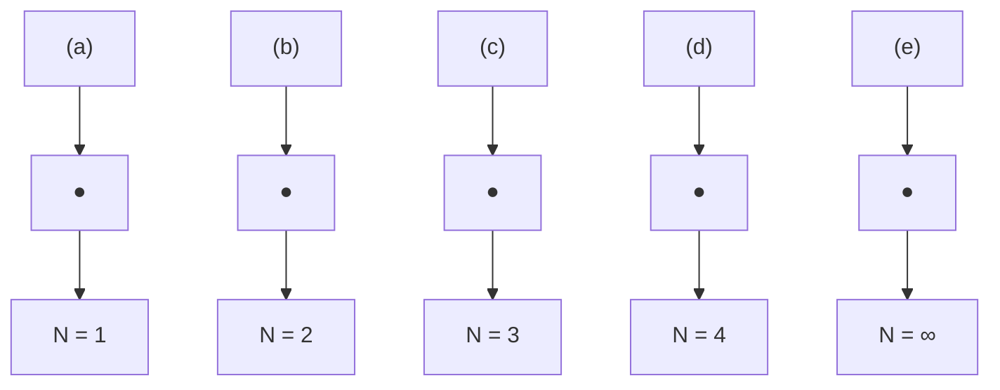

![[mineru/物理化学/物理化学（第11版） 固体649-694_images/8e5761d4f831bdddff81f23c037f508e7b1dd2b528e927b398e5ddc18364733a.jpg]]

bar

| Category | Value |
|---|---|
| Category 1 | 90 |
| Category 2 | 85 |

# 主题 15

# 固体

本主题探究固体的结构和物理性质。固态物质囊括了绝大多数使现代技术成为可能的材料。它包含在建筑和工程中大量使用的各类钢材、在信息技术和电力输送中使用的半导体和金属导体，正在不断替代金属的陶瓷材料，以及主题14中讨论的在纺织工业中及制造现今诸多普通物品所采用的合成和天然聚合物。

# 15A 晶体结构

晶体的本质特征是其组分的有序排布。本专题阐释如何从排布的对称性角度来描述其有序性，而后说明如何定量描述其排布。

15A.1 周期性晶格：15A.2 晶面的识别

# 15B 衍射技术

衍射技术可以详尽地确定固体结构。本专题考虑X射线衍射的基本原理，并阐释如何从电子密度分布的角度解析衍射花样。电子和中子衍射丰富了有关固体中单个分子或原子结构的信息。

15B.1 X射线晶体学；15B.2 中子和电子衍射

# 15C 固体中的键合

固体的组分通过赋予特殊性质的各类相互作用结合在一起。本专题探究相互作用，并为讨论所产生的性质奠定基础。

15C.1 金属：15C.2 离子固体：15C.3 共价固体和分子固体

# 15D 固体的力学性质

固体的特征力学性质包含与其刚性相关的多个方面。这些性质是用与固体结构相关的几个参数来说明的。

# 15E 固体的电学性质

固体的一个非常重要的性质就是它传输电流的能力。本专题探究如何依据电导率来对固体进行分类，以及如何采用电子结构的“能带理论”来说明观察到的不同行为。之后，继续展示为什么少量杂质的引入就可以对半导体的性质产生显著的影响，以及该效应是如何广泛应用于现代电子学中半导体器件的制作的。

15E.1 金属导体：15E.2 绝缘体和半导体：15E.3 超导体

# 15F 固体的磁学性质

固体的磁学性质是根据其磁化率来说明的。如果磁性中心是独立的，该性质可以归因于单个电子的自旋。如果磁性中心相互作用，会出现类似铁磁性的性质。

15F.1 磁化率：15F.2 永久磁矩和诱导磁矩：15F.3 超导体的磁学性质

# 15G 固体的光学性质

光谱是探究固体电子结构的一种关键技术。在探究固体材料电子能带结构的同时，光谱观测还能够洞悉这些材料中存在的相互作用所引发的现象。当施加强烈辐照时，一些固体发生非线性响应，导致诸如倍频等有用的现象。

15G.1 激子：15G.2 金属和半导体：15G.3 非线性光学现象

# 网络资源 这部分内容有何应用？

采用X射线衍射技术确定生物大分子中所有原子的位置导致生物化学和分子生物学研究的革命。“应用案例23”通过探究所有X射线图案中最具开创性的一个：从DNA链得到的并用于构建DNA双螺旋结构模型的特征图案，展示了该技术的强大威力。“应用案例24”介绍了当前具有重大技术意义的导电纳米聚集体及其合成。

# 专题15A

# 晶体结构

为何需要学习这部分内容？

晶态固体在很多技术中都很重要，解释它们的力学、电学、光学和磁学性质，需要理解它们的微观结构。

核心思想是什么？

周期性晶体中原子的有序排布可以采用晶胞进行描述。

需要哪些预备知识？

需要用到描述对称性的相关表述（专题 10A）。

晶体的内部结构由其原子、离子或者分子的有序阵列构成。该有序阵列的特征，如具体的堆积类型及其特征尺寸，是关联固体结构及其性质的关键。

# 15A.1 周期性晶格

周期性晶体（periodic crystal）是由有序重复的结构单元构成的，这些结构单元可以是原子、分子或者原子团、分子团和离子团。空间晶格（space lattice）是由代表这些结构单元位置的点组成的图案（图15A.1）。

空间晶格实际上是晶体结构的抽象框架。更严谨地说，空间晶格就是三维、无限的点阵，每个点都被相邻的点以相同的方式环绕，从而确立晶体的基本结构。在一些情况下，可能有结构基元正好处于晶格点上，但这并非必须。晶体结构本身是通过将每个晶格点同一个相同的结构单元相联系而获得的。就空间晶格意义上来说，作为准晶的固体是非周期性的，虽然仍然填充空间，但不具有平移对称性。本专题仅涉及周期性晶体。

晶胞（unit cell）是一个假想的平行六面体（平行四边形），通过它的单纯平移可以构建整个空间晶格（图15A.2）。

晶胞通常是通过直线连接相邻晶格点形成的，这样的晶胞称为素晶胞（primitive cell）（图15A.3）。如果图15A.2中的二维晶胞的4个节点中的任一个被看作由4个相邻晶胞所共用，则该晶胞总共只有一个晶格点。相同的定义对于三维的情况同样适用，此时素晶胞的8个位点被8个相邻的晶格共用，每个晶胞总共只提供一个晶格点。画一个更大的、在其中心或者相对的两个面上也有晶格点的非素晶胞（non-primitive unit cell，即复晶胞），有时会更方便。

![[mineru/物理化学/物理化学（第11版） 固体649-694_images/6936b638c7b79d15a64b509370ad5e03d4a576899f5a18d49900a35e28bd8da6.jpg]]

text_image

晶格点
结构基元

图15A.1 每个晶格点指定一个结构基元（如一个分子或者一个分子团）的位置。空间晶格是晶格点的完整阵列；晶体结构是依据格子排列的结构基元的集合

![[mineru/物理化学/物理化学（第11版） 固体649-694_images/4ca317153d0d7176b36774fc3bca53f48537ac43dad2ab162eb739af761feecc.jpg]]

natural_image

Grid pattern with black dots and light blue curved shapes, no text or symbols present

图 15A.2 晶胞是一个平行四边形（不一定是正四边形），通过它的单纯平移（不是反鼓、旋转或反演）就可以构建整个晶格，在此处显示的二维情形中，每个晶格点被四个相邻的晶胞共用

![[mineru/物理化学/物理化学（第11版） 固体649-694_images/19566eb7335186fa592a0228bcadc18dd32a0e291cd643f592c55c80bc0206ee.jpg]]

natural_image

3D lattice structure with a highlighted blue region, no text or symbols present

图15A.3 素晶胞（阴影体积所示）只在顶点有晶格点。如果将8个点中的每一个看作被相邻的8个晶胞共用，则晶胞只有一个晶格点

![[mineru/物理化学/物理化学（第11版） 固体649-694_images/e288504479c550eadeaae72cc37545c71e2125e0f8043d34c6b85eb402bfb516.jpg]]

text_image

a
b c β
α γ
b c
c
b γ
e a
β

图15A.4 晶胞的边长和夹角的标记 [注意α 角落在面 [b, c] 内]

描述同一晶格可以采用无数个不同的晶胞。但通常选择其中边长最短且边与边之间尽量相互垂直的晶胞。晶胞的边长通常记为a、b和c，它们之间的夹角记为 $\alpha$ 、 $\beta$ 和 $\gamma$ （图15A.4）。

通过确定它们具有的旋转对称元素，可以将晶胞分为7个晶系（crystal systems）。

- 立方晶胞（cubic unit cell）：具有4个指向四面体顶角，且通过立方体体心的三重轴（图15A.5）。  
- 单斜晶胞（monoclinic unit cell）：具有一个二重轴（图15A.6）。  
- 三斜晶胞（triclinic unit cell）：没有旋转对称性，且通常其三个边和三个角都不相等（图15A.7）。

表15A.1列出了基本对称性（essential symmetries），即归属于某一特定晶系的晶胞必然

![[mineru/物理化学/物理化学（第11版） 固体649-694_images/2bc35e2d747508a6402f9f0a9d8acff7c9b1f51d55874c0c752cfeee59dd8e4e.jpg]]

text_image

C₃
C₃
C₃
C₃

图15A.5 属于立方晶系的晶胞具有4个标记为 $C_0$ 的三重轴，按立方体对角线排布（插图显示了其三重对称性）

![[mineru/物理化学/物理化学（第11版） 固体649-694_images/cd935ab99aa53763bace605a8096b50616fd42853c4f43c616e6efbea0bca621.jpg]]

text_image

C₂

图15A.8 属于单斜端系的晶圆具有一个标记为 $C_{2}$ 的二重轴（在插图中更详细地显示）

![[mineru/物理化学/物理化学（第11版） 固体649-694_images/689b7c3ef0e74c1bb5e2719a13845c5e99471916ce17676d044dcbed0c5456c7.jpg]]

natural_image

3D wireframe diagram of a rectangular prism with a shaded blue plane inside (no text or symbols)

图15A7没有旋转对称性的三料晶胞

表15A.1 7个晶系

<table><tr><td>晶系</td><td>基本对称性</td></tr><tr><td>三斜</td><td>无</td></tr><tr><td>单斜</td><td>一个 $C_{2}$ 轴</td></tr><tr><td>正交</td><td>3个相互垂直的 $C_{2}$ 轴</td></tr><tr><td>菱形</td><td>一个 $C_{3}$ 轴</td></tr><tr><td>四方</td><td>一个 $C_{4}$ 轴</td></tr><tr><td>六方</td><td>一个 $C_{6}$ 轴</td></tr><tr><td>立方</td><td>4个按立方体对角线排列的 $C_{5}$ 轴</td></tr></table>

$^{*}$ C $_{n}$ 表示n重旋转，即通过旋转360°/n可以获得等同结构。

存在的特征对称元素。

在三维空间，只有14种不同的空间晶格。这些布拉维晶格（Bravais lattice）的晶胞示于图15A.8中。有时，采用素晶胞图示晶格比较方便，而有时则采用非素晶胞。通常使用以下记号：

- 素晶胞（primitive unit cell，P）只在角上有晶格点。  
- 体心晶胞（body-centred unit cell, I）在晶胞中心也有一个晶格点。  
- 面心晶胞（face-centred unit cell，F）在顶角和六个面的中心都有晶格点。  
- 边心晶胞（side-centred unit cell, A、B或C）在顶角和两个相对的面心有晶格点。

对于简单结构，通常选择属于结构基元的一个原子或者一个分子的中心作为晶格点的位置或晶胞的顶点比较方便，但这不是必须的。在一个布拉维晶格的晶胞内，对称性相关的晶格点具有相同的环境。

![[mineru/物理化学/物理化学（第11版） 固体649-694_images/f5d0555c2e4c16bac225e07b4bf6da80380d2ad77fa3dcd487eba9a66a549a8a.jpg]]  
简单立方P

![[mineru/物理化学/物理化学（第11版） 固体649-694_images/2cd446a3fe83a63904ec13aa2a6929aee3589ca68bea14a43f108018ed36603c.jpg]]  
体心立方1

![[mineru/物理化学/物理化学（第11版） 固体649-694_images/f4660e9e324c4eaeeb22ed6466ec776caec7a2ceeadb6aff8ce78d7da1b02ea7.jpg]]  
面心立方F

![[mineru/物理化学/物理化学（第11版） 固体649-694_images/dd42b26ac69cb1619c68177cd4f87a80703ab4a8b1601a9efb5d7426141f812b.jpg]]  
简单四方P

![[mineru/物理化学/物理化学（第11版） 固体649-694_images/4788e43643053d17ba75f711baa2ca2ac44328ff1ba96d7f7e48663bb8324de4.jpg]]  
体心四方1

![[mineru/物理化学/物理化学（第11版） 固体649-694_images/c81181cfa6d85a1eac9fe47dd929b57a6f96b1aef19cc35e81a48a319b737cd8.jpg]]  
简单单斜P

![[mineru/物理化学/物理化学（第11版） 固体649-694_images/5f9a2e23997a2fff5e1a0f0df500605a7b9ca491cea0538ed3929d1333478715.jpg]]  
底心单斜C

![[mineru/物理化学/物理化学（第11版） 固体649-694_images/cc0de073d744fa6462c68d1d735c749d77b07372b142b4a6b4ae99a728e65af2.jpg]]  
简单正交P

![[mineru/物理化学/物理化学（第11版） 固体649-694_images/a72d6857744f806555106c60dad1bf3b716a3b5e83f3b5ccdb84f5d9e2aae115.jpg]]  
底心正交C

![[mineru/物理化学/物理化学（第11版） 固体649-694_images/51fa52aa4281a0cf653137e25273f7e95ae0b17ceaf7d28e856185919b7ba036.jpg]]  
体心正交1

![[mineru/物理化学/物理化学（第11版） 固体649-694_images/7bcb7b7128d567934058e5bbf80cf17efd60f44603277ee3d0bb928d14df984b.jpg]]  
面心正交F

![[mineru/物理化学/物理化学（第11版） 固体649-694_images/47155a15a95e45b0a068fcd6b5de5db1be95684e09b88180062bcc4d9b5d4375.jpg]]  
三斜

![[mineru/物理化学/物理化学（第11版） 固体649-694_images/e0905c8ae76c968c1b65b493de3894cb5018c9c90145eb95d9e285f26c3b37fd.jpg]]  
六方

![[mineru/物理化学/物理化学（第11版） 固体649-694_images/ae42a013add8f0f0def0396b3fbc53862c58903990d7ac04e04063f1d8e53e4a.jpg]]  
三方R  
图15A.B 14种布拉维晶格。每个点代表晶格点，不一定为原子占据。P代表素晶胞（三方晶胞用R表示），I代表体心晶胞，F代表面心晶胞，C（或A、Ⅱ）表示在相对的两个面上有晶格点。三方晶格可以归为菱形或六方晶系（如表15A.1所示）

# 简要说明15A.1

图15A.9中展示的二维晶格由按矩形排列的晶格点组成，在每个矩形的中心有一个额外的点。图中标注了一个（非素）晶胞。这个晶胞具有通过矩形两条对边的中点的二重对称轴。绕这些轴的旋转互换了位于矩形顶角上的晶格点，但在中心的晶格点不受影响。因此，在顶角的晶格点是等价的，但在晶胞中心的晶格点是不同的。

![[mineru/物理化学/物理化学（第11版） 固体649-694_images/b6f02a4993552951059ac61e5b766ecb03ca9232b403ef1462bd701118970521.jpg]]

chemical

Crystal lattice structure diagram showing C₂ and C₃ atomic positions in a unit cell

图15A.9 简要说明15A.1中使用的二维晶格，用阴影区标注了一个（非素）晶胞。位于晶胞顶角的晶格点通过绕所示的二重对称轴的旋转相互关联，而在中心的晶格点则不受这些操作的影响

# 15A.2 晶面的识别

用于测量晶胞尺寸和晶胞内分子排列的衍射技术的解析，需要用到通过晶体的晶面取向和晶面间距（专题15B）。二维晶格比三维晶格更容易图示，因此，本部分对辨别晶面中涉及的概念的介绍先从二维开始，而后将讨论结果通过类比扩展到三维。注意，晶面并不需要通过晶格点。

# (a) 米勒指数

考虑边长为a和b的晶胞所形成的二维矩形晶格（图15A.10）。图中每个板面都显示一组等间距的平面。对于每一组面，可以通过考虑与原点最近但不过原点的面，然后用在a、b轴上的截距来进行识别。这些截距包括（a） $(1a,1b)$ ， $(b)$ $(\frac{1}{2}a,\frac{1}{3}b)$ ， $(c)$ $(-1a,1b)$ 和 $(d)$ $(∞a,1b)$ ，其中∞表示该面与这个轴平行，并相交（理论上）于无限远。如果我们同意以晶胞对应尺寸的倍数来表示沿轴的距离，那么，这些截距就可以更为简单地分别表示为 $(1,1)$ ， $(\frac{1}{2},\frac{1}{3})$ ， $(-1,1)$ 和 $(∞,1)$ 。如果图15A.10中的晶体是一个三维立方晶格的俯视图，则所有四组面与c轴相交于无穷远。因此，对于三维的情况，这一个标记为 $(1,1,\infty)$ ， $(\frac{1}{2}a,\frac{1}{3}b,\infty)$ ， $(-1,1,\infty)$ 和 $(\infty,1,\infty)$ 。

![[mineru/物理化学/物理化学（第11版） 固体649-694_images/9fcff73bc0d04c3e4428f7a513987204490d9e162b2ed07be011103dc41a9f9e.jpg]]

text_image

Diagram showing a grid with diagonal lines and labeled axes a and b, likely representing a coordinate system or lattice pattern.

(a)

![[mineru/物理化学/物理化学（第11版） 固体649-694_images/2cc5744536bccbf9cc2d4b2bc4bab60fe33db9fa893ded484d564e21766d098b.jpg]]

natural_image

Grid pattern with diagonal lines and dots, no text or symbols present

(b)

![[mineru/物理化学/物理化学（第11版） 固体649-694_images/48ae871f7c467f7daeb499cab3af413d6f3359eee3cb448fe62208f4d5e3c5ee.jpg]]

natural_image

Grid pattern with diagonal lines and dots, no text or symbols present

(c)

![[mineru/物理化学/物理化学（第11版） 固体649-694_images/df6c1505ea6eedb78cca83f4f4f7d7161c1f3a28e7e4344d2dc6904fd6facf0f.jpg]]

natural_image

Grid pattern with evenly spaced black dots on a light blue background (no text or symbols)

(d)   
图15A.10 在四方空间格子中可以画出的一些等间距平面组。原点由蓝色晶格点表示，每组平面的米勒指数 $[hkl]$ 是（a）[110]、[b] [230]、[c] [110]和(d) [010]

这些标记中因分数和无穷大所导致的不便，可以通过使用米勒指数（Miller indices）(hkl)来指定晶面而加以避免，其中h、k、l分别是沿a、b、c轴的截距的倒数。例如，面 $\left(\frac{1}{2},\frac{1}{3},\infty\right)$ 的米勒指数是 $\{230\}$ 。可以发现，这种标记带来了额外的好处。米勒标记法具有下述特征：

- 负指数在数字上加一横线，如在{110}中；  
- 记号（hkl）表示一个面。一组相同间距的

平行平面用 $\{hkl\}$ 表示。例如：

<table><tr><td>轴上截距</td><td>(a,b,∞c)</td><td>(1/2a,1/3b,∞c)</td><td>(-a,b,∞c)</td><td>(∞a,b,∞c)</td></tr><tr><td>移去晶胞尺寸</td><td>(1,1,∞)</td><td>(1/2,1/3,∞)</td><td>(-1,1,∞)</td><td>(∞,1,∞)</td></tr><tr><td>取倒数</td><td>(1,1,0)</td><td>(2,3,0)</td><td>(-1,1,0)</td><td>(0,1,0)</td></tr><tr><td>表示为指数</td><td>(110)</td><td>(230)</td><td>(110)</td><td>(010)</td></tr><tr><td>平行面组</td><td>{110}</td><td>{230}</td><td>{110}</td><td>{010}</td></tr></table>

一个值得记住的特征是， $\{hkl\}$ 中h的绝对值越小，这一组平行平面就越接近于平行a轴（ $\{h00\}$ 面是一个例外），k和b轴及l和c轴同样如此。当h=0时，面与a轴相交于无限远。因此， $\{0kl\}$ 这一组面平行于a轴。类似地， $\{h0l\}$ 这一组面平行于b轴，而 $\{hk0\}$ 这一组面平行于c轴。

图 15A.11 显示一系列面的三维表示，其中包含一个具有非正交轴的晶格。

![[mineru/物理化学/物理化学（第11版） 固体649-694_images/709a0135c074a7c57dd73db761411e101ef98a0317fe7d1586b45bd08520be6a.jpg]]

text_image

a
b
c

(110)

![[mineru/物理化学/物理化学（第11版） 固体649-694_images/c8b9a01ed26f885449a134aa6de0efca42719e63f18b5e9d5bf3fa2010eec187.jpg]]

natural_image

3D wireframe cube with blue translucent faces and black vertices (no text or symbols)

(111)

![[mineru/物理化学/物理化学（第11版） 固体649-694_images/0ba66bd03b1718bb65044926c51a851ba33e2c9720d8bebd4e75f591aae8e28a.jpg]]  
(010)

![[mineru/物理化学/物理化学（第11版） 固体649-694_images/baba24ca679127d3c8aab9c56dfd3e833fe8d7108d47ba622e90e2a16059bed2.jpg]]

text_image

a
b
c

(111)   
图15A.11 三维中的一些代表性晶面及其米勒指数（原点采用蓝色晶格点表示。注意指数0表示该平面平行于对应的轴，且这种标定指数的方法也可以用于具有非正交轴的晶施）

# (b) 相邻晶面间距

米勒指数在表示相邻晶面间距时特别有用。

# 如何完成？15A.1 导出晶面间距的表达式

考虑一个由边长为a的晶胞构成的正方形晶格的{hkl}晶面（图15A.12）。

![[mineru/物理化学/物理化学（第11版） 固体649-694_images/ac8191f2a67cd4b95dd50d6208186736902b144bf2afc74fcde80f5f8b03dce1.jpg]]

text_image

(h k0)
a
a/k
φ d_{h k0}
φ/
a/h
a

图 15A.12 确定正方形晶胞中的 (hko) 晶面间距的示意图

晶面间距等于(hk0)晶面到原点的垂直距离。夹角 $\phi$ 的正弦和余弦可以表示为图形中两个直角三角形的两条边之比：

$$
\sin \phi = \frac {d _ {\text { bde }}}{a / h} = \frac {h d _ {\text { bde }}}{a} \quad \cos \phi = \frac {d _ {\text { bde }}}{a / k} = \frac {k d _ {\text { bde }}}{a}
$$

下方三角形的斜边长度是a/h，因为米勒指数的h表示该平面与a轴相交于距离原点a/h的距离处。类似地，上方三角形的斜边为a/k。然后，由于 $\sin^{2}\phi+\cos^{2}\phi=1$ ，有

$$
\left(\frac {h d _ {b i 0}}{a}\right) ^ {2} + \left(\frac {k d _ {a b 0}}{a}\right) ^ {2} = 1
$$

通过两侧同除 $d_{kk0}^{2}$ ，可以重排为

$$
\frac {1}{d _ {\mathrm{mk0}} ^ {2}} = \frac {h ^ {2} + k ^ {2}}{a ^ {2}} \text {或} d _ {\mathrm{mk0}} = \frac {a}{(h ^ {2} + k ^ {2}) ^ {1 / 2}}
$$

扩展到三维，立方晶格中 $\{hkl\}$ 晶面间距 $d_{hl}$ ，可由下式给出：

$$
\left| \begin{array}{c} \frac {1}{d _ {A L} ^ {2}} = \frac {h ^ {2} + k ^ {2} + l ^ {2}}{a ^ {2}} \\ d _ {A L} = \frac {a}{(h ^ {2} + k ^ {2} + l ^ {2}) ^ {k / 2}} \end{array} \right| \quad \text {   晶面间距   } \tag {15A.1a}
$$

对于一个一般性的正交晶格（其中轴相互垂直，但边长不同），对应的表达式是式（15A.1a）的一般化；

$$
\frac {1}{a _ {k l} ^ {2}} = \frac {h ^ {2}}{a ^ {2}} + \frac {k ^ {2}}{b ^ {2}} + \frac {l ^ {2}}{c ^ {2}}
$$

桌面间距
(正交底格) (15A.1b)

# 例题 15A.1 使用米勒指数

计算 $a=0.82\ nm,\ b=0.94\ nm$ 和 $c=0.75\ nm$ 的正交晶胞中（a）{123}晶面和（b）{246}晶面的间距。

整理思路 首先，需要做的就是将所给数值代入式（15A.1b）。对于（b），也可使用相同方法。但应注意，

第二组晶面的米勒指数正好是第一组晶面的两倍。由式（15A.1b）可以发现，将h,k,l的数值乘以n倍，可给出下列 $\{nh nk nl\}$ 晶面间距的表达式：

$$
\frac {1}{d _ {n h , n k , n l} ^ {2}} = \frac {(n h) ^ {2}}{a ^ {2}} + \frac {(n k) ^ {2}}{b ^ {2}} + \frac {(n l) ^ {2}}{c ^ {2}} = n ^ {2} \overline {{\left(\frac {h ^ {2}}{a ^ {2}} + \frac {k ^ {2}}{b ^ {2}} + \frac {l ^ {2}}{c ^ {2}}\right)}} = \frac {n ^ {2}}{d _ {n h} ^ {2}}
$$

这意味着：

$$
d _ {n i n k (n)} = \frac {d _ {i n k}}{n}
$$

解：将指数代入式（15A.1b）给出

$$
\frac {1}{d _ {1 2 3} ^ {2}} = \frac {1 ^ {2}}{(0 . 8 2 \mathrm{nm}) ^ {2}} + \frac {2 ^ {2}}{(0 . 9 4 \mathrm{nm}) ^ {2}} + \frac {3 ^ {2}}{(0 . 7 5 \mathrm{nm}) ^ {2}} = 2 2. 0 \mathrm{nm} ^ {- 2}
$$

因此， $d_{123}=0.21\ nm$ ，随后， $d_{246}$ 是该值的一半，即0.11 nm。

自测题15A.1 计算同一晶格中（a）{133}晶面和（b）{399}晶面的间距。

答案：0.19 mm，0.063 mm

# 概念清单

☐ 1. 周期性晶体是由有序重复的结构基元构成的。  
☐ 2. 空间晶格是由代表结构单元（原子、分子或者原子团、分子团和离子团）位置的点（晶格点）组成的图形。  
3. 晶胞是一个想象的平行六边图形，通过它的平移可以构建整个空间晶格。  
☐ 4. 素晶胞只在其顶点有晶格位点且总体只有一个。非素晶胞在其中心或者相对的晶面上也有晶格点。  
5. 依据它们的旋转对称性，晶胞可以分为7个晶

系：基于它们拥有的基本对称性，晶胞可分为立方、单斜、三斜。

6. 布拉维晶格是三维中的14种不同空间晶格（图15A.8）。  
7. 布拉维晶格的晶胞可分为素晶胞（P）、体心晶胞（I）、面心晶胞（F）和边心晶胞（A、B或C）。  
8. 晶面由一组米勒指数（hkl）来指定；一组平面表示为{hkl}。

# 公式清单

<table><tr><td>性质</td><td>公式</td><td>说明</td><td>公式编号</td></tr><tr><td>立方晶格中的晶面间距</td><td> $1/{d}_{k{l}^{2}}^{2} = \left( {{h}^{2} + {k}^{2} + {l}^{2}}\right) /{a}^{2}$ </td><td> $h,k,l$ 是米勒指数</td><td>15A.1a</td></tr><tr><td>正交晶格中的晶面间距</td><td> $1/{d}_{k{l}^{2}}^{2} = {h}^{2}/{a}^{2} + {k}^{2}/{b}^{2} + {l}^{2}/{c}^{2}$ </td><td></td><td>15A.1b</td></tr></table>

# 专题15B

# 衍射技术

为何需要学习这部分内容？

为了说明固体的性质，了解它们的具体结构及如何通过多种衍射技术来确定这些结构是非常必要的。

核心思想是什么？

周期性晶体中原子的有序排列可以通过基于衍射的技术来加以确定。

需要哪些预备知识？

需要熟悉晶体结构的描述及使用米勒指数确定晶面（专题15A）。同样需要熟悉电磁辐射的波描述（专题7A中“化学家工具包13”）和傅里叶变换的基本性质（专题12C中“化学家工具包28”）。需要用到德布罗意关系式（专题7A）及能量均分原理（专题2A中“化学家工具包7”）。

衍射技术可以非常精确地确定晶态固体中离子、原子和分子排布的细节。这些技术现在已经发展得非常完备，无论是衍射数据的采集还是结构解析都可以高度自动化。

# 15B.1 X射线晶体学

正如在“化学家工具包13”（专题7A）中解释的，波的一个本质特性是，当它们在同一空间区域出现时会相互干涉。当两个波的波峰或者波谷相互重叠时，振幅较大；而当波峰和波谷相遇时，振幅较小。衍射是由物体在波的传播路径中造成的干涉，这种干涉发生在被衍射物体的尺寸与辐射的波长相当的时候。

# (a) X射线衍射

当X射线通过晶体时，由于其波长与晶面间距相当，故会发生衍射。所以，X射线衍射是研究固体材料结构的一种强有力工具。在实际过程中，从观测到的衍射图案到确定结构是相当复杂的，但现在计算机与实验装置的集成程度已使该技术即使对于大分子和复杂固体都几乎实现了完

全的自动化。分析可借助于分子模拟技术，从而得到可信的结构。X射线是波长在 $10^{-10}$ m量级的电磁辐射，通常通过高能电子轰击金属而产生（图15B.1）。电子进入金属时发生减速并产生连续波长的辐射，称为韧致辐射（bremsstrahlung）（德语中bremse表示减速，strahlung表示射线）。在连续波谱上叠加了几个高强度、尖锐的峰（图15B.2）。这些尖峰是由于电子与原子的内部壳层中的电子碰撞而引起的。碰撞逐出内部壳层的一个电子，一个更高能量的电子会落入该空位，将过剩的能量以一个X射线光子的形式发射出来（图15B.3）。

当电子落入K壳层（主量子数n为1的壳层）时，该X射线归为K辐射；对于跃迁进入L壳层 $(n=2)$ 和M壳层 $(n=3)$ 则类似。强的、分立的衍射线标记为 $K_{\alpha}$ 、 $K_{\beta}$ 等。同步加速器（专题11A）

![[mineru/物理化学/物理化学（第11版） 固体649-694_images/eda5dab6874822628a9b4a3b156c70db53a4ec0a7eb4b1449b0ad821140365e8.jpg]]

text_image

冷却水
金属靶
镀窗
X射线
X射线
电子束

图15B.1 通过将电子束导向一个冷却的金属靶产生X射线。被对X射线是透明的（由于每个原子中的电子数少）。故用作窗口

![[mineru/物理化学/物理化学（第11版） 固体649-694_images/9c3525b6c12bffa58255f3358c0b99d6c1497cf5d924b67bf2ec46130dd622cb.jpg]]

line

| 波长, λ | 强度 |
| ------- | ---- |
| Kα      | Kα   |
| Kβ      | Kβ   |
| 轻致辐射 | 韧致辐射 |

图15B.2 从金属产生的辐射由一个宽的、无特征的韧致辐射基底及其上叠加的尖峰组成（符号K表示通过一个电子落入原子的K壳层中的位位跃迁而产生的辐射）

![[mineru/物理化学/物理化学（第11版） 固体649-694_images/f94b465a4017a6a93614b01fd9c0fc79b6f7a33351fdf9d468874e7cc840e595.jpg]]

text_image

电子束
L
K
能量
逐出电子
X射线
电离

图15B.3 X射线的产生过程 [一个入射电子与一个电子（在K壳层中）碰撞，并将其逐出。另一个电子（来自本图示中的L壳层）落入该空位，并以X射线光电子的形式释放出过剩能量]

可以产生高强度X射线辐射，因其产生的衍射图具有更高的强度（因而更高灵敏度），在衍射实验中的应用正快速增长。

早期观测衍射的一种方法是使一束具有一定波长范围的X射线进入一个单晶，然后通过照相的方式记录衍射图案。其背后的思想是，晶体取向可能不会相应引发单一波长的衍射，但无论其取向如何，至少会引起X射线束中存在的某一波长的衍射。目前人们对这种方法的兴趣重燃，因为同步加速器辐射涵盖了一定范围的X射线波长。

一种更普遍的方法是使用单色辐射和由许多随机取向的微晶组成的粉末样品。至少存在一些取向合适的微晶可以引发衍射。现代的“粉末衍射仪”以电子方式监控反射强度，检测器围绕包含入射线的平面中的样品旋转。粉末衍射技术通过将衍射线的位置和强度与之前记录的已知结构的图样(这些信息的大型数据库)进行对比，以确

![[mineru/物理化学/物理化学（第11版） 固体649-694_images/feaa495d3179acbb0f07f94d888ec894632ac68f6af3cf3e8fc4327b56d5f6e1.jpg]]

line

| 抛射角 (2θ/(°)) | 方解石 | 霰石 |
| --------------- | ------ | ---- |
| 20              | 0      | 0    |
| 25              | 1.0    | 0.5  |
| 30              | 1.0    | 0.0  |
| 35              | 0.0    | 0.0  |
| 40              | 0.0    | 0.5  |
| 45              | 0.0    | 0.0  |
| 50              | 0.0    | 0.0  |
| 55              | 0.0    | 0.0  |
| 60              | 0.0    | 0.0  |
| 65              | 0.0    | 0.0  |
| 70              | 0.0    | 0.0  |
| 75              | 0.0    | 0.0  |
| 80              | 0.0    | 0.0  |

图15B.4 两种晶型CaCO，[方解石和碳石]的X射线粉末衍射图谱（两个图谱具有差异性，可用于鉴别存在于未知样品中的同质多晶体）

![[mineru/物理化学/物理化学（第11版） 固体649-694_images/973cbe56770af33a92d1118b8685ac65048a8eb68d752bd36f8bd5ae33460a6b.jpg]]

text_image

X射线束
样品
φ
2θ
至检测器
Ω
χ

图158.5 四圆衍射仪示意图 [粗分取向 ( $\phi_{z}, \theta$ 和 $\Omega$ ) 的设置由计算机控制；依次监测每个 (hkl) 反射并记录它们的强度]

定固体样品的组分（图15B.4）。该方法能够确定混合相的组成，继而构建一个相图。该技术也被用于初步确定晶胞的大小和对称性。

布拉格父子（威廉及其子劳伦斯）发明的方法是X射线晶体学几乎所有现代工作的基础。他们使用了单晶和单一波长的X射线束，旋转晶体直至探测到反射。晶体中存在许多不同的晶面组，因而存在许多可以产生反射的角度。完整的数据由可以产生反射的角度和相应反射强度的列表所组成。

单晶衍射图谱用“四圆衍射仪”（图15B.5）测量。一旦确定了待检测晶体晶胞的大小和对称性，就要调整四圆衍射仪上的角度设置，以确保可以准确测量到衍射图谱中每个波峰的位置和强度。现代仪器使用区域检测器和图像板，它们对衍射图谱的全区域进行同时采样，而不是逐峰采样，从而提高了数据采集的速率。

# (b) 布拉格定律

分析晶体产生的衍射图谱的早期方法是将晶面看作半透镜，并将晶体模型化为一堆间距为 $d$ 的反射晶面（图15B.6）。该模型可以容易地计算出要发生相长干涉时晶体针对入射的X射线束必须采取的角度。它也催生了反射（reflection）的命名，以表示由相长干涉引起的强束。

![[mineru/物理化学/物理化学（第11版） 固体649-694_images/3915f8188155c7e235dbebe8eac9cd689abc378172a7e0115acadb14b84ad825.jpg]]

text_image

θ
θ
d
A
θ
D
C
d
θ
B

图15B.6 布拉格定律的常规推导将每个晶面看作是反射入射辐射的一个平面。来自相邻平面的反射行程距离相差 $AB + BC$ 。这取决于角度 $\theta$ ，当 $AB + BC$ 等于波长的整数倍时，发生相干干涉（“反射”）

考虑具有相同波长和相同相位的两条平行射线被两个相邻晶面的反射，如图15B.6所示。一条射线撞击上一个平面的D点，而另一条射线在撞击正下方平面前必须行进一段额外的距离AB。被反射的射线的行程距离也有长度BC的差别。从图15B.6中的插图可以明显看出，AB和BC的长度均为 $d\sin\theta$ ，故两条射线的总行程差就是 $AB+BC=2d\sin\theta$ ，在这里 $2\theta$ 是掠射角（glancing angle）（是 $2\theta$ 而不是 $\theta$ ，因为射线与它初始的方向偏离了 $2\theta$ ）。对于许多掠射角而言，行程差并不是波长的整数倍，反射波在很大程度上产生相消干涉。然而，当行程差是波长的整数倍时 $(AB+BC=n\lambda)$ ，反射波同相并产生相长干涉。因此，当 $\theta$ 满足布拉格定律（Bragg's law）时，就能够观察到反射现象。

$$
n \lambda = 2 d \sin \theta
$$

$$
\mathrm{布拉格定律}
$$

$$
(1 5 8. 1 a)
$$

$n=2,3,\cdots$ 的反射称为二级反射、三级反射，…以此类推；它们对应行程差是波长的 $2,3,\cdots$ 倍。现在通常将n归并到d中，将布拉格定律写作：

$$
\lambda = 2 d \sin \theta
$$

$$
\mathrm{布拉模定律}
$$

$$
[ \text {另一种形式} ]
$$

$$
(1 5 B. 1 b)
$$

并且将第n级反射看作是由 $\{nh nk nl\}$ 晶面产生的。如在专题15A的例题15A.1中所探讨的， $\{nh nk nl\}$ 晶面间距是 $d_{hkl}/n$ ，这里 $d_{hkl}$ 是 $\{hkl\}$ 晶面的间距。布拉格定律主要用于确定晶面间距，因为通过测量角度 $\theta$ 的值易计算出d的值。

# 简要说明15B.1

当掠射角 $2\theta$ 为 $22.4^{\circ}$ ，X射线波长为 $154~\mathrm{pm}$ 时，可以观察到来自立方晶体{111}晶面的一级反射。根据式（15B.1b），引发衍射的{111}晶面间距为 $d = \lambda /(2\sin \theta)$ ，所以

$$
d _ {1 1} = \frac {\lambda}{2 \sin \theta} = \frac {1 5 4 \mathrm{pm}}{2 \sin 1 1 . 2 ^ {\circ}} = 3 9 6 \mathrm{pm}
$$

根据专题15A中给出的式（15A.1a），边长为 $a$ 的立方晶格(111)晶面的间距为 $d_{111} = a / 3^{1 / 2}$ 据此， $a = 3^{1 / 2}d_{111} = 687\mathrm{pm}$

某些晶胞种类会呈现出特征的图谱线。在边长为 $a$ 的立方晶格中， $\{hkl\}$ 晶面间距 $d_{hkl}$ 可由专题15A中的式（15A.1a） $[d_{hkl} = a / (h^2 + k^2 + l^2)^{1/2}]$ 给出； $\{hkl\}$ 晶面产生一级反射的角度可由下式得出：

$$
\sin \theta = \frac {\lambda}{2 d _ {h k l}} = (h ^ {2} + k ^ {2} + l ^ {2}) ^ {1 / 2} \frac {\lambda}{2 a}
$$

当代入指数的整数值时，并不能得到 $h^{2}+k^{2}+l^{2}$ 的所有整数数值：

<table><tr><td> $\{hkl\}$ </td><td> $\{100\}$ </td><td> $\{110\}$ </td><td> $\{111\}$ </td><td> $\{200\}$ </td><td> $\{210\}$ </td></tr><tr><td> $h^{2} + k^{2} + I^{2}$ </td><td>1</td><td>2</td><td>3</td><td>4</td><td>5</td></tr><tr><td> $\{hkl\}$ </td><td> $\{211\}$ </td><td> $\{220\}$ </td><td> $\{300\}$ </td><td> $\{221\}$ </td><td> $\{310\}$ </td></tr><tr><td> $h^{2} + k^{2} + I^{2}$ </td><td>6</td><td>8</td><td>9</td><td>9</td><td>10</td></tr></table>

可以观察到 $h^{2}+k^{2}+l^{2}=7$ （以及15等）并未出现。因此，在衍射线的图谱中，{211}和{220}的反射之间的间隔较附近的线之间的间隔更大，{321}( $h^{2}+k^{2}+l^{2}=14$ )和{400}( $h^{2}+k^{2}+l^{2}=16$ )之间同样如此。这些线的缺失导致了一特征图谱，有助于晶胞类型的确定。

# (c) 散射因子

X射线散射是由入射电磁波在原子的电子中产生的振荡引起的。富电子的重原子比轻原子产生更强的散射作用。这种对电子数的依赖关系可以用元素的散射因子（scattering factor）f来表示。散射因子越大，原子对X射线的散射能力越强。结果表明，在球对称原子中，原子的散射因子与电子密度 $\rho(r)$ 和掠射角 $2\theta$ 相关：

$$
\begin{array}{l} f (\theta) = 4 \pi \int_ {0} ^ {\infty} \rho (r) \frac {\sin k r}{k r} r ^ {2} \mathrm{d} r \\ k = \frac {4 \pi}{\lambda} \sin \theta \\ \end{array}
$$

就射因子 (15B.2)

在前进的方向（ $\theta = 0$ ，如图15B.7），散射因子最大，可以看出在此方向上散射因子等于原子中的电子总数， $N_{\text{e}}$ 。

![[mineru/物理化学/物理化学（第11版） 固体649-694_images/bc833fc889665f8b55bcfa36179e2f6cf5ccd2c913731670f5b038ccb77f4c61.jpg]]

line

| (sinθ)/λ | Br⁻  | Fe²⁺ | Ca²⁺ | Cl⁻  | O    | C    | H    |
| -------- | ---- | ---- | ---- | ---- | ---- | ---- | ---- |
| 0.0      | 35   | 25   | 18   | 10   | 7    | 5    | 2    |
| 0.2      | 30   | 20   | 15   | 8    | 6    | 4    | 1    |
| 0.4      | 25   | 15   | 10   | 6    | 5    | 3    | 1    |
| 0.6      | 20   | 10   | 7    | 5    | 4    | 2    | 1    |
| 0.8      | 15   | 7    | 5    | 4    | 3    | 2    | 1    |
| 1.0      | 10   | 5    | 4    | 3    | 2    | 1    | 1    |
| 1.2      | 7    | 3    | 3    | 2    | 1    | 1    | 1    |

图158.7 原子和离子的散射因子随原子序数和角度的变化 [在前进方向上 $[\theta = 0, (\sin \theta) / \lambda = 0]$ 的散射因子等于物体中存在的电子数]

# 如何完成？15B.1 计算在前进方向上的散射因子

首先要注意，因为 $\sin(kr)$ 不能超过1，当 $k\to0$ 时 $[\sin(kr)]/kr$ 达到最大值，对应于 $\sin\theta\to0$ ，也就是 $\theta\to0$ 。因此，散射因子在前进方向上有最大值。

要计算前进方向上的散射因子，需要在式（15B.2）中取极限 $k\to0$ ，即 $kr\to0$ 。然后，使用 $\sin x=x-\frac{1}{6}x^{3}+\cdots$ 并写出

$$
\lim _ {k \rightarrow 0} \frac {\sin (k r)}{k r} = \lim _ {k \rightarrow 0} \frac {k r - \frac {1}{6} (k r) ^ {3} + \cdots}{k r} = \lim _ {k \rightarrow 0} [ 1 - \frac {1}{6} (k r) ^ {2} + \dots ] = 1
$$

在此极限下，式（15B.2）可简化为

$$
\begin{array}{l} f (0) = \lim _ {k r \rightarrow 0} 4 \pi \int_ {0} ^ {\infty} \rho (r) \frac {\overbrace {\sin (k r)} ^ {\rightarrow 1}}{k r} r ^ {2} d r \\ = 4 \pi \int_ {0} ^ {\infty} \rho (r) r ^ {2} \mathrm{d} r = \int_ {0} ^ {\infty} \rho (r) \overbrace {4 \pi r ^ {2} \mathrm{d} r} ^ {\text {体积元}} \\ \end{array}
$$

因子 $4\pi r^{2}dr$ 是半径为r、厚度为dr的球壳层的体积。这个层壳中的电子总数等于r处的电子密度乘以壳层的

体积，即 $4\pi r^{2}\rho(r)dr$ ，对所有半径的壳层的此数加和就是原子内的电子总数。因此，在前进方向上， $f=N_{e}$ 。例如， $Na^{+}$ ， $K^{+}$ 和 $Cl^{-}$ 的散射因子分别是10、18和18。

# (d) 电子密度

结构因子（structure factor） $F_{hkl}$ 是给定 $\{hkl\}$ 反射的净振幅，它考虑了晶胞中所有原子的位置和类型。它可以用原子的位置和散射因子来表示。

# 如何完成？15B.2 将结构因子与原子的位置和散射因子相关联

假设一晶胞含有数个原子，其散射因子为 $f_{i}$ ，坐标为 $(x_{j}a, y_{j}b, z_{j}c)$ ，其中 $x_{j}$ 是原子j在a方向上的坐标，表示为长度a的分数，其他坐标类似。

步骤1 考虑 $h = 1$ 的（h00）晶面反射

图15B.8中所示的反射对应于相邻的A平面的两个波，两个波的相位差是 $2\pi$ 。如果在两个A平面之间距离的分数 $x$ 处有一B原子，则它产生了相对于A反射具有 $2\pi x$ 相位差的一个波。为了看到这个结论，请注意，如果 $x = 0$ ，就没有相位差；如果 $x = 1 / 2$ ，相位差是 $\pi$ ；如果 $x = 1$ ，则B原子位于靠下的A原子处，相位差是 $2\pi$ 。

![[mineru/物理化学/物理化学（第11版） 固体649-694_images/cbbd90342883398058118cafcfea2ec5a9d103082af46e959250dacde138b4f2.jpg]]

text_image

相位差 = 2π
A
a
x
B
A
相位差 = 2π

(a)

![[mineru/物理化学/物理化学（第11版） 固体649-694_images/9a025b7e983100641945d7ce214af7641a36eb9530879b9f9667841b0798775c.jpg]]

text_image

相位差 = 2 × 2πx
A
a
xa
A
相位差 = 2 × 2π

(b)   
图15B.8 包含两类原子的晶体切射。(a) A平面的(100)晶面反射, 相邻平面反射的波之间存在2π相位差。(b)(200)晶面反射, 相位差为4π。从距离A平面 $x_{\mathrm{m}}$ 的B平面反射的相位是这些相位差的 $\pi$ 倍

步骤2 考虑h=2的（h00）晶面反射

在此情况下，来自两个A层的波之间存在 $2 \times 2\pi$ 的相位差。假设B在x = 1/2处，将产生相位与来自靠下A层的波相差为 $2\pi$ 的一个波。因此，对于一般性的分数位置x，一个（200）晶面反射的相位差就是 $2 \times 2\pi x$ 。

步骤3 推广这个结论

对于一般的（h00）晶面反射，相位差是 $h \times 2\pi x$ 。三维空间，这个结果推广为 $\Phi_{kl} = 2\pi(hx + ky + lz)$ 。

步骤4 用公式表达散射波的总振幅

假设探测到来自A平面的散射波振幅为 $f_{A}$ ，来自B平面的相位差为 $\Phi_{hkl}$ 的反射波振幅为 $f_{B}e^{i\Phi_{hkl}}$ 。则能探测到的总振幅是

$$
F _ {n k l} = f _ {\mathrm{A}} + f _ {\mathrm{B}} \mathrm{e} ^ {i \Phi_ {n k l}}
$$

当有若干原子存在，每个原子的散射因子为 $f_{j}$ ，相位为 $\Phi_{hkl}(j)=2\pi(hx_{j}+ky_{j}+lz_{j})$ 时，(hkl)晶面反射的总振幅，即结构因子，为

$$
F_{\mathrm{hkl}} = \sum_{j}f_{j}\mathrm{e}^{\mathrm{i}\phi_{\mathrm{hkl}}(j)} \tag{15B.3}
$$

# 例题 15B.1 计算结构因子

计算图 15B.9 中 NaCl 晶胞的结构因子。

![[mineru/物理化学/物理化学（第11版） 固体649-694_images/89617eb760e0f7eef1fbade360168e012c322ae6e4f30edba41c0984fdc43cba.jpg]]

chemical

Crystal structure diagram of sodium chloride (NaCl) showing atomic positions and unit cell parameters

图 15B.9 用于例题 15B.1 中结构因子计算的原子位置（蓝球代表 Na/灰球代表 Cl）

整理思路 需要计算式（15B.3）中的加和。加和遍及晶胞中的所有原子，所以需要知晓每个原子的位置，表述为晶胞参数的一个分数。图中已经标出了几个原子坐标。立方体顶点处的原子被相邻8个晶胞共用，因此在计算结构因子时，这些原子的权重为1/8，其散射因子为 $\frac{1}{8}f$ ；面上的原子被相邻2个晶胞共用，所以权重为1/2；边上的原子被相邻4个晶胞共用，所以权重为1/4。 $Na^{+}$ 的散射因子写作 $f^{+}$ ， $Cl^{-}$ 的散射因子写作 $f^{-}$ 。为简单起见，忽略发生在非前进方向的散射，并假设所有 $Na^{+}$ 都具有相同的散射因子， $Cl^{-}$ 也同样。最好的方法是绘制一张表格来显示重量、位置和相位。

计算相位因子 $e^{i\Phi_{M}}$ 时，注意h、k和l取整数。一个有用的等式是当n为偶数时， $e^{mn}$ 取1，当n为奇数时取-1；更简洁地，可以写作 $e^{mn}=(-1)^{n}$ 。

解：对于 $\mathrm{Na}^+$ ，可有下表：

<table><tr><td>原子</td><td>权重</td><td>x</td><td>y</td><td>z</td><td> $\Phi_{\text{kJ}}$ </td></tr><tr><td>1</td><td> $\frac{1}{8}$ </td><td>0</td><td>0</td><td>0</td><td>0</td></tr><tr><td>2</td><td> $\frac{1}{8}$ </td><td>1</td><td>0</td><td>0</td><td> $2\pi h$ </td></tr><tr><td>3</td><td> $\frac{1}{8}$ </td><td>0</td><td>1</td><td>0</td><td> $2\pi k$ </td></tr></table>

续表

<table><tr><td>原子</td><td>权重</td><td>x</td><td>y</td><td>z</td><td> $\Phi_{kl}$ </td></tr><tr><td>4</td><td> $\frac{1}{8}$ </td><td>1</td><td>1</td><td>0</td><td> $2\pi(h+k)$ </td></tr><tr><td>5</td><td> $\frac{1}{8}$ </td><td>0</td><td>0</td><td>1</td><td> $2\pi l$ </td></tr><tr><td>6</td><td> $\frac{1}{8}$ </td><td>1</td><td>0</td><td>1</td><td> $2\pi(h+l)$ </td></tr><tr><td>7</td><td> $\frac{1}{8}$ </td><td>0</td><td>1</td><td>1</td><td> $2\pi(k+l)$ </td></tr><tr><td>8</td><td> $\frac{1}{8}$ </td><td>1</td><td>1</td><td>1</td><td> $2\pi(h+k+l)$ </td></tr><tr><td>9</td><td> $\frac{1}{2}$ </td><td> $\frac{1}{2}$ </td><td> $\frac{1}{2}$ </td><td>0</td><td> $2\pi(\frac{1}{2}h+\frac{1}{2}k)$ </td></tr><tr><td>10</td><td> $\frac{1}{2}$ </td><td> $\frac{1}{2}$ </td><td>0</td><td> $\frac{1}{2}$ </td><td> $2\pi(\frac{1}{2}h+\frac{1}{2}l)$ </td></tr><tr><td>11</td><td> $\frac{1}{2}$ </td><td>0</td><td> $\frac{1}{2}$ </td><td> $\frac{1}{2}$ </td><td> $2\pi(\frac{1}{2}k+\frac{1}{2}l)$ </td></tr><tr><td>12</td><td> $\frac{1}{2}$ </td><td>1</td><td> $\frac{1}{2}$ </td><td> $\frac{1}{2}$ </td><td> $2\pi(h+\frac{1}{2}k+\frac{1}{2}l)$ </td></tr><tr><td>13</td><td> $\frac{1}{2}$ </td><td> $\frac{1}{2}$ </td><td>1</td><td> $\frac{1}{2}$ </td><td> $2\pi(\frac{1}{2}h+k+\frac{1}{2}l)$ </td></tr><tr><td>14</td><td> $\frac{1}{2}$ </td><td> $\frac{1}{2}$ </td><td> $\frac{1}{2}$ </td><td>1</td><td> $2\pi(\frac{1}{2}h+\frac{1}{2}k+l)$ </td></tr></table>

表格中前8个Na原子的相位因子均为+1，且由于它们的权重均占1/8，故对结构因子的总贡献是 $f^{*}$ 。剩下的6个原子的权重均为1/2，它们对结构因子的贡献是

$$
\frac {1}{2} \left[ e ^ {i 2 \pi (h / 2 + k / 2)} + e ^ {i 2 \pi (h / 2 + l / 2)} + e ^ {i 2 \pi (k / 2 + l / 2)} + e ^ {i 2 \pi (h + k / 2 + l / 2)} + \right.   \left. e ^ {i 2 \pi (h / 2 + k + l / 2)} + e ^ {i 2 \pi (h / 2 + k / 2 + l)} \right]
$$

$e^{12\pi h}$ 、 $e^{12\pi k}$ 和 $e^{12\pi l}$ 的值均为+1，因此最后三项可以简化为

$$
\begin{array}{r l} \frac {1}{2} [ e ^ {i 2 \pi (h / 2 + h / 2)} + e ^ {i 2 \pi (h / 2 + h / 2)} + e ^ {i 2 \pi (h / 2 + h / 2)} + e ^ {i 2 \pi (h / 2 + h / 2)} + \\ e ^ {i 3 \pi (h / 2 + h / 2)} + e ^ {i 2 \pi (h / 2 + h / 2)} ] \end{array}
$$

运用 $e^{mn}=(-1)^{n}$ 进行进一步简化，得到

$$
\begin{array}{l} \frac {1}{2} [ (- 1) ^ {h + k} + (- 1) ^ {h + l} + (- 1) ^ {k + l} + (- 1) ^ {k + l} + (- 1) ^ {h - l} + (- 1) ^ {h - k} ] \\ = (- 1) ^ {k + 1} + (- 1) ^ {k + 1} + (- 1) ^ {k + 1} \\ \end{array}
$$

因此， $Na^{+}$ 对结构因子的全部贡献为

$$
f ^ {n} [ 1 + (- 1) ^ {n + 1} + (- 1) ^ {n + 1} + (- 1) ^ {k + 1} ]
$$

$\mathrm{Cl}^{-}$ 的表格为

<table><tr><td>原子</td><td>权重</td><td>x</td><td>y</td><td>z</td><td> $\Phi_{kl}$ </td></tr><tr><td>1</td><td> $\frac{1}{4}$ </td><td> $\frac{1}{2}$ </td><td>0</td><td>0</td><td> $\pi h$ </td></tr><tr><td>2</td><td> $\frac{1}{4}$ </td><td>0</td><td> $\frac{1}{2}$ </td><td>0</td><td> $\pi k$ </td></tr><tr><td>3</td><td> $\frac{1}{4}$ </td><td>1</td><td> $\frac{1}{2}$ </td><td>0</td><td> $2\pi(h+\frac{1}{2}k)$ </td></tr><tr><td>4</td><td> $\frac{1}{4}$ </td><td> $\frac{1}{2}$ </td><td>1</td><td>0</td><td> $2\pi(\frac{1}{2}h+k)$ </td></tr><tr><td>5</td><td> $\frac{1}{4}$ </td><td>0</td><td>0</td><td> $\frac{1}{2}$ </td><td> $\pi l$ </td></tr><tr><td>6</td><td> $\frac{1}{4}$ </td><td>1</td><td>0</td><td> $\frac{1}{2}$ </td><td> $2\pi(h+\frac{1}{2}l)$ </td></tr><tr><td>7</td><td> $\frac{1}{4}$ </td><td>0</td><td>1</td><td> $\frac{1}{2}$ </td><td> $2\pi(k+\frac{1}{2}l)$ </td></tr><tr><td>8</td><td> $\frac{1}{4}$ </td><td>1</td><td>1</td><td> $\frac{1}{2}$ </td><td> $2\pi(h+k+\frac{1}{2}l)$ </td></tr><tr><td>原子</td><td>权重</td><td>x</td><td>y</td><td>z</td><td> $\Phi_{hit}$ </td></tr><tr><td>9</td><td>1</td><td> $\frac{1}{2}$ </td><td> $\frac{1}{2}$ </td><td> $\frac{1}{2}$ </td><td> $2\pi(\frac{1}{2}h + \frac{1}{2}k + \frac{1}{2}l)$ </td></tr><tr><td>10</td><td> $\frac{1}{4}$ </td><td> $\frac{1}{2}$ </td><td>0</td><td>1</td><td> $2\pi(\frac{1}{2}h + l)$ </td></tr><tr><td>11</td><td> $\frac{1}{4}$ </td><td>0</td><td> $\frac{1}{2}$ </td><td>1</td><td> $2\pi(\frac{1}{2}k + l)$ </td></tr><tr><td>12</td><td> $\frac{1}{4}$ </td><td>1</td><td> $\frac{1}{2}$ </td><td>1</td><td> $2\pi(h + \frac{1}{2}k + l)$ </td></tr><tr><td>13</td><td> $\frac{1}{4}$ </td><td> $\frac{1}{2}$ </td><td>1</td><td>1</td><td> $2\pi(\frac{1}{2}h + k + l)$ </td></tr></table>

按照处理Na $^{+}$ 同样的程序，可得Cl $^{-}$ 对结构因子的全部贡献为

$$
f ^ {-} [ (- 1) ^ {h + k - 1} + (- 1) ^ {h} + (- 1) ^ {k} + (- 1) ^ {j} ]
$$

综上，结构因子为

$$
\begin{array}{l} F _ {h l l} = f ^ {*} [ 1 + (- 1) ^ {h + k} + (- 1) ^ {h + l} + (- 1) ^ {k - l} ] \\ + f ^ {-} [ (- 1) ^ {k + k - 1} + (- 1) ^ {k} + (- 1) ^ {k} + (- 1) ^ {2} ] \\ \end{array}
$$

请注意：

如果h、k和l都是偶数，则

$$
F _ {i k l} = f ^ {*} \{1 + 1 + 1 + 1 \} + f ^ {-} \{1 + 1 + 1 + 1 \} = 4 (f ^ {*} + f ^ {-})
$$

如果h、k和l都是奇数，则

$$
F _ {m k l} = 4 (f ^ {+} - f ^ {-})
$$

\- 如果1个指数为奇数，另2个为偶数，或者1个指数为偶数，另2个位奇数，则 $F_{nkl}=0$ 。

由此，hkl均为奇数时的反射强度比均为偶数时要弱，并且存在一些反射缺失。

说明 如果 $f^{*}=f$ ，即相同原子的情况，hkl均为奇数的反射强度为零；这种结构是晶格参数为a/2的一个简单立方晶格。

自测题15B.1 对于一个体心立方晶格，哪些反射不能被观测到？

$$
\text {答案：当} h + k + 1 \text {为奇数时，} F _ {h / l} = 0.
$$

反射强度与波幅平方模量成正比，继而与结构因子 $F_{hkl}$ 成正比。如果结构因子为 $f_{A}+f_{B}e^{i\Phi_{Akl}}$ ，则强度 $I_{hkl}$ 为

$$
\begin{array}{l} I _ {h k l} \propto F _ {h k l} ^ {*} F _ {h k l} = (f _ {\mathrm{A}} + f _ {\mathrm{B}} e ^ {- i \Phi_ {h k l}}) (f _ {\mathrm{A}} + f _ {\mathrm{B}} e ^ {i \Phi_ {h k l}}) \\ = f _ {A} ^ {2} + f _ {B} ^ {2} + f _ {A} f _ {B} \left(e ^ {i \Phi_ {n k l}} + e ^ {- i \Phi_ {n k l}}\right) \\ \begin{array}{l} \boxed {e ^ {i n} - e ^ {- i n} - 2 \cos x} \\ = f _ {A} ^ {2} + f _ {B} ^ {2} + 2 f _ {A} f _ {B} \cos \Phi_ {h k l} \end{array} \\ \end{array}
$$

$f_{A}^{2}+f_{B}^{2}$ 加上或减去余弦项取决于 $\Phi_{hkl}$ 的值，继而取决于 h、k、l 及 x、y、z 的值。因此，具有不同 hkl 值的反射强度也呈现出变化。当相位差为 $\pi$ 时，A 和 B 反射产生相消干涉，在此情况下，如果原子具有相同的散射能力，则总强度为零。例如，如果晶胞是体心立方，B原子位于x=y=z=1/2处，那么A和B的相位差是 $(h+k+l)\pi$ 。因此，如果A和B是相同原子，则 $h+k+l$ 为奇数值的所有反射都会消失，因为来自A和B的波在相位上产生了位移 $\pi$ 。

简单立方晶格中所有的 $\{hkl\}$ 晶面都能发生衍射，因此将简单立方晶格的衍射图谱中所有 $h + k + l$ 为奇数值的反射去掉之后就能得到体心立方晶格的衍射图谱。类似地，在面心立方晶格的衍射图谱中，当 $h$ 、 $k$ 和 $l$ 值中存在两奇一偶或两偶一奇的情况时会产生反射缺失现象。在粉末谱图中这些系统消光（systematic absence）的识别可用于晶格类型的归属（图15B.10）。

![[mineru/物理化学/物理化学（第11版） 固体649-694_images/539a9f4c2e81753bdea98d01ed9e8fbcaf52e736a2a71b30d49e407a5d7e483d.jpg]]

text_image

(100) (110) (111) (200) (210) (211) (220) (221) (300) (310) (311) (322) (320) (321) (400) (410) (322) (411) (330) (331) (420) (421) (332) (422) (500) (430)
简单立方 P
体心立方 I
面心立方 F

图15B.10 作为角度的函数，立方晶胞三种晶格的系统消光：面心立方（fcc；h、k、l均为偶数或均为奇数时出现反射），体心立方（bcc；缺失 $h+k+l$ 为奇数的反射）和简单立方。将观察图谱与像这些的图谱作对比可以辨别晶胞种类。线的位置可绘出晶胞尺寸

$\{hkl\}$ 晶面的反射强度正比于 $\left|F_{hkl}\right|^{2}$ ，故原则上结构因子可以通过取相应强度的平方根来实验确定（见下文）。然后，一旦所有的结构因子 $F_{hkl}$ 已知，就可以通过下式来计算晶胞中的电子密度分布 $\rho(r)$ ：

$$
\rho (\boldsymbol {r}) = \frac {1}{V} \sum_ {h k l} F _ {h k l} e ^ {- 2 \pi i (h x + k y + l z)} \quad \text {   情里时合成   } \tag {15B.4}
$$

式中 V 是晶胞体积。式（15B.4）称作电子密度的傅里叶合成（Fourier synthesis）。傅里叶变换在化学领域以各种形式出现，更详细的描述可参考专题 12C 中 “化学家工具包 28”。

上述过程的本质是将晶胞中变化的电子密度

用正弦和余弦波的叠加来表示。

# 例题 15B.2 用傅里叶合成计算电子密度

假设一个晶体的 $[h00]$ 晶面在 $x$ 方向无限延伸，通过X射线分析，得到结构因子如下：

<table><tr><td>h</td><td>0</td><td>1</td><td>2</td><td>3</td><td>4</td><td>5</td><td>6</td><td>7</td></tr><tr><td> $F_h$ </td><td>16</td><td>-10</td><td>2</td><td>-1</td><td>7</td><td>-10</td><td>8</td><td>-3</td></tr><tr><td>h</td><td>8</td><td>9</td><td>10</td><td>11</td><td>12</td><td>13</td><td>14</td><td>15</td></tr><tr><td> $F_h$ </td><td>2</td><td>-3</td><td>6</td><td>-5</td><td>3</td><td>-2</td><td>2</td><td>-3</td></tr></table>

另外，发现 $F_{b}=F_{b}$ 构建投射到晶胞x轴上的电子密度图。

整理思路 需要将这些值代入式（15B.4），但因为此问题是一维层面的，所以加和仅针对指数h，且只需考虑 $e^{-2\pi i h}$ 项。

解：因为 $F_{-h}=F_{h}$ ，加和可以写为h从1到 $+\infty$ ，而非从 $-\infty$ 到 $+\infty$ ：

$$
\begin{array}{l} V \rho (x) = \sum_ {n = 0} ^ {\infty} F _ {n} e ^ {- 2 \pi i n x} = F _ {0} + \sum_ {n = 1} ^ {\infty} (F _ {n} e ^ {- 2 \pi i n x} + \overbrace {F _ {n}} ^ {= F _ {n}} e ^ {2 \pi i n x}) \\ = F _ {0} + \sum_ {n = 1} ^ {\infty} F _ {n} (e ^ {- 2 \sin n} + e ^ {2 \sin n}) \\ \begin{array}{l} \boxed {e ^ {i x} + e ^ {- i x} = 2 \cos x} \\ = F _ {h} + 2 \sum_ {k = 1} ^ {\infty} F _ {h} \cos 2 \pi h x. \end{array} \\ \end{array}
$$

因为仅给出15个 $F_{h}$ 的值，所以得到的 $\rho(x)$ 值是近似的：结果（使用数学软件计算）绘于图15B.11中（黑色线），该函数有三个明显的峰值，可以识别为三个原子的位置。

说明 当包含的项越多（意味着被测量的反射更多），密度曲线就越精确。对应于高h值的项（对应于加和中短波长的余弦项）导致了电子密度更精细的细节；低h值则引起广义特征。

自测题15B.2 使用数学软件来试验改变表格中的结构因子会产生怎样的结果：思考同时改变符号和振幅的效果。例如，使用同上的 $F_{h}$ 值，但改变当 $h\geqslant6$ 时的所有符号。

答案：图15B.11中的蓝色线。

# (e) 结构的确定

式（15B.4）中用于计算电子密度的结构因子通常是复数量，可以写成 $|F_{hkl}|e^{i\alpha}$ ，其中 $|F_{hkl}|$ 是振幅， $\alpha$ 是相位（某种意义上讲“相位”用二维图来表示复数；参见专题7C中“化学家工具包16”）。然而，观测到的强度 $I_{hkl}$ 与结构因子的平方模量 $|F_{hkl}|^{2}$ 成比例，因而在实验中没有获得关于相位的

![[mineru/物理化学/物理化学（第11版） 固体649-694_images/b5ccb2753662387f0ff7266209bea0d9e2ab9c4eeb682e7c67ff7f147017e290.jpg]]

line

| x    | 电子密度, ρ(x) |
| ---- | -------------- |
| 0.0  | 0.0            |
| 0.1  | -0.2           |
| 0.2  | 0.3            |
| 0.3  | -0.1           |
| 0.4  | 0.5            |
| 0.5  | 1.0            |
| 0.6  | -0.3           |
| 0.7  | 0.4            |
| 0.8  | -0.2           |
| 0.9  | 0.1            |
| 1.0  | -0.1           |

图15B.11 例题15B.2（黑色）和自测题15B.2（蓝色）中所计算的电子密度作图

信息，其可能位于0到 $2\pi$ 的任何位置。这种不确定性称为相位问题（phase problem）；通过比较图15B.11中的两条曲线可以说明其后果，其中结构因子的相位已经改变但振幅却保持不变。必须找到某种方法来为结构因子指定相位，因为不确定这些就不能使用式（15B.4）来计算 $\rho$ 。对于中心对称的晶胞而言，相位问题相对不太严重，因为结构因子是实数。然而，确定 $F_{hkl}$ 是正数还是负数仍是个问题。

相位问题在一定程度上可以通过多种方法获得解决。对于晶胞中原子数量相对较少的无机材料及拥有少数重原子的有机分子，一种被广泛使用的方法是Patterson合成（Patterson synthesis）。 $\left|F_{hkl}\right|^{2}$ 值可以明确地从强度获得，可代替结构因子 $F_{hkl}$ 用于类似式（15B.4）的一个表达式中：

$$
P (r) = \frac {1}{V} \sum_ {h k l} \left| F _ {h k l} \right| ^ {2} e ^ {- 2 \pi i (h x + k y + l z)} \quad \text { Patterson   合成 } \tag {15B.5}
$$

式中 $r$ 为晶胞中原子间的矢量间距，即原子间的距离与方向。鉴于电子密度函数 $p(r)$ 是原子位置的概率密度，因而函数 $P(r)$ 是原子间距的概率密度图； $P(r)$ 通常被称作Patterson图（Patterson map）。在此图中，由间距为 $r$ 的原子对所产生的峰的位置，由自原点的矢量 $r$ 指定。因此，如果A原子位于坐标 $(x_{\mathrm{A}}, y_{\mathrm{A}}, z_{\mathrm{A}})$ ，而B原子位于 $(x_{\mathrm{B}}, y_{\mathrm{B}}, z_{\mathrm{B}})$ ，那么在Patterson图中，在坐标 $(x_{\mathrm{A}} - x_{\mathrm{B}}, y_{\mathrm{A}} - y_{\mathrm{B}}, z_{\mathrm{A}} - z_{\mathrm{B}})$ 处会出现一个峰。在这些坐标的负值处也会存在一个峰，因为从B到A及从A到B均存在一个矢量。图中的峰高与两个原子的原子序数的乘积 $Z_{A}Z_{B}$ 成比例。Patterson图还显示了在原点处由于每个原子与其自身之间的分离而引起的强特征，其必然为零。

# 简要说明15B.2

对于图15B.12（a）中所示的电子密度，对应的Patterson图如图15B.12（b）所示。每个峰相对于原点的位置，对应于晶胞中一对原子的间隔及相对方向。请注意Patterson图是中心对称的，且在原点处有一强特征。

![[mineru/物理化学/物理化学（第11版） 固体649-694_images/4a7ac19e5d7da6f6a9436715568b18852acfa823aee08e0e71ba5cb31d35f511.jpg]]

text_image

R₁
R₄
R₂
R₃

(a)

![[mineru/物理化学/物理化学（第11版） 固体649-694_images/f16d7b5321f3e078cfbbbeffbc76fd8d2c0c2e176599596bc4c5d419f3b2d29f.jpg]]

text_image

R₃
R₄
R₂
R₁
-R₁
-R₂
-R₃
-R₄

(b)   
图15B.12 与(a)中电子密度对应的Patterson图显示在(b)中。每个斑点相对于原点的距离和方位给出了(a)中一个原子-原子间隔的方位和距离；此外，原点处有一个大的斑点。一些典型的距离及它们对(b)的贡献显示为R,等

重原子在散射中占据主导地位，因为它们的散射因子较大，达到了它们原子序数的量级，而且它们的位置也比较容易被确定。现在， $F_{hkl}$ 的符号可以通过晶胞中重原子的已知位置计算得到。而且它们的相位有很大的可能与整个晶胞的相位相同。要探究原因，考虑一个中心对称晶胞，结构因子中的每一项可正可负，结构因子的形式为

$$
F = (\pm) f _ {\text { heavy }} + (\pm) f _ {\text { light }} + (\pm) f _ {\text { light }} + \dots \tag {15B.6}
$$

其中 $f_{heavy}$ 是重原子的散射因子， $f_{light}$ 是轻原子的散射因子。所有的 $f_{light}$ 比 $f_{heavy}$ 要小得多，且当原子分布于整个晶胞中时，它们的相位或多或少是随机的。因此， $f_{light}$ 的净作用是在 $f_{heavy}$ 的基础上仅略微改变了F，在一定的可信度下F将与依据重原子位置计算出的具有相同的符号。然后，该相位可以与观测的 $|F|$ （根据反射强度）结合起来对晶胞中的全电子密度进行傅里叶合成，从而确定轻原子

和重原子的位置。

现代结构分析广泛地使用直接法（direct method）。直接法是基于将晶胞中的原子按照实际上随机分布进行处理的可能性（从辐射的角度看），然后使用统计方法来计算相位具有特定值的概率。有可能推导出某些结构因子与其他结构因子之和（及平方和）之间的关系，其具有将相位约束到特定值的作用（只要结构因子足够大，则概率很大）。例如，Sayre 概率关系（Sayre probability relation）具有以下形式：

$F_{k + h^{\prime},k + k^{\prime}\perp l + l^{\prime}}$ 的符号可能等于

$(F_{hkl}$ 的符号 $) \times (F_{hklT}$ 的符号 $)$

Sayre 概率关系

(15B.7)

例如，假如 $F_{122}$ 和 $F_{232}$ 都较大且为负值，那么有很大的可能性 $F_{354}$ 将为正值，倘若它较大。

在确定晶体结构的最后阶段，系统地调整描述结构的参数（如原子位置），以给出观测强度与根据从衍射图谱推断出的结构模型所计算出的强度之间的最佳拟合。此过程称为结构优化（structure refinement）。该过程不仅给出晶胞中所有原子的准确位置，而且还给出这些位置及由它们得到的键长和键角的误差估计。该过程还提供了有关原子振动振幅的信息。

# 15B.2 中子和电子衍射

中子和电子也会因其波动性而产生衍射；它们的波长由德布罗意关系式给出（专题7A， $\lambda = h/p$ ）。在核反应器中产生并经减速到热速度的中子具有与X射线相似的波长，也可以用于衍射研究。例如，在反应中产生的中子通过与慢化剂（如石墨）反复碰撞而减速到热速度，直到其以约4 km·s $^{-1}$ 的速度行进，其波长约为100 pm。实际上，在中子束中会存在一定波长范围的波，但可以通过晶体（如单晶锗）衍射来选择单色光束。

# 例题 15B.3 计算热中子的典型波长

计算373 K时中子与周围环境达到热平衡后的典型波长。为简单起见，假设粒子在一个维度上行进。

整理思路 为了使用德布罗意关系式，需要知道中子的动量，因而需要知道它们的速度。速度可以由动能来计算。可以假设它具有一维平动的均分值，即 $E_{k}=\frac{1}{2}kT$ （参见专题2A“化学家工具包7”）。中子的质量在内封面中已给出。

解：根据能量均分原理，当温度为 $T$ 时，中子在 $x$ 方向上行进的平均平动能为 $E_{\mathrm{k}} = \frac{1}{2} kT$ 。动能也等于 $p^2 / 2m$ 其中 $p$ 是中子的动量， $m$ 是其质量。因此， $p = (mkT)^{1/2}$ 。据此，由德布罗意关系式 $\lambda = h / p$ 可得出中子的波长：

$$
\lambda = \frac {h}{(m k T) ^ {1 / 2}}
$$

因此在 $373\mathrm{K}$ 时，有

$$
\begin{array}{l} \lambda = \frac {6 . 6 2 6 \times 1 0 ^ {- 3 4} \mathrm{J} \cdot \mathrm{s}}{(1 . 6 7 5 \times 1 0 ^ {- 2 7} \mathrm{kg} \times 1 . 3 8 1 \times 1 0 ^ {- 2 5} \mathrm{J} \cdot \mathrm{K} ^ {- 1} \times 3 7 3 \mathrm{K}) ^ {1 / 2}} \\ = \frac {6 . 6 2 6 \times 1 0 ^ {- 3 4}}{(1 . 6 7 5 \times 1 0 ^ {- 2 7} \times 1 . 3 8 1 \times 1 0 ^ {- 2 3} \times 3 7 3) ^ {1 / 2}} \frac {\mathrm{kg} \cdot \mathrm{m} ^ {2} \cdot \mathrm{s} ^ {- 1}}{(\mathrm{kg} ^ {2} \cdot \mathrm{m} ^ {2} \cdot \mathrm{s} ^ {- 2}) ^ {1 / 2}} \\ = 2. 2 6 \times 1 0 ^ {- 1 0} \mathrm{m} = 2 2 6 \mathrm{pm} \\ \end{array}
$$

自测题15B.3 计算中子的平均波长为 $100\mathrm{pm}$ 时所需的温度。

答案：1900K。

中子衍射与X射线衍射主要有两方面的区别。首先，中子散射是一种核现象。中子穿过原子的核外电子并且与原子核通过将核子结合在一起的“强作用力”产生相互作用。结果，中子散射的强度与电子的数量无关，并且周期表中的相邻元素散射中子的强度可能显著不同。中子衍射可用于区分存在于同一化合物中的元素（如Ni和Co的原子），并用于研究FeCo中的有序－无序相变。第二个区别是中子因自旋而具有磁矩。该磁矩可以耦合到晶体中原子或离子的磁场（如果离子具有未成对的电子）并且改变衍射图案。一个结果是中子衍射非常适合研究磁有序晶格，其中相邻原子可以是具有不同电子自旋方向的相同元素（图15B.13）。

![[mineru/物理化学/物理化学（第11版） 固体649-694_images/85e7f96a0ac98c24be5df8e0022f6a9b4acf620b4c7376e703f4c44f17940417.jpg]]

text_image

Grid diagram with blue and gray circular arrows pointing up and down, likely indicating directional movement or logic states.

图15B.13 如果在晶格位点处的原子自旋是有序的，如在本部分内容中，一组原子的自旋反平行于另一组原子的自旋方向，由于原子与中子的磁相互作用，中子衍射会检测到两个互相贯穿的简单立方晶格，但X射线衍射只能看到单个bec晶格

通过40 kV的电位差加速的电子具有约6 pm的波长，因此也适用于分子的衍射研究。考虑来自原子对的电子散射，其中原子对的中心距离为 $R_{ij}$ 并且与入射的电子束成 $\theta$ 角。当分子由许多原子组成时，可以通过对来自所有原子对的贡献进行求和来计算散射强度。总强度 $I(\theta)$ 可由Wierl方程（Wierl equation）给出：

$$
I (\theta) = \sum_ {i, j} f _ {i} f _ {j} \frac {\sin (s R _ {\eta})}{s R _ {\eta}} \quad s = \frac {4 \pi}{\lambda} \sin (\frac {1}{2} \theta) \quad \text { Wier方程 } \tag {15B.8}
$$

式中 $\lambda$ 是电子束的波长，f是电子散射因子（electron scattering factor），为原子散射电子能力的一种量度。电子衍射技术的主要应用是表面研究（专题19A），邀请你用Wierl方程探讨问题P15B.8。

# 概念清单

1. 反射是由相干干涉产生的在特定方向上出现的强光束。  
□ 2. 掠射角(2θ)是光束发生偏离的角度。  
☐ 3. 布拉格定律将衍射光束的角度与给定一组晶面的间距相关联。  
☐ 4. 散射因子是一个原子散射电磁辐射能力的一种量度。  
5. 结构因子是被 $\{hkl\}$ 晶面及分布于晶胞中的原子衍射后的波的总振幅。  
6. 电子密度和衍射图谱通过傅里叶变换相关联。  
7. 傅里叶合成是由结构因子构建的电子密度分布。

8. 出现相位问题是因为仅能测量反射强度而不能测量它们的相位；因此，傅里叶合成不能直接用于确定电子密度。  
9. Patterson图是原子间向量的图。  
10. 直接法使用统计技术来确定反射的可能相位。  
☐ 11. 结构优化是通过调整结构参数以给出观测强度与根据从衍射图案推断出的结构模型所计算出的强度之间的最佳拟合。  
12. Wierl 方程将电子散射强度与样品中原子对间的距离相关联。

# 公式清单

<table><tr><td>性质</td><td>公式</td><td>说明</td><td>公式编号</td></tr><tr><td>布拉格定律</td><td> $\lambda = 2d\sin\theta$ </td><td> $d$ 是晶格间距, $2\theta$ 是掠射角</td><td>15B.1b</td></tr><tr><td>散射因子</td><td> $f = 4\pi\int_{0}^{\infty}\{[\rho(r)\sin(kr)]/kr\}r^{2}dr, k = (4\pi/\lambda)\sin\theta$ </td><td>球对称原子</td><td>15B.2</td></tr><tr><td>结构因子</td><td> $F_{hkl} = \sum_{j}f_{j}e^{i\Phi_{hkl}(j)}, \Phi_{hkl}(j) = 2\pi(hx_{j} + ky_{j} + lz_{j})$ </td><td>定义</td><td>15B.3</td></tr><tr><td>傅里叶合成</td><td> $\rho(\boldsymbol{r}) = (1/V)\sum_{hkl}F_{hkl}e^{-2\pi i(hx + ky + lz)}$ </td><td> $V$ 是晶胞体积</td><td>15B.4</td></tr><tr><td>Patterson 合成</td><td> $P(\boldsymbol{r}) = (1/V)\sum_{hkl}|F_{hkl}|^{2}e^{-2\pi i(hx + ky + lz)}$ </td><td></td><td>15B.5</td></tr><tr><td>Wierl 方程</td><td> $I(\theta) = \sum_{i,j}f_{i}f_{j}[\sin(sR_{ij})/sR_{ij}], s = (4\pi/\lambda)\sin(\frac{1}{2}\theta)$ </td><td></td><td>15B.8</td></tr></table>

# 专题15C

# 固体中的键合

为何需要学习这部分内容？

为了理解固体材料的性质和结构，需要了解将原子、离子和分子结合在一起的键合类型。

核心思想是什么？

四种特征键合类型产生了金属、离子固体、共价固体和分子固体。

需要哪些预备知识？

需要熟悉分子相互作用（专题 14B）和晶体结构的一般特征（专题 15A）。关于金属键的讨论，应该了解休克尔分子轨道理论的原理（专题 9E）。关于离子键的讨论使用到了焓的概念（专题 2B）。

固体可分为四大类，即金属、离子固体、共价（或网状）固体和分子固体。每类的特征取决于组分间键合的性质。

# 15C.1 金属

在金属中，电子在相同阳离子构成的阵列上离域，并将它们结合成一个整体，形成刚性但具有可塑性和延展性的结构。金属元素的晶体形态可以基于把原子看作等同硬球的模型来讨论。大多数金属元素以三种简单形式之一结晶，其中两种可以采用硬球最紧密堆积排列来解释。

# (a) 紧密堆积

图15C.1显示了等同球体的一个具有最大空间利用率的紧密堆积（close-packed）层。通过将这些层上下彼此堆叠可以获得紧密堆积的三维结构。然而，这种堆积可以以不同的方式完成并产生紧密堆积的多型体（polytype）。这些多型体在二维（紧密堆积层）上是相同的，在第三维度上却不同。

在所有多型体中，第二紧密堆积层的球体位于第一层的间隙中（图15C.2）。第三层可以采用以下两种方式添加：其一，第三层球体位于第一层的正上方形成ABA堆积方式[图15C.3（a)]。其二，可以将球体放置在第一层中未被第二层占据的间隙中（这些间隙在图15C.2中可见），形成ABC堆积方式[图15C.3（b)]。如果在垂直方向上重复两种堆积方式，则可形成两种多型体：

\- 六方紧密堆积（hexagonally close-packed, hcp）：重复ABA堆积方式，形成ABABAB…层序。

![[mineru/物理化学/物理化学（第11版） 固体649-694_images/0c48906673b29e5065e819b01493d333531b7377a14fadb21e5539262e5ef9a3.jpg]]

natural_image

Close-up of blue spherical objects arranged in a grid pattern (no text or symbols)

图15C.1 用于构建三维紧密堆积结构的一层紧密堆积的球体

![[mineru/物理化学/物理化学（第11版） 固体649-694_images/aae64a9702db8f1e396a33e61551f0d96aa4868117b2bcc7c2beb128c0c83738.jpg]]

natural_image

Close-up of blue and white spheres arranged in a grid pattern (no text or symbols)

图15C.2 为实现最大密度堆积方式，紧密堆积球体的第二层必须放置在第一层的间隙中（两层构成紧密堆积结构的AB单元）

![[mineru/物理化学/物理化学（第11版） 固体649-694_images/bcd9c7b782fdda6cc427edeaed562d5dfd5cfb4b76ada49d1f7f71243adf342d.jpg]]

natural_image

Two rows of spheres, one white and one blue, arranged in a grid pattern (no text or symbols)

(a)

![[mineru/物理化学/物理化学（第11版） 固体649-694_images/5f853230e7575e31108971829afee675f6d89808c133b3f641a58e5bef996282.jpg]]

natural_image

Close-up of blue and silver spheres arranged in a grid pattern (no text or symbols)

(b)   
图15C.3（a）紧密堆积球体的第三层可直接占据位于第一层球体正上方的空隙，形成ABA结构，对应六方紧密堆积。（b）或者，第三层可能不占据位于第一层球体正上方的空隙，形成ABC结构，对应立方紧密堆积

![[mineru/物理化学/物理化学（第11版） 固体649-694_images/2203a6845c996676f98e0468196a58c6e258226ce78a0a37a8f43d3ec0b96537.jpg]]

chemical

Molecular structure diagram showing a cluster of gray and blue spheres representing atoms or ions

(a)

![[mineru/物理化学/物理化学（第11版） 固体649-694_images/1fedb6e1b8eee817bdfae85e87354e7caa407af56a0741fe90135dd1d33aa4f0.jpg]]

chemical

Molecular structure diagram showing a central gray atom surrounded by six blue atoms in a flower-like arrangement

(b)   
图15C.4 图15C.3中所示结构的一部分，显示出（a）六方对称性和（b）立方对称性（各层球体的颜色与图15C.3中相同）

\- 立方紧密堆积（cubic close-packed, ccp）：重复ABC堆积方式，形成ABCABC…层序。

这些名称的起源可参考图15C.4看出，ccp结构产生一个面心晶胞，故也可以标记为六方F（或fcc，表示面心立方）。也有可能存在随机层序；然而，最重要的是hcp和ccp多型体。表15C.1列出了一些单质的晶体结构。

表15C.1 一些单质的晶体结构

<table><tr><td>结构</td><td>单质</td></tr><tr><td>hcp**</td><td>Be, Cd, Co, He, Mg, Sc, Ti, Zn</td></tr><tr><td>fcc**(ccp,面心立方)</td><td>Ag, Al, Ar, Au, Ca, Cu, Kr, Ne, Ni, Pd, Pb, Pt, Rh, Rn, Sr, Xe</td></tr><tr><td>bcc(体心立方)</td><td>Ba, Cs, Cr, Fe, K, Li, Mn, Mo, Rb, Na, Ta, W, V</td></tr><tr><td>简单立方</td><td>Po</td></tr></table>

\*专题15A介绍了描述晶胞的符号。表中是单质在298K和1bar时的结构。

\*\*紧密堆积结构。

紧密堆积结构的紧密程度可用配位数（coordination number），即紧密围绕任一选定球体的球体数来表示。无论在ccp还是hcp结构中，

其配位数均为12。紧密程度的另一种表示方法是填充分数（packing fraction），即球体占据的空间分数，其值为0.740（见例题15C.1）。也就是说，在相同硬球的紧密堆积固体中，只有 $26\%$ 的体积是空隙。许多金属是紧密堆积的事实解释了它们的高质量密度。

# 例题15C.1 计算填充分数

计算由硬球形成的ccp结构的填充分数。

整理思路 需要计算晶胞的体积和晶胞中全部或部分包含的球体的体积，然后取这两个体积之比。关键步骤是建立球体半径R与晶胞尺寸a之间的关系式。图15C.5显示出位于面心的球体刚好与面对角处的两个球体相接触。因此，面对角线的长度为4R。要计算晶胞中球体的体积，需要思考晶胞中包含的每个球体的分数。角上的球体为晶胞贡献了其1/8的体积；面上的球体为晶胞贡献了其1/2的体积。

解：如图15C.5所示，面对角线的长度为4R。根据勾股定理，可有 $a^{2}+a^{2}=(4R)^{2}$ ，所以 $2a^{2}=16R^{2}$ ，因此 $a=8^{1/2}R$ 。晶胞的体积为 $a^{3}$ ，即为 $8^{1/2}R^{3}$ 。角上有8个球体，每个为晶胞贡献其1/8的体积（净贡献为1个球体）；面上有6个球体，每个贡献其体积的1/2（净贡献为3个球体）。球体所占据的总体积等价于4个完整的球体。因为每个球体的体积为 $\frac{4}{3}\pi R^{3}$ ，故总占据体积为 $\frac{16}{3}\pi R^{3}$ 。因此，空间占据的空间分数为

$$
\frac {\frac {1 6}{3} \pi R ^ {3}}{8 ^ {3 / 2} R ^ {3}} = \frac {\pi}{3 \sqrt {2}} = 0. 7 4 0
$$

由于hcp结构具有相同的配位数，所以其填充分数也相同。

![[mineru/物理化学/物理化学（第11版） 固体649-694_images/3bf6c3bab25d531739df2bef0d30fd111a48852d6bdb6cc7ef2fc1a6833ea326.jpg]]

chemical

Crystal structure diagram showing atomic arrangement and unit cell with lattice parameters α and 8^(1/2)R

图15C.5 在一个ccp晶胞中，一个位于立方体面上的球体刚好与面对角处的两个球体相接触

自测题15C.1 计算立方I（体心立方，bcc）结构的填充分数。在该结构中，其中一个球位于其他8个球形成的一个立方体的中心。球体沿着立方体的体对角线相接触。

如表15C.1中所示，许多普通金属采用的结构并不是紧密堆积的。与紧密堆积的偏离表明，诸如相邻原子间的特定共价键合等因素开始影响结构并形成特定的几何排列。一种这样的排列形成了立方I（体心立方，bcc）结构，其中一个球位于其他8个球形成的一个立方体的中心。bcc结构的配位数仅为8，但还有6个原子，与最近邻的8个原子相比，它们与中心原子的距离并不远很多。0.680（自测题15C.1）的填充分数并不比紧密堆积结构的值（0.740）小很多，且表明大约三分之二的可用空间都被原子占据了。

# (b) 金属的电子结构

决定固体电学性质的主要因素是电子的分布（专题15E）。这种分布的模型有两种，其中一种是近自由电子近似（nearly free-electron approximation），假设价电子被捕获在具有周期势场的盒子中，具有对应于阳离子位置的低能量。在另一种紧束缚近似（tight-binding approximation）中，假设价电子占据在整个固体中离域的分子轨道。此处仅介绍后一种模型，其与专题15E讨论的固体电学性质更类似。

作为起点，首先考虑一个一维固体，其由一条无限长的原子线组成。假设每个原子都有一个s轨道可用于形成分子轨道。通过在线上连续添加N个原子来构造固体的LCAO-MO，然后使用构造原理来推断电子结构。一个原子贡献一个位于某一能量的s轨道（图15C.6）。当加入第二个原子时，它与第一个原子叠加形成一个成键轨道和一个反键轨道。第三个原子与其最近的原子相叠加（且与第二近的原子发生轻微叠加），由这三个原子轨道形成三个分子轨道：一个成键轨道，一个反键轨道，以及位于中间的非键轨道。第四个原子导致第四个分子轨道的形成。在此阶段，可以看出，加入连续原子的作用是扩展分子轨道所覆盖的能量范围，并用越来越多的轨道（每个原子增加一个）填充能量范围。当N个原子被添加到

![[mineru/物理化学/物理化学（第11版） 固体649-694_images/0a1f4f0357bbd51a0b87c54b9c4eec0463377931abe7fa1b1ce5bc357cf4ed31.jpg]]

flowchart

图15C.6 通过在线上连续添加N个原子轨道，形成N个分子轨道的能带。当N为无限大时，能带覆盖有限的能量范围，且其内的轨道非常密集但仍不连线

线上时，就有覆盖有限能量范围的N个分子轨道：这组轨道被说成是形成了一个能带（band）。

形成能带的分子轨道能量可以通过主题9E描述的休克尔近似来确定。它们通过休克尔久期行列式来计算：

$$
\left| \begin{array}{c c c c c} \alpha - E & \beta & 0 & \dots & 0 \\ \beta & \alpha - E & \beta & \dots & 0 \\ 0 & \beta & \alpha - E & \dots & 0 \\ \vdots & \vdots & \vdots & & \vdots \\ 0 & 0 & 0 & \dots & \alpha - E \end{array} \right| = 0
$$

其中， $\alpha$ 为库仑积分， $\beta$ 为 $(s, s)$ 共振积分。这种“三角行列式”解的一般表达式给出了分子轨道的能量 $E_{A}$ ：

$$
E _ {k} = \alpha + 2 \beta \cos \frac {k \pi}{N + 1} (k = 1, 2, \dots , N) \begin{array}{l} \text { 能级 } \\ [ \text { 轨道的 } \\ \text { 线性排列 } ] \end{array} \tag {15C.1}
$$

不难证明，此表达式意味着当N为无穷大时，相邻能级的间隔 $E_{k+1}-E_{k}$ 为无穷小，但总体说来，能带仍具有有限的宽度，即 $E_{N}-E_{1}\rightarrow-4\beta$ 。

# 如何完成？15C.1 计算能级间隔和能带宽度

该计算需要考虑式（15C.1）的一种特殊极限情况。

步骤1 写出两个相邻能级之间能量差的表达式

根据式（15C.1），两个相邻能级k和 $k+1$ 之间的能量差为

$$
\begin{array}{l} E _ {k + 1} - E _ {k} = \left[ \alpha + 2 \beta \cos \frac {(k + 1) \pi}{N + 1} \right] - \left(\alpha + 2 \beta \cos \frac {k \pi}{N + 1}\right) \\ = 2 \beta \left[ \cos \frac {(k + 1) \pi}{N + 1} - \cos \frac {k \pi}{N + 1} \right] \\ \end{array}
$$

步骤2 计算 $N\to \infty$ 时的极限值

通过使用三角恒等式 $\cos(A+B)=\cos A\cos B-\sin A\sin B$ 变换，以及 $\cos0=1$ 和 $\sin0=0$ ，括号中的第一项（蓝色项）为

$$
\cos \frac {(k + 1) \pi}{N + 1} = \cos \frac {k \pi}{N + 1} \cos \frac {\pi}{N + 1} - \sin \frac {k \pi}{N + 1} \sin \frac {\pi}{N + 1}
$$

因此，当 $N\to \infty$ 时，有

$$
E _ {k + 1} - E _ {k} \rightarrow 2 \beta \left(\cos \frac {k \pi}{N + 1} - \cos \frac {k \pi}{N + 1}\right) = 0
$$

表明当N为无穷大时，相邻能级之间的能量差为无穷小。

步骤3 写出当 $N \to \infty$ 时，能带宽度的表达式

能带的宽度就是 $E_{N}-E_{i}$ ，当 $N\to\infty$ 时，每个能量可以如此近似：

$$
E _ {1} = \alpha + 2 \beta \cos \frac {\pi}{N + 1}
$$

因为 $N\to\infty,\pi/(N+1)$ 项趋近于0，其余弦趋近于1；因此，在此极限时，有

$$
E _ {1} = \alpha + 2 \beta
$$

当 $k$ 取其最大值 $N$ 时，有

$$
E _ {N} = \alpha + 2 \beta \cos \frac {N \pi}{N + 1}
$$

因为 $N\to\infty$ ，可以忽略分母中的1，所以余弦项就变成 $\cos\pi=-1$ 。因此，在此极限时， $E_{N}=\alpha-2\beta$ ，所以，能带宽度为 $E_{N}-E_{1}=-4\beta$ 。因为 $\beta$ 为负值，所以能带宽度 $-4\beta$ 就为正值。

能带可以看作是由 $N$ 个不同的分子轨道组成的，相邻原子间能量最低的轨道（ $k = 1$ ）为成链轨道，能量最高的轨道（ $k = N$ ）则为反链轨道。中间能量的分子轨道有（ $K - 1$ ）个节点，分布在原子链上。类似能带形式也存在于三维固体中。

# 简要说明15C.1

为了说明 $E_{k+1} - E_k$ 对 $N$ 的关系，注意到：

对于N=3: $E_{2}-E_{1}=2\beta\left(\cos\frac{2\pi}{4}-\cos\frac{\pi}{4}\right)=-1.414\beta$

对于N=30: $E_{2}-E_{1}=2\beta\left(\cos\frac{2\pi}{31}-\cos\frac{\pi}{31}\right)=-0.0307\beta$

对于 $N = 300$ ： $E_{2} - E_{1} = 2\beta \left(\cos \frac{2\pi}{301} -\cos \frac{\pi}{301}\right) = -0.000327\beta$

正如所料，随着N值的增大，能量差缩小。

由s轨道重叠产生的能带称为s带（s-band）。如果原子具有可用的p轨道，通过同样的过程也会形成p带（p-band）（如图15C.7的上半部所示）。如果原子p轨道的能量比s轨道高，那么p带位于s带之上，就可能产生带隙（band gap），即没有对应轨道的能量范围。然而，能带也有可能发生接触，s带最高轨道与p带最低轨道相接触甚至是重叠（镁元素中的3s带和3p带就是这种情况）。

现在考虑由 $N$ 个原子形成的一个固体的电子结构，其中每个原子能够贡献一个电子（如碱金属）。 $N$ 个原子轨道产生了由 $N$ 个分子轨道组成的能带。这些轨道中的每一个都可以容纳两个自旋配对的电子。因此，在 $T = 0$ 时，仅最低的 $N / 2$ 个分子轨道被占据（如图15C.8）。HOMO称为费米能级（Fermi level）。只有靠近费米能级的少数电子才能进行热激发，因此只有这些电子对金属的热容有贡献。正是由于这个原因，热容的

![[mineru/物理化学/物理化学（第11版） 固体649-694_images/258eea3518694c3ef447283abd1272bcce33b8770aff91fd1c2bc409f842a6f5.jpg]]

text_image

p带
带隙
s带
p带的最高能级
反键分子轨道
p带的最低能级
成键分子轨道
s带的最高能级
反键分子轨道
s带的最低能级
成键分子轨道

图 15C.7 s轨道的重叠产生一个s带，p轨道的重叠产生一个p带。在此情况下，原子的s轨道和p轨道的能量间隔很大以至于形成带隙；也有可能间隔较小导致带的重叠

![[mineru/物理化学/物理化学（第11版） 固体649-694_images/faa09cdbaf0f17445bb462d2205f22a6c9430467ffd21215dc5518f806e3eced.jpg]]

text_image

能量
未占据能级
占据能级
费米能级

图 15C.8 在 T=0 时，N 个电子占据由 N 个轨道组成的能带，只有其中一半的轨道被占据，因为每个轨道被两个电子占据。最高占据能级称为费米能级

Dulong-Petit定律（专题7A）通过仅考虑样品中的原子而不是原子加上“自由”电子，给出了与常温下实验相一致的结果，如专题15E中所述，未完全填充能带的存在是导电性的根源。

# 15C.2 离子固体

离子固体由阳离子和阴离子组成，它们通过静电相互作用结合在一起。研究这类固体需要明确两个关键问题：离子采取的相对位置和所得结构的能量学。

# (a) 结构

当单原子离子化合物（如 NaCl 和 MgO）晶体采用硬球堆积方式建模时，必须考虑到离子具有不同半径（通常阳离子半径小于阴离子半径）和不同电荷的可能性。一个离子的配位数是带有相反电荷的最紧邻离子数目；结构本身的特征是具有 $(N_{+}, N_{-})$ 配位，其中 $N_{+}$ 是阳离子的配位数， $N_{-}$ 是阴离子的配位数。

即使在偶然情况下，离子具有相同的尺寸，由于要求晶胞是电中性的，使得其不可能实现12-配位紧密堆积的离子结构。结果导致离子固体密度通常比金属密度小。可以实现的最佳堆积是(8.8)-配位的氯化铯结构（caesium chloride structure），其中每个阳离子被8个阴离子包围，每个阴离子被8个阳离子包围（图15C.9）。在此结构中，带有一个电荷的离子占据立方晶胞的中心，在其顶角上有8个带有相反电荷的离子。由于晶胞顶角处的离子被8个晶胞共享，对每个晶胞贡献其1/8的电荷，所以晶胞是电中性的。CsCl本身和CaS均采用图15C.9所示的结构。

当离子半径的差异比CsCl中的更大时，甚至不能实现8-配位堆积。所采取的一种常见结构是以NaCl岩盐结构为代表的(6,6)-配位岩盐结构（rock salt structure）（图15C.10）。在该结构中，

![[mineru/物理化学/物理化学（第11版） 固体649-694_images/7e0d8ad0e6afdf3de24c5a76cb230dde199fdd2c68e4d74ba8506785bef34079.jpg]]

chemical

Crystal structure diagram of cesium chloride (CsCl) showing Cs⁻ and Cl⁻ ions in a cubic lattice

图15C.9 氰化铝结构由两个互相穿插的简单立方阵列组成，一个是阳离子的，另一个是阴离子的，因此一种离子的立方体在其中心有一个反离子

![[mineru/物理化学/物理化学（第11版） 固体649-694_images/f14abd491027a09d202306cd9bb35e407e933a191d6fd830b478477699119d92.jpg]]

chemical

Crystal structure diagram of sodium chloride (NaCl) showing Na⁺ and Cl⁻ ions in a cubic lattice

图15C.10 岩盐（NaCl）结构由两个互相穿插，略微膨胀的离子的面心立方阵列组成（此处显示的是一个晶岩中的排列）

每个阳离子被6个阴离子包围，每个阴离子被6个阳离子包围。岩盐结构由两个互相穿插、略微膨胀的面心立方（fcc）阵列组成，其中一个由阳离子构成，另一个由阴离子构成。NaCl本身及其他几种MX化合物均采用该结构，包括KBr、AgCl、MgO和ScN。

从氯化铯结构到岩盐结构的转变与半径比（radius ratio） $\gamma$ 的值有关：

$$
\gamma = \frac {r _ {\text {小}}}{r _ {\text {大}}} \quad \text {半径比} \tag {15C.2}
$$

这里 $r_{小}$ 是晶体中较小离子的半径， $r_{大}$ 是较大离子的半径。通过考虑将最大数目的一种半径的硬球堆积在另一种不同半径的硬球周围这一几何问题，可以导出半径比规则（radius-ratio rule），可归纳如下：

<table><tr><td>半径比</td><td>结构类型</td></tr><tr><td> $\gamma < 2^{1/2} - 1 = 0.414$ </td><td>闪锌矿(图15C.11)</td></tr><tr><td> $0.414 < \gamma < 3^{1/2} - 1 = 0.732$ </td><td>岩盐(图15C.10)</td></tr><tr><td> $\gamma > 0.732$ </td><td>氯化铯(图15C.9)</td></tr></table>

结构与基于该规则所预期的结构的偏差通常被看作是从离子键向共价键转变的象征。然而，不可靠性主要来自离子半径的人为定义（稍后叙述）及其随配位数的变化。

![[mineru/物理化学/物理化学（第11版） 固体649-694_images/8186765163cdd34fdb58db5463ac67745b8d8a92a5c0210778c61369423891e9.jpg]]

chemical

Crystal structure diagram showing Zn²⁺ ion surrounded by S²⁻ ions in a cubic lattice

图15C.11 闪锌矿形式的ZnS结构显示出位于由S原子的Rc阵列形成的一半四面体孔中Zn原子的位置

实验测量可得出两个离子中心之间的间距，并且必须确定如何在两个离子之间分配这一差距。一种方法是简单地为一个离子的半径赋值，然后使用该值来推断另一离子的半径。一种基于 $O^{2-}$ 半径为140 pm的标度被广泛使用（表15C.2）。也可使用其他标度（如基于 $F^{-}$ 的标度，用于讨论卤化物），但必须注意不能混合来自不同标度的值。由于离子半径是如此人为的，因此必须谨慎看待基于它们的预测。

表15C.2 离子半径

<table><tr><td></td><td>r/pm</td></tr><tr><td> $Na^{+}$ </td><td>102( $6^{**}$ ), 116(8)</td></tr><tr><td> $K^{+}$ </td><td>138(6), 151(8)</td></tr><tr><td> $F^{-}$ </td><td>128(2), 131(4)</td></tr><tr><td> $Cl^{-}$ </td><td>181(紧密堆积)</td></tr></table>

\*此表基于O $^{2}$ 半径为140 pm的标度。更多的数据参见资源部分。  
\*\*配位数。

# 简要说明15C.2

根据资源部分中给出的离子半径数值， $\mathrm{MgO}$ 的半径比为

$$
M g ^ {2 +} \text {的半径}
$$

$$
\gamma = \frac {7 2 \mathrm{pm}}{1 4 0 \mathrm{pm}} = 0. 5 1
$$

$$
0 ^ {2} \text {的半径}
$$

这与观察到的MgO晶体的岩盐结构一致。

# (b) 能量学

固体的晶格能（lattice energy）是指当离子从固体中的紧密堆积变为彼此远离的气体时的势能变化。所有晶格能均为正值；高的晶格能表示离子之间存在强烈的相互作用以产生紧密结合的固体。晶格焓（lattice enthalpy） $\Delta H_{1}$ 是过程

$MX(s) \longrightarrow M^{+}(g) + X^{-}(g)$ 中及其他价型和化学计量方程式的标准摩尔焓的变化。在 $T = 0$ 时，晶格焓等于晶格能；在常温下它们仅相差几千焦每摩尔，与标准的晶格能相比此数值很小，通常可忽略不计。

固体中的每个离子都受到来自其他所有带相反电荷离子的有利（能量降低）静电相互作用和来自其他所有带相同电荷离子的不利（能量升高）静电相互作用。总库仑势能是所有静电作用贡献的总和。每个阳离子都被阴离子包围，因此相反电荷的相互作用对势能有很大的负贡献。除了那些最邻近的离子，较远的阳离子对中心阳离子的总势能也会有一定的贡献。在那些阳离子外的阴离子也有负的贡献，它们外面更远的阳离子有正贡献等，直到固体边缘。随着与中心离子距离的增加，这些有利和不利的相互作用逐渐变弱，但所有这些贡献的净结果是由最近邻离子之间的相互作用所导致的能量降低支配的。

首先，考虑离子固体的一个简单一维模型，该模型是由均匀间隔的、交替的阳离子和阴离子组成的一条长线；相邻离子中心之间的距离是 $d$ 即离子半径的总和（图15C.12）。如果离子电荷数的绝对值相同（如 $+1$ 和 $-1, +2$ 和 $-2$ ），则 $z_{1} = +z$ ， $z_{2} = -z$ ，并且 $z_{1}z_{2} = -z^{2}$ 。通过对所有项进行求和来计算中心离子的势能，其中负项代表与相反电荷离子的有利相互作用，正项代表与相同电荷离子的不利相互作用。对于中心离子右侧一条线上延伸的离子相互作用，库仑作用对晶格能的贡献是

$$
E _ {p} = \frac {1}{4 \pi \varepsilon_ {0}} \times \left(- \frac {z ^ {2} e ^ {2}}{d} + \frac {z ^ {2} e ^ {2}}{2 d} - \frac {z ^ {2} e ^ {2}}{3 d} + \frac {z ^ {2} e ^ {2}}{4 d} - \dots\right)
$$

$$
= \frac {z ^ {2} e ^ {2}}{4 \pi \varepsilon_ {0} d} \times \overbrace {\left(- 1 + \frac {1}{2} - \frac {1}{3} + \frac {1}{4} - \cdots\right)} ^ {- \ln 2}
$$

$$
= - \frac {z ^ {2} e ^ {2}}{4 \pi \varepsilon_ {0} d} \times \ln 2
$$

为了完成计算，将 $E_{\mathrm{p}}$ 乘以2获得因离子两侧的相互作用而引起的总能量，然后乘以阿伏加德罗常数 $N_{A}$ 以获得库仑作用对（摩尔）晶格能贡献的表达式。结果是

![[mineru/物理化学/物理化学（第11版） 固体649-694_images/a87bfa7f7a71321f2c31b2bc967c13800aaeecde9a6c3e3ed1bb77c3d0efe745.jpg]]  
图15C.12 一维马德隆常数计费中使用的阳离子和阴离子交替组成的长线

$$
E _ {\mathrm{p}} = - 2 \ln 2 \times \frac {z ^ {2} N _ {\mathrm{A}} e ^ {2}}{4 \pi \varepsilon_ {0} d}
$$

式中 $d = r_{cation} + r_{anion}$ 。此能量为负值，对应于一个净的有利相互作用。计算可以扩展到具有不同电荷数 $z_{A}$ 和 $z_{B}$ 的离子的三维阵列：

$$
E _ {p} = - A \times \frac {\left| z _ {A} z _ {B} \right| N _ {A} e ^ {2}}{4 \pi \varepsilon_ {0} d} \tag {15C.3}
$$

因子A为一个正常数，称为马德隆常数（Madelung constant）；其值取决于离子在晶体中的排布方式。对于岩盐结构，A=1.748；表15C.3列出了其他一些常见结构的马德隆常数。

表15C.3 马德隆常数

<table><tr><td>结构类型</td><td>A</td></tr><tr><td>氯化铯</td><td>1.763</td></tr><tr><td>萤石</td><td>2.519</td></tr><tr><td>岩盐</td><td>1.748</td></tr><tr><td>金红石</td><td>2.408</td></tr><tr><td>闪锌矿</td><td>1.638</td></tr><tr><td>纤锌矿</td><td>1.641</td></tr></table>

并非只有库仑作用对晶格能有贡献。当原子轨道重叠形成成键和反键分子轨道且两类轨道都填满时，反键轨道升高的能量比成键轨道降低的能量多，因此能量是升高的（专题9D）。这种对于势能的正贡献取决于原子轨道的重叠，而且，由于轨道随距离指数衰减，距离原子核距离较远时，通常写作

$$
E _ {p} ^ {*} = N _ {\mathrm{A}} C ^ {\prime} \mathrm{e} ^ {- d / d ^ {*}} \tag {15C.4}
$$

式中d是原子间的距离， $C'$ 和 $d^{*}$ 是常数。结果表明不需要 $C'$ 的值（使用这个公式的表达式中消去了；见下）； $d^{*}$ 通常取34.5 pm。

总势能是 $E_{p}$ 和 $E_{p}^{*}$ 的和，当 $\mathrm{d}(E_{\mathrm{p}} + E_{\mathrm{p}}^{*}) / \mathrm{d}d = 0$ 时有最小值（图15C.13）。

![[mineru/物理化学/物理化学（第11版） 固体649-694_images/f505819a8f6a4feb6d9da925da8831b70989aedc41c07a557be75261e04bbc50.jpg]]

line

| 晶格参数, d | 重叠贡献 | 总和 | 库仑贡献 |
| ----------- | --------- | ---- | --------- |
| 起能 E_p   | 高       | -    | -         |
| 0           | 0         | 0    | 0         |

图15C.13 离子晶体中对总势能的贡献

由总势能最小值的简化计算得出了玻恩-迈耶方程（Born-Mayer equation）（见问题P15C.9）：

$$
E _ {\mathrm{p,min}} = - \frac {N _ {\mathrm{A}} | z _ {\mathrm{A}} z _ {\mathrm{B}} | e ^ {2}}{4 \pi \varepsilon_ {0} d} \left(1 - \frac {d ^ {*}}{d}\right) A \quad \text {   现   感   一   近   联   方   程   } (1 5 C. 5)
$$

如果忽略零点对能量的贡献，则该势能的负值与晶格能相等。此方程的重要特征是：

- 由于 $E_{p,\min} \propto |z_A z_B|$ ，势能随着离子电荷数的增加而降低（变得更负）。  
- 由于对 $E_{\mathrm{p,mn}}$ 的静电（和主要）贡献与 $1 / d$ 成比例，所以随着离子半径的减小，势能降低（变得更负）。

第二个结论来自离子半径越小d值越小的事实。当离子电荷很大（所以 $|z_{A}z_{B}|$ 很大）且半径很小（所以d很小）时，可望得到更高的晶格能。

# 简要说明15C.3

为了估算具有岩盐结构（A=1.748）的MgO的 $E_{p,\min}$ ，使用以下数值：

$$
d = r _ {M g ^ {1 +}} + r _ {O ^ {2 -}} = 7 2 \mathrm{pm} + 1 4 0 \mathrm{pm} = 2 1 2 \mathrm{pm}
$$

注意到：

$$
\begin{array}{l} \frac {N _ {\mathrm{A}} e ^ {2}}{4 \pi \varepsilon_ {0}} = \frac {6 . 0 2 2 1 4 \times 1 0 ^ {2 3} \mathrm{mol} ^ {- 1} \times (1 . 6 0 2 1 7 6 \times 1 0 ^ {- 1 9} \mathrm{C}) ^ {2}}{4 \pi \times 8 . 8 5 4 1 9 \times 1 0 ^ {- 1 2} \mathrm{J} ^ {- 1} \cdot \mathrm{C} ^ {2} \cdot \mathrm{m} ^ {- 1}} \\ = 1. 3 8 9 3 5 \times 1 0 ^ {- 4} \mathrm{J} \cdot \mathrm{m} \cdot \mathrm{mol} ^ {- 1} \\ \end{array}
$$

所以

$$
\begin{array}{l} E _ {\mathrm{p}, \min} = - \underbrace {\frac {[ Z _ {M g} ] ^ {- 2} Z _ {O} ]}{4}} _ {d} \times \overbrace {1 . 3 8 9 3 5 \times 1 0 ^ {- 4} \mathrm{J} \cdot \mathrm{m} \cdot \mathrm{mol} ^ {- 1}} ^ {N _ {\mathrm{A}} e ^ {2} / 4 \pi E _ {0}} \\ \times \overbrace {\left(1 - \frac {3 4 . 5 \mathrm{pm}}{2 1 2 \mathrm{pm}}\right)} ^ {1 - d / d} \times \overbrace {1 . 7 4 8} ^ {A} \\ = - 3. 8 4 \times 1 0 ^ {4} \mathrm{kJ} \cdot \mathrm{mol} ^ {- 1} \\ \end{array}
$$

直接测量晶格焓是不可能的，但是可以通过使用玻恩-哈伯循环（Born-Haber cycle）结合其他焓变的实验值来获得。此循环是始点和终点相同的一条封闭转化路径，其中的一步是从气态离子形成固体化合物。

# 例题 15C.2 使用玻恩-哈伯循环

计算KCl的晶格焓。

整理思路 需要构建适当的玻恩-哈伯循环，就像图15C.14中所示的一种。为了使用循环，需要获得所有步骤的焓变实验值（例如，从表格数据中获取），当然，不包含从离子形成晶格的步骤。对于图15C.14中的循环，焓变如下（为方便起见，从单质开始）：

<table><tr><td></td><td colspan="2"> $\Delta H/(kJ·mol^{-1})$ </td></tr><tr><td>1. K(s)的升华</td><td>+89</td><td>[K(s)的升华焓]</td></tr><tr><td>2.  $\frac{1}{2}Cl_{2}(g)$ 的分解</td><td>+122</td><td> $[\frac{1}{2}×Cl_{2}(g)的解离焓]$ </td></tr><tr><td>3. K(g)的离子化</td><td>+418</td><td>[K(g)的离子化焓]</td></tr><tr><td>4. Cl(g)得到电子</td><td>-349</td><td>[Cl(g)的得电子焓]</td></tr><tr><td>5. 气态离子生成固体</td><td> $-\Delta H_{L}/(kJ·mol^{-1})$ </td><td>[待测定值]</td></tr><tr><td>6. 化合物分解为参考态的单质</td><td>+437</td><td>[KCl(s)生成焓的负值]</td></tr></table>

由于这是一个闭合循环，这些焓变之和等于0，且晶格焓可由所得方程得到。

![[mineru/物理化学/物理化学（第11版） 固体649-694_images/d5dac9a0a4474469a8b118894c6c5ec0b2ade63240c9820925eb1b769d264ffb.jpg]]

chemical

Energy level diagram of potassium chloride (KCl) showing transitions between 1, 2, and 3 states with associated energy values and enthalpy changes

图15C.14 在298 K时，KCl的玻思-哈伯循环（焓变值的单位为 $\varphi \cdot mol^{-1}$ ）

解：循环中焓变之和为

$$
8 9 + 1 2 2 + 4 1 8 - 3 4 9 - \Delta H _ {1} / (\mathrm{kJ} \cdot \mathrm{mol} ^ {- 1}) + 4 3 7 = 0
$$

由此， $\Delta H_{L}=717\ kJ\cdot mol^{-1}$

自测题15C.2 根据以下数据，计算CaO的晶格焓。

<table><tr><td></td><td> $\Delta H/(kJ \cdot mol^{-1})$ </td></tr><tr><td>Ca(s)的升华</td><td>+178</td></tr><tr><td>Ca(g)到Ca2+(g)的离子化</td><td>+1735</td></tr><tr><td> $\frac{1}{2}O_2(g)$ 的分解</td><td>+249</td></tr></table>

续表

<table><tr><td></td><td> $\Delta H/(k) \cdot mol^{-1}$ </td></tr><tr><td>O(g)得到电子</td><td>-141</td></tr><tr><td> $O^{-}(g)$ 得到电子</td><td>+844</td></tr><tr><td>Ca(s)和 $\frac{1}{2}O_{2}(g)$ 生成CaO(s)</td><td>-635</td></tr></table>

答案：+3500kJ·mol $^{-1}$ 。

由玻恩－哈伯循环获得的一些晶格焓列于表15C.4中。从数据中可以看出，数值的趋势总体上符合玻恩－迈耶方程的预测。此一致性表明离子键模型对物质来讲是有效的；不一致则意味着成键中有共价贡献。但重要的是应谨慎，因为数字上的一致性可能是巧合，如上所述，离子半径的数值受到很大不确定性的影响。

表15C.4 298 K时的晶格焓

<table><tr><td></td><td> $\Delta {H}_{1}/\left( {\mathrm{{kJ}} \cdot {\mathrm{{mol}}}^{-1}}\right)$ </td></tr><tr><td>NaF</td><td>926</td></tr><tr><td>NaBr</td><td>752</td></tr><tr><td>MgO</td><td>3850</td></tr><tr><td>MgS</td><td>3406</td></tr></table>

- 更多的数据参见资源部分。

# 15C.3 共价固体和分子固体

固体的X射线衍射研究揭示了大量信息，包括原子间距、键角、立体化学和振动参数。本节仅能提示当在拓展的网络中进行分子堆积或原子相互连接时可能发现的花样繁多的固体类型。

在共价固体（covalent solid，或共价网状固体）中，一定空间方向的共价键将原子连接在一起并形成扩展至整个晶体的网络；实际上晶体是一个巨大的分子。定向键合的要求对许多金属的结构只有很小的影响，现在已经超越了将球体堆积在一起的几何问题，结果产生了极为多样且相当精细的结构。

# 简要说明15C.4

金刚石和石墨是碳的两种同素异形体。在金刚石中，每个 $\mathfrak{sp}^2$ 杂化的碳原子以四面体形式与其四个邻居键合（图15C.15）。由强C—C键组成的网络在整个晶体中不断重复，因此，金刚石非常坚硬（事实上，是已知最硬的物质）。在石墨中， $\mathfrak{sp}^2$ 杂化的碳原子之间的σ键形成六边形环，当在整个平面上重复时，产生“石墨烯”片（图15C.16）。由于当存在杂质时片层可以相对滑动，所以不纯的石墨被广泛用作润滑剂。

![[mineru/物理化学/物理化学（第11版） 固体649-694_images/b14273297c513540d0a1334c6e4016f87304b78784bfa193d93e750aeebab7c6.jpg]]

chemical

Crystal structure diagram of a cubic unit cell with black and gray spheres representing different atoms

图 15C.15 金刚石的结构片段（每个碳原子以四面体形式与其四个相邻原子键合。这种框架型结构形成了刚性晶体）

![[mineru/物理化学/物理化学（第11版） 固体649-694_images/cf1d7ba1d9b141285f96aeb399a9a40f234422ce721b3a2e6b4abe79bd7677ef.jpg]]

chemical

Hexagonal lattice structure of a molecular or crystal lattice, likely representing a graphene or similar periodic arrangement.

(a)

![[mineru/物理化学/物理化学（第11版） 固体649-694_images/a5379ef1957fe1d36d9bd4beb39d9c179c1102a00e01b134c5ffc32783da0331.jpg]]

chemical

Hexagonal lattice structure with alternating dark and light spheres representing atoms or ions

(b)   
图 15C-16 石墨由六边形碳原子平面的叠层组成。(a)“石墨烯”片中的碳原子的排布。(b)相邻片层的相对排布。当存在杂质时,平面之间很容易产生相对滑动

分子固体（molecular solid）是绝大多数现代结构测定的主题，通过范德华相互作用将单独的分子组分结合在一起（专题14B）。观察到的晶体结构是将各种形状的物体冷凝成具有最低能量（实际上，对于T>0，是最小吉布斯能）的聚集体这一问题的自然解决方案。结构的预测是困难的，但专门设计用来探索相互作用能量的软件现在可以作出相当可靠的预测。氢键的作用使问题变得更加复杂，在某些情况下氢键主导晶体的结构，如在冰中（图15C.17），而在其他一些情况下（如在固体苯酚中）则会扭曲主要由范德华相互作用决定的结构。

![[mineru/物理化学/物理化学（第11版） 固体649-694_images/e8176618f70461e8e00676e119380391b4c0f5b94aad9ec08a17575143c8ebf9.jpg]]

chemical

Molecular structure diagram showing a repeating unit cell with blue and white atoms connected by bonds

图15C.17 冰（冰—Ⅰ）的晶体结构片段。每个O原子位于4个O原子形成的四面体的中心，距离为276 pm。中心O原子通过两个短的O—H键与2个H原子相连接，通过2个长氢键与两个邻近分子的H原子相连接。对于每个O—O间距，图中显示了两种H原子的位置。总体来说，该结构由H₂O分子的六边形裙皱环（如同环己烷的椅式）平面组成

# 概念清单

1. 紧密堆积层是一种具有最大空间利用率的球体排布层。  
☐ 2. 六方紧密堆积结构中，紧密堆积层序列为 ABABAB…。  
☐ 3. 立方紧密堆积结构中，紧密堆积层序列为 ABCABC…。  
4. 配位数是任一指定球体周围直接关联的球体个数。  
☐ 5. 在近自由电子近似中，假设价电子被捕获在具有周期势场的盒子中，具有对应于阳离子位置的低能量。  
6. 在紧束缚近似中，假设价电子占据在整个固体中离域的分子轨道。  
7. 在金属中，原子轨道重叠形成能带，其是一组在空间上紧密排布的分子轨道，覆盖有限的能

量范围：电子占据能带中的轨道。

8. 带隙是没有对应轨道的能量范围。  
9. 费米能级是在 T=0 时的最高占据分子轨道。  
10. 离子晶格的配位数用 $(N_{+}, N_{-})$ 来表示，其中 $N_{+}$ 是一个阳离子周围最近邻的阴离子个数， $N_{-}$ 是一个阴离子周围最近邻的阳离子个数。  
☐ 11. 固体的晶格能是当离子从固体中的紧密堆积变为彼此远离的气体时的势能变化。  
12. 玻恩－哈伯循环是起点和终点相同的一条封闭转化路径，其中的一步是从气态离子形成固体化合物。  
13. 分子固体是通过范德华相互作用，也有可能是氢键，将离散的分子结合在一起所形成的固体。

# 公式清单

<table><tr><td>性质</td><td>公式</td><td>说明</td><td>公式编号</td></tr><tr><td>线性轨道阵列的能级</td><td> $E_{k} = \alpha + 2\beta \cos[k\pi/(N+1)]$  $k = 1, 2, \cdots, N$ </td><td>休克尔近似</td><td>15C.1</td></tr><tr><td>带宽</td><td> $E_{N} - E_{1} \to -4\beta$ (当 $N \to \infty$ 时)</td><td>休克尔近似</td><td></td></tr><tr><td>半径比</td><td> $\gamma = r_{小}/r_{大}$ </td><td>对于判据,请参见15C.2节</td><td>15C.2</td></tr><tr><td>玻恩-迈耶方程</td><td> $E_{p,\min} = -(N_{A}|z_{A}z_{B}|e^{2}/4\pi\varepsilon_{0}d)(1-d^{2}/d)A$ </td><td></td><td>15C.5</td></tr></table>

# 专题15D

# 固体的力学性质

为何需要学习这部分内容？

了解固体材料的力学性质对于现代材料的研发至关重要。

▶ 核心思想是什么？

固体的力学性质采用与组分的分子间势能相关的各种“模量”来表示。

需要哪些预备知识？

需要熟悉 Lennard-Jones 势能（专题 14B）。

讨论固体力学性质所需的基本概念是应力和应变。物体上的应力（stress）等于施加的作用力除以作用的面积。例如，如果质量m悬挂在半径为r的电线上，横截面积为 $\pi r^{2}$ ，该质量施加的重力为mg，则单轴应力（沿着线的长度）将记作 $mg/\pi r^{2}$ 。应变是物体产生形变的比例。关于应力和应变之间关系的研究称为流变学（rheology），源自希腊语“流动”一词。

施加应力的方式有很多（图15D.1）：

- 单轴应力（uniaxial stress）是在单一方向上的简单压缩或拉伸。  
- 流体静压（hydrostatic stress）是在所有方向上施加的应力，如浸入流体中的物体上所受应力。  
- 纯剪切应力（pure shear）是趋于将样品中相对的两个面朝相反方向推的一种应力。

受到低应力作用的样品物体通常会发生弹性形变（elastic deformation），即当应力撤除时恢复原状。低应力作用时，应变与应力呈线性关系，应力－应变关系符合力的胡克定律（图15D.2）。在高应力下，响应变为非线性，但仍能保持弹性。超过某一阈值时，应变变为塑性（plastic），即在应力撤除时物体无法复原。塑性形变发生在化学键断裂时，对纯金属，通常通过位移发生。对于脆性材料，如离子固体，表现为突然断裂，因为裂隙汇聚的应力导致裂隙灾难性扩展。

固体对外加应力的响应通常用称作模量

![[mineru/物理化学/物理化学（第11版） 固体649-694_images/61e0c55a87fae1e5ec4e2676fbf2ced84dc47ba3c468ba3fbed83aa3b994a5f7.jpg]]

text_image

(a)
(b)
(c)

图15D.1 施加于物体上的应力类型。(a) 单轴应力，(b) 纯剪切应力，(c) 流体静压

![[mineru/物理化学/物理化学（第11版） 固体649-694_images/d48408316f06f3999ab96fdf70a989abbdf0790c27ae932d1c671869f85b40df.jpg]]

line

| 应变 | 应力 |
| ---- | ---- |
| 应变 → | 应力 → | 
| 应变 → | 原性形变 (屈服点) |

图 15D.2 在低应变下，物体服从胡克定律（应力与应变成正比）并且具有弹性（当撤除应力时恢复原其形状），在高应变下，物体不再具有弹性，可能变成塑性，且最后屈服

(moduli) 的几个比例系数来加以概括：

杨氏模量： $E=\frac{单轴应力}{单轴应变}$ (15D.1a)

体积模量： $K=\frac{压力}{体积变化分数}$ (15D.1b)

剪切模量： $G=\frac{剪切应力}{剪切应变}$ (15D.1c)

“单轴应变”指材料在一个方向上的拉伸和压缩，如图15D.3（a）所示；“剪切应变”指由剪切应力引起的形变，如图15D.3（b）所示。体积的变化分数是 $\delta V / V$ ，其中 $\delta V$ 是体积为 $V$ 的样本的体积变化；类似地，单轴应变和剪切应变（量纲为1）是尺寸的变化分数。体积模量是在专题2D中讨论[式（2D.7）， $\kappa_{T} = -(\partial V / \partial p)_{T} / V]$ 的等温压缩系数 $\kappa_{T}$ 的倒数。

![[mineru/物理化学/物理化学（第11版） 固体649-694_images/722b709dd2eb46d8a73a25dbca0a7b8373192ea25a7fab2825a87a6df6c995ee.jpg]]

text_image

单轴
(法相)
应变
横向应变
剪切应变

(a)   
图15D.3（a）单轴应力和由此产生的单轴和横向应变；泊松比表示当受到单轴应力时物体的形变程度。（b）剪切应力和产生的应变

第三个比例称为泊松比（Poisson's ratio），表示样本如何发生形变：

$$
V _ {p} = \frac {\text {横向应变}}{\text {法相应变}} \quad \begin{array}{l} \text {泊松比} \\ [ \text {定义} ] \end{array} (1 5 D. 2)
$$

横向应变和法相应变如图15D.3（a）所示：它们是由“法相”单轴应力引起的相互垂直的单轴形变。式（15D.1）中引入的三个模量以下述方式相互关联（见问题P15D.1）：

$$
G = \frac {E}{2 (1 + v _ {p})} \quad K = \frac {E}{3 (1 - 2 v _ {p})} \quad \text {   模量之间的关系   } \tag {16D.3}
$$

# 简要说明15D.1

当质量 $m = 10.0 \, kg$ 悬挂于半径 $r = 0.050 \, mm$ 的铁丝时，单轴应力为

$$
\begin{array}{l} \mathrm{单轴应力} = \frac {m g}{\pi r ^ {2}} = \frac {1 0 . 0 \mathrm{kg} \times 9 . 8 1 \mathrm{m} \cdot \mathrm{s} ^ {- 2}}{\pi (5 . 0 \times 1 0 ^ {- 3} \mathrm{m}) ^ {2}} \\ = 1. 2 5 \times 1 0 ^ {1 0} \mathrm{kg} \cdot \mathrm{m} ^ {- 1} \cdot \mathrm{s} ^ {- 2} \\ \end{array}
$$

室温下铁的杨氏模量为215GPa。因此有

$$
\text {单轴应变} = \frac {1 . 2 5 \times 1 0 ^ {1 0} \mathrm{kg} \cdot \mathrm{m} ^ {- 1} \cdot \mathrm{s} ^ {- 2}}{2 . 1 5 \times 1 0 ^ {1 1} \underbrace {\mathrm{kg} \cdot \mathrm{m} ^ {- 1} \cdot \mathrm{s} ^ {- 2}} _ {\mathrm{Pa}}} = 0. 0 5 8 1
$$

相当于铁丝伸长了5.81%。

如果相邻分子通过Lennard-Jones势能相互作用（专题14B），则固体的体积模量和压缩系数与Lennard-Jones参数 $\varepsilon$ （势阱深度）相关，即

$$
K = \frac {8 N _ {\mathrm{A}} \varepsilon}{V _ {\mathrm{m}}} \quad \kappa_ {T} = \frac {V _ {\mathrm{m}}}{8 N _ {\mathrm{A}} \varepsilon} \tag {15D.4}
$$

对于这些关系式的推导，请参阅本书网站上的“深入了解10”。如果势阱深且固体致密（摩尔体积小），则体积模量大而压缩系数小（固体坚硬）。

金属不同的流变特性可以追溯到滑移面（clip plane）的存在，滑移面是原子平面，其在应力作用下可以发生相对滑动或滑移。ccp结构的滑移面是紧密堆积平面，且仔细观察晶胞可发现在不同方向上存在八组滑移面。因此，具有ccp结构的金属（如铜）具有延展性，这意味着它们可以很容易地弯曲、压平或锤打成形。相比之下，六角紧密堆积结构仅具有一组滑移面，因此采用六角紧密堆积的金属（如锌或镉）倾向于更脆。

# 概念清单

☐ 1. 单轴应力是在单一方向对样品的简单压缩或拉伸。  
☐ 2. 流体静压是同时在所有方向上施加的应力，如浸入流体中的固体上所受应力。  
3. 纯剪切应力是趋于将样品中相对的两个面朝相反方向推的一种应力。

☐ 4. 在样品上施加较小的应力通常会发生弹性形变；随着应力增大样品变为塑性。  
5. 固体对施加的应力的响应可以归纳表述为杨氏模量、体积模量、剪切模量和泊松比。  
6. 金属的不同流变特性可以追溯到滑移面的存在。

公式清单

<table><tr><td>性质</td><td>公式</td><td>说明</td><td>公式编号</td></tr><tr><td>杨氏模量</td><td> $E =$ 单轴应力/单轴应变</td><td>定义</td><td>15D.1a</td></tr><tr><td>体积模量</td><td> $K =$ 压力/体积变化分数</td><td>定义</td><td>15D.1b</td></tr><tr><td>剪切模量</td><td> $G =$ 剪切应力/剪切应变</td><td>定义</td><td>15D.1c</td></tr><tr><td>泊松比</td><td> $V_{p} =$ 横向应变/法向应变</td><td>定义</td><td>15D.2</td></tr></table>

# 专题15E

# 固体的电学性质

为何需要学习这部分内容？

固体的电学性质是当代基础设施所依赖的众多技术应用的基础。

核心思想是什么？

固体中的电子占据了决定各种类型固体电导的能带。

需要哪些预备知识？

需要熟悉固体中能带的形成（专题15C）。

普通材料的导电性源于电子的移动，但是一些离子固体显示出离子导电性，其中整个离子穿过晶格进行迁移。通过电导率对温度的依赖可以区别三种类型的固体（图15E.1）：

- 金属导体（metallic conductor）是指电导率随着温度升高而降低的物质。  
- 半导体（semiconductor）是指电导率随着温度升高而升高的物质。  
- 超导体（superconductor）是指在低于某一临界温度时无电阻阻碍导电的固体。

半导体的电导率通常比典型的金属导体要低，但电导率大小不是区分它们的标准。通常将电导率非常低的半导体归为绝缘体，如大多数合成聚合物。此术语源于便利而非基本意义。

![[mineru/物理化学/物理化学（第11版） 固体649-694_images/5f6d7e37c8b601b3ffdf06e6c9d81a3141b481b1005dd082dd93f915f6fa3880.jpg]]

line

| 温度, T/K | 金属导体 (S·cm⁻¹) | 超导体 (S·cm⁻¹) | 半导体 (S·cm⁻¹) |
| --------- | ----------------- | --------------- | --------------- |
| 0         | ~10⁸              | ~10⁸            | -               |
| 10        | ~10⁷              | ~10⁷            | -               |
| 100       | ~10⁶              | ~10⁵            | ~10⁻⁸           |
| 1000      | ~10⁵              | -               | ~10⁻⁴           |

图15E-1 物质电导率随温度的变化是对金属导体、半导体和超导体进行分类的基础[电导率以 $S \cdot m^{-1}$ （此处为 $S \cdot cm^{-1}$ ）为单位表示，其中 $1S = 1\Omega^{-1}$ （电阻以 $\Omega$ 为单位表示）注意对数坐标标尺]

# 15E.1 金属导体

为了理解导体和半导体中电导率的起源，有必要探讨能带形成的影响（专题15C）。出发点是图15C.8，为方便起见，这里将该图复制为图15E.2。它显示了由一条直线上的N个原子形成的固体的电子结构，每个原子贡献一个电子（如碱金属）。在T=0时，只有最低的 $\frac{1}{2}N$ 个分子轨道被占据，直到费米能级。能级之间的距离非常近，因此在费米能级之上存在未被占据的分子轨道。具有部分填充带的固体预期为金属导体，可以通过以下方式来理解。

关键点在于可以把能带中的每个分子轨道看作两个相反方向传播的波的叠加（也就意味着 $\cos x \propto e^{1x} + e^{-1x}$ ）。图15E.3（a）是图15E.2的改编版，其将两部分贡献分隔开，在不施加任何电场的情况下，电子均等地占据两部分，没有通过固体的净移动。不论能带是充满的还是不完全充满的，没有净运动的事实是真的。当施加一电势差时，两部分的能量不再相同，因为在能量上有利于电子向正电势区域移动。现在两个部分不再被均等占据[图15E.3（b)]，并且如果能带未满，则向其中一个方向移动的电子多于另一个方向，产生电传导。然而，如果能带已满，则两部分的布居数保持相等[图15E.3（c)]，并且在任一方向上都没有净运动。材料不导电：为绝缘体。

![[mineru/物理化学/物理化学（第11版） 固体649-694_images/87226f2dea518b6c5235130eeff8949a0f2acad34bc8f82862c34bec4610d1aa.jpg]]

text_image

能量
未占据能级
占据能级
费米能级

图15E.2（图15C.8的复制）在T=0时，N个电子占据由N个轨道组成的能带，仅有一半轨道被占据，最高占据能级是费米能级

![[mineru/物理化学/物理化学（第11版） 固体649-694_images/dd886310417245add7b721c31571b5f42717f9da01fa56255ab758c5e67ad7bd.jpg]]

text_image

能量
费米
能级
(a)
(b)
(c)

图 15E.3 该图的每个部分都将沿相反方向传播的波分隔开。(a) 两组波具有相同的能量, 被均等占据, 并且没有净运动。(b) 当施加电势差 (右侧为正) 时, 两组波不再具有相同的能量。现在向右移动的电子比向左移动的更多, 因此产生净电流。(c) 如果能带已充满, 则两组波保持布居数相同, 即使施加电势差也没有净电流

金属导体的电导率随温度升高而降低。这种降低是由于运动的电子与原子的碰撞所致。温度越高，原子的热运动越剧烈，故运动的电子与原子就更有可能发生碰撞。也就是说，电子被散射出它们通过固体的路径，则传导电荷的效率降低。

# 15E.2 绝缘体和半导体

现在考虑能带排布如图15E.4所示的固体。在T=0时，低能带是满的，费米能级位于能带的顶部。第二个空带具有较高能量，距离较低能带的顶部具有能量差 $E_{g}$ 称作带隙（band gap）。在T=0时，这种材料是绝缘体，因为没有部分填充的能带。但是，如果温度足够高，电子从较低能带被激发至较高能带。现在存在不完全填充能带，并且产生电导。

现在产生的问题是温度如何影响两个能带的布居数，并进而影响半导体材料的电导率。讨论

![[mineru/物理化学/物理化学（第11版） 固体649-694_images/3ee4a5ca8d04c8c592468062e370f5b36528b245cbc0436d9679d65b6a6b2ab2.jpg]]

text_image

能量
带隙, Eg
(a) T = 0
导带
热激发
价带
(b) T > 0

图 15E.4 （a）半导体的典型能带结构：在 T=0 时，价带是满的而导带是空的。（b）在更高温度下，电子填充于导带的能级中，产生了随温度升高而增强的电导率

可从引入状态密度（density of states） $\rho(E)$ 开始，其定义使得E和 $E+dE$ 之间的状态数是 $\rho(E)dE$ 。请注意，电子的“状态”包括它的自旋，因此每个空间轨道都算作两种状态。为了获得占据E和 $E+dE$ 之间状态的电子数 $dN(E)$ ，将 $\rho(E)dE$ 乘以具有能量E的状态的占据概率 $f(E)$ 。即

E和 $E+dE$ 之 能量为E的状态

间的状态数 的占据概率

$$
\mathrm{d} N (E) = \overbrace {p (E) \mathrm{d} E} \times \overbrace {f (E)} \tag {15E.1}
$$

函数 $f(E)$ 是费米－狄拉克分布（Fermi-Dirac distribution），是考虑了泡利不相容原理（即每个轨道最多可被两个电子所占据）的玻耳兹曼分布的一种形式：

$$
f (E) = \frac {1}{\mathrm{e} ^ {(E - \mu) / k T} + 1} \quad \text { 要   求   －   狄   拉   克   分   布 } \tag {15E.2a}
$$

式中 $\mu$ 是与温度相关的常数，称作“化学势”（它与我们熟悉的热力学化学势有微妙的关系）；如果 $T > 0$ ， $\mu$ 是 $f = \frac{1}{2}$ 的状态的能量。在 $T = 0$ 时，仅有达到一定能量的状态是被占据的，此能量即费米能（Fermi energy） $E_{\mathrm{F}}$ （图15E.2）。假如温度没有足够高到使许多电子被激发至高于费米能的状态，则化学势可以用 $E_{\mathrm{F}}$ 来识别，在这种情况下，费米-狄拉克分布变为

$$
f (E) = \frac {1}{\mathrm{e} ^ {(E - E _ {\mathrm{F}} / k T)} + 1} \quad \text {   费米－狄拉克分布   } \tag {15E.2b}
$$

此表达式意味着 $f(E_{\mathrm{F}})=\frac{1}{2}$ 。对于远高于 $E_{F}$ 的能量，指数项是如此之大以至于可以忽略分母中的1，则

$$
f (E) = \mathrm{e} ^ {- (E - E _ {F}) / k T} \quad \text {   贵米－我拉克分布   } [ \text {   对于   } E > E _ {\text {   的近似式   }} ] \tag {15E.2c}
$$

现在，函数与玻耳兹曼分布相似，随着能量升高以指数方式衰减；温度越高，指数尾越长。

费米能和费米能级的区别：

- 费米能级是 $T = 0$ 时最高的能级；  
- 费米能是在任意温度下 $f(E)=\frac{1}{2}$ 时的能级。

当 $T\to0$ 时，费米能与费米能级一致。

图15E.5显示了不同温度下 $f(E)$ 的形式。在T=0时，概率分布是一阶梯函数，当 $E<E_{F}$ 时等于1，在更高能量时则等于0，如图15E.2所示。在更高温度下，高于 $E_{F}$ 的能级的占据概率增加，而那些低于 $E_{F}$ 的能级的占据概率相应减少，其中最大的变化发生在能量接近 $E_{F}$ 时。随着温度升高，电子从低能带被激发至高能带。该激发可由延伸跨越带隙的费米-狄拉克分布的尾部来表示，并且仅当kT与带隙相当或更大时才显著。该材料在T=0时是绝缘体，现在则是导体，因为两个能带均为部分填充。随着温度升高，由于更多的电子被激发而跨越带隙，电导增加，故材料是半导体。

较低的能带，即在T=0时是满的，称作价带（valence band）；较高的能带，即在T=0时是空的且是电子被热激发后的所到之处，称作导带（conduction band）。当电子离开价带时，可以认为它们在该价带中产生了带有正电荷的“空穴”（也就是没有电子），这些空穴和激发的电子的移动产生了电导。

图15E.4描绘了一个本征半导体（intrinsic semiconductor），其中半导性是纯材料能带结构的一个性质。本征半导体的实例包括硅和锗。化合物半导体（compound semiconductor）是由不同元素组合而成的本征半导体，如GaN、CdS和许多d族金属氧化物。

外赋半导体（extrinsic semiconductor，又称非本征半导体）是由于掺杂原子（dopant atom，即其他元素的原子）所取代（约占 $\frac{1}{10^9}$ ）而引入了载流子（电子或空穴）的半导体。例如，如果纯硅（第14族元素）中掺杂铟原子（第13族元素），电子可以从Si原子转移到邻近的In原子，从而在

![[mineru/物理化学/物理化学（第11版） 固体649-694_images/4f66a976400c35aeaa2387d225a2eb80d6ebfc7a577f6f48851985a11dbcae07.jpg]]

line

| (E - E_F)/E_F | 1/10   | 1/3    | 1      | 3      | 10     |
| ------------- | ------ | ------ | ------ | ------ | ------ |
| -6            | 0.9    | 0.85   | 0.7    | 0.65   | 0.6    |
| -4            | 0.85   | 0.8    | 0.65   | 0.6    | 0.55   |
| -2            | 0.8    | 0.75   | 0.6    | 0.55   | 0.5    |
| 0             | 0.75   | 0.7    | 0.55   | 0.5    | 0.45   |
| 2             | 0.7    | 0.65   | 0.5    | 0.45   | 0.4    |
| 4             | 0.65   | 0.6    | 0.45   | 0.4    | 0.35   |
| 6             | 0.6    | 0.55   | 0.4    | 0.35   | 0.3    |

图15.5 要来一秋拉克分布给出了在温度T时能量为F的状态的占据概率。在更高能量下，概率朝着0指数衰减。曲线上标记了 $E_{i}/kT$ 的数值，着色区域显示了在T=0时的能级占据

![[mineru/物理化学/物理化学（第11版） 固体649-694_images/af0d035fe2e27a5c2c4b73313da07a9ad7152a4aed0eddfb6a1aa0e047414b90.jpg]]

text_image

能量
受主能级
施主能级
(a)
(b)

图15E.6 电子比生物质少的掺杂原子贡献出能级来接受来自价带的电子。在价带中形成的空穴产生电导：掺杂半导体被归类为p型。（b）电子比生物质多的掺杂原子贡献出能为导带提供电子的占据能级，从而产生电导；此物质被归类为n型半导体

价带中形成空穴并提高电导率。由此产生的半导体被描述为p型（p-type），p表示正价空穴负责产生电导。图15E.6（a）显示了这种半导体的能带结构。掺杂原子产生一组空能级，称为受主能级（acceptor level），这些能级位于价带顶部以上。来自价带的电子被转移到这些能级上，从而在能价中产生空穴。

如果掺杂原子来自第15族元素（如磷），电子可以从P原子转移到其他的空导带，从而提高电导。这种掺杂类型产生n型（n-type）半导体，这里n是指载体的负电荷。图15E.6（b）显示了这种能带结构。掺杂原子产生一组占据能级，称为施主能级（donor level），位于导带底部以下，电子从这些能级转移至导带。在实际情况下，掺杂能级使得由掺杂原子造成的载流子远远超过了跨越带隙的热激发所引起的那些载流子：因此电导率由掺杂的类型和程度支配。

掺杂半导体具有极大的技术重要性，因为它们是制造电子电路有效元件的材料。由掺杂半导体制造电子器件的最简单例子是“p-n二极管”，它由一个与n型半导体相接触的p型半导体所组成，从而产生p-n结（p-n junction）。p-n结仅在单一方向上导电。为了理解该特性，首先考虑图15E.7（a）中所示的状态，其中p型半导体与负极相连而n型半导体与正极相连；这种状态被称为“反向偏压”。p型半导体中带正电荷的空穴被吸引到负极，n型半导体中带负电荷的电子被吸引到正极。因此，电荷不会流过结，故器件不导电。现在考虑当电极上的电荷被反转后会发生什么，如图15E.7（b）所示，这种状态称为“正向偏压”。n型半导体中的电子朝正极移动，并且空穴向相反方向移动：结果电荷流过结。因此，p-n结仅在正向偏压下导电。

![[mineru/物理化学/物理化学（第11版） 固体649-694_images/d3ecd49706d55ff0ba4981099295d16fa94c98ea5e91283f66a6efa03a87eb73.jpg]]

text_image

n
+
电子
空穴
-
p

(a)

![[mineru/物理化学/物理化学（第11版） 固体649-694_images/9e83ee0c91d55d5d18a53b8652849724bc18381f46e5a6f163ac1cfff0ab6eda.jpg]]

text_image

n
p
-

(b)   
图15E.7 在（a）反向偏压和（b）正向偏压下的p-n结

随着电子和空穴在正向偏压下移动跨越p-n结，它们重组并释放能量。然而，只要正向偏压持续存在，电荷从电极向结的流动给两个电极补充了电子和空穴。在一些固体中，电子-空穴复合的能量以热的形式被释放，因此器件变热。原因在于电子返回空穴涉及电子线性动量的变化，晶格原子必须吸收这种变化，因此电子-空穴复合会刺激晶格振动。这是硅半导体的情况，也是计算机需要有效冷却系统的原因。

另一种电子器件，“晶体管”，由夹在两个n型半导体之间的一个p型半导体组成，由此具有两个p-n结。在正确的条件下，可以通过改变流入p型半导体的电流来控制在两个n型半导体之间流动的电流。最重要的是，两个n型半导体之间的电流变化可以大于p型半导体中的电流变化；换句话说，该设备可以充当放大器。正是这种性质的开发促成了当代固态电子学的发展。

# 15E.3 超导体

普通金属导体的电流流动阻力随着温度的降低而平稳地降低，但从未消失。然而，一旦温度低于临界温度 $T_{c}$ ，超导体会在没有电阻的情况下导电。继1911年发现汞在4.2 K（液氮的正常沸点）以下是超导体后，物理学家和化学家在发现具有较高 $T_{c}$ 值的超导体方面取得了缓慢但稳定的进展。钨、汞和铅等金属的 $T_{c}$ 值低于10 K。金属间化合物，如 $Nb_{3}X(X=Sn,Al或Ge)$ ，以及合金，如Nb/Ti和Nb/Zr，具有介于10\~23 K的中间 $T_{c}$ 值。1986年，高温超导体（high-temperature superconductors，HTSCs）被发现。现已知几种陶瓷，即通过高温加热已被熔化和硬化的含有铜氧化物 $Cu_{m}O_{n}$ 基元的无机粉末，其 $T_{c}$ 值远高于77 K（即廉价制冷剂液氮的沸点）。例如， $HgBa_{2}Ca_{2}Cu_{3}O_{8}$ 的 $T_{c}=153K$ 。

表现出超导性的元素聚集在元素周期表的某些部分中。金属铁、钴、镍、铜、银和金不表现超导性；碱金属也不表现超导性。最广泛研究的铜氧化物超导体之一 $\mathrm{YBa}_{2}\mathrm{Cu}_{3}\mathrm{O}_{7}$ （由于化合物中金属原子的比例而被非正式地称为“123”）具有图15E.8所示的结构。排列成二维层的四方锥形 $\mathrm{CuO}_{3}$ 单元和排列成片状的方形平面 $\mathrm{CuO}_{4}$ 单元是铜氧化物HTSCs的共同结构特征。

低温材料的超导机理是很清楚的，并且是基于库珀对（Cooper pair）的特性。库珀对是由于晶格中原子核调节的间接电子-电子相互作用而存在的一对电子。因此，如果一个电子位于固体的特定区域，则那里的原子核向它移动从而产生扭曲的局部结构（图15E.9）。由于该局部扭曲富含正电荷，有利于第二个电子加入第一个电子，因此，两个电子之间存在实质上的引力，并成对移动。局部扭曲会被固体中离子的热运动破坏，因此实质上的引力仅在非常低的温度下出现。库珀对在穿过固体时比单个电子散射更少，因为一个电子引起的扭曲会将另一个电子吸引回来，只要其在碰撞中被散射出其路径。因为库珀对的抗散射是稳定的，它可以携带电荷自由地通过固体，由此产生超导性。

![[mineru/物理化学/物理化学（第11版） 固体649-694_images/6b84450c7304996dbe84ea8755a9d4301c37076209225b50b2ddf86282592460.jpg]]

chemical

Crystal structure diagram of a calcium-beryll compound showing Cu, Ba, and Y atom positions in a unit cell

(a)

![[mineru/物理化学/物理化学（第11版） 固体649-694_images/f853822e72e289a14e21a88e19384d2bfea76eb2510fd76cbc8dc65fe83708f3.jpg]]

chemical

Crystal structure diagram of a compound with oxygen and nitrogen atoms, showing atomic positions and unit cell boundaries

(b)

图15E.B 超导体 $\mathrm{YBa,Cu_3O}$ 结构。（a）金属原子位置。（b）多面体显示出O原子的位置并且表明Cu离子位于方形平面或者方形金字塔的配位环境中  
![[mineru/物理化学/物理化学（第11版） 固体649-694_images/58f8119eb26f344dc0b6361f34c592e4d322663844ea31b690cc0a9258bcb194.jpg]]

chemical

Crystal lattice structure diagram showing electron density distribution with blue and gray atoms

图15E.9 库拍对的形成。一个电子扭曲晶格，另外一个电子如果进入该区域则具有较低能量。这些电子一晶格的相互作用有效地将两个电子束缚为一对

负责低温超导的库珀对在HTSCs中很可能是重要的，但成对的机制引起了激烈争论。有证据表明了该机理与 $CuO_{5}$ 和 $CuO_{4}$ 层的排列方式有关。人们认为，电子沿着连接的 $CuO_{4}$ 单元的运动导致了超导性，而连接的 $CuO_{3}$ 单元则充当“电荷库”，使超导层中保持适当数量的电子。

# 概念清单

☐ 1. 依据电导率对温度的依赖可以将电子导体分类为金属导体或半导体；绝缘体是电导率很低的半导体。  
2. 超导体可在临界温度 $T_{c}$ 下无电阻地传导电流。  
3. 费米－狄拉克分布给出了特定能量状态的电子占据概率。  
☐ 4. 费米能是占据概率为1/2的能级能量。  
5. 在 T=0 时半导体有一个满的价带，在较高能量

下，有一个空的导带。

6. 本征半导体的电导归因于电子受热激发从价带跃迁至导带。  
7. 外赋半导体的电导归因于掺杂原子的引入而产生的电子或空穴。  
8. 依据电导来自价带的空穴还是导带的电子，半导体分类为 p 型或 n 型。

公式清单

<table><tr><td>性质</td><td>公式</td><td>说明</td><td>公式编号</td></tr><tr><td>费米-狄拉克分布</td><td> $f(E) = 1/[e^{(E-E_{F})/kT} + 1]$ </td><td> $E_{F}$ 是费米能</td><td>15E.2b</td></tr></table>

# 专题15F

# 固体的磁学性质

为何需要学习这部分内容？

固体的磁学性质指示了单个分子的电子结构。许多现代信息存储器件利用了不同中心上的自旋相互作用时所产生的额外性质。

核心思想是什么？

固体的主要磁学性质来自未成对电子的自旋及它们的相互作用。

需要哪些预备知识？

需要了解电子角动量的性质（专题8B）及磁矩与角动量之间的关系（专题8C）。

金属固体和半导体的磁学性质强烈依赖于材料的能带结构。在本节中，注意力主要集中于单个分子或离子（如d区金属配合物）形成的聚集体的相对简单的磁学性质。因此，大部分讨论适用于液相和气相样品及固体。

# 15F.1 磁化率

一些分子具有永久磁偶极矩。在没有外部磁场的情况下，偶极子的取向是随机的，材料没有净磁矩。当施加一磁场时，这种情况产生了变化并出现相应取向。磁化强度（magnetization）M 即净偶极矩密度，等于得到的平均分子磁偶极矩乘以样品中分子的数密度。由强度为 H 的一个磁场所引起的磁化强度与 H 成正比，并被写作

$$
\mathcal {M} = \chi \mathcal {H}
$$

体积溴化率
(定义) (15F.1)

式中 $\chi$ 是量纲为1的体积磁化率（volume magnetic susceptibility）。与其紧密相关的一个量是摩尔磁化率（molar magnetic susceptibility） $\chi_{m}$ ，即

$$
\chi_ {\mathrm{m}} = \chi V _ {\mathrm{m}}
$$

摩尔磁化率
[定义] (15F.2)

式中 $V_{m}$ 是物质的摩尔体积。

可以认为磁化对材料中力的线密度有贡献（图15F.1）。 $\chi>0$ 的材料称为顺磁材料（paramagnetic）；它们倾向于进入磁场，并且它

![[mineru/物理化学/物理化学（第11版） 固体649-694_images/1331053449c7e48ebbc4e0ead5b2c1e38e6592f13a4432f0c765cced8fed1daf.jpg]]  
(a)

![[mineru/物理化学/物理化学（第11版） 固体649-694_images/ffa10f86179851acb582552c37a4a6e5f04831968a5c16633163d82a6a992835.jpg]]  
(b)

![[mineru/物理化学/物理化学（第11版） 固体649-694_images/2c5b684191f1f6aa2e1574517fade7dc78b60986e8f107ce265d896c90d5a3d1.jpg]]  
(c)   
图15F.1（a）在真空中，磁场强度可以表述为磁力线密度；（b）在反磁性材料中，磁力线密度减小；（c）在顺磁性材料中，磁力线密度增大

们内部的磁力线密度大于在真空中的磁力线密度。 $\chi<0$ 的材料称为反磁材料（diamagnetic）并且倾向于移出磁场；它们内部的磁力线密度低于在真空中的力的线密度。顺磁材料由具有未成对电子的离子或分子组成，如自由基和许多d区金属配合物；反磁物质（更为常见）是没有未成对电子的物质。

传统上，用“古埃天平”来测量磁化率。该仪器由一个灵敏的天平组成，样品装在一根细管中，悬挂在磁铁的两极之间。如果样品是顺磁性的，则其被吸入磁场，并且当磁场开启时其表观重量更大。反磁性样品倾向于从磁场中排出，并且当磁场开启时其表观重量更小。通常用一已知磁化率的样品校准天平。现代版的测定使用了“超导量子干涉仪”（SQUID，图15F.2）。SQUID利用超导体中磁通量的量子化和电流回路的性质，作为电路的一部分，包含一个通过电子隧穿建立的微弱的导电链路。在磁场中，环路中流动的电流取决于磁通量的值，并且SQUID可以被用作非常灵敏的磁力计。表15E.1列出了磁化率的一些实验值。

![[mineru/物理化学/物理化学（第11版） 固体649-694_images/7e5b2c46273717fecc9e63b7862849692bcc884575e7dad9d8ce339e4d653a16.jpg]]

text_image

SQUID
超导线圈
电流
磁场
样品

图15F.2 用SQUID测量磁化率的装置示意图（样品以小增量向上移动，并测量SQUID上的电位差）

表15F.1 298 K时的磁化率

<table><tr><td></td><td> $\chi /{10}^{-6}$ </td><td> ${\chi }_{\mathrm{m}}/\left( {{10}^{-{10}}{\mathrm{\;m}}^{3} \cdot  {\mathrm{{mol}}}^{-1}}\right)$ </td></tr><tr><td> ${\mathrm{H}}_{2}\mathrm{O}\left( \mathrm{l}\right)$ </td><td>-9.02</td><td>-1.63</td></tr><tr><td>NaCl(s)</td><td>-16</td><td>-3.8</td></tr><tr><td>Cu(s)</td><td>-9.7</td><td>-0.69</td></tr><tr><td> ${\mathrm{{CuSO}}}_{4} \cdot  5{\mathrm{H}}_{2}\mathrm{O}\left( \mathrm{s}\right)$ </td><td>+167</td><td>+183</td></tr></table>

\*更多的数据参见资源部分。

# 15F.2 永久磁矩和诱导磁矩

分子的永久磁矩来自分子中任何未成对电子的自旋。电子磁矩的大小 $m$ 与自旋角动量的大小 $[s(s + 1)]^{1 / 2}\hbar$ 成正比：

$$
m = g _ {e} [ s (s + 1) ] ^ {1 / 2} \mu_ {\mathrm{B}} \quad \mu_ {\mathrm{B}} = \frac {e \hbar}{2 m _ {e}} \text {   [大小]   } \tag {15F.3}
$$

式中 $g_{e}=2.0023,\mu_{B}$ 是玻尔磁子，其值为 $9.274\times10^{-24}\mathrm{J}\cdot\mathrm{T}^{-1}$ 。如果每个分子中存在多个电子自旋，它们结合起来给出一个总自旋S，那么式中的 $s(s+1)$ 替换为 $S(S+1)$ 。

由于电子自旋的取向波动与温度有关，磁化强度和磁化率取决于温度。一些取向的能量比其他取向要低，并且磁化强度取决于热运动的随机影响。在施加磁场的情况下，永久磁矩的热平均

对磁化率的贡献与 $m^{2}/3kT$ 成比例 $^{1}$ 。因此，自旋对摩尔磁化率的贡献是

$$
\chi_ {\mathrm{m}} = \frac {N _ {\mathrm{A}} g _ {\mathrm{e}} ^ {2} \mu_ {0} \mu_ {\mathrm{B}} ^ {2} S (S + 1)}{3 k T} \quad \text {   摄节磁化率   } \tag {15F.4a}
$$

式中 $\mu_{0}$ 是真空磁导率。该磁化率为正，所以自旋磁矩对材料的顺磁磁化率有贡献。式（15F.4a）通常被写作居里定律（Curie law）：

$$
\chi_ {\mathrm{m}} = \frac {C}{T} \quad C = \frac {N _ {\mathrm{A}} g _ {\mathrm{e}} ^ {2} \mu_ {0} \mu_ {\mathrm{B}} ^ {2} S (S + 1)}{3 k} \quad \text {   居里定律   } \tag {15F.4b}
$$

由于热运动使自旋取向随机化，自旋对磁化率的贡献随温度的升高而减小。实际上，对顺磁性的贡献也来自电子的轨道角动量：这里仅考虑了自旋贡献。

# 简要说明15F.1

考虑一种复盐，其中每个配位阳离子中都有三个未成对电子，摩尔体积为 $61.7\mathrm{cm}^3\cdot \mathrm{mol}^{-1}$ ；可以使用式（15F.4b）来计算它的摩尔磁化率。首先，注意到

$$
\frac {N _ {\mathrm{A}} g _ {\mathrm{c}} ^ {2} \mu_ {0} \mu_ {\mathrm{B}} ^ {2}}{3 k} = 6. 3 0 0 1 \times 1 0 ^ {- 4} \mathrm{m} ^ {3} \cdot \mathrm{K} \cdot \mathrm{mol} ^ {- 1}
$$

$S = 3 / 2$ ，则式（15F.4b）为

$$
\begin{array}{l} \chi_ {\mathrm{m}} = (6. 3 0 0 \mathrm{l} \times 1 0 ^ {- 6} \mathrm{m} ^ {3} \cdot \mathrm{K} \cdot \mathrm{mol} ^ {- 1}) \times \frac {\frac {3}{3} \times (\frac {3}{2} + 1)}{2 9 8 \mathrm{K}} \\ = 7. 9 2 \times 1 0 ^ {- 8} \mathrm{m} ^ {3} \cdot \mathrm{mol} ^ {- 1} \\ \end{array}
$$

由式（15F.2）可得

$$
\chi = \frac {\chi_ {m}}{V _ {m}} = \frac {7 . 9 2 \times 1 0 ^ {- 8} m ^ {3} \cdot m o l ^ {- 1}}{6 . 1 7 \times 1 0 ^ {- 5} m ^ {3} \cdot m o l ^ {- 1}} = 1. 2 8 \times 1 0 ^ {- 3}
$$

在低温下，一些顺磁固体通过相变转化为这样一种状态：较大区域中的自旋以平行取向排列。这种协同排列产生非常强的磁化强度，称为铁磁性（ferromagnetism）（图15F.3）。在其他情况下，交换相互作用导致交替的自旋取向：自旋被锁定为低磁化排列，产生反铁磁相（antiferromagnetic phase）。在没有外加磁场的情况下，铁磁相具有非零磁化强度，但是反铁磁相具有零磁化强度，因为自旋磁矩相互抵消。铁磁相变发生在居里温度（Curie temperature），反铁磁相转变发生在奈尔温度（Néel temperature）。发生哪种类型的协同行为取决于固体能带结构的细节。

![[mineru/物理化学/物理化学（第11版） 固体649-694_images/5edf235b3a86b1cf70de208620c2fe365cf1ced6ece4c6fa8e1ff3e258848d74.jpg]]

text_image

(a)
(b)
(c)

图15-3（a）顺磁材料中，在不施加磁场的情况下，电子自旋随机对齐。（b）铁磁材料中，较大区域内的电子自旋被固定为平行排列。（c）反铁磁材料中，电子自旋被固定为反平行排布，即使在不施加磁场的情况下，后两种排布方式也会存在

也可以在分子中诱导产生磁矩。为了观察这种效果是如何产生的，有必要注意由一外加磁场引起的电流循环会产生通常与外加磁场相反的磁场，从而使物质具有反磁性。在这些情况下，感应电流发生在占据基态的分子轨道中。尽管不存在未成对电子，但在一些情况下分子是顺磁性的。在这些材料中，感应电流以相反的方向流动，因为它们可以利用能量靠近HOMO的未占用轨道（类似的作用是对化学位移的顺磁贡献，专题12B）。这种轨道顺磁性与自旋顺磁性的区别在于它与温度无关，称为与温度无关的顺磁性（temperature-independent paramagnetism, TIP）。

这一番说明可归纳如下：所有分子的磁化率都具有反磁性成分，但如果分子存在未成对电子，则这种贡献主要由自旋顺磁性支配；在少数情况下（存在低位激发态），即使所有电子都成对，TIP也足够强到使分子呈现顺磁性。

# 15F.3 超导体的磁学性质

超导体具有独特的磁学性质。当施加的磁场超过材料的特征临界值 $H_{c}$ 时，归类为I型的超导体显示出超导性的突然消失。 $H_{c}$ 值，温度T和临界温度 $T_{c}$ 之间的经验关系是

$$
\mathcal {H} _ {c} (T) = \mathcal {H} _ {c} (0) \left(1 - \frac {T ^ {2}}{T _ {c} ^ {2}}\right) \quad \text {   与   } T \text {   的关系   } \tag {15F.5}
$$

假设 $T \leqslant T_{c}$ 。可见随着T从0向 $T_{c}$ 升高，临界磁场下降。因此，为了在磁场存在的情况下维持超导性，最好将T控制在 $T_{c}$ 以下，并选用具有高 $\mathcal{H}_{c}(0)$ 的材料。

# 简要说明15F.2

铝的 $T_{c}=7.19\ K$ 且 $\mathcal{H}_{c}(0)=63.9\ kA\cdot m^{-1}$ 。在T=6.0K时，使超导性消失的磁场为

$$
\mathcal {H} _ {\mathrm{c}} (6. 0 \mathrm{K}) = (6 3. 9 \mathrm{kA} \cdot \mathrm{m} ^ {- 1}) \overbrace {\left[ 1 - \frac {(6 . 0 \mathrm{K}) ^ {2}}{(7 . 1 9 \mathrm{K}) ^ {2}} \right]} ^ {0. 3 0 3} = 1 9 \mathrm{kA} \cdot \mathrm{m} ^ {- 1}
$$

铅在此及更弱的磁场强度下保持超导性。如果温度低至5.0 K，相关计算给出 $H_{c}(5.0\ \mathrm{K})=33\ \mathrm{kA}\cdot\mathrm{m}^{-1}$ ，即在更高的磁场强度下超导性仍存在。在每种情况下，对于具有更高 $H_{c}(0)$ 的材料，超导性会在更高的磁场强度下保持。

I 型超导体在 $H_{c}$ 值以下也是完全反磁性的，意味着磁场没有渗入材料中。这种将磁场从材料中的完全排除称为迈斯纳效应（Meissner effect），可以通过超导体在磁体上方的悬浮来证明。包括 HTSC 在内的 II 型超导体随着磁场的增强，抗磁性逐渐消失。

# 概念清单

☐ 1. 材料的磁化强度等于平均分子磁偶极矩乘以分子的数密度。  
☐ 2. 磁化率表达了磁化强度与外加磁场强度之间的关系。  
3. 反磁材料倾向于移出磁场且磁化率为负。  
4. 顺磁材料倾向于进入磁场且磁化率为正。  
5. 居里定律描述了磁化率对温度的依赖性。

6. 铁磁性是材料中电子自旋的协同排布并且产生了很强的永久磁化。  
7. 反铁磁性来自材料中交替的自旋取向并导致弱的磁化作用。  
8. 与温度无关的顺磁性源自诱导的电流。  
9. 迈斯纳效应是磁场从I型超导体中的逐出。

公式清单

<table><tr><td>性质</td><td>公式</td><td>说明</td><td>公式编号</td></tr><tr><td>磁化强度</td><td> $\mathcal{M} = \chi \mathcal{H}$ </td><td>定义</td><td>15E.1</td></tr><tr><td>摩尔磁化率</td><td> $\chi_{\mathrm {m}} = \chi V_{\mathrm {m}}$ </td><td>定义</td><td>15E.2</td></tr><tr><td>磁矩</td><td> $m = g_e[s(s + 1)]^{1/2}\mu_B$ </td><td> $\mu_{\mathrm {n}} = e\hbar /2m_e$ </td><td>15E.3</td></tr><tr><td>居里定律</td><td> $\chi_{\mathrm {m}} = C/T_1C = N_Ag_e^2\mu_0\mu_B^2 S(S + 1)/3k$ </td><td>顺磁性</td><td>15E.4b</td></tr><tr><td> $\mathcal{H}_c$ 与T的关系</td><td> $\mathcal{H}_c(T) = \mathcal{H}_c(0)(1 - T^2/T_c^2)$ </td><td>经验式</td><td>15E.5</td></tr></table>

# 专题15G

# 固体的光学性质

为何需要学习这部分内容？

固体的光学性质在当代技术中越来越重要,不仅是为了光的产生,也是为了信息的传递和操控。

核心思想是什么？

由于跃迁偶极子的相互作用，固体中分子的光学性质与孤立分子的光学性质不同。

需要哪些预备知识？

需要熟悉跃迁偶极子的概念（专题8C和11A）及固体的能带理论（专题15C）。

专题11A解释了决定气相和溶液中孤立原子及分子吸收光的能量及强度的因素。然而，当分子在固体中相邻时会产生显著差异。

# 15G.1 激子

考虑晶体中分子（或离子）的电子激发。如果激发对应于从分子的一个轨道中移出一个电子上升到更高能量的轨道，那么分子的激发态可以想象为电子和空穴的共存。这种电子-空穴对，表现为类似粒子的激子（exciton），在晶体中从一个分子迁移到另一个分子（图15G.1）。这种迁移激发称为Frenkel激子（Frenkel exciton），通常存在于分子固体中。电子和空穴也可以存在于不同的分子中，但彼此邻近。这种迁移激发在几个分子（更常见的是离子）中传播，称为Wannier激子（Wannier exciton）。激子的形成造成谱线的移

![[mineru/物理化学/物理化学（第11版） 固体649-694_images/141d81e8ca086f7bc4e11ae0aece67842c72a0a66d050ffec77371df51950b18.jpg]]

text_image

Diagram showing three sequential states with blue arrows indicating direction of movement or force, possibly representing a physics or engineering concept.

图15.3.1 随着激发从一个分子跳跃至另一个分子,左侧的电子一空穴对可以迁移通过固体晶格。这种可移动的激发被称作激子

动、裂分和强度的变化。

Frenkel激子（这里考虑的唯一类型）的迁移意味着构成晶体的分子之间存在相互作用：如果不是这种情况，则一个分子上的激发不可能移动到另一个上。这种相互作用影响系统的能级。相互作用的强度也决定了激子在晶体中移动的速率：强相互作用导致快速迁移，小到接近零的相互作用则使得激子局限于其原始分子上。导致激子迁移的相互作用的具体机制是激发态跃迁偶极子之间的相互作用（专题11A）。因此，分子中的电偶极跃迁伴随着电荷的转移，这种瞬态偶极子对相邻分子施加力的作用。后者通过转移其电荷作为回应。该过程持续，致使激子在晶体中迁移。

跃迁偶极子间相互作用所产生的能量转移可以揭示如下。间距为r的两个平行电偶极矩 $\mu_{1}$ 和 $\mu_{2}$ 之间相互作用的势能为 $V=\mu_{1}\mu_{2}(1-3\cos^{2}\theta)/4\pi\varepsilon_{0}r^{3}$ ，这里角度 $\theta$ 在（1）中定义。头对尾排列对应于 $\theta=0$ ，平行排列对应 $\theta=90^{\circ}$ 。从V的表达式可知，当 $0 \leqslant \theta < 54.7^{\circ}$ 时V < 0（有利的、能量降低的相互作用），当 $\theta = 54.7^{\circ}$ 时（在此角度 $1 - 3\cos^{2}\theta = 0$ ）V = 0，当 $54.7^{\circ} < \theta \leqslant 90^{\circ}$ 时V > 0（不利的能量升高的相互作用）。

![[mineru/物理化学/物理化学（第11版） 固体649-694_images/4e7d11d25348329103e9e8735639e50aa2a2cef9fcada0f991d8f6aad5be02dc.jpg]]

text_image

μ₁
r
θ
μ₂

1

在头对尾排布中，一个分子中的部分正电荷区域与另一个分子中的部分负电荷区域之间存在有利的相互作用。相反，在平行排布中，由于具有相同符号的部分电荷区域紧密相邻，分子相互作用是不利的。由此可见，跃迁偶极子的全平行排列 [图15G.2（a）] 在能量上是不利的，因此相比在孤立分子中吸收出现在更高频率处。相反，跃迁偶极子的头对尾排布 [图15G.2（b）] 在能量上是有利的，并且相比在孤立分子中跃迁发生在更低频率。

如果每个晶胞中有N个分子，光谱中就有N个激子带（exciton band）（如果所有都是被允许的）。带之间的裂分是Davydov裂分（Davydov splitting）。为了理解这种裂分的起源，考虑N=2的情况，分子排布如图15G.3所示，并且假设跃迁偶极子沿着分子的长度。辐射刺激了邻近晶胞中同相偶极子的集体激发。在每个晶胞中，跃

![[mineru/物理化学/物理化学（第11版） 固体649-694_images/f63be8926ed8c082089b24f8a405a5a0c90f67e34440120fde3e3610b6bf89c4.jpg]]

图15G.2（a）这里显示的跃迁偶极子（蓝色箭头）排列是能量上不利的，激发吸收被转移到更高能量（更高频率）。（b）对于此取向的跃迁，这里显示的排列在能量上是有利的。激子带出现在比在孤立分子中更低的频率处  
![[mineru/物理化学/物理化学（第11版） 固体649-694_images/6c7eeed87b7a980e3340c49e80c117b31f43abb1453f4a11c152d3121595de83.jpg]]

![[mineru/物理化学/物理化学（第11版） 固体649-694_images/acecfc09f3641368af54e0529f91ae5cddc86b6271de592e4350c384360ef7ed.jpg]]

natural_image

Three light blue upward-pointing arrows on a gradient gray background (no text or symbols)

(a)

![[mineru/物理化学/物理化学（第11版） 固体649-694_images/20aed77ba93c93754375e15a21ab2c702447263b4d94789452d95c8ab2c88bc9.jpg]]

![[mineru/物理化学/物理化学（第11版） 固体649-694_images/6f939a6e32bb60923fc0ddb45931bb7d3e3f506e691c0006c6f44365dd6f7fa0.jpg]]

text_image

(b)
(a)
ν
Davydov 裂分

(b)   
图15G.3 当晶胞中的跃迁偶极矩位于不同的相对方向时，如（a）和（b）所示，跃迁的能量被改变并产生两个在光谱中标记为（a）和（b）的谱带。两个谱带之间的间距是Davydov裂分

迁偶极子可能会以图中所示的两种不同的方式进行排布。两种取向对应不同的相互作用能量，一种相互作用是不利的，另外一种是有利的，所以两种跃迁在光谱中表现为不同频率的两个谱带。Davydov裂分的大小由晶胞中跃迁偶极子相互作用的能量决定。

# 15G.2 金属和半导体

图15C.8显示了在 $T = 0$ 时一个理想化的金属导体中的能带结构。光子的吸收可以将电子从占据能级激发到未占据能级。在费米能级之上存在几乎连续的未占据能级，因此吸收发生在很宽的频率范围内。在金属中，能带足够宽，可以吸收从射频到电磁波谱的紫外区域的辐射，但不能吸收非常高频的电磁辐射，如X射线和 $\gamma$ 射线，因此金属在这些频率下是透明的。因为这个吸收频率范围包括整个可见光区，所以可以预期所有金属都应该是黑色的。然而，金属实际上是有光泽的（即它们会反射光），并且一些是有色的（即它们吸收某些波长的光），因此该模型显然需要一些改进。

# (a) 光吸收

为了解释光滑金属表面的光泽外观，重要的是要认识到吸收的能量可以作为光非常有效地重新发射，只有一小部分能量作为热量释放进入块体中。因为材料表面附近的原子吸收了大部分辐射，所以发射也主要来自表面。本质上，如果样品被可见光激发，则表面附近的电子被驱动在相同频率振荡，并且可见光从表面发射，因此产生了材料的光泽。

金属被感知的颜色取决于反射光的频率范围。这又取决于可以被吸收的光的频率范围，进而取决于带结构。银以几乎相同的效率反射可见光谱中的光，因为其带结构具有许多未占据能级，这些能级的布居数可以通过对可见光的吸收和发射来增加或减少。另一方面，铜具有其特有的颜色，因为它具有相对较少的，可以被紫光、蓝光和绿光激发的未占据能级。该材料可以反射所有波长，但在较低频率（对应黄光、橙光和红光）发射更多光。类似的论点也解释了其他金属的颜色，如金的黄色。有趣的是，黄色只能通过在其能带结构的计算中引入相对论效应来解释。

现在考虑半导体。如果带隙 $E_{g}$ 与kT相当，则热激发的结果可以使电子从半导体的导带跃迁到价带。在一些材料中，带隙很大，只能通过电磁辐射激发才能使电子发生跃迁。然而，如图15G.4所示，存在频率 $v_{min}=E_{g}/h$ ，低于该频率光吸收就不会发生。高于此频率阈值，材料可以吸收大范围的频率，如在金属中。

![[mineru/物理化学/物理化学（第11版） 固体649-694_images/76c86e4740322fd00f8559cd43a340ad6096bcb8bec9bc4a207ba4c603db2d8c.jpg]]

text_image

能量
带隙 Eg
导带
价带

图15G.4 在一些材料中，带隙 $E_{g}$ 很大，只能通过电磁辐射激发才能发生电子跃迁

# 简要说明15G.1

半导体硫化镉（CdS）中的带隙为2.4 eV（等价于3.8×10 $^{-19}$ J），则最小电子吸收频率为

$$
V _ {\min} = \frac {3 . 8 \times 1 0 ^ {- 2 9} J}{6 . 6 2 6 \times 1 0 ^ {- 3 4} J \cdot s} = 5. 8 \times 1 0 ^ {1 4} s ^ {- 1}
$$

此频率（580 THz）对应于520 nm（绿光）的波长。更低频率对应的黄光橙光和红光不被吸收，结果使CdS呈现橙黄色。

# (b) 发光二极管和二极管激光器

半导体之间的p-n结的独特电学性质（在专题15E中描述）可以在光学器件中得到很好的应用。在一些材料中，最值得注意的是砷化镓（GaAs），电子-空穴复合的能量不是作为热量释放而是在适当电势差驱动下随着电子通过结被光子带走。这种发光二极管（light-emitting diode）实际上广泛用于电子显示器。发射的光的波长由半导体的带隙决定。砷化镓本身发射红外光，但通过掺入磷可使其带隙变宽，组成约为 $GaAs_{0.6}P_{0.4}$ 的材料发射处于光谱红色区域的光。

发光二极管不是激光器（专题11G），因为不涉及受激发射。在二极管激光器（diode laser）中，由于电子-空穴复合引起的光发射被用作激光产生的基础，并且可以通过移除落入p型半导体空穴中的电子来维持布居数反转。一种广泛使用的材料是产生红外激光射线的 $Ga_{1-x}Al_{x}As$ ，被广泛用于CD和DVD播放器。大功率二极管激光器也用于泵浦其他激光器。一个例子是用 $Ga_{0.91}Al_{0.09}As/Ga_{0.7}Al_{0.3}As$ 二极管激光器泵浦Nd：YAG激光器（专题11G）。

# 15G.3 非线性光学现象

非线性光学现象源于在强电磁辐射存在下材料光学性质的变化。在倍频（frequency doubling）（或“二次谐波产生”）中，一束强激光在通过合适的材料时被转换为具有两倍（并且通常是多倍）其初始频率的辐射。因此，在1064 nm（专题11G）发射辐射的Nd：YAG激光器的倍频和三倍频分别产生532 nm处的绿光和355 nm处的紫外辐射。可用于激光倍频系统中的常用材料包括磷酸二氢钾（ $KH_{2}PO_{4}$ ）、铌酸锂（ $LiNbO_{3}$ ）和β-硼酸钡（ $\beta-BaB_{2}O_{4}$ ）晶体。

倍频可以通过研究物质如何非线性地响应频率为 $\omega = 2\pi \nu$ 的入射辐射来解释。某特定频率的辐射源于电偶极子在该频率的振荡，以及辐射的入射电场 $\varepsilon$ 在物质中诱导出大小为 $\mu$ 的一个电偶极矩。在低光强度下，大多数材料线性地响应，意即 $\mu = \alpha E$ ，其中 $\alpha$ 是极化率（专题14A）。在高光强度下，材料的超极化率 $\beta$ 变得重要（专题14A）并且诱导偶极变成

$$
\mu = \alpha E + \frac {1}{2} \beta E ^ {2} + \dots
$$

如果假设入射电场是 $E_{0}\cos(\omega t)$ ，则非线性项 $\beta E^{2}$ 可以如下展开：

$$
\beta E ^ {2} = \beta E _ {0} ^ {2} \cos^ {2} (\omega t) = \frac {1}{2} \beta E _ {0} ^ {2} [ 1 + \cos (2 \omega t) ] \tag {15G.2}
$$

因此，非线性项贡献了一个诱导电偶极子，其中包括一个在频率 $2\omega$ 处振荡的组分及一个可以作为该频率辐射源的组分。

# 概念清单

☐ 1. 激子是在固体中由光激发造成的电子－空穴对；Frenkel 激子局域于单个分子上，而 Wannier 激子在几个分子中传播。

2. 如果晶胞中含有 $N$ 个分子，则光谱中就有 $N$ 个激

子带，间距是Davydov裂分。

☐ 3. 非线性光学现象源于在强电磁辐射存在下材料光学性质的变化；它们可以产生倍频。

# 专题 15A 晶体结构

# 讨论题

D15A.1 描述晶格与晶胞之间的关系。  
D15A.2 说明如何标记晶格中的晶面。

# 练习题

E15A.1(a) NiSO₄正交晶胞的尺寸为a=634 pm，b=784 pm，c=516 pm。固体的质量密度估算为3.9 g·cm⁻¹。确定晶胞中的化学单元数并计算更为精确的质量密度值。  
E15A.1(b) 摩尔质量为 $135.01 \, g \cdot mol^{-1}$ 的化合物，其正交晶胞尺寸为 $a = 589 \, pm$ ， $b = 822 \, pm$ ， $c = 798 \, pm$ ，固体质量密度估算为 $2.9 \, g \cdot cm^{-3}$ 。确定晶胞中的化学单元数并计算更为精确的质量密度值。  
E15A.2(a) 指出与晶轴相交于距离 $(2a, 3b, 2c)$ 和 $(2a, 2b, \infty c)$ 处的平面的米勒指数。  
E15A.2(b) 指出与晶轴相交于距离 $(-a, 2b, -c)$ 和 $(a, 4b, -c)$

# 问题

P15A.1 尽管大的生物分子的结晶可能不像小分子那样容易完成，但它们的晶格并没有区别。蛋白质烟草种子球蛋白形成面心立方晶体，晶胞尺寸为12.3 nm，质量密度为1.287 g·cm $^{-1}$ 。确定其摩尔质量（假设每个晶格点上有一个分子）。  
P15A.2 证明单斜晶胞的体积为 $V = abc \sin \beta$   
P15A.3 导出六方晶胞的体积表达式。  
P15A.4 证明边长为a, b, c及夹角为α, β, γ的三斜晶胞的体积是

$$
V = a b c (1 - \cos^ {2} \alpha - \cos^ {2} \beta - \cos^ {2} \gamma + 2 \cos \alpha \cos \beta \cos \gamma) ^ {1 / 2}
$$

使用此表达式推导单斜和正交晶胞的表达式。关于推导，使用来自矢量分析的结果 $V = a \cdot b \times c$ 并由 $V^2$ 开始计算可能是有帮助的。化合物 $\mathrm{Rb}_3\mathrm{TIF}_6$ 具有四方晶胞，其尺寸为 $a = 651~\mathrm{pm}$ ， $c = 934~\mathrm{pm}$ 。计算晶胞体积。

P15A.5 单斜晶胞的体积为 $abc\sin\beta$ （参见问题 P15A.2）。蔡具有单斜晶胞，每个晶胞中有两个分子，边长比为 $1.377 \sim 1.436$ ，角 $\beta$ 为 $122.82^{\circ}$ ，固体的质量密度为 $1.152 g\cdot cm^{-1}$ 。计算晶胞的尺寸。

P15A.6 在完全结晶的聚乙烯中，其链整齐排列于尺寸为 $740 \, pm \times 493 \, pm \times 253 \, pm$ 的一个正交晶胞。每个晶胞中有两个重复的 $CH_{2}CH_{2}$ 单元。计算完全结晶聚乙烯的理论质量密度，实际质量密度范围为 $0.92 \, 至 0.95 \, g \cdot cm^{-3}$ 。

P15A.7 B. A. Bovenzi和G. A. Pearse, Jr. [J. Chem. Soc. Dalton Trans., 2793 (1997)] 合成了三齿配体吡啶-2,6-双胺肟(1, $\mathrm{C_7H_8N_3O_2}$ ) 的配位化合物。他们从配体与 $\mathrm{CuSO_4}$ 水溶液的反应中分离出的化合物不含预期的 $[\mathrm{Cu}(\mathrm{C}_7\mathrm{H}_8\mathrm{N}_3\mathrm{O}_2)_2]^{2+}$ 配位阳离子。相反，X射线衍射分析显示具有分子式为 $\{|[\mathrm{Cu}(\mathrm{C}_7\mathrm{H}_8\mathrm{N}_3\mathrm{O}_2)\rangle$

D15A.3 绘制代表三种可能立方晶格的晶胞。说明每个晶胞中有多少个晶格点，并确定你绘制的晶胞是否是素晶胞。

处的平面的米勒指数。

E15A.3(a) 计算边长为 562 pm 的立方晶胞晶体中 {112}、{110} 和 {224} 晶面的间距。  
E15A.3(b) 计算边长为712 pm的立方晶胞晶体中{123}、{222}和{246}晶面的间距。  
E15A.4(a) $SbCl_{3}$ 的晶胞是正交的，尺寸为 a = 812 pm, b = 947 pm, c = 637 pm。计算 [321] 晶面间距 d。  
E15A.4(b) 一个正交晶胞的尺寸为 $a = 769 \mathrm{pm}$ , $b = 891 \mathrm{pm}$ , $c = 690 \mathrm{pm}$ . 计算 [312] 晶面间距 $d$ .

$\left(\mathrm{SO}_{4}\right)\cdot2\mathrm{H}_{2}\mathrm{O}$ 的线性聚合物，具有桥联硫酸根。晶胞是简单单斜晶胞，边长为a=1.0427nm，b=0.8876nm，c=1.3777nm，夹角为 $\beta=93.254^{\circ}$ 。晶体的质量密度为 $2.024\ g\cdot cm^{-3}$ 。晶胞中有多少单体单元？

![[mineru/物理化学/物理化学（第11版） 固体649-694_images/d6c22f35dd4c8261fe446d9a779b70ca5ab6267d3eef730ca813fa3a3180354b.jpg]]  
1 吡啶-2,6-双胺肟

P15A.8 D. Sellmann等人 [Inorg. Chem., 36, 1397 (1997)] 描述了钌氮化合物 $\left[\mathrm{N}\left(\mathrm{C}_{4} \mathrm{H}_{9}\right)_{4}\right]\left[\mathrm{Ru}(\mathrm{N})(\mathrm{S}_{2} \mathrm{C}_{6} \mathrm{H}_{4})_{2}\right]$ 的合成和反应性。钌配合物阴离子在四棱锥底部具有两个1,2-苯二硫醇配体（2），在顶点具有氮配体。计算化合物的质量密度，假定它以正交晶胞结晶，其中 $a = 3.6881 \mathrm{~nm}, b = 0.9402 \mathrm{~nm}, c = 1.7652 \mathrm{~nm}$ ，每个晶胞中有8个式单位。用锇代替钌得到具有相同晶体结构的化合物并且晶胞体积增大小于 $1\%$ 。估算锇类似物的质量密度。

![[mineru/物理化学/物理化学（第11版） 固体649-694_images/acb3c7a1d84ff087496e16345e8f21a94dd2a6d3a0bc79cffca4882d615bb1f6.jpg]]  
2 1,2-苯二硫醇离子

P15A.9 证明边长为 a, b, c 的正交晶体中 $\{hkl\}$ 晶面的间距可由式（15A.1b）给出。

# 专题 15B 衍射技术

# 讨论题

D15B.1 系统消光是什么意思？是如何产生的？它们对确定晶胞类型有何帮助？

D15B.2 讨论“散射因子”的含义。它与散射X射线的原子中

# 练习题

E15B.1(a) 来自一组间距99.3 pm晶面的布拉格反射角是20.85°。计算X射线的波长。

E15B.1(b) 来自一组间距128.2 pm晶面的布拉格反射角是19.76°。计算X射线的波长。

E15B.2(a) 当X射线波长为72 pm时，预期晶格参数为291 pm的体心立方晶胞具有最小 $\theta$ 的三条衍射线的 $\theta$ 值是多少？提示：这样的晶胞中是否所有反射都可以发生？

E15B.2(b) 重复练习题 E15B.2(a)，但是在面心立方中，晶格参数为 407 pm，X 射线波长为 129 pm。

E15B.3(a) 硝酸钾晶体具有尺寸为 $a = 542 \mathrm{pm}$ , $b = 917 \mathrm{pm}$ , $c = 645 \mathrm{pm}$ 的正交晶胞。使用波长为 $154 \mathrm{pm}$ 的辐射, 计算 (100)、(010) 和 (111) 反射的 $\theta$ 值。

E15B.3(b) 文石形式的碳酸钙晶体具有尺寸为 $a = 574.1 \mathrm{pm}$ , $b = 796.8 \mathrm{pm}$ , $c = 495.9 \mathrm{pm}$ 的正交晶胞。使用波长为 $83.42 \mathrm{pm}$ 的辐射计算（100）、（010）和（111）反射的 $\theta$ 值。

E15B.4(a) 来自X射线源的辐射含有波长为154.433 pm和154.051 pm的两个组分。计算间距为77.8 pm的平面的衍射图谱中，两组分所产生的衍射线的掠射角（2θ）差。

E15B.4(b) 设想一幅射源发射具有一定波长范围的X射线，两组分波长为93.222 pm和95.123 pm。计算平面间距为82.3 pm的衍射图谱中，两组分所产生的衍射线的掠射角（2θ）差。

E158.5(a) Br 的前向散射因子的值是多少?

E15B.5(b) $\mathbf{Mg}^{2+}$ 的前向散射因子的值是多少？

E15B.6(a) 简单立方晶胞中原子的坐标（单位为a）为 $(0,0,0)$ 、 $(0,1,0)$ 、 $(0,0,1)$ 、 $(0,1,1)$ 、 $(1,0,0)$ 、 $(1,1,0)$ 、 $(1,0,1)$ 和 $(1,1,1)$ 。当所有原子相同时，计算结构因子 $F_{\mathrm{m}}$ 。在可能的情况下，使用 $e^{\mathrm{i}\omega} = (-1)^{\mathrm{n}}$ 简化你的表达式，如例题15B.1中。

E15B.6(b) 体心立方晶胞中原子的坐标（单位为a）为(0,0,0),(0,1,0),(0,0,1),(0,1,1),(1,0,0),(1,1,0).

# 问题

P15B.1 在X射线晶体学的早期，迫切需要知道的是X射线的波长。一种技术是测量机械刻划光栅的衍射角。另一种方法是通过测量晶体密度估算晶面的间距。NaCl的质量密度为2.17 g·cm $^{-1}$ ，并且使用某一波长的辐射的（100）反射发生在6.0°。计算X射线的波长。

P15B.2 单质钋的结晶属于立方体系。采用波长154 pm的X射线，晶面{100}，{110}和{111}的布拉格反射发生在 $\sin\theta=0.225$ ，0.316和0.388处。在衍射图中观察到的第六和第七条线的间距大于第五和第六条线的间距。晶胞是简单、体心

的电子数量有何关系？

D15B.3 描述在确定结构因子过程中相位问题带来的后果及如何克服此问题。

(1,0,1), (1,1,1) 和 (1/2, 1/2, 1/2)。当所有原子相同时，计算结构因子 $F_{\mu\nu}$ 。在可能的情况下，使用 $e^{i\pi t} = (-1)^{n}$ 简化你的表达式，如例题15B.1中。  
E15B.7(a) 计算底心正交结构的结构因子，其中面上两个离子的散射因子是立方体角上离子的两倍。假设 a=b=c，即晶胞是立方体。  
E15B.7(b) 计算体心立方结构的结构因子，其中中心离子的散射因子是立方体角上离子的两倍。  
E15B.8(a) 在X射线探究中，已测定以下结构因子 $(F_{-b00}=F_{a00})$ :

$$
\begin{array}{c c c c c c c c c c c} h & 0 & 1 & 2 & 3 & 4 & 5 & 6 & 7 & 8 & 9 \\ F _ {s o o} & 1 0 & - 1 0 & 8 & - 8 & 6 & - 6 & 4 & - 4 & 2 & - 2 \end{array}
$$

沿相应方向构建电子密度。

E15B.8(b) 在X射线探究中，已测定以下结构因子 $(F_{\mathrm{abs}} = F_{\mathrm{abs}})$ :

$$
\begin{array}{c c c c c c c c c c c} h & 0 & 1 & 2 & 3 & 4 & 5 & 6 & 7 & 8 & 9 \\ F _ {h o} & 1 0 & 1 0 & 4 & 4 & 6 & 6 & 8 & 8 & 1 0 & 1 0 \end{array}
$$

沿相应方向构建电子密度。

E15B.9(a) 根据练习题 E15B.8(a) 中的信息，构建 Patterson 图。  
E15B.9(b) 根据练习题 E15B.8(b) 中的信息，构建 Patterson 图。  
E15B.10(a) 在 Patterson 图中，斑点对应于连接晶胞中原子的矢量的长度和方向。绘制平面三角形的独立 BF, 分子图形。  
E15B.10(b) 在Patterson图中，斑点对应于连接晶胞中原子的矢量的长度和方向。绘制孤立苯分子中碳原子的图形。  
E15B.11(a) 如果波长为65 pm，中子应该具有多大的速率？  
E15B.11(b) 如果波长为 105 pm，电子应该具有多大的速率？  
E15B.12(a) 计算在350 K时通过与慢化剂碰撞达到热平衡的中子的波长。  
E15B.12(b) 计算在 380 K 时通过与慢化剂碰撞达到热平衡的电子的波长。

还是面心立方？计算晶胞尺寸。

P15B.3 单质银在角度为 $19.076^{\circ}$ 、 $22.171^{\circ}$ 和 $32.256^{\circ}$ 处反射波长为 154.18 pm 的 X 射线。然而，在小于 $33^{\circ}$ 下没有其他反射。假设是一个立方晶胞，确定其类型和尺寸。计算银的质量密度。提示：计算不同类型立方晶胞的预期反射，并将其与给定数据进行比较。  
P15B.4 在他们的书《X射线和晶体结构》（以“从Laue博士构思这个想法开始已经两年了……”开始）中，Bragg父子给出了许多简单的X射线分析。例如，他们报道了来自KCI中