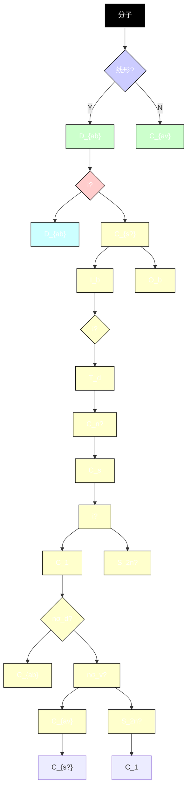
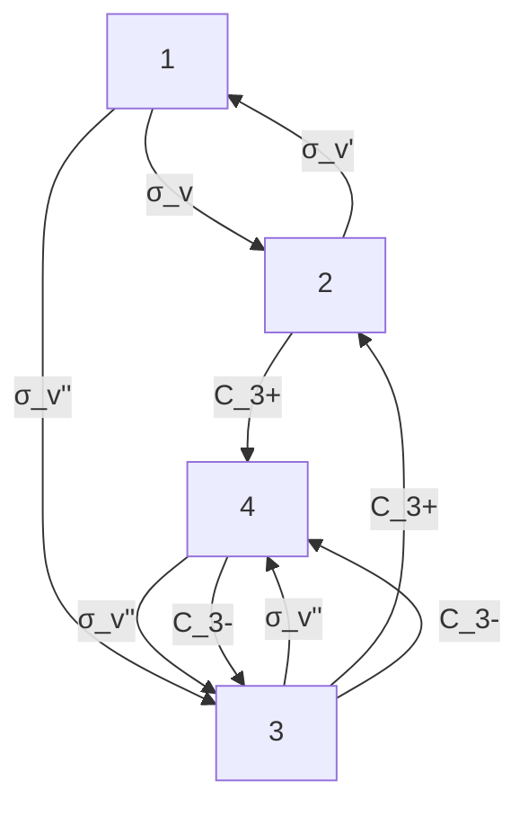

# 主题 10

# 分子对称性

在本主题中，“形状（几何构型）”的概念被打磨成“对称性”的精确定义。因此，对称性及其推论可被系统研究，从而为分子结构和性质的预测及分析提供了一个十分有力的工具。

# 10A 形状和对称性

本专题讨论如何根据对称性对任意分子进行分类，这种分类的两个直接应用是确定一个分子是否有电偶极矩（即是否是极性的），以及是否具有手性（即是否具有光学活性）？

10A.1 对称操作和对称元素；10A.2 分子的对称性分类；10A.3 对称性的一些直接推论

# 10B 群论

对称性的系统处理是“群论”的一个应用。这个理论用矩阵表示对称操作（如旋转和反映）的结果。这一步是重要的，因为一旦对称操作用数字表示，它们就可以被定量运算。本专题将介绍“特征标表”，其对于群论在化学中的应用特别重要。

10B.1 群论基础：10B.2 矩阵表示：10B.3 特征标表

# 10C 对称性的应用

群论提供了裁定一些积分是否消失的简单判据。一个应用是确定两个原子轨道之间的重叠积分是否必须为零，从而确定哪些原子轨道可以对分子轨道有贡献。对称性也用来确定与核骨架对称性相匹配的、原子轨道的线性组合。通过考虑积分的对称性性质，也可导出控制光谱跃迁的选律。

10C.1 消失积分；10C.2 在分子轨道理论中的应用；10C.3 选律

# 专题10A

# 形状和对称性

为何需要学习这部分内容？

对称性论证可以用来对分子的性质进行立即评估；第一步是确定这个分子拥有的对称性，然后对其进行相应的分类。

核心思想是什么？

可以根据分子的对称元素，将其分成不同的群。

需要哪些预备知识？

本专题并不直接借用其他专题的内容，但了解在基础化学课程中遇见的一系列简单分子和离子的形状（几何构型）将是有用的。

一些物体较其他物体“更加对称”。例如，球体较立方体更加对称，因为当球体绕通过其体心的任一轴旋转任意角度后看起来与原先一样，而对于立方体，只有当它绕一些特定轴旋转一定角度后才看起来与原先相同，如绕穿过两个相对面中心的一个轴旋转90°、180°或270°（图10A.1）；或者绕穿过两个相对角的一个轴旋转120°或240°。类似地，NH₃分子较H₂O分子“更加对称”，因为NH₃分子绕图10A.2所示的轴旋转120°或240°后看起来与原先并无异样，而H₂O分子仅当旋转180°后才看起来与原先一样。

本专题将这些直觉概念置于一个更为正式的基础上。你会发现：根据对称性，可以将分子分成不同的群。例如，正四面体物种 $CH_{4}$ 和 $SO_{4}^{2-}$ 在一个群，三角锥形的 $NH_{3}$ 和 $SO_{3}^{2-}$ 在另一个群。结果表明，同一群中的分子具有一些相似的物理性质。因此，一旦确定了分子所属的群，就可以对整个系列的分子进行强有力的预测。

# 10A.1 对称操作和对称元素

如果一个物体被执行了某一动作后，其看起来仍与原先一样，则该动作称为对称操作

![[mineru/物理化学/物理化学（第11版）10章对称性402-429_images/11b93215cdaddbe565f154879f53146ea311131c6f8acfe14e4f093ba6d24aec.jpg]]

text_image

C₂
C₃
C₄

图 10A.1 立方体的一些对称元素。已用约定的符号对二重轴、三重轴和四重轴进行了标记

![[mineru/物理化学/物理化学（第11版）10章对称性402-429_images/47df1adb851f4ec49cf6e94139353e2169b885520434b07f92d14abe7c4b0f9d.jpg]]

chemical

Molecular structure of methane (CH₃) showing its 3D ball-and-stick model with blue sphere and white atoms

(a)

![[mineru/物理化学/物理化学（第11版）10章对称性402-429_images/af27f598743011728aeb5f868092780b350758c3d9f3714345adb7ec12f5cc00.jpg]]

chemical

Molecular structure diagram showing a central carbon atom bonded to three oxygen atoms, with a labeled C₂ vertex

(b)   
图 10A:2 （a） $NH_{3}$ 分子拥有一个三重轴 $C_{1}$ ；（b） $H_{2}O$ 分子拥有一个二重轴 $C_{2}$ ，两者都还拥有其他对称元素

(symmetry operation)。典型的对称操作包括旋转、反映和反演。每个对称操作都有一个相应的对称元素（symmetry element），即对称操作赖于进行的点、线或面。例如，旋转（一个对称操作）是通过绕一个轴（为相应的对称元素）进行的。分子可以通过确定它们所有的对称元素而被分类，然后将拥有一组相同对称元素的分子放在一起组成一个群。例如，该程序将三角形平面物种 $\mathrm{BF}_3$ 和

$CO_{3}^{2-}$ 放入一个群，而将 $H_{2}O(V形)$ 和 $ClF_{3}(T形)$ 放入另一个群。

绕一个n重对称轴（n-fold axis of symmetry，对称元素） $C_{n}$ 的n重旋转（n-fold rotation，对称操作）为角度为 $360^{\circ}/n$ 的旋转。 $H_{2}O$ 分子拥有一个二重轴 $C_{2}$ 。 $NH_{3}$ 分子有一个三重轴 $C_{3}$ ，与此相关有两个对称操作，一个是顺时针旋转 $120^{\circ}$ ，另一个则是逆时针旋转 $120^{\circ}$ 。而与一个 $C_{2}$ 轴相关的对称操作只有一个二重旋转，因为顺时针和逆时针旋转 $180^{\circ}$ 是等同的。五边形有一个 $C_{5}$ 轴，与此相关的操作有两个 $72^{\circ}$ 的旋转（一个顺时针方向、一个逆时针方向）；它还有一个标记为 $C_{5}^{2}$ 的操作，对应于两个连续的 $C_{5}$ 旋转；有两个这样的操作，一个是顺时针方向旋转 $144^{\circ}$ ，另一个则是逆时针方向旋转 $144^{\circ}$ 。立方体有三个 $C_{4}$ 轴、四个 $C_{3}$ 轴和六个 $C_{2}$ 轴。但是，即便是如此高的对称性，仍然不及球的对称性，球拥有无数个、n可取所有正整数值的对称轴 $C_{n}$ （沿穿过球心的任意一个轴）。

如果一个分子拥有数个旋转轴，则有最高 $n$ 值的那个轴称为主轴（principal axis）。苯分子的主轴是垂直于六边形环（1）的六重轴。如果一个分子拥有不止一个这样具有最高 $n$ 值的对称轴，又希望指定其中一个为主轴，那么通常选择穿过最多原子的那个轴为主轴；对于一个平面分子（如萘2，其中有三个 $C_2$ 轴竞争主轴头衔），则选择垂直于平面的轴为主轴。

![[mineru/物理化学/物理化学（第11版）10章对称性402-429_images/ed9cc5aaab2a3e5165ba3e28ff137da5dc0b5dff935362dd217cd020d563b5da.jpg]]

chemical

Molecular structure and 3D molecular model of a compound labeled C6H6, showing atomic positions and unit cell axes

2 索. $C_{10}H_{8}$

![[mineru/物理化学/物理化学（第11版）10章对称性402-429_images/301f37c6b75c7fc593e1b9ae847b1441ff085fbdacd7bbbd1e2daabca3bbda3c.jpg]]

chemical

Molecular orbital diagram showing σ_v and σ'_v orbitals with electron density surfaces

图10A.3 $\mathrm{H}_2\mathrm{O}$ 分子有两个镜面，它们都是垂直镜面（也就是说，包含主轴），故标记为 $\sigma_{\mathrm{r}}$ 和 $\sigma_{\mathrm{r}}^{\prime}$

![[mineru/物理化学/物理化学（第11版）10章对称性402-429_images/46d06ecf67e709ccd1f49381655777a3b3234c3e7541ff93aa1083fc46e3f91d.jpg]]

text_image

σd σd σd

图10A4 等分镜面 $(\sigma_{s})$ 将垂直于主轴的 $C_2$ 轴二等分

反映（reflection）是对应于一个镜面（mirror plane，对称元素） $\sigma$ 的操作。如果镜面包含主轴，则称为“垂直镜面”，标记为 $\sigma_{v}$ 。 $\mathrm{H}_{2} \mathrm{O}$ 分子有两个垂直镜面（见图10A.3）， $\mathrm{NH}_{3}$ 分子则有三个垂直镜面。平分两个 $C_{2}$ 轴之间夹角的垂直镜面称为“平分镜面”，标记为 $\sigma_{d}$ （见图10A.4）。当镜面垂直于主轴时，称为“水平镜面”，标记为 $\sigma_{h}$ 。苯分子就有这样一个垂直于 $C_{6}$ 主轴的水平镜面。

在通过对称中心i（center of symmetry，对称元素）的一次反演（inversion，对称操作）中，分子中的每一点想象为沿一条通过分子中心的直线移至等距离的另一边；也就是说，点 $(x,y,z)$ 被移至点 $(-x,-y,-z)$ 。 $H_{2}O$ 分子和 $NH_{3}$ 分子都没有这样的反演中心，但球和立方体确有这样的反演中心。苯分子有一个反演中心，正八面体（参见图10A.5）也有一个反演中心，而正四面体和 $CH_{4}$ 分子则没有反演中心。

沿n重非真旋转轴（n-fold improper rotation axis，对称元素，又称映轴、象转轴） $S_{n}$ 的n重非真旋转（n-fold improper rotation，对称操作）由两个连续变换构成。第一个变换是 $360^{\circ}/n$ 的旋转，第二个是通过垂直于旋转轴的镜面的反映。两个变换本身并非需要是对称操作。 $CH_{4}$ 分子有三个 $S_{4}$ 轴，乙烷的交叉式构象有一个 $S_{6}$ 轴（见图10A.6）。

![[mineru/物理化学/物理化学（第11版）10章对称性402-429_images/8a743c3d7e7d6e04ca5b833fda2b4c81fb1e14c6dd95af328bebce82d6d35cac.jpg]]

text_image

反演中心, i

图10A.5 正八面体拥有一个反演中心（i）

![[mineru/物理化学/物理化学（第11版）10章对称性402-429_images/8aea9a4682ff7dd3c8f29465286e8430908f133c7dd84eae2f5c4f075487c738.jpg]]

text_image

S₄
C₄
σₑ

(a)

![[mineru/物理化学/物理化学（第11版）10章对称性402-429_images/0be79927e2f03057df3a583b56122d7f358d04843417dfcb753ae11b1221db53.jpg]]

chemical

Molecular structure diagram showing atom types and bond angles labeled S_e, C_h, and σ_h

(b)   
图10A.5（a）CH₄分子拥有一个四重非真旋转轴（S₁）：分子经过90°旋转再接一个水平镜面的反映后变得不可区分，但每个操作本身并不是对称操作。（b）乙烷的交叉式构象有一个由60°旋转再接一个反映除所构成的S₄轴

恒等操作（identity）E即为不动，对应的对称元素是整个物体。如果不施以任何动作，每个分子与其本身是不可分辨的，所以每个物体至少都拥有恒等元素。引入恒等的一个原因是一些分子（3）仅有这个对称元素。

![[mineru/物理化学/物理化学（第11版）10章对称性402-429_images/9cac107525ae1ebdd2d124d5347984b49ef33c8446e558bccba39bddc5826e05.jpg]]

chemical

Molecular structure diagram of a brominated organic compound with chlorine, fluorine, and iodine atoms labeled

3 CBrClF

# 简要说明10A.1

为了确定萘分子（2）的对称元素，注意到：

- 与所有分子一样，它具有恒等元素 $E$ 。  
- 有三个二重旋转轴 $C_{2}$ ；其中，一个垂直于分子平面，另两个则位于平面内。  
- 当选择垂直于分子平面的 $C_{2}$ 轴为主轴时，有一个垂直于主轴的 $\sigma_{\mathrm{h}}$ 镜面和两个包含主轴的 $\sigma_{\mathrm{v}}$ 镜面。  
- 还有一个通过分子中点（即两个环接合处 C—C 键的中点）的反演中心 i。

# 10A.2 分子的对称性分类

根据所拥有的对称元素，物体可被分成不同的群。当物体按照操作（至少有一公共点不变）对应的对称元素来分类时，就产生了点群（point group）。前面明确的5类对称元素就属于这种情形。当考虑晶体时（专题15A），由穿越空间的平动所引起的对称性也需要考虑进来，根据这些元素的分类就产生了更广泛的空间群（space group）。

具有一组相同对称的元素的所有分子属于同一点群，群的名字由这组对称元素决定。有两类标记系统（参见表10A.1）。对单个分子的讨论，熊夫利系统（Schoenflies system，如 $C_{4v}$ ）更为常见，而在晶体对称性的讨论中，则几乎完全使用Hermann-Mauguin系统或国际系统（Hermann-Mauguin system或International system，如4mm）。参考图10A.7中的流程图及图10A.8所示的形状，可以简化分子所属点

![[mineru/物理化学/物理化学（第11版）10章对称性402-429_images/756b6679d3f6374e3f77f7bafaeba9d2d26d8d5a8d16a4b9984169cdf5a5ec31.jpg]]

flowchart

图10A.7 确定一个分子点群的流程图。由上开始，回答每个方块的问题（Y=是，N=否）。蓝色线为“简要说明10A.2”中采用的路径

表10A.1 点群的表示

<table><tr><td> $C_i$ </td><td>I</td><td></td><td></td><td></td><td></td><td></td><td></td><td></td><td></td></tr><tr><td> $C_s$ </td><td>m</td><td></td><td></td><td></td><td></td><td></td><td></td><td></td><td></td></tr><tr><td rowspan="6"> $C_1$ </td><td rowspan="6">1</td><td> $C_2$ </td><td>2</td><td> $C_3$ </td><td>3</td><td> $C_4$ </td><td>4</td><td> $C_6$ </td><td>6</td></tr><tr><td> $C_{2v}$ </td><td>2mm</td><td> $C_{3v}$ </td><td>3m</td><td> $C_{4v}$ </td><td>4mm</td><td> $C_{6v}$ </td><td>6mm</td></tr><tr><td> $C_{2h}$ </td><td>2/m</td><td> $C_{3h}$ </td><td>6</td><td> $C_{4h}$ </td><td>4/m</td><td> $C_{6h}$ </td><td>6/m</td></tr><tr><td> $D_2$ </td><td>222</td><td> $D_3$ </td><td>32</td><td> $D_4$ </td><td>422</td><td> $D_6$ </td><td>622</td></tr><tr><td> $D_{2h}$ </td><td>mmm</td><td> $D_{3h}$ </td><td>62m</td><td> $D_{4h}$ </td><td>4/mmm</td><td> $D_{6h}$ </td><td>6/mmm</td></tr><tr><td> $D_{2d}$ </td><td>42m</td><td> $D_{2d}$ </td><td>3m</td><td> $S_4$ </td><td>4</td><td> $S_6$ </td><td>3</td></tr><tr><td>T</td><td>23</td><td> $T_d$ </td><td>43m</td><td> $T_h$ </td><td>m3</td><td></td><td></td><td></td><td></td></tr><tr><td>O</td><td>432</td><td> $O_h$ </td><td>m3m</td><td></td><td></td><td></td><td></td><td></td><td></td></tr></table>

\*熊夫利记号用黑色，Hermann-Mauguin（国际系统）记号为蓝色。在Hermann-Mauguin系统中，n表示出现一个n重轴，m表示一个镜面。斜杠（/）表示镜面垂直于对称轴。注意区分同种类型但属于不同类的对称元素，如在4/min中，其中有3类镜面。数字上面的横线表示元素与一反演结合。表中列出的群仪是所谓的“晶体学点群”。

![[mineru/物理化学/物理化学（第11版）10章对称性402-429_images/77ac749023488bb22d017dae1e6f39c63a60b7807c893a8b6feceac81612ad16.jpg]]

text_image

n= 2 3 4 5 6 ∞
Cₙ ◇ △ ■ ◆ ◆
Dₙ [ ] △ [ ] ◆ [ ]
Cₙₓ [ 角锥 ] ◆ [ ] 圆锥体
Cₙₕ [ ] △ [ ] ◆ [ ]
Dₙₕ [ 平面或双角锥 ] ◆ [ ]
Dₙₗ [ ] ★ [ ] ◆ [ ]
S₂ₙ [ ] ◆ [ ]

图10A.8对应不同点群的各种形状的总结（一个分子所属的点群经常可由该图得以确定，而不需要通过图10A.7中的正式程序）

群的确定（在熊夫利系统中）。

# 简要说明10A.2

为了确定二茂钌分子（4）所属的点群，首先确定存在的对称元素，并使用图10A.7所示的流程图。可见：

\- 分子有1个五重轴和5个穿过钌原子并垂直于 $C_{3}$ 轴的二重轴。

有1个垂直于 $C_{s}$ 轴，并穿过钉原子的镜面 $\sigma_{h}$

\- 有5个包含主轴的σ、镜面，每个镜面穿过五元环上的一个碳原子和对边上C—C键的中点。这些镜面都包含1个二重轴。

所经过的路经由图10A.7中的蓝色线表示，最后终止于 $D_{sh}$ 。因为分子有1个五重轴，故它属于点群 $D_{sh}$ 。

![[mineru/物理化学/物理化学（第11版）10章对称性402-429_images/c5b5fb05bcf3948e1b9e5d5818abcd5337f6a6040152d5a556fd3cb451b5d4b5.jpg]]

chemical

Molecular structure of Ru complex with Cp = C5H5 ligand

4 二茂钌，Ru(Cp)

如果环是（完全）交叉式的，如在二茂铁的激发态中，则镜面 $\sigma_{b}$ 不存在。其他镜面虽仍然存在，但现在它们将二重轴之间的夹角二等分，故被描述为 $\sigma_{d}$ 。沿着图10A.7中合适的路径，可知该分子属于 $D_{3d}$ 点群。

![[mineru/物理化学/物理化学（第11版）10章对称性402-429_images/99bbc29b60d27e6579eb7cea7323dc0e87b8bf14de0962ebd267469682324465.jpg]]

chemical

Molecular structure of a cobalt complex with Cp = C₃H₅ ligand

5 二茂铁，Fe(Cp) $_{2}$ (激发态)

# (a) $C_{1}$ 群、 $C_{1}$ 群和 $C_{s}$ 群

如果一个分子除了恒等对称元素外没有其他对称元素，则该分子属于 $C_{1}$ 群；如果有恒等和反演对称元素，则该分子属于 $C_{1}$ 群；如果有恒等对称元素和一个镜面，则该分子属于 $C_{s}$ 群。

<table><tr><td>名称</td><td>对称元素</td></tr><tr><td> $C_{i}$ </td><td>E</td></tr><tr><td> $C_{i}$ </td><td>E、i</td></tr><tr><td> $C_{i}$ </td><td>E、σ</td></tr></table>

# 简要说明10A.3

- CBrClFl分子（3）仅有恒等对称元素，故属于 $C_1$ 群。   
- 内消旋酒石酸分子（6）有恒等和反演对称元素，故属于 $C_{1}$ 碎。  
- 喹啉（7）拥有对称元素 $E$ 和 $\sigma$ ，故属于 $C_{s}$ 群。

![[mineru/物理化学/物理化学（第11版）10章对称性402-429_images/37838f6cbf91973c98e82967ad20e6ead4e8254651f02025f66d6265c9aadc9b.jpg]]

chemical

Molecular structure diagram showing carboxyl groups and hydrogen bonding, labeled with '反馏中心' (antiflora) in Chinese

![[mineru/物理化学/物理化学（第11版）10章对称性402-429_images/efeb9051e510e2a4931423051d1740ed79b86b016e9bf13ac121ccc9090398dc.jpg]]

chemical

Molecular structure of a nitrogen-containing compound with carbon and hydrogen atoms

6 内消旋酒石酸
HOOCCH(OH)CH(OH)COOH  
7. 咧啉, $C_9H_7N$

# (b) $C_{n}$ 群、 $C_{m}$ 群和 $C_{nh}$ 群

一个分子如果拥有一个n重轴，则属于 $C_{n}$ 群。注意符号 $C_{n}$ 现在扮演了三重角色，即作为一个对称元素、一个对称操作和一个群的记号。

<table><tr><td>名称</td><td>对称元素</td></tr><tr><td> $C_n$ </td><td>E、 $C_n$ </td></tr><tr><td> $C_{nv}$ </td><td>E、 $C_n$ 、 $n\sigma_v$ </td></tr><tr><td> $C_{nh}$ </td><td>E、 $C_n$ 、 $\sigma_h$ </td></tr></table>

如果除了恒等对称元素和一个 $C_{n}$ 轴外，一个分子还有n个垂直镜面 $\sigma_{v}$ ，那么它属于 $C_{nv}$ 群。如果除了恒等对称元素和一个n重主轴外，还有一个水平镜面 $\sigma_{h}$ ，则该分子属于 $C_{nh}$ 群。注意，一些对称元素的存在可能意味着其他对称元素的存在。例如，在 $C_{2h}$ 中，对称元素 $C_{2}$ 和 $\sigma_{h}$ 一起意味着反演中心的存在（见图10A.9）。还要注意，表中指定的是对称元素而非对称操作。例如，有两个与单个 $C_{3}$ 相关的操作（即旋转+120°和-120°）。

![[mineru/物理化学/物理化学（第11版）10章对称性402-429_images/4a71a535a23f5f5d97c3a3289b5de31af605f3bc5105e929bf789d8a2b501ffd.jpg]]

text_image

C₂
i
σ₀

图10A.9 一个二重轴和一个水平镜面的同时存在意味着分子中有反演中心

# 简要说明10A.4

\- 在 $\mathrm{H}_2\mathrm{O}_2$ 分子（8）中，两个O—H键之间的夹角约为 $115^{\circ}$ （从O—O键方向向下看）。此分子拥有对称元素E和 $C_2$ 故属于 $C_2$ 群。

![[mineru/物理化学/物理化学（第11版）10章对称性402-429_images/5b1a22eaddad8df666b01fcc0e6f9ee3477695edeab9e570dd6b92aa190fb2a4.jpg]]  
8 过氧化氢， $H_{2}O_{2}$

\- 水分子拥有对称元素 $E$ 、 $C_{2}$ 和 $2\sigma_{v}$ ，故属于 $C_{2n}$ 群。

\- 氨分子拥有对称元素 $E$ 、 $C_{3}$ 和 $3\sigma$ ，故属于 $C_{n}$ 群。

\- 异核双原子分子（如HCl）属于 $C_{\infty}$ 群，因为沿着核间轴旋转任何角度及在含有这个轴的无限多个平面内的反映都是对称操作。 $C_{\infty}$ 群的其他成员包括线形OCS分子和圆锥体。

\- 反式 $\mathrm{CHCl} = \mathrm{CHCl}$ 分子（9）拥有对称元素 $E$ 、 $C_2$ 和 $\sigma_h$ ，故属于 $C_{\text{th}}$ 群。

\- 平面构象的 $\mathrm{B(OH)}_3$ 分子（10）拥有一个 $C_3$ 轴和一个 $\sigma_h$

镜面，故属于 $C_{33}$ 群。

![[mineru/物理化学/物理化学（第11版）10章对称性402-429_images/8683c55acfb08693856e4afe7e1844e9d45bf120129ca5c7ece2cdb95826e07e.jpg]]

chemical

Molecular structure of chlorine (Cl) showing central carbon bonded to two chlorine atoms and one hydrogen atom

9 反式CHCl=CHCl

![[mineru/物理化学/物理化学（第11版）10章对称性402-429_images/b9fdfbbdf97ce41fd0290e8c38ee2a5fc4c51b384e7396bff80e3a60dcdb7d41.jpg]]

chemical

Molecular structure diagram showing boron (B), hydroxyl (OH), and carbon (C3) atoms with sigma bond

10 B(OH) $_{3}$

# (c) $D_{n}$ 群、 $D_{nh}$ 群和 $D_{nd}$ 群

图10A.7显示拥有一个n重主轴和n个垂直于 $C_{n}$ 的二重轴的分子属于 $D_{n}$ 群。如果还有一个水平镜面，则

名称 对称元素

<table><tr><td> $D_{n}$ </td><td> $E, C_{n}, nC_{2}^{\prime}$ </td></tr><tr><td> $D_{nh}$ </td><td> $E, C_{n}, nC_{2}^{\prime}, \sigma_{h}$ </td></tr><tr><td> $D_{nd}$ </td><td> $E, C_{n}, nC_{2}^{\prime}, n\sigma_{d}$ </td></tr></table>

分子属于 $D_{nh}$ 群。线形分子OCO和HCCH及均匀的圆筒都属于 $D_{-h}$ 群。如果除了 $D_{n}$ 拥有的对称元素外，分子还有n个平分镜面，则它属于 $D_{nd}$ 群。

# 简要说明10A.5

\- 平面三角形的 $\mathrm{BF}_3$ 分子（11）拥有对称元素 $E, C_3, 3C_2$ （沿每个B一F键都有一个 $C_2$ 轴）和 $\sigma_h$ ，故属于 $D_{3h}$ 群。

\- $C_6H_6$ 分子拥有对称元素 $E, C_6, 3C_2, 3C_2'$ 和 $\sigma_h$ ，以及由这些对称元素暗含的其他一些对称元素，故属于 $D_{6h}$ 群。三个 $C_1$ 轴将 C 原子形成的六元环上的位于两条对边上的 C—C 键二等分，另外三个 $C_2$ 轴则穿过位于环对位的两个角的顶点。在 $3C_2'$ 上的符号“'”（撇）表示这些轴与其他的三个 $C_2$ 轴不同。

所有同核双原子分子，如 $N_{2}$ ，都属于 $D_{n}$ 群，因为绕着核间轴的所有转动都是对称操作，与端到端180°的旋转一样。

\- $\mathrm{PCI}_{3}$ 分子（12）是 $D_{\text {th}}$ 物种的另一个例子。

\- 丙二烯分子（13）中两个 $\mathrm{CH}_2$ 基团位于两个垂直平面内，属于 $D_{3d}$ 群。

![[mineru/物理化学/物理化学（第11版）10章对称性402-429_images/861776a5b999aced22bf2db7921d196b99a33fd10514478eca91fb407f7c22bd.jpg]]

chemical

Molecular structure diagram showing a central atom B bonded to three peripheral atoms labeled F and two others

11 三氧化硼. $\mathrm{BF}_{3}$

![[mineru/物理化学/物理化学（第11版）10章对称性402-429_images/f745a6fde17dc4497e95b166fdb9c12e07caa6ab31137e9fd88e09a7369d9637.jpg]]

chemical

Molecular structure diagram showing a central phosphorus atom bonded to chlorine and carbon atoms, with labeled bond angles and an external σh plane.

12 五氯化磷， $\mathrm{PCl}_{5}(D_{3h})$   
![[mineru/物理化学/物理化学（第11版）10章对称性402-429_images/265af84e3ca978dd0503e901a56268dabb9b92e3059a8977f9332fc88a4e29aa.jpg]]

chemical

Molecular structure diagram showing carbon atoms and sulfur group with labeled bond angles

13 丙二烯, $C_{3}H_{4}(D_{2d})$

# (d) $S_{n}$ 群

分子如果不属于上述点群，但拥有一个 $S_{n}$ 轴，则属于 $S_{n}$ 群。注意， $S_{2}$ 群与 $C_{1}$ 群相同，故此分子已归属为 $C_{10}$ 。四苯基甲烷分子（14）属于 $S_{4}$ 群；属于 $S_{n}$ （n>4）群的分子很少。

<table><tr><td>名称</td><td>对称元素</td></tr><tr><td> $S_{n}$ </td><td> $E$ 、 $S_{n}$ 及之前未被分类的</td></tr></table>

![[mineru/物理化学/物理化学（第11版）10章对称性402-429_images/10eb0d2a551ab3eaf604e836a8fa6070ebe84738bf891b52e02566c346764a84.jpg]]

chemical

Molecular structure diagram showing a chain with labeled distance S₁

14 四苯基甲烷, $C(C_{6}H_{5})_{4}$ (S $_{4}$ )

# (e) 立方体群

许多十分重要的分子拥有不止一个主轴。大部分属于立方体群（cubic group），特别是正四面体群（tetrahedral group）T、 $T_{d}$ 和 $T_{h}$ [见图10A.10(a)]或正八面体群（octahedral group）O和 $O_{h}$ [见图10A.10(b)]。少数正二十面体分子属于正十二面体群（icosahedral group）I [见图10A.10(c)]。 $T_{d}$ 群和 $O_{h}$ 群分别是正四面体和正八面体的群。如果物体拥有四面体或八面体的旋转对称性，但它们的面中没有一个是反映镜面，那么它就属于更为简单的T群或O群（见图10A.11）。在T群的基础上若还有一反演中心，则为 $T_{h}$ 群（见图10A.12）。

<table><tr><td>名称</td><td>对称元素</td></tr><tr><td>T</td><td> $E$ 、 $4C_{3}$ 、 $3C_{2}$ </td></tr><tr><td> $T_{d}$ </td><td> $E$ 、 $3C_{2}$ 、 $4C_{3}$ 、 $3S_{4}$ 、 $6\sigma_{d}$ </td></tr><tr><td> $T_{h}$ </td><td> $E$ 、 $3C_{2}$ 、 $4C_{3}$ 、 $i$ 、 $4S_{b}$ 、 $3\sigma_{h}$ </td></tr><tr><td>O</td><td> $E$ 、 $3C_{4}$ 、 $4C_{3}$ 、 $6C_{2}$ </td></tr><tr><td> $O_{h}$ </td><td> $E$ 、 $3S_{4}$ 、 $3C_{4}$ 、 $6C_{2}$ 、 $4S_{b}$ 、 $4C_{3}$ 、 $3\sigma_{h}$ 、 $6\sigma_{d}$ 、 $i$ </td></tr><tr><td>I</td><td> $E$ 、 $6C_{5}$ 、 $10C_{3}$ 、 $15C_{2}$ </td></tr><tr><td> $I_{h}$ </td><td> $E$ 、 $6S_{10}$ 、 $10S_{6}$ 、 $6C_{5}$ 、 $10C_{3}$ 、 $15C_{2}$ 、 $15\sigma$ 、 $i$ </td></tr></table>

# 简要说明10A.6

- $\mathrm{CH}_{4}$ 分子和 $\mathrm{SF}_{6}$ 分子分别属于 $T_{a}$ 群和 $O_{b}$ 群。  
- 属于正二十面体群 $l$ 的分子包括一些硼烷和富勒烯

![[mineru/物理化学/物理化学（第11版）10章对称性402-429_images/db366c9b00f09f170b78788cd8ead5e5c6dd67cef662fac1ff6ca0a775bda0a3.jpg]]

natural_image

Geometric polyhedral structure composed of interconnected lines forming a cage-like pattern (no text or symbols)

15 富勒烯, $C_{60}(I)$

$C_{40}$ (15).

\- 图10A.11中所示的物体分别属于T群和O群。

# (f) 全旋转群

全旋转群（full rotation group） $R_{3}$ （下标3指三维旋转）含有无穷数目的各种可能n值的旋转轴。球

<table><tr><td>名称</td><td>对称元素</td></tr><tr><td>R3</td><td>E、∞C2、∞C3等</td></tr></table>

![[mineru/物理化学/物理化学（第11版）10章对称性402-429_images/ff53f10d88a0003975363e88dca9eb1487a39a7333630adad3a723aa2ce35a6f.jpg]]

natural_image

3D geometric shape with blue gradient shading inside a wireframe cube (no text or symbols)

(a)

![[mineru/物理化学/物理化学（第11版）10章对称性402-429_images/6614c3490b0e1f65f6076a67c47ccfcd53f7bdca36a4cca64dd25fd09057d846.jpg]]

natural_image

3D geometric shape inside a wireframe cube, rendered in blue gradient (no text or symbols)

(b)

![[mineru/物理化学/物理化学（第11版）10章对称性402-429_images/452437f5da197d338cd9f3711473b35f3572db8e0f18f5e40e42b462d5cd18bb.jpg]]

natural_image

Blue 3D geometric shape inside a wireframe cube (no text or symbols)

(c)

图10A.10（a）正四面体，（b）正八面体和（c）正二十面体与立方体之间的几何形状关系，它们分别属于立方体群中的 $T_{a}$ 、 $O_{a}$ 和 $I_{s}$

![[mineru/物理化学/物理化学（第11版）10章对称性402-429_images/be8fc7051bd1b5f4d220ad81de006c78abe104e5ac5b4f3e2768668157988a49.jpg]]

natural_image

Abstract 3D cube with blue and gray geometric shapes inside (no text or symbols)

(a)

![[mineru/物理化学/物理化学（第11版）10章对称性402-429_images/1339a116e7ede7a620c0b6560b14981a1cc9e7d822592da36743df9a5499b42b.jpg]]

natural_image

3D geometric diagram showing a cube with internal blue and black shapes, no text or symbols present

(b)

图10A.11（a）点群T和（b）点群O的形状。装饰板的出现使物体的对称性分别从 $T_{2}$ 和 $O_{2}$ 下降  
![[mineru/物理化学/物理化学（第11版）10章对称性402-429_images/05ca694d32f0aa9a5564ddc385b094cc1159d5b3d0ef1526e583815524edaabe.jpg]]

natural_image

Abstract 3D geometric shape with blue gradient shading, no text or symbols present

图10A.12 一个属于 $T_{1}$ 群的物体的形状

和原子属于 $R_{3}$ ，但没有任何分子属于 $R_{3}$ 。探究 $R_{3}$ 的结果是将对称性论证应用于原子的一种非常重要的方式，也是应用于轨道角动量理论的另一种途径。

# 10A.3 对称性的一些直接推论

一旦分子的点群被确定，就可获得有关其性质的一些结论。

# (a) 极性

极性分子（polar molecule）是具有永久电偶极矩的分子（如HCl、 $\mathrm{O}_3$ 、 $\mathrm{NH}_3$ ）。偶极矩是分子的一个性质。由于根据定义，对称操作使得分子表观上没有变化，故偶极矩（用矢量表示）也必然不受分子任一对称操作的影响。如果分子拥有一个 $C_n$ 轴（ $n > 1$ ），那么就不可能有垂直于该轴的偶极矩；因为一旦分子绕该轴旋转，这样偶极矩就会改变其方向。但是，平行于该轴的偶极矩却是有可能存在的，因为其不会被旋转影响。例如，在 $\mathrm{H}_2\mathrm{O}$ 分子中，偶极位于分子平面内，沿着HOH键的等分线，即 $C_2$ 轴的方向。类似地，如果分子拥有一个镜面，就不可能有垂直于该面的偶极矩，因为面内的反映将会逆转其方向。拥有对称中心的分子不可能有任何方向的偶极矩，因为反演操作会使它逆转。

基于以上考虑，可得如下结论：

只有属于 $C_{n}$ 、 $C_{nv}$ 和 $C_{s}$ 群的分子才可能有永久电偶极矩。

对于 $C_{n}$ 和 $C_{nv}$ 群分子，其偶极矩必然位于主轴内。

# 简要说明10A.7

- 臭氧O $_{3}$ 分子具有V形结构，属于C $_{2v}$ 群，是极性的。  
- 二氧化碳 $\mathrm{CO}_{3}$ 分子是线形的，属于 $D_{\text{eq}}$ 群，是非极性的。  
四苯基甲烷分子（14）属于 $S_{4}$ 点群，故为非极性分子。

# (b) 手性

手性分子（chiral molecule）是指不能与其镜像重叠的分子。非手性分子（achiral molecule）是指能与其镜像重叠的分子。手性分子是有光学活性的（optically active），它们能够将偏振光的平面发生偏转。一个手性分子和它的镜像组成了一对对映异构体（an enantiomeric pair），它们使偏振平面发生等量，但方向相反的偏转。

只有当一个分子不具有非真旋转轴 $S_{n}$ 时，它才有可能是手性的，并因而是光学活性的。

一个非真旋转轴 $S_{n}$ 可以不同名称出现，并被存在的其他对称元素所暗含。例如，属于 $C_{nh}$ 群的分子实际上暗含拥有一个 $S_{n}$ 轴，因为这些分子同时拥有 $C_{n}$ 和 $\sigma_{h}$ ，即一个非真旋转轴的两个元素。一个反演中心i实际上与 $S_{2}$ 相同，因为两个相应的操作得到完全相同的结果（见图10A.13）。另外，一个镜面与 $S_{1}$ （先旋转360°，然后反映）相同。所以，拥有一个镜面或一个反演中心的分子实际上拥有一个非真旋转轴；根据上述规则，这样的分子应该是非手性的。

![[mineru/物理化学/物理化学（第11版）10章对称性402-429_images/561e6f596fe5cd252c2cbeaccb94fad3279802e6870825b93ea6ef71b10734e8.jpg]]

text_image

S₂
i

图 10A.13 操作i和 $S_{2}$ 是等价的，因为当它们作用于物体的一点时，得到完全相同的结果

# 简要说明10A.8

\- 丙氨酸分子（16）没有反演中心，也没有任何镜面，因而是手性的。

![[mineru/物理化学/物理化学（第11版）10章对称性402-429_images/289a727133bf7a9afbb67d924d61cd1d2c91e01f98b6539828231606aee0f917.jpg]]

chemical

Molecular structure of a compound with carboxylic acid, hydroxyl, amino, and methyl groups

16 L-丙氨酸, $NH_{2}CH(CH_{3})COOH$

\- 相反地，甘氨酸（氨基乙酸）分子（17）有一镜面，故为非手性的。

![[mineru/物理化学/物理化学（第11版）10章对称性402-429_images/b61070f880523f72d6a8c41010b507f394ed3c2313a8864fc553e803836bea38.jpg]]

chemical

Molecular structure of amino acid showing carboxyl group, amine group, and hydrogen atoms

17 甘氨酸, NH₂CH₂COOH

\- 四苯基甲烷分子（14）属于 $S_{4}$ 群，它没有反馈中心及任何镜面，但它拥有一个非真旋转轴 $S_{4}$ ，故仍为非手性的。

# 概念清单

☐ 1. 对称操作是指当其实施后物体看上去依然相同的动作。

☐ 2. 对称元素是指对称操作赖于实施的点、线或面。

3. 通常用于分子和固体的点群符号总结于表10A.1中。

☐ 4. 只有当分子属于 $C_{n}$ 、 $C_{nv}$ 或 $C_{s}$ 群（且没有更高的对称性）时，其才是极性的。

5. 只有当分子没有非真旋转轴 $S_{n}$ 时，其才是手性的。

对称操作和对称元素清单

<table><tr><td>对称操作</td><td>符号</td><td>对称元素</td></tr><tr><td>n重旋转</td><td> $C_n$ </td><td>n重旋转轴</td></tr><tr><td>反映</td><td>σ</td><td>镜面</td></tr><tr><td>反演</td><td>i</td><td>对称中心</td></tr><tr><td>n重非真旋转</td><td> $S_n$ </td><td>n重非真旋转轴</td></tr><tr><td>恒等</td><td>E</td><td>整个物体</td></tr></table>

# 专题10B

# 群论

为何需要学习这部分内容？

群论用数学的形式来表示关于对称性的定性思想，可被系统地应用于多种多样的问题。群论也是化学中使用的原子和分子轨道标记的起源。

核心思想是什么？

对称操作可用矩阵对基的作用来表示。

需要哪些预备知识？

需要知道专题 10A 中介绍的对称操作和对称元素的类型。本专题的讨论将使用矩阵代数，特别是矩阵乘法，这些内容已在专题 9E “化学家工具包 24” 中介绍。

对称性的系统讨论称为群论（group theory）。群论的大部分内容是有关物体对称性常识的总结。但是，由于群论是系统的，因而可以以直接、机械的方式应用其规则。在多数情形中，该理论提供了一种简单而又直接的方法，使得人们可用最少的计算来得到有用的结论。这里强调的正是这个方面。

# 10B.1 群论基础

数学中的一个群（group）是指满足四个判据的、一些变换的集合。如果变换写作 $R, R', \cdots$ （可以是专题10A中介绍的反映、旋转及其他），那么它们在满足下列四个条件的前提下，可形成一个群：

1. 其中有一个变换是恒等，即不动操作。

2. 对每一个变换 R，其逆变换 $R^{-1}$ 也包含在集合中，从而使得组合 $RR^{-1}$ （即先进行 $R^{-1}$ 变换，然后再进行 R 变换）等价于恒等。

3. 组合 $RR'$ （先进行 $R'$ 变换，接着再进行R变换）等价于变换集合中的单一成员。

4. 组合 $R(R'R'')$ [即先进行 $(R'R'')$ 变换，后进行 $R$ 变换]等价于 $(RR')R''$ [即先进行 $R''$ 变

换，然后再进行 $(RR')$ 变换。

# 例题 10B.1 证明一个分子的所有对称操作形成一个群

点群 $C_{2v}$ 含有对称元素 $\{E, C_2, \sigma_v, \sigma_v'\}$ ，相应的对称操作为 $\{E, C_2, \sigma_v, \sigma_v'\}$ 。证明这组操作是数学意义上的一个群。

整理思路 需要证明操作的组合符合上述四个条件。对属于这个群的 $H_{2}O$ 分子，相应的对称操作已在专题10A中明确，并示意于图10A.2和图10A.3中。

# 证明：

- 判据1满足，因为对称操作的集合包含恒等操作 $E$ 。  
- 判据2满足，因为在每种情形下，一个操作的逆过程（相反过程）就是操作本身。所以，连续两次二重旋转就等价于恒等操作： $C_{2}C_{1}=E$ 。同样地，对两个反映和恒等操作也是如此。  
- 判据3满足，因为在各种情形中，都有一个操作接着另一个操作等同于四个对称操作之一。例如，二重旋转 $C_{2}$ 后接着反映 $\sigma_{v}$ ，等同于单个反映 $\sigma_{v}^{\prime}$ （见图10B.1）；因此， $\sigma_{v} C_{2} = \sigma_{v}^{\prime}$ 。对所有可能的对称操作的乘积，可用类似的方式构建一个“群乘法表”；按照要求，每个乘积等价于另一个对称操作。

<table><tr><td> $R \downarrow {R}^{\prime } \rightarrow$ </td><td> $E$ </td><td> ${C}_{2}$ </td><td> ${\sigma }_{v}$ </td><td> ${\sigma }_{v}^{\prime }$ </td></tr><tr><td> $E$ </td><td> $E$ </td><td> ${C}_{2}$ </td><td> ${\sigma }_{v}$ </td><td> ${\sigma }_{v}^{\prime }$ </td></tr><tr><td> ${C}_{2}$ </td><td> ${C}_{2}$ </td><td> $E$ </td><td> ${\sigma }_{v}^{\prime }$ </td><td> ${\sigma }_{v}$ </td></tr><tr><td> ${\sigma }_{v}$ </td><td> ${\sigma }_{v}$ </td><td> ${\sigma }_{v}^{\prime }$ </td><td> $E$ </td><td> ${C}_{2}$ </td></tr><tr><td> ${\sigma }_{v}^{\prime }$ </td><td> ${\sigma }_{v}^{\prime }$ </td><td> ${\sigma }_{v}$ </td><td> ${C}_{2}$ </td><td> $E$ </td></tr></table>

![[mineru/物理化学/物理化学（第11版）10章对称性402-429_images/0470c6fb3c35092375ce8ae06ef62c2890c0a6fb83fabc4153c41084ecb70ded.jpg]]

text_image

C₂
σᵥ(xz)
σ′ᵧ(yz)
x
O
y
z

图103.1 二重旋转 $C_{1}$ 再接反映 $\alpha_{\mathrm{r}}$ 得到与反映 $\alpha_{\mathrm{r}}$ 相同的结果

\- 判据4满足，因为不管如何将各种操作组合在一起，所构成的群并无实质性的变化或不同。所以， $(\sigma_{v}\sigma_{v}^{\prime})C_{2}=C_{2}C_{2}=E$ 及 $\sigma_{v}(\sigma_{v}^{\prime}C_{2})=\sigma_{v}\sigma_{v}=E$ ；对所有其他组合同样也是如此。

自测题10B.1 证明含有对称元素 $\{E, C_2, i, \sigma_h\}$ 和相应对称操作 $\{E, C_2, i, \sigma_h\}$ 的 $C_{2h}$ 为一个群（构建群的乘法表）。

答案：满足条件。

首先，需要澄清可能混淆的一点。构成一个群的实体为其“元素”。对于在化学中的应用，这些元素几乎总是对称操作。但是，如在专题10A中所解释的，“对称操作”不同于“对称元素”，后者是相应对称操作赖于实施的点、轴或平面。单词“元素”的第三个应用是用来表示矩阵中某一特定位置上的数字。要十分小心区别人个群的元素、对称元素和矩阵元。

相同类型的对称操作（如旋转）属于同一类（class），它们可以被群中一个对称操作彼此变换。 $C_{5v}$ 中的两个三重旋转属于同一类，因为通过反映其中一个可被转化为另一个（见图10B.2）；三个反映都属于同一类，因为每一个都可以被三重旋转转化为另一个。类的正式定义是：如果群中有一成员S使得两个操作R和 $R'$ 满足

$$
R ^ {\prime} = S ^ {- 1} R S
$$

类的会员资格

(10B.1)

式中 $S^{-1}$ 是S的逆操作，那么，这两个操作R和 $R'$ 就属于同一类。

图10B.3（a）显示如何用式（10B.1）来确认 $C_{3}^{+}$ 和 $C_{3}^{-}$ 属于 $C_{3v}$ 群中的同一类，通过考虑任意一点1在各种操作下的行为。所考虑的变换是 $\sigma_{v}^{-1}C_{3}^{+}\sigma_{v}$ 。从点1开始，操作 $\sigma_{v}$ 将点1移至点2，然

![[mineru/物理化学/物理化学（第11版）10章对称性402-429_images/f3e549e65dbc0b3b473a87c9d57f8ceef86a1794f1847b98870b301040b00b11.jpg]]

text_image

C₁'
σₓ'
σᵧ''
σₓ

图10B.2 同一类中的对称操作可通过群中的对称操作彼此关联。因此，图中显示的三个镜面之间可通过三重旋转互相关联，而两个旋转则可通过 $\sigma_{s}$ 中的反映相互关联

![[mineru/物理化学/物理化学（第11版）10章对称性402-429_images/b163900d1f5d5f830684b846fd62e02cf0064ec974abcf15a8f73f9d9cf7d1a0.jpg]]

flowchart

(a)

![[mineru/物理化学/物理化学（第11版）10章对称性402-429_images/89b01b5b7fa0788c10e1cff7182bc8e0bf68b35323fb4b98e9a35cd08a1dbaf1.jpg]]

text_image

σₓ'
σᵧ'
C₃⁺
σᵧ
σᵧ"
2
3
4
C₃⁻

(b)   
图10.3（a）当操作 $\sigma_{1}^{*}C_{1}^{*}\sigma_{2}$ 作用于点1时，其结果为 $1\rightarrow2\rightarrow3\rightarrow4(\sigma_{2}^{*})$ 的作用与 $\sigma_{2}$ 相同）。单个操作 $C_{1}^{*}$ （虚曲线）使点 $1\rightarrow4$ ，故 $C_{1}^{*}$ 和 $C_{2}^{*}$ 属于同一类。（b）操作 $(C_{1}^{*})^{-1}\sigma_{1}C_{1}^{*}$ 的结果是使点 $1\rightarrow4[(C_{1}^{*})^{-1}$ 的作用效果与 $C_{2}^{*}$ 相同]。但同样的变换也可以由单个操作 $\sigma_{2}^{*}$ （虚线）来实现，故 $\sigma_{2}$ 和 $\sigma_{2}^{*}$ 处在同一类中

后 $C_{3}^{+}$ 操作将点2移至点3。一个反演的逆操作就是其本身，即 $\sigma_{v}^{-1}=\sigma_{v}$ ，故 $\sigma_{v}^{-1}$ 的作用是将点3移至点4。由图可见，通过对点1进行 $C_{3}^{-}$ 操作也可到达点4。这就证明了 $\sigma_{v}^{-1}C_{3}^{+}\sigma_{v}=C_{3}^{-}$ ，故 $C_{3}^{+}$ 和 $C_{3}^{-}$ 确实属于同一类。

# 简要说明10B.1

为了证明 $\sigma_{\mathrm{v}}$ 和 $\sigma_{\mathrm{v}}^{\prime}$ 属于 $C_{3v}$ 群中的同一类，考虑变换 $(C_3^-)^{-1}\sigma_vC_3^*$ ；由于 $C_3^-$ 为 $C_3^*$ 的逆操作，这个变换等同于 $C_3^-\sigma_vC_3^*$ 。图10B.3（b）中显示这个操作系列对任意点1的作用。最后的位置4也可以通过对点1实施操作 $\sigma_v^{\prime}$ 来达到，这就证明了 $C_3^{\prime}\sigma_vC_3^{\prime} = \sigma_v^{\prime}$ 。因此， $\sigma_{\mathrm{v}}$ 和 $\sigma_v^{\prime}$ 处于同一类中。

# 10B.2 矩阵表示

当前面所述的抽象思想可以用数字的集合以矩阵的形式来表示时，群论将展现其巨大的作用。有关如何处理矩阵的基本信息请参见专题9E中

“化学家的工具包24”。

# (a) 操作的表示

考虑图10B.4中 $C_{2v}$ 群 $SO_{2}$ 分子上的5个p轨道组及它们如何受到反映操作 $\sigma_{v}$ 的影响。相应的对称元素是垂直于分子平面并穿过S原子的镜面。这个反映对 $p_{x}$ 和 $p_{z}$ 没有影响，但改变了 $p_{y}$ 的符号，并使 $p_{A}$ 和 $p_{B}$ 互换。其作用可写为 $(p_{x}-p_{y},p_{z},p_{B},p_{A})\leftarrow(p_{x},p_{y},p_{z},p_{A},p_{B})$ 。这个变换可以用矩阵乘法来表示，即

$$
\begin{array}{l} \left(\mathrm{p} _ {x} - \mathrm{p} _ {y} \mathrm{p} _ {z} \mathrm{p} _ {\mathrm{B}} \mathrm{p} _ {\mathrm{A}}\right) = \left(\mathrm{p} _ {x} \mathrm{p} _ {y} \mathrm{p} _ {z} \mathrm{p} _ {\mathrm{A}} \mathrm{p} _ {\mathrm{B}}\right) \overbrace {\left( \begin{array}{c c c c c} 1 & 0 & 0 & 0 & 0 \\ 0 & - 1 & 0 & 0 & 0 \\ 0 & 0 & 1 & 0 & 0 \\ 0 & 0 & 0 & 0 & 1 \\ 0 & 0 & 0 & 1 & 0 \end{array} \right)} ^ {D (\sigma_ {n})} \\ = \left(\mathrm{p} _ {x} \mathrm{p} _ {y} \mathrm{p} _ {z} \mathrm{p} _ {\Lambda} \mathrm{p} _ {\mathrm{B}}\right) D (\sigma_ {v}) \tag {10B.2a} \\ \end{array}
$$

矩阵 $D(\sigma_{v})$ 称为操作 $\sigma_{v}$ 的一种表示（representative）。根据所用基（basis），即已被采纳的轨道组，表示可有不同的形式。本例中，基是单行矩阵 $(p_{x}p_{y}p_{z}p_{B}p_{A})$ 。注意：矩阵D出现在其作用的基函数的右边。

采用同样的方法，可以找出再现其他对称操作的矩阵。例如， $C_{2}$ 的作用效果为 $(-p_{x}-p_{y}p_{z}-p_{B}-p_{A})\leftarrow(p_{x}p_{y}p_{z}p_{A}p_{B})$ ，故其表示为

$$
\boldsymbol {D} (C _ {2}) = \left( \begin{array}{c c c c c} - 1 & 0 & 0 & 0 & 0 \\ 0 & - 1 & 0 & 0 & 0 \\ 0 & 0 & 1 & 0 & 0 \\ 0 & 0 & 0 & 0 & - 1 \\ 0 & 0 & 0 & - 1 & 0 \end{array} \right) \tag {10B.2b}
$$

![[mineru/物理化学/物理化学（第11版）10章对称性402-429_images/d1d239745525cba3976a655e14adc97f88675ff0a7cfcabbf6a3fed83aec517d.jpg]]

chemical

Molecular orbital diagram showing electron density distribution with labeled points A, B, S and their primed counterparts P_A, P_B, P_1, P_z

图10B.4 用以说明构建一个 $C_{p}$ 分子（ $SO_{2}$ ）中矩阵表示的5个p轨道（3个在S原子上，另外每个O原子上还各有1个）

$\sigma_{v}^{\prime}$ （分子所在平面内的反映）的作用效果为 $(-p_{x}p_{y}p_{z}-p_{A}-p_{B})\leftarrow(p_{x}p_{y}p_{z}p_{A}p_{B})$ ；O原子轨道位置不变，但符号改变了。这个操作的表示矩阵为

$$
D (\sigma_ {2} ^ {\prime}) = \left( \begin{array}{c c c c c} - 1 & 0 & 0 & 0 & 0 \\ 0 & 1 & 0 & 0 & 0 \\ 0 & 0 & 1 & 0 & 0 \\ 0 & 0 & 0 & - 1 & 0 \\ 0 & 0 & 0 & 0 & - 1 \end{array} \right) \tag {10B.2c}
$$

恒等操作对基没有作用，故它的表示就是 $5\times5$ 的单位矩阵：

$$
D (E) = \left( \begin{array}{c c c c c} 1 & 0 & 0 & 0 & 0 \\ 0 & 1 & 0 & 0 & 0 \\ 0 & 0 & 1 & 0 & 0 \\ 0 & 0 & 0 & 1 & 0 \\ 0 & 0 & 0 & 0 & 1 \end{array} \right) \tag {10B.2d}
$$

# (b) 群的表示

表示群中所有操作的一组矩阵，称为所选基的群的矩阵表示（matrix representation） $\Gamma$ 。在当前的例子中，基有5个成员，就矩阵都是5×5陈列而言，表示是五维的。表示矩阵的相乘方式与它们表示的操作一样。因此，如果对任意两个操作R和 $R'$ ，有 $RR'=R''$ ；那么，对于给定的基，就有 $D(R)D(R')=D(R'')$ 。

# 简要说明10B.2

在 $C_{2v}$ 群中，一次二重旋转后再接一次镜面反映等价于第二个镜面的一次反映，即 $\sigma_{v}^{1}C_{2}=\sigma_{v}$ 。将式（10B.2）中给出的表示相乘，得到

$$
\begin{array}{l} \boldsymbol {D} \left(\sigma_ {i} ^ {\prime}\right) \boldsymbol {D} \left(C _ {2}\right) = \left( \begin{array}{c c c c c} - 1 & 0 & 0 & 0 & 0 \\ 0 & 1 & 0 & 0 & 0 \\ 0 & 0 & 1 & 0 & 0 \\ 0 & 0 & 0 & - 1 & 0 \\ 0 & 0 & 0 & 0 & - 1 \end{array} \right) \left( \begin{array}{c c c c c} - 1 & 0 & 0 & 0 & 0 \\ 0 & - 1 & 0 & 0 & 0 \\ 0 & 0 & 1 & 0 & 0 \\ 0 & 0 & 0 & 0 & - 1 \\ 0 & 0 & 0 & - 1 & 0 \end{array} \right) \\ = \left( \begin{array}{c c c c c} 1 & 0 & 0 & 0 & 0 \\ 0 & - 1 & 0 & 0 & 0 \\ 0 & 0 & 1 & 0 & 0 \\ 0 & 0 & 0 & 0 & 1 \\ 0 & 0 & 0 & 1 & 0 \end{array} \right) = D (\sigma_ {v}) \\ \end{array}
$$

如预期的一样，这一相乘再现了与群的乘法表相同的结果。对任意两个表示的相乘也都是如此。所以，四个矩阵就形成了群的一种表示。

群的矩阵表示的发现，意味着操作的符号运算和数字的代数运算之间建立了联系。这一联系是群论在化学中发挥重要作用的基础。

# (c) 不可约表示

观察上面的表示可以发现，它们都具有方块－对角形式（block-diagonal form），即

$$
D = \left( \begin{array}{c c c c c} \blacksquare & 0 & 0 & 0 & 0 \\ 0 & \blacksquare & 0 & 0 & 0 \\ 0 & 0 & \blacksquare & 0 & 0 \\ 0 & 0 & 0 & \blacksquare & \blacksquare \\ 0 & 0 & 0 & \blacksquare & \blacksquare \end{array} \right) \quad \text {方块一对角形式} \tag {10B.3}
$$

表示的方块-对角形式意味着 $C_{2v}$ 对称操作从不将 $p_{x}$ 、 $p_{y}$ 和 $p_{z}$ 混合在一起，也不将这三个轨道与 $p_{A}$ 和 $p_{B}$ 混合，但 $p_{A}$ 和 $p_{B}$ 被群的操作混合在一起。因此，基可以切分成四个部分，其中三个为S原子上的单个p轨道，第四个则为两个O原子轨道 $(p_{A}, p_{B})$ 。在这些三个一维基中的表示为

对于 $\mathfrak{p}_x\colon D(E) = 1$ $D(C_2) = -1$

$$
D \left(\sigma_ {v}\right) = 1 \quad D \left(\sigma_ {v} ^ {\prime}\right) = - 1
$$

对于 $\mathfrak{p}_y\colon D(E) = 1$ $D(C_{2}) = -1$

$$
D \left(\sigma_ {v}\right) = - 1 \quad D \left(\sigma_ {v} ^ {\prime}\right) = 1
$$

对于 $p_{2}$ : $D(E)=1$ $D(C_{2})=1$

$$
D \left(\sigma_ {v}\right) = 1 \quad D \left(\sigma_ {v} ^ {\prime}\right) = 1
$$

这些表示将分别称为 $\Gamma^{(1)}$ 、 $\Gamma^{(2)}$ 和 $\Gamma^{(3)}$ 。剩下的两个函数 $(p_{A} p_{B})$ 为一个二维表示（符号 $\Gamma'$ ）的基。

$$
\boldsymbol {D} (E) = \left( \begin{array}{l l} 1 & 0 \\ 0 & 1 \end{array} \right) \quad \boldsymbol {D} (C _ {2}) = \left( \begin{array}{l l} 0 & - 1 \\ - 1 & 0 \end{array} \right)
$$

$$
\boldsymbol {D} \left(\sigma_ {v}\right) = \left( \begin{array}{l l} 0 & 1 \\ 1 & 0 \end{array} \right) \quad \boldsymbol {D} \left(\sigma_ {v} ^ {\prime}\right) = \left( \begin{array}{l l} - 1 & 0 \\ 0 & - 1 \end{array} \right)
$$

原先的五维表示已被约（reduce）为三个一维表示（分别由S原子上的每个p轨道生成）和一个二维表示[由 $(\mathsf{p}_{\mathrm{A}}\mathsf{p}_{\mathrm{B}})$ 生成]的“直和”。约化用符号表示可写为

![[mineru/物理化学/物理化学（第11版）10章对称性402-429_images/4b383c4abf09f2916d7e622e6337be212503f5caf9a466c3d45b652db2d4ff6c.jpg]]

chemical

Molecular orbital diagrams showing electron density distribution with positive and negative charges

图10B.5 图10B.4中所示的氧的基轨道的两个对称性匹配线性组合。在左边： $p_{1}=p_{A}+p_{B}$ ；在右边： $p_{2}=p_{A}-p_{B}$ 。每个组合都生成了一个一维不可约表示，并且它们的对称性种类是不同的

$$
\Gamma = \Gamma^ {(1)} + \Gamma^ {(2)} + \Gamma^ {(3)} + \Gamma^ {\prime} \quad \text {直和} \tag {10B.4}
$$

表示 $\Gamma^{(1)}$ 、 $\Gamma^{(2)}$ 和 $\Gamma^{(3)}$ 不能再被进一步约化，被称为群的不可约表示（irreducible representation）。二维表示 $\Gamma'$ 则可被约化（对于该群中的这个基），可通过将注意力转移到图10B.5中的线性组合 $p_1 = p_A + p_B$ 和 $p_2 = p_A - p_B$ 上来得到证明。操作 $\sigma_s$ 的结果是互换 $p_A$ 和 $p_B$ ，即 $(p_B, p_A) \leftarrow (p_A, p_B)$ 。所以， $(p_B + p_A) \leftarrow (p_A + p_B)$ 对应于 $(p_1) \leftarrow (p_1)$ 。类似地， $(p_B - p_A) \leftarrow (p_A - p_B)$ 对应于 $(-p_2) \leftarrow (p_2)$ 。根据这些结果及其他操作的类似结果，在基 $(p_1, p_2)$ 中的表示为

$$
\boldsymbol {D} (E) = \left( \begin{array}{c c} 1 & 0 \\ 0 & 1 \end{array} \right) \quad \boldsymbol {D} (C _ {2}) = \left( \begin{array}{c c} - 1 & 0 \\ 0 & 1 \end{array} \right)
$$

$$
\boldsymbol {D} \left(\sigma_ {v}\right) = \left( \begin{array}{c c} 1 & 0 \\ 0 & - 1 \end{array} \right) \quad \boldsymbol {D} \left(\sigma_ {v} ^ {\prime}\right) = \left( \begin{array}{c c} - 1 & 0 \\ 0 & - 1 \end{array} \right)
$$

新的表示都是以方块－对角的形式，在本例中即为 $\begin{pmatrix} \blacksquare & 0 \\ 0 & \blacksquare \end{pmatrix}$ 这种形式，且两个组合不被群中任一操作彼此相混。因此，表示 $\Gamma'$ 可被约化成两个一维表示的加和。所以， $p_{1}$ 生成的一维表示为

$$
D (E) = 1 \quad D \left(C _ {2}\right) = - 1
$$

$$
D \left(\sigma_ {v}\right) = 1 \quad D \left(\sigma_ {v} ^ {\prime}\right) = - 1
$$

与由 $p_{x}$ 生成的表示 $\Gamma^{(1)}$ 一样。组合 $p_{z}$ 生成的表示为

$$
\boldsymbol {D} (E) = 1 \quad \boldsymbol {D} (C _ {2}) = 1
$$

$$
D \left(\sigma_ {v}\right) = - 1 \quad D \left(\sigma_ {v} ^ {\prime}\right) = - 1
$$

为一个新的一维表示，标记为 $\Gamma^{(4)}$ 。至此，原先的表示已被约化为如下5个一维表示，即

$$
\Gamma = 2 \Gamma^ {(1)} + \Gamma^ {(2)} + \Gamma^ {(3)} + \Gamma^ {(4)}
$$

# (d) 特征标

在一特定矩阵表示中，一个操作的特征标(character) $\chi$ 是该操作表示的对角元之和。所以，在原先的基（ $\mathbf{p}_x\mathbf{p}_y\mathbf{p}_z\mathbf{p}_A\mathbf{p}_B$ ）中，表示的特征标为

<table><tr><td>R</td><td>E</td><td> $C_2$ </td></tr><tr><td>D(R)</td><td> $\begin{pmatrix} 1 & 0 & 0 & 0 & 0 \\ 0 & 1 & 0 & 0 & 0 \\ 0 & 0 & 1 & 0 & 0 \\ 0 & 0 & 0 & 1 & 0 \\ 0 & 0 & 0 & 0 & 1 \end{pmatrix}$ </td><td> $\begin{pmatrix} -1 & 0 & 0 & 0 & 0 \\ 0 & -1 & 0 & 0 & 0 \\ 0 & 0 & 1 & 0 & 0 \\ 0 & 0 & 0 & 0 & -1 \\ 0 & 0 & 0 & -1 & 0 \end{pmatrix}$ </td></tr><tr><td> $\chi(R)$ </td><td>5</td><td>-1</td></tr></table>

<table><tr><td>R</td><td> $\sigma_{v}$ </td><td> $\sigma_{v}'$ </td></tr><tr><td>D(R)</td><td> $\left( \begin{array}{cccccc} 1 & 0 & 0 & 0 & 0 \\ 0 & -1 & 0 & 0 & 0 \\ 0 & 0 & 1 & 0 & 0 \\ 0 & 0 & 0 & 0 & 1 \\ 0 & 0 & 0 & 1 & 0 \end{array} \right)$ </td><td> $\left( \begin{array}{cccccc} -1 & 0 & 0 & 0 & 0 \\ 0 & 1 & 0 & 0 & 0 \\ 0 & 0 & 1 & 0 & 0 \\ 0 & 0 & 0 & -1 & 0 \\ 0 & 0 & 0 & 0 & -1 \end{array} \right)$ </td></tr><tr><td> $\chi (R)$ </td><td>1</td><td>-1</td></tr></table>

一维表示的特征标就是表示自身。对每一个操作，约化表示的特征标的加和与原先表示的特征标相同[允许 $\Gamma^{(1)}$ 在约化 $\Gamma = 2\Gamma^{(1)} + \Gamma^{(2)} + \Gamma^{(3)} + \Gamma^{(4)}$ 中出现两次]：

<table><tr><td>R</td><td>E</td><td> $C_2$ </td><td> $σ_v$ </td><td> $σ_v'$ </td></tr><tr><td> $Γ^{(1)}的χ(R)$ </td><td>1</td><td>-1</td><td>1</td><td>-1</td></tr><tr><td> $Γ^{(1)}的χ(R)$ </td><td>1</td><td>-1</td><td>1</td><td>-1</td></tr><tr><td> $Γ^{(2)}的χ(R)$ </td><td>1</td><td>-1</td><td>-1</td><td>1</td></tr><tr><td> $Γ^{(3)}的χ(R)$ </td><td>1</td><td>1</td><td>1</td><td>1</td></tr><tr><td> $Γ^{(4)}的χ(R)$ </td><td>1</td><td>1</td><td>-1</td><td>-1</td></tr><tr><td>Γ的加和</td><td>5</td><td>-1</td><td>1</td><td>-1</td></tr></table>

至此， $C_{2v}$ 群的四个不可约表示已经找到。这些是否是 $C_{2v}$ 群仅有的不可约表示呢？事实上，该群中没有更多的不可约表示。这一事实可由群论中的一个令人惊讶的定理来推断。该定理可表述为

不可约表示的数目 = 类的数目 不可约表示的数目 (10B.5)

在 $C_{2v}$ 群中，有四类操作（表中的四列），故必然有四个不可约表示。已找到的不可约表示为该群仅有的不可约表示。

另一个来自群论的重要结论 [适用于除了纯旋转群 $C_n (n > 2)$ 外的所有群] 将所有不可约表示 $\Gamma^{(i)}$ 的维数 $d_i$ 的平方和与群的阶 $h$ (order, 即对称操作的总数目）关联起来，即

$$
\sum_ {\text { 不可约 } \atop \text { 表示 }, i} d _ {i} ^ {2} = h \quad \text {   直数和价   } \tag {10B.6}
$$

$C_{2v}$ 群的四个不可约表示都是一维的，故

$$
\sum_ {\text { 不可的 } \atop \text { 表示 }, i} d _ {i} ^ {2} = 1 ^ {2} + 1 ^ {2} + 1 ^ {2} + 1 ^ {2} = 4
$$

而群中确实有四个对称操作。

# 简要说明10B.3

$C_{2v}$ 群有三类操作 $[E, 2C_{j}, 3\sigma_{v}]$ ，故有三个不可约表示。群的阶为 $1 + 2 + 3 = 6$ ，所以，如果已知两个不可约表示是一维的，则通过使用式（10B.6）： $1^{2} + 1^{2} + d_{j}^{2} = 6$ ，可知 $d_{j} = 2$ ，即剩下的一个不可约表示必然是二维的。

# 10B.3 特征标表

显示一个群中所有操作特征标的表，称为特征标表（character table）。从现在开始，重点讨论此内容。特征标表的列中标有群的对称操作。尽管符号 $\Gamma^{(0)}$ 用来标记一般的不可约表示，但在化学应用中更常见的则是通过使用符号A，B，E和T来表示每个表示的对称种类（symmetry species），从而区分不同的不可约表示：

A: 一维表示，在主旋转下特征标为 +1

B: 一维表示，在主旋转下特征标为 -1

E: 二维不可约表示

T: 三维不可约表示

如果相同类型的不可约表示不止一个，则用下标来区分不可约表示。其中， $A_{1}$ 保留给所有对称操作特征标都是1的表示（称为全对称不可约表示，totally symmetric irreducible representation）； $A_{2}$ 对主旋转具有特征标1，但对反映则为-1。至于B型对称种类，似乎还没有系统的下标表示的方法。所以，当参考不同来源的特征标表时，要加以小心。

表10B.1给出了 $C_{2v}$ 群的特征标表，有四个对称种类（不可约表示）和四列对称操作。表10B.2给出了 $C_{3v}$ 群的特征标表。列首为E、 $2C_{3}$ 和 $3\sigma_{v}$ ，与每个操作相乘的数字为每一类中成员的数目。如“简要说明10B.3”中所推断的那样，有三个对称种类，其中一个是二维的（E）。

表10B.1 $C_{2v}$ 特征标表

<table><tr><td> $C_{2v}$ , 2mm</td><td>E</td><td> $C_2$ </td><td> $σ_v(xz)$ </td><td> $σ'_v(yz)$ </td><td>h=4</td><td></td></tr><tr><td> $A_1$ </td><td>1</td><td>1</td><td>1</td><td>1</td><td>z</td><td> $z^2, y^2, x^2$ </td></tr><tr><td> $A_2$ </td><td>1</td><td>1</td><td>-1</td><td>-1</td><td></td><td>xy</td></tr><tr><td> $B_1$ </td><td>1</td><td>-1</td><td>1</td><td>-1</td><td>x</td><td>zx</td></tr><tr><td> $B_2$ </td><td>1</td><td>-1</td><td>-1</td><td>1</td><td>y</td><td>yz</td></tr></table>

- 更多的特征标表参见资源部分。

表10B.2 $C_{3v}$ 特征标表

<table><tr><td> $C_{2v}$ , 3m</td><td>E</td><td> $2C_3$ </td><td> $3\sigma_r$ </td><td>h=6</td><td></td></tr><tr><td> $A_1$ </td><td>1</td><td>1</td><td>1</td><td>z</td><td> $z^2, x^2 + y^2$ </td></tr><tr><td> $A_2$ </td><td>1</td><td>1</td><td>-1</td><td></td><td></td></tr><tr><td>E</td><td>2</td><td>-1</td><td>0</td><td>(x,y)</td><td> $(xy, x^2 - y^2), (yz, zx)$ </td></tr></table>

\*更多的特征标表参见资源部分。

特征标表和其中包含的一些数据是基于这样的假设而构建的，即当有歧义时，轴系统是以一特定方式排列，并被明确于特征标表中。在 $C_{2v}$ 群（及其他一些群）中有歧义，故有必要给予对称操作一个更加详细的说明。主轴（具有最大n值的唯一的轴）取z方向。如果分子是平面分子，分子应位于yz平面内（见图10B.6）。这样， $\sigma_{v}^{\prime}$ 就是在yz平面内的一个反映，因而今后将被标记为 $\sigma_{v}^{\prime}(yz)$ ；而 $\sigma_{v}$ 则是xz平面内的一个反映，今后标记为 $\sigma_{v}(xz)$ 。

如果一组特征标被认为形成一行矢量，则不同不可约表示对应矢量的点积（或标积）为零：矢量是彼此垂直的 $^{1}$ 。就这个意义上讲，不可约表示之间彼此是正交的。一个矢量与其本身的点积等于1。在这个意义讲，矢量也都被归一化。正交和归一化的矢量被说成是“正交归一化的”。这个正

![[mineru/物理化学/物理化学（第11版）10章对称性402-429_images/97b99ef784d875f1df6f8709f8c09397da4e22712580e650564469cbe419c8ac.jpg]]

text_image

C₂
x
O
y
z
σₓ(xz)
+
-
σᵧ'(yz)

图10B.6 在一个 $C_p$ 分子中心原子上的一个p，轨道和群的对称元素

交归一性可正式地表示为

$$
\frac {1}{h} \sum_ {C} N (C) \chi^ {\Gamma^ {(i)}} (C) \chi^ {\Gamma^ {(i)}} (C) = \left\{ \begin{array}{l l} 0 & (i \neq j) \\ 1 & (i = j) \end{array} \right. \text {   不可均表示的   } \tag {10B.7}
$$

式中加和遍及群中所有类， $N(C)$ 是类C中操作的数目，h是群中操作的数目（群阶）。

# 简要说明10B.4

在 $C_{1v}$ 群中，有对称元素 $\{E, 2C_2, 3\sigma_v\}$ ， $h = 6$ ；两个不可约表示的符号为 $A_2$ 和 $E$ ，相应特征标为 $\{1, 1, -1\}$ 和 $\{2, -1, 0\}$ 。将数据代入式（10B.7），可得

$$
\frac {1}{6} \times [ 1 \times 1 \times 2 + 2 \times 1 \times (- 1) + 3 \times (- 1) \times 0 ] = 0
$$

如果两个不可约表示都是E.式（10B.7）中的加和则为

$$
\frac {1}{6} \times [ 1 \times 2 \times 2 + 2 \times (- 1) \times (- 1) + 3 \times 0 \times 0 ] = 1
$$

如果两个不可约表示都是 $\mathbf{A}_2$ ，加和也是1，即

$$
\frac {1}{6} \times [ 1 \times 1 \times 1 + 2 \times 1 \times 1 + 3 \times (- 1) \times (- 1) ] = 1
$$

# (a) 原子轨道的对称种类

在一维不可约表示的行（标有A或B的行）及列首标有对称操作的各列中的特征标，表示在相应操作下一个轨道的行为：a1表示轨道没变，a-1表示符号（正、负）改变。因此，轨道的对称性符号可以通过比较在每个操作下一个轨道发生的变化，然后将所得的1或-1与相关点群特征标表中的一行数字相比较来加以确定。按照惯例，用与对称性种类标号相等价的小写来标记轨道（故对称性种类为 $A_{1}$ 的轨道称为 $a_{1}$ 轨道）。

# 简要说明10B.5

考虑图10B.6中的水分子，其点群为 $C_{2v}$ 。 $C_{2}$ 对氧原子 $2p_{z}$ 轨道的作用是使其改变符号，故特征标是-1； $\sigma_{v}^{*}(yz)$ 具有相同的作用，故特征标也是-1。相反， $\sigma_{v}(xz)$ 对轨道没有影响，故特征标为1。当然，恒等操作也是如此。所以，操作 $\{E,C_{2},\sigma_{w},\sigma_{v}\}$ 的特征标为 $[1,-1,1,-1]$ 。参考 $C_{2v}$ 的特征标表（见表10B.1），可见 $[1,-1,1,-1]$ 为对称种类 $B_{1}$ 的特征标，故轨道标为 $b_{1}$ 。类似的程序可给出氧原子 $2p_{z}$ 轨道的特征标为 $[1,-1,-1,1]$ ，对应于 $B_{2}$ ，故轨道标为 $b_{2}$ 。氧原子 $2p_{z}$ 和2s轨道都为 $a_{1}$ 。

对于维数大于1的不可约表示[典型的是（但不仅仅是）E和T对称种类]，表的一行中的特征标是基中个别轨道行为特征标的加和。所以，如果一对中的一个成员在一对称操作下没有变化，而另一个改变了符号（参见图10B.7），则登记的数字为 $\chi = 1 - 1 = 0$ 。

一个中心原子上的s、p和d轨道在分子对称操作下的行为是如此重要，以至于这些轨道的对称种类通常标示于特征标表中。为了完成这些归属，应明确出现在特征标表右手边的x、y和z的对称种类。因此，表10B.2中z的位置显示 $p_{z}$ [正比于 $zf(r)$ ]在 $C_{3v}$ 群中拥有的对称种类为 $A_{1}$ ，而 $p_{z}$ 和 $p_{y}$ [分别正比于 $xf(r)$ 和 $yf(r)$ ]则都具有对称性E。用专业术语来说， $p_{x}$ 和 $p_{y}$ 共同地生成对称种类E的一个不可约表示。中心原子上的s轨道总是生成一个群的全对称不可约表示，因为在所有对称操作下，它都不发生变化；在 $C_{3v}$ 中，它拥有对称种类 $A_{1}$ 。

一个壳的5个d轨道（ $d_{xy}$ 、 $d_{yz}$ 、 $d_{xz}$ 、 $d_{x^{2}-y^{2}}$ 和 $d_{z^{2}}$ ）分别用xy、yz、xz、 $x^{2}-y^{2}$ 和 $z^{2}$ 来表示，也列于特征标表右边。不难发现，在 $C_{3y}$ 群中，中心原子上的 $d_{xy}$ 和 $d_{x^{2}}-d_{y^{2}}$ 共同地生成E。

# (b) 轨道线性组合的对称种类

同样的方法可用来确定轨道线性组合的对称种类，如 $C_{3v}$ 分子 $\mathrm{NH}_3$ 中三个H1s轨道的组合 $\psi_{1} = s_{A} + s_{B} + s_{C}$ （见图10B.8）。该组合在群中一个

![[mineru/物理化学/物理化学（第11版）10章对称性402-429_images/2d90878170cafa9c4f56366e1d0048f29568e19144a8abf95f6fd78fba4dda76.jpg]]

chemical

Molecular orbital diagram showing electron density distribution with + and - states

图10B.7 图中显示的两个轨道在通过镜面的反映后具有不同的性质：一个改变了符号（特征标为-1），另一个则没有变化（特征标为+1）

![[mineru/物理化学/物理化学（第11版）10章对称性402-429_images/adb373f6d1864a9ba62479844b877a000b48742391874318e45628720c0b850f.jpg]]

chemical

Molecular structure diagram showing three blue spheres labeled sA, sC, and sB connected by a central black line

图10B.8 在 $\mathbf{C}_n$ 分子（如 $\mathrm{NH_3}$ ）中用于构建对称性匹配线性组合的三个H1s轨道

$C_{3}$ 旋转和三个垂直反映中的任一个作用下都保持不变，故其特征标为

$$
\chi (E) = 1 \quad \chi (C _ {3}) = 1 \quad \chi (\sigma_ {\mathrm{v}}) = 1
$$

与 $C_{3v}$ 特征标表相比较，可见 $\psi_{1}$ 具有对称种类 $A_{1}$ ，故标记为 $a_{1}$ 。

# 例题 10B.2 确定轨道的对称种类

确定一个 $\mathrm{NO}_2$ 分子（ $C_{2s}$ ）中轨道 $\psi = \psi_{\mathrm{A}} - \psi_{\mathrm{B}}$ 的对称种类；式中 $\psi_{\mathrm{A}}$ 是一个氧原子上的O2p，轨道（垂直分子平面）， $\psi_{\mathrm{B}}$ 则是另一个氧原子上的O2p，轨道。

整理思路 $\psi$ 中的负号表示 $\psi_{\mathrm{B}}$ 的符号与 $\psi_{\mathrm{A}}$ 相反。需要考虑在群中每个操作作用下组合是如何变化的？然后，写出诸如1、-1或0的特征标。最后，将所得特征标与点群特征标表中的每一行相比较，从而确定对称种类。

解：组合示于图10B.9中。在 $C_{2}$ 作用下， $\psi$ 变为其本身，意味着特征标为1。在反映 $\sigma_{\nu}(xz)$ 的作用下，两个原子轨道都改变了符号，故 $\psi\rightarrow-\psi$ ，意味着特征标为-1。在 $\sigma_{\nu}^{\prime}(yz)$ 作用下， $\psi\rightarrow-\psi$ ，故该操作的特征标也是-1。所以，特征标为

$\chi(E)=1\quad\chi(C_{2})=1\quad\chi[\sigma_{v}(xz)]=-1\quad\chi[\sigma_{v}^{\prime}(yz)]=-1$ 这些数据与 $A_{2}$ 对称性种类的特征标相吻合，故 $\psi$ 标记为 $a_{2}=$

![[mineru/物理化学/物理化学（第11版）10章对称性402-429_images/ae977721f93ded89e49c9e62b666d3a9f663d1fe332b5d2c4a31be17d5b71ab0.jpg]]

chemical

Molecular orbital diagram showing N and O atoms with charge distribution

图10B.9 在 $C_{2}$ 分子（ $NO_{3}$ ）中O2p轨道的一个对称性匹配线性组合

自测题10B.2 考虑 $\mathrm{PtCl}_4^{2-}$ ，其中Cl配体形成一个正方形平面阵列。该离子（1）属于 $D_{\text{th}}$ 群。请确定组合 $\psi_A - \psi_B + \psi_C - \psi_D$ 的对称种类。注意：在这个群中， $C_2$ 轴与 $x$ 轴和 $y$ 轴一致， $\sigma_y$ 平面与 $xz$ 平面和 $yz$ 平面一致；选择 $x$ 轴和 $y$ 轴穿过正方形的中心。

![[mineru/物理化学/物理化学（第11版）10章对称性402-429_images/8546125acb8ea77e856191a973a96bc05c3afcb4ef81b516e3a0d0c682c146cd.jpg]]  
答案：B.

# (c) 特征标表和简井度

在专题7D中，业已指出：简并度，即当不同的波函数具有相同的能量时，总是与对称性相关；如果对应于某个能量的波函数之间可被一对称操作（如将一方井旋转 $90^{\circ}$ ）彼此变换，则能级就是简并的。显然，群论在简并度的确定中应有一定的作用。

一个几何学上的方井属于 $C_{4}$ 群（见图10B.10和表10B.3）， $C_{4}$ 旋转（90°）将x转变为y，反之亦然 $^{1}$ 。如在专题7D中所解释的，两个波函数 $\psi_{1,2}=(2/L)\sin(\pi x/L)\sin(2\pi y/L)$ 和 $\psi_{2,1}=(2/L)\sin(2\pi x/L)\sin(\pi y/L)$ 都对应于能量 $5h^{2}/8mL^{2}$ ，故该能级是双重简并的。在群中各种操作的作用下，这两个函数变换如下：

![[mineru/物理化学/物理化学（第11版）10章对称性402-429_images/5c636d43165fea8650e81929d13eeccb7fffe8cb8809addf5a779a1aae97bcb6.jpg]]

text_image

C₄
C₂
L
y
0
x
L

图10B.10 一个几何学上的方井可处理为属于 $C_{i}$ 群 [拥有对称元素 $(E, 2C_{i}, C_{i})$ ]

$$
E: \quad (\psi_ {1, 2} \psi_ {2, 1}) \rightarrow (\psi_ {1, 2} \psi_ {2, 1})
$$

$$
C _ {4} ^ {+}: \left(\psi_ {1, 2} \psi_ {2, 1}\right)\rightarrow \left(\psi_ {2, 1} - \psi_ {1, 2}\right)
$$

$$
C _ {4} ^ {-}: \left(\psi_ {1, 2} \psi_ {2, 1}\right)\rightarrow \left(- \psi_ {2, 1} \psi_ {1, 2}\right)
$$

$$
C _ {2}: \left(\psi_ {1, 2} \psi_ {2, 1}\right)\rightarrow \left(- \psi_ {1, 2} - \psi_ {2, 1}\right)
$$

相应的矩阵表示为

$$
\boldsymbol {D} (E) = \left( \begin{array}{c c} 1 & 0 \\ 0 & 1 \end{array} \right) \quad \boldsymbol {D} \left(C _ {4} ^ {* *}\right) = \left( \begin{array}{c c} 0 & 1 \\ - 1 & 0 \end{array} \right)
$$

$$
\boldsymbol {D} \left(\boldsymbol {C} _ {4} ^ {-}\right) = \left( \begin{array}{c c} 0 & - 1 \\ 1 & 0 \end{array} \right) \quad \boldsymbol {D} \left(\boldsymbol {C} _ {2}\right) = \left( \begin{array}{c c} - 1 & 0 \\ 0 & - 1 \end{array} \right)
$$

它们的特征标为

$$
\chi (E) = 2 \quad \chi (C _ {4} ^ {+}) = 0 \quad \chi (C _ {4} ^ {-}) = 0 \quad \chi (C _ {2}) = - 2
$$

根据表10B.3中的特征标表（注意：旋转 $C_{4}^{+}$ 和 $C_{4}^{-}$ 属于同一类，出现在标记为 $2C_{4}$ 的一列中），不难发现基生成对称种类为E的不可约表示。所有的双重简并能级也是如此，系统中没有三重简并（或更高）的能级。也可发现，在 $C_{4}$ 群中没有三维或更高的不可约表示。这两个发现说明了一个普遍原理，即

一个群中不可约表示的最高维数是群中简并的最大程度。

因此，如果在一个群中有一个不可约表示E，2就是简并的最高程度；如果群中有一个不可约表示T，那么3就是简并的最高程度。有些群具有更高维数的不可约表示，因而允许有更高的简并程度。此外，由于恒等操作的特征标总是等于表示的维数，最大简并度可通过观察相关特征标表中 $\chi(E)$ 的最大值来确定。

表10B.3 $C_4$ 特征标表

<table><tr><td> $C_4, 4$ </td><td>E</td><td> $2C_4$ </td><td> $C_3$ </td><td>h=4</td><td></td></tr><tr><td>A</td><td>1</td><td>1</td><td>1</td><td>z</td><td> $z^2, x^2 + y^2$ </td></tr><tr><td>B</td><td>1</td><td>-1</td><td>1</td><td></td><td> $xy, x^2 - y^2$ </td></tr><tr><td>E</td><td>2</td><td>0</td><td>-2</td><td>(x,y)</td><td>(yz,zx)</td></tr></table>

- 更多的特征标表参见资源部分

# 简要说明10B.6

- 三角平面分子（如 $\mathrm{BF}_3$ ）不可能有三重简并的轨道，因为其点群是 $D_{\mathrm{th}}$ ，这个群的特征标表（见资源部分）没有一个T对称种类。  
- 甲烷分子属于正四面体点群 $T_{\mathrm{d}}$ ，由于该群具有 $\mathbf{T}$ 对称性的不可约表示，它可有三重简并轨道。正四面体的 $\mathbf{P}_{\mathrm{t}}$ 也是如此，该分子中仅有4个原子，是具有三重简并轨道的最简单的一类分子。  
- 富勒烯分子 $C_{60}$ 属于二十面体点群 $(I_{\mathrm{h}})$ ，其特征标表（见资源部分）显示其不可约表示的最大维数是5，故它可有五重筒井的轨道。

# 概念清单

□ 1. 群是满足本专题开头部分中四个判据的、变换的集合。  
2. 群的阶是其对称操作的数目。  
☐ 3. 表示矩阵是用来表示一个操作对一个基的作用的矩阵。  
4. 特征标是一个操作的表示矩阵中对角元的加和。

5. 矩阵表示是群中操作的、表示矩阵的集合。  
6. 特征标表由显示一个群的所有不可约表示的特征标的条目所组成。  
7. 对称种类是群中一个不可约表示的标记。  
8. 群中不可约表示的最高维数是群中简并的最大程度。

# 公式清单

<table><tr><td>性质</td><td>公式</td><td>说明</td><td>公式编号</td></tr><tr><td>类的会员资格</td><td> $R' = S^{-1}RS$ </td><td>群的所有元素成员</td><td>10B.1</td></tr><tr><td>不可约表示的数目</td><td>不可约表示的数目 = 类的数目</td><td></td><td>10B.5</td></tr><tr><td>维数和阶</td><td> $\sum_{\substack{\text{不可约}\\ \text{表示},i}}d_i^2 = h$ </td><td>纯旋转群 (n&gt;2) 除外</td><td>10B.6</td></tr><tr><td>不可约表示的正交归一性</td><td> $\frac{1}{h}\sum_{c}N(C)\chi^{f^{(c)}}(C)\chi^{f^{(d)}}(C)=\left\{\begin{array}{l}0(i\neq j)\\1(i=j)\end{array}\right.$ </td><td>对所有类求和</td><td>10B.7</td></tr></table>

# 专题10C

# 对称性的应用

为何需要学习这部分内容？

群论是构建分子轨道和用公式表示光谱选律的关键工具。

核心思想是什么？

只有当被积函数在分子的对称变换下不变时，积分才能不为零。

需要哪些预备知识？

本专题将拓展专题 10A（介绍了基于对称元素的分子分类）中的内容，并且在很大程度上借用专题 10B 中所描述的特征标和特征标表的性质。需要了解许多量子力学性质，包括跃迁偶极矩（专题 8C），都依赖于包含波函数（专题 7C）乘积的积分。

当用来解决化学中的众多问题，尤其是分子轨道的组建和光谱选律的公式化时，群论展现了巨大作用。

# 10C.1 消失积分

对于函数 $f(x)$ 的任一积分I，如果函数是反对称的，即 $f(-x)=f(x)$ ，则在x=0附近的对称区间内I为零。在二维空间，被积函数 $f(x,y)$ 的积分（在一对称区间）有来自积分面积的对称操作相关联的区域的贡献（见图10C.1）。如果 $f(x,y)$ 在这些操作之一的作用下改变了符（正、负）号，第一个区域的贡献就被来自对称相关区域的贡献所抵消，积分为零。只有当被积函数在群中每一个对称操作作用下不发生变化（或至少可以表示为几

![[mineru/物理化学/物理化学（第11版）10章对称性402-429_images/f8f44d2842f296365de4b5dd360990d67c45e3a91ffd8632a08093ec1124e81b.jpg]]

text_image

+
积分区域

(a)

![[mineru/物理化学/物理化学（第11版）10章对称性402-429_images/7b3b0ba70f51e2d6d122e4ee072b3b0be01325550d6022a0f115a917cc148f01.jpg]]

text_image

积分区域
+ - +

(b)   
图10C.1（a）仅当被积函数在群（这里是 $C_{s}$ ）中每一个对称操作作用下不变时，其所在指定区域的积分才能不为零。（b）如果被积函数在任一操作下改变符（正、负）号，则其积分必然为零

项的加和，其中至少一项不变）时，积分才能不为零。该群反映了积分区间内面积（一般地，体积）的形状。用群论术语表示，则为

对于在空间某一区域的积分，仅当被积函数（或对其的一个贡献）生成该区域所属点群的全对称不可约表示时，才能不为零。

全对称不可约表示的所有特征标都等于1，典型的是对称种类 $A_{1}$ 。

# 简要说明10C.1

为了确定函数f=xy在形状为中心在原点的等边三角形区域内的积分是否不为零（见图10C.2），认识到三角形属于 $C_{j}$ 群。查群的特征标表，发现xy是生成不可约表示E的一个基的成员。所以，其积分必须是零，因为被积函数没有生成 $A_{1}$ 的组分。

![[mineru/物理化学/物理化学（第11版）10章对称性402-429_images/d89bf0f35010af6f06d35ef7aaa40f8930abebb659095a0879430ef36289e8fb.jpg]]

text_image

Diagram showing a 3D coordinate system with labeled axes x, y, and z, overlaid on curved field lines and a magnified inset of a blue triangular region.

图10C.2 函数f=xy在蓝色区域（C对称性）内的积分为零。在本例中，结果明显，通过观察便知，但对于那些不明显的情形，可用群论来获得类似的结果。插图显示函数在三维空间的形状

# (a) 函数积的积分

假设感兴趣的积分是两个函数 $f_{1}$ 和 $f_{2}$ 乘积对全空间和所有相关变量的积分（在量子力学中通常表示为对 $d\tau$ 的积分），即

$$
I = \int f _ {1} f _ {2} \mathrm{d} \tau \tag {10C.1}
$$

例如， $f_{1}$ 和 $f_{2}$ 可能是不同原子上的原子轨道，此时 I 将是它们的重叠积分。这样一个积分为零的含义是分子轨道不是来源于这两个轨道的重叠。根据上述观点，仅当被积函数本身，即 $f_{1}f_{2}$ 的乘积，在分子点群中任一对称操作作用下不变，因而生成了全对称不可约表示（典型的是标记为 $A_{1}$ 的对称种类）时，积分才可能是非零。为了确定积 $f_{1}f_{2}$ 是否确实生成 $A_{1}$ ，有必要形成分别由 $f_{1}$ 和 $f_{2}$ 所生成的对称种类的直积（direct product）。具体程序如下：

- 画一张表；其中，每列的开头写下群的对称操作 $R$ 。  
- 在第一行，写下由 $f_{1}$ 生成的对称性种类的特征标；在第二行，写下由 $f_{2}$ 生成的对称种类的特征标。  
- 将两行的数字逐列相乘；所得的一组数就是由 $f_{1}f_{2}$ 所生成的表示的特征标。

# 简要说明10C.2

假设在 $C_{2n}$ 群中， $f_{1}$ 具有对称种类 $A_{2}$ ， $f_{2}$ 具有对称种类 $B_{1}$ 。根据特征标表，这两个种类的特征标分别为1、1、-1、-1和1、-1、1、-1。这两个种类的直积，可通过建立下表来获得。

<table><tr><td></td><td>E</td><td> $C_2$ </td><td> $σ_v(xz)$ </td><td> $σ_v'(yz)$ </td></tr><tr><td> $A_i$ </td><td>1</td><td>1</td><td>-1</td><td>-1</td></tr><tr><td> $B_i$ </td><td>1</td><td>-1</td><td>1</td><td>-1</td></tr><tr><td>乘积</td><td>1</td><td>-1</td><td>-1</td><td>1</td></tr></table>

现在，认识到最后一行的特征标就是对称种类 $B_{2}$ 的特征标。因此，积 $f_{1}f_{2}$ 的对称种类为 $B_{2}$ 。由于直积不含 $A_{1}$ ，故 $f_{1}f_{2}$ 在全空间的积分必然为零。

直积具有以下一些简化特征：

\- 全对称不可约表示与任一其他表示的直积为后一个不可约表示本身，即 $A_{1} \times \Gamma^{(i)} = \Gamma^{(i)}$ 。 $A_{1}$ 的所有特征标都是 1，故与它们相乘使得 $\Gamma^{(i)}$ 的特征

标不变。因此，如果式（10C.1）中的函数之一变换为 $A_{1}$ ，那么，当另一个函数不是 $A_{1}$ 时，积分将消失。

\- 仅当两个不可约表示相同时，两个不可约表示的直积才为 $\mathbf{A}_1$ ，即仅当 $i = j$ 时， $\Gamma^{(i)} \times \Gamma^{(j)}$ 才含 $\mathbf{A}_1$ 。

对于一维不可约表示，特征标不是1就是-1。只有当 $\Gamma^{(0)}$ 和 $\Gamma^{(0)}$ 的特征标相同时（两个都是1或都是-1），才能得到特征标1。例如，在 $C_{2v}$ 群中， $A_{1}\times A_{1},\quad A_{2}\times A_{2},\quad B_{1}\times B_{1},\quad B_{2}\times B_{2}$ 都能得到 $A_{1}$ ，但其他组合则不可以。该要求对更高维的表示也成立，但证明较复杂，请参见10C.1（b）节最后的内容。

因此，如果 $f_{1}$ 和 $f_{2}$ 以不同对称种类变换，那么它们的积就不能以全对称不可约表示变换， $f_{1}f_{2}$ 的积分一定为零。另一方面，如果两个函数以相同对称种类变换，那么，它们的积就可以全对称不可约表示（也可能有来自其他对称种类的贡献）变换，积分不一定为零。

重要的一点是，群论专注什么时候一个积分必须为零，但其允许不为零的积分也可以由于与对称性无关的原因而为零。例如，氨中的N—H距离可能很长以至于 $(s_{N}, s_{1} + s_{2} + s_{3})$ 重叠积分（其中 $f_{1}$ 是N原子上的2s轨道， $f_{2}$ 则是具有相同对称性的三个H原子上1s轨道的组合）也为零，仅仅因为轨道距离太远。

这种形式的积分，即

$$
I = \int f _ {1} f _ {2} f _ {3} \mathrm{d} \tau \tag {10C.2}
$$

在量子力学中也很常见。因此，知道它们什么时候一定为零很重要。例如，它们出现在跃迁偶极矩（专题8C）的计算中。对于对两个函数的积分，为了使I不为零，积 $f_{1}f_{2}f_{3}$ 必须生成全对称不可约表示或含有生成该表示的一个分量。为了检验是否如此，可以上述设定规则中的相同方式，将所有3个不可约表示的特征标一起相乘。

# 例题 10C.1 判断一个积分是否一定为零

在一个 $C_{2v}$ 分子中，积分 $\int (\mathrm{d}_z)x(\mathrm{d}_x)\mathrm{d}\tau$ 是否消失？

整理思路 使用 $C_{xy}$ 特征标表，从中找出由 $3z^{2}-r^{2}$ （ $d_{x}$ 轨道的形式）、x和xy生成的不可约表示的特征标。然后，列表标出三重直积，并确定其所生成的对称种类是否包含 $A_{1}$ 。

解：由 $C_{2x}$ 特征标表可知，函数xy和轨道 $d_{xy}$ 以 $A_{2}$ 变换， $z^{2}$ 以 $A_{1}$ 变换，x以 $B_{1}$ 变换。因此，可得下表：

<table><tr><td></td><td> $E$ </td><td> ${C}_{2}$ </td><td> ${\sigma }_{v}\left( {xz}\right)$ </td><td> ${\sigma }_{v}^{\prime }\left( {yz}\right)$ </td><td></td></tr><tr><td> ${\mathrm{A}}_{2}$ </td><td>1</td><td>1</td><td>-1</td><td>-1</td><td> ${f}_{3} = {\mathrm{d}}_{xy}$ </td></tr><tr><td> ${\mathrm{B}}_{1}$ </td><td>1</td><td>-1</td><td>1</td><td>-1</td><td> ${f}_{2} = x$ </td></tr><tr><td> ${\mathrm{A}}_{1}$ </td><td>1</td><td>1</td><td>1</td><td>1</td><td> ${f}_{1} = {\mathrm{d}}_{x}^{2}$ </td></tr><tr><td></td><td>1</td><td>-1</td><td>-1</td><td>1</td><td>乘积</td></tr></table>

最后一行的特征标为 $B_{2}$ ，而非 $A_{1}$ 的特征标。所以，积分一定为零。

说明 一个更快速的求解是，注意到 $A_{1}$ （对 $f_{1}$ ）对三重直积的结果没有影响（由于上述直积的第一个特性）。所以，根据第二个特性，为了它们的直积为 $A_{1}$ ，另两个函数 $f_{2}$ 和 $f_{3}$ 的对称种类必须相同。但在本例中，它们并不相同。

自测题10C.1 在一个点群为 $C_{2v}$ 的分子中，积分 $\int(d_{xz})x(p_{z})\mathrm{d}r$ 是否一定消失？

答案：不一定。

# (b) 表示的约化

在一些情形中，直积是几个对称种类的加和，而不仅仅是单个种类。例如，在 $C_{3v}$ 中，直积E×E的特征标为 $\{4,1,0\}$ ，可约化为 $A_{1}$ 、 $A_{2}$ 和E：

<table><tr><td></td><td>E</td><td> $2C_3$ </td><td> $3\sigma_y$ </td></tr><tr><td> $A_1$ </td><td>1</td><td>1</td><td>1</td></tr><tr><td> $A_2$ </td><td>1</td><td>1</td><td>-1</td></tr><tr><td>E</td><td>2</td><td>-1</td><td>0</td></tr><tr><td>加和</td><td>4</td><td>1</td><td>0</td></tr></table>

该约化可用符号书写 $^{1}$ 为 $E \times E = A_{1} + A_{2} + E$ 。

对于一些简单的情形，通过观察就可完成约化。但群论提供了一种系统的方法，可用表示的特征标来找出组成该表示的不可约表示的对称种类。不可约表示 $\Gamma$ 出现的次数 $n(\Gamma)$ 可由下面的一

般表达式来获得，该式源自群论一个非常深刻的结果 $^{2}$ ，即

$$
n (\Gamma) = \frac {1}{h} \sum_ {C} N (C) \chi^ {(\Gamma)} (C) \chi (C) \quad \text { 表示的约化 } (1 0 C. 3 a)
$$

式中 $\Gamma$ 是感兴趣的不可约表示的对称种类， $h$ 是群的阶， $\chi^{(T)}(C)$ 是那个不可约表示的操作 $C$ 类成员的特征标， $\chi(C)$ 是待分解的那个表示的相应特征标。注意：求和遍及操作的所有类。

在特征标表中，每一类中操作的数目 $N(C)$ 标示于列的开头。对称种类 $\mathbf{A}_1$ 的全对称不可约表示的所有特征标都是1。所以，设定 $\Gamma = \mathbf{A}_1$ ，以及式（10C.3a）中所有 $C$ 的 $\chi^{(A_1)}(C) = 1$ ，可得

$$
n (A _ {1}) = \frac {1}{h} \sum_ {C} N (C) \chi (C) \quad A _ {1} \text {   的出现   } (1 0 C. 3 b)
$$

# 简要说明10C.3

在 $C_{3v}$ 特征标表中，各列的标题为E、 $2C_{3}$ 和 $3\sigma_{v}$ ，表明每一类的数目分别为1、2、3，因而群阶 $h=1+2+3=6$ 。为了确定在 $C_{3v}$ 中 $A_{1}$ 是否出现在特征标为[4,1,0]的表示中，可有

$$
\begin{array}{l} n (A _ {1}) = \frac {1}{6} \times [ 1 \times \chi (E) + 2 \times \chi (C _ {1}) + 3 \times \chi (\sigma_ {v}) ] \\ = \frac {1}{6} \times (1 \times 4 + 2 \times 1 + 3 \times 0) = 1 \\ \end{array}
$$

因此， $A_{1}$ 在约化中出现一次。

在10C.1（a）节中曾强调：仅当两个不可约表示相同时，这两个不可约表示的直积才为 $A_{1}$ 。现在，借助于式（10C.3b），可证明确实如此。

# 如何完成？10C.1 确认一个直积含有全对称不可约表示的判据

先考虑两个不可约表示 $\Gamma^{(i)}$ 和 $\Gamma^{(j)}$ 直积的特征标。直积中一类操作的特征标是两个表示特征标的乘积，即 $\chi (C) = \chi \Gamma^{(i)}(C)\chi \Gamma^{(j)}(C)$ ，式中 $\chi \Gamma^{(i)}(C)$ 是不可约表示 $\Gamma^{(i)}$ 的 $C$ 类操作中的特征标， $\chi \Gamma^{(j)}(C)$ 则是不可约表示 $\Gamma^{(j)}$ 的 $C$ 类操作中的特征标。在这个直积表示中，全对称不可约表示（ $A_{1}$ ）出现的次数可由式（10C.3b）给出，即

$$
n (A _ {1}) = \frac {1}{h} \sum_ {C} N (C) \chi^ {(a)} (C) \chi^ {(b)} (C)
$$

就式（10B.7）这个意义上讲，不可约表示是正交的，即

$$
\frac {1}{h} \sum_ {C} N (C) \chi^ {\mathrm{r} ^ {(i)}} (C) \chi^ {\mathrm{r} ^ {(i + j)}} (C) = \left\{ \begin{array}{l l} 0 & (i \neq j) \\ 1 & (i = j) \end{array} \right.
$$

因此

$$
n (A _ {i}) = \left\{ \begin{array}{l l} 0 & (i \neq j) \\ 1 & (i = j) \end{array} \right.
$$

换句话说，对于两个不可约表示的直积，仅当两个不可约表示属于相同的对称种类时，才有组分（分量）生成 $A_{1}$ 。这个结果与不可约表示的维数无关。

# 10C.2 在分子轨道理论中的应用

到目前为止，所概述的规则可用来确定一个分子中那些原子轨道可能有非零重叠。此外，群论也可提供构建指定对称性的原子轨道线性组合的方法。

# (a) 轨道重叠

轨道 $\psi_{1}$ 和 $\psi_{2}$ 之间的重叠积分S可写为

$$
S = \int \psi_ {2} ^ {*} \psi_ {1} d \tau \quad \text {   重叠引分   } \tag {10C.4}
$$

根据式（10C.1）的讨论，只有当两个轨道生成相同的对称种类时，这个积分才可能不为零。换句话说：

只有相同对称种类的轨道才有可能有非零重叠 $(S \neq 0)$ ，并进而形成成键和反键组合。

在构建如LCAOs的分子轨道时，选择具有非零重叠的原子轨道是核心和首要的一步。

# 例题 10C.2 确定哪些轨道对成键有贡献

甲烷的4个H1s轨道生成 $A_{1}$ 和 $T_{2}$ ，它们能与C2s和C2p原子轨道中的哪些有重叠呢？如果也考虑碳原子上的d轨道，则又有哪些额外的重叠？

整理思路 参考 $T_{4}$ 特征标表（见资源部分），并寻找生成 $A_{1}$ 或 $T_{2}$ 的 s、p 和 d 轨道。已知对称种类可通过观察列于表右侧的恰当笛卡儿函数而得以确定。

解：一个C2s轨道生成 $T_{d}$ 群中的 $A_{1}$ ，故它与H1s轨道的 $A_{1}$ 组合可以有非零重叠。由表可知， $(x,y,z)$ 共同生成 $T_{2}$ ，故三个C2p轨道一起以相同的方式变换；它们与H1s轨道的 $T_{2}$ 组合可有非零重叠。组合 $(xy, yz, xz)$ 生成 $T_{2}$ ，所以， $d_{xy}$ 、 $d_{yz}$ 和 $d_{xz}$ 轨道也一样生成 $T_{2}$ ，故它们与H1s轨道的 $T_{2}$ 组合可有重叠。另外两个d轨道生成E，故它们不能与 $A_{1}$ 或 $T_{2}H1s$ 轨道重叠，保持非键。因此，在甲烷中，有(C2s, H1s)-重叠产生的 $a_{1}$ 轨道和(C2p, H1s)-重叠产生的 $t_{2}$ 轨道。C3d轨道可能对后者有贡献。最低能量电子组态可能为 $a_{1}^{2}t_{2}^{6}$ ，其中所有的成键轨道都被占据。

自测题10C.2 考虑八面体形的 $SF_{6}$ 分子，在每个F原子上，由s轨道和一个2p轨道重叠引起的成键指向中心S原子。S原子生成 $A_{1g}+E_{g}+T_{1u}$ 。请问哪些S原子轨道与这些F原子轨道有非零重叠？给出可能的基态电子组态。

$$
\text {答案：} 3 \mathrm{s} (\mathrm{A} _ {\mathrm{g}}), 3 \mathrm{p} (\mathrm{T} _ {\mathrm{u}}), (3 \mathrm{d} _ {\mathrm{x}} ^ {2} - \mathrm{y} ^ {2}, 3 \mathrm{d} _ {\mathrm{z}}) (\mathrm{E} _ {\mathrm{g}}); \mathrm{a} _ {\mathrm{g}} ^ {2} \mathrm{l} _ {\mathrm{u}} ^ {2} \mathrm{e} _ {\mathrm{g}} ^ {2}
$$

# (b) 对称性匹配线性组合

专题10B介绍了设计变换为特定对称种类的原子轨道组合的产生思想。这样的组合是对称性匹配线性组合（symmetry-adapted linear combination，SALC）的一个例子，即为由等价原子构建的轨道组合，并拥有指定的对称性。SALC在构建分子轨道时非常有用，因为给定的SALC只与相同对称性的其他轨道有才非零重叠。

建造SALCs的方法可借助于群论导出，并包括使用投影算符（projection operator） $P^{(\Gamma)}$ 。投影算符是一种使用基轨道之一，并从它产生——由它投影——一个对称种类 $\Gamma$ 的SALC的算符，即

$$
P ^ {(\Gamma)} = \frac {1}{h} \sum_ {R} \chi^ {(\Gamma)} (R) R \quad \psi^ {(\Gamma)} = P ^ {(\Gamma)} \psi_ {i} \text {投影管符(10C.5)}
$$

式中 $\psi_{i}$ 是基轨道之一， $\psi^{(r)}$ 是变换为对称种类 $\Gamma$ 的 SALC（可能不止一个）；求和遍及群阶为 h 的群中所有操作（不是类）。为了实施此规则，需要做以下事情：

- 构建一张表，列题为群中每一个对称操作 $R$ ；一列一个操作，而非一列一个类。  
- 选择一个基函数，算出每个操作对其的作用效果。在每个操作下输入所得函数。  
- 在下一行，填写所关心的对称种类的特征标 $\chi^{(r)}(R)$ 。

- 将前两行的记录逐个操作相乘。  
- 将结果相加，并除以群阶 $h$ 。

# 简要说明10C.4

为了构建 $C_{2v}$ 点群 $NO_{2}$ 分子中两个 $O2p_{x}$ 轨道的 $B_{1}SALC$ （见图10C.3），可给出下表：

<table><tr><td></td><td> $E$ </td><td> $C_2$ </td><td> $σ_v(xz)$ </td><td> $σ_v'(yz)$ </td></tr><tr><td>对 $p_A$ 的作用</td><td> $p_A$ </td><td> $-p_B$ </td><td> $p_B$ </td><td> $-p_A$ </td></tr><tr><td> $B_I$ 的特征标</td><td>1</td><td>-1</td><td>1</td><td>-1</td></tr><tr><td>第1行和第2行的乘积</td><td> $p_A$ </td><td> $p_B$ </td><td> $p_B$ </td><td> $p_A$ </td></tr></table>

将最后一行加和，并除以群阶（h=4），从而得到 $\psi^{(n)}=\frac{1}{2}(p_{A}+p_{B})$ 。

![[mineru/物理化学/物理化学（第11版）10章对称性402-429_images/d3843d8bf448bbe254a54e0fb3bfd25f25f8c803d13209f693924f39f28a3b24.jpg]]

chemical

Molecular orbital diagram showing electron density distribution with labeled positive and negative lobes

图10C.3 $\mathrm{NO}_2$ 分子（ $\mathsf{C}_{\alpha}$ 点群）中两个O2p,原子轨道可用作形成SALCs的一个基

如果试图产生一个对称性不是由基函数生成的SALC，则结果为零。例如，如果在“简要说明”中试图投影一个 $A_{1}$ 对称性轨道，则表中第二行中的所有特征标将会是1，故当形成行1和行2的积时，结果为 $p_{A}$ 、 $-p_{B}$ 、 $p_{B}$ 和 $-p_{A}$ ，它们的加和等于零。当试图产生维数大于1的对称种类的SALC时，会遇到的一个困难，因为那时根据运算规则将产生SALCs的加和。例如，考虑由 $NH_{3}$ 分子（ $C_{1v}$ 点群）中的三个H1s原子轨道产生SALCs，分子和轨道示于图10C.4中。下表给出了将投影算符依次应用于 $s_{A}$ 、 $s_{B}$ 和 $s_{C}$ 的结果，从而得到对称种类为E的SALC。

![[mineru/物理化学/物理化学（第11版）10章对称性402-429_images/a2d11ce70cd9dd1bd678a6d9c9e11c28dc66189341095db9ca05e1a0bccc556d.jpg]]

chemical

Diagram of a molecular structure with labeled atoms and bond angles, including S_A, S_B, S_C, C_3, C_3', σ_v', σ_v'', σ_v'

图10C.4 $NH_{3}$ 分子（ $C_{n}$ 点群）中三个His原子轨道可用作形成SALCs的一个基

<table><tr><td>行</td><td></td><td> $E$ </td><td> $C_{3}^{+}$ </td><td> $C_{3}^{-}$ </td><td> $\sigma_{\tau}$ </td><td> $\sigma_{\tau}^{\prime}$ </td><td> $\sigma_{\nu}^{\prime\prime}$ </td></tr><tr><td>1</td><td>对 $s_{A}$ 的作用</td><td> $s_{A}$ </td><td> $s_{B}$ </td><td> $s_{C}$ </td><td> $s_{A}$ </td><td> $s_{C}$ </td><td> $s_{B}$ </td></tr><tr><td>2</td><td>E的特征标</td><td>2</td><td>-1</td><td>-1</td><td>0</td><td>0</td><td>0</td></tr><tr><td>3</td><td>第1行和第2行的乘积</td><td> $2s_{A}$ </td><td> $-s_{B}$ </td><td> $-s_{C}$ </td><td></td><td></td><td></td></tr><tr><td>4</td><td>对 $s_{B}$ 的作用</td><td> $s_{B}$ </td><td> $s_{C}$ </td><td> $s_{A}$ </td><td> $s_{C}$ </td><td> $s_{B}$ </td><td> $s_{A}$ </td></tr><tr><td>5</td><td>第4行和第2行的乘积</td><td> $2s_{B}$ </td><td> $-s_{C}$ </td><td> $-s_{A}$ </td><td></td><td></td><td></td></tr><tr><td>6</td><td>对 $s_{C}$ 的作用</td><td> $s_{C}$ </td><td> $s_{A}$ </td><td> $s_{B}$ </td><td> $s_{B}$ </td><td> $s_{A}$ </td><td> $s_{C}$ </td></tr><tr><td>7</td><td>第6行和第2行的乘积</td><td> $2s_{C}$ </td><td> $-s_{A}$ </td><td> $-s_{B}$ </td><td></td><td></td><td></td></tr></table>

将投影算符应用到不同的基函数上，每次得到不同的SALC（见表中第3、5、7行），分别为

$$
\frac {1}{6} \left(2 s _ {\mathrm{A}} - s _ {\mathrm{B}} - s _ {\mathrm{C}}\right) \quad \frac {1}{6} \left(2 s _ {\mathrm{B}} - s _ {\mathrm{C}} - s _ {\mathrm{A}}\right) \quad \frac {1}{6} \left(2 s _ {\mathrm{C}} - s _ {\mathrm{A}} - s _ {\mathrm{B}}\right)
$$

然而，这些SALCs中的任一个都可以表示为另两个的加和（三者并不是“线性独立的”）。第一个和第二个的差为 $\frac{1}{2} (s_{A} - s_{B})$ 。这个组合和第三个 $\frac{1}{6} (2s_{C} - s_{A} - s_{B})$ （现在这两个是线性独立的）是用于构建分子轨道的两个SALCs。

根据专题9E中有关多原子分子的分子轨道构建的讨论，只有拥有相同对称性的轨道可以重叠得到一个分子轨道。用这里介绍的语言来说，这意味着只有相同对称性种类的SALCs有非零重叠，并对分子轨道有贡献。例如，在 $NH_{3}$ 中，分子轨道将具有以下这些形式：

$$
\psi \left(a _ {1}\right) = c _ {a 1} s _ {N} + c _ {a 2} \left(s _ {A} + s _ {B} + s _ {C}\right)
$$

$$
\psi \left(\mathrm{e} _ {x}\right) = c _ {\mathrm{el}} \mathrm{p} _ {\mathrm{Nx}} + c _ {\mathrm{c2}} \left(2 \mathrm{s} _ {\mathrm{C}} - \mathrm{s} _ {\mathrm{A}} - \mathrm{s} _ {\mathrm{B}}\right)
$$

$$
\psi \left(e _ {y}\right) = c _ {e 1} p _ {N y} + c _ {e 2} \left(s _ {A} - s _ {B}\right)
$$

群论对式中系数的值无能为力，这些系数的值必须通过专题9E中概括的方法之一来确定。

# 10C.3 选律

由波函数为 $\psi_{\mathrm{f}}$ 的始态和波函数为 $\psi_{\mathrm{f}}$ 的终态之间的分子跃迁所产生的一条谱线的强度决定于（电）跃迁偶极矩 $\mu_{\mathrm{fi}}$ （专题8C）。这个矢量的 $q$ 分量（q 为 x、y 或 z）可通过下式来定义：

$$
\mu_ {n, n} = - e \int \psi_ {T} ^ {*} q \psi_ {1} d \tau \quad \text {   距正偏极距   } \tag {10C.6}
$$

式中-e是电子的电荷。跃迁矩具有对 $f_{1}f_{2}f_{3}$ 积分的形式[式（10C.2)]。所以，一旦已知波函数和算符的对称种类，就可用群论来导出跃迁的选律。

# 例题 10C.3 导出选律

在一个拥有 $C_{2v}$ 对称性的分子中， $p_{v}\rightarrow p_{z}$ 是否为一允许的电偶极跃迁？

整理思路 需要确定积 $p_{z}qp_{y}(q=x,y$ 或 z) 是否生成 $A_{1}$ ? $p_{y}$ , $p_{z}$ 和 q 的对称种类可从特征标表的右侧读取。

解： $p_{y}$ 轨道生成 $B_{2}$ ， $p_{z}$ 轨道生成 $A_{1}$ ，故所需的直积为 $A_{1} \times \Gamma^{(q)} \times B_{2}$ ，式中 $\Gamma^{(q)}$ 是 x、y 或 z 的对称种类。直积的计算与次序无关。所以，由于 $A_{1} \times B_{2} = B_{2}$ ，也就意味着 $A_{1} \times \Gamma^{(q)} \times B_{2} = \Gamma^{(q)} \times B_{2}$ 。只有当 $\Gamma^{(q)}$ 为 $B_{2}$ ，即 y 的对称种类时，这个直积才等于 $A_{1}$ 。因此，假定 q = y，则积分可不为零，跃迁是允许的。

说明 上述分析暗含跃迁中包含的电磁辐射在y方向有一电矢量的分量。

自测题10C.3 在一个拥有 $C_{2v}$ 对称性的分子中，(a) $p_{x}\rightarrow p_{y}$ 和(b) $p_{z}\rightarrow p_{z}$ 是否为允许的电偶极跃迁？

答案：(a) 而：(b) 是， $q = x$ 。

# 概念清单

□ 1. 特征标表可用来确定一个积分是否为零。

☐ 2. 若一个积分不为零，则被积函数必须含有一分量，该分量是全对称不可约表示（ $A_{1}$ ）的一个基。

□ 3. 只有具有相同对称种类的轨道才有非零重叠。

☐ 4. 对称性匹配线性组合（SALC）是一种由等价原子构建的、具有一特定对称性的原子轨道的线性组合。

# 公式清单

<table><tr><td>性质</td><td>公式</td><td>说明</td><td>公式编号</td></tr><tr><td>表示的约化</td><td> $n(\Gamma) = \frac{1}{h} \sum_{c} N(C) \chi^{(r)}(C) \chi(C)$ </td><td>实数特征标*</td><td>10C.3a</td></tr><tr><td>在约化中A1的出现</td><td> $n(A_1) = \frac{1}{h} \sum_{c} N(C) \chi(C)$ </td><td>实数特征标*</td><td>10C.3b</td></tr><tr><td>重叠积分</td><td> $S = \int \psi_2^* \psi_1 d\tau$ </td><td>定义</td><td>10C.4</td></tr><tr><td>投影算符</td><td> $P^{(r)} = \frac{1}{h} \sum_{R} \chi^{(r)}(R) R$ </td><td>为了产生 $\psi^{(r)} = P^{(r)} \psi_1$ </td><td>10C.5</td></tr><tr><td>跃迁偶极矩</td><td> $\mu_{q,a} = -e \int \psi_1^* q \psi_1 d\tau$ </td><td> $q$ 分量, $q = x$ 、 $y$ 或 $z$ </td><td>10C.6</td></tr></table>

\*一般来说，特征标可有复数值；本书中只遇见实数值。

# 专题 10A 形状和对称性

# 讨论题

D10A.1 解释一个分子是如何归属到一个点群中的？

D10A.2 列出点群中出现的对称操作和相应的对称元素。

# 练习题

E10A.1(a) $CH_{3}Cl$ 分子属于 $C_{w}$ 点群。列出群中的对称元素，并在分子图中标出它们的位置。

E10A.1(b) BF₃分子属于D₃点群。列出群中的对称元素，并在分子图中标出它们的位置。

E10A.2(a) 确定萘分子所属点群，并在分子图中定位对称元素。

E10A.2(b) 确定反式二氟乙烯分子所属点群，并在分子图中定位对称元素。

E10A.3(a) 确定下列物体所属点群：(i) 一个球，(ii) 一个等腰三角形，(iii) 一个等边三角形，(iv) 一支未削的圆柱形铅笔。

E10A.3(b) 确定下列物体所属点群：(i) 一支削尖的圆柱形铅笔，(ii) 一个截面为矩形的盒子，(iii) 一只带手柄的咖啡杯，(iv) 一个三叶螺旋桨（假设扇形叶片是平的），(v) 一个三叶螺旋桨（假设三个叶片都扭曲出平面，但程度相同）。

E10A.4(a) 列出下列分子的对称元素，并指出它们所属的点群：(i) $NO_{2}$ ，(ii) $PF_{5}$ ，(iii) $CHCl_{3}$ ，(iv) 1,4-二氟苯。

E10A.4(b) 列出下列分子的对称元素，并指出它们所属的点群：(i) 呋喃(1)，(ii) γ-吡喃(2)，(iii) 1, 2, 5-三氯苯。

![[mineru/物理化学/物理化学（第11版）10章对称性402-429_images/d9df6374f042bbc3b961b3d03bd77b249c3c47cfa3a1b1dfba34530e71c7d069.jpg]]  
1 呋喃

![[mineru/物理化学/物理化学（第11版）10章对称性402-429_images/f025731772297f55c2e89f829d28b7760d6b2f9bf4390b2952f11e71e9c8af31.jpg]]  
2 γ-吡啶

# 问题

P10A.1 列出下列分子的对称元素，并指出它们所属的点群：（a）交叉式 $CH_{3}CH_{2}$ ，（b）椅式和船式环己烷，（c） $B_{2}H_{6}$ ，（d） $[Co(en)]^{n}$ ，式中en是1,2-二氨基乙烷（忽略其详细结构），（e）冠状 $S_{n}$ 。这些分子中，哪些是极性的，哪些是手性的？

P10A.2 考虑系列分子 $SF_{6}$ 、 $SF_{5}Cl$ 、 $SF_{4}Cl_{2}$ 和 $SF_{3}Cl_{4}$ 。指出每个分子所属的点群，以及是否为极性分子。如果这些分子中任何一个有可能的异构体，请考虑所有可能的结构。

P10A.3（a）指出乙烯和丙二烯中的对称元素及分子所属点群；（b）考虑联苯分子Ph—Ph，根据两个苯环平面之间二面角的不同，其可有不同的构象：如果这个角为0°，则分子是平面的；如果是90°，则两个苯环彼此垂直。如果二面角分别是下列数值，请指出分子中存在的对称元素及其所属点群：（i）0°，（ii）90°，（iii）45°，（iv）60°。

P10A.4 指出配合物 $MA_{2}B_{2}C_{2}$ （其中，中心原子M周围是“八面体”配位，配体A、B和C处理为无结构的点）所有几何异构体所属的点群。哪些异构体是手性的？

D10A.3 陈述并解释一个极性分子的对称性判据。

D10A.4 陈述一个分子具有光学活性的对称性判据。

E10A.5(a) 指出下列两个分子所属的点群：(i) 顺式二氯乙烯，(ii) 反式二氯乙烯。

E10A.5(b) 指出下列分子所属的点群：(Ⅰ) HF, (Ⅱ) IF, (五角双锥形), (Ⅲ) ClF₃ (T形), (Ⅳ) Fe₂(CO)₆(3), (V) 立方烷 C₅H₄, (VI) 四氟立方烷 C₆H₄F₆(4).

![[mineru/物理化学/物理化学（第11版）10章对称性402-429_images/59751635a8ec121a7707d0fa1fc54a35caa0debe3924434cf67ae62ee5bf4d9c.jpg]]

chemical

Molecular structure of iron (Fe) showing two boron atoms bonded to carbon atoms

3

![[mineru/物理化学/物理化学（第11版）10章对称性402-429_images/f484aa2a37ca8882b9662424c5cc459665a4a9feb19a6addcd9271ec749a7ac8.jpg]]

chemical

Molecular structure diagram of a fluorinated organic compound with hydrogen and fluorine atoms labeled

4

E10A.6(a) 下列分子中，哪些可能是极性的？(i) 吡啶，(ii) 硝基乙烷，(iii) 气相 $BeH_{2}$ （线形），(iv) $B_{2}H_{6}$

E10A.6(b) 下列分子中，哪些可能是极性的？（i）CF,H，(ii)PCl,（iii）反式二氟乙烯，（iv）1,2,4-三硝基苯。

E10A.7(a) 指出二氯萘每一种可能的异构体所属的点群。

E10A.7(b) 指出二氧化碳每一种可能的异构体所属的点群。

E10A.8(a) 属于 $D_{\text{压}}$ 或 $C_{\text{压}}$ 点群的分子能否是手性的？为什么？

E10A.8(b) 属于 $T_{n}$ 或 $T_{d}$ 点群的分子能否是手性的？为什么？

P10A.5 在四方平面配合阴离子反式 $\left[\mathrm{Ag}\left(\mathrm{CF}_{3}\right)(\mathrm{CN})_{2}\right]$ 中，Ag-CN基团是共线的。（a）假定 $CF_{3}$ 基团自由旋转（也就是说，不考虑AgCF和AgCN角），指出这个配合阴离子所属点群。（b）现在假设CF,基团不能自由旋转（例如，由于离子在一固体中）。结构(5)显示有二等分NC—Ag—CN轴且垂直于该轴的镜面。如果每个CF,基团有一个C—F键位于该平面内（因而CF,基团不优先指向任一个CN基），以及 $CF_{3}$ 基团是：（i）完全交叉式，（ii）完全重叠式，请指出配合物所属点群。

![[mineru/物理化学/物理化学（第11版）10章对称性402-429_images/729c9f49c3fa4812792c8988797f2707515b9746749c02e464fb2c7a82894bbe.jpg]]

chemical

Molecular structure of a silver complex with trifluoromethyl and cyano ligands

5

P10A.6 B.A. Bovenzi和G.A. Pearse, Jr. [J. Chem. Soc. Dalton, Trans., 2763(1997)] 合成了三齿配体吡啶-2,6-二胺肟 $(\mathrm{C}_7\mathrm{H}_9\mathrm{N}_5\mathrm{O}_2, 6)$ 的配位化合物。该三齿配体与 $\mathrm{NiSO_4}$ 反应产生一配合物。其中，两个平面形配体以 $90^{\circ}$ 与单个Ni原子成键。指出所得配合阳离子 $[\mathrm{Ni}(\mathrm{C}_7\mathrm{H}_9\mathrm{N}_5\mathrm{O}_2)_2]^{2+}$ 的点群和对称操作。

![[mineru/物理化学/物理化学（第11版）10章对称性402-429_images/ebeee37acbd5d68ae9c5a2fa0a484fd4a3eda77d31d9331963df4f7d2c8dcfde.jpg]]

chemical

Chemical structure of a substituted pyridine derivative with hydroxyl and amino groups

6

# 专题 10B 群论

# 讨论题

D10B.1 解释群的含义。  
D10B.2 解释群论中（a）表示矩阵和（b）矩阵表示的含义。  
D10B.3 说明特征标表的构建和内容。

# 练习题

E10B.1(a) 将 BF 分子中每个原子上的 $2p_{z}$ 轨道用作一个基，找出操作 $\sigma_{k}$ 的表示矩阵，设 z 垂直分子平面。  
E10B.1(b) 将 $BF_{3}$ 分子中每个原子上的 $2p_{i}$ 轨道用作一个基，找出操作 $C_{3}$ 的表示矩阵，设 z 垂直分子平面。  
E10B.2(a) 将 $\mathrm{BF}_3$ 分子中每个原子上的 $2\mathrm{p}_z$ 轨道用作一个基，利用操作 $\sigma_{\mathrm{h}}$ 和 $C_1$ 的表示矩阵，来找出 $\sigma_{\mathrm{h}}C_{\mathrm{s}}$ 的操作和其表示矩阵，设 $\varepsilon$ 垂直分子平面。  
E10R.2(b) 将 BF, 分子中每个原子上的 $2p_{z}$ 轨道用作一个基，利用操作 $\sigma_{h}$ 和 $C_{3}$ 的表示矩阵，来找出 $C_{3}\sigma_{h}$ 的操作和其表示矩阵，设 z 垂直分子平面。  
E10B.3(a) 证明 $D_{33}$ 点群中所有三个 $C_2$ 操作属于同一类。  
E10B.3(b) 证明 $D_{\text{点群中所有三个}} \sigma_{\text{操作属于同一类}}$ 。  
E10B.4(a) 对于 $C_{2h}$ 点群，根据式（10B.7）中定义的性质，确认所有的不可约表示都是正交归一化的。特征标表可在资源部

# 问题

P10B.1 $C_{2b}$ 点群含有元素 E、 $C_{2}$ 、 $\sigma_{b}$ 和 I。请构建群的乘法表，给出一个属于该点群的分子。  
P10B.2 $D_{2h}$ 点群拥有一个垂直于主轴的 $C_{2}$ 轴和一个水平镜面。证明该群必有一个反演中心。  
P10B.3 考虑属于 $C_{2v}$ 点群的水分子，设分子轴于 $yz$ 平面内， $z$ 沿着 $C_2$ 轴方向，镜面 $\sigma_v'$ 为 $yz$ 平面， $\sigma_v$ 为 $xz$ 平面，将氧原子的两个H1s轨道和四个价键轨道作为一个基，建立一个 $6 \times 6$ 矩阵，用以表示该基的群。（a）通过明确的矩阵相乘，证实 $C_2\sigma_v = \sigma_v'$ 及 $\sigma_v\sigma_v' = C_2z$ （b）证明表示是可约化的，并生成 $3A_1 + B_3 + 2B_2$ 。  
P10B.4 以四个 H1s 轨道 [每个位于正四面体（如在 CH₄ 中）的顶点上] 为基，找出 T₄ 群操作的表示矩阵。只需要给出每类中一个成员的表示矩阵。  
P10B.5 以乙烯分子中的四个H1s轨道为基，找出 $D_{2h}$ 群操作的表示矩阵。设分子平躺于xy平面内，x轴沿着C—C键方向。  
P10B.6 证实问题 P10B.5 中构建的表示矩阵再现群乘法 $C_{2}^{x}C_{2}^{y}=C_{2}^{x},\sigma^{xx}C_{2}^{z}=C_{2}^{y}$ 及 $iC_{2}^{y}=\sigma^{xx}$   
P10B.7（一维）矩阵 $D(C_{1})=1$ 和 $D(C_{2})=1$ 及 $D(C_{3})=1$ 和 $D(C_{4})=-1$

D10B.4 解释将一个表示约化为不可约表示之直和的含义。  
D10B.5 讨论用以表示一个不可约表示对称种类的字母和下标的含义。

分中找到。

E10B.4(b) 对于 $D_{\text{ph}}$ 点群，根据式（10B.7），证实不可约表示 $\mathbf{E}^{\prime}$ 与不可约表示 $\mathbf{A}_{1}^{\prime}, \mathbf{A}_{2}^{\prime}$ 和 $\mathbf{E}^{\prime}$ 是正交的。  
E10B.5(a) 通过观察 $D_{3h}$ 的特征标表，写出位于 $AlF_{3}$ 分子中心Al原子上的3p和3d轨道的对称种类。  
E10B.5(b) 通过观察 $D_{sh}$ 的特征标表，写出位于Ni(CN) $_{4}^{2+}$ 中心Ni原子上的4s、4p和3d轨道的对称种类。  
E10B.6(a) 对于受限于晶体中八面体空穴内部的一个粒子，其波函数的最大简并度是多少？  
E108.6(b) 对于受限于二十面体的纳米粒子内部的一个粒子，其波函数的最大简并度是多少？  
E10B.7(a) 苯中轨道的最大可能简并度是多少?  
E10B.7(b) 1,4-二氯苯中轨道的最大可能简并度是多少?

两者都分别表示 $C_{6v}$ 群中的群乘法 $C_{3}C_{2}=C_{4}$ ， $D(C_{6})=+1$ 和-1。利用特征标表证实这些说法。在每种情况下， $\sigma_{v}$ 和 $\sigma_{d}$ 的表示矩阵是什么？

P10B.8 构建泡利自旋矩阵 $\sigma$ 和 $2\times2$ 单位矩阵的乘法表：

$$
\sigma_ {x} = \left( \begin{array}{l l} 0 & 1 \\ 1 & 0 \end{array} \right) \quad \sigma_ {y} = \left( \begin{array}{l l} 0 & - i \\ i & 0 \end{array} \right) \quad \sigma_ {z} = \left( \begin{array}{l l} 1 & 0 \\ 0 & - 1 \end{array} \right) \quad \sigma_ {0} = \left( \begin{array}{l l} 1 & 0 \\ 0 & 1 \end{array} \right)
$$

在乘法运算规则下，这四个矩阵是否形成一个群？

P10B.9 f轨道的代数形式为一径向函数乘以以下因子之一：
(a) $z(5z^{2}-3r^{2})$ ，(b) $y(5y^{2}-3r^{2})$ ，(c) $x(5x^{2}-3r^{2})$ ，(d) $z(x^{2}-y^{2})$ ，(e) $y(x^{2}-z^{2})$ ，(f) $x(z^{2}-y^{2})$ ，(g) xyz。

确定在 $C_{2}$ 点群中由这些轨道生成的不可约表示提示：由于r为半径， $r^{2}$ 对任何操作都不变。

P10B.10 利用10B.3(c)节中相同的方法，将两个波函数 $\psi_{2,1}=(2/L)\sin(2\pi x/L)\sin(3\pi y/L)$ 和 $\psi_{3,2}=(2/L)\sin(3\pi x/L)\sin(2\pi y/L)$ 用作一个基，找出 $C_{s}$ 点群中的表示矩阵，并进而证明这些函数生成一简并的不可约表示。

# 专题 10C 对称性的应用

# 讨论题

D10C.1 明确并列出特征标表的四个用途。

# 练习题

E10C.1(a) 利用对称性质，确定一个拥有 $C_{N}$ 对称性的分子中，积分 $Jp_{x}zp_{y}dr$ 是否为零？

E10C.1(b) 利用对称性质，确定一个拥有 $D_{3k}$ 对称性的分子中，积分 $\int p, zp, dr$ 是否为零？

E10C.2(a) 在一个 $C_{w}$ 分子中，电偶极跃迁 $A_{1}\rightarrow A_{2}$ 是否为禁阻的？

E10C.2(b) 在一个 $D_{6h}$ 分子中，电偶极跃迁 $A_{lg}\rightarrow E_{2u}$ 是否为禁阻的？

E10C.3(a) 证明：在 $D_{2h}$ 群中，函数xy具有 $B_{1g}$ 对称种类。

E10C.3(b) 证明：在 $D_{1h}$ 群中，函数 $xyz$ 具有 $\mathbf{A}_n$ 对称种类。

E10C.4(a) 考虑 $\mathrm{OF}_2$ 分子 $(C_{2})$ ，设分子稠于 $yz$ 平面内， $z$ 沿 $C_2$ 轴方向，镜面 $\sigma_v$ 为 $yz$ 平面， $\sigma_v$ 为 $xz$ 平面，两个氟原子的组合 $\mathbf{p}_z(\mathbf{A}) + \mathbf{p}_z(\mathbf{B})$ 和 $\mathbf{p}_z(\mathbf{A}) - \mathbf{p}_z(\mathbf{B})$ 分别生成 $\mathbf{A}_1$ 和 $\mathbf{B}_2$ 。是否有中心氧原子的价轨道能与这些氟轨道的组合有一非零重叠？在 $\mathrm{SF}_2$ 分子中（这里可能有3d轨道），情形又有何不同？

E10C.4(b) 考虑与练习题 E10C.4(a) 中相同的情形，找出组合 $p_{x}(A) + p_{y}(B)$ 和 $p_{y}(A) - p_{y}(B)$ 所生成的不可约表示。是否有中心氧原子上的价轨道能与这些氟轨道的组合有一非零重叠？

E10C.5(a) 考虑 $NO_{2}$ 分子 $(C_{2v})$ ，两个氧原子（x垂直于平面）的组合 $p_{z}(A)-p_{s}(B)$ 生成 $A_{2}$ 。是否有中心氮原子上的价轨道能与氧轨道的这个组合有一非零重叠？在 $SO_{2}$ 分子中（这里有3d轨道），情形又有何不同？

E10C.5(b) 考虑 $\mathrm{BF}_3$ 分子 $(D_{\mathrm{sb}})$ 。有变换为 $\mathrm{A}_2^{\prime \prime}$ 和 $\mathrm{E}^{\prime \prime}$ 的F价轨道的SALCs。是否有中心硼原子的价轨道能与这些SALCs有一非零重叠？对 $\mathrm{AlF}_3$ 分子（这里有3d轨道）。结论又如何？

E10C.6(a) $\mathrm{NO}_2$ 分子的基态是 $C_2$ 群的 $A_{1}$ ，通过电偶极跃迁将激发至什么激发态？有必要使用光的什么偏振？

# 问题

P10C.1 CH₄分子的四个H1s轨道生成哪些不可约表示？中心碳原子的s和p轨道能否与它们形成分子轨道？在SiH₄分子中（这里还有3d轨道），这些轨道能否通过与H1s轨道重叠从而在形成分子轨道中扮演一个角色？

P10C.2 假设甲烷分子通过拉长一个键而畸变至 $(a)C_{1x}$ 对称性，或由于一种剪刀作用（其中一个键角稍微打开，另一个则稍微闭合）至 $(b)C_{2x}$ 对称性，请问碳原子上是否会有更多的 d 轨道可参与成键？

P10C.3 当在以下对称区间积分时，函数 $3x^{2}-1$ 的积分是否一定消失？（a）一个立方体，（b）一个四面体，（c）一个六角棱柱体；每一个中心都位于原点。

P10C.4 在一次 $C_{w}$ 的光谱研究中，Negri等[J. Phys. Chem., 100, 10849 (1996)] 归属了荧光光谱的蜂。分子拥有正二十面体对称性 $(I_{h})$ 。电子基态是 $A_{1g}$ ，最低激发态为 $T_{1g}$ 和 $G_{g}$ 。请问：(a)从基态至两个激发态的光诱导跃迁是否为允许的？解释你的答案。(b)如果分子稍微畸变，其反演中心被移去，情况又将如何？

D10C.2 解释如何用对称性论证来构建分子轨道。

E10C.6(b) $ClO_{2}$ 分子 $(C_{2n})$ 困在一固体中，已知其基态为 $B_{1}$ ，平行于 y 轴（平行于氧氧间隔）的偏振光将分子激发至一上态。请问该状态的对称种类是什么？

E10C.7(a) 有一组基函数生成 $C_{av}$ 群的一个可约表示，特征标为5、1、1、3、1（按照特征标表中的操作顺序），它生成的不可约表示是哪些？

E10C.7(b) 有一组基函数生成 $D_{2}$ 群的一个可约表示，特征标为6、-2、0、0（按照特征标表中的操作顺序），它生成的不可约表示是哪些？

E10C.8(a) 有一组基函数生成 $D_{4h}$ 群的一个可约表示，特征标为 4、0、0、2、0、0、0、4、2、0（按照特征标表中的操作顺序），它生成的不可约表示是哪些？

E10C.8(b) 有一组基函数生成 $O_{n}$ 群的一个可约表示，特征标为6、0、0、2、2、0、0、0、4、2（按照特征标表中的操作顺序），它生成的不可约表示是哪些？

E10C.9(a) 对于（i）苯和（ii）萘，由它们的（全对称）基态，通过电偶极跃迁可分别至什么态？

E10C.9(b) 对于（i）菌和（ii）六苯并苯(7)，由它们的（全对称）基态，通过电偶极跃迁可分别至什么态？

![[mineru/物理化学/物理化学（第11版）10章对称性402-429_images/0cf864a25e35f19fe4f75d97c88058612481e37765e9f9067e974d1c2fe2f826.jpg]]

chemical

Polycyclic aromatic hydrocarbon structure diagram

7 六苯并苯

P10C.5 在平面四边形 $XeF_{4}$ 分子中，考虑对称性匹配线性组合 $p_{1}=p_{A}-p_{B}+p_{C}-p_{D}$ ，其中， $p_{A}, p_{B}, p_{C}$ 和 $p_{D}$ 为氟原子（E 原子的顺时针标记）上的 $2p_{z}$ 原子轨道。中心氧原子上的各 s、p 和 d 原子轨道中，哪些能与 $p_{1}$ 形成分子轨道？

P10C.6 参与光合成的叶绿素和细胞色素的血红素（亚铁血红素）基团均来源于叶吩二阴离子基团(8)，其属于 $D_{ik}$ 点群。电子基态是 $A_{ik}$ ，最低激发态是 $E_{a}$ 。请问从基态至激发态的光诱导跃迁是否为允许的？解释你的答案。

![[mineru/物理化学/物理化学（第11版）10章对称性402-429_images/7a29724d91931c7e3e6dd0ac2f2df23ff667473b0add50d317a575c02d0699bc.jpg]]

chemical

Chemical structure of a fused heterocyclic compound with pyrrole and pyrimidine rings

8

P10C-7 考虑乙烯分子（ $D_{2h}$ 点群），设其位于xy平面内，x沿着

C—C键方向。通过对其中一个H1s轨道应用投影公式，可产生拥有对称性 $A_{1}$ 、 $B_{2u}$ 、 $B_{3u}$ 和 $B_{4u}$ 的SALCs。当你试图投影出一个拥有 $B_{1u}$ 对称性的SALC时，将会发生什么？

P10C.8 考虑 $F_{2}C=CF_{2}$ 分子（ $D_{2h}$ 点群），设其位于xy平面内，x沿着C—C键方向。（a）考虑由氟原子四个2p，轨道形成的一

个基，证明该基生成 $B_{1u}$ 、 $B_{2s}$ 、 $B_{3p}$ 和 $A_{u}$ （b）通过对其中一个 $2p_{z}$ 轨道使用投影公式，产生具有所示对称性的SALCs（c）对于由四个 $2p_{y}$ 轨道（对称性种类将不同于 $2p_{z}$ 的那些轨道）形成的一个基，请重复上述过程。