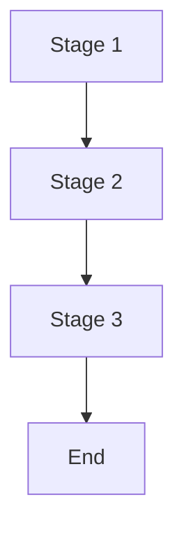
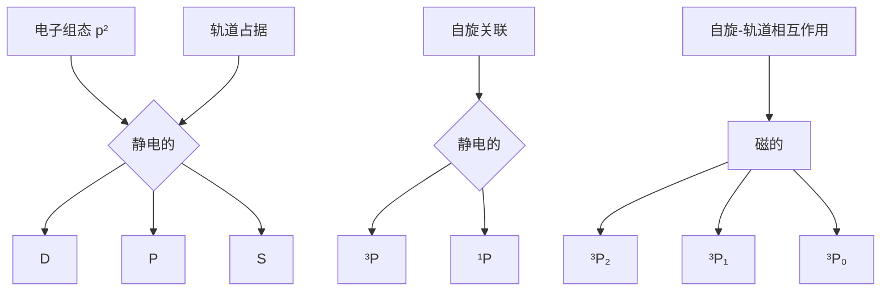

# 主题 7

# 量子理论

曾经认为原子和亚原子粒子的运动可以用“经典力学”，即由牛顿在17世纪引入的运动定律来表达，原因是这些定律非常成功地解释了日常物体和行星的运动。然而，电子、原子和分子的恰当描述需要一种不同的力学——“量子力学”，这将在本主题中介绍并广泛应用于全书。

# 7A 量子力学的起源

到19世纪末，越来越多的实验证明，经典力学应用于像电子一样小的粒子时是失败的。更确切地说，仔细测量得出的结论是，粒子具有的能量不能取任意值，粒子和波的经典概念混合在一起。本专题显示了这些观测结果是如何为20世纪初量子力学概念和公式的发展奠定基础的。

7A.1 能量量子化；7A.2 波粒二象性

# 7B 波函数

在量子力学中，系统的所有性质都可以用波函数来描述，波函数是通过解辟定谔（Schrödinger）提出的方程得到的。本专题侧重于波函数的解释，特别是其关于粒子位置的揭示。

7B.1 薛定谔方程：7B.2 玻恩解释

# 7C 算符和可观测量

量子理论的一个核心特征是可观测量通过“算符”来表达，算符作用于波函数以获取波函数所包含的信息。本专题展示了算符是如何构建和使用的。算符应用的一个推论是“不确定原理”，这也是量子力学与经典力学之间最深刻的区别之一。

7C.1 算符；7C.2 叠加和期望值；7C.3 不确定原理；7C.4 量子力学假设

# 7D 平动运动

平动运动，即在空间中穿行的运动，是量子力学处理的基本运动类型之一。根据量子理论，约束在一有限空间区域中运动的粒子，只能用特定的波函数来描述，并且仅可取一些确定的能量值。也就是说，量子化是解薛定谔方程及其约束条件的自然结果。这些解也揭示出粒子的一些非经典特征，尤其是它们能隧穿进入和通过那些经典物理学禁止它们出现的区域。

7D.1 一维自由运动；7D.2 一维受限运动；7D.3 二维和多维受限运动；7D.4 隧穿

# 7E 振动运动

本专题介绍“谐振子”，一种简单但非常重要的描述振动的模型。它表明振子的能量是量子化的，振子能够出现在经典物理学禁止的位移处。

7E.1 谐振子：7E.2 谐振子的性质

# 7F 转动运动

在二维和三维上转动的物体，对其波函数的约束导致其能量的量子化。另外，因为能量与角动量有关，因此角动量也限制于某些特定值。对于原子中的电子和转动分子来说，角动量量子化是其量子理论中一个非常重要的方面。

7F.1 二维转动：7F.2 三维转动

# 网络资源 这部分内容有何应用？

“应用案例11”重点介绍了量子力学的一个应用，在它成为一种有用的技术之前还需要大量研究。基于对“量子计算机”可以同时对一个系统许多状态进行计算的期望，该应用将会导致新一代超快计算机的产生。“纳米科学”对尺寸范围从1 nm到约100 nm的原子和分子组装体进行研究，“纳米技术”则关心如何将这些组装体构建成器件。“应用案例12”探究了量子力学效应，介绍纳米尺寸组装体的性质如何依赖其尺寸大小。

# 专题7A

# 量子力学的起源

为何需要学习这部分内容？

量子理论几乎对化学中的每个解释都至关重要。它用于理解原子和分子的结构、化学键及物质的大多数性质。

核心思想是什么？

实验证据得出的结论是，能量的传递值是不连续的，“粒子”和“波”的经典概念混合在一起。

需要哪些预备知识？

应熟悉经典力学的基本原理，特别是“化学家工具包3”（专题1B）和“化学家工具包6”（专题2A）中关于动量、力、能量的介绍。有关固体热容的讨论少量利用了专题2A中的内容。

牛顿在17世纪发展的经典力学，对于描述日常物体和行星的运动是一个空前成功的理论。然而，在19世纪末，科学家们观测到了经典力学无法解释的现象。他们被迫修改物质本质的概念，并用量子力学（quantum mechanics）这一理论来替代经典力学。

# 7A.1 能量量子化

19世纪末开展的三个实验使得科学家们认为能量的传递值是不连续的。

# (a) 黑体辐射

依据经典物理学，电磁辐射的关键特征在“化学家工具包13”里得到描述。观察到所有物体都在一定频率范围内发射电磁辐射，其强度取决于物体的温度。以一个加热的金属条为例，它首先发红光，然后继续加热会变成“白热”状。随着温度的升高，颜色从红色变为蓝色，最终形成白光。

通常用黑体（black body），即一个能发射和吸收所有波长的电磁辐射的物体，来讨论热物体所发射的辐射。空容器中的一个小孔是黑体的较好近似（图7A.1）。图7A.2显示了黑体辐射的强度在若干温度下是如何随波长而变化的。在每个温度T下，存在一个波长 $\lambda_{max}$ ，此处的辐射强度具有最大值，T和 $\lambda_{max}$ 通过经验的维恩定律（Wien's law）相关联：

![[mineru/物理化学/物理化学（第11版）789章254-401_images/974cda57412d8d233a020472f88d51185c0e592f9946c83ebbc0f9b33c3c30d8.jpg]]

<details>
<summary>text_image</summary>

处于温度
T的容器
检测到
的辐射
小孔
</details>

图7A.1 背体辐射可通过使其自一个封闭容器的小孔溢出而被检测到。辐射在容器内多次反射，并与器壁达到热平衡。通过小孔溢出的辐射具有容器内辐射的特征

![[mineru/物理化学/物理化学（第11版）789章254-401_images/500216638425189b5537666dd9f48064fbe7ce4591c4cc15f6e95943a2f388a1.jpg]]

<details>
<summary>line</summary>

| 波长,λ | 能谱密度,ρ(λ,T) |
| ------ | --------------- |
| 0      | 高             |
| >0.5   | Decreasing      |
</details>

图7A.2 在若干个温度下来自黑体辐射的能谱密度。注意随着温度的升高，能谱密度的最大值移向更短的波长，并且整体强度增强

# 化学家工具包 13 电磁辐射

电磁辐射（electromagnetic radiation）由以波的形式传播和振荡的电扰动和磁扰动组成。电磁波的这两个组成部分是相互垂直的，并且也垂直于传播方向（见示意图1）。电磁波通过真空传播的恒定速率称为光速（speed of light）c，其确切的定义值为 $2.997\ 924\ 58\times10^{8}\ m\cdot s^{-1}$ 。

波以波长（wavelength） $\lambda$ （即连续波峰之间的距离）为特征（见示意图2）。根据波长的不同，电磁辐射的分类显示在示意图3中。可见光，即人眼可见的电磁辐射，具有的波长范围为420 nm（紫色光）至700 nm（红色光）。波的属性也可以用它的频率（frequency）v来表示，即一段时间间隔内的振荡次数除以相应间隔的时长。频率以赫兹Hz为单位，1 Hz = 1 s $^{-1}$ （即每秒一个周期）。可见光的频率范围从710 THz（紫色光）到430 THz（红色光）。

![[mineru/物理化学/物理化学（第11版）789章254-401_images/78f9e46d4f10f1920f96cc6a00d5ad2e495aa7112425d38845affe44544bc22b.jpg]]

<details>
<summary>text_image</summary>

传播方向
光速 c
磁场
E
B
电场
</details>

示意图1

![[mineru/物理化学/物理化学（第11版）789章254-401_images/2ce3bcc88c830d4b2e94eae2944d23b36b21519e47224b790199312319b8b65e.jpg]]

<details>
<summary>text_image</summary>

波长,λ
</details>

示意图2

![[mineru/物理化学/物理化学（第11版）789章254-401_images/4bc3019af97e4f3e76946f6d7de194abeaea50c4b7a91f0d499009425c3fbe10.jpg]]

<details>
<summary>text_image</summary>

波长,λ/m
1 m 1
1 dm 10⁻¹
1 cm 10⁻²
1 mm 10⁻³
10⁻⁴
10⁻⁵
1 μm 10⁻⁶
10⁻⁷
10⁻⁸
1 nm 10⁻⁹
10⁻¹⁰
10⁻¹¹
1 pm 10⁻¹²
10⁻¹³
10⁻¹⁴
无线
微波
远红外
近红外
可见
紫外
真空
紫外线
X射线
430 THz
14 000 cm⁻¹
700 nm
420 nm
24 000 cm⁻¹
710 THz
γ射线
宇宙
射线
</details>

示意图3

电磁波的波长和频率之间的关系为

$$
c = \lambda v
$$

真空中波长和

频率之间的关系

也常用波数（wavenumber） $\bar{\nu}^{1}$ 来描述波，其定义为

$$
\tilde {\nu} = \frac {1}{\lambda}, \text {或等价地,} \tilde {\nu} = \frac {\nu}{c}
$$

$$
\text {   液数   } \left[ \text {   定文   } \right]
$$

因此，波数是波长的倒数，可以解释为在一个给定距离内的波长的数目。在光谱学中，由于历史原因，波数通常以厘米的倒数（ $cm^{-1}$ ）为单位来表达。因此，可见光对应于波数范围从14 000 $cm^{-1}$ （红色光）到24 000 $cm^{-1}$ （紫色光）的电磁辐射。

由单一频率组成（因此是单波长）的电磁辐射是单色的（monochromatic），因为它对应单个颜色。白光由在整个可见光谱区域传播的频率连续但不均匀的电磁波组成。

波的一个特性是它们会彼此干涉，这意味着它们会在位移相加的地方产生更大的振幅，以及在位移相减的地方产生更小的振幅（示意图4）。前者被称作“相长干涉”，后者被称为“相消干涉”。相长干涉和相消干涉的区域表现为强度增强

![[mineru/物理化学/物理化学（第11版）789章254-401_images/fddfb8d8d2e2512d3a688d2409ad1051211d730a9ccf857563c170e7df97681e.jpg]]

<details>
<summary>natural_image</summary>

Pure waveforms showing amplitude and frequency contrast (no text or symbols)
</details>

相长干涉  
![[mineru/物理化学/物理化学（第11版）789章254-401_images/4835fd17c68009c4429599edbf31f36f9570034067adcd1a3641f5d857d29f27.jpg]]

<details>
<summary>natural_image</summary>

Pure waveforms with no text, numbers, or symbols
</details>

相消干涉  
示意图4

和减弱的区域。衍射（diffraction）现象是由在波的路径上的一个物体所引起的干涉，且当物体的尺寸与辐射波长相当时发生。波长在500 nm量级的光波可通过狭缝被衍射。

$$
\lambda_ {\max} T = 2. 9 \times 1 0 ^ {- 3} \mathrm{m} \cdot \mathrm{K} \quad \text {   理   思   定   律   } \tag {7A.1}
$$

在任何温度下，发射的辐射强度都会在短波长（高频率）处急剧下降。这个强度实际上是观测存在于容器内的能量的一扇窗，从某种意义上说，在给定波长下强度越大，由该波长的辐射所引起的容器内的能量就越大。

能量密度（energy density） $E(T)$ ，是容器内的总能量除以它的体积，并定义能谱密度（energy spectral density） $\rho(\lambda,T)$ ，则 $\rho(\lambda,T)\mathrm{d}\lambda$ 为温度T时由于波长介于 $\lambda$ 和 $\lambda+d\lambda$ 间的电磁辐射的存在而引起的能量密度。在波长 $\lambda$ 和温度T下，高能谱密度就意味着在该温度下有许多波长介于 $\lambda$ 和 $\lambda+d\lambda$ 间的能量。能量密度可通过对所有波长的能谱密度进行求和（积分）得到：

$$
\mathcal {E} (T) = \int_ {0} ^ {\infty} \rho (\lambda , T) \mathrm{d} \lambda \tag {7A.2}
$$

$E(T)$ 的单位是 $J \cdot m^{-3}$ ，所以 $\rho(\lambda, T)$ 的单位是 $J \cdot m^{-4}$ 。经验上，发现能量密度随 $T^{4}$ 变化，由斯特藩-玻耳兹曼定律（Stefan-Boltzmann law）表示的观测结果为

$$
E (T) = \text { 常数 } \times T ^ {4} \quad \text { 斯特温 - 碰耳兹皇定律 } \tag {7A.3}
$$

常数等于 $7.567\times10^{-16}J\cdot m^{-3}\cdot K^{-4}$ 。

图7A.1中容器发射的辐射可以被认为是受激于器壁材料中电荷振荡的电磁场的振荡。根据经典物理学，每个振子在某种程度上被激发，且根据能量均分原理（专题2A中“化学家工具包7”），每个振子，无论其频率如何，有一个平均能量kT。基于此，物理学家Rayleigh在James Jeans的部分帮助下，导出了瑞利－金斯定律（Rayleigh-Jeans law）：

$$
\rho (\lambda , T) = \frac {8 \pi k T}{\lambda^ {4}} \quad \text {   联利－金距定律   } \tag {7A.4}
$$

式中 $k$ 是玻耳兹曼常数 $(k = 1.381 \times 10^{-23} \mathrm{~J} \cdot \mathrm{K}^{-1})$ 。

瑞利－金斯定律与实验测量不符。如图7A.3所示，尽管在长波长处是相符的，但它预测随着波长的减小，能谱密度（也即发射辐射的强度）增加而不经过一个最大值。也就是说，瑞利－金斯定律与维恩定律是不一致的。式（7A.4）也预

![[mineru/物理化学/物理化学（第11版）789章254-401_images/f15350adeec45cf10924a9dd3803e5665ae55851ff80e3779c44977e506bfe1f.jpg]]

<details>
<summary>line</summary>

| 波长, λ | 瑞利-金斯定律 | 实验结果 |
| ------- | -------------- | -------- |
| 0       | ~0             | ~0       |
| >0      | Peak           | Decreasing curve for 瑞利-金斯定律 |
| >1.5    | ~0.8           | Decreasing curve for 实验结果 |
</details>

图7A.3 实验能谱密度与瑞利－金斯定律预测结果的比较。后者预测在短波长处能谱密度为无穷大，从而整体能谱密度是无限的

![[mineru/物理化学/物理化学（第11版）789章254-401_images/c4bde31e500cddfa330be3d3c9800b686d2b393ac7e5312a0a8e79352850d957.jpg]]

<details>
<summary>line</summary>

| λkT/hc | p/[8π(kT)⁵/(hc)⁴] |
| ------ | ----------------- |
| 0.0    | 0.0               |
| 0.2    | 0.85              |
| 0.4    | 0.6               |
| 0.6    | 0.3               |
| 0.8    | 0.15              |
| 1.0    | 0.05              |
| 1.2    | 0.02              |
| 1.4    | 0.01              |
| 1.6    | 0.005             |
| 1.8    | 0.002             |
| 2.0    | 0.0               |
</details>

图7A.4 普朗克分布解释了黑体辐射的实刻能量分布，它在长波长处与瑞利－金斯分布一致

示了辐射在非常短的波长处变得强烈，而且随着波长趋近于零变得无限强烈。在短波长处辐射强度的急剧增强被称为紫外灾难（ultraviolet catastrophe），而且是经典物理学不可避免的后果。

1900年，Max Plank发现，实验观察到的黑体辐射强度分布可以通过假设每个振子的能量仅限于不连续值来解释。特别地，Plank认为对于一个频率为v的电磁振子，允许的能量是hν的整数倍：

$$
E = n h \nu \quad n = 0, 1, 2, \dots \tag {7A.5}
$$

式中h是一个基本常数，称为普朗克常量（Planck's constant）。能量取不连续值的限制被称为能量量子化（energy quantization）。在此基础上，普朗克导出了能谱密度的表达式，称为普朗克分布（Planck distribution）：

$$
\rho (\lambda , T) = \frac {8 \pi h c}{\lambda^ {5} (e ^ {h c / \lambda k T} - 1)} \quad \text {   等   额   定   分   布   } \tag {7A.6a}
$$

式（7A.6a）绘制在图7A.4中，其在所有波长处都与实验数据符合得很好。h值在理论上是一个待确定的参数，可通过变化它的值，直至式（7A.6a）与实验测量之间获得最佳拟合来确定。目前公认的值是 $h=6.626\times10^{-34}J\cdot s$ 。

对于短波长， $hc/\lambda kT \gg 1$ ；由于 $e^{hc/\lambda kT} \to \infty$ 比 $\lambda^5 \to 0$ 更快，导致当 $\lambda \to 0$ 时 $\rho \to 0$ 。因此，能谱密度在短波长处接近于零，由此普朗克分布避免了紫外灾难。对于长波长（ $hc/\lambda kT \ll 1$ ），普朗克分布中的分母可被替换（参见专题5B中“化学家工具包12”）为

$$
\mathrm{e} ^ {h c / \lambda k T} - 1 = \left(1 + \frac {h c}{\lambda k T} + \dots\right) - 1 \approx \frac {h c}{\lambda k T}
$$

将此近似代入式（7A.6a）时，普朗克分布还原为瑞利－金斯定律，即式（7A.4）。通过微分，可以得到最大值处的波长，且由 $\lambda_{max}T=$ 常数给出，符合维恩定律；用这种方式得到的常数值为hc/5k，与实验测量值一致。最后，总能量密度是

$$
\mathcal {E} (T) = \int_ {0} ^ {\infty} \frac {8 \pi h c}{\lambda^ {5} (\mathrm{e} ^ {h c / \lambda k T} - 1)} \mathrm{d} \lambda = a T ^ {4}
$$

其中 $a=\frac{8\pi^{5}k^{3}}{15(hc)^{3}}$ (7A.7)

这是有限的，并且与斯特藩-玻耳兹曼定律[式(7A.3)]一致，包括正确地预测了其常数值。

# 简要说明7A.1

考虑式（7A.6a），其中 $\lambda_{1}=450nm$ （蓝色光）和 $\lambda_{2}=700nm$ （红色光），且T=298K，则

$$
\frac {h c}{\lambda_ {1} k T} = \frac {6 . 6 2 6 \times 1 0 ^ {- 3 4} \mathrm{J} \cdot \mathrm{s} \times 2 . 9 9 8 \times 1 0 ^ {3} \mathrm{m} \cdot \mathrm{s} ^ {- 1}}{4 5 0 \times 1 0 ^ {- 9} \mathrm{m} \times 1 . 3 8 1 \times 1 0 ^ {- 2 3} \mathrm{J} \cdot \mathrm{K} ^ {- 1} \times 2 9 8 \mathrm{K}} = 1 0 7. 2
$$

$$
\frac {h c}{\lambda_ {2} k T} = \frac {6 . 6 2 6 \times 1 0 ^ {- 3 4} \mathrm{J} \cdot \mathrm{s} \times 2 . 9 9 8 \times 1 0 ^ {8} \mathrm{m} \cdot \mathrm{s} ^ {- 1}}{7 0 0 \times 1 0 ^ {- 9} \mathrm{m} \times 1 . 3 8 1 \times 1 0 ^ {- 2 3} \mathrm{J} \cdot \mathrm{K} ^ {- 1} \times 2 9 8 \mathrm{K}} = 6 8. 9
$$

以及

$$
\frac {\rho (4 5 0 \mathrm{nm} , 2 9 8 \mathrm{K})}{\rho (7 0 0 \mathrm{nm} , 2 9 8 \mathrm{K})} = \left(\frac {7 0 0 \times 1 0 ^ {- 4} \mathrm{m}}{4 5 0 \times 1 0 ^ {- 4} \mathrm{m}}\right) ^ {3} \times \frac {\mathrm{e} ^ {6 8 9} - 1}{\mathrm{e} ^ {1 0 7 . 2} - 1}
$$

$$
= 9. 1 1 \times 2. 3 0 \times 1 0 ^ {- 1 7} = 2. 1 0 \times 1 0 ^ {- 1 6}
$$

在室温下，波长较短的辐射的占比是微不足道的。

普朗克的方法是成功的，但瑞利的方法却不是成功的，原因只有一个。无论其频率如何，普

朗克不是允许每个振子有相同的平均能量，而是用玻耳兹曼分布（见本书“绪言”）来论证高频振子（其产生较短波长的辐射），被激发的可能性小于低频振子。的确，对于频率非常高的振子， $h\nu$ 的最小激发能太大，以至于振子根本不能被激发。高频振子贡献的消除避免了紫外灾难。

有时以频率来表达普朗克分布较为方便。那么， $\rho(v,T)\mathrm{d}v$ 就是温度 T 时，因频率介于 v 和 $v+dv$ 之间的电磁辐射的存在所引起的能量密度，即

$$
\rho (v, T) = \frac {8 \pi h v ^ {3}}{c ^ {3} \left(e ^ {h v / k T} - 1\right)} \quad \text {   用频率表示的算定点分布   } \tag {7A.6b}
$$

# (b) 热容

当能量以热的形式供给物质时，物质的温度就上升；热容（专题2A）是提供的能量和升高温度之间的比例常数 $[C = \mathrm{d}q / \mathrm{d}T$ ，在定容下， $C_{V,m} = (\partial U_m / \partial T)_V]$ 。在19世纪进行的实验测量已表明许多单原子固体在室温下的摩尔热容约为 $3R$ ，其中 $R$ 是摩尔气体常数。然而，当在低得多的温度下测量时发现热容下降，并且随温度趋近零而趋于零。

经典物理学无法解释这种温度依赖关系。固体的经典图像是原子在固定位置上振荡，预期每个振动原子将有相同的平均能量 $kT$ 。这个模型预测一个由 $N$ 个原子组成的固体，每个原子可在三个维度自由振荡，能量为 $U = 3NkT$ ，由此热容为 $C_V = (\partial U / \partial T)_V = 3Nk$ 。因此，摩尔热容预测为 $3N_{A}k$ ，由于 $N_{A}k = R$ ，则在所有温度下摩尔热容都等于 $3R$ 。1905年，爱因斯坦建议应用普朗克假定，并假设每个振荡原子都有一个能量 $nh\nu$ （其中 $n$ 是整数， $\nu$ 是振荡的频率）。爱因斯坦通过用波耳兹曼分布继续说明每个振子不太可能被激发到高能量，并且在低温时几乎没有振子被激发。结果，因为振子不能被激发，热容降低到零。爱因斯坦得到的定量结果（参见专题13E）是

$$
C _ {V, \mathrm{m}} (T) = 3 R f _ {\mathrm{E}} (T),
$$

$$
f _ {E} (T) = \left(\frac {\theta_ {E}}{T}\right) ^ {2} \left(\frac {e ^ {\theta_ {E} / 2 T}}{e ^ {\theta_ {E} / T} - 1}\right) ^ {2} \quad \text {   爱因斯坦公式   } \tag {7A.8a}
$$

式中 $\theta_{E}$ 是爱因斯坦温度（Einstein temperature）， $\theta_{E}=h\nu/k_{0}$

在高温（ $T>>\theta_{E}$ ）下， $f_{E}$ 中的指数项可以展开为 $e^{x}=1+x+\cdots$ ，忽略更高项（专题5B中“化学家工具包12”），结果是

$$
\begin{array}{l} f _ {\mathrm{E}} (T) = \left(\frac {\theta_ {\mathrm{E}}}{T}\right) ^ {2} \left[ \frac {1 + \theta_ {\mathrm{E}} / 2 T + \cdots}{(1 + \theta_ {\mathrm{y}} / T + \cdots) - 1} \right] ^ {2} \\ \approx \left(\frac {\theta_ {E}}{T}\right) ^ {2} \left(\frac {1}{\theta_ {E} / T}\right) ^ {2} \approx 1 \tag {7A.8b} \\ \end{array}
$$

于是得到了经典结果 $(C_{V,m}=3R)$ 。在低温时 $(T<<\theta_{E}),e^{\theta_{V}T}>>1$ ，则

$$
f _ {\mathrm{E}} (T) = \left(\frac {\theta_ {\mathrm{E}}}{T}\right) ^ {2} \left(\frac {\mathrm{e} ^ {\theta_ {\mathrm{E}} / 2 T}}{\mathrm{e} ^ {\theta_ {\mathrm{E}} / T}}\right) ^ {2} = \left(\frac {\theta_ {\mathrm{E}}}{T}\right) ^ {2} \mathrm{e} ^ {- \theta_ {\mathrm{E}} / T} \tag {7A.8c}
$$

强衰减指数函数变为零比 $1/T^{2}$ 变为无穷大更快；故当 $T\to0$ 时， $f_{E}\to0$ ，并且热容趋近于零，正如实验上的发现。这个公式成功的物理学原因是当温度降低时，可用于激发原子振荡的能量更少。在高温时，许多振子被激发进入高能态，结果变为经典行为。

图7A.5显示了爱因斯坦公式预测的热容的温度依赖性及一些实验数据；通过调节爱因斯坦温度值以得到最佳的数据拟合。曲线的总体形状是令人满意的，但数字上的一致性是相当差的。这

![[mineru/物理化学/物理化学（第11版）789章254-401_images/b85de30d60cb479b8a3d820bb74e3641f72d579b025be6afe3db6a4d6a417316.jpg]]

<details>
<summary>line</summary>

| T/θ_E | C_1/μm/R |
|-------|----------|
| 0.0   | 0.0      |
| 0.25  | 1.6      |
| 0.5   | 2.4      |
| 0.75  | 2.8      |
| 1.0   | 2.9      |
| 1.5   | 2.95     |
| 2.0   | 3.0      |
</details>

图7A.5 实测的低温摩尔热容（空心圆圈）及基于爱因斯坦理论预测的摩尔热容与温度的关系（实线）。爱因斯坦公式[式（7A.8）]较好地解释了这种依赖性，但是其值总是低于实测值

种差异源于爱因斯坦假说中认为所有原子以相同的频率振荡。一种更复杂的处理出自Peter Debye，其允许振子有从零到某最大值的频率范围。这种方法得到与实验数据更相符合的结果。这样，机械运动及电磁辐射是量子化的结论就毫无疑问。

# (c) 原子光谱和分子光谱

能量量子化最令人信服和直接的证据来自光谱学（spectroscopy），即检测和分析物质吸收、发射或散射的电磁辐射。这种辐射的强度随频率 $(\nu)$ 、波长 $(\lambda)$ 或波数（ $\tilde{\nu} = \nu / c$ ，参见“化学家工具包13”）变化的记录被称作它的光谱（spectrum）（来自拉丁文的“外观”一词）。

原子发射光谱如图7A.6所示，分子吸收光谱如图7A.7所示。二者显而易见的特征是辐射都是以一系列不连续的频率发射或吸收的。如果原子或分子的能量也受限于不连续的值，则可以理解这种观测结果，因为这样的话，一个分子可释放或获得的能量也受限于不连续的值（图7A.8）。如果一个原子或分子的能量减少 $\Delta E$ ，且这些能量以辐射形式被带走，则辐射的频率v和能量的变化可通过玻尔频率条件（Bohr frequency condition）相关联：

![[mineru/物理化学/物理化学（第11版）789章254-401_images/63a290edebcc873935bc67370e21925d0b78a2fa75e34ac2862651691ac55a47.jpg]]

<details>
<summary>bar</summary>

| 波长, λ/nm | 发射强度 |
| ---------- | -------- |
| 415        | 0        |
| 420        | 1        |
| 425        | 0        |
| 430        | 0        |
| 435        | 0        |
| 440        | 0        |
| 445        | 0        |
| 450        | 0        |
| 455        | 0        |
| 460        | 0        |
| 465        | 0        |
| 470        | 0        |
| 475        | 0        |
| 480        | 0        |
| 485        | 0        |
| 490        | 0        |
| 495        | 0        |
| 500        | 0        |
| 505        | 0        |
| 510        | 0        |
| 515        | 0        |
| 520        | 0        |
| 525        | 0        |
| 530        | 0        |
| 535        | 0        |
| 540        | 0        |
| 545        | 0        |
| 550        | 0        |
| 555        | 0        |
| 560        | 0        |
| 565        | 0        |
| 570        | 0        |
| 575        | 0        |
| 580        | 0        |
| 585        | 0        |
| 590        | 0        |
| 595        | 0        |
| 600        | 0        |
| 605        | 0        |
| 610        | 0        |
| 615        | 0        |
| 620        | 0        |
| 625        | 0        |
| 630        | 0        |
| 635        | 0        |
| 640        | 0        |
| 645        | 0        |
| 650        | 0        |
| 655        | 0        |
| 660        | 0        |
| 665        | 0        |
| 670        | 0        |
| 675        | 0        |
| 680        | 0        |
| 685        | 0        |
| 690        | 0        |
| 695        | 0        |
| 700        | 0        |
| 705        | 0        |
| 710        | 0        |
| 715        | 0        |
| 720        | 0        |
| 725        | 0        |
| 730        | 0        |
| 735        | 0        |
| 740        | 0        |
| 745        | 0        |
| 750        | 0        |
| 755        | 0        |
| 760        | 0        |
| 765        | 0        |
| 770        | 0        |
| 775        | 0        |
| 780        | 0        |
| 785        | 0        |
| 790        | 0        |
| 795        | 0        |
| 800        | 0        |
| 805        | 0        |
| 810        | 0        |
| 815        | 0        |
| 820        | 0        |
| 825        | 0        |
| 830        | 0        |
| 835        | 0        |
| 840        | 0        |
| 845        | 0        |
| 850        | 0        |
| 855        | 0        |
| 860        | 0        |
| 865        | 0        |
| 870        | 0        |
| 875        | 0        |
| 880        | 0        |
| 885        | 0        |
| 890        | 0        |
| 895        | 0        |
| 900        | 0        |
| 905        | 0        |
| 910        | 0        |
| 915        | 0        |
| 920        | 0        |
| 925        | 0        |
| 930        | 0        |
| 935        | 0        |
| 940        | 0        |
| 945        | 0        |
| 950        | 0        |
| 955        | 0        |
| 960        | 0        |
| 965        | 0        |
| 970        | 0        |
| 975        | 0        |
| 980        | 0        |
| 985        | 0        |
| 990        | 0        |
| 995        | 0        |
|1         | ~1       |

The chart displays the intensity of emission across different wavelengths (λ) for each wavelength. The x-axis represents wavelength in nanometers (λ), and the y-axis represents the intensity of emission. There is only one data series in this view. The labels on the bars are explicitly provided in the code.
</details>

图7A.6 激发态的铁原子所发射的辐射光谱的一个区域。由一系列不连续波长（或频率）处的辐射组成

![[mineru/物理化学/物理化学（第11版）789章254-401_images/26c6d0e691330a66fd41b6af4ae29c6718dbca6ee0683b57c5a3198abcabba65.jpg]]

<details>
<summary>line</summary>

| 波长, λ/nm | 吸收强度 |
| ---------- | -------- |
| 200        | ~0       |
| 240        | ~0       |
| 280        | Peak     |
| 320        | ~0       |
</details>

图7A.7 分子可以通过吸收一定频率的辐射来改变其状态。此光谱是由二氧化硫（ $\mathrm{SO}_2$ ）分子的电子、振动及转动激发所产生的光谱，观测到的不连续谱线结果表明，分子只能拥有不连续的能量，而不是任意的能量

![[mineru/物理化学/物理化学（第11版）789章254-401_images/3db749da050a2037353510e5933c4344b1ebff81406fe3b3fe0e29f0d38ab9a1.jpg]]

<details>
<summary>text_image</summary>

E₃
hν = E₃ - E₂
E₂
hν = E₂ - E₁
hν = E₃ - E₁
E₁
</details>

图7A.8 光谱跃迁（如图7A.6所示）可以通过假设一个原子（或分子）从一个不连续的高能级变化到一个不连续的低能级时所发射的电磁辐射来说明。当能量变化较大时，发射高频辐射。像图7A.7中所示的那些跃迁则可以通过假设一个分子（或原子）从低能级变化到高能级时所吸收的辐射来解释

$$
\Delta E = h \nu
$$

波尔标准条件 (7A.9)

一个分子被称为经历光谱跃迁（spectroscopic transition），即状态变化，结果是光谱中频率 v 处显现一条发射“线”，即一个确定的峰值。

# 简要说明7A.2

钠原子产生黄色光（如在一些街灯中），来自590 nm辐射的发射。该发射的光谱跃迁涉及两个电子能级，其能级差异可通过式（7A.9）给出：

$$
\begin{array}{l} \Delta E = h v = \frac {h c}{\lambda} = \frac {6 . 6 2 6 \times 1 0 ^ {- 5 4} \mathrm{J} \cdot \mathrm{s} \times 2 . 9 9 8 \times 1 0 ^ {8} \mathrm{m} \cdot \mathrm{s} ^ {- 1}}{5 9 0 \times 1 0 ^ {- 9} \mathrm{m}} \\ = 3. 3 7 \times 1 0 ^ {- 1 9} J \\ \end{array}
$$

这种能级差异可以用各种不同方式表达，例如，乘以阿伏加德罗常数可得到每摩尔原子的能量差异为 $203\ kJ\cdot mol^{-1}$ ，相当于一个弱化学键的能量。

# 7A.2 波粒二象性

即将叙述的实验表明，电磁辐射（经典物理学视为波状）实际上也显示了粒子的特征。另一个实验表明电子（经典物理学视为粒子）也显示波的特征。这种波粒二象性（wave-particle duality），即波和粒子的特征融合在一起，是量子力学的核心内容。

# (a) 电磁辐射的粒子特征

黑体辐射的普朗克处理引入了这样一种思想，即一个频率为v的振子只能拥有0，hv，2hv，…的能量。这种量子化导致了一种假设（在现阶段它只是个假设），即该频率产生的电磁辐射可以被认为是由0，1，2，…个粒子组成的，每个粒子具有的能量为hv。这些电磁辐射的粒子现在称为光子（photons）。因此，如果一个频率为v的振子被激发到其第一激发态，那么存在一个该频率的光子，如果被激发到它的第二激发态，那么存在两个光子，以此类推。从原子和分子中观测到的不连续光谱现象可以被描述为原子或分子在损失大小为 $\Delta E$ 的能量时产生一个能量为hv的光子，其 $\Delta E=h\nu$ 。

# 例题 7A.1 计算光子的数目

计算由一个100 W的黄光灯在1.0 s内发射光子的数量。将黄光波长设为560 nm，且假设效率是100%。

整理思路 每个光子都有一个能量 $h\nu$ ，所以产生能量 $E$ 所需的光子的总数 $N = E / h\nu$ 。为了使用这个等式，你需要知道辐射的频率（来自 $\nu = c / \lambda$ ）及灯发射的总能量。后者可通过功率（ $P$ ，以瓦特为单位）和灯亮着的时间间隔 $\Delta t$ 的乘积给出： $E = P\Delta t$ （参见专题2A中的“化学家工具包8”）。

解：光子的数目是

$$
N = \frac {E}{h v} = \frac {P \Delta t}{h (c / \lambda)} = \frac {\lambda P \Delta t}{h c}
$$

代入数据得

$$
N = \frac {5 . 6 0 \times 1 0 ^ {- 7} \mathrm{m} \times 1 0 0 \mathrm{J} \cdot \mathrm{s} ^ {- 1} \times 1 . 0 \mathrm{s}}{6 . 6 2 6 \times 1 0 ^ {- 1 4} \mathrm{J} \cdot \mathrm{s} \times 2 . 9 9 8 \times 1 0 ^ {8} \mathrm{m} \cdot \mathrm{s} ^ {- 1}} = 2. 8 \times 1 0 ^ {2 0}
$$

实用小贴士 为了避免约数及其他数字误差，最好先进行代数运算，并将数值代入最终的公式。此外，分析结果可以用于其他数据而无须重复整个计算。

自测题7A.1 一个功率为1 mV和波长为1 000 nm 的单色（单频）红外测距仪在0.1 s内发射多少光子？

答案：5×10 $^{1}$

到目前为止，光子的存在只是一个假设。它们存在的实验证据来自光电效应（photoelectric effect）（即当金属暴露在紫外光辐射下时，电子从金属中的逸出）中产生的电子能量的测量。光电效应的实验特征如下：

- 无论辐射的强度如何，除非其频率超过金属特有的阈值，否则都不会逸出电子。  
- 逸出电子的动能与入射辐射的频率呈线性增加关系，但与辐射强度无关。  
- 如果频率高于阈值，即使在低的辐射强度下也会立即逸出电子。

图7A.9说明了第一个和第二个特待。

这些观察结果强烈表明，在光电效应中，一个颗粒状发射物与金属碰撞，并且如果发射物的动能足够高，那么电子逸出。如果发射物是能量为 $h\nu$ （ $\nu$ 是辐射的频率）的光子，电子的动能是 $E_{k}$ ，以及从金属中移除一个电子所需的能量，即功函（work function） $\Phi$ ，那么，如图7A.10所示，能量守恒意味着

$$
h \nu = E _ {k} + \Phi \text {或} E _ {k} = h \nu - \Phi \quad \text {到电能应} \tag {7A.10}
$$

这种模型解释了三个实验观察结果：

- 如果 $h\nu < \Phi$ ，则不能发生光致发射，因为光子带来的能量不足。  
- 逸出电子的动能与光子的频率呈线性增加关系。  
- 当一个光子与一个电子碰撞时，它会失去它的所有能量，只要光子有足够的能量，那么一旦发生碰撞电子就立即出现。

式（7A.10）的一个实际应用是它提供了一种测定普朗克常数的方法，因为图7A.9中所有线的斜率都等于h。

光电子的能量、功函及其他量通常以能量的另一个单位即电子伏特（electronvolt，eV）来表示：1 eV定义为一个电子（电荷为-e）通过电势差 $\Delta\phi=1V$ 由静止开始加速所获得的动能。该动能是 $e\Delta\phi$ ，故

$$
E _ {\mathrm{k}} = e \Delta \phi = 1. 6 0 2 \times 1 0 ^ {- 1 9} \mathrm{C} \times 1 \mathrm{V} = 1. 6 0 2 \times 1 0 ^ {- 1 9}
$$

![[mineru/物理化学/物理化学（第11版）789章254-401_images/2adc7f6472843f11b5093a3fd05cc43a957f18916086ebb60efd68f8a33c0d9b.jpg]]

<details>
<summary>line</summary>

| 入射辐射的频率, r | 光电子的动能, Ea (Rb) | 光电子的动能, Ea (K) | 光电子的动能, Ea (Na) |
| ----------------- | --------------------- | ------------------- | --------------------- |
| 0                 | 2.09                  | -                   | -                     |
| 2.25              | -                     | 2.25                | -                     |
| 2.30              | -                     | -                   | 2.30                  |
</details>

图7A.9 在光电效应中，当入射辐射的频率低于金属特有的某个值时，没有电子逸出。高于该值，光电子的动能随着入射辐射的频率线性变化

![[mineru/物理化学/物理化学（第11版）789章254-401_images/730e99ef8b1e3a2383d8052728d526f2ea5c2f1958418a3c9847c79795d56181.jpg]]

<details>
<summary>text_image</summary>

能量, E
hv
φ
(a)
Eₖ
hv
φ
(b)
</details>

图7A.10 如果假设入射辐射是由具有能量与辐射频率成正比的光子组成的，则可以解释光电效应。（a）光子的能量不足以驱动电子逸出金属。（b）光子的能量用于逸出电子掉掉有余。多余的能量被用作光电子（逸出电子）的动能

$$
C \cdot V = 1 e V
$$

因为 $1 \, C \cdot V = 1 \, J$ ，所以电子伏特和焦耳之间的关系如下：

$$
1 \mathrm{eV} = 1. 6 0 2 \times 1 0 ^ {- 1 9} \mathrm{J}
$$

# 例题 7A.2 计算能够产生光致发射的最长波长

波长为305 nm的辐射光子从金属中逸出电子的动能为1.77 eV。计算能够从金属中逸出电子的辐射的最长波长。

整理思路 可以使用式（7A.10），重排为 $\Phi = h\nu - E_{\mathrm{k}}$ ，计算功函，其中光子的频率根据 $v = c / \lambda$ 计算。光致发射的阈值是使电子逸出产生而没有任何多余能量的最低频率；也就是说，逸出电子的动能是零。在 $E_{\mathrm{k}} = h\nu - \Phi$ 中设 $E_{\mathrm{k}} = 0$ ，得出最小的光子频率为 $\nu_{\min} = \Phi / h$ 。使用此频率值来计算相应的波长 $\lambda_{\max}$ 。

解：光致发射的最小频率是

$$
v _ {\min} = \frac {\Phi}{h} = \frac {h v - E _ {k}}{h} = \frac {c}{\lambda} - \frac {E _ {k}}{h}
$$

因此，能够产生光致发射的最长波长是

$$
\lambda_ {\max} = \frac {c}{V _ {\min}} = \frac {c}{c / \lambda - E _ {k} / h} = \frac {1}{1 / \lambda - E _ {k} / h c}
$$

代入数据，电子的动能是

$$
E _ {1} = 1. 7 7 \mathrm{eV} \times 1. 6 0 2 \times 1 0 ^ {- 1 9} \mathrm{J} \cdot \mathrm{eV} ^ {- 1} = 2. 8 4 \times 1 0 ^ {- 1 9} \mathrm{J}
$$

则

$$
\frac {E _ {\mathrm{i}}}{h c} = \frac {2 . 8 4 \times 1 0 ^ {- 1 9} \mathrm{J}}{6 . 6 2 6 \times 1 0 ^ {- 3 4} \mathrm{J} \cdot \mathrm{s} \times 2 . 9 9 8 \times 1 0 ^ {3} \mathrm{m} \cdot \mathrm{s} ^ {- 1}} = 1. 4 3 \times 1 0 ^ {6} \mathrm{m} ^ {- 1}
$$

因此，利用 $1 / \lambda = 1 / 305\mathrm{nm} = 3.28\times 10^{6}\mathrm{m}^{-1}$ ，可得

$$
\lambda_ {\max} = \frac {1}{3 . 2 8 \times 1 0 ^ {6} \mathrm{m} ^ {- 1} - 1 . 4 3 \times 1 0 ^ {6} \mathrm{m} ^ {- 1}} = 5. 4 1 \times 1 0 ^ {- 7} \mathrm{m}
$$

或 541 nm

自测题7A.2 当波长为165 nm的紫外辐射射向某金属表面时，电子逸出速率为 $1.24\ Mm\cdot s^{-1}$ 。计算由波长为265 nm的辐射所逸出的电子速率。

答案：735km·s $^{-1}$

# (b) 粒子的波动性

尽管与早已确立的辐射波理论相违背，辐射由粒子组成的观点之前已经存在，但被忽视了。然而，没有杰出的科学家认为物质会像波一样。不过，1925年进行的实验迫使人们考虑这种可能性。关键性的实验是由Clinton Davisson和Lester Germer进行的，他们观察到了晶体的电子衍射（图7A.11）。正如“化学家工具包13”所述，衍射是物体在波的传播路径上造成的干涉。Davisson和Germer的成功是一个幸运的意外，因为一个偶然的温度上升造成他们的多晶样品退火；于是，有序的原子平面就充当了衍射光栅。Davisson-Germer实验此后又用其他粒子（包括α粒子、氢分子和中子）进行了重复，这些都清楚地表明粒子具有类似波的性质。几乎在同一时间，G.P. Thomson发现，一束电子在通过一个薄金箔时发生了衍射。

Louis de Broglie在波粒二象性的解释方面早已取得了一定进展，他在1924年提出，不仅是光子，任何以线性动量 $p = mv$ （ $m$ 为粒子的质量、 $v$ 为粒子的速率）进行着的粒子在某种意义上都应该有一个波长，这个波长可由下面的德布罗意关系式（de Broglie relation）给出：

![[mineru/物理化学/物理化学（第11版）789章254-401_images/4dd6232edf58f59fa56351d6c9b42d78233d083540c2d731f382943417e1c875.jpg]]

<details>
<summary>text_image</summary>

电子束
衍射电子
锦晶体
</details>

图7A.11 Davisson Germer实验，来自镍晶体的电子束的散射显示出衍射实验中强度变化的特性，其中波在不同方向上产生相长干涉和相消干涉

$\lambda=\frac{h}{p}$ 愿布罗恩夫兰式 (7A.11)

也就是说，具有高线性动量的粒子具有短的波长。宏观物体即使移动缓慢也具有非常高的动量（因为它们的质量非常大），因而它们的波长小到不可测，以至于类似波的性质无法被观测到。这种不可测性也是经典力学能用以解释宏观物体行为的原因。需要强调的是，量子力学仅用于微观物体，如原子和分子，它们的质量都很小。

# 例题7A.3 估算德布罗意波长

估算经过一个40 kV的电势差从静止开始加速的电子的波长。

整理思路 要使用德布罗意关系式，需要知道电子的线性动量 $p$ 。要计算线性动量，注意到一个电子经过电势差 $\Delta\phi$ 加速获得的能量是 $e\Delta\phi$ ，其中e是其电荷的大小。在加速期结束时，所有获得的能量都以动能的形式存在， $E_{k}=\frac{1}{2}m_{e}v^{2}=p^{2}/2m_{e}$ 。因此，可以通过设 $p^{2}/2m_{e}$ 等于 $e\Delta\phi$ 来计算p。对于单位的运算，用 $1\mathrm{V}\cdot\mathrm{C}=1\mathrm{J}$ 和 $1\mathrm{J}=1\mathrm{kg}\cdot\mathrm{m}^{2}\cdot\mathrm{s}^{-2}$ 。

解：表达式 $p^{7}/2m_{e}=e\Delta\phi$ 意味着 $p=(2m_{e}e\Delta\phi)^{1/2}$ ；然后，根据德布罗意关系式 $\lambda=h/p$ ，有

$$
\lambda = \frac {h}{(2 m _ {e} e \Delta \phi) ^ {1 / 2}}
$$

代入数据及基本常数，得

$$
\begin{array}{l} \lambda = \frac {6 . 6 2 6 \times 1 0 ^ {- 3 4} \mathrm{J} \cdot \mathrm{s}}{(2 \times 9 . 1 0 9 \times 1 0 ^ {- 3 1} \mathrm{kg} \times 1 . 6 0 2 \times 1 0 ^ {- 1 9} \mathrm{C} \times 4 . 0 \times 1 0 ^ {4}) \mathrm{V} ^ {1 / 2}} \\ = 6. 1 \times 1 0 ^ {- 1 2} \mathrm{m} \\ \end{array}
$$

或6.1pm

说明 以这种方式加速的电子被用于为生物系统成像和测定固体表面结构的电子衍射技术中。

自测题7A.3 计算下列波长：(a) 在300 K时平动能等于kT的中子；（b）移动速率为 $80\ km\cdot h^{-1}$ ，质量为57g的网球。

$$
\text { 答案: } (a) 1 7 8 \mathrm{pm}: (b) 5. 2 \times 1 0 ^ {- 9} \mathrm{m}.
$$

# 概念清单

1. 黑体是能够发射和吸收所有辐射波长，不偏好任何波长的物体。  
☐ 2. 一个给定频率的电磁场吸收的能量只能取不连续的数值。  
3. 原子光谱和分子光谱表明，原子和分子吸收的能量只能取不连续的数值。  
☐ 4. 光电效应确立了电磁辐射是由粒子（光子）组成

的观点，而在经典物理学中电磁辐射被认为是类似于波的。

5. 电子衍射确立了电子具有波动性的观点，其波长由德布罗意关系式给出，而在经典物理学中电子被认为是粒子。

6. 波粒二象性是对粒子和波的概念整合在一起的认识。

公式清单

<table><tr><td>性质</td><td>公式</td><td>说明</td><td>公式编号</td></tr><tr><td>维恩定律</td><td> $\lambda_{\max }T = 2.9 \times 10^{-3} \text{m} \cdot \text{K}$ </td><td></td><td>7A.1</td></tr><tr><td>斯特藩-玻耳兹曼定律</td><td> $\mathcal{E}(T) = \text{常数} \times T^4$ </td><td></td><td>7A.3</td></tr><tr><td>普朗克分布</td><td> $\rho(\bar{\lambda}, T) = 8\pi hc/[ \lambda^5 (e^{hw/kT} - 1)]$  $\rho(v, T) = 8\pi h\nu^3 /[c^3 (e^{h\nu/kT} - 1)]$ </td><td>黑体辐射</td><td>7A.6</td></tr><tr><td>固体热容的爱因斯坦公式</td><td> $C_{v,m}(T) = 3Rf_E(T)$  $f_E(T) = (\theta_E/T)^2 [e^{\theta_E/2T}/(e^{\theta_E/T} - 1)]^2$ </td><td>爱因斯坦温度: $\theta_E = h\nu/k$ </td><td>7A.8</td></tr><tr><td>玻尔频率条件</td><td> $\Delta E = h\nu$ </td><td></td><td>7A.9</td></tr><tr><td>光电效应</td><td> $E_k = h\nu - \Phi$ </td><td> $\Phi$ 是功函</td><td>7A.10</td></tr><tr><td>德布罗意关系式</td><td> $\lambda = h/p$ </td><td> $\lambda$ 是线性动量为 $p$ 的粒子的波长</td><td>7A.11</td></tr></table>

# 专题7B

# 波函数

为何需要学习这部分内容？

波函数为理解原子和分子中电子的性质提供了必要的基础，并且是化学中解释的核心。

核心思想是什么？

一个系统的所有动态属性都包含在它的波函数内，波函数通过求解薛定谔方程得到。

需要哪些预备知识？

需要意识到经典物理学的局限性，正是这些局限性推动了量子理论的发展（专题7A）。

在经典力学中，物体沿着一条确定的路径或轨迹运动。在量子力学中，在特定状态的粒子由波函数（wavefunction） $\psi$ 来描述，波函数是在空间分散的而不是定域化的。波函数包含了物体在该状态下的所有动态信息，如其位置和动量。

# 7B.1 薛定谔方程

1926年，Erwin Schrödinger提出了一个求任何系统波函数的方程。在不随时间变化的系统（例如，其体积保持不变）中，一个质量为 $m$ 、能量为 $E$ 、沿一维运动的粒子，其不含时间的薛定谔方程（time-independent Schrödinger equation）是

$$
- \frac {\hbar^ {2}}{2 m} \frac {\mathrm{d} ^ {2} \psi}{\mathrm{d} x ^ {2}} + V (x) \psi = E \psi \quad \text {   不含时间的   } \tag {7B.1}
$$

常数 $h=h/2\pi$ 是对普朗克常数的一种方便的修改，在量子力学中广泛使用； $V(x)$ 是粒子在x位置上的势能。因为总能量E是势能和动能之和，左边的第一项必须与粒子的动能相关（后文探讨）。薛定谔方程可以被视为量子力学的一个基本假设，但它的合理性可以通过证明自由粒子符合德布罗意关系式（专题7A）来得到验证。

# 如何完成？7B.1

# 证明薛定谔方程与德布罗意关系式是一致的

一个自由移动的粒子的势能在任何位置都是零，即 $V(x)=0$ 。所以，薛定谔方程[式（7B.1）]变为

$$
\frac {\mathrm{d} ^ {2} \psi}{\mathrm{d} x ^ {2}} = - \frac {2 m E}{\hbar^ {2}} \psi
$$

步骤1 求自由粒子的薛定谔方程的解

此方程的一个解是 $\psi=\cos kx$ ，可以通过下面的运算确认这一点：

$$
\frac {d ^ {2} \psi}{d x ^ {2}} = \frac {d ^ {2} \cos k x}{d x ^ {2}} = - k ^ {2} \cos k x = - k ^ {2} \psi
$$

进而得到 $-k^{2} = -2mE / \hbar^{2}$ ，于是有

$$
k = \left(\frac {2 m E}{\hbar^ {2}}\right) ^ {1 / 2}
$$

这种情况下，能量只是动能，其与粒子的线性动量通过 $E=p^{2}/2m$ （专题2A中“化学家工具包6”）相关联。所以，得到

$$
k = \left[ \frac {2 m (p ^ {2} / 2 m)}{\hbar^ {2}} \right] ^ {1 / 2} = \frac {p}{\hbar}
$$

因此，线性动量通过式 $p = k\hbar$ 与 $k$ 相关联。

步骤2 用波长解释波函数

现在，认识到一个波（更具体地说，一个谐波）可以用正弦函数或余弦函数来进行数学描述。因此， $\cos kx$ 可以视为一种波，随着 $kx$ 增加 $2\pi$ ，其经历一个完整的循环。因此，波长可通过 $k\lambda = 2\pi$ 得出，故 $k = 2\pi /\lambda$ 。因此，线性动量与波函数的波长可通过下式相关联：

$$
p = k h = \frac {2 \pi}{\lambda} \times \frac {h}{2 \pi} = \frac {h}{\lambda}
$$

这就是德布罗意关系式。因此，薛定谔方程的解与德布罗意关系式是一致的。

# 7B.2 玻恩解释

包含在波函数中的一个动态信息是粒子的位置。Max Born用辐射波理论做类比，其中将在一个区域内电磁波振幅的平方解释为它的强度，以此（用量子术语）作为在该区域发现光子概率的一种量度。波函数的玻恩解释（Born interpretation）为

如果一个粒子的波函数在x处的值为 $\psi$ ，那么，在x和 $x+dx$ 之间发现这个粒子的概率正比于 $|\psi|^{2}dx$ （图7B.1）。

$|\psi|^{2}=\psi^{*}\psi$ 考虑了 $\psi$ 是复函数（见“化学家工具包14”）的可能性。如果波函数是实函数（如 $\cos kx$ ），那么 $|\psi|^{2}=\psi^{2}$ 。

因为 $|\psi|^2 \mathrm{d}x$ 表示概率（量纲为1），则 $|\psi|^2$ 是概率密度（probability density），以1/长度为量纲（对于一维系统）。波函数 $\psi$ 本身称为概率振幅（probability amplitude）。对于一个在三维空间自由运动的粒子（例如，原子中原子核附近的一个电子），波函数取决于坐标 $x, y$ 和 $z$ ，并表示为 $\psi(r)$ 。在这种情况下，玻恩解释是（图7B.2）：

如果一个粒子的波函数在 $r$ 处的值为 $\psi$ ，那么，在该位置的一个无穷小体积 $\mathrm{d}\tau = \mathrm{d}x\mathrm{d}y\mathrm{d}z$ 内发现这个粒子的概率正比于 $|\psi |^{2}\mathrm{d}\tau$ 。

在这种情况下， $|\psi|^{2}$ 具有1/长度 $^{3}$ 的量纲，并且波函数本身具有1/长度 $^{3/2}$ （以及类似 $m^{-3/2}$ 的单位）的量纲。

玻恩解释消除了 $\psi$ 为负（通常是复数）值有意义的担忧，因为 $|\psi|^2$ 总是实数而且不存在负的。波函数负（或复数）值没有直接的意义：只有平方模量有直接的物理意义，而且波函数负的和正的区域都可能对应着在一个区域发现粒子的高概率（图7B.3）。然而，波函数正的和负的区域的存在具有重要的间接意义，因为它产生了不同波函数之间相长干涉和相消干涉的可能性。

![[mineru/物理化学/物理化学（第11版）789章254-401_images/497354260d16601abcfc68dad87d93e5aedbd2e6d3298d88dc2236bca0a45105.jpg]]

<details>
<summary>text_image</summary>

|ψ|²
dx
概率 = |ψ|²dx
x x + dx
</details>

图73.1 波函数 $\psi$ 的平方模量 $(\psi^{\prime}\psi \text{ 或 }|\psi|^{2})$ 是概率密度。在这种意义上说，波动函数是一种概率振幅。在 x 和 $x + dx$ 之间的区域发现电子的概率正比于 $|\psi|^{2}dx$ 。此图中，概率密度由在叠加带中阴影的密度表示  
![[mineru/物理化学/物理化学（第11版）789章254-401_images/4c7bbfbc98b5cd0ae0408362bb4f90d8fc19f9abbb43abc1f2e7ffcd779e0474.jpg]]

<details>
<summary>text_image</summary>

z
dz
r
O
dy
dx
y
x
</details>

图7B.2 三维空间中波函数的坡恩解释意味着在某一位置r处的一个体积元 $dt = dxdydz$ 内发现粒子的概率正比于该处 $|\psi|^2$ 值与dr的乘积

![[mineru/物理化学/物理化学（第11版）789章254-401_images/7a1e3ee490ec4837fd0a8a082328908b39ed91a713bfcc7f829d7411cec03b0c.jpg]]

<details>
<summary>text_image</summary>

波函数
概率密度
</details>

图7B.3 波函数的正、负号没有直接的物理意义：波函数正的和负的区域都对应着相同的概率分布（通过 $\psi$ 的平方模量给出，并通过阴影的密度给出）

波函数在一个或多个点处可能为零，则在这些位置的概率密度也为零。区分波函数为零的点（例如，远离氢原子核）和波函数经过零的点是非常重要的，后者称为节点（node）。波函数接近零而实际没有经过零的位置不是节点。如此，波函数 $\cos kx$ 在 $kx$ 是 $\frac{1}{2}\pi$ 的奇数整数倍的位置（在该处波经过零）有节点，但是波函数 $\mathbf{e}^{-kx}$ 没有节点，尽管当 $x\to \infty$ 时其变为零。

# 化学家工具包14 复数

复数的一般形式为

$$
z = x + i y
$$

式中 $i=\sqrt{-1}$ 。实数x是“z的实部”，标记为 $\mathrm{Re}(z)$ ；类似地，实数y是“z的虚部”，标记为 $\mathrm{Im}(z)$ 。z的复共轭（complex conjugate），标记为 $z^{*}$ ，是通过用-i替换i形成的：

$$
z ^ {\prime} = x - \mathrm{i} y
$$

$z^{*}$ 和z的乘积标记为 $|z|^{2}$ ，并称为z的平方模量（square

# 例题 7B.1 解释波函数

氢原子最低能态中电子的波函数正比于 $e^{-r/\alpha}$ ，其中 $a_{0}$ 是常数，r是离原子核的距离。计算在如下位置处体积为 $\delta V=1.0\ pm^{3}$ （该体积即使在原子尺度上也是很小的）的区域内发现电子的相对概率：（a）位于原子核，（b）位于距离原子核 $a_{0}$ 处。

整理思路 关注的区域在原子尺度上是如此之小，以至于可以忽略 $\psi$ 在其中的变化，并写出概率 $P$ 正比于在该点估算的概率密度（ $\psi^2$ ；注意 $\psi$ 是实函数）乘以题设的体积 $\delta V$ 。就是说， $P \propto \psi^2 \delta V$ ，其中 $\psi^2 \propto e^{-2\pi i a_0}$ 。

解：在每种情况下， $\delta V=1.0\ pm^{3}$

(a) 在原子核上，r=0，所以

$$
P \propto e ^ {0} \times 1. 0 \mathrm{pm} ^ {3} = 1 \times 1. 0 \mathrm{pm} ^ {3} = 1. 0 \mathrm{pm} ^ {3}
$$

(b) 在距离 $r = a_{0}$ 任意方向处，则

$$
P \propto e ^ {- 2} \times 1. 0 \mathrm{pm} ^ {3} = 0. 1 4 \times 1. 0 \mathrm{pm} ^ {3} = 0. 1 4 \mathrm{pm} ^ {3}
$$

因此，概率的比例是1.0/0.14=7.1。

说明 注意电子出现在原子核上的概率大于（约7倍）出现在距离原子核 $a_{0}$ 处的相同大小的体积元内的概率。带负电荷的电子被带正电荷的原子核吸引，故其更可能在原子核附近。

自测题7B.1 He $^{+}$ 最低能态中电子的波函数正比于 $e^{-2\theta/\alpha_{0}}$ 。对这个离子重复上述的计算，并评价结果。

答案：55：该函数更紧凑。

(a) 归一化

薛定谔方程的一个数学特征是：如果 $\psi$ 是一个解，那么 $N\psi$ 也是，其中 $N$ 是任意常数。注意，由于 $\psi$ 出现在式（7B.1）中的每一项中，它可以用 $N\psi$ 替换，且常数因子 $N$ 消除后，就恢复为原始的方程，此特征从而得到证实。这种将波函数乘以一常数因子的自由，意味着总是可以找到一个归一化常数（normalization constant） $N$ ，这样的话，概率密度不是正比于 $|\psi|^2$ ，而是变得与 $|\psi|^2$ 相等。

modulus)。根据z和 $z^{*}$ 的定义，以及 $i^{2}=-1$ ，可得

$$
\left| z \right| ^ {2} = z ^ {*} z = (x + \mathrm{i} y) (x - \mathrm{i} y) = x ^ {2} + y ^ {2}
$$

平方模量是一个实的非负数。绝对值（absolute value）或模量（modulus）标记为 $|z|$ ，由下式给出：

$$
\left| z \right| = \left(z ^ {*} z\right) ^ {1 / 2} = \left(x ^ {2} + y ^ {2}\right) ^ {1 / 2}
$$

对于更多的关于复数的信息，参见专题7C中“化学家工具包16”。

归一化常数可以这样获得：对于一个归一化的波函数 $N\psi$ ，一个粒子在dx区域的概率等于 $(N\psi^{*})(N\psi)\mathrm{d}x$ （N取实数）；此外，这些单独的概率在所有空间的总和必须是1（粒子在某处的概率是1）。后者的必要条件用数学表达为

$$
N ^ {2} \int_ {- \infty} ^ {\infty} \psi^ {*} \psi d x = 1 \tag {7B.2}
$$

因此有

$$
N = \frac {1}{\left(\int_ {- \infty} ^ {\infty} \psi^ {*} \psi \mathrm{d} x\right) ^ {1 / 2}} \tag {7B.3}
$$

倘若该积分具有一个有限值（即波函数是“平方可积的”），则可以找到归一化常数，并将波函数“归一化”。从现在开始，除非另有说明，所有波函数都假设已经归一化。在一维中的情况是

$$
\int_ {- \infty} ^ {\infty} \psi^ {*} \psi \mathrm{d} x = 1 \tag {7B.4a}
$$

在三维中的情况是

$$
\int_ {- \infty} ^ {\infty} \int_ {- \infty} ^ {\infty} \int_ {- \infty} ^ {\infty} \psi^ {*} \psi d x d y d z = 1 \tag {7B.4b}
$$

在量子力学中，通常会以一种缩写的形式写出所有这样的积分，即

$$
\int \psi^ {*} \psi d \tau = 1 \tag {7B.4c}
$$

式中dr是适当的体积元，积分被理解为覆盖整个空间。

# 例题 7B.2 将一个波函数归一化

碳纳米管是碳的薄空心圆柱体，其直径为1\~2 nm，长度为几微米。根据一个简单的模型，碳纳米管的最低能态电子由波函数 $\sin(\pi x/L)$ 描述，其中L是碳纳米管的长度。找出归一化的波函数。

整理思路 因为波函数是一维的，则需要找到N，以确保式（7B.4a）中的积分等于1。波函数是实函数，所以 $\psi^{*}=\psi$ 。相关积分可在资源部分中找到。

解：将波函数写为 $\psi = N \sin(\pi x / L)$ ，其中 N 是归一化常数。因为波函数横跨管的长度，故积分限从 x = 0 到 x = L。因此有

$$
\int \psi^ {*} \psi \mathrm{d} r = N ^ {2} \int_ {0} ^ {L} \sin^ {2} \frac {\pi x}{L} \mathrm{d} x = \frac {1}{2} N ^ {2} L
$$

为了使波函数归一化，这个积分必须等于1。也就是说， $\frac{1}{2}N^{2}L=1$ 。于是有

$$
N = \left(\frac {2}{L}\right) ^ {1 / 2}
$$

因此，归一化的波函数是

$$
\psi = \left(\frac {2}{L}\right) ^ {1 / 3} \sin \frac {\pi x}{L}
$$

说明 因为 L 是长度, $\psi$ 的量纲是 [长度] $^{-1/2}$ ; 因此, 对于一维概率密度来说, $\psi^{2}$ 的量纲是 [长度] $^{-1}$ 。

自测题7B.2 对于相同碳纳米管的电子，在下一个更高能级的波函数是 $\sin(2\pi x/L)$ 。将这个波函数归一化。

$$
\text {答案：} N = (2 / L) ^ {1 / 2}
$$

为了计算在一定空间区域内粒子的出现概率，可将概率密度对所研究的区域进行求和（积分）。这样，对于一维系统，在 $x_{1}$ 和 $x_{2}$ 之间发现粒子的概率P可由下式给出：

$$
P = \int_ {x _ {1}} ^ {x _ {2}} | \psi (x) | ^ {2} d x
$$

$$
\text {   根本   } \quad [ - \text {   一维区域   } ] \tag {7B.5}
$$

# 例题7B.3 确定概率

如例题7B.2中所示，长度为L的碳纳米管的最低能态电子，可以用归一化的波函数 $(2/L)^{1/2}\sin(\pi x/L)$ 来描述。请问在x=L/4和x=L/2之间电子的概率是多少？

整理思路 使用式（7B.5）和归一化的波函数来写出在所研究区域内电子出现的概率的表达式。相关的积分在资源部分中给出。

解：根据式（7B.5），概率为

$$
P = \frac {2}{L} \overbrace {\int_ {L + 1} ^ {L / 2} \sin^ {2} (\pi x / L) d x} ^ {\text {积分T.2}}
$$

据此得到

$$
P = \frac {2}{L} \left[ \frac {x}{2} - \frac {\sin (2 \pi x / L)}{4 \pi / L} \right] _ {L = 4} ^ {L / 2} = \frac {2}{L} \left(\frac {L}{4} - \frac {L}{8} - 0 + \frac {L}{4 \pi}\right) = 0. 4 0 9
$$

说明 电子在该区域内出现的概率大约为41%。

自测题7B.3 正如在“自测题7B.2”中所述，在碳纳米管这一模型中，电子的下一个更高能级的归一化波函数为 $(2/L)^{1/2}\sin(2\pi x/L)$ 。请问在x=L/4和x=L/2之间发现电子的概率是多少？

# (b) 波函数的约束条件

玻恩解释对合格的波函数提出了严格的约束。第一个约束是 $\psi$ 在有限区域内不能是无限的，因为如果它是无限的，玻恩解释就会失败。这一要求排除了薛定谔方程的许多可能解，因为许多数学上可接受的解会出现无限值，这在物理学上是不可接受的。玻恩解释也排除了在一个点上产生多于一个 $|\psi|^2$ 值的薛定谔方程的解，因为粒子在一个点上的概率密度有多个值也是荒谬的。这个限制表述为波函数必须是单值的；也就是说，在空间的每一个点上，它必须只有一个值。

薛定谔方程本身也暗示了对可能出现的函数类型的一些数学限制。因为它是一个二阶微分方程（鉴于它依赖于波函数的二阶导数），如果方程适用于所有地方，则 $d^{2}\psi/dx^{2}$ 必须是明确定义的。只有当一阶导数是连续的，二阶导数才有定义：这意味着（除了下面具体说明的）在函数中不允许有扭结。反过来，只有函数是连续的，一阶导数才有定义：不允许有突跃。

因此，总的来说，总结在图7B.4中的波函数的约束条件是

在有限区域内不允许是无限的；  
- 必须是单值的；  
- 必须是连续的；  
- 必须有连续的一阶导数（斜率）。

![[mineru/物理化学/物理化学（第11版）789章254-401_images/fc4bec412819fa8db92bfbc518484b7f5f38538cce39285ec3a1d9a060f2574c.jpg]]

<details>
<summary>line</summary>

| x    | y     |
| ---- | ----- |
| 0    | 0     |
| >0   | Peak  |
</details>

(a)

![[mineru/物理化学/物理化学（第11版）789章254-401_images/af96633e3781e0d211222a0e96477582ee3b8076cf6b0c3cb6c60728daa8beaa.jpg]]

<details>
<summary>line</summary>

| x    | y    |
| ---- | ---- |
| 0.0  | 0.0  |
| 0.2  | 0.1  |
| 0.4  | 0.3  |
| 0.6  | 0.5  |
| 0.8  | 0.7  |
| 1.0  | 0.9  |
| 1.2  | 1.1  |
| 1.4  | 1.3  |
| 1.6  | 1.5  |
| 1.8  | 1.7  |
| 2.0  | 1.9  |
| 2.2  | 2.1  |
| 2.4  | 2.3  |
| 2.6  | 2.5  |
| 2.8  | 2.7  |
| 3.0  | 2.9  |
| 3.2  | 3.1  |
| 3.4  | 3.3  |
| 3.6  | 3.5  |
| 3.8  | 3.7  |
| 4.0  | 3.9  |
| 4.2  | 4.1  |
| 4.4  | 4.3  |
| 4.6  | 4.5  |
| 4.8  | 4.7  |
| 5.0  | 4.9  |
| 5.2  | 5.1  |
| 5.4  | 5.3  |
| 5.6  | 5.5  |
| 5.8  | 5.7  |
| 6.0  | 5.9  |
| 6.2  | 6.1  |
| 6.4  | 6.3  |
| 6.6  | 6.5  |
| 6.8  | 6.7  |
| 7.0  | 6.9  |
| 7.2  | 7.1  |
| 7.4  | 7.3  |
| 7.6  | 7.5  |
| 7.8  | 7.7  |
| 8.0  | 7.9  |
| 8.2  | 8.1  |
| 8.4  | 8.3  |
| 8.6  | 8.5  |
| 8.8  | 8.7  |
| 9.0  | 8.9  |
| 9.2  | 9.1  |
| 9.4  | 9.3  |
| 9.6  | 9.5  |
| 9.8  | 9.7  |
|10.0 | -    |
</details>

(b)

![[mineru/物理化学/物理化学（第11版）789章254-401_images/77c66b01b36e3600619db837919392f25c8f76c4895238f5d7146bb3f20ac70a.jpg]]

<details>
<summary>line</summary>

| x    | y     |
| ---- | ----- |
| 0    | 0     |
| >0   | Peak  |
</details>

(c)

![[mineru/物理化学/物理化学（第11版）789章254-401_images/92846c48f498dbadf55dbe4aff6c9e8b1008939cf6e245b997ab11f28a5cb7e1.jpg]]

<details>
<summary>line</summary>

| x    | y     |
| ---- | ----- |
| 0    | 1.0   |
| 1    | -0.5  |
| 2    | 0.0   |
| 3    | 0.5   |
| 4    | 1.0   |
</details>

(d)   
图7B.4 波函数必须满足严格的条件才是可接受的；（a）不可接受，因为它在有限区域是无限的；（b）不可接受，因为它不是单值的；（c）不可接受，因为它不是连续的；（d）不可接受，因为它的斜率是不连续的

如果势能具有突然的、无限高的台阶（如专题7D中处理的箱中粒子模型中），则这些限制中的最后一个不适用。

# (c) 量子化

上面提到的限制条件是非常苛刻的，以至于对于能量 $E$ 的任意值，薛定谔方程可接受的解通常不存在。换句话说，一个粒子只能拥有一些特定

的能量，否则，它的波函数将是物理学上不可接受的。亦即

对波函数限制的结果就是，粒子的能量是量子化的。

通过解各种类型运动的薛定谔方程，并选择那些符合上述限制条件的解，可找到这些可接受的能量值。

# 概念清单

□ 1. 波函数是含有一个系统所有动态信息的数学函数。  
2. 薛定谔方程是用于计算系统波函数的二阶微分方程。  
3. 根据玻恩解释，在某一点处的概率密度正比于在该点处波函数的平方。  
4. 节点是波函数经过零的点。  
5. 如果一个波函数的平方模量在整个空间的积分等

于1，则它是归一化的。

6. 波函数必须是单值的、连续的、在空间的有限区域内不是无限的，且（除特殊情况外）有连续的斜率。  
7. 能量的量子化源自一个可接受的波函数所必须满足的约束条件。

公式清单

<table><tr><td>性质</td><td>公式</td><td>说明</td><td>公式编号</td></tr><tr><td>不含时间的薛定谔方程</td><td> $-(h^{2}/2m)(d^{2}\psi/dx^{2}) + V(x)\psi = E\psi$ </td><td>一维系统*</td><td>7B.1</td></tr><tr><td>归一化</td><td> $\int\psi^{*}\psi d\tau=1$ </td><td>全空间积分</td><td>7B.4c</td></tr><tr><td>粒子在 $x_{1}$ 和 $x_{2}$ 之间的概率</td><td> $P=\int_{x_{1}}^{x_{2}}|\psi(x)|^{2}dx$ </td><td>一维区域</td><td>7B.5</td></tr></table>

\*更高难度在专题7D、7F和8A中处理。

# 专题7C

# 算符和可观测量

为何需要学习这部分内容？

要完全解释波函数，必须能够从中提取动态信息。量子力学的预测通常与经典力学的预测十分不同，而且这些差异对于理解原子和分子的结构及性质是至关重要的。

核心思想是什么？

通过计算厄米算符的期望值来提取波函数中的动态信息。

需要哪些预备知识？

需要知道一个系统的状态完全由波函数来描述（专题 7B），以及概率密度与波函数的平方模量成正比。

波函数包含所有信息，因此可以获得一个粒子的动态性质（例如，它的位置和动量）。玻恩解释（专题7B）提供了有关位置的信息，但是波函数还包含其他信息，可使用本专题描述的方法来提取。

# 7C.1 算符

薛定谔方程可写成简写形式：

$$
\hat {H} \psi = E \psi
$$

指定两方程的
算的形式 (7C.1a)

将这个表达式与一维薛定谔方程，即

$$
- \frac {\hbar^ {2}}{2 m} \frac {\mathrm{d} ^ {2} \psi}{\mathrm{d} x ^ {2}} + V (x) \psi = E \psi
$$

相比较，可证明在一维中有

$$
\dot {H} = - \frac {\hbar^ {2}}{2 m} \frac {\mathrm{d} ^ {2}}{\mathrm{d} x ^ {2}} + V (x)
$$

哈密错算符 (7C.1b)

$\hat{H}$ 是一个算符（operator），即对函数进行数学运算的一种表达。此处，运算是取 $\psi$ 的二阶导数，且（乘以 $-h^{2}/2m$ 后）将结果加到 $\psi$ 和 $V(x)$ 的乘积上。

算符 $\dot{H}$ 在量子力学中起着特殊的作用，以19世纪的数学家William Hamilton的名字命名为哈密顿算符（hamiltonian operator）。Hamilton提出了经典力学的一种形式，后来证明，这种形式非常适合量子力学的公式化。哈密顿算符（通常简称为“哈密顿”）是对应于系统总能量（动能和势能的总和）的算符。在式（7C.1b）中右边第二项是势能，所以第一项（涉及二阶导数的部分）必然是动能的算符。

一般来说，一个算符作用于一个函数以产生新的函数，如

(算符)(函数)=(新函数)

在某些情况下，新函数与原函数是相同的，也许是乘以一个常数。具有这一性质的函数和算符的组合在量子力学中是非常重要的。

# 简要说明7C.1

例如，当算符是d/dx时，这意味着“将随后的函数对x求导数”。作用在函数 $\sin(ax)$ 上，它生成新函数 $a\cos(ax)$ 。然而，当d/dx作用在 $e^{-ax}$ 上，它产生新函数 $-ae^{-ax}$ ，为原函数乘以常数-a。

# (a) 本征方程

式（7C.1a）中所写的薛定谔方程是一个本征方程（eigenvalue equation），即具有如下形式的方程：

(算符)(函数) = (常数因子) × (相同函数)

(7C.2a)

在本征方程中，算符作用在函数上产生相同的函数乘以一个常数。如果一个一般的算符记为 $\dot{\Omega}$ ，常数因子为 $\omega$ ，则本征方程具有如下形式：

$$
\dot {\Omega} \psi = \omega \psi
$$

本程方程 (7C.2b)

如果该关系式成立，则函数 $\psi$ 称为算符 $\hat{\Omega}$ 的本征函数（eigenfunction）， $\omega$ 是与该本征函数相关的本征值（eigenvalue）。使用此术语，式（7C.2a）可以写为

(算符)(本征函数) = (本征值) × (本征函数)
(7C.2c)

因此，式（7C.1a）是一个本征方程，其中 $\psi$ 是哈密顿算符的本征函数，E是相关的本征值。由此，“解薛定谔方程”可以表示为“为系统找到哈密顿算符的本征函数和本征值”。

就像哈密顿算符是对应于总能量的算符，有些算符则代表其他可观测量（observables）（即系统的可测量性质，如线性动量或者电偶极矩）。对于每一个这样的算符 $\hat{\Omega}$ ，有形式为 $\hat{\Omega}\psi=\omega\psi$ 的本征方程，并具有如下意义：

如果波函数是对应于可观测量 $\Omega$ 的算符 $\dot{\Omega}$ 的本征函数，那么性质 $\Omega$ 的测量结果将是对应于该本征函数的本征值。

量子力学的公式化方法是，构建对应于所研究的可观测量的算符，然后通过探究算符的本征值来预测测量结果。

# (b) 算符的构建

量子力学的一个基本假设明确了如何设定对应于给定可观测量的算符。

可观测量由以下位置和线性动量算符构建的算符来表达：

$$
\hat {x} = x \times
$$

$$
\hat {p} _ {x} = \frac {\hbar}{i} \frac {d}{d x}
$$

算符的规定

(7C3)

也就是说，沿 $x$ 轴的位置算符是（波函数）与 $x$ 相乘，平行于 $x$ 轴的线性动量算符是 $\hbar / i$ 乘以波函数对 $x$ 的导数。

式（7C.3）中的定义被用来为其他的空间可观测量构建算符。例如，假设势能形式为 $V(x)=$

$\frac{1}{2}k_{f}x^{2}$ ，其中 $k_{f}$ 是常数（这个势能描述分子中原子的振动）。因为x的算符是乘以x，通过扩展，则 $x^{2}$ 的算符是与x相乘，然后再与x相乘，或者与 $x^{2}$ 相乘。因此，对应于 $\frac{1}{2}k_{f}x^{2}$ 的算符是

$$
\dot {V} (x) = \frac {1}{2} k _ {\mathrm{f}} x ^ {2} \times \tag {7C.4}
$$

在实际中，乘法符号被省略，理解为乘法。为了构建动能的算符，用到动能和线性动量之间的经典关系式，即 $E_{k}=p_{s}^{2}/2m$ 。然后，使用式（7C.3）中的 $p_{x}$ 算符：

$$
\dot {E} _ {\mathrm{k}} = \frac {1}{2 m} \left(\frac {\hbar \mathrm{d}}{\mathrm{i} \mathrm{d} x}\right) \left(\frac {\hbar \mathrm{d}}{\mathrm{i} \mathrm{d} x}\right) = - \frac {\hbar^ {2}}{2 m} \frac {\mathrm{d} ^ {2}}{\mathrm{d} x ^ {2}} \tag {7C.5}
$$

由此，总能量算符，即哈密顿算符，是

$$
\dot {H} = \dot {E} _ {\mathrm{k}} + \dot {V} = - \frac {\hbar^ {2} \mathrm{d} ^ {2}}{2 m \mathrm{d} x ^ {2}} + \dot {V} (x) \quad \text {   哈密装真行   } \tag {7C.6}
$$

式中 $\dot{V}(x)$ 是对应于势能（不论采取何种形式）的算符，与式（7C.1b）中的完全相同。

# 例题 7C.1 确定一个可观测量的值

下列波函数描述的自由粒子的线性动量是什么？(a) $\psi (x) = e^{\mathrm{i}\omega x}$ 和(b) $\psi (x) = e^{-\mathrm{i}\omega x}$

整理思路 需要用对应于线性动量的算符 [式 (7C.3)] 对 $\psi$ 进行操作，并检查结果。如果结果是原始波函数乘以一常数（也就是说，如果算符的应用得到一个本征方程），那么，可以识别具有可观测量值的常数。

解：（a）对于 $\psi (x) = e^{2x}$ ，有

$$
\dot {p} _ {s} \psi = \frac {\hbar}{i} \frac {d \psi}{d x} = \frac {\hbar}{i} \frac {d e ^ {2 s}}{d x} = \frac {\hbar}{i} \times i k e ^ {2 s} = \overbrace {+ k h \psi} ^ {\text {本征值}}
$$

这是一个本征方程，本征值为 $+kh$ 。由此，动量的测量值将是 $p_{\mathrm{s}} = +kh$ 。

(b) 对于 $\psi(x)=e^{-\frac{1}{2}x}$ ，有

$$
\dot {p} _ {x} \psi = \frac {\hbar}{i} \frac {d \psi}{d x} = \frac {\hbar}{i} \frac {d e ^ {- i k x}}{d x} = \frac {\hbar}{i} \times (- i k) e ^ {- i k x} = - k \hbar \psi
$$

现在，本征值是 $-k\hbar$ 。所以， $p_x = -k\hbar$ 。在情况（a）中，动量是正的，意味着粒子在正的 $x$ 方向运动；而在（b）中，粒子在相反的方向运动。

说明 量子力学的一般特征是，采用波函数的复共轭可以反转运动的方向。这意味着，如果波函数是实函数 [如 $\cos(kx)$ ]，而采用复共轭使波函数保持不变；没有净的运行方向。

自测题7C.1 波函数cos(kx)描述的粒子的动能是多少?

动能算符的表达式 [式（7C.5）] 揭示了有关薛定谔方程的重要一点。在数学上，函数的二阶导数是其曲率的一种量度：大的二阶导数表示急剧弯曲的函数（图7C.1）。据此，急剧弯曲的波函数与高动能相关联，而低曲率波函数对应着低动能。

波函数的曲率通常随位置的不同而变化（图7C.2）：波函数急剧弯曲的地方，它对于总动能的贡献就大；波函数不是急剧弯曲的地方，它对总动能的贡献就小。观测到的粒子的动能是各个区域动能的所有贡献的平均值。因此，如果粒子波函数的平均曲率较高，则预计它具有高动能。在局部，对动能正的贡献和负的贡献都有（因为曲率要么是正的 $\cup$ ，要么是负的 $\cap$ ），但是平均值总是正的。

高曲率与高动能的关联对于波函数的解释和波函数形状的预测具有重要的指导意义。例如，假设一个具有给定总能量的粒子的波函数，并且要求势能随着 $x$ 的增加而降低。由于从左到右，差值 $E - V = E_{\mathrm{k}}$ 增加，故波函数必然随着 $x$ 的增加而更快地振荡，从而变得更加急剧弯曲（图7C.3）。因此，很可能波函数看起来像图中所示的函数，更详细的计算证实了这一点。

# (c) 厄米算符

所有与可观测量对应的量子力学算符都有一个非常特殊的数学性质：它们是“厄米的”。满足以下关系式的算符为厄米算符（hermitian operator）：

$$
\int \psi_ {j} ^ {*} \hat {\Omega} \psi_ {j} d \tau = \left\{\int \psi_ {j} ^ {*} \hat {\Omega} \psi_ {j} d \tau \right\} ^ {*} \quad \text {   距米性   } [ \text {   定义   } ] \tag {7C.7}
$$

如专题7B中所述，在量子力学中， $\int\cdots d\tau$ 意味着在所有相关空间变量的全部范围内积分。

很容易确认位置算符 $(x\times)$ 是厄米的，因为在这种情况下，被积函数中因子的顺序可以改变：

$$
\int \psi_ {i} ^ {*} x \psi_ {j} \mathrm{d} \tau = \int \psi_ {j} x \psi_ {i} ^ {*} \mathrm{d} \tau = \left\{\int \psi_ {j} ^ {*} x \psi_ {i} \mathrm{d} \tau \right\} ^ {*}
$$

![[mineru/物理化学/物理化学（第11版）789章254-401_images/95d0980f5d78f968003c9291b837bc9054c0414ae878ddb3c7e7a13a71ab3457.jpg]]

<details>
<summary>line</summary>

| x    | 高曲率, 高动能 | 低曲率, 低动能 |
| ---- | -------------- | -------------- |
| 0    | 0              | 0              |
| Peak | High           | Low            |
</details>

图7C.1 一个粒子的平均动能可以从波函数的平均曲率推断出来。此图中显示了两个波函数：您则弯曲的函数较缓慢弯曲的函数对应的动能更高

![[mineru/物理化学/物理化学（第11版）789章254-401_images/f57862d463c4e7f5a1235c571d29de8e86da940525cc1343d2f117230c3fa0b4.jpg]]

<details>
<summary>line</summary>

| x    | 波函数, ψ |
| ---- | --------- |
| 0    | Low       |
| Peak | High      |
| Right End | Low       |
</details>

图7C.2 观刻到的粒子的动能来自波函数覆盖的整个空间所有贡献的平均值。急剧弯曲的区域对平均值贡献高动能；不太尖锐的弯曲仅贡献低动能

![[mineru/物理化学/物理化学（第11版）789章254-401_images/dadd7f57804061ff5e7ae3e726447401487f6ae684b9c1e0d1dce2ec410e1b8e.jpg]]

<details>
<summary>line</summary>

| x    | 波函数, ψ | 能量, E |
| ---- | --------- | ------- |
| 0    | O         | E_total |
| x    |           | E_k     |
| x    |           | V       |
</details>

图7C.3 一个粒子的波函数，其势能 $V$ 向右减小。当总能量一定时，动能 $E_{\mathrm{f}}$ 向右增加，这导致更快的振荡，从而波函数的曲率更大

最后一步用了 $(\psi^{*})^{*}=\psi$ 。关于线性动量算符是厄米的证明更加复杂，因为被微分函数的顺序是不能改变的。

# 如何完成？7C.1 证明线性动量算符是厄米的

这个任务是证明

$$
\int \psi_ {i} ^ {*} \hat {p} _ {i} \psi_ {i} d \tau = \left\{\int \psi_ {i} ^ {*} \hat {p} _ {i} \psi_ {i} d \tau \right\} ^ {*}
$$

其中 $\dot{p}_{s}$ 在式（7C.3）中给出。为此，采用“分部积分”

（见“化学家工具包15”），将其应用于本例中，得出

$$
\begin{array}{l} \int \psi_ {i} ^ {*} \dot {\rho} _ {i} \psi_ {j} d \tau = \frac {\hbar}{i} \int_ {- \infty} ^ {\infty} \frac {f}{\psi_ {i} ^ {*}} \frac {\frac {d g / d x}{d \psi_ {i}}}{d x} d x \\ = \frac {\hbar}{i} \overbrace {\psi_ {i} ^ {*} \psi_ {j}} ^ {\text {f g}} - \frac {\hbar}{i} \int_ {- \infty} ^ {\infty} \frac {g}{\psi_ {i}} \frac {\mathrm{d} f / \mathrm{d} x}{\mathrm{d} \psi_ {i} ^ {*}} \mathrm{d} x \\ \end{array}
$$

蓝色项为零，因为所有的波函数要么在 $x=\pm\infty$ 是零（参见专题7B），要么 $\psi_{i}\psi_{j}$ 在 $x=+\infty$ 和 $x=-\infty$ 时收敛到相同的值。结果

$$
\begin{array}{l} \int \psi_ {i} ^ {*} \vec {p} _ {i} \psi_ {j} d \tau = - \frac {\hbar}{1} \int_ {- \infty} ^ {\infty} \psi_ {j} \frac {d \psi_ {i}}{d x} d x = \left\{\frac {\hbar}{1} \int_ {- \infty} ^ {\infty} \psi_ {j} ^ {*} \frac {d \psi_ {i}}{d x} d x \right\} ^ {*} \\ = \left\{\int \psi_ {j} ^ {*} \dot {p} _ {i} \psi_ {i} d \tau \right\} ^ {*} \\ \end{array}
$$

证毕。最后一行应用了 $(\psi^{*})^{*} = \psi$ 和 $i^{*} = -i$

厄米算符在量子力学中非常重要，因为它们的本征值是实数，即 $\omega^{*} = \omega$ 。任何测量一定产生一个实数值，因为位置、动量或者能量不可能是复数或者虚数。因为一个可观测量的测量结果是相应算符的本征值之一，那些本征值必须是实数。因此，代表一个可观测量的算符必须是厄米的。对于它们的本征函数是实函数的证明，利用了式（7C.7）中厄米性的定义。

# 如何完成？7C.2 证明厄米算符的本征值是实数

设定 $\psi_{i}$ 和 $\psi_{j}$ 是相同的，将其都写为 $\psi$ ，则式（7C.7）变为

$$
\int \psi^ {*} \dot {\Omega} \psi d \tau = \left\{\int \psi^ {*} \dot {\Omega} \psi d \tau \right\} ^ {*}
$$

# 化学家工具包15 分部积分

量子力学中的许多积分都有 $\int f(x)h(x)\mathrm{d}x$ 的形式，其中 $f(x)$ 和 $h(x)$ 是两个不同的函数。这种积分通常可将 $h(x)$ 视为另一个函数 $g(x)$ 的导数，使得 $h(x) = \mathrm{dg}(x)\mathrm{dx}$ ，从而可以求出。例如，如果 $h(x) = x$ ，那么 $g(x) = \frac{1}{2} x^2$ 。这样，采用分部积分（integration by parts），则有

$$
\int f \frac {\mathrm{d} g}{\mathrm{d} x} \mathrm{d} x = f g - \int g \frac {\mathrm{d} f}{\mathrm{d} x} \mathrm{d} x
$$

这种方法只有当右边的积分刚好比左边的更容易处理时才会成功。这种方法通常总结为以下关系式，即

接下来，假设 $\psi$ 是本征值为 $\omega$ 的 $\dot{\Omega}$ 的本征函数。也就是说， $\dot{\Omega}\psi = \omega \psi$ 。现在，对左和右两边的积分都应用这个关系式：

$$
\int \psi^ {*} \omega \psi d \tau = \left\{\int \psi^ {*} \omega \psi d \tau \right\} ^ {*}
$$

本征值是能移到积分符号外边的常数：

$$
\omega \int \psi^ {*} \psi d \tau = \left\{\omega \int \psi^ {*} \psi d \tau \right\} ^ {*} = \omega^ {*} \int \psi \psi^ {*} d \tau
$$

最后，（蓝色表示的）积分消去，留下 $\omega=\omega^{*}$ 。据此，得出 $\omega$ 是实数。

# (d) 正交性

如果两个不同函数 $\psi_{i}$ 和 $\psi_{j}$ 是正交的（orthogonal），则意味着 $\psi_{i}^{*}\psi_{j}$ 的积分（对整个空间）是零：

$$
\int \psi_ {i} ^ {*} \psi_ {j} \mathrm{d} \tau = 0 (i \neq j) \quad \text {正交性}
$$

同时是归一化的和相互正交的函数被称为正交归一的（orthonormal）。厄米算符具有的重要性质就是

对应于厄米算符不同本征值的本征函数是正交的。

这个性质的证明也可以从厄米性的定义 [式 (7C.7)] 得出。

# 如何完成？7C.3 证明厄米算符的各本征函数之间是正交的

假设 $\psi_{j}$ 是具有本征值 $\omega_{j}$ 的 $\hat{\Omega}$ 的本征函数（即 $\hat{\Omega}\psi_{j} = \omega_{j}\psi_{j}$ ）， $\psi_{i}$ 是不同本征值 $\omega_{i}$ 的本征函数（即 $\hat{\Omega}\psi_{i} = \omega_{i}\psi_{i}$ ，

$$
\int f \mathrm{d} g = f g - \int g \mathrm{d} f
$$

作为一个例子，考虑 $x\mathrm{e}^{-x}$ 的积分。在这种情况下， $f(x)=x$ ，则 $\mathrm{d}f(x)/\mathrm{d}x=1$ 及 $\mathrm{d}g(x)/\mathrm{d}x=\mathrm{e}^{-x}$ ，所以 $g(x)=-(1/a)\mathrm{e}^{-x}$ 。然后有

$$
\begin{array}{l} \int \frac {f d g / d x}{x e ^ {- a x}} d x = \frac {f}{x} \frac {\overbrace {- e ^ {- a x}} ^ {g}}{a} - \int \frac {\overbrace {- e ^ {- a x}} ^ {g}}{a} \overbrace {1} ^ {d f / d x} d x \\ = - \frac {x e ^ {- a x}}{a} + \frac {1}{a} \int e ^ {- a x} d x = - \frac {x e ^ {- a x}}{a} - \frac {e ^ {- a x}}{a ^ {2}} + \text {常数} \\ \end{array}
$$

且 $\omega_{i} \neq \omega_{j}$ 。这样，式（7C.7）变为

$$
\int \psi_ {i} ^ {*} \omega_ {j} \psi_ {i} d \tau = \left\{\int \psi_ {j} ^ {*} \omega_ {i} \psi_ {i} d \tau \right\} ^ {*}
$$

本征值是常数，且可被移到积分符号的外边；此外，它们是实数（是厄米算符的本征值），所以 $\omega_{i}^{*} = \omega_{i}$ 。因此有

$$
\omega_ {i} \int \psi_ {i} ^ {*} \psi_ {i} d \tau = \omega_ {i} \left\{\int \psi_ {i} ^ {*} \psi_ {i} d \tau \right\} ^ {*}
$$

接下来，注意到 $\left\{\int \psi_i^*\psi_i\mathrm{d}\tau \right\} ^* = \int \psi_j\psi_i^*\mathrm{d}\tau$ ，所以有

$$
\omega_ {i} \int \psi_ {i} ^ {*} \psi_ {j} d \tau = \omega_ {i} \int \psi_ {i} \psi_ {i} ^ {*} d \tau
$$

于是 $(\omega_{j} - \omega_{i})\int \psi_{i}^{*}\psi_{j}\mathrm{d}\tau = 0$

两个本征值是不同的，所以 $\omega_{i} - \omega_{i}\neq 0$ ；因此， $\int \psi_i^*\psi_j\mathrm{d}\tau = 0$ 也就是说，这两个本征函数是正交的、证毕。

哈密顿算符是厄米的（它对应着可观测量，即能量，但它的厄米性可被明确地证明）。因此，如果它的两个本征函数对应着不同能量，这两个函数必须是正交的。正交性在量子力学中具有重要意义，因为它从计算中消除了大量的积分。正交性在化学键理论（主题9）和光谱学（主题11）中起着核心的作用。

# 例题 7C.2 验证正交性

对于一个限制在沿x轴上x=0和x=L之间运动的粒子，其两个可能的波函数分别是 $\psi_{1}=\sin(\pi x/L)$ 和 $\psi_{2}=\sin(2\pi x/L)$ 。在这个区域外，波函数是零。两个波函数对应着不同的能量。验证这两个波函数是相互正交的。

整理思路 要验证两个函数的正交性，需要在整个空间积分 $\psi_{2}^{*}\psi_{1}=\sin(2\pi x/L)\sin(\pi x/L)$ ，并证明结果为零。原则上，积分应从 $x=-\infty$ 到 $x=+\infty$ ，但由于在 $x=0-L$ 外，被函数是零，所以只需要在这个范围积分。相关积分在资源部分中给出。

解：要求得这个积分，可使用资源部分中的积分T.5.其中， $a = 2\pi /L$ ， $b = \pi /L$

$$
\int_ {0} ^ {L} \sin (2 \pi x / L) \sin (\pi x / L) d x =
$$

$$
\left. \frac {\sin (\pi x / L)}{2 (\pi / L)} \right| _ {0} ^ {L} - \left. \frac {\sin (3 \pi x / L)}{2 (3 \pi / L)} \right| _ {0} ^ {L} = 0
$$

上式中，对于正弦函数，当 $n=0,\pm1,\pm2,\cdots$ 时，有 $\sin(n\pi)=0$ 。因此，这两个函数是相互正交的。

自测题7C.2 下一个更高能级的波函数为 $\psi_{3}=\sin(3\pi x/L)$ 。请证实波函数 $\psi_{1}=\sin(\pi x/L)$ 和 $\psi_{3}=\sin(3\pi x/L)$ 是相互正交的。

$$
\int_ {0} ^ {1} \sin (3 \pi x / L) \sin (\pi x / L) d x = 0.
$$

# 7C.2 叠加和期望值

在一维运动的自由粒子的哈密顿算符是

$$
\dot {H} = - \frac {\hbar^ {2}}{2 m} \frac {\mathrm{d} ^ {2}}{\mathrm{d} x ^ {2}}
$$

粒子是“自由的”意即没有势能约束它，于是 $V(x)=0$ 。容易证实 $\psi(x)=\cos(kx)$ 是此算符的一个本征函数：

$$
\dot {H} \psi (x) = - \frac {\hbar^ {2}}{2 m} \frac {\mathrm{d} ^ {2}}{\mathrm{d} x ^ {2}} \cos k x = \frac {k ^ {2} \hbar^ {2}}{2 m} \cos k x
$$

因此，与这个波函数相关联的能量，即 $k^{2}\hbar^{2}/2m$ ，是明确定义的，因为它是本征方程的本征值。然而，其他可观测量不一定如此。例如， $\cos(kx)$ 不是线性动量算符的本征函数：

$$
\dot {p} _ {x} \psi (x) = \frac {\hbar}{i} \frac {d \psi}{d x} = \frac {\hbar}{i} \frac {d \cos k x}{d x} = - \frac {k \hbar}{i} \sin k x \tag {7C.9}
$$

这个表达式不是一个本征方程，因为等式右边的函数 $(\sin kx)$ 不同于左边的函数 $(\cos kx)$ 。

当粒子的波函数不是算符的本征函数时，对应的可观测量就没有确定值。然而，在当前的例子中，动量并不是完全不确定的，因为余弦函数可写为 $e^{ikx}$ 和 $e^{-ikx}$ 的线性组合（linear combination）或加和： $\cos kx = \frac{1}{2}(e^{ikx} + e^{-ikx})$ （参见“化学家工具包16”）。如例题7C.1中所示，这两个指数函数是 $\dot{p}_{x}$ 的本征函数，本征值分别为+kh和-kh。因此，它们每一个都对应着一个确定的状态，但动量不同。波函数 $\cos kx$ 被称为两个单独波函数 $e^{ikx}$ 和 $e^{-ikx}$ 的叠加（superposition），并写作

$$
\psi = \underbrace {e ^ {+ i k x}} _ {\text {线性动量为} + k h \text {的粒子}} + \underbrace {e ^ {- i k x}} _ {\text {线性动量为} - k h \text {的粒子}}
$$

这种叠加的解释就是，如果进行许多次重复的动量测量，那么一半的测量将给出值 $p_{x}=+kh$ ，

# 化学家工具包16 欧拉公式

复数 $z=x+iy$ 可以表示为复平面（complex plane）中的一个点，其中 $\mathrm{Re}(z)$ 沿x轴， $\mathrm{Im}(z)$ 沿y轴（示意图1）。点的位置也可以根据距离r和角度 $\phi$ （极坐标）来指定。这样， $x=r\cos\phi,\quad y=r\sin\phi$ 。所以，得出

$$
z = r (\cos \phi + i \sin \phi)
$$

$\phi$ 称为z的辐角（argument），是r与x轴之间的角度。因为y/x = tan $\phi$ ，所以有

$$
r = \left(x ^ {2} + y ^ {2}\right) ^ {1 / 2} = | z | \quad \phi = \arctan \frac {y}{x}
$$

涉及复数的最有用的关系式之一是欧拉公式（Euler's formula）:

![[mineru/物理化学/物理化学（第11版）789章254-401_images/23731c5d3866e866d61114e29d9192cbea56fd58668247f073a97c51b6971171.jpg]]

<details>
<summary>text_image</summary>

Im(z)
r
φ
O
Re(z)
(x, iy)
</details>

示意图1

另一半的测量将给出值 $p_x = -kh$ 。既然 $e^{ikx}$ 和 $e^{-ikx}$ 对叠加的贡献是相同的，这两个值±kh也同等地出现。所有可从波函数cos kx推断出的有关线性动量的信息是，它所描述的粒子同等可能地被发现在正的和负的x方向运动，且具有相同大小的动量kh。

类似的解释适用于任何一个可写为算符本征函数的线性组合的波函数。一般来说，波函数可以写为如下线性组合：

$$
\psi = c _ {1} \psi_ {1} + c _ {2} \psi_ {2} + \dots = \sum_ {k} c _ {k} \psi_ {k} \quad \text {本证函数的线性组合} \tag {7C.10}
$$

式中 $c_{k}$ 是数值（可能是复数）系数， $\psi_{k}$ 是对应于感兴趣的可观测量的算符 $\dot{\Omega}$ 的不同本征函数。任意一个函数都能表达为它们的线性组合，从这个意义上说，函数 $\psi_{k}$ 形成了一个完备基（complete set）。那么，根据量子力学：

物理解

\- 对应于算符 $\hat{\Omega}$ 的可观测量的单次测量，将给出叠加波函数中 $\psi_{\mathrm{A}}$ 所对应本征值中的一个。

\- 在一系列测量中，测量到某特定本征值的概率正比于线性组合中相应系数的平方模量 $(|c_{i}|^{2})$ 。

$$
\mathrm{e} ^ {\mathrm{i} \phi} = \cos \phi + \mathrm{i} \sin \phi
$$

据此， $z=r(\cos\phi+i\sin\phi)$ 可写为

$$
z = r c ^ {1 0}
$$

注意到 $e^{-i\theta}=\cos(-\phi)+i\sin(-\phi)=\cos\phi-i\sin\phi$ ，可得到两个更有用的关系式，即

$$
\cos \phi = \frac {1}{2} (e ^ {i \phi} + e ^ {- i \phi}) \quad \sin \phi = \frac {1}{2} i (e ^ {i \phi} - e ^ {- i \phi})
$$

复数的极坐标形式通常用于进行算术运算。例如，在极坐标中，两个复数的乘积是

$$
z _ {1} z _ {2} = (r _ {1} e ^ {i \phi_ {1}}) (r _ {2} e ^ {i \phi_ {2}}) = r _ {1} r _ {2} e ^ {i (\phi_ {1} + \phi_ {2})}
$$

这个过程示意在示意图2中。

![[mineru/物理化学/物理化学（第11版）789章254-401_images/52fd765bc9b842218ef7214c82543dca75db0606d14993ecfd10e28e8b3a1273.jpg]]

<details>
<summary>text_image</summary>

Im(z)
r₁r₂
φ₁ + φ₂
r₁
φ₁
O
Re(z)
</details>

示意图2

对可观测量 $\Omega$ 的大量测量的平均值，称为算符 $\dot{\Omega}$ 的期望值（expectation value），写成 $\langle\Omega\rangle$ 。对于一个归一化的波函数 $\psi$ ， $\dot{\Omega}$ 的期望值可通过求积分来计算：

$$
\langle \Omega \rangle = \int \psi^ {*} \hat {\Omega} \psi \mathrm{d} \tau \quad \text { 期望值 } _ {[ \text { 归一化的液函数，定义 } ]} \tag {7C.11}
$$

这个定义可以通过考虑两种情况来加以验证，其一，波函数是算符 $\dot{\Omega}$ 的本征函数，其二，波函数是该算符本征函数的叠加。

# 如何完成？7C.4 验证一个算符期望值的表达式

如果波函数 $\psi$ 是具有本征值 $\omega$ 的 $\dot{\Omega}$ 的一个本征函数（故 $\dot{\Omega}\psi = \omega\psi$ ），那么

![[mineru/物理化学/物理化学（第11版）789章254-401_images/988a636bb89c06c6c318f515df2ae6a801a22c592de7444a536a9423f34ec6df.jpg]]

<details>
<summary>text_image</summary>

(Ω)=∫ψ·Ωψ dr=∫ψ·ωψ dr=ω∫ψ·ψ dr =ω
ω是一常数
v已归一化
</details>

这个表达式的解释是，因为波函数是 $\dot{\Omega}$ 的本征函数，每一次对性质 $\Omega$ 的观测得到相同的值 $\omega$ ；因此，所有观测的平均值是 $\omega$ 。

现在，假设（归一化的）波函数是算符 $\hat{\Omega}$ 的两个本征函数的线性组合，其中每一个都是单独归一化到1的。那么

$$
\begin{array}{l} \langle \Omega \rangle = \int (c _ {1} \psi_ {1} + c _ {2} \psi_ {2}) ^ {*} \dot {\Omega} (c _ {1} \psi_ {1} + c _ {2} \psi_ {2}) d \tau \\ = \int (c _ {1} \psi_ {1} + c _ {2} \psi_ {2}) ^ {*} \left(\overbrace {c _ {1} \hat {\Omega} \psi_ {1}} ^ {\omega_ {1} \psi_ {1}} + c _ {2} \overbrace {\hat {\Omega} \psi_ {2}} ^ {\omega_ {2} \psi_ {2}}\right) d \tau \\ = \int (c _ {1} \psi_ {1} + c _ {2} \psi_ {2}) ^ {*} (c _ {1} \omega_ {1} \psi_ {1} + c _ {2} \omega_ {2} \psi_ {2}) d \tau \\ = c _ {1} ^ {*} c _ {2} \omega_ {1} \overbrace {\int \psi_ {1} ^ {*} \psi_ {1} d \tau} ^ {1} + c _ {2} ^ {*} c _ {2} \omega_ {2} \overbrace {\int \psi_ {2} ^ {*} \psi_ {2} d \tau} ^ {1} \\ + c _ {1} ^ {*} c _ {2} \omega_ {2} \overbrace {\int \psi_ {1} ^ {*} \psi_ {2} d \tau} + c _ {2} ^ {*} c _ {1} \omega_ {1} \overbrace {\int \psi_ {2} ^ {*} \psi_ {1} d \tau} \\ \end{array}
$$

右边前两个积分都等于1，因为波函数 $\psi_{1}$ 和 $\psi_{2}$ 是单独归一化的。因为 $\psi_{1}$ 和 $\psi_{2}$ 对应一个厄米算符的不同本征值，它们是正交的。因此，右边第三个和第四个积分是零。所以有

$$
\langle \Omega \rangle = | c _ {1} | ^ {2} \omega_ {1} + | c _ {2} | ^ {2} \omega_ {2}
$$

这个表达式的解释是，在一系列测量中，每次单独测量得到的要么是 $\omega_{1}$ ，要么是 $\omega_{2}$ 。但是， $\omega_{1}$ 出现的概率是 $|c_{1}|^{2}$ ；类似地， $\omega_{2}$ 出现的概率是 $|c_{2}|^{2}$ 。平均值是两个本征值的加和，但每一个都依据其在一次测量中出现的概率被加权：

$$
\mathrm{平均值} = (\omega_ {1} \mathrm{出现的概率}) \times \omega_ {1} +
$$

$$
\left(\omega_ {2} \text {出现的概率}\right) \times \omega_ {2}
$$

因此，期望值预测的是一系列测量的结果，其中每一次给出一个本征值，然后取这些值的权重平均。这验证了式（7C.11）的形式。

# 例题7C.3 计算期望值

计算长度为L的一维箱中处于最低能态的电子位置的平均值，箱内（归一化的）波函数为 $\psi=(2/L)^{1/2}\sin(\pi x/L)$ ，箱外则为零。

整理思路 位置的平均值是对应于位置算符（其为 $x \times$ ）的期望值。要求得 $\langle x \rangle$ ，需要用 $\hat{\Omega} = \hat{x} = x \times$ 求得式（7C.11）中的积分。

解：位置的期望值是

$$
\langle x \rangle = \int_ {0} ^ {t} \psi^ {*} \dot {x} \psi \mathrm{d} x, \text {其中} \psi = \left(\frac {2}{L}\right) ^ {1 / 2} \sin \frac {\pi x}{L} \text {及} \dot {x} = x \times
$$

积分限制在 x=0 到 x=L 的区域，因为该区域之外的波函数是零。用资源部分中积分 T.11，得到

$$
\langle x \rangle = \frac {2}{L} \overbrace {\int_ {0} ^ {x} x \sin^ {2} \frac {\pi x}{L} d x} ^ {\text {积分T.11}} = \frac {2}{L} \frac {L ^ {2}}{4} = \frac {1}{2} L
$$

说明 这个结果意味着：如果进行电子位置的大量测量，那么其平均值将处于箱子的中心。然而，每次不同的测量将会给出不同的、无法预期的单独结果（在 $0 \leqslant x \leqslant L$ 范围内的某处），因为波函数不是一个对应于 $x$ 的算符的本征函数。

自测题7C.3 计算电子的均方位置 $\langle x^{2}\rangle$ ；需要用到资源部分中积分T.12。

$$
\text {答案:} L ^ {2} (\frac {1}{3} - \frac {1}{2} \pi^ {2}) = 0. 2 1 7 L ^ {2}
$$

一维箱中粒子的平均动能是式（7C.5）中给出的算符的期望值。因此有

$$
\langle E _ {k} \rangle = \int_ {- \infty} ^ {\infty} \psi^ {*} \hat {E} _ {k} \psi d x = - \frac {\hbar^ {2}}{2 m} \int_ {- \infty} ^ {\infty} \psi^ {*} \frac {d ^ {2} \psi}{d x ^ {2}} d x \tag {7C.12}
$$

这个结论证实了之前的观点：动能是波函数曲率的一种平均，即对观测值大的贡献来自波函数急剧弯曲的区域（故 $d^{2}\psi/dx^{2}$ 较大）且波函数本身也很大（故其 $\psi^{*}$ 也很大）。

# 7C.3 不确定原理

波函数 $\psi = e^{ikx}$ 是具有本征值 $+kh$ 的 $\hat{p}_x$ 的本征函数：在这种情况下，波函数描述的是具有线性动量确定态的粒子。可是，粒子在哪里？概率密度正比于 $\psi^*\psi$ ，所以，如果粒子由波函数 $e^{ikx}$ 描述，概率密度正比于 $(e^{ikx})^* e^{ikx} = e^{-ikx}e^{ikx} = e^{-ikx + ikx} = e^0 = 1$ 。换句话说，对于 $x$ 的所有值，概率密度是相同的：粒子的位置是完全不可预测的。总之，如果粒子的动量是精确已知的，就不可能预测它的位置。

这个结论是海森伯不确定原理（Heisenberg uncertainty principle）后果的一个例子，它是量子力学最著名的结果之一：

任意精度下，不可能同时确定粒子的线性动量和位置。

肖喜怡不确定原理

注意，不确定原理也意味着，如果位置是精确已知的，那么动量不能预测。论证如下：

假设已知粒子位于某确定的位置，那么它的波函数在此处必须是大的，且在其他地方是零（图7C.4）。这种波函数可以通过大量谐（正弦和余弦）函数，或者等效地，许多 $e^{i\alpha x}$ 函数（因为$e^{ikx} = \cos kx + i\sin kx$ 叠加来产生。换句话说，一个高度局域化的波函数称为波包（wavepacket），可通过形成对应于许多不同线性动量的波函数的线性组合来创建。

![[mineru/物理化学/物理化学（第11版）789章254-401_images/f7b8270a3951c90cea6b81176bc13141a1e137a7a7efe7679e8cda1e9e447f22.jpg]]

<details>
<summary>text_image</summary>

波函数, ψ
O
位置 x
粒子的位置
</details>

图7C.4 位于确定位置的粒子的波函数是一个尖峰函数，除了粒子所在的位置，其他位置振幅都为零

![[mineru/物理化学/物理化学（第11版）789章254-401_images/50f432a96540d587c4597bd954aa8471c5c8ce4d98b15e90197afdf5ee1df7cf.jpg]]

<details>
<summary>line</summary>

| 位置, x | 波函数, ψ |
| ------- | --------- |
| 0       | 0         |
| 21      | Peak      |
| 5       | Secondary peak |
</details>

图7C.5 具有不确定位置的粒子的波函数可以视为若干确定波长的波函数的叠加。这些波函数在一个地方相长干涉而在其他地方相消干涉。随着更多的波用在叠加中（由附在曲线上的数字给出），粒子的位置变得更加确定。其代价是粒子的动量不可确定。要构造完美定位的粒子波函数，在叠加中需要无数个波

一些谐波函数的叠加可给出在一系列位置上散播的波函数（图7C.5）。但是，随着叠加中波函数数量的增加，波包变得更加尖锐，因为在单独波函数正的区域和负的区域之间有更完整的干涉。当使用无限数量的组分时，波包是一个尖锐的、无限窄的尖峰，对应于粒子的完美定位。现在，粒子被完美定位；但是，关于它的动量的所有信息却失去了。动量的测量将给出一个对应于叠加中无数波中任何一个的结果，究竟它将给出哪一个则是不可预测的。因此，如果粒子的位置是精确已知的（意味着它的波函数是无数个动量本征函数的叠加），那么它的动量是完全不可预测的。

不确定原理的定量形式是

$$
\Delta p _ {q} \Delta q \geqslant \frac {1}{2} \hbar \quad \text {   道森伯不确定原理   } \tag {7C.13a}
$$

式中 $\Delta p_{q}$ 是平行于轴 $q$ 的线性动量的“不确定性”， $\Delta q$ 是沿该轴位置的“不确定性”。这些“不确定性”可通过可观测量与它们的平均值的方均根偏差给出：

$$
\Delta p _ {q} = \left(\left(p _ {q} ^ {2}\right) - \left(p _ {q}\right) ^ {2}\right) ^ {1 / 2} \tag {7C.13b}
$$

$$
\Delta q = \left(\langle q ^ {2} \rangle - \langle q \rangle^ {2}\right) ^ {1 / 2}
$$

如果关于粒子的位置有完全的确定性 $(\Delta q = 0)$ ，那么能够满足式（7C.13a）的唯一方法是 $\Delta p_{q} = \infty$ ，这意味着动量的完全不确定性。相反地，如果平行于一个轴的动量是确切已知的 $(\Delta p_{q} = 0)$ ，那么沿着该轴的位置必然是完全不确定的 $\Delta q = \infty$ ）。

在式（7C.13a）中出现的p和q指向空间中的相同方向。因此，虽然同时确定x轴上的位置和平行于x轴的动量是受不确定性原理限制的，但同时定位x轴上的位置和平行于y轴或z轴的运动则不受限制。

# 例题 7C.4 应用不确定原理

假设一个质量为 $1.0\mathrm{g}$ 的弹射体的速率不确定性在 $1\mu \mathrm{m}\cdot \mathrm{s}^{-1}$ 以内。那么，其位置的最小不确定性是多少？

整理思路 可以从 $m\Delta v$ 估计 $\Delta p$ ，其中 $\Delta v$ 是速率的不确定性；然后，用式（7C.3a）估计位置的最小不确定性 $\Delta q$ ，将形式 $\Delta p\Delta q = \frac{1}{2}h$ 重排到 $\Delta q = \frac{1}{2}h/\Delta p$ 。需要用到 $1J = 1kg \cdot m^{2} \cdot s^{-2}$ 。

解：位置的最小不确定性是

$$
\begin{array}{l} \Delta q = \frac {h}{2 m \Delta v} \\ = \frac {1 . 0 5 5 \times 1 0 ^ {- 3 4} \mathrm{J} \cdot \mathrm{s}}{2 \times 1 . 0 \times 1 0 ^ {- 3} \mathrm{kg} \times 1 \times 1 0 ^ {- 6} \mathrm{m} \cdot \mathrm{s} ^ {- 1}} = 5 \times 1 0 ^ {- 2 0} \mathrm{m} \\ \end{array}
$$

说明 对于所有的实际用途，这个不确定性是完全可以忽略不计的。然而，如果这个质量是电子的质量，那么相同的速率不确定性意味着位置的不确定性远远大于原子直径（类似的计算得到 $\Delta q = 60\mathrm{m}$ ）。

自测题7C.4 估算在长度为 $2a_{0}$ （一个氢原子的近似直径；其中 $a_0$ 是玻尔半径，为 $52.9\mathrm{pm}$ ）的一维区域中电子速率的最小不确定性。

答案：500km·s $^{-1}$ 。

海森伯不确定原理比式（7C.13a）更为普遍。它适用于任何一对可观测量，称为互补可观测量（complementary observables），对应的算符 $\dot{\Omega}_{1}$ 和 $\dot{\Omega}_{2}$ 具有如下性质：

$$
\hat {\Omega} _ {1} \hat {\Omega} _ {2} \psi \neq \hat {\Omega} _ {2} \hat {\Omega} _ {1} \psi
$$

可观测量的互换性 (7C.14)

左边的项意味着 $\dot{\Omega}_2$ 先作用，然后 $\dot{\Omega}_1$ 再作用在结果上；而右边的项意味着操作以相反的顺序进行。当两个算符连续作用的效果取决于它们的顺序（正如这个方程所蕴含的），它们不是对易（commute）的。以不同顺序应用 $\dot{\Omega}_1$ 和 $\dot{\Omega}_2$ 的效果所产生的不同结果可通过引入两个算符的对易子（commutator）来表达，它定义为

$$
[ \dot {\Omega} _ {1}, \dot {\Omega} _ {2} ] = \dot {\Omega} _ {1} \dot {\Omega} _ {2} - \dot {\Omega} _ {2} \dot {\Omega}
$$

(定义) (7C.15)

通过使用位置和动量算符的定义，可得这个对易子的确切值。

# 如何完成？7C.5 计算位置和动量的对易子

需要考虑 $\dot{x}\dot{p}_{x}$ （即 $\dot{p}_{x}$ 的作用后，再 x 乘以该作用后的结果）对于任意波函数 $\psi$ 的作用结果， $\psi$ 不必是两个算符的本征函数。

$$
\hat {x} \hat {p} _ {s} \psi = x \times \frac {\hbar}{i} \frac {d \psi}{d x}
$$

然后，需要考虑 $\hat{p}_{x}\hat{x}$ 对同一函数的作用（也就是先得到乘以 x 的结果，随后 $\hat{p}_{x}$ 再作用在这个结果上）：

$$
\begin{array}{r l} & \mathrm{d} (f g) / \mathrm{d} x = (\mathrm{d} f / \mathrm{d} x) g + f (\mathrm{d} g / \mathrm{d} x) \\ & \dot {p}, \dot {x} \psi = \frac {\hbar}{\mathrm{i}} \frac {\mathrm{d} (x \psi)}{\mathrm{d} x} = \frac {\hbar}{\mathrm{i}} \left(\psi + x \frac {\mathrm{d} \psi}{\mathrm{d} x}\right) \end{array}
$$

第二个表达式不同于第一个，所以 $\dot{p}_{s}\dot{x}\psi\neq\dot{x}\dot{p}_{s}\psi$ ，因此，两个算符不对易。从两个表达式的不同，可推出对易子的值：

$$
[ \hat {x}, \hat {p} _ {x} ] \psi = \hat {x} \hat {p} _ {x} \psi - \hat {p} _ {x} \hat {x} \psi = - \frac {\hbar}{i} \psi = i \hbar \psi
$$

故 $[\hat{x},\hat{p}_{x}]\psi=\mathrm{i}\hbar\psi$

这个关系式对任何波函数 $\psi$ 都是正确的，所以对易子为

$\left[\hat{x},\hat{p}_{n}\right]=i\hbar$ 恒直和动量算
附的对易子 (7C.16)

式（7C.16）中的对易子在量子力学中具有中心意义，它被视为经典力学和量子力学之间的根本区别。实际上，此对易子可以作为量子力学的一个假设，并用来验证式（7C.3）中位置和线性动量的算符的选择。

经典力学假设（现在认为是错误的）粒子的位置和动量可以以任意精度被同时指定。然而，量子力学表明位置和动量是互补的，并且必须做出选择：位置能被指定，但以牺牲动量为代价，或者动量能被指定，但以牺牲位置为代价。

# 7C.4 量子力学假设

量子理论的原理可以被概括为一系列假设，这将构成本书量子力学的化学应用的基础。

波函数：所有动态信息都包含在系统的波函数 $\psi$ 中，它是通过解系统适当的薛定谔方程而得到的一个数学函数。

玻恩解释：如果一个粒子的波函数在某位置 $r$ 处有值 $\psi$ ，那么在该位置一个无穷小体积 $\mathrm{d}\tau = \mathrm{d}x\mathrm{d}y\mathrm{d}z$ 内找到该粒子的概率正比于 $|\psi |^2\mathrm{d}\tau$

合格波函数：一个合格波函数必须是单值的、连续的，在有限空间区域内不是无限的且（除特殊情况外）有连续的斜率。

可观测量：可观测量 $\Omega$ 由厄米算符 $\hat{\Omega}$ 来表达， $\Omega$ 由式（7C.3）中规定的位置算符和动量算符构建。

观测和期望值：对由算符 $\dot{\Omega}$ 表达的可观测量的单次测量给出 $\dot{\Omega}$ 的本征值中的一个。如果波函数不是 $\dot{\Omega}$ 的本征函数，多次测量的平均值由式（7C.11）中定义的期望值 $\langle\Omega\rangle$ 给出。

海森伯不确定原理：不可能以任意精度同时都指定粒子的线性动量和位置；更一般地，不可能同时指定由非对易算符表示的任何一对可观测量。

# 概念清单

□ 1. 薛定谔方程是一个本征方程。  
□ 2. 算符是指对一个函数进行数学运算。  
☐ 3. 哈密顿算符是对应于系统总能量（动能和势能的总和）的算符。  
☐ 4. 对应于指定能量的波函数是哈密顿算符的本征函数。  
5. 如果两个不同函数乘积的积分（在全部空间）是零，则它们是正交的。  
6. 厄米算符具有实数本征值和正交的本征函数。

7. 可观测量由厄米算符来表达。  
8. 归一化的和相互正交的函数集合称为正交归一的。  
9. 当系统不能描述为一个算符的单个本征函数时，它可被表达为这种本征函数的叠加。  
10. 一系列测量的平均值由相应算符的期望值给出。  
☐ 11. 不确定原理限制了互补可观测量可以同时被指定和测量的精度。  
12.互补可观测量是相应的算符不对易的可观测量。

公式清单

<table><tr><td>性质</td><td>公式</td><td>说明</td><td>公式编号</td></tr><tr><td>本征方程</td><td> $\hat{\Omega }\psi = \omega \psi$ </td><td> $\psi$ 是本征函数;  $\omega$ 是本征值</td><td>7C.2b</td></tr><tr><td>厄米性</td><td> $\int {\psi }_{i}^{ * }\;\hat{\Omega }{\psi }_{j}\mathrm{d}\tau = \left\{ {\int {\psi }_{i}^{ * }\;\hat{\Omega }\psi _{i}\mathrm{d}\tau }\right\}^{ * }$ </td><td>厄米算符有实数本征值和正交的本征函数</td><td>7C.7</td></tr><tr><td>正交性</td><td> $\int {\psi }_{i}^{ * }\psi _{j}\mathrm{d}\tau = 0\left( {i \neq j}\right)$ </td><td>对全部空间积分</td><td>7C.8</td></tr><tr><td>期望值</td><td> $\langle \Omega \rangle = \int {\psi }^{ * }\dot{\Omega }\psi \mathrm{d}\tau$ </td><td>定义;假定  $\psi$  是归一化的</td><td>7C.11</td></tr><tr><td>海森伯不确定原理</td><td> $\Delta {p}_{q}\Delta q \geq \frac{1}{2}\hslash$ </td><td>对于位置和动量</td><td>7C.13a</td></tr><tr><td rowspan="2">两个算符的对易子</td><td> $\left\lbrack {\widehat{\Omega }_{1},{\widehat{\Omega }}_{2}}\right\rbrack = {\widehat{\Omega }_{1}{\widehat{\Omega }}_{2} - {\widehat{\Omega }}_{2}{\widehat{\Omega }}_{1}}$ </td><td rowspan="2">如果  $\left\lbrack {\widehat{\Omega }_{1},{\widehat{\Omega }}_{2}}\right\rbrack \neq 0$ ,则可观测量是互补的</td><td>7C.15</td></tr><tr><td>特例:  $\left\lbrack {\widehat{x},{\widehat{p}}_{x}}\right\rbrack = \mathrm{i}\hslash$ </td><td>7C.16</td></tr></table>

# 专题7D

# 平动运动

为何需要学习这部分内容？

量子理论应用于平动运动揭示了量子化和非经典特性（如隧穿和零点能）的起因。这部分内容对于讨论在有限体积内自由运动的原子和分子（如容器中的气体）是重要的。

核心思想是什么？

限制在有限空间区域的粒子的平动能级是量子化的，且在一定条件下，粒子可以进入和通过经典力学的禁区。

需要哪些预备知识？

应知道波函数是薛定谔方程的解（专题 7B），并且熟悉在某种情况下通过使用对应于可观测量的算符，由波函数导出动态性质的技术（专题 7C）。

平动（translation），即通过空间的运动，是运动的基本类型之一。然而，量子力学表明，平动可有许多非经典特征，例如它受限于不连续的能量，以及进入和通过经典力学的禁区。

# 7D.1 一维自由运动

自由粒子不受任何势能的约束，可取势能处处为零。在一维中，处处有 $V(x)=0$ ，故薛定谔方程（专题7B）变为

$$
- \frac {\hbar^ {2}}{2 m} \frac {\mathrm{d} ^ {2} \psi (x)}{\mathrm{d} x ^ {2}} = E \psi (x) \quad \text {   一维自由运动   } \tag {7D.1}
$$

解这个简单的二阶微分方程最直接的方法是采用已知的这类方程解的一般形式，然后证明它确实满足式（7D.1）。

# 如何完成？7D.1 寻找一维自由粒子薛定谔方程的解

式（7D.1）中所示的二阶微分方程的一般解是

$$
\psi_ {i} (x) = A e ^ {i k x} + B e ^ {- i k x}
$$

式中 $k$ 、 $A$ 和 $B$ 是常数。可以验证 $\psi_{k}(x)$ 是式（7D.1）的一个解，即通过将其代入式（7D.1）的左边，求得导

数，然后确认已经得到等式右边的形式。因为 $de^{i\alpha x}/dx=\pm ae^{i\alpha x}$ ，左边变为

$$
\begin{array}{l} - \frac {h ^ {2}}{2 m} \frac {d ^ {2}}{d x ^ {2}} \overbrace {(A e ^ {i k x} + B e ^ {- i k x})} ^ {\psi_ {k} (x)} = - \frac {h ^ {2}}{2 m} [ A (i k) ^ {2} e ^ {i k x} + B (- i k) ^ {2} e ^ {- i k x} ] \\ = \frac {\overbrace {k ^ {\prime} h ^ {\prime}} ^ {E _ {k}}}{2 m} \frac {\psi_ {k} (x)}{(A e ^ {i k z} + B e ^ {- i k x})} \\ \end{array}
$$

因此，左侧等于一个常数 $\times \psi_{k}(x)$ ，这与式（7D.1）的右侧项是相同的，常数（即蓝色项）为 E。能量的值取决于 k 的值，所以此后将它写为 $E_{k}$ 。因此，自由粒子的波函数和能量为

$$
- \left| \psi_ {k} (x) = A e ^ {\mu x} + B e ^ {- \mu x} \quad E _ {k} = \frac {k ^ {2} h ^ {2}}{2 m} \right| _ {\text {   流函数和能量   }} \tag {7D.2}
$$

式（7D.2）中的波函数是连续的、处处有连续的斜率、是单值的，不趋向于无穷大，因此，对所有k值，它们都是合格的波函数。因为k可取任何值，能量可取任何非负值，包括零。因此，自由粒子的平动能不是量子化的。

在专题7C中，已说明通常一个波函数可被写为一个算符的本征函数的叠加（线性组合）。式（7D.2）的波函数可以被认为是两个函数 $e^{i\phi}$ 的叠加，它们是具有本征值±kh的线性动量算符的本征函数（专题7C）。这些本征函数对应于具有确定线性动量的状态：

$$
\begin{array}{l} \psi_ {s} (x) = A e ^ {- \beta x} + B e ^ {- \beta x} \\ \text { 线性动量为 } + k h \text { 的粒子 } \quad \text { 线性动量为 } - k h \text { 的粒子 } \\ \end{array}
$$

根据专题7C中给出的解释，如果一个系统以波函数 $\psi_{k}(x)$ 描述，那么，动量的重复测量将给出 +kh（即粒子沿着正的x方向行进），其概率正比于 $A^{2}$ ，也给出-kh（即粒子沿着负的x方向行进），其概率正比于 $B^{2}$ 。只有当A或B是零时，粒子才分别具有确定的动量-kh或+kh。

# 简要说明7D.1

假设从加速器中产生的一个电子，以 $1.0\mathrm{eV}(1\mathrm{eV} = 1.602\times 10^{-19}\mathrm{J})$ 的动能朝向正的 $\pmb{x}$ 方向移动。此粒子的波函数由式（7D.2）给出，因为动量明确在正的 $\pmb{x}$ 方向，其中 $B = 0$ 。将式（7D.2）中能量的表达式重排，可求出 $k$ 值：

$$
\begin{array}{l} k = \left(\frac {2 m _ {e} E _ {k}}{\hbar^ {2}}\right) ^ {1 / 2} = \left[ \frac {2 \times 9 . 1 0 9 \times 1 0 ^ {- 3 1} \mathrm{kg} \times 1 . 6 \times 1 0 ^ {- 1 9} \mathrm{J}}{(1 . 0 5 5 \times 1 0 ^ {- 3 4} \mathrm{J} \cdot \mathrm{s}) ^ {2}} \right] ^ {1 / 2} \\ = 5. 1 \times 1 0 ^ {9} \mathrm{m} ^ {- 1} \\ \end{array}
$$

或 $5.1\mathrm{nm}^{-1}$ （ $1\mathrm{nm} = 10^{-9}\mathrm{m}$ ）。因此，波函数是 $\psi (x) = Ae^{3.117 / \mathrm{nm}}$

到目前为止，粒子的运动一直局限于x轴上。一般来说，线性动量是一个矢量（见“化学家工具包17”），沿着粒子行进路线的方向。这样p=kh，矢量的大小是p=kh，它在每个轴上的分量是 $p_{q}=k_{q}h$ ，每个分量的波函数正比于 $e^{ik_{q}q}$ ，其中q=x、y或z，总的波函数为 $e^{(k_{x}x+k_{y}y+k_{z}=1)}$ 。

# 化学家工具包17 矢量

矢量是具有大小和方向的量。在示意图1中所示的矢量v 在x、y 和z 轴上具有分量，其值分别为 $v_{x}$ 、 $v_{y}$ 和 $v_{z}$ ，它们可能是正的或负的。例如，如果 $v_{x}=-1.0$ ，则矢量v 的x 分量大小为1.0且指向-x 方向。矢量的大小用v 或 $|v|$ 表示，可由下式给出：

$$
v = (v _ {x} ^ {2} + v _ {y} ^ {2} + v _ {z} ^ {2}) ^ {1 / 2}
$$

如此，具有分量 $v_{z}=-1.0$ 、 $v_{y}=+2.5$ 和 $v_{z}=+1.1$ 的矢量其大小为2.9，可用长度为2.9个单位的箭头和适当的朝向表示（如示意图1中的插图所示）。速度和动量是矢量；速度矢量的大小称为速率。力、电场和磁场都是矢量。

本书所需要的、涉及矢量的运算（加法、乘法等）在专题8C中的“化学家工具包22”中描述。

![[mineru/物理化学/物理化学（第11版）789章254-401_images/98e7bc65bdec46ae5a07755c395d736e55678edca7562454a59c205421cc3ede.jpg]]

<details>
<summary>text_image</summary>

势距, V
0 位置, x L
</details>

图7D.1 在一堆箱中粒子的势能。在x=0和x=L之间，势能为零，在这个区域之外则上升到无穷大，结果是产生了不可穿透的墙，限制了粒子

# 7D.2 一维受限运动

考虑一个箱子中的粒子（particle in a box），质量为 $m$ ，被限制在两个难以穿透的壁之间的一维空间区域。其势能在箱子内是零，但是在位于 $x = 0$ 和 $x = L$ 的墙壁处突然上升到无穷大（图7D.1）。当粒子在两壁之间时，薛定谔方程与自由粒子的相同[式（7D.1）]；所以，式（7D.2）中给出的一般解也是相同的。但是，按照正弦和余弦，用 $\mathrm{e}^{\pm i k x} = \cos k x \pm \mathrm{i}\sin k x$ 重写波函数会很方便（专题7C中“化学家工具包16”）。

![[mineru/物理化学/物理化学（第11版）789章254-401_images/ecfc22f4934176eac742d8293be1980f0c0f75de989f7be174e40aab106adc06.jpg]]

<details>
<summary>text_image</summary>

v_z
+1.1
-1.0 长度 2.9
O
+2.5
v_x
v_y
</details>

示意图1

$$
\begin{array}{l} \psi_ {k} (x) = A e ^ {i k x} + B e ^ {- i k x} \\ = A (\cos k x + \mathrm{i} \sin k x) + B (\cos k x - \mathrm{i} \sin k x) \\ = (A + B) \cos k x + \mathrm{i} (A - B) \sin k x \\ \end{array}
$$

常数 $i(A-B)$ 和 $(A+B)$ 可分别表示为C和D，在这种情况下有

$$
\psi_ {k} (x) = C \sin k x + D \cos k x \tag {7D.3}
$$

在箱外，波函数必须是零，这是由于在势能无穷大的区域找不到粒子，即

对于x<0和x>L， $\psi_{k}(x)=0$ (7D.4)

# (a) 合格解

对波函数的要求之一就是它必须是连续的。由此，既然当x<0（势能是无限大的区域）时波函数是零，则在x=0处波函数必须是零，该处是势能上升到无穷大的点。同样，x>L的区域波函数是零，所以x=L对应的波函数必须是零，该处也是势能上升到无穷大的点。这两个限制是边界条件（boundary condition），或对函数的约束条件：

$$
\psi_ {k} (0) = 0 \text {和} \psi_ {k} (L) = 0 \quad \text {边界条件} \tag {7D.5}
$$

现在，有必要证明，波函数必须满足边界条件的要求意味着只有某些波函数是合格的，因而只有某些能量是允许的。

# 如何完成？7D.2 证明边界条件导致了量子化的能级

需要从一般解开始，探索施加边界条件的后果。

步骤1 应用边界条件

在x=0时， $\psi_{k}(0)=C\sin0+D\cos0=D$ （因为 $\sin0=0,\cos0=1$ ）。一个边界条件是 $\psi_{k}(0)=0$ ，所以D=0。

在x=L时， $\psi_{k}(L)=C\sin kL$ 。边界条件是 $\psi_{k}(L)=0$ ，因此要求 $\sin kL=0$ ，这反过来要求 $kL=n\pi(n=1,2,\cdots)$ 。尽管n=0也满足边界条件，但它被排除了，因为这样的话对于所有的x值，波函数将是 $C\sin0=0$ ，粒子无处可寻。n的负整数也满足边界条件，但它只是简单地导致波函数符号的变化[因为 $\sin(-\theta)=-\sin\theta$ ]。因此，满足两个边界条件的波函数是 $\psi_{k}(x)=C\sin(n\pi x/L)$ ，其中 $n=1,2,\cdots$ ，以及 $k=n\pi/L$ 。

步骤2 将波函数归一化

要归一化波函数，应将其写为 $N\sin(n\pi x/L)$ ，且要求波函数的平方在全部空间的积分等于1。波函数在 $0\leqslant x\leqslant L$ 范围之外是零，所以积分仅需在此范围内进行：

$$
\int_ {0} ^ {t} \psi^ {2} \mathrm{d} x = N ^ {2} \overbrace {\int_ {0} ^ {1} \sin^ {2} \frac {n \pi x}{L} \mathrm{d} x} ^ {\text {积分T.2}} = N ^ {2} \times \frac {L}{2} = 1, \text {故} N = \left(\frac {2}{L}\right) ^ {1 / 2}
$$

步骤3 确定允许的能量

根据式（7D.2）， $E_{k}=k^{2}\hbar^{2}/2m$ ，但因为k受限于值 $k=n\pi/L(n=1,2,\cdots)$ ，则能量受限于以下值：

$$
E _ {k} = \frac {k ^ {2} h ^ {2}}{2 m} = \frac {(n \pi / L) ^ {1} (h / 2 \pi) ^ {2}}{2 m} = \frac {n ^ {2} h ^ {2}}{8 m L ^ {2}}
$$

在这个阶段，用标记n替换k是短暂的，并将波函数和能量标记为 $\psi_{n}(x)$ 和 $E_{n}$ 。因此，允许的归一化波函数和能量是

$$
\left| \begin{array}{l} \psi_ {n} (x) = \left(\frac {2}{L}\right) ^ {\nu^ {2}} \sin \left(\frac {n \pi x}{L}\right) \\ E _ {n} = \frac {n ^ {2} h ^ {2}}{8 m L ^ {2}} n = 1, 2, \dots \end{array} \right| \quad \text {   一维盲中的粒子   } \tag {7D.6}
$$

n 被限制为正整数的事实意味着一维箱中粒子的能量是量子化的。该量子化源于 $\psi$ 必须满足的边界条件。这是一个一般结论：满足边界条件的需要意味着只有某些波函数是合格的，因而也就限定了本征值为不连续值。

已用于标记波函数和能量的整数 $n$ 是“量子数”的一个例子。一般来说，量子数（quantum number）是用于标记系统状态的整数（在某些情况下是半整数，专题8B）。对于一维箱中的粒子，合格解有无数个，量子数 $n$ 明确了其中有意义的解（图7D.2）。除了作为标记，量子数还通常被用于计算一些性质的值，如式（7D.6）中对应于状态的能量。

![[mineru/物理化学/物理化学（第11版）789章254-401_images/fa19abf756e1ffe15c1075e36f870d99bf04c586aacc5b847102d4ab6a32cfe9.jpg]]

<details>
<summary>line</summary>

| n | 能量 (E/E₁; E₁ = H²/8 mL²) |
|---|---|
| 10 | 100 |
| 9 | 81 |
| 8 | 64 |
| 7 | 49 |
| 6 | 36 |
| 5 | 25 |
| 4 | 16 |
| 3 | 9 |
| 2 | 4 |
| 1 | 0 |
</details>

图7D.2 箱中一个粒子的能级。注意，能级随 $n^{2}$ 增加，并且它们的间隔随量子数的增加而增加。而经典理论认为，粒子允许具有连续能量的任何值（如图中着色区域所示）

# (b) 波函数的性质

图7D.3显示了一维箱中粒子的一些波函数。需要注意的要点如下：

\- 波函数都是具有相同最大振幅但不同波长的正弦函数；随着 $n$ 增加，波长变短。

\- 缩短波长会导致波函数的平均曲率急剧升高，因而粒子的动能增加（回想一下，当箱内 $V = 0$ 时，能量完全是动能）。

\- 节点（波函数经过零的点）数也随着 $n$ 的增加而增加；波函数 $\psi_{n}$ 有 $(n - 1)$ 个节点。

对于一维箱中粒子，概率密度为

$$
\psi_ {n} ^ {2} (x) = \frac {2}{L} \sin^ {2} \left(\frac {n \pi x}{L}\right) \tag {7D.7}
$$

并随着位置而变化。当n很小时，概率密度的不均匀性是显著的（图7D.4）。概率密度的最大值给出粒子以最大概率出现的位置。

![[mineru/物理化学/物理化学（第11版）789章254-401_images/8f63e95ad64521ef3abbd1976e7661f9edad40007e52a9963716438afd935b0b.jpg]]

<details>
<summary>line</summary>

| x    | ψ (Curve 1) | ψ (Curve 2) | ψ (Curve 3) | ψ (Curve 4) | ψ (Curve 5) |
|------|-------------|-------------|-------------|-------------|-------------|
| 0    | 0           | 0           | 0           | 0           | 0           |
| x    | Peak        | Peak        | Peak        | Peak        | Peak        |
| L    | 0           | 0           | 0           | 0           | 0           |
</details>

图7D.3 箱中粒子的前五个归一化的波函数（随着能量的增加，波长减小，且函数依次多出半个波。箱外波函数是零）

![[mineru/物理化学/物理化学（第11版）789章254-401_images/969cf3a2434935f0d53ec4d32dc99f8197633fe5e065874ebdc6ff31ef7984f8.jpg]]

<details>
<summary>text_image</summary>

(a)
n = 1
n = 2
n = 2
(b)
n = 1
n = 2
n = 1
(c)
</details>

图7D.4（a）箱中粒子的前两个波函数；（b）对应的概率密度；（c）依据阴影的暗度来表示概率密度大小

# 简要说明7D.2

如专题7B中所解释的，粒子出现在一指定区域的总概率是 $\psi^{2}(x)\mathrm{d}x$ 在该区域的积分。因此，粒子 $(n=1)$ 在x=0和x=L/2之间的区域出现的概率是

$$
\begin{array}{l} P = \int_ {0} ^ {L / 2} \psi_ {1} ^ {2} \mathrm{d} x = \frac {2}{L} \overbrace {\int_ {0} ^ {L / 2} \sin^ {3} \left(\frac {\pi x}{L}\right) \mathrm{d} x} ^ {\text {积分T.2}} = \frac {2}{L} \left[ \frac {x}{2} - \frac {1}{2 \pi / L} \sin \left(\frac {2 \pi x}{L}\right) \right] _ {0} ^ {L / 2} \\ = \frac {2}{L} \left(\frac {L}{4} - \frac {1}{2 \pi / L} \overbrace {\sin \pi}\right) = \frac {1}{2} \\ \end{array}
$$

对于这个结果，不应该惊讶，因为概率密度围绕x=L/2是对称的。因此，在x=0和x=L/2之间的区域粒子出现的概率必须是在x=0和x=L之间的区域粒子出现的概率（为1）的一半。

假若忽略越来越快速振荡的细节，概率密度 $\psi^{2}(x)$ 随着 n 的增加将变得更为均匀（图7D.5）。高量子数时的概率密度反映了粒子的经典结果，即在两墙之间反弹的粒子在所有点上花费的时间相等。这个结论是对应原理（correspondence principle）的一个例子，对应原理指出，当达到高量子数时，量子力学浮现出经典结果。

![[mineru/物理化学/物理化学（第11版）789章254-401_images/3ec04e2ce06e7ac96b9a616db684b5af94422c1c781f6605404865bda7539ee2.jpg]]  
图7D.5：高量子数对应的概率密度 $\varphi^{2}(x)$ （蓝色n=50，与黑色n=1对比）。注意，对于高量子数，假若忽略越来越快速振荡的细节，概率密度几乎是均匀的

# (c) 能量的性质

箱中粒子的线性动量没有被很好地定义，因为波函数 $\sin kx$ 不是线性动量算符的本征函数。然而，因为 $\sin kx=(e^{ikx}-e^{-ikx})/2i$ ，有

$$
\begin{array}{l} \psi_ {n} (x) = \left(\frac {2}{L}\right) ^ {1 / 2} \sin \left(\frac {n \pi x}{L}\right) \\ = \frac {1}{2 \mathrm{i}} \left(\frac {2}{L}\right) ^ {1 / 2} \left(\mathrm{e} ^ {\ln \pi x / L} - \mathrm{e} ^ {- \ln \pi x / L}\right) \tag {7D.8} \\ \end{array}
$$

由此，如果对线性动量进行重复测量，一半会给出 $+n\pi h/L$ 的值，一半会给出 $-n\pi h/L$ 的值。这个结论是经典图像的量子力学形式，其中粒子在箱中前后来回弹跳，行进到左边和右边花费相同的时间。

因为 n 不能为零，粒子可能拥有的最低能量不是零（经典力学是允许的，对应于静止粒子），而是

$$
E _ {1} = \frac {h ^ {2}}{8 m L ^ {2}} \quad \text {零点能} \tag {7D.9}
$$

这种最低的、不可移去的能量称为零点能(zero-point energy)。有两种方式可以解释零点能的物理起源：

\- 海森伯不确定原理指出 $\Delta p_{x} \Delta x \geqslant \frac{1}{2} h$ 。对于受限于箱中的粒子， $\Delta x$ 是一有限值，因此 $\Delta p_{x}$ 不能为零，否则将违反不确定原理。因此，动能不能为零。

\- 即使波函数在墙壁处变为零，但它是平滑的、连续的，且不是处处为零，那么它一定是弯曲的，波函数中的曲率意味着动能的存在。

# 简要说明7D.3

在长度为100 nm的区域中，电子的最低能量由式（7D.6） $(n=1)$ 给出：

$$
E _ {1} = \frac {1 ^ {2} \times (6 . 6 2 6 \times 1 0 ^ {- 3 4} \mathrm{J} \cdot \mathrm{s}) ^ {2}}{8 \times 9 . 1 0 9 \times 1 0 ^ {- 3 3} \mathrm{kg} \times (1 0 0 \times 1 0 ^ {- 9} \mathrm{m}) ^ {2}} = 6. 0 2 \times 1 0 ^ {- 3 4} \mathrm{J}
$$

其中用到 $1\mathrm{J} = 1\mathrm{kg}\cdot \mathrm{m}^2\cdot \mathrm{s}^{-1}$ 能量 $E_{1}$ 可以表达为6.02yJ(1y)= $10^{-24}\mathrm{J})$

相邻能级（量子数分别为n和 $n+1$ ）之间的能量间隔是

$$
E _ {n + 1} - E _ {n} = \frac {(n + 1) ^ {2} h ^ {2}}{8 m L ^ {2}} - \frac {n ^ {2} h ^ {2}}{8 m L ^ {2}} = (2 n + 1) \frac {h ^ {2}}{8 m L ^ {2}} \tag {7D.10}
$$

随着容器长度的增加，这个能量间隔会减小，并且当容器具有宏观尺度时，将是非常小的。当两个墙壁距离无限远时，相邻能级的能量间隔变为零。因此，在平常实验室所用大小的容器内自由运动的原子和分子，可被处理为它们的平动能不是量子化的。

# 例题 7D.1 估算吸收波长

$\beta-$ 胡萝卜素(1)是一种线性多烯化合物，其中10个单键和11个双键沿着22个碳原子链交替分布。如果每个碳碳键长取为 $140~\mathrm{pm}$ ，则 $\beta-$ 胡萝卜素中的分子盒子的长度是 $L=2.94~\mathrm{nm}$ 。估算这种分子从基态跃迁到最邻近激发态时所吸收光的波长。

![[mineru/物理化学/物理化学（第11版）789章254-401_images/3c4312750cd6f5b55fa0b8a568cc3e201e6ef55d690d783eb4f8efa1e298544b.jpg]]

<details>
<summary>chemical</summary>

Chemical structure of β-hexyl胡萝卜素 (1,3-bis(trifluoromethyl)phenol)
</details>

整理思路 基于很常见的一些原因，每个 $\pi$ 键C原子贡献一个p电子给 $\pi$ 轨道，且两个电子占据一个状态。用式（7D.10）来计算最高占据和最低未占据能级之间的能量间隔，并通过使用玻尔频率条件[式（7A.9）， $\Delta E = h\nu$ ]将该能量转换为波长。

解：共轭链中有22个C原子；每个C原子贡献一个p电子到能级，所以每个能级（最高至n=11）被两个电子占据。基态与其中一个电子从n=11激发到n=12的能态之间的能量间隔是

$$
\begin{array}{l} \Delta E = E _ {1 2} - E _ {1 1} \\ = (2 \times 1 1 + 1) \times \frac {(6 . 6 2 6 \times 1 0 ^ {- 3 4} J \cdot s) ^ {2}}{8 \times 9 . 1 0 9 \times 1 0 ^ {- 3 1} k g \times (2 . 9 4 \times 1 0 ^ {- 9} m) ^ {2}} \\ = 1. 6 0 \times 1 0 ^ {- 1 9} ] \\ \end{array}
$$

或 0.160 a]。根据玻尔频率条件（ $\Delta E = h\nu$ ），导致这种跃迁所需辐射的频率是

$$
v = \frac {\Delta E}{h} = \frac {1 . 6 0 \times 1 0 ^ {- 1 9} J}{6 . 6 2 6 \times 1 0 ^ {- 3 4} J \cdot s} = 2. 4 2 \times 1 0 ^ {1 4} \cdot s ^ {- 1}
$$

或者 242 THz（1 THz = 10 $^{12}$ Hz），对应波长 λ = 1 240 nm。实验值是 603 THz（λ = 497 nm），对应于电磁光谱可见光范围内的辐射。

说明 该模型太过粗糙，不能期望定量的一致性；但是，计算至少预测了一个正确范围内的波长。

自测题7D.1 通过计算受限于一维箱中质子的第一激发能，估算典型的核激发能量，以电子伏特表示 $(1\ \text{eV}=1.602\times10^{-19}\ \text{J};\ 1\ \text{GeV}=10^{9}\ \text{eV})$ ，一维箱的长度等于原子核的直径（约 $1\times10^{-18}\ m$ 或 $1\ fm$ ）。

答案：0.6GeV.

# 7D.3 二维和多维受限运动

现在考虑一个矩形的二维区域，沿 $x$ 在0和 $L_{1}$ 之间，沿 $y$ 在0和 $L_{2}$ 之间。在这个区域之内，势能是零，但在边界上势能上升到无穷大（图7D.6）。如在一维的情况，在此区域的边界上波函数预期是零（在x=0和 $L_{1}$ 处，以及在y=0和 $L_{2}$ 处），并且在该区域以外是零。在该区域内，粒子在沿x和y方向上的运动对其动能都有贡献，所以薛定谔方程有两个动能项，每个轴向一个。对于质量为m的粒子，方程是

![[mineru/物理化学/物理化学（第11版）789章254-401_images/4f3100261255a6e7ec161159880547134ea0f842456097a6b7abcd85ac4f7462.jpg]]

<details>
<summary>text_image</summary>

∞
V₁
∞
∞
L₂
y
L₁
x
受限于表面的粒子
</details>

图7D.6 一个二维矩形阱。在x=0和 $L_{1}$ 处及在y=0和 $L_{2}$ 处，势能变为无穷大。但是在这些值之间，势能为零。粒子受限于这个由不可穿越的墙所形成的矩形中

$$
- \frac {\hbar^ {2}}{2 m} \left(\frac {\partial^ {2} \psi}{\partial x ^ {2}} + \frac {\partial^ {2} \psi}{\partial y ^ {2}}\right) = E \psi \tag {7D.11}
$$

式（7D.11）是一个偏微分方程，得到的波函数是x和y的函数，表示为 $\psi(x,y)$ 。

# (a) 能级和波函数

找到允许的波函数和能量的过程涉及如下步骤，即先从二维薛定谔方程开始，然后应用“变量分离”技术将其变成两个独立的一维方程。

# 如何完成？7D.3 构建二维箱中粒子的波函数

这里解释和应用的“变量分离”技术在量子力学的多种情况中都有应用。

步骤1 应用变量分离技术

首先，认识到存在两个算符，其中的每个算符只对x或y的函数作用：

$$
\hat {H} _ {x} = - \frac {\hbar^ {2}}{2 m} \frac {\partial^ {2}}{\partial x ^ {2}} \quad \hat {H} _ {y} = - \frac {\hbar^ {2}}{2 m} \frac {\partial^ {2}}{\partial y ^ {2}}
$$

式（7D.11），即

$$
\frac {\overbrace {h ^ {2} \partial^ {2}} ^ {\hat {H} _ {s}}}{2 m \partial x ^ {2}} \psi - \frac {\overbrace {h ^ {2} \partial^ {2}} ^ {\hat {H} _ {y}}}{2 m \partial y ^ {2}} \psi = E \psi
$$

然后变为

$$
\hat {H} _ {z} \psi + \hat {H} _ {r} \psi = E \psi
$$

现在，假设波函数 $\psi$ 可以表示为两个函数的乘积，即 $\psi(x,y)=X(x)Y(y)$ ，一个函数仅取决于x，另一个函数仅取决于y。这种假设是该过程的核心步骤，并不适用于所有的偏微分方程：它在此处适用必须被证明。通过这种替换，前面的方程变为

$$
\hat {H} _ {x} X (x) Y (y) + \hat {H} _ {y} X (x) Y (y) = E X (x) Y (y)
$$

然后，因为 $H_{x}$ 作用于（取对x的二阶导数） $X(x)$ ，同样 $H_{y}$ 作用于 $Y(y)$ ，这个方程与下面的方程相同：

$$
Y (y) \dot {H} _ {x} X (x) + X (x) \dot {H} _ {y} Y (y) = E X (x) Y (y)
$$

两边都除以 $X(x)Y(y)$ ，则得

$$
\frac {\text {只取决于} x}{\frac {1}{X (x)} \hat {H} _ {y} X (x)} + \frac {\text {只取决于} y}{\frac {1}{Y (y)} \hat {H} _ {y} Y (y)} = \frac {\text {常数}}{E}
$$

如果x变化，只有第一项可以改变；而其余两项不改变。所以，为了等式保持成立，第一项必须是一个常数。当y变化时，第二项也是如此。因此，通过将这些常数表示为 $E_{x}$ 和 $E_{y}$ ，可得

$$
\frac {1}{X (x)} \dot {H} _ {x} X (x) = E _ {x}, \quad \text {所以有} \quad \dot {H} _ {x} X (x) = E _ {x} X (x)
$$

$$
\frac {1}{Y (y)} \hat {H} _ {y} Y (y) = E _ {y}, \quad \text {所以有} \quad \hat {H} _ {y} Y (y) = E _ {y} Y (y)
$$

且有 $E_{x}+E_{y}=E$ 。该过程已成功将偏微分方程分离为两个常微分方程，一个关于x，另一个关于y。

步骤2 识别两个常微分方程

两个方程都等同于一维箱中粒子的薛定谔方程，一个对于坐标x，另一个对于坐标y。边界条件本质上也是相同的（即波函数在墙壁处必须是零）。因此，两个解是

$$
X _ {n} (x) = \left(\frac {2}{L _ {1}}\right) ^ {1 / 2} \sin \left(\frac {n _ {1} \pi x}{L _ {1}}\right) \quad E _ {x, n} = \frac {n _ {1} ^ {2} h ^ {2}}{8 m L _ {1} ^ {2}}
$$

$$
Y _ {n} (y) = \left(\frac {2}{L _ {2}}\right) ^ {1 / 2} \sin \left(\frac {n _ {s} \pi y}{L _ {2}}\right) \quad E _ {Y, n _ {s}} = \frac {n _ {s} ^ {2} h ^ {2}}{8 m L _ {2} ^ {2}}
$$

其中 $n_{1}$ 和 $n_{2}$ 均单独地取值为1,2,…。

步骤3 组合成完整的波函数

在箱内，即当 $0 \leqslant x \leqslant L_{1}$ 和 $0 \leqslant y \leqslant L_{2}$ 时，波函数是乘积 $X_{n_{1}}(x)Y_{n_{2}}(y)$ ，可由下面的式（7D.12）给出。在箱外，波函数是零。能量是加和 $E_{X,n_{1}} + E_{X,n_{2}}$ 。两个量子数单独取值 $n_{1} = 1, 2, \cdots$ 和 $n_{2} = 1, 2, \cdots$ 。因此，总的来说，有

$$
\begin{array}{r l} & \psi_ {n _ {1} n _ {2}} (x, y) = \frac {2}{(L _ {1} L _ {2}) ^ {1 / 2}} \sin \left(\frac {n _ {1} \pi x}{L _ {1}}\right) \sin \left(\frac {n _ {2} \pi y}{L _ {2}}\right) \\ & E _ {n _ {1} n _ {2}} = \left(\frac {n _ {1} ^ {2}}{L _ {1} ^ {2}} + \frac {n _ {2} ^ {2}}{L _ {2} ^ {2}}\right) \frac {h ^ {2}}{8 m} \end{array} \tag {7D.12a}
$$

![[mineru/物理化学/物理化学（第11版）789章254-401_images/c6216f0bb591c1f3cda2be4c877388b110052abe27bf8a92952daf003ee904b5.jpg]]

<details>
<summary>natural_image</summary>

Concentric elliptical contour lines with a central plus sign, no text or symbols present
</details>

(a)

![[mineru/物理化学/物理化学（第11版）789章254-401_images/24246d0d93a4a2322be5443de1a04b004bf2a03d9b667bf5f49d2a677f1807b3.jpg]]

<details>
<summary>natural_image</summary>

Two side-by-side contour lines showing concentric patterns with a central plus sign and a horizontal minus sign, no text or symbols present.
</details>

(b)

![[mineru/物理化学/物理化学（第11版）789章254-401_images/90135371c9f76d75a9bdc0e804a4d66dd85205b303c5ba0996ae9d914e8e9bcc.jpg]]

<details>
<summary>natural_image</summary>

Two concentric circular wave patterns with a central plus sign, no text or symbols present
</details>

(c)

![[mineru/物理化学/物理化学（第11版）789章254-401_images/8da52222aab54b1bd4caefa2afaf43fccf11046acb4b2fe3ce06f613224b63f0.jpg]]

<details>
<summary>natural_image</summary>

Four-panel diagram showing concentric circular patterns with alternating positive and negative charges, no text or symbols present.
</details>

(d)

# 图7D.7 受限于矩形表面的粒子的波函数描绘为相同原朝的等值曲线图

（a） $n_{1} = 1$ ， $n_2 = 1$ ，最低能态；（b） $n_{1} = 1$ ， $n_2 = 2$

(c) $n_{1} = 2, n_{2} = 1; (d) n_{1} = 2, n_{2} = 2$

一些波函数被绘制成图7D.7中的等值曲线图。它们是图7D.3中所示波函数的二维形式。不过，在一维中，波函数类似于末端固定的振动弦的状态，而在二维中，波函数则对应于固定边的矩形板的振动。

# 简要说明7D.4

考虑一个受限于边长为 L 的方形空腔（即 $L_{1}=L_{2}=L$ ）的电子，处于量子数为 $n_{1}=1$ 和 $n_{2}=2$ 的状态。由于概率密度是

$$
\psi_ {1, 2} ^ {2} (x, y) = \frac {4}{L ^ {2}} \sin^ {2} \left(\frac {\pi x}{L}\right) \sin^ {2} \left(\frac {2 \pi y}{L}\right)
$$

最概然的位置对应于 $\sin^{2}(\pi x/L)=1$ 和 $\sin^{2}(2\pi y/L)=1$ ，或者 $(x,y)=(L/2,L/4)$ 和 $(L/2,3L/4)$ 。最低可能的位置（节点，波函数经过零的点）对应于箱内概率密度中的零，沿着线y=L/2出现。

三维箱可以用相同的方式处理：波函数是三项的乘积，能量是三项的加和。与之前一样，每项都类似于一维的情形。因此，总的来说，对于 $0 \leqslant x \leqslant L_{1}$ ， $0 \leqslant y \leqslant L_{2}$ ， $0 \leqslant z \leqslant L_{3}$ ，可有

$$
\psi_ {n, n _ {1}, n _ {2}} (x, y, z) = \left(\frac {8}{L _ {1} L _ {2} L _ {3}}\right) ^ {1 / 2} \sin \left(\frac {n _ {1} \pi x}{L _ {1}}\right) \sin \left(\frac {n _ {2} \pi y}{L _ {2}}\right) \sin \left(\frac {n _ {3} \pi z}{L _ {3}}\right)
$$

[三] (7D.13a)

$$
E _ {n _ {1}, n _ {2}, n _ {3}} = \left(\frac {n _ {1} ^ {2}}{L _ {1} ^ {2}} + \frac {n _ {2} ^ {2}}{L _ {2} ^ {2}} + \frac {n _ {3} ^ {2}}{L _ {3} ^ {2}}\right) \frac {h ^ {2}}{8 m} \quad \text {   [三维]   } \tag {7D.13b}
$$

量子数 $n_{1}$ 、 $n_{2}$ 和 $n_{3}$ 都是正整数1,2,…，可以各自独立取值。系统有一零点能，即 $E_{1,1,1}$ 。

# (b) 简并

当二维箱不只是矩形而是正方形时，有 $L_{1}=L_{2}=L$ ，其解的一个特殊性质出现了。此时，波函数和它们的能量分别是

$$
\begin{array}{l} \psi_ {n _ {1} n _ {2}} (x, y) = \frac {2}{L} \sin \left(\frac {n _ {1} \pi x}{L}\right) \sin \left(\frac {n _ {2} \pi y}{L}\right) \\ (0 \leqslant x \leqslant L, 0 \leqslant y \leqslant L) \\ \end{array}
$$

表函数 (7D.14a) [方形]

$\psi_{n,x}(x,y)=0$ （箱外）

$$
E _ {n _ {1}, n _ {2}} = \left(n _ {1} ^ {2} + n _ {2} ^ {2}\right) \frac {h ^ {2}}{8 m L ^ {2}}
$$

能级 (7D.14b)

考虑 $n_{1}=1,\ n_{2}=2$ 和 $n_{1}=2,\ n_{2}=1$ 的情况，则有

$$
\psi_ {1, 2} = \frac {2}{L} \sin \left(\frac {\pi x}{L}\right) \sin \left(\frac {2 \pi y}{L}\right) \quad E _ {1, 2} = (1 ^ {2} + 2 ^ {2}) \frac {h ^ {2}}{8 m L ^ {2}} = \frac {5 h ^ {2}}{8 m L ^ {2}}
$$

$$
\psi_ {2, 1} = \frac {2}{L} \sin \left(\frac {2 \pi x}{L}\right) \sin \left(\frac {\pi y}{L}\right) \quad E _ {2, 1} = (2 ^ {2} + 1 ^ {2}) \frac {h ^ {2}}{8 m L ^ {2}} = \frac {5 h ^ {2}}{8 m L ^ {2}}
$$

虽然波函数不同，但它们对应于相同的能量。不同波函数对应相同能量的术语是简并（degeneracy）；在本例中，能级 $5h^{2}/8mL^{2}$ 是“双重简并”的。一般来说，如果N个波函数对应相同的能量，那么该能级是“N重简并”的。

简并的出现与系统的对称性有关。图7D.8显示了两个简并波函数 $\psi_{1,2}$ 和 $\psi_{1,2}$ 的等值曲线图。因为箱子是正方形的，只需旋转平面 $90^{\circ}$ 就能将一个波函数转换成另一个。当平面不是正方形的，通过旋转 $90^{\circ}$ 的相互转换是不可能的，此时 $\psi_{1,2}$ 和 $\psi_{2,1}$ 也因此不是简并的。类似的论证也可以说明立方箱中一个粒子能级的简并。其他简并的例子出现在量子力学系统中（例如，在氢原子中，见专题8A)，它们都能够追溯到系统的对称性质。

![[mineru/物理化学/物理化学（第11版）789章254-401_images/c0846296d2430604fb4051fb7b725e8fe0b0bd55c6ecc84a4148a7f339bc0138.jpg]]

<details>
<summary>natural_image</summary>

Two concentric circular wave patterns with a central plus sign, no text or symbols present
</details>

(a)

![[mineru/物理化学/物理化学（第11版）789章254-401_images/698d35ab95b1479a9f9817b0001d48248b9a3c4a98eb64d223c226a712919350.jpg]]

<details>
<summary>natural_image</summary>

Two side-by-side contour lines showing concentric patterns with a central plus sign, no text or symbols present.
</details>

(b)   
图70.8 受限于几何正方形阱中的粒子的两个波函数：(a) $n_{1} = 2$ ， $n_{2} = 1$ ；(b) $n_{1} = 1$ ， $n_{2} = 2$ 。两个波函数对应于相同的能量，被称为是简并的。注意到通过旋转盒子 $90^{\circ}$ ，一个波函数能够转换为另一个：简并总是对称性的结果

# 简要说明7D.5

边长为 L 的二维正方形箱中，粒子在 $n_{1}=1$ 和 $n_{2}=7$ 所对应能级的能量是

$$
E _ {1, 2} = (1 ^ {2} + 7 ^ {2}) \frac {h ^ {2}}{8 m L ^ {2}} = \frac {5 0 h ^ {2}}{8 m L ^ {2}}
$$

$n_{1}=7$ 和 $n_{2}=1$ 所对应的能级具有相同的能量。从而，初看之下，能级 $50h^{2}/(8\ mL^{2})$ 是双重简并的。然而，在某些系统中，可能存在与对称性不明显相关的某些能级，但具有相同的能量，它们被称为是“偶然”简并的。正如下述情况， $n_{1}=5$ 和 $n_{2}=5$ 所对应能级也具有相同的能量 $50h^{2}/(8\ mL^{2})$ 。因此，该能级实际上是三重简并的。偶然简并也在氢原子（专题8A）中遇到，并且总是可以追溯到“隐藏”的对称性，即不是很明显的那种。

# 7D.4 隧穿

当势能在边界不是突然上升到无穷大时，一个新的量子力学特征出现了（图7D.9）。考虑这样的情况，存在势能是零的两个区域，被势能上升到一个有限值 $V_{0}$ 的势垒隔开。假设粒子的能量比 $V_{0}$ 小。从势垒左侧到达的粒子有振荡波函数，但在势垒内部波函数衰减而不是振荡。倘若势垒不是太宽，波函数出现在了右侧，但振幅减弱了；然后它一旦回到势能为零的区域会继续振荡。这种行为的结果是粒子有非零的概率通过势垒，而这是经典物理学所禁止的，因为粒子不能有超过

![[mineru/物理化学/物理化学（第11版）789章254-401_images/faf893c87c7e2a0141bdd535e8886dbceefe7166e3f3a4f7c82e4a91722e25d4.jpg]]

<details>
<summary>line</summary>

| x    | 波函数, ψ |
| ---- | --------- |
| 0    | E         |
| W    | V₀        |
</details>

图7D.9 遇到势垒的粒子的波函数。倘若这个势垒既不是太宽，也不是太高，则当波函数穿到右侧时，将是非零的

其总能量的势能。粒子穿进并可能通过经典禁区的能力称为隧穿（tunnelling）。

薛定谔方程可以用来计算一个质量为m的粒子从左侧入射到一宽度为W的矩形势垒的隧穿概率。在势垒的左侧（x<0），波函数是V=0的粒子的那些波函数。所以，由式（7D.2）有

$$
\psi = A e ^ {i k x} + B e ^ {- i k x} \quad k \hbar = (2 m E) ^ {1 / 2} \tag {7D.15}
$$

对于势垒区域（ $0 \leqslant x \leqslant W$ ），其中势能为常数值 $V_{0}$ ，其薛定谔方程是

$$
- \frac {\hbar^ {2}}{2 m} \frac {\mathrm{d} ^ {2} \psi (x)}{\mathrm{d} x ^ {2}} + V _ {0} \psi (x) = E \psi (x) \tag {7D.16}
$$

倘若 $E < V_{0}$ ，方程（7D.16）的一般解是

$$
\psi = C \mathrm{e} ^ {\kappa x} + D \mathrm{e} ^ {- \kappa x}
$$

典型内部流函数 (7D.17)

$$
\kappa \hbar = [ 2 m (V _ {0} - E) ] ^ {1 / 2}
$$

可以通过将此解代入方程（7D.16）的左侧来进行验证。值得注意的重要特征是，式（7D.17）中的两个指数现在是实函数，不同于复函数，为 V=0 区域的振荡函数。对于势垒的右侧 $(x>W)$ ，再次 V=0，波函数是

$$
\psi = A ^ {\prime} e ^ {i k x} \quad k h = (2 m E) ^ {1 / 2} \quad \text { 外至右侧波函数 } \tag {7D.18}
$$

注意到在势垒的右侧，粒子只能向右移动。因此，只有 $e^{i\alpha x}$ 项有贡献，因为它对应于一个具有正的线性动量的粒子（向右移动）。

从左侧入射的粒子的完整波函数包括（图7D.10）：

物理解释

- 一个入射波（ $Ae^{i\alpha}$ 对应正的线性动量）。  
- 一个由势垒反射的波（ $Be^{-1A}$ 对应负的线性动量，向左运动）。

![[mineru/物理化学/物理化学（第11版）789章254-401_images/3219aca6fd391f86b7e24fd37a675722ad1aa1265ed1f48dd4d301169fe04c6a.jpg]]

<details>
<summary>text_image</summary>

入射波
反射波
x
透射波
ψ
</details>

图7D.10 当一个粒子从左侧入射到势垒上时，波函数包括一个代表向右线性动量的波，一个代表向左动量的反射分量，一个代表势垒内变化但不振荡的分量，以及一个代表势垒另一边向右移动的（弱）波

![[mineru/物理化学/物理化学（第11版）789章254-401_images/35a92fc43d47807d71e6edf75ce7aa863a6bfe9533d2821c568e464d4e76eb67.jpg]]

<details>
<summary>text_image</summary>

波函数, ψ
O
x
</details>

图7D.11 在势垒的边界波函数和它的斜率必须是连续的。连续性的条件能够使波函数在三个区域交界处连接，由此，可以得到薛定谔方程的解中出现的系数之间的关系

物理解释

- 势垒内指数变化的振幅 [式（7D.17）]  
- 一个振荡波 [式（7D.18）], 代表成功隧穿势垒后粒子向右传播。

在势垒的左侧（x<0），一个粒子向正的x方向（向右）移动的概率正比于 $|A|^{2}$ ；穿过势垒后 $(x>W)$ ，它向右移动的概率正比于 $|A^{\prime}|^{2}$ 。这两个概率的比值，即 $|A^{\prime}|^{2}/|A|^{2}$ ，表示粒子隧穿过势垒的概率，称为透射概率（transmission probability）T。

系数A、B、C和D的值可通过对波函数应用合格性的通常判据来找到。因为一个合格波函数在势垒边界（在x=0和x=W）必须是连续的：

$$
x = 0 \text {   时:   } A + B = C + D
$$

$$
x = W \text {时:} C e ^ {* W} + D e ^ {- * W} = A ^ {\prime} e ^ {i k W} \tag {7D.19a}
$$

它们的斜率（一阶导数）在这些位置也必须是连续的（图7D.11）：

$$
x = 0 \text {   时:   } \mathrm{i} k A - \mathrm{i} k B = \kappa C - \kappa D
$$

$$
x = W \text {时:} \kappa C e ^ {\kappa W} - \kappa D e ^ {- \kappa W} = i k A ^ {\prime} e ^ {i k W} \tag {7D.19b}
$$

通过这四个方程 [式（7D.19）] 直接但冗长的代数运算（见问题 P7D.12）后，可求得透射概率为

$$
T = \left[ 1 + \frac {\left(\mathrm{e} ^ {K W} - \mathrm{e} ^ {- K W}\right) ^ {2}}{1 6 \varepsilon (1 - \varepsilon)} \right] ^ {- 1} \quad \text {   透射概率   } \tag {7D.20a}
$$

式中 $\varepsilon = E/V_{0}$ 。这个函数绘制在图7D.12中。图中也显示了 $E > V_{0}$ 的透射概率。透射概率具有以下性质：

- 对于 $E \ll V_{0}$ , $T \approx 0$ ; 当粒子的能量远低于势垒高度时, 随穿可以忽略。  
- 随着 $E$ 接近 $V_{0}$ , $T$ 增加: 随着粒子能量的升高以匹配势垒的高度, 随穿概率也增加。  
- 对于 $E > V_{0}$ ， $T$ 接近 1，但事实上它不是立即达到 1，这意味着存在粒子被势垒反射的概率，即使根据经典力学它可以越过势垒。  
- 对于 $E \gg V_0, T \approx 1$ ，正如经典预期的那样：当粒子的能量远高于势垒时，势垒对粒子来说是可忽视的。

![[mineru/物理化学/物理化学（第11版）789章254-401_images/b839475e3d0947bbd30fb7b6ad759c68045dba00a4e431951b5e8807c3081c4d.jpg]]

<details>
<summary>line</summary>

| 入射能, E/V₀ | 透射概率, T (号 2) | 透射概率, T (号 4) | 透射概率, T (号 10) |
| ------------ | ------------------ | ------------------ | ------------------- |
| 0.0          | 0.0                | 0.0                | 0.0                 |
| 0.2          | ~0.05              | ~0.01              | ~0.0                 |
| 0.4          | ~0.1               | ~0.03              | ~0.0                 |
| 0.6          | ~0.2               | ~0.07              | ~0.0                 |
| 0.8          | ~0.3               | ~0.1               | ~0.0                 |
| 1.0          | ~0.5               | ~0.2               | ~0.0                 |
</details>

(a)

![[mineru/物理化学/物理化学（第11版）789章254-401_images/aab671582022955da29fdf9593c48d3a75a17358bfa1288ce5c580754345a9c2.jpg]]

<details>
<summary>line</summary>

| 入射能, E/V₀ | 透射概率, T |
| ------------ | ------------ |
| 1            | 0.5          |
| 1.5          | 0.8          |
| 2            | 0.9          |
| 3            | 0.95         |
| 4            | 0.98         |
</details>

(b)   
图70.12 通过矩形势垒的透射概率 $T$ 。横轴是入射粒子的能量，表示为势垒高度的倍数。曲线用 $W(2mV_{\mathrm{a}})^{12}/b$ 的值标记

$$
(a) E <   V _ {0}; (b) E > V _ {0}
$$

对于高且宽的势垒（意即 $\kappa W\gg1$ ），式(7D.20a)可简化为

$$
T \approx 1 6 \varepsilon (1 - \varepsilon) e ^ {- 2 \kappa W} \quad \text {矩形势量} \tag {7D.20b}
$$

透射概率随势垒厚度和 $m^{1/2}$ （因为 $\kappa\propto m^{1/2}$ ）呈指数下降。据此，轻的粒子比那些重的粒子更能够穿过势垒（图7D.13）。隧穿对于电子和介子 $(m_{\mu}\approx207m_{e})$ 来说是非常重要的，对质子 $(m_{p}\approx1840m_{e})$ 中等重要；对更重的粒子则不太重要。

在化学中许多效应依赖于质子比氘核更容易隧穿的能力。质子转移反应的快速平衡也是质子穿过势垒并迅速从酸转移到碱的能力的一种显现。质子在酸性和碱性基团之间的隧穿也是一些酶催化反应机理的重要特征。

![[mineru/物理化学/物理化学（第11版）789章254-401_images/f6059d5e1c40f1d1940ea3ff456f944196abdaeabe89b14b68b4409ebe9ee1d1.jpg]]

<details>
<summary>line</summary>

| x    | 轻粒子 | 重粒子 |
| ---- | ------ | ------ |
| 0    | -      | -      |
| x    | -      | -      |
</details>

图7D.13 在势垒内部，重粒子的波函数比轻粒子的波函数衰减得更快。所以，轻粒子有更大的缝穿势垒的概率

# 简要说明7D.6

假设酸性氯原子的质子受限于某酸，其可以用高度为2.000 eV和长度为100 pm的势垒来表示。能量为1.995 eV（对应于0.3195 aJ）的质子能够逃脱酸的概率可以用式（7D.20a）来计算，其中 $\varepsilon = E/V_{0} = 1.995\mathrm{eV}/2.000\mathrm{eV} = 0.9975$ ，以及 $V_{0} - E = 0.005\mathrm{eV}$ （对应于 $8.0\times 10^{-22}\mathrm{J}$ ）。 $\kappa$ 可由式（7D.17）给出：

$$
\begin{array}{l} \kappa = \frac {(2 \times 1 . 6 7 \times 1 0 ^ {- 2 7} \mathrm{kg} \times 8 . 0 \times 1 0 ^ {- 3 2} \mathrm{J}) ^ {1 / 2}}{1 . 0 5 5 \times 1 0 ^ {- 3 4} \mathrm{J} \cdot \mathrm{s}} \\ = 1. 5 5 \times 1 0 ^ {1 0} \mathrm{m} ^ {- 1} \\ \end{array}
$$

由此得到

$$
\kappa W = 1. 5 5 \times 1 0 ^ {1 0} \mathrm{m} ^ {- 1} \times 1 0 0 \times 1 0 ^ {- 1 2} \mathrm{m} = 1. 5 5
$$

然后由式（7D.20a）可得

$$
T = \left[ 1 + \frac {\left(\mathrm{e} ^ {4 . 5 5} - \mathrm{e} ^ {- 1 . 5 5}\right) ^ {2}}{1 6 \times 0 . 9 9 7 5 \times (1 - 0 . 9 9 7 5)} \right] ^ {- 1}
$$

$$
= 1. 9 7 \times 1 0 ^ {- 3}
$$

与隧穿相关的一个问题是，在有限深度的正方形势阱中的粒子的问题（图7D.14）。在势阱内，势能为零，且波函数振荡，正如无限深箱中的粒子一样。在边缘处，势能上升到一有限值 $V_{0}$ 。如果 $E < V_{0}$ ，波函数在它穿进墙壁时衰减，就像当它进

![[mineru/物理化学/物理化学（第11版）789章254-401_images/b91b02aeeb9be21b906e4ecf99e94af3411fac7a40dc426c841b099faff68f0b.jpg]]

<details>
<summary>bar</summary>

| 位置, x | 势能, V |
| ------- | ------- |
| 0       | 高     |
| L       | 高     |
</details>

图7D.14 一个具有有限深度的势阱

![[mineru/物理化学/物理化学（第11版）789章254-401_images/bf384a3ebe75f321f1d003ed581729f057148ffeaef78a19b4050ce516d6d359.jpg]]

<details>
<summary>line</summary>

| 位置, x | 势能 V (n=1) | 势能 V (n=2) |
| ------- | ------------ | ------------ |
| 0       | Low          | High         |
| L       | Low          | Low          |
</details>

图7D.15 图7D.14中所示势阱中粒子的两个最低约束能级的波函数

入势垒时一样。与在势垒的讨论中一样，波函数可通过确保它们和它们的斜率在势能的边缘处是连续的来找到。两个最低能量解示于图7D.15中。

对于一个有限深势阱，存在具有能量小于 $V_{0}$ 的有限数量的波函数：它们被称为束缚态（bound states），意即粒子主要受限于势阱。对这个问题的薛定谔方程的详细考虑表明，束缚态的数量等于N，有

$$
N - 1 <   \frac {(8 m V _ {0} L) ^ {1 / 2}}{h} <   N \tag {7D.21}
$$

式中 $V_{0}$ 是势阱的深度，L 是势阱的宽度。这个关系式表明，若势阱越深越宽，则束缚态的数目就越大。随着深度变为无穷大，束缚态的数目也变为无穷大，如本专题中之前处理的箱中粒子那样。

# 概念清单

□ 1. 自由粒子的平动能不是量子化的。  
☐ 2. 满足边界条件的要求意味着只有某些波函数是合格的，并且限制可观测量，尤其是能量，为不连续值。  
☐ 3. 量子数是标记系统状态的整数（在某些情况下，是半整数）。  
4. 箱中粒子具有零点能，即不能移去的最小能量。  
5. 对应原理指出，具有高量子数的量子力学结果应该与经典力学的预测一致。  
6. 二维或三维箱中粒子的波函数是一维箱中粒子

波函数的乘积。

7. 二维或三维箱中粒子的能量是在两个或三个一维箱中粒子能量的加和。  
8. 如果 N 个波函数对应相同的能量，则能级是 N 重简并的。  
□ 9. 简并的出现是系统对称性的结果。  
10. 隧穿指穿入或通过经典的禁区。  
□ 11. 隧穿的概率随着势垒高度和宽度的增加而减小。  
12. 轻粒子比重粒子更能隧穿势垒。

公式清单

<table><tr><td>性质</td><td>公式</td><td>说明</td><td>公式编号</td></tr><tr><td>自由粒子波函数和能量</td><td> $\psi_{k}=Ae^{ikx}+Be^{-ikx}$   $E_{k}=k^{2}\hbar^{2}/2m$ </td><td>k的所有值都是允许的</td><td>7D.2</td></tr><tr><td>箱中粒子一维:</td><td></td><td></td><td></td></tr><tr><td>波函数</td><td> $\psi_{n}(x)=(2/L)^{1/2}\sin(n\pi x/L),0\leqslant x\leqslant L$  $\psi_{n}(x)=0,x<0,x>L$ </td><td> $n=1,2,\cdots$ </td><td>7D.6</td></tr><tr><td>能量</td><td> $E_{n}=n^{2}h^{2}/8mL^{2}$ </td><td></td><td></td></tr><tr><td>二维:</td><td></td><td></td><td></td></tr><tr><td>波函数</td><td> $\psi_{n_{1},n_{2}}(x,y)=\psi_{n_{1}}(x)\psi_{n_{2}}(y)$  $\psi_{n_{1}}(x)=(2/L_{1})^{1/2}\sin(n_{1}\pi x/L_{1}),0\leqslant x\leqslant L_{1}$  $\psi_{n_{2}}(y)=(2/L_{2})^{1/2}\sin(n_{2}\pi y/L_{2}),0\leqslant y\leqslant L_{2}$ </td><td> $n_{1},n_{2}=1,2,\cdots$ </td><td>7D.12a</td></tr><tr><td>能量</td><td> $E_{n_{1},n_{2}}=(n_{1}^{2}/L_{1}^{2}+n_{2}^{2}/L_{2}^{2})h^{2}/8m$ </td><td></td><td>7D.12b</td></tr><tr><td>三维:</td><td></td><td></td><td></td></tr><tr><td>波函数</td><td> $\psi_{n_{1},n_{2},n_{3}}(x,y,z)=\psi_{n_{1}}(x)\psi_{n_{2}}(y)\psi_{n_{3}}(z)$ </td><td> $n_{1},n_{2},n_{3}=1,2,\cdots$ </td><td>7D.13a</td></tr><tr><td>能量</td><td> $E_{n_{1},n_{2},n_{3}}=(n_{1}^{2}/L_{1}^{2}+n_{2}^{2}/L_{2}^{2}+n_{3}^{2}/L_{3}^{2})h^{2}/8m$ </td><td></td><td>7D.13b</td></tr><tr><td rowspan="2">透射概率</td><td> $T=[1+(e^{xW}-e^{-xW})^{2}/16\varepsilon(1-\varepsilon)]^{-1}$ </td><td>矩形势垒</td><td>7D.20a</td></tr><tr><td> $T=16\varepsilon(1-\varepsilon)e^{-2xW}$ </td><td>高且宽的矩形势垒</td><td>7D.20b</td></tr></table>

# 专题7E

# 振动运动

为何需要学习这部分内容？

分子振动在热力学性质（如热容，专题 2A 和 13E）和化学反应速率（专题 18C）的解释中起重要作用。分子振动频率的解释和测量是红外光谱的基础（专题 11C 和 11D）。

▶ 核心思想是什么？

振动运动的能量是量子化的。

需要哪些预备知识？

应该知道如何用公式表达一个给定势能的薛定谔方程；也应该熟悉隧穿（专题7D）和可观测量的期望值（专题7C）的概念。

分子和固体中的原子围绕它们的平衡位置振动，如键的伸展、收缩和弯曲。这类运动的最简单模型是“谐振子”，本专题将对此详细介绍。

# 7E.1 谐振子

在经典力学中，谐振子（harmonic oscillator）是一个质量 $m$ 的粒子，该粒子承受一个回复力，该力正比于它距离平衡位置的位移 $x$ 。如在“化学家工具包18”中所示，粒子以特征频率 $\nu$ 在平衡位置附近振荡。粒子的势能是

$$
V (x) = \frac {1}{2} k _ {i} x ^ {2}
$$

[7E.1]

式中 $k_{r}$ 是力常数（force constant），它表征回复力的强度（图7E.1），并以牛顿每米（N·m $^{-1}$ ）表示。这种形式的势能称为“谐波势能”或“抛物线势能”。因此，谐振子的薛定谔方程是

$$
- \frac {\hbar^ {2}}{2 m} \frac {\mathrm{d} ^ {2} \psi (x)}{\mathrm{d} x ^ {2}} + \frac {1}{2} k _ {\mathrm{f}} x ^ {2} \psi (x) = E \psi (x) \text {   蔡定调方程   } \tag {7E.2}
$$

在 $x=\pm\infty$ 时，势能变为无穷大。因此，在这些极限下，波函数为零。但是，随着势能平稳上

# 化学家工具包18 经典谐振子

谐振子由一个质量为m的粒子组成，该粒子承受“胡克（Hooke）定律”回复力，即正比于粒子距离平衡位置位移的一种力。对于一维系统，有

$$
F _ {s} = - k _ {f} x
$$

根据牛顿第二运动定律 $\left[F=ma=m\left(\frac{d^{2}x}{dt^{2}}\right)\right]$ ，参见专题1B中“化学家工具包3”，有

$$
m \frac {\mathrm{d} ^ {2} x}{\mathrm{d} t ^ {2}} = - k _ {1} x
$$

如果t=0时，x=0，一个解（通过代入上面的方程可以验证）是

$$
x (t) = A \sin 2 \pi \nu t \quad v = \frac {1}{2 \pi} \left(\frac {k _ {\mathrm{r}}}{m}\right) ^ {1 / 2}
$$

这个解表明，粒子的位置以频率 $\nu$ （单位：Hz）进行谐波振荡（即像一个正弦函数那样）。振子的角频率是 $\omega=2\pi\nu$ （单位：弧度每秒）。由此得出，经典谐振子的角频率是 $\omega=(k_{f}/m)^{1/2}$ 。

势能 V 与力通过式 $F = -dV/dx$ （专题2A中的“化学家工具包6”）相关联。因此，对应于胡克定律回复力的势能是

$$
V (x) = \frac {1}{2} k _ {r} x ^ {2}
$$

当粒子从平衡位置移开时，它的势能增加；因此，它的动能和速率降低。在某点，所有的能量是势能，且粒子在一转折点静止下来。然后，粒子反方向加速并通过平衡位置。找到粒子的最大概率就位于它移动最慢的地方，接近转折点。

经典振子的转折点 $x_{tp}$ 出现在其势能 $\frac{1}{2}k_{t}x^{2}$ 等于其总能量的时候，所以有

$$
x _ {\text {甲}} = \pm \left(\frac {2 E}{k _ {1}}\right) ^ {1 / 2}
$$

转折点随着总能量的增加而增加；用经典术语来说，随着单摆的摆动振幅或弹簧上质点的位移的增加而增加。

![[mineru/物理化学/物理化学（第11版）789章254-401_images/d31ce927893c35067571c3031a542b44af29b2f2085025250c640f57bd89d84c.jpg]]

<details>
<summary>text_image</summary>

势能, y
位移, x
</details>

图7E.1 谐振子的势能是抛物线函数 $V_{\mathrm{m}}(x) = \frac{1}{2} k_p x^2$ ，其中 $x$ 是距离平衡位置的位移。力常数 $k_p$ 越大，曲线越陡，且曲线变得越窄

升而不是突然变为无穷大（就像箱中粒子那样），波函数平滑地减小到零而不是突然变为零。边界条件 $\psi(\pm\infty)=0$ 意味着只有某些薛定谔方程的解是合格的。因此，谐振子的能量是量子化的。

# (a) 能级

式（7E.2）是微分方程的标准形式，且它的解是数学上所熟知的 $^{1}$ 。边界条件所允许的能量是

$$
E _ {\nu} = \left(\nu + \frac {1}{2}\right) \hbar \omega \quad \omega = (k _ {\mathrm{f}} / m) ^ {1 / 2} \tag {7E.3}
$$

$$
(\nu = 0, 1, 2, \dots)
$$

式中 v 是振动量子数（vibrational quantum number）。注意，能量取决于 $\omega$ ， $\omega$ 与经典振子的角频率（见“化学家工具包18”）对质量和力常数有相同的依赖性，并且当力常数大和质量小时， $\omega$ 值较高。对于所有的 v，相邻能级的间隔是

$$
E _ {v + 1} - E _ {v} = \hbar \omega \tag {7E.4}
$$

因此，能级形成间距为 $\hbar\omega$ 的匀梯（图7E.2）。对于宏观物体（具有大的质量），能量间隔 $\hbar\omega$ 小到可以忽略不计。但是，对于质量与一个原子的质量相当的物体，能量间隔是显著的。

最低能级（即 $\nu=0$ 时）的能量，不为零：

$$
E _ {0} = \frac {1}{2} \hbar \omega \quad \text {   平点程   } \tag {7E.5}
$$

零点能存在的物理原因与箱中粒子的相同（专题7D）。粒子是受限的，所以它的位置并不是

![[mineru/物理化学/物理化学（第11版）789章254-401_images/7819264aa84bd53b657593c1fd0b6f1d0533c6a328493877f4bd733771b34d7e.jpg]]

<details>
<summary>area</summary>

| 位移, x | 允许的能量, E₀ |
| ------- | -------------- |
| 0       | 0              |
| 1       | 1              |
| 2       | 2              |
| 3       | 3              |
| 4       | 4              |
| 5       | 5              |
| 6       | 6              |
| 7       | 7              |
| 8       | 8              |
</details>

图7E.2 谁振子的能级是以均匀间隔分布的，间隔为 $h_{0}$ ，其中 $m=(k_{0}/m)^{13}$ 。即使在最低能态，谐振子的能量仍大于零

完全不确定的。因此，它的动量和动能不能为零。零点能的经典解释是，量子振子永远不会完全静止，因此有动能。此外，因为它离开平衡位置的运动产生势能，故它也有非零的势能。

在抛物线势中振荡的粒子的模型被用来描述双原子分子AB（及多原子分子，专题11D）的振动。在这种情况下，两个原子随着它们之间的键的拉伸和收缩而移动，且质量m替换为有效质量（effective mass） $\mu$ ，即

$$
\mu = \frac {m _ {\mathrm{A}} m _ {\mathrm{B}}}{m _ {\mathrm{A}} + m _ {\mathrm{B}}} \quad \text {有效质量} \tag {7E.6}
$$

当A比B质量大得多时，在分母中的 $m_{B}$ 可以忽略不计，有效质量为 $\mu\approx m_{B}$ ，即较轻原子的质量。在这种情况下，只有轻原子运动，而重原子充当一固定的锚。

# 简要说明7E.1

$^{1}$ H $^{35}$ Cl的有效质量是

$$
\mu = \frac {m _ {\mathrm{H}} m _ {\mathrm{Cl}}}{m _ {\mathrm{H}} + m _ {\mathrm{Cl}}} = \frac {1 . 0 0 7 8 m _ {\mathrm{u}} \times 3 4 . 9 6 8 8 m _ {\mathrm{u}}}{1 . 0 0 7 8 m _ {\mathrm{u}} + 3 4 . 9 6 8 8 m _ {\mathrm{u}}} = 0. 9 7 9 6 m _ {\mathrm{u}}
$$

其接近氢原子的质量。键的力常数是 $k_{f}=516.3\ N\cdot m^{-1}$ 。根据式（7E.3）和 $1N=1\ kg\cdot m\cdot s^{-2}$ ，并用 $\mu$ 代替m，得到

$$
\omega = \left(\frac {k _ {i}}{\mu}\right) ^ {1 / 2} = \left(\frac {5 1 6 . 3 \mathrm{N} \cdot \mathrm{m} ^ {- 1}}{0 . 9 7 9 6 \times 1 . 6 6 0 5 4 \times 1 0 ^ {- 1 7} \mathrm{kg}}\right) ^ {1 / 2} = 5. 6 3 4 \times 1 0 ^ {1 4} \mathrm{s} ^ {- 1}
$$

或（除以 $2\pi$ 后）89.67 THz。因此，相邻能级的间隔[式(7E.4)]是

$$
\begin{array}{l} E _ {\mu + 1} - E _ {\nu} = 1. 0 5 4 5 7 \times 1 0 ^ {- 3 4} \mathrm{J} \cdot \mathrm{s} \times 5. 6 3 4 \times 1 0 ^ {1 4} \mathrm{s} ^ {- 1} \\ = 5. 9 4 1 \times 1 0 ^ {- 2 8} ] \\ \end{array}
$$

或59.41 zJ，约0.37 eV。这个能级间隔对应于36 kJ·mol $^{-1}$ ，这在化学上是有意义的。这个分子振子的零点能 [式（7E.5）] 是 29.71 zJ，对应于 0.19 eV 或 18 kJ·mol $^{-1}$ 。

# (b) 波函数

方程（7E.2）的合格解都具有以下形式：

$$
\psi (x) = N \times (x \text {   的多项式   }) \times (\text {   钟形高斯函数   })
$$

其中N是归一化常数。高斯函数是形式为 $e^{-x^{2}}$ 的钟形函数（图7E.3）。波函数的精确形式是

$$
\psi_ {v} (x) = N _ {v} H _ {v} (y) e ^ {- y ^ {2} / 2} \quad \text {   浓函数   } \tag {7E.7}
$$

$$
y = \frac {x}{\alpha} \quad \alpha = \left(\frac {\hbar^ {2}}{m k _ {i}}\right) ^ {1 / 4}
$$

$H_{v}(y)$ 是埃尔米特多项式（Hermite polynomial），这些多项式的形式及其性质列在表7E.1中。注意前几个埃尔米特多项式是相当简单的，如 $H_{0}(y)=1$ 和 $H_{1}(y)=2y$ 。作为一类称为“正交多项式”函数的成员，埃尔米特多项式具有一系列重要的性质，可使大量量子力学计算以相对轻松的方式来完成。

基态 $(\nu = 0)$ 的波函数是

$$
\psi_ {0} (x) = N _ {0} e ^ {- y ^ {2} / 2} = N _ {0} e ^ {- x ^ {2} / 2 \alpha^ {2}} \quad \text { 基态波函数 } \tag {7E.8a}
$$

并且对应的概率密度是

$$
\psi_ {0} ^ {2} (x) = N _ {0} ^ {2} \mathrm{e} ^ {- y ^ {2}} = N _ {0} ^ {2} \mathrm{e} ^ {- x ^ {2} / r ^ {2}} \quad \text {基态概率密度} \tag {7E.8b}
$$

表7E.1 埃尔米特多项式

<table><tr><td> $\nu$ </td><td> ${H}_{n}\left( y\right)$ </td></tr><tr><td>0</td><td>1</td></tr><tr><td>1</td><td>2y</td></tr><tr><td>2</td><td> $4{y}^{2} - 2$ </td></tr><tr><td>3</td><td> $8{y}^{3} - {12y}$ </td></tr><tr><td>4</td><td> ${16}{y}^{4} - {48}{y}^{2} + {12}$ </td></tr><tr><td>5</td><td> ${32}{y}^{5} - {160}{y}^{3} + {120y}$ </td></tr><tr><td>6</td><td> ${64}{y}^{6} - {480}{y}^{4} + {720}{y}^{2} - {120}$ </td></tr></table>

注：埃尔米特多项式是下面这个微分方程的解；

$$
H _ {v} ^ {\prime \prime} - 2 y H _ {v} ^ {\prime} + 2 v H _ {v} = 0
$$

其中撇号表示微分。它们满足递推关系式：

$$
H _ {r + 1} - 2 \gamma H _ {r} + 2 \nu H _ {r - 1} = 0
$$

一个重要的积分是

$$
\int_ {-} H _ {v} H _ {v} e ^ {- r ^ {2}} d y = \left\{ \begin{array}{l l} 0 & (v ^ {\prime} \neq v) \\ \pi^ {n + 1} 2 ^ {+} v ^ {\dagger} & (v ^ {\prime} = v) \end{array} \right.
$$

波函数和概率密度示于图7E.4中。概率密度在x=0处，即平衡位置，有最大值，但是围绕这个位置散布开。曲率与动能一致，是非零的，且传播情况与势能一致，也是非零的，因此产生零点能。

![[mineru/物理化学/物理化学（第11版）789章254-401_images/dfd1fead74e8b89f1922e2ff78f5ebd6f9c6c7db175435b3cb7c2428216b8022.jpg]]

<details>
<summary>line</summary>

| x    | exp(-x²) |
| ---- | -------- |
| -2.0 | 0.0000   |
| -1.5 | 0.2500   |
| -1.0 | 0.5000   |
| -0.5 | 0.7500   |
| 0.0  | 1.0000   |
| 0.5  | 0.7500   |
| 1.0  | 0.5000   |
| 1.5  | 0.2500   |
| 2.0  | 0.0000   |
</details>

图7E.3 高斯函数 $f(x) = e^{-x^2}$ 的曲线图

![[mineru/物理化学/物理化学（第11版）789章254-401_images/a0e4ea3cb6f4aef800afaa07e7e4b65d841049a14912c6f4485f1bca949b9309.jpg]]

<details>
<summary>line</summary>

| 位移, y = x/α | 波函数 ψ | 精率密度 ψ² |
| ------------- | -------- | ------------ |
| -4            | 0        | 0            |
| -2            | ~0.5     | ~0.3         |
| 0             | 1        | 1            |
| 2             | ~0.5     | ~0.3         |
| 4             | 0        | 0            |
</details>

图7E.4 谐振子最低能态的归一化波函数和概率密度（同时用阴影显示）

![[mineru/物理化学/物理化学（第11版）789章254-401_images/e6e32d0b9dbc43801b5d62ed964fe626819ccdf2ea1c1e8902ebf8cf8d0be43b.jpg]]

<details>
<summary>line</summary>

| 位移, y = x/a | 波函数 ψ | 概率密度 ψ² |
| ------------- | -------- | ------------ |
| -4            | 0        | 0            |
| -2            | ~0.8     | ~-0.5        |
| 0             | 0        | 0            |
| 2             | ~0.8     | ~-0.5        |
| 4             | 0        | 0            |
</details>

图7E.5 谐振子第一激发态的归一化波函数和概率密度（同时用阴影显示）

第一激发态（v=1）的波函数是

$$
\psi_ {1} (x) = N _ {1} 2 y \mathrm{e} ^ {- y ^ {2} / 2} = N _ {1} \left(\frac {2}{\alpha}\right) x \mathrm{e} ^ {- x ^ {2} / 2 \alpha^ {2}} \quad \text {第一激发}
$$

这个波函数在零位移（x=0）处有一个节点，且概率密度在 $x=\pm a$ 处有最大值（图7E.5）。

# 例题 7E.1 确认某波函数是薛定谔方程的解

确认基态波函数 [式（7E.8a）] 是薛定谔方程 [式（7E.2）] 的一个解。

整理思路 将式（7E.8a）中给出的波函数代入式（7E.2），并看到方程的左侧生成了右侧；使用式（7E.7）

中 $\alpha$ 的定义。确认这个因子乘以右侧波函数与式（7E.5）相一致。

解：首先，通过连续两次微分，得到基态波函数的二阶导数：

$$
\begin{array}{l} \frac {d}{d x} N _ {0} e ^ {- x ^ {2} / 2 \alpha^ {2}} = - N _ {0} \left(\frac {x}{\alpha^ {2}}\right) e ^ {- x ^ {2} / 2 \alpha^ {2}} \\ \frac {\mathrm{d} ^ {2}}{\mathrm{d} x ^ {2}} N _ {0} \mathrm{e} ^ {- x ^ {2} / 2 a ^ {2}} = \frac {\mathrm{d}}{\mathrm{d} x} \left[ - N _ {0} \left(\frac {x}{\alpha^ {2}}\right) \mathrm{e} ^ {- x ^ {2} / 2 a ^ {2}} \right] \\ \begin{array}{l} \mathrm{d} (f g) / \mathrm{d} x = f \mathrm{d} g / \mathrm{d} x + g \mathrm{d} f / \mathrm{d} x \\ = - \frac {N _ {\text {总}}}{\alpha^ {2}} e ^ {- x ^ {2} / 2 \alpha^ {2}} + N _ {0} \left(\frac {x}{\alpha^ {2}}\right) ^ {2} e ^ {- x ^ {2} / 2 \alpha^ {2}} \end{array} \\ = - (1 / \alpha^ {2}) \psi_ {0} + (x ^ {2} / \alpha^ {4}) \psi_ {0} \\ \end{array}
$$

然后，将这个表达式和 $\alpha^{2}=(h^{2}/mk_{i})^{1/2}$ 代入式（7E.2）的左侧，然后变为

$$
\overbrace {\frac {h ^ {2}}{2 m} \left(\frac {m k _ {i}}{\hbar^ {2}}\right) ^ {1 / 2}} ^ {(h / 2) (k _ {i} / m) ^ {1 / 2}} \psi_ {0} - \overbrace {\frac {h ^ {2}}{2 m} \left(\frac {m k _ {i}}{\hbar^ {2}}\right)} ^ {k _ {i} / 2} x ^ {2} \psi_ {0} + \frac {1}{2} k _ {i} x ^ {2} \psi_ {0} = E \psi_ {0}
$$

因此有（关注蓝色项）

$$
\frac {\hbar}{2} \left(\frac {k _ {t}}{m}\right) ^ {1 / 2} \psi_ {0} - \frac {1}{2} k _ {t} x ^ {2} \psi_ {0} + \frac {1}{2} k _ {t} x ^ {3} \psi_ {0} = E \psi_ {0}
$$

蓝色项消去，留下

$$
\frac {h}{2} \left(\frac {k _ {i}}{m}\right) ^ {1 / 2} \psi_ {0} = E \psi_ {0}
$$

由此得出， $\psi_{0}$ 是谐振子薛定谔方程的一个解，能量为 $E=\frac{1}{2}\hbar(k_{i}/m)^{1/2}$ ，与式（7E.5）的零点能一致。

自测题7E.1 确认式（7E.9）中的波函数是方程（7E.2）的一个解，并计算它的能量。

$$
\text {答案：是，E} = \frac {3}{2} \mathrm{Mo}
$$

几个波函数的形状如图7E.6所示，相应的概率密度示于图7E.7中。这些概率密度表明，随着量子数的增加，最高概率的位置向经典转折点（见“化学家工具包18”）迁移。这种行为是对应原理（专题7D）的另一个例子，即在高量子数时，经典行为从量子行为中浮现出来。

波函数有如下特征：

物理解释

\- 当任一方向的位移增加时，高斯函数迅速衰减为零，所以所有的波函数在大的位移处都趋近零；粒子不太可能在大的位移处被发现。

\- 波函数在经典转折点之间振荡，但在它们之外则无振荡而衰减。

\- 指数 $y^{2}$ 正比于 $x^{2}(mk_{f})^{1/2}$ ，所以对于大质量和强回复力（刚性弹簧），波函数衰减得更快。

![[mineru/物理化学/物理化学（第11版）789章254-401_images/3af2687ffb957d7b14d350caedef71ea8af13766247dca879b378bc85eb5f4bb.jpg]]

<details>
<summary>line</summary>

| 波函数, ψ | 位移, y - x / α |
| --------- | --------------- |
| E_e       | 0               |
| 1/2       | -1              |
| 3/2       | 0               |
| 5/2       | 1               |
| 7/2       | 2               |
| 9/2       | 3               |
| 11/2      | 4               |
| ν         | 6               |
</details>

图7E.6 谐振子的前七个态的归一化波函数。注意节点的数目等于v，偶数v的波函数是关于y=0对称的，奇数v的波函数则是反对称的。显示的波函数叠加在势能函数上，每个波函数的水平轴设置在相应的能量处

![[mineru/物理化学/物理化学（第11版）789章254-401_images/24ef54af9fe4d9582b29b438576008e25b4ded35d4313dfb2959233d7195c288.jpg]]

<details>
<summary>line</summary>

| x    | v=0  | v=5  | v=10 | v=15 | v=20 |
| ---- | ---- | ---- | ---- | ---- | ---- |
| -1   | 0    | 0    | 0    | 0    | 0    |
| 0    | 0    | 0    | 0    | 0    | 0    |
| 1    | 0    | 0    | 0    | 0    | 0    |
</details>

图7E.7 谐振子v=0、5、10、15和20对应状态的概率密度（注意最高概率密度的区域是如何随着v的增加移向经典运动的转折点的）

物理解释

\- 随着 $\nu$ 的增加，在大的位移处埃尔米特多项式变得更大（以 $x^{2}$ 的形式），所以波函数在高斯函数衰减到零之前变大；其结果是，波函数随着 $\nu$ 的增加传播到更大的范围（图7E.6）。

# 例题7E.2 将谐振子的波函数归一化

找到谐振子波函数的归一化常数。

整理思路 可通过计算 $|\psi|^2$ 在整个空间的积分，然后从式（7B.3） $[N = 1 / (\int \psi^{*}\psi d\tau)^{1 / 2}]$ 找到归一化常数，从而将波函数归一化。于是归一化的波函数等于 $N\psi$ 。在这个一维问题中，体积元是 $dx$ ，积分从 $-\infty$ 到 $+\infty$ 。波函数用量纲为1的变量 $y = x / \alpha$ 来表示，所以首先通过 $dx = \alpha dy$ 将积分用 $y$ 表示。所需积分在表7E.1中给出。

解：未归一化的波函数是

$$
\psi_ {v} (x) = H _ {v} (y) e ^ {- y ^ {2} / 2}
$$

因此，由表7E.1中给出的积分，可得

$$
\int_ {- \infty} ^ {\infty} \psi_ {v} ^ {*} \psi_ {v} d x = \alpha \int_ {- \infty} ^ {\infty} \psi_ {v} ^ {*} \psi_ {v} d y = \alpha \int_ {- \infty} ^ {\infty} H _ {v} ^ {2} (y) e ^ {- y ^ {2}} d y = \alpha \pi^ {1 / 2} 2 ^ {v} v!
$$

式中 $v! = v(v - 1)(v - 2) \cdots 1$ ，以及 $0! \equiv 1$ ，所以有

$$
N _ {v} = \left(\frac {1}{\alpha \pi^ {1 / 2} 2 ^ {v} v !}\right) ^ {1 / 2} \quad \text {   纯一化常数   } \tag {7E.10}
$$

注意，对于每个 $\nu$ 值， $N_{\nu}$ 是不同的。

自测题7E.2 通过对积分的精确计算，证明 $\psi_{1}$ 和 $\psi_{2}$ 是正交的。

答案：用表7E.1中的信息证明 $\int_{0}^{x}\psi_{0}dx=0$ 。

# 7E.2 谐振子的性质

一个性质的平均值可通过计算相应算符的期望值来计算[式（7C.11），对于归一化的波函数为 $\langle \Omega \rangle = \int \psi^{*}\dot{\Omega}\psi \mathrm{d}x]$ 。对于谐振子，有

$$
\langle \Omega \rangle_ {v} = \int_ {- \infty} ^ {\infty} \psi_ {v} ^ {*} \hat {\Omega} \psi_ {v} d x \tag {7E.11}
$$

当代入具体的波函数时，积分可能看起来很可怕，但埃尔米特多项式有很多简化计算的特性。

# (a) 平均值

对于处于量子数为v的状态的谐振子，式（7E.11）可用来计算平均位移 $\langle x\rangle$ 及均方位移 $\langle x^{2}\rangle$ 。

# 如何完成？7E.1 计算谐振子 $x$ 和 $x^{2}$ 的平均值

计算 $(x)$ 和 $(x^{2})$ 所需积分的计算可以通过认识问题的对称性及使用埃尔米特多项式的特殊性质来简化。

步骤1 使用对称性论证来找出平均位移

平均位移 $\langle x\rangle$ 预期是零，因为谐振子的概率密度是关于零对称的；也就是说，正的位移和负的位移有相等的概率。

步骤2 通过计算必要的积分来确认结果

$x$ 的平均值，更正式地说， $x$ 的期望值是

$$
\langle x \rangle_ {v} = \int_ {- \infty} ^ {\infty} \psi_ {v} ^ {*} x \psi_ {v} d x = N _ {v} ^ {2} \int_ {- \infty} ^ {\infty} (H _ {v} e ^ {- r ^ {2} / 2}) x (H _ {v} e ^ {- r ^ {2} / 2}) d x
$$

![[mineru/物理化学/物理化学（第11版）789章254-401_images/f6b6cb226c29fa0a7f47737b394a5bd021f6bc131b20b580a64553c8ba62b2d7.jpg]]

被积函数是奇函数，因为当 $y\to-y$ 时，它改变符号(平方项不改变符号，但是y会)。奇函数在对称区间的积分必然为零，所以有

$\langle x\rangle_{c}=0$ （对所有 $v$ ）平均位移（7E.12a）

步骤3 找出均方位移

均方位移，即 $x^{2}$ 的期望值，是

$$
\left(x ^ {2}\right) _ {\nu} = N _ {\nu} ^ {2} \int_ {- \infty} ^ {\infty} (H _ {\nu} e ^ {- y ^ {2} / 2}) x ^ {2} (H _ {\nu} e ^ {- y ^ {2} / 2}) d x
$$

$$
\begin{array}{l} \boxed {x = a y \quad d x = c d y} \\ = \alpha^ {3} N _ {\nu} ^ {2} \int_ {- \infty} ^ {\infty} (H _ {\nu} e ^ {- y ^ {2} / 2}) y ^ {2} (H _ {\nu} e ^ {- y ^ {2} / 2}) d y \end{array}
$$

通过使用表7E.1中的递推关系式（重排为 $yH_{v}=vH_{v-1}+\frac{1}{2}H_{v-1}$ ），可以扩展因子 $y^{3}H_{v}$ 。将重排后的递推关系式乘以y后，变为

$$
y ^ {2} H _ {v} = v y H _ {v - 1} + \frac {1}{2} y H _ {v + 1}
$$

接下来，对 $yH_{v-1}$ 和 $yH_{v+1}$ 再用递推关系式（用v-1或 $v+1$ 代替v）：

$$
y H _ {v - 1} = (v - 1) H _ {v - 2} + \frac {1}{2} H _ {v}
$$

$$
y H _ {v + 1} = (v + 1) H _ {v} + \frac {1}{2} H _ {v - 2}
$$

由此可得

$$
\begin{array}{l} y ^ {2} H _ {v} = v y H _ {v - 1} + \frac {1}{2} y H _ {v + 1} \\ = v [ (\nu - 1) H _ {v - 2} + \frac {1}{2} H _ {v} ] + \frac {1}{2} [ (\nu + 1) H _ {v} + \frac {1}{2} H _ {v + 2} ] \\ = v (v - 1) H _ {v - 2} + \left(v + \frac {1}{2}\right) H _ {v} + \frac {1}{4} H _ {v - 2} \\ \end{array}
$$

将这个结果代入积分，可得

$$
\begin{array}{l} \langle x ^ {2} \rangle_ {v} = \alpha^ {1} N _ {v} ^ {2} \int_ {- \infty} ^ {\infty} (H _ {v} e ^ {- r ^ {2 / 2}}) \overline {{\left[ v (\nu - 1) H _ {v - 2} + \left(\nu + \frac {1}{2}\right) H _ {v} + \frac {1}{4} H _ {v - 2} \right] e ^ {- r ^ {2 / 2}} d y}} \\ = \alpha^ {3} N _ {\nu} ^ {2} v (\nu - 1) \overbrace {\int_ {- \infty} ^ {\infty} H _ {\nu} H _ {\nu - 2} e ^ {- y ^ {2}} d y} ^ {Q} + \\ \alpha^ {3} N _ {\nu} ^ {2} \left(\nu + \frac {1}{2}\right) \overbrace {\int_ {-} ^ {\infty} H _ {\nu} H _ {\nu} e ^ {- y ^ {2}} d y} ^ {\pi^ {1 / 2} 2 ^ {\nu} \nu^ {2}} + \frac {1}{4} \alpha^ {3} N _ {\nu} ^ {2} \overbrace {\int_ {-} ^ {\infty} H _ {\nu} H _ {\nu - 2} e ^ {- y ^ {2}} d y} ^ {0} \\ = \alpha^ {3} N _ {\nu} ^ {2} \left(\nu + \frac {1}{2}\right) \pi^ {1 / 2} 2 ^ {\nu} \nu ! \\ \end{array}
$$

利用表7E.1中的信息，三个积分中的每一个都得以计算。因此，注意到式（7E.10）中 $N_{p}$ 的表达式，有

$$
\langle x ^ {2} \rangle_ {v} = \frac {\alpha^ {2} (\nu + \frac {1}{2}) \pi^ {v 2} 2 ^ {v} \nu !}{\alpha \pi^ {v 2} 2 ^ {v} \nu !} = (\nu + \frac {1}{2}) \alpha^ {2}
$$

最后，由于 $\alpha^2 = (\hbar^2 /mk_1)^{1 / 2}$ ，故

$$
\langle x ^ {2} \rangle_ {\nu} = \left(\nu + \frac {1}{2}\right) \frac {\hbar}{(m k _ {i}) ^ {1 / 2}} \quad \text {均大位移} \tag {7E.12b}
$$

$\langle x\rangle_{v}$ 的结果表明，振子在 $x = 0$ 的两侧被找到的可能性相同（就像一个经典振子）。 $\langle x^2\rangle_v$ 的结果显示，均方位多随着 $\nu$ 的增加而增加。根据图7E.7中的概率密度，这种增加是显而易见的，并且对应于经典谐振子的振幅随其能量增加而变得更大。

谐振子的平均势能，即 $V = \frac{1}{2} k_{t} x^{2}$ 的期望值，现在可以这样来计算：

$$
\langle V \rangle_ {v} = \frac {1}{2} \left\langle k _ {i} x ^ {2} \right\rangle_ {v} = \frac {1}{2} k _ {i} \left\langle x ^ {3} \right\rangle_ {v} = \frac {1}{2} (v + \frac {1}{2}) h \left(\frac {k _ {i}}{m}\right) ^ {1 / 2}
$$

或者

$$
\langle V \rangle_ {v} = \frac {1}{2} \left(v + \frac {1}{2}\right) h \omega \quad \text { 平均势能 } \tag {7E.13a}
$$

因为在量子数为 $\nu$ 的状态时总能量是 $(\nu +\frac{1}{2})\hbar \omega$ ，故

$$
\langle V \rangle_ {e} = \frac {1}{2} E _ {v} \quad \text { 平均势能 } \tag {7E.13b}
$$

总能量是势能和动能的加和，即 $E_{p}=(V)_{p}+(E_{k})_{p}$ 。因此，谐振子的平均动能是

$$
\left\langle E _ {k} \right\rangle_ {v} = E _ {v} - \left\langle V \right\rangle_ {v} = E _ {v} - \frac {1}{2} E _ {v} = \frac {1}{2} E _ {v} \quad \text { 平均动能 } \tag {7E.13c}
$$

谐振子的平均势能和平均动能是相等的（因此，二者都是总能量的一半）；这一结果是维里定理（virial theorem）的一个特例：

如果一个粒子的势能具有 $V = ax^{b}$ 的形式，那么它的平均势能和平均动能可通过下式相关联：

$$
2 \langle E _ {k} \rangle = b \langle V \rangle \quad \text {   雌里定理   } \tag {7E.14}
$$

对于一个谐振子，b=2，故 $\langle E_{k}\rangle_{v}=\langle V\rangle_{v}$ 。维里定理是建立一些有用结果的捷径，且在其他地方（如专题8A中）也有应用。

# (b) 隧穿

量子振子可能在V>E的位移处被发现，这是经典物理学禁止的，因为它们对应于负的动能。也就是说，谐振子能够隧穿到经典禁止的位移处。如例题7E.3中所示，对于谐振子的最低能态，有大约8%的可能性在经典禁止的位移（两个方向之一）处发现谐振子。这些隧穿概率与谐振子的力常数和质量无关。

# 例题 7E.3 计算谐振子的隧穿概率

计算在经典禁止的区域发现基态谐振子的概率。

整理思路 通过将势能等于谐振子的总能量，找出经典转折点 $x_{tp}$ （此处动能变为零）的表达式。然后，通过在 $x_{tp}$ 和无穷大之间积分 $\psi^{2}dx$ ，可以计算出在 $x_{tp}$ 外的位移处发现谐振子的概率：

$$
P = \int_ {x _ {0}} ^ {\infty} \psi^ {2} d x
$$

由于对称性，在经典禁止的区域从 $-x_{tp}$ 到 $-\infty$ 发现粒子的概率是相同的。

解：根据经典力学，谐振子的转折点 $x_{ip}$ 出现在当其势能 $\frac{1}{2}k_{r}x^{2}$ 等于其总能量时。当那个能量是某个允许的值 $E_{r}$ 时，有

$$
E _ {v} = \frac {1}{2} k _ {i} x _ {\text {甲}} ^ {2}
$$

因此，转折点在 $x_{tp} = \pm \left(\frac{2E_v}{k_f}\right)^{1 / 3}$

积分 P 中的积分变量最好以 $y = x / \alpha$ [其中 $\alpha = (\hbar^{2} / mk_{i})^{1/4}$ ] 来表达。通过使用这些替换，加上 $E_{v} = (v + \frac{1}{2}) \hbar \omega$ ，转折点可由下式给出：

$$
y _ {\mathrm{w}} = \frac {x _ {\mathrm{w}}}{\alpha} = \left[ \frac {2 (v + \frac {1}{2}) \hbar \omega}{\alpha^ {2} k _ {i}} \right] ^ {1 / 2} = (2 v + 1) ^ {1 / 2}
$$

对于最低能态（ $\nu = 0$ ）， $y_{\mathrm{up}} = 1$ ，则该点以外的概率是

$$
P = \int_ {x _ {0}} ^ {\infty} \psi_ {0} ^ {2} d x = \alpha \int_ {t} ^ {\infty} \psi_ {0} ^ {2} d y = \alpha N _ {0} ^ {2} \int_ {t} ^ {\infty} e ^ {- y ^ {2}} d y
$$

其中 $N_{0}=\left(\frac{1}{\alpha\pi^{1/2}2^{0}0!}\right)^{1/2}=\left(\frac{1}{\alpha\pi^{1/2}}\right)^{1/2}$

因此有

$$
P = \frac {1}{\pi^ {1 0 2}} \int_ {1} ^ {\infty} e ^ {- y} d y
$$

积分必须是数值计算（通过使用数学软件），等于0.139。由此得P=0.079。

说明 对于处在量子数v=0的状态的谐振子，其大量观测的7.9%以内，粒子将在（正的）经典转折点外被发现。在负的禁止位移处，粒子将以相同的概率被发现。在经典禁区内发现谐振子的总概率约是16%。

自测题7E.3 对于处在量子数v=1的状态的谐振子，计算其在经典禁区被发现的概率。需要使用数学软件来计算积分。

答案：p=0.056。

在经典禁区发现谐振子的概率随着v的增加而快速降低，并且当v趋近无穷大时完全消失，正如对应原理所期待的那样。宏观振子（如钟摆）处在量子数很高的状态，所以隧穿概率可完全忽略不计，且经典力学是可靠的。然而，分子正常处于其振动基态，对其而言，这个概率非常显著，且经典力学是不合适的。

# 概念清单

☐ 1. 量子力学谐振子的能级是均匀间隔的。  
☐ 2. 量子力学谐振子的波函数是埃尔米特多项式和高斯（钟形）函数的乘积。  
3. 量子力学谐振子有零点能，即不可移去的最小能量。

4. 在经典禁止的位移处发现量子力学谐振子的概率对于振动基态 $(v = 0)$ 较为显著，但概率会随着 $v$ 的增加而迅速降低。

公式清单

<table><tr><td>性质</td><td>公式</td><td>说明</td><td>公式编号</td></tr><tr><td>能级</td><td> $E_{\nu} = (\nu + \frac{1}{2}) \hbar \omega \quad \omega = (k_{t}/m)^{1/2}$ </td><td> $\nu = 0, 1, 2, \cdots$ </td><td>7E.3</td></tr><tr><td>零点能</td><td> $E_{0} = \frac{1}{2} \hbar \omega$ </td><td></td><td>7E.5</td></tr><tr><td>波函数</td><td> $\psi_{\nu}(x) = N_{\nu} H_{\nu}(y) e^{-y^{1/2}}$  $y = x / \alpha \quad \alpha = (\hbar^{2} / m k_{t})^{1/4}$ </td><td> $\nu = 0, 1, 2, \cdots$ </td><td>7E.7</td></tr><tr><td>归一化常数</td><td> $N_{\nu} = (1 / \alpha \pi^{1/2} 2^{\nu} \nu!)^{1/2}$ </td><td></td><td>7E.10</td></tr><tr><td>平均位移</td><td> $\langle x \rangle_{\nu} = 0$ </td><td></td><td>7E.12a</td></tr><tr><td>均方位移</td><td> $\langle x^{2} \rangle_{\nu} = (\nu + \frac{1}{2}) \hbar / (mk_{t})^{1/2}$ </td><td></td><td>7E.12b</td></tr><tr><td>维里定理</td><td> $2 \langle E_{k} \rangle = b \langle V \rangle$ </td><td> $V = ax^{k}$ </td><td>7E.14</td></tr></table>

# 专题7F

# 转动运动

为何需要学习这部分内容？

角动量是描述原子和分子的电子结构及解释分子光谱的核心。

核心的思想是什么？

转体的能量、角动量和角动量的方向是量子化的。

需要哪些预备知识？

应知道量子力学的假设和边界条件的作用（专题 7C 和 7D）。有关转动描述的背景信息及其坐标系统在三个化学家工具包中给出。

在化学中经常遇到转动运动，包括原子的电子结构，因为电子绕核做轨道运动（在量子力学意义上）且在它们的轴上自旋。分子也转动，转动态之间的跃迁影响光谱的形貌，并且它们的检测可提供有关分子结构的有价值信息。

# 7F.1 二维转动

考虑一个质量为 $m$ 的粒子，该粒子受限在 $xy$ 平面内半径为 $r$ 的圆圆形路径（一个“环”）中运动，势能不变，可将其取为零（图7F.1）；此时，能量全部为动能。薛定谔方程是

$$
- \frac {\hbar^ {2}}{2 m} \left(\frac {\partial^ {2}}{\partial x ^ {2}} + \frac {\partial^ {2}}{\partial y ^ {2}}\right) \psi (x, y) = E \psi (x, y) \tag {7F.1}
$$

![[mineru/物理化学/物理化学（第11版）789章254-401_images/c9e3497a24e1693d45523cb3fb3dace4d9d70e7bb808ff0430c55d6ea32f16aa.jpg]]

<details>
<summary>text_image</summary>

z
O
r
y
x
m
</details>

图7F.1 环上一个粒子在xy平面内围绕半径r的圆周路径自由运动

其中，粒子限定在恒定半径r的一条路径上。该方程最好以圆柱坐标r和 $\phi(z=0)$ 来表示（化学家工具包19），因为它们反映了系统的对称性。在圆柱坐标中，有

$$
\frac {\partial^ {2}}{\partial x ^ {2}} + \frac {\partial^ {2}}{\partial y ^ {2}} = \frac {\partial^ {2}}{\partial r ^ {2}} + \frac {1}{r} \frac {\partial}{\partial r} + \frac {1}{r ^ {2}} \frac {\partial^ {2}}{\partial \phi^ {2}} \tag {7F.2}
$$

但是，因为路径的半径是固定的，所以对于r的导数（蓝色）可以舍去。然后只剩下式（7F.2）中的最后一项，则薛定谔方程变为

# 化学家工具包19 圆柱坐标

对于具有圆柱对称性的系统，最好使用r、 $\phi$ 和z的圆柱坐标（示意图1），有

$$
x = r \cos \phi \quad y = r \sin \phi
$$

其中

$$
0 \leqslant r \leqslant \infty \quad 0 \leqslant \phi \leqslant 2 \pi \quad - \infty \leqslant z \leqslant + \infty
$$

体积元是

$$
\mathrm{d} \tau = r \mathrm{d} r \mathrm{d} \phi \mathrm{d} z
$$

对于平面内的运动，z=0，体积元是

$$
\mathrm{d} \tau = r \mathrm{d} r \mathrm{d} \phi
$$

![[mineru/物理化学/物理化学（第11版）789章254-401_images/feac4d56630c02102fba6f884a1e335151ef83479ac4735d293a3acb90e1b75d.jpg]]

<details>
<summary>text_image</summary>

z
O
r
φ
x
y
</details>

示意图1

# 化学家工具包20 角动量

角速度（angular velocity） $\omega$ 是角度位置的变化率，以弧度每秒（rad·s $^{-1}$ ）来表示。在一个圆周内，有2π个弧度。所以，每秒1周与每秒2π弧度是相同的。为方便起见，弧度“rad”经常被省去，于是角速度的单位表示为s $^{-1}$ 。

其他角度性质的表达式可通过类比线性运动的相应方程（专题1B中“化学家工具包3”）来得到。这样，通过类比线性动量的大小 $(p=mv)$ ，角动量（angular momentum）J的大小J被定义为

$$
J = I \omega
$$

I 是物体的转动惯量（moment of inertia），代表物体对于旋转状态变化的阻力。相同的方式，质量则代表物体对于平动状态变化的阻力。对于转动分子，转动惯量定义为

$$
I = \sum_ {i} m _ {i} r _ {i} ^ {2}
$$

式中 $m_{1}$ 是原子 t 的质量， $r_{1}$ 是它距离旋转轴的垂直距离（示意图1）。对于在半径为 r 的环上运动的、质量为 m 的点粒子，绕旋转轴的转动惯量是

$$
I = m r ^ {2}
$$

因此，转动惯量的SI单位是 $kg\cdot m^{2}$ ，角动量的单位是 $kg\cdot m^{2}\cdot s^{-1}$ 。

角动量是矢量，即同时具有大小和方向的物理量（参见专题7D中“化学家工具包17”）。对于三维空间的旋转，角动量具有三个分量： $J_{x}$ 、 $J_{y}$ 和 $J_{z}$ 。对于在半径为r、围绕z轴的圆形路径上（因此受限于xy平面内）运动的粒子，角动量矢量仅指向z方向（示意图2），于是它仅有的分量是

$$
J _ {e} = \pm p r
$$

式中p是任意时刻xy平面内线性动量的大小。当 $J_{z}>0$ 时，粒子沿顺时针方向（从下往上看）运动；当 $J_{z}<0$ 时，运动则是逆时针方向的。相比于相同质量但运动很慢的粒子，在圆圈上高速移动的粒子有更高的角动量。具有高角动量的物体（如飞轮）需要强大的制动力（更确切地说，是一种强大的“扭矩”）才能使其停顿下来。

当位于一般方向时，角动量矢量J的分量是

$$
J _ {x} = y p _ {z} - z p _ {y} \quad J _ {y} = z p _ {x} - x p _ {z} \quad J _ {z} = x p _ {y} - y p _ {z}
$$

式中 $p_x$ 是任意时刻线性动量在 $x$ 方向上的分量，类似地， $p_y$ 和 $p_z$ 则是在其他方向上的分量。角动量矢量平方的大小可表

$$
- \frac {\hbar^ {2}}{2 m r ^ {2}} \frac {\mathrm{d} ^ {2} \psi (\phi)}{\mathrm{d} \phi^ {2}} = E \psi (\phi) \tag {7F.3a}
$$

偏微分已经被一个全微分所取代，因为现在 $\phi$ 是唯一的变量。 $mr^{2}$ 项是转动惯量， $I=mr^{2}$ （参见“化学家工具包20”），因此薛定谔方程变为

![[mineru/物理化学/物理化学（第11版）789章254-401_images/4aeaf85f009080c75da8fc46bfe49fd6794b406a513e878c9f4d950fd312c898.jpg]]

<details>
<summary>chemical</summary>

Molecular orbital diagram showing central atom with four surrounding atoms labeled m_A, m_B, m_C, m_D and their respective interatomic distances r_A, r_B, r_C, r_D.
</details>

示意图1

![[mineru/物理化学/物理化学（第11版）789章254-401_images/d782af9906bad8077d85f0bc74d6186d991e5d86e28355d3426ff4ac830b89b0.jpg]]

<details>
<summary>text_image</summary>

J₂ > 0
r
p
J₂ < 0
r
p
</details>

示意图2

示为

$$
J ^ {2} = J _ {x} ^ {2} + J _ {y} ^ {2} + J _ {z} ^ {2}
$$

通过类比线性运动的表达式 $(E_{k}=\frac{1}{2}mv^{2}=p^{2}/2m)$ ，转体的动能是

$$
E _ {s} = \frac {1}{2} I \omega^ {2} = \frac {J ^ {2}}{2 I}
$$

对于给定的转动惯量，高的角动量对应着高的动能。可以验证，转动能的单位是焦耳（J）。

m 和 I、v 和 $\omega$ ，以及 p 和 J 分别在平动和转动情况中有类似的作用，它们提供了一种创建和回想方程的现成方法。这些类似总结如下：

<table><tr><td colspan="2">平动</td><td colspan="2">转动</td></tr><tr><td>性质</td><td>意义</td><td>性质</td><td>意义</td></tr><tr><td>质量,m</td><td>抵抗力的作用</td><td>转动惯量,l</td><td>抵抗扭转力(扭矩)的作用</td></tr><tr><td>速率,v</td><td>位置的变化率</td><td>角速度,ω</td><td>角度的变化率</td></tr><tr><td>线性动量p的大小</td><td>p=mv</td><td>角动量J的大小</td><td>I=Iω</td></tr><tr><td>平动动能Ek</td><td>Ek=1/2mv2=p3/2m</td><td>转动动能Ek</td><td>Ek=1/2Iω2=f2/2I</td></tr></table>

$$
- \frac {\hbar^ {2}}{2 I} \frac {\mathrm{d} ^ {2} \psi (\phi)}{\mathrm{d} \phi^ {2}} = E \psi (\phi) \quad \text {   肺定词方程   } \tag {7F.3b}
$$

# (a) 薛定谔方程的解

找到方程（7F.3b）解的最直接方式是将已知的一般解应用于这种二阶微分方程，并证明它确实满足方程。然后，通过施加相关的边界条件，找到许可的解和能量。

# 如何完成？7F.1 对于环上的粒子，找到薛定谔方程的解

方程（7F.3b）的解是

$$
\psi (\phi) = e ^ {i m _ {i} \varphi}
$$

其中，到目前为止， $m_{1}$ 是一个任意的无量纲的数（符号将在后面解释）。这不是最通用的解[最通用的解是 $\psi(\phi)=A\mathrm{e}^{im_{1}\phi}+B\mathrm{e}^{-im_{1}\phi}$ ]，但是，此处上述解已是够适用了。

步骤1 验证这个函数满足方程

要验证 $\psi (\phi)$ 是一个解，注意到

$$
\frac {\mathrm{d} ^ {2}}{\mathrm{d} \phi^ {2}} \mathrm{e} ^ {\mathrm{i} m _ {i} \phi} = \frac {\mathrm{d}}{\mathrm{d} \phi} (\mathrm{i} m _ {i}) \mathrm{e} ^ {\mathrm{i} m _ {i} \phi} = (\mathrm{i} m _ {i}) ^ {2} \mathrm{e} ^ {\mathrm{i} m _ {i} \phi} = - m _ {i} ^ {2} \overbrace {\mathrm{e} ^ {\mathrm{i} m _ {i} \phi}} = - m _ {i} ^ {2} \psi
$$

然后

$$
- \frac {\hbar^ {2} \mathrm{d} ^ {2} \psi}{2 I \mathrm{d} \phi^ {2}} = - \frac {\hbar^ {2}}{2 I} (- m _ {r} ^ {2} \psi) = \frac {m _ {r} ^ {2} \hbar^ {2}}{2 I} \psi
$$

其具有常数 $\times \psi$ 的形式，所以给出的波函数确实是一个解，并且相应的能量是 $m_{i}^{2}h^{2}/2I$ 。

步骤2 施加恰当的边界条件

波函数必须是单值的要求意味着环形边界条件（cyclic boundary condition）的存在，即要求波函数在一次完整的旋转后必须是相同的： $\psi(\phi+2\pi)=\psi(\phi)$ （图7E.2）。在这种情况下，有

![[mineru/物理化学/物理化学（第11版）789章254-401_images/d4f7b3464e531c5d4a96005b80e6b320e7577362f5019784f6171df657d2fd19.jpg]]

<details>
<summary>text_image</summary>

实部
虚部
0
π
角度, φ
2π
(a)
2π φ
0
波函数, ψ
0
π
角度, φ
2π
(b)
</details>

图7F.2 环上粒子薛定得方程的两个可能解。圆周已被打开成一条直线；在 $\phi=0$ 和 $\phi=2\pi$ 处的点是等同的。（a）解 $e^{x^{\prime}}=\cos\phi+1\sin\phi$ 是合理的，因为经过一个完整的循环后，该函数具有相同的值。（b）解 $e^{x^{2}\phi}=\cos(0.9\phi)+1\sin(0.9\phi)$ 是不合理的，因为它的实部和虚部的值在点 $\phi=0$ 和 $\phi=2\pi$ 处不是相同的

$$
\begin{array}{l} \psi (\phi + 2 \pi) = e ^ {i m _ {1} (\phi + 2 \pi)} = e ^ {i m _ {2} \phi} e ^ {2 i m _ {3}} \\ = \psi (\phi) e ^ {2 m n} = \psi (\phi) (e ^ {i n}) ^ {2 m} \\ \end{array}
$$

由于 $e^{in}=-1$ ，这个关系式等价于

$$
\psi (\phi + 2 \pi) = (- 1) ^ {2 m} \psi (\phi)
$$

环形边界条件 $\psi(\phi+2\pi)=\psi(\phi)$ 要求 $(-1)^{2m}=1$ ；对于 $m_{i}$ 为任何正的或者负的整数值，包括零，这个要求都是满足的。

步骤3 将波函数归一化

通过找到由式（7B.3） $\left[N=\left(\int_{-\infty}^{+\infty}\psi^{*}\psi dx\right)^{1/2}\right]$ 给出的归一化常数N，一维波函数可被归一化。在这种情况下，波函数仅取决于角度 $\phi$ ，且积分范围是 $\phi=0\sim2\pi$ ，故归一化常数是

$$
N = \frac {1}{\left(\int_ {0} ^ {2 \pi} \psi^ {*} \psi d \phi\right) ^ {1 / 2}} = \frac {1}{\left(\int_ {0} ^ {2 \pi} \underbrace {e ^ {- i m _ {\phi}} e ^ {i m _ {\phi}}} _ {1} d \phi\right) ^ {1 / 2}} = \frac {1}{(2 \pi) ^ {1 / 2}}
$$

归一化的波函数和相应的能量用整数 $m_{l}$ （扮演量子数的角色）标记，因此是

$$
\left| \begin{array}{l} \psi_ {m _ {1}} (\phi) = \frac {\mathrm{e} ^ {\mathrm{i} m _ {1} \phi}}{(2 \pi) ^ {1 / 2}} \\ E _ {m _ {1}} = \frac {m _ {1} ^ {2} \hbar^ {2}}{2 l} (m _ {1} = 0, \pm 1, \pm 2, \dots) \end{array} \right| \text {   王上粒子的   } \tag {7F.4}
$$

除了 $m_{1}=0$ 的能级外，每个能级都是二重简开的，因为能量对 $m_{1}^{2}$ 的依赖关系意味着有两个 $m_{1}$ 值（如+1和-1）对应着相同的能量。

实用小贴士 注意，当引用 $m_{i}$ 值时，一个好的做法是总是给出其正、负号，即使 $m_{i}$ 是正的。因此，写为 $m_{i}=+1$ ，而不是 $m_{i}=1$ 。

# (b) 角动量的量子化

经典认为，围绕环形路径运动的粒子所拥有的“角动量”类似于在直线上运动的粒子所具有的线性动量（“化学家工具包20”）。尽管通常角动量表示为矢量J，当考虑轨道角动量（orbital angular momentum），即粒子围绕空间中一个固定点的角动量时，它标记为l。可以证明，角动量也出现在量子力学系统中，包含环上的粒子，但是其大小仅受限于不连续的值。

# 如何完成？7F.2 证明角动量是量子化的

如专题7C中所解释的，一个性质的一次测量结果是对应算符的本征值之一。因此，第一步是要识别对应于角动量的算符，然后识别它的本征值。

# 步骤1 为角动量构建算符

因为粒子被限制在 $xy$ 平面上，它的角动量是沿 $z$ 轴方向。所以，只需要考虑这个分量。根据“化学家工具包20”，轨道角动量的 $z$ 分量是

$$
l _ {z} = x p _ {y} - y p _ {x}
$$

式中 $x$ 和 $y$ 指定位置， $p_x$ 和 $p_y$ 是粒子线性动量的分量。通过用相应的算符替换 $x, y, p_x$ 和 $p_y$ 来形成角动量的算符[专题7C； $\dot{q} = q \times$ 及 $\dot{p}_q = (\hbar / i) \partial / \partial q$ ，其中 $q = x$ 和 $y$ ]，即得

$$
\hat {l} _ {x} = \frac {\hbar}{i} \left(x \frac {\partial}{\partial y} - y \frac {\partial}{\partial x}\right)
$$

角动量=分量算符 (7F.5a)

在圆柱坐标（参见“化学家工具包19”）中，这个算符变为

$$
\dot {l} _ {z} = \frac {\hbar d}{i d \phi} \tag {7F.5b}
$$

# 步骤2 验证波函数是这个算符的本征函数

要确定式（7E4）中的波函数是否是 $\hat{i}_{t}$ 的本征函数，可将 $\hat{i}_{t}$ 作用到波函数上：

$$
\hat {l} _ {i} \psi_ {m _ {i}} = \frac {\hbar}{i} \frac {d}{d \phi} e ^ {i m _ {i} \phi} = \frac {\hbar}{i} i m _ {i} e ^ {\frac {\psi_ {m _ {i}}}{i m _ {i} \phi}} = m _ {i} \hbar \psi_ {m _ {i}}
$$

波函数是角动量的一个本征函数，具有本征值 $m_{i}\hbar$ 。总之：

$$
\begin{array}{r l} & \left| \begin{array}{l} \dot {I} _ {i} \psi_ {m _ {i}} (\phi) = m _ {i} \hbar \psi_ {m _ {i}} (\phi) \\ m _ {i} = 0, \pm 1, \pm 2, \dots \end{array} \right| \quad \text {   的本组函数   } \end{array} \tag {7F.6}
$$

由于 $m_{1}$ 受限于不连续的值，所以角动量的z分量是量子化的。当 $m_{1}$ 是正值时，角动量的z分量是正的（从下往上看时，沿顺时针方向旋转）；当 $m_{1}$ 是负值时，角动量的z分量是负的（从下往上看时，沿逆时针方向旋转）。

到目前为止，这些结果的重要特征：

- 能量是量子化的，因为 $m_{i}$ 受限于整数值。  
- $m_{i}$ 以它的平方出现意味着转动的能量与转动的方向（ $m_{i}$ 的正、负号）无关，像物理学上期望的那样。  
- 除了 $m_{1}=0$ 的状态，所有的能级都是二重简并的；转动可以相同的能量顺时针或逆时针进行。

- 没有零点能：粒子可以是静止的。  
- 随着 $m_{i}$ 的增加，波函数以更短的波长振荡，因此曲率变大，对应于动能的增加（图7F.3）。  
- 正如专题7D中指出的那样，一个复函数的波函数代表运动的一个方向，取它的复共轭反转这个方向。 $m_{i}>0$ 和 $m_{i}<0$ 的波函数是彼此的复共轭，因此它们对应于相反方向上的运动。

![[mineru/物理化学/物理化学（第11版）789章254-401_images/d7cae81ef2b62267e78d26581a4f0813688f97e4970765aeac1724b902fd514f.jpg]]

<details>
<summary>text_image</summary>

m₁ = 0
|m₁ = 1
|m₂ = 2
</details>

图7F.3 一个环上粒子波函数的实部。随着能量的增加，节点数和曲率也增加

由式（7F.4）的波函数所预测的概率密度围绕圆环是均匀分布的：

$$
\begin{array}{l} \psi_ {m} ^ {*} \psi_ {m} = \left[ \frac {e ^ {\mathrm{i} m \phi}}{(2 \pi) ^ {1 / 2}} \right] ^ {*} \left[ \frac {e ^ {\mathrm{i} m \phi}}{(2 \pi) ^ {1 / 2}} \right] \\ = \left[ \frac {e ^ {- i m _ {\phi}}}{(2 \pi) ^ {1 / 2}} \right] \left[ \frac {e ^ {i m _ {\phi}}}{(2 \pi) ^ {1 / 2}} \right] = \frac {1}{2 \pi} \\ \end{array}
$$

角动量和角位置是一对互补的可观测量（鉴于专题7C中的定义），且不能以任意精度同时指定它们，是不确定原理的另一个例子。在这种情况下，角动量的z分量是确切知道的 $(m_{1}h)$ ；但是，粒子在环上的位置是完全未知的，这可由均匀的概率密度反映出来。

# 例题 7F.1 使用环上粒子模型

对于环形、共轭分子系统，环上粒子是一个粗糙但具说明性的模型。将苯中的 $\pi$ 电子处理为六个碳原子的圆环上自由移动的粒子，并计算一个 $\pi$ 电子激发所需要的最小能量。苯中碳碳键长是140 pm。

整理思路 因为每个碳原子贡献一个 $\pi$ 电子，故有六个电子要容纳。每个状态被两个电子占据，故只有 $m_{t} = 0, +1, -1$ 的状态是被占据的（最后两个是简并的）。激发所需的最小能量对应着电子从 $m_{t} = +1$ （或-1）的状态到 $m_{t} = +2$ （或-2）的状态的跃迁。用式（7F.4）及电子的质量，来计算状态的能量。六边形可以内切进一个圆环内，圆环半径等于六边形的边长，故取 $r = 140~\mathrm{pm}$ 。

解：根据式（7E4）， $m_{1}=+1$ 和 $m_{2}=+2$ 的状态之间的能量间隔是

$$
\begin{array}{l} \Delta E = E _ {+ 2} - E _ {+ 1} = (4 - 1) \times \frac {(1 . 0 5 5 \times 1 0 ^ {- 3 4} \mathrm{J} \cdot \mathrm{s}) ^ {2}}{2 \times 9 . 1 0 9 \times 1 0 ^ {- 3 1} \mathrm{kg} \times (1 . 4 0 \times 1 0 ^ {- 1 0} \mathrm{m}) ^ {2}} \\ = 9. 3 5 \times 1 0 ^ {- 1 9} ] \\ \end{array}
$$

因此，激发一个电子所需的最小能量是0.935aj或563kJ·mol $^{-1}$ 。这个能量间隔对应着频率为1410THz（1THz=10 $^{12}$ Hz）和波长为213nm的吸收；这类跃迁的实验值是260nm。这样一个粗糙的模型不可能期望给出定量上的一致性，但这个值至少有正确的数量级。

自测题7F.1 用环上粒子模型来计算激发六苯并苯 $C_{24}H_{12}(1)$ 中一个 $\pi$ 电子所需的最小能量。假设环的半径是苯中碳碳键长的三倍，并且电子被限制在分子的边缘。

![[mineru/物理化学/物理化学（第11版）789章254-401_images/6e63f006be7fe89274ee77b048560caeb98f4a2fe743e4bebe6e91cd18fff7de.jpg]]

<details>
<summary>chemical</summary>

Diagram of a fullerene cage structure showing carbon rings and hydrogen atoms
</details>

1 六苯并苯(蓝色为模型环)

答案：从 $m_{i} = +3$ 到 $m_{i} = +4$ 的既定 $\Delta E = 0.0147$ zJ 或 8.831·mol $^{-1}$ 。

# 7F.2 三维转动

现在，考虑可以在半径为 r 的球体表面上自由移动的、质量为 m 的粒子。

# (a) 波函数和能级

在球表面上的粒子的势能是处处相同的，可以取为零。因此，薛定谔方程是

$$
- \frac {\hbar^ {2}}{2 m} \nabla^ {2} \psi = E \psi \tag {7F.7a}
$$

式中三个二阶导数的加和，记为 $\nabla^2$ ，被称为“拉

# 化学家工具包21 球极坐标

通常，通过使用球极坐标（spherical polar coordinates）可使具有球对称系统（如原子）的数学处理大大简化（示意图1）。它们是：距原点的距离（半径）r、余纬角 $\theta$ 和方位角 $\phi$ 。这些坐标的范围是（以弧度表示角度，示意图2）： $0 \leqslant r \leqslant +\infty$ ， $0 \leqslant \theta \leqslant \pi$ ， $0 \leqslant \phi \leqslant 2\pi$ 。

笛卡儿坐标和极坐标通过下面几个式子相关联：

$$
x = r \sin \theta \cos \phi y = r \sin \theta \sin \phi z = r \cos \theta
$$

![[mineru/物理化学/物理化学（第11版）789章254-401_images/018c254393c7862944c9d1ded2691dfb9c9fa36ff508de01abfe59fe248d1a2c.jpg]]

<details>
<summary>text_image</summary>

z
θ
φ
O
x
y
r² sinθdrdθdφ
dr
rdθ
rsinθdφ
</details>

示意图1

普拉斯算符”：

$$
\nabla^ {2} = \frac {\partial^ {2}}{\partial x ^ {2}} + \frac {\partial^ {2}}{\partial y ^ {2}} + \frac {\partial^ {2}}{\partial z ^ {2}} \quad \text {   拉普拉斯   } \tag {7F.7b}
$$

为了利用系统的对称性，改为球极坐标（“化学家工具包21”）是恰当的，此时拉普拉斯算符变为

$$
\nabla^ {2} = \frac {1}{r} \frac {\partial^ {2}}{\partial r ^ {2}} r + \frac {1}{r ^ {2}} \Lambda^ {2}
$$

式中对余纬角 $\theta$ 和方位角 $\phi$ 的导数被合并进 $\Lambda^{2}$ 中，被称为“勒让德算符”，表示为

$$
\Lambda^ {2} = \frac {1}{\sin^ {2} \theta} \frac {\partial^ {2}}{\partial \phi^ {2}} + \frac {1}{\sin \theta} \frac {\partial}{\partial \theta} \sin \theta \frac {\partial}{\partial \theta}
$$

在当前的情况下，r 是固定的。因此，拉普拉斯算符中对 r 的导数可以忽略，只留下 $\Lambda^{2}/r^{2}$ 项。于是，薛定谔方程变为

$$
- \frac {\hbar^ {2}}{2 m} \frac {1}{r ^ {2}} \Lambda^ {2} \psi (\theta , \phi) = E \psi (\theta , \phi)
$$

分母中的 $mr^{2}$ 项可以被认为是粒子的转动惯量I，
故薛定谔方程是

$$
- \frac {\hbar^ {2}}{2 I} \Lambda^ {2} \psi (\theta , \phi) = E \psi (\theta , \phi) \quad \text {   确定两方程   } [ \text {   球上粒子   } ] \tag {7F.8}
$$

有两个环形边界条件要满足。第一个与二维的情况相同，当围绕赤道完成一周时波函数必须

在笛卡儿坐标中的体积元是 $d\tau = dx dy dz$ ，而在球极坐标中，它变为

$$
\mathrm{d} \tau = r ^ {2} \sin \theta \mathrm{d} r \mathrm{d} \theta \mathrm{d} \phi
$$

因此，在极坐标中，一个函数 $f(r,\theta,\phi)$ 在整个空间的积分具有以下形式：

$$
\int f \mathrm{d} \tau = \int_ {r = 0} ^ {\infty} \int_ {\theta = 0} ^ {\pi} \int_ {\phi = 0} ^ {2 \pi} f (r, \theta , \phi) r ^ {2} \sin \theta \mathrm{d} r \mathrm{d} \theta \mathrm{d} \phi
$$

![[mineru/物理化学/物理化学（第11版）789章254-401_images/5b169eca0297a6f44264f495b3bf0201a45236f0723721fb11ce75792dfbbdb8.jpg]]

<details>
<summary>text_image</summary>

O
θ
φ
2π
O
π
</details>

示意图2

![[mineru/物理化学/物理化学（第11版）789章254-401_images/0207946b9903027bd7d91de50c836b01690b29a02ae62d2e9bb768096386d39e.jpg]]

<details>
<summary>text_image</summary>

θ
φ
</details>

图7F.4 球表面上粒子的波函数必须满足两个环形边界条件，这个要求导致了其角动量状态的两个量子数

连接起来，由 $\phi$ 指定。第二个是类似的要求，即波函数必须在环绕极点时连接起来，由 $\theta$ 指定。这两个条件显示在图7F.4中。可以再次证明，满足这些条件的要求导致了能量和角动量都是量子化的结论。

# 如何完成？7F.3 对于一个球上的粒子，找出薛定谔方程的解

球谐函数（spherical harmonics） $Y_{\mathrm{lam}}(\theta,\phi)$ （表7F.1）是数学家所熟知的，并且是下面方程的解 $^{1}$ ：

$$
\begin{array}{l} \Lambda^ {2} Y _ {i, m} (\theta , \phi) = - l (l + 1) Y _ {i, m} (\theta , \phi). \tag {7F.9} \\ (l = 0, 1, 2, \dots ; \quad m _ {j} = 0, \pm 1, \dots , \pm l) \\ \end{array}
$$

这些函数满足两个环形边界条件，且是归一化的。

表7E1 球谐函数

<table><tr><td> $l$ </td><td> $m_{l}$ </td><td> $Y_{l,m_{l}}(\theta,\phi)$ </td></tr><tr><td>0</td><td>0</td><td> $\left( \frac{1}{4\pi} \right)^{1/2}$ </td></tr><tr><td rowspan="2">1</td><td>0</td><td> $\left( \frac{3}{4\pi} \right)^{1/2} \cos\theta$ </td></tr><tr><td>±1</td><td> $\mp \left( \frac{3}{8\pi} \right)^{1/2} \sin\theta e^{\pm i\phi}$ </td></tr><tr><td rowspan="3">2</td><td>0</td><td> $\left( \frac{5}{16\pi} \right)^{1/2} (3 \cos^{2}\theta-1)$ </td></tr><tr><td>±1</td><td> $\mp \left( \frac{15}{8\pi} \right)^{1/2} \cos\theta \sin\theta e^{\pm ip}$ </td></tr><tr><td>±2</td><td> $\left( \frac{15}{32\pi} \right)^{1/2} \sin^{2}\theta e^{\pm 2ip}$ </td></tr><tr><td rowspan="2">3</td><td>0</td><td> $\left( \frac{7}{16\pi} \right)^{1/2} (5 \cos^{3}\theta-3 \cos\theta)$ </td></tr><tr><td>±1</td><td> $\mp \left( \frac{21}{64\pi} \right)^{1/2} (5 \cos^{3}\theta-1) \sin\theta e^{\pm ip}$ </td></tr></table>

续表

<table><tr><td> $l$ </td><td> $m_{l}$ </td><td> $Y_{l,\mu_{k}}(\theta,\phi)$ </td></tr><tr><td rowspan="2"></td><td> $\pm 2$ </td><td> $\left( \frac{105}{32\pi} \right)^{1/2} \sin^{2}\theta \cos\theta e^{i2\mathrm{i}\phi}$ </td></tr><tr><td> $\pm 3$ </td><td> $\mp \left( \frac{35}{64\pi} \right)^{1/2} \sin^{3}\theta e^{i2\mathrm{i}\phi}$ </td></tr></table>

步骤1 证明球谱函数是薛定谔方程的解

根据式（7F.8），可得

$$
- \frac {h ^ {2}}{2 I} \overbrace {\Lambda^ {2} Y _ {I , m _ {i}} (\theta , \phi)} ^ {- l (I + 1) Y _ {I, m _ {i}}} = \overbrace {l (I + 1) \frac {h ^ {2}}{2 I}} ^ {\xi} Y _ {I, m _ {i}} (\theta , \phi)
$$

因此，球谐函数是薛定谔方程的解，能量为 $E=I(l+1)\hbar^{2}/2l$ 。注意能量只依赖于l而不依赖 $m_{l}$ 。

步骤2 证明波函数也是角动量 $z$ 分量的本征函数

角动量z分量的算符是 $\hat{l}_{z}=(\hbar/i)\partial/\partial\phi$ 。根据表7F.1，注意到每个球谐函数都有 $Y_{(m)}(\theta,\phi)=\mathrm{e}^{\mathrm{i}\omega\theta}f(\theta)$ 的形式。于是，可得

$$
\begin{array}{l} \hat {l} _ {z} Y _ {i, m} (\theta , \phi) = \hat {l} _ {z} \overbrace {\mathrm{e} ^ {i m \phi} f (\theta)} = \frac {\hbar}{1} \frac {\partial}{\partial \phi} \mathrm{e} ^ {i m \phi} f (\theta) = m h \times \mathrm{e} ^ {- i \phi} f (\theta) \\ = m _ {i} h \times Y _ {i, m _ {i}} (\theta , \phi) \\ \end{array}
$$

因此， $Y_{1,\mu_{0}}(\theta,\phi)$ 是 $\hat{I}_{2}$ 的本征函数，本征值为 $m_{i}\hbar$ 。

总之， $Y_{\mathrm{m}}(\theta,\phi)$ 是球上粒子薛定得方程的解，对应的能量为

$$
\left| \begin{array}{l} E _ {1, m _ {i}} = l (l + 1) \frac {\hbar^ {2}}{2 l} \\ l = 0, 1, 2, \dots ; m _ {i} = 0, \pm 1, \dots , \pm l \end{array} \right| \quad \text {   [球上粒子]   } \tag {7F.10}
$$

整数 $l$ 和 $m_{l}$ 现在被识别为量子数： $l$ 是轨道角动量量子数（orbital angular momentum quantum number）， $m_{l}$ 是磁量子数（magnetic quantum number）。能量由 $l$ 单独指定，但是，对于每个 $l$ 值，可有 $(2l + 1)$ 个 $m_{l}$ 的值。所以，每个能级是 $(2l + 1)$ 重简并的。每个波函数也是 $\dot{l}_{z}$ 的本征函数，因此对应角动量 $z$ 分量的一个确定值 $m_{l}h$ 。

图7E.5显示了 $l=0\sim4$ 和 $m_{l}=0$ 对应的球谐函数的表现形式。对波函数的不同符号使用了不同的颜色，以强调角度节点（波函数经过零的点）的位置。可见：

- 对于 $m_{l} = 0$ 的波函数，没有围绕 $z$ 轴的角度节点。 $l = 0$ 和 $m_{l} = 0$ 对应的球谐函数没有节点；它在表面的任意位置具有恒定值，且相当于静止粒子。  
- 对于 $m_{1} = 0$ 的状态，角度节点的数目等于 $l$ 。随着节点数目的增加，波函数变得更加弯曲，且粒子的动能随着曲率的增加而增加。

![[mineru/物理化学/物理化学（第11版）789章254-401_images/fa8e7d30d1bd92dd746a53048a272e8c05ae0067e151161cbcdab32126133002.jpg]]

<details>
<summary>text_image</summary>

l = 0, m_l = 0
</details>

![[mineru/物理化学/物理化学（第11版）789章254-401_images/c51401b400d436abb1a07250b013423776cb8d1eea6678474ae82ce1dc515495.jpg]]

<details>
<summary>text_image</summary>

l = 1, m_l = 0
</details>

![[mineru/物理化学/物理化学（第11版）789章254-401_images/e9ab6fcca966714455ba88c247af21cf18b3757fd154fd75ae8df38dbbd4999d.jpg]]

<details>
<summary>text_image</summary>

l = 2, m_l = 0
</details>

![[mineru/物理化学/物理化学（第11版）789章254-401_images/94c607ecf0b2493c4e682e5e1460a5e699a3374cfcfbfd4b6f654110a30de7c2.jpg]]

<details>
<summary>text_image</summary>

l = 3, m_l = 0
</details>

![[mineru/物理化学/物理化学（第11版）789章254-401_images/baf3e8adb804f03202b735a6cd15f3444df867007e79a3728aee4029fe8b3e7f.jpg]]

<details>
<summary>text_image</summary>

l = 4, m₁ = 0
</details>

图7F5 球面上一个粒子的波函数的一种表示，强调角度节点的位置：蓝色和灰色阴影对应不同的波函数符号。注意，节点的数目随着t值的增加而增加。所有这些波函数都对应于 $m_{1}=0$ ：一条围绕球体垂直z轴的路径不会穿过任何节点

根据式（7F.10），可知

因为 $I$ 受限于非负的整数值，能量是量子化的。  
- 能量与 $m_{i}$ 的值无关，因为能量与转动的方向无关。  
- 有 $(2l + 1)$ 个不同的波函数（每个 $m_{i}$ 值有一个）对应着相同的能量，故具有量子数 $l$ 的能级是 $(2l + 1)$ 重简并的。  
- 没有零点能： $E_{0.0}=0$

处理解释

# 例题 7F.2 使用转动能级

要发展一个双原子分子转动的模型，球体上的粒子是一个好的起点。将 $^{1}H^{127}I$ 的转动处理为一个氢原子绕着一个静止的I原子转动（这是一个好的一级近似，由于I原子很重以至于它几乎不动），键长是160 pm。计算 $^{1}H^{127}I$ 的最低四个转动能级的能量和筒开度。最低的两个转动能级之间跃迁的频率是多少？

整理思路 转动惯量是 $I=m_{11}R^{2}$ ，其中R=160 pm，转动能级由式（7E.10）给出。当描述一个分子的转动能级时，通常用J而不是l标记角动量量子数；因此，简并度是 $2J+1$ （类似于 $2l+1$ ）。两个转动能级之间的跃迁，可由光子的发射或者吸收引起，其频率由玻尔频率条件给出（专题7A， $h\nu=\Delta E$ ）。

解：转动惯量是

$$
I = \overbrace {1 . 6 7 5 \times 1 0 ^ {- 2 7} \mathrm{kg}} ^ {\text {m}} \times \overbrace {(1 . 6 0 \times 1 0 ^ {- 1 2} \mathrm{m}) ^ {2}} ^ {R ^ {2}} = 4. 2 9 \times 1 0 ^ {- 4 7} \mathrm{kg} \cdot \mathrm{m} ^ {2}
$$

于是，得到

$$
\frac {\hbar^ {2}}{2 I} = \frac {(1 . 0 5 5 \times 1 0 ^ {- 3 4} \mathrm{J} \cdot \mathrm{s}) ^ {2}}{2 \times 4 . 2 9 \times 1 0 ^ {- 4 7} \mathrm{kg} \cdot \mathrm{m} ^ {2}} = 1. 3 0 \times 1 0 ^ {- 2 2} \mathrm{J}
$$

或 0.130 zJ。绘制以下表格，其中摩尔能量可通过将各个能量乘以阿伏加德罗常数得到：

<table><tr><td> $J$ </td><td> $E/\mathrm{{zJ}}$ </td><td> $E/\left( {\mathrm{J} \cdot {\mathrm{{mol}}}^{-1}}\right)$ </td><td>简并度</td></tr><tr><td>0</td><td>0</td><td>0</td><td>1</td></tr><tr><td>1</td><td>0.260</td><td>156</td><td>3</td></tr><tr><td>2</td><td>0.780</td><td>470</td><td>5</td></tr><tr><td>3</td><td>1.56</td><td>939</td><td>7</td></tr></table>

两个最低转动能级（J=0和1）之间的能量间隔是 $2.60\times10^{-22}$ J，它对应的光子的频率是

$$
v = \frac {\Delta E}{h} = \frac {2 . 6 0 \times 1 0 ^ {- 2 2} J}{6 . 6 2 6 \times 1 0 ^ {- 3 4} J s} = 3. 9 2 \times 1 0 ^ {1 1} \frac {\mathrm{Hz}}{\mathrm{s} ^ {- 1}} = 3 9 2 \mathrm{GHz}
$$

说明 这个频率的辐射属于电磁波谱的微波区域，所以微波光谱可用于研究分子转动（专题11B）。因为跃迁频率取决于转动惯量，并且频率可以非常精确地测量，所以微波光谱是测定键长的一种非常精确的技术。

自测题7E.2 ${}^{2}H^{127}I$ 中两个最低转动能级之间跃迁的频率是多少？（假设键长与 ${}^{1}H^{127}I$ 的相同，且碘原子是静止的。）

答案：196GH2

# (b) 角动量

根据经典力学（“化学家工具包20”），在环上旋转的粒子的动能是 $E_{k}=J^{2}/2I$ ，其中J是角动量的大小。通过将这个关系式与式（7F.10）比较，得出角动量大小的平方是 $l(l+1)h^{2}$ ，故角动量的大小是

$$
J = [ l (l + 1) ] ^ {1 / 2} \hbar
$$

角动量的大小 (7F.11)

$$
(l = 0, 1, 2, \dots)
$$

球谐函数也是 $i_{c}$ 的本征函数，本征值为

$$
J _ {z} = m, h
$$

电动量的z分量 (7F.12)

$$
(m _ {1} = 0, \pm 1, \dots , \pm l)
$$

所以，角动量的大小和z分量都是量子化的。

# 简要说明7F.1

在三维中旋转的任一物体的四个最低转动能级对应 $l=0,1,2,3$ 。通过使用式（7E.11）和式（7E.12）可以构建下表：

<table><tr><td>l</td><td>角动量大小/h</td><td>简并度</td><td>角动量的z分量/h</td></tr><tr><td>0</td><td>0</td><td>1</td><td>0</td></tr><tr><td>1</td><td> $2^{1/2}$ </td><td>3</td><td>0,±1</td></tr><tr><td>2</td><td> $6^{1/2}$ </td><td>5</td><td>0,±1,±2</td></tr><tr><td>3</td><td> $12^{1/2}$ </td><td>7</td><td>0,±1,±2,±3</td></tr></table>

# (c) 矢量模型

对于给定的l值， $m_{l}$ 受限于0, ±1, …, ±l这些值，这一结果意味着角动量关于z轴的分量——

对绕该轴转动的总角动量的贡献——只可能取 $(2l+1)$ 个值。如果角动量表示为一个长度为 $[l(l+1)]^{1/2}$ 的矢量，则这个矢量必须这样定向，以使它在z轴上的投影是 $m_{i}$ ，并且它只能有 $(2l+1)$ 个方向，而不是一个经典转体的、连续的方向范围（图7F.6）。显著含义是

# 一个转体的取向是量子化的。

对于某些指定的轴（例如，被外加电场或磁场的方向所定义的一个轴），量子力学的结果是一个转体不能采取任意取向，这称为空间量子化（space quantization）。

前面的讨论已提及角动量的z分量，而没有涉及x分量和y分量。这个省略的原因可通过检验三个分量的算符找到，每个由如式（7F.5a）中的一项给出 $^{1}$ ：

$$
\hat {l} _ {x} = \frac {\hbar}{i} \left(y \frac {\partial}{\partial z} - z \frac {\partial}{\partial y}\right)
$$

$$
\hat {l} _ {y} = \frac {\hbar}{\mathrm{i}} \left(z \frac {\partial}{\partial x} - x \frac {\partial}{\partial z}\right) \quad \text {   角动量算符   } \tag {7F.13}
$$

$$
\hat {l} _ {z} = \frac {\hbar}{i} \left(x \frac {\partial}{\partial y} - y \frac {\partial}{\partial x}\right)
$$

这些表达式的每一个都能用与式（7F.5a）相同的方式导出，就是将角动量分量的经典表达式转化为它们的量子力学对等式。三个算符之间的对易关系（问题P7F.9）是

$$
[ \hat {l} _ {x}, \hat {l} _ {y} ] = i \hbar \hat {l} _ {z}
$$

$$
\left[ \hat {l} _ {y}, \hat {l} _ {z} \right] = i \hbar \hat {l} _ {x} \quad \text {   角动量   } \tag {7F.14}
$$

$$
[ \hat {l} _ {x}, \hat {l} _ {y} ] = i \hbar \hat {l} _ {y}
$$

因为三个算符不对易，它们代表互补可观测量（专题7C）。因此，任何一个分量已知越精确，则另外两个就越不确定。只有一个角动量分量有可能是精确的，所以如果 $l_{x}$ 被精确指定（如在之前的讨论中），则 $l_{x}$ 和 $l_{y}$ 都不能确定。

对于角动量大小的平方，算符是

$$
\hat {l} ^ {2} = \hat {l} _ {x} ^ {2} + \hat {l} _ {y} ^ {2} + \hat {l} _ {z} ^ {2} \quad \text {角动量大小的}
$$

![[mineru/物理化学/物理化学（第11版）789章254-401_images/3d36a19bf4ff0843fdbc9a4289d242749a8f55558df54b182660a7710c460d3f.jpg]]

<details>
<summary>text_image</summary>

z
m₁ = +2
m₁ = 0
m₁ = -1
m₁ = +1
m₁ = -2
</details>

图7F.6 当 $l = 2$ 时，角动量的允许取向。这种表示太过于确定。因为矢量的方位角方向（其绕 $\pi$ 轴的角度）是不确定的

![[mineru/物理化学/物理化学（第11版）789章254-401_images/28d7fb40520d45cc1f928f470da435e5599453fd29970b40a0ad82463a4e7f49.jpg]]

<details>
<summary>text_image</summary>

z
+2
m₁
+1
0
-1
-2
(a)
</details>

![[mineru/物理化学/物理化学（第11版）789章254-401_images/84732b70ef157a025ece38fb2b51202a3d58e88047c9953b099f9b0a08dcfbf2.jpg]]

<details>
<summary>text_image</summary>

z
+2
+1
0
-1
-2
(b)
</details>

图7F.7（a）图7F6的总结。然而，因为围绕z轴矢量的方位角是不确定的，一个更好的表示如（b）所示，其中，每个矢量位于其锥体不确定的方位角上

这个算符与所有三个分量都对易（问题P7F.11）：

$$
[ \hat {l} ^ {2}, \hat {l} _ {q} ] = 0 \quad q = x, y \text {和} z \quad \begin{array}{l l} & \text {角动量算符的} \\ & \text {对易子} \end{array} \tag {7F.16}
$$

由此得出，角动量平方的大小和其中的一个分量（通常是 $z$ 分量），都能够准确指定。因此，图7F.6中的图像，也总结在图7F.7（a）中，给出了一个关于系统状态的虚假印象，因为它暗示了 $x$ 分量和 $y$ 分量也具有确切值。更好的图像必须反映出不可能指定 $l_{x}$ 和 $l_{y}$ ，如果 $l_{z}$ 是已知的话。

角动量的矢量模型（vector model）使用如图7F.7(b)中的图像。锥体是以边长为 $[l(l + 1)]^{1 / 2}$ 个单位绘制的，代表了角动量的大小。每个锥体都在 $z$ 轴上有一个确定的投影（ $m_{i}$ 个单位），表示精确已知的 $l_{z}$ 值。矢量在 $x$ 和 $y$ 轴上的投影，即对应于 $l_{x}$ 和 $l_{y}$ 的值，是不确定的：表示角动量的矢量可以被认为是它的尖端位于锥体口上的任何一点。这种情况不应该被认为是围绕锥体扫过；当图形被允许要传达更多的信息时，模型的那一方面会被增加（专题8B和8C）。

# 简要说明7F.2

如果一个转动分子的波函数给定为一球谐函数 $Y_{1,2}$ ，那么角动量就可以表示为一个锥体：

· 边长为 $12^{1/2}$ （代表 $12^{1/2}h$ 的大小）；

\- 在 $z$ 轴上的投影是 $+2$ （代表 $z$ 分量为 $+2h$ ）。

# 概念清单

☐ 1. 在二维或三维转动的粒子的能量和角动量是量子化的；量子化的结果来自波函数要满足环形边界条件的要求。

☐ 2. 除了最低能级 $(m_{1}=0)$ 外，在二维转动的粒子的所有能级都是二重简并的。

☐ 3. 对于一个转动的粒子，没有零点能。

☐ 4. 不可能以任意精度同时指定粒子的角动量和位置。

5. 对于一个在三维转动的粒子，环形边界条件意味着角动量的大小和 z 分量是量子化的。

6. 空间量子化是指量子力学结果，即相对于某个指定轴，一个转体不能采取任意取向。

7. 角动量的三个分量是彼此互补的可观测量。

8. 由于表示角动量分量的算符不对易，只有角动量的大小和其中一个分量能被以任意精度同时指定。

9. 在角动量的矢量模型中，角动量表示为一个锥体，其边长是 $[l(l+1)]^{1/2}$ ，在z轴上的投影是 $m_{j}$ 。矢量可以被认为是其顶端位于锥体口上的一个不确定的点。

# 公式清单

<table><tr><td>性质</td><td>公式</td><td>说明</td><td>公式编号</td></tr><tr><td>环上粒子的波函数</td><td> $\psi_{m_{i}}(\phi)=e^{im\phi}/(2\pi)^{1/2}$ </td><td> $m_{i}=0,±1,±2,\cdots$ </td><td>7E4</td></tr><tr><td>环上粒子的能量</td><td> $E_{m_{ij}}=m_{i}^{2}\hbar^{2}/2I$ </td><td> $m_{i}=0,±1,±2,\cdots$  $I=mr^{2}$ </td><td>7E4</td></tr><tr><td>环上粒子角动量的z分量</td><td> $m_{i}\hbar$ </td><td> $m_{i}=0,±1,±2,\cdots$ </td><td>7E6</td></tr><tr><td>球上粒子的波函数</td><td> $\psi(\theta,\phi)=Y_{l,m_{i}}(\theta,\phi)$ </td><td>Y是一球谐函数(表7E.1)</td><td></td></tr><tr><td>球上粒子的能量</td><td> $E_{l,m_{ij}}=l(l+1)\hbar^{2}/2I$ </td><td> $l=0,1,2,\cdots$ </td><td>7E10</td></tr><tr><td>角动量的大小</td><td> $[l(l+1)]^{1/2}\hbar$ </td><td> $l=0,1,2,\cdots$ </td><td>7E11</td></tr><tr><td>角动量的z分量</td><td> $m_{i}\hbar$ </td><td> $m_{i}=0,±1,±2,\cdots,±l$ </td><td>7E12</td></tr><tr><td rowspan="2">角动量对易关系式</td><td rowspan="2"> $[\hat{l}_{x},\hat{l}_{y}]=i\hbar\hat{l}_{x}$  $[\hat{l}_{y},\hat{l}_{z}]=i\hbar\hat{l}_{x}$  $[\hat{l}_{z},\hat{l}_{x}]=i\hbar\hat{l}_{y}$  $[\hat{l}^{2},\hat{l}_{q}]=0,q=x,y,z$ </td><td rowspan="2"></td><td>7E14</td></tr><tr><td>7E16</td></tr></table>

# 专题 7A 量子力学的起源

# 讨论题

D7A.1 总结导致引入量子力学的证据。  
D7A.2 解释普朗克如何引入量子化以说明黑体辐射的性质。

# 练习题

E7A.1(a) 计算 298 K 时，照体最大辐射强度所对应的波长和频率。  
E7A.1(b) 计算2.7K时，黑体最大辐射强度所对应的波长和频率。  
E7A.2(a) 某物体在 $2000 \mathrm{~cm}^{-1}$ 处有最大的辐射强度。假设该物体是照体，计算它的温度。  
E7A.2(b) 某物体在 $282\mathrm{GHz}$ （ $1\mathrm{GHz} = 10^{9}\mathrm{Hz}$ ）处有最大的辐射强度。假设该物体是黑体，计算它的温度。  
E7A.3(a) 计算 298 K 时一个单原子非金属固体的摩尔热容，其特征是爱因斯坦温度为 2000 K。结果以 3R 的倍数表示。  
E7A.3(b) 计算 500 K 时一个单原子非金属固体的摩尔热容，其特征是爱因斯坦温度为 300 K。结果以 3R 的倍数表示。  
E7A.4(a) 计算以下激发中涉及的量子的能量: (i) 周期为 1.0 fs 的电子振荡, (ii) 周期为 10 fs 的分子振动, (iii) 周期为 1.0s 的钟摆。以 J·mol $^{-1}$ 或 kJ·mol $^{-1}$ 为单位表示结果。  
E7A.4(b) 计算以下激发中涉及的量子的能量: (i) 周期为 2.50 fs 的电子振荡, (ii) 周期为 2.21 fs 的分子振动, (iii) 周期为 1.0 ms 的平衡轮。以 J·mol $^{-1}$ 或 kJ·mol $^{-1}$ 为单位表示结果。  
E7A.5(a) 对于以下波长的辐射，计算一个光子的能量和每摩尔光子的能量：（i）600 nm（红色），（ii）550 nm（黄色），（iii）400 nm（蓝色）。  
E7A\_5(b) 对于以下波长的辐射，计算一个光子的能量和每摩尔光子的能量：（i）200 nm（紫外光），（ii）150 pm（X射线），（iii）1.00 cm（微波）。  
E7A.6(a) 计算一个静止的H原子将被加速达到的速率，如果它吸收了在练习题7A.5(a)中用的每一个光子。  
E7A.6(b) 计算一个静止的 He 原子（质量为 $4.0026 \, m_{u}$ ）将被加速达到的速率，如果它吸收了在练习题 7A.5(b) 中用的每一个光子。  
E7A.7(a) 钠灯发出黄光（550 nm）。如果它的功率是：(i) 1.0 W，(ii) 100 W，它每秒发射多少光子？  
E7A.7(b) 用于读取CD的激光器发射波长为700 nm的红光。

# 问题

P7A.1 计算一空腔内部650 nm到655 nm范围内的能量密度：(a) $25^{\circ}C$ ，(b) $3000^{\circ}C$ 。对于这一相对小的波长范围，能谱密度 $\rho(\lambda, T)$ 在 $\lambda_{1}$ 和 $\lambda_{2}$ 之间的积分可以近似为 $\rho(\lambda, T) \times (\lambda_{1} - \lambda_{2})$ 。  
P7A.2 计算一空腔内部 $1000 \, cm^{-1}$ 到 $1010 \, cm^{-1}$ 范围内的能量密度：(a) $25^{\circ}C$ ，(b) $4 \, K$ 。  
P7A.3 证明：在长波长，普朗克分布还原为瑞利－金斯定律。  
P7A.4 普朗克分布最大值处的波长 $\lambda_{\max}$ 可以通过求解 $\mathrm{d}\rho (\lambda ,T) / \mathrm{d}T = 0$ 找到。将 $\rho (\lambda ,T)$ 对 $T$ 求微分，并证明最大值的条件可以表示为 $xe^{x} - 5(e^{x} - 1) = 0$ ，其中 $x = hc / \lambda kT$ 。这个方程没有解析

D7A.3 解释爱因斯坦如何引入量子化以说明低温下热容的特性。  
D7A.4 解释波粒二象性的含义，并总结其产生的后果。

如果它的功率是：（j）0.10 W，（jj）1.0 W，它每秒发射多少光子？

E7A.8(a) 金属铯的功函是2.14 eV。当照射光的波长分别为（i）700 nm和（ii）300 nm时，计算逸出电子的动能和速率。  
E7A.8(b) 金属铷的功函是2.09 eV。当照射光的波长分别为(i)650 nm和(ii)195 nm时，计算逸出电子的动能和速率。  
E7A.9(a) 质量为 5.0 g 的萤火虫，以完全向后的方向发出红光（650 nm），功率为 0.10 W。10 年后，它被加速到多大的速率？假设释放到自由的空间，且假设它还活着。  
E7A.9(b) 质量为 10.0 kg 的光子动力宇宙飞船，以完全向后的方向发射波长为 225 nm 的辐射，功率为 1.50 kW。10 年后，它被加速到多大的速率？假设释放到自由的空间。  
E7A.10(a) 电子从静止必须被加速到多大的速率，才能使它有 $100 \mathrm{pm}$ 的德布罗意波长？所需要的加速电势差是多少？  
E7A.10(b) 质子从静止必须被加速到多大的速率，才能使它获得100 pm的德布罗意波长？所需要的加速电势差是多少？  
E7A.11(a) 为了使一个电子具有3.0 cm的德布罗意波长，其速率必须被加速到多大？  
E7A.11(b) 为了使一个质子具有3.0 cm的德布罗意波长，其速率必须被加速到多大？  
E7A.12(a) “精细结构常数” $\alpha$ 在物质的结构中起着特殊的作用，其近似值为 1/137。以 $\alpha c$ （其中 c 是光速）移动的电子的德布罗意波长是多少？  
E7A.12(b) 计算波长为 350 nm 的光子的线性动量。为了使一个氢分子具有相同的线性动量，则所需的移动速率是多少？  
E7A.13(a) 计算德布罗意波长：(i) 质量为 1.0 g，移动速率为 $1.0 \, cm \cdot s^{-1}$ ; (ii) 质量相同，移动速率为 $100 \, km \cdot s^{-1}$ ; (iii) 移动速率为 $1000 \, km \cdot s^{-1}$ （室温下的典型速率）的 He 原子。  
E7A.13(b) 计算电子的德布罗意波长，其从静止加速，通过的电势差为：(i) 100 V；(ii) 1.0 kV；(iii) 100 kV。

解，但是数值方法给出x=4.965作为一个解。用这个结果确认维恩定律，即 $\lambda_{max}T$ 是一常数，导出常数的表达式，并将它与本书中引用的值进行比较。

P7A.5 对一黑体，温度和发射最大值的波长 $\lambda_{max}$ 由维恩定律，即 $\lambda_{max}T = hc/4.965 k$ ，相关联；参见问题7A.4。在一系列温度下，测量了来自一电热容器中一个小针孔的 $\lambda_{max}$ 值，结果如下。推导普朗克常量的值。

<table><tr><td> $\theta / ^{\circ}C$ </td><td>1000</td><td>1500</td><td>2000</td><td>2500</td><td>3000</td><td>3500</td></tr><tr><td> $\lambda_{\max}/nm$ </td><td>2181</td><td>1600</td><td>1240</td><td>1035</td><td>878</td><td>763</td></tr></table>

P7A.6 太阳能以 $343 \mathrm{~W} \cdot \mathrm{m}^{-2}$ 的功率密度撞击地球大气层的顶部。约 $30\%$ 的此能量被直接反射回太空。地球一大气层系统吸收剩余的能量，并以 $5.672 \times 10^{-8} (T / K)^{4} \mathrm{~W} \cdot \mathrm{m}^{-2}$ 的黑体辐射将其再次辐射进太空，其中 $T$ 是温度。假设这种重新分配已达到平衡，地球的平均黑体温度是多少？计算来自地球黑体辐射的最大值对应的波长。

P7A.7 通过在所有波长积分能谱密度，可得到黑体辐射的总能量密度 [式（7A.2）]。对于普朗克分布，计算这个积分。通过进行 $x = h c / \lambda k T$ 的替换，该计算最容易被完成；同时需要积分 $\int_{0}^{\infty} [x^{3} / (e^{x} - 1)] dx = \pi^{4} / 15$ 。然后，导出斯特藩-玻耳兹曼定律，即黑体辐射的总能量密度与 $T^{4}$ 成正比，并找到比例系数。

P7A.8 在普朗克推导黑体辐射分布定律之前，维恩在经验上发现了一种密切相关的分布函数，它与实验结果非常接近但不完全一致，即 $\rho(\lambda, T) = (a/\lambda^{3}) e^{-\lambda t}$ 。此公式在长波长处与普朗克分布有小的偏离。（a）找到普朗克分布的一种形式，使其

适用于短波长 [提示：考虑 $[e^{h / kT} - 1)$ 项在此限制下的行为]。(b) 将 (a) 中的表达式与维恩的经验公式相比较，然后确定常数 $a$ 和 $b$ 。(c) 在全部波长，对维恩的经验表达式 $\rho(\lambda, T)$ 进行积分，并证明其结果与斯特藩-玻耳兹曼定律一致（提示：用 $x = hc / \lambda kT$ 的替换来计算积分，然后参考资源部分）。(d) 证明维恩的经验表达式与维恩定律相一致。

P7A.9 太阳表面的温度大约是5800 K。假设人眼已进化到其最敏感的光的波长对应于太阳辐射能量分布的最大值，指出人眼最敏感的光的颜色。

P7A.10 爱因斯坦频率通常用等价温度 $\theta_{\mathrm{E}}$ 表示， $\theta_{\mathrm{E}} = h\nu / k$ 。确认 $\theta_{\mathrm{E}}$ 具有温度的量纲，并用 $\theta_{\mathrm{E}}$ 表示爱因斯坦方程的高温形式的有效性判据。对于（a）金刚石， $\nu = 46.5 \mathrm{THz}$ ，（b）铜， $\nu = 7.15 \mathrm{THz}$ ，计算它们的 $\theta_{\mathrm{E}}$ 。用这些值计算每种物质在 $25^{\circ} \mathrm{C}$ 时的摩尔热容，结果用 $3R$ 的倍数表示。

# 专题 7B 波函数

# 讨论题

D7B.1 描述波函数如何概括系统的动态性质，以及如何预测这些性质。

# 练习题

E7B.1(a) 电子在长度为 L 的区域（即从 x=0 到 x=L）的一个可能波函数是 $\sin(2\pi x/L)$ 。将这个波函数归一化。

E7B.1(b) 电子在长度为 L 的区域的一个可能波函数是 $\sin(3\pi x/L)$ 。将这个波函数归一化。

E7B.2(a) 在 $-\infty \leqslant x \leqslant \infty$ 和 a > 0 条件下，将波函数 $e^{-x^{2}}$ 归一化。必要的积分参考资源部分。

E7B.2(b) 在 $0 \leqslant x \leqslant \infty$ 和 $a > 0$ 条件下，将波函数 $\mathrm{e}^{-\alpha x^2}$ 归一化。

E7B.3(a) 下列哪个函数能被归一化？（x 的范围均从 $x = -\infty$ 到 $\infty$ ，且 a 是一个正的常数）：（i） $e^{-ax^{2}}$ ；（ii） $e^{-ax}$ 。这些函数中的哪一个是合格波函数？

E7B.3(b) 下列哪个函数能被归一化？（x 的范围均从 $x = -\infty$ 到 $\infty$ ，且 a 是一个正的常数）：（i） $\sin(ax)$ ；（ii） $\cos(ax)e^{-x^{2}}$ 。这些函数中的哪一个是合格被函数？

E7B.4(a) 对于练习题 E7B.1(a) 中描述的系统，在 x=L/2 处的 dx 范围内找到电子的概率是多少？

E7B.4(b) 对于练习题 E7B.1(b) 中描述的系统，在 x=L/6 处的 dx 范围内找到电子的概率是多少？

E7B.5(a) 对于练习题 E7B.1(a) 中描述的系统，在 x = L/4 和 x = L/2 之间找到电子的概率是多少？

E7B.5(b) 对于练习题E7B.1(b)中描述的系统，在x=0和

# 问题

P7B.1 想象一个受限在环的圆周上移动的粒子（“环上粒子”），它的位置可用在0到2π范围内的角度 $\phi$ 来描述。找出下列波函数的归一化常数：(a) $e^{i\phi}$ ; (b) $e^{im_{1}\phi}$ ，其中 $m_{i}$ 是整数。

P7B.2 对于问题 P7B.1 中描述的系统，找出下列波函数的归一化常数：(a) $\cos\phi$ ; (b) $\sin m_{i}\phi$ ，其中 $m_{i}$ 是整数。

P7B.3 粒子被限制在 $0 \leqslant x \leqslant L_{1}$ 和 $0 \leqslant y \leqslant L_{2}$ 的二维区域。针对

D7B.2 解释概率振幅，概率密度和概率之间的关系。

D7B.3 识别玻愿解释对合格波函数的限制。

$x = L / 3$ 之间找到电子的概率是多少？

E7B.6(a) 描述一个在 $x$ 和 $y$ 方向都自由运动的粒子波函数的量纲是什么？

E7B.6(b) 在 x=0 和 x=L 之间自由运动的粒子的波函数是 $(2/L)^{1/2}\sin(\pi x/L)$ ; 确认这个波函数具有期望的量纲。

E7B.7(a) 想象一个在 $x$ 方向自由运动的粒子。对于此粒子，下列哪个被函数是合格的？对于每种情况，都要给出接受或拒绝这个函数的原因。（i） $\psi(x)=x^{2}$ ；（ii） $\psi(x)=1/x$ ；（iii） $\psi(x)=e^{-x^{2}}$ 。

E7B.7(b) 想象一个受限在环的圆周上移动的粒子（“环上粒子”），它的位置可用 $0 \sim 2\pi$ 内的角度 $\phi$ 来描述。对于此粒子，下列哪个波函数是合格的？对于每种情况，都要给出接受或拒绝这个函数的原因。（i） $\cos \phi$ ；（ii） $\sin \phi$ ；（iii） $\cos (0.9\phi)$ 。

E7B.8(a) 对于练习题 E7B.1(a) 中描述的系统，概率密度有最大值时，x 是什么值或哪些值？定位波函数中任何节点的位置。只需要考虑 x=0 到 x=L 的范围。

E7B.8(b) 对于练习题 E7B.1(b) 中描述的系统，概率密度有最大值时，x 是什么值或哪些值？定位波函数中任何节点的位置。只需要考虑 x=0 到 x=L 的范围。

$L_{x}=L_{y}=L$ 的情况，将以下函数归一化：(a) $\sin(\pi x/L_{x})\sin(\pi y/L_{y})$ ；(b) $\sin(\pi x/L)\sin(\pi y/L)$ 。

P7B.4 对于二维中的系统，将波函数 $e^{-a^2}e^{-b^2}$ 归一化，其中a>0，b>0，且x和y允许的范围均为-∞到∞。相关积分参考资源部分。P7B.5 假设在某系统中，沿一维（0≤x≤∞）自由运动的粒子可用未归一化的波函数 $\psi(x)=e^{-a x}$ （式中 $a=2m^{-1}$ ）来描述。在$x \geqslant 1 \, m$ 的距离处发现粒子的概率是多少？提示：在使用波函数计算概率之前，需要将波函数归一化。

P7B.6 假设在某系统中，沿 x（没有限制）自由运动的粒子可用未归一化的波函数 $\psi(x)=\mathrm{e}^{-x^{2}}$ （式中 $a=0.2\ m^{-2}$ ）来描述。使用数学软件计算在 $x\geqslant1\ m$ 距离处发现粒子的概率。

P7B.7 限制在x方向0和L之间的粒子的一个归一化波函数是 $\psi=(2/L)^{1/2}\sin(\pi x/L)$ 。假设L=10.0nm。计算粒子在下列范围的概率：(a) $x=4.95-5.05\ nm$ ，(b) $x=1.95-2.05\ nm$ ，(c) $x=9.90-10.00\ nm$ ，(d) $x=5.00-10.00\ nm$ 。

P7B.8 限制在 $x$ 方向0和 $L$ 之间及在 $y$ 方向0和 $L$ 之间（即边长为 $L$ 的方格）的粒子的一个归一化波函数是 $\psi = (2 / L)\sin (\pi x / L)\sin (\pi y / L)$ 。发现粒子在沿 $x$ 方向的 $x_{1}$ 和 $x_{2}$ 之间及沿 $y$ 方向的 $y_{1}$ 和 $y_{2}$ 之间的概率是

$$
P = \int_ {y = y _ {1}} ^ {y = y _ {2}} \int_ {z = z _ {1}} ^ {x = x _ {2}} \psi^ {2} d x d y
$$

计算粒子在下列范围的概率：（a）x=0\~L/2及y=0\~L/2（即方格底部左侧四分之一）；（b）x=L/4及x=3L/4，y=L/4和y=3L/4之间（即中心在x=y=L/2，边长为L/2的方格）。

P7B.9 氢原子的归一化基态波函数是 $\psi(r)=(1/\pi a_{0})^{1/2}e^{-r/a_{0}}$ ，其中 $a_{0}=53\;pm$ （玻尔半径），r 是离核的距离。（a）计算在以核为中心的、半径为 1.0 pm 的球体内的某处发现电子的概率。（b）现在，假设同样的球体位于 $r=a_{0}$ 处，则电子在其内的概率是多少？可以将电子在位置 r 处的一个小体积 $\delta V$ 内的概率近似为 $\psi(r)^{2}\delta V$ 。

P7B.10 化学键中的原子围绕平衡键长振动。进行振动运动的原子可用波函数 $\psi(x)=Ne^{-x^{2}/2a^{2}}$ 来描述，其中 a 是常数，且 $-\infty\leqslant x\leqslant\infty$ 。（a）找出归一化常数 N。（b）用数学软件计算在 $-a\leqslant x\leqslant a$ 内发现粒子的概率 [结果用误差函数 $\mathrm{erf}(x)$ 表示]。

P7B.11 假定问题 P7B.10 中的振动原子可用波函数 $\psi(x)=Nxe^{-x^{2}/2a^{2}}$ 来描述，则找出原子的最概然位置。

# 专题 7C 算符和可观测量

# 讨论题

D7C.1 如何解释波函数的曲率?  
D7C.2 描述量子力学中算符和可观测量之间的关系。

# 练习题

E7C.1(a) 构建具有势能 $V(x)=\frac{1}{2}k_{r}x^{3}$ （其中 $k_{r}$ 是常数）的粒子的势能算符。  
E7C.1(b) 构建具有势能 $V(x)=D_{e}(1-e^{-a})^{2}$ （其中 $D_{e}$ 和a是常数）的粒子的势能算符。  
E7C.2(a) 识别下列函数哪些是算符 d/dx 的本征函数？（i） $\cos(kx)$ ，（ii） $e^{ikx}$ ，（iii）kx，（iv） $e^{-akx}$ 。若是则给出相应的本征值。  
E7C.2(b) 识别下列函数哪些是算符 $d^2/dx^2$ 的本征函数？(i) $\cos(kx)$ ，(ii) $e^{ikx}$ ，(iii) $kx$ ，(iv) $e^{-ix^2}$ 。若是则给出相应的本征值。  
E7C.3(a) 形式为 $\sin(n\pi x/L)$ （其中 $n=1,2,3,\cdots$ ）的函数，是长度为 L 的区域（x=0 和 x=L 之间）中的波函数。证明：n=1 和 2 对应的两个波函数是正交的；可在资源部分中找到必要的积分。提示：对于整数 n，有 $\sin(n\pi)=0$ 。  
E7C.3(b) 对于练习题 E7C.3(a) 中相同的系统，证明：n=2 和 4 对应的两个波函数是正交的。  
E7C.4(a) 形式为 $\cos(n\pi x/L)$ （其中 $n=1,3,5,\cdots$ ）的函数，可以被用作限制在 x=-L/2 和 $x=+L/2$ 之间区域粒子波函数的模型。积分限制在 -L/2 到 +L/2 范围，因为这个范围以外波函数是零。证明：n=1 和 3 对应的两个波函数是正交的；可在资源部分中找到必要的积分。  
E7C.4(b) 对于与练习题 E7C.4(a) 中相同的系统，证明：n=3 和 5 对应的两个波函数是正交的。  
E7C.5(a) 想象一个受限在环的圆周上移动的粒子（“环上粒子”），它的位置可以用在0到2π范围内的角度φ来描述。这个系统的波函数形式为 $\psi_{m}(\phi)=\mathrm{e}^{i m_{1}\phi}$ （其中 $m_{1}$ 是整数）。证明： $m_{1}=+1$ 和+2对应的两个波函数是正交的。提示：注意 $(\mathrm{e}^{\mathrm{i}x})^{*}=\mathrm{e}^{-\mathrm{i}x}$ 及 $\mathrm{e}^{\mathrm{i}x}=\cos x+\mathrm{i}\sin x$ 。  
E7C.5(b) 对于与练习题 E7C.5(a) 中相同的系统，证明： $m_{i}=+1$ 和 -2 对应的两个波函数是正交的。

D7C.3 用波包的性质来解释位置和线性动量之间的不确定关系式。

E?C.6(a) 在长度为 L 的区域内的电子可用 x=0 到 x=L 范围内归一化的波函数 $\psi(x)=(2/L)^{1/2}\sin(2\pi x/L)$ 来描述。这个范围以外波函数是零。计算 $\langle x\rangle$ 。必要的积分可在资源部分中找到。  
E7C.6(b) 对于与练习题 E7C.6(a) 中相同的系统，当波函数是 $\psi(x)=(2/L)^{1/2}\sin(\pi x/L)$ 时，求解 $\langle x\rangle$ 。  
E7C.7(a) 在长度为 L 的一维区域内的电子可用在 x=0 到 x=L 范围内归一化的波函数 $\psi(x)=(2/L)^{1/2}\sin(2\pi x/L)$ 来描述。这个范围以外波函数是零。电子动量的期望值可从式（7C.11）得到，其在本例中是

$$
\begin{array}{l} \langle p _ {x} \rangle = \frac {2}{L} \int_ {0} ^ {t} \sin (2 \pi x / L) \hat {p} _ {x} \sin (2 \pi x / L) d x \\ = \frac {2 \hbar}{i L} \int_ {0} ^ {1} \sin (2 \pi x / L) \frac {\mathrm{d}}{\mathrm{d} x} \sin (2 \pi x / L) \mathrm{d} x \\ \end{array}
$$

计算微分，然后是积分，并得到 $\langle p_{x}\rangle$ 。必要的积分可在资源部分中找到。

E7C.7(b) 对于与练习题 E7C.7(a) 中相同的系统，针对归一化波函数是 $\psi(x)=(2/L)^{1/2}\sin(\pi x/L)$ 的情况，计算 $\langle p_{x}\rangle$ 。  
E7C.8(a) 对于在练习题 E7C.5(a) 中描述的“环上粒子系统”，算符 $\hat{\Omega}$ 表达的量的期望值可由下式给出：

$$
\Omega_ {m _ {1}} = \int_ {0} ^ {2 \pi} \psi_ {m _ {1}} ^ {*} (\phi) \hat {\Omega} \psi_ {m _ {1}} (\phi) d \phi
$$

式中 $\psi_{m_{1}}(\phi)$ 是归一化的波函数 $\psi_{m_{1}}(\phi)=(1/2\pi)^{1/2}\mathrm{e}^{im_{i}\phi}(m_{i}$ 是一整数）。计算由角度 $\phi$ 指定的位置的期望值；先针对 $m_{i}=+1$ 的情况，然后针对整数 $m_{i}$ 的一般情况。

E7C.8(b) 对于练习题 E7C.8(a) 中描述的系统，计算由算符 $(h/i)\mathrm{d}/\mathrm{d}\phi$ 表达的角动量期望值。先针对 $m_{1}=+1$ 的情况，然后针对整数 $m_{i}$ 的一般情况。  
E7C.9(a) 计算质量为500 g的球的速率的最小不确定度，已

知其位置在球棒上某一点的 $1.0\mu \mathrm{m}$ 范围内。质量为 $5.0\mathrm{g}$ 的一颗子弹的位置的最小不确定度是多少？已知其速率在 $350.00000\mathrm{m}\cdot \mathrm{s}^{-1}$ 和 $350.00001\mathrm{m}\cdot \mathrm{s}^{-1}$ 之间。

E7C.9(b) 一个电子被限制在长度与一个原子直径（大约100 pm）相同数量级的线性区域内。计算其位置和速率的最小不确定度。

# 问题

P7C.1 识别下列函数哪个是反演算符 $i$ 的本征函数？反演算符具有做 $x \to -x$ 替换的作用：（a） $x^3 - kx$ ，（b） $\cos kx$ ，（c） $x^2 + 3x - 1$ 。确定相关 $i$ 的本征值。

P7C.2 在长度为 L 的一维区域内的电子可以用在 x=0 到 x=L 范围内的波函数 $\psi_{n}(x)=\sin(n\pi x/L)$ （其中 $n=1,2,\cdots$ ）来描述。这个范围以外波函数是零。通过考虑下面的积分来确认这些函数的正交性：

$$
I = \int_ {0} ^ {L} \sin (n \pi x / L) \sin (m \pi x / L) d x
$$

（a）用等式 $\sin A\sin B = \frac{1}{2} [\cos (A - B) - \cos (A + B)]$ 将被积函数改写为两项的加和。（b）考虑 $n = 2$ ， $m = 1$ 的情况，在 $x = 0$ 到 $x = L$ 范围内绘制出（a）中识别的两项的单独示意图。（c）利用余弦函数的性质来论证，在两种情况下，在曲线和 $x$ 轴之间包围的面积均是零，因此积分是零。（d）针对任意的 $n$ 和 $m(n\neq m)$ 将论证推广。

P7C.3 证实动能算符- $(h^{2}/2m)d^{2}/dx^{2}$ 是厄米算符。提示：使用与本书中相同的方法，但因为涉及二阶导数，需要分部积分两次；可以假设当 $x\to\pm\infty$ 时波函数的导数趋于零。

P7C.4 一个粒子的角动量所对应的算符是 $(h/i)d/d\phi$ （其中 $\phi$ 为角度）。对于这样一个系统，算符 $\dot{\Omega}$ 是厄米算符的判据是

$$
\int_ {0} ^ {2 \pi} \psi_ {i} ^ {*} (\phi) \hat {\Omega} \psi_ {j} (\phi) d \phi = \left[ \int_ {0} ^ {2 \pi} \psi_ {j} ^ {*} (\phi) \hat {\Omega} \psi_ {i} (\phi) d \phi \right] ^ {*}
$$

证明： $(h/i)d/d\phi$ 是厄米算符。提示：使用与本书中相同的方法，波函数必须是单值的，故 $\psi_{i}(\phi)=\psi_{i}(\phi+2\pi)$ 。

P7C.5 (a) 证明：两个厄米算符 $\hat{A}$ 和 $\hat{B}$ 的加和也是厄米算符。提示：首先将适当的积分分为两项，然后应用厄米性的定义。(b) 证明：厄米算符与其自身的乘积也是厄米算符。首先考虑积分

$$
I = \int \psi_ {i} ^ {*} \dot {\Omega} \dot {\Omega} \psi_ {j} d \tau
$$

回想 $\dot{\Omega}\psi$ 只是另一个函数，故积分可以被视为

$$
I = \int \psi_ {i} ^ {*} \hat {\Omega} (\dot {\Omega} \psi_ {j}) \mathrm{d} \tau
$$

现在，应用厄米性定义并完成证明。

P7C.6 计算由下列归一化波函数描述的、一个粒子线性动量 $p_{z}$ 的期望值（在每种情况中，N是恰当的归一化常数，不必算出）：(a) $Ne^{ikx}$ ，(b) $N\cos(kx)$ ，(c) $Ne^{-ax^2}$ ，其中每个函数中x的范围为 $-\infty$ 到 $+\infty$ 。

P7C.7 在一维 $x(0 \leqslant x \leqslant \infty)$ 自由移动的一个粒子在由归一化

E7C.10(a) 某质子的速率是 $0.45 \, Mm \cdot s^{-1}$ 。如果其动量的不确定度被降低到 0.0100%，则其必须容忍的位置的不确定度是多少？

E7C.10(b) 某电子的速率是 $995 \mathrm{~km} \cdot \mathrm{s}^{-1}$ 。如果其动量的不确定度被降低到 $0.00100\%$ ，则其必须容忍的位置的不确定度是多少？

波函数 $\psi(x)=a^{1/2}e^{-ax/2}$ （其中 a 是常数）描述的状态中，计算位置算符的期望值。

P7C.8 线性加速器中的一个电子的归一化波函数是 $\psi = (\cos\chi)e^{ikx} + (\sin\chi)e^{-ikx}$ ，式中 $\chi$ 是参数。（a）线性动量为 $+kh$ 的电子的概率是多少，（b）如果是 $-kh$ 呢？（c）如果 90% 确定电子具有线性动量 $+kh$ 。则波函数将具有什么形式？（d）计算电子的动能。

P7C.9 (a) 证明厄米算符的期望值是实数。提示：从期望值的定义开始，然后对它应用厄米性的定义（b）证明：如果一个算符能够写为一个厄米算符的平方，则这个算符的期望值是正的。提示：从算符 $\hat{\Omega}\hat{\Omega}$ 的期望值的定义开始，认识到 $\hat{\Omega}\psi$ 是一个函数，然后应用厄米性的定义。

P7C.10 假设一维区域中一个电子的波函数是 $\cos nx$ 函数的线性组合。(a) 用数学软件或电子表格程序来构建如下余弦函数的叠加：

$$
\psi (x) = \frac {1}{N} \sum_ {k = 1} ^ {N} \cos (k \pi x)
$$

式中引入常数 $1 / N$ （不是归一化常数）是为了使叠加具有相同的总的大小。在屏幕的中心设 $x = 0$ ，并在那里建立叠加；考虑范围 $x = -1$ 到 $x = +1$ 。（b）探讨概率密度 $\psi^2 (x)$ 如何随着 $N$ 的值变化。（c）计算波包的方均根位置，即 $\langle x^2\rangle^{1 / 2}$ 。（d）确定观测到给定动量的概率。

P7C.11 一个粒子处于由归一化波函数 $\psi(x) = (2a/\pi)^{1/4} e^{-\alpha x^2}$ （其中 $a$ 是常数， $-\infty \leqslant x \leqslant \infty$ ）所描述的状态中。（a）计算期望值 $\langle x \rangle, \langle x^2 \rangle, \langle p_x \rangle$ 和 $\langle p_x^2 \rangle$ ；必要的积分可在资源部分中找到。（b）用这些结果来计算 $\Delta p_x = (\langle p_x^2 \rangle - \langle p_x \rangle)^{1/2}$ 和 $\Delta x = (\langle x^2 \rangle - \langle x \rangle)^{1/2}$ 。（c）验证乘积 $\Delta p_x \Delta x$ 的值与不确定原理的预测相一致。

P7C.12 一个粒子处于由归一化波函数 $\psi(x)=a^{1/2}e^{-ax/2}$ （其中 a 是常数， $-\infty\leqslant x\leqslant\infty$ ）所描述的状态中。计算位置和动量算符的对易子的期望值。

P7C.13 计算算符的对易子：(a) d/dx 和 1/x，(b) d/dx 和 $x^{2}$ 。提示：依据书中的方法，针对 (a) 的情况，有 $(d/dx)(1/x)\psi$ 和 $(1/x)(d/dx)\psi$ ； $\psi$ 是 x 的一个函数，故用乘法法则来计算一些导数是必要的。

P7C.14 计算算符 $\hat{a}$ 和 $\hat{a}^{*}$ 的对易子，其中 $\hat{a}=(\hat{x}+\mathrm{i}\hat{p}_{x})/2^{1/2}$ ， $\hat{a}^{*}=(\hat{x}-\mathrm{i}\hat{p}_{x})/2^{1/2}$ 。

P7C.15 计算对易子：(a) $[\hat{H}, \hat{p}_{x}]$ 和 (b) $[\hat{H}, \hat{x}]$ ，其中 $\hat{H} = \hat{P}_{x}^{2}/2m + \hat{V}(x)$ 。选取 (i) $V(x) = V_{0}$ 常数，(ii) $V(x) = \frac{1}{2}k_{i}x^{2}$ 。提示：参见问题 P7C.13 的提示。

# 专题 7D 平动运动

# 讨论题

D7D.1 解释受限于一维箱内部的粒子量子化的物理起源。  
D7D.2 描述在二维和三维箱中粒子的解中显现的一维箱中粒子解的特征。在二维和三维箱中出现，但没有在一维箱中出现的特征是什么？

# 练习题

E7D.1(a) 计算由波函数 $e^{i\alpha}$ ( $k = 3 \, nm^{-1}$ ) 描述的自由电子的线性动量和动能。  
E7D.1(b) 计算由波函数 $e^{-ikx}$ ( $k = 5 \, nm^{-1}$ ) 描述的自由质子的线性动量和动能。  
E7D.2(a) 对于一个具有动能20 J、质量为2.0 g、向左移动的粒子，写出其波函数。  
E7D.2(b) 对于一个质量为 1.0 g，以 $10 \, m \cdot s^{-1}$ 速率向右移动的粒子，写出其波函数。  
E7D.3(a) 对于处于长度为 1.0 nm 箱中的电子，计算下列能级之间的能量间隔，以 J、kJ·mol $^{-1}$ 、eV、cm $^{-1}$ 表示：(i) n=2 和 n=1，(ii) n=6 和 n=5。  
E7D.3(b) 对于处于长度为1.50nm箱中的一个电子，计算下列能级之间的能量间隔，以J、kJ·mol $^{-1}$ 、eV、cm $^{-1}$ 表示：(j)n=3和n=2，(jj)n=7和n=6。  
E7D.4(a) 对于一维箱中的粒子，证明波函数 $\psi_{1}$ 和 $\psi_{2}$ 是正交的。必要的积分可在资源部分中找到。  
E7D.4(b) 对于一维箱中的粒子，证明波函数 $\psi_{1}$ 和 $\psi_{2}$ 是正交的。  
E7D.5(a) 在长度为 L 的箱中，对于波函数（i） $\psi_{1}$ 和（ii） $\psi_{2}$ ，计算粒子在 0.49 L 和 0.51 L 之间被发现的概率。可以假设波函数在这个范围内是常数，因此概率是 $\psi^{2}\delta x$ 。  
E7D.5(b) 在长度为 L 的箱中，对于被函数是 $(\mathrm{i})\psi_{1}$ 和 $(\mathrm{ii})\psi_{2}$ 的情况，计算粒子在 0.65 L 和 0.67 L 之间被发现的概率。可以采取与练习题 E7D.5(a) 中相同的近似。  
E7D.6(a) 对于在长度为 L 的箱中的粒子，绘制对应于最低能量状态的波函数，并在同一图上绘制相应的概率密度。不计算任何积分，解释为什么 x 的期望值等于 L/2？  
E7D.6(b) 不计算任何积分，对于在长度为 L 的箱中的一个粒子，其处于 n=2 波函数的情况，指出 x 的期望值，并解释答案是如何得出的。提示：考虑在练习题 E7D.6(a) 中用的方法。  
E7D.7(a) 对于在长度为 L 的箱中的粒子，绘制对应于 n=1 状态的波函数，并在同一图上绘制相应的概率密度。不计算任何积分，解释为什么对于这个波函数， $x^{2}$ 的期望值不等于 $(L/2)^{2}$ ?  
E7D.7(b) 对于在长度为 L 的箱中的粒子，绘制对应于 n=1 状态的波函数，并在同一图上绘制相应的概率密度。对于这个波函数，解释你是否会期望 $x^{2}$ 的期望值大于或小于 x 期望值的平方。  
E7D.8(a) 一个电子受限于长度为 L 的正方形势箱。当势箱的长度是多少时，电子的零点能等于其静止质量能量 $m_{e}c^{2}$ ？用参数 $\lambda_{c}=h/m_{e}c$ ，即电子的“康普顿（Compton）波长”，表示结果。  
E7D.8(b) 对于边长为L的立方势箱的情况，重复练习题 E7D.8(a) 的问题。

D7D.3 解释量子力学隧穿的物理起源。为什么隧穿对电子和质子转移过程的机理较对诸如 $AB+C\rightarrow A+BC$ （其中A、B、C是大分子基团）这样的基团转移反应的机理更有可能贡献？

E7D.9(a) 对于长度为 L 的箱中的粒子，其处于 n=3 的状态，概率密度在什么位置有最大值？什么位置的概率密度为零？  
E7D.9(b) 对于长度为 $L$ 的箱中的粒子，其处于 $n = 5$ 的状态，概率密度在什么位置有最大值？什么位置的概率密度最小？  
E7D.10(a) 对于长度为 L 的箱中的粒子，写出能级 $E_{n}$ 的表达式。然后，当势箱的长度增加到 1.1 L 时（即增加了 10%），写出类似的表达式 $E_{n}^{\prime}$ 。计算 $(E_{n}^{\prime}-E_{n})/E_{n}$ ，即势箱伸长造成的能量变化的分数。  
E7D.10(b) 重复练习题 E7D.10(a) 中的计算。但是，这一次是针对边长为 L 的立方势箱，且边长减少到 0.9 L 的情况（即减少了 10%）。  
E7D.11(a) 对于在长度为 L 的一维势箱中的一个质量为 m 的粒子，找到对应 n 值的表达式，以使得相邻能级的间隔等于热运动的平均能量 $\left(\frac{1}{2}kT\right)$ 。针对 298 K 时长度为 1 cm 的势箱中的一个氮原子的情况，计算 n 的值。  
E7D.11(b) 对于在长度为 L 的一维势箱中的质量为 m 的粒子，找到对应 n 值的表达式，以使得能级的能量等于热运动的平均能量 $\left(\frac{1}{2}kT\right)$ 。针对 298K 时长度为 0.1 cm 的势箱中的一个氯原子的情况，计算 n 的值。  
E7D.12(a) 对于在边长为 L 的方形势箱中的粒子，如果波函数具有 $n_{1}=2$ 、 $n_{2}=2$ ，则在什么位置（或哪些位置），概率密度有最大值？另外，描述波函数中节点的位置。  
E7D.12(b) 对于在边长为 L 的方形势箱中的粒子，如果波函数具有 $n_{1}=1$ 、 $n_{2}=3$ ，则在什么位置（或哪些位置），概率密度有最大值？另外，描述波函数中节点的位置。  
E7D.13(a) 对于在边长为 $L_{1}=L$ 和 $L_{2}=2L$ 的矩形势箱中的粒子，找到与 $n_{1}=n_{2}=2$ 的状态相简并的状态（提示：需要尝试一些可能的 $n_{1}$ 和 $n_{2}$ 的值）。这个简并度与对称性相关吗？  
E7D.13(b) 对于在边长为 $L_{1} = L$ 和 $L_{2} = 2L$ 的矩形势箱中的粒子，找到与 $n_1 = 2$ ， $n_2 = 8$ 的状态相简并的状态。对于 $L_{1} = L$ 和 $L_{2} = \sqrt{2L}$ 的矩形势箱，你预期会有简并态吗？解释你的推理。  
E7D.14(a) 考虑立方势箱中的粒子，某能级的能量是最低能级能量的3倍，则该能级的简并度是多少？  
E7D.14(b) 考虑立方势箱中的粒子。某能级的能量是最低能级能量的 $\frac{14}{3}$ 倍，则该能级的简并度是多少？  
E7D.15(a) 假设两个半导体之间的连接处可以表示为高度2.0 eV、长度100 pm的势垒。计算能量为1.5 eV的电子的透射概率。  
E7D.15(b) 假设一个酸性氢原子的质子受限于酸中，该酸可以表示为高度为 2.0 eV 和长度为 100 pm 的势垒。计算能量为 1.5 eV 的质子能够从酸中逸出的概率。

# 问题

P7D.1 对于在长度为 5.0 cm 的一维容器中的 $O_{2}$ 分子，计算其两个最低能级之间的间隔。300 K 时，n 值是多少时分子的能量达到 $\frac{1}{2} kT$ ？这个能级与相邻的下一个能级的间隔是多少？

P7D.2 一个氮分子受限于体积为 $1.00 \mathrm{~m}^{3}$ 的立方势箱中。（a）假设分子在 $300 \mathrm{~K}$ 时拥有的能量等于 $\frac{3}{2} k T$ ，则对于这个分子， $n = (n_{x}^{2} + n_{y}^{2} + n_{z}^{2})^{1/2}$ 的值是多少？（b）能级 $n$ 和 $n + 1$ 之间的能量间隔是多少？（c）分子的德布罗意波长是多少？

P7D.3 对于在一维方势阱中，处于 $n = 1$ 状态的粒子，计算 $x$ 和 $x^2$ 的期望值。

P7D.4 对于在一维方势阱中，处于 $n = 2$ 状态的粒子，计算 $p_{s}$ 和 $p_{s}^{2}$ 的期望值。

P7D.5 当 $\beta-$ 胡萝卜素（1）在体内被氧化时，它分裂成两半并形成两个视黄醛（维生素A）分子，视黄醛是在视网膜中负责视力的色素前驱体。视黄醛的共轭系统由11个C原子和一个O原子组成。在视黄醛的基态中，每个能级（直到 $n=6$ ）被两个电子占据。假设平均核间距离为 $140\mathrm{pm}$ ，计算：（a）基态和第一激发态之间的能量间隔；在第一激发态中，一个电子占据了 $n=7$ 的状态。（b）这两个状态之间跃迁所需辐射的频率。（c）用你的结果，选择括号中的词语，来生成预测线性多烯吸收光谱中频率迁移的规律：

随着共轭原子数目（增加/降低），一个线性多烯的吸收光谱迁移到（更高/更低）频率。

![[mineru/物理化学/物理化学（第11版）789章254-401_images/42ba11e69a6e4becccfd18cb80b39dce974078ea08ce462616c3929da50279c4.jpg]]

<details>
<summary>chemical</summary>

Chemical structure of a complex organic molecule with multiple fused rings and alkyl chains
</details>

1 $\beta$ -胡萝卜素

P7D.6 考虑一个质量为 m 的粒子，受限于长度为 L 的一维势箱并处于归一化波函数为 $\psi_{n}$ 的状态中。（a）不计算任何积分，解释为什么 $\langle x\rangle = L/2$ 。（b）不计算任何积分，解释为什么 $\langle p_{1}\rangle = 0$ 。（c）导出 $\langle x^{2}\rangle$ 的表示式（必要的积分可在资源部分中找到）。（d）对于一个势箱中的粒子，可由 $E_{w} = n^{2}h^{2}/8mL^{2}$ 给出能量，并且因为势能是零，全部能量都是动能。用这一观测结果，不计算任何积分，解释为什么 $\langle p_{i}^{2}\rangle = n^{2}h^{2}/4L^{2}$ 。

P7D.7 这个问题需要问题 P7D.6 中得到的 $\langle x\rangle$ 、 $\langle x^{2}\rangle$ 、 $\langle p_{x}\rangle$ 和 $\langle p_{x}^{2}\rangle$ 的结果。根据专题 7C，位置的不确定性是 $\Delta x = (\langle x^{2}\rangle - \langle x\rangle^{2})^{1/2}$ ，线性动量的不确定性是 $\Delta p_{x} = (\langle p_{x}^{2}\rangle - \langle p_{x}\rangle^{2})^{1/2}$ 。(a) 用来自问题 P7D.6 的结果，得到 $\Delta x$ 和 $\Delta p_{x}$ 的表达式。(b) 找到乘积 $\Delta x \Delta p_{x}$ 的表达式。(c) 证明：对于 n = 1 和 n = 2，来自 (b) 的结果与海森伯不确定原理相符，并且推断对于 $n \geqslant 1$ 也成立。

P7D.8 一个粒子受限于长度为 L 的一维势箱中运动。如果粒子是经典行为，那么它只是在势箱中来回弹跳，以恒定速率运动。（a）解释为什么经典粒子的概率密度 $P(x)$ 是 1/L。提示：在势箱中发现粒子的总概率是多少？（b）解释为什么 $x^{n}$ 的平均值是 $\langle x^{n}\rangle = \int_{0}^{L} P(x) x^{n} dx$ 。（c）通过计算这样的一个积分，得到 $\langle x\rangle$ 和 $\langle x^{2}\rangle$ 。（d）对于一个量子粒子， $\langle x\rangle = L/2$ 及 $\langle x^{2}\rangle = L^{\frac{1}{3}} - 1/2 n^{2} \pi^{2}$ 。将这些表达式与你在（c）中已经得到的表达式相比较，回想起对应性原理，指出对于非常大的量子数，量子力学的预测接近经典力学的预测。

P7D.9 (a) 对于在边长为 $L_{1}$ 、 $L_{2}$ 和 $L_{3}$ 的三维矩形势箱中质量为

m的粒子，建立其薛定谔方程。证明薛定谔方程是可分离的。（b）证明波函数和能量可由三个量子数来定义。（c）将（b）中的结果具体应用于一个在边长L=5nm的立方势箱中运动的电子，绘制类似于图7D.2的能量图，并且注明前15个能级。注意能级可能是简并的。（d）将（c）部分的能级图与长度L=5nm的一维势箱中电子的能级图相比较。与在一维势箱中的情况相比，在立方势箱中，能级分布是变得更密还是更疏？

P7D.10 在书中，一维势箱中粒子的问题涉及将粒子限制在 $x = 0$ 到 $x = L$ 的范围内。这个问题探讨了类似的情况，其中势能在 $x = -L / 2$ 和 $x = +L / 2$ 之间是零，而在其他地方为无穷大。（a）确定适用于这种情况的边界条件。（b）证明对于具有零势能的区域， $\cos kx$ 是薛定得方程的解，找到满足边界条件的 $k$ 值，从而推导出相应能量的一个表达式。绘制三个具有最低能量的波函数。（c）重复这个过程，但这次用试探波函数 $\sin (k^{\prime}x)$ 。（d）将在（b）和（c）中得到的整组能量与粒子被限制在0和 $L$ 之间的情况进行对比，它们是否相同？（e）将波函数归一化（必要的积分在资源部分中）。（f）不计算任何积分，解释为什么对于两组波函数都有 $(x) = 0$ 。

P7D.11 许多生物电子转移反应，例如那些与生物能量转换相关的反应，可以看作是由蛋白质结合的辅助因子（如细胞色素、醌、黄素和叶绿素）之间的电子隧穿所引起的。这种隧穿发生在通常超过 $1.0\mathrm{nm}$ 的距离上，即将电子供体与受体分开的蛋白质部位。对于供体和受体的一特定结合，电子隧穿的速率与透射概率成正比，具有 $\kappa = 7\mathrm{nm}^{-1}$ [式（7D.17)]。两个辅助因子之间电子隧穿的速率随着它们之间距离从 $2.0\mathrm{nm}$ 变化到 $1.0\mathrm{nm}$ 将增加多少倍？可以假设势垒是这样一种情况，符合式(7D.20b)。

P7D.12 导出式（7D.20a），即概率的表达式，并证明当 $\kappa W \gg 1$ 时，它可还原为式（7D.20b）。通过要求波函数和它的一阶导数在势垒边界处是连续的，如式（7D.19a）和式（7D.19b）所表达的那样，来进行推导。

P7D.13 一个质量为 m 的粒子在一维运动，运动区域分三段：1 是 $-\infty < x \leqslant 0, V = 0; 2$ 是 $0 \leqslant x \leqslant W, V = V_{2}; 3$ 是 $W \leqslant x < \infty, V = V_{3}$ 。另外， $V_{3} < V_{2}$ 。在区域1中，波函数是 $A_{1}e^{A_{1}x} + B_{1}e^{-A_{1}x}; e^{A_{1}x}$ 代表在势垒 $V_{2}$ 上的入射波， $e^{-A_{1}x}$ 代表反射波。在区域2中，波函数是 $A_{2}e^{A_{2}x} + B_{2}e^{-A_{2}x}$ 。在区域3中，波函数只有向前的分量 $A_{3}e^{A_{3}x}$ ，它代表一个已经横贯势垒的粒子。考虑一种情况，其中粒子的能量 E 大于 $V_{3}$ 但小于 $V_{2}$ ，因此，区域2代表一个势垒。透射概率 T 是区域3振幅的平方模量与入射振幅平方模量之比，即 $T = |A_{3}|^{2} / |A_{1}|^{2}$ 。(a) 通过施加波函数和它的斜率在区域边界必须是连续的要求，导出 T 的表达式。通过从一开始就假设 $A_{1} = 1$ ，可以简化计算。(b) 证明当 $V_{1} = V_{3} = 0$ 时，在高、宽势垒限制中，对于 T 的这个方程还原为式（7D.20b）。(c) 当 $V_{3} = 0, W = 50 \, pm$ 和 $E = 10 \, kJ \cdot mol^{-1}$ 时，在势垒范围为 $E < V_{2} < 2E$ 中，绘制质子隧穿的概率图。

P7D.14 高度为 V 的势垒从 x=0 延伸到正的 x。在该势垒内部，归一化的波函数是 $\psi = Ne^{-\alpha\beta}$ 。计算：（a）粒子在势垒内部的概率，（b）粒子进入势垒的平均穿透深度。

P7D.15 使用数学软件或电子表格程序进行以下操作：（a）绘制势箱中一个粒子的概率密度 $(n=1,2,\cdots,5$ 和n=50）。得到的图形如何说明对应性原理？（b）对于一个通过高度为 $V$ 的势垒的（i）氢分子、（ii）质子和（iii）电子，将透射概率 $T$ 对 $E / V$ 作图。（c）对于一个限制在矩形表面上，具有下列状态的粒子，用数学软件生成波函数的三维图：（i） $n_1 = 1, n_2 = 1$

最低能态，（ii） $n_{1}=1,n_{2}=2$ ，（iii） $n_{1}=2,n_{2}=1$ ，（iv） $n_{1}=2,n_{2}=2$ 。对于波函数中节线的数目，导出其作为 $n_{1}$ 和 $n_{2}$ 值的一个函数的规律。

# 专题 7E 振动运动

# 讨论题

D7E.1 描述谐振子的振动能级间隔随质量和力常数的变化。

D7E.2 谐振子的量子力学描述以何种方式在高量子数时与其经

# 练习题

E7E.1(a) 对于由一个质量为 $2.33 \times 10^{-26} \mathrm{~kg}$ 和力常数为 $155 \mathrm{~N} \cdot \mathrm{m}^{-1}$ 的粒子所组成的谐振子，计算其零点能。

E7E.1(b) 对于由一个质量为 $5.16 \times 10^{-16}$ kg 和力常数为 $285 \, N \cdot m^{-1}$ 的粒子所组成的谐振子，计算其零点能。

E7E.2(a) 对于有效质量为 $1.33 \times 10^{-25}$ kg 的谐振子，相邻能级之差是 4.82 zJ。计算此谐振子的力常数。

E7E.2(b) 对于有效质量为 $2.88 \times 10^{-25}$ kg 的谐振子，相邻能级之差是 3.17 zJ。计算此谐振子的力常数。

E7E.3(a) 对于一个有效质量等于质子质量（1.0078 m）和力常数为 $855 \, N \cdot m^{-1}$ 的谐振子，计算激发其相邻两能级之间跃迁所需光子的波长。

E7E.3(b) 对于一个有效质量等于氧原子质量（15.9949 m $_{p}$ ）和力常数为 544 N·m $^{-1}$ 的谐振子，计算激发其相邻两能级之间跃迁所需光子的波长。

E7E.4(a) 对于量子数 $\nu = 0$ 和1的谐振子，绘制其波函数的形式。使用对称性的论据来解释为什么这两个波函数是正交的（不计算任何积分）。

E7E.4(b) 对于量子数 $v = 1$ 和2的谐振子，绘制其波函数的形式。使用对称性的论据来解释为什么这两个波函数是正交的（不计算任何积分）。

E7E.5(a) 假设 $^{35}$ Cl $_{2}$ 分子的振动等价于力常数为 $k_{f}=329\ N\cdot m^{-1}$ 的谐振子的振动。这个分子的零点振动能是多少？用

# 问题

P7E.1 如果双原子AB的振动用谐振子来模拟，振动频率由 $\omega=(k_{i}/\mu)^{1/2}$ 给出，其中 $\mu$ 是有效质量，即 $\mu=m_{A}m_{B}/(m_{A}+m_{B})$ 。如果原子A被同位素取代（如 $^{2}H$ 代替 $^{1}H$ ），那么，力常数保持相同将是一个比较好的近似，为什么？提示：带电荷物种的数量是否有任何变化？（a）当对原子A进行同位素取代，因而其质量从 $m_{A}$ 变化到 $m_{A}^{\prime}$ 时，证明： $A^{\prime}B$ 的振动频率 $\omega_{A^{\prime}B}$ 可以用 AB 的振动频率 $\omega_{AB}$ 表示为 $\omega_{A^{\prime}B}=\omega_{AB}(\mu_{AB}/\mu_{A^{\prime}B})^{1/2}$ ，其中 $\mu_{AB}$ 和 $\mu_{A^{\prime}B}$ 分别是 AB 和 $A^{\prime}B$ 的有效质量。（b） $^{1}H^{35}Cl$ 的振动频率是 $5.63\times10^{14}s^{-1}$ 。计算（i） $^{2}H^{35}Cl$ 和（ii） $^{1}H^{37}Cl$ 的振动频率。使用整数相对原子质量。

P7E.2 在尝试这些计算之前，请参阅问题 P7E.1。现在，考虑在双原子分子 AB 中原子 B 的质量比原子 A 的大得多的情况。（a）证明：对于原子 A 的同位素取代，振动频率之比是 $\omega_{A s} \approx \omega_{AB}(m_{A}/m_{A})^{1/2}$ 。（b）用这个表达式计算 ${}^{2}H^{35}Cl$ 的振动频率 ( ${}^{1}H^{35}Cl$ 的振动频率是 $5.63 \times 10^{14} s^{-1}$ )。（c）将结果与在问题

典描述相融合？

D7E.3 可将零点振动能的存在归结于什么量子力学原理？

$$
m (^ {1 5} \mathrm{Cl}) = 3 4. 9 6 8 8 m _ {\mu}
$$

E7E.5(b) 假设 $^{14}N_{2}$ 分子的振动等价于力常数为 $k_{f}=2\ 293.8\ N\cdot m^{-1}$ 的谐振子的振动，这个分子的零点振动能是多少？用 $m(^{14}\mathrm{N})=14.0031\ m_{\mu}$ 。

E7E.6(a) 一个谐振子的经典转折点出现在所有能量是势能的位移处，即当 $E_{v}=\frac{1}{2}k_{f}x_{lp}^{2}$ 时。对于质量为 $m_{s}$ ，以力常数 $k_{f}=1000\ N\cdot m^{-1}$ 进行简谐运动的粒子，计算 $\nu=0$ 状态的能量，从而找到经典转折点之间的间隔。对于 $k_{f}=100\ N\cdot m^{-1}$ 的谐振子，重复上述计算。

E7E.6(b) 重复练习题 E7E.6(a) 中的计算，但针对第一激发态 $(v=1)$ 。以典型键长 110 pm 的百分数表示结果。

E7E.7(a) 具有（i） $\nu=3$ 和（ii） $\nu=4$ 的谐振子波函数中，分别有多少个节点？

E7E.7(b) 具有（i）v=5 和（ii）v=35 的谐振子波函数中，分别有多少个节点？

E7.E.8(a) 定位 v=2 的谐振子波函数的节点。(以坐标 y 表示结果。)

E7E.8(b) 定位 v=3 的谐振子波函数的节点。

E7E.9(a) 对于 v=1 的谐振子状态，概率密度在什么位移处有最大值？（以坐标 y 表示你的答案。）

E7E.9(b) 对于 $\nu=3$ 的谐振子状态，概率密度在什么位移处有最大值？

P7E.1中得到的值进行比较。(d)在有机分子中通常观察到,当 $^{1}$ H被 $^{2}$ H取代时,C—H伸缩频率降低了约0.7的因子。请解释此观察结果。

P7E.3 ${}^{1}H_{2}$ 的振动频率是 131.9 THz。 ${}^{2}H_{2}$ 和 ${}^{3}H_{2}$ 的振动频率是多少？对这个估算用整数相对原子质量。

P7E.4 CO键中的力常数是 $1857\ N\cdot m^{-1}$ 。计算 $^{12}C^{16}O$ 、 $^{13}C^{16}O$ 、 $^{12}C^{18}O$ 和 $^{13}C^{18}O$ 的振动频率（用Hz表示）。在这个计算用整数相对原子质量。

P7E.5 在红外光谱中，通常观察到从 $\nu = 0$ 到 $\nu = 1$ 振动能级的跃迁。如果将此跃迁模拟为谐振子，所涉及的光子的能量是 $h\omega$ ，其中 $\omega$ 是振动频率。（a）证明此能量对应的光子辐射的波数 $\bar{\nu}$ 可由 $\bar{\nu} = \omega / 2\pi c$ 给出，其中 $c$ 是光速。（b） $^{1}\mathrm{H}^{35}\mathrm{Cl}$ 的振动频率是 $\omega = 5.63 \times 10^{14} \mathrm{~s}^{-1}$ ；计算 $\bar{\nu}$ 。（c）导出用 $\bar{\nu}$ 表示的力常数 $k_{f}$ 的表达式。（d）对于 ${}^{12}\mathrm{C}^{16}\mathrm{O}$ ，在 $2170 \mathrm{~cm}^{-1}$ 处观察到了 $\nu = 0 \rightarrow 1$ 的跃迁。计算力常数，并对 ${}^{14}\mathrm{C}^{16}\mathrm{O}$ 计算发生相应吸收所在的波数。在这个计算用整数相对原子质量。

P7E.6 在尝试这些计算之前，请参阅问题 P7E.5。下面的数据给出一些双原子分子 $\nu = 0 \rightarrow 1$ 跃迁的波数（波数以 $cm^{-1}$ 为单位）。计算键的力常数，并以刚性递增的顺序排列它们。

<table><tr><td></td><td> $^{1}H^{35}Cl$ </td><td> $^{1}H^{01}Br$ </td><td> $^{1}H^{122}I$ </td><td> $^{12}C^{16}O$ </td><td> $^{18}N^{19}O$ </td></tr><tr><td> $\sigma/cm^{-1}$ </td><td>2990</td><td>2650</td><td>2310</td><td>2170</td><td>1904</td></tr></table>

P7E.7 一氧化碳与蛋白质肌红蛋白的血红素（亚铁血红素）基团的 $Fe^{2+}$ 强烈结合。通过使用问题P7E.6中的数据及进行以下的假设，估算与肌红蛋白键合的CO的振动频率。这些假设是：与血红素基团结合的原子是固定的；与C原子或O原子相比，蛋白质在质量上是无限大的；C原子与 $Fe^{2+}$ 结合，且CO与蛋白质的结合不改变CO键的力常数。

P7E.8 在问题 P7E.7 中的四个假设，最后两个是可疑的。假设前两个假设仍然是合理的，并且可以随意使用一定量的肌红蛋白。一种合适的缓冲液（让蛋白质可以悬浮其中）、 $^{13}C^{16}O$ 、 $^{13}C^{16}O$ 、 $^{13}C^{18}O$ 、 $^{13}C^{18}O$ 和一台红外光谱仪。假设同位素取代不影响 CO 键的力常数，描述一组实验：（a）可证明哪个原子（C 还是 O）与肌红蛋白的血红素基团结合，并且（b）对于肌红蛋白键合的一氧化碳，可测定 CO 键的力常数。

P7E.9 形式为 $e^{-g\pi^{2}}$ 的函数是某谐振子薛定谔方程 [式 (7E.2)] 的解，只要 g 选择正确。在这个问题中，你会获得 g 的正确形式。（a）首先将 $\psi = e^{-g\pi^{2}}$ 代入式 (7E.2) 的左侧，并计算二阶导数。（b）你会发现，一般来说，得到的表达式不是常数 $\times \psi$ 的形式，暗示 $\psi$ 不是方程的解。但是，通过选择 g 值使得 $x^{2}$ 项相互消去，可得到一个解。找出 g 所需的形式及相应的能量。（c）确认这样得到的函数确实是谐振子的基态，如在式 (7E.7) 中引用的那样，并且它具有式 (7E.3) 所预期的能量。

P7E.10 用变量 $y$ 和参数 $\alpha$ 写出谐振子基态波函数的归一化形式。（a）写出为了找到平均位移 $(y)$ 所需要计算的积分，然后用对称性论据来解释为什么这个积分等于零。（b）计算 $(y^2)$ （必要的积分可在资源部分中找到）。（c）对第一激发态重复上述过程。

P7E.11 谐振子动能的期望值最容易通过维里定理找到。但是，在这个问题中，借助于表7E.1中给出的埃尔米特多项式的性质，可以通过计算动能算符的期望值，直接找到它。（a）写出用x表示的动能算符 $\hat{T}$ ，并证明它可以用变量y[在式（7E.7）中引入的]重写，且频率 $\omega$ 为

$$
\dot {T} = - \frac {1}{2} \hbar \omega \frac {\mathrm{d} ^ {2}}{\mathrm{d} y ^ {2}}
$$

对于量子数为 $\nu$ 的谐振子波函数，这个算符的期望值是

# 专题 7F 转动运动

# 讨论题

D7F.1 讨论受限于环上运动粒子能量量子化的物理起源。

D7F.2 描述在球面上粒子解中出现的环上粒子解的特征。什么

# 练习题

E7F.1(a) 一个分子的转动可以表示为球面上移动的粒子的运动。计算当 l=1 时角动量的大小及角动量沿 z 轴的可能分量。以 h 的倍数表示结果。

$$
\langle T \rangle_ {v} = - \frac {1}{2} \hbar \omega \alpha N _ {v} ^ {2} \int_ {- \infty} ^ {\infty} H _ {v} e ^ {- y ^ {2 / 2}} \frac {d ^ {2}}{d y ^ {2}} H _ {v} e ^ {- y ^ {2 / 2}} d y
$$

式中 $N_{\mathrm{v}}$ 是归一化常数[式（7E.10)]， $\alpha$ 在式（7E.7）中定义（ $\alpha$ 项来自 $\mathrm{dx} = \alpha \mathrm{dy}$ 。（b）计算二阶导数，然后使用性质 $H_{\nu}^{n} - 2yH_{\nu}^{n} + 2\nu H_{\nu} = 0$ （其中撇号表示导数）用 $H_{\nu}$ 重写导数（应该能够消除所有导数）。（c）现在，按照书中的说明进行，通过应用性质 $H_{\nu +1} - 2yH_{\nu} + 2\nu H_{\nu -1} = 0$ 来重写形式为 $yH_{\nu}$ 的项；需要应用两次。（d）最后，用表7E.1中给出的埃尔米特多项式的积分性质来计算积分，并由此获得书中引用的结果。

P7E.12 用表7E.1中给出的埃尔米特多项式的性质，计算谐振子的 $\langle x^{3}\rangle_{x}$ 和 $\langle x^{4}\rangle_{y}$ 值：按照书中使用的方法。

P7E.13 使用例题7E.3中相同的方法，计算处在第一激发态的谐振子在经典禁区被发现的概率。需要用数学软件来计算适当的积分。将得到的结果与基态的情况比较，并评论其中的差异。

P7E.14 使用例题7E.3中相同的方法，计算处在 $v=0,1,\cdots,7$ 状态的谐振子在经典禁区被发现的概率。需要用数学软件来计算最终的积分。将概率作为v的函数作图，并依据对应性原理解释这个结果。

P7E.15 一个分子的振动态之间的光谱跃迁强度与在所有空间积分 $\int \psi_{\nu} x \psi_{\nu} dx$ 的平方成正比。使用表7E.1中给出的埃尔米特多项式之间的关系式，证明允许的跃迁只能是那些 $v' = v \pm 1$ 的跃迁，并计算这些情况下的积分。

P7E.16 在乙烷中，一个 $\mathrm{CH}_3$ 基团相对于其邻近基团转动的势能可表示为 $V(\phi) = V_0\cos (3\phi)$ 。证明对于小的位移，基团的运动是谐波的，并导出从 $\nu = 0$ 到 $\nu = 1$ 的激发能的表达式[提示：对 $\cos (3\phi)$ 用一级数展开]。随着激发增加到高量子数，预期能级和波函数将怎样变化？

P7E.17 (a) 不计算任何积分，解释为什么对于谐振子的所有状态有 $\langle x\rangle_{\nu} = 0$ ？（b）使用物理学论据，解释为什么 $\langle p_s\rangle_{\nu} = 0$ 。（c）式（7E.13c）给出 $\langle E_k\rangle_{\nu} = \frac{1}{2} E_\nu$ 。已知动能可由 $p^2 / 2m$ 给出，请找出 $\langle p_x^2\rangle_{\nu}$ 的表达式。（d）由专题7C可知，位置的不确定性 $\Delta x$ 可由 $\Delta x = ((x^2) - \langle x\rangle^2)^{1/2}$ 给出。同样地，动量的不确定性为 $\Delta p_x = ((p_x^2) - \langle p_x\rangle^2)^{1/2}$ ，找到 $\Delta x$ 和 $\Delta p_x$ 的表达式 $(\langle x^2\rangle_{\nu}$ 的表达式在文中给出。（e）找到 $\Delta x\Delta p_x$ 乘积的表达式，并证明满足海森伯不确定原理。（f）哪个状态的 $\Delta x\Delta p_x$ 乘积是一最小值？

P7E.18 使用数学软件或者电子表格程序，通过绘制 $\nu=0\sim5$ 的埃尔米特多项式 $H_{n}(y)$ ，借此对谐振子波函数中节点的起源有所了解。

概念适用于后者，但不适用于前者？

D7F.3 描述量子力学中角动量的矢量模型。它抓住了哪些特性？

E7F.1(b) 一个分子的转动可以表示为球面上移动的，具有角动量量子数 l=2 的粒子的运动。计算其角动量的大小及角动量沿 z 轴的可能分量。以 h 的倍数表示结果。

E7F.2(a) 对于环上粒子，(i) $m_{1}=0$ 和 (ii) $m_{j}=+3$ 的波函数，在其实部和虚部各有多少节点？在两种情况中，找到任何节点出现处所在的 $\phi$ 值。

E7F.2(b) 对于环上粒子，(i) $m_{i}=+1$ 和 (ii) $m_{i}=+2$ 的波函数，在其实部和虚部各有多少节点？在两种情况中，找到任何节点出现处所在的 $\phi$ 值。

E7F.3(a) 环上粒子运动的波函数具有形式 $\psi = Nc^{1/m\theta}$ 。计算归一化常数 $N_{2}$

E7F.3(b) 环上粒子运动的波函数也能写为 $\psi = N \cos(m_{i} \phi)$ ，其中 $m_{i}$ 是整数。计算归一化常数 N。

E7E4(a) 通过考虑积分 $\int_{0}^{2\pi}\psi_{m_{1}}^{*}\psi_{m_{2}}\mathrm{d}\varphi$ （其中 $m_{1}\neq m_{2}^{\prime}$ ），证实具有不同量子数 $m_{i}$ 值的环上粒子的波函数是相互正交的。

E7F.4(b) 通过考虑积分 $\int_{0}^{\pi}\cos m_{i}\phi \cos m_{i}^{\prime}\phi d\phi$ （其中 $m_{i}\neq m_{i}^{\prime}$ ）。证实环上粒子的波函数 $\cos m_{i}\phi$ 和 $\cos m_{i}^{\prime}\phi$ 是正交的。提示：要计算积分，首先应用等式 $\cos A\cos B = \frac{1}{2} [\cos (A + B) + \cos (A - B)]$ 。

E7F.5(a) 一个质子被限制在围绕一固定点，半径为100 pm的环上转动，计算其最小激发能（即第一激发态和基态之间的能量差）。

E7F.5(b) 对于前面一个练习题中描述的系统，当在25℃时转动能等于经典平均能量（即等于 $\frac{1}{2}kT$ ）时，计算相应 $|m_{i}|$ 的值。

E7F.6(a) $CH_{4}$ 分子的转动惯量是 $5.27 \times 10^{-47} \, kg \cdot m^{3}$ ，使它开始转动所需的最小能量是多少？

E7F.6(b) $SF_{6}$ 分子的转动惯量是 $3.07 \times 10^{-45} \, kg \cdot m^{2}$ ，使它开始转动所需的最小能量是多少？

E7F.7(a) 使用练习题 E7F.6(a) 中的数据，计算将 $CH_{4}$ 分子从 l=1 的状态激发到 l=2 的状态所需的能量。

E7F.7(b) 使用练习题 E7F.6(b) 中的数据，计算将 $SF_{0}$ 分子从 l=2 的状态激发到 l=3 的状态所需的能量。

# 问题

P7F.1 环上粒子是电子环绕卟啉环(2)运动的一个有用模型，卟啉环为共轭大环，是形成血红素（亚铁血红素）基团和叶绿素的结构基础。这个基团可以模拟成一个半径440 pm的圆环，其中在共轭系统中有22个电子沿其周边运动。在分子的基态，每个状态被两个电子占据。(a)计算在最高占据能级中一个电子的能量和角动量。(b)计算能引发最高占据和最低未占据能级之间跃迁的辐射频率。

![[mineru/物理化学/物理化学（第11版）789章254-401_images/15879abd18e1331c4e1b8345e03ee9ea829490f5c2f47122af713d08577debed.jpg]]  
2 叶啉环

P7F.2 考虑以下波函数：(i) $e^{i\phi}$ ，(ii) $e^{-2i\phi}$ ，(iii) $\cos\phi$ 和 (iv) $(\cos\chi)e^{i\phi}+(\sin\chi)e^{-i\phi}$ ，它们中的每一个都描述环上的一个粒子。(a) 确定是否每个波函数都是角动量 z 分量算符 $\hat{l}_{z}\left[\hat{l}_{z}=(h/i)(d/d\phi)\right]$ 的本征函数；如果函数是本征函数，给出本征值。(b) 对于那些不是本征函数的函数，计算 $l_{z}$ 的期望值（首先需要归一化波函数）。(c) 重复这个过程，但这次是针对动能，动能的算符是 $-(h^{2}/2l)(d^{2}/d\phi^{2})$ 。(d) 在这些波函数中，哪些描

E7F.8(a) 当 $CH_{4}$ 分子以它的最小能量转动时，其角动量的大小是多少？

E7F.8(b) 当 $SF_{2}$ 分子以它的最小能量转动时，其角动量的大小是多少？

E7F.9(a) 绘制矢量图来表示状态：(i) l=1， $m_{l}=+1$ ，(ii) l=2， $m_{l}=0$ 。

E7F.9(b) 对于 l=6 的粒子的所有允许状态，绘制矢量图。

E7F.10(a) 对于球谐函数 $Y_{1,0}$ ，有多少角节面？它们在哪些 $\theta$ 值出现？

E7F.10(b) 基于图7E.5中的节面，对于球谐函数 $Y_{4,0}$ ，预期有多少角节面？在 $\theta=0$ 有节面吗？

E7F.11(a) 考虑球谐函数 $Y_{1, + 1}$ 的实部，角节面出现在哪些 $\phi$ 值处？这些角节面也可描述为平面；识别相应平面的位置（例如， $\phi = 0$ 的角节面是 $xz$ 平面）。对虚部做同样的事。

E7F.11(b) 考虑球谐函数 $Y_{i-2}$ 的实部，角节面出现在哪些 $\phi$ 值处？识别相应平面的位置。对虚部重复这个过程。

E7F.12(a) J=3的分子转动的同井度是多少?

E7F.12(b) J=4的分子转动的简并度是多少?

E7F.13(a) 绘制比例图，类似于图7F.7(a)，以表示以下状态：(i) l=1, $m_{i}=-1,0,+1$ ; (ii) l=2 和 $m_{i}$ 的所有可能值。

E7F.13(b) 绘制比例图，类似于图7E.7（a），以表示以下状态：(i) l=0；(ii) l=3 和 $m_{i}$ 的所有可能值。

E7F.14(a) 导出表示 z 分量 $m_{i}=+1$ （即它的最大值）的角动量 l 的矢量和 z 轴之间角度的表达式。对 l=1 和 l=5，这个角度是多少？

E7F.14(b) 导出表示 z 分量 $m_{1}=+1$ 的角动量 l 的矢量和 z 轴之间角度的表达式。在 l 变得非常大的极限时，这个角度采取什么值？依据对应性原理，解释此结果。

还确定角动量的状态？哪些描述确定动能的状态？

P7F.3 在半长轴为 a 和 b 的椭圆环上粒子的薛定谔方程是可分离的吗？提示：虽然 r 随角度 $\phi$ 变化，但两者通过 $r^{2}=a^{2}\sin^{2}\phi+b^{2}\cos^{2}\phi$ 相关联。

P7E4 计算在三维空间自由旋转的 ${}^{1}H^{2+}I$ 的前四个转动能级的能量；它的转动惯量 $I=\mu R^{2}$ ，其中 $\mu=m_{\mathrm{H}}m_{\mathrm{i}}/(m_{\mathrm{H}}+m_{\mathrm{i}})$ 和 R=160 pm。对这个计算使用整数相对原子质量。

P7F.5 考虑三个球谐函数 $Y_{0,0}$ ， $Y_{1,1}$ 和 $Y_{3,2}$ （a）对每个球谐函数，将取自表7F.1的函数的明确形式代入式（7F.8）（球体上粒子的薛定谔方程）的左侧，并确认这个函数是方程的一个解；给出相应的本征值（能量），并证明它与式（7F.10）一致。（b）同样地，证明每个球谐函数是 $\dot{I}_{2} = (h/i)(d/d\phi)$ 的本征函数，并给出每种情况中的本征值。

P7E.6 确认取自表7E.1的 $Y_{1,*}$ 是归一化的。需要用相关体积元在全部空间积分 $Y_{1,*}^{*}Y_{1,*}$ :

$$
\int_ {\theta = 0} ^ {x} \int_ {\theta = 0} ^ {2 \pi} Y _ {1 + 1} ^ {*} Y _ {1 + 1} \overbrace {\sin \theta \mathrm{d} \theta \mathrm{d} \phi} ^ {\text {体积元}}
$$

P7E.7 确认取自表7F.1的 $Y_{1,0}$ 和 $Y_{1,n+1}$ 是正交的。你需要用相关体积元在全部空间积分 $Y_{1,0}^{*}Y_{1,n+1}$ :

$$
\int_ {\theta = 0} ^ {\pi} \int_ {\theta = 0} ^ {2 \pi} Y _ {1, \phi} ^ {*} Y _ {1, + 1} \overbrace {\sin \theta \mathrm{d} \theta \mathrm{d} \phi} ^ {\text {体积元}}
$$

提示：对计算积分有用的一个结果是 $(\mathrm{d}/\mathrm{d}\theta)\sin^{3}\theta=3\sin^{2}\theta\cos\theta$

P7E.8 (a) 证明 $\psi = c_1 Y_{(m)} + c_2 Y_{(m)}$ ( $c_1$ 和 $c_2$ 是任意系数) 是 $A^2$ 的一个本征函数，具有本征值 $-l(l + 1)$ 。提示：对 $\psi$ 应用 $A^2$ 并使用式（7E.9）中给出的性质。（b）球谐函数 $Y_{(L+1)}$ 和 $Y_{(L-1)}$ 是复函数（见表7E.1），但因为它们是 $A^2$ 的简并本征函数，它们的任何线性组合也都是一个本征函数，如在（a）中证明的。证明：组合 $\psi_a = -Y_{(L+1)} + Y_{(L-1)}$ 和 $\psi_b = i(Y_{(L+1)} + Y_{(L-1)})$ 是实函数。（c）证明 $\psi_a$ 和 $\psi_b$ 是正交的（需要用相关体积元来积分，见问题P7E.7）。（d）将 $\psi_a$ 和 $\psi_b$ 归一化。（e）识别这个函数中的角节面及它们对应的平面。（f） $\psi_a$ 是 $\hat{I}_z$ 的本征函数吗？讨论你的答案的意义。P7E.9 (a) 在这个问题中，将建立式（7E.14）中给出的角动量 $x-$ 、 $y-$ 和 $z-$ 分量算符 [在式（7E.13）中定义] 之间的对易关系。为了正确运算这些算符，想象它们作用在某任意函数 $f$ 上是有帮助的： $f$ 是什么不重要，并且在证明的结尾它可被简单地消掉。考虑 $[\hat{I}_x, \hat{I}_y] = \hat{I}_x \hat{I}_y - \hat{I}_y \hat{I}_x$ 。考虑第一项在某任意函数 $f$ 上的作用，并计算

$$
\vec {l} _ {x} \vec {l} _ {y} f = - \hbar^ {2} \left(\frac {\overline {{A}}}{y \frac {\partial}{\partial z}} - \frac {\overline {{B}}}{z \frac {\partial}{\partial y}}\right) \left(\frac {\overline {{C}}}{z \frac {\partial f}{\partial x}} - \frac {\overline {{D}}}{x \frac {\partial f}{\partial z}}\right)
$$

下一步是把括号相乘，这样做时需要注意操作的顺序。（b）对对易子 $\hat{l}_{x}\hat{l}_{y}f$ 中的其他项重复这个过程。（c）结合（a）和（b）的结果，以便于计算 $\hat{l}_{x}\hat{l}_{y}f-\hat{l}_{y}\hat{l}_{z}f$ ；应该发现许多项消除了。确认得到的最终表达式确实是 $i\hat{m}_{x}f$ ，其中 $\hat{l}_{z}$ 在式（7F.13）中给出。（d）式（7F.13）中的定义通过x、y和z的循环置换是彼此相关联的。也就是说，通过 $x\rightarrow y$ 、 $y\rightarrow z$ 和 $z\rightarrow x$ 的置换，可从一个定义移到下一个：确认这的确属实。（e）相同的循环置换可以

# 主题 7 量子理论

# 综合题

17.1 一颗因过小和过冷而不能发光的星体被S. Kulkarni等人发现 [Science, 1478(1995)]。物体的光谱显示甲烷的存在，而据作者所说，甲烷不会在远高于 $1000\mathrm{K}$ 的温度下存在。根据该星体对一伴星的引力影响，计算出星体的质量大约是木星质量的20倍。这个星体被认为是惊矮星，是迄今发现的最冷的星体。（a）推导温度 $T$ 时，反应 $\mathrm{CH}_4(\mathrm{g}) \longrightarrow \mathrm{C}$ （石墨）+ $2\mathrm{H}_2(\mathrm{g})$ 的 $\Delta_1G^\circ$ 的表达式。通过使用资源部分表中的数据，求 $298\mathrm{K}$ 时 $\Delta_1H^\circ$ 和 $\Delta_1S^\circ$ ，然后通过使用热容数据，将这些值转换为任一温度 $T$ 下的值，热容数据也来自表中（假设热容不随温度而变）。（b）找出温度值，当高于该值时， $\Delta_1G^\circ$ 变为正值。（相关方程的解不能得到解析解，因此使用数学软件得到数值解或绘制图形）。你的结果是否证实了甲烷不能在比 $1000\mathrm{K}$ 高得多的温度下存在的断言？（c）假设星体在 $1000\mathrm{K}$ 表现为一个黑体，则计算其最大辐射处的波长。（d）估算星体在光谱的可见区域（ $420\mathrm{nm}$ 到 $700\mathrm{nm}$ 之间）发射的能量密度的分数。[可以假设，

应用于这些算符的对易子。从 $\left|\vec{l}_{x},\vec{l}_{y}\right|=\mathrm{i}\hbar\vec{l}_{x}$ 开始，证明循环置换产生式（7F.14）中的其他两个对易子。

P7F.10 证明：对于一个氢原子， $\dot{I}_{z}$ 和 $\dot{I}^{2}$ 都与哈密顿算符对易。这个结果的意义是什么？首先要注意的是 $\hat{I}^{2}=\hat{I}_{z}^{2}+\hat{I}_{y}^{2}+\hat{I}_{z}^{2}$ 。然后证明 $[\hat{I}_{z},\hat{I}_{q}^{2}]=\{\hat{I}_{z},\hat{I}_{q}\}\hat{I}_{q}+\hat{I}_{q}[\hat{I}_{z},\hat{I}_{q}]$ ，然后使用式（7E.14）中的角动量对易关系。

P7E.11 从式（7E.13）中给出的算符 $\dot{I}_{z}$ 的定义开始，证明：在球极坐标中它可表示为 $\dot{I}_{z} = -i\hbar\partial/\partial\phi$ 。提示：需要用球极坐标来表示笛卡尔坐标；参考“化学家工具包21”。

P7F.12 限制在球形空腔内的一个粒子是讨论球形金属纳米粒子电子性质的起点。这里，需要以一系列步骤证明：半径为 R 的球形空腔内的一个电子的 l=0 能级是量子化的，且由 $E_{a}=n^{2}h^{2}/8m_{e}R^{2}$ 给出。（a）在半径为 a 的球形空腔内自由运动的一个粒子的哈密顿算符是

$$
\bar {H} = - \frac {\hbar^ {2}}{2 m} \nabla^ {2} \qquad \text {其中} \nabla^ {2} = \frac {1}{r} \frac {\partial^ {2}}{\partial r ^ {2}} r + \frac {1}{r ^ {2}} \Lambda^ {2}
$$

证明：薛定谔方程可以分离为径向和角度分量。也就是说，首先写成 $\psi (r,\theta ,\phi) = R(r)Y(\theta ,\phi)$ ，其中 $R(r)$ 仅取决于粒子距球体中心的距离， $Y(\theta ,\phi)$ 是球谱函数。然后，证明薛定谔方程可以分为两个方程，一个是针对 $R(r)$ 的径向方程，另一个是针对 $Y(\theta ,\phi)$ 的角度方程。（b）考虑 $l = 0$ 的情况。通过微分证明，径向方程的解具有以下形式：

$$
R (r) = (2 \pi a) ^ {- 1 / 2} \frac {\sin (n \pi r / a)}{r}
$$

（c）现在，继续证明（通过确认适当的边界条件）允许的能量由 $E_{n}=n^{2}h^{2}/8ma^{2}$ 给出。用 $m_{e}$ 代替m，用R代替a，这就是上面给出的能量等式。

在 $\Delta\lambda$ 波长范围内，将普朗克分布的积分近似为 $\rho(\lambda,T)\Delta\lambda$ 是合理的。]

17.2 描述源自纳米级尺寸而在宏观物体找不到的特性。

17.3 解释为什么势箱中粒子和谐振子是量子力学系统的有用模型？它们可以用来代表哪些化学上重要的系统？

17.4 假设 1.0 mol 完美气体分子都占据立方势箱的最低能级。（a）为了使箱子的体积改变 $\Delta V$ ，必须做多少功？（b）如果分子全部占据 $n \neq 1$ 的状态，功会不同吗？（c）这个讨论与专题 2A 中讨论的膨胀功的表达式有什么相关性？（d）你能识别绝热和等温膨胀之间的区别吗？

17.5 对于（a）长度为 L 的势暗中的粒子，以及（b）谐振子的基态，计算 $\Delta x = (\langle x^{2} \rangle - \langle x \rangle^{2})^{1/2}$ 和 $\Delta p_{x} = (\langle p_{x}^{2} \rangle - \langle p_{x} \rangle^{2})^{1/2}$ 。参照不确定原理，讨论这些量。

17.6 对于处于一般量子态（分别为 n 和 v）的（a）势箱中的粒子，以及（b）谐振子，重复 17.5 中的计算和讨论。

![[mineru/物理化学/物理化学（第11版）789章254-401_images/eb0107edc26dcb5cd3c56f945f2a4e83c2f5ffd723193353451303d21039222f.jpg]]

<details>
<summary>natural_image</summary>

Solid blue background with no visible text, symbols, or patterns
</details>

# 主题 8

# 原子结构和原子光谱

本主题讨论如何使用量子力学来描述和研究原子的“电子结构”，即核外的电子排布，这些概念对理解原子和分子的性质至关重要，因而有广泛的化学应用。

# 8A 类氢原子

本专题利用模块7中介绍的量子力学原理描述“类氢原子”（即原子序数为Z的单电子原子或离子）的电子结构。类氢原子十分重要，因为它们的薛定谔方程可以被精确求解，并且它们提供了用来描述多电子原子和分子结构的概念。对于原子中一个电子的薛定谔方程，其求解包含将波函数拆分为角度和径向两部分，所得波函数是极为重要的类氢原子的“原子轨道”。

8A.1 类氢原子的结构；8A.2 原子轨道及其能量

# 8B 多电子原子

“多电子原子”是指拥有多于一个电子的原子或离子，包含除了氢以外的所有中性原子。所以，即使是氦，尽管只有两个电子，也是一个多电子原子。本专题利用类氢原子轨道来描述多电子原子的结构。然后，结合“自旋”的概念及“泡利不相容原理”，描述了原子性质周期性变化的起因及元素周期表的结构。

8B.1 轨道近似；8B.2 泡利不相容原理；8B.3 构造原理；8B.4 自洽场轨道

# 8C 原子光谱

多电子原子的光谱较氧原子光谱复杂得多。尽管应用相似原理，但电子之间的库仑和磁相互作用产生了多种能量差异，可通过构建光谱项符号来概括。这些符号作为显示多电子原子总的轨道和自旋角动量的标记，用来表达控制光谱跃迁的选律。

8C.1 类氢原子的光谱；8C.2 多电子原子的光谱

# 网络资源 这部分内容有何应用？

“应用案例13”专注于利用原子光谱学来研究恒星。通过分析它们的光谱，可确定它们外层和周围气体的组成，以及它们的物态特征。

# 专题8A

# 类氢原子

为何需要学习这部分内容？

理解类氢原子的结构对描述所有其他原子、元素周期表和成键至关重要。分子结构的所有阐述都基于这部分介绍的内容和概念。

核心思想是什么？

原子轨道是原子的单电子波函数，可由确定电子能量和角动量的三个量子数来标记。

需要哪些预备知识？

需要知道波函数的概念（专题 7B）及其解释。也需要知道如何建立一个薛定谔方程，以及边界条件是如何导致仅有某些解是可接受的（专题 7D）。

当一电流穿过气相氢气，氢分子被解离，能量激发的氢原子产生许多频率不同（因而波数不同）的电磁辐射，从而形成由一系列“谱线”组成的光谱（图8A.1）。

1890年，瑞典光谱学家Johannes Rydberg指出：所有谱线的波数可由下式给出，即

$$
\bar {V} = \tilde {R} _ {\mathrm{H}} \left(\frac {1}{n _ {1} ^ {2}} - \frac {1}{n _ {2} ^ {2}}\right)
$$

氢原子的谱线 (BA.1)

$n_{1}=1$ 为莱曼系列， $n_{1}=2$ 为巴尔末系列， $n_{1}=3$ 为帕邢系列；在每一种情形中，有 $n_{2}=n_{1}+1$ ， $n_{1}+2,\cdots$ 。常数 $\widetilde{R}_{H}$ 现在称为氢原子的里德伯常量（Rydberg constant），其经验值为109677 cm $^{-1}$ 。

![[mineru/物理化学/物理化学（第11版）789章254-401_images/39dc5535e30bfd0950048f6ec6795744abe7fac99285f354bee6067e88b2f35d.jpg]]

<details>
<summary>bar</summary>

| 波长 (λ/nm) | 可见 |
| ----------- | ---- |
| 2000        | 2000 |
| 1000        | 1000 |
| 800         | 800  |
| 600         | 600  |
| 500         | 500  |
| 400         | 400  |
| 300         | 300  |
| 200         | 200  |
| 150         | 150  |
| 120         | 120  |
| 100         | 100  |
</details>

图8A.1 原子氢的光谱（图上显示了实际观测到的谱及其分解后的重叠系列。可见巴尔末系列位于可见光区）

# 8A.1 类氢原子的结构

考虑类氢原子（hydrogenic atom），即任意原子序数的原子或离子，但只有一个电子。氢原子本身就是一个例子（ $Z = 1$ ）。一个电子在原子序数为 $Z$ （故核电荷为 $Ze$ ）的类氢原子中的库仑势能为

$$
V (r) = - \frac {Z e ^ {2}}{4 \pi \varepsilon_ {0} r} \tag {8A.2}
$$

式中 r 为电子与核之间的距离， $\varepsilon_{0}$ 是真空介电常数。整个原子（含一个电子和一个质量为 $m_{N}$ 的核）的哈密顿算符为

$$
\begin{array}{l} \hat {H} = \hat {E} _ {\mathrm{k}, \text {电子}} + \hat {E} _ {\mathrm{k}, \text {核}} + \hat {V} (r) \\ = - \frac {\hbar^ {2}}{2 m _ {e}} \nabla_ {e} ^ {2} - \frac {\hbar^ {2}}{2 m _ {N}} \nabla_ {N} ^ {2} - \frac {Z e ^ {2}}{4 \pi \varepsilon_ {0} r} \tag {8A.3} \\ \end{array}
$$

$\nabla^{2}$ 的下标e和N分别表示对电子和核坐标的微分。

# (a) 变量分离

物理直觉告诉我们，完整的薛定谔方程应该拆分为两个方程，一个是原子作为一个整体在空间的运动，另一个则为电子相对核的运动。电子相对于核的内部运动的薛定谔方程 $^{1}$ 为

$$
- \frac {\hbar^ {2}}{2 \mu} \nabla^ {2} \psi - \frac {Z e ^ {2}}{4 \pi \varepsilon_ {0} r} \psi = E \psi
$$

$$
\frac {1}{\mu} = \frac {1}{m _ {c}} + \frac {1}{m _ {\mathrm{N}}} \tag {8A.4}
$$

式中微分现在是针对电子相对于核的坐标， $\mu$ 为折合质量（reduced mass）。折合质量十分类似于电子质量，因为核的质量 $m_{N}$ 远大于一个电子的质量，故 $1 / \mu \approx 1 / m_{e}$ ，也即 $\mu \approx m_{e}$ 。除非十分精确的计算，一般情况下折合质量可用 $m_{e}$ 代替。

由于势能是中心对称的（与角度无关），波函数的方程可拆分为径向和角度部分，即

$$
\psi (r, \theta , \phi) = R (r) Y (\theta , \phi) \tag {8A.5}
$$

其中 $R(r)$ 为径向波函数（radial wavefunction）， $Y(\theta, \phi)$ 为角度波函数（angular wavefunction）。方程拆分后，对波函数的两个贡献为以下两个方程的解，即

$$
\Lambda^ {2} Y = - l (l + 1) Y \tag {8A.6a}
$$

$$
- \frac {\hbar^ {2}}{2 \mu} \left(\frac {\mathrm{d} ^ {2} R}{\mathrm{d} r ^ {2}} + \frac {2}{r} \frac {\mathrm{d} R}{\mathrm{d} r}\right) + V _ {\text {eff}} R = E R \tag {BA.6b}
$$

式中

$$
V _ {e f f} (r) = - \frac {Z e ^ {2}}{4 \pi \varepsilon_ {0} r} + \frac {l (l + 1) \hbar^ {2}}{2 \mu r ^ {2}} \tag {8A.6c}
$$

方程（8A.6a）与绕一中心点以恒定半径自由运动的粒子的薛定谔方程相同，该方程已在专题7F中考虑过。允许的解是球谐函数（表7F.1），并由量子数l和 $m_{l}$ 所确定。方程（8A.6b）称为径向波方程（radial wave equation）。径向波方程描述了质量为 $\mu$ 的粒子在一维区域 $0\leqslant r<\infty$ [势能为 $V_{eff}(r)$ ]的运动。

# (b) 径向解

径向波函数形状的一些特征可通过考察 $V_{\mathrm{eff}}(r)$ 的形式来预见。式（8A.6c）中的第一项是电子在核场中的库仑势能。第二项来源于经典物理中所说的、由电子绕着核的角动量所引起的离心力。当 l=0 时，电子没有角动量，有效势能纯粹是库仑的，施加于电子上的力在所有半径处都是吸引的（参见图8A.2）。当 $l\neq0$ 时，离心力项对有效

势能有正的贡献，对应于在所有半径处都有排斥力。当电子紧挨核（r=0）时，后者对势能的贡献（正比于 $1/r^{2}$ ）超过库仑贡献（正比于1/r），净的结果为电子对核的有效排斥。两个有效势能，一个针对l=0，另一个针对 $l\neq0$ ，因而在近核处定性上十分不同。但是，当距离较远（即r很大）时，它们则相似，因为离心力贡献（正比于 $1/r^{2}$ ）较库仑贡献（正比于1/r）更快地趋向于零。所以，l=0和 $l\neq0$ 的解在近核时很不一样，但远离核时则颇为相似。

径向波函数的两个重要特征：

- 近核时，径向波函数正比于 $r$ ；且轨道角动量越高，电子出现的可能性就越小（参见图8A.3）。  
- 远离核时，所有径向波函数以指数形式趋近于零。

所有半径范围内的、径向方程的详细解，告诉我们：近核时的 $r^{i}$ 形式是如何在远距离时融为指数衰减形式的。结果显示，两个区域通过一个r的多项式而得以桥联起来，即

![[mineru/物理化学/物理化学（第11版）789章254-401_images/11bf73874ba83600fc5852c5a6334a6eb281fecf50002fa0e09af3d192050d77.jpg]]

<details>
<summary>line</summary>

| 半径, r | l = 0 | l ≠ 0 |
| ------- | ----- | ----- |
| 起始点 | -     | 0     |
| 小部点 | -     | 0     |
</details>

图8A.2 类氢原子中一个电子的有效势能（当电子的轨道角动量为零时，有效势能是库仑势能；当电子拥有非零轨道角动量时，离心效应产生正的贡献，该贡献在近核处很大。所以，近核时， $I=0$ 和 $I\neq0$ 的波函数十分不同）

![[mineru/物理化学/物理化学（第11版）789章254-401_images/fbff8304ea5197778a51d9963f76f485e54f740b3c1ef0714651a5551855a1b3.jpg]]

<details>
<summary>line</summary>

| 半径, r | 波函数, v (l=0) | 波函数, v (1) | 波函数, v (2) | 波函数, v (3) |
| ------- | --------------- | ------------- | ------------- | ------------- |
| 0       | High            | Low           | Low           | Low           |
| >0      | Decreasing      | Increasing     | Increasing    | Increasing    |
</details>

图8A.3 近核时，l=1的轨道正比于r，l=2的轨道正比于 $r^{2}$ ，l=3的轨道正比于 $r^{2}$ 。随l的增加，电子逐渐被排除在外，离开核的区域。l=0的轨道在核处有一有限非零值

$$
R (r) = \overbrace {r} ^ {\text {近核决定项}} \times \overbrace {(r \text {的多项式})} ^ {\text {桥联函数的两端}} \times \overbrace {(r \text {的指数衰减式})} ^ {\text {远核决定项}} \tag {8A.7}
$$

因此，径向波函数具有这样的形式（含有各种常数）：

$$
R (r) = r ^ {i} L (r) \mathrm{e} ^ {- r}
$$

式中 $L(r)$ 是桥联多项式。近核 $(r\approx0)$ 时，多项式为常数， $e^{-r}\approx1$ ，故 $R(r)\propto r^{l}$ ；远离核时，多项式中的决定项正比于 $r^{n-l-1}$ ，式中n为整数，所以不管l的值如何，给定n值的所有波函数都正比于 $r^{n-1}e^{-r}$ ，并以相同的方式指数衰减至零（指数函数 $e^{-x}$ 总是主导简单幂函数 $x^{n}$ ）。

详细解也表明，为了使波函数可接受，出现在多项式中的n只能取 $n=1,2,\cdots$ 的正整数。该数也通过下式决定允许的能量：

$$
E _ {n} = - \frac {\mu e ^ {4}}{3 2 \pi^ {2} \varepsilon_ {0} ^ {2} \hbar^ {2}} \times \frac {Z ^ {2}}{n ^ {2}} \quad \text {   某   增   态   能   量   } \tag {8A.8}
$$

目前为止，只给出了径向波函数的一般式。现在，该是说明它们是如何依赖于各种基本常数和原子的原子序数的时候了。它们可用量纲为1的量 $\rho$ 来最简表示，其中

$$
\rho = \frac {2 Z r}{n a} \quad a = \frac {m _ {e}}{\mu} a _ {0} \quad a _ {0} = \frac {4 \pi \varepsilon_ {0} \hbar^ {2}}{m _ {e} e ^ {2}} \tag {8A.9}
$$

玻尔半径（Bohr radius） $a_{0}$ 为 52.9 pm；之所以如此称谓，是因为相同的量曾作为最低能量电子轨道的半径，出现在玻尔有关氢原子的早期模型中。实际上，由于 $m_{e} \ll m_{N}$ （故 $m_{e}/\mu \approx 1$ ），a 和 $a_{0}$ 之间差别甚微，因而对所有原子，在 $\rho$ 的定义式中用 $a_{0}$ 是安全的（即使对 $^{1}H, a = 1.0005 a_{0}$ ）。根据这些量及显示的各种量子数，拥有量子数 n 和 l 的电子的径向波函数是如下（实）函数，即

$$
R _ {n, l} (r) = N _ {n, l} \rho^ {l} L _ {n, l} (\rho) e ^ {- \rho / 2} \quad \text {径向液函数} \tag {8A.10}
$$

式中 $L_{n,1}(\rho)$ 为连属拉盖尔多项式。这些多项式具有相当简单的形式，如1、 $\rho$ 和 $2-\rho$ （它们可从表8A.1中挑出）。因子 $N_{n,1}$ 保证径向波函数的归一化，即

$$
\int_ {0} ^ {\infty} R _ {n, l} (r) ^ {2} r ^ {2} \mathrm{d} r = 1 \tag {8A.11}
$$

表8A.1 类氢原子径向波函数

<table><tr><td>n</td><td>l</td><td> $R_{n,l}(r)$ </td></tr><tr><td>1</td><td>0</td><td> $2\left(\frac{Z}{a}\right)^{N/2}e^{-\rho N/2}$ </td></tr><tr><td>2</td><td>0</td><td> $\frac{1}{8^{1/2}}\left(\frac{Z}{a}\right)^{3/2}(2-\rho)e^{-\rho /2}$ </td></tr><tr><td>2</td><td>1</td><td> $\frac{1}{24^{1/2}}\left(\frac{Z}{a}\right)^{3/2}\rho e^{-\rho /2}$ </td></tr><tr><td>3</td><td>0</td><td> $\frac{1}{243^{1/2}}\left(\frac{Z}{a}\right)^{3/2}(6-6\rho+\rho^2)e^{-\rho /2}$ </td></tr><tr><td>3</td><td>1</td><td> $\frac{1}{486^{1/2}}\left(\frac{Z}{a}\right)^{3/2}(4-\rho)\rho e^{-\rho /2}$ </td></tr><tr><td>3</td><td>2</td><td> $\frac{1}{2430^{1/2}}\left(\frac{Z}{a}\right)^{3/2}\rho^2e^{-\rho /2}$ </td></tr></table>

注： $\rho=(2Z/na)r,\quad a=4\pi\varepsilon_{0}h^{3}/\mu e^{2}$ 。对于一个无限重的核（或一个可以这样假定的核）， $\mu=m_{s},\quad a=a_{0}$ （玻尔半径）。

$(r^{2}$ 来自球坐标中的体积元，参见专题7F中的“化学家工具包21”)。具体地，式（8A.10）的各个组分可解释如下：

\- 指数因子保证波函数在远离核时趋近于零。

\- 因子 $\rho^{i}$ 保证（假设l>0）在核上波函数消失。在r=0处的零不是一个径向节点，因为径向波函数在此点不经过零（因为r不能为负数）。

\- 连属拉盖尔多项式通常为一个从正值至负值振荡的函数，并说明径向节点的存在。

一些径向波函数的表达式列于表8A.1，并作图于图8A.4。最后，建立了径向波函数的形式，则总的波函数，即式（8A.5），就正式变为

$$
\psi_ {n, l, m _ {i}} (r, \theta , \phi) = R _ {n, l} (r) Y _ {l, m _ {i}} (\theta , \phi) \tag {8A.12}
$$

# 简要说明8A.1

为了计算量子数为 n=1, l=0, $m_{i}=0$ 的电子在核上的概率密度，可计算在 r=0 处的 $\psi$ ，即

$$
\psi_ {1, 0, 0} (0, \theta , \phi) = R _ {1, 0} (0) Y _ {0, 0} (\theta , \phi) = 2 \left(\frac {Z}{a _ {0}}\right) ^ {n / 2} \left(\frac {1}{4 \pi}\right) ^ {n / 2}
$$

因此，概率密度为

$$
\psi_ {1, 0, 0} ^ {2} (0, \theta , \phi) = \frac {Z ^ {3}}{\pi a _ {0} ^ {4}}
$$

当Z=1时，相应的值为 $2.15\times10^{-6}pm^{-3}$

![[mineru/物理化学/物理化学（第11版）789章254-401_images/b2ea5621fd43b463d1b1f552e0f4c8679fe1c4c644cf753bd166cfa9e5c9dd8b.jpg]]  
图8A.4 原子序数为Z的类氢原子前几个态的径向波函数（可见： $I = 0$ 的轨道在核上具有非零有限值。每种情况下的水平标尺是不同的；随着主量子数的增加，轨道的尺寸大小也增加）

# 8A.2 原子轨道及其能量

原子轨道（atomic orbital）为原子中电子的单电子波函数，对于类氢原子，它具有式（8A.12）中所指定的形式。每个类氢原子的轨道由三个量子数（标记为 $n$ ， $l$ 和 $m_{l}$ ）来定义。被式（8A.12）中的波函数之一所描述的电子被说成“占据”那个轨道。例如，波函数 $\psi_{1,0,0}$ 描述的电子被说成“占据” $n=1$ ， $l=0$ ， $m_{l}=0$ 的轨道。

# (a) 轨道的明确

三个量子数分别明确轨道的不同属性：

- 主量子数（principal quantum number）n 指定轨道的能量 [通过式（8A.8）], n 可取值 1, 2, 3, …。  
- 轨道角动量量子数（orbital angular momentum quantum number）l 确定电子角动量的大小为

$$
[ l (l + 1) ] ^ {1 / 2} h, l = 0, 1, 2, \dots , n - 1.
$$

\- 磁量子数（magnetic quantum number） $m_{l}$ 明确角动量的 $z$ 分量为 $m_{l}\hbar$ ， $m_{l}=0, \pm1, \pm2, \cdots, \pm l$ 。

注意主量子数的值是如何控制l的最大值，以及l的值又是如何控制 $m_{l}$ 值的区间。

# (b) 能级

由式（8A.8）所预计的能级绘于图8A.5中。能量及相邻能级之间的间隔与 $Z^{2}$ 成正比，故在 $He^{+}(Z=2)$ 中能级之间的间隔，是H(Z=1)中的4倍（基态能量则低4倍）。由式（8A.8）给出的所有能量都为负值，它们对应于原子的束缚态（bound states），其中原子的能量低于分隔无限远的静态电子和核的能量（对应于能量零点）。也有能量为正值的薛定谔方程的解。这些解对应于电子的未束缚态（unbound states）（即当电子被高能碰撞或光子从原子中喷出来时，电子被提升至的状态）。未束缚电子的能量不是量子化的，形成原子的连续态。

![[mineru/物理化学/物理化学（第11版）789章254-401_images/ba381a8013af65e330c9275899a0373e4f044d87225a48fa9b62b634d82cddba.jpg]]  
图8A.5 氢原子的能级，这些数值是相对于一个无限分隔的静态电子和一个质子

式（8A.8）可写作

$$
E _ {n} = - \frac {h c Z ^ {2} \tilde {R} _ {\mathrm{N}}}{n ^ {2}} \quad \tilde {R} _ {\mathrm{N}} = \frac {\mu e ^ {4}}{8 \varepsilon_ {0} ^ {2} c h ^ {3}} \quad \text {未持态能量} \tag {BA.13}
$$

与式（8A.1）所概括的谱学结果相一致，原子的里德伯常量确定为

$$
\tilde {R} _ {\mathrm{N}} = \frac {\mu}{m _ {c}} \times \tilde {R} _ {\infty} \quad \tilde {R} _ {\infty} = \frac {m _ {c} e ^ {4}}{8 \varepsilon_ {0} ^ {2} h ^ {3} c} \quad \text {里都怕常量} \tag {BA.14}
$$

式中 $\mu$ 是原子的折合质量， $\tilde{R}_{\mathrm{m}}$ 是里德伯常量， $\tilde{R}_{\mathrm{N}}$ 则为对指定原子N（不是氮！），例如氢，当N被H取代且 $\mu$ 取恰当值时，常量所取的值。对于氢原子，将基本常数的值代入 $\tilde{R}_{\mathrm{H}}$ 的表达式，得到几乎与实验值完全一致的结果。仅有的差异来源于忽略了相对论校正（简单来说，即质量随速率的增加），非相对论的薛定谔方程不考虑这些。

# 简要说明8A.2

书中给出的 $\tilde{R}_{c}$ 值为109737cm $^{-1}$ 。已知质子和电子的质量分别为 $m_{p}=1.67262\times10^{-27}kg$ 和 $m_{c}=9.10938\times10^{-31}kg$ ，则一个氢原子的折合质量为

$$
\begin{array}{l} \mu = \frac {m _ {\mathrm{e}} m _ {\mathrm{p}}}{m _ {\mathrm{c}} + m _ {\mathrm{p}}} = \frac {9 . 1 0 9 3 8 \times 1 0 ^ {- 3 1} \mathrm{kg} \times 1 . 6 7 2 6 2 \times 1 0 ^ {- 2 7} \mathrm{kg}}{9 . 1 0 9 3 8 \times 1 0 ^ {- 3 1} \mathrm{kg} + 1 . 6 7 2 6 2 \times 1 0 ^ {- 2 7} \mathrm{kg}} \\ = 9. 1 0 4 4 2 \times 1 0 ^ {- 3 1} \mathrm{kg} \\ \end{array}
$$

所以有

$$
\bar {R} _ {\mathrm{H}} = \frac {9 . 1 0 4 4 2 \times 1 0 ^ {- 3 1} \mathrm{kg}}{9 . 1 0 9 3 8 \times 1 0 ^ {- 3 1} \mathrm{kg}} \times 1 0 9 7 3 7 \mathrm{cm} ^ {- 1} = 1 0 9 6 7 7 \mathrm{cm} ^ {- 1}
$$

电子 $(n=1)$ 基态位于

$$
\begin{array}{l} E _ {1} = - h c \bar {R} _ {\mathrm{H}} = - 6. 6 2 6 0 8 \times 1 0 ^ {- 3 4} \mathrm{J} \cdot \mathrm{s} \times 2. 9 9 7 9 4 5 \times 1 0 ^ {1 0} \mathrm{cm} \cdot \mathrm{s} ^ {- 1} \\ \times 1 0 9 6 7 7 \mathrm{cm} ^ {- 1} = - 2. 1 7 8 7 0 \times 1 0 ^ {- 1 8} J \\ \end{array}
$$

或-2.178 70 aJ。该能量相当于-13.598 eV。

# (c) 电离能

元素的电离能（ionization energy）I是从气相中一个原子的基态（ground state）（即最低能量的状态）中移去一个电子所需的最小能量。由于氢的基态是n=1的状态，能量为 $E_{1}=-hc\tilde{R}_{H}$ ，当电子激发至 $n=\infty$ 对应的能级（见图8A.5）时，必须提供的能量为

$$
I = h c \bar {R} _ {\mathrm{H}} \tag {8A.15}
$$

I值为2.179aJ（1aJ=10-18J），相当于13.60eV。

实用小贴士 电离能有时被当作电离势。这是不正确的，但并非少见。如果这个术语被使用了，它应该表示一个电子必须行经的电势差，以使其势能的变化等于电离能并用伏特表示。H的电离能是13.60 eV，它的电离势是13.60 V。

# 例题 8A.1 用光谱测量电离能

氢原子的发射光谱显示有位于 $82\ 259\ cm^{-1}$ ， $97\ 492\ cm^{-1}$ ， $102\ 824\ cm^{-1}$ ， $105\ 292\ cm^{-1}$ ， $107\ 440\ cm^{-1}$ 的谱线，对应于从 $n=2,3,\cdots$ 的连续上态至相同的低能下态的跃迁。请确定下态的电离能。

整理思路 电离能的光谱测定依赖于“系限”的确定，即线系终止并变成一连续区时的波数。如果上态位于能量 $-hc\hat{R}_{H}/n^{2}$ 处，那么当原子跃迁至能量为 $E_{lower}$ 的下态时，所发射的光子的波数为

$$
\tilde {v} = - \frac {\tilde {R} _ {\mathrm{H}}}{n ^ {2}} - \frac {E _ {\text { snow }}}{h c} = - \frac {\tilde {R} _ {\mathrm{H}}}{n ^ {2}} + \frac {l}{h c}
$$

将波数对 $1/n^{3}$ 作图，应得到一条斜率为 $-\tilde{R}_{it}$ ，截距为 I/hc 的直线。为了得到反映数据精确度的结果，可用软件计算数据的最小二乘拟合。

解：波数对 $1/n^{2}$ 的作图见图8A.6。由（最小二乘）截距可知， $\frac{I}{hc}=109679\ cm^{-1}$ ，故电离能为

$$
\begin{array}{l} I = h c \times (1 0 9 6 7 9 \mathrm{cm} ^ {- 1}) \\ = 6. 6 2 6 0 8 \times 1 0 ^ {- 4 4} \mathrm{I} \cdot \mathrm{s} \times 2. 9 9 7 9 4 5 \times 1 0 ^ {1 0} \mathrm{cm} \cdot \mathrm{s} ^ {- 1} \times 1 0 9 6 7 9 \mathrm{cm} ^ {- 1} \\ = 2. 1 7 8 7 \times 1 0 ^ {- 1 6} J \\ \end{array}
$$

或 2.1787 aJ，对应于 $1312.1 \, kJ \cdot mol^{-1}$ （“简要说明 8A.2”中所计算的 E 值的负数）。

自测题8A.1 氘原子的发射光谱显示有位于 $15238\ cm^{-1}$ ， $20571\ cm^{-1}$ ， $23039\ cm^{-1}$ 和 $24380\ cm^{-1}$ 的谱线，对应于从 $n = 3,4,\dots$ 的连续上态至相同下态的跃迁。试确定（a）下态的电离能；（b）基态的电离能；（c）氘的质量（用电子和氘的折合质量表示里德伯常量，然后求出氘的质量）。

![[mineru/物理化学/物理化学（第11版）789章254-401_images/deb9aaf3e6ae5f3c4b1f06e603f20f32e22987fe11af670477614ebf9b7b9edd.jpg]]

<details>
<summary>line</summary>

| 1/n² | σ(10³ cm⁻¹) |
| ---- | ----------- |
| 0.00 | 110.0       |
| 0.02 | 108.0       |
| 0.04 | 106.0       |
| 0.06 | 104.0       |
| 0.08 | 102.0       |
| 0.10 | 100.0       |
| 0.12 | 98.0        |
| 0.14 | 96.0        |
| 0.16 | 94.0        |
| 0.18 | 92.0        |
| 0.20 | 90.0        |
| 0.22 | 88.0        |
| 0.24 | 86.0        |
| 0.26 | 84.0        |
</details>

图8A.6 用例题8A.1中的数据作图，从而确定原子（该例中为H）的电离能

答案：(a) 328.1 kJ·mol $^{-1}$ ，(b) 1312.4 kJ·mol $^{-1}$ ，(c)

# (d) 壳层与亚层

给定n值的所有轨道形成原子的单壳层（shell）。在类氢原子中（也仅在类氢原子中），给定n的所有轨道因而也就属于相同的壳层，具有相同的能量。通常用字母来表示连续壳层：

$$
\begin{array}{r l r l r l} n = & 1 & 2 & 3 & 4 & \dots \\ & K & L & M & N & \dots \end{array}
$$

壳层的表示

因此，n=2 的壳层的所有轨道构成原子的 L 层，以此类推。

n值相同但l值不同的轨道构成给定壳层的亚层（subshell）。这些亚层通常也用字母表示：

$$
\begin{array}{r l} {l =} & {0 \quad 1 \quad 2 \quad 3 \quad 4 \quad 5 \quad 6 \quad \dots} \\ & {s \quad p \quad d \quad f \quad g \quad h \quad i \quad \dots} \end{array}
$$

亚层的表示

在所有原子（不仅仅是类氢原子）中，相同亚层的所有轨道具有相同的能量。l=3之后，用英文小写字母顺序表示（不用j，因为在一些语言中i和j不能区分）。

图8A.7是图8A.5的一个版本，其中清晰地显示亚层。对于所有的n值，由于l可以从0到n-1，所以主量子数为n的壳层可以有n个亚层。轨道在壳层中的组织总结于图8A.8中。主量子数为n的壳层中，轨道的数目为 $n^{2}$ ，故在类氢原子中，每

![[mineru/物理化学/物理化学（第11版）789章254-401_images/3fba1ccfe650a5a5c0bd8c36f1b29b5497100aa31c638c1e777945922f87057b.jpg]]

<details>
<summary>other</summary>

| 能量 | 能级 |
| ---- | ---- |
| s    | 4s [1] |
| s    | 3s [1] |
| s    | 2s [1] |
| s    | 1s [1] |
| p    | 4p [3] |
| p    | 3p [3] |
| p    | 2p [3] |
| d    | 4d [5] |
| d    | 3d [5] |
| f    | 4f [7] |
</details>

图8A.7 类氢原子的能级，图中显示了亚层和每个亚层中轨道的数目（方括号内），一个指定壳层中的所有轨道具有相同的能量

![[mineru/物理化学/物理化学（第11版）789章254-401_images/39372ba48ecaa2993e5f8eade66de56cbad36160da9e53db4e3b465b6554f101.jpg]]

<details>
<summary>text_image</summary>

亚层
s	p	d
壳层
M层,n=3
轨道
L层,n=2
K层,n=1
</details>

图8A.8 由轨道（白格子）至亚层（以 $l$ 为特征）和壳层（以 $n$ 为特征）的组织

个能级是 $n^{2}$ 重简并的。

# 简要说明8A.3

当 $n = 1$ 时，只有一个亚层，其 $l = 0$ ；该亚层只含有一个轨道，其 $m_{l} = 0$ （唯一允许的 $m_{l}$ 值）。当 $n = 2$ 时，有四个轨道，其中一个在s亚层，其 $l = 0$ ， $m_{l} = 0$ ；另外三个在 $l = 1$ 的亚层， $m_{l}$ 分别为 $+1, 0$ 和 $-1$ 。当 $n = 3$ 时，有九个轨道（其中一个 $l = 0$ ，三个 $l = 1$ ，五个 $l = 2$ ）。

# (e)s轨道

占据基态的轨道是 $n = 1$ 的轨道（因此，其 $l = 0$ ， $m_{l} = 0$ ，这些量子数是 $n = 1$ 时仅有的可能值）。根据表8A.1及 $Y_{0,0} = (1 / 4\pi)^{1 / 2}$ （表7F.1），（对 $Z = 1$ ）可得

$$
\psi = \frac {1}{(\pi a _ {0} ^ {3}) ^ {1 / 2}} e ^ {- r / a _ {0}} \tag {8A.16}
$$

这个波函数与角度无关，在恒等半径的所有点上都具有相同的值；也就是说，1s轨道（n=1的s轨道，一般为ns）是“球形对称的”。波函数从在核上（r=0）的最大值 $1/(\pi a_{0}^{3})^{1/2}$ 指数衰减。因此，电子的概率密度在核上最大。

基态波函数的一般式可以通过考虑势能和动能对原子总能量的贡献来理解。平均上讲，电子离核越近，其平均势能就越低（更负）。这种依赖关系说明：最低势能应该对应于一个具有尖峰的波函数，该波函数在核上 $(r=0)$ 有一大的振幅，而在其他所有地方则为零（参见图8A.9）。但是，这种形状意味着高动能，因为这样的波函数拥有很高的平均曲率。如果其波函数仅有很低的平均曲率，电子将具有很低的动能。但是，这样的波函数散布至距核很长距离，相应地，电子的平均势能就高。实际基态波函数是这两个极端之间的一个折中：波函数由核散布开来（故势能的期盼值并不像第一个例子中那样低，但也不是很高），并具有一个合理的低平均曲率（故动能的期盼值不是很低，但也像第一个例子中那么高）。

描绘电子概率密度的一种方法是用遮荫密度来表示 $|\psi|^2$ （参见图8A.10）。一个更简单的程序是只显示边界面（boundary surface），即反映轨道形状并俘获高比例（典型地，约 $90\%$ ）电子概率的表面。对于1s轨道，边界面是中心在核上的一个球（参见图8A.11）。

![[mineru/物理化学/物理化学（第11版）789章254-401_images/3457a79c033ee986a6ba468e93ad3cc36483c3f36f952f8b03096e73d2cdbf8d.jpg]]

<details>
<summary>line</summary>

| 半径, r | 波函数, ψ (低势能但高动能) | 波函数, ψ (最低总能量) | 波函数, ψ (低动能但高势能) |
| ------- | ------------------------ | ---------------------- | ------------------------ |
| 0       | High                     | Low                    | Low                      |
| >0      | Decreasing               | Decreasing             | Decreasing              |
</details>

图BA.0 动能和势能的平衡，用于说明类氢原子基态的结构。（a）高曲率但局域的轨道具有高的平均动能，但平均势能低；（b）平均动能低，但势能不是很合适；（c）中等动能和适度势能的折中

![[mineru/物理化学/物理化学（第11版）789章254-401_images/4f0d1231fd8efdfb0611bc28799142f890f8dab1cd45a698bc55d82a26df50e1.jpg]]

<details>
<summary>text_image</summary>

(a) 1s
(b) 2s
</details>

图8A.10 基于电子概率密度（由遮荫密度表示）的（a）is和（b）2s类氢原子轨道的截面表示

![[mineru/物理化学/物理化学（第11版）789章254-401_images/8a111023b95edd40d15412c3ef56da0aaf0b736507971d5c963bf69d8d9815fa.jpg]]

<details>
<summary>natural_image</summary>

3D coordinate system with x, y, z axes and a blue sphere (no text or symbols on the sphere itself)
</details>

图8A.11 1s轨道的边界面，其内发现电子的概率为90%，所有s轨道都具有球形边界面

# 例题8A.2 计算轨道的平均半径

计算类氢原子1s轨道的平均半径。

整理思路 平均半径是期望值，即

$$
(r) = \int \psi^ {*} r \psi d \tau = \int r | \psi | ^ {2} d \tau
$$

需要用表8A.1中的波函数及 $d_{\tau}=r^{2}dr\sin\theta d\theta d\phi$ （专题7F中“化学家工具包21”）求出积分的值。波函数的角度部分（表7F.1）是归一化的，故

$$
\int_ {\phi = 0} ^ {\pi} \int_ {\phi = 0} ^ {2 \pi} \left| Y _ {1, m} \right| ^ {2} \sin \theta d \theta d \phi = 1
$$

对 r 的相关积分参见资源部分。

解：将波函数写成 $\psi=RY$ 的形式，积分（对角度变量的积分等于1，用蓝色表示）为

$$
(r) = \int_ {0} ^ {\infty} \int_ {0} ^ {\pi} \int_ {0} ^ {2 \pi} r R _ {n, 1} ^ {2} \left| Y _ {1, m} \right| ^ {2} r ^ {3} d r \sin \theta d \theta d \phi = \int_ {0} ^ {\infty} r ^ {3} R _ {n, 1} ^ {2} d r
$$

对于1s轨道：

$$
R _ {1, 0} = 2 \left(\frac {Z}{a _ {0}}\right) ^ {3 / 2} \mathrm{e} ^ {- 2 \pi i a _ {0}}
$$

所以

$$
(r) = \frac {4 Z ^ {3}}{a _ {0} ^ {3}} \overbrace {\int_ {0} ^ {- r ^ {2}} r ^ {3} e ^ {- 2 Z / a _ {0}}} ^ {\text {积分E.3}} \mathrm{d} r = \frac {4 Z ^ {3}}{a _ {0} ^ {3}} \times \frac {3 !}{(2 Z / a _ {0}) ^ {4}} = \frac {3 a _ {0}}{2 Z}
$$

自测题8A.2 用积分计算3s轨道的平均半径。

所有s轨道都是球形对称的，但径向节点数不同。例如，1s、2s和3s轨道分别拥有0个、1个和2个径向节点。一般地，ns轨道具有 $(n-1)$ 个径向节点。随着n的增加，俘获一定分数概率的球形边界面的半径也增加。

# 简要说明8A.4

2s轨道的径向节点所在位置对应的连属拉盖尔多项式因子（表8A.1）等于零。在本例中，因子为 $2-\rho$ ，故在 $\rho=2$ 处有一节点。对于2s轨道， $\rho=Zr/a_{0}$ ，所以，径向节点出现在 $r=2a_{0}/Z$ 处（见图8A.4）。

# (f) 径向分布函数

波函数通过 $|\psi|^2$ 的值给出在任一区域发现电子的概率。如在专题7B中所解释的， $|\psi|^2$ 是概率密度（量纲：[体积]⁻¹）；当乘以（无限小）所感兴趣的体积后，其可以解释为一个（量纲为1）概率。想象有一个固定体积 $\mathrm{d}\tau$ 、并对电子敏感的探针，它能围绕类氢原子的近核周围运动。由于原子基态中的概率密度正比于 $\mathrm{e}^{-2Zr / a_0}$ ，当探针在一恒定半径的圆圈上运动时，检测器的读数将随 $r$ 的增大而指数衰减（参见图8A.12）。

现在，考虑在半径为 $r$ 、厚度为 $\mathrm{dr}$ 的壳层内发现电子的总概率。探针的敏感体积为壳的体积（参见图8A.13），即 $4\pi r^2\mathrm{d}r$ （其表面积 $4\pi r^2$ 和厚度 $\mathrm{dr}$ 的乘积）。可以发现，探测到的体积随着与核距离的增大而增加；当 $r = 0$ 时，在核本身上为零。在该壳层内发现电子的概率为在半径 $r$ 处的概率密度乘以探测的体积，即 $|\psi (r)|^{2}\times 4\pi r^{2}\mathrm{d}r$ 。这个表达式具有 $P(r)\mathrm{d}r$ 的形式。其中：

$$
P (r) = 4 \pi r ^ {2} | \psi (r) | ^ {2}
$$

$$
\text {径向分布函数} [ \text {仅} s \text {轨道} ]
$$

(8A.17a)

$P(r)$ 称为径向分布函数（radial distribution function）（本例中针对s轨道）。也可导出一个更为一般的、可应用于非球形对称轨道的径向分布函数表达式。

![[mineru/物理化学/物理化学（第11版）789章254-401_images/48eec28d53e740a2b371e20207a80d932fdea34911cf7a30d3b5493fc2633ab1.jpg]]

<details>
<summary>text_image</summary>

概率,ψ·ψdr
半径,r
</details>

图8A.12 一个恒容电子敏感检测器（小方块）在核上有其最大读数，其他地方则小于该读数。在一指定半径的圆圈任意方向，任意地方读数相同；s轨道是球形对称的

![[mineru/物理化学/物理化学（第11版）789章254-401_images/3e7c16e8e147b0723b895e20cff7f8ba5617588b31929034ae9d46a20120d84f.jpg]]

<details>
<summary>line</summary>

| 半径, Zr/a₀ | P/(Z/a₀) |
| ----------- | -------- |
| 0           | 0        |
| 1           | 0.55     |
| 2           | 0.35     |
| 3           | 0.15     |
| 4           | 0        |
</details>

图8A.13 径向分布函数 $P(r)$ 是电子在一半径为 $r$ 的壳层中的概率密度；概率本身为 $P(r)dr$ ，式中 $dr$ 是壳层的厚度。对于氢中的一个1s电子，当 $r$ 等于玻尔半径 $a_{0}$ 时， $P(r)$ 取最大值。 $P(r)dr$ 的值等价于一形状像厚度为 $dr$ 的球壳检测器的半径变化时的读数

# 如何完成？8A.1 导出径向分布函数的一般式

当波函数为 $\psi = RY$ 时，在体积元 dr 中发现一个电子的概率为 $|RY|^{2} dr$ 。其中， $dr = r^{2} dr \sin \theta d\theta d\phi$ 。在半径为 r、厚度为 dr 的壳层内任一角度发现电子的总概率是这个概率对整个表面的积分，写作 $P(r) dr$ ，故

$$
P (r) \mathrm{d} r = \int_ {0} ^ {\pi} \int_ {0} ^ {2 \pi} R (r) ^ {2} \left| Y _ {L, m} \right| ^ {2} r ^ {2} \mathrm{d} r \sin \theta \mathrm{d} \theta \mathrm{d} \phi
$$

因为球谐函数已经归一化（如例题8A.2中所示，蓝色积分为1），最终结果为

$$
\left| P (r) = r ^ {2} R \left(r\right) ^ {2} \right| \quad \text {   径向分布函数   } \tag {8A.17b}
$$

径向分布函数是概率密度，当其乘以dr时，可给出在半径为r、厚度为dr的壳层内发现电子的概率。对于1s轨道，有

$$
P (r) = \frac {4 Z ^ {3}}{a _ {0} ^ {3}} r ^ {2} e ^ {- 1 2 r / a _ {0}} \tag {8A.18}
$$

这个表达式可解释如下：

物理病

\- 因为在核上 $r^{2}=0$ ， $P(0)=0$ 。当r=0时，壳体积为零，故在壳中发现电子的概率为零。

- 当 $r \to \infty$ 时， $P(r) \to 0$ （由于指数项）。波函数在距离核很远时降至零。此时，即使在一很大的球壳中，发现电子的概率也几乎为零。  
- 在 $r^{2}$ 中的增加和在指数因子中的减少，意味着P在某一中间半径时有最大值（参见图8A.13）；它表示发现电子（不管方向）的最概然半径。

# 例题8A.3 计算最概然半径

当电子占据原子序数为Z的类氢原子的1s轨道时，计算发现电子的最概然半径 $r_{mp}$ ，并列表给出从H至 $Ne^{3+}$ 的所有单电子物种的 $r_{mp}$ 。

整理思路 需要通过求解 $dP / dr = 0$ 来获得类氢1s轨道的径向波函数有一最大值时所对应的半径。如果有几个极大值，应该选择具有最大振幅的那个。

解：式（8A.18）给出了径向分布函数。因此有

$$
\frac {\mathrm{d} P}{\mathrm{d} r} = \frac {4 Z ^ {3}}{a _ {0} ^ {3}} \left(2 r - \frac {2 Z r ^ {2}}{a _ {0}}\right) e ^ {- 2 Z r / a _ {0}} = \frac {8 r Z ^ {3}}{a _ {0} ^ {3}} \left(1 - \frac {Z r}{a _ {0}}\right) e ^ {- 2 Z r / a _ {0}}
$$

满足此函数为零的条件除了 r=0 外，式中括号内的项也可以为零，即

$$
r _ {\mathrm{mp}} = \frac {a _ {0}}{Z}
$$

接下来，根据 $a_{0}=52.9\ pm$ ，可算得最概然半径如下：

<table><tr><td></td><td>H</td><td>He+</td><td>Li2+</td><td>Be3+</td><td>B4+</td><td>C5+</td><td>N6+</td><td>O7+</td><td>F8+</td><td>Ne9+</td></tr><tr><td>rmp/pm</td><td>52.9</td><td>26.5</td><td>17.6</td><td>13.2</td><td>10.6</td><td>8.82</td><td>7.56</td><td>6.61</td><td>5.88</td><td>5.29</td></tr></table>

说明 注意1s轨道是如何随着核电荷数增加逐渐被核吸引的。在铀上，最概然半径仅为0.58 pm，较氢更靠近核几乎100倍。然而，将这个结果拓展至很重的原子则忽视了重要的相对论效应，这些效应使计算复杂化。

自测题8A.3 在类氢原子中，2s电子与核的最概然距离是多少？

增加，原子发生膨胀。

答案： $(3+5^{1/2})a_{0}/Z=5.24a_{0}/Z$ ；该值反映出随着能量的

# (g) p轨道

所有的三个2p轨道的l=1，因而角动量大小相同。它们由不同的 $m_{l}$ 值来区分， $m_{l}$ 是指定角动量沿一选定轴（习惯上选z轴）的分量的量子数。例如，对于 $m_{l}=0$ 的轨道，其沿着z轴的角动量为零。其角向变化由正比于 $\cos\theta$ 的球谐函数 $Y_{1,0}$ 给出（见表7F.1）。所以，正比于 $\cos^{2}\theta$ 的概率密度在z轴方向的核两侧有最大值（当 $\theta=0^{\circ}$ 和 $180^{\circ}$ 时， $\cos^{2}\theta=1$ ）。特别地，对于 $m_{l}=0$ 的2p轨道，

其波函数为

$$
\begin{array}{l} \psi_ {2, 1, 0} = R _ {2, 1} (r) Y _ {1, 0} (\theta , \phi) = \frac {1}{4 (2 \pi) ^ {1 / 2}} \left(\frac {Z}{a _ {0}}\right) ^ {5 / 2} r \cos \theta e ^ {- Z r / 2 a _ {0}} \\ = r \cos \theta f (r) \tag {8A.19a} \\ \end{array}
$$

式中 $f(r)$ 仅是r的函数。由于在球形极坐标中 $z=r\cos\theta$ （专题7F中“化学家工具包21”），这个波函数也可以写为

$$
\psi_ {2, 1, 0} = z f (r) \tag {BA.19b}
$$

$m_{l}=0$ 且n为任一值的所有p轨道都具有这种形式的波函数，但 $f(r)$ 依赖于n值。这种书写轨道的方式是“ $p_{z}$ 轨道”名称的由来：其边界面示于图8A.14中。在xy平面（z=0）内任何地方的波函数均为零，故xy平面是轨道的一个节面（nodal plane）：波函数从平面的一侧至另一侧将发生符号（正、负）的改变。

$m_{t}=\pm1$ 的2p轨道的波函数具有下列形式：

$$
\begin{array}{l} \psi_ {2, 1, \pm 1} = R _ {2, 1} (r) Y _ {1, \pm 1} (\theta , \phi) = \mp \frac {1}{8 \pi^ {1 / 2}} \left(\frac {Z}{a _ {0}}\right) ^ {5 / 2} r \sin \theta e ^ {\pm i \phi} e ^ {- 2 r / 2 a _ {0}} \\ = \mp \frac {1}{2 ^ {1 / 2}} r \sin \theta e ^ {\pm i \phi} f (r) \tag {8A.20} \\ \end{array}
$$

在专题7D中，业已说明：由一个复波函数描述的粒子具有净的移动。在本例中，函数对应于沿z轴方向的非零角动量： $e^{+1\theta}$ 对应于由下往上看时的顺时针旋转， $e^{1\theta}$ 则对应于逆时针旋转（从相同的视角）。

当 $\theta=0^{\circ}$ 和 $180^{\circ}$ （沿z轴方向）时，它们的振幅为零；当 $\theta=90^{\circ}$ ，即在xy平面内时，则有最大振幅。为了绘制函数，通常通过形成线性组合来表示它们：

![[mineru/物理化学/物理化学（第11版）789章254-401_images/95a7ec53dbb04db0de78aa6d6be88dcaae0a6e3fbb6e3fad72220edce4ec1f22.jpg]]

<details>
<summary>text_image</summary>

θ = 90°
φ = 90°
φ = 0
pₓ¹
pₓ
pᵧ
θ
z
y
x
φ
</details>

图8A.14 2p轨道的边界面。一个节面穿过核并将每个轨道的两叶瓣分开。不同颜色的叶瓣表示波函数符号相反的区域。图中还显示了球形极坐标系统的角度。所有p轨道都有如图所示的边界面

$$
\begin{array}{l} \psi_ {2 p _ {x}} = \frac {1}{2 ^ {1 / 2}} (\psi_ {2, 1, + 1} - \psi_ {2, 1, - 1}) = r \sin \theta \cos \phi f (r) = x f (r) \\ \psi_ {2 p _ {x}} = \frac {i}{2 ^ {1 / 2}} (\psi_ {2, 1, + 1} + \psi_ {2, 1, - 1}) = r \sin \theta \sin \phi f (r) = y f (r) \end{array} \tag {8A.21}
$$

这些线性组合对应沿z轴方向的轨道角动量为零，因为它们是具有数字相等但符号相反的 $m_{i}$ 值的状态的叠加。 $p_{x}$ 轨道的形状与 $p_{z}$ 轨道相同，但其方向是沿着x轴的（见图8A.14）；类似地， $p_{y}$ 轨道沿着y轴方向。一个给定壳的任意p轨道的波函数都可以写成x, y或z与相同函数f（依赖于n值）的乘积。

# (h) d轨道

当n=3时，l可为0,1,2。因此，这个壳由一个3s轨道、三个3p轨道和五个d轨道组成。量子数 $m_{l}$ 的每一个值 $(0,\pm1,\pm2)$ 对应于一个不同的、沿z轴方向的角动量分量的值。与p轨道一样，具有正负号相反的 $m_{l}$ 值（因而沿z轴有相反的运动方向）的d轨道可以成对组合得到实波函数，所得形状的边界面示于图8A.15中。实线性组合具有以下形式

![[mineru/物理化学/物理化学（第11版）789章254-401_images/e1f8b041e6dc2df9cd1934cda74fd999639f6adfa831a0f6da92f5b9028ccfb9.jpg]]

<details>
<summary>chemical</summary>

Molecular orbital diagrams showing electron density distributions along the z-axis in 3D coordinate system
</details>

图8A.15 3d轨道的边界面。蓝色和灰色面积表示波函数符号相反的区间。所有d轨道都具有如图所示的边界面

[其中函数 $f(r)$ 依赖于n值]:

$$
\psi_ {d _ {r}} = x y f (r) \quad \psi_ {d _ {r}} = y z f (r) \quad \psi_ {d _ {s}} = z x f (r) \tag {8A.22}
$$

$$
\psi_ {d _ {x ^ {1}, y ^ {2}}} = \frac {1}{2} (x ^ {2} - y ^ {2}) f (r) \quad \psi_ {d _ {y ^ {2}}} = \frac {3 ^ {1 / 2}}{2} (3 z ^ {2} - r ^ {2}) f (r)
$$

这些线性组合产生了标记为 $d_{xy}, d_{yz}, \cdots$ 的d轨道。除 $d_{z^2}$ 轨道外，每个组合均有两个角向节点将轨道分为四个叶瓣。对于 $d_{z^2}$ 轨道，两个角向节点结合起来产生一个圆锥形表面，该表面将主叶瓣与围绕核的较小的环形部分分离开来。

# 概念清单

☐ 1. 类氢原子的薛定谔方程可分离成角度方程和径向方程。  
☐ 2. 近核时，径向波函数正比于 $r^{1}$ ；远离核时，所有类氢波函数以指数形式趋近于零。  
□ 3. 原子轨道是原子中电子的单电子波函数。  
☐ 4. 原子轨道可由量子数 n, l 和 $m_{l}$ 的值来确定。  
5. 类氢原子束缚态的能量正比于 $-Z^{2}/n^{2}$ 。  
6. 单质的电离能是从其组成原子之一的基态移走一个电子所需的最少能量。  
☐ 7. 具有一给定 n 值的轨道形成一个原子的壳层，在该壳层中，相同 l 值的轨道形成亚层。

☐ 8. 类氢原子中，相同壳层的轨道都有相同的能量；所有类型的原子中，一个壳层的相同亚层的轨道都是简并的。  
9. s轨道是球形对称的，在核上有非零概率密度。  
☐ 10. 径向分布函数是电子分布的概率密度，它是离核距离的函数。  
☐ 11. 在一给定的亚层中有三个 p 轨道，每个轨道有一个角向节点。  
12. 在一给定的亚层中有五个 d 轨道，每个轨道有两个角向节点。

公式清单

<table><tr><td>性质</td><td>公式</td><td>说明</td><td>公式编号</td></tr><tr><td>氢原子谱线的波数</td><td> $\tilde{V}=\tilde{R}_{\mathrm {H}}(1/n_{1}^{2}-1/n_{2}^{2})$ </td><td> $\tilde{R}_{\mathrm {H}}$ 为用波数表示的氢的里德伯常量</td><td>8A.1</td></tr><tr><td>玻尔半径</td><td> $a_0=4\pi\varepsilon_0h^2/m_e e^2$ </td><td> $a_0=52.9\ \mathrm{pm}$ </td><td>8A.9</td></tr><tr><td>类氢原子的波函数</td><td> $\psi_{n,l,m_l}(r,\theta,\phi)=R_{n,l}(r)Y_{l,m_l}(\theta,\phi)$ </td><td> $Y_{l,m_l}$ 为球谐函数</td><td>8A.12</td></tr><tr><td>类氢原子的能量</td><td> $E_n=-hcZ^2\tilde{R}_N/n^2$  $\tilde{R}_N=\mu e^4/8\varepsilon_0^2ch^3$ </td><td> $\tilde{R}_N\approx\tilde{R}_m$ ,里德伯常量; $\mu=m_e m_N/(m_e+m_N)$ </td><td>8A.13</td></tr><tr><td>径向分布函数</td><td> $P(r)=r^2R(r)^2$ </td><td>对s轨道,有 $P(r)=4\pi r^2\psi^2$ </td><td>8A.17b</td></tr></table>

# 专题8B

# 多电子原子

为何需要学习这部分内容？

多电子原子是所有化合物的构建单元，为了理解它们的性质，包括它们参与化学成键的能力，就必须理解它们的电子结构。此外，对这种结构的了解可解释元素周期表的结构及其所总结的所有规律。

核心思想是什么？

电子占据使得原子具有最低能量的轨道，满足泡利不相容原理。

需要哪些预备知识？

本专题建立在类氢原子结构的基础上，尤其是它们的壳层结构（专题8A）。

多电子原子（many-electron atom 或 polyelectron atom）指其中有多于一个电子的原子。多电子原子的薛定谔方程较为复杂，因为所有电子彼此相互作用。这些相互作用的一个十分重要的结果是相同 n 值但不同 l 值的轨道不再是简并的。此外，即使对于仅有两个电子的氦原子，也不可能找到轨道和能量的分析表达式，故必须使用各种近似。

# 8B.1 轨道近似

多电子原子的波函数是所有电子坐标的复杂函数，写作 $\Psi(r_{1}, r_{2}, \cdots)$ ，式中 $r_{i}$ 是从核至电子 i 的矢量（大写字母 $\Psi$ 通常用来表示一个多电子波函数）。轨道近似（orbital approximation）认为，这个精确波函数的一个合理的一级近似，可通过想象每个电子都占据其“自身”的轨道来得到，写成

$$
\Psi \left(r _ {1}, r _ {2}, \dots\right) = \psi \left(r _ {1}\right) \psi \left(r _ {2}\right) \dots \quad \text {轨道近似} \tag {8B.1}
$$

可假设单个轨道类似于氢轨道，其核电荷因原子中所有其他电子的存在而被修饰。这个假设可被验证，如果一级近似地忽略电子-电子相互作用。

# 如何完成？8B.1 验证轨道近似

考虑一个系统，其能量的哈密顿算符是两个贡献之和，一个是电子1的，另一个则是电子2的，即 $\hat{H}=\hat{H}_{1}+\hat{H}_{2}$ 。在一实际的两电子原子（如氦原子）中，还有一个对应于它们之间相互作用的附加项（正比于 $1/r_{12}$ ， $r_{12}$ 是两个电子之间的距离），即

$$
\hat {H} = \overbrace {- \frac {h ^ {2}}{2 m _ {s}} \nabla_ {1} ^ {2} - \frac {2 e ^ {2}}{4 \pi \varepsilon_ {0} r _ {1}}} ^ {\hat {H} _ {1}} \overbrace {- \frac {h ^ {2}}{2 m _ {s}} \nabla_ {2} ^ {2} - \frac {2 e ^ {2}}{4 \pi \varepsilon_ {0} r _ {2}}} ^ {\hat {H} _ {2}} + \frac {e ^ {2}}{4 \pi \varepsilon_ {0} r _ {1 2}}
$$

在轨道近似中，最后一项被忽略了。这样，现在的任务是证明：如果 $\psi (\pmb {r}_1)$ 是能量为 $E_{\mathrm{i}}$ 的 $\dot{H}_{\mathrm{i}}$ 的本征函数， $\psi (\pmb {r}_2)$ 是能量为 $E_{2}$ 的 $\dot{H}_{2}$ 的本征函数，那么， $\Psi (\pmb {r}_1)$ 和 $\psi (\pmb {r}_2)$ 的乘积，即 $\Psi (\pmb {r}_1,\pmb {r}_2) = \psi (\pmb {r}_1)\psi (\pmb {r}_2)$ ，就是组合的哈密顿算符 $\dot{H}$ 的本征函数。为此，写出

$$
\begin{array}{l} \hat {H} \Psi (\boldsymbol {r} _ {1}, \boldsymbol {r} _ {2}) = (\hat {H} _ {1} + \hat {H} _ {2}) \Psi (\boldsymbol {r} _ {1}) \Psi (\boldsymbol {r} _ {2}) \\ = \overbrace {\hat {H} _ {1} \psi (r _ {1}) \psi (r _ {2})} ^ {\psi (r _ {2}) \hat {H} _ {1} \psi (r _ {1})} + \overbrace {\hat {H} _ {2} \psi (r _ {1}) \psi (r _ {2})} ^ {\psi (r _ {1}) \hat {H} _ {2} \psi (r _ {2})} \\ = \psi (\boldsymbol {r} _ {2}) \overbrace {\hat {H} _ {1} \psi (\boldsymbol {r} _ {1})} ^ {E _ {1} \psi (\boldsymbol {r} _ {1})} + \psi (\boldsymbol {r} _ {1}) \overbrace {\hat {H} _ {2} \psi (\boldsymbol {r} _ {2})} ^ {E _ {2} \psi (\boldsymbol {r} _ {2})} \\ = \psi (r _ {2}) E _ {1} \psi (r _ {1}) + \psi (r _ {1}) E _ {2} \psi (r _ {2}) \\ = \left(E _ {1} + E _ {2}\right) \psi \left(\boldsymbol {r} _ {1}\right) \psi \left(\boldsymbol {r} _ {2}\right) \\ = E \Psi (\boldsymbol {r} _ {1}, \boldsymbol {r} _ {2}) \\ \end{array}
$$

式中 $E=E_{1}+E_{2}$ ，即为所需结果。留意每一个哈密顿算符是如何仅对其“本身”波函数操作的。如果电子之间相互作用（实际上确实如此），那么用 $1/r_{12}$ 表示的那一项必须包含进来，此时证明失败。所以，这个描述仅是近似的，但它对讨论原子的化学性质是有用的模型，也是对原子结构更为精细描述的起点。

通过给出组态（configuration），即占据轨道（通常在基态，但不是必须如此）的一种陈述，轨道近似可以用来表示一个原子的电子结构。所以，如果一个类氢原子的基态由在一个1s轨道上的单个电子所组成，那么其组态可写为 $1s^{1}$ 。

一个氦原子有两个电子。第一个电子占据一个1s类氢轨道，但由于Z=2，故轨道较在H原子本身中更加致密。第二个电子与第一个电子一起，共同占据1s轨道，故氦原子基态的电子组态为 $1s^{2}$ 。

# 简要说明8B.1

根据轨道近似，氦原子中每个电子占据一个专题8A中给出的那类类氢1s轨道。可以预见（见下），电子感受到的有效核电荷为 $Z_{eff}e$ ，而不是在Z=2的核上的实际电荷（具体地，如下文所示，电荷为1.69e，而不是2e）。因此，原子的两电子波函数为

$$
\begin{array}{l} \Psi (r _ {1}, r _ {2}) = \frac {\psi_ {1 3} (r _ {1})}{\frac {Z _ {e f f} ^ {3 / 2}}{(\pi a _ {0} ^ {3}) ^ {1 / 2}} e ^ {- Z _ {e f f} r _ {1} (a _ {0})}} \times \frac {\psi_ {1 3} (r _ {2})}{\frac {Z _ {e f f} ^ {3 / 2}}{(\pi a _ {0} ^ {3}) ^ {1 / 2}} e ^ {- Z _ {e f f} r _ {2} (a _ {0})}} \\ = \frac {Z _ {\text { eff }} ^ {1}}{\pi a _ {0} ^ {3}} e ^ {- Z _ {\text { m }} (x + t _ {2}) / a _ {0}} \\ \end{array}
$$

两电子波函数并没有特别神秘的地方；在本例中，它是两个电子与核之间距离的简单指数函数。

# 8B.2 泡利不相容原理

对于原子序数 $Z = 3,4,\dots$ 的连续元素（有 $Z$ 个电子），人们容易认为其原子的电子组态就是 $1s^z$ 。但事实并非如此。这有两个方面的原因：一是电子拥有“自旋”，二是它们必须遵守非常基本的“泡利原理”。

# (a) 自旋

电子自旋（spin）的量子力学性质，即具有内在的角动量，在1921年被Otto Stern和Walther Gerlach所进行的实验证实。他们将一束银原子穿过一个不均匀的磁场（参见图8B.1）。实验背后的思想是，每个原子都具有一定的电子角动量，由

![[mineru/物理化学/物理化学（第11版）789章254-401_images/fd6e8b32f019580e5d642ddda0c2fbbcd1fde150a8882488df141ea4cb548714.jpg]]

<details>
<summary>text_image</summary>

(a)
(b)
(c)
</details>

图8B.1（a）Stern-Gerlach实验装置。磁体提供了一个非均匀磁场；(b)经典预测的结果；(c)通过使用银原子观察到的结果

于移动的电荷会产生磁场，因此其行为就像一个与角动量矢量方向一致的小磁铁棒。当原子穿过不均匀磁场时，它们发生偏离，偏离的程度依赖于外磁场和原子磁体的相对方位。

经典预测认为：电子角动量及产生的磁体，可以指向任何方向。每个原子将被偏离至一有赖于方位的方向，当其从磁场中出来时，原子束应散开成为一宽带。与此相反，量子力学预测认为：角动量及原子磁体仅有离散（非连续）的取向（专题7F）。每个取向导致原子被偏离至一特定方向，故原子束应分裂成一系列窄带，每个带对应于原子中电子角动量的一个不同取向。

在他们的首次实验中，Stern和Gerlach似乎证实了经典预测。但是，实验是困难的，因为束中原子间的碰撞模糊了带峰。当他们用一束强度很低（故碰撞不再那么频繁）的原子束重做实验时，他们观测到了离散的带，也就证实了量子预测。但是，Stern和Gerlach在他们的实验中观察到了银原子的两条带。这个结果似乎与量子力学的预测之一相矛盾。因为一个角动量 $l$ 产生 $(2l+1)$ 个取向，只有当 $l=1/2$ 时才有两个取向，与l是整数的要求不符。这个矛盾后来被解决了。实际上，他们观测的角动量不是轨道角动量（电子绕原子核的运动）而是由电子绕其本身的轴的转动，即“自旋”所引起的。

一个电子的自旋不必满足围绕一中心点在空间旋转的粒子所需要的、那些相同的边界条件，故电子角动量的量子数受到不同的限制。自旋量子数（spin quantum number）s用来代替轨道角量子数l（专题7F，与l一样，s也是一个非负数），对于在z轴上的投影，用自旋磁量子数（spin magnetic quantum number） $m_{s}$ 来代替 $m_{l0}$

自旋角动量的大小为 $[s(s+1)]^{1/2}\hbar$ ，分量 $m_{s}\hbar$ 则受限于 $(2s+1)$ 个 $m_{s}$ 值 $(m_{s}=s,s-1,\cdots,-s)$ 。为了解释Stern和Gerlach的实验观察结果， $s=1/2$ ， $m_{s}=\pm1/2$ 。

实用小贴士 有时会遇到用量子数s来代替 $m_{i}$ 的情况，并写成 $s=\pm1/2$ 。这是错误的：与t一样，s不能为负值，它表示自旋角动量的大小，对于z分量，使用 $m_{i}$ 。

粒子自旋的详细分析是复杂的，并显示该性质不应作为实际的自旋运动。最好将“自旋”看作是一个固有（内在）性质，如质量和电荷：每个电子具有完全相同的值，一个电子的自旋角动量的大小不能改变。然而，当被谨慎使用时，实际自旋运动的图像可以是十分有用的。在角动量的矢量模型中（专题7F），自旋可位于两个不同方向（参见图8B.2）。一个取向对应于 $m_{s}=+1/2$ （这个状态经常标记为 $\alpha$ 或 $\uparrow$ ）；另一个取向对应于 $m_{s}=-1/2$ （这个状态用 $\beta$ 或 $\downarrow$ 标记）。

其他的基本粒子拥有特征自旋。例如，质子和中子为自旋-1/2的粒子（即s=1/2）。由于质子和中子的质量比电子的质量大很多，但他们都有相同的自旋角动量，经典图像将是质子和中子的自旋比电子慢很多。一些介子，另一类基本粒子，为自旋-1的粒子（即s=1），一些原子核也是如此。但为了我们的目的，最重要的、自旋-1的粒子是光子。光子自旋在谱学中的重要性将在专题11A中解释；核自旋是核磁共振的基础（专题12A）。

# 简要说明8B.2

与任一角动量一样，自旋角动量的大小为 $\left[s(s+1)\right]^{1/2}h$ 。对于任意自旋 $-\frac{1}{2}$ 的粒子（不仅仅是电子），角动量是 $\left(\frac{3}{4}\right)^{1/2}h=0.866h$ 或 $9.13\times10^{-35}J\cdot s$ 。在z轴的分量是 $m_{s}h$ ，对于自旋 $-\frac{1}{2}$ 的粒子为 $\pm\frac{1}{2}h$ ，或 $\pm5.27\times10^{-35}J\cdot s$ 。

![[mineru/物理化学/物理化学（第11版）789章254-401_images/0a7d2c7a7ec6b41ac474b8db6e6cf52f1dd5da6d3a8a0ae73a32cc473c21bde9.jpg]]

<details>
<summary>text_image</summary>

m_s = +\frac{1}{2}
m_s = -\frac{1}{2}
</details>

图8B.2 电子自旋的矢量表示（圆锥的边长为 $3^{1/2}$ 单位，在z轴的投影则为 $\pm \frac{1}{2}$ 单位）

具有半整数自旋的粒子称为费米子（fermions），而那些具有整数自旋（包括0）的粒子称为玻色子（bosons）。所以，电子和质子为费米子；而光子为玻色子。这是一个自然界的非常深层次的特征，即组成物质的所有基本粒子为费米子，而传递使费米子结合在一起的力的基本粒子都是玻色子。例如，光子传递电磁力使带电荷的粒子结合起来。所以，物质是费米子的集合体，而使这些费米子结合在一起的力由玻色子传递。

# (b) 泡利原理

有了自旋的概念，就可重新讨论原子的电子结构。锂的原子序数 $Z = 3$ ，有三个电子。前两个电子占据一个1s轨道，该轨道比在He原子中更加紧绕着具有更高电荷的原子核。但是，第三个电子不与前两个电子一起占据1s轨道，因为那种组态是泡利不相容原理（Pauli exclusion principle）所不允许的：

不能有超过两个电子占据任一给定轨道；如果两个电子占据一个轨道，那么它们的自旋必须是成对的。

拥有成对自旋（表示为↑↓）的电子其净的自旋角动量为零，因为一个电子的自旋被另一个电子的自旋所抵消。具体地，一个电子的 $m_{s}=+\frac{1}{2}$ ，另一个电子的 $m_{s}=-\frac{1}{2}$ ，在矢量模型中，它们定位于各自的圆锥，故所得自旋为零（参见图8B.3）。泡利原理是复杂原子结构、化学周期性及分子结构的关键，由Wolfgang Pauli在1924年提出，当时他正试图解释氦光谱中一些谱线的缺失。后来，从理论上考虑，他导出了该原理的普遍形式。

![[mineru/物理化学/物理化学（第11版）789章254-401_images/7871735fb2f6736b7d74841c935df9b35fa62820d2ae8f0bba7ca0a62308fd44.jpg]]

<details>
<summary>text_image</summary>

m_s = +\frac{1}{2}\nm_s = -\frac{1}{2}
</details>

图8B.3 具有成对自旋的电子其净的自旋角动量为零。它们可用两个矢量来表示，这两个矢量位于圆锥上的不确定位置。但是，不管其中一个位于圆锥的哪个位置，另一个一定指向相反方向，即它们的合矢量为零

泡利不相容原理是泡利原理（Pauli principle）
一般性陈述的一个特例：

当任意两个相同费来子的标号互换，总波函数改变符号；当任意两个相同玻由利原理

色子的标号互换，总波函数的符号不变。

这里，“总波函数”指全波函数，包括了粒子的自旋。

为了说明泡利原理暗含泡利不相容原理，考虑两个电子的波函数 $\Psi(1,2)$ 。泡利原理意味着这是个自然的事实（植根于相对论），即如果标号1和2互换，不管它们出现在函数的什么位置，波函数必须改变符号，即

$$
\Psi (2, 1) = - \Psi (1, 2) \tag {8B.2}
$$

假设在两电子原子中的两个电子占据相同的轨道 $\psi$ ，那么，在轨道近似中，总的空间波函数为 $\psi(r_1)\psi(r_2)$ ；为了简便，可表示为 $\psi(1)\psi(2)$ 。为了应用泡利原理，必须考虑总波函数，即包含自旋的波函数。对于两个电子可有几种可能性：都为 $\alpha$ ，表示为 $\alpha(1)\alpha(2)$ ；都为 $\beta$ ，表示为 $\beta(1)\beta(2)$ ；一个为 $\alpha$ ，另一个为 $\beta$ ，则表示为 $\alpha(1)\beta(2)$ 或 $\alpha(2)\beta(1)$ 。由于不可能知道哪个电子是 $\alpha$ ，哪个电子是 $\beta$ ，故在最后一种情形中，将自旋状态表示为（归一化的）线性组合是合适的 $^1$ ：

$$
\sigma_ {*} (1, 2) = \left(\frac {1}{2 ^ {1 / 2}}\right) [ \alpha (1) \beta (2) + \beta (1) \alpha (2) ] \tag {8B.3}
$$

$$
\sigma_ {-} (1, 2) = \left(\frac {1}{2 ^ {k / 2}}\right) [ \alpha (1) \beta (2) - \beta (1) \alpha (2) ]
$$

这些组合允许一个自旋为 $\alpha$ ，另一个为 $\beta$ ，概率相等；前者对应于自旋平行（各自的自旋不相互抵消），后者对应于成对的自旋（自旋互相抵消）。因此，系统的总波函数为轨道部分与四个自旋状态之一的乘积，即

$$
\psi (1) \psi (2) \alpha (1) \alpha (2) \quad \psi (1) \psi (2) \beta (1) \beta (2) \tag {8B.4}
$$

$$
\psi (1) \psi (2) \sigma_ {+} (1, 2) \quad \psi (1) \psi (2) \sigma_ {-} (1, 2)
$$

泡利原理说明，为了使一个波函数可被接受（对于电子），当电子互换时其符号必须改变。在每一种情况下，互换标号1和2将使 $\psi(1)\psi(2)$ 转化为 $\psi(2)\psi(1)$ ，两者相同，因为函数相乘的次序不改变积的值。对 $\alpha(1)\alpha(2)$ 和 $\beta(1)\beta(2)$ 也是如此。所以， $\psi(1)\psi(2)\alpha(1)\alpha(2)$ 和 $\psi(1)\psi(2)\beta(1)\beta(2)$ 是不允许的，因为它们不改变符号。当符号互换后，组合 $\sigma_{n}(1,2)$ 变为

$$
\sigma_ {+} (2, 1) = \left(\frac {1}{2 ^ {1 / 2}}\right) [ \alpha (2) \beta (1) + \beta (2) \alpha (1) ] = \sigma_ {+} (1, 2)
$$

因为核心项实际上就是以一不同次序书写的原始函数，所以， $\psi(1)\psi(2)\sigma,(1,2)$ 也是不允许的。最后，考虑 $\sigma_{-}(1,2)$ :

$$
\begin{array}{l} \sigma_ {-} (2, 1) = \left(\frac {1}{2 ^ {1 / 2}}\right) [ \alpha (2) \beta (1) - \beta (2) \alpha (1) ] \\ = - \left(\frac {1}{2 ^ {1 / 2}}\right) [ \alpha (1) \beta (2) - \beta (1) \alpha (2) ] = - \sigma_ {-} (1, 2) \\ \end{array}
$$

可见，组合 $\psi(1)\psi(2)\sigma_{-}(1,2)$ 确实改变了符号（它是“反对称的”），是可接受的。

总之，四个可能状态中只有一个是为泡利原理所允许的，即具有成对的 $\alpha$ 和 $\beta$ 自旋的那个。这是泡利不相容原理的内容。当电子占据的轨道不同时，泡利不相容原理（但不是更为一般的泡利原理）是不相关的，此时两个电子可拥有（但不是必须）相同的自旋状态。在每一种情况中，总波函数仍然必须是反对称的，必须满足泡利原理本身。

现在回到Li（Z=3）上来，第三个电子不能进入1s轨道，因为那个轨道已满：K层（n=1的层，专题8A）是填满的，两个电子形成了闭壳层（closed shell），即其中所有轨道都已完全被占据的壳层。因为类似的闭壳层为He原子的特征，故其通常被标记为[He]。第三个电子不能进入K层，因而必须占据下一个可用轨道，即 $n = 2$ 的轨道，属于L层（ $n = 2$ ，有四个轨道）。现在，有必要决定下一个可用轨道究竟是2s轨道还是2p轨道？也即原子的最低能量电子组态是[He]2s还是[He]2p?

# 8B.3 构造原理

与在类氢原子中不同，在多电子原子中，2s 和 2p 轨道（以及一般地，一个给定壳层的亚层）不具有相同的能量。

# (a) 钻穿和屏蔽

多电子原子中的电子可感受到来自所有其他电子的库仑排斥作用。如果电子离核的距离为 $r$ ，它受到的平均排斥可以用位于核上的带负电荷的点电荷来表示，数量上等于在半径为 $r$ 的球内所有其他电子的总电荷（参见图8B.4）。这个性质是经典静电学的结论，其中电荷的球形分布的作用（影响）可以用位于其中心的、相同数量的点电荷来表示。这个带负电荷的点电荷的作用是将原子核的全部电荷从 $Ze$ 减少至 $Z_{\mathrm{eff}}e$ ，即有效核电荷（effective nuclear charge）。在日常用语中， $Z_{\mathrm{eff}}$ 本身通常称为“有效核电荷”。可以说，电子是感受了一个屏蔽的（shielded）核电荷， $Z$ 和 $Z_{\mathrm{eff}}$ 之差称为屏蔽常数（shielding constant） $\sigma$ ，即

$$
Z _ {\mathrm{eff}} = Z - \sigma
$$

核屏蔽

(8B.5)

电子实际上并没有“阻挡”原子核的全部库仑吸引：屏蔽常数只是以原子中心的一个等效电荷来表示核吸引和电子排斥净结果的一种方式。

s电子和p电子的屏蔽常数是不同的，因为它们具有不同的径向分布函数，所以对原子中其他电子的响应程度也不同（参见图8B.5）。s电子较

![[mineru/物理化学/物理化学（第11版）789章254-401_images/d3583e97f3ff3dbdd4aec3a7e7994977fd491c9b50842c295bf54f70b01e2239.jpg]]

<details>
<summary>text_image</summary>

这些电子
没有净的作用
电子位置
r
净的作用等价于
核上的一个点电荷
</details>

图83.4 离核距离为r的电子能受到来自半径为r的球中所有电子的库仑排斥。此排斥等价于来自位于核上的一个带负电荷的点电荷的作用。负电荷使得原子核的有效核电荷从Zc减小至 $Z_{\mathrm{eff}}e$

![[mineru/物理化学/物理化学（第11版）789章254-401_images/848ea13db6e5e299ab0ab24750ac105fa70ddff3053c027d5764a4e9812c4b0e.jpg]]

<details>
<summary>line</summary>

| 半径, Zr/a₀ | 3s    | 3p    |
| ----------- | ----- | ----- |
| 0           | 0     | 0     |
| 4           | ~0.5  | ~0.8  |
| 8           | ~0    | ~0    |
| 12          | ~0.9  | ~0.95 |
| 16          | ~0.7  | ~0.8  |
| 20          | ~0.4  | ~0.5  |
</details>

图8B.5 s轨道（这里是3s轨道）中的电子较相同壳层的p轨道中的电子更有可能在近核处出现[注意3s轨道的最里面（深处）一个峰与r=0处的核之间的接近程度]。所以，s电子较相同壳层的p电子感受更少的屏蔽且束缚得更紧

p电子具有更大的内层钻穿（penetration），因为s电子较相同壳层的p电子更有可能在近核处被发现。由于只有球（由感兴趣的电子的位置所定义）内的电子对屏蔽有贡献，故s电子较p电子感受更少的屏蔽。所以，由于钻穿和屏蔽的联合效应，s电子较相同壳层的p电子束缚得更紧。类似地，d电子较相同壳层的p电子钻穿更小（回忆d轨道在近核时正比于 $r^{2}$ ，而p轨道则正比于r，故d轨道的振幅小于p轨道的振幅），所以感受更多的屏蔽。

原子中不同类型电子的屏蔽常数，已从由薛定谔方程的数字解得到的波函数中计算出来（见表8B.1）。一般来说，价层s电子确实较p电子感受更高的有效核电荷，尽管也有一些不一致。

表8B.1 有效核电荷

<table><tr><td>元素</td><td>Z</td><td>轨道</td><td> $Z_{\text{eff}}$ </td></tr><tr><td>He</td><td>2</td><td>1s</td><td>1.687 5</td></tr><tr><td>C</td><td>6</td><td>1s</td><td>5.672 7</td></tr><tr><td></td><td></td><td>2s</td><td>3.216 6</td></tr><tr><td></td><td></td><td>2p</td><td>3.135 8</td></tr></table>

- 更多的数据参见资源部分。

# 简要说明8B.3

在碳原子中，1s、2s和2p电子的有效核电荷分别为5.6727、3.2166和3.1358。这些轨道的径向分布函数（专题8A）是通过形成 $P(r)=r^{2}R(r)^{2}$ 生成的，式中 $R(r)$ 是径向波函数，由表8A.1中给出。三个径向分布函数绘于图8B.6中。可以发现（特别是在近核处的放大图中），s轨道较p轨道有更大的钻穿。2s轨道和2p轨道的平均半径分别为99 pm和84 pm，表明2s电子离核的平均距离大于2p电子。为了解释2s轨道的能量更低，则钻穿程度比离核的平均距离更加重要。

![[mineru/物理化学/物理化学（第11版）789章254-401_images/6e270663f572da6db7aff7dd596d9fc62ec2398c8a6a8e3c96b2eab95b5f374c.jpg]]

<details>
<summary>line</summary>

| r/a₀ | P(r)/a₀ (1s) | P(r)/a₀ (2s) | P(r)/a₀ (2p) |
|------|--------------|--------------|--------------|
| 0.0  | 3.0          | 0.0          | 0.0          |
| 0.5  | 1.0          | 0.2          | 0.1          |
| 1.0  | 0.1          | 0.5          | 0.3          |
| 1.5  | 0.0          | 0.6          | 0.4          |
| 2.0  | 0.0          | 0.5          | 0.3          |
| 2.5  | 0.0          | 0.4          | 0.2          |
| 3.0  | 0.0          | 0.3          | 0.1          |
| 3.5  | 0.0          | 0.2          | 0.05         |
| 4.0  | 0.0          | 0.1          | 0.02         |
| 4.5  | 0.0          | 0.05         | 0.01         |
| 5.0  | 0.0          | 0.0          | 0.0          |
</details>

图8B.6 碳原子中电子的径向波函数，“简要说明8B.3”中计算得到的

钻穿和屏蔽的结果是：在一个多电子原子中，一个壳层的亚层（具有相同的n值、但不同l值），其能量通常有以下次序： $s < p < d < f$ 。一给定亚层（具有相同l值、但不同 $m_{l}$ 值）的单个轨道保持简并，因为它们都有相同的径向特征，故感受相同的有效核电荷。

继续锂的故事，由于 $n = 2$ 的壳层含有两个亚层，2s亚层的能量低于2p亚层，则第三个电子占据2s轨道（在那个亚层中仅有的轨道）。这导致Li原子的基态电子组态为 $1\mathrm{s}^2 2\mathrm{s}^1$ ，中心核周围环绕一个具有两个1s电子的完整类氦壳层及一个更为扩散的2s电子。在基态原子最外层中的电子称为价电子（valence electrons），因为它们主要负责原子形成的化学键（如在主题9中所解释的，“价”指一个原子形成键的能力）。所以，Li原子中的价电子是一个2s电子，其他两个电子属于其核心。

# (b) 洪特规则

用于说明H、He和Li结构的论点的扩展称为

构造原理，应该在入门课程中熟悉。简单地说，想象原子序数为Z的裸核，然后依次在轨道中填充Z个电子，占据的次序沿着壳层及其亚层按照能量增加的次序排列为

1s 2s 2p 3s 3p 4s 3d 4p 5s 4d 5p 6s 每个轨道最多可以容纳两个电子。

# 简要说明8B.4

考虑碳原子，Z=6，需要容纳6个电子。两个电子进入并填充1s轨道，两个电子进入并填充2s轨道，剩余两个电子占据2p亚层的轨道。所以，碳原子的基态电子组态为 $1s^{2}2s^{2}2p^{2}$ ，或更简洁地，可写为 $[He]2s^{2}2p^{2}$ ，其中 $[He]$ 为类氮 $1s^{2}$ 核。

对于碳原子的电子组态，还可能给出比“简要说明8B.4”更加精确的描述。最后两个电子可望占据不同的2p轨道，因为这样比它们在相同轨道上平均间距更远，彼此的排斥更小。所以，可想象一个电子占据 $2p_{x}$ 轨道，另一个占据 $2p_{y}$ 轨道（x、y、z的指定是任意的，用这些轨道的复数形式同样有效），原子的最低能量电子组态为 $[He]2s^{2}2p_{x}^{1}2p_{y}^{1}$ 。当亚层的简并轨道可用于占据时，可以使用同样的规则。因此，构造原理的另一个规则是：

电子在双重占据任一轨道之前，先占据给定亚层的不同轨道。

例如，氮原子（Z=7）拥有的基态电子组态为 $[He]2s^{2}2p_{x}^{1}2p_{y}^{1}2p_{z}^{1}$ ；只有在氧原子（Z=8）上，一个2p轨道被两个电子占据，电子组态为 $[He]2s^{2}2p_{x}^{2}2p_{y}^{1}2p_{z}^{1}$ 。

当电子单独占据轨道时，有必要借助洪特最大多重度规则（Hund's maximum multiplicity rule），即

在基态的一个原子，采纳具有最大未成对电子数目的组态。

洪特最大
多重度观测

洪特规则的解释是微妙的，但它反映了自旋关联（spin correlation）的量子力学性质。本质上，自旋关联的作用是当自旋平行时，允许原子稍微收缩，故电子-核相互作用增加。因此，在碳原子的基态，两个2p电子拥有平行的自旋，氮原子中所有三个2p电子都具有平行的自旋，氧原子中不同轨道上的两个2p电子具有平行的自旋（在2p,轨道上的两个电子必须成对）。该效应可通过考虑泡利原理，以及证明具有平行自旋的电子其行为倾向于彼此分开因而彼此间的排斥更小，而得以解释。

# 如何完成？8B.2 探寻自旋关联的起因

假设电子1在轨道a上，用波函数 $\psi_{a}(r_{1})$ 描述，电子2在轨道b上，其波函数为 $\psi_{b}(r_{2})$ 。那么，在轨道近似中，两个电子的联合空间波函数为 $\Psi=\psi_{a}(r_{1})\psi_{b}(r_{2})$ 。但是，这个波函数是不可接受的，因为它指出有可能知道哪个电子在哪个轨道上。根据量子力学，正确的描述应是下列两个波函数中任意的一个：

$$
\Psi_ {z} = \left(\frac {1}{2 ^ {1 / 2}}\right) \left[ \psi_ {a} (r _ {1}) \psi_ {b} (r _ {2}) \pm \psi_ {b} (r _ {1}) \psi_ {a} (r _ {2}) \right]
$$

根据泡利原理，由于在粒子互换下 $\Psi_{\mathrm{c}}$ 是对称的，它必须乘以一个不对称自旋状态（用 $\sigma_{\mathrm{c}}$ 表示）。此组合对应于自旋成对状态。相反地， $\Psi_{\mathrm{c}}$ 是反对称的，故它必须乘上三个对称自旋状态中的一个。这三个对称状态对应于拥有平行自旋的电子（对这点的解释请参见专题8C）。

现在，考虑当一个电子趋近另一个电子，且 $r_{1}=r_{2}$ 时，两个波函数 $\Psi_{s}$ 的行为，其结果是 $\Psi_{s}$ 消失，意味着当它们拥有平行的自旋时，在空间同一点发现两个电子的概率为零。相反，当两个电子在空间的同一点时，波函数 $\Psi_{s}$ 并不消失。由于两个电子具有不同的相对空间分布（取决于它们的自旋平行与否），故它们的库仑相互作用是不同的，因而由这些波函数描述的两个状态具有不同的能量，自旋平行状态的能量低于自旋成对状态。

氖原子的原子序数 Z=10，其电子组态为 $[He]2s^{2}2p^{6}$ ，填满 L 层。这个闭壳层组态表示为 [Ne]，并作为之后元素的一个核芯。下一个电子必须进入 3s 轨道，并开始一个新的壳层，故 Z=11 的钠原子的电子组态为 $[Ne]3s^{1}$ 。像电子组态为 $[He]2s^{1}$ 的锂原子一样，钠原子在一个完整核外面也只有单个 s 电子。这一分析暗示了化学周期性的起因。L 层被 8 个电子填满，故 Z=3 的 Li 元素应具有与 Z=11 的 Na 元素相似的性质。类似地，Be$(Z=4)$ 应与 Mg $(Z=12)$ 的相似，以此类推，直至稀有气体 He $(Z=2)$ 、Ne $(Z=10)$ 和 Ar $(Z=18)$ 。

对于钾原子（Z=19），下一个可占据轨道是4s，由于钻穿效应和屏蔽效应，这个轨道低于3d轨道，故基态电子组态为 $[Ar]4s^{1}$ 。类似地，钙原子（Z=20）为 $[Ar]4s^{2}$ 。接下来，可供占据的是5个3d轨道。但由于价层中电子相互作用引起的能量变化，情况有些复杂，单独的钻穿论据不再可靠。

8B.4小节中讨论的一类计算表明：对于从Sc至Zn的原子，尽管4s电子有更大的钻穿，3d轨道的能量总是低于4s轨道。然而，光谱结果表明，Sc原子的电子组态为 $[\mathrm{Ar}]3\mathrm{d}^{1}4\mathrm{s}^{2}$ ，而不是 $[\mathrm{Ar}]3\mathrm{d}^{3}$ 或 $[\mathrm{Ar}]3\mathrm{d}^{2}4\mathrm{s}^{1}$ 。为了理解这一实验事实，需考虑3d和4s轨道中电子-电子排斥的本质。由于3d电子离核的平均距离小于4s电子，两个3d电子是如此地紧挨在一起，以至于它们之间的排斥比两个4s电子之间的排斥更加强烈，故 $3\mathrm{d}^2$ 和 $3\mathrm{d}^3$ 电子组态是不利的。因此，Sc原子的电子组态是 $[\mathrm{Ar}]3\mathrm{d}^{1}4\mathrm{s}^{2}$ ，而不是另外两个；这样，3d轨道中的强电子-电子排斥可被最小化。此时，原子的总能量更低，尽管允许电子占据高能量的4s轨道需付出一定的代价（参见图8B.7）。刚才叙述的效应通常对Sc至Zn是正确的，故它们的电子组态具有 $[\mathrm{Ar}]3\mathrm{d}^n 4\mathrm{s}^2$ 的形式，式中对Sc, $n = 1$ ，对Zn, $n = 10$ 。实验中观察到两个明显的例外是Cr和Cu，它们的电子组态分别是 $[\mathrm{Ar}]3\mathrm{d}^5 4\mathrm{s}^1$ 和 $[\mathrm{Ar}]3\mathrm{d}^{10}4\mathrm{s}^1$ 。至Ga，这些复杂性消失，构造原理可以与前面的周期以相同的方式使用。现在，4s和4p亚层组成了价层，周期终止于Kr。由于自Ar以后插入了18电子，这一排为元素周期表的第一个“长周期”。

![[mineru/物理化学/物理化学（第11版）789章254-401_images/2b9c9fc9b5d26589d1b7c63a9a3a9b60ae3d9998492a898a9e64948697207037.jpg]]

<details>
<summary>flowchart</summary>


</details>

图8B.7 如果原子拥有的电子组态为 $\left[\mathrm{Ar}\right]3\mathrm{d}^{4}\mathrm{s}^{2}$ （显示于左边）而不是 $\left[\mathrm{Ar}\right]3\mathrm{d}^{4}\mathrm{s}^{1}$ （显示于右边），则3d轨道中强的电子-电子排斥可在Sc基态中被最小化。当其拥有 $\left[\mathrm{Ar}\right]3\mathrm{d}^{4}\mathrm{s}^{2}$ 的电子组态时，原子的总能量更低，尽管布居高能量的4s轨道需要付出一定的代价

至此，业已明显，连续层中轨道的依次占据导致电子组态的周期性相似性。这种结构的周期性解释了元素周期表（periodic table）的形成。元素周期表的垂直栏称为族（groups），（按照现代惯例）从1至18。元素周期表中连续的横排称为周期（periods），周期的数目等于价层的主量子数。

元素周期表被分成s、p、d和f区（blocks），对应于原子电子组态表述中最后一个被占据的亚层。d区的成员（特别是d区3\~11族的成员）也称为过渡金属（transition metals），而那些f区（没有被分为数字编号的族）的成员有时称为内过渡金属（inner transition metals）。f区的上一排（第六周期）由镧系元素（lanthanoids）所组成，下一排（第七周期）则由锕系元素（actinoids）所组成。

元素周期表s、p和d区元素的阳离子的电子组态，可通过按特定的次序，从中性原子的基态电子组态中移去电子来导出。首先，移去p价电子，然后是s价电子，再其次是d电子，以便实现指定的电荷。p区元素阴离子的电子组态，可通过持续构造程序，将电子加到中性原子中来导出，直至下一个稀有气体原子的电子组态。

# 简要说明8B.5

由于V原子的电子组态为 $[Ar]3d^{3}4s^{2}$ ， $V^{2+}$ 阳离子的电子组态为 $[Ar]3d^{3}$ 。为了形成阳离子，移去高能的4s电子是合理的。但为什么电子组态 $[Ar]3d^{1}4s^{2}$ 较 $[Ar]3d^{3}$ 在 $V^{2+}$ 中占优势却并不显而易见，后者出现在等电子的Sc原子中。计算表明： $[Ar]3d^{3}$ 和 $[Ar]3d^{1}4s^{2}$ 之间的能量差依赖于 $Z_{eff}$ 。当 $Z_{eff}$ 增加时，4s电子到3d轨道的转移变得更加有利；因为在空间紧凑的3d轨道中，电子－电子排斥被核和电子之间吸引相互作用所补偿。确实，计算显示，对于足够大的 $Z_{eff}$ ， $[Ar]3d^{3}$ 的能量低于 $[Ar]3d^{1}4s^{2}$ 。这个结论解释了 $V^{2+}$ 拥有 $[Ar]3d^{3}$ 电子组态的原因，也说明了Sc至Zn的 $M^{2+}$ 阳离子的实际观测到的 $[Ar]4s^{0}3d^{n}$ 电子组态。

# (c) 原子半径和离子半径

元素的原子半径（atomic radius）是指固体（如Cu）中，或对于非金属，在同核分子（如 $H_{2}$ 或 $S_{b}$ ）中，相邻原子中心之间距离的一半。由表8B.2和图8B.8可见，原子半径在元素周期表的一个周期中自左向右逐渐减小，每一族从上往下则逐渐增加。横跨一个周期的原子半径的减小可追溯到核电荷的增加，从而将电子更近地拉向原子核。核电荷的增加一部分被电子数的增加所抵消，但由于电子散布于空间的一个区域，一个电子并不能完全屏蔽一个核电荷，故核电荷的增加占优。同一族中原子半径自上往下逐渐增加（尽管核电荷增加），这可用如下事实来解释，即连续周期的价层对应更高的主量子数。也就是说，连续周期对应于原子的连续（和更远）壳层的开始和随后的填满，这些壳层像洋葱的连续层一样相互环绕。尽管核电荷增加，但由于占据更远壳层的需要，导致原子半径更大。

表8B.2 主族元素的原子半径  
单位：pm 

<table><tr><td>Li</td><td>Be</td><td>B</td><td>C</td><td>N</td><td>O</td><td>F</td></tr><tr><td>157</td><td>112</td><td>88</td><td>77</td><td>74</td><td>66</td><td>64</td></tr><tr><td>Na</td><td>Mg</td><td>Al</td><td>Si</td><td>P</td><td>S</td><td>Cl</td></tr><tr><td>191</td><td>160</td><td>143</td><td>118</td><td>110</td><td>104</td><td>99</td></tr><tr><td>K</td><td>Ca</td><td>Ga</td><td>Ge</td><td>As</td><td>Se</td><td>Br</td></tr><tr><td>235</td><td>197</td><td>153</td><td>122</td><td>121</td><td>117</td><td>114</td></tr><tr><td>Rb</td><td>Sr</td><td>In</td><td>Sn</td><td>Sb</td><td>Te</td><td>I</td></tr><tr><td>250</td><td>215</td><td>167</td><td>158</td><td>141</td><td>137</td><td>133</td></tr><tr><td>Cs</td><td>Ba</td><td>Tl</td><td>Pb</td><td>Bi</td><td>Po</td><td></td></tr><tr><td>272</td><td>224</td><td>171</td><td>175</td><td>182</td><td>167</td><td></td></tr></table>

- 更多的数据参见资源部分。

![[mineru/物理化学/物理化学（第11版）789章254-401_images/a7d2f97a4cb2b364cf9bf878c018ec217558e5e8215fa33c8b97e4cde2059349.jpg]]

<details>
<summary>line</summary>

| 原子序数, Z | 原子半径, r/pm |
| ----------- | -------------- |
| 1           | ~60            |
| 2           | ~20            |
| 3           | ~15            |
| 4           | ~10            |
| 5           | ~80            |
| 6           | ~120           |
| 7           | ~150           |
| 8           | ~180           |
| 9           | ~200           |
| 10          | ~220           |
| 11          | ~250           |
| 12          | ~280           |
| 13          | ~300           |
| 14          | ~280           |
| 15          | ~250           |
| 16          | ~220           |
| 17          | ~200           |
| 18          | ~180           |
| 19          | ~160           |
| 20          | ~140           |
| 21          | ~120           |
| 22          | ~100           |
| 23          | ~80            |
| 24          | ~60            |
| 25          | ~40            |
| 26          | ~20            |
| 27          | ~10            |
| 28          | ~5             |
| 29          | ~3             |
| 30          | ~2             |
| 31          | ~1             |
| 32          | ~0.5           |
| 33          | ~0.3           |
| 34          | ~0.2           |
| 35          | ~0.1           |
| 36          | ~0.05          |
| 37          | ~0.03          |
| 38          | ~0.02          |
| 39          | ~0.01          |
| 40          | ~0.005         |
| 41          | ~0.003         |
| 42          | ~0.002         |
| 43          | ~0.001         |
| 44          | ~0.0005        |
| 45          | ~0.0003        |
| 46          | ~0.0002        |
| 47          | ~0.0001        |
| 48          | ~0.00005       |
| 49          | ~0.00003       |
| 50          | ~0.00002       |
| 51          | ~0.00001       |
| 52          | ~0.000005      |
| 53          | ~0.000003      |
| 54          | ~0.000002      |
| 55          | ~0.000001      |
| 56          | ~0.0000005     |
| 57          | ~0.0000003     |
| 58          | ~0.0000002     |
| 59          | ~0.0000001     |
| 60          | ~0.00000005    |
| 61          | ~0.00000003    |
| 62          | ~0.00000002    |
| 63          | ~0.00000001    |
| 64          | ~0.000000005   |
| 65          | ~0.000000003   |
| 66          | ~0.000000002   |
| 67          | ~0.000000001   |
| 68          | ~0.000000001   |
| 69          | ~0.000000001   |
| 70          | ~0.000000001   |
| 71          | ~-1.5           |
| 72          | ~-2.5           |
| 73          | ~-3.5           |
| 74          | ~-4.5           |
| 75          | ~-5.5           |
| 76          | ~-6.5           |
| 77          | ~-7.5           |
| 78          | ~-8.5           |
| 79          | ~-9.5           |
| 80          | ~-1.5           |
| 81          | ~-2.5           |
| 82          | ~-3.5           |
| 83          | ~-4.5           |
| 84          | ~-5.5           |
| 85          | ~-6.5           |
| 86          | ~-7.5           |
| 87          | ~-8.5           |
| 88          | ~-9.5           |
| 89          | ~-1.5           |
| 90          | ~-2.5           |
| 91          | ~-3.5           |
| 92          | ~-4.5           |
| 93          | ~-5.5           |
| 94          | ~-6.5           |
| 95          | ~-7.5           |
| 96          | ~-8.5           |
| 97          | ~-9.5           |
| 98          | ~-1.5           |
| 99          | ~-2.5           |
| 100         | ~-3.5           |
</details>

图88.8 周期表中原子半径的变化，注意在第6周期中编系元素后（Lu之后）半径的收缩

同一族中元素的原子半径自上往下的增加在第六周期会遭遇一个修正，对于d区的原子及随后的p区原子，其半径自上往下并没有如简单外推所预期的那么大。原因可追溯到如下事实，即在第六周期，f轨道处于被占据的过程中。f电子是非常低效的核电荷屏蔽者（与其径向外延伸有关）；当原子序数从La到Lu增加时，半径有相当大的收缩。当d区重新开始的时候（在Hf），屏蔽不良但明显增加的核电荷拉紧了周围的电子，原子变得紧凑。它们是如此的紧凑，以至于元素周期表中这个区域的金属（Ir至Pb）十分致密。半径的减小低于由前几个周期外推所预期的值，称为镧系收缩（lanthanide contraction）。

元素的离子半径（ionic radius）是指其在离子固体中所分享的相邻离子之间的距离。也就是说，相邻阳离子和阴离子中心之间的距离是两个离子半径的加和。“分享”的尺寸大小导致定义不够明确。一个常用的定义是将 $O^{2-}$ 离子半径设定为140 pm，但也有其他标尺，小心勿混淆。离子半径也随给定离子周围的反离子（带相反电荷的离子）的数目而变化。除非另外说明，本书中的数值已校正至对应于6个反离子的环境。

当一个原子失去一个或多个价电子形成一个阳离子时，剩余的原子核小于原本的原子。所以，阳离子总是小于原本的原子。例如，电子组态为 $\left[\mathrm{Ne}\right]3\mathrm{s}^{+}$ 的 $\mathrm{Na}$ 原子半径为 $191~\mathrm{pm}$ ，但电子组态为 $[\mathrm{Ne}]$ 的 $\mathrm{Na}^{+}$ 离子半径仅为 $102~\mathrm{pm}$ （见表8B.3）。与原子半径一样，阳离子半径在同一族中，从上往下逐渐增加，因为电子逐渐占据更高主量子数的壳层。

一个阴离子大于其母体原子，因为加到价层的电子彼此排斥。由于核电荷的补偿（可将电子拉近原子核并彼此靠近）没有增加，故离子膨胀。阴离子半径的变化具有与原子和阳离子半径相同的变化趋势，最小的阴离子在元素周期表的右上方，靠近F（参见表8B.3）。

<table><tr><td colspan="5">表8B.3 离子半径*</td><td>单位: pm</td></tr><tr><td> $Li^{+}(4)$ </td><td> $Be^{2+}(4)$ </td><td> $B^{3+}(4)$ </td><td> $N^{3-}$ </td><td> $O^{2-}(6)$ </td><td> $F^{-}(6)$ </td></tr><tr><td>59</td><td>27</td><td>12</td><td>171</td><td>140</td><td>133</td></tr><tr><td> $Na^{+}(6)$ </td><td> $Mg^{2+}(6)$ </td><td> $Al^{3+}(6)$ </td><td> $P^{3-}$ </td><td> $S^{2-}(6)$ </td><td> $Cl^{-}(6)$ </td></tr><tr><td>102</td><td>72</td><td>53</td><td>212</td><td>184</td><td>181</td></tr><tr><td> $K^{+}(6)$ </td><td> $Ca^{2+}(6)$ </td><td> $Ga^{3+}(6)$ </td><td> $As^{3-}(6)$ </td><td> $Se^{2-}(6)$ </td><td> $Br^{-}(6)$ </td></tr><tr><td>138</td><td>100</td><td>62</td><td>222</td><td>198</td><td>196</td></tr><tr><td> $Rb^{+}(6)$ </td><td> $Sr^{2+}(6)$ </td><td> $In^{3+}(6)$ </td><td></td><td> $Te^{2-}(6)$ </td><td> $I^{-}(6)$ </td></tr><tr><td>149</td><td>116</td><td>79</td><td></td><td>221</td><td>220</td></tr><tr><td> $Cs^{+}(6)$ </td><td> $Ba^{2+}(6)$ </td><td> $Tl^{3+}(6)$ </td><td></td><td></td><td></td></tr><tr><td>167</td><td>136</td><td>88</td><td></td><td></td><td></td></tr></table>

\*括号内的数字为离子的配位数，即离子周围的物种（如反离子、溶剂分子）数。未注明配位数的离子的数值为估算值。更多的数据参见资源部分。

# 简要说明8B.6

$Ca^{2+}$ 、 $K^{+}$ 和 $Cl^{-}$ 具有电子组态 [Ar]。但是，因为它们具有不同的核电荷，故其半径不同。 $Ca^{2+}$ 具有最大的核电荷，故它对电子有最强的吸引和最小的半径。 $Cl^{-}$ 在三个离子中具有最低的核电荷，因而其半径最大。

# (d) 电离能和电子亲和势

从气相中一个多电子原子中移去一个电子所需的最小能量，为元素的第一电离能（first ionization energy） $I_{1}$ 。第二电离能（second ionization energy） $I_{2}$ 则是从单电荷的阳离子中移去第二个电子所需的最小能量。第一电离能在元素周期表中的变化示于图8B.9中，表8B.4中则给出了一些数据。

电子亲和势（electron affinity） $E_{ca}$ 是当一个电子附着在一个气相原子上时，所释放的能量（表8B.5）。按照通常和合乎逻辑（顾名思义）但又不是普遍的惯例，如果当电子附着到原子上时释放能量，则电子亲和势为正值。也就是说， $E_{\alpha} > 0$ 意味着电子附着是放热的。本书采纳这一惯例。

![[mineru/物理化学/物理化学（第11版）789章254-401_images/ec4f5cd861afd0624ce006bddfaacc57c595e8097d6a355477eab0c206285d1a.jpg]]

<details>
<summary>line</summary>

| 原子序数, Z | 第一电离能, I/eV |
| ----------- | ---------------- |
| 0           | 25               |
| 5           | 15               |
| 10          | 22               |
| 15          | 10               |
| 20          | 15               |
| 25          | 8                |
| 30          | 7                |
| 35          | 9                |
| 40          | 13               |
| 45          | 6                |
| 50          | 8                |
| 55          | 12               |
| 60          | 4                |
| 65          | 6                |
| 70          | 7                |
| 75          | 8                |
| 80          | 9                |
| 85          | 10               |
| 90          | 6                |
| 95          | 5                |
| 100         | 4                |
</details>

图8B.9 元素的第一电离能对原子序数作图

表8B.4 第一和第二电离能

<table><tr><td>元素</td><td> $I_1/(kJ \cdot mol^{-1})$ </td><td> $I_2/(kJ \cdot mol^{-1})$ </td></tr><tr><td>H</td><td>1312</td><td></td></tr><tr><td>He</td><td>2372</td><td>5250</td></tr><tr><td>Mg</td><td>738</td><td>1451</td></tr><tr><td>Na</td><td>496</td><td>4562</td></tr></table>

- 更多的数据参见资源部分。

表8B.5 电子亲和势 $E_{68}^{*}$ 单位：kJ·mol $^{-1}$ 

<table><tr><td>Cl</td><td>349</td><td></td><td></td></tr><tr><td>F</td><td>322</td><td></td><td></td></tr><tr><td>H</td><td>73</td><td></td><td></td></tr><tr><td>O</td><td>141</td><td> $O^{-}$ </td><td>-844</td></tr></table>

\*更多的数据参见资源部分。

如同在基础化学中所熟悉的，电离能和电子亲和势显示周期性。前者更加规整，并集中在这里。Li具有低的第一电离能，因为其最外面的电子被核芯（ $Z_{eff}=1.3$ ，与Z=3相比较）很好地与原子核屏蔽了。Be(Z=4)的电离能更大，但B的更低，因为在后者中最外面的电子占据了2p轨道，不如2s电子束缚得那么强烈。由于核电荷的增加，从B至N电离能增加。但是，O的电离能则小于简单外推所预计的值。原因是在O上，2p轨道必须变为双重占据，电子-电子排斥的增加较沿着一排简单外推所预计的大。此外，一个2p电子的失去，产生了具有半充满亚层的电子组态（像N的电子组态），该电子组态为低能排布，故 $O^{+}+e^{-}$ 的能量低于可能的预期，电离能也相应地低（这种扭结在下一排的磷和硫之间不那么明显，因为它们的轨道更加弥散）。O、F和Ne的值大致落在同一条线上，它们电离能的增加反映了更高电荷的核对最外层电子吸引的增加。

钠（ $Z = 11$ ）中的最外层电子为3s，离原子核很远，后者的电荷被紧密、充满的类氖核所屏蔽，结果是 $Z_{\mathrm{eff}} \approx 2.5$ ，所以，Na的电离能远小于Ne（ $Z = 10$ ， $Z_{\mathrm{eff}} \approx 5.8$ ）。沿这一排周期性循环又重新开始，电离能的变化可追溯至类似的原因。

靠近F时，电子亲和势最大，因为电子进入一个紧密价层中的空位，并能与原子核有强相互作用。一个电子附着到一个阴离子（如由 $O^{-}$ 形成 $O^{2-}$ ）上的过程总是吸热的，故 $E_{\infty}$ 为负值。进来的电子被业已存在的电荷所排斥。当一个电子进入离核很远的轨道时（如在更重的碱金属原子中）或受泡利原理限制需占据新的壳层时（如在稀有气体原子中），电子亲和势也小，并可以是负值。

# 8B.4 自洽场轨道

由于电子-电子相互作用带来的复杂性，前面对多电子物种电子组态的处理仅是近似的。然而，已有计算技术可以给出波函数和能量的可靠近似解。这些技术最初由D.R.Hartree引入（在有计算机之前），后来经V.Fock修正（正确地考虑了泡利原理）。从粗线条看，Hartree-Fock自洽场（Hartree-Fock self-consistent feld）程序如下：

根据构造原理建议，先有原子结构的思想。例如，在Ne原子中，该原理认为电子组态为 $1s^{2}2s^{2}2p^{6}$ ，其轨道可由具有恰当有效核电荷的类氢原子轨道来近似。现在考虑2p电子中的一个。通过赋予其由于核吸引产生的势能及来自其他电子的平均排斥，可以写出此电子的薛定谔方程。尽管方程针对2p轨道，但排斥和方程依赖于原子中所有其他被占据轨道的波函数。为了解这个方程，先猜测所有其他轨道波函数的近似形式，然后解2p轨道的薛定谔方程。然后，对1s和2s轨道重复该程序。这一系列的计算给出2p、2s和1s轨道的形式，而且一般地它们与计算开始时所设定的不同。这些改进的轨道可用于另一轮的计算，从而得到第二组改进的轨道和更好的能量。继续循环，直至所得轨道和能量与该轮计算开始时所用的轨道和能量没有明显差异。这样所得解是自洽的，并被接受为问题的解。

HF-SCF计算的结果为径向分布函数，这些函数证明电子密度按照构造原理分组至各壳层。因而，这些计算支撑了用于解释化学周期性的定

性讨论：通过提供详细的波函数和精确的能量，它们也相当程度上拓展了该讨论。

# 概念清单

☐ 1. 在轨道近似中，每个电子被视作可用其本身的波函数来描述；多电子原子的总波函数是各个轨道波函数的乘积。  
2. 原子的电子组态是其被占据轨道的陈述。  
☐ 3. 泡利不相容原理是泡利原理的一个特例，它限定了最多只能有两个电子可以占据同一轨道。  
☐ 4. 在多电子原子中，由于钻穿和屏蔽的组合效应，s轨道较相同壳层的p轨道能量更低。  
5. 构造原理是一种预测原子基态电子组态的程序。  
6. 在双重占据它们中间的任一个之前，电子先占据给定亚层的不同轨道。  
7. 处于基态的原子采纳具有最大未成对电子数的组态。  
8. 元素的原子半径是在固体或同核分子中，相邻

两个原子中心之间距离的一半。

9. 元素的离子半径是在离子固体中，其在相邻离子之间距离中的份额。  
10. 第一电离能是从气相中多电子原子中移去一个电子所需的最小能量。  
☐ 11. 第二电离能是从单电荷的阳离子中移去一个电子所需的最小能量。  
☐ 12. 电子亲和势是当一个电子附着于一个气相原子时所释放的能量。  
☐ 13. 原子半径、电离能和电子亲和势通过元素周期表发生周期性的变化。  
14. 多电子原子的薛定谔方程可通过数值和迭代求解，直至所得解自洽。

公式清单

<table><tr><td>性质</td><td>公式</td><td>说明</td><td>公式编号</td></tr><tr><td>轨道近似</td><td> $\Psi(r_1, r_2, \cdots) = \psi(r_1) \psi(r_2) \cdots$ </td><td></td><td>8B.1</td></tr><tr><td>有效核电荷</td><td> $Z_{\text{eff}} = Z - \sigma$ </td><td>电荷是该值乘以e</td><td>8B.5</td></tr></table>

# 专题8C

# 原子光谱

为何需要学习这部分内容？

原子中电子能量的知识对理解许多化学性质和化学成键是必不可少的。

核心思想是什么？

当原子进行电子跃迁时，所发射或吸收的辐射的频率和波数提供了有关它们电子能量状态的详细信息。

需要哪些预备知识？

本专题需要有关类氢原子能级（专题 8A）和多电子原子的电子组态（专题 8B）的知识。在一些地方，则用到了角动量的性质（专题 7F）。

原子光谱学背后的一般思想是直接的：当一个原子中的电子分布进行了跃迁（transition），即状态的变化时，其能量变化为 $\Delta E$ ，该跃迁导致频率 $v=|\Delta E|/h$ 和波数 $\bar{v}=|\Delta E|/hc$ 的一个光子的发射或吸收，光谱图（不论是发射或吸收）中就会出现谱线。在谱学中，跃迁被说成是在两个谱项（term）之间发生。大体上说，谱项仅为原子能级的另一个名称；但随着本专题的进行，其完整的含义将会变得清晰。

# 8C.1 类氢原子的光谱

并非各种可能的谱项之间的所有跃迁都能观测到。如果它们能发生，光谱跃迁是允许的（allowed）；如果它们不能发生，则光谱跃迁是禁阻的（forbidden）。选择定则（selection rule）给出了哪些跃迁是允许的。

选择定则的根源可通过考虑类氢原子中的跃迁来明确。光子本身拥有内在的、对应于s=1的自旋角动量（专题8B），由于总角动量在跃迁中守恒，电子的角动量必须变化，以补偿被光子移走的角动量。所以，在d轨道（l=2）中的电子，不能跃迁到s轨道（l=0），因为光子不能移走足够

的角动量。类似地，s电子不能跃迁至另一个s轨道，因为电子角动量没有变化，无法弥补被光子带走的角动量。对于选择定则更加正式的处理需要对原子始态和终态的波函数进行数学运算。

# 如何完成？8C.1 找出选择定则

光谱跃迁背后的经典思想是，为了使原子或分子能与电磁场相互作用，并吸收或产生频率为 $\nu$ 的光子，原子或分子必须拥有（至少是短暂地拥有）在此频率上振荡的偶极子。这一思想的后果将通过以下步骤来探讨。

步骤1 写出跃迁偶极矩的表达式

量子力学上，瞬态偶极子被表示为始态i和终态f之间的跃迁偶极矩 $^{1}$ （transition dipole moment） $\mu_{n}$ ：

$$
\mu_ {n} = \int \psi_ {i} ^ {*} \hat {\mu} \psi_ {i} d \tau \tag {8C.1}
$$

式中 $\hat{\mu}$ 为电偶极矩算符。对于单电子原子， $\hat{\mu}$ 就是 -er 的乘法（运算）。由于 r 为一个矢量，分量为 x, y, z，故 $\hat{\mu}$ 也是一个矢量，分量为 $\mu_{z} = -ex$ ， $\mu_{y} = -ey$ 和 $\mu_{z} = -ez$ 。如果跃迁偶极矩为零，那么跃迁是禁阻的；而当跃迁偶极矩不为零时，则跃迁是允许的。

步骤2 用球谐函数公式表示被积函数

为了计算跃迁偶极矩，依次考虑每一个分量。例如，对于z分量：

$$
\mu_ {i, 0} = - e \int \psi_ {i} ^ {*} z \psi_ {i} d \tau
$$

在球极坐标（参见专题7F中的“化学家工具包21”）中， $z=r\cos\theta$ 。那么，根据表7E.1， $z=(4\pi/3)^{12}rY_{1,\phi}$ 。始态和终态的波函数是形式为 $R_{n,i}(r)Y_{i,m_{i}}(\theta,\phi)$ 的原子轨道（专题8A）。用这些替换后，积分变为

$$
\begin{array}{l} \int \psi_ {i} ^ {*} z \psi_ {i} d \tau = \\ \int_ {0} ^ {-} \int_ {0} ^ {2 \pi} \int_ {0} ^ {\pi} \frac {\psi_ {i} ^ {*}}{R _ {n _ {1} , i} Y _ {i , n _ {1} , i} ^ {*}} \overbrace {\left(\frac {4 \pi}{3}\right) ^ {1 / 2}} ^ {Z} r Y _ {i, n} \overbrace {R _ {n _ {1} , i} Y _ {i , n _ {1} , i}} ^ {\psi_ {i}} \overbrace {r ^ {2}} d r \sin \theta d \theta d \phi \end{array}
$$

这个多重积分是三个因子的乘积，一个是对r的积分，另两个（用蓝色表示）是对角度的积分，故右边的因子可分组如下：

$$
\begin{array}{r l} \int \psi_ {i} ^ {*} z \psi_ {i} \mathrm{d} \tau = & \\ \left(\frac {4 \pi}{3}\right) ^ {1 / 2} \int_ {0} ^ {\infty} R _ {n, d} r ^ {3} R _ {n, d} \mathrm{d} r \int_ {0} ^ {2 \pi} \int_ {0} ^ {\pi} Y _ {l, m, i} ^ {*} Y _ {l, 0} Y _ {l, m, i} \sin \theta \mathrm{d} \theta \mathrm{d} \phi \end{array}
$$

步骤3 计算角度积分

根据球谐函数的性质，积分

$$
I = \int_ {0} ^ {\pi} \int_ {0} ^ {2 \pi} Y _ {l, m _ {1}} ^ {*} Y _ {l, m} Y _ {l, m _ {2}} \sin \theta d \theta d \phi
$$

为零，除非 $l_{i}=l_{i}\pm l$ 及 $m_{i,i}=m_{i,i}+m$ 。由于在本例中，l=0及m=0，故角度积分，和跃迁偶极矩的z分量为零，除非 $\Delta l=\pm1$ 及 $\Delta m_{i}=0$ ，即为一套选择定则的一部分。同样的程序，但考虑x和y分量，产生整套规则：

$$
\Delta l = \pm 1 \quad \Delta m _ {j} = 0, \pm 1 \quad \text {   质装原子的选择定则   } \tag {8C.2}
$$

在满足跃迁所需的 $\Delta l$ 值的情况下，主量子数n可随意变化，因为它不直接与角动量关联。

# 简要说明8C.1

为了确定4d电子可辐射跃迁至哪个轨道，首先应确定l的值，然后对这个量子数应用选择定则。由于l=2，终态轨道必须具有l=1或3。所以，一个电子可以从4d轨道跃迁至np轨道（受 $\Delta m_{l}=0,\pm1$ 的限制）及nf轨道（受相同规则的限制）。但是，它不能发生至任意其他轨道（如ns或nd轨道）的跃迁。

选择定则和原子能级一起说明了Grotrian图（Grotrian diagram）的结构（图8C.1），该图总结了状态的能量及它们之间的跃迁。在一些版本中，图中跃迁线的宽度表示了谱图中它们之间的相对强度。

![[mineru/物理化学/物理化学（第11版）789章254-401_images/b473462874cb63e6565a7bbb610c52c70c1cb0bed42112d64863b0c7b6ba7453.jpg]]

<details>
<summary>other</summary>

| Energy Level | Label |
| ------------ | ----- |
| 荣曼         | 102824 |
| 荣曼         | 97492 |
| 荣曼         | 82259 |
| 巴尔末       | 15328 (Hα) |
| 巴尔末       | 20571 (Hβ) |
| 巴尔末       | 23039 (H₅) |
| 巴尔末       | 24380 (Hδ) |
| 帕邢         | -     |
</details>

图8C.1 总结了氯原子光谱出现和分析的Grotrian图[图中标出了一些跃迁的波数（cm $^{-1}$ ）。谱线的颜色仅供参考，它们并不是跃迁的颜色]

# 8C.2 多电子原子的光谱

当电子数目增加时，原子的光谱很快变得十分复杂，部分原因是它们的能级，也即它们的谱项，并不纯粹是由轨道的能量所给出，而是依赖于电子之间的相互作用。

# (a) 单重态项和三重态项

考虑He原子（有两个电子）的能级。基态电子组态是 $1s^{2}$ ，激发电子组态则应为其中一个电子被提升至另一个不同轨道的情形，如 $1s^{1}2s^{1}$ 。两个电子不必成对，因为它们占据不同的轨道。根据洪特最大多重度规则（专题8B），具有自旋平行的原子状态，其能量低于电子成对的状态。两个状态都是可允许的，对应不同的谱项，并对原子的光谱有贡献。

平行和反平行（成对）自旋对应于不同的总自旋角动量。在成对时，两个自旋动量抵消，没有净的自旋[如图8C.2（a）中所示]。其状态就是在讨论泡利原理（专题8B）时标记为 $\sigma_{-}$ 的状态，即

$$
\sigma_ {-} (1, 2) = \left(\frac {1}{2 ^ {1 / 2}}\right) [ \alpha (1) \beta (2) - \beta (1) \alpha (2) ] \tag {8C.3a}
$$

两个平行自旋的角动量合起来得到一个非零总自旋。如图8C.2（b）所示，可有三种方式得到非零总自旋。三个自旋状态就是专题8B中介绍的对称

![[mineru/物理化学/物理化学（第11版）789章254-401_images/96264a23f68739be5234550953df2c17de6b5405053b8d8184f90949415278aa.jpg]]  
图8C.2（a）成对自旋的电子其总自旋角动量为零（S=0）。图中显示，它们可以用位于两个圆锥上不确定位置的两个矢量来表示。但是，无论其中一个位于圆锥上的何处，另一个一定指向相反方向，它们的和为0。（b）当两个电子自旋平行时，总自旋角动量不为零（S=1）。有三种方式可得到这种结果，图中已被这些矢量表示显示出来。蓝色矢量表示总的自旋角动量。可见，尽管两个成对自旋是精准的反平行，而两个“平行”自旋并不是严格地平行（稍后解释符号S和M）。

组合，即

$$
\begin{array}{l} \alpha (1) \alpha (2) \\ \sigma_ {+} (1, 2) = \left(\frac {1}{2 ^ {1 / 2}}\right) [ \alpha (1) \beta (2) + \beta (1) \alpha (2) ] \tag {8C.3b} \\ \beta (1) \beta (2) \\ \end{array}
$$

若氦原子中两个电子成对，且它们的自旋可由式（8C.3a）来描述，则该状态给出单重态项（singlet term）。另一种排列，即其中自旋是平行的，且可由式（8C.3b）中三个表达式之一所描述的状态，则导致三重态项（triplet term）。氦原子 $1s^{1}2s^{1}$ 电子组态的三重态项中自旋的平行排列，在能量上低于反平行排列，即单重态项。这样的事实可以表达为：He的 $1s^{1}2s^{1}$ 电子组态的三重态项能量低于单重态项。这是一个一般性结论，并适用于其他原子（和分子）。

对源自相同组态的状态，三重态项能量一般低于单重态项。

能量差异的起因在于自旋关联对电子库仑相互作用的影响，与对基态组态的洪特最大多重度规则（专题8B）中的情形一样：拥有平行自旋的电子倾向于彼此回避。由于在原子中电子之间的库仑相互作用较强，相同组态的单重态项和三重态项之间的能量差异可以很大，例如，He的 $1s^{1}2s^{1}$ 电子组态的单重态项和三重态项能量相差 $6421\ cm^{-1}$ （相当于0.80 eV）。

氦原子光谱较氢原子的更加复杂，但有两个简化特征。一是只需考虑形式为 $1s^{1}nl^{1}$ 的激发组态；也就是说，仅有一个电子被激发。两个电子的激发所需要的能量大于原子的电离能，故形成的是 $\mathrm{He}^{+}$ ，而不是双重激发的原子。第二，在本专题后面将会了解到，在单重态项和三重态项之间没有辐射跃迁发生。因为两个电子自旋的相对方位在跃迁过程中不能变化。所以，有单重态项（包括基态）之间及三重态项之间的跃迁所产生的光谱，但没有单重态和三重态项之间的跃迁所产生的光谱。光谱学上，He的行为像两个不同的物种。图8C.3中，He的Grotrian图显示了两组跃迁。

![[mineru/物理化学/物理化学（第11版）789章254-401_images/ba34112af830127f259615d37ac6599df891f2d152ed2604c3181ca3bf4d2235.jpg]]

<details>
<summary>other</summary>

| State | Energy (eV) |
|-------|-------------|
| ¹S    | -25         |
| ¹P    | 0           |
| ¹D    | 0           |
| ¹F    | 0           |
| ³S    | 0           |
| ³P    | 0           |
| ³D    | 0           |
| ³F    | 0           |
</details>

图8C.3 一些与氢原子光谱有关的跃迁。标记给出了跃迁的波长（nm）

# (b) 自旋-轨道耦合

电子具有来自其自旋的磁矩。类似地，拥有轨道角动量的电子（也就是说，在 $l > 0$ 轨道中的电子）实际上是一循环电流，并拥有来自其轨道角动量的磁矩。自旋磁矩与轨道角动量产生的磁场的相互作用，称为自旋-轨道耦合（spin-orbit coupling）。耦合的强度及其对原子能级的影响依赖于自旋和轨道磁矩的相对方位，因而也就依赖于两个角动量的相对方位（参见图8C.4）。

表达自旋-轨道相互作用与自旋和轨道动量相对方位的依赖关系的一种方式是说它依赖于电子的总角动量，即其自旋和轨道动量的矢量加和。所以，自旋和轨道角动量几乎平行时，总角动量高；而当两个角动量方向相反时，总角动量则低。

电子的总角动量用量子数j和 $m_{j}$ 来描述；其中，当轨道和自旋角动量处在相同方向时， $j=l+1/2$ ；而当它们方向相反时，则 $j=l-1/2$ 。

![[mineru/物理化学/物理化学（第11版）789章254-401_images/8b4cf9dd396bfa1742bd5b3dd76b3f7ea826792e553b4a36ba13730356c26adc.jpg]]

<details>
<summary>text_image</summary>

高j
高能
</details>

(a)

![[mineru/物理化学/物理化学（第11版）789章254-401_images/7544aef1a52410ec1ba095170e83a84cf84160de652e13e0c027d49ae1099ee2.jpg]]

<details>
<summary>text_image</summary>

i
低j
i
低能
s
</details>

(b)

图BC.4 自旋-轨道耦合是自旋和轨道磁矩之间的一种磁相互作用；黑色箭头表示角动量的方向，蓝色箭头表示相关的磁矩方向。当角动量平行时，如在（a）中，磁矩排列不利；当它们方向相反，如在（b）中，相互作用有利。这一磁耦合造成一个谱项分裂成多个能级  
![[mineru/物理化学/物理化学（第11版）789章254-401_images/eeb5be73ba94e710a9756d4020be89fac2c6eb4dceb0e2fe6de66e5112ed74c5.jpg]]

<details>
<summary>text_image</summary>

s = \frac{1}{2}
l
j
l = 2
j = \frac{5}{2}
</details>

![[mineru/物理化学/物理化学（第11版）789章254-401_images/43cd9662476ef99ff0e06c22714ea5668b6cd15fa83d5514e2576992d07357c7.jpg]]

<details>
<summary>text_image</summary>

l=2
s=\frac{1}{2}
j=\frac{3}{2}
</details>

图8C.5 根据电子自旋和轨道角动量的相对方位，d电子 $(1=2)$ 的自旋和轨道角动量的耦合可产生两个可能的j值

两种情形都示于图8C.5中。对于给定的l值，所能引起的不同j值标出了一个谱项的能级（levels）。对l=0，允许的值只有j=1/2（总角动量与自旋角动量相同，因为原子中没有角动量的其他来源）。当l=1时，j可以是3/2（自旋和轨道角动量方向相同）或1/2（自旋和轨道角动量方向相反）。

# 简要说明8C.2

为了明确电子组态（a） $d^{1}$ 和（b） $s^{1}$ 可能引起的能级，先确定l值，然后是可能的j值。（a）对于d电子，l=2，在电子组态中有两能级，一个具有的 $j=2+\frac{1}{2}=\frac{5}{2}$ ，另一个具有的 $j=2-\frac{1}{2}=\frac{3}{2}$ 。（b）对于s电子，l=0，故只有一个能级是可能的，且 $j=\frac{1}{2}$ 。

无须太多费力，就可以引入自旋-轨道耦合对能级能量的影响。

# 如何完成？8C.2 推导自旋-轨道相互作用能量的表示式

根据经典的观点，在一磁场 $\pmb{\theta}$ 中，磁矩 $\mu$ 的能量等于它们的张量积 $-\mu \cdot \pmb{\theta}$ 。按照以下这些步骤，可获得自旋-轨道相互作用能量的表达式。矢量运算程序已在“化学家工具包22”中说明。

步骤1 写出相互作用能量的表达式

如果磁场由电子的轨道角动量引起，则其正比于 $I$ ；如果磁矩 $\mu$ 是电子自旋的磁矩，那么它正比于 $s$ 。因此，相互作用的能量正比于标积 $s - I$ 。

相互作用的能量 = $\mu \cdot \Phi \propto s \cdot l$

步骤2 用矢量的大小表示标积

总角动量为自旋和轨道动量的矢量加和： $j=l+s$ 。矢量j的大小可由下式计算：

$$
\widehat {j . j} = (l + s) \cdot (l + s) = \widehat {l \cdot l} + \widehat {s \cdot s} + 2 s \cdot l
$$

故

$$
j ^ {2} = l ^ {2} + s ^ {2} + 2 s \cdot l
$$

也就是说

$$
s \cdot l = \frac {1}{2} (j ^ {2} - l ^ {2} - s ^ {2})
$$

这个方程是一经典结果。

步骤3 将经典的数值用它们的量子力学版本替代

为了导出这个表达式的量子力学版本，将等式右边所有的量用它们的量子力学数值来代替，它们的形式为 $[j(j+1)]^{1/2}\hbar^{2}$ 等（参见专题7F）：

$$
\boldsymbol {s} \cdot \boldsymbol {I} = \frac {1}{2} [ j (j + 1) - l (l + 1) - s (s + 1) ] h ^ {2}
$$

然后，将这个表示式插入相互作用能量的公式 $(E \propto s \cdot l)$ 中，并将比例常数写为 $hcA/h^{2}$ ，得到由量子数和自旋-轨道耦合常数（spin-orbit coupling constant） $\tilde{A}$ （波数）表示的能量表达式：

$$
\left| \begin{array}{c} E _ {l, +, j} = \frac {1}{2} h c \hat {A} [ j (j + 1) - \\ l (l + 1) - s (s + 1) ] \end{array} \right| \quad \text { 自旋-轨道相互作用能量 } \tag {8C.4}
$$

# 简要说明80.3

碱金属原子基态中的未成对电子 $l = 0$ ，故 $j = 1 / 2$ 。由于在这个状态中轨道角动量为零，故自旋-轨道耦合能为零[可通过设定式（8C.4）中的 $j = s$ 及 $l = 0$ 来证实]。当电子激发至 $l = 1$ 的轨道时，它具有轨道角动量，并能产生与其自旋相互作用的磁场。在这个电子组态中，电子可有 $j = 1 / 2$ 或 $j = 3 / 2$ ，这些能级的能量为

$$
E _ {1, 1 / 2, 3 / 2} = \frac {1}{2} h c \dot {A} \left(\frac {3}{2} \times \frac {5}{2} - 1 \times 2 - \frac {1}{2} \times \frac {3}{2}\right) = \frac {1}{2} h c \dot {A}
$$

$$
E _ {1, 1 / 2, 1 / 2} = \frac {1}{2} h c \bar {A} \left(\frac {1}{2} \times \frac {3}{2} - 1 \times 2 - \frac {1}{2} \times \frac {3}{2}\right) = - h c \bar {A}
$$

相应的能量示于图8C.6中。可见能级的重心没变，因为有四个能量为 $\frac{1}{2}hc\bar{A}$ 的状态及两个能量为 $-hc\bar{A}$ 的状态。

![[mineru/物理化学/物理化学（第11版）789章254-401_images/d50539c998e69b6c938f947d4521d7708f018b55e237f20fb5809696f486aefc.jpg]]

<details>
<summary>text_image</summary>

能量
+½hcA̅
j=¾/2
2p¹
-jhcA̅
j=¼/2
状态
</details>

图8C.6 自旋-轨道耦合引起的 $2p^{1}$ 电子组态的能级。可见，低/值的能级位于高/值能级的下方。量子数为j的能级中的状态数为 $2j + 1$

自旋-轨道耦合的强度依赖于核电荷。为了理解为何如此，可想象自己乘坐在轨道运动的电子上，看见一带电荷原子核明显地绕着你做轨道运动（像太阳升起和落下一样）。结果是，你发现自己处在一电流环的中心。核电荷越大，该电流越大，则你监测到的磁场就越强。由于电子的自旋磁矩与这个轨道磁场相互作用，故核电荷越大，自旋-轨道相互作用就越强。其结果是，耦合随原子序数急剧增加（与 $Z^{4}$ 成正比），因为不仅电流更大，而且电子更靠近原子核。尽管H原子中的耦合较弱（产生的能级偏移不大于 $0.4\ cm^{-1}$ ），但在像Pb一样的重原子中，耦合则很强（产生的偏移为几千 $cm^{-1}$ 数量级）。

当一个电激发的碱金属原子的p电子跃迁至更低的s轨道时，可观察到两条谱线。一条谱线是从上一个谱项中j=3/2的能级开始的跃迁，另一条谱线则是由于相同谱项的j=1/2能级开始的跃迁。这两条谱线均为光谱精细结构（fine structure）的一个例子，即由于自旋-轨道耦合引起的结构。精细结构可在被放电激发的钠蒸气的发射光谱中看到（如在街道照明中）。在589 nm（接近17 000 cm $^{-1}$ 处）的黄色线实际上是一双重峰，由两条线组成，一条在589.76 nm（16 956.2 cm $^{-1}$ ），另

![[mineru/物理化学/物理化学（第11版）789章254-401_images/78958b99475f0b69e6fe8eae63e035a0f7bcf317d91cec7eb6ffbb9c058ed8a0.jpg]]

<details>
<summary>text_image</summary>

波数, v̅/cm⁻¹
17 cm⁻¹
D₁
589.76 nm
16 973
D₂
589.16 nm
16 956
²P₃/₂
²P₁/₂
²S₁/₂
波数, v̅ →
</details>

图BC.7 钠D线形成的能级图，谱线的裂分（17cm $^{-1}$ ）反映了P谱项能级的裂分

一条则在589.16 nm（16 973.4 cm $^{-1}$ ）；这个双重峰的组分为光谱的“D线”（参见图8C.7）。因此，在钠中，自旋－轨道耦合对能量的影响约为17 cm $^{-1}$ 。

# 例题8C.1 分析光谱获得自旋-轨道耦合常数

在钠原子光谱中，D线的起因示于图8C.7中。对于钠原子的上一个组态，计算自旋-轨道耦合常数。

整理思路 根据图8C.7，谱线的裂分等于激发组态j=3/2和j=1/2两个能级的能量间隔。需要使用式（8C.4）以 $\bar{A}$ 来表示此能量间隔。

解：两个能级的裂分为

$$
\begin{array}{l} \Delta \bar {V} = (E _ {1, + 2} - E _ {1, + 1}) / h c \\ = \frac {1}{2} \hat {A} \left[ \frac {3}{2} \times \left(\frac {3}{2} + 1\right) - \frac {1}{2} \times \left(\frac {1}{2} + 1\right) \right] = \frac {3}{2} \hat {A} \\ \end{array}
$$

$\Delta\bar{v}$ 的实验值是17.2 cm $^{-1}$ ，所以

$$
\dot {A} = \frac {2}{3} \times 1 7. 2 \mathrm{cm} ^ {- 1} = 1 1. 5 \mathrm{cm} ^ {- 1}
$$

说明 对其他碱金属原子，可进行相同的计算，所得结果如下：

Li: $0.23 \, cm^{-1}$ , K: $38.5 \, cm^{-1}$ , Rb: $158 \, cm^{-1}$ , Cs: $370 \, cm^{-1}$ .

可见，A随原子序数增加而变大（但对这些多电子原子，增加的幅度较 $Z^{4}$ 慢）。

自测题8C.1 Ru的电子组态…4p $^{0}$ 5d $^{1}$ 具有位于基态上方的两个能级（25700.56 cm $^{-1}$ ，25703.52 cm $^{-1}$ ）。请问该激发态中的自旋-轨道耦合常数是多少？

答案：1.18 cm $^{-1}$ 。

# 化学家工具包22 矢量的运算

在三维空间，矢量u（分量为 $u_{x}, u_{y}, u_{z}$ ）和v（分量为 $v_{x}, v_{y}, v_{z}$ ）具有一般形式：

$$
\boldsymbol {u} = u _ {x} \boldsymbol {l} + u _ {y} \boldsymbol {j} + u _ {z} \boldsymbol {k} \quad \boldsymbol {v} = v _ {x} \boldsymbol {i} + v _ {y} \boldsymbol {j} + v _ {z} \boldsymbol {k}
$$

式中i、j和k为单位矢量（unit vectors），即大小为一个单位的矢量，沿着x、y和z轴上的正方向。

加减法和乘法的运算如下：

1. 加法

$$
\boldsymbol {v} + \boldsymbol {u} = (v _ {x} + u _ {z}) \boldsymbol {i} + (v _ {y} + u _ {y}) \boldsymbol {j} + (v _ {z} + u _ {z}) \boldsymbol {k}
$$

2. 减法

$$
\boldsymbol {v} - \boldsymbol {u} = (\nu_ {s} - u _ {s}) \boldsymbol {i} + (\nu_ {y} - u _ {y}) \boldsymbol {j} + (\nu_ {z} - u _ {z}) \boldsymbol {k}
$$

3. 乘法

(a) 两个矢量 u 和 v 的标积 (scalar product) 或点积为

# (c) 谱项符号

前面的讨论中，我们使用了诸如“l=1的双重态项的j=3/2能级”的表述。一个谱项符号（term symbol），看起来像 $^{2}P_{3/2}$ 或 $^{3}D_{2}$ 的符号，十分清晰地传递了这一信息，尤其是总自旋、总轨道角动量和总角动量。

一个谱项符号给出三条信息：

- 字母（如例题中的P和D）表示总轨道角动量量子数 $L$ 。  
- 谱项符号中的左上角标（如 $^{2}P_{3/2}$ 中的2）给出谱项的多重度。  
- 谱项符号上的右下角标（如 $^{2}P_{3/2}$ 中的3/2）是总角动量量子数J的值，标记谱项的能级。

这些陈述的含义，可根据图8C.8中总结的对能量的贡献来讨论。

![[mineru/物理化学/物理化学（第11版）789章254-401_images/11e65f507e83da11acdc71ba9b592b52b2dac10ee531273cb7935c9544139cd6.jpg]]

<details>
<summary>flowchart</summary>


</details>

图8C.8 导致原子中各种类型能级裂分的相互作用类型的总结。对于轻（低Z）原子，磁相互作用较小；但在重（高Z）原子中，它们较静电（电荷—电荷）相互作用占优势

$$
u \cdot v = u _ {x} v _ {x} + u _ {y} v _ {y} + u _ {z} v _ {z}
$$

一个矢量与其本身的标积等于矢量大小的平方。

$$
\boldsymbol {u} \cdot \boldsymbol {u} = u _ {x} ^ {2} + u _ {y} ^ {2} + u _ {z} ^ {2} = u ^ {2}
$$

(b) 两个矢量的矢量乘积（vector product）或叉乘为

$$
\begin{array}{l} u \times v = \left| \begin{array}{c c c} i & j & k \\ u _ {x} & u _ {y} & u _ {z} \\ v _ {z} & v _ {y} & v _ {z} \end{array} \right. \\ = (u _ {y} v _ {x} - u _ {z} v _ {y}) i - (u _ {x} v _ {z} - u _ {z} v _ {x}) j + (u _ {x} v _ {y} - u _ {y} v _ {x}) k \\ \end{array}
$$

（行列式在专题9D“化学家工具包23”中讨论。）如果两个矢量位于单位矢量i和j所定义的平面内，那么它们的矢量乘积平行于单位矢量k。

当出现数个电子时，有必要判断它们各自的轨道角动量是如何合在一起的，从而相互增强或削弱。总轨道角动量量子数（total orbital angular momentum quantum number）L通过 $[L(L+1)]^{1/2}\hbar$ 给出角动量的大小。它有 $(2L+1)$ 个由量子数 $M_{L}$ 来区分的方位， $M_{L}$ 可取值0,±1,±2,···,±L。类似的描述也适用于总自旋量子数（total spin quantum number）S、量子数 $M_{S}$ 、总角动量量子数（total angular momentum quantum number）J和量子数 $M_{J}$ 。

L的值（非负整数）可通过使用Clebsch-Gordan级数[即式（8C.5)]耦合单个轨道角动量来获得。 $l_{1}-l_{2}$ 附上模量符号，以确保L不为负值。当两个轨道角动量方向相同时，得到最大值 $L=l_{1}+l_{2}$ ；当它们的方向相反时，得到最小值 $|l_{1}-l_{2}|$ 。中间的数值则表示两个动量可能的、中间的一些相对方位（参见图8C.9）。

$$
L = l _ {1} + l _ {2}, l _ {1} + l _ {2} - 1, \dots , \left| l _ {1} - l _ {2} \right| \quad \text {   Cleisch   } \tag {8C.5}
$$

对两个p电子 $(l_{1}=l_{2}=1)$ ，有L=2,1,0。将L值转化为字母的准则，与轨道的s,p,d,f,…指定一样，但使用大写罗马字母 $^{1}$ ：

![[mineru/物理化学/物理化学（第11版）789章254-401_images/44fca97c56fb9b810b9b8eaad943ca211c7cb7a41b8999b2155396ac79844ec7.jpg]]

<details>
<summary>text_image</summary>

l = 1
l = 2
L = 3
l = 1
l = 2
L = 2
l = 1
l = 2
L = 1
</details>

图BC.9 p电子和d电子的总轨道角动量对应于 $l=3,2,1$ ，反映了两个动量的不同相对方位

L: 0 1 2 3 4 5 6 …

S P D F G H I…

因此，一个具有L=2,1,0的 $p^{2}$ 电子组态可产生D,P和S谱项。由于电子的空间分布不同，故它们之间的排斥也不同，这导致这些谱项的能量也不同。

实用小贴士 通过原子光谱学的讨论，要区分斜体S（总的自旋量子数）和正体S（谱项符号）。

闭壳层的轨道角动量为零，因为所有轨道角动量加起来为零。所以，在找出谱项符号时，只需考虑未充满壳层的电子。对于闭壳层外面的单个电子，L值与l值相同，故电子组态 $[Ne]3s^{1}$ 仅有一个S谱项。

# 例题 8C.2 推导一个电子组态的总轨道角动量

找出电子组态（a） $d^{2}$ 和（b） $p^{3}$ 能引起的谱项。

整理思路 使用Clebsch-Gordan级数，并先找到L的最小值（这样就知道级数在此处终止）。当有两个以上电子耦合在一起时，需要连续使用两个级数：首先耦合两个电子，然后再将第三个耦合到每一个组合态，以此类推。

解：（a）最小值为 $|l_{1}-l_{2}|=|2-2|=0$ ，所以有

$$
L = 2 + 2, 2 + 2 - 1, \dots , 0 = 4, 3, 2, 1, 0
$$

分别对应于G，F，D，P和S谱项。

（b）先耦合两个p电子，得到最小值为 $|1-1|=0$ ，所以有

$$
L ^ {\prime} = 1 + 1, 1 + 1 - 1, \dots , 0 = 2, 1, 0
$$

然后，再将 $l_{2}=1$ 与 $L'=2$ 耦合，得到L=3,2,1；与 $L'=1$ 耦合，得到L=2,1,0；与 $L'=0$ 耦合，得到L=1。总的结果为

$$
L = 3, 2, 2, 1, 1, 1, 0
$$

给出一个F、两个D、三个P和一个S谱项。

自测题8C.2 对电子组态（a） $f^{d}$ 和（b） $d^{1}$ ，重复上述问题。

答案：(a) H, G, E, D, P: (b) 1, 2H, 3G, 4F, 5D, 3P, 5.

当需要考虑数个电子时，必须评定它们的总自旋角动量量子数S（一个非负整数或半整数）。同样，使用Clebsch-Gordan级数，但现在的形式为

$$
S = s _ {1} + s _ {2}, s _ {1} + s _ {2} - 1, \dots , \left| s _ {1} - s _ {2} \right| \tag {8C.6}
$$

来决定S的值，注意每个电子都有s=1/2。对于两个电子，可能的S值为1和0（参见图8C.10）。如果有三个电子，总自旋角动量可通过将第三个自旋耦合到前两个自旋的每一个S值来获得，结果为S=3/2和1/2。

![[mineru/物理化学/物理化学（第11版）789章254-401_images/74c7c3ac873776c7bd3e7f987e9c2224fa1579e893c96a933a6bb9d101e26624.jpg]]

<details>
<summary>text_image</summary>

s = \frac{1}{2}
S = 0
s = \frac{1}{2}
(a)
s = \frac{1}{2}
S = 1
(b)
</details>

图8C.10 对于两个电子（每个 $s=\frac{1}{2}$ ），仅有两个总自旋态是允许的 $(S=0,1)$ 。(a) S=0 的状态只能有一个 $M_{s}$ 值 $(M_{s}=0)$ ，产生一个单重态谱项；(b) S=1 的状态可有三个 $M_{s}$ 值 $(+1,0,-1)$ 中的任一个，产生一个三重态谱项。图8C.2 给出了 S=0 和 S=1 状态的矢量表示

一个谱项的多重度（multiplicity）为 $2S + 1$ 的值。当 $S = 0$ （如像 $1s^2$ 那样的闭壳层）时，所有电子都成对，没有净的自旋：这种排布给出单重态谱项 ${}^{1}\mathrm{S}$ 。对于孤电子， $S = s = 1 / 2$ ，故如 $[\mathrm{Ne}]3\mathrm{s}^{1}$ 一样的电子组态可给出双重态谱项， ${}^{2}\mathrm{S}$ 。同样地，电子组态 $[\mathrm{Ne}]3\mathrm{p}^{1}$ 是双重态 ${}^{2}\mathrm{P}$ 。当有两个未成对（自旋平行）电子时， $S = 1$ ，故 $2S + 1 = 3$ ，产生一个三重态谱项，如 ${}^{3}\mathrm{D}$ 。单重态和三重态的相对能量之前已在相关专题中讨论过，可见它们的能量因自旋关联而不同。

已经说明，量子数j给出单个电子自旋和轨道角动量的相对方位。总角动量量子数（total angular momentum quantum number）J（非负整数或半整数）则给出数个电子自旋和角动量的相对方位。如果在闭壳层外面有单个电子，J=j，j可以为 $l+1/2$ 或 $|l-1/2|$ 。[Ne]3s $^{1}$ 电子组态的j=1/2（因为l=0及s=1/2），故 $^{2}$ S谱项具有一个单能级，表示为 $^{2}S_{1/2}$ 。[Ne]3p $^{1}$ 电子组态的l=1，故j=3/2和1/2，故 $^{2}P$ 谱项有两个能级，即 $^{2}P_{3/2}$ 和 $^{2}P_{1/2}$ 。这些能级由于自旋-轨道相互作用而具有不同的能量。

如果闭壳层外有数个电子，则必须考虑所有自旋和所有轨道角动量的耦合。当自旋-轨道耦合较弱时（对低原子序数的原子），通过使用拉塞尔-桑德斯耦合（Russell-Saunders coupling）方案，这一复杂的问题可以被简化。该方案基于这样的观点：如果自旋-轨道耦合较弱，那么仅当所有轨道角动量合作运作时，才有作用。也就是说，电子的所有轨道角动量耦合得到一个总的L；类似地，所有的自旋耦合得到一个总的S。只有在这个阶段，两类动量通过自旋-轨道相互作用耦合给出一个总的J。由Clebsch-Gordan级数所给出的J的允许值为

$$
J = L + S, L + S - 1, \dots , | L - S | \tag {8C.7}
$$

例如，电子组态 $[\mathrm{Ne}]2\mathrm{p}^{1}3\mathrm{p}^{1}$ 的 $^{3}\mathrm{D}$ 谱项中，允许的 $J$ 值为3，2，1（因为 $^{3}\mathrm{D}$ 具有 $L = 2$ 和 $S = 1$ ），故谱项有三个能级： ${}^{3}\mathrm{D}_{3}, {}^{3}\mathrm{D}_{2}, {}^{3}\mathrm{D}_{1}$ 。

当 $L \geqslant S$ ，多重度等于能级数。例如， $^{2}P$ 谱项 $(L = 1 > S = 1/2)$ 有两个能级： $^{2}P_{3/2}$ 和 $^{2}P_{1/2}$ ;

$^{3}D(L=2>S=1)$ 有三个能级： $^{3}D_{3}, ^{3}D_{2}, ^{3}D_{1}$ 。但是，当 L<S 时，情况并非如此。例如， $^{2}S$ 谱项 $(L=0<S=1/2)$ 只有一个能级； $^{2}S_{1/2}$ 。

# 例题8C.3 导出谱项符号

写出源自（a）Na原子和（b）F原子的基态电子组态，以及（c）C的激发电子组态 $1s^{2}2s^{2}2p^{1}3p^{1}$ 的谱项符号。

整理思路 先写出电子组态，但忽略内部闭壳层；然后，耦合轨道动量找出L，以及耦合自旋找出S。接下来，耦合L和S找出J。最后，将谱项表示为 $^{25+1}\{L\}_{i}$ ，式中 $\{L\}$ 是恰当的字母。对F原子，其价层电子组态为 $2p^{5}$ ，可将闭壳层 $2p^{6}$ 电子组态中的单个空隙当作单个自旋-1/2粒子来处理。

解：（a）对于Na原子，电子组态是[Ne]3s $^{1}$ ，仅需考虑单个3s电子。因为L=l=0及S=s=1/2，唯一的可能值是J=1/2。所以，谱项符号为 $^{2}S_{1/2}$ 。

（b）对于F原子，电子组态是 $[\mathrm{He}]2\mathrm{s}^2 2\mathrm{p}^5$ ，可处理为 $[\mathrm{Ne}]2\mathrm{p}^{-1}$ （式中标记 $2\mathrm{p}^{-1}$ 表示缺少一个2p电子）。所以， $L = l = 1$ 及 $S = s = 1 / 2$ ，可能的 $J$ 值为 $J = 3 / 2$ 和 $1 / 2$ 。两个能级的谱项符号为 ${}^{2}\mathbf{P}_{3 / 2}$ 和 ${}^{2}\mathbf{P}_{2 / 2}$   
（c）这是一个两电子问题， $l_{1}=l_{2}=1,\quad s_{1}=s_{2}=1/2$ 。所以，L=2,1,0,S=1,0。谱项为 $^{3}D$ 和 $^{1}D$ ， $^{3}P$ 和 $^{1}P$ 及 $^{3}S$ 和 $^{1}S$ 。对于 $^{3}D$ ，L=2，S=1，故J=3,2,1，能级为 $^{3}D_{3}$ ， $^{3}D_{2}$ ， $^{3}D_{1}$ 。对于 $^{1}D$ ，L=2，S=0，故单个能级为 $^{3}D_{2}$ 。 $^{3}P$ 的三重态能级为 $^{3}P_{2}$ ， $^{3}P_{1}$ ， $^{3}P_{0}$ ， $^{1}P$ 的单重态能级是 $^{1}P_{1}$ 。对于 $^{3}S$ 谱项，仅有一个能级 $^{3}S_{1}$ （因为只有J=1），单重态谱项为 $^{1}S_{0}$ 。

说明 类似…2p $^{2}$ 或…3p $^{2}$ 的电子组态所引起的谱项，少于类似…2p $^{1}$ 3p $^{1}$ 的电子组态所引起的谱项。因为当两个电子占据同一轨道时，泡利不相容原理禁止自旋的平行排列。在这些情形中，谱项的分析需要比这里给出的更多细节。

自测题8C.3 确定以下电子组态产生的谱项：(a) $2s^{1}2p^{1}$ ，(b) $2p^{1}3d^{1}$ 。

$$
\begin{array}{r l} & \text {   "   } d _ {1} ^ {\prime \prime} d _ {2} ^ {\prime \prime} d _ {3} ^ {\prime \prime} d _ {4} ^ {\prime \prime} d _ {5} ^ {\prime \prime} d _ {6} ^ {\prime \prime} d _ {7} ^ {\prime \prime} d _ {8} ^ {\prime \prime} d _ {9} ^ {\prime \prime} d _ {1 0} ^ {\prime \prime} d _ {1 1} ^ {\prime \prime} d _ {1 2} ^ {\prime \prime} d _ {1 3} ^ {\prime \prime} d _ {1 4} ^ {\prime \prime} d _ {1 5} ^ {\prime \prime} d _ {1 6} ^ {\prime \prime} d _ {1 7} ^ {\prime \prime} d _ {1 8} ^ {\prime \prime} d _ {1 9} ^ {\prime \prime} d _ {2 0} ^ {\prime \prime} d _ {2 1} ^ {\prime \prime} d _ {2 2} ^ {\prime \prime} d _ {2 3} ^ {\prime \prime} d _ {2 4} ^ {\prime \prime} d _ {2 5} ^ {\prime \prime} d _ {2 6} ^ {\prime \prime} d _ {2 7} ^ {\prime \prime} d _ {2 8} ^ {\prime \prime} d _ {2 9} ^ {\prime \prime} d _ {3 0} ^ {\prime \prime} d _ {3 1} ^ {\prime \prime} d _ {3 2} ^ {\prime \prime} d _ {3 3} ^ {\prime \prime} d _ {3 4} ^ {\prime \prime} d _ {3 5} ^ {\prime \prime} d _ {3 6} ^ {\prime \prime} d _ {3 7} ^ {\prime \prime} d _ {3 8} ^ {\prime \prime} d _ {3 9} ^ {\prime \prime} d _ {4 0} ^ {\prime \prime} d _ {4 1} ^ {\prime \prime} d _ {4 2} ^ {\prime \prime} d _ {4 3} ^ {\prime \prime} d _ {4 4} ^ {\prime \prime} d _ {4 5} ^ {\prime \prime} d _ {4 6} ^ {\prime \prime} d _ {4 7} ^ {\prime \prime} d _ {4 8} ^ {\prime \prime} d _ {4 9} ^ {\prime \prime} d _ {5 0} ^ {\prime \prime} \\ & \text {   "   } d _ {1}, d _ {2}, d _ {3}, d _ {4}, d _ {5}, d _ {6}, d _ {7}, d _ {8}, d _ {9}, d _ {1 0}, d _ {1 1}, d _ {1 2}, d _ {1 3}, d _ {1 4}, d _ {1 5}, d _ {1 6}, d _ {1 7}, d _ {1 8}, d _ {1 9}, d _ {2 0}, d _ {2 1}, d _ {2 2}, d _ {2 3}, d _ {2 4}, d _ {2 5}, d _ {2 6}, d _ {2 7}, d _ {2 8}, d _ {2 9}, d _ {3 0}, d _ {3 1}, d _ {3 2}, d _ {3 3}, d _ {3 4}, d _ {3 5}, d _ {3 6}, d _ {3 7}, d _ {3 8}, d _ {3 9}, d _ {4 0}, d _ {4 1}, d _ {4 2}, d _ {4 3}, d _ {4 4}, d _ {4 5}, d _ {4 6}, d _ {4 7}, d _ {4 8}, d _ {4 9}, d _ {5 0}. \\ & \text {   "   } a (a) = a (a) - a (a) - a (a) - a (a) - a (a) - a (a) - a (a) - a (a) - a (a) - a (a) - a (a) - a (a) - a (a) - a (a) - a (a) - a (a) - a (a) - a (a) - a (a) - a (a) - a (a) + a (a) - a (a) - a (a) - a (a) - a (a) - a (a) - a (a) - a (a) - a (a) - a (a) - a (a) - a (a) - a (a) - a (a) - a (a) - a (a) - a (a) - a (a) - a (a) - a (a) \\ & \text {   "   } b (b), b (b), b (b), b (b), b (b), b (b), b (b), b (b), b (b), b (b), b (b), b (b), b (b), b (b), b (b), b (b), b (b), b (b), b (b), b (b), b (b), b (b), b (b), b (b), b (b), b (b). \end{array}
$$

当自旋-轨道耦合较大时（在高Z的重原子中），拉塞尔-桑德斯耦合失效。此时，电子的各个自旋和轨道动量被耦合成各自的j值；然后，这些动量组合成由Clebsch-Gordan级数给出的总J。这个方案称为jj-耦合（jj-coupling）。例如，在 $p^{2}$ 电子组态中，每个电子各自的j值为3/2和1/2。如果每个电子自旋和轨道角动量强烈耦合在一起，最好将每个电子考虑为一个具有角动量j=3/2或1/2的粒子。然后，这些各自的总动量耦合如下：

<table><tr><td> $j_1$ </td><td> $j_2$ </td><td>J</td></tr><tr><td> $\frac{3}{2}$ </td><td> $\frac{3}{2}$ </td><td>3,2,1,0</td></tr><tr><td> $\frac{3}{2}$ </td><td> $\frac{1}{2}$ </td><td>2,1</td></tr><tr><td> $\frac{1}{2}$ </td><td> $\frac{3}{2}$ </td><td>2,1</td></tr><tr><td> $\frac{1}{2}$ </td><td> $\frac{1}{2}$ </td><td>1,0</td></tr></table>

对于重原子， $jj-$ 耦合是合适的，最好用这些量子数讨论它们的能量。

尽管应该用 $jj-$ 耦合来评估重原子的能量，由拉塞尔－桑德斯耦合导出的谱项符号仍可用作标记。为了验证为什么这个程序是有效的，有必要考察当自旋－轨道耦合强度增加时，原子状态的能量是如何变化的。这样的关联图（correlation diagram）示于图8C.11中。可见，低自旋－轨道耦合（拉塞尔－桑德斯耦合）和高自旋－轨道耦合（jj－耦合）两个方案之间有一定的联系，故由拉塞尔－桑德斯方案导出的标记，可以用来标记jj－耦合方案的状态。

![[mineru/物理化学/物理化学（第11版）789章254-401_images/554a3701d244e430df8509453062918924e80e2c50da1261481e11f4d72e6d26.jpg]]

<details>
<summary>other</summary>

| 周期 | 纯拉塞尔-桑德斯耦合 (3/2, 3/2) | 纯jj-耦合 (3/2, 1/2) | 纯jj-耦合 (1/2, 1/2) |
| ---- | ----------------------------- | --------------------- | --------------------- |
| C    | ~0.8                          | ~0.6                  | ~0.4                  |
| Si   | ~0.7                          | ~0.5                  | ~0.3                  |
| Ge   | ~0.6                          | ~0.4                  | ~0.2                  |
| Sn   | ~0.5                          | ~0.3                  | ~0.1                  |
| Pb   | ~0.4                          | ~0.2                  | ~0.05                 |
</details>

图8C.11 两电子系统中一些状态的关联图。所有原子位于两个极端情形之间，但原子越重，其越接近纯 $j_{i}$ 一耦合

# (d) 洪特规则

已经说明，由给定电子组态产生的各谱项能量不同，因为它们表示的电子角动量的相对方向不同，因而空间分布也不同。对于原子基态电子组态产生的谱项（由其他电子组态产生的谱项则不太可靠），可以用洪特规则（Hund's rules）将其能量进行排序，该规则总结了之前的讨论：

1. 对于给定电子组态，最大多重度的谱项能量最低。

如在专题8B中所讨论的，这个规则是自旋关联的结果，具有平行自旋的电子的量子力学倾向是彼此分开。

2. 对于给定多重度，具有最高L值的谱项能量最低。

这个规则可用经典观点来解释，即如果两个电子以相同的方向循环，则它们具有较高的轨道角动量，此时它们彼此分开。如果它们以相反方向循环，它们会相遇。所以，D谱项的能量较相同

多重度的S谱项的低。

3. 对于拥有少于半充满壳层的原子，具有最低J值的能级的能量最低；对于拥有多于半充满壳层的原子，则具有最高J值的能级的能量最低。

这个规则来源于对自旋-轨道耦合的考虑。所以，对于低J态，轨道和自旋角动量位于相反方向，相应的磁矩也是如此。那么，从传统意义上讲，磁矩是反平行的，其中一个的N极紧挨另一个的S极，为低能排布。

# (e) 选律

原子的任一状态及任一光谱跃迁，可用谱项符号来明确。例如，产生黄色钠双线（示于图8C.7中）的跃迁为

$$
3 \mathrm{p} ^ {1 2} \mathrm{P} _ {3 / 2} \rightarrow 3 \mathrm{s} ^ {1 2} \mathrm{S} _ {1 / 2} \quad 3 \mathrm{p} ^ {1 2} \mathrm{P} _ {1 / 2} \rightarrow 3 \mathrm{s} ^ {1 2} \mathrm{S} _ {1 / 2}
$$

按照惯例，上态谱项在前，下态谱项在后。因此，相应的吸收标记为 $^{2}P_{3/2}\leftarrow^{2}S_{1/2}$ 及 $^{2}P_{1/2}\leftarrow^{2}S_{1/2}$ （电子组态已被省略）

由8C.1节可知，选律来自跃迁过程中的角动量守恒，以及光子拥有的自旋为1的这一事实。因此，它们可以用谱项符号来表达，因为后者载有有关角动量的信息。详细分析后，可得下列规则：

$$
\Delta S = 0,
$$

$$
\Delta L = 0, \pm 1, \Delta l = \pm 1,
$$

$$
\Delta J = 0, \pm 1, \text {   但   } J = 0 \longleftrightarrow J = 0 \quad \text {   原子的选择   } \tag {8C.8}
$$

式中符号 $\leftrightarrow$ 表示禁阻跃迁。有关 $\Delta S$ 的规则（总自旋没有变化）源自电磁辐射不直接影响自旋这一事实。有关 $\Delta L$ 和 $\Delta l$ 的规则则表达这样一个事实，即单个电子的轨道角动量必须变化（故 $\Delta l = \pm 1$ ），但这是否会造成轨道角动量总的变化，则有赖于耦合。

当罗索-桑德斯耦合成立时（在那些低Z的轻原子中），上面的选律可应用。如果用像 $^{3}$ D一样的符号标记重原子的谱项，那么，随着原子序数的增加，选律会逐渐失效，因为量子数S和L变得不明确，此时jj-耦合变得更加适合。正如上面所解释的，罗索－桑德斯谱项符号仅为标记重原子谱项的一种方便方式，它们与重原子中电子的实际角动量并无任何直接关联。由于这个原因，单

重态和三重态之间的跃迁（ $\Delta S = \pm 1$ ）虽然对轻原子是禁阻的，但在重原子中则是允许的。

# 概念清单

☐ 1. 如果电子组态中两个电子拥有成对的自旋，则产生单重态项；如果两个电子的自旋平行，则产生三重态项。  
☐ 2. 轨道和自旋角动量之间有磁相互作用。  
☐ 3. 自旋-轨道耦合导致一个谱项的多个能级具有不同的能量。  
☐ 4. 光谱中的精细结构是由于跃迁至谱项的不同能级所引起的。  
□ 5. 谱项符号明确了原子的角动量状态。  
6. 通过使用Clebsch-Gordan级数，角动量被组合成合矢量。

7. 谱项的多重度为 $2S + 1$ 的值。  
☐ 8. 基于拉塞尔－桑德斯耦合，可获得轻原子中的总角动量：而对于重原子，则使用jj-耦合。  
9. 具有最大多重度的谱项的能量最低。  
10. 对于给定的多重度，具有最大 L 值的谱项的能量最低。  
☐ 11. 对于拥有少于半充满壳层的原子，具有最低J值的能级的能量最低；对于拥有多于半充满的壳层，具有最高J值的能级其能量最低。  
12. 轻原子的选律包含这样一个事实，即总自旋不发生变化。

公式清单

<table><tr><td>性质</td><td>公式</td><td>说明</td><td>公式编号</td></tr><tr><td>自旋-轨道相互作用能</td><td> $E_{i,s,j} = \frac{1}{2}hc\tilde{A}[j(j+1)-l(l+1)-s(s+1)]$ </td><td></td><td>8C.4</td></tr><tr><td>Clebsch-Gordan级数</td><td> $J = j_1 + j_2, j_1 + j_2 - 1, \cdots, |j_1 - j_2|$ </td><td> $J, j$ 表示任一类角动量</td><td>8C.5</td></tr><tr><td>选律</td><td> $\Delta S = 0,$  $\Delta L = 0, \pm 1, \Delta l = \pm 1,$  $\Delta J = 0, \pm 1, \text{但} J = 0 \leftrightarrow J = 0$ </td><td>轻原子</td><td>8C.8</td></tr></table>

# 主题 8 原子结构和原子光谱——讨论题、练习题、问题及综合题

# 专题 8A 类氢原子

# 讨论题

D8A.1 描述变量分离程序，当其应用于简化在空间自由移动的类氢原子的描述时。

D8A.2 列出并描述确定类氢原子内部状态所需的量子数及其

# 练习题

E8A.1(a) 指出具有下列能量的氢原子中能级的轨道筒井度。

(i) $-hc\bar{R}_{H}$ ; (ii) $-\frac{1}{9}hc\bar{R}_{H}$ ; (iii) $-\frac{1}{25}hc\bar{R}_{H}$

E8A.1(b) 指出具有下列能量的类氢原子（括号内的数字为原子序数Z）中能级的轨道筒并度。

(i) $-4hc\tilde{R}_{N}(2)$ ; (ii) $-\frac{1}{4}hc\tilde{R}_{N}(4)$ ; (iii) $-hc\tilde{R}_{N}(5)$ .

E8A.2(a) 氢原子基态的波函数为 $Ne^{-1/2}$ ，计算归一化常数N。

E8A.2(b) 氢原子的2s轨道的波函数为 $N(2-r/a_{n})e^{-r/2a_{n}}$ ，计算归一化常数N。

E8A.3(a) 计算 n=2, l=0, $m_{l}=0$ 的电子在核芯处的概率密度。

E8A.3(b) 计算 n=3, l=0, $m_{l}=0$ 的电子在核心处的概率密度。

E8A.4(a) 通过对2s径向波函数的微分，证明它有两个振幅极值，并将它们定位。

E8A.4(b) 通过对3s径向波函数的微分，证明它有两个振幅极值，并将它们定位。

E8A.5(a) 半径为何值时，H原子中电子的概率密度降至其最大值的 $50\%$ ？

E8A.5(b) 半径为何值时，H原子中基态的径向分布函数为其最大值的（i）50%及（ii）75%？

E8A.6(a) 指出类氢原子3s轨道中径向节点的位置。

E8A.6(b) 指出类氢原子4p轨道中径向节点的位置。需要知道，在式（8A.10）的表示中， $L_{A,1}(\rho)\propto20-10\rho+\rho^{1}$ ，其中 $\rho=\frac{1}{2}Zr/a_{0}$

E8A.7(a) d轨道之一的波函数正比于 $\cos\theta\sin\theta\cos\phi$ ，请问在什么角度它具有节面？

E8A.7(b) d轨道之一的波函数正比于 $\sin^{2}\theta\sin2\phi$ ，请问在什么

# 问题

P8A.1 对于2p电子，在哪一点（不是半径）概率密度为最大值？

P8A.2 通过明确的积分证明：（a）类氢1s和2s轨道，以及（b） $2p_{1}$ 和 $2p_{y}$ 轨道相互正交。

P8A.3 书中给出的 $\vec{R}_{\mathrm{e}}$ 值为 $109737~\mathrm{cm}^{-1}$ ，请问氘原子基态的能量是多少？设 $m_{\mathrm{D}} = 2.01355m_{\mathrm{u}}$ 。

P8A.4 假设 $H^{+}$ 的电离能为54.36 eV，请预测 $Li^{2+}$ 的电离能。

P8A.5 表7F.1（对于角向分量）和表8A.1（对于径向分量）中给出了类氢轨道的清晰表达式。（a）验证 $3p_{x}$ 轨道已被归一化，以及 $3p_{z}$ 和 $3d_{xy}$ 相互正交（提示：证明函数 $e^{i\#}$ 和 $e^{2i\#}$ 相互正交就足够）。（b）确定3s、 $3p_{x}$ 和 $3d_{xy}$ 轨道的径向节点和节面的位置。

(c) 计算3s轨道的平均半径（提示：使用数学软件）。(d) 绘出 (b) 中三个轨道的径向分布函数图，并讨论图对解释多电子原子性质的意义。

意义。

D8A.3 解释类氢轨道的（a）边界面和（b）径向分布函数的意义。

角度它具有节面？

E8A.8(a) 对原子序数为 Z 的类氢原子，写出其中一个 2s 电子的径向分布函数的表示式，并确定其最大值时的半径。提示：使用数学软件。

E8A.8(b) 对原子序数为 Z 的类氢原子，写出其中一个 3s 电子的径向分布函数的表示式，并确定最有可能发现电子时的半径。提示：使用数学软件。

E8A.9(a) 对原子序数为 Z 的类氢原子，写出其中一个 2p 电子的径向分布函数的表示式，并确定最有可能发现电子时的半径。提示：使用数学软件。

E8A.9(b) 对原子序数为 Z 的类氢原子，写出其中一个 3p 电子的径向分布函数的表示式，并确定最有可能发现电子时的半径。提示：使用数学软件。

E8A.10(a) M壳层中的亚层和轨道各有哪些?

E8A.10(b) N壳层中的亚层和轨道各有哪些?

E8A.11(a) 在下列轨道中，电子的轨道角动量（以 $h$ 的倍数表示）是多少？（i）1s，（ii）3s，（iii）3d；给出每种情形下的角向和径向节点数。

E8A.11(b) 在下列轨道中，电子的轨道角动量（以 h 的倍数表示）是多少？（i）4d，（ii）2p，（iii）3p；给出每种情形下的角向和径向节点数。

E8A.12(a) 对于原子序数为Z的类氢原子，指出其中每个2p轨道径向节点的位置。

E8A.12(b) 对于原子序数为 Z 的类氢原子，指出其中每个 3d 轨道径向节点的位置。

P8A.6 确定 $p_{r}$ 和 $p_{y}$ 轨道是否为 $l_{z}$ 的本征函数？如果不是，是否存在一线性组合，该组合为 $l_{z}$ 的一个本征函数？

P8A.7 一个原子的“大小”，有时被考虑为通过球的半径来测量，在该球内最外层占据轨道中发现电子的概率是90%。根据这一定义，计算基态时一个氢原子的“大小”。接下来，考察当定义改变至其他百分数时，“大小”是如何变化的？将结论进行作图。

P8A.8 一些原子性质依赖于 $1 / r$ 的平均值，而不是 $r$ 本身的平均值。对于（a）类氢1s轨道，（b）类氢2s轨道，以及（c）类氢2p轨道，分别计算 $1 / r$ 的期望值。（d） $\langle 1 / r\rangle$ 等于 $1 / \langle r\rangle$ 吗？

P8A.9 Niels Bohr曾提出了有关氢原子的最著名的过时理论，该理论现已被量子力学替代，但一个惊人的巧合是（并不是唯一一个其中考虑了库仑势能），它预测的能量与那些由薛定谔方程得到的完全吻合。在玻尔原子中，电子在绕原子核的一个圆圈中运动。库仑吸引力（ $Ze^{2}/4\pi\varepsilon_{0}r^{2}$ ）被轨道运动的离心效应所平衡。玻尔提出角动量受限于h的整数倍。当两个力平衡时，原子维持在静态，直至其发生光谱跃迁。请用玻尔模型计算类氢原子的能量。

P8A.10 问题 P8A.9 中说明了玻尔的原子模型。（a）根据量子力学，该模型的哪些特征是站不住脚的？（b）玻尔原子的基态如何与实际的基态不同？（c）基态的玻尔模型和量子力学模型之间，是否有实验区分？

PSA.11 长度和能量的原子单位可基于特定原子的性质。通常的选择是氢原子拥有的长度单位是玻尔半径 $a_{0}$ ，能量单位为“Hartree”， $E_{h}$ ，等于1s轨道能量负值的两倍（更为精确地， $E_{h}=2hc\bar{R}_{m}$ ）。正电子素由绕它们共同的质心轨道运动的一个电子和一个中子（相同质量，相反电荷）所组成。如果使用正电子素原子（ $e^{+},e^{-}$ ）来类似地定义长度和能量的单位，那么这两组原子单位之间有什么样的联系？

# 专题 8B 多电子原子

# 讨论题

D8B.1 描述多电子原子波函数的轨道近似，该近似的局限是什么？  
DBB.2 对于多电子原子，根据它们在元素周期表中的位置，概述它们的电子组态。

# 练习题

E8B.1(a) 构建电子组态为 $1s^{1}2s^{1}$ 的 He 原子的一个激发态的波函数。对于 1s 电子， $Z_{eff}=2$ ；对于 2s 电子， $Z_{eff}=1$ 。  
E8B.1(b) 构建组态为 $1s^{1}3s^{1}$ 的 He 原子的一个激发态的波函数。对于 1s 电子， $Z_{eff}=2$ ；对于 3s 电子， $Z_{eff}=1$ 。  
E8B.2(a) $I = 3$ 的亚层可以被多少个电子占据？  
E8B.2(b) l=5的亚层可以被多少个电子占据?  
E8B.3(a) 写出从 Sc 至 Zn 的过渡金属的基态电子组态。

# 问题

P8B.1 1976年，人们错误地相信在一云母样本中发现了第一个“超重”元素。其原子序数被认为是126。对于这个元素，最内层电子离原子核芯的最概然距离是多少？（在这些元素中，相对论效应十分重要，但这里忽略它们。）

P8B.2 为什么 Y 原子的电子组态为 $[Kr]4d^{15}s^{2}$ ？为什么 Ag 原子的电子组态为 $[Kr]4d^{19}s^{1}$ ？

P8B.3 过渡金属Fe、Cu和Mn可形成具有不同氧化态的阳离子。因为这个原因，它们出现在许多氧化还原酶、一些氧化磷酸化和光合成的蛋白质中。解释为何许多过渡金属可形成具有不同氧化态的阳离子？

P8B.4 原子半径和离子半径的一个重要作用是调节血红蛋白对

D8B.3 描述并解释沿元素周期表第二周期第一电离能的变化？在第三周期中的变化相同吗？  
D8B.4 描述计算多电子原子轨道和能量的自治场方法。

E8B.3(b) 写出从Y至Cd的过渡金属的基态电子组态。  
E8B.4(a) 写出Ni $^{2+}$ 的电子组态。  
ESB.4(b) 写出 $O^{2-}$ 的电子组态。  
E8B.5(a) 考虑元素周期表中第二周期元素的原子，请预测哪个元素具有最低的第一电离能？  
E8B.5(b) 考虑元素周期表中第二周期元素的原子，请预测哪个元素具有最低的第二电离能？

氧的吸收，因为当 $O_{2}$ 附着时，伴随着Fe(Ⅱ)至Fe(Ⅲ)的转化，离子半径的变化可触发蛋白质的构象变化。你认为哪一个更大？ $Fe^{2+}$ 还是 $Fe^{3+}$ ？为什么？

P8B.5 铊，一种神经毒素，是元素周期表第13族中最重的成员，最常以+1氧化态形式存在。铝，引起贫血和痴呆，也是该族的一个成员，但其化学性质却由+3氧化态所支配。通过将第13族元素的第一、第二和第三电离能对原子序数作图，研究这个问题。解释你所观察到的趋势。提示：第三电离能 $I_{1}$ 是从二价阳离子中移去一个电子所需的最小能量： $E^{2+}(g)\longrightarrow E^{2+}(g)+e^{-}(g),\quad I_{3}=E(E^{2+})-E(E^{2+})$ 。所需数据请参见本书网站中提供的原子性质的数据库链接。

# 专题 8C 原子光谱

# 讨论题

D8C.1 讨论氢发射光谱中线系的起因。电磁谱的什么区域与图8C.1中所示的每个线系相关联？

D8C.2 明确并解释（a）类氢原子和（b）多电子原子中跃迁的

# 练习题

E8C.1(a) 确定莱曼线系中最短和最长波长谱线所对应的跃迁。

E8C.1(b) 普丰德（Pfund）线系的 $n_1 = 5$ ，确定普丰德（Pfund）线系中最短和最长波长谱线所对应的跃迁。

E8C.2(a) 计算 $He^{+}$ 中 $n=2\rightarrow n=1$ 的跃迁的波长、频率和波数。

选律。

D8C.3 解释自旋-轨道耦合的起因及它如何影响光谱的形状。

D8C.4 为什么自旋-轨道耦合常数如此强烈地依赖于原子序数？

E8C.2(b) 计算 $Li^{2+}$ 中 $n=5\rightarrow n=4$ 的跃迁的波长、频率和波数。

E8C.3(a) 下列哪个跃迁是类氢原子的电子发射光谱中所允许的？

(i) 2s→1s; (ii) 2p→1s; (iii) 3d→2p.

E8C-3(b) 下列哪个跃迁是类氢原子的电子发射光谱中所允许的？

(i) 5d→2s; (ii) 5p→3s; (iii) 6p→4f.

E8C.4(a) 确定电子组态 $p^{1}$ 的能级。

E8C.4(b) 确定电子组态 $f^{2}$ 的能级。

E8C.5(a) 对于（i）d电子，（ii）f电子，允许的j值是什么？

E8C.5(b) 对于（i）p电子，（ii）h电子，允许的j值是什么？

E8C.6(a) 已知一个原子两个不同状态中的一个电子具有 $j = 3/2$ 和 $1/2$ 。每种情形中，其轨道角动量量子数是多少？

E8C.6(b) 一个复合系统中， $j_{1}=5,\quad j_{2}=3$ ，请问允许的总角动量量子数是多少？

E8C.7(a) 关于原子的角动量，谱项符号 $^{1}$ D $_{2}$ 提供了哪些信息？

E8C.7(b) 关于原子的角动量，谱项符号 $^{3}$ F $_{4}$ 提供了哪些信息？

E8C.8(a) 假设一个原子在不同轨道上分别有: (i) 2个和 (ii) 3个电子, 请问总自旋量子数S的可能值是什么? 每种情况中的多重度又是多少?

E8C.8(b) 假设一个原子在不同轨道上分别有（i）4个和（ii）5个电子，请问总自旋量子数S的可能值是什么？每种情况中的多重度又是多少？

E8C.9(a) 对于 $\mathrm{Ni}^{2+}$ ，总自旋量子数 $S$ 和 $M_{s}$ 的可能值是什么？

E8C.9(b) 对于 $V^{2+}$ ，总自旋量子数S和 $M_{s}$ 的可能值是什么？

E8C.10(a) 电子组态 $ns^{1}nd^{1}$ 的可能原子谱项是什么？哪一个谱项能量可能最低？

E8C.10(b) 电子组态 $np^{1}nd^{1}$ 的可能原子谱项是什么？哪一个谱

# 问题

P8C.1 汉弗莱斯（Humphreys）线系是氢原子光谱中的一组谱线。它从 12368 nm 开始，并已被追踪至 3281.4 nm。请问其中包含哪些跃迁？中间那些跃迁的波长又是多少？

P8C.2 氢原子光谱中涉及一共同能级的一系列谱线，位于456.46 nm、486.27 nm、434.17 nm和410.29 nm。请问该系列谱线中，下一条谱线的波长是多少？当原子处在跃迁的下态时，其电离能是多少？

P8C.3 元素的同位素分布可给出有关在一恒星内部发生的核反应的线索。证明：通过对每个离子同位素，计算跃迁 $n = 3 \rightarrow n = 2$ 和 $n = 2 \rightarrow n = 1$ 的波数，可用光谱学来确认恒星内 ${}^{4}\mathrm{He}^{+}$ 和 ${}^{3}\mathrm{He}^{+}$ 的存在。

P8C.4 已知 $Li^{2+}$ 是类氢的，拥有莱曼线系，位于 $740\ 747\ cm^{-1}$ 、 $877\ 924\ cm^{-1}$ 、 $925\ 933\ cm^{-1}$ ，等等。证明其能级具有 $-hc\bar{R}_{u}/n^{2}$ 的形式，并找出此离子的 $\bar{R}_{u}$ 值。接着，预测此离子巴尔末线系两个最长波长跃迁的波数，并获得其电离能。

P8C.5 中性Li原子光谱中的一系列谱线由 $1s^{2}2p^{3-2}P$ 和 $1s^{2}nd^{1-2}D$ 之间的跃迁引起，出现在610.36 nm、460.29 nm和413.23 nm。d轨道是类氢的。已知从 $^{2}P$ 至 $^{2}S$ 谱项（来源于基态电子组态 $1s^{2}2s^{1}$ ）的跃迁出现在670.78 nm，计算基态原子的电离能。

P8C.6 W. P. Wijesundera 等 [Phys. Rev. A, 51, 278 (1995)] 曾试图测定镑（103 号元素）的基态电子组态。两个竞争的电子组态为 $[Rn]5f^{4}7s^{2}7p^{1}$ 和 $[Rn]5f^{4}6d7s^{2}$ 。对于每个电子组态，写出谱项符号，并确定每个电子组态中的最低能级。根据自旋-轨道耦合的简单估计，哪个能级的能量最低？

P8C.7 K原子的一条发射谱线被发现有两个间距很小的组分，一个在766.70 nm，另一个在770.11 nm。解释这一结果，并推

项能量可能最低？

E8C.11(a) 在以下谱项中，可能出现的 $J$ 值分别是什么？属于每个能级的状态（由量子数 $M_{j}$ 区分）有多少？

(i) $^{1}$ S; (ii) $^{2}$ P; (iii) $^{3}$ P.

E8C.11(b) 在以下谱项中，可能出现的 J 值分别是什么？属于每个能级的状态（由量子数 $M_{j}$ 区分）有多少？

(i) $^{3}$ D; (ii) $^{4}$ D; (iii) $^{2}$ G。

E8C.12(a) 对于（i）Li [He]2s $^{1}$ 和（ii）Na [Ne]3s $^{1}$ ，给出可能的谱项符号。

E8C.12(b) 对于（i）Sc [Ar]3d $^{10}$ 4s $^{2}$ 和（ii）Br [Ar]3d $^{10}$ 4s $^{2}$ 4p $^{3}$ ，给出可能的谱项符号。

E8C.13(a) 计算自旋-轨道耦合引起的、 $d^{1}$ 电子组态的两个谱项的能量偏移。

E8C.13(b) 计算自旋-轨道耦合引起的、 $f^{2}$ 电子组态的两个谱项的能量偏移。

E8C.14(a) 下列哪个谱项间的跃迁是多电子原子的电子发射光谱中所允许的？

(i) ${}^{3}D_{2}\rightarrow{}^{3}P_{1}$ ; (ii) ${}^{3}P_{2}\rightarrow{}^{1}S_{9}$ ; (iii) ${}^{3}F_{6}\rightarrow{}^{1}D_{5}$

E8C.14(b) 下列哪个谱项间的跃迁是多电子原子的电子发射光谱中所允许的？

(i) $^{2}P_{1/2} \rightarrow ^{2}S_{1/2}$ ; (ii) $^{3}P_{0} \rightarrow ^{3}S_{1}$ ; (iii) $^{3}D_{3} \rightarrow ^{1}P_{1}$

断能得到的信息。

P8C.8 计算氘的质量。已知 $^{1}$ H 的莱曼谱系中的第一条谱线位于 $82\ 259.098\ cm^{-1}$ ，而 $^{2}$ H 的莱曼谱系中的第一条谱线则位于 $82\ 281.476\ cm^{-1}$ 。计算 $^{1}$ H 和 $^{2}$ H 电离能的比值。

P8C.9 电子偶素由绕它们共同质心轨道运动的一个电子和一个正电子（相同质量，相反电荷）组成，因而预期光谱的大致特征与氢相似，差异主要来源于质量的不同。预测电子偶素的巴尔末谱系的前三条谱线的波数；电子偶素基态的结合能是多少？

P8C.10 Zeeman效应是指强磁场作用下对原子光谱的修正。它源自外加磁场及轨道和自旋角动量引起的磁矩之间的相互作用（回忆专题8B中Stern-Gerlach实验提供的电子自旋的证据）。在涉及单重态的跃迁中，观察到了所谓的正常Zeeman效应，为了对该效应有一定了解，考虑一个p电子，其 $l=1$ 及 $m_{l}=0,\pm1$ 。在没有磁场时，这三个状态是简并的。当一强度为δ的磁场存在时，简并度被移去，观察到 $m_{l}=+1$ 的状态其能量上移了 $\mu_{B}β$ ， $m_{l}=0$ 的状态能量不变，而 $m_{l}=-1$ 的状态其能量则下移了 $\mu_{B}β$ ，式中 $\mu_{B}=eh/2m_{e}=9.274\times10^{-26}J\cdot T^{-1}$ ，为“玻尔磁子”。所以，在有磁场存在时， $^{1}S_{0}$ 谱项和 $^{1}P_{1}$ 谱项之间的跃迁可由三条谱线组成，而在没有磁场存在时，则只有一条谱线。（a）计算在强度为2T（1T=1kg·s $^{-1}$ ·A $^{-1}$ ）的磁场存在下， $^{1}S_{0}$ 谱项和 $^{1}P_{1}$ 谱项之间的跃迁的三条谱线之间的裂分（用cm $^{-1}$ 表示）；（b）将（a）中计算的值与典型的光跃迁波数（如H原子巴尔末谱系的那些）相比较，由正常Zeeman效应引起的谱线裂分是相对较小还是相对较大？

P8C.11 类氢原子的一些选律已在书中导出。考虑电偶极矩算符的 $x$ 和 $y$ 分量，并完成推导。

主题B 原子结构和原子光谱——讨论题、练习题、问题及综合题

P8C.12 氢是所有星球中最丰富的元素。但是，由中性氢所引起的吸收谱线和发射谱线都没有在有效温度高于 25 000 K 的星系的光谱中发现。解释这个观测结果。

# 主题 8 原子的结构和原子光谱

# 综合题

18.1 在 $H^{*}$ 基态上的一个电子，发生跃迁至量子数为n=4，l=1， $m_{l}=+1$ 的状态。（a）用谱项符号描述该跃迁。（b）计算该跃迁的波长、频率和波数。（c）由于跃迁，电子的平均半径变化了多少？需要知道，类氢轨道的平均半径为

$$
r _ {n, l, m} = \frac {n ^ {2} a _ {0}}{Z} \left\{1 + \frac {1}{2} \left[ 1 - \frac {l (l + 1)}{n ^ {2}} \right] \right\}
$$

18.2 高度激发的原子具有大主量子数的电子，这类里德伯原子具有独特的性质，为天体物理学家所感兴趣。（a）对于具有大n的氢原子，推导能级间隔的关系式。（b）当n=100时，计算该能级间隔；同时计算平均半径（参见上一题）和电离能。

(c) 与另一个氢原子的热碰撞是否能离子化这个里德伯原子？(d) 所需的第二个原子的最小速率是多少？(e) 对于一个100s轨道，画出径向波函数的可能形式。

18.3 原子束的 Stern-Gerlach 裂分较小，为了观察，需要大的磁场梯度或长磁体。对于轨道角动量为零的原子束，如 H 或 Ag，其偏移由 $x = \pm(\mu_{\mathrm{B}} L^{2}/4E_{\mathrm{L}}) \, d\theta/dz$ 给出，式中 $\mu_{B}$ 是玻尔磁子（参见问题 P8C.10），L 是磁体长度， $E_{k}$ 是束中原子的平均动能，dθ/dz 是穿过束的磁场梯度。若要用长度为 50 cm 的磁体，使来自温度为 1000 K 的炉中的银原子束产生 1.00 mm 的裂分，请计算所需的磁场强度。

![[mineru/物理化学/物理化学（第11版）789章254-401_images/006c2ee7e6ac3d78df31053ebb9b265fdd205a1d85c18328d5bb84e8293fceb9.jpg]]

<details>
<summary>natural_image</summary>

Solid blue background with no visible text, symbols, or patterns
</details>

# 主题 9

# 分子结构

主题8中提出的一些概念，特别是那些有关轨道的概念，可以扩展开来描述分子的电子结构。目前，描述分子电子结构的两个主要量子力学理论为：“价键理论”（以共用电子对的概念为核心）及“分子轨道理论”（将电子处理为分布在分子中所有的原子核上）。

# 引言 玻恩 - 奥本海默近似

这里所探讨的理论和对光谱结果的解释（主题11）均以“玻恩-奥本海默近似”为出发点，它将分子中原子核和电子的相对运动进行了分离。

# 9A 价键理论

本专题的核心概念是共用电子对的波函数，并用其解释各种分子的结构。该理论介绍了化学中广泛应用的 $\sigma$ 键和 $\pi$ 键、激发和杂化等概念。

9A.1 双原子分子；9A.2 共振；9A.3 多原子分子

# 9B 分子轨道理论：氢分子离子

在分子轨道理论中，我们将原子轨道的概念扩展到“分子轨道”，即遍及分子中所有原子的波函数。本专题将主要以氢分子离子为例进行探讨，从而为该理论在更复杂分子上的应用奠定基础。

9B.1 原子轨道的线性组合；9B.2 轨道符号

# 9C 分子轨道理论：同核双原子分子

我们将建立的氧分子离子的分子轨道原理扩展到其他同核双原子分子和离子。两者的主要区别在于同核双原子分子的所有价层原子轨道都必须包括在内，且它们会产生更多不同的分子轨道。在本专题，我们将原子的构造原理扩展到分子轨道的填充中，并用于预测分子和离子的电子组态。

9C.1 电子组态；9C.2 光电子能谱

# 9D 分子轨道理论：异核双原子分子

异核双原子分子的分子轨道理论引入了两个原子上的原子轨道对分子轨道贡献不均等的可能性，即分子是极性的，可以用电负性的概念来表示极性。本专题主要介绍如何用量子力学理论来计算由不同原子轨道重叠所形成的分子轨道的形式及其能量。

9D.1 极性键与电负性；9D.2 变分原理

# 9E 分子轨道理论：多原子分子

大多数分子是多原子的，因此对它们的电子结构做出解释是很重要的。“休克尔方法”是早期解释平面共轭多烯电子结构的一种估算方法，它采用了粗糙的近似处理，但为更复杂的计算过程奠定了基础，后者催生了理论计算化学这一巨大而充满活力的领域。在这个领域里，可以通过精密的计算来预测分子的性质。本专题将简要介绍计算过程及其结果。

9E.1 休克尔近似；9E.2 应用；9E.3 计算化学

# 网络资源 这部分内容有何应用？

本主题中介绍的概念充斥于整个化学，并贯穿于全书。以两个生化方面的问题为例，在“应用案例14”中，我们利用一些简单的概念来解释生命体中发生的小分子反应。“应用案例15”则简单介绍计算化学在解释几个重要的生物分子热力学性质和光谱性质中的贡献。

# 引言

# 玻恩－奥本海默近似

所有的分子结构理论从一开始就进行了同样的简化，虽然氢原子的薛定谔方程可以精确地求解，但是对于任何一个分子来说，都不可能获得其薛定谔的精确解，因为即使最简单的分子也是由三个粒子（两个原子核和一个电子）组成的。因此，通常采用玻恩-奥本海默近似（Born-Oppenheimer approximation）进行处理。在这种近似法中，由于原子核比电子重得多，移动相对缓慢。因此，当电子在原子核的场中运动时，原子核可以被视为静止。也就是说，假设原子核固定在任意位置，然后可以求解薛定谔方程，得到单独电子的波函数。

对双原子分子，使用玻恩－奥本海默近似时，设置核间距为一个固定值，可以求解电子的薛定谔方程并计算能量。在此基础上，计算不同核间距下对应的能量值，我们可以探讨分子能量随键长的变化规律，得到分子势能曲线（molecular potential energy curve，如图9.1所示）。由于静止原子核的动能为零，所以它被称为分子势能曲

![[mineru/物理化学/物理化学（第11版）789章254-401_images/eda63bb5192371340ed26d1fb8ca41c271b5f94d020f786741ffde0465eca866.jpg]]

<details>
<summary>line</summary>

| 核间距, R | 能量 |
| -------- | ---- |
| 起始点   | -hcD̃e |
| 高点     | -hcD̃e |
| 超低点   | -hcD̃e |
| 超高点   | 0    |
</details>

图9.1 分子势能曲线图（平衡键长对应能量的最小值）

线。一旦通过计算或实验测量（使用主题11中描述的光谱技术）确定了这条曲线，就可以确定平衡键长 $R_{e}$ （equilibrium bond length，即曲线最小值处的核间距离）及键的解离能 $hc\bar{D}_{0}$ （bond dissociation energy，其与井深 $hc\bar{D}_{e}$ 即势能最小值低于分隔无限远的静态原子能量的差值密切相关）。当多原子分子中的多个分子参数发生变化，如键长和键角不同时，整个分子能量发生改变，即可获得一个势能面。分子的整体平衡形状对应于势能面的全局能量最低。

# 专题9A

# 价键理论

为何需要学习这部分内容？

由价键理论引入的语言被广泛应用于化学中，特别是在对有机化合物的性质和反应的描述中。

核心思想是什么？

当一个原子的原子轨道上的一个电子与另一个原子的原子轨道上的一个电子的自旋配对时，就形成了键。

需要哪些预备知识？

需要了解原子轨道（专题 8A）以及归一化和正交性的概念（专题 7C）。本专题内容也用到泡利原理（专题 8B）。

先通过考察氢分子中的化学键来介绍价键理论（VB理论），然后将其基本概念应用于所有双原子和多原子分子及离子。

# 9A.1 双原子分子

对于在两个相距甚远的每个氢原子上的一个电子，其空间波函数为

$$
\Psi (1, 2) = \psi_ {\mathrm{H1s} _ {A}} (\boldsymbol {r} _ {1}) \psi_ {\mathrm{H2s} _ {B}} (\boldsymbol {r} _ {2}) \tag {9A.1}
$$

如果电子1在原子A的H1s原子轨道上，而电子2在原子B的H1s原子轨道上，则此波函数可以简写成 $\Psi (1,2) = \psi_{\mathrm{A}}(1)\psi_{\mathrm{B}}(2)$ 。当A、B两个原子靠近时，不能确定在原子A上的是电子1还是电子2，因此，用 $\Psi (1,2) = \psi_{\mathrm{A}}(2)\psi_{\mathrm{B}}(1)$ 进行描述同样也是合理的。这种情况下，电子2在A上，电子1在B上。当这两种结果在量子力学中的概率相同时，系统的真实状态就可描述为各种可能情况的波函数的叠加（专题7C）。因此，相比于任意一个单独波函数，对分子更好的描述应是这些波函数的线性组合（未归一化）之一，即 $\Psi (1,2) = \psi_{\mathrm{A}}(1)\psi_{\mathrm{B}}(2)\pm \psi_{\mathrm{A}}(2)\psi_{\mathrm{B}}(1)$ 。结果表明，具有更低能量的组合应是中间为“+”号的那个。所以， $\mathbf{H}_2$ 分子中电子的价键波函数是

$$
\psi (1, 2) = \psi_ {\mathrm{A}} (1) \psi_ {\mathrm{B}} (2) +
$$

$$
\psi_ {A} (2) \psi_ {B} (1) \quad \text {价键波函数} \tag {9A.2}
$$

该线性组合较分离的原子或带“-”号的那个线性组合能量更低的原因可追溯至由 $\psi_{A}(1)\psi_{B}(2)$ 和 $\psi_{A}(2)\psi_{B}(1)$ 所表示的两个波型之间的相长干涉，以及所产生的电子在核间区域概率密度的增加（参见图9A.1）。

![[mineru/物理化学/物理化学（第11版）789章254-401_images/ffe8769a2687bc877562cb3b2e3a39e5a6884fecb2912d4dc9e1392e2c06610b.jpg]]

<details>
<summary>text_image</summary>

ψA(1)ψB(2)
ψA(2)ψB(1)
ψA(1)ψB(2)+ψA(2)ψB(1) 电子密度增加
</details>

图9A.1 很难表示价键波函数，因为它们同时涉及两个电子。这里的图示为一种尝试。电子1的原子轨道用蓝色阴影表示，电子2的原子轨道用灰色阴影表示。左边的插图表示 $\psi_{n}(1)\psi_{0}(2)$ ，右边的插图表示 $\psi_{n}(2)\psi_{0}(3)$ 。当这两种贡献叠加在一起时，蓝色贡献之间及灰色贡献之间有干涉，导致电子在核间区域的概率密度增强

# 简要说明9A.1

式（9A.2）中的波函数可能看起来很抽象，但实际上可以用简单的指数函数来表示。如果使用专题8A中给出的H1s轨道 $(Z=1)$ 的波函数，r为电子到各个原子核的距离，则可以得到以下等式：

$$
\begin{array}{l} \psi (1, 2) = \overbrace {\frac {1}{(\pi a _ {0} ^ {3}) ^ {1 / 2}} e ^ {- r _ {a _ {0}} a _ {0}}} ^ {\psi_ {A} (1)} \times \overbrace {\frac {1}{(\pi a _ {0} ^ {3}) ^ {1 / 2}} e ^ {- r _ {B} (a _ {0})}} ^ {\psi_ {B} (2)} + \\ \frac {\psi_ {A} (2)}{\frac {1}{(\pi a _ {0} ^ {3}) ^ {1 / 2}} e ^ {- \gamma_ {A 1} / a _ {0}}} \times \frac {\psi_ {B} (1)}{(\pi a _ {0} ^ {3}) ^ {1 / 2}} e ^ {- \gamma_ {B 1} / a _ {0}} \\ = \frac {1}{\pi a _ {0} ^ {3}} [ e ^ {- (\tau_ {a 1} + \tau_ {a 2}) / \mu_ {0}} + e ^ {- (\tau_ {a 2} + \tau_ {a 3}) / \mu_ {0}} ] \\ \end{array}
$$

式中 $r_{A1}$ 是电子1到原子核A的距离， $r_{B2}$ 是电子2到原子核B的距离，以此类推。

式（9A.2）中的波函数所描述的电子分布称为 $\sigma$ 键（ $\sigma$ bond）。 $\sigma$ 键围绕核间轴呈圆柱形对称。由于当沿着核间轴观察时，它就像s轨道中的一对电子，所以被称为 $\sigma$ 键（在希腊语中， $\sigma$ 等价于s）。

化学工作者认为，当原子轨道重叠时，两个电子的自旋成对，从而形成共价键。可以证明，自旋作用的起因是式（9A.2）中的波函数只能由两个自旋配对的电子形成。

# 如何完成？9A.1 价键理论中电子对起源的建立

泡利原理要求两个电子的全波函数，即含自旋的波函数，在电子标号互换后改变符号（专题8B）。两个电子的整体价键波函数为

$$
\Psi (1, 2) = \left[ \psi_ {\mathrm{A}} (1) \psi_ {\mathrm{B}} (2) + \psi_ {\mathrm{A}} (2) \psi_ {\mathrm{B}} (1) \right] \sigma (1, 2)
$$

其中 $\sigma$ 表示波函数的自旋分量。当标号 1 和 2 互换后，这个波函数就变成

$$
\Psi (2, 1) = \left[ \psi_ {A} (2) \psi_ {B} (1) + \psi_ {A} (1) \psi_ {B} (2) \right] \sigma (2, 1)
$$

$$
= \left[ \psi_ {A} (1) \psi_ {B} (2) + \psi_ {A} (2) \psi_ {B} (1) \right] \sigma (2, 1)
$$

泡利原理要求 $\Psi(1,2)=-\Psi(2,1)$ ，这只有当 $\sigma(2,1)=-\sigma(1,2)$ 时才能满足上述要求。具有此属性的两个电子自旋的组合为

$$
\sigma_ {-} (1, 2) = \frac {1}{2 ^ {1 / 2}} [ \alpha (1) \beta (2) - \beta (1) \alpha (2) ]
$$

其对应于成对的电子自旋（专题8B）。因此，如果电子自旋配对，则可以获得更低能量的状态，并因而形成化学键。自旋配对本身并不是目的，而是一种途径，借此获得对应低能量的波函数及其隐含的概率分布。

$H_{2}$ 的价键描述可以应用于其他同核双原子分子。例如，对 $N_{2}$ 的讨论是以每个原子的价电子组态，即 $2s^{2}2p_{x}^{1}2p_{y}^{1}2p_{z}^{1}$ ，为出发点。在线形分子中，通常将Z轴视为核间轴。因此，每个原子被想象为有一个 $2p_{z}$ 轨道指向另一个原子上的 $2p_{z}$ 轨道（图9A.2），而 $2p_{x}$ 和 $2p_{y}$ 轨道则垂直于该核间轴。然后，两个 $2p_{z}$ 轨道中的两个电子之间自旋配对，从而形成一个 $\sigma$ 键。它的空间波函数由式（9A.2）给出，但现在 $\psi_{A}$ 和 $\psi_{B}$ 代表两个 $2p_{z}$ 轨道。

其余的N2p轨道（ $2p_x$ 和 $2p_y$ ）不能融合形成 $\sigma$ 键，因为它们不具有绕核间轴的圆柱形对称性。相反，它们融合形成两个“ $\pi$ 键”。 $\pi$ 键（ $\pi$ bond）是由并排靠近的两个p轨道中的电子自旋配对所引起的（图9A.3）。之所以称之为“ $\pi$ 键”是由于当沿着核间轴观察时， $\pi$ 键就像p轨道中的一对电子（p的希腊语为 $\pi)^1$ 。

在 $N_{2}$ 中有两个 $\pi$ 键，一个是由两个相邻的 $2p_{x}$ 轨道上的电子自旋配对而成的，另一个则是由两个相邻的 $2p_{y}$ 轨道上的电子自旋配对而成的。因此， $N_{2}$ 中的总体成键形式是一个 $\sigma$ 键加两个 $\pi$ 键（图9A.4），这与 $N_{2}$ 的Lewis结构（：N=N:）是一致的。

![[mineru/物理化学/物理化学（第11版）789章254-401_images/d24f1ef43048e9bc80d3da8c3f64c478209fcfe3188336740d70082a00bf83bf.jpg]]

<details>
<summary>chemical</summary>

Molecular diagram showing electron movement in a conformation between two blue spheres, with directional arrows indicating electron flow.
</details>

图9A.2 两个共线p轨道中电子之间的自旋成对及轨道重叠导致形成一个 $\sigma$ 建

![[mineru/物理化学/物理化学（第11版）789章254-401_images/71de43f6db33c6cacb9e0538c103d8ec8d021dfb448d571fbac3d3af107fe1d4.jpg]]

<details>
<summary>text_image</summary>

节面
核间轴
</details>

图9A.3 $\pi$ 键是由垂直于核间轴的两个p轨道中的电子之间的自旋成对和轨道重叠所致。该键拥有两瓣电子密度，由一个节面隔开

![[mineru/物理化学/物理化学（第11版）789章254-401_images/1193ffb1b539d4a881cf1ea23c5ff7cea1067b602dc5b493079d3bbbe45b353e.jpg]]

<details>
<summary>chemical</summary>

Molecular orbital diagram showing N and N+ ions with sigma and pi orbital distances
</details>

图9A.4 氮分子中的成键结构，由一个 $\sigma$ 键和两个 $\pi$ 键组成。整体电子云密度绕核间轴呈圆柱形对称分布

# 9A.2 共振

由价键理论引入化学的另一个术语是共振(resonance)，即表示相同原子核骨架中不同电子分布的波函数的叠加。为了理解其含义，考察一个以纯粹共价键结合的HCl分子的价键描述，其可写作 $\Psi_{\mathrm{H - Cl}} = \psi_{\mathrm{A}}(1)\psi_{\mathrm{B}}(2) + \psi_{\mathrm{A}}(2)\psi_{\mathrm{B}}(1)$ ，其中 $\psi_{\mathrm{A}}$ 代表一个H1s轨道， $\psi_{\mathrm{B}}$ 代表一个Cl3p轨道。这种描述允许当电子2在Cl原子上时电子1在H原子上，反之亦然。但不允许两个电子都在Cl原子上 $[\Psi_{\mathrm{H^{+}Cl^{-}}} = \psi_{\mathrm{B}}(1)\psi_{\mathrm{B}}(2)$ ，代表离子形式 $\mathrm{H^{+}Cl^{-}}]$ 或者两个电子同时存在于H原子上 $[\Psi_{\mathrm{H^{+}Cl^{-}}} = \psi_{\mathrm{A}}(1)\psi_{\mathrm{A}}(2)$ ，表示更不可能的离子形式 $\mathrm{H^{-}Cl^{-}}]$ 。共价表述和离子表述的结合能够更好地描述分子波函数，可以写作 $\Psi_{\mathrm{HCl}} = \Psi_{\mathrm{H - Cl}} + \lambda \Psi_{\mathrm{H^{+}Cl^{-}}}$ （ $\lambda$ 为非零系数），其中使用了稍微简化的符号，并忽略了几乎不可能存在的 $\mathrm{H^{-}Cl^{+}}$ 形式。一般而言：

$$
\Psi = \Psi_ {\text { covalent }} + \lambda \Psi_ {\text { ionic }} \tag {9A.3}
$$

式中 $\Psi_{\mathrm{covalent}}$ 为纯共价键形式的两电子波函数， $\Psi_{\mathrm{ionic}}$ 为纯离子键形式的两电子波函数。本例中，其中一个结构是纯共价形式的，另一个是纯离子形式的。因此，它被称为离子-共价共振（ionic

covalent resonance）。此（非归一化的）波函数，称为共振杂化式（resonance hybrid），可解释为：当考察一个分子时，发现它呈现离子结构的概率与 $\lambda^{2}$ 成正比。如果 $\lambda^{2}<<1$ ，波函数中共价表述占主导地位；而当 $\lambda^{2}>>1$ 时，则离子表述占主导地位。共振并非两种状态之间的一种摇曳，而是两者属性的一种混合。它只是一种数学工具，借此得到比任何仅由一种电子结构贡献所代表的波函数更接近分子真实波函数。

变分原理（variation principle）提供了一种计算 $\lambda$ 值的系统方法：

当采用任意波函数计算能量时，计算值将永远不小于其真实能量。

变分游词

（这一原理将在专题9C中导出并使用。）这里，我们称任意波函数为尝试波函数（trial wavefunction）。该原理意味着，如果能量，即哈密顿算符的期望值，是由具有不同 $\lambda$ 值的多种尝试波函数计算得到的，那么 $\lambda$ 的最佳值将对应最低的能量值。因而，离子态波函数对共振的贡献与 $\lambda^{2}$ 成正比。

# 简要说明9A.2

考虑由式（9A.3）所描述的一个键，如果当 $\lambda=0.1$ 时，分子的能量达到最低，那么分子中键的最佳表述形式为波函数 $\Psi=\Psi_{ovalent}+0.1\Psi_{ionic}$ 所描述的一种共振结构。这一波函数意味着在此分子中共价形式分子和离子形式分子出现的概率比为100:1（因为 $0.1^{2}=0.01$ ）。

# 9A.3 多原子分子

多原子分子中的每一个 $\sigma$ 键都是由围绕着相关核间轴呈圆柱形对称的原子轨道中的电子自旋配对所形成的。同样地， $\pi$ 键则是由具有适当对称性的原子轨道中电子的配对所形成的。

# 简要说明9A.3

对水分子的价键描述如下：一个氧原子的价电子组态为 $2s^{2}2p_{x}^{2}2p_{y}^{1}2p_{z}^{1}$ 。氧原子的2p轨道中的两个未配对电子可以各自与H1s轨道中的一个电子配对，每次结合形成一个σ键（每个键绕各自的O-H核间轴呈圆柱形对称）。由于 $2p_{y}$ 轨道和 $2p_{z}$ 轨道彼此垂直，这两个σ键也彼此垂直（图9A.5）。因此，可以预测水分子为角形分子，这与实际是相符的。然而，理论预测的键角为 $90^{\circ}$ ，而实际键角为 $104.5^{\circ}$ 。

![[mineru/物理化学/物理化学（第11版）789章254-401_images/8c5f18f3ae55a3dd71028bb089f0d1e4e791bf4b0b64e79a7e2f662075059e46.jpg]]

<details>
<summary>chemical</summary>

Molecular orbital diagram showing H1s and O2p_y, O2p_z orbitals with electron spin arrows
</details>

图9A.5 在 $\mathrm{H}_2\mathrm{O}$ 分子结构图中，每个键由一个H1s电子和一个O2p电子的相互重叠和自旋配对形成

共振在多原子分子的价键理论描述中起着重要的作用。最著名的共振例子之一是价键理论对苯的描述，其中分子的波函数被写为两个共价Kekulé结构的多电子波函数的叠加：

$$
\Psi = \Psi (\bigcirc) + \Psi (\bigcirc) \tag {9A.4}
$$

这两种结构具有相同的能量，因此它们对叠加形成新的波函数的贡献是相等的。在这种情况下，共振 [用双头箭头（1）表示] 的效果是将双键特性分布在环上，并使所有碳碳键的长度

![[mineru/物理化学/物理化学（第11版）789章254-401_images/3f08b5b48284a703741a54235bdc4f543fca4bfe6ad6f4e5b00baa4da95e48ca.jpg]]

和强度相同。共振概念的引入使波函数得到了改善，因为它允许电子调整为能量更低的分布。这种能量降低被称为分子的共振稳定（resonance stabilization），根据价键理论，共振稳定在很大程度上是芳香环结构异常稳定的原因。共振的结果总是降低能量，当两种结构有相似的能量时，能量降低程度是最大的。如果允许掺和少量如（2）所示的离子结构，即考虑离子-共价共振的情况，则苯的波函数还将得到进一步改善，计算得到的分子能量也将进一步降低。

![[mineru/物理化学/物理化学（第11版）789章254-401_images/d47692db3acf0d0e134437d5f3d98960f9f7ab944db1dce6ecd95d376122bc3b.jpg]]

# (a) 激发

价键理论原始形式的一个缺陷是它不能解释碳通常的四价（它形成四个键的能力）。碳的基态电子组态是 $2s^{2}2p_{x}^{1}2p_{y}^{1}$ ，这表明一个碳原子应该只能形成两个键，而不是四个。

当允许电子被激发（promotion）到更高能量的轨道上时，该缺陷即可得到克服。例如，在碳原子中，将一个2s电子激发到一个2p轨道可以导致其电子组态变为 $2s^{1}2p_{x}^{1}2p_{y}^{1}2p_{z}^{1}$ ，其中，四个未配对电子在单独的轨道上。这些电子可能与由其他四个原子提供的轨道（如 $CH_{4}$ 分子中的四个H1s轨道）中的四个电子配对，从而形成四个σ键。虽然激发电子需要能量，但被激发原子形成四个键所释放的能量与未激发原子形成两个键时所释放的能量差可以补偿激发所需要的能量。

电子激发以形成四个键是碳的一个特征，因为激发所需要的能量很小，被激发的电子离开一个全满的2s轨道，进入一个空2p轨道，能够明显缓解其基态时电子与电子间的相互排斥作用。然而，激发不是一个原子因何种原因被激发而形成键的“真实”发生的过程，而是对成键过程中总体能量改变的概念上的描述。

# 简要说明9A.4

硫可以形成六个键（一个“扩展的八面体”），如分子SF $_{n}$ 中的S原子。由于S原子的基态电子组态为[Ne]3s $^{2}$ 3p $^{4}$ ，这种形成六个键的成键形式需要将一个3s电子和一个3p电子激发到能量相近的两个不同3d轨道上，从而产生[Ne]3s $^{1}$ 3p $^{3}$ 3d $^{2}$ 这一假想的电子组态，六个不同轨道上的价电子可与六个F原子提供的六个电子形成键。

# (b) 杂化

价键理论对 $CH_{4}$ 分子（及其他烷烃分子）中的成键描述仍然是不完整的，因为它意味着存在同一种类型的三个σ键（由H1s和C2p轨道形成）和一个性质明显不同的第四个σ键（由H1s和C2s形成）。当认为激发原子的电子密度分布等价于在同一原子中电子填充在C2s和C2p轨道重叠形成的杂化轨道（hybrid orbital）中的电子密度分布时，就能解决这个问题。杂化的起源可以理解为把原子中的四个原子轨道看作以核为中心，在不同区域产生相长干涉或相消干涉作用的波，进而形成四个新的形状。

当考虑 $CH_{4}$ 的四面体排布时，可以构造出形成四个等价杂化轨道的特定线性组合。

# 如何完成？9A.2 构造四面体杂化轨道

四面体结构中的每根键都可以看作指向单位立方体（3）的一个顶点。假设每个杂化轨道都可以写成 $h = as + b_x p_x + b_y p_y + b_z p_z$ 的形式。对于指向坐标为（1, 1, 1）的顶点的杂化轨道 $h_1$ ，三个p轨道必须有相等的贡献，所以三个系数b可以设置为彼此相等，上式可简化为 $h_1 = as + b(p_x + p_y + p_z)$ 。另外三个杂化轨道的成分相同（它们是等价的，仅在空间中的方向存在差异），但与 $h_1$ 正交。这种正交性可以通过在总组成相同时为p轨道选择不同的符号来实现。例如，选择 $h_2 = as + b(-p_x - p_y + p_z)$ ，正交条件为

$$
\begin{array}{l} \int h _ {1} h _ {2} \mathrm{d} \tau = \int [ a s + b (p _ {x} + p _ {y} + p _ {z}) ] [ a s + b (- p _ {x} - p _ {y} + p _ {z}) ] \mathrm{d} \tau \\ = a ^ {2} \overbrace {\int s ^ {2} d \tau} ^ {1} - b ^ {2} \overbrace {\int p _ {x} ^ {2} d \tau} ^ {1} - \dots - a b \overbrace {\int s p _ {x} d \tau} ^ {0} - \dots - b ^ {2} \overbrace {\int p _ {x} p _ {y} d \tau} ^ {0} + \dots \\ = a ^ {2} - b ^ {2} - b ^ {2} + b ^ {2} = a ^ {2} - b ^ {2} = 0 \\ \end{array}
$$

![[mineru/物理化学/物理化学（第11版）789章254-401_images/fc3734614811f37cf1ae1f64c2d2717471c76fdf4bf6d980a692ea978aed9b8c.jpg]]

<details>
<summary>text_image</summary>

(0,0,1)
(1,1,1)
(1/2, 1/2, 1/2)
(0,0,0)
(1,0,0)
(0,1,0)
3
</details>

积分值源于原子轨道的归一化和相互正交性（专题7C）。由此得出一个解是 $a = b$ （另一解为 $a = -b$ ，对应于为 $\mathbf{p}$ 轨道选择不同的绝对相位），且两个杂化轨道是 $h_1 = s + p_x + p_y + p_z$ 和 $h_2 = s - p_x - p_y + p_z$ 。类似地，可得到另外两个杂化轨道是 $h_3 = as + b(-p_x + p_y - p_z)$ 或 $h_4 = as + b(p_x - p_y - p_z)$ 。归纳起来有

$$
\begin{array}{r l} & \left| \begin{array}{l l} h _ {1} = s + p _ {x} + p _ {y} + p _ {z} & h _ {2} = s - p _ {x} - p _ {y} + p _ {z} \\ h _ {3} = s - p _ {x} + p _ {y} - p _ {z} & h _ {4} = s + p _ {x} - p _ {y} - p _ {z} \end{array} \right| \text {   (9A.5) } \end{array}
$$

![[mineru/物理化学/物理化学（第11版）789章254-401_images/4ce311847cac93024ee5e56d398d3cbe8d8156972927a9b3e0813c9cf88c17d7.jpg]]

<details>
<summary>text_image</summary>

109.47°
</details>

图9A.6 由同一原子上的s和p轨道相互重叠形成的sp杂化轨道。有四个这样的杂化轨道：每一个都指向正四面体的一个顶点。总电子密度保持球形对称

由于各轨道之间的干涉，每个杂化轨道都含有一个指向正四面体顶点方向的大电子云波瓣（图9A.6）。杂化轨道轴之间的夹角是四面体角，即 $\operatorname{arc}\cos \left(-\frac{1}{3}\right) = 109.47^{\circ}$ 。因为每个杂化轨道都是由一个s轨道和三个p轨道构成的，所以它被称为 $\mathfrak{sp}^3$ 杂化轨道（ $\mathfrak{sp}^3$ hybrid orbital）。

现在，我们可以直截了当地理解价键理论对 $\mathrm{CH}_{4}$ 分子的描述是如何产生含有四个等价C—H键的四面体分子。激发后的C原子的每个杂化轨道都包含单个未成对的电子，一个H1s电子可以与其中的每个电子配对，从而产生指向四面体顶点的一个σ键。例如，由杂化轨道 $h_{1}$ 和 $\mathrm{ls}_{\mathrm{A}}$ 轨道形成的键的（未归一化的）两电子波函数是

$$
\Psi (1, 2) = h _ {1} (1) \psi_ {\mathrm{His}} (2) + h _ {1} (2) \psi_ {\mathrm{His}} (1) \tag {9A.6}
$$

对于 $H_{2}$ 分子，为了得到这种波函数形式，由价键理论描述的两个电子必须配对。因为每个 $sp^{3}$ 杂化轨道都具有相同的成分，所以所有四个 $\sigma$ 键都是等同的，除了它们在空间中的取向不同（图9A.7）。

由于s轨道与p轨道正半叶之间的相长干涉，导致杂化轨道在核间区域振幅增强。因此，它成键时的键强大于由单个s或p轨道形成键的强度。这种增加的键强也是另一个有助于补偿电子激发所需能量的因素。

N个原子轨道的杂化总是形成N个杂化轨道，这些轨道可以形成键或含有孤对电子（lone pairs of electrons），即不直接参与成键的电子对（但可

![[mineru/物理化学/物理化学（第11版）789章254-401_images/163690fdb7368a0279cf4f7db34d4ca54cae2586f4a155b4f2a15b43cb62f101.jpg]]

<details>
<summary>chemical</summary>

Molecular structure diagram showing a blue conical molecule with H and C atoms connected by bonds, alongside a 3D molecular model.
</details>

图8A.7 每个sp $^{1}$ 杂化轨道通过与位于四面体顶点处的一个H1s轨道重叠形成一个σ键，该模型与CH $_{2}$ 中四个键的等价性一致

能影响分子的形状）。

# 简要说明9A.5

为了能用价键理论来解释观察到的 $H_{2}O$ 分子中键角为104.5°，我们必须假设氧原子的2s轨道和三个2p轨道杂化。作为一级近似，假设它们杂化形成四个等价的 $sp^{x}$ 杂化轨道。其中四个电子成对并占据两个杂化轨道，成为孤对电子；剩下的两个电子与H原子上的两个电子配对形成两个夹角为109.5°的O—H键。实际的杂化方式与假设是稍有区别的，这可以解释为什么观察到的键角并非精确的四面体夹角。

杂化也可以用来描述乙烯分子 $H_{2}C=CH_{2}$ 的结构和双键抗扭转的刚性。乙烯分子是平面结构的，H—C—H和H—C—C键角接近 $120^{\circ}$ 。每个C原子被看作激发为 $2s^{1}2p^{3}$ 电子组态进而形成 $\sigma$ 键结构。然而，这里并未采用所有四个轨道进行杂化，而是形成了 $sp^{2}$ 杂化轨道（ $sp^{2}$ hybrid orbital），其形式为

$$
h _ {1} = s + 2 ^ {1 / 2} p _ {y}
$$

$$
h _ {2} = s + \left(\frac {3}{2}\right) ^ {1 / 2} p _ {x} - \left(\frac {1}{2}\right) ^ {1 / 2} p _ {y} \quad \text {   气化验道   } \tag {9A.7}
$$

$$
h _ {3} = s - \left(\frac {3}{2}\right) ^ {1 / 2} p _ {x} - \left(\frac {1}{2}\right) ^ {1 / 2} p _ {y}
$$

这些杂化轨道位于一个平面内，指向等边三角形的三个顶点，彼此间的夹角为 $120^{\circ}$ （图9A.8）。第三个 $2p_{z}$ 轨道不参与杂化，它位于垂直于杂化轨道形成的平面的轴上。我们使用符号不同的系数来保证杂化是相互正交的，也保证了原

![[mineru/物理化学/物理化学（第11版）789章254-401_images/cd298930d4a7adf2202082e6ac31c54da8b48de5270ad7752ebbb3a34873a6d2.jpg]]

<details>
<summary>text_image</summary>

(a)
120°
(b)
</details>

图BA.8（a）一个s轨道和两个p轨道可以杂化形成三个指向等边三角形三个顶点的等价轨道。（b）剩余未杂化p轨道与平面垂直

![[mineru/物理化学/物理化学（第11版）789章254-401_images/e11d6d3d774f64376ad771ce8c7f9a83cdeffe00f9f79957916f1554f0f7b58e.jpg]]

<details>
<summary>chemical</summary>

Molecular structure diagram showing three blue spheres with directional arrows indicating 3D orientation
</details>

图9A.9 乙烯分子中双键结构的示意图（图中仅明确地显示π键）

子轨道间的相长干涉发生在不同的空间区域，从而得到插图中的模型。 $sp^{2}$ 杂化的C原子与另一个C原子上的杂化轨道或H1s轨道自旋配对形成三个σ键。因此，σ键骨架包含彼此成120°的C—H和C—C σ键。当两个—CH $_{2}$ 基团位于同一平面时，两个未杂化的p轨道中的电子可以配对并形成π键（图9A.9）。这种π键的形成将分子骨架固定为平面结构，因为一个—CH $_{2}$ 基团相对于另一个—CH $_{2}$ 基团的任何旋转都会导致π键的削弱（从而会增加分子的能量）。

相同的描述过程也可应用于线形的乙炔分子HC≡CH。这里，C原子采用sp杂化（sp hybridization），杂化原子轨道形成σ键，其形式为

$$
h _ {1} = \mathrm{s} + \mathrm{p} _ {z} \quad h _ {2} = \mathrm{s} - \mathrm{p} _ {z} \quad \text {sp杂化软塑} \tag {9A.8}
$$

这两个杂化轨道沿着核间轴（通常是线性分子中的z轴）方向。它们中的电子与另一个C原子上对应的杂化轨道中的电子或H1s轨道中的一个电子配对成键。每个原子上剩余的两个与核间轴垂直的p轨道上的电子则可以配对形成两个垂直的 $\pi$ 键（图9A.10）。

![[mineru/物理化学/物理化学（第11版）789章254-401_images/3e4b905630f5ed29d261562b5e0bdb10a5934376d67781c56266ff9cf9b76376.jpg]]

<details>
<summary>chemical</summary>

Molecular orbital diagram showing electron density distribution with spin vectors
</details>

图9A.10 乙炔分子中三键结构的示意图（圆中仅明确地显示π键。总电子密度围绕分子轴呈圆柱形对称分布）

其他杂化形式，特别是涉及d轨道的杂化形式，经常被用于与其他分子几何结构相一致的分子结构的价键理论描述中被（表9A.1）。

# 简要说明9A.6

考虑八面体结构的分子，如 $\mathrm{SF}_6$ 。根据“简要说明9A.4”所述，S原子中电子的激发形成 $\mathbf{sp}^3\mathbf{d}^2$ 杂化，产生六个等效的杂化轨道，且每个杂化轨道指向正八面体对应的顶点。

表9A.1 轨道杂化类型

<table><tr><td>配位数</td><td>构型</td><td>组成</td></tr><tr><td rowspan="2">2</td><td>线形</td><td>sp, pd, sd</td></tr><tr><td>角形</td><td>sd</td></tr><tr><td rowspan="3">3</td><td>平面三角形</td><td> $sp^{2}$ ,  $p^{2}d$ </td></tr><tr><td>非对称平面形</td><td>spd</td></tr><tr><td>三角锥形</td><td> $pd^{2}$ </td></tr><tr><td rowspan="3">4</td><td>四面体形</td><td> $sp^{3}$ ,  $sd^{3}$ </td></tr><tr><td>不规则四面体形</td><td> $spd^{2}$ ,  $p^{3}d$ ,  $dp^{3}$ </td></tr><tr><td>平面四方形</td><td> $p^{2}d^{2}$ ,  $sp^{2}d$ </td></tr><tr><td rowspan="3">5</td><td>三角双锥形</td><td> $sp^{3}d$ ,  $spd^{3}$ </td></tr><tr><td>四角锥形</td><td> $sp^{2}d^{2}$ ,  $sd^{4}$ ,  $pd^{4}$ ,  $p^{3}d^{2}$ </td></tr><tr><td>平面五边形</td><td> $p^{2}d^{3}$ </td></tr><tr><td rowspan="3">6</td><td>八面体形</td><td> $sp^{3}d^{2}$ </td></tr><tr><td>三角棱柱形</td><td> $spd^{4}$ ,  $pd^{5}$ </td></tr><tr><td>三角反棱柱形</td><td> $p^{3}d^{3}$ </td></tr></table>

# 概念清单

☐ 1. 当一个原子的原子轨道中的电子与另一个原子的原子轨道中的电子的自旋配对时可以形成键。  
□ 2. σ键绕核间轴呈圆柱形对称。  
☐ 3. 共振是核排布相同但电子分布不同的结构的叠加。  
4. $\pi$ 键与垂直于核间轴的 $p$ 轨道对称性相同。

☐ 5. 激发指电子进入空轨道以便形成额外的键的一种概念上的描述。  
6. 杂化指同一个原子上的多个原子轨道的混合，其目的是为了得到有合适方向的轨道并增强原子轨道间的重叠。

公式清单

<table><tr><td>性质</td><td>公式</td><td>说明</td><td>公式编号</td></tr><tr><td>价键波函数</td><td> $\Psi = \psi_A(1)\psi_B(2) + \psi_A(2)\psi_B(1)$ </td><td>自旋必须配对*</td><td>9A.2</td></tr><tr><td>共振</td><td> $\Psi = \Psi_{\text{covalent}} + \lambda \Psi_{\text{ionic}}$ </td><td>离子-共价共振</td><td>9A.3</td></tr><tr><td>杂化</td><td> $\lambda \Psi_{\text{ionic}} h = as + bp$ </td><td>同一原子上的所有原子轨道: 正文中有具体形式</td><td>9A.5, 9A.7, 9A.8</td></tr></table>

\* 自旋贡献为 $\sigma_{1}(1,2) = \frac{1}{2^{10}} [\alpha (1)\beta (2) - \beta (1)\alpha (2)]$

# 专题9B

# 分子轨道理论：氢分子离子

为何需要学习这部分内容？

在单个分子和固体中，分子轨道理论是几乎所有化学键描述的基础。

核心思想是什么？

分子轨道是分布在分子中所有原子上的波函数，通常表示为原子轨道的线性组合。

需要哪些预备知识？

需要熟悉原子轨道的形状（专题8A）及如何利用波函数计算能量（专题7C）。整个讨论都是在玻恩－奥本海默近似的框架内（参见本主题引言）。

在分子轨道理论（molecular orbital theory, MO理论）中，电子不属于特定的键，而是遍布于整个分子中。该理论比价键理论（专题9A）更为成熟，它提供了现代讨论化学键时广泛使用的一些术语。为介绍这一理论，我们沿用专题8A的策略（以单电子H原子为基本物质讨论原子结构，进而对多电子原子的结构进行解释）。本专题将以最简单的氢分子离子 $\mathrm{H}_{2}^{+}$ 为例介绍该理论的基本特征，然后在后续章节中应用于描述更复杂体系的结构。

# 9B.1 原子轨道的线性组合

$H_{2}^{+}$ 中单电子哈密顿算符为

$$
\dot {H} = - \frac {\hbar^ {2}}{2 m _ {c}} \nabla_ {1} ^ {2} + V \quad V = - \frac {e ^ {2}}{4 \pi \varepsilon_ {0}} \left(\frac {1}{r _ {\mathrm{Al}}} + \frac {1}{r _ {\mathrm{BI}}} - \frac {1}{R}\right) (9 B. 1)
$$

式中 $r_{A1}$ 和 $r_{B1}$ 是电子与两个原子核A和B的距离（1），R是两个原子核之间的距离。在V的表达式中，括号中的前两项

![[mineru/物理化学/物理化学（第11版）789章254-401_images/4f5e77937d3d62a56bf8e12ba3bd97c23700de17d73d00a31b47322d5209e0a0.jpg]]

<details>
<summary>text_image</summary>

e
r_{A1} \n r_{B1}
A \n R \n B
1
</details>

代表电子与原子核之间的作用产生的吸引贡献，剩下的一项是原子核之间的排斥作用。基本常数的组合 $e^{2}/4\pi\varepsilon_{0}$ 在本专题中广泛出现，将其记作 $j_{0}$ 。

求解薛定谔方程 $\hat{H}\psi = E\psi$ 得到的单电子波函数称为分子轨道（molecular orbitals）。分子轨道 $\psi$ 通过 $|\psi|^2$ 的值给出电子在分子中的分布。分子轨道与原子轨道类似，只是分子轨道遍布于整个分子。

# (a) 线性组合的构建

对于 $H_{2}^{*}$ ，在玻恩－奥本海默近似下，薛定谔方程可被解析求解，但波函数是非常复杂的函数；此外，求解不能推广到多原子系统。这里，我们将采用更简单的方法，尽管更为近似，但可以容易地推广到其他分子中。

如果一个电子既可以在原子A的原子轨道 $\psi_{A}$ 中出现，也可以在原子B的原子轨道 $\psi_{B}$ 中出现，那么总的波函数就是这两个原子轨道的叠加：

$$
\psi_ {\pm} = N _ {\pm} \left(\psi_ {A} \pm \psi_ {B}\right) \quad \text {原子轨道的线性组合} \tag {9B.2}
$$

对 $H_{2}^{+}$ 而言，式（9B.2）中 $\psi_{A}$ 和 $\psi_{B}$ 分别是原子A和原子B上的1s原子轨道， $N_{z}$ 是归一化因子。式（9B.2）表示的叠加类型可以用原子轨道的线性组合（linear combination of atomic orbitals，LCAO）这一术语表示，由原子轨道的线性组合形成的近似分子轨道称为LCAO-MO。正如我们所讨论的，围绕核间轴呈圆柱形对称的分子轨道被称为 $\sigma$ 轨道，因为当沿轴观察时，其类似于一个s轨道；更为确切说，其绕核间轴的轨道角动量为零。

# 例题 9B.1 分子轨道的归一化

将式（9B.2）中的分子轨道 $\psi$ ，归一化。

整理思路 我们需要找到归一化常数 $N_{\star}$ ，以使 $\int \psi \cdot \psi \mathrm{d}\tau = 1$ ，其积分区域为整个空间范围。为此，需要将LCAO代入积分式中，并利用原子轨道都各自归一化的这一事实。

解：将波函数代入得到

$$
\int \psi^ {*} \psi d \tau = N _ {+} ^ {2} \left(\overbrace {\int \psi_ {A} ^ {2} d \tau} + \overbrace {\int \psi_ {B} ^ {2} d \tau} + 2 \overbrace {\int \psi_ {A} \psi_ {B} d \tau}\right) = 2 (1 + S) N _ {+} ^ {2}
$$

式中 $S=\int\psi_{A}\psi_{B}d\tau$ ，其值取决于核间距离的大小（该“重叠积分”将在之后的讨论中发挥重要作用）。为了使积分等于1，则

$$
N _ {+} = \frac {1}{[ 2 (1 + S) ] ^ {1 / 2}}
$$

对于在其平衡键长下的 $H_{2}^{*}$ ， $S\approx0.59$ ，因此 $N_{s}=0.56$ 。

自测题9B.1 当 $S = 0.59$ 时，将式（9B.2）中的轨道 $\psi_{\mathrm{c}}$ 归一化并求解 $N_{\mathrm{c}}$ 的值。

答案： $N_{1}=1/[2(1-S)]^{1/2}$ ，则N=1.10。

图9B.1给出了式（9B.2）中的分子轨道 $\psi_{\mathrm{r}}$ 的振幅等值线。使用商业化软件可以容易地获得这样的图形，且计算相当简捷，因为只需要输入两个原子轨道的数学形式，剩余的工作由软件完成。

![[mineru/物理化学/物理化学（第11版）789章254-401_images/6db425149571959919da5b96ecae0871ac94ab14e05bf3f266e61e9d504df121.jpg]]

<details>
<summary>natural_image</summary>

3D geometric diagram showing a blue shaded region bounded by curved lines and points, with no text or symbols present.
</details>

(a)

![[mineru/物理化学/物理化学（第11版）789章254-401_images/f08dee8fb193156cab9efc6fc724463339380085c90c6082ff038735dd502abc.jpg]]

<details>
<summary>natural_image</summary>

Abstract curved line pattern with blue gradient, no text or symbols present
</details>

(b)   
图98.1（a）氢分子离子在包含两个核的平面中的成键分子轨道振幅。（b）振幅的等值线表示

# 简要说明9B.1

图9B.2所示的等幅面是用下面两个H1s轨道计算得到的：

$$
\psi_ {\mathrm{A}} = \frac {1}{(\pi a _ {0} ^ {2}) ^ {1 / 2}} e ^ {- r _ {\mathrm{A}} / a _ {0}} \quad \psi_ {\mathrm{B}} = \frac {1}{(\pi a _ {0} ^ {2}) ^ {1 / 2}} e ^ {- r _ {\mathrm{B}} / a _ {0}}
$$

并且我们注意到 $r_{A1}$ 和 $r_{B1}$ 不是相互独立的（1）。当以基于原子A的笛卡儿坐标（2）表示时，半径可写作 $r_{A1}=(x^{2}+y^{2}+z^{2})^{1/2}$ 和 $r_{B1}=[x^{2}+y^{2}+(z-R)^{2}]^{1/2}$ ，其中R是键长。对 $\psi_{-}$ 的重复计算结果如图9B.3所示。

![[mineru/物理化学/物理化学（第11版）789章254-401_images/4873f91e2f22c7a23d85ad0e45efa01094c15e6ff0fa889c755fbead7d5bd5b1.jpg]]

<details>
<summary>text_image</summary>

FA1
c
0
FB1
A
B
R
2
</details>

![[mineru/物理化学/物理化学（第11版）789章254-401_images/962c2080dd983a2bd07b6a4f9cf3ab949884d8a4175526540be39fcd4b20b898.jpg]]

<details>
<summary>natural_image</summary>

Abstract blue contour line diagram with two marked points (no text or symbols)
</details>

图9B.2 氢分子离子波函数 $\psi$ 的等幅面

![[mineru/物理化学/物理化学（第11版）789章254-401_images/40771c994e9eef7ce466c1ed38431b0175bce39239714a9574819d2757f04c95.jpg]]

<details>
<summary>natural_image</summary>

Abstract illustration of two blue wavefronts with concentric circular patterns and a central dot (no text or symbols)
</details>

图9B.3 氢分子离子波函数 $\psi$ 的等幅面

# (b) 成键轨道

根据玻恩理论的解释，在 $H_{2}^{+}$ 内每个点上电子的概率密度与该点波函数模的平方成正比，对应于式（9B.2）中（实）波函数 $\psi_{s}$ 的概率密度为

$$
\psi_ {+} ^ {2} \propto \psi_ {\mathrm{A}} ^ {2} + \psi_ {\mathrm{B}} ^ {2} + 2 \psi_ {\mathrm{A}} \psi_ {\mathrm{B}} \quad \text {成键概率密度} \tag {9B.3}
$$

图9B.4表示了这种概率密度。在核间区域，一个明显的特征是两个原子轨道具有相似的振幅。根据式（9B.3），总概率密度与以下各项的总和成正比：

物理解理

- $\psi_{\mathrm{A}}^{2}$ , 电子在原子A周围的概率密度项;  
- $\psi_{B}^{2}$ , 电子在原子B周围的概率密度项;  
- $\psi_{A}\psi_{B}$ ，两个原子轨道对概率密度的额外贡献。

其中，最后一项重叠密度（overlap density）是至关重要的，因为它表示电子出现在核间区域的概率增大。概率密度的增强可以追溯到两个原子轨道的相长干涉：每个原子轨道在核间区域都具有正振幅，因此总振幅大于电子被限制在单个原子周围时的振幅。该现象总结为

![[mineru/物理化学/物理化学（第11版）789章254-401_images/9d0541d2cb4b44af0a9e2e6ad81c34ab87f7682cdd2024034475bce6d668304d.jpg]]

<details>
<summary>natural_image</summary>

3D geometric diagram showing a shaded blue region bounded by curved lines and dashed lines, with no text or symbols present.
</details>

图9B.4 通过形成用于构建图9B.2的波函数的平方所计算的电子密度（注意在核间区域电子密度的累积）

原子轨道重叠并产生相长干涉时，电子密度的积累形成了键。

这一现象可以基于核间电子密度的积累使电子处于一个可以同时与两核强烈相互作用的位置这一概念来进行常规解释。因此，分子的能量低于两个孤立原子的能量，而在孤立原子中，每个电子仅可以与一个核强烈地相互作用。然而，这种传统的解释也存在争议，因为将电子从一个核移至核间区域会增加其势能。现代对此的解释（仍存在争议）并不是来自这里给出的简单LCAO处理。看来好像在电子进入核间区域的同时，原子轨道也在缩小。这种轨道收缩增大了电子与核之间的吸引，超过了由于电子移至核间区域导致的吸引力减小值，因此产生了净的势能降低。同时，由于波函数的曲率发生了变化，电子的动能也发生改变，但动能的变化是由势能的变化主导的。在下面的讨论中，化学键的强度归因于核间区域电子密度累积的程度。在比 $H_{2}^{+}$ 更复杂的分子中，能量降低的真正来源可能就是这种电子密度的累积或某一间接但相关的作用。

刚刚所描述的 $\sigma$ 轨道是成键轨道（bonding orbital）的一个例子，当成键轨道填充电子时，它将促进两个原子结合。一个占据 $\sigma$ 轨道的电子称为 $\sigma$ 电子（ $\sigma$ electron），如果分子中仅存在一个电子

（如在 $H_{2}^{*}$ 的基态中），则分子的组态为 $\sigma^{1}$ 。

σ轨道的能量 $E_{a}$ 为

$$
E _ {0} = E _ {\mathrm{H1s}} + \frac {j _ {0}}{R} - \frac {j + k}{1 + S} \quad \text { 成错轨迹的能量 } \tag {9B.4}
$$

式中 $E_{H1s}$ 是H1s轨道的能量， $j_{0}/R$ 是两个原子核之间的排斥势能（记得 $j_{0}$ 是 $e^{2}/4\pi\varepsilon_{0}$ 的简写），且有

$$
S = \int \psi_ {\mathrm{A}} \psi_ {\mathrm{B}} \mathrm{d} \tau = \left[ 1 + \frac {R}{a _ {0}} + \frac {1}{3} \left(\frac {R}{a _ {0}}\right) ^ {2} \right] e ^ {- R / a _ {0}} \tag {9B.5a}
$$

$$
j = j _ {0} \int \frac {\psi_ {\mathrm{A}} ^ {2}}{r _ {\mathrm{B}}} \mathrm{d} \tau = \frac {j _ {0}}{R} \left[ 1 - \left(1 + \frac {R}{a _ {0}}\right) e ^ {- 2 R / a _ {0}} \right] \tag {9B.5b}
$$

$$
k = j _ {0} \int \frac {\psi_ {\mathrm{A}} \psi_ {\mathrm{B}}}{r _ {\mathrm{B}}} \mathrm{d} \tau = \frac {j _ {0}}{a _ {0}} \left(1 + \frac {R}{a _ {0}}\right) \mathrm{e} ^ {- R / a _ {0}} \tag {9B.5c}
$$

需要注意的是

$$
\frac {j _ {0}}{a _ {0}} = \frac {e ^ {2}}{4 \pi \varepsilon_ {0} a _ {0}} = \frac {e ^ {2}}{4 \pi \varepsilon_ {0}} \times \frac {\pi m _ {e} e ^ {2}}{\varepsilon_ {0} h ^ {2}}
$$

$$
= \frac {m _ {\mathrm{c}} e ^ {4}}{4 \varepsilon_ {0} ^ {2} h ^ {2}} = 2 h c \bar {R} _ {-} \tag {9B.5d}
$$

$2hc\bar{R}_{w}$ 的数值（以电子伏特作为单位时）为27.21 eV。积分如图9B.5所示，对其解释如下：

\- 三个积分均为正值，并且在核间距增大时衰减至趋向于零（S和k是由于指数项，j则是由于因子1/R）。在专题9C中将更详细地讨论积分S。

\- 积分 $j$ 是一个核与以另一个核为中心的电子密度之间相互作用的一种度量。

\- 积分 $k$ 是一个核与由重叠引起的核间区域过剩电子密度之间相互作用的一种度量。

![[mineru/物理化学/物理化学（第11版）789章254-401_images/55ca1c9ff60aada63e3a22022503da114e7ce16a713dc6ad64e1c87cbe61f7a8.jpg]]

<details>
<summary>line</summary>

| R/a₀ | S    |
|------|------|
| 0    | 1.00 |
| 2    | 0.60 |
| 4    | 0.25 |
| 6    | 0.10 |
| 8    | 0.02 |
| 10   | 0.00 |
</details>

(a)

![[mineru/物理化学/物理化学（第11版）789章254-401_images/d72dcd1f2c45bcbc601c0b21df04e26def05a391c6bcba2be391a7a85181dcf5.jpg]]

<details>
<summary>line</summary>

| R/a₀ | j     | k     |
|------|-------|-------|
| 0    | 1.0   | 1.0   |
| 2    | 0.6   | 0.4   |
| 4    | 0.3   | 0.15  |
| 6    | 0.2   | 0.05  |
| 8    | 0.15  | 0.02  |
| 10   | 0.1   | 0.01  |
</details>

(b)   
图9B.5 H $_{2}$ 中积分（a）S，（b）f及k与核间距离的关系

1 对于式（9B.4）的推导，请参阅本书网站上的“深入了解4”。

# 简要说明9B.2

结果表明（见下），在 $R=2.49a_{0}$ 处， $E_{a}$ 有最小值。在该核间距下，有

$$
S = \left(1 + 2. 4 9 + \frac {2 . 4 9 ^ {2}}{3}\right) e ^ {- 2. 4 9} = 0. 4 6
$$

$$
j = \frac {j _ {0} / a _ {0}}{2 . 4 9} (1 - 3. 4 9 e ^ {- 4. 9 5}) = 0. 3 9 f _ {0} / a _ {0}
$$

$$
k = \frac {j _ {0}}{a _ {0}} (1 + 2. 4 9) e ^ {- 2. 4 9} = 0. 2 9 j _ {0} / a _ {0}
$$

因此，当 $j_{0}/a_{0}=27.21\ eV$ 时， $j=10.7\ eV,\ k=7.9\ eV$ 。成键分子轨道与H1s原子轨道之间的能量差值（请谨慎对待修约）是 $E_{\alpha}-E_{H1s}=-1.76\ eV$ 。

图9B.6显示了相对于孤立原子能量的 $E_{0}$ 对R的曲线关系。随着核间距离从大变小， $\sigma$ 轨道的能量也逐渐减小，因为随着原子轨道之间的相长干涉增加，电子密度在核间区域累积（图9B.7）。然而，在核间距较小的情况下，两核之间的空间太小，无法产生明显的电子积累。此外，核与核之间的排斥（与1/R成正比）变大。因此，在核间距很小时，分子轨道的能量增大，从而使势能曲线存在深度为 $hc\tilde{D}_{e}$ 的最小值。对 $H_{2}^{+}$ 的计算可得 $R_{e}=2.49a_{0}=132\ pm,\quad hc\tilde{D}_{e}=1.76\ eV(171\ kJ\cdot mol^{-1})$ ，而实验值分别为106 pm和2.6 eV，因此，用这种简单的LCAO-MO描述分子虽然不十分精确，但也并非荒诞不经。

# (c) 反键轨道

式（9B.2）中的线性组合 $\psi_{-}$ 比 $\psi_{+}$ 的能量更高，我们将其记作 $\sigma^{*}$ （因为它也是一个 $\sigma$ 轨道）。

$\sigma^{*}$ 轨道有一个垂直于核间轴并通过键的中点（这里 $\psi_{A}$ 和 $\psi_{B}$ 完全抵消）的节面（如图9B.8及图9B.9所示）。 $\sigma^{*}$ 轨道的概率密度表示如下：

$$
\psi_ {-} ^ {2} \propto \psi_ {\mathrm{A}} ^ {2} + \psi_ {\mathrm{B}} ^ {2} - 2 \psi_ {\mathrm{A}} \psi_ {\mathrm{B}}
$$

反链轨道的概率密度

(9B.6)

“-2ψAψB”项的存在导致原子核之间的概率密度有所降低（参见图9B.10）。物理学上，当两个原子轨道重叠时会发生相消干涉。σ轨道即为反键轨道（antibonding orbital）的一个例子，当一个反键轨道被占据时，将会减少两个原子之间的结合力，从而增加分子相对于孤立原子的能量。

![[mineru/物理化学/物理化学（第11版）789章254-401_images/ee7bc5bd496158947bac37dfbffe4078cc5e3543e592887e39ac9c2f40c05842.jpg]]

<details>
<summary>line</summary>

| 核间距离, R/a₀ | σ*(σₐ) | σ(σₑ) |
| -------------- | ------ | ----- |
| 0              | 0.18   | 0.18  |
| 2              | 0.05   | -0.07 |
| 4              | 0.01   | -0.03 |
| 6              | 0.00   | -0.01 |
| 8              | 0.00   | 0.00  |
| 10             | 0.00   | 0.00  |
</details>

图93.6 计算得到的氢分子离子的分子势能曲线：这些曲线显示了成键轨道和反键轨道的能量随核间距的变化。 $E_{s}$ 是 $\sigma$ 轨道的能量， $E_{w}$ 是 $\sigma^{*}$ 轨道的能量

![[mineru/物理化学/物理化学（第11版）789章254-401_images/2cfaac3c64d24cfdf0a5c7ee72506e746c2f3bb5df99f837bdf50510e9184022.jpg]]

<details>
<summary>text_image</summary>

相长干涉区域
</details>

图9B.7 当两个H1s轨道重叠并形成成键α轨道时发生相长干涉

![[mineru/物理化学/物理化学（第11版）789章254-401_images/29193effea6c71e9a33261fe30171930509fe155ddc2cb31216a61d3062d5d74.jpg]]

<details>
<summary>text_image</summary>

相消干涉区域
</details>

图9B.8 当两个H1s轨道重叠并形成反键a轨道时发生相消干涉

![[mineru/物理化学/物理化学（第11版）789章254-401_images/3771eddb1d95630a4159d8a3cdcc33424cf296d1d382ada15cbd31e585ca4651.jpg]]

<details>
<summary>natural_image</summary>

3D geometric diagram showing a blue triangular prism intersecting a plane, with no text or symbols present.
</details>

(a)

![[mineru/物理化学/物理化学（第11版）789章254-401_images/819a4cd92cadc73f2e3d45183a4163a01142d6c301c181a4a75d39fa17d9f86b.jpg]]

<details>
<summary>natural_image</summary>

Abstract diagram with three concentric arches in blue, gray, and black (no text or symbols)
</details>

(b)   
图98.9（a）含有两个原子核的平面中氢分子离子的反链分子轨道的振幅。
(b) 振幅的等值线表示（注意核间节面）

![[mineru/物理化学/物理化学（第11版）789章254-401_images/27803c979cd7dda14265f700fd262fccb562607e1604f341b2b5bb8089696e03.jpg]]

<details>
<summary>natural_image</summary>

3D illustration of two blue sailboats on a white surface, with dashed lines indicating vertical axes (no text or symbols)
</details>

图98.10 由图98.9中的波函数的平方来计算的电子密度（注意在核间区域电子密度的降低）

$\sigma^{*}$ 反键轨道的能量 $E_{0}$ 为

$$
E _ {0} = E _ {\mathrm{Hls}} + \frac {j _ {0}}{R} - \frac {j - k}{1 - S} \tag {98.7}
$$

式中积分 $S$ 、 $j$ 和 $k$ 与式（9B.5）中相同。 $E_{\sigma}$ 随 $R$ 的变化如图9B.6所示，其反映了一个反键电子的去稳定性作用。导致这一效应的部分原因是反键电子被排除在核间区域以外，因而主要分布在键合区域的外面。实际上，成键电子是把两个原子核拉在一起，而反键电子则使原子核分开（图9B.11）。下面的简要说明还反映了另一个特征，即 $\left|E_{\sigma^{*}} - E_{\mathrm{Hls}}\right| > \left|E_{\sigma} - E_{\mathrm{Hls}}\right|$ ，它表明反键轨道的反键作用大于成键轨道的成键作用。这一重要结论部分来源于核-核间排斥作用（ $j_0 / R$ ）的存在，这一项提高了两个分子轨道的能量。

# 简要说明9B.3

在 $R = 2.49a_{0}$ 处，成键轨道的能量达到最小值。根据“简要说明9B.2”可知， $S = 0.46$ ， $j = 10.7\mathrm{eV}$ ， $k = 7.9\mathrm{eV}$ 。因此，在该核间距下，反键轨道相对于氢原子1s轨道的能量是

$$
(E _ {\sigma^ {+}} - E _ {\mathrm{H} 1 \mathrm{s}}) / \mathrm{eV} = \frac {2 7 . 2}{2 . 4 9} - \frac {1 0 . 7 - 7 . 9}{1 - 0 . 4 6} = 5. 7
$$

也就是说，在该核间距下，反键轨道的能量位于成键轨道能量上方 $(5.7+1.76)\mathrm{eV}=7.5\mathrm{eV}$ 处。

![[mineru/物理化学/物理化学（第11版）789章254-401_images/f4fa2cf6d9fe140be862cd21492988096d7bd45e1c95245f1aeee9ca2ef2f03f.jpg]]

<details>
<summary>flowchart</summary>

```mermaid
graph LR
    A[" "] --> B[" "]
    B --> C[" "]
    C --> D[" "]
    style A fill:#fff,stroke:#000
    style B fill:#fff,stroke:#000
    style C fill:#fff,stroke:#000
    style D fill:#fff,stroke:#000
    subgraph (a)
        B
        C
    end
    subgraph (b)
        D
    end
```
</details>

图9B.11 成键和反键作用起因的部分解释。（a）在成键轨道中，原子核被吸引以累积核间区域的电子密度。（b）在反键轨道中，原子核被吸引以累积核间区域外的电子密度

# 9B.2 轨道符号

事实证明，对于同核双原子分子（由相同元素的两个原子组成的分子，如 $N_{2}$ ），根据其反演对称性（inversion symmetry），即当其通过分子中心（更为正式地，应是对称中心，参见专题10A）的反演后波函数的行为，来对分子轨道进行标记是有帮助的。因此，成键 $\sigma$ 轨道上的任一点通过分子中心投影至另一边的相同距离处导致相同数值（和符号）的波函数（参见图9B.12），这个所谓的偶态对称性（gerade symmetry，来自“偶”的德文单词）用下标g来表示，如 $\sigma_{g}$ 。同样的程序应用于反键 $\sigma^{*}$ 轨道将得到波函数振幅相同但符号相反。这种奇态对称性（ungerade symmetry，“奇对称”）用下标u表示，如 $\sigma_{u}$ 。

反演对称性分类不适用于异核双原子分子（由两个不同元素的原子形成的双原子分子，如CO），因为这些分子没有对称中心。

![[mineru/物理化学/物理化学（第11版）789章254-401_images/94c456144b1ee8ea66655d6c1f7984602a4b00eb72a97b2e1dd412356643d76c.jpg]]

<details>
<summary>chemical</summary>

Diagram showing sigma (σ) and sigma (σ₀) states in a molecular or crystal structure, with labeled symmetry center
</details>

图98.12 如果通过分子对称中心进行反演操作后其波函数不变，则轨道奇偶性为偶对称性（g），但如果波函数改变符号则为奇对称性（u）。异核双原子分子没有对称中心，所以g，u的分类对它们来说是不恰当的

# 概念清单

1. 分子轨道是由原子轨道的线性组合构成的。  
2. 成键轨道起因于相邻原子轨道的相长干涉重叠。  
3. 反键轨道起因于相邻原子轨道的相消干涉重叠。  
4. $\sigma$ 轨道绕核间轴呈圆柱形对称并且轨道角动量

为零。

☐ 5. 同核双原子分子中的分子轨道根据其在反演对称操作下的行为被标记为“中心对称”（g）或“中心反对称”（u）。

公式清单

<table><tr><td>性质</td><td>公式</td><td>说明</td><td>公式编号</td></tr><tr><td>原子轨道的线性组合</td><td> $\psi_{\pm} = N_{\pm}(\psi_{\mathrm{A}} \pm \psi_{\mathrm{B}})$ </td><td>同核双原子分子</td><td>9B.2</td></tr><tr><td rowspan="3">由两个1s原子轨道形成的σ轨道的能量</td><td> $E_{\sigma} = E_{\mathrm{H1s}} + j_{0}/R - (j + k)/(1 + S)$ </td><td></td><td>9B.4</td></tr><tr><td> $E_{\sigma^{*}} = E_{\mathrm{H1s}} + j_{0}/R - (j - k)/(1 - S)$ </td><td></td><td>9B.7</td></tr><tr><td> $S = \int \psi_{\mathrm{A}} \psi_{\mathrm{B}} \, \mathrm{d}\tau$ </td><td></td><td>9B.5a</td></tr><tr><td rowspan="2">分子积分</td><td> $j = j_{0} \int (\psi_{\mathrm{A}}^{2}/r_{\mathrm{B}}) \, \mathrm{d}\tau$ </td><td></td><td>9B.5b</td></tr><tr><td> $k = j_{0} \int (\psi_{\mathrm{A}} \psi_{\mathrm{B}} / r_{\mathrm{B}}) \, \mathrm{d}\tau$ </td><td></td><td>9B.5c</td></tr></table>

# 专题9C

# 分子轨道理论：同核双原子分子

为何需要学习这部分内容？

几乎所有重要的化学分子都含有不止一个电子，所以需要知道如何构建它们的电子组态。本专题将展示如何在含有不止一个电子的分子中使用分子轨道理论。

核心思想是什么？

每一个分子轨道最多可以容纳两个电子，分子基态是能量最低的一种电子组态。

需要哪些预备知识？

需要熟悉专题 9B 中有关原子轨道成键和反键的讨论，以及原子的构造原理（详见专题 8B）。

正如类氢原子轨道和构造原理可以用作讨论和预测多电子原子基态电子组态的一个基础，专题9B中介绍的单电子的氢分子离子 $\left(\mathrm{H}_{2}^{+}\right)$ 的分子轨道和专题8B中介绍的构造原理可以拓展用于解释含多个电子的双原子分子与离子的电子组态。

# 9C.1 电子组态

在处理双原子分子（和离子）中的成键问题时，分子轨道理论的出发点是将分子轨道构建为可用原子轨道的线性组合。一旦分子轨道形成，就可以使用类似针对原子的构造原理来建立它们的基态电子组态（专题8B），即

- 在遵循泡利不相容原理（单个轨道最多容纳两个电子，且它们的自旋必须成对）的基础上，原子提供的电子均填充于分子轨道中，以使分子总能量最低。  
如果有多个简开的分子轨道，在任一轨道填满之前，电子将成单地填充于不同的分子轨道中，因为这样将减小电子间的排斥能。  
- 依据洪特最大多重度规则（专题8B），如果两个电子确实占据不同的简并轨道，则当这两个电子自旋平行时，所得能量更低。

# (a) $\sigma$ 轨道与 $\pi$ 轨道

以 $H_{2}$ 这一最简单的多电子双原子分子为例。

每一个H原子提供一个1s轨道（如同 $H_{2}^{+}$ ），两个轨道组合形成成键σ与反键σ\*轨道（如专题9B所述）。在平衡核间距离下，这两个轨道的能量如图9C.1所示，该图被称作分子轨道能级图（molecular orbital energy level diagram）。需要注意的是，两个原子轨道组合形成了两个分子轨道。总的来说，由N个原子轨道可形成N个分子轨道。

在 $H_{2}$ 分子中，有两个电子需要填入分子轨道；根据泡利原理（正如在原子中，专题8B），这两个电子通过自旋配对可以填入同一σ轨道。所以， $H_{2}$ 分子的基态电子组态即为 $\sigma^{2}$ ，氢原子间所形成的键即由成键σ轨道上的一个电子对构成。这一方法同时也说明了，作为Lewis化学键理论核心的一个电子对，代表了能进入成键分子轨道的最大电子数。

这一论点可以直接拓展用于解释氦为什么不能形成双原子分子。这是因为每个He原子贡献一个1s轨道，因此可以构建σ与σ\*分子轨道。虽然这些轨道在细节上与H₂中的轨道不同，但它们的一般形状是相同的，在讨论中可以使用相同的定性能级图。当He形成双原子分子时，将有四个电子须填充于分子轨道中。两个可以进入σ轨道，但当σ轨道填满后，剩下的两个电子必须进入σ\*轨道（图9C.2）。因此，He₂的基态电子组态即为σ²σ²。由于σ\*较分离的原子其能量的升高值大于σ较分离的原子其能量的降低值。所以，He₂分子的能量高于分离的原子，因此相对于分离的原子，氮双原子分子是不稳定的，所以没有He₂分子形成。

![[mineru/物理化学/物理化学（第11版）789章254-401_images/66521f699dab1f832c939af9262fd30b94fdc473b2d24f165f7ff504471a24c2.jpg]]

<details>
<summary>chemical</summary>

Energy level diagram of a hexagonal ring structure with H1s and σ* labels
</details>

图9C.1 由HIs轨道重叠所形成的分子轨道的能级图。图两侧的横线表示原子轨道的能量，图中间的横线则表示所形成分子轨道的能量。 $H_{2}$ 分子基态电子组态即为两个电子填充于能量最低的空轨道（即成键轨道）中

![[mineru/物理化学/物理化学（第11版）789章254-401_images/f689d521bb0b4a6c16a4440c5fcd6f7dfbf36272852c39a30fdd5a695f2e993e.jpg]]

<details>
<summary>text_image</summary>

能量
H1s
σ*
H1s
σ
</details>

图9C.2 假想的四电子分子 $He_{3}$ （在任意核间距下）的基态电子组态中有两个成键电子和两个反键电子。其能量比单独的原子更高，所以是不稳定的

迄今所引入的概念一般也适用于其他同核双原子分子。在这里所用的基本处理中，只有价层的轨道用于形成分子轨道。因此，对于由第二周期元素原子形成的分子，仅考虑2s和2p原子轨道。

分子轨道理论的一般原理是

所有对称性匹配的原子轨道都可以形成分子轨道。

因此， $\sigma$ 轨道是围绕核间轴呈圆柱形对称的所有原子轨道线性组合而建立的。这些轨道包括每个原子上的2s轨道和两个原子上的 $2p_{z}$ 轨道（图9C.3；每个原子的 $z$ 轴沿着核间轴，并指向相邻原子）。

所以，可以形成的 $\sigma$ 轨道的一般形式为

$$
\psi = c _ {A 2 s} \psi_ {A 2 s} + c _ {B 2 s} \psi_ {B 2 s} + c _ {A 2 p _ {r}} \psi_ {A 2 p _ {r}} + c _ {B 2 p _ {r}} \psi_ {B 2 p _ {r}} (9 C. 1)
$$

通过选择合适的系数c，可以由这四个原子轨道形成四个 $\sigma$ 对称性的分子轨道。

由于每个原子上的2s与2p轨道的能量差距较

![[mineru/物理化学/物理化学（第11版）789章254-401_images/2170fe1ce4f09fc5607b8632b767b5526bba7a759df61036f45836c08b482284.jpg]]

<details>
<summary>chemical</summary>

Molecular orbital diagram showing two electron shells labeled 2s and 2pz, with positions A and B marked
</details>

图9C.3 根据分子轨道理论，所有对称性匹配的原子轨道都可以组成a分子轨道。对第二周期的同格双原子分子而言，这意味着两个2s轨道和两个2p轨道可以组成分子轨道，由这四个原子轨道可以形成四个分子轨道

大，所以可以将两者分开处理（该近似将在后面移去）。即四个 $\sigma$ 轨道可大致分为两组，一组为由两个2s轨道组合形成的两个分子轨道：

$$
\psi = c _ {\mathrm{A2s}} \psi_ {\mathrm{A2s}} + c _ {\mathrm{B2s}} \psi_ {\mathrm{B2s}} \tag {9C.2a}
$$

另一组为由 $2p_{r}$ 轨道线性组合形成的两个分子轨道：

$$
\psi = c _ {\mathrm{A2p} _ {t}} \psi_ {\mathrm{A2p} _ {t}} + c _ {\mathrm{B2p} _ {t}} \psi_ {\mathrm{B2p} _ {t}} \tag {9C.2b}
$$

在同核双原子分子中，A、B两原子上2s轨道的能量是相同的，所以它们的系数是相同的（除了符号可能不同外）。每个原子上的 $2p_{z}$ 轨道也是如此。因此，两组分子轨道的形式即为 $\psi_{A2s}\pm\psi_{B2s}$ 与 $\psi_{A2p_{z}}\pm\psi_{B2p_{z}}$ 。在每组轨道中，中间的“+”号代表成键轨道，“-”号则代表反键轨道。

在这里，采用一个更正式的系统来表示分子轨道是有益的。首先，如专题9B所述，用g和u标记轨道以指示它们的反演对称性；然后，对具有相同反演对称性的每组轨道分别编号。因此，由2s轨道形成的 $\sigma$ 轨道被标记为 $1\sigma_{g}$ ，由相同原子轨道形成的 $\sigma^{*}$ 轨道被标记为 $1\sigma_{u}$ 。

沿着核间轴方向的两个 $2p_{z}$ 轨道也可以发生强烈重叠。它们可以发生相长干涉或相消干涉，产生比 $1\sigma_{g}$ 和 $1\sigma_{u}$ 轨道能量更高的成键或反键 $\sigma$ 轨道，这是由于已经假设 $2p$ 原子轨道的能量明显高于 $2s$ 轨道（图9C.4）。这两个 $\sigma$ 轨道分别标记为 $2\sigma_{g}$ 和 $2\sigma_{u}$ 。需要注意的是，编号随着能量升高而增大，且具有不同对称性的轨道需要分开标记。

现在考虑每个原子的 $2p_{x}$ 与 $2p_{y}$ 轨道，这些轨道垂直于核间轴，当原子相互靠近时，它们肩并肩侧向重叠。这种重叠可能是相互增强或相互削弱的，从而产生成键或反键 $\pi$ 轨道（图9C.5）。 $\pi$ 轨道类似于原子中的p轨道：当沿着分子键轴观察时， $\pi$ 轨道看起来像p轨道，并且有一个单位的绕核间轴的轨道角动量。两个相邻的 $2p_{x}$ 轨道重叠形成一个成键和反键 $\pi_{x}$ 轨道，两个 $2p_{y}$ 轨道重叠形成两个 $\pi_{y}$ 轨道。 $\pi_{x}$ 和 $\pi_{y}$ 成键轨道是简并的，它们的反键轨道也是简并的。如图9C.5所示，成键 $\pi$ 轨道具有中心反对称性(u)，反键 $\pi$ 轨道具有中心对称性(g)。两个较低能量的二重简并成键轨道记为 $1\pi_{u}$ ，而两个较高能量的反键轨道则记为 $1\pi_{g}$ 。

![[mineru/物理化学/物理化学（第11版）789章254-401_images/8e9fa2117adcbeb368c2c1013f3084f7e975797228dc79041355b861434526fb.jpg]]

<details>
<summary>chemical</summary>

Molecular orbital diagrams showing electron density distribution with 2σₙ and 2σg labels
</details>

图9C.4 由p轨道重叠形成的成键和反键α轨道的示意图

![[mineru/物理化学/物理化学（第11版）789章254-401_images/3f593067f3270c28fa6be6aaf913485e74a50af85ffd9dc100c1100df2e2fb1d.jpg]]

<details>
<summary>chemical</summary>

Molecular orbital diagrams showing πe and πu orbitals with positive and negative charge states
</details>

图9C.5 = 成键和反键分子轨道的中心对称性和中心反对称性

# (b) 重叠积分

如在氢分子离子（ $\mathrm{H}_{2}^{+}$ ）中，我们已经讨论了相邻原子轨道的相长干涉或相消干涉所导致的分子轨道能量的降低与升高与轨道重叠的程度相关。如在专题9B中所解释的，两个原子轨道重叠的程度可以通过重叠积分（overlap integral, S）来进行量度：

$$
S = \int \psi_ {\mathrm{A}} ^ {*} \psi_ {\mathrm{B}} \mathrm{d} \tau
$$

重量积分
[定义] (9C.3)

如果原子A的原子轨道 $\psi_{A}$ 较小，而原子B的原子轨道 $\psi_{B}$ 较大（或是相反），那么它们振幅的乘积就会到处都减小，且重叠积分（即乘积总和）也小（图9C.6）。如果波函数 $\psi_{A}$ 与 $\psi_{B}$ 在空间某一区域内都很大，那么重叠积分S就会趋近于1。如

![[mineru/物理化学/物理化学（第11版）789章254-401_images/ac8f9dea2ec668647d0c9931de948090cde6034510f65e34dd8d78219bb10d37.jpg]]

<details>
<summary>chemical</summary>

Molecular orbital diagrams showing positive and negative charge states in two configurations (a) and (b)
</details>

图9C.6（a）当原子中两个轨道的距离很远时，两轨道波函数的重叠就很小，所以重叠积分值S很小。（b）当原子接近时，两个轨道都有明显的振幅叠加，S可能接近1。需要注意的是，当两个原子之间的距离小于此值时，S将再次减小，因为p轨道振幅为负的区域开始与s轨道振幅为正的区域重叠。当原子中心重合时，S=0

![[mineru/物理化学/物理化学（第11版）789章254-401_images/ce680414d35b2ebffa039a5652308f05834243b6713a2b304203ab57a5831ffe.jpg]]

<details>
<summary>line</summary>

| 核间距, ZR/a₀ | 1s,1s | 2s,2s |
| ------------- | ----- | ----- |
| 0             | 1.0   | 1.0   |
| 4             | 0.3   | 0.7   |
| 8             | 0.05  | 0.5   |
| 12            | 0.01  | 0.3   |
| 16            | 0.005 | 0.15  |
| 20            | 0.001 | 0.05  |
</details>

![[mineru/物理化学/物理化学（第11版）789章254-401_images/cb7073562b407868092f200f2eabce70b3c70572616362765bb4531e6d808abc.jpg]]

<details>
<summary>line</summary>

| 核间距, ZR/a₀ | 2p,2p (π) | 2p,2p (σ) |
| ------------- | --------- | --------- |
| 0             | 1.0       | -1.0      |
| 5             | 0.5       | 0.0       |
| 10            | 0.2       | 0.3       |
| 15            | 0.1       | 0.1       |
| 20            | 0.0       | 0.0       |
</details>

图9C.7 两个类氢轨道之间的重叠积分S随核间距离的变化曲线。当S为负值时，它对应于一个2p轨道的正值区域与另一个2p轨道的负值区域的重叠贡献大于两个具有相同符号区域之间的重叠贡献

果两个归一化的原子轨道是相同的（例如，同一个核上的1s轨道），那么S=1。在某些情况下，可以得到重叠积分的简单形式（表9C.1）或曲线（图9C.7）。

现在考虑这样一种排布，即一个s轨道散布进入另一个原子 $p_{x}$ 轨道的同一空间区域（图9C.8）。在波函数的乘积为正的区域上的积分，正好抵消了乘积为负的区域上的积分，所以总的重叠积分S正好为零。因此，在这种情况下，s轨道和 $p_{x}$ 轨道之间没有净的重叠。

由重叠积分度量的轨道重叠程度表明了不同类型的轨道重叠在成键时的贡献，但这一积分值需要慎重对待。 $2p_{x}$ 或 $2p_{y}$ 轨道肩并肩产生的重叠积分通常大于 $2p_{z}$ 轨道头碰头的重叠积分，表明 $\sigma$ 键比 $\pi$ 键弱。然而，在 $\sigma$ 相互作用中，原子核间及键轴上的相长重叠更大，其对成键的影响大于总的重叠程度。因此，在相同分子中， $1\pi_{u}$ 和 $1\pi_{g}$ 轨道能量差值有可能小于 $2\sigma_{g}$ 和 $2\sigma_{u}$ 轨道之间的能量差值。所以，这些轨道的相对能量可能如图9C.9所示，并且占据 $\pi$ 轨道的电子对成键的作用可能不如那些占据由相同p轨道衍生的 $\sigma$ 轨道的电子更为有效。

表9C.1 类氢轨道间的重叠积分

<table><tr><td>轨道</td><td>重叠积分</td></tr><tr><td>1s, 1s</td><td> $S = \left[ 1 + \frac{ZR}{a_0} + \frac{1}{3} \left( \frac{ZR}{a_0} \right)^2 \right] e^{-ZR/a_0}$ </td></tr><tr><td>2s, 2s</td><td> $S = \left[ 1 + \frac{ZR}{2a_0} + \frac{1}{12} \left( \frac{ZR}{a_0} \right)^2 + \frac{1}{240} \left( \frac{ZR}{a_0} \right)^4 \right] e^{-ZR/2a_0}$ </td></tr><tr><td>2p_x,2p_x(π)</td><td> $S = \left[ 1 + \frac{ZR}{2a_0} + \frac{1}{10} \left( \frac{ZR}{a_0} \right)^2 + \frac{1}{120} \left( \frac{ZR}{a_0} \right)^3 \right] e^{-ZR/2a_0}$ </td></tr><tr><td>2p_z,2p_z(σ)</td><td> $S = -\left[ 1 + \frac{ZR}{2a_0} + \frac{1}{20} \left( \frac{ZR}{a_0} \right)^2 - \frac{1}{60} \left( \frac{ZR}{a_0} \right)^3 - \frac{1}{240} \left( \frac{ZR}{a_0} \right)^4 \right] e^{-ZR/2a_0}$ </td></tr></table>

![[mineru/物理化学/物理化学（第11版）789章254-401_images/b70e103d54efdd848e7a2503b9feecee74c9c006a53f7e39b73f5987be5c85a6.jpg]]

<details>
<summary>text_image</summary>

相长
+
+
-
相消
</details>

图9C.8 处在这里所显示方位的一个p轨道与x轨道在所有核间距离下，净的重叠积分s均为零

# (c) 第二周期双原子分子

为了构造第二周期同核双原子分子的分子轨道能级图，我们用8个价层原子轨道（每个原子4个）形成8个分子轨道。根据轨道重叠程度不同所得到的分子轨道能级顺序如图9C.10所示。然而，需要注意的是，这种情况必须假设2s和 $2p_{z}$ 轨道形成的是两组不同的分子轨道。但实际上，这四个原子轨道都具有相同的围绕核间轴的对称性，并

![[mineru/物理化学/物理化学（第11版）789章254-401_images/70d7f40002a5113162230bcc3ac333ecd6854b34ec6ae2e88198aa198e25d37c.jpg]]

<details>
<summary>chemical</summary>

Energy level diagram of a p-n junction showing 1πg and 2σu, 1πu, and 2σg bands
</details>

图9C.9 如文中所述，同一分子中， $1n_{x}$ 和 $1n_{y}$ 轨道间的能量差值可能小于 $2\sigma_{x}$ 和 $2\sigma_{y}$ 轨道间的能量差值，从而导致图中显示的相对能量

![[mineru/物理化学/物理化学（第11版）789章254-401_images/839ab593d0354588d953d89c5161e952b41ddc4a68f379049f93bfee61a2ffd2.jpg]]

<details>
<summary>chemical</summary>

Energy level diagram of a semiconductor structure showing electron transitions between protons and electrons with spin states labeled
</details>

图9C.10 周核双原子分子的分子轨道能级图。中间的横线表示可由原子轨道重叠形成的分子轨道的能量（能量向上逐渐增加）。如文中所述，此图适用于 $O_{2}$ 分子（即为图示相态）和 $E_{2}$ 分子

![[mineru/物理化学/物理化学（第11版）789章254-401_images/62a7b29f42a5ad8e15a8c62fa6a3c241e9dead6bd9604eb26c168090ef23af57.jpg]]

<details>
<summary>other</summary>

| Element | Energy Level |
| ------- | ------------ |
| Li₂     | 2σₐ          |
| Be₂     | 1π_g         |
| B₂      | 2σ_g         |
| C₂      | 1π_u         |
| N₂      | 1σ_u         |
| O₂      | 1σ_g         |
| F₂      | 1σ_u         |
</details>

图9C.11 第二周期同核双原子分子的轨道能量变化

且对4个σ轨道都有贡献。因此，不能保证所有第二周期同核双原子分子都是遵循这个能级顺序，具体的计算表明分子轨道能级顺序沿着第二周期变化（图9C.11）。图9C.12所示的顺序适用于 $N_{2}$ 分子及在其之前的第二周期同核双原子分子，而图9C.10所示能级分布适用于 $O_{2}$ 分子和 $F_{2}$ 分子。相对能级顺序是由原子中2s和2p轨道的能量差值决定的；同一周期从左到右，2s与2p能量差值逐渐增大。而 $1\pi_{u}$ 和 $2\sigma_{g}$ 轨道能级的顺序在 $N_{2}$ 分子附近发生变化。

![[mineru/物理化学/物理化学（第11版）789章254-401_images/094da3534be510dc969a9600822b1c04febf5b17e776c0c30a69052907305661.jpg]]

<details>
<summary>chemical</summary>

Energy level diagram of a semiconductor showing electron transitions between protons and electrons with spin states labeled
</details>

图9C.12 同核双原子分子的另一种分子轨道能级图（能量向上逐渐增加），正如在文本中指出的，这个固适用于 $N_{2}$ 分子（即图示组态）及在其之前的第二周期同核双原子分子

在建立分子轨道能级图的基础上，依据构造原理，向轨道中填充适当数量的电子，就可以推导出分子可能的基态电子组态。阴离子物种（如过氧化物离子， $O_{2}^{2-}$ ）需要比母体中性分子填充更多的电子，阳离子物种（如 $O_{2}^{+}$ ）则需要填充更少的电子。

以有10个价电子的 $N_{2}$ 分子为例，两个电子成对并占据 $1\sigma_{g}$ 轨道，接下来两个占据并填充于 $1\sigma_{u}$ 轨道。剩余6个电子，此时还有两个 $1\pi_{u}$ 轨道，可以容纳4个电子。最后两个电子进入 $2\sigma_{g}$ 轨道。因此， $N_{2}$ 的基态电子组态为 $1\sigma_{g}^{2}1\sigma_{u}^{2}1\pi_{u}^{4}2\sigma_{g}^{2}$ 。为了便于理解，有时用\*来表示反键轨道，这时基态电子组态可以表示为 $1\sigma_{g}^{2}1\sigma_{u}^{*2}1\pi_{u}^{4}2\sigma_{g}^{2}$ 。

双原子分子中净的成键可以用键级（bond order）b来进行量度：

$$
b = \frac {1}{2} (N - N ^ {*})
$$

锚碇定义式 (9C.4)

式中N代表成键轨道中的电子数， $N^{*}$ 代表反键轨道中的电子数。

# 简要说明9C.1

成键轨道中每增加一对电子，则分子的键级将增加1，而当反键轨道中每增加一对电子时，分子的键级就减小1。对 $H_{2}$ 分子，其键级b=1，对应于两个原子之间的一个H—H单键。在 $He_{2}$ 分子中，键级b=0，所以两个He原子之间没有成键。在 $N_{2}$ 分子中，键级 $b=\frac{1}{2}\times(8-2)=3$ ，该键级与分子的Lewis结构式 $(N=N)$ 相符合。

$\mathrm{O}_2$ 分子有12个价电子，基于图9C.10，其基态电子构组态为 $1\sigma_{\mathrm{g}}^{2}1\sigma_{\mathrm{u}}^{2}2\sigma_{\mathrm{g}}^{3}1\pi_{\mathrm{u}}^{4}1\pi_{\mathrm{g}}^{2}$ （或者是 $1\sigma_{\mathrm{g}}^{2}1\sigma_{\mathrm{u}}^{*2}2\sigma_{\mathrm{g}}^{2}1\pi_{\mathrm{u}}^{4}1\pi_{\mathrm{g}}^{*2})$ ，键级 $b = \frac{1}{2}\times (8 - 4) = 2$ 。依据构造原理，2个 $1\pi_{\mathrm{g}}$ 电子将分别占据 $1\pi_{\mathrm{g},x}$ 与 $1\pi_{\mathrm{g},y}$ 两个不同的轨道；由于这两个电子处于不同的轨道中，它们的自旋是平行的。因此，可以预测 $\mathrm{O}_2$ 分子具有净的自旋角动量（ $S = 1$ )，根据专题8C中的表述，此时 $\mathrm{O}_2$ 分子应处于三重态。由于电子自旋是分子磁矩的来源，因此也可以预测氧气具有顺磁性，是一种倾向于被吸入磁场的物质（参见专题15C）。这一预测得到了实验的证实，但价键理论并没有做此预测。

$\mathrm{F}_{2}$ 分子比 $\mathrm{O}_{2}$ 分子多出了两个电子，其基态电子组态为 $1\sigma_{\mathrm{g}}^{2}1\sigma_{\mathrm{u}}^{*2}2\sigma_{\mathrm{g}}^{2}1\pi_{\mathrm{u}}^{4}1\pi_{\mathrm{g}}^{*4}$ ，键级 $b = 1$ 。所以， $\mathrm{F}_{2}$ 分子中只有一个单键，这与其Lewis结构式是一致的。假想的分子 $\mathrm{Ne}_{2}$ 比 $\mathrm{F}_{2}$ 又多出两个电子，故其基态电子组态应为 $1\sigma_{\mathrm{g}}^{2}1\sigma_{\mathrm{u}}^{*2}2\sigma_{\mathrm{g}}^{2}1\pi_{\mathrm{u}}^{4}1\pi_{\mathrm{g}}^{*4}2\sigma_{\mathrm{u}}^{*2}$ ，键级 $b = 0$ 。键级为零与Ne是一种单原子气体的事实相符。

在讨论键的特征时，键级是一个有用的参数，因为它与键长及键的强度是相关的。对于给定的一对元素原子间的键，有

物·键级越大，键长越短。  
解 键级越大，键强越强。

表9C.2列举了部分双原子分子与多原子分子的典型键长，键的强度可以通过键的解离能（ $hc\tilde{D}_{0}$ ，将两原子分离至无限远所需要的能量）或者势能井深（ $hc\tilde{D}_{e}$ ， $hc\tilde{D}_{0}=hc\tilde{D}_{e}-\frac{1}{2}\hbar\omega$ ）来进行量度。表9C.3列举了一些实验测得的 $hc\tilde{D}_{0}$ 数据。

表9C.2 键长

<table><tr><td>键</td><td>键级</td><td> $R_e$ /pm</td></tr><tr><td>HH</td><td>1</td><td>74.14</td></tr><tr><td>NN</td><td>3</td><td>109.76</td></tr><tr><td>HCl</td><td>1</td><td>127.45</td></tr><tr><td>CH</td><td>1</td><td>114</td></tr><tr><td>CC</td><td>1</td><td>154</td></tr><tr><td></td><td>2</td><td>134</td></tr><tr><td></td><td>3</td><td>120</td></tr></table>

\*在本书的资源部分可以找到更多键长数据；斜体数值表示多原子分子中的平均值。

表9C.3 键的解离能

<table><tr><td>键</td><td>键级</td><td> $N_{A}hc\tilde{D}_{0}/(kJ \cdot mol^{-1})$ </td></tr><tr><td>HH</td><td>1</td><td>432.1</td></tr><tr><td>NN</td><td>3</td><td>941.7</td></tr><tr><td>HCl</td><td>1</td><td>427.7</td></tr><tr><td>CH</td><td>1</td><td>435</td></tr><tr><td>CC</td><td>1</td><td>368</td></tr><tr><td></td><td>2</td><td>720</td></tr><tr><td></td><td>3</td><td>962</td></tr></table>

\* 在本书的资源部分可以找到更多键的解离能数据；斜体数值表示多原子分子中的平均值。

# 简要说明9C.2

从图9C.12可以得到， $N_{2}$ 与 $N_{2}^{*}$ 的电子组态及键级分别为

$$
\mathrm{N} _ {2}: 1 \sigma_ {\mathrm{s}} ^ {2} 1 \sigma_ {\mathrm{s}} ^ {* 2} 1 \pi_ {\mathrm{s}} ^ {4} 2 \sigma_ {\mathrm{H}} ^ {2} b = 3
$$

$$
\mathrm{N} _ {2} ^ {\prime}: 1 \sigma_ {8} ^ {2} 1 \sigma_ {u} ^ {* 2} 1 \pi_ {u} ^ {4} 2 \sigma_ {8} ^ {1} b = 2 \frac {1}{2}
$$

由于阳离子的键级更小，可以预测其具有更低的解离能。实验数据表明， $N_{2}$ 与 $N_{2}^{+}$ 解离所需要的能量分别为 $945 \, kJ \cdot mol^{-1}$ 与 $842 \, kJ \cdot mol^{-1}$ 。

# 9C.2 光电子能谱

到目前为止，分子轨道已经被认为是一种纯粹的理论构架，但是是否有实验证据证明它们的存在呢？光电子能谱（photoelectron spectroscopy，PES）能测量当电子吸收已知能量的光子并从不同轨道逃逸时分子的电离能，并利用该信息推断分子轨道的能量。

由于当光子电离一个样品时，能量是守恒的，故样品的电离能与被激发出来的电子（即光电子，photoelectrons）动能的总和必定与入射光子的能量 $h\nu$ 相等（图9C.13），即

$$
h \nu = \frac {1}{2} m _ {e} v ^ {2} + I \tag {9C.5}
$$

这个等式可以从两个方面进行理解。首先，光电子可能来源于许多不同轨道中的一个，并且每一个轨道都具有不同的电离能。因此，可以获得一系列具有不同动能的光电子，每个光电子均满

![[mineru/物理化学/物理化学（第11版）789章254-401_images/1606c4c6d82c8581526ce002771e864ab6fcbd5295b4d73eb791c05c35d01642.jpg]]

<details>
<summary>text_image</summary>

X⁺ + e⁻ (运动的, Eₖ)
hv-Iᵢ
X⁺ + e⁻ (静止的)
Iᵢ
hv
轨道 i
X
</details>

图9C.13 入射光能量为 $h\nu$ ，将电子从分子轨道 $i$ 上激发所需的能量为 $t$ 。两者之间的差值即为被激发的电子的动能

足 $h\nu=\frac{1}{2}m_{e}\nu^{2}+I_{i}$ ，其中 $I_{i}$ 是电子从轨道i逃逸时的电离能。因此，通过测定光电子的动能及入射光的频率v，就可以求得不同分子轨道对应的电离能。光电子能谱可以用一种称为Koopmans定理（Koopmans' theorem）的近似来解释，该定理认为电离能 $I_{i}$ 等于失去电子的轨道能量（形式上： $I_{i}=-\varepsilon_{i}$ ）。也就是说，电离能的大小可以通过轨道能量的高低进行判定。该定理本身是经过近似处理的，因为它忽略了当电离发生时剩余电子将调整其分布这一事实。

即使对于价电子，分子的电离能也有几个电子伏特，因此必须至少在光谱的紫外区进行试验，并且激发光波长应小于200 nm。大量研究工作是利用氦气放电产生的辐射进行的：He(I)线（ $1s^{1}2p^{1}\rightarrow1s^{2}$ ）位于58.43 nm，相当于21.22 eV的光子能量，这催生了紫外光电子能谱（ultraviolet photoelectron spectroscopy, UPS）技术。当研究靠近原子核的电子时，则需要更高能量的光子（X射线）来进行激发，这项技术用XPS表示。

光电子的动能可以通过使用静电偏转器来测量，当光电子在带电板之间通过时，其将在静电场的作用下产生不同的偏转（图9C.14）。当带电板之间的场强增加时，不同速率（也即不同动能）的电子可以到达探测器。记录不同场强下的电子通量并将其对动能作图，就可以获得光电子能谱（图9C.15）。

![[mineru/物理化学/物理化学（第11版）789章254-401_images/da957b07baa6a3f8c7192547d9835c083d1840a419685213d2a8cc3848095d37.jpg]]

<details>
<summary>text_image</summary>

电离辐射源
样品
电子探测器
静电分析仪
+ -
</details>

图9C.14 光电子能谱仪由电离辐射源（如在UPS中的氦放电灯及XPS中的X射线源），静电分析仪和电子探测器组成，由分析仪造成的电子路径的偏转取决于电子的运动速度

# 简要说明9C.3

利用 $\mathrm{He(I)}$ 辐射的光谱仪从 $\mathbf{N}_2$ 激发出的最高动能的光电子，其动能为 $5.63\mathrm{eV}$ 。因为氮(I)辐射的光子具有 $21.22\mathrm{eV}$ 的能量，故有 $21.22\mathrm{eV} = 5.63\mathrm{eV} + I_{i}$ ，即 $I_{i} = 15.59\mathrm{eV}$ 。此电离能即为将电子从 $\mathbf{N}_2$ 分子能量最高的占有轨道，即 $2\sigma_{\mathrm{g}}$ 成键轨道激发所需要的能量。也可以检测到动能为 $4.53\mathrm{eV}$ 的光子，对应的电离能为 $16.7\mathrm{eV}$ ，这些电子可能来源于 $1\pi_{\mathrm{u}}$ 轨道。

![[mineru/物理化学/物理化学（第11版）789章254-401_images/698c537d4e503df9769ae6843647c1e249e8eca986e4744d47e6f97c0dcba04f.jpg]]

<details>
<summary>line</summary>

| 电离能, I/eV | 信号 |
| ------------ | ---- |
| 15.5         | High |
| 16.5         | Low  |
| 17.0         | High |
| 17.5         | Medium |
| 18.0         | Low  |
| 18.5         | Medium |
| 19.0         | Low  |
| 20.0         | Low  |
</details>

图9C.15 使用He(I)为激发光源检测到的 $N_{2}$ 分子的光电子能谱

光激发通常产生振动激发的阳离子，由于激发离子的不同振动状态需要不同的能量，所以光电子以不同的动能出现，其结果是产生振动精细结构（vibrational fine structure），即一连串的谱线，其能量间隔对应于分子离子的振动频率。如图9C.15所示， $N_{2}$ 分子的光电子能谱的精细结构发生在16.7 eV和18 eV之间。

# 概念清单

☐ 1. 分子轨道由所有对称性匹配的价层原子轨道线性组合而来。  
☐ 2. 作为一级近似， $\sigma$ 轨道是由价层s轨道与p轨道分别建立得到的。  
3. $\pi$ 轨道是由p轨道肩并肩重叠得到的。  
4. 重叠积分是原子轨道重叠程度的一种量度。  
5. 在遵循泡利不相容原理的基础上，根据构造原理，电子将占据许可分子轨道中，从而使整个系统的总

能量最低。

6. 如果电子分占不同轨道，则当它们的自旋平行时能量最低。  
☐ 7. 两个相同原子之间的分子或离子的键级越大，则键长越短，键强越强。  
8. 光电子能谱是一种用于检测分子轨道上电子能量的技术。

公式清单

<table><tr><td>性质</td><td>公式</td><td>说明</td><td>公式编号</td></tr><tr><td>重叠积分</td><td> $S=\int\psi_{A}^{*}\psi_{B}\mathrm{d}\tau$ </td><td>全空间积分</td><td>9C.3</td></tr><tr><td>键级</td><td> $b=\frac{1}{2}(N-N^{*})$ </td><td>N和N*分别是成键轨道和反键轨道中的电子数</td><td>9C.4</td></tr><tr><td>光电子谱</td><td> $h\nu=\frac{1}{2}m_{e}\nu^{2}+I$ </td><td>I即为I,表示i轨道的电离能</td><td>9C.5</td></tr></table>

# 专题9D

# 分子轨道理论：异核双原子分子

为何需要学习这部分内容？

大多数双原子分子都是异核的，所以需要了解它们与同核双原子分子电子结构的差异，以及如何定量处理这些差异。

核心思想是什么？

一个异核双原子分子的成键分子轨道，其大部分是由电负性更大的原子的原子轨道所组成，而反键分子轨道则主要由电负性更小的原子的原子轨道所构成。

需要哪些预备知识？

需要了解同核双原子分子的分子轨道（专题9C），以及归一化与正交性的概念（专题7C）。本专题少量用到了行列式（“化学家工具包23”）及微分法则（专题1C中“化学家工具包5”）。

在异核双原子分子中，共价键中的电子并非均匀地分布在两个原子上，因为当电子对更接近某一个原子而远离另一个原子时，能量上更有利。这种电子分布的不均衡产生了极性键（polar bond），即成键电子密度在两个键合原子之间不被均等共享的键。例如，在HF分子中，键是极性的，在F原子附近的成键电子密度比H原子附近的电子密度大。成键电子密度在F原子附近的累积导致该原子具有净的负电荷，称为部分负电荷（partial negative charge），表示为 $\delta-$ 。在H原子上则有一个与之相匹配的部分正电荷（partial positive charge）表示为 $\delta+$ ，见图9D.1。

![[mineru/物理化学/物理化学（第11版）789章254-401_images/0a833e50da62a7045777561f6308d739b9055082ba009b2d942b21f0f8997f07.jpg]]

<details>
<summary>chemical</summary>

Molecular structure of hydrogen and fluorine atoms showing delocalization states δ+ and δ-
</details>

图9D.1 分子HF的电子密度图，使用专题9E中阐述的方法之一进行计算。不同的颜色显示出分子中静电势的变化，从而指示净电荷的分布，其中最浅色表示具有最大部分正电荷的区域，最深色表示具有最大部分负电荷的区域

# 9D.1 极性键与电负性

对极性键的描述是同核双原子分子分子轨道理论（专题9C）的一个直接扩展，主要区别是两个原子上的原子轨道具有不同的能量及空间范围。

极性键由成键分子轨道中的两个电子构成，其轨道形式为

$$
\psi = c _ {A} \psi_ {A} + c _ {B} \psi_ {B} \quad \text {   恒性键的运函数   } \tag {9D.1}
$$

式中系数 $c_{A}$ 与 $c_{B}$ 是不同的。根据电子在某一位置出现的概率，原子轨道 $\psi_{A}$ 对键的贡献应是 $|c_{A}|^{2}$ ，原子轨道 $\psi_{B}$ 对键的贡献则为 $|c_{B}|^{2}$ 。对于非极性键而言，有 $|c_{A}|^{2}=|c_{B}|^{2}$ ，而在一个纯离子键中，有一个系数等于0（对离子化合物 $A^{+}B^{-}$ 而言，有 $c_{A}=0$ ， $c_{B}=1$ ）。能量低的原子轨道对成键分子轨道有更多的贡献，而反键轨道则相反，其主要组分来源于更高能量的原子轨道。

通常采用参与成键元素的电负性（electron-egativity） $\chi$ 这一概念来对部分电荷的分布进行讨论。电负性是Linus Pauling为了量度键中某一原子吸引电子能力的大小而引入的一个参数。Pauling根据价键理论的观点，建议可依据键解离能 $hc\tilde{D}_0$ 来定义电负性的一个合理数值尺度，并提出电负性的差异可以表示为

$$
\left| \chi_ {\mathrm{A}} - \chi_ {\mathrm{B}} \right| = \left\{h c \tilde {D} _ {0} (\mathrm{AB}) - \frac {1}{2} \left[ h c \tilde {D} _ {0} (\mathrm{AA}) + \right. \right.
$$

$$
\left. h c \tilde {D} _ {0} (\mathrm{BB}) \right] \} ^ {1 / 2} / \mathrm{eV} \quad \text {   [定义]   } \tag {9D.2}
$$

式中 $hc\tilde{D}_0(XY)$ 为X—Y键的解离能。此表达式给出了电负性的差异，为了建立一个绝对标度，Pauling选择出与式（9D.2）一致性最好的个别数据。基于这一定义的电负性就被称为Pauling电负性（Pauling electronegativities，见表9D.1）。电负性最大的元素是那些与F最接近的元素（稀有气体元素除外）。研究发现，两种元素的电负性差异越大，形成键的极性就越强。例如，HF分子中两原子电负性差值为1.8，而通常被认为几乎非极性的C—H键中，两原子电负性差值仅为0.4。

表9D.1 Pauling电负性

<table><tr><td>元素</td><td> $\chi_p$ </td></tr><tr><td>H</td><td>2.2</td></tr><tr><td>C</td><td>2.6</td></tr><tr><td>N</td><td>3.0</td></tr><tr><td>O</td><td>3.4</td></tr><tr><td>F</td><td>4.0</td></tr><tr><td>Cl</td><td>3.2</td></tr><tr><td>Cs</td><td>0.79</td></tr></table>

+更多数据参见资源部分。

# 简要说明9D.1

$H_{2}$ 、 $Cl_{2}$ 、HCl分子中键的解离能分别为4.52 eV、2.51 eV和4.47 eV，则根据式（9D.2），有

$$
\left| \chi_ {p} (\mathrm{H}) - \chi_ {p} (\mathrm{Cl}) \right| = [ 4. 4 7 - \frac {1}{2} (4. 5 2 + 2. 5 1) ] ^ {1 / 2} = 0. 9 8 \approx 1. 0
$$

光谱学家Robert Mulliken提出了电负性的另一种定义。他认为，如果元素具有较高的电离能（即不易释放电子）和较高的电子亲和势（能量上利于获得电子），那么该元素很可能具有较高的电负性。因此，Mulliken电负性标度（Mulliken electronegativity scale）的定义式为

$$
\chi = \frac {1}{2} (I + E _ {\mathrm{ca}}) / \mathrm{eV} \quad \text { Mullison   电位性 } \tag {9D.3}
$$

式中 $I$ 和 $E_{\mathrm{eq}}$ 分别为元素的电离能与电子亲和势。Mulliken电负性越大，则该原子对所形成键中电子分布的贡献越大。有一点需要注意：式（9D.3）中的 $I$ 和 $E_{\mathrm{ct}}$ 是原子处于特殊“价态”时的值，而不是真正的光谱态，但是这里忽略了该复杂性。Mulliken电负性和Pauling电负性标度基本上是一致的，两者之间可以通过下式进行合理转换：

$$
\chi_ {\mathrm{P}} = 1. 3 5 \chi_ {\mathrm{M}} ^ {1 / 2} - 1. 3 7 \tag {9D.4}
$$

# 9D.2 变分原理

变分原理（variation principle）提供了讨论键的极性和计算原子轨道线性组合成分子轨道时的系数的系统方法，即

如果以任意波函数计算分子能量，则计算的能量值永远不小于其能量的真实值。

安分原理

它可被这样来验证，即设定任意的“尝试函数”，计算其对应的能量值，并证明所得到的结果不小于真实能量（可能是相同的）。

# 如何完成？9D.1 验证变分原理

任意函数都可以表示为某一分子确切哈密顿算符的本征函数 $\psi_{n}$ 的线性组合。在本例中，考虑一个归一化的尝试波函数，写作线性组合 $\psi_{\mathrm{mal}} = \sum_{n} c_{n} \psi_{n}$ ，并假设 $\psi_{n}$ 本身是归一化的且相互正交。

步骤1 写出能量真实值与计算值之间差异的表达式

与归一化的尝试函数相关的能量是期盼值：

$$
E = \int \psi_ {\text { trial }} ^ {*} \dot {H} \psi_ {\text { trial }} d \tau
$$

系统的最低能量为 $E_{0}$ ，即对应于 $\psi_{0}$ 的哈密顿算符的本征值。计算值与真实值的差异为

$$
E - E _ {0} = \int \psi_ {\text { mal }} ^ {*} \hat {H} \psi_ {\text { mal }} \mathrm{d} \tau - E _ {0} \int \psi_ {\text { mal }} ^ {*} \psi_ {\text { mal }} \mathrm{d} \tau
$$

$$
= \int \psi_ {\text { trial }} ^ {*} \hat {H} \psi_ {\text { trial }} d \tau - \int \psi_ {\text { trial }} ^ {*} E _ {0} \psi_ {\text { trial }} d \tau
$$

$$
= \int \psi_ {\text { max }} ^ {-} (\dot {H} - E _ {0}) \psi_ {\text { min }} d \tau
$$

$$
= \int \left(\sum_ {n} c _ {n} \psi_ {n} ^ {+}\right) (\dot {H} - E _ {0}) \left(\sum_ {n} c _ {n} \psi_ {n}\right) d \tau
$$

$$
= \sum_ {n, n ^ {\prime}} c _ {n} ^ {*} c _ {n} \int \psi_ {n} ^ {*} (\dot {H} - E _ {0}) \psi_ {n} d \tau
$$

步骤2 化简表达式

由于 $\int\psi_{n}^{*}\hat{H}\psi_{n}d\tau=E_{n}\int\psi_{n}^{*}\psi_{n}d\tau$ ，且 $\int\psi_{n}^{*}E_{0}\psi_{n}d\tau=E_{0}\int\psi_{n}^{*}\psi_{n}d\tau$ ，即有

$$
\int \psi_ {n} ^ {*} (\dot {H} - E _ {0}) \psi_ {n} d \tau = (E _ {n} - E _ {0}) \int \psi_ {n} ^ {*} \psi_ {n} d \tau
$$

所以有

$$
E - E _ {0} = \sum_ {n, n ^ {\prime}} c _ {n} ^ {*} c _ {n ^ {\prime}} (E _ {n ^ {\prime}} - E _ {0}) \int \psi_ {n} ^ {*} \psi_ {n ^ {\prime}} d \tau
$$

步骤3 分析最终表达式

本征函数 $\psi_{n}$ 是正交的，因此只有 $n' = n$ 的项对加和有贡献。因为每个本征函数都是归一化的，所以每个幸存的积分其值都是 1，故能量差值为

$$
E - E _ {0} = \sum_ {n} \overbrace {c _ {n} c _ {n}} ^ {\geqslant 0} (\overbrace {E _ {n} - E _ {0}}) \geqslant 0
$$

$c_{n}^{*}c_{n}$ 必须是实数，并且大于或等于零；另外，由于 $E_{0}$ 是能量最低值，故 $E_{n}-E_{0}$ 也必须大于或等于零。所以，右边两个项的乘积大于或等于零，即有 $E\geqslant E_{0}$ ，这与断言相符。

变分原理是所有现代分子结构计算的基础。该原理意味着，如果不断改变尝试波函数中的系数，直至获得最低能量值（通过计算每种情况下波函数哈密顿算符的期盼值），那么这些系数即为该特定形式的尝试函数的最适系数。当采用更为复杂的波函数时，可能可以获得更低的能量值，例如，可以采用每个原子上数个原子轨道的线性组合。然而，对于由一给定基组（basis set），即一组给定的原子轨道，所构建的分子轨道，变分原理可以给出该类型的最佳分子轨道。

# (a) 变分法处理的一般过程

变分原理的实际运用可以通过将其应用于式（9D.1）中系数定义的尝试波函数来进行说明。

# 如何完成？9D.2 变分原理在异核双原子分子中的运用

式（9D.1）中的尝试波函数是一个实函数，但是由于其系数值可以任意选取，所以该函数并未归一化。因为该函数为实函数，故有 $\psi^{*}=\psi$ 。为了使其归一化，等式两边同时乘以 $N=1/(|ψ^{*}\psi\mathrm{d}\tau|)^{1/2}$ ，所以，从现在开始，以 $\psi/(|ψ^{*}\mathrm{d}\tau|)^{1/2}$ 为尝试波函数，接下来进行以下步骤：

步骤1 写出能量的表达式

使用归一化后的实尝试函数，则哈密顿算符的期盼值，即能量为

$$
E = \frac {\int \psi \dot {H} \psi \mathrm{d} \tau}{\int \psi^ {2} \mathrm{d} \tau} \tag {9D.5}
$$

分母项展开为

$$
\begin{array}{l} \int \psi^ {2} d \tau = \int (c _ {\mathrm{A}} \psi_ {\mathrm{A}} + c _ {\mathrm{B}} \psi_ {\mathrm{B}}) ^ {2} d \tau \\ = c _ {A} ^ {2} \overbrace {\int \psi_ {A} ^ {2} d \tau} ^ {1} + c _ {B} ^ {1} \overbrace {\int \psi_ {B} ^ {2} d \tau} ^ {1} + 2 c _ {A} c _ {B} \overbrace {\int \psi_ {A} \psi_ {B} d \tau} ^ {5} \\ = c _ {A} ^ {2} + c _ {B} ^ {2} + 2 c _ {A} c _ {B} S \\ \end{array}
$$

由于每个原子轨道的波函数都已经归一化，上式中第三个积分项即为重叠积分 $S[\text{参见式（9C.3），}S=\int\psi_{A}\psi_{B}\mathrm{d}\tau]$ 。分子项展开为

$$
\begin{array}{l} \int \psi \dot {H} \psi \mathrm{d} \tau = \int (c _ {\mathrm{A}} \psi_ {\mathrm{A}} + c _ {\mathrm{B}} \psi_ {\mathrm{B}}) \dot {H} (c _ {\mathrm{A}} \psi_ {\mathrm{A}} + c _ {\mathrm{B}} \psi_ {\mathrm{B}}) \mathrm{d} \tau \\ = c _ {A} ^ {2} \overline {{\int \psi_ {A} \hat {H} \psi_ {A} d \tau}} + c _ {B} ^ {2} \overline {{\int \psi_ {B} \hat {H} \psi_ {B} d \tau}} + \\ c _ {A} c _ {B} \overbrace {\int \psi_ {A} \dot {H} \psi_ {B} d \tau} ^ {\beta} + c _ {A} c _ {B} \overbrace {\int \psi_ {B} \dot {H} \psi_ {A} d \tau} ^ {\beta} \\ \end{array}
$$

$\alpha_{A}$ 、 $\alpha_{B}$ 和 $\beta$ （均为能量值）的意义稍后讨论。由于哈密顿算符为厄来算符（专题7C），上式中第三与第四个积分项是相同的，所以有

$$
\int \psi \dot {H} \psi d \tau = c _ {\mathrm{A}} ^ {2} \alpha_ {\mathrm{A}} + c _ {\mathrm{B}} ^ {2} \alpha_ {\mathrm{B}} + 2 c _ {\mathrm{A}} c _ {\mathrm{B}} \beta
$$

至此，能量 $E$ 的完整表达式为

$$
E = \frac {c _ {\mathrm{A}} ^ {2} \alpha_ {\mathrm{A}} + c _ {\mathrm{B}} ^ {2} \alpha_ {\mathrm{B}} + 2 c _ {\mathrm{A}} c _ {\mathrm{B}} \beta}{c _ {\mathrm{A}} ^ {2} + c _ {\mathrm{B}} ^ {2} + 2 c _ {\mathrm{A}} c _ {\mathrm{B}} S}
$$

步骤2 寻找能量的最小值

下面需要寻找尝试波函数的系数，以使能量E的值最小。这是微积分中的一个典型问题，要解决该问题，就要使系数满足：

$$
\frac {\partial E}{\partial c _ {A}} = 0 \quad \frac {\partial E}{\partial c _ {B}} = 0
$$

在简单应用一些微分规则（参见专题1C中“化学家工具包5”）之后，可以得到

$$
\frac {\partial E}{\partial c _ {A}} = \frac {2 [ (\alpha_ {A} - E) c _ {A} + (\beta - S E) c _ {B} ]}{c _ {A} ^ {2} + c _ {B} ^ {2} + 2 c _ {A} c _ {B} S}
$$

$$
\frac {\partial E}{\partial c _ {B}} = \frac {2 [ (\alpha_ {B} - E) c _ {B} + (\beta - S E) c _ {A} ]}{c _ {A} ^ {2} + c _ {B} ^ {2} + 2 c _ {A} c _ {B} S}
$$

当导数为0时，表达式中的分子，特别是蓝色的部分必

须为0，即得到久期方程 $^{1}$ （secular equations）：

<table><tr><td> $\left( {\alpha }_{\mathrm{A}} - E\right) {c}_{\mathrm{A}} + \left( {\beta - {SE}}\right) {c}_{\mathrm{B}} = 0$ </td><td>(9D.6a)</td></tr><tr><td> $\left( {\alpha }_{\mathrm{B}} - E\right) {c}_{\mathrm{B}} + \left( {\beta - {SE}}\right) {c}_{\mathrm{A}} = 0$ </td><td>久期方程(9D.6b)</td></tr></table>

久期方程中 $\alpha_{\mathrm{A}}$ 、 $\alpha_{\mathrm{B}}$ 、 $\beta$ 及 $S$ 的值分别为

$$
\alpha_ {\mathrm{A}} = \int \psi_ {\mathrm{A}} \hat {H} \psi_ {\mathrm{A}} \mathrm{d} \tau \quad \alpha_ {\mathrm{B}} = \int \psi_ {\mathrm{B}} \hat {H} \psi_ {\mathrm{B}} \mathrm{d} \tau \quad \text {   康仑积分   } \tag {9D.7a}
$$

$$
\beta = \int \psi_ {A} \dot {H} \psi_ {B} d \tau = \int \psi_ {S} \dot {H} \psi_ {A} d \tau \quad \text {共插积分} \tag {9D.7b}
$$

$$
S = \int \psi_ {A} \psi_ {B} d \tau \quad \text {   重   负   积   分   } \tag {9D.7c}
$$

参数 $\alpha$ 称为库仑积分（Coulomb integral），它是负值，可以理解为当电子占据 $\psi_{A}$ （对 $\alpha_{A}$ ）或 $\psi_{B}$ （对 $\alpha_{B}$ ）时的能量。在同核双原子分子中， $\alpha_{A}=\alpha_{B}$ 。参数 $\beta$ 称为共振积分（resonance integral，出于经典的原因）。当轨道不重叠时， $\beta=0$ ；平衡键长时，它通常为负值。在专题9C中，已经引入并讨论了重叠积分S。

为了求解这些关于系数的久期方程，必须要知道能量 $E$ ，然后在式（9D.6）中使用它的值。对于任意一组联立方程，如果久期行列式（secular determinant），即系数的行列式，等于0，则久期方程有解（“化学家工具包23”）。也就是说：

$$
\begin{array}{l} \left| \begin{array}{c c} \alpha_ {\mathrm{A}} - E & \beta - S E \\ \beta - S E & \alpha_ {\mathrm{B}} - E \end{array} \right| = (\alpha_ {\mathrm{A}} - E) (\alpha_ {\mathrm{B}} - E) - (\beta - S E) ^ {2} \\ = (1 - S ^ {2}) E ^ {2} + [ 2 \beta S - (\alpha_ {\mathrm{A}} - \alpha_ {\mathrm{B}}) ] E + \\ \left(\alpha_ {\mathrm{A}} \alpha_ {\mathrm{B}} - \beta^ {2}\right) = 0 \tag {9D.8} \\ \end{array}
$$

这是一个关于E的二次方程。形式为 $ax^{2}+bx+c=0$ 的二次方程有解为

$$
x = \frac {- b \pm (b ^ {2} - 4 a c) ^ {1 / 2}}{2 a}
$$

在本例中， $a=1-S^{2}$ ， $b=2\beta S-(\alpha_{A}+\alpha_{B})$ ， $c=\alpha_{A}\alpha_{B}-\beta^{2}$ ，故式（9D.8）的解（即能量）为

$$
E _ {+} = \frac {\alpha_ {A} + \alpha_ {B} - 2 \beta S \pm \left\{\left[ 2 \beta S - \left(\alpha_ {A} + \alpha_ {B}\right) \right] ^ {2} - 4 (1 - S ^ {2}) \left(\alpha_ {A} \alpha_ {B} - \beta^ {2}\right) \right] ^ {1 / 2}}{2 (1 - S ^ {2})} \tag {9D.9a}
$$

根据变分原理，对于在式（9D.1）中给出的尝试波函数形式，这是最接近真实能量的近似值。

它们是由两个原子轨道形成的成键和反键分子轨道的能量。

式（9D.9a）可以简化。对于同核双原子分子， $\alpha_{A}=\alpha_{B}=\alpha$ ，故有

$$
\begin{array}{l} E _ {+} = \frac {2 \alpha - 2 \beta S \pm \left[ \overbrace {(2 \beta S - 2 \alpha) ^ {2} - 4 (1 - S ^ {2}) (\alpha^ {2} - \beta^ {2})} ^ {(2 \beta - 2 \alpha S) ^ {2}} \right] ^ {1 / 2}}{\underbrace {2 (1 - S ^ {2})} _ {(1 + S) (1 - S)}} \\ = \frac {\alpha - \beta S \pm (\beta - \alpha S)}{(1 + S) (1 - S)} = \frac {(\alpha \pm \beta) (1 + S)}{(1 + S) (1 - S)} \\ \end{array}
$$

也即

$$
E _ {+} = \frac {\alpha + \beta}{1 + S} \quad E _ {-} = \frac {\alpha - \beta}{1 - S} \quad \text {同植双原子} \tag {9D.9b}
$$

对 $\beta<0$ ， $E_{i}$ 为能量更低的解。

对异核双原子分子，将重叠积分S近似看作0（以使表达式更为简洁明了），有

$$
E _ {\pm} = \frac {1}{2} (\alpha_ {\mathrm{A}} + \alpha_ {\mathrm{B}}) \pm \frac {1}{2} (\alpha_ {\mathrm{A}} - \alpha_ {\mathrm{B}}) \left[ 1 + \left(\frac {2 \beta}{\alpha_ {\mathrm{A}} - \alpha_ {\mathrm{B}}}\right) ^ {2} \right] ^ {1 / 2}
$$

原子轨道
天相叠近似 (9D.9c)

库仑积分 $\alpha_{\mathrm{A}}$ 和 $\alpha_{\mathrm{B}}$ 的值可以通过如下方法来进行估算：一个分子中X原子的极端情况有（1） $\mathbf{X}^{+}$ ，即它失去了对它所提供的电子的控制；（2）X，如果它与它的键合伙伴均等地分享电子对；（3） $\mathbf{X}^{-}$ ，如果它控制了键中的两个电子。如果将 $\mathbf{X}^{+}$ 的能量定义为0，则X能量为 $-I(\mathbf{X})$ ， $\mathbf{X}^{-}$ 能量为 $-[I(\mathbf{X}) + E_{\mathrm{ca}}(\mathbf{X})]$ ，其中 $I$ 是电离能， $E_{\mathrm{ca}}$ 为电子亲和势（图9D.2）。分子中电子的实际能量处于一个中间值，在没有更加详细信息的情况下，可以合理地将分子中电子的实际能量估计为最低值的一半，即 $-\frac{1}{2}[I(\mathbf{X}) + E_{\mathrm{ca}}(\mathbf{X})]$ 。该量（不考虑其符号）应可看作电负性的Mulliken定义。

![[mineru/物理化学/物理化学（第11版）789章254-401_images/4e2f5667f86ca2a22965f5157f406d952722928b7c0b02a980c6f5f22ebb9d8f.jpg]]

<details>
<summary>other</summary>

| Energy Level | Label        |
| ------------ | ------------ |
| 0            | X⁺ + e⁻      |
| 1/eV         | I(X)         |
| 1/eV         | Eea(X)       |
| 0            | -I(X)        |
| 1/eV         | -I(X) - Eea(X) |
</details>

图9D.2 通过电子亲和势和电离能估算库仑积分的过程示意图

# 化学家工具包23 行列式

一个 $2 \times 2$ 行列式表达式为

$$
\left| \begin{array}{l l} a & b \\ c & d \end{array} \right| = a d - b c \quad 2 \times 2 \text {   行列式   }
$$

一个 $3 \times 3$ 行列式可以通过将其展开为多个 $2 \times 2$ 行列式的和进行计算；

$$
\begin{array}{l} \left| \begin{array}{c c c} a & b & c \\ d & e & f \\ g & h & i \end{array} \right| = a \left| \begin{array}{c c} e & f \\ h & i \end{array} \right| - b \left| \begin{array}{c c} d & f \\ g & i \end{array} \right| + c \left| \begin{array}{c c} d & e \\ g & h \end{array} \right| \\ = a (e i - f h) - b (d i - f g) + c (d h - e g) \\ \end{array}
$$

注意在交替列中的符号变化（扩展项中，b为负值）。行列式

# 简要说明9D.2

以HF分子为例，其分子轨道的一般形式是 $\psi=c_{H}\psi_{H}+c_{F}\psi_{F}$ ，其中 $\psi_{H}$ 是H原子的一个1s轨道， $\psi_{F}$ 是F原子的一个2p $_{z}$ 轨道（z沿核间轴方向，这是针对线形分子的惯例）。相关数据如下：

<table><tr><td></td><td> $I/\text{eV}$ </td><td> $E_{\text{ca}}/\text{eV}$ </td><td> $-\frac{1}{2}(I+E_{\text{ca}})/\text{eV}$ </td></tr><tr><td>H</td><td>13.6</td><td>0.75</td><td>-7.2</td></tr><tr><td>F</td><td>17.4</td><td>3.34</td><td>-10.4</td></tr></table>

所以设定： $\alpha_{A}=\alpha_{B}=-7.2\ eV,\quad\alpha_{B}=\alpha_{F}=-10.4\ eV$ 。取 $\beta$ 为典型数值-1.0eV，并为使计算简便，设重叠积分S=0，代入式(9D.9c)，有

$$
\begin{array}{l} E _ {\pm} / \mathrm{eV} = \frac {1}{2} \times (- 7. 2 - 1 0. 4) \pm \frac {1}{2} \times (- 7. 2 + 1 0. 4) \times \left[ 1 + \left(\frac {- 2 . 0}{- 7 . 2 + 1 0 . 4}\right) ^ {2} \right] ^ {1 / 2} \\ = - 8. 8 \pm 1. 9 = - 1 0. 7 \text {或} - 6. 9 \\ \end{array}
$$

这些数值表示一个成键轨道位于-10.7 eV，一个反键轨道位于-6.9 eV，如图9D.3中所示。

![[mineru/物理化学/物理化学（第11版）789章254-401_images/c460863f16fb75c03da4da02b76001b86554521898f7fb3064946598b226c4b4.jpg]]

<details>
<summary>other</summary>

| Energy Level | Value     |
| ------------ | --------- |
| H1s          | 7.2 eV    |
| F2p          | 0.28eV    |
| ψH1s         | 0.96eV    |
| ψF2p         | 0.96eV    |
| ψH1s - ψF2p  | 0.28eV    |
</details>

图9D.3 HF分子中，库仑积分 $\alpha$ 的估算值及其对应的分子轨道

的一个重要特性是，如果互换任何两行或任何两列，则行列式将改变符号：

互换行：

$$
\left| \begin{array}{c c} b & a \\ d & c \end{array} \right| = b c - a d = - (a d - b c) = - \left| \begin{array}{c c} a & b \\ c & d \end{array} \right|
$$

互换列：

$$
\left| \begin{array}{c c} c & d \\ a & b \end{array} \right| = c b - d a = - (a d - b c) = - \left| \begin{array}{c c} a & b \\ c & d \end{array} \right|
$$

这意味着，如果任何两列或两行是相同的，则行列式为零。

# (b) 解的特征

式（9D.9c）的一个重要特征是随着相互作用原子轨道之间的能量差 $\left|\alpha_{A}-\alpha_{B}\right|$ 的增加，成键和反键效应减小（图9D.4）。当 $\left|\alpha_{B}-\alpha_{A}\right|>>2|\beta|$ 时，可以通过这样的近似，即 $(1+x)^{1/2}\approx1+\frac{1}{2}x$ （参见专题5B中“化学家工具包12”）来得到：

$$
E _ {+} = \alpha_ {\mathrm{A}} + \frac {\beta^ {2}}{\alpha_ {\mathrm{A}} - \alpha_ {\mathrm{B}}} \quad E _ {-} = \alpha_ {\mathrm{B}} - \frac {\beta^ {2}}{\alpha_ {\mathrm{A}} - \alpha_ {\mathrm{B}}} \tag {9D.10}
$$

与上述表达式相对应，从图9D.4中可以看出，当能量差 $\left|\alpha_{A}-\alpha_{B}\right|$ 非常大时，所得分子轨道的能量与原子轨道的能量仅略有不同，这反过来表明成键和反键效应很小。也就是说：

当两个原子轨道的能量接近时，轨道的成键效应与反键效应最强。

轨道贡献判据

由于内层轨道和价层轨道之间能量差异巨大，所以可以忽略内层轨道对由价层原子轨道构成的分子轨道的贡献。尽管一个原子的内层轨道具有与另一个原子的内层轨道相似的能量，因此可以预测两者的结合可能很强。但实际上内层轨道间的相互作用在很大程度上可以忽略不计，因为内层轨道非常紧凑，以至于它们之间的相互作用（可以通过 $|\beta|$ 的值来量度）可以忽略不计。这也是为什么可以分别处理s和 $p_{z}$ 原子轨道对 $\sigma$ 轨道贡献的原因（即专题9C中在讨论同核双原子分子时使用的一个近似）。

![[mineru/物理化学/物理化学（第11版）789章254-401_images/b6fb845d3214b6cbc66da009dca3e612b67ece9a963e8147d26b1671ddb264f4.jpg]]  
图9D.4 分子轨道能量随两原子轨道间能量差值的变化曲线。该图中 $\beta = -1\mathrm{eV}$ ，蓝色线表示没有混合时的能量（即 $\beta = 0$ ）

从久期行列式计算得到两个能量值，代入久期方程即可求得式（9D.1）中的线性组合中的系数值。较低能量 $E_{+}$ 给出成键分子轨道的系数，较高能量 $E_{-}$ 给出反键分子轨道的系数。久期方程给出了系数比值的表达式，因此，由式（9D.6a）中两个久期方程中的第一个，即 $(\alpha_{A}-E)c_{A}+(\beta-ES)c_{B}=0$ ，可以得到

$$
c _ {\mathrm{B}} = - \left(\frac {\alpha_ {\mathrm{A}} - E}{\beta - E S}\right) c _ {\mathrm{A}} \tag {9D.11}
$$

波函数同样需要归一化，由于 $\int \psi^2\mathrm{d}\tau = c_A^2 +c_B^2 +2c_Ac_BS,$ 所以归一化时只需要：

$$
c _ {\mathrm{A}} ^ {2} + c _ {\mathrm{B}} ^ {2} + 2 c _ {\mathrm{A}} c _ {\mathrm{B}} S = 1 \tag {9D.12}
$$

将式（9D.11）代入式（9D.12），可以得到

$$
c _ {\mathrm{A}} = \frac {1}{\left[ 1 + \left(\frac {\alpha_ {\mathrm{A}} - E}{\beta - E S}\right) ^ {2} - 2 S \left(\frac {\alpha_ {\mathrm{A}} - E}{\beta - E S}\right) \right] ^ {1 / 2}} \tag {9D.13}
$$

一旦将式（9D.9a）中给出的合理的 $E=E_{2}$ 值代入

# 概念清单

☐ 1. 极性键可看作是由于分子轨道更为集中在键上的某一个原子而造成的。  
☐ 2. 元素的电负性是原子在键中吸引电子能力的一种量度。  
3. 成键轨道中的电子对更有可能出现在电负性较大

后，式（9D.13）与等式（9D.11）联立，即可给出确切的系数表达式。

与之前相同，这种表达式在两种情况下更加简洁明了。首先，对于同核双原子，有 $\alpha_{A}=\alpha_{B}=\alpha$ 及式（9D.9b）中给出 $E_{\pm}$ ，结果为

$$
\begin{array}{l} E _ {+} = \frac {\alpha + \beta}{1 + S} c _ {A} = \frac {1}{[ 2 (1 + S) ] ^ {1 / 2}} c _ {B} = c _ {A} \text {   四核双型子   } (9 D. 1 4 a) \\ E _ {-} = \frac {\alpha - \beta}{1 - S} c _ {A} = \frac {1}{[ 2 (1 - S) ] ^ {1 / 2}} c _ {B} = - c _ {A} \tag {9D.14b} \\ \end{array}
$$

对于重叠积分 $S = 0$ 的异核双原子分子而言，有

$$
c _ {\mathrm{A}} = \frac {1}{\left[ 1 + \left(\frac {\alpha_ {\mathrm{A}} - E}{\beta}\right) ^ {2} \right] ^ {1 / 2}}
$$

原子轨道
王重叠近似 (9D.15)

从式（9D.9c）中得到合适的 $E=E_{+}$ 值后，系数 $c_{n}$ 即可由式（9D.11）计算得到。

# 简要说明9D.3

再次以HF为例，在之前的“简要说明”中给出， $\alpha_{H}=-7.2eV$ ， $\alpha_{F}=-10.4eV$ ， $\beta=-1.0eV$ ，S=0时，两个轨道能量分别为 $E_{c}=-10.7eV$ 和 $E_{b}=-6.9eV$ 。将上述值代入式（9D.15），可以求得以下系数：

$$
E _ {+} = - 1 0. 7 \mathrm{eV} \quad \psi_ {+} = 0. 2 8 \psi_ {\mathrm{H}} + 0. 9 6 \psi_ {\mathrm{F}}
$$

$$
E _ {c} = - 6. 9 \mathrm{eV} \quad \psi_ {c} = 0. 9 6 \psi_ {\mathrm{H}} - 0. 2 8 \psi_ {\mathrm{F}}
$$

需要注意的是，能量较低的轨道（ $E_{s}=-10.7\ eV$ ）中，电负性较大的F原子中的F2p轨道贡献大于H1s轨道，而能量较高的反键轨道则相反。

的原子上，反键轨道中的电子则相反。

☐ 4. 变分原理为优化尝试波函数提供了一种判据。  
5. 基组是构成分子轨道的一组原子轨道。  
☐ 6. 当起作用的两个原子轨道具有相近的能量时，成键和反键效应最强。

公式清单

<table><tr><td>性质</td><td>公式</td><td>说明</td><td>公式编号</td></tr><tr><td>分子轨道</td><td> $\psi = c_{A} \psi_{A} + c_{B} \psi_{B}$ </td><td></td><td>9D.1</td></tr><tr><td>Pauling电负性</td><td> $| \chi_{A} - \chi_{B} | = \{ h c \tilde{D}_{0}(AB) - \frac{1}{2} [ h c \tilde{D}_{0}(AA) + h c \tilde{D}_{0}(BB)] \}^{1/2}/eV$ </td><td></td><td>9D.2</td></tr><tr><td>Mulliken电负性</td><td> $\chi = \frac{1}{2} (I + E_{\text{eq}})/eV$ </td><td></td><td>9D.3</td></tr><tr><td>库仑积分</td><td> $\alpha_{A} = \int \psi_{A} \dot{H} \psi_{A} d\tau$ </td><td>定义</td><td>9D.7a</td></tr><tr><td>共振积分</td><td> $\beta = \int \psi_{A} \dot{H} \psi_{B} d\tau$ </td><td>定义</td><td>9D.7b</td></tr><tr><td>变分原理</td><td> $E = \int \psi_{\text{tral}}^{*} \dot{H} \psi_{\text{tral}} d\tau / \int \psi_{\text{tral}}^{*} \psi_{\text{tral}} d\tau;$  $\partial E / \partial c = 0$ </td><td></td><td></td></tr></table>

# 专题9E

# 分子轨道理论：多原子分子

为何需要学习这部分内容？

化学中研究的大多数分子都是多原子分子，故讨论它们的电子结构很重要。尽管目前已经可以广泛地使用计算程序对其结构进行描述，但是要真正理解它们，仍需要从这里阐释的更原始的方法出发。

核心思想是什么？

分子轨道可以表示为对称性匹配的所有原子轨道的线性组合。

需要哪些预备知识？

本专题将专题 9D 中用于异核双原子分子的方法进行了深入拓展，特别是久期方程与久期行列式的概念。用到的主要数学技术是矩阵代数（详见“化学家工具包 24 和 25”）。应当熟悉使用数学软件来对矩阵进行数字运算。

多原子分子的分子轨道建立方法与双原子分子相同（专题9D），唯一的区别在于更多的原子轨道被用来构建分子轨道。与双原子分子一样，多原子分子的分子轨道也是遍布整个分子。分子轨道的一般形式为

$$
\psi = \sum_ {i} c _ {i} \psi_ {i} \quad \text {   LEAD - MO   } \tag {9E.1}
$$

式中 $\psi_{i}$ 是指一个原子轨道，该求和范围包括了分子中所有原子的价层轨道。与双原子分子讨论的方法相似（专题9D），通过建立久期方程，然后解这些方程获得能量，就可以找到波函数中的系数值。具体步骤包括：建立久期行列式，并找到确保行列式等于0的能量值。最后将能量值代入久期方程，从而得到每一个分子轨道中原子轨道的系数。

双原子分子和多原子分子之间的主要区别在于多原子分子可取的形状范围更大：双原子分子必须是线形的，但是一个三原子分子，其可能是线形的，也可能是有一个特征键角的角状（弯曲）分子。多原子分子的形状（其键长和键角的确定）可以通过计算核位置不同时分子的总能量，然后寻找对应于最低能量的构象来预测。进行这种计算过程最好使用软件，以自动处理最小化问题，并给出分子轨道系数。然而，采用更原始的方法可以为多原子分子的电子结构及其解释给出有用的见解。

在多原子分子分子轨道的构建中，对称性考虑起着核心作用，因为只有对称性匹配的原子轨道才具有非零重叠，并对分子轨道有贡献。为了充分讨论这些对称性要求，需要用到主题10，尤其是专题10C中提出的方法。然而，有一种类型的对称性非常直观：共轭烃的平面对称性。该对称性提供了分子的σ轨道和π轨道之间的一个区别，在基本方法中，通常依据π轨道的特点来讨论这类分子，而σ轨道提供了决定分子一般形状的刚性框架。

# 9E.1 休克尔近似

共轭分子的 $\pi$ 分子轨道能级图可以通过由ErichHückel在1931年提出的一组近似来构建。在该近似下，所有的C原子都等同处理，故对 $\pi$ 轨道有贡献的原子轨道的所有库仑积分 $\alpha$ （专题9D）均设为相等。这里，以乙烯为例引入该近似方法，该分子中 $\sigma$ 键被看作是固定的，计算可获得 $\pi$ 成键和反键分子轨道的能量。

# (a) 方法简介

$\pi$ 轨道可以表示为垂直于分子平面的C2p轨道的线性组合。例如，在乙烯分子中：

$$
\psi = c _ {A} \psi_ {A} + c _ {B} \psi_ {B} \tag {9E.2}
$$

式中 $\psi_{A}$ 是原子 A 上的一个 C2p 轨道， $\psi_{B}$ 则是原子 B 上的一个 C2p 轨道。随后，可以根据专题 9D 中解释的变分原理找到最优的系数和能量。也就是说，建立合适的久期行列式方程，令其值等于 0，即可根据方程求得能量。对于乙烯分子， $\alpha_{A} = \alpha_{B} = \alpha$ ，久期行列式为

$$
\left| \begin{array}{l l} \alpha - E & \beta - E S \\ \beta - E S & \alpha - E \end{array} \right| = 0 \tag {9E.3}
$$

在现代计算中，会将所有的共振积分和重叠积分都考虑在内。但是，通过采用以下一些附加的休克尔近似（Hückel approximations），我们可以更容易地得到分子轨道能级图：

休克尔近畿

- 所有重叠积分值都设定为0；  
- 所有不相邻原子之间的共振积分都设定为0；  
所有剩余的共振积分均设为相等（等于 $\beta$ ）。

这些近似显然是非常粗略的，但它们至少给出了分子轨道能级的一个概貌。近似将导致久期行列式有以下结构：

- 所有对角元均为 $\alpha - E$ ;  
- 相邻原子之间的非对角元为 $\beta$   
所有其他元均为0。

这些近似使得式（9E.3）转变为

$$
\left| \begin{array}{c c} \alpha - E & \beta \\ \beta & \alpha - E \end{array} \right| = (\alpha - E) ^ {2} - \beta^ {2} = (\alpha - E + \beta) (\alpha - E - \beta) = 0 \tag {9E.4}
$$

式中行列式已按照专题9D中“化学家工具包23”中所解释的进行了展开。方程的根是 $E=\alpha\pm\beta$ 。其中加号对应于成键组合（ $\beta$ 为负值），而减号则对应于反键组合（图9E.1）。

![[mineru/物理化学/物理化学（第11版）789章254-401_images/17e414e35010c7d01960772ed57b7cc8a5942637d58b0c0c42b9d39125ae9029.jpg]]

<details>
<summary>chemical</summary>

Energy level diagram of a hexagonal carbon-carbon hybrid structure with labeled bond angles and energy levels
</details>

图9E.1 乙烯的休克尔分子轨道能级，两个电子占据能量较低的 $\kappa$ 轨道

由于每个碳原子向 $\pi$ 体系提供一个电子，并且两个电子均可以占据成键轨道，故构造原理给出的组态为 $1\pi^2$ 。乙烯中的最高占据分子轨道（highest occupied molecular orbital），即其HOMO，是 $1\pi$ 轨道；最低未占据分子轨道（lowest unoccupied molecular orbital），即其LUMO，是 $2\pi$ 轨道（有时也称为 $2\pi^*$ 轨道）。这两个轨道共同构成了分子的前线轨道（frontier orbitals）。前线轨道十分重要，因为它们在很大程度上影响了乙烯分子或其他类似分子的众多化学性质和光谱性质。

# 简要说明9E.1

在休克尔框架内，激发一个 $\pi^{*}-\pi$ 跃迁所需的能量等于 $1\pi$ 和 $2\pi$ 轨道间的能量差值，即 $2|\beta|$ 。已知该跃迁发生在 $40000\ cm^{-1}$ 附近，对应于5.0 eV。因此， $\beta$ 的合理值大约为 $-2.5\ eV(-240\ kJ\cdot mol^{-1})$ 。

# (b) 方法的矩阵形式

采用矩阵形式（参见“化学家工具包24”）有利于休克尔理论在更大分子中的便捷应用。其出发点是专题9D中为异核双原子分子所发展的一对久期方程，即

$$
\begin{array}{l} (\alpha_ {\mathrm{A}} - E) c _ {\mathrm{A}} + (\beta - E S) c _ {\mathrm{B}} = 0 \\ (\beta - E S) c _ {\mathrm{A}} + (\alpha_ {\mathrm{B}} - E) c _ {\mathrm{B}} = 0 \\ \end{array}
$$

为了推广该表达式使其一般化，令 $\alpha_{\mathrm{J}} = H_{\mathrm{JJ}}$ （J=A或B）， $\beta = H_{\mathrm{AB}}$ ，并用相应的原子对重叠积分进行标记，所以S变为 $S_{\mathrm{AB}}$ 。令 $S_{\mathrm{JJ}} = 1$ ，并将 $\alpha_{\mathrm{J}} - E$ 中的E用 $ES_{\mathrm{JJ}}$ 代替，这样可以在方程中引入更多对称性（这样更容易推广它们）。在此基础上，上述两个方程转变为

$$
\left(H _ {A A} - E S _ {A A}\right) c _ {A} + \left(H _ {A B} - E S _ {A B}\right) c _ {B} = 0
$$

$$
(H _ {\mathrm{BA}} - E S _ {\mathrm{BA}}) c _ {\mathrm{A}} + (H _ {\mathrm{BB}} - E S _ {\mathrm{BB}}) c _ {\mathrm{B}} = 0
$$

我们需要对上述方程中的符号做进一步的改变。系数 $c_{1}$ 取决于E值，因此有必要区分对应于两个能量（用 $E_{n}$ 表示，n=1和2）的两个系数值集合，即将系数写成 $c_{n,1}$ ，n=1（能量 $E_{1}$ 对应的系数 $c_{1,A}$ 和 $c_{1,B}$ ）或n=2（能量 $E_{2}$ 对应的系数 $c_{2,A}$ 和 $c_{2,B}$ ）。通过这些符号变化，这两个方程可以转化为

$$
\left(H _ {\mathrm{AA}} - E _ {n} S _ {\mathrm{AA}}\right) c _ {n, \mathrm{A}} + \left(H _ {\mathrm{AB}} - E _ {n} S _ {\mathrm{AB}}\right) c _ {n, \mathrm{B}} = 0 (9 \mathrm{E}. 5 \mathrm{a})
$$

$$
\left(H _ {\mathrm{BA}} - E _ {n} S _ {\mathrm{BA}}\right) c _ {n, \mathrm{A}} + \left(H _ {\mathrm{BB}} - E _ {n} S _ {\mathrm{BB}}\right) c _ {n, \mathrm{B}} = 0 (9 \mathrm{E}. 5 \mathrm{b})
$$

式中 n=1 和 2，故总共得到四个方程。每对方程都可以写成如下矩阵形式：

$$
\left( \begin{array}{l l} H _ {\mathrm{AA}} - E _ {n} S _ {\mathrm{AA}} & H _ {\mathrm{AB}} - E _ {n} S _ {\mathrm{AB}} \\ H _ {\mathrm{BA}} - E _ {n} S _ {\mathrm{BA}} & H _ {\mathrm{BB}} - E _ {n} S _ {\mathrm{BB}} \end{array} \right) \left( \begin{array}{l} c _ {n, \mathrm{A}} \\ c _ {n, \mathrm{B}} \end{array} \right) = 0 \tag {9E.5c}
$$

这可以通过将矩阵相乘得到式（9E.5a）和式（9E.5b）中的两个表达式来得到验证。现在，引入

# 化学家工具包24 矩阵

矩阵（matrix）是按一定行数和列数排列的数组，行数和列数可能不同。行和列编号为1,2,…，因此矩阵中每个位置的数字（称为矩阵元，matrix element）具有唯一的行和列索引。矩阵M中，在第r行和第c列上的元表示为 $M_{n}$ 。例如，一个 $3\times3$ 的矩阵为

$$
\boldsymbol {M} = \left( \begin{array}{c c c} M _ {1 1} & M _ {1 2} & M _ {1 3} \\ M _ {2 1} & M _ {2 2} & M _ {2 3} \\ M _ {3 1} & M _ {3 2} & M _ {3 3} \end{array} \right)
$$

一个矩阵的迹（trace，TrM）为对角元之和，在本例中：

$$
\operatorname{Tr} M = M _ {1 1} + M _ {2 2} + M _ {3 3}
$$

一个单位矩阵（unit matrix）的对角元等于1，且所有其他元为零。因此，一个 $3 \times 3$ 单位矩阵是

$$
\mathbf {1} = \left( \begin{array}{c c c} 1 & 0 & 0 \\ 0 & 1 & 0 \\ 0 & 0 & 1 \end{array} \right)
$$

通过相加相应的矩阵元可以进行矩阵加和。因此，将矩阵A 和B相加，可以得到 $S=A+B$ ，S的每个元为

$$
S _ {n} = A _ {n} + B _ {n}
$$

只有相同阶数的矩阵可以相加。矩阵相乘得到积 P = AB；P 的每个元为

$$
P _ {r c} = \sum_ {n} A _ {m} B _ {n}
$$

只有当A矩阵的列数等于B矩阵的行数时，才能相乘。方阵是

哈密顿矩阵（Hamiltonian matrix，H）和重叠矩阵（overlap matrix，S），并将与能量 $E_{n}$ 对应的系数写成列向量 $c_{n}$ ：

$$
\boldsymbol {H} = \left( \begin{array}{l l} H _ {\mathrm{AA}} & H _ {\mathrm{AB}} \\ H _ {\mathrm{BA}} & H _ {\mathrm{BB}} \end{array} \right) \quad S = \left( \begin{array}{l l} S _ {\mathrm{AA}} & S _ {\mathrm{AB}} \\ S _ {\mathrm{BA}} & S _ {\mathrm{BB}} \end{array} \right) \quad c _ {n} = \left( \begin{array}{l} c _ {n, \mathrm{A}} \\ c _ {n, \mathrm{B}} \end{array} \right) \tag {9E.6}
$$

即有

$$
\boldsymbol {H} - \boldsymbol {E} _ {n} \boldsymbol {S} = \left( \begin{array}{l l} H _ {\mathrm{AA}} - E _ {n} S _ {\mathrm{AA}} & H _ {\mathrm{AB}} - E _ {n} S _ {\mathrm{AB}} \\ H _ {\mathrm{BA}} - E _ {n} S _ {\mathrm{BA}} & H _ {\mathrm{BB}} - E _ {n} S _ {\mathrm{BB}} \end{array} \right)
$$

那么可以将式（9E.5c）更简洁地表达为

$$
(H - E _ {n} S) c _ {n} = 0 \quad \text {或} \quad H c _ {n} = S c _ {n} E _ {n} \tag {9E.7}
$$

n=1 和 2 的两组方程可以合并为单个矩阵方程，其形式为

$$
H c = S c E \tag {9E.8}
$$

式中c、E分别表示矩阵：

$$
\boldsymbol {c} = \left( \begin{array}{l l} c _ {1} & c _ {2} \end{array} \right) = \left( \begin{array}{l l} c _ {1, A} & c _ {2, A} \\ c _ {1, B} & c _ {2, B} \end{array} \right) \quad E = \left( \begin{array}{l l} E _ {1} & 0 \\ 0 & E _ {2} \end{array} \right) \tag {9E.9}
$$

行数和列数相同的矩阵，因此只有当两个方阵具有相同阶数时（即两者都是 $n \times n$ ）才能相乘。由于积AB和BA的结果不一定相同，所以矩阵乘法一般不符合交换法则。一个 $n \times 1$ 矩阵（n个元素在一列中）被称为列向量（column vector）。它可以通过乘以一个 $n \times n$ 方阵来生成一个新的列向量，如

$$
\left( \begin{array}{l} P _ {1} \\ P _ {2} \\ P _ {3} \end{array} \right) = \left( \begin{array}{c c c} A _ {1 1} & A _ {1 2} & A _ {1 3} \\ A _ {2 1} & A _ {2 2} & A _ {2 3} \\ A _ {3 1} & A _ {3 2} & A _ {3 3} \end{array} \right) \times \left( \begin{array}{l} B _ {1} \\ B _ {2} \\ B _ {3} \end{array} \right)
$$

两个列向量的元素只需要一个索引来指定它们的行数。P矩阵中的每个元为

$$
P _ {r} = \sum_ {n} A _ {n} B _ {n}
$$

一个 $1 \times n$ 矩阵（n个元素在一行中）被称为行向量。它可以通过乘以一个 $n \times n$ 方阵来生成一个新的行向量，如

$$
(P _ {1} P _ {2} P _ {3}) = (B _ {1} B _ {2} B _ {3}) \times \left( \begin{array}{c c c} A _ {1 1} & A _ {1 2} & A _ {1 3} \\ A _ {2 1} & A _ {2 2} & A _ {2 3} \\ A _ {3 1} & A _ {3 2} & A _ {3 3} \end{array} \right)
$$

在此情况下，矩阵P中的元可以表示为

$$
P _ {c} = \sum_ {n} B _ {n} A _ {n}
$$

需要注意的是，列向量“从左”乘以方阵，行向量“从右”乘以方阵。A矩阵的逆（inverse）矩阵（表示为 $A^{-1}$ ）具有 $AA^{-1}=A^{-1}A=1$ 的性质，其中1是与A具有相同阶数的单位矩阵。

# 如何完成？9E.1 矩阵公式的验证

将式（9E.9）中定义的矩阵代入式（9E.8）中，可以得到

$$
\begin{array}{l} \overbrace {\left( \begin{array}{c c} H _ {A A} & H _ {A B} \\ H _ {B A} & H _ {B B} \end{array} \right)} ^ {H} \overbrace {\left( \begin{array}{c c} c _ {1 , A} & c _ {2 , A} \\ c _ {1 , B} & c _ {2 , B} \end{array} \right)} ^ {C} \\ = \overbrace {\left( \begin{array}{l l} S _ {A A} & S _ {A B} \\ S _ {B A} & S _ {B B} \end{array} \right)} ^ {S} \overbrace {\left( \begin{array}{l l} c _ {1 , A} & c _ {2 , A} \\ c _ {1 , B} & c _ {2 , B} \end{array} \right)} ^ {C} \overbrace {\left( \begin{array}{l l} E _ {1} & 0 \\ 0 & E _ {2} \end{array} \right)} ^ {E} \\ \end{array}
$$

等式左边的乘积为

$$
\begin{array}{l} \left( \begin{array}{c c} H _ {A A} & H _ {A B} \\ H _ {B A} & H _ {B B} \end{array} \right) \left( \begin{array}{c c} c _ {1, A} & c _ {2, A} \\ c _ {1, B} & c _ {2, B} \end{array} \right) \\ = \left( \begin{array}{c c} H _ {\mathrm{AA}} c _ {1, \mathrm{A}} + H _ {\mathrm{AB}} c _ {1, \mathrm{B}} & H _ {\mathrm{AA}} c _ {2, \mathrm{A}} + H _ {\mathrm{AB}} c _ {2, \mathrm{B}} \\ H _ {\mathrm{BA}} c _ {1, \mathrm{A}} + H _ {\mathrm{BB}} c _ {1, \mathrm{B}} & H _ {\mathrm{BA}} c _ {2, \mathrm{A}} + H _ {\mathrm{BB}} c _ {2, \mathrm{B}} \end{array} \right) \\ \end{array}
$$

等式右边的乘积为

$$
\begin{array}{l} \left( \begin{array}{l l} S _ {A A} & S _ {A B} \\ S _ {B A} & S _ {B B} \end{array} \right) \left( \begin{array}{l l} c _ {1, A} & c _ {2, A} \\ c _ {1, B} & c _ {2, B} \end{array} \right) \left( \begin{array}{l l} E _ {1} & 0 \\ 0 & E _ {2} \end{array} \right) \\ = \left( \begin{array}{l l} S _ {\mathrm{AA}} & S _ {\mathrm{AB}} \\ S _ {\mathrm{BA}} & S _ {\mathrm{BB}} \end{array} \right) \left( \begin{array}{l l} c _ {1, \mathrm{A}} E _ {1} & c _ {2, \mathrm{A}} E _ {2} \\ c _ {1, \mathrm{B}} E _ {1} & c _ {2, \mathrm{B}} E _ {2} \end{array} \right) \\ = \left( \begin{array}{l l} E _ {1} S _ {\mathrm{AA}} c _ {1, \mathrm{A}} + E _ {1} S _ {\mathrm{AB}} c _ {1, \mathrm{B}} & E _ {2} S _ {\mathrm{AA}} c _ {2, \mathrm{A}} + E _ {2} S _ {\mathrm{AB}} c _ {2, \mathrm{B}} \\ E _ {1} S _ {\mathrm{BA}} c _ {1, \mathrm{A}} + E _ {1} S _ {\mathrm{BB}} c _ {1, \mathrm{B}} & E _ {2} S _ {\mathrm{BA}} c _ {2, \mathrm{A}} + E _ {2} S _ {\mathrm{BB}} c _ {2, \mathrm{B}} \end{array} \right) \\ \end{array}
$$

比较两个等式的匹配项（如那些蓝色项），可以重新生成式（9E.5a）和式（9E.5b）给出的四个久期方程（每个n值对应两个方程）。

在休克尔近似中， $H_{AA}=H_{BB}=\alpha$ ， $H_{AB}=H_{BA}=\beta$ ，通过设定S=1，即S为单位矩阵（对角元为1，其他都为0），则可以忽略轨道的重叠。这样，式（9E.6）中的前两个矩阵变为

$$
H = \left( \begin{array}{c c} \alpha & \beta \\ \beta & \alpha \end{array} \right) \quad S = \left( \begin{array}{c c} 1 & 0 \\ 0 & 1 \end{array} \right)
$$

由于S为一个单位矩阵，所以乘以S对结果没有影响，即式（9E.8）可以写成：

$$
H c = c E
$$

在此基础上，当将等式两边同时从左乘以逆矩阵 $c^{-1}$ 时 $(cc^{-1}=1)$ ，上式转变为

$$
c ^ {- 1} H c = E \tag {9E.10}
$$

矩阵E是对角化的，其对角元为 $E_{n}$ ，所以此方程可以理解为：能量是通过哈密顿矩阵的变换来计算的，其变换结果为 $c^{-1}Hc$ ，这使得它成为对角矩阵。这个过程被称为矩阵对角化（matrixdiagonalization）。实现这一对角化的矩阵c的列是用作基组的轨道的系数，并给出分子轨道的组成。

# 例题 9E.1 通过矩阵对角化找出分子轨道

对于丁二烯(1)的 $\pi$ 轨道，在休克尔近似下，建立并求解矩阵方程。

![[mineru/物理化学/物理化学（第11版）789章254-401_images/4b1edbb7b13898ada4f2823a1d447b9271e55d1af8156200ff42b7245b6e5403.jpg]]  
1 丁二烯

整理思路 对于这个四原子系统，矩阵是四阶的。需要用休克尔近似和系数 $\alpha$ 及 $\beta$ 构造矩阵 $H$ 。一旦建立了哈密顿矩阵，就只需要找到可以使其对角化的矩阵 $c$ （这一步一般采用数学软件进行操作）。具体操作见“化学家工具包25”。但需要注意的是，如果 $H = \alpha 1 + M$ ，其中 $M$ 是非对角矩阵，那么因为 $\alpha c^{-1}1c =$ $\alpha c^{-1}c = \alpha 1$ ，所以无论哪个矩阵 $c$ 对角化 $M$ ， $\alpha 1$ 都保持不变。因此，要实现 $H$ 的整体对角化，只需对角化 $M$ 即可。

解：将四个原子标记为A、B、C、D，则哈密顿矩阵H为

$$
H = \left( \begin{array}{c c c c} \frac {\alpha}{H _ {A A}} & \frac {\beta}{H _ {A B}} & \frac {0}{H _ {A C}} & \frac {0}{H _ {A D}} \\ H _ {B A} & H _ {B B} & H _ {B C} & H _ {B D} \\ H _ {C A} & H _ {C B} & H _ {C C} & H _ {C D} \\ H _ {D A} & H _ {D B} & H _ {D C} & H _ {D D} \end{array} \right) \xrightarrow {\text {休克尔近似}} \left( \begin{array}{c c c c} \alpha & \beta & 0 & 0 \\ \beta & \alpha & \beta & 0 \\ 0 & \beta & \alpha & \beta \\ 0 & 0 & \beta & \alpha \end{array} \right)
$$

其可以写成

$$
H = \alpha \mathbf {1} + \beta \left( \begin{array}{c c c c} 0 & 1 & 0 & 0 \\ 1 & 0 & 1 & 0 \\ 0 & 1 & 0 & 1 \\ 0 & 0 & 1 & 0 \end{array} \right)
$$

矩阵 M 的对角化形式（使用软件）为

$$
\left( \begin{array}{c c c c} + 1. 6 2 & 0 & 0 & 0 \\ 0 & + 0. 6 2 & 0 & 0 \\ 0 & 0 & - 0. 6 2 & 0 \\ 0 & 0 & 0 & - 1. 6 2 \end{array} \right)
$$

所以，对角化的哈密顿矩阵为

$$
E = \left( \begin{array}{c c c c} \alpha + 1. 6 2 \beta & 0 & 0 & 0 \\ 0 & \alpha + 0. 6 2 \beta & 0 & 0 \\ 0 & 0 & \alpha - 0. 6 2 \beta & 0 \\ 0 & 0 & 0 & \alpha - 1. 6 2 \beta \end{array} \right)
$$

实现这一对角化的矩阵为

$$
c = \left( \begin{array}{l l l l} 0. 3 7 2 & 0. 6 0 2 & 0. 6 0 2 & 0. 3 7 2 \\ 0. 6 0 2 & 0. 3 7 2 & - 0. 3 7 2 & - 0. 6 0 2 \\ 0. 6 0 2 & - 0. 3 7 2 & - 0. 3 7 2 & 0. 6 0 2 \\ 0. 3 7 2 & - 0. 6 0 2 & 0. 6 0 2 & - 0. 3 7 2 \end{array} \right)
$$

式中每一列给出了相应分子轨道中原子轨道的系数。据此，能量和分子轨道为

$$
\begin{array}{l} E _ {1} = \alpha + 1. 6 2 \beta \\ \psi_ {1} = 0. 3 7 2 \psi_ {\mathrm{A}} + 0. 6 0 2 \psi_ {\mathrm{B}} + 0. 6 0 2 \psi_ {\mathrm{C}} + 0. 3 7 2 \psi_ {\mathrm{D}} \\ E _ {2} = \alpha + 0. 6 2 \beta \\ \psi_ {2} = 0. 6 0 2 \psi_ {\mathrm{A}} + 0. 3 7 2 \psi_ {\mathrm{B}} - 0. 3 7 2 \psi_ {\mathrm{C}} - 0. 6 0 2 \psi_ {\mathrm{D}} \\ E _ {3} = \alpha - 0. 6 2 \beta \\ \psi_ {3} = 0. 6 0 2 \psi_ {\mathrm{A}} - 0. 3 7 2 \psi_ {\mathrm{B}} - 0. 3 7 2 \psi_ {\mathrm{C}} + 0. 6 0 2 \psi_ {\mathrm{D}} \\ E _ {4} = \alpha - 1. 6 2 \beta \\ \psi_ {A} = 0. 3 7 2 \psi_ {A} - 0. 6 0 2 \psi_ {B} + 0. 6 0 2 \psi_ {C} - 0. 3 7 2 \psi_ {D} \\ \end{array}
$$

式中，C 的 2p 原子轨道表示为 $\psi_{A}, \cdots, \psi_{D}$ ，分子轨道是相互正交的，且当忽略轨道重叠时，分子轨道是归一化的。

说明 计算得到的 $\psi_{1}, \cdots, \psi_{4}$ 即为与丁二烯相对应的四个分子轨道 $1\pi, \cdots, 4\pi$ 。

自测题9E.1 对丙烯自由基（ $\cdot \mathrm{CH}_2 - \mathrm{CH} = \mathrm{CH}_2$ ），请重复上述计算。假定每一个碳原子均为 $sp^2$ 杂化，并将每个原子上的一个面外2p轨道作为基。

$$
\begin{array}{l} w _ {1} = 0. 5 0 0 w _ {A} - 0. 7 0 7 w _ {B} + 0. 5 0 0 w _ {C} \\ + 0. 7 0 7 \psi_ {\mathrm{R}} + 0. 5 0 0 \psi_ {\mathrm{C}}, \quad w _ {2} = 0. 7 0 7 \psi_ {\mathrm{A}} - 0. 7 0 7 \psi_ {\mathrm{C}}, \\ E = \alpha + 1. 4 1 \beta , \alpha - 1. 4 1 \beta ; \quad \psi_ {1} = 0. 5 0 0 \psi_ {A} \\ \end{array}
$$

# 9E.2 应用

虽然休克尔方法非常原始，但它可以用来解释共轭多烯的一些性质。

# (a) $\pi$ 电子结合能

从例题9E.1中可见，丁二烯分子的四个LCAO-MO的能量为

$$
E = \alpha \pm 1. 6 2 \beta , \quad \alpha \pm 0. 6 2 \beta \tag {9E.11}
$$

图9E.2画出了这些轨道及它们的能量。可见：

- 核间节点数越多，轨道的能量就越高。  
- 有四个电子要容纳，故基态电子组态为 $1\pi^2 2\pi^2$ 。  
- 丁二烯的前线轨道为 $2\pi$ 轨道（HOMO，最

# 化学家工具包25 用于求解本征方程的矩阵方法

一个本征方程（eigenvalue equation）的矩阵形式为

$$
M x = \lambda x \quad \text {本位方程} \tag {1a}
$$

式中M是一个具有n行和n列的方阵， $\lambda$ 是常数，即本征值（eigenvalue），x是特征向量（eigenvector），为满足本征方程条件的一个 $n\times1$ （列）矩阵，并且具有以下形式：

$$
\boldsymbol {x} = \left( \begin{array}{c} x _ {1} \\ x _ {2} \\ \vdots \\ x _ {n} \end{array} \right)
$$

一般来说，对应本征向量 $x^{(i)}$ 有n个本征值 $\lambda^{(i)}$ ， $i=1,2,\cdots,n$ 。式（1a）可以改写为

$$
(M - \lambda 1) x = 0 \tag {1b}
$$

式中1是一个 $n \times n$ 单位矩阵，并使用了性质 $1x = x$ 。只有当矩阵 $M - \lambda 1$ 对应的行列式 $|M - \lambda 1|$ 为零时，该方程才有一个解。因此，可以从久期方程的解中找到n个本征值：

$$
\left| M - \lambda 1 \right| = 0 \tag {2}
$$

通过求解久期方程得到的n个本征值用来找出相应的特征向量。为此，首先考虑一个 $n \times n$ 矩阵X，其列由对应于所有本征值的特征向量形成。因此，如果本征值是 $\lambda_{1}, \lambda_{2}, \cdots$ ，且相应的特征向量为

$$
\boldsymbol {x} ^ {(1)} = \left( \begin{array}{c} x _ {1} ^ {(1)} \\ x _ {2} ^ {(1)} \\ \vdots \\ x _ {n} ^ {(1)} \end{array} \right) \quad \boldsymbol {x} ^ {(2)} = \left( \begin{array}{c} x _ {1} ^ {(2)} \\ x _ {2} ^ {(2)} \\ \vdots \\ x _ {n} ^ {(2)} \end{array} \right) \dots \boldsymbol {x} ^ {(n)} = \left( \begin{array}{c} x _ {1} ^ {(n)} \\ x _ {2} ^ {(n)} \\ \vdots \\ x _ {n} ^ {(n)} \end{array} \right) \tag {3a}
$$

那么，矩阵 $X$ 即为

$$
X = \left(x ^ {(1)} x ^ {(2)} \dots x ^ {(n)}\right) = \left( \begin{array}{c c c c} x _ {1} ^ {(1)} & x _ {1} ^ {(2)} & \dots & x _ {1} ^ {(n)} \\ x _ {2} ^ {(1)} & x _ {2} ^ {(2)} & \dots & x _ {2} ^ {(n)} \\ \vdots & \vdots & & \vdots \\ x _ {n} ^ {(1)} & x _ {n} ^ {(2)} & \dots & x _ {n} ^ {(n)} \end{array} \right) \tag {3b}
$$

类似地，构建一个 $n \times n$ 矩阵 $\Lambda$ ，其中，本征值 $\lambda$ 在对角线上，其他位置则为零：

$$
A = \left( \begin{array}{c c c c} \lambda_ {1} & 0 & \dots & 0 \\ 0 & \lambda_ {2} & \dots & 0 \\ \vdots & \vdots & & \vdots \\ 0 & 0 & \dots & \lambda_ {n} \end{array} \right) \tag {4}
$$

现在，所有本征方程 $Mx(i) = \lambda_{i}x(i)$ 可被组合为单个矩阵方程：

$$
M X = X \Lambda \tag {5}
$$

最后，由X形成 $X^{-1}$ ，并将式（5）两边从左边同乘以 $X^{-1}$ ，得到

$$
X ^ {- 1} M X = X ^ {- 1} X A = A \tag {6}
$$

形式 $X^{-1}MX$ 的结构称为相似变换（similarity transformation）。在这种情况下，相似变换 $X^{-1}MX$ 使M对角化（因为A是对角化的）。因此，如果已知可以使 $X^{-1}MX$ 对角化的矩阵X，那么问题就可以迎刃而解了：这样产生的对角矩阵拥有本征值作为其仅有的非零元，并且用于产生变换的矩阵X具有相应的特征向量作为其列。在实际过程中，人们使用数学软件来获得本征值和特征向量。

![[mineru/物理化学/物理化学（第11版）789章254-401_images/1f8f5e9e5dce3f02ffbcb19390cba3ea0172e5a4ebc7692dbb4aa519ae427182.jpg]]

<details>
<summary>chemical</summary>

Energy level diagram of C2p molecule showing bond angles and atomic states
</details>

图9E.2 丁二烯的休克尔分子轨道能级和对应α轨道的俯视图。四个p电子（每个C原子提供一个）占据两个较低的π轨道（注意：所有轨道都是离域的）

高占有轨道，其大部分成键）与3π轨道（LOMO，最低空轨道，其大部分反键）。

“大部分成键”意即该轨道在各种邻居之间既有成键相互作用也有反键相互作用，但成键效应占主导地位。“大部分反键”则表示反键效应占主导地位。

通过计算总的 $\pi$ 电子结合能（ $\pi$ -electron binding energy, $E_{\pi}$ ，各个 $\pi$ 电子能量的加和），并将其与乙烯的值进行比较，可以得到一个重要的信息。在乙烯中， $\pi$ 电子结合能为

$$
E _ {n} = 2 (\alpha + \beta) = 2 \alpha + 2 \beta
$$

在丁二烯中，则为

$$
E _ {\alpha} = 2 (\alpha + 1. 6 2 \beta) + 2 (\alpha + 0. 6 2 \beta) = 4 \alpha + 4. 4 8 \beta
$$

因此，丁二烯分子的能量比两个单独的 $\pi$ 键的总和（注意 $\beta$ 为负值）低 $0.48\beta$ （约 $115\mathrm{kJ}\cdot \mathrm{mol}^{-1}$ ）。与一组局域的 $\pi$ 键相比，共轭体系的这种额外稳定化能称为分子的离域能（delocalization energy）。

一个紧密相关的量是 $\pi$ 键形成能（ $\pi$ -bond formation energy, $E_{bf}$ ，即一个 $\pi$ 键形成时所释放的能量）。由于 $\alpha$ 在分子中的贡献与原子中的贡献相同，故 $\pi$ 键形成能可以通过下式由 $\pi$ 电子结合能来计算：

$$
E _ {\mathrm{bf}} = E _ {\mathrm{a}} - N _ {\mathrm{C}} \alpha
$$

$$
\pi \text { 键形成能 } [ \text { 定义 } ]
$$

(9E.12)

式中 $N_{c}$ 为分子中碳原子的数目。例如，在丁二烯中， $\pi$ 键形成能即为 $4.48\beta$ 。

# 例题 9E.2 离域能的估算

利用休克尔近似方法计算环丁二烯分子中 $\pi$ 轨道的能量，并估算其离域能。

整理思路 先用与丁二烯相同的基建立哈密顿矩阵，但要注意现在原子A和D也是相邻的。然后，对矩阵进行对角化以计算能量值；离域能则可以通过将总π键能减去两个单独π键的能量来获得。

解：哈密顿矩阵为

$$
\begin{array}{l} \boldsymbol {H} = \left( \begin{array}{c c c c} \alpha & \beta & 0 & \beta \\ \beta & \alpha & \beta & 0 \\ 0 & \beta & \alpha & \beta \\ \beta & 0 & \beta & \alpha \end{array} \right) \\ = \alpha 1 + \beta \left( \begin{array}{c c c c} {0} & {1} & {0} & {1} \\ {1} & {0} & {1} & {0} \\ {0} & {1} & {0} & {1} \\ {1} & {0} & {1} & {0} \end{array} \right) \xrightarrow {\text {对角化}} \left( \begin{array}{c c c c} {2} & {0} & {0} & {0} \\ {0} & {0} & {0} & {0} \\ {0} & {0} & {0} & {0} \\ {0} & {0} & {0} & {- 2} \end{array} \right) \\ \end{array}
$$

对角化后可以解出轨道能量为

$$
E = \alpha + 2 \beta , \alpha , \alpha , \alpha - 2 \beta
$$

由于必须容纳四个电子，两个电子占据能量最低轨道（能量为 $\alpha + 2\beta$ ），两个电子占据能量为 $\alpha$ 的双重简并轨道。因此，总能量即为 $4\alpha + 4\beta$ 。两个独立 $\pi$ 键的能量同样为 $4\alpha + 4\beta$ 。因此，在这种情况下，离域能为零。

自测题9E.2 对苯重复上述计算（使用软件！）。

答案：参见下一部分内容。

# (b) 芳烃稳定性

通过离域赋予额外稳定性的最著名例子是苯和基于其结构的芳烃分子。在基础计算中，苯和其他芳香化合物的结构通常用价键理论和分子轨道理论的混合来表示，其中以典型的价键术语（专题9A）描述其 $\sigma$ 骨架，而以分子轨道术语描述其 $\pi$ 电子。

首先，考虑芳烃结构中的价键成分。在苯环中，六个C原子被认为是 $sp^{2}$ 杂化的，且都具有一个未杂化的垂直的2p轨道。一个H原子通过 $(Csp^{2}, H1s)$ 重叠与每个C原子键合，其余杂化轨道相互重叠，形成正六边形结构（图9E.3）。六边形的内角为 $120^{\circ}$ ，因此 $sp^{2}$ 杂化是形成 $\sigma$ 键最理想的状态。在这种情况下，苯的六边形形状使得 $\sigma$ 键不存在应力。

现在考虑分子结构中的分子轨道成分。六个

![[mineru/物理化学/物理化学（第11版）789章254-401_images/1dc825d1725bbcf4bb7199becfa3cd72ee5fc04a32474b4be907d8d882b63eb3.jpg]]

<details>
<summary>chemical</summary>

Molecular structure diagram showing carbon (C), hydrogen (H), and oxygen (O) atoms in a hexagonal ring system
</details>

图9E.3 $\mathrm{Csp}^2$ 杂化轨道的重叠形成苯的α骨架，该骨架适合形成无应力的六边形排列

C2p轨道重叠，产生六个 $\pi$ 轨道，这些轨道遍布在整个六元环上。通过哈密顿矩阵对角化，可以在休克尔近似下计算它们的能量：

$$
H = \left( \begin{array}{c c c c c c} \alpha & \beta & 0 & 0 & 0 & \beta \\ \beta & \alpha & \beta & 0 & 0 & 0 \\ 0 & \beta & \alpha & \beta & 0 & 0 \\ 0 & 0 & \beta & \alpha & \beta & 0 \\ 0 & 0 & 0 & \beta & \alpha & \beta \\ \beta & 0 & 0 & 0 & \beta & \alpha \end{array} \right)
$$

$$
= \alpha 1 + \beta \left( \begin{array}{c c c c c c} 0 & 1 & 0 & 0 & 0 & 1 \\ 1 & 0 & 1 & 0 & 0 & 0 \\ 0 & 1 & 0 & 1 & 0 & 0 \\ 0 & 0 & 1 & 0 & 1 & 0 \\ 0 & 0 & 0 & 1 & 0 & 1 \\ 1 & 0 & 0 & 0 & 1 & 0 \end{array} \right) \xrightarrow {\text {对角化}} \left( \begin{array}{c c c c c c} 2 & 0 & 0 & 0 & 0 & 0 \\ 0 & 1 & 0 & 0 & 0 & 0 \\ 0 & 0 & 1 & 0 & 0 & 0 \\ 0 & 0 & 0 & - 1 & 0 & 0 \\ 0 & 0 & 0 & 0 & - 1 & 0 \\ 0 & 0 & 0 & 0 & 0 & - 2 \end{array} \right)
$$

分子轨道的能量，即这个矩阵的对角元，为

$$
E = \alpha \pm 2 \beta , \alpha \pm \beta , \alpha \pm \beta \tag {9E.13}
$$

如图9E.4所示。专题10B中给出了这些轨道对称性的标记。注意，最低能量轨道是所有相邻原子之间的成键，最高能量轨道是每对相邻原子之间形成的反键轨道。中间能量的轨道则是相邻原子间成键、非键和反键特征的复合。

现在，将构造原理应用到 $\pi$ 体系中。分子中有六个电子需要容纳（每个C原子提供一个电子），所以三个最低轨道（ $\mathbf{a}_{2u}$ 和双简并的 $\mathbf{e}_{1g}$ ）被完全填满，得到基态电子组态为 $\mathbf{a}_{2u}^{2}\mathbf{e}_{1g}^{4}$ 。需要注意的是，所占据的分子轨道是那些具有净成键特征的分子轨道（应当注意与专题9B中强键合的 $\mathbf{N}_2$ 分子的类似性）。

苯分子的π电子结合能为

$$
E _ {z} = 2 (\alpha + 2 \beta) + 4 (\alpha + \beta) = 6 \alpha + 8 \beta
$$

![[mineru/物理化学/物理化学（第11版）789章254-401_images/5d2d264f051db009ff45c86b2d0963a79e907b3f251068a2446a8ebaad650aec.jpg]]

<details>
<summary>chemical</summary>

Molecular orbital diagram showing electron density distribution with labeled energy levels and atomic orbitals
</details>

图9E.4 苯分子的休克尔轨道及其对应能级，图中涉及轨道标记将在专题108中进行介绍。离域轨道的成键与反键特性体现了分子中原子之间的节点数，在基态电子组态中，电子只填充在成键分子轨道中。

如果忽略电子的离域，且认为分子中有三个孤立π键，则π电子能仅为 $3 \times (2\alpha + 2\beta) = 6\alpha + 6\beta$ 。因此，可以计算得到离域能为 $2\beta \approx -480\, kJ \cdot mol^{-1}$ ，远大于丁二烯。苯分子中的π键形成能为 $8\beta$ 。

这一讨论表明，芳香化合物的稳定性主要源于两个贡献：首先，正六边形的形状有助于形成强的 $\sigma$ 键（ $\sigma$ 骨架处于松弛状态，不存在应力）；第二，这样的 $\pi$ 轨道使得所有电子均可以填充在成键轨道上，离域能较大。

# 简要说明9E.2

环丁二烯的四个分子轨道的能量为 $E = \alpha \pm 2\beta, \alpha, \alpha$ （见例题9E.2）。在 $\mathrm{C_4H_4}$ 分子中需要容纳四个 $\pi$ 电子，因此总的 $\pi$ 电子结合能为 $2(\alpha + 2\beta) + 2\alpha = 4(\alpha + \beta)$ 。而两个定域 $\pi$ 键的能量为 $4(\alpha + \beta)$ 。因此，环丁二烯分子中离域能为零，所以该分子不具有芳香性。在 $\mathrm{C_4H_4^{2+}}$ 中只有两个 $\pi$ 电子，因此总的 $\pi$ 电子结合能为 $2(\alpha + 2\beta) = 2\alpha + 4\beta$ 。单个定域 $\pi$ 键的能量为 $2(\alpha + \beta)$ ，故离域能为 $2\beta$ ，该分子一离子具有芳香性。

# 9E.3 计算化学

现阶段，休克尔方法采用的严重假设可以很容易地通过使用系列软件包加以避免，这些软件包不仅可用于计算分子轨道的形状和能量，而且可以合理精度预测分子的结构和反应性。分子电子结构的全面解析已经引起化学家们极大关注，且成为现代化学研究的重点。然而，计算是非常复杂的，本节只做简要的介绍 $^{1}$ 。在各种情况下，程序软件都着重于计算或估算像 $H_{H}$ 和 $H_{H}$ 这样的积分，而不是令它们等于常数 $\alpha$ 或 $\beta$ ，甚至完全忽略它们。

在所有情况下，薛定谔方程都是通过迭代和自洽法求解的，正如对原子的自洽场（SCF）方法（专题8B）一样。对于出现在分子中的电子，以LCAOs的形式形成分子轨道。然后选择一个分子轨道，所有其他分子轨道都用于建立所选轨道中一个电子的势能表达式。接下来，对产生的薛定谔方程进行数值求解，从而得到所选分子轨道及其能量的一个更优版本。对所有的分子轨道重复该过程，并计算分子的总能量。重复该过程，直至计算的轨道和能量恒定在某一可容忍的范围内。

# (a) 半经验和从头算方法

在半经验方法（semi-enpirical method）中，许多积分值是借助于光谱数据或诸如电离能等物理性质来估算的，并采用一系列规则来将某些积分设置为零。专题9D的“简要说明9D.1”中使用了这一程序的原始形式，在那里积分 $\alpha$ 被识别为原子的电离能和电子亲和势的组合。在从头算方法（ab initio method）中，需要尝试计算所有积分，包括重叠积分。这两个程序需要大量的计算。所需的积分涉及的原子轨道一般集中在不同的原子核上。因此可以理解，如果有几十个原子轨道用于建立分子轨道，那么将有数以万计的这种形式的积分要计算（需要计算的积分的数量按基中原子轨道数目的四次方增加，所以即使对于一个只有10个原子的分子，也有 $10^{4}$ 个积分需要计算）。所以有必要采取某种近似方案。

在计算化学的早期，使用的一种严格的半经

验近似称为全略微分重叠（complete neglect of differential overlap, CNDO），在这种近似下，所有形式如下的分子积分值都设定为零：

$$
j _ {0} \int \int \psi_ {\mathrm{A}} (r _ {1}) \psi_ {\mathrm{B}} (r _ {1}) \frac {1}{r _ {1 2}} \psi_ {\mathrm{C}} (r _ {2}) \psi_ {\mathrm{D}} (r _ {2}) \mathrm{d} \tau_ {1} \mathrm{d} \tau_ {2}
$$

除非 $\psi_{A}$ 和 $\psi_{B}$ 是以相同核为中心的相同轨道，对于 $\psi_{C}$ 和 $\psi_{D}$ 也同样如此。然后调整剩余的积分值，直到能级与实验结果较好吻合，或者计算得到化合物的生成焓与实验结果相符。较新的半经验方法减少了需要忽略的积分假定，但它们都沿袭了早期的CNDO方法。

商业软件包也可用于从头算方法。就像上面显示的那样，这里的问题是如何尽可能有效地计算由两个电子之间的库仑相互作用而产生的数千个积分，有可能是每个原子轨道都集中在一个不同的原子上，这就是所谓的“四中心积分”。将在LCAOs中使用的原子轨道表示为高斯轨道的线性组合，可以使该问题得到有效解决。高斯型轨道（Gaussian type orbital，GTO）是形式为 $e^{-r^{2}}$ 的函数。GTOs相对于正确轨道（对于类氢系统而言，它与形式为 $e^{-r}$ 的指数函数成正比）的优点在于，两个高斯函数的乘积本身就是位于两个贡献函数的中心之间的一个高斯函数（图9E.5）。这样，四中心积分转变为两中心积分，其形式为

$$
j _ {0} \int \int X (r _ {1}) \frac {1}{r _ {1 2}} Y (r _ {2}) d \tau_ {1} d \tau_ {2}
$$

式中 $X$ 是对应于乘积 $\psi_{A}\psi_{B}$ 的高斯函数， $Y$ 是 $\psi_{C}\psi_{D}$ 的对应高斯函数。这种形式的积分在数值计算上比原来的四中心积分要更容易也更快捷。虽然该过程中必须使用更多的GTOs来模拟原子轨道，但是计算速度总体上是增加的。

![[mineru/物理化学/物理化学（第11版）789章254-401_images/95d5fc620e82e09c4be85c67d4ce06479e70783936ce5933e1b35a58d692a582.jpg]]

<details>
<summary>line</summary>

| Group     | x    | y(x) |
| --------- | ---- | ---- |
| G1        | 0.0  | 0.8  |
| G1G2(放大) | 0.5  | 0.9  |
| G2        | 1.0  | 0.6  |
</details>

图9E.5 两个中心位置不同的高斯函数的乘积是一个中心位于两个原始高斯函数中心之间的高斯函数，相对于两个原始函数，乘积值增大了

# 简要说明9E.3

以一个一维“同核”系统为例，其形式为 $e^{-\alpha R}$ 的高斯轨道位于0和R处，那么，必须要计算的积分之一将包括下面这一项：

$$
\psi_ {A} (r _ {1}) \psi_ {B} (r _ {1}) = e ^ {- a x ^ {2}} e ^ {- a (x - A) ^ {2}} = e ^ {- 2 a x ^ {2} + 2 a x B - A B ^ {2}}
$$

接下来，注意到 $-2a\left(x-\frac{1}{2}R\right)^{2}=-2ax^{2}+2axR-\frac{1}{2}ar^{2}$ ，故有

$$
\psi_ {\mathrm{A}} (r _ {1}) \psi_ {\mathrm{B}} (r _ {1}) = e ^ {- 2 a (x - R / 2) ^ {2} - a B ^ {2} / 2} = e ^ {- 2 a (x - R / 2) ^ {2}} e ^ {- a B ^ {2} / 2}
$$

上式与中心在核间距中点位置，即 $x=\frac{1}{2}R$ 处的单个高斯函数（蓝色字体部分）成正比。

# (b) 密度泛函理论

近年来密度泛函理论（density functional theory，DFT）得到了长足发展，并成为广泛应用于分子结构计算的技术之一。其优点包括计算量较少、计算时间较短，并且在某些情况下（特别是对d区金属配合物），该方法的计算结果比采用其他方法计算得到的数据更符合实验值。

DFT的核心要点是电子密度 $\rho$ ，而不是波函数 $\psi$ 。这个名称的“泛函”部分来源于分子的能量是电子密度的函数，写作 $E[\rho]$ ，而电子密度本身是位置的函数， $\rho(r)$ ：在数学中，函数的函数叫作“泛函”。占据轨道可以通过式（9E.14）构造电子密度，并根据修正后的薛定谔方程，即Kohn-Sham方程（Kohn-Sham equations）进行计算。

$$
\rho (r) = \sum_ {m, \text {占据轨道}} \left| \psi_ {m} (r) \right| ^ {2} \quad \text {电子概率密度} \tag {9E.14}
$$

Kohn-Sham方程可通过迭代和自洽求解。首先，推测电子密度。对于这个步骤，通常使用原子电子密度的叠加。接着，求解该电子密度下的Kohn-Sham方程以获得初始轨道组。这组轨道用于求解更符合真实电子密度的近似结果，并且重复这个过程，直至密度和计算的能量恒定在某一可容忍的范围内。

# (c) 图形表示

计算化学最重要的发展之一是引入分子轨道和电子密度的图形表示。分子结构计算原始的输出数据是每个分子轨道中原子轨道的系数及这些轨道能量的列表。在分子轨道的图形表示中，使用程式化的形状来表示基组，然后将它们的尺寸进行缩放以表明线性组合中的系数。不同符号的波函数用不同的颜色来表示。

一旦这些系数已知，就可以通过标注哪些轨道被电子填充，然后计算这些轨道波函数的平方来构建分子中电子密度的图形表示。分子中任一点处的总电子密度是该点处波函数的平方和。结果通常表示为等密度面（isodensity surface），即一个总电子密度相同的表面（图9E.6）。如图所示，等密度表面可有几种方式表示，如实心表面、透明表面（内部的球棍模型代表分子结构）及网格表面。一个与此相关的表示是溶剂可接近表面（solvent-accessible surface），这里想象当代表溶剂分子的球体在分子表面移动时，通过绘制该球体中心的位置所产生的曲面来表示这一分子的形状。

除了几何形状之外，分子的另一个重要性质是其表面上的电荷分布，通常表述为静电势表面（electrostatic potential surface，即“elpot表面”）。通过考虑一个假想正电荷Q与原子核的相互作用及整个分子的电子密度，计算某一点处的势能 $E_{p}$ 。因为 $E_{p}=Q\phi$ ，其中 $\phi$ 是电势，所以可以将势能理解为电势并通过适当的颜色加以描述（图9E.7）。富电子区的电势通常为负值，而缺电子区的电势

![[mineru/物理化学/物理化学（第11版）789章254-401_images/18219e0486611cac69c55ccee4bb3c580035452512f83ac14fb771f1d8fc30af.jpg]]  
(a)

![[mineru/物理化学/物理化学（第11版）789章254-401_images/0e7b4dd2a6167bc4970a600e180b3cce9c5b2c41073b5e256e1465a2a2706540.jpg]]  
(b)

![[mineru/物理化学/物理化学（第11版）789章254-401_images/88ab90f0590246eb3b5d369ef32d6364230c81f35e4cb9930f1a3886883d628d.jpg]]

<details>
<summary>chemical</summary>

Molecular structure diagram showing a central atom bonded to two surrounding atoms, likely representing a hydrocarbon or a functional group.
</details>

(c)   
图9E.6 乙醇等密度面的各种表示：（a）实心表面，（b）透明表面，（c）网格表面

通常为正值。

在这里所展示的图形表示在多个领域中有至关重要的作用。例如，它们可以用来识别分子的缺电子区域，这些缺电子区域易受到另一分子的富电子区域的影响或化学攻击。这些考虑对于评估潜在药物的药理活性具有重要的意义。

![[mineru/物理化学/物理化学（第11版）789章254-401_images/c829917a7a10b0a4e3e9a47da591bffc37c7ad1df92a0bb422c639be69cc3a86.jpg]]

<details>
<summary>chemical</summary>

Molecular orbital diagram showing electron density distribution with 富电子 (high electron) and 缺电子 (low electron)
</details>

图9E.7 乙醇分子的“clpox”图。这里的分子取向与图9E.6中的分子相同，浅蓝色表示负的静电势区域，深蓝色区域的静电势为正值（如在 $^{3}O-H^{2-}$ 中）

# 概念清单

☐ 1. 休克尔方法忽略了非相邻原子上轨道之间的重叠和相互作用。  
☐ 2. 最高占有轨道（HOMO）与最低空轨道（LUMO）是一个分子的前线轨道。  
☐ 3. 通过引入矩阵，可以用简洁的方式来表示休克尔方法。  
4. $\pi$ 键形成能是 $\pi$ 键形成时释放的能量。  
5. $\pi$ 电子结合能是每个 $\pi$ 电子能量的加和。  
6. 离域能是π电子结合能与拥有定域π键的相同分子

的能量之差。

7. 苯的稳定性来源于环的几何结构和其较大的离域能。  
☐ 8. 半经验计算法通过使用经验数据来近似估算积分；从头算方法计算所有积分值。  
9. 密度泛函理论发展了基于电子密度而不是波函数本身的方程。  
10. 图形技术可用于绘制基于电子结构计算的各种表面。

公式清单

<table><tr><td>性质</td><td>公式</td><td>说明</td><td>公式编号</td></tr><tr><td>LCAO-MO</td><td> $\psi = \sum_{i} c_{i} \psi_{i}$ </td><td> $\psi_{i}$ 为原子轨道</td><td>9E.1</td></tr><tr><td>休克尔公式</td><td> $Hc = ScE$ </td><td>休克尔近似;除相邻原子外 $H_{AB} = 0; S = 1$ </td><td>9E.8</td></tr><tr><td>对角化</td><td> $c^{-1}Hc = E$ </td><td></td><td>9E.10</td></tr><tr><td> $\pi$ 电子结合能</td><td> $E_{\pi} = \pi$ 电子能量之和</td><td>定义</td><td></td></tr><tr><td> $\pi$ 键形成能</td><td> $E_{bf} = E_{\pi} - N_{C} \alpha$ </td><td>定义; $N_{C}$ 为碳原子数目</td><td>9E.12</td></tr><tr><td> $\pi$ 离域能</td><td> $E_{deloc} = E_{\pi} - N_{C} (\alpha + \beta)$ </td><td></td><td></td></tr></table>

# 专题 9A 价键理论

# 讨论题

D9A.1 讨论玻思－奥本海默近似在价键理论计算分子势能曲线或势能面中的作用。

D9A.2 为什么在价键理论中引入激发和杂化？

D9A.3 描述各种类型的杂化轨道及它们是如何描述烷烃、烯烃和炔烃中的成键的。如何用杂化来解释在丙二烯

# 练习题

F9A.1(a) 写出HF分子中单键的价键波函数。

E9A.1(b) 写出N.分子中三键的价键波函数。

E9A.2(a) 写出共振杂化分子 “HF↔H $^{+}$ F $^{-}$ ↔H $^{-}$ F $^{+}$ ” 的价键波函数（每种结构的贡献可以不同）。

E9A.2(b) 写出共振杂化分子 “ $N_{2} \leftrightarrow N^{*}N^{-} \leftrightarrow N^{2-}N^{2+} \leftrightarrow$ 能量相近结构”的价键波函数。

E9A.3(a) 用价键理论描述 $P_{2}$ 分子的结构，解释为何 $P_{4}$ 分子较P、分子更加稳定？

E9A.3(b) 用价键理论描述SO $_{2}$ 与SO $_{2}$ 的分子结构。

F9A.4(a) 解释为什么 N 元素可以形成四个键（如在 NH 中）。

E9A.4(b) 解释为什么P元素可以形成五个键（如在PF中）。

E9A.5(a) 甲杂化轨道描述1.3-丁二烯中的成键。

# 问题

P9A.1 利用H1s轨道的波函数，根据每个电子的笛卡儿坐标写出形式为 $\Psi(1,2)=A(1)B(2)+A(2)B(1)$ 的价键波函数，假定核间距离（沿z轴）为R。

P9A.2 一个 $sp^{2}$ 杂化轨道位于xy平面，并与x轴形成120°角，其形式为

$$
\psi = \frac {1}{3 ^ {1 / 2}} \left(s - \frac {1}{2 ^ {1 / 2}} p _ {s} + \frac {3 ^ {1 / 2}}{2 ^ {1 / 2}} p _ {y}\right)
$$

$(CH_{2}=C=CH_{2})$ 分子中，两个 $CH_{2}$ 基团位于两个相互垂直的平面内？

D9A.4 为什么在键的形成过程中，自旋配对是一个普遍的特征？（运用价键理论知识。）

D9A.5 共振的结果是什么？

E9A.5(b) 用杂化轨道描述1.3-戊二烯中的成键。

E9A.6(a) 用杂化轨道描述甲胺分子(CH,NH)中的成键。

E9A.6(b) 用杂化轨道描述吡啶(C,H,N)中的成键。

E9A.7(a) 证明线性组合 $h_{1}=s+p_{x}+p_{y}+p_{z}$ 与 $h_{2}=s-p_{x}-p_{y}+p_{z}$ 是相互正交的。

E9A.7(b) 证明线性组合 $h_1 = (\sin \zeta)s + (\cos \zeta)p$ 与 $h_2 = (\cos \zeta)s - (\sin \zeta)p$ 对所有角度 $\zeta$ 的取值都是相互正交的。

E9A.8(a) 将 $sp^{2}$ 杂化轨道 $h = s + 2^{1/2}p$ 归一化，假定 s 和 p 轨道均已归一化。

E9A.8(b) 将练习题 E9A.7(b) 中的线性组合归一化，假定 s 和 p 轨道均已归一化。

使用图形论证证明该函数指向指定的方向。提示：将 $p_{x}$ 和 $p_{y}$ 轨道用沿x和y的单位向量表示。

P9A.3 验证式（9A.7）中的杂化轨道间的夹角为120°。请参阅问题 P9A.2 中的提示。

P9A.4 证明：如果形式为 $sp^{2}$ 的两个等价杂化轨道间的夹角为 $\theta$ ，则有 $\lambda = \pm (-1/\cos\theta)^{1/2}$ 。将 $\lambda$ 对 $\theta$ 作图，并验证当杂化轨道中不包含s轨道时， $\theta = 180^{\circ}$ ；以及当 $\lambda = 2$ 时， $\theta = 120^{\circ}$ 。

# 专题 9B 分子轨道理论：氢分子离子

# 讨论题

D9B.1 讨论玻恩－奥本海默近似在分子轨道理论计算分子的势能曲线和势能面中的作用。

D9B.2 分子轨道理论的什么特征是化学键形成的原因？

# 练习题

E9B.1(a) 根据参数 $\lambda$ 和重叠积分 S，将分子轨道 $\psi = \psi_{A} + \lambda \psi_{B}$ 归一化，假定 $\psi_{A}$ 和 $\psi_{B}$ 均已归一化。

E9B.1(b) 对于练习题 E9B.1(a) 中的分子，通过在线性组合中引入每一个原子上的更多轨道，可更好地对其描述，请根据参数 $\lambda$ 和 $\lambda^{*}$ 及适当的重叠积分。将分子轨道 $\psi = \psi_{A} + \lambda \psi_{B} + \lambda^{*} \psi_{B}^{*}$ 归一化，式中 $\psi_{A}$ 和 $\psi_{B}^{*}$ 是 B 原子中相互正交且归一化的轨道。

E9B.2(a) 假设一个分子轨道具有0.145A+0.844B（非归一化）

D9B.3 为什么在键形成过程中，自旋成对是一个普遍的特征？（运用分子轨道理论知识解释。）

形式，找出与该分子轨道正交的轨道A和B的线性组合，并计算S=0.250时两种线性组合的归一化常数。

E98.2(b) 假设一个分子轨道具有0.727A+0.144B（非归一化）形式，找到与该组合正交的轨道A和B的线性组合，并计算S=0.117时两个组合的归一化常数。

E9B.3(a)式（9B.4）给出了核间距为R时 $H_{2}$ 的能量，各项贡献的值如下表所示。根据数据，绘制分子的势能曲线，计算键的解构能（以电子伏特为单位）及平衡键长。

<table><tr><td> $R/{\alpha }_{0}$ </td><td>0</td><td>1</td><td>2</td><td>3</td><td>4</td></tr><tr><td> $j/{j}_{0}$ </td><td>1.000</td><td>0.729</td><td>0.472</td><td>0.330</td><td>0.250</td></tr><tr><td> $k/{j}_{0}$ </td><td>1.000</td><td>0.736</td><td>0.406</td><td>0.199</td><td>0.092</td></tr><tr><td>S</td><td>1.000</td><td>0.858</td><td>0.587</td><td>0.349</td><td>0.189</td></tr></table>

上表中， $j_{0}=27.2\ eV,\quad a_{0}=52.9\ pm,\quad E_{H1}=-\frac{1}{2}j_{0}$

# 问题

P9B.1 计算 $H_{2}$ 中两个氢原子核之间距离为 74.1 pm 时的（摩尔）静电排斥能。该计算所得结果是必须通过核与成键电子的吸引来克服的能量。那核之间的万有引力是否起重要的作用呢？提示：两个物体的重力势能为 $-Gm_{1}m_{2}/r$ ，重力常数 G 列在本书封二。

P9B.2 假设有一个插入基态 $H_{2}$ 分子离子中的电子敏感探针（体积为1.00 pm $^{3}$ ）。计算它在下列位置所记录的电子存在的概率：（a）在原子核A上；（b）在原子核B上；（c）在A和B之间距离的一半处；（d）在位于沿键的方向距离A 20 pm，垂直方向距离10 pm的一点上。在电子被激发进入反键LCAO-MO后的瞬间，对分子离子重复上述计算。取 $R=2.00\alpha_{0}$ 。

P9B.3 检验在H中，当一个电子占据成键轨道时带来的成键效应大，还是占据反键轨道时带来的成键效应大。你的结论在所

E9B.3(b) 上一题中的相同数据可用来计算由式（9B.7）给出的反键轨道的分子势能曲线。请绘制曲线。

E9B.4(a) 指出由 p 原子轨道肩并肩重叠形成的 $\pi$ 成键与反键分子轨道的对称性特征（g 或 u）。

E9B.4(b) 指出由 d 原子轨道面对面重叠形成的 $\delta$ 成键与反键分子轨道的对称性特征（g 或 u）。

有核间距下都正确吗？

P9B.4 使用数学软件或电子表格程序进行以下操作：（a）在不同的核间距离下，绘制σ波函数沿z轴的振幅[式（9B.2），“简要说明9B.1”中给出的原子轨道]，指出导致成键的轨道特征。（b）在不同的核间距离下，绘制σ波函数沿z轴的振幅[式（9B.2），“简要说明9B.1”中给出的原子轨道]，指出形成反键的σ轨道特征。

P9B.5（a）计算核间距为 $2a_{0} = 106\mathrm{pm}$ 时，两个H1s轨道组合可能形成的归一化的成键与反键LCAO-MO轨道的总振幅。绘制分子轴上核间区域内、外处的两个振幅。（b）绘制两个轨道的概率密度。然后形成差分密度，即 $\psi^2$ 与 $\frac{1}{2} (\psi_A^2 +\psi_B^2)$ 之差。

# 专题 9C 分子轨道理论：同核双原子分子

# 讨论题

D9C.1 画出可以形成成键和反键分子轨道的相邻原子上的p轨道和d轨道的各种取向。

D9C.2 简要概述同核双原子分子的构造原理。

# 练习题

E9C.1(a) 指出下列分子的基态电子组态与键级：(i) $Li_{2}$ ，(ii) $Be_{2}$ ，(iii) $C_{2}$ 。

E9C.1(b) 指出下列分子及离子的基态电子组态与键级：
(i) $F_{2}^{-}$ ，(ii) $N_{2}$ ，(iii) $O_{2}^{2-}$

E9C.2(a) 依据 $B_{2}$ 与 $C_{2}$ 的基态电子组态，预测哪个分子具有更大的解离能？

E9C.2(b) 依据 $Li_{2}$ 与 $Be_{2}$ 的基态电子组态，预测哪个分子具有更大的解离能？

E9C.3(a) 哪一个的解离能更大？ $F_{2}$ 还是 $F_{1}^{*}$ ?

E9C.3(b) 将 $O_{2}^{2+}$ 、 $O_{2}$ 、 $O_{2}^{-}$ 、 $O_{2}^{2-}$ 四个物种按照键长的长短排序。

# 问题

P9C.1 在考虑原子的成键能力时，熟悉重叠积分的大小是有用的，类氢原子轨道对它们的值给出了一个指示。（a）两个类氢2s轨道之间的重叠积分为

$$
S (2 s, 2 s) = \left[ 1 + \frac {Z R}{2 a _ {0}} + \frac {1}{1 2} \left(\frac {Z R}{a _ {0}}\right) ^ {2} + \frac {1}{2 4 0} \left(\frac {Z R}{a _ {0}}\right) ^ {4} \right] e ^ {- Z R / 2 A _ {0}}
$$

绘制出上述表达式对应的曲线。（b）在核间距为多少时，重叠积分 $S(2s, 2s) = 0.50^\circ$ （c）原子序数为Z的原子的两个2p轨道肩并肩重叠的重叠积分值为

$$
S (2 p, 2 p) = \left[ 1 + \frac {Z R}{2 a _ {0}} + \frac {1}{1 0} \left(\frac {Z R}{a _ {0}}\right) ^ {2} + \frac {1}{1 2 0} \left(\frac {Z R}{a _ {0}}\right) ^ {3} \right] e ^ {- Z R / 2 a _ {0}}
$$

D9C.3 分开处理s轨道与p轨道对分子轨道贡献的原因有哪些？D9C.4 轨道重叠与键强的关联程度有多大？在何种程度上，两者具有相关性而非只能用于解释？

E9C.4(a) 计算第二周期每一个同核双原子分子的键级。

E9C.4(b) 计算第二周期同核双原子阳离子 $X_{2}^{+}$ 与阴离子 $X_{2}^{-}$ 的键级。

E9C.5(a) 对于上一题中的每一个物种，指出哪一个分子轨道是 HOMO（最高占有轨道）？

F9C 5(b) 对于上一题中的每一个物种，指出哪一个分子轨道是 LOMO（最低未占有轨道）？

E9C.6(a) 由波长为 $100 \mathrm{~nm}$ 的辐射光子从电离能为 $12 \mathrm{eV}$ 的轨道上激发出来的光电子的速率是多少？

E9C.6(b) 以能量为 $21 \mathrm{eV}$ 光源所激发的，来自分子中电离能为 $12 \mathrm{eV}$ 的一个轨道的光电子速率是多少？

绘制上述表达式对应的曲线。(d) 计算在 (b) 中核间距下，重叠积分 $S(2p, 2p)$ 的值为多少？

P9C.2 在进行计算之前，绘制示意图说明如何可以预期一个1s轨道和一个指向它的2p轨道之间的重叠取决于它们的间距。一个H1s轨道和指向它的一个H2p轨道之间的重叠积分（核间距为R）为 $S=(R/a_{0})[1+(R/a_{0})+\frac{1}{3}(R/a_{0})^{2}]e^{-R/a_{0}}$ 。绘制上述表达式对应的曲线，并计算重叠程度达到最大值时对应的核间距。

P9C.3 利用 $2p_{x}$ 和 $2p_{z}$ 类氢原子轨道构建 $2p\sigma$ 和 $2p\pi$ 分子轨道的简单LCAO表示。（a）作一概率密度图以及 $2p_{x}\sigma$ 和 $2p_{z}\sigma$ 分子轨道 $xz$ 平面振幅的表面和等值线图。（b）绘制 $2p_{x}\pi$ 和 $2p_{y}\pi$ 分子轨道波函数在 $xz$ 平面内的振幅。上述图形均在核间距 $R$ 为 $10a_{0}$ 和 $3a_{0}$ 的两种情况下绘制（其中 $a_{0} = 52.9\mathrm{pm}$ ）。阐释该图形，并解释这样的图形信息大有裨益的原因。

P9C.4 在采用 21.21 eV 光子的光电子能谱中，电子以 11.01 eV、8.23 eV 和 15.22 eV 的动能逸出。绘制分子轨道能级图，并给出三个不同轨道的电离能。

# 专题 9D 分子轨道理论：异核双原子分子

# 讨论题

D9D.1 概述Pauling电负性与Mulliken电负性标度，并说明为何两者具有相近的含义。  
D9D.2 为什么电离能和电子亲和势在估算用于分子轨道计算的原子轨道能量时都发挥着重要作用？

# 练习题

E9D.1(a) 指出下列分子及离子的基态电子组态：(Ⅰ) CO，(Ⅱ) NO，(Ⅲ) CN。  
E9D.1(b) 指出下列分子及离子的基态电子组态: (j) XeF, (ii) PN, (iii) SO $^{-}$ .  
E9D.2(a) 给出 XeF 的分子轨道能级图并推导其基态电子组态，XeF 的键长是否比 XeF\* 的键长短？  
E9D.2(b) 绘出 IF 的分子轨道能级图并推导其基态电子组态，IF 的键长是否比 $IF^{+}$ 或 $IF^{-}$ 的键长短？  
E9D.3(a) 通过NO和NO'的电子组态预测哪个离子的键长更短?  
E9D.3(b) 通过SO $^{-}$ 和SO $^{+}$ 的电子组态预测哪个离子的键长更短？  
E9D.4(a) 式（9D.4）给出了Mulliken电负性和Pauling电负性标度之间的一个合理可靠转换。使用本书资源部分中的表9D.1来评估对第二周期元素，该转换公式的合理程度。

# 问题

P9D.1 在忽略轨道重叠的情况下，（a）如果分子轨道表示为两个原子轨道的线性组合，形式为 $\psi = \psi_{A} \cos \theta + \psi_{B} \sin \theta$ ，其中 $\theta$ 是在 0 和 $\pi$ 之间变化的参数， $\psi_{A}$ 和 $\psi_{B}$ 均正交归一，证明 $\psi$ 也归一化。（b）在同核双原子分子中，成键轨道和反键轨道对应 $\theta$ 的值是什么？  
P9D.2（a）假设构建异核双原子分子分子轨道的基组包含A、B和C轨道，其中B和C都位于一个原子上。建立系数值的久

D9D.3 讨论用变分原理计算系统能量时所涉及的步骤，并说明该过程中是否有任何假设？  
D9D.4 库仑积分与共振积分的物理意义是什么?

E9D.4(b) 式（9D.4）给出了Mulliken电负性和Pauling电负性标度之间的一个合理可靠转换。使用本书资源部分中的表9D.1来评估对第三周期元素，该转换公式的合理程度。  
E9D.5(a) 估算在计算HCl分子轨道时所用的轨道能量。有关数据请参阅表8B.4和表8B.5。取 $\beta=-1.00\ eV$ 。  
E9D.5(b) 估算在计算 HBr 分子轨道时所用的轨道能量。有关数据请参阅表 8B.4 和表 8B.5。取 $\beta = -1.00 \, eV$ 。  
E9D.6(a) 用练习题 E9D.5(a) 中的计算结果来估算 HCl 中的分子轨道能量，假定 S = 0。  
E9D.6(b) 用练习题 E9D.5(b) 中的计算结果来估算 HBr 中的分子轨道能量，假定 S = 0。  
E9D.7(a) 重复练习题 E9D.6(a) 的计算过程，取 S = 0.20。  
E9D.7(b) 重复练习题 E9D.6(b) 的计算过程，取 S = 0.20。

期方程和对应的久期行列式。(b) 现令 $-\alpha_{A}=7.2\,eV,\quad\alpha_{B}=-10.4\,eV,\quad\alpha_{C}=-8.4\,eV,\quad\beta_{AB}=1.0\,eV,\quad\beta_{AC}=-0.8\,eV$ ，计算当 $S_{AB}$ 与 $S_{AC}$ 的值均为（i）0，（ii）0.2 时的轨道能量及对应系数（注意：对于在同一原子上的两个轨道，有 $S_{BC}=0$ ）。

P9D.3 作为前一个问题的变体，探究增大 $\psi_{A}$ 和 $\psi_{B}$ 轨道的能量差值后的结果（在计算过程中认为 $S_{AB}$ 和 $S_{AC}$ 等于 0）。你认为在任何情况下忽略轨道 $\psi_{C}$ 都是合理吗？

# 专题 9E 分子轨道理论：多原子分子

# 讨论题

D9E.1 讨论休克尔方法所采用近似的使用范围、结果和局限性。  
D9E.2 区分离域能、π电子结合能和π键形成能。解释如何使用每个概念。  
D9E.3 概述电子结构计算中自洽场方法中使用的计算步骤。

# 练习题

E9E.1(a) 在休克尔近似下，对下列分子建立久期行列式：(i) 线性 $H_{3}$ 分子，(ii) 环状 $H_{3}$ 分子。  
E9E.1(b) 在休克尔近似下，对下列分子建立久期行列式：(i) 线性 $H_{4}$ 分子，(ii) 环状 $H_{4}$ 分子。  
E9E.2(a) 预测下列离子的电子组态，并估算π电子结合能：

D9E.4 解释为什么使用高斯型轨道通常优于使用基组中的类氢轨道。  
D9E.5 简述在电子结构计算中半经验方法，从头算方法和密度泛函理论的主要特征。

(i) 苯阴离子，(ii) 苯阳离子。

E9E.2(b) 预测下列离子和自由基的电子组态，并估算 $\pi$ 电子结合能：（i）丙烯自由基 $(\cdot \mathrm{CH}_2\mathrm{CHCH}_2)$ ，（ii）环丁二烯阳离子 $(C_4H_4^*)$ 。  
E9E.3(a) 计算下列离子的离域能和π键形成能：(i) 苯阴离

子，（ii）苯阳离子。

E9E.3(b) 计算下列物质的离域能和π键形成能：(i) 丙烯自由基（-CH₂CHCH₂），(ii) 环丁二烯阳离子(C₄H₄)。

E9E.4(a) 在休克尔近似下，建立（i）蒽(1)，（ii）菲(2)的久期行列式，使用面外C2p轨道作为基组。

E9E.4(b) 在休克尔近似下，建立（i）英(3)，（ii）范(4)的久期行列式，使用面外C2p轨道作为基组。

![[mineru/物理化学/物理化学（第11版）789章254-401_images/70568e5e848ec12f8418c3830316c103275e28706d2733c0e2583c31e63ec17e.jpg]]

# 问题

P9E.1 建立并求解平面三角形 $CO_{3}$ 的 $\pi$ 电子休克尔久期方程。用库仑积分 $\alpha_{0}, \alpha_{c}$ 和共振积分 $\beta$ 表示能量，估算离子的离域能。P9E.2 对于单环共轭多烯（如环丁二烯和苯），N 个碳原子中的每一个都贡献 2p 轨道中的一个电子，运用简单的休克尔理论，可以得到 $\pi$ 分子轨道的能量 $E_{k}$ 表达式如下（除 k 取最小值与最大值外，剩余轨道均是双重简并的）：

$$
E _ {k} = \alpha + 2 \beta \cos \frac {2 k \pi}{N} k = 0, 1, \dots , N / 2 (N \text {为偶数})
$$

$$
k = 0, 1, \dots , (N - 1) / 2 \quad (N \text {为奇数})
$$

（a）计算苯和环辛四烯(5)的π分子轨道能量，并说明是否存在简并的能级。（b）计算并比较苯（使用上述表达式）和已三烯（见问题P9E.11）的离域能。从结果中可得出什么结论？（c）计算并比较环辛四烯和十八碳烯的离域能，你认为这里的结论与在（b）中计算得到的结论相同吗？

![[mineru/物理化学/物理化学（第11版）789章254-401_images/8a2941b3c05bb5f5660fc66bb1dfad32699d1017d3be61b987e6df55a10d5ac5.jpg]]  
5 环辛四烯

P9E.3 假设构建异核双原子分子分子轨道的基组为 $\psi_{A}$ 、 $\psi_{B}$ 和 $\psi_{C}$ ，其中 $\psi_{A}$ 和 $\psi_{C}$ 都位于一个原子上（例如，可以设想为 HF 中的 F2s 和 F2p）。建立可获得最优系数值的久期方程及相应的久期行列式。

P9E.4 建立乙烯、丁二烯、己三烯、辛三烯等同系物的久期行列式，并用数学软件对它们进行对角化。用你的结果说明线性多烯的π分子轨道遵循下列规律：

\- 最低能量的 $\pi$ 分子轨道在链中所有碳原子上离域。

•C2p轨道之间的节面数随着π分子轨道能量的增加而增加。P9E.5 建立环丁二烯、苯和环辛四烯的久期行列式，并用数学软件对它们进行对角化。利用你的结果证明具有偶数个碳原子的单环多烯的π分子轨道遵循以下规律：

\- 最低能量和最高能量的 $\pi$ 分子轨道是非简并的。

\- 剩下的 $\pi$ 分子轨道是筒井的。

P9E.6 分子的电子激发可以削弱或加强某些键，因为 HOMO 和 LUMO 之间成键和反键特性不同。例如，线性聚烯中的碳碳键

E9E.5(a) 用数学软件在休克尔近似下估算（j）蕴(1)，（ii）菲(2)的π电子结合能。

E9E.5(b) 用数学软件在休克尔近似下估算（i）奥(3)，（ii）范(4)的 $\pi$ 电子结合能。

E9E.6(a) 写出 HeH' 的电子哈密顿算符。

E9E.6(b) 写出LiH $^{4+}$ 的电子哈密顿算符。

可能在HOMO中具有成键特性，而在LUMO中具有反键特征。因此，相对于电子基态，电子从HOMO至LUMO的激发削弱了电子激发态中的这个碳碳键。参考图9E.2和图9E.4，详细讨论在丁二烯和苯中伴随 $\pi^{\prime}-\pi$ 紫外吸收的任何键级变化。

P9E.7 在练习题E9E.1(a)中，需要建立线性和环状 $H_{3}$ 的休克尔久期行列式。相同的久期行列式适用于分子离子 $H_{3}^{+}$ 和 $D_{1}^{+}$ 。分子离子 $H_{3}^{+}$ 早在1912年就被J.J.Thomson发现，但其等边三角形结构近期才被M.J.Gaillard等人证实[Phys.Rev.,A17,1797(1978)]。分子离子 $H_{3}^{+}$ 是已被确认存在的最简单的多原子物种，并在星际云中的化学反应中发挥重要作用，这些化学反应可能导致水、一氧化碳和乙醇的形成。在木星、土星和天王星的大气中也发现了 $H_{3}^{+}$ 。(a)根据参数 $\alpha$ 和 $\beta$ ，求解 $H_{3}$ 系统能量的休克尔久期方程，绘制轨道能级图，并确定 $H_{3}^{+}$ 、 $H_{3}$ 和 $H_{3}^{-}$ 的结合能。(b)G.D.Carney和R.N.Porter通过精确的量子力学计算[J.Chem.Phys.,65,3547(1976)]给出了过程 $H_{3}^{+}\longrightarrow H+H+H^{+}$ 的解离能为849kJ·mol $^{-1}$ 。根据此信息和表9C.3中的数据，计算反应 $H^{+}(g)+H_{2}(g)\longrightarrow H_{3}^{+}(g)$ 的焓变。(c)从方程和已知信息，计算 $H_{3}^{+}$ 中共振积分 $\beta$ 的值，然后继续计算(a)中其他 $H_{3}$ 物种的结合能。

P9E.8 有迹象表明，除 $H_{3}$ 和 $D_{3}$ 物种外，其他氢环化合物和离子可能在星际化学中起作用。J. S. Wright 和 G. A. DiLabio [J. Phys. Chem., 96, 10793(1992)] 的研究表明， $H_{3}^{-}$ 、 $H_{3}^{+}$ 和 $H_{3}^{+}$ 是特别稳定的，而 $H_{4}$ 和 $H_{3}^{+}$ 则不稳定，通过休克尔计算证实上述结果。

P9E.9 使用适当的电子结构软件和你或导师选择的基组，对 $H_{2}$ 和 $F_{2}$ 的电子基态进行自治场计算。确定基态能量和平衡几何结构。将计算的平衡键长与实验值进行比较。

P9E.10 采用适当的半经验方法计算（a）乙醇、（b）1,4-二氯苯的平衡键长和标准生成焓。与实验值进行比较，并思考产生差异的原因。

P9E.11（a）对于一个线性共轭多烯，N个碳原子中的每一个都向2p轨道贡献一个电子，所得 $\pi$ 分子轨道的能量 $E_{k}$ 形式为

$$
E _ {k} = \alpha + 2 \beta \cos \frac {2 k \pi}{N + 1} \quad k = 0, 1, \dots , N
$$

利用这个表达式，对由乙烯、丁二烯、己三烯和辛三烯组成的同系物的共振积分 $\beta$ 作出合理的经验估算。已知上述分子从HOMO到LUMO的 $\pi +\pi$ 紫外吸收分别发生在 $61500~\mathrm{cm}^{-1}$ $46080~\mathrm{cm}^{-1}$ 、 $39750~\mathrm{cm}^{-1}$ 和 $32900~\mathrm{cm}^{-1}$ 处。（b）计算辛三烯的 $\pi$ 电子离域能 $E_{\mathrm{delt}} = E_{\mathrm{s}} - n(\alpha +\beta)$ ，其中 $E_{\mathrm{s}}$ 是总的 $\pi$ 电子结合能， $n$ 是 $\pi$ 电子的总数。（c）根据这个休克尔模型， $\pi$ 分子轨道可以写成碳2p轨道的线性组合，第 $k$ 个分子轨道中，第 $j$ 个原

# 主题 9 分子结构

# 综合题

19.1 在讨论不饱和有机化合物结构时，通常将价键理论和分子轨道理论结合起来。在由适当杂化的 $CH_{2}$ 或 CH 片段形成分子的基础上，建立乙烯的分子轨道能级图。

19.2 这里发展了肽基（6）的一个分子轨道理论处理，该肽基连接蛋白质中的氨基酸，并建立了稳定其平面构象的特性。（a）从基础化学课程中可以了解到，价键理论通过π键在氧原子，碳原子和氮原子上的共振离域来解释平面构象：

![[mineru/物理化学/物理化学（第11版）789章254-401_images/2f142e4393ce90ac02bf5e732fb8d62f5fb7be21713b92666376c7fa1d37e5c0.jpg]]

![[mineru/物理化学/物理化学（第11版）789章254-401_images/89365ef7ed26569b72b8bcb5c3ed531433bbaaba64ddd7ab7e8d5722e811586f.jpg]]

<details>
<summary>chemical</summary>

Chemical reaction showing deprotonation of a carbonyl group to form a tertiary amine
</details>

因此，通过由垂直于O、C和N原子所定义平面的2p轨道构造LCAO-MO，可以利用分子轨道理论来模拟肽基。三种组合形式如下：

$$
\psi_ {1} = a \psi_ {0} + b \psi_ {c} + c \psi_ {N}
$$

$$
\psi_ {2} = d \psi_ {0} - e \psi_ {N}
$$

$$
\psi_ {3} = f \psi_ {0} - g \psi_ {C} + h \psi_ {N}
$$

其中系数 $a$ 到 $h$ 均为正值。绘制轨道 $\psi_{1}, \psi_{2}$ 和 $\psi_{3}$ ，并将它们标记为成键、非键或反键轨道。在一非键分子轨道中，一对电子填充在一个主要局限于一个原子的轨道中，且不明显地参与键的形成。（b）证明这种处理仅与肽链的平面构象一致。（c）绘图表示这些分子轨道的相对能量并标出轨道填充情况。提示：在分子轨道中分布有四个电子。（d）考虑肽链的非平面构象，其中O2p和C2p轨道垂直于O、C和N原子所定义的平面，但N2p轨道位于该平面内。则LCAO-MOs为

$$
\psi_ {4} = a \psi_ {0} + b \psi_ {c}
$$

$$
\psi_ {5} = e \psi_ {\mathrm{N}}
$$

$$
\psi_ {6} = f \psi_ {0} - g \psi_ {c}
$$

依据前述方法，绘制这些分子轨道并将它们标记为成键、非键或反键轨道。此外，绘制能级图并标明轨道的填充情况。（e）为什么原子轨道的这种排列与肽链的非平面构象一致？（f）平面构象对应的分子轨道与非平面构象对应的分子轨道是否具有相同的能量？如果不是，哪种成键分子轨道能量较低？对非键和反键分子轨道，重复上述分析。（g）使用来自（a）～（f）的结果，构建可以证明肽链为平面构型的论点。

19.3 分子电子结构方法可用于估算气相中分子的标准生成焓。（a）使用你或导师选择的半经验方法来计算气相中乙烯、丁二烯、己三烯和辛三烯的标准生成焓。（b）对于（a）中的每个

子轨道的系数为

$$
c _ {i j} = \left(\frac {2}{N + 1}\right) ^ {1 / 2} \sin \frac {j k \pi}{N + 1} \quad j = 1, 2, \dots , N
$$

计算已三烯六个 $\pi$ 分子轨道中六个2p轨道的系数。将每组系数（即每个分子轨道）与用分子轨道[(a)中的表达式]计算的能量值进行匹配。简述分子轨道的能量与其“形状”（可以从描述分子轨道的线性组合中系数的大小和符号推断）相关的趋势。

分子、查阅热化学数据库，计算标准生成焓的计算值与实验值之间的差值。（c）一个好的热化学数据库也将报告标准生成焓实验值的不确定性。将实验不确定度与（b）中计算得到的相对误差进行比较，并讨论你所选择的用于估算线性多烯热化学性质的半经验方法的可靠性。

19.4 氧化还原电对的标准电极电势是原子、离子或分子接受电子的热力学倾向的一种量度（专题6D）。研究表明，LUMO能量的高低与芳烃的标准电极电势之间有一定的相关性。当LUMO能量降低时，你认为标准电势应该增加还是减少？解释你的答案。

19.5 分子轨道计算可用于预测生物电子转移反应中所涉及的共轭分子（如醌和黄素）的标准电势的变化趋

势。通常认为，降低LUMO能量可以提高分子接受电子进入LUMO的能力，同时伴随着分子标准电势值的增加。此外，许多研究表明，LUMO能量与芳烃的还原电势之间存在线性关系。（a）在pH=7条件下，甲基取代的1,4-苯醌(7)还原成它们各自的半醌自由基阴离子的标准电势为

![[mineru/物理化学/物理化学（第11版）789章254-401_images/2b2a78b03b9d65575c37ff4bd29ec3913530fb05fd82bb0018e8c11a1ac2fb9c.jpg]]

<table><tr><td> ${R}_{2}$ </td><td> ${R}_{3}$ </td><td> ${R}_{5}$ </td><td> ${R}_{6}$ </td><td> ${E}^{ \circ  }/\mathrm{V}$ </td></tr><tr><td>H</td><td>H</td><td>H</td><td>H</td><td>0.078</td></tr><tr><td> ${\mathrm{{CH}}}_{3}$ </td><td>H</td><td>H</td><td>H</td><td>0.023</td></tr><tr><td> ${\mathrm{{CH}}}_{3}$ </td><td>H</td><td> ${\mathrm{{CH}}}_{3}$ </td><td>H</td><td>-0.067</td></tr><tr><td> ${\mathrm{{CH}}}_{3}$ </td><td> ${\mathrm{{CH}}}_{3}$ </td><td> ${\mathrm{{CH}}}_{3}$ </td><td>H</td><td>-0.165</td></tr><tr><td> ${\mathrm{{CH}}}_{3}$ </td><td> ${\mathrm{{CH}}}_{3}$ </td><td> ${\mathrm{{CH}}}_{3}$ </td><td> ${\mathrm{{CH}}}_{3}$ </td><td>-0.260</td></tr></table>

使用你或导师选择的计算方法（半经验方法，从头算方法或密度泛函理论方法）来计算 $E_{LUMO}$ ，即每个取代后的1,4-苯醌的LOMO能量，并将 $E_{LUMO}$ 对 $E^{\circ}$ 作图。你的计算支持 $E_{LUMO}$ 和 $E^{\circ}$ 之间的线性关系吗？（b） $R_{2}=R_{3}=CH_{3}$ 和 $R_{5}=R_{6}=OCH_{3}$ 对应的1,4-苯醌是泛醌（呼吸电子传递链中的一个组分）的一种合适模型。确定该醌的 $E_{LUMO}$ ，然后使用来自（a）的结果估算其标准电极电势。（c） $R_{2}=R_{3}=R_{5}=CH_{3}$ 和 $R_{6}=H$ 对应的1,4-苯醌是质子醌（光合作用中的电子载体）的一种合适模型。确定该醌的 $E_{LUMO}$ ，然后使用来自（a）的结果估算其标准电极电势；根据结果说明质子醌是否比泛醌具有更好或更差的氧化性？

19.6 基于半经验方法、从头算方法和DFT方法的分子轨道计算比简单的休克尔理论能更好地描述共轭分子的光谱性质。(a) 使用你或导师选择的计算方法（半经验方法、从头算方法或密度泛函法），计算乙烯、丁二烯、己三烯和辛三烯的HOMO和LUMO之间的能量差值。（b）将HOMO-LUMO能量差值对这些分子的 $\pi^{*} \leftarrow \pi$ 紫外吸收的实验波数（分别为 $61500\mathrm{cm}^{-1}$ 、 $46080\mathrm{cm}^{-1}$ ， $39750\mathrm{cm}^{-1}$ 和 $32900\mathrm{cm}^{-1}$ ）作图。使用数学软件拟合出最适合的多项式方程。（c）使用（b）中的多项式拟合，从计算的HOMO-LUMO能量差值中估计聚五烯的 $\pi^{*} \leftarrow \pi$ 紫外吸收的波数和波长。（d）讨论为什么需要（b）中的校准步骤。

19.7 变分原理可用来获得原子和分子中电子的波函数。假设氢

原子1s轨道的尝试波函数为 $\psi_{\mathrm{total}} = N(\alpha)\mathrm{e}^{-\alpha t}$ ，其中 $N(\alpha)$ 为归一化常数， $\alpha$ 为可调节的参数，证明轨道能量为

$$
E (\alpha) = \frac {3 \alpha \hbar^ {2}}{2 \mu} - 2 e ^ {2} \left(\frac {2 \alpha}{\pi}\right) ^ {1 / 2}
$$

式中 $\varepsilon$ 是基本电荷， $\mu$ 是原子的折合质量。与这个尝试波函数对应的最小能量值是多少？