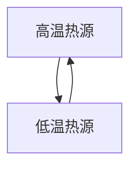
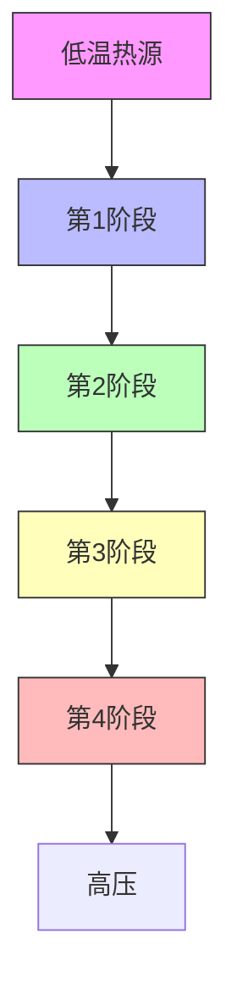

# 主题 2

# 热力学第一定律

燃料在焚烧炉中燃烧时所释放出来的能量可用于供热，在发动机中燃烧时释放的能量则可用于做机械功，化学反应释放的能量则可以通过驱动电子在电路中的有序运动而产生电功。化学反应既可用于供热，亦可用于做功，化学反应释放的能量即使不能用于供热或做功，也可以用来合成需要的产品，或用于维持生命系统的代谢过程。热力学是一门研究能量转化的学科，这门学科可以让我们对所有类似上述事物的变化过程进行定量探讨，并可据此得出一些有价值的预测结果。

# 2A 内能

本专题考察系统与环境之间的能量交换方式，包括系统对环境或环境对系统的做功方式，以及系统向环境放热或从环境中吸热的方式。通过对能量交换方式的探讨，引入系统总能量——“内能”的定义，得出热力学“第一定律”的数学表达式，热力学第一定律指出，隔离系统的内能是恒定不变的。

2A.1 功、热和能量；2A.2 内能的定义；2A.3 膨胀功；2A.4 热交换

# 2B 焓

本主题中第二个主要概念是“焓”，焓是一个非常有用的薄记性质，用此记录等压条件下发生的物理过程和化学反应的热输出（或需求）。在实验上，可以通过那些被统称为“量热法”的相关技术，测量出系统内能的变化量或焓变。

2B.1 焙的定义：2B.2 焙随温度的变化

# 2C 热化学

“热化学”研究化学反应过程中系统与环境之间热热交换。本专题阐述了物理及化学变化过程中焓变的测定方法。

2C.1 标准焓变；2C.2 标准生成焓；2C.3 反应焓与温度的关系；2C.4 实验技术

# 2D 状态函数和全微分

通过建立系统不同性质之间的定量关系，可以让热力学解决问题的作用变得更加突出。热力学一个非常有用的方向，就是可以通过对某些相关性质的测量，并对测量结果进行组合，间接地测量出那些难以直接测量的热力学性质。本专题中导出的定量关系可用于讨论有关气体液化的问题，也可用于讨论不同条件下物质热容之间的关系。

2D.1 全微分和非全微分；2D.2 内能的变化；2D.3 增变；2D.4 焦耳-汤姆孙效应

# 2E 绝热变化

“绝热过程”指的是没有热交换的变化过程。本专题描述了完美气体的绝热可逆过程，因为这个过程在热力学中占有重要地位。

2E.1 温度变化: 2E.2 压力变化

# 网络资源 这部分内容有何应用？

热力学的一个重要应用，就是考察燃料物质及其在有机生命体中的对应物质——食物的热力学性质。本书网站中的“应用案例3”，描述了一些燃料和食物的热化学方面的性质。

# 专题2A

# 内能

为何需要学习这部分内容？

热力学第一定律是讨论能量在化学中作用的基础。无论是物理变化，还是化学反应，能量的产生或使用都是人们感兴趣的问题，其基础背景是热力学第一定律的相关概念。

核心思想是什么？

隔离系统的总能量是恒定的。

需要哪些预备知识？

本专题要用到有关气体性质的讨论内容（专题1A），特别是要用到完美气体定律。本部分内容的基础是“化学家工具包6”中给出的有关功的定义。

根据热力学，自然界可分成两部分，一部分是系统，另一部分是与系统对应的环境。其中，系统（system）就是从自然界中划分出来的进行研究的那一部分，它可以是一个反应容器、一台发动机、一个化学电池，也可以是一个生物细胞，等等。环境（surroundings）是系统之外的区域，也是可以完成测量的地方。系统的类型取决于系统与环境之间的边界特征（图2A.1）。如果系统－环境间可以发生物质交换，则系统就是敞开系统（open system）；如果系统－环境间不能发生物质交换，则系统就是封闭系统（closed system）。敞开系统和封闭系统都可以与环境进行能量交换。

例如，封闭系统可以通过膨胀使环境中的重物升高；又如，温度较高的系统也可以向环境传递能量。隔离系统（isolated system）则是既不做功也不传热的封闭系统。

![[mineru/物理化学/物理化学（第11版）热力学1-3章58-143_images/0c49404a74c7666b22dcc2fd7b5c6556ee22d457160967a4d4d0e36295c6a654.jpg]]

<details>
<summary>text_image</summary>

能量
</details>

(a)敞开系统

![[mineru/物理化学/物理化学（第11版）热力学1-3章58-143_images/6595f076c6326a76f08cf95d1dbfca3e252d99c54d2c036ed09c22e09710646e.jpg]]

<details>
<summary>text_image</summary>

能量
</details>

(b) 封闭系统

![[mineru/物理化学/物理化学（第11版）热力学1-3章58-143_images/4fa242b4d5b5350daa62fa63df2802e5a5c1da7840dc7fbf1a22ced6a58914a1.jpg]]  
(c) 隔离系统  
图2A.1（a）敞开系统可以与环境交换物质和能量；（b）封闭系统可以与环境交换能量，但不能交换物质；（c）隔离系统与环境既不能交换能量也不能交换物质

# 2A.1 功、热和能量

虽然热力学主要是通过对系统宏观性质的测量来讨论和解决问题，但是，仍然可以在分子水平上理解系统的宏观测量结果，这极大地丰富了热力学的内容。

# (a) 定义

热力学中的基本物理量是功，在对抗外力情况下产生运动的过程就会做功（work）（“化学家工具包6”）。抵抗重力提升重物的过程就是一个简单的做功实例。原则上，如果某过程可以用来提升环境中的重物，该过程就可以做功。例如，气体推动活塞向外膨胀过程就是一个做功过程，从原理上讲，活塞的运动可以用来提升重物。另一个做功实例是电池中的化学反应，电池反应形成的电流可以驱动电动机提升重物。

系统的能量（energy）就是系统的做功能力（更多详情见“化学家工具包6”）。当对一个原本是隔离系统的系统做功时（如压缩气体或弹簧），该系统的做功能力就会增强，换句话说，系统的能量也就增加了。当某系统对环境做功时（当活塞外移或弹簧松开时），系统的能量就会减少，与做功前相比，做功后系统的做功能力会减弱。

实验表明，非做功方式也可以改变系统的能量。如果系统的能量变化是由于系统－环境间的温差造成的，所传递的能量被称为热（heat）。把加热器浸入烧杯里的水（系统）中时，系统的做功能力就会增强，因为热水比等量的冷水能够做更多的功。即使系统－环境间存在温差，也不是任何系统－环境界面都可发生传热现象。可以发生传热的系统－环境界面称为导热界面（diathermic boundary），而不能发生传热的界面则称为绝热界面（adiabatic boundary）。

放热过程（exothermic process）是释放热量的过程。例如，燃烧过程就是某物质与氧气发生的化学反应过程，燃烧反应通常会形成火焰。甲烷（ $CH_{4}$ ）气体的燃烧反应可以写成：

$$
\mathrm{CH} _ {4} (\mathrm{g}) + 2 \mathrm{O} _ {2} (\mathrm{g}) \longrightarrow \mathrm{CO} _ {2} (\mathrm{g}) + 2 \mathrm{H} _ {2} \mathrm{O} (\mathrm{l})
$$

所有燃烧过程都是放热的。尽管系统的温度在燃烧过程中会升高，但只要时间足够长，处于导热容器中的系统的温度都可以恢复到与环境一致的温度。因此，对于一个燃烧反应，可以将其表述为在某一温度下，如在25℃下进行的燃烧反应。

如果某燃烧反应是在绝热容器中发生的，反应释放出来的热量被截留在反应容器中，就会使系统一直处于较高的温度。

吸热过程（endothermic process）是吸收热量的过程。水的蒸发过程就是一个吸热过程实例。为了便于表述，常常将向环境释放热量的过程称为放热过程，将系统从环境中吸收热量的过程称为吸热过程。但需要指出的是，热是过程发生时才会出现的量（因温差引起的能量转移），而不存在一个实实在在的“热实体”。在导热容器中发生的吸热过程可使热从环境流入系统，从而使系统温度与环境温度一样，而在导热容器中发生的放热过程会使热从系统流出到环境。如果某吸热过程发生在绝热容器中，该过程会使系统的温度降低，而绝热容器中发生放热过程时，则系统的温度会升高。图2A.2概括了这些传热特征。

# (b) 热和功的分子诠释

从分子角度来说，加热是利用环境中分子的无序运动传递能量。分子的无序运动称为热运动

# 化学家工具包6 功与能量

当对抗一个反作用力移动一个物体时就要做（work）功w。当位移的变化为无穷小量ds（位移是向量）时，作用在物体上的功为

$$
\mathrm{d} w _ {\text {物件}} = - F \cdot \mathrm{d} s
$$

作用在物体上的功【定义】

式中 $F \cdot ds$ 为向量F和ds的标量积：

$$
F \cdot d s = F _ {x} d x + F _ {y} d y + F _ {z} d z
$$

标量积[定义]

系统做功过程中损失的能量dw为系统对环境（物体）所做功的负值，于是有

$$
\mathrm{d} w = F \cdot \mathrm{d} s
$$

作用于系统上的功【定义】

对于一维运动，有 $dw = F_{x} dx$ ，如果外力的作用方向与运动方向相反，则 $F_{x} < 0$ （因此 $F_{x} = -|F_{x}|$ 。外力 F 的大小和方向在运动途径中可以随运动过程的变化而变化，整个过程中做的总功就是上式沿运动途径的积分值。力的单位取牛顿（N），距离的单位取米（m），功的单位就是焦耳（J）：

$$
1 \mathrm{J} = 1 \mathrm{N} \cdot \mathrm{m} = 1 \mathrm{kg} \cdot \mathrm{m} ^ {2} \cdot \mathrm{s} ^ {- 2}
$$

能量（energy）就是做功的潜力，能量的SI单位与功是一样的，都是焦耳（J）。能量输出的速率称为功率（power）P。单位为瓦（W）：

$$
1 \mathrm{W} = 1 \mathrm{J} \cdot \mathrm{s} ^ {- 1}
$$

一个粒子可以有动能和势能两种形式的能量。物体的动能（kinetic energy） $E_{k}$ 是因物体运动而具有的能量，对于速率为v、质量为m的物体，有

$$
E _ {k} = \frac {1}{2} m v ^ {2}
$$

动能
【定义】

因为 $p=mv$ （专题1B中“化学家工具包3”），式中p是线性动量的大小，于是有

$$
E _ {k} = \frac {P ^ {2}}{2 m}
$$

动能
[定义]

物体的势能（potential energy） $E_{p}$ （通常用符号V表示，但不要将其与体积混淆！）是与其位置有关的那部分能量。在没有能量损失的情况下，静止粒子的势能等于将该粒子移到当前位置的过程中需要做的功。因为 $dw_{物体}=-F_{s}dx$ ，于是就得到 $dE_{p}=-F_{s}dx$ ，因此有

$$
F _ {x} = - \frac {\mathrm{d} E _ {p}}{\mathrm{d} x}
$$

势能
[与方相关]

如果 $E_{p}$ 随x的增加而增加，则 $F_{s}$ 为负（指向负x方向，示意图1）。因此，梯度越陡（势能随位置变化的速率更大），相应的力就越大。

![[mineru/物理化学/物理化学（第11版）热力学1-3章58-143_images/03f2781034ce0cabd30d2e1237a994f06e2878ec973a689d28f30c3347934e57.jpg]]

<details>
<summary>line</summary>

| 位置, x | 势能, E_p |
| ------- | --------- |
| < 0     | dE_p/dx > 0 |
| > 0     | dE_p/dx > 0 |
</details>

示意图1

因为势能与物体受力的具体类型有关，所以无法写出势能的通用表达式。对于距离地面高度为 h、质量为 m 的粒子来说，重力势能为

$$
E _ {p} (h) = E _ {p} (0) + m g h
$$

重力萌娃

式中g是自由落体的加速度（acceleration of free fall）（g与物体的具体位置有关，但其“标准值”约为 $9.81\ m\cdot s^{-2}$ ）。势能的零点是任意的，对于地面附近的粒子，通常设定 $E_{p}(0)=0$ 。

![[mineru/物理化学/物理化学（第11版）热力学1-3章58-143_images/1bc9d4018e37ebefa1a0d6928f4b6b98dae796f70df53efa44e39380f93305d8.jpg]]

<details>
<summary>text_image</summary>

吸热过程
</details>

(a)

![[mineru/物理化学/物理化学（第11版）热力学1-3章58-143_images/3ed5e350900e2842c4242d8d697465515efeee46927fb845072a89c6016a50af.jpg]]

<details>
<summary>text_image</summary>

放热过程
</details>

(b)

![[mineru/物理化学/物理化学（第11版）热力学1-3章58-143_images/42ec68c6dea9174a1df077f521773103428e2625a2ea7ec659e7ff4d465798a5.jpg]]

<details>
<summary>text_image</summary>

热
吸热过程
</details>

(c)

![[mineru/物理化学/物理化学（第11版）热力学1-3章58-143_images/90538907a5b14b9114456719ea2e04c7a9b18f22b729657eeab91ec3d0a759d5.jpg]]

<details>
<summary>text_image</summary>

热
放热过程
</details>

(d)   
图2A.2（a）绝热系统中发生吸热过程时，温度会下降；（b）如果绝热系统中发生的过程是放热的，温度上升；（c）当吸热过程发生在导热容器中时，系统从环境中吸热（环境的温度不变）。系统的温度不变；（d）如果过程是放热的，那么系统就向环境放热，过程是等温过程

(thermal motion)，高温环境中分子的热运动可促进低温系统中分子更剧烈地运动，低温系统的能量就随之升高。若是系统对环境加热，则是系统中分子的热运动促进环境中分子的热运动（图2A.3）。

相反地，做功则是利用环境中分子的有序运动传递能量（图2A.4）。一个重物升高或降低时，重物中的原子做定向运动（上升或下降）。弹簧被压缩时，弹簧中的原子就会做有序运动；形成电流时，电流中的电子都会沿同一方向运动。如果

两个相距r的电荷 $Q_{1}$ 和 $Q_{2}$ 的库仑势能（Coulomb potential energy）为

$$
E _ {p} = \frac {Q _ {1} Q _ {2}}{4 \pi \varepsilon r}
$$

库仑势能

式中s是介电常数（permittivity），其值与电荷间介质的性质有关。如果电荷之间为真空，则这个常数称为真空介电常数（vacuum permittivity） $\varepsilon_{0}$ 或电常数（electric constant），其值为 $8.854\times10^{-12}J^{-1}\cdot C^{2}\cdot m^{-1}$ 。对于空气、水或油这样的介质，介电常数更大，这些介质的介电常数通常表示为真空介电常数的倍数：

$$
\varepsilon = \varepsilon_ {1} \varepsilon_ {0}
$$

介电常数
[定义]

式中 $\varepsilon_{r}$ 是量纲为1的相对介电常数（relative permittivity）。

粒子的总能量（total energy）是其动能和势能之和；

$$
E = E _ {1} + E _ {p}
$$

总能量
[定义]

如果没有外力作用于物体，物体的总能量就保持不变。这个物理学的核心思想就是能量守恒定律（law of the conservation of energy）。势能和动能可以自由转化，但在没有外界影响的情况下，两者之和保持不变。

![[mineru/物理化学/物理化学（第11版）热力学1-3章58-143_images/0fc6a4900e7ab38446b45182526138b2bde14eddb85fb8f8267508444584ad5e.jpg]]

<details>
<summary>text_image</summary>

环境
能量
能量
能量
系统
</details>

图2A.3 当系统向环境放热时，这种热量传递会使环境中原子的无序运动程度增大。环境向系统传递能量则利用的是环境中的无序运动（热运动）

![[mineru/物理化学/物理化学（第11版）热力学1-3章58-143_images/37130c8d0e01de26417234864f0c160e64c4a13569323f84dd29ce0b40bcb870.jpg]]

<details>
<summary>text_image</summary>

环境
能量
能量
能量
系统
</details>

图2A.4 系统做功驱动环境中分子的有序运动（例如，图中显示的原子可能是正在上升的重物中的一部分原子。原子在下落重物中的有序运动会对系统做功）

是系统做功，系统就会使环境中的原子或电子做有序运动。类似地，如果环境对系统做功，则环境就会通过有序运动方式，如重物中原子的高度下降或电流中电子的有序流动，向系统传递能量。

若要对热和功进行区分，只有从环境的角度看才有可能。环境中重物的下降可以促进系统中分子的热运动，但这个事实却与热和功的区分无关：功是利用环境中原子的有序运动传递的能量，而热则是利用环境中原子的热运动传递的能量。例如，在对一个绝热气体系统进行压缩的过程中，相应的重物会以有序运动方式降低高度，过程中环境对系统做功，但由重物下降引起的活塞推进过程所产生的直接结果是使气体分子的平均运动速率增大，气体分子间的碰撞可迅速导致分子运动方向的无序化，因而重物中原子的有序运动产生的实际后果是使气体分子的无序运动程度增强，这样在环境中就观察到重物的高度降低，重物中的原子有序下降。尽管重物下降过程促进的是系统中气体分子的热运动，但这是通过有序运动的做功方式实现的。

# 2A.2 内能的定义

热力学中，系统的总能量称为内能（internal energy） $U$ 。系统的内能是系统中所有构成粒子（原子、离子或分子）的全部动能和势能之和。系统整体的宏观运动，如系统随地球一起进行的绕日运动也具有动能，但热力学中的内能不包括系统整体的宏观运动动能，也就是说，系统的内能只是指系统“内部”的能量。系统从某一始态变化到某一终态，内能就从 $U_{\mathrm{f}}$ 变化到 $U_{\mathrm{f}}$ ，相应的内能变化量用 $\Delta U$ 表示：

$$
\Delta U = U _ {\mathrm{f}} - U _ {\mathrm{i}} \tag {2A.1}
$$

热力学中有一个惯例，就是 $\Delta X=X_{f}-X_{i}$ ，这里X指的是系统的某种性质（某种状态函数）。

内能是状态函数（state function）。状态函数的数值大小只取决于系统的当前状态，而与系统如何变化到当前这个状态的方式没有关系。换句话说，内能是确定系统当前状态的那些状态变量的函数。系统任一状态变量（如压力）的变化，可能会引起内能的变化。内能是状态函数，这一点具有非常重要的意义（专题2D）。

内能是系统的广度性质（与系统中物质的量有关的性质，参见专题1A中“化学家工具包2”），单位为焦耳（ $1\mathrm{J} = 1\mathrm{kg}\cdot \mathrm{m}^2\cdot \mathrm{s}^{-2}$ ）。内能除以系统中物质的量， $U_{\mathrm{m}} = U / n$ ，得到系统的摩尔内能 $U_{\mathrm{m}}$ 。摩尔内能是强度性质（与系统中物质的量无关的性质），常用的单位是千焦每摩尔（ $\mathrm{kJ}\cdot \mathrm{mol}^{-1}$ ）。

# (a) 内能的分子诠释

一个分子具有一定数目的运动自由度，如平动自由度、转动自由度或振动自由度。许多物理性质或化学性质与这些运动形式有关。如果某个化学键上集中了很高的能量，如强烈振动，化学键就可能会断裂。系统温度升高，系统的内能就增大，分子就会分布到更高的能级。

对于分子间没有相互作用的系统（即完美气体，且假设量子效应可忽略不计），可以用“化学家工具包7”中介绍的经典力学的“均分定理”来预测分子的每种运动方式对系统总能量的贡献。

# 简要说明2A.1

气体中的原子可以进行三维运动，其平动能为三个平方项之和：

$$
E _ {\text {平动}} = \frac {1}{2} m v _ {x} ^ {2} + \frac {1}{2} m v _ {y} ^ {2} + \frac {1}{2} m v _ {z} ^ {2}
$$

均分定理告诉我们，每个平方项的平均能量为 $\frac{1}{2}kT$ ，于是平均动能为 $E_{平动}=3\times\frac{1}{2}kT=\frac{3}{2}kT$ ，摩尔平动能为 $E_{平动,m}=\frac{3}{2}kT\times N_{A}=\frac{3}{2}RT$ 。25℃时， $RT=2.48\ kJ\cdot mol^{-1}$ ，所以，完美气体摩尔内能中的平动能为 $3.72\ kJ\cdot mol^{-1}$ 。

完美气体的体积对内能没有影响：完美气体分子间没有相互作用，因此分子间的距离对气体系统的能量没有影响，也就是说：

# 化学家工具包7 均分定理

可以根据玻耳兹曼分布（参见前言）计算给定温度下系统中原子或分子的每种运动方式具有的平均能量。但是，如果温度很高，则很多能级都被占据，对于这种情况，可用一种更简单的方法得到平均能量，即均分定理（equipartition theorem）：

处于热平衡的系统，每个平方项对能量贡献的平均值为 $\frac{1}{2}kT$ 。

“平方项贡献”表示的是这部分能量要么与动量的平方

# 完美气体的内能与体积无关。

凝聚相中分子间的作用势能对系统的内能有贡献，但是对此尚没有一个简单的表达式可表示出这种贡献的大小。但仍然有一个正确的结论，即当系统温度升高时，由于各种运动形式都会被激发到更高的能级，系统的内能增大。

# (b) 热力学第一定律的数学表达式

实验发现，对系统做功或加热都可以改变系统的内能。尽管可以弄清楚能量传递是如何发生的（若环境中某重物升高了或降低了，即表示能量传递是通过做功完成的；如果环境中的冰融化了，就表示能量是通过传热完成的），但能量传递到底是以何种方式完成的，对于系统而言并没有差别，也就是说：

# 功和热是改变系统内能的两种等价方式。

系统就像一个银行，它能以任何流通形式接收存款（功或热），但这些存款都是以内能的形式进行保存的。实验还发现，如果一个系统与环境是隔离的，也就是说，如果系统与环境既不能发生物质交换，也不能发生能量交换的话，系统的内能就不会发生变化。由这些实验观测得到的总结性结论被称为热力学第一定律（first law of thermodynamics）。热力学第一定律表述如下：

# 隔离系统的内能是守恒的。

隔离系统不可能对环境做功，被隔离的系统一旦发生了状态变化，也不可能自己恢复到做功能力不变的初始状态。这些经验观察结果的正确

（就像动能表示式 $E_{k}=p^{2}/2m$ 中那样，参见“化学家工具包6”）或正比，要么与距离平衡位置的位移的平方成正比（像描述谐振子势能 $E_{p}=\frac{1}{2}k_{f}x^{2}$ 时那样）。该定理是根据经典力学得到的结论。而针对量子化的系统，该定理仅在能级差与kT相比很小时适用。此时，很多能级都是被占据的。通常条件下，对于平动和转动，均分定理对平均能量的估算可以得到较好的结果。但是，振动和电子态能级差通常比转动和平动能级差大很多，因此均分定理对此类运动不适用。

性之所以可靠，是因为到目前为止，还没有制造出真正的不消耗任何燃料，或不利用其他能源即可做功的“永动机”。

可以利用符号在表达式中表述这些思想。如果 w 表示环境对系统做的功，q 表示环境向系统传递的热， $\Delta U$ 是系统内能的变化量，于是有

$$
\Delta U = q + w
$$

热力学第一定律的数字形式

(2A.2)

式（2A.2）归纳总结了两方面的观察结果，一是做功和传热在改变系统内能方面是等价的，二是隔离系统的内能守恒（对于隔离系统 $q = 0$ ， $w = 0$ ）。该式表明了，封闭系统内能的变化量等于系统和环境间通过做功和传热交换的能量之和。式（2A.2）采用了大家熟知的惯例，即环境对系统做功或传热时， $q$ 和 $w$ 取正值，系统失去能量时， $q$ 和 $w$ 则取负值。换句话说，做功或传热产生的能量流的方向都是从系统的角度来看的。

# 简要说明2A.2

如果电动机每秒产生15 kJ的机械功，并向环境释放2 kJ的热，则每秒电动机内能的变化量为 $\Delta U=-2\ kJ-15\ kJ=-17\ kJ$ 。弹簧被压缩时，对弹簧做了100 J的功，但同时向环境释放了15 J的热，则弹簧内能的变化量为 $\Delta U=100\ J-15\ J=+85\ J$ 。

实用小贴士总是写出 $\Delta U$ （或一般地 $\Delta X$ ）的正、负号，即便其是正值。

# 2A.3 膨胀功

系统的状态是通过状态变量描述的，通过考虑状态变量的无穷小变化（如温度的无穷小变化）和内能的无穷小变化dU，可发展出有效的计算方法。考虑无穷小变化过程，若环境对系统做的微小功用dw表示，系统吸收的热用dq表示，式(2A.2)可以重写成：

$$
\mathrm{d} U = \mathrm{d} q + \mathrm{d} w \tag {2A.3}
$$

利用该式能将问题解决到什么程度，主要取决于是否能够将dw和dq与环境中发生的具体事件有效地关联起来。

为展开讨论这个问题，可以从讨论膨胀功（expansion work）开始，即由体积变化所引起的功。膨胀功包括气体对抗大气压力的膨胀过程产生的功。许多化学反应会产生气体（如碳酸钙的热分解反应和烃类物质的燃烧反应），反应过程中系统需要为产生的气体提供空间，系统体积就要发生变化，因而就要做功，这些反应的热力学特征也就与过程中做功的多少有关。“膨胀功”一词的意思还包括系统体积变化为负值的情况，也就是压缩过程产生的功也称为膨胀功。

# (a) 功的一般表达式

可以根据“化学家工具包6”中的定义来计算膨胀功，计算式中为了表示对抗外力的情况，需要使用负号，相应计算公式可简洁地表示为

$$
\mathrm{d} w = - | F | \mathrm{d} z \quad \text {   做功   } \tag {2A.4}
$$

式中使用了负号，这表示在没有其他变化的情况下，当系统克服外力 $|F|$ 并使某物体发生移动时，系统中能够做功的内能就会减小。如果dz为正（向z正方向移动），则dw为负值，系统内能就减小[在dq=0的情况下，式（2A.3）中dU为负]。

现在来考虑图2A.5中的情况。在图2A.5中，系统的上方是质量为零、无摩擦、刚性、面积为 $A$ 的活塞。若 $p_{ex}$ 表示外压，则作用在活塞外侧的力 $|F| = p_{ex}A$ ，系统对抗外压 $p_{ex}$ 膨胀距离 $\mathrm{dz}$ 时做的功

![[mineru/物理化学/物理化学（第11版）热力学1-3章58-143_images/4d547ca3885e54eeb3f5b9e62b6154354f0f23a4dea1ab7a64162f9e38dfde66.jpg]]

<details>
<summary>text_image</summary>

外压, pex
面积,A
dz
dV = Adz
压力,p
</details>

图2A.5 面积为 A 的活塞移动距离 dz 时会扫过体积 dV = Adz。外压 $p_{n}$ 等价于在活塞上的重力，抵抗膨胀的力的大小为 $p_{n}A$

为 $dw = -p_{ex} Adz$ ，这里 Adz 就是在膨胀过程中的体积变化 dV。因此，系统在对抗外压 $p_{ex}$ ，体积膨胀 dV 的过程中，所做的功为

$$
\mathrm{d} w = - p _ {e x} \mathrm{d} V \quad \text {   爆   振   功   } \tag {2A.5a}
$$

要得到系统从始态体积 $V_{i}$ 变到终态体积 $V_{i}$ 过程中的总功，就需要在始态体积和终态体积之间对式（2A.5a）进行积分：

$$
w = - \int_ {V _ {i}} ^ {V _ {i}} p _ {\mathrm{ex}} \mathrm{d} V \tag {2A.5b}
$$

系统膨胀时，作用于活塞上的力 $(p_{ex}A)$ 就等于膨胀过程举起的重物的重力。如果系统被压缩，则相当于环境中同样的重物在下降，式（2A.5b）仍然适用，但这种情况下， $V_{f}<V_{i}$ 。需要重点指出的是，这种情况下做功的大小仍然是只与外压有关。这个结论有些令人困惑，似乎与容器内的气体对抗压缩过程的事实不一致。然而，当气体被压缩时，环境中的重物下降，下降的程度就是环境做功能力的减小量，过程中传递到系统中的能量实际就是环境中能量的减小量。

其他类型的功（如电功）称为非膨胀功（non-expansion work）或额外功（additional work），这些非膨胀功或额外功的计算用到的也是类似公式，都是强度因子（如压力）和广度因子（如体积变化）的乘积。表2A.1列出了一些不同类型功的表达式。这一小节主要讨论的是如何根据式（2A.5b）计算体积变化过程中的膨胀功。

表2A.1 功的类型

<table><tr><td>功的类型</td><td colspan="2">dw</td><td>说明</td><td>单位**</td></tr><tr><td rowspan="2">膨胀功</td><td rowspan="2"> $-p_{ex}dV$ </td><td> $p_{ex}$ </td><td>外压</td><td>Pa</td></tr><tr><td>dV</td><td>体积变化</td><td> $m^3$ </td></tr><tr><td rowspan="2">表面功</td><td rowspan="2"> $\gamma d\sigma$ </td><td> $\gamma$ </td><td>表面张力</td><td> $N·m^{-1}$ </td></tr><tr><td>d $\sigma$ </td><td>表面积变化</td><td> $m^2$ </td></tr><tr><td rowspan="2">弹性功</td><td rowspan="2"> $fdl$ </td><td>f</td><td>弹力</td><td>N</td></tr><tr><td>dl</td><td>长度变化</td><td>m</td></tr><tr><td rowspan="4">电功</td><td rowspan="2"> $\phi dQ$ </td><td> $\phi$ </td><td>电势</td><td>V</td></tr><tr><td>dQ</td><td>电荷量变化</td><td>C</td></tr><tr><td rowspan="2"> $Qd\phi$ </td><td>d $\phi$ </td><td>电势差</td><td>V</td></tr><tr><td>Q</td><td>流过的电荷量</td><td>C</td></tr></table>

一般来说，对系统所做的功可表示为 $dw = -|F|dz$ ，式中 $|F|$ 是“广义力”的大小， $dz$ 是“广义位移”。  
\*\*功的单位为J。注意： $|N\cdot m=1|$ 。 $|V\cdot C=1|$ 。

# (b) 等外压膨胀

现在考虑在整个膨胀过程中外压保持不变的情况。例如，大气压力作用于活塞的情况下发生的膨胀过程就是这样的膨胀过程。在这样的膨胀过程中，外界的大气作用于活塞上的力始终是一个恒定不变的力。一个等外压膨胀的实际例子就是等压条件下发生的化学反应系统的膨胀过程，反应过程中，反应容器中产生的气体对抗等外压发生膨胀。这种情况下，可以将式（2A.5b）中的等外压 $p_{ex}$ 提到积分符号外面进行计算：

$$
w = - p _ {e x} \int_ {V _ {i}} ^ {V _ {i}} d V = - p _ {e x} (V _ {i} - V _ {i})
$$

因此，如果把体积变化写成 $\Delta V=V_{f}-V_{i}$ ，则有

$$
w = - p _ {e x} \Delta V
$$

部张功
[等外压] (2A.6)

图2A.6表示了这个积分结果，其表示方法基于一个事实，即一个积分式的积分结果实际上就是图形中相应积分曲线下面的面积。 $|w|$ 表示的是功w的大小，等于 $p=p_{ex}$ 水平线下方位于始态体积和终态体积之间的区域面积。用来显示膨胀功大小的p-V图又称为示功图（indicator diagram），James Watt最先使用这样的图描述其蒸汽机的运行过程。

对抗零外压的膨胀过程是自由膨胀（free expansion），自由膨胀发生在 $p_{cx}=0$ 的条件下，根据式（2A.6），这种情况下有

![[mineru/物理化学/物理化学（第11版）热力学1-3章58-143_images/0ae0611fb3bc8c318ad2c6a534b34c9178eb4372731f928ad2cc868aeeb3077d.jpg]]

<details>
<summary>text_image</summary>

压力,p
p_ex
面积 = p_exΔV
O
V_i
体积 V
V_f
p_ex
p_ex
</details>

图2A.6 气体在等外压 $p_{n}$ 下膨胀时做的功等于图中的阴影区面积

$$
w = 0
$$

$$
\mathrm{自由舞张功}
$$

$$
(2 A. 7)
$$

也就是说，自由膨胀时系统不做功。气体向真空中进行的膨胀，发生的就是这种自由膨胀。

# 例题 2A.1 计算气体产生过程中的功

25℃下，50 g铁与盐酸分别按下列两种方式反应生成 $FeCl_{2}(aq)$ 和氢气，（a）在体积恒定的密封容器中反应；（b）在敞口烧杯中反应。计算各反应过程中做的功。

整理思路 首先需要弄清楚反应过程中系统的体积变化，确定反应是如何发生的。若体积没有变化，则不论反应如何进行都不会产生功。如果系统进行的是等外压膨胀，可以根据式（2A.6）计算功的大小。一般情况下，对于凝聚相变为气体的过程，凝聚相的体积相对生成的气体体积来说可以忽略不计。

解：（a）系统体积不变，体积功为零，因此w=0。

（b）生成的气体对抗大气压力，因此有 $w=-p_{n}\Delta V$ 。由于终态体积足够大（在气体生成后），始态体积可以忽略，故 $\Delta V=V_{f}-V_{t}=V_{f}=nRT/p_{n}$ ，这里n是生成氢气的物质的量，于是有

$$
w = - p _ {e x} \Delta V \approx - p _ {e x} \frac {n R T}{p _ {e x}} = - n R T
$$

因为反应是 $\mathrm{Fe(s)+2HCl(aq)\longrightarrow FeCl_{2}(aq)+H_{2}(g)}$ ，消耗 1 mol Fe 生成 1 mol $H_{2}$ ，n 可以根据 Fe 原子的量算出，Fe 的摩尔质量为 55.85 g·mol $^{-1}$ ，于是就得到

$$
\begin{array}{l} w = - \frac {5 0 \mathrm{g}}{5 5 . 8 5 \mathrm{g} \cdot \mathrm{mol} ^ {- 1}} \times 8. 3 1 4 5 \mathrm{J} \cdot \mathrm{K} ^ {- 1} \cdot \mathrm{mol} ^ {- 1} \times 2 9 8 \mathrm{K} \\ = - 2. 2 \mathrm{kJ} \\ \end{array}
$$

即系统（反应混合物）在推动大气的过程中做了 2.2 kJ 的功。

说明 外压的大小对最终的结果没有影响：外压越小，生成气体的体积越大，可以抵消因外压小产生的后果。

自测题2A.1 25℃，等压条件下电解50 g水，计算此过程中的膨胀功。

# (c) 可逆膨胀

热力学中，若通过一个变量的无穷小改变，可使变化逆转，则该变化称为可逆变化（reversible change）。这里的关键词“无穷小”，将“可逆”这个词的一般意义凝练为可以改变方向，强调的是方向变化的可逆。温度相同的两个系统间的热平衡（thermal equilibrium）就是一个可逆性实例，这样的两个系统之间发生的传热过程是可逆的，因为如果其中任一系统的温度发生无穷小降低，热就会流入温度较低的系统；反之，如果其中任一系统的温度发生无穷小升高，热就会流出温度较高的系统。显然，可逆性和平衡之间存在非常密切的关系：处于平衡的系统之间才有望发生可逆变化。

设由活塞密封的气体的外压为 $p_{ex}$ ，并设外压等于气体的压力p，这种情况下气体系统与环境处于力平衡（mechanical equilibrium），因为外压的无穷小增大或无穷小减小都可以引起系统体积反方向变化。如果外压减少一无穷小量，则气体的体积就会膨胀无穷小量，如果外压增加无穷小量，则气体的体积就会被压缩无穷小量，两种情况都是热力学意义上的可逆变化。另一方面，如果外压比内压高出的量是一个宏观可测量，那么以无穷小减小外压的方式就不可能将外压 $p_{ex}$ 降低到气体压力之下，也就不会改变过程的方向，这样的系统与其环境之间就不是处于力平衡状态，相应的压缩过程也就不是热力学可逆过程。

要实现可逆膨胀，在膨胀过程中的每一步都需要使外压 $p_{ex}$ 等于系统压力p。实际操作过程中，可以通过逐步移走活塞上重物的方式，使活塞上剩余重物产生的向下压力始终与气体压力形成的向上推力相吻合，或通过逐步调节外压，使外压与膨胀气体压力始终吻合。当 $p_{ex}=p$ 时，式（2A.5a）就变为

$$
\mathrm{d} w = - p _ {\mathrm{ex}} \mathrm{d} V = - p \mathrm{d} V \quad \text {可逆器胀功} \tag {2A.8a}
$$

这个功的表达式中用到的是系统的压力，但是只有在变化过程中 $p_{ex}$ 始终等于p，从而让过程为可逆过程的情况下，才可以这样处理。从始态体积 $V_{i}$ 可逆膨胀到终态体积 $V_{t}$ 的过程中，总功为

$$
w = - \int_ {V _ {i}} ^ {V _ {f}} p d V \tag {2A.8b}
$$

如果知道了气体的压力与体积之间的关系，就可求出该式的积分。式（2A.8b）与主题1中讨论的内容有关，因为如果知道了气体的状态方程，压力p就可以用体积V表示，也就可以得到该式的积分。

# (d) 完美气体的等温可逆膨胀

现在考虑完美气体的等温可逆膨胀。可以把系统放置在恒温环境（可以是恒温水浴）中，以实现等温膨胀。气体的状态方程为 $pV=nRT$ ，膨胀过程中的每一步都有 $p=nRT/V$ ，这里V是每一膨胀位置的气体体积。等温膨胀过程中，T是定值，于是可以与常数n和R一起移到积分符号外面，也就得到从始态体积 $V_{1}$ 等温可逆膨胀到终态体积 $V_{1}$ 的过程中的功为

$$
w = - n R T \int_ {V _ {\mathrm{i}}} ^ {\text {积分A.2}} \frac {\mathrm{d} V}{V} = - n R T \ln \frac {V _ {\mathrm{f}}}{V _ {\mathrm{i}}} \quad \text {等温可逆膨胀功} [ \text {完美气体} ] \tag {2A.9}
$$

# 简要说明2A.3

20.0℃下，1.00 mol Ar（可看成完美气体）从10.0 dm $^{3}$ 等温可逆膨胀到30.0 dm $^{3}$ ，做的功为

$$
\begin{array}{r l} w & = - 1. 0 0 \mathrm{mol} \times 8. 3 1 4 5 \mathrm{J} \cdot \mathrm{K} ^ {- 1} \cdot \mathrm{mol} ^ {- 1} \times 2 9 3. 2 \mathrm{K} \times \ln \frac {3 0 . 0 \mathrm{dm} ^ {3}}{1 0 . 0 \mathrm{dm} ^ {3}} \\ & = - 2. 6 8 \mathrm{kJ} \end{array}
$$

当终态体积大于始态体积时，如膨胀过程，式（2A.9）中的对数值为正，于是有w<0，这种情况下，系统对环境做功，系统的内能减少。（注意提示语：在下面的章节中将会看到，对于理想气体等温膨胀，会有热流入系统，对系统的内能进行补偿，故膨胀过程中内能总体上会保持不变。）这些公式表明，对于给定的体积变化量，高温系统做的功更多，因为温度高，封闭气体系统的压力更大，需要对抗更高的外压才能进行可逆膨胀，相应地，做的功也更大。

可以在p-V图中表示计算的结果，在p-V图中，过程中做功的大小等于等温线 $p=nRT/V$ 下的面积（图2A.7）。图中叠加显示的矩形面积代表不可逆膨胀过程的做功的大小，这个不可逆膨胀过程对抗的外压恒等于可逆膨胀过程所到达的终态压力。可逆过程中做的功较大（图中显示的面积较大），这是因为可逆膨胀过程中的每一步，外压始终保持与内压相等，系统的驱动力一点都不浪费。膨胀过程中做的功不可能比可逆功大，因为过程中的任一点，外压哪怕比内压大一点点，产生的结果都是压缩。根据这里的讨论结果可以看出，在 $p>p_{ex}$ 的情况下，系统有一部分驱动力没有发挥作用，只有在可逆过程中，才能实现系统在给定的始态和终态之间做最大功。

![[mineru/物理化学/物理化学（第11版）热力学1-3章58-143_images/097ab09cb4a35d9814284e11ed0d760e60e20be687eb4ea9dc6cfd4ebaacf5da.jpg]]

<details>
<summary>area</summary>

| 能源 | 压力 (Pa) |
| ---- | --------- |
| p = nRT/V | -         |
| p_t   | -         |
</details>

图2A.7 完美气体等温可逆膨胀过程中做功的大小等于等温线p=nRT/V下的面积。在对抗等外压（终态压力）下的不可逆膨胀过程中做功的大小等于较暗的矩形区域面积（注意，可逆功大于不可逆功）

# 2A.4 热交换

一般情况下，系统的内能变化为

$$
\mathrm{d} U = \mathrm{d} q + \mathrm{d} w _ {\text { exp }} + \mathrm{d} w _ {\text { add }} \tag {2A.10}
$$

式中 $dw_{add}$ 为膨胀功 $dw_{exp}$ 之外的额外功（“add”表示额外）。例如， $dw_{add}$ 可以是驱动电流流过电路的电功。等容系统不会产生膨胀，这种情况下 $dw_{exp}=0$ ，如果系统也不做任何其他形式的功（例如，如果系统不是一个连接到电动机上的电池），则还会有 $dw_{add}=0$ ，在这些条件下：

$$
\mathrm{d} U = \mathrm{d} q \quad \text {   等容时传递的热   } \tag {2A.11a}
$$

这个关系式也可以表示成 $dU=dq_{v}$ ，这里的下标表示等容条件。对于沿着一条等容途径，状态i和f之间的可测量变化，则有

$$
\overbrace {\int_ {i} ^ {f} \mathrm{d} U} ^ {U _ {i} - U _ {i}} = \overbrace {\int_ {i} ^ {f} \mathrm{d} q _ {v}} ^ {q _ {v}}
$$

可以表示为

$$
\Delta U = q _ {V} \tag {2A.11b}
$$

注意，dq的积分不要写成 $\Delta q$ ，因为q与U不同，q不是一个状态函数。根据式（2A.11b），等容条件下，系统吸收的热等于系统的内能变化量。

# (a) 量热法

量热学（calorimetry）研究的是物理和化学变化过程中的热传导。量热计（calorimeter）是一种测量热量传递的装置。最常用的测量 $q_{v}$ （进而由此得到 $\Delta U$ ）的装置是一种绝热的弹式量热计（adiabatic bomb calorimeter，图2A.8）。被研究的过程——可以是一个化学反应——在一个弹式的容积恒定的容器中启动，这个弹式容器浸没在不断搅拌的水浴中，整套装置就是量热计。量热计也浸没在一外层水浴中。监测量热计中的水和外层水浴中的水，并调节使二者达到相同的温度。这样设计的装置可保证量热计没有净热量释放到环境，保证量热计是绝热的。

![[mineru/物理化学/物理化学（第11版）热力学1-3章58-143_images/d64f6b3fbab1caeff37d0b0422e2ca0f028db260adeaba95e80429b42d78ffa4.jpg]]

<details>
<summary>text_image</summary>

点火电极
充氧孔
氧弹
样品
高压氧气
水
温度计
</details>

图2A.8 容积恒定的弹式量热计（中心部分的容器是“弹体”，可承受高压。图中显示的是量热计整体组装情况，为了确保绝热性，将量热计浸没在水浴中，在每个燃烧阶段，都将水浴的温度连续调节至量热计的温度）

量热计的温度变化 $\Delta T$ 与反应释放或吸收的热成正比，于是，可以通过测量 $\Delta T$ 而得到 $q_{\mathrm{v}}$ 及相应的 $\Delta U$ 。可以根据已知过程的传热结果对量热计进行校正，测出量热计常数（calorimeter constant），再将 $\Delta T$ 转化为 $q_{\mathrm{v}}$ 。量热计常数也就是下面关系式中的 $C$ ：

$$
q = C \Delta T \tag {2A.12}
$$

量热计常数也可以通过电学的方法测量。用已知电势差为 $\Delta\phi$ 的电源在一加热器中产生一个恒定的电流 I，根据通电时间得到（“化学家工具包8”）：

$$
q = I t \Delta \phi \tag {2A.13}
$$

# 简要说明2A.4

若12 V电源产生10.0 A电流，通电时间为300 s，则可根据式（2A.13）得到产生的热，即

$$
q = 1 0. 0 \mathrm{A} \times 3 0 0 \mathrm{s} \times 1 2 \mathrm{V} = 3. 6 \times 1 0 ^ {4} \mathrm{A} \cdot \mathrm{V} \cdot \mathrm{s} = 3 6 \mathrm{kJ}
$$

以焦耳为单位表示的计算结果是应用下列换算得到的： $1\mathrm{A}\cdot \mathrm{V}\cdot s = 1(\mathrm{C}\cdot \mathrm{s}^{-1})\cdot \mathrm{V}\cdot s = 1\mathrm{C}\cdot \mathrm{V} = 1\mathrm{J}$ 。若测得温度升高 $5.5\mathrm{K}$ ，则量热计常数 $C = 36\mathrm{kJ / (5.5K)} = 6.5\mathrm{kJ}\cdot \mathrm{K}^{-1}$ 。

也可以通过燃烧已知质量的某物质（常用的是苯甲酸），根据其释放的已知热量测出C。在已知C的情况下，就能很简单地将测量的温度升高值转化为释放的热。

# (b) 热容

温度升高，系统的内能增大，但加热方式对内能的升高幅度会产生影响。若在系统体积恒定

# 化学家工具包8 电荷、电流、功率和能量

电荷（electrical charge）Q的单位是库仑C。基本电荷e是单个电子或质子携带的电荷，约为 $1.6 \times 10^{-19}$ C。电荷的运动产生电流（electric current）I，电流的单位是库仑每秒，或称为安培（A）， $1 \, A = 1 \, C \cdot s^{-1}$ 。如果电荷是电子的电荷（就像金属中的电流那样），则1 A的电流就表示每秒流过 $6 \times 10^{18}$ 个电子（10 μmol电子 $e^{-}$ ）。

当电流I流过电势差为 $\Delta\phi$ （单位为伏特， $1\ V=1\ J\cdot A^{-1}$ ）的电路时，产生的功率P为

![[mineru/物理化学/物理化学（第11版）热力学1-3章58-143_images/0dff4bdcae7dd67af22fd2fc1c6cebe163aed931376de6b1228a2d9f8d40ce33.jpg]]

<details>
<summary>line</summary>

| 温度, T | 内能, U |
| ------- | ------- |
| A       | B       |
</details>

图2A.9 系统内能随温度的升高而增大；该图显示了系统在等容加热时内能的变化。任意温度下曲线切线的斜率是在该温度下的定容热容。注意：图中8点处的热容大于A点处的热容

不变的情况下，把内能对温度的变化表示在图中，即得到图2A.9中所示曲线，任一温度下曲线切线的斜率称为该温度下系统的热容（heat capacity）。定容热容（heat capacity at constant volume）表示为 $C_{v}$ ，其正式定义为

$$
C _ {v} = \left(\frac {\partial U}{\partial T}\right) _ {v} \quad \text {   定否热者   } \tag {2A.14}
$$

（这里使用的偏导数和相关符号总结在“化学家工具包9”中。）内能会随系统温度和体积的变化而变化，但这里下标V表示体积恒定不变（图2A.10），故只有内能随温度的变化需要重点考虑。

# 简要说明2A.5

“简要说明2A.1”中的结果已表明，平动对单原子完美气体摩尔内能的贡献为 $\frac{3}{2}RT$ 。由于单原子完美气体中的分子只有平动，所以有 $U_{m}(T)=\frac{3}{2}RT$ 。再根据式（2A.14），就得到

$$
C _ {x, \infty} = \frac {\partial}{\partial T} \left(\frac {3}{2} R T\right) = \frac {3}{2} R
$$

具体数值为 $12.47\mathrm{J}\cdot \mathrm{K}^{-1}\cdot \mathrm{mol}^{-1}$

$$
P = I \Delta \phi
$$

因此，通电时间为t的恒电流产生的电能为

$$
E = P t = I t \Delta \phi
$$

因为 $1\mathrm{A}\cdot \mathrm{V}\cdot \mathrm{s} = 1(\mathrm{C}\cdot \mathrm{s}^{-1})\cdot \mathrm{V}\cdot \mathrm{s} = 1\mathrm{C}\cdot \mathrm{V} = 1\mathrm{J}$ ，电流的单位取安培，电势差的单位取伏特，时间的单位取秒，则能量的单位就是焦耳。电能可以做功（驱动电动机）或产生热（通过“加热器”），在产生热的情况下，有

$$
q = I t \Delta \phi
$$

# 化学家工具包9 偏导数

多变量函数 $f(x,y)$ 的偏导数（partial derivative）是所有其他变量保持不变的情况下，函数随其中一个变量的变化率（示意图1）。虽然偏导数表示的是当一个变量发生变化时函数的变化情形，但偏导数可用于确定多个变量以无穷小量变化时函数的变化情形。因此，如果f是x和y的函数，那么当x和y分别改变dx和dy时，f的变化就是

$$
\mathrm{d} f = \left(\frac {\partial f}{\partial x}\right) _ {y} \mathrm{d} x + \left(\frac {\partial f}{\partial y}\right) _ {x} \mathrm{d} y
$$

式中用符号 $\delta$ （而不是d）表示偏导数，括号的下标表示的是保持不变的量。

df也称为f的微分（differential），可以对f按任何顺序进行连续求偏导数：

$$
\left[ \frac {\partial}{\partial y} \left(\frac {\partial f}{\partial x}\right) _ {y} \right] _ {z} = \left[ \frac {\partial}{\partial x} \left(\frac {\partial f}{\partial y}\right) _ {x} \right] _ {y}
$$

例如，假设 $f(x,y)=ax^{3}y+by^{2}$ （示意图1中绘制的函数）。

![[mineru/物理化学/物理化学（第11版）热力学1-3章58-143_images/dad001bf03cf554915cce6fb1a8045359a3c3f08037672079b5c140932377245.jpg]]

<details>
<summary>text_image</summary>

f(x,y)
(∂f/∂x)_y
(∂f/∂y)_x
O
x
y
</details>

示意图1

![[mineru/物理化学/物理化学（第11版）热力学1-3章58-143_images/36f20462fda72b9b540d4197e6e28584a6db28bdb26d8e862678a2ef188151e6.jpg]]

<details>
<summary>text_image</summary>

内能, U
内能随温度
的变化曲线
等容条件下 U
随 T 的变化率
体积, V
O
温度, T
</details>

图2A.10 系统的内能随体积和温度的变化情况可以用图中的曲面表示。通过平行于温度轴绘制的曲线，表示的是在特定体积条件下内能随温度的变化，曲线上任一点的斜率是偏导数 $(\bar{v}U/\bar{v}T)$ 。

热容是容量性质：如100 g水的热容是1 g水的100倍（因此，升高同样的温度需要吸收100倍热量）。摩尔定容热容（molar heat capacity at则有

$$
\left(\frac {\partial f}{\partial x}\right) _ {y} = 3 a x ^ {2} y \quad \left(\frac {\partial f}{\partial y}\right) _ {x} = a x ^ {3} + 2 b y
$$

然后，若x和y变化无穷小，则f的改变为

$$
\mathrm{d} f = 3 a x ^ {2} y \mathrm{d} x + (a x ^ {4} + 2 b y) \mathrm{d} y
$$

为了验证二阶偏导数与求导顺序无关，验证结果为

$$
\left[ \frac {\partial}{\partial y} \left(\frac {\partial f}{\partial x}\right) _ {y} \right] _ {x} = \left[ \frac {\partial (3 a x ^ {2} y)}{\partial y} \right] _ {x} = 3 a x ^ {2}
$$

$$
\left[ \frac {\partial}{\partial x} \left(\frac {\partial f}{\partial y}\right) _ {x} \right] _ {y} = \left[ \frac {\partial (a x ^ {3} + 2 b y)}{\partial x} \right] _ {y} = 3 a x ^ {2}
$$

现在假设x和y与变量z有关（如x、y和z可对应于p、V和T），则有以下关系：

关系1 在z保持不变的情况下考虑x的变化：

$$
\left(\frac {\partial f}{\partial x}\right) _ {x} = \left(\frac {\partial f}{\partial x}\right) _ {y} + \left(\frac {\partial f}{\partial y}\right) _ {x} \left(\frac {\partial y}{\partial x}\right) _ {z}
$$

关系2

$$
\left(\frac {\partial y}{\partial x}\right) _ {z} = \frac {1}{(\partial x / \partial y) _ {z}}
$$

关系3

$$
\left(\frac {\partial x}{\partial y}\right) _ {z} = - \left(\frac {\partial x}{\partial z}\right) _ {y} \left(\frac {\partial z}{\partial y}\right) _ {z}
$$

结合关系2和关系3就得到欧拉循环求导关系式（Euler chain relation）:

$$
\left(\frac {\partial y}{\partial x}\right) _ {z} \left(\frac {\partial x}{\partial z}\right) _ {y} \left(\frac {\partial z}{\partial y}\right) _ {x} = - 1
$$

欧拉循环求导关系式

constant volume) $C_{V,m} = C_V / n$ 是每摩尔物质的热容，是强度性质（所有摩尔量都是强度性质）。对于某些方面的应用，知道某物质的比热容（specific heat capacity）（更多非正式情况下称为“比热”）非常有用，比热容就是某物质的热容除以物质的质量得到的数值， $C_{V,s} = C_V / m$ ，质量的单位常用克表示。室温下水的比热容约为 $4.2 \mathrm{~J} \cdot \mathrm{K}^{-1} \cdot \mathrm{g}^{-1}$ 。一般情况下，热容与温度有关，随温度的下降而减小，但在室温及稍高于室温的较小温度范围内，热容的变化很小，近似计算中，可将热容看作与温度几乎无关的量。

可以用热容建立起等容系统内能变化与温度变化的关系。根据式（2A.14）可以得到

$$
\mathrm{d} U = C _ {V} \mathrm{d} T
$$

加热时的内壁变化
[定容]

(2A.15a)

也就是说，定容条件下，温度的无穷小变化引起内能的无穷小变化，比例常数就是 $C_{v}$ 。若在感兴趣的温度范围内热容与温度无关，则有

$$
\Delta U = \int_ {T _ {1}} ^ {T _ {2}} C _ {V} \mathrm{d} T = C _ {V} \int_ {T _ {1}} ^ {T _ {2}} \mathrm{d} T = C _ {V} \overbrace {(T _ {2} - T _ {1})} ^ {\Delta T}
$$

对于宏观可测量的温度变化 $\Delta T$ 所引起的宏观可测量的内能变化量 $\Delta U$ ，有

$$
\Delta U = C _ {v} \Delta T
$$

加热时的内燃变化[定容]

(2A.15b)

由于内能变化量等于定容热 [式（2A.11b）]，式（2A.15b）也可写成

$$
q _ {V} = C _ {V} \Delta T
$$

(2A.16)

此式为测量系统热容提供了一种简便的方法：测量定容条件下系统吸收的热和系统的温度升高值，热与温度升高的比值 $(q_{v}/\Delta T)$ 就是系统的定容热容。较大的热容意味着，一定量的热所引起的温度升高值较小（系统对热具有更高的容纳能力）。

# 简要说明2A.6

将55 W电加热器置入体积恒定的绝热容器内的气体中，通电120 s，测得气体的温度升高了5.0 ℃（即5.0 K）。供热量为55 W × 120 s = 6.6 kJ（1 J = 1 W·s），因此可得到气体的热容：

$$
C _ {v} = \frac {6 . 6 \mathrm{kJ}}{5 . 0 \mathrm{K}} = 1. 3 \mathrm{kJ} \cdot \mathrm{K} ^ {- 1}
$$

# 概念清单

□ 1. 对抗反向作用力的运动就会产生功。  
2. 能量是做功的能力。  
3. 放热过程是系统向环境释放热量的过程。  
☐ 4. 吸热过程是系统从环境吸收热量的过程。  
5. 热是因温度差产生的能量传递过程。  
6. 用分子术语来讲，功是利用环境中原子的有序运动的一种能量传递，热则是利用环境中原子的无序运动的一种能量传递。  
7. 内能是系统内部的总能量，是一个状态函数。  
8. 温度升高，内能增大。

☐ 9. 均分定理可用于估计每种经典运动形式对内能的贡献量。  
10. 热力学第一定律指出隔离系统的内能是守恒的。  
□ 11. 自由膨胀（即对抗零外压膨胀）不做功。  
☐ 12. 如果某变量的无穷小变化可使变化逆转，则此变化是可逆变化。  
☐ 13. 为了实现可逆膨胀，外压在膨胀的每个阶段都要与系统压力无限接近。  
14. 定容条件下传递的热量等于系统的内能变化。  
15. 量热法用于测量热交换。

公式清单

<table><tr><td>性质</td><td>公式</td><td>说明</td><td>公式编号</td></tr><tr><td>热力学第一定律</td><td> $\Delta U = q + w$ </td><td>惯例</td><td>2A.2</td></tr><tr><td>膨胀功</td><td> $\mathrm{d}w = -p_{\mathrm{ex}}\mathrm{d}V$ </td><td></td><td>2A.5a</td></tr><tr><td>等外压膨胀功</td><td> $w = -p_{\mathrm{ex}}\Delta V$ </td><td>自由膨胀时 $p_{\mathrm{ex}} = 0$ </td><td>2A.6</td></tr><tr><td>气体可逆膨胀功</td><td> $w = -nRT\ln(V_{\mathrm{f}}/V_{\mathrm{i}})$ </td><td>定温,完美气体</td><td>2A.9</td></tr><tr><td>内能变化</td><td> $\Delta U = q_{v}$ </td><td>定容,没有其他功</td><td>2A.11b</td></tr><tr><td>电加热</td><td> $q = It\Delta\phi$ </td><td></td><td>2A.13</td></tr><tr><td>定容热容</td><td> $C_{v} = (\partial U/\partial T)_{v}$ </td><td>定义</td><td>2A.14</td></tr></table>

# 专题2B

# 焓

为何需要学习这部分内容？

焓是讨论众多热力学过程（如等压条件下的物理变化和化学反应过程）的核心概念。

核心思想是什么？

焓变等于定压热。

需要哪些预备知识？

本专题要用到与内能有关的讨论（专题 2A），还要用到和完美气体有关的一些内容（专题 1A）。

当系统发生任意体积变化时，内能变化并不等于系统－环境间传递的热。例如，系统在等压条件下发生膨胀或压缩时，系统从环境中吸收的热中一部分会通过做功方式重新回到环境中（图2B.1），这就导致dU<dq。等压条件下，系统－环境间传递的热等于系统另一个热力学性质的变化量，这个热力学性质就是“焓”。

![[mineru/物理化学/物理化学（第11版）热力学1-3章58-143_images/61480d492e92f6ecd892e1dc0f117467015e406c8e5ae0bbbe3f818fa89d5d26.jpg]]

<details>
<summary>text_image</summary>

系统对外所做的功
ΔU < q
传递给系统的热
</details>

图2B.1 系统在对抗等外压并且发生任意体积变化时，系统从环境中吸收的热的一部分会通过做功方式重新回到环境中。这种情况下，内能变化就小于系统－环境间传递的热

# 2B.1 焓的定义

焓 $H$ 的定义为

$$
H = U + p V
$$

动
[定义] (2B.1)

式中 $p$ 是系统的压力， $V$ 是系统的体积。因为 $U, p, V$ 都是状态函数，所以焓也是状态函数。与任何状

态函数一样，任何始态和终态之间焓的变化量 $\Delta H$ 与两状态之间的变化途径无关。

# (a) 焓变和热交换

根据式（2B.1）中焓的定义，可以得到一个重要结论：焓变等于定压条件下系统－环境间传递的热。

# 如何完成？2B.1 定压条件下焓变与热交换之间的关系式推导

在典型的热力学推导过程中，常用方法是对一些相关量进行连续定义，然后再引入适当的限制条件，最终得出推导结果。

步骤1 根据H的定义写出 $H+\mathrm{d}H$ 的表达式

当系统发生一般的无穷小状态变化时，系统的U变化到 $U+dU$ ，p变化到 $p+dp$ ，V变化到 $V+dV$ 。根据式(2B.1)，H变化到

$$
\begin{array}{l} H + \mathrm{d} H = (U + \mathrm{d} U) + (p + \mathrm{d} p) (V + \mathrm{d} V) \\ = U + \mathrm{d} U + p V + p \mathrm{d} V + V \mathrm{d} p + \mathrm{d} p \mathrm{d} V \\ \end{array}
$$

最后一项是两个无穷小量的乘积，可以忽略。注意到右边的 $U+pV=H$ （蓝色表示的项），所以有

$$
H + \mathrm{d} H = H + \mathrm{d} U + p \mathrm{d} V + V \mathrm{d} p
$$

因此有

$$
\mathrm{d} H = \mathrm{d} U + p \mathrm{d} V + V \mathrm{d} p
$$

步骤2 引入dU的定义

因为 $dU = dq + dw$ ，上述表达式可以写成

$$
\mathrm{d} H = \mathrm{d} q + \mathrm{d} w + p \mathrm{d} V + V \mathrm{d} p
$$

# 步骤3 引入适当的限制条件

如果系统与压力为p的环境之间达到力平衡，并且只做膨胀功，则有dw=-p dV，就可消去另一个pdV项，则

$$
\mathrm{d} H = \mathrm{d} q + V \mathrm{d} p
$$

定压条件下，dp=0，所以有

$dH=dq$ （定压，无额外功）

用下标p表示定压条件，则上式就可以写成

$$
\mathrm{d} H = \mathrm{d} q _ {p}
$$

定压时传递的热
[无穷小变化]

(2B.2a)

式（2B.2a）表明，如果没有额外(非膨胀)功，系统的焓变等于定压热。

# 步骤4 积分计算 $\Delta H$

定压下沿状态i和f之间的变化途径对式（2B.2a）进行积分，可得

$$
\overbrace {\int_ {1} ^ {t} \mathrm{d} H} ^ {H _ {p} - H _ {i}} = \overbrace {\int_ {1} ^ {t} \mathrm{d} q} ^ {q _ {p}}
$$

注意，dq的积分不能写成 $\Delta q$ ，因为q与H不同，q不是状态函数， $q_{1}-q_{1}$ 是没有意义的。最后得到的结果是

![[mineru/物理化学/物理化学（第11版）热力学1-3章58-143_images/31629a2c065c3eeeb36bd333b2df0c7fdd783b1af1fd1abeae9dd4b7b637b000.jpg]]

<details>
<summary>text_image</summary>

ΔH = q_p
定压时传递的热
[可测量变化]
(2B.2b)
</details>

# 简要说明2B.1

在 1.0 atm 压力下，用 12 V 电源通过电阻对水加热使其沸腾，通电时间为 300 s，通电电流为 0.50 A，发现有 0.798 g 的水蒸发为蒸汽。过程中系统的焓变为

$$
\begin{array}{l} \Delta H = q _ {r} = I t \Delta \phi = 0. 5 0 \mathrm{A} \times 3 0 0 \mathrm{s} \times 1 2 \mathrm{V} \\ = (0. 5 0 \times 3 0 0 \times 1 2) J \\ \end{array}
$$

式中 $1 \, A \cdot V \cdot s = 1 \, J$ 。因为 $0.798 \, g$ 水是 $(0.798 \, \text{g}) / (18.02 \, \text{g} \cdot \text{mol}^{-1}) = (0.798 / 18.02) \, \text{mol}$ ，则每摩尔 $H_{2}O$ 的蒸发焓为

$$
\Delta H _ {n} = \frac {(0 . 5 0 \times 3 0 0 \times 1 2) J}{(0 . 7 9 8 / 1 8 . 0 2) \mathrm{mol}} = + 4 1 \mathrm{kJ} \cdot \mathrm{mol} ^ {- 1}
$$

# (b) 量热法

通过测量等压下物理变化或化学变化过程中的温度变化，可以定量地测量焓变。研究等压过程的量热仪称为等压量热计（isobaric calorimeter）。大气压下的绝热容器就是等压量热计的一个简单例子，可以通过测量容器中系统的温度变化得到反应过程释放的热。一定量物质在有氧燃烧的情况下，可以用绝热火焰量热计（adiabatic flame calorimeter）测量燃烧反应的 $\Delta T$ （图2B.2）。然而，最复杂的测量焓变的方法是使

![[mineru/物理化学/物理化学（第11版）热力学1-3章58-143_images/b37fe18fa9695c7646225de3f8b21e75daf33d91bdde3622f4c7f7561d561c82.jpg]]

<details>
<summary>text_image</summary>

气体，蒸气
氧气
产物
</details>

图2B.2 等压绝热火焰量热计是由图示的组成部分浸入不断搅拌的水浴中构成的装置。发生燃烧时，已知量反应物燃料产生火焰；测量燃烧过程中温度的升高值

用差示扫描量热计（DSC），这种量热计的相关原理将在专题2C中阐述。也可以用非量热法测量焓变和内能变化（专题6C）。

一种测量 $\Delta H$ 的方法是：用弹式量热计测量出内能变化（专题2A），然后再将 $\Delta U$ 转换成 $\Delta H$ 。固体和液体的摩尔体积很小，所以其 $pV_{m}$ 也非常小，它们的摩尔焓和摩尔内能几乎是相等的 $(H_{m}=U_{m}+pV_{m}\approx U_{m})$ 。因此，若某变化过程只涉及固体或液体，则过程引起的 $\Delta H$ 和 $\Delta U$ 就几乎相等，这些过程对应的体积变化很小，过程中系统对环境做的功可忽略不计，因此变化过程中产生的热就全部被保留在系统中。

# 例题 2B.1 建立 $\Delta H$ 和 $\Delta U$ 的关系

当方解石型 $CaCO_{3}(s)$ 转化为文石型 $CaCO_{3}(s)$ 时，摩尔内能变化为 $+0.21\ kJ\cdot mol^{-1}$ 。计算当压力为1.0 bar时，摩尔焓变与摩尔内能变化的差值。已知方解石型 $CaCO_{3}(s)$ 的质量密度为 $2.71\ g\cdot cm^{-3}$ ，文石型 $CaCO_{3}(s)$ 的质量密度为 $2.93\ g\cdot cm^{-3}$ 。

整理思路 可以从物质的焓与内能之间的关系 [式(2B.1)] 出发来考虑解决问题。需要用压力和摩尔体积变化量表示出物质的焓变与内能变化之间的差值，摩尔体积变化量可以根据摩尔质量 M 和质量密度 $\rho$ 计算，这里 $\rho = M / V_{m}$ 。

解：发生 $\mathrm{CaCO_3(s)}$ 的相转变时，过程的焓变为

$$
\begin{array}{l} \Delta H _ {m} = H _ {m} (a) - H _ {m} (c) \\ = \left[ U _ {m} (a) + p V _ {m} (a) \right] - \left[ U _ {m} (c) + p V _ {m} (c) \right] \\ = \Delta U _ {\mathrm{m}} + p [ V _ {\mathrm{m}} (\mathrm{a}) - V _ {\mathrm{m}} (c) ] \\ \end{array}
$$

式中 a 表示文石型，c 为方解石型。然后将 $V_{m}=M/\rho$ 代入，得

$$
\Delta H _ {m} - \Delta U _ {m} = p M \left[ \frac {1}{\rho (a)} - \frac {1}{\rho (c)} \right]
$$

代入数据，取 $M = 100.09 \, g \cdot mol^{-1}$ ，得

$$
\begin{array}{l} \Delta H _ {\mathrm{m}} - \Delta U _ {\mathrm{m}} = 1. 0 \times 1 0 ^ {5} \mathrm{Pa} \times 1 0 0. 0 9 \mathrm{g} \cdot \mathrm{mol} ^ {- 1} \times \\ \left(\frac {1}{2 . 9 3 \mathrm{g} \cdot \mathrm{cm} ^ {- 3}} - \frac {1}{2 . 7 1 \mathrm{g} \cdot \mathrm{cm} ^ {- 3}}\right) \\ = - 2. 8 \times 1 0 ^ {3} \mathrm{Pa} \cdot \mathrm{cm} ^ {3} \cdot \mathrm{mol} ^ {- 1} \\ = - 0. 2 8 \mathrm{Pa} \cdot \mathrm{m} ^ {3} \cdot \mathrm{mol} ^ {- 1} \\ \end{array}
$$

因此 $\Delta H_{m}-\Delta U_{m}=-0.28\ J\cdot mol^{-1}$ （因为 $1\ Pa\cdot m^{3}=1\ J$ ），这一差值仅为 $\Delta U_{m}$ 值 $(+0.21\ kJ\cdot mol^{-1})$ 的 0.1%。

说明 通常情况下，忽略凝聚相摩尔焓和摩尔内能之间的差异是合理的，除非压力非常高。在压力很高的情况下， $p\Delta V_{m}$ 的值不能忽略。

自测题2B.1 Sn(s,灰)密度为5.75 g·cm $^{-3}$ , Sn(s,白)密度为7.31 g·cm $^{-3}$ ，计算1.0 mol Sn(s,灰)转变为Sn(s,白)的 $\Delta H$ 与 $\Delta U$ 差值。

$$
\text { 等案： } \Delta H - \Delta U = - 4. 4 ] 。
$$

与凝聚相变化过程中焓变与内能变化相差不大的情况不同，有气体参与的变化过程，焓变与内能变化的差异非常显著。对于完美气体，因为 $pV=nRT$ ，根据焓的定义可有

$$
H = U + p V = U + n R T \tag {28.3}
$$

这个关系意味着，等温条件下产生或消耗气体的反应的焓变为

$$
\Delta H = \Delta U + \Delta n _ {\mathrm{g}} R T \quad \text {   } \Delta H \text {   和   } \Delta U \text {   之间的关系式   } \tag {2B.4}
$$

式中 $\Delta n_{g}$ 是反应中有关气体的物质的量的变化。若式（2B.4）中表示的是摩尔量，则需要用 $\Delta v_{g}$ 代替式中的 $\Delta n_{g}$ 。

# 简要说明2B.2

反应 $2H_{2}(g)+O_{2}(g)\longrightarrow2H_{2}O(l)$ 中，气相中的3 mol气体转化为2 mol液体， $\Delta n_{1}=-3\ mol,\ \Delta v_{g}=-3$ 。298 K时， $RT=2.5\ kJ\cdot mol^{-1}$ 。因此，系统焓变和内能变化之间的关系为

$$
\Delta H _ {m} - \Delta U _ {m} = - 3 R T \approx - 7. 5 \mathrm{kJ} \cdot \mathrm{mol} ^ {- 1}
$$

注意，本例中计算得到的差值是以kJ为单位的，而例题2B.1中用的单位为J。本例中焓变小于内能变化，因为虽然反应系统向环境放热，但反应生成的是液体，系统的体积减小，所以释放到环境中的能量的一部分又通过环境对系统做功的方式重新回到系统中。

# 2B.2 焓随温度的变化

物质的焓是随温度的升高而增加的，这是因为温度对焓的影响与对内能的影响情况相同：分子在高温下被激发到高能状态，物质系统的总能量就会增加。但焓的增加与温度升高之间的具体关系与具体的升温条件有关（如升温过程中系统是等压还是等容）。

# (a) 定压热容

化学中最常见的条件是等压。等压条件下，焓随温度变化曲线在某给定温度下切线的斜率称为定压热容（heat capacity at constant pressure） $C_{p}$ （图2B.3），定压热容可以更严谨地表示为

$$
C _ {p} = \left(\frac {\partial H}{\partial T}\right) _ {p} \quad \text {   定压热容   } \tag {28.5}
$$

定压热容与定容热容（专题2A）类似，都是广度性质。摩尔定压热容（molar heat capacity at constant pressure） $C_{p,m}$ 是每摩尔物质的热容，属于强度性质。

定压热容建立了焓变与温度变化之间的联系。对于微小的温度变化过程，根据式（2B.5）就得到

$$
\mathrm{d} H = C _ {p} \mathrm{d} T (\text {等压}) \tag {2B.6a}
$$

若在感兴趣的温度范围内热容不变，则对于宏观可测的温度变化过程，有

$$
\Delta H = \int_ {T _ {1}} ^ {T _ {2}} C _ {p} \mathrm{d} T = C _ {p} \int_ {T _ {1}} ^ {T _ {2}} \mathrm{d} T = C _ {p} \overbrace {(T _ {2} - T _ {1})} ^ {\Delta T}
$$

该式可以简写为

![[mineru/物理化学/物理化学（第11版）热力学1-3章58-143_images/103505ebfa02eae7530793a19d1572831595d35e62ecfa3e2168c7c12be1d618.jpg]]

<details>
<summary>line</summary>

| 温度, T | 内能, U |
| ------- | ------- |
| A       | B       |
</details>

图2B.3 定压热容是系统的焓随温度变化曲线(等压下)在某给定温度下切线的斜率。对于气体，在给定的温度下，焓随温度变化曲线的斜率比内能随温度变化曲线的斜率大， $C_{n}$ 大于 $C_{n}$ 。

$$
\Delta H = C _ {p} \Delta T (\text {等压}) \tag {28.6b}
$$

因为焓变等于定压热，该式的实用形式为

$$
q _ {p} = C _ {p} \Delta T \tag {2B.7}
$$

式（2B.7）给出了一种测量样品定压热容的方法，即可以通过测量等压条件下（如大气压力下系统的任意膨胀过程）系统－环境间传递的热和系统的温度升高值得到定压热容。

当温度范围比较小时，热容随温度的变化有时可以忽略不计，这时热容可近似看作定值。对于单原子完美气体，这样的近似处理已经可以得到很精确的结果，但对于有些物质，就需要考虑热容随温度的变化情况。这时，可以用下面这个近似经验关系式得到不同温度下的摩尔定压热容：

$$
C _ {p, \mathrm{m}} = a + b T + \frac {c}{T ^ {2}} \tag {2B.8}
$$

式中a、b和c是与温度无关的经验参数（表2B.1）。可以根据该表达式对实验数据进行拟合，得到上述几个经验参数的具体数值。

表2B.1 摩尔定压热容随温度的变化  
$C_{p,m} / (\mathrm{J}\cdot \mathrm{K}^{-1}\cdot \mathrm{mol}^{-1}) = a + bT + c / T^{2}$ 

<table><tr><td></td><td>a</td><td> $b/(10^{-3} \text{K}^{-1})$ </td><td> $c/(10^{5} \text{K}^{2})$ </td></tr><tr><td>C(s,石墨)</td><td>16.86</td><td>4.77</td><td>-8.54</td></tr><tr><td>CO2(g)</td><td>44.22</td><td>8.79</td><td>-8.62</td></tr><tr><td>H2O(l)</td><td>75.29</td><td>0</td><td>0</td></tr><tr><td>N2(g)</td><td>28.58</td><td>3.77</td><td>-0.50</td></tr></table>

- 更多的数据参见资源部分。

# 例题 2B.2 计算焓随温度的变化

将 $N_{2}$ 从25℃加热到100℃， $N_{2}$ 的摩尔焓变是多少？可以利用表2B.1中相关的热容值信息进行计算。

整理思路 在这个温度范围内， $N_{2}$ 的热容随温度变化显著，无法使用式（2B.6b）（该式的适用条件是物质的热容恒定，不随温度变化）进行计算。因此，可将式（2B.8）中热容与温度的关系代入式（2B.6a）中，并在25℃（298K）到100℃（373K）的温度范围内，对得到的表达式进行积分，得到问题的答案。

解：为方便起见，将温度表示为 $T_{1}(298\ K)$ 和 $T_{2}(373\ K)$ 。需要积分的公式为

$$
\int_ {H _ {m} (T _ {1})} ^ {H _ {m} (T _ {2})} \mathrm{d} H _ {m} = \int_ {T _ {1}} ^ {T _ {2}} \left(a + b T + \frac {c}{T ^ {2}}\right) \mathrm{d} T
$$

利用资源部分A.1积分公式,对上式中的每一项进行积分,可以得到

$$
H _ {m} \left(T _ {2}\right) - H _ {m} \left(T _ {1}\right) = a \left(T _ {2} - T _ {1}\right) + \frac {1}{2} b \left(T _ {2} ^ {2} - T _ {1} ^ {2}\right) - c \left(\frac {1}{T _ {2}} - \frac {1}{T _ {1}}\right)
$$

代入数据后就得到

$$
H _ {\mathrm{m}} (3 7 3 \mathrm{K}) = H _ {\mathrm{m}} (2 9 8 \mathrm{K}) + 2. 2 0 \mathrm{kJ} \cdot \mathrm{mol} ^ {- 1}
$$

说明 假设热容值取 $29.14 \mathrm{~J} \cdot \mathrm{K}^{-1} \cdot \mathrm{mol}^{-1}$ [该值为式 (2B.8) 在 $T = 298 \mathrm{~K}$ 时的值], 则计算出来的两个温度下 $\mathrm{N}_{2}$ 焓的差值为 $2.19 \mathrm{~kJ} \cdot \mathrm{mol}^{-1}$ , 这个计算结果与精确的计算结果相差不大。

自测题2B.2 温度很低的情况下，固体的热容与 $T^{3}$ 成正比， $C_{p,m}=aT^{3}$ 。某固体物质温度从0变化到温度T（T接近于0）时，这种固体物质的焓变是多少？

$$
\text {答案:} \Delta H _ {\mathrm{m}} = \frac {1}{4} a T ^ {- 1}
$$

# (b) 热容间的关系

大多数系统是在等压下加热膨胀，在这种情况下，系统对环境做功，因此膨胀过程中系统吸收的热量会有一部分又通过做功的方式被还回到环境中，导致在等压条件下加热时系统温度的升高值会比等容条件下低一些。吸收同样的热量所产生的温度升高值较小时，就意味着系统有更大的热容。因此，大多数情况下，系统的定压热容都大于其定容热容。在专题2D中将看到，完美气体的定压热容和定容热容之间存在一个简单关系：

$$
C _ {p} - C _ {v} = n R \quad \text {   热容间的关系   } \tag {2B.9}
$$

这个关系式表明，完美气体的摩尔定压热容大约比其摩尔定容热容大 $8\ J\cdot K^{-1}\cdot mol^{-1}$ 。由于单原子气体的摩尔定容热容大约只有 $\frac{3}{2}R=12\ J\cdot K^{-1}\cdot mol^{-1}$ （专题2A），摩尔定容热容与摩尔定压热容之间出现 $8\ J\cdot K^{-1}\cdot mol^{-1}$ 的差值，这明显就比较大了，必须要加以考虑。对于凝聚相来说，定压热容和定容热容的数值是非常接近的，两者的差别通常可以忽略不计。

# 概念清单

□ 1. 定压热等于系统的焓变。

☐ 3. 定压热容等于焓随温度的变化率。

□ 2. 焓变可以在定压量热仪中进行测量。

公式清单

<table><tr><td>性质</td><td>公式</td><td>说明</td><td>公式编号</td></tr><tr><td>焓</td><td> $H = U + pV$ </td><td>定义</td><td>2B.1</td></tr><tr><td>定压热</td><td> $\mathrm{d}H = \mathrm{d}{q}_{p},\;\Delta H = {q}_{p}$ </td><td>无额外功</td><td>2B.2</td></tr><tr><td>温度T时ΔH和ΔU之间的关系</td><td> $\Delta H = \Delta U + \Delta {n}_{g}RT$ </td><td>凝聚相的摩尔体积忽略不计</td><td>2B.4</td></tr><tr><td>定压热容</td><td> ${C}_{p} = {\left( \partial H/\partial T\right) }_{p}$ </td><td>定义</td><td>2B.5</td></tr><tr><td>热容之间的关系</td><td> ${C}_{p} - {C}_{V} = nR$ </td><td>完美气体</td><td>2B.9</td></tr></table>

# 专题2C

# 热化学

为何需要学习这部分内容？

热化学是热力学在化学中的主要应用之一。热化学数据可用于计算包括那些与燃料燃烧及食物消耗有关的化学反应在内的相关化学反应的反应热。热化学数据也广泛用于热力学的其他化学应用中。

核心思想是什么？

将不同反应的反应焓组合起来，就可以得到其他化学反应的焓变。

需要哪些预备知识？

需要了解焓的定义及焓是状态函数（专题 2B）。在学习反应焓变与温度关系方面的内容时，需要用到有关热容的知识（专题 2B）。

研究化学反应热现象的学科称为热化学(thermochemistry)。因反应器中的反应混合物可以看成热力学系统，反应系统与环境之间在反应过程中会发生能量交换，热化学就成为热力学的一个分支。因此，量热法可以用来测量出化学反应过程中吸收或损失的热量；并且，等容反应过程中的热q可以看成反应系统的内能变化（专题2A），等压反应过程中的热q可以看成反应系统的焓变（专题2B）。反过来，如果知道了某反应的 $\Delta U$ 或 $\Delta H$ ，也就可以知道该反应可以产生多少热。

专题2A中已指出，一个可以向环境释放热的过程为放热过程，可以从环境中吸收热量的过程为吸热过程。等压下，系统向环境放热时焓会减小。因此，放热的反应过程也就是 $\Delta H<0$ 的过程，这样的过程是放焓的（exenthalpic）。相反，系统从环境吸热时焓会增大，吸热的反应过程就是 $\Delta H>0$ 的过程，这样的过程是吸焓的（endenthalpic）：

放热（焓）过程： $\Delta H<0$

吸热（焓）过程： $\Delta H>0$

# 2C.1 标准焓变

有关的焓变数据通常都是在标准条件下发生的过程的焓变值，标准焓变（standard enthalpy change） $\Delta H^{\circ}$ 就是标准状态的始态物质转变为标准状态的终态物质的过程中产生的焓变：

给定温度下某物质的标准状态

标准状态的指定

( standard state ) 就是 1 bar 压力下的纯态。

例如，298 K时液体乙醇的标准状态是298 K和1 bar下的纯液体乙醇，500 K时固体铁的标准状态是500 K和1 bar下的纯铁。溶液标准状态定义要复杂一些（专题5E）。某个化学反应或物理过程的标准焓变就是同一温度下的标准状态产物与标准状态反应物焓的差值。

标准蒸发焓 $\Delta_{vap}H^{\ominus}$ 就是标准焓变的一个例子。标准蒸发焓是 1 bar 压力下 1 mol 纯液体蒸发变成 1 bar 压力下气体的焓变。例如：

$$
\mathrm{H} _ {2} \mathrm{O} (\mathrm{l}) \longrightarrow \mathrm{H} _ {2} \mathrm{O} (\mathrm{g})
$$

$$
\Delta_ {\mathrm{vap}} H ^ {\ominus} (3 7 3 \mathrm{K}) = + 4 0. 6 6 \mathrm{kJ} \cdot \mathrm{mol} ^ {- 1}
$$

不同实例表明，任何温度下都有其相应的标准焓变。然而，常规热力学数据都是指298.15 K下的数据。除非有特别说明，或已在 $\Delta H^{\circ}$ 后注明了温度，否则，本书中的热力学数据代表的都是常

规温度298 K下的数据。

实用小贴士 在 $\Delta_{\mathrm{wp}}H$ 这样的写法中，把表示转变过程的名称标注在符号 $\Delta$ 右下方的写法是目前的书写惯例。但是，像 $\Delta H_{\mathrm{wp}}$ 这样的旧书写惯例仍然在广泛使用。目前的书写惯例更符合逻辑，因为下标表示的是变化过程的类型，而不是表示变化过程中观测的物理量。

# (a) 物理变化的焓变

伴随物理状态变化的标准摩尔焓变称为标准转化焓（standard enthalpy of transition），用 $\Delta_{\mathrm{trs}}H^{\ominus}$ 表示（表2C.1）。标准蒸发焓（standard enthalpy of vaporization） $\Delta_{\mathrm{cap}}H^{\ominus}$ 是标准转化焓的一个例子，另一个例子是标准熔化焓（standard enthalpy of fusion） $\Delta_{\mathrm{fus}}H^{\ominus}$ ，即固体熔化变成液体的过程中产生的标准摩尔焓变，表示如下：

$$
\mathrm{H} _ {2} \mathrm{O} (\mathrm{s}) \longrightarrow \mathrm{H} _ {2} \mathrm{O} (\mathrm{l})
$$

$$
\Delta_ {\mathrm{fu}} H ^ {0} (2 7 3 \mathrm{K}) = + 6. 0 1 \mathrm{kJ} \cdot \mathrm{mol} ^ {- 1}
$$

如在本例中，有时方便知道转变温度及常规温度298 K下的标准摩尔焓变。表2C.2总结了热化学中遇到的不同类型的焓变。

表2C.1 转变温度下的标准熔化焓和标准蒸发焓

<table><tr><td>物质</td><td> $T_{f}/K$ </td><td>标准熔化焓 $kJ·mol^{-1}$ </td><td> $T_{b}/K$ </td><td>标准蒸发焓 $kJ·mol^{-1}$ </td></tr><tr><td>Ar</td><td>83.81</td><td>1.188</td><td>87.29</td><td>6.506</td></tr><tr><td> $C_{6}H_{6}$ </td><td>278.61</td><td>10.59</td><td>353.2</td><td>30.8</td></tr><tr><td> $H_{2}O$ </td><td>273.15</td><td>6.008</td><td>373.15</td><td>40.656(298 K时为44.016)</td></tr><tr><td>He</td><td>3.5</td><td>0.021</td><td>4.22</td><td>0.084</td></tr></table>

\*更多的数据参见资源部分。

焓是状态函数，因此焓变与状态间的具体变化途径无关。焓的这一特征在热化学中具有重要意义，因为这意味着在给定的始态和终态之间无论怎样变化，都可以得到相同的 $\Delta H^{\circ}$ 。例如，固体转化为气体的过程，可以通过升华过程（从固体直接转化为蒸气）一步完成，也可以通过先熔化成液体再汽化为气体两步完成：

$$
\mathrm{H} _ {2} \mathrm{O} (\mathrm{s}) \longrightarrow \mathrm{H} _ {2} \mathrm{O} (\mathrm{l}) \quad \Delta_ {\text { f   u   s }} H ^ {\ominus}
$$

$$
\mathrm{H} _ {2} \mathrm{O} (\mathrm{l}) \longrightarrow \mathrm{H} _ {2} \mathrm{O} (\mathrm{g}) \quad \Delta_ {\mathrm{vap}} H ^ {\ominus}
$$

总的变化： $\mathrm{H}_2\mathrm{O}(\mathrm{s})\longrightarrow \mathrm{H}_2\mathrm{O}(\mathrm{g})$ $\Delta_{\mathrm{fus}}H^{\ominus} + \Delta_{\mathrm{vap}}H^{\ominus}$

表2C.2 反应焓和转变焓

<table><tr><td>转变</td><td>过程</td><td>符号*</td></tr><tr><td>相变</td><td>相α→相β</td><td> $\Delta_{\text{inv}}H$ </td></tr><tr><td>熔化</td><td>s→1</td><td> $\Delta_{\text{fus}}H$ </td></tr><tr><td>蒸发</td><td>l→g</td><td> $\Delta_{\text{vap}}H$ </td></tr><tr><td>升华</td><td>s→g</td><td> $\Delta_{\text{sub}}H$ </td></tr><tr><td>混合</td><td>纯组分→混合物</td><td> $\Delta_{\text{mix}}H$ </td></tr><tr><td>溶解</td><td>溶质→溶液</td><td> $\Delta_{\text{sol}}H$ </td></tr><tr><td>水化</td><td>X+(g)→X+(aq)</td><td> $\Delta_{\text{hyd}}H$ </td></tr><tr><td>原子化</td><td>化学组分(s,l,g)→原子(g)</td><td> $\Delta_{\text{at}}H$ </td></tr><tr><td>离子化</td><td>X(g)→X-(g)+e-(g)</td><td> $\Delta_{\text{ice}}H$ </td></tr><tr><td>得电子</td><td>X(g)+e-(g)→X-(g)</td><td> $\Delta_{\text{eg}}H$ </td></tr><tr><td>反应</td><td>反应物→产物</td><td> $\Delta_{\text{r}}H$ </td></tr><tr><td>燃烧</td><td>化合物(s,l,g)+O2(g)→CO2(g)+H2O(l,g)</td><td> $\Delta_{\text{c}}H$ </td></tr><tr><td>生成反应</td><td>单质→化合物</td><td> $\Delta_{\text{f}}H$ </td></tr><tr><td>活化</td><td>反应物→活化配合物</td><td> $\Delta^{*}H$ </td></tr></table>

\* 所有的量都是摩尔量。

由于间接途径得到的总结果与直接途径得到的结果相同，因此每条途径的总焓变是相同的（1），并且有（过程中温度相同）：

$$
\Delta_ {\mathrm{sub}} H ^ {\ominus} = \Delta_ {\mathrm{fus}} H ^ {\ominus} + \Delta_ {\mathrm{vap}} H ^ {\ominus} \tag {2C.1}
$$

因熔化焓都是正值，由此可知，物质的升华焓大于其蒸发焓（在给定温度下）。

![[mineru/物理化学/物理化学（第11版）热力学1-3章58-143_images/1689c7ef43fb0d9f25fa3781c0949a52eeb6b1a3ec3f420017f5143b34285a55.jpg]]

<details>
<summary>chemical</summary>

Energy level diagram showing transitions between vacuum and subcaloric H states with enthalpy labels
</details>

根据焓 H 是状态函数，还能得出另一个结论，即正向过程的标准焓变是其逆向过程标准焓变的负值（2）：

$$
\Delta H ^ {\ominus} (\mathrm{A} \longrightarrow \mathrm{B}) = - \Delta H ^ {\ominus} (\mathrm{A} \leftarrow \mathrm{B}) \tag {2C.2}
$$

![[mineru/物理化学/物理化学（第11版）热力学1-3章58-143_images/436e1900c7348275d24088ddbbe2a57f89baced708433aaed92e556856db7ca6.jpg]]

<details>
<summary>text_image</summary>

2
ΔH^Θ(A→B)
ΔH^Θ(A←B)
A
B
</details>

例如，298 K 时水的蒸发焓为 $44 \, kJ \cdot mol^{-1}$ ，则该温度下水蒸气的冷凝焓就是 $-44 \, kJ \cdot mol^{-1}$ 。

# (b) 化学变化的焓变

可以用两种方式表示化学反应过程产生的焓变。一种方式是用热化学方程式（thermochemical equation）表示，热化学方程式就是带有相应标准焓变的化学反应方程式：

$$
\mathrm{CH} _ {4} (\mathrm{g}) + 2 \mathrm{O} _ {2} (\mathrm{g}) \longrightarrow \mathrm{CO} _ {2} (\mathrm{g}) + 2 \mathrm{H} _ {2} \mathrm{O} (\mathrm{g})
$$

$$
\Delta H ^ {\ominus} = - 8 9 0 \mathrm{kJ}
$$

这里的 $\Delta H^{9}$ 就是标准状态反应物转变为标准状态产物的焓变：

标准状态下纯反应物组分 $\rightarrow$ 标准状态下纯产物组分

除溶液中发生的离子反应外，在其他类型反应过程中，纯反应物组分混合过程的焓变及反应产物分离成纯产物组分过程的焓变，都比反应步骤本身产生的焓变要小得多。对于这里的甲烷燃烧反应，反应的标准焓变表示的就是，1 bar压力下1 mol纯 $CH_{4}$ 气体与1 bar压力下2 mol纯 $O_{2}$ 气体完全反应，生成1 bar压力下1 mol纯 $CO_{2}$ 气体和1 bar压力下2 mol纯液态 $H_{2}O$ 的过程的焓变值，这里给出的焓变数据是298.15 K下的反应焓变值。

另一种表示化学反应过程焓变的方式是在写出化学反应方程式的同时，给出标准反应焓（standard reaction enthalpy） $\Delta_{r}H^{\ominus}$ （或者称为反应的标准焓）。因此，对于298 K下甲烷燃烧反应，可以写出

$$
\mathrm{CH} _ {4} (\mathrm{g}) + 2 \mathrm{O} _ {2} (\mathrm{g}) \longrightarrow \mathrm{CO} _ {2} (\mathrm{g}) + 2 \mathrm{H} _ {2} \mathrm{O} (\mathrm{l})
$$

$$
\Delta_ {r} H ^ {\ominus} = - 8 9 0 \mathrm{kJ} \cdot \mathrm{mol} ^ {- 1}
$$

对于 $2A+B\longrightarrow3C+D$ 这样的反应，标准反应焓为

$$
\Delta_ {t} H ^ {\ominus} = \left[ 3 H _ {\mathrm{m}} ^ {\ominus} (\mathrm{C}) + H _ {\mathrm{m}} ^ {\ominus} (\mathrm{D}) \right] - \left[ 2 H _ {\mathrm{m}} ^ {\ominus} (\mathrm{A}) + H _ {\mathrm{m}} ^ {\ominus} (\mathrm{B}) \right]
$$

这里 $H_{m}^{\ominus}(J)$ 是反应温度下反应组分J的标准摩尔焓。注意，这里需要弄清楚 $\Delta_{r}H^{\ominus}$ 为什么表示的是“每摩尔”焓变，这是由于在这个表达式中用到的概念都是每个反应组分的摩尔焓，在理解 $\Delta_{r}H^{\ominus}$ 的“每摩尔”含义时，要考虑到反应方程式中的化学计量系数。在这个例子中，“每摩尔”表示的实际上是“每2 mol A”“每1 mol B”“每

3 mol C”或“每1 mol D”。 $\Delta_{r}H^{\ominus}$ 的一般表达式为

$$
\Delta_ {\mathrm{r}} H ^ {\circ} = \sum_ {\text {产物}} v H _ {\mathrm{m}} ^ {\circ} - \sum_ {\text {反应物}} v H _ {\mathrm{m}} ^ {\circ} \quad \begin{array}{l} \text {标准反应地} \\ [ \text {定义} ] \end{array} \tag {2C.3}
$$

这里，每个组分的摩尔焓乘以相应组分的（量纲为1和正的）化学计量系数v。但是，这个正式定义几乎没有实用价值，因为式中每个组分的标准摩尔焓的绝对值无法测量，也就无法根据这个表达式直接计算 $\Delta_{r}H^{\circ}$ ；要解决这个问题，就需要用到将要在2C.2节中讨论的解决方案。

有些标准反应焓具有特殊的名称和意义。例如，标准燃烧焓（standard enthalpy of combustion） $\Delta_{c}H^{\circ}$ 指的就是含有C、H和O元素的有机化合物氧化燃烧变成气态 $CO_{2}$ 和液态 $H_{2}O$ 的标准反应焓，如果有机化合物中含有N元素，就设定燃烧反应后N元素转变为气态 $N_{2}$ 。

# 简要说明2C.1

葡萄糖的燃烧反应为

$$
\mathrm{C} _ {6} \mathrm{H} _ {1 2} \mathrm{O} _ {6} (\mathrm{s}) + 6 \mathrm{O} _ {2} (\mathrm{g}) \longrightarrow 6 \mathrm{CO} _ {2} (\mathrm{g}) + 6 \mathrm{H} _ {2} \mathrm{O} (\mathrm{l})
$$

$$
\Delta_ {c} H ^ {\circ} = - 2. 8 0 8 \mathrm{kJ} \cdot \mathrm{mol} ^ {- 1}
$$

此数据表明，标准条件下（298 K），燃烧1 mol $C_{6}H_{12}O_{6}$ 可以释放2 808 kJ的热量。表2C.3列出了更多的标准燃烧焓数据。

表2C.3 298 K时一些有机化合物的标准燃烧焓

<table><tr><td></td><td> $\Delta_{2}H^{\ominus}/(kJ \cdot mol^{-1})$ </td></tr><tr><td>苯, $C_{6}H_{6}(l)$ </td><td>-3 268</td></tr><tr><td>乙烷, $C_{2}H_{6}(g)$ </td><td>-1 560</td></tr><tr><td>葡萄糖, $C_{6}H_{12}O_{6}(s)$ </td><td>-2 808</td></tr><tr><td>甲烷, $CH_{4}(g)$ </td><td>-890</td></tr><tr><td>甲醇, $CH_{3}OH(l)$ </td><td>-721</td></tr></table>

\*更多的数据参见资源部分。

# (c) 赫斯定律

将不同标准反应焓数据组合起来，可以得到其他相关反应的焓变，这是热力学第一定律的具体应用，称为赫斯定律（Hess's law）：

某化学反应的标准反应焓等于分步完成该反应时各步反应的标准焓变之和。

这里并不要求其中的每步反应都是切实可行的反应步骤：它们可以是“假想”的反应步骤。在书写这些反应步骤时的唯一要求就是，反应方程式必须满足质量守恒条件。赫斯定律的热力学基础是 $\Delta_{r}H^{\circ}$ 的大小与具体变化途径无关。赫斯定律的重要性在于，对于反应热难以直接测定的化学反应，可以根据其他相关反应的反应热数据间接得到这些反应的反应热。

# 例题 2C.1 赫斯定律的应用

丙烯加氢反应

$$
\mathrm{CH} _ {2} = \mathrm{CHCH} _ {3} (\mathrm{g}) + \mathrm{H} _ {2} (\mathrm{g}) \longrightarrow \mathrm{CH} _ {3} \mathrm{CH} _ {2} \mathrm{CH} _ {3} (\mathrm{g})
$$

的标准反应焓为 $-124\ kJ\cdot mol^{-1}$

丙烷燃烧反应

$$
\mathrm{CH} _ {3} \mathrm{CH} _ {2} \mathrm{CH} _ {3} (\mathrm{g}) + 5 \mathrm{O} _ {2} (\mathrm{g}) \longrightarrow 3 \mathrm{CO} _ {2} (\mathrm{g}) + 4 \mathrm{H} _ {2} \mathrm{O} (\mathrm{l})
$$

的标准反应焓为 $-2\ 220\ kJ\cdot mol^{-1}$

水生成反应

$$
\mathrm{H} _ {2} (\mathrm{g}) + \frac {1}{2} \mathrm{O} _ {2} (\mathrm{g}) \longrightarrow \mathrm{H} _ {2} \mathrm{O} (\mathrm{l})
$$

的标准反应焓为 $-286\mathrm{kJ}\cdot \mathrm{mol}^{-1}$ 。计算丙烯的标准燃烧焓。

整理思路 解决这一问题时需要做的事情就是，根据相关反应方程式组合得到需要求解的热化学方程式。可以通过有关反应方程式的相加或相减，结合必要的其他反应方程式，得到需要的反应方程式，然后再按同样的加减步骤对相关反应的焓变进行加减运算。

解：燃烧反应为

$$
\mathrm{C} _ {3} \mathrm{H} _ {6} (\mathrm{g}) + \frac {9}{2} \mathrm{O} _ {2} (\mathrm{g}) \longrightarrow 3 \mathrm{CO} _ {2} (\mathrm{g}) + 3 \mathrm{H} _ {2} \mathrm{O} (\mathrm{l})
$$

可以根据下列反应的加和得到这个反应方程式：

<table><tr><td></td><td> ${\Delta }_{\mathrm{r}}{H}^{ \ominus }/\left( {\mathrm{{kJ}} \cdot {\mathrm{{mol}}}^{-1}}\right)$ </td></tr><tr><td> ${\mathrm{C}}_{3}{\mathrm{H}}_{6}\left( \mathrm{\;g}\right) + {\mathrm{H}}_{2}\left( \mathrm{\;g}\right) \longrightarrow {\mathrm{C}}_{3}{\mathrm{H}}_{8}\left( \mathrm{\;g}\right)$ </td><td>-124</td></tr><tr><td> ${\mathrm{C}}_{3}{\mathrm{H}}_{8}\left( \mathrm{\;g}\right) + 5{\mathrm{O}}_{2}\left( \mathrm{\;g}\right) \longrightarrow 3{\mathrm{{CO}}}_{2}\left( \mathrm{\;g}\right) + 4{\mathrm{H}}_{2}\mathrm{O}\left( \mathrm{l}\right)$ </td><td>-2220</td></tr><tr><td> ${\mathrm{H}}_{2}\mathrm{O}\left( \mathrm{l}\right) \longrightarrow {\mathrm{H}}_{2}\left( \mathrm{\;g}\right) + \frac{1}{2}{\mathrm{O}}_{2}\left( \mathrm{\;g}\right)$ </td><td>+286</td></tr><tr><td> ${\mathrm{C}}_{3}{\mathrm{H}}_{6}\left( \mathrm{\;g}\right) + \frac{9}{2}{\mathrm{O}}_{2}\left( \mathrm{\;g}\right) \longrightarrow 3{\mathrm{{CO}}}_{2}\left( \mathrm{\;g}\right) + 3{\mathrm{H}}_{2}\mathrm{O}\left( \mathrm{l}\right)$ </td><td>-2058</td></tr></table>

自测题2C.1 根据液态苯的标准燃烧焓 $(-3\ 268\ \text{kJ}\cdot\text{mol}^{-1})$ 和液态环己烷的标准燃烧焓 $(-3\ 920\ \text{kJ}\cdot\text{mol}^{-1})$ ，计算液态苯加氢反应的标准焓。

$$
\text {答案:} - 2 0 6 \mathrm{kJ} \cdot \mathrm{mol} ^ {- 1}.
$$

# 2C.2 标准生成焓

某物质的标准生成焓（standard enthalpy of formation） $\Delta_{t}H^{\ominus}$ ，是指由构成该化合物指定参考

态的单质生成该化合物的标准反应焓。

单质的指定参考态（reference state）是指给定温度和1 bar压力下的最稳定状态。

参考的指定

例如，298 K下氮的参考态是气态 $N_{2}$ ，汞的参考态是液态汞，碳的参考态是石墨，锡的参考态是白锡（金属）。在关于参考态的一般规定中，有一个元素是例外的，就是磷的参考态被确定为白磷，尽管磷元素的这种同素异形体并不是最稳定形式，但白磷却是最容易重复制得的单质磷。标准生成焓表示的是每摩尔化合物分子或分子单位（对于离子物质）的焓。例如，298 K下液态苯的标准生成焓针对的反应是

$$
6 \mathrm{C} (\mathrm{s}, \text {石墨}) + 3 \mathrm{H} _ {2} (\mathrm{g}) \longrightarrow \mathrm{C} _ {6} \mathrm{H} _ {6} (\mathrm{l})
$$

苯的标准生成焓数值为 $+49.0 \mathrm{~kJ} \cdot \mathrm{mol}^{-1}$ 。所有温度下，处于参考态的单质的标准生成焓都为零，因为这样的标准生成焓就是如 $\mathrm{N}_{2}(\mathrm{g}) \longrightarrow \mathrm{N}_{2}(\mathrm{g})$ 这样的“零”反应的焓变。表2C.4和表2C.5列出了一些物质的标准生成焓数据，更多物质的标准生成焓数据可在资源部分中查找。

因为无法制备出只单独含有阳离子或只单独含有阴离子的溶液，因此，处理溶液中离子的标准生成焓时会遇到一个特殊问题。为了解决这个问题，任一温度下氢离子的标准生成焓被定义为零：

$$
\Delta_ {\mathrm{f}} H ^ {\ominus} \left(\mathrm{H} ^ {+}, \mathrm{aq}\right) = 0 \quad \text {   含液中离子   } \tag {2C.4}
$$

表2C.4 298 K时一些无机化合物的标准生成焓

<table><tr><td></td><td> $\Delta_{\mathrm{f}}H^{\ominus}/(\mathrm{{kJ}} \cdot {\mathrm{{mol}}}^{-1})$ </td></tr><tr><td> $H_2O(l)$ </td><td>-285.83</td></tr><tr><td> $H_2O(g)$ </td><td>-241.82</td></tr><tr><td> $NH_3(g)$ </td><td>-46.11</td></tr><tr><td> $N_2H_4(l)$ </td><td>+50.63</td></tr><tr><td> $NO_2(g)$ </td><td>+33.18</td></tr><tr><td> $N_2O_4(g)$ </td><td>+9.16</td></tr><tr><td>NaCl(s)</td><td>-411.15</td></tr><tr><td>KCl(s)</td><td>-436.75</td></tr></table>

\*更多的数据参见资源部分。

表2C.5 298 K时一些有机化合物的标准生成焓

<table><tr><td></td><td> $\Delta_{\mathrm{f}}H^{\ominus}/(\mathrm{{kJ}} \cdot {\mathrm{{mol}}}^{-1})$ </td></tr><tr><td> $\mathrm{{CH}}_{3}(\mathrm{g})$ </td><td>-74.81</td></tr><tr><td> $\mathrm{C}_{6}\mathrm{H}_{6}(\mathrm{l})$ </td><td>+49.0</td></tr><tr><td> $\mathrm{C}_{6}\mathrm{H}_{12}(\mathrm{l})$ </td><td>-156</td></tr><tr><td> $\mathrm{{CH}}_{3}\mathrm{{OH}}(\mathrm{l})$ </td><td>-238.66</td></tr><tr><td> $\mathrm{{CH}}_{3}\mathrm{{CH}}_{2}\mathrm{{OH}}(\mathrm{l})$ </td><td>-277.69</td></tr></table>

\*更多的数据参见资源部分。

# 简要说明2C.2

如果HBr(aq)的标准生成焓为 $-122\ kJ\cdot mol^{-1}$ ，那么这个数值被全部看成是生成Br(aq)的焓变， $\Delta_{t}H^{\prime\prime}(Br,aq)=-122\ kJ\cdot mol^{-1}$ 。这个数据就可以与其他数据[如AgBr(aq)的标准生成焓数据]结合起来，得到 $Ag^{\prime}(aq)$ 的标准生成焓数据。可以通过这种方式不断得到更多离子的标准生成焓数据。本质上，这个定义是把每个离子的实际标准生成焓数值调整了一个固定的数值，调整之后，其中的一种离子，也就是 $H^{\prime}(aq)$ 的标准生成焓数值变成了零。

从概念上讲，一个化学反应可看作先将反应物分解成参考态单质，再将这些单质重组成产物的过程，总反应的 $\Delta_{r}H^{\circ}$ 就是分解步骤的焓变和生成步骤的焓变的总和。由于分解步骤是生成步骤的逆过程，分解步骤的焓变即为生成步骤焓变的负值（3）。因此，在物质标准生成焓方面，根据下式就足以计算出任何反应的焓变：

![[mineru/物理化学/物理化学（第11版）热力学1-3章58-143_images/e665ee1849ef12f01e05233965d82f549fa1e99d2ee8cd86900c234c5d471074.jpg]]

<details>
<summary>text_image</summary>

ΔrH° = ΣνΔrH° - ΣνΔrH° 标准反应焓
[用于实际计算] (2C.5a)
3 焙 H
单质
反应物
ΔrH° 产物
</details>

参与反应的各个组分的生成焓需要乘以其相应的化学计量系数。这样的处理方式使式（2C.3）中的正式定义转化为可用于实际计算的公式。这样的结果也可以在引入化学计量数（stoichiometric number） $v_{1}$ （与化学计量系数不同）的情况用更精致的公式表示，在产物的 $v_{1}$ 取正值、反应物的 $v_{1}$ 取负值的情况下，有

$$
\Delta_ {t} H ^ {\circ} = \sum_ {I} v _ {I} \Delta_ {I} H ^ {\circ} (J) \tag {2C.5b}
$$

化学计量数有正负号，用 $v_{1}$ 或 $v(J)$ 表示，而化学计量系数都是正值，用没有下标的 v 表示。

# 简要说明2C.3

根据式（2C.5a），反应 $2HN_{3}(l)+2NO(g)\longrightarrow H_{2}O_{2}(l)+4N_{2}(g)$ 的标准焓变的计算结果为

$$
\begin{array}{l} \Delta_ {t} H ^ {\circ} = \left[ \Delta_ {t} H ^ {\circ} \left(\mathrm{H} _ {2} \mathrm{O} _ {2}, 1\right) + 4 \Delta_ {t} H ^ {\circ} \left(\mathrm{N} _ {2}, \mathrm{g}\right) \right] - \\ [ 2 \Delta_ {t} H ^ {\circ} (\mathrm{HN} _ {2}, \mathrm{l}) + 2 \Delta_ {t} H ^ {\circ} (\mathrm{NO}, \mathrm{g}) ] \\ = (- 1 8 7. 7 8 + 4 \times 0) \mathrm{kJ} \cdot \mathrm{mol} ^ {- 1} - \\ (2 \times 2 6 4. 0 + 2 \times 9 0. 2 5) \mathrm{kJ} \cdot \mathrm{mol} ^ {- 1} \\ = - 8 9 6. 3 \mathrm{kJ} \cdot \mathrm{mol} ^ {- 1} \\ \end{array}
$$

若使用式（2C.5b）计算， $v(\mathrm{HN}_{3})=-2$ ， $v(\mathrm{NO})=-2$ ， $v(\mathrm{H}_{2}\mathrm{O}_{2})=+1$ ， $v(\mathrm{N}_{2})=+4$ 。可得

$$
\begin{array}{l} \Delta_ {t} H ^ {\ominus} = \Delta_ {t} H ^ {\ominus} (\mathrm{H} _ {2} \mathrm{O} _ {2}, 1) + 4 \Delta_ {t} H ^ {\ominus} (\mathrm{N} _ {2}, \mathrm{g}) - \\ 2 \Delta_ {i} H ^ {\circ} (\mathrm{HN} _ {3}, 1) - 2 \Delta_ {i} H ^ {\circ} (\mathrm{NO}, \mathrm{g}) \\ \end{array}
$$

计算出来的结果相同。

# 2C.3 反应焓与温度的关系

已测得许多不同温度下的标准反应焓数据，但是，在缺少相关实测数据的情况下，也可以根据物质的热容数据和其他温度下的标准反应焓数据，计算目标温度下的标准反应焓（图2C.1）。许多情况下，实测的热容数据要比实测的反应焓数据更准确，因此，在有热容数据可用的情况下，通过下面将要介绍的计算方法计算出来的反应焓数据，要比实验直接测量出来的反应焓数据更准确。

根据式（2B.6a） $(\mathrm{d}H=C_{p}\mathrm{d}T)$ ，将某物质从温度 $T_{1}$ 加热到温度 $T_{2}$ 的过程中，其焓就从 $H(T_{1})$ 变化到

$$
H (T _ {2}) = H (T _ {1}) + \int_ {T _ {1}} ^ {T _ {2}} C _ {p} \mathrm{d} T \tag {2C.6}
$$

(这里已假设在给定的温度范围内没有发生相变)由于此式适用于参与反应的任一反应组分, 标准反应焓从 $\Delta_{r}H^{\circ}(T_{1})$ 变化到

$$
\Delta_ {r} H ^ {\circ} (T _ {2}) = \Delta_ {r} H ^ {\circ} (T _ {1}) + \int_ {T _ {1}} ^ {T _ {2}} \Delta_ {r} C _ {p} ^ {\circ} \mathrm{d} T \quad \text {   基尔霍夫定律   } \tag {2C.7a}
$$

式中 $\Delta_{r}C_{p}^{\theta}$ 是在标准状态下，乘以反应式中化学计

![[mineru/物理化学/物理化学（第11版）热力学1-3章58-143_images/bc9fabcacd2a584e6e1b979127625839e115f82928612d21f710efa71e464ed1.jpg]]

<details>
<summary>line</summary>

| 温度, T | 产物 (Δ₁H°(T₁)) | 反应物 (ΔₜH°(T₂)) |
| ------- | ---------------- | ------------------ |
| T₁      | Δ₁H°(T₁)        | -                  |
| T₂      | -                | ΔₜH°(T₂)          |
</details>

图2C.1 温度升高，产物和反应物的焓都会增加，但增加的程度会有差异。针对不同的物质，焓随温度的变化情况与该物质的热容有关。一个化学反应的焓变体现的是产物焓和反应物焓随温度变化的差异性

量系数之后的产物和反应物摩尔热容的差值：

$$
\Delta_ {t} C _ {p} ^ {\circ} = \sum_ {\text {产物}} v C _ {p, \mathrm{m}} ^ {\circ} - \sum_ {\text {反应物}} v C _ {p, \mathrm{m}} ^ {\circ} \tag {2C.7b}
$$

或者根据式（2C.5b）的表示方式写成

$$
\Delta_ {r} C _ {p} ^ {\circ} = \sum_ {1} v _ {j} C _ {p, m} ^ {\circ} (J) \tag {2C.7c}
$$

式（2C.7a）称为基尔霍夫定律（Kirchhoff's law）。通常在假定 $\Delta_{\mathrm{r}}C_{p}^{\ominus}$ 与温度无关的情况下即可得到比较好的近似计算结果，至少在合理的有限温度范围内是如此。虽然每种反应组分的热容可能会随着温度的变化而变化，但不同组分热容的差值随温度的变化较小。某些情况下，使用式（2C.7a）时要考虑温度对热容的影响，如果在 $T_{1}$ 到 $T_{2}$ 的温度范围内 $\Delta_{\mathrm{r}}C_{p}^{\ominus}$ 很大程度上与温度无关，则式（2C.7a）中的积分项的积分结果就是 $(T_{2} - T_{1})\Delta_{\mathrm{r}}C_{p}^{\ominus}$ ，则式（2C.7a）就可写成

$$
\Delta_ {r} H ^ {\circ} (T _ {2}) = \Delta_ {r} H ^ {\circ} (T _ {1}) + \Delta_ {r} C _ {p} ^ {\circ} (T _ {2} - T _ {1}) \quad \text {   楼尔霍夫定律   } \tag {2C.7d}
$$

# 例题 2C.2 基尔霍夫定律的应用

298 K时， $H_{2}O(g)$ 的标准生成焓为 $-241.82\ kJ\cdot mol^{-1}$ 。相关的摩尔定压热容如下： $H_{2}O(g)$ : $33.58\ J\cdot K^{-1}\cdot mol^{-1}$ ; $H_{2}(g)$ : $28.84\ J\cdot K^{-1}\cdot mol^{-1}$ ; $O_{2}(g)$ : $29.37\ J\cdot K^{-1}\cdot mol^{-1}$ ，并假设热容与温度无关，计算 $100\ ^{\circ}C$ 时 $H_{2}O(g)$ 的标准摩尔生成焓。

整理思路 在 $T_{1}$ 到 $T_{2}$ 范围内，当 $\Delta_{r}C_{p}^{\ominus}$ 与温度无关时，可以应用基尔霍夫定律的积分形式[式（2C.7d)]。为此，先写出化学方程式，弄清楚每个反应组分的化学

计量系数，然后再代入相关数据即可计算出 $\Delta_{\mathrm{r}}C_{p}^{\prime \prime}$

解：反应为 $H_{2}(g)+1/2O_{2}(g)\rightarrow H_{2}O(g)$ ，所以有

$$
\begin{array}{l} \Delta_ {r} C _ {\mu} ^ {0} = C _ {\mu , m} ^ {0} \left(\mathrm{H} _ {2} \mathrm{O}, \mathrm{g}\right) - \left[ C _ {\mu , m} ^ {0} \left(\mathrm{H} _ {2}, \mathrm{g}\right) + \frac {1}{2} C _ {\mu , m} ^ {0} \left(\mathrm{O} _ {2}, \mathrm{g}\right) \right] \\ = - 9. 9 4 \mathrm{J} \cdot \mathrm{K} ^ {- 1} \cdot \mathrm{mol} ^ {- 1} \\ \end{array}
$$

于是就可以得到

$$
\begin{array}{l} \Delta_ {r} H ^ {\circ} (3 7 3 \mathrm{K}) = - 2 4 1. 8 2 \mathrm{kJ} \cdot \mathrm{mol} ^ {- 1} + \\ 7 5 \mathrm{K} \times (- 9. 9 4 \mathrm{J} \cdot \mathrm{K} ^ {- 1} \cdot \mathrm{mol} ^ {- 1}) \\ = - 2 4 2. 6 \mathrm{kJ} \cdot \mathrm{mol} ^ {- 1} \\ \end{array}
$$

自测题2C.2 根据表2C.5中的数据和资源部分中的热容数据，计算环己烷 $C_{6}H_{12}(I)$ 在400 K时的标准生成焓。

答案：-163 KI·mol $^{-1}$ 。

# 2C.4 实验技术

热化学的经典工具是量热计（专题2A和2B）。然而，技术的发展已经能够实现对质量只有几毫克的样品进行热量测量。

# (a) 差示扫描量热法

差示扫描量热计（differential scanning calorimeter，DSC）可测量出等压条件下物理变化或化学反应过程中样品吸收或释放的热。“差示”一词的含义是，DSC对样品的分析测量是在以那些在测量过程没有发生物理变化或化学反应的物质为参照物的基础上完成。“扫描”一词的含义则是指，在分析测量过程中，样品和参照物的温度是在连续升高或者说被扫描。

DSC由两个小隔室组成，可通过电加热方式对两个小隔室进行恒速升温。在温度线性扫描过程中，t时刻的温度为 $T=T_{0}+\alpha t$ ，其中 $T_{0}$ 为初始温度， $\alpha$ 为温度扫描速率。在整个分析过程中，由计算机控制加热电源的输入功率，以确保被测样品室和参照物室中的温度完全一致（图2C.2）。

如果温度T下样品没有发生物理变化或化学反应，则样品吸收的热记为 $q_{p}=C_{p}\Delta T$ ，其中 $\Delta T=T-T_{0}$ ，并假设 $C_{p}$ 与温度无关。因为 $T=T_{0}+\alpha t$ ，所以 $\Delta T=\alpha t$ 。如果升温过程中样品发生了化学反应或物理变化，则样品温度与参照物温度产生相同变化时样品吸收的热为 $q_{p}+q_{p,ex}$ 。

![[mineru/物理化学/物理化学（第11版）热力学1-3章58-143_images/3e06e855a9fcec19ccde05c5239218100449d24f669c4a8aeb131256d32874e9.jpg]]

<details>
<summary>text_image</summary>

热电偶
样品
参照物
加热器
</details>

图2C.2 差示扫描量热计（分别在两个完全一样的金属热池对样品和参照物同步加热。为了保持两个金属热池的温度完全相等，需要向两个金属热池输入不同的加热功率，而量热计的输出信号就是分别向两个金属热池输入的加热功率的差值）

![[mineru/物理化学/物理化学（第11版）热力学1-3章58-143_images/eb405c733b40d62134fa926ccd46343205121cfa4a5aa67f7c9826866a616d09.jpg]]

<details>
<summary>line</summary>

| 温度, θ/°C | C_pex (mJ·K⁻¹) |
| ---------- | -------------- |
| 30         | 0              |
| 45         | 3              |
| 60         | 8              |
| 75         | 5              |
| 90         | 2              |
</details>

图2C.3 pH=2.45时蛋白泛素的热-温图[该蛋白质在温度达到45℃时仍然保持其原有结构，当温度再继续升高时，就会出现热致构象变化。本图改编自B.Chowdhry.S.LeHarne.J.Chem.Educ.74,236(1997)]

$q_{p,ex}$ 的出现，表示在温度扫描过程中样品的定压热容由 $C_{p}$ 变化为 $C_{p} + C_{p,ex}$ :

$$
C _ {p, \mathrm{ex}} = \frac {q _ {p , \mathrm{ex}}}{\Delta T} = \frac {q _ {p , \mathrm{ex}}}{\alpha t} = \frac {P _ {\mathrm{ex}}}{\alpha} \tag {2C.8}
$$

式中 $P_{\mathrm{ex}} = q_{p,\mathrm{ex}} / t$ 是为使样品室和参照物室的温度相等而需要输入的额外功率。DSC的记录结果称为热-温图（thermogram），也就是 $C_{p,\mathrm{ex}}$ 对温度 $T$ 的变化曲线（图2C.3）。升温测试过程中的焓变则为

$$
\Delta H = \int_ {T _ {1}} ^ {T _ {2}} C _ {p, e x} \mathrm{d} T \tag {2C.9}
$$

式中 $T_{1}$ 和 $T_{2}$ 分别是升温测试过程的起始温度和最终温度。这一关系式表明，焓变等于 $C_{p,ex}$ 对温度T作图所得曲线下的面积。

# (b) 等温滴定量热法

等温滴定量热法（isothermal titration calorimetry, ITC）也是一种“差示”测量技术，测量过程就是将被测样品的热行为与基准物质的热行为进行比较。这种测量装置如图2C.4所示。其中一个导热容器的体积为几毫升，里面装有基准物质（如水）和一个加热功率为几毫瓦的加热器；另一个导热容器则装有试剂，如装含有结合位点的大分子溶液，这个容器中也装有一个加热器。在实验开始时，启动两个加热器，然后精确测量滴加到样品池中的第二种试剂的量（体积约为 $1\ mm^{3}$ ），滴定过程中，通过调整输入加热功率使样品池和基准池维持恒定温差，同时对输入的加热功率进行连续监测。如果反应是放热反应，则需要输入的加热功率就比较小，如果反应是吸热反应，则需要输入的加热功率就比较大。

![[mineru/物理化学/物理化学（第11版）热力学1-3章58-143_images/181523e2789ccd0c0e217e34940bd049f23fd47f9610cea4fba2ce58b88d5a35.jpg]]

<details>
<summary>text_image</summary>

进样器
基准池
样品池
加热器
加热器
温度比较
</details>

图2C.4 等温滴定量法的测量装置示意图

图2C.5显示的是等温滴定量热法测量得到的典型结果，也就是维持恒定温差需要输入的功率变化：根据输入的功率和加热时长 $\Delta t$ ，可以计算出第i次滴加试剂时输入的热量 $q_{i}=P_{i}\Delta t$ 。如果溶液体积为V，第i次滴加试剂时未反应试剂A的物质的量浓度为 $c_{i}$ ，则该次滴加过程中A的浓度变化为 $\Delta c_{i}$ ，滴定反应过程产生（或吸收）的热就是 $V\Delta_{r}H\Delta c_{i}=q_{i}$ 。已知反应物的初始浓度为每次滴定反应产生的 $\Delta c_{i}$ 的和，则 $q_{i}$ 的累积之和就是整个反应的 $\Delta_{r}H$ 。

![[mineru/物理化学/物理化学（第11版）热力学1-3章58-143_images/9261164349f05c9b2751d6c9fa16b4bdf5418a032aaa206b1b96c076df1f91b0.jpg]]

<details>
<summary>line</summary>

| 时间 | 功率 (a) | ΔH     |
| ---- | -------- | ------ |
| 0    | 0        | 0      |
| 1    | 0        | 0      |
| 2    | 0        | 0      |
| 3    | 0        | 0      |
| 4    | 0        | 0      |
| 5    | 0        | 0      |
| 6    | 0        | 0      |
| 7    | 0        | 0      |
| 8    | 0        | 0      |
| 9    | 0        | 0      |
| 10   | 0        | 0      |
| 11   | 0        | 0      |
| 12   | 0        | 0      |
| 13   | 0        | 0      |
| 14   | 0        | 0      |
| 15   | 0        | 0      |
| 16   | 0        | 0      |
| 17   | 0        | 0      |
| 18   | 0        | 0      |
| 19   | 0        | 0      |
| 20   | 0        | 0      |
| 21   | 0        | 0      |
| 22   | 0        | 0      |
| 23   | 0        | 0      |
| 24   | 0        | 0      |
| 25   | 0        | 0      |
| 26   | 0        | 0      |
| 27   | 0        | 0      |
| 28   | 0        | 0      |
| 29   | 0        | 0      |
| 30   | 0        | 0      |
| 31   | 0        | 0      |
| 32   | 0        | 0      |
| 33   | 0        | 0      |
| 34   | 0        | 0      |
| 35   | 0        | 0      |
| 36   | 0        | 0      |
| 37   | 0        | 0      |
| 38   | 0        | 0      |
| 39   | 0        | 0      |
| 40   | 0        | 0      |
| 41   | 0        | 0      |
| 42   | 0        | 0      |
| 43   | 0        | 0      |
| 44   | 0        | 0      |
| 45   | 0        | 0      |
| 46   | 0        | 0      |
| 47   | 0        | 0      |
| 48   | 0        | 0      |
| 49   | 0        | 0      |
| 50   | 0        | 0      |
| 51   | 0        | 0      |
| 52   | 0        | 0      |
| 53   | 0        | 0      |
| 54   | 0        | 0      |
| 55   | 0        | 0      |
| 56   | 0        | 0      |
| 57   | 0        | 0      |
| 58   | 0        | 0      |
| 59   | 0        | 0      |
| 60   | 0        | 0      |
| 61   | 0        | 0      |
| 62   | 0        | 0      |
| 63   | 0        | 0      |
| 64   | 0        | 0      |
| 65   | 0        | 0      |
| 66   | 0        | 0      |
| 67   | 0        | 0      |
| 68   | 0        | 0      |
| 69   | 0        | 0      |
| 70   | 0        | 0      |
| 71   | 0        | 0      |
| 72   | 0        | 0      |
| 73   | 0        | 0      |
| 74   | 0        | 0      |
| 75   | 0        | 0      |
| 76   | 0        | 0      |
| 77   | 0        | 0      |
| 78   | 0        | 0      |
| 79   | 0        | 0      |
| 80   | -          | -      |
| ...    | ...      | ...    |
| ...    | ...      | ...    |
| ...    | ...      | ...    |
| ...    | ...      | ...    |
| ...    | ...      | ...    |
| ...    | ...      | ...    |
| ...    | ...      | ...    |
| ...    | ...      | ...    |
| ...    | ...      | ...    |
| ...    | ...      | ...    |
| ...    | ...      | ...```
</details>

图2C.5（a）每次滴加试剂时的输入功率记录；（b）滴定过程中焓连续变化的累积之和

# 概念清单

☐ 1. 标准转变焓等于标准状态下转变中的等压热。  
☐ 2. 物质在一指定温度的标准状态是1 bar下的纯物质。  
☐ 3. 热化学方程式是标注焓变数据的化学反应方程式。  
☐ 4. 赫斯定律指出，化学反应的标准反应焓等于分步完成该反应时各步反应的标准焓变之和。

5. 标准生成焓是根据元素单质的参考态来进行定义的。  
☐ 6. 元素单质的参考态是指定温度和 1 bar 下的最稳定状态。  
7. 标准反应焓可以表示成产物和反应物的标准生成焓的差值。  
8. 基尔霍夫定律描述的是反应焓与温度的关系。

公式清单

<table><tr><td>性质</td><td>公式</td><td>说明</td><td>公式编号</td></tr><tr><td rowspan="2">标准反应焓</td><td> $\Delta_{r}H^{\ominus} = \sum_{\text{产物}} v \Delta_{f} H^{\ominus} - \sum_{\text{反应物}} v \Delta_{f} H^{\ominus}$ </td><td> $v: \text{化学计量系数}$  $v_{j}: (\text{带正、负号}) \text{化学计量数}$ </td><td>2C.5</td></tr><tr><td> $\Delta_{r}H^{\ominus} = \sum_{1} v_{1} \Delta_{f} H^{\ominus}(J)$ </td><td></td><td></td></tr><tr><td rowspan="3">基尔霍夫定律</td><td> $\Delta_{r}H^{\ominus}(T_{2}) = \Delta_{r} H^{\ominus}(T_{1}) + \int_{T_{1}}^{T_{3}} \Delta_{r} C_{p}^{\ominus} dT$ </td><td></td><td>2C.7a</td></tr><tr><td> $\Delta_{r} C_{p}^{\ominus} = \sum_{1} v_{1} C_{p,m}^{\ominus}(J)$ </td><td></td><td>2C.7c</td></tr><tr><td> $\Delta_{r} H^{\ominus}(T_{2}) = \Delta_{r} H^{\ominus}(T_{1}) + (T_{2} - T_{1}) \Delta_{r} C_{p}^{\ominus}$ </td><td>如果  $\Delta_{r} C_{p}^{\ominus}$  与温度无关</td><td>2C.7d</td></tr></table>

# 专题2D

# 状态函数和全微分

为何需要学习这部分内容？

热力学可以提供不同性质之间的关系。本专题将介绍其关键程序即涉及状态函数的方程的处理方法。

核心思想是什么？

内能和焓是状态函数，这一事实导致了热力学性质之间的关系。

需要哪些预备知识？

需要了解内能和焓是状态函数（专题 2B 和 2C），并熟悉热容的概念，还需要能够使用几种涉及偏微分的简单关系式（专题 2A 中 “化学家工具包 9”）。

状态函数（state function）是一种只与系统当前状态有关，而与其历史无关的性质。内能和焓是两个例子。其数值依赖于两个状态之间过程的物理量称为过程函数（path functions），到达某一状态而伴随的功和热是过程函数的例子。谈论特定状态的系统具有多少功或热是不恰当的。在任何一种情况下，以功或热传递的能量与两个状态之间发生的过程有关，而不是当前状态本身。

热力学丰富多彩的一个地方在于，它利用状态函数的数学性质来获得有关物理性质之间关系的深远结论，并因此建立令人无法预期的关联。该能力的重要实践意义在于可以通过组合不同性质的测量值来获取期待的性质的值。

# 2D.1 全微分和非全微分

假设一个系统正在经历如图2D.1所示的变化。系统的始态是i，该状态下内能是 $U_{i}$ 。系统经绝热膨胀到状态f并做功。终态时，系统内能为 $U_{i}$ ，系统通过途径1从状态i变为状态f时所做功为w。注意语言的使用：U是状态的性质，而w是过程的性质。现在考虑另一个过程（途径2），其始态和终态与途径1相同，但膨胀不是绝热的。始态和终态

![[mineru/物理化学/物理化学（第11版）热力学1-3章58-143_images/63629ca754c4c4e90994e02d6659afbe65d7d99b8d455267595290b6f44ab8ee.jpg]]

<details>
<summary>text_image</summary>

内能, U
i
途径1
(w ≠ 0, q = 0)
途径2
(w ≠ 0, q ≠ 0)
f
O
温度, T
体积, V
</details>

图20.1 随着系统体积和温度的变化，内能发生变化。绝热和非绝热过程分别表示为途径1和途径2：它们对应的q和w的值不同，但是 $\Delta U$ 的值相同

的内能与之前相同（因为 U 是状态函数）。然而，在途径2中，能量 $q'$ 以热的形式传递给系统，功 $w'$ 也与 w 不同。功和热是过程函数。

如果系统通过某种途径（如加热）使U从 $U_{i}$ 变化为 $U_{i}$ ，总变化是沿途径的所有无穷小变化的总和（积分）：

$$
\Delta U = \int_ {1} ^ {1} \mathrm{d} U \tag {2D.1}
$$

$\Delta U$ 的值取决于系统的始态和终态，与它们之间的过程无关。通过说dU是一个“全微分”来表示这种与过程无关的积分。一般地，全微分（exact differential）是一个无穷小量，当其被积分时，所得结果与始态和终态之间的途径无关。

当系统被加热时，以热传递的总能量是途径上每一点贡献的总和：

$$
q = \int_ {1, \text {途径}} ^ {t} \mathrm{d} q \tag {2D.2}
$$

注意，式（2D.2）与式（2D.1）之间的差异。首先，积分的结果是q，而不是 $\Delta q$ ，这是因为q不是状态函数，以热提供的能量不能表示为 $q_{f}-q_{i}$ 。其次，必须指定积分途径，因为q取决于所选的途径（例如，绝热途径q=0，而对于具有相同两种状态的非绝热途径，则有 $q\neq0$ ）。这种与过程的相关性可表达为dq为“非全微分”。一般来说，非全微分（inexact differential）是一个无穷小量，当其被积分时，所得结果与始态和终态之间的途径有关。dq经常写成dq，以强调其为非全微分，且需要指定途径。

系统从一个状态变化到另一个状态所做的功与发生在两个指定状态间的过程有关。例如，一般来说，绝热变化和非绝热变化所做的功是不同的。可见dw是一个非全微分，通常写成dw。

# 例题 2D.1 计算功、热和内能的变化

考虑一个带有活塞的气缸内的完美气体。设其始态为 $T$ 、 $V_{1}$ ，终态为 $T$ 、 $V_{2}$ 。多种方式可以实现该状态变化，其中最简单的两种如下：

·途径1：反抗零外压的自由膨胀；

·途径2：等温可逆膨胀。

计算每个过程的w、q和 $\Delta U$ 。

整理思路 为了寻找热力学计算的起点，通常一种好的方法是回到第一性原则并寻找一种用其他更容易计算的物理量表示需要计算的物理量的表达式。正如专题2B所讨论的，完美气体的内能仅与温度有关，而与这些分子占据的体积无关。因此，对于任何等温变化，均有 $\Delta U=0$ 。而且，一般地 $\Delta U=q+w$ 。要解此题，需要选择并组合专题2A中讨论的合适的做功表达式。

解：因为两个过程的 $\Delta U=0$ ，并且 $\Delta U=q+w$ ，故在每种情况下均有q=-w。自由膨胀做功为零[专题2A中式（2A.7），w=0]，因此在途径1中，w=0，则q=0。对于途径2，做的功由专题2A中的式（2A.9） $[w=-nRT\ln(V_{i}/V_{i})]$ 给出，因此 $q=nRT\ln(V_{i}/V_{i})$ 。

自测题2D.1 完美气体反抗恒定非零外压不可逆等温膨胀，计算q、w和 $\Delta U$ 的值。

$$
0 = \Omega \nabla^ {\prime} \Lambda \nabla^ {x x} d - = M ^ {\prime} \Lambda \nabla^ {x x} d = b: \text {   答案   :   } \quad
$$

# 2D.2 内能的变化

考虑一个具有恒定组成的封闭系统（在本专题其余部分都是该类系统），其内能 $U$ 可被视为 $V$ 、 $T$ 和 $p$ 的函数。但是，因为存在一个状态方程可以将这些变量相互关联（专题1A），因而指定其中两个变量的值就可以确定第三个变量的值。则仅需用两个独立变量就可写出 $U: V$ 和 $T, p$ 和 $T$ ，或 $p$ 和 $V$ 。将 $U$ 表示为体积和温度的函数可得到最简单的表达式。

# (a) 概述

由于内能是体积和温度的函数，当两个变量变化时，内能的变化为

$$
\mathrm{d} U = \left(\frac {\partial U}{\partial V}\right) _ {T} \mathrm{d} V + \left(\frac {\partial U}{\partial T}\right) _ {V} \mathrm{d} T \quad \text {一般表达式} \tag {2D.3}
$$

对该等式的解释是，在一个恒定组成的封闭系统中，内能的任何无穷小变化量都正比于体积和温度的无穷小变化量，比例系数是两个偏导数（图2D.2）。

![[mineru/物理化学/物理化学（第11版）热力学1-3章58-143_images/2b2596904fa02a027d2317d03b35366ad0922accc0085f2f623738db5d7bff4c.jpg]]

<details>
<summary>text_image</summary>

内能, U
U
U + (∂U/∂V)T dV + (∂U/∂T)V dT
O
dT
温度, T
体积, V
dV
</details>

图2D.2 V和T都改变时引起U的总变化用dU表示。如果忽略二阶无穷小，则总变化是每个变量各自变化的总和

在多数情况下，偏导数都具有直接的物理意义，只有当其没有物理意义时，热力学才变得抽象和难懂。如专题2A所介绍的， $(\partial U/\partial T)_{V}$ 项为定容热容 $C_{V}$ 。另一比例系数 $(\partial U/\partial V)_{T}$ ，用 $\pi_{T}$ 表示，在热力学中起主要作用，因为它是在等温时物质内能随体积变化的量度（图2D.3）。 $\pi_{T}$ 具有与压力相同的量纲，但它是由样品内分子之间的相互作用而产生的，故称为内压（internal pressure）：

![[mineru/物理化学/物理化学（第11版）热力学1-3章58-143_images/06b2e8c7807c14f61c6149dcb92474d7bc22698bb0a5d79373bc54b4ad7ecb90.jpg]]

<details>
<summary>text_image</summary>

内能, U
πr
U
O
dV
体积, V
温度, T
</details>

图2D.3 内压 $\pi_{r}$ 是温度恒定时U相对于V的斜率

$$
\pi_ {_ T} = \left(\frac {\partial U}{\partial V}\right) _ {_ T} \quad \text {   内压   } \tag {2D.4}
$$

鉴于 $C_{v}$ 和 $\pi_{r}$ 的表示式，则式（2D.3）可以改写成

$$
\mathrm{d} U = \pi_ {T} \mathrm{d} V + C _ {V} \mathrm{d} T \tag {2D.5}
$$

正如专题3D中要介绍到的， $\pi_{T}=0$ （即内能与样品所占据的体积无关）可以被作为完美气体的定义，因为其暗示了状态方程 $pV\propto T$ 。从分子层面看，当分子之间没有相互作用时，内能与它们之间的距离无关，因此也就与样品的体积无关，则 $\pi_{T}=0$ 。如果用含a的范德华方程描述气体，系数a对应于占优势的吸引力，那么体积的增加会增加分子的平均距离并因此使内能增大。在该情况下，可以预期 $\pi_{T}>0$ （图2D.4）。该预期将在专题3D中得到确认，并证明为 $\pi_{T}=na/V^{2}$ 。

James Joule设想，可以通过观察气体向真空膨胀时其温度的变化来测量 $\pi_{T}$ 。他利用了两只浸入水浴中的金属容器（图2D.5），一只充满约22 atm的空气，另一只抽真空。然后，他打开旋塞阀使空气向真空容器膨胀，并尝试测量水浴中水温的变化。他观察到温度没有发生变化。

该实验的热力学含义如下：气体向真空膨胀时不做功，所以w=0；因为水浴的温度没有变化，所以q=0，没有以热的形式的能量进入或离开系统（气体）。因此，在实验的准确性范围内， $\Delta U=0$ 。因此，Joule得出结论：气体等温膨胀时，U不变， $\pi_{T}=0$ 。然而，他的实验是粗糙的。该设

![[mineru/物理化学/物理化学（第11版）热力学1-3章58-143_images/fa827287c48d671b1871a44feb15847235d3198eeb891663b39bf53017c67636.jpg]]

<details>
<summary>line</summary>

| 体积, V | 内能, U (排斥力占主导, πr < 0) | 内能, U (吸引力占主导, πr > 0) |
| ------- | ------------------------------- | ------------------------------- |
| 0       | U                               | U                               |
| V       | U                               | U                               |
</details>

图2D.4 对于完美气体，内能与体积无关（在恒定温度下）。如果吸引力在真实气体中占主导地位，则内能随体积增大而增大。因为平均来说分子之间变得更远。如果排斥力占主导地位，则内能随着气体膨胀而减小

![[mineru/物理化学/物理化学（第11版）热力学1-3章58-143_images/3c7e04103368c32d839c83ded3ba7968395699ae9403e3f155b9d8e080853c60.jpg]]

<details>
<summary>text_image</summary>

高压气体
真空
</details>

图2D.5 Joule用于测量气体等温膨胀时内能变化的装置示意图（气体吸收的热与水浴的温度变化成比例）

备的热容量是如此之大，以至温度变化（对于实际气体确实会发生）太小而无法测量。但Joule已经提炼出了气体的本质极限性质，即完美气体的特性，而没有检测到实际气体的微小差异性。

# (b) 等压下的内能变化

偏导数具有许多有用的性质，一部分总结在专题2A的“化学家工具包9”中。熟练使用它们，通常可以将一些不熟悉的量转换为熟悉的、可解释的和可测量的量。

例如，要知道系统在等压而不是等容变化时，内能是如何随温度变化的，首先在式（2D.5）的两侧都除以dT，然后对得到的微分施加等压条件，则左边的dU/dT变为 $(\partial U/\partial T)_{p}$ ，此时式（2D.5）变为

$$
\left(\frac {\partial U}{\partial T}\right) _ {p} = \pi_ {T} \left(\frac {\partial V}{\partial T}\right) _ {p} + C _ {v}
$$

正如已经强调的那样，在热力学中明智的做法是检验推导结果中是否包含任何已知的物理量。该表达式中右侧的偏微分是体积对温度（等压下）曲线的斜率。该性质通常被称为物质的膨胀系数（expansion coefficient） $\alpha$ ，其定义为

$$
\alpha = \frac {1}{V} \left(\frac {\partial V}{\partial T}\right) _ {p} \quad \text { 脉脏系数 } \tag {2D.6}
$$

物理上 $\alpha$ 是体积随温度升高而变化的分数。较大的 $\alpha$ 值意味着样品的体积对温度变化的响应较为强烈。表2D.1列出了一些物质的 $\alpha$ 实验值。为了以后参考，还列出了等温压缩系数（isothermal compressibility） $\kappa_{T}$ ，其定义为

$$
\kappa_ {T} = - \frac {1}{V} \left(\frac {\partial V}{\partial p}\right) _ {T} \quad \text {等温压缩系数} \tag {2D.7}
$$

等温压缩系数是压力增加时体积变化分数的量度；定义中的负号确保压缩系数为正值，因为压力的增加（意味着正的dp），导致体积减小，dV为负值。

表2D.1 298 K时一些物质的膨胀系数（α）和等温压缩系数（ $\kappa_{T}$ ）

<table><tr><td></td><td> $\alpha/(10^{-4} \text{ K}^{-1})$ </td><td> $\kappa_{T}/(10^{-6} \text{ bar}^{-1})$ </td></tr><tr><td colspan="3">液体:</td></tr><tr><td>苯</td><td>12.4</td><td>90.9</td></tr><tr><td>水</td><td>2.1</td><td>49.0</td></tr><tr><td colspan="3">固体:</td></tr><tr><td>金刚石</td><td>0.030</td><td>0.185</td></tr><tr><td>铅</td><td>0.861</td><td>2.18</td></tr></table>

\*更多的数据参见资源部分。

# 例题2D.2 计算气体的膨胀系数

推导完美气体膨胀系数的表达式。

整理思路 式（2D.6）定义了膨胀系数。要使用此式，需要代入V对T的微分项，而这可根据气体状态方程求得。正如式（2D.6）中下标所示，压力p被视为常数。

解：因为 $pV = nRT$ ，可写出

$$
\alpha = \frac {1}{V} \left(\frac {\partial V}{\partial T}\right) _ {p} = \frac {1}{V} \left[ \frac {\partial (n R T / p)}{\partial T} \right] _ {p} = \frac {1}{V} \times \frac {n R}{p} = \frac {n R}{p V} = \frac {n R}{n R T} = \frac {1}{T}
$$

该结果的物理意义是，温度越高，完美气体的体积对温度变化的响应越小。

自测题2D.2 推导完美气体的等温压缩系数表达式。

$$
d / 1 = ^ {T} x: \text {   答案   }
$$

将 $\alpha$ 的定义引入 $(\partial U / \partial T)_p$ 的等式中，可得

$$
\left(\frac {\partial U}{\partial T}\right) _ {p} = \alpha \pi_ {T} V + C _ {v} \tag {2D.8}
$$

该式为通式（针对封闭体系并且组成恒定），表示压力恒定时内能与温度的变化依赖关系与 $C_{v}$ 相关， $C_{v}$ 可由实验测得；与 $\alpha$ 相关， $\alpha$ 可由另一个实验测得，并与内压 $\pi_{T}$ 相关。对于完美气体， $\pi_{T}=0$ ，于是有

$$
\left(\frac {\partial U}{\partial T}\right) _ {p} = C _ {v} \tag {2D.9}
$$

这就是说，尽管完美气体的定容热容定义为体积恒定时内能对温度作图所得曲线的斜率，对于完美气体， $C_{v}$ 也是压力恒定时内能对温度作图所得曲线的斜率。

式（2D.9）提供了一种简单推导完美气体 $C_{p}$ 和 $C_{v}$ 之间关系的方法（ $C_{p}$ 和 $C_{v}$ 是不同的，如专题2B所述，当体积不恒定时，以热的形式提供的能量部分会以膨胀功的形式回到环境中）。首先，写出

$$
C _ {p} - C _ {v} = \overbrace {\left(\frac {\partial H}{\partial T}\right) _ {p}} ^ {C _ {p} \text {的定义}} - \overbrace {\left(\frac {\partial U}{\partial T}\right) _ {p}} ^ {\text {式(2D.9)}}
$$

接着，在第一项中引入 $H = U + pV = U + nRT$ ，得

$$
C _ {p} - C _ {V} = \left[ \frac {\partial (U + n R T)}{\partial T} \right] _ {p} - \left(\frac {\partial U}{\partial T}\right) _ {p} = n R \tag {2D.10}
$$

对于任意物质，一般结果（其证明需用热力学第二定律，将在主题3中介绍）是

$$
C _ {p} - C _ {V} = \frac {\alpha^ {2} T V}{\kappa_ {T}} \tag {2D11}
$$

当 $\alpha = 1 / T$ 及 $\kappa_{T} = 1 / p$ 时，式（2D.11）简化成完美气体的式（2D.10）。因为液体和固体的膨胀系数 $\alpha$ 很小，所以很容易从式（2D.11）简化得到 $C_p \approx C_v$ 。但并非总是这样，因为压缩系数 $\kappa_{T}$ 也可能很小，因此 $\alpha^2 / \kappa_T$ 可能很大。也就是说，尽管在推动大气返回时只需要做少量的功，但是固体膨胀时，则需要大量的功来拉动原子使之彼此分开。

# 简要说明2D.1

表2D.1给出了 $298\mathrm{K}$ 时水的膨胀系数和等温压缩系数分别为 $2.1\times 10^{-4}\mathrm{K}^{-1}$ 和 $49.0\times 10^{-6}\mathrm{bar}^{-1}(4.90\times 10^{-10}\mathrm{Pa}^{-1})$ 。该温度下，水的摩尔体积 $V_{\mathrm{m}} = M / \rho (\rho$ 为质量密度）为 $18.1~\mathrm{cm}^3\cdot \mathrm{mol}^{-1}$ （ $1.81\times 10^{-5}\mathrm{m}^3\cdot \mathrm{mol}^{-1}$ ）。因此，根据式（2D.11），摩尔热容的差（用 $V_{\mathrm{m}}$ 代替 $V$ ）是

$$
\begin{array}{l} C _ {p, m} - C _ {V, m} = \frac {(2 . 1 \times 1 0 ^ {- 4} \mathrm{K} ^ {- 1}) ^ {2} \times 2 9 8 \mathrm{K} \times (1 . 8 1 \times 1 0 ^ {- 5} \mathrm{m} ^ {3} \cdot \mathrm{mol} ^ {- 1})}{4 . 9 0 \times 1 0 ^ {- 1 0} \mathrm{Pa} ^ {- 1}} \\ = 0. 4 8 5 \mathrm{Pa} \cdot \mathrm{m} ^ {3} \cdot \mathrm{K} ^ {- 1} \cdot \mathrm{mol} ^ {- 1} = 0. 4 8 5 \mathrm{J} \cdot \mathrm{K} ^ {- 1} \cdot \mathrm{mol} ^ {- 1} \\ \end{array}
$$

对于水， $C_{p,m}=75.3\ J\cdot K^{-1}\cdot mol^{-1}$ ，因此 $C_{V,m}=74.8\ J\cdot K^{-1}\cdot mol^{-1}$ 。在一些情况下，这两种热容相差达30%。

# 2D.3 焓变

对于焓 $H=U+pV$ ，也可以进行类似的运算。变量U、p、V都是状态函数，因此H也是状态函数，dH是全微分。结果表明，当压力可被控制时，H是一个很有用的热力学函数：其标志是关系式 $\Delta H=q_{p}$ [式(2B.2b)]。因此，H可以看作是p和T的函数，2D.2节中关于U的变化论证可用于获得温度恒定时H随压力变化的关系式。

# 如何完成？2D.1 推导焓随压力和温度变化的表达式

考察一个组成恒定的封闭系统。由于H是p和T的函数，当这两个量发生微小变化时，焓变为

$$
\mathrm{d} H = \left(\frac {\partial H}{\partial p}\right) _ {T} \mathrm{d} p + \left(\frac {\partial H}{\partial T}\right) _ {p} \mathrm{d} T
$$

第二个偏导数为 $C_{p}$ 。现在的任务是用可识别量表示 $(\partial H/\partial p)_{T}$ 。如果焓为常数，则dH=0，于是有

$$
\left(\frac {\partial H}{\partial p}\right) _ {T} \mathrm{d} p = - C _ {p} \mathrm{d} T \qquad H \text {恒定}
$$

两边同除以dp，则给出

$$
\left(\frac {\partial H}{\partial p}\right) _ {T} = - C _ {p} \left(\frac {\partial T}{\partial p}\right) _ {H} = - C _ {p} \mu
$$

式中 $\mu$ 为焦耳-汤姆孙系数（Joule-Thomson coefficient）
其定义为

$$
\mu = \left(\frac {\partial T}{\partial p}\right) _ {H}
$$

焦耳－汤知孙机数（2D.12）

由此得到

$$
\mathrm{d} H = - \mu C _ {p} \mathrm{d} p + C _ {p} \mathrm{d} T \quad \text {   增   路   温   度   和   } \tag {2D.13}
$$

# 简要说明2D.2

298 K 和 1 atm 时氮气的焦耳－汤姆孙系数（表 2D.2）为 +0.27 K·atm $^{-1}$ （注意： $\mu$ 是强度性质）。等焓条件下，气体压力经历 -10 atm 的变化而引起的温度变化为

$$
\Delta T = \mu \Delta p = + 0. 2 7 \mathrm{K} \cdot \mathrm{atm} ^ {- 1} \times (- 1 0 \mathrm{atm}) = - 2. 7 \mathrm{K}
$$

表2D.2 298 K和1 atm时一些物质的转化温度 $(T_{1})$ 、正常凝固点 $(T_{1})$ 、沸点 $(T_{0})$ 及焦耳－汤姆孙系数 $(\mu)^{*}$ 

<table><tr><td></td><td> $T_{1}/K$ </td><td> $T_{f}/K$ </td><td> $T_{b}/K$ </td><td> $\mu/(K\cdot atm^{-1})$ </td></tr><tr><td>Ar</td><td>723</td><td>83.8</td><td>87.3</td><td></td></tr><tr><td> $CO_{2}$ </td><td>1500</td><td>194.7</td><td>+1.10</td><td>+1.11(300 K)</td></tr><tr><td>He</td><td>40</td><td>4.2</td><td>4.22</td><td>-0.062</td></tr><tr><td> $N_{2}$ </td><td>621</td><td>63.3</td><td>77.4</td><td>+0.27</td></tr></table>

\*更多的数据参见资源部分。

# 2D.4 焦耳-汤姆孙效应

焦耳－汤姆孙系数的分析是与气体液化相关的技术问题的核心。为了测量该系数，必须测量等焓过程中温度变化与压力变化的比值 $\Delta T/\Delta p$ 。James Joule和William Thomson提出了一种巧妙的方法，施加了所需等焓约束，这样膨胀就是等焓（isoenthalpic）膨胀。他们让气体通过多孔屏障从某一恒定的压力膨胀到另一压力，并监测膨胀过程中产生的温差（图2D.6）。他们观察到的这种因等焓膨胀而产生的温度变化称为焦耳－汤姆孙效应（Joule-Thomson effect）。

“林德制冷机”利用焦耳－汤姆孙效应来液化气体（图2D.7）。高压气体通过节流阀膨胀，气体冷却并作为进气而循环。这些气体先被冷却，紧接着又通过膨胀进一步得到冷却。经多次循环后的气体不断冷却以至其可以凝结成液体。

![[mineru/物理化学/物理化学（第11版）热力学1-3章58-143_images/6fa0f088005becc4421965d666f938f42c08c8c7dac46622ffc2517d14b04e8e.jpg]]

<details>
<summary>text_image</summary>

热电偶
低压气体
多孔屏障
高压气体
</details>

图2D.6 测量焦耳－汤姆孙效应的仪器（气体通过多孔屏障膨胀、多孔屏障起节流阀的作用，整个装置是隔热的。正如文中所解释的，这种安排对应于等焓膨胀。膨胀是否导致气体的加热或冷却取决于条件）

![[mineru/物理化学/物理化学（第11版）热力学1-3章58-143_images/32657bf2d052f519ae87390e379e2dfffef2780129cccf2410e30fa302387aa5.jpg]]

<details>
<summary>text_image</summary>

热交换器
压缩机
冷气
节流阀
液体
</details>

图2D.7 林德制冷机原理示意图（气体循环，只要温度低于转化温度，气体经节流阀膨胀会冷却。冷的气体使高压气体冷却，而高压气体在膨胀时又进一步冷却。最终液化的气体从节流阀滴下）

# (a) 焦耳－汤姆孙实验

Joule和Thomson所用的仪器是绝热的，所以过程是绝热的。通过考察每一阶段所做的功，可以证明膨胀是等焓过程。

# 如何完成？2D.2 证明焦耳－汤姆孙实验中的膨胀

由于气体的所有变化都是绝热的，故是等焓的，q=0，因此 $\Delta U=w$ 。

步骤1 计算总功

考察一定量的压力为 $p_{i}$ ，温度为 $T_{i}$ ，体积为 $V_{i}$ 的气体从高压侧通过壁垒时所做的功（图2D.8）。

相同量的气体进入低压侧，压力为 $p_{i}$ ，温度为 $T_{i}$ ，体积为 $V_{i}$ 。左边的气体被上游气体（其作用如同一个活塞）等温压缩。相应压力为 $p_{i}$ ，体积从 $V_{i}$ 变为0。因此，对气体所做的功是

![[mineru/物理化学/物理化学（第11版）热力学1-3章58-143_images/9de5c78e4ddb7c6168fd5c1a26ec12941d126c16426cee86c32b290572308d14.jpg]]

<details>
<summary>text_image</summary>

节流阀
上游压力
P₁ V₁ T₁
P₂
下游压力
P₃
P₄ V₄ T₄
P₅
</details>

图2D.8 焦耳-汤姆孙酸张的热力学基础（活塞代表了上游和下游的气体，以维持节流阀两侧气体压力恒定。从该图的顶部过渡到底部，表示一定量的气体通过节流阀，未发生熔的变化）

$$
w _ {1} = - p _ {i} (0 - V _ {i}) = p _ {i} V _ {i}
$$

壁垒右边的气体反抗压力 $p_{t}$ 而作等温膨胀(但可能是另一个不同的温度)，该压力 $p_{t}$ 由作用类似活塞的下游气体提供。体积从0变到 $V_{t}$ ，所以这一步对气体做的功是

$$
w _ {2} = - p _ {1} \left(V _ {1} - 0\right) = - p _ {1} V _ {1}
$$

对气体所做的总功是这两个量之和，即

$$
w = w _ {1} + w _ {2} = p _ {i} V _ {i} - p _ {i} V _ {i}
$$

步骤2 计算内能的变化

于是，当气体绝热地从壁垒的一侧移动到另一侧时，其内能的变化为

$$
U _ {i} - U _ {i} = w = p _ {i} V _ {i} - p _ {i} V _ {i}
$$

步骤3 计算初始焓和最终焓

重组前面的表达式，并注意到 $H = U + pV$ ，则

$$
U _ {i} + p _ {i} V _ {i} = U _ {i} + p _ {i} V _ {i} \text {或} H _ {i} = H _ {i}
$$

因此，膨胀过程中未发生焓的变化。

对于完美气体， $\mu=0$ ；因此，经焦耳－汤姆孙膨胀，完美气体的温度不变。该特征清楚地表明分子间作用力在决定焦耳－汤姆孙效应大小上的作用。

实际气体具有非零焦耳－汤姆孙系数。随着气体的性质、压力、分子间吸引力和排斥力的相对大小及温度的不同，焦耳－汤姆孙系数的符号可能为正，也可能为负（图2D.9）。正号表示当dp为负时dT亦为负。此时，气体膨胀时冷却。然而，对于真实气体，即使其压力较小，甚至其状态方程接近完美气体，其焦耳－汤姆孙系数也并非一定接近于零。与专题1C中所讨论的性质相似，该系数与微分有关，而不是p、V和T本身。

![[mineru/物理化学/物理化学（第11版）热力学1-3章58-143_images/52eacb1b5f21baf621199b25bcc2978976a299bd631fa1604efd2715a5065cd4.jpg]]

<details>
<summary>text_image</summary>

温度, T
O
压力, p
加热
μ > 0
致冷
μ < 0
</details>

图2D.9 焦耳－汤姆孙系数 $\mu$ 的符号与条件有关。在边界内，灰色区域为正，外面为负，在给定压力下，与边界相对应的温度为该压力下气体的“转化温度”。绝热条件下压力的降低使系统沿着等熔线（蓝色线）移动。转化曲线则穿过各等熔线上斜率由负变正的点

![[mineru/物理化学/物理化学（第11版）热力学1-3章58-143_images/38d4bca8fc9e64db964f46e7088f1fa43a1c1dbcb807b4e621d65849b972b019.jpg]]

<details>
<summary>other</summary>

| 压力, p/atm | 温度, T/K | 氨气温度 (μ) |
| ----------- | --------- | ------------ |
| 0           | 0         | -            |
| 100         | 100       | -            |
| 200         | 200       | 上转化温度   |
| 300         | 300       | 下转化温度   |
| 400         | 400       | -            |
</details>

图2D.10 三种实际气体（氮、氨和氮）的转化温度

在某温度下表现出加热效应（ $\mu < 0$ ）的气体，当温度低于其上转化温度（inversion temperature）时，则表现出致冷效应（ $\mu > 0$ ）（表2D.2，图2D.10）。如图2D.10所示，气体通常有两个典型的转化温度。

# (b) 焦耳－汤姆孙效应的分子解释

气体动理论模型（专题1B）和均分定理（专题2A中“化学家工具包7”）都表明，气体分子的平均动能与温度成正比。因此，降低分子的平均速率等同于冷却气体。如果分子的速率降低到相邻分子通过分子间吸引力可被相互捕捉住的程度，则冷却的气体将凝结成液体。

减小气体分子速率效应与球被抛向空中时所看到的情形类似：当球上升时，为了应对地球重力作用而减速，其动能转化为势能。正如专题1C中所见，实际气体分子相互吸引（吸引力不是重力，但效果相同）。因此，如果分子彼此远离，就像从行星上升的球一样，它们将减速。简单地使气体膨胀，可以增加分子的平均间距，从而可以很容易地使分子彼此分离。因此，为了冷却气体，必须在不允许任何能量以热的形式从外部进入的情况下进行膨胀。当气体膨胀时，分子克服与相邻分子的吸引力而分开并充满整个体积。因为当分子间距离变得更大时，部分动能必将转化为势能，所以当分离程度增加时，分子的移动速率更慢，温度下降。对于处在吸引作用占优势[Z<1，其中Z为式（1C.1）中定义的压缩因子， $Z=V_{m}/V_{m}^{0}$ ]条件下的实际气体，观察到了对应于 $\mu>0$ 的致冷效应，这是因为分子必须反抗吸引力而分开，以使其运动更慢。对于处在以排斥作用为主的条件下的分子（Z>1），焦耳－汤姆孙效应使气体变暖，或 $\mu<0$ 。

# 概念清单

□ 1. dU是全微分，但dw和dq不是。  
2. 内能的变化可以用温度和体积的变化来表示。  
3. 内压是等温时内能随体积的变化。  
4. 焦耳实验表明完美气体的内压为零。

5. 内能随着压力和温度的变化可用内压和热容来表示，从而得到热容之间关系的一般式。  
6. 焦耳 - 汤姆孙效应是气体进行等焓膨胀时温度的变化。

公式清单

<table><tr><td>性质</td><td>公式</td><td>说明</td><td>公式编号</td></tr><tr><td> $U(V,T)$ 的变化</td><td> $\mathrm{d}U = (\partial U/\partial V)_T\mathrm{d}V + (\partial U/\partial T)_V\mathrm{d}T$ </td><td>组成恒定</td><td>2D.3</td></tr><tr><td>内压</td><td> $\pi_T = (\partial U/\partial V)_T$ </td><td>定义,对于完美气体, $\pi_T = 0$ </td><td>2D.4</td></tr><tr><td> $U(V,T)$ 的变化</td><td> $\mathrm{d}U = \pi_T\mathrm{d}V + C_V\mathrm{d}T$ </td><td>组成恒定</td><td>2D.5</td></tr><tr><td>膨胀系数</td><td> $\alpha = (1/V)(\partial V/\partial T)_p$ </td><td>定义</td><td>2D.6</td></tr><tr><td>等温压缩系数</td><td> $\kappa_T = -(1/V)(\partial V/\partial p)_T$ </td><td>定义</td><td>2D.7</td></tr><tr><td rowspan="2">热容间的关系</td><td> $C_p - C_V = nR$ </td><td>完美气体</td><td>2D.10</td></tr><tr><td> $C_p - C_V = \alpha^2 TV/\kappa_T$ </td><td></td><td>2D.11</td></tr><tr><td>焦耳-汤姆孙系数</td><td> $\mu = (\partial T/\partial p)_H$ </td><td>对于完美气体, $\mu = 0$ </td><td>2D.12</td></tr><tr><td> $H(p,T)$ 的变化</td><td> $\mathrm{d}H = -\mu C_p\mathrm{d}p + C_p\mathrm{d}T$ </td><td>组成恒定</td><td>2D.13</td></tr></table>

# 专题2E

# 绝热变化

为何需要学习这部分内容？

绝热过程是等温过程的补充，用于讨论热力学第二定律。

核心思想是什么？

当完美气体在绝热膨胀中做功时，其温度就会下降。

需要哪些预备知识？

本专题需要用到气体的性质（专题 1A），特别是完美气体定律。还需使用定容热容（专题 2A）和定压热容定义（专题 2B），以及它们之间的关系（专题 2D）。

当气体（在一隔热容器中）绝热膨胀时，温度下降。由于对外做功，又没有热进入系统，内能会下降，因此温度也会下降。从分子层面看，分子的动能随着做功而减小，因而其平均速率降低，因此温度也会下降。

# 2E.1 温度变化

当温度由 $T_{\mathrm{i}}$ 变为 $T_{\mathrm{f}}$ ，体积由 $V_{\mathrm{i}}$ 变为 $V_{\mathrm{f}}$ 时，完美气体的内能变化可表示为两步之和（图2E.1）。在第一步，只有体积发生变化，而温度恒定在初始值不变。但是，由于完美气体的内能与体积无关（专题2A），故内能的总变化完全来自第二步，即等容下温度的变化。假设热容与温度无关，则内能的变化为

$$
\Delta U = (T _ {\mathrm{F}} - T _ {i}) C _ {V} = C _ {V} \Delta T
$$

因为膨胀是绝热的，q=0；又因为 $\Delta U=q+w$ ，所以 $\Delta U=w_{ad}$ 。下标“ad”表示绝热过程。因此，根据两个 $\Delta U$ 的表达式，得

$$
w _ {a d} = C _ {v} \Delta T
$$

绝热过程动
[完美气体] (2E.1)

也就是说，完美气体在绝热膨胀过程中所做的功与始态和终态之间的温度差成正比。这正是分子理论所预期的结果，这是因为平均动能与 $T$ 成正比，所以仅由温度引起的内能变化也与 $\Delta T$ 成正

![[mineru/物理化学/物理化学（第11版）热力学1-3章58-143_images/f3a520a8e4d5234329cbfc47c5ceb3c3e65a64f94f90b8fd6c15dbd86e0376fe.jpg]]

<details>
<summary>line</summary>

| 体积, V | 温度, T |
| ------- | ------- |
| V_i     | T_i     |
| V_t     | T_f     |
</details>

图2E.1 为了实现从某一温度和体积的状态到另一温度和体积状态的变化，将总的变化分为两个步骤。在第一步中，系统等温膨胀，如果系统由完美气体组成，则内能没有变化。在第二步中，系统温度在等容下降低，总的内能变化为这两步变化之和

比。根据以上讨论，可以计算完美气体经绝热可逆膨胀（在隔热容器中可逆膨胀）时的温度变化。

# 如何完成？2E.1 推导绝热可逆膨胀温度变化的表达式

考虑当内外压力均为p时完美气体绝热可逆膨胀中的一步。可逆过程时，常用的方法是考虑在给定条件下其做无穷小变化，然后按照以下步骤推导。

# 步骤1 写出关联温度和体积变化的关系式

气体可逆膨胀dV所做的功为dw=-pdV。该表达式适用于任何可逆变化过程，包括绝热变化。于是，特别地 $dw_{sd}=-p\,dV$ 。由于绝热变化dq=0，因此， $dU=dw_{sd}$ （ $\Delta U=w_{sd}$ 的微分形式）。对于完美气体， $dU=C_{v}dT$ （ $\Delta U=C_{v}\Delta T$ 的微分形式）。通过这些表达式，得到

$$
C _ {V} \mathrm{d} T = - p \mathrm{d} V
$$

对于完美气体，p 可被 nRT/V 代替，故可得 $C_{v}dT = -(nRT/V)dV$ ，于是有

$$
\frac {C _ {v} \mathrm{d} T}{T} = - \frac {n R \mathrm{d} V}{V}
$$

步骤2 积分上式计算总变化

为了积分上式，等式两边的积分上下限必须匹配。注意到 $T$ 值在 $V$ 为 $V_{i}$ 时，等于 $T_{i}$ ；当 $V$ 为 $V_{f}$ 时，则等于 $T_{f}$ 。因此有

$$
C _ {v} \int_ {T _ {i}} ^ {T _ {i}} \frac {\mathrm{d} T}{T} = - n R \int_ {V _ {i}} ^ {V _ {i}} \frac {\mathrm{d} V}{V}
$$

假设式中 $C_{v}$ 与温度无关，由积分A.2可得

$$
C _ {v} \ln \frac {T _ {i}}{T _ {i}} = - n R \ln \frac {V _ {i}}{V _ {i}}
$$

步骤3 简化表达式

由于 $\ln (x / y) = -\ln (y / x)$ ，上述表达式可以重排为

$$
\frac {C _ {\mathrm{v}}}{n R} \ln \frac {T _ {\mathrm{f}}}{T _ {\mathrm{i}}} = \ln \frac {V _ {\mathrm{i}}}{V _ {\mathrm{i}}}
$$

接下来，注意到 $C_V / nR = C_{V,m} / R = c$ ，以及 $\ln x^a = a\ln x$ ，则

$$
\ln \left(\frac {T _ {i}}{T _ {i}}\right) ^ {\epsilon} = \ln \frac {V _ {i}}{V _ {i}}
$$

上式意味着 $(T_{t} / T_{t})^{t} = V_{t} / V_{t}$ ，据此重排后，得

$$
- \left| T _ {i} = T _ {i} \left(\frac {V _ {i}}{V _ {i}}\right) ^ {\mathrm{ic}} \quad c = C _ {V, m} / R \right. \text {   温度变化   } \tag {2E.2a}
$$

将上式两边改写成用幂c表示，并简单重排后，得相应表达式：

$$
V _ {i} T _ {i} ^ {c} = V _ {f} T _ {f} ^ {c} \quad c = C _ {v, m} / R \quad \begin{array}{l} \text {温度变化} \\ [ \text {电热可定细胞，} \\ \text {充蒸气体} ] \end{array} (2 E. 2 b)
$$

该结果通常总括为 $VT^{*}=$ 常数的形式。

# 简要说明2E.1

假设0.020 mol Ar初始温度为25℃，从0.50 dm $^{3}$ 经绝热可逆膨胀到1.00 dm $^{3}$ 。氯的摩尔定容热容为12.47 J·K $^{-1}$ ·mol $^{-1}$ ，故c=1.501。因此，从式（2E.2a）可得

$$
T _ {i} = 2 9 8 \mathrm{K} \times \left(\frac {0 . 5 0 \mathrm{dm} ^ {3}}{1 . 0 0 \mathrm{dm} ^ {3}}\right) ^ {(0. 5 0)} = 1 8 8 \mathrm{K}
$$

由此可得 $\Delta T = -110\mathrm{K}$ 。因此，从式（2E.1）可得

$$
w _ {\mathrm{ad}} = 0. 0 2 0 \mathrm{mol} \times 1 2. 4 7 \mathrm{J} \cdot \mathrm{K} ^ {- 1} \cdot \mathrm{mol} ^ {- 1} \times (- 1 1 0 \mathrm{K}) = - 2 7 \mathrm{J}
$$

注意：温度的变化值与气体的量无关，但功则不然。

# 2E.2 压力变化

完美气体经历绝热可逆膨胀其压力可由式（2E.2a）计算。

# 如何完成？2E.2 推导绝热可逆膨胀过程中压力与体积的关系式

完美气体的始态和终态均符合完美气体定律，因此无论状态如何变化，都可以用pV=nRT，并可以写成

$$
\frac {p _ {i} V _ {i}}{p _ {i} V _ {i}} = \frac {T _ {i}}{T _ {i}}
$$

然而， $T_{i}/T_{f}=(V_{f}/V_{i})^{1/6}$ [式（2E.2a)]，因此有

$$
\frac {p _ {i} V _ {i}}{p _ {i} V _ {i}} = \left(\frac {V _ {i}}{V _ {i}}\right) ^ {1 / i}, \text {于是} \frac {p _ {i}}{p _ {i}} \left(\frac {V _ {i}}{V _ {i}}\right) ^ {\frac {1}{2} + 1} = 1
$$

对于完美气体 $C_{p,m}-C_{v,m}=R$ （专题2B），则

$$
\frac {1}{c} + 1 = \frac {1 + c}{c} = \frac {R + C _ {v , m}}{C _ {v , m}} = \frac {C _ {p , m}}{C _ {v , m}} = \gamma
$$

因此有

$$
\frac {p _ {i}}{p _ {r}} \left(\frac {V _ {i}}{V _ {r}}\right) ^ {\gamma} = 1
$$

重新排列为

$$
- \left| p _ {i} V _ {i} ^ {\gamma} = p _ {i} V _ {i} ^ {\gamma} \right| \quad \text {   压力变化   } \tag {2E.3}
$$

该结论通常概括成 $pV^{y}$ = 常数的形式。

对于单原子完美气体， $C_{V,m}=3R/2$ （专题2A）， $C_{P,m}=5R/2$ （根据 $C_{P,m}-C_{V,m}=R$ ），因此 $\gamma=5/3$ 。对于非线性多原子气体分子（有平动也有转动；常温下振动贡献很小）， $C_{V,m}=3R$ ， $C_{P,m}=4R$ ，所以 $\gamma=4/3$ 。绝热变化过程中的压力随体积变化的曲线称为绝热线（adiabats）。图2E.2所示的为可逆路径。因为 $\gamma>1$ ，对应于等温线 $(p\propto1/V)$ ，绝热线下降幅度 $(p\propto1/V^{\prime})$

![[mineru/物理化学/物理化学（第11版）热力学1-3章58-143_images/06b8b93d80e42c896cdeff20811b7466fbcce37157ba9aa56deaf09adbb933da.jpg]]

<details>
<summary>text_image</summary>

等温线, p ∝ 1/V
绝热线, p ∝ 1/V^V
压力, p
体积, V
温度, T
</details>

图2E.2 气体绝热可逆膨胀过程中压力随体积的变化（注意，相对于等温过程而言，绝热过程因为温度降低，所以压力下降更陡）

更陡。产生这种差异的物理原因是，等温膨胀时，能量以热的形式进入系统以维持该温度，其结果是压力不会像绝热膨胀那样快速下降。

# 简要说明2E.2

100 kPa氩气样品（其 $\gamma=5/3$ ）可逆地绝热膨胀到其初始体积的两倍时，最终压力为

$$
p _ {i} = \left(\frac {V _ {i}}{V _ {i}}\right) ^ {\gamma} p _ {i} = \left(\frac {1}{2}\right) ^ {5 / 3} \times 1 0 0 \mathrm{kPa} = 3 1 \mathrm{kPa}
$$

对于体积加倍的等温膨胀，最终压力则为50 kPa。

# 概念清单

☐ 1. 当气体绝热膨胀对外做功时，其温度下降。  
☐ 2. 绝热线表示绝热过程中压力是如何随体积变化的。

公式清单

<table><tr><td>性质</td><td>公式</td><td>说明</td><td>公式编号</td></tr><tr><td>绝热膨胀功</td><td> $w_{ad} = C_v \Delta T$ </td><td>完美气体</td><td>2E.1</td></tr><tr><td rowspan="2">终态温度</td><td> $T_f = T_i (V_i / V_f)^{1/c}, c = C_{V_m}/R$ </td><td>完美气体,绝热可逆膨胀</td><td>2E.2a</td></tr><tr><td> $V_i T_i^c = V_i T_i^c$ </td><td></td><td>2E.2b</td></tr><tr><td rowspan="2">绝热线</td><td> $p_f V_f^\gamma = p_i V_i^\gamma$ </td><td></td><td>2E.3</td></tr><tr><td> $\gamma = C_{\mu m} / C_{\nu m}$ </td><td></td><td></td></tr></table>

# 主题 2 热力学第一定律——讨论题、练习题、问题及综合题

假设所有气体都是完美气体，所有热化学数据均为298.15 K下数据，除非另有说明。

# 专题 2A 内能

# 讨论题

D2A.1 描述和区分物理化学中“系统”和“状态”这两个词的各种用法。

D2A.2 分别用热力学术语和分子术语（参照布居数和能级），描述热和功的区别。

# 练习题

E2A.1(a) 用均分定理估算25℃时（i） $I_{2}$ ，（ii） $CH_{4}$ ，（iii） $C_{6}H_{8}$ 的气态摩尔内能。

E2A.1(b) 用均分定理估算25℃时（i） $O_{3}$ ，（ii） $C_{2}H_{6}$ ，（iii） $SO_{2}$ 的气态摩尔内能。

E2A.2(a) 下列哪些是状态函数？（i）压力，（ii）温度，（iii）功，（iv）焓。

E2A.2(b) 下列哪些是状态函数？（i）体积，（ii）热，（iii）内能，（iv）密度。

E2A.3(a) 在装有横截面积为 $50 \, cm^{2}$ 活塞的容器内发生化学反应。在外部压力为 $1.0 \, atm$ 的情况下，活塞被推开了 $15 \, cm$ 。计算系统所做的功。

E2A.3(b) 在装有横截面面积为 $75.0 \mathrm{~cm}^{2}$ 活塞的容器内发生化学反应。在外部压力为 $150 \mathrm{kPa}$ 的情况下，活塞被推开了 $25.0 \mathrm{~cm}$ 。计算系统所做的功。

E2A.4(a) 一个由1.00 mol氩气组成的样品，在20℃经下列等温过程从10.0 dm³膨胀到30.0 dm³。（i）可逆膨胀，（ii）反抗等外压膨胀（外压等于气体终态压力），（iii）自由膨胀（外部压力为零）。对于这三个过程，计算其q、w和ΔU。

# 问题

P2A.1 考虑二氧化碳的平动和转动自由度，计算二氧化碳在 $25^{\circ}$ C 的摩尔内能。

P2A.2 发电机通过外加电流使电加热器工作。假设1 kJ的功是在加热器上做的，反过来，当1 kJ的热量被传递到环境时，加热器内能将发生怎样的变化？

P2A.3 弹性体是一种能够拉伸和收缩的聚合物。在理想弹性体中，反拉伸力与弹性体静息状态下的位移x成正比，所以 $|F|=k_{t}x$ ，其中 $k_{t}$ 是常数。但假设随着弹性体的拉伸，恢复力减弱， $k_{i}(x)=a-bx^{1/2}$ 。计算将聚合物从x=0拉伸到最终位移x=l所做的功。

P2A.4 一个DNA分子的近似模型是“一维自由连接链”，其中刚性单元长度为l，其与相邻单元的连接角度为0°或180°。在这种情况下，链扩展x=nl的恢复力为

$$
F = \frac {k T}{2 l} \ln \left(\frac {1 + v}{1 - v}\right) \quad v = \frac {n}{N}
$$

其中k为玻耳兹曼常数，N为单元总数，DNA长度l=45nm。（a）在N=200的DNA分子中，必须施加多大的力，才能将其

D2A.3 确定各种额外功的种类。

D2A.4 区分可逆膨胀和不可逆膨胀。

D2A.5 如何实现气体的等温膨胀？

E2A.4(b) 一个由 2.00 mol 氨气组成的样品，在 0℃ 经下列等温过程从 5.0 dm $^{3}$ 膨胀到 20.0 dm $^{3}$ 。（i）可逆膨胀，（ii）反抗等外压膨胀（外压等于气体终态压力），（iii）自由膨胀（外部压力为零）。对于这三个过程，计算其 q、w 和 ΔU。

E2A.5(a) 一个由1.00 mol完美气体原子组成的样品，其中 $C_{V,m}=3R/2$ ，始态 $p_{i}=1.00\ atm,\ T_{i}=300\ K$ ，在等容条件下可逆加热到400 K。计算终态压力、 $\Delta U$ 、q和w。

E2A.5(b) 一个由2.00 mol完美气体分子组成的样品，其 $C_{V,m}=5R/2$ ，始态 $p_{1}=111\ kPa$ ， $T_{1}=277\ K$ ，在等容条件下可逆加热到356 K。计算终态压力、 $\Delta U$ 、q和w。

E2A.6(a) 4.50 g 甲烷样品在 310 K 下体积为 12.7 dm $^{3}$ 。(i) 计算气体在恒定外压 200 Torr 下等温膨胀至体积增加 3.3 dm $^{3}$ 时，系统所做的功。(ii) 如果在可逆条件下进行同样的膨胀，计算系统所做的功。

E2A.6(b) 质量为6.56 g的氩气在305 K下体积为18.5 dm³。（i）计算气体在恒定外压7.7 kPa下等温膨胀至体积增加2.5 dm³时，系统所做的功。（ii）如果在可逆条件下进行同样的膨胀，计算系统所做的功。

伸展到90 nm？（b）绘制针对v的恢复力图，指出v可以是正的，也可以是负的。恢复力随一端到另一端距离的变化与胡克定律预测的有何不同？（c）应记住，与平衡值相比，一端到另一端的差是x = nl，因此dx = ldn = Nldv，试为扩展DNA分子所需做的功编写一个表达式。提示：必须积分w的表达式。这个任务最好通过用数学软件完成。

P2A.5 作为问题 P2A.4 的延续，(a) 证明：对于链的小扩展，当 $\nu \ll 1$ 时，恢复力可由下式得到：

$$
F = \frac {v k T}{l} = \frac {n k T}{N l}
$$

(b)(a) 中给出的恢复力随链长的延伸而变化，是否与胡克定律所预测的不同？解释你的答案。

P2A.6 假设气体分子间的相互作用主要表现为吸引力，其状态方程为 $p = nRT/V - n^{2}a/V^{2}$ 。推导出这种气体等温可逆膨胀时做功的表达式。当气体膨胀时，与完美气体相比，它对环境所做的功是多了还是少了？

P2A.7 计算范德华气体等温可逆膨胀过程中所做的功（专题1C）。

在同一图上绘制不同气体的等温可逆膨胀示意图（压力与体积关系图）：（a）完美气体，（b）a=0和 $b=5.11\times10^{-2}dm^{3}\cdot mol^{-1}$ 的范德华气体，（c） $a=4.2dm^{6}\cdot atm\cdot mol^{-2}$ 和b=0的范德华气体。所选数值放大了非完美性，但在图中产生了显著影响。取 $V_{i}=1.0dm^{3}$ ， $V_{t}=2.0dm^{3}$ ，n=1.0mol，T=298K。

P2A.8 将 1.0 mol CaCO₃(s) 组成的样品加热到 800℃，在此温度下固体分解为 CaO 和 CO₂。加热是在一个装有活塞的容器内进行的，活塞最初停留在固体上。计算在 1.0 atm 压力下完成分解过程中所做的功。如果容器没有活塞，而是向大气敞开，系统会做什么功？

P2A.9 计算满足维里状态方程 [方程（1C.3b）] 前三项的气体，在等温可逆膨胀过程中所做的功。计算（a）在 273 K 下 1.0 mol 氢气所做的功（数据见表 1C.3）和（b）相同量的完美气体所做的功。每种情况下，气体体积均从 500 cm $^{3}$ 膨胀到 1 000 cm $^{3}$ 。

P2A.10 用对比变量（专题1C）表示范德华气体在等温可逆过程中所做的功，并找到一个独立于气体特性的对比功的定义。计算沿临界等温线从 $V_{c}$ 到 $xV_{c}$ 的等温可逆膨胀功。

# 专题 2B 焓

# 讨论题

D2B.1 解释同一过程内能变化与焓变之间的差异。

# 练习题

E2B.1(a) 当 229 J 的能量以等压热的形式提供给 3.0 mol 氢气时，样品温度升高了 2.55 K，计算氩气的摩尔定容热容和摩尔定压热容。  
E2B.1(b) 当 178 J 的能量以等压热的形式提供给 1.9 mol 气体分子时，样品温度升高了 1.78 K，计算该气体的摩尔定容热容和摩尔定压热容。  
E2B.2(a) 计算在298 K时反应 $N_{2}(g)+3H_{2}(g)\longrightarrow2NH_{3}(g)$ 的 $\Delta H_{m}-\Delta U_{m}$ 值。  
E2B.2(b) 计算在 298 K 时反应 $C_{6}H_{12}O_{6}(s)+6O_{2}(g)\longrightarrow6CO_{2}(g)+6H_{2}O(l)$ 的 $\Delta H_{m}-\Delta U_{m}$ 值。  
E2B.3(a) 已知完美气体的定压热容随温度的变化满足公式 $C_{p}/(J \cdot K^{-1}) = 20.17 + 0.3665(T/K)$ 。当温度从 $25^{\circ}C$ 升高到 $100^{\circ}C$ ，

# 问题

P2B.1 在 1.0 atm 压力下，用 12 V 电源在 0.50 A 电流下加热苯使其至沸腾，加热多长时间才能使 10 g 苯蒸发？已知苯在沸点（353.25 K）的摩尔蒸发焓为 $30.8 \, kJ \cdot mol^{-1}$ 。  
P2B.2 空气的热容比液态水小得多，因此即使相对较少的热量也可以改变空气的温度。这就是为什么沙漠地区，虽然白天很热，晚上却很冷的原因之一。在 298 K 和 1.00 atm 下，空气的摩尔热容约为 $21 J \cdot K^{-1} \cdot mol^{-1}$ 。估算要使尺寸为 $5.5 m \times 6.5 m \times 3.0 m$ 空间中的空气温度升高 $10^{\circ}C$ ，需要多少能量。如果忽略能量损耗，在 $1 W = 1 J \cdot s^{-1}$ 的情况下，额定功率为 1.5 kW 的加热器需要多长时间才能达到这一目的？  
P2B.3 以下数据显示了二氧化硫的标准摩尔定压热容随温度的变化情况：

<table><tr><td>T/K</td><td>300</td><td>500</td><td>700</td><td>900</td><td>1100</td><td>1300</td><td>1500</td></tr><tr><td> $\frac{{C}_{\mathrm{A},\mathrm{m}}^{\mathrm{o}}}{{J} \cdot {\mathrm{K}}^{-1} \cdot {\mathrm{{mol}}}^{-1}}$ </td><td>39.909</td><td>46.490</td><td>50.829</td><td>53.407</td><td>54.993</td><td>56.033</td><td>56.759</td></tr></table>

D2B.2 解释为什么一种物质的定压热容通常大于其定容热容？

分别计算下列两个过程的q、w、 $\Delta U$ 和 $\Delta H$ 。（i）等压过程，（ii）等容过程。

E2B.3(b) 已知完美气体的定压热容随温度的变化满足公式 $C_{p}/(J \cdot K^{-1}) = 20.17 + 0.400 \, \text{J} (T/K)$ 。当温度从25℃升高到100℃，分别计算下列两个过程的q、w、 $\Delta U$ 和 $\Delta H$ 。(i)等压过程。(ii)等容过程。  
E2B.4(a) 在3.25 atm的恒定压力下，加热3.0 mol O $_{2}$ ，其温度从260 K升高到285 K。已知O $_{2}$ 的摩尔定压热容为29.4 J·K $^{-1}$ ·mol $^{-1}$ ，计算这个过程的q、ΔH和ΔU。  
E2B.4(b) 在1.25 atm的恒定压力下，加热2.0 mol CO₂，其温度从250 K升高到277 K。已知CO₂的摩尔定压热容为37.11 J·K⁻¹·mol⁻¹，计算这个过程的q、ΔH和ΔU。

当温度从298.15 K提高到1 500 K时， $SO_{3}(g)$ 的标准摩尔焓增加了多少？提示：将数据拟合成形式为 $G_{p,m}^{o}(T)=a+bT+c/T^{2}$ 的表达式，注意系数的值，然后用例题2B.2中的方法计算标准摩尔焓的变化。

P2B.4 以下数据显示了氨气的标准摩尔定压热容随温度的变化情况。使用数学软件将式（2B.8）的表达式与数据拟合，并确定 $a$ 、 $b$ 和 $c$ 的值。探讨用方程 $C_{p,m} = \alpha + + \beta T + \gamma T^2$ 表示数据是否更好？并确定方程中系数的值。

<table><tr><td>T/K</td><td>300</td><td>400</td><td>500</td><td>600</td><td>700</td><td>800</td><td>900</td><td>1000</td></tr><tr><td> $\frac{{C}_{p,m}^{o}}{J \cdot K^{-1} \cdot mol^{-1}}$ </td><td>35.678</td><td>38.674</td><td>41.994</td><td>45.229</td><td>48.269</td><td>51.112</td><td>53.769</td><td>56.244</td></tr></table>

P2B.5 在300 K下2.0 mol CO₂体积为15.0 dm³，当它吸热2.35 kJ时，温度上升至341 K。假设CO₂气体符合范德华方程（专题1C），计算这个过程的w、ΔU和ΔH。

# 专题 2C 热化学

# 讨论题

D2C.1 在没有电力提供的地方，可以通过悬挂浸过水的条状纤维来制造一种简单的空调装置。解释为什么这个策略是有效的？  
D2C.2 描述测定化学反应过程焓变的两种量热方法。

# 练习题

E2C-1(a) 已知四氯甲烷的 $\Delta_{rep}H^{\circ}=30.0\ kJ\cdot mol^{-1}$ 。计算在 250 K 和 1 bar 时，0.75 mol CCl₄(l) 蒸发时的 q、w、 $\Delta H$ 和 $\Delta U$ 。  
E2C.1(b) 已知乙醇的 $\Delta_{v,w}H^{\circ}=43.5\ kJ\cdot mol^{-1}$ 。计算在 260 K 和 1 bar 时，1.75 mol $C_{2}H_{3}OH(l)$ 蒸发时的 q、w、 $\Delta H$ 和 $\Delta U$ 。  
E2C.2(a) 已知乙苯的标准摩尔生成焓为 $-12.5 \, kJ \cdot mol^{-1}$ 。计算其标准摩尔燃烧焓。  
E2C-2(b) 已知苯酚的标准摩尔生成焓为 $-165.0 \, kJ \cdot mol^{-1}$ 。计算其标准摩尔燃烧焓。  
E2C.3(a) 已知 HCL(aq) 的标准摩尔生成焓为 -167 kJ·mol $^{-1}$ ，则氯离子的标准摩尔生成焓 $\Delta_{1}H^{\circ}(Cl, aq)$ 的数值是多少？  
E2C.3(b) 已知 HI(aq) 的标准摩尔生成焓为 $-55 \, kJ \cdot mol^{-1}$ ，则碘离子的标准摩尔生成焓 $\Delta_{r} H^{\circ}(I, aq)$ 的数值是多少？  
E2C.4(a) 当 120 mg 萘 $[C_{10}H_{8}(s)]$ 在弹式量热计中燃烧时，温度上升了 3.05 K，计算量热计常数。在相同条件下，当 150 mg 苯酚 $[C_{6}H_{5}OH(s)]$ 在该量热计中燃烧时，温度会升高多少？[已知 $\Delta_{c}H^{\circ}(C_{10}H_{9}, s) = -5\ 157\ kJ \cdot mol^{-1}$ 。]  
E2C.4(b) 当 2.25mg 葱 $\left[C_{16}H_{10}(s)\right]$ 在弹式量热计中燃烧时，温度上升了 1.75 K，计算量热计常数。在相同条件下，当 125 mg 苯酚 $\left[C_{8}H_{3}OH(s)\right]$ 在量热计中燃烧时，温度会升高多少？[已知 $\Delta_{c}H^{\circ}(C_{14}H_{10}, s) = -7061\mathrm{kJ}\cdot\mathrm{mol}^{-1}$   
E2C.5(a) 根据反应（1）和（2），求：(i) 反应（3）的标准摩尔焓变 $\Delta_{r}H^{\circ}$ 和标准摩尔内能变化 $\Delta_{r}U^{\circ}$ ；(ii) 在 298 K 下 HCl(g) 和 $H_{2}O(g)$ 的标准摩尔生成焓 $\Delta_{r}H^{\circ}$ 。

(1) $\mathrm{H}_{2}(\mathrm{~g}) + \mathrm{Cl}_{2}(\mathrm{~g}) \longrightarrow 2\mathrm{HCl}(\mathrm{g})$

$$
\Delta_ {1} H ^ {\ominus} = - 1 8 4. 6 2 \mathrm{kJ} \cdot \mathrm{mol} ^ {- 1}
$$

(2) $2H_{2}(g)+O_{2}(g)\longrightarrow2H_{2}O(g)$

$$
\Delta_ {i} H ^ {\text { 空 }} = - 4 8 3. 6 4 \mathrm{kJ} \cdot \mathrm{mol} ^ {- 1}
$$

(3) $4\mathrm{HCl(g)} + \mathrm{O}_{2}(g) \longrightarrow 2\mathrm{Cl}_{2}(g) + 2\mathrm{H}_{2}\mathrm{O}(g)$

# 问题

P2C.1 人平均每天通过代谢活动产生约10 MJ的热量。如果人体是一个隔离系统，重量为65 kg，具有水的热容，那么人体将会经历怎样一个的温度上升过程呢？人体实际上是敞开系统，水的蒸发是热量损失的主要机制。为了保持温度恒定，每天应该蒸发掉多少水？

P2C.2 预测在 298 K 和 1 bar 下，1.0 dm $^{3}$ 辛烷燃烧时的热量输出。已知其质量密度为 0.703 g·cm $^{-1}$ 。  
P2C.3 在 $25^{\circ} \mathrm{C}$ 时环丙烷的标准摩尔燃烧焓为 $-2901 \mathrm{~kJ} \cdot \mathrm{mol}^{-1}$ (i) 根据 $\mathrm{CO}_{2}(\mathrm{~g})$ 和 $\mathrm{H}_{2} \mathrm{O}(\mathrm{l})$ 的标准摩尔生成焓，计算环丙烷的标准摩尔生成焓；(ii) 丙烯的标准摩尔生成焓为 $+20.42 \mathrm{~kJ} \cdot \mathrm{mol}^{-1}$ ，计算环丙烷异构化合成丙烯的反应焓变。  
P2C.4 根据下列数据，确定 298 K 时乙硼烷 $\left[\mathrm{B}_{2}\mathrm{H}_{6}(\mathrm{~g})\right]$ 的标准摩尔生成焓 $\Delta_{f}H^{\circ}$ 。

D2C.3 区分 “标准状态” 和 “参考状态”，并指出它们的应用。
D2C.4 “燃烧热” 和 “蒸发热” 这两个表述较为常用，尤其是在早期的文献中。为什么表述为“燃烧焓”和“蒸发焓”更合适？

E2C.5(b) 根据反应（1）和（2），求：（i）反应（3）的标准摩尔焓变 $\Delta_{r}H^{\circ}$ 和标准摩尔内能变化 $\Delta_{r}U^{\circ}$ ；（ii）在298 K下HI(g)和 $H_{2}O(g)$ 的标准摩尔生成焓 $\Delta_{r}H^{\circ}$ 。

(1) $H_{2}(g) + I_{2}(s) \rightarrow 2HI(g)$

$$
\Delta_ {1} H ^ {\circ} = + 5 2. 9 6 \mathrm{kJ} \cdot \mathrm{mol} ^ {- 1}
$$

(2) $2H_{2}(g)+O_{2}(g)\longrightarrow2H_{2}O(g)$

$$
\Delta_ {i} H ^ {\prime \prime} = - 4 8 3. 6 4 \mathrm{kJ} \cdot \mathrm{mol} ^ {- 1}
$$

(3) 4 HI(g) + O₂(g) → 2 I₂(s) + 2 H₂O(g)

E2C.6(a) 对于反应 $C_{3}H_{5}OH(l)+3O_{2}(g)\longrightarrow2CO_{2}(g)+3H_{2}O(g)$ ，在 298 K 时 $\Delta_{r}U^{\ominus}=-1\ 373\ kJ\cdot mol^{-1}$ ，计算反应的标准摩尔焓变 $\Delta_{r}H^{\ominus}$ 。  
E2C.6(b) 对于反应 $2C_{n}H_{2}COOH(s)+15O_{2}(g)\rightarrow14CO_{2}(g)+6H_{2}O(g)$ ，在298 K时 $\Delta_{r}U^{\circ}=-772.7kJ\cdot mol^{-1}$ ，计算反应的标准摩尔德变 $\Delta_{r}H^{\circ}$ 。  
E2C.7(a) 根据表2C.4中数据，计算反应C（石墨）+H₂O(g) → CO(g)+H₂(g)在（i）298 K，(ii)478 K时反应的标准摩尔焓变Δ₁H°和标准摩尔内能变化Δ₁U°。假设所有的热容在所涉及的温度范围内是常数。  
E.2C.7(b) 根据表2C.3和表2C.4中燃烧焓和热容数据，计算乙炔加氢制乙烯在298 K时反应的标准摩尔焓变 $\Delta_{r}H^{\circ}$ 和标准摩尔内能变化 $\Delta_{r}U^{\circ}$ ，以及在427 K时反应的标准摩尔焓变 $\Delta_{r}H^{\circ}$ 。假设热容在所涉及的温度范围内是常数。  
E2C.8(a) 根据 $CO_{2}(g)$ 在 298 K 的标准生成焓，并结合表 2B.1 给出的热容-温度关系数据，估算 500 K 时反应 C（石墨）+ $O_{2}(g) \longrightarrow CO_{2}(g)$ 的标准摩尔焓变 $\Delta H^{\alpha}(500\mathrm{K})$ 。  
E2C.8(b) 根据 $NH_{3}(g)$ 在 298 K 的标准生成焓，并结合表 2B.1 给出的热容-温度关系数据，估算 750 K 时反应 $N_{2}(g)+3H_{2}(g)\longrightarrow2NH_{3}(g)$ 的标准摩尔焓变 $\Delta_{r}H^{\prime\prime}(750\mathrm{~K})$ 。

(1) $\mathrm{B}_2\mathrm{H}_6(\mathrm{g}) + 3\mathrm{O}_2(\mathrm{g}) \longrightarrow \mathrm{B}_2\mathrm{O}_3(\mathrm{s}) + 3\mathrm{H}_2\mathrm{O}(\mathrm{g})$

$$
\Delta_ {c} H ^ {\circ} = - 1 9 4 1 \mathrm{kJ} \cdot \mathrm{mol} ^ {- 1}
$$

(2) $2\mathrm{B}(s)+\frac{3}{2}\mathrm{O}_{2}(g)\longrightarrow\mathrm{B}_{2}\mathrm{O}_{3}(s)$

$$
\Delta_ {t} H ^ {\circ} = - 2 3 6 8 \mathrm{kJ} \cdot \mathrm{mol} ^ {- 1}
$$

(3) $H_{2}(g) + \frac{1}{2}O_{2}(g) \longrightarrow H_{2}O(g)$

$$
\Delta_ {2} H ^ {\ominus} = - 2 4 1. 8 \mathrm{kJ} \cdot \mathrm{mol} ^ {- 1}
$$

P2C.5 质量为0.727 g的D-核糖 $\left(\mathrm{C}_{6}\mathrm{H}_{10}\mathrm{O}_{5}\right)$ 样品被放置在量热计中，然后在过量氧的存在下点燃，温度升高了0.910 K。在同一量热计中，燃烧0.825 g苯甲酸，燃烧内能变化为-3.251 kJ·mol $^{-1}$ ，温度升高了1.940 K。计算D-核糖的生成焓。

P2C.6 对于反应 $\mathrm{Cr}(\mathrm{C}_{6}\mathrm{H}_{6})_{2}(\mathrm{s})\longrightarrow\mathrm{Cr}(\mathrm{s})+2\mathrm{C}_{6}\mathrm{H}_{6}(\mathrm{g}),\Delta_{r}U^{0}(583\mathrm{K})=+8.0\mathrm{kJ}\cdot\mathrm{mol}^{-1}$ 。计算相应的反应焓变，并估算 $\mathrm{Cr}(\mathrm{C}_{6}\mathrm{H}_{6})_{2}(\mathrm{s})$ 在 583 K 时的生成焓。

P2C.7 Kolesov等人报道了根据量热计测量的 $C_{50}$ 晶体的标准燃烧焓和生成焓[J. Chem. Termodynamics, 28, 1121 (1996)]。在其中一次实验中，他们发现标准燃烧内能变化在298.15 K时为-36.0334 kJ·g $^{-1}$ ，计算 $C_{50}$ 的标准摩尔燃烧焓 $\Delta H^{\circ}$ 和标准摩尔生成焓 $\Delta H^{\circ}$ 。

P2C.8 硅烯 $\left(\mathrm{SiH}_{2}\right)$ 是甲硅烷 $\left(\mathrm{SiH}_{4}\right)$ 和乙硅烷 $\left(\mathrm{Si}_{2}\mathrm{H}_{6}\right)$ 等硅氢化物热分解的关键中间体。H.K.Moffat等人报道了硅烯的标准摩尔生成焓 $\Delta_{t}H^{\ominus}\left(\mathrm{SiH}_{2}\right)=+274\mathrm{kJ}\cdot\mathrm{mol}^{-1}$ J.Phys.Chem.95,145(1991)]。已知甲硅烷和乙硅烷的标准摩尔生成焓分别为 $\Delta_{t}H^{\ominus}\left(\mathrm{SiH}_{4}\right)=+34.3\mathrm{kJ}\cdot\mathrm{mol}^{-1}$ 和 $\Delta_{t}H^{\ominus}\left(\mathrm{Si}_{2}\mathrm{H}_{6}\right)=+80.3\mathrm{kJ}\cdot\mathrm{mol}^{-1}$ 的情况下，计算下列反应的标准焓变：

(i) $\mathrm{SiH_{4}(g)} \rightarrow \mathrm{SiH_{2}(g)} + \mathrm{H_{2}(g)}$   
(ii) $\mathrm{Si}_2\mathrm{H}_6(\mathrm{g})\longrightarrow \mathrm{SiH}_3(\mathrm{g}) + \mathrm{SiH}_4(\mathrm{g})$

P2C.9 如问题 P2B.4 中所指出的，有时用经验表达式 $C_{p,m} = \alpha + \beta T + \gamma T^{2}$ 来表示热容与温度的关系是合适的。使用这一表达式，估算 500 K 时甲烷燃烧成二氧化碳和水蒸气的标准燃烧焓。使用以下数据：

<table><tr><td>物质</td><td> $\alpha /\left( {\mathrm{J} \cdot  {\mathrm{K}}^{-1} \cdot  {\mathrm{{mol}}}^{-1}}\right)$ </td><td> $\beta /\left( {\mathrm{{mJ}} \cdot  {\mathrm{K}}^{-2} \cdot  {\mathrm{{mol}}}^{-1}}\right)$ </td><td> $\gamma /\left( {\mu \mathrm{J} \cdot  {\mathrm{K}}^{-3} \cdot  {\mathrm{{mol}}}^{-1}}\right)$ </td></tr><tr><td> ${\mathrm{{CH}}}_{4}\left( \mathrm{\;g}\right)$ </td><td>14.16</td><td>75.5</td><td>-17.99</td></tr><tr><td> ${\mathrm{{CO}}}_{2}\left( \mathrm{\;g}\right)$ </td><td>26.86</td><td>6.97</td><td>-0.82</td></tr><tr><td> ${\mathrm{O}}_{2}\left( \mathrm{\;g}\right)$ </td><td>25.72</td><td>12.98</td><td>-3.862</td></tr><tr><td> ${\mathrm{H}}_{2}\mathrm{O}\left( \mathrm{g}\right)$ </td><td>30.36</td><td>9.61</td><td>1.184</td></tr></table>

P2C.10 图2.1显示雌性禽体内白色溶菌酶的差示扫描量热

![[mineru/物理化学/物理化学（第11版）热力学1-3章58-143_images/a302da70fd1297bfedfda98624d78d098b0894064b0df04be82e2520e817409e.jpg]]

<details>
<summary>line</summary>

| 温度, θ/℃ | 超频热容, C_pax (mJ·°C⁻¹) |
| --------- | -------------------------- |
| 30        | 0                          |
| 45        | ~2                         |
| 60        | ~9                         |
| 75        | ~6                         |
| 90        | ~2                         |
</details>

图2.1 雌性囊体内白色溶菌酶的DSC实验扫描图

(DSC) 实验扫描图[G.Privalov等, Anal. Biochem, 79, 232 (1995)], 单位由卡路里转化为焦耳。通过曲线积分和转变过程中热容变化来计算这种蛋白质的去折叠焓。

P2C.11 在氧气供应充足的生物细胞中，葡萄糖通过一个有氧氧化过程，完全氧化成 $CO_{2}$ 和 $H_{2}O$ 。肌肉细胞在剧烈运动时可能被夺走 $O_{2}$ ，在这种情况下，一个葡萄糖分子通过一个叫作无氧糖酵解的过程被转化为两个乳酸分子 $[CH_{3}CH(OH)COOH]$ 。（a）在298 K下，0.3212 g葡萄糖在弹式量热计中燃烧时，温度升高7.793 K，量热计常数为641 J·K $^{-1}$ 。计算葡萄糖的（i）标准摩尔燃烧焓，（ii）标准燃烧内能，（iii）标准生成焓。（b）与无氧糖酵解转化为乳酸相比，葡萄糖完全氧化过程有何生物优势（能量以热的形式释放，单位是kJ·mol $^{-1}$ ）？

# 专题 2D 状态函数和全微分

# 讨论题

D2D.1 在等温条件下，试说明范德华气体的内能如何随体积变化。

# 练习题

E2D.1(a) 当 $\pi_{f}=a/V_{m}^{2}$ 时，估算水蒸气在 1.00 bar 和 400 K 时的内压，并将其视为范德华气体。为了简化问题，可假设摩尔体积可以用完美气体状态方程来计算。

E2D.1(b) 当 $\pi_{T}=a/V_{n}^{2}$ 时，估算二氧化硫在 1.00 bar 和 298 K 时的内压，并将其视为范德华气体。为了简化问题，可假设摩尔体积可以用完美气体状态方程来计算。

E2D.2(a) 对于范德华气体， $\pi_{T}=a/V_{m}^{2}$ ，假定这一关系成立，在298 K下，计算氮气从初始体积1.00 dm $^{3}$ 等温膨胀到20.00 dm $^{3}$ 的 $\Delta U_{m}$ ，以及这一过程的q和w的值各是多少？

E2D.2(b) 用氧气重复练习题 E2D.2(a) 中的过程，从初始体积 1.00 dm $^{3}$ 等温膨胀到 30.00 dm $^{3}$ 。

E2D.3(a) 某种液体的体积随温度变化关系如下：

$$
V = V ^ {\prime} \left[ 0. 7 5 + 3. 9 \times 1 0 ^ {- 4} (T / K) + 1. 4 8 \times 1 0 ^ {- 6} (T / K) ^ {2} \right]
$$

其中 $V^{*}$ 是其在300 K时的体积。计算其在320 K时的膨胀系

D2D.2 解释为什么完美气体没有转化温度?

数a

E2D.3(b) 某种液体的体积随温度变化关系如下：

$$
V = V ^ {\prime} \left[ 0. 7 7 + 3. 7 \times 1 0 ^ {- 4} (T / K) + 1. 5 2 \times 1 0 ^ {- 6} (T / K) ^ {2} \right]
$$

其中 $V'$ 是其在 298 K 时的体积。计算其在 310 K 时的膨胀系数 $\alpha$ 。

E2D.4(a) 293 K时水的等温压缩系数 $\kappa_{7}$ 为 $4.96 \times 10^{-5} \, atm^{-1}$ 。计算必须施加多大的压力，才可以使其密度提高0.10%。

E2D.4(b) 293 K时铝的等温压缩系数 $\kappa_{7}$ 为 $2.21 \times 10^{-6}$ atm $^{-1}$ 。计算必须施加多大的压力，才可以使其密度提高0.10%。

E2D.5(a) 利用资源部分的数据，计算在298 K时液态苯的摩尔热容差 $C_{p,m}-C_{v,m}$

E2D.5(b) 利用资源部分的数据，计算在298 K时液体乙醇的摩尔热容差 $C_{p,m}-C_{v,m}$

# 问题

P2D.1 根据联合国政府间气候变化专门委员会（IPCC）的报告，到2100年全球平均气温可能上升2.0℃。已知地球海洋的体积为 $1.37\times10^{9}km^{3}$ ，表面积为 $361\times10^{9}km^{2}$ 。预测一下，由于地球温度上升，引起的海水热膨胀，而导致海平面上升的平均值。温度分别上升1.0℃、2.0℃和3.5℃时，说出你所估算的近似值。提示：半径为r的球体体积 $V=\frac{4}{3}\pi r^{3}$ 。如果半径仅略微变化 $\delta r$ ，且 $\delta r<r$ ，则体积变化为 $\delta V=4\pi r^{3}\delta r$ 。因为球体的表面积 $A=4\pi r^{3}$ ，所以 $\delta V=A\delta r$ 。

P2D.2 从表达式 $C_{F} - C_{V} = T(\partial p / \partial T)_{V}(\partial V / \partial T)_{p}$ 出发，使用偏导数之间的适当关系（专题2A中的“化学家工具包9”）证明 $C_{p} = C_{V} = \frac{T(\partial V / \partial T)_{p}^{2}}{(\partial V / \partial p)_{T}}$ ，利用该表达式来求解完美气体的 $C_{p} = C_{V}$ 。P2D.3（i）写出 $dV$ 和 $dp$ 的表达式，假设 $V$ 是 $p$ 和 $T$ 的函数， $p$ 是 $V$ 和 $T$ 的函数；（ii）根据膨胀系数和等温压缩系数，推导出 $\mathrm{dln}V$ 和 $\mathrm{dln}p$ 的表达式。

P2D.4 重新排列范德华方程， $p=nRT/(V-nb)-n^{2}a/V^{2}$ （专题1C），给出T作为p和V（n常数）的函数表达式。计算 $(\partial T/\partial p)_{v}$ ，并验证： $(\partial T/\partial p)_{v}=1/(\partial p/\partial T)_{v}$ 。

P2D.5 计算某范德华气体的等温压缩系数和膨胀系数（见问题 P2D.4）。利用欧拉循环求导关系式（专题 2A 中“化学家的工具包 9”）证明： $\kappa_{T}R=\alpha(V_{m}-b)$ 。

P2D.6 在摩尔质量为 M 的完美气体中，声速 $c_{s}$ 与热容比 $\gamma$ 的关系可以用 $c_{s} = (\gamma RT/M)^{1/2}$ 来表示。证明： $c_{s} = (\gamma p/\rho)^{1/2}$ ，其中 $\rho$ 是

气体的质量密度。计算25℃时氧气中的声速。

P2D.7 某气体遵循状态方程 $p(V-nb)=nRT$ ，该气体经过焦耳-汤姆孙膨胀后，其温度是上升，下降还是保持不变？

P2D.8 对于范德华气体，存在 $(\partial U / \partial V)_T = a / V_m^2$ （专题1C），利用 $\mu$ 的定义和偏导数之间的适当关系，证明： $\mu C_{p,m} = (2a / RT) - b$ 提示：在合适的情况下，可利用近似公式 $pV_{m}\approx RT$

P2D.9 由于氯氟烃对平流层臭氧的有害影响，人们开始寻找新的制冷剂。一种替代方案是1,1,1,2-四氟乙烷（制冷剂HFC-134a）。该物质的热物理性质纲要已经出版[R. Tillner-Roth和H. D. Bachr, J. Phys. Chem. Ref. Data, 23, 657 (1994)]。由此诸如焦耳-汤姆孙系数 $\mu$ 的性质可被计算。

（I）根据下列数据（均指300 K情况下），计算0.100 MPa和300 K时的 $\mu$ ；

<table><tr><td>p/MPa</td><td>0.080</td><td>0.100</td><td>0.12</td></tr><tr><td>比焓/(kJ·kg-1)</td><td>426.48</td><td>426.12</td><td>425.76</td></tr></table>

(定压比热容为0.7649kJ·K $^{-1}$ ·kg $^{-1}$ )

（Ⅱ）从以下数据（均指350 K情况下），计算1.00 MPa和350 K时的 $\mu$ :

<table><tr><td>p/MPa</td><td>0.80</td><td>1.00</td><td>1.2</td></tr><tr><td>比焓/(kJ·kg-1)</td><td>461.93</td><td>459.12</td><td>456.15</td></tr></table>

(定压比热容为1.0392kJ·K $^{-1}$ ·kg $^{-1}$ )

# 专题 2E 绝热变化

# 讨论题

D2E.1 在 $p - V$ 图上，为什么绝热线比等温线更陡峭？

# 练习题

E2E.1(a) 用均分定理，估算气态氨和甲烷的 $\gamma = C_{p} / C_{v}$ 值；在有和没有振动对能量贡献的情况下分别计算，哪个值更接近 $25^{\circ}C$ 时的实验值？

E2E.1(b) 用均分定理，估算二氧化碳的 $\gamma = C_{p} / C_{v}$ 值；在有和没有振动对能量贡献的情况下分别计算，哪个值更接近 $25^{\circ}C$ 时的实验值？

E2E.2(a) 质量为 12.0 g 的氩气在 273.15 K 下经过绝热可逆膨胀后，体积从 $1.0 \, dm^{3}$ 膨胀至 $3.0 \, dm^{3}$ ，计算终态温度。

E2E.2(b) 质量为 16.0 g 的二氧化碳在 298.15 K 下经过绝热可逆膨胀后，体积从 $500 \, cm^{3}$ 膨胀至 $2.00 \, dm^{3}$ ，计算终态温度。

E2E.3(a) 1.0 mol 完美气体分子, $C_{\mathrm{V}} = 20.8 \mathrm{~J} \cdot \mathrm{K}^{-1}$ , 始态为 4.25 atm 和 300 K。经绝热可逆膨胀至压力为 2.50 atm, 计算终态体积、温度及该过程中气体所做的功。

E2E.3(b) 2.5 mol 完美气体分子， $C_{p}=20.8\ J\cdot K^{-1}\cdot mol^{-1}$ ，始

# 问题

P2E.1 1.00 mol NH $_{3}$ (g) 在 298 K 下从 0.50 dm $^{3}$ 经绝热可逆膨胀到 2.00 dm $^{3}$ 的终态，计算最终温度及该过程的功和内能的变化。

P2E.2 气体的定容热容可以通过观察气体绝热可逆膨胀时的温度下降来测量。 $\gamma = C_{p}/C_{v}$ 的值也可以通过测量压力的下降

D2E.2 为什么热容在绝热膨胀表达式中扮演重要的角色？

态为240 kPa和325 K。经绝热可逆膨胀至压力为150 kPa，计算终态体积、温度及该过程中气体所做的功。

E2E.4(a) 在 $27.0^{\circ}$ C 时，质量为 2.45 g 的二氧化碳经绝热可逆膨胀，体积从 $500 \, cm^{3}$ 变化到 $3.00 \, dm^{3}$ ，求该过程气体所做的功？

E2E.4(b) 在 $23.0^{\circ} \mathrm{C}$ 时, 质量为 $3.12 \mathrm{~g}$ 的氮气经绝热可逆膨胀, 体积从 $400 \mathrm{~cm}^{3}$ 变化至 $2.00 \mathrm{dm}^{3}$ , 求该过程气体所做的功?

E2E.5(a) 二氧化碳从始态为67.4 kPa和0.50 dm $^{3}$ ，经绝热可逆膨胀达到终态，终态体积为2.00 dm $^{3}$ ，计算终态压力。已知热容比y=1.4。

E2E.5(b) 压力为97.3 Torr，体积为400 cm $^{3}$ 的水蒸气，经绝热可逆膨胀达至体积为5.0 dm $^{3}$ 的终态，计算终态压力。已知热容比γ=1.3。

来推断，并结合这两个值导出定压热容。一氟碳化合物气体经绝热可逆膨胀到初始体积的两倍，而温度从298.15 K下降至248.44 K，压力从202.94 kPa下降至81.840 kPa。计算摩尔定压热容 $C_{p,m}$ 。

# 主题 2 热力学第一定律

# 综合题

12.1 给出状态函数的例子，讨论它们在热力学中所起的关键作用。

12.2 碳氢化合物的热化学性质通常采用分子模拟方法进行研究。(a) 利用软件预测甲烷到戊烷的 $\Delta_{c}H^{\ominus}$ 值。为了计算 $\Delta_{c}H^{\ominus}$ 值，采用半经验计算（如 AM1 或 PM3 法）估算 $C_{n}H_{2m+2}(g)$ 的标准生成焓，并采用 $CO_{2}(g)$ 和 $H_{2}O(l)$ 的实验标准生成焓。(b) 将你的估算值与 $\Delta_{c}H^{\ominus}$ （资源部分表 2C.3）的实验值进行比较，并对分子建模方法的可靠性进行评论。(c) 检验关系式 $\Delta_{c}H^{\ominus}=$ 常数 $\times\{M/(g\cdot mol^{-1})\}^{n}$ 成立的程度，并确定常数和 n 的数值。

12.3 在不进行详细计算的情况下，若能预测温度的升高是否会导致反应焓的升高或降低，通常是有益处的。线形分子气体的摩尔定压热容约为 $\frac{7}{2}R$ ，而非线形分子气体的摩尔定压热容约为4R。确定以下反应的标准焓变随温度升高是增加还是减少？

(a) $2\mathrm{H}_{2}(\mathrm{g}) + \mathrm{O}_{2}(\mathrm{g}) \longrightarrow 2\mathrm{H}_{2}\mathrm{O}(\mathrm{g})$   
(b) $\mathrm{CH_{4}(g)+2O_{2}(g)\longrightarrow CO_{2}(g)+2H_{2}O(g)}$   
(c) $N_{2}(g) + 3H_{2}(g) \rightarrow 2NH_{3}(g)$

12.4 液态水的摩尔热容约为9R。如果水是以液体形式产生的，则上一题（12.3）中前两个反应的标准焓变随着温度的升高是增加还是减少？

12.5 如专题2A中“化学家工具包9”中所示，偏导数的一个性质是

$$
\left[ \frac {\partial}{\partial y} \left(\frac {\partial f}{\partial x}\right) _ {y} \right] _ {x} = \left[ \frac {\partial}{\partial x} \left(\frac {\partial f}{\partial y}\right) _ {x} \right],
$$

利用这个性质和式（2A.14），写出 $(\partial C_{v}/\partial V)_{T}$ 作为U的二阶偏导数的表达式，并找出它与 $(\partial U/\partial V)_{T}$ 的关系；然后证明：对于完美气体， $(\partial C_{v}/\partial V)_{T}=0$ 。

12.6 气体的热容比通过公式 $c_{s}=(\gamma RT/M)^{1/2}$ 来决定其中的声速，式中 $\gamma=C_{p}/C_{v}$ ，M 是气体的摩尔质量。导出以下完美气体中声速的表达式：（a）双原子分子，（b）线形三原子分子，（c）高温下非线形三原子分子（具有平动和转动活性）；估算 $25^{\circ}C$ 时空气中的声速。  
12.7 利用数学软件或电子表格，（a）计算 $1.0 \mathrm{~mol} \mathrm{CO}_{2}(\mathrm{g})$ （遵循范德华方程）在 $298 \mathrm{~K}$ 下经等温可逆膨胀，体积从 $1.0 \mathrm{dm}^{3}$ 膨胀到 $3.0 \mathrm{dm}^{3}$ ，所做的功；（b）讨论当完美气体绝热可逆膨胀时，参数 $\gamma$ 是如何影响压力与体积的关系的？随着体积的增加，压力与体积的依赖关系是变强还是变弱？

# 主题 3

# 热力学第二和第三定律

在自然界中，有些过程是自然而然地发生的，有些过程却不是。自然界某方面的性质决定着过程自发变化的方向，自发变化的方向也就是无须环境做功即可自发进行的方向。但需要重点强调的是，本书中“自发”一词仅指一种自然而然的变化趋势，在实际过程中，这种趋势有可能真的发生，也有可能根本就不发生。对于实际过程进行的速率问题，热力学无法提供答案，某些自发过程（如金刚石转化为石墨）可能非常慢，使得该过程实际上根本就不发生，而另一些过程（如气体向真空中膨胀）却几乎能瞬间完成。

# 3A 熵

过程变化的方向与能量和物质的分布状况有关。自发变化总是伴随着能量或物质的分散。为了将这一概念定量化，引入熵这个性质，熵是用公式定量表示“热力学第二定律”时要用到的重要概念。所有自发变化都遵守热力学第二定律。

3A.1 热力学第二定律：3A.2 姆的定义；3A.3 姆——状态函数

# 3B 特定过程的熵变

本专题讨论的是如何运用熵变的定义计算如气体膨胀、相变及物体升温等物理变化过程的熵变。

3B.1 膨胀：3B.2 相变：3B.3 加热：3B.4 复杂过程

# 3C 熵的测量

为了定量表示热力学第二定律，需要对物质的熵进行测量，通过测量物质的热容和物理变化过程中的热，就有可能测定物质的熵。本专题讨论的内容引出了“热力学第三定律”，热力学第三定律与极低温度下物质的性质有关，可以用来建立物质熵的绝对测量方法。

3C.1 星热法测量熵；3C.2 热力学第三定律

# 3D 聚焦系统

在利用熵讨论变化过程方向时会面临一个问题，就是需要分别计算出系统和环境的熵变。但如果对系统施加某些限定条件，上述问题就可通过引入“吉布斯能”的方式得到解决。实际上，化学中涉及的多数热力学计算，主要是对系统的吉布斯能变化进行计算，而不是计算熵变。

3D.1 亥姆霍兹能和吉布斯能；3D.2 标准摩尔吉布斯能

# 3E 热力学第一定律与第二定律的结合

本专题将热力学第一定律和第二定律结合起来，得到一种处理问题的方式。在运用热力学解决有关物质性质问题时，这种方式十分有用。

3E.1 内能的性质：3E.2 吉布斯能的性质

# 网络资源 这部分内容有哪些应用？

热力学第二定律是所有热机工作的核心原理，包括那些与热机类似、用于冷却物体的装置，其核心原理也是热力学第二定律。关于制冷技术的应用，参见本书网站中“应用案例4”。在现代电子材料学中，运用熵的概念考虑问题也是十分重要的，这能够让我们定量讨论材料的杂质浓度问题。有关如何运用低温下熵的测量对超导材料的纯度进行深入研究，参见“应用案例5”中的注释。

# 专题3A

# 熵

为何需要学习这部分内容？

熵几乎是在所有化学应用中都要遇到的热力学基本概念：熵可以解释为什么某些物理变化和化学反应可以自发进行，而另一些变化却不能自发进行。

核心思想是什么？

系统的熵变可以由系统可逆吸收的热来计算；隔离系统中，自发过程导致系统的熵增加。

需要哪些预备知识？

需要熟悉热力学第一定律中有关功、热和内能的概念（专题2A）。本专题将用到完美气体膨胀功的表达式（专题2A）及完美气体在绝热可逆膨胀过程中体积和温度的变化（专题2E）。

自发变化方向是由什么决定的？能量趋于减小的方向不一定就是自发方向，因为热力学第一定律告诉我们，无论发生什么过程，宇宙中总能量是保持不变的。事实证明，某一过程的变化方向是由能量和物质分布状况决定的，热力学第二定律准确地表达了这个思想，并通过引入熵，使该思想得到定量表达。

# 3A.1 热力学第二定律

我们可以通过考虑一个球在地面上的弹跳过程，来理解能量和物质分布状况对变化方向的影响。球每次与地面碰撞之后，都不会再上升到原来的高度，这是因为球具有的可以让它产生上下运动的能量中，有一部分在与地面撞击时分散到地面和球中粒子的热运动中。自发变化的方向是使球最后达到完全静止的状态，达到这个状态后，球原来具有的全部能量都被分散到环境物质粒子的无序热运动中（图3A.1）。

从来都没人观察到一个停留在温度稍高地面上的球能从地面吸取能量而自己跳起来。假如这个球真能自己跳起来，就必须有一些特殊的事情发生。首先，地面(环境)原子的热运动能量要聚集到球体这个较小的单一对象（系统）中，在这个能量聚集过程中，需要将分散在数目众多的地面原子中的振动能量自发聚集到数目较少的球体原子中（图3A.2）。另外，热运动是无序运动，而球的向上运动是球中所有原子都一起朝着同一个方向的有序运动，这种将无序运动转变为有序运动的过程，发生的可能性很小，实际上也就是不会发生这样的过程 $^{1}$ 。

![[mineru/物理化学/物理化学（第11版）热力学1-3章58-143_images/8af0e40178d198f827dd42438ba87c8cdf8e86a86d41863fe0f4f15d431c8010.jpg]]

<details>
<summary>natural_image</summary>

Diagram showing three blue spheres floating above a surface with curved arrows indicating motion or force, no text or symbols present.
</details>

图3A.1 地面上球弹跳过程的自发变化方向。球每次与地面碰撞时，一部分能量就被耗散，转移到地面原子热运动中。与此相反的过程是球从地面原子热运动中获取能量自己跳起来。但这样的过程从来都没有发生过

![[mineru/物理化学/物理化学（第11版）热力学1-3章58-143_images/82e1d2b81eca690203d49d159b2accd8978282712229d4eae5ccc2b0dd59d5e7.jpg]]

<details>
<summary>natural_image</summary>

Diagram showing blue spheres with directional arrows pointing to a cluster (no text or symbols)
</details>

(a)

![[mineru/物理化学/物理化学（第11版）热力学1-3章58-143_images/4e58660bf0b70a4090fa675aa679218803c5942c98e6d3029d7e1f6f2bac630c.jpg]]

<details>
<summary>natural_image</summary>

Diagram showing blue spherical particles with directional arrows indicating movement or force, no text or symbols present
</details>

(b)   
图3A.2（a）如箭头所示，停留在温度稍高地面上的球中，原子在进行热运动（本例中指振动）（b）向上飞出的球，有些无序振动必须转变为定向的有序运动，这种运动方式转变的可能性非常低。

现在我们已经找到可以用来判断自发变化方向的标志，确定自发变化方向就是要确定可导致能量耗散的变化方向。根据这个原理（能量耗散），就可以在理论上解释一个球弹跳过程的自发变化方向，因为沿着球弹跳的自发变化方向，能量被耗散成为地面原子的热运动能量。相反的过程是非自发的，因为能量从分散到聚集，让球体中原子做有序运动的可能性非常小。

物质也有分散的趋势。气体不会自发聚集，因为发生自发聚集需要所有气体分子能通过无序运动汇聚到某容器内。相反的变化，即自发膨胀过程，是气体分子自由运动产生的自然而然结果，因为气体分子的自由运动可以整体上让气体分子变得更加分散，占据更大体积。

物质内部的分子行为决定了物质的整体性质。但在不考虑分子行为的情况下，对上述关于变化方向的结论，热力学第二定律（second law of thermodynamics）可以用一些更简洁的方式进行表述。其中一种说法是开尔文（Kelvin）给出的：

只产生“从单一热源吸取热量并将其完全转变为功”这个唯一结果的过程是不存在的。

还有一些说法与这种说法类似，对于这些类似说法，我们通常借助理想热机这样的装置[图3A.3（a）]来分析这些说法的含义。一台热机由两个热源构成，一个热源温度高（高温热源），另一个热源温度低（低温热源），在两个热源之间流动的热量，一部分可以转变为功。开尔文说法暗含的意思是，不可能制造出一台热机，将从高温热源中吸取的热量全部转化为功[图3A.3（b）]，即所有热机都需要有一个低温热源。从来都没人观

![[mineru/物理化学/物理化学（第11版）热力学1-3章58-143_images/3ec13f0db8d9e3a3de321946356984b4ef163dfd5e12bcad70b84053c390f343.jpg]]

<details>
<summary>text_image</summary>

高温热源
传热
做功
低温热源
</details>

(a)

![[mineru/物理化学/物理化学（第11版）热力学1-3章58-143_images/7f057ff188fcac4e40fbaf38e429f6fc5a1099b3160aa2eba8c62879209f899d.jpg]]

<details>
<summary>text_image</summary>

高温热源
做功
</details>

(b)   
图3A-3（a）热机是一套装置，热机运转时，从高温热源吸取热量，其中一部分热量转化为功，剩余的热量流入低温热源；（b）热力学第二定律的开尔文说法否定了此图显示的在没有其他任何变化的情况下热全部转化为功的可能性

![[mineru/物理化学/物理化学（第11版）热力学1-3章58-143_images/a609e2f19f243f137070ca2577e7f112a93bb9c502715f305071b0fe88f06f39.jpg]]

<details>
<summary>flowchart</summary>


</details>

图3A.4 根据热力学第二定律的克劳修斯说法，图中显示的热量从低温热源流向高温热源的过程不会自发发生。但这个过程与热力学第一定律并不矛盾，因为过程中能量是守恒的

察到地面上静止的球会自己跳起来，开尔文说法就是对这类日常现象的概括。球从地面上自发跳起的过程相当于地面上的热自发转化为推着球上升的功的过程。

鲁道夫·克劳修斯（Rudolf Clausius）给出了热力学第二定律的另一种说法（图3A.4）：

热量不会自发地从低温物体流向高温物体。

如果要将热量传到高温物体，就需要像处于工作状态的冰箱那样对系统做功。尽管开尔文说法和克劳修斯说法看起来有些差别，但可以证明，两者在逻辑上是等价的。证明两者等价的方法之一，就是证明两者可以被归结为同一种说法。

首先，系统及其环境被看作一个隔离系统（有可能是一个十分巨大的隔离系统），有时候，这个大隔离系统实际指的就是“整个宇宙”。在这个大隔离系统内部，能量可以在实际被研究系统和其环境之间转移，但能量不会从大隔离系统中溢出。这种情况下，就可以采用一个新状态函数——熵（entropy）S来表述热力学第二定律：

隔离系统中发生自发变化时熵总是增加的： $\Delta S_{tot} > 0$

这个不等式中， $S_{tot}$ 是大隔离系统的总熵。也就是说，如果 S 是被研究系统的熵， $S_{sur}$ 是被研究系统对应环境的熵，则 $S_{tot} = S + S_{sur}$ 。在应用热力学第二定律处理问题时，有一点一定要牢记，那就是这个定律关注的是大隔离系统（宇宙）的总熵，而不是只关注被研究系统的熵。在下面的章节中，我们将对熵进行定义，并对熵的物理化学含义进行解释。我们还将指出，熵可以作为能量和物质分散程度的一种量度，并进一步将熵与我们已经讨论过的那些可通过实验测量出来的量联系起来。

总而言之，热力学第一定律通过使用内能这个状态函数，告诉我们什么样的变化过程是允许的；热力学第二定律则通过使用熵这个状态函数，告诉我们在这些允许的变化过程中，又有哪些变化过程是自发进行的。

# 3A.2 熵的定义

为了深入讨论变化过程的自发方向问题，并将热力学第二定律转化为定量且便于使用的表达式，就需要对不同变化过程的熵变进行定义和计算。有两种方式可以对熵变进行定义和计算，一种是经典方式，另一种是分子论方式。可以证明两种方式完全等价，但两种方式又可以彼此互补。

# (a) 熵的热力学定义

若对熵进行热力学定义，着眼点要放在物理

变化或化学变化（通常都是某一“过程”导致的结果）引起的熵变上，熵变用符号dS表示。当能量被分散在无序运动形式中时，就产生了能量耗散，能量耗散程度的大小取决于能量有多少以“热”而非“功”的形式被转移。受此思想启发，就产生了熵的定义。在专题2A中，我们已经知道，热驱动的是原子的无序运动，而功驱动的是原子有序运动，做功不改变原子的无序运动程度。

熵的热力学定义如下：

$$
\mathrm{d} S = \frac {\mathrm{d} q _ {\text {rev}}}{T} \quad \text {填空} [ \text {定义} ] \tag {3A.1a}
$$

式中 $q_{rev}$ 为温度T下可逆地传递给系统的热。对于始态i到终态f的变化过程，宏观可测的熵变为

$$
\Delta S = \int_ {1} ^ {T} \frac {\mathrm{d} q _ {i n v}}{T} \tag {3A.1b}
$$

因此，要计算出系统任何两个状态之间熵的差值，就要在两个状态之间找到一条可逆途径，然后沿着这条可逆途径，对热温商进行积分。

根据式（3A.1a）中熵变的定义，当热的单位取J，温度的单位取K，则熵的单位就是 $J \cdot K^{-1}$ 。熵是广度性质，而由熵除以物质的量得到的摩尔熵，即 $S_{m} = S/n$ ，则是强度性质，摩尔熵的单位是 $J \cdot K^{-1} \cdot mol^{-1}$ 。

# 例题 3A.1 计算完美气体等温膨胀过程的熵变

完美气体体积从 $V_{i}$ 等温膨胀到 $V_{f}$ ，计算该过程完美气体的熵变。

整理思路 式（3A.1b）中熵变定义告诉我们，无论实际过程是如何进行的，我们都需要在始态和终态之间找到一条可逆途径，并找出此途径中系统得到的热。题目中涉及的过程是等温过程，因此，温度T可以看成常数，可以移至式（3A.1b）中积分号外边。另外，因为理想气体的内能与体积无关（专题2A），膨胀过程中， $\Delta U=0$ ，又因为 $\Delta U=q+w$ ，就得到q=-w，于是就有 $q_{rev}=-w_{rev}$ 。在专题2A中已计算了等温可逆膨胀过程中的功。最后，可以根据 $\Delta S_{m}=\Delta S/n$ 计算出摩尔熵变。

解：由于温度不变，故式（3A.1b）变成

$$
\Delta S = \frac {1}{T} \int_ {t} ^ {t} d q _ {\max} = \frac {q _ {\max}}{T}
$$

根据专题2A，等温可逆膨胀过程的功为 $w_{rev}=$ $-nRT\ln(V_{f}/V_{t})$ 。于是，有 $q_{mv}=nRT\ln(V_{f}/V_{t})$ 。将 $q_{mv}$ 除以温度T，就得到

$$
\Delta S = n R \ln \frac {V _ {1}}{V _ {1}} \text {和} \Delta S _ {\mathrm{m}} = R \ln \frac {V _ {1}}{V _ {1}}
$$

自测题3A.1 等温条件下，一定量完美气体的压力从 $p_{1}$ 变化到 $p_{2}$ ，计算完美气体的熵变。导致这个变化过程的原因是什么？

答案： $\Delta S = nR\ln(p / p)$ ；气体压缩或能
物体的体积变化。

现在来看如何运用式（3A.1a）导出环境熵变的表达式。为此，可考虑系统向环境转移了无穷小量的热 $dq_{sur}$ 。环境可以看作体积恒定的能量库，因此，输入环境中的热量就等于环境的内能变化 $dU_{sur}^{+}$ ，而内能是状态函数，所以 $dU_{sur}$ 就是全微分，也就是说， $dU_{sur}$ 的大小与环境中变化过程的具体变化方式无关，特别是， $dU_{sur}$ 的大小与环境中变化过程是否可逆无关。因为 $dq_{sur}$ 等于 $dU_{sur}$ ，所以 $dq_{sur}$ 的大小与环境中变化过程的具体变化方式也是无关的。因此，就可以简便地将式（3A.1a）中的可逆条件去掉，直接写出

$$
\mathrm{d} S _ {\text { sur }} = \frac {\mathrm{d} q _ {\text { sur }}}{T _ {\text { sur }}} \quad \text {   环境的熵变   } \tag {3A.2a}
$$

而且，无论环境中发生什么样的变化过程，其温度都是恒定的，那么环境的宏观可测熵变就可以写成

$$
\Delta S _ {\text { sur }} = \frac {q _ {\text { sur }}}{T _ {\text { sur }}} \tag {3A.2b}
$$

这也就是说，不管系统中发生的是可逆还是不可逆变化过程，环境的熵变都可以简单地通过将过程发生时向环境转移的热除以过程发生时环境的温度来进行计算。

对于任何变化过程，都可以利用式（3A.2b）简便地计算出环境的熵变。例如，对于任何绝热变化过程， $q_{sur}=0$ ，则有

$$
\Delta S _ {\text { sur }} = 0 \quad \text {   是热变化过程   } \tag {3A.3}
$$

只要环境中没有局部热点出现，那么无论变化过程如何进行，不管是可逆还是不可逆，式（3A.3）都是正确的。也就是说，只要环境的内部保持热平衡（通常总是假设如此），这个表达式都是正确的。但是，如果绝热过程发生时环境中有局部热点出现，那么此处的局部能量可能会自发分散，导致环境的熵值有所增加。

# 简要说明3A.1

在298 K和标准压力下，氢气和氧气化合生成1.00 mol $H_{2}O(l)$ ，利用表2C.4中的数据 $\Delta_{f}H^{\ominus}=-286\ kJ\cdot mol^{-1}$ ，计算此反应过程的环境熵变。

反应过程中，系统向环境释放的热为 $q_{corr} = +286 \, kJ$ ，于是可以得到

$$
\Delta S _ {\mathrm{m}} = \frac {+ 2 . 8 6 \times 1 0 ^ {5} \mathrm{J}}{2 9 8 \mathrm{K}} = + 9 6 0 \mathrm{J} \cdot \mathrm{K} ^ {- 1}
$$

此反应是一个剧烈放热反应，向环境中释放了大量的热，使环境的熵增加了。

现在就来看看，为什么说熵的定义与热力学第二定律的开尔文说法和克劳修斯说法是一致的，以及它们是如何统一起来的。如图3A.3（b）所示，当有热量离开高温热源时，高温热源熵减小，而做功方式传递的能量不会产生熵。因此，图3A.3（b）所示过程的总结果就是系统（大隔离系统）的熵减小。热力学第二定律表明，这样的熵减小过程是非自发的 $^{2}$ 。因此，按图3A.3（b）所示的方式做功是不可能的。下面再来看在克劳修斯说法中涉及的情况。如图3A.4所示，当热量离开低温热源时，低温热源的熵减小，但是当这么多的热量流入高温热源时，高温热源中熵增加的量并没有低温热源中熵减小的那么多（因为高温热源的温度高一些）。因此，总熵是减小的，也就是说从低温热源向高温热源传热是非自发的。

# (b) 熵的统计学定义

在“绪言”中已介绍，原子和分子分布在不同能级上，且符合玻耳兹曼分布。有了这样的思想，就可以基于分子行为来解释热力学第二定律，并可从统计热力学的角度定义熵。由统计热力学可知，温度升高，分子会占据更高的能级。玻耳兹曼指出，熵与分子在可占据能级上的分布状况有关，两者之间的关系可表示为 $^{1}$

$$
S = k \ln W
$$

$$
\text {   烯的玻耳盐曼公式   }
$$

$$
(3 A. 4)
$$

式中k为玻耳兹曼常数 $(k=1.381\times10^{-23}\mathrm{J}\cdot\mathrm{K}^{-1})$ ，W为微观状态数（number of microstates），即总能量一定的系统中分子在能级中可出现的分布方式数目。在测量系统的某一个性质时，实际测量结果是系统在给定条件下可出现的许多微观状态的平均结果。在阐述熵时，常常会使用“无序”及“物质和能量耗散”这些模糊的定性概念，而引入微观状态数的概念可以让这些模糊的概念变得更加定量。总能量不变，物质分布得更加无序和能量耗散程度更大就相当于系统有更大的微观状态数。这一点将在专题13E中详细讨论。

式（3A.4）称为玻耳兹曼公式（Boltzmann formula），根据该式计算出来的熵称为统计熵（statistical entropy）。如果所有分子都处于同一个能级中，则只有一种方式可以实现这种分布，因此 $W = 1$ ，并且由于 $\ln 1 = 0$ ，所以 $S = 0$ 。当分子在更多可占据能级上分布时， $W$ 就会增加，熵也随之增加。如果能级之间的间隙变窄， $W$ 也会增加，因为有更多的能级可以被分子占据。例如，密封容器中的气体，当体积膨胀时，气体的平动能级越来越接近（图3A.5，此为量子理论的结论，将在专题7D中得到验证），则随着气体膨胀，可以推测 $W$ 和熵都会增加，这与熵的热力学定义给出的结论是一致的（例题3A.1）。

熵的分子解释有助于理解在式（3A.1）给出的热力学定义中，熵变的大小与温度成反比的原因。系统的温度越高，分子占据的能级数就会越多。当通过传

热增加系统的能量时，就可以使分子分布到更多的能级中，但是对于高温系统来说，分子占据的能级数已比较多，在此基础上热量输入引起W变化的百分数就比较小（图3A.6）。相反，对于低温系统，分子占据的能级比较少，在此基础上，相同的热量输入就会导致分子占据能级数量增加的百分数更大，因此W增加得更多。上述分析表明，一定量的能量转移，在低温系统中引起的熵变比在高温系统中大，这与式（3A.1a）给出的结果是一致的。

最后还有两点需要说明。一是根据熵的热力学定义只能得到熵变的大小，而熵的玻耳兹曼定义却有可能计算出系统熵的绝对值。这一点将在主题13中深入讨论。主题13将告诉我们如何将S值大小与原子和分子的结构特性联系起来。二是对于环境，很难根据玻耳兹曼公式计算出熵。环境通常都很复杂。因此，W在环境中也就很难成为一个有意义的物理量。

![[mineru/物理化学/物理化学（第11版）热力学1-3章58-143_images/6521c2c6a3349cf44b1cf2f9856d4fba2f86576bf4dc72376e88b6471cec6c07.jpg]]

<details>
<summary>text_image</summary>

能量
可占据能级
(a)
能量
可占据能级
(b)
</details>

图3A.5 当容器从（b）膨胀到（a）时，容器中气体分子的平动能级就更接近。相同温度下，分子就更容易占据更多能级。结果，相同能量的气体分子分布方式的数量（W值）也就增加了，熵也就增加了

![[mineru/物理化学/物理化学（第11版）热力学1-3章58-143_images/3ea840ef3282ec5f1bca3eed7f31ed9d933e869fb86f95f5945540678bbb7d44.jpg]]

<details>
<summary>text_image</summary>

热量
(a) 高温
热量
(b) 低温
</details>

图3A.6 向系统输入热量会导致分子进入到更高的能级，增加了系统的微观状态数，从而导致熵增大。由于系统初始被占据能级的数量更大一些，高温系统（a）中的熵增加量就小于低温系统（b）中的熵增加量

# 3A.3 熵——状态函数

熵是状态函数。为了证明这一结论，需要证明dS积分与两状态间的变化途径无关。为此，只需证明式（3A.1a）沿任一循环途径的积分为零，因为这样可以保证系统无论经过什么样的循环途径，始态和终态的熵都相等（图3A.7）。这也就是要证明：

$$
\oint \mathrm{d} S = \oint \frac {\mathrm{d} q _ {\text { rev }}}{T} = 0 \tag {3A.5}
$$

式中符号 $\oint$ 表示沿循环途径积分。证明过程可分步进行：

1. 首先，证明式（3A.5）对于完美气体的特殊循环（“卡诺循环”）是正确的；  
2. 然后，证明对于任何工作物质，这一结果都是正确的；  
3. 最后，证明对于任何循环途径，这一结果都是正确的。

![[mineru/物理化学/物理化学（第11版）热力学1-3章58-143_images/64850578b999c448a91c839b1b466f2524a5f87ef8d059804099bf9318ffde31.jpg]]

<details>
<summary>text_image</summary>

压力, p
O
体积, V
始态
终态
</details>

图3A.7 在热力学循环中状态函数的变化总量（从始态到终态，然后再回到始态）为零

# (a) 卡诺循环

卡诺循环（Carnot cycle）是以法国工程师萨迪·卡诺（Sadi Carnot）的名字命名的。这个循环由四个可逆阶段构成，在每一个变化阶段，气体（工作物质）以不同方式膨胀或压缩。四个阶段中有两个阶段是传热阶段，在这两个传热阶段，系统与高温热源和低温热源发生热交换（图3A.8）。

图3A.9表示的是每个阶段的压力和体积变化：

1. 气体与高温热源（温度为 $T_{b}$ ）接触，并从

状态A等温可逆膨胀到状态B，这一过程的熵变为 $q_{h}/T_{h}$ ，其中 $q_{h}$ 是高温热源向系统转移的热量。

2. 气体与高温热源脱离接触，然后从状态B绝热可逆膨胀到状态C。这个变化阶段系统没有热量流失，熵变为零。绝热可逆膨胀一直进行到气体的温度从高温热源温度 $T_{h}$ 下降到低温热源温度 $T_{c}$ 。

3. 气体与低温热源接触，然后在温度 $T_{c}$ 下经等温可逆压缩从状态C变化到状态D。在这个变化阶段，系统将热量释放到低温热源，系统的熵变为 $q_{c}/T_{c}$ ，这里 $q_{c}$ 是负值。

4. 最后一步是气体与低温热源脱离接触，然后经绝热可逆压缩从状态D变化到状态A，系统温度最终又上升到 $T_{h}$ 。由于系统没有吸热，因此熵变为零。

整个循环中系统总熵变为这四个变化阶段的熵变之和：

![[mineru/物理化学/物理化学（第11版）热力学1-3章58-143_images/98a48b806eea011377b83cfec8dc17a487a2ee6778bfc93cb3c0d8f5ea700f3c.jpg]]

<details>
<summary>flowchart</summary>


</details>

图3A.9 构成卡诺循环的四个阶段 [在第1阶段，气体（工作物质）与高温热源接触；在第3阶段，气体与低温热源接触；第1阶段和第3阶段都是等温的。第2阶段和第4阶段是绝热的，在第2阶段和第4阶段，气体与两个热源隔离]

![[mineru/物理化学/物理化学（第11版）热力学1-3章58-143_images/c77a925cde6ec0c08d4a3eeb3b4844c292592e60e0cdc5e6e3ee19f8bebbf5e1.jpg]]

<details>
<summary>text_image</summary>

压力,p
O
体积,V
A
4
1
等温
绝热
B
2
3
C
D
绝热
</details>

图3A.9 构成卡诺循环的四个阶段 [第1阶段是在温度 $T_{b}$ 下的等温可逆膨胀。第2阶段是绝热可逆膨胀，温度从 $T_{b}$ 下降到 $T_{c}$ 。第3阶段是 $T_{b}$ 下的等温可逆压缩。第4阶段是绝热可逆压缩，通过第4阶段，系统恢复到始态]

$$
\oint \mathrm{d} S = \frac {q _ {\mathrm{h}}}{T _ {\mathrm{h}}} + \frac {q _ {\mathrm{c}}}{T _ {\mathrm{c}}}
$$

下面就来证明，对于完美气体，这个表达式右边两项的和为零。根据证明结果就可以确定，至少对于完美气体气体，熵是状态函数。

# 如何完成？3A.1 证明：对于完美气体，熵是状态函数

首先可以看到，绝热可逆膨胀（图3A.9中第2阶段）使系统温度从 $T_{h}$ 变化到 $T_{c}$ ，然后可以根据绝热可逆膨胀的特点[特别是 $VT'$ =常数（专题2E）]，将膨胀过程始态体积和终态体积联系起来。我们还看到，根据例题3A.1中的推导，可得到完美气体等温可逆过程（第1阶段和第3阶段）中交换的热量：

$$
\overbrace {q _ {\mathrm{h}} = n R T _ {\mathrm{h}} \ln \frac {V _ {\mathrm{B}}}{V _ {\mathrm{A}}}} ^ {\text {阶段1}} \quad \overbrace {q _ {\mathrm{c}} = n R T _ {\mathrm{c}} \ln \frac {V _ {\mathrm{D}}}{V _ {\mathrm{C}}}} ^ {\text {阶段3}}
$$

步骤1 建立绝热可逆膨胀过程体积之间的关系

对于绝热可逆过程，温度和体积之间的关系为 $VT' =$ 常数（专题2E）。因此，有

途径D→A（第4阶段）： $V_{A}T_{b}=V_{p}T_{c}$

途径B→C（第2阶段）： $V_{c}T_{s}=V_{b}T_{b}$

两式相乘得到

$$
V _ {\mathrm{A}} V _ {\mathrm{C}} T _ {\mathrm{h}} ^ {c} T _ {\mathrm{c}} = V _ {\mathrm{D}} V _ {\mathrm{B}} T _ {\mathrm{h}} ^ {c} T _ {\mathrm{c}}
$$

上式简化后得

$$
\frac {V _ {\mathrm{D}}}{V _ {\mathrm{C}}} = \frac {V _ {\mathrm{A}}}{V _ {\mathrm{B}}}
$$

步骤2 建立两个传热变化阶段热量之间的关系

根据步骤1中得到的关系式，可以将系统向低温热源释放的热量用 $V_{A}$ 和 $V_{B}$ 表示出来，即

$$
q _ {c} = n R T _ {c} \ln \frac {V _ {\mathrm{D}}}{V _ {\mathrm{C}}} = n R T _ {c} \ln \frac {V _ {\mathrm{A}}}{V _ {\mathrm{B}}} = - n R T _ {c} \ln \frac {V _ {\mathrm{B}}}{V _ {\mathrm{A}}}
$$

进而得到

$$
\frac {q _ {\mathrm{h}}}{q _ {\mathrm{c}}} = \frac {n R T _ {\mathrm{k}} \ln (V _ {\mathrm{B}} / V _ {\mathrm{A}})}{- n R T _ {\mathrm{c}} \ln (V _ {\mathrm{B}} / V _ {\mathrm{A}})} = - \frac {T _ {\mathrm{k}}}{T _ {\mathrm{c}}}
$$

注意： $q_{b}$ 为正值（系统从高温热源吸热）， $q_{c}$ 为负值（系统向低温热源放热），故两者之比为负值。上式可重排为

$$
\frac {q _ {\mathrm{h}}}{T _ {\mathrm{h}}} + \frac {q _ {\mathrm{s}}}{T _ {\mathrm{s}}} = 0 \tag {3A.6}
$$

因为循环过程总熵变为 $q_{h}/T_{h}+q_{c}/T_{c}$ ，根据式（3A.6）立即就可得到完美气体的熵变为0。

# 简要说明3A.2

卡诺循环可以看作热机中发生的变化过程，在这种变化过程中，从高温热源吸取的热量有一部分转化成了功。现考虑一个热机按照卡诺循环运行，过程中热机从温度为500 K的高温热源吸取了100 J的热量 $q_{\mathrm{h}}=+100\mathrm{J}$ ，其中有部分热量用于做功，剩余部分的热量释放到温度为300 K的低温热源中。根据式（3A.6），释放到低温热源中的剩余热量为

$$
q _ {c} = - q _ {b} \times \frac {T _ {c}}{T _ {h}} = - (+ 1 0 0 \mathrm{J}) \times \frac {3 0 0 \mathrm{K}}{5 0 0 \mathrm{K}} = - 6 0 \mathrm{J}
$$

这个数值表明有40J的热量转变成了功。

现在需要证明式（3A.5）不只是适用于完美气体，而是适用于任何工作物质。为此，引入热机效率（efficiency of a heat engine） $\eta$ 这个量：

$$
\eta = \frac {\text {完成的功}}{\text {从高温热源吸取的热量}} = \frac {| w |}{| q _ {\mathrm{h}} |} \quad \text {热机效率} \tag {3A.7}
$$

式中使用了绝对值符号（| |）以避免因符号问题带来的复杂性：所有热机效率都是正数。该定义表明，若从高温热源吸取的热量一定，做功越多，热机的效率就越高。这个定义可以只采用过程中交换的热量表示，因为（如图3A.10所示）热机做的功就是热机从高温热源吸取的热量与释放到低温热源的热量的差值：

$$
\eta = \frac {\left| q _ {\mathrm{h}} \right| - \left| q _ {\mathrm{c}} \right|}{\left| q _ {\mathrm{h}} \right|} = 1 - \frac {\left| q _ {\mathrm{c}} \right|}{\left| q _ {\mathrm{h}} \right|} \tag {3A.8}
$$

根据式（3A.6），可以写出 $|q_{\mathrm{c}}| / |q_{\mathrm{h}}| = T_{\mathrm{c}} / T_{\mathrm{h}}$ ，于是就得到

![[mineru/物理化学/物理化学（第11版）热力学1-3章58-143_images/9061f43eab7dad8576178f546c7550371d48d17a8f0c627b702c08c445386b0e.jpg]]

<details>
<summary>text_image</summary>

高温热源
Th
20
qh
w
5
15
qc
Tc
低温热源
</details>

图3A.10 在热机中，从高温热源中吸取热量 $q_{\mathrm{L}}$ （如 $|q_{\mathrm{L}}| = 20 \mathrm{~kJ}$ ），有热量 $q_{\mathrm{L}}$ 被释放到低温热源中（如 $|q_{\mathrm{L}}| = 15 \mathrm{~kJ}$ ）。热机做的功等于 $|q_{\mathrm{L}}| = |q_{\mathrm{L}}|$ （如 $20 \mathrm{~kJ} - 15 \mathrm{~kJ} = 5 \mathrm{~kJ}$ ）

$$
\eta = 1 - \frac {T _ {\mathrm{c}}}{T _ {\mathrm{h}}}
$$

卡诺热机效率 (3A.9)

# 简要说明3A.3

某热机采用 $300^{\circ}\mathrm{C}$ （ $T_{\mathrm{b}} = 573\mathrm{K}$ ）的过热蒸汽运行，并将废热排放到 $20^{\circ}\mathrm{C}$ （ $T_{\mathrm{c}} = 293\mathrm{K}$ ）的环境中。因此，热机的理论效率为

$$
\eta = 1 - \frac {2 9 3 \mathrm{K}}{5 7 3 \mathrm{K}} = 0. 4 8 9
$$

或48.9%。实际过程中，机械摩擦的存在及热机运行的不可逆性，总会导致热机的效率有一些其他损失。

现在将这个结论推广到一般性的情况。热力学第二定律表明，无论热机具有怎样的结构，所有可逆热机都应该具有相同的效率。为了证明这个结论的正确性，现假设有两台可逆热机在相同的高温热源和低温热源之间耦合运行（图3A.11）。两台可逆热机中的工作物质和热机本身的结构细节完全是任意的，没有任何限定。运行开始时，假设热机A比热机B的效率更高，并且通过某种控制，让热机B从低温热源吸取的热量为 $q_{c}$ ，然后热机B把一定的热量释放到高温热源中。但是，由于热机A比热机B效率高，因此热机A所做的功并没有全部用在驱动整个过程运行上，结果在两个热机构合运行过程中，热机A仍然会做一部分净功，这样一来，两个热机构合运行的总结果是，低温

![[mineru/物理化学/物理化学（第11版）热力学1-3章58-143_images/2997b0abb0da6985bc143b73859d7092eed904e7f8958d077bfed6ea8cd18a4e.jpg]]

<details>
<summary>text_image</summary>

高温热源 Tₙ
qₙ
A
w
qₙ
B
qₙ'
低温热源 rₙ
</details>

(a)

![[mineru/物理化学/物理化学（第11版）热力学1-3章58-143_images/591c8fa12a2722dcdedb9b8b9f261b7e31b53aed9362e2a6b58a5df6a5df7cb5.jpg]]

<details>
<summary>text_image</summary>

高温热源 T₆
低温热源 T₆
</details>

(b)   
图3A.11（a）在相同热源之间工作的所有可逆热机效率的等效性证明是基于图中所示的能量流；（b）这些过程的净效果是在无须低温热源的情况下将热量全部转换为功。这与热力学第二定律的开尔文说法矛盾

热源不变，过程做了功，高温热源失去了一部分热量。因为整个过程是高温热源中的一些热量被直接全部转化成了功，这一结果与热力学第二定律的开尔文说法相矛盾。由于这样的结论与经验相矛盾，所以开始对热机A和B效率不同的假设就必然是错误的。因此，热机中传递的热量与温度之间的关系也必然与热机的工作物质无关，也就是说，无论卡诺循环中涉及何种物质，式（3A.9）都是正确的。

现在完成最后一步证明。可以看出，任何一个可逆循环都可以近似地用多个卡诺循环的集合来表示，图3A.12表示的就是这样的近似。图中表示的是三个卡诺循环A、B和C串连在一起，以便让它们的周长近似地表示蓝色线所代表的循环途径。对于每个小循环，熵变都是零（如前所证）。因此，所有小循环的熵变总和也为零。但是，在每个小循环的总熵变中，熵变项中沿着与相邻小循环共同途径产生的那部分熵变，与相邻小循环熵变中的对应部分的熵变相互抵消（因为相邻途径在方向上是相反的）。因此，除了沿着整个大循环周边的那部分熵变之外，其余部分熵变都被抵消掉了。因此， $q_{rev}/T$ 沿着周边途径的和也就是零。

蓝色线所示的途径可以通过使用更多更小的卡诺循环来达到更严格的近似，极限情况下，每个小卡诺循环为无限小，无限多个无限小卡诺循环的周长与蓝色途径就可以完全匹配。这样立即就得出式（3A.5） $\left(\mathrm{d}q_{\mathrm{rev}}/T\right.$ 沿着任意一个循环的积分结果为零）。这个结果表明，dS是全微分，因此S是状态函数。

![[mineru/物理化学/物理化学（第11版）热力学1-3章58-143_images/59c662e0fca5eadc01853392f1fddd0ed1c64b58994db4b06f23b472894435d2.jpg]]

<details>
<summary>text_image</summary>

压力,p
a₁
b₁
a₂
A
c₁
b₂
c₂
b₄
B
c₄
a₃
b₃
c₃
O
体积,V
</details>

图3A.12 蓝色线所示的途径可以通过串接三个卡诺循环A、B和C覆盖区域的整个周长进行近似表示。对于每个循环，总熵变为零。沿着绝热段（如 $a_{1}-a_{4}$ 和 $c_{1}-c_{4}$ ）的熵变为零，因此沿着任何一个循环的等温段（如 $a_{1}-a_{4}$ 和 $a_{3}-a_{4}$ ）的熵变彼此抵消。结果是，串接起来的三个循环的整个周长所表示的途径的熵变也为零

# (b) 热力学温度

假设某热机在温度为 $T_{h}$ 的高温热源和温度为 $T_{c}$ 的低温热源之间可逆运行，则根据式（3A.9）可以得到

$$
T = (1 - \eta) T _ {\mathrm{h}} \tag {3A.10}
$$

开尔文利用该式中的热机效率定义了热力学温标（thermodynamic temperature scale）：构造一个热机，高温热源为已知温度，低温热源为要定义的温度，这样就可以根据热机效率的测量结果推断出后者的温度。目前，开尔文温标（Kelvin scale，这是热力学温标的一种特殊情况）的定义是用三相点处的水作为概念性高温热源，该温标将水的三相点温度严格定义为 $273.16\mathrm{K}^1$ 。

# (c) 克劳修斯不等式

现证明熵的定义与热力学第二定律是一致的。已知可逆变化过程中做的功比不可逆变化过程大，即 $\left|dw_{rev}\right|\geqslant\left|dw\right|$ 。因为当能量以功的形式离开系统时，dw和 $dw_{rev}$ 为负，所以 $\left|dw_{rev}\right|\geqslant\left|dw\right|$ 就是 $-dw_{rev}\geqslant-dw$ ，因此有 $dw-dw_{rev}\geqslant0$ 。内能是一个状态函数，所以对于可逆和不可逆途径，相同的始态和终态之间的内能变化都是相同的，因此

$$
\mathrm{d} U = \mathrm{d} q + \mathrm{d} w = \mathrm{d} q _ {\text { rev }} + \mathrm{d} w _ {\text { rev }}
$$

于是有 $dq_{rev}-dq=dw-dw_{rev}$ 。又由于 $dw-dw_{rev}\geqslant0$ ，于是就得到 $dq_{rev}-dq\geqslant0$ ，因此有 $dq_{rev}\geqslant dq$ ，两边同除以温度T，结果是 $dq_{rev}/T\geqslant dq/T$ 。根据熵的热力学定义（ $dS=dq_{rev}/T$ ），可得到

$$
\mathrm{d} S \geqslant \frac {\mathrm{d} q}{T} \quad \text {   荒劳修斯不等式   } \tag {3A.11}
$$

式（3A.11）就是克劳修斯不等式（Clausius inequality），在讨论化学反应的自发性问题时（专题3D），克劳修斯不等式是非常重要的。

假设一个系统与环境隔离，因此dq=0。克劳修斯不等式表明

$$
\mathrm{d} S \geqslant 0 \tag {3A.12}
$$

也就是说，在隔离系统中，当发生自发变化时，熵不会减少。这个表述抓住了热力学第二定律的本质。

克劳修斯不等式也意味着自发过程必然是不可逆过程。为了证实这一结论，可以将某一过程发生时的总熵变表示成不等式：

$$
\mathrm{d} S _ {\text {tot}} = \overbrace {\mathrm{d} S} ^ {\geqslant \mathrm{d} q / T} + \overbrace {\mathrm{d} S _ {\text {wur}}} ^ {- \mathrm{d} q / T} \geqslant 0
$$

该不等式中，不等号表示不可逆过程，等号表示可逆过程。也就是说自发过程（ $\mathrm{d}S_{\mathrm{tot}} > 0$ ）是不可逆过程。 $\mathrm{d}S_{\mathrm{tot}} = 0$ 的可逆过程，在正反两个方向都是非自发的：系统处于平衡状态。

克劳修斯不等式将熵的定义与热力学第二定律相关联，非常重要。除此之外，克劳修斯不等式也让我们明白，人们熟知的物体会冷却到环境温度的过程确实是自发过程。为说明这一点，考虑热量从温度为 $T_{h}$ 的高温系统传递到温度为 $T_{c}$ 的低温系统（图3A.13），当有 $|dq|$ 的热量流出高温热源（所以 $dq_{h}<0$ ）时，根据克劳修斯不等式，有 $dS\geqslant dq_{h}/T_{h}$ 。当 $|dq|$ 的热量流入低温热源时，由克劳修斯不等式可知， $dS\geqslant dq_{c}/T_{c}(dq_{c}>0)$ 。因此，总结果是

$$
\mathrm{d} S \geqslant \frac {\mathrm{d} q _ {\mathrm{h}}}{T _ {\mathrm{h}}} + \frac {\mathrm{d} q _ {\mathrm{c}}}{T _ {\mathrm{c}}}
$$

但是， $dq_{h}=-dq_{c}$ ，于是有

$$
\mathrm{d} S \geqslant - \frac {\mathrm{d} q _ {c}}{T _ {\mathrm{h}}} + \frac {\mathrm{d} q _ {c}}{T _ {c}} = \left(\frac {1}{T _ {c}} - \frac {1}{T _ {\mathrm{h}}}\right) \mathrm{d} q _ {c}
$$

这里dS是正值（因为 $dq_{c}>0$ 和 $T_{h}\geqslant T_{c}$ ）。因此，冷却过程（从高温热源到低温热源的热传递）是自发的，这与日常观察经验一致。

![[mineru/物理化学/物理化学（第11版）热力学1-3章58-143_images/67fb7652a6d2e44826c206922dacdd01f71c8e0cdc19db56564db145138915f8.jpg]]

<details>
<summary>text_image</summary>

高温热源
dS = -|dq|/T_h
dq
低温热源
dS = +|dq|/T_c
</details>

图3A.13 当热量流出高温热源时，高温热源的熵降低。当等量的热量流入低温热源时，低温热源的熵增加得更多。因此总熵增加，相应的过程是自发的（熵变的相对大小白带头的长短表示）

# 概念清单

☐ 1. 熵是自发变化的一个标志：宇宙的熵在自发过程中增加。  
□ 2. 熵变是根据可逆热交换进行定义的。  
☐ 3. 玻耳兹曼公式根据总能量不变的情况下分子在不同能级中排列的方式数来定义熵。  
□ 4. 卡诺循环被用来证明熵是状态函数。  
5. 热机效率是热力学温标定义的基础，也让热力

学温标成为实用温标，即开尔文温标。

6. 克劳修斯不等式表明隔离系统的熵在自发变化过程中增加，因此克劳修斯的定义与热力学第二定律是一致的。  
☐ 7. 自发过程是不可逆过程，熵变为零的过程处于平衡状态。

公式清单

<table><tr><td>性质</td><td>公式</td><td>说明</td><td>公式编号</td></tr><tr><td>热力学熵</td><td> $\mathrm{d}S = \mathrm{d}{q}_{\text{rev }}/T$ </td><td>定义</td><td>3A.1a</td></tr><tr><td>环境熵变</td><td> $\Delta {S}_{\text{sur }} = {q}_{\text{sur }}/{T}_{\text{sur }}$ </td><td></td><td>3A.2b</td></tr><tr><td>玻耳兹曼公式</td><td> $S = k\ln W$ </td><td>定义</td><td>3A.4</td></tr><tr><td>卡诺热机效率</td><td> $\eta = 1 - {T}_{c}/{T}_{h}$ </td><td>可逆过程</td><td>3A.9</td></tr><tr><td>热力学温度</td><td> $T = \left( {1 - \eta }\right) {T}_{h}$ </td><td></td><td>3A.10</td></tr><tr><td>克劳修斯不等式</td><td> $\mathrm{d}S \geq \mathrm{d}q/T$ </td><td></td><td>3A.11</td></tr></table>

# 专题3B

# 特定过程的熵变

为何需要学习这部分内容？

在应用热力学第二定律解决化学变化问题时，会遇到各种基本物理过程的熵变问题。

核心思想是什么？

某一变化过程熵变的计算，是通过在变化过程的始态和终态之间找到一条可逆途径来进行的。

需要哪些预备知识？

需要熟悉熵的热力学定义（专题3A）及热力学第一定律中关于功、热、内能（专题2A）和热容（专题2B）的概念。本专题要用到完美气体等温可逆膨胀过程的功和热的表达式（专题2A）。

式（3A.1）是熵变的热力学定义式：

$$
\mathrm{d} S = \frac {\mathrm{d} q _ {\text { rev }}}{T} \quad \Delta S = \int_ {1} ^ {t} \frac {\mathrm{d} q _ {\text { rev }}}{T} \quad \text { [定义] } \tag {3B.1a}
$$

式中 $q_{rev}$ 是温度T下可逆传递给系统的热。式（3B.1a）是热力学中有关熵的所有计算的基础。当根据该式计算环境熵变时，式（3B.1a）就可以写成式（3A.2b）。在此将式（3A.2b）再重写一遍，就是

$$
\Delta S _ {\text { sur }} = \frac {q _ {\text { sur }}}{T _ {\text { sur }}} \quad \text { 环境的填空 } \tag {3B.1b}
$$

式中 $q_{sur}$ 是环境吸收的热， $T_{sur}$ 是环境温度。注意，不管过程对于系统来说是可逆的还是不可逆的，环境的熵变都是相同的。（整体）隔离系统（“宇宙”）的总熵变为

$$
\Delta S _ {\text {tot}} = \Delta S + \Delta S _ {\text {sat}} \quad \text {总病变} \tag {3B.1c}
$$

某些物理变化过程的熵变特别重要，本专题将介绍如何计算这些过程的熵变。正如专题3A所言，自发过程是不可逆过程（在热力学意义上），而 $\Delta S_{tot}=0$ 的过程则处于平衡状态。

# 3B.1 膨胀

在专题3A（具体在例题3A.1）中就已经得到，当完美气体从始态体积 $V_{i}$ 等温膨胀到终态体积 $V_{i}$ 时，过程的熵变为

$$
\Delta S = n R \ln \frac {V _ {\mathrm{f}}}{V _ {\mathrm{i}}} \quad \text { 完   善   气   体   等   温 } \tag {3B.2}
$$

由于S是状态函数，所以系统的 $\Delta S$ 值与始态和终态之间的变化途径无关。因此，无论状态的实际变化过程是可逆的还是不可逆的，这个表达式都是适用的。图3B.1表示的是系统的熵变随体积的对数变化关系。

但是，膨胀过程引起的总熵变却与气体的具体膨胀方式有关。对于放热过程，系统向环境放热，因此环境得到的热量为 $dq_{\mathrm{sur}} = -dq$ 。完美气体等温可逆膨胀中， $q_{\mathrm{rev}} = nRT\ln(V_{\mathrm{f}} / V_{\mathrm{i}})$ ，所以 $q_{\mathrm{sur}} = -nRT\ln(V_{\mathrm{f}} / V_{\mathrm{i}})$ 。于是，有

$$
\Delta S _ {\text { s   i   r }} = - \frac {q _ {\text { r   e   v }}}{T} = - n R \ln \frac {V _ {\mathrm{f}}}{V _ {\mathrm{i}}} \tag {3B.3a}
$$

在此等温可逆膨胀过程中，环境的熵变等于系统熵变的负值，因此 $\Delta S_{\mathrm{tot}} = 0$ ，这与可逆过程的特征是一致的。另一方面，如果气体的等温膨胀过程是自由膨胀（完美气体向真空膨胀），膨胀过程中不做功（ $w = 0$ ）。又由于是等温膨胀，完美气体 $\Delta U = 0$ ，且膨胀过程必须遵守热力学第一定律，于是就有 $\Delta U = q + w$ ， $q = 0$ ，结果就是 $q_{\mathrm{tur}} = 0$ ， $\Delta S_{\mathrm{tur}} = 0$ 。因此，对于这种不做功的膨胀过程，就可以由式（3B.1）直接求出总熵变：

![[mineru/物理化学/物理化学（第11版）热力学1-3章58-143_images/6ce9ae8784c336a8314b3db80a1f7372bbf3e7546b28c4981f28db093d316c0f.jpg]]

<details>
<summary>line</summary>

| V_f/V_i | ΔS/nR |
| ------- | ----- |
| 1       | 0     |
| 10      | 2.2   |
| 20      | 3.0   |
| 30      | 3.4   |
</details>

图3B.1 完美气体等温膨胀时熵的对数增加

$$
\Delta S _ {\text {tot}} = n R \ln \frac {V _ {f}}{V _ {i}} \tag {3B.3b}
$$

在自由膨胀情况下，就有 $\Delta S_{tot}>0$ ，这与不可逆过程的特征是一致的。

# 简要说明3B.1

若某完美气体在等温条件下体积膨胀到原体积的2倍， $V_{i}/V_{i}=2$ ，则气体的摩尔熵变为

$$
\Delta S _ {n} = 8. 3 1 4 5 ] \cdot K ^ {- 1} \cdot \mathrm{mol} ^ {- 1} \times \ln 2 = + 5. 7 6 ] \cdot K ^ {- 1} \cdot \mathrm{mol} ^ {- 1}
$$

如果是可逆膨胀，则环境的熵变为 $-5.76\mathrm{J}\cdot\mathrm{K}^{-1}\cdot\mathrm{mol}^{-1}$ （“每摩尔”的含义表示系统中每摩尔气体分子），过程中总熵变为0。如果是向真空自由膨胀，则气体摩尔熵变仍为 $+5.76\mathrm{J}\cdot\mathrm{K}^{-1}\cdot\mathrm{mol}^{-1}$ ，而环境的熵变为0，过程中总熵变为 $+5.76\mathrm{J}\cdot\mathrm{K}^{-1}\cdot\mathrm{mol}^{-1}$ 。

# 3B.2 相变

当物质凝固或沸腾时，物质分子的分散程度及与之相关的能量也会发生相应的变化，变化大小反映了物质分子聚集有序程度的高低和能量定域程度的高低。因此可以预计，物质的熵也必然会随着相变过程发生变化。例如，当物质蒸发时，凝聚相转变为更为分散的气相，可以预计，物质的熵会显著增加。当固体熔化成液体时，其熵也会增加。

正常相变温度（normal transition temperature） $T_{\mathrm{tr}}$ 为1 atm下两相达到平衡时的温度。对于1 atm下与液态水达到平衡的冰来说，这个温度为0 ℃（273 K），而对于1 atm下与水蒸气达到平衡的水来说，这个温度为100 ℃（373 K）。现在，考虑正常相变温度 $T_{\mathrm{tr}}$ 下的系统及其环境，因为系统中的两相在相变温度下处于平衡状态，系统与环境之间的任何能量转移过程都是可逆的。因为等压时 $q = \Delta_{\mathrm{tr}}H$ ，故系统的摩尔熵变 $^{1}$ 就是

$$
\Delta_ {\mathrm{trs}} S = \frac {\Delta_ {\mathrm{trs}} H}{T _ {\mathrm{trs}}} \quad \text {相变项} [ \text {相变温度下} ] \tag {3B.4}
$$

如果相变过程放热（ $\Delta_{\mathrm{trs}}H < 0$ ，如凝固或冷凝过程），则系统的熵变为负值，这与相变过程中分子有序程度变化趋势是一致的，固体分子的有序程度比液体高，液体分子的有序性程度比气体高。但在这种情况下，由于环境是吸热的，环境的熵变为正，且由于在相变温度下两相处于平衡状态，故总熵变为零。如果相变过程是吸热的（ $\Delta_{\mathrm{trs}}H > 0$ ，如熔化和气化），则系统的熵变为正，这与系统中物质分子变得更加分散的情况是一致的。与此同时，环境中熵减少，环境中熵的减少量与系统熵的增加量相同，过程中总熵变仍是零。

表3B.1列出了一些相变过程中熵变的实验测量结果。表3B.2更详细地列出了几种液体在正常沸点下蒸发的标准熵变。这些数据显示出一个有趣现象，即多种不同液体都有大致相同的标准蒸发熵（约 $85\ J\cdot K^{-1}\cdot mol^{-1}$ ）：这种经验规律称为特鲁顿规则（Trouton's rule）。特鲁顿规则可以进行如下解释，即不同液体蒸发变成气体时，体积变化量大致都差不多，因此可以预计，所有液体都具有大致相同的标准蒸发熵。

有些液体相对特鲁顿规则会出现显著偏差，这是由于这些液体的分子之间存在强烈的相互作用，从而使液体分子的聚集呈现出部分有序性，结果导致这些液体变成蒸气时，与完全无序液体的汽化过程相比，无序程度的变化量就会更大一些。水就是一个这样的例子，水的蒸发熵较大，表明液态水中存在氢键结构，氢键倾向于将液态水分子有序地聚集在一起，使液态水分子与某些物质，如与液态硫化氢中的分子（其中没有氢键）相比，无序性就更低一些。另一种液体甲烷的蒸发熵却是异常低，导致这一结果的部分原因是甲烷气体本身的熵略低（298 K时为186 J·K $^{-1}$ ·mol $^{-1}$ ，而在相同条件下N $_{2}$ 的熵为192 J·K $^{-1}$ ·mol $^{-1}$ ）。在专题13B中将会看到，对于质量小和转动惯量小的分子（如CH $_{4}$ ），室温下可拥有的平动和转动状态，与质量大和转动惯量大的分子（如N $_{2}$ ）相比会更少一些，因而它们的摩尔蒸发熵也就略低一些。

表3B.1 正常相变温度下的标准相变熵 $\Delta_{\mathrm{in}}S^{\ominus*}$   
单位：J·K $^{-1}$ ·mol $^{-1}$ 

<table><tr><td></td><td>熔化( $T_{f}$ )</td><td>汽化( $T_{b}$ )</td></tr><tr><td>氩气,Ar</td><td>14.17(83.8 K)</td><td>74.53(87.3 K)</td></tr><tr><td>苯, $C_{6}H_{6}$ </td><td>38.00(279 K)</td><td>87.19(353 K)</td></tr><tr><td>水, $H_{2}O$ </td><td>22.00(273.15 K)</td><td>109.0(373.15 K)</td></tr><tr><td>氦气,He</td><td>4.8(8 K和30 bar)</td><td>19.9(4.22 K)</td></tr></table>

- 更多的数据参见资源部分。

表3B.2 几种液体在其相应沸点时的标准蒸发焓和标准蒸发熵

<table><tr><td></td><td> $\Delta_{\text{rap}}H^{\ominus}/(\text{kJ} \cdot \text{mol}^{-1})$ </td><td> $\theta_{b}/°C$ </td><td> $\Delta_{\text{rap}}S^{\ominus}/(\text{J} \cdot \text{K}^{-1} \cdot \text{mol}^{-1})$ </td></tr><tr><td>苯</td><td>30.8</td><td>80.1</td><td>87.2</td></tr><tr><td>四氯化碳</td><td>30</td><td>76.7</td><td>85.8</td></tr><tr><td>环己烷</td><td>30.1</td><td>80.7</td><td>85.1</td></tr><tr><td>硫化氢</td><td>18.7</td><td>-60.4</td><td>87.9</td></tr><tr><td>甲烷</td><td>8.18</td><td>-161.5</td><td>73.2</td></tr><tr><td>水</td><td>40.7</td><td>100.0</td><td>109.1</td></tr></table>

\*更多的数据参见资源部分。

# 简要说明3B.2

液态溴分子间没有氢键， $Br_{2}$ 的相对分子质量较大，相对分子质量大的分子在气相中的行为一般不会出现异常情况，因此可以使用特鲁顿规则。 $Br_{2}$ 在59.2℃时沸腾，根据特鲁顿规则，可计算出溴的标准蒸发焓：

$$
\Delta_ {\mathrm{nap}} H ^ {\ominus} = T _ {b} \times 8 5 \mathrm{J} \cdot \mathrm{K} ^ {- 1} \cdot \mathrm{mol} ^ {- 1}
$$

代入数据后得到

$$
\begin{array}{l} \Delta_ {\mathrm{vap}} H ^ {\ominus} = 3 3 2. 4 \mathrm{K} \times 8 5 \mathrm{J} \cdot \mathrm{K} ^ {- 1} \cdot \mathrm{mol} ^ {- 1} \\ = + 2. 8 \times 1 0 ^ {9} \mathrm{J} \cdot \mathrm{mol} ^ {- 1} = + 2 8 \mathrm{kJ} \cdot \mathrm{mol} ^ {- 1} \\ \end{array}
$$

实验测量值为+29.45kJ·mol $^{-1}$ 。

# 3B.3 加热

根据熵变的热力学定义式（3B.1a），可以由某温度 $T_{i}$ 下的熵和系统在变温过程中吸收的热来计算系统在温度 $T_{f}$ 下的熵值：

$$
S (T _ {i}) = S (T _ {i}) + \int_ {T _ {i}} ^ {T _ {i}} \frac {\mathrm{d} q _ {\text { rev }}}{T} \tag {3B.5}
$$

式（3B.5）最常用形式可用于计算系统在等压（如1atm下）变温过程的熵变。等压变温过程中， $dq_{rev}=dH$ ；根据定压热容的定义[式(2B.5)， $C_{p}=(\partial H/\partial T)_{p}$ ]，得到 $dH=C_{p}dT$ 。因此， $dq_{rev}=C_{p}dT$ ，代入式（3B.5）就得到

$$
S (T _ {i}) = S (T _ {i}) + \int_ {T _ {i}} ^ {T _ {i}} \frac {C _ {p} \mathrm{d} T}{T} \quad \text {   烟   酸   温   度   的   变   化   } \tag {3B.6}
$$

在等容条件下，可以使用同样的方式计算熵变，但需要用 $C_{v}$ 代替 $C_{p}$ 。如果在特定温度范围内 $C_{p}$ 与温度无关，可以将 $C_{p}$ 移到积分号外面，就得到

$$
S (T _ {i}) = S (T _ {i}) + C _ {p} \int_ {T _ {i}} ^ {T _ {i}} \frac {\mathrm{d} T}{T} = S (T _ {i}) + C _ {p} \ln \frac {T _ {i}}{T _ {i}} \tag {3B.7}
$$

等容升温过程也有类似的表达式。图3B.2表示的是熵变与温度之间的对数关系。

![[mineru/物理化学/物理化学（第11版）热力学1-3章58-143_images/7ec4bfd8e1f26b4898c767efe5de7b4335b3a04f7532043232a7563a184f6011.jpg]]

<details>
<summary>line</summary>

| T₁/T₁ | Curve 1 | Curve 2 | Curve 3 | Curve 4 |
|-------|---------|---------|---------|---------|
| 1     | 0       | 0       | 0       | 0       |
| 10    | ~2      | ~4      | ~6      | ~8      |
| 20    | ~3      | ~5      | ~7      | ~10     |
| 30    | ~3.5    | ~6      | ~8      | ~12     |
</details>

图3B.2 物质在等容或等压条件下加热时熵的对数增加（图中不同曲线标有相应的 $C_{m}/R$ 值，在所示温度范围内为定值。对于等容变化， $C_{m}=C_{p,m}$ ；对于等压变化， $C_{m}=C_{p,m}$ ）

# 简要说明3B.3

298 K 时，水的摩尔定容热容为 $75.3 \, J \cdot K^{-1} \cdot mol^{-1}$ 。当水的温度从 $20^{\circ}C$ （293 K）上升到 $50^{\circ}C$ （323 K）时，设热容在该范围内为定值，则升温过程的摩尔熵变为

$$
\begin{array}{l} \Delta S _ {m} = S _ {m} (3 2 3 \mathrm{K}) - S _ {m} (2 9 3 \mathrm{K}) = 7 5. 3 \mathrm{J} \cdot \mathrm{K} ^ {- 1} \cdot \mathrm{mol} ^ {- 1} \times \ln \frac {3 2 3 \mathrm{K}}{2 9 3 \mathrm{K}} \\ = + 7. 3 4 \mathrm{J} \cdot \mathrm{K} ^ {- 1} \cdot \mathrm{mol} ^ {- 1} \\ \end{array}
$$

# 3B.4 复杂过程

许多过程会有不止一个参数发生变化，例如，气体会出现始态和终态的体积及温度都不相同的情况。因为S是状态函数，所以可以通过考虑始态和终态之间的任一可逆途径来计算过程的熵变。例如，将变化途径分成两个步骤完成比较方便：等温膨胀到终态体积后，再等容升温到终态温度。体积和温度这两个量的变化所导致的总熵变就是两个分步骤熵变之和。

# 例题3B.1 计算一个复杂变化过程的熵变

25℃和1.00 bar下的氩气，在容器中从0.500 dm³的始态体积膨胀到1.000 dm³的终态体积，与此同时温度升高到100℃。计算变化过程的熵变。（摩尔定容热容设为3R/2。）

整理思路 如前文所述，可以将整个过程分为两个步骤：等温膨胀到终态体积，然后再等容升温到终态温度。第一步的熵变可根据式（3B.2）计算；在假设 $C_{V}$ 与温度无关的情况下，则第二步的熵变可根据式（3B.7）

（用 $C_{V}$ 代替 $G_{p}$ ）计算。每种情况下，都需要知道气体分子的物质的量n，这可以利用完美气体状态方程和始态数据由 $n=p_{i}V_{i}/RT_{i}$ 计算得到。

解：气体分子的物质的量为

$$
n = \frac {1 . 0 0 \times 1 0 ^ {5} \mathrm{Pa} \times 0 . 5 0 0 \times 1 0 ^ {- 3} \mathrm{m} ^ {3}}{8 . 3 1 4 5 \mathrm{J} \cdot \mathrm{K} ^ {- 1} \cdot \mathrm{mol} ^ {- 1} \times 2 9 8 \mathrm{K}} = 0. 0 2 0 2 \mathrm{mol}
$$

根据式（3B.2），从体积 $V_{i}$ 等温膨胀到 $V_{f}$ 过程中的熵变为

$$
\begin{array}{l} \Delta S (\text {第一步}) = n R \ln \frac {V _ {\mathrm{f}}}{V _ {\mathrm{i}}} \\ = 0. 0 2 0 2 \mathrm{mol} \times 8. 3 1 4 5 \mathrm{J} \cdot \mathrm{K} ^ {- 1} \cdot \mathrm{mol} ^ {- 1} \times \ln \frac {1 . 0 0 0 \mathrm{dm} ^ {3}}{0 . 5 0 0 \mathrm{dm} ^ {3}} \\ = + 0. 1 1 6 \mathrm{J} \cdot \mathrm{K} ^ {- 1} \\ \end{array}
$$

根据式（3B.6），第二步等容条件下温度从 $T_{i}$ 加热到 $T_{i}$ 过程的熵变为

$$
\begin{array}{l} \Delta S (\text {   第二步   }) = n C _ {y, m} \ln \frac {T _ {r}}{T _ {i}} = \frac {3}{2} n R \ln \frac {T _ {r}}{T _ {i}} \\ = \frac {3}{2} \times 0. 0 2 0 2 \mathrm{mol} \times 8. 3 1 4 5 \mathrm{J} \cdot \mathrm{K} ^ {- 1} \cdot \mathrm{mol} ^ {- 1} \times \ln \frac {3 7 3 \mathrm{K}}{2 9 8 \mathrm{K}} \\ = + 0. 0 5 6 6 \mathrm{J} \cdot \mathrm{K} ^ {- 1} \\ \end{array}
$$

系统总熵变是这两步变化的总和，即

$$
\Delta S = 0. 1 1 6 \mathrm{J} \cdot \mathrm{K} ^ {- 1} + 0. 0 5 6 6 \mathrm{J} \cdot \mathrm{K} ^ {- 1} = + 0. 1 7 3 \mathrm{J} \cdot \mathrm{K} ^ {- 1}
$$

自测题3B.1 相同始态的氩气压缩到0.050 0 dm $^{3}$ ，同时冷却至-25℃，计算系统变化过程的熵变。

答案：-0.431·K $^{-1}$ 。

# 概念清单

☐ 1. 等温膨胀时完美气体的熵增加。  
☐ 2. 相变温度下，物质相变过程的熵变可根据相变焓来计算。

3. 物质升温过程的熵变可根据物质的热容计算。

公式清单

<table><tr><td>性质</td><td>公式</td><td>说明</td><td>公式编号</td></tr><tr><td>等温膨胀过程的熵变</td><td> $\Delta S = nR \ln(V_t/V_t)$ </td><td>完美气体</td><td>3B.2</td></tr><tr><td>相变过程的熵变</td><td> $\Delta_{\text{trs}}S = \Delta_{\text{trs}}H/T_{\text{trs}}$ </td><td>相变温度下</td><td>3B.4</td></tr><tr><td>熵随温度的变化</td><td> $S(T_t) = S(T_1) + C \ln(T_t/T_1)$ </td><td>热容C与温度无关,无相变发生,等压条件下 $C = C_p$ ,等容条件下 $C = C_v$ </td><td>3B.7</td></tr></table>

# 专题3C

# 熵的测量

为何需要学习这部分内容？

由于熵是一个非常有用的定量概念，所以熵的测量就很重要。本部分讲述如何利用量热法测量熵，并根据热力学第三定律给出测量值。

核心思想是什么？

温度 T = 0 时，完美晶体的熵为零。

需要哪些预备知识？

需要熟悉熵与温度之间的关系式及如何计算相变熵（专题 3B）。对残余熵的讨论要借鉴有关熵的玻耳兹曼公式（专题 3A）。

有两种方式可以得到物质的熵，其中一种正是本专题要讨论的主要内容。这种方式就是在温度从 $T = 0$ 升到目标温度的过程中，对升温所需要的热量进行测量。这里要用到两个公式，其中之一就是熵与温度的关系式[式（3B.7)]，在这里将其重新写成

$$
S (T _ {2}) = S (T _ {1}) + \int_ {\tau_ {1}} ^ {\tau_ {2}} \frac {C _ {p} (T)}{T} \mathrm{d} T \quad \text {   等与温度   } \tag {3C.1a}
$$

要用到的第二个公式是计算相变熵的公式。根据式（3B.4），相变熵的计算公式可写成

$$
\Delta S (T _ {\mathrm{trs}}) = \frac {\Delta_ {\mathrm{trs}} H (T _ {\mathrm{trs}})}{T _ {\mathrm{trs}}} \quad \text {   螺与相变   } \tag {3C.1b}
$$

式中 $\Delta_{\mathrm{trs}}H(T_{\mathrm{trs}})$ 是相变温度 $T_{trs}$ 下的相变焓。确定物质熵的另一种方式将在专题 13E 中介绍，就是根据玻耳兹曼统计熵的定义，利用相关参数或光谱数据来计算物质的熵。

# 3C.1 量热法测量熵

根据式（3C.1a），系统在温度 $T$ 时的熵，可以在已知系统在 $T = 0$ 时的熵和不同温度下测量出来的热容 $C_p$ 的基础上，通过积分计算出来。在计算的总结果中，一定要把 $T = 0$ 到目标温度之间发生的每一个相变的相变熵都考虑进去。例如，如果一种物质在 $T_{f}$ 时熔化，并在 $T_{b}$ 时沸腾，那么该物质在高于沸点的某一温度T时的摩尔熵，就可以根据下式计算出来：

$$
\begin{array}{l} S _ {\mathrm{m}} (T) = S _ {\mathrm{m}} (0) + \overbrace {\int_ {0} ^ {T _ {\mathrm{f}}} \frac {C _ {p , \mathrm{m}} (\mathrm{s} , T ^ {\prime})}{T ^ {\prime}} \mathrm{d} T ^ {\prime}} ^ {\text {将训练并进到特点}} + \overbrace {\frac {\Delta_ {\mathrm{fus}} H}{T _ {\mathrm{f}}}} ^ {\text {熔化熵}} \tag {3C.2} \\ + \int_ {T _ {i}} ^ {T _ {b}} \frac {C _ {p , m} (1 , T ^ {\prime})}{T ^ {\prime}} d T ^ {\prime} + \overbrace {\frac {\Delta_ {v a p} H}{T _ {b}}} ^ {\text {将液体升温到沸点}} \\ + \overbrace {\int_ {T _ {k}} ^ {T} \frac {C _ {p , m} (g , T ^ {\prime})}{T ^ {\prime}} d T ^ {\prime}} ^ {\text {将蒸气升至到最终温度}} \\ \end{array}
$$

为了避免与目标温度T混淆，式中的积分变量已经改为 $T'$ 。除了 $S_{m}(0)$ 之外，计算中所需的全部性质都可通过量热法测量出来。计算过程可采用图形积分方式，或者通过对实验测量数据进行多项式拟合，并根据拟合出来的多项式进行积分。后一种方法也是目前更常用的方法。第一种计算方式如图3C.1所示： $C_{p,m}(T)/T$ 随T变化的曲线下的面积，即为要得到的积分值。如果所有测量针对的都是1 bar压力下的纯物质，则最终得到的数值即为该物质的标准熵（standard entropy） $S^{\ominus}(T)$ ；标准熵除以物质的量n，就得到物质的标准摩尔熵（standard molar entropy）。 $S_{m}^{\ominus}(T)=S^{\ominus}(T)/n$ 。因为 $dT/T=d\ln T$ ，也可以根据 $C_{p,m}(T)$ 随 $\ln T$ 变化的曲线下的面积计算物质标准摩尔熵。

![[mineru/物理化学/物理化学（第11版）热力学1-3章58-143_images/7ac023367ab5387eac35efc7651224e643b01b86b8be8f7b7990d41f5c7ad5db.jpg]]

<details>
<summary>line</summary>

| T     | C/T (德拜外推) | S (固体) | C/T (液体) | S (液体) | C/T (气体) | C/T (沸沸) | C/T (气体) |
|-------|----------------|-----------|-------------|-----------|------------|-------------|------------|
| O     | 0              | 0         | 0           | 0         | 0          | 0           | 0          |
| T_f   | ~0.8           | ~0.2      | ~0.9        | ~0.1      | ~0.7       | ~0.8        | ~0.6       |
| T_b   | ~0.6           | ~0.3      | ~0.7        | ~0.2      | ~0.5       | ~0.6        | ~0.4       |
</details>

图3C.1 根据物质的 $C_{p}$ /T随温度变化得到物质的熵，在某目标温度下的熵值就等于图中曲线下在T=0到该温度区间的区域面积，再加上在T=0到该温度区间内发生的各个相变熵（例如，下方图曲线上的蓝点表示的熵值就是上方图曲线下的阴影区面积）

# 简要说明3C.1

根据下列数据，计算出氮气在25℃下的标准摩尔姆：

<table><tr><td></td><td>对 $S_m^0/(J·K^{-1}·mol^{-1})$ 的贡献值</td></tr><tr><td>德拜外推</td><td>1.92</td></tr><tr><td>10 K到35.61 K间积分</td><td>25.25</td></tr><tr><td>35.61 K下相变</td><td>6.43</td></tr><tr><td>35.61 K到63.14 K间积分</td><td>23.38</td></tr><tr><td>63.14 K下熔化</td><td>11.42</td></tr><tr><td>63.14 K到77.32 K间积分</td><td>11.41</td></tr><tr><td>77.32 K下汽化</td><td>72.13</td></tr><tr><td>77.32 K到298.15 K间积分</td><td>39.20</td></tr><tr><td>非完美气体修正</td><td>0.92</td></tr><tr><td>总值</td><td>192.06</td></tr></table>

因此，有 $S_{m}^{\circ}(298.15\ \mathrm{K})=S_{m}(0)+192.06\ \mathrm{J}\cdot\mathrm{K}^{-1}\cdot\mathrm{mol}^{-1}$ 。过程中使用的德拜外推法将在下一段内容中进行解释。

在测量物质的熵时会遇到一个问题，即在温度 $T = 0$ 附近测量热容很困难。当 $T$ 较低时，可假设非金属固体的热容与 $T^3$ 成正比，这个关系具有坚实的理论支撑（见专题7A）。该关系式正是德拜外推（Debye extrapolation）（或称德拜 $T^3$ 定律）的基础。在这种测量熵的方法中，需要将 $C_p$ 测量到尽可能低的温度范围，并根据形如 $aT^3$ 的曲线对测量数据进行拟合，通过数据拟合得到 $a$ 值，然后假设式 $C_{p,m}(T) = aT^3$ 在 $T = 0$ 时适用。

# 例题 3C.1 计算低温时的熵

某非金属固体在4.2 K下摩尔定压热容为0.43 J·K $^{-1}$ ·mol $^{-1}$ ，则该温度下它的摩尔熵是多少？

整理思路 因为温度很低，可以假设热容随温度的变化遵守 $C_{p,m}(T)=aT^{2}$ ，这种情况下就可以利用式(3C.1a)，根据T=0时的熵和常数a来计算温度T时的熵。积分后会发现，可以用温度T下的热容表示积分结果，于是可以直接使用题目中的数据计算出熵。

解：积分结果为

$$
\begin{array}{l} S _ {\mathrm{m}} (T) = S _ {\mathrm{m}} (0) + \int_ {a} ^ {T} \frac {a T ^ {\prime 2}}{T ^ {\prime}} \mathrm{d} T ^ {\prime} = S _ {\mathrm{m}} (0) + a \overbrace {\int_ {0} ^ {T} T ^ {\prime 2} \mathrm{d} T ^ {\prime}} ^ {\text {积分A.1}} \\ = S _ {m} (0) + \frac {1}{3} a T ^ {3} = S _ {m} (0) + \frac {1}{3} C _ {p, m} (T) \\ \end{array}
$$

据此可得到

$$
S _ {m} (4. 2 \mathrm{K}) = S _ {m} (0) + 0. 1 4 \mathrm{J} \cdot \mathrm{K} ^ {- 1} \cdot \mathrm{mol} ^ {- 1}
$$

自测题3C.1 对于金属，电子对热容也有贡献。低温条件下，热容与T成正比，即 $C_{p,m}(T)=bT$ 。计算电子在低温条件下对金属熵的贡献。

$$
S _ {1} (T) = S _ {0} (0) + C _ {1} (T)
$$

# 3C.2 热力学第三定律

温度T为零时，热运动的全部能量都已耗尽。完美晶体中，所有原子或离子的排列方式都是均匀和规则的。物质粒子定域化，热运动停止，表明这时候物质的熵为零。这一结论与熵的微观分子解释结果（专题3A）是一致的，因为当粒子全部处于基态时，粒子也就只有一种排列方式，这就是T等于零的情况。T等于零时，W等于1，根据 $S=k\ln W$ ，就得到S等于零。

# (a) 能斯特热定理

能斯特热定理（Nernst heat theorem）是对一系列实验结果的总结，这些实验结果与T等于零时规则排列分子的熵为零的观点是一致的：

若所有物质完美有序，当温度趋近零时，任何物理或化学变化过程的熵变都为零，即 $T \rightarrow 0, \Delta S \rightarrow 0$ 。

能斯特热定理

# 简要说明3C.2

正交硫 $\alpha$ 和单斜硫 $\beta$ 的相变熵可以根据相变温度(369 K)下的相变焓(402 J·mol $^{-1}$ )来计算：

$$
\begin{array}{l} \Delta_ {m} S (3 6 9 \mathrm{K}) = S _ {m} (\beta , 3 6 9 \mathrm{K}) - S _ {m} (\alpha , 3 6 9 \mathrm{K}) \\ = \frac {\Delta_ {\mathrm{hs}} H}{T _ {\mathrm{tn}}} = \frac {4 0 2 \mathrm{J} \cdot \mathrm{mol} ^ {- 1}}{3 6 9 \mathrm{K}} = 1. 0 9 \mathrm{J} \cdot \mathrm{K} ^ {- 1} \cdot \mathrm{mol} ^ {- 1} \\ \end{array}
$$

还可以通过测量0-369K温度范围内的热容来确定α和β两个同素异形体的熵。结果表明， $S_{m}(\alpha,369\mathrm{K})=S_{m}(\alpha,0)+37\mathrm{J}\cdot\mathrm{K}^{-1}\cdot\mathrm{mol}^{-1},S_{m}(\beta,369\mathrm{K})=S_{m}(\beta,0)+38\mathrm{J}\cdot\mathrm{K}^{-1}\cdot\mathrm{mol}^{-1}$ 。这两个数值表明，在相变温度下有

$$
\begin{array}{l} \Delta_ {m} S (3 6 9 \mathrm{K}) = [ S _ {m} (\beta , 0) + 3 8 ] \cdot \mathrm{K} ^ {- 1} \cdot \mathrm{mol} ^ {- 1} ] - \\ \left[ S _ {m} (\alpha , 0) + 3 7 \right] \cdot K ^ {- 1} \cdot m o l ^ {- 1} \\ = S _ {m} (\beta , 0) - S _ {m} (\alpha , 0) + 1 \mathrm{J} \cdot \mathrm{K} ^ {- 1} \cdot \mathrm{mol} ^ {- 1} \\ \end{array}
$$

将这个数值与上面的值相比较，可得出 $S_{m}(\beta,0)-S_{m}(\alpha,0)\approx0$ ，这与能斯特热定理的结论是一致的。

根据能斯特热定理，如果在温度为零时单质的完美晶体的熵值为零，则所有完美晶体化合物在温度为零时的熵也为零（因为 T=0 时，与在该温度的所有转变熵为零的情况一样，化合物的生成熵亦为零）。这可总结为热力学第三定律（third law of thermodynamics）：

在 $T = 0$ 时，所有完美晶体物质的熵值都为零。

热力学第三定律

就热力学而言，将这个共同基值确定为零，也会使问题处理变得方便。如上所述，熵的分子解释表明，在T为零时，由于W为1，所以S为零。

某些情况下，当T为零时W也会大于1，因而会出现 $S(0)>0$ 的情况。即使在绝对零度时，当系统分子按某种特定方向排列并没有能量优势时，就会出现这种情况。例如，双原子分子AB构成的固体中，…AB AB AB…和…BA AB BA…两种排列方式几乎没有能量差异，因此，即使T为零，也会有W大于1的情况出现。如果 $S(0)>0$ ，该物质也就具有残余熵（residual entropy）。冰的残余熵为 $3.4J\cdot K^{-1}\cdot mol^{-1}$ ，该残余熵源于相邻水分子之间氢键的排列：一个氧原子与相邻氧原子间，有两个短的O—H键和两个长的O—H键，但四个键中，到底哪两个是长键，哪两个是短键，却有一定的随机性。

# (b) 第三定律熵

以 $S(0) = 0$ 为基础得到的熵被称为第三定律熵（third-law entropy，通常简称为“熵”）。温度 $T$ 时标准状态下的标准（第三定律）熵[standard (third-law) entropy]表示为 $S^{\ominus}(T)$ 。表3C.1中列出了 $298\mathrm{K}$ 时的一些数据。

与专题2C中的标准反应焓一样，标准反应熵（standard reaction entropy） $\Delta_{r}S^{\circledast}$ 可定义为给定温度下所有处于标准状态纯产物的摩尔熵和所有处于标准状态纯反应物的摩尔熵之间的差值（所有物质都处在指定温度的标准状态）：

$$
\Delta_ {r} S ^ {\circ} = \sum_ {\text {产物}} v S _ {m} ^ {\circ} - \sum_ {\text {反应物}} v S _ {m} ^ {\circ} \quad \begin{array}{l} \text {标准反应增} \\ [ \text {定义} ] \end{array} \tag {3C.3a}
$$

式中每一项都要乘以相应组分的化学计量系数。可以采用专题2C中的做法，将该式写成

$$
\Delta_ {r} S ^ {\prime \prime} = \sum_ {I} v _ {I} S _ {m} ^ {\prime \prime} (J) \tag {3C.3b}
$$

式中 $v_{1}$ 为带有正、负号（对产物取+，对反应物取-）的化学计量数。如果反应有气体的净的生成，则标准反应熵可能是正值；如果反应净消耗气体，则标准反应熵可能就是负值。

表3C.1 298 K时一些物质的标准第三定律熵

<table><tr><td></td><td> $S_{\mathrm {m}}^{\ominus}/(\mathrm {J}\cdot \mathrm {K}^{-1}\cdot \mathrm {mol}^{-1})$ </td></tr><tr><td colspan="2">固体</td></tr><tr><td>石墨, $C(s)$ </td><td>5.7</td></tr><tr><td>金刚石, $C(s)$ </td><td>2.4</td></tr><tr><td>蔗糖, $C_{12}H_{12}O_{11}(s)$ </td><td>360.2</td></tr><tr><td>碘, $I_{2}(s)$ </td><td>116.1</td></tr><tr><td colspan="2">液体</td></tr><tr><td>苯, $C_{6}H_{6}(l)$ </td><td>173.3</td></tr><tr><td>水, $H_{2}O(l)$ </td><td>69.9</td></tr><tr><td>汞, $Hg(l)$ </td><td>76.0</td></tr><tr><td colspan="2">气体</td></tr><tr><td>甲烷, $CH_{4}(g)$ </td><td>186.3</td></tr><tr><td>二氧化碳, $CO_{2}(g)$ </td><td>213.7</td></tr><tr><td>氢气, $H_{2}(g)$ </td><td>130.7</td></tr><tr><td>氦, $He(g)$ </td><td>126.2</td></tr><tr><td>氨, $NH_{3}(g)$ </td><td>192.4</td></tr></table>

\*更多的数据参见资源部分。

# 简要说明3C.3

要计算298 K时 $H_{2}(g)+1/2O_{2}(g)\rightarrow H_{2}O(l)$ 的标准反应熵，可根据表2C.4中的数据得到

$$
\begin{array}{l} \Delta_ {r} S ^ {\circ} = S _ {m} ^ {\circ} \left(\mathrm{H} _ {2} \mathrm{O}, 1\right) - \left[ S _ {m} ^ {\circ} \left(\mathrm{H} _ {2}, \mathrm{g}\right) + \frac {1}{2} S _ {m} ^ {\circ} \left(\mathrm{O} _ {3}, \mathrm{g}\right) \right] \\ = 6 9. 9 \mathrm{J} \cdot \mathrm{K} ^ {- 1} \cdot \mathrm{mol} ^ {- 1} - (1 3 0. 7 + \frac {1}{2} \times 2 0 5. 1) \mathrm{J} \cdot \mathrm{K} ^ {- 1} \cdot \mathrm{mol} ^ {- 1} \\ = - 1 6 3. 4 \mathrm{J} \cdot \mathrm{K} ^ {- 1} \cdot \mathrm{mol} ^ {- 2} \\ \end{array}
$$

计算结果为负值，这与反应是由两种气体反应物转化为一种凝聚态液体产物的情况一致。

实用小贴士 不要误认为单质的标准摩尔熵也被设定为零，它们的值可不为零（若 $T > 0$ ）。

与专题2C中讨论焓的情况一样，无法单独制备只有阳离子而没有阴离子的溶液，溶液中离子的标准摩尔熵的确定就要选择离子熵的零标度。按照惯例，规定所有温度下水中H $^{+}$ 的标准摩尔熵均为零：

$$
S ^ {\ominus} \left(\mathrm{H} ^ {+}, \mathrm{aq}\right) = 0
$$

溶液中的离子
[惯例] (3C.4)

根据这个规定，资源部分中的表2C.4列出了溶液中一些离子的标准熵 $^{1}$ 。因为水中离子的熵值是与水中氢离子的熵值进行比较的结果，所以它们可以是正值，也可以是负值。正熵意味着离子在水中的摩尔熵比 $H^{+}$ 的摩尔熵更高，负熵表示离子在水中的摩尔熵比 $H^{+}$ 的摩尔熵更低。不难发现，不同离子的熵值不同，因为离子的熵值与溶液中离子周围水分子有序程度高低有关。体积小电荷高的离子，可以使其周围水分子形成局部的有序结构，与体积大电荷低的一价离子相比，含有体积小电荷高离子的溶液，其无序性的下降程度更大。对于水中的质子来说，其由热力学第三定律确定的标准摩尔熵的绝对值，可以通过由质子诱导形成的结构模型进行估算，估算的数值大约为 $-21\ J\cdot K^{-1}\cdot mol^{-1}$ 。结果为负值，表示质子在溶液中可以使溶剂分子有序化。

# 简要说明3C.4

Cl(aq)的标准摩尔熵为 $+57\mathrm{J}\cdot \mathrm{K}^{-1}\cdot \mathrm{mol}^{-1}$ 。 $\mathrm{Mg^{2 + }(aq)}$ 的标准摩尔熵为 $-128\mathrm{J}\cdot \mathrm{K}^{-1}\cdot \mathrm{mol}^{-1}$ 。也就是说，Cl(aq)的摩尔熵比水中质子的摩尔熵高 $57\mathrm{J}\cdot \mathrm{K}^{-1}\cdot \mathrm{mol}^{-1}$ [可能是由于Cl(aq)在周围水分子中诱导了较低程度的局域结构]，而 $\mathrm{Mg^{2 + }(aq)}$ 的摩尔熵比水中质子的摩尔熵低 $128\mathrm{J}\cdot \mathrm{K}^{-1}\cdot \mathrm{mol}^{-1}$ [可能是由于 $\mathrm{Mg^{2 + }(aq)}$ 具有较高的电荷，能使周围水分子形成更有序的局域结构]。

# (c) 温度对反应熵的影响

式（3C.1a）给出了温度对熵的影响。对于摩尔熵，该式变为

$$
S _ {\mathrm{m}} (T _ {2}) = S _ {\mathrm{m}} (T _ {1}) + \int_ {T _ {1}} ^ {T _ {2}} \frac {C _ {p , \mathrm{m}} (T)}{T} \mathrm{d} T
$$

此式适用于反应中的每一种反应组分。因此，根据式（3C.3），标准反应熵 $\Delta_{r}S^{\circ}$ 与温度的关系为

$$
\Delta_ {r} S ^ {\ominus} (T _ {2}) = \Delta_ {r} S ^ {\ominus} (T _ {1}) + \int_ {T _ {1}} ^ {T _ {2}} \frac {\Delta_ {r} C _ {p} ^ {\ominus}}{T} \mathrm{d} T \tag {3C.5a}
$$

式中 $\Delta_{r}C_{p}^{\ominus}$ 是处于标准状态的产物和反应物的摩尔定压热容差，每种组分的摩尔定压热容要乘以其化学反应式中的相应化学计量数：

$$
\Delta_ {r} C _ {p} ^ {\circ} = \sum_ {1} v _ {1} C _ {p, m} ^ {\circ} (J) \tag {3C.5b}
$$

式（3C.5a）与描述 $\Delta_{r}H^{\ominus}$ 与温度关系的基尔霍夫定律[专题2C中的式（2C.7a）]类似。如果 $\Delta_{r}C_{p}^{\ominus}$ 在 $T_{1}$ 到 $T_{2}$ 温度范围内与温度无关，则式（3C.5a）中的积分结果为 $\Delta_{r}C_{p}^{\ominus}\ln(T_{2}/T_{1})$ 。于是，有

$$
\Delta_ {r} S ^ {\circ} (T _ {2}) = \Delta_ {r} S ^ {\circ} (T _ {1}) + \Delta_ {r} C _ {p} ^ {\circ} \ln \frac {T _ {2}}{T _ {1}} \tag {3C.5c}
$$

# 简要说明3C.5

反应 $H_{2}(g)+1/2O_{2}(g)\longrightarrow H_{2}O(g)$ 在298 K时的标准反应能为-44.42 J·K $^{-1}$ ·mol $^{-1}$ ，各反应组分的摩尔定压热容为 $H_{2}O(g)$ ：33.58 J·K $^{-1}$ ·mol $^{-1}$ ， $H_{2}(g)$ ：28.84 J·K $^{-1}$ ·mol $^{-1}$ ， $O_{2}(g)$ ：29.37 J·K $^{-1}$ ·mol $^{-1}$ 。于是，有

$$
\begin{array}{l} \Delta_ {r} C _ {p} ^ {\ominus} = C _ {p, m} ^ {\ominus} \left(\mathrm{H} _ {2} \mathrm{O}, \mathrm{g}\right) - C _ {p, m} ^ {\ominus} \left(\mathrm{H} _ {2}, \mathrm{g}\right) - \frac {1}{2} C _ {p, m} ^ {\ominus} \left(\mathrm{O} _ {2}, \mathrm{g}\right) \\ = - 9. 9 4 \mathrm{J} \cdot \mathrm{K} ^ {- 1} \cdot \mathrm{mol} ^ {- 1} \\ \end{array}
$$

将 $\Delta_{r}C_{p}^{\circ}$ 的数值代入式（3C.5c）中，得到另一温度（如373 K）时的 $\Delta_{r}S^{\circ}$ ：

$$
\begin{array}{l} \Delta_ {1} S ^ {\circ} (3 7 3 \mathrm{K}) = - 4 4. 4 2 \mathrm{J} \cdot \mathrm{K} ^ {- 1} \cdot \mathrm{mol} ^ {- 1} + \\ (- 9. 9 4 \mathrm{J} \cdot \mathrm{K} ^ {- 1} \cdot \mathrm{mol} ^ {- 1}) \times \ln \frac {3 7 3 \mathrm{K}}{2 9 8 \mathrm{K}} \\ = - 4 6. 6 5 \mathrm{J} \cdot \mathrm{K} ^ {- 1} \cdot \mathrm{mol} ^ {- 1} \\ \end{array}
$$

# 概念清单

☐ 1. 通过测量从低温到目标温度范围内物质的热容，并结合该温度范围内的所有相变，可以用量热方式得到物质的熵值。  
☐ 2. 德拜外推（或称德拜 $T^{3}$ 定律）用于估算趋近T=0时非金属固体物质的热容。  
☐ 3. 能斯特热定理指出：如果所有物质都完美有序，则任何物理或化学变化过程中的熵变在温度趋近零时都趋近于零，即当 $T \rightarrow 0$ ， $\Delta S \rightarrow 0$ 。  
4. 热力学第三定律指出：在 $T = 0$ 时，所有完美晶

体物质的熵都为零。

5. 固体的残余熵是由于在 T=0 时存在的无序性所引起的熵。  
6. 第三定律熵是基于 $S(0) = 0$ 得到的熵。  
7. 溶液中离子的标准熵基于所有温度下设定 $S^{\ominus}(H^{+}, aq) = 0$ 。  
8. 标准反应熵 $\Delta_{r}S^{\circ}$ 是处于标准状态的纯产物和纯反应物摩尔熵的差值。

# 公式清单

<table><tr><td>性质</td><td>公式</td><td>说明</td><td>公式编号</td></tr><tr><td>量热法测量标准摩尔熵</td><td>参见式(3C.2)</td><td>0 K到目标温度范围内所有贡献的加和</td><td>3C.2</td></tr><tr><td rowspan="2">标准反应熵</td><td> $\Delta_{t}S^{\ominus} = \sum_{\text{产物}} vS_{m}^{\ominus} - \sum_{\text{反应物}} vS_{m}^{\ominus}$ </td><td> $v_{t}$ (取正值)化学计量系数</td><td>3C.3</td></tr><tr><td> $\Delta_{t}S^{\ominus} = \sum_{j} v_{j} S_{m}^{\ominus}(J)$ </td><td> $v_{j}$ (带正、负号)化学计量数</td><td></td></tr><tr><td rowspan="2">温度对标准反应熵的影响</td><td> $\Delta_{t}S^{\ominus}(T_{2}) = \Delta_{t}S^{\ominus}(T_{1}) + \int_{T_{i}}^{T_{2}} (\Delta_{t} C_{p}^{\ominus}/T) dT$ </td><td></td><td>3C.5a</td></tr><tr><td> $\Delta_{t}S^{\ominus}(T_{2}) = \Delta_{t}S^{\ominus}(T_{1}) + \Delta_{t} C_{p}^{\ominus} \ln(T_{2}/T_{1})$ </td><td> $\Delta_{t} C_{p}^{\ominus}$ 与温度无关</td><td>3C.5c</td></tr></table>

# 专题3D

# 聚焦系统

为何需要学习这部分内容？

多数化学过程都是在等温等压条件下进行的，在此条件下，可利用吉布斯能对热力学过程进行讨论。本专题介绍吉布斯能。吉布斯能是讨论相平衡、化学平衡和生物能学的基础。

核心思想是什么？

吉布斯能变化量是等温等压下自发变化方向的判据，吉布斯能变化量等于系统能够做的最大非膨胀功。

需要哪些预备知识？

本专题进一步拓展克劳修斯不等式（专题 3A）的应用，并利用专题 2C 中介绍的有关标准状态和反应焓的知识。玻恩方程的推导利用了两个电荷间的库仑势能（专题 2A 中的“化学家工具包 6”）。

熵是讨论自然界中变化过程方向的基本概念，但是要运用熵作为判据，需要同时分析系统及其环境的两部分熵变。专题3A中讨论的内容已表明，要计算环境的熵变 $\left(\Delta S_{\mathrm{sur}}=q_{\mathrm{sur}}/T_{\mathrm{sur}}\right)$ ，一般来说都不难。本专题的讨论将表明，还可以采用一种更简便的方式来处理此问题。在这种处理方式中，环境中的那部分熵变可以自然而然地被考虑进来，这就能够让我们只关注系统本身，而无须再专门考虑环境的那部分熵变。这样做可以使问题的讨论过程变得简化。另外，这种只需针对系统进行讨论的方式，也是接下来讨论所有化学热力学应用的基础。

# 3D.1 亥姆霍兹能和吉布斯能

考虑一个系统，在温度T下与环境达到热平衡，当系统发生状态变化，系统与环境之间发生热量转移，克劳修斯不等式[式（3A.11）， $dS \geq dq / T$ ]即可写成

$$
\mathrm{d} S - \frac {\mathrm{d} q}{T} \geqslant 0 \tag {3D.1}
$$

根据过程进行的条件（等容或等压），这个不等式可以有两种改写形式。

# (a)自发性判据

首先，考虑等容加热过程。在此条件下，且不做额外功（非膨胀功），就有 $dq_{v}=dU$ 。所以，有

$$
\mathrm{d} S - \frac {\mathrm{d} U}{T} \geqslant 0
$$

该不等式的重要性在于，它让我们只根据系统本身的状态函数即可对系统自发变化方向进行判断。可以很容易地将其重新写成

$$
T \mathrm{d} S \geqslant \mathrm{d} U \quad (\text {要容，无其他功}) \tag {3D.2}
$$

如果内能不变， $dU=0$ ，则有 $TdS\geqslant0$ 。又由于T>0，这个关系式又可以写成 $dS_{uv}\geqslant0$ ，其中下标表示的是变化过程中恒定不变的条件，这个关系式表示的就是只与系统性质有关的自发变化判据。该式表明，在等容且内能不变的系统中（如隔离系统），自发变化过程中系统的熵增加，这个说法实质上就是热力学第二定律。

当热是在等压下传递，并且除了膨胀功外没有其他功，则 $dq_{p}=dH$ 。式（3D.1）就可写成

$$
T \mathrm{d} S \geqslant \mathrm{d} H \quad (\text {等压，无其他功}) \tag {3D.3}
$$

如果焓与压力都保持不变，则该关系式就变为 $TdS \geqslant 0$ 。因此， $dS \geqslant 0$ ，可以写成 $dS_{H,p} \geqslant 0$ 。即在等压条件下，如果系统的焓也保持不变，则系统在自发过程中熵一定增大（这种情况下环境的熵不会发生变化）。

在等容和等压条件下，可以通过引入两个新热力学量，更加简便地表达自发性判据。一个是亥姆霍兹能（Helmholtz energy）A，其定义为

$$
A = U - T S
$$

$$
\text {   天润带金瓜   } [ \text {   定义   } ]
$$

(3D.4a)

另一个是吉布斯能（Gibbs energy）G:

$$
G = H - T S
$$

$$
\text {   西布斯基   } [ \text {   定义   } ]
$$

(3D.4b)

这两个定义式中的所有符号表示的都是系统的性质。

当系统的状态在等温条件下发生变化时，两个性质的变化量如下：

(a) $dA = dU - TdS$

(3D.5)

(b) $dG = dH - TdS$

等容条件下， $TdS \geqslant dU$ [式（3D.2）]；根据式（3D.5）中（a），得到 $dA \leqslant 0$ 。在等压条件下， $TdS \geqslant dH$ [式（3D.3）]；根据式（3D.5）中（b），得到 $dG \leqslant 0$ 。通过用下标符号表示变化过程中的恒定量，则由dA和dG表示的自发变化判据就是

(a) $dA_{T,V} \leq 0$

自发变化问题 (3D.6)

(b) $dG_{L,p} \leqslant 0$

这两个判据，尤其是第二个判据，是化学热力学的核心。例如，在吸热反应中，H增加，dH>0，但如果这种反应在等温等压下是自发的，则G一定减小。因为 $dG=dH-TdS$ ，如果系统的熵增加太多以至于TdS大于dH，则dG就可能为负。因此，吸热反应是由系统的熵增加驱动的，系统熵增加克服了吸热反应过程中（在等压下 $dS_{sur}=-dH/T$ ）因热量流入系统导致的环境熵减少。放热反应通常是自发的，因为dH<0，然后dG<0，但前提是TdS不要那么负，不要超过焓的减少量。

# (b) 亥姆霍兹能的说明

在等温等容条件下，如果相应过程中亥姆霍兹能减少，即 $dA_{\gamma,\nu}\leqslant0$ ，则过程为自发变化过程。如果有一变化路径，则这些系统将自发地朝着较低A的状态变化。达到平衡时的判据为 $dA_{i,v}=0$ ，这时系统在正向和反向都不再有继续变化的趋势。

有时对 $dA = dU - TdS$ 和 $dA_{T,V} \leqslant 0$ 可以进行如下解释。从形式上看，负的dU和正的TdS有利于形成负的dA，这样的情形表面上让人觉得，系统之所以趋向于向A较小的状态变化，是由于系统趋向于向更低内能和更高熵的状态变化。但是，这种理解是错误的，因为A趋于减小的原因只有一个，那就是总熵总是趋于增加。系统自发地发生变化，是由于系统及其环境的总熵在增加，而不是因为系统有自发降低内能的趋势。dA在形式上可能让人产生系统趋向于降低内能的印象，但这是误解：dS是系统的熵变，-dU/T则是周围环境的熵变（当系统的体积恒定时），两者的总结果总是趋于增大。

# (c) 最大功

除了可以作为自发变化的判据外，系统亥姆霍兹能的变化还等于系统在等温条件下可以向环境做的最大功。这个结论可以简要证明如下。

# 如何完成？3D.1 将亥姆霍兹能的变化与最大功关联起来

为了证明最大功可以用亥姆霍兹能的变化来表示，我们将克劳修斯不等式 $\mathrm{d}S\geqslant \mathrm{d}q / T$ 写成 $T\mathrm{d}S\geqslant \mathrm{d}q$ 的形式，然后结合热力学第一定律 $\mathrm{d}U = \mathrm{d}q + \mathrm{d}w$ ，可以得到

$$
\mathrm{d} U \leqslant T \mathrm{d} S + \mathrm{d} w
$$

该式可重排为

$$
\mathrm{d} w \geqslant \mathrm{d} U - T \mathrm{d} S
$$

由此可见，当等号成立时，对应的dw最负，而等号成立则为可逆过程。所以，可逆过程中，系统做的功最大，可以用下式来表示：

$$
\mathrm{d} w _ {\max} = \mathrm{d} U - T \mathrm{d} S
$$

因为在等温条件下， $dA=dU-TdS$ [式（3D.5）]，所以也就有

$\left|dw_{max}=dA\right|$ 最大功 [等温] (3D.7)

根据这一关系，A有时被称为“最大功函”或

![[mineru/物理化学/物理化学（第11版）热力学1-3章58-143_images/467e0a3279016c49501555d6c2b08a46625a09ecffb79555d6b74f3e9a6edb2d.jpg]]

<details>
<summary>text_image</summary>

ΔU < 0
ΔS < 0
q
w < ΔU
ΔS_sur > 0
</details>

图3D.1 在非隔离系统中，做功值可能与内能的变化量不同。此图描述的过程中系统的熵减小，因此要使过程自发。环境熵就必须增加，就必须有热量释放到环境中去。于是做的功耗比 $\Delta U$ 小

![[mineru/物理化学/物理化学（第11版）热力学1-3章58-143_images/53409c06057c0b4bb791ba97bb650fb45e9c606fef6947fd55ccb00ada397f4f.jpg]]

<details>
<summary>text_image</summary>

ΔU < 0
ΔS > 0
q
w > ΔU
ΔS_sur < 0
</details>

图3D.2 在此过程中，系统的熵增加，因此可以允许环境熵减少一些，也就是说，环境中的一部分能量可能会通过传热进入系统。这部分能量又可以通过系统做功量回到环境，导致系统做的功大于 $\Delta U$

“功函” $^{1}$ 。

当系统中发生宏观可测的等温变化时，式（3D.7）就变成 $w_{max}=\Delta A$ ，其中 $\Delta A=\Delta U-T\Delta S$ 。这些关系表明，并非全部内能的变化量都用于做功，内能变化量中到底有多少可用于做功，这取决于 $T\Delta S$ 的符号。对于（系统的）熵减小的变化过程， $T\Delta S<0$ ，则 $\Delta U-T\Delta S$ 就没有 $\Delta U$ 本身那么负，因此最大功也就小于 $\Delta U$ 。为了使变化过程自发，一些能量就必须以热的形式释放到环境中去，以便在环境中产生足够大的熵，来抵消系统熵的减少（图3D.1）。在这种情况下，自然规律的要求就是系统内能转换为功时要付出代价。这样的解释也是A又被称为“亥姆霍兹自由能”的原因，因为 $\Delta A$ 代表的就是内能变化量中可自由做功的那一部分能量。

进一步探讨系统做功与亥姆霍兹能之间的关系，可以回顾一下前文中关于功这一概念的阐述。功是原子有序运动方式传递到环境中去的一种能量。根据式 $A = U - TS$ ， $A$ 就可以被理解为系统的总内能 $U$ 减去热运动能量（TS）后的剩余部分。由于无序热运动形式存储的能量无法通过有序运动方式作用于环境，所以只有那部分以非无序运动形式存储的内能 $U$ ，也就是 $U - TS$ 部分，才可用于做功。

对于系统熵增大的变化过程（此时 $T\Delta S > 0$ ），则

$\Delta U - T\Delta S$ 比 $\Delta U$ 更负。在这种情况下，系统可做的最大功大于 $\Delta U$ 。这看起来像是个悖论，对此解释如下。系统不是孤立的，能量会在做功过程中以传热方式流入系统。由于系统的熵在增加，环境熵的减少就可以被弥补，整体上熵仍然是增加的，过程自发。因此，有些能量（不超过 $T\Delta S$ 的值）以传热方式离开环境，并为过程做功做出贡献（图3D.2）。此时，自然界为熵增加且做功的系统进行补偿。

# 例题3D.1 计算最大功

25℃时，1.000 mol $C_{6}H_{12}O_{8}$ （葡萄糖）按照反应式 $C_{6}H_{12}O_{6}(s)+6O_{2}(g)\longrightarrow6CO_{2}(g)+6H_{2}O(l)$ 反应时完全氧化成的二氧化碳和水。热量测量表明，25℃和1 bar时， $\Delta_{t}U=-2\ 808\ kJ\cdot mol^{-1}$ ， $\Delta_{r}S=+182.4\ J\cdot K^{-1}\cdot mol^{-1}$ 。内能减少量中有多少可以转化为（a）等压热和（b）功？

整理思路 已知等压下释放的热等于 $\Delta H$ ，所以需要将 $\Delta_{\mathrm{r}}H$ 与 $\Delta_{\mathrm{r}}U$ 联系起来。为此，假设所有气体都是完美气体，根据式（2B.4） $(\Delta H = \Delta U + \Delta n_{\mathrm{g}}RT)$ ，有 $\Delta_{\mathrm{r}}H = \Delta_{\mathrm{r}}U + \Delta\nu_{\mathrm{g}}RT$ 。根据 $w_{\max} = \Delta_tA$ ，过程可做的最大功就是 $w_{\max} = \Delta A$ 。

解：（a）因为 $\Delta v_{g}=0,\quad\Delta_{r}H=\Delta_{r}U=-2.808\ kJ\cdot mol^{-1}$ 。因此，在等压下，内能减少量中以传热方式转移的能量为 $2.808\ kJ\cdot mol^{-1}$ 。

(b) 因为 $T = 298 \, K$ ， $\Delta_{r} A$ 的值为

$$
\Delta_ {r} A = \Delta_ {r} U - T \Delta_ {r} S = - 2 8 6 2 k J \cdot m o l ^ {- 1}
$$

因此，在等温下完全氧化 $1.000\mathrm{molC_6H_{12}O_8}$ 可产生高达 $2862\mathrm{kJ}$ 的功。

说明 由于反应的熵变为正（一部分原因是反应导致系统中分子数量显著增加），可做的最大功就大于内能变化量。因此，系统要从环境中吸热（环境的熵因而减小），并用于做功。

自测题3D.1针对在相同条件下 $1.000\mathrm{molCH_4(g)}$ 的燃烧过程，重复上述计算。计算时使用表2C.3中的数据。 $298\mathrm{K}$ 时，反应的 $\Delta_{\mathrm{r}}S$ 为 $-243\mathrm{J}\cdot \mathrm{K}^{-1}\cdot \mathrm{mol}^{-1}$

$$
\text {答案:} | q _ {i} | = 8 9 0 \mathrm{kl}. \quad | w _ {\max} | = 8 1 3 \mathrm{kl}.
$$

# (d) 吉布斯能的说明

在化学领域，吉布斯能比亥姆霍兹能的应用更普遍，因为至少在实验室中，与等容条件相比，化学反应的更普遍条件是等压。将 $\mathrm{dG}_{\mathrm{T},p} \leqslant 0$ 判据应用到化学反应体系就可以看到，等温等压下化学反应向吉布斯能降低的方向是自发的。因此，为了判断某反应在等温等压下是否自发，就需要计算反应体系的吉布斯能变化量。如果G随着反应的进行而降低，则反应就具有将反应物自发转化为产物的趋势。如果G增加，则逆向反应才是自发的。在等温等压下，当正向反应和逆向反应都不能自发进行时，反应体系就达到平衡状态，平衡判据即为 $dG_{T,p}=0$ 。

状态函数G在化学反应中具有重要作用，这在自发吸热反应中体现得更充分。在自发吸热反应中，焓H增加，dH>0，系统变到焓值更高的状态。由于反应是自发进行的，尽管dH>0，但dG<0。因此，在dG=dH-TdS中，就需要系统的熵增大到TdS大于dH的程度。也就是说，吸热自发反应是由系统的熵增加驱动的，系统熵的增加程度要超过因热量流入系统导致的环境熵的减小程度（等压下 $dS_{tur}=-dH/T$ ）。由于dH<0会导致dG<0，因此放热反应通常都是自发的，但前提是TdS不能太负，TdS减小程度不能超过系统的焓减少量。

# (e) 最大非膨胀功

$\Delta A$ 可以看作系统能够对外做的最大功， $\Delta G$ 同样可以看作系统的某种做功潜力，因此G亦被称为自由能。与论证亥姆霍兹能与最大功关系的过程类似，亦可证明等温等压下吉布斯能的变化量等于最大非膨胀（额外）功。

# 如何完成？3D.2 将吉布斯能的变化量与最大非膨胀功关联起来

由于 $H = U + pV$ ， $\mathrm{d}U = \mathrm{d}q + \mathrm{d}w$ ，故系统的焓变

$$
\mathrm{d} H = \mathrm{d} q + \mathrm{d} w + \mathrm{d} (p V)
$$

相应的吉布斯能 $(G = H - TS)$ 变化量为

$$
\begin{array}{r l} \mathrm{d} G & = \mathrm{d} H - T \mathrm{d} S - S \mathrm{d} T = \mathrm{d} q + \mathrm{d} w + \mathrm{d} (p V) - T \mathrm{d} S - \\ S \mathrm{d} T \end{array}
$$

步骤1 只讨论等温变化的情况

若过程为等温过程，则dT=0。于是有

$$
\mathrm{d} G = \mathrm{d} q + \mathrm{d} w + \mathrm{d} (p V) - T \mathrm{d} S
$$

步骤2 只讨论可逆过程的情况

若变化过程为可逆过程，则 $dw=dw_{rev}$ ，dq=

$dq_{rev}=TdS$ 。因此，对于等温可逆过程，就有

$$
\mathrm{d} G = \frac {\mathrm{d} q _ {e v}}{\overline {{T}} \mathrm{d} S} + \mathrm{d} w _ {r e v} + \mathrm{d} (p V) - T \mathrm{d} S = \mathrm{d} w _ {r e v} + \mathrm{d} (p V)
$$

# 步骤3 将功区分为不同类型的功

功分为膨胀功和非膨胀功。对于可逆变化过程，根据-pdV计算得到的是膨胀功，其他非膨胀功（如驱动电子通过电路或推动液柱上升的电功）用 $dw_{add}$ 表示。再考虑到 $d(pV)=pdV+Vdp$ ，因此有

$$
\mathrm{d} G = \overbrace {(- p \mathrm{d} V + \mathrm{d} w _ {\text { add   rev }})} ^ {\mathrm{d} w _ {\text { rev }}} + \overbrace {p \mathrm{d} V + V \mathrm{d} p} ^ {\mathrm{d} (p V)} = \mathrm{d} w _ {\text { add   rev }} + V \mathrm{d} p
$$

# 步骤4 只考虑等压过程的情况

若变化在等压（同时等温）下发生，则dp=0，就有 $dG=dw_{add,rev}$ 。于是，在等温等压下，就得到 $dw_{add,rev}=dG$ 。由于过程为可逆过程，功一定是最大功，也就得到如下关系

$$
\left| d w _ {\text { add,   max }} = d G \right| \quad \text { 最大非圈形动 } \tag {3D.8}
$$

对于宏观可测量的变化过程，上式相应地变为 $w_{add, rev}=\Delta G$ 。在考察燃料电池和其他化学电池最多能做多少电功时，这个关系式特别有用（专题6C）。

# 3D.2 标准摩尔吉布斯能

可以将化学反应的标准熵变和标准焓变（已分别在专题2C和3C中介绍）结合起来，得到反应的标准吉布斯能（standard Gibbs energy of reaction）（或“标准反应吉布斯能”） $\Delta_{r}G^{\circ}$ ：

$$
\Delta_ {r} G ^ {\ominus} = \Delta_ {r} H ^ {\ominus} - T \Delta_ {r} S ^ {\ominus} \quad \text { 反应的标准吉布斯能 } \tag {3D.9}
$$

反应的标准吉布斯能是所写反应式中产物和反应物在各自标准状态下的标准摩尔吉布斯能的差值，产物和反应物的标准状态为指定温度、标准压力下的状态。

量热法（直接测量 $\Delta H$ ，并根据热容测量S）只是获得吉布斯能的方法之一。化学反应的标准吉布斯能也可以根据平衡常数（专题6A）和电化学测量数据（专题6D）得到。对于气体反应，反应的标准吉布斯能也可以根据气体物质的光谱数据计算（专题13E）。

# 例题 3D.2 计算化学反应的最大非膨胀功

在37℃（血液温度）的标准条件下，1.00 mol葡萄糖分子的氧化反应可以为肌肉和神经活动提供多少能量？反应的标准熵为 $+182.4\ J\cdot K^{-1}\cdot mol^{-1}$ 。

整理思路 在等温等压下，反应过程的非膨胀功等于反应的标准吉布斯能变化 $\Delta_{r}G^{\ominus}$ 。要计算这个数值，可以（至少近似地）忽略温度对反应焓变影响，并根据表2C.4中的数据得到 $\Delta_{r}H^{\ominus}$ （表中的数据是25℃的数据，而不是37℃的数据），将其代入 $\Delta_{r}G^{\ominus}=\Delta_{r}H^{\ominus}-T\Delta_{r}S^{\ominus}$ 。

解：因为标准反应焓是 $-2\ 808\ kJ\cdot mol^{-1}$ ，所以标准反应吉布斯能为

$$
\begin{array}{l} \Delta_ {r} G ^ {\ominus} = - 2 8 0 8 \mathrm{kJ} \cdot \mathrm{mol} ^ {- 1} - 3 1 0 \mathrm{K} \times 1 8 2. 4 \mathrm{J} \cdot \mathrm{K} ^ {- 1} \cdot \mathrm{mol} ^ {- 1} \\ = - 2 8 6 5 \mathrm{kJ} \cdot \mathrm{mol} ^ {- 1} \\ \end{array}
$$

因此，1 mol 葡萄糖分子氧化反应的 $w_{add,max} = -2865 \, kJ$ ，这个反应最多可提供 2865 kJ 能量用于做非膨胀功。

说明 可通过考虑人的爬坡耗能情况，加深对计算结果的认识。一个质量为70 kg的人，需做2.1 kJ的功才能垂直爬升3.0 m。因此，他完成这个任务至少需要0.13 g葡萄糖（实际上会多得多）。

自测题3D.2 在298 K的标准条件下，燃烧1.00 mol CH₄(g)可以获得多少非膨胀功？使用数据ΔpS° = -243 J·K⁻¹·mol⁻¹。

答案：8184。

# (a) 生成吉布斯能

与标准反应焓（专题2C）的情况一样，我们可以方便地定义标准生成吉布斯能（standard Gibbs energies of formation） $\Delta_{1}G^{\circ}$ ，即由标准状态的单质生成1 mol化合物的标准反应吉布斯能。这里有关标准状态的规定，与专题2C中的规定相同。处于标准状态的单质的标准生成吉布斯能为零，因为它们的生成反应是“哑”反应。表3D.1列出了298 K时一些物质的标准生成吉布斯能数据。这样，通过使用反应组分的标准生成吉布斯能数据，即可得到相应反应的标准吉布斯能；

$$
\Delta_ {t} G ^ {\circ} = \sum_ {\text {产物}} v \Delta_ {t} G ^ {\circ} - \sum_ {\text {反应物}} v \Delta_ {t} G ^ {\circ} \quad \begin{array}{l} \text {反应的标准} \\ \text {吉布斯能} \\ [ \text {实际做法} ] \end{array} \tag {3D.10a}
$$

按照专题2C中介绍的表示方法，就有

$$
\Delta_ {i} G ^ {\circ} = \sum_ {j} v _ {j} \Delta_ {i} G ^ {\circ} (J) \tag {3D.10b}
$$

式中 $v_{1}$ 为反应式中的化学计量数（带正、负号）。

表3D.1 298 K时一些物质的标准生成吉布斯能

<table><tr><td></td><td> $\Delta_{f}G^{\ominus}/(kJ \cdot mol^{-1})$ </td></tr><tr><td>金刚石,C(s)</td><td>+2.9</td></tr><tr><td>苯, $C_{6}H_{6}(l)$ </td><td>+124.3</td></tr><tr><td>甲烷, $CH_{4}(g)$ </td><td>-50.7</td></tr><tr><td>二氧化碳, $CO_{2}(g)$ </td><td>-394.4</td></tr><tr><td>水, $H_{2}O(l)$ </td><td>-237.1</td></tr><tr><td>氨, $NH_{3}(g)$ </td><td>-16.5</td></tr><tr><td>氯化钠,NaCl(s)</td><td>-384.1</td></tr></table>

\*更多数据参见资源部分。

# 简要说明3D.1

为了计算 $25^{\circ} \mathrm{C}$ 时反应 $\mathrm{CO(g)} + \frac{1}{2} \mathrm{O}_{2}(\mathrm{g}) \longrightarrow \mathrm{CO}_{3}(\mathrm{g})$ 的标准吉布斯能，可以写成

$$
\begin{array}{l} \Delta_ {i} G ^ {\ominus} = \Delta_ {i} G ^ {\ominus} (C O _ {2}, g) - [ \Delta_ {i} G ^ {\ominus} (C O, g) + \frac {1}{2} \Delta_ {i} G ^ {\ominus} (O _ {2}, g) ] \\ = - 3 9 4. 4 \mathrm{kJ} \cdot \mathrm{mol} ^ {- 1} = (- 1 3 7. 2 + \frac {1}{2} \times 0) \mathrm{kJ} \cdot \mathrm{mol} ^ {- 1} \\ = - 2 5 7. 2 \mathrm{kJ} \cdot \mathrm{mol} ^ {- 1} \\ \end{array}
$$

在专题2C中，水中 $H^{+}$ 的标准生成焓被规定为零。在专题3C中， $H^{+}(aq)$ 的绝对熵也规定为零（两者在所有温度下都是如此）。之所以一定要采用这样的规定，是因为无法制备出脱离阴离子而单独存在的阳离子。出于同样原因，所有温度下 $H^{+}(aq)$ 的标准生成吉布斯能也规定为零：

$$
\Delta_ {i} G ^ {\ominus} \left(\mathrm{H} ^ {+}, \mathrm{aq}\right) = 0 \quad \text {   液液中的离子   } \tag {3D.11}
$$

这样的定义方式是可行的，它将离子标准生成吉布斯能的实际值都调整了一个固定量。按照这种定义，每种离子的标准生成吉布斯能，都是以 $H^{+}(aq)$ 的标准生成吉布斯能为零点进行比较的结果。

# 简要说明3D.2

反应

$$
1 / 2 \mathrm{H} _ {2} (\mathrm{g}) + 1 / 2 \mathrm{Cl} _ {2} (\mathrm{g}) \longrightarrow \mathrm{H} ^ {\prime} (\mathrm{aq}) + \mathrm{Cl} ^ {-} (\mathrm{aq})
$$

$$
\Delta_ {r} G ^ {\circ} = - 1 3 1. 2 3 \mathrm{kJ} \cdot \mathrm{mol} ^ {- 1}
$$

$\Delta_{r}G^{\circ}$ 可以写成用各反应组分的标准生成吉布斯能表示的形式：

$$
\Delta_ {i} G ^ {\prime \prime} = \Delta_ {i} G ^ {\prime \prime} (H ^ {+}, a q) + \Delta_ {i} G ^ {\prime \prime} (C l ^ {-}, a q)
$$

反应式左边单质组分的 $\Delta_{f}G^{\ominus}$ 为零。根据规定， $\Delta_{f}G^{\ominus}(H^{+},aq)=0$ ，于是有 $\Delta_{f}G^{\ominus}=\Delta_{f}G^{\ominus}(Cl^{-},aq)$ 。因此， $\Delta_{f}G^{\ominus}(Cl^{-},aq)=-131.23kJ\cdot mol^{-1}$

分析溶液中离子生成过程的热力学循环，可以弄清楚哪些因素会影响溶液中离子的生成吉布斯能大小。例如，考虑Cl⁻在水中的标准生成吉布斯能，生成反应1/2 H₂(g) + 1/2 Cl₂(g) → H⁺(aq) + Cl⁻(aq) 可以看作图3D.3中显示的各个连续步骤的总结果（每个步骤的数据参见资源部分）。循环中所有步骤的吉布斯能之和为零，因此有

$$
\begin{array}{r l} \Delta_ {t} G ^ {\ominus} (\mathrm{Cl} ^ {-}, \mathrm{aq}) & = 1 2 8 7 \mathrm{kJ} \cdot \mathrm{mol} ^ {- 1} + \Delta_ {\text { solv }} G ^ {\ominus} (\mathrm{H} ^ {+}) + \\ \Delta_ {\text { solv }} G ^ {\ominus} (\mathrm{Cl} ^ {-}) \end{array}
$$

气相中离子的标准生成吉布斯能没有相应数据，分析循环时，相应的值是用电离能和电子亲和势代替的，并且假设在将 $H^{+}$ 焓值和熵值转化为 $H^{+}$ 生成吉布斯能时，在吉布斯能数值中引入的误差可由Cl原子获得电子过程中的对应项进行抵消。因此，这个循环得出的只是一种近似结果。需要重点强调的是， $Cl^{-}$ 的 $\Delta_{f}G^{\ominus}$ 值并非只取决于Cl原子的性质，而是包含了氢的解离、电离和水化作用的贡献。

![[mineru/物理化学/物理化学（第11版）热力学1-3章58-143_images/cc34e2958403fbc2274215f1da77af27160b8ed1141c6c6d20f090561f8b5bbb.jpg]]

<details>
<summary>chemical</summary>

Energy diagram of hydrogen and chlorine species showing dissociation and equilibrium states with energy values in kJ/mol
</details>

图30.3 用于讨论溶液中氯离子中水化吉布斯能和生成吉布斯能的热力学循环（因为G是状态函数，经过一个循环变化，吉布斯能变化的总和为零）

# (b) 玻恩公式

根据静电性质构建的溶剂化模型，可用于对单个离子的溶剂化吉布斯能进行估算。

# 如何完成？3D.3 构建溶剂化作用的静电学模型

该模型根据基础静电学原理考虑离子与溶剂之间的作用：即将离子看作一个荷电的球形粒子，把溶剂看作连续介质（连续电介质）。模型考虑的关键一步是根据3D.1节中的结果来确定溶剂化过程的吉布斯能，也就是根据离子从真空移入溶剂的过程中需要做的功值大小，确定溶剂化吉布斯能的大小。要算出离子由真空移入溶液过程中的功，需要算出两部分功的差值，一部分是离子在溶液中荷电过程中的功，另一部分是离子在真空荷电过程中的功。推导过程中要用到在专题2A“化学家工具包6”中建立的概念，即对于在介电常数为 $\varepsilon$ 的介质中相距为r的两个点电荷 $Q_{1}$ 和 $Q_{2}$ ，它们的库仑势能为

$$
V (r) = \frac {Q _ {1} Q _ {2}}{4 \pi c r}
$$

这种相互作用的能量也可以用点电荷 $Q_{2}$ 在距离点电荷 $Q_{1}$ 为r处的库仑电势（Coulomb potential） $\phi$ 来表示。于是，有 $V(r)=Q_{2}\phi(r)$ ，式中

$$
\phi (r) = \frac {Q _ {1}}{4 \pi \varepsilon r}
$$

距离r的单位是米（m），电荷 $Q_{1}$ 的单位是库仑（C），电势的单位是 $J-C^{-1}$ 。根据定义， $1J-C^{-1}=1V$ （伏特）。因此， $\phi$ 也可以用伏特表示。

步骤1 导出介质中球形离子完全荷电过程中功的表达式

对于半径为 $r_{1}$ 、电荷量为Q的球形电荷（表示离子），其表面处的静电电势 $\phi$ 与位于其中心处电荷量为Q的点电荷所引起的电势相同。因此有

$$
\phi (r _ {i}) = \frac {Q}{4 \pi \varepsilon r _ {i}}
$$

当向球形电荷充dQ的电荷量时，做的功为 $\phi(r_{i})dQ$ 。若离子的电荷数是 $z_{i}$ ，则电荷量从0充到 $z_{i}e$ 的过程中做的总功为

$$
w = \int_ {0} ^ {z _ {i}} \phi (r _ {i}) \mathrm{d} Q = \frac {1}{4 \pi \varepsilon r _ {i}} \int_ {0} ^ {z _ {i}} Q \mathrm{d} Q = \frac {z _ {i} ^ {2} e ^ {2}}{8 \pi \varepsilon r _ {i}}
$$

这个充电过程中的功值乘以阿伏加德罗常数 $N_{A}$ ，即得到离子充电的摩尔吉布斯能。

步骤2 将上述推导结果应用到溶液和真空

设真空介电常数 $\varepsilon=\varepsilon_{0}$ ，得到真空中离子充电过程中需要做的功。再设 $\varepsilon=\varepsilon_{r}\varepsilon_{0},\varepsilon_{r}$ 为介质的相对介电常数，得到介质中离子充电过程中需要做的功：

$$
w (\text {真空}) = \frac {z _ {i} ^ {2} e ^ {2}}{8 \pi \varepsilon_ {0} r _ {i}} \quad w (\text {介质}) = \frac {z _ {i} ^ {2} e ^ {2}}{8 \pi \varepsilon_ {r} \varepsilon_ {0} r _ {i}}
$$

步骤3 算出离子从真空移入介质过程中需要做的功，即为溶剂化吉布斯能

离子从真空移入溶剂过程中摩尔吉布斯能的变化也

就是这两个充电过程做功的差值：

$$
\Delta_ {\mathrm{min}} G ^ {n} = \frac {z _ {1} ^ {2} e ^ {2} N _ {\Lambda}}{8 \pi \varepsilon r _ {i}} - \frac {z _ {1} ^ {2} e ^ {2} N _ {\Lambda}}{8 \pi \varepsilon_ {0} r _ {i}} = \frac {z _ {1} ^ {2} e ^ {2} N _ {\Lambda}}{8 \pi \varepsilon_ {r} \varepsilon_ {0} r _ {i}} - \frac {z _ {1} ^ {2} e ^ {2} N _ {\Lambda}}{8 \pi \varepsilon_ {0} r _ {i}}
$$

对等号右边进行简单整理，即得到玻恩公式（Born equation）：

$$
\Delta_ {\mathrm{cal}} G ^ {0} = - \frac {\varepsilon_ {i} ^ {2} e ^ {2} N _ {\mathrm{A}}}{8 \pi \varepsilon_ {0} r _ {i}} \left(1 - \frac {1}{\varepsilon_ {i}}\right) \quad \text {   顺型公式   } \tag {3D.12a}
$$

注意： $\Delta_{salv}G^{\ominus}<0$ ；另外，对于相对介电常数较大介质中的小体积高价态离子， $\Delta_{salv}G^{\ominus}$ 是一个绝对值非常大的负值。对于水，在25℃下 $\varepsilon_{z}=78.54$ ，玻恩公式变为

$$
\Delta_ {\mathrm{min}} G ^ {m} = - \frac {z _ {1} ^ {2}}{r _ {1} / \mathrm{pm}} \times 6. 8 6 \times 1 0 ^ {4} \mathrm{kJ} \cdot \mathrm{mol} ^ {- 1} \tag {3D.12b}
$$

# 简要说明3D.3

水中Cl⁻和I⁻的半径分别为181 pm和220 pm，计算25℃水中Cl⁻和I⁻的 $\Delta_{f}G^{\ominus}$ 的差值。

$$
\begin{array}{l} \Delta_ {\mathrm{sol}} G ^ {n} (\mathrm{Cl} ^ {-}) - \Delta_ {\mathrm{sol}} G ^ {n} (\Gamma^ {-}) = - \left(\frac {1}{1 8 1} - \frac {1}{2 2 0}\right) \times 6. 8 6 \times 1 0 ^ {4} \mathrm{kJ} \cdot \mathrm{mol} ^ {- 1} \\ = - 6 7 \mathrm{kJ} \cdot \mathrm{mol} ^ {- 1} \\ \Delta_ {\mathrm{abs}} G ^ {\circ} (\mathrm{Cl} ^ {-}) - \Delta_ {\mathrm{abs}} G ^ {\circ} (\mathrm{I} ^ {-}) = - \left(\frac {1}{1 8 1} - \frac {1}{2 2 0}\right) \times 6. 8 6 \times 1 0 ^ {4} \mathrm{kJ} \cdot \mathrm{mol} ^ {- 1} \\ = - 6 7 \mathrm{kJ} \cdot \mathrm{mol} ^ {- 1} \\ \end{array}
$$

# 概念清单

1. 根据克劳修斯不等式可以导出不同条件下的自发变化判据，这些判据可以只用系统的性质表示；通过引入亥姆霍兹能和吉布斯能，对这些判据进行了总结。  
□ 2. 等温等容的自发过程中亥姆霍兹能降低。  
☐ 3. 亥姆霍兹能变化量等于系统在等温下能够做的最大功。

4. 等温等压的自发过程中吉布斯能降低。  
☐ 5. 吉布斯能变化量等于系统在等温等压下能够做的最大非膨胀功。  
6. 标准生成吉布斯能可用于计算化学反应的标准吉布斯能。  
7. 根据热力学循环和玻恩公式可以估算离子的标准生成吉布斯能。

# 公式清单

<table><tr><td>性质</td><td>公式</td><td>说明</td><td>公式编号</td></tr><tr><td>自发性判据</td><td> $\mathrm{d}S_{U,V} \geqslant 0$  $\mathrm{d}S_{H,P} \geqslant 0$ </td><td>下标表示保持恒定的量,下同</td><td></td></tr><tr><td>亥姆霍兹能</td><td> $A = U - TS$ </td><td>定义</td><td>3D.4a</td></tr><tr><td>吉布斯能</td><td> $G = H - TS$ </td><td>定义</td><td>3D.4b</td></tr><tr><td>自发变化判据</td><td>(a) $\mathrm{d}A_{T,V} \leqslant 0$ (b) $\mathrm{d}G_{T,P} \leqslant 0$ </td><td>等号表示平衡</td><td>3D.6</td></tr><tr><td>最大功</td><td> $\mathrm{d}w_{\max } = \mathrm{d}A, w_{\max } = \Delta A$ </td><td>等温</td><td>3D.7</td></tr><tr><td>最大非膨胀功</td><td> $\mathrm{d}w_{\text {add},\max } = \mathrm{d}G, w_{\text {add},\max } = \Delta G$ </td><td>等温等压</td><td>3D.8</td></tr><tr><td rowspan="2">反应的标准吉布斯能</td><td> $\Delta_{r}G^{\ominus} = \Delta_{r}H^{\ominus} - T\Delta_{r}S^{\ominus}$ </td><td>定义</td><td>3D.9</td></tr><tr><td> $\Delta_{r}G^{\circ} = \sum_{l} v_{j} \Delta_{r}G^{\circ}(l)$ </td><td>实际做法</td><td>3D.10b</td></tr><tr><td>溶液中的离子</td><td> $\Delta_{r}G^{\circ}(H^{+}, aq) = 0$ </td><td>惯例</td><td>3D.11</td></tr><tr><td>玻恩公式</td><td> $\Delta_{\text {sol}}G^{\circ} = -\frac{z_{i}^{2}e^{2}N_{A}}{8\pi\varepsilon_{c}r_{i}}\left(1 - \frac{1}{\varepsilon_{r}}\right)$ </td><td>溶剂为连续介质,离子为球形</td><td>3D.12a</td></tr></table>

# 专题3E

# 热力学第一定律和第二定律的结合

为何需要学习这部分内容？

热力学第一定律和第二定律都是关于宏观物质系统行为的定律，通过将两者结合建立一个联合公式，就可以利用热力学的整体优势来解决问题。

核心思想是什么？

由于热力学函数的无穷小变化是全微分，这就可以建立起系统各种性质（状态函数）之间的关系。

需要哪些预备知识？

需要了解状态函数 $U$ (专题2A)、 $H$ (专题2B)、 $S$ (专题3A)及 $A$ 和 $G$ (专题3D)的定义。本专题中的数学推导经常引用偏导数的性质,专题2A中“化学家工具包9”阐述了这些偏导数性质。

热力学第一定律可以写成 $dU=dq+dw$ 。在不做额外（非膨胀）功的情况下，对于组成不变的封闭系统中发生的可逆变化，有 $dw_{rev}=-p\,dV$ 和（根据熵的定义） $dq_{rev}=TdS$ ，其中p是系统的压力，T是系统的温度。因此，对于封闭系统中的可逆变化，有

$$
\mathrm{d} U = T \mathrm{d} S - p \mathrm{d} V \quad \text {   基本方程   } \tag {3E.1}
$$

但是，因为dU是全微分，其大小与具体变化途径无关，因此，无论变化过程是可逆的还是不可逆的，dU值都是相同的。于是，针对封闭系统不做额外（非膨胀）功的任何可逆或不可逆变化过程，式（3E.1）都是适用的。热力学第一定律与第二定律结合得到的这个组合公式称为基本方程（fundamental equation）。

乍一看，基本方程适用于任何可逆和不可逆变化过程这一点可能让人觉得有些费解，因为只有可逆变化过程中才能用 $TdS$ 代替 $dq$ ，用 $-pdV$ 代替 $dw$ ，而变化过程不可逆时， $TdS > dq$ （克劳修斯不等式）， $-pdV > dw$ 。但是在组成不变的情况下，即使是不可逆变化过程， $dw$ 和 $dq$ 的总和仍然等于 $TdS$ 和 $-pdV$ 的总和。

# 3E.1 内能的性质

式（3E.1）表明，当S或V改变时 $(dU \propto dS$ 和 $dU \propto dV)$ ，封闭系统的内能变化方式简单。因为状态函数之间都是相互联系的，这些简单比例关系表明，把U看作S和V为变量的函数是最合适的。U也可以看作其他变量的函数，例如看作S和p或T和V的函数。但是，基本方程的简洁性表明 $U(S, V)$ 是最佳选择。

U作为S和V的函数的数学形式就是，无穷小的变化dU可以用无穷小的变化dS和dV表示，即

$$
\mathrm{d} U = \left(\frac {\partial U}{\partial S}\right) _ {v} \mathrm{d} S + \left(\frac {\partial U}{\partial V}\right) _ {s} \mathrm{d} V \tag {3E.2}
$$

式中两个偏导数（参见专题2A中“化学家工具包9”）分别是V不变情况下U随S变化曲线的斜率，以及S不变情况下U随V变化曲线的斜率。将式（3E.2）与热力学关系式（3E.1）进行逐项比较，即可得到在组成不变的系统中，有

$$
\left(\frac {\partial U}{\partial S}\right) _ {V} = T \quad \left(\frac {\partial U}{\partial V}\right) _ {S} = - p \tag {3E.3}
$$

这两个公式中，第一个是温度的纯热力学定义，即温度就是等容下组成不变的封闭系统的内能（热力学第一定律中的概念）随熵（热力学第二定律中的概念）的变化率。至此，系统不同性质之间的关系已开始显现出来。

# (a) 麦克斯韦关系式

函数 $f(x,y)$ 的无穷小变化可以写成 $df=gdx+hdy$ ，其中g和h是x和y的函数。df是全微分（其意义就是其积分与路径无关）在数学上的判别标准就是

$$
\left(\frac {\partial g}{\partial y}\right) _ {x} = \left(\frac {\partial h}{\partial x}\right) _ {y} \tag {3E.4}
$$

在“化学家工具包10”中给出了这个判别标准。因为基本方程[式（3E.1）]是全微分表达式，所以与dS和dV相乘的函数（即T和-p）必须满足式（3E.4）。因此，就一定有

$$
\left(\frac {\partial T}{\partial V}\right) _ {s} = - \left(\frac {\partial p}{\partial S}\right) _ {v} \quad \text {   要克斯韦夫番式   } \tag {3E.5}
$$

至此，那些原先看起来似乎无关的系统变量之间也有了关系。

式（3E.5）只是麦克斯韦关系式（Maxwell relation）中的一例，此式除了让人觉得有些意外，并没有让人觉得特别有趣，但它确实表明了，可能还存在更有用的其他类似关系。实际上，H、G 和 A 都是状态函数，据此可以推导出另外三个麦克斯韦关系式，它们彼此的推导过程都是一样的：因为 H、G 和 A 是状态函数，所以 dH、dG 和 dA 的表达式都要满足式（3E.4）这样的关系。表 3E.1 中

# 化学家工具包10 全微分

设df可以表示如下：

$$
\mathrm{d} f = g (x, y) \mathrm{d} x + h (x, y) \mathrm{d} y
$$

df是不是全微分？如果是全微分，它就可以表示成如下形式：

$$
\mathrm{d} f = \left(\frac {\partial f}{\partial x}\right) _ {y} \mathrm{d} x + \left(\frac {\partial f}{\partial y}\right) _ {x} \mathrm{d} y
$$

比较这两个式子，可以得到

$$
\left(\frac {\partial f}{\partial x}\right) _ {y} = g (x, y) \quad \left(\frac {\partial f}{\partial y}\right) _ {*} = h (x, y)
$$

偏导数的一个性质就是，连续求导结果与求导次序无关，即

$$
\left[ \frac {\partial}{\partial y} \left(\frac {\partial f}{\partial x}\right) _ {y} \right] _ {x} = \left[ \frac {\partial}{\partial x} \left(\frac {\partial f}{\partial y}\right) _ {x} \right] _ {y}
$$

表3E.1 四个麦克斯韦关系式

<table><tr><td>状态函数</td><td>全微分</td><td>麦克斯韦关系式</td></tr><tr><td>U</td><td> $\mathrm{d}U = T\mathrm{d}S - p\mathrm{d}V$ </td><td> $\left(\frac{\partial T}{\partial V}\right)_s = -\left(\frac{\partial p}{\partial S}\right)_v$ </td></tr><tr><td>H</td><td> $\mathrm{d}H = T\mathrm{d}S + V\mathrm{d}p$ </td><td> $\left(\frac{\partial T}{\partial p}\right)_s = \left(\frac{\partial V}{\partial S}\right)_p$ </td></tr><tr><td>A</td><td> $\mathrm{d}A = -p\mathrm{d}V - S\mathrm{d}T$ </td><td> $\left(\frac{\partial p}{\partial T}\right)_v = \left(\frac{\partial S}{\partial V}\right)_T$ </td></tr><tr><td>G</td><td> $\mathrm{d}G = V\mathrm{d}p - S\mathrm{d}T$ </td><td> $\left(\frac{\partial V}{\partial T}\right)_p = -\left(\frac{\partial S}{\partial p}\right)_y$ </td></tr></table>

列出了四个麦克斯韦关系式。

# 例题 3E.1 麦克斯韦关系式的应用

利用表3E.1中的麦克斯韦关系式，证明完美气体的熵与lnV呈线性关系，即 $S=a+b\ln V$ 。

整理思路 如果要利用麦克斯韦关系，那么很自然就会想到 $(\partial S/\partial V)_{T}$ 关系，因为这个关系表示的是温度恒定下熵如何随体积的变化而变化。还应该用到完美气体状态方程。

解：由表3E.1可知

$$
\left(\frac {\partial S}{\partial V}\right) _ {T} = \left(\frac {\partial p}{\partial T}\right) _ {V}
$$

根据完美气体状态方程 $pV=nRT$ ，可以写出 $p=nRT/V$ 。故

$$
\left(\frac {\partial p}{\partial T}\right) _ {V} = \left[ \frac {\partial (n R T / V)}{\partial T} \right] _ {V} = \frac {n R}{V}
$$

由此可以得到

$$
\left(\frac {\partial S}{\partial V}\right) _ {x} = \frac {n R}{V}
$$

于是，在等温下有

$$
\int \mathrm{d} S = n R \int \frac {\mathrm{d} V}{V} = n R \ln V + \text {常数}
$$

等号左边的不定积分为 $S_{+}$ 常数，到此就完成了证明。

取第一个式子对y的偏导数，取第二个式子对x的偏导数，得到

$$
\left[ \frac {\partial}{\partial y} \left(\frac {\partial f}{\partial x}\right) _ {r} \right] _ {x} = \left[ \frac {\partial g (x , y)}{\partial y} \right] _ {x}
$$

$$
\left[ \frac {\partial}{\partial x} \left(\frac {\partial f}{\partial y}\right) _ {x} \right] _ {y} = \left[ \frac {\partial h (x , y)}{\partial x} \right] _ {y}
$$

根据偏导数性质，这两个f对x和y的偏导数一定相等，于是有

$$
\left[ \frac {\partial g (x , y)}{\partial y} \right] _ {x} = \left[ \frac {\partial h (x , y)}{\partial x} \right] _ {y}
$$

如果满足这个等式，则 $df = g(x, y)dx + h(x, y)dy$ 就是全微分。反过来，如果可以通过其他论证确认 df 是全微分，那么它的偏导数之间就会有这种关系。

自测题3E.1 范德华气体的熵与体积之间有怎样的关系？说明原因。

答案：随 $nR\ln (V - nb)$ 变化。气体分子自有一定的体积。

# (b) 内能随体积的变化

系统的内压 $\pi_{T}$ （专题2D中已介绍）被定义为 $\pi_{T}=(\partial U/\partial V)_{T}$ ，该定义表示等温下系统的内能如何随体积的变化而变化。该定义式在热力学第一定律的应用方面有重要作用。根据麦克斯韦关系式， $\pi_{T}$ 可以表示成压力和温度的函数。

# 如何完成？3E.1 推导热力学状态方程

可以由式（3E.2）得到偏导数 $(\partial U/\partial V)_{T}=$ 在等温下将式（3E.2）两边同除以dV：

$$
\overbrace {\left(\frac {\partial U}{\partial V}\right) _ {T}} ^ {n _ {T}} = \overbrace {\left(\frac {\partial U}{\partial S}\right) _ {V}} ^ {T} \left(\frac {\partial S}{\partial V}\right) _ {T} + \overbrace {\left(\frac {\partial U}{\partial V}\right) _ {S}} ^ {- p}
$$

然后代入式（3E.3）中的两个关系式和 $\pi_{T}$ 的定义，就得到

$$
\pi_ {T} = T \left(\frac {\partial S}{\partial V}\right) _ {T} - P
$$

根据表3E.1中第三个麦克斯韦关系式，把 $(\partial S/\partial V)_{T}$ 用 $(\partial p/\partial T)_{V}$ 代替，就得到

$\pi_{T}=T\left(\frac{\partial p}{\partial T}\right)_{v}-p$ 找力学状态方程 (3E.6a)

式（3E.6a）称为热力学状态方程（thermodynamic equation of state），因为当把该式改写成

$$
p = T \left(\frac {\partial p}{\partial T}\right) _ {V} - \pi_ {T} \tag {3E.6b}
$$

该式就是用系统的热力学性质表示系统压力的公式。

# 例题 3E.2 推导热力学关系式

通过热力学方式，证明完美气体的 $n_{r}=0$ ，并计算范德华气体的 $n_{r}$ 。

整理思路 以“热力学”方式证明某种结论，意思就是证明过程只考虑一般的热力学关系和状态方程，而不考虑分子论（如分子间力的存在）。已知完美气体 $p=nRT/V$ ，可以将这个关系用到式（3E.6）中完成证明。类似地，要解决问题的第二部分，就需要在式（3E.6）中用到表1C.4中列出的范德华方程。

解：对于完美气体，可以写出

$$
\left(\frac {\partial p}{\partial T}\right) _ {V} = \left(\frac {\partial n R T / V}{\partial T}\right) _ {V} = \frac {n R}{V}
$$

于是，式（3E.6）就变为

$$
\pi_ {T} = T \left(\frac {\partial p}{\partial T}\right) _ {v} - p = \overbrace {\left(\frac {n R T}{V}\right)} ^ {p} - p = 0
$$

范德华气体的状态方程为

$$
p = \frac {n R T}{V - n b} - a \frac {n ^ {2}}{V ^ {2}}
$$

由于 $a$ 和 $b$ 与温度无关，所以有

$$
\left(\frac {\partial p}{\partial T}\right) _ {V} = \left[ \frac {\partial n R T / (V - n b)}{\partial T} \right] _ {v} = \frac {n R}{V - n b}
$$

根据式（3E.6），可得到

$$
\pi_ {r} = \frac {n R T}{V - n b} - p = \frac {n R T}{V - n b} - \overline {{\left(\frac {n R T}{V - n b} - a \frac {n ^ {2}}{V ^ {2}}\right)}} = a \frac {n ^ {2}}{V ^ {2}}
$$

说明 $\pi_{r}$ 的计算结果表明：范德华气体的内能在等温膨胀时是增加的，即 $(\partial U/\partial V)_{r}>0$ ，并且内能的增加量与表示分子间吸引作用的参数 a 有关。气体摩尔体积越大，对应于分子之间平均间距较大，分子间平均吸引力就较弱，因此总能量更大。

自测题3E.2 计算符合维里状态方程（表1C.4）的气体的 $\pi_{r}$ ，仅保留B中的项。

$$
\text {答案:} \pi_ {T} = R T ^ {2} (\mathrm{eB} / \mathrm{eT}) / V _ {\mathrm{m}} ^ {2}
$$

# 3E.2 吉布斯能的性质

在讨论U时用到的推导方式，同样可用于对吉布斯能的讨论。吉布斯能G=H-TS，相应的推导可以得到有关G的表达式。这些表达式告诉我们G如何随着压力和温度的变化而变化，这对讨论相变和化学反应是非常重要的。

# (a) 概述

当系统发生状态变化时，G可能会发生变化，因为H、T和S都会发生变化：

$$
\mathrm{d} G = \mathrm{d} H - \mathrm{d} (T S) = \mathrm{d} H - T \mathrm{d} S - S \mathrm{d} T
$$

因为 $H = U + pV$ ，则

$$
\mathrm{d} H = \mathrm{d} U + \mathrm{d} (p V) = \mathrm{d} U + p \mathrm{d} V + V \mathrm{d} p
$$

因此有

$$
\mathrm{d} G = \mathrm{d} U + p \mathrm{d} V + V \mathrm{d} p - T \mathrm{d} S - S \mathrm{d} T
$$

对于不做非膨胀功的封闭系统，dU可以用基

本方程 $dU = TdS - pdV$ 代替，就得到

$$
\mathrm{d} G = T \mathrm{d} S - p \mathrm{d} V + p \mathrm{d} V + V \mathrm{d} p - T \mathrm{d} S - S \mathrm{d} T
$$

等号右边有四项可以消掉。因此，对于不做非膨胀功且组成不变的封闭系统，有

$$
\mathrm{d} G = V \mathrm{d} p - S \mathrm{d} T \quad \text {化学热力学基本方程} \tag {3E.7}
$$

式（3E.7）表明，G的变化量与p或T的变化量成正比。因此，G最好表示成p和T的函数。因为式（3E.7）对热力学在化学中的应用非常重要，所以被认为是化学热力学基本方程（fundamental equation of chemical thermodynamics）。式（3E.7）还表明，G是化学中的重要物理量，因为对于化学反应来说，压力和温度通常是可控量。换句话说，要体现热力学第一和第二定律在化学方面的综合应用，G是特别合适的物理量。

把推导式（3E.3）时用到的推导方式，同样运用到全微分式 $dG = Vdp - SdT$ ，就得到

$$
\left(\frac {\partial G}{\partial T}\right) _ {p} = - S \quad \left(\frac {\partial G}{\partial p}\right) _ {T} = V \quad G \text {随} T \text {和} p \text {的变化} \tag {3E.8}
$$

这些关系式显示了吉布斯能如何随温度和压力的变化而变化（图3E.1）。

式（3E.8）中第一个关系式表明：

- 因为所有物质的 $S > 0$ ，温度升高（在等压且组成不变的情况下）， $G$ 总是下降的。  
- 因为 $S$ 增加时 $(\partial G / \partial T)_p$ 会变得更负，所以当系统的熵较大时， $G$ 随着温度升高而下降的情形更显著。

因此，具有较高摩尔熵的气相物质，与液相和固相相比，其吉布斯能对温度的变化更敏感（图3E.2）。

类似地，式（3E.8）中第二个关系式表明：

- 由于所有物质的 $V > 0$ ，系统压力增大（在定温和组成不变的情况下）， $G$ 总是增大的。  
- 因为 $(\partial G / \partial p)_{T}$ 随 $V$ 的增加而增大，当系统体积较大时，系统的 $G$ 对压力更敏感。

由于物质气相摩尔体积大于凝聚相摩尔体积，因此，与液相和固相相比，气体摩尔吉布斯能对压力变化更敏感（图3E.3）。

![[mineru/物理化学/物理化学（第11版）热力学1-3章58-143_images/4d705b027d0a9d250837e97f1a38f98089d0d3a12baf00e5479b70a3da6ffcc7.jpg]]

<details>
<summary>text_image</summary>

吉布斯能, G
(a)
斜率 = -S
(b)
斜率 = +V
温度, T
O
压力, p
</details>

图3E.1 系统的吉布斯能在（a）等压下随温度和（b）等温下随压力的变化情况。前者的斜率等于系统熵的负值，后者的斜率等于系统的体积。

![[mineru/物理化学/物理化学（第11版）热力学1-3章58-143_images/e1f2c189b5e3e3b2ae8f8d77c12c0071b2275c66e1aa6ae01ae21803f32c6e90.jpg]]

<details>
<summary>line</summary>

| 温度, T | 气体 (G) | 液体 (G) | 固体 (G) |
| ------- | -------- | -------- | -------- |
| 0       | 高      | 中间     | 中间     |
| ∞       | 0        | 0        | 0        |
</details>

图3E2 熔对吉布斯能随温度变化的影响（因为物质的气相熵大于液相熵，固相熵最小，所以气相的吉布斯能随温度变化最显著，液相次之，最后是固相）

![[mineru/物理化学/物理化学（第11版）热力学1-3章58-143_images/ca266c5952ee8f3b38641a2491a98ef84b0fbf9eb92f3a3625df60d7728c457f.jpg]]

<details>
<summary>line</summary>

| 压力, p | 气体 | 液体 | 固体 |
| ------- | ---- | ---- | ---- |
| 0       | 0    | 0    | 0    |
| >0      | >0   | <0.1 | <0.05 |
</details>

图3E.3 系统体积对吉布斯能随压力变化的影响（物质的重相同情况下，物质的气相体积大于液相体积，固相的体积最小（对于大多数物质），气相物质的吉布斯能随压力变化最显著，其次是液相，最后是固相。由于物质固相和液相的摩尔体积相似，它们的摩尔吉布斯能随压力的变化相差不大）

# 简要说明3E.1

298 K 时，液态水的密度为 $0.997 \, g \cdot cm^{-1}$ 。因此，当压力增加 0.1 bar（等温下）时，摩尔吉布斯能的变化为

$$
\begin{array}{l} \Delta G _ {m} = \left(\frac {\partial G _ {m}}{\partial p}\right) _ {T} \Delta p = V _ {m} \Delta p = \overbrace {\frac {1 8 . 0 g \cdot m o l ^ {- 1}}{0 . 9 9 7 0 \times 1 0 ^ {6} g \cdot m ^ {- 3}}} ^ {V _ {m}} \times \\ (0. 1 \times 1 0 ^ {3} \mathrm{N} \cdot \mathrm{m} ^ {- 1}) \\ = + 0. 1 8 \mathrm{J} \cdot \mathrm{mol} ^ {- 1} \\ \end{array}
$$

# (b) 吉布斯能随温度的变化

系统吉布斯能影响系统的平衡组成。为了讨论温度对平衡组成的影响，就需要知道G随温度的变化情况。

从式（3E.8）中第一个关系式 $(\partial G/\partial T)_{p}=-S$ 开始讨论。虽然这个关系式是用熵表示G的变化，但通过对G的定义式进行改写，可得到 $S=(H-G)/T$ ，G就可以用焓来表示。

$$
\left(\frac {\partial G}{\partial T}\right) _ {F} = \frac {G - H}{T} \tag {3E.9}
$$

专题6A中的讨论将表明，化学反应的平衡常数与G/T的关联比与G本身的关联更密切。考虑到将来在这方面的应用，现在将式（3E.9）进行变形推导，看看G/T究竟如何随温度的变化而变化。

# 如何完成？3E.2 推导G/T随温度变化的表达式

首先，注意到：

$$
\begin{array}{l} \left(\frac {\partial G / T}{\partial T}\right) _ {p} = \frac {1}{T} \left(\frac {\partial G}{\partial T}\right) _ {p} + G \underbrace {\frac {\mathrm{d} (1 / T)}{\mathrm{d} T}} _ {- 1 / T ^ {2}} = \frac {1}{T} \left(\frac {\partial G}{\partial T}\right) _ {p} - \frac {G}{T ^ {2}} \\ = \frac {1}{T} \left[ \left(\frac {\partial G}{\partial T}\right) _ {p} - \frac {G}{T} \right] \\ \end{array}
$$

现在，用式（3E.9）代替等号右边的 $(\partial G / \partial T)_{p}$ ，有

$$
\left(\frac {\partial G / T}{\partial T}\right) _ {p} = \frac {1}{T} \left[ \left(\frac {\partial G}{\partial T}\right) _ {p} - \frac {G}{T} \right] = \frac {1}{T} \left(\frac {G - H}{T} - \frac {G}{T}\right) = \frac {1}{T} \left(\frac {- H}{T}\right)
$$

就得到吉布斯－亥姆霍兹方程（Gibbs-Helmholtz equation）：

$$
- \left| \left(\frac {\partial G / T}{\partial T}\right) _ {p} = - \frac {H}{T ^ {2}} \right| \text {古布斯一直的蓄盐方程} \tag {3E.10}
$$

吉布斯－亥姆霍兹方程对等压条件下的物理变化和化学反应最有用。因为 $\Delta G=G_{f}-G_{1}$ 表示始态和终态之间吉布斯能的变化，而且吉布斯－亥姆霍兹方程同时适用于 $G_{f}$ 和 $G_{1}$ ，故

$$
\left(\frac {\partial \Delta G / T}{\partial T}\right) _ {p} = - \frac {\Delta H}{T ^ {2}} \tag {3E11}
$$

式（3E.11）表明，如果已知系统发生某种变化过程（如蒸发或反应）的焓变，那么也就可以知道相应的吉布斯能变化量随着温度的变化情况。事实表明，这些信息对化学反应来说是至关重要的。

# (c) 吉布斯能随压力的变化

已知某压力下系统的G值，可计算出另一压力下系统的吉布斯能。为此，设温度不变，式（3E.7）中的dT=0，就得到dG=Vdp，对此式进行积分：

$$
G (p _ {i}) = G (p _ {i}) + \int_ {p _ {i}} ^ {p _ {i}} V \mathrm{d} p \tag {3E.12a}
$$

针对摩尔量，有

$$
G _ {m} (p _ {i}) = G _ {m} (p _ {i}) + \int_ {P} ^ {P} V _ {m} d p \tag {3E.12b}
$$

式（3E.12b）适用于任何物相，但在进行积分计算之前，需要知道物相的摩尔体积 $V_{m}$ 与压力的关系。

凝聚相的摩尔体积随压力变化很小。因此，对于凝聚相， $V_{m}$ 可以被看作常数，可以移到积分号的外面：

$$
G _ {m} (p _ {r}) = G _ {m} (p _ {s}) + V _ {m} \int_ {p _ {s}} ^ {p _ {t}} d p
$$

也就是

$$
G _ {m} (p _ {i}) = G _ {m} (p _ {i}) + (p _ {i} - p _ {i}) V _ {m} \quad \text {   摩尔吉布斯能   } \tag {3E.13}
$$

图3E.4表示的是式中 $(p_{\mathrm{f}} - p_{\mathrm{i}})V_{\mathrm{m}}$ 项。在通常实验条件下， $(p_{\mathrm{f}} - p_{\mathrm{i}})V_{\mathrm{m}}$ 数值非常小，可以忽略不计。因此，固体和液体的吉布斯能很大程度上与压力无关。但是，在讨论地球物理中的问题时，由于地球内部的压力巨大，它们对吉布斯能的影响不容忽视。如果压力太大，以至于在积分范围内体积变化较大，则就必须使用完整的式（3E.12）。

![[mineru/物理化学/物理化学（第11版）热力学1-3章58-143_images/5f782847cef6fe6285161a75eb27f5012a8020f4cc0d28b08db5ef1abc35c0e1.jpg]]

<details>
<summary>text_image</summary>

假设体积恒定
实际体积
体积, V
Δp
O p₁ p₁
压力, p
</details>

图3E.4 在等温条件下，固体或液体在两个压力之间的吉布斯能的差值等于图中所示的矩形区域面积（假设体积随压力的变化可以忽略不计）

# 例题 3E.3 计算压力对相变吉布斯能变化的影响

假设某一固体的 $\Delta_{1/3}V=+1.0\ cm^{3}\cdot mol^{-1}$ ，且与压力无关。当压力从1.0 bar（ $1.0\times10^{5}\ Pa$ ）增加到3.0 Mbar（ $3.0\times10^{11}\ Pa$ ）时，相变吉布斯能变化多少？

整理思路 需要从式（3E.12b）开始，以得到固体相1和相2吉布斯能的表达式：

$$
G _ {\mathrm{m}, 1} (p _ {i}) = G _ {\mathrm{m}, 1} (p _ {i}) + \int_ {A} ^ {B} V _ {\mathrm{m}, 1} \mathrm{d} p
$$

$$
G _ {m, 2} (p _ {i}) = G _ {m, 2} (p _ {i}) + \int_ {p _ {i}} ^ {p _ {i}} V _ {m, 2} \mathrm{d} p
$$

然后，为了得到 $\Delta_{tr}G = G_{m,2} - G_{m,1}$ ，将第二个关系式减去第一个关系式，并注意 $V_{m,2} - V_{m,1} = \Delta_{tr}V$ ，则可得

$$
\Delta_ {m} G _ {m} (p _ {i}) = \Delta_ {m} G _ {m} (p _ {i}) + \int_ {p _ {i}} ^ {\pi} \Delta_ {m} V d p
$$

代入数据后即可完成计算。

解：由于 $\Delta_{m}V$ 与压力无关，故

$$
\Delta_ {m} G _ {m} (p _ {i}) = \Delta_ {m} G _ {m} (p _ {i}) + \overbrace {\Delta_ {m} V} ^ {\text {常数}} \int_ {p _ {i}} ^ {p _ {i}} d p = \Delta_ {m} G _ {m} (p _ {i}) + \Delta_ {m} V (p _ {i} - p _ {i})
$$

代入数据，并利用 $1\mathrm{Pa}\cdot \mathrm{m}^3 = 1\mathrm{J}$ ，得到

$$
\begin{array}{l} \Delta_ {t r s} G (3 \mathrm{Mbar}) = \Delta_ {t r s} G (1 \mathrm{bar}) + 1. 0 \times 1 0 ^ {- 9} \mathrm{m} ^ {3} \cdot \mathrm{mol} ^ {- 1} \times \\ (3. 0 \times 1 0 ^ {1 1} \mathrm{Pa} - 1. 0 \times 1 0 ^ {5} \mathrm{Pa}) \\ = \Delta_ {m} G (1 \text { bar }) + 3. 0 \times 1 0 ^ {2} \mathrm{kJ} \cdot \mathrm{mol} ^ {- 1} \\ \end{array}
$$

自测题3E.3 当压力从1.0 bar增加到2.0 bar时，计算-10℃时冰的 $G_{m}$ 变化。已知冰的密度为917 kg·m $^{-3}$ 。

$$
\text {答案：} + 2. 0 \mathrm{J} \cdot \mathrm{mol} ^ {- 1}
$$

气体的摩尔体积很大，因此压力对气体吉布斯能影响显著。此外，由于气体体积随压力的变化也很显著。因此，在式（3E.12b）（参见图3E.5）中，体积不能被视为常数。

对于完美气体，将 $V_{m}=RT/p$ 代入积分式，注意，T 是常数，于是得到

$$
G _ {\mathrm{m}} (p _ {i}) = G _ {\mathrm{m}} (p _ {i}) + R T \overbrace {\int_ {P} ^ {p _ {i}} \frac {1}{P} \mathrm{d} p} ^ {\text {积分A.2}} = G _ {\mathrm{m}} (p _ {i}) + R T \ln \frac {p _ {i}}{p _ {i}} (3 E. 1 4)
$$

式（3E.14）表明，当室温条件下压力增加十倍，摩尔吉布斯能将增加 $RT\ln10\approx6\ kJ\cdot mol^{-1}$ 。从式（3E.14）还可以得出，如果 $p_{i}=p^{\circ}$ （标准压力为1 bar），那么在某压力p（设定 $p_{i}=p$ ）下完美气体的摩尔吉布斯能，与其标准状态值之间的关系可用下式表示：

$$
G _ {\mathrm{m}} (p) = G _ {\mathrm{m}} ^ {\circ} + R T \ln \frac {p}{p ^ {\circ}}
$$

墨尔吉布斯妮

完美气体，等等

(3E.15)

# 简要说明3E.2

298 K 等温下，若水蒸气（作为完美气体处理）的压力从 1.0 bar 增加到 2.0 bar，则根据式（3E.15）可得

$$
\begin{array}{l} G _ {m} (2. 0 \text { bar }) = G _ {m} ^ {\prime \prime} (1. 0 \text { bar }) + 8. 3 1 4 5 \mathrm{J} \cdot \mathrm{K} ^ {- 1} \cdot \mathrm{mol} ^ {- 1} \\ \times 2 9 8 \mathrm{K} \times \ln \frac {2 . 0 \text {   bar }}{1 . 0 \text {   bar }} \\ = G _ {m} ^ {n} (1. 0 \text { bar }) + 1. 7 \mathrm{kJ} \cdot \mathrm{mol} ^ {- 1} \\ \end{array}
$$

应该注意到，凝聚相摩尔吉布斯能变化只有每摩尔几焦耳，而气体摩尔吉布斯能变化可达每摩尔干焦耳数量级。

图3E.6显示的是式（3E.15）表示的摩尔吉布斯能与压力的对数关系。这一非常重要的表达式适用于完美气体（对实际气体也近似适用）。

![[mineru/物理化学/物理化学（第11版）热力学1-3章58-143_images/825f7d00ef308aa87724fb68e37e0495e91e2002b37229cc70bf6bf0c38043b9.jpg]]

<details>
<summary>line</summary>

| 压力, p | (πR), V |
| ------- | ------- |
| O       | ∫V dp   |
| p_i     | V = nRT/p |
| p_f     | ∫V dp   |
</details>

图3E.5 在等温条件下，两个压力之间的完美气体的吉布斯能变化等于完美气体等温线下方的面积

![[mineru/物理化学/物理化学（第11版）热力学1-3章58-143_images/35586ad7a7e709d1e760e5480b572cbf9569d0cfc47392d0374d404fb28f75a3.jpg]]

<details>
<summary>line</summary>

| 压力, p | 摩尔吉布斯能, G_m |
| ------- | ----------------- |
| -∞      | 0                 |
| p       | G_m^e             |
</details>

图3E.5 等温下，完美气体的摩尔吉布斯能随lnp的变化，并在 $p^{*}$ 下达到标准状态（注意：当 $p\rightarrow0$ 时，摩尔吉布斯能变为负无穷）

# 概念清单

☐ 1. 热力学第一定律和第二定律的结合式是基本方程，该方程是系统内能随体积和熵的变化而变化的表达式。  
☐ 2. 将热力学和数学表达式结合，可得到热力学性质之间的关系式。  
☐ 3. 麦克斯韦关系式是热力学性质偏导数之间的一系列关系式，其推导基于系统热力学性质具有全微分性质。  
☐ 4. 麦克斯韦关系式用来导出热力学状态方程，并确定一个物质的内能如何随体积变化。

5. 系统吉布斯能的变化表明，最好将吉布斯能视作温度和压力的函数。  
6. 一个物质的吉布斯能随温度的升高而减小，随压力的增大而增大。  
7. 吉布斯能随温度的变化与焓有关，它们之间的关系可用吉布斯－亥姆霍兹方程表示。  
8. 固体和液体的吉布斯能几乎与压力无关；而气体的吉布斯能与压力的对数呈线性变化。

# 公式清单

<table><tr><td>性质</td><td>公式</td><td>说明</td><td>公式编号</td></tr><tr><td>基本方程</td><td> $\mathrm{d}U = T\mathrm{d}S - p\mathrm{d}V$ </td><td>无额外功</td><td>3E.1</td></tr><tr><td>化学热力学基本方程</td><td> $\mathrm{d}G = V\mathrm{d}p - S\mathrm{d}T$ </td><td>无额外功</td><td>3E.7</td></tr><tr><td>G的变化</td><td> $(\partial G/\partial p)_T = V \text{和} (\partial G/\partial T)_p = -S$ </td><td>组成不变</td><td>3E.8</td></tr><tr><td rowspan="2">吉布斯-亥姆霍兹方程</td><td> $[\partial (G/T)/\partial T]_p = -H/T^2$ </td><td>组成不变</td><td>3E.10</td></tr><tr><td> $G_m(p_t) = G_m(p_t) + V_m(p_t - p_t)$ </td><td>不可压缩物质</td><td>3E.13</td></tr><tr><td rowspan="2"> $G_m$ 与压力的关系</td><td> $G_m(p_t) = G_m(p_t) + RT\ln(p_t/p_t)$ </td><td>完美气体,等温</td><td>3E.14</td></tr><tr><td> $G_m(p) = G_m^\circ + RT\ln(p/p^\circ)$ </td><td>完美气体,等温</td><td>3E.15</td></tr></table>

# 主题 3 热力学第二和第三定律——讨论题、练习题、问题及综合题

除非特别说明，所有气体都假设为完美气体，所有数据都是298K时的数据。

# 专题 3A 熵

# 讨论题

D3A.1 生命进化需要将大量分子组装成生物细胞。生物体的形成是否违反热力学第二定律？对此问题得出明确结论，并用详细论据支持结论的正确性。

# 练习题

E3A.1(a) 某变化过程中系统的熵增加了 $125 \mathrm{~J} \cdot \mathrm{K}^{-1}$ , 环境的熵减少了 $125 \mathrm{~J} \cdot \mathrm{K}^{-1}$ 。这个过程是自发的吗？  
E3A.1(b) 某变化过程中系统的熵增加了 $105\mathrm{J}\cdot\mathrm{K}^{-1}$ ，环境的熵减少了 $95\mathrm{J}\cdot\mathrm{K}^{-1}$ 。这个过程是自发的吗？  
E3A.2(a) 某变化过程中，有 100 kJ 热量等温可逆地传给了一铜块。如果过程发生在（i）0℃，（ii）50℃，分别计算铜块的熵变。  
E3A.2(b) 某变化过程中，有 250 kJ 热量等温可逆地传给了一铅块。如果过程发生在（i）20℃，（ii）100℃，分别计算铅块的熵变。  
E3A.3(a) 15 g 二氧化碳气体在 300 K 时从 $1.0 \, dm^{3}$ 等温膨胀到 $3.0 \, dm^{3}$ ，计算气体的熵变。  
E3A.3(b) 4.00 g 氮气在 300 K 时从 500 dm $^{3}$ 等温膨胀到 750 dm $^{3}$ ，计算气体的熵变。  
E3A.4(a) 298 K下，14 g氮气分别经下列方式膨胀，体积增加了一倍，(i)等温可逆膨胀，(ii)对抗外压 $p_{\infty}=0$ 的等温不可

# 问题

P3A.1 27℃时，1.00 mol完美气体分别按下列两种方式从3.00 atm的始态压力等温膨胀到1.00 atm的终态压力。（a）可逆膨胀；（b）等外压（1.00 atm）膨胀。计算每种膨胀过程中的q、w、 $\Delta U$ 、 $\Delta H$ 、 $\Delta S$ 、 $\Delta S_{sat}$ 和 $\Delta S_{sat}$ 。

P3A.2 0.10 mol完美气体被活塞封闭在气缸中，始态体积为 $1.25 \, dm^{3}$ 。在外压恒为1.00 bar和温度恒为300 K的情况下松开活塞使气体膨胀。计算：（a）膨胀后气体的终态体积；（b）膨胀过程中气体做的功；（c）膨胀过程中系统吸收的热量，并据此计算 $\Delta S_{int}$ 。

P3A.3 考虑卡诺循环，工作物质为0.10 mol完美气体，高温热源温度为373 K，低温热源温度为273 K；气体始态体积为1.00 dm³，经第一个等温膨胀过程后体积翻倍。在绝热可逆阶段，假设 $VT^{3/2}=$ 常数。

(a) 计算第一阶段和第二阶段后的气体体积（参见图3A.8）(b) 计算第三阶段后的气体体积。(c) 计算循环过程的每个变化阶段中气体吸收或释放的热量。(d) 解释为什么系统做的功等于系统从高温热源吸取的热量和释放到低温热源中的热量之差？(e) 计算系统经过一个循环后所做的功，并据此计算热机效率 $\eta$ 。（f）看看你的答案与式（3A.9）给出的效率是否一致，并比较等温阶段的热量值与式（3A.6）给出的结果是否一致。

D3A.2 讨论热力学第二定律小节中术语“分散”和“无序”的意义。  
D3A.3 讨论热力学第二定律各种说法之间的关系。

逆膨胀，（Ⅲ）绝热可逆膨胀。分别计算各膨胀过程中系统和环境的熵变及总熵变。

E3A.4(b) 298 K下，2.9 g氯气分别经下列方式膨胀，体积从1.20 dm³增加到4.60 dm³。（i）等温可逆膨胀，（ii）对抗外压 $p_{ct}=0$ 的等温不可逆膨胀，（iii）绝热可逆膨胀。分别计算各膨胀过程中系统和环境的熵变及总熵变。  
E3A.5(a) 某理想热机从273 K热源吸取10.00 kJ热量，产生3.00 kJ功。热机工作的低温热源温度是多少？  
E3A.5(b) 某理想热机工作的低温热源温度为0℃，热机从高温热源吸取10.00 kJ热量，产生3.00 kJ功。热机工作的高温热源温度是多少？  
E3A.6(a) 某理想热机工作的高温热源温度为 $100^{\circ}$ C，低温热源温度为 $10^{\circ}$ C，热机效率是多少？  
E3A.6(b) 某理想热机工作的高温热源温度为 $40^{\circ} \mathrm{C}$ ，热机效率为 $10\%$ ，低温热源温度是多少？

P3A.4 卡诺循环通常用 p-V 图表示（图 3A.8），但循环的四个阶段同样可以在 T-S 图上表示出来。T-S 图上，横轴表示熵，纵轴表示温度，请画出卡诺循环的 T-S 图。假设高温热源温度为 $T_{b}$ ，低温热源温度为 $T_{c}$ ，并且工作物质（气体）的体积在第一个等温阶段从 $V_{A}$ 膨胀至 $V_{B}$ 。

（a）在考虑每个阶段熵变的基础上，导出卡诺循环在T-S图中围成的区域面积表达式。（b）推导一个循环之后系统所做功的表达式。[提示：完成的功为从高温热源吸取的热量和释放到低温热源的热量之差；或者使用式（3A.7）和式（3A.9）。]（c）分析（a）和（b）答案之间的关系。  
P3A.5 热机的工作原理是从高温热源中吸取热量并将其中的一部分释放到低温热源中。这种热机也可以用作热泵，热泵的运行是从低温热源吸取热量，环境对热泵做功，热泵将功转变成的热与从低温热源吸取的热量一起释放到高温热源中。  
（a）设热泵是理想热机，热传递是可逆的，请根据热力学第二定律解释为什么在没有对热泵做功的情况下将无法从低温热源吸取热量，并将热释放到高温热源？（b）设高温热源温度为 $T_{b}$ ，低温热源温度为 $T_{c}$ ，热泵从低温热源吸取热量 $|q|$ 。根据热力学第二定律，计算至少需要对热泵做多少功 $|w|$ ，才能使 $|q|+|w|$ 被转移到高温热源。

P3A.6 热泵可用作对建筑物进行加热的实用方法。因为在几米深的地下，温度与空气温度无关，地面本身可以用作低温热源。在温带地区，地面10 m以下的温度约为13℃。在寒冷的日子里，要将某房间温度保持在18℃，需要额定功率为5 kW 的加热器。假设使用理想热泵加热，并且所有热传递过程都是可逆的，请计算维持室温所需的功率。注意 $1\ W=1\ J\cdot s^{-1}$ 。提

# 专题 3B 特定过程的熵变

# 讨论题

D3B.1 解释水、汞和乙醇等液体对特鲁顿规则产生偏差的原因。这几种液体的蒸发熵是大于 $85\ J\cdot K^{-1}\cdot mol^{-1}$ ? 还是小于

# 练习题

E3B.1(a) 根据苯的正常沸点（80.1℃），利用特鲁顿规则预测苯的蒸发焓。

E3B.1(b) 根据环己烷的正常沸点（80.7℃），利用特鲁顿规则预测环己烷的蒸发焓。

E3B.2(a) 三氯甲烷（氯仿， $\mathrm{CHCl}_3$ ）在正常沸点 $334.88 \mathrm{~K}$ 下蒸发焓为 $29.4 \mathrm{~kJ} \cdot \mathrm{mol}^{-1}$ 。计算：（i）在该温度下三氯甲烷的蒸发熵和（ii）环境的熵变。

E3B.2(b) 甲醇在正常沸点64.1℃下蒸发焓为35.27 kJ·mol $^{-1}$ 。计算：(i) 在该温度下甲醇的蒸发熵和 (ii) 环境的熵变。

E3B.3(a) 假设 298 K 时 $O_{2}$ 的摩尔定压热容为 29.355 J·K $^{-1}$ ·mol $^{-1}$ ，计算温度从 298 K 上升到 348 K 过程中 $O_{2}(g)$ 的摩尔熵变。

E3B.3(b) 假设 298 K 时 $C_{\mathrm{p}} = (\mathrm{N}_{2}) = 29.125 \, \mathrm{J} \cdot \mathrm{K}^{-1} \cdot \mathrm{mol}^{-1}$ ，计算温度从 298 K 下降到 273 K 过程中 $N_{2}(g)$ 的摩尔熵变。

E3B.4(a) 假设氖气的摩尔定容热容为 $3R / 2$ ， $298\mathrm{K}$ 时氖气的摩尔熵为 $146.22J\cdot K^{-1}\cdot \mathrm{mol}^{-1}$ 。将氖气在等容条件下加热到 $500\mathrm{K}$ ，计算 $500\mathrm{K}$ 时氖气的摩尔熵。

E3B.4(b) 假设氩气的摩尔定容热容为 $3R / 2$ ， $298\mathrm{K}$ 时氩气的摩尔熵为 $154.84\mathrm{J}\cdot \mathrm{K}^{-1}\cdot \mathrm{mol}^{-1}$ 。将氩气在等容条件下冷却到 $250\mathrm{K}$ ，计算 $250\mathrm{K}$ 时氩气的摩尔熵。

E3B.5(a) 两块质量均为1.00 kg的铜块，温度分别为50℃和0℃，

# 问题

P3B.1 考虑 1.00 mol -5.0℃ 的 $H_{2}O(l)$ 凝结成相同温度下的冰，计算过程中系统的熵变、环境的熵变和总熵变。该过程是自发的吗？针对 1.00 mol $H_{2}O(l)$ 在 95.0℃、1.00 atm 下的蒸发过程，重复上述计算。计算所需数据参见练习题 E3B.7(a)。

P3B.2 计算并说明5.0℃的液态水凝结成相同温度下的冰的过程是非自发过程（提示：计算总熵变）。计算所需数据参见练习E3B.7(a)。

P3B.3 在240 K至330 K的温度范围内，三氯甲烷（氯仿， $CHCl_{3}$ ）的摩尔定压热容与温度的关系为 $C_{p,\infty}/(J\cdot K^{-1}\cdot mol^{-1})=91.47+7.5\times10^{-3}(T/K)$ 。计算温度从273 K上升到300 K的过程中， $CHCl_{3}$ 的摩尔熵变。

P38.4 在 200 K 至 400 K 的温度范围内， $N_{2}(g)$ 的摩尔定压热容与温度关系为 $C_{\mu,m}/(J \cdot K^{-1} \cdot mol^{-1}) = 28.58 + 3.77 \times 10^{-3}(T/K)$ 。已知 $N_{2}(g)$ 在 298 K 的标准摩尔熵为 191.6 J·K $^{-1}$ ·mol $^{-1}$ ，计算

示：参见问题P3A.5中的答案。

P3A.7 假设系统的能量仅是温度的函数，证明两条绝热可逆途径永远不会交叉。提示：可假设两条绝热可逆途径可以相交，两条绝热可逆途径与一条等温途径构成一个循环，然后考虑循环中每个阶段的变化情况，并证明它们与热力学第二定律的开尔文说法相矛盾。

85 J·K $^{-1}$ ·mol $^{-1}$ ？为什么？

密封于隔离容器中（因此不会有热量散失）并彼此接触达到平衡。计算两铜块的最终温度，计算两铜块各自的熵变和 $\Delta S_{tot}$ ，并说明 $\Delta S_{tot}$ 的符号含义。已知铜的比热容为0.385 J·K $^{-1}$ ·g $^{-1}$ ，并且在给定的温度范围内保持不变。

E3B.5(b) 两块质量均为 $10.0 \mathrm{~kg}$ 的铁块，温度分别为 $50^{\circ} \mathrm{C}$ 和 $0^{\circ} \mathrm{C}$ ，密封于隔离容器中并彼此接触达到平衡。计算过程中的 $\Delta S_{\mathrm{tot}}$ ，并说明 $\Delta S_{\mathrm{tot}}$ 的符号含义。已知铁的比热容为 $0.449 \mathrm{~J} \cdot \mathrm{K}^{-1} \cdot \mathrm{g}^{-1}$ ，并且在给定的温度范围内保持不变。

E3B.6(a) 3.00 mol 气体分子（其 $C_{p,m}=5R/2$ ）从 25℃、1.00 atm 的始态变为 125℃、5.00 atm 的终态，计算过程中系统的 AS。

E3B.6(b) 2.00 mol气体分子（其 $C_{p,m}=7R/2$ ）从25℃、1.50 atm的始态变化到135℃、7.00 atm的终态，计算过程中系统的AS。

E3B.7(a) 在1 bar的恒定压力下，将10.0 g -10.0℃的冰转化为115.0℃的水蒸气，计算过程中系统的熵变。已知摩尔定压热容分别为 $C_{p,m}[H_{2}O(s)]=37.6J\cdot K^{-1}\cdot mol^{-1}$ ; $C_{p,m}[H_{2}O(l)]=75.3J\cdot K^{-1}\cdot mol^{-1}$ 和 $C_{p,m}[H_{2}O(g)]=33.6J\cdot K^{-1}\cdot mol^{-1}$ 。在相关的转变温度下， $H_{2}O(l)$ 的标准蒸发焓为40.7 kJ·mol $^{-1}$ ， $H_{2}O(l)$ 的标准熔化焓为6.01 kJ·mol $^{-1}$ 。

E3B.7(b) 在1 bar的恒定压力下，将15.0 g -12.0℃的冰转化为105.0℃的水蒸气，计算过程中系统的熵变。需要的相关数据，请参阅上题。

$N_{2}(g)$ 在 373 K 时的标准摩尔熵。现假设 $C_{p,m}$ 与温度无关，并取值 $29.13 J \cdot K^{-1} \cdot mol^{-1}$ ，再次计算 $N_{2}(g)$ 在 373 K 时的标准摩尔熵。对两次计算结果之间的差异进行说明和解释。

P3B.5 使两块质量相等的同一物质（一个温度为 $T_{b}$ ，另一个温度为 $T_{c}$ ）接触在一起并达到热平衡，写出平衡过程的熵变表达式。计算两块铜的熵变，每块铜的质量为500 g， $C_{p,m} = 24.4 J \cdot K^{-1} \cdot mol^{-1}$ ，取 $T_{b} = 500 K$ ， $T_{c} = 250 K$ 。

P38.6 根据牛顿冷却定律，温度变化率与系统和环境之间的温差大小成正比：

$$
\frac {\mathrm{d} T}{\mathrm{d} t} = - \alpha (T - T _ {u r})
$$

式中 $T_{\mathrm{ar}}$ 为环境温度， $\alpha$ 是常数。

（a）在 $t = 0$ 时， $T = T_{1}$ 的初始条件下，对该式进行积分。（b）设熵随温度的变化关系为 $S(T) - S(T_{1}) = C\ln (T / T_{1})$ ，其中 $T_{1}$ 是初始温度，C是热容量，写出冷却到t时刻时系统熵的表达式。

P3B.7 质量为500 g、初始温度为293 K的铜块与电阻为1.00 kΩ且质量可忽略不计的电加热器接触。电流为1.00 A，通电时间为15.0 s。计算铜块的熵变，取 $C_{p,m}=24.4\ J\cdot K^{-1}\cdot mol^{-1}$ 。然后重复实验，将铜块浸入水中，使铜块的温度保持在293 K，计算这种情况下铜和水的熵变。

P3B.8 将温度为0℃、质量为2.00 kg的铜块 $(C_{p,m}=24.44\ J\cdot K^{-1}\ mol^{-1})$ 放置到一个隔热容器中，容器中有处于100℃和1.00 atm下的1.00 mol H $_{2}$ O(g)。设所有水蒸气都冷凝成液态水，计算：(a)系统的最终温度；(b)铜块吸收的热量；(c)水、铜块和整个系统的熵变。计算所需数据见练习题E3B.7(a)。

P3B.9 蛋白溶菌酶在75.5℃的转变温度下解折叠，标准转变焓为509 kJ·mol $^{-1}$ 。蛋白溶菌酶解折叠转变的摩尔定压热容差为6.28 J·K $^{-1}$ ·mol $^{-1}$ ，并假设与温度无关，计算溶菌酶在25.0℃下解折叠过程的熵。提示：设想25.0℃的转变分三步进行：（i）将折叠蛋白质从25.0℃加热到转变温度；（ii）在转变温度下可逆解折叠；（iii）解折叠后的蛋白质冷却到25.0℃。由于熵是状态函数，25.0℃时的熵变等于三个步骤的熵变之和。

P38.10 内燃机运行过程涉及的循环称为奥托（Otto）循环（图3.1）。该循环包括以下步骤：（1）从A到B的绝热可逆压缩，（2）从B到C由少量燃料燃烧引起的可逆等容增压，（3）从C至D的绝热可逆膨胀，和（4）可逆的等容降压回到状态A。设A点的压力、温度和体积分别是 $p_{A}$ 、 $T_{A}$ 和 $V_{A}$ 。同样，对于B—D步骤，假设工作物质是 $C_{V_{m}}=5R/2$ 的1 mol双原子完美气体。考虑到对于绝热可逆膨胀（如步骤1），有 $V_{A}T_{A}^{c}=V_{B}T_{B}^{c}$ ，其中 $c=C_{V_{m}}/R$ ，并且对于完美气体，内能只是温度的函数。

![[mineru/物理化学/物理化学（第11版）热力学1-3章58-143_images/940dc6fe83b9f9a4ea673a1db4b2f84e431c785131bf2276235ad8bb9744b875.jpg]]

<details>
<summary>line</summary>

| Point | Volume (V) | Pressure (p) |
|-------|------------|-------------|
| A     | ~5.5       | ~0.8        |
| B     | ~4.5       | ~1.2        |
| C     | ~3.5       | ~1.8        |
| D     | ~6.0       | ~0.9        |
</details>

图3.1 奥托循环

(a) 计算四个步骤中每个步骤的功和热，结果用 $C_{V_{m}}$ 和温度 $T_{A}-T_{D}$ 表示。(b) 内燃机工作效率 $\eta$ 的定义为整个循环中功的绝对值除以步骤2中供热的绝对值。用温度 $T_{A}-T_{D}$ 表示 $\eta$ 。(c) 根据绝热可逆过程的V和T关系，验证你的效率表达式可以写成 $\eta=1-(V_{B}/V_{A})^{1/2}$ 。提示： $V_{C}=V_{B}$ 和 $V_{D}=V_{A}$ 。(d) 推导出循环中每个步骤的熵变（系统和环境）表达式，用 $C_{V_{m}}$ 和温度表示。(e) 设 $V_{A}=4.00\ dm^{3}$ ， $p_{A}=1.00\ atm$ ， $T_{A}=300\ K$ ， $V_{A}=10\ V_{B}$ 且 $p_{C}/p_{B}=5$ ，计算循环的效率和每个步骤的熵变化。提示：最后一部分熵变需要计算出 $T_{B}$ 和 $T_{D}$ ，可以根据绝热可逆过程中V和T关系得到，还需要算出 $T_{C}$ ，这可以根据定容升温计算出来。

P3B.11 当热机用作冰箱时可降低物体的温度，物体温度越低，要进一步降温需要做的功就越大。

（a）假设冰箱为理想热机，并从温度为 $T_{c}$ 的低温热源（被冷却的物体）吸取一定的热量 $|dq|$ 。热机做功 $|dw|$ ，结果有 $(|dq|+|dw|)$ 的热量释放到温度为 $T_{b}$ 的高温热源中。根据热力学第二定律解释上述过程为什么可以发生？且必须满足如下关系：

$$
\frac {\left| \mathrm{d} q \right|}{T _ {c}} = \frac {\left| \mathrm{d} q \right| + \left| \mathrm{d} w \right|}{T _ {h}}
$$

（b）设低温热源的热容为 C（可以假设它与温度无关），因此温度变化 $dT_{c}$ 时 $dq = CdT_{a}$ 。将这个关系式代入（a）中导出的表达式，并在 $T_{c} = T_{i}$ 和 $T_{c} = T_{i}$ 的温度范围内积分，得到下面的关系式，用于计算将物体从 $T_{i}$ 冷却到 $T_{i}$ 时需要做的功。

$$
\mathbf {w} = C T _ {\mathrm{h}} \left| \ln \frac {T _ {i}}{T _ {i}} \right| - \left| C (T _ {i} - T _ {i}) \right|
$$

（c）用这个结果计算将250 g水的温度从293 K降到273 K时需要做的功。假设高温热源温度为293 K $\left\{C_{p}=\left[H_{2}O(l)\right]=75.3\cdot K^{-1}\cdot mol^{-1}\right\}$ 。（d）当液态水的温度达到273 K时，会冻结成冰，这是一个放热过程。计算将过程中释放的热量传递到高温热源中需要做的功，假设水的温度保持在273 K（水在正常凝固点的标准熔化焓为6.01 kJ·mol $^{-1}$ ）。（e）因此计算在273 K时将250 g液态水冷冻至冰需做的总功。如果冰箱的运行功率为100 W，这个冷冻过程需要多长时间？

P3B.12 $NH_{3}(g)$ 的标准摩尔熵在 298 K 时为 192.45 J·K $^{-1}$ ·mol $^{-1}$ ，其热容由式（2B.8）得到，式中的系数由表 2B.1 查出。计算在（a）100℃和（b）500℃时 $NH_{3}(g)$ 的标准摩尔熵。

# 专题 3C 熵的测量

# 讨论题

D3C.1 解释为什么溶液中离子的标准熵可正、可负或为零？

# 练习题

E3C.1(a) 4.2 K 时，Ag(s) 的热容为 0.0145 J·K $^{-1}$ ·mol $^{-1}$ 。假设对于 Ag(s) 可用德拜 T $^{3}$ 定律，试计算 S $_{m}$ (4.2 K) - S $_{m}$ (0)。

E3C.1(b) 低温下， $\mathrm{Ag(s)}$ 的热容符合德拜 $T^{3}$ 定律 $C_{p,m} = aT^{3}$ ，其中 $a = 1.956 \times 10^{-4} \mathrm{~J} \cdot \mathrm{K}^{-4} \cdot \mathrm{mol}^{-1}$ 。试计算 $S_{m}(10 \mathrm{~K}) - S_{m}(0)$ 。

E3C.2(a) 根据表2C.3和表2C.4中数据，计算下列反应在298 K时的标准反应熵。

(i) $2CH_{3}CHO(g) + O_{2}(g) \longrightarrow 2CH_{3}COOH(l)$

(ii) $2\mathrm{AgCl}(s)+\mathrm{Br}_{2}(1)\longrightarrow2\mathrm{AgBr}(s)+\mathrm{Cl}_{2}(g)$

(Ⅲ) Hg(1) + Cl₂(g) → HgCl₂(s)

E3C.2(b) 根据表2C.3和表2C.4中数据，计算下列反应在298 K时的标准反应熵。

(i) $Zn(s) + Cu^{2+}(aq) \longrightarrow Zn^{2+}(aq) + Cu(s)$

(ii) $C_{12}H_{12}O_{11}(s)$ (蔗糖) + $12O_{2}(g) \longrightarrow 12CO_{2}(g) + 11H_{2}O(l)$ E3C.3(a) 计算 298 K 时由标准状态单质生成 1 mol 标准状态 $NH_{3}(g)$ 的标准反应熵。

# 问题

P3C.1 10 K下， $C_{p,m}[Hg(s)]=4.64\ J\cdot K^{-1}\cdot mol^{-1}$ 。在10 K和Hg(s)的熔点234.3 K的温度区间内，热容测量表明熵增加57.74 J·K $^{-1}$ ·mol $^{-1}$ 。在234.3 K，Hg(s)的标准熔化焓为2322 J·mol $^{-1}$ 。在熔点和298.0 K之间，热容测量表明熵增加6.85 J·K $^{-1}$ ·mol $^{-1}$ 。试计算Hg(l)在298 K时的第三定律标准摩尔熵。

P3C.2 将问题 P3C.1 中的热容测量温度提升到 343.9 K，即 Hg(1) 的标准沸点。在熔点和沸点之间，热容测量表明熵增加 $10.83 \, J \cdot K^{-1} \cdot mol^{-1}$ 。343.9 K 时 Hg(l) 的标准蒸发焓为 $60.50 \, kJ \cdot mol^{-1}$ 。试计算 Hg(g) 在 343.9 K 时的第三定律标准摩尔熵为（将用到问题 P3C.1 中一些数据）。

P3C.3 铅的摩尔定压热容随温度变化的数据如下：

<table><tr><td>T/K</td><td>10</td><td>15</td><td>20</td><td>25</td><td>30</td><td>50</td></tr><tr><td> ${C}_{p,m}/\left( {\mathrm{J} \cdot {\mathrm{K}}^{-1} \cdot {\mathrm{{mol}}}^{-1}}\right)$ </td><td>2.8</td><td>7.0</td><td>10.8</td><td>14.1</td><td>16.5</td><td>21.4</td></tr><tr><td>T/K</td><td>70</td><td>100</td><td>150</td><td>200</td><td>250</td><td>298</td></tr><tr><td> ${C}_{p,m}/\left( {\mathrm{J} \cdot {\mathrm{K}}^{-1} \cdot {\mathrm{{mol}}}^{-1}}\right)$ </td><td>23.3</td><td>24.5</td><td>25.3</td><td>25.8</td><td>26.2</td><td>26.6</td></tr></table>

(a) 使用德拜 $T^{3}$ 定律和 $10\mathrm{K}$ 时的热容值，计算 $0 - 10\mathrm{K}$ 的熵变。(b) 要求算出 $10 - 298\mathrm{K}$ 的熵变，需要测量 $C_{p,m} / T$ 对 $T$ 作图的面积。面积的测量可以通过几何测量，或使用数学软件将数据拟合成简单函数（如多项式），然后在 $10 - 298\mathrm{K}$ 温度范围内对该函数积分得到面积。请用其中的任一种方法求算出 $10 - 298\mathrm{K}$ 的熵变。（c）进而求算 $298\mathrm{K}$ 和 $273\mathrm{K}$ 时铅的第三定律标准熵。P3C.4 无水铁氰化钾（Ⅱ）的摩尔定压热容随温度变化的数据如下：

<table><tr><td>T/K</td><td>10</td><td>20</td><td>30</td><td>40</td><td>50</td><td>60</td></tr><tr><td> $C_{p,m}/(J \cdot K^{-1} \cdot mol^{-1})$ </td><td>2.09</td><td>14.43</td><td>36.44</td><td>62.55</td><td>87.03</td><td>111.0</td></tr><tr><td>T/K</td><td>70</td><td>80</td><td>90</td><td>100</td><td>110</td><td>150</td></tr><tr><td> $C_{p,m}/(J \cdot K^{-1} \cdot mol^{-1})$ </td><td>131.4</td><td>149.4</td><td>165.3</td><td>179.6</td><td>192.8</td><td>237.6</td></tr><tr><td>T/K</td><td>160</td><td>170</td><td>180</td><td>190</td><td>200</td><td></td></tr><tr><td> $C_{p,m}/(J \cdot K^{-1} \cdot mol^{-1})$ </td><td>247.3</td><td>256.5</td><td>265.1</td><td>273.0</td><td>280.3</td><td></td></tr></table>

试计算其在200 K和100 K时第三定律摩尔熵。

P3C.5 使用资源部分中的标准生成焓、标准熵和标准热容数据，计算反应 $\mathrm{CO}_{2}(\mathrm{~g}) + \mathrm{H}_{2}(\mathrm{~g}) \longrightarrow \mathrm{CO}(\mathrm{g}) + \mathrm{H}_{2}\mathrm{O}(\mathrm{g})$ 在 298 K 和 398 K 下的标准反应焓变和标准反应熵变。假定热容在相应温度范围内不变。

P3C.6 使用资源部分中的标准生成焓、标准熵和标准热容数据，计算反应 $1/2\mathrm{N}_{2}(\mathrm{g}) + 3/2\mathrm{H}_{2}(\mathrm{g}) \longrightarrow \mathrm{NH}_{3}(\mathrm{g})$ 在 298 K 和 500 K 下的标准反

E3C.3(b) 计算298 K时由标准状态单质生成1 mol标准状态 $N_{2}O(g)$ 的标准反应焓。

应焓变和标准反应熵变。假设热容在相关温度范围内不变。

P3C.7 化合物1,3,5-三氯-2,4,6-三氟苯是六氯苯转化为六氟苯的中间体，人们通过测量其在较宽温度范围内的热容来研究其热力学性质[R.L.Andon,J.F.Martin,J.Chem.Soc.Faraday Trans.I.871(1973)]。部分数据如下：

<table><tr><td>T/K</td><td>14.14</td><td>16.33</td><td>20.03</td><td>31.15</td><td>44.08</td><td>64.81</td></tr><tr><td> $C_{p,m}/(J \cdot K^{-1} \cdot mol^{-1})$ </td><td>9.492</td><td>12.70</td><td>18.18</td><td>32.54</td><td>46.86</td><td>66.36</td></tr><tr><td>T/K</td><td>100.90</td><td>140.86</td><td>183.59</td><td>225.10</td><td>262.99</td><td>298.06</td></tr><tr><td> $C_{p,m}/(J \cdot K^{-1} \cdot mol^{-1})$ </td><td>95.05</td><td>121.3</td><td>144.4</td><td>163.7</td><td>180.2</td><td>196.4</td></tr></table>

试计算化合物在100 K、200 K和300 K时的第三定律摩尔姆。

P3C.8 已知100 K时铋的 $S_{m}^{0}=29.79\cdot K^{-1}\cdot mol^{-1}$ ，热容数据如下[D.G.Archer,J.Chem.Eng.Data,40,1015(1995)]:

<table><tr><td>T/K</td><td>100</td><td>120</td><td>140</td><td>150</td><td>160</td><td>180</td><td>200</td></tr><tr><td> $C_{p,m}/(J \cdot K^{-1} \cdot mol^{-1})$ </td><td>23.00</td><td>23.74</td><td>24.25</td><td>24.44</td><td>24.61</td><td>24.89</td><td>25.11</td></tr></table>

试计算200 K时铋的标准摩尔熵，并与将热容看作24.44 J·K $^{-1}$ ·mol $^{-1}$ 不变时计算得到的结果进行比较。

P3C.9 低温下金属的热容来自两方面的贡献，一是与晶格振动有关，这与德拜 $T^{3}$ 定律非常接近，另一个贡献来自价电子。后者随温度的变化是线性的。热容总体上可写成

$$
C _ {p, m} (T) = \overbrace {a T ^ {3}} ^ {\text {德科}} + \overbrace {b T} ^ {\text {价电子}}
$$

在非常低的温度下测量了金属钾的摩尔热容，得到以下数据：

<table><tr><td>T/K</td><td>0.20</td><td>0.25</td><td>0.30</td><td>0.35</td><td>0.40</td><td>0.45</td><td>0.50</td><td>0.55</td></tr><tr><td> $C_{p,p}$ /(J·K-1·mol-1)</td><td>0.437</td><td>0.560</td><td>0.693</td><td>0.838</td><td>0.996</td><td>1.170</td><td>1.361</td><td>1.572</td></tr></table>

（a）假设上面给出的热容表达式适用于金属钾，解释为什么用 $C_{p,m}(T)/T$ 对 $T^{2}$ 作图得到的是斜率为a和截距为b的直线？（b）使用这种作图法确定常数a和b的值。（c）导出温度T时摩尔熵的表达式。提示：需要积分 $C_{p,m}(T)/T$ 。（d）据此求算出钾在2.0K时的摩尔熵。

P3C.10 如上一问题所述，低温下金属的热容是晶格振动（德拜项）和价电子项的贡献之和。对于钠金属， $a=0.507\times10^{-1}J\cdot K^{+}\cdot mol^{-1}$ ， $b=1.38\times10^{-3}J\cdot K^{-2}\cdot mol^{-1}$ 。试求算出钠的总馏中德拜项贡献和价电子项贡献相等时的温度。在更高的温度下，哪种贡献占主导地位？

# 专题 3D 聚焦系统

# 讨论题

D3D.1 自发变化的判据有： $dA_{\tau,V}<0$ 和 $dG_{\tau,p}<0$ 。讨论每个判据的来源、意义和适用性。

D3D.2 什么情况下才可以只需要根据系统的性质即可分析过程的自发性？为什么？

# 练习题

E3D.1(a) 根据资源部分中提供的标准生成焓数据，计算练习题 E3D.2(a) 中给出的反应在 298 K 时的标准反应焓。将计算结果与在该练习题中对标准反应焓的计算结果结合，求算反应在 298 K 时的标准吉布斯能变化。  
E3D.1(b) 根据资源部分中提供的标准生成焓数据，计算练习题 E3D.2(b) 中给出的反应在 298 K 时的标准反应焓。将计算结果与在该练习题中对标准反应焓的计算结果结合，求算反应在 298 K 时的标准吉布斯能变化。  
E3D.2(a) 根据资源部分中提供的标准生成焓和标准熵数据，计算 298 K 时反应 $4\mathrm{HI}(g) + \mathrm{O}_{2}(g) \longrightarrow 2\mathrm{I}_{2}(s) + 2\mathrm{H}_{2}\mathrm{O}(l)$ 的标准吉布斯能变化。  
E3D.2(b) 根据资源部分中提供的标准生成焓和标准熵数据，计算298 K时反应CO(g) + CH₂CH₂OH(1) → CH₃CH₂COOH(1)的标准吉布斯能变化。298 K时CH₃CH₂COOH(1)的标准生成焓和标准熵分别为Δ₁H° = -510 kJ·mol⁻¹，S° = 191 J·K⁻¹·mol⁻¹。  
E3D.3(a) 298 K、标准条件下的甲烷在燃料电池中进行氧化反应，计算氧化1 mol CH₄可得到的最大非膨胀功。  
E3D.3(b) 298 K、标准条件下的 $C_{3}H_{3}$ 在燃料电池中进行氧化反

# 问题

P3D.1 体积恒定的气缸中封闭有一定量完美气体，气体在气缸中被一无摩擦活塞分成A和B两部分，活塞不传热。B部分的温度恒为300 K，即B部分的所有变化都是等温变化。每个部分中气体都是2.00 mol。气体的摩尔定容热容为 $C_{V_{A}}=20\ J\cdot K^{-1}\cdot mol^{-1}$ ，且设为定值。初始温度 $T_{A}=T_{B}=300\ K$ ，初始体积 $V_{A}=V_{B}=2.00\ dm^{3}$ 。然后向A部分气体输入热量，使A部分中的气体膨胀，将活塞推出，从而压缩B部分的气体。膨胀过程可逆，B部分的最终体积为1.00 dm³。因为活塞可以自由移动，所以A部分和B部分的压力总是相等的。已知完美气体的内能仅是温度的函数。

（a）求算气体的最终压力，进而求算出A部分气体温度。（b）求算A部分气体的熵变（提示：可以将整个过程分为等容步骤和等温步骤）。（c）求算B部分气体的熵变。（d）求算每个部分的内能变化。（e）根据已经求算出来的 $\Delta S$ 和 $\Delta U$ ，求算B部分的 $\Delta A$ ；并解释为什么不能求算A部分气体的 $\Delta A$ ？（f）过程可逆对于过程的总 $\Delta A$ （A部分和B部分的 $\Delta A$ 之和）意味着什么？

P3D.2 在生物细胞中，食物氧化释放的能量存储在三磷酸腺苷（ATP或ATP $^{4-}$ ）中。ATP作用的本质是它能够通过水解失去其末端磷酸基团并形成二磷酸腺苷（ADP或ADP $^{3-}$ ）：

$$
\mathrm{ATP} ^ {4 -} (\mathrm{aq}) + \mathrm{H} _ {2} \mathrm{O} (1) \longrightarrow \mathrm{ADP} ^ {3 -} (\mathrm{aq}) + \mathrm{HPO} _ {2} ^ {4 -} (\mathrm{aq}) + \mathrm{H} _ {3} \mathrm{O} ^ {-} (\mathrm{aq})
$$

在pH=7.0和37℃（310 K，血液温度）时，该水解反应的焓变和吉布斯能变化分别为 $\Delta_{r}H=-20\ kJ\cdot mol^{-1}$ 和 $\Delta_{r}G=-31\ kJ\cdot mol^{-1}$ 。在此条件下，1 mol ATP $^{4-}$ (aq)水解可释放高达31 kJ的能量用于做非膨胀功。这些功可用于将氨基酸合成蛋白质、肌肉收缩和激活大脑中的神经回路。

(a) 计算 $\mathrm{pH} = 7.0$ 和 $310\mathrm{K}$ 时ATP水解反应的熵变，并对熵变符号进行解释。(b) 假设典型生物细胞的半径为 $10\mu \mathrm{m}$ ，细胞内部每秒有 $1\times 10^{8}$ 个ATP分子发生水解。细胞的功率密度是多少（以瓦/立方米为单位， $1\mathrm{W} = 1\mathrm{J}\cdot \mathrm{s}^{-1}$ ）？计算机电池的功率约为 $15\mathrm{W}$ ，体积为 $100\mathrm{cm}^3$ 。生物细胞和计算机电池哪一个

应，计算氧化1 mol丙烷可得到的最大非膨胀功。

E3D.4(a) 根据资源部分中提供的标准生成吉布斯能数据，计算下列反应在 298 K 时的标准吉布斯能变化。

(i) $\mathrm{CH_{3}CHO(g)+O_{2}(g)\longrightarrow2CH_{3}COOH(l)}$   
(ii) $2\mathrm{AgCl}(s) + \mathrm{Br}_{2}(1) \longrightarrow 2\mathrm{AgBr}(s) + \mathrm{Cl}_{2}(g)$   
(iii) $\mathrm{Hg}(1) + \mathrm{Cl}_2(\mathrm{g}) \longrightarrow \mathrm{HgCl}_2(\mathrm{s})$

E3D.4(b) 根据资源部分中提供的标准生成吉布斯能数据，计算下列反应在 298 K 时的标准吉布斯能变化。

(1) $Zn(s) + Cu^{2+}(aq) \longrightarrow Zn^{2+}(aq) + Cu(s)$   
(ii) $C_{12}H_{22}O_{31}(s)$ (蔗糖) + $12O_{2}(g) \longrightarrow 12CO_{2}(g) + 11H_{2}O(l)$   
E3D.5(a) 液体乙酸乙酯 $\left(\mathrm{CH}_{3}\mathrm{COOC}_{2}\mathrm{H}_{5}\right)$ 在298 K时的标准燃烧焓为-2231 kJ·mol $^{-1}$ ，其标准摩尔姆为259.4 J·K $^{-1}$ ·mol $^{-1}$ ，计算该化合物在298 K时的标准生成吉布斯能。

E3D.5(b) 固体甘氨酸（氨基酸， $NH_{2}CH_{2}COOH$ ）在298 K时的标准燃烧焓为-969 kJ·mol $^{-1}$ ，标准摩尔熵为103.5 J·K $^{-1}$ ·mol $^{-1}$ ，计算甘氨酸在298 K时的标准生成吉布斯能。注意，燃烧反应产生的含氮物质设为 $N_{2}(g)$ 。

具有更大的功率密度？（c）谷氨酸和铵离子形成谷氨酰胺需要 $14.2\ kJ\cdot mol^{-1}$ 的能量，合成反应是由谷氨酰胺合成酶催化和ATP水解成ADP驱动完成的。合成1 mol谷氨酰胺需要水解多少摩尔ATP？

P3D.3 构建一个类似于图3D.3中的循环，用于分析反应 $1/2\mathrm{H}_{2}(\mathrm{g})+1/2\mathrm{I}_{2}(\mathrm{s})\longrightarrow\mathrm{H}^{+}(\mathrm{aq})+\Gamma(\mathrm{aq})$ ，并根据分析求得 $\Gamma(\mathrm{aq})$ 的标准生成吉布斯能。分析过程中可能需要参考资料部分中相关的生成吉布斯能数据。如正文中已指出，过程 $\mathrm{H}(\mathrm{g})\longrightarrow\mathrm{H}^{+}(\mathrm{g})+\mathrm{e}^{-}(\mathrm{g})$ 的标准吉布斯能近似地用电离能代替，过程 $\mathrm{I}(\mathrm{g})+\mathrm{e}^{-}(\mathrm{g})\longrightarrow\Gamma(\mathrm{g})$ 的标准吉布斯能近似地用电子亲和势代替。 $H^{+}$ 的溶剂化标准吉布斯能取 $-1090\ kJ\cdot mol^{-1}$ ， $\Gamma$ 的溶剂化标准吉布斯能取 $-247\ kJ\cdot mol^{-1}$ 。

P3D.4 像 NaCl 这样的离子固体的溶解度，可以通过计算 NaCl(s) → Na⁺(aq) + Cl⁻(aq) 溶解过程的标准吉布斯能变化得到。分两步考虑这个过程：（1）NaCl(s) → Na⁺(g) + Cl⁻(g)，（2）Na⁺(g) + Cl⁻(g) → Na⁺(aq) + Cl⁻(aq)。已知步骤（1）的 $\Delta_{r}H^{\ominus}=787\ kJ\cdot mol^{-1}$ ， $S_{m}^{\ominus}[Na^{+}(g)]=148\ J\cdot K^{-1}\cdot mol^{-1}$ ， $S_{m}^{\ominus}[Cl^{-}(g)]=154\ J\cdot K^{-1}\cdot mol^{-1}$ ， $S_{m}^{\ominus}[NaCl(s)]=72.1\ J\cdot K^{-1}\cdot mol^{-1}$ （均为 298 K 时的数据），求算步骤（1）的 $\Delta_{r}G^{\ominus}$ 。在利用玻恩公式估计溶剂化的标准吉布斯能的基础上，求算步骤（2）的 $\Delta_{r}G^{\ominus}$ 。在运用玻恩公式时，取 $r(Na^{+})=170\ pm$ ， $r(Cl^{-})=211\ pm$ 。最后，求算整个过程的 $\Delta_{r}G^{\ominus}$ ，并对计算结果进行讨论。

P3D5 针对LiF，重复问题P3D4中的计算过程，其中 $\Delta H^{\ominus} = 1037\mathrm{kJ}\cdot \mathrm{mol}^{-1}$ ，步骤（1）中的绝对熵值为 $S_{m}^{\ominus}(\mathrm{Li}^{+}) = 133\mathrm{J}\cdot$ $\mathrm{K}^{-1}\cdot \mathrm{mol}^{-1}$ ， $S_{m}^{\ominus}(\mathrm{F}^{-}) = 145\mathrm{J}\cdot \mathrm{K}^{-1}\cdot \mathrm{mol}^{-1}$ ， $S_{m}^{\ominus}[\mathrm{LiF}(s)] = 35.6\mathrm{J}\cdot \mathrm{K}^{-1}$ $\mathrm{mol}^{-1}$ （均为 $298~\mathrm{K}$ 时的数据）。在运用玻恩公式时，取 $r(\mathrm{Li}^{+})=$ $127~\mathrm{pm}, r(\mathrm{F}^{-}) = 163~\mathrm{pm}$ 。

P3D.6 根据玻恩公式，导出 $\Delta_{\mathrm{abs}}S^{\ominus}$ 和 $\Delta_{\mathrm{abs}}H^{\ominus}$ 的表达式[提示： $(\partial G / \partial T)_p = -S]$ 。根据玻恩模型中的假设，对推导结果进行分析讨论。

# 专题 3E 热力学第一定律和第二定律的结合

# 讨论题

D3E.1 对吉布斯能与温度的关系给出一个物理解释。

# 练习题

E3E.1(a) 设2.5 mmol完美气体在300 K时的始态体积为42 cm³，等温膨胀到600 cm³，计算此过程的AG。

E3E.1(b) 设6.0 mmol完美气体在298 K时的始态体积为52 cm³，等温膨胀到122 cm³，计算此过程的ΔG。

E3E.2(a) 某等压过程的吉布斯能变化与温度的关系为 $\Delta G / J = -85.40 + 36.5 (T / K)$ ，计算此过程的 $\Delta S$ 。

E3E.2(b) 某等压过程的吉布斯能变化与温度的关系为 $\Delta G / J = -73.1 + 42.8 (T / K)$ ，计算此过程的 $\Delta S$ 。

E3F\_3(a) 某等压过程的吉布斯能变化与温度的关系为 $\Delta G/J = -85.40 + 36.5(T/K)$ 。根据吉布斯－亥姆霍兹方程，计算此过程的 $\Delta H$ 值。

E3E.3(b) 某等压过程的吉布斯能变化与温度的关系为 $\Delta G / J = -73.1 + 42.8 (T / K)$ 。根据吉布斯－亥姆霍兹方程，计算此过程的 $\Delta H$ 值。

E3E-4(a) 压力从1.0 atm增大到100 atm时，计算1.0 dm³液态

# 问题

P3E.1(a) 假设 $\Delta H$ 与温度无关，验证在 $T_{1} \sim T_{2}$ 温度范围内对吉布斯－亥姆霍兹方程进行积分的结果为

$$
\frac {\Delta G (T _ {2})}{T _ {2}} = \frac {\Delta G (T _ {1})}{T _ {1}} + \Delta H \left(\frac {1}{T _ {2}} - \frac {1}{T _ {1}}\right)
$$

其中 $\Delta G(T)$ 是温度 $T$ 时的吉布斯能变化。（b）使用资源部分中的标准吉布斯能和标准生成焓数据，计算 $298\mathrm{K}$ 时反应 $2\mathrm{CO(g)} + \mathrm{O}_2(\mathrm{g})\longrightarrow 2\mathrm{CO}_2(\mathrm{g})$ 的 $\Delta_{\mathrm{f}}G^{\ominus}$ 和 $\Delta_{\mathrm{r}}H^{\ominus}$ （c）进一步计算 $375\mathrm{K}$ 时的 $\Delta_{\mathrm{r}}G^{\ominus}$

P3E.2 计算反应 $\mathrm{N}_{2}(\mathrm{~g}) + 3\mathrm{H}_{2}(\mathrm{~g}) \longrightarrow 2\mathrm{NH}_{3}(\mathrm{~g})$ 在 298 K 时的 $\Delta_{r}G^{\ominus}$ 和 $\Delta_{r}H^{\ominus}$ 。使用问题 P3E.1（a）中的结果，计算 500 K 和 1000 K 时的 $\Delta_{r}G^{\ominus}$ 。

P3E.3 298 K时，蔗糖的标准燃烧焓为-5797 kJ·mol $^{-1}$ ，燃烧反应的标准吉布斯能为-6333 kJ·mol $^{-1}$ 。当反应温度升高到37℃的血液温度时，蔗糖的燃烧反应可以获得多少的额外非膨胀功？提示：根据问题P3E.1中的结果，计算出较高温度下的 $\Delta G^{\circ}$ 。

P3E.4 考虑下面状态方程描述的三种气体：

(a) 完美气体： $p=\frac{RT}{V_{\text{甲}}}$

(b) 范德华气体： $P=\frac{RT}{V_{m}-b}-\frac{a}{V_{m}^{2}}$

(c) Dieterici气体： $p=\frac{RTe^{-\alpha(RTE_{m})}}{V_{m}-b}$

根据麦克斯韦关系式 $(\partial S/\partial V)_{T}=(\partial p/\partial T)_{V}$ ，针对每一个状态方程，导出相应的 $(\partial S/\partial V)_{T}$ 的表达式。对于等温膨胀，比较完美气体和范德华气体的熵变；哪一种气体有更大的熵变？对于结果如何解释？

D3E.2 对吉布斯能与压力的关系给出一个物理解释。

辛烷的吉布斯能变化。辛烷的质量密度为 $0.703\ g\cdot cm^{-3}$ ，计算辛烷的摩尔吉布斯能变化。

E3E.4(b) 压力从 100 kPa 增大到 500 kPa 时，估算 $100 \, cm^{3}$ 液态水的吉布斯能变化。水的质量密度为 $0.997 \, g \cdot cm^{-3}$ ，计算水的摩尔吉布斯能变化。

E3E.5(a) 固体 $CO_{2}$ 熔融时的摩尔体积的变化为 $-1.6\ cm^{3}\cdot mol^{-1}$ 。当压力从 1 bar 增加到 1000 bar 时，计算 $CO_{2}$ 的摩尔熔化吉布斯能的变化。

E3E.5(b) 固体苯熔融时的摩尔体积的变化为 $0.5 \, cm^{2} \cdot mol^{-1}$ 。当压力从 1 bar 增加到 5 000 bar 时，计算固体苯的摩尔熔化吉布斯能变化。

E3E.6(a) 298 K时，当压力从1.0 atm等温增大到100.0 atm时，计算完美气体的摩尔吉布斯能变化。

E3E.6(b) 500 K时，当压力从50.0 kPa等温增大到50.0 kPa时，计算完美气体的摩尔吉布斯能变化。

P3E.5 教材正文中只导出四个麦克斯韦关系式中的一个。请导出其余三个麦克斯韦关系式，从而得到表3E.1中列出的完整表格。从 $H(H=U+pV)$ 的定义出发，得到全微分 $(dH=dU+p\mathrm{d}V+V\mathrm{d}p)$ ，然后用 $dU=T\mathrm{d}S-p\mathrm{d}V$ 代入，得到的公式就可导出一个麦克斯韦关系式，其推导过程类似于从式(3E.1)得到式(3E.5)。重复这样的过程，从A和G的定义式出发，导出其余两个麦克斯韦关系式。

P3E.6 设 S 是 p 和 T 的函数，因此

$$
\mathrm{d} S = \left(\frac {\partial S}{\partial p}\right) _ {T} \mathrm{d} p + \left(\frac {\partial S}{\partial T}\right) _ {P} \mathrm{d} T
$$

利用 $(\partial S/\partial T)_{p}=C_{p}/T$ 和适当的麦克斯韦关系式，导出 $TdS=C_{p}dT-\alpha TVdp$ ，其中膨胀系数 $\alpha$ 的定义为 $\alpha=(1/V)(\partial V/\partial T)_{p}$ 。证明：对于不可压缩的液体或固体，当压力在等温可逆过程中增加 $\Delta p$ 时，转移的热量 $q=-\alpha TV\Delta p$ 。当0℃时作用于 $100~cm^{3}$ 求上的压力增加1.0kbar时，计算q的大小 $(\alpha=1.82\times10^{-4}\mathrm{K}^{-1})$ 。

P3E.7 摩尔吉布斯能与压力的关系为 $(\partial G_{m}/\partial p)_{T}=V_{m}$ 。根据这个关系式，探讨范德华气体摩尔吉布斯能与压力的关系。范德华气体的状态方程为

$$
p = \frac {R T}{V _ {\mathrm{m}} - b} - \frac {a}{V _ {\mathrm{m}} ^ {2}}
$$

(a) 只考虑排斥作用显著的第一项的情况，也就是式中 $a = 0$ ， $b \neq 0$ 的情况。将状态方程重新写成 $V_{m}$ 的表达式，并将其代入 $(\partial G_{m} / \partial p)_{1} = V_{m}$ 后进行积分，得到 $G_{m}$ 与压力的关系式。将所得结果与理想气体的结果进行比较。（b）现在考虑只有吸引作用项的情况，也就是式中 $b = 0$ ， $a \neq 0$ 的情况，状态方程就成为关于 $V_{m}$ 的二次方程。根据这个二次方方程，对 $V_{m}$ 求解。求解过程可通过假设 $pa / R^2 T^2 \ll 1$ ，并根据级数展开结果 $(1 - x)^{1/2} = 1 - x / 2$ 的关系在 $x \ll 1$ 的情况下近似成立，求出方程的近似解。找出 $G_m$ 与压力的关系式，并对结果进行解释。（c）对于 $\mathrm{CO}_2$ ， $a = 3.610 \mathrm{atm} \cdot \mathrm{dm}^4 \cdot \mathrm{mol}^{-2}$ ， $b = 4.29 \times 10^{-2} \mathrm{dm}^3 \cdot \mathrm{mol}^{-1}$ 。使用数学软件，在 $298 \mathrm{~K}$ 下，绘制出完美气体和 $\mathrm{CO}_2$ 气体在上述两种情况下的 $G_m$ 与压力的函数关系图。（已知 $R = 8.2057 \times 10^{-2} \mathrm{dm}^3 \cdot \mathrm{atm} \cdot \mathrm{K}^{-1} \cdot \mathrm{mol}^{-1}$ 。）

P3E.8 水合硝酸可能是导致南极臭氧洞形成的非均相反应的催化剂，因而受到很大关注。Worsnop等人 [Science, 259, 71(1993)] 研究了这些水合物在典型极地冬季平流层

条件下的热力学稳定性。他们报道了一水、二水和三水水合硝酸升华为硝酸和水蒸气的热力学数据，升华反应为 $\mathrm{HNO_{3}\cdot nH_{2}O(s)\longrightarrow HNO_{3}(g)+nH_{2}O(g)}$ ， $n = 1,2$ 和3。 $220~\mathrm{K}$ 时，这些反应的 $\Delta ,G^{\circ}$ 和 $\Delta ,H^{\circ}$ 数据如下：

<table><tr><td>n</td><td>1</td><td>2</td><td>3</td></tr><tr><td> $\Delta ,{G}^{ \ominus }/\left( {\mathrm{{kJ}} \cdot {\mathrm{{mol}}}^{-1}}\right)$ </td><td>46.2</td><td>69.4</td><td>93.2</td></tr><tr><td> $\Delta ,{H}^{ \ominus }/\left( {\mathrm{{kJ}} \cdot {\mathrm{{mol}}}^{-1}}\right)$ </td><td>127</td><td>188</td><td>237</td></tr></table>

试根据吉布斯－亥姆霍兹方程，计算每一种反应在190 K时的 $\Delta_{s}G^{0}$ 。

# 主题 3 热力学第二和第三定律

# 综合题

13.1 1.00 mol气体，状态方程为 $pV_{m}=RT(1+Bp)$ 。在初始温度373 K时，压力经焦耳－汤姆孙膨胀（专题2D）从100 atm变化到1.00 atm。设 $C_{p,m}=5R/2,\mu=0.21\ K\cdot atm^{-1},B=-0.525\ (K/T)\ atm^{-1}$ ，这些物理量的数值在考察温度范围内保持不变。计算气体的 $\Delta T$ 和 $\Delta S$ 。

13.2 对熵的热力学定义和统计学定义之间的关系进行讨论。

13.3 使用数学软件或电子表格：

（a）计算298K时1.00mol $\mathrm{CO}_{2}(\mathbf{g})$ 从 $0.001\mathrm{m}^3$ 膨胀到 $0.010\mathrm{m}^3$ 的熵变，设 $\mathrm{CO}_{2}$ 气体为范德华气体。（b）分别在等容和等压

条件下，画出下列完美气体在相同的升温范围内的熵变图。（i）单原子，（ii）线性转子，（iii）非线性转子。（c）若热容与温度的关系可写成 $C=a+bT+c/T^{2}$ ，绘制出三个系数在不同取值情况下（包括c取负值的情况）的熵变。（d）推导确定G的一阶导数 $(\partial G/\partial p)_{T}$ 如何随压力的变化而变化？并在一定压力范围内将所得表达式绘制成图。 $(\partial G/\partial p)_{T}$ 的物理意义是什么？（e）推导范德华气体的逸度系数（参见本书网站上的“深入研究2”）随对比体积变化的函数关系式，并在 $0.8\leqslant V_{t}\leqslant3$ 范围内绘制不同对比温度下的结果。