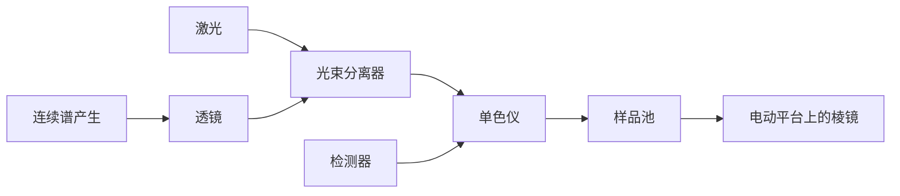
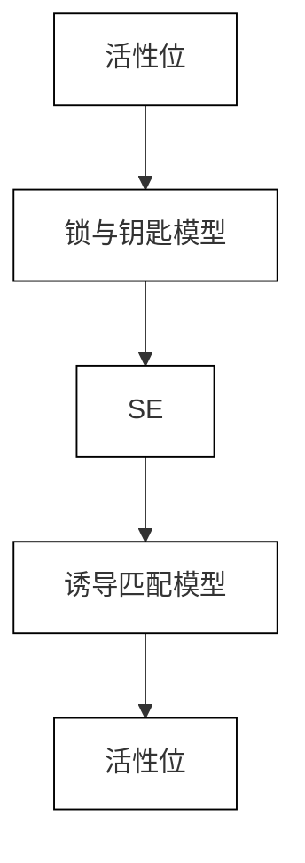

# 主题 17

# 化学动力学

本主题介绍“化学动力学”原理，即反应速率的研究。化学反应的速率依赖于可以控制的变量，如压力、温度及是否有催化剂，因而可以通过选择合适的条件优化反应速率。

# 17A 化学反应速率

本专题讨论反应速率的定义，并概述反应速率的测量技术。这些测量结果表明反应速率取决于反应物（有时是产物）的浓度和反应特征“速率常数”，这种相互依赖关系可以用微分方程来表示，称为“速率方程”。

17A.1 反应进程监测；17A.2 反应速率

# 17B 积分速率方程

“积分速率方程”是速率微分方程的解，用来预测反应开始后任一时刻物种的浓度，以及提供测量速率常数的步骤。本专题探究几个简单但实用的积分速率方程，它们将贯穿于本主题中。

17B.1 零级反应；17B.2 一级反应；17B.3 二级反应

# 17C 趋近平衡的反应

一般地，速率方程必须同时考虑正、逆向反应，并描述平衡（当正、逆向反应速率相等时）途径，分析结果为总过程的平衡常数与所提出机理中正、逆向反应速率常数之间的关系式，可通过实验来探究。

17C.1 趋于平衡的一级反应：17C.2 弛豫方法

# 17D 阿仑尼乌斯公式

大多数反应的速率常数随温度升高而增大。本专题介绍阿仑尼乌斯公式，其仅用可由实验测定的两个参数即准确描述了这种温度依赖性。

17D.1 温度对反应速率的影响；17D.2 阿仑尼乌斯参数的诠释

# 17E 反应机理

反应速率的研究也有助于对反应“机理”的理解。所谓机理，即一系列基元步骤。本专题展示如何从提出的反应机理建立速率方程。基元步骤本身具有简单的速率方程，通过利用反应的“速率控制步骤”概念，作“稳态近似”，或者假设“预平衡”的存在，它们可组合为总反应速率

方程。

17E.1 基元反应；17E.2 连续基元反应；17E.3 稳态近似；17E.4 速率控制步骤；17E.5 预平衡；17E.6 反应的动力学控制和热力学控制

# 17F 反应机理示例

本专题讨论三个反应机理示例。首先介绍气相反应中一类特殊反应，这类反应依赖于反应物之间的碰撞；其次，探讨聚合物的形成机制，阐明聚合物的生成动力学如何影响其性质；最后讨论生物催化剂“酶”的一般作用机理。

17F.1 单分子反应；17F.2 聚合反应动力学；17F.3 酶催化反应

# 17G 光化学

“光化学”研究由光引发的反应。本专题探究由吸收光子而形成的电子激发态分子的命运。一种可能的命运是能量转移到其他分子。这个过程特别令人关注，因为它是估算大分子中一些基团之间距离的方法基础。

17G.1 光化学过程：17G.2 初级量子产率；17G.3 激发单重态的衰变机制；17G.4 猝灭；17G.5 共振能量转移

# 网络资源 这部分内容有何应用？

植物、藻类、某些细菌物种已进化出能进行“光合成”的器官，可通过捕获可见光或近红外辐射来合成细胞中的复杂分子。“应用案例26”介绍了所涉及的反应步骤。

# 专题17A

# 化学反应速率

为何需要学习这部分内容？

对反应物消耗速率和产物生成速率的研究，不仅可预测反应混合物趋近平衡的快慢，也可获得反应物转变为产物的分子事件的详细描述。

核心思想是什么？

反应速率以速率方程表示。速率方程是以反应物浓度或在某些情况下以产物浓度表示的速率的经验总结。

需要哪些预备知识？

本专题是后续内容的基础，需要知道化学计量数的意义（见专题2C）。对于更多关于浓度的光谱测定的背景知识，参见专题11A。

化学动力学（chemical kinetics）研究反应速率。实验表明，反应速率以特定的方式依赖于反应物的浓度（某些情况下是产物浓度），这种特定方式可用微分方程，即“速率方程”来表达。

# 17A.1 反应进程监测

反应动力学分析的第一步是建立反应的计量方程和确定可能的副反应。化学动力学的基础数据是反应开始后，在不同时间反应物和产物的浓度。

# (a) 一般性原则

大多数化学反应的速率对温度敏感（详见专题17D），因此，通常实验时，反应混合物的温度在整个反应进程中都必须维持恒定。这对实验设计提出了严格的要求。例如，气相反应常在容器中进行，该容器与一大块金属接触。液相反应必须在有效的恒温器中进行。如果研究低温下进行的反应，如研究那些发生在星际云中的反应，还需特殊的技术，反应气体的超声波膨胀可被用来获得低至10 K的温度。对于在液相和固相的工作，常常通过在反应器周围通入流动的冷液体或冷气

体来获得极低温度。或者，将整个反应容器浸没于填充有低温冷冻液（如液氦，工作温度约4 K；或液氮，工作温度约77 K）的绝热容器中。有时也采用非恒温条件。比如，一种贵重药物的保存期限，或许可通过一个样本的缓慢升温来探究。

光谱被广泛用于反应动力学研究，而且当反应混合物中某种物质在电磁波谱通常易于达到的区域有很强的特征吸收时特别有用。例如，反应 $H_{2}(g)+Br_{2}(g)\longrightarrow2HBr(g)$ 的进程可通过测量 $Br_{2}(g)$ 在可见光区的吸收而被跟踪监测。溶液中发生的离子数或离子种类改变的反应，可通过监测溶液的电导率来跟踪。由离子型产物取代中性分子，能够引起电导率的巨大变化，如在反应 $(CH_{3})_{3}CCl(aq)+H_{2}O(l)\longrightarrow(CH_{3})_{3}COH(aq)+H^{+}(aq)+Cl^{-}(aq)$ 中，如果有氢离子生成或消耗，则可通过监测溶液pH跟踪反应。

测定组成的其他方法还包括发射光谱（专题11F）、质谱、气相色谱、核磁共振（专题12B和12C）和电子顺磁共振（对于涉及自由基或顺磁性d-金属离子的反应，专题12D）。若反应系统至少有一种组分是气体，则可能导致恒容系统中压力的总体改变，因此，其反应进程可通过记录压力随时间的变化来监测。

# 例题 17A.1 将总压变化与存在物种的分压相关联

对于分解反应 $N_{2}O_{3}(g)\rightarrow2NO_{2}(g)+\frac{1}{2}O_{2}(g)$ ，可通过测定在恒定温度下，恒容反应器中的总压力来监测反应进程。若反应开始时仅有反应物，初始压力为 $p_{0}$ ，反应进行到任一时刻系统总压为p，请导出用 $p_{0}$ 和p表示的反应系统中三个物种的分压表达式。

整理思路 可以假定气体服从完美气体行为，则气体的分压正比于其物质的量。然后，假设一定量的 $N_{2}O_{5}$ 发生了分解，则其分压从 $p_{0}$ 降至 $p_{0}-\Delta p$ 。因为1 mol $N_{2}O_{5}$ 分解产生2 mol $NO_{3}$ ，则 $NO_{2}$ 的分压从0升至 $2\Delta p$ ；类似地， $O_{2}$ 的分压从0升至 $\frac{1}{2}\Delta p$ ；而总压p为三组分分压之和。

解：列出下表：

<table><tr><td></td><td> $p_{N_2O_5}$ </td><td> $p_{NO_2}$ </td><td> $p_{O_2}$ </td><td>p</td></tr><tr><td>t=0</td><td> $p_0$ </td><td>0</td><td>0</td><td> $p_0$ </td></tr><tr><td>t=t</td><td> $p_0-\Delta p$ </td><td> $2\Delta p$ </td><td> $\frac{1}{2}\Delta p$ </td><td> $p_0+\frac{3}{2}\Delta p$ </td></tr><tr><td>相当于</td><td> $\frac{5}{3}p_0-\frac{2}{3}p$ </td><td> $\frac{4}{3}(p-p_0)$ </td><td> $\frac{1}{3}(p-p_0)$ </td><td></td></tr></table>

表中最后一行是根据总压 $p=p_{0}+\frac{3}{2}\Delta p$ ，改写为 $\Delta p=\frac{2}{3}(p-p_{0})$ ，然后代入中间一行而得到的。

说明 核对计算时注意到：当所有 $N_{2}O_{5}$ 被消耗掉时，其分压为0，这意味着 $\frac{5}{3}p_{0}-\frac{2}{3}p_{丝}=0$ ，因此 $p_{环}=\frac{5}{2}p_{0}$ 。该结果符合预期，因为1 mol $N_{2}O_{5}$ 被2 mol $NO_{2}$ 和 $\frac{1}{2}mol O_{2}$ 替代了：分子总量因而从1 mol 变成了 $2\frac{1}{2}mol$ ，导致压力增加为初始压力的 $2\frac{1}{2}=\frac{5}{2}$ 倍。

自测题17A.1 计算反应 $2\mathrm{NOBr(g)} \longrightarrow 2\mathrm{NO(g)} + \mathrm{Br}_{2}(\mathrm{g})$ 中各物种的分压，假定初始压力为 $p_{0}$ ，且只有 $NOBr_{0}$ 。

$$
d - d = \bar {z} _ {\text { 国 }} d ^ {*} (0, p _ {\mathrm{BC}}) = 0 \text {   国   } d z - 0 d \xi = \text { 国   } d
$$

# (b) 特殊技术

用于监测浓度的方法，取决于反应所涉及的物种及它们浓度变化的快慢。许多反应到达平衡所需时间为数分钟或数小时，因此可以用一些技术来跟踪浓度的变化。在实时分析（real-time analysis）中，系统的组成在反应过程中被分析，可以分取少量样品，或者监测体相溶液。

在流动法（flow method）中，当反应物一起流入反应室时彼此混合（图17A.1），随着完全混合的溶液流过出口管，反应持续进行。沿着管道的不同位置观测反应组成，就相当于在混合后的不同时间观察反应混合物。传统流动技术的不足之处是需要很大体积的反应物溶液。这使得快速反应的研究特别困难，因为要使反应通过一定长度的管道，流速必须很快。停流技术（stopped-flow technique）避免了上述不足，它可使反应试剂在一个很小的腔室内快速混合，该混合室配有一个可移动的活塞，此活塞取代了原来的输出管（图17A.2）。流体将活塞往回推，并且当它到达一终止处时停下来；而反应在混合溶液中继续进行。通常采用光谱技术，如紫外-可见吸收光谱和荧光发射光谱，来观察样品随时间的变化。这种技术可以研究发生在“毫秒”到“秒”时间尺度上的反应。停流法对小样本研究的适用性意味着它对许多生化反应也是适用的，故其已被广泛用于研究蛋白质折叠动力学和酶的作用。

![[mineru/物理化学/物理化学（第11版）第17 18 19章 728-858_images/cd3ae2e645d8cab16590aded9d28c535a592b2a8f7e8506912fdd3c1097678eb.jpg]]

text_image

驱动活塞
混合室
可移动光谱仪
固定光谱仪

图17A.1 流动法研究反应速率的装置示意图（反应物以稳定速率注入混合室。光谱仪的位置相当于反应开始后的不同时间）

![[mineru/物理化学/物理化学（第11版）第17 18 19章 728-858_images/4f354e0a618b2180634d3c30dcd091c9a11313f053feb7fb8c0c9507466d6002.jpg]]

flowchart

图17A.2 在停流技术中，反应试剂通过驱动活塞快速注入混合室，然后检测浓度的时间依赖性

非常快速的反应可以通过闪光光解（flash photolysis）技术来研究。样品首先暴露在一个短暂的闪光下，从而启动反应，然后利用电子吸收或发射光谱、红外吸收光谱或拉曼散射光谱检测反应室的组分。如图17A.3所示，一个强而短的激光脉冲，即泵，使分子A变为激发电子态 $A^{*}$ ，它可以辐射出一个光子（如荧光或磷光），或者与另一物种B反应，先生成中间物AB，然后再得到产物C；

$$
\mathrm{A} + h \nu \longrightarrow \mathrm{A} ^ {*} \quad (\text { 吸   收 })
$$

![[mineru/物理化学/物理化学（第11版）第17 18 19章 728-858_images/ebb95c8ef9be5d2772057f6eb5760d800cccaf3c9faebbf54768ca2fbd2b621d.jpg]]

flowchart

图17A.3 闪光光解装置示意图（相同的脉冲激光被用来产生单色的泵浦脉冲，以及经过连续谱产生，得到一“白色”光探针脉冲。在泵浦脉冲和探针脉冲之间的时间延迟可以改变）

$A^{*}\longrightarrow A$ (辐射)

$A^{*}+B\longrightarrow AB\longrightarrow C$ （反应）

各物种出现和消失的速率可通过观测反应进程中样品的吸收光谱随时间的变化来测定。该监测是这样进行的：将一白光的弱脉冲，即探针，在激光脉冲后的不同时间通过样品，脉冲的“白”光可以由激光脉冲通过连续谱产生（coutinuum generation）的现象直接产生；在连续谱产生中，将一短激光脉冲聚焦于蓝宝石或盛有水或四氯化碳的容器上，导致外出的光束具有很宽的频率分布。在强激光脉冲和“白”光脉冲间的时间延迟，可以通过允许一束光在到达样品之前行进一更长的距离来引入。例如，行进距离相差 $\Delta d=3\ mm$ ，对应于两束光之间的时间延迟 $\Delta t=\Delta d/c\approx10\ ps$ ，式中c为光速。图17A.3中的两束光行进的相对距离是通过将“白”光导向载有一对棱镜的电动平台来控制的。

与实时分析相反，淬灭法（quenching method）是基于反应在被允许进行一定时间后“淬灭”或停止。此法中，组成分析比较从容且反应中间体可被捕获。淬灭法仅适用于足够慢的反应，即在混合物淬灭的时间段内反应几乎不进行。在化学淬灭流动法（chemical quench flow method）中，反应物以与流动法中几乎相同的方法混合，但反应在混合物沿着出口管行进一固定长度之后，被另一种试剂（如酸或碱溶液）淬灭。通过改变沿着出口管的流速，可以选择不同的反应时间。与停流法相比，化学淬灭流动法的一个

优点是，无须快速的光谱法来测定反应物和产物的浓度。一旦反应被终止，溶液可采用“慢”技术（如质谱和色谱分析）来检测。在冷冻淬灭法（freeze quench method）中，通过在数毫秒内冷却混合物而使反应淬灭，而反应物、中间体和产物的浓度则由光谱法测定。

# 17A.2 反应速率

反应速率取决于反应混合物的组成和温度。以下内容将更为详细地探究这些观测结果。

# (a) 速率定义

考虑如下形式的反应： $A + 2B \longrightarrow 3C + D$ ，系统体积恒定。其中，在某一瞬间，任一参与物J的物质的量浓度为[J]，且反应物消耗或产物生成的瞬时速率（instantaneous rate）是其浓度随时间变化曲线上切线的斜率（表达为正值）。由此，在指定时间，某反应物的瞬时消耗速率（rate of consumption）为- $d[R]/dt$ ，其中R代表A或B，该速率为正值（图17A.4）；任一产物（C或D，记为P）的生成速率（rate of formation）为 $d[P]/dt$ （注意符号中的差别），该速率同样为正值。

由反应的化学计量方程A+2B $\longrightarrow$ 3C+D 可得

![[mineru/物理化学/物理化学（第11版）第17 18 19章 728-858_images/dd2295c122d7640db7cf700eb1fe883b353f938f76a061c8369f33d603e7b608.jpg]]

line

| 时间, t | 物质的量浓度, [J] (a) 切线, 速率 = 斜率 | 物质的量浓度, [J] (b) 切线, 速率 = -斜率 |
| ------- | ----------------------------------- | ------------------------------------ |
| 0       | 1                                   | 0                                    |
| t       | 转移方向 (斜率)                  | 转移方向 (斜率)                  |
| t       | 0.5                                 | 0.25                                 |
| t       | 1                                   | 0.5                                  |

图17A.4（瞬时）速率定义为（a）产物和（b）反应物的浓度随时间变化的曲线上某时刻切线的斜率（对于负斜率，表示速率时需要改变符号，故所有反应速率均为正值）

$$
\frac {\mathrm{d} [ \mathrm{D} ]}{\mathrm{d} t} = \frac {1}{3} \frac {\mathrm{d} [ \mathrm{C} ]}{\mathrm{d} t} = - \frac {\mathrm{d} [ \mathrm{A} ]}{\mathrm{d} t} = - \frac {1}{2} \frac {\mathrm{d} [ \mathrm{B} ]}{\mathrm{d} t}
$$

这样就有几个速率与该反应相关。为了避免描述同一反应时有不同的反应速率所带来的不便，引进反应进度（extent of reaction） $\xi$ ，其定义为：对反应系统中任一物种J，其物质的量的变化 $dn_{j}$ 为

$$
\mathrm{d} n _ {1} = v _ {1} \mathrm{d} \xi
$$

反应进度
[定义]

(17A.1)

式中 $v_{1}$ 是物种的化学计量数（专题2C；谨记 $v_{1}$ 对反应物取负数，对产物取正数）。则唯一的反应速率（rate of reaction）v，定义为

$$
v = \frac {1}{V} \frac {\mathrm{d} \xi}{\mathrm{d} t}
$$

反应速率
[定义]

(17A.2)

式中 V 是系统的体积。对任一物种 J， $d\xi = dn_{1}/v_{1}$ ，所以

$$
\nu = \frac {1}{\nu_ {1}} \times \frac {1}{V} \frac {\mathrm{d} n _ {1}}{\mathrm{d} t} \tag {17A.3a}
$$

对于等容条件下的均相反应系统，体积 V 可以放入微分，且 $n_{f}/V$ 可以写作物质的量浓度 [J]，从而得到

$$
\nu = \frac {1}{v _ {1}} \frac {\mathrm{d} [ J ]}{\mathrm{d} t} \tag {17A.3b}
$$

对于多相反应，用物种所占据的(恒定)表面积A来代替体积V。因为表面浓度是 $\sigma_{1}=n_{1}/A$ ，所以有

$$
\nu = \frac {1}{v _ {1}} \frac {\mathrm{d} \sigma_ {1}}{\mathrm{d} t} \tag {17A.3c}
$$

现在，对于反应（针对所写的化学方程式），在每种情况下，都只有一种速率。当物质的量浓度单位为 $mol\cdot dm^{-3}$ 、时间单位为s时，均相反应的反应速率单位为 $mol\cdot dm^{-3}\cdot s^{-1}$ 或其他相关单位。对于气相反应，如那些发生在常压下的反应，浓度常表示为“分子·cm $^{-3}$ ”，速率表示为“分子·cm $^{-3}\cdot s^{-1}$ ”。对于多相反应，速率单位为“mol·m $^{-2}\cdot s^{-1}$ ”或其他相关单位。

# 简要说明17A.1

在反应 $2\mathrm{NOBr(g)} \longrightarrow 2\mathrm{NO(g)} + \mathrm{Br}_2(\mathrm{g})$ 中，若NO的生成速率 $\mathrm{d[NO] / dt = 0.16mmol\cdot dm^{-3}\cdot s^{-1}}$ ，则由于 $v_{\mathrm{NO}} = 2$ ，故反应速率 $v=\frac{1}{2}d[NO]/dt=0.080\ mmol\cdot dm^{-3}\cdot s^{-1}$ 。因为 $v_{NOBr}=-2$ ，所以反应速率也可以用[NOBr]写作 $v=-\frac{1}{2}d[NOBr]/dt$ 。因此， $d[NOBr]/dt=-2v=-0.16\ mmol\cdot dm^{-3}\cdot s^{-1}$ 。即NOBr的消耗速率为 $0.16\ mmol\cdot dm^{-3}\cdot s^{-1}$ ，或者 $9.6\times10^{16}$ 分子 $\cdot cm^{-3}\cdot s^{-1}$ 。

# (b) 速率方程与速率常数

研究发现，反应速率常常与反应物浓度的幂次方乘积成正比。例如，反应速率可能与两种反应物 A 和 B 的物质的量浓度成正比，即

$$
\nu = k _ {\mathrm{r}} [ \mathrm{A} ] [ \mathrm{B} ] \tag {17A.4}
$$

比例系数 $k_{r}$ 称为该反应的速率常数（rate constant），其与浓度无关，但依赖于反应温度。这种由实验测定的方程称为反应的速率方程（rate law）。更为正式地，速率方程是表述在某感兴趣的时间、根据总的化学方程式中所有物种物质的量浓度表示反应速率的方程，有

$$
\nu = f ([ \mathrm{A} ], [ \mathrm{B} ], \dots) \quad \text {   由物质的量浓度表示的速率方程   } \tag {17A.5a}
$$

对于均相气相反应，利用分压表达速率方程通常更为方便。对于完美气体，分压与其物质的量浓度成正比，关系为 $p_{1}=RT[J]$ 。此时，有

$$
\nu = f \left(p _ {A}, p _ {B}, \dots\right) \quad \text {由分压表示的速率方程} \tag {17A.5b}
$$

反应速率方程是由实验测定的，通常不能由反应的化学方程式得出。例如，氢气与溴的反应，其计量式非常简单，即 $H_{2}(g)+Br_{2}(g)\longrightarrow2HBr(g)$ ，但其速率方程相当复杂：

$$
\nu = \frac {k _ {\mathrm{a}} [ \mathrm{H} _ {2} ] [ \mathrm{Br} _ {2} ] ^ {3 / 2}}{[ \mathrm{Br} _ {2} ] + k _ {\mathrm{b}} [ \mathrm{HBr} ]} \tag {17A.6}
$$

在某些情况下，速率方程确实反映了反应的计量关系，但那或者是巧合，或者是反映了潜在反应机理的特征（专题17E）。

实用小贴士 通常反应速率常数表示为 $k_{r}$ ，以区别于玻耳兹曼常数k。有些教材中，用k来表示前者，而用 $k_{B}$ 表示后者。当在一个复杂的速率方程[如式（17A.6）]中表示速率常数时，我们会使用 $k_{a}$ 、 $k_{b}$ 等。

$k_{r}$ 的单位总是如此转换浓度的乘积，即每个浓度带有各自合适的幂次方，以便使速率表示为浓度的变化除以时间的变化，如式（17A.4）显示的速率方程，若浓度单位为 $mol \cdot dm^{-3}$ ，则 $k_{r}$ 的单位为 $dm^{3} \cdot mol^{-1} \cdot s^{-1}$ 。因为

$$
\overbrace {\mathrm{dm} ^ {3} \cdot \mathrm{mol} ^ {- 1} \cdot s ^ {- 1}} ^ {k _ {0}} \times \overbrace {\mathrm{mol} \cdot \mathrm{dm} ^ {- 3}} ^ {[ A ]} \times \overbrace {\mathrm{mol} \cdot \mathrm{dm} ^ {- 3}} ^ {[ B ]} = \mathrm{mol} \cdot \mathrm{dm} ^ {- 3} \cdot s ^ {- 1}
$$

这就是速率v的单位。如果浓度表示为分子·cm $^{-3}$ ，速率单位为分子·cm $^{-3}$ ·s $^{-1}$ ，那么速率常数的单位为cm $^{3}$ ·分子 $^{-1}$ ·s $^{-1}$ 。该方法可用来确定任何形式的速率方程中速率常数的单位。

# 简要说明 17A.2

298 K 时，反应 $O(g) + O_{3}(g) \longrightarrow 2O_{2}(g)$ 的速率常数为 $8.0 \times 10^{-15} cm^{3} \cdot 分子^{-1} \cdot s^{-1}$ 。为了将速率常数表示为 $dm^{3} \cdot mol^{-1} \cdot s^{-1}$ ，可利用关系式 $1 cm = 10^{-1} dm$ 来变换体积，即

$$
\begin{array}{l} k _ {r} = 8. 0 \times 1 0 ^ {- 1 5} \quad \overbrace {\mathrm{cm} ^ {3}} ^ {(1 0 ^ {- 1} \mathrm{dm}) ^ {7}} \cdot \text {分子} ^ {- 1} \cdot s ^ {- 1} \\ = 8. 0 \times 1 0 ^ {- 1 6} \mathrm{dm} ^ {3} \cdot \text {分子} ^ {- 1} \cdot \mathrm{s} ^ {- 1} \\ \end{array}
$$

现在注意，通过分子数除以阿伏加德罗常数（ $6.022 \times 10^{-11}$ 分子·mol $^{-1}$ ），可将分子数表示为物质的量：

$$
\begin{array}{l} k _ {r} = 8. 0 \times 1 0 ^ {- 1 8} \mathrm{dm} ^ {3} \cdot \text {分子} ^ {- 1} \cdot \mathrm{s} ^ {- 1} \\ = 8. 0 \times 1 0 ^ {- 1 9} \mathrm{dm} ^ {- 1} \times \left(\frac {1 \text {分子}}{6 . 0 2 2 \times 1 0 ^ {2 3} \text {分子} \cdot \mathrm{mol} ^ {- 1}}\right) ^ {- 3} \mathrm{s} ^ {- 1} \\ = 8. 0 \times 1 0 ^ {- 1 0} \times 6. 0 2 2 \times 1 0 ^ {2 3} \mathrm{dm} ^ {3} \cdot \mathrm{mol} ^ {- 1} \cdot \mathrm{s} ^ {- 1} \\ = 4. 8 \times 1 0 ^ {6} \mathrm{dm} ^ {3} \cdot \mathrm{mol} ^ {- 1} \cdot \mathrm{s} ^ {- 1} \\ \end{array}
$$

速率方程的一个实际应用是指，一旦知道了方程的具体形式和速率常数的值，那就可能通过混合物的组成来预测反应速率。而且，如专题17B所述，知道了速率方程，也可以预测反应开始后某一时刻反应混合物的组成。速率方程还可提供用于评价所提出的反应机理合理性的证据。此应用在专题17E中展开。

# (c) 反应级数

研究发现，很多反应具有以下形式的速率方程：

$$
\nu = k _ {r} [ \mathrm{A} ] ^ {\prime \prime} [ \mathrm{B} ] ^ {b} \dots \tag {17A.7}
$$

速率方程中某物种（产物或反应物）浓度的幂次方称为反应相对于该物种的级数（order）。若速率方程为式(17A.4)，则反应对A为一级，对B为

一级。若速率方程为式(17A.7)，则反应的总级数（overall order）是各分级数之和，即 $a+b+\cdots$ 。式（17A.4）中速率方程的总级数是 $1+1=2$ ，因此该速率方程也称为总的二级。

一个反应的级数并不一定是整数，很多气相反应就是如此。例如，某反应有如下速率方程：

$$
\nu = k _ {r} [ \mathrm{A} ] ^ {1 / 2} [ \mathrm{B} ] \tag {17A.8}
$$

反应对 A 为 0.5 级，对 B 为一级，总级数为 1.5。

# 简要说明17A.3

实验测定气相反应 $H_{2}(g)+Br_{2}(g)\longrightarrow2HBr(g)$ 的速率方程由式（17A.6）给出。在速率方程中 $H_{2}$ 浓度显示+1次幂，因此反应对 $H_{2}$ 为一级。而 $Br_{2}$ 和HBr的浓度并不以浓度某个幂次的单个项出现，所以反应对 $Br_{2}$ 和HBr没有明确的级数，故总级数也不明确。

有些反应服从零级速率方程，因此速率与反应物浓度无关（只要有反应物存在）。例如，磷化氢（ $\mathrm{PH}_3$ ）在高压下于热钨表面的催化分解有如下速率方程：

$$
v = k _ {r} \tag {17A.9}
$$

这意味着 $PH_{3}$ 以恒定速率分解，直至其完全消失。

由 “简要说明 17A.3” 可见，当速率方程不是式（17A.7）的形式时，反应没有总级数，甚至可能对每一个参与物都没有确定的级数。

这些说明指出了三个重要的任务：

- 根据实验数据确定速率方程、获得速率常数，这些内容在本专题讨论；  
- 解释速率常数的数值及其与温度的关系，有关内容在专题17D讨论；  
- 建立符合速率方程的反应机理，相关技术在专题17E中介绍。

# (d) 速率方程的确定

速率方程的确定可通过隔离法（isolation method）简化。隔离法是指除一种反应物外，其他反应物均大大过量。速率与每个反应物的关系可以通过依次隔离每一个反应物（其他物质大大过量）来获得，从而拼凑出总反应速率方程的完整图像。

如果反应物B大大过量，则在反应全过程中其浓度可近似为常数。那么，尽管真实的速率方程可能是 $v=k_{r}[A][B]^{2}$ ，任意时间浓度[B]的值可以近似用其初始浓度 $[B]_{0}$ 代替（因为在反应过程中[B]几乎不变），则有

$$
\nu = k _ {r, \text { eff }} [ \mathrm{A} ] \quad k _ {r, \text { eff }} = k _ {r} [ \mathrm{B} ] _ {0} ^ {2} \quad \text {   键一倍反应，   } \tag {17A.10a}
$$

因为真实速率方程在假设[B]为常数时被迫成为一级形式，有效的速率方程归类为假一级速率方程（pseudofirst-order rate law）， $k_{r,eff}$ 称为对于给定的[B]固定的有效速率常数（effective rate constant）。类似地，如果A的浓度大大过量，同样实际上不变，则原始速率方程简化为

$$
\nu = k _ {r, \mathrm{eff}} ^ {\prime} [ \mathrm{B} ] ^ {2} \quad k _ {r, \mathrm{eff}} ^ {\prime} = k _ {r} [ \mathrm{A} ] _ {0} \quad \text {   假二级反应，   } (1 7 \mathrm{A}. 1 0 \mathrm{b})
$$

这个假二级速率方程比完整的速率方程更容易进行分析和鉴定。注意：反应级数和有效速率常数的形式根据究竟A或B过量而有所改变。相似地，反应也有可能显示为零级。许多在水溶液中进行的反应被报道为一级或二级，实际上是假一级或假二级：如溶剂水，可能参加了反应，但因其大大过量，故浓度保持不变。

初始速率法（method of initial rates）常常与隔离法结合使用。在反应开始时，针对隔离反应物的几个不同初始浓度，测定反应的瞬时速率。如果隔离反应物A的浓度增加一倍，初始速率增大了一倍，则反应对A为一级；若初始速率增大了四倍，则反应对A为二级。更正式地，为确定级数可考虑发展一种图解的方法，假定对隔离反应物A，某反应的速率方程为

$$
\nu = k _ {r} [ \mathrm{A} ] ^ {a}
$$

那么，反应的初始速率 $v_{0}$ 可由A的初始浓度给出：

$$
\nu_ {0} = k _ {\mathrm{r,eff}} [ \mathrm{A} ] _ {0} ^ {a} \quad \text {一个} a \text {吸反应的初始速率} \tag {17A.11a}
$$

取（常用）对数，有

$$
\begin{array}{r l} \lg v _ {0} & = \lg (k _ {\mathrm{r,eff}} [ \mathrm{A} ] _ {0} ^ {\alpha}) = \lg k _ {\mathrm{r,eff}} + \lg [ \mathrm{A} ] _ {0} ^ {\alpha} \\ & = \lg k _ {\mathrm{r,eff}} + a \lg [ \mathrm{A} ] _ {0} \end{array} \tag {17A.11b}
$$

上式具有直线方程的形式：

$$
\overbrace {\lg v _ {0}} ^ {y} = \overbrace {\lg k _ {r , \mathrm{eff}}} ^ {\text {截距}} + \overbrace {a \lg [ \mathrm{A} ] _ {0}} ^ {\text {斜率} \times x} \tag {17A.11c}
$$

由此，对于一系列初始浓度，将初始速率的对数对A的初始浓度的对数作图，应得一条直线，直线的斜率为a，即反应对A的级数。

# 例题 17A.2 使用初始速率法

研究了在氩存在下、气相中I原子的复合，反应级数采用初始速率法测定。反应 $2\mathrm{I}(\mathrm{g})+\mathrm{Ar}(\mathrm{g})\longrightarrow\mathrm{I}_{2}(\mathrm{g})+\mathrm{Ar}(\mathrm{g})$ 的初始速率如下：

$$
\begin{array}{l} \left[ \mathrm{I} \right] _ {0} / \left(1 0 ^ {- 3} \mathrm{mol} \cdot \mathrm{dm} ^ {- 2}\right) \quad 1. 0 \quad 2. 0 \quad 4. 0 \quad 6. 0 \\ \nu_ {o} / (\mathrm{mol} \cdot \mathrm{dm} ^ {- 3} \cdot \mathrm{s} ^ {- 1}) \quad (\mathrm{a}) 8. 7 0 \times 1 0 ^ {- 4} 3. 4 8 \times 1 0 ^ {- 5} 1. 3 9 \times 1 0 ^ {- 2} 3. 1 3 \times 1 0 ^ {- 2} \\ 4. 3 5 \times 1 0 ^ {- 1} 1. 7 4 \times 1 0 ^ {- 2} 6. 9 6 \times 1 0 ^ {- 2} 1. 5 7 \times 1 0 ^ {- 1} \\ (c) 8. 6 9 \times 1 0 ^ {- 3} 3. 4 7 \times 1 0 ^ {- 2} 1. 3 8 \times 1 0 ^ {- 1} 3. 1 3 \times 1 0 ^ {- 1} \\ \end{array}
$$

Ar浓度分别为：(a) $1.0\times10^{-3}$ mol·dm $^{-3}$ ，(b) $5.0\times10^{-3}$ mol·dm $^{-3}$ ，(c) $1.0\times10^{-2}$ mol·dm $^{-3}$ 。试求反应对1和Ar的级数，以及速率常数。

整理思路 需要确定数据组，在每一组中只有一种反应物是变化的（如对每一行数据，[Ar]为定值）。从这样的数据判定级数涉及式（17A.11c）的应用，以速率的对数对反应物之一（本例中选择I）的浓度的对数作图。这样，在固定 $[\mathrm{Ar}]_{0}$ 时（即对应每一行数据），将[I]和相应速率的数值取对数、列表、绘图，斜率给出对应[I]的级数， $\lg [1]_0 = 0$ 时的截距给出 $\lg k_{r,eff}$ 的值（对每个 $[\mathrm{Ar}]_0$ 有不同的数值）。通过这种方法得到的有效速率常数实际是 $k_{r,eff} = k_r[\mathrm{Ar}]_0^b$ ，为了提取 $k_{r}$ 和 $b$ ，取对数如下，可得

$$
\lg k _ {r, \text { eff }} = \lg k _ {r} + b \lg [ \mathrm{Ar} ] _ {0}
$$

由此，需要将解的第一部分中获得的 $\lg k_{\mathrm{r,eff}}$ 对 $\lg [\mathrm{Ar}]_0$ 作图，斜率给出 $b$ 值， $\lg [\mathrm{Ar}]_0 = 0$ 时的截距给出 $\lg k_{\mathrm{r}}$ 值。

解：由数据给出下列作图点：

$$
\begin{array}{l} \lg [ [ \mathrm{I} ] _ {a} / (\mathrm{mol} \cdot \mathrm{dm} ^ {- 1}) ] \quad - 5. 0 0 \quad - 4. 7 0 \quad - 4. 4 0 \quad - 4. 2 2 \\ \left. \lg \left[ v _ {0} / (\mathrm{mol} \cdot \mathrm{dm} ^ {- 3} \cdot \mathrm{s} ^ {- 1}) \right] (a) - 3. 0 6 0 - 2. 4 5 8 - 1. 8 5 7 - 1. 5 0 4 \right. \\ \text {(b)} - 2. 3 6 2 \quad - 1. 7 5 9 \quad - 1. 1 5 7 \quad - 0. 8 0 4 \\ (c) - 2. 0 6 1 - 1. 4 6 0 - 0. 8 6 0 - 0. 5 0 4 \\ \end{array}
$$

维持[Ar]不变，改变[I]，所得数据作图，如图17A.5（a）所示。直线斜率为2，所以反应对I为二级。有效速率常数 $k_{r,eff}$ 如下：

![[mineru/物理化学/物理化学（第11版）第17 18 19章 728-858_images/347be4d62302bb048be1eb18e3841a2771b9ba575aca7f5d9cdabf3818918184.jpg]]

line

| lg[[I]₀/(mol·dm⁻³)] | lg[ν₀/(mol·dm⁻³·s⁻¹)] |
| ------------------- | ---------------------- |
| -5.0                | -2.8                   |
| -4.8                | -2.0                   |
| -4.6                | -1.2                   |
| -4.4                | -0.4                   |
| -4.2                | 0.0                    |
| -4.0                | 0.0                    |

(a)   
![[mineru/物理化学/物理化学（第11版）第17 18 19章 728-858_images/941bebff97cf4ca53e86cf06bc1b6def037529a7fbd957878dac388adbc1072f.jpg]]

line

| lg[[Ar]₀/(mol·dm⁻³)] | lg[k₁st]/(dm³·mol⁻¹·s⁻¹) |
| --------------------- | -------------------------- |
| -3.0                  | 7.0                        |
| -2.4                  | 7.6                        |
| -2.0                  | 7.9                        |

(b)

图17A.5 例题17A.2中的数据分析。(a)用来获得I的级数的作图。 $\lg[\mathrm{I}]_{n}=0$ 时的截距距离右边很远，故显示在插图中。(b)用来获得Ar的级数和速率常数 $k_{i}$ 的作图。 $\lg[\mathrm{Ar}]_{n}=0$ 时的截距距离右边很远，故显示在插图中

<table><tr><td> $\left\lbrack {\mathrm{{Ar}}}\right\rbrack _{0}/\left( {\mathrm{{mol}} \cdot  {\mathrm{{dm}}}^{-3}}\right)$ </td><td> ${1.0} \times  {10}^{-3}$ </td><td> ${5.0} \times  {10}^{-3}$ </td><td> ${1.0} \times  {10}^{-2}$ </td></tr><tr><td> $\lg \left\lbrack {\left\lbrack {\mathrm{{Ar}}}\right\rbrack  }_{0}/\left( {\mathrm{{mol}} \cdot  {\mathrm{{dm}}}^{-3}}\right) \right\rbrack$ </td><td>-3.00</td><td>-2.30</td><td>-2.00</td></tr><tr><td> $\lg \left| {{k}_{\text{ref }}/\left( {{\mathrm{{dm}}}^{3} \cdot  {\mathrm{{mol}}}^{-1} \cdot  {\mathrm{s}}^{-1}}\right) }\right|$ </td><td>6.94</td><td>7.64</td><td>7.93</td></tr></table>

图17A.5（b）展示了 $\lg [k_{\mathrm{eff}} / (\mathrm{dm}^3\cdot \mathrm{mol}^{-1}\cdot \mathrm{s}^{-1})]$ 对 $\lg [[\mathrm{Ar}]_0 / (\mathrm{mol}\cdot \mathrm{dm}^{-1})]$ 作图的结果。斜率为1，故 $b = 1$ ，反应对Ar为一级。当 $\lg [[\mathrm{Ar}]_0 / (\mathrm{mol}\cdot \mathrm{dm}^{-1})] = 0$ 时，截距 $\lg [k_{\mathrm{eff}} / (\mathrm{dm}^3)$

$\left.\mathrm{mol}^{-1}\cdot\mathrm{s}^{-1}\right|=9.94$ ，因此， $k_{v}=8.7\times10^{9}\mathrm{dm}^{6}\cdot\mathrm{mol}^{-2}\cdot\mathrm{s}^{-1}$ 。总的反应（初始）速率方程为 $v=k_{v}[I]_{0}^{2}[Ar]_{0}$ 。

实用小贴士 当对形式为 $x.xx \times 10^{n} (n < 10)$ 的数字取常用对数时，结果保留四位有效数字[如 $\lg (1.23 \times 10^{4}) = 4.090$ ]：小数点前面的数字仅仅是10的幂次。相反地，如果对y, yyy取10的反对数，结果只保留三位有效数字（如 $10^{3.678} = 4.76 \times 10^{5}$ ）。

自测题17A.2 某一反应的初始速率随物质J的浓度而变化，如下所示：

<table><tr><td> $[J]_0/(10^{-3} \text{ mol} \cdot \text{dm}^{-3})$ </td><td>5.0</td><td>10.2</td><td>17</td><td>30</td></tr><tr><td> $v_0/(10^{-3} \text{ mol} \cdot \text{dm}^{-3} \cdot \text{s}^{-2})$ </td><td>3.6</td><td>9.6</td><td>40</td><td>130</td></tr></table>

试确定反应对J的级数和速率常数。

答案：2.16×10 $^{-3}$ dm $^{3}$ ·mol $^{-1}$ ·s $^{-1}$ 。

初始速率法可能不能揭示全部的速率规律，因为一旦有产物开始生成，它们会参与反应并影响速率。例如，在 $H_{2}$ 和 $Br_{2}$ 的反应中，式（17A.6）中的速率方程显示速率与HBr的浓度有关。为了避免类似困难，速率方程应针对整个反应的数据进行拟合。拟合方法是，至少在简单情形下，通过采用一个提议的速率方程预测任一组分在任何时间的浓度，并与数据比较；基于此步骤的方法在专题17B中描述。速率方程还应该通过观察是否有产物的添加，或者对于气相反应，反应室中表面/体积比的改变是否影响反应速率来测试。

# 概念清单

☐ 1. 化学反应速率是利用各种技术监测存在于反应混合物中物种的浓度来测定的。实例包括实时和淬灭步骤、流动和停流技术，以及闪光光解技术。  
2. 反应物消耗和产物生成的瞬时速率是浓度 - 时间曲线上某点切线的斜率（表示为正值）。  
3. 反应速率是依据反应进度定义的，采用此定义，

其值与物种的选择无关。

☐ 4. 速率方程是用出现在整个化学反应中的物种浓度变化表示反应速率的一种表达式。  
5. 反应级数是速率方程中参与物浓度的幂指数，总级数是这些指数之和。

公式清单

<table><tr><td>性质</td><td>公式</td><td>说明</td><td>公式编号</td></tr><tr><td rowspan="2">反应速率</td><td> $\nu = (1/V)(d\xi/dt)$ </td><td>定义</td><td>17A.2</td></tr><tr><td> $\nu = (1/\nu_{\mathrm{f}})(d[J]/dt)$ </td><td>等容系统</td><td>17A.3b</td></tr><tr><td>速率方程(有些情况下)</td><td> $\nu = k_{\mathrm{r}}[\mathrm{A}]^{a}[\mathrm{B}]^{b}\cdots$ </td><td> $a, b, \cdots$ :级数; $a + b + \cdots$ :总级数</td><td>17A.7</td></tr><tr><td>初始速率法</td><td> $\lg \nu_{0} = \lg k_{\mathrm{r,eff}} + a \lg [\mathrm{A}]_{0}$ </td><td>隔离反应物A</td><td>17A.11c</td></tr></table>

# 专题17B

# 积分速率方程

为何需要学习这部分内容？

当反应趋于平衡时，如果想预测反应混合物的组成，就需要积分速率方程。积分速率方程也是确定反应级数和速率常数的基础，这是构想反应机理的必要步骤。

核心思想是什么？

速率方程是微分方程，通过积分速率方程可得到反应物和产物的浓度是如何随时间变化的。

需要哪些预备知识？

需要熟悉速率方程、反应级数和速率常数等概念（专题 17A）。简单速率方程的处理只要求初级积分技能（有关标准积分请参见资源部分）。

速率方程（专题17A）是微分方程，通过积分可以预测反应物和产物的浓度是如何随时间变化的。即便是最复杂的速率方程，也可以数学积分。然而，在大量简单情况下，解析式（称为积分速率方程，integrated rate law）容易获得且被证明非常有用。

![[mineru/物理化学/物理化学（第11版）第17 18 19章 728-858_images/c0dcd5a120b2aba4b4b8f10c2417b05c6dfa7caf692e1a86be4df843fb87ec45.jpg]]

line

| 时间, t | (A)/(A)₀ |
| ------- | -------- |
| 0       | 1        |
| t₁      | 0.5      |
| t₂      | 0        |

图17B.1 零级反应中反应物的线性衰减

# 17B.1 零级反应

对于A $\longrightarrow$ P类型的零级反应，速率为常数（只要有反应物存在），故

$$
\frac {\mathrm{d} [ \mathrm{A} ]}{\mathrm{d} t} = - k _ {r}
$$

据此，A的浓度变化可简单表示为其消耗速率（为 $-k_{r}$ ）乘以反应时间(t)，即

$$
[ \mathrm{A} ] - [ \mathrm{A} ] _ {0} = - k, t
$$

式中[A]为反应物A在t时刻的浓度，[A]。为反应物A的初始浓度。该表达式可重排为

$$
[ \mathrm{A} ] = [ \mathrm{A} ] _ {0} - k _ {\mathrm{r}} t \quad \text {零摇反应速率方程的积分式} \tag {17B.1}
$$

该式适用于所有反应物被耗尽之前，即 $t = [A]_{0}/k_{r}$ 。此后， $[A] = 0$ （图 17B.1）。

# 17B.2 一级反应

考虑一级反应速率方程：

$$
\frac {\mathrm{d} [ \mathrm{A} ]}{\mathrm{d} t} = - k _ {r} [ \mathrm{A} ] \tag {17B.2a}
$$

该方程可被积分，从而显示反应物 A 的浓度如何随时间变化。

# 如何完成？17B.1 导出一级反应速率方程的积分式

首先，将式（17B.2a）重排为

$$
\frac {\mathrm{d} [ \mathrm{A} ]}{[ \mathrm{A} ]} = - k _ {r} \mathrm{d} t
$$

应明确 $k_{t}$ 是与t无关的常数。反应开始（t=0）时，A的浓度为 $[A]_{0}$ ；反应一段时间（t=t）后，A的浓度为[A]。

将这些数值与积分上、下限对应，写作

$$
\int_ {[ A ] _ {0}} ^ {[ A ]} \frac {\mathrm{d} [ A ]}{[ A ]} = - k _ {r} \int_ {0} ^ {t} \mathrm{d} t
$$

因为 1/x 的积分是 $\ln x +$ 常数，上式左边可以表示为

$$
\overbrace {\int_ {[ A ] _ {0}} ^ {[ A ]} \frac {d [ A ]}{[ A ]}} = \ln [ A ] + \text {常数} \Big | _ {[ A ] _ {0}} ^ {[ A ]} = \ln [ A ] - \ln [ A ] _ {0} = \ln \frac {[ A ]}{[ A ] _ {0}}
$$

右边积分为 $-k_{i}t$ ，则

$$
- \left| \ln \frac {[ \mathrm{A} ]}{[ \mathrm{A} ] _ {0}} = - k, t \quad [ \mathrm{A} ] = [ \mathrm{A} ] _ {0} \mathrm{e} ^ {- k t} \right| _ {\text {一级反应速率方程的积分式}} (1 7 B. 2 b)
$$

式（17B.2b）表明，如果以 $\ln([A]/[A]_{0})$ 对t作图，一级反应会给出一条斜率为 $-k_{r}$ 的直线。采用该法测定的一些速率常数列于表17B.1。式（17B.2b）中的第二个表达式表明：在一级反应中，反应物浓度随时间呈指数下降，下降速率由 $k_{r}$ 决定（图17B.2）。

表17B.1 一级反应的动力学数据

<table><tr><td>反应</td><td>相态</td><td> $\theta / ^{\circ}C$ </td><td> $k_{p}/s^{-1}$ </td><td> $t_{1/2}$ </td></tr><tr><td rowspan="2"> $2N_{2}O_{5} \longrightarrow 4NO_{2} + O_{2}$ </td><td>g</td><td>25</td><td> $3.38\times 10^{-5}$ </td><td>5.70 h</td></tr><tr><td>Br2(l)</td><td>25</td><td> $4.27\times 10^{-5}$ </td><td>4.51 h</td></tr><tr><td> $C_{2}H_{6} \longrightarrow 2CH_{3}$ </td><td>g</td><td>700</td><td> $5.36\times 10^{-4}$ </td><td>21.6 min</td></tr></table>

\*更多的数据参见资源部分。

![[mineru/物理化学/物理化学（第11版）第17 18 19章 728-858_images/02633c6bd2c612c1dfc9ad8e2f7cba289385e687233f32e608eedd3871d40b11.jpg]]

line

| k_r,t | k_r,t (k_r,t) | k_r,t (k_r,t) |
|-------|---------------|---------------|
| 0     | 1.0           | 1.0           |
| 1     | ~0.4          | ~0.1          |
| 2     | ~0.2          | ~0.05         |
| 3     | ~0.1          | ~0.02         |

图 17B.2 一级反应中反应物的指数衰减，速率常数越大，衰减越快。此图中， $k_{i,\text{总}} = 3k_{i,\text{总}}$

式（17B.2）中的积分速率方程也可以用产物P的浓度来表示。注意到对于反应A→P，产物P的浓度增加与反应物A的浓度降低相匹配。假设反应开始时没有产物P（只有反应物），那么 $[P]=[A]_{0}+[A]$ ，则 $[A]=[A]_{0}+[P]$ 。这个A的浓度表达式可代入式（17B.2b）中，得到

$$
\ln \frac {[ \mathrm{A} ] _ {0} - [ \mathrm{P} ]}{[ \mathrm{A} ] _ {0}} = - k _ {t} t \quad [ \mathrm{P} ] = [ \mathrm{A} ] _ {0} (1 - e ^ {- k _ {t} t}) \tag {17B.2c}
$$

一级化学反应速率的一个有用的指示是物质的半衰期（half-life） $t_{1/2}$ ，即某反应物浓度降低至其初始浓度的一半时所需的时间。这个量可以通过积分速率方程得到。一级反应中A的浓度从初始浓度 $[A]_{0}$ 降至 $\frac{1}{2}[A]_{0}$ 时所需时间可由式（17B.2b）给出：

$$
k _ {r} t _ {1 / 2} = - \ln \frac {\frac {1}{2} [ \mathrm{A} ] _ {0}}{[ \mathrm{A} ] _ {0}} = - \ln \frac {1}{2} = \ln 2
$$

因此，有

$$
t _ {1 / 2} = \frac {\ln 2}{k _ {r}} \quad \text {手查期} [ \text {一般反应} ] \tag {17B.3}
$$

（注： $\ln2=0.693$ ）。）该结果主要指出，对于一级反应，反应物的半衰期与其初始浓度无关。因此，如果在任意时刻反应物A的浓度为[A]，那么它再经历另一个时间间隔 $(\ln2)/k_{t}$ 后浓度将降为 $\frac{1}{2}[A]$ 。表17B.1中给出了一些半衰期数据。

# 例题 17B.1 分析一级反应

600 K时，测得偶氮甲烷分压随时间的变化，结果如下。证实分解反应 $CH_{3}N_{2}CH_{3}(g)\longrightarrow CH_{3}CH_{3}(g)+N_{2}(g)$ 对偶氮甲烷为一级，并计算600 K时的速率常数和半衰期。

$$
\begin{array}{c c c c c c} t / s & 0 & 1   0 0 0 & 2   0 0 0 & 3   0 0 0 & 4   0 0 0 \\ p / \mathrm{Pa} & 1 0. 9 & 7. 6 3 & 5. 3 2 & 3. 7 1 & 2. 5 9 \end{array}
$$

整理思路 为了证实反应为一级，可将 $\ln([A]/[A]_{0})$ 对时间t作图，应得一条直线。因为气体的分压与其浓度成正比，一个等价的方法是用 $\ln(p/p_{0})$ 对t作图。如果得到一条直线，其斜率即为 $-k_{t}$ 。然后利用式（17B.3），可由 $k_{t}$ 计算出半衰期。

解：通过使用 $p_{0}=10.9\ Pa$ ，可计算得以下数据：

$$
\begin{array}{l l l l l l} t / s & 0 & 1 0 0 0 & 2 0 0 0 & 3 0 0 0 & 4 0 0 0 \\ p / p _ {0} & 1 & 0. 7 0 0 & 0. 4 8 8 & 0. 3 4 0 & 0. 0 2 3 8 \\ \ln (p / p _ {0}) & 0 & - 0. 3 5 7 & - 0. 7 1 7 & - 1. 0 7 8 & - 1. 4 3 7 \end{array}
$$

图 17B.3 给出了 $\ln(p/p_{0})-t$ 图。可见，所得为一直线，证实该反应为一级反应。直线斜率为 $-3.6 \times 10^{-4}$ ，故 $k_{r}=3.6 \times 10^{-4} s^{-1}$ 。由式（17B.3）可计算出半衰期：

$$
t _ {1 2} = \frac {\ln 2}{3 . 6 \times 1 0 ^ {- 4} \mathrm{s} ^ {- 1}} = 1. 9 \times 1 0 ^ {3} \mathrm{s}
$$

自测题 17B.1 在一个特定实验中发现，液溴中 $N_{2}O_{5}$ 的浓度随时间变化如下：

![[mineru/物理化学/物理化学（第11版）第17 18 19章 728-858_images/82cf7dae3fcf183a82c9f60a43da7194a77ef1c12e7e6c6ee789236d14375fa8.jpg]]

line

| t/(10⁻³ s) | ln(p/p₀) |
| ---------- | -------- |
| 0          | 0        |
| 1          | -0.3     |
| 2          | -0.7     |
| 3          | -1.1     |
| 4          | -1.5     |

图17B.3 一级反应速率常数的测定：当 $\ln[A]$ 此处为 $(\ln p/p_{n})$ 对作图，可得一直线，斜率为-k（作图数据来源于例题17B.1）

<table><tr><td>t/s</td><td>0</td><td>200</td><td>400</td><td>600</td><td>1 000</td></tr><tr><td> $[N_2O_5]/(mol \cdot dm^{-3})$ </td><td>0.110</td><td>0.073</td><td>0.048</td><td>0.032</td><td>0.014</td></tr></table>

证实反应对 $N_{2}O_{5}$ 为一级反应，并计算速率常数。

$$
\text {答案:} k _ {1} = 2. 1 \times 1 0 ^ {- 3} s ^ {- 1}
$$

# 17B.3 二级反应

二级反应速率方程为

$$
\frac {\mathrm{d} [ \mathrm{A} ]}{\mathrm{d} t} = - k _ {r} [ \mathrm{A} ] ^ {2} \tag {17B.4a}
$$

其积分式可采用与一级反应完全相同的方法获得。

# 如何完成？17B.2 导出二级反应速率方程的积分式

为了积分式（17B.4a），首先将其重排为

$$
\frac {\mathrm{d} [ \mathrm{A} ]}{[ \mathrm{A} ] ^ {2}} = - k _ {r} \mathrm{d} t
$$

t=0 时，A 的浓度为 $[A]_{0}$ ；反应一段时间 $(t=t)$ 后，A 的浓度为 [A]。因此，有

$$
- \overbrace {\int_ {[ A ] _ {0}} ^ {[ A ]} \frac {\mathrm{d} [ A ]}{[ A ] ^ {2}}} ^ {\text {积分A.1}} = k _ {t} \int_ {0} ^ {t} \mathrm{d} t
$$

等式左边积分（包括负号）为

$$
\frac {1}{[ \mathrm{A} ]} + \text {常数} _ {[ \mathrm{A} ] _ {0}} ^ {[ \mathrm{A} ]} = \frac {1}{[ \mathrm{A} ]} - \frac {1}{[ \mathrm{A} ] _ {0}}
$$

等式右边为 $k_{1}t$ 。则有

$$
\frac {1}{[ \mathrm{A} ]} - \frac {1}{[ \mathrm{A} ] _ {0}} = k _ {\mathrm{r}} t \quad [ \mathrm{A} ] = \frac {[ \mathrm{A} ] _ {0}}{1 + k _ {\mathrm{r}} t [ \mathrm{A} ] _ {0}} \text {二极反应速率} (1 7 \mathrm{B}. 4 \mathrm{b})
$$

式（17B.4b）表明，对于二级反应，1/[A]对t作图为一条直线，直线斜率为 $k_{r}$ 。利用此法确定的一些反应的速率常数见表17B.2。方程的另一种形式可用来预测反应开始后、进行到任意时刻时反应物A的浓度。图17B.4表明，与具有相同初始速率的一级反应相比，二级反应中A浓度趋于零的速度要慢一些。

表17B.2 二级反应的动力学数据

<table><tr><td>反应</td><td>相态</td><td> $\theta / ^{\circ}C$ </td><td> $k_{r}/(dm^{3} \cdot mol^{-1} \cdot s^{-1})$ </td></tr><tr><td>2NOBr  $\longrightarrow$  2NO + Br $_{2}$ </td><td>g</td><td>10</td><td>0.80</td></tr><tr><td>2I  $\longrightarrow$  I $_{2}$ </td><td>g</td><td>23</td><td> $7 \times 10^{9}$ </td></tr></table>

- 更多的数据参见资源部分。

![[mineru/物理化学/物理化学（第11版）第17 18 19章 728-858_images/cabab2c59d229f73ba70f1bb0c8c762a83cb60635134a7a437a4eb07f2d2bade.jpg]]  
图17B.4 二级反应中反应物浓度随时间的变化。黑色线表示具有相同初始速率的一级反应相应的浓度衰减。此图中， $k_{x}=3k_{y}$

与在一级反应中的情形一样，式（17B.4b）可以用产物P的浓度来重写。假定计量式为A $\longrightarrow$ P，则有 $[A]=[A]_{0}-[P]$ 。经过替代和重排，可得

$$
\frac {[ \mathrm{P} ]}{([ \mathrm{A} ] _ {0} - [ \mathrm{P} ]) (\mathrm{A} ] _ {0}} = k _ {\mathrm{r}} t \quad [ \mathrm{P} ] = \frac {k _ {\mathrm{r}} t [ \mathrm{A} ] _ {0} ^ {2}}{1 + [ \mathrm{A} ] _ {0} k _ {\mathrm{r}} t} \tag {17B.4c}
$$

由式（17B.4b），通过替代 $t=t_{1/2}$ 和 $[A]=\frac{1}{2}[A]_{0}$ ，可得到在二级反应中反应物A被消耗的半衰期：

$$
t _ {1 / 2} = \frac {1}{k _ {\mathrm{r}} [ \mathrm{A} ] _ {0}} \quad \text {   手推期   } \tag {17B.5}
$$

可见，与一级反应不同，二级反应中一物质的半衰期与其初始浓度有关。这种依赖关系的一个实际后果是：物种（包括一些对环境有害的物质）在二级反应中的衰减遵循低浓度、长寿命，因为其浓度越低、半衰期越长。一般地，对反应式为 A $\longrightarrow$ P 的 n 级 (n > 1) 反应，半衰期与速率常数和反应物 A 的初始浓度的关系（参见问题 P17B.15）为

$$
t _ {1 / 2} = \frac {2 ^ {n - 1} - 1}{(n - 1) k _ {\mathrm{r}} [ \mathrm{A} ] _ {0} ^ {n - 1}} \quad \text {半衰期}
$$

另一种类型的二级反应是反应对两种反应物A和B各为一级，即

$$
\frac {\mathrm{d} [ \mathrm{A} ]}{\mathrm{d} t} = - k _ {t} [ \mathrm{A} ] [ \mathrm{B} ] \tag {17B.7a}
$$

可能具有这种速率方程的一个反应例子是 $A+B\longrightarrow P$ 。该速率方程可被积分，从而得到反应物浓度[A]和[B]随时间的变化规律。

# 如何完成？17B.3 对反应 A + B → P，导出二级反应速率方程的积分式

在积分式（17B.7a）之前，需要知道B的浓度与A的浓度的关系，这可由反应计量方程及初始浓度 $[A]_{0}$ 和 $[B]_{0}$ 获得。这里考虑两者初始浓度不同的情况，可采用以下步骤：

步骤1 考虑反应计量关系，重新写出速率方程

根据反应计量方程，当反应物A的浓度降至 $[A]_{0}-x$ 时，B的浓度将降至 $[B]_{0}-x$ （因为每消耗一个A分子必定消耗一个B分子）。则式（17B.7a）变为

$$
\frac {\mathrm{d} [ \mathrm{A} ]}{\mathrm{d} t} = - k _ {c} ([ \mathrm{A} ] _ {0} - x) ([ \mathrm{B} ] _ {0} - x)
$$

因为 $[A]=[A]_{0}-x$ ，故 $d[A]/dt=-dx/dt$ ，速率方程可写作

# 化学家工具包30 部分分数（式）积分法

为解决以下形式的积分：

$$
I = \int \frac {1}{(a - x) (b - x)} d x
$$

式中a、b为常数，且 $a\neq b$ ，可采用部分分数（式）积分法（method of partial fractions）。其中各项乘积（如这个被积函数的分母中）的一个分数可以写作几个分数之和。按此方法，上式中被积函数可写作

$$
\frac {1}{(a - x) (b - x)} = \frac {1}{b - a} \left(\frac {1}{a - x} - \frac {1}{b - x}\right)
$$

$$
\frac {\mathrm{d} x}{\mathrm{d} t} = k _ {r} ([ \mathrm{A} ] _ {0} - x) ([ \mathrm{B} ] _ {0} - x)
$$

步骤2 积分速率方程

初始条件是t=0时，x=0；故所需求的积分为

$$
\int_ {0} ^ {x} \frac {\mathrm{d} x}{\left([ A ] _ {0} - x\right) \left([ B ] _ {0} - x\right)} = k, \int_ {0} ^ {t} \mathrm{d} t
$$

等式右边等于 $k_{1}t$ ，左边可采用“部分分数（式）积分法”处理（参见“化学家工具包30”和资源部分中的积分公式）：

$$
\overbrace {\int_ {0} ^ {x} \frac {\mathrm{d} x}{(\left[ \mathrm{A} \right] _ {0} - x) (\left[ \mathrm{B} \right] _ {0} - x)}} = \frac {1}{\left[ \mathrm{B} \right] _ {0} - \left[ \mathrm{A} \right] _ {0}} \left(\ln \frac {\left[ \mathrm{A} \right] _ {0}}{\left[ \mathrm{A} \right] _ {0} - x} - \ln \frac {\left[ \mathrm{B} \right] _ {0}}{\left[ \mathrm{B} \right] _ {0} - x}\right)
$$

两个对数可以联合、变换为

$$
\begin{array}{l} \ln \frac {[ A ] _ {0}}{[ A ] _ {0} - x} - \ln \frac {[ B ] _ {0}}{[ B ] _ {0} - x} = \ln \frac {[ A ] _ {0}}{[ A ]} - \ln \frac {[ B ] _ {0}}{[ B ]} \\ [ B ] \\ = \ln \frac {1}{[ A ] / [ A ] _ {0}} - \ln \frac {1}{[ B ] / [ B ] _ {0}} \\ = \ln \frac {[ B ] / [ B ] _ {0}}{[ A ] / [ A ] _ {0}} \\ \end{array}
$$

步骤3 完成表达式

合并以上所有结果，便得到

$$
- \left| \ln \frac {[ B ] / [ B ] _ {0}}{[ A ] / [ A ] _ {0}} = ([ B ] _ {0} - [ A ] _ {0}) k _ {t} t \right. \left| \begin{array}{c c} & \text {速率方程的积分式} \\ & [ A + B \longrightarrow P \text {类型的} \\ & \text {二级反应,} \\ & \text {且} [ A ], \neq [ B ], ] \end{array} \right. (1 7 8. 7 b)
$$

因此，将等式左边的表达式对时间t作图应得一条直线，从而获得 $k_{r}$ 。如下面的“简要说明”中所示，仅用两次测量数据就可以快速估计速率常数。

采用相似的计算，可以获得其他级数反应的积分速率方程，一些列于表17B.3中。

然后积分右边每一项，据此得到

$$
\begin{array}{l} \text {   积分   } A. 2 \text {   积分   } A. 2 \\ I = \frac {1}{b - a} \left(\int \frac {\mathrm{d} x}{a - x} - \int \frac {\mathrm{d} x}{b - x}\right) \\ = \frac {1}{b - a} \left(\ln \frac {1}{a - x} - \ln \frac {1}{b - x}\right) + \text {常数} \\ \end{array}
$$

$$
I = \int \frac {1}{(a - x) (b - x)} d x
$$

表17B.3 积分速率方程

<table><tr><td>级数</td><td>反应</td><td>速率方程及其积分形式*</td><td> $t_{1/2}$ </td></tr><tr><td>0</td><td>A→P</td><td> $\nu = k_r$  $k_r t = [P] (0 \leqslant [P] \leqslant [A]_0)$  $[A] = [A]_0 - k_r t (0 \leqslant [A] \leqslant [A]_0)$ </td><td> $[A]_0 / 2k_r$ </td></tr><tr><td>1</td><td>A→P</td><td> $\nu = k_r[A]$  $k_r t = \ln \frac{[A]_0}{[A]}$ ,  $[A] = [A]_0 e^{-k_r t}$ ,  $[P] = [A]_0 (1 - e^{-k_r t})$ </td><td> $(\ln 2)/k_r$ </td></tr><tr><td rowspan="3">2</td><td>A→P</td><td> $\nu = k_r[A]^2$  $k_r t = \frac{[P]}{[A]_0 ([A]_0 - [P])}$ ,  $[A] = \frac{[A]_0}{1 + k_r t [A]_0}$ ,  $[P] = \frac{k_r t [A]_0^2}{1 + [A]_0 k_r t}$ </td><td> $1/k_r [A]_0$ </td></tr><tr><td>A+B→P</td><td> $\nu = k_r[A][B]$  $k_r t = \frac{1}{[B]_0 - [A]_0} \ln \frac{[A]_0 ([B]_0 - [P])}{([A]_0 - [P])(B]_0}$ , $\ln \frac{[B]/[B]_0}{[A]/[A]_0} = ([B]_0 - [A]_0) k_r t$ ,  $[P] = \frac{[A]_0 [B]_0 [1 - e^{(Bt_0 - [A]_0) k_r t}]}{[A]_0 - [B]_0 e^{(Bt_0 - [A]_0) k_r t}}$ </td><td></td></tr><tr><td>A+2B→P</td><td> $\nu = k_r[A][B]$  $k_r t = \frac{1}{[B]_0 - 2[A]_0} \ln \frac{[A]_0 ([B]_0 - 2[P])}{([A]_0 - [P])(B]_0}$ ,  $[P] = \frac{[A]_0 [B]_0 [1 - e^{(Bt_0 - 2[A]_0) k_r t}]}{2[A]_0 - [B]_0 e^{(Bt_0 - 2[A]_0) k_r t}}$ </td><td></td></tr><tr><td>3</td><td>A+2B→P</td><td> $\nu = k_r[A][B]^2$  $k_r t = \frac{2[P]}{(2[A]_0 - [B]_0) ([B]_0 - 2[P])(B]_0} + \frac{1}{(2[A]_0 - [B]_0)^2} \ln \frac{[A]_0 ([B]_0 - 2[P])}{([A]_0 - [P])(B]_0}$ [P] 必须用图形或数字来确定</td><td></td></tr><tr><td>n≥2</td><td>A→P</td><td> $\nu = k_r[A]^n$  $k_r t = \frac{1}{n-1} \left[ \frac{1}{([A]_0 - [P])^{n-1}} - \frac{1}{[A]_0^{n-1}} \right]$ n&gt;3时,对[P]没有简单的通解</td><td> $\frac{2^{n-1} - 1}{(n-1)k_r [A]_0^{n-1}}$ </td></tr></table>

$^{*}\nu = \mathrm{d}[\mathbf{P}] / \mathrm{d}t$

# 简要说明17B.1

考虑溶液中进行的一个二级反应，形式为 $A + B \longrightarrow P$ 。开始，反应物浓度为 $[A]_{n} = 0.075 \, \text{mol} \cdot \text{dm}^{-1}$ 。 $[B]_{n} = 0.050 \, \text{mol} \cdot \text{dm}^{-1}$ 。反应 $1 \, \text{h}$ 后，B 的浓度降至 $[B] = 0.020 \, \text{mol} \cdot \text{dm}^{-1}$ 。因 B 的浓度改变与 A 完全相同（等于 x），则在此时间间隔有

$$
x = (0. 0 5 0 - 0. 0 2 0) \mathrm{mol} \cdot \mathrm{dm} ^ {- 1} = 0. 0 3 0 \mathrm{mol} \cdot \mathrm{dm} ^ {- 1}
$$

因此，1 h 后 A 的浓度为

$$
[ \mathrm{A} ] = [ \mathrm{A} ] _ {0} - x = (0. 0 7 5 - 0. 0 3 0) \mathrm{mol} \cdot \mathrm{dm} ^ {- 1} = 0. 0 4 5 \mathrm{mol} \cdot \mathrm{dm} ^ {- 1}
$$

已知 $[\mathrm{B}] = 0.020\mathrm{mol}\cdot \mathrm{dm}^{-3}$ ，则根据式（17B.7b）可得

$$
k _ {e} = \frac {1}{(0 . 0 5 0 - 0 . 0 7 5) \mathrm{mol} \cdot \mathrm{dm} ^ {- 3} \times 3 6 0 0 \mathrm{s}} \ln \frac {0 . 0 2 0 / 0 . 0 5 0}{0 . 0 4 5 / 0 . 0 7 5}
$$

$$
= 4. 5 \times 1 0 ^ {- 3} \mathrm{dm} ^ {3} \cdot \mathrm{mol} ^ {- 1} \cdot \mathrm{s} ^ {- 1}
$$

# 概念清单

☐ 1. 积分速率方程是反应物浓度或产物浓度与时间函数关系的一种表达式（表17B.3）。  
☐ 2. 反应物的半衰期是指其浓度从起始值降低到一半时所需的时间。

☐ 3. 使用积分速率方程分析实验数据，可以预测反应进行到任意阶段时反应系统的组成，验证速率方程，以及测定速率常数。

公式清单

<table><tr><td>性质</td><td>公式</td><td>说明</td><td>公式编号</td></tr><tr><td>积分速率方程</td><td> $[A] = [A]_0 - k_r t$ </td><td>零级,A→P</td><td>17B.1</td></tr><tr><td>积分速率方程</td><td> $\ln([A]/[A]_0) = -k_r t$ 或 $[A] = [A]_0 e^{-k_r t}$ </td><td>一级,A→P</td><td>17B.2b</td></tr><tr><td>半衰期</td><td> $t_{1/2} = (\ln 2)/k_r$ </td><td>一级,A→P</td><td>17B.3</td></tr><tr><td>积分速率方程</td><td> $1/[A] - 1/[A]_0 = k_r t$ 或 $[A] = [A]_0/(1 + k_r t[A]_0)$ </td><td>二级,A→P</td><td>17B.4b</td></tr><tr><td rowspan="2">半衰期</td><td> $t_{1/2} = 1/k_r[A]_0$ </td><td>二级,A→P</td><td>17B.5</td></tr><tr><td> $t_{1/2} = (2^{n-1} - 1)/(n - 1)k_r[A]_0^{n-1}$ </td><td>n级,n&gt;1</td><td>17B.6</td></tr><tr><td>积分速率方程</td><td> $\ln[(B]/[B]_0)/([A]/[A]_0) = ([B]_0 - [A]_0)k_r t$ </td><td>二级,A+B→P</td><td>17B.7b</td></tr></table>

# 专题17C

# 趋近平衡的反应

为何需要学习这部分内容？

所有反应都趋向于平衡，速率方程可用来描述当它们接近平衡组成时的浓度变化。时间依赖性分析也可以揭示速率常数和平衡常数之间的关联。

核心思想是什么？

为了阐明反应接近平衡，正向反应和逆向反应必须同时包含于反应历程中。

需要哪些预备知识？

需要熟悉速率方程、反应级数和速率常数（专题 17A）、积分速率方程（专题 17B）及平衡常数（专题 6A）等概念。与专题 17B 中一样，简单速率方程的运算只要求初级积分技能。

实际上，大多数动力学研究都是基于远离平衡的反应，而且如果产物浓度很低，则逆反应可予以忽略。然而，接近平衡时，产物可能很富足，那么逆反应就必须被考虑了。

# 17C.1 趋于平衡的一级反应

考虑A生成B的反应，正、逆反应均为一级（如某些异构化反应）：

$$
\mathrm{A} \longrightarrow \mathrm{B} \quad \frac {\mathrm{d} [ \mathrm{A} ]}{\mathrm{d} t} = - k _ {\mathrm{r}} [ \mathrm{A} ]
$$

$$
\mathrm{B} \longrightarrow \mathrm{A} \quad \frac {\mathrm{d} [ \mathrm{A} ]}{\mathrm{d} t} = k _ {\mathrm{r}} ^ {\prime} [ \mathrm{B} ] \tag {17C.1}
$$

A的浓度因正反应而减小（速率 $k_{r}[A]$ ），却因逆反应而增加（速率 $k_{r}^{\prime}[B]$ ）。因此，在任一阶段，变化的净速率为

$$
\frac {\mathrm{d} [ \mathrm{A} ]}{\mathrm{d} t} = - k _ {\mathrm{r}} [ \mathrm{A} ] + k _ {\mathrm{r}} ^ {\prime} [ \mathrm{B} ] \tag {17C.2}
$$

如果 A 的初始浓度为 $[A]_{0}$ ，反应开始时没有 B，那么在所有时刻都有 $[A] + [B] = [A]_{0}$ 。因此，有

$$
\begin{array}{l} \frac {\mathrm{d} [ \mathrm{A} ]}{\mathrm{d} t} = - k _ {\mathrm{r}} [ \mathrm{A} ] + k _ {\mathrm{r}} ^ {\prime} ([ \mathrm{A} ] _ {0} - [ \mathrm{A} ]) \\ = - \left(k _ {r} + k _ {r} ^ {\prime}\right) [ A ] + k _ {r} ^ {\prime} [ A ] _ {0} \tag {17C.3} \\ \end{array}
$$

该一级微分速率方程的解（可通过微分来核实，参见问题P17C.1）为

$$
[ \mathrm{A} ] = \frac {k _ {\mathrm{r}} ^ {\prime} + k _ {\mathrm{r}} e ^ {- (k _ {\mathrm{r}} + k _ {\mathrm{r}}) t}}{k _ {\mathrm{r}} + k _ {\mathrm{r}} ^ {\prime}} [ \mathrm{A} ] _ {0} \quad [ \mathrm{B} ] = [ \mathrm{A} ] _ {0} - [ \mathrm{A} ] \tag {17C.4}
$$

图17C.1展示了由该方程预测的时间依赖性。

随着 $t\to\infty$ ，式（17C.4）中的指数项衰减至0，浓度趋于其平衡值。因此，有

$$
[ \mathrm{A} ] _ {\mathrm{eq}} = \frac {k _ {\mathrm{r}} ^ {\prime} [ \mathrm{A} ] _ {0}}{k _ {\mathrm{r}} + k _ {\mathrm{r}} ^ {\prime}} \quad [ \mathrm{B} ] _ {\mathrm{eq}} = [ \mathrm{A} ] _ {0} - [ \mathrm{A} ] _ {\mathrm{eq}} = \frac {k _ {\mathrm{r}} [ \mathrm{A} ] _ {0}}{k _ {\mathrm{r}} + k _ {\mathrm{r}} ^ {\prime}} (1 7 C. 5)
$$

故该反应的平衡常数为

$$
K = \frac {[ \mathrm{B} ] _ {\mathrm{eq}}}{[ \mathrm{A} ] _ {\mathrm{eq}}} = \frac {k _ {\mathrm{r}}}{k _ {\mathrm{r}} ^ {\prime}} \tag {17C.6}
$$

（如专题6A中所解释的，如果系统作为理想系统来处理，用物质的量浓度的数值来代替活度是合理的。)实际上，注意到在平衡时，正、逆反应速率必须一致，可以更为简单地得到

![[mineru/物理化学/物理化学（第11版）第17 18 19章 728-858_images/698897de7d7d608e27c6961185173c7f66c8d775a95ad8faa591633b4de4fb2d.jpg]]

line

| (k_r + k_r')t | A     | B     |
| ------------- | ------- | ------- |
| 0             | 1.0000 | 0.0000 |
| 1             | 0.6000 | 0.4000 |
| 2             | 0.4000 | 0.6000 |
| 3             | 0.3500 | 0.6500 |

图1/C.1 对正，逆向均为一级的反应 $A \rightleftharpoons B (k_{i} = 2k_{i}^{\prime})$ ，由式（17C.4）预测的浓度向其平衡值的趋近

$$
k _ {r} [ \mathrm{A} ] _ {\mathrm{eq}} = k _ {r} ^ {\prime} [ \mathrm{B} ] _ {\mathrm{eq}} \tag {17C.7}
$$

这个关系式可以重排为式（17C.6）。式（17C.6）的理论意义是它将一个热力学量（即平衡常数）与速率相关的量关联起来；它的实际重要性在于如果其中一个速率常数能够测定，那么在已知平衡常数的条件下，就可以获得其他速率常数。

即使正、逆向反应有不同的级数，式（17C.6）也成立，但在这种情况下需要特别留意单位。例如，如果反应 $\mathrm{A} + \mathrm{B}\longrightarrow \mathrm{C}$ ，若正向为二级、逆向为一级，则平衡条件为 $k_{\mathrm{r}}[\mathrm{A}]_{\mathrm{eq}}[\mathrm{B}]_{\mathrm{eq}} = k_{\mathrm{r}}^{\prime}[\mathrm{C}]_{\mathrm{eq}}$ ，那么量纲为1的平衡常数的完整表达式为

$$
K = \frac {[ C ] _ {e q} / c ^ {\ominus}}{([ A ] _ {e q} / c ^ {\ominus}) ([ B ] _ {e q} / c ^ {\ominus})} = \left(\frac {[ C ]}{[ A ] [ B ]}\right) _ {e q} c ^ {\ominus} = \frac {k _ {r}}{k _ {r} ^ {\prime}} \times c ^ {\ominus}
$$

最后一项 $c^{\theta}=1\ mol\cdot dm^{-3}$ 的存在确保了具有不同单位的二级速率常数与一级速率常数的比值被转变为量纲为1的量。

# 简要说明17C.1

一个二聚反应的正、逆向反应的速率常数分别为 $8.0 \times 10^{8} dm^{3} \cdot mol^{-1} \cdot s^{-1}$ （二级）和 $2.0 \times 10^{6} s^{-1}$ （一级）。因此，该二聚反应的平衡常数为

$$
K = \frac {8 . 0 \times 1 0 ^ {8} \mathrm{dm} ^ {3} \cdot \mathrm{mol} ^ {- 1} \cdot \mathrm{s} ^ {- 1}}{2 . 0 \times 1 0 ^ {6} \mathrm{s} ^ {- 1}} \times 1 \mathrm{mol} \cdot \mathrm{dm} ^ {- 3} = 4. 0 \times 1 0 ^ {2}
$$

对于一个更为一般的反应，总的平衡常数可以用反应历程（参见问题P17C.4）中所有中间步骤的速率常数来表示：

$$
K = \frac {k _ {\mathrm{a}}}{k _ {\mathrm{a}} ^ {\prime}} \times \frac {k _ {\mathrm{b}}}{k _ {\mathrm{b}} ^ {\prime}} \times \dots \quad \text {   两速率常数表示的平衡常数   } \tag {17C.8}
$$

式中 $k_{i}$ 代表每一步反应的速率常数， $k_{i}^{\prime}$ 代表其逆反应的速率常数。如果正、逆反应的级数不一致， $c^{\circ}$ 的适宜幂次应包含在每一个因子中。

# 17C.2 弛豫方法

“弛豫”（relaxation）一词表示系统恢复平衡。它用于化学动力学是指一个外加影响力改变了反应的平衡位置，往往是突然的，然后所涉及物种的浓度调整，并趋于新条件下的特征平衡值（图17C.2）。

考虑反应速率对温度突跃（temperature jump，即温度的突然改变）的响应。如在专题6B中所述，对于 $\Delta_{r}H^{\circ}$ 不为零的反应，平衡组成取决于温度。所以，温度的突然改变相当于给系统一个扰动。实现温度突跃的方法之一是使通过外加离子导电的样品经受放电；也可以使用微波辐射或来自激光的强电磁脉冲激发。放电能够在约1 $\mu$ s内使温度突跃5\~10 K；脉冲激光的高能量输出足以使水溶液样品在1 ns内温度跃升10\~30 K。

系统对温度突然升高的响应可通过考虑正向反应和逆向反应的速率方程及速率常数的温度依赖性来加以分析。

![[mineru/物理化学/物理化学（第11版）第17 18 19章 728-858_images/70b074b04f0d4f14e39a2aec20c094cb96ae36fe9557b68c744b2a2583ca2cf0.jpg]]

line

| 时间, t | 浓度, [A] |
| ------- | --------- |
| T₁      | 初始平衡 |
| T₂      | 最终平衡 |

图17C.2 当起先在某温度 $T_{1}$ 达平衡的一个反应。经历一个温度的突然扰动至温度 $T_{2}$ ，浓度弛豫至新的平衡组成

# 如何完成？17C.1 探究对温度突跃的响应

首先考虑每个方向都是一级反应的简单平衡 $A \rightleftharpoons B$ ，然后是正向一级、逆向二级的平衡 $A \rightleftharpoons B + C$ 。在每种情况下，当温度被突然升高时，速率常数从它们的初始值改变到新温度下的新值 $k_{i}$ 和 $k_{i}^{\prime}$ ，但A和B的浓度在片刻还保留它们旧的平衡值。

\- 平衡 A ⇌ B（正、逆向均为一级，first order forward and reverse）

在温度突跃之后，系统紧接着不再保持平衡态，它会重新调整到新的平衡浓度，即由 $k_{t}[A]_{eq}=k_{t}^{\prime}[B]_{eq}$ 给定的浓度，且它以依赖于新速率常数的速率进行。设浓度[A]偏离其新平衡浓度值为x，则 $[A]=[A]_{eq}+x$ ；根据化学计量方程，有 $[B]=[B]_{eq}-x$ 。在新的温度下，A的浓度如下变化：

$$
\begin{array}{l} \frac {\mathrm{d} [ \mathrm{A} ]}{\mathrm{d} t} = - k _ {1} [ \mathrm{A} ] + k _ {2} ^ {\prime} [ \mathrm{B} ] \\ = - k _ {r} ([ A ] _ {\text {eq}} + x) + k _ {r} ^ {\prime} ([ B ] _ {\text {eq}} - x) \\ = \overbrace {- k _ {r} [ A ] _ {\text {eq}} + k _ {r} ^ {\prime} [ B ] _ {\text {eq}}} ^ {\text {相消}} - (k _ {r} + k _ {r} ^ {\prime}) x \\ = - \left(k _ {x} + k _ {r} ^ {\prime}\right) x \\ \end{array}
$$

因为 $d[A]/dt=dx/dt$ ，故上式为一级微分方程，它的解与式（17B.2）相似。若用 $x_{0}$ 表示紧接温度突跃后与平衡的偏离，则x的时间依赖性为

$$
x = x _ {0} e ^ {- \tau / \tau}, \quad \tau = \frac {1}{k _ {r} + k _ {r} ^ {*}} \quad \text {温度突跃后的绝缘} \tag {17C.9a}
$$

\- 平衡 $A \rightleftharpoons B + C$ （正向一级、逆向二级，first order forward and second order reverse）

如前所述，在温度突跃之后，系统不再处于平衡态，故它会重新调整到新的平衡浓度，即由 $k_{\mathrm{r}}[\mathrm{A}]_{\mathrm{eq}} = k_{\mathrm{r}}^{\prime}[\mathrm{B}]_{\mathrm{eq}}[\mathrm{C}]_{\mathrm{eq}}$ 给出的浓度，且它以依赖于新速率常数的速率进行。设浓度[A]与其新平衡值的偏离为x，则 $[A] = [A]_{eq} + x$ ；根据化学计量方程，有 $[B] = [B]_{eq} - x$ 和 $[C] = [C]_{eq} - x$ 。

步骤1 建立并求解速率方程

在新的温度，A的浓度变化如下：

$$
\begin{array}{l} \frac {\mathrm{d} [ \mathrm{A} ]}{\mathrm{d} t} = - k _ {1} [ \mathrm{A} ] + k _ {2} ^ {*} [ \mathrm{B} ] [ \mathrm{C} ] \\ = - k _ {r} ([ A ] _ {\text {eq}} + x) + k _ {r} ^ {\prime} ([ B ] _ {\text {eq}} - x) ([ C ] _ {\text {eq}} - x) \\ = - \left[ k _ {r} + k _ {r} ^ {\prime} ([ B ] _ {e q} + [ C ] _ {e q}) \right] x - k _ {r} [ A ] _ {e q} + k _ {r} ^ {\prime} [ B ] _ {e q} [ C ] _ {e q} + k _ {r} ^ {\prime} x ^ {2} \\ = - \left[ k _ {r} + k _ {r} ^ {\prime} ([ B ] _ {m} + [ C ] _ {m}) \right] x \\ \end{array}
$$

# 概念清单

☐ 1. 在平衡常数（热力学量）和正、逆反应的速率常数之间存在一关系式（见下表）。

2. 在动力学分析的弛豫法中，反应的平衡位置被

同前， $d[A]/dt = dx/dt$ ，该微分方程的解是正比于 $e^{-it\tau}$ 的指数衰减，其中 $\tau$ 由下式给出：

$$
\frac {1}{\tau} = k _ {r} + k _ {r} ^ {\prime} ([ \mathrm{B} ] _ {\mathrm{eq}} + [ \mathrm{C} ] _ {\mathrm{eq}})
$$

步骤2 通过引入平衡常数关联平衡浓度

反应的平衡常数（假定理想溶液）为

$$
K = \frac {([ B ] _ {e q} / c ^ {\ominus}) ([ C ] _ {e q} / c ^ {\ominus})}{[ A ] _ {e q} / c ^ {\ominus}} = \frac {[ B ] _ {e q} [ C ] _ {e q}}{[ A ] _ {e q} c ^ {\ominus}}
$$

反应计量式表明B和C的浓度相同，故

$$
[ \mathrm{B} ] _ {\mathrm{eq}} = [ \mathrm{C} ] _ {\mathrm{eq}} = (K [ \mathrm{A} ] _ {\mathrm{eq}} c ^ {0}) ^ {1 / 2}
$$

时间常数变为

$$
\frac {1}{\tau} = k _ {i} + 2 a k _ {i} ^ {\prime} = k _ {i} ^ {\prime} \left(\frac {k _ {i}}{k _ {i} ^ {\prime}} + 2 a\right)
$$

步骤3 确定反应的平衡常数

现在应该认识到速率常数的比值是反应在新温度下平衡常数的一种形式。具体地有

$$
k _ {i} [ \mathrm{A} ] _ {\mathrm{eq}} = k _ {i} ^ {\prime} [ \mathrm{B} ] _ {\mathrm{eq}} [ \mathrm{C} ] _ {\mathrm{eq}} \text {和} K = \frac {[ \mathrm{B} ] _ {\mathrm{eq}} [ \mathrm{C} ] _ {\mathrm{eq}}}{[ \mathrm{A} ] _ {\mathrm{eq}} c ^ {\mathrm{eq}}}
$$

这意味着

$$
\frac {k _ {\mathrm{r}}}{k _ {\mathrm{r}} ^ {\prime}} = \frac {[ \mathrm{B} ] _ {\mathrm{eq}} [ \mathrm{C} ] _ {\mathrm{m}}}{[ \mathrm{A} ] _ {\mathrm{m}}} = K c ^ {\text {总}}
$$

因此

$$
\frac {1}{\tau} = k _ {\tau} ^ {\prime} (K c ^ {- 3} + 2 a)
$$

故 $x$ 的时间依赖性为

$$
\left| \begin{array}{l} x = x _ {0} e ^ {- i \pi t} \cdot \tau = \frac {1}{k _ {s} ^ {\prime} (K c ^ {\ominus} + 2 a)} \\ a = (K [ A ] _ {\text {eq}} c ^ {\ominus}) ^ {1 / 2} \end{array} \right| \quad \text {温度突跃后的绝缘} \tag {17C.9b}
$$

突然移动，然后所涉及物种浓度的时间依赖性被跟踪。

公式清单

<table><tr><td>性质</td><td>公式</td><td>说明</td><td>公式编号</td></tr><tr><td>用速率常数表示的平衡常数</td><td> $K = \frac{k_a}{k_a'} \times \frac{k_b}{k_b'} \times \cdots$ </td><td>酌情可包含 $c^\circ$ </td><td>17C.8</td></tr><tr><td>温度突跃后平衡A⇌B的弛豫</td><td> $x = x_0 e^{-x\tau}$ </td><td>每个方向均为一级</td><td>17C.9a</td></tr><tr><td></td><td> $\tau = 1/(k_t + k_r')$ </td><td></td><td></td></tr></table>

# 专题17D

# 阿仑尼乌斯公式

为何需要学习这部分内容？

探索温度对反应速率的影响导致了一些理论的形成，这些理论揭示了当反应物分子相遇并且进行反应时所发生过程的细节。

核心思想是什么？

温度对反应速率的影响取决于活化能，即在反应物之间的一次遭遇中反应发生所需要的最小能量。

需要哪些预备知识？

需要知道化学反应的速率可由速率常数来表示（专题17A）。

化学反应通常随着温度升高而速率加快。实验发现，对于很多反应来说， $\ln k_{r}$ 对 1/T 作图是一条斜率为负数的直线，这表明 $\ln k_{r}$ 的增大（即 $k_{r}$ 增加）是由 1/T 的减少（即 T 的增加）引起的。

# 17D.1 温度对反应速率的影响

温度对于反应速率的影响通常通过引入两个参数来数学表示，分别是 $\ln k_{r}$ 对1/T的“阿仑尼乌斯曲线”的直线斜率和截距，写作阿仑尼乌斯公式（Arrhenius equation）：

$$
\ln k _ {\mathrm{r}} = \ln A - \frac {E _ {\mathrm{a}}}{R T} \quad \text {   同全尼乌斯公式   } \tag {17D.1}
$$

参数A可以通过直线在1/T=0时的截距得到（在无穷大温度下，见图17D.1），称为频率因子（frequency factor，通常也称为指前因子）。参数 $E_{a}$ 可由直线的斜率（等于 $-E_{a}/R$ ）得到，称为活化能（activation energy）。这两个量统称为阿仑尼乌斯参数（Arrhenius parameter，表17D.1）。

![[mineru/物理化学/物理化学（第11版）第17 18 19章 728-858_images/b8600dc52a593842d737bf3481996bc8039686baf62d2a12c89054b2726f15ad.jpg]]

line

| 1/T | ln k_r |
| --- | ------ |
| 0   | ln A   |
| >1/T | <ln k_r (斜率=-E_a/R) |

图17D.1 当反应遵循阿仑尼乌斯公式【式（17D.1）】描述的行为时，阿仑尼乌斯图（即 $\ln k_{j}$ 对 $1 / T$ 作图）是一条直线（斜率为 $-E_{j} / R$ ， $1 / T = 0$ 时的截距为 $\ln A$ ）

表17D.1 阿仑尼乌斯参数

<table><tr><td>(1)一级反应</td><td>相态</td><td> $\frac{A}{{s}^{-1}}$ </td><td> $\frac{{E}_{\mathrm{s}}}{{\mathrm{{kJ}}} \cdot {\mathrm{{mol}}}^{-1}}$ </td></tr><tr><td> ${\mathrm{{CH}}}_{3}\mathrm{{NC}} \longrightarrow {\mathrm{{CH}}}_{3}\mathrm{{CN}}$ </td><td>气相</td><td> ${3.98} \times {10}^{13}$ </td><td>160</td></tr><tr><td> $2{\mathrm{\;N}}_{2}{\mathrm{O}}_{5} \longrightarrow 4{\mathrm{{NO}}}_{2} + {\mathrm{O}}_{2}$ </td><td>气相</td><td> ${4.94} \times {10}^{13}$ </td><td>103.4</td></tr><tr><td>(2)二级反应</td><td>相态</td><td> $\frac{A}{{\mathrm{{dm}}}^{3} \cdot {\mathrm{{mol}}}^{-1} \cdot {\mathrm{s}}^{-1}}$ </td><td> $\frac{{E}_{\mathrm{s}}}{{\mathrm{{kJ}}} \cdot {\mathrm{{mol}}}^{-1}}$ </td></tr><tr><td> $\mathrm{{OH}} + {\mathrm{H}}_{2} \longrightarrow {\mathrm{H}}_{2}\mathrm{O} + \mathrm{H}$ </td><td>气相</td><td> $8 \times {10}^{10}$ </td><td>42</td></tr><tr><td> ${\mathrm{C}}_{2}{\mathrm{H}}_{5}\mathrm{{ONa}} + {\mathrm{{CH}}}_{3}\mathrm{I}$ </td><td>乙醇相</td><td> ${2.42} \times {10}^{11}$ </td><td>81.6</td></tr></table>

\*更多的数据参见资源部分。

# 例题 17D.1 确定阿仑尼乌斯参数

在700 - 1000 K的温度范围内，测量了乙醛 $\left(\mathrm{CH}_{3}\mathrm{CHO}\right)$ 分解的二级反应速率，速率常数如下，确定 $E_{a}$ 和 $A_{b}$ 。

$$
\begin{array}{l l l l l l l l l} T / K & 7 0 0 & 7 3 0 & 7 6 0 & 7 9 0 & 8 1 0 & 8 4 0 & 9 1 0 & 1 0 0 0 \\ k _ {f} / \left(\mathrm{dm} ^ {3} \cdot \mathrm{mol} ^ {- 1} \cdot \mathrm{s} ^ {- 1}\right) & 0. 0 1 1 & 0. 0 3 5 & 0. 1 0 5 & 0. 3 4 3 & 0. 7 8 9 & 2. 1 7 & 2 0. 0 & 1 4 5 \end{array}
$$

整理思路 根据式（17D.1），可以通过将 $\ln[k_{r}/(\mathrm{dm}^{3}\cdot\mathrm{mol}^{-1}\cdot\mathrm{s}^{-1})]$ 对 $T^{-1}/K^{-1}$ 或更方便的 $T^{-1}/(10^{3}K)^{-1}$ 作图来分析数据，期望获得一条直线。此时， $-E_{s}/R=$ 斜率/单位，可通过斜率找到活化能，在这种情况下“单位” $=(10^{3}K)^{-1}$ ，故 $E_{s}=-$ 斜率 $\times R\times10^{3}K$ 。 $T^{-1}=0$ 处的截距为 $\ln[A/(dm^{3}\cdot mol^{-1}\cdot s^{-1})]$ 。使用最小二乘法来确定斜率和截距。

解：绘制下表：

$$
\begin{array}{l l l l l l l l l} T ^ {- 1} / (1 0 ^ {3} \mathrm{K}) ^ {- 1} & 1. 4 3 & 1. 3 7 & 1. 3 2 & 1. 2 7 & 1. 2 3 & 1. 1 9 & 1. 1 0 & 1. 0 0 \\ \ln [ k _ {e} / (\mathrm{dm} ^ {3} \cdot \mathrm{mol} ^ {- 1} \cdot \mathrm{s} ^ {- 1}) ] & - 4. 5 1 & - 3. 3 5 & - 2. 2 5 & - 1. 0 7 & - 0. 2 4 & 0. 7 7 & 3. 0 0 & 4. 9 8 \end{array}
$$

现在，将 $\ln k_{t}$ 对 $T^{-1}/(10^{3}\mathrm{K})^{-1}$ 作图（图17D.2）。用最小二乘法拟合出一条直线，其斜率为-22.7，截距为27.7。所以，有

$$
E _ {s} = - (- 2 2. 7) \times 8. 3 1 4 5 \mathrm{J} \cdot \mathrm{K} ^ {- 1} \cdot \mathrm{mol} ^ {- 1} \times 1 0 ^ {3} \mathrm{K} = 1 8 9 \mathrm{kJ} \cdot \mathrm{mol} ^ {- 1}
$$

$$
A = e ^ {2 7. 7} \mathrm{dm} ^ {3} \cdot \mathrm{mol} ^ {- 1} \cdot \mathrm{s} ^ {- 1} = 1. 1 \times 1 0 ^ {1 2} \mathrm{dm} ^ {3} \cdot \mathrm{mol} ^ {- 1} \cdot \mathrm{s} ^ {- 1}
$$

注意：A与 $k_{2}$ 单位相同。

![[mineru/物理化学/物理化学（第11版）第17 18 19章 728-858_images/34fd291445ce5dcc82a2827788a9a93ffe98b8d6b17125216803d694032ab396.jpg]]

line

| T⁻¹/(10³ K)⁻¹ | ln[k₀/(dm⁻¹ · mol⁻¹ · s⁻¹) |
| ------------- | -------------------------- |
| 1.0           | 5.0                        |
| 1.1           | 3.0                        |
| 1.2           | 0.0                        |
| 1.3           | -2.0                       |
| 1.4           | -4.0                       |

图17D.2 使用例题17D.1中的数据绘制的阿仑尼乌斯曲线图

自测题 17D.1 利用下列数据确定 A 和 $E_{3}$

$$
\begin{array}{l} T / K \quad 3 0 0 \quad 3 5 0 \quad 4 0 0 \quad 4 5 0 \quad 5 0 0 \\ k _ {i} / \left(\mathrm{dm} ^ {3} \cdot \mathrm{mol} ^ {- 1} \cdot \mathrm{s} ^ {- 1}\right) 7. 9 \times 1 0 ^ {6} 3. 0 \times 1 0 ^ {7} 7. 9 \times 1 0 ^ {7} 1. 7 \times 1 0 ^ {8} 3. 2 \times 1 0 ^ {8} \\ \text {答案:} 8 \times 1 0 ^ {1 0} \mathrm{dm} ^ {3} \cdot \mathrm{mol} ^ {- 1} \cdot s ^ {- 1}, 2 3 \mathrm{kJ} \cdot \mathrm{mol} ^ {- 1} \\ \end{array}
$$

如果一个反应的活化能已知，那么 $T_{2}$ 下的速率常数 $k_{r,2}$ 可以由 $T_{1}$ 下的速率常数 $k_{r,1}$ 推算出来。为此，写出

$$
\ln k _ {r, 1} = \ln A - \frac {E _ {a}}{R T _ {1}} \quad \ln k _ {r, 2} = \ln A - \frac {E _ {a}}{R T _ {2}}
$$

上两式相减，得到

$$
\ln k _ {r, 2} - \ln k _ {r, 1} = - \frac {E _ {0}}{R T _ {2}} + \frac {E _ {a}}{R T _ {1}}
$$

重排得

$$
\ln \frac {k _ {\mathrm{r} , 2}}{k _ {\mathrm{r} , 1}} = \frac {E _ {\mathrm{a}}}{R} \left(\frac {1}{T _ {1}} - \frac {1}{T _ {2}}\right) \tag {17D.2}
$$

# 简要说明17D.1

对于一个活化能为 $50 \mathrm{~kJ} \cdot \mathrm{mol}^{-1}$ 的反应，将其反应温度由 $25^{\circ} \mathrm{C}$ 提升至 $37^{\circ} \mathrm{C}$ （体温），对应于

$$
\begin{array}{l} \ln \frac {k _ {1 2}}{k _ {1 1}} = \frac {5 0 \times 1 0 ^ {3} \mathrm{J} \cdot \mathrm{mol} ^ {- 1}}{8 . 3 1 4 5 \mathrm{J} \cdot \mathrm{K} ^ {- 1} \cdot \mathrm{mol} ^ {- 1}} \left(\frac {1}{2 9 8 \mathrm{K}} - \frac {1}{3 1 0 \mathrm{K}}\right) \\ = \frac {5 0 \times 1 0 ^ {3}}{8 . 3 1 4 5} \left(\frac {1}{2 9 8} - \frac {1}{3 1 0}\right) = 0. 7 8 1 \\ \end{array}
$$

通过取自然反对数（即将其转化为 $e^{x}$ ）， $k_{n,2}=2.18k_{n,1}$ 。结论为：当温度从298 K增加到310 K时，速率常数增大两倍多一点。

由 $\ln k_{r}$ 对1/T作图所得直线的斜率得到 $E_{a}$ 的事实，可以得到以下结论：

- 高活化能意味着反应速率常数受温度影响更显著。  
- 若一个反应的活化能为零，则其反应速率与温度无关。  
- 负活化能表明反应速率随温度增加而下降。

研究发现，一些反应的 $\ln k_{r}$ 对1/T作图所得并不是一条直线。对这些“非阿仑尼乌斯反应”，仍然可能在某一特定的温度下定义其活化能，写作

$$
- \frac {E _ {\mathrm{a}}}{R} = \frac {\mathrm{d} \ln k _ {\mathrm{r}}}{\mathrm{d} (1 / T)} = - T ^ {2} \frac {\mathrm{d} \ln k _ {\mathrm{r}}}{\mathrm{d} T}
$$

因此

$$
E _ {\mathrm{a}} = R T ^ {2} \left(\frac {\mathrm{d} \ln k _ {r}}{\mathrm{d} T}\right) \quad \text {活化能} \tag {17D.3}
$$

此表达式是活化能的正式定义式。对于与温度无关的活化能（详见问题P17D.1），它可化简为先前的公式（即一直线的斜率）。非阿仑尼乌斯行为有时表明量子力学隧道效应在反应中发挥重要作用（专题7D）。在生物反应中，它可能预示酶经历了结构变化且效率降低。

# 17D.2 阿仑尼乌斯参数的诠释

在本节中，阿仑尼乌斯参数被认为是纯经验量，它总结了速率常数随温度的变化。在主题18

中提供更详细的解释。

# (a) 初探反应的能量需求

为了解释 $E_{n}$ ，考虑从分子A和分子B碰撞开始的化学反应过程中，分子势能是如何变化的（图17D.3）。在气相中，该步骤是一个实际的碰撞过程；在溶液中，最好将其视为一个近距离的遭遇过程，可能有多余的能量，也可能涉及溶剂。随着反应的进行，A与B开始接触、扭曲，并开始交换或抛弃原子，反应坐标（reaction coordinate）总结了直接参与的由反应物形成产物的运动集合，例如原子间距离和键角的变化，它直接涉及产物从反应物生成。反应坐标本质上是几何概念，与反应进度完全不同。势能上升到最大值，对应于接近最大值区域的原子簇称为活化络合物（activated complex）。

![[mineru/物理化学/物理化学（第11版）第17 18 19章 728-858_images/07cbe5f677727a5fedd5e47ccbe9732c5bfbc53cf648f52e8c47257c5e6efeb3.jpg]]

line

| 反应坐标 | 势能 |
| -------- | ---- |
| 起始点   | 应应物 |
| 峰值     | Eₐ    |

图17D.3 放热反应的势能曲线。反应物和产物之间的势垒高度是正向反应的活化能

达到最大值后，随着团簇中的原子重新排列，势能下降，最终达到产物的特征值。反应的最高点处于势能曲线的峰值，对应于活化能 $E_{a}$ 。此处，两个反应物分子已经达到如此接近和扭曲的程度，以至于进一步微小的扭曲将会使它们朝着生成产物的方向运动，此临界构型叫作反应的过渡态（transition state）。虽然一些进入过渡态的分子可能会回复为反应物，但如果它们通过了这种构型，则不可避免地出现产物。

实用小贴士“活化络合物”和“过渡态”这两个术语经常用作同义词；但是有区别，最好铭记在心。活化络合物是对应于接近能量最大值区域的原子团簇；过渡态则是活化络合物中原子的一种构象，在稍微进一步扭曲后，必将生成产物。

从前述讨论得到的结论是：

活化能是形成产物时反应物必须具备的最小能量。

例如，在反应混合物中，每秒钟有大量的分子遭遇。但是，只有很少的分子有足够的能量而引起反应。能量超过 $E_{s}$ 的反应物之间密切接触的分数可由玻耳兹曼分布，即 $e^{-E_{s}/RT}$ 给出（本书“绪言”和专题13A）。通过比较该表达式与以下形式的阿仑尼乌斯公式，可以证实这种解释：

$$
k _ {r} = A e ^ {- E _ {1} / R T} \quad \text {阿仑尼乌斯公式} \tag {17D.4}
$$

该式是通过将式（17D.1）两边同时取反对数得到的。通过考虑玻耳兹曼分布在一个简单模型系统中的作用，可以深入理解这个表达式。

# 如何完成？17D.1 解释阿仑尼乌斯公式中的指数因子

假定系统可及的能级形成一个能级间隔为 $\varepsilon$ 的均匀排列，记为 $i\varepsilon$ ，其中 $i=0,1,2,\cdots$ （图17D.4）。

![[mineru/物理化学/物理化学（第11版）第17 18 19章 728-858_images/a74cc35ea08d0adfc2fd84a4689cb1e16ebd6cca2f17c0bcaa950efb58bde970.jpg]]

line

| 布居数 | 能量 |
| ------ | ---- |
| 0      | e^(-ε=Δt) |
| ∞      | ε_min |
| 0      | 2ε   |
| ∞      | ε    |

图170.4 一个模型系统的等间隔能级，如文中所示，能量至少为 $c_{\mathrm{max}}$ 的分子分数为 $c^{2} - c_{\mathrm{min}}^{\prime}$

这个系统的玻耳兹曼分布为

$$
\frac {N _ {i}}{N} = \frac {\mathrm{e} ^ {- i \alpha \beta}}{\bar {\gamma}} = (1 - \mathrm{e} ^ {- \alpha \beta}) \mathrm{e} ^ {- i \alpha \beta}
$$

式中 $N_{i}$ 是状态i中的分子数，N是分子总数， $\beta=1/kT$ ，配分函数q来自式（13B.2a）中的结果。能量大于或等于 $i_{min}\varepsilon$ 的状态中的分子总数是

$$
\begin{array}{r l} \sum_ {i = i _ {\max}} ^ {\infty} N _ {i} & = \sum_ {i = 0} ^ {\infty} N _ {i} - \sum_ {i = 0} ^ {i _ {\max} - 1} N _ {i} = N - \frac {N}{q} \sum_ {i = 0} ^ {n - 1} e ^ {- i q t} \\ & = N - \frac {N}{q} \sum_ {i = 0} ^ {n - 1} (e ^ {- i Q}) ^ {i}. \end{array}
$$

蓝色的加和项是形式为 $1+r+r^{2}+r^{3}\cdots$ （其中 $r=e^{-r^{2}}$ ）的有限几何级数求和，这样一个级数的(n-1)项之和为 $(1-r^{n})/(1-r)$ 。因此，蓝色部分可写作

$$
\sum_ {i = 0} ^ {(n - 1)} (e ^ {- c _ {i j}}) ^ {\prime} = \frac {1 - e ^ {- i _ {n + 1} c _ {i j}}}{1 - e ^ {- c _ {i j}}} \boxed {1 / (1 - e ^ {- c _ {i j}}) = q} = q (1 - e ^ {- i _ {n + 1} c _ {i j}})
$$

因此，能量至少为 $\varepsilon_{min}=i_{min}\varepsilon$ 的状态中的分子分数为

$$
\begin{array}{r l} \frac {1}{N} \sum_ {i = 1} ^ {\infty} N _ {i} & = \frac {1}{N} \left[ N - \frac {N}{q} \times q (1 - e ^ {- i _ {\max} t \beta}) \right] \\ & = 1 - (1 - e ^ {- i _ {\max} t \beta}) = e ^ {- i _ {\max} t \beta} = e ^ {- i _ {\max} t \beta}. \end{array}
$$

此式具有式（17D.4）的形式。

# 简要说明17D.2

能量至少为 $\varepsilon_{min}$ 的分子分数为 $e^{-E_{min}/RT}$ 。将 $\varepsilon_{min}$ 和k乘以阿伏加德罗常数 $N_{A}$ ，并将 $N_{A}\varepsilon_{min}$ 识别为 $E_{4}$ ，则在至少一摩尔动能 $E_{4}$ 下发生的分子碰撞的分数f变为 $f=e^{-E_{4}/RT}$ 。若 $E_{a}=50\ kJ\cdot mol^{-1}=5.0\times10^{4}\ J\cdot mol^{-1}$ ，T=298K，则有

$$
f = e ^ {- (5. 0 \times 1 0 ^ {3} \cdot m o ^ {- 1}) / (8. 3 1 4. 5) \cdot K ^ {- 1} \cdot m o ^ {- 1} \times 2 9 8 K)} = 1. 7 \times 1 0 ^ {- 9}
$$

或约为十亿分之一或二。

如果活化能为零，那么每一次分子碰撞都会引发反应，根据阿仑尼乌斯公式，速率常数等于频率因子A。因此，这个因子可以被认为是每次分子碰撞都能发生反应这一极限情况下的反应速率常数。指数因子 $e^{-E_{s}/RT}$ 则给出了有足够能量、可以成功反应的碰撞分数。所以，速率常数由A下降为 $Ae^{-E_{s}/RT}$ 。

# 概念清单

☐ 1. 活化能，即阿仑尼乌斯公式中的参数 $E_{s}$ ，是分子遭遇以引起反应所需的最小能量。  
☐ 2. 活化能越高，速率常数对温度越敏感。

# (b) 催化剂对活化能的影响

由阿仑尼乌斯公式知，提高温度或降低活化能能够提高反应速率常数。改变反应混合物的温度很容易，而降低活化能则更具挑战性。但如果反应在合适的催化剂（catalyst）存在下发生，这也是可能的。催化剂是一种能加速反应但不经历净的化学变化的物质。催化剂通过提供另一条路径来降低反应的活化能（图17D.5）。

![[mineru/物理化学/物理化学（第11版）第17 18 19章 728-858_images/239b0218f42961b45db971af09b34d0f0dd60e9d5b5e0412cd3bdcf3c50bece8.jpg]]

line

| 反应坐标 | 势能 (反应物) | 势能 (催化剂) |
| -------- | -------------- | -------------- |
| 0        | 0              | 0              |
| 高点     | 增长           | 增长           |
| 中点     | 增长           | 增长           |
| 下点     | 0              | 0              |

图 17D.5 催化剂提供了一个具有较低活化能的路径，结果是反应速率增加（在正、逆两个方向）

# 简要说明17D.3

酶是生物催化剂。假设酶能将反应的活化能和频率因子降低10倍，设活化能从80 kJ·mol $^{-1}$ 变为8 kJ·mol $^{-1}$ ，并使用式(17D.4)，则在298 K时的速率常数之比为

$$
\begin{array}{l} \frac {k _ {\text {、主}}}{k _ {\text {、主端}}} = \frac {A _ {\text {接}} e ^ {- E _ {\text {接}} / R T}}{A _ {\text {中端}} e ^ {- E _ {\text {中端}} / R T}} = \frac {A _ {\text {接}}}{A _ {\text {中端}}} e ^ {- (E _ {\text {接}} - E _ {\text {中端}}) / R T} \\ = \frac {1}{1 0} \times e ^ {- (8 \times 1 0 ^ {3}) \cdot \mathrm{mol} ^ {- 1} - 4 0 \times 1 0 ^ {3} (\cdot \mathrm{mol} ^ {- 1}) (8. 5 (4. 5) \cdot \mathrm{K} ^ {- 1} \cdot \mathrm{mol} ^ {- 1} \times 2 9 8 \cdot \mathrm{K})} \\ = 4. 2 \times 1 0 ^ {1 1} \\ \end{array}
$$

计算表明，活化能降低一个数量级对速率常数的影响远大于频率因子降低相同数量级对速率常数的影响。

☐ 3. 频率因子是所有遭遇（不考虑它们的能量）都会引发反应这一极限条件下的速率常数。  
□ 4. 催化剂降低了反应的活化能。

公式清单

<table><tr><td>性质或过程</td><td>公式</td><td>说明</td><td>公式编号</td></tr><tr><td>阿仑尼乌斯公式</td><td> $\ln {k}_{\mathrm{r}} = \ln A - {E}_{\mathrm{s}}/RT$ </td><td></td><td>17D.1</td></tr><tr><td>活化能</td><td> ${E}_{\mathrm{a}} = R{T}^{2}\left( {\mathrm{d}\ln {k}_{\mathrm{r}}/\mathrm{d}T}\right)$ </td><td>一般定义式</td><td>17D.3</td></tr><tr><td>阿仑尼乌斯公式</td><td> ${k}_{\mathrm{r}} = A{\mathrm{e}}^{-{E}_{\mathrm{s}}/RT}$ </td><td>另一种形式</td><td>17D.4</td></tr></table>

# 专题17E

# 反应机理

为何需要学习这部分内容？

对经历一系列步骤的反应，构建反应速率方程的能力可以提供在分子水平上对化学反应的深刻理解，以及对如何优化预期产物的产率提出建议。

核心思想是什么？

许多化学反应是以一系列更简单的步骤进行的，通过运用各种近似，这些步骤的速率方程可以组合为一个总的速率方程。

需要哪些预备知识？

需要熟悉速率方程的概念（专题17A）及如何积分这些速率方程（专题17B，17C）。还需要熟悉表示温度对速率常数影响的阿仑尼乌斯公式（专题17D）。

反应速率的研究推动了对反应机理（mechanism）的理解，它深入分析一系列基元反应步骤。简单的基元步骤具有简单的速率方程，通过引用一个或多个近似，这些速率方程可以组合为一个总的速率方程。

# 17E.1 基元反应

许多反应是以一系列称为基元反应（elementary reactions）的简单步骤进行的，即每个基元反应只涉及少数分子或离子。一个典型的基元反应为

$$
\mathrm{H} + \mathrm{Br} _ {2} \longrightarrow \mathrm{HBr} + \mathrm{Br}
$$

注意：对于基元反应，化学方程式中不标明反应物种的相态，且方程表示发生在个别分子之间的特定反应过程。例如，上式表示一个H原子进攻一个 $Br_{2}$ 分子，生成一个HBr分子和一个Br原子。

基元反应的分子数（molecularity）是指在基元反应中参加反应的分子数目。在单分子反应（unimolecular reaction）中，单个分子振动分解或其原子重排，如环丙烷至丙烯的异构化；在双分子反应（bimolecular reaction）中，一对分子碰撞，并交换能量、原子或原子团，或进行一些其他类型的改变。区分反应分子数和反应级数很重要：

- 反应级数是一个经验量，通过实验测定的速率方程得到；  
- 反应分子数针对的是作为反应机理中一个单独步骤的基元反应。

单分子基元反应对反应物为一级，其速率方程如下：

$$
\mathrm{A} \longrightarrow \mathrm{P} \quad \frac {\mathrm{d} [ \mathrm{A} ]}{\mathrm{d} t} = - k _ {\mathrm{r}} [ \mathrm{A} ] \quad \text {   单分子单元反应   } \tag {17E.1}
$$

式中P代表产物（也可以是形成的几个不同物种）。单分子基元反应为一级，因为在较短的时间间隔内，减少的A分子数目正比于可供减少的数目。例如，在同样的时间间隔内，初始有1000个A分子时减少的数量是初始只有100个A分子时减少的数量的10倍。因此，A的分解速率正比于其在反应任意时刻的浓度。

双分子基元反应具有二级反应的速率方程：

$$
\mathrm{A} + \mathrm{B} \longrightarrow \mathrm{P} \quad \frac {\mathrm{d} [ \mathrm{A} ]}{\mathrm{d} t} = - k _ {r} [ \mathrm{A} ] [ \mathrm{B} ] \quad \text {   柱元反应   } \tag {17E.2}
$$

双分子基元反应为二级，因为其速率正比于反应物种相遇时的速率，亦即正比于它们的浓度。因此，如果有证据证明反应是一步发生的，即双分子过程，那么速率方程可以简单写作式（17E.2）（然后再由实验数据检测）。

# 简要说明17E.1

许多均相反应被认为是双分子基元反应，如烯烃和二烯烃的二聚反应，以及诸如

$$
\mathrm{CH} _ {3} \mathrm{I} (\mathrm{alc}) + \mathrm{CH} _ {3} \mathrm{CH} _ {2} \mathrm{O} ^ {-} (\mathrm{alc}) \longrightarrow \mathrm{CH} _ {3} \mathrm{OCH} _ {2} \mathrm{CH} _ {3} (\mathrm{alc}) + \mathrm{I} ^ {-} (\mathrm{alc})
$$

的反应 [式中(alc)指乙醇溶液]。有证据表明该反应的机理为单个基元步骤：

$$
\mathrm{CH} _ {3} \mathrm{I} + \mathrm{CH} _ {3} \mathrm{CH} _ {2} \mathrm{O} ^ {-} \longrightarrow \mathrm{CH} _ {3} \mathrm{OCH} _ {2} \mathrm{CH} _ {3} + \Gamma
$$

这个机理与观察到的速率方程，即 $v = k_{2}[CH_{3}I][CH_{3}CH_{2}O^{-}]$ 相一致。

以下部分描述如何把一系列简单步骤组合为一个反应机理，以及如何导出相应的总速率方程。目前，重要的是要注意：如果反应是基元双分子过程，则其具有二级动力学；但如果动力学为二级，那么反应可能会很复杂。假定的机理只能通过对反应系统的详细检测工作及研究反应过程中有无副产物或中间体来探究。这类详细分析也是众多方法之一。例如，反应 $H_{2}(g)+I_{2}(g)\longrightarrow2HI(g)$ 被证明通过复杂的机理进行。许多年来，一个较好的简单双分子反应的例子，即反应 $H_{2}+I_{2}\longrightarrow HI+HI$ （其中，原子在碰撞中交换伙伴）已经被接受，但细致的证据仍不够。

# 17E.2 连续基元反应

有些反应经历中间体（标记为I）的生成，如在连续的单分子反应中：

$$
\mathrm{A} \xrightarrow {k _ {2}} \mathrm{I} \xrightarrow {k _ {1}} \mathrm{P}
$$

注意：中间体只出现在反应步骤中，并不显示在总反应（本例为A→P）中。此处，忽略任意逆反应，故反应从全部的A进行到全部的P，不存在两者的平衡。这类机理反应的一个例子是放射性元素的衰变，如

$$
^ {2 3 9} \mathrm{U} \xrightarrow {2 3 . 5 \min} ^ {2 3 9} \mathrm{Np} \xrightarrow {2 . 3 5 \mathrm{d(天)}} ^ {2 3 9} \mathrm{Pu}
$$

(时间为半衰期。)这类反应的特征是通过建立每种物质浓度变化净速率的速率方程，然后以适当的方法将它们组合起来而被发现的。

A的单分子分解反应速率是

$$
\frac {\mathrm{d} [ \mathrm{A} ]}{\mathrm{d} t} = - k _ {z} [ \mathrm{A} ] \tag {17E.3a}
$$

中间体I由A生成（速率为 $k_{a}[A]$ ），但衰变至P（速率为 $k_{b}[I]$ ）。因此，生成I的净速率为

$$
\frac {\mathrm{d} [ \mathrm{I} ]}{\mathrm{d} t} = k _ {s} [ \mathrm{A} ] - k _ {\mathrm{b}} [ \mathrm{I} ] \tag {17E.3b}
$$

产物P由I的单分子衰变而形成：

$$
\frac {\mathrm{d} [ \mathrm{P} ]}{\mathrm{d} t} = k _ {\mathrm{b}} [ 1 ] \tag {17E.3c}
$$

假设A的初始摩尔浓度为 $[\mathrm{A}]_0$ ，式（17E.3a）的一级速率方程能够积分（专题17B），可得到

$$
[ \mathrm{A} ] = [ \mathrm{A} ] _ {0} \mathrm{e} ^ {- k _ {1} t} \tag {17E.4a}
$$

将其代入式（17E.3b），经重排后，结果是

$$
\frac {\mathrm{d} [ \mathrm{I} ]}{\mathrm{d} t} + k _ {\mathrm{h}} [ \mathrm{I} ] = k _ {\mathrm{i}} [ \mathrm{A} ] _ {0} \mathrm{e} ^ {- k _ {\mathrm{i}} t}
$$

该微分方程具有标准形式，意即它已被研究，且其解已被列出。结合初始条件 $[1]_0 = 0$ （因为反应初始没有中间体），该微分方程（假设 $k_{\mathrm{a}} \neq k_{\mathrm{b}}$ ）的解为

$$
[ \mathrm{I} ] = \frac {k _ {\mathrm{a}}}{k _ {\mathrm{b}} - k _ {\mathrm{a}}} (e ^ {- k _ {\mathrm{a}} t} - e ^ {- k _ {\mathrm{b}} t}) [ \mathrm{A} ] _ {0} \tag {17E.4b}
$$

在所有时间内， $[A] + [I] + [P] = [A]_0$ ，故有

$$
[ \mathrm{P} ] = \left(1 + \frac {k _ {\mathrm{a}} e ^ {- k _ {\mathrm{b}} t} - k _ {\mathrm{b}} e ^ {- k _ {\mathrm{c}} t}}{k _ {\mathrm{b}} - k _ {\mathrm{a}}}\right) [ \mathrm{A} ] _ {0} \tag {17E.4c}
$$

中间体I的浓度上升至最大值，然后降为0（图17E.1）。产物P的浓度从0增加至 $[A]_{0}$ ，此时所有的A均已转化为P。

![[mineru/物理化学/物理化学（第11版）第17 18 19章 728-858_images/88e6e5ad029ca53fc3be4777a42f4eb66283b59f500a4331a448f8c5b86ab130.jpg]]

line

| 时间, kₜt | 浓度, [J/V(A)]₀ (A) | 浓度, [J/V(A)]₀ (I) |
| --------- | ------------------- | ------------------- |
| 0         | 1.0                 | 0.0                 |
| 5         | 0.0                 | 0.8                 |
| 10        | 0.0                 | 0.6                 |
| 15        | 0.0                 | 0.4                 |
| 20        | 0.0                 | 0.2                 |
| 25        | 0.0                 | 0.1                 |
| 30        | 0.0                 | 0.05                |

图17E.1 连续反应A→I→P中A、I、P的浓度。曲线由式（17E.4a）-式（17E.4c）（其中 $k_{s}=10k_{s}$ ）绘制。如果中间体I事实上是期望的产物，那么能够预测其浓度何时达到最大是非常重要的（参见例题17E.1）

# 例题 17E.1 分析连续反应

假设在一个工业工艺流程中，物质A生成期望的化合物1，而I衰变为无价值的产物P，反应的每一步可看作一级反应。在什么时间，1将以最大的浓度存在？

整理思路 1的浓度随时间的变化由式（17E.4b）给出。通过计算 $d[I]/dt$ ，当其值为0时，可找到[1]达最大值的时间 $t_{max}$ 。

解：由式（17E.4b），可得

$$
\frac {\mathrm{d} [ \mathrm{I} ]}{\mathrm{d} t} = - \frac {k _ {\mathrm{s}} (k _ {\mathrm{s}} \mathrm{e} ^ {- k _ {\mathrm{s}} t} - k _ {\mathrm{b}} \mathrm{e} ^ {- k _ {\mathrm{b}} t}) [ \mathrm{A} ] _ {\mathrm{s}}}{k _ {\mathrm{b}} - k _ {\mathrm{s}}}
$$

当 $t = t_{max}$ 及 $k_{a} e^{-k_{a} t_{max}} = k_{b} e^{-k_{b} t_{max}}$ 时，上式等于 0。因此，两边取自然对数，得

$$
\ln k _ {s} - k _ {s} t _ {\max} = \ln k _ {b} - k _ {b} t _ {\max}
$$

重排，得

$$
\overbrace {\ln k _ {a} - \ln k _ {b}} ^ {\ln (k _ {a} / k _ {b})} = k _ {a} t _ {\max} - k _ {b} t _ {\max} = (k _ {a} - k _ {b}) t _ {\max}
$$

然后可得

$$
t _ {\max} = \frac {1}{k _ {a} - k _ {b}} \ln \frac {k _ {a}}{k _ {b}}
$$

说明 对于给定的 $k_{a}$ 值，当 $k_{b}$ 值增加时，[1]达最大值的时间和1的产率都减小。

自测题 17E.1 计算1的最大浓度，并验证最后的说明。

$$
\text {答案:} [ 1 ] ^ {\mathrm{mm}} / [ \mathrm{A} _ {0} = (\mathrm{k} / \mathrm{k} _ {0}) ^ {\prime}, \mathrm{r} = \mathrm{k} _ {0} / (\mathrm{k} _ {0} - \mathrm{k} _ {0}).
$$

# 17E.3 稳态近似

到目前为止，计算的一个特征可能还没有被注意到，那就是：一旦反应机理包含一对以上的步骤，或需要考虑可逆反应，数学的复杂性就会大大增加。一个包含许多步骤的反应的速率方程几乎很难解析出来，因此需要替代的解决方法。一种方法是数学上积分速率方程；另一种方法是作近似，它一直被广泛使用，因为可导出简便的表达式和更易于理解的结果。

稳态近似（steady-state approximation，又被广泛地称为准稳态近似，以区别于真正的稳态）假定中间体I处于恒定的低浓度。更具体地说，在初始反应诱导期（induction period）后，即中间体浓度由零上升的时间段，所有反应中间体的浓度变化速率在反应的主要阶段都很小，可以忽略（图17E.2）：

$$
\frac {\mathrm{d} [ 1 ]}{\mathrm{d} t} \approx 0 \quad \text {   棕态近似   } \tag {17E.5}
$$

该近似极大地简化了对反应流程的讨论。例如，将稳态近似应用于连续一级反应机理，式（17E.3b）中d[I]/dt设为0，因而 $k_{a}[A]-k_{b}[I]=0$ ，则有

$$
[ 1 ] = \frac {k _ {\mathrm{a}}}{k _ {\mathrm{b}}} [ \mathrm{A} ] \tag {17E.6}
$$

稳态近似要求中间体的浓度相对于反应物的浓度要保持在很低水平，这适用于 $k_{x} \ll k_{b}$ 的情况。式（17E.6）意味着中间体浓度随着A浓度的改变而变化，但只要 $k_{a}/k_{b} \ll 1$ ，这个变化就很微小。因此，稳态近似法的两个要求，即中间体的低浓度及其缓慢变化都能满足。

![[mineru/物理化学/物理化学（第11版）第17 18 19章 728-858_images/095e4a301d6e284aaf1fc153844ebcf199a7775361b9343b9b86d9aed152bf08.jpg]]

line

| 时间, t | 反应物 (J) | 产物 (J) |
| ------- | ---------- | -------- |
| 0       | 1          | 0        |
| 起始点 | 0          | 0        |
| 中间体   | 高速上升   | 高速上升   |
| 超始点 | 下降       | 下降     |

图17E2 稳态近似法的基础：假定中间体浓度保持很低，且在大多数反应进程中几乎不变

将式（17E.6）中[I]值代入式（17E.3c），则该式变为

$$
\frac {\mathrm{d} [ \mathrm{P} ]}{\mathrm{d} t} = k _ {\mathrm{b}} [ \mathrm{I} ] = k _ {\mathrm{s}} [ \mathrm{A} ] \tag {17E.7}
$$

可见，P的生成速率与A的消耗速率[由式（17E.3a）给出]相等，且两个过程都由速率常数 $k_{s}$ 控制。这等效于，反应物A直接形成产物P，而途中没有任何I累积。式（17E.7）的解可通过代入[A]的解，即式（17E.4a），并积分所得表示式而得到：

$$
\int_ {0} ^ {| P |} \mathrm{d} [ P ] = \int_ {0} ^ {t} k _ {\mathrm{a}} [ A ] \mathrm{d} t = k _ {\mathrm{a}} [ A ] _ {0} \underbrace {\int_ {0} ^ {t} \mathrm{e} ^ {- k _ {\mathrm{a}} t} \mathrm{d} t} _ {\text {积分E.1}}
$$

因此

$$
[ \mathrm{P} ] = [ \mathrm{A} ] _ {0} (1 - \mathrm{e} ^ {- k _ {\mathrm{s}} t}) \tag {17E.8}
$$

此结果与式（17E.4c）的解相同（当 $k_{a} \ll k_{b}$ 时）。但是，使用稳态近似要简便许多。图17E.3比较了这里的近似解与之前的精确解：为了使稳态近似具有适度的准确性， $k_{a}$ 并不一定需要远远小于 $k_{b}$ 。

![[mineru/物理化学/物理化学（第11版）第17 18 19章 728-858_images/740cd20f10083a1e13dad30037326622b9f53f533864e27130fcfa80ef9493b1.jpg]]

line

| 时间, kₜ | A     | P     |
| -------- | ------- | ------- |
| 0        | 1.0000 | 0.0000 |
| 1        | 0.5000 | 0.6000 |
| 2        | 0.2000 | 0.8500 |
| 3        | 0.0500 | 0.9500 |

图17E.3 比较连续反应中各浓度的精确解与采用稳态近似获得的浓度（虚线），设 $k_{s}=20k_{s}$ （|A|的曲线不变）

# 例题 17E.2 应用稳态近似

基于以下反应机理，导出 $N_{2}O_{5}(g)$ 分解反应 $2N_{2}O_{5}(g)\longrightarrow4NO_{2}(g)+O_{2}(g)$ 的速率方程。

$$
\begin{array}{l} \mathrm{N} _ {2} \mathrm{O} _ {5} \longrightarrow \mathrm{NO} _ {3} + \mathrm{NO} _ {3} \quad k _ {4} \\ \mathrm{NO} _ {2} + \mathrm{NO} _ {3} \longrightarrow \mathrm{N} _ {2} \mathrm{O} _ {5} \quad k _ {\mathrm{s}} ^ {\prime} \\ \mathrm{NO} _ {2} + \mathrm{NO} _ {3} \longrightarrow \mathrm{NO} _ {2} + \mathrm{O} _ {2} + \mathrm{NO} \quad k _ {\mathrm{b}} \\ \mathrm{NO} + \mathrm{N} _ {2} \mathrm{O} _ {3} \longrightarrow \mathrm{NO} _ {2} + \mathrm{NO} _ {2} + \mathrm{NO} _ {2} \quad k _ {\mathrm{i}} \\ \end{array}
$$

实用小贴士 对于基元反应，在写方程时所有物种都单独

展示。比如，可写成A→B+B，而不是A→2B。

整理思路 首先确定中间物，且对每一个分别写出净生成速率。然后，应用稳态近似，并设净速率为0。用代数方法解这些方程，得到中间物浓度的表达式。最后，用这些解得到 $N_{2}O_{5}$ 消耗的总速率表达式。

解：中间物是NO和 $NO_{3}$ ，它们浓度变化的净速率分别为

$$
\begin{array}{l} \frac {\mathrm{d} [ \mathrm{NO} ]}{\mathrm{d} t} = k _ {0} [ \mathrm{NO} _ {2} ] [ \mathrm{NO} _ {3} ] - k _ {1} [ \mathrm{NO} ] [ \mathrm{N} _ {2} \mathrm{O} _ {3} ] = 0 \\ \frac {\mathrm{d} [ \mathrm{NO} _ {3} ]}{\mathrm{d} t} = k _ {\mathrm{a}} [ \mathrm{N} _ {2} \mathrm{O} _ {5} ] - k _ {\mathrm{a}} ^ {\prime} [ \mathrm{NO} _ {3} ] [ \mathrm{NO} _ {3} ] - k _ {\mathrm{b}} [ \mathrm{NO} _ {2} ] [ \mathrm{NO} _ {3} ] = 0 \\ \end{array}
$$

联立这两个方程（蓝色）得到的解为

$$
[ \mathrm{NO} _ {3} ] = \frac {k _ {\mathrm{a}} [ \mathrm{N} _ {2} \mathrm{O} _ {3} ]}{(k _ {\mathrm{a}} ^ {\prime} + k _ {\mathrm{b}}) [ \mathrm{NO} _ {3} ]} \quad [ \mathrm{NO} ] = \frac {k _ {\mathrm{a}} [ \mathrm{NO} _ {2} ] [ \mathrm{NO} _ {3} ]}{k _ {\mathrm{c}} [ \mathrm{N} _ {2} \mathrm{O} _ {3} ]} = \frac {k _ {2} k _ {\mathrm{b}}}{(k _ {\mathrm{a}} ^ {\prime} + k _ {\mathrm{b}}) k _ {\mathrm{c}}} \tag {使用[NO_{2}]的表示式}
$$

则 $N_{2}O_{3}$ 浓度变化的净速率为

$$
\begin{array}{l} \frac {\mathrm{d} \left[ \mathrm{N} _ {2} \mathrm{O} _ {5} \right]}{\mathrm{d} t} = - k _ {\mathrm{a}} \left[ \mathrm{N} _ {2} \mathrm{O} _ {5} \right] + k _ {\mathrm{a}} ^ {\prime} \left[ \mathrm{NO} _ {2} \right] \left[ \mathrm{NO} _ {3} \right] - k _ {\mathrm{c}} [ \mathrm{NO} ] \left[ \mathrm{N} _ {2} \mathrm{O} _ {5} \right] \\ = - k _ {a} \left[ N _ {2} O _ {5} \right] + \frac {k _ {a} k _ {a} ^ {\prime} \left[ N _ {2} O _ {5} \right]}{k _ {a} ^ {\prime} + k _ {b}} - \frac {k _ {a} k _ {b}}{k _ {a} ^ {\prime} + k _ {b}} \left[ N _ {2} O _ {5} \right] \\ = - \frac {2 k _ {3} k _ {5} [ N _ {2} O _ {3} ]}{k _ {4} ^ {\prime} + k _ {5}} \\ \end{array}
$$

该式表明， $N_{2}O_{5}$ 以一级速率方程衰减，速率常数取决于 $k_{a}, k_{b}'$ 和 $k_{b}$ ，而与 $k_{c}$ 无关。

自测题17E.2 基于以下（不完全）机理，导出反应 $2\mathrm{O}_{3}(\mathrm{g}) \rightarrow 3\mathrm{O}_{2}(\mathrm{g})$ 中臭氧分解的速率方程；

$$
\begin{array}{l} \mathrm{O} _ {3} \longrightarrow \mathrm{O} _ {2} + \mathrm{O} \quad k _ {\mathrm{s}} \\ \mathrm{O} _ {2} + \mathrm{O} \longrightarrow \mathrm{O} _ {3} \quad k _ {2} ^ {\prime} \\ \mathrm{O} + \mathrm{O} _ {3} \longrightarrow \mathrm{O} _ {2} + \mathrm{O} _ {2} k _ {\mathrm{b}} \\ \mathrm{d} [ \mathrm{O} _ {2} ] / \mathrm{d} t = - 2 \mathrm{k} \cdot \mathrm{k} _ {\mathrm{b}} [ \mathrm{O} _ {2} ] ^ {2} / (\mathrm{k} ^ {*} [ \mathrm{O} _ {2} ] + \mathrm{k} _ {\mathrm{b}} [ \mathrm{O} _ {3} ]) _ {\circ} \\ \end{array}
$$

# 17E.4 速率控制步骤

对于反应 $A\xrightarrow{k_{a}}I\xrightarrow{k_{b}}P$ ，当 $k_{a}\ll k_{b}$ 时，可应用稳态近似法，A浓度的降低与P浓度的增加相匹配。认识到步骤A→I和I→P具有相同的速率是很重要的：与A的浓度相比，I的浓度是如此之低，以至于即使 $k_{a}\ll k_{b}$ （亦即 $k_{b}\gg k_{a}$ ），第二步的速率 $k_{b}[I]$ 也与第一步速率 $k_{a}[A]$ 相匹配。

实用小贴士 通常说“第一步慢、第二步快，所以第一步是速率控制步骤”，而这样的说法是错误的：实际是两个速率相等，而速率常数不同。

通常，速率控制步骤（rate-determining step, RDS）是指在反应机理中控制反应总速率的步骤（在此处示例中，当 $k_{a} \ll k_{b}$ 时，即为由 $k_{a}$ 控制的第一步反应）。速率控制步骤必须是决定产物生成的关键途径，而非仅仅是速率常数小的反应。如果另一个有较大速率常数的反应也能导致产物生成，那么这步速率常数较小的反应就不相干，因为它可以被绕过（图17E.4）。有些情况下，当一级反应与二级反应竞争时，标准不得不根据一级反应（对一步）和假一级反应（对第二步）速率常数的相对大小来表达，因为此时只有它们的大小可被比较。这一点将在下一个“简要说明”中介绍。

有速率控制步骤的反应的速率方程常常（但肯定不总是）几乎是通过检查写出来的。如果机理的第一步是速率控制步骤，那么总反应的速率等于那一步的速率，因为后续步骤的速率常数是这样的：中间体迅速经过这些步骤给出产物。此外，因为速率控制步骤是速率常数小的步骤，那么它必然是活化能最高的步骤。一旦越过初始的障碍，中间体会潮水般涌向产物（图17E.5）。

# 简要说明17E.2

NO氧化为 $NO_{2}$ ，即 $2\mathrm{NO(g)}+\mathrm{O}_{2}(g)\longrightarrow2\mathrm{NO}_{2}(g)$ ，是通过以下反应机理进行的：

$$
\begin{array}{l} \mathrm{NO} + \mathrm{NO} \longrightarrow \mathrm{N} _ {2} \mathrm{O} _ {2} \quad k _ {\mathrm{s}} \\ \mathrm{N} _ {2} \mathrm{O} _ {3} \longrightarrow \mathrm{NO} + \mathrm{NO} \quad k _ {\mathrm{s}} ^ {\prime} \\ \mathrm{N} _ {2} \mathrm{O} _ {2} + \mathrm{O} _ {2} \longrightarrow \mathrm{NO} _ {2} + \mathrm{NO} _ {2} \quad k _ {\mathrm{b}} \\ \end{array}
$$

速率方程为（见问题P17E.6）

$$
\frac {\mathrm{d} [ \mathrm{NO} _ {2} ]}{\mathrm{d} t} = \frac {2 k _ {\mathrm{a}} k _ {\mathrm{b}} [ \mathrm{NO} ] ^ {2} [ \mathrm{O} _ {2} ]}{k _ {\mathrm{a}} ^ {\prime} + k _ {\mathrm{b}} [ \mathrm{O} _ {2} ]}
$$

当反应混合物中 $O_{2}$ 的浓度很高，以至于 $k_{a}^{\prime}\ll k_{b}[O_{2}]$ 时，速率方程化可简化为

$$
\frac {\mathrm{d} [ \mathrm{NO} _ {2} ]}{\mathrm{d} t} = 2 k _ {a} [ \mathrm{NO} ] ^ {2}
$$

此式表明，在第一步中 $N_{2}O_{2}$ 的生成是速率控制步骤。速率方程也能够通过检查机理写出来，因为总反应的速率方程简单地就是速率控制步骤的速率方程。

![[mineru/物理化学/物理化学（第11版）第17 18 19章 728-858_images/34efe56426fda315260f110984588b49acc681fc8abf738dda2bea3422738394.jpg]]

flowchart

图17E.4 在这些反应流程的示意图中，粗箭头表示速率常数大的步骤。细箭头表示速率常数小的步骤。（a）第一步是速率控制步骤；（b）第二步是速率控制步骤；（c）尽管有一步速率常数较小，但它不是速率控制步骤，因为有一个速率常数大的途径可绕开此步反应

![[mineru/物理化学/物理化学（第11版）第17 18 19章 728-858_images/e1c5e32661bb6dd47fc45990afd5b4f12a33e9fbd5962ff466be138d8e7e6a94.jpg]]

line

| 反应进程 | 势能 |
| -------- | ---- |
| RDS      | 小速率常数 |
|        | 大速率常数 |
|        | 大速率常数 |

图 17E.5 第一步为速率控制步骤（RDS）的机理的反应剖面图

# 17E.5 预平衡

现在考虑一个稍微复杂的反应机理，其中中间体I与反应物A和B达到平衡：

$$
\mathrm{A} + \mathrm{B} \xrightarrow [ k _ {s} ^ {\prime} ]{k _ {s}} \mathrm{I} \xrightarrow {k _ {b}} \mathrm{P} \quad \text {   彼手   } \tag {17E.9}
$$

这个历程包含了一个预平衡（pre-equilibrium），即中间体与反应物呈平衡。当中间体反向变成反应物的衰变速率大大快于其形成产物的速率时，可出现预平衡；只要 $k_{a}^{\prime} \gg k_{b}$ ，这个条件就能满足。因为A、B和I被假定处于平衡，则应有（见专题17C）

$$
K = \frac {[ I ] c ^ {\omega}}{[ A ] [ B ]} \text {和} [ I ] = \frac {K}{c ^ {\omega}} [ A ] [ B ] = \frac {k _ {a}}{k _ {a} ^ {\prime}} [ A ] [ B ] \tag {17E.10}
$$

书写这些方程时，假定I生成P的反应速率很慢，以至于对预平衡的维持没有影响（见下面的例题）。P的生成速率现在可以写作

$$
\frac {\mathrm{d} [ \mathrm{P} ]}{\mathrm{d} t} = k _ {h} [ \mathrm{I} ] = k _ {h} \frac {k _ {s}}{k _ {s} ^ {\prime}} [ \mathrm{A} ] [ \mathrm{B} ] \tag {17E.11}
$$

这个速率方程具有二级速率方程的形式，其速率常数是一个组合：

$$
\frac {\mathrm{d} [ \mathrm{P} ]}{\mathrm{d} t} = k _ {r} [ \mathrm{A} ] [ \mathrm{B} ] \quad k _ {r} = \frac {k _ {b} k _ {a}}{k _ {a} ^ {\prime}} \tag {17E.12}
$$

在该预平衡机理中，最后一步I→P是速率控制步骤。之前的步骤控制着中间体的稳态浓度。

# 例题 17E.3 用稳态假设分析预平衡

用稳态近似法分析式（17E.9）中所示的历程。

整理思路 首先写出P和I浓度变化的净速率，然后对中间物I使用稳态近似。再用得到的表达式获得P浓度变化的速率。

解：P和I变化的净速率分别为

$$
\begin{array}{r l} & \frac {\mathrm{d} [ \mathrm{P} ]}{\mathrm{d} t} = k _ {\mathrm{h}} [ \mathrm{I} ] \\ & \frac {\mathrm{d} [ \mathrm{I} ]}{\mathrm{d} t} = k _ {\mathrm{s}} [ \mathrm{A} ] [ \mathrm{B} ] - k _ {\mathrm{s}} ^ {\prime} [ \mathrm{I} ] - k _ {\mathrm{b}} [ \mathrm{I} ] = 0 \end{array}
$$

第二个方程意味着：

$$
[ 1 ] = \frac {k _ {a} [ A ] [ B ]}{k _ {a} ^ {\prime} + k _ {b}}
$$

现在，将这个结果代入到 P 的生成速率的表达式中

$$
\frac {\mathrm{d} [ \mathrm{P} ]}{\mathrm{d} t} = k _ {\mathrm{b}} [ \mathrm{I} ] - k _ {\mathrm{b}} \frac {k _ {\mathrm{a}} [ \mathrm{A} ] [ \mathrm{B} ]}{k _ {\mathrm{a}} ^ {\prime} + k _ {\mathrm{b}}} = k _ {\mathrm{r}} [ \mathrm{A} ] [ \mathrm{B} ] \quad k _ {\mathrm{r}} = \frac {k _ {\mathrm{a}} k _ {\mathrm{b}}}{k _ {\mathrm{a}} ^ {\prime} + k _ {\mathrm{b}}}
$$

当1转化为产物的速率常数远远小于其转化为反应物的速率常数，即 $k_{b} \ll k_{a}'$ 时，以上表达可还原到式（17E.12）。

自测题17E.3 证明具有下列预平衡机理的反应为总的三级反应。

$$
2 \mathrm{A} \rightleftharpoons 1 (\mathrm{K})
$$

$$
\mathrm{I} + \mathrm{B} \longrightarrow \mathrm{P} (k _ {\mathrm{b}})
$$

$$
\mathrm{d} [ \mathrm{p} ] / \mathrm{d} t = (\mathrm{k} _ {1} \mathrm{K} / \mathrm{c} _ {\mathrm{e}}) [ \mathrm{A} ] ^ {2} [ \mathrm{B} ].
$$

需要注意的一个特征：尽管式（17E.12）中每个速率常数均随温度升高而增大，但对 $k_{r}$ 本身不一定如此。因此，如果速率常数 $k_{s}^{\prime}$ 比乘积 $k_{a}k_{b}$ 增加得更快，那么 $k_{i}=k_{a}k_{b}/k_{s}^{\prime}$ 随温度升高而减小，且随温度提升，反应进行得更慢。数学上，总反应被说成具有“负的活化能”。例如，假定

式（17E.12）中每个速率常数都服从阿仑尼乌斯温度关系（专题17D），则由阿仑尼乌斯公式[式(17D.4)， $k_{r}=Ae^{-E_{a}/RT}$ ]可得

$$
k _ {1} = \frac {(A _ {2} e ^ {- F _ {n 1} / R T}) (A _ {b} e ^ {- E _ {n 1} / R T})}{A _ {2} e ^ {- F _ {n 1} / R T}} = \frac {A _ {3} A _ {b} e ^ {- | E _ {n 1} + E _ {n 2} - E _ {n 2} | / R T}}{A _ {3} e ^ {- | E _ {n 1} + E _ {n 2} - E _ {n 2} | / R T}}
$$

因此，反应的有效活化能为

$$
E _ {a} = E _ {a, a} + E _ {a, b} - E _ {a, a}. \tag {17E.13}
$$

如果 $E_{a,a}+E_{a,b}>E_{a,a}$ ，这个活化能为正[图17E.6(a)]；但若 $E_{a,a}>E_{a,a}+E_{a,b}$ ，则为负[图17E.6(b)]。这部分讨论的一个重要结果是：在预测温度对反应（包含多步）的影响时必须谨慎。

![[mineru/物理化学/物理化学（第11版）第17 18 19章 728-858_images/7bf2da3f7b2d4f85408bc549dc902af03dc8f1b7e215c1d10747dd5b6d67995e.jpg]]

line

| 反应坐标 | 势能 (a) | 势能 (b) |
| -------- | -------- | -------- |
| E_a,a    | Peak     | -        |
| E'_a,a   | Peak     | -        |
| E_a,b    | Low      | Peak     |

图 17E-6 对有预平衡的反应，有三个活化能需要考虑：两个针对预平衡的可逆步骤，一个针对最后一步。这些活化能的相对大小决定了总活化能为正（a）成员（b）

# 17E.6 反应的动力学控制和热力学控制

有些情况下，反应物能够生成多种产物，例如在单取代苯的硝化中，根据初始取代基的导向能力，可以得到不同比例的邻位、间位和对位取代产物。假定由以下竞争反应可生成两种产物 $P_{1}$ 和 $P_{2}$ ：

$$
\mathrm{A} + \mathrm{B} \longrightarrow \mathrm{P} _ {1} \quad v (\mathrm{P} _ {1}) = k _ {\tau , 1} [ \mathrm{A} ] [ \mathrm{B} ]
$$

$$
\mathrm{A} + \mathrm{B} \longrightarrow \mathrm{P} _ {2} \quad v (\mathrm{P} _ {2}) = k _ {\mathrm{r}, 2} [ \mathrm{A} ] [ \mathrm{B} ]
$$

在反应的某一指定阶段（在达到平衡之前），已生成的两种产物的相对比例可由两个速率之比，也即两个速率常数之比给出：

$$
\frac {[ \mathrm{P} _ {2} ]}{[ \mathrm{P} _ {1} ]} = \frac {k _ {\mathrm{r} , 2}}{k _ {\mathrm{r} , 1}}
$$

动力学控制 (17E.14)

该比值代表产物比例的动力学控制（kinetic control），即源于相对速率的控制而不是有关平衡的热力学考虑。动力学控制是有机化学反应涉及

的一个共同特征，可以选择使反应物朝向预期产物生成方向的有利途径。如果反应允许达到平衡，则产物比例由热力学而非动力学控制，即浓度的比率由标准反应吉布斯能控制。

# 概念清单

1. 反应机理是反应物向产物转变的各基元步骤的顺序排列。  
2. 基元反应的分子数是指基元反应中发生反应的分子数目。  
☐ 3. 单分子基元反应具有一级动力学；双分子基元反应具有二级动力学。  
☐ 4. 速率控制步骤是反应机理中控制总反应速率的那一步。

☐ 5. 在稳态近似中，假定在整个反应进程中所有反应中间体的浓度保持恒定且很小。  
6. 预平衡是中间体与反应物呈平衡的一个状态，其出现在当中间体返回到反应物的速率大大快于由中间体生成产物的速率时。  
7. 对产物比例的动力学控制源于相对速率而非关于平衡的热力学考虑。

公式清单

<table><tr><td>性质</td><td>公式</td><td>说明</td><td>公式编号</td></tr><tr><td>单分子反应</td><td> $\mathrm{d}\left[\mathrm{A}\right]/\mathrm{d}t=-k_{\mathrm{r}}\left[\mathrm{A}\right]$ </td><td> $\mathrm{A}\longrightarrow\mathrm{P}$ </td><td>17E.1</td></tr><tr><td>双分子反应</td><td> $\mathrm{d}\left[\mathrm{A}\right]/\mathrm{d}t=-k_{\mathrm{r}}\left[\mathrm{A}\right]\left[\mathrm{B}\right]$ </td><td> $\mathrm{A}+\mathrm{B}\longrightarrow\mathrm{P}$ </td><td>17E.2</td></tr><tr><td rowspan="3">连续反应</td><td> $\left[\mathrm{A}\right]=\left[\mathrm{A}\right]_{0}\mathrm{e}^{-k_{\mathrm{a}}t}$ </td><td> $\mathrm{A}\xrightarrow{k_{\mathrm{a}}}\mathrm{I}\xrightarrow{k_{\mathrm{b}}}\mathrm{P}$ </td><td>17E.4</td></tr><tr><td> $\left[1\right]=\left[k_{\mathrm{a}}/(k_{\mathrm{b}}-k_{\mathrm{a}})\right](\mathrm{e}^{-k_{\mathrm{a}}t}-\mathrm{e}^{-k_{\mathrm{b}}t})\left[\mathrm{A}\right]_{0}$ </td><td></td><td></td></tr><tr><td> $\left[\mathrm{P}\right]=\left[1+(k_{\mathrm{a}}\mathrm{e}^{-k_{\mathrm{b}}t}-k_{\mathrm{b}}\mathrm{e}^{-k_{\mathrm{a}}t})/(k_{\mathrm{b}}-k_{\mathrm{a}})\right]\left[\mathrm{A}\right]_{0}$ </td><td></td><td></td></tr><tr><td>稳态近似</td><td> $\mathrm{d}\left[\mathrm{I}\right]/\mathrm{d}t\approx 0$ </td><td>I是中间体</td><td>17E.5</td></tr></table>

# 专题17F

# 反应机理示例

为何需要学习这部分内容？

一些重要的反应具有复杂的机理，需要特殊处理。因此，需要明白如何对一个反应机理中各步的相对速率提出并实行假设。

核心思想是什么？

稳态近似常用来从提出的机理导出速率方程。

需要哪些预备知识？

需要熟悉速率方程的概念（专题17A），以及利用稳态近似从反应机理导出总的速率方程（专题17E）。

许多反应发生的机理涉及多个基元步骤。在每一种情况下，通过提出反应机理及在合适条件下应用稳态近似来建立（或测试）速率方程是可能的。

# 17F.1 单分子反应

许多气相反应服从一级动力学，如环丙烷异构化为丙烯的反应：

$$
\mathrm{C} _ {3} \mathrm{H} _ {6} (\mathrm{g}) \longrightarrow \mathrm{CH} _ {3} \mathrm{CH} = \mathrm{CH} _ {2} (\mathrm{g}) v = k _ {r} [ \mathrm{C} _ {3} \mathrm{H} _ {6} ]
$$

解释一级速率方程的问题在于，由于与其他的分子碰撞，一个分子可能获得足够的能量来反应。然而，碰撞是简单的双分子事件，所以它们是如何能够导致一级反应速率方程的呢？一级气相反应被广泛地称为“单分子反应”，因为它们也涉及一个单分子基元步骤，该步中反应物分子转变为产物。但使用这个术语必须谨慎，因为总的机理中有双分子步骤，也有单分子步骤。

单分子反应的第一个成功解释是由Frederick Lindemann于1921年提出的，后来由Cyril Hinshelwood建立。在林德曼-欣谢尔伍德机理（Lindemann-Hinshelwood mechanism）中，假设在双分子步骤中，一个反应物分子A通过与另一个

![[mineru/物理化学/物理化学（第11版）第17 18 19章 728-858_images/7e88637a9f630af86bf6c8516bd52b79c374653f897d988b500d6008ec6d0880.jpg]]

chemical

Molecular structure diagram showing atoms A, A', and a product with directional arrows indicating interaction

图17F.1 单分子反应的林德曼－欣谢尔伍德机理的一种表示。A物种通过与A碰撞被激发，富能的分子A(A')可以通过与A碰撞而去活化，或者通过单分子过程继续衰变形成产物

A分子碰撞成为能量激发态（图17F.1）：

$$
\mathrm{A} + \mathrm{A} \longrightarrow \mathrm{A} ^ {*} + \mathrm{A} \quad \frac {\mathrm{d} [ \mathrm{A} ^ {*} ]}{\mathrm{d} t} = k _ {u} [ \mathrm{A} ] ^ {2} \tag {17F.1a}
$$

富能的分子 $(A^{*})$ 可能通过与另一个分子碰撞而失去多余的能量：

$$
\mathrm{A} + \mathrm{A} ^ {*} \longrightarrow \mathrm{A} + \mathrm{A} \quad \frac {\mathrm{d} [ \mathrm{A} ^ {*} ]}{\mathrm{d} t} = - k _ {a} ^ {\prime} [ \mathrm{A} ] [ \mathrm{A} ^ {*} ] \tag {17F.1b}
$$

或者，富能分子可能自身振动分解或其原子重排，从而生成产物P。换言之，它可能经历了单分子衰变：

$$
\mathrm{A} ^ {*} \longrightarrow \mathrm{P} \quad \frac {\mathrm{d} [ \mathrm{A} ^ {*} ]}{\mathrm{d} t} = - k _ {\mathrm{b}} [ \mathrm{A} ^ {*} ] \tag {17F.1c}
$$

如果单分子步骤是速率控制步骤，则总反应将具有一级动力学特征，正如所观察到的。通过对 $A^{*}$ 生成的净速率应用稳态近似，这个结论能够

被明确地证实：

$$
\frac {\mathrm{d} [ \mathrm{A} ^ {*} ]}{\mathrm{d} t} = k _ {a} [ \mathrm{A} ] ^ {2} - k _ {a} ^ {\prime} [ \mathrm{A} ] [ \mathrm{A} ^ {*} ] - k _ {b} [ \mathrm{A} ^ {*} ] = 0 \tag {17F.2}
$$

重排可得

$$
[ \mathrm{A} ^ {*} ] = \frac {k _ {\mathrm{a}} [ \mathrm{A} ] ^ {2}}{k _ {\mathrm{b}} + k _ {\mathrm{a}} ^ {\prime} [ \mathrm{A} ]} \tag {17F.3}
$$

故P生成的速率方程为

$$
\frac {\mathrm{d} [ \mathrm{P} ]}{\mathrm{d} t} = k _ {\mathrm{b}} [ \mathrm{A} ^ {*} ] = \frac {k _ {\mathrm{a}} k _ {\mathrm{b}} [ \mathrm{A} ] ^ {2}}{k _ {\mathrm{b}} + k _ {\mathrm{a}} ^ {\prime} [ \mathrm{A} ]} \tag {17F.4}
$$

在此阶段，速率方程不是一级的。可是，如果通过 $(A^{*}, A)$ 碰撞的去活化速率大大超过单分子衰变的速率，亦即 $k_{a}^{\prime}[A][A^{*}] \gg k_{b}[A^{*}]$ ，或者（在消掉 $[A^{*}]$ 后） $k_{a}^{\prime}[A] \gg k_{b}$ ，那么在式（17F.4）的分母项中 $k_{b}$ 可被忽略，得

$$
\frac {\mathrm{d} [ \mathrm{P} ]}{\mathrm{d} t} = k _ {t} [ \mathrm{A} ] \quad k _ {r} = \frac {k _ {s} k _ {b}}{k _ {s} ^ {\prime}} \quad \text {林德曼－欣谢尔伍德} \tag {17F.5}
$$

式（17F.5）为一级速率方程，正如所需要的。

林德曼－欣谢尔伍德机理可以被检验，因为它预测：随着A的浓度（也是分压）减少，反应应该转变为总的二级动力学。因此，当 $k_{s}^{\prime}[A]$ $[A^{*}]<<k_{b}[A^{*}]$ 或（在消掉 $[A^{*}]$ 后） $k_{a}^{\prime}[A]<<k_{b}$ 时，式（17E4）中的速率方程变为

$$
\frac {\mathrm{d} [ \mathrm{P} ]}{\mathrm{d} t} = k _ {4} [ \mathrm{A} ] ^ {2} \tag {17F.6}
$$

级数改变的物理原因是随着压力降低， $A^{*}$ 失去其多余能量的双分子过程的速率，与 $A^{*}$ 生成产物的速率相比变得微不足道。然后，反应机理就是两个步骤的排列，其中第一步（双分子步骤）是速率控制步骤。如果式（17F.4）中的完整速率方程写作

$$
\frac {\mathrm{d} [ \mathrm{P} ]}{\mathrm{d} t} = k _ {r} [ \mathrm{A} ] \quad k _ {r} = \frac {k _ {a} k _ {b} [ \mathrm{A} ]}{k _ {b} + k _ {a} ^ {\prime} [ \mathrm{A} ]} \tag {17F.7}
$$

那么，有效速率常数 $k_{t}$ 的表达可以重排（两边取倒数）为

$$
\frac {1}{k _ {\mathrm{r}}} = \frac {k _ {\mathrm{a}} ^ {\prime}}{k _ {\mathrm{a}} k _ {\mathrm{b}}} + \frac {1}{k _ {\mathrm{a}} [ \mathrm{A} ]} \quad \text {有效速率常数} \tag {17F.8}
$$

因此，理论的检验是将 $1/k_{r}$ 对1/[A]作图，并期望得到一条直线。这个行为常常在低浓度时可观察到，而高浓度时通常有偏差。专题18A进一步发展了机理的描述，以考虑在一定浓度和压力范围内的实验结果。

# 例题 17F.1 根据林德曼－欣谢尔伍德机理分析数据

气相反应A→P遵循林德曼-欣谢尔伍德机理。300 K时，有效速率常数如下：

$\left[\mathrm{A}\right]_{1}=5.21\times10^{-4}\mathrm{mol}\cdot\mathrm{dm}^{-1}$ 时， $k_{t,1}=2.50\times10^{-4}s^{-1}$ ;

$\left|A\right|_{2}=4.81\times10^{-6}\ mol\cdot dm^{-1}$ 时， $k_{t,2}=2.10\times10^{-5}s^{-1}$ 。计算机理中活化步骤的速率常数 $k_{s}$ 。

整理思路 应用式（17F.8）写出 $1/k_{n,2}-1/k_{n,1}$ 差值的表达式，重排 $k_{n}$ 的表达式，然后代入数据。

解：由式（17F.8）得

$$
\frac {1}{k _ {i , 2}} - \frac {1}{k _ {i , 3}} = \frac {1}{k _ {a}} \left(\frac {1}{[ A ] _ {2}} - \frac {1}{[ A ] _ {3}}\right)
$$

因此

$$
\begin{array}{l} k _ {s} = \frac {1 / [ A ] _ {2} - 1 / [ A ] _ {1}}{1 / k _ {r , 2} - 1 / k _ {r , 1}} \\ = \frac {1 / (4 . 8 1 \times 1 0 ^ {- 6} \mathrm{mol} \cdot \mathrm{dm} ^ {- 1}) - 1 / (5 . 2 1 \times 1 0 ^ {- 4} \mathrm{mol} \cdot \mathrm{dm} ^ {- 3})}{1 / (2 . 1 0 \times 1 0 ^ {- 3} \mathrm{s} ^ {- 1}) - 1 / (2 . 5 0 \times 1 0 ^ {- 4} \mathrm{s} ^ {- 1})} \\ = 4. 7 2 \mathrm{dm} ^ {3} \cdot \mathrm{mol} ^ {- 1} \cdot \mathrm{s} ^ {- 1} \\ \end{array}
$$

自测题17F.1 气相反应A→P遵循林德曼-欣谢尔伍德机理。在 $[A]=4.37\times10^{-4}\ mol\cdot dm^{-3}$ 和 $1.00\times10^{-5}\ mol\cdot dm^{-3}$ 时，有效速率常数分别是 $1.70\times10^{-3}\ s^{-1}$ 和 $2.20\times10^{-4}\ s^{-1}$ 。计算机理中活化步骤的速率常数。

$$
\text {答案：} 2 4. 7 \mathrm{dm} ^ {3} \cdot \mathrm{mol} ^ {- 1} \cdot \mathrm{s} ^ {- 1}
$$

# 17F.2 聚合反应动力学

聚合过程主要有两类，在每一类过程中产物的平均摩尔质量随时间以不同方式变化。在逐步聚合（stepwise polymerization）中，存在于反应混合物中的任意两个单体能够在任何时间交联在一起，且聚合物的生长不受限于已经形成的链（图17F.2）。结果是，单体在反应早期被消耗，而产物的平均摩尔质量随时间线性增加。在链聚合（chain polymerization）中，单体M进攻另一个单体，与之交联，然后该组合体进攻另一个单体，以此类推。单体随着它与增长的链的交联而被消耗（图17F.3）。由众多单体构建的聚合物快速形成，而且随反应时间的延长，只有聚合物的产率增加，而不是平均摩尔质量增加。

![[mineru/物理化学/物理化学（第11版）第17 18 19章 728-858_images/adbf129a9900a4ddc87f333dbbc8adaff1740ce68404e949e1187e79220365ef.jpg]]

chemical

Crystal lattice structure diagram showing blue and gray atoms with blue and black bonds

图17F.2 在逐步聚合中，生长能够起始于任意一对单体（蓝色）上。这样，新的链（灰色）在整个反应过程中不断开始形成  
![[mineru/物理化学/物理化学（第11版）第17 18 19章 728-858_images/ec64859b0f53bb6228516e7d77242086e0787709c595346c08b73efc9820819e.jpg]]

chemical

Crystal lattice structure diagram showing atomic arrangement with blue and gray spheres representing different atoms

图17F.3 链聚合的过程：随着每条链得到额外的单体（蓝色）而导致链（灰色）生长

# (a) 逐步聚合

逐步聚合通常通过缩聚反应（condensation reaction）来进行，其中每一步消去一个小分子（典型的是 $H_{2}O$ ）。逐步聚合是聚酰胺生产的机理，如在尼龙-66的形成中：

$$
\mathrm{H} _ {2} \mathrm{N} (\mathrm{CH} _ {2}) _ {6} \mathrm{NH} _ {2} + \mathrm{HOOC} (\mathrm{CH} _ {2}) _ {4} \mathrm{COOH} \longrightarrow
$$

$$
\mathrm{H} _ {2} \mathrm{N} (\mathrm{CH} _ {2}) _ {6} \mathrm{NHCO} (\mathrm{CH} _ {2}) _ {4} \mathrm{COOH} + \mathrm{H} _ {2} \mathrm{O}
$$

继续到

$$
\longrightarrow \mathrm{H} - \left[ \mathrm{HN} \left(\mathrm{CH} _ {2}\right) _ {6} \mathrm{NHCO} \left(\mathrm{CH} _ {2}\right) _ {4} \mathrm{CO} \right] _ {n} - \mathrm{OH}
$$

聚酯和聚氨酯的生成类似（后者没有消去）。例如，聚酯可被认为是羟基酸HO—R—COOH逐步缩合的结果。考虑从这样一个单体形成聚酯的情况，其进程可依据样品（记为A）中—COOH官能团的浓度来测定，因为这些官能团随着缩合进行而逐渐消失。由于缩合反应能够在含有任意数量单体单元的分子之间进行，许多不同长度的链能在反应混合物中生长。

无催化剂时，缩合反应预计为对—OH和—COOH（或A）官能团浓度的总二级反应，故

$$
\frac {\mathrm{d} [ \mathrm{A} ]}{\mathrm{d} t} = - k _ {\mathrm{r}} [ \mathrm{OH} ] [ \mathrm{A} ] \tag {17F.9a}
$$

然而，因为每个—COOH官能团有一个—OH，
所以该方程与下式一样：

$$
\frac {\mathrm{d} [ \mathrm{A} ]}{\mathrm{d} t} = - k _ {t} [ \mathrm{A} ] ^ {2} \tag {17F.9b}
$$

如果缩聚反应的速率常数与链长无关，那么 $k_{i}$ 在整个反应过程中维持不变。这样，这个速率方程的解可由式（17B.4b）给出，为

$$
[ \mathrm{A} ] = \frac {[ \mathrm{A} ] _ {0}}{1 + k _ {\mathrm{r}} t [ \mathrm{A} ] _ {0}} \tag {17F.10}
$$

因此，在时间t，已聚合的一COOH官能团的分数p为

$$
p = \frac {[ \mathrm{A} ] _ {0} - [ \mathrm{A} ]}{[ \mathrm{A} ] _ {0}} = \frac {k _ {\mathrm{r}} t [ \mathrm{A} ] _ {0}}{1 + k _ {\mathrm{r}} t [ \mathrm{A} ] _ {0}} \tag {17F.11}
$$

聚合度（degree of polymerization），即在每个聚合物分子中留存的单体的平均数目，现在可以计算出来。这个量是在某个感兴趣的时间，A的初始浓度（ $[A_0]$ ）与端基浓度（[A]）的比值，因为每个聚合物分子中有一个A基团。例如，如果起先有1000个A基团，现在只有10个，则每个聚合物的平均长度一定是100单元。因[A]可以用 $p$ 来表示[式（17F.11）的第一部分]，故每个聚合物分子中单体的平均数 $\langle N\rangle$ 为

$$
\langle N \rangle = \frac {[ A ] _ {0}}{[ A ]} = \frac {1}{1 - p} \quad \text {   聚合度   } \tag {17F.12a}
$$

![[mineru/物理化学/物理化学（第11版）第17 18 19章 728-858_images/377d3b413bc295b2329ece7cd2fc98475dd1d4d1d64672ca8b09fecabd951749.jpg]]

line

| 缩聚分数, p | 平均链长, (N) |
| ----------- | ------------- |
| 0.0         | 0             |
| 0.2         | 0.5           |
| 0.4         | 1.0           |
| 0.6         | 2.0           |
| 0.8         | 5.0           |
| 1.0         | 25.0          |

图17F.4 聚合物的平均链长作为已反应单体的分数(p)的一个函数（可见，为使链很长，p必须十分趋于1）

这个结果如图17F.4所示。当以速率常数 $k_{r}$ 表示 $p$ [式（17F.11）的第二部分]时，则结果为

$$
\langle N \rangle = 1 + k _ {r} t [ A ] _ {0} \quad \text {   测速率常数表示的复合度   } \tag {17F.12b}
$$

平均链长随时间线性增长。因此，一个逐步聚合的进程越长，产物的平均摩尔质量就越高。

# 简要说明17F.1

考虑由一逐步聚合过程形成的聚合物， $k_{t}=1.00\ dm^{3}\cdot mol^{-1}\cdot s^{-1}$ ，起始单体浓度 $[A]_{8}=4.00\times10^{-3}\ mol\cdot dm^{-2}$ 。由式(17F.12b)，在 $t=1.5\times10^{4}\ s$ 时，聚合度为

$$
\begin{array}{r l} \langle N \rangle & = 1 + 1. 0 0 \mathrm{dm} ^ {3} \cdot \mathrm{mol} ^ {- 1} \cdot \mathrm{s} ^ {- 1} \times 1. 5 \times 1 0 ^ {4} \mathrm{s} \times 4. 0 0 \times 1 0 ^ {- 3} \mathrm{mol} \\ \mathrm{dm} ^ {- 3} & = 6 1 \end{array}
$$

由式（17F.12a），缩聚分数p为

$$
p = \frac {\langle N \rangle - 1}{\langle N \rangle} = \frac {6 1 - 1}{6 1} = 0. 9 8
$$

# (b) 链聚合

许多气相反应和液相聚合反应是链反应（chain reactions）。在链反应中，由某一步生成的反应中间体，会在接下来的步骤中产生一个中间体，然后该中间体又产生另一个中间体，以此类推。链反应中的中间体被称为链载体（chain carriers）。在自由基链反应（radical chain reaction）中，链载体是自由基（有未成对电子的物种）。

链聚合通过向一正在生长的聚合物中添加单体而发生，常常是自由基链式过程。对每一个可用来反应的单体，它导致单个聚合物链的快速增长。实例包括乙烯、甲基丙烯酸甲酯和苯乙烯的加聚反应，例如在

$-CH_{2}CHX + CH_{2}=CHX \rightarrow -CH_{2}CHXCH_{2}CHX$ 以及后续的反应中。

链反应有几个特征步骤。链引发（initiation），即活性自由基的形成，可以写作

$$
\begin{array}{l} \mathrm{In} \longrightarrow \mathrm{R} \cdot + \mathrm{R} \\ \mathrm{M} + \mathrm{R} \cdot \longrightarrow \cdot \mathrm{M} _ {1} \\ \end{array}
$$

其中In是引发剂，R·是In形成的自由基， $M_{1}$ 是自由基单体。在该反应中产生一个自由基，但在有些聚合反应中，链引发步骤导致一个离子链载体形成。链引发之后是链传递（propagation），即链反应的持续进行：

$$
\begin{array}{l} \mathrm{M} + \cdot \mathrm{M} _ {1} \longrightarrow \cdot \mathrm{M} _ {2} \\ \mathrm{M} + \cdot \mathrm{M} _ {2} \longrightarrow \cdot \mathrm{M} _ {3} \\ \vdots \\ \mathrm{M} + \cdot \mathrm{M} _ {n - 1} \longrightarrow \cdot \mathrm{M} _ {n} \\ \end{array}
$$

其中 $M_{n}$ 是由n个单体单元构成的一个聚合物。聚合可以多种方式终止。例如：

相互终止： $\cdot M_{n}+\cdot M_{m}\longrightarrow M_{n+m}$

歧化作用： $\cdot HM_{n}+\cdot M_{m}\longrightarrow M_{n}+HM_{m}$

链转移： $M + \cdot M_{n} \longrightarrow \cdot M + M_{n}$

在相互终止（mutual termination）中，两个生长的自由基链复合；在通过歧化作用（disproportionation）的终止中，一个H原子从一个链转移到另一个链，对应于供体的氧化和受体的还原；在链转移（chain transfer）中，一个新链的引发是以现有正在生长的一个链为代价。可以怀疑，机理是复杂的，但可用稳态近似来探究。

# 如何完成？17F.1 推导链聚合速率的表达式

链聚合的动力学分析必须考虑链引发、传递和终止。

步骤1 写出链引发过程速率的表达式

如果链引发步骤为

$$
\mathrm{In} \longrightarrow \mathrm{R} \cdot + \mathrm{R} \cdot v _ {1} = k _ {1} [ \mathrm{In} ]
$$

$$
\mathrm{M} + \mathrm{R} \cdot \longrightarrow \cdot \mathrm{M} _ {1}
$$

若链传递步骤的速率常数足够大，这两步的第一步就是

总聚合过程的速率控制步骤，链引发速率等于 $v_{i}$ 。

步骤2 写出链传递的表达式

对于足够大的链，如果传递速率与链尺寸无关，那么传递速率 $v_{p}$ 可写作

$$
\nu_ {p} = k _ {p} [ \mathrm{M} ] [ \cdot \mathrm{M} ]
$$

其中·M代表任意长度的一聚合物。根据步骤1中的说明，得

$$
\left(\frac {\mathrm{d} [ \cdot \mathrm{M} ]}{\mathrm{d} t}\right) _ {\text {于建}} = 2 f k _ {1} [ \mathrm{In} ]
$$

式中f是成功引发一个链的自由基R·的分数。因子2代表在每一个链引发步骤中形成两个自由基。

步骤3 考虑过程的终止

对于目前的分析，假定只有相互终止发生。如果终止速率被假设为与链长无关，则链终止的速率方程为

$$
\nu_ {t} = k _ {t} [ \cdot M ] ^ {2}
$$

由这个消耗过程引起的自由基浓度变化的速率为

$$
\left(\frac {\mathrm{d} [ \cdot \mathrm{M} ]}{\mathrm{d} t}\right) _ {\text {消距}} = - 2 k _ {1} [ \cdot \mathrm{M} ] ^ {2}
$$

此处，因子2代表在每一个消耗步骤中有两个自由基被移去。

步骤4 应用稳态近似

自由基·M生成的净速率为

$$
\frac {\mathrm{d} [ \cdot \mathrm{M} ]}{\mathrm{d} t} = \overbrace {2 f k _ {1} [ \ln ]} ^ {\text {生成}} - \overbrace {2 k _ {1} [ \cdot \mathrm{M} ] ^ {2}} ^ {\text {消耗}} \approx 0
$$

因此，自由基链的稳态浓度为

$$
[ \cdot M ] = \left(\frac {f k _ {i}}{k _ {i}}\right) ^ {1 / 2} [ \ln ] ^ {1 / 2}
$$

在步骤2中，已确定聚合的总速率等于链传递的速率，可由 $v_{p}=k_{p}[M][\cdot M]$ 给出。对 $[\cdot M]$ 的稳态表达式现在可以插入这个表达式中，得到

$$
\nu_ {p} = k _ {p} | \cdot M [ [ M ] ] = k _ {p} \left(\frac {f k _ {1}}{k _ {1}}\right) ^ {1 / 2} [ \ln ] ^ {1 / 2} [ M ]
$$

因此，聚合的总速率正比于引发剂（In）浓度的平方根，由下式给出

$$
\nu = k _ {r} [ \ln ] ^ {1 / 2} [ \mathrm{M} ] \quad k _ {r} = k _ {p} \left(\frac {\rho k _ {i}}{k _ {i}}\right) ^ {1 / 2} \Bigg | _ {\text {   聚合速率   }} \tag {17F.13}
$$

动力学链长（kinetic chain length） $\lambda$ 是消耗的单体单元数目与链引发步骤中生成的自由基数目的比值，即

$$
\lambda = \frac {\text {消耗的单体单元数目}}{\text {生成的自由基数目}} \quad \text {动力学链长} \tag {17F.14a}
$$

动力学链长可以被想象为由一个引发自由基生成的一个链中分子的平均数目。动力学链长可以依据上述速率表达式来表示。为此，需要意识到单体是以链传递的速率被消耗的。于是

$$
\lambda = \frac {\text {链传递的速率}}{\text {自由基的生成速率}} \quad \begin{array}{l} \text {用反应速率表示的} \\ \text {动力学链长} \end{array} \tag {17F.14b}
$$

应用稳态近似时，设自由基的生成速率与终止速率相等（上述讨论中的步骤4）。因此，动力学链长可以写作

$$
\lambda = \frac {k _ {\mathrm{p}} [ \cdot \mathrm{M} ] [ \mathrm{M} ]}{2 k _ {\mathrm{t}} [ \cdot \mathrm{M} ] ^ {2}} = \frac {k _ {\mathrm{p}} [ \mathrm{M} ]}{2 k _ {\mathrm{t}} [ \cdot \mathrm{M} ]}
$$

代入 $[\cdot M]$ 的稳态表达式， $[\cdot M]=(fk_{i}/k_{t})^{1/2}[In]^{1/2}$ ，得到

$$
\lambda = k _ {r} [ \mathbf {M} ] [ \mathrm{In} ] ^ {- 1 / 2}
$$

动力学组长
[组配合] (17F.14c)

$$
k _ {r} = k _ {p} (4 f k _ {i} k _ {t}) ^ {- 1 / 2}
$$

在相互终止中，由反应产生的一个聚合物分子中单体的平均数目， $\langle N\rangle$ ，是两个复合的聚合物链中单体数目的加和。在每一个链中，单元的平均数是 $\lambda$ 。因此

$$
\langle N \rangle = 2 \lambda = 2 k _ {r} [ M ] [ \mathrm{In} ] ^ {- 1 / 2} \quad \text {   质合度   } \tag {17F.15}
$$

式中 $k_{i}$ 由式（17F.14c）给出。换言之，链的引发越慢（引发剂浓度越小，以及引发速率常数越小），动力学链越长，因而聚合物的平均摩尔质量越高。

# 17F.3 酶催化反应

催化剂是能够加速反应但没有净化学变化的物质（专题17D）：通过对无催化的反应提供另一条途径，催化剂降低了反应的活化能（图17F.5）。酶（enzymes）是均相生物催化剂，非常专一，对它们控制的反应有着巨大影响。例如，在298 K时，过氧化氢酶可使其催化的反应加速 $10^{12}$ 倍。

![[mineru/物理化学/物理化学（第11版）第17 18 19章 728-858_images/96ccae9e6430ca659e93ef44afcb571723a5b65c49a8a871ffc5a0865444a764.jpg]]

line

| 反应坐标 | 势能 (反应物) | 势能 (催化剂) |
| -------- | -------------- | -------------- |
| 起始点   | 0              | 0              |
| 非催化   | Ea(非催化)     | Ea(催化)       |
| 高点点   | 1.0            | 0.8            |

图17F.5 催化剂提供了低活化能的不同路径，结果是正向（和逆向）反应速率增加

酶包含活性位（active site），活性位负责与底物（substrate，即反应物）键合，并促进它们转化为产物。与催化剂一样，在产物被释放后，活性位回复至其初始状态。许多酶主要由蛋白质组成，在它们的活性位上有些特征的有机或无机辅酶因子。可是，某些RNA分子也可以是生物催化剂，形成核糖酶。

活性位的结构对于其催化的反应是特定的，底物中的官能团主要通过氢键、静电作用和范德华相互作用附着在活性位中的官能团上。图17F.6展示了两种模型解释酶的活性位与底物的键合。在锁与钥匙模型（lock-and-key model）中，活性位和底物有互补的三维结构，无须主要结构改变即可“入坞”。然而，实验证据支持诱导匹配模型（induced fit model），其中底物的键合引起活性位中的构象改变，只有在改变之后，底物才能很好地匹配活性位。

典型性的酶动力学实验研究是通过监测一溶液（其中酶以极低的浓度存在）中产物形成的初始速率来进行的。确实，酶是如此高效的催化剂，以至于即使当它们的浓度比底物浓度小3个或更多数量级时，也能观察到有显著的加速作用。

许多酶催化反应的基本特征如下：

- 对于一给定底物的初始浓度 $[\mathrm{S}]_{0}$ ，产物生成的初始速率与酶的总浓度 $[\mathrm{E}]_{0}$ 成正比。  
- 对于一给定 $[\mathrm{E}]_0$ 且 $[\mathrm{S}]_0$ 数值较低时，产物的生成速率与 $[\mathrm{S}]_0$ 成正比。  
- 对于一给定 $[\mathrm{E}]_0$ 且 $[\mathrm{S}]_0$ 数值较高时，产物的

![[mineru/物理化学/物理化学（第11版）第17 18 19章 728-858_images/1e1a3ca9c49a250aadee2dab2be0f74192ff54ad2ca76f1048a1aeb758edec7e.jpg]]

flowchart

图17F.6 解释底物与苗的活性位键合的两种模型。在圆与钥匙模型中，活性位和底物有互补的三维结构，无须主要原子重排即可“入鸡”，在诱导匹配模型中，底物的键合引起活性位中的构象改变。在构象改变发生之后，底物很好地匹配活性位。

生成速率变为与 $[\mathrm{S}]_0$ 无关，达到一最大值，称为最大速率（maximum velocity） $v_{\mathrm{max}}$ 。

米氏机理（Michaelis-Menten mechanism）说明了这些特性。根据该机理，第一步形成酶-底物复合物，然后，或者底物被释放、没有变化，或者经修饰后以产物形式释放：

$$
\mathrm{E} + \mathrm{S} \xrightarrow [ k _ {n} ^ {\prime} ]{k _ {n}} \mathrm{ES}
$$

米氏机理 (17F.15)

$$
\mathrm{ES} \xrightarrow {\lambda_ {b}} \mathrm{P+E}
$$

同样，该机理也可以用稳态近似来分析。

# 如何完成？17F.2 推导米氏方程

按照米氏机理，产物形成的速率为

$$
v = k _ {b} [ \mathrm{ES} ]
$$

所以，策略集中在找到中间物ES的浓度表达式。

步骤1 应用稳态近似

通过应用稳态近似，得到酶-底物复合物的浓度，写作

$$
\frac {\mathrm{d} [ \mathrm{ES} ]}{\mathrm{d} t} = k _ {a} [ \mathrm{E} | [ \mathrm{S} ] - k _ {a} ^ {\prime} [ \mathrm{ES} ] - k _ {b} [ \mathrm{ES} ] = 0
$$

于是

$$
[ \mathrm{ES} ] = \frac {k _ {\mathrm{s}} [ \mathrm{E} ] [ \mathrm{S} ]}{k _ {\mathrm{s}} ^ {\prime} + k _ {\mathrm{b}}}
$$

式中[E]和[S]分别是游离的酶和底物的浓度。

步骤2 简化[ES]的表达式

现在，定义米氏常数（Michaelis constant）：

$$
K _ {M} = \frac {k _ {n} ^ {\prime} + k _ {p}}{k _ {s}}
$$

（注意：这个常数的单位与物质的量浓度单位相同。）为了用酶的总浓度和首次加入的底物初始浓度来表达速率方程，需注意酶的总浓度是 $[E]_0 = [E] + [ES]$ ，于是， $[E] = [E]_0 - [ES]$ 。将这个 $[E]$ 的表达式插入上述 $[ES]$ 的

稳态表达式中，给出

$$
[ \mathrm{ES} ] = \frac {([ \mathrm{E} ] _ {0} - [ \mathrm{ES} ]) [ \mathrm{S} ]}{K _ {\mathrm{M}}}
$$

因为底物通常相对于酶总是大大过量，自由的底物浓度近似等于其初始浓度，即 $[S] \approx [S]_{0}$ ，对[ES]表达式的解为

$$
[ \mathrm{ES} ] = \frac {[ \mathrm{S} ] _ {0} [ \mathrm{E} ] _ {0}}{K _ {\mathrm{M}} + [ \mathrm{S} ] _ {0}} = \frac {[ \mathrm{E} ] _ {0}}{1 + K _ {\mathrm{M}} / [ \mathrm{S} ] _ {0}}
$$

步骤3 写出速率方程的表达式

现在，可将[ES]的表达式代入 $v=k_{b}[ES]$ ，从而给出米氏方程（Michaelis-Menten equation）：

$$
v = \frac {k _ {\mathrm{b}} [ \mathrm{E} ] _ {\mathrm{a}}}{1 + K _ {\mathrm{m}} / [ \mathrm{S} ] _ {\mathrm{b}}}
$$

米氏方程 (17F.16)

式（17F.16）预测的与实验观察一致（图17F.7）：

\- 当 $[S]_0 \ll K_M$ 时，速率与 $[S]_0$ 成正比：

$$
v = \frac {k _ {\mathrm{b}}}{K _ {\mathrm{M}}} [ \mathrm{S} ] _ {0} [ \mathrm{E} ] _ {0} \tag {17F.17a}
$$

\- 当 $[S]_0 \gg K_M$ 时，速率达到其最大值，且与 $[S]_0$ 无关：

$$
\nu_ {\max} = k _ {b} [ E ] _ {0} \tag {17F.17b}
$$

将 $v_{max}$ 的这个定义代入式（17F.16），得

$$
v = \frac {v _ {\max}}{1 + K _ {M} / [ S ] _ {0}} \tag {17F.18a}
$$

通过两边取倒数，上式可重排得到适于线性回归数据分析的一种形式：

$$
\frac {1}{v} = \frac {1}{v _ {\max}} + \left(\frac {K _ {M}}{v _ {\max}}\right) \frac {1}{[ S ] _ {0}} \quad \text {   (However   -   Burk   图   } \tag {17F.18b}
$$

Lineweaver-Burk图（也称双倒数图）是将 $1 / \nu$ 对 $1 / [\mathrm{S}]_{0}$ 作图。根据式（17E.18b），应得到一条直线，斜率为 $K_{\mathrm{M}} / \nu_{\mathrm{max}}$ ， $y$ 轴截距为 $1 / \nu_{\mathrm{max}}$ ， $x$ 轴截距为 $-1 / K_{\mathrm{M}}$ （图17F.8）。 $K_{\mathrm{M}}$ 的数值也可以从斜率对 $y$ 轴截距的比值来获得。然后， $k_{\mathrm{b}}$ 的值可通过 $y$ 轴截距和式（17E.17b）计算出来。但是，该图不能给出在 $K_{\mathrm{M}}$ 定义式中出现的单个速率常数 $k_{\mathrm{s}}$ 和 $k_{\mathrm{s}}^{\prime}$ 。专题17A中描述的停流技术能够给出需要的附加数据，因为酶-底物复合物的生成速率能够通过监测酶与底物混合后的浓度而得到。这个步骤给出 $k_{\mathrm{s}}$

![[mineru/物理化学/物理化学（第11版）第17 18 19章 728-858_images/9670adb1665e86fa10a0bad313a5ea91d9bee2f07639cf38c192757a0ae9519a.jpg]]

line

| 底物浓度, [S]₀ | 反应速率, d/v_max |
| -------------- | ----------------- |
| 0              | 0                 |
| >0             | >1                |

图17F.7 酶催化反应的速率随底物浓度的变化（对于大的[5]，趋于一最大速率 $v_{max}$ ，这可由米氏机埋来解释）

![[mineru/物理化学/物理化学（第11版）第17 18 19章 728-858_images/3603ea61470fd90c036450f37109350b22fe65e6475dc322d98d11eb65629893.jpg]]

line

| 1/[S]₀ | 1/v     |
| ------ | ------- |
| -1/Kₘ   | -1/kₘ   |
| 0      | 1/vₘₐₓ  |
| >0     | 1/vₘₐₓ  |

图17F.8 Lineweaver-Burk图的结构，来分析按照米氏机理进行的酶催化反应，以及截距和斜率的意义

的值，再通过这个结果与 $k_{b}$ 和 $K_{M}$ 的值结合，可得到 $k_{a}^{\prime}$ 。

# 例题 17F.2 用 Lineweaver-Burk 图分析数据

碳酸酐酶催化血红细胞中 $CO_{2}$ 的水合作用，得到碳酸氢盐（双碳酸盐）离子；

$$
\mathrm{CO} _ {2} (\mathrm{g}) + \mathrm{H} _ {2} \mathrm{O} (\mathrm{l}) \longrightarrow \mathrm{HCO} _ {3} (\mathrm{aq}) + \mathrm{H} ^ {+} (\mathrm{aq})
$$

对于在 pH = 7.1、273.5 K、酶浓度为 $2.3 \, nmol \cdot dm^{-3}$ 时的反应，得到了下列数据：

$$
\left[ \mathrm{CO} _ {2} \right] / (\mathrm{mmol} \cdot \mathrm{dm} ^ {- 3}) 1. 2 5 2. 5 5 2 0
$$

$$
\nu / (\mathrm{mmol} \cdot \mathrm{dm} ^ {- 1} \cdot \mathrm{s} ^ {- 1}) = 2. 7 8 \times 1 0 ^ {- 2} 5. 0 0 \times 1 0 ^ {- 2} 8. 3 3 \times 1 0 ^ {- 2} 1. 6 7 \times 1 0 ^ {- 1}
$$

确定该反应的最大速率和米氏常数。

整理思路 如在本书中解释的，绘制Lineweaver-Burk图，通过线性回归分析确定 $K_{M}$ 和最大速率 $v_{max}$ 的值。

解：列出下列数据：

$$
\begin{array}{l l l l l} \left[ \mathrm{CO} _ {2} \right] ^ {- 1} / (\mathrm{mmol} \cdot \mathrm{dm} ^ {- 3}) ^ {- 1} & 0. 8 0 0 & 0. 4 0 0 & 0. 2 0 0 & 0. 0 5 0 0 \\ v ^ {- 1} / (\mathrm{mmol} \cdot \mathrm{dm} ^ {- 3} \cdot \mathrm{s} ^ {- 1}) ^ {- 1} & 3 6. 0 & 2 0. 0 & 1 2. 0 & 6. 0 \end{array}
$$

图17F.9展示了这些数据的Lineweaver-Burk图，斜率为40.0，y轴截距为4.00。因此有

$$
v _ {\max} / (\mathrm{mmol} \cdot \mathrm{dm} ^ {- 1} \cdot \mathrm{s} ^ {- 1}) = \frac {1}{\text {截距}} = \frac {1}{4 . 0 0} = 0. 2 5 0
$$

![[mineru/物理化学/物理化学（第11版）第17 18 19章 728-858_images/0c0a4ae8afb74ae0149e15372cb43f75d595a84ed45074db51fed9610008c577.jpg]]

line

| [CO₂]⁻¹/(mmol · dm⁻³)⁻¹ | v⁻¹/(mmol · dm⁻³ · s⁻¹)⁻¹ |
| ---------------------- | ------------------------ |
| 0.0                    | 5.0                      |
| 0.2                    | 12.0                     |
| 0.4                    | 20.0                     |
| 0.8                    | 35.0                     |
| 1.0                    | 38.0                     |

图17F.9 列题17E2数据的Lineweaver-Burk图

所以 $v_{max}=0.250\ mmol\cdot dm^{-3}\cdot s^{-1}$

$$
K _ {\mathrm{M}} / (\mathrm{mmol} \cdot \mathrm{dm} ^ {- 1}) = \frac {\text {斜率}}{\text {截距}} = \frac {4 0 . 0 0}{4 . 0 0} = 1 0. 0
$$

这样 $K_{M}=10.0\ mmol\cdot dm^{-3}$

实用小贴士 斜率和截距没有单位，所有图都应该以纯数绘制。

自测题 17F.2 $\alpha-$ 聚蛋白酶可在哺乳动物的胰腺分泌，它能够劈开某些氨基酸之间的肽键。准备了含有小分子肽 N-戊二酰-L-苯基丙氨酸-p-硝基酰胺的几种不同浓度的溶液，向每一份溶液中加入同样小量的 $\alpha-$ 摩蛋白酶，获得了如下产物生成的起始速率：

$$
\begin{array}{l l l l l l l} \left[ S \right] / \left(\mathrm{mmol} \cdot \mathrm{dm} ^ {- 3}\right) & 0. 3 3 4 & 0. 4 5 0 & 0. 6 6 7 & 1. 0 0 & 1. 3 3 & 1. 6 7 \\ v / \left(\mathrm{mmol} \cdot \mathrm{dm} ^ {- 3} \cdot \mathrm{s} ^ {- 1}\right) & 0. 1 5 0 & 0. 1 9 9 & 0. 2 8 5 & 0. 4 0 6 & 0. 5 1 6 & 0. 6 1 9 \end{array}
$$

确定反应的最大速率和米氏常数。

$$
v _ {\mathrm{max}} = 2. 8 0 \mathrm{mmol} \cdot \mathrm{dm} ^ {- 1} \cdot \mathrm{s} ^ {- 1}, K _ {\mathrm{M}} = 5. 8 9 \mathrm{mmol} \cdot \mathrm{dm} ^ {- 3}
$$

在有外来物质存在时，酶的作用可能会被部分压制，这种外来物质称为抑制剂（inhibitor）。抑制剂可能是被注入有机体的一个毒物，或者可能是自然存在于细胞中并参与其调节机制的一种物质。抑制剂的作用通常是阻塞活性位或附属在酶的其他地方，并强迫那个位置上的几何改变，以至于它不再容纳底物 $^{1}$ 。

# 概念清单

☐ 1. 单分子反应的林德曼－欣谢尔伍德机理可解释一些气相反应的一级动力学。  
☐ 2. 在逐步聚合中，反应混合物中任意两个单体可以在任意时间交联在一起。  
3. 逐步聚合进程越长，产物的平均摩尔质量就越高。  
☐ 4. 在链聚合中，一个活化的单体进攻另一个单体，并与之交联；链的引发越慢，聚合物的平均摩尔质量越高。

5. 动力学链长是消耗的单体单元数目与引发步骤中产生的自由基数目之比值。  
6.酶是均相生物催化剂。  
☐ 7. 酶动力学的米氏机理可以解释速率对酶和底物浓度的依赖性。  
8. Lineweaver-Burk图（双倒数图）可用来确定出现在米氏机理中的参数。

公式清单

<table><tr><td>性质</td><td>公式</td><td>说明</td><td>公式编号</td></tr><tr><td>林德曼-欣谢尔伍德速率方程</td><td> $\mathrm{d}\left[\mathrm{P}\right]/\mathrm{d}t = {k}_{\mathrm{r}}\left[\mathrm{A}\right],{k}_{\mathrm{r}} = {k}_{\mathrm{s}}{k}_{\mathrm{h}}/{k}_{\mathrm{s}}^{\prime }$ </td><td> ${k}_{\mathrm{s}}^{\prime }\left[\mathrm{A}\right] >> {k}_{\mathrm{h}}$ </td><td>17E.7</td></tr><tr><td>有效速率常数</td><td> $1/{k}_{\mathrm{r}} = {k}_{\mathrm{s}}^{\prime }/{k}_{\mathrm{a}}{k}_{\mathrm{h}} + 1/{k}_{\mathrm{a}}\left[\mathrm{A}\right]$ </td><td>林德曼-欣谢尔伍德机理</td><td>17F.8</td></tr><tr><td>缩聚基团的分数</td><td> $p = {k}_{\mathrm{r}}t\left[\mathrm{A}\right]_{0}/\left( {1 + {k}_{\mathrm{r}}t\left[\mathrm{A}\right]_{0}}\right)$ </td><td>逐步聚合</td><td>17F.11</td></tr><tr><td>聚合度</td><td> $\langle N\rangle = 1/\left( {1 - p}\right) = 1 + {k}_{\mathrm{r}}t\left[\mathrm{A}\right]_{0}$ </td><td>逐步聚合</td><td>17F.12</td></tr><tr><td>聚合速率</td><td> $v = {k}_{\mathrm{r}}{\left\lbrack \ln \right\rbrack }^{1/2}\left\lbrack \mathrm{M}\right\rbrack$ </td><td>链聚合</td><td>17F.13</td></tr><tr><td>动力学链长</td><td> $\lambda = {k}_{\mathrm{r}}\left\lbrack \mathrm{M}\right\rbrack {\left\lbrack \ln \right\rbrack }^{-1/2},{k}_{\mathrm{r}} = {k}_{\mathrm{p}}{\left( 4f{k}_{\mathrm{i}}{k}_{\mathrm{t}}\right) }^{-1/2}$ </td><td>链聚合</td><td>17F.14c</td></tr><tr><td>聚合度</td><td> $\langle N\rangle = 2{k}_{\mathrm{r}}\left[\mathrm{M}\right]\left\lbrack \ln \right\rbrack ^{-1/2}$ </td><td>链聚合</td><td>17F.15</td></tr><tr><td>米氏方程</td><td> $v = {v}_{\max }/\left( {1 + {K}_{\mathrm{M}}/\left\lbrack {\mathrm{S}}\right\rbrack }_{0}\right)$ </td><td></td><td>17F.18a</td></tr><tr><td>Lineweaver-Burk图(双倒数图)</td><td> $1/v = 1/{v}_{\max } + \left( {{K}_{\mathrm{M}}/{v}_{\max }}\right) \left( {1/\left\lbrack {\mathrm{S}}\right\rbrack }_{0}\right)$ </td><td></td><td>17F.18b</td></tr></table>

# 专题17G

# 光化学

为何需要学习这部分内容？

许多化学和生物过程，包括光合作用与视觉，是由电磁辐射的吸收所引发的。所以，需要知道如何在速率方程中包含其影响。这些过程的定量分析提供了对这些过程机理的深刻理解。

核心思想是什么？

许多光化学反应的机理导致相对简单的速率方程，由此可得到速率常数和定量测量辐射能量引发反应的效率。

需要哪些预备知识？

需要熟悉单重态和三重态的概念（专题 11F）、辐射衰变模式（荧光和磷光，专题 11G）、电子光谱的概念（专题 11F），以及从提出的机理推导速率方程的方法（专题 17E）。

光化学过程（photochemical processes）是由电磁辐射的吸收引发的。这些过程中最重要的是那些捕获太阳辐射能的过程。这些反应的一部分在白天通过吸收紫外辐射来加热大气。其他的部分为在光合作用中吸收可见辐射。如果没有光化学过程，地球可能仅仅是一个温暖、只有岩石的不毛之地。

# 17G.1 光化学过程

表17G.1总结了常见的光化学过程。光化学过程由反应混合物中至少一个组分吸收辐射而引发。在初级过程（primary process）中，产物由反应物的激发态直接形成，如荧光（专题11G）和顺-反光异构化。次级过程（secondary process）的产物源于由反应物的激发态直接形成的中间体，如由臭氧的光解离形成的氧原子所引发的氧化过程。

与光化学产物形成竞争的是许多使激发态去活化的初级光物理过程（表17G.2）。因此，在描述光化学反应机理之前考虑激发态的生成与衰变的时间尺度是很重要的。

通过吸收紫外与可见辐射引起的电子跃迁发

生在 $10^{-16}\sim10^{-15}$ s。因此，一级光化学反应速率常数的上限预期为约 $10^{16}s^{-1}$ 。荧光比吸收慢，典型寿命为 $10^{-12}\sim10^{-6}$ s。因此，激发的单重态能够引发在飞秒（ $10^{-15}$ s）到皮秒（ $10^{-12}$ s）量级范围的快速光化学反应。如此超快反应的例子是视觉和光合作用的引发。内部转换（IC）发生的时间尺度与分子振动能量的释放相似，故可在少于 $10^{-12}$ s内发生。对较大的有机分子，典型的系间穿越（ISC，专题11G）和磷光的寿命分别为 $10^{-12}\sim10^{-4}$ s和 $10^{-6}\sim10^{-1}$ s。激发的三重态因其长寿命而在光化学中是十分重要的。确实，因为磷光衰变比大多数典型反应要慢几个数量级，激发的三重态中的物种在辐射失去其能量之前能够经历与其他反应物分子很大数量的碰撞。

表17G.1 常见的光化学过程

<table><tr><td>过程</td><td>一般形式</td><td>举例</td></tr><tr><td>离子化</td><td> $A^{+} \longrightarrow A^{+} + e^{-}$ </td><td> $NO^{+} \longrightarrow NO^{+} + e^{-}$ </td></tr><tr><td>电子</td><td> $A^{+} + B \longrightarrow A^{+} + B^{-}$ </td><td> $Ru(bpy)^{2+} + Fe^{3+} \longrightarrow$ </td></tr><tr><td>转移</td><td>或 $A^{-} + B^{+}$ </td><td> $Ru(bpy)^{3+} + Fe^{2+}$ </td></tr><tr><td>解离</td><td> $A^{+} \longrightarrow B + C$ </td><td> $O_{3}^{-} \longrightarrow O_{2} + O$ </td></tr><tr><td></td><td> $A^{+} + B - C \longrightarrow A + B + C$ </td><td> $Hg^{+} + CH_{4} \longrightarrow Hg + CH_{3} + H$ </td></tr></table>

为激发态符号。

表 17G.2 常见的光物理过程

<table><tr><td>过程</td><td>一般形式</td></tr><tr><td>初级吸收</td><td> $S + h\nu \longrightarrow S^{*}$ </td></tr><tr><td>激发态吸收</td><td> $S^{*} + h\nu \longrightarrow S^{**}$  $T^{*} + h\nu \longrightarrow T^{**}$ </td></tr><tr><td>荧光</td><td> $S^{*} \longrightarrow S + h\nu$ </td></tr><tr><td>受激发射</td><td> $S^{*} + h\nu \longrightarrow S + 2h\nu$ </td></tr><tr><td>系间穿越(ISC)</td><td> $S^{*} \longrightarrow T^{*}$ </td></tr><tr><td>磷光</td><td> $T^{*} \longrightarrow S + h\nu$ </td></tr><tr><td>内部转换(IC)</td><td> $S^{*} \longrightarrow S$ </td></tr><tr><td>碰撞诱导发射</td><td> $S^{*} + M \longrightarrow S + M + h\nu$ </td></tr><tr><td>碰撞去活化</td><td> $S^{*} + M \longrightarrow S + M$  $T^{*} + M \longrightarrow S + M$ </td></tr><tr><td>电子能量转移</td><td></td></tr><tr><td>单重态</td><td> $S^{*} + S \longrightarrow S + S^{*}$ </td></tr><tr><td>三重态</td><td> $T^{*} + T \longrightarrow T + T^{*}$ </td></tr><tr><td>激基缔合物形成</td><td> $S^{*} + S \longrightarrow (SS)^{*}$ </td></tr><tr><td>能量汇聚</td><td></td></tr><tr><td>单重态</td><td> $S^{*} + S^{*} \longrightarrow S^{**} + S$ </td></tr><tr><td>三重态</td><td> $T^{*} + T^{*} \longrightarrow S^{**} + S$ </td></tr></table>

\*为激发态符号：S为单重态；T为三重态；M为第三体。

# 简要说明17G.1

为判断反应物的激发单重态或三重态是否为合适的产物前驱体，将发射寿命与相关反应的半衰期（专题17B）比较。考虑一个单分子光化学反应，速率常数为 $k_{i}=1.7\times10^{4}s^{-1}$ ，因此半衰期为41μs。观察到反应物的荧光寿命为1.0ns，磷光寿命为1.0ms。所以，激发的单重态寿命太短暂，而不能成为该反应产物的主要来源。另一方面，相对长寿命的激发三重态是一个很好的中间体候选者。

# 17G.2 初级量子产率

激发态通过辐射、非辐射和化学过程的去活化速率决定了光化学反应中产物的产率。初级量子产率（primary quantum yield） $\phi$ 定义为导致初

级产物的光物理或光化学事件的数目除以相同间隔内分子吸收光子的数目：

$$
\phi = \frac {\text {事件的数目}}{\text {吸收光子的数目}} = \frac {N _ {\text {用作}}}{N _ {\text {吸收}}} \quad \text {初级量子产率} \tag {17G.1a}
$$

将这个表示式中分子和分母都除以事件发生的时间间隔，则初级量子产率也可看作辐射-诱导初级事件的速率除以光子吸收速率 $I_{吸收}$ ：

$$
\phi = \frac {\text { 过程速率 }}{\text { 光子吸收速率 }} = \frac {v}{I _ {\text { 污收 }}} \quad \text { 用过程中速率表示的 } \tag {17G.1b}
$$

# 例题 17G.1 计算初级量子产率

在一个测定光化学反应量子产率的实验中，吸收物质被暴露在波长为490 nm（1.00 W激光光源）的光中2700 s，约60%的入射光被吸收。辐射的结果是，3.44 mmol的吸收物质分解。那么，初级量子产率是多少？

整理思路 需要计算式（17G.1a）中的量。光化学事件的数目简单地就是分解的分子数目，即 $N_{事件}=N_{分解}$ 。为了计算吸收光子的数目 $N_{吸收}$ ，注意以下几点：

- 物质吸收的能量为 $E_{\text{吸收}} = fPt$ 。其中， $P$ 为入射功率， $t$ 为暴露时间，因子 $f$ （此例 $f = 0.60$ ）是被吸收的入射光分数。  
$E_{吸收}$ 也与吸收的光子数 $N_{吸收}$ 有关，即 $E_{吸收}=N_{吸收}$ $h\nu=N_{吸收}h\epsilon/\lambda$ ，其中 $h\epsilon/\lambda$ 是波长为 $\lambda$ 的单个光子的能量。

对于吸收的能量，可以将这两个表达式结合起来而得到 $N_{吸收}$ ，从而由 $\phi=N_{分解}/N_{吸收}$ 得到初级量子产率。

解：根据被吸收能量的两个表达式，可得

$$
f P t = N _ {\text {偏权}} \left(\frac {h c}{\lambda}\right)
$$

因而 $N_{\text{吸收}} = fPt\lambda / hc$ 。现在，应用式（17G.1a），写出

$$
\phi = \frac {N _ {\text {分解}}}{N _ {\text {吸收}}} = \frac {N _ {\text {分解}} h c}{f P t \lambda}
$$

当 $N_{\text{分解}} = 3.44 \times 10^{-3} \, \text{mol} \times 6.022 \times 10^{25} \, \text{mol}^{-1} = 2.07 \times 10^{21}$ , $P = 1.00 \, \text{W} = 1.00 \, \text{J} \cdot \text{s}^{-1}$ , $t = 2700 \, \text{s}$ , $\lambda = 490 \, \text{nm} = 4.90 \times 10^{-7} \, \text{m}$ 及 $f = 0.60$ 时，可得

$$
\begin{array}{l} \phi = \frac {2 . 0 7 \times 1 0 ^ {2 1} \times 6 . 6 2 6 \times 1 0 ^ {- 1 4} J \cdot s \times 2 . 9 9 8 \times 1 0 ^ {3} m \cdot s ^ {- 1}}{0 . 6 0 \times 1 . 0 0 J \cdot s ^ {- 1} \times 2 . 7 0 0 s \times 4 . 9 0 \times 1 0 ^ {- 3} m} \\ = 0. 5 2 \\ \end{array}
$$

也就是说，被吸收的光子大约一半引起了光解离。

自测题 17G.1 在一个测量光化学反应量子效率的实验中，吸收物质被暴露在 320 nm（87.5 mW 激光光源）辐射中 38 min。透射光强度是入射光强度的 0.35 倍，辐射的结果是 0.324 mmol 的吸收物质分解了。确定初级量子产率。

激发态的分子或者是衰变回到基态，或者形成光化学产物。因此，通过辐射过程、非辐射过程和光化学反应去活化的分子的总数目一定等于由吸收入射辐射产生的激发态物种的数目。据此，对所有光物理和光化学事件i，初级量子产率 $\phi_{i}$ 的总和一定等于1，而不必考虑涉及激发态的反应数目：

$$
\sum_ {i} \phi_ {i} = \sum_ {i} \frac {\nu_ {i}}{I _ {\text {吸收}}} = \frac {1}{I _ {\text {吸收}}} \sum_ {i} \nu_ {i} = 1 \tag {17G.2a}
$$

再由式（17G.1b），即 $\phi_{i} = v_{i} / I_{\text{吸收}}$ ，可得

$$
\phi_ {i} = \frac {\nu_ {i}}{\sum_ {i} \nu_ {i}} \tag {17G.2b}
$$

因此，从激发态去活化的所有光物理和光化学过程的实验速率，可能直接确定一个特定过程的初级量子产率。

假定激发单重态的光物理过程只有荧光、内部转换和磷光，则可得

$$
\phi_ {\mathrm{F}} + \phi_ {\mathrm{IC}} + \phi_ {\mathrm{P}} = 1
$$

此处 $\phi_{F}$ 、 $\phi_{IC}$ 和 $\phi_{P}$ 分别是荧光，内部转换和磷光的量子产率（从单重态到三重态的系间穿越考虑在 $\phi_{P}$ 中）。荧光和磷光的光子发射的量子产率是 $\phi_{发射}= \phi_{F}+\phi_{P}$ ，其值小于1。如果激发单重态也参加到量子产率为 $\phi_{r}$ 的初级光化学反应，那么

$$
\phi_ {\mathrm{F}} + \phi_ {\mathrm{IC}} + \phi_ {\mathrm{P}} + \phi_ {\mathrm{r}} = 1
$$

# 17G.3 激发单重态的衰变机制

考虑无化学反应时激发单重态的形成与衰变：

吸收 $S + h\nu_{i} \longrightarrow S^{*}$ $\nu_{吸收} = I_{吸收}$

荧光 $S^{*}\longrightarrow S+h\nu_{f}\quad\nu_{F}=k_{F}[S^{*}]$

内部转换 $S^{*}\longrightarrow S$ $v_{IC}=k_{IC}[S^{*}]$

系间穿越 $S^{*}\longrightarrow T^{*}$ $v_{ISC}=k_{ISC}[S^{*}]$

其中S是吸收的单重态物种， $S^{*}$ 是激发单重态， $T^{*}$ 是激发三重态， $h\nu_{i}$ 和 $h\nu_{f}$ 分别是入射光子和荧光光子的能量。根据专题17E介绍的方法， $S^{*}$ 的生成速率和消失的净速率可以写成

$S^{*}$ 的生成速率 = $I_{吸收}$

$S^{*}$ 的消失速率 = $k_{F}[S^{*}] + k_{1SC}[S^{*}] + k_{1C}[S^{*}]$

$$
= (k _ {\mathrm{F}} + k _ {\mathrm{1SC}} + k _ {\mathrm{IC}}) [ \mathrm{S} ^ {*} ]
$$

可见，激发态经过一级过程衰变。所以，当光源关闭， $S^{*}$ 的浓度随时间的变化为

$$
[ S ^ {*} ] (t) = [ S ^ {*} ] _ {0} e ^ {- t / \tau_ {0}} \tag {17G.3a}
$$

式中 $\tau_{0}$ 为激发单重态的观测寿命（observed lifetime），定义为

$$
\tau_ {0} = \frac {1}{k _ {\mathrm{F}} + k _ {\mathrm{ISC}} + k _ {\mathrm{JC}}} \quad \text {激发承重态的观测寿命} [ \text {定义} ] \tag {17G.3b}
$$

这个表达式可被用于S $^{*}$ 衰变的动力学分析，以获得荧光量子产率的表达式。

# 如何完成？17G.1 推导荧光量子产率的表达式

大多数荧光测量是采用连续的可见或紫外辐射的强光束照射一稀释样品来进行的。因此， $[S^{*}]$ 很小且为常量，故可对 $[S^{*}]$ 应用稳态近似（专题17E）：

$$
\begin{array}{l} \frac {\mathrm{d} [ S ^ {*} ]}{\mathrm{d} t} = I _ {\text {吸收}} - k _ {\mathrm{p}} [ S ^ {*} ] - k _ {\mathrm{BC}} [ S ^ {*} ] - k _ {\mathrm{IC}} [ S ^ {*} ] \\ = I _ {\text {就会}} - (k _ {\mathrm{F}} + k _ {\mathrm{inc}} + k _ {\mathrm{bc}}) [ \mathrm{S} ^ {*} ] \approx 0 \\ \end{array}
$$

则

$$
I _ {\text {吸收}} = (k _ {\mathrm{F}} + k _ {\mathrm{isc}} + k _ {\mathrm{tc}}) [ \mathrm{S} ^ {*} ]
$$

荧光速率 $v_{\mathrm{f}}$ 为 $k_{\mathrm{f}}[\mathrm{S}^{-}]$ ，所以由式（17G.1b）可得荧光的量子产率为

$$
\phi_ {s, 0} = \frac {v _ {r}}{I _ {\text {吸收}}} = \frac {k _ {p} [ S ^ {*} ]}{(k _ {E} + k _ {B C} + k _ {C}) [ S ^ {*} ]}
$$

消掉 $[\mathbf{S}^{\prime}]$ ，化简为

$$
\phi_ {F, 0} = \frac {k _ {F}}{k _ {F} + k _ {\mathrm{ISC}} + k _ {\mathrm{HC}}}
$$

然后，通过使用式（17G.3b）中寿命的结果，可得

$$
\phi_ {\mathrm{E}, 0} = k _ {\mathrm{F}} \tau_ {0} \quad \text {   荧光的量子产率   } \tag {17G.4}
$$

观测的荧光寿命可以通过脉冲激光技术测量。首先，样品被源于S吸收最强的波长的激光中的短光脉冲激发，然后，在脉冲之后监测荧光强度的指数衰减。

# 简要说明17G.2

在某一波长，水中色氨酸的荧光量子产率和观测的荧光寿命分别是 $\phi_{E0}=0.20$ 和 $\tau_{0}=2.6\ ns$ ，则由式（17G.4）可得荧光速率常数 $k_{F}$ 为

$$
k _ {s} = \frac {\phi_ {F O}}{\tau_ {0}} = \frac {0 . 2 0}{2 . 6 \times 1 0 ^ {- 9} s} = 7. 7 \times 1 0 ^ {- 7} s ^ {- 1}
$$

# 17G.4 猝灭

因其他物种存在而使激发态寿命变短的现象称为淬灭（quenching）。淬灭可以是一个希望发生的过程，如能量或电子转移，或者是一个不希望发生的副反应，它能减小所期望的光化学过程的量子产率。淬灭效应可通过监测光化学反应中涉及的激发态的发射来研究。

淬灭剂Q的添加，开辟了S去活化的另一条通道：

淬灭： $S^{*} + Q\longrightarrow S + Q$ $\nu_{Q} = k_{Q}[Q][S^{*}]$

在没有或有Q时分别测定的荧光量子产率 $\phi_{E,0}$ 和 $\phi_{F}$ ，可以用淬灭剂的物质的量浓度[Q]来表示。

# 如何完成？17G.2 评价淬灭剂对荧光量子产率的影响

在淬灭剂存在下，对 $[S^{*}]$ 的稳态近似变为

$$
\frac {\mathrm{d} [ S ^ {*} ]}{\mathrm{d} t} = I _ {\text {取权}} - (k _ {\mathrm{F}} + k _ {\mathrm{BC}} + k _ {\mathrm{BC}} + k _ {\mathrm{Q}} [ \mathrm{Q} ]) [ S ^ {*} ] = 0
$$

荧光量子产率为

$$
\phi_ {t} = \frac {k _ {\mathrm{F}}}{k _ {\mathrm{F}} + k _ {\mathrm{SC}} + k _ {\mathrm{IC}} + k _ {\mathrm{Q}} [ \mathrm{Q} ]}
$$

则没有和有淬灭剂时量子产率的比值为

$$
\begin{array}{l} \frac {\phi_ {F , 0}}{\phi_ {F}} = \frac {k _ {F}}{k _ {F} + k _ {1 S C} + k _ {9 C}} \times \frac {k _ {F} + k _ {1 S C} + k _ {1 C} + k _ {Q} [ Q ]}{k _ {F}} \\ = \frac {k _ {\mathrm{F}} + k _ {\mathrm{ISC}} + k _ {\mathrm{BC}} + k _ {\mathrm{Q}} | \mathrm{Q} |}{k _ {\mathrm{F}} + k _ {\mathrm{BSC}} + k _ {\mathrm{BC}}} \\ = 1 + \frac {k _ {\mathrm{Q}}}{k _ {\mathrm{F}} + k _ {\mathrm{BC}} + k _ {\mathrm{IC}}} [ \mathrm{Q} ] \\ \end{array}
$$

由式（17G.3b）可知 $1/(k_{\mathrm{F}}+k_{\mathrm{ISC}}+k_{\mathrm{IC}})=\tau_{0}$ ，代入上式，则变为斯顿-伏尔莫方程（Stern-Volmer equation）：

$$
\frac {\phi_ {E , D}}{\phi_ {F}} = 1 + \tau_ {0} k _ {0} [ Q ]
$$

斯顿-伏尔曼方程 (17G.5)

斯特恩－伏尔莫方程意味着以 $\phi_{F,0}/\phi_{F}$ 对[Q]作图应得到一条斜率为 $\tau_{0}k_{Q}$ 的直线。该图称为斯顿－伏尔莫图（Stern-Volmer plot，图17G.1）。该方法也可以应用于磷光的淬灭。

式（17G.4）以 $k_{F}=\phi_{E0}/\tau_{0}$ 形式展示了荧光的速率常数，因此，荧光速率（其决定了荧光

![[mineru/物理化学/物理化学（第11版）第17 18 19章 728-858_images/eb958496e39dfdcf882458e400f386a8d0501ebfbabf81c989f9d355c0e81a12.jpg]]

line

| 淬灭剂浓度, [Q] | φF₀/φF |
| -------------- | ------ |
| 0              | 1      |
| >0             | >1     |

图17G.1 斯顿-伏尔莫图的形式，斜率可依据淬灭速率常数和无淬灭时观测的荧光寿命来解释

强度）与量子产率成正比。所以，比值 $\phi_{\mathrm{F},0} / \phi_{\mathrm{F}}$ 与 $I_{\mathrm{E},0} / I_{\mathrm{F}}$ 相等，其中 $I_{\mathrm{E},0}$ 是无淬灭剂时的荧光强度， $I_{\mathrm{F}}$ 是有淬灭剂时的强度。类似地，由相同的方程，以 $\tau_0 = \phi_{\mathrm{F},0} / k_{\mathrm{F}}$ 形式，荧光寿命也正比于量子产率。所以，比值 $\tau_0 / \tau$ （ $\tau$ 是有淬灭剂时的寿命）也等于 $\phi_{\mathrm{F},0} / \phi_{\mathrm{F}}$ 。因此，斯顿-伏尔莫图也可以利用 $I_{\mathrm{E},0} / I_{\mathrm{F}}$ 或 $\tau_0 / \tau$ 对淬灭剂浓度作图来获得，斜率和截距与式（17G.5）所示的相同。

# 例题 17G.2 确定淬灭速率常数

2, 2'-联吡啶（1, bpy）分子与Ru $^{2+}$ 离子形成配合物。在450 nm处，三-2, 2'-联吡啶钌（Ⅱ），[Ru(bpy) $_{3}$ ] $^{2+}$ （2）有很强的金属-配体电荷转移跃迁（MLCT）（专题11F）。

![[mineru/物理化学/物理化学（第11版）第17 18 19章 728-858_images/0af4d9f44a0f0047159ad225daad98203e133c299b766c3f349df76e879971f6.jpg]]  
1 2,2'-联吡啶 (bpy)

![[mineru/物理化学/物理化学（第11版）第17 18 19章 728-858_images/0cb801768831b9afa3c2d3f5a09addfba16f963418ee286ff2b9db4a7ea222d9.jpg]]

chemical

Molecular structure of a ruthenium complex with 2+ charge and N ligands

2 $[Ru(bpy)_{3}]^{2-}$

在酸性溶液中，激发态 $\left[\mathrm{Ru(bpy)}_{3}\right]^{2+}$ 被 $Fe^{3+}$ （以配合离子 $\left[\mathrm{Fe(OH}_{2})_{6}\right]^{3+}$ 存在）淬灭的过程，可通过测量600 nm处的发射寿命来监测。利用下列数据，确定该反应的淬灭速率常数：

$$
\begin{array}{l l l l l l} \left[ \mathrm{Fe} (\mathrm{OH} _ {2}) _ {\circ} ^ {3 +} \right] / (1 0 ^ {- 2} \mathrm{mol} \cdot \mathrm{dm} ^ {- 3}) & 0 & 1. 6 & 4. 7 & 7. 0 & 9. 4 \\ \tau / (1 0 ^ {- 7} \mathrm{s}) & 6. 0 0 & 4. 0 5 & 3. 3 7 & 2. 9 6 & 2. 1 7 \end{array}
$$

整理思路 为了使用寿命数据，改写斯顿－伏尔莫方程（式17G.5）；然后拟合数据为一条直线。

解：用 $\tau_{0} / \tau$ 取代式（17G.5）中 $\phi_{\mathrm{F},0} / \phi_{\mathrm{F}}$ ，重排后得到

$$
\frac {1}{\tau} = \frac {1}{\tau_ {0}} + k _ {\mathrm{Q}} [ \mathrm{Q} ]
$$

因为作图的坐标轴应该用纯数标记，所以在应用该方程分析数据之前，有必要导入和处理单位。为了将表示式变成适于绘图的形式，需要用 $\tau/(10^{-2}s)$ 和 $[Q]/(10^{-2}\mathrm{mol}\cdot\mathrm{dm}^{-3})$ 表示来匹配数据，因而（用蓝色的量纲为 1 的量）将其写作

$$
\begin{array}{r l} \frac {1}{(1 0 ^ {- 2} \mathrm{s}) \tau / (1 0 ^ {- 2} \mathrm{s})} = & \frac {1}{\tau_ {\mathrm{e}}} + [ k _ {0} [ \mathrm{Q} ] / (1 0 ^ {- 2} \mathrm{mol} \cdot \mathrm{dm} ^ {- 3}) ] \\ & \times (1 0 ^ {- 2} \mathrm{mol} \cdot \mathrm{dm} ^ {- 3}) \end{array}
$$

再乘以 $10^{-7}s$ ，得到

$$
\begin{array}{l} \frac {1}{\tau / (1 0 ^ {- 7} \mathrm{s})} = \frac {1 0 ^ {- 7} \mathrm{s}}{\tau_ {0}} + k _ {0} \times (1 0 ^ {- 2} \mathrm{mol} \cdot \mathrm{dm} ^ {- 1}) \times (1 0 ^ {- 7} \mathrm{s}) \\ \times | Q | / (1 0 ^ {- 3} \mathrm{mol} \cdot \mathrm{dm} ^ {- 4}) \\ \end{array}
$$

整理后：

$$
\begin{array}{l} \frac {\overbrace {1} ^ {y}}{\tau / (1 0 ^ {- 3} \mathrm{s})} = \frac {\overbrace {1} ^ {y \text {轴截距}}}{\tau_ {u} / (1 0 ^ {- 3} \mathrm{s})} + \overbrace {(k _ {0} \times 1 0 ^ {- 9} \mathrm{mol} \cdot \mathrm{dm} ^ {- 3} \cdot \mathrm{s})} ^ {\text {斜率}} \\ \times \overbrace {| Q | / (1 0 ^ {- 3} \mathrm{mol} \cdot \mathrm{dm} ^ {- 3})} ^ {\times} \\ \end{array}
$$

注意：因为斜率 $= k_{0} \times 10^{-9} \mathrm{~mol} \cdot \mathrm{dm}^{-3} \cdot \mathrm{s}$ ，那么 $k_{0} =$ 斜率 $\times 10^{9} \mathrm{dm}^{3} \cdot \mathrm{mol}^{-1} \cdot \mathrm{s}^{-1}$ 。令 $\mathrm{Q} = [\mathrm{Fe(OH_2)_6}]^{2+}$ ，给出下列数据：

$$
\begin{array}{l l l l l l} \left[ \mathrm{Fe} (\mathrm{OH} _ {3}) _ {6} ^ {- 1} \right] / (1 0 ^ {- 2} \mathrm{mol} \cdot \mathrm{dm} ^ {- 3}) & 0 & 1. 6 & 4. 7 & 7. 0 & 9. 4 \\ \tau^ {- 1} / (1 0 ^ {- 7} \mathrm{s}) ^ {- 1} & 0. 1 6 7 & 0. 2 4 7 & 0. 2 9 7 & 0. 3 3 8 & 0. 4 6 1 \end{array}
$$

图17G.2给出了 $\left[\tau/(10^{-7}s)\right]^{-1}$ 对 $\left[\mathrm{Fe(OH_{2})_{6}^{3+}}\right]/(10^{-2}\mathrm{mol}\cdot\mathrm{dm}^{-1})$ 的作图及对该表达式拟合的结果。直线斜率为0.029，所以 $k_{Q}=2.9\times10^{7}\mathrm{dm}^{3}\cdot\mathrm{mol}^{-1}\cdot\mathrm{s}^{-1}$ 。

![[mineru/物理化学/物理化学（第11版）第17 18 19章 728-858_images/a0a67b17a41157e0f6cf6927b1a2bdb0bf2482dafa74155f8f28f844ce994dad.jpg]]

line

| [Fe(OH₂)₆³⁺]/(10⁻² mol · dm⁻³) | τ⁻¹/(10⁻⁷ s)⁻¹ |
| ----------------------------- | -------------- |
| 0                             | 0.17           |
| 2.5                           | 0.24           |
| 5                             | 0.30           |
| 7.5                           | 0.34           |
| 10                            | 0.46           |

图17G.2 例题17G.2中数据的斯顿-伏尔莫图

说明 发射寿命的测量应优先考虑，因为它们可以直接得出 $k_{0}$ 的值。为了从强度或量子产率的测量来测定 $k_{0}$ 的值，需要单独测量 $\tau_{0}$ 。

自测题17G.2 水溶液中，由溶解的氧气引起的色氨酸荧光淬灭，可通过测量348 nm处的发射寿命来监测。利用下列数据，确定该过程的淬灭速率常数。

$$
\begin{array}{l} \begin{array}{l l l l l l} \left[ \mathrm{O} _ {2} \right] / \left(1 0 ^ {- 2} \mathrm{mol} \cdot \mathrm{dm} ^ {- 3}\right) & 0 & 2. 3 & 5. 5 & 8 & 1 0. 8 \\ \tau / \mathrm{ns} & 2. 6 & 1. 5 & 0. 9 2 & 0. 7 1 & 0. 5 7 \end{array} \\ \text { 等   案 }: 1 3 \times 1 0 ^ {1 0} \mathrm{dm} ^ {2} \cdot \mathrm{mol} ^ {- 1} \cdot \mathrm{s} ^ {- 1} \\ \end{array}
$$

激发单重态（或三重态）的双分子淬灭有三种常见的机理：

$$
\mathrm{碰撞去活化:} \qquad S ^ {*} + Q \longrightarrow S + Q
$$

$$
\text { 共振能量转移: } \quad S ^ {*} + Q \longrightarrow S + Q ^ {*}
$$

$$
\text { 电子转移: } \quad S ^ {*} + Q \longrightarrow S ^ {+ / -} + Q ^ {- / +}
$$

淬灭速率常数本身不能给出更多的关于淬灭机理的理解。当Q是一个物种，如碘离子，其从S $^{*}$ 接受能量，然后主要以热的形式释放能量，衰变到基态，则碰撞淬灭特别有效。对例题17G.2的系统，已知[Ru(bpy) $_{3}$ ] $^{2+}$ 的激发态淬灭是电子转移到Fe $^{3+}$ 的结果，但淬灭数据不能证明这个机理。

# 17G.5 共振能量转移

能量转移过程 $S^{*}+Q\longrightarrow S+Q^{*}$ 可以被认为是按下述过程发生。进来的电磁辐射的振荡电场在S中诱导一个振荡偶极矩（跃迁偶极矩）。如果入射辐射的频率 $v=\Delta E_{s}/h$ ，那么能量被S吸收，此处 $\Delta E_{s}$ 是S的基态和激发态电子的能级间隔，h是普朗克常量。这是辐射吸收的“共振条件”[本质上是玻尔频率条件，即式（7A.9）]。S上的振荡偶极子现在可通过在它们中诱导一个振荡偶极矩（另一个跃迁偶极矩），影响与邻近Q分子结合的电子。如果S中电偶极矩的振荡频率就是 $v=\Delta E_{Q}/h$ ，其中 $\Delta E_{Q}$ 是Q的激发电子态与基态的能量间隔，那么Q将从S吸收能量。两个跃迁偶极矩的偶合可被认为是光子的交换，其中S产生的一个光子被Q吸收。

共振能量转移的效率 $\eta_{T}$ ，定义为

$$
\eta_ {\mathrm{T}} = 1 - \frac {\phi_ {\mathrm{F}}}{\phi_ {\mathrm{F} , 0}} \quad \text { 共振能量转移的效率 } \tag {17G.6}
$$

根据共振能量转移的福斯特理论（Förster theory），下列情况时能量转移是有效的：

\- 能量供体和受体间距较短（纳米量级）。

\- 光子被认为由供体的激发态发射，然后被受体直接吸收。

对于被共价键或者一个蛋白“骨架”紧密结合合的供体－受体系统， $\eta_{T}$ 依据下式随着距离R的减小而增加：

$$
\eta_ {\mathrm{T}} = \frac {R _ {0} ^ {6}}{R _ {0} ^ {6} + R ^ {6}} \quad \text {   用供体 - 受体距离   } \tag {17G.7}
$$

式中 $R_{0}$ 是每对供体-受体的特征参数（具有距离的量纲）。它可被看作是对一给定的供体-受体对，能量转移效率为 $50\%$ 时的距离[通过在式（17G.7）中利用 $R = R_{0}$ ，这个认定能够被证实]。式（17G.7）已经被实验证实，许多供体-受体对的 $R_{0}$ 值是有表可查的（表17G.3）。

表17G.3 一些供体-受体对的 $R_{0}$ 值

<table><tr><td>供体**</td><td>受体</td><td> $R_0/nm$ </td></tr><tr><td>萘</td><td>丹酰</td><td>2.2</td></tr><tr><td>丹酰</td><td>ODR</td><td>4.3</td></tr><tr><td>芘</td><td>香豆素</td><td>3.9</td></tr><tr><td>1.5-I AEDANS</td><td>FITC</td><td>4.9</td></tr><tr><td>色氨酸</td><td>1.5-I AEDANS</td><td>2.2</td></tr><tr><td>色氨酸</td><td>血红素</td><td>2.9</td></tr></table>

\*额外的数据可参见J. R. Lacowicz编著的Principles of fluorescence spectroscopy, Kluwer Academic/Plenum, New York (1999).   
\*\*缩略词：丹酰为5-二甲氨基-1-萘磺酸；ODR为十八烷基罗丹明；FITC为荧光素5-异硫氰酸酯；1,5-1AEDANS为5-[(2-碘乙炔)乙基]氨基]-1-磺酸（3）。

分子的发射和吸收光谱跨越一定范围波长，所以当供体分子的发射光谱与受体分子的吸收光谱严重重叠时，福斯特理论的第二个要求得以满足。在重叠部分，由供体发射的光子具有可被受体吸收的适宜能量（图17G.3）。

式（17G.7）形成了荧光共振能量转移（fluorescence resonance energy transfer，FRET）的基础，其中，能量转移效率 $\eta_{T}$ 与能量供体和受体之间距离R的依赖关系被用于测量生物系统中的距离。在一典型的FRET实验中，生物高分子或膜上的一个部位与能量供体被共价标记，另一个部位与能量受体被共价标记。在某些情况下，供

![[mineru/物理化学/物理化学（第11版）第17 18 19章 728-858_images/d2507c1d0e9bcfb38a279ffe95be54561a8c03e04c7e607a1a3586aad4397a03.jpg]]

area

| 频率, ν | Q的吸收光谱 | S*的发射光谱 |
| ------- | ------------ | ------------- |
| Low     | Low          | Low           |
| High    | Peak         | Highest       |

图 17G.3 根据福斯特理论，从激发态分子 $S^{\prime}$ 到淬灭剂分子Q的能量转移速率，在 $S^{\prime}$ 的发射光谱与Q的吸收光谱重叠的辐射频率处被优化，如阴影（深蓝色）区所示

体或受体可能是系统的天然组分，如氨基酸基团、辅酶因子或酶底物。然后，从已知的 $R_{0}$ 值和式（17G.7），可计算出这些标记之间的距离。一些测试表明，FRET技术对于测量1\~9 nm范围内的距离是有用的。

# 简要说明17G.3

作为FRET技术的一个说明，考虑蛋白质视紫红质的研究。当视紫红质表面的一个氨基酸与能量供体1.5-1 AEDANS(3)被共价标记时，由于可视染料11-顺-视黄醛（4）的淬灭（它附着在蛋白质的其他部位），标记物的荧光量子产率从0.75降低到0.68。由式（17G.6）得到 $\eta_{7}=1-0.68/0.75=0.093$ ，由式（17G.7）和对1.5-1 AEDANS/11-顺-视黄醛的已知数值 $R_{0}=5.4\ nm$ ，得R=7.9nm。因此，将7.9nm作为蛋白质表面和11-顺-视黄醛之间的距离。

![[mineru/物理化学/物理化学（第11版）第17 18 19章 728-858_images/7904916aa0906d740e7c659a71fbb656111683aba51c486083397301e390aea9.jpg]]  
3 1.5-1 AEDANS

![[mineru/物理化学/物理化学（第11版）第17 18 19章 728-858_images/eb030fd40de014be426a7c082117ceb69ed0915dc4ef352c17081a8dd485656d.jpg]]  
4 11-顺-视黄醛

如果供体－受体分子在溶液或气相中扩散，福斯特理论预测通过能量转移的淬灭效率随着供体－受体之间碰撞经过的平均距离的减小而增加。也就是说，淬灭效率随着淬灭剂浓度而增加，正如斯顿－伏尔莫公式所预测的。

# 概念清单

☐ 1. 光化学反应的初级量子产率是每个吸收的光子引起的、产生指定初级产物的反应物分子数目。  
☐ 2. 激发态的观测寿命与发射的量子产率和速率常数有关。  
3. 斯顿－伏尔莫图用来分析溶液中荧光淬灭的动力学。

☐ 4. 碰撞去活化、电子转移和共振能量转移是常见的荧光淬灭过程。  
☐ 5. 共振能量转移的效率随着供体－受体分子之间距离的增加而降低。

公式清单

<table><tr><td>性质</td><td>公式</td><td>说明</td><td>公式编号</td></tr><tr><td>初级量子产率</td><td> $\phi = \nu / I_{\text{吸收}}$ </td><td></td><td>17G.1b</td></tr><tr><td>激发态寿命</td><td> $\tau_0 = 1/(k_F + k_{\text{ISC}} + k_{\text{IC}})$ </td><td>无淬灭剂存在</td><td>17G.3b</td></tr><tr><td>荧光的量子产率</td><td> $\phi_{\text{F,0}} = k_F/(k_F + k_{\text{ISC}} + k_{\text{IC}}) = k_F \tau_0$ </td><td>无淬灭剂存在</td><td>17G.4</td></tr><tr><td>斯顿-伏尔莫方程</td><td> $\phi_{\text{F,0}}/\phi_F = 1 + \tau_0 k_Q[\text{Q}]$ </td><td></td><td>17G.5</td></tr><tr><td rowspan="2">共振能量转移的效率</td><td> $\eta_T = 1 - \phi_F/\phi_{\text{F,0}}$ </td><td>定义</td><td>17G.6</td></tr><tr><td> $\eta_T = R_0^6/(R_0^6 + R^6)$ </td><td>福斯特理论</td><td>17G.7</td></tr></table>

# 专题 17A 化学反应速率

# 讨论题

D17A.1 总结零级、一级、二级、假一级反应的特征。  
D17A.2 何时不能确定反应级数？

# 练习题

E17A.1(a) 预测在恒容容器中反应 $2\mathrm{ICl}(g) + \mathrm{H}_{2}(g) \longrightarrow \mathrm{I}_{2}(g) + 2\mathrm{HCl}(g)$ 进行过程中总压如何变化？假定反应开始时反应物的分压相等，且没有产物。  
E17A.1(b) 预测在恒容容器中反应 $N_{2}(g)+3H_{2}(g)\rightarrow2NH_{3}(g)$ 进行过程中总压如何变化？假定反应开始时 $H_{2}(g)$ 和 $N_{2}(g)$ 的分压比为3:1，且没有产物。  
E17A.2(a) 特定条件下，反应 $2\mathrm{NOBr(g)} \longrightarrow 2\mathrm{NO(g)} + \mathrm{Br}_{2}(\mathrm{g})$ 中NO的生成速率被报道为 $d[\mathrm{NO}]/dt = 0.24\mathrm{mmol}\cdot\mathrm{dm}^{-3}\cdot\mathrm{s}^{-1}$ 。 $Br_{2}$ 的生成速率是什么？  
E17A.2(b) 特定条件下，反应 $2CH_{3}(g)\longrightarrow CH_{3}CH_{3}(g)$ 中 $CH_{3}$ 自由基的物质的量浓度变化的速率被报道为 $d[CH_{3}]/dt=-1.2mol\cdot dm^{-1}\cdot s^{-1}$ 。 $CH_{3}CH_{3}$ 的生成速率是什么？  
E17A.3(a) 反应 A + 2B → 3C + D 的速率被报道为 $2.7 \, mol \cdot dm^{-1} \cdot s^{-1}$ 。指出反应参与物的生成和消耗速率。  
E17A.3(b) 反应 A + 3B → C + 2D 的速率被报道为 $2.7 \, mol \cdot dm^{-1} \cdot s^{-1}$ 。指出反应参与物的生成和消耗速率。  
E17A.4(a) 反应 $2A+B \rightarrow 2C+3D$ 中C的生成速率为 $2.7\ mol\cdot dm^{-3}\cdot s^{-1}$ 。指出反应速率，A、B和D的生成速率或消耗速率。  
E17A.4(b) 反应 A + 3B → C + 2D 中 B 的消耗速率为 2.7 mol·dm $^{-1}$ ·s $^{-1}$ 。指出反应速率，A、C 和 D 的生成速率或消耗速率。  
E17A.5(a) 练习题 E17A.3(a) 中反应速率方程确定为 $\nu = k_{r}[A]$ [B]。当浓度单位均为摩尔每立方分米时， $k_{r}$ 的单位是什么？依据（i）C 的生成速率；（ii）A 的消耗速率表示速率方程。  
E17A.5(b) 练习题 E17A.3(b) 中反应速率方程确定为 $\nu=$

# 问题

P17A.1 下列初始速率数据是葡萄糖与己糖激酶（浓度为 $1.34 \, mmol \cdot dm^{-1}$ ）结合的速率。（a）反应对葡萄糖的级数是多少？（b）求速率常数。

$$
\begin{array}{l l l l l} \left[ \mathrm{C} _ {6} \mathrm{H} _ {1 2} \mathrm{O} _ {6} \right] / (\mathrm{mmol} \cdot \mathrm{dm} ^ {- 1}) & 1. 0 0 & 1. 5 4 & 3. 1 2 & 4. 0 2 \\ v _ {0} / (\mathrm{mol} \cdot \mathrm{dm} ^ {- 1} \cdot \mathrm{s} ^ {- 1}) & 5. 0 & 7. 6 & 1 5. 5 & 2 0. 0 \end{array}
$$

P17A.2 下列数据是 d-金属配合物与反应物 Y 在水溶液中反应获得的初始速率。（a）反应对配合物和 Y 的级数是多少？（b）求速率常数。若实验（i）[Y] = 2.7 mmol·dm $^{-3}$ ，实验（ii）[Y] = 6.1 mmol·dm $^{-3}$ 。

$$
\begin{array}{l l l l} \text {[ 配合物] / (mmol·dm} ^ {- 3}) & 8. 0 1 & 9. 2 2 & 1 2. 1 1 \\ v _ {0} / (\mathrm{mol} \cdot \mathrm{dm} ^ {- 3} \cdot \mathrm{s} ^ {- 1}) & (\mathrm{i}) & 1 2 5 & 1 4 4 & 1 9 0 \\ & (\mathrm{ii}) & 6 4 0 & 7 3 0 & 9 6 0 \end{array}
$$

D17A.3 对一个反应确定级数的优点是什么？  
D17A.4 总结能够用来监测反应系统组成的实验方法。

$k_{i}[A][B]^{2}$ 。当浓度单位均为摩尔每立方分米时， $k_{i}$ 的单位是什么？依据（i）C的生成速率；（ii）A的消耗速率表示速率方程。  
E17A.6(a) 练习题E17A.4(a)中反应的速率方程被报道为 $d[C]/dt=k_{i}[A][B][C]$ 。依据反应速率v表示速率方程。当浓度单位均为摩尔每立方分来时， $k_{i}$ 的单位是什么？  
E17A.6(b) 练习题 E17A.4(b) 中反应的速率方程被报道为 $d[C]/dt = k_{r}[A][B][C]^{-1}$ 。依据反应速率 v 表示速率方程。当浓度单位均为摩尔每立方分米时， $k_{r}$ 的单位是什么？  
E17A.7(a) 如果速率方程用：(i) 浓度 $(\mathrm{mol}\cdot\mathrm{dm}^{-2})$ ，(ii) 压力（kPa）表示，三级反应和三级反应速率常数的单位是什么？  
E17A.7(b) 如果速率方程用：(i) 浓度（分子·m $^{-2}$ ）、(ii) 压力（Pa）表示，二级反应和三级反应速率常数的单位是什么？  
E17A.8(a) 速率方程 $v=(k_{i1}[A][B])/(k_{i2}+k_{i3}[B]^{1/2})$ 建立在一系列实验基础上。确定（i）对A的级数，（ii）对B的级数和（iii）总级数能够被指明的条件。  
E17A.8(b) A→P类型的某些气相反应有如下形式的速率方程 $v=k_{2}k_{0}[A]^{2}/(k_{0}+k_{4}[A])$ 。在各种指定条件下，对A的级数是什么？  
E17A.9(a) 在 400 K 时，一气体化合物的分解速率在反应掉 10% 时是 $9.71 \, Pa \cdot s^{-1}$ ，在反应掉 20% 时是 $7.67 \, Pa \cdot s^{-1}$ 。确定反应的级数。  
E17A.9(b) 在 350 K 时，一气体化合物的分解速率在反应掉 10% 时是 $10.01 \, Pa \cdot s^{-1}$ ，在反应掉 20% 时是 $8.90 \, Pa \cdot s^{-1}$ 。确定反应的级数。

P17A.3 对反应 $2\mathrm{ICl}(g) + \mathrm{H}_{2}(g) \longrightarrow \mathrm{I}_{2}(g) + 2\mathrm{HCl}(g)$ ，获得下列动力学数据（ $v_{0}$ 是初始速率）：

<table><tr><td>实验</td><td> $[ICl]_0/(mmol·dm^{-3})$ </td><td> $[H_2]_0/(mmol·dm^{-3})$ </td><td> $\nu_0/(mol·dm^{-3}·s^{-1})$ </td></tr><tr><td>1</td><td>1.5</td><td>1.5</td><td> $3.7×10^{-7}$ </td></tr><tr><td>2</td><td>3.0</td><td>1.5</td><td> $7.4×10^{-7}$ </td></tr><tr><td>3</td><td>3.0</td><td>4.5</td><td> $22×10^{-7}$ </td></tr><tr><td>4</td><td>4.7</td><td>2.7</td><td>?</td></tr></table>

(a) 写出反应的速率方程；(b) 由数据确定速率常数的值；(c) 利用数据预测实验4的反应速率。

# 专题 17B 积分速率方程

# 讨论题

D17B.1 描述为了确定反应的速率方程所采用下列实验方法的主要特征，包括优点和缺点：隔离法，初始速率法，以及拟合数据得到积分速率方程表示式。  
D17B.2 反应分类为假一级或假二级的起源是什么？在什么条

# 练习题

E17B.1(a) 许多发生在催化剂表面的反应对反应物为零级。一个例子是氨在热钨表面的分解。一次实验中，在770 s内氨的分压从21 kPa降到10 kPa。（j）对零级反应，速率常数是什么？（jj）消耗掉所有的氨需要多长时间？  
E17B.1(b) 在酶催化乙醇氧化的研究中，在 $1.22 \times 10^{4}$ s内，乙醇的物质的量浓度按照一级反应从220 mmol·dm $^{-3}$ 降低到56.0 mmol·dm $^{-3}$ 。反应的速率常数是什么？  
E17B.2(a) 在518℃时，气体乙醛样品在起始分压为363 Torr时分解的半衰期是340 s；当起始分压为169 Torr时半衰期是880 s。确定反应级数。  
E17B.2(b) 在 400 K 时，气体化合物样品在起始分压为 55.5 kPa 时分解的半衰期是 410 s；当起始分压为 28.9 kPa 时半衰期是 178 s。确定反应级数。  
E17B.3(a) 反应 $2N_{2}O_{5}(g)\longrightarrow4NO_{3}(g)+O_{2}(g)$ 中， $N_{2}O_{5}$ 的一级分解反应的速率常数在25℃时为 $k_{t}=3.38\times10^{-5}s^{-1}$ 。 $N_{2}O_{5}$ 的半衰期是多少？如果 $N_{2}O_{5}$ 的起始分压为500 Torr，在反应开始后（i）50 s，（ii）20 min时其分压各为多少？  
E17B.3(b) 在 $25^{\circ} \mathrm{C}$ 时，反应 $2 \mathrm{~A} \longrightarrow \mathrm{P}$ 中化合物A的一级分解反应的速率常数为 $k_{\mathrm{f}} = 3.56 \times 10^{-7} \mathrm{~s}^{-1}$ 。A的半衰期是多少？如果A的起始分压为 $33.0 \mathrm{kPa}$ ，在反应开始后（i） $50 \mathrm{~s}$ ，（ii） $20 \mathrm{~min}$ 时，其分压各为多少？  
E17B.4(a) 二级反应 $CH_{3}COOC_{2}H_{2}(aq)+OH(aq)\rightarrow CH_{3}CO_{2}(aq)+$

# 问题

P17B.1 形式为 A → nB 的一级反应（n 可能是分数）， $[B]_{0}=0$ ，产物的浓度随时间的变化为 $[B]=n[A]_{0}(1-e^{-kT})$ 。当 $n=\frac{1}{2}$ ，1 和 2 时，作出 [A] 和 [B] 随时间变化的曲线。提示：为了使作图具有普遍性，以 k,t 为横轴，以 $[A]/[A]_{0}$ 或 $[B]/[A]_{0}$ 为纵轴。  
P17B.2 形式为 A $\longrightarrow$ nB 的二级反应 (n 可能是分数), $[B]_{n}=0$ , 产物的浓度随时间的变化为 $[B]=nk,t[A]_{n}^{2}/(1+k,t[A]_{n})$ 。当 $n=\frac{1}{2}$ ，1 和 2 时，作出 [A] 和 [B] 随时间变化的曲线。提示：参见问题 P17B.1 的提示。  
P17B.3 下列数据适用于由氰酸铵生成尿素的反应， $NH_{4}CNO \longrightarrow NH_{2}CONH_{2}$ 。初始22.9 g氰酸铵溶于足够的水中制备1.00 dm $^{3}$ 的溶液。确定反应级数，计算速率常数和经过300 min后氰酸铵的质量。

$$
\begin{array}{l l l l l l} t / \min & 0 & 2 0. 0 & 5 0. 0 & 6 5. 0 & 1 5 0 \\ m _ {\text {探索}} / \mathrm{g} & 0 & 7. 0 & 1 2. 1 & 1 3. 8 & 1 7. 7 \end{array}
$$

P17B.4 下列数据适用于反应 $\left(\mathrm{CH}_{3}\right)_{3}\mathrm{CBr}(\mathrm{aq})+\mathrm{H}_{2}\mathrm{O}(\mathrm{l})\rightarrow\left(\mathrm{CH}_{3}\right)_{3}\mathrm{COH}(\mathrm{aq})+\mathrm{HBr}(\mathrm{aq})$ 。确定反应级数，计算速率常数和经过43.8 h后剩余 $\left(\mathrm{CH}_{3}\right)_{3}\mathrm{CBr}$ 的物质的量浓度。

件下，一个反应的表观级数可以发生改变？

D17B.3 写出与下列每一个表示式对应的速率方程：（a） $[A] = [A]_0 - k_t t$ ，(b) $\ln ([A] / [A]_0) = -k_t t$ ，(c) $[A] = [A]_0 / (1 + k_t t[A]_0)$

$CH_{3}CH_{2}OH(aq)$ 的速率常数为 $0.11\ dm^{2}\cdot mol^{-1}\cdot s^{-1}$ 。当乙酸乙酯被加入氢氧化钠溶液中，起始浓度 $[NaOH]=0.060\ mol\cdot dm^{-1}$ ， $[CH_{3}COOC_{2}H_{5}]=0.110\ mol\cdot dm^{-1}$ 。在反应开始后（i）20 s.（ii）15 min时，乙酸乙酯的浓度是多少？

E17B.4(b) 反应A+2B $\longrightarrow$ C+D的二级速率常数为0.34 dm $^{-1}$ ·mol $^{-1}$ ·s $^{-1}$ 。当反应物以初始浓度[A]=0.027 mol·dm $^{-1}$ ，[B]=0.130 mol·dm $^{-2}$ 混合后，在(i)20 s，(ii)15 min时，C的浓度是多少？  
E17B.5(a) 反应2A→P具有二级速率方程, $k_{r}=4.3\times10^{-4}dm^{3}\cdot mol^{-1}\cdot s^{-1}$ 。计算A的浓度从0.210mol·dm $^{-3}$ 变化到0.010mol·dm $^{-3}$ 所需的时间。  
E17B.5(b) 反应2A→P具有三级速率方程， $k_{i}=6.5\times10^{-4}dm^{3}\cdot mol^{-3}\cdot s^{-1}$ 。计算A的浓度从0.067mol·dm $^{-3}$ 变化到0.015mol·dm $^{-3}$ 所需的时间。  
E17B.6(a) 反应A+B→P对A和B都是一级。反应在溶液中进行，A的初始浓度为0.080 mol·dm $^{-1}$ ，B的初始浓度为0.060 mol·dm $^{-1}$ 。1 h后，B的浓度降到0.030 mol·dm $^{-1}$ 。（i）计算速率常数。（ii）反应物的半衰期为多少？  
E178.6(b) 类型为 $A + 2B \longrightarrow P$ 的二级反应在溶液中进行，A 的初始浓度为 $0.050 \, mol \cdot dm^{-3}$ ，B 的初始浓度为 $0.030 \, mol \cdot dm^{-3}$ 。1 h 后，A 的浓度降到 $0.040 \, mol \cdot dm^{-3}$ 。(i) 计算速率常数。(ii) 每个反应物的半夏期各为多少？

$$
\begin{array}{l l l l l l l} t / \mathrm{h} & 0 & 3. 1 5 & 6. 2 0 & 1 0. 0 0 & 1 8. 3 0 & 3 0. 8 0 \\ [ (\mathrm{CH} _ {3}) _ {2} \mathrm{CBr} ] / (1 0 ^ {- 2} \mathrm{mol} \cdot \mathrm{dm} ^ {- 3}) & 1 0. 3 9 & 8. 9 6 & 7. 7 6 & 6. 3 9 & 3. 5 3 & 2. 0 7 \end{array}
$$

P17B.5 某有机腈的热分解产生下列数据：

$$
\begin{array}{l l l l l l l l} t / (1 0 ^ {3} \mathrm{s}) & 0 & 2. 0 0 & 4. 0 0 & 6. 0 0 & 8. 0 0 & 1 0. 0 0 & 1 2. 0 0 \\ [ \text {腈} ] / (\mathrm{mol} \cdot \mathrm{dm} ^ {- 3}) & 1. 5 0 & 1. 2 6 & 1. 0 7 & 0. 9 2 & 0. 8 1 & 0. 7 2 & 0. 6 5 \end{array}
$$

确定反应级数，计算速率常数。

P17B.6 水溶液中 $HSO_{3}$ 被 $O_{2}$ 氧化是形成酸雨和烟道气脱硫过程的重要反应。R. E. Connick 等 [Inorg. Chem., 34, 4543 (1995)] 报道反应

$$
2 \mathrm{HSO} _ {3} (\mathrm{aq}) + \mathrm{O} _ {2} (\mathrm{g}) \longrightarrow 2 \mathrm{SO} _ {4} ^ {2 -} (\mathrm{aq}) + 2 \mathrm{H} ^ {\prime} (\mathrm{aq})
$$

遵循速率方程 $v=k_{1}[HSO_{3}^{-}]^{2}[H^{+}]^{2}$ 。给定pH=5.6和 $[O_{2}]$ 为0.24 mmol·dm $^{-1}$ （假定两者为常数），HSO $_{3}^{-}$ 初始摩尔浓度为50 μmol·dm $^{-1}$ ，速率常数为 $3.6\times10^{6}dm^{9}\cdot mol^{-1}\cdot s^{-1}$ ，该反应的初始速率是多少？HSO $_{3}^{-}$ 达到其初始浓度的一半所需时间多长？

P17B.7 药物代谢动力学研究生物体对药物的吸收和消除速率。大多数情况下，消除比吸收慢，是药物结合其目标的实用性更重要的决定因素。药物能够通过许多机理消除，例如在肝脏、肠道、肾脏中的新陈代谢，继而通过尿液和粪便排泄降解产物。作为药物代谢动力学分析的一个例子，考虑β类肾上腺素阻断剂（β受体阻滞药）的消除，它被用于处理高血压。在β受体阻滞药经静脉给药后，患者的血浆用来分析残留药物，数据如下，其中c是注射后某时刻t测量的药物浓度。

<table><tr><td>t/min</td><td>30</td><td>60</td><td>120</td><td>150</td><td>240</td><td>360</td><td>480</td></tr><tr><td> $c/(ng \cdot cm^{-3})$ </td><td>699</td><td>622</td><td>413</td><td>292</td><td>152</td><td>60</td><td>24</td></tr></table>

（a）药物浓度的衰减对药物是一级还是二级？（b）计算过程的速率常数和半衰期。注释：药物开发的一个基本方面是消除半衰期的优化，它需要足够长以允许药物发现并与靶器官发生作用，但又不能太长而使有害的副作用成为重要的。

P17B.8 下列数据是 $N_{2}O_{5}(g)$ 在67℃按照反应 $2N_{2}O_{5}(g)\longrightarrow4NO_{3}(g)+O_{2}(g)$ 进行分解时获得的。确定对 $N_{2}O_{5}$ 的反应级数，计算速率常数和 $N_{2}O_{5}$ 的半衰期。注释：无须绘图，可以通过浓度改变的速率进行估计来做计算。

<table><tr><td>t/min</td><td>0</td><td>1</td><td>2</td><td>3</td><td>4</td><td>5</td></tr><tr><td> $[N_2O_5]/(mol \cdot dm^{-3})$ </td><td>1.000</td><td>0.705</td><td>0.497</td><td>0.349</td><td>0.246</td><td>0.173</td></tr></table>

P17B.9 乙酸在1189K的气相分解反应有如下两个平行反应：

(1) $\mathrm{CH}_3\mathrm{COOH}\longrightarrow \mathrm{CH}_4 + \mathrm{CO}_2$ $k_{1} = 3.74s^{-1}$

(2) $CH_{3}COOH \rightarrow CH_{2}CO + H_{2}O$ $k_{2} = 4.65 s^{-1}$

(a) 在该温度下，乙烯酮 $\mathrm{CH}_2\mathrm{CO}$ 的最大理论产率是多少？(b) 乙烯酮/甲烷的比例随时间变化吗？

P17B.10 在酸性溶液中，蔗糖容易水解为葡萄糖和果糖。水解过程能够通过测量通过溶液的平面偏振光的旋光角进行监测，因为蔗糖浓度可以通过这个角推测出来，在 $0.50 \mathrm{~mol} \cdot \mathrm{dm}^{-3} \mathrm{HCl(aq)}$ 中进行了蔗糖水解实验，得到如下数据：

t/min 0 14 39 60 80 110 140 170 210

[蔗糖]/(mol·dm $^{-3}$ )0.3160.3000.2740.2560.2380.2110.1900.1700.146假设反应对蔗糖为一级，确定反应的速率常数和蔗糖的半衰期。

P17B.11 一个液相反应2A→B的组成通过分光光度法来监测，得到下列数据：

<table><tr><td>t/min</td><td>0</td><td>10</td><td>20</td><td>30</td><td>40</td><td> $\infty$ </td></tr><tr><td>[B]/(mol·dm $^{-3}$ )</td><td>0</td><td>0.089</td><td>0.153</td><td>0.200</td><td>0.230</td><td>0.312</td></tr></table>

确定反应对A的级数，计算速率常数。

P17B.12 在气相中，自由基·ClO通过反应2·ClO(g)→Cl₂(g)+O₂(g)快速衰减。已获得如下数据：

<table><tr><td>t/ms</td><td>0.12</td><td>0.62</td><td>0.96</td><td>1.60</td><td>3.20</td><td>4.00</td><td>5.75</td></tr><tr><td> $[ \cdot ClO]/(μmol \cdot dm^{-3})$ </td><td>8.49</td><td>8.09</td><td>7.10</td><td>5.79</td><td>5.20</td><td>4.77</td><td>3.95</td></tr></table>

计算反应的速率常数和·CIO的半衰期。

P17B.13 当在气相中加热到500℃时，环丙烷异构化为丙烯。在不同初始压力下，利用气相色谱跟踪转换程度，当反应分别进行一定时间，得到如下数据：

<table><tr><td> $p_{0}/Torr$ </td><td>200</td><td>200</td><td>400</td><td>400</td><td>600</td><td>600</td></tr><tr><td>t/s</td><td>100</td><td>200</td><td>100</td><td>200</td><td>100</td><td>200</td></tr><tr><td>p/Torr</td><td>186</td><td>173</td><td>373</td><td>347</td><td>559</td><td>520</td></tr></table>

其中， $p_{0}$ 是环丙烷的初始分压，p 是环丙烷的终态分压。在这些条件下，反应的级数和速率常数各为多少？

P178.14 卤化氢与烯烃的加成反应，在研究有机反应机理中扮演着十分重要的作用。在一次研究中 [M. J. Haugh, D. R. Dalton, J. Amer. Chem. Soc., 97, 5674(1975)]，一定温度范围内，研究了高压氯化氢（高达25 atm）和丙烯（高达5 atm）的反应，生成2-氯丙烷的数量通过NMR测定。（a）证明：如果反应A+B→P进行很短时间δt，且反应对A为m级，对B为n级，则产物浓度遵循[P]/[A]=k[A]^{n-1}[B]^nδt。（b）在一系列实验轮次中，[氯丙烷]/[丙烯]比与[丙烯]无关，但对恒定数量的丙烯，[氯丙烷]/[HCl]比随着[HCl]而变化。若δt≈100 h（在反应的时间尺度上很短），在p\_{HCl}=10 atm、7.5 atm、5.0 atm时，后一个比例分别从0增加到0.05、0.03、0.01。反应对每个反应物的级数是多少？

P17B.15（a）证明对于一个对A是n级反应，半衰期 $t_{1/2}$ 可由式（17B.6）给出。（b）导出n级反应中对某物质的浓度降低到其初始浓度的1/3时所需时间的表达式。

P17B.16 对计量方程为 $2\mathrm{A} + 3\mathrm{B}\longrightarrow \mathrm{P}$ 的反应，其中 $[\mathbf{P}]_0 = 0$ 导出二级速率方程为 $\nu = k_{\mathrm{r}}[\mathrm{A}][\mathrm{B}]$ 的积分表达式，用 $[\mathrm{A}]_0,\left[\mathrm{B}\right]_0$ 和 $x$ 表示你的速率方程，其中 $[\mathrm{A}] = [\mathrm{A}]_0 - 2x_{0}$

P17B.17 对计量方程为 $2\mathrm{A} + \mathrm{B} \longrightarrow \mathrm{P}$ 的反应，导出三级速率方程为 $v = k_{s}[\mathrm{A}]^{2}[\mathrm{B}]$ 的积分表达式，反应物初始状态为：（a）按照计量系数比 $([\mathrm{B}]_0 = \frac{1}{2} [\mathrm{A}]_0)$ 。（b）B的初始浓度增加一倍 $([\mathrm{B}]_0 = [\mathrm{A}]_0)$ ，用 $[\mathrm{A}]_0$ 、 $[\mathrm{B}]_0$ 和 $x$ 表示速率方程，其中 $[\mathrm{A}] = [\mathrm{A}]_0 - 2x$ 。

P17B.18 证明：比值 $t_{1/2}/t_{3/4}$ 能够被写成只含n的一个函数，此处 $t_{1/2}$ 是半衰期， $t_{3/4}$ 是A的浓度降低到其初始值的3/4时所需的时间（意味着 $t_{3/4}<t_{1/2}$ ）。因此，这个比值能够被用作反应级数的快速评判。

# 专题 17C 趋近平衡的反应

# 讨论题

D17C.1 描述温度突跃实验的策略。利用这种技术能够测定反应的哪些参数？

# 练习题

E17C.1(a) 反应 $A+B\rightleftharpoons C$ 的正、逆向速率分别是 $5.0\times10^{6}\mathrm{dm}^{-1}\cdot\mathrm{mol}^{-1}\cdot\mathrm{s}^{-1}$ （二级）和 $2.0\times10^{4}\mathrm{s}^{-1}$ （一级）。反应的平衡常数是多少？

E17C.1(b) 测得某药物分子与蛋白质键合的平衡常数为200。在一次单独实验中，总级数为二级的键合过程的速率常数测得为

D17C.2 反应的哪些特征能确保它的速率对压力突变有响应？

$1.5 \times 10^{8} dm^{3} \cdot mol^{-1} \cdot s^{-1}$ 。问药物分子从蛋白质－药物复合物中解离的一级反应的速率常数是多少？

E17C.2(a) 在研究双向均为一级的异构化反应动力学进行的温度突跃实验中，测得弛豫时间为 $27.6\mu \mathrm{s}$ 。已知正反应的速率常数为 $12.4\mathrm{ms}^{-1}$ 。计算逆反应的速率常数。

E17C.2(b) 双向均为一级的正、逆向反应的半衰期分别是 24 ms 和 39 ms。计算发生温度突跃后，回到平衡的相应弛豫时间。

# 问题

P17C.1 通过微分，证明式（17C.4）是式（17C.3）的一个解。

P17C.2 对于形式为 A⇌2B 的反应（正向一级，逆向二级），建立趋于平衡速率方程，并画出相应曲线图。

P17C.3 反应 A=B 正，逆两个方向均为双向一级的。（a）当 A 和 B 的初始浓度为 $[A]_{0}$ 和 $[B]_{0}$ 时，导出 A 的浓度作为时间的函数的表达式。（b）系统的最终组成是什么？

P17C.4 证明式（17C.8）是以反应机理的中间步骤的速率常数表示的总平衡常数的一个表达式。提示：从包含三步的反应机理开始，然后论证你的表达式可推广至任意数目的步骤。

P17C.5 考虑二聚反应 $2\mathrm{A} \rightleftharpoons \mathrm{A}_{2}$ ，正向反应速率常数为 $k_{\mathrm{a}}$ ，逆向反应速率常数为 $k_{\mathrm{a}}^{\prime}$ 。正向反应对 $\mathbf{A}$ 为二级，逆向反应对 $\mathbf{A}_{2}$ 为一级。（a）导出用 $\mathbf{A}$ 的总浓度，即 $[\mathrm{A}]_{\mathrm{tot}} = [\mathrm{A}] + 2[\mathrm{A}_{2}]$ 表示的弛豫时间的表达式：

$$
\frac {1}{\tau^ {2}} = k _ {s} ^ {\prime 2} + 8 k _ {s} k _ {s} ^ {\prime} [ A ] _ {\text {tot}}
$$

（b）描绘你可从在不同的 $[\mathrm{A}]_{\mathrm{int}}$ 值时测量的 $\mathbf{r}$ 来确定速率常数 $k_{\mathrm{s}}$ 和 $k_{\mathrm{s}}^{\prime}$ 的直线关系图。（c）下列数据来自2-吡啶酮(P)的二聚。分析数据，得到速率常数 $k_{\mathrm{s}}$ 和 $k_{\mathrm{s}}^{\prime}$ ，以及二聚反应的平衡常数 $K$ 的值。

$$
\begin{array}{l l l l l l} \text {[ P ] / (m o l \cdot d m ^ {- 3})} & 0. 5 0 0 & 0. 3 5 2 & 0. 2 5 1 & 0. 1 5 1 & 0. 1 0 1 \\ \tau / \mathrm{ns} & 2. 3 & 2. 7 & 3. 3 & 4. 0 & 5. 3 \end{array}
$$

P17C.6 25℃时，平衡A⇌B+C经受了温度突跃，使B和C的浓度略微增加。测量的弛豫时间为3.0 μs。在新的温度下，系统的平衡常数为 $2.0 \times 10^{-10}$ ，B和C的平衡浓度均为0.20 mmol·dm $^{-1}$ 。今正向反应对A是一级，逆向反应对B和C均为一级，计算正、逆向反应的速率常数。

# 专题 17D 阿仑尼乌斯公式

# 讨论题

D17D.1 定义 $\ln k_{i} = \ln A - E_{k}/RT$ 式中的各项，并讨论该表达式成立的条件。

# 练习题

E17D.1(a) 计算500 K时，在Cl和 $H_{2}$ 之间发生的气相二级反应的速率常数，给定频率因子 $A=8.1\times10^{-10}dm^{3}\cdot mol^{-1}\cdot s^{-1}$ ，活化能 $E_{s}=23kJ\cdot mol^{-1}$ 。

E17D.1(b) 环丁烷气相分解反应 $C_{4}H_{3}(g) \longrightarrow 2C_{2}H_{3}(g)$ 的阿仑尼乌斯参数为 $A = 4.00 \times 10^{15} s^{-1}$ 和 $E_{a} = 261 kJ \cdot mol^{-1}$ 。求（i）20℃，（ii）500℃时环丁烷的半衰期。

E17D.2(a) 某物质分解的速率常数在 $35^{\circ} \mathrm{C}$ 为 $3.80 \times 10^{-3} \mathrm{dm}^{3} \cdot \mathrm{mol}^{-1} \cdot \mathrm{s}^{-1}$ , $50^{\circ} \mathrm{C}$ 为 $2.67 \times 10^{-2} \mathrm{dm}^{3} \cdot \mathrm{mol}^{-1} \cdot \mathrm{s}^{-1}$ 。求反应的阿仑尼乌斯参数。

E17D.2(b) 某物质分解的速率常数在 $29^{\circ} \mathrm{C}$ 为 $2.25 \times 10^{-2} \mathrm{dm}^{3} \cdot \mathrm{mol}^{-1} \cdot \mathrm{s}^{-1}$ , $37^{\circ} \mathrm{C}$ 为 $4.01 \times 10^{-2} \mathrm{dm}^{3} \cdot \mathrm{mol}^{-1} \cdot \mathrm{s}^{-1}$ 。求反应的阿仑尼乌斯参数。

# 问题

P17D.1 证明：对于一个与温度无关的活化能，由式（17D.3）给出的 $E_{2}$ 的定义还原为式（17D.1）。

P17D.2 观测到在指定温度，一级分解反应有如下速率常数。估算活化能。

$$
\begin{array}{l l l l} k _ {r} / (1 0 ^ {- 3} \mathrm{s} ^ {- 1}) & 2. 4 6 & 4 5. 1 & 5 7 6 \\ \theta / ^ {\circ} \mathrm{C} & 0 & 2 0. 0 & 4 0. 0 \end{array}
$$

P17D.3 测得在不同温度下乙烯加氢的气相反应 $\mathrm{C}_{2}\mathrm{H}_{4}(\mathrm{~g}) + \mathrm{H}_{2}(\mathrm{~g}) \longrightarrow \mathrm{C}_{2}\mathrm{H}_{9}(\mathrm{~g})$ 的速率常数。使用下列数值，计算阿仑尼乌斯参数。

$$
\begin{array}{l l l l l} T / K & 1 0 0 0 & 1 2 0 0 & 1 4 0 0 & 1 6 0 0 \\ k _ {t} / \left(\mathrm{dm} ^ {3} \cdot \mathrm{mol} ^ {- 1} \cdot \mathrm{s} ^ {- 1}\right) & 8. 3 5 \times 1 0 ^ {- 3 0} & 3. 0 8 \times 1 0 ^ {- 8} & 4. 0 6 \times 1 0 ^ {- 7} & 2. 8 0 \times 1 0 ^ {- 6} \end{array}
$$

D17D.2 指出低温下阿仑尼乌斯公式拟合实验数据失败的可能原因。

E17D.3(a) 当温度从 $24^{\circ}$ C 升高到 $49^{\circ}$ C 时，某化学反应的速率常数增加了三倍。求反应的活化能。

E17D.3(b) 当温度从 $25^{\circ}$ C 升高到 $35^{\circ}$ C 时，某化学反应的速率常数增加了两倍。求反应的活化能。

E17D.4(a) 生物化学过程中一个反应的活化能是87 kJ·mol $^{-1}$ 。当温度从37℃降到15℃时，速率常数改变了多少？

E17D.4(b) 氯化重氮苯分解反应的活化能是99.1 kJ·mol $^{-1}$ 。在什么温度时速率常数比25℃时增加了10%？

E17D.5(a) 若活化能为 $50 \, kJ \cdot mol^{-1}$ 。在什么温度时，具有足够能量，能导致双分子反应发生的分子碰撞分数达 0.10？

E17D.5(b) 500 K时，具有足够能量。能导致 $E_{s}=80\ kJ\cdot mol^{-1}$ 的双分子反应发生的分子碰撞分数是多少？

P17D.4 氧原子与芳烃反应的二级速率常数已经被测量 [R. Atkinson, J. N. Pitts, J. Phys. Chem, 79, 295 (1975)]. 在有苯参与的反应中，300.3 K时速率常数为 $1.44 \times 10^{7} \mathrm{dm}^{3} \cdot \mathrm{mol}^{-1} \cdot \mathrm{s}^{-1}$ ，341.2 K时速率常数为 $3.03 \times 10^{7} \mathrm{dm}^{3} \cdot \mathrm{mol}^{-1} \cdot \mathrm{s}^{-1}$ ，392.2 K时速率常数为 $6.9 \times 10^{7} \mathrm{dm}^{3} \cdot \mathrm{mol}^{-1} \cdot \mathrm{s}^{-1}$ 。求算反应的频率因子和活化能。

P17D.5 甲烷是许多自然过程（如反刍动物的纤维素消解和有机废物的厌氧降解）和工业过程（如食物生产和化石燃料利用）的一个副产物。与羟基自由基·OH的反应是将CH₄从低层大气中消除的主要途径。T. Gierczak等 [J. Phys. Chem. A, 101, 3125 (1997)] 测量了对大气化学重要的温度范围内，甲烷与羟基自由基的基元双分子气相反应的速率常数。利用下列测量数据，推测阿仑尼乌斯参数A和 $E_{s}$ 。

T/K 295 223 218 213 206 200 195

$k_{\mathrm{r}} / (10^{\mathrm{h}} \, \mathrm{dm}^{3} \cdot \mathrm{mol}^{-1} \cdot \mathrm{s}^{-1})$ 3.55 0.494 0.452 0.379 0.295 0.241 0.217

P17D.6 如在问题P17D.5中所述，与羟基自由基·OH的反应是将CH₄从低层大气中消除的主要途径。T. Gierczak等[J. Phys. Chem. A, 101, 3125 (1997)]测量了双分子气相反应

$CH_{4}+\cdot OH\rightarrow\cdot CH_{3}+H_{2}O$ 的速率常数，并发现阿仑尼乌斯参数 $A=1.13\times10^{9}dm^{-3}\cdot mol^{-1}\cdot s^{-1}$ 和 $E_{c}=14.1kJ\cdot mol^{-1}$ 。（a）估算在下列条件下 $CH_{4}$ 的消耗速率：设·OH的平均浓度为 $3.5\times10^{-13}mol\cdot dm^{-3}$ ， $CH_{4}$ 的平均浓度为 $40nmol\cdot dm^{-3}$ ，温度为 $-10^{\circ}C$ 。（b）估算全球每年被这个反应消耗的 $CH_{4}$ 的质量（它稍稍低于释放到大气中的质量），设地表低层大气的有效体积为 $4\times10^{21}dm^{3}$ 。

# 专题 17E 反应机理

# 讨论题

D17E.1 区分反应级数和反应分子数。  
D17E.2 评述“速率控制步骤是反应机理中最慢的一步”这一说法的有效性。  
D17E.3 区分预平衡近似和稳态近似。为什么它们可能导致不同的结论？

# 练习题

E17E.I(a) $A_{2}$ 分解的反应机理被认为是

$$
\mathrm{A} _ {2} \xrightarrow [ k ]{k} \mathrm{A} + \mathrm{A} \quad \mathrm{A} + \mathrm{B} \xrightarrow {k _ {\mathrm{p}}} \mathrm{P}
$$

其中， $A_{2}$ 解离对 $A_{2}$ 是一级，A 的复合对 A 是二级；A 与 B 的反应对 A 和 B 都是一级。用两种方法推导用 P 的生成速率表示的速率方程：（a）假定在 $A_{2}$ 与 A 之间预平衡；（b）假定稳态近似能够适用于 A。

E17E.1(b) 双螺旋从其A股和B股复原的反应机理被认为是

$$
\mathrm{A} + \mathrm{B} \xrightarrow [ k _ {2} ]{k _ {1}} \mathrm{U} \quad \mathrm{U} \xrightarrow {k _ {1}} \mathrm{H}
$$

其中，U是不稳定螺旋，H是螺旋的稳定形式。A和B的反应对每个物种都是一级，U返回至A+B的反应对U为一级；U到H的反应对U为一级。用两种方法推导以H的生成速率表示的速率方程：（a）假定预平衡；（b）假定稳态近似能够适用于U。

E17E.2(a) 有人提出如下大气中臭氧分解的反应机理：

$$
\begin{array}{l} \mathrm{O} _ {1} \longrightarrow \mathrm{O} _ {2} + \mathrm{O} \quad k _ {a} \\ \mathrm{O} _ {2} + \mathrm{O} \longrightarrow \mathrm{O} _ {3} \quad k _ {\circ} \\ \mathrm{O} + \mathrm{O} _ {3} \longrightarrow \mathrm{O} _ {2} + \mathrm{O} _ {2} \quad k _ {\mathrm{b}} \\ \end{array}
$$

# 问题

P17E.1 应用数学软件或电子表格程序，检验反应机理 A $\xrightarrow{k_{0}}$ I $\xrightarrow{k_{0}}$ P 中 [I] 的时间依赖关系。在所有下列计算中，令 $[A]_{0}=1\ mol\cdot dm^{-1}$ ，时间范围 $0-5\ s$ 。（a）将 [I] 对 t 作图，令 $k_{s}=10\ s^{-1}$ ， $k_{b}=1\ s^{-1}$ 。（b）通过降低 $k_{s}$ 的值稳定地增加 $k_{b}/k_{s}$ 比值，检验每次实验的 [I]-t 图。对于 d[I]/dt，哪种近似变得更加有效？  
P17E.2 应用数学软件或电子表格程序，研究将 $k_{b}/k_{a}$ 比值从10（如图17E.1所示）降低到0.01对[A]、[I]、[P]和 $t_{max}$ 的影响。  
P17E.3 两个放射性核通过连续的一级过程衰变： $X \xrightarrow{22.5d} Y \xrightarrow{110d} Z$ （箭头上方的数量是半衰期，单位：天）。假定Y是医学应用必需的一种同位素。X第一次形成后的什么时间Y最丰富？

D17E.4 解释并描述在不同环境条件下反应级数可能怎样改变？  
D17E.5 区分反应的动力学和热力学控制。提出期望一个而不是另一个的标准。  
D17E.6 解释反应的活化能如何可能为负数。

证明如果第三步是速率控制步骤，则臭氧分解的速率方程对 $O_{1}$ 为二级，对 $O_{2}$ 为-1级。

E17E.2(b) 2-氯乙醇（ $\mathrm{CH}_2\mathrm{ClCH}_2\mathrm{OH}$ ）与水溶液中 $\mathrm{OH}^-$ 反应形成环氧乙烷 $[\mathrm{(CH_2CH_2)O}]$ 的机理被认为由以下几步组成：

(1) $\mathrm{CH_2ClCH_2OH + OH^- \rightleftharpoons CH_2ClCH_2O^- + H_2O}$   
(2) $CH_{2}ClCH_{2}O^{-} \rightarrow (CH_{2}CH_{2})O + Cl^{-}$

证明如果能够假设步骤（1）为预平衡，则环氧乙烷的生成速率为 $v = k_{2}K[CH_{2}ClCH_{2}OH][OH^{-}]$ ，式中 K 是第一步反应的平衡常数， $k_{2}$ 是第二步反应的速率常数。

E17E.3(a) 一个反应的机理包含预平衡步骤，其中正、逆向活化能分别为 $25 \mathrm{~kJ} \cdot \mathrm{mol}^{-1}$ 和 $38 \mathrm{~kJ} \cdot \mathrm{mol}^{-1}$ ，紧随其后的是一速率控制基元步骤，其活化能为 $10 \mathrm{~kJ} \cdot \mathrm{mol}^{-1}$ 。总反应的活化能是多少？  
E17E.3(b) 一个反应的机理包含预平衡步骤，其中正、逆向活化能分别为 $27 \mathrm{~kJ} \cdot \mathrm{mol}^{-1}$ 和 $35 \mathrm{~kJ} \cdot \mathrm{mol}^{-1}$ ，紧随其后的是一速率控制基元步骤，其活化能为 $15 \mathrm{~kJ} \cdot \mathrm{mol}^{-1}$ 。总反应的活化能是多少？

P17E.4 为以下反应机理建立速率方程：

$$
A \xlongequal [ k _ {2} ] {k _ {1}} B \xlongequal [ k _ {3} ] {k _ {2}} C
$$

证明，在你应该确定的特定情形下，反应机理等价于

$$
A = \frac {k _ {r}}{k _ {r}} C
$$

P17E.5 对于连续反应 A=B=C=D，导出稳态速率的公式，令 [A] 维持一个固定数值，产物 D 一旦生成就被移除。

P17E.6 NO氧化为 $NO_{2}$ 的反应 $2\mathrm{NO(g)}+\mathrm{O}_{2}(g)\longrightarrow2\mathrm{NO}_{2}(g)$ 通过如下反应机理进行：

$$
\begin{array}{l} \mathrm{NO} + \mathrm{NO} \longrightarrow \mathrm{N} _ {2} \mathrm{O} _ {2} \quad k _ {\mathrm{s}} \\ \mathrm{N} _ {2} \mathrm{O} _ {2} \longrightarrow \mathrm{NO} + \mathrm{NO} \quad k _ {1} \\ \mathrm{N} _ {2} \mathrm{O} _ {2} + \mathrm{O} _ {2} \longrightarrow \mathrm{NO} _ {2} + \mathrm{NO} _ {3} \quad k _ {\mathrm{b}} \\ \end{array}
$$

验证对中间体 $N_{2}O_{3}$ 应用稳态近似可以得出速率方程：

$$
\frac {\mathrm{d} [ \mathrm{NO} _ {2} ]}{\mathrm{d} t} = \frac {2 k _ {\mathrm{s}} k _ {\mathrm{b}} [ \mathrm{NO} ] ^ {2} [ \mathrm{O} _ {2} ]}{k _ {\mathrm{s}} ^ {\prime} + k _ {\mathrm{b}} [ \mathrm{O} _ {2} ]}
$$

P17E.7 证明下列反应机理能够解释问题 P17B.14 中反应（最后一步为速控步骤）的速率方程：

$$
\mathrm{HCl} + \mathrm{HCl} \rightleftharpoons (\mathrm{HCl}) _ {2} \quad K _ {1}
$$

$$
\mathrm{HCl} + \mathrm{CH} _ {3} \mathrm{CH} = \mathrm{CH} _ {2} \rightleftharpoons [ \text {复合物} ] K _ {2}
$$

$$
(\mathrm{HCl}) _ {2} + [ \mathrm{复合物} ] \longrightarrow \mathrm{CH} _ {3} \mathrm{CHClCH} _ {3} + \mathrm{HCl} + \mathrm{HCl} \qquad k,
$$

可应用哪些进一步的测试来验证该机理？

P17E.8 多肽是氨基酸的聚合物。假定一个长的多肽链经历了从螺旋构象到随机卷曲的转变。对于始于链中部的螺旋-卷曲转变考虑如下反应机理：

$$
h h h h \dots = h c h h \dots
$$

$$
h c h h \dots = c c c c \dots
$$

其中，h 和 c 分别标记链的螺旋或卷曲部分中的一个氨基酸。从 h 到 c 的第一步转变，又称为成核步骤，相对较慢，所以没有哪

一步是速控步骤。(a)对该机理建立速率方程。(b)应用稳态近似,证明在这些情形下,机理等价于 $hhhh\cdots\Longrightarrow cccc\cdots$ 。

P17E.9 对 $F_{2}O$ 的热分解反应 $2F_{2}O(g)\longrightarrow2F_{2}(g)+O_{2}(g)$ ，J. Czarnowski和H. J. Schuhmacher[Chem. Phys. Lett., 17, 235(1972)]建议以下反应机理：

(1) $F_{2}O + F_{2}O \longrightarrow F + OF + F_{2}O \quad k_{2}$

(2) $\mathrm{F} + \mathrm{F}_2\mathrm{O}\longrightarrow \mathrm{F}_2 + \mathrm{OF}$ $k_{\mathrm{b}}$

(3) OF + OF $\rightarrow$ O $_{2}$ + F + F $k_{c}$

(4) $\mathrm{F} + \mathrm{F} + \mathrm{F}_2\mathrm{O}\longrightarrow \mathrm{F}_2 + \mathrm{F}_2\mathrm{O}$ $k_{ij}$

应用稳态近似证明该机理与实验测定的速率方程- $d[F_{2}O]/dt=k_{t}[F_{2}O]^{2}+k_{t}^{\prime}[F_{2}O]^{3/2}$ 一致。

P17E.10 考虑在反应中由反应物 R 生成两种产物：（a）产物 $P_{1}$ 比 $P_{2}$ 热力学稳定性更好；（b）生成 $P_{2}$ 的反应活化能 $E_{4}$ 高于生成 $P_{1}$ 的反应活化能。当反应受热力学控制时，推导 $[P_{2}]/[P_{1}]$ 比值的表达式。指出你的假设。

# 专题 17F 反应机理示例

# 讨论题

D17F.1 讨论单分子反应的有效速率常数的表达式 $k_{r}=k_{s}k_{b}[A]/(k_{s}+k_{s}^{\prime}[A])$ 按照林德曼-欣谢尔伍德机理导出（a）一级，或（b）二级速率方程的条件。

D17E.2 牢记逐步聚合和链聚合机理的区别。描述通过操纵聚

# 练习题

E17F.1(a) 按照林德曼-欣谢尔伍德机理发生的一气相反应的有效速率常数在 $1.30\mathrm{kPa}$ 时为 $2.50\times 10^{-4}s^{-1}$ ，在 $12\mathrm{Pa}$ 时为 $2.10\times 10^{-5}s^{-1}$ 。计算机理中活化步骤的速率常数。

E17F.1(b) 按照林德曼－欣谢尔伍德机理发生的一气相反应的有效速率常数在 $1.09 \, kPa$ 时为 $1.7 \times 10^{-3} \, s^{-1}$ ，在 $25 \, Pa$ 时为 $2.2 \times 10^{-4} \, s^{-1}$ 。计算机理中活化步骤的速率常数。

E17F.2(a) 按照逐步聚合过程形成一聚合物，计算 $t = 5.00 \, h$ 时的缩合分数和聚合度，令 $k_{r} = 1.39 \, dm^{-1} \cdot mol^{-1} \cdot s^{-1}$ ，初始单体浓度为 $10.0 \, mmol \cdot dm^{-3}$ 。

E17E.2(b) 按照逐步聚合过程形成一聚合物，计算 $t = 10.00 \, h$ 时的缩合分数和聚合度，令 $k_{t} = 2.8 \times 10^{-2} \, dm^{3} \cdot mol^{-1} \cdot s^{-1}$ ，初始单体浓度为 $50.0 \, mmol \cdot dm^{-3}$ 。

E17F.3(a) 考虑按照链聚合过程形成的一聚合物。如果引发剂浓度增加3.6倍，单体浓度降低4.2倍，则动力学链长度将改变多少？

# 问题

P17E.1 问题 17B.13 中研究了在一个有限压力范围内环丙烷的异构化反应。如果单分子反应的林德曼－欣谢尔伍德机理有待检验，也需要低压下的数据。这个资料已经得到了 [H. O. Pritchard 等, Proc. R. Soc. A, 217, 563 (1953)]:

$$
\begin{array}{l l l l l l l} p / \text {Torr} & 8 4. 1 & 1 1. 0 & 2. 8 9 & 0. 5 6 9 & 0. 1 2 0 & 0. 0 6 7 \\ k _ {r} / (1 0 ^ {- 4} \mathrm{s} ^ {- 1}) & 2. 9 8 & 2. 2 3 & 1. 5 4 & 0. 8 5 7 & 0. 3 9 2 & 0. 3 0 3 \end{array}
$$

利用这些数据，验证林德曼－欣谢尔伍德机理。

P17E.2 计算由链式机理产生的一聚合物的平均聚合物链长，反

合反应的动力学参数，如何控制聚合物的摩尔质量。

D17F3 讨论酶作用的米氏机理的特征、优点和不足。

D17E4 酶催化反应的速率对温度作图有一最大值，与由阿仑尼乌斯公式（专题 17D）预测的行为有明显的偏差。给出解释。

E17F.3(b) 考虑按照链聚合过程形成的一聚合物。如果引发剂浓度增加10倍、单体浓度降低5倍，则动力学链长度将改变多少？

E17F.4(a) 25℃时，某底物的酶催化转化的米氏常数为0.046 mol·dm $^{-3}$ 。当底物浓度为0.105 mol·dm $^{-3}$ 时，反应速率是1.04 mmol·dm $^{-3}$ ·s $^{-1}$ 。该反应的最大速率是多少？

E17F.4(b) 25℃时，某底物的酶催化转化的米氏常数为0.032 mol·dm $^{-3}$ 。当底物浓度为0.875 mol·dm $^{-3}$ 时，反应速率是0.205 mmol·dm $^{-3}$ ·s $^{-1}$ 。该反应的最大速率是多少？

E17F.5(a) $k_{b}/K_{M}$ 比值称为酶的催化效率。用例题17F.2中的数据，计算碳酸酐酶的催化效率。

E17F.5(b) 298 K时，某底物的酶催化转化的米氏常数 $K_{M}=0.032\ mol\cdot dm^{-1}$ ，当酶的浓度为 $3.6\times10^{-9}\ mol\cdot dm^{-3}$ 时， $v_{max}=4.25\times10^{-4}\ mol\cdot dm^{-3}\cdot s^{-1}$ 。计算如练习题E17F.5(a)中所定义的酶的催化效率。

应终止于形式为 $\cdot HM_{n} + \cdot M_{m} \longrightarrow M_{n} + HM_{m}$ 的歧化反应。

P17F.3 对含氧酸HO—R—COOH的逐步聚合，推导聚合度-时间依赖关系的表达式。已知速率方程为 $d[A]/dt=-k_{r}[A]^{2}[OH]$ ，其中A代表羧酸官能团。

P17F.4 通过假定E、S和ES之间存在一个快速预平衡，Michaelis和Menten导出了他们的速率方程。用这种方法推导速率方程，什么条件下，它演变为基于稳态近似导出的速率方程[式17F.16]？

P17E.5 利用米氏方程[式（17E.16）]，产生两类显示v对[S]依赖关系的曲线：一类是 $K_{M}$ 改变但 $v_{max}$ 不变，另一类是 $v_{max}$ 改变但 $K_{M}$ 为常数。提示：利用数学软件或电子表格程序。

P17E.6 对于大多数酶，作用机理涉及两个中间体的形成：

$$
\begin{array}{l} \mathrm{E} + \mathrm{S} \longrightarrow \mathrm{ES} \quad \nu = k _ {a} [ \mathrm{E} ] [ \mathrm{S} ] \\ \mathrm{ES} \longrightarrow \mathrm{E} + \mathrm{S} \quad v = k _ {a} ^ {\prime} [ \mathrm{ES} ] \\ \mathrm{ES} \longrightarrow \mathrm{ES} ^ {\prime} \quad v = k _ {\mathrm{b}} [ \mathrm{ES} ] \\ \mathrm{ES} ^ {\prime} \longrightarrow \mathrm{E} + \mathrm{P} v = k _ {c} [ \mathrm{ES} ^ {\prime} ] \\ \end{array}
$$

证明产物的生成速率具有与式（17E.16）相同的形式，但 $v_{\infty}$ 和 $K_{M}$ 由下式给出：

$$
v _ {\max} = \frac {k _ {s} k _ {c} [ E ] _ {0}}{k _ {b} + k _ {c}} \quad K _ {M} = \frac {k _ {c} (k _ {a} ^ {\prime} + k _ {b})}{k _ {a} (k _ {b} + k _ {c})}
$$

P17E.7 下列结果是在20℃、ATP酶浓度为20 nmol·dm $^{-3}$ ，ATP酶对ATP作用时测得的：

<table><tr><td>[ATP]/(μmol·dm-3)</td><td>0.60</td><td>0.80</td><td>1.4</td><td>2.0</td><td>3.0</td></tr><tr><td>v/(μmol·dm-3·s-1)</td><td>0.81</td><td>0.97</td><td>1.30</td><td>1.47</td><td>1.69</td></tr></table>

计算反应的米氏常数和最大速率。

P17F.8 对酶催化反应，有不同的方法来表示和分析数据。教材展示了如何建立一个线性的Lineweaver-Burk图，即 $1/\nu$ 对 $1/[S]_{0}$ 作图。（a）通过重排式（17F.16），证明 $\nu/[S]_{0}$ 对 $\nu$ 所作的Eadie-Hofstee图也预期为一条直线。确定从这样的图，如何获得反应的米氏常数和最大速率。（b）用相同的方法，证明Hanes图，即 $\nu/[S]_{0}$ 对 $[S]_{0}$ 作图也是一条直线。确定从这样的图，如何获得参数。（c）过氧化氢酶催化过氧化氢 $H_{2}O_{2}$ 的分解。通过建立Lineweaver-Burk图、Eadie-Hofstee图和Hanes图，使用下列不同 $H_{2}O_{2}$ 初始浓度时的反应速率数值，计算反应的米氏常数和最大速率。

<table><tr><td> $[H_2O_2]/(mol·dm^{-3})$ </td><td>0.300</td><td>0.400</td><td>0.500</td><td>0.600</td><td>0.700</td></tr><tr><td> $v/(mol·dm^{-3}·s^{-1})$ </td><td>4.431</td><td>4.518</td><td>4.571</td><td>4.608</td><td>4.634</td></tr></table>

# 专题 17G 光化学

# 讨论题

D17G.1 查阅文献资料，列出在下列过程发生期间时间尺度的观察范围：激发电子态的辐射衰变、分子转动运动、分子振动运动、质子转移反应，在FRET分析中应用的荧光分子之

# 练习题

E17G.1(a) 在光化学反应 A $\rightarrow$ 2B + C 中，500 nm 波长的光的量子产率是 210 mmol 爱因斯坦 $^{-1}$ （1 爱因斯坦 = 1 mol 光子）。300 mmol 的 A 暴露于光下，生成 2.28 mmol 的 B。多少光子被 A 吸收了？

E17G.1(b) 在光化学反应 A $\longrightarrow$ B + C 中，500 nm 波长的光的量子产率是 120 mmol 爱因斯坦 $^{-1}$ （1 爱因斯坦 = 1 mol 光子）。200 mmol 的 A 暴露于光下，生成 1.77 mmol 的 B。多少光子被 A 吸收了？

E17G.2(a) 某物质的荧光量子产率 $\phi_{g}=0.35$ 。在测量该物质荧光寿命的一次实验中，观察到荧光发射衰变的半衰期为5.6 ns。该物质的荧光速率常数是多少？

E17G.2(b) 某物质的荧光量子产率 $\phi_{1,0}=0.16$ 。在测量该物质荧光寿命的一次实验中，观察到荧光发射衰变的半衰期为 1.5 ns。该物质的荧光速率常数是多少？

# 问题

P17G.1 在测量光化学反应量子产率的一个实验中，吸收物质被暴露在来自87.5 W光源的320 nm辐射下28.0 min。透过辐射的强度是入射辐射的0.257倍。辐射的结果是0.324 mol的吸收物质分解了。计算量子产率。

P17G.2 紫外辐射光分解 $O_{3}$ 至 $O_{2}$ 和 O。确定在厚度为 1.0 km 的平流层中 $O_{3}$ 被 305 nm 辐射消耗的速率。220 K 时量子产率为 0.94，浓度约为 8 nmol·dm $^{-3}$ ，摩尔吸收系数为 260 dm $^{3}$ ·mol $^{-1}$ ·cm $^{-1}$ ，305 nm 辐射的通量约为 $1 \times 10^{14}$ 光子·cm $^{-2}$ ·s $^{-1}$ 。数据来自 W. B. DeMore 等 [Chemical kinetics and photochemical data

间的能量传递。溶液中配合物离子之间的电子转移、液体中的碰撞。

E17G.3(a) 考虑 $\tau_{0}=6.0\ ns$ 的一个有机荧光物种被 $k_{Q}=3.0\times10^{8}\ dm^{-1}\cdot mol^{-1}\cdot s^{-1}$ 的 d 金属离子淬灭。预测将有机物种的荧光强度减少到未淬灭值的 50% 时所需淬灭剂的浓度。

E17G.3(b) 考虑 $r_{0}=3.5$ ns 的一个有机荧光物种被 $k_{Q}=2.5\times10^{9}dm^{-1}\cdot mol^{-1}\cdot s^{-1}$ 的 d 金属离子淬灭。预测将有机物种的荧光强度减少到未淬灭值的 75% 时所需淬灭剂的浓度。

E17G.4(a) 在一蛋白质表面的氨基酸与1.5-1 AEDANS被共价标记，另一个是与FITC被共价标记。由于被FITC淬灭，1.5-1 AEDANS的荧光量子产率降低了 $10\%$ 。氨基酸之间的距离是多少？（参考表17.G3中 $R_{0}$ 的适宜值。）

E17G.4(b) 在一酶表面的氨基酸与1.5-I AEDANS被共价标记，已知其活性位包含一色氨酸残基。由于被1.5-I AEDANS淬灭，色氨酸的量子产率降低了 $15\%$ 。活性位和酶表面之间的距离是多少？

for use in stratospheric modeling: Evaluation Number 11, JPL Publication 94-26 (1994).

P17G.3 氯化单酰，最大吸收在330 nm，荧光辐射最大在510 nm，能够在荧光显微镜和FRET研究中用来标记氨基酸。以下数据显示氯化单酰的水溶液被短激光脉冲激发后荧光强度随时间的变化（ $I_{0}$ 是初始荧光强度）。强度之比等于光子发射的速率之比。

<table><tr><td>t/ns</td><td>5.0</td><td>10.0</td><td>15.0</td><td>20.0</td></tr><tr><td> $I_{\mathrm {c}}/I_{\mathrm {D}}$ </td><td>0.45</td><td>0.21</td><td>0.11</td><td>0.05</td></tr></table>

(a) 计算氯化单酰在水中的观测荧光寿命；

(b) 水中氯化单酚的荧光量子产率为0.70，荧光速率常数是多少？

P17G.4 当苯甲酮暴露于紫外辐射时，它被激发为单重态。这个单重态快速转变为三重态，发出磷光。三乙胺可作为三重态的淬灭剂。在甲醇溶剂中进行实验，磷光强度随胺浓度而改变，如下所示。时间分辨的激光光谱实验已经表明，在没有淬灭剂时，磷光的半衰期为29 μs。 $k_{0}$ 值是多少？

$$
\begin{array}{l l l l} \mathrm {[Q] / (mmol\cdot d m^ {- 3})} & 1. 0 & 5. 0 & 1 0. 0 \\ I _ {n} (\text {任意单位}) & 0. 4 1 & 0. 2 5 & 0. 1 6 \end{array}
$$

P17G.5 Hg的一个电子激发态能被 $N_{2}$ 淬灭，按照历程 $\mathrm{Hg}^{*}(g)+N_{2}(g,\nu=0)\longrightarrow\mathrm{Hg}(g)+N_{2}(g,\nu=1)$ ，其中能量从 $Hg^{*}$ 转移、激发 $N_{2}$ 的振动。下列数据给出了有或无 $N_{2}$ 存在时所测量的Hg样品的荧光强度与时间的关系（T=300 K）：

$$
p _ {N _ {2}} = 0
$$

<table><tr><td>相对荧光强度</td><td>1.000</td><td>0.606</td><td>0.360</td><td>0.22</td><td>0.135</td></tr><tr><td> $t/\mu s$ </td><td>0.0</td><td>5.0</td><td>10.0</td><td>15.0</td><td>20.0</td></tr><tr><td colspan="6"> $p_{N_2} = 9.74 \times 10^{-4} \text{atm}$ </td></tr><tr><td>相对荧光强度</td><td>1.000</td><td>0.585</td><td>0.342</td><td>0.200</td><td>0.117</td></tr><tr><td> $t/\mu s$ </td><td>0.0</td><td>3.0</td><td>6.0</td><td>9.0</td><td>12.0</td></tr></table>

计算能量转移过程的速率常数。可假定所有气体均为完美气体。

P17G.6 共振能量转移的福斯特理论和FRET技术的基础可通过对一系列化合物进行荧光测定而被检验，这类化合物中能量供体和能量受体通过一个可变的，已知长度的刚性分子连接剂共价连接。L. Stryer 和 R. P. Haugland [Proc. Natl. Acad. Sci. USA, 58, 719 (1967)] 收集了具有普遍组成丹酰－(L-脯氨酰基)，一萘基的一族化合物的能量转移效率 $\eta_{\mathrm{T}}$ 的数据（其中，通过增加连接剂中脯氨酰基单元的数目，使萘基供体和丹酰受体之间的距离 $R$ 从 $1.2 \mathrm{~nm}$ 变化到 $4.6 \mathrm{~nm}$ ），如下所示：

$$
\begin{array}{l l l l l l l l l l l} R / \mathrm{nm} & 1. 2 & 1. 5 & 1. 8 & 2. 8 & 3. 1 & 3. 4 & 3. 7 & 4. 0 & 4. 3 & 4. 6 \\ \eta_ {\mathrm{T}} & 0. 9 9 & 0. 9 4 & 0. 9 7 & 0. 8 2 & 0. 7 4 & 0. 6 5 & 0. 4 0 & 0. 2 8 & 0. 2 4 & 0. 1 6 \end{array}
$$

这些数据能被式（17G.7）充分描述吗？如果可以，那么萘基—丹酰对的 $R_{0}$ 值是多少？

P17G.7 植物光合作用的第一步是由束缚于蛋白质的叶绿素分子（被称为“光捕获复合物”）对光的吸收，其时一个叶绿素分子的荧光被其他邻近的叶绿素分子淬灭。若给定一对叶绿素a分子的 $R_{0}=5.6\ nm$ ，那么两个叶绿素a分子应该被分开多大距离时，可以将荧光寿命从1 ns（有机溶剂中单体叶绿素a的典型值）缩短至10 ps？

# 主题 17 化学动力学

# 综合题

117.1 自催化反应是反应被产物催化。例如，对反应 A → P，可发现速率方程是 $\nu = k_{s}[A][P]$ ，反应速率与 P 的浓度成正比。反应得到启动是因为通常有其他反应路径初始生成了一些 P，然后完全参与了自催化反应。

(a) 对形式为 A $\longrightarrow$ P 的反应，速率方程是 $v = k_{r}[A][P]$ ，积分其速率方程，证明：

$$
\frac {[ P ]}{[ P ] _ {0}} = \frac {(1 + b) e ^ {a t}}{1 + b e ^ {a t}}
$$

式中 $[\mathbf{P}]_0$ 是 $\mathbf{P}$ 的初始浓度， $a = ([\mathrm{A}]_0 + [\mathrm{P}]_0)k_1$ ， $b = [\mathrm{P}]_0 / [\mathrm{A}]_0$ 。提示：由表达式 $v = -\mathrm{d}[\mathrm{A}] / \mathrm{d}t = k_r[\mathrm{A}][\mathrm{P}]$ 开始，写出 $[\mathrm{A}] = [\mathrm{A}]_0 - x$ ， $[\mathrm{P}] = [\mathrm{P}]_0 + x$ ，然后根据 $x$ 写出两物种改变的速率表示式。为得到积分表达式，采用部分分数（式）积分法（参见“化学家工具包30”）。（b）对几个 $b$ 值，将 $[\mathrm{P}] / [\mathrm{P}]_0$ 对 $at$ 作图。通过比较你的结果与一级过程的结果（即 $[\mathrm{P}] / [\mathrm{P}]_0 = 1 - e^{-x,t}$ ），讨论自催化对 $[\mathrm{P}] / [\mathrm{P}]_0 - t$ 图形状的影响。（c）对（a）和（b）部分讨论的自催化过程，证明在 $t_{\max} = -(1/a)\ln b$ 时反应速率达到最大值。（d）观测到自催化反应 $\mathrm{A} \longrightarrow \mathrm{P}$ 具有速率方程 $\mathrm{d}[\mathrm{P}] / \mathrm{d}t = k_r[\mathrm{A}]^2[\mathrm{P}]$ 。对于初始浓度 $[\mathrm{A}]_0$ 和 $[\mathrm{P}]_0$ ，解速率方程。计算速率达到最大值的时间。（e）另一个反应的化学计量式为 $\mathrm{A} \longrightarrow \mathrm{P}$ ，有速率方程 $\mathrm{d}[\mathrm{P}] / \mathrm{d}t = k_r[\mathrm{A}][\mathrm{P}]^2$ 。对于初始浓度 $[\mathrm{A}]_0$ 和 $[\mathrm{P}]_0$ ，积分速率方程。计算速率达到最大值的时间。

117.2 许多生物过程和生物化学过程涉及自催化步骤（见综合题117.1）。在传染性疾病的传播和衰退的SIR模型中，人口被分为三类：“易感人群”，S，能够感染疾病；“染病人群”，I，已染病，且能传播疾病；“隔离人群”，R，要么已经得病并痊愈，要么已经死亡、免疫或隔离。这个过程的模型机理可以写作S→I→R，意味着如下的速率方程：

$$
\frac {\mathrm{d} S}{\mathrm{d} t} = - r \mathrm{SI} \quad \frac {\mathrm{d} I}{\mathrm{d} t} = r \mathrm{SI} - a 1 \quad \frac {\mathrm{d} R}{\mathrm{d} t} = a 1
$$

这个机理中哪一步是自催化步骤？找出决定疾病是否传播（流行病）或逐渐消失的比值a/r的条件。证明一个恒定的人口被构建进入这个系统，亦即 $S+I+R=N$ ，意味着出生、因其他原因的死亡和移民的时间尺度被假设大于疾病传播的时间尺度。

117.3 酸催化和碱催化的反应在有机转换中很常见。

（a）推导碱催化反应的速率方程，其中AH依照下列历程转变为产物：

$$
\mathrm{AH} + \mathrm{B} = \frac {\mathrm{k} _ {2}}{\mathrm{k}} \mathrm{BH} ^ {*} + \mathrm{A} ^ {-}
$$

$A^{+} + AH \xrightarrow{h_{2}} 产物（速控步骤）$

(b) 推导酸催化反应的速率方程，其中 AH 依照下列历程转变为产物：

$$
\mathrm{HA} + \mathrm{H} ^ {+} \xrightarrow [ \mathrm{k} _ {2} ]{\mathrm{k} _ {3}} \mathrm{HAH} ^ {+}
$$

$\mathrm{HAH^{+} + B\xrightarrow{k_{2}} BH^{+} + AH}$ （速控步骤）

117.4 用分数 $p$ 表示一个缩聚聚合物摩尔质量的方均根偏差 $(\langle M^2\rangle -\langle M\rangle^2)^{1 / 2}$ ，推导其时间相依性。

117.5 根据（a）分数 $p_{\mathrm{c}}$ （b）链长，计算平均立方摩尔质量与平均平方摩尔质量的比值。

117.6 当反应是由光吸收驱动时，传统的平衡考虑不适用，产物和反应物的稳态浓度可能与平衡值显著不同。例如，假定反应 A → B 由光吸收驱动，其速率为 I，但其逆反应 B → A 是双分子和二级反应，速率为 k，[B]²。B 的静态浓度是多少？为什么这个“光定态”不同于平衡态？

117.7 气相中三氯甲烷（氯仿， $CHCl_{3}$ ）的光化学氯化作用给出 $CCl_{4}$ ，已测得其速率方程为 $d[CCl_{4}]/dt = k_{t}[Cl_{2}]^{1/2}I_{s}^{1/2}$ 。设计一个机理，当氯气压力高时，由该机理能导出这个速率方程。

# 主题 18

# 反应动态学

本主题探究在反应高潮期分子上发生的变化细节。此时，结构正发生巨大的变化，解离能大小的能量在各个键之间正重新分配：旧键正在被打破，而新键正在形成。这就是化学的核心问题。

从第一性原理计算这些过程的反应速率是很困难的。不过，像许多复杂问题一样，可以很简单地建立广义特征。只有在更深入的调查中才会出现困难。这里探究几种计算双分子基元过程反应速率的方法，从电子转移到涉及键的断裂与形成的化学反应。虽然可从气相反应中得到大量信息，但许多感兴趣的反应发生在凝聚相，尝试预测它们的反应速率是有益的。

# 18A 碰撞理论

本专题探究碰撞理论，这是最简单的对反应速率的定量解释。这种处理仅适用于讨论气相中简单物种之间的反应。简单碰撞理论仅考虑一个分子对另一个分子的撞击。本专题中考虑的一个改进顾及了所产生的激发能量是如何在需要的键上累积的。

18A.1 反应性遭遇：18A.2 RRK模型

# 18B 扩散控制的反应

溶液中的反应分为两类：扩散控制反应和活化控制反应，前者反应速率受反应物遭遇频率控制；后者相遇对中足够能量的累积为速率控制步骤。前者的反应速率系数可以按照溶液中物种的扩散特征来定量表述。可以用扩散方程来获得不同时空产物更详细的解释。

18B.1 溶液中的反应；18B.2 物料平衡方程

# 18C 过渡态理论

本专题讨论过渡态理论，该理论假设反应物分子形成一络合物，可以根据其能级的布局来加以了解。该理论利用热力学方法研究反应速率，其中速率系数可用热力学参数来表示。这种方法对于参数表示溶液中的反应速率是有用的。

18C.1 艾林方程；18C.2 热力学分析；18C.3 动力学同位素效应

# 18D 分子碰撞动态学

在化学反应的理论研究中，最为复杂精细的是依据势能面和分子在这些势能面上的运动。正如本专题中所解释的，这种方法给出了分子碰撞时所发生事件的直接图像，并为使用分子束研究

它们提供了基础。

18D.1 分子束；18D.2 反应碰撞；18D.3 势能面；18D.4 一些实验和计算结果

# 18E 均相系统中的电子转移

在本专题中，用过渡态理论来研究包括溶液中氧化还原反应在内的均相系统中的电子转移。马库斯理论是一种应用广泛的理论，它建立了电子转移速率系数与活化参数之间的关系，可以用所涉及物种的结构参数来表示。

18E.1 速率方程：18E.2 电子隧穿作用：18E.3 速率系数：18E.4 理论的实验验证

# 专题 18A

# 碰撞理论

为何需要学习这部分内容？

化学的一个主要任务就是研究化学反应的详细分子机制。碰撞理论是最早揭示气相反应机理细节的方法之一。

核心思想是什么？

根据碰撞理论，当反应物碰撞的相对动能超过一阈值且满足一定的空间要求时，发生双分子气相反应。

需要哪些预备知识？

本专题运用了气体动理论，特别是分子平均速率的表达式（专题1B），并扩展了林德曼-欣谢尔伍德（Lindemann-Hinshelwood）气相反应机理的描述（专题17F）。一个论据引用了分子速率的麦克斯韦-玻耳兹曼（Maxwell-Boltzmann）分布（专题1B）。

双分子基元反应的速率系数：

$$
\mathrm{A} + \mathrm{B} \longrightarrow \mathrm{P} \quad \nu = k _ {\mathrm{r}} [ \mathrm{A} ] [ \mathrm{B} ] \tag {18A.1a}
$$

与温度有关，根据阿仑尼乌斯公式（专题17D）：

$$
k _ {s} = A \mathrm{e} ^ {- E _ {s} / R T} \quad \text { 阿   仑   尼   烏   斯   公   式 } \tag {18A.1b}
$$

式中A是频率因子， $E_{a}$ 是活化能。阿仑尼乌斯公式的这种形式可以用一个模型来解释：气相中的分子相互碰撞，并在过程中可获得足够的能量来进行反应。像所有模型一样，这个模型可以改进，但它是讨论气相反应的一个好的起点。

# 18A.1 反应性遭遇

式（18A.1a）中 $k_{\mathrm{r}}$ 表达式的一般形式可通过考虑反应的物理要求来预测。可以预期，速率 $\nu$ 与碰撞的频率成正比，因此正比于分子的平均速率，即 $\nu \propto (T / M)^{1 / 2}$ 其中 $M$ 是A和B摩尔质量的某种组合。可以预期，速率也正比于分子存在的目标面积，即它们的碰撞截面 $\sigma$ （专题1B），以及A和B的数密度 $\mathcal{N}_{\mathrm{A}}$ 和 $\mathcal{N}_{\mathrm{B}}$ ：

$$
\nu \propto \sigma (T / M) ^ {1 / 2} \mathcal {N} _ {\mathrm{A}} \mathcal {N} _ {\mathrm{B}} \propto \sigma (T / M) ^ {1 / 2} [ \mathrm{A} ] [ \mathrm{B} ]
$$

然而，只有当分子的动能超过某个最小值（记为 $E'$ ）时，碰撞才可能有效。这个要求表明，该速率也应与形式为 $e^{-E'/RT}$ 玻耳兹曼因子成正比，该因子表示达到最低能量要求的碰撞分数（专题17D）。因此，

$$
v \propto \sigma (T / M) ^ {1 / 2} \mathrm{e} ^ {- E / R T} [ \mathrm{A} ] [ \mathrm{B} ]
$$

根据式（18A.1a）给出的反应速率形式，可得：

$$
k _ {r} \propto \sigma (T / M) ^ {1 / 2} e ^ {- E ^ {\prime} / R T}
$$

此时，阿仑尼乌斯公式，即式（18A.1b）的形式开始浮现出来，其中，最小动能 $E'$ 被认定为反应的活化能 $E_{a}$ 。然而，这种认定并不精确，因为碰撞理论只是化学反应的一个基本模型。

并不是每次碰撞都会导致反应，即使能量要求得到满足，因为反应物可能需要以一定的相对方位碰撞。这一空间位阻要求表明，应引入另一个因子 $P$ ，即

$$
k _ {r} \propto P \sigma (T / M) ^ {1 / 2} e ^ {- E / R T} \tag {18A.2}
$$

如下面细节所述，这个表达式与碰撞理论预测的形式一致，它反映了一次有效碰撞的三个影响因素：

$$
k _ {t} \propto \widehat {P} \quad \overbrace {\sigma (T / M) ^ {1 / 2}} ^ {\text { 空间要求 }} \quad \overbrace {\mathrm{e} ^ {- E / R T}} ^ {\text { 避遇速率 }} \quad \text { 最低能量要求 }
$$

# (a) 气相中的碰撞速率

如上所说，反应速率系数 $k_{t}$ 取决于分子碰撞频率。碰撞密度（wllision density） $Z_{AB}$ 是在样品的一个区域内，一定时间间隔碰撞的次数除以区域的体积和间隔的持续时间。专题1B中计算了气相中单个分子的碰撞频率[式（1B.12a）， $z=\sigma v_{tel}N_{A}$ ]。该结果可用于推导 $Z_{AB}$ 的表达式。

# 如何完成？18A.1 推导碰撞密度的表达式

表达式 $z=\sigma v_{rel}N_{A}$ 中的参数 $v_{rel}$ 是碰撞分子的平均相对速率， $\sigma$ 是碰撞截面：

$$
\begin{array}{l} \sigma = \pi d ^ {2} \\ d = \frac {1}{2} (d _ {\mathrm{A}} + d _ {\mathrm{B}}) \\ \end{array}
$$

如图18A.1所示。对于质量为 $m_{A}$ 的分子A与质量为 $m_{B}$ 的分子B之间的碰撞，平均相对速率由式（1B.11b） $\left[\nu_{\mathrm{rel}}=(8kT/\pi\mu)^{1/2},\text{其中}\mu=m_{A}m_{B}/(m_{A}+m_{B})\right]$ 给出。因此，一个分子A与数密度为 $N_{B}$ 的分子B的碰撞速率为 $\sigma\nu_{\mathrm{rel}}N_{B}$ 。因此，碰撞密度就是这个速率乘以分子A的数密度 $N_{A}$ ：

$$
Z _ {\mathrm{AB}} = \sigma v _ {\mathrm{rel}} \mathcal {N} _ {\mathrm{A}} \mathcal {N} _ {\mathrm{B}} \tag {18A.3}
$$

一个物种J的数密度是 $N_{1}=N_{A}[J]$ ，其中[J]是物质的量浓度， $N_{A}$ 是阿伏加德罗常数。所以：

$$
Z _ {\mathrm{AB}} = \sigma \left(\frac {8 k T}{\pi \mu}\right) ^ {1 / 2} N _ {\mathrm{A}} ^ {2} [ \mathrm{A} ] [ \mathrm{B} ] \quad \text {   磁度密度   } \tag {18A.4a}
$$

![[mineru/物理化学/物理化学（第11版）第17 18 19章 728-858_images/42baab0895ff2ad290e8b1b30b7a048adea337158e8f9b3e8e10ba844a856d07.jpg]]

text_image

d
A
d
B
碰撞截面, σ

图18A.1 两个分子的碰撞截面可以看作是为使碰撞发生投射分子（A）必须进入的目标分子（B）周围区域的面积。如果两个分子的直径分别为 $d_{s}$ 和 $d_{b}$ ，则目标区域的半径为 $d=\frac{1}{2}(d_{s}+d_{b})$ 。碰撞截面就是 $\pi d^{2}$

如果碰撞密度要求用每一种气体J的分压表示，那么式（18A.4a）中物质的量浓度可替换为 $[J] = n_{j} / V = p_{j} / RT$ 。对于同种分子之间的碰撞，$\mu=\frac{1}{2}m_{A}$ ，式（18A.4a）变为

$$
\begin{array}{l} Z _ {\mathrm{AA}} = \frac {1}{2} \sigma \left(\frac {1 6 k T}{\pi m _ {\mathrm{A}}}\right) ^ {1 / 2} N _ {\mathrm{A}} ^ {2} [ \mathrm{A} ] ^ {2} \quad \text {   碰   壁   度   } \tag {18A.4b} \\ = \sigma \left(\frac {4 k T}{\pi m _ {\lambda}}\right) ^ {1 / 2} N _ {\lambda} ^ {2} [ A ] ^ {2} \\ \end{array}
$$

其中引入因子1/2是为了避免碰撞次数重复计数（如A与B，B与A）。

# 简要说明18A.1

在 $25^{\circ}C$ 和 1.0 bar 的氮气气氛中，当 $[N_{2}] \approx 40 \, mol \cdot m^{-3}$ 时，有 $\sigma = 0.43 \, nm^{2}$ 和 $m_{N_{2}} = 28.02 \, m_{s}$ ，碰撞密度为

$$
\begin{array}{l} Z _ {\mathrm{N} _ {2} \mathrm{N} _ {2}} = 4. 3 \times 1 0 ^ {- 1 9} \mathrm{m} ^ {2} \times \left(\frac {4 \times 1 . 3 8 1 \times 1 0 ^ {- 2 3} \mathrm{J} \cdot \mathrm{K} ^ {- 1} \times 2 9 8 \mathrm{K}}{\pi \times 2 8 . 0 2 \times 1 . 6 6 1 \times 1 0 ^ {- 2 7} \mathrm{kg}}\right) ^ {1 / 2} \times \\ (6. 0 2 2 \times 1 0 ^ {2 3} \mathrm{mol} ^ {- 1}) ^ {2} \times (4 0 \mathrm{mol} \cdot \mathrm{m} ^ {- 1}) ^ {2} \\ = 8. 4 \times 1 0 ^ {3 4} \mathrm{m} ^ {- 3} \cdot \mathrm{s} ^ {- 1} \\ \end{array}
$$

结果表明，碰撞密度可能非常大，即使在 $1\ cm^{3}$ 内，每皮秒可发生超过 $8\times10^{16}$ 次碰撞。

# (b) 能量要求

根据碰撞理论，反应引起的 $N_{A}$ 变化率是碰撞密度与具有足够能量的碰撞发生的概率的乘积。后一个条件可以这样引入，即通过将碰撞截面 $\sigma$ 写成两个相互接近的碰撞物种动能 $\varepsilon$ 的函数，并设定若互相接近的动能低于某一阈值 $\varepsilon_{a}$ ，则碰撞截面 $\sigma(\varepsilon)$ 为零。随后， $N_{A}\varepsilon_{a}$ 被认为是反应的（摩尔）活化能 $E_{a}$ 。对于一特定相对速率 $v_{rel}$ （在这个阶段，不是一个平均值）相互接近的A和B之间的碰撞，根据式（18A.3）， $N_{A}$ 的变化率为

$$
\frac {\mathrm{d} \mathcal {N} _ {\Lambda}}{\mathrm{d} t} = - \sigma v _ {\text {rel}} \mathcal {N} _ {\Lambda} \mathcal {N} _ {\beta} \tag {18A.5a}
$$

或者用物质的量浓度表示为：

$$
\frac {\mathrm{d} [ \mathrm{A} ]}{\mathrm{d} t} = - \sigma (\varepsilon) v _ {r e l} N _ {\mathrm{A}} [ \mathrm{A} ] [ \mathrm{B} ] \tag {18A.5b}
$$

与两个粒子相对运动有关的动能为 $\varepsilon = \frac{1}{2}\mu v_{rel}$ 。因此相对速率也可用相对动能表示为 $v_{\mathrm{rel}} = (2\varepsilon/\mu)^{1/2}$ 。因为在一个样品中相互趋近的能量 $\varepsilon$ 有一定范围，因此，式（18A.5b）必须对能量的玻耳兹曼分布 $f(\varepsilon)$ 求平均，从而给出：

$$
\frac {\mathrm{d} [ \mathrm{A} ]}{\mathrm{d} t} = - \left[ \int_ {0} ^ {\infty} \sigma (\varepsilon) v _ {\text {rel}} f (\varepsilon) \mathrm{d} \varepsilon \right] N _ {\mathrm{A}} [ \mathrm{A} ] [ \mathrm{B} ] \tag {18A.6}
$$

式中 $f(\varepsilon)\mathrm{d}\varepsilon$ 是趋近能量在 $\varepsilon$ 和 $\varepsilon+\mathrm{d}\varepsilon$ 之间的概率，通过与式（18A.1a）相比较可得

$$
k _ {r} = N _ {\Lambda} \int_ {0} ^ {\infty} \sigma (\varepsilon) v _ {\mathrm{rel}} f (\varepsilon) \mathrm{d} \varepsilon \quad \text {速率系数} \tag {18A.7}
$$

为了求这个积分，需要建立碰撞截面 $\sigma(\varepsilon)$ 与能量的关系。

# 如何完成？18A.2 推导碰撞截面与能量的关系式

这个模型的关键部分是，在一次碰撞中，只有与迎头碰撞相关的动能才在引起反应方面是有效的。

步骤1 考虑碰撞的几何形状如何影响可用于反应的能量。

考虑A和B两个分子以相对速率 $v_{rel}$ 碰撞，因此相对动能为 $\varepsilon=\frac{1}{2}\mu v_{rel}^{2}$ 。尽管当两个分子的中心进入彼此距离d以内算作一次碰撞，但可能更多是一擦而过，而非迎头碰撞。直观上，A和B之间的迎头碰撞在引发化学反应方面将最为有效，所以从现在起假设只有与碰撞的分量有关的动能才导致反应。对动能的贡献取决于 $v_{rel,A-B}$ ，即平行于A和B连心线的相对速率分量大小。

步骤2 寻找速度的迎头碰撞分量表达式

如图18A.2所示，a是两个分子中心最近距离，d是中心间的距离。从三角学和图中角度 $\theta$ 的定义可知

$$
\nu_ {\mathrm{rel,A-B}} = \nu_ {\mathrm{rel}} \cos \theta = \nu_ {\mathrm{rel}} \left(\frac {d ^ {2} - a ^ {2}}{d ^ {2}}\right) ^ {1 / 2}
$$

![[mineru/物理化学/物理化学（第11版）第17 18 19章 728-858_images/15748332e2d33adae4d0c6bb16b3b8bde0ffcba47af940ce8ffabffa0fb7e9fc.jpg]]

text_image

d
v_rel, A-B
θ
A
(a² - a²)^(1/2)
a
B
v_rel

图18A.2 用于计算与A和B两个分子碰撞的迎头分量有关的相对动能的参数

步骤3 将速率与能量关联

与迎头碰撞有关的动能为： $\varepsilon_{A-B}=\frac{1}{2}\mu\nu_{rel,A-B}^{2}$ ，碰撞的总动能是： $\varepsilon=\frac{1}{2}\mu\nu_{rel}^{2}$ ，利用步骤2中的结果，可将这两个量关联起来：

![[mineru/物理化学/物理化学（第11版）第17 18 19章 728-858_images/c20979eb416179ff0f1c462c35f464c93bba8440b7b84e7f21ed8a8c1bebfe6d.jpg]]

text_image

ε_{A-B} = \frac{1}{2} μv_{rel,A-B}^2 = \frac{1}{2} μ(v_{rel} \cos \theta)^2
= \frac{1}{2} μv_{rel}^2 \cos^2 \theta = ε\left(\frac{d^2 - a^2}{d^2}\right)

步骤4 引入一个能量阈值

随着a增加，与迎头碰撞相关的动能降低。对于产物的形成，能量阈值 $\varepsilon_{a}$ 的存在意味着a存在一最大值 $a_{max}$ ，高于此值反应不发生。因此，设定 $a=a_{max}$ 和 $\varepsilon_{A-B}=\varepsilon_{a}$ ，得到

$$
\varepsilon_ {a} = \varepsilon \left(\frac {d ^ {2} - a _ {\max} ^ {2}}{d ^ {2}}\right)
$$

重排得

$$
a _ {\max} ^ {2} = \left(1 - \frac {\varepsilon_ {*}}{\varepsilon}\right) d ^ {2}
$$

步骤5 根据碰撞截面重写表达式

与能量相关的碰撞截面与 $a_{max}$ 的关系为 $\sigma(\varepsilon)=\pi a_{max}^{2}$ ， $\pi d^{2}$ 为图18A.1中介绍的（简单）碰撞截面 $\sigma$ 。据此可得

$$
\sigma (\varepsilon) = \left(1 - \frac {\varepsilon_ {t}}{\varepsilon}\right) \sigma \quad \begin{array}{c} \sigma (\varepsilon) \text {的能量依赖性} \\ [ t > \varepsilon_ {t} ] \end{array} \tag {18A.8}
$$

这种形式的 $\sigma(\varepsilon)$ 的能量依赖性与专题18D中描述的分子束测量所确定的H和 $D_{2}$ 反应的实验测定结果基本一致（图18A.3）。

建立了碰撞截面与能量的关系式后，现在就可以计算出速率系数。

![[mineru/物理化学/物理化学（第11版）第17 18 19章 728-858_images/40a908dfa0352a5c2daa6065ad053e4fc3b6f7acd50d38d0974e1150e381fead.jpg]]

line

| ε/ε₀ | σ(ε)/σ |
|------|--------|
| 1.0 × 10⁴ pm² | 0.90   |
| 1.7 × 10⁴ pm² | 1.95   |

图18A.3 式（18A.8）中反应截面随能量变化，数据点来自反应H+D₂→HD+D的实验结果[K.Tsukayama等.I.Chem.Phys.84,1934(1986)]

# 如何完成？18A.3 推导速率系数的表达式

计算涉及求式（18A.7）中的积分，其中碰撞截面与能量的关系式由式（18A.8）给出。

步骤1 利用麦克斯韦-玻耳兹曼分布，写出 $f(\varepsilon)$ $d\varepsilon$ 的表达式

利用专题1B中式（1B.4），用 $\mu/k$ 替换M/R，相对分子速率分布可表示为

$$
f (\nu_ {n i}) \mathrm{d} \nu_ {c e i} = 4 \pi \left(\frac {\mu}{2 \pi k T}\right) ^ {3 / 2} \nu_ {n i} ^ {2} \mathrm{e} ^ {- \mu \nu_ {n i} ^ {2} / 2 k T} \mathrm{d} \nu_ {n d}
$$

也可用相对动能 $\varepsilon$ 表示，注意 $\varepsilon = \frac{1}{2}\mu \nu_{\mathrm{rel}}^2$ 。因为 $\nu_{\mathrm{rel}} = (2\varepsilon /\mu)^{1 / 2}$ 所以 $\mathrm{d}\nu_{\mathrm{rel}} = \frac{1}{2} (2 / \mu)^{1 / 2}\varepsilon^{-1 / 2}\mathrm{d}\varepsilon = \mathrm{d}\varepsilon /(2\mu \varepsilon)^{1 / 2}$ 。替换后，则相对分子速率分布可表示为

$$
\begin{array}{l} f (v _ {m}) \mathrm{d} v _ {m} = 4 \pi \left(\frac {\mu}{2 \pi k T}\right) ^ {3 / 2} \left(\frac {2 \epsilon}{\mu}\right) \mathrm{e} ^ {- \epsilon k T} \frac {\mathrm{d} \epsilon}{(2 \mu \epsilon) ^ {3 / 2}} \\ = \underbrace {2 \pi \left(\frac {1}{\pi k T}\right) ^ {3 / 2} \varepsilon^ {1 / 2} e ^ {- c / k T} d \varepsilon} _ {f (\varepsilon) d \varepsilon} \\ \end{array}
$$

步骤2 计算积分

现在计算积分：

$$
\begin{array}{l} \int_ {0} ^ {\infty} \sigma (\varepsilon) \widehat {v _ {\mathrm{rel}}} f (\varepsilon) \mathrm{d} \varepsilon = 2 \pi \left(\frac {1}{\pi k T}\right) ^ {3 / 2} \int_ {0} ^ {\infty} \sigma (\varepsilon) \left(\frac {2 \varepsilon}{\mu}\right) ^ {1 / 2} \varepsilon^ {1 / 2} e ^ {- \varepsilon k T} \mathrm{d} \varepsilon \\ = \left(\frac {8}{\pi \mu k T}\right) ^ {1 / 2} \left(\frac {1}{k T}\right) \int_ {0} ^ {\infty} \varepsilon \sigma (\varepsilon) e ^ {- \nu k T} d \varepsilon \\ \end{array}
$$

根据式（18A.8）中 $\sigma (\varepsilon)$ 表达式，则

$$
\begin{array}{l} \int_ {0} ^ {\infty} \varepsilon \sigma (\varepsilon) e ^ {- \varepsilon / k T} d \varepsilon = \sigma \int_ {\varepsilon_ {s}} ^ {\infty} \varepsilon \left(1 - \frac {\varepsilon_ {s}}{\varepsilon}\right) e ^ {- \varepsilon / k T} d \varepsilon \\ = \sigma \left(\overbrace {\int_ {t _ {1}} ^ {-} \varepsilon e ^ {- t / k T} d \varepsilon} ^ {\text {积分E.2}} - \varepsilon_ {1} \overbrace {\int_ {t _ {1}} ^ {-} e ^ {- t / k T} d \varepsilon} ^ {\text {积分E.1}}\right) \\ = (k T) ^ {2} \sigma e ^ {- r _ {s} / k T} \\ \end{array}
$$

$$
\begin{array}{l} = \sigma \left(\overbrace {\int_ {t _ {1}} ^ {-} \varepsilon e ^ {- t / k T} d \varepsilon} ^ {\text {积分E.2}} - \varepsilon_ {1} \overbrace {\int_ {t _ {1}} ^ {-} e ^ {- t / k T} d \varepsilon} ^ {\text {积分E.1}}\right) \\ = (k T) ^ {2} \sigma e ^ {- r _ {s} / k T} \\ \end{array}
$$

所以

$$
\int_ {b} ^ {\infty} \sigma (\varepsilon) v _ {\mathrm{rel}} f (\varepsilon) \mathrm{d} \varepsilon = \sigma \left(\frac {8 k T}{\pi \mu}\right) ^ {1 / 2} e ^ {- \varepsilon_ {1} / k T}
$$

步骤3 完成速率系数的表达式

因为 $E_{s}=N_{A}\varepsilon_{s}$ ，故 $\varepsilon_{s}/kT=E_{s}/RT$ 。根据前面计算得到的积分和式（18A.7）可得

$$
k _ {r} = \sigma N _ {\mathrm{A}} \left(\frac {8 k T}{\pi \mu}\right) ^ {1 / 2} \mathrm{e} ^ {- E _ {r} / R T} \quad \text {   速率系数   } \tag {18A.9}
$$

当温度指数的依赖性大于频率因子对温度方均根的弱依赖性时，该式具有阿仑尼乌斯形式 $k_{r}=Ae^{-E_{s}/RT}$ 。那么，在碰撞理论的约束条件下，活化能 $E_{s}$ 可被看作是反应所需的沿着趋近路线的最小动能，频率因子（乘以[A]B后的）决定碰撞发生的速率。

计算 $k_{r}$ 最简单的方法是：对于a值，可使用非反应碰撞获得的值（例如，通常是从黏度测量中获得的）或根据分子半径的表。如果A和B碰撞截面分别为 $\sigma_{A}$ 和 $\sigma_{B}$ ，则AB截面的近似值可从 $\sigma=\pi d^{2}$ ， $d=\frac{1}{2}(d_{A}+d_{B})$ 估算，即

$$
\sigma \approx \frac {1}{4} \left(\sigma_ {\mathrm{A}} ^ {1 / 2} + \sigma_ {\mathrm{B}} ^ {1 / 2}\right) ^ {2}
$$

# 简要说明18A.2

为了估算628 K时反应 $H_{2}+C_{2}H_{4}\longrightarrow C_{2}H_{n}$ 的速率系数。首先通过设定 $m_{H_{2}}=2.016\ m_{s}$ 和 $m_{C_{2}H_{4}}=28.05\ m_{s}$ 来计算 $\mu$ 。简单计算得出 $\mu=3.123\times10^{-27}\ kg$ ，则

$$
\left(\frac {8 k T}{\pi \mu}\right) ^ {1 / 2} = \left(\frac {8 \times 1 . 3 8 1 \times 1 0 ^ {- 2 5} \mathrm{J} \cdot \mathrm{K} ^ {- 1} \times 6 2 8 \mathrm{K}}{\pi \times 3 . 1 2 3 \times 1 0 ^ {- 2 7} \mathrm{kg}}\right) ^ {1 / 2} = 2. 6 5 \mathrm{km} \cdot \mathrm{s} ^ {- 4}
$$

由表1B.1可知， $\sigma_{H_{2}}=0.27\ nm^{2}$ ， $\sigma_{C_{2}H_{4}}=0.64\ nm^{2}$ ，从而得到 $\sigma_{H_{2},C_{2}H_{4}}\approx0.44\ nm^{2}$ 。该反应的活化能为 $180\ kJ\cdot mol^{-1}$ ，因此

$$
\begin{array}{l} k _ {1} = 4. 4 \times 1 0 ^ {- 1 9} \mathrm{m} ^ {2} \times 6. 0 2 2 \times 1 0 ^ {2 5} \mathrm{mol} ^ {- 1} \times 2. 6 5 \times 1 0 ^ {3} \mathrm{m} \cdot \mathrm{s} ^ {- 1} \\ \times e ^ {- (1. 8 0 \times) (0 ^ {2} - m a l ^ {- 1}) / (8. 1 1 4 3 - K ^ {- 1} - m a l ^ {- 1} \times 6. 2 9 K)} \\ = \overbrace {7 . 0 5 \times 1 0 ^ {8} \mathrm{m} ^ {3} \cdot \mathrm{mol} ^ {- 1} \cdot \mathrm{s} ^ {- 1}} ^ {A} \times \mathrm{e} ^ {- 3 4. 5} = 7. 5 \times 1 0 ^ {- 7} \mathrm{m} ^ {3} \cdot \mathrm{mol} ^ {- 1} \cdot \mathrm{s} ^ {- 1} \\ \end{array}
$$

或 $7.5 \times 10^{-4} dm^{3} \cdot mol^{-1} \cdot s^{-1}$

# (c) 空间要求

表18A.1比较了从其他测量中确定的碰撞截面计算的频率因子与由阿仑尼乌斯曲线得到的数据。其中一个反应在理论和实验之间表现相当一致，但对于其他反应来说，则存在很大差异。某些情况下，实验值比计算值低几个数量级，表明碰撞能量不是反应的唯一标准，碰撞物种的相对取向等其他一些特征也很重要。此外，表中一个反应具有比理论更大的指前因子，似乎表明该反应的发生比粒子碰撞更快。

表18A.1 气相反应的阿仑尼乌斯参数

<table><tr><td rowspan="2"></td><td colspan="2"> $A/(dm^{3} \cdot mol^{-1} \cdot s^{-1})$ </td><td rowspan="2"> $E_{a}/(kJ \cdot mol^{-1})$ </td><td rowspan="2">P</td></tr><tr><td>实验值</td><td>理论值</td></tr><tr><td>2NOCl→2NO+2Cl</td><td> $9.4×10^{9}$ </td><td> $5.9×10^{10}$ </td><td>102.0</td><td>0.16</td></tr><tr><td>2ClO→ $Cl_{2}+O_{2}$ </td><td> $6.3×10^{7}$ </td><td> $2.5×10^{10}$ </td><td>0</td><td> $2.5×10^{-3}$ </td></tr><tr><td> $H_{2}+C_{2}H_{4}$ → $C_{2}H_{6}$ </td><td> $1.24×10^{8}$ </td><td> $7.4×10^{11}$ </td><td>180</td><td> $1.7×10^{-6}$ </td></tr><tr><td> $K+Br_{2}$ →KBr+Br</td><td> $1.0×10^{12}$ </td><td> $2.1×10^{11}$ </td><td>0</td><td>4.8</td></tr></table>

- 更多的数据参见资源部分。

通过引入空间因子（steric factor）P，将反应截面（reactive cross-section） $\sigma^{*}$ ，即反应碰撞的实际截面，表示为碰撞截面的倍数 $\sigma^{*}=P\sigma$ （图18A.4），这样，速率系数变为

$$
k _ {i} = P \sigma N _ {\mathrm{A}} \left(\frac {8 k T}{\pi \mu}\right) ^ {1 / 2} e ^ {- E _ {i} / R T} \tag {18A.10}
$$

此表达式具有式（18A.2）预期的形式。空间因子通常比1小几个数量级。

![[mineru/物理化学/物理化学（第11版）第17 18 19章 728-858_images/ae597bb6ee03c0303a435eb4ff268a52eec3f29dded4e47d5f91489017a3a0c8.jpg]]

text_image

偏离的反应物分子
截面, σ*
截面, σ
产物

图 18A.4 碰撞截面是导致弹射分子简单偏转的靶区，反应截面是碰撞过程中发生化学变化的区域

# 简要说明18A.3

实验发现， $628\mathrm{K}$ 时反应 $\mathrm{H}_{2} + \mathrm{C}_{2}\mathrm{H}_{4}\longrightarrow \mathrm{C}_{2}\mathrm{H}_{4}$ 的频率因子为 $1.24\times 10^{6}\mathrm{dm}^{3}\cdot \mathrm{mol}^{-1}\cdot \mathrm{s}^{-1}$ “简要说明18A.2”中的结果可表示为

$$
A = 7. 0 5 \times 1 0 ^ {1 1} \mathrm{dm} ^ {3} \cdot \mathrm{mol} ^ {- 1} \cdot \mathrm{s} ^ {- 1}
$$

因此这个反应的空间因子为

$$
\begin{array}{l} P = \frac {A _ {\text {实验组}}}{A _ {\text {计算值}}} = \frac {1 . 2 4 \times 1 0 ^ {6} \mathrm{dm} ^ {3} \cdot \mathrm{mol} ^ {- 1} \cdot \mathrm{s} ^ {- 1}}{7 . 0 5 \times 1 0 ^ {1 1} \mathrm{dm} ^ {3} \cdot \mathrm{mol} ^ {- 1} \cdot \mathrm{s} ^ {- 1}} \\ = 1. 8 \times 1 0 ^ {- 6} \\ \end{array}
$$

P值非常小是一个原因，另一个原因是很高的活化能，这就是为什么反应需要催化剂才得以合理速率进行的原因。一般来说，反应物分子越复杂，P值越小。

一个可以估算空间因子的反应例子是 $\mathrm{K} + \mathrm{Br}_2 \longrightarrow \mathrm{KBr} + \mathrm{Br}$ ，其空间因子 $P = 4.8$ 。在这个反应中，发生反应的趋近距离明显大于非反应碰撞中相互趋近分子路径偏转所需的距离。有人提出，反应是通过鱼叉机理（harpoon mechanism）进行的。这个精彩绝妙的命名是基于这样一个反应模型：K原子趋近一个 $\mathrm{Br}_2$ 分子，当两者足够接近时，一个电子（鱼叉）从K翻转到 $\mathrm{Br}_2$ 。两个中性粒子现在变成了两个离子，所以它们之间存在库

仑引力：这个引力就是鱼叉上的线。在其影响下，离子移动至一起（线收紧），发生反应，并出现 $\mathrm{KBr} + \mathrm{Br}$ 。鱼叉拓宽了反应性遭遇的截面，将K和 $\mathrm{Br}_2$ 之间的简单机械接触的值作为碰撞截面，大大低估了反应速率。

# 例题 18A.1 估算空间位阻因子

通过计算电子从K跃迁到 $Br_{2}$ 变得能量有利的距离，估算鱼叉机理P值。取反应物（把它们当作球形）的半径和为400 pm。

整理思路 首先确定电子转移过程 $K+Br_{2}\rightarrow K^{+}+Br_{2}^{-}$ 中涉及的所有能量项。有三种形式的能量项：第一项是K电离能I；第二项是 $Br_{2}$ 的电子亲和能 $E_{re}$ ；第三项是离子形成时它们之间的库仑相互作用能。当离子之间的距离为R时，库仑吸引能为 $-e^{2}/4\pi\varepsilon_{0}R$ 。当这三项贡献的总和从正变为负（即当和为零）时，电子翻转，从而使得过程在能量上是有利的。

解：当电子转移发生在间距为R时，净的能量变化为：

$$
E = I - E _ {e n} - \frac {e ^ {2}}{4 \pi \varepsilon_ {0} R}
$$

当 R 等于某临界值 $R^{*}$ 时，此能量为零（对于更小的 R 值，为负值），即

$$
0 = I - E _ {m} - \frac {e ^ {2}}{4 \pi \varepsilon_ {n} R ^ {*}}
$$

重新整理为

$$
R ^ {*} = \frac {e ^ {2}}{4 \pi E _ {0} (I - E _ {\mathrm{m}})}
$$

当两个粒子处于这个间距时，鱼叉从K射向 $\mathrm{Br}_2$ 。因此反应截面可确定为 $\sigma^{\bullet} = \pi R^{\bullet}$ 。非反应碰撞截面为 $\sigma = \pi d^2$ 。其中 $d = R_{\mathrm{K}} + R_{\mathrm{Br_2}}$ 是两个球形（假设的）反应物的半径之和。 $\sigma$ 和 $\sigma^{\bullet}$ 的这些值意味着空间因子为：

$$
P = \frac {\sigma^ {*}}{\sigma} = \frac {\pi R ^ {* 2}}{\pi d ^ {2}} = \left[ \frac {e ^ {2}}{4 \pi \varepsilon_ {0} d (I - E _ {c s})} \right] ^ {2}
$$

当 $I=420\ kJ\cdot mol^{-1}$ （对应0.70 aJ）， $E_{cs}\approx250\ kJ\cdot mol^{-1}$ （对应0.42 aJ），且d=400 pm时，P的值为4.2，与实验值（4.8）吻合较好。

自测题18A.1 估计Na和Cl₂之间的鱼叉反应的P值。其中d=350 pm， $E_{ca}\approx230\ kJ\cdot mol^{-1}$

答案：22。

例题18A.1说明了有关空间因子的两点。首先，空间因子的概念并不是完全无用的，因为在某些情况下它的数值是可以估计的。其次，更悲观的是，大多数反应比 $K + Br_{2}$ 复杂得多，P 不可能如此容易地获得。

# 18A.2 RRK模型

基于Rice-Ramsperger-Kassel模型（RRK模型），可以估算出与林德曼-欣谢尔伍德机理（专题17F）类似的单分子气相反应的速率系数。这一模型是1926年由O.K.Rice和H.C.Ramsperger及L.S.Kassel几乎同时提出的。R.A.Marcus对其进行了详细阐述，并修正为“RRKM模型”。模型的基本特征是，尽管一个分子可能有足够的能量发生反应，但是能量分布在分子的所有运动模式中，只有当足够的能量迁移到分子中的特定位置（如一个特定化学键）时才会发生反应。在本书网站上的“深入了解12”中有详细介绍。假设一个分子由s个相同的谐振子组成，主要结论是，富能分子A衰变为产物的单分子速率系数的卡塞尔形式（Kassel form）：

$$
k _ {\mathrm{b}} (E) = \left(1 - \frac {E ^ {*}}{E}\right) ^ {x - 1} k _ {\mathrm{b}} \quad (E \geqslant E ^ {*}) \begin{array}{l} \text { 单分子速率系数 } \\ [ \text { 卡塞尔形式 } ] \end{array} \tag {18A.11}
$$

式中 $k_{b}$ 是最初林德曼－欣谢尔伍德理论中用于富能分子分解的速率系数（专题17F）， $E^{*}$ 是需要富集在键中以使其断裂的最低能量。

式（18A.11）给出的速率系数与能量的关系在不同s值时的曲线如图18A.5所示。该式可作如下解释：

- 如果s很大，则在一给定激发能量下，速率系数较小，因为激发能量迁移通过一个大分子的所有振子并累积在反应所需位置需要更长的时间。  
- 当 $E$ 非常大时，括号中的项趋于1， $k_{\mathrm{b}}(E)$ 与能量和分子中的振子数量无关，因为此时不论分子大小，在临界模式的瞬间可积聚足够的能量。

![[mineru/物理化学/物理化学（第11版）第17 18 19章 728-858_images/161d5f32375228a4a6cfbc4436bcdfa926f3d6353d18fec2aadb96cbb77b2055.jpg]]

line

| 相对能量, E/E* | k₀(E)/k₀ (5) | k₀(E)/k₀ (10) | k₀(E)/k₀ (20) |
| -------------- | ------------ | ------------- | ------------- |
| 0              | 0.0          | 0.0           | 0.0           |
| 10             | 0.7          | 0.4           | 0.2           |
| 20             | 0.85         | 0.65          | 0.4           |
| 30             | 0.9          | 0.75          | 0.55          |
| 40             | 0.92         | 0.8           | 0.65          |
| 50             | 0.93         | 0.82          | 0.7           |

图18A.5 由式（18.11）给出的三个“倍时的速率系数与能量之间的关系

# 概念清单

☐ 1. 在碰撞理论中，假设速率与碰撞频率，一个空间因子，以及在连心线上的动能至少为 $E_{s}$ 的碰撞分数成正比。  
☐ 2. 碰撞密度是一时间间隔内，样品的一个区域内的碰撞次数，除以该区域的体积和时间间隔的长度。

☐ 3. 活化能是反应所需的反应物分子沿趋近线的最小动能。  
☐ 4. 空间因子是针对成功碰撞的方位要求的一个修正。  
5. 利用RRK模型可估算富能分子分解的速率系数。

公式清单

<table><tr><td>性质</td><td>公式</td><td>说明</td><td>公式编号</td></tr><tr><td>碰撞密度</td><td> $Z_{AB} = \sigma(8kT/\pi\mu)^{1/2}N_{A}^{2}[A][B]$ </td><td>不同种分子,KMT(动力学分子理论)</td><td>18A.4a</td></tr><tr><td>σ与能量的关系</td><td> $\sigma(\varepsilon) = (1 - \varepsilon_{a}/\varepsilon)\sigma$ </td><td> $\varepsilon \geqslant \varepsilon_{a}$ ,否则 $\sigma = 0$ </td><td>18A.8</td></tr><tr><td>速率系数</td><td> $k_{r} = P\sigma N_{A}(8kT/\pi\mu)^{1/2}e^{-E_{r}/RT}$ </td><td>KMT,碰撞理论</td><td>18A.10</td></tr><tr><td>单分子速率系数</td><td> $k_{b}(E) = (1 - E^{*}/E)^{-1}k_{b}$ </td><td>RRK理论( $E \geqslant E^{*}$ )</td><td>18A.11</td></tr></table>

# 专题18B

# 扩散控制的反应

为何需要学习这部分内容？

大多数化学反应都是在溶液中进行的，为全面驾驭化学，重要的是要理解它们的速率是由什么控制的，以及如何改变这些速率。

核心思想是什么？

溶液中化学反应的速率由反应物的扩散速率或由生成产物步骤的活化能所控制。

需要哪些预备知识？

本专题利用稳态近似（专题17E），借鉴菲克（Fick）扩散第一定律（专题16C），并利用斯托克斯－爱因斯坦（Stokes-Einstein）关系式（专题16C）。

溶液中的反应与气相中的反应完全不同。不再有穿越空间的分子碰撞，而是一个分子通过一个密集但可移动、组成流体环境的分子集合体的推挤。

# 18B.1 溶液中的反应

溶液中反应物之间的遭遇与气相中的遭遇发生方式有很大不同。溶解在溶剂中的反应物分子的遭遇比气相中的要少得多。然而，由于一个分子只能缓慢地从一个位置移开，两个相互遭遇的反应物分子在彼此附近停留的时间要比在气相中停留的时间长得多。这种由于溶剂分子的妨碍存在而使一个分子在另一个分子附近的滞留现象称为笼效应（cage effect）。即使最初形成时没有足够的能量，这样的一个遭遇对（encounter pair）也可能通过逐步积累来获得足够的能量发生反应。溶液中反应的活化能比在气相中更复杂，因为遭遇对被溶剂包围，必须考虑反应物和溶剂分子整个局部聚集体的能量。

# (a) 反应类型

通过建立简单的动力学模型，可将复杂的总过程分解为简单反应。假设一个遭遇对AB的形成速率对反应物A和B都是一级：

$$
\mathrm{A} + \mathrm{B} \longrightarrow \mathrm{AB} \quad \nu = k _ {\mathrm{d}} [ \mathrm{A} ] [ \mathrm{B} ]
$$

接下来我们会发现， $k_{d}$ （其中d表示扩散）是由A和B的扩散特性决定。遭遇对可以不发生反应而拆散，也可以继续形成产物P。假定这两个过程都是准一级反应（溶剂可能起作用），那么该机理可写为

$$
\mathrm{AB} \longrightarrow \mathrm{A} + \mathrm{B} \quad \nu = k _ {\mathrm{d}} ^ {\prime} [ \mathrm{AB} ]
$$

$$
\mathrm{AB} \longrightarrow \mathrm{P} \quad \nu = k _ {2} [ \mathrm{AB} ]
$$

现在，通过对AB浓度净的变化率应用稳态近似（专题17E）可获得AB的浓度：

$$
\frac {\mathrm{d} [ \mathrm{AB} ]}{\mathrm{d} t} = k _ {\mathrm{d}} [ \mathrm{A} ] [ \mathrm{B} ] - k _ {\mathrm{d}} ^ {\prime} [ \mathrm{AB} ] - k _ {\mathrm{a}} [ \mathrm{AB} ] = 0
$$

得出

$$
[ \mathrm{AB} ] = \frac {k _ {\mathrm{d}} [ \mathrm{A} ] [ \mathrm{B} ]}{k _ {\mathrm{d}} + k _ {\mathrm{d}} ^ {\prime}}
$$

因此，产物的生成速率为

$$
\frac {\mathrm{d} [ \mathrm{P} ]}{\mathrm{d} t} = k _ {\mathrm{d}} [ \mathrm{AB} ] = k _ {\mathrm{r}} [ \mathrm{A} ] [ \mathrm{B} ] \quad k _ {\mathrm{r}} = \frac {k _ {\mathrm{a}} k _ {\mathrm{d}}}{k _ {\mathrm{a}} + k _ {\mathrm{d}} ^ {\prime}} \tag {18B.1}
$$

现在，可区分两种极限情况：如果未反应的遭遇对的分离速率远远低于其形成产物的速率，则 $k_{d}^{\prime}[AB] \ll k_{s}[AB]$ （或经消除[AB]后， $k_{d}^{\prime} \ll k_{s}$ ），有效速率系数为

$$
k _ {r} = \frac {k _ {a} k _ {d}}{k _ {a}} = k _ {d}
$$

扩散控制极限 (18B.2a)

在这个扩散控制的极限（diffusion-controlled limit）中，反应速率受反应物分子在溶剂中扩散速率的控制。由于自由基的结合只需要极小的活化能，因此自由基和原子的复合反应常常是扩散控制的。当反应AB→P需要较大的活化能时，就会发生活化控制的反应（activation-controlled reaction）。此时 $k_{a}[AB] \ll k_{d}^{\prime}[AB]$ （即 $k_{a} \ll k_{d}^{\prime}$ ）且

$$
k _ {r} = \frac {k _ {a} k _ {d}}{k _ {d} ^ {\prime}} = k _ {a} \frac {K}{c ^ {\ominus}}
$$

活化控制限制 (18B.2b)

式中 $k_{\mathrm{d}} / k_{\mathrm{d}}^{\prime} = K / c^{\circ}$ （专题17C）， $K$ 是 $\mathrm{A} + \mathrm{B} \rightleftharpoons \mathrm{AB}$ 的平衡常数。在这个极限中，反应速率取决于遭遇对的平衡浓度和能量从周围溶剂中累积到这些遭遇对中的速率。表18B.1给出了一些实验数据。

表18B.1 溶液中溶剂分解反应的阿仑尼乌斯参数

<table><tr><td></td><td>溶剂</td><td> $A/(dm^{3} \cdot mol^{-1} \cdot s^{-1})$ </td><td> $E_{a}/(kJ \cdot mol^{-1})$ </td></tr><tr><td rowspan="3"> $(CH_{3})_{3}CCl$ </td><td>水</td><td> $7.1 \times 10^{16}$ </td><td>100</td></tr><tr><td>乙醇</td><td> $3.0 \times 10^{13}$ </td><td>112</td></tr><tr><td>氯仿</td><td> $1.4 \times 10^{4}$ </td><td>45</td></tr><tr><td> $CH_{3}CH_{2}Br$ </td><td>乙醇</td><td> $4.3 \times 10^{11}$ </td><td>90</td></tr></table>

# (b) 扩散与反应

通过考虑反应物扩散至一起的速率，可计算扩散控制的反应速率。

# 如何完成？18B.1 求扩散控制反应速率系数的表达式

假设溶液中分子A和B在彼此相距某一临界距离 $R^{*}$ 内迅速发生反应，反应速率由分子A和B扩散至一起时的遭遇速率控制。反应降低了分子A附近的分子B的浓度，建立了分子B的浓度梯度。由于该浓度梯度的存在，有一朝向A的分子B的扩散通量，且在反应进程中通量是恒定的。

步骤1 考虑分子B穿过以分子A为中心的一个球的表面的速率

如果朝向分子A的分子B的（摩尔）通量为 $J_{B}$ ，则分子B通过以分子A为中心，外表面积为 $4\pi r^{2}$ 、半径为r一壳层的速率（以物质的量除以时间表示）为

![[mineru/物理化学/物理化学（第11版）第17 18 19章 728-858_images/7f7fbf857a0e68868cd55adc04e1d8cdeddc837bed9a2bb5755f6b64740034eb.jpg]]

需要注意的是，对于半径大于或等于 $R^{*}$ 的壳层来说， $v_{B}$ 相同，因为分子B在到达 $R^{*}$ 之前不会丢失。还要记住， $v_{B}$ 是以量/时间表示的速率，而不是浓度/时间表示的速率。

步骤2 利用已知体积[B]的值，建立浓度随距离变化的表达式

为了使 $v_{n}$ 与r无关， $r^{2}\mathrm{d}[B](r)/\mathrm{d}r$ 必为常数，这意味着，若 $r>R^{*}$ ，则 $[B](r)=a+b/r$ 。因此， $d[B](r)/dr=-b/r^{2}$ ， $r^{2}d[B](r)/d(r)=-b$ ，可见此值为一常数。利用 $r\to\infty$ 时， $[B](r)$ 趋向于其体相值 $[B]$ ，可求出常数a和b值。得 $a=[B]$ ， $[B](r)=B+b/r$ 。当 $r=R^{*}$ 时， $[B](r)=0$ ，意味着 $b=-[B|R^{*}$ 。因此

$$
[ \mathrm{B} ] (r) = [ \mathrm{B} ] \left(1 - \frac {R ^ {*}}{r}\right)
$$

根据这个方程，图18B.1说明了 $[\mathrm{B}](r)$ 与距离的关系。[B](r)对距离的一阶导数是 $[\mathrm{B}]R^{*} / r^{2}$ ，故

![[mineru/物理化学/物理化学（第11版）第17 18 19章 728-858_images/a94e91d10d7a796ad867e036e301f0a83fe7afbc30fa3d56ec655185b0182a24.jpg]]

line

| 半径, r/R* | 浓度, [B](r)/[B]₀ |
| ---------- | ------------------ |
| 0          | 0                  |
| 2          | 0.4                |
| 4          | 0.7                |
| 6          | 0.85               |
| 8          | 0.9                |
| 10         | 0.95               |

图 18B.1 溶液中反应的浓度分布曲线当一个分子 B 向另一反应物分子扩散并在达到 $R^{+}$ 时发生反应。

# 步骤3 写出总反应速率的表达式

为了表示反应速率， $v_{B}$ 必须乘以溶液中A分子的数目。如果A的体相浓度为[A]，那么体积V的溶液中A分子的数目是 $N_{A}[A]V$ 。因此，反应速率（仍为量/时间）为

$$
\mathrm{速率} = \nu_ {\mathrm{B}} N _ {\mathrm{A}} [ \mathrm{A} ] V = 4 \pi R ^ {*} D _ {\mathrm{B}} N _ {\mathrm{A}} [ \mathrm{A} ] [ \mathrm{B} ] V
$$

假设所有分子A都静止是不现实的，所以扩散系数 $D_{B}$ 现在用两种物质的扩散系数之和，即 $D=D_{A}+D_{B}$ 代替。因为用浓度/时间表示速率更方便，所以方程式两边同时除以体积V，得

$$
\nu = \overbrace {4 \pi R ^ {*} D N _ {\mathrm{A}}} ^ {k _ {2}} [ \mathrm{A} ] [ \mathrm{B} ]
$$

由此可知，扩散控制反应的速率系数为

$$
k _ {i} = 4 \pi R ^ {*} D N _ {\mathrm{A}}
$$

扩散控制反应的速率系数 (18B.3)

# 简要说明18B.1

$R^{+}$ 的数量级是 $10^{-10}\mathrm{m}(100\mathrm{pm})$ ，一个物种在水中的D的数量级为 $10^{-5}\mathrm{m}^{2}\cdot\mathrm{s}^{-1}$ 。根据式（18B.3）：

$$
\begin{array}{l} k _ {d} \approx 4 \pi \times 1 0 ^ {- 1 0} \mathrm{m} \times 1 0 ^ {- 9} \mathrm{m} ^ {2} \cdot \mathrm{s} ^ {- 1} \times 6. 0 2 2 \times 1 0 ^ {2 3} \mathrm{mol} ^ {- 1} \\ = 8 \times 1 0 ^ {5} \mathrm{m} ^ {3} \cdot \mathrm{mol} ^ {- 1} \cdot \mathrm{s} ^ {- 1} \\ \end{array}
$$

约为 $10^{4}dm^{3}\cdot mol^{-1}\cdot s^{-1}$ 。意味着如果一个反应是受扩散控制的，则其速率系数就是这个数量级。

式（18B.3）可通过引入斯托克斯－爱因斯坦方程[专题16C，式（16C.4b）， $D_{1}=kT/6\pi\eta R_{1}$ ]，来进一步获得黏度为 $\eta$ 的介质中的扩散系数与每个分子的流体力学半径 $R_{A}$ 和 $R_{B}$ 间的关系式。由于这个关系式是近似的，所以写成 $R_{A}=R_{B}=\frac{1}{2}R^{*}$ 几乎不会引入额外误差，则

$$
k _ {d} = \frac {8 R T}{3 \eta}
$$

扩散控制的速率系数 (18B.4)

式中R是摩尔气体常数。半径已约掉是因为，尽管半径越大扩散系数越小，但反应碰撞的半径越大，粒子只需行进更短距离就能相遇。在这个近似中，速率系数与反应物本身的性质无关，仅取决于温度和溶剂的黏度。

# 简要说明18B.2

298 K时，当溶剂黏度为0.326 cP（ $1\ P=10^{-1}\ kg\cdot m^{-1}\cdot s^{-1}$ ）时，I原子在正己烷中的复合速率系数为

$$
\begin{array}{l} k _ {d} = \frac {8 \times (8 . 3 1 4 5 \mathrm{J} \cdot \mathrm{K} ^ {- 1} \cdot \mathrm{mol} ^ {- 1}) \times (2 9 8 \mathrm{K})}{3 \times (3 . 2 6 \times 1 0 ^ {- 4} \mathrm{kg} \cdot \mathrm{m} ^ {- 1} \cdot \mathrm{s} ^ {- 1})} \\ = 2. 0 \times 1 0 ^ {7} \mathrm{m} ^ {3} \cdot \mathrm{mol} ^ {- 1} \cdot \mathrm{s} ^ {- 1} \\ \end{array}
$$

其中， $1J=1kg\cdot m^{2}\cdot s^{-1}$ 。这个结果对应 $2.0\times10^{10}dm^{3}\cdot mol^{-1}\cdot s^{-1}$ 。实验值为 $1.3\times10^{10}dm^{3}\cdot mol^{-1}\cdot s^{-1}$ 。考虑到所涉及的近似，吻合程度还是非常好的。

# 18B.2 物料平衡方程

反应物的扩散在许多化学过程中起着重要作用，如氧气分子向血红细胞的扩散和气体向催化剂的扩散。为了大致了解所涉及的各种计算，考虑扩散方程（专题16C）的推广，以考虑扩散、对流着的分子也在发生反应的可能性。

# (a) 方程的形式

考虑化学反应器（或生物细胞）中的一个小体积元。分子J通过扩散和对流进入该区域的净速率可由专题16C中的式（16C.9）给出：

$$
\frac {\partial [ J ]}{\partial t} = D \frac {\partial^ {2} [ J ]}{\partial x ^ {2}} - v \frac {\partial [ J ]}{\partial x}
$$

扩散方程 (18B.5)

式中v是J的对流速度[J]，一般取决于位置和时间。如果J通过准一级反应消失，则由化学反应引起的物质的量浓度的净变化率为

$$
\frac {\partial [ J ]}{\partial t} = - k _ {t} [ J ]
$$

因此，J浓度的总变化率为

$$
\frac {\partial [ J ]}{\partial t} = \overbrace {D \frac {\partial^ {2} [ J ]}{\partial x ^ {2}}} ^ {\text { 由于非均匀分布引起的扩散 }} - \overbrace {\nu \frac {\partial [ J ]}{\partial x}} ^ {\text { 由对流引起的变化 }} - \overbrace {k _ {r} [ J ]} ^ {\text { 由反应引起的失去 }} \tag {18B.6}
$$

式（18B.6）称为物料平衡方程（material-balance equation）。如果速率系数很大，则[J]将迅速下降。然而，如果扩散系数很大，则随着J迅速扩散到该区域而衰减得以补偿。对流项可以代表搅拌效果，可根据 $\nu$ 的符号和浓度梯度 $\partial[J]/\partial x$ 将物料扫入或扫出该区域。

# (b) 方程的解

物料平衡方程是一个二阶偏微分方程，一般不易求解。通过考虑没有对流运动的特殊情况（如在未搅拌的反应容器中），可获得如何求解该方程的一些启示：

$$
\frac {\partial [ J ]}{\partial t} = D \frac {\partial^ {2} [ J ]}{\partial x ^ {2}} - k _ {r} [ J ] \tag {18B.7}
$$

可以通过替换来验证（问题P18B.1），如果在没有反应的情况下 $(k_{r}=0)$ ，这个方程的解是 $[J](x,t)$ ；则在有反应发生时 $(k_{r}>0)$ ，方程的解 $[J]^{*}(x,t)$ 为

$$
[ J ] ^ {*} (x, t) = [ J ] (x, t) e ^ {- k _ {1} t} \quad \text {有反应的扩散} \tag {18B.8}
$$

专题16C中给出了没有反应情况下扩散方程解的一个例子。在这个系统中，最初有一层 $n_{0}N_{A}$ 个分子散布在面积为A的一个平面上：

$$
[ J ] (x, t) = \frac {n _ {0} e ^ {- x ^ {2} / 4 D t}}{A (\pi D t) ^ {1 / 2}} \tag {18B.9}
$$

将式（18B.9）代入式（18B.8），结果为J从初始表面层扩散离开并在上方溶液中发生反应时的浓度表达式（图18B.2）。

![[mineru/物理化学/物理化学（第11版）第17 18 19章 728-858_images/f241a098a5727a1c03cc8ed80f25b38d9216ee22c59d75d3a32aa67a1566e991.jpg]]

line

| 与平面的距离, x | Dt = 0.05 (反应物浓度, J) | Dt = 0.10 (反应物浓度, J) |
| -------------- | -------------------------- | -------------------------- |
| 0              | ~1.2                       | ~0.8                       |
| >0             | Decreasing                 | Decreasing                 |

图183.2 扩散反应系统（如溶液柱）的浓度分布曲线。其中，一种反应物最初处在 $x = 0$ 的一个层中。在没有反应发生的情况下（灰色线），浓度分布与图16C.5相似的一个

# 简要说明18B.3

假设1.0 g(3.9 mmol)碘散播在正己烷 $(D=4.1\times10^{-9}\mathrm{~m}^{7}\cdot\mathrm{s}^{-1})$ 柱下一面积为5.0 cm²的表面上。当其向上扩散时，以准一级速率系数 $k_{r}=4.0\times10^{-8}\mathrm{s}^{-1}$ 发生反应。将这些值代入

$$
[ \mathrm{J} ] ^ {*} (x, t) = \frac {n _ {0} e ^ {- x ^ {2} / 4 D t - k t}}{A (\pi D t) ^ {1 / 2}}
$$

可以得到如下数据：

<table><tr><td rowspan="2">t</td><td colspan="3">x处的[J]/(mol·dm-1)</td></tr><tr><td>1 mm</td><td>5 mm</td><td>1 cm</td></tr><tr><td>100 s</td><td>3.72</td><td>0</td><td>0</td></tr><tr><td>1 000 s</td><td>1.96</td><td>0.45</td><td>0.005</td></tr><tr><td>10 000 s</td><td>0.46</td><td>0.40</td><td>0.25</td></tr></table>

即使这个相对简单的例子也得到了一个难以求解的方程，且只有在某些特殊情况下才能对整个物料平衡方程进行解析求解。大多数关于反应器设计和细胞动力学的现代工作都是使用数值方法来求解方程，针对现实环境，如具有不同形状（影响解的边界条件）和各种不均匀分布反应物的容器，详细的解可以较容易地获得。

# 概念清单

☐ 1. 笼效应：即由于溶剂分子的阻碍，一个反应物分子在另一个反应物分子附近的徘徊，可导致形成反应物分子的遭遇对。

☐ 2. 如果反应速率由反应物分子在溶液中彼此遭遇的速率控制，则溶液中的反应是扩散控制的。

☐ 3. 活化控制的反应速率由遭遇对积累足够能量的速率控制。  
☐ 4. 物料平衡方程将物种浓度的总体变化率与其扩散、对流和反应的速率联系了起来。

公式清单

<table><tr><td>性质</td><td>公式</td><td>说明</td><td>公式编号</td></tr><tr><td>扩散控制极限</td><td> $k_{\mathrm{r}} = k_{\mathrm{d}}$ </td><td>遭遇速率 $\nu = k_{\mathrm{d}}[\mathrm{A}][\mathrm{B}]$ </td><td>18B.2a</td></tr><tr><td>活化控制极限</td><td> $k_{\mathrm{r}} = k_{\mathrm{a}}(K/c^{\ominus})$ </td><td> $K$ 对应平衡 $\mathrm{A} + \mathrm{B} \rightleftharpoons \mathrm{AB}$ , $k_{\mathrm{a}}$ 对应AB的分解</td><td>18B.2b</td></tr><tr><td rowspan="2">扩散控制速率系数</td><td> $k_{\mathrm{d}} = 4\pi R^{*}DN_{\mathrm{A}}$ </td><td> $D = D_{\mathrm{A}} + D_{\mathrm{B}}$ </td><td>18B.3</td></tr><tr><td> $k_{\mathrm{d}} = 8RT/3\eta$ </td><td>假定斯托克斯-爱因斯坦关系式</td><td>18B.4</td></tr><tr><td>物料平衡方程</td><td> $\partial[J]/\partial t = D\partial^{2}[J]/\partial x^{2} - \nu\partial[J]/\partial x - k_{\mathrm{r}}[J]$ </td><td>一级反应的扩散与对流</td><td>18B.6</td></tr></table>

# 专题18C

# 过渡态理论

为何需要学习这部分内容？

过渡态理论提供了一种将反应的速率系数与反应物聚集时形成的原子簇模型联系起来的方法，它提供了反应物的结构信息和它们的反应速率系数之间的一个联系。

核心思想是什么？

反应物聚集在一起形成一活化络合物，然后分解为产物。

需要哪些预备知识？

本专题利用了两条主线：一是平衡常数与配分函数的关系（专题13F）；另一条是平衡常数和热力学函数之间的关系，如反应的吉布斯能、焓和熵（专题6A）之间的关系。需要知道关联速率系数与温度的阿仑尼乌斯公式（专题17D）。

在过渡态理论（transition-state theory，也被广泛称为活化络合物理论）中，过渡态的概念与统计热力学的概念相结合，提供了比碰撞理论（专题18A）更详细的速率系数的计算方法。过渡态理论的优点是，与空间因子相对应的量会自动出现，不需要事后考虑而嫁接到方程上；它试图根据反应过程中发生的事件模型来确定控制速率系数的主要特性。

# 18C.1 艾林方程

在分子A与分子B因相遇而发生化学反应的过程中，系统势能通常以图18C.1所示的方式变化。尽管图中显示的是一放热反应，但在吸热反应中，势垒也很常见。随着反应的进行，A和B开始接触、变形，并开始交换或失去原子。

# (a) 方程的形式

反应坐标（reaction coordinate）是在反应物到产物的形成中直接涉及的原子位移的一种表示，例如原子间距离和键角的变化。势能上升到一最大值，与接近最大值的区域相对应的原子簇

![[mineru/物理化学/物理化学（第11版）第17 18 19章 728-858_images/6f330924dd3aa6f17435e52bc5a2f8ce604e1f89eb4340c7c2993c9993447e83.jpg]]

line

| 反应坐标 | 势能 |
| -------- | ---- |
| 起始点   | 应应物 |
| 高点     | Ea   |
| 产物     | 应应物 |

图18C.1 放热反应的势能曲线（反应物和生成物之间的势量高度是反应的活化能）

称为活化络合物（activated complex）。达到最大值后，随着原子在簇内的重新排列，势能下降，并达到产物特征的值。反应的潮位于势能的峰值，可以用活化能 $E_{s}$ 来识别。但在碰撞理论中，这种识别应该是近似的，这一点随后会阐明。在这个峰值，两个反应物分子已经达到了如此接近和扭曲的程度，以至于继续发生一个很小的扭曲将使它们生成产物。这种临界构型称为反应的过渡态（transition state）。虽然一些进入过渡状态的分子可能会返回反应物，但如果它们经过这种构型，那么产物必然会从遭遇中生成。

实用小贴士 “活化络合物” 和 “过渡态” 常被作为同义词使用；但最好保持这种区别，前者指势能曲线峰值附近的原子簇，后者指它们的临界构型。

![[mineru/物理化学/物理化学（第11版）第17 18 19章 728-858_images/aaa48395d3d2644f1236c263686d3cfa77983b3fda1b1398fb7088a15a816dc7.jpg]]

line

| 反应坐标 | 势能 |
| -------- | ---- |
| 起始点   | 应应物 |
| 过渡态   | 活化络合物 |
| 产物     | 产物 |

图1BC.2 反应剖面（对于放热反应），横轴是反应坐标，纵轴是势能。活化络合物是势能最大值附近的区域，过渡状态对应于最大值本身

过渡态理论认为，A和B之间的反应经历在一快速预平衡过程中形成活化络合物C\*（图18C.2）：

$$
\mathrm{A} + \mathrm{B} \rightleftharpoons \mathrm{C} ^ {*} \quad K ^ {*} = \frac {p _ {\mathrm{C}} p _ {\mathrm{B}}}{p _ {\mathrm{A}} p _ {\mathrm{B}}} \tag {18C.1}
$$

式中，对于这个气相反应，每个物种的活度已用 $p/p^{\circ}$ 代替。飞秒（甚至是阿秒）脉冲激光的发展使得观察寿命如此短的物种成为可能，许多方面它们类似于一个活化络合物，通常只能存在几皮秒。

当分压 $p_{1}$ 通过使用 $p_{1}=RT[J]$ 用物质的量浓度[J]表示时，活化络合物浓度与平衡常数（量纲为1）的关系为

$$
[ \mathrm{C} ] = \frac {R T}{p ^ {\ominus}} K ^ {*} [ \mathrm{A} ] [ \mathrm{B} ] \tag {18C.2}
$$

活化络合物通过单分子衰减变为产物P，速率系数为 $k^{*}$ ：

$$
\mathrm{C} ^ {*} \longrightarrow \mathrm{P} \quad v = k ^ {*} [ \mathrm{C} ^ {*} ] \tag {18C.3}
$$

因此

$$
\nu = k _ {r} [ \mathrm{A} ] [ \mathrm{B} ] \quad k _ {r} = \frac {R T}{p ^ {\circ}} k ^ {*} K ^ {*} \tag {18C.4}
$$

下一步是计算单分子反应速率系数 $k^{*}$ 和平衡常数 $K^{*}$ 。

# (b) 活化络合物的分解速率

活化络合物只有穿过过渡态才能形成产物。随着反应物分子接近活化络合物区域，一些键形成并缩短，而另一些键则被拉长并断裂。所以，沿着反应坐标，活化络合物中的原子会发生一个类似振动的运动。如果这个运动出现的频率为 $v^{\prime}$ ，

那么组成活化络合物的原子簇接近过渡态的频率也是 $v'$ ，然而，并不是每一个沿着反应坐标的振荡都会使活化络合物经过过渡态。例如，转动的离心效应也可能是导致活化络合物分解的一个重要原因；在某些情况下，活化络合物可能转动得太慢或太快，且绕错了轴。因此，更恰当的假设是活化络合物经过过渡态的速率只与沿反应坐标的振动频率成正比，而不相等，即

$$
k ^ {*} = \kappa V ^ {*} \tag {18C.5}
$$

式中 $\kappa$ 为穿透系数（transmission coefficient）。在数据不全的情况下，假设 $\kappa$ 约为1。

# 简要说明18C.1

小分子的典型振动出现在波数约 $10^{3} \mathrm{~cm}^{-1}$ 左右（例如，C—H弯曲振动出现在 $1340 - 1465 \mathrm{~cm}^{-1}$ ）。因此频率为 $10^{13} \mathrm{~Hz}$ 。假设松散结合的团簇以低一个或两个数量级的频率振动，则 $v^{2} \approx 10^{11} - 10^{12} \mathrm{~Hz}$ 。这些数值表明 $k^{2} \approx 10^{11} - 10^{12} \mathrm{~s}^{-1}$ ，此值可能会因 $\kappa$ 继续下降。

# (c) 活化络合物的浓度

专题13F解释了如何从结构数据计算平衡常数。可以直接使用式（13F.10b）（K用标准摩尔配分函数 $q_{1}^{\circledR}$ 来表示），则

$$
K ^ {*} = \frac {N _ {\mathrm{A}} q _ {\mathrm{C} ^ {*}} ^ {*}}{q _ {\mathrm{A}} ^ {*} q _ {\mathrm{B}} ^ {*}} e ^ {- \Delta E _ {0} / R T} \tag {18C.6}
$$

其中

$$
\Delta E _ {0} = E _ {0} \left(\mathrm{C} ^ {*}\right) - E _ {0} (\mathrm{A}) - E _ {0} (\mathrm{B}) \tag {18C.7}
$$

注意， $N_{A}$ 和 $q_{1}^{\ominus}$ 的单位是 $mol^{-1}$ ，所以 K 的量纲为 1（适于平衡常数）。

最后一步是活化络合物配分函数的计算。对于频率为 $v^{*}$ ，使活化络合物 $C^{*}$ 通过过渡态的这一特殊振动，则配分函数可用专题13B的式（13B.15）给出：

$$
\varphi = \frac {1}{1 - e ^ {- i n ^ {2} / k T}}
$$

这个频率 $v^{*}$ 比普通分子的振动要低得多，因为振荡对应于活化络合物的分解（图18C.3），所以力常数很低。因此，当 $h\nu^{*}/kT<<1$ 时，指数可以展开，配分函数化简为

![[mineru/物理化学/物理化学（第11版）第17 18 19章 728-858_images/d1117eed4c7d616b5ab468b082bf50a8bcb7eb3d6be2520bc5236e2438559665.jpg]]

text_image

势能
振动能级
O
反应坐标

图18C.3 在靠近过渡态的活化络合物的基本描述中，势能面沿反应坐标呈宽而浅的倾斜。在此井中活化络合物和谐振动并且几乎是经典的

$$
\varphi = \frac {1}{1 - (1 - h \nu^ {*} / k T + \cdots)} = \frac {k T}{h \nu^ {*}}
$$

活化络合物的配分函数为

$$
\bar {q} _ {C ^ {2}} ^ {\circ} = \frac {k T}{h v ^ {*}} \bar {q} _ {C ^ {2}} ^ {\circ} \tag {18C.8}
$$

$\bar{q}_{c}^{*}$ 中的“一”表示配分函数是针对活化络合物的其他所有模式。所以常数 $K^{*}$ 为：

$$
K ^ {*} = \frac {k T}{h v ^ {*}} \overline {{{{K}}}} ^ {*} \quad \overline {{{{K}}}} ^ {*} = \frac {N _ {\mathrm{A}} \overline {{{{\varphi}}}} _ {\mathrm{C} ^ {*}} ^ {- 0}}{\overline {{{{\varphi}}}} _ {\mathrm{A}} ^ {0} \overline {{{{\varphi}}}} _ {\mathrm{B}} ^ {0}} \mathrm{e} ^ {- \Delta E _ {\mathrm{d}} / R T} \tag {18C.9}
$$

$\bar{K}^{*}$ 是平衡常数的一种，但消除了 $C^{*}$ 的一个振动模式。

# 简要说明18C.2

考虑两个无结构粒子A和B碰撞产生一个类似双原子分子的活化络合物的情况。活化络合物是一个双原子簇。它有一种振动模式，但这种模式对应于沿反应坐标的运动，因此在 $q_{c}^{*}$ 中不出现。所以，活化络合物的标准摩尔配分函数只有转动和平动贡献。

# (d) 速率系数

现在可以合并所有计算部分，从而得到

$$
k _ {r} = \frac {R T}{p ^ {\circ}} k ^ {*} K ^ {*} = \kappa v ^ {*} \frac {k T}{h v ^ {*}} \frac {R T}{p ^ {\circ}} \bar {K} ^ {*}
$$

约掉未知频率 $v^{*}$ ，得艾林方程（Eyring equation）：

$$
k _ {r} = \kappa \frac {k T}{h} \frac {R T}{p ^ {\circ}} \bar {K} ^ {*} \quad \text {艾林方程} \tag {18C.10}
$$

平衡常数 $\bar{K}^{*}$ ，这里用分压表示，根据 $[J]=p_{i}/RT$ 也可用浓度表示，然后经过重排，可以识别出用浓度表示的平衡常数 $\bar{K}_{c}^{*}$ ：

$$
\begin{array}{l} \bar {K} ^ {*} = \frac {p _ {\mathrm{C} ^ {*}} p ^ {\ominus}}{p _ {\mathrm{A}} p _ {\mathrm{B}}} = \frac {[ \mathrm{C} ^ {*} ]}{[ \mathrm{A} ] [ \mathrm{B} ]} \frac {p ^ {\ominus}}{R T} \\ K _ {2} \\ = \overbrace {\frac {[ C ^ {+} ] c ^ {-}}{[ A ] [ B ]}} ^ {[ C ^ {+} ] c ^ {-}} \times \frac {1}{c ^ {-}} \times \frac {p ^ {-}}{R T} = K _ {c} ^ {-} \frac {p ^ {-}}{R T c ^ {-}} \tag {1BC.11} \\ \end{array}
$$

将此关系式代入式（18C.10），得出艾林方程的另一种形式：

$$
k _ {t} = \kappa \frac {k T}{h c ^ {\circ}} \bar {K} _ {c} ^ {*} \quad \text {   艾林方程   } \tag {18C.12}
$$

平衡常数 $\bar{K}^{*}$ 可利用A、B和 $C^{*}$ 的配分函数计算，所以原则上根据反应物和活化络合物的分子参数以及量 $\kappa$ ，艾林方程可以计算双分子反应的速率系数。

反应物的配分函数通常可以很容易地利用有关其能级的光谱信息，或利用专题13B末尾公式清单中列出的近似表达式计算出来。然而艾林方程的困难在于计算活化络合物C $^{*}$ 的配分函数：C $^{*}$ 很难用光谱来研究，且通常需要对其大小、形状和结构作出假设。

# 例题 18C.1 分析无结构粒子的碰撞

考虑两个无结构（和不同的）粒子情况：A 和 B 碰撞形成一个类似于双原子分子的活化络合物，推导出反应 $A + B \longrightarrow P$ 的速率系数表达式。

整理思路 由于反应物是无结构的原子，对配分函数的唯一贡献来自平动。活化络合物是一个双原子簇，其质量为 $m_{C^{*}} = m_{A} + m_{B}$ ，转动惯量为 $I$ ，它有一种振动模式，但正如“简要说明18C.2”中所解释的那样，该模式对应于沿反应坐标的运动。因此，活化络合物的标准摩尔配分函数只有转动和平动贡献。专题13B末尾给出了相关配分函数的表达式。

解：平动配分函数为

$$
\varphi_ {1} = \frac {V _ {\mathrm{m}} ^ {\circ}}{\Lambda_ {1} ^ {3}} \quad \Lambda_ {1} = \frac {h}{(2 \pi m _ {1} k T) ^ {1 / 2}} \quad V _ {\mathrm{m}} ^ {\circ} = \frac {R T}{p ^ {\circ}}
$$

J = A、B 和 $C^{*}$ ， $m_{C^{*}} = m_{A} + m_{B}$ 活化络合物的配分函数表达式为

$$
\overrightarrow {q _ {c ^ {*}}} = \frac {\overbrace {2 I k T} ^ {\text {转动}}}{\hbar^ {2}} \times \frac {\overbrace {V _ {m} ^ {*}} ^ {\text {平动}}}{A _ {c ^ {*}} ^ {2}}
$$

这里用了转动配分函数的高温形式（专题13B）。根据式（18C.9），常数 $\bar{K}^{*}$ 用配分函数表示为

$$
\begin{array}{l} \bar {K} ^ {*} = \frac {\overbrace {N _ {\mathrm{A}} \left(2 I k T / h ^ {2}\right) V _ {\mathrm{m}} ^ {\circ} / \Lambda_ {\mathrm{C}} ^ {3}} ^ {\bar {f} _ {\mathrm{C}} ^ {*}}}{\underbrace {(V _ {\mathrm{m}} ^ {\circ} / \Lambda_ {\mathrm{A}} ^ {3})} _ {\bar {f} _ {\mathrm{A}} ^ {*}} \underbrace {(V _ {\mathrm{m}} ^ {\circ} / \Lambda_ {\mathrm{B}} ^ {1})} _ {\bar {f} _ {\mathrm{B}} ^ {*}}} \mathrm{e} ^ {- \Delta_ {\mathrm{A}} / k T} \\ = \left(\frac {N _ {\mathrm{A}} A _ {\mathrm{A}} ^ {1} A _ {\mathrm{B}} ^ {3}}{A _ {\mathrm{C}} ^ {3} V _ {\mathrm{m}} ^ {0}}\right) \frac {2 I k T}{\hbar^ {2}} e ^ {- A E _ {\mathrm{c}} / R T} \\ \end{array}
$$

根据式（18C.10）：

$$
\begin{array}{l} k _ {t} = \kappa \frac {k T}{h} \frac {R T}{p ^ {\circ}} \left(\frac {N _ {\lambda} A _ {\lambda} ^ {2} A _ {\mathrm{B}} ^ {2}}{A _ {\mathrm{C}} ^ {2} V _ {\mathrm{E}} ^ {\circ}}\right) \frac {2 I k T}{\hbar^ {2}} e ^ {- \Delta E _ {0} / R T} \\ = \kappa \frac {k T}{h} N _ {\mathrm{A}} \left(\frac {\Lambda_ {\mathrm{A}} \Lambda_ {\mathrm{B}}}{\Lambda_ {\mathrm{C}}}\right) ^ {3} \frac {2 I k T}{\hbar^ {2}} e ^ {- \Delta E _ {\mathrm{B}} / k T} \\ \end{array}
$$

键长为 r 的双原子分子的转动惯量为 $\mu r^{2}$ ，其中 $\mu = m_{A} m_{B} / (m_{A} + m_{B})$ ，因此，通过引入热波长 A 并消去相同项，结果为

$$
k _ {r} = \kappa N _ {\mathrm{A}} \left(\frac {8 k T}{\pi \mu}\right) ^ {1 / 2} \pi r ^ {2} \mathrm{e} ^ {- \Delta E _ {\mathrm{a}} / R T}
$$

最后，通过将 $\kappa\pi r^{2}$ 确定为反应截面 $\sigma^{*}$ ，得到的表达式与简单碰撞理论得到的表达式 [式（18A.9）] 相同，即

$$
k _ {c} = N _ {\Lambda} \left(\frac {8 k T}{\pi \mu}\right) ^ {1 / 2} \sigma^ {*} e ^ {- \Delta k _ {p} / k T}
$$

自测题 18C.1 如果反应是 AB + C → P，有一线性活化络合物。那么，反应物和活化络合物的配分函数还会有哪些额外的贡献呢？

对称伸缩振动。

答案：AB的转动和振动，活化结合物的弯曲和

# 18C.2 热力学分析

过渡态理论的统计热力学形式很快陷入困境，因为只有在某些情况下，我们才知道活化络合物的结构。然而，它所引入的概念，主要是反应物和活化络合物之间的一个平衡，催生了一种更普遍的用热力学函数表示活化过程的经验方法。

# (a) 活化参数

如果 $K^{*}$ 作为一个平衡常数（尽管 $C^{*}$ 的一种模式未考虑），那么它可以用活化吉布斯能（Gibbs energy of activation） $\Delta^{*}G$ 表示，通过下式来定义：

$$
\Delta^ {*} G = - R T \ln \bar {K} ^ {*} \quad \text {活化古布断能} \tag {18C.13}
$$

本节中所有的 $\Delta^{2}X$ 均为标准热力学量， $\Delta^{2}X^{\circ}$ ，但省略了标准状态符号。然后，根据式（18C.10），速率系数的表达式变为

$$
k _ {\mathrm{r}} = \kappa \frac {k T}{h} \frac {R T}{p ^ {\circ}} \mathrm{e} ^ {- \Delta^ {\prime} G / R T} \tag {18C.14}
$$

因为 $\Delta G = \Delta H - T\Delta S$ ，活化吉布斯能可分为活化熵（entropy of activation） $\Delta S$ 和活化焓（enthalpy of activation） $\Delta H$ ，表示为

$$
\Delta^ {*} G = \Delta^ {*} H - T \Delta^ {*} S \quad \text {   活化塔和活化填   } \tag {18C.15}
$$

将式（18C.15）代入式（18C.14）， $\kappa$ 并入熵项，得

$$
k _ {t} = B \mathrm{e} ^ {\Delta^ {*} S / R} \mathrm{e} ^ {\Delta^ {*} H / R T} \quad B = \frac {k T}{h} \frac {R T}{p ^ {\circ}} \tag {18C.16}
$$

为进一步推导，需找出活化焓和活化能之间的关系。这两者并不相同，主要有两个原因。其一，尽管把 $E_{s}$ 与 $\Delta^{*}U$ 等同起来可能很方便，但那只在T=0时有效；在较高温度下，所有物种的高能级都被占据，并贡献了额外项RT（均分原理给出的值）。其次，对于气相过程（但不包括那些在溶液中的过程）， $\Delta^{*}H$ 有别于 $\Delta^{*}U$ ，二者之间差RT。这些额外的贡献都需要确定。

# 如何完成？18C.1 关联活化熵与活化能

活化熵和活化能之间的关系取决于两个方程。一个方程是平衡常数 $K^{*}$ 与温度的关系式，即专题6B中的式（6B.2），形式为 $d\ln K^{*}/dT=\Delta^{*}H/RT^{2}$ ，另一个方程是活化能的定义式，即专题17D中的式（17D.3） $d\ln k_{i}/dT=E_{a}/RT^{2}$ 。这两个表达式之间的联系是艾林方程的另一个形式，即式（18C.12）， $k_{i}=(\kappa kT/hc^{\circ})K_{i}^{*}\ln k_{i}$ 对T微分得

$$
\frac {\mathrm{d} \ln k _ {i}}{\mathrm{d} T} = \frac {1}{T} + \frac {\mathrm{d} \ln K _ {c}}{\mathrm{d} T}
$$

与 $d\ln k_{i}/dT=E_{s}/RT^{3}$ 比较得

$$
E _ {s} = R T + R T ^ {2} \frac {\mathrm{d} \ln K _ {s} ^ {*}}{\mathrm{d} T}
$$

在这点上，有必要区分形式为 $A+B\rightleftharpoons C^{*}$ 的气相反应和液相反应。对于后者，平衡常数用浓度表示，上式中的第二项可用 $\Delta^{*}H$ 表示，无须进一步计算。因此，

对于液相反应 $E_{a}=RT+\Delta^{*}H$

对于气相反应，还需要进一步计算，因为 $\bar{K}_{c}^{*}$ 和 $\bar{K}^{*}$ （用分压表示）不同。根据式（18C.11），两者之间的关系为 $\bar{K}^{*}=(p^{*}/RTc^{*})K_{c}^{*}$ ，则

$$
\frac {\mathrm{d} \ln K _ {c} ^ {*}}{\mathrm{d} T} = \overbrace {\frac {\mathrm{d}}{\mathrm{d} T} \ln \frac {R T c ^ {*}}{p ^ {*}}} ^ {1 / T} + \overbrace {\frac {\mathrm{d} \ln K _ {c} ^ {*}}{\mathrm{d} T}} ^ {\Delta^ {*} H / R T ^ {*}} = \frac {1}{T} + \frac {\Delta^ {*} H}{R T ^ {*}}
$$

将其代入之前一个以 $\mathrm{d}\ln K_{\mathrm{i}}^{*}$ 表示 $E_{\mathrm{a}}$ 的式中，得到

$$
E _ {s} = R T + R T ^ {2} \frac {\mathrm{d} \ln \tilde {K} _ {s} ^ {*}}{\mathrm{d} T} = R T + R T ^ {2} \left(\frac {1}{T} + \frac {\Delta^ {*} H}{R T ^ {2}}\right) = R T + R T + \Delta^ {*} H
$$

因此，对于气相反应：

$$
E _ {s} = 2 R T + \Delta^ {*} H
$$

总结如下：

$$
\begin{array}{c}
\left|\begin{array}{c}
(\mathrm{a}) \Delta^{*} H = E_{s} - 2 R T \\
(\text{双分子气相反应})
\end{array}\right| \\
\left|\begin{array}{c}
(\mathrm{b}) \Delta^{*} H = E_{s} - R T \\
(\text{双分子液相反应})
\end{array}\right| \\
\Delta^{*} H \text{与} E_{s} \text{之间的风} \\
\text{系式}
\end{array} \tag{18C.17}
$$

然后有

$$
k _ {+} = \mathrm{e} ^ {2} B \mathrm{e} ^ {\Delta^ {*} S / R} \mathrm{e} ^ {- E _ {0} / R T} \quad \text {   速率系数   } \tag {18C.18a}
$$

以及

$$
k _ {s} = e B e ^ {N \times R} e ^ {- E _ {s} / R T} \quad \text {   速率系数   } \tag {18C.18b}
$$

其中，由式（18C.16）可知， $B=(kT/h)(RT/p^{\circ})$ 。阿仑尼乌斯公式中的频率因子可被明确为

$$
A = e ^ {2} B e ^ {\Delta^ {*} S H} \quad \text {   精率因子   } \tag {18C.19a}
$$

和

$$
A = e B e ^ {A ^ {\prime} / R} \quad \text {频率因子} [ \text {过渡原理论、表相双分子反应} ] \tag {18C.19b}
$$

活化熵是负值，因为在整个系统中反应物种都结合形成了反应对。然而，如果熵的降低值低于A和B简单遭遇的预期值，那么频率因子A将进一步减小。实际上，熵值的额外减少值 $\Delta^{*}S_{steric}$ ，可被认为是碰撞理论中空间因子P的起源（专题18A）。

$$
P = e ^ {\Delta^ {2} \lambda_ {\text {m}} / R} \quad \begin{array}{l} \text {因子} \\ [ \text {过度心理论} ] \end{array} \tag {18C.20}
$$

因此，遭遇的空间要求越复杂， $\Delta^{*}S_{steric}$ 值越负，空间因子P值越小。

# 简要说明18C.3

丙基黄原酸离子在乙酸缓冲溶液中的反应可用 $A^{+}+H^{+}\longrightarrow P$ 表示。30℃附近， $A=2.05\times10^{13}dm^{3}\cdot mol^{-1}\cdot s^{-1}$ 。为了计算30℃时的活化熵，可使用式（18C.19），重排为

$$
\Delta^ {*} S = R \ln \frac {A}{e B}
$$

其中， $B=\frac{kT\ RT}{h\ p^{2}}=1.592\times10^{14}\ dm^{3}\cdot mol^{-1}\cdot s^{-1}$

因此，

$$
\begin{array}{l} \Delta^ {*} S = R \ln \frac {2 . 0 5 \times 1 0 ^ {1 3} \mathrm{dm} ^ {3} \cdot \mathrm{mol} ^ {- 1} \cdot \mathrm{s} ^ {- 1}}{e \times 1 . 5 9 2 \times 1 0 ^ {1 4} \mathrm{dm} ^ {3} \cdot \mathrm{mol} ^ {- 1} \cdot \mathrm{s} ^ {- 1}} \\ = R \ln 0. 0 4 7 3 \\ = - 2 5. 4 \mathrm{J} \cdot \mathrm{K} ^ {- 1} \cdot \mathrm{mol} ^ {- 1} \\ \end{array}
$$

活化吉布斯能、活化焓和活化熵(以及活化体积和热容)广泛用于报道实验反应速率表达式中，特别是溶液中的有机反应。当用相关性分析(correlation analysis)探讨平衡常数与反应速率之间的关系时，其中会用 $\ln K$ （等于 $-\Delta_{r}G^{\circ}/RT$ ）对 $\ln k_{t}$ （与 $-\Delta^{*}G/RT$ 成正比）作图，会遇到这些量。在许多情况下，这种相关性是线性的，表明当反应在热力学上变得更有利时，其速率系数增加(图18C.4)。这种线性相关性就是另一个名称线性自由能关系(linear free energy relation, LFER)的起因。

![[mineru/物理化学/物理化学（第11版）第17 18 19章 728-858_images/0378589f54946e2270ea030135e4e6a57d8c75bad0c7926ece9250503a810b38.jpg]]

line

| 反应坐标 | 吉布斯能 G |
| -------- | ---------- |
| 起始点   | Δ²G(b)     |
| 起始点   | Δ²G(a)     |
| 高点     | (未标注)   |

图 18C.4 对于一系列相关反应，这里表示为 $a$ 和 $b$ ，当标准反应吉布斯能从 $a$ 到 $b$ 变得更负时，活化吉布斯能减小，速率系数增大。 $\Delta^{*}G$ 与 $\Delta_{0}G^{*}$ 之间的近似线性关系是“线性自由能”关系的起因

# (b) 离子间的反应

对于涉及溶液中离子的反应，完整的统计热力学理论是非常复杂的，因为溶剂在活化络合物中有一定作用。过渡态理论的热力学形式简化了讨论，并适用于非理想系统。在热力学方法中，速率方程：

$$
\frac {\mathrm{d} [ \mathrm{P} ]}{\mathrm{d} t} = k ^ {*} [ \mathrm{C} ^ {*} ]
$$

与热力学平衡常数：

$$
K = \frac {a _ {\mathrm{C} ^ {*}}}{a _ {\mathrm{A}} a _ {\mathrm{B}}} = K _ {\gamma} \frac {[ \mathrm{C} ^ {*} ] c ^ {*}}{[ \mathrm{A} ] [ \mathrm{B} ]} \quad K _ {\gamma} = \frac {\gamma_ {\mathrm{C} ^ {*}}}{\gamma_ {\mathrm{A}} \gamma_ {\mathrm{B}}}
$$

相结合（专题6A），这样，

$$
\frac {\mathrm{d} [ \mathrm{P} ]}{\mathrm{d} t} = k _ {r} [ \mathrm{A} ] [ \mathrm{B} ] \quad k _ {r} = \frac {k ^ {*} K}{K _ {r} c ^ {*}} \tag {18C.21a}
$$

若当活度因子为1时 $k_{t}^{\circ}$ 是速率系数（即 $k_{t}^{\circ}=k^{*}K/c^{\circ}$ ），则

$$
k _ {r} = \frac {k _ {r} ^ {\circ}}{K _ {y}} \quad \lg k _ {r} = \lg k _ {r} ^ {\circ} - \lg K _ {r} \tag {18C.21b}
$$

低浓度下活度因子可根据德拜－休克尔极限定律用溶液的离子强度I来表示[专题5F，特别是式（5F.27）， $\lg\gamma=-A|z_{+}z_{-}|I^{1/2}\rangle$ 。然而，所需的表达式是那些针对单个离子的而不是平均值，所以写为 $\lg\gamma=-Az_{i}^{2}I^{1/2}$ 更适合，即

$$
\lg \gamma_ {A} = - \mathcal {A} z _ {A} ^ {2} I ^ {1 / 2} \quad \lg \gamma_ {B} = - \mathcal {A} z _ {B} ^ {2} I ^ {1 / 2} \tag {18C.22a}
$$

298 K时水溶液中， $\lambda=0.509,\quad z_{A}$ 和 $z_{B}$ 分别为 A 和 B 的电荷数（带符号）。由于活化络合物由一个离子 A 与一个离子 B 反应形成，所以其电荷数为 $z_{A}+z_{B}$ ，其中 $z_{1}$ 对阳离子取正值，对阴离子取负值。所以

$$
\lg \gamma_ {C ^ {*}} = - \mathcal {A} (z _ {A} + z _ {B}) ^ {2} I ^ {1 / 2} \tag {18G.22b}
$$

将这些表达式代入式（18C.21b），得

$$
\begin{array}{l} \lg k _ {r} = \lg k _ {r} ^ {\circ} - \mathcal {A} [ z _ {\mathrm{A}} ^ {2} + z _ {\mathrm{B}} ^ {2} - (z _ {\mathrm{A}} + z _ {\mathrm{B}}) ^ {2} ] I ^ {1 / 2} \\ = \lg k _ {\mathrm{r}} ^ {\circ} + 2 \mathcal {A} z _ {\mathrm{A}} z _ {\mathrm{B}} I ^ {1 / 2} \tag {18C.23} \\ \end{array}
$$

式（18C.23）表示动力学盐效应（kinetic salt effect），即离子间反应速率系数随溶液离子强度的变化（图18C.5）。方程解释如下：

- 如果反应物离子具有相同的电性（阳离子间或阴离子间发生的反应），那么可通过加入惰性离子增加离子强度，进而增加速率系数。  
- 高的离子强度有利于由两个低荷电离子形成一个高荷电离子复合物，因为新离子具有一个更密集的离子氮，并与该离子氮相互作用更强。  
- 相反，带相反电荷的离子在较高离子强度溶液中反应更慢。此时，电荷相互抵消，复合物与其离子氛的有利相互作用弱于独立的离子。

![[mineru/物理化学/物理化学（第11版）第17 18 19章 728-858_images/b032738ce14d66dcfa7a3c4c8cbf016b812b5b3923789228069a1f308b10ef2e.jpg]]

scatter

| Label | I^(1/2) | lg(k₁/k₁) |
|-------|---------|-----------|
| 2+    | ~0.15   | ~0.5      |
| 2-    | ~0.08   | ~-0.3     |
| 0     | ~0.18   | ~0.1      |
| 0     | ~0.17   | ~0.0      |
| 0     | ~0.16   | ~-0.1     |
| 0     | ~0.15   | ~-0.2     |
| 0     | ~0.14   | ~-0.3     |
| 0     | ~0.13   | ~-0.4     |
| 2+    | ~0.16   | ~0.3      |
| 2-    | ~0.14   | ~-0.2     |
| 0     | ~0.17   | ~0.1      |
| 0     | ~0.16   | ~-0.1     |
| 0     | ~0.15   | ~-0.2     |
| 2+    | ~0.17   | ~0.5      |
| 2-    | ~0.15   | ~-0.3     |
| 0     | ~0.18   | ~0.1      |
| 0     | ~0.17   | ~-0.1     |
| 2+    | ~0.18   | ~0.4      |
| 2-    | ~0.16   | ~-0.2     |
| 0     | ~0.19   | ~0.3      |
| 0     | ~0.18   | ~-0.1     |
| 2+    | ~0.19   | ~0.5      |
| 2-    | ~0.17   | ~-0.3     |
| 0     | ~0.21   | ~0.4      |
| 0     | ~0.20   | ~-0.2     |
| 2+    | ~0.21   | ~0.6      |
| 2-    | ~0.19   | ~-0.4     |
| 0     | ~0.22   | ~0.5      |
| 0     | ~0.21   | ~-0.3     |
| 2+    | ~0.22   | ~0.6      |
| 2-    | ~0.20   | ~-0.4     |
| 0     | ~0.23   | ~0.5      |
| 0     | ~0.22   | ~-0.3     |
| 2+    | ~0.23   | ~0.6      |
| 2-    | ~0.21   | ~-0.4     |
| 0     | ~0.24   | ~0.5      |
| 0     | ~0.23   | ~-0.3     |
| 2+    | ~0.24   | ~0.6      |
| 2-    | ~0.22   | ~-0.4     |
| 0     | ~0.25   | ~0.5      |
| 0     | ~0.24   | ~-0.3     |
| 2+    | ~0.25   | ~0.6      |
| 2-    | ~0.23   | ~-0.4     |
| 0     | ~0.26   | ~0.5      |
| 0     | ~0.25   | ~-0.3     |
| 2+    | ~0.26   | ~0.6      |
| 2-    | ~0.24   | ~-0.4     |
| 0     | ~0.27   | ~0.5      |
| 0     | ~0.26   | ~-0.3     |
| 2+    | ~0.27   | ~0.6      |
| 2-    | ~0.25   | ~-0.4     |
| 0     | ~0.28   | ~0.5      |
| 0     | ~0.27   | ~-0.3     |
| 2+    | ~0.28   | ~0.6      |
| 2-    | ~0.26   | ~-0.4     |
| 0     | ~0.31   | ~0.5      |
| 0     | ~0.30   | ~-0.3     |
| 2+    | ~0.31   | ~0.6      |
| 2-    | ~0.30   | ~-0.4     |
| 0     | ~0.33   | ~0.5      |
| 0     | ~0.32   | ~-0.3     |
| 2+    | ~0.33   | ~0.6      |
| 2-    | ~0.32   | ~-0.4     |
| 0     | ~0.34   | ~0.5      |
| 0     | ~0.33   | ~-0.3     |
| 2+    | ~0.34   | ~0.6      |
| 2-    | ~0.33   | ~-0.4     |
| 0     | ~0.35   | ~0.5      |
| 0     | ~0.34   | ~-0.3     |
| 2+    | ~0.35   | ~0.6      |
| 2-    | ~0.34   | ~-0.4     |
| 0     | ~0.36   | ~0.5      |
| 0     | ~0.35   | ~-0.3     |
| 2+    | ~0.36   | ~0.6      |
| 2-    | ~0.35   | ~-0.4     |
| 0     | ~0.37   | ~0.5      |
| 0     | ~0.36   | ~-0.3     |
| 2+    | ~0.37   | ~0.6      |
| 2-    | ~0.36   | ~-0.4     |
| 0     | ~0.38   | ~0.5      |
| 0     | ~0.37   | ~-0.3     |
| 2+    | ~0.38   | ~0.6      |
| 2-    | ~0.37   | ~-0.4     |
| 0     | ~0.41   | ~0.5      |
| 0     | ~0.40   | ~-0.3     |
| 2+    | ~0.41   | ~0.6      |
| 2-    | ~0.40   | ~-0.4     |
| 0     | ~0.43   | ~0.5      |
| 0     | ~0.42   | ~-0.3     |
| 2+    | ~0.43   | ~0.6      |
| 2-    | ~0.42   | ~-0.4     |
| 0     | ~0.44   | ~0.5      |
| 0     | ~0.43   | ~-0.3     |
| 2+    | ~0.44   | ~0.6      |
| 2-    | ~0.43   | ~-0.4     |
| 1     (or -) - X-axis: I^(1/2) Y-axis: lg(k₁/k₁) from -1 to -1; Legend: Blue circle = positive, Gray circle = negative; Black circle = neutral; White circle = zero; Grey circle = positive; Dark gray circle = neutral; Light gray circle = zero; Light gray circle = positive; Dark gray circle = neutral; Light gray circle = zero; Grey circle = positive; Dark gray circle = neutral; Light gray circle = zero.

图18C.5·298K时水中反应动力学盐效应的实验结果。离子类型用球体表示，直线斜率由德拜-休克尔极限定律和式（18C.23）给出

# 例题 18C2 根据动力学盐效应分析数据

298 K、水溶液中，碱性条件下 $\left[\mathrm{CoBr}\left(\mathrm{NH}_{4}\right)_{3}\right]^{2+}$ 水解速率系数随离子强度的变化如下表所示

$$
\begin{array}{l l l l l l l} I & 0. 0 0 5 0 & 0. 0 1 0 0 & 0. 0 1 5 0 & 0. 0 2 0 0 & 0. 0 2 5 0 & 0. 0 3 0 0 \\ k _ {i} / k _ {i} ^ {e} & 0. 7 1 8 & 0. 6 3 1 & 0. 5 6 2 & 0. 5 1 5 & 0. 4 7 5 & 0. 4 4 7 \end{array}
$$

对于活性络合物在速率控制步骤中的电荷可以得出什么推论？这一推论对反应机理可能意味着什么？

整理思路 根据式（18C.23），以 $\lg(k_{r}/k_{r}^{\circ})$ 对 $J^{1/2}$ 作图，斜率应该是 $2Az_{A}z_{B}$ 。因为298 K时水溶液的A=0.509，故斜率为 $1.02z_{A}z_{B}$ 。从斜率可推断出参与形成活化络合物的离子电荷。

解：给出下列数据：

$$
\begin{array}{l l l l l l l} I & 0. 0 0 5 0 & 0. 0 1 0 0 & 0. 0 1 5 0 & 0. 0 2 0 0 & 0. 0 2 5 0 & 0. 0 3 0 0 \\ I ^ {1 / 2} & 0. 0 7 1 & 0. 1 0 0 & 0. 1 2 2 & 0. 1 4 1 & 0. 1 5 8 & 0. 1 7 3 \\ \lg (k _ {i} / k _ {i} ^ {*}) & - 0. 1 4 & - 0. 2 0 & - 0. 2 5 & - 0. 2 9 & - 0. 3 2 & - 0. 3 5 \end{array}
$$

这些数据绘制于图18C.6中，直线斜率为-2.04（最小二乘法），表明 $z_{A}z_{B}=-2$ 。这个结论的一个可能解释是，参与活化络合物形成的两个物种是 $\left[\mathrm{CoBr}\left(\mathrm{NH}_{3}\right)_{5}\right]^{2+}(z=+2)$ 和 $\mathrm{OH}^{-}(z=-1)$ ，所以电荷的乘积为-2。

说明 虽然这里没有讨论，但你应该知道，速率系数也受介质相对介电常数的影响。

![[mineru/物理化学/物理化学（第11版）第17 18 19章 728-858_images/4ea0442eddaa282aea61289609841b7e9f354ed02b92dde53be292aaee2536bc.jpg]]

line

| I^1/2 | lg(k_i/k_0) |
| ----- | ----------- |
| 0.00  | 0.0         |
| 0.05  | -0.1        |
| 0.10  | -0.2        |
| 0.15  | -0.3        |
| 0.20  | -0.35       |

图 18C.6 水解反应速率系数与离子强度的实验结果：斜率给出了速率控制步骤中活化络合物涉及的电荷类型的信息。绘制数据来自例题 18C.2

自测题18C.2 已知一个电荷数为+1的离子参与了反应中活化络合物的形成。根据以下298 K水溶液中记录的数据，推导出另一个离子的电荷数。

<table><tr><td> $J$ </td><td>0.005 0</td><td>0.010 0</td><td>0.015 0</td><td>0.020 0</td><td>0.025 0</td><td>0.030 0</td></tr><tr><td> ${k}_{r}/{k}_{e}^{o}$ </td><td>0.847</td><td>0.791</td><td>0.750</td><td>0.717</td><td>0.690</td><td>0.666</td></tr></table>

答案：-1.

# 18C.3 动力学同位素效应

一个合理的反应机理的提出需要仔细分析设计的许多实验，旨在确定产物形成过程中原子的命运。观察动力学同位素效应（kinetic isotope effect），即当反应物中一个原子被较重的同位素取代时，化学反应速率的降低，将有助于识别在速率控制步骤中的断裂键。当速率控制步骤需要切断与该同位素有关的键时，可观察到初级动力学同位素效应（primary kinetic isotope effect）。次级动力学同位素效应（secondary kinetic isotope effect）是反应速率的降低，尽管涉及同位素的键并没有断裂形成产物。在这两种情况下，效应都源自活化能的变化，这是因为伴随着原子被较重的同位素取代，零点振动能发生了变化。下面是对初级动力学同位素效应的描述。

考虑一个碳氢键断裂的反应。如果该键的断裂是速率控制步骤（专题17E），则反应坐标对应于C—H键的拉伸，势能曲线如图18C.7所示。在氘化过程中，最主要的变化是键的零点能的减少（因为氘原子更重）。然而，整个反应剖面并没有降低，因为活化络合物中的相关振动具有一个很低的力常数，所以活化络合物的任何一种形式中都几乎没有与反应坐标相关的零点能。根据这些考虑，可以研究氘代对活化能的影响。

![[mineru/物理化学/物理化学（第11版）第17 18 19章 728-858_images/5378240f5eb483149ce0c9831d71a949186006a8fbbc57c02872849d3b6e9b85.jpg]]

line

| 反应坐标 | 势能 (V) |
| -------- | -------- |
| C-H      | ~0.5     |
| C-D      | ~0.3     |
| Eₐ(C-D)  | ~0.8     |
| Eₐ(C-H)  | ~0.6     |

图18C.7 当一个断裂的C—H键被氘代时，反应截面的变化。在这个示例中，C—H键和C—D键被模拟为谐振子。唯一显著的变化是反应物的零点能，C—D键比C—H键低。因此，C—D键断裂的活化能大于C—H键断裂的活化能

# 如何完成？18C.2 探究初级动力学同位素效应

考虑一个较大分子中C—H键的断裂。对于这种反应，可以合理地假设，沿着反应坐标的运动是由C—H片段的伸缩控制的。因此，为更好近似，活化能的变化仅来自伸缩振动零点能，即 $\frac{1}{2}h\omega$ 的变化。从图18C.7可得

$$
\begin{array}{l} E _ {s} (\mathrm{C} - \mathrm{D}) - E _ {s} (\mathrm{C} - \mathrm{H}) = N _ {\mathrm{A}} [ \frac {1}{2} h \omega (\mathrm{C} - \mathrm{H}) - \frac {1}{2} h \omega (\mathrm{C} - \mathrm{D}) ] \\ = \frac {1}{2} N _ {\mathrm{A}} h [ \omega (\mathrm{C} - \mathrm{H}) - \omega (\mathrm{C} - \mathrm{D}) ] \\ \end{array}
$$

然后根据专题11C， $\omega(\mathrm{C}-\mathrm{D})=\left(\frac{\mu_{\mathrm{CH}}}{\mu_{\mathrm{CD}}}\right)^{1/2}\omega(\mathrm{C}-\mathrm{H})$ ，其中 $\mu$ 是相关的有效质量，则

$$
E _ {s} (\mathrm{C} - \mathrm{D}) = E _ {s} (\mathrm{C} - \mathrm{H}) = \frac {1}{2} N _ {A} h \omega (\mathrm{C} - \mathrm{H}) \left[ 1 - \left(\frac {\mu_ {\mathrm{CH}}}{\mu_ {\mathrm{CD}}}\right) ^ {1 / 2} \right]
$$

氮代对活化能的影响（18C.24）

如果阿仑尼乌斯公式中的频率因子在氘代后没有变化，那么这两个物种的速率系数比值应该是

$$
\begin{array}{l} \frac {k _ {r} (C - D)}{k _ {r} (C - H)} = e ^ {- [ E _ {1} (C - D) + E _ {2} (C - H) ] \cdot k T} \\ = e ^ {- \left[ E _ {1} (C - D) - E _ {2} (C - H) / N _ {d} \right] T} \\ \end{array}
$$

其中 $R = N_{\mathrm{A}}k$ 。然后，代入式（18C.24），可得

$$
\begin{array}{c}
\frac{k_{\mathrm{r}}(\mathrm{C - D})}{k_{\mathrm{r}}(\mathrm{C - H})} = \mathrm{e}^{-\sqrt{\tau}} \\
\zeta = \frac{h\omega(\mathrm{C - H})}{2kT}\left[1 - \left(\frac{\mu_{\mathrm{CH}}}{\mu_{\mathrm{CD}}}\right)^{1 / 2}\right]
\end{array} \tag{18C.25}
$$

注意：因为 $\mu_{CD}>\mu_{CH},\zeta>0$ ，故 $k_{r}(C-D)/k_{r}(C-H)<1$ 。由图18C.7可以预期，氘代后速率系数减小。

# 简要说明18C.4

从红外光谱知，一个C—H键的基本伸缩振动波数 $\bar{v}$ 约为 $3000\ cm^{-3}$ 。为将该波数转换为角频率， $\omega=2\pi v$ ，使用 $\omega=2\pi c\bar{v}$ ，因此

$$
\begin{array}{l} \omega = 2 \pi \times 2. 9 9 8 \times 1 0 ^ {1 0} \mathrm{cm} \cdot \mathrm{s} ^ {- 1} \times 3 0 0 0 \mathrm{cm} ^ {- 1} \\ = 5. 6 5 \times 1 0 ^ {1 4} s ^ {- 1} \\ \end{array}
$$

有效质量比为

$$
\begin{array}{l} \frac {\mu_ {C H}}{\mu_ {C D}} = \frac {m _ {C} m _ {H}}{m _ {C} + m _ {H}} \times \frac {m _ {C} + m _ {D}}{m _ {C} m _ {D}} \\ = \frac {1 2 . 0 1 \times 1 . 0 0 7 8}{1 2 . 0 1 + 1 . 0 0 7 8} \times \frac {1 2 . 0 1 + 2 . 0 1 4 0}{1 2 . 0 2 \times 2 . 0 1 4 0} \\ = 0. 5 3 9 \\ \end{array}
$$

用式（18C.25）计算：

$$
\begin{array}{l} \zeta = \frac {1 . 0 5 5 \times 1 0 ^ {- 3 4} \mathrm{J} \cdot \mathrm{s} \times 5 . 6 5 \times 1 0 ^ {3 4} \mathrm{s} ^ {- 1}}{2 \times 1 . 3 8 1 \times 1 0 ^ {- 2 3} \mathrm{J} \cdot \mathrm{K} ^ {- 1} \times 2 9 8 \mathrm{K}} \times (1 - 0. 5 3 9 ^ {1 / 2}) \\ = 1. 9 2 \\ \end{array}
$$

和

$$
\frac {k _ {\mathrm{r}} (\mathrm{C} - \mathrm{D})}{k _ {\mathrm{r}} (\mathrm{C} - \mathrm{H})} = e ^ {- 1. 9 2} = 0. 1 4 6
$$

因此，在室温下，在其他条件相同的情况下，C—H键的断裂速率应该是C—D键断裂速率的7倍左右。考虑到模型中所采用的假设， $k_{i}(C-D)/k_{i}(C-H)$ 的实验值可与式（18C.25）预测的有显著差异。

在某些情况下，用氘代替氢得到的 $k_{r}(C-D)/k_{r}(C-H)$ 值太低，无法用式（18C.25）解释，即使采用更完整的模型来预测速率系数的比值。这种异常的动力学同位素效应为氢原子通过活化势垒的量子力学隧穿路径提供了证据（图18C.8）。随着粒子质量的增加，隧穿通过势垒的概率降低（专题7D），因此氘隧穿势垒的效率比氢低，其反应也相应更慢。当反应温度低到只有很少的反应物分子能够克服活化势垒时，量子力学隧穿可以成为涉及氢原子或质子转移反应的主导过程。

![[mineru/物理化学/物理化学（第11版）第17 18 19章 728-858_images/41dcd034c77879667a38db10cb23610dbe64ac79b4539aad2c36f5060423b32c.jpg]]

line

| 反应坐标 | 势能与波函数 | 波函数 |
| -------- | ------------ | ------ |
| 0        | 高          | 高     |
| 起始点   | 中低         | 中低   |
| 起始点   | 中高         | 中高   |
| 起始点   | 中低         | 中低   |
| 起始点   | 中高         | 中高   |
| 起始点   | 中低         | 中低   |
| 起始点   | 中高         | 中高   |
| 起始点   | 中低         | 中低   |
| 起始点   | 中高         | 中高   |
| 跌始点   | 中低         | 中低   |
| 跌始点   | 中高         | 中高   |
| 跌始点   | 中低         | 中低   |
| 跌始点   | 中高         | 中高   |
| 跌始点   | 中低         | 中低   |
| 跌始点   | 中高         | 中高   |
| 跌始点   | 中低         | 中低   |
| 跌始点   |
| 跌始点   | 中高         | 中高   |
| 跌始点   | 中低         | 中低   |
| 跌始点   | 中高         | 中高   |
| 跌始点   | 中低         | 中低   |
| 跌始点   | 中高         | 中高   |
| 跌始点   | 中低         | 中低   |
| 反应坐标 | 高          | 高     |
| 反应坐标 | 中          | 中     |
| 反应坐标 | 峰          | 峰     |
| 反应坐标 | 约          | 约     |
| 反应坐标 | 0            | 0      |
| 反应坐标 | 0            | 0      |
| 反应坐标 | 0            | 0      |
| 反应坐标 | 0            | 0      |
| 反应坐标 | 0            | 0      |
| 反应坐标 | 0            | 0      |
| 反应坐标 | 0            | 0      |
| 反应坐标 | 0            | 0      |
|
| 反应坐标 | 0            | 0      |
| 反应坐标 | 0            | 0      |
| 反应坐标 | 0            | 0      |
| 反应坐标 | 0            | 0      |
| 反应坐标 | 0            | 0      |
| 反应坐标 | 0            | 0      |
| 反应坐标 | 0            | 0      |
| 跌始点   | 高          | 高     |
| 反应坐标 | 中          | 中     |
| 反应坐标 | 峰          | 峰     |
| 反应坐标 | 约          | 约     |
| 反应坐标 | 0            | 0      |
| 反应坐标 | 0            | 0      |
| 反应坐标 | 0            | 0      |
| 反应指标 | 高          | 高     |
| 反应指标 | 中          | 中     |
| 反应指标 | 峰          | 峰     |
| 反应指标 | 约          | 约     |
| 反应指标 | 0            | 0      |
| 反应指标 | 0            | 0      |
| 反应指标 | 0            | 0      |
| 反应指标 | 0            | 0      |
| 反应指标 | 0            | 0      |
| 反应指标 | 0            | 0      |
| 反应指标 | 0            | 0      |
| 反应指标 | 0            | 0      |
|
| 反应指标 | 0            | 0      |
| 反应指标 | 0            | 0      |
| 反应指标 | 0            | 0      |
| 反应指标 | 0            | 0      |
| 反应指标 | 0            | 0      |
| 反应指标 | 0            | 0      |
| 反应指标 | 0            | 0      |
| 跌始点   | 高          | 高     |
| 反应指标 | 中          | 中     |
| 反应指标 | 峰          | 峰     |
| 反应指标 | 约          | 约     |
| 反应指标 | 0            | 0      |
| 反应指标 | 0            | 0      |
| 反应指标 | 0            | 0      |
| 反应指数<fcel>高          | 高     |
| 反应指数<fcel>中          | 中     |
| 反应指数<fcel> 峰          | 峰     |
| 反应指数<fcel> 约          | 约     |
| 反应指数<fcel>0            | 0      |
| 反应指数<fcel>0            | 0      |
| 反应指数<fcel>0            | 0      |
| 反应指数<fcel>0            | 0      |
| 反应指数<fcel>0            | 0      |
| 反应指数<fcel>0            | 0      |
| 反应指数<fcel>0            | 0      |
| 反应指数<fcel>0            | 0      |
| 反应指数<fcel>0.5          | 高     |
| 反应指数<fcel>中          | 中     |
| 反应指数<fcel> 峰          | 峰     |
| 反应指数<fcel> 约          | 约     |
| 反应指数<fcel>0            | 0      |
| 反应指数<fcel>0            | 0      |
| 反应指数<fcel>0            | 0      |
| 反应指数<fcel>0            | 1.5    |
| 反应指数<fcel>1.5          | 高     |
| 反应指数<fcel>中          | 中     |
| 反应指数<fcel> 峰          | 峰     |
| 反应指数<fcel> 约          | 约     |
| 反应指数<fcel>1.5          | 高     |
| 反应指数<fcel>中          | 中     |
| 反应指数<fcel> 峰          | 峰     |
| 反应指数<fcel>1.5          | 高     |
| 反应指数<fcel>中          | 中     |
| 反应指数<fcel>1.5          | 高     |
| 反应指数<fcel>1.5          | 高     |
| 反应指数<fcel>1.5          | 高     |
| 反应指数<fcel>1.5          | 高     |
|
| 反应指数<fcel>1.5          | 高     |
|

图 18C.8 质子可以隧穿通过将反应物与生成物分离的活化势垒，因此势垒的有效高度降低，质子转移反应的速率增加，这种效应可以通过在势垒附近画出质子的液函数来表示。质子隧穿只有在低温下才重要，此时大多数反应物都被困在势垒的左边

# 概念清单

☐ 1. 在过渡态理论中，假设活化络合物与反应物处于平衡状态。  
☐ 2. 活化络合物形成产物的速率取决于其通过过渡态的速率。  
3. 速率系数可以用活化吉布斯能、活化熵和活化焓

等参数来表示。

☐ 4. 动力学盐效应是指添加惰性盐对离子间反应速率系数的影响。  
5. 动力学同位素效应是指当反应物中一个原子被较重的同位素取代时，化学反应速率系数的降低。

公式清单

<table><tr><td>性质</td><td>公式</td><td>说明</td><td>公式编号</td></tr><tr><td>形成活化络合物的平衡常数</td><td> $\overline{K}^{*} = (N_{A}\overline{q}_{C^{*}}^{\ominus}/q_{A}^{\ominus}q_{B}^{\ominus})e^{-\Delta E_{0}/RT}$ </td><td>假定平衡,消除C-的一个振动模式</td><td>18C.9</td></tr><tr><td rowspan="2">艾林方程</td><td> $k_{r} = \kappa (kT/h)(RT/p^{\ominus})\overline{K}^{*}$ </td><td>过渡态理论</td><td>18C.10</td></tr><tr><td> $k_{r} = \kappa (kT/hc^{\ominus})\overline{K}_{c}^{*}$ </td><td></td><td>18C.12</td></tr><tr><td>活化吉布斯能</td><td> $\Delta^{*}G = -RT\ln\overline{K}^{*}$ </td><td>定义</td><td>18C.13</td></tr><tr><td>活化焓和活化熵</td><td> $\Delta^{*}G = \Delta^{*}H - T\Delta^{*}S$ </td><td>定义</td><td>18C.15</td></tr><tr><td>参数化</td><td> $k_{r} = e^{n}Be^{\Delta^{*}S/R}e^{-E_{0}/RT}$ </td><td>对双分子气相反应n=2;对液相反应n=1</td><td>18C.18</td></tr><tr><td>频率因子</td><td> $A = e^{n}Be^{\Delta^{*}S/R}$ </td><td></td><td>18C.19</td></tr><tr><td>空间因子</td><td> $P = e^{\Delta^{*}S_{\text{anex}}/R}$ </td><td></td><td>18C.20</td></tr><tr><td>动力学盐效应</td><td> $\lg k_{r} = \lg k_{r}^{o} + 2\mathcal{A}z_{A}z_{B}I^{1/2}$ </td><td>假定德拜-休克尔极限定律成立</td><td>18C.23</td></tr><tr><td>初级动力学同位素效应</td><td> $k_{r}(C-D)/k_{r}(C-H) = e^{-\zeta}$  $\zeta = [\hbar\omega(C-H)/2kT][1-(\mu_{CH}/\mu_{CD})^{1/2}]$ </td><td>速率控制步骤中C-H/C-D键的断裂</td><td>18C.25</td></tr></table>

# 专题18D

# 分子碰撞动态学

为何需要学习这部分内容？

化学家对化学反应的细节很感兴趣，最详细的方法就是研究反应性遭遇的动态学，在此过程中，一个分子与另一个分子碰撞，原子相互交换。

核心思想是什么？

通过研究分子在势能面上的运动轨迹，可以研究气相中的反应速率。

需要哪些预备知识？

本专题基于速率系数的概念（专题 17A），在一部分讨论中使用配分函数的概念（专题 13B）。关于势能面的讨论是定性的，但内在的计算是自洽场理论的计算（专题 9E）。

研究反应物分子之间的碰撞动态学是对控制反应速率的因素的最详细检验。有两种方法：一种是使用分子束的实验方法，另一种是使用计算结果的理论方法。

# 18D.1 分子束

分子束（molecular beam）由行进通过一真空容器的准直的、狭窄的分子流所组成，可用于研究处于预选状态（如特定的转动和振动状态）的分子之间的碰撞，并可用于识别反应碰撞产物的状态。如果要建立反应的完整图像，这类信息是必不可少，因为速率系数是对不同初始状态下的反应物演化成最终状态的产物的一个平均值。

# (a) 技术

分子束实验的基本装置如图18D.1所示。原子或分子从束源室（如果物种不是气体，源室可能会加热）通过针孔溢出并进入一真空室。如果束源中的蒸气压增加，使得溢流束中分子的平均自由程远小于针孔的直径，即使在束源外也会发生许多碰撞。这些碰撞的净效应导致流体动力流（hydrodynamic flow），可将动量传递到束的方向。束中的分子以非

常相似的速率运动，因此在下游它们之间很少发生碰撞。此时的束流称为分子流（molecular flow）。如需要，可使用速度选择器来选择以给定速率运动的原子或分子，如图18D.1所示。

在这种分子束中，速率的散布远小于麦克斯韦-玻耳兹曼分布的预测。可通过给束中的分子指定一个较低的平动温度来解释这种非预期的窄分布（图18D.2），其可能低至1 K。这种射流被称为超音速的（supersonic），因为射流中分子的平均速率远大于射流中的声速。

如果超音速射流在流体流动区域中被裁截且多余的气体被抽出，则它可以被转换成更平行的超音速射束（supersonic beam）。裁截器由一锥形喷嘴组成，这种形状可以避免超音速冲击波扩散回气体，从而提高平动温度（图18D.3）。也可使用氦或氖作为主要气体，并在气流的流体流动区域注入感兴趣的分子形成射流或射束。

![[mineru/物理化学/物理化学（第11版）第17 18 19章 728-858_images/f7eaf7b084c876aab2df715bc40df2d378e6a583f2611f2abcdc638e00707bcf.jpg]]

text_image

束源
速度选择器
束源
探测器
真空室
接泵

图18D.1 分子束装置的基本结构。原子或分子从束源产生，通过速度选择器，如专题JB中讨论过的。散射来自目标气体（可能以另一分子束的形式出现），记录粒子进入设定在某一角度的检测器的通量。在交叉分子束实验中，经选态的分子在两个独立的束源中产生，且相互垂直。检测器对散射进入一选定方向上的分子（若发生化学反应，可能是产物分子）作出响应

![[mineru/物理化学/物理化学（第11版）第17 18 19章 728-858_images/364724c477e4066a3e7cd5641d815e2caefa7f214f6494a4e99be5141c06828e.jpg]]

line

| 分子速率 | 强度 |
| -------- | ---- |
| 高波段 | 高波段 |
| 超音速喷嘴 | 高波段 |

图18D.2 超音速喷嘴产生的平均速率和分布宽度的变化

![[mineru/物理化学/物理化学（第11版）第17 18 19章 728-858_images/f7380b05217c3551a242034813627606be023ed291a4d5d82e58b76a17c4449b.jpg]]

text_image

小孔
炉子
气流
裁截器
准直器

图 18D.3 超音速射束是用载载器从分子束中去除一些分子而产生的，因此可获得更高的准直度

除具有较低的平动温度外，射束中的分子也具有低的转动和振动温度。在本文中，转动或振动温度是指重现观察到的态的布居数，玻耳兹曼分布中应该用的温度。然而，由于转动态的平衡比平动态来得慢，而振动态的平衡则更慢，物种的转动和振动布局数对应于稍高的温度，对于转动为10 K量级，而对于振动则为100 K量级。

目标气体可以是一体相样品，或是另一分子束。检测器可包括装有高灵敏压力计的腔室，辐射热测定器（一种利用电阻与温度的关系来响应入射能量的检测器），或电离检测器（进入其中的分子首先被电离，然后通过电子方式被检测）。散射分子的转动和振动态也可用光谱法测定。

# (b) 实验结果

从分子束实验中得到的主要实验信息是入射束中的分子被散射到一特定方向的分散。这个分数通常用dI表示，即在一给定时间内被散射进入一个代表被检测器的“眼睛”所覆盖区域的锥（用一个立体角dΩ描述）中的分子数目除以时间间隔（图18D.4）。这个速率可描述为微分散射截面（differential scattering cross-section）σ，即dI与入射分子束的强度I、目标分子的数密度N和通过样品的无穷小的路程dx之间的比例系数：

$$
\mathrm{d} I = \sigma I \mathcal {N} \mathrm{d} x
$$

部分散射截面定义

(18D.1)

$\sigma$ 值（其具有面积的量纲）取决于碰撞参数b，即碰撞分子路径的初始垂直间距（图18D.5）和分子间势能的细节。

通过考虑两个硬球的碰撞，最易理解碰撞参数的作用（图18D.6）。如果 $b = 0$ ，弹射位于导致迎头碰撞的一轨迹上，所以只有当检测器处于 $\theta=\pi$ 时，才能检测到散射强度。当碰撞参数b太大而导致球体无法接触时 $(b>R_{A}+R_{B})$ ，除 $\theta=0$ 外，在所有角度都没有散射，散射截面为零。注意， $0<b\leqslant R_{A}+R_{B}$ 的擦碰，将导致在前进方向锥中的散射强度。

![[mineru/物理化学/物理化学（第11版）第17 18 19章 728-858_images/fd66677ddf301f7033be71b2e67043659a01c20e24597a55b154020b32df9af4.jpg]]

text_image

dΩ
θ

图1BD.4 散射立体角dΩ的定义

![[mineru/物理化学/物理化学（第11版）第17 18 19章 728-858_images/624c8f1e91a4cd07fc145449d5a3b94d6edc04a1ddf43dbf89c10ea5c67cfb66.jpg]]

text_image

Diagram illustrating a physics concept with two spheres and an inclined plane, labeled with distance 'b'

图18D.5 磁棒参数b定义为粒子初始路径的垂直间距

![[mineru/物理化学/物理化学（第11版）第17 18 19章 728-858_images/97bf1de885f9ee2a71c99d74344983ef99577bb331e52e08e68df918516551be.jpg]]  
(a)

![[mineru/物理化学/物理化学（第11版）第17 18 19章 728-858_images/bc47e7bb0dbb34e4d6215df4092df19f8b74d7fba143da53b8ea786159c39fdb.jpg]]

text_image

b > R_A + R_B

(b)

![[mineru/物理化学/物理化学（第11版）第17 18 19章 728-858_images/9e3c0ef8a77855467975ef2a9f69e64cd68cc94ab6160dc74e95ad6106e62c8e.jpg]]

chemical

Diagram illustrating a molecular orbital with labeled parameters 0 < b < R_A + R_B

(c)   
图18D.6 两个硬球碰撞的三个典型情况：(a) b=0。向后散射；(b) b>R\_{a}+R\_{b}，前向散射；(c) b<R\_{a}+R\_{b}。向一个方向散射到一个可能的环上（目标分子太重，可认为几乎静止不动）

真实分子不是硬球，其散射模式取决于分子间势能和分子形状等细节。散射也取决于两个分子趋近的相对速率：一个非常快的分子可能穿过相互作用的区域而不产生太多的偏转，而在同一路径上较慢的分子可能会被暂时捕获，并发生相当大的偏移（图18D.7）。散射截面随相对速率的变化可给出有关分子间势能的强度和范围的信息。

进一步的观点是碰撞的结果是由量子力学而非经典力学决定的。至少在某种程度上，分子的波动性可以被考虑进来，方法是通过绘制抛射分子从束源到探测器的所有经典轨迹，然后考虑它们之间相互干扰的影响。

两个量子力学效应非常重要。具有一定碰撞参数的分子可能会以向排斥核偏转的方式接近势能吸引区（图18D.8），然后排斥核将其驱逐出吸引区并继续向前飞行。然而，有些分子也会沿向

![[mineru/物理化学/物理化学（第11版）第17 18 19章 728-858_images/a32b38976f2d7f96d91f4f27d19c1812944957c2108ea6ce1ed587761509ea97.jpg]]

text_image

慢分子
快分子

图180.7 散射程度可能取决于相对速率及碰撞参数。中心暗区代表排斥核，模糊外区代表了远程吸引势  
![[mineru/物理化学/物理化学（第11版）第17 18 19章 728-858_images/5853c6acd12c7e68b1495027f7b4ba55995ef8985aafe9abca14d8901080c750.jpg]]

text_image

干涉路径

图18.3 同向的两条路径会产生量子力学干涉；本例中它们发生前向量子振荡

前方向运动，因为它们的碰撞参数非常大，不会发生偏转。采用这两种路径的分子的波函数相互干涉，前向强度得到修正。这种效应称为量子振荡（quantum oscillation）。同样的现象可解释光学上的“光晕效应”，在这种效应中，有时可以看到明亮的光环围绕着被照亮的物体（在飞行中经常看到太阳投射在云层上的飞机阴影周围的彩色光环，这是光学光晕的一个例子）。

第二个量子效应是对非前向强增强散射的观测。这种效应称为彩虹散射（rainbow scattering），因为同样的机制解释了光学彩虹的出现。图18D.9说明了这一现象的起源。随着碰撞参数的减小，散射角达到一最大值，路径间的干涉产生强散射光束。彩虹角（rainbow angle） $\theta_{r}$ 处， $d\theta/db=0$ ，此时为强散射。

![[mineru/物理化学/物理化学（第11版）第17 18 19章 728-858_images/e2687405c6c926623e7bc8d341280cfe2d4c41f7db1683d22e0a4fae4c213e09.jpg]]

text_image

b值减小
最大散射角,θr

图15D.9 导致彩虹散射的路径干涉。彩虹角 $\theta$ ，为b减小时达到的最大散射角。在这个角度上，大量路径之间的干涉会显著改变散射强度

在某些分子束中可能发生的另一种现象是一个物种被另一个物种捕获。超音分子束中的振动温度很低，可以形成范德华分子（van der Waals molecules），范德华分子是AB形式的络合物，其中A和B通过范德华力或氢键结合在一起。已经利用光谱研究了大量这样的分子，包括ArHCl、 $\mathrm{(HCl)_2}$ 、 $\mathrm{ArCO_2}$ 和 $(\mathrm{H}_2\mathrm{O}_2)_2$ 。对其光谱性质的研究可提供有关分子间相互作用的详细信息。

# 18D.2 反应碰撞

关于反应遭遇中发生的亲近过程的详细实验信息来自分子束，特别是交叉分子束（crossed molecular beams）（图18D.1）。两束分子碰撞产物的检测器可移动到不同的角度，以便观察产物的角度分布。由于可以制备具有不同分子能量的入射束（例如使用旋转叶片和超音速喷嘴可产生具有不同平动能的分子数，用激光选择性激发可产生具有不同振动能的分子数，以及用电场产生具有不同取向的分子束），使得研究碰撞成功与否与这些变量的依赖关系以及它们如何影响产物分子的性质成为可能。

# (a) 反应碰撞检测

红外化学发光（infrared chemiluminescence）是检测产物能量分布的一种方法，振动激发态的分子在返回其基态时发出红外辐射。通过研究红外发射光谱的强度，可以确定产物振动态的布居数（图18D.10）。另一种方法是激光诱导荧光（laser induced fluorescence）。在该技术中，利用激光从一特定的振动-转动能级激发一产物分子；监测并根据初始振动-转动态的布居数，解释高能级状态的荧光强度。当被研究的分子不能有效地发出荧光时，可用拉曼光谱（专题11A）来监测反应的进程。

多光子电离技术（multiphoton ionization, MPI）也是研究弱荧光分子的良好选择。该方法中，如果总的光子能量大于分子的电离能，则一个分子从一个或多个脉冲激光器中吸收了多个光

![[mineru/物理化学/物理化学（第11版）第17 18 19章 728-858_images/d00e6febda508abd1425ba51cf0f43c4942abdfb526ea0d9a3a1a0a56790fc49.jpg]]  
图 18D.10 反应 O + CS → CO + S 产生的 CO 红外化学发光，来自 CO 振动态非平衡分布。水平条表示振动态的相对数量，蓝色箭头表示所观察到的跃迁

子后会发生电离。MPI中的一个重要变量是共振增强多光子电离（resonance-enhanced multiphoton ionization，REMPI），其中一个或多个光子将分子激发到电子激发态，然后用额外的光子从激发态产生离子。REMPI的优势在于，实验者可以通过将激光频率调整到特定分子的电子吸收带来选择研究哪种反应物或产物。

反应产物成像（reaction product imaging）可确定离子的角分布。在这种技术中，产物离子在电场作用下向荧光屏加速，离子撞击荧光屏的特定位置发出的光可通过电荷耦合器件（CCD）成像。

# (b) 态-态反应动态学

专题18A中介绍了与碰撞理论相关的碰撞截面的概念，在那里已证明二级速率系数 $k_{r}$ 可以表示为反应截面和相互碰撞的反应物分子的相对趋近速率的玻耳兹曼加权平均值。该专题的式(18A.7) $(k_{r}=N_{A}\int_{0}^{\infty}\sigma(\varepsilon)\nu_{rel}f(\varepsilon)\mathrm{d}\varepsilon)$ 可写为

$$
k _ {t} = \langle \sigma v _ {\text {rel}} \rangle N _ {A} \tag {18D.2}
$$

其中（）表示玻耳兹曼平均。分子束研究为这个量提供了更复杂的版本，为从反应物的初始状态 $n$ 到产物的最终状态 $n^{\prime}$ 的反应跃迁提供了态-态反应截面（state-to-state cross-section） $\sigma_{nn}$ ，态-态反应速率系数（state-to-state rate constant） $k_{nn'}$ ：

$$
k _ {n n ^ {\prime}} = \left\langle \sigma_ {n n ^ {\prime}} v _ {r e l} \right\rangle N _ {\Lambda} \quad \text {态-态反应速率系数} \tag {18D.3}
$$

速率系数 $k_{r}$ 是所有终态（因为不管产物的最终状态如何反应都是成功的）的态-态速率系数的总和，并对始态进行玻尔兹曼（Boltzmann）加权（因为反应物一开始在温度T下具有布居数的特征分布）：

$$
k _ {r} = \sum_ {m ^ {\prime}} k _ {m ^ {\prime}} (T) f _ {n} (T) \tag {18D.4}
$$

式中 $f(T)$ 是温度T时的玻耳兹曼因子。因此，如在较宽范围的趋近速率及始、终态时可确定或计算态-态反应截面，就可计算反应速率系数。

# 简要说明18D.1

假设一个谐振子与另一个具有相同有效质量和力常数的振子发生碰撞。如果激发后者振动的态-态速率系数为 $k_{v'} = k_r^0 \delta_{v'}$ ，对于所有态 $v$ 和 $v'$ ，意味着激发态只能从任何能级到达第二振子的同一能级。这样，温度 $T$ 时，当 $f_r(T) = e^{-\nu k_v / kT} / q$ 时，其中 $q$ 是分子振动配分函数（专题13B），则总速率系数为：

$$
k _ {s} = \frac {k _ {s} ^ {\circ}}{q f} \sum_ {v, v ^ {\prime}} \delta_ {v v ^ {\prime}} e ^ {- v h v / k T} = \frac {k _ {v} ^ {\circ}}{q f} \overbrace {\sum_ {v ^ {\prime}} e ^ {- v h v / k T}} ^ {q f} = k _ {s} ^ {\circ}
$$

# 18D.3 势能面

讨论分子束结果和计算态-态碰撞截面最重要的概念之一是反应的势能面（potential energy surface），即势能是参与反应的所有原子相对位置的函数。势能面可以根据实验数据和量子化学计算的结果来构建（专题9E）。理论方法要求系统地计算大量几何排列下系统的能量。特殊的计算技术，例如在专题9E中描述的技术，可用于考虑电子相关性，它源自当电子在分子或分子簇中相互靠近和远离时电子之间的相互作用。准确引入电子相关性的技术非常耗时，因此，最可靠的结果是相对简单的粒子之间的反应，如 $H+H_{2}\longrightarrow H_{2}+H$ 和 $H+H_{2}O\longrightarrow OH+H_{2}$ 。另一种方法是采用半经验法，利用计算结果和实验参数来构建势能面。

为了阐明势能面的特征，考虑一个H原子和一个 $H_{2}$ 分子之间的碰撞。详细的计算表明，与任何其他方法相比，一个 $H_{A}$ 原子沿 $H_{B}-H_{C}$ 轴的接近发生反应所需的能量较其他路径更少。因此，一开始将注意力集中在共线路径上很方便。需要两个参数来定义核间距： $H_{A}-H_{B}$ 核间距 $R_{AB}$ 和 $H_{B}-H_{C}$ 核间距 $R_{BC}$ 。

遭遇开始， $R_{AB}$ 实际上无限长， $R_{BC}$ 是 $H_{2}$ 平衡键长。一次成功的反应遭遇结束时， $R_{AB}$ 为平衡键长， $R_{BC}$ 无限大。三原子系统的总能量取决于它们的相对间距，可通过电子结构计算得到。系统总

![[mineru/物理化学/物理化学（第11版）第17 18 19章 728-858_images/402ee2d92cc57422b628b8f5fdd2cfc030aa43042df48ecde415778aacc9ab73.jpg]]

text_image

势能
RBC
RAB

图18D.11 原子共线碰撞时反应 $\mathrm{H} + \mathrm{H}_{2} \rightarrow \mathrm{H}_{2} + \mathrm{H}$ 的势能面

![[mineru/物理化学/物理化学（第11版）第17 18 19章 728-858_images/30150d57d248765402c37e78814f9cbb56d407fd3f05d98767f12e1755163e1a.jpg]]

text_image

R_{BC}
R_{AB}

图18D.12 与图18D.11中表面相对应的等值线图（势能等值线）。 $R_{2}$ 表示 $H_{2}$ 分子的平衡键长（严格地说，它与第三个原子处于无穷远处的排列有关）

能量对 $R_{AB}$ 和 $R_{BC}$ 的作图给出了该共线反应的势能面（图18D.11）。这个面通常描绘为等值线图（图18D.12）。

当 $R_{AB}$ 很大时，由势能面表示的势能随 $R_{BC}$ 的变化实际上是一个孤立的 $H_{2}$ 随着键长的改变所对应的势能变化。例如，在 $R_{AB}=\infty$ 处通过表面的截面与 $H_{2}$ 的键合势能曲线相同。在图的边缘处，此时 $R_{BC}$ 很大，通过表面的截面是一个孤立的 $H_{A}H_{B}$ 分子势能曲线。

# 简要说明18D.2

双分子反应 $\mathrm{H} + \mathrm{H}_2\mathrm{O}\longrightarrow \mathrm{OH} + \mathrm{H}_2$ 在燃烧过程中起重要的作用。该反应可以用 $\mathrm{HO_2}$ 的势能面和共线靠近时的两个距离 $R_{\mathrm{HO_A}}$ 和 $R_{\mathrm{O_AO_B}}$ 来表征。当 $R_{\mathrm{HO_A}}$ 很大时， $\mathrm{HO_2}$ 势能随 $R_{\mathrm{O_AO_B}}$ 的变化相当于一个孤立 $\mathrm{O_2}$ 分子的势能随其键长的变化。类似地，当 $R_{\mathrm{O_AO_B}}$ 很大时，通过势能面的一个截面就是一个孤立OH自由基的分子势能曲线。

原子在遭遇过程中的实际路径取决于它们的总能量，即动能和势能之和。然而，通过识别与最小势能相对应的路径，可以初步了解系统的可用路径。例如，考虑 $H_{A}$ 接近 $H_{B}H_{C}$ 时势能的变化。如果在 $H_{A}$ 时的起始接近过程中 $H_{B}-H_{C}$ 键长恒定，则 $H_{3}$ 簇的势能沿着图18D.13中标记为A的路径上升。当 $H_{A}$ 被推入分子时势能达到一个很高的值，然后随着 $H_{C}$ 断裂离开并到达很远的距离时势能急剧下降。可以设想另一种反应路径(B)，即 $H_{B}-H_{C}$ 键长增加而 $H_{A}$ 仍距离较远。尽管两条路径在分子有足够的初始动能时都是可行的，但在相遇的过程中，都将三个原子带入高势能的区域。

![[mineru/物理化学/物理化学（第11版）第17 18 19章 728-858_images/2234fb20d6327e6c26faa17341860a96608bf4d2c72f5bbcee116ced85082944.jpg]]

text_image

RBC
C
B
A
C+
0
RAB

图18D.13 通过图18D.12所示的势能面的各种轨迹（路径A对应于当 $H_{a}$ 接近时 $R_{ac}$ 几乎保持恒定的路径：路径B对应于在 $H_{a}$ 趋近的早期 $R_{ac}$ 伸长的路径；路径C是沿势能谷底面的路径）

势能最低的路径是标记为C的路径，对应于随着 $H_{A}$ 接近并开始与 $H_{B}$ 形成键时 $R_{BC}$ 的伸长。随着进入原子的靠近， $H_{B}-H_{C}$ 键松弛，且势能仅攀升至势能面的马鞍形区域，并到达标记为 $C'$ 的马鞍点（saddle point）：最不需要增加势能的遭遇是，原子沿着C路径沿山谷底部向上，穿过鞍点，并随着 $H_{C}$ 的离去沿着另一个山谷底部向下到达谷底，新的 $H_{A}-H_{B}$ 键达到其平衡长度。该路径就是反应坐标。

现在可以与反应速率的过渡态理论联系起来（专题18C）。根据势能面上的轨迹，总能量接近鞍点能量，过渡态可以用构型的一个临界范围来确定，这样每条经过这个构型的轨迹都能继续反应（图18D.14）。势能面上的大多数轨迹不直接经过鞍点，因此要发生反应，需要的总能量明显高于鞍点能量。因此，实验确定的活化能往往明显高于计算的鞍点能。

![[mineru/物理化学/物理化学（第11版）第17 18 19章 728-858_images/f19714dc560ffb1be14924aa6c44f66e169ec192d031149ad31f3dc8ea0cfa89.jpg]]

text_image

势能
R_AB
R_BC

图 18D.14 过渡态是一组构型（在此用横跨鞍点的红线标记），成功的反应轨迹必须通过这些构型

# 18D.4 一些实验和计算结果

虽然量子力学隧穿可以在反应中发挥重要作用，特别是在氢原子和电子转移反应中，这一讨论从考虑粒子在表面的经典轨迹开始。从这点来看，要想成功地从反应物到产物，进入的分子必须具有足够的动能才能爬到势能面的鞍点。因此，可以通过改变趋近的相对速率（通过选择分子束速度）和振动激发程度，并观察反应是否发生，以及产物是否出现在一振动激发态等实验来探究表面的形状（图18D.15）。例如，可以回答这样一个问题，究竟是利用大量的平动能撞击反应物更好，还是确保它们以高度激发的振动态趋近？也即，是否 $H_{B}H_{C}$ 分子起先被振动激发态的 $C_{2}^{*}$ 轨迹比总能量相同，但反应物具有很高平动动能的轨迹 $C_{1}^{*}$ 更有效地导致反应的发生？

# (a) 进攻和分离的方向

图18D.16显示了当一个H原子从不同角度接近 $H_{2}$ 分子时势能的计算结果，在每种情况下，H—H键被允许弛豫到最佳长度。如之前所假设的，共线攻击的势垒最小（但要注意，其他角度的攻击也是可行的，并对总反应速率有贡献）。相反，图18D.17显示了Cl原子接近HI分子时势能的变化。最低的势垒出现在围绕着H原子圆锥半角为 $30^{\circ}$ 的一个锥内的那些趋近中。应该注意这一结果与碰撞理论空间因子的计算有一定的相关性：并不是所有的碰撞都是成功的，因为它们并不都位于反应锥内。

![[mineru/物理化学/物理化学（第11版）第17 18 19章 728-858_images/5c97c80fc938c8fbbcd104b6fb43436507bde4e700f83f6699570229fb3e1550.jpg]]

text_image

R_BC
R_AB
C_1^*
(a)

![[mineru/物理化学/物理化学（第11版）第17 18 19章 728-858_images/27154a7a83759e32ccc2c7b9d430c419ac021ed6eab4d86f7314efdeda8a95dc.jpg]]

text_image

C₂
(b)

![[mineru/物理化学/物理化学（第11版）第17 18 19章 728-858_images/e0f67341b803c5fa91bfa5623d6be81ef403e0b9be6071675fcdfafebb896742.jpg]]

text_image

C₃
(c)

![[mineru/物理化学/物理化学（第11版）第17 18 19章 728-858_images/1c56e7ee5a66220e1a33ab4ad1744ab09802d704915426f9918ad1d6892c8201.jpg]]

text_image

(d)

图18D.15 一些成功的（\*）和不成功的遭遇。（a） $C_{i}^{*}$ 对应于谷底的路径。（b） $C_{i}^{*}$ 对应于A接近一个振动着的BC分子以及C离开时一个振动着的AB分子的形成。（c） $C_{i}^{*}$ 对应于A接近一个非振动BC分子，但平动能不足。（d） $C_{i}^{*}$ 对应于A接近一个振动着的BC分子，但能量和振动相位仍然不足以反应

![[mineru/物理化学/物理化学（第11版）第17 18 19章 728-858_images/9d255add821302812f94bbe7807ea4d78ebb6dcb70ac01cd9dbd746f54e71e3c.jpg]]

chemical

Molecular orbital diagram showing hydrogen bonding between two water molecules

图18D.16 势能的各向异性随着H以不同角度攻击 $H_{2}$ 的变化。共线攻击具有最低的反应势垒。表面表示每个构型沿反应坐标的势能曲线

![[mineru/物理化学/物理化学（第11版）第17 18 19章 728-858_images/7328c3338b42fd55f97d6398dc2328c14fa537e6d5748590946f8eb8463c8dea.jpg]]

chemical

化学反应示意图，展示I、H、Cl三种反应生成成功碰撞和不成功碰撞的结构

图 18D.17 CI接近HI的势垒。本例中只有CI以几乎直接朝向H原子的方式接近时才会发生成功的遭遇

如果碰撞是黏性的，那么当反应物相互碰撞时，它们会绕着对方轨道运动，产物会以随机的方向出现，因为趋近方向的所有记忆都消失了。一次转动大约需要1 ps，所以如果碰撞在不到1 ps的时间内结束，络合物就没有时间转动，产物就会朝一特定方向被抛出。例如，在K和 $I_{2}$ 的碰撞中，大部分产物朝前方被抛出（“向前”和“向后”是指在质心坐标系中的方向，该坐标系以碰撞反应物的质心为原点，且当分子在原点时发生碰撞）。这种产物分布与鱼叉机制一致（专题18A），因为跃迁发生在很长的范围。相比之下，K与 $CH_{3}I$ 的碰撞只有当分子彼此非常接近时，才会发生反应。在这个机理中，K有效撞入一墙壁，而产物KI则逆向反弹。对产物角度分布各向异性的检测可明确反应所需的距离和趋近的方向，并表明该反应在不到1 ps的时间内即可完成。

# (b) 吸引面和排斥面

有些反应对能量究竟是沉积在碰撞分子的一振动模式中还是相对平动能储存非常敏感。例如，如果两个HI分子以超过反应活化能的两倍的能量猛掷在一起，那么如果所有能量都是单纯的平动能，则不会发生反应。例如，对于 $F+HCl\longrightarrow Cl+HF$ ，当HCl处于第一振动激发态时，反应的效率比其处于振动基态时的效率提高约5倍，尽管HCl的总能量相同。

通过检查势能面可以获得这些要求的起因。图18D.18显示了一个吸引面（attractive surface），其中鞍点出现在反应坐标的早期。图18D.19显示了一个排斥面（repulsive surface），其中鞍点出现较晚。在一个方向上表现为吸引面的，在反方向上则是排斥面。

首先考虑吸引面。如果原始分子处于振动激发态，那么其与进来分子的碰撞会使系统沿着C方向运动。这条路径被限制在反应物区域，不会把系统带到鞍点。然而，如果同样的能量完全以平动能的形式存在，那么系统将沿着C\*行进，并平稳地通过鞍点转化成产物。因此，如果能量在相对平动运动中，则具有吸引势能面的反应会更有效。此外，势能面表明，一旦通过了鞍点，轨迹将沿着产物谷陡峭的壁面向上延伸，然后随着产物的分离，从一侧翻到另一侧，直到谷底。换句话说，产物以振动激发态出现。

![[mineru/物理化学/物理化学（第11版）第17 18 19章 728-858_images/b37bdb2faa942edf052eba33d05d634f55928add10bc231f7ca8ad2a818c96cb.jpg]]

text_image

C'
x₀
C

图 18D.18 一个吸引势能面。一次成功的遭遇（C）涉及高平动能，并产生振动激发态的产物

![[mineru/物理化学/物理化学（第11版）第17 18 19章 728-858_images/3ac5ee8b237c4508e3450066bbf8eb712bbab56419d170f7b3c5a8bd152eaa2f.jpg]]

text_image

C*
C

图18D.19 一个排斥势能面。一次成功的遭遇（C）涉及初始振动激发态且产物具有高的平动能。在一个方向上为吸引的反应在反方向上是排斥的

现在考虑排斥面。在轨迹C上，碰撞能量主要是平动能。随着反应物接近，势能上升。它们的路径将它们带上到山谷的相反面，然后又被反射回反应物区域。该路径对应于一次不成功的遭遇，即使能量足以进行反应。

在轨迹 $C^*$ 上，部分能量为反应物分子的振动能，当它接近鞍点时，运动导致轨迹在山谷中左右摇摆上升。该运动足以使系统转弯到鞍点，然后再转向产物。在这种情况下，产物分子预期处于非激发振动态。因此，如果多余的能量以振动的形式存在，具有排斥势能面的反应可望更有效地进行。例如， $H + Cl_{2} \longrightarrow HCl + Cl$ 的反应就是这样。

# 简要说明18D.3

反应 $H+Cl_{2}\longrightarrow HCl+Cl$ 具有一排斥势能面。以下四个反应过程， $H+Cl_{2}(v)\longrightarrow HCl+Cl(v')$ [表示为 $(v,v')$ ]，具有相同的总能量，(a)(0,0)，(b)(2,0)，(c)(0,2)，(d)(2,2)，反应（b）最可能，反应物处于振动激发态，产物处于振动未激发态。

# (c) 量子力学散射理论

反应图像可通过使用经典力学计算一组初始条件下，例如反应粒子的速度、相对方向和内能，反应中发生的原子轨迹来获得。然而，经典的轨迹计算没有认识到原子、电子和原子核的运动是由量子力学控制的这一事实。因而轨迹的概念逐渐淡化，取而代之的是用一个波函数的展开来表示最初的反应物和最终产物。

轨迹和速率系数的完整量子力学计算是非常困难的，因为必须考虑在给定温度下系统中被每个原子和分子布局的所有允许的电子态、振动态和转动态。通常将“通道”定义为处于明确量子力学允许状态中的一组分子。然后，在一给定温度下，有很多通道代表反应物，也有很多通道代表可能的产物，通道之间的有些跃迁是允许的，其他则是不允许的。此外，并不是所有的跃迁都会引起化学反应。例如，过程 $H_{2}^{*}+OH\longrightarrow H_{2}+OH^{*}$ （星号表示激发态）相当于 $H_{2}$ 和OH之间的能量传递，而过程 $H_{2}^{*}+OH\longrightarrow H+H_{2}O$ 则表示一个化学反应。即使在这种简单的四原子系统中，速率系数的量子力学计算的复杂之处在于，在给定温度下许多反应通道都能产生所需的产物 $H+H_{2}O$ ，它们本身可以许多不同的通道形成。这样，在固定总能量E时累积反应概率（cumulative reaction probability） $P(E)$ 可写为

$$
\bar {P} (E) = \sum_ {i, j} P _ {i, j} (E)
$$

累积反应概率 (18D.5)

式中 $P_{i,j}(E)$ 是反应通道i和产物通道j之间跃迁的概率，求和针对所有可能形成产物的跃迁。然后，就有可能证明速率系数可由下式给出：

$$
k _ {\mathrm{r}} (T) = \frac {\int_ {0} ^ {-} \overline {{P}} (E) e ^ {- E / k T} \mathrm{d} E}{h Q _ {\mathrm{R}} (T)}
$$

速率系数 (18D.6)

式中 $Q_{R}(T)$ 是温度T时反应物的配分函数密度（配分函数除以体积）。式（18D.6）的意义在于它提供了实验量（即速率系数）速率系数和理论量 $\bar{P}(E)$ 之间的直接联系。

# 概念清单

1. 分子束是行进通过抽空容器的一种准直的窄分子流。  
☐ 2. 在分子束中，分子的散射模式取决于量子力学效应和分子间势能的细节。  
☐ 3. 范德华分子是 AB 形式的复合物，其中 A 和 B 通过范德华力或氢键结合在一起。  
☐ 4. 研究反应碰撞的技术包括红外化学发光、激光诱导荧光、多光子电离（MPI）、共振增强多光子电

离（REMPI）和反应产物成像。

☐ 5. 势能面把势能表示成参与反应的所有原子相对位置的函数。  
6. 在吸引面中，鞍点（反应物和生成物之间山谷的最高点）出现在反应坐标的早期。  
7. 在排斥面中，鞍点出现在反应坐标的后期。

# 公式清单

<table><tr><td>性质</td><td>公式</td><td>说明</td><td>公式编号</td></tr><tr><td>分子散射速率</td><td> $\mathrm{d}I = \sigma I\mathcal{N}\mathrm{d}x$ </td><td> $\sigma$ 是微分散射截面</td><td>18D.1</td></tr><tr><td>速率系数</td><td> $k_{r} = \langle \sigma v_{rd} \rangle N_A$ </td><td></td><td>18D.2</td></tr><tr><td>态-态反应速率系数</td><td> $k_{nr'} = \langle \sigma_{nr} v_{rd} \rangle N_A$ </td><td></td><td>18D.3</td></tr><tr><td>总包反应速率系数</td><td> $k_{r} = \sum_{n=1}^{k_{nr'}} k_{nr'}(T)f_n(T)$ </td><td></td><td>18D.4</td></tr><tr><td>累积反应概率</td><td> $P(E) = \sum_{i,j} P_{i,j}(E)$ </td><td></td><td>18D.5</td></tr><tr><td>速率系数</td><td> $k_{r}(T) = \int_{0}^{\infty} \overline{P}(E)e^{-E/KT} \, dE/hQ_R(T)$ </td><td> $Q_R(T)$ 是配分函数密度</td><td>18D.6</td></tr></table>

# 专题18E

# 均相系统中的电子转移

为何需要学习这部分内容？

蛋白质结合的辅因子之间或蛋白质之间的电子转移反应在各种生物过程中发挥着重要作用。电子转移在均相非生物催化中也很重要。

核心思想是什么？

供体－受体复合物中的电子转移速率系数取决于电子供体与受体之间的距离、标准反应吉布斯能及达到一特定原子排列所需的能量。

需要哪些预备知识？

本专题利用了过渡状态理论（专题18C）。也使用了隧穿的概念（专题7D）、稳态近似（专题17E）和富兰克-康顿（Frank-Condon）原理（专题11F）。

过渡态理论和量子理论的概念可以用来研究一个看似简单的过程，即均相系统中分子间的电子转移。这里所提出的方法可用来较准确地预测这类电子转移的速率。

# 18E.1 速率方程

考虑溶液中从电子供体物种D到受体物种A的电子转移，总反应为

$$
\mathrm{D} + \mathrm{A} \longrightarrow \mathrm{D} ^ {+} + \mathrm{A} ^ {-} \quad v = k _ {\mathrm{r}} [ \mathrm{D} ] [ \mathrm{A} ] \tag {18E.1}
$$

在该机理的第一步中，D和A必须通过溶液扩散，并在相遇时形成复合物DA：

$$
\mathrm{D} + \mathrm{A} \xrightarrow [ k _ {s} ]{k _ {s}} \mathrm{DA} \tag {18E.2a}
$$

假设在复合物中，D和A间距为d，d是二者外表面之间的距离。在DA复合物中发生电子转移生成 $D^{+}A^{-}$ ：

$$
\mathrm{DA} \xrightarrow [ k _ {n} ^ {\prime} ]{k _ {n}} \mathrm{D} ^ {+} \mathrm{A} ^ {-} \tag {18E.2b}
$$

复合物 $D^{+}A^{-}$ 也可以解离为离子，离子在溶液中发生扩散：

$$
\mathrm{D} ^ {+} \mathrm{A} ^ {-} \xrightarrow {k _ {1}} \mathrm{D} ^ {+} + \mathrm{A} ^ {+} \tag {18E.2c}
$$

现在，可用专题17E中描述的方法写出总反应 $D+A\longrightarrow D^{*}+A^{-}$ 速率系数的表达式。

# 如何完成？18E.1 导出溶液中电子转移速率系数的表达式

因为反应产物是解离的离子，用式（18E.2C）所描述步骤的速率确定总反应的速率[式（18E.1）]：

$$
\nu = k _ {d} \left[ D ^ {+} A ^ {-} \right]
$$

然后按照以下步骤进行。

步骤1 对两个中间产物应用稳态近似

反应有两个中间产物，即DA和 $D^{+}A^{-}$ ，所以对两个中间物种应用稳态近似（专题17E）：

$$
\frac {\mathrm{d} \left[ \mathrm{D} ^ {*} \mathrm{A} ^ {-} \right]}{\mathrm{d} t} = k _ {e} [ \mathrm{DA} ] - k _ {n} ^ {\prime} \left[ \mathrm{D} ^ {*} \mathrm{A} ^ {-} \right] - k _ {d} \left[ \mathrm{D} ^ {*} \mathrm{A} ^ {-} \right] = 0
$$

得

$$
[ \mathrm{DA} ] = \frac {k _ {\mathrm{n}} ^ {\prime} + k _ {\mathrm{d}}}{k _ {\mathrm{n}}} [ \mathrm{D} ^ {+} \mathrm{A} ^ {-} ]
$$

DA的稳态近似表达式为

$$
\frac {\mathrm{d} [ \mathrm{DA} ]}{\mathrm{d} t} = k _ {s} [ \mathrm{D} ] [ \mathrm{A} ] - k _ {s} ^ {\prime} [ \mathrm{DA} ] - k _ {c} [ \mathrm{DA} ] + k _ {n} ^ {\prime} [ \mathrm{D} ^ {*} \mathrm{A} ^ {-} ] = 0.
$$

接下来，用[DA]的表达式替换上式中的蓝色项，得

$$
\begin{array}{l} k _ {s} [ \mathrm{D} ] [ \mathrm{A} ] - \frac {(k _ {e t} ^ {\prime} + k _ {i}) (k _ {s} ^ {\prime} + k _ {e t})}{k _ {e t}} [ \mathrm{D} ^ {+} \mathrm{A} ^ {-} ] + k _ {e t} ^ {\prime} [ \mathrm{D} ^ {-} \mathrm{A} ^ {-} ] \\ = k _ {a} [ D ] [ A ] - \left[ D ^ {+} A ^ {-} \right] \left[ \frac {\left(k _ {a 1} ^ {\prime} + k _ {a 2}\right) \left(k _ {a} ^ {\prime} + k _ {r 1}\right)}{k _ {a 1}} - k _ {r 1} ^ {\prime} \right] \\ = k _ {a} [ D ] [ A ] - \left[ D ^ {*} A ^ {-} \right] \frac {\left(k _ {a 1} ^ {\prime} + k _ {a}\right) \left(k _ {a} ^ {\prime} + k _ {a 1}\right) - k _ {a 2} ^ {\prime} k _ {a 1}}{k _ {a 3}} = 0 \\ \end{array}
$$

可见

$$
\begin{array}{l} [ \mathrm{D} ^ {*} \mathrm{A} ^ {-} ] = \frac {k _ {\mathrm{s}} k _ {\mathrm{m}}}{(k _ {\mathrm{a}} ^ {\prime} + k _ {\mathrm{d}}) (k _ {\mathrm{s}} ^ {\prime} + k _ {\mathrm{m}}) - k _ {\mathrm{a}} ^ {\prime} k _ {\mathrm{m}}} [ \mathrm{D} ] [ \mathrm{A} ] \\ = \frac {k _ {s} k _ {m}}{k _ {m} ^ {\prime} k _ {s} ^ {\prime} + k _ {d} k _ {z} ^ {\prime} + k _ {d} k _ {m}} [ D ] [ A ] \\ \end{array}
$$

步骤2 写出速率系数的表达式

反应的总速率 $v=k_{d}[D^{+}A^{-}]$ ，现在可写为

$$
\nu = k _ {d} \frac {k _ {a} k _ {c t}}{k _ {e t} ^ {\prime} k _ {a} ^ {\prime} + k _ {d} k _ {s} ^ {\prime} + k _ {d} k _ {e t}} [ D ] [ A ]
$$

这个表达式具有 $v=k_{i}[D][A]$ 的形式，其中 $k_{i}$ 可表示为

$$
k _ {r} = \frac {k _ {s} k _ {m} k _ {d}}{k _ {s} ^ {\prime} k _ {m} ^ {\prime} + k _ {d} k _ {s} ^ {\prime} + k _ {d} k _ {m}} = \frac {k _ {s} k _ {m} k _ {d}}{k _ {s} ^ {\prime} (k _ {m} ^ {\prime} + k _ {d}) + k _ {d} k _ {m}}
$$

步骤3 重新排列前面的表达式

上式右侧分子和分母同时除以 $k_{d}k_{e}$ ，可得到一个更简便的表达式：

$$
k _ {r} = \frac {k _ {s}}{k _ {s} ^ {\prime} (k _ {s 1} ^ {\prime} + k _ {s 2}) / k _ {s s} k _ {s 1} + 1}
$$

等式两边取倒数：

$$
\frac {1}{k _ {\mathrm{r}}} = \frac {1}{k _ {\mathrm{s}}} + \frac {k _ {\mathrm{a}} ^ {\prime}}{k _ {\mathrm{a}} k _ {\mathrm{c} 1} k _ {\mathrm{d}}} (k _ {\mathrm{m}} ^ {\prime} + k _ {\mathrm{d}})
$$

因此

$\frac{1}{k_{\mathrm{r}}} = \frac{1}{k_{\mathrm{a}}} + \frac{k_{\mathrm{a}}^{\prime}}{k_{\mathrm{a}} k_{\mathrm{ct}}} \left(1 + \frac{k_{\mathrm{ct}}^{\prime}}{k_{\mathrm{a}}}\right)$ 电子转移速率系数 (18E.3)

为了深入了解这个方程及决定溶液中电子转移反应速率的因素，假设 $D^{+}A^{-}$ 的主要衰减方式是复合物解离为离子，因此 $k_{d}[D^{+}A^{-}] \gg k_{e}^{\prime}[D^{+}A^{-}]$ ，这意味着 $k_{d} \gg k_{e}^{\prime}$ ，则

$$
\frac {1}{k _ {\mathrm{r}}} = \frac {1}{k _ {\mathrm{a}}} \left(1 + \frac {k _ {\mathrm{a}} ^ {\prime}}{k _ {\mathrm{e}}}\right)
$$

物理解

\- 当 $k_{n}[\mathrm{DA}] \gg k_{s}^{\prime}[\mathrm{DA}]$ 时， $k_{r} \approx k_{s}$ ，产物的生成速率受D和A在溶液中的扩散控制。

\- 当 $k_{n}[\mathrm{DA}] \ll k_{s}^{*}[\mathrm{DA}]$ 时， $k_{s} \approx (k_{s}/k_{s}^{\prime})k_{n} = Kk_{n}$ ，式中 $K$ 是扩散遭遇的平衡常数。这个过程受 $k_{n}$ ，也即 DA 复合物中电子转移的活化能所控制。

# 18E.2 电子隧穿作用

通过引入过渡态理论的推论可做进一步分析，即在一给定的温度下， $k_{et} \propto e^{-\Delta^{*}G/RT}$ ，其中 $\Delta^{*}G$ 是活化吉布斯能。因此，剩下的任务是写出比例系数和 $\Delta^{*}G$ 的表达式。讨论集中在电子转移过程理论的以下两个关键方面，这个理论是由R. A. Marcus、N. S. Hush、V. G. Levich和R. R.

Dogonadze独立发展起来的。

\- 电子通过隧穿势垒传递，势垒的高度部分由DA和 $\mathrm{D}^{+}\mathrm{A}^{-}$ 复合物的电离能决定。电子隧穿影响 $k_{\text{eff}}$ 表达式中比例系数的大小。

\- 复合物DA及其周围的溶剂分子在电子转移之前进行结构重排。与这些重排有关的能量和标准反应吉布斯能决定 $\Delta^{*}G$ 。

根据富兰克-康顿原理（专题11F）。电子跃迁是如此之快，可以认为它们是在一静止的核骨架中发生的。这一原理也适用于电子转移过程，其中电子从一个代表DA能量对其几何形状的依赖关系的能量表面转移至另一个代表D\*A能量的表面。这两个复合物（反应物DA和产物D\*A）的势能（和吉布斯能）面可以用谐振子的抛物线特征来表示，其中位移坐标对应于几何形状的变化（图18E.1）。这个坐标代表电子供体、受体和溶剂的一个集合模式。

根据富兰克-康顿原理，由于电子的转移，当系统从反应物进入产物表面时，原子核确实没有时间移动。因此，只有热波动使DA的几何形状达到图18E.1中的 $q^{2}$ ，即位于两个抛物线相交处的核坐标值时，才发生电子转移（图18E.1）。

$k_{ct}$ 表达式中的比例系数是 $q^{*}$ 处系统从反应物（DA）通过热激发的 DA 复合物内的电子转移转换为产物 $(D^{+}A^{-})$ 的速率的量度。为了理解这一过程，考虑对于一给定的 D 和 A 之间的距离 d，核坐标的重排对DA和D $^{+}$ A $^{-}$ 电子能级的影响（图18E.2）。起初，DA的HOMO轨道能量低于D $^{+}$ A $^{-}$ 的LUMO轨道[图18E.2（a）]。随着核重排成图18E.2（b）中q $^{*}$ 表示的构型，DA的HOMO轨道和D $^{+}$ A $^{-}$ 的LUMO轨道变得能量相似，电子转移变得可行。在相当短的距离d内，电子转移的主要机制是隧穿如18E.2（b）所示的势垒。当一个电子从DA的HOMO转移到D $^{+}$ A $^{-}$ 的LUMO之后，系统驰豫到图18E.2（c）中q $_{0}^{p}$ 表示的构型。如图中所示，现在D $^{+}$ A $^{-}$ 的能量低于DA，反映了A保持还原态(A $^{-}$ )和D保持氧化态(D $^{+}$ )的热力学趋势。

![[mineru/物理化学/物理化学（第11版）第17 18 19章 728-858_images/cae215ec5be5f209c6c0520611155e744324c7069201b5cb5da152534fc86f81.jpg]]

line

| 位移坐标, q | 吉布斯能 |
| ---------- | -------- |
| ΔrG°       | 谷始点   |
| q          | 活化能垒 (DA) |
| q          | D'A'     |

图18E1 参与电子转移过程的复合物DA和D'A的吉布斯能表面可由谐振子的抛物线特征来表示，其中位移坐标q对应于变化看的系统几何形状

引起电子转移的隧穿条件与专题7D中描述的类似，下面这种情况除外：电子从DA（具有波函数 $\psi_{DA}$ ）的一个电子能级隧穿到 $D^{+}A^{-}$ （具有波函数 $\psi_{D^{+}A^{-}}$ ）的一个电子能级。从波函数 $\psi_{DA}$ 描述的一个能级到 $\psi_{D^{+}A^{-}}$ 描述的一个能级的电子跃迁速率正比于积分的平方：

$$
H _ {\mathrm{et}} = \int \psi_ {\mathrm{DA}} \hat {h} \psi_ {\mathrm{D} ^ {*} \mathrm{A} ^ {-}} \mathrm{d} \tau
$$

式中 $\hat{h}$ 是描述电子波函数耦合的哈密顿算符。 $H_{ct}$

![[mineru/物理化学/物理化学（第11版）第17 18 19章 728-858_images/b280902740694f44cf3fd507992ac195d517b838c7163542e2a36c10956aa1bd.jpg]]

text_image

势能
DA
D⁺A⁻
q₀
电子位移
核位移
V
电子转移
q⁴
(a)
(b)

![[mineru/物理化学/物理化学（第11版）第17 18 19章 728-858_images/6f546f47c4cf698c33c5f56cf4db67b8478a7b115560f5707b4caa28ac2347e5.jpg]]

text_image

势能
d
q₀
(c)

图18E.2（a）在 $q_{0}^{n}$ 表示的核构型中，DA中传递的电子在HOMO轨道中；D'A'的LUMO能量太高不能进行有效的电子传递。（b）随着核重排成由 $q_{0}^{n}$ 表示的构型，D'A'的LUMO能量和DA的HOMO变得能量相似，通过隧穿发生电子传递。（c）系统驰豫至由 $q_{0}^{n}$ 表示的D'A'平衡核构型，其中DA的LUMO能量高于D'A'的HOMO。改编自R.A.Marcus和N.Sutin，Biochim.Biophys.Acta,811,265(1985)

通常被称为“电子耦合矩阵元”。隧穿通过势垒的概率通常与势垒的宽度具有指数关系（专题7D），这表明

$$
H _ {e 1} (d) ^ {2} = H _ {e 1} ^ {\alpha 2} \mathrm{e} ^ {- \beta d} \tag {18E.4}
$$

式中d是D和A之间的边-边距离， $\beta$ 是量度电子耦合矩阵元对距离灵敏度的一个参数， $H_{\alpha}^{\circ}$ 是d=0时电子耦合矩阵元的值。 $\beta$ 值取决于电子必须从供体传递到受体的介质。在真空中， $28\ nm^{-1}<\beta<35\ nm^{-1}$ ，而当中间媒介是电子供体和受体之间的一个分子链时， $\beta\approx9\ nm^{-1}$ 。

# 18E.3 速率系数

$k_{et} \propto e^{-\Delta^{*}G/RT}$ 中的比例系数正比于 $H_{ct}(d)^{2}$ ，如式（18E.4）所示。详细计算（此处未列出）表明， $k_{ct}$ 的完整表达式为

$$
k _ {\mathrm{ct}} = \frac {1}{h} \left(\frac {\pi^ {3}}{R T \Delta E _ {\mathrm{R}}}\right) ^ {1 / 2} H _ {\mathrm{ct}} (d) ^ {2} \mathrm{e} ^ {- A ^ {\prime} G / R T} \tag {18E.5}
$$

式中 $\Delta E_{R}$ 是重组能量（reorganization energy），即为了使DA可采取D'A'的平衡几何构型而必须发生的分子重排相关的能量变化。这些分子重排包括DA中D和A分子的相对重新定向及DA周围溶剂分子的相对重新定向。为使用式（18E.5），有必要用一个简单的反应模型来找出活化吉布斯能的表达式。

# 如何完成？18E.2 建立活化吉布斯能的表达式

推导电子转移活化吉布斯能表达式的最简单方法是构建一个模型，其中DA（反应物复合物，表示为R）和D\*A（产物复合物，表示为P）的能量面对反应坐标q作图，并假设是两个相同的抛物线但最小值的位移不同（图18E.3）。为简单起见，在反应物抛物线的最小值处的q设为0，并从该最小值处测量吉布斯能，则 $G_{m,R}(q)=k_{e}q^{2}$ 和 $G_{m,P}(q)=k_{e}(-q_{0}^{2})^{2}+\Delta_{r}G^{\ominus}$

式中 $q_{0}^{p}$ 是产物抛物线最小值的位置， $k_{c}$ 是描述抛物线曲率的常数， $\Delta_{r}G^{o}$ 是电子转移过程 $\mathrm{DA}\longrightarrow \mathrm{D}^{+}\mathrm{A}^{-}$ 的标准反应吉布斯能。

![[mineru/物理化学/物理化学（第11版）第17 18 19章 728-858_images/7d12bc653040dd363cde3a3cf6e7de37631ad057107cb0d240095e1df903dadc.jpg]]

line

| Point | Value |
|-------|-------|
| ΔrG^A | 0 |
| ΔE_R | 0 |
| k_c q^2 | 0 |
| k_c(q - q_0^P)^2 + Δ_r G^D | 0 |

图18E-3 用于计算电子转移过程活化吉布斯能的模型系统

当反应坐标从 $q = 0$ 变化到 $\mathbb{P}$ 的产物平衡值 $q_{0}^{\mathrm{p}}$ 时，用 $\Delta E_{\mathrm{R}} = G_{\mathrm{m},\mathrm{R}}(q_0^{\mathrm{p}}) = k_{\mathrm{e}}q_{0}^{\mathrm{p2}}$ 表示反应物R的吉布斯能之差值。活化吉布斯能 $\Delta^{*}G = G_{\mathrm{m},\mathrm{R}}(q^{*}) = k_{\mathrm{e}}q^{*2}$ 是当坐标从 $q = 0$ 变化到 $q^{*}$ 时，反应物R吉布斯能的改变。然后按照以下步骤进行。

步骤1 确定活化络合物的位置

活化络合物出现在两条抛物线的相交之处，即

$$
\begin{array}{l} k _ {e} q ^ {* 2} = k _ {e} (q ^ {*} - q _ {0} ^ {*}) ^ {2} + \Delta_ {r} G ^ {\ominus} \\ = k _ {c} q ^ {- 2} - 2 k _ {c} q _ {0} ^ {\mathrm{p}} q ^ {*} + \overbrace {k _ {c} q _ {0} ^ {\mathrm{p}}} ^ {\Delta E _ {\mathrm{B}}} + \Delta_ {r} G ^ {\ominus} \\ \end{array}
$$

重排后， $q^{*}$ 的表达式为

$$
q ^ {*} = \frac {\Delta E _ {n} + \Delta_ {r} G}{2 k _ {s} q _ {0} ^ {*}}
$$

步骤2 用 $q^{*}$ 的表达式推导 $\Delta^{*}G$ 的表达式

因为吉布斯能是从反应物的抛物线的最小值（ $q = 0$ ）开始测量的，根据 $q^{\circ}$ 的表达式，可得

$$
\begin{array}{l} \Delta^ {*} G = k _ {c} q ^ {* 2} = k _ {c} \left(\frac {\Delta E _ {0} + \Delta_ {r} G ^ {*}}{2 k _ {c} q _ {0} ^ {p}}\right) ^ {2} \\ = \frac {\left(\Delta E _ {n} + \Delta_ {t} G ^ {\ominus}\right) ^ {2}}{\underbrace {4 k _ {e} q _ {0} ^ {F _ {1}}} _ {\Delta E _ {n}}} \\ \end{array}
$$

简化为

$\Delta^{*}G=\frac{(\Delta_{r}G^{\ominus}+\Delta E_{\mu})}{4\Delta E_{\mu}}$ 溶化卤布斯酯 (18E.6)

该等式表明，当 $\Delta_{r}G^{\ominus}=-\Delta E_{R}$ 时 $\Delta^{*}G=0$ ，且重组能被标准反应吉布斯能抵消。如果这个条件成立，则反应不会因活化能垒减缓。

式（18E.6）有一些局限性。例如，它描述了电子供体和受体之间存在弱电子耦合的过程。当电活性物种之间的距离足够远（d>1 nm），隧穿效应是

距离的指数函数时，可观察到弱耦合作用。弱耦合极限适用于大量的电子转移反应，包括代谢过程中蛋白质之间的电子转移反应。当波函数 $\psi_{A}$ 和 $\psi_{D}$ 大范围重叠或有其他复杂过程时，可观察到强耦合，此时隧穿速率不再是距离的一个简单指数函数。强耦合系统的例子是混合价态的双核d金属配合物，一般结构为 $L_{m}M^{n+}-B-M^{n+}L_{m}$ ，其中电活性金属离子被桥连配体B分隔开，在这些系统中，d<1.0nm。

# 18E.4 理论的实验验证

关于 $k_{ct}$ 对d的依赖性，最有意义的实验测试是，将相同的电子供体和受体定位在不同的距离上（可通过共价键连接到分子链上来实现）（如结构式1所示，其中联苯基为电子供体，A为各种受体）。在这些条件下， $e^{-\delta^{*}G/RT}$ 项变为常数，式（18E.5）取自然对数，并利用式（18E.4），得

$$
\ln k _ {e t} = - \beta d + \text {常数} \tag {18E.7}
$$

这意味着 $\ln k_{ct}$ 对d作图应为一条直线，斜率为 $-\beta$ 。

![[mineru/物理化学/物理化学（第11版）第17 18 19章 728-858_images/6317ebbfd399525b89211d3c8ad411da50ae9405808573f1b55ecd83aecee2e9.jpg]]

chemical

Chemical structure of a steroid derivative with phenyl and methyl substituents

1

已研究了一些系统中 $k_{ct}$ 对标准反应吉布斯能的依赖关系，其中边-边距离和重组能对一系列反应是恒定的。这样，因为 $k_{ct}\propto e^{-\Delta^{2}G/RT}$ 意味着 $\ln k_{ct}=-\frac{\Delta^{2}G}{RT}+$ 常数，根据式（18E.6）可得

$$
\begin{array}{l} \ln k _ {\mathrm{el}} = - \frac {(\Delta_ {r} G ^ {\circ} + \Delta E _ {\mathrm{R}}) ^ {2}}{4 R T \Delta E _ {\mathrm{R}}} + \mathrm{常数} \\ = - \frac {\left(\Delta_ {r} G ^ {\circ}\right) ^ {2}}{4 R T \Delta E _ {R}} - \frac {\Delta_ {r} G ^ {\circ}}{2 R T} - \overbrace {\frac {\Delta E _ {R}}{4 R T} + \text {常数}} ^ {\text {一个常数}} \\ \end{array}
$$

因此

$$
\ln k _ {c t} = - \frac {R T}{4 \Delta E _ {\text { 总}}} \left(\frac {\Delta_ {t} G ^ {\circ}}{R T}\right) ^ {2} - \frac {1}{2} \left(\frac {\Delta_ {t} G ^ {\circ}}{R T}\right) + \text { 常数 } \tag {18E.8}
$$

因此， $\ln k_{e}$ （或 $\lg k_{e}=\ln k_{e}/\ln10$ ）对 $\Delta_{r}G^{\ominus}$ （或 $-\Delta_{r}G^{\ominus}$ ）作图应该是一条向下的抛物线（形式为 $y=ax^{2}+$ bx+c的曲线；图18E.4）。式（18E.8）意味着速率系数随 $\Delta_{r}G^{\ominus}$ 减小而增加，但只到 $-\Delta_{r}G^{\ominus}=\Delta E_{R}$ 。此后，反应进入反向区（inverted region），此时速率系数随着反应变得更加放能（ $\Delta_{r}G^{\ominus}$ 变得更负而减小）。在一系列特殊的化合物中观察到反向区，在这些化合物中，电子供体和受体通过共价键连接到已知固定大小的分子间隔物上（图18E.5）。

![[mineru/物理化学/物理化学（第11版）第17 18 19章 728-858_images/4cb2420a989e78dd9c75858afe8b5c8e28fd3d59e4281e8248120b118ea84eb0.jpg]]

line

| -ΔrG⁰ | ln k_zi |
| ------ | ------- |
| 0      | 常数    |
| -ΔrG⁰  | ΔE_R    |

图18E4 由式（18E8）预测的ln $k_{\alpha}$ 与 $-\Delta_{i}G^{n}$ 的抛物线关系

![[mineru/物理化学/物理化学（第11版）第17 18 19章 728-858_images/e581e0e8b49dfbd13f392f7df1751c455af3a97dc0712967051cb18ccbc95f5b.jpg]]

line

| -ΔG^θ /eV | lg k_st |
| --------- | ------- |
| 0.0       | 7.0     |
| 0.5       | 9.2     |
| 1.0       | 9.5     |
| 1.5       | 9.6     |
| 2.0       | 8.6     |
| 2.5       | 7.8     |

图 18E.5 一系列化合物的 $\lg k_{a}$ 与 $-\Delta G^{\circ}$ 的关系。这些化合物具有（1）中和“简要说明 18E.1”中描述的结构。基于 I.R. Miller et al., J. Am. Chem. Soc., 106, 3047 (1984)

# 概念清单

☐ 1. 只有在热波动使核坐标达到电子供体和受体具有相同构型的那一点时，电子转移才能通过隧穿进行。

# 简要说明18E.1

在2-甲基四氢呋喃中和，296 K时，对具有（1）式结构的一系列化合物进行了动力学测量，其中A为下列基因：

![[mineru/物理化学/物理化学（第11版）第17 18 19章 728-858_images/96e0c374e2838aef44fb0e6b048174d8bb0cb76dc58a64eb5a0da63ec4cf433c.jpg]]

$$
\begin{array}{l} (i) R _ {1} - H, R _ {2} = H \\ (g) R _ {1} = H, R _ {2} = C l \\ (h) R _ {1} = C l, R _ {2} = C l \\ \end{array}
$$

对该系列的所有化合物，供体（还原的联苯基）与受体之间的距离都是恒定的，因为分子连接基保持不变。每个受体都有一个特征的标准电势，因此，电子传递过程的标准吉布斯自由能对于系列中的每个化合物都是不同的。图18E.5中的线是式（18E.8）的拟合线，抛物线的最大值出现在 $-\Delta_{2}G^{\ominus}=\Delta E_{\mathrm{R}}=1.4\ \mathrm{eV}=1.4\times10^{2}\ \mathrm{kJ}\cdot\mathrm{mol}^{-1}$ 。

2. 重组能是与分子重排相关的能量变化；这些分子重排必须发生，这样 DA 才能获得 D'A' 的平衡几何形状。

公式清单

<table><tr><td>性质</td><td>公式</td><td>说明</td><td>公式编号</td></tr><tr><td>电子转移速率系数</td><td> $1/k_{\tau}=1/k_{a}+(k_{a}'/k_{a}k_{ct})(1+k_{ct}'/k_{d})$ </td><td>稳态假设</td><td>18E.3</td></tr><tr><td>隧穿概率</td><td> $H_{ct}(d)^{2}=H_{ct}^{\alpha2}e^{-\beta d}$ </td><td>假定</td><td>18E.4</td></tr><tr><td>速率系数</td><td> $k_{ct}=(1/h)(\pi^{2}/RT\Delta E_{g})^{1/2}H_{ct}(d)^{2}e^{-\Delta^{*}G/RT}$ </td><td>过渡态理论</td><td>18E.5</td></tr><tr><td>活化吉布斯能</td><td> $\Delta^{*}G=(\Delta_{r}G^{\phi}+\Delta E_{g})^{2}/4\Delta E_{g}$ </td><td>假设抛物线型势能</td><td>18E.6</td></tr></table>

# 主题 18 反应动态学——讨论题、练习题、问题及综合题

# 专题 18A 碰撞理论

# 讨论题

D18A.1 讨论气相反应的碰撞理论是如何建立在动力学分子理论的基础上的。

D18A.2 对真实气体，碰撞理论可能如何变化？

# 练习题

E18A.1(a) 计算氨气在30℃、120 kPa时的碰撞频率Z和碰撞密度 $Z_{AA}$ ，已知d=380 pm。当温度在恒定体积下增加10 K时，二者增加的百分率是多少？

E18A.1(b) 计算 $CO_{2}$ 在 $30^{\circ}C$ 、120 kPa 时的碰撞频率 Z 和碰撞密度 $Z_{AA}$ ，已知 d = 360 pm。当温度在恒定体积下增加 10 K 时，二者增加的百分率是多少？

E18A.2(a) 碰撞理论取决于知道分子连心线上具有最小动能 $E_{s}$ 的分子碰撞分数，计算：(1) 350 K 和 (2) 900 K 时，当 (i) $E_{s}=20\ kJ\cdot mol^{-1}$ 和 (ii) $E_{s}=100\ kJ\cdot mol^{-1}$ 时的碰撞分数。

E18A.2(b) 碰撞理论取决于分子连心线上具有最小动能 $E_{1}$ 的分子碰撞分数。计算：(1) 300 K 和 (2) 800 K 时，当 (i) $E_{4} = 15 \text{ kJ} \cdot \text{mol}^{-1}$ 和 (ii) $E_{4} = 150 \text{ kJ} \cdot \text{mol}^{-1}$ 时的碰撞分数。

E18A.3(a) 当每种情况下温度升高 10 K 时，计算 E18A.2(a) 中碰撞分数增加的百分比。

E18A.3(b) 当每种情况下温度升高10 K时，计算E18A.2(b)中碰撞分数增加的百分比。

E18A.4(a) 使用气相化学反应碰撞理论，计算650 K时基元反应 $H_{2}+I_{2}\rightarrow HI+HI$ 的二级速率系数理论值。已知碰撞截面为 $0.36\ nm^{2}$ ，折合质量为 $3.32\times10^{-27}\ kg$ ，活化能是 $171\ kJ\cdot mol^{-1}$ 。（假设空间因子为1。）

# 问题

P18A.1 25℃时，甲基自由基发生二聚反应，实验测得频率因子为 $2.4 \times 10^{10} dm^{3} \cdot mol^{-1} \cdot s^{-1}$ 。（a）反应截面是多少？（b）碳氢键长度154 pm时反应的空间因子是多少？

P18A.2 二氧化氮在气相中发生双分子反应： $NO_{2} + NO_{2} \rightarrow NO + NO + O_{2}$ 。根据速率方程 $d[P]/dt = k_{1}[NO_{2}]^{2}$ 得到的二级速率系数与温度的关系列于下表。这个反应的空间因子和反应截面是多少？取 $\sigma = 0.60 nm^{2}$ 。

$$
\begin{array}{l l l l l} T / K & 6 0 0 & 7 0 0 & 8 0 0 & 1 0 0 0 \\ k _ {i} / \left(\mathrm{cm} ^ {4} \cdot \mathrm{mol} ^ {- 1} \cdot \mathrm{s} ^ {- 1}\right) & 4. 6 \times 1 0 ^ {2} & 9. 7 \times 1 0 ^ {2} & 1. 3 \times 1 0 ^ {5} & 3. 1 \times 1 0 ^ {6} \end{array}
$$

P18A.3 甲基自由基的直径约为 $308 \mathrm{pm}$ ， $298 \mathrm{K}$ 时，表达式 $\mathrm{d}[\mathrm{C}_2\mathrm{H}_6] / \mathrm{dt} = k_r[\mathrm{CH}_3]^2$ 中自由基二级复合反应的最大速率系数是多少？据报道， $298 \mathrm{K}$ 和 $100 \mathrm{kpa}$ 时，体积为 $1.0 \mathrm{dm}^3$ 的乙烷样品有 $10\%$ 分解成甲基自由基。请问复合 $90\%$ 最少需要多长时间？

P18A.4 碱金属原子与卤素分子反应的反应截面见下表 [R.D. Levine 和 R.B. Bernstein, Molecular reaction dynamics,

D18A.3 描述鱼叉机理的基本特征。

D18A.4 解释反应分子的复杂性如何影响速率系数的值。

E18A.4(b) 使用气相化学反应碰撞理论，计算450 K时基元反应 $D_{2}+Br_{2}\rightarrow DBr+DBr$ 的二级速率系数理论值。已知碰撞截面为0.30 nm²，折合质量为3.930 m $_{a}$ ，活化能是200 kJ·mol $^{-1}$ 。（假设空间因子为1）

E18A.5(a) 对于气体反应 A + B → P，从频率因子实验值得到反应截面为 $9.2 \times 10^{-22} \, m^{2}$ 。由传输性质估算出 A 和 B 的碰撞截面分别为 $0.95 \, nm^{2}$ 和 $0.65 \, nm^{2}$ ，计算反应的空间因子 P。

E18A.5(b) 对于气体反应 A + B → P，从频率因子实验值得到反应截面为 $8.7 \times 10^{-22} \, m^{2}$ 。由传输性质估算出 A 和 B 的碰撞截面分别为 $0.88 \, nm^{2}$ 和 $0.40 \, nm^{2}$ ，计算反应的空间因子 P。

E18A.6(a) 根据RRK理论，考虑一个含有5个原子的非线性分子的单分子分解反应。如果 $k_{b}(E)/k_{b}=3.0\times10^{-5}$ ， $E^{\prime}/E$ 值是多少？

E18A.6(b) 根据RRK理论，考虑一个含有4个原子的线性分子的单分子分解反应。如果 $k_{\mathrm{b}}(E)/k_{\mathrm{b}}=0.025$ ， $E'/E$ 值是多少？

E18A.7(a) 假设碰撞过程有 $250 \, kJ \cdot mol^{-1}$ 能量的可用，断裂分子 $(s = 10)$ 中的一个特定键需要 $200 \, kJ \cdot mol^{-1}$ 。使用 RRK 模型计算 $k_{b}(E)/k_{b}$ 值。

E18A.7(b) 假设碰撞过程有 $500 \, kJ \cdot mol^{-1}$ 能量的可用，断裂分子 $(s = 12)$ 中的一个特定键需要 $300 \, kJ \cdot mol^{-1}$ 。使用 RRK 模型计算 $k_{\mathrm{h}}(E)/k_{\mathrm{b}}$ 值。

Clarendon Press, Oxford, 72 (1974)]. 根据鱼叉机理分析数据。已知电子亲和能约为 $1.3\mathrm{eV}(\mathrm{Cl}_2)$ 、 $1.2\mathrm{eV}(\mathrm{Br}_2)$ 和 $1.7\mathrm{eV}(\mathrm{I}_2)$ ，电离能分别为 $5.1\mathrm{eV}(\mathrm{Na})$ 、 $4.3\mathrm{eV}(\mathrm{K})$ 、 $4.2\mathrm{eV}(\mathrm{Rh})$ 和 $3.9\mathrm{eV}(\mathrm{Cs})$ 。

<table><tr><td> $\sigma^{*}/nm^{2}$ </td><td> $Cl_{2}$ </td><td> $Br_{2}$ </td><td> $I_{2}$ </td></tr><tr><td>Na</td><td>1.24</td><td>1.16</td><td>0.97</td></tr><tr><td>K</td><td>1.54</td><td>1.51</td><td>1.27</td></tr><tr><td>Rb</td><td>1.90</td><td>1.97</td><td>1.67</td></tr><tr><td>Cs</td><td>1.96</td><td>2.04</td><td>1.95</td></tr></table>

P18A.5 R. Atkinson [J. Phys. Chem. Ref. Data, 26, 215 (1997)] 综述了大量与挥发性有机化合物的大气化学有关的速率系数。298 K时， $O_{2}$ 与烷基自由基的双分子反应速率系数推荐值分别为 $4.7 \times 10^{9} \, dm^{-1} \cdot mol^{-1} \cdot s^{-1}$ （对于 $R = C_{2}H_{3}$ ）和 $8.4 \times 10^{9} \, dm^{-1} \cdot mol^{-1} \cdot s^{-1}$ （R = 环己基）。假设没有势垒，计算每个反应的空间因子 P。提示：可从资源部分中相似分子的碰撞截面求得碰撞直径。

# 专题 18B 扩散控制的反应

# 讨论题

D18B.1 区分扩散控制反应和活化控制反应。它们都需要活化能吗？

# 练习题

E188.1(a) 25℃时，水溶液中小分子的典型扩散系数为6×10⁻⁹ m²·s⁻¹。若临界反应距离为0.5 nm，预期扩散控制反应的二级速率系数是多少？  
E18B.1(b) 假设25℃时水溶液中一反应物的典型扩散系数为 $5.2 \times 10^{-9} \, m^{2} \cdot s^{-1}$ 。如果临界反应距离为0.4 nm，扩散控制反应的二级速率系数是多少？  
E18B.2(a) 计算 298 K 时某一种物质在 (i) 水和 (ii) 戊烷中扩散控制速率系数。黏度分别为 $1.00 \times 10^{-5} \mathrm{~kg} \cdot \mathrm{m}^{-1} \cdot \mathrm{s}^{-1}$ 和 $2.2 \times 10^{-4} \mathrm{~kg} \cdot \mathrm{m}^{-1} \cdot \mathrm{s}^{-1}$ 。  
E18B.2(b) 计算 298 K 时某一种物质在（i）交基苯和（ii）浓硫酸中扩散控制速率系数。黏度分别为 3.36 cP 和 27 cP。  
E18B.3(a) 320 K时两个原子在水（ $\eta = 0.89 \, cP$ ）中复合，计算扩散控制的速率系数。假设反应物初始浓度是1.5 mmol·dm $^{-1}$ ，原子的浓度降到一半需要多长时间？假设反应是基元反应。  
E18B.3(b) 320 K时两个原子在苯中复合， $\eta=0.601\ cP$ ，计算

# 问题

P18B.1 确认式（18B.8）是式（18B.7）的解。其中，[J]是在 $k_{r}=0$ 和初始条件相同时，同一方程的一个解。  
P18B.2 使用数学软件或电子表格来研究扩散系数 D 为常数时，改变速率系数 k，值对 [J] 空间变化的影响 [参见式（18B.8），[J] 见式（18B.9）]。  
P188.3 确认如果边界条件为在 t > 0 时 yz 平面上的所有点上， $[J] = [J]_{0}$ ，以及在 t = 0 时其他任何地方，初始条件为 $[J] = 0$ ，那么在有移去 J 的一级反应存在下去除 J 的解 $[J]^{*}$ 与没有反应发生的情况下的那些解 $[J]$ 可通过下式关联：

$$
[ J ] ^ {*} = k _ {i} \int_ {0} ^ {t} [ J ] e ^ {- k _ {i} t} d t + [ J ] e ^ {- k _ {i} t}
$$

答案以式（18B.7）为依据。

D18B.2 描述遭遇对在笼效应中的作用。

扩散控制的速率系数。假设反应物初始浓度是 $2.0\mathrm{mmol}\cdot \mathrm{dm}^{-1}$ 原子的浓度降到一半时需要多长时间？假设反应是基元反应。

E18B.4(a) 两个中性物种A和B，直径分别为655 pm和1820 pm，40℃时在黏度为 $2.93 \times 10^{-3}$ kg·m $^{-1}$ ·s $^{-1}$ 的一溶剂中发生扩散控制的反应A+B→P。用式（18B.3）计算初始速率d[P]/dt，A和B的初始浓度分别是0.170 mol·dm $^{-3}$ 和0.350 mol·dm $^{-3}$ 。然后用式（18B.4）重复计算。对导致式（18B.4）所用近似的有效性进行讨论。  
E18B.4(b) 两个中性物种A和B，直径分别为421 pm和945 pm，20℃时在黏度为1.35 cP的一溶剂中发生扩散控制的反应A+B→P。使用式（18B.3）计算初始速率d[P]/dt，A和B的初始浓度分别是0.155 mol·dm $^{-3}$ 和0.195 mol·dm $^{-3}$ 。然后用式（18B.4）重复计算。对导致式（18B.4）所用近似的有效性进行讨论。

P18B.4 维生素E的一种形式，化合物α-生育酚（维生素E），是一种强大的抗氧化剂，可以帮助维持生物膜的完整性。R.H.Bisby和A.W.Parker [J.Amer.Chem.Soc.,117,5664(1995)]研究了光化学激发的四甲基对苯醌与抗氧化剂在乙醇中的反应。一旦四甲基对苯醌被光化学激发，双分子反应就会以扩散限制的速率发生。（a）估计乙醇中扩散受限反应的速率系数。（b）报道的速率系数为 $2.77\times10^{9}dm^{3}\cdot mol^{-1}\cdot s^{-1}$ 。如果扩散系数的总和是 $1\times10^{-9}m^{2}\cdot s^{-1}$ ，估算临界反应距离。

# 专题 18C 过渡态理论

# 讨论题

D18C.1 A + BC 反应中，活化络合物被模拟为一线性三原子簇，哪种模式会被丢弃？  
D18C.2 概述艾林方程公式化的要点。

# 练习题

E18C.1(a) 丙烷基黄原酸阴离子 $A^{-}$ 在醋酸缓冲溶液中的反应机理为 $A^{-} + H^{+} \longrightarrow P$ 。30℃附近，反应速率系数可由经验表达式 $k_{r} = Ae^{-(8.51)\cdot K/T}$ 给出，其中 $A = 2.05 \times 10^{11} \, dm^{3} \cdot mol^{-1} \cdot s^{-1}$ 。计算30℃时的活化焓和活化焓。

D18C.3 解释动力学盐效应的物理起源。介质相对介电常数的变化如何改变动力学盐效应的大小？  
D18C.4 动力学同位素效应是如何研究反应机理的？

E18C.1(b) 反应 $A^{+} + H^{+} \longrightarrow P$ 的进率系数可由经验表达式 $k_{s} = Ae^{-15/25Kt/7}$ 给出，其中 $A = 6.92 \times 10^{12} dm^{3} \cdot mol^{-1} \cdot s^{-1}$ 。计算25℃时的活化焓和活化熵。

E18C.2(a) 当练习题 E18C.1(a) 中的反应在二氧六环/水混合物中发生时（其中二氧六环质量分数为30%，30℃附近速率系数满足 $k_{z}=Ae^{-(9.134K)/7}$ 其中， $A=7.78\times10^{14}dm^{3}\cdot mol^{-1}\cdot s^{-1}$ 。计算30℃时反应的活化吉布斯自由能 $\Delta^{2}G$ 。假设 $\kappa=1$ 。

E18C.2(b) 25℃附近，速率系数符合表达式 $k_{t}=Ae^{-(4972K)/T}$ ，其中， $A=4.98\times10^{13}dm^{3}\cdot mol^{-1}\cdot s^{-1}$ 。计算25℃时反应的活化吉布斯能 $\Delta^{*}G$ 。假设 $\kappa=1$ 。

E18C.3(a) $F_{2}$ 与 $IF_{5}$ 之间的气相反应对各反应物均为一级反应。反应活化能为 $58.6 \, kJ \cdot mol^{-1}$ 。 $65^{\circ}C$ 时速率系数为 $7.84 \times 10^{-3} \, kPa^{-1} \cdot s^{-1}$ 。计算 $65^{\circ}C$ 时的活化熵。

E18C.3(b) 某气相反应对各反应物均为一级。反应活化能为 $39.7 \, kJ \cdot mol^{-1}$ 。 $65^{\circ}C$ 时速率系数为 $0.35 \, m^{3} \cdot mol^{-1} \cdot s^{-1}$ 。计算 $65^{\circ}C$ 时的活化熵。

E18C.4(a) 计算300 K时两个无结构的粒子之间碰撞的活化熵。取 $M=65\ g\cdot mol^{-1}$ ， $\sigma=0.35\ nm^{2}$ 。提示：请参考例题18C.1。

E18C.4(b) 计算450 K两个无结构的粒子之间碰撞的活化熵。取 $M=92\ g\cdot mol^{-1}$ ， $\sigma=0.45\ nm^{2}$ 。

E18C.5(a) 低压下臭氧二级气相分解反应的频率因子为 $4.6 \times 10^{12} \mathrm{dm}^{-1} \cdot \mathrm{mol}^{-1} \cdot \mathrm{s}^{-1}$ ，其活化能是 $10.0 \mathrm{kJ} \cdot \mathrm{mol}^{-1}$ 。计算 $298 \mathrm{~K}$ 时的（i）活化焓，（ii）活化焓和（iii）活化吉布斯能。

# 问题

P18C.1 对于气相反应 $A+A\rightarrow A_{2}$ ，实验速率系数k，经用阿仑尼乌斯公式拟合，得到300 K时，频率因子 $A=4.07\times10^{4}\ dm^{3}\cdot mol^{-1}\cdot s^{-1}$ ，活化能为65.4 kJ·mol $^{-1}$ 。计算反应的 $\Delta^{*}S$ 、 $\Delta^{*}H$ 、 $\Delta^{*}U$ 和 $\Delta^{*}G$ 。

P18C.2 为了解决有关反应机理的争议，在一定温度范围内测定了各种顺式和反式偶氮烷烃的热分解速率。在乙醇中，不稳定的顺式偶氮烷烃以一定的速率分解，且通过观察 $N_{2}$ 的释放加以监测，得到如下的速率系数 [P.S. Engel 和 D. J. Bishop, J. Amer. Chem. Soc., 97, 6754(1975)]。计算 -20℃ 时的活化焓、活化熵、活化能和活化吉布斯自由能。

<table><tr><td> $\theta / ^{\circ}C$ </td><td>-24.82</td><td>-20.73</td><td>-17.02</td><td>-13.00</td><td>-8.95</td></tr><tr><td> $k_{i}/(10^{-4}s^{-1})$ </td><td>1.22</td><td>2.31</td><td>4.39</td><td>8.50</td><td>14.3</td></tr></table>

P18C.3 推导例题 18C.1 中给出的 $k_{i}$ 的表达式从替换热波长开始。

P18C.4 证明即使两种反应的活化能相等，非线性分子之间的双分子反应也比原子之间的慢得多。运用过渡态理论，并做出以下假设。（1）所有振动配分函数均接近1；（2）转动配分函数都约为 $1 \times 10^{15}$ ；（3）每一个物种的平动配分函数为 $1 \times 10^{16}$ 。提示：可从式（18C.9）出发。

P18C.5 这个练习使我们对预测活化络合物的结构所涉及的困难有一定的了解。它也证明了飞秒光谱对理解化学动态学的重要性，因为直接对类似活化络合物的一个簇进行实验观察，消除了许多理论预测的模糊性。考虑H对 $D_{2}$ 的攻击，这是 $H_{2}+D_{2}$ 反应中的一个步骤。（a）假设H从侧面接近 $D_{2}$ ，形成一个等腰三角形的络合物。H—D距离比 $H_{2}$ 中的（74 pm）高出30%，D—D距离比 $H_{2}$ 高出20%。设临界坐标为反对称伸缩振动，其中一个H—D键随着另一个氢键的缩短而拉伸。所有的振动约在 $1\ 000\ cm^{-1}$ 。用400 K实验活化能约为 $35\ kJ\cdot mol^{-1}$ ，估算400 K时这个反应的 $k_{r}$ （b）现在，改变（a）部分中活化络合物的模型，使其为线形。对这个模型，请使用相同的估算的分子键长和振动频率来计算

假设 $\kappa = 1$

E18C.5(b) 低压下某一物种的二级气相分解反应的频率因子为 $2.3 \times 10^{14} \mathrm{dm}^{3} \cdot \mathrm{mol}^{-1} \cdot \mathrm{s}^{-1}$ ，其活化能是 $30.0 \mathrm{~kJ} \cdot \mathrm{mol}^{-1}$ 。计算 $298 \mathrm{~K}$ 时的（i）活化熵和（ii）活化焓，（iii）活化吉布斯能。假设 $\kappa = 1$ 。

E18C.6(a) 反应 $H_{2}O_{2}(aq)+I(aq)+H'(aq)\longrightarrow H_{2}O(l)+HIO(aq)$ 的速率系数对所在水溶液的离子强度敏感。25℃离子强度为0.0525时， $k_{r}=12.2dm^{6}\cdot mol^{-2}\cdot min^{-1}$ 。利用德拜-休克尔极限定律估计离子强度为零时的速率系数。

18C.6(b) 25℃，在离子强度为0.0241时，速率控制步骤涉及两个单电荷阳离子的遭遇反应的 $k_{r}=1.55dm^{3}\cdot mol^{-2}\cdot min^{-1}$ 。利用德拜－休克尔极限定律估计离子强度为零时的速率系数。

E18C.7(a) 估计初级动力学同位素效应对C—H键中 $^{1}$ H和 $^{2}$ H的置换相对速率的影响。提高温度会加剧这种差异吗？取 $k_{f}(C-H)=450\ N\cdot m^{-1}$ 。

E18C.7(b) 估计初级动力学同位素效应对C—O键中 $^{18}$ O和 $^{18}$ O的置换相对速率的影响。提高温度会加剧这种差异吗？取 $k_{i}(C—O)=1\ 750\ Nm^{-1}$

$k_{i}$ （c）显然，修改活化络合物模型参数的余地很大。使用数学软件以合理的方式改变活化络合物的结构和参数，并寻找一个模型（或多个模型）使 $k_{i}$ 值接近实验值 $4\times10^{3}\cdot dm^{3}\cdot mol^{-1}\cdot s^{-1}$ 。

P18C.6 M. Cyfert等人 [Int. J. Chem. Kinet., 28, 103(1996)] 研究了三（1, 10-菲咯啉）合铁（Ⅱ）在水溶液中被高碘酸盐的氧化。为了评估动力学盐效应，他们测量了远远超过反应物浓度的不同浓度 $\mathrm{Na}_{2} \mathrm{SO}_{4}$ 下的速率系数，并给出了 $298 \mathrm{~K}$ 时的以下数据：

$\left[\mathrm{Na}_{2}\mathrm{SO}_{4}\right]/\left(\mathrm{mol}\cdot\mathrm{kg}^{-1}\right)$ 0.2 0.15 0.1 0.05 0.025 0.0125 0.005 $k_{c}/(\mathrm{dm}^{3/2}\cdot\mathrm{mol}^{-1/2}\cdot\mathrm{s}^{-1})$ 0.462 0.430 0.390 0.321 0.283 0.252 0.224 对于速率决定步骤的活化络合物的电荷，你可以推断出什么？ $Na_{2}SO_{4}$ 溶液的离子强度为 $3\left[\mathrm{Na}_{2}\mathrm{SO}_{4}\right]/\left(\mathrm{mol}\cdot\mathrm{kg}^{-1}\right)$

P18C.7 优化溶液中蛋白质缩合的条件研究可以指导适用于X射线衍射技术分析的大晶体形成方案的设计。由于二聚反应被认为是许多蛋白质晶体生长的速度控制步骤，因此表征蛋白质二聚反应十分重要。298 K时一阳离子蛋白P水溶液中二聚反应速率系数随离子强度的变化如下：

<table><tr><td> $I$ </td><td>0.0100</td><td>0.0150</td><td>0.0200</td><td>0.0250</td><td>0.0300</td><td>0.0350</td></tr><tr><td> ${k}_{i}/{k}_{i}^{n}$ </td><td>8.10</td><td>13.30</td><td>20.50</td><td>27.80</td><td>38.10</td><td>52.00</td></tr></table>

关于 $P$ 的电荷，可推导出什么？

P18C.8 对水溶液中一个双分子反应的实验研究中，测定了25℃时，不同离子强度下的二级速率系数，结果如下表所示。已知一个单电荷离子参与了速率决定步骤。所涉及的另一个离子的电荷是多少？

<table><tr><td> $l$ </td><td>0.0025</td><td>0.0037</td><td>0.0045</td><td>0.0065</td><td>0.0085</td></tr><tr><td> $k_{i}/(dm^{3} \cdot mol^{-1} \cdot s^{-1})$ </td><td>1.05</td><td>1.12</td><td>1.16</td><td>1.18</td><td>1.26</td></tr></table>

P18C.9 反应 $\Gamma (\mathrm{aq}) + \mathrm{H}_2\mathrm{O}_2(\mathrm{aq})\longrightarrow \mathrm{H}_2\mathrm{O}(\mathrm{l}) + \mathrm{IO}^-$ (aq)的速率系数随离子强度有微小的变化，尽管使用德拜-休克尔极限定律预测没有影响。假设速率决定步骤及 $\Gamma$ 与 $\mathrm{H}_2\mathrm{O}_2$ 之间的一个反应，利用 $25^{\circ}C$ 以下数据找出 $\lg k_{\mathrm{r}}$ 对离子强度的依赖性：

<table><tr><td> $l$ </td><td>0.0207</td><td>0.0525</td><td>0.0925</td><td>0.1575</td></tr><tr><td> ${k}_{\mathrm{p}}/\left( {{\mathrm{{dm}}}^{3} \cdot {\mathrm{{mol}}}^{-1} \cdot {\mathrm{s}}^{-1}}\right)$ </td><td>0.663</td><td>0.670</td><td>0.679</td><td>0.694</td></tr></table>

计算离子强度为零时 $k_{r}$ 的极限值。对于电解质溶液中的一个中性分子，结果表明， $\lg\gamma$ 对离子强度有何依赖关系？

P18C.10 用德拜－休克尔极限定律证明离子强度的变化可以影响H'催化的反应速率，该H'由弱酸的去质子化而来。考虑机

理： $H^{+} + B \longrightarrow P$ ，其中 $H^{+}$ 由浓度固定的弱酸HA提供。首先证明 $lg[H^{+}]$ 依赖于离子的活度系数，因此依赖于离子强度。然后，找出lg（速率）与 $lg[H^{+}]$ 之间的关系，从而证明速率也依赖于离子强度。

P18C.11 298 K时一氘化烃的溴化反应比未氘代物质的溴化慢6.4倍。断裂键的力常数为多少时方可解释这种差异？

# 专题 18D 分子碰撞动态学

# 讨论题

D18D.1 描述以下技术如何应用于化学动态学的研究中：红外化学发光、激光诱导荧光、多光子电离、共振多光子电离和反应产物成像。

D18D.2 讨论马鞍点能量与反应活化能之间的关系。

# 练习题

E18D.1(a) 一个原子与一个双原子分子之间的相互作用可用一吸引势能面来描述。反应物之间的振动能和平动能的何种分布最可能引起反应？描述这些反应产物间的振动能和平动能分布。

E18D.1(b) 一个原子与一个双原子分子之间的相互作用用排斥势能面来描述。反应物之间的振动能和平动能的何种分布最可

# 问题

P18D.1 证明在通过含有惰性散射原子、长度为 L 的一腔室前后分子束的强度可用式 $I = I_{0} e^{-N\sigma L}$ 表示，其中 $\sigma$ 是碰撞截面，N 为原子散射的数密度。

P18D.2 在测量碰撞截面的分子束实验中发现，一束通过 $10\mu Torr CH_{2}F_{3}$ 的CsCl束强度降低了60%，但当目标为同样压力的Ar时，强度只降低了10%。这两种碰撞的相对截面是什么？为什么一个比另一个大得多？

D18D.3 考虑一个具有吸引势能面的反应，讨论反应物能量的初始分布如何影响反应进行的效率。对于排斥势能面，情况又如何？

D18D.4 描述如何利用分子束研究分子间的作用力。

能引起反应？描述这些反应产物间的振动能和平动能分布。

E18D.2(a) 如果累积反应概率与能量无关，那么由式（18D.6）的分子所预测的速率系数与温度的依赖关系如何？

E18D.2(b) 如果能量小于势垒高度 V 的累积反应概率等于 1，更高的能量则概率为零，那么由式（18D.6）的分子所预测的速率系数与温度的依赖关系如何？

P18D.3 假设一个谐振子与另一个具有相同有效质量和力常数的谐振子碰撞。计算 $k_{s}$ ，假设后者振动激发的态-态反应速率系数为 $k_{s,r}=k_{s}^{\circ}\delta_{1,r}e^{-\lambda r}$ ，意味着随着振动量子数的增加，转移效率降低。提示：参考简要说明18D.1。

P18D.4 用简要说明18D.1中的方法，分析反应H+OD→OH+D。

# 专题 18E 均相系统中的电子转移

# 讨论题

D18E.1 讨论以下因素如何影响均相系统中的电子传递速率：电子供体与受体之间的距离、过程的标准吉布斯能、氧化还原活性物质与周围介质的重组能。

# 练习题

E18E.1(a) 当 d 从 1.0 nm 增加到 2.0 nm， $\beta \approx 9 \, nm^{-1}$ 时， $H_{\alpha}(d)^{2}$ 的改变量是多少？

E18E.1(b) 当 d 从 1.0 nm 增加到 2.0 nm, $\beta = 30 \, nm^{-1}$ 时, $H_{\alpha}(d)^{2}$ 的改变量是多少?

E18E.2(a) 对于 298 K 时的一个电子供体/受体对， $H_{ct}(d)=0.04\ cm^{-1}$ ， $\Delta_{t}G^{\circ}=-0.185\ eV$ ， $k_{ct}=37.5\ s^{-1}$ 。利用数学软件估算重组能。

E18E.2(b) 对于298 K时的一个对电子供体/受体对， $k_{ct}=2.02\times10^{5}~s^{-1}$ ， $\Delta_{r}G^{\circ}=-0.665~eV$ 。当一取代基被引入电子受体

D18E2 隧穿在电子传递中起什么作用？

D18E.3 解释为什么电子传递的速率系数会随着反向区中的反应变得更放能而减小？

时，标准反应吉布斯能变为 $\Delta_{\mathrm{r}}G^{\ominus} = -0.975\mathrm{eV}$ ，电子转移反应速率系数变为 $k_{\mathrm{el}} = 3,33\times 10^{6}s^{-1}$ 。假设在这两个实验中供体和受体之间的距离都相同，估算 $H_{\mathrm{el}}(d)$ 和 $\Delta E_{\mathrm{g}}$ 的值。

E18E.3(a) 对于一对电子供体/受体对，当 $d = 1.11 \mathrm{~nm}$ 时， $k_{\mathrm{ct}} = 2.02 \times 10^{5} \mathrm{~s}^{-1}$ ；当 $r = 1.23 \mathrm{~nm}$ 时， $k_{\mathrm{ct}} = 4.51 \times 10^{4} \mathrm{~s}^{-1}$ 。假设 $\Delta_1 G^\circ$ 和 $\Delta E_\mathrm{n}$ 这两个实验中是相同的，估算 $\beta$ 值。

E18E.3(b) 请参考练习题E18E.3(a)，当 $d = 1.59 \mathrm{~nm}$ 时，估算 $k_{\mathrm{ct}}$ 值。

# 问题

P18E.1 考虑反应 $D+A\longrightarrow D^{*}+A^{-}$ ，速率系数 $k_{i}$ 可以通过实验测定，也可以通过马库斯交叉关系式 $k_{i}=(k_{DD}k_{AA}K)^{1/2}f$ 预测，其中 $k_{DD}$ 和 $k_{AA}$ 分别是电子自交换过程 $^{*}D+D^{*}\longrightarrow^{*}D^{*}+D$ 和 $^{*}A+A^{*}\longrightarrow^{*}A^{*}+A$ 的实验速率系数，f是 $k=[D^{*}][A^{-}]/[D][A]$ 、 $k_{DD}$ 、 $k_{AA}$ 和 $\kappa V^{\circ}$ 的一个函数。按照以下步骤，推导马库斯交叉关系式的近似形式。（a）使用式（18E.6），写出 $\Delta^{*}G$ 、 $\Delta^{*}G_{DD}$ 和 $\Delta^{*}G_{AA}$ 的表达式。注意对于电子自交换反应， $\Delta_{r}G^{\circ}=0$ 。（b）假定反应 $D+A\longrightarrow D^{*}+A^{-}$ 的重组能 $\Delta E_{R,DA}$ 是电子自交换反应重组能量 $\Delta E_{R,DD}$ 和 $\Delta E_{R,AA}$ 的平均值。然后，证明在 $\Delta_{r}G^{\circ}$ 很小的极限下，或 $|\Delta_{r}G^{\circ}|<<\Delta E_{R,DA}$ ， $\Delta^{*}G=\frac{1}{2}(\Delta^{*}G_{AA}+\Delta^{*}G_{DD}+\Delta_{r}G^{\circ})$ 。其中 $\Delta_{r}G^{\circ}$ 是反应 $D+A\longrightarrow D^{*}+A^{-}$ 的标准反应吉布斯能。（c）使用式（18E.5）形式的方程写出 $k_{DD}$ 和 $k_{AA}$ 的表达式。（d）使用式（18E.5）和你已导出的结果，写出 $k_{i}$ 的表达式。（e）利用（c）部分的结果，关系式 $K=e^{-\Delta G^{\circ}/RT}$ ，并假设所有 $\kappa V^{\circ}$ 项都相同，完成推导。

P18E.2 考虑反应 $D + A \rightarrow D' + A'$ ，速率系数 $k_{r}$ 可以通过实验测定，也可以通过马库斯交叉关系式预测（见问题P18E.1）。通常假设 $f \approx 1$ 。使用马库斯关系的近似形式来估算反应：

$\left[\mathrm{Ru(bpy)}_{3}\right]^{3+}+\left[\mathrm{Fe(OH}_{2})_{n}\right]^{2+}\longrightarrow\left[\mathrm{Ru(bpy)}_{3}\right]^{2+}+\left[\mathrm{Fe(OH}_{2})_{n}\right]^{3+}$ 的速率系数，其中bpy代表4, $4^{\prime}-$ 联吡啶。使用以下数据：

$$
\begin{array}{l} \left[ \mathrm{Ru} (\mathrm{bpy}) _ {3} \right] ^ {3 +} + e ^ {-} \longrightarrow \left[ \mathrm{Ru} (\mathrm{bpy}) _ {3} \right] ^ {2 +} \quad E ^ {\sigma} = 1. 2 6 \mathrm{V} \\ \left[ \mathrm{Fe} (\mathrm{OH} _ {2}) _ {6} \right] ^ {3 +} + e ^ {-} \longrightarrow \left[ \mathrm{Fe} (\mathrm{OH} _ {2}) _ {6} \right] ^ {2 +} \quad E ^ {\ominus} = 0. 7 7 \mathrm{V} \\ { } ^ { * } [ \mathrm{Ru(bpy)} _ { 3 } ] ^ { 2 + } + [ \mathrm{Ru(bpy)} _ { 3 } ] ^ { 2 + } \longrightarrow \quad k _ { \text {   防   } } = 4 . 0 \times 1 0 ^ { n } \mathrm{dm} ^ { 3 } \cdot \mathrm{mol} ^ { - 1 } \cdot s ^ { - 1 } \\ { } ^ { * } [ \mathrm{Ru} ( \mathrm{bpy} ) _ { 3 } ] ^ { 2 + } + [ \mathrm{Ru} ( \mathrm{bpy} ) _ { 3 } ] ^ { 3 + } \\ \left[ \mathrm{Fe} (\mathrm{OH} _ {2}) _ {6} \right] ^ {3 +} + \left[ \mathrm{Fe} (\mathrm{OH} _ {2}) _ {6} \right] ^ {2 +} \longrightarrow k _ {\mathrm{tr}} = 4. 2 \mathrm{dm} ^ {3} \cdot \mathrm{mol} ^ {- 1} \cdot \mathrm{s} ^ {- 1} \\ \left[ \mathrm{Fe} (\mathrm{OH} _ {2}) _ {6} \right] ^ {2 +} + \left[ \mathrm{Fe} (\mathrm{OH} _ {2}) _ {6} \right] ^ {3 +} \\ \end{array}
$$

$$
\begin{array}{l} { } ^ { * } [ \mathrm{Ru(bpy)} _ { 3 } ] ^ { 2 + } + [ \mathrm{Ru(bpy)} _ { 3 } ] ^ { 2 + } \longrightarrow \quad k _ { \text {   防   } } = 4 . 0 \times 1 0 ^ { n } \mathrm{dm} ^ { 3 } \cdot \mathrm{mol} ^ { - 1 } \cdot s ^ { - 1 } \\ { } ^ { * } [ \mathrm{Ru} ( \mathrm{bpy} ) _ { 3 } ] ^ { 2 + } + [ \mathrm{Ru} ( \mathrm{bpy} ) _ { 3 } ] ^ { 3 + } \\ \end{array}
$$

P18E.3 一系列供体-连接基-受体复合物在反向区的一些数据如下：

$$
\begin{array}{l l l l l l l l} - \Delta_ {c} G ^ {\ominus} / \mathrm{eV} & 0. 2 0 & 0. 6 0 & 1. 0 & 1. 3 & 1. 6 & 2. 0 & 2. 4 \\ \lg k _ {c} & 8. 2 & 9. 7 & 1 0. 2 & 1 0. 1 & 9. 4 & 7. 7 & 5. 1 \end{array}
$$

计算重组能。

P18E.4 研究蛋白质中电子转移的一种有效策略是将一个电活性物质附着在蛋白质表面，然后测量附着物种与一个电活性蛋

白辅因子之间的 $k_{n}$ 。J.W. Winkler和H.B. Gray [Chem. Rev., 92, 369 (1992)]总结了下列过程的数据。用锌离子取代血红素（血红素）铁，从而在蛋白质内部形成锌卟啉（ZnP）基团，并将钌离子络合物附着到一表面组氨酸上，从而修饰细胞色素c。电活性种之间的边-边距离固定在1.23 nm。采用不同标准电势的钌离子络合物。对于每一种钌修饰的蛋白质，监测 $Ru^{2+}\longrightarrow ZnP^{+}$ 或 $ZnP^{+}\longrightarrow Ru^{2+}$ ，其中电子供体为通过激光激发形成的锌卟啉基团的一电子激发态。因为氧化还原电对 $ZnP^{+}/ZnP$ 和 $ZnP^{+}/ZnP^{+}$ 具有不同的标准电势，所以这种推测导致了不同的标准反应吉布斯能，电子激发态的卟啉具有更强的还原性。使用下面的数据，估算这个系统的重组能。

$$
\begin{array}{l l l l l l l} - \Delta_ {t} G ^ {\circ} / e V & 0. 6 6 5 & 0. 7 0 5 & 0. 7 4 5 & 0. 9 7 5 & 1. 0 1 5 & 1. 0 5 5 \\ k _ {e t} / (1 0 ^ {6} s ^ {- 1}) & 0. 6 5 7 & 1. 5 2 & 1. 1 2 & 8. 9 9 & 5. 7 6 & 1 0. 1 \end{array}
$$

P18E.5 紫色光合细菌绿假单胞菌的光合反应中心含有大量参与电子传递反应的结合辅助因子。下表显示了Moser等人[Nature, 355, 796(1992)]整理的关于不同辅助因子之间的电子转移速率系数及其边一边距离的数据：

$$
\begin{array}{l} \text { 反应 } \quad \mathrm{BChl} ^ {-} \longrightarrow \mathrm{BPh} \quad \mathrm{BPh} ^ {-} \longrightarrow \mathrm{BChl} _ {2} ^ {+} \quad \mathrm{BPh} ^ {-} \longrightarrow \mathrm{Q} _ {\mathrm{A}} \\ d / \mathrm{nm} \quad 0. 4 8 \quad 0. 9 5 \quad 0. 9 6 \\ k _ {e} / \mathrm{s} ^ {- 1} \quad 1. 5 8 \times 1 0 ^ {1 2} \quad 3. 9 8 \times 1 0 ^ {9} \quad 1. 0 0 \times 1 0 ^ {9} \\ \text { 反应 } \quad \mathrm{cyt} ^ {*} \mathrm{c} _ {\mathrm{509}} \longrightarrow \mathrm{BChl} _ {2} ^ {-} \mathrm{Q} _ {A} ^ {-} \longrightarrow \mathrm{QB} \quad \mathrm{Q} _ {A} ^ {-} \longrightarrow \mathrm{BChl} _ {2} ^ {+} \\ d / \mathrm{nm} \quad 1. 2 3 \quad 1. 3 5 \quad 2. 2 4 \\ k _ {a} / s ^ {- 1} \quad 1. 5 8 \times 1 0 ^ {8} \quad 3. 9 8 \times 1 0 ^ {2} \quad 6 3. 1 \\ \end{array}
$$

(BChl, 细菌叶绿素; BChl₂, 细菌叶绿素二聚体, 功能与BChl不同; BPH, 细菌叶褐素; Qₐ和Qₙ, 结合到两个不同位点的配分子; cyt c₃₃₄, 与反应中心络合物结合的细胞色素。) 这些数据是否与式(18E.7)预测的结果行为相一致? 如果是, 计算β值。

P18E.6 细胞色素c和Rhodobacter sphaeroides（问题P18E.5）紫色细菌反应中心的细菌叶绿素二聚体之间的电子转移速率系数在300 K\~130 K范围内随温度降低而降低。在130 K以下，速率系数变得与温度无关。解释这些结果。

# 主题 18 反应动态学

# 综合题

118.1 根据RRK模型（详见本书网站“深入了解12”）：

$$
P = \frac {n ! (n - n ^ {*} + s - 1)}{(n - n ^ {*}) ! (n + s - 1)}
$$

使用斯特林近似形式 $\ln x!\approx x\ln x-x$ ，推断：当 $s-1<<n-n^{*}$ 时， $P=[(n-n^{*})/n]^{s-1}$ 。提示：对数里面的 $n-n^{*}+s-1$ 可用 $n-n^{*}$ 替换，但若是对数的一个因子，则保留 $n-n^{*}+s-1$ 。

118.2 估算速率表达式中所涉及的配分函数的数量级。对于典

型的分子，说明 $q_{m}^{T}/N_{h}$ 、 $q^{E}$ 、 $q^{V}$ 、 $q^{E}$ 的数量级。核查在两个无结构分子的碰撞中，指前因子的数量级与碰撞理论预测的数量级相同。估算反应A+B→P空间因子，其中A和B为非线性三原子分子。

118.3 根据马库斯理论，讨论控制电子转移速率的因素：根据 Förster 理论（专题 17G）讨论控制共振能量转移速率的因素。你能找出这两种理论之间的相似之处吗？

![[mineru/物理化学/物理化学（第11版）第17 18 19章 728-858_images/14e462ff8746a90642fcb1d4645352924a398ef2dec300ea912449df7ed9dddb.jpg]]

natural_image

Solid blue background with no visible text, symbols, or distinct features

# 主题 19

# 固体表面上的过程

大量化学反应在固体表面进行，例如，固体催化剂的表面为反应物提供了可以附着及随后发生化学反应的位点。即使是简单的溶解过程，也是分子或离子逐渐从表面进入溶剂的过程，其本质是表面现象。表面沉积是原子沉积到某个表面以形成原子层的过程，此过程对半导体行业至关重要，常应用于集成电路的制造。最后，在电化学过程中电子转移也发生在电极的表面。

# 19A 固体表面简介

在很多情况下，固体的表面具有与穿过块状固体的一个切片不同的结构，它可有多种类型的缺陷，这些缺陷可对原子和分子与表面的相互作用产生重要影响。本专题主要介绍表面结构、分子在表面的附着及一些用于研究它们的技术。

19A.1 表面生长；19A.2 物理吸附和化学吸附；19A.3 实验技术

# 19B 吸附和脱附

分子在表面上附着程度的知识对于理解表面影响化学过程的方式至关重要。借助一些简单模型可以研究吸附程度，这些模型可以定量预测表面覆盖度如何随压力和温度的变化而变化。

19B.1 吸附等温线；19B.2 吸附和脱附速率

# 19C 多相催化

化学工业有赖于高效催化剂的使用，以实现各种各样的转化，大多数催化剂涉及表面上的反应。本专题描述如何将专题19B中介绍的概念拓展，从而提出一种模型比表面反应的方法。

19C.1 多相催化机理；19C.2 表面上的催化活性

# 19D 电极上的过程

电极上的关键过程是电子的转移，它发生在固体表面和电解质之间的界面上。该过程可以用过渡态理论来模拟，从而获得对电子转移作为活化过程及其是如何受可控因素影响的理解。

19D.1 电极-溶液界面；19D.2 电极上的电流密度；19D.3 伏安法；19D.4 电解；19D.5 工作中的原电池

# 网络资源 这部分内容有何应用？

几乎整个现代化学工业都依赖于催化剂的开发、选择和应用，其中多相催化剂尤为重要。“应用案例27”简要概述了所用催化剂的类型及其作用方式。寻找有效的、便携式的或小规模的发电方法促进了将氢或碳氢化合物燃料直接转化为电能的燃料电池的发展。“应用案例28”综述了该领域的一些进展。

# 专题19A

# 固体表面简介

为何需要学习这部分内容？

为了理解发生在表面的过程，我们需要知道它的结构，分子是如何连接的，以及对此怎样进行实验测试。

核心思想是什么？

分子在表面的附着受表面的结构特性（包括缺陷）影响。

需要哪些预备知识？

需要知道有关固体结构（专题 15A）和衍射技术（专题 15B）的一些基础知识；本专题用到了气体动理论（专题 1B）。

许多过程发生在表面，包当原子或分子凝结导致的表面生长。除此之外，还包括其他物种的附着，如气体分子。吸附（adsorption）是粒子附着在固体表面的过程；解吸（或脱附）（desorption）是一个相反的过程。被吸附的物质是吸附质（adsorbate），发生吸附的物质是吸附剂（adsorbent）或基底（substrate）。吸附与吸收不同，吸收是分子渗透到固体内部，吸附通常发生在吸收之前。

# 19A.1 表面生长

理想晶体表面的简单图像就像杂货店里的一盘橙子（图19A.1）。与表面发生碰撞的气体分子就像在橙子表面不规则弹跳的乒乓球。气体分子在弹跳时失去能量，但在失去足够的动能而被捕捉之前，它可能逃离表面。某种程度上，离子晶体与溶液接触时也是如此。对溶液中的一个离子来说，丢弃其上一些溶剂分子而吸附在固体表面的裸露位点上没有多少能量优势。

然而，固体的表面很少是平整的：它更加粗糙，具有由不完整的原子层或离子层形成的各种缺陷。一种常见的表面缺陷类型是两个称为平台

![[mineru/物理化学/物理化学（第11版）第17 18 19章 728-858_images/a7f6840e205b62f6eaea4b4dc15244c328629fb1dbfd3b993101d3661ab3ebf4.jpg]]

natural_image

Diagram showing a sphere of uniform particles on a blue surface with a connecting rod (no text or symbols)

图19A.1 固体的平坦表面示意图，这个原始模型很大程度上得到了扫描隧道显微镜图片的支持

![[mineru/物理化学/物理化学（第11版）第17 18 19章 728-858_images/1f81bf2959d87a54f42905292fce77325d54abcebf2fc574a1dadb23cebdb5c1.jpg]]

text_image

台阶
平台
平台
扭结

图19A.2 台阶和扭结是两类可能出现在（不然的话就是完美的）平台上的缺陷。缺陷在分子吸附和催化中具有重要的作用

(terraces) 的（不然的话就是平坦的）原子层之间的台阶（step）（图19A.2）。台阶缺陷本身可能存在缺陷，如扭结。缺陷的存在可对吸附过程产生很大的影响。例如，当一个分子撞击一个平台时，它会在分子间势能的作用下反弹穿过它，然后可能会到达一个台阶或由一个扭结形成的拐角处。此时，分子不是与单个平台原子相互作用，而是与几个原子相互作用，并且这种相互作用强到足以捕获分子。同样地，当离子从溶液中沉积出来时，到达表面的离子与表面缺陷处的多个离子之间的强库仑相互作用足以抵消溶剂化相互作用的损失。

![[mineru/物理化学/物理化学（第11版）第17 18 19章 728-858_images/6c769fdce269cddf2a1a804be15fb8b17eebc8ddef96a37519027287fd88aafc.jpg]]

text_image

快
慢

图 19A.3 晶体中更慢生长的面决定其最终形貌。图中所示为晶体生长的三个不同阶段

晶体生长就是分子或离子在其表面的累积。不同的晶面以不同的速率生长，最慢的生长面决定着晶体的最终形貌。由图19A.3可以看出，虽然水平面向前生长最快，可是生长到后期就消失了，反而生长较慢的晶面保留了下来。

在正常条件下，暴露于气体的表面不断地被分子撞击，因此新形成的表面很快被覆盖。该过程的速率可用气体动理论导出的碰撞通量 $Z_{w}$ [式(16A.7a)]来估算，碰撞通量是在给定时间间隔内，发生在表面区域的碰撞次数除以该区域的面积和时间间隔：

$$
Z _ {\mathrm{w}} = \frac {P}{(2 \pi m k T) ^ {1 / 2}} = \frac {P}{(2 \pi M k T / N _ {\mathrm{A}}) ^ {1 / 2}} \quad \text {   每推通量   } \tag {19A.1}
$$

式中 $m$ 是分子的质量， $M$ 是其摩尔质量。

# 简要说明19A.1

$N_{2}$ 的摩尔质量为 $28 \, g \cdot mol^{-1}$ ，在 $1.0 \, \text{bar} (1.0 \times 10^{7} \, \text{Pa})$ 和 $298 \, K$ 时的碰撞通量为

$$
\begin{array}{r l} Z _ {w} = & \frac {\mathrm{kg} \cdot \mathrm{m} ^ {- 1} - \mathrm{s} ^ {- 2}}{1 . 0 \times 1 0 ^ {5} \mathrm{Pa}} \\ = & \frac {2 \pi \times (0 . 0 2 8 \mathrm{kg} \cdot \mathrm{mol} ^ {- 1} \times 1 . 3 8 1 \times 1 0 ^ {- 2 3} \mathrm{J} \cdot \mathrm{K} ^ {- 1} \times 2 9 8 \mathrm{K} / 6 . 0 2 2 \times 1 0 ^ {- 2 3} \mathrm{mol} ^ {- 1}) ^ {1 / 2}}{2 . 9 \times 1 0 ^ {- 2 3} \mathrm{m} ^ {- 1} \cdot \mathrm{s} ^ {- 1}} \end{array}
$$

这里使用 $1\mathrm{J} = 1\mathrm{kg}\cdot \mathrm{m}^2\cdot \mathrm{s}^{-2}$ 。由于 $1\mathrm{m}^2$ 的金属表面有约 $10^{19}$ 个原子，所以每个原子每秒被碰撞约 $10^{9}$ 次。即使仅极少的碰撞导致成功吸附，一个新制备的表面也只能在非常短的时间内保持清洁。

# 19A.2 物理吸附和化学吸附

分子和原子可以通过“物理吸附”和“化学吸附”两种方式吸附在表面上。

在物理吸附（physisorption）中，吸附质和基底之间是范德华相互作用（如色散力或偶极相互作用，专题14B）。这种相互作用是长程的，但是较弱，且当颗粒被物理吸附时所释放的能量与凝结焓的数量级相同。对于与表面结合的分子，键合时释放的能量需要以某种方式被耗散；如果没有被耗散，分子将再次离开表面。物理吸附所涉及的能量足够小，以至于它可被分散到晶格的振动中并以热运动的形式耗散：这个过程称为调节（accommodation）。

物理吸附的焓变可以通过监测已知热容样品的温度升高值来测量。其典型值一般在 $-20\ kJ\cdot mol^{-1}$ 左右（表19A.1）。物理吸附的焓变很小，不足以导致键的断裂，因此物理吸附的分子保留其特性，尽管它可能因表面的存在而被扭曲（变形）。

表19A.1 298 K时物理吸附标准焓的最大值

<table><tr><td>吸附质</td><td> $\Delta_{\text{tot}}H^{0}/(\text{kJ} \cdot \text{mol}^{-1})$ </td></tr><tr><td> $CH_4$ </td><td>-21</td></tr><tr><td> $H_2$ </td><td>-84</td></tr><tr><td> $H_2O$ </td><td>-59</td></tr><tr><td> $N_2$ </td><td>-21</td></tr></table>

- 更多的数据参见资源部分。

在化学吸附（chemisorption）中，分子（或原子）通过形成化学键（通常是共价键）被吸附到表面，且倾向于寻找那些能使它们以最大配位数与基底作用的位点。化学吸附焓远大于物理吸附焓，典型值在-200 kJ·mol $^{-1}$ 左右（表19A.2）。对于化学吸附，表面和最近的吸附质原子之间的距离通常小于物理吸附。由于与表面原子的强相互作用，化学吸附的分子内的化学键可能被破坏，导致键合到表面的是分子片段。这些物种在固体表面的催化性能中起着关键作用（专题19C）。

表19A.2 298 K时化学吸附标准焓  
单位：kJ·mol $^{-1}$ 

<table><tr><td rowspan="2">吸附质</td><td colspan="3">吸附剂(基底)</td></tr><tr><td>Cr</td><td>Fe</td><td>Ni</td></tr><tr><td> $C_2H_4$ </td><td>-427</td><td>-285</td><td>-243</td></tr><tr><td>CO</td><td></td><td>-192</td><td></td></tr><tr><td> $H_2$ </td><td>-188</td><td>-134</td><td></td></tr><tr><td> $NH_3$ </td><td></td><td>-188</td><td>-155</td></tr></table>

\*更多的数据参见资源部分。

除特殊情况外，化学吸附一般是放热的。在等温等压条件下自发过程的 $\Delta G < 0$ 。由于被吸附后吸附质的平动自由度降低，所以 $\Delta S$ 为负。因此，为使 $\Delta G = \Delta H - T\Delta S$ 为负， $\Delta H$ 必须为负（即该过程一定是放热的）。如果吸附质解离并且在表面具有高的平移迁移率，则有可能例外。一个例子就是 $\mathrm{H}_{2}$ 在玻璃上的吸附，这是一个吸热过程，该吸附过程中 $\mathrm{H}_{2}$ 分子解离为可移动的 $\mathrm{H}$ 原子。

吸附焓取决于表面覆盖度，这主要是因为被吸附的物种之间彼此相互作用。如果它们相互排斥（如钯上的CO），则随着覆盖率的增加，吸附过程放热变少（吸附焓的负值相对变小）。此外，研究表明，这些物种以无序的方式附着在表面上，直到需要有序化堆积。如果吸附质分子彼此吸引（如钨上的O₂），那么它们倾向于簇合成小岛，进而在边缘处生长。当被加热到分子之间的热运动足以克服吸附质之间的相互作用但又不脱附时，则这些吸附质还将发生有序－无序的转变。

表面覆盖的程度（无论是物理吸附还是化学吸附）通常用覆盖分数（fractional coverage） $\theta$ 表示：

$$
\theta = \frac {\text {占有的吸附位点数}}{\text {所有的吸附位点数}} = \frac {N _ {\text {占有}}}{N _ {\text {所有}}} \quad \text {覆盖分数} [ \text {定义} ] \tag {19A.2}
$$

覆盖分数经常由关系式 $\theta = V / V_{\infty}$ 来计算，其中 $V$ 是被吸附的吸附质的体积， $V_{\infty}$ 是对应于完全单层覆盖时吸附质的体积。这两个体积值是在相同温度和压力条件下测量的自由气体的体积，而不是当吸附在表面上时被吸附的气体所占的体积。

化学吸附可被用作在纳米尺度上操纵表面的基础。目前的热点是自组装单层（self-assembledmonolayers, SAM), 即在表面形成单层的有序分子聚集体。为了理解SAM的形成，考虑将诸如烷基硫醇RSH（其中R代表烷基链）的分子暴露于Au(0)表面。硫醇会与表面反应形成RS-Au(I)加合物：

$$
\mathrm{RSH} + \mathrm{Au} (0) _ {n} \longrightarrow \mathrm{RS} ^ {-} \mathrm{Au} (\mathrm{I}) \cdot \mathrm{Au} (0) _ {n - 1} + \frac {1}{2} \mathrm{H} _ {2}
$$

如果R是足够长的链，吸附的RS单元之间的范德华相互作用将导致在表面形成高度有序的单层（图19A.4）。自组装单层可改变表面的性质。例如，一旦用SAM覆盖后，亲水表面可变为疏水表面。此外，在烷基的暴露末端上连接功能团可赋予表面特定的化学反应性或配体键合性能，使其在化学（或生物化学）传感器和反应器方面有所应用。

![[mineru/物理化学/物理化学（第11版）第17 18 19章 728-858_images/494a20e82bd8c415fe730d2d572143579efd538698f16230f22c5cd4b505dca2.jpg]]

text_image

Au 表面

图 19A.4 通过巯基与表面的反应及烷基链的聚集，烷基硫醇在金表面形成自组装单层

# 简要说明 19A.2

对于273 K时CO在木炭上的吸附，其最大单层吸附体积 $V_{\infty}$ 为111 cm $^{3}$ （校正至1 atm下的值）。若木炭暴露在CO分压为80.0 kPa的混合气体中，吸附体积V（也校正至1 atm下的值）为41.6 cm $^{3}$ 。因此，在这些条件下， $\theta=(41.6\ cm^{3})/(111\ cm^{3})=0.375$ 。

# 19A.3 实验技术

许多实验技术可用于研究固体表面的结构及表面吸附分子的性质和排列。其中一些技术具有原子级的分辨率，可以直接观察吸附和化学反应

时表面的变化。

实验过程必须先有一干净的表面。保持表面清洁度的有效方法是降低压力，从而减少对表面的碰撞次数。当压力降低到0.1 mPa时（如在简单的真空系统中），碰撞通量会下降到大约 $10^{18}$ m $^{-2}$ ·s $^{-1}$ ，相当于每0.1 s一个表面原子被撞击一次。即使如此，对大多数实验而言，这种撞击还是太频繁了。在超高真空（ultrahigh vacuum，UHV）中，一般压力可低至0.1 μPa（此时 $Z_{w} \approx 10^{15}$ m $^{-2}$ ·s $^{-1}$ ），特定情况下则可低至1 nPa（此时 $Z_{w} \approx 10^{13}$ m $^{-2}$ ·s $^{-1}$ ）。这些碰撞通量相当于每 $10^{5} \sim 10^{6}$ s一个表面原子被撞击一次，或大约一天一次。

# (a) 显微技术

多年来，人们通过照射样品的一小块面积并用显微镜收集光信号的基本方法来成像小样本。然而，显微镜的分辨率（形成清晰图像的两个物体之间的最小距离）与所用光的波长在同一数量级上。因此，采用可见光的传统显微镜的分辨率是微米量级的，不能观察到纳米级的特征。

一种经常用于纳米尺寸物体成像的技术是电子显微镜（electron microscopy），它用具有特定德布罗意波长的电子束（专题7A）取代了传统显微镜中的光源，用磁场代替玻璃或石英透镜来聚焦光束。在透射电子显微镜（transmission electron microscopy，TEM）中，电子束穿过样品并且在屏幕上收集图像。在扫描电子显微镜（scanning electron microscopy，SEM）中，通过在样品上扫描电子束，检测从样品的一个小区域散射回来的电子而获得表面的图像。

与传统的光学显微镜一样，入射光束的波长和聚焦它的能力决定了分辨率。现在用TEM可达到原子级别的分辨率，SEM则可以达到几纳米量级的分辨率。

扫描探针显微镜（scanning probe microscopy, SPM）是一类可以对表面原子大小的物体进行成像和操作的技术。其中扫描隧道显微镜（scanningtunneling microscopy, STM) 是用铂-铑或钨针在导电固体的表面上扫描。当针尖非常接近表面时，电子在两者之间的空间发生隧穿，形成电子隧道（图19A.5）。在“恒电流模式”操作下，针尖根据表面形式上下移动，可以得到原子尺度上的表面（包括吸附质）拓扑形貌图像。此时，针尖是固定到一压电圆柱体上的，压电圆柱体根据其感受到的电势差而收缩或膨胀，从而来实现针尖的垂直运动。在“恒高模式”下，保持针尖的垂直位置不变并监测电流。由于隧穿概率对间隙的大小非常敏感，因此显微镜可以检测到表面高度在原子尺度上的微小变化。

图19A.6给出一个表面的SEM图像例子，即在表面形成“跑道”的铜原子的图像。表面上的每个“凸起”对应于单个铜原子。在STM技术进一步发展后，针尖可用于移动表面上的单个原子，从而使得构建复杂的纳米尺寸材料和器件成为可能。

![[mineru/物理化学/物理化学（第11版）第17 18 19章 728-858_images/6790480a914d5df2351591d00e39cdae89af7a0a1e54e1986a255467ee1dd40e.jpg]]

text_image

扫描
隧穿电流

图 19A.5 扫描隧道显微镜利用了电子在表面和针尖之间隧穿而产生的电流，该电流对针尖和表面之间的距离非常敏感

![[mineru/物理化学/物理化学（第11版）第17 18 19章 728-858_images/cad047e6aa0b9ea6c617ea1cda931f9902c8caa2ca254fadf2fa7df2e510c091.jpg]]

natural_image

Microscopic view of layered, textured material structure (no text or symbols visible)

图 19A.6 当在金属铜表面有一层 CuO 时，铜原子形成“跑道”的 STM 图像（图片由剑桥大学的 Stephen Driver 和 Stephen Jenkins 提供）

通过使用STM技术跟踪表面特征的变化，可以研究吸附质的扩散特性。如果其路径不受缺陷影响，则吸附原子可以在表面随机移动，并且扩散系数D可通过使用二维随机行走表达式 $d=(D\tau)^{1/2}$ （可由专题16C中的一维随机行走表达式导出），由时间间隔 $\tau$ 内移动的平均距离d推断出来。可通过类似阿仑尼乌斯表达式的式子来解释不同温度下的D值：

$$
D = D _ {0} \mathrm{e} ^ {- E _ {\mathrm{s,diff}} / R T}
$$

扩散系数的温度依赖性

(19A.3)

式中 $E_{a,diff}$ 是扩散活化能， $D_{0}$ 是在无穷大温度极限下的扩散系数。也可以研究从一个晶面到另一个晶面时D的变化。

# 简要说明19A.3

对于钨表面上的钨原子，人们发现 $E_{\Delta\Delta0}$ 的值在57\~87kJ·mol $^{-1}$ 范围内， $D_{0}=3.8\times10^{-11}m^{2}\cdot s^{-1}$ 。因此，利用式（19A.3）可以计算出800K时对应于上述活化能范围的扩散系数在

$$
\begin{array}{l} D = (3. 8 \times 1 0 ^ {- 1 1} \mathrm{m} ^ {2} \cdot \mathrm{s} ^ {- 1}) \times e ^ {- 3. 7 \times 1 0 ^ {4} \mathrm{J} \cdot \mathrm{mol} ^ {- 1} / (0. 5 1 4. 5 \mathrm{J} \cdot \mathrm{K} ^ {- 1} \cdot \mathrm{mol} ^ {- 1} \times 1 0 0 \mathrm{K})} \\ = 7. 2 \times 1 0 ^ {- 1 5} \mathrm{m} ^ {2} \cdot \mathrm{s} ^ {- 1} \\ \end{array}
$$

和

$$
\begin{array}{l} D = (3. 8 \times 1 0 ^ {- 1 1} \mathrm{m} ^ {2} \cdot \mathrm{s} ^ {- 1}) \times e ^ {- 8. 7 \times 1 0 ^ {4} \mathrm{mol} ^ {- 1} / (8. 3 1 + 5) \cdot \mathrm{K} ^ {+}} / \mathrm{mol} ^ {- 1} = 4 0 0 \mathrm{K} \\ = 7. 9 \times 1 0 ^ {- 1 7} \mathrm{m} ^ {2} \cdot \mathrm{s} ^ {- 1} \\ \end{array}
$$

之间。

在原子力显微镜（atomic force microscopy, AFM）中，附着在悬臂上的针尖在表面扫描。表面和附着在其上的分子所施加的力推拉针尖并使悬臂倾斜（图19A.7），可以用激光束监测倾斜度。因为无须在样品和探针之间有电流通过，所以该

![[mineru/物理化学/物理化学（第11版）第17 18 19章 728-858_images/4c44c0dbf73afe92f85669435a2983e991cc4b3a14b80cb2fd119da86b787ab2.jpg]]

text_image

激光束
悬臂
探针
表面

图19A.7 在原子力显微镜中，一束激光用于监测探针被表面上的原子吸引和排斥时位置的微小变化

技术可用于非导电表面和固-液界面的研究。

AFM有两种常见的操作模式。在“接触模式”或“恒力模式”下，针尖和表面之间的力保持恒定，并且针尖与表面接触。这种操作模式可能破坏表面上的易碎样品。在“非接触模式”或“敲击模式”下，针尖以特定的频率上下跳动，但从不真正接触表面。当针尖越过吸附在表面上的物质时，针尖振荡的幅度发生变化。

# (b) 离子化技术

表面的化学组成可通过一系列离子化技术进行测定。离子化技术同样可以用来检测清洁后的残留物，也可以检测吸附层。

一种技术是源于光电效应的（专题7A）光电子发射光谱（photoemission spectroscopy）。在该技术中，用具有足够能量的光子照射样品，使得电子从吸附的物质中逸出，再测量这些电子的能量。如果离子辐射处于紫外范围（称为UPS技术），则逸出的电子来自价电子层，因此该技术可以用来推断吸附质和基底之间键合的细节。如果使用X射线（称为XPS技术），（内层）芯电子被电离，它们的能量是存在原子的特征（图19A.8），从而为存在的材料提供了一个指纹。

# 简要说明19A.4

对于处于游离状态的苯和吸附在钯上的苯，其UPS的主要差异是 $\pi$ 电子的能量。这种差异被解释为苯分子通过它们的 $\pi$ 轨道与表面发生作用，暗示苯分子是平躺在表面上的。

![[mineru/物理化学/物理化学（第11版）第17 18 19章 728-858_images/99a841df0681a195fdf645ea2f384073501d5cb132835f6da0d2e886a3063ff1.jpg]]

line

| 键合能/eV | 信号 |
| --------- | ---- |
| 80        | Au   |
| 90        | Hg   |

图 19A.B 表面被一层汞污染的一个金样品的X射线光电子发射光谱 [M. W. Roberts和C.S. McKee, Chemistry of the metal-gas interface, Oxford (1978)]

俄歇电子能谱（Auger electron spectroscopy, AES）是一种非常重要的技术，广泛应用于微电子工业。俄歇效应（Auger effect）是高能辐射电离出一个电子后的第二个电子的发射。第一个电子离去时在低能轨道上留下一个空穴，之后高能轨道中的一个电子掉进该空穴。这种跃迁会释放能量而产生辐射，称为X射线荧光（X-ray fluorescence）[图19A.9（a)]，或导致另一个电子的射出[图19A.9（b)]。后者是俄歇效应的“二次电子”。二次电子的能量是物质的特性，因此AES可有效地提供样品的一个指纹。实际上，AES通常使用电子束（具有1\~5 keV的能量）而不是电磁辐射来释放初级电子。在扫描俄歇电子显微镜（scanning Auger electron microscopy, SAM）中，精细聚焦的电子束扫描表面并形成组分图像，图像的分辨率可小于50 nm。

![[mineru/物理化学/物理化学（第11版）第17 18 19章 728-858_images/775a6af971e39cd6338bd1646deea685f0e262ebc94f0e125a9c2e3d781a4f95.jpg]]

text_image

一次电子
光子

(a)

![[mineru/物理化学/物理化学（第11版）第17 18 19章 728-858_images/c9b351aa9efcb9aabffb52fe37e3401f8817a504fd18ceb7372cbceeb8fbc1fa.jpg]]

text_image

二次电子

(b)   
图19A.9 当一个电子被从固体逐出后，（a）一个较高能量的电子落入空轨道，并发射一个X射线光子（X射线荧光），或者（b）落入轨道的电子将其能量传递给另一个电子。该电子作为俄歇效应中的二次电子被逐出

# (c) 衍射技术

低能电子衍射技术（low energy electron diffraction，LEED）可用于测定近表面原子的排列，这种技术类似于X射线衍射（专题15B），但是利用了电子的波动性。使用低能电子（能量为10\~200 eV，对应波长为400\~100 pm）以确保衍射仅是由表面上或近表面的原子所引起的。实验装置如图19A.10所示，通过观测区拍照荧光屏获得的典型LEED图如图19A.11所示。

由于表面和体相原子受力不同，因此用LEED

![[mineru/物理化学/物理化学（第11版）第17 18 19章 728-858_images/f9c0a9b118d241a43fd9b6fdee49204758dae334b5a39826dd9b991d4167de30.jpg]]

text_image

绝缘体
样品
电子枪
观测区
荧光屏
网格

图 19A 10 用于LEED实验的装置示意图（被表面层衍射的电子可通过它们在荧光屏上造成的荧光而被检测）

![[mineru/物理化学/物理化学（第11版）第17 18 19章 728-858_images/0f27edf6ec02b8cb8f24667091090edf5eb32c8de709b2318dbf467b14e386a3.jpg]]

natural_image

Dark, low-contrast image of a dark arch-like structure with scattered light specks (no text or symbols visible)

(a)

![[mineru/物理化学/物理化学（第11版）第17 18 19章 728-858_images/b0ddb699e02b22f566e27ead117306dd1201c1e247a57b9d6cb20fd02ab3cbee.jpg]]

natural_image

Dark, indistinct image with a curved dark shape and faint circular light effects (no text or symbols)

(b)   
图19A.11（a）FeS清洁表面和（b）其暴露于Mo原子后的LEED照片。人们认为在表面上形成了MoS，其中黑色部分是电子枪的阴影（照片由剑桥大学的Tao Liu、IsraelTemprano、David King、Stephen Driver和Stephen Jenkins提供）

观察到的晶体表面与块体的切片很少有完全相同的样式。表面上的原子达到其平衡结构的过程称为重构（reconstruction）。一般而言，金属表面仅仅是块体晶格的截断，但表层原子与下一层原子之间的距离会缩小约5%。半导体的重构表面，通常可深达数层，离子固体也会发生重构。例如，在氟化锂中，靠近表面的Li⁺和F⁻显然位于略微不同的面上。图19A.12为利用改进的LEED技术获得的铑(110)晶面上吸附CH₃C—的结构细节。

![[mineru/物理化学/物理化学（第11版）第17 18 19章 728-858_images/774eba6e92af6bf0ba6cc0b875bbacd1fe73df24121edd8b03716a7c03748833.jpg]]

chemical

Molecular structure diagram showing bond lengths and atomic arrangement with labeled distances (12 pm, 130 pm, 148 pm)

图 19A-12 300 K 时键(110)表面吸附 $CH_{2}C$ —位点处的表面结构及伴随化学吸附的金属原子的位置变化

# 例题 19A.1 LEED 图解

钯清洁(110)面（a）及其重构表面（b）的LEED图如下所示，有关重构表面的结构，你能推断出什么？

![[mineru/物理化学/物理化学（第11版）第17 18 19章 728-858_images/91031d87e0b248bb8def6cb4ad0891bce8c19f99bc4948065c45b7a79b48b944.jpg]]  
(a)

![[mineru/物理化学/物理化学（第11版）第17 18 19章 728-858_images/6fcbe9b0c77acc9e7f2a60926174e912971c08d89047dcc7ab51c0eb48fe18ca.jpg]]  
(b)

整理思路 由布拉格定律（专题15B， $\lambda=2d\sin\theta$ ）可知，对一确定波长，层间距越大，散射角越小（这样 $2d\sin\theta$ 才能保持不变）。因此，在LEED图中，原子间距越大，出现在图中的斑点就越接近，原子间距的翻倍对应于斑点间距的减半，反之亦然。因此，通过比较两图，可以确定其原子间距是否发生了改变。

解：斑点之间的水平间距没有变化，这表示当重构发生时，原子仍旧在该维度相同的位置。然而，垂直间距减半了，表明相对于非重构表面中的原子，重构表面中的原子在该方向上的间距加倍。

自测题19A.1 请绘制相对于上述（a）中垂直间距增加三倍的LEED图。

![[mineru/物理化学/物理化学（第11版）第17 18 19章 728-858_images/60cdcd51be2c3a40a2d430593c2548bd96983728b2d9134c75bffe2904caf5ee.jpg]]

从LEED图可看到表面上的平台、台阶和扭结，还可以估算表面缺陷的密度（等于该区域中的缺陷数除以该区域的面积）。这种测量的重要性将稍后显现。

# 简要说明19A.5

图19A.13给出了台阶和扭结如何影响LEED图案的三个例子。从不同角度切开晶体样品可以获得不同的原子平面，当平行于晶面切开得到平台，随着切割角度的增加，台阶密度增大。可观察到，在LEED图中出现了附加结构，而图像并不模糊，表明台阶是规则排列的。

![[mineru/物理化学/物理化学（第11版）第17 18 19章 728-858_images/92833b48b697ceacc71d8d2156e0163f825b4cf0da720119b725f608ace0c813.jpg]]

natural_image

Three-panel scientific image showing microstructural patterns: dark granular material, scattered bright spots, and blue grid-like structures (no text or symbols)

图 19A.13 LEED 图可用于估算表面的缺陷密度。图中分别是具有（a）低缺陷密度、（b）间距约六个原子的规则台阶，以及（c）有相结的规则台阶的 Pt 表面（图片由 G. A. Samorjai 教授提供）

# (d) 吸附和脱附程度及速率的测定

测量表面过程速率的一个常用方法就是检测进出系统的气体流量：差值就是被样品吸收的气体的流量。然后，这个流量的积分可以给出任一阶段的覆盖分数。其他三种测定覆盖分数和吸附速率的技术如下：

\- 重量测量（gravimetry）：实验过程中，用微量天平称量样品质量。该技术通常使用石英晶体微天平（quartz crystal microbalance，QCM），吸附在石英晶体表面上的样品质量与晶体的特征振动频率变化相关。通过这种方式可以准确地测量小至几纳克的质量变化。

\- 二次谐波发生（second harmonic generation, SHG）：即一强脉冲激光束转换为具有两倍其初始频率的辐射。

例如，气体分子吸附到表面上会改变SHG信号的强度。由于脉冲激光是激发源，因此，可在短至飞秒的时间尺度上进行表面过程的时间分辨测量。

\- 表面等离子体共振（surface plasmon resonance, SPR）：通过表面“等离子体”吸收一束入射电磁辐射的能量。

该技术非常灵敏，现已常规地用于研究吸附和解吸。要理解它，首先要了解“表面等离子体”的含义及所涉及的“共振”种类。

金属的可移动离域价电子形成等离子体（plasma），类似于一种致密的气相带电荷粒子集合体。用光或电子束轰击这种等离子体可以引起电子分布的瞬时变化，其中一些区域变得比其他区域稍微密集。高密度区域的库仑排斥导致电子彼此远离，从而降低它们的密度。由此产生的电子密度振荡（等离子体激元）可以在金属体相和表面被激发。表面等离子体从表面传播离开，但是波的振幅（也称为渐逝波）随着与表面的距离而急剧减小。本书中的术语“共振”是指可通过选择适当波长和入射角的激发光束来观察的吸收。

为了检测表面等离子体共振，通常选用单色光束并且改变入射角（图19A.14中的 $\phi$ ）。光束进入棱镜并在涂有金或银薄膜的面上反射出来。由于渐逝波可以与表面附近的物质发生相互作用，所以共振吸收的角度取决于金属膜另一面上介质的折射率。因此，改变表面上材料的特性和数量，就改变了共振的角度。

SPR技术可用于研究分子与表面的键合或配体与附着于表面的生物聚合物的键合；这种相互作用可用来模拟发生在细胞中的生物识别过程，易于分析的复合物的例子包括抗体-抗原和蛋白质-DNA的相互作用。SPR技术最重要的优点是其灵敏度：可以测量纳克级的材料在表面上的沉

![[mineru/物理化学/物理化学（第11版）第17 18 19章 728-858_images/8cf1cadd840f08b4b81e1d44ea939a43e0c494d6672636e9e4b296183caa88d7.jpg]]

text_image

光源
棱镜
φ
Au或Ag膜
检测
强度
O
角度, φ

图 19A, 14 文中所述 SPR 检测的实验装置 [受体联到金属膜上，结合配体（蓝球）后可以改变角度，该变化可通过 SPR 检测]

积。该技术的主要缺点是需要将研究系统的至少一个组分进行固定。

# 概念清单

☐ 1. 吸附是分子附着到表面上；发生吸附的物质称为吸附质，下面的物质称为吸附剂或基底。吸附的逆过程称为脱附。  
☐ 2. 表面缺陷在吸附过程中发挥着重要作用。  
3. 在物理吸附中分子以相对较弱的力（如范德华作用）附着到表面上；在化学吸附中，相互作用则强得多，在吸附质和基底之间形成了化学键。  
4. 重构是指表面上的原子实现其平衡结构的过程。

5. 研究表面的技术和它们的简称为

AES 俄歇电子能谱  
AFM 原子力显微镜  
LEED 低能电子衍射技术  
QCM 石英晶体微天平  
SEM 扫描电子显微镜  
SHG 二次谐波发生  
SPM扫描探针显微镜   
SPR 表面等离子体共振  
STM 扫描隧道显微镜   
TEM 透射电子显微镜  
UPS 紫外光电子能谱  
XPS X射线光电子能谱

公式清单

<table><tr><td>性质</td><td>公式</td><td>说明</td><td>公式编号</td></tr><tr><td>碰撞通量</td><td> $Z_{w}=p/(2\pi mkT)^{1/2}$ </td><td>气体动理论</td><td>19A.1</td></tr><tr><td>覆盖分数</td><td> $\theta=N_{已有}/N_{所有}$ </td><td>定义</td><td>19A.2</td></tr></table>

# 专题 19B

# 吸附和脱附

为何需要学习这部分内容？

欲知表面如何影响化学反应速率，需知如何评价表面覆盖程度及影响分子在固体表面吸附和脱附速率的因素。

核心思想是什么？

表面覆盖程度可以用基于吸附分子和游离分子之间的动态平衡而导出的等温式来表示。

需要哪些预备知识？

本专题对专题 19A 中有关吸附的讨论进行了扩展，需要熟悉化学动力学的基本思想（专题 17A\~17C）和阿仑尼乌斯公式（专题 17D）。一个论证使用了反应平衡常数和标准吉布斯能之间的关系（专题 6A），以及吉布斯－亥姆霍兹方程（专题 3E）。

当气体吸附在表面上时（专题19A），游离分子和吸附分子之间存在动态平衡。表面的覆盖分数 $\theta$ [式（19A.2）]取决于上方气体的压力和温度；描述其在给定温度下随着压力变化的表达式称为吸附等温式（adsorption isotherm）。

# 19B.1 吸附等温式

专题19A中讨论的许多技术可用于测量 $\theta$ 。另一种方法是闪脱（flash desorption），其中样品被突然电加热，所产生的压力升高可用样品上原先吸附质的量来解释。

# (a) Langmuir 等温式

由Irving Langmuir推导的Langmuir等温式是最简单的且具有物理合理性。它基于四个假设：

- 吸附不能超过单层覆盖。  
- 表面上所有吸附位点都是等价的。  
- 一个吸附空位只能吸附一个分子。  
- 吸附的概率与相邻位点是否被占据无关（即吸附分子之间没有相互作用）。

根据这些假设，可以导出覆盖分数与压力关系的表达式。

# 如何完成？19B.1 推导 Langmuir 等温式

需要考虑气相中的分子（A）和表面上的分子（表示为AM）之间的动态平衡：

$$
\mathrm{A(g)} + \mathrm{M(表面)} \xrightarrow [ k _ {d} ]{k _ {s}} \mathrm{AM(表面)}
$$

步骤1 写出吸附速率的表达式

吸附速率正比于与表面碰撞的速率，因此与A的分压p成正比。吸附速率也与空位的数目成正比，因为分子只能吸附在这些位点。如果总的位点数是N，覆盖分数是 $\theta$ ，则空位的数目就是 $N(1-\theta)$ 。因此，吸附引起的表面覆盖分数的变化速率 $d\theta/dt$ 为

$$
\frac {\mathrm{d} \theta}{\mathrm{d} t} = k _ {a} p N (1 - \theta) \quad \text {   吸附速率   } \tag {19B.1a}
$$

步骤2 写出脱附速率的表达式

脱附引起的表面覆盖分数的变化速率与已存在被吸附物种的数目成正比，其正比于已占据的位点数目（即 $N\theta$ ）：

$$
\frac {\mathrm{d} \theta}{\mathrm{d} t} = - k _ {0} N \theta \quad \text {脱用速率} \tag {19B.1b}
$$

因为 $\theta$ 随着分子脱附而降低，所以这一项为负。

步骤3 使两个速率相等并构建等温式

在平衡时， $\theta$ 没有净的变化，意味着这两个速率之和必须为零： $k_{a}pN(1-\theta)-k_{a}N\theta=0$ ，将此式重排后可得到下面的表达式，即Langmuir等温式，其将表面覆盖分数与压力相关联，并且参数 $\alpha$ 具有压力倒数的量纲：

$$
\theta = \frac {\alpha p}{1 + \alpha p} \quad \alpha = \frac {k _ {s}}{k _ {d}} \tag {198.2}
$$

通过测量作为压力的一个函数的表面覆盖分数，然后将这些数据以一种可望得到一直线的形式作图，可以验证 Langmuir 等温式，详见下面的例题。

# 例题 19B.1 使用 Langmuir 等温式

273 K时，CO在木炭上的吸附数据如下，请证实它们符合Langmuir等温式，并计算参数 $\alpha$ 的值和完全覆盖时对应的体积。在每种情况下，V均已校正至1 atm（101.325 kPa）下的值。

<table><tr><td>p/kPa</td><td>13.3</td><td>26.7</td><td>40.0</td><td>53.3</td><td>66.7</td><td>80.0</td><td>93.3</td></tr><tr><td>V/cm $^{3}$ </td><td>10.2</td><td>18.6</td><td>25.5</td><td>31.5</td><td>36.9</td><td>41.6</td><td>46.1</td></tr></table>

整理思路 覆盖分数可由 $\theta = V/V_{c}$ 给出，其中 $V_{c}$ 是完全覆盖时的体积 [式（19A.2）]。需要改变 Langmuir 等温式的形式以便可以作一直线，进而根据其斜率和截距得到所需参数。

解：在式（19B.2）两边乘以 $(1+\alpha p)$ 可得 $\theta(1+\alpha p)=\alpha p$ ，然后代入 $\theta=V/V_{n}$ ，从而得到

$$
\frac {V}{V _ {\infty}} + \frac {V \alpha p}{V _ {\infty}} = \alpha p
$$

两边除以 $V\alpha$ 后得到

$$
\frac {1}{\alpha V _ {-}} + \frac {p}{V _ {-}} = \frac {p}{V} \quad \text {重排为} \quad \frac {p}{V} = \frac {\overbrace {1} ^ {\text {截距}}}{\alpha V _ {-}} + \frac {\overbrace {1} ^ {\text {斜率}}}{V _ {-}} p
$$

据此，以p/V对p作图可得到一条直线，斜率为1/V，在p=0时的截距为 $1/\alpha V_{\infty}$ ；注意到斜率和截距的比值 $=(1/V_{\infty})/(1/\alpha V_{\infty})=\alpha$ 。

用于作图的数据如下：

<table><tr><td> $p/\mathrm{{kPa}}$ </td><td>13.3</td><td>26.7</td><td>40.0</td><td>53.3</td><td>66.7</td><td>80.0</td><td>93.3</td></tr><tr><td> $\left( {p/\mathrm{{kPa}}}\right) /\left( {\mathrm{V}/{\mathrm{{cm}}}^{3}}\right)$ </td><td>1.30</td><td>1.44</td><td>1.57</td><td>1.69</td><td>1.81</td><td>1.92</td><td>2.02</td></tr></table>

将这些点绘于图19B.1中。(最小二乘法)斜率为 $9.04 \times 10^{-3}$ ，所以 $V_{\infty} = 1/(9.04 \times 10^{-3} \, \text{cm}^{-3}) = 111 \, \text{cm}^{3}$ 。p = 0时的截距为 $(p/\text{kPa})/(V/\text{cm}^{3}) = 1.20$ 或 $p/V = 1.20 \, \text{kPa} \cdot \text{cm}^{-3}$ 。即 $1/\alpha V_{\infty} = 1.20 \, \text{kPa} \cdot \text{cm}^{-3}$ 。所以

![[mineru/物理化学/物理化学（第11版）第17 18 19章 728-858_images/5b8b57b7004d4fa28be9393f576d714d7544b40003cc8e1bf3ccab6b3ea6f6bf.jpg]]

line

| 压力, p/kPa | (ρ/kPa)/(V/cm³) |
| ----------- | --------------- |
| 0           | 1.2             |
| 20          | 1.4             |
| 40          | 1.6             |
| 60          | 1.8             |
| 80          | 2.0             |
| 100         | 2.2             |

图 19B.1 例题 19B.1 中数据的作图。如在这里所说明的，Langmuir 等温式预测，当以 p/V 对 p 作图时应得一直线

自测题19B.1 对于下列数据，重复上面的计算：

<table><tr><td>p/kPa</td><td>13.3</td><td>26.7</td><td>40.0</td><td>53.3</td><td>66.7</td><td>80.0</td><td>93.3</td></tr><tr><td>V/cm $^{3}$ </td><td>10.3</td><td>19.3</td><td>27.3</td><td>34.1</td><td>40.0</td><td>45.5</td><td>48.0</td></tr></table>

答案：128 cm $^{3}$ ，6.68 × 10 $^{-3}$ kPa $^{-1}$ 。

如果一个分子 $A_{2}$ 在表面解离成两个A原子，并被吸附，则吸附速率与压力和位点数的平方成正比：需要两个位点来容纳两个A。这种条件下，由吸附引起的覆盖分数的变化速率为

$$
\frac {\mathrm{d} \theta}{\mathrm{d} t} = k _ {1} p [ N (1 - \theta) ] ^ {2} \tag {19B.3a}
$$

脱附时需要两个A原子彼此遭遇以便它们能以 $A_{2}$ 的形式离开。因此，覆盖分数的变化速率与已占据位点数目的平方成正比：

$$
\frac {\mathrm{d} \theta}{\mathrm{d} t} = - k _ {d} (N \theta) ^ {2} \tag {19B.3b}
$$

没有净变化时意味着式（19B.3a）和式（19B.3b）相等，从而推导出等温式：

$$
\theta = \frac {(\alpha p) ^ {1 / 2}}{1 + (\alpha p) ^ {1 / 2}} \quad \text { 解清吸附的 } \tag {19B.4}
$$

当存在解离时，压力对表面覆盖分数的影响比非解离吸附时要弱。

解离吸附和非解离吸附的Langmuir等温线的形状分别如图19B.2和图19B.3所示。覆盖分数随着压力的增加而增加，只有在非常高的压力下，此时气体几乎占满所有吸附位点，覆盖分数才接近于1。

![[mineru/物理化学/物理化学（第11版）第17 18 19章 728-858_images/82eb7b040fcf6335221cc8cc06bd0a193cc541438358b690defd766355f4f1af.jpg]]

line

| 压力, p/atm | 10 atm⁻¹ | 1 atm⁻¹ | 0.1 atm⁻¹ |
| ----------- | -------- | ------- | --------- |
| 0           | 0.0      | 0.0     | 0.0       |
| 2           | 0.9      | 0.6     | 0.2       |
| 4           | 0.95     | 0.8     | 0.3       |
| 6           | 0.97     | 0.85    | 0.4       |
| 8           | 0.98     | 0.88    | 0.45      |
| 10          | 0.99     | 0.9     | 0.5       |

图19B.2 不同 $\alpha$ 值时，非解离吸附的Langmuir等温线

![[mineru/物理化学/物理化学（第11版）第17 18 19章 728-858_images/52a9380d22a95ee819934180501c7d2bdea98731d29faa3c584ccc646f23eba4.jpg]]

line

| 压力, p/atm | 10 atm⁻¹ | 1 atm⁻¹ | 0.1 atm⁻¹ |
| ----------- | -------- | ------- | --------- |
| 0           | 0.0      | 0.0     | 0.0       |
| 2           | 0.8      | 0.6     | 0.3       |
| 4           | 0.9      | 0.7     | 0.4       |
| 6           | 0.95     | 0.75    | 0.45      |
| 8           | 0.97     | 0.78    | 0.48      |
| 10          | 0.98     | 0.8     | 0.5       |

图19B.3 不同 $\alpha$ 值时，解离吸附 $A_{2}(g)\rightarrow 2A$ （表面）的Langmuir等温线

# (b) 等量吸附焓

Langmuir等温线取决于 $\alpha=k_{a}/k_{d}$ 的值，而 $\alpha=k_{a}/k_{d}$ 又取决于温度，这就可把这种温度依赖性与等量吸附焓（isosteric enthalpy of adsorption） $\Delta_{ad}H^{\ominus}$ 联系起来，而 $\Delta_{ad}H^{\ominus}$ 是在固定表面覆盖分数下的标准吸附焓。

# 如何完成？19B.2

# 将 $\alpha$ 的温度依赖性与等量吸附焓相关联

$\alpha=k_{s}/k_{d}$ 是吸附平衡 $A(g)+M(表面)\rightleftharpoons AM(表面)$ 中正向反应和逆向反应的速率常数之比。从专题17C中的讨论可知， $\alpha$ 与该反应平衡常数有关，因此其温度依赖性可以用与其他平衡常数相同的方式（专题6B）导出。

步骤1 将 $\alpha$ 与平衡常数相关联

因为 $\alpha$ 的量纲是 $[\text{压力}^{-1}]$ ，所以它与量纲为 1 的平衡常数的关系是 $K = (k_{a}/k_{d}) \times p^{\circ} = \alpha p^{\circ}$ 。

步骤2 将平衡常数与吸附的标准吉布斯能相关联

根据式（6A.15） $(\Delta_{t}G^{\ominus}=-RT\ln K)$ ，可得出 $\Delta_{sd}G^{\ominus}=-RT\ln(\alpha p^{\ominus})$ ，其中 $\Delta_{sd}G^{\ominus}$ 是吸附的标准吉布斯能。重排后得到

$$
- R \ln (\alpha p ^ {\circ}) = \frac {\Delta_ {w} G ^ {\circ}}{T}
$$

步骤3 用吉布斯－亥姆霍兹方程将 $\Delta G^{\circ}/T$ 的温度依赖性与吸附焓相关联

将上式两边对 $T$ 求导数，可有

$$
\frac {\mathrm{d} [ - R \ln (\alpha p ^ {+}) ]}{\mathrm{d} T} = \frac {\mathrm{d}}{\mathrm{d} T} \frac {\Delta_ {\mathrm{ad}} G ^ {+}}{T}
$$

现在，用吉布斯-亥姆霍兹方程[式（3E.11）， $\mathrm{d}(\Delta G / T) / \mathrm{d}T = -\Delta H / T^2$ ]可将方程的右侧写为 $-\Delta_{\mathrm{m}}H^{\ominus} / T^{2}$ ，从而得到

$$
\frac {\mathrm{d} [ - R \ln (\alpha p ^ {*}) ]}{\mathrm{d} T} = \frac {- \Delta_ {a b} H ^ {*}}{T ^ {2}} \quad \text {所以} \quad \frac {\mathrm{d} \ln (\alpha p ^ {*})}{\mathrm{d} T} = \frac {\Delta_ {a b} H ^ {*}}{R T ^ {2}}
$$

标准吸附焓与覆盖分数有关，因此该表达式受限于恒定的 $\theta$ 。因此，导数是在 $\theta$ 为定值时的一个偏导数， $\Delta_{k}H^{0}$ 应该为等量吸附焓。最终， $\alpha$ 与温度的关系如下：

$$
\left[ \frac {\partial \ln (\alpha p ^ {o})}{\partial T} \right] _ {0} = \frac {\Delta_ {m} H ^ {o}}{R T ^ {2}} \tag {19B.5a}
$$

式（19B.5a）可以用 $d(1/T)/dT=-1/T^{2}$ 变换为更实用的形式：

$$
- \left[ \frac {\partial \ln (\alpha p ^ {o})}{\partial (1 / T)} \right] _ {p} = - \frac {\Delta_ {m} H ^ {o}}{R} \quad \text { 等量吸附给 } \tag {198.5b}
$$

下面的例题说明如何利用式（19B.5b）来获得测定等量吸附焓的图解法。

# 例题 19B.2 测定等量吸附焓

使用例题19B.1中的相同样品，吸附的气体的体积（校正至1 atm和0℃下的值）为 $10.0\ cm^{3}$ 时所需CO的压力如下。假定没有解离，请计算该覆盖分数下的等量吸附焓。

$$
\begin{array}{l l l l l l l} T / K & 2 0 0 & 2 1 0 & 2 2 0 & 2 3 0 & 2 4 0 & 2 5 0 \\ p / \mathrm{kPa} & 4. 0 0 & 4. 9 5 & 6. 0 3 & 7. 2 0 & 8. 4 7 & 9. 8 5 \end{array}
$$

整理思路 每个温度下吸附同样的体积，故所有温度下的表面覆盖分数相等，所以题给数据是等量条件下的数据。首先，需要把Langmuir等温式[式（19B.2）]重排成 $\alpha = \theta / p(1 - \theta)$ ，从而将给定的压力与一个 $\alpha$ 值相关联。由于 $\theta$ 恒定不变，上式可以简化为 $\alpha = C / p$ ，其中 $C$ 为量纲为1的常数。所以， $\ln (\alpha p^{\circ}) = \ln (Cp^{\circ} / p) = \ln (p / p^{\circ}) + \ln C$ 。根据式（19B.5b），将 $\ln (p / p^{\circ})$ 对 $1 / T$ 作图应得到一条斜率为 $\Delta_{\mathrm{rd}}H^{\circ} / R$ 的直线。

解：由于 $p^{*}=1\ bar=10^{2}\ kPa$ ，根据题给数据可得：

$$
\begin{array}{l l l l l l l} T / \mathrm{K} & 2 0 0 & 2 1 0 & 2 2 0 & 2 3 0 & 2 4 0 & 2 5 0 \\ T ^ {- 1} / (1 0 ^ {3} \mathrm{K}) ^ {- 1} & 5. 0 0 & 4. 7 6 & 4. 5 5 & 4. 3 5 & 4. 1 7 & 4. 0 0 \\ (p / p ^ {\circ}) \times 1 0 ^ {2} & 4. 0 0 & 4. 9 5 & 6. 0 3 & 7. 2 0 & 8. 4 7 & 9. 8 5 \\ \ln (p / p ^ {\circ}) & - 3. 2 2 & - 3. 0 1 & - 2. 8 1 & - 2. 6 3 & - 2. 4 7 & - 2. 3 2 \end{array}
$$

数据点绘于图 19B.4 中，斜率（最小二乘法线性拟合）为 -0.901，即 $(- \Delta_{\mathrm{ad}} H^{0} / R) / 10^{3} = 0.901 \, \text{K}$ 。所以：

$$
\begin{array}{l} \Delta_ {a d} H ^ {\circ} = - 0. 9 0 1 \times 1 0 ^ {3} \mathrm{K} \times 8. 3 1 4 5 \mathrm{J} \cdot \mathrm{K} ^ {- 1} \cdot \mathrm{mol} ^ {- 1} \\ = - 7. 5 \mathrm{kJ} \cdot \mathrm{mol} ^ {- 1} \\ \end{array}
$$

自测题 19B.2 使用下列等量吸附的数据，重复例题中的计算：

$$
\begin{array}{l l l l l l l} T / K & 2 0 0 & 2 1 0 & 2 2 0 & 2 3 0 & 2 4 0 & 2 5 0 \\ p / \mathrm{kPa} & 4. 3 2 & 5. 5 9 & 7. 0 7 & 8. 8 0 & 1 0. 6 7 & 1 2. 8 0 \end{array}
$$

答案：-9.0 kJ·mol $^{-1}$ 。

![[mineru/物理化学/物理化学（第11版）第17 18 19章 728-858_images/6f9cf0ec778301fdaa1b489c8d9b81ed1eb331876c1d2e2b1b25478e9631ad29.jpg]]

line

| T⁻¹/(10³ K)⁻¹ | ln(p/p⁰) |
| ------------- | -------- |
| 4.0           | -2.0     |
| 4.2           | -2.3     |
| 4.4           | -2.6     |
| 4.6           | -2.9     |
| 4.8           | -3.1     |
| 5.0           | -3.3     |

图19B.4 等量吸附结可由 $\ln(p/p^{m})$ 对I/T作图所得直线的斜率来获得。其中p是需要达到指定表面覆盖分数所需的压力（所用数据来自例题19B.2）

Langmuir等温式的两个假设是吸附位点的独立性和等效性。与Langmuir等温式的偏离经常是由于这些假设不成立所造成的。例如，随着 $\theta$ 的增加，吸附焓经常变得不那么负，这说明吸附最先占有能量最有利的位点。此外，已经吸附在表面上的分子之间的相互作用也很重要。

# (c) BET等温式

人们已提出了许多等温式来处理与Langmuir等温式有重要偏离的情形。如果初始吸附层可以作为基底用于进一步的（如物理）吸附，那么，与吸附的气体体积在高压下有一定值的单层吸附不同，此时吸附体积可望无限增加。最广泛使用的用于处理多层吸附的等温式是由Stephen Brunauer、Paul Emmett和Edward Teller导出的，称为BET等温式（BET isotherm）。

$$
\frac {V}{V _ {\text { mon }}} = \frac {c z}{(1 - z) [ 1 - (1 - c) z ]}
$$

BET 等温式 (198.6)

其中 $z=\frac{p}{p^{*}}$

式中 $p^{*}$ 是纯液体吸附质的饱和蒸气压，V是吸附的气体体积， $V_{mon}$ 是对应于单层吸附的气体体积，常数c是系统的特性： $c=\alpha_{0}/\alpha_{1}$ ，其中 $\alpha_{0}=k_{a,0}/k_{d,0}$ 是第一层（即与基底）的吸附和脱附速率常数之比， $\alpha_{1}=k_{a,1}/k_{d,1}$ 是次层的吸附和脱附速率常数之比。这个等温式的推导相当烦琐，详见本书网站上的“深入了解13”。

BET等温线的形状见图19B.5。当压力增加

![[mineru/物理化学/物理化学（第11版）第17 18 19章 728-858_images/53141b143cd42828c138b2ba6d9721b8d41407181aa1f68df87c61f9645648a8.jpg]]

line

| z = p/p* | V/V_min (1000) | V/V_min (100) | V/V_min (10) | V/V_min (1) |
| -------- | -------------- | ------------- | ------------ | ----------- |
| 0.0      | 0.5            | 0.4           | 0.3          | 0.2         |
| 0.2      | 1.2            | 1.0           | 0.8          | 0.6         |
| 0.4      | 2.0            | 1.7           | 1.4          | 1.1         |
| 0.6      | 3.0            | 2.5           | 2.1          | 1.7         |
| 0.8      | 4.5            | 3.8           | 3.2          | 2.6         |

图 19B.5 不同c值时BET等温式的作图（因为该模型允许在表面形成多层吸附，所以 $V/V_{\infty}$ 的值可无限增加）

时，吸附线可无限上升，因为发生多层吸附时可冷凝的物质的量没有限制。尽管BET等温式并不是在所有压力下都准确，但它在工业中被广泛用于测定固体的表面积。

通常使用的BET等温式的形式是将式（19B.6）两边的分子和分母颠倒，从而得到

$$
\frac {V _ {\mathrm{mon}}}{V} = \frac {(1 - z) [ 1 - (1 - c) z ]}{c z}
$$

然后，将两边乘以 $z / (1 - z)V_{\mathrm{mon}}$ ，得到

$$
\frac {z}{(1 - z) V} = \frac {1 - (1 - c) z}{c V _ {\mathrm{mon}}}
$$

将右侧分为两项，从而得到

$$
\frac {z}{(1 - z) V} = \overbrace {\frac {1}{c V _ {\mathrm{mon}}}} ^ {\text {截距}} + \overbrace {\frac {(c - 1)}{c V _ {\mathrm{mon}}}} ^ {\text {斜率}} z \tag {19B.7}
$$

因此，若以 $z / (1 - z)V$ 对 $z$ 作图，则可得到一条斜率为 $(c - 1) / cV_{\mathrm{mon}}$ 且在 $z = 0$ 处截距为 $1 / cV_{\mathrm{mon}}$ 的直线，注意到斜率/截距 $= [(c - 1) / cV_{\mathrm{mon}}] / (1 / cV_{\mathrm{mon}}) = c - 1$ 。

# 例题 19B.3 使用 BET 等温式

75 K 时， $N_{3}(g)$ 在金红石（ $TiO_{2}$ ）表面的吸附数据如下：

$$
\begin{array}{l l l l l l l l} p / \mathrm{kPa} & 0. 1 6 0 & 1. 8 7 & 6. 1 1 & 1 1. 6 7 & 1 7. 0 2 & 2 1. 9 2 & 2 7. 2 9 \\ V / \mathrm{mm} ^ {3} & 6 0 1 & 7 2 0 & 8 2 2 & 9 3 5 & 1   0 4 6 & 1   1 4 6 & 1   2 5 4 \end{array}
$$

吸附剂为 1 g，体积已校正至 1.00 atm 和 273 K 下的值。75 K 时，液氮的蒸气压 $p^{*}=76.0\ kPa$ 。证实这些数据符合 BET 等温式，并确定 $V_{max}$ 和 c 的值。

整理思路式（19B.7）表明：以 $z / (1 - z)V$ 对 $z$ 作图（其中 $z = p / p^{*}$ ）可得一条斜率为 $(c - 1) / cV_{\mathrm{mon}}$ 且在 $z = 0$ 处截距为 $1 / cV_{\mathrm{min}}$ 的直线。如上所述，斜率和截距的比值为 $c - 1$ 。确认坐标、斜率和截距都是量纲为1的，并恰当地解释它们。

解：整理数据：

<table><tr><td> $p/\mathrm{{kPa}}$ </td><td>0.160</td><td>1.87</td><td>6.11</td><td>11.67</td><td>17.02</td><td>21.92</td><td>27.29</td></tr><tr><td> ${10}^{3}z$ </td><td>2.11</td><td>24.6</td><td>80.4</td><td>154</td><td>224</td><td>288</td><td>359</td></tr></table>

$$
1 0 ^ {9} z / [ (1 - z) (V / \mathrm{mm} ^ {3}) ] 0. 0 3 5 0. 3 5 0 1. 0 6 1. 9 4 2. 7 6 3. 5 4 4. 4 7
$$

这些点绘于图19B.6中。利用最小二乘法拟合所得直线在 $z = 0$ 处的截距为 $10^{4}z / [(1 - z)(V / \mathrm{mm}^{3})] = 0.0411$ ，或 $z / [(1 - z)(V / \mathrm{mm}^{3})] = 4.11\times 10^{-6}$ 。所以

$$
\frac {1}{c (V _ {\mathrm{mm}} / \mathrm{mm} ^ {3})} = 4. 1 1 \times 1 0 ^ {- 6} \quad \frac {1}{c V _ {\mathrm{mm}}} = 4. 1 1 \times 1 0 ^ {- 6} \mathrm{mm} ^ {- 3}
$$

将 $10^{4}z / [(1 - z)(V / \mathrm{mm}^{3})]$ 对 $10^{3}z$ 作图所得直线的斜率为 $1.22\times 10^{-2}$ ，故以 $z / [(1 - z)(V / \mathrm{mm}^3)]$ 对 $z$ 作图所得直线的斜率为 $1.22\times 10^{-2}\times 10^{-4}\times 10^{3} = 1.22\times 10^{-3}$ 。所以

$$
\frac {c - 1}{c (V _ {\mathrm{max}} / \mathrm{mm} ^ {3})} = 1. 2 2 \times 1 0 ^ {- 3} \quad \frac {c - 1}{c V _ {\mathrm{max}}} = 1. 2 2 \times 1 0 ^ {- 3} \mathrm{mm} ^ {- 3}
$$

根据之前的两个表达式，可得 $(c-1)/cV_{\max}$ 和 $(1/cV_{\max})$ 的比值为

$$
c - 1 = \frac {1 . 2 2 \times 1 0 ^ {- 3} \mathrm{mm} ^ {- 3}}{4 . 1 1 \times 1 0 ^ {- 6} \mathrm{mm} ^ {- 3}} = 2 9 7
$$

故 $c = 298$ 那么

![[mineru/物理化学/物理化学（第11版）第17 18 19章 728-858_images/b4c32a43f540022f5570d70bb2bedf2703f9000b9aadeba796b825f94e951838.jpg]]

line

| 10^1 z | 10^4 z/(1 - z)/(V/mm^3) |
| ------ | ------------------------ |
| 0      | 0                        |
| 50     | 0.5                      |
| 100    | 1                        |
| 150    | 2                        |
| 200    | 2.5                      |
| 250    | 3                        |
| 300    | 3.5                      |
| 350    | 4.5                      |

图 19B.6 通过将 $z/(1 - x)V$ 对 $z$ 作图，可检验BET等温式并测量参数（数据来自例题 19B.3）

说明 在1.00 atm和273 K时，816 mm $^{-1}$ 对应于3.6×10 $^{-5}$ mol或2.2×10 $^{19}$ 个原子。因为每个原子所占面积约为0.16 nm $^{2}$ ，所以样品的表面积约为3.5 m $^{2}$ 。

自测题19B.3 根据以下75 K时 $N_{2}(g)$ 的吸附数据，重复例题中的计算。体积已换算为1.00 atm和273 K下的值。

<table><tr><td>p/kPa</td><td>0.160</td><td>1.87</td><td>6.11</td><td>11.67</td><td>17.02</td><td>21.92</td><td>27.29</td></tr><tr><td>V/cm3</td><td>235</td><td>559</td><td>649</td><td>719</td><td>790</td><td>860</td><td>950</td></tr></table>

$$
\text {答案:} c = 3 7 0, \quad V _ {\mathrm{mon}} = 6 1 5 \mathrm{cm} ^ {- 1}
$$

常数 c 取决于温度，也与第一个和其后的单层形成时的焓变相关。

# 如何完成？19B.3 将BET等温式中的常数c

# 与相关焓变相联系

正如吉布斯-亥姆霍兹方程可用于表示出现在Langmuir等温式中的“平衡常数” $\alpha$ 的温度依赖性，它也可用于表示 $\alpha_{0}$ 和 $\alpha_{1}$ 及它们的比值c的温度依赖性。

步骤1 根据相应的吉布斯能变化写出 $\alpha_{0}$ 和 $\alpha_{1}$

$\alpha_{0}=k_{a,0}/k_{d,0}$ 针对的是出现在Langmuir等温式中的第一个单层（附着于表面的那层）的形成。因此， $\alpha_{0}$ 与标准吉布斯吸附能 $\Delta_{sd}G^{\ominus}$ 有关： $\Delta_{sd}G^{\ominus}=-RT\ln(\alpha_{0}p^{\ominus})$ 。用脱附吉布斯能代替吸附吉布斯能将变得更加方便， $\Delta_{ds}G^{\ominus}=-\Delta_{sd}G^{\ominus}$ 。由此得出 $\Delta_{ds}G^{\ominus}=RT\ln(\alpha_{0}p^{\ominus})$ 或 $\alpha_{1}p^{\ominus}=e^{\Delta_{ds}G^{\ominus}/RT}$ 。

$\alpha_{1}=k_{a,1}/k_{d,1}$ 针对的是第二层和随后的单层的形成，类似于气体至液体的冷凝。因此， $\alpha_{1}$ 与标准冷凝吉布斯能有关，即 $\Delta_{\mathrm{con}}G^{\ominus}=-RT\ln(\alpha_{1}p^{\ominus})$ 。由于标准蒸发吉布斯能 $\Delta_{vap}G^{\ominus}=-\Delta_{\mathrm{con}}G^{\ominus}$ ，故 $\Delta_{vap}G^{\ominus}=RT\ln(\alpha_{1}p^{\ominus})$ 或 $\alpha_{e}p^{\ominus}=e^{\Delta_{vap}G^{\ominus}/RT}$ 。

步骤2 根据相关的吉布斯能变化写出c

现在，可以使用步骤1的结果，用吉布斯能的变化来表示 $c=\alpha_{0}/\alpha_{1}$ ，即

$$
c = \frac {\alpha_ {0}}{\alpha_ {1}} = \frac {e ^ {\Delta_ {m} G ^ {\prime \prime} / R T}}{e ^ {\Delta_ {m} G ^ {\prime \prime} / R T}} = \frac {e ^ {\Delta_ {m} H ^ {\prime \prime} / R T} e ^ {- \Delta_ {m} S ^ {\prime \prime} / R T}}{e ^ {\Delta_ {m} H ^ {\prime \prime} / R T} e ^ {- \Delta_ {m} S ^ {\prime \prime} / R T}}
$$

式中吉布斯能已用相对应的焓和熵来表示。

步骤3 简化

假设脱附熵和蒸发熵相等，因为它们对应类似的过程，都涉及冷凝的吸附质逃逸至气相。它们相互消去后，可得用脱附和蒸发的标准焓表示的c的表达式：

$$
c = e^{(\Delta_{\mathrm{max}})^{\mathrm{T}} - \Delta_{\mathrm{max}}f^{\mathrm{T}} / k f^{\mathrm{T}}} \tag{19B.8}
$$

从式（19B.8）可知，当第一个单分子层的脱附焓大于液体吸附质的蒸发焓时，常数c较大。从图19B.5可看出，当c很大时，在较低压力下就可达到完全的单层覆盖（此时 $V/V_{mon}=1$ ）。这种行为与当 $\Delta_{vap}H^{\ominus}$ 变得更负（以及 $\Delta_{des}H^{\ominus}$ 变得更正）时，更有利于形成第一个单分子层相一致。

例题19B.3表明c的数量级为 $10^{2}$ 。当c>>1时，BET等温式可简化为

$$
\frac {V}{V _ {\text { mon }}} = \frac {1}{1 - z}
$$

BET等通式
[当c>>1时] (19B.9)

此表达式适用于极性表面上的非反应性气体（的吸附），因为此时 $\Delta_{des}H^{\circ}$ 明显大于 $\Delta_{vap}H^{\circ}$ 。在一定的压力范围内，BET等温式与实验数据吻合得较好，但是在低压下数值偏低，在高压下数值偏高。

# (d) Temkin 等温式和 Freundlich 等温式

Langmuir等温式假设所有吸附位点都是等效且独立的，这意味着吸附焓与表面覆盖度无关。而实验发现，当 $\theta$ 增加时吸附焓变得不那么负，表明能量最有利的位点首先被占据。已经进行了多种尝试以考虑这些变化，如Temkin等温式（Temkin isotherm）：

$$
\theta = c _ {1} \ln (c _ {2} p)
$$

Testis等温式 (19B.10)

式中 $c_{1}$ 和 $c_{2}$ 是常数。Temkin等温式对应于吸附焓随压力呈线性变化的假设。Freundlich等温式（Freundlich isotherm）为

$$
\theta = c _ {1} p ^ {1 / c _ {2}}
$$

Freundlich 等温式 (19B.11)

对应于吸附焓随压力呈对数变化的假设。该等温式试图考虑吸附在表面上的分子之间的相互作用。

不同的等温式在一定的压力范围内或多或少地与实验相一致，但它们仍然在很大程度上是经验性的。然而，经验并不意味着无用，因为如果已知一可靠的等温式的参数，则可以获得各种条件下表面覆盖度的合理可靠结果，这种信息对于讨论多相催化（专题19C）是必不可少的。

# 19B.2 吸附和脱附速率

本部分将更详细地在分子水平考察吸附和脱附，特别关注化学吸附的能量学。

# (a) 前驱状态

图19B.7显示了分子的势能是如何随着与基底表面距离的变化而变化的。当分子接近表面时，随着

![[mineru/物理化学/物理化学（第11版）第17 18 19章 728-858_images/00a92812ed2a67eeeade253292ca0abc53b69b19b1f7521497d34f3e896ed68d.jpg]]

line

| 距离区域 | 势能值 |
| -------- | ------ |
| C        | -2     |
| P        | -1     |

(a)

![[mineru/物理化学/物理化学（第11版）第17 18 19章 728-858_images/0ad05b4a40972b43794b699bbf8732b2c9b57e63ccbce5033b97857b05881974.jpg]]

line

| 前驱状态 | 势能 |
| -------- | ---- |
| C        | -    |
| E_a      | 0    |
| P        | -    |

(b)   
图19B.7 A分子发生解离化学吸附时的势能图[图中P是[非解离的)物理吸附焓，C是化学吸附焓（T=0时）。中间峰的高度决定化学吸附是否需要活化]

其被物理吸附进入到化学吸附的前驱状态（precursor state），其势能下降。当一个分子进入到其化学吸附的状态时，经常会发生解离至碎片，并在随着分子中键的扭曲，能量有一初始增加以后，又随着吸附质-基底之间的键达到最大强度时，势能有一急剧下降。即使分子不解离，当分子接近表面并调整其键时，势能也有一最初的增加。

因此，在大多数情况下，前驱状态和化学吸附状态之间有一个势垒。尽管这个势垒可能很低，有可能没有上升超过能量零点，即吸附质远离表面时的能量[图19B.7（a)]。在这种情况下，化学吸附不是一个活化的过程，吸附过程很快，如许多气体在清洁金属上的吸附。然而，在某些情况下，势垒上升至零以上[图19B.7（b)]，这种化学吸附需要活化过程，并且较非活化的要慢，如 $\mathrm{H}_{2}$ 在铜上的吸附，其活化能处于 $20\sim 40\mathrm{kJ}\cdot \mathrm{mol}^{-1}$ 。

从上述讨论可知，速率并不是用来区分物理吸附和化学吸附的好的判据。如果活化能很小或为零，则化学吸附可以很快；但如果活化能很大，则化学吸附可能很慢。物理吸附通常很快，但如果吸附发生在多孔介质上则比较慢。

# 简要说明19B.1

考虑氢气在铜不同晶面上的两个吸附实验。在晶面1上吸附的活化能为 $28\ kJ\cdot mol^{-1}$ ，在晶面2上吸附的活化能为 $33\ kJ\cdot mol^{-1}$ 。假定符合阿仑尼乌斯公式，并且频率引子一样，那么，250 K时相同面积的两个晶面上吸附速率的比值为

$$
\begin{array}{l} \frac {\text {吸附速率} (1)}{\text {吸附速率} (2)} = \frac {A e ^ {- E _ {\mathrm{max}} (1) / R T}}{A e ^ {- E _ {\mathrm{max}} (2) / R T}} = e ^ {- | E _ {\mathrm{max}} | (1) - E _ {\mathrm{max}} (2) / R T} \\ = e ^ {5 \times 1 0 ^ {3} J \cdot m o l ^ {- 1} / (h 3 1 4 5 1 \cdot K ^ {- 1} - m o l ^ {- 1} \times 2 5 0 \cdot K)} = 1 1 \\ \end{array}
$$

# (b) 分子水平的吸附和脱附

表面被吸附质覆盖的速率取决于吸附质与表面碰撞时基底消散吸附质能量的能力，即“调节”过程。如果能量没有被快速耗散，则吸附质粒子在表面上迁移，直到它到达边缘或被振动驱逐至表面上方的气相中。与表面碰撞成功导致吸附的比例称为黏附概率（sticking probability）s:

$$
s = \frac {\text {粒子被表面吸附的速率}}{\text {粒子与表面的碰撞速率}} \quad \text {黏附速率} \tag {19B.12}
$$

式中分母可由动力学模型（根据 $Z_{w}$ ，见专题19A）来计算，分子则可通过观测压力变化的速率来测定。

s值干差万别。例如，室温时CO在几种d金属表面上的s值在0.1～1.0，但对于铼上的 $N_{2}$ ，则 $s<10^{-2}$ ，表明在表面上一百多次的碰撞才能有一个 $N_{2}$ 分子的黏附。对特定的晶面更具有特异性：如室温下钨上的 $N_{2}$ ，（320）晶面上s为0.74，而在（110）晶面上则小于0.01。随着表面覆盖度的增加，黏附概率降低（图19B.8）。一种简单的假设是s正比于 $(1-\theta)$ ，即未覆盖的分数，经常写为

$$
s = (1 - \theta) s _ {0} \quad \text {黏附概率的常所形式} \tag {19B.13}
$$

式中 $s_{0}$ 是完全清洁表面上的黏附概率。图中的结果并不符合式（19B.13），因为这些结果显示s保持接近 $s_{0}$ ，直至覆盖度已上升至约 $6\times10^{13}$ 分子·cm $^{-2}$ ，然后急剧下降。一种合理的解释是碰撞分子可能没有立即进入化学吸附状态，而是在表面上移动直至遇到空位。

![[mineru/物理化学/物理化学（第11版）第17 18 19章 728-858_images/d7c0cfbb6abccf9175924776c3647dd25ddf955c7561e46ce1e44aa4230bfb21.jpg]]

line

| 表面覆盖度/(10^14 原子·cm^-2) | (310) | (320) | (100) | (411) | (110) | (111) |
| ----------------------------- | ----- | ----- | ----- | ----- | ----- | ----- |
| 0                             | 0.75  | 0.70  | 0.65  | 0.40  | 0.10  | 0.05  |
| 2                             | 0.70  | 0.65  | 0.60  | 0.25  | 0.05  | 0.00  |
| 4                             | 0.65  | 0.60  | 0.55  | 0.20  | 0.05  | 0.00  |
| 6                             | 0.60  | 0.55  | 0.50  | 0.15  | 0.05  | 0.00  |
| 8                             | 0.55  | 0.50  | 0.45  | 0.10  | 0.05  | 0.00  |

图198.8 在钨不同晶面上 $\mathbf{N}_2$ 的黏附概率及其与表面覆盖度的关系。注意（110）和（111）晶面的黏附概率很低（数据由D.A.King教授提供）

脱附总是需要被活化，因为粒子必须从一势阱的底部被提举起来。物理吸附的粒子在其浅势阱中振动，短时间后可能脱离表面。如果脱附的一级速率常数与温度的关系遵循阿仑尼乌斯行为，那么， $k_{d}=Ae^{-E_{s,des}/RT}$ ，其中 $E_{s,des}$ 是脱附活化能。所以，驻留半衰期（residence half-life），即停留在表面的半衰期，与温度的关系为

$$
t _ {1 / 2} = \frac {\ln 2}{k _ {\mathrm{d}}} = \tau_ {0} e ^ {E _ {\text {min}} / R T} \quad \tau_ {0} = \frac {\ln 2}{A} \quad \text {   驻面平衰期   } \tag {19B.14}
$$

时间 $\tau_{0}$ 是非常高的温度极限下的驻留半衰期，此时可忽略活化能垒的影响； $\tau_{0}$ 是驻留半衰期的下限。注意指数中的正号：脱附活化能越大，驻留半衰期越长。

# 简要说明19B.2

假定 $1 / \tau_{\mathrm{a}}$ 近似等于弱的吸附质-表面键的振动频率（约 $10^{12}\mathrm{Hz}$ ），以及 $E_{\mathrm{s,det}} = 25\mathrm{kJ}\cdot \mathrm{mol}^{-1}$ ，那么，室温下的驻留半衰期预计约为 $25~\mathrm{ns}$ 。降温到约 $100\mathrm{K}$ 时，寿命接近 $1s$ 。对于活化能 $E_{\mathrm{s,det}} = 100\mathrm{kJ}\cdot \mathrm{mol}^{-1}$ 的化学吸附，假定 $\tau_{\mathrm{b}} = 10^{-14}\mathrm{s}$ （因为吸附质-表面的键合非常强），室温下的驻留半衰期约为 $3\times 10^{3}\mathrm{s}$ （约 $1\mathrm{h}$ ），大约 $370\mathrm{K}$ 时减小到 $1s$ 。

脱附活化能可以用多种方式测量。因为它们通常依赖于覆盖分数，故可能随着脱附的进行而改变，所以必须审慎对待。此外，将适用于体相研究的“反应级数”和“速率常数”等概念转移到表面研究中是有危险的，很少有严格的一级或二级脱附动力学的例子（就像在气相中很少有整数级反应一样）。

如果忽略其他情况，测量脱附活化能的一种方法就是监测当样品保持在一系列温度时压力增加的速率，并进而绘制阿仑尼乌斯图。一种更为先进的技术是程序升温脱附（temperature-programmed desorption，TPD）或热脱附光谱（thermal desorption spectroscopy，TDS）。在这些实验中，样品的温度被线性地升高，当温度升高到脱附迅速发生时，可以观测到脱附速率的一个激增（可由质谱仪监测）。然而，一旦脱附完成（即没有更多的吸附质从表面逃逸），随着温度的继续升高脱附速率下降。因此，TPD谱图，即脱附速率对温度的作图，显示一个峰，其位置依赖于脱附活化能（图19B.9）。

![[mineru/物理化学/物理化学（第11版）第17 18 19章 728-858_images/693bab7b74e8e191a4ec92963a9a4cc9292f2c866806b73c5f8ad41025ed0461.jpg]]

line

| 温度, T/K | 脱附速率 |
| --------- | -------- |
| 300       | ~0.8     |
| 500       | ~1.2     |
| 700       | ~0.6     |
| 900       | ~0.4     |

图19B.9 $\mathbf{H}_2$ 从沉积在 $\gamma-$ 氧化铝（ $\gamma-\mathrm{Al}_{2}\mathrm{O}_{3}$ ）表面的一层 $\mathrm{PtW}_{2}$ 上脱附的TPD谱，图形对应于不同的 $\mathbf{H}_2$ 表面覆盖分数[参考E.Lai, D.W.Kim, O.S.Alexeev, G.W.Graham, M.Shelef, B.C.Gates, Phys.Chem.Chem.Phys., 2, 1997(2000)]

在许多情况下，仅有一个活化能（即TPD谱中的单峰）可被观测到。当观察到几个峰时，它们可能对应于不同晶面上的吸附或多层吸附。例如，在钨表面上吸附的Cd原子显示有两个活化能，分别为 $18\ kJ\cdot mol^{-1}$ 和 $90\ kJ\cdot mol^{-1}$ ，这是因为直接吸附到基底上的Cd原子结合更紧密，而在第一层上再吸附的一层（或多层）Cd原子则结合强度变小。另一个具有两个脱附活化能的实例是CO在钨表面上的吸附，其值为 $120\ kJ\cdot mol^{-1}$ 和 $300\ kJ\cdot mol^{-1}$ ，这是因为存在有两种类型的金属-吸附质键合位点，一种是形成简单的M—CO键，另一种是CO吸附解离，形成单独吸附的C原子和O原子。

# (c) 表面上的迁移性

吸附质和基底之间相互作用强度的另一方面是吸附质的迁移。迁移性经常是催化剂活性的一个重要特征，因为如果反应物分子吸附得非常强以至于它们不能迁移，则催化剂可能就无效了。

在表面上扩散的活化能与脱附活化能不一定相同，因为粒子可能不需要完全离开表面而进行穿过势能峰之间的山谷移动。一般而言，迁移的活化能约为表面-吸附质之间键能的10%\~20%，其实际值取决于覆盖程度。样品的缺陷结构（取决于温度）也可能起主导作用，因为吸附的分子可能更容易跳过平台而不是在台阶的底部移动，这些分子可能会被另一个平台上的空位捕获。在一个晶面上的扩散也可能比另一个晶面更容易，因此表面迁移性也取决于裸露的晶格面。

# 概念清单

☐ 1. 吸附等温式表示等温条件下覆盖分数 $\theta$ 随温度的变化。  
☐ 2. 闪脱是通过突然加热样品，然后根据所产生的压力升高来测定原先在基底上吸附质的量的一种技术。  
☐ 3. 吸附等温式包括Langmuir等温式、BET等温式、

Temkin等温式和Freundlich等温式。

☐ 4 黏附概率是指与表面的碰撞能成功导致吸附的比例。  
☐ 5. 脱附是一个活化的过程，可以用程序升温脱附或热脱附光谱测量脱附活化能。

公式清单

<table><tr><td>性质</td><td>公式</td><td>说明</td><td>公式编号</td></tr><tr><td colspan="4">Langmuir等温式:</td></tr><tr><td>(a)无解离</td><td> $\theta = \alpha p/(1 + \alpha p)$ </td><td>独立且等效的位点,</td><td>19B.2</td></tr><tr><td>(b)有解离</td><td> $\theta = (\alpha p)^{1/2}/[1 + (\alpha p)^{1/2}]$ </td><td>单层覆盖</td><td>19B.4</td></tr><tr><td>等量吸附焓</td><td> $[\partial\ln(ap^{\ominus})/\partial(1/T)]_{\theta} = -\Delta_{\mathrm{ad}}H^{\ominus}/R$ </td><td></td><td>19B.5b</td></tr><tr><td>BET等温式</td><td> $V/V_{\text{mon}} = cz/(1 - z)[1 - (1 - c)z],$  $z = p/p^{*}, c = \exp[(\Delta_{\text{des}}H^{\ominus} - \Delta_{\text{vap}}H^{\ominus})/RT]$ </td><td>多层吸附</td><td>19B.6和19B.8</td></tr><tr><td>Temkin等温式</td><td> $\theta = c_{1}\ln(c_{2}p)$ </td><td>吸附焓随 $\theta$ 变化</td><td>19B.10</td></tr><tr><td>Freundlich等温式</td><td> $\theta = c_{1}p^{1/2}$ </td><td>吸附质-吸附质相互作用</td><td>19B.11</td></tr><tr><td>黏附概率</td><td> $s = (1 - \theta)s_{n}$ </td><td>近似形式</td><td>19B.13</td></tr></table>

# 专题 19C

# 多相催化

为何要学习这部分内容？

大量重要的化工生产过程都依赖于多相催化，理解它们的机理是改进生产的基础。

核心思想是什么？

多相催化通常包含有一个或多个反应物的化学吸附，以及由此引起的活化能降低。

需要哪些预备知识？

专题 17F 中介绍了催化。本专题建立在反应机理（专题 17E）的讨论上，并使用了阿仑尼乌斯公式（专题 17D）和吸附等温式（专题 19B）。

多相催化剂（heterogeneous catalyst）是指与反应物和产物处于不同相的催化剂，如用于氢气和氮气反应合成氨的铁基固体催化剂。金属提供一个可与反应物键合的表面，从而为反应物的反应做好准备并有利于使它们相遇。

# 19C.1 多相催化机理

许多催化剂依赖于共吸附（co-adsorption），即两种或两种以上物种的吸附。第二种物种的存在可能导致金属表面电子结构的改变。例如，碱金属在d金属表面的部分覆盖，可显著影响其表面上的电子分布并降低金属的功函（移去一个电子所需的能量）。这些改性剂可以是“促进剂”（增强催化作用），也可以是“毒物”（抑制催化作用）。

图19C.1显示了在多相催化剂存在时的反应势能曲线。图19C.1和图17F.5之间的差异源自这样一个事实，即多相催化通常有赖于至少有一种反应物被吸附（通常是化学吸附）并被修正为易于反应的形式，然后产物脱附。反应物的修正通常采取反应物分子的碎片形式。实际上，催化剂多以尺寸小于 $2\mathrm{nm}$ 的颗粒分散在多孔氧化物载体

![[mineru/物理化学/物理化学（第11版）第17 18 19章 728-858_images/3d5f9f2b174ca7639b944916b7c2cadcb3c719fcb322872187d2753a2031420d.jpg]]

line

| 反应坐标 | 非催化反应 | 催化反应 |
| -------- | ---------- | -------- |
| 0        | 0          | 0        |
| 高点     | 高点       | 高点     |
| 中点     | 低点       | 中点     |
| 下点     | 低点       | 低点     |

图19C.1 催化反应和非催化反应的反应剖面图。催化反应路径中包括吸附和脱附的活化能及过程总的活化能降低

上。择形催化剂（shape-selective catalyst），如沸石，具有可以在分子尺度上区分形状和尺寸的孔径，以及高的内部比表面积（100\~500 m²·g⁻¹）。

# (a) 单分子反应

表面催化的单分子反应是指其中一个被吸附的分子在表面上发生分解的反应。如果假设反应速率与表面覆盖分数成正比，则可基于吸附等温式写出其速率方程。例如，如果覆盖分数 $\theta$ 可由Langmuir等温式[式（19B.2）， $\theta = \alpha p / (1 + \alpha p)$ ]给出，则速率为

$$
v = k _ {r} \theta = \frac {k _ {r} \alpha p}{1 + \alpha p} \tag {19C.1}
$$

式中p是吸附质的压力。

# 简要说明19C.1

低压下，磷化氢（ $\mathrm{PH}_3$ ）在钨表面上的分解是一级反应。由式（19C.1）可知，当 $\alpha p \ll 1$ 时，速率 $v = k_{r} \alpha p$ ，表现为一级；当 $\alpha p \gg 1$ 时，分母中的1可以忽略，速率 $v = k_{r}$ ，为零级。当压力足够高，使得表面被完全覆盖时的反应为零级。在此极限下，压力的进一步增加不再影响覆盖分数和反应速率。

# (b) Langmuir-Hinshelwood机理

在表面催化反应的Langmuir-Hinshelwood机理（LH机理）中，假设通过吸附在表面上的两个分子之间的遭遇而发生反应。对于物种A和B之间的反应，速率方程中对A的覆盖分数 $(\theta_{\mathrm{A}})$ 和B的覆盖分数 $(\theta_{\mathrm{B}})$ 均为一级的，总体上是二级的：

$$
\mathrm{A} + \mathrm{B} \longrightarrow \mathrm{P} \quad v = k _ {\mathrm{r}} \theta_ {\mathrm{A}} \theta_ {\mathrm{B}} \begin{array}{c} \text { Langmuir- } \\ \text { Hinshelwood } \\ \text { [LH]   速率方程 } \end{array} \tag {19C.2a}
$$

CO催化氧化生成 $\mathrm{CO}_{2}$ 被认为是通过这个机理进行的反应。可以通过使用等温式将每个物种的覆盖分数与其分压相关联，从而导出LH速率方程。

# 如何完成？19C.1 推导 LH 机理的速率方程

类似于Langmuir等温式的推导（专题19B），通过分析游离分子和吸附分子之间的动态平衡，可以导出A和B覆盖分数的表达式，不同的是现在两个不同物种竞争相同的吸附位点。

步骤1 写出A和B吸附和脱附速率的表达式

A的吸附速率与其分压 $p_{A}$ 和空位数成正比。如果表面位点数是N，则空位数是 $N(1-\theta_{A}-\theta_{B})$ 。所以

A的吸附速率 $= k_{\mathrm{a,A}}p_{\mathrm{A}}N(1 - \theta_{\mathrm{A}} - \theta_{\mathrm{B}})$

式中 $k_{A,A}$ 是A的吸附速率常数。A的脱附速率与A分子占据的位点数 $N\theta_{A}$ 成正比：

A的脱附速率 $= k_{\mathrm{d},\lambda}N\theta_{\lambda}$

式中 $k_{d,A}$ 是A的脱附速率常数。类似地，可得到B的相应表达式：

B的吸附速率 $= k_{\mathrm{a},0}p_{\mathrm{B}}N(1 - \theta_{\mathrm{A}} - \theta_{\mathrm{B}})$

B的脱附速率 $= k_{\mathrm{d,B}}N\theta_{\mathrm{B}}$

步骤2 设定吸附速率和脱附速率相等

平衡时，每个物种的吸附速率和脱附速率相等。对于物种A，有

$$
k _ {A, A} p _ {A} N \left(1 - \theta_ {A} - \theta_ {B}\right) = k _ {d, A} N \theta_ {A}
$$

代入 $\alpha_{A}=k_{a,A}/k_{d,A}$ ，上式可简化为

$$
\alpha_ {\mathrm{A}} p _ {\mathrm{A}} \left(1 - \theta_ {\mathrm{A}} - \theta_ {\mathrm{B}}\right) = \theta_ {\mathrm{A}}
$$

因而

$$
\left(\alpha_ {\mathrm{A}} p _ {\mathrm{A}} + 1\right) \theta_ {\mathrm{A}} + \alpha_ {\mathrm{A}} p _ {\mathrm{A}} \theta_ {\mathrm{B}} = \alpha_ {\mathrm{A}} p _ {\mathrm{A}}
$$

对 B 做类似处理，并代入 $\alpha_{II}=k_{A,II}/k_{d,II}$ ，可得

$$
\alpha_ {B} p _ {B} \left(1 - \theta_ {A} - \theta_ {B}\right) = \theta_ {B}
$$

因而

$$
\alpha_ {\mathrm{B}} p _ {\mathrm{B}} \theta_ {\mathrm{A}} + (\alpha_ {\mathrm{B}} p _ {\mathrm{B}} + 1) \theta_ {\mathrm{B}} = \alpha_ {\mathrm{B}} p _ {\mathrm{B}}
$$

解两个方程可得 $\theta_{A}$ 和 $\theta_{B}$ :

$$
\theta_ {A} = \frac {\alpha_ {A} p _ {A}}{1 + \alpha_ {A} p _ {A} + \alpha_ {B} p _ {B}} \quad \theta_ {B} = \frac {\alpha_ {A} p _ {B}}{1 + \alpha_ {A} p _ {A} + \alpha_ {B} p _ {B}}
$$

步骤3 将 $\theta_{n}$ 和 $\theta_{B}$ 的表达式代入速率方程

现在，将上述表面覆盖分数的表达式代入速率方程，即式（19C.2a）中可得

$$
\nu = k _ {r} \theta_ {\mathrm{A}} \theta_ {\mathrm{B}} = k _ {r} \frac {\alpha_ {\mathrm{A}} p _ {\mathrm{A}}}{1 + \alpha_ {\mathrm{A}} p _ {\mathrm{A}} + \alpha_ {\mathrm{B}} p _ {\mathrm{B}}} \frac {\alpha_ {\mathrm{B}} p _ {\mathrm{B}}}{1 + \alpha_ {\mathrm{A}} p _ {\mathrm{A}} + \alpha_ {\mathrm{B}} p _ {\mathrm{B}}}
$$

经过重排后，得到以分压和参数 $\alpha_{A}$ 、 $\alpha_{B}$ 表示的速率方程：

$$
v = \frac {k _ {\mathrm{c}} \alpha_ {\mathrm{A}} \alpha_ {\mathrm{B}} p _ {\mathrm{A}} p _ {\mathrm{B}}}{\left(1 + \alpha_ {\mathrm{A}} p _ {\mathrm{A}} + \alpha_ {\mathrm{B}} p _ {\mathrm{B}}\right) ^ {2}} \quad \text {   (  19C.2b  )   }
$$

参数 $\alpha$ 和速率常数 $k_{r}$ 都与温度相关，因此速率的总体温度依赖性可能是强烈的非阿仑尼乌斯行为（也就是说反应速率常数不太可能正比于 $e^{-E_{2}/RT}$ ）。根据吸附以及随后物种A和B之间的反应，LH机理已被分析；但有可能是在吸附时，一种或两种物质解离成碎片，然后反应。

# (c) Eley-Rideal机理

在表面催化反应的Eley-Rideal机理（ER机理）中，假设一个气相分子与已经吸附在表面上的另一分子碰撞。产物的生成速率与未吸附的气体B的分压 $p_{B}$ 和吸附的气体A的覆盖分数 $\theta_{A}$ 成正比，由此得出速率方程：

$$
v = k _ {\mathrm{r}} p _ {\mathrm{B}} \theta_ {A} \quad \text { E   l   e   y   -   R   i   d   e   a   l   速   求   方   程 } \tag {19C.3}
$$

催化反应的速率可能远大于非催化气相反应的速率，因为表面上的反应具有低的活化能并且吸附本身经常不需要被活化。假设Langmuir等温式适用于物种A，则覆盖分数为 $\theta_{\lambda}=\alpha p_{\lambda}/(1+\alpha p_{\lambda})$ ，故EL速率方程变为

$$
v = \frac {k _ {\mathrm{r}} \alpha p _ {\mathrm{B}} p _ {\mathrm{A}}}{1 + \alpha p _ {\mathrm{A}}} \tag {19C.4}
$$

# 简要说明19C.2

根据式（19C.4），当A的分压很高 $(\alpha p_{A}\gg1)$ 时，分母可简化为 $\alpha p_{A}$ ，速率为 $k_{i}p_{B}$ 。在如此高的压力下，表面被A完全覆盖，故增加A的压力不影响反应速率。此时，反应速率决定于B与吸附的A反应的速率。当A的压力低 $(\alpha p_{A}\ll1)$ 时，可忽略分母中的 $\alpha p_{A}$ ，反应速率变为 $k_{i}\alpha p_{A}p_{B}$ 。此时，表面的覆盖分数较低，故增加A的压力可增加覆盖分数，从而增加反应速率。

几乎所有的表面催化反应都被认为是按照LH机理进行，但是分子束研究发现了许多遵循ER机理的反应。例如，气态H原子与吸附的D原子之间形成气态HD的反应就被认为是通过ER机理进行的，其中一个H原子直接与一个吸附的D原子碰撞形成HD。然而，这两种机制应被看作是理想极限情况，实际上所有反应都介于两者之间并有两者的特征。

# 19C.2 表面上的催化活性

现已可研究表面结构及组成如何影响表面的催化活性。例如，C—H和H—H键的裂分似乎依赖于台阶和扭结的存在，而且平台通常只具有最小的催化活性。

人们已详细研究了反应 $H_{2}+D_{2}\rightarrow2HD$ 。对于这个反应，平台位点是不活泼的，但当该分子与台阶碰撞时，每10个分子中仍有1个分子反应。尽管台阶本身可能很重要，但是台阶的存在可能只是暴露了一个反应性更强的晶面（台阶面本身）。同样地，己烷至己烯的脱氢强烈依赖于扭结的密度，看来需要扭结来断裂C—C键。这些观测结果也解释了为什么少量杂质就会使催化剂中毒：它们很可能附着于台阶和扭结位点处，从而完全损害催化剂的活性。一个有建设性的结果是，通过寻找可在扭结处吸附并作用为特定毒物的杂质，可实现控制脱氢反应相对于其他类型反应的程度。

催化剂的活性取决于化学吸附的强度，如图19C.2中的“火山”曲线所示（之所以这样称谓是

![[mineru/物理化学/物理化学（第11版）第17 18 19章 728-858_images/a288cfa96207c752187c09c9aedaba290e93112574c833f468ed711b0ea160b3.jpg]]

bar_line

| 族 | 4d和5d金属 (lg(相对速率)) | 3d金属 (lg(相对速率)) |
| --- | --- | --- |
| 5 | -4.8 | -4.8 |
| 6 | -4.2 | -4.2 |
| 7 | -0.5 | -3.0 |
| 8 | 0.0 | -2.0 |
| 9 | -1.5 | -2.5 |
| 10 | -2.0 | -3.0 |
| 11 | -3.5 | -4.0 |

图19C.2 虽然反应物的吸附需要一定的强度，但是不能强到被固定，所以呈现催化活性的“火山曲线”。下面的曲线针对d区金属的第一个序列，上面的曲线针对d区金属的第二个和第三个序列。

因为其一般形状）。要使催化剂具有活性，催化剂应被吸附质大量覆盖，如强的化学吸附。另一方面，如果基底－吸附物相互作用太强，由于其他反应物分子不能与吸附物反应或者吸附物分子被固定在表面上，反应则活性下降。由此可知，催化剂的活性应随吸附强度（如可通过吸附焓来测量）的增加先上升后降低，并且最活泼的催化剂应该是位于火山顶附近的那些催化剂。大多数活泼的金属都是位于d区中间附近的金属。许多金属适合吸附气体，表19C.1中总结了一些趋势。

# 简要说明 19C.3

由表19C.1中数据可知，对于大多数金属，化学吸附能力按 $O_{2}$ 、 $C_{2}H_{3}$ 、 $C_{2}H_{4}$ 、CO、 $H_{2}$ 、 $CO_{2}$ 、 $N_{2}$ 的顺序逐渐降低，其中一些分子发生解离吸附（如 $H_{2}$ ）。d区元素，如铁、钛和铬，可以吸附所有这些气体，而锰和铜不能吸附 $N_{2}$ 和 $CO_{2}$ 。元素周期表左侧的金属（如镁）只能吸附（实际上是发生了反应）最活泼的气体（ $O_{2}$ ）。

表19C.1 化学吸附能力

<table><tr><td></td><td> $O_{2}$ </td><td> $C_{2}H_{2}$ </td><td> $C_{2}H_{4}$ </td><td>CO</td><td> $H_{2}$ </td><td> $CO_{2}$ </td><td> $N_{2}$ </td></tr><tr><td>Ti、Cr、Mo、Fe</td><td>+</td><td>+</td><td>+</td><td>+</td><td>+</td><td>+</td><td>+</td></tr><tr><td>Ni、Co</td><td>+</td><td>+</td><td>+</td><td>+</td><td>+</td><td>+</td><td>-</td></tr><tr><td>Pd、Pt</td><td>+</td><td>+</td><td>+</td><td>+</td><td>+</td><td>-</td><td>-</td></tr><tr><td>Mn、Cu</td><td>+</td><td>+</td><td>+</td><td>+</td><td>±</td><td>-</td><td>-</td></tr><tr><td>Al、Au</td><td>+</td><td>+</td><td>+</td><td>-</td><td>-</td><td>-</td><td>-</td></tr><tr><td>Li、Na、K</td><td>+</td><td>+</td><td>-</td><td>-</td><td>-</td><td>-</td><td>-</td></tr><tr><td>Mg、Ag、Zn、Pb</td><td>+</td><td>-</td><td>-</td><td>-</td><td>-</td><td>-</td><td>-</td></tr></table>

注：+表示强化学吸附；\*表示化学吸附；-表示没有化学吸附。

# 概念清单

☐ 1. 与反应混合物处于不同相的催化剂称为多相催化剂。  
☐ 2. 在表面催化反应的Langmuir-Hinshelwood机理中，反应是通过吸附在表面上的分子之间的遭遇

而发生的。

3. 在表面催化反应的 Eley-Rideal 机理中，一个气相分子与另一个已被吸附在表面上的分子碰撞。  
☐ 4. 催化剂的活性取决于化学吸附的强度。

公式清单

<table><tr><td>性质</td><td>公式</td><td>说明</td><td>公式编号</td></tr><tr><td>Langmuir-Hinshelwood机理</td><td> $\nu = {k}_{\mathrm{r}}{\theta }_{\mathrm{A}}{\theta }_{\mathrm{B}}$ </td><td>A和B都被吸附</td><td>19C.2a</td></tr><tr><td>Eley-Rideal机理</td><td> $\nu = {k}_{\mathrm{r}}{p}_{\mathrm{R}}{\theta }_{\mathrm{A}}$ </td><td>只有A被吸附</td><td>19C.3</td></tr></table>

# 专题 19D

# 电极上的过程

为何需要学习这部分内容？

了解电极上电子传递速率的影响因素有助于更好地理解电池的充电和放电、用太阳能电池发电及利用电解进行生产制造，所有这些都是有广泛应用的重要技术。

核心思想是什么？

电极上氧化反应和还原反应的速率取决于活化能垒的高度，其可通过在电极－溶液界面上施加电势差来进行调控。

需要哪些预备知识？

需要熟悉电化学电池（专题 6C）、电极电势（专题 6D）和过渡态理论的热力学处理（专题 18C），特别是活化吉布斯能。

固体电极表面与电解质溶液中的离子接触时，在该界面上的氧化和还原速率取决于电子通过界面的快慢。

# 19D.1 电极-溶液界面

由于原子以阳离子的形式逃离并进入溶液，从而留下了一个负电荷或者由于离子附着于表面，可使与电解质溶液接触的电极获得一个电荷。当电极带电荷时，在界面上会产生电势差，使得该过程难以发生。例如，如果所带电荷是因为原子作为阳离子逸出而产生的，那么随着电极上负电荷的增加，阳离子将越来越难离开。最终，在电极和溶液之间产生一特征电位差从而达到平衡。

从能量上讲，具有相反电荷的离子在电极附近聚集是有利的，因此电极上的电荷会影响周围电解质溶液的组成。然而这种趋势会受到热运动的干扰，而且人们已经发展了多种模型来描述这种竞争的结果，当然也有模型只是简单地忽略它。电极附近局部浓度的改变意味着用体相的特征活度系数来讨论界面附近离子的热力学性质可能有偏差。这就是为什么在测量电极过程动力学时总使用大大过量的支持电解质（如 $1 \, mol \cdot dm^{-3}$ 的盐、酸或碱溶液）的原因之一。此时，惰性离子主导着由于反应发生而引起的局部变化的影响，所以活度系数几乎不变。使用浓溶液也可以使离子迁移效应最小化。

电极和电解质溶液界面的最原始模型就是双电层（electrical double layer）。其中假设在电极的表面上有一层正电荷，而在紧挨着它的溶液中则有一层负电荷（或者相反）。

对于界面，更为精细复杂的模型引入了溶液结构逐渐变化。在亥姆霍兹层模型（Helmholtz layer model）中，溶剂化的离子位于电极表面，但是离子的水合作用又使其与表面有一定的距离（图19D.1）。离子电荷层的位置，称为外亥姆霍兹面（outer Helmholtz plane, OHP），被认为是穿过溶剂化离子的面。在这个简单模型中，层内的电势从金属处的 $\phi_{M}$ 线性变化到OHP处的 $\phi_{S}$ （溶液的特征值）。在这个模型的一个改进中，已经脱离溶剂分子并通过化学键连接到电极表面的离子被看作形成内亥姆霍兹面（inner Helmholtz plane, IHP）。

亥姆霍兹层模型忽略了热运动的干扰作用，热运动往往会破坏并分散刚性电荷外层。扩散双电层（diffuse double layer）的Gouy-Chapman模型，很大程度上以与德拜-休克尔模型描述的离子的离子氛（专题5F）相同的方式，考虑了热运动的无序效应；不同之处在于用一无限平面电极取代中心离子。图19D.2显示了Gouy-Chapman模型中阳离子和阴离子的局部浓度与它们的体相浓度的差异。带有相反电荷的离子簇集到电极附近，而相同电荷的离子则被电极排斥。因此，电势从 $\phi_{M}$ 平滑地变化到 $\phi_{S}$ 。

![[mineru/物理化学/物理化学（第11版）第17 18 19章 728-858_images/52e395b929477e9d515a09e6fff39308a897dbd84a1887494f45fa6acc61026e.jpg]]

text_image

φS
OHP
φM
电势

图19D.1 一个简单模型将电极-溶液界面处理为两个刚性的电荷平面，其中一个面是由离子和它们的溶剂化分子形成的外亥姆霍兹面（OHP），另一个面则是电极本身的面。基于此模型，电势与电极表面距离之间的关系如图所示。在电极表面和OHP之间，电势从金属中的 $\phi_{\mu}$ 线性变化到溶液体相中的 $\phi$ 。

亥姆霍兹模型和Gouy-Chapman模型都不是双层结构的一个很好表示。前者过分强调了局部溶液的刚性；后者则对其结构重视不够。两者被结合在Stern模型（Stern model）中，在这个模型中，靠电极最近的离子被限制成刚性的亥姆霍兹面，而该平面外，离子同在Gouy-Chapman模型中一样被分散（图19D.3）。另一个改进的模型是Grahame模型（Grahame model），它在Stern模型中加入了一个内亥姆霍兹面。

体相金属电极和体相溶液之间的电势差称为原电池电势差（也称Galvani电势差，Galvani potential difference）， $\Delta \phi = \phi_{\mathrm{M}} - \phi_{\mathrm{S}}$ 。如果电极是没有电流的一个电池的一部分，则原电池电势差与专题6D中讨论的电极电势一致。 $\Delta \phi$ 的值可以通过对电池施加一外电势差而随意改变；此外，当电池产生电流时，电极-电解质界面的电势差也会从其零电流时的值开始变化。

![[mineru/物理化学/物理化学（第11版）第17 18 19章 728-858_images/cc0d02d1cc48b6e67634cd89c1127dfedeec087f426cf484d0a1a4b412fabcdc.jpg]]

text_image

扩散双电层
过量正
电荷
过量负
电荷
+
-
ΦM
O
ΦS

图18D.2 类似于离子氢的德拜-休克尔模型，双电层的Gony-Chapman模型将外部区域处理为反电荷氢

![[mineru/物理化学/物理化学（第11版）第17 18 19章 728-858_images/5af18c9f6e499cf5148eb264119b945b760ec20e137f4e03bfcf7e45ad764d46.jpg]]

text_image

扩散双电层
OHP
过量正
电荷
过量负
电荷
+
-
φM
φS
O

图19D.3 电极-溶液界面的S/cm模型，此模型引入了电极表面附近的一个外夜姆霍兹面和进一步远离电极表面的一个扩散双层的概念

# 19D.2 电极上的电流密度

电流密度j是通过电极一个区域的电流（单位为安培， $1\ A=1\ C\cdot s^{-1}$ ）除以该区域的面积（平方米或者平方厘米）。电流是电荷流动的速率，因此 $1\ A\cdot cm^{-2}$ 的电流密度表示每平方厘米每秒流过约 $10\ \mu mol$ 的电子。电流密度用于衡量发生在电极上的电子转移过程的速率。

# (a) Butler-Volmer方程

如在专题6C中所解释的，阴极是还原反应的位点，阳极是氧化反应的位点。这种命名法也可以用来对电流密度进行分类。导致溶液中电活性物种还原的电子从电极到溶液的流动，称为阴极电流密度（cathodic current density） $j_{c}$ 。相反的流动，即由于电活性物种的氧化而引起的电子从溶液到电极的流动，称为阳极电流密度（anodic current density） $j_{a}$ 。净电流密度（net current density）j是这两个电流密度的差值，即 $j=j_{c}-j_{a}$ 。如果 $j_{c}>j_{a}$ ，即j>0，则还原为主，电流密度因而被称为是“阴极的”。如果 $j_{c}<j_{a}$ ，对应于即j<0，则氧化为主，此时电流密度被称为是“阳极的”（图19D.4）。

![[mineru/物理化学/物理化学（第11版）第17 18 19章 728-858_images/7009aa80707c34d061f16dd274c68688acb328f54999376c254d737647650b14.jpg]]

text_image

阳极电流
(a)
阴极电流
(b)

图19D.4 净电流密度被定义为阴极电流密度和阳极电流密度之差。（a）当 $j_{s}>j_{t}$ 时，净电流为阳极电流，溶液中物种发生净氧化；（b）当 $j_{s}>j_{t}$ 时，净电流为阴极电流，净过程是还原

当电极处于平衡状态时，没有净电流趋近， $\Delta \phi$ 与电极电势 $E$ 一致。这种平衡是动态平衡，其中阳极和阴极过程都在进行，只不过此时它们的电流密度相等。平衡时的阳极（或阴极）电流密度称为交换电流密度（exchange-current density） $j_0$ 。

如果界面处的电势差 $\Delta\phi$ 与E不相等，则有净电流通过电极。超电势（overpotential） $\eta$ 定义为

$$
\eta = E ^ {\prime} - E
$$

$$
\text {超电势} [ \text {定义} ]
$$

(19D.1)

式中 $E^{\prime}$ 为电池上施加的电势差或工作条件下的电势差。由此得出 $\Delta \phi = E + \eta$ 。

参与电子转移过程的荷电物种的能量依赖于界面两侧的电势，因此受到电势差的影响。类似地，电子转移的速率也受电势差的影响。因此，现在的任务是将产生的电流密度与超电势相关联。

# 如何完成？19D.1 推导电流密度与超电势之间的关系式

电流密度由发生在电极上的氧化物种 $Ox^{+}$ 和还原物种Red之间的电子转移过程速率所决定。Red和 $Ox^{+}$ 都在溶液中，参与氧化还原过程的电子在电极上。还原步骤（阴极过程）的速率常数为 $k_{c}$ ，相反的氧化步骤（阳极过程）的速率常数为 $k_{s}$ 。

$$
\mathrm{Ox} ^ {*} (\mathrm{溶液}) + e ^ {-} (\mathrm{电极}) \underset {k _ {1}} {\overset {k _ {2}} {\rightleftharpoons}} \mathrm{Red(溶液)}
$$

模型并不依赖于电荷的这一选择，只是为了方便起见。

步骤1 写出氧化和还原速率的表达式

电极反应是多相反应，因此其速率可由物质的通量来确定。这个通量是一定时间间隔内电极表面的一个区域上产生的物质的量除以该区域面积和间隔的持续时间。一级多相反应速率方程具有如下的形式：

产物通量 $= k_{r}[X]$

其中[X]是溶液中相关电活性物种的物质的量浓度。速率常数具有[长度/时间]的量纲（单位可以是 $\mathrm{cm}\cdot \mathrm{s}^{-1}$ ）。如果氧化和还原物种的物质的量浓度分别为 $[\mathrm{Ox}^{+}]$ 和[Red]，则 $\mathrm{Ox}^{+}$ 的还原速率为 $k_{\mathrm{c}}[\mathrm{Ox}^{+}]$ ，Red的氧化速率为 $k_{\mathrm{a}}[\mathrm{Red}]$ 。

步骤2 根据速率写出电流密度的表达式

阴极电流密度 $f_{c}$ 等于通量乘以法拉第常数（ $F=N_{A}e$ ，即每摩尔电子的电荷量）：

$$
j _ {c} = F k _ {c} [ \mathrm{Ox} ^ {+} ] (\text {对于} \mathrm{Ox} ^ {+} + e ^ {-} \longrightarrow \mathrm{Red})
$$

类似地，阳极电流密度 $j_{s}$ 为

$$
j _ {s} = F k _ {s} [ \mathrm{Red} ] (\text {对于} \mathrm{Red} \longrightarrow \mathrm{Ox} ^ {+} + \mathrm{e} ^ {-})
$$

电极上的净电流密度就是两者的差值：

$$
j = j _ {a} - j _ {c} = F k _ {a} [ \text { Red } ] - F k _ {c} [ \text { Ox } ^ {\prime} ]
$$

步骤3 根据活化吉布斯能写出速率常数

现在，根据过渡态理论（专题18C），可将两个速率常数写成如下的形式：

$$
k _ {r} = B e ^ {- \Delta^ {*} G / R T}
$$

式中 $\Delta^{*}G$ 是活化吉布斯能， $B$ 是一个与 $k_{\mathrm{r}}$ 有相同量纲的常数。则，

$$
j _ {a} = F B _ {a} [ \text { Red } ] e ^ {- \Delta^ {n} G _ {a} / R T} \quad j _ {c} = F B _ {c} [ O x ^ {+} ] e ^ {- \Delta^ {n} G _ {c} / R T}
$$

步骤4 将活化吉布斯能与电势差相关联

如果电荷数为 $z$ （对于 $\mathrm{Ox}^+$ ， $z = +1$ ；对于Red， $z = 0$ ；对于 $\mathbf{e}^{-}, z = -1$ ）的物种出现在电势为 $\phi$ 的区域中，则其标准化学势为

$$
\mu^ {\prime \prime} = \mu_ {0} ^ {\prime \prime} + z F \phi
$$

式中 $\mu_{\mathrm{B}}^{\circ}$ 是没有电势时的标准化学势， $\mu$ 称为电化学势（electrochemical potential）。物种Ox和Red在溶液中，因而感受到电势 $\phi_{5}$ ，而电子在金属电极上，故感受到电势 $\phi_{\mathrm{M}}$ 。还原物质是电中性的（在这种形式中）。因此，三种物质的标准电化学电势为

$$
\bar {\mu} ^ {o} (\mathrm{Ox} ^ {*}) = \mu_ {0} ^ {o} (\mathrm{Ox} ^ {*}) + F \phi , \quad \bar {\mu} ^ {o} (\text { Red }) = \mu_ {0} ^ {o} (\text { Red })
$$

$$
\bar {\mu} ^ {o} (e ^ {-}) = \mu_ {n} ^ {o} (e ^ {-}) - F \phi_ {m}
$$

所以，在反应 $Ox^{+}+e^{-}\longrightarrow Red$ 中，反应物的标准吉布斯能为

$$
\begin{array}{l} G _ {m} ^ {\circ} (\text {反应物}) = \bar {\mu} ^ {\circ} (\mathrm{Ox} ^ {*}) + \bar {\mu} ^ {\circ} (e ^ {-}) = \mu_ {0} ^ {\circ} (\mathrm{Ox} ^ {*}) + \mu_ {0} ^ {\circ} (e ^ {-}) + \overline {{F \phi_ {s} - F \phi_ {m}}} \\ = G _ {\text {m}} ^ {0} (0, \text {反应物}) - F \Delta \phi \\ \end{array}
$$

式中 $G_{m}^{\circ}$ （0，反应物）是没有外加电势时的标准摩尔吉布斯能，且 $\Delta\phi=\phi_{M}-\phi_{S}$ 。

如果活化络合物出现在反应途径的早期，意味着它具有与反应物 $\left(\mathrm{Ox}^{+}+\mathrm{e}^{-}\right)$ 无太大差异的结构，则其吉布斯能会以类似的方式受到外加电势的影响。由于势能差对反应物和活化络合物的吉布斯能影响相同，所以活化吉布斯能不受 $\Delta\phi$ 值影响[图19D.5（a）]。相反，如果活化络合物出现在反应途径的后期，则其与电中性产物Red相像，其吉布斯能将不受电势差的影响。当 $\Delta\phi$ 增加时，反应物 $\left(\mathrm{Ox}^{+}+\mathrm{e}^{-}\right)$ 的标准摩尔吉布斯能降低了 $F\Delta\phi$ 。因此，在这种情况下，活化吉布斯能增加了 $F\Delta\phi$ [图19D.5（b）]。

![[mineru/物理化学/物理化学（第11版）第17 18 19章 728-858_images/5a56e45b2d151248bdc0e2fad3ca0ab1026d1853456ddbc104d8a68161236e6b.jpg]]

line

| Red | ΔGc(0) | ΔGa(0) | ΔGa(0) - Faφ |
| --- | ------ | ------ | ------------ |
| Low | ~0     | ~0     | ~0           |
| Peak | High   | High   | High         |
| High | ~0     | ~0     | ~0           |

(a)

![[mineru/物理化学/物理化学（第11版）第17 18 19章 728-858_images/c82ff639c1275e8f6d26e709abeb3dc8b614dba5c7719fe1b770638d5d5f5bbe.jpg]]

line

| 反应坐标 | 吉布斯能 |
| -------- | -------- |
| Qx       | -        |
| Δ²Gc(0)  | -        |
| Δ²Gs(0)  | -        |
| Δ²Gs(0)+FΔφ | -        |
| Δ²Gs(0)  | Peak     |
| Δ²Gs(0)  | Decline  |
| Δ²Gs(0)  | Final    |

(b)   
图19D5 在一电极上，吉布斯能在氧化物种 $(Ox^{2}+e^{-})$ 和还原物种(Red)之间变化的剖面图。黑色线表示原先的剖面图。蓝色线则表示在电极上施加电势差 $\Delta\phi$ 后的变化。在(a)中，过渡态与氧化物种相似；在(b)中，过渡态与还原物种相似

如果阴极（还原）过程的活化吉布斯能写成如下形式，则可以将这两个特殊情况合在一起：

$$
\Delta^ {*} G _ {c} = \Delta^ {*} G _ {c} (0) + \alpha F \Delta \phi
$$

式中 $\Delta^{*}G_{c}(0)$ 是 $\Delta \phi = 0$ 时的活化吉布斯能。参数 $\alpha$ ，即传递系数（transfer coefficient），其值位于0到1之间：如果活化络合物与反应物十分相似，其值为0[图19D.5(a)]。如果活化络合物与产物十分相似，其值为1[图19D.5(b)]。实验中 $\alpha$ 经常约为0.5。

类似的讨论也适用于阳极过程，即氧化反应 $Red \longrightarrow Ox^{+} + e^{-}$ ，其是阴极过程的逆过程。如图19D.5（a）所示，如果活化络合物类似于 $Ox^{+} + e^{-} (\alpha = 0)$ ，则阳极步骤的活化吉布斯能减少 $-\Delta F\phi$ 。另一方面，如果活化络合物类似于Red[图19D.5（b）， $\alpha = 1]$ ，则阳极步骤的活化吉布斯能不受 $\Delta \phi$ 变化的影响。因此，对阳极过程的活化吉布斯能的总体影响可表示为

$$
\Delta^ {*} G _ {n} = \Delta^ {*} G _ {n} (0) - (1 - \alpha) F \Delta \phi
$$

步骤5 用活化吉布斯能的表示式写出速率常数

现在，将活化吉布斯能写入 $j_{s}$ 和 $j_{t}$ 的表达式中，从而得到

$$
j _ {a} = F B _ {a} [ \text { Red } ] e ^ {- \Delta^ {*} G _ {a} (0) / R T} e ^ {(1 - \alpha) / \Delta \phi}
$$

$$
f _ {c} = F B _ {c} [ \mathrm{Ox} ] e ^ {- \Delta^ {*} G _ {c} (0) / R T} e ^ {- \alpha f \Delta \phi}
$$

式中已用 $F/RT=f$ 进行了简化。

步骤6 考虑超电势的影响

如果施加一个电势差使净电流密度为零，则可将 $\Delta\phi$ 等同为电极电势E。此时，两个电流密度都等于交换电流密度 $j_{0}$ ：

$$
j _ {0} = F B _ {\mathrm{a}} [ \text { Red } ] e ^ {- \Delta^ {*} G _ {\mathrm{s}} (0) / R T} e ^ {(1 - a) / E} = F B _ {\mathrm{c}} [ \text { Ox } ] e ^ {- \Delta^ {*} G _ {\mathrm{s}} (0) / R T} e ^ {- a / E}
$$

代入 $\Delta\phi=E+\eta$ 以确定超电势的作用：

$$
j _ {s} = F B _ {s} [ \mathrm{Ox} ] e ^ {- A ^ {2} G _ {s} (0) / R T} e ^ {- a f / \Delta \phi} = F B _ {s} [ \mathrm{Ox} ] e ^ {- A ^ {2} G _ {s} (0) / R T} e ^ {- a f / (\mathrm{E} - \eta)}
$$

$$
= \overbrace {F B _ {e} [ O x ] e ^ {- \Delta^ {\prime} C _ {0} (0 1) E T} e ^ {- a / E}} ^ {J _ {0}} e ^ {- a / \eta} = j _ {0} e ^ {- a / \eta}
$$

采用相似的方法可得到

$$
j _ {n} = j _ {0} e ^ {(1 - \alpha) f \eta}
$$

净的电流密度为 $j=j_{a}-j_{c}$ ，所以

$$
j = j _ {0} \left[ e ^ {(1 - a) f q} - e ^ {- a f q} \right] \frac {}{\text { Butler - Voller 方程 }} \tag {19D.2}
$$

式（19D.2）就是Butler-Volmer方程，解释如下：

- 当超电势 $\eta$ 为零时，没有净的电流密度（有大小相等但方向相反的电子流动）。  
- 如果 $\alpha = 0$ ，则阴极电流密度等于交换电流密度，且与超电势无关。  
- 如果 $\alpha = 1$ ，则阳极电流密度等于交换电流密度，且与超电势无关。  
- 如果 $0 < \alpha < 1$ ，随着 $\eta$ 变得越来越正，则阳极电流密度大于阴极电流密度，主导过程是氧化反应 $\mathrm{Red} \longrightarrow \mathrm{Ox}^{+} + \mathrm{e}^{-}$ 。随着 $\eta$ 变得越来越负，则阴极电流密度大于阳极电流密度，主导过程是还原反应 $\mathrm{Ox}^{+} + \mathrm{e}^{-}$ $\longrightarrow \mathrm{Red}$ 。

图19D.6显示了对于不同的传递系数值，式（19D.2）是如何来预测净电流密度与超电势的依赖关系。当超电势小到 $f\eta \ll 1$ （实际工作中， $\eta$ 小于约10 mV）时，式（19D.2）中的指数项可以用 $e^{x} = 1 + x + \cdots$ 展开，从而得到

![[mineru/物理化学/物理化学（第11版）第17 18 19章 728-858_images/089c3757cacd58c5f38bf4a63973d07172a83788974e381113cd7c271636b944.jpg]]

line

| 超电势, ηf | 0.25 | 0.75 |
| --------- | ---- | ---- |
| -4        | -40  | -10  |
| -2        | -10  | -5   |
| 0         | 0    | 0    |
| 2         | 5    | 5    |
| 4         | 30   | 10   |

图 19D.6 不同传递系数时电流密度与超电势的关系

$$
j = j _ {0} \overbrace {[ 1 + (1 - \alpha) f \eta + \cdots ]} ^ {\mathrm{e} ^ {(1 - \alpha) (f)}} - \overbrace {(1 - \alpha f \eta + \cdots)} ^ {\mathrm{e} ^ {- (\alpha) (f)}} = j _ {0} f \eta \tag {19D.3}
$$

式（19D.3）表明净电流密度与超电势成正比，因此在低超电势时，界面遵守欧姆定律。若能通过外电路确定电流密度j，关系式也可以反过来计算超电势：

$$
\eta = \frac {R T j}{F j _ {0}} \tag {19D.4}
$$

# 简要说明19D.1

298 K时， $Pt(s)|H_{2}(g)|H^{+}(aq)$ 电极的交换电流密度是0.79 mA·cm $^{-1}$ 。当超电势为+5.0 mV时，可用式（19D.3）和 $f=F/RT=1/(25.69\ mV)$ 来计算电流密度：

$$
j = j _ {0} f \eta = \frac {0 . 7 9 \mathrm{mA} \cdot \mathrm{cm} ^ {- 2} \times 5 . 0 \mathrm{mV}}{2 5 . 6 9 \mathrm{mV}} = 0. 1 5 \mathrm{mA} \cdot \mathrm{cm} ^ {- 2}
$$

所以，通过总面积为 $5.0\ cm^{2}$ 的电极的电流是0.75mA。

Butler-Volmer参数的一些实验值见表19D.1，从中可以看出交换电流密度变化范围很大。当氧化还原过程中不涉及键断裂（如在 $\mathrm{[Fe(CN)_6]^{3 - } / }$ $[\mathrm{Fe}(\mathrm{CN})_6]^{4 - }$ 氧化还原对中）或仅有弱的键断裂（如在 $\mathrm{Cl}_2 / \mathrm{Cl}^-$ 中），它们的值通常较大。而当需要转移一个以上的电子或需要断裂多重键及较强的键时（如在 $\mathbf{N}_2 / \mathbf{N}_3^-$ 氧化还原对和有机化合物的氧化还原反应中），数值通常很小。

Butler-Volmer方程的进一步结果可用图19D.7中的曲线来说明，其中阴极电流密度和阳极电流密度分别对超电势作图。当超电势为零时，两个电流相等。随着超电势的增加，阴极电

表 19D.1 298 K时的交换电流密度和传递系数

<table><tr><td>反应</td><td>电极</td><td> ${j}_{0}/\left( {\mathrm{A} \cdot {\mathrm{{cm}}}^{-2}}\right)$ </td><td> $\alpha$ </td></tr><tr><td rowspan="3"> $2{\mathrm{H}}^{ + } + 2{\mathrm{e}}^{ - } \rightarrow {\mathrm{H}}_{2}$ </td><td>Pt</td><td> ${7.9} \times {10}^{-4}$ </td><td></td></tr><tr><td>Ni</td><td> ${6.3} \times {10}^{-6}$ </td><td>0.58</td></tr><tr><td>Pb</td><td> ${5.0} \times {10}^{-{12}}$ </td><td></td></tr><tr><td> ${\mathrm{{Fe}}}^{3 + } + {\mathrm{e}}^{ - } \rightarrow {\mathrm{{Fe}}}^{2 + }$ </td><td>Pt</td><td> ${2.5} \times {10}^{-3}$ </td><td>0.58</td></tr></table>

- 更多的数据参见资源部分。

![[mineru/物理化学/物理化学（第11版）第17 18 19章 728-858_images/7cdc326be3f4ef26c9d9e71616344c826d7286169ce053546b3d364aa15f64af.jpg]]

line

| ηf  | η₀ (solid black) | η₀ (dashed gray) | η₀ (solid blue) |
|-----|------------------|------------------|-----------------|
| -8  | 0.0              | 0.0              | -4.0            |
| -6  | 0.0              | 0.0              | -2.0            |
| -4  | 0.0              | 0.0              | -1.0            |
| -2  | 0.5              | 0.0              | -0.5            |
| 0   | 1.0              | 0.0              | -0.2            |
| 2   | 2.0              | 0.5              | -0.1            |
| 4   | 3.0              | 1.0              | 0.0             |
| 6   | 4.0              | 2.0              | 0.0             |
| 8   | 5.0              | 3.0              | 0.0             |

图190.7 阳极（黑色）和阴极（蓝色）电流密度与超电势的关系 $(\alpha=0.5)$ （虚线是当交换电流密度为实线的交换电流密度的十分之一时对应的电流密度）

流减小，阳极电流增加。但是，当超电势适中时 $\left(\left|\eta f\right|\leqslant3\right)$ ，两个电流都很明显。

尽管曲线的具有相同的总体形状，但是如果交换电流密度降低，那么为了获得相同的电流密度，就需要大得多的超电势。不同类型电极之间的区别就是这种相关性。如果交换电流密度“大”，那么适中的超电势会导致明显的净电流。这种电极被描述为可逆的（reversible），即阴极过程和阳极过程都在很大程度上发生。相反，如果交换电流密度“小”，则需要大得多的超电势以达到相同的电流。在这样一个超电势时，要么阳极电流主导，要么阴极电流主导，这种电极被描述为不可逆的（irreversible）。

# (b) Tafel 曲线

当超电势较大且为正值（实际过程中， $\eta\geqslant0.12V$ ）时，阳极过程占主导。此时，电流密度可用式（19D.2）中的第一项表示：

$j = j_{0}e^{(1-\alpha)f\eta}$ 所以 $\ln j = \ln j_{0} + (1-\alpha)f\eta$ （19D.5a）电流密度的对数对超电势的作图称为Tafel曲线(Tafel plot)。由斜率 $(1-\alpha)f$ 可得 $\alpha$ 值， $\eta=0$ 处的截距就是交换电流密度。如果超电势较大且为负值（实际过程中， $\eta\leqslant-0.12V$ ）时，阴极过程占主导。电流密度可用式（19D.2）中的第二项表示：

$$
j = j _ {0} e ^ {- \alpha f \eta} \quad \text { 所以 } \quad \ln j = \ln j _ {0} - \alpha f \eta \tag {19D.5b}
$$

在这种情况下，Tafel曲线的斜率为 $-\alpha f$ 。

# 例题 19D.1 用 Tafel 曲线分析数据

298 K时，面积为 $2.0\ cm^{2}$ 的铂电极与含 $Fe^{3+}$ 和 $Fe^{2+}$ 的溶液接触，通过电极的阳极电流数据如下，计算该电极过程的交换电流密度和传递系数。

<table><tr><td>η/mV</td><td>50</td><td>100</td><td>150</td><td>200</td><td>250</td></tr><tr><td>I/mA</td><td>8.8</td><td>25.0</td><td>58.0</td><td>131</td><td>298</td></tr></table>

整理思路 对阳极电流，可将 $\ln j$ 对 $\eta$ 作图， $\eta = 0$ 处的截距是 $\ln j_{0}$ ，斜率是 $(1 - \alpha)f$ 。可用电流除以电极面积来计算电流密度。

解：依据题给数据，可得如下数据：

<table><tr><td>η/mV</td><td>50</td><td>100</td><td>150</td><td>200</td><td>250</td></tr><tr><td> $j/(mA \cdot cm^{-2})$ </td><td>4.4</td><td>12.5</td><td>29.0</td><td>65.5</td><td>149</td></tr><tr><td> $\ln[j/(mA \cdot cm^{-2})]$ </td><td>1.48</td><td>2.53</td><td>3.37</td><td>4.18</td><td>5.00</td></tr></table>

数据点绘于图19D.8中。 $\eta\geqslant100\ mV$ 的数据点给出一条直线，外推得到截距是0.88，斜率是0.0165。由截距得 $\ln[j_{0}/(mA\cdot cm^{-2})]=0.88$ ，所以 $j_{0}=2.4\ mA\cdot cm^{-2}$ 。从斜率得 $(1-\alpha)f=0.0165\ mV^{-1}$ ，又因为 $f=F/RT=38.9\ V^{-1}$ ，故 $\alpha=0.58$ 。

![[mineru/物理化学/物理化学（第11版）第17 18 19章 728-858_images/a83c884255862bdb4c610f63c34630a54bd8a2ac0c2c984f1563f72fe463b6f2.jpg]]

line

| 超电势, η/mV | ln[j/(mA·cm⁻²)] |
| ----------- | --------------- |
| 0           | 0               |
| 50          | 1.5             |
| 100         | 2.5             |
| 150         | 3.3             |
| 200         | 4.1             |
| 250         | 5.0             |

图19D.8 用于测定交换电流密度（由外推至 $\eta = 0$ 的截距给出）和传递系数（据斜率）的Tafel曲线（数据来自例题19D.1）

说明 注意到当 $\eta < 100 \, mV$ 时，Tafel 曲线是非线性的；在该区域中， $\alpha f\eta = 2.3$ ，不满足 $\alpha f\eta \gg 1$ 的条件。

自测题 19D.1 298 K 时，通过面积为 $2.0 \, cm^{2}$ 的电极的阴极电流数据如下，请计算该过程的交换电流密度和传递系数。

$$
\begin{array}{l l l l l l l} \eta / \mathrm{mV} & - 5 0 & - 1 0 0 & - 1 5 0 & - 2 0 0 & - 2 5 0 & - 3 0 0 \\ I / \mathrm{mA} & 0. 3 & 1. 5 & 6. 4 & 2 7. 6 & 1 1 8. 6 & 5 1 0 \end{array}
$$

$$
\text {答案:} \alpha = 0. 7 5, f _ {0} = 0. 0 4 1 \mathrm{mA} \cdot \mathrm{cm} ^ {- 2}.
$$

# 19D.3 伏安法

在Butler-Volmer方程的推导中，假设电活性物种的浓度是本体溶液的浓度。如果电流密度较低，则这种近似可能是有效的，因为只有少量的电活性物种从一种形式转化为另一种形式。然而，在高电流密度时该假设失效，因为电极附近电活性物种的消耗会导致浓度梯度。物质从溶液到电极的扩散较慢，可能成为速率控制步骤；如果是这种情况，增加超电势不会导致电流的进一步增加，这种效应称为浓差极化（concentration polarization）。浓差极化在解释伏安法（voltammetry）中是重要的，伏安法即测量随着外加电势差的变化通过电极的电流。

在线性扫描伏安法（linear-sweep voltammetry）中，测量外加电势差随着时间线性增加时的电流[图19D.9（a）]；图19D.9（b）显示了用这种方式获得的典型数据。如果外加电势差随着扫描的进行变得更负，则由于还原引起的阴极电流增加，阳极电流减小。如果外加电势差变得比电极电势更负，超电势就变为负值，Butler-Volmer方程预测阴极电流将呈指数增加，这就是图19D.9（b）中电流快速增长的原因。

由 Butler-Volmer 方程可知，随着电势差值变得更负时，电流将继续升高，但实际上电流达到一最大值，然后下降。该降低是由于电极附近的电活性物种（本例中为 $Ox^{+}$ ）正被还原过程消耗。 $Ox^{+}$ 从溶液内部向电极扩散以补充其浓度，该过程的速率与还原速率之间的平衡决定了在更负电势差下电流下降的方式。

如图19D.9（b）所示，如果 $\mathrm{Ox}^+$ 的体相浓度增加，则峰值电流也增加。最大电流与 $\mathrm{Ox}^+$ 的物质的量浓度成正比，因此可通过减去外推基线后的峰高来测定其浓度。人们也发现增加扫描速率会增加峰值电流，这个效应是还原速率和扩散速率之间平衡的结果。接近电极的分子被还原，导致电极表面和本体溶液之间形成浓度梯度。该浓度梯度驱动扩散过程：浓度梯度越大，扩散越快，因而可以维持的电流越大。快速扫描导致电极上的 $Ox^{+}$ 更快地消耗，因此浓度梯度更大，扩散更快，电流也更大。根据扩散方程（专题16C），分子迁移的净距离与时间的平方根成正比，这种依赖关系导致峰值电流与扫描速率的平方根成正比。

![[mineru/物理化学/物理化学（第11版）第17 18 19章 728-858_images/17a984a194267cb6e7ab8e4b28c3e49c0cf5f911a3189cacc38fde5c1b2b3107.jpg]]

line

| 时间 | 电势差 |
| ---- | ------ |
| 0    | 0      |
| >0   | >0     |

![[mineru/物理化学/物理化学（第11版）第17 18 19章 728-858_images/5d6b518150489a741572a93fdc6758179df5cf4e6543b80e88aa6923e89ca8b5.jpg]]

line

| 电势差 | 增加[Ox] |
| ------ | -------- |
| (b)    | (b)      |

图19D.9 伏变法实验中，（a）电势差随时间的变化和（b）所产生的电流－电势曲线。电流密度的峰值与溶液中电活性物种的浓度（如[Ox]）成正比

在循环伏安法（cyclic voltammetry）中，电势差以三角波形[线性向上，然后线性向下，图19D.10（a）]施加并监测电流。以约 $50\mathrm{mV}\cdot \mathrm{s}^{-1}$ 的扫描速率进行循环伏安测定，故2V范围需要约 $80~s$ 。典型的循环伏安图如图19D.10（b）所示，注意在实验开始时仅有氧化物种。对于扫描的第一部分，直到 $t_3$ 时扫描方向反转，曲线的形状及其解释与线性扫描实验一致[图19D.9（b)]。在 $t_3$ 之后，电势差变得不那么负，因此阴极过程（还原）的速率降低；然而，阳极过程（氧化）的速率增加。因此，电流减小，反映了阴极还原速率降低和阳极氧化速率增长，其中在扫描的第一部分，电极上形成的还原物种层逐渐被氧化。最终，阳极过程占主导地位，电流方向反转。电流达到最大值后逐渐减小，这可以用与扫描第一部分相同的方式来解释。

图19D.10（b）中显示的伏安图针对一个可逆过程，此时仅需较小的超电势就可产生明显的电流。这样的伏安图围绕氧化还原对的标准电势大体上是对称的，正反向扫描峰电流处的电势差

![[mineru/物理化学/物理化学（第11版）第17 18 19章 728-858_images/c3c04cea6f23809ea8295f05b56f31d18b7bfa5a754d2dceb58430232d375bd8.jpg]]

line

| Time Point | Current (E) | Voltage (E) |
| ---------- | ----------- | ----------- |
| t1         | E°          | -           |
| t2         | -           | -           |
| t3         | -           | -           |
| t4         | -           | -           |
| t5         | -           | -           |

图19D.10（a）用于记录循环伏安图的电势差随时间的变化，以及产生的电流-电势曲线：（b）可逆电极过程和（c）不可逆电极过程

围绕氧化还原对的标准电势亦是对称的，人们可据此估算其值的大小。这样一个系统的例子是 $\left[\mathrm{Fe}(\mathrm{CN})_{6}\right]^{3-}/\left[\mathrm{Fe}(\mathrm{CN})_{6}\right]^{4-}$ 氧化还原对。

如果电极过程是不可逆的 [图 19D.10（c）], 则需要较大的超电势才有明显的电流，且循环伏安图的形状受到影响。直到时间 $t_{3}$ 的伏安图中第一部分情况与可逆情况大致相同，除了其被移至一个更高的超电势。当扫描反向时，电流减小，反映了更慢的阴极过程。然而，由于要使阳极过程变为主导就需要一个明显的（正的）超电势，所以，随着阴极过程减慢，电流回落到零。此时，阳极过程并不明显，因此电流不会改变符号。所以，伏安图的形状与可逆电极的形状大不相同。

伏安图的总体形状给出了电极过程动力学的细节。此外，曲线的形状取决于扫描的时间尺度，如果扫描太快，一些过程可能来不及发生。

# 例题 19D.2 分析循环伏安实验

液氨中对溴硝基苯的电还原被认为是遵循如下机理：

(1) $\mathrm{BrC_6H_4NO_2 + e^- \longrightarrow BrC_6H_4NO_2}$   
(2) $\mathrm{BrC_6H_4NO_2^-}\longrightarrow \cdot \mathrm{C_6H_4NO_2 + Br^-}$   
(3) $\mathrm{C_6H_4NO_2 + e^-}\longrightarrow \mathrm{C_6H_4NO_2}$   
(4) $\mathrm{C_6H_4NO_3^- + H^+ \longrightarrow C_6H_5NO_2}$

图19D.11给出了在两个不同的扫描速度下记录的循环伏安曲线。根据上述机理，解释这些曲线。

整理思路 如文中所述，循环伏安图的形状受到在扫描的时间尺度上过程是否可逆的影响，该差别依赖于所涉及步骤的相对速率，包括氧化还原步骤和其他反应。

![[mineru/物理化学/物理化学（第11版）第17 18 19章 728-858_images/3bcd8fa08f9e8948b3137ebe5620b47251d2fcc06dabf12149cf6f6ff4da6a8d.jpg]]

line

| 电势差 | 电流 |
| ------ | ---- |
| 0      | 0    |
| Peak   | High |
| End    | Low  |

(a)

![[mineru/物理化学/物理化学（第11版）第17 18 19章 728-858_images/3020b3ff915fee6200dc146455daf6de1bb3d3309c2b71e381c1d9365e7fcb0b.jpg]]

line

| 电势差 | 电流 |
| ------ | ---- |
| 0      | 0    |
| 1      | -1   |
| 2      | 0    |
| 3      | 1    |
| 4      | 0    |
| 5      | -1   |
| 6      | 0    |
| 7      | 1    |
| 8      | 0    |
| 9      | -1   |
| 10     | 0    |
| 11     | 1    |
| 12     | 0    |
| 13     | -1   |
| 14     | 0    |
| 15     | 1    |
| 16     | 0    |
| 17     | -1   |
| 18     | 0    |
| 19     | 1    |
| 20     | 0    |
| 21     | -1   |
| 22     | 0    |
| 23     | 1    |
| 24     | 0    |
| 25     | -1   |
| 26     | 0    |
| 27     | 1    |
| 28     | 0    |
| 29     | -1   |
| 30     | 0    |
| 31     | 1    |
| 32     | 0    |
| 33     | -1   |
| 34     | 0    |
| 35     | 1    |
| 36     | 0    |
| 37     | -1   |
| 38     | 0    |
| 39     | 1    |
| 40     | 0    |
| 41     | -1   |
| 42     | 0    |
| 43     | 1    |
| 44     | 0    |
| 45     | -1   |
| 46     | 0    |
| 47     | 1    |
| 48     | 0    |
| 49     | -1   |
| 50     | 0    |
| 51     | 1    |
| 52     | 0    |
| 53     | -1   |
| 54     | 0    |
| 55     | 1    |
| 56     | 0    |
| 57     | -1   |
| 58     | 0    |
| 59     | 1    |
| 60     | 0    |
| 61     | -1   |
| 62     | 0    |
| 63     | 1    |
| 64     | 0    |
| 65     | -1   |
| 66     | 0    |
| 67     | 1    |
| 68     | 0    |
| 69     | -1   |
| 70     | 0    |
| 71     | 1    |
| 72     | 0    |
| 73     | -1   |
| 74     | 0    |
| 75     | 1    |
| 76     | 0    |
| 77     | -1   |
| 78     | 0    |
| 79     | 1    |
| 80     | 0    |
| 81     | -1   |
| 82     | 0    |
| 83     | 1    |
| 84     | 0    |
| 85     | -1   |
| 86     | 0    |
| 87     | 1    |
| 88     | 0    |
| 89     | -1   |
| 90     | 0    |
| 91     | 1    |
| 92     | 0    |
| 93     | -1   |
| 94     | 0    |
| 95     | 1    |
| 96     | 0    |
| 97     | -1   |
| 98     | 0    |
| 99     | 1    |
| 100    | 0    |

(b)   
图19D.11 例题19D.2的循环伏安图：（a）慢速扫描和（b）快速扫描

解：图19D.11（a）中慢速扫描的循环伏安图让人想起之前业已描述的针对一个不可逆电极过程的循环伏安图。然而，在本例中，过程是不可逆的，因为（1）步中生成的还原物种发生了进一步反应，故在扫描的第二部分中， $\mathrm{BrC_6H_4NO_2}$ 不能被氧化，因而电流不变号。如果（2）步是快的，那么 $\cdot C_6H_4NO_2$ 可以在（3）步中进一步被还原。但是，由于还原物种在（4）步中被消耗，使得该过程不可逆。如在更快扫速时，即图19D.11（b），该循环伏安图使人想起针对一可逆电极过程所描述的循环伏安图。在这种情况下，（2）步中消耗 $\mathrm{BrC_6H_4NO_2}$ 不够快，使得其在扫描的第二部分还来得及被氧化，从而引起电流方向的改变。

自测题19D.2 根据下列反应机理，解释图19D.12中所示的 $ClC_{5}H_{4}CN$ 在酸溶液中还原的循环伏安曲线。

(1) $ClC_{6}H_{4}CN + e^{-} \rightleftharpoons ClC_{6}H_{4}CN^{-}$   
(2) $\mathrm{ClC_6H_4CN^- + H^+ + e^- \longrightarrow C_6H_5CN + Cl^-}$ (不可逆)   
(3) $\mathrm{C_6H_5CN + e^- \rightleftharpoons C_6H_5CN^-}$

![[mineru/物理化学/物理化学（第11版）第17 18 19章 728-858_images/1a33a65e2867a9bd1887c336e741cb9f89d561721bfb75888eafa74c5c7db748.jpg]]

line

| 电势差 | 电流 |
| ------ | ---- |
| 0      | 0    |
| 1      | 0.5  |
| 2      | 1.0  |
| 3      | 0.8  |
| 4      | 0.6  |
| 5      | 0.7  |
| 6      | 0.9  |
| 7      | 0.4  |
| 8      | 0.3  |
| 9      | 0.5  |
| 10     | 0.7  |
| 11     | 0.9  |
| 12     | 0.6  |
| 13     | 0.8  |
| 14     | 0.7  |
| 15     | 0.9  |
| 16     | 0.8  |
| 17     | 0.6  |
| 18     | 0.5  |
| 19     | 0.7  |
| 20     | 0.9  |
| 21     | 0.8  |
| 22     | 0.6  |
| 23     | 0.5  |
| 24     | 0.7  |
| 25     | 0.9  |
| 26     | 0.8  |
| 27     | 0.6  |
| 28     | 0.5  |
| 29     | 0.7  |
| 30     | 0.9  |
| 31     | 0.8  |
| 32     | 0.6  |
| 33     | 0.5  |
| 34     | 0.7  |
| 35     | 0.9  |
| 36     | 0.8  |
| 37     | 0.6  |
| 38     | 0.5  |
| 39     | 0.7  |
| 40     | 0.9  |
| 41     | 0.8  |
| 42     | 0.6  |
| 43     | 0.5  |
| 44     | 0.7  |
| 45     | 0.9  |
| 46     | 0.8  |
| 47     | 0.6  |
| 48     | 0.5  |
| 49     | 0.7  |
| 50     | 0.9  |
| 51     | 0.8  |
| 52     | 0.6  |
| 53     | 0.5  |
| 54     | 0.7  |
| 55     | 0.9  |
| 56     | 0.8  |
| 57     | 0.6  |
| 58     | 0.5  |
| 59     | 0.7  |
| 60     | 0.9  |
| 61     | 0.8  |
| 62     | 0.6  |
| 63     | 0.5  |
| 64     | 0.7  |
| 65     | 0.9  |
| 66     | 0.8  |
| 67     | 0.6  |
| 68     | 0.5  |
| 69     | 0.7  |
| 70     | 0.9  |
| 71     | 0.8  |
| 72     |<fcel>

图19D.12 自测题19D.2中的循环伏安图

答案：循环伏安园的第一部分表明有两个连续的还原反应；第二个还原甲午可逆的，但第一个不是。第一个还原是（1），第二个还原是（3）；在（2）中 $\mathrm{CIC}_0\mathrm{H}_4\mathrm{CN}$ 被反应掉了，所以（1）是不可逆的。

# 19D.4 电解

为了将电流引入电解池并引起非自发的电池反应，外加电势差必须超过零电流电势，至少电池的超电势（cell overpotential），即两个电极上的超电势和电流通过电解质时引起的欧姆电势降（ $IR_{s}$ ，其中 $R_{s}$ 是电池的内阻）的加和。当电极上的交换电流密度较小时，如果要达到可测的反应速率，则所需的额外电势差可能很大。由于类似的原因，工作中的原电池产生的电势差要小于零电流条件下的电势差。

电解过程中气体释放或金属沉积的相对速率可以用Butler-Volmer方程和交换电流密度表来进行估算。假定传递系数相等，根据式（19D.5b）可得阴极电流之比：

$$
\frac {j ^ {\prime}}{j} = \frac {j _ {0} ^ {\prime}}{j _ {0}} \mathrm{e} ^ {(\eta - \eta^ {\prime}) \alpha f} \tag {19D.6}
$$

式中 $j'$ 是电沉积的电流密度，j 是气体逸出的电流密度， $j_{0}'$ 和 $j_{0}$ 是相应的交换电流密度。式（19D.6）表明，大的交换电流密度和相对高的气体溢出超电势（ $\eta - \eta'$ 是正值且较大）有利于金属的沉积。注意，对于阴极过程， $\eta < 0$ ；因此， $-\eta' > 0$ 。交换电流密度强烈依赖于电极表面的性质，以及一种金属在另一种金属上电沉积过程中发生的变化。一个非常粗糙的判据是，只有当超电势超过约 0.6 V 时，才会发生显著的溢出或沉积。

表19D.1显示金属/氢电极的交换电流密度范围较宽。铅和汞的交换电流最小 $1\ pA\cdot cm^{-2}$ ，相当于单层原子大约在5年内被取代。对于这样的系统，只有高的超电势才能产生明显的析氢反应。相比之下，在铂（ $1\ mA\cdot cm^{-2}$ ）上0.1s内即可形成完全取代的单层原子，因此在低得多的超电势下就可显著地溢出气体。

交换电流密度也取决于暴露的晶面，对于铜在铜表面的沉积，（100）面的 $j_{0}=1\ mA\cdot cm^{-2}$ ，因此在相同的超电势下，（100）晶面的生长速率是（111）晶面 $(j_{0}=0.4\ mA\cdot cm^{-2})$ 的2.5倍。

# 19D.5 工作中的原电池

在工作中的原电池（与外电势不平衡的电池）中，超电势会使得电池电势比零电流时更小。此外，电池电势随着电流的产生而降低，因为此时它不再可逆地工作，所以能做的功小于最大功。

考虑电池 $M|M^{+}(aq)||M^{++}(aq)|M'$ ，并忽略液体接触引起的所有复杂情况。电池产生的电势差为 $E'=\Delta\phi_{R}-\Delta\phi_{1}$ 。因为电极电势不同于它们零电流时的值（由于超电势的存在），可以写成 $\Delta\phi_{X}=E_{X}+\eta_{X}$ ，其中X表示左电极L或右电极R。电池电势为

$$
E ^ {\prime} = E + \eta_ {R} - \eta_ {L} \tag {19D.7a}
$$

为避免混淆符号（ $\eta_{R}$ 为负， $\eta_{L}$ 为正），并强调工作电池产生的电势差低于一个零电流的电池，这个表达式可写为

$$
E ^ {\prime} = E - \left| \eta_ {R} \right| - \left| \eta_ {L} \right| \tag {19D.7b}
$$

式中E是电池电势。还应减去欧姆电势降 $IR_{s}$ ，其中 $R_{s}$ 是电池的内阻。从而得到

$$
E ^ {\prime} = E - \left| \eta_ {\mathrm{R}} \right| - \left| \eta_ {\mathrm{L}} \right| - I R, \tag {19D.7c}
$$

欧姆电势降对电池的不可逆性有贡献，它是一个散热项，所以IR的符号总是使得电势差朝着零的方向减小。

对于一给定电流 $I$ ，可以用Butler-Volmer方程计算式（19D.7）中的超电势。假设电极的面积A相同，电极反应的决速步中仅传输一个电子，传递系数均为 $1 / 2$ ，可以用Butler-Volmer方程的高超电势极限值，就可以简化方程。然后，由式(19D.5a)、式(19D.5b)和式(19D.7c)可得

$$
E ^ {\prime} = E - I R _ {s} - \frac {4 R T}{F} \ln \left(\frac {I}{A \bar {j}}\right) \quad \bar {j} = (j _ {0 1} j _ {0 R}) ^ {1 / 2} \tag {19D.8}
$$

式中 $j_{0L}$ 和 $j_{0R}$ 是两个电极的交换电流密度。

# 简要说明19D.2

假定一个电池由两个电极组成，每个电极的面积均为 $10\ cm^{2}$ ，交换电流密度均为 $5\ \mu A\cdot cm^{-2}$ ，电池内阻为 $10\ \Omega$ 。在298 K时， $RT/F=25.7\ mV$ 。零电流电池电势为1.5 V。如果电池中的电流为10 mA，则其工作电势为

$$
E ^ {\prime} = 1. 5 \mathrm{V} - \overbrace {(0 . 0 1 0 \mathrm{A} \times 1 0 \Omega)} ^ {0. 1 0 \mathrm{V}}
$$

$$
- 4 \times 0. 0 2 5 7 \mathrm{V} \times \ln \left(\frac {1 0 0 0 \times 1 0 \mu \mathrm{A}}{1 0 \mathrm{cm} ^ {2} \times 5 \mu \mathrm{A} \cdot \mathrm{cm} ^ {- 2}}\right) = 0. 9 \mathrm{V}
$$

式中使用 $1\ A\cdot\Omega=1\ V$ 。忽略了降低电池电势的其他各种因素，如反应物不能足够快地扩散到电极上。

蓄电池在发电时为原电池，但在外部电源作用下充电时则为电解池。铅酸蓄电池尽管是一种相对旧的设备，但它非常适合起动汽车（也是唯一可用的）。在充电期间，阴极反应是 $\mathrm{Pb}^{2+}$ 的还原及其在铅电极上沉积为铅。之所以发生沉积而不是酸还原为氢是因为后者在铅上具有低的交换电流密度。充电时阳极反应为 $\mathrm{Pb(II)}$ 氧化成 $\mathrm{Pb(IV)}$ ，沉积为氧化物 $\mathrm{PbO}_{2}$ 。放电时，两个反应逆向进行。因为它们具有高的交换电流密度，所以可以快速放电，这就是为什么铅电池可以在需要时产生大电流的原因。

# 概念清单

☐ 1. 双电层由在电极表面及其紧邻溶液中形成的两个带有相反电荷的薄层组成。  
☐ 2. 双电层的描述包括亥姆霍兹层模型和Gouy-Chapman模型。  
☐ 3. 原电池电势差就是体相金属电极和体相溶液之间的电势差。  
☐ 4. 电极上的电流密度可用 Butler-Volmer 方程来表示。

5. Tafel 曲线是电流密度的对数对超电势的作图。  
6. 伏安法研究通过电极的电流与外加电势差之间的关系。  
☐ 7.为了使电流流入电解池并引起非自发的电池反应，外加的电势差必须超过电池电势，至少是电池的超电势。  
8. 工作中的原电池中，超电势导致了形成一个更小的电位差。

公式清单

<table><tr><td>性质</td><td>公式</td><td>说明</td><td>公式编号</td></tr><tr><td>Butler-Volmer方程</td><td> $j = {j}_{0}\left\lbrack {{e}^{\left( 1 - m\right) /\eta } - {e}^{-\alpha /\eta }}\right\rbrack$ </td><td></td><td>19D.2</td></tr><tr><td rowspan="2">Tafel曲线</td><td> $\ln j = \ln {j}_{0} + \left( {1 - \alpha }\right) {f\eta }$ </td><td>阳极电流密度</td><td>19D.5a</td></tr><tr><td> $\ln j = \ln {j}_{0} - \alpha {f\eta }$ </td><td>阴极电流密度</td><td>19D.5b</td></tr><tr><td>工作中原电池的电势</td><td> ${E}^{\prime } = E - I{R}_{\mathrm{s}} - \left( {{4RT}/F}\right) \ln \left( {I/{A\bar{j}}}\right)$ </td><td> $\bar{j} = {\left( {j}_{0L}{j}_{0R}\right) }^{1/2}$ </td><td>19D.8</td></tr></table>