# 第1章 概念

“人类可以划分为两大类：主人和客人。”

麦克斯·比尔博姆，主人和客人

Max Beerbohm (b. 1872), Hosts and Guests

# 1.1 超分子化学的定义与发展历史

# 1.1.1 什么是超分子化学

超分子化学是“研究分子组装和分子间键的化学”。它是由超分子化学的先行者之一、1987年的诺贝尔化学奖得主Jean-Marie Lehn提出的。更通俗地说超分子化学就是“超越分子的化学”。此外还有其他的说法，如“非共价键化学”，“非分子化学”。图1.1从结构和功能两方面阐明了分子和超分子化学的关系，上述超分子的定义都会在此有所体现。

图中的这些标记，虽然有用，但从本质来说又不全面，而且如果单从字面上去理解还会有很多例外。这与“金属有机化学”被定义为“含有金属-碳键的化合物的化学”一样存在相同的问题。例如，Wilkinson化合物 $\mathrm{RhCl}(\mathrm{PPh}_3)_3$ 就是一个现实的例外，它并未含有金属-碳键，却是这个领域众所周知的有机金属转化的最重要的工业催化剂之一。实际上，超分子化学的定义，同这个领域的工作本身一样，也常常取决于从事这个领域的化学家们的目标和思考过程。近15年来，超分子化学的快速发展导致了化学体系的多元化，无论是设计的还是偶然发生的，都会在概念、起源或性质方面宣称是超分子化学。特别是从事超分子光化学的工作人员选择采用一种很不同的超分子化合物的定义，即超分子化合物是几种拥有独立化学性质的组分通过共价或非共价相互作用形成的具有一定功能的整体组织。这样，一个完全共价的分子，例如由发色团（吸光部分）、间隔基（spacer）和氧化还原中心3部分组成的体系就成为一个超分子，因为发色团和氧化还原中心，不管它们是否形成超分子的一部分（见第8章），都能够吸收光或者改变氧化态。同样，最近许多工作都集中在自组装合成大分子或分子阵列的自组装合成路径的发展。这些体系经常运用各种各样的相互作用实现自组装，其中，有些很明显是非共价相互作用（例如氢键），有些含有显著的共价组成（例如金属-配体相互作用，见第7章）。其实，这种重心转移是该领域从最初的主-客体化学发展到一个更广泛的概念上的良性发展。相应地，写这本书时，我们也采用了一种更宽阔的视角，既与历史相连，也从未来的发展趋势来看待超分子化学的组成。

![[超分子化学135章_images/c31e04aeede86199c12b51af157a16a46724b891bf22f64a22a647ca23b28233.jpg]]

<details>
<summary>flowchart</summary>

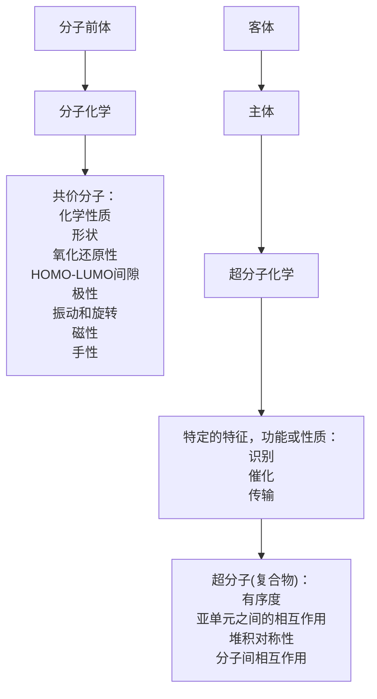
</details>

图 1.1 Lehn 提出的超分子化学和分子化学范畴

# 1.1.2 主-客体化学

如果我们把超分子化学简单地看作是含有某种（非共价）键合（binding）或络合的概念，我们必须马上定义出键合是干什么的，关于之一点，我们通常认为一个分子（主体）键合了另一个分子（客体）就生成了一个“主-客体”化合物或超分子。通常，主体是一个大分子或聚集体，如酶或合成的（具有一个大体积的中心洞或空穴的）环状化合物；客体可以是一个单原子阳离子，简单的无机阴离子，也可以是（如激素、信息素、神经传递单元等）更复杂的分子。更规范地说，主体就是具有汇聚的键合位点（如路易斯碱性的给体原子、氢键给体等）的分子实体；客体则是具有发散的键合位点（如：路易斯酸性的球形金属阳离子或氢键受体卤素阴离子）。Donald Cram 于 1986 年给出了主-客体化合物的最终定义，即：

复合物（complex）是由两个或多个分子或离子通过不同于完全共价键的静电作用，按照特定的结构关系聚在一起……分子复合物通常利用氢键、离子配对、 $\pi-$ 酸与 $\pi-$ 碱相互作用、金属-配体间的键合、范德华吸引力、溶剂重组、部分形成和破坏的共价键（过渡态）等作用力来形成……高级结构组成只有通过多重键合位点作用来实现……一个高级结构的分子联合体至少由一个主体和一个客体组成……主-客体间的关系包括主体部分与客体部分键合位点之间互补的立体电子效应组合……主体部分被定义为一个在化合物中具有汇聚的键合位点的有机分子或离子……客体部分则是具有发散的键合位点的任何分子或离子……

这样我们就可以广义地把“有机”的限制去掉，因为最近的工作已经揭示了许多无机主体，像沸石、多氧钒酸盐或者混合的金属-有机配位化合物，它们可以同有机主体一样具有相似的功能。主-客体间的键合作用就像拿在手里的球与手的关系。手相当于主体，把球包裹在内，球脱离手则需要克服一个物理的（立体的）能垒（主-客体解离）。然而，这一类比并不适用于电子水平，因为在手与球之间并没有真正的吸引力。这个类比在于引出术语“包结化学”（inclusion chemistry）（球含在手中），也就是一个分子包含于另一个分子中。

超分子主-客体化学中一个重要的分支是关于一个主-客体络合物在溶液中的稳定性。包结化学领域中的主体分子通常只在固态（晶体）下稳定，而当溶解在溶液中时就发生解离，气相水合物、尿素包合物和各种各样的晶状溶剂化物（第5章）都属于这一类。另一方面，阳离子分子主体如冠醚、穴状配体和球醚状配体（第3章），或中性的主体分子如carcerands和穴醚（第5章），在固态和溶液中都展示了重要的键合作用。我们也要注意到存在的一些纯液相现象，例如液晶和液体包合物，它们都没有直接的固态类似物（第10章）。

# 1.1.3 发展

超分子化学（现在的定义），是从20世纪60年代末70年代初发展起来的一个新的化学分支。但是，它的概念和起源以及许多简单（并不是非常简单）的超分子化学体系，或许几乎可以追溯到现代化学刚开始的时候。表1.1是它的历史发展年代表（带有一定主观性且不全面），许多超分子化学是从20世纪60年代中期至末期的大环化合物特别是大环的金属阳离子配体的发展中发展起来的。4个最基本的重要体系被列出来，它们分别是Curtis, Busch, Jager和Pedersen实验组合成出来的，其中的3个运用了席夫碱缩合，由一个醛和一个胺合成亚胺的反应。从概念上来说，这些体系可以看作是天然大环（离子载体、亚铁血红素、酞菁染料等）的发展。当然，这里还需要加上Donald Cram对于环番（从20世纪50年代早期开始）以及更近些年发展的一些球醚配体和carcerands的工作，还有Jean-Marie Lehn先生的巨大贡献，他在20世纪60年代末合成了穴状配体，自此开始构筑了该领域的近期发展。

![[超分子化学135章_images/3b1283ae2aded267e64f8edf3b2fe95dca4f0adcb88b15b1889a12653767d8d2.jpg]]

表 1.1 超分子化学发展史

<table><tr><td>1810—Sir Humphrey Davy:发现水合氯</td></tr><tr><td>1823—Michael Faraday:水合氯的分子式</td></tr><tr><td>1841—C. Schafhäutl:石墨嵌插的研究</td></tr><tr><td>1849—F. Wöhler: $\beta$ -对苯二酚的硫化氢包合物</td></tr><tr><td>1891—Villiers 和 Hebd:环糊精包合物</td></tr></table>

<table><tr><td>1893—Alfred Werner:配位化学</td></tr><tr><td>1894—Emil Fischer:锁和钥匙的概念</td></tr><tr><td>1906—Paul Ehrlich:受体概念的引入</td></tr><tr><td>1937—K. L. Wolf:用ÜbermolekÜle来描述配位饱和物种结合而成的有序实体(如,乙酸二聚体)</td></tr><tr><td>1939—Linus Pauling:在里程碑式的《化学键的本质》这本书中正式引入氢键</td></tr><tr><td>1940—M. F. Bengen:尿素形成的通道包含物</td></tr><tr><td>1948—H. M. Powell: $\beta$ -对苯二酚包合物的X射线晶体结构;引进术语“clathrate”来描述这样的化合物:其中一个组分被包裹进其他组分所形成的框架内</td></tr><tr><td>1949—Brown 和Farthing:[2.2]对环番合成</td></tr><tr><td>1953—Watson 和Crick:DNA的结构</td></tr><tr><td>1956—Dorothy Crowfoot Hodgkin:维他命 $B_{12}$ 的X射线晶体结构</td></tr><tr><td>1959—Donald Cram:尝试合成环番与四氰基乙烯的电荷转移络合物</td></tr><tr><td>1961—N. F. Curtis:用酮和乙二胺首次合成席夫碱大环化合物</td></tr><tr><td>1964—Busch 和Jäger:席夫碱大环化合物</td></tr><tr><td>1967—Charles Pedersen:冠醚</td></tr><tr><td>1968—Park 和Simmonds:Katapinand阴离子主体</td></tr><tr><td>1969—Jean-Marie Lehn:第一个穴状配体的合成</td></tr><tr><td>1969—Jerry Atwood:由烷基铝盐制得液体包合物</td></tr><tr><td>1973—Donald Cram:用球形主体来检测预组织的重要性</td></tr><tr><td>1978—Jean-Marie Lehn:引入术语“超分子化学”,来定义“分子组装体和分子间键的化学”</td></tr><tr><td>1979—Gokel 和Okahara:引进套索醚作为主体化合物的一个分支</td></tr><tr><td>1981—Vögtle 和Weber:荚状主体化合物出现及其命名法的开展</td></tr><tr><td>1987—由于在超分子化学领域的贡献,Donald J. Cram,Jean-Marie Lehn和Charles J. Pedersen被授予诺贝尔化学奖</td></tr><tr><td>1996—Atwood,Davies,MacNicol和Vögtle出版了“Comprehensive Supramolecular Chemistry”,书中包含了几乎全部重要小组的贡献并总结了超分子化学的整个发展史</td></tr><tr><td>1996—Kroto,Smalley 和Curl由于在富勒烯方面的贡献被授予诺贝尔化学奖</td></tr></table>

超分子化学是一个发展迅猛、充满活力的领域，其交叉学科的本质引起了物理学家、理论学家、模型计算家、结晶学家、无机和固态化学家、有机合成化学家、生化学家和生物学家们的广泛关注。超分子化合物具有美感的本质以及这些化合物与主体分子在视觉观感、分子模拟和实验行为上的直接关联所引起的人们的巨大兴趣，都使得这一领域成为科学界的一个里程碑。也正因为它的交叉本质以及它近来发展的速度与混杂状况，使得它成为大学课程中被忽略的一个。因此，本书的目的就在于为大学高年级学生和研究生们提供简明的值得一读的关于超分子化学的基础知识，以使读者朋友们分享本书作者关于这个充满魅力的课题的热情。

# 1.2 超分子主-客体化合物的分类

1948年牛津大学的H.M.Powell最早提出了一个超分子笼状主-客体结构的正式定义。他选择了“clathrate（包合物）”这个词，并定义这是一种包合物（inclusion compound)，其构成不是由两个或多个组分通过化学基团连接在一起，而是分子中的一个组分被完全包裹在另一组分形成的合适的结构里面。在一开始描述现代主-客体化学时，根据主体与客体之间相对的拓扑关系将主体化合物分成两个主要的类型是很有用的。cavitand 是一种拥有分子内空穴的主体，这个能够与客体键合的空穴是主体分子的特有性质，不随主体分子所处状态是溶液还是固态而有所改变。相反，clathrand 是一种具有分子外空穴的主体（这个空穴实质上是指两个或更多主体分子间的空隙），而且这个空穴只在主体分子处于晶体或固态时存在。由 cavitand 形成的主-客体聚集体叫做 cavitate，由 clathrand 形成的主-客体聚集体叫做 clathrate。这两类主体化合物的区别见图 1.2。

![[超分子化学135章_images/f589d0d00a7d797d4ced1e409ffef37ca098a04ea1dd2872b8f771fc53cd7abc.jpg]]

<details>
<summary>flowchart</summary>

```mermaid
graph TD
    A["Host"] -->|a) 分子包结| B["Host"]
    A -->|+ | C["Guest"]
    C -->|b) 结晶包结| D["Host"]
    D --> E["Host"]
    D --> F["Host"]
    D --> G["Host"]
    D --> H["Host"]
    style A fill:#f9f,stroke:#333
    style B fill:#ccf,stroke:#333
    style C fill:#cfc,stroke:#333
    style D fill:#fcc,stroke:#333
    style E fill:#ffc,stroke:#333
    style F fill:#cfc,stroke:#333
    style G fill:#fcc,stroke:#333
    style H fill:#cfc,stroke:#333
```
</details>

图1.2 图解说明cavitate和clathrate之间的区别  
(a) 通过把客体包裹进主体分子的空穴内，实现 cavitand 到 cavitate 的转换；  
(b) 通过晶格内的主体分子之间形成的空穴包裹客体入内，来实现 cavitand 到 cavitate 的转换；  
摘自：Vögtle F. Angew Chem, Int Ed Engl, 1985, 24: 728

根据主体和客体间力的作用还可以进一步细分。如果主-客体聚集体是由静电作用力结合在一起的（包括离子-偶极、偶极-偶极、氢键等），就用术语“complex（复合物）”表示。另一方面，如果是由不具体（通常很弱）的非定向的相互作用结合在一起，例如疏水作用、范德华力或晶体紧密堆积效应等，则用“cavitate”和“clathrate”表示更恰当。表1.2中列出一些使用这样的命名的例子。值得注意的是，在当前的文献中，使用“复合物（complex）”来概括所有这些分类是一个很重要的趋势。

表 1.2 中性主体的主-客体化合物的分类

<table><tr><td>主体</td><td>客体</td><td>相互作用</td><td>分类</td><td>例子</td></tr><tr><td>冠醚</td><td>金属阳离子</td><td>离子-偶极</td><td>配合物 (cavitand)</td><td> $\{K^{+} \subset [18] \text{冠-6}\}$ </td></tr><tr><td>穴醚</td><td>烷基铵离子</td><td>氢键</td><td>配合物 (cavitand)</td><td>球状配体· $(CH_{3}NH_{3}^{+})$ </td></tr><tr><td>环糊精</td><td>有机分子</td><td>疏水/范德华力</td><td>空穴化 (cavitate)</td><td> $\alpha$ -环糊精·对羟基安息香酸</td></tr><tr><td>水</td><td>有机分子,卤素等</td><td>范德华力/晶体堆积</td><td>包合物</td><td> $(H_{2}O)_{6} \cdot (CH_{4})$ </td></tr><tr><td>杯芳烃</td><td>有机分子</td><td>范德华力/晶体堆积</td><td>空穴化 (cavitate)</td><td>对叔丁基并杯[4]芳烃·甲苯</td></tr><tr><td>cyclotriveratrylene(CTV)</td><td>有机分子</td><td>范德华力/晶体堆积</td><td>包合(clathrate)</td><td> $(CTV) \cdot 0.5$ (丙酮)</td></tr></table>

在这些分类范围很宽的门类之间仍存在许多中间类型。所以，一个给定物质确切划分为哪个类别，只是观点问题。我们经常会碰到各种各样辅助性描述词语，也应该值得一提（图 1.3）。命名法应该作为一个概念性框架，帮助化学家们描述和想象所处理的体系，而不只是一种严格限定的语言门类。

![[超分子化学135章_images/808c969cbf527586c0834f006917ae6650b718c7e69d3d8becee2a0410eb6513.jpg]]  
图 1.3 用来阐明主体和客体之间空间关系的描述性术语

# 1.3 受体、配位和锁钥的类比

主-客体（或受体-底物）化学是基于以下3个历史性概念而形成的：

（1）1906 年，Paul Ehrlich 认为分子没有键合就不能发生作用，在此基础上 Ehrlich 引入了生物学上受体的概念。  
（2）1894年，Emil Fischer认识到键合必须具有选择性，就像酶对于受体-底物的键合的研究一样。他把它形象地描述成“锁与钥匙”的空间匹配，其中，客体具有一定的几何形状与尺寸，正好互补于受体或主体（图1.4）。这个概念奠定了分子识别的基础，主体在不同的客体之间进行判别。

![[超分子化学135章_images/af4eff4c17a945e0f0d9c0b9c5e6ff42bfa9eafb71737a2261560a5d5600aa3e.jpg]]

<details>
<summary>text_image</summary>

酶 + 底物 ⇌ 酶-底物复合物
</details>

图 1.4 首次被应用于酶催化的主体和客体之间的几何构型匹配的固定锁钥图像

（3）选择性键合必须是主体与客体之间具有吸引力或相互亲和力。这实际上是Alfred Werner在1983年的配位化学理论，即金属离子与球形配体配位理论的一种概括。

以上3个理论实际上都是各自独立地提出的，而且经过多年的发展，这些理论共同作用衍生出各种各样的定律，促成了超分子化学这门学科间高度交叉领域的诞生。举个例子，Ehrlich长期从事于一些传染病的治疗。在他的一部分工作中，他注意到一种亚甲基蓝染料对一些活细胞具有很强的亲和力，能把它们染成深蓝色（他的助手Robert Koch曾用亚甲基蓝发现了结核菌，而Ehrlich能从一个自1885年就开始从事大规模制造业的制造商Farbwerke Hoechst那里获得这种合成染料的现成供应）。Ehrlich推断，“如果仅有一定的细胞可以着色，那么为什么不能有这样的染料物质，只让携带病毒的细胞着色，且同时不损伤体内的其他细胞而破坏掉它们？”最终，Ehrlich在1910年发明了抗梅毒最有效的药物之一：撒尔佛散（salvarsan），因而他也成为现代化疗法的奠基人。

![[超分子化学135章_images/36b41bf795a97c3e75764939655a156ac7e736d580fe68e3c83be2ee6fef0483.jpg]]

<details>
<summary>chemical</summary>

Chemical structure of a quaternary ammonium salt with methyl and methyl substituents
</details>

(1.5)亚甲基蓝

1828 年 Friedrich Wöhler 从氰酸铵中合成了尿素，从而推动了有机合成的快速发展。除此之外，现代仪器和合成技术的发展最终促使配位化学、化疗法与酶学的结合。在超分子化学的发展过程中，量化受体具有的可以接受客体的内在亲和力的细节工作取得了巨大的进步。特别是锁钥类比也随着螯合、预组织、互补、溶剂化和“分子形状”的概念而不断得到修整。这一系列的概念我们会在下面的章节中看到。

![[超分子化学135章_images/d5010c8d30ca936a6fa8119b206630b9ad5f3650c23827d59b2f3bbedf9fb323.jpg]]

Behr J P. The lock-and-key principle. The state of the Art-100 years on. Chichester: J Wiley & Sons, 1994

# 1.4 螯合和大环作用

在构筑超分子主体分子时，应着重考虑由此引起的加和作用或甚至是乘法作用。这就意味着：如果我们确信有足够多的可能的相互作用来稳定络合物，那么我们可以利用非共价相互作用（通常很弱）来构筑一个稳定的主-客体络合物。当由一种相互作用产生的小量的稳定能与其他相互作用产生的稳定能相加（加和作用），就会产生显著的稳定能，从而增强复合物的稳定性；在很多情况下，整个体系的协同相互作用大于部分的加和（乘法作用）。这样的额外稳定性是基于其螯合和大环作用。

螯合作用在配位化学中是众所周知的，和下面观察到的现象相关联，即二齿配体（如1,2-二氨基乙烷）的金属络合物明显比与之相近的单齿配体要稳定。例如，在反应式(1.1)中，1,2-乙二胺取代氨的平衡常数（ $\lg K = 8.76$ ）表明1,2-乙二胺

的螯合物比氨的稳定 $10^{8}$ 倍。

$$
\left[ \mathrm{Ni} \left(\mathrm{NH} _ {3}\right) _ {6} \right] ^ {2 +} + 3 \mathrm{NH} _ {2} \mathrm{CH} _ {2} \mathrm{CH} _ {2} \mathrm{NH} _ {2} \longrightarrow \left[ \mathrm{Ni} \left(\mathrm{NH} _ {2} \mathrm{CH} _ {2} \mathrm{CH} _ {2} \mathrm{NH} _ {2}\right) _ {3} \right] ^ {2 +} + 6 \mathrm{NH} _ {3} \tag {1.1}
$$

![[超分子化学135章_images/b4677d66136f26bcf75d51152c71e510017b8d215b1d54e5dda5534ce36ca2d4.jpg]]

<details>
<summary>chemical</summary>

Chemical structure of a nickel complex with dimethylamino ligands and a 2+ charge
</details>

(1.6)

![[超分子化学135章_images/7e31bb45ac709f286fed923e784431bb532a5f113251f8494b7655944ead3831.jpg]]

<details>
<summary>chemical</summary>

Chemical structure of [Ni(en)3]2+ ion with nickel center coordinated to two ammonia ligands
</details>

(1.7)

螯合物在溶液中的稳定性可以从热力学和动力学两方面来解释。热力学上，金属与螯合配体反应导致了自由粒子的增加[式(1.1)左边有4个自由粒子，右边7个]，因此从式 $\Delta G = \Delta H - T\Delta S^{\circ}$ 可看出，熵增加对总反应自由能变化的贡献有利于反应的进行。此外，巧妙设计大环可优化配体-金属相互作用的构象和静电作用方式，产生有利于反应的焓变。

统计学上，熵的贡献进一步被加强，这是由于螯合物要解离，金属-配体原子键要同时断裂才行。

最后，在形成螯合物时也要考虑动力学效应。情况可能是这样的，金属与配体 L 的反应速率和螯合配体 (L-L) 的第一个原子螯合的速率相当。然而 L-L 的第 2 个配体原子结合的速率就快多了。这是因为在已经螯合了一个金属的二齿配体态时，第 2 个配位原子的有效浓度比第 2 个单齿配体 L 的浓度要高得多。

在溶液配位化学中，螯合作用的本质是许多文献争论的焦点。第一个问题是稳定常数的定义；结合两个单齿配体的第2步稳定常数 $\beta_{12}$ 与所比较的二齿配体的第一稳定常数没有相同的量纲（见Box1.1）。因此，溶剂浓度的影响可以忽略。当把浓度转化成摩尔分数来考虑这种差异时，螯合作用几乎消失。再者，气相稳定性结果也表明等量的螯合和非螯合的化合物之间差异很小。然而，至少在溶液中存在二齿配体几乎全部取代单齿类似物的事实。

在超分子化学中，主-客体络合物的热力学稳定性可以通过螯合作用来提高。配体供给原子（不论性质如何）统称为主体结合点，金属统称为客体（实际上通常是金属阳离子，尽管客体通常为阴离子或中性物种）。从荚状配体与金属离子的键合中可观察到螯合作用（图1.5），荚状配体是具有许多以一定的间隔分布的给体原子的链状主体（见3.2.1节）。

螯合稳定作用高度取决于螯合环的大小（图1.6）。五元环，如1,2-乙二胺金属络合物，因环中张力最小，通常是最稳定的。四元环（如螯合的乙酸根）的张力很大，而随着螯合环的增大，直接指向金属的两个给体原子的统计可能性变得更加不可能，导致不利的熵变。然而，螯合环中的张力能取决于金属阳离子的大小。对于非常小的阳离子 $\mathrm{B}^{3+}$ 、 $\mathrm{Be}^{2+}$ 等，六元环是常见的，因为小的阳离子形成的阳离子-给体的键长接近于环己烷那样的六元环分子的键长。

![[超分子化学135章_images/115eeb1657f9ff2b1995879b050dee0e838704b110e7a8657fb75ecf639aad9c.jpg]]

<details>
<summary>flowchart</summary>

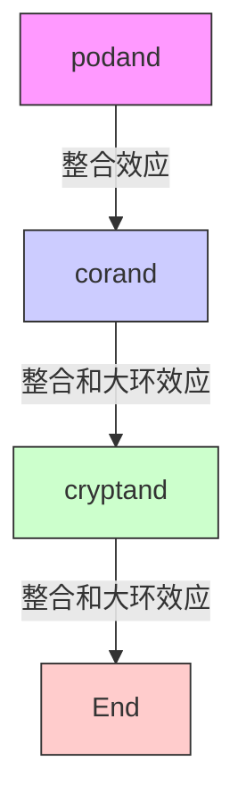
</details>

图 1.5 螯合、大环和大二环作用

![[超分子化学135章_images/5eb6c72d73294fd4ab2924714ed4bff685757ace868c8784219ba69fe6b95787.jpg]]

<details>
<summary>chemical</summary>

Four resonance structures labeled with Chinese names: 张力环, 对于大阳离子的优化构象, 柔韧性的增加-熵作用的减少, and a final structure with M substituents.
</details>

图 1.6 螯合效应起到的稳定化作用

然而，许多超分子主客体络合物比预想到的只有螯合效应要稳定得多。在这些体系中主体分子通常是有多个结合点螯合客体的大环配体。此类化合物可通过额外的大环效应变得更稳定。这种效应不仅与通过多个结合点的客体螯合作用相关，还与这些结合点的空间排布相关，为了有利于螯合，客体必须使主体缠绕在其周围，从而客体不消耗结合能；而且，给体原子孤对电子相互靠近造成的熵损失已经在大环合成中得到了补偿。大环效应使得环状主体，例如单环冠状配体，比类似的具有相同结合点的非环状荚状配体要稳定 $10^{4}$ 多倍。这种大环效应最早是Cabbines和Margerum在1970年研究 $\mathrm{Cu(II)}$ 络合物(1.8)和(1.9)时提出的。这两个化合物都以含有4个螯合原子而稳定。然而，由于附加的大环效应的影响，大环(1.8)比非环状类似物稳定约 $10^{4}$ 倍。

![[超分子化学135章_images/cb9a0f2956c1162d700427c1cffbbbef66e9597e05605c63e269ce8ea886e3e5.jpg]]

<details>
<summary>chemical</summary>

Chemical structure of a macrocyclic compound with M and NH groups, featuring a 2+ charge and stereochemistry indicators
</details>

(1.8)

![[超分子化学135章_images/2e89db436c60ece85665c85ec35a05e5320ed8e10d633f95e4c939f6045b425c.jpg]]  
(1.9)

对类似物（非甲基化）的 $Zn^{2+}$ 络合物的热力学测定表明，大环效应所起到的稳定化作用得益于熵和焓两方面的因素（表 1.3）。焓的稳定因素表现为大环主体比直链化合物更不易溶剂化，这是因为环状主体表现出较小的溶剂可触及的表面积。因此，环状主体与伸展的直链配体相比，需要断裂较少的溶剂-配体键。就熵而言，大环构象的柔韧性较差，因此络合后自由度不会大幅减少。实际上，与大环相关的熵在其合成过程中已预先得以补偿。一般来讲，熵和焓的相对重要性随所研究的体系改变而改变，尽管由于附加因素的存在（如，孤对电子的排斥），焓通常占主导地位。二环主体，如穴状配体（见3.3节），因类似的原因，被发现比单环冠状配体更稳定。这就是所谓的大二环效应（图1.5）。3.8节中将会详细讨论大环效应和大二环效应。

表 1.3 在 298 K 时，(1.8) 和 (1.9) 与 $Zn^{2+}$ 形成络合物的热力学参数

<table><tr><td>配体</td><td>(1.8)</td><td>(1.9)</td></tr><tr><td> $\lg K$ </td><td>15.34</td><td>11.25</td></tr><tr><td> $\Delta H^{\circ} / (\text{kJ/mol})$ </td><td>-61.9</td><td>-44.4</td></tr><tr><td> $-T\Delta S^{\circ} / (\text{kJ/mol})$ </td><td>-25.6</td><td>-19.8</td></tr></table>

![[超分子化学135章_images/7f209f0e5ad50cdb94ea3b9c5f75b3343abe3024e720ea77decd380e4ecbed96.jpg]]

Hancock R D. Chelate Ring Size and Metal Ion Selection. J Chem Ed, 1992, 69:615\~621

# 1.5 预组织性和互补性

为了能键合，主体必须拥有与客体互补的正确电子状态的结合点（如：极性、氢键给体或受体能力、软硬度等）。氢键给体必须对应于氢键受体，路易斯酸对应于路易斯碱。并且，主体分子的结合点必须以一定的方式空间排列，以便其能以络合构象与客体结合。如果主体满足这些要求，那么就是互补的。

如果主体络合客体时没有经历明显的构象变化，那么它就是预组织的。主体的预组织性是一个关键的概念，因为它代表了客体络合自由能增加的一个主要因素（有时是决定性的）。忽略溶剂化效应，主客体结合过程可以粗略地分成两个阶段。第一阶段是一个活化过程，在这个过程中主体要进行构象的重新排列，以使其结合点与客体最匹配，同时尽可能减小结合点间的不利作用。这从能量上来讲是不利的，并且这个能量是无法补偿的，因为在主客体络合物寿命范围内，主体必须保持这种络合构象。重排后随即发生络合，因为主客体间互补的作用位点之间的焓稳定的吸引作用，因而该络合在能量上是有利的。整个络合过程的自由能是不利的重组能和有利的结合能之差。如果重组能大，那么整个自由能是减少的，使络合物不稳定。如果主体是预组织的，那么重组能就很小。

预组织的必然结果可以从客体络合动力学中得到。刚性预组织的主体在通过络合过渡态时有一定的困难，从而表现出较慢的客体络合动力学。构象易变的主体分子容易迅速调整结构，络合和解络合都很快。溶剂化可提高预组织能力，因为当主体被客体包裹时，有效地减少了与周围媒介接触的面积，因此没有络合的主体的溶剂化稳定作用通常比络合物的大。

预组织效应可以通过比较预组织的球状配体(1.10)（见3.4节）和构象易变的单环冠状配体(1.11)来解释，两种配体对碱金属阳离子的络合差异达到 $10^{10}$ 数量级。

![[超分子化学135章_images/20448758f9809ca95b63227d0280197268070b3270de520e85f69916e812c129.jpg]]

<details>
<summary>chemical</summary>

Complex polycyclic aromatic hydrocarbon molecular structure with oxygen and nitrogen atoms
</details>

球状配体  
(1.10)

![[超分子化学135章_images/14d8b265d4f1e10d296bd5f1e3427641739df6d0d3b4dbfea693e8006b16bb02.jpg]]

<details>
<summary>chemical</summary>

Chemical structure of a symmetric organic molecule with four oxygen atoms and five hydroxyl groups
</details>

[18] 冠-6   
单环冠状配体  
(1.11)

# 1.6 热力学和动力学选择性

无论是在自然界（酶，运输蛋白等）还是在人工体系中，超分子主体设计的目的均为拥有选择性；主体可识别不同的客体分子。血液中，铁血红运输血红蛋白的选择性很好：在氮气、水、二氧化碳存在的条件下，甚至在与铁结合更强的一氧化碳存在时，可以选择性地吸收氧气。我们可以用结合常数 $K$ （Box 1.1）很容易地来估计主体与一个特殊客体的亲和力。主体+客体 $\equiv$ （主体·客体）， $K$ 代表络合过程的热力学平衡常数：

$$
K = \frac {[ \text {主体} \cdot \text {客体} ]}{[ \text {主体} ] \times [ \text {客体} ]} \tag {1.2}
$$

在热力学上，选择性可简单定义为一个客体的结合常数与另一个的比例 [式(1.3)]：

$$
\text { 选   择   性 } = \frac {K _ {\text { 客   体 } 1}}{K _ {\text { 客   体 } 2}} \tag {1.3}
$$

这种选择性很容易实现，因为它可以通过巧妙运用钥匙-锁类似物、预组织性、互补性等概念，以及结合主客体相互作用的详细知识来操作。然而，还存在另外一种选择性，它涉及到在反应中竞争的底物的转换速率。这是动力学选择性的，是指导具有导向性过程如超分子（酶）催化和客体感知与信号的基础。在这种意义上，如果说体系是具有选择性的，则指客体转化得最快，而不是络合得最牢固。实际上，在时间分辨过程中，由于动力学速度减慢，大的结合常数对整个反应系统是不利的。许多生物化学酶是具有动力选择性的，其结构研究表明，在任一给定态，当与客体分子状态（有时指过渡态）完全互补时，它们通常不以刚性方式预组织，因为这样会阻碍快速催化。在人工体系中，时间分辨的选择性工程（例如酶模拟器的设计，见第9章）是一个非常复杂的过程，因为当沿着反应路径进行时，主体需要适应客体的需要而不断改变。

在给定溶剂里（通常是水或甲醇），大环的金属络合物的热力学稳定性可以由络合常数 K 来衡量（生成常数 $K_{f}$ ，结合常数 $K_{a}$ ，稳定常数 $K_{s}$ ）。忽略活度因素，这就是一个反应的平衡常数（例如：在水中金属 M 和主体配体 L 之间）：

$$
\mathrm{M} (\mathrm{H} _ {2} \mathrm{O}) _ {n} ^ {m +} + \mathrm{L} \rightleftharpoons \mathrm{ML} ^ {m +} + n \mathrm{H} _ {2} \mathrm{O} \tag {1.4}
$$

$$
K = \frac {[ \mathrm{ML} ^ {m +} ]}{[ \mathrm{M} (\mathrm{H} _ {2} \mathrm{O}) _ {n} ^ {m +} ] [ \mathrm{L} ]} \quad (\text {单位:dm} ^ {3} / \mathrm{mol}) \tag {1.5}
$$

一个大的结合常数表明存在较高的金属络合物浓度，因此，金属大环络合物是比较稳定的。冠醚和碱金属阳离子在水中的典型络合常数在 $10\sim 10^{2}$ 范围内。在甲醇中， $\{\mathbf{K}^{+}\subset$ [18]冠-6}的络合常数可增加到 $10^{6}$ 。 $\mathrm{K}^+$ 与[2.2.2]穴状配体的络合常数是 $10^{10}$ 。

如果一个连续过程包含不止一个金属离子，那么就会测两个 K 值： $K_{11}$ 和 $K_{12}$ （例如二苯并 [30] 冠-10 与两个 $Na^{+}$ 的络合）

$$
\mathrm{M} (\mathrm{H} _ {2} \mathrm{O}) _ {n} ^ {m +} + \mathrm{L} \stackrel {K _ {1 1}} {\rightleftharpoons} \mathrm{ML} ^ {m +} + n \mathrm{H} _ {2} \mathrm{O} \tag {1.6}
$$

$$
\mathrm{M} (\mathrm{H} _ {2} \mathrm{O}) _ {n} ^ {m +} + \mathrm{ML} ^ {m +} \xlongequal {\mathrm{K} _ {1 2}} \mathrm{M} _ {2} \mathrm{L} ^ {2 m +} + n \mathrm{H} _ {2} \mathrm{O} \tag {1.7}
$$

$$
K _ {1 2} = \frac {[ \mathrm{M} _ {2} \mathrm{L} ^ {2 m +} ]}{[ \mathrm{M} (\mathrm{H} _ {2} \mathrm{O}) _ {n} ^ {m +} ] [ \mathrm{ML} ^ {m +} ]} \tag {1.8}
$$

在这个体系中，逐步络合常数 $\beta_{12}$ 定义如下：

$$
\beta_ {1 2} = K _ {1 1} \times K _ {1 2} \tag {1.9}
$$

或者，更常用 $\beta_{mn}=\frac{[M_{m}L_{n}]}{[M]_{m}[L]_{n}}$ (1.10)

结合常数的值范围较广，常以 $\lg K$ 的形式表示，即：

$$
\lg \beta_ {1 2} = \lg \left(K _ {1 1} \times K _ {1 2}\right) = \lg K _ {1 1} + \lg K _ {1 2} \tag {1.11}
$$

在分级络合过程中，数字下标是络合物中两个物质的比例。因此在多步过程中，主体与第一个客体的结合以 $K_{11}$ 表示，此时主体和客体形成1∶1的络合物；再结合一个客体产生1∶2的络合物，其稳定常数就是 $K_{12}$ ；依此类推。

络合常数是热力学参数，按照吉布斯自由能公式 $\Delta G^{\circ} = -RT\ln K$ ，它们与络合过程的吉布斯能量相关。在特定条件下（溶剂，温度等），一个主体对一个客体的亲和力通常以 K 或者 $\Delta G^{\circ}$ 值给出。关于能量项，碱金属阳离子络合的自由能从 20kJ/mol 到 100kJ/mol 不等。大约 $10^{10}$ 的 K 值对应的 $-\Delta G^{\circ}$ 值为 52kJ/mol。表 1.4 给出一些常见的络合常数及相应自由能的数值。

表 1.4 一些络合过程的络合常数

<table><tr><td>基 质</td><td> $^*$ 配体</td><td>溶剂</td><td> $K_{11} / (L/mol)$ </td><td> $\Delta G^{\circ} / (kJ/mol)$ </td></tr><tr><td> $Na^+$ </td><td> $ClO_4^-$ </td><td> $H_2O$ </td><td>3.2</td><td>-3</td></tr><tr><td>碘</td><td>六甲基苯</td><td> $CCl_4$ </td><td>1.35</td><td>-0.8</td></tr><tr><td>四氰基乙烯</td><td>六甲基苯</td><td> $CH_2Cl_2$ </td><td>17</td><td>-7.1</td></tr><tr><td>7,7,8,8-四氰基醌二甲烷</td><td>芘</td><td> $CH_2Cl_2$ </td><td>0.94</td><td>0</td></tr><tr><td>水杨酸</td><td>咖啡因</td><td> $H_2O$ </td><td>44</td><td>-9.7</td></tr><tr><td>氢化可的松</td><td>安息香酸离子</td><td> $H_2O$ </td><td>2.9</td><td>-2.5</td></tr><tr><td>反式肉桂酸甲酯</td><td>咪唑</td><td> $H_2O$ </td><td>1.0</td><td>0</td></tr><tr><td>对羟基苯甲酸</td><td>α-环糊精</td><td> $H_2O$ </td><td>1130</td><td>-17.6</td></tr><tr><td>咖啡因</td><td>咖啡因</td><td> $H_2O$ </td><td>19</td><td>-7.1</td></tr><tr><td>苯酚</td><td>二甲基甲酰胺</td><td> $C_6H_6$ </td><td>442</td><td>-15.0</td></tr></table>

络合常数也可由络合和解络的速率常数来表示：

$$
\mathrm{M} ^ {+} + \mathrm{L} \xrightarrow [ k _ {- 1} ]{k _ {1}} [ \mathrm{M} ^ {+} \bullet \mathrm{L} ] \tag {1.12}
$$

$$
K = \frac {k _ {1}}{k _ {- 1}} \tag {1.13}
$$

# 络合常数的测定

Polster J and Lachmann H. Spectrometric Titrations. Weinheim: VCH, 1989

原则上，络合常数可以通过任何能提供络合物浓度的实验技术来估计，即改变 $M^{+}$ 的浓度测量络合物的浓度 $[M^{+}\cdot L]$ 。实际上，下面的方法经常用到。

# (1) 电位滴定法

对于容易质子化的大环化合物（例如含有碱性氮的叔胺的穴状配体），质子化常数（相应的 $pK_{a}$ 数值）可以轻易通过 pH 电极监测酸碱滴定的方法确定。加入金属离子之后，金属离子会与氢离子竞争，改变大环的碱性，因此会改变滴定曲线。用计算机拟和程序分析此曲线，可得到金属络合物的稳定常数。

# (2) 核磁共振滴定

如果在 NMR 时间尺度内，络合客体与未络合客体的交换足够慢的话，那么此常数可以在占优势的浓度、温度、溶剂的条件下，通过络合与未络合的主体或客体的 NMR 信号的简单积分来确定。然而，相对 NMR 时间尺度，大部分平衡是很快的，观察到的化学位移是络合与非络合的物质的加权平均位移。在典型的 NMR 滴定实验中，将少量的客体加到已知浓度的主体的氘代溶液中，检测到的 NMR 信号就可作为客体浓度或者主体与客体络合比例的函数。通常用各种原子核存在下的化学位移（如 $^{1}$ H NMR 里的 $^{1}$ H 核）来表示客体络合对其磁环境的影响。因此，可以得到两类信息。

![[超分子化学135章_images/5e5273a27bc5078a847c9d014e8038b7f7cc0741bbd9b3d4685bed5460961320.jpg]]

<details>
<summary>line</summary>

| 客体浓度 | Δδ   |
| -------- | ---- |
| 0        | 0.0  |
| 1        | 0.5  |
| 2        | 1.0  |
| 3        | 1.5  |
| 4        | 2.0  |
| 5        | 2.5  |
| 6        | 3.0  |
| 7        | 3.2  |
| 8        | 3.4  |
| 9        | 3.5  |
| 10       | 3.6  |
| 11       | 3.7  |
| 12       | 3.8  |
| 13       | 3.9  |
| 14       | 4.0  |
</details>

图 1.7 （a）在 NMR 时间尺度内一个快速平衡体系的核磁滴定；
（b）自由主体、客体以及络合物的平衡混合物的 NMR 图

首先，最容易受影响的原子核会给出客体络合有区域选择性的定性信息（客体是否在主体空穴内？）。然而，更重要的是滴定曲线的形状（ $\Delta \delta$ 与加入的客体的浓度的关系曲线，如图1.7）会给出络合常数的定量信息。这种滴定曲线常用最小二乘拟和方法（如EQNMR这样的程序）来分析，利用式(1.14)来确定 $\delta_{mn}$ （每一个物质的化学位移， $mn$ 是主体H与客体G的比例）和 $\beta_{mn}$ （分布常数）的最优值。

$$
\delta_ {\mathrm{calc}} = \sum_ {m = 1} ^ {m = i} \sum_ {n = 0} ^ {n = j} \frac {\delta_ {m n} \beta_ {m n} m [ G ] ^ {m} [ H ] ^ {n}}{[ G ] _ {\text { total }}} \tag {1.14}
$$

此类计算的一个关键性问题是要用正确的计量模型（即先假定主-客体的比例）。在超分子化学中通常倾向于把计量比视为1:1，这忽略了更高比例的聚集体的存在，通常会产生偏差。络合化学计量比可以由多种滴定实验来确定，保持客体与主体的总浓度不变，通过改变溶液中主体和客体的比例来确定络合物的浓度。

![[超分子化学135章_images/a538f7f0896a0d13e192459448bd451e034e98d7efa67148011d2f59b6893354.jpg]]

<details>
<summary>line</summary>

| [主体]/([主体]+[客体]) | [络合物] |
| ------------------- | -------- |
| 0.1                 | 0.2      |
| 0.2                 | 0.4      |
| 0.3                 | 0.6      |
| 0.4                 | 0.7      |
| 0.5                 | 0.8      |
| 0.6                 | 0.7      |
| 0.7                 | 0.6      |
| 0.8                 | 0.4      |
| 0.9                 | 0.2      |
</details>

图 1.8 1:1 的主-客体络合工作曲线

通过监测主-客体络合物的浓度变化，可以得到[络合物]对[主体]/([主体]+[客体])的工作曲线。对于1:1的络合物，这种方式的工作曲线应给出峰的位置在0.5（图1.8）。

# (3) 荧光滴定

这种测量的基础是荧光强度与荧光生色团浓度（溶液中荧光物质，通常是荧光客体 G 的浓度）成比例。对于 1:1 的络合物，稳定常数 $K_{11}=\frac{[HG]}{[H][G]}$ ，荧光强度为：

$$
F = k _ {\mathrm{G}} [ \mathrm{G} ] + k _ {1 1} [ \mathrm{HG} ] \tag {1.15}
$$

式中， $k_{G}$ 和 $k_{11}$ 分别为客体和 1:1 络合物的比例常数。

当没有主体存在时，荧光强度为 $F_{0}$ ，可由式(1.16)表示：

$$
F _ {0} = k _ {\mathrm{G}} ^ {0} G _ {\mathrm{t}} \quad (G _ {\mathrm{t}} = [ \mathrm{G} ] + [ \mathrm{HG} ]) \tag {1.16}
$$

结合这两个方程式，可以得到式(1.17)，这个式子是用荧光法确定稳定常数 $(K_{11})$ 的基础。

$$
\frac {F}{F _ {0}} = \frac {\frac {k _ {\mathrm{G}}}{k _ {\mathrm{G}} ^ {\circ}} + \frac {k _ {1 1}}{k _ {\mathrm{G}} ^ {\circ}} K _ {1 1} [ \mathrm{H} ]}{1 + K _ {1 1} [ \mathrm{H} ]} \tag {1.17}
$$

当主体或主-客体络合物都不发荧光时，这个式子可以大大简化（即，当络合时出现荧光，或者被主体淬灭时发荧光），此时 $k_{G}$ 或 $k_{11}$ 为零。例如，对于 $k_{G}=k_{G}^{0}$ ，且 $k_{11}=0$ 时，可以得到式(1.18)：

$$
\frac {F}{F _ {0}} = 1 + K _ {1 1} [ \mathrm{H} ] \tag {1.18}
$$

把淬灭主体滴加到客体的实验中得到的 $F_{0}/F$ 对 [H] 的简单工作曲线是斜率为 $K_{11}$ 的直线。以这种方式，普通荧光客体，例如 8-苯氨基-1-萘磺酸 ANS (1.12)，就可被用来探测不同主体的络合能力。

![[超分子化学135章_images/576f5a6183638a1c8ff910e4047745759a0e078def1dd4eff5dae07610ef50f6.jpg]]

<details>
<summary>chemical</summary>

Chemical structure of compound ANS with sulfonamide group and phenyl substituent
</details>

# (4) 量热滴定法

像其他滴定方法一样，量热滴定法需要根据加入的主体或客体的不同浓度来测定一个参数（这里是指严格密封样品产生的热量）。络合热的变化是与络合的热力学参数直接相关。

# (5) 萃取实验

金属离子在水相（aq）与有机相（org）间的分配系数 $K_{d}$ ，也可以用来估计已知的大环化合物在标准条件下对一系列金属离子的选择络合能力。在这里要用到下面过程的平衡常数（K）[式(1.19)～式(1.22)] [苦味酸（Picrate）金属盐、水（aq）以及水饱和的氯仿（org）相，25℃]。

$$
\left[ \mathrm{M} ^ {+} \cdot \mathrm{Pic} ^ {-} \right] _ {\mathrm{org}} + \left[ \text {主体} \right] _ {\mathrm{org}} = \left[ \mathrm{M} ^ {+} \cdot \text {主体} \cdot \mathrm{Pic} ^ {-} \right] _ {\mathrm{org}} \quad K _ {1 1} (\text {络合常数}) \tag {1.19}
$$

$$
[ \mathrm{M} ^ {+} ] _ {\mathrm{aq}} + [ \mathrm{Pic} ^ {-} ] _ {\mathrm{aq}} + [ \text {主体} ] _ {\mathrm{org}} = [ \mathrm{M} ^ {+} \cdot \text {主体} \cdot \mathrm{Pic} ^ {-} ] _ {\mathrm{org}} K _ {\mathrm{e}} (\text {萃取常数}) \tag {1.20}
$$

$$
\left[ \mathrm{M} ^ {+} \right] _ {\mathrm{aq}} + \left[ \text {主体} \right] _ {\mathrm{aq}} = \left[ \mathrm{M} ^ {+} \cdot \mathrm{Pic} ^ {-} \right] _ {\mathrm{org}} K _ {\mathrm{d}} (\text {分布系数}) \tag {1.21}
$$

$$
K _ {1 1} = K _ {\mathrm{e}} / K _ {\mathrm{d}} \tag {1.22}
$$

通过测定每一相的吸收光谱（380nm）来确定苦味酸阴离子的浓度。假定主体分子在水相中不溶。这种方法的精确度相对较低，但是快捷，并且可以应用于许多化合物的筛选。适合测定络合自由能在25～70kJ/mol范围内的络合物。络合能超过70kJ/mol的可通过与已知络合能的主体的竞争反应估计。

Connors K A. Binding Constants. Chichester: John Wiley & Sons, 1987

![[超分子化学135章_images/9283c615bb0c740326a03ea2294513be69a2b3f5002593e39be08dd23f3d30e4.jpg]]

# 1.7 超分子相互作用的本质

一般而言，超分子是指非共价键相互作用。“非共价”这个词包含许多吸引和排斥作用力范畴。最重要的几种作用力以及它们的近似能量介绍如下。当考虑一个超分子体系的时候，考虑这些作用力的相互影响以及主体、客体及周围介质（溶剂，晶格，气相等）的影响是非常重要的。

# 1.7.1 离子-离子相互作用

离子键在强度上可以和共价键相提并论（键能 100～350kJ/mol）。一个典型的离子固体是氯化钠，为立方晶格，其中每一个钠离子周围有 6 个氯离子（图 1.9）。

这需要非常的想象力去把 NaCl 当作超分子，但是这种简单的离子晶格确实能解释 $Na^{+}$ 以何种方式把 6 个互补的供体分子组织在其周围，从而最大化非共价离子-离子相互作用。同时要注意到，在溶液中，这种晶格结构因溶剂化作用而被破坏，并以不稳定的八面体 $\mathrm{Na(H_{2}O)_{6}^{+}}$ 形式存在。

离子-离子相互作用的一个更具超分子性质的例子是，带有3个正电荷的三(二氮杂二环辛烷)主体(1.13)与阴离子如 $\mathrm{Fe(CN)}_{6}^{3-}$ 的相互作用（图1.10）。

![[超分子化学135章_images/982eecce8997386289e05d5df186b9fee0fab489fd4d7c923f930bac3173d040.jpg]]

<details>
<summary>chemical</summary>

Chemical structure of a quaternary ammonium salt with pyridine and pyrrole rings, labeled (1.13)
</details>

![[超分子化学135章_images/01ba6ecae560665b5fcc8d67cf30561b746d1e9e6ec837eec1051ef75c8afaec.jpg]]

<details>
<summary>chemical</summary>

Crystal lattice structure of sodium chloride (NaCl) showing Na and Cl atoms in a cubic arrangement
</details>

图1.9 NaCl离子晶格图

![[超分子化学135章_images/dc29aaf63f2357f9da26512271e0723c1a1eee1ee77bbb19bd4a3012362eb909.jpg]]

<details>
<summary>chemical</summary>

Molecular structure diagram showing a central metal atom bonded to organic ligands and terminal groups
</details>

图 1.10 通过有机阳离子(1.13)和 Fe(CN) $_{6}^{3-}$ 之间的相互作用
例证超分子离子-离子
相互作用

# 1.7.2 离子-偶极相互作用（50～200kJ/mol）

一个离子（如 $Na^{+}$ ）和一个极性分子（如水分子）的键合就是离子-偶极相互作用的一个例子。这种相互作用在固态和溶液里都存在。大环醚（冠醚）与碱金属离子的络合物结构很明显就以这样的超分子类似物存在，在络合物中冠醚的氧原子与水的氧原子起着同样的作用。氧原子的孤对电子被阳离子正电荷吸引。

离子-偶极相互作用也包括配位键，在非极性的金属离子和强碱的配位作用中，其本质是静电作用。超分子和分子间的界限越来越模糊，具有明显的共价成分的配位键，例如在 $\left[\mathrm{Ru}(\mathrm{bpy})_3\right]$ 中，也常用于超分子组装，这也可以在第7章和第8章中看出来。

![[超分子化学135章_images/03f2dd490c7bfe331951df48c913f75f9c79e13a206d0688b895bce7d78db5ab.jpg]]  
(1.14)

![[超分子化学135章_images/6abaa984562d38732f0ee6901ed131f9cb6e199ec46c3308933a3471844ad576.jpg]]

<details>
<summary>chemical</summary>

Chemical structure of sodium ion (Na⁺) coordinated with four oxygen atoms forming a macrocyclic ring
</details>

$\mathrm{Na}^{+}$ 冠醚络合物  
(1.15)

![[超分子化学135章_images/064dfff8bb137a4305e9fa575b0f1cf81d300ba85e49e7da26f4fe365af87919.jpg]]

<details>
<summary>chemical</summary>

Molecular structure of a ruthenium complex with pyridine ligands and 2+ charge counterion
</details>

$[Ru(bpy)_{3}]^{2+}$ bpy=2,2'-bipyridyl   
(1.16)

# 1.7.3 偶极-偶极相互作用 (5\~50kJ/mol)

两个偶极分子的排列可以导致明显的相互吸引作用，形成邻近的分子上一对单个偶极的排列（类型Ⅰ）或者两个偶极分子相对的排列（类型Ⅱ）（图1.11）。有机羰基化合物在固态时存在明显的这种相互作用，计算表明类型Ⅱ相互作用的能量约为20kJ/mol，相当于中等强度的氢键。然而，酮类的沸点表明在溶液中这种偶极-偶极作用很弱，如丙酮的沸点是56℃。

![[超分子化学135章_images/75327245b39eb8f23955c8bd984994fa174dbbd1f6f98f2d47be4f4ac551e7f7.jpg]]  
[

![[超分子化学135章_images/33d716ad11bd3530f690643609877d34b6c91890a269fc8954030c23593bb1c8.jpg]]  
II   
图1.11 羰基的偶极-偶极相互作用

# 1.7.4 氢键 (4\~120kJ/mol)

氢键可以看作是一种特殊的偶极-偶极相互作用，与电负性原子（或拉电子基团）相连的氢原子被邻近的分子或官能团的偶极吸引着。由于其相对较强及方向性好的本质，通常把氢键称作为“超分子中的万能作用”。一个典型的例子就是形成羧酸二聚体，从而导致红外伸缩频率的位移 $\nu(\mathrm{OH})$ 从 $3400cm^{-1}$ 移到 $2500cm^{-1}$ ；同时，峰形变宽，吸收增强。典型的氢键连的 O…O 的距离是 $2.50 \sim 2.80\AA$ ，即使超过 $3.0\AA$ 这种作用也是明显的。尽管氢键的精确长度很大程度上依赖于环境，但是对于较大的原子如氯原子，其氢键的距离通常较长，氢键强度也减弱，这是由于较大的卤代受体的电负性减弱所致。在超分子化学中氢键是非常独特的。尤其在许多蛋白质的整体构型、许多酶的基质识别以及 DNA 的双螺旋结构中，氢键起到非常重要的作用（图 1.12）。

![[超分子化学135章_images/8ac7464721f0803ff80474ec8563198ebdc9c29b6ff90dc34c17034590a8cf08.jpg]]

<details>
<summary>chemical</summary>

鸟嘌呤与胞核嘧啶的分子结构式对比图
</details>

图 1.12 氢键连接的羧酸二聚体和氢键连接的 DNA 中的碱基对

氢键在长度、强度和几何构型上是变化多样的。每一个分子中的一个强氢键足以决定固态结构，并且很大程度地影响其液态和气态存在。弱氢键在稳定结构中起到一定的作用，当有很多氢键协同作用时效果可以变得很显著。表 1.5 给出一些通用参数。

表 1.5 氢键作用的性质

<table><tr><td>氢键性质</td><td>强</td><td>中等</td><td>弱</td></tr><tr><td>A—H···B相互作用</td><td>主要是共价作用</td><td>主要是静电作用</td><td>静电作用</td></tr><tr><td>键能/(kJ/mol)</td><td>60~120</td><td>16~60</td><td>&lt;12</td></tr><tr><td>键长/Å H···B</td><td>1.2~1.5</td><td>1.5~2.2</td><td>2.2~3.2</td></tr><tr><td>A···B</td><td>2.2~2.5</td><td>2.5~3.2</td><td>3.2~4.0</td></tr><tr><td>键角/(°)</td><td>175~180</td><td>130~180</td><td>90~150</td></tr><tr><td>相对红外振动位移(对称拉伸模式,cm-1)</td><td>25%</td><td>10%~25%</td><td>&lt;10%</td></tr><tr><td>1H NMR低场位移</td><td>14~22</td><td>&lt;14</td><td>?</td></tr><tr><td>实例</td><td>强酸/强碱气相二聚体质子海绵HF络合物</td><td>酸醇生物分子</td><td>分岔键的次要部分C—H氢键O—H···π氢键</td></tr></table>

对于中性物种间的氢键，通常认为，氢键强度（依生成能而定）与氢键受体-给体的晶体中的距离有直接的关系。在1998年，Braga等人表示离子化合物中的这种关系并不确定。在阴离子之间的相互作用中，例如，对于乙二酸氢钾 $\left(\mathrm{KHC}_{2}\mathrm{O}_{4}\right)$ ，从头计算结果表明， $HC_{2}O_{4}^{-}$ 阴离子对之间的氢键相互作用在各个方向上都是排斥的，也就是说，没有 $O-H^{-}\cdots O^{-}$ 类型的吸引力。尽管如此， $O\cdots O$ 的距离只有（极短的）2.52Å，表明这是一个非常强的氢键。该体系及一系列相关体系中这种明显的自相矛盾可以用 $\mathbf{K}^{+}$ 的强烈吸引来解释，对 $\mathbf{K}^{+}$ 的这种吸引力要远远大于阴离子间的排斥力（图1.13）。与真实的氢键作用的类似性，源于在链上O—H基团直接指向相邻阴离子上的氧原子时，阴离子间势能在这种相互定位的方向上斥力最小。

![[超分子化学135章_images/853291be67031ed0b300188561b67a481cdf2cdb366b3ec41e5b332f23faab6f.jpg]]

<details>
<summary>chemical</summary>

Chemical structure diagram showing a repeating unit of potassium ion (K⁺) molecules with oxygen and hydrogen atoms
</details>

图 1.13 在 $KHC_{2}O_{4}$ 中假氢键作用

近期的研究兴趣集中于与 C 相连的 H

的明显的氢键相互作用，而不仅仅是与电负性强的原子N和O相连的H（电负性：C 2.55，H 2.20，N 3.04，O 3.44）。当这些相互作用处于氢键能量范围较弱的一端时，碳原子附近电负性大的原子的存在可显著提高C-H质子的酸性，从而提高偶极。C—H…N和C—H…O氢键的一个极好的例子就是硝基甲烷的甲基和吡啶冠醚的相互作用，如图1.14所示。

Jeffrey G A. An Introduction to Hydrogen Bonding. Oxford: Oxford University Press, 1977

# 1.7.5 阳离子- $\pi$ 相互作用（5～80kJ/mol）

众所周知，过渡金属阳离子如 $Fe^{2+}$ 、 $Pt^{2+}$ 等，可以与烯烃以及芳香化合物形成络合物，例如二茂铁 $\left[\mathrm{Fe}\left(\mathrm{C}_{5}\mathrm{H}_{5}\right)_{2}\right]$ 和 Zeise 盐 $\left[\mathrm{PtCl}_{3}\left(\mathrm{C}_{2}\mathrm{H}_{4}\right)\right]^{-}$ 。像此类络合物中的键非常强，绝不能看成是非共价键，因为它与金属的部分填充的 d-轨道紧密相连。甚至像 $Ag^{+}\cdots C_{6}H_{6}$ 这样的物种也有明显的共价成分。然而，碱金属和碱土金属与碳碳双键间的相互作用是更加多的非共价成分的“弱”相互作用，这种相互作用在生物体系中起着重要的作用。例如，气相中 $K^{+}$ 与苯的相互作用能大约 80kJ/mol(图 1.15); 而 $\mathrm{K}^{+}$ 与单个水分子的结合能仅仅是 $75 \mathrm{~kJ} / \mathrm{mol}$ 。 $\mathrm{K}^{+}$ 在水里的溶解度之所以比苯里大, 是因为可以有许多 $\mathrm{H}_{2} \mathrm{O}$ 分子与 $\mathrm{K}^{+}$ 作用, 但只有相对较少的大体积的苯分子可以环绕在 $\mathrm{K}^{+}$ 周围。非金属阳离子如 $\mathrm{RNH}_{3}^{+}$ 与双键的相互作用可以看作是 $\mathrm{X}-\mathrm{H} \cdots \pi$ 氢键的一种形式。

![[超分子化学135章_images/e5dbf147961e956a71e141236eae7117d29d1e90333e2932789602d34fc6b10e.jpg]]

<details>
<summary>chemical</summary>

Molecular structure diagram showing a complex organic compound with multiple rings and functional groups
</details>

(a)

![[超分子化学135章_images/831d8b20eb94bf0226a12eae4a40c17f92b8200b30bcab03b577b1cfcfa021c4.jpg]]

<details>
<summary>chemical</summary>

Chemical structure of a symmetric organic molecule with pyridine and benzene rings, featuring ether linkages
</details>

(b)   
图 1.14 （a）在冠醚和硝基甲烷之间的氢键 C—H…N（2.21Å）和 C—H…O（2.41Å，平均值）；（b）相应冠醚的结构示意图  
摘自：Weber et al，1986

![[超分子化学135章_images/cdf0e3aa7ea0ed88d2e97db44aa00e961a8ee0d70e348d2e1df8a2c3b5ab4b47.jpg]]

![[超分子化学135章_images/584b4752ddf843c0ed52df75355f71426f7739b1deb8abb723fa3d663a3dea79.jpg]]

<details>
<summary>natural_image</summary>

Diagram of a rectangular magnet with positive charges on its surface, placed on a circular base (no text or symbols)
</details>

![[超分子化学135章_images/18bce0f75de31e9d8664501240bf94d88e247db338c6113c3b4d465f049142dc.jpg]]  
图1.15 阴离子- $\pi$ 相互作用图示（表明二者间的接触）苯的四极矩以及对立的偶极的图示

![[超分子化学135章_images/71258b4d938af036980d4de04ef0b2c5c45a4fd1cdce0cc738bf6c04ba4bce1a.jpg]]

Ma J C and Dougherty D. The Cation- $\pi$ Interaction. Chem Rev, 1997, 97:1303\~1324

# 1.7.6 $\pi-\pi$ 堆积 (0\~50kJ/mol)

这种弱静电相互作用发生于芳香环之间，通常存在于相对富电子和缺电子的两个分子之间。虽然 $\pi$ 堆积有各种各样的中间构型，但常见的有两种：面对面和边对面（图 1.16）。面对面的 $\pi$ 堆积使得石墨有光滑感，可用作润滑剂。类似的核酸碱基对的芳环间的 $\pi$ 堆积作用有助于稳定 DNA 的双螺旋结构。边对面相互作用可以

看作是一个芳环上轻微缺电子的氢原子和另一个芳环上富电子的 $\pi-$ 电子云之间形成弱氢键。在一些包括苯在内的小的芳香化合物晶体结构中，特征人字形的堆积结构主要是边对面作用的结果（图 1.17）。

英国剑桥大学和谢菲尔德大学的 Jeremy Sanders 和 Chris Hunter 以静电作用和范德华作用相互竞争为基础提出了简单模型，来解释 $\pi-\pi$ 堆积的各种几何构型以及定量地预测作用能。这个模型是以相互吸引的总的范德华作用为基础（1.7.7节），该作用与两个 $\pi$ 系统的接触表面积成正比。这种吸引力在 $\pi-\pi$ 作用的总能量中占绝对优势，被看作是一个分子带负电荷的 $\pi$ 电子云与邻近分子中带正电荷的 $\sigma$ 结构间的相互吸引。两个相互作用的分子间的相对定位由两个带负电的 $\pi$ 体系的静电排斥力所决定（图 1.18）。

![[超分子化学135章_images/7d57ef887155e111682a17b95fec90e6247e4edbf605cac3fb1f3a8e598778d9.jpg]]

<details>
<summary>chemical</summary>

Molecular geometry diagram showing bond distance of 3.5Å between a phenyl group and adjacent phenyl group
</details>

图1.16 $\pi -\pi$ 堆积的常见类型注意面对面作用的偏移（直接交叠是排斥的）

![[超分子化学135章_images/10ac57fc8dd8a43c13d6cc6f3096a819e5fb0b163eee9fce46b0ad9c8d48e6cb.jpg]]

<details>
<summary>chemical</summary>

Molecular structure diagram showing multiple organic molecules with carbon and hydrogen atoms
</details>

图1.17 由边对面相互作用导致的苯的人字形X衍射晶体结构

![[超分子化学135章_images/6fc409d7f2301aa158cabc8a7bc2119ac9288b9fc937f7b04ce8a2e97a03352f.jpg]]

<details>
<summary>flowchart</summary>

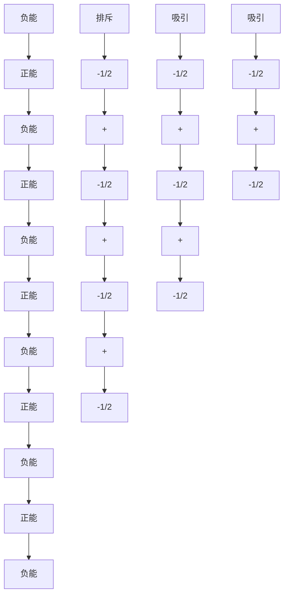
</details>

图1.18 $\pi$ 四极相互作用

Sanders 和 Hunter 强调个体原子对间的相互作用而不是分子整体的重要性，虽然这种方法取得了相对的成功，但是仍有许多关于 $\pi-\pi$ 堆积相互作用本质的争论。应当特别指出的是，美国匹兹堡大学的 Craig Wilcox 关于取代基效应的工作，该工作说明 London 色散力可能比静电作用起着更重要的作用 (1.7.7 节)。

![[超分子化学135章_images/3e179ad42ac00633001f0f24595ec9e0906e3e977bd7cdf84805b77b63e631b8.jpg]]

Hunter C A and Sanders J K M. The Nature of $\pi-\pi$ Interactions. J Am Chem Soc, 1990, 112: 5525\~5534

# 1.7.7 范德华作用力（小于 5kJ/mol，可变）

范德华力是邻近的核子靠近极化的电子云而产生的弱静电相互作用。这种力是没有方向的，因而在设计特定的主体对特殊客体的选择性络合时应用范围有限。一般来讲，范德华力可发生在大多数“软”物种（可极化分子）之间。惰性气体之间的作用力也是范德华力。在超分子化学中，它对包合物的形成也是非常重要的。在包合物中，小分子尤其是有机化合物松散地分布在晶格中或者分子空穴中。例如：在基于对叔丁基苯酚的大环化合物——对叔丁基杯[4]芳烃——分子空穴内包结的甲苯分子（5.3.1.2节）（图1.19）。

严格来讲，范德华力被分成色散（London）力和交换-排斥力。色散力是由邻近分子的波动多重偶极（四极，八极等）作用力引起的吸引力。这种吸引力随着距离的增大急速减弱（与 $r^{-6}$ 成正比），它存在于分子内的每个化学键，对整个相互作用能有贡献。交换-排斥力决定分子的形状并在一定范围内平衡色散力，它以原子间距离的12次幂方式递减。

# 1.7.8 固体中的紧密堆积

在固体结构（如晶体）研究中，获得紧密堆积排列也是一种很重要的驱动力。这已经被总结为“自然界痛恨真空（Na-ture abhors a vacuum)”的真理，但是按照Kitaigorodsky的紧密堆积理论，这只是有利的同向性的范德华作用力最大化的表现。Kitaigorodsky理论告诉我们，分子在形成二聚体、三聚体、高级聚集体直至最终形成晶体的过程中进行了形状的简化。这就意味着一个分子与邻近分子的空穴相吻合，这样就使得分子间接触最多，就像计算机游戏Tetris（俄罗斯方块）那样。很少有固体结构表现出明显数量的“空穴”。含有刚性框架的这样的结构（例如沸石，见5.1.2节）可以抵抗大气压和空的晶体空穴或通道之间巨大的压力差，而不至于破裂。这种材料通常在催化和分离科学中表现出有趣且有用的性质。

![[超分子化学135章_images/d0e49dede9092903e0886cd15cb29b1728cce9e01123f0464fa205f6faf0f631.jpg]]

<details>
<summary>chemical</summary>

3D ball-and-stick molecular model of a complex organic compound with fused rings and functional groups
</details>

图 1.19 一个典型的范德华作用力包结络合物（对叔丁基杯[4]芳烃·甲苯）的晶体结构

![[超分子化学135章_images/4f9d995e0d320615b43b8ee8e0fa272d4251e8ca2f2b52bebe7d8c912795ba66.jpg]]

Kitaigorodski A I. Molecular Crystals and Molecules. New York: Academic Press, 1973

# 1.7.9 疏水效应

虽然疏水效应偶尔会被误认为是一种力，但这种作用力通常是与大颗粒或弱溶剂化的粒子对极性分子（尤其是水分子）的排斥力相联系的（例如，借助氢键或者偶极作用）。这种作用在互不混溶的矿物油和水之间尤其明显。水分子相互作用很强烈使得其他物质（例如非极性有机分子）自然形成一个聚集体，从而被挤出强的溶剂间的相互作用之外。虽然同种有机分子间存在范德华力和 $\pi-\pi$ 堆积相互作用，但这种作用可以在一种有机分子与另一种分子之间产生类似吸引力的效应。在水中环糊精和环番（cyclophane）主体结合有机客体的过程中，疏水效应尤其重要（第5章），并可以分为两种能量作用机理：焓和熵。焓疏水效应就是客体把水分子从主体空腔替换出来的稳定性作用。因为主体空腔通常是疏水的，空腔内的水分子与主体分子的内壁作用不强，因此能量比较高。当释放到大量溶剂中时，通过与其他水分子的相互作用而达到稳定。熵疏水效应来源于这样的事实，溶液中两个分子（主体和客体，通常是有机分子）的存在，使得在大量水分子结构中产生两个“孔”，主体和客体结合形成的络合物使溶剂结构的破坏减小，因而熵增加（导致总的自由能减少）。这个过程见图1.20。

![[超分子化学135章_images/316408a9ffd460a4897a7134c541871ecac46b962eaf221b46c3782725b2f340.jpg]]

<details>
<summary>chemical</summary>

溶剂化反应示意图，展示溶剂化主体、溶剂化客体和络合物的结构式变化
</details>

图 1.20 有机客体在水溶液中的疏水结合

以客体对二甲苯和主体环番(1.17)的络合（在5.3.4.5节会详细描述）为例。其在水中的结合常数为 $9.3\times10^{3}L/mol$ 。293K时络合自由能 $\Delta G^{\circ}$ 为-22kJ/mol，由两部分组成：有利的起稳定作用的焓， $\Delta H^{\circ}=-31kJ/mol$ ；不利的熵部分， $T\Delta S^{\circ}=-9kJ/mol$ 。这种情况下焓对疏水络合起主宰作用。这种焓的贡献太大，不可能由主-客体间的相互吸引作用（通常是 $\pi$ 堆积和范德华作用力）产生，必须由特定的溶剂-溶剂作用力产生。在甲醇溶液中，由于较弱的溶剂-溶剂相互作用，焓的作用大大减弱。

![[超分子化学135章_images/4bc2fd96dca796efdf0ad2254c93da67a13dd2affff4d1d953e3548fc3e34e98.jpg]]

<details>
<summary>chemical</summary>

Chemical structure of a bis-phenyl-substituted aromatic compound with Me substituents and labeled (1.17)
</details>

Smithrud D B, Sanford E M, Chao I, Ferguson S B, Carcanague D R, Evanseck J D, Houk K N and Diederich F. Solvent Effects in Molecular Recognition. Pure Appl Chem, 1990, 62:2227\~2236

# 1.8 超分子主体设计

为了对特殊客体设计有选择性的主体分子，我们利用了螯合和大环效应以及互补性（主体和客体的空间和电子匹配性）的概念，还有更重要的主体预组织的概念。

主体设计的第一步是对目标明确的定义和认真的思考。这样可以很快得出一些关于新主体体系性质的结论。如果客体是金属阳离子（第3章），那么它的大小（离子半径）、电荷密度以及硬度（Box 3.2）都是非常重要的。例如，像硫这样的软供体分子易于与像汞离子、银离子、铅离子等软金属络合。对于阴离子络合物（第4章），这些因素也影响球形阴离子，如氯，溴等；但是对于非球形的阴离子客体，其他因素如形状、电荷、氢键供体的性质起主要作用。有机阳离子和阴离子要求主体同时带有疏水和亲水基团，而中性的客体缺少特定的“柄”（如能与主体强烈相互作用的极性基团）。

当限定一些参数后（如主体大小、电荷、供体原子的性质），就可以开始配体组织的设计。在这个过程中最关键的概念是组织。主-客体相互作用通过络合点发生。主体络合点的类型和数量必须要与客体结合点的特征最大限度地互补（参见作为发散络合点部分客体的定义），这些络合点必须排列在可以容纳客体分子的合适大小的有机支链或框架上。络合点相互之间应该在一定程度上保持一定的距离，以减少相互之间的排斥力；同时要有一定的排列规律，从而可以与客体同时发生相互作用。有利的作用力越多越好。大多数稳定的络合物带有对客体预组织的主体(3.8.1节)，这样就没有降低总络合自由能的熵和焓不利的重排。这样的主体是客体理想的接受体，这种结合是完全不可逆的。例如，它对于污水中去除有毒金属离子是理想的络合反应。那些结合能力较弱的主-客体化合物（即络合物种与游离物种间存在一定的平衡）可以用作传感器和载体，在“络合-检测-释放”或“络合-传输-释放”过程中会用到。

主体的有机框架结构的本质，不论是亲脂的还是亲水的，在主体的络合作用中都起到基础的作用。这决定了主体及其络合物的溶解性。配体的厚度及其络合部位（孔穴，裂口等）的接近难易度会影响热力学稳定性和络合动力学。引入侧链（例如长的烷烃链）可增强亲脂性，或增加与外面物质（高聚物或者生物分子）的相互作用。在医学影像目的或者发展人工“酶模拟器”（第9章）应用中，此类主体可用来运输放射性同位素到达人体中的目标区域。

总之，这些非常广博的原理的完全应用已被归纳成所谓的“完全络合化学”，包括超分子和经典的（werner）无机配位化学。

![[超分子化学135章_images/524659ac08d445bb0799b63c58f9a35e100baa0ddd1eda6b5e1eca36fe17c778.jpg]]

Lehn J M. Perspectives in Supramolecular Chemistry… From Molecular Recofnition Towards Self-organisation. Pure Appl Chem, 1996, 66: 1961\~1966

# 习题

1.1 $\mathrm{Cu}_{(\mathrm{aq})}^{2+}$ 与各种配体的热力学参数如下所示（水溶液，25℃）。利用这些数据计算 1:1 络合物的络合常数（ $\lg K$ ）。并且解释稳定性不同的原因。

<table><tr><td>配体</td><td> $\Delta H^{\circ} / (\text{kJ/mol})$ </td><td> $T\Delta S^{\circ} / (\text{kJ/mol})$ </td></tr><tr><td>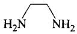</td><td>-105</td><td>7.1</td></tr><tr><td>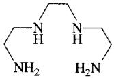</td><td>-90.4</td><td>24.3</td></tr><tr><td>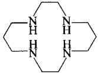</td><td>-76.6</td><td>64.0</td></tr></table>

1.2 给超分子化学一个简明的定义。解释分子间和超分子间作用的区别。用超分子相互作用的例子解释你的答案，讨论它们的相对重要性。  
1.3 利用 1.7 节的信息给出非分子间相互作用力强度的相对尺度。在设计络合金属阳离子的超分子主体时，把方向性、络合到主体的难易程度、通过多重络合位点可提高络合能力的倾向等因素考虑在内，把这些相互作用的重要性因素与其强度联系起来。如果设计对于阴离子或者中性有机离子的主体时，这些顺序会发生变化吗？在设计络合下列物质的主体时，什么是最重要的？甲烷、苯、甲醇、苯酚、氨、 $Cl^{-}$ 、 $Na^{+}$ 、 $Ni^{2+}$ 。  
1.4 利用表 1.1 给出的时间表，看一看哪些是超分子化学中最重要的发现？超分子化学经历了这么长的时间才发展成为一门独立的学科，你怎么看待这个问题？

参考文献

<table><tr><td>Andreetti, 1979</td><td>Andreetti G D, Ungaro R and Pochini A. Crystal and molecular structure of cyclo {quarter [(5-t-butyl-2-hydroxy-1,3-phenylene) methylene]} toluene (1:1) clathrate. J Chem Soc, Chem Commun, 1979, 1005</td></tr><tr><td>Braga, 1998</td><td>Braga D, Grepioni F and Novoa J J. Inter-anion O-H···O hydrogen bond like interactions: the breakdown of the strength-length analogy. Chem Commun, 1998, 1959</td></tr><tr><td>Cram, 1986</td><td>Cram D J. Preorganisation-from solvents to spherands. Angew Chem Int Ed Engl, 1986, 25: 1039</td></tr><tr><td>Kim, 1998</td><td>Kim E -I, Paliwal S and Wilcox C S. Measurements of molecular electrostatic field effects in edge-to-face aromatic interactions and CH-π interactions with implications for protein folding and molecular recognition. J Am Chem Soc, 1998, 120: 11192</td></tr><tr><td>Weber, 1986</td><td>Weber E, Franken S, Puff H and Ahrendt J. Enclave inclusion of nitromethane by a new crown host-X-ray crystal structure of the inclusion complex and host selectivity properties. J Chem Soc, Chem Commun, 1986, 467</td></tr></table>

# 第 3 章 阳离子络合主体

“晚归的行客现在快马加鞭要来找寻宿处了，

我自己将要跟你们在一起作一个谦恭的主人”

威廉·莎士比亚（1564～1616），Macbeth

天然的离子载体，诸如缬氨霉素、无活菌素以及第2章中讨论的恩镰孢菌素等，为超分子化学家合成人造离子载体的模拟品和具有选择性络合及传输功能的模型化合物提供了巨大的推动力，不仅可以识别碱金属离子，而且对大多数金属离子以及非金属离子如 $NH_{4}^{+}$ 和有机铵盐有识别功能。一个独特的挑战是手性物种，如质子化的氨基酸的对映异构体的选择性络合。阳离子络合化学有效地产生了分子识别的整个领域——涉及到主体选择性络合（通过结构和电子效应对特殊的客体进行络合）的化学研究领域。化学家们合成了大量不同的配体（金属离子的主体），它们具有明显的选择性和有用的反应活性。在本章中，我们将研究几类非常普遍的配体，并且利用它们作为实例讨论分子识别特性的基本理论，然后我们将研究这些概念在更复杂或更特殊的体系中的应用。

Lehn J M. Supramolecular chemistry—scope and perspectives molecules, supermolecules and molecular devices. Angew Chem Int Ed Engl, 1988, 27(1):89\~112   
Cram D J. The design of molecular hosts, guests and their complexes (Nobel Lecture). Angew Chem Int Ed Engl, 1988, 27(8): 1009\~1020   
Pedersen C J. The discovery of crown ethers (Nobel Lectures). Angew Chem Int Ed Engl, 1988, 27(8): 1021\~1027

# 3.1 冠醚

Gokel G W. Crown Ethers. Cambridge: Royal Society of Chemistry, 1990

# 3.1.1 发现与展望

冠醚是最简单的、最具有吸引力的大环配体，它是阳离子和中性分子的主体（见第5章），在超分子化学中显示出独特的魅力。冠醚是由以有机连接体（典型的是 $CH_{2}CH_{2}$ 基团）连接的醚氧原子所组成的简单排列。虽然单齿醚络合金属的能力较差（例如溶剂乙醚），但冠醚因其螯合和大环效应而成为非常有效的主体分子（见1.4节）。

在美国杜邦公司工作的美国化学家 Charles Pedersen 于 1967 年发现了冠醚，并因此获得 1987 年的诺贝尔化学奖。然而，有趣的是，他首次合成的第一个冠醚分子——二苯并[18]冠-6(3.4)是非常偶然的。他尝试合成链状的二醇(3.3)，希望其可以作为钒离子的配体起催化作用，反应如图解3.1所示。起始原料为儿茶酚(1,2-二氢羟基苯）的衍生物(3.1)，其中一个羟基被四氢呋喃保护。但令Pederson意想不到的是，起始原料被一些游离的儿茶酚(3.2)轻微污染，因此所得产品为混合物，是预期产品(3.3)和微量的只占 $0.4\%$ 的二苯并[18]冠-6(3.4)。Pederson因其良好的实验技能而能够从混合物中分离并表征这么微量的副产物（见Pederson,1967）。

![[超分子化学135章_images/6702e4350f692f96c5e1880235e20468b32648a7e3b0fbf72a9847ce38f755c3.jpg]]  
图解3.1 第一个冠醚二苯并[18]冠-6的偶然合成（Pederson，1967）

化合物(3.4)良好的溶解性及其高度的结晶性能（说明是单分子化合物而非聚合物）激发了 Pederson 的兴趣。化合物在甲醇溶液中溶解性很差，但加入碱金属离子后能够显著提高其溶解度。不久后，Pederson 以更高的产率合成出该化合物。他发现化合物(3.4)可以把无机盐如 KMnO₄ 溶解在有机溶剂（如苯）里，产生紫色溶液（被称为“紫苯”）。他还意识到，冠醚能溶解碱金属而得到有趣的蓝色溶液（见 3.12 节），现在已经知道这是碱金属阴离子和电子化物（electride salt）的颜色。他最后得出结论：“……钾离子落到分子中心的洞里面”（图 3.1），这在当时是一个很大胆的且充满想象力的论断。不过事实很快证明他是完全正确的。这个最初的结论促使一类相关物种迅速产生（图 3.2），Pederson 称其为 “冠醚”，因为络合钾离子的胶囊状络合物形状很像王冠。

自从 Pederson 早期的工作开展以后，冠醚在阳离子络合化学中非常受欢迎。冠醚具有极强的络合能力以及高度的柔韧性，这些性质吸引人们合成了大量的功能化的冠醚衍生物及其类似物，这些物种对各种客体分子的选择性也不同。冠醚作为离子载体的模板已经得到广泛的研究，类推于化合物(3.4)与钾离子的络合，离子载体（诸如 2.1 节讨论的缬氨霉素和无活菌素）的金属络合物也很快明朗了。

![[超分子化学135章_images/16d779f6ff56387b5cebc30051108406a522eced0372831540cbc9bb7b4ce302.jpg]]

<details>
<summary>chemical</summary>

Molecular structure diagram showing a spherical cluster with multiple arms and central atom
</details>

图 3.1 [18]冠-6(3.4) 和 K $^{+}$ 形成的络合物的空间填充示意图

![[超分子化学135章_images/05fed36fd7036f17c38901ce9c160de637017eb2eb452e52ef7b9e09e878c29c.jpg]]

<details>
<summary>chemical</summary>

Chemical structure of a sodium salt complex with [15]冠-5 and Na⁺匹配, labeled as (3.5)
</details>

![[超分子化学135章_images/6e02882e33c26cb749c038141e91f95ccc936fc354780752193e53b84952e88b.jpg]]

<details>
<summary>chemical</summary>

Chemical structure of a K+ complex with [18]冠-6 and K+匹配, labeled as (3.6)
</details>

![[超分子化学135章_images/a90556817deca349d74c484e9da55a36ef4f749d19d37f71f953bd6bcaf11572.jpg]]

<details>
<summary>chemical</summary>

Chemical structure of a cobalt complex with Cs+ counterion, labeled as [21]冠-7 and Cs+匹配 (3.7)
</details>

![[超分子化学135章_images/82c260805c412aea6374863ce70d61ef81d1dda11f3ba8ad83405556f317cc94.jpg]]

<details>
<summary>chemical</summary>

Chemical structure of a bis-aryl ether compound with 18 ring and 6构象更刚性, labeled as (3.8)
</details>

![[超分子化学135章_images/269e8046a52707d5b1c924d18a95a92f287ca8f0f977dbd072c3d9541020a132.jpg]]

<details>
<summary>chemical</summary>

Chemical structure of a bis-phenyl ether derivative with sodium counterions, labeled as compound (3.9)
</details>

图3.2 一些常见的冠醚

# 3.1.2 合成

Pederson 在早期工作中，总共描述了 6 种不同的冠醚合成方法，现在这些方法仍然是制备冠醚的基础（如图解 3.2 所示）。图解 3.2 中列出了 Williamson 醚合成的所有方法，尽管方法 (c) 直接生成了二苯并 [18] 冠-6，但绝大多数新型冠状是通过方法 (a) 或 (b) 合成的。事实上，通过方法 (b) 可以更高产率地合成二苯并 [18] 冠-6 [产率大约 80%，而方法 (a) 只有 45%]；此外，在方法 (c) 中，没有反应的邻

(a) $\ce{ \chemfig{*6((=O)-(-OH)=(-OH)-(-OH)-(-OH)=(-OH)-(-OH)-(-OH)=(-OH)-(-OH)-(-OH)-(-OH)-(-OH)-(-OH)-(-OH)-(-OH)-(-OH)-(-OH)-(-OH)-(-OH)-(-OH)-(-OH)-(-OH)-(-OH)-(-OH)-(-OH)-(-OH)-(-OH)-(-OH)-(-OH)-(-OH)-(-OH)-(-OH)-}$ + Cl—R—Cl $\xrightarrow{2NaOH}$ $\ce{ \chemfig{*6((=O)-(-OH)=(-OH)-(-OH)-(-OH)-(-OH)-(-OH)-(-OH)-(-OH)-(-OH)-(-OH)-(-OH)-(-OH)-(-OH)-(-OH)-(-OH)-(-OH)-(-OH)-(-OH)-(-OH)-(-OH)-(-OH)-(-OH)-(-OH)-(-OH)-(-OH)-(-OH)-(-OH)-(-OH)-(-OH)-}$

(b) $2\left(\begin{array}{c}OH\\OH\end{array}+\mathrm{Cl}-\mathrm{S}-\mathrm{Cl}\xrightarrow{\mathrm{NaOH}}\left(\begin{array}{c}OH\\O-S-O\end{array}\right)\xrightarrow[\mathrm{2NaOH}]{\mathrm{Cl}-\mathrm{T}-\mathrm{Cl}}\left(\begin{array}{c}O-T-O\\O-S-O\end{array}\right)\right)$

(c) $2\left(\begin{array}{c}OH\\OH\end{array}\right)+2Cl-U-Cl\xrightarrow{4NaOH}\left(\begin{array}{c}O-U-O\\O-U-O\end{array}\right)$

(d) $\ce{ \begin{array}{c} OH \\ O-V-Cl \end{array} \xrightarrow{2NaOH} \begin{array}{c} O-V-O \\ O-V-O \end{array} }$

(e)  \( \ce{ \chemfig{\*6((=O)-(-OH)=(-Cl)-(-O-V)-(-Cl)=(-O-(-V)-(-O-(-V)-(-O-(-V)-(-O-(-V)-(-O-(-V)-(-O-(-V)-(-O-(-V)-(-O-(-V)-(-O-(-V)-(-O-(-V)-(-O-(-V)-(-O-(-V)-(-O-(-V)-(-O-(-V)-(-O-(-V)-(-O-(-V)-(-O-(-V)-(-O- (-V)-(-O-(-V)-(-O- (-V)-(-O- (-V)-(-O- (-V)-(-O- (-V)-(-O- (-V)-(-O- (-V)-(-O- (-V)-(-O- (-V)-(-O- (-V)-(-O- (-V)-(-O- (-V)-(-O- (-V)-(-O- (-V)-(-O- (-V)-(-O- (-V)-(-O- (-V)-(-O- (-V)-(-V)-(-O- (-V)-(-O- (-V)-(-O- (-V)-(-O- (-V)-(-O- (-V)-(-O- (-V)-(-O- (-V)-(-O- (-V)-(-O- (-V)-(-O- (-V)-(-O- (-V)-(-O- (-V)-(-O- (-V)-(-O- (-V)-(-O- (-V)-(-O- (-V)-( - O - V - O - V - O - O - O - O - O - O - O - O - O - O - O - O - O - O - O - O - O - O - O - O - O - O - O - O - O - O - O - O - O - O - O - O - O - O - O - O - O - O - O - O - O - O - O - O - O - O - O - O - O - O -

(f) $\xrightarrow{\mathrm{H}_{2}/\mathrm{RuO}_{2}}$

图解 3.2 冠醚的合成方法

苯二酚使得 $[1 + 1]$ 和 $[2 + 2]$ 环加成产物分离困难。方法(d)只是Pederson用来制备大环化合物(3.10)的。方法(e）（分子内环化）不是一个特别可行的方式，因为起始原料不易得到且产率很低。例如，通过这种方法合成[18]冠-6的产率只有 $1.8\%$ ，尽管对于低聚乙二醇 $\left[\mathrm{HO}(\mathrm{CH}_2\mathrm{CH}_2\mathrm{O})_n\mathrm{H}\right]$ 的环化，如果将对甲苯磺酰氯缓慢滴加到悬浮的碱金属氢氧化物（作为碱）中，也可以得到较好的产率。一般来讲，自1971年以来，逐渐改用对甲苯磺酰基（ $\mathrm{MeC_6H_4SO_2^-}$ ， $\mathrm{Ts^{-}}$ ）取代氯离子作为离去基团，因为这样往往能够提高反应产率。

![[超分子化学135章_images/944f85d756e23107d22be087f604804343debd1ec2c15706be3cfa8d0b897bff.jpg]]

<details>
<summary>chemical</summary>

Chemical structure of a symmetric organic molecule with two benzene rings linked by a central ether linkage
</details>

(3.10)

方法(f)是一个催化还原反应，从芳香烃产生饱和环己基环。这种情况下，二苯并[18]冠-6理论上可以生成多达5种二环己烷并[18]冠-6的同分异构体，但只有前4种可以分离出来（见图3.3）。不同的材料构型会导致络合能力的差异。例如，在甲醇溶液里，它们对钠离子的亲和力可能相差1.5个数量级，其中cis-syn-cis异构体是最有效的。

![[超分子化学135章_images/04b4df3a67fc194ff3e5b03cb9d10fa38419c0e1c269dc930a85cbd561accb9f.jpg]]

<details>
<summary>chemical</summary>

Chemical structure of a symmetric organic molecule with oxygen atoms and cyclohexane rings
</details>

cis-syn-cis

![[超分子化学135章_images/b8818f6eb04f52f9c4d4b0987e7d6795bf31c1e7b2d4bcfac8dd94761b370edc.jpg]]

<details>
<summary>chemical</summary>

Chemical structure of a cyclic ether compound with oxygen atoms and stereochemistry indicated
</details>

cis-anti-cis

![[超分子化学135章_images/cbe9aa3d6a20fa5c10c811fd1604d0e751e8ed5ced622f6d17df4dbea18c6f7b.jpg]]

<details>
<summary>chemical</summary>

Chemical structure of a symmetric organic molecule with oxygen and ether functional groups
</details>

trans-syn-trans

![[超分子化学135章_images/d199f01bcf9100a05c62e8357a22e26f6d4c75489560d766c5c8e613657cb54e.jpg]]

<details>
<summary>chemical</summary>

Chemical structure of a symmetric organic molecule with oxygen atoms and cyclopentadienyl rings
</details>

trans-anti-trans

![[超分子化学135章_images/e9d1904b02d8f2e8b792001c25e50869d2427c6c01d6d7e965641ff908e70782.jpg]]

<details>
<summary>chemical</summary>

Chemical structure of a symmetric organic molecule with oxygen atoms and cyclopentadienyl rings
</details>

cis-trans   
图 3.3 二环己烷并[18]冠-6的同分异构体

![[超分子化学135章_images/aace7510afb17283e0601790823ff7efa8dc36731815391016230608861f74f8.jpg]]  
Parker D A. Macrocycle Synthesis: A Practical Approach. Oxford: Oxford University Press, 1996

# 3.2 套索醚和荚状醚

# 3.2.1 荚状醚

末端带有络合点的非环状主体分子被称为荚状醚（podand）。最简单的荚状醚是像五乙二醇二甲醚类冠醚(3.11)的非环状类似物，类似于[18]冠-6或它的二醇类似物(3.12)。

![[超分子化学135章_images/5ab96a1e79cada099d1796c31db256e3427d8638b22f295da688c6d6ce29b15c.jpg]]

<details>
<summary>chemical</summary>

Chemical structure of a symmetric organic molecule with methoxy (Me) substituents
</details>

(3.11)

![[超分子化学135章_images/dae2a8ac115d57d097a247a304783e0a9fb0c0e4c2212792e418e9af01551ee9.jpg]]

<details>
<summary>chemical</summary>

Chemical structure of a symmetric organic molecule with multiple hydroxyl groups and ether linkages
</details>

(3.12)

与它们的环状类似物相比，荚状醚因其不利的焓和熵效应的影响（见3.8节），主体分子对阳离子的亲和力一般较差，但在合适的金属离子如富含电荷的镧系金属离子存在下（图 3.4），它们可能采取类似于冠醚的卷曲构型。然而，荚状醚主体特别的柔韧性也允许采用多重桥连和螺旋状螯合模式（图 3.5），而冠醚还没发现这种性质。

![[超分子化学135章_images/622fb63b35777e05b06b673b0f81ce0b94b71b4bc42aefc617622bed9a1bc222.jpg]]

<details>
<summary>chemical</summary>

Molecular structure diagram of a coordination complex with central metal atom and surrounding ligands
</details>

图 3.4 Eu(Ⅲ) 的非环状荚状络合物 $\left[\mathrm{Eu}\left(\mathrm{H}_{2}\mathrm{O}\right)_{3}(3.12)\right]^{3+}$ 的 X 射线晶体结构

早在 1972 年，苏黎世的 Simon 领导的 ETH 研究小组报道了跨膜传输的钙离子载体，这些主体分子(如 3.13)依赖于极性氨基的络合能力和长的醚链的柔韧性，与它们在向后翻转的同时可以络合金属阳离子。此外，脂肪链使得化合物具有亲脂性，因而具有跨膜传输的能力。

专业术语 “荚状醚” 是 Vögtle 和 Weber 在1979年提出的，他们早期的工作包括端基为喹啉的荚状醚，如化合物(3.14)，它能和大量碱金属、过渡金属离子甚至硝酸双氧铀 $\left[\mathrm{UO}_{2}(\mathrm{NO}_{3})_{2} \cdot 6\mathrm{H}_{2}\mathrm{O}\right]$ 形成稳定的晶体状化合物。作为荚状醚工作的一部分，这些研究人员提出了重要的“端基概念”。荚状醚高度的柔韧性使其采取非键合的开放构型。然而，如果荚状醚末端是刚性官能团（如芳香基，酯基，氨基），那么主体分子通过硬化的末端基团产生的额外的组织性而使络合能力提高。一个很好的例子是化合物(3.15)，其共轭的苯甲酸部分提供了一个部分预设置的刚性平面络合裂缝，特别是当其与短的二甘醇链桥连时效果更明显。具有刚性端基苯醌单亚胺的主体分子(3.16)，通过主体紫外-可见吸收光谱的变化，有可能作为检测阳离子存在的方法。这种两性离子的荚状醚，通过两个阴离子给体氧络合，在二价阳离子存在下光谱发生很大的变化，类似这样的检测阳离子的应用将在第8章更详细地讨论。

![[超分子化学135章_images/7ee1f1c797915416232899e5044338e8eb0dbc5fda800fbc6f335bb60fcea7ab.jpg]]

<details>
<summary>chemical</summary>

Two organosilicon compounds with chlorine, magnesium, and hydroxyl groups, showing different coordination geometry and stereochemistry
</details>

图 3.5 简单荚状醚三甘醇的可供选择的配位模式

![[超分子化学135章_images/1ca8f1acc8df5ea1adeb42b6b2e28d8b51ac4900f2403dce62dd737c4b6a47d6.jpg]]

<details>
<summary>chemical</summary>

Chemical structure of a symmetric organic molecule with two methyl groups and a central ester linkage
</details>

(3.13)

![[超分子化学135章_images/f4d3ac0bc3def356fac99a269aff5c9ff5347d8353c0e57a13f9768cc3641e68.jpg]]

<details>
<summary>chemical</summary>

Chemical structure of a symmetric organic molecule with two fused benzene rings linked by ether linkages
</details>

(3.14)

![[超分子化学135章_images/2296ffc8583410343a576700e0ab8c447e128a8848bba25f8fe2cf79dfa703f9.jpg]]

<details>
<summary>chemical</summary>

Chemical structure of a symmetric bisphenol-based ester with two hydroxyl groups and a central ether linkage
</details>

(3.15)

![[超分子化学135章_images/a7659854a92a50e40e417d977f7ba1c20fe88a0b7b559ad77d6d14fa3f53196a.jpg]]

<details>
<summary>chemical</summary>

Chemical structure of a calcium complex with dimethylamino and phenyl ligands
</details>

(3.16)

![[超分子化学135章_images/7d95c6cb8a3d0c959688f055b3f92008a407e37b0d8d40fa9815d1f07c08707d.jpg]]

<details>
<summary>chemical</summary>

Complex organic molecule structure with methoxy and amide functional groups
</details>

(3.17)

将荚状醚的概念扩展到三维空间得到类似三脚架的分子，如化合物(3.17)，它可以完全囊括客体分子。另外，由于通过桥头氮原子倒置的三脚架主体分子通常具有高度的柔韧性，因而刚性端基的基本原理是可行的。

![[超分子化学135章_images/06772f6c2219eb2183fcd6608bcbd116c338b31b3fc8f909cb5c16f8d1fbb9d8.jpg]]

Gokel G and Murillo O. Podands. in Comprehensive Supramolecular Chemistry. Vol 1. Atwood J L, Davies J E D, MacNicol D D and Vögtle F (eds). Oxford: Pergamon, 1996. 1\~33

# 3.2.2 套索醚 (Lariat Ethers)

专业术语“套索醚”是指冠醚或相似的大环衍生物，它们具有一个或多个伴随附加物，利用某种三维络合度来提高对金属阳离子的络合能力。这类化合物可以看作是带有荚状醚支链的冠状大环（名称来自于西班牙语lareata，意思是“绳索”，意味着大环的概念代表着套索的环和代表牵着的绳索的荚状醚支链）。套索醚因其附加的稳定性和柔韧性（导致快速的离子络合动力学），而具有高度的刚性和大环化合物的预组织能力。图3.6给出了一些简单的荚状醚、冠醚以及套索醚的络合能力。很明显，对于 $\mathbf{K}^{+}$ 而言，[18]冠-6是更有效的配体，其络合能力几乎是荚状醚EG5(3.11)的 $10^{4}$ 倍。乍一看，套索醚的络合能力在某种程度上似乎处于环状和非环状化合物之间。然而，其与 $\mathbf{K}^{+}$ 的亲和力还受给体原子特性的控制。氮杂冠醚(3.18)与(3.19)更直接的比较说明，套索醚是二者中较有效的一种，它通过三维空间络合（图3.7）；尽管化合物(3.19)具有较强的碱性可提高络合常数（比较， $N,N^{\prime}-$ 二正丁基偶氮并[18]冠-6， $\lg K=3.8$ ），但给体原子的数目（8个而非6个）也是很关键的。

![[超分子化学135章_images/66c9507bd61d84f624a1da0984f6372e13f5b785e1fb7560f5a643a5b4653e68.jpg]]  
图 3.6 简单的荚状醚、冠醚及套索醚对 $K^{+}$ 的络合常数（lgK）  
物理量 K 是反应 $M^{+} +$ 主体  
(M·主体) $^{+}$ 的平衡常数（见 Box 1.1）

化合物(3.18)充分利用叔胺氮原子作为支点（pivot）原子，荚状支链连接在冠醚环上。然而，有效的套索醚也可以通过碳骨架为附属支链合成，如化合物(3.20)。这两种类型化合物的典型的合成方式如图解3.3所示，有趣的是，尽管化合物(3.20)可以很容易制备，产率高达70%以上，但它的同分异构体(3.21)的产率只有30%，且在立体构型上不能利用支链给体原子与同样的金属离子络合，说明了在过渡态中涉及到反应物的络合反应机制。合成

反应通过动力学控制，利用金属离子去组织反应物，这可以称作“动力学模板效应”，详情见3.8.2节。

![[超分子化学135章_images/92563c17649f563bb8d25a38287b64086173ce26628fdfd66dce7265d54fdb77.jpg]]

<details>
<summary>chemical</summary>

Chemical reaction diagram showing the transformation of a macrocyclic compound with K+ ions to form a larger macrocycle with Me and O atoms
</details>

图 3.7 套索醚络合金属离子

![[超分子化学135章_images/2309f016f1e72644f1ad2e7e5c496bb7e86f484cb33beaa75ebbb7157c404c60.jpg]]

<details>
<summary>chemical</summary>

Chemical reaction scheme showing synthesis of a brominated ester from hydroxyacetylene and its derivatives via intermediates and intermediates.
</details>

图解 3.3 N-支点套索醚（a）和 C-支点套索醚（b）的合成  
摘自：Nakatsuji et al，1982

![[超分子化学135章_images/4cafed381c520225a47c2c218677a2c1ff508f13a0f1a49b86cc9f32e26eb20f.jpg]]

<details>
<summary>chemical</summary>

Chemical structure of a complex organic molecule with methoxy and phenyl substituents
</details>

(3.20)

![[超分子化学135章_images/f6898b9a4f3eab276dc0623da303747412ac46aca2bc9b098d7f67aef8f676f9.jpg]]

<details>
<summary>chemical</summary>

Chemical structure of a complex organic molecule with methoxyphenyl group and ester linkage
</details>

(3.21)

![[超分子化学135章_images/6dbe489e2814aba508ba2664a642a989a35dc40a6851d35474f522dd04f68f7e.jpg]]

Gokel G and Murillo O. Podands. in Comprehensive Supramolecular Chemistry. Vol 1. Atwood J L, Davies J E D, MacNicol D D and Vögtle F (eds). Oxford: Pergamon, 1996. 97\~152

# 3.2.3 双支链套索醚

套索醚的概念可以很容易地延伸产生所谓的双支链套索醚主体分子，它们有两个荚状醚支链，因此在金属离子客体表面显示更大的三维络合覆盖度。根据如图解3.4所示的便捷但产率相对较低的合成方法，Gatto等人于1986年合成了大量双支链套索醚配体。

![[超分子化学135章_images/e4db3c52d1b150930a4727fc99d2a66f87bf0f1db15985b2a302d9d5c6c7a884.jpg]]

<details>
<summary>chemical</summary>

Chemical reaction scheme showing amine coupling with iodomethane under Na2CO3 catalysis to form a cyclic ester and subsequent products with asterisks indicating connection points.
</details>

图解 3.4 四个键同时偶联生成 BiBLE 配体

# 3.3 穴醚

Pedersen 的工作不久，一个年轻的科研人员 Jean-Marie Lehn 在斯特拉斯堡大学决定设计冠醚的三维类似物。他希望利用这种方法可以使金属离子完全被包裹到冠状主体分子内，得到选择性识别阳离子且可以提高类似离子载体的传输性质。相应地，通过高度稀释法，大多数双环穴醚（之所以这么命名，是因为它们能够以球形包围或者“埋葬”一个金属阳离子，像在地穴里一样；希腊语 kruptos 的意思是“隐藏”）和范围曾经逐渐扩大的相关化合物的合成产率都相当高（图解 3.5）。这些系列中第一个也是最重要的化合物是 [2.2.2] 穴醚 (3.22)，它以 Krytofix 的商品名销售。由于其尺寸和 [18] 冠-6 相似，(3.22) 在碱金属离子的存在下对 $\mathbf{K}^{+}$ 也显示选择性。然而，[2.2.2] 穴醚在甲醇中对 $\mathbf{K}^{+}$ 的络合力比相应的冠醚类似物高 $10^{4}$ 倍。同理，[2.2.1] 穴醚对金属离子 $\mathrm{Na}^{+}$ 也有选择性。穴醚（与冠醚相比）对金属离子络合能力能够显著提高的关键是它们的穴的三维特性，使得能够对金属离子 $M^{+}$ 发生 “球形识别”，这将在 3.7 节和 3.8 节进一步讨论。

![[超分子化学135章_images/a0681bd6be1892db659a83b5ebbbdd6eb0cf12b41912f30f96b68ef8b2338d4e.jpg]]

<details>
<summary>chemical</summary>

Chemical reaction scheme showing cleavage of a polyamide derivative with 45% yield and 95% yield, yielding two products (3.22) and (3.23)
</details>

图解3.5 [2.2.1]穴醚 $(n = 1)$ 和  
[2.2.2]穴醚 $(n = 2)$ 的合成  
(after Dietrich et al, 1969)

高度稀释合成法尽管很通用，但是不容易制备大量的材料，且经常涉及到多步反应，特别是最后一步用乙硼烷还原脱羰基。自Lehn的早期工作发表以来，科研工作者发展了多种合成步骤来制备大量不同掺杂程度的穴醚，其中包括手性物种和那些含有3个不同的桥的化合物。大多遵循逐步法，现总结如下：①构筑两个支链，在每个链的末端带有合适的反应基团；②这两个支链环化反应制备成单环冠（corand，类似冠醚的大环）；③在单环冠上增加第3条链而得到大二环化合物。

由于这些方法冗长单调，因而化学家们经常利用模板效应，设计相对简单的路线（见3.8.2节），这在许多简单情况下很有效。图解3.6给出了化合物(3.22)及相关化合物的简单合成方法。

![[超分子化学135章_images/d0741dbf31f31087b9275c6c7d6a3d3aa87889af05e4a0e80555ce329d3eebe3.jpg]]

<details>
<summary>chemical</summary>

Chemical reaction scheme showing synthesis of a bis-phenyl ether derivative using K2CO3 and MeCN under varying m and n conditions
</details>

图解 3.6 特定穴醚的简单合成及产率

氮杂冠醚（冠醚的某些氧原子被 NH 基团所取代）如(3.18)的合成多样性使得大范围合成穴醚成为可能，其中，许多穴醚对阳离子和阴离子具有特殊的络合性质。图 3.8 列出了一些氮杂穴醚的结构。

sepulchrates 是一类特别新颖的穴醚，它是由 3 个二齿配体的螯合物与各种盖帽（capped）基团以 Co(Ⅲ) 为模板缩合而成。1968 年 Boston 和 Rose 报道了第一例 sepulchrate，它的制备用到了三（二甲基乙醛酸）钴与较强的 Lewis 酸三氟化硼乙醚配合物的反应（图解 3.7）。Co(Ⅲ) 是一种很惰性的金属离子，因而穴醚络合物的形成很可能是金属离子能够使配体与络合物最终几何构型保持相似的结果。

![[超分子化学135章_images/1383fceb02d223ddedf796609c29f7602beea693691b8e69b8fe269832b2226f.jpg]]

<details>
<summary>chemical</summary>

Chemical structure of a bisphenol-based macrocyclic compound with R substituent and multiple hydroxyl groups
</details>

(3.24)

![[超分子化学135章_images/f2aa28ccbf4a263b2ded78602d26c6ad7ed864e64f24f28ce03a6afc68494517.jpg]]  
(3.25)

![[超分子化学135章_images/06921113f36726afcedba374e4983e6652bee511019858f8c957b55d12e39244.jpg]]

<details>
<summary>chemical</summary>

Chemical structure of a symmetric organic molecule with two pyridine rings and two ether linkages
</details>

(3.26)

![[超分子化学135章_images/13133eb599cbb437ca9b4a4b9ffb7c6ea2fa430c318fd3975daa700320751832.jpg]]

<details>
<summary>chemical</summary>

Chemical structure of a symmetric organic molecule with multiple amine and hydroxyl groups
</details>

(3.27)

![[超分子化学135章_images/a9956f0b76ffd56313025150d244950a71b7c3cc00ff9463444420ce514e55eb.jpg]]

<details>
<summary>chemical</summary>

Chemical structure of a symmetric dimeric compound with two pyrrole rings and terminal hydroxyl groups
</details>

(3.28)

![[超分子化学135章_images/686f9c025109a1ec5f3f7e6f0e31014040a243029f1a6fb8ed5ca56465b86c9e.jpg]]

<details>
<summary>chemical</summary>

Chemical structure diagram showing a macrocyclic compound with nitrogen and oxygen atoms connected by dashed bonds
</details>

(3.29)

图 3.8 部分氮杂穴醚的结构  
![[超分子化学135章_images/8279ecb7b1e07467c159a926654664a2f9dde3c18c3640d6340a80cfb79d788e.jpg]]

<details>
<summary>chemical</summary>

Chemical reaction scheme showing sarcophagenation and subsequent synthesis of compounds (3.30) and (3.31), with reagents and structural formulas.
</details>

图解 3.7 sepulchrates and sarcophagines

澳大利亚国立大学的 Alan Sargeson 制备了由 1,2-二氨基甲烷衍生的大量相关络合物。他将氮原子盖帽的金属化合物命名为 “sepulchrates”，碳桥连的相似物种为 “sarcophagines”，因为螯合的金属络合物很稳定，化学上惰性。

近期开发了有显著区域选择性和立体选择性的 Co(Ⅲ) 和 Pt(Ⅳ)sarcophagines 的制备方法，如(3.22)通过席夫碱缩合技术合成。席夫碱大环化合物将在 3.10.4 节进一步叙述。图 3.9 是一个该类型化合物的 X 射线晶体结构。

![[超分子化学135章_images/fa308488b2e47a9e6be29cbed61fb1f4ea12719e8cdf09fe128456b670f382bb.jpg]]

<details>
<summary>chemical</summary>

3D ball-and-stick molecular model of a complex organic compound with carbon, hydrogen, and oxygen atoms
</details>

图 3.9 Pt(Ⅳ) sarcophagines (3.22) 的 X 射线晶体结构 (after Brown et al. 1996)  
![[超分子化学135章_images/47aa468eb17a0c6d9bcfe9413bd072084f9e96e9d3a006aa002868538b27494a.jpg]]

Lehn J M, Supramolecular Chemistry: Concepts and Perspectives. Weinheim: VCH, 1995

# 3.4 球醚

除了 Pedersen 和 Lehn，第 3 位超分子化学家 Donald Cram 也分享了 1987 年的诺贝尔化学奖，他的贡献主要是在阳离子大环主体更深层类型的球醚上。冠醚（甚至是穴醚）在溶液中相对较柔性，因而 Cram 意识到，如果设计一个给体位点（甚至是在加入金属阳离子之前）汇聚到中心络合口袋的刚性主体分子，那么将可能观察到阳离子间强的络合力和极好的选择性。Cram及其合作者利用空间填充分子模型[称作Corey-Pauling-Koltun（CPK）模型]（图3.10），设计了刚性、三维的球醚，络合阳离子的氧原子呈八面体排列，容易接受金属离子。

![[超分子化学135章_images/940e2b93fcaae5907fab97e87bf0b27392acf942e77c1110f1d54fdfd6318a68.jpg]]

<details>
<summary>chemical</summary>

Diagram showing molecular rearrangement from a circular structure to a spherical arrangement, with a reaction arrow indicating transformation.
</details>

图 3.10 早期的超分子设计中使用的冠醚和球醚络合物的 CPK 模型现代计算机技术，如分子机器，在一定程度上取代了这些触觉表示法  
摘自：Vögtle F. Supramolecular Chemistry.
Chichester: J Wiley & Sons, 1991

化合物(3.33)的3个苯环朝上（平面外），3个苯环朝下，这种排列导致茴香基中的氧原子被固定在一个近乎

完美的八面体构型中，而对位的甲基和茴香基甲基对溶剂呈现一个亲脂表面。化合物(3.33)是众所周知的金属离子 $\mathrm{Li^{+}}$ 的最强的络合剂之一，这个主体在其穴内选择性地络合小阳离子如 $\mathrm{Li^{+}}$ ，对 $\mathrm{Na^{+}}$ 的络合能力稍差。其他金属离子因为太大而不能进入络合袋（binding pocket）中。球醚(3.34)由苯环成对地固载在二甘醇连接体上形成，其中4个苯环朝下2个苯环朝上，与(3.33)的络合袋尺寸相似。类似的氟取代物(3.35)以及具有8个芳环（octameric）的类似物也已合成出来。虽然从X射线衍射可看出氟取代物与(3.33)有很相似的穴，但氟取代物没有络合金属离子的特性。很明显，氟取代基对碱金属离子固有的亲和力很弱，以至于即使在有序的主体分子中引入多个络合点，在可测范围内仍然看不到络合。然而有趣的是，人们观察到了阳离子客体分子与一个氟取代的球醚(3.25)之间的反应，该反应在固态下通过X射线衍射证明，而在溶液中被 $^{19}$ F核磁谱所证实。

![[超分子化学135章_images/b8f567bf0aeb61ec08840104a1fa3f587e000b7cf3e025d122c4aba53ff7b055.jpg]]

<details>
<summary>chemical</summary>

Complex polycyclic aromatic hydrocarbon molecular structure with multiple fused rings and oxygen atoms
</details>

(3.33)

![[超分子化学135章_images/f7db9bae4211bf3bcadee8b4d9a6f935606e6d8be1bba49d16927d23f248c342.jpg]]

<details>
<summary>chemical</summary>

Complex polycyclic aromatic hydrocarbon molecular structure with multiple fused rings and oxygen atoms
</details>

(3.34)

![[超分子化学135章_images/4417e5de0f293545b16789ef6c06ae3d2c80026832996dbd43c05459f0267772.jpg]]

<details>
<summary>chemical</summary>

Chemical structure of a polycyclic aromatic hydrocarbon with fluorine substituents
</details>

(3.35)

为了完成球醚合成中的最后环化步骤，科学家们发展了一种新的关环合成步骤，遵循式(3.1)进行 $\left[\mathrm{acac} = \mathrm{acetylacetonato}, \mathrm{CH}(\mathrm{COMe})_{2}^{-}\right]$ 。芳基锂（通过叔丁基锂作用产生）被三价铁络合物氧化，得到芳基双自由基，接着以锂离子为模板而环合（见3.8.2节解释模板效应）。化合物(3.33)按照如图解3.8所示的方法可以得到 $28\%$ 的收率。

$$
\mathrm{Ar} - \mathrm{Br} \xrightarrow {\mathrm{BuLi}} \mathrm{Ar} - \mathrm{Li} \xrightarrow {\mathrm{Fe(acac)} _ {3}} \mathrm{Ar} - \mathrm{Ar} \tag {3.1}
$$

![[超分子化学135章_images/606458a3683a0ba61922a0724cbed49566da0ebdb3a7681867eb1a121574c6c3.jpg]]

<details>
<summary>chemical</summary>

Chemical reaction scheme showing conversion of a brominated compound to a lithium complex using BuLi, Fe(acac)3, and HCl under acid conditions
</details>

图解 3.8 球醚络合物(3.33) $Li^{+}$ 的合成

化学家们合成了与化合物(3.33)相似的非环状荚状醚主体分子，用来比较环主体刚性的预组织能力的重要性。结构最相近的荚状醚(3.36)（估计具有超过1000种可能的构象，其中只有两种可以以汇聚的方式络合离子）与化合物(3.33)（只有一种构象）的比较结果显示，球醚络合 $\mathrm{Li^{+}}$ 更有效，比(3.36)快 $10^{12}$ 倍，这充分体现出统计学（熵）效应在主体分子设计上的重要性。

冠醚（或者更常见的 corand）、穴醚、球醚以及荚状醚（podand）之间相互交叉又创造出大量杂化的主体分子，如穴球醚（cryptaspherand）和半球醚（hemispherand），其中很多都具有母体所有有用的特征（图 3.11）。

![[超分子化学135章_images/6b200109d42b317ed7e33ab8faf791a19d7d2161826da490662b9538e2147a4c.jpg]]

<details>
<summary>chemical</summary>

Chemical structure of a symmetric organic molecule with multiple methoxy (Me) groups attached to a benzene ring system
</details>

(3.36)

![[超分子化学135章_images/6f99b64c98586fd78e859d7fc34fa1fc9f96e98105ab19576145cce723651b72.jpg]]

<details>
<summary>chemical</summary>

Chemical structure of a complex organic molecule with fused rings and oxygen-containing functional groups, labeled '半球醚' (half-methoxy醚)
</details>

(3.37)

![[超分子化学135章_images/e9701834ebbfa3b90d85379d3779c8a99af5fb4ca2b7bf034326f3224c6d9015.jpg]]

<details>
<summary>chemical</summary>

Chemical structure of a complex穴球醚 with fused rings and functional groups
</details>

(3.38)

![[超分子化学135章_images/f465841a173d0e603aa8faf941a4cb89f9f9689a632c3a7afde3b454beb72a18.jpg]]

<details>
<summary>chemical</summary>

Complex organic molecule structure with multiple ethyl (Et) and furan (Furan) substituents
</details>

半球醚  
(3.39)   
图 3.11 杂化的阳离子主体

![[超分子化学135章_images/f514239ef6240397941f4903665850d533b2450d7ff27fa7c064db5afa34b98e.jpg]]

Maverick E and Cram D J. Spherands: Hosts Preorganised for Binding Cations. in Comprehensive Supramolecular Chemistry. Vol 1. Atwood J L, Davies J E D, MacNicol D D and Vögtle F (eds). Oxford: Pergamon, 1996. 213\~243

# 3.5 命名法

冠醚的命名相对简单，尽管由于历史原因，只有在假定以乙二醇为连接体时，它才是明确的；在更复杂的情况下，这个术语经常伴随着绘画示意图。

（1）冠醚名称的第 1 个数字是指环上的原子数目（通常是在中括号 [ ] 中给出）。  
(2) 冠醚名称的第 2 个数字给出氧原子数目（或其他给体原子）。  
(3) 取代基用前缀如苯并、二环己烷并等标出。

例如，二苯并[18]冠-6是具有18个原子的大环冠醚分子，其中包含6个氧原子和2个苯取代基。对于中性有机配体，化学家Vögtle和Weber于1979年提出了一个更通用的命名系统，1986年Cram加以补充，其中，像单个冠醚分子这

![[超分子化学135章_images/76406ff3e5219fbba428d30335ea5837a9ad65f5363740ac6d6f8441e5d5ff43.jpg]]

<details>
<summary>chemical</summary>

Chemical structure diagram of a conjugated diatomic molecule with D and n atoms, labeled in Chinese
</details>

![[超分子化学135章_images/3719d34338ff73ac10786d758a644ca0f5453a6562a55812fb66f8d2720f2772.jpg]]

<details>
<summary>chemical</summary>

环状结构示意图，标注D=O、冠醚位置及单环冠
</details>

![[超分子化学135章_images/b6fcee1c7a6d9dfabe84dd0c31cc491b760386bc31394b3efeb216091978854c.jpg]]

<details>
<summary>chemical</summary>

Chemical structure diagram of a diol with labeled components including triad, diol, and diol醚
</details>

图 3.12 环状和非环状配体分类

样的任意一个环的体系被称为单环冠状化合物（corand）（源于coronand）；开链分子如化合物(3.3)和(3.11)被称作荚状醚（podand）；两个环或多环体系被命名为穴醚（cryptand）（图3.12）；基于对甲基苯甲醚的刚性体系为球醚（spherand）。通常来讲，对于含单纯的氧原子给体的配体，冠醚的历史命名法仍然保留。

图3.13给出了荚状醚、单环冠状化合物以及穴醚的实例。在这种体系下，所有冠醚都属于通常类型的单环冠（corand）。[18]冠-6(3.6)的名称就变为 $18\langle \mathrm{O}_62_6\mathrm{corand}-$ 6)，指该化合物是含有6个氧原子的18原子的单环冠状化合物，由6个各含两个碳原子的连接体相连，因而共有6个给体原子，有时简称为[18]- $\mathrm{O_6}$ 。同理，氮杂单环冠(3.43)称为 $18\langle \mathrm{O}_6\mathrm{N}_32_6\mathrm{corand - }6\rangle$ 。相似的命名系统在文献中也很常见，尤其是对于含有多个氮原子或硫原子给体的单环冠，它将corands认为是一个大的取代的环烷烃，后缀“-ane”通常是和表示环的尺寸及给体原子的数字一起使用。因此，18 $\langle \mathrm{N}_62_6\mathrm{corand - }6\rangle$ (3.44)表示为[18]ane- $\mathbf{N}_6$ ，硫代的同系物表示为[18]ane- $\mathbf{S}_6$ 。其他与分类有关的命名在文献中也很常见。化合物(3.44)通常被称为六环烷（与1,2-二氨基乙烷相似，因此简称为“en”）。化合物(3.11)是套索醚类的一种（lasso ethers），其中单冠醚环代表套索（lasso）的环，而侧链代表绳索。化学家们研制了冠醚的氮杂相似物，如(3.45)，其中的醚氧原子被功能团NH所取代，它们可以作为过渡金属的配体并由此有不同的名称。单环冠(3.45)是指cyclam，它也可以称为四氮杂[14]冠-4或者更系统的命名为 $14\langle \mathrm{N}_42_23_2\mathrm{corand - }4\rangle$ 。相似地，有许多通俗的名称如sarcophagenes和sepuculrates(3.30)～(3.32)，其命名类比于穴醚（编入文献的新命名方法可能是有些偶然，有爆炸危险的大环化合物 $\mathrm{Se}_4\mathrm{N}_4$ 被称为phaetodigitogenic，这是帝国学院的化学家Woolins等人命名的，意味着可以炸掉手指）。

![[超分子化学135章_images/735d85d55801b6207b2a6c50a7b30fb12c9a91ade1102e5a10b5d844f8d5d336.jpg]]

<details>
<summary>chemical</summary>

Chemical structure of a symmetric organic molecule with oxygen atoms and methyl substituents
</details>

(3.11)

![[超分子化学135章_images/6bf72e929b826d2f723ccb800a40553c5d69b3f535e7df5d5daf69ba29d8b80d.jpg]]

<details>
<summary>chemical</summary>

Chemical structure of a symmetric organic molecule with two phenyl rings and ether linkages
</details>

(3.40)

![[超分子化学135章_images/d3adc4822de0934cfa90310149f9905b74986d1c103810a794e764bfa9e2000f.jpg]]  
(3.22)

![[超分子化学135章_images/bfd93098c5fae35ff85d236070ca9213e1e0fcb50190b6652e95db067b7a9b92.jpg]]

<details>
<summary>chemical</summary>

Chemical structure of a symmetric organic molecule with methyl and amine functional groups
</details>

(3.41)

![[超分子化学135章_images/ae060346014bd6922e62ff1448ae953ed88dab35248bf72c8aea945576d7db6b.jpg]]

<details>
<summary>chemical</summary>

Chemical structure of a symmetric organic molecule with two benzene rings and a central ether linkage
</details>

(3.42)

![[超分子化学135章_images/6df4f5c083809f5fe430d22a3d3ae1bf805a8a0d2bd80541f181068fc7528719.jpg]]  
(3.43)   
图 3.13 与[18]冠-6 相关的荚状醚(3.11)，(3.40)，  
穴醚(3.22)和单环冠(3.41)\~(3.43)   
化合物(3.41)和(3.42)是杂化的单环冠-荚状醚家族（称为套索醚）的成员  
带有两个荚状醚手臂的套索醚(3.42)被称作 BiBLE's (bi-bracchial lariat ethers, 双臂套索醚)

穴醚的命名有些不同，因其结构更像球状而非冠状。每个主体分子都被一系列数字所标示，这些数字表示在桥头之间每个桥上的给体原子的数量。因此，化合物(3.22)和(3.23)分别被命名为[2.2.2]穴醚和[2.2.1]穴醚。化学家们合成了大量各种各样的穴醚配体，带有以碳或氮原子桥头衍生的各种各样的桥，由 S、N 及其他给体原子和基团桥连，包含多个桥 [如 “足球” 穴醚，(3.29)]。这些物种的命名尽管不怎么严格，但经常是很形象的。

![[超分子化学135章_images/252b6d4ba37c026bf0da5b034caefa4e96289fe172e4de9b272ce1cd3c948627.jpg]]  
(3.44)

![[超分子化学135章_images/d8b4fc320550c8de42375d323c5b020b154824359b93edd9dcceb12fe6409a46.jpg]]  
(3.45)

所有这些配体的合成必须考虑到络合客体金属离子，因而命名必须区分自由配体和金属络合物。通常用后缀带-and的代表未络合的配体，而后缀带有-ate的表示金属络合物。因此荚状醚的金属络合物被称为podate，单环冠（corand）的络合物称作corate，穴醚的络合物为cryptate。用公式表示，数学符号“⊂”表示“整体的一部分”。因此单环冠状化合物 $18\langle \mathrm{O}_62_6\mathrm{corand - }6\rangle$ 形成的络合物表示为 $[\mathbf{K}^{+}\subset 18\langle \mathrm{O}_{6}2_{6}\mathrm{corand - }6\rangle ]$ ，如图3.1所示。

然而，惯常使用的命名法经常会引起误解，因为后缀-ate经常被用来指阴离子盐（如乙酸盐和硫酸盐），而主-客体络合物很多是指阳离子络合物。因而，有人提议应该采用后缀-plex，如corplex，spheraplex等（Cram,1986）。在本书中，我们将尽可能使用最常用的术语，避免和文献中的产生混淆。大多数情况下，在应用中尽管有令人困惑的各种术语，但是命名经常具有很强的描述性，对于那些受过良好教育的无经验的人们，很容易通过猜测而理解。

# 3.6 溶液性质

# 3.6.1 溶解性

在没有客体分子存在的情况下，冠醚分子如[18]冠-6在很大范围的溶剂（从水到烷烃）中都有很好的溶解性。的确，[18]冠-6在辛醇和水之间分配系数的亲脂程度几乎为零，说明其在亲水性和亲脂性之间存在着极好的平衡。自由配体和配体络合 $\mathbf{K}^{+}$ 后的X射线晶体结构衍射图（图3.14）的差异可以解释其多样性行为。

![[超分子化学135章_images/7f100dfdf842161044c7295e9540e72724943e30ea71fc9b5fa3abc52d2907fa.jpg]]

<details>
<summary>chemical</summary>

Molecular structure diagram of a complex organic compound with multiple rings and functional groups
</details>

(a) 游离的二环己烷并 [18] 冠 -6

![[超分子化学135章_images/f592e5f81fdad2722e973024b76c1df31fa6b2325371f43f5f12d27c54baf888.jpg]]

<details>
<summary>chemical</summary>

Molecular structure diagram of a polycyclic aromatic hydrocarbon with fused rings and substituents
</details>

(b)与最相近的[18]冠-6形成的钾络合物  
图 3.14 游离冠醚与冠醚金属络合物的 X 射线晶体结构比较

在 $\mathrm{K}^{+}$ 络合物中，所有的氧原子都指向内部（参见在配合物中具有汇聚性配位点的化学实体作为主体分子的定义），产生一个完全疏水的表面，与膜离子载体如缬氨霉素类似（见2.1部分）。然而，在自由配体中，其中的两个氧原子指向外，呈现一个极性较大的表面。事实上，单环冠如[18]冠-6在溶液中有很好的柔韧性，使得它们呈现一个完全亲水的表面而掩盖了亲脂骨架，或者呈现一个完全疏水的表面，所有氧原子的孤对电子指向内，以预设置（见3.9节）方式络合金属阳离子（图3.15）。穴醚具有相似的柔韧性，而球醚则较刚性。

![[超分子化学135章_images/38bee573761cc7a371f81184514d679d9cb04bd0b28af3a5596e7b6a01153085.jpg]]  
图3.15 [18]冠-6在不同介质中的溶液行为

通过观察主体 O-CH₂-CH₂-O 的扭转角可以总结出基于主体的大多数乙烯二醇络合金属离子的构象标准（如图 3.16 所示）。对于客体分子的络合，所有的扭转角必须是邻位交叉（即小于 90°），通常在 65°～75° 范围之内，与 1,2-二甲氧基乙烷的最优化计算值 72° 接近。然而对于未络合的冠醚，通常至少可以观察到两个反扭转角。

# 3.6.2 溶液应用

冠醚和穴醚良好的溶解性在两个主要的应用如相转移催化剂和阴离子活化作用中是很重要的。相转移催化剂就是将客体物种从一相转移到另一相。问题是两相（液-液相转移）通常是互不相溶的，使用合适的主体分子可以提高无机盐在非极性介质中的溶解度。因此，将反应物在有机相中混合成均相，超分子主体物种可以催化亲水无机盐和亲脂有机底物之间的反应。

![[超分子化学135章_images/d65cc14f37df36cdd29b494fda3a9264b3ec7091732ef96735fd35ce6f64226a.jpg]]  
图 3.16 冠醚络合物内的扭转角

用大环多醚络合无机阳离子如碱金属或碱土金属离子，产生在非极性溶剂如苯、甲苯和卤代烷中易溶的亲脂性的金属阳离子-大环络合物。为了保持电荷平衡，阳离子络合物有一个相关的抗衡离子。在互不相溶的两液相体系中，如氯仿和水的混合物中，阴离子必然穿过相界面被拉到有机相，作为阳离子络合物的抗衡离子。

![[超分子化学135章_images/95f2613c4d2fb0184a3e7b5d3ca9b3e64e008240989fe721d1bfea625455d889.jpg]]

<details>
<summary>chemical</summary>

Chemical reaction diagram showing water phase, [18]冠-6 intermediate, and CHCl₃ phase with K⁺ ion
</details>

图 3.17 冠醚相转移催化

这种规律的简单示意可以通过把[18]冠-6的氯仿溶液加入苦味酸钾（2,4,6-三硝基苯酸钾）的水溶液中得到。一旦搅动，苦味酸根阴离子的黄色就会迅速转移到邻近（自然接触）的氯仿相中（图3.17）。

活性阴离子一旦进入有机相，就可以和有机相中的底物发生均相化学反应，而不只是在相界面反应。这致使反应速率大大提高，通常产率很高或者根本不反应。因此，只需要少量的冠醚或穴醚，是一个真正的催化过程。化学反应一旦发生，冠醚就可能返回有机相-水相界面去转移更多的反应物，并且去掉无机盐副产物。因此无机盐在有机相中的净平衡浓度不必

很大，但事实上阴离子（如 $MnO_{4}^{-}$ ）一直在发生反应，使得以冠醚为介质的新鲜的盐穿过界面，产生浓度梯度（有机相中无机盐的浓度始终低于水相）。

大环阳离子主体催化反应的又一个令人感兴趣的方面是其“裸露阴离子”效应。在一个常规的阴离子反应中，如有机亲核取代反应，与阳离子（抗衡离子）配位或离子配对减弱了阴离子的亲核性，化学反应的活化能大大提高，需要增加必要的能量来打开阳离子-阴离子缔合体。在冠醚特别是穴醚存在下，阳离子被亲脂外壳隔离，使得阳离子与阴离子间产生大的物理分离。因此，阴离子与阳离子之间没有明显的相互作用，也就不存在阴-阳离子缔合对活化能的贡献，反应的活化能才得以降低。

总之，大环络合试剂可以用来提高任何反应的速率，在这些反应中涉及到离子、离子中间体或者大极性物种。重要的实例包括：①亲核取代反应；②与碳负离子的反应；③C-C键的形成（如Darzens或Knoevenagel缩合反应）；④加成反应；⑤消除反应；⑥卡宾生成反应；⑦还原反应（特别是和电子化盐反应，见3.12

节); ⑧重排反应（Favorskii 重排，Cope 重排）。

冠醚和穴醚在相转移催化和阴离子活化中的应用在随后的研究中论述。

# 3.6.2.1 高锰酸钾氧化有机底物

无机盐如高锰酸钾、重铬酸钾，通常不溶于非极性溶剂，在体系中加入亲脂性冠醚后，这些无机氧化物能够快速定量地氧化有机底物（图解3.9）；但没有大环化合物时，产率非

![[超分子化学135章_images/84f60fc8b277b17d719fc4654bb0cd71c2bceb3752c022292b06f1f20da034f6.jpg]]

<details>
<summary>chemical</summary>

Chemical reaction equations showing oxidation of cyclohexene derivatives with KMnO4 and [18] alkyne to form cyclic ketone structures
</details>

图解 3.9 通常不溶的 $MnO_{4}^{-}$ 由 $[K^{+}\subset冠醚]$ 络合物转移至有机溶剂里使得有机底物定量氧化

常低。

# 3.6.2.2 钾盐和氯苯在乙腈溶液中反应

图解 3.10 所示为阴离子（ $A^{-}$ ）和苄基衍生物之间的常规反应。

![[超分子化学135章_images/714a61a62f1550d5afeb77c91de085b80d29bdd85470d6a9d89b15dc02e2bca7.jpg]]

<details>
<summary>chemical</summary>

Chemical reaction equation showing oxidation of an X-substituted benzene to an α,β-unsaturated phenyl ether under potassium ion and acetic anhydride conditions
</details>

图解 3.10 苄基氯与钾盐在乙腈里发生的反应
X=Cl; A=阴离子，如乙酸根

表 3.1 $\mathrm{A} = {\mathrm{{CH}}}_{3}{\mathrm{{CO}}}_{2}^{ - }$ 时反应速率对添加的冠醚的依赖性(离去基团 $\mathrm{X} = \mathrm{{Cl}}$ )

<table><tr><td>冠醚</td><td>反应半衰期/h</td><td>冠醚</td><td>反应半衰期/h</td></tr><tr><td>无[18]冠-6</td><td>6853.5</td><td>二苯并[18]冠-6二环己烷并[18]冠-6</td><td>9.51.5</td></tr></table>

表 3.2 在[18]冠-6 存在下，各种阴离子（A $^{-}$ ）的亲核性

<table><tr><td>亲核试剂</td><td>相对速率</td><td>在质子性介质中的相对反应速率</td><td>亲核试剂</td><td>相对速率</td><td>在质子性介质中的相对反应速率</td></tr><tr><td> $N_{3}^{-}$ </td><td>10.0</td><td>100</td><td> $Cl^{-}$ </td><td>1.3</td><td>10</td></tr><tr><td> $CH_{3}CO_{2}^{-}$ </td><td>9.6</td><td>5</td><td> $I^{-}$ </td><td>1.0</td><td>1000</td></tr><tr><td> $CN^{-}$ </td><td>2.4</td><td>1250</td><td> $F^{-}$ </td><td>1.4</td><td>1</td></tr><tr><td> $Br^{-}$ </td><td>1.3</td><td>80</td><td> $SCN^{-}$ </td><td>0.3</td><td>625</td></tr></table>

由表 3.1 可以看出，冠醚的参与大大提高了简单亲核取代反应的速率。因为冠醚可以络合 $K^{+}$ ，从而使得与 $K^{+}$ 配位相对较强的乙酸根阴离子释放出来，并作为亲核试剂参与反应。由表 3.2 可以看出，在质子性介质中（冠醚的络合较弱），对于不同的阴离子，因其对 $K^{+}$ 络合能力的不同，反应速率有很大的差别。因而，软碱 $I^{-}$ 微弱溶剂化，与 $K^{+}$ 之间的缔合也较弱，反应很快；而 $F^{-}$ 强烈溶剂化，且与 $K^{+}$ 结合紧密，反应缓慢。而在有机溶剂中，钾离子与冠醚的络合力很强，因此所有的阴离子以较相似的速率反应；的确，与 $I^{-}$ 相比， $F^{-}$ 具有较高的负电性、半径较小、自由度较大，因而其亲核能力更强。

![[超分子化学135章_images/779ba095a3fad47bbe10e496a5f0eb1482162d34d8c09a2502c525cd09a8011f.jpg]]

<details>
<summary>chemical</summary>

Molecular structure diagram showing two complex organic molecules with central metal atoms and organic ligands
</details>

图 3.18 碳化钼络合物的 X 射线晶体结构，起配位作用的 $K^{+}$ 离子被苯并 [15] 冠-5 截获

# 3.6.2.3 “裸露的”碳化物配体的形成

单个碳原子是过渡金属离子非同寻常的配体。碳负离子自由基不能与其他金属或功能基团络合，含有碳负离子自由基的钼络合物是通过苯并[15]冠-5或[2.2.2]穴醚来阻截抗衡离子 $\mathbf{K}^{+}$ 来合成的，如图解3.11所示（Peter et al，1997）。产物的X射线单晶结构明显显示 $\mathbf{K}^{+}$ 的自由态（图3.18）。

![[超分子化学135章_images/34d6d428d558410a1e1945a7d5b8d95effafc8be583d57c0d67443eeab8f9986.jpg]]

<details>
<summary>chemical</summary>

Chemical reaction scheme showing transformation of a molybdenum complex with Na/Hg, BuC(O)Cl, and KCH2Ph to form a complex with phenyl and carbonyl ligands, followed by coupling to [15]冠-5 or [2.2.2]穴醚.
</details>

图解3.11 由苯并[15]冠-5或[2.2.2]穴醚络合 $\mathbf{K}^{+}$ 形成“裸露的”碳化物配体

# 3.7 阳离子络合的选择性

# 3.7.1 总则

给定的主体分子对一个特定阳离子的热力学选择性代表主体分子对给定金属离子（如 $K^{+}$ ）与其他客体阳离子的亲和力之间的比例。选择性的强络合是分子识别的基础。因此，一个成功的主体分子应该是对一个特定的客体分子显示强的亲和力，而对其他阳离子的亲和力较弱（用络合常数检测，Box 1.1）。因为合成设计是一个非常复杂的任务，所以一个合成的主体分子必须对给定的阳离子有很高的选择性。选择性受多种因素的影响，下面罗列出其中一些非常重要的因素：

- 阳离子和主体分子穴的尺寸要匹配；  
- 静电荷；  
- 溶剂（极性，氢键和配位能力）；  
- 焓和熵对阳离子-主体分子相互作用的影响；  
- 阳离子和主体分子的溶剂化自由能；  
- 抗衡阴离子的本质及其与溶剂和阳离子的相互作用；  
- 阳离子络合动力学；  
- 螯合环的尺寸。

在以上因素中，尺寸匹配是一项重要且容易想到的因素，但不是必要的主要因素。与敏感的效应如螯合环尺寸一样，溶剂化和预组织也起到非常重要的作用（Hancock，1992）。在详细讨论这些作用之前，为了定量比较客体分子被一个主体或其他主体分子的络合能力，有必要定义一个特定的主体分子对每个客体阳离子的亲和力的衡量尺度。与阳离子的络合亲和力有关的热力学常用一个总的络合常数(K) 表示，它主要表示络合反应的平衡常数。因此选择性可以表述为一个络合常数与另一个的比率。络合常数的定义和一些通常的测量方法如 Box 1.1 所示。注意：一个络合物的在热力学稳定性（静态络合稳定性）与其在络合物形成和解络过程中的动态行为（动态络合稳定性）之间存在重要的区别（见 3.9.2 节）。

# 3.7.2 冠醚

对于高柔韧性的大环化合物，如冠醚，一个给定大环化合物的络合常数的变化沿第一族阳离子下降显示一个平台选择性（plateau selectivity）。因而，我们认为，对一系列客体分子，如碱金属离子，络合常数不显示平稳的上升和下滑趋势，但对几个金属离子却具有相似的亲和力。例如，对于较小的金属阳离子，络合常数可能很相似，但随着阳离子半径的增大而下降，致使 $Na^{+}$ 和 $K^{+}$ 很难区别。此外，络合常数可能随着阳离子半径增大而增大直到 $Rb^{+}$ 和 $Cs^{+}$ 时开始平缓。这可能归咎为络合的二维特性，使得冠醚配体能够容纳多种多样的金属离子，而与离子半径无关。因此，在简单的配体如冠醚中，阳离子半径与主体分子穴半径的匹配究竟有多重要？图 3.19 和图 3.20 给出环尺寸不同的冠醚，其络合常数随着阳离子直径的变化；表 3.3 从 CPK 分子模型的角度比较了金属离子直径与冠醚的空穴尺寸之间的关系，以及金属离子直径的比较。

![[超分子化学135章_images/3864af902b2d40f2e0019842195851435f354ca5c64d1b7d856e590c7e12761c.jpg]]

<details>
<summary>line</summary>

| 阳离子 | lgK₁(MeOH) |
| ------ | ---------- |
| Na     | 4.2        |
| K      | 6.0        |
| Cs     | 4.3        |
| Na     | 3.8        |
| K      | 3.6        |
| Cs     | 2.8        |
| Na     | 2.2        |
| K      | 1.2        |
</details>

图3.19 环己烷并冠醚，络合常数随阳离子半径的变化

![[超分子化学135章_images/eec495f00e7b6df49b496aedbc53fe90050c985dbaf6dc576bb6317a14d41d01.jpg]]

<details>
<summary>line</summary>

| 环尺寸 (原子数) | Na⁺  | K⁺   | NH₄⁺ | Ca²⁺ |
| --------------- | ---- | ---- | ---- | ---- |
| 12              | 1.5  | 1.7  | 1.3  | 1.4  |
| 15              | 3.2  | 3.5  | 3.0  | 2.5  |
| 18              | 4.5  | 6.0  | 4.0  | 3.8  |
| 21              | 2.7  | 4.3  | 3.2  | 2.8  |
| 24              | 2.4  | 3.5  | 2.6  | 2.5  |
</details>

图3.20 对于各种阳离子，络合常数随冠醚环大小的变化

由图3.20可以看出大环冠醚因其高度柔韧性而具有的平台选择性。而且很明显，18元大环化合物对于 $\mathbf{K}^{+}$ 要比对其他离子的络合力大得多，与所期望的穴尺寸匹配相一致。图3.19和图3.20的其他特征就不太容易解释。事实上，[18]冠-6及其衍生物对所有阳离子的络合要强于其他主体分子，而且， $\mathbf{K}^{+}$ 是所有金属阳离子中络合作用最强的。在这些有限的数据表中，除了基于尺寸的选择性趋势，我们还看到两个更通用的规则：①所有的冠醚对 $\mathbf{K}^{+}$ 都有选择性；②[18]冠-6及其衍生物对所有的阳离子有选择性！

表 3.3 不同冠醚的直径与各种金属阳离子直径

<table><tr><td>阳离子</td><td>直径 $^1$ /Å</td><td>冠醚</td><td>空穴直径/Å</td></tr><tr><td> $Li^+$ </td><td>1.36</td><td>[12]冠-4</td><td>1.20~1.50</td></tr><tr><td> $Na^+$ </td><td>1.90</td><td>[15]冠-5</td><td>1.70~2.20</td></tr><tr><td> $K^+$ </td><td>2.66</td><td>[18]冠-6</td><td>2.60~3.20</td></tr><tr><td> $Cs^+$ </td><td>3.38</td><td>[21]冠-7</td><td>3.40~4.30</td></tr><tr><td> $Cu^+$ </td><td>1.92</td><td></td><td></td></tr><tr><td> $Ag^+$ </td><td>2.52</td><td></td><td></td></tr><tr><td> $Mg^{2+}$ </td><td>1.44</td><td></td><td></td></tr><tr><td> $Ca^{2+}$ </td><td>2.20</td><td></td><td></td></tr><tr><td> $La^{3+}$ </td><td>2.34</td><td></td><td></td></tr><tr><td> $Lu^{3+}$ </td><td>2.00</td><td></td><td></td></tr><tr><td> $Zr^{4+}$ </td><td>1.72</td><td></td><td></td></tr></table>

① 假设为最常用的配位数。

如果所有超分子体系都遵循上面的规律，那么所设计的选择性的确将是前景渺茫。为了解释这种现象，我们必须考虑3.7节一开始所罗列的所有因素之间的相互作用。在这种情况下，最相关的性质如下。

- 主体分子穴和客体阳离子之间的尺寸匹配。事实上，柔性的[18]冠-6，尽管与 $\mathbf{K}^{+}$ 是最佳匹配的，但其尺寸对所有的阳离子客体都能较好地匹配。  
- 给体原子的数目。一般而言，超分子相互作用具有加和性，因此，只要所有的给体原子可以匹配在金属离子周围，那么较大的冠醚对金属离子的络合作用则较强。这应归咎于对图3.20右手边的绝大多数阳离子所观察到的平台选择性。  
- 阳离子和配体的溶剂化效应。溶剂化自由能按照 $\mathrm{K}^{+} < \mathrm{Na}^{+} < \mathrm{Ca}^{2+}$ 的顺序增加，因此络合过程需要较少的能量对 $\mathrm{K}^{+}$ 进行去溶剂化。  
- 螯合环尺寸（配体咬合角，bite angle）。具有亚乙基（两个碳）桥的主体分子的络合物种，形成了五元螯合环 [图 3.21(a)]。亚乙基二氧单元小的咬合角合适于较大的阳离子如 $\mathrm{K}^{+}$ 。半径小的金属离子特别是 $\mathrm{Li}^{+}$ 不能跨越一个给体原子与另一个给体原子之间的距离，因此不能强烈络合。这在二环己烷并[14]冠-4对 $\mathrm{Na}^{+}$ 有较强的亲和力是很明显的（图 3.19）（比较于[12]冠-4，见图 3.20）。

![[超分子化学135章_images/e75e761668db3f11dcc27977dcc351a26acf81a392cfd6fec08cf28b27f3cc6c.jpg]]  
(a) 五元螯合环，
咬合角约 $60^{\circ}$

![[超分子化学135章_images/85cd80070361a4080eba4ce6ddab061a9270322b25055a22387ed8f20660a4ba.jpg]]  
(b) 六元螯合环，咬合角约 $72^{\circ}$   
图3.21 (a) 2个碳和  
(b) 3个碳连接的冠醚的配位咬合角

另一个在图3.20中没有叙述的重要因素是阳离子电荷的作用。很明显， $\mathrm{Ca^{2+}}$ 与大量的冠醚络合很弱，然而，这和它的尺寸小、水化能大很有关系。在甲醇溶液中，半径稍大的 $\mathrm{Ba^{2+}}$ 与[18]冠-6之间的络合常数 $\lg K_{11}$ 为7.0（而对 $\mathbf{K}^+$ 为6.10）。对于cis-syn-cis-二环己烷并[18]冠-6，一价和二价金属阳离子的络合常数的比较如图3.22所示，这说明匹配良好的阳离子和空穴，在不存在大的水化能的影响下，阳离子上的正电荷是主要因素。

较大的冠醚分子对 $Rb^{+}$ 和 $Cs^{+}$ 显示很好的选择性。通过它们的硝酸盐在水/氯仿中分配系数的测量，基于三苯并[21]冠-7的冠醚分子稍稍倾向于选择 $Rb^{+}$ （图3.23）。对 $Rb^{+}$ 的选择性基于配体构象的优先选择性。对于 $Na^{+}$ ， $Rb^{+}$ 及 $Cs^{+}$ 的络合物，考察 M-O 键长可知，对于 $Rb^{+}$ ，七齿构象相对容易得到，Rb-O 的键距跨越范围很小（2.98～3.09Å）；而对于 $Na^{+}$ ，范围波动则较宽（2.43～2.63Å），意味着大冠醚适应于半径小的阳离子时产生空间张力。

![[超分子化学135章_images/2fed385d8b0904740840d1decf2f34deb2d205f8be2762a7f38f8740ab797f34.jpg]]

<details>
<summary>line</summary>

| Element | 阳离子直径 / 空穴尺寸 | lgK |
| ------- | --------------------- | --- |
| Li⁺     | 0.5                   | 0.7 |
| Na⁺     | 0.6                   | 1.2 |
| Ca²⁺    | 0.7                   | 0.2 |
| Sr²⁺    | 0.9                   | 3.4 |
| Hg²⁺    | 0.9                   | 2.8 |
| Pb²⁺    | 1.0                   | 5.0 |
| K⁺      | 1.0                   | 2.0 |
| Rb⁺     | 1.1                   | 1.6 |
| Cs⁺     | 1.3                   | 1.0 |
</details>

图 3.22 cis-syn-cis-二环己烷并[18]冠-6对一价和二价金属的络合常数（lgK）与金属阳离子大小（水，25℃）之间的关系

![[超分子化学135章_images/21f48dd25329dc0ce5d6f1b63df4eaa5907da85ff2c8445504e5fb341f66b903.jpg]]

<details>
<summary>line</summary>

| 碱金属硝酸盐 | [M⁺]org/[M⁺]aq |
| ------------ | -------------- |
| Na           | 1.E-04         |
| K            | 1.E-03         |
| Rb           | 1.E-02         |
| Cs           | 1.E-02         |
</details>

图 3.23 碱金属硝酸盐被三苯并 [21] 冠-7 竞争性萃取

令人惊讶的是，非常大的冠醚如二苯并[24]冠-8(3.46)和二苯并[30]冠-10

(3.47)，它们对 $\mathrm{K}^{+}$ 又呈现出好的选择性，并且随着环尺寸的增大而增大。二苯并[24]冠-8与 $\mathrm{K}^{+}$ 的 $\lg K_{11}$ （甲醇， $25^{\circ}\mathrm{C}$ ）为3.49，而二苯并[30]冠-10为4.60。这是因为柔软的大冠醚能够“缠绕”在金属阳离子周围，有效地将其几乎完全包裹在有机外壳（与缬氨霉素比较，见2.1节）内。 $[\mathrm{K}^{+}\subset [30]$ 冠-10]的X射线晶体结构如图3.24所示。的确，甚至对于庞大的二苯并[60]冠-20，也完全能够有效地络合 $\mathbf{K}^{+}$ ，络合常数（ $\lg K_{11}$ ）为3.90。对于半径小的金属离子如 $\mathrm{Na}^{+}$ ，二苯并[30]冠-10的络合常数较小（ $\lg K_{11} = 2.0$ )，这仅仅是因为大环太大而不能有效地包裹 $\mathrm{Na}^{+}$ 。然而有趣的是，两个 $\mathrm{Na}^{+}$ 在空穴深处可形成 $2:1$ 络合物，类似于其与小冠醚分子形成 $1:1$ 络合物。

![[超分子化学135章_images/e048d45f96658b9c7064da51f6c8d64dd486cc0a3642837ffa33eb0aa4c57022.jpg]]

<details>
<summary>chemical</summary>

Molecular structure diagram showing a central atom bonded to surrounding atoms in a symmetric arrangement
</details>

图3.24 $[\mathbf{K}^{+}\subset [30]$ 冠-10]的晶体结构显示大环能够采用一种缠绕式构象包裹金属阳离子

![[超分子化学135章_images/cebd31d2938e0e18073e5d57f383b39bbe89b05d0bf23d55c2af5ddfb2f7dad2.jpg]]

<details>
<summary>chemical</summary>

Chemical structure of a symmetric organic molecule with two benzene rings and ether linkages, labeled (3.46)
</details>

![[超分子化学135章_images/62a4288769bf1656f63edcc8eb65d1342ab94754fde77d7be537d829f54f61eb.jpg]]

<details>
<summary>chemical</summary>

Chemical structure of a symmetric organic molecule with multiple ether linkages and phenyl groups, labeled (3.47)
</details>

# 3.7.3 套索醚

套索醚简单说是包括一个带有支点的荚状醚侧臂的冠醚型环（该侧臂与冠醚环以三维方式络合阳离子），然而仍然保持高度柔韧性的单环冠所具有的快速动力学（见3.2.2节）。因此它们结合了荚状醚、单环冠以及穴醚的特点。表3.4给出了以N为支点的带有不同侧臂链长的聚醚侧臂套索醚的代表性络合常数。由于支点原子直接指向金属阳离子，以N为支点的大环化合物更倾向于将其侧臂指向客体分子，结果是在这些体系中比在以C为支点的类似物中侧臂的络合作用更加明显。表3.4表明，与R=H时相比，在任何情况下套索醚效应（侧臂和环共同参与络合）都是很明显的。(3.51)类型的BiBLE配体尤其显著，即使是单醚链（R=CH₂CH₂OMe)，其对K⁺的络合常数是单环冠类似物的10⁴倍。对于(3.48)类型小环化合物，增加侧臂长度使其与Na⁺的络合稍稍有些增强。对于[15]冠-5的衍生物，侧臂（链）给体原子达到2个时也发现了类似的现象，但是对于侧链给体原子达到5个时，亲和力稳定在 $\lg K_{11}=ca.4.2$ 。对于(3.49)和(3.50)类型的K⁺的络合物，也可以观察到类似趋势，K⁺的络合常数在含8个给体原子的套索醚（单环冠+侧链）时达到最大值 $\lg K_{11}=ca.6$ ，再多的给体原子也是“无效”的给体，也就是说因为空间效应不能络合金属离子。

表 3.4 在 $25^{\circ}C$ ，甲醇溶液里，套索醚的络合常数 ( $lgK_{11}$ )

<table><tr><td rowspan="2">主体</td><td colspan="4"> $lgK_{11}$ </td></tr><tr><td> $Na^{+}$ </td><td> $K^{+}$ </td><td> $NH_{4}^{+}$ </td><td> $Ca^{2+}$ </td></tr><tr><td colspan="5">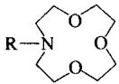</td></tr><tr><td colspan="5">(3.48)</td></tr><tr><td>R=CH2CH2OMe</td><td>3.25</td><td>2.73</td><td>3.06</td><td>—</td></tr><tr><td>R=(CH2CH2O)2Me</td><td>3.60</td><td>—</td><td></td><td>—</td></tr><tr><td>R=(CH2CH2O)3Me</td><td>3.64</td><td>3.85</td><td>3.29</td><td>—</td></tr><tr><td>R=(CH2CH2O)4Me</td><td>3.76</td><td>—</td><td></td><td>—</td></tr><tr><td>R=(CH2CH2O)5Me</td><td>3.73</td><td>4.34</td><td>3.49</td><td>—</td></tr><tr><td colspan="5">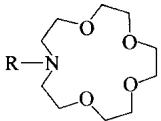</td></tr><tr><td colspan="5">(3.49)</td></tr><tr><td>R=H</td><td>1.70</td><td>1.60</td><td>2.99</td><td>—</td></tr><tr><td>R=CH2CH2OMe</td><td>3.88</td><td>3.95</td><td>3.14</td><td>3.75</td></tr><tr><td>R=(CH2CH2O)2Me</td><td>4.54</td><td>4.68</td><td>3.19</td><td>4.06</td></tr><tr><td>R=(CH2CH2O)3Me</td><td>4.32</td><td>4.91</td><td>3.38</td><td>3.84</td></tr><tr><td>R=(CH2CH2O)4Me</td><td>4.15</td><td>5.28</td><td>3.48</td><td>3.78</td></tr><tr><td>R=(CH2CH2O)5Me</td><td>4.19</td><td>4.91</td><td>3.49</td><td>3.80</td></tr><tr><td colspan="5">(3.50)</td></tr><tr><td>R=H</td><td>2.69</td><td>3.98</td><td>—</td><td>3.96</td></tr><tr><td>R= $CH_{2}CH_{2}OMe$ </td><td>4.58</td><td>5.67</td><td>4.21</td><td>4.34</td></tr><tr><td>R= $(CH_{2}CH_{2}O)_{2}Me$ </td><td>4.33</td><td>6.07</td><td>4.75</td><td>4.23</td></tr><tr><td>R= $(CH_{2}CH_{2}O)_{3}Me$ </td><td>4.28</td><td>5.81</td><td>4.56</td><td>4.11</td></tr><tr><td>R= $(CH_{2}CH_{2}O)_{4}Me$ </td><td>4.27</td><td>5.86</td><td>4.40</td><td>4.13</td></tr><tr><td>R= $(CH_{2}CH_{2}O)_{5}Me$ </td><td>4.22</td><td>—</td><td>4.04</td><td>4.11</td></tr><tr><td colspan="5">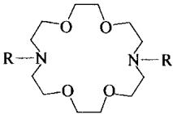</td></tr><tr><td colspan="5">(3.51)</td></tr><tr><td>R=H</td><td>1.5</td><td>1.8</td><td>—</td><td>—</td></tr><tr><td>R= $CH_{2}CH_{2}OMe$ </td><td>4.75</td><td>5.46</td><td>—</td><td>4.48</td></tr><tr><td>R= $CH_{2}CO_{2}Et$ </td><td>5.51</td><td>5.78</td><td>—</td><td>6.78</td></tr></table>

与金属离子一样，铵离子也可以与冠醚型配体络合，络合作用通过 $N-H^{+}\cdots O$

氢键完成（见3.11节）。就套索醚而言，对于所有的像(3.48)和(3.49)类型的受体，它们似乎都是常数，但是对于像(3.50)类型的主体分子，则增加一个数量级，因此 $\mathrm{NH}_4^+$ 的络合效果是很显著的。这可以借助分子模型来解释，预测 $\mathrm{NH}_4^+$ 络合的模型是氢键形成的三脚架模型，其中，3个氢原子分别与单环冠的2个给体原子以及侧链的1个给体原子形成氢键。在

![[超分子化学135章_images/822db94b5a190becb620d52bdc81d46a603bd7d37cd86d81915700e38ea95004.jpg]]

<details>
<summary>chemical</summary>

Chemical structure of a complex organic molecule with Me and O atoms, labeled '不匹配' (not matching)
</details>

![[超分子化学135章_images/b1da825f4d93b087331900e0331dfefcc466c264a345d85b7a771db589e00b1a.jpg]]

<details>
<summary>chemical</summary>

Molecular structure of a complex organic compound with nitrogen and oxygen atoms, including a methyl group and hydrogen bonding
</details>

图3.25 $\mathrm{NH_4^+}$ 与套索醚之间氢键相互作用的空间制约

[18]冠-6衍生物中第4个NH氢原子在空间可形成氢键，因此提高了络合程度（图3.25）。

# 3.7.4 穴醚

与冠醚相比较，三维的穴醚显示出峰形选择性（peak selectivity）。大二环的空腔更刚性且受限，以至于对于很小的阳离子，它们不能通过有效的收缩来络合；对于大于最佳匹配尺寸的阳离子，也不能通过环的扩展去容纳。再者，三维穴醚的空腔对于络合阳离子是预先排列好（预组织）的，意味着较少熵变、常常是焓变控制的不利的构象重排（为了采取最佳络合几何结构必须发生的）。因此[2.2.2]穴醚在甲醇溶液中对 $\mathbf{K}^{+}$ 的络合常数处于最大值 $(\lg K_{11} = 10.5)$ ，而较小的[2.2.1]穴醚选择性地识别 $\mathrm{Na^{+}}$ （ $\lg K_{11} = 9$ )，[2.1.1]穴醚选择性地识别 $\mathrm{Li^{+}}$ （ $\lg K_{11} = 8.05$ ）。[2.2.2]穴醚对 $\mathrm{K}^{+}/$ $\mathrm{Na^{+}}$ 选择性大约为 $10^{3}$ ，而[18]冠-6在同样的条件下小于 $10^{2}$ （图3.26）。

![[超分子化学135章_images/0c46f1d216266119b4da1e249591e6a288b0d3eb8883c04b6267812379ad7df0.jpg]]

<details>
<summary>line</summary>

| 阳离子 | [2.1.1] | [2.2.1] | [2.2.2] | [3.2.2] |
| ------ | ------- | ------- | ------- | ------- |
| Li⁺    | 7.8     | 4.0     | 1.8     | 2.0     |
| Na⁺    | 6.2     | 9.0     | 7.2     | 4.5     |
| K⁺     | 2.2     | 7.2     | 10.0    | 7.2     |
| Rb⁺    | 1.0     | 6.2     | 8.8     | 7.2     |
| Cs⁺    | 1.0     | 3.0     | 3.0     | 7.2     |
</details>

图 3.26 各种穴醚和碱金属离子在甲醇里的络合常数

由图3.27可以看出穴醚明显的三维空腔刚性化及预组织效应。很明显，[2.2.1]穴醚尽管与 $\mathbf{K}^{+}$ 尺寸匹配不很完美，但其三维空腔和7个给体原子与 $\mathbf{K}^{+}$ 的络合作用却很强，大约是二氮杂[18]冠-6类似物(3.18)的 $10^{5}$ 倍，而(3.18)只有6个络合点和一个二维空腔。然而，值得一提的是，以碳氢化合物桥连的穴醚(3.52)与化合物(3.18)有6个相同的给体原子，尽管亲脂性的桥和强亲水的阳离子之间可能产生相互排斥作用，但是它络合 $\mathbf{K}^{+}$ 的强度是化合物(3.18)的 $10^{3}$ 倍。很显然，三维主体分子的预组织性是主导因素。在主客体亲和力中预组织作为一个关键因素，将在3.9节中更详细地讨论。

![[超分子化学135章_images/ba67fcae7e73314e494b64677dfc41a29d93648eed1bf622161ba22210e61d54.jpg]]  
$K_{11}(\mathbf{K}^{+})$

图 3.27 穴醚和单环冠醚主体对 $K^{+}$ 的络合常数（MeOH，25℃）

研究表明，碱土金属的穴醚络合物（cryptate）与冠醚显示相同的趋势。小的[2.1.1]穴醚对于络合任何二价离子 $\mathrm{Mg}^{2+} \sim \mathrm{Ba}^{2+}$ 的络合效果都很差（在水中，对 $\mathrm{Mg}^{2+}$ 的络合常数 $\lg K_{11}$ 为2.5，对于 $\mathrm{Ba}^{2+}$ 其 $\lg K_{11}$ 则小于2）；空腔尺寸增加至[2.2.1]穴醚时出现对 $\mathrm{Sr}^{2+}$ 的峰形选择性，尽管络合常数 $\lg K_{11}$ 只有7.35，比 $\mathrm{Ca}^{2+}$ 和 $\mathrm{Ba}^{2+}$ 络合物的稳定性稍大些；在水溶液中 $\mathrm{Mg}^{2+}$ 几乎不能发生络合，这是因为它具有特别大的水化能。[2.2.2]穴醚是 $\mathrm{Ba}^{2+}$ 的一个非常有效的配体，在水中 $\mathrm{Ba}^{2+}$ 的络合常数 $\lg K = 9.5$ （ $\mathrm{K}^+$ 的 $\lg K_{11} = 5.4$ ），结果很清楚地显示出碱土金属两个正电荷的效应；锶的络合作用明显减弱（ $\lg K_{11} = 8.0$ ）； $\mathrm{Ca}^{2+}$ 和 $\mathrm{Mg}^{2+}$ 的络合常数分别为4.4和小于2，稳定性逐渐下降。

# 3.8 大环、大二环及模板效应

# 3.8.1 大环效应

$\mathrm{K}^{+}$ 与弱单齿碱如二甲醚之间的相互作用（用络合常数测量）几乎可以忽略。然而我们发现，醚的大环化合物对碱金属离子有很明显的亲和力。造成该区别的起因源于在配位化学（1.4节）中通常观察到的螯合和大环效应。与 $[\mathrm{K}(\mathrm{OMe}_2)_6]^+$ 相比较，依据焓、熵和统计范畴方面，所有6个给体原子被连接在如[18]冠-6配体里，对于 $[\mathrm{K}^{+}\subset [18]$ 冠-6]的稳定性有很大的贡献。大环效应在这些体系中十分明显。比较 $[\mathrm{K}^{+}\subset [18]$ 冠-6]和 $[\mathrm{K}^{+}\subset (3.11)]$ 的稳定性（图3.28）。在甲醇溶液中，这些物种的稳定性都受益于螯合效应，但大环物种的稳定性要高出大约 $10^{4}$ 倍，这个附加的稳定性是大环效应的结果。[2.2.2]穴醚络合物更加稳定，这是大二环效应的结果。

![[超分子化学135章_images/ac997da26582ef9ab9fa325212148ea76a51a645ab41ff6ffc222caabf67e879.jpg]]

<details>
<summary>chemical</summary>

Three molecular structures with K+ groups and corresponding K(MeOH, 25°C) values: 2.0, 6.1, and 10.0
</details>

图 3.28 荚状醚（非环状）、冠醚（大环）和穴醚（大二环）的 $K^{+}$ 络合物的稳定性

解释大环和大二环效应，根据吉布斯方程，我们必须把络合物如 $[K^{+} \subset (3.11)]$ 和 $[K^{+} \subset (3.6)]$ 稳定性的贡献分解为焓变和熵变。

$$
\Delta G ^ {\circ} = - R T \ln K = \Delta H ^ {\circ} - T \Delta S ^ {\circ} \tag {3.2}
$$

表 3.5 给出了 298K 时的参数。从这些数据很明显可以看出，焓和熵都有利于大环络合物的稳定。在这种情况下，主导因素为焓，尽管这并不是在每个体系中都正确。

表 3.5 ${\mathrm{K}}^{ + }$ 的荚状醚络合物和冠醚络合物稳定性的热力学贡献

<table><tr><td>络合物</td><td> $\Delta G^{\circ} / (\text{mol/J})$ </td><td> $\Delta H^{\circ} / (\text{mol/J})$ </td><td> $\Delta S^{\circ} / (\text{mol/J})$ </td></tr><tr><td> $[K^{+} \subset (3.11)]$ </td><td>-11368</td><td>-36400</td><td>-84</td></tr><tr><td> $[K^{+} \subset (3.6)]$ </td><td>-34842</td><td>-56000</td><td>-71</td></tr></table>

在没有络合的状态下，荚状醚(3.11)采用伸长的线形构象，来减小氧原子孤对电子之间焓变不利的排斥作用。在络合构象中，金属中心的络合涉及到构象重排，氧原子孤对电子相互靠近，因此不如原来的构象有利。对于环状配体，对配体的总的金属络合自由能不利的焓的贡献在合成过程中就已经以能量的形式得以“补偿”。配体对于金属络合是更加预组织的，并且它无论络合金属与否，都必须经历氧原子孤对电子之间不利的相互排斥（图3.29）。金属阳离子络合过程中孤对电子之间相互排斥作用对自由能没有影响，但它使得大环化合物自身很难合成，需要特殊的合

![[超分子化学135章_images/91cac2b849e1d08a7cc151582aeba9a62cfb46e61ac3942b008f480cc56b9553.jpg]]

<details>
<summary>chemical</summary>

Molecular structure of a dimer with electron transfer and weakly repulsion, showing electron movement and structural change
</details>

图 3.29 用焓理论解释大环效应

成技术（见 3.8.2 节）。预组织的程度对于大二环化合物如穴醚更加明显，即大二环效应。

我们也应该注意到，[18]冠-6受大环孔穴的限制，比游离的化合物(3.11)相对难于溶剂化。单环的聚醚为了和溶剂分子发生相互作用而表现出最大可能的比表面，可以采取延伸的构象。因此，当发生阳离子络合时，与大环化合物相比，荚状醚的孤对电子需要更多的能量去溶剂化，而荚状醚自身重排成一个更加有序的构象。这导致不利的反应熵。

表 3.6 列出了螯合、大环和大二环效应之间的定量关系。

表 3.6 主-客体络合物的类型、稳定性和起稳定作用的影响因素之间的关系

<table><tr><td>络合物类型</td><td> $K(MeOH)$ </td><td>影响因素</td></tr><tr><td>荚状醚络合物</td><td> $10^{2} \sim 10^{4}$ </td><td>螯合</td></tr><tr><td>单环冠络合物</td><td> $10^{4} \sim 10^{6}$ </td><td>大环</td></tr><tr><td>穴醚型络合物</td><td> $10^{6} \sim 10^{10}$ </td><td>大二环</td></tr></table>

# 3.8.2 模板效应

二苯并[18]冠-6最初的合成（见图解3.1）存在着一个可能的副反应，该反应可能已经产生了从来没有被发现的冠醚。如果反应采取了另一种途径，产生多聚（缩聚）产物，则偶然发现的导致现代超分子化学的大环化合物二苯并[18]冠-6可能就不会形成。对于[18]冠-6，各种相矛盾的可能性如图解3.12所示。

![[超分子化学135章_images/661ef8810fa0fee6dd3f2624f3282f00b21ea144b76b896ecf414935595b7a84.jpg]]

<details>
<summary>chemical</summary>

Chemical reaction mechanism diagram showing K+ complex formation and subsequent polymerization with NEt3 reagent
</details>

图解 3.12 在 $[18]$ 冠-6 合成中产生环状和非环状产物的可能路径

大环冠醚是主要产物，但并不因为它们是热力学最稳定的。事实上，18 [冠] 可以选择性地识别 $\mathbf{K}^{+}$ ，因而碳酸钾盐在它们的合成中是最常用的。如果将碳酸钾换成有机碱，如三乙胺，则生成的多聚产物占主导地位。两类碱性质的重要区别主要在于 $\mathbf{K}^{+}$ 离子将反应物组织在其周围产生反应中间体（可能类似于化合物 (3.53)），该中间体可以预组织产生环状产物。通过和钾离子络合（螯合效应），官能团一OH 和 Cl 被拉近，很容易环合。有机碱不能产生这种中间体，因而采取分子间反应而不是分子内反应路径。 $\mathbf{K}^{+}$ 离子被认为是反应的模板，大环化合物的形成称为“模板效应”，或者更严格地称“动态学模板效应”。事实上，这是一种催化方式，其中金属阳离子用来稳定环状中间体，因此能显著提高环化产物的合成速率。因而模板效应是一种动态效应，大环化合物是动态学产物。简单来说，如果想合成能够选择性络合 $\mathbf{K}^{+}$ 离子大小的碱金属离子的主体分子，就用 $\mathbf{K}^{+}$ 为模型（有点像针织模型）去诱导其合成。模板效应在大环合成中被广泛地应用，包括合成大二环化合物，分子纽结，互锁环（索烃）和许多其他例子。碱金属、碱土金属、过渡金属和镧系阳离子都具有模板性质。在许多早期的合成中， $\mathrm{Cs^{+}}$ 被证明作为模板并提高环化产物的产率特别有效，称为“铯效应”。

为了识别模板效应，必须应用两种测试：①通过模板组织其他分子组分；②化学反应必须伴随明显的空间、拓扑或几何学控制。

图 3.30 表示出，根据图解 3.13 中所示反应模板合成苯并[18]冠-6的动力学研究结果。观察到随着碱金属离子浓度的增大反应速率明显提高（相对于在 $Et_{4}N^{+}$ 存在下的非模板反应），但 $Li^{+}$ 除外，它倾向于和苯氧化物形成非常强的络合离子对，因此抑制了它的反应活性。正如所期望的，与冠醚孔穴最匹配的 $K^{+}$ ，环合产率的提高最有效。与任何没有碱金属离子存在下的反应相比，碱金属与烷基链类似物的类似环合，去除了阳离子的组织效应，致使环合产物的生成速率（即产率）减小。延迟是离子配对的结果。

![[超分子化学135章_images/0e5a89d4962054bf6189fe14e7230a59aed40236401b4ec02e7c93bc76ad2b0a.jpg]]

<details>
<summary>line</summary>

| Ion      | lg[M⁺] | lg k_obs |
| -------- | ------ | -------- |
| K⁺       | -1.0   | -0.5     |
| Rb⁺      | -1.0   | -0.7     |
| Cs⁺      | -1.0   | -0.9     |
| Na⁺      | -1.0   | -2.0     |
| Et₄N⁺    | -1.0   | -3.5     |
| Li⁺      | -1.0   | -3.5     |
</details>

图 3.30 金属离子影响环合的动力学研究

![[超分子化学135章_images/be79fcd54c644cfa5ab9444c568f9bb4d45cd6232fb707a2b5c27f1756ff095a.jpg]]

<details>
<summary>chemical</summary>

Chemical reaction showing the substitution of a brominated aromatic compound with methylene (M⁺) to form a cyclic ether structure
</details>

图解 3.13 模板环合形成苯并[18]冠-6

![[超分子化学135章_images/2b1c2e6da629ea420d4643d2c1389b1f44caec2abe7431a556fecdecd2a8d4f8.jpg]]

<details>
<summary>chemical</summary>

Chemical reaction equation showing the formation of a macrocyclic compound from a metal complex and an amide group
</details>

图解 3.14 四氮杂大环的热力学模板合成

在讨论动力学模板效应中，将它与另一种称为热力学模板效应区分开来是很重要的。动力学模板效应是指在金属周围配体的真正产生。另一方面，热力学模板效应是指金属离子从产物的平衡混合物中挑选与之互补的配体的能力，使得反应平衡向产物方向移动而稳定。热力学模板效应的第一类实例之一是丙酮与三（1,2-乙二胺）镍(Ⅱ)盐根据图解3.14进行的缩合反应。利用其他的金属离子和酮可以得到相似的结果。热力学模板效应的证据来源于下列实验结果：

- 反应活性取决于金属离子的不稳定性，意味着氨基的缩合需要它们从金属离子解离出，而取代的惰性 Co(Ⅲ) 盐根本不反应；  
- 在碱性条件下（Claisen-Schmidt缩合），不对称酮产生较少分支的产物，再次意味着不存在金属离子；  
- 在金属离子不存在的情况下配体也可以生成。

更多非同寻常的模板效应，如那些涉及到索烃和轮烷的合成及“自复制”之始的体系将在第7章中讨论。

![[超分子化学135章_images/940b8dc2fd6c04f9646cd1ebd8862b3bb2738f713c3756252880511b9908c880.jpg]]

Busch D H and Stephenson N A. Molecular Organisation, Portal to Supramolecular Chemistry.

Coordination Chem Rev, 1990, 100:119\~154

# 3.8.3 高度稀释合成法

在没有合适的模板存在下，大环配体的合成是非常困难的，必须利用高度稀释的条件。“高度稀释法”是指在大量的溶剂中用少量反应物。实现这种生产过程的一个典型的装置如图3.31所示。反应物从滴定器以非常慢的速度逐滴加入（这可以用一个电控注射泵自动完成），在大的圆底烧瓶的底部混合。

这种方法的基本原理是，在稀溶液中通过分子内反应生成环状产物（即一个分子的一端与其本身碰撞)，这种反应比形成聚合物更可能发生，因此更快；而聚合物的生成需要两个单独的反应物发生碰撞（分子间反应）（图3.32）。如果比较一个反应物X-Y的环化速率 $(r_{\mathrm{c}})$ ， $r_{\mathrm{c}} = k_{\mathrm{c}}[\mathrm{X - Y}]$ 与聚合速率 $r_{\mathrm{p}} = k_{\mathrm{p}}[\mathrm{X - Y}]^{2}$ ，我们引用如下表达式：

![[超分子化学135章_images/d66b6374b0a098f4f097c738d3386e036f85e17910ed53e6a42bb31a289c2e53.jpg]]

<details>
<summary>text_image</summary>

高速马达 (rpm=3000)
干燥管
精密滴液漏斗
聚四氟乙烯涂层的钢轴
四颈 6L 圆底烧瓶
聚四氟乙烯叶片
</details>

图 3.31 在大环环合反应中获得高度稀释的反应装置  
摘自：Atwood J L, Davies J E D, MacNicol D D and Vögtle F. Comprehensive Supramolecular Chemistry. Oxford: Pergamon, 1996

$$
\frac {r _ {\mathrm{c}}}{r _ {\mathrm{p}}} = \frac {k _ {\mathrm{c}} [ \mathrm{X} - \mathrm{Y} ]}{k _ {\mathrm{p}} [ \mathrm{X} - \mathrm{Y} ] ^ {2}} = \frac {k _ {\mathrm{c}}}{k _ {\mathrm{p}} [ \mathrm{X} - \mathrm{Y} ]} \tag {3.3}
$$

其中 $k_{c}$ 和 $k_{p}$ 分别为环化和聚合速率常数。因此 $r_{c}/k_{p}$ 的值随反应物 X-Y 浓度的减小而增大，意味着在稀溶液中 $r_{c}$ 比 $k_{p}$ 占优势。

根据这个论据“反应速度越快，这种方法越有效”来看，如果反应本身比反应物的加入速度快（ $k_{\mathrm{c}}$ 与 $k_{\mathrm{p}}$ 都大），那么在反应过程中反应物的浓度就总是很小而不会增加。高度稀释法已经被用于大数量的大环和大二环的合成，包括许多早期的穴醚的制备（图解·3.5）。特别地，由于拉电子效应和羧基基团的共振效应使得胺与酰氯非常快地发生反应。其在简单的氮杂冠醚的高度稀释法合成中的应用如图解3.15所示。

![[超分子化学135章_images/a6212aa142a23c22d8d04d4a6faf9b8e869f38049ef685a9a21c7c4e4b48d328.jpg]]

<details>
<summary>chemical</summary>

Chemical reaction equations showing ring and polymerization rates with X, Y, Z substituents
</details>

图 3.32 用高度稀释法合成大环化合物

![[超分子化学135章_images/471c141885ca76e57e125e055daeb38e78e4c32bc34d85819e08922e9baee750.jpg]]

<details>
<summary>chemical</summary>

Chemical reaction scheme showing the synthesis of a cyclic amide from two monomers using high dilution and LiAlH4 catalyst
</details>

图解 3.15 高度稀释法合成二氮杂[18]冠-6  
注意：酰氯基团的引入有利于增加反应速率

![[超分子化学135章_images/a60531c1b1caa2156c473325c7e47bb40d9f3ffe02c8cbd0ed8037c8e0fbc8ab.jpg]]

Illuminati G and Mandolini L. Ring Closure Reactions of Bifunctional Chain Molecules, Acc Chem Res, 1981, 14:95\~102

# 3.8.4 $[2+2]$ 环缩合

通过分子内和分子间反应的结合，合成了大量特别有趣的穴醚，尤其是含有较大孔穴的穴醚。其中，最常见的是在冠醚或穴醚合成中的 $[2 + 2]$ 环缩合反应，常常是偶然发生的，两对反应物反应产生一个大二环或者大三环化合物而不是 $[1 + 1]$ 产物，如图解3.15所示。对于冠醚，以图解3.2中反应(c)举例说明。图解3.16图示出穴醚的合成行为。 $[2 + 2]$ 环缩合反应通常在以下条件发生：在聚合和环化之间存在着平衡，或者 $[1 + 1]$ 环化产物空间受阻或不利。

图解 3.17（Hall et al，1997）给出了这类化学一个最好的例子，早期设计合成的 $[1+1]$ 产物(3.54)。将一个氧化还原活性的二(环戊二烯基)Fe(Ⅱ)（二茂铁）与一个二(二联吡啶）单环化合物偶合，期望生成氧化还原响应的，实际

![[超分子化学135章_images/dd3eca7276316188365e84383681f9cffb9a8491cc0fccab756fc675d03a653f.jpg]]

<details>
<summary>flowchart</summary>

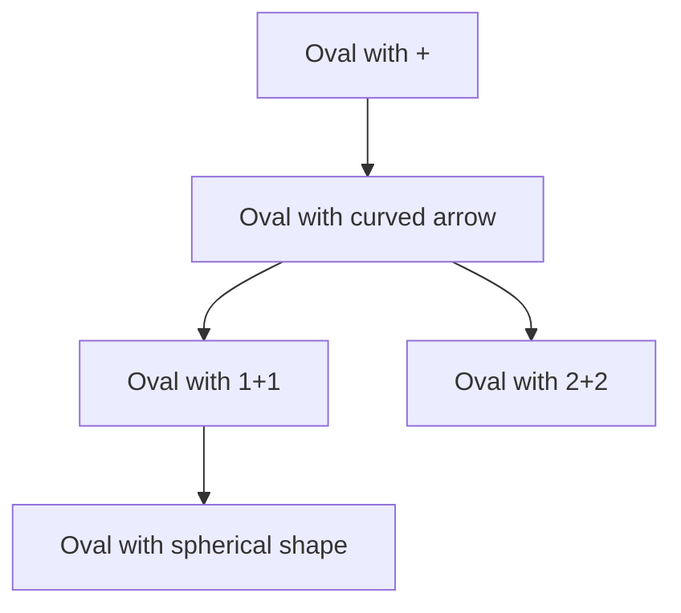
</details>

图解3.16 穴醚的 $[1 + 1]$ 和 $[2 + 2]$ 环共缩合的图例说明

上可发生氧化还原转化的穴醚，该穴醚能够络合且检测阳离子如 $Na^{+}$ 和 $Eu^{3+}$ 的存在。实际上，通过仔细的色谱分离工作，可以分离 $[1+1]$ ， $[2+2]$ 和 $[3+3]$ 环共缩合产物（cyclococondensation）。 $[2+2]$ 产物 (3.55) 的 $NaClO_{4}$ 络合物 X 射线晶体结构（图 3.33）显示，化合物 (3.55) 可以将两个 $Na^{+}$ 离子包裹于其疏水的芳香环孔腔内部。

![[超分子化学135章_images/eb36a38c52de8dae58ea7dc9d6e546a33d1fbafbe96ef48df253474036efebcf.jpg]]

<details>
<summary>chemical</summary>

Chemical reaction pathway showing transformation of a complex with Fe and Cl ligands, labeled (3.54), (3.55), and (3.56) with 1+1, 2+2, and 3+3 steps
</details>

图解 3.17 基于二联吡啶穴醚的同时发生的 $[1+1]$ ， $[2+2]$ 和 $[3+3]$ 环共缩合

![[超分子化学135章_images/89114eb6393fb22684373d54e170f113c08bfeb7cc595d84b4074e12d5008275.jpg]]

<details>
<summary>chemical</summary>

Molecular structure diagram showing interconnected carbon and hydrogen atoms with black and white spheres representing different elements
</details>

图 3.33 (3.55) 和 $NaClO_{4}$ 的 1:2 络合物的 X 射线晶体结构 (after Hall et al. 1997)

# 3.9 预组织性和互补性

![[超分子化学135章_images/be62677d9f1a51454145966a0ba646669aabadafa507e1837bd75add6ea6a260.jpg]]

Cram D J. Preorganisation—From Solvents to Spherands. Angew Chem, Int Ed Engl, 1986, 25:1039\~1057

# 3.9.1 热力学效应

我们在 3.8.2 节中已经明白，在分子合成中如何避免不利的相互作用，利用主体分子如冠醚的简单预组织明显提高其络合能力。预组织之后的通常的概念是，在络合客体分子之前，构筑与客体分子在空间及电性上完全匹配的主体分子。主体和客体的匹配称作互补性。就空间而言，主体本身必须在客体周围大小适合，不大也不小。从电子效应上，主体必须具有与客体相反静电荷或偶极的络合点（如，具有路易斯碱络合点的主体与路易斯酸客体；氢键给体与氢键受体）。Donald Cram 总结了互补性的基本原理：“对于络合，主体必须具有络合点，它可以接触吸引客体分子的络合点而不产生强的非键合排斥”。单独的主体和客体（见 1.7 节）之间的相互作用相对都比较弱，比共价键弱，因此只有通过多对络合点之间互补的相互作用，才能发生强的选择性络合。络合常数（或络合自由能）指在给定条件下互补性的定量测定。

这个概念里一个重要的特征是溶剂作用。溶剂和客体、溶剂和主体之间的相互作用与主-客体之间的相互作用经常是同一类型。为了络合客体分子，主体分子必须隔离其本身及客体的溶剂化层。主-客体之间的净络合自由能是指，由有利的主-客体相互作用与游离颗粒数目的增加所获得的熵和焓能，减去主体和客体的去溶剂化引起的焓的损失（图解3.18）。一般而言，因为只有主体具有组织度（互补于客体分子）而溶剂不具备，这个过程是有利的。如果主体是预组织的（即当在游离的与络合最小能量的构象之间只有很小的区别），则络合特别有利，因为没有来自于主体构象重排的额外能量损失用来呈现最佳络合构象。

表 3.7 总结了各种各样的主体分子对碱金属硝酸盐的络合自由能。从这个小的络合数据例子可以看出，按照它们络合最互补的客体分子时的 $-\Delta G^{\circ}$ ，这几类化合物通常遵循下列次序：球醚＞穴球醚＞穴醚＞半球醚＞单环冠醚＞荚状醚＞溶剂。球醚(3.30)和荚状醚(3.33)络合 $Li^{+}$ 的 $-\Delta G^{\circ}$ 差值为 $17\mathrm{kcal}^{\bullet}/\mathrm{mol}(71\mathrm{kJ}/\mathrm{mol})$ ，相应于络合常数 K 的差别大于 12 个对数单位；并且随着次序的降低，峰形选择性转变为平台选择性，直至荚状醚(3.33)，根本没有观察到选择性。表 3.7 中所示的络合自由能受给体原子的数目和本质的显著影响，给体原子从球醚(3.30)的 6 个到化合物(3.35)的 9 个。由于每个配位作用都能对络合起作用，稳定性应该随着络合位点数目的增加而增大。然而，这种趋势受另一个因素预组织程度的明显控制。

比较球醚(3.30)与其高度稳定的球醚络合物(3.30)， $\mathrm{Li^{+}}$ 的X射线晶体结构揭示了，在这两种情况下主体分子具有相同的构象（图3.34）。主体分子(3.30)对于金属络合是完全预组织的，在络合中不要求焓不利的构象变化。再者，在自由

![[超分子化学135章_images/4cf47bd959e8a0f8cdfb4e77d68b85c690a7de05102e83239c280f6c0c9eef84.jpg]]

<details>
<summary>flowchart</summary>

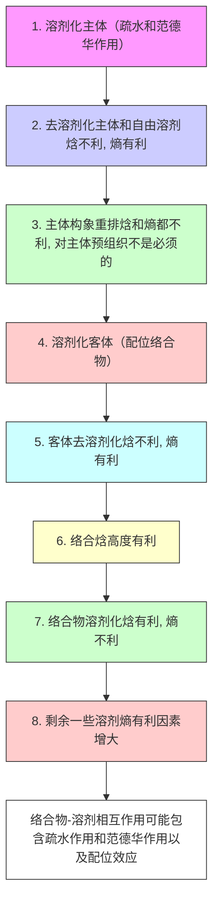
</details>

图解 3.18 络合过程

表 3.7 在标准条件下（Cram 1986），主体对碱金属苦味酸盐的络合自由能，与每个主体最匹配的金属离子的值以黑体标出

<table><tr><td rowspan="2">主体</td><td rowspan="2">类别</td><td colspan="5"> $-\Delta G^{\circ}$ /(kcal/mol)</td></tr><tr><td> $Li^{+}$ </td><td> $Na^{+}$ </td><td> $K^{+}$ </td><td> $Rb^{+}$ </td><td> $Cs^{+}$ </td></tr><tr><td>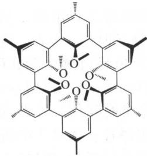</td><td>Spherand(3.30)</td><td>&gt;23</td><td>19.2</td><td> $\ll 6$ </td><td>—</td><td>—</td></tr><tr><td>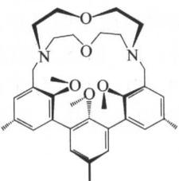</td><td>Cryptaspherand(3.57)</td><td>18.8</td><td>20.6</td><td>15.0</td><td>13.3</td><td>10.4</td></tr><tr><td>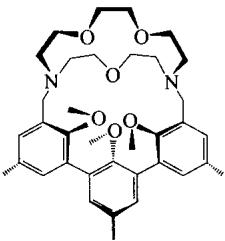</td><td>Cryptaspherand(3.58)</td><td>13.4</td><td>21.0</td><td>&gt;19.9</td><td>20.4</td><td>16.4</td></tr><tr><td>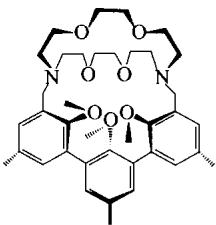</td><td>Cryptaspherand(3.35)</td><td>9.9</td><td>13.5</td><td>19.0</td><td>20.3</td><td></td></tr><tr><td>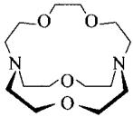</td><td>Cryptand(3.59)</td><td>16.6</td><td>—</td><td>—</td><td>—</td><td></td></tr><tr><td>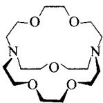</td><td>Cryptand(3.22)</td><td>10.0</td><td>17.7</td><td>15.3</td><td>12.7</td><td></td></tr><tr><td>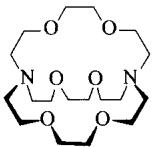</td><td>Cryptand(3.23)</td><td>—</td><td>14.4</td><td>18.0</td><td>16.8</td><td></td></tr><tr><td>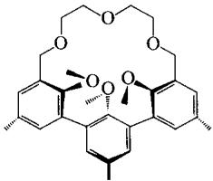</td><td>Hemispherand(3.34)</td><td>7.0</td><td>12.2</td><td>11.9</td><td>10.4</td><td></td></tr><tr><td>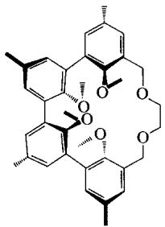</td><td>Hemispherand (3.60)</td><td>7.2</td><td>13.5</td><td>10.7</td><td>8.4</td><td>7.1</td></tr><tr><td>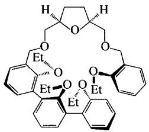</td><td>Hemispherand (3.36)</td><td>6.5</td><td>7.1</td><td>11.6</td><td>11.4</td><td>10.8</td></tr><tr><td>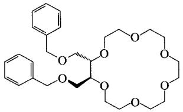</td><td>Corand (lariat ether) (3.61)</td><td>6.3</td><td>8.4</td><td>11.4</td><td>9.9</td><td>8.5</td></tr><tr><td>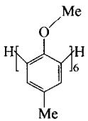</td><td>Podand (3.33)</td><td>&lt;6</td><td>&lt;6</td><td>&lt;6</td><td>&lt;6</td><td>&lt;6</td></tr></table>

主体里，6个苯甲醚的氧原子深深包埋在由疏水的主体骨架所形成的未被溶剂化的外壳内。因此，当金属离子发生络合时，没有与这些给体原子有关的去溶剂化步骤。

比较图 3.34 中所示的自由的[18]冠-6及其络合形式的预组织性，很显然，为了络合主体阳离子，冠醚必须经历相当大的重排（在溶液中去溶剂化）。类似的重排对[2.2.2]穴醚也是需要的（图 3.35），然而穴球醚的苯甲醚残基只是一部分被预组织，虽然孔穴被分子的穴醚的亚甲基基团所填充。

![[超分子化学135章_images/5718126d3e462cae78a984189a66679989b381cb8fa5f3b29f9bca8ab429ee55.jpg]]

<details>
<summary>chemical</summary>

Molecular structure diagram showing a complex organic compound with fused aromatic rings and functional groups
</details>

(a)

![[超分子化学135章_images/b5e9d88ed317840e4ef4f206ef92f29ea44b501d9a1597e53ddf666b03932f09.jpg]]

<details>
<summary>chemical</summary>

Molecular structure diagram showing a symmetric organic compound with central metal atom bonded to multiple organic ligands
</details>

(b)

图 3.34 自由球醚(3.30)（a）及其锂离子络合物（b）的 X 射线晶体结构 (after Trueblood et al, 1981)  
![[超分子化学135章_images/8df9d07aeb03a0b7723912e531498b2cb61120c19998292ca4d833475adb8620.jpg]]

<details>
<summary>chemical</summary>

Chemical reaction showing the conversion of a cyclic amide to a K+ complex via K+ ionization
</details>

图 3.35 [2.2.2] 穴醚络合 $K^{+}$ 时的构象重排

![[超分子化学135章_images/da78acc59f2fab9aa31708e2ba7fe66eea2758d70e0689c2ea346a03a7aebee9.jpg]]

<details>
<summary>chemical</summary>

Chemical structure of a symmetric organic molecule with two fused benzene rings linked by a central ether linkage
</details>

(3.62)

主体分子重排的熵变上（经常是焓变上）的不利程度，在荚状醚如(3.33)和

Kryptofix-5(3.62)中更加突出，它们在游离态中采用伸展的构象。从 $\mathrm{Rb^{+}}$ 荚状络合物的X射线晶体结构可以明显看出，化合物(3.62)为缠绕在 $\mathrm{Rb^{+}}$ 阳离子周围而需要重排的程度（图3.36）。

# 3.9.2 动力学和动态学效应（kinetic and dynamic effects）

主体分子因预组织络合而使其络合物的稳定性提高，这在概念上与有机化学中的过渡态理论相似，即反应物与反应的过渡态越相似，从反应物到活性过渡态需要的活化能越少，反应越快。区别在于，我们已经在产生的主-客体络合的热力学稳定性的上下文中讨论了预组织。然而，主体分子预组织及其柔韧度的确对络合和解络反应速率有显著的影响。

![[超分子化学135章_images/f101ad7c64cb47ff3a0ba66c2121a213d41e07465196ec7a249dea33245922d8.jpg]]

<details>
<summary>chemical</summary>

Molecular structure diagram showing a central atom bonded to multiple surrounding atoms in a symmetric arrangement
</details>

图 3.36 荚状醚 Kryptofix-5
(3.62) 绕 Rb $^{+}$ 缠绕的
X 射线晶体结构

平衡常数 K 与络合反应速率 $(k_{1})$ 及解络反应速率 $(k_{-1})$ 有关，且 $K = k_{1} / k_{-1}$ （Box 1.1）。表 3.8 给出了 3 种类型络合物的正向与逆向络合速率常数。一般而言，正反应和逆反应的速率按照下列次序递减：铲状（perching）＞巢穴状（nesting）＞胶囊状（capsular）（图 1.4）。

![[超分子化学135章_images/97961da5e03ceb40b251967cdf09f90f339ccb223c60425f27eda4a5a4eea17c.jpg]]

<details>
<summary>chemical</summary>

Complex organic molecular structure with multiple aromatic rings, ether linkages, and functional groups
</details>

(3.63)

![[超分子化学135章_images/bb8d25df7628dcc9d22c483dc1983908f34e1cc4c5b93598e9dfb606144dfbb5.jpg]]

<details>
<summary>chemical</summary>

Complex organic molecule structure with multiple fused rings and methoxy groups
</details>

(3.64)

在铲状络合物中，客体分子处于主体分子的络合面顶端，如叔丁基铵络合物(3.64)（图3.37），一旦发生络合，阳离子的溶剂化层破坏程度相对比较小，破坏程度随着络合物的部分嵌入而逐渐增加，在蒴状化合物中破坏度达到最大。因此铲状络合物中游离的阳离子和络合过渡态最相似，使得反应快速发生。在球醚络合物(3.30)中，CPK模型研究显示，在络合反应的过渡态（客体分子进入孔穴），只有一个溶剂分子（或者苦味酸盐阴离子的苯酚氧原子）和被由主体分子预组织的孔穴和苯基醚甲基基团形成的烃基泡包围的阳离子的剩余部分的空间。因此，在其通过络合恢复焓之前，由于阳离子必须几乎完全去溶剂化（这个过程是焓不利的，导致产生高能量的过渡态），所以化合物(3.30)的络合可能是一个缓慢的动力学过程。事实上，预组织性的络合阳离子的主体分子越刚硬，动力

![[超分子化学135章_images/461ce8281d29236dd4f5fb3e6063770c5db64d09ad415ab6e10ec19bddc6866a.jpg]]

<details>
<summary>chemical</summary>

Two molecular structures showing different atom arrangements and spatial arrangements, likely representing a polymer or organic compound.
</details>

图 3.37 （3.64）的叔丁基铵半球醚络合物的 X 射线晶体结构（from Cram，1986）

学过程越慢，这是一个普通的现象。更柔韧的主体分子：如冠醚，特别是荚状醚，应该能够很顺利地完成从溶剂化层到主体分子的络合，而不需要经过不稳定的去溶剂化中间体。

表 3.8 表示所有的络合速率在人眼的时间尺度内都是非常快的，甚至不能用 $^{1}$ H NMR 光谱学来跟踪监测（一旦混合，反应立即有效地进行）。对于更加柔韧的主体分子，解络速率在人眼的时间尺度内也是非常快的，但是可以 $^{1}$ H NMR 光谱学来跟踪监测；而对球醚络合物而言，即使在 25℃，人眼的时间尺度内，其逆反应也是非常慢的。

表 3.8 在标准条件下，代表性化合物的苦味酸盐的络合与解络速率常数

<table><tr><td rowspan="2">客体</td><td colspan="2">(3.30)(胶囊状)</td><td colspan="2">(3.63)(巢穴状)</td><td colspan="2">(3.64)(铲状)</td></tr><tr><td> $k_{1}/[L/(mol·s)]$ </td><td> $k_{-1}/s^{-1}$ </td><td> $k_{1}/[L/(mol·s)]$ </td><td> $k_{-1}/s^{-1}$ </td><td> $k_{1}/[L/(mol·s)]$ </td><td> $k_{-1}/s^{-1}$ </td></tr><tr><td> $Li^{+}$ </td><td> $8\times 10^{4}$ </td><td> $<10^{-12}$ </td><td></td><td></td><td></td><td></td></tr><tr><td> $Na^{+}$ </td><td> $4\times 10^{5}$ </td><td> $2\times 10^{-7}$ </td><td></td><td></td><td></td><td></td></tr><tr><td> $K^{+}$ </td><td></td><td></td><td> $2\times 10^{9}$ </td><td>14</td><td></td><td></td></tr><tr><td> $(CH_{3})_{3}CNH_{3}^{+}$ </td><td></td><td></td><td></td><td></td><td> $3\times 10^{12}$ </td><td> $7\times 10^{2}$ </td></tr></table>

络合物稳定性与阳离子交换动力学之间的相互作用在超分子阳离子主体分子的应用中是非常重要的。基于它们的特性，我们可以区分阳离子受体（慢动力学，大的稳定常数）与阳离子载体（快动力学，较低的稳定性）。从3.6节我们已经了解到，快速交换的动力学如何使阳离子载体在应用中非常重要，如相转移催化反应。

# 3.10 软金属离子对应的软配体

到目前为止，我们见到的大多数金属离子络合物是硬的、不能极化的金属离子如碱金属阳离子。在这样的络合物里，络合本质上主要是静电作用，主体给体原子排列在阳离子的球体表面，这样可以减小主体分子间的空间排斥力。成键中相对较小的方向选择性或共价性以及金属离子络合的几何构型与络合数目，强烈取决于主体分子的构象倾向（Box 3.1）。一般而言，有效络合硬金属阳离子的配体，对较软的金属离子，如 $Ag^{+}$ 以及许多较低氧化态的过渡金属离子（特别是 d-区域的第 2、第 3 列的金属离子），显示出很有限的亲和力。

# Box 3.1 碱金属的选择性络合

碱金属离子的性质：①硬的不能极化的球体；②对特殊的络合几何构型具有小的固定选择性；③相对较高的水合自由能；④对于富含电荷的不能极化的碱的亲和力。这些特征使得合适配体的设计很艰巨，这类配体能取代水，并对这些自由扩散的阳离子有很强的、选择性的络合作用。对碱金属离子之间选择性的唯一基础是离子半径（图3.38）。

![[超分子化学135章_images/05c4e9da98514b5e1af4a458ebb06fd251d84a8daf961947e72b2629185fd68a.jpg]]

<details>
<summary>bubble</summary>

| 离子半径 /Å | Li⁺   | Na⁺   | K⁺    | Rb⁺   | Cs⁺   |
| ----------- | ----- | ----- | ----- | ----- | ----- |
|           | 0.60  | 0.97  | 1.33  | 1.48  | 1.67  |
</details>

图 3.38 碱金属离子的大小

# Box 3.2 软硬酸碱理论

金属离子可以分为以下两类。

（1）“a”类受体 卤素络合物的稳定性与金属-卤素键的强度按照 F>Cl>Br>I 的顺序排列，与对于 16 族和 15 族给体原子的基团具有相同的顺序。例如： $Al^{3+}$ ， $Ti^{4+}$ 和大多数 s-、p-区离子， $Mn^{3+}$ ， $Fe^{3+}$ ， $Co^{3+}$ 以及其他高氧化态过渡金属离子。  
（2）“b”类受体 稳定次序为 F<Cl<Br<I，O<S\~Se\~Te，N<P>As>Sb （具有 P-给体的络合物总是比 As 和 Sb 配体更稳定）。大多数“b”类金属离子来自过渡金属，如 Cu(I)，Au(I)，Pd(II)，Pt(II)。“b”类元素趋向于有大量的外层 d 电子。大多数也位于第 2、第 3 过渡系列，尺寸大小可以作为“b”特征的另一个

因素。这是因为随着尺寸的增大，金属离子变得更易极化，价电子穿透（penetration）减少。

“a”类和“b”类体系已被归结成为软硬酸碱理论（HSAB）。这里“碱”指路易斯碱，即电子给体（在配位络合物里通常是指配体）；而“酸”指电子受体（通常是金属）。HSAB理论说的是，硬酸倾向于与硬碱配位，软酸与软碱配位。“a”类金属离子是硬酸，而“b”类是软酸。

<table><tr><td>硬酸</td><td>硬碱</td><td>软酸</td><td>软碱</td></tr><tr><td>高价态正电荷</td><td>高电负性</td><td>低价态正电荷</td><td>低电负性</td></tr><tr><td>低可极化度</td><td>难于氧化</td><td>高可极化度</td><td>易于氧化</td></tr><tr><td>小尺寸( $H^{+}$ , $Al^{3+}$ )</td><td>低可极化度( $F^{-}$ )</td><td>大尺寸( $Ag^{+}$ )</td><td>高可极化度</td></tr></table>

软碱  
低电负性  
易于氧化  
高可极化度  
高负电荷（ $\mathrm{H}^{-}$ ）

式(3.4)给出了一个非常有趣的关于 HSAB 理论的例子：

$$
\mathrm{LiI} + \mathrm{CsF} \rightleftharpoons \mathrm{LiF} + \mathrm{CsI} \tag {3.4}
$$

HSAB 预测该过程自左向右进行，但与鲍林的电负性定义相反，鲍林定义认为电负性差别越大，键能越大。

Pearson R G. Chemical Hardness. New York: Wiley-VCH, 1997

![[超分子化学135章_images/73b616590967bde2b0fcc60e2d8ee712130f883f5fc05173b3fe9c619d79fc06.jpg]]

# 3.10.1 杂冠醚

在配体上插入一个或多个更软的给体原子（如 N，S 等），配体的络合能力以及产生的络合物几何构型都会发生显著的变化（Box 3.2）。表 3.9 显示，当硬醚氧原子给体变为硫原子或氮原子时，其络合软离子 $Ag^{+}$ 的能力大大提高（对 $K^{+}$ 的络合能力下降）。很明显，软离子 $Ag^{+}$ 对于硫原子给体有很强的亲和力，络合强度按 S，NH > O 顺序增加；而对于中间的 $Pb^{2+}$ ，顺序为 NH > O > S。与此相反，对于硬的阳离子如 $K^{+}$ 、 $Tl^{+}$ 和 $Ba^{2+}$ ，络合常数随着给体原子电负性的减弱（O > NH > S）而变小。基于阳离子-偶极相互作用的考虑，这是合理的，阳离子-偶极相互作用是络合的基础，但 $K^{+}$ 对于 N 和 O 碱的类似的气相亲和力，从 O 到 N {如 [18] 冠-6 到 (3.18)} 下降非常明显。显然，溶剂化和构象效应也必须起到很大作用，这可能与 NH 基团形成氢键的给体能力有关。

表 3.9 软硬金属离子与各种配体的络合常数 $\left( {\lg {K}_{11}}\right)$ 比较

<table><tr><td rowspan="2">阳离子</td><td colspan="6">配体</td></tr><tr><td>[18]冠-6</td><td>(3.65)</td><td>(3.18)</td><td>[15]冠-5</td><td>(3.67)</td><td>(3.68)</td></tr><tr><td> $K^{+}$ (甲醇)</td><td>6.10</td><td>1.15</td><td>2.04</td><td>—</td><td>—</td><td>—</td></tr><tr><td> $K^{+}$ (水)</td><td>2.10</td><td>—</td><td>&lt;1</td><td>0.74</td><td>—</td><td>1.0</td></tr><tr><td> $Ag^{+}$ (甲醇)</td><td>4.58</td><td>—</td><td>—</td><td>—</td><td>—</td><td>—</td></tr><tr><td> $Ag^{+}$ (水)</td><td>1.60</td><td>4.34</td><td>7.80</td><td>0.94</td><td>5.0</td><td>5.85</td></tr><tr><td> $Tl^{+}$ (水)</td><td>2.27</td><td>0.93</td><td>1.1</td><td>1.23</td><td>0.8</td><td>—</td></tr><tr><td> $Ba^{2+}$ (水)</td><td>3.78</td><td>—</td><td>2.51</td><td>—</td><td>—</td><td>1.0</td></tr><tr><td> $Pb^{2+}$ (水)</td><td>4.27</td><td>3.13</td><td>6.9</td><td>1.85</td><td>1.65</td><td>5.85</td></tr></table>

![[超分子化学135章_images/a68bec31b67ca144d84d374f40d952d3a54940f3ca062f166a667dc0e417dda5.jpg]]

<details>
<summary>chemical</summary>

Chemical structure of a symmetric dithiol compound with sulfur and oxygen atoms
</details>

(3.65)

![[超分子化学135章_images/15d05df386cc1f7baa8fc9f0f39fff18b021c9ef526198ddf801530044cfdbd9.jpg]]  
(3.18)

![[超分子化学135章_images/e92adac953023ea45234c6fba14557c7e3927e782678c626af63af3ac386f2ca.jpg]]  
(3.66)

![[超分子化学135章_images/193edfe0efb98e18cc93d38f0e16a667ca81f989c81abd7aabb3902e98ac6546.jpg]]

<details>
<summary>chemical</summary>

Chemical structure of a thioether-containing organic molecule with sulfur and oxygen atoms
</details>

(3.67)

![[超分子化学135章_images/23efc7598b05f16a373edd4dd9bcbad8183381dd4b5caba828d69b3224f1f80f.jpg]]

<details>
<summary>chemical</summary>

Chemical structure of a symmetric organic molecule with amide and amine functional groups
</details>

(3.68)

![[超分子化学135章_images/afb18edcf8b8bd3e221e4cb0f5b20c6f92d29b1df730612f5eed0bd0ce3b0fe6.jpg]]

<details>
<summary>chemical</summary>

Chemical structure of a symmetric organic molecule with amine, thioether, and ether functional groups
</details>

(3.69)

图 3.39 中所示的 X 射线晶体结构生动地描述了在 $[Ag^{+} \subset [18]$ 冠-6] 中无方向性的静电络合与硫冠醚类似物 $[Ag^{+} \subset [18]$ ane- $S_{6}$ ] 中力的二价共价键本质之间的区别。在 $[Ag^{+} \subset [18]$ 冠-6] 中，冠醚环比平面的构象稍微有些扭曲，占据络合物的赤道位置，水和硝酸阴离子处于轴的位置。另一方面， $[Ag^{+} \subset [18]$ ane- $S_{6}$ ] 展示了一个更加可辨认的八面体几何构型，与传统的 Werner 配位络合物相似。配体(3.66)也络合软过渡金属离子如 $Pd^{2+}$ 。在这种情况下，冠醚具有充分的柔韧性，利用 4 个短的 Pd-S 键（2.31Å）和两个更长的（3.27Å）轴向相互作用，去容纳钯离子的平面正方形优先配位构象。

![[超分子化学135章_images/e4baad26301df1cef05ab099c39ad0b9304722c32c371444207bb5943f76a41d.jpg]]

<details>
<summary>chemical</summary>

Molecular structure diagram showing a central metal atom bonded to organic ligands and terminal groups
</details>

(a) [18]冠-6络合物

![[超分子化学135章_images/355d0760fbc28192917bbd865350421d8b13fa94d83a6acc23f3a1bce27b9455.jpg]]

<details>
<summary>chemical</summary>

Molecular structure diagram showing a central atom bonded to surrounding atoms in a polyhedral arrangement
</details>

(b) 硫代[18]冠-6络合物（硝酸盐）  
图 3.39 $Ag^{+}$ 络合物的 X 射线晶体结构

冠醚络合过渡金属离子也不强。当然，由于许多金属离子具有相对较小的离子半径，它们通常不能被一些更大的冠醚如[18]冠-6所络合，而是以六水合离子形式与其形成第二个球层（second-sphere）的氢键络合[图3.40(a)]。这与Christensen等人的研究相一致，他认为，对于碱金属，阳离子半径与孔穴尺寸的比值为 $0.75\sim 0.90$ 时，有利于离子-冠醚直接络合。 $\mathrm{Na^{+}}$ 、 $\mathbf{K}^+$ 及 $\mathrm{Cs}^+$ 与[18]冠-6（孔穴直径为 $2.6\sim 3.2\AA$ ，取决于构象）的比值分别为 $0.61\sim 0.75$ 、 $0.83\sim 1.02$ 和 $1.03\sim 1.27$ ，这与实验观察到的选择性一致。此外，对于[15]冠-5（孔穴直径为 $1.7\sim$

2.2Å)， $\mathrm{Na}^{+}$ 与它的比率为 $0.89 \sim 1.15$ ，反映了与该离子尺寸匹配。因此大多数第一列二价过渡金属离子如 $\mathrm{Co}^{2+}$ 、 $\mathrm{Ni}^{2+}$ 及 $\mathrm{Zn}^{2+}$ 太小而不能包含在[18]冠-6里面，但是尚可匹配到[15]冠-5中。在这些体系中，源于轴向和赤道水配体的若干氢键相互作用产生了高度结晶固态超分子聚合物（聚合物通过非分子间相互作用，通常是氢键，聚集在一起），对于一系列 $\mathrm{M(ClO_4)_2}$ 盐（ $\mathrm{M = Co}$ ， $\mathrm{Ni}$ ， $\mathrm{Cu}$ ， $\mathrm{Zn}$ ），聚合物在固态下就被分离出来。然而在水溶液中，氢键相互作用容易被破坏，产生高度变换（快速交换）的体系。对于 $\mathrm{Cu}^{2+}$ 的络合，可能会分离出另一个化合物，这表明大环化合物有些发生第一球层（first-sphere）配位[图3.40(b)]。较小的冠醚如[15]冠-5和[12]冠-4会络合过渡金属离子[图3.40(c)和图3.40(d)]。对于[15]冠-5，通常可以分离出来7种配位物种，其中冠醚分子占据轴向水配体的金属中心的赤道平面；对于[12]冠-4，产物高度依赖于抗衡离子和金属离子的性质，有2:1（三明治夹心结构）和1:1（铲形）络合物被分离出来，同样还生成含有六水合金属离子的氢键聚合物，这与[18]冠-6观察到的结果一致（Steed et al，1998）。

![[超分子化学135章_images/e7ddc1b32e7e2b215e914f2b3fed0a1e51f8e391cf44cb980fc26480c35b234e.jpg]]

<details>
<summary>chemical</summary>

Chemical structure of a nickel complex with oxygen and hydrogen bonding interactions
</details>

(a)

![[超分子化学135章_images/18c4719129458b810e7e5bf8f1c723db6cc6584377191976f043298262d90da4.jpg]]

<details>
<summary>chemical</summary>

Chemical structure of a copper(II) complex with phosphate groups and dimeric ligands
</details>

(b)

![[超分子化学135章_images/40b1943cf36ad0537c54318e7556daf287ff4be6a1c6f859cbd87b6473f6ae6a.jpg]]

<details>
<summary>chemical</summary>

Chemical structure of a cobalt complex with hydroxyl groups and bridging ligands
</details>

(c)

![[超分子化学135章_images/ef18375bda1ac9e745e7d13eec11fcf8f4fa395fc95190942a1ee6ea62340f14.jpg]]

<details>
<summary>chemical</summary>

Molecular structure of a zinc complex with oxygen and nitrogen ligands
</details>

(d)

![[超分子化学135章_images/79166a1a4964b1fcf7623e4c4335e6245f6bd889e09c6d689dcac1ea48501039.jpg]]

<details>
<summary>chemical</summary>

Chemical structure of a cobalt(II) complex with chlorine, hydroxyl, and oxygen ligands
</details>

(e)   
图 3.40 过渡金属二价阳离子与[18]冠-6、[15]  
冠-5和[12]冠-4在水相或甲醇溶液里的反应产物

# 3.10.2 杂化穴醚

对于单环冠状配体（corand），在穴醚中将氧原子换成 NH 或 S 给体基团，明显改变相似尺寸主体分子的络合性质。因此在 $[2.2.2]$ 穴醚里插入两个 NMe 基团产生化合物 $(3.70)$ ，即使在水中，它对 $Ag^{+}$ 的络合常数（lgK）为 11.5；而相应于 $K^{+}$ 的数据只有 2.7 [化合物 $(3.23)$ 为 10.5]； $Tl^{+}$ 显示有些中间体的性质，lgK 为 5.5。各种杂化穴醚对这些代表性金属离子的亲和力如表 3.10 所示。

表 3.10 各种穴醚对 $Ag^{+}$ ， $K^{+}$ ， $Tl^{+}$ 的络合常数

<table><tr><td rowspan="2">配体</td><td colspan="3"> $lgK_{11}$ </td><td rowspan="2">溶剂</td></tr><tr><td> $Ag^{+}$ </td><td> $K^{+}$ </td><td> $Tl^{+}$ </td></tr><tr><td>(3.23)</td><td>9.6</td><td>5.4</td><td>6.3</td><td> $H_{2}O$ </td></tr><tr><td></td><td>12.22</td><td>10.49</td><td>—</td><td>MeOH</td></tr><tr><td>(3.72)</td><td>10.8</td><td>4.2</td><td>6.3</td><td> $H_{2}O$ </td></tr><tr><td>(3.73)</td><td>11.5</td><td>2.7</td><td>5.5</td><td> $H_{2}O$ </td></tr><tr><td>(3.74)</td><td>13.0</td><td>1.7</td><td>4.1</td><td> $H_{2}O$ </td></tr><tr><td>(3.75)</td><td>12.7</td><td>—</td><td>3.9</td><td> $H_{2}O$ </td></tr><tr><td>(3.76)</td><td>12.39</td><td>6.92</td><td>—</td><td>MeOH</td></tr></table>

![[超分子化学135章_images/d50af9cc0c0f8a2b1a8d10d29d9da3389a0de396303d5e1da52a9725cc4484c4.jpg]]  
(3.70)

![[超分子化学135章_images/41d08e1f085053aa99653d8b3085e1c8a2298381872d9b029adb15e0764702da.jpg]]  
(3.71)

![[超分子化学135章_images/5ed63b84012513727db87a438a9e0163a744c119bf43bc30a2d32df8d1eb05ac.jpg]]  
(3.72)

![[超分子化学135章_images/af28ef150c6cf469cd4d3c7222b445646e76cf4630756b23066c588809f72ac7.jpg]]  
(3.73)

![[超分子化学135章_images/acb31b91878748ec51495400d34c4fb777c0441423b7acbf34b736907f25a35a.jpg]]

<details>
<summary>chemical</summary>

Chemical structure of a macrocyclic compound with nitrogen and methyl substituents
</details>

(3.74)

系列化合物(3.23)和(3.70)～(3.72)特别有趣，因为当氧原子依次被氮原子替换时，其络合常数显示平稳变化。对 $\mathrm{Ag^{+}}$ 亲和力的增强肯定了 $\mathrm{Ag^{+} - N}$ 键的强相互作用，其中包括明显的共价成分。另一方面， $\mathbf{K}^+$ 是以纯离子形式络合的，氧原子作为给体原子更稳定。 $\mathrm{Tl^{+}}$ 明显表现出与 $\mathbf{K}^+$ 相似的性质，因为随着氮原子比例的增加稳定性下降。然而，从数值的数量级和更加渐进的变化很明显看出 $\mathrm{Tl^{+}}$ 更容易极化的特性。化合物(3.72)和较小的(3.73)对 $\mathrm{Ag^{+}}$ 的络合数据表明，虽然化合物(3.72)有6个而非4个氮原子给体，但是[2.1.1]穴醚类似物(3.73)的亲和力与较大的主体分子几乎一样大，这归属为 $\mathrm{Ag^{+}}$ 与化合物(3.73)更接近尺寸匹配。总的来说，即使在高度竞争的溶剂如水中， $\mathrm{Ag^{+}}$ 与大多数所示的穴醚，甚至是那些几乎不含氮原子的化合物(3.74)之间的亲和力都很强。这一般可以归结为 $Ag^{+}$ 比 $K^{+}$ 更加惰性的特性，Ag-N 键的共价作用，更低的溶剂化自由能以及其配位球层的可塑性。

![[超分子化学135章_images/e3e2b56406ea00bdf2c06be7f472d0e9a9ebd72bc163c069eaf1975d96614804.jpg]]

<details>
<summary>chemical</summary>

Chemical structure of a rhodium complex with alkyl and metal ions, labeled as (3.75)
</details>

图 3.41 CO 底物被具有软硬两个给体位点的穴醚包夹在一个氧化还原过渡金属和一个路易斯酸碱金属阳离子之间形成夹心三明治结构

# 3.10.3 混合穴醚络合物

在一个受体中软硬给体原子相结合有利于络合各种金属离子，或者更有意义的是，可以同时络合软和硬金属离子。例如，混合 S, N, O-穴醚（图 3.41）可以络合软阳离子如 $Rh^{+}$ 和路易斯酸碱金属离子，产生同时包含一个氧化还原活性金属中心和一个路易斯酸位点的穴醚络合物，这对小分子有机底物如 CO 的活化和超分子络合方面是有意义的。在化合物 (3.75) 中配体 CO 的存在简要地说明了这个过程的可能模型，其中 CO 以稳定的、协同的方式络合在低氧化态过渡金属上，通过络合到碱金属离子上而活化。

# Box 3.3 协同效应

$\pi$ -酸配体如CO、 $\mathrm{PR}_3$ （磷化氢）、烯烃等通常可以稳定低氧化态络合物，这里“酸”指路易斯酸，也就是说，电子受体。 $\pi$ -酸配体的络合以协同方式发生，该过程分两方面：

1. 电子密度以 $\sigma$ -成键方式由配体指向金属空的 p 轨道或 s 轨道（M-L），即电子密度最大值位于连接两个原子中心的线轴方向——原子间的矢量，见图 3.42；  
2. 金属到配体的反成键（back-bonding）（图3.43）。电子密度从一个填充的金属d-轨道指向一个空的具有p特性或d特性的反键配体轨道。反成键以 $\pi$ -成键方式形成，金属-配体成键电子云密度的两个最大值位于原子间矢量的两端。这有利于增强M-L键，而弱化配体本身的键（如CO里的C-O键），因为反向成键给予发生在反键配体轨道，因而减少了总的键级（bond order）。

金属空的p轨道  
![[超分子化学135章_images/75ef5cad3ae33d7a2d105f210a755839011cb3a4546a15e198e9a45382d8a133.jpg]]

<details>
<summary>chemical</summary>

原子结构示意图，标注配体填充σ分子轨道（孤对电子）及L-M给体键
</details>

图 3.42 电子密度从配体给予空的金属 p 轨道或 s 轨道

金属填充的d-轨道  
![[超分子化学135章_images/4951bff633259f3f6c1bd12dbae9eaf59faeba091c30d461a11480129b2ff622.jpg]]

<details>
<summary>chemical</summary>

Molecular orbital diagram showing M-L resonance structure with π*-轨道 and C≡O bond
</details>

图 3.43 金属到配体（M-L）反向成键

这两种作用相互加强，被称作“协同”。该成键模型与鲍林的电中性原理是一致的（鲍林原理不允许电荷累积在特殊原子上），因为由 $\pi-$ 酸配体孤对电子给出的电荷通过反成键又传给配体。对于烯烃类化合物，这种成键模型是 Dewar Chatt model（图 3.44）：①烯烃 $\pi$ -成键轨道到一个空的金属 p 轨道的正向给予；②金属 d-轨道到烯烃反键轨道的反向给予。

在像乙烯这类烯烃里可观察到如下效应。

- 弱化 C=C 双键，然后给予 $\pi^{*}$ -反键轨道。在一个典型的协同络合物 $\left[\mathrm{PtCl}_{3}\left(\mathrm{C}_{2}\mathrm{H}_{4}\right)\right]^{-}$ 里，C=C 双键的键距为 1.37Å（自由烯烃为 1.34Å）。  
- 降低了振动伸张频率。在上例中， $\nu(\mathrm{C}=\mathrm{C})$ 为 $1520\mathrm{cm}^{-1}$ （自由烯烃： $1623\mathrm{cm}^{-1}$ ）。  
- 与平面烯烃相比，氢原子从其位置偏离金属中心 $16^{\circ}$ ，因其碳原子再次部分杂化为 $\mathfrak{sp}^{3}$ 。

M-L反向成键   
![[超分子化学135章_images/050332acae561a654c1c059c535527d36afd35c1130762a8a9d16ee3b5b67275.jpg]]

<details>
<summary>chemical</summary>

Molecular orbital diagram showing metal-dashed and π*-plane orbitals with sigma bond formation
</details>

图 3.44 Dewar Chatt 成键模型

# 3.10.4 席夫碱

从超分子化学一开始，就存在有大量种类的席夫碱大环化合物和大二环化合

![[超分子化学135章_images/c9523b59f3866527b2657222d84efd57b01079690198e35ac8f685f3da1e839a.jpg]]

<details>
<summary>chemical</summary>

Chemical reaction equation showing amine formation from aldehyde and amine with hydrogen bonding
</details>

图解 3.19 席夫碱缩合及产物的还原生成胺

物，这些席夫碱在大环配位化学，尤其是过渡金属的大环配位化学中显得尤为重要。重要的席夫碱缩合反应简单涉及到胺和醛反应消除水（缩合）而生成亚胺。如果可能，产物可以被还原（如与 $NaBH_{4}$ 反应），而生成胺或基于二级胺的大环化合物（图解 3.19）。

从图 3.45 可以看到 3 种重要的席夫碱大环化合物，它们是首次人工合成的大环化合物之一。这 3 种化合物一般通过热力学模板效应而形成，因为在反应过程中，如果不除

去水，则缩合反应是可逆的，允许通过络合作用产生最稳定的金属-产物化合物（见3.8.2节）。金属离子的模板化可以用来控制大环化合物的尺寸。因此，小的阳

![[超分子化学135章_images/139a35e9fe3205ca2fd4831cb2cd95974041f345e21f80fb5c30f683094a6f7d.jpg]]  
丙酮和 Ni(en) $_{3}^{2+}$ 的羟醛缩合产物（Curtis，1962）

![[超分子化学135章_images/654391cd56a6ac4d29e699247e1571d5b9b711c340b9e56d982cf83fd1bb4c45.jpg]]

<details>
<summary>chemical</summary>

Molecular structure of Fe²⁺ complex with pyridine and pyrrole rings
</details>

2,6-二乙基吡啶和二亚乙基四胺以 Fe(Ⅱ) 为模板的缩合产物（Busch，1964）

![[超分子化学135章_images/0bd6e2e69ac2f6b1972e45b89fbd930aab5084fa493c946a937946ac82264c76.jpg]]

<details>
<summary>chemical</summary>

Chemical structure of a nickel complex with two pyridine ligands and two R¹ substituents
</details>

1,2-二氨基乙烷和 $\beta$ -ketoiminato
络合物的金属模板化反应产物

图 3.45 原始的席夫碱大环化合物离子，如 $Mn^{2+}$ 、 $Fe^{2+}$ 和 $Mg^{2+}$ ，可以产生 1:1 的缩合产物，见图解 3.20(a)；而利用大的阳离子如 $Pb^{2+}$ 和 $Ba^{2+}$ 则产生 2:2 的大环化合物 [图解 3.20(b)]。然而，模板程序也存在着缺陷：如果希望得到不含金属的大环化合物（例如为了进一步络合实验或者作为更详尽的合成的一部分），必须除去作为模板的阳离子。为完成该目的已经设计了很多种方法，其中最常见的是将大环化合物萃取到有机溶剂中（对于络合弱的金属离子如碱金属或碱土金属离子），或用非常强的络合配体如 $CN^{-}$ 去置换大环化合物，见图解 3.21。

![[超分子化学135章_images/9d99c8e205c35024b87d9ea3fd8eebd1cfde7feae5d9d2a63aafc272befad205.jpg]]

<details>
<summary>chemical</summary>

Chemical reaction scheme showing the synthesis of a metal complex (b) from a quinoline derivative and a phosphonate-containing amine, with M²⁺ ligands involved.
</details>

图解 3.20 小的金属离子的模板化环缩合（a）和用较大的模板获得较大的大环（b）

然而，尽管存在这些缺点，席夫碱缩合反应仍然有广泛用途且产率高，并且与开链荚状醚类似物一样，已经被应用制备

大量金属大环和大二环化合物。的确，过渡金属和亚胺氮原子之间的相互作用特别强，这是由于与 $C=N\pi^{*}$ 反键轨道间的反向成键相互作用。

![[超分子化学135章_images/1bfc6e1beb462643484864a88fe911eab43cb2035b5fd1097818870b09a8b9dd.jpg]]

<details>
<summary>chemical</summary>

Chemical reaction scheme showing nickel complex formation from a diazo compound and potassium cyanide ion
</details>

图解 3.21 在 $14\langle N_{4}3_{2}2_{2}corand-4\rangle$ (cyclam) 中的 Ni(Ⅱ) 模板解络过程

席夫碱类型的缩合反应被发现在大量的基于多吡咯大环化合物的化学中。相关的模板化环合反应应用于酞菁染料的合成。例如，在合成超酞菁染料(3.76)中，应用大的模板效果显著，其中5个相同的单元被组织在五边形双锥体核 $\mathrm{UO}_2^{2+}$ （模板）的周围，而传统的酞菁染料络合物如(3.77)中却只有4个重复单元。

![[超分子化学135章_images/0e8da8f6ea5eef47df76910381ea8599ec223ad2f2c75c5e90d1c9f939ab2932.jpg]]

<details>
<summary>chemical</summary>

Complex organic molecule structure with pyridine and imidazole rings, featuring a central metal atom coordinated to four nitrogen atoms.
</details>

(3.76)

![[超分子化学135章_images/b7da507281f2a14c2a04df73bd28b45e17b645872064e0475ad26e0a10fa0922.jpg]]

<details>
<summary>chemical</summary>

Molecular structure of a porphyrin-based coordination complex with two ligands and phenyl substituents
</details>

(3.77)

# 3.11 有机阳离子的络合作用

迄今为止，我们只讨论了金属离子的络合作用，稳定性主要依赖于协同的离子-偶极或路易斯酸/碱相互作用。然而，非金属阳离子也能和单环冠（corand）及穴醚发生相互作用，如“足球”穴醚(3.29)以四面体形式识别铵离子（见图3.46）。尽管这种识别只通过氢键（N—H…N型）发生，但其对铵离子络合作用的 $pK_{a}$ 值以6倍量增长，因此穴醚络合物比其未络合的类似物去质子化的可能性要小于100万倍。

有机阳离子，尤其是通过氢键的铵类的络合作用，与静电相互作用一样，也是非常有意义的，相当重要的原因是这些更复杂的阳离子可能是手性的，因此就提出了这样一个问题，一个手性的主体分子是否能够识别其中一个对映体？

# 3.11.1 单环冠络合铵根阳离子

[18]冠-6和以碳为骨架的取代衍生物能够通过3个 $N^{+}-H\cdots N$ 氢键络合铵及烷基铵阳离子，产生铲形络合物（perching）（图3.47），而以纯氧原子为给体的大环化合物络合 $K^{+}$ 更强，反映了醚氧原子相对较硬的特点。类似的三氮杂单环冠状化合物18 $\left\langle O_{3}N_{3}2_{6}corand-6\right\rangle$ (3.40)形成一个空间上几乎等同的 $N^{+}-H\cdots N$ 氢键的三重排列，对烷基铵离子的选择性要大于 $K^{+}$ ，这也可能反映在 $K^{+}$ 亲和力的减弱和铵离子亲和力的增加。

![[超分子化学135章_images/1bfd94c1fba29cf9d0fa0bf9a73b9fa0e09985708e4169b33cfd435e0486a437.jpg]]

<details>
<summary>chemical</summary>

Molecular structure diagram showing nitrogen and oxygen atoms with hydrogen bonding interactions
</details>

图 3.46 “足球” 穴醚(3.29)
对 $NH_{4}^{+}$ 的四面体识别

![[超分子化学135章_images/26c1b55f3e37046a20a5fd59a5683f61d37ae1f42f3335aeddb8da625f3a9414.jpg]]

<details>
<summary>chemical</summary>

Molecular structure of a hydrogenated heterocyclic compound with Me and R substituents, labeled as molecular interaction with hydrogen bond
</details>

图 3.47 通过电荷协助的氢键形成的铲形氮杂单环冠的烷基铵离子络合物

表 3.11 给出了不同的铵离子和 3 个单环冠受体之间的络合自由能。很显然， $NH_{4}^{+}$ 的络合强度大于其任何烷基取代类似物，甲基铵的络合强度大于叔丁基铵，在(3.79)和(3.80)的 $NH_{4}^{+}$ 和 $CH_{3}NH_{3}^{+}$ 络合物之间有很大的差别（2kcal/mol）。这意味着在所有的主体分子中空间效应可能很重要。特别是对于(3.80)的烷基铵络合物观察到了低络合自由能，这归结于主体分子的甲基基团与客体的甲基基团在空间相互作用上是不利的。在络合物(3.80)· $(\mathrm{CH}_{3})_{3}\mathrm{CNH}_{3}^{+}$ 的X射线晶体结构中，客体分子的甲基基团与主体分子的甲基基团呈现时钟的7点和12点的位置（图3.48）。

表 3.11 铵离子与单环冠醚受体的络合自由能 (1kcal=4.184kJ)

<table><tr><td rowspan="2">主体</td><td colspan="3"> $-\Delta G^{\circ}$ /(kcal/mol)</td></tr><tr><td> $NH_{4}^{+}$ </td><td> $CH_{3}NH_{3}^{+}$ </td><td> $(CH_{3})_{3}CNH_{3}^{+}$ </td></tr><tr><td>(3.78)</td><td>10.5</td><td>9.0</td><td>8.3</td></tr><tr><td>(3.79)</td><td>9.5</td><td>7.5</td><td>6.9</td></tr><tr><td>(3.80)</td><td>8.9</td><td>6.9</td><td>6.4</td></tr></table>

![[超分子化学135章_images/d5d9d99fc91bbe8a1b45d914b5421898c168659c03b7447fda88b7d8e280be59.jpg]]

<details>
<summary>chemical</summary>

Chemical structure of a symmetric organic molecule with pyridine and six ether rings
</details>

(3.78)

![[超分子化学135章_images/dabee5628d59817bf4888a91ad16da52a93477f98bb9f90969ae797c55dd2f61.jpg]]

<details>
<summary>chemical</summary>

Chemical structure of a polycyclic aromatic compound with naphthalene and ether linkages
</details>

(3.79)

![[超分子化学135章_images/69b30510b4c137c372e3dbdb482385687ea7a1f80921fcc09863f765551e1ed1.jpg]]

<details>
<summary>chemical</summary>

Complex organic molecule structure with fused rings and substituents labeled Me and R
</details>

(3.80)

![[超分子化学135章_images/1539d7d30a6398d2e8fd89aeea7510cca60aa1f2e454897229a1c5431de0cdf9.jpg]]

<details>
<summary>chemical</summary>

Molecular structure diagram showing bond angles and distances between atoms, including 81° angle and 2.0 Å distance annotations
</details>

图 3.48 络合物(3.80)· $(\mathrm{CH}_{3})_{3}\mathrm{CNH}_{3}^{+}$ 的 X 射线晶体结构  
说明主-客体的甲基之间不利的  
空间相互作用，摘自：Cram，1986

![[超分子化学135章_images/2b88da405d559917b615cc6a52c10dc9fc1e90b930d848cf1c60e338762321c2.jpg]]

<details>
<summary>chemical</summary>

Molecular structure diagram showing side and center recognition of a nucleoside with labeled atoms X and R
</details>

(3.81a) $\mathrm{X} = \mathrm{CO}_2^-$   
(3.81b) $\mathrm{X} = \mathrm{CONYY}'$

图 3.49 侧面识别和中心识别

在[18]冠-6的碳骨架上引入带负电的功能团如羧酸根，利用 $-\mathrm{NH}_3^+$ 和阴离子 $\mathrm{CO}_{2}^{-}$ 之间静电吸引力来增强氢键网络，提高铵离子的络合。因此受体如(3.81a)很强地络合伯铵盐，并且相对于仲铵离子和叔铵离子而言，对伯铵有选择性。这种现象称为中心识别（central discrimination）（见图3.49)，因为它涉及到大环化合物中心单环冠核的选择性，允许识别具有生物重要性的伯铵盐，如去甲肾上腺素强于它们的 $N$ -甲基化类似物。改变侧链X产生了一系列受体，它们通过与客体分子上R基团上取代基之间的特殊相互作用（氢键，静电， $\pi$ -重叠，范德华力等），可以调节对特定的伯铵离子的选择性络合。这种识别被称为侧面识别（lateral discrimination）（图3.49)，在一个设计很好的主体分子里与中心识别相互补。

对于仲铵离子 $R_{2}NH_{2}^{+}$ ，上面所观察到的三脚架形的铲状部分不可行。然而，对于小的单环冠状配体如 $12\langle N_{2}O_{2}2_{4}corand-4\rangle$ （二氮杂[12]冠-4），观察到通过两个 $^{+}N-H\cdots N$ 氢键的络合。

更大的铵离子，如胍盐 $\left[\mathrm{C}(\mathrm{NH}_{2})_{3}^{+}\right]$ 和咪唑鎓盐 $\left(\mathrm{N}_{2}\mathrm{C}_{3}\mathrm{H}_{5}^{+}\right)$ 的络合可通过增大受体的尺寸完成。注意，在基于18个原子单环冠状配体的上述实例中，中心络合点采取三重对称，与 $RNH_{3}^{+}$ 基团的准三重对称轴相互补。因此受体与客体分子对称互补。同样，基于[17]冠-9 如(3.82)的更大的主体分子与胍盐呈三重对称互补。

![[超分子化学135章_images/528cf2613422be11dc1ed41ef1d10a5229f1c509073447941dfbf8f11f810de4.jpg]]

<details>
<summary>chemical</summary>

Chemical structure of a dimeric ester with R group and CO₂⁻ counterion, labeled as (3.82)
</details>

# 3.11.2 三维主体分子对铵离子的络合

与前面所提到的金属离子络合一样，三维的二环主体分子比它们的单环类似物对烷基铵离子的络合能力更强。表3.12包括各种三维主体分子与铵离子和烷基铵离子客体分子的络合自由能数据。特别是穴球醚配体(3.35)对 $\mathrm{NH}_4^+$ 的络合非常强，意味着络合物呈胶囊状， $\mathrm{NH}_4^+$ 的质子指向分子的穴状部分的氮原子和苯甲醚氧原子。与此相一致， $\mathbf{K}^{+}$ 和 $\mathrm{Cs}^{+}$ 的穴球醚络合物具有类似的络合物自由能，其X射线单晶结构显示也是胶囊状的。(3.83)的半球醚络合物具有更低的自由能，说明这些材料不是胶囊状的，其CPK模型的确显示出变形的巢穴状结构。配体(3.84)和(3.85)的 $\mathrm{NH}_4^+$ 络合物模型表示，两个都是铲形的，与低的络合自由能相一致。

表 3.12 球醚型受体与铵离子的络合自由能 (after Cram 1986)

<table><tr><td rowspan="2">主体</td><td colspan="3"> $-\Delta G^{\circ}$ /(kcal/mol)</td></tr><tr><td> $NH_{4}^{+}$ </td><td> $CH_{3}NH_{3}^{+}$ </td><td> $(CH_{3})_{3}CNH_{3}^{+}$ </td></tr><tr><td>(3.35)</td><td>20.2</td><td>—</td><td>—</td></tr><tr><td>(3.64)</td><td>14.4</td><td>14.4</td><td>13.2</td></tr><tr><td>(3.83)</td><td>12.7</td><td>11.9</td><td>11.7</td></tr><tr><td>(3.84)</td><td>9.2</td><td>8.4</td><td>8.3</td></tr><tr><td>(3.33)</td><td>9.9</td><td>8.2</td><td>7.7</td></tr><tr><td>(3.85)</td><td>7.0</td><td>7.4</td><td>8.6</td></tr></table>

![[超分子化学135章_images/95ee9c8f3e82630c71df83e8f1c41a78c44fdd3bf6e76493384e129f3f3f91a6.jpg]]

<details>
<summary>chemical</summary>

Complex organic molecule structure with fused rings and functional groups, labeled (3.83)
</details>

![[超分子化学135章_images/8d1dfebf6732241724d1c0b537556c0a44cec34fdad16695d0bc51df3b52d3bc.jpg]]

<details>
<summary>chemical</summary>

Complex organic molecule structure with fused rings and functional groups, labeled (3.84)
</details>

![[超分子化学135章_images/47499608b1cd0794a92afb9076bc19b9041bc04d355955c8420e77c38d9d0973.jpg]]

<details>
<summary>chemical</summary>

Complex organic molecule structure with fused aromatic rings and amide groups, labeled (3.85)
</details>

# 3.11.3 双络合功能基受体

双络合功能基（ditopic）受体是指具有两个客体络合位点的受体。因此含有3个或更多个络合位点的主体分子称作多络合功能基受体。通常，由于两个或更多识别作用发生，双络合功能基主体分子对一个双功能客体分子的亲和力比单络合功能基类似物应该更强。再者，通过受体络合位点的位置和间隔有可能大大提高分子识别的选择性。甚至有可能，双络合功能基受体会展示出大的螯合效应，其中不止一个位点的多点络合要比单个作用的总和要大。

在 1980 年，Lehn 合成了双络合功能基主体分子(3.86)，根据客体间隔基(spacer)的长度，它能线性分子识别双铵离子。 $^{1}$ H NMR 实验表明，较小的主体分子(3.86a)对客体分子 $\mathrm{NH}_{3}(\mathrm{CH}_{2})_{n}\mathrm{NH}_{3}^{+}$ 显示相对较小的选择性。然而，当络合的客体分子链长 n=5,7 和 10 时，与链长稍长或稍短的类似物相比，主体分子(3.86b)，(3.86c)和(3.86d)对客体链上的质子显示最大的化学位移变化（图 3.50）。如果客体分子位于分子孔穴内部，将有望产生大的化学位移，因为客体分子的脂肪链落到由芳香间隔基 R（Box 3.4）产生的环电流屏蔽区。

![[超分子化学135章_images/b4acce8eaec630b25385999dc781d2eea7f2bd6224df26fecb1210f7da280357.jpg]]

<details>
<summary>line</summary>

| 链长 (n) | Δδ (Solid Line) | Δδ (Dashed Line) |
| -------- | --------------- | ---------------- |
| 3        | 1.0             | 1.0              |
| 4        | 1.0             | 1.0              |
| 5        | 2.8             | 0.9              |
| 6        | 1.7             | 1.0              |
| 7        | 2.0             | 1.2              |
| 8        | 1.0             | 0.0              |
| 9        | 0.8             | 0.5              |
| 10       | 0.4             | 1.2              |
| 11       | 0.4             | 1.0              |
| 12       | 0.4             | 0.8              |
</details>

图 3.50 对于主体 $(3.86a \sim d)$ ，最大的高场核磁位移 $\Delta\delta$ 随客体链长 n 的变化

![[超分子化学135章_images/d48811ac8daa42393ecb0e4eafbabaa002ae78babdb71609c3128f5226c102b1.jpg]]

<details>
<summary>chemical</summary>

Chemical structures of four aromatic compounds with R group variations, including a 3D molecular model labeled (3.86)
</details>

通过主体和客体分子的 NMR 弛豫时间的测量得到特别有意义的结果。这些结果表明，空间互补的主-客体与溶液中（强的动态偶合）显示类似的分子运动，并且这些运动速度相对于游离的主体分子显著降低。当主-客体不完全互补时，运动变成非动态的，客体分子运动加速而主体分子保持不变。在特别不匹配的情况下 [如 (3.86d), n=8]，主体分子运动变得更慢，然而底物分子的运动加速。这可以解释为涉及到通过一个客体分子的 $NH_{3}^{+}$ 基团和一个主体分子的冠醚环在孔穴外发生络合。这有效地增大了主体分子的质量，减弱了其运动速度，而孔穴外的客体分子可自由运动。

对 NMR 技术的基础介绍超出了本书的范围,但在重点文献中可以找到。然而,有关 NMR 的其中几个方面对超分子化学家特别有用,比如需要一些技术来表征新化合物的结构。在 Box 1.1 中,我们已经看到在稀溶液中应用 NMR 滴定技术来测定主-客体的结合常数。

Friebolin H. Basic One-and Two-Dimensional NMR Spectroscopy. $2^{\text{nd}}$ ed. Weinheim: VCH, 1993

# 芳香环流效应

即使简单比较客体分子在主体分子存在下和没有主体分子存在时两种状态下的谱图,也能揭示出一些不寻常的特征,特别是对于主体或客体含有芳香环的情况。在磁场中,苯的衍生物或更高级的芳香化合物如卟啉内的离域 $\pi$ -电子代表一环流,基础电磁理论认为环流将产生一磁场,该磁场与外场 $B_{0}$ 相反。环流的产生可以有效地使苯(环)型化合物的C-H质子去屏蔽化,因为这些质子处于与 $B_{0}$ 呈一条直线

![[超分子化学135章_images/f0cab2d821f73497750682838a5f68829c97633c2e014b5673683194a2a81949.jpg]]

<details>
<summary>chemical</summary>

Molecular structure diagram showing shielding and shielding regions with effective magnetic field notation
</details>

图 3.51 芳香环流效应

的诱导区。然而，在客体分子包裹在芳香主体（通常指环番，第5章）内时，客体常常直接位于屏蔽区内芳香环的上方，致使化学位移大幅度向高场移动，即化学位移降低（见图3.51）。从各种客体核被影响的程度，可获得有参考价值的定性信息：对络合物的区域选择性和主-客体的相对定向性。

# 核欧沃豪斯效应

通过应用欧沃豪斯效应(nuclear overhauser effect, NOE)可获得更多有关主体和客体接近的定量信息。NOE包含有通过连续的辐射产生的核自旋的饱和，以及检测产生的邻近原子的核磁共振信号的增强。该想法就是辐照核使其被激发到一个自旋不平衡分布态。通过过剩能量的偶极-偶极自旋-晶格转移，发生激发态位置弛豫，导致接近被辐照核子的核信号强度的增加，而不论它们实际是否成键。NOE信号的增加量可以是原始信号的0～200%。能够观察到NOE效应就可以很好地说明核在空间上是接近的。例如在半包合物(semiclathrate compound)(3.87)里，核 $H_{a}$ 和 $H_{b}$ 相互靠得很近。如果 $H_{a}$ 的共振达到饱和， $H_{b}$ 的信号强度增加45%，而再远的质子实际不受影响。结果，分子的立体化学被置以好的可信度，3.13.1节就描述了一个真正的主-客体体系的例子。

![[超分子化学135章_images/e9c172ead662974b267d2e068ee3b1794e5b39beaf86267ecc3bd718da903b29.jpg]]

<details>
<summary>chemical</summary>

Chemical structure diagram showing a cycloaddition reaction with chlorine substituents and a ketone group, yielding a 45% yield.
</details>

(3.87)

![[超分子化学135章_images/7a9227e84b54d25987f8da9b603957abbfecec37685ecac9866962fdf61ab8b3.jpg]]

# 偶合

邻近分子对特定核的有效磁场效应产生核磁共振里通过键传递的自旋-自旋偶合。总的来说，偶合现象在给定键连接方式时是很重要的。在超分子化合物里，主-客体物种是不会观察到偶合的，因为它们不是通过共价键相连的。然而，如果存在主客体相互作用（共享电子密度），则能观察到主体信号被客体自旋态裂分，反之亦然。当含有较大偶合的核（如 $^{19}$ F）时，应特别注意。

# 客体交换动力学

当客体络合具有合适的能量时（大约 $20\sim 100\mathrm{kJ / mol}$ ），就有可能通过聚结法（coalescene）观察到游离客体与络合客体间的交换。如果客体交换在NMR时间尺度范围内很慢（络合寿命大于 $10^{-3}\sim 10^{-2}\mathrm{s}$ ），那么分离开的游离的和络合的客体峰可以观察到。升高NMR探头的温度，交换速率增大，这可以通过两个不同物种共振的加宽从NMR谱图反映出来。当交换速率与两个信号间的分离频率相当时，就会发生峰聚结，两个共振合并为一宽峰（认为不存在自旋-自旋偶合）。这点（ $T_{\mathrm{c}}$ ）之后，继续升温，峰形又开始变窄变尖。式(3.5)给出了 $T_{\mathrm{c}}$ 时客体交换速率。

$$
K _ {\mathrm{c}} = \frac {\pi \delta_ {\mathrm{v}}}{\sqrt {2}} \tag {3.5}
$$

式中， $\delta_{v}$ 表示在慢速交换条件下 NMR 信号峰之间的共振频率间距。

自由客体与络合客体的信号如果在室温下不能分辨开，有时可以通过降低 NMR

![[超分子化学135章_images/4bd807f7bd72481bef3a76e3558ec7f9cb2fece55a3b2fe0088d340b64676207.jpg]]

<details>
<summary>chemical</summary>

Chemical equilibrium reaction showing conversion of a methyl group to an imine with two methyl substituents
</details>

(a)

![[超分子化学135章_images/2ce272c6697807638070f5341b75604228025c4f30895879e67df02bf6557bf3.jpg]]  
22.5℃   
9.5 Hz

![[超分子化学135章_images/8451128556a40824df2294009561b181ec67fb366f3cf827e07068b742adf32e.jpg]]  
75°C   
9.1 Hz

![[超分子化学135章_images/065de82d735ed41083d68b3626168e7c5a0b334f68599d645ad882bb435fac52.jpg]]  
99\~100℃   
8.6 Hz

![[超分子化学135章_images/636e23987d9340b1790067b015aee155675f75b2b43b4856065a93f60e9378c6.jpg]]  
107\~108℃   
8.2 Hz

![[超分子化学135章_images/1d2f5490f9234117445f6bcc23d4fcd3f5107a76c93b6243e6f49df26549f001.jpg]]  
110\~111℃   
7.6 Hz

![[超分子化学135章_images/4fb8d3b581ca8d65614f0993f33218c81b78f5d5d26df84c4ace867aec3f4907.jpg]]  
117°C   
6.5 Hz

![[超分子化学135章_images/21798d26ba1f0f7da57188855f654e0db8f8d30a200abb7821333bd0a22e5480.jpg]]  
120\~120.5℃   
3.1 Hz

![[超分子化学135章_images/b8ea4efac083054c2b5ea4eaef68842fe632fa5dab66560e006d5f3772ad6818.jpg]]  
124 ℃

![[超分子化学135章_images/d115e659916735cfdb660ad55f100b7a81474f8b773b9cc2475b6a258bb90bc5.jpg]]  
124\~128 ℃

![[超分子化学135章_images/8ee48fd5aa24cfe0e5d2615f594e39d894f55cdb6f28b942bb48f1cf12b4b0ca.jpg]]  
151\~152 ℃   
(b)   
图 3.52 DMF 甲基交换机制（a）及在各种温度下 DMF 甲基质子的 $^{1}$ H NMR 信号（b）

在低温下缓慢的位置交换，可观察到两个信号；随着温度的升高直至

120℃聚结（coalescene）温度，信号变宽融合在一起

摘自：Friebolin H. Basic One-and Two-Dimensional NMR

Spectroscopy.2 $^{nd}$ ed.Weinheim: VCH, 1993

探头的温度，使客体交换速度减慢。在常用的氘代溶剂如 $CD_{2}Cl_{2}$ 或 $\mathrm{CO(CD_{3})_{2}}$ ，温度降低到 $-90^{\circ}C$ 是可能的，而对于特殊情况，需要更低温度时可以采用氟氯烷如 $CF_{2}Cl_{2}$ 。

假如给定客体交换速率，那么可以应用Eyring方程式(3.6)得到络合过程的活化自由能 $\Delta G^{*}$ 。

$$
k _ {\mathrm{c}} = \chi \frac {k _ {\mathrm{B}} T}{h} \mathrm{e} ^ {- \frac {\Delta G ^ {*}}{R T}} \tag {3.6}
$$

式中， $\chi$ 指传递系数，通常被假定为1； $k_{B}$ 是玻耳兹曼常数， $1.3805\times10^{-23}J/K$ ；h是Planck常数， $6.6256\times10^{-34}J\cdot s$ ；T是热力学温度。

现举一个简单的例子，图3.52示出DMF甲基的 ${}^{1}\mathrm{H}$ NMR图谱。逐渐增加C-N键的旋转速率可引起两个甲基（具有部分双键的性质）的聚结。这与一个DMF客体在不对称carcerand主体内翻转相呼应（5.3.6.3节）。这里，聚结温度是 $120^{\circ}\mathrm{C}$ (393K)，频率间距是 $9.5\mathrm{Hz}$ （相应于 $60\mathrm{MHz}$ 下非常小的化学位移差），应用到方程式(3.5)，可以得到 $k_{\mathrm{c}} = 21\mathrm{s}^{-1}$ ；把这个值带入方程式(3.6)，得到 $\Delta G^{*} = 87.5\mathrm{kJ / mol}$ ，误差约为 $1\mathrm{kJ / mol}$ 。

# 3.11.4 手性识别

在生化体系中，特定对映异构受体-底物的络合是极其重要的。因此，与非生物的手性催化一样，最终可能发现其在合成或分离手性药物的应用，在手性超分子化合物作为酶的模拟品和模型的应用中也是非常有意义的（第9章）。早在1978年，Peacock等人设计并分离了手性单环冠状化合物(3.88)。尽管化合物(3.88)没有明确的不对称碳原子，但由于两个联萘基部分的相对定位，(3.88)是手性的。两个甲基取代基的存在阻止了主体分子左手侧的两个萘基之间的键旋转，产生了一个扭曲构象，称作手性屏障（Chiral barrier）（图3.53）。R,R-(3.88)的设计就是这样，它有一个 $C_{2}$ 对称轴水平穿过萘残基对之间的两个键，使得两个络合面具有同等的结合能力（即对于铲形、三脚架形的客体分子是非面对称的）。这意味着客体分子无论络合主体分子的哪一面，手性识别必定发生。

![[超分子化学135章_images/83ce43d76850bad1be4eb55e9bca4e59e04234d00860b31326a35be3050c2214.jpg]]

<details>
<summary>chemical</summary>

Two organic molecular structures labeled (3.88) and (R,R), showing stereochemistry and functional groups like Me, O, and C2.
</details>

图3.53 一个手性屏障的例子

化合物(3.88)的手性识别能力用氨基酸和酯客体分子的外消旋混合物的两相液-液萃取实验来评估。Cram及其合作者高兴地发现，在任何情况下这些实验都选择性萃取D-对映异构体。这个过程用手性识别因子（萃取到有机相的D-对映异构体的浓度比L-对映异构体的浓度）的测量来定量，手性识别因子从高达31的

$C_{6}H_{5}CH(CO_{2}Me)NH_{3}^{+}$ 降低到低至2.3的 $C_{6}H_{5}CH(CO_{2}H)NH_{3}^{+}$ （苯基甘氨酸阳离子——一种合成氨基酸的质子化形式）。手性识别的基础依赖于大的底物取代基和主体分子突出的甲基取代基之间不利的空间相互作用（图3.54）。

![[超分子化学135章_images/cf9a0021743b5cdbde15b3315dbed8d802d4bf514f23c8946978457cf8a22b92.jpg]]

<details>
<summary>chemical</summary>

Chemical structure of a chiral molecule with phenyl and amine groups, showing stereochemistry and a 3D molecular model labeled (R,R)
</details>

图 3.54 (3.88) 选择性络合 D 型苯基甘氨酸阳离子  
在 L 型异构体中，羧酸基团与主体的甲基取代基彼此离得很近

通过对映异构体分辨仪器（图3.55）的构筑进一步研究了主体分子 $R, R-(3.88)$ 和其 $S, S-$ 对映异构体的手性分辨能力。仪器的主要部分是W型试管，主体分子的氯仿溶液在W型管各侧的底部。 $S, S-$ 异构体在左侧， $R, R-$ 异构体在右侧。中间的槽含有外消旋客体分子的水溶液，机械搅拌开始实验。在每个左侧和右侧水-氯仿的相界面发生异构体选择性络合，D-客体分子通过右侧的氯仿相传输，在右侧W型管的上部水相溶液中结束。L-客体分子选择性地传输到装置的左侧。通过从左侧和右侧水层连续除去 $86\% \sim 90\%$ 对映异构体纯度的客体分子，同时在中间槽中加入新鲜的外消旋体来保持浓度梯度。

![[超分子化学135章_images/ba6e89791b95b62d23d3edfc5f6a2b51ca9a0cf52d3ea4a56cc4263031714963.jpg]]

<details>
<summary>text_image</summary>

马达
外消旋客体
在水相
L-客体传输
到水相
D-客体传输
到水相
S,S-主体和络合物
在CHCl₃相
R,R-主体和络合物
在CHCl₃相
</details>

图 3.55 对映异构体分辨仪器  
摘自：Newcombe et al., 1979

这次成功后，Cram 研究组继续构建第一个色谱柱，利用主体分子(3.88)的 R，R-异构体的一个萘基团的末端，将其吸附在聚合物载体上。这个固载相被用来作为色谱填充，手性客体分子的外消旋溶液流过色谱柱。由于 D-异构体的络合强于 L-异构体，L-异构体流经柱子的速度更快，因而被证明可能从 D-异构体中分离开来。这种方法得到的分离因子从 26～1.4，与液-液萃取实验相似。

现在这种技术被广泛应用于评价有机反应中的对映异构体过量和分离少量的对映异构体。非常相近的手性单环冠状配体在评价氨基酸的光学纯度中是非常有用的，虽然现代化的 HPLC 手性柱可能售价超过 1500 美元。

# 3.11.5 两性受体

两性受体是两种或两种以上的客体识别方式产生络合协同促进作用的分子。将极性或带电位点与疏水部分（屏蔽极性位点防止溶剂化，提高静电吸引力）结合在一起的两性受体被称作 speleands，它们的穴醚络合物称为 speleates。一个这样的化合物(3.89)包含一个三氮杂[18]冠-6单环冠极性络合基团，该基团附有CTV-(cyclotriveratrylene)衍生的脚手架形（scaffold）疏水袋。大环CTV因对中性客体分子的笼合化作用而众所周知（5.2.5节），但在这种情况下，它对甲基铵离子的甲基提供疏水识别，而单环冠部分与三脚架形铵离子的端基形成氢键（Canceil等，1982）。

![[超分子化学135章_images/228fcc82d5d52e7a61a8cf925397893e18d451c70b71a54af2c8242553fb9b1b.jpg]]

<details>
<summary>chemical</summary>

Complex organic molecule structure with methoxy and hydroxyl groups, featuring fused aromatic rings and amide linkages
</details>

(3.89)

![[超分子化学135章_images/5302b3b2ff7d9a5ee2241ce5fa09ad2da47c99271387a3cf57bedab1c55f25b9.jpg]]

<details>
<summary>chemical</summary>

Chemical structure of a complex organic molecule with multiple aromatic rings and ester groups
</details>

(3.90)

另一个 speleate(3.90)（Dhaenens et al., 1984）利用具有氧原子给体位点的大单环冠，辅以类荚状醚、阴离子型羧酸根功能团，联接到由4个中心苯环所构成的疏水区域。很明显与(3.81)在概念上是相似的。(3.90)在中性水溶液里络合各种有机铵盐。疏水的络合孔腔位于主体芳香环的屏蔽区，这导致客体的 $^{1}$ H NMR共振产生大的向高场的位移。特别值得一提的是，(3.90)是神经传递素乙酰胆碱的有效受体，由于人们希望通过模拟神经传递素和天然神经受体之间的相互作用，学习更多有关神经传输的知识，因此该客体引起人们的关注。与较简单的、相关的二苯并[30]冠-10一样，(3.90)也络合甲基紫精双阳离子，且络合常数大于 $10^{5}$ L/mol。

# 3.11.6 个案研究：除草剂受体

具有氧化还原活性的铵离子杀草快（diquat）(3.91)和百草枯（paraquat）（即甲基紫精）(3.92)都是特别有意义的客体，因为它们具有电子载体的性质，在电子转移和光化学能量存储过程中的应用以及作为除草剂的实际应用。

我们已经明白（3.7.2节），构象柔软的二苯并[30]冠-10(3.47)能够缠绕在金属离子如 $\mathbf{K}^{+}$ 周围形成 $1:1$ 的络合物。利用(3.91)，我们也发现一个U形缠绕构象，其中冠醚作为一个两性受体使得醚氧原子和4个氮原子之间发生离子偶极相互作用，与富含电子的苯并取代基和缺电子的杀草快芳香环之间的给体-受体的 $\pi$ 堆积相互作用一样。与带电氮原子相连的碳原子上的弱的 C—H…O 氢键也可以显著稳定该络合物。有趣的是，配合物(3.93)也形成了类似的络合物，其中来自胺配体的 N—H…O 氢键增强离子-偶极和 $\pi$ -堆积稳定性。实际上，冠醚对于 Pt(Ⅱ)中心是作为第二个球层配体，几乎与图 3.40(a)一样。Pt(Ⅱ)物种的 X 射线晶体结构如图 3.56 所示。

![[超分子化学135章_images/94c8840ddc73be3b31a86c41f6199b8a09c1dbdb9d2bbc37d64109025f3baf22.jpg]]  
(3.91)

![[超分子化学135章_images/5489de16a917c889a479b84458c65d26877eafaaa973f938277e274ab1204244.jpg]]  
(3.92)

![[超分子化学135章_images/0d75568879170e348bbeb44e4d007e973e11f50432a1e9a85de15aeb621d2540.jpg]]  
(3.93)

![[超分子化学135章_images/8611972ac07ab1a60ee4de488bf405aa0af331a1efc73e1401171396d33b5843.jpg]]

<details>
<summary>chemical</summary>

Molecular structure diagram showing a complex organic compound with multiple rings and functional groups
</details>

图 3.56 联吡啶二氨基铂（Ⅱ）
离子与(3.47)的 X 射线
晶体结构

如图 3.56 所示，络合物中(3.47)的新构象导致合成了具有类似络合性质的预组织性更强的穴醚配体。加入对苯二酚桥产生主体(3.94) [自(3.47)衍生而来]，其对杀草快的络合是完全预组织的。(3.94)的这种预组织性（图 3.57）和三维穴醚配体的性质可从杀草快的络合常数（大于 $9 \times 10^{5}$ L/mol）中反映出来，而对(3.47)的络合常数为 $1.7 \times 10^{4}$ L/mol。

除草剂百草枯(3.92)和杀草快形成对比，它与主体如(3.45)和(3.94)不互补，因为两个 $\mathbf{N}^{+}$ 中心的距离较大，不能使其络合。然而，它能与(3.95)、(3.96)络合。对于前者，形成 $1:1$ 的红色络合物（ $K = 730\mathrm{L / mol}$ ，丙酮， $25^{\circ}\mathrm{C}$ ），强烈的颜色是在 $436\mathrm{nm}$ 处的电荷转移吸收的结果。X射线晶体衍射图也显示了(3.95)对客体分子(3.92)的预组织性。对于主体分子(3.96)，形成 $2:1$ 的络合物，客体阳离子位于主体的内部和外部，参与 $\pi -\pi$ 堆积电荷转移相互作用。这种电荷转移化学已经广泛应用于称为索烃的相互连接的分子的构筑。在索烃中，一个单环冠环穿线过另一个环，产生一个超分子物种，该超分子物种不能自动解离，除非破坏其共价键。索烃的合成及其相关化学将在第7章中讲述。

![[超分子化学135章_images/f33a8033f05797b977a2484089c9443824b5923221bc4bb7ebc22e0de4a139ed.jpg]]

<details>
<summary>chemical</summary>

Chemical reaction diagram showing [Diquat]²⁺ converting to a molecular structure
</details>

图 3.57 展示主体对杀草快预组织络合的自由态(3.94)与络合杀草快后的 X 射线晶体结构

摘自：Allwood B L, Kohnke F H, Stoddart J F and Williams. A macrobicyclic receptor, molecule for the diquat dication. Angew Chem Int Ed Engl, 1985, 24: 581

![[超分子化学135章_images/7f59001db612e62924f52782859a31261f520caa946e770fdb828523cf1f3f86.jpg]]

<details>
<summary>chemical</summary>

Complex organic molecular structure with multiple rings and functional groups
</details>

(3.94)

![[超分子化学135章_images/b02bfd182404047e47711d3b4203736a84e8d697293d4b2f454c6346b0d8af0a.jpg]]

<details>
<summary>chemical</summary>

Chemical structure of a symmetric organic molecule with two benzene rings linked by ether linkages
</details>

(3.95)

![[超分子化学135章_images/be6567189e2b116faecced9b2b0e2e61744279972254ca3aecf46b4bb6bc4649.jpg]]

<details>
<summary>chemical</summary>

Chemical structure of a polycyclic aromatic compound with ether linkages and terminal methyl groups
</details>

(3.96)

![[超分子化学135章_images/8d70a4393f406d2d9decabe1d6a34b6c5d894ab6f4da79b5faf899da22c22a90.jpg]]

Colquhoun H, Stoddart F and Williams D. Chemistry Beyond the Molecule. New Scientist, May 1, 1986, 44\~48

# 3.12 碱金属阴离子和电子化物

早在 1969 年，Pedersen 就发现，在有冠醚存在的配位有机溶剂里，一旦分散少量钠或钾金属就会产生强烈的蓝色，这种现象激起了 Pedersen 的兴趣。实际上，碱金属（与金属阳离子相对）溶液化学的历史可追溯到 1808 年，在 Humphrey Davy 的笔记里提到钾-液氨溶液的蓝色或青铜色。蓝色归因于自由电子溶剂化形式的存在。在液氨里也观察到金属钠的分解，因而是一种对“溶解金属还原作用”有用的试剂，如选择性地还原芳烃为 1,4-二烯（Birch 还原）。在冠醚和穴醚配体的醚类溶液存在下的碱金属溶液在上下文中正被广泛地应用。然而，直到 1983 年，才得以开展全面表征这些迷人的材料，Jame L.Dye 及其合作者在密歇根州立大学得到电子化盐（electride salt，以一个电子作为抗衡离子的阳离子）的 X 射线晶体结构。这个对空气和湿度高度敏感的材料 $\left[\mathrm{Cs}(\left[18\right]\text{冠}-6)_{2}\right]^{+}\cdot e^{-}$ ，包括一个夹在两个 $[18]$ 冠-6 中间的 $Cs^{+}$ 。电子被限制在直径大约为 2.4Å 的近似球状格子孔穴内，最短的电子-电子间距为 8.68Å。由于间距长，固态时不是电子导体 [在 200K 时电导率 $\cong10^{-10}(\omega\cdot cm)^{-1}$ ，见图 3.58]。

![[超分子化学135章_images/041258517e7bb338122549b42c9936b386684b89a33926ba3a3eda94c7137a56.jpg]]

<details>
<summary>chemical</summary>

Molecular structure diagram showing a central atom bonded to multiple surrounding atoms in a branched arrangement
</details>

(a)

![[超分子化学135章_images/d5611e8c883581ce64524581ce54520d312009ada541928e1c1408c12fde5abc.jpg]]

<details>
<summary>natural_image</summary>

Microscopic view of hexagonal lattice structure with bright circular features (no text or symbols)
</details>

(b)   
图 3.58 第一个电子化络合物 $\left[\mathrm{Cs}(\left[18\right]\text{冠}-6)_{2}\right]^{+}\cdot e^{-}$ 的 X 射线晶体结构(a)，及 a-b 面结构内的空穴和通道（b）  
摘自：Atwood J L, Davies J E D, MacNicol D D and Vögtle F. Comprehensive Supramolecular Chemistry. Vol. 1. Oxford: Pergamon, 1996, 500

既然 X 射线晶体衍射法不能直接观察到孤立的电子（Box 2.1），那么它与 $Cs^{+}$ 离子是否真正地处于这样的位置呢？如果是真的，这应该是一个可以代表裸露阴离子效应的很好的例子（见 3.6 节）。另一种解释是电子在 $Cs^{+}$ 离子上，这也可以说明观察到的低导电性行为。然而，关于阳离子和电子是分离开的这种观点，最令人信服的证据源于结构近似于 $[Cs([18]冠-6)_{2}]^{+}\cdot e^{-}$ 的 $Na^{-}$ 和 $K^{-}$ 的取代物。在这些碱金属化物种里，碱金属阴离子同它们的电子化同类物一样位于位置固定的相同的孔穴里。

碱金属阴离子络合物和电子化络合物的生成很简单，碱金属和冠醚或穴醚，在非极性但具有配位能力的溶剂如THF或二甲醚里，经过溶解、结晶即可得到。但唯一需要注意的是，由于产物的极端敏感性，空气、水分、质子性溶剂以及任何杂质和不纯物都必须严格排除。钠化物 $\left[\mathrm{Na}\left(\left[2.2.2\right]\text{穴醚}\right)\right]^+\cdot \mathrm{Na}^-$ 在室温可稳定存在数小时，而 $\left[\mathrm{Li}\left(\left[2.2.2\right]\text{穴醚}\right)\right]^+\cdot e^-$ 在 $230\mathrm{K}$ 以上很快分解。在碱金属化物发现之初，碱金属阴离子的观点还是非常新颖，在一次创新性本科生的考卷里，一位杰出的伦敦教授欲把 $\mathrm{Na}^-$ 改为 $\mathrm{Na}^+$ ，后被其年轻的同事发现后纠正。

![[超分子化学135章_images/11655225354179597ed1f2dd57361649f17521d60379ad5a9e1c1bf125030cf4.jpg]]

<details>
<summary>natural_image</summary>

Abstract pattern of interlocking oval shapes in grayscale (no text or symbols)
</details>

图 3.59 穴醚电子化物 [K([2.2.2] cryptand)] $^{+}$ ·e $^{-}$ 的通道结构

摘自: Atwood J L, Davies J E D, MacNicol D D and Vögtle F. Comprehensive Supramolecular Chemistry, Oxford: Pergamon, 1996. vol. 1, 505

一个更有趣的电子化物 [K([2.2.2]穴醚)] $^{+}$ ·e $^{-}$ ，是在-50℃乙醚里[2.2.2]穴醚和钾离子反应所形成的。X射线晶体结构展示，电子对位于大的哑铃型孔穴内，阳离子[K([2.2.2]穴醚)] $^{+}$ 则被孔穴分离开，每对孔穴与邻近的空穴通过长达7.8Å和8.4Å的通道相连（图3.59）。碱金属化阴离子类似物[K([2.2.2]穴醚)] $^{+}$ ·M $^{-}$ 的结构（Dye，1990）展示出，碱金属阴离子也处于与电子同样的孔穴里，K $^{-}$ …K $^{-}$ 间的距离较短为4.90Å；而在铯化物（Cs $^{-}$ 类似物）里阴离子间距离上升到6.38Å，意味着可能存在二聚体M $_{2}^{2-}$ 。由于孔穴间相互连接的特性，[K([2.2.2]穴醚)] $^{+}$ ·e $^{-}$ 展示出一显著的大约为10(ω·cm) $^{-1}$ 的摩尔导电率，要远远大于分离到的[Cs([18]冠-6)] $^{+}$ ·e $^{-}$ 的导电率。这突出了主体阳离子及其晶体框架拓扑结构对电子客体的电磁性质的影响。这些有趣的物种的形成严格取决于大环主体在一深层亲脂壳内隔离碱金属离子的能力。有机主-客体络合物总的络合自由能必须大于碱金属离子的（低的）离子化能。

![[超分子化学135章_images/a7f52795e452b3c8ea17e1f1f9bb2995064efac209093f64e23b71e736c9d54a.jpg]]

Dye J L, Wagner M J, Overney G, Huang R H, Nagy T F and Tomànek. Cavities and Channels in Electrides. J Am Chem Soc, 1996, 118:7329\~7336

# 3.13 杯芳烃

![[超分子化学135章_images/0990b5bb522f7d9bcda6be8fe4e7ba20cf4d566e0c8ea866a0c2e5c9669c9d83.jpg]]

Gutsche C D. Calixarenes. Cambridge: Royal Society of Chemistry, 1989

杯芳烃是一类受欢迎的多样化的大环化合物，它由对位取代的苯酚（如对叔丁基苯酚）和甲醛缩合而成。由于含有桥连芳香环，它们在形式上是环番家族的成员。在环番命名中，它们被称作“取代的[1.1.1.1]间位环番”。由于较小的杯芳烃的碗状构象与称作“calix crater”的希腊花瓶相似，美国华盛顿大学的C.David Gutsche给其一描述性名称“calixarene”（杯芳烃）。酚残基由方括号[n]内的数字n表示。因此，最常见的对叔丁基取代的环状四聚物被称作对叔丁基杯[4]芳烃(3.97）（图3.60）。根据化学文摘中的系统命名法，化合物(3.97)为 $[19.3.1.1^{3,7}1^{9,13}11^{5,19}]$ octacosa-1(25)，3,5,7(28)，9,11,13(27)，15,17,19(26)，21,23-十二烯。相比之下就很容易理解在该领域这种描述性命名为什么如此具有吸引力，并被广泛接受。杯芳烃的发展史回顾如Box 3.5所述。

![[超分子化学135章_images/572cb4324df6daa2791be84b360e8743567b1192f29980b87c0d455a71bf52cc.jpg]]

<details>
<summary>chemical</summary>

Molecular structure of a polycyclic aromatic hydrocarbon with labeled chemical formula (3.97)
</details>

图 3.60 对位叔丁基杯[4]芳烃形状上与 calix crater vase 类似

# Box 3.5 杯芳烃化学的发展史

早在 1872 年，苯酚和甲醛间的反应产生了各种类焦油或类似黏合剂的聚合材料，通过当时原始的技术（主要是元素分析）难以表征。1902 年，一位很富有的天才化学家 Leo Bakeland 开始关注这类反应，希望能为这种难处理的酚醛树脂找到一种商业用途。通过非常仔细地控制反应中碱的用量，Bakeland 得到了一种更具吸引力的均匀得多的物质（他称之为 ‘Bakelite’），他认为该物质是由苯酚官能团的交叉偶联聚合物组成，通过 -CH₂- 或 -CH₂OCH₂- 桥连接在酚羟基的邻对位。他在 1907 年 2 月 18 日申请专利，这标志着现代合成塑料时代的开始。Bakelite 塑料的使用呈指数快速增长，模压 Bakelite 材料进入了现代生活的各个方面，直到最近才被石化衍生材料替代。然而，尽管对 Bakelite 材料进行了大量的研究，它们的许多具体的真实化学组成仍不很清楚。

1942年，奥地利Graz大学的Alois Zinke决定简化反应，作为Bakelite过程研究的一部分，研究对位取代的苯酚，尤其是对叔丁基苯酚与甲醛的缩合。Zinke能够分离到一种经验分子式为 $\mathrm{C_{11}H_{14}O}$ 的晶体产物，因为根据现代文献基础，取代的苯酚只能在邻位反应（羟基是邻对位定向），他提出了一种环合四聚体结构(3.97)。然而烦人的是，从乙酸衍生物冰点测定分子量结构推测，产物的实际分子量比(3.97)高得多。这可能是由于混合物种的污染，随后在对-1,1,3,3-四甲基丁基苯酚研究中得到分子量与四聚体分子式完全一致的结果。1956年，Bakelite有限公司研究和开发部门的

![[超分子化学135章_images/5ffd0e9c13778f7da6fbc00718cd96e99e069d8329806ee38cbe4a6e4d96409e.jpg]]

<details>
<summary>chemical</summary>

Chemical reaction diagram showing hydroxylation of a flavonoid alcohol with HOAc and HCl, yielding a polycyclic aromatic hydrocarbon structure with methyl groups.
</details>

图解 3.22 Hayers 和 Hunter 合成对甲基杯[4]芳烃的环合步骤

研究员，B T Hayers and R F Hunter，提出对甲基衍生物的一种合理的逐步合成法，尽管产率很低，但在高度稀释条件下最终实现了环合步骤（图解3.22），得到产物(3.98)。这更进一步证实了其四面体结构。

1955年，一位英格兰化学家，John Cornforth，对可能作为安痨药类物质的环合结构感兴趣，就重复了Zinke合成，但是从叔丁基和1,1,3,3-四甲基丁基两个反应中都能分离出了两种分子量相似、但熔点不同的产物。综合初步的X射线晶体结构证据和分子量测定，Cornforth赞同Zinke的观点，认为它得到的4种物质都是四聚体结构。他从CPK分子模型推测，每种类型的两个化合物都归因于连接酚核到亚甲基桥上的键的受限旋转，产生非对映异构体。现在我们已知这些

非对映异构体是锥形、局部锥形、1,2-交替，1,3-交替构象体（图3.61）。其中，锥形体是最常见的，因为它由分子下沿羟基间形成的分子内氢键的环状网络结构稳定。实际上，来自 $^{1}$ H NMR谱图的证据表明分子模型明显过高估计了旋转位垒。

![[超分子化学135章_images/1c99a89255a4a6c43a632d344c7d5b51c359c7d64cdee283a8b19e513deff2c8.jpg]]

<details>
<summary>text_image</summary>

R
R
R
R
R
R
R
R
R
R
R
R
R
R
R
R
R
R
R
R
R
R
R
R
锥形
局部锥形
1,2-交替
1,3-交替
</details>

图 3.61 对叔丁基杯[4]芳烃的构象  
Cornforth 最初认为绕芳基-亚甲基键

受限的旋转应该使这些材料不能相互转化，但事实上，在 NMR 时间尺度上，在室温相互转化很慢（大约 $150s^{-1}$ ），但在 $60^{\circ}C$ 容易观察到

摘自：Gutsche C D. Calixarenes, Cambridge: Royal Society of Chemistry, 1989

直到 1972 年，C. David Gutsche 再次掀起研究这些环状低物酚产物化学的热潮，希望产生一系列适于构筑酶模拟的含有空穴的物质，特别是采用篮子状（basket-like）锥形构象的物质（图 3.62）。在假定他的实验已经产生了一系列环状四聚体产物之后，文献中出现的一些异常现象促使 Gutsche 更仔细地检查有关杯芳烃合成方面的各种报道。仔细重结晶缩合粗产品产生一个熔点范围很窄的物质，渗透压测得的分子量为 1330Da，与环合八聚体结构一致。三甲基硅衍生物的质谱数据也显示出，Cornforth的高熔点物质的确是环状八聚体——杯[8]芳烃。的确，现在已知碱催化的对烷基酚和甲醛的反应很少能产生纯的环状四聚体，尽管Zinke的很多产物的确是这样的。环状四聚体、六聚体和八聚体的混合物是很常见的。尽管杯[5]芳烃和杯[7]芳烃现在已广为人知，但奇数杯芳烃还是很少见。细致的柱色谱工作现在已分离出物种从杯[4]直到杯[16]芳烃。杯芳烃化学在过去十年发展迅猛。杯芳烃框架，连同其迷人的疏水空腔，除了其最初在酶模拟方面的应用外，现已被用来作为主体材料，识别阳离子、阴离子和中性分子。

![[超分子化学135章_images/5024947d73bc044087a7dbec40edf492c3da16d08cf05d644e8fda159f2390de.jpg]]

<details>
<summary>flowchart</summary>


</details>

图 3.62 使用杯芳烃作为酶模拟的设想  
摘自：Gutsche C D. Calixarenes, Cambridge: Royal Society of Chemistry, 1989

# 3.13.1 杯芳烃络合阳离子

杯芳烃是非常多样化的主体分子框架，可以作为阳离子、阴离子和中性分子的主体分子，这取决于它们的功能化程度，在后面的第4章和第5章里我们将会看到。作为阳离子主体分子，在杯芳烃下沿（见图3.63）的酚氧原子有可能以与球状配体的苯甲醚基团相似的方式起作用。母体对叔丁基杯[4]芳烃的甲基醚(3.100)，一旦与安息香酸钠、等量水和三甲基铝的混合物反应，就可以观察到这种性质，产生的络合物包含一个 $\mathrm{Na}^{+}$ 离子，钠离子被杯芳烃四醚上的4个氧原子所络合。巢穴状络合的 $\mathrm{Na}^{+}$ 的裸露面被甲氧基铝阴离子（来源于反应混合物里其他组分）络合（见图3.64）。有意义的是，杯芳烃疏水的孔穴也包含有甲苯的客体分子。因此主体分子可以同时作为阳离子和中性分子的受体。

![[超分子化学135章_images/87851155984f36dbf4e0adbcbd39d1e3342b3747f2b01733e7a18d190a8efbe7.jpg]]

<details>
<summary>text_image</summary>

疏水性
结合口袋
上沿取代基
下沿取代基
客体阳离子结合点
</details>

图 3.63 杯[4]芳烃的锥形构象剖面图

![[超分子化学135章_images/11b1049901dd8a483a87e8e96f9faaaa6cb8eb3863deb596b34a6ae6bfd19080.jpg]]

<details>
<summary>chemical</summary>

Molecular structure diagram showing a complex organic compound with fused aromatic rings and functional groups
</details>

图 3.64 杯[4]芳烃四甲基醚的 $Na^{+}$ 络合物的 X 射线晶体结构 (after Bott et al., 1986)

![[超分子化学135章_images/6d043e3eb4f08be898da42a859a8f9d3343c8b0f156bdc0328e3fc27abbcea3a.jpg]]

(3.99) R=H,Y=Me   
(3.100) R=t-Bu,Y=Me   
(3.101) R=H,Y=n-Pr

尽管图 3.64 清楚显示出 $Na^{+}$ 被 (3.100) 络合在锥形构象里，但因杯芳烃的下沿再也不存在能稳定锥形构象的环状氢键连接网络，所以这对于甲基醚而言绝不是最稳定的溶液构象。实际上，在 (3.99) 和 (3.100) 中杯芳烃的同分异构现象具有很强的溶剂依赖性，并且所有的同分异构体在平衡态都存在。例如，在 $-50^{\circ}C$ 的 $CDCl_{3}/CD_{3}CN(10:1,v/v)$ 溶液中，(3.99) 以局部锥形异构体和锥形异构体的混合物存在，比例为69：31。总之，锥形异构体的含量随着溶剂极性呈线性增加。这与锥形异构体比局部锥形异构体极性大是一致的，极性不同是由于所有的氧原子都在分子的同侧。因此，在非极性溶液中，局部锥形异构体形式占主要，它对下沿 $\mathbf{M}^{+}$ 的络合不是预组织的。向(3.100)的氯仿/甲醇（4：1）溶液中加入 $\mathrm{MClO_4}$ （ $\mathrm{M = Li}$ ，Na)，就会发现 ${}^{1}\mathrm{H}$ NMR谱图与锥形和局部锥形异构体的 $\mathbf{M}^{+}$ 络合物相一致；然而，当 $\mathrm{M = K^{+}}$ 或 $\mathrm{Ag^{+}}$ 时，观察到锥形和1,3-交替异构体大的化学位移变化。这是因为更硬、更亲氧的 $\mathrm{Li^{+}}$ 和 $\mathrm{Na^{+}}$ 络合下沿的氧原子，下沿氧原子在锥形和局部锥形异构体里，在某种程度上对于汇聚型络合 $\mathbf{M}^{+}$ 是预组织的。 $\mathrm{Ag^{+}}$ 和 $\mathrm{K}^{+}$ 都络合

![[超分子化学135章_images/cb46d81f8d8d5918b65bdda8095fa07101e9cabb9fcc38bf5ebba0440a72dbb0.jpg]]

<details>
<summary>chemical</summary>

Chemical reaction scheme showing the synthesis of RCH₂NH₃⁺ from a bisphenol-based intermediate and its subsequent products with Li⁺, Na⁺, K⁺, Ag⁺, and Li⁺/Na⁺.
</details>

图 3.65 阳离子被(3.100)
包结的构象变化

氧原子且与芳香环发生阳离子- $\pi$ 相互作用（图3.65）。引入烷基铵离子 $RCH_{2}NH_{3}^{+}$ 产生锥形构象络合，这可能由于其与芳香环发生阳离子- $\pi$ 相互作用或客体分子有机末端的疏水包结引起。

N-甲基吡啶碘盐的工作明确表明，络合过程可以诱导构象重排，加入这个客体分子，锥形化合物(3.99)的质量分数从31%增加到67%。用正丙基取代甲基完全阻止了构象重排而产生了刚性的可被分离的异构体。NOE NMR光谱探测到了N-甲基吡啶碘盐与正丙基醚类似物(3.99)的络合物的几何构型。这种 $^{1}$ H NMR实验研究从一个质子到周围质子的磁化（即自旋激发）转移（Box 3.4）。因为这是一个通过空间传递的效应（through-space），磁化转移的程度（通过NMR峰强度的提高来测量）是测量一个氢核（例如主体上的）到另一个氢核（例如客体上的）空间接近的一种好的手段。结果表明（图3.66），吡啶阳离子上的氮原子和杯芳烃环上的π电子云密度之间的相互作用。

$\mathrm{Ag^{+}}$ 与杯芳烃芳香环络合，通过X射线晶体衍射图，已经严格确认其稳定的四正丙基醚的锥形和局部锥形构象（Ikeda和Shikai，1994）。在这两种情况下， $\mathrm{Ag^{+}}$ 都被夹在两个末梢的（分子的相反侧，和邻近相反）杯芳烃环之间，这两个芳香环几乎相互垂直产生收缩的锥形构象。阳离子的裸露面与三氟甲磺酸阴离子络合。对于局部锥形异构体， $\mathrm{Ag^{+}}$ 离子也和苯基醚的一个氧原子发生相互作用，这个氧原子相对于下沿的其他3个氧原子是反向的（图3.67）。

![[超分子化学135章_images/1084cb08b2c890197dbf9e90f3e3041fe2cc08f6887587ca885984cadadbac90.jpg]]

<details>
<summary>chemical</summary>

Molecular structure diagram of a complex organic compound with labeled bond lengths and stereochemistry
</details>

图 3.66 杯芳烃空穴的间位芳基质子激发后的 NOE 峰强度

在两个 X 射线晶体结构中发现的平行环几何构型在 1,3-交替构象中也可以得

![[超分子化学135章_images/f3e67b8e8b3388399897d52f5cd7b9713ada5b1fd17f3927b91919d4a9c7fef0.jpg]]

<details>
<summary>chemical</summary>

Molecular structure diagram of a metal-organic framework with carbon, hydrogen, and oxygen atoms
</details>

图3.67 (3.101)与 $\mathrm{Ag^{+}}$ 的 $\mathrm{Ag^{+} - }\pi$ 络合物的X射线晶体结构

到，并且通过 NMR 谱图已经表明，在这个异构体中也发生 $K^{+}$ 和 $Ag^{+}$ 络合。在这种情况下，主体分子的两个面是相同的，聚结温度在 $-70^{\circ}C$ 时，发现有趣的非常快的阳离子隧道效应， $Ag^{+}$ 穿过杯芳烃的环面（图 3.68）。取代的杯芳烃冠醚 (3.102)，即使在室温下，在碱金属离子存在下这种效应仍很慢。综合游离的主体分子和主体分子络合物的峰强度得到的 $lgK_{11}$ ，对于 $K^{+}$ 和 $Rb^{+}$ 分别为 3.8 和 2.9。两个类冠醚环允许纳入另一个 $K^{+}$ 离子， $lgK_{11}$ 为 2.7。这些主体分子可以络合 $NH_{4}^{+}$ ，但是对于取代的烷基铵盐没有任何亲和力，这与络合物的胶囊状几何构型是一致的。  
![[超分子化学135章_images/48c22456f389bade14d48e2750812450103786ad947c990cdc0f0825f9c157b9.jpg]]

<details>
<summary>chemical</summary>

Reaction mechanism showing rapid and slow molecular rearrangement of a cyclic compound with Pr substituents
</details>

图 3.68 Ag $^{+}$ 隧道

通过 $^{1}$ H NMR 可区分快速分子内效应与分子间过程

![[超分子化学135章_images/ba8ddf6de3bc3f9eb0bac6b3ecbb86aeef096979a233ed8d2fff68d6936597a0.jpg]]

<details>
<summary>chemical</summary>

Chemical structure of a complex organic molecule with multiple rings and functional groups
</details>

(3.102)

![[超分子化学135章_images/9bd70fbc2b20ac3f93d022ecd49050b5fac6f62b4afa887763e5bfe0cc373aa2.jpg]]

Roundhill D M, Metal Complexes of Calixarenes. Prog Inorg Chem, 1995, 43:533\~607

![[超分子化学135章_images/551be879220b1b0312ea2e4c761105adac9d359298fc8d805b82873f12664138.jpg]]

Ikeda A and Shinkai S, Novel Cavity design Using Calix[n]arene Skeletons: Towards Molecular Recognition and Metal Binding. Chem Rev, 1997, 97: 1713\~1734

# 3.13.2 相转移平衡

母体对叔丁基杯 $[n]$ 芳烃（ $n = 4,6,8$ ）几乎完全不溶于水。然而，从应用的观点来看，它们与冠醚和球醚的相似性使其作为相转移催化剂非常有意义（见3.6.2节）。表3.13给出了杯芳烃(3.97)和它的杯[6]和杯[8]类似物萃取各种金属氢氧化物到有机接收相（如氯仿）的选择性。幸运的是，在碱性溶液中，由于杯芳烃酚羟基之一去质子化，使其易溶于水而足以作为相转移催化剂。这与在中性溶液中更加有效的[18]冠-6形成对比。

表 3.13 杯芳烃从水溶液里选择性地相转移金属离子

<table><tr><td rowspan="2">金属盐</td><td rowspan="2">阳离子直径</td><td colspan="3">对叔丁基杯[n]芳烃</td></tr><tr><td>n=4</td><td>n=6</td><td>n=8</td></tr><tr><td></td><td>下沿孔腔直径/Å</td><td>1.0</td><td>2.4</td><td>4.8</td></tr><tr><td>LiOH</td><td>1.52</td><td>—</td><td>10</td><td>2</td></tr><tr><td>NaOH</td><td>2.04</td><td>2</td><td>22</td><td>9</td></tr><tr><td>KOH</td><td>2.76</td><td>&lt;0.7</td><td>13</td><td>10</td></tr><tr><td>RbOH</td><td>3.04</td><td>6</td><td>71</td><td>340</td></tr><tr><td>CsOH</td><td>3.40</td><td>260</td><td>810</td><td>996</td></tr><tr><td> $Ba(OH)_2$ </td><td>2.70</td><td>1.6</td><td>3.2</td><td>—</td></tr></table>

表 3.13 表示所有的杯芳烃对于转移 $Cs^{+}$ 都非常有效，但对于其他金属离子包括更高电荷的 $Ba^{2+}$ 而言，亲和力或者其变化非常小。表 3.13 也给出了在杯芳烃下沿的氧原子之间形成孔的近似直径，根据图 3.64 类推，这可能是金属离子的主要络合位点。至少对于甲基醚而言，杯芳烃明显足够柔韧可以容纳 $Na^{+}$ ，但事实上，似乎没有任何金属离子与环隙（anulus）的直径匹配。因此，对于相对软的、可极化的 $Cs^{+}$ ，具有特殊选择性的原因是什么？尽管铯离子太大而不能络合在杯 [4] 芳烃的 4 个氧原子正方形里，但它和杯芳烃的孔穴匹配非常好，由外延的阳离子- $\pi$ 相互作用稳定，如非丁基化的 $Cs^{+}$ 杯 [4] 芳烃单个阴离子络合物的 X 射线晶体结构所示（图 3.69）。大的碱金属离子在杯芳烃的碗形孔穴里对称分布，其中 Cs-C 的键长在 3.55～4.12 之间。这部分工作以 “Calixarene Cupped Caesium: A Coordination Conundrum” 为题发表（Harrowfield et al. 1991）。很明显，大的软 $Cs^{+}$ 离子与杯芳烃孔穴中的胶囊化在空间上和电子效应上都是一致的，更大的更柔软的杯芳烃环绕在离子周围。将这些结果与下一节中要讲到的双杯芳烃分子的腔内 $K^{+}$ 中间体 (3.104) 相比较是很有意义的。

$\mathrm{Cs^{+}}$ 的腔内络合也与上沿通过桥连的杯[4]芳烃(3.103)的工作联系起来。上沿桥的长度对传输现象的影响方面的研究给出了最大值 $n = 8$ 和14个 $\mathrm{CH}_2$ 基团（图3.70）。当 $n = 8$ 时的传输速率和对叔丁基杯[4]芳烃的传输速率 $[(437\pm 83)\times 10^{-8}$ $\mathrm{mol / (s\cdot m^2)}]$ 相当。X射线晶体结果显示， $n < 8$ 时，苯酚氧原子扭曲小； $n > 8$ 时扭曲可以忽略。因此，从杯芳烃本身的孔穴尺寸来说， $n = 8$ 为最优构型。未取代的杯芳烃以及那些 $n \geqslant 14$ 的桥连杯芳烃的柔软性也有很强的络合作用。其他长度的桥可导致杯芳烃孔穴不利的扭曲。

![[超分子化学135章_images/fe5115ff21c77a403120fc6a2f570d377c08d57e75c8047873dc0cceac2e819b.jpg]]

<details>
<summary>chemical</summary>

Chemical structure of a substituted benzene derivative with hydroxyl and R groups, labeled as compound (3.103)
</details>

![[超分子化学135章_images/4767ecfa5af80ceab5feb8c27d754dfbc3d409d1c17776d65bb0268dbd1b9c77.jpg]]

<details>
<summary>chemical</summary>

3D ball-and-stick molecular model of a complex organic compound with central metal atom and multiple ligands
</details>

图 3.69 $Cs^{+}$ 和杯芳烃通过芳环和 MeCN 配位

![[超分子化学135章_images/bafbbc6638afa627d8fa2ff0adc0b2ac40fd17f98e17c3452e58fdaf8725ab4d.jpg]]

<details>
<summary>line</summary>

| 上沿CH₂的数目 | 传输速率/(10⁻⁸ mol·s·m²) |
| ------------ | ------------------------ |
| 5            | 20                       |
| 6            | 70                       |
| 7            | 80                       |
| 8            | 450                      |
| 9            | 90                       |
| 10           | 70                       |
| 12           | 150                      |
| 14           | 430                      |
| 16           | 300                      |
</details>

图 3.70 虚线表示缺少的内 $Cs^{+}$ 流的液-液相传输速率随主体(3.103) ( $CH_{2}Cl_{2}-CCl_{4}/CsOH_{aq}$ ) 内链长 n 的变化 n=11, 13, 15 的数据

# 3.13.3 杂杯芳烃络合阳离子

Schmitt 等人把与冠醚中类似的乙二醇连接体和杯芳烃下沿的阳离子络合性质相结合，于 1997 年合成出一个大的大三环双杯芳烃笼(3.104)，对钾离子有很强的选择性。在氯仿/甲醇中对 $K^{+}$ 的络合常数为 $4 \times 10^{4}$ ，其对钾离子的选择性超过对其他碘化物碱金属的 100 倍。分子结构模拟表明，络合通过两个阶段发生，其中中间体涉及到腔内 $K^{+}-\pi$ 络合（图解 3.23）。这作为通过门控离子通道进行 $K^{+}$ 传输的模型体系是有意义的（见 2.1 节）。

用一个更大的双杯芳烃冠醚(3.105)就可观察到两个动力学过程。分子间缔合/离解平衡在NMR时间尺度上是很慢的，其中络合物和未络合的配体及游离金属离子保持平衡。络合物也显示了金属离子从一个络合位点到另一个络合位点的快速分子内振动（图解3.24）。因为这个快的分子内阳离子穿梭过程，化合物(3.105)在金属离子通过跨膜离子通道的相似运动方面可能会有重要的应用（2.1节）。

如早期所提到的主体分子一样，化学家们把诸如穴醚和球醚等主体分子的络合性质和刚性、易得的杯芳烃框架等优点结合在一起，合成了其他杂化主体分子。杯芳球醚配体对碱金属苦味酸盐的溶液萃取实验给出了以下络合能- $\Delta G^{\circ}$ (kcal/mol,±0.2): $Na^{+}$ , 13.6; $K^{+}$ , 14.0; $Rb^{+}$ , 12.0; $Cs^{+}$ , 9.8。金属离子以形成胶囊络合物形式络合，这由络合速率所证实， $Rb^{+}$ 和 $Cs^{+}$ 完全络合的时间小于 6h，而 $Na^{+}$ 的络合时间大于 48h；另一方面由于 $Na^{+}$ 的水合自由能大于 $Rb^{+}$ 和 $Cs^{+}$ ，所以这说明完全去溶剂化是络合的必要前提。

![[超分子化学135章_images/e0f2b12ff85a25b763f29e04c21fa12c224d0e0be8c8491cedd517aab0e8ba9c.jpg]]

图解 3.23 双(杯芳烃)笼主体(3.104)与钾离子的络合过程 (after Schmitt et al, 1997)  
![[超分子化学135章_images/f0b7cc94679970c92a34d88ae8b021405a3fa8e4689d64b39029383f25f252d9.jpg]]  
图解 3.24 化合物（3.105）的分子内与分子间阳离子交换过程  
摘自：Ikeda and Shinkai，1993

杯芳冠状物种(3.107)是较大的碱金属离子有效的离子载体， $\mathrm{K}^{+}$ 、 $\mathrm{Rb}^{+}$ 及 $\mathrm{Cs}^{+}$ 的 $-\Delta G^{\circ}$ (kcal/mol)分别为11.3，10.6，7.8。此配体也表现出一个选择性因子（络合常数比例）， $\mathrm{K}^{+}$ 是 $\mathrm{Na}^{+}$ 的2000倍。与此相反，Ikeda和Shinkai于1994年开发了较小的离子载体(3.108)，其可以负载在离子选择性电极里。对于锥形和局部锥形异构体，这些器件都表现出比较显著的相反的选择性， $\mathrm{Na}^{+}$ 相对于 $\mathrm{K}^{+}$ 的选择性因子高达 $10^{5.3}$ 。

用不对称的杯芳烃(3.109)构筑了一个与注射器类似的分子器件的有意义模型。

![[超分子化学135章_images/aa9e6729721ace5595534ee7103fbb7b0ee594af7efa5dd92eced5cb4eab9efd.jpg]]

<details>
<summary>chemical</summary>

Complex organic molecule structure with tert-butyl (Bu) substituents and multiple oxygen-containing rings
</details>

(3.106)

![[超分子化学135章_images/a554ef665562b7e024f48dac76551bdff54fe3cfb94ac5c13e512575547ee5b2.jpg]]

<details>
<summary>chemical</summary>

Chemical structure of a bisphenol-based organic compound with tert-butyl substituents and ether linkages
</details>

(3.107)

![[超分子化学135章_images/32af9c4584255b0f5a01aa953edeb257d2b63d85585081183bfa30ee56ad510d.jpg]]

<details>
<summary>chemical</summary>

Chemical structure of a bisphenol-based organic compound with tert-butyl substituents
</details>

(3.108)

在 $CD_{2}Cl_{2}/CD_{3}OD$ 溶液中， $Ag^{+}$ 对冠醚上的氮原子给体的亲和力 $lgK_{11}$ 为 9.78， $Ag^{+}$ 处于分子的冠醚区内。然而，一旦碱性氮原子质子化（见图 3.71），冠醚与 $Ag^{+}$ 之间的络合就被切断，有效地将阳离子通过杯芳烃的杯口（环隙）“喷”到下面的络合位点。去质子化又将 $Ag^{+}$ 离子“吸”回。

![[超分子化学135章_images/2ea125da0248757324ceeb15c6ac968a4486a7be0d699d44f00c35abd0b6f506.jpg]]

<details>
<summary>chemical</summary>

Chemical equilibrium reaction showing protonation of a macrocyclic compound with R group and H⁺ counterion
</details>

图 3.71 分子注射器对金属离子的“泵吸”

# 3.14 碳原子给体与 $\pi$ -酸配体

软金属离子的络合并不局限于杂原子给体。它们富含电子的性质和大的非限制轨道允许在超分子化学和有机金属化学的边界处与 $\pi$ -酸配体发生一些非常有意义的络合行为。大量过渡金属离子可以和协同反键所稳定的烯烃，炔烃及芳香配体形成共价络合物（Box 3.3）。即使没有共价协同键合，非共价阳离子- $\pi$ 相互作用（1.7.5节）作为一个超分子力也发挥着重要作用。在杯芳烃环碳环络合 $\mathrm{Ag^{+}}$ 和较大的碱金属离子中，我们已经知道阳离子- $\pi$ 相互作用所发挥的重要性（见3.13节）。接下来，我们将这类络合反应作为一个更加普通的现象来考察。

# 3.14.1 混合碳-杂原子主体

烯丙基套索醚(3.110)（3.1.2节）与 $\mathrm{K}^{+}$ 及 $\mathrm{Ag}^{+}$ （具有相似的离子半径，见表3.3）都能形成络合物。对于钾离子络合物，正如我们所期望的那样，钾离子太大不适于进入氮杂[15]冠-5内而处于给体原子平面的上方，金属原子的裸露部分被

$PF_{6}^{-}$ 阴离子所占据。 $Ag^{+}$ 对冠醚的络合相似，但银离子的裸露面不是和阴离子络合而是与相邻分子的烯丙基侧链络合，产生巨大的固态络合物（图 3.72）。

![[超分子化学135章_images/a69e107dbdd2d8eadf9b39c9d79530b0add2793b5d049acd3aa5cd20484a13f5.jpg]]

$$
\mathrm{R} = 2 - \mathrm{NO} _ {2}, 4 - \mathrm{NO} _ {2}, 2 - \mathrm{CN}, 4 - \mathrm{CN}, 2 - \mathrm{Cl}, 4 - \mathrm{Cl}, \mathrm{H}, 2 - \mathrm{OMe}, 4 - \mathrm{OMe}
$$

![[超分子化学135章_images/98db14aaa1e4c15aa0b2c568347541fc827d025cee4ba4e73cca36a58cb75e09.jpg]]

<details>
<summary>chemical</summary>

Molecular structure diagram showing a central atom bonded to surrounding atoms in a complex organic arrangement
</details>

(a)

![[超分子化学135章_images/4cc64b1a2de0c138542fa47602f3a2a52185c2471ecded8630bede7fec98ad95.jpg]]

<details>
<summary>chemical</summary>

Molecular structure diagram showing two distinct clusters of atoms with bonds and spatial arrangement
</details>

(b)   
图 3.72 硬金属 $K^{+}$ 和软金属 $Ag^{+}$ （ $PF_{6}^{-}$ 盐）与套索醚(3.110)的键合情况
Ag-C 距离为 2.36\~2.39Å

套索氮杂[15]冠-5(3.111)和含有各种取代芳烃环的BIBLE（双臂套索醚）二氮杂[18]冠-6(3.112)选择性的研究表明，根据取代基的塔夫脱 $\sigma^0$ 诱导常数量（通过对位取代的安息香酸衍生物酸的 $\mathrm{pK_a}$ 值变化，来测量取代基吸电子能力的参数）(Gustowski et al.1987)，随着取代基R吸电子能力的增强， $\mathrm{Ag^{+}}$ 络合物的稳定性反而降低。对于(3.111)类型的配体，银离子络合常数（ $\lg K$ ）从2.47（ $\mathrm{R = o - NO_2}$ ）到4.22（ $\mathrm{R = o - OMe}$ ），而对于相同取代基的化合物(3.112)，络合常数从3.17到6.30。这个趋势已经归功于对氮原子上电荷密度通过键的诱导效应和溶液中的 $\mathrm{Ag^{+} - \pi}$ 相互作用。 $\sigma^0$ 与 $\lg K$ 的相关性对 $\mathrm{Li^{+}}$ 和 $\mathrm{Na^{+}}$ 都不太精确，这与这些金属离子与氮原子络合不太强以及阳离子- $\pi$ 直接相互作用亲和力小是一致的。

在溶液中， $\mathrm{Ag^{+}}$ 与烯烃之间的作用相对较弱。低氧化态的过渡金属阳离子和中性原子如 $\mathrm{Cr(0)}$ ， $\mathrm{Mn(I)}$ ， $\mathrm{Fe(II)}$ ， $\mathrm{Ru(II)}$ 及 $\mathrm{Rh(III)}$ 通常具有较强的相互作用，形成完全共价的 $\pi$ -芳烃和 $\pi$ -烯烃络合物。尽管这些有吸引力的材料大多数属于本书的范围之外，但应注意到，这类相互作用正开始用来设计在几何结构和电子效应上都具有选择性的阳离子主体，该主体因形成的络合物具有大量共价键特性而被认为具有很强的络合能力。特别是，最近化学家们合成了一种新型的三（吡唑基）和吡啶基配体如(3.113)，称为 coelenterands [来源于“空腹”（hollow stomach）的希腊语；Hartshorn and Steel，1996]。

coelenterands 具有两种可能的配位模式（图 3.73）。三脚架形螯合（tripodal chelating）模式与传统的配体如三(吡唑基)硼酸盐和它们的三(吡唑基)甲烷类似物相似。胶囊状（encapsulating）模式很少见，但是，一旦加入 $ZnCl_{4}^{-}$ 作为抗衡离子，Ru(Ⅱ)二甲亚砜的前体 $\left[\mathrm{RuCl}_{2}\left(\mathrm{dmso}\right)_{4}\right]$ 与化合物(3.113)反应，就能分离到完全胶囊状的络合物。X 射线晶体结构显示，Ru(Ⅱ)阳离子深深地嵌入配体原来的“空腹”中，具有一个相当短的 Ru-环质心距 1.58Å（与有机金属络合物中的正常值 1.67～1.70Å 相比较），意味着 Ru-C 键的螯合作用增强。 $^{13}$ C NMR 谱图显示，络合物在溶液里长时间稳定。

![[超分子化学135章_images/a700ae232652f609453a6d5985fb177d6e289a0473d8c8b5085e0734e5a3bdda.jpg]]

<details>
<summary>chemical</summary>

Chemical structure of a substituted pyridine derivative with two pyrrole rings and a methyl-substituted benzene ring
</details>

(3.113)

![[超分子化学135章_images/8dd4de39f06b1fa6c0972d48ee34b36500952983e32f029c76e157390e4c975e.jpg]]  
胶囊状

![[超分子化学135章_images/7dcc31039667fd7c88128ca47c2dccae1f8e38cd226a4cbd4e28ccf7f48d4c8d.jpg]]

<details>
<summary>chemical</summary>

Complex organic molecule structure with fused aromatic rings and heterocyclic nitrogen ligands
</details>

三脚架形螯合  
图 3.73 coelenterands 的配位模式

# 3.14.2 碳氢化合物主体

阳离子- $\pi$ 络合并不一定需要杂原子给体的存在，而实际上也确实有大量的纯碳氢 $\pi-C$ 给体配体被合成出来。为了减少聚合副产物的生成，在高度稀释的条件下，利用其前体二酮环化得到配体(3.114)，产率高达90%（图解3.25）。

![[超分子化学135章_images/3ca035f08edcdd8078ce1c332fa5aec6d93108766ff0064221d5e05445b13c4a.jpg]]

<details>
<summary>chemical</summary>

Chemical reaction equation showing TiCl3-Zn-Cu complex undergoing 48-hour reflow with 2-methyl-2-phenyl ether
</details>

图解 3.25 不饱和碳氢大环的合成

X射线晶体衍射图显示，面对面的成对双键之间的间距为 $5.11\AA$ ，表明与 $\mathrm{Ag^{+}}$ 匹配很好， $\mathrm{Ag^{+}}$ 与烯烃典型地成键， $\mathrm{Ag - C}$ 键长在 $2.4\sim 2.6\AA$ 之间。相应地，化合物(3.114)与 $\mathrm{Ag}[\mathrm{CF}_3\mathrm{SO}_3]$ 发生反应（三氟甲磺酸盐或“triflate”阴离子是一个普通易得的阴离子，和金属中心络合很弱），产生络合物 $[\mathrm{Ag^{+}}\subset (3.114)]$ ，产率为 $100\%$ （图3.74）。这个材料的X射线晶体结构显示一个平面正方形 $\mathrm{Ag^{+}}$ 配位构型，特别是对于 $\mathrm{d^{10}}$ 金属离子。很明显，这些物种的 ${}^{13}\mathrm{CNMR}$ 谱表明很强的 ${}^{13}\mathrm{C - Ag}$ 偶合，在通常破坏 $\mathrm{Ag - }\pi$ 络合物的条件下，络合物对空气、光及热是高度稳定的。

化学家们也制备了类似的二聚和三聚化合物，但是只有四聚体(3.114)足够大，能将一个金属离子包含到其孔腔内。相似的由芳香环组成的主体分子化合物也被发现。特别是，[2.2]对环番(3.115)、[2.2.2]对环番(3.116)以及[3.3]对环番(3.117)

![[超分子化学135章_images/5cee1b804f0a163e04e52be12a8f77f99eb33781fe0eaca0f1fe3737526cb387.jpg]]

<details>
<summary>chemical</summary>

Molecular structure diagram showing a central atom surrounded by surrounding atoms in a flower-like arrangement
</details>

![[超分子化学135章_images/b9653f2a271b32fd3288434d53142c5d6357f6ffeeca819cc16b97749025ca66.jpg]]

<details>
<summary>chemical</summary>

Molecular structure diagram showing a central atom surrounded by surrounding atoms in a symmetric arrangement
</details>

图 3.74 高度对称的(3.114)·Ag $^{+}$ 络合物的立体剖面图  
摘自: Vögtle, 1991

![[超分子化学135章_images/0a409e3f2f5a1c8ae26ab3dfc5fbf6ae575ef25092acae06c6690b18eaf06df0.jpg]]

(3.115)   
![[超分子化学135章_images/db45184c5f6e419110e245df67da320c29d3ca76d250dd19256652f6158527cb.jpg]]  
(3.116)

![[超分子化学135章_images/8d20423da92663e4be074fb3a6de027aeb7bf729bba81e34adf18efc4fae7c46.jpg]]

<details>
<summary>chemical</summary>

Chemical structure diagram of a polycyclic aromatic hydrocarbon with four benzene rings and one cyclohexane ring
</details>

(3.117)

可以和多种低氧化态金属离子生成很有趣的金属有机络合物。环番的命名及其化学将在 5.3.5 节中更详细地讨论。

金属-原子配体-蒸气合成法，是指高压汽化的金属原子和气态的配体共浓缩到液氮或液氦的冷冻表面，然后逐步升温直到发生化学反应。化合物(3.115)和(3.116)与金属铬离子在气相按照此法进行反应，产生夹在面对面的芳烃环之间的零价态铬络合物。尽管络合物本身活性太高而不能结晶，但用碘可使其氧化成类似的 $\mathrm{Cr^{+}}$ 络合物，所得到的两个化合物都能得到晶体（见图3.75）。

![[超分子化学135章_images/b95711a4b7793b0ad38f848b27600372fe4fde57019a26ff58307003cb53dd59.jpg]]

<details>
<summary>chemical</summary>

Molecular structure diagram of a chromium complex with labeled carbon and hydrogen atoms
</details>

图 3.75 对环番 $Cr^{+}$ 络合物的 X 射线晶体结构  
摘自：Benn R, Blank N E, Haenel M W, et al. Structure investigations on $(\eta^{12} - [3.3]$ paracyclophane) chromium(0) and its cation $(\eta^{12} - [3.3]$ paracyclophane) chromium(I) triiodide.   
Angew Chem Int Ed Engl, 1980, 19:44

# 3.15 含铁细胞

![[超分子化学135章_images/79af442d9e152f21d9f55fb44b39fe3cbd8e54f0f8f648ba4594307b9f11def2.jpg]]

Vögtle F. Supramolecular Chemistry. Chichester: John Wiley & Sons, 1991. 84\~106

# 3.15.1 天然含铁细胞

在大量的植物、细菌和高级有机体中的细胞氧化还原过程中，铁起到至关重要的生化作用。然而在生物利用度方面，铁仍有许多不足之处，因为它最通常存在的氧化态 $\mathrm{Fe(III)}$ （铁锈）在水溶液中是高度不溶的。在生理 $\mathsf{pH}$ 值为7.4时， $\mathrm{Fe(H_2O)_6^{3+}}$ 的溶解度大约为 $10^{-18}\mathrm{mol} / \mathrm{dm}^3$ ，而微生物的最佳成长条件需要细胞内浓度在 $10^{-7}\mathrm{mol} / \mathrm{dm}^3$ 左右，大约需要浓缩一千亿倍以上。因此，植物和细菌要求有高效的Fe-络合配体来使 $\mathrm{Fe}^{3+}$ 流动并运送到细胞。这些天然生成的配体被称作含铁细胞（希腊语“siderophore”，意指“铁载体”），可以认为是重要的微生物的生长促进剂。含铁细胞早在1911年被发现，但是直到1951年，第一个天然含铁细胞，分支杆菌生长素［mycobactin，(3.118)]才作为铝的络合物被分离出来。

![[超分子化学135章_images/7a7d5bdd296c7170d64691bd58eb04e997ef58bb9a171c4d68ef08eeb2a7d822.jpg]]

含铁细胞如(3.118)和(3.119)在本质上是三臂荚状配体，通过去质子化的羟基络合。配体总共有6个电荷，使得它们与高价态阳离子互补；苯酚盐或儿茶酚盐部分的硬的特性和硬的 $Fe^{3+}$ 络合很强。的确，肠菌素络合 $Fe^{3+}$ 的稳定常数为 $10^{52}$ ，

是目前所知的最有效的天然铁螯合剂。它络合铁如此有效，以至于在 pH 为 7 时，众所周知的螯合试剂乙二胺四乙酸（EDTA）都无法与其竞争。近些年，通过从细菌和植物根茎，特别是那些生长在碱性土壤中的植物，分离出许多含铁细胞，结果表明，邻二羟基苯（儿茶酚）部分是有效的铁螯合剂的共同特征。带有 3 个儿茶酚臂的肠菌素以六配位络合 Fe $^{3+}$ ，呈三角棱柱几何构型（图 3.76）。

![[超分子化学135章_images/c05e0343d4bda0fcc84590f51374f4c66dc423d7c03797b7bb246339a60f44ff.jpg]]

<details>
<summary>chemical</summary>

Molecular structure of a iron-containing organic compound with phenyl and amide ligands
</details>

图 3.76 在 [Fe(肠菌素)]  
里 $\mathrm{Fe}^{3+}$ 以三角棱柱状配位

肠菌素最早是从 Salmonella typhimurium or Escherichia coli 的细菌培养中分离出来的，通过非常长的萃取和色谱法纯化程序，每升营养液最终得到产品15mg。这个过程的艰巨性使得人们发展实验室多步骤合成来制备含铁细胞。其中最有效的方法是利用模板效应（3.8.2节），以一个锡原子参与的大的三苯甲基取代的L-丝氨酸衍生物的三聚合反应（图解3.26）。

![[超分子化学135章_images/128db2880d3ab76073c6984713916e4d15889b2bad11c7de4f4483d47405da0f.jpg]]

<details>
<summary>chemical</summary>

Chemical reaction scheme showing L- and [Bu₂Sn(OCH₂CH₂O)] conversion to products 1, 2, and 3 via intermediates
</details>

图解 3.26 含铁细胞的模板合成

肠菌素是一个手性化合物，归因于邻近氮原子的3个不对称碳原子。利用相反的对映异构体D-丝氨酸为起始原料产生对映异构的丝氨酸，即化合物(3.119)的镜像。有意义的是，在对映异构体丝氨酸存在下，细菌生长表明，没有发生生长促进。的确，生长受到抑制，这是因为非天然的含铁细胞使铁离

子处于细菌培养介质中，细菌抑制了其同化作用。(3.119)的天然形式是高效的生长促进剂。

# 3.15.2 合成体系

肠菌素巨大的络合铁离子的能力促进了大量合成的荚状配体和穴状配体类似物的合成。特别是，三儿茶酚1,3,5-三甲基苯基衍生物(3.120)在结构上和(3.119)很相似，而且不用易水解的醚为连接体，这使其成为更容易处理的配体。

![[超分子化学135章_images/0494a356d1dcf95df179fda3830a486c9c3db4f4e7a9a1e68d6620573f700553.jpg]]

<details>
<summary>chemical</summary>

Chemical structure of MECAM, a complex organic molecule with multiple hydroxyl and amide functional groups
</details>

根据预测，合成的主体分子(3.120)与(3.119)关系密切，则它也应该是一个很强的铁离子络合试剂。然而， $\mathrm{Fe}^{3+}$ 对这个化合物的络合常数只有 $10^{46}$ ，比肠菌素要低一百万倍，这直接意味着肠菌素特别有效的络合性质有着很强的结构基础。在MECAM中较小的2,4,6-三甲苯基连接体产生了一个张力较大的络合构象。络合物 $[\mathrm{Fe(MECAM)}]^{3-}$ 在大肠杆菌（E.coli）中的测试结果表明，尽管其对 $\mathrm{Fe}^{3+}$ 的亲和力较小，但它可以络合大肠杆菌受体体系且可以促进生物体的

生长。

邻苯二酚只是一个弱酸，且主体分子共轭碱作为-6价阴离子很容易质子化，导致 $\mathrm{pH}$ 值对其 $\mathrm{Fe}^{3+}$ 络合能力明显的依赖性。例如，在微酸性的条件下（ $\mathrm{pH}=5$ ），EDTA（在其质子化形式下是一个较强的酸）对其络合 $\mathrm{Fe}^{3+}$ 有明显的竞争，这可通过紫外-可见光谱监测。为了能有效区别不同含铁细胞的金属络合能力，一种 $\mathrm{pM}$ 衡量方法被引入。 $\mathrm{pM}$ 值可通过以下关系根据 $\mathrm{pH}$ 类推：

$$
\mathrm{p} M = - \lg \left[ \mathrm{Fe} \left(\mathrm{H} _ {2} \mathrm{O}\right) _ {6} ^ {3 +} \right] \tag {3.7}
$$

因此，大的正 pM 值对应于低的 $Fe^{3+}$ 的水溶液浓度，也即配体有效的金属络合浓度。重要的是，pM 值是在标准条件下， $Fe^{3+}$ 的总浓度为 $1 \mu mol/L$ ，总的配体浓度 $10 \mu mol/L$ ，在 pH7.4 的水溶液中测定的。表 3.14 给出一些 pM 值的例子。

表 3.14 ${\mathrm{{Fe}}}^{3 + }$ 螯合配体的 $\mathbf{{pM}}$ 值

<table><tr><td>配体</td><td>pM</td><td>lgK</td></tr><tr><td>肠菌素</td><td>35.5</td><td>52</td></tr><tr><td>MECAM</td><td>29.1</td><td>46</td></tr><tr><td>EDTA</td><td>12.2</td><td>—</td></tr></table>

尽管有大量成功合成(3.119)及其
类似物(3.120)的实例，但在其他体系中我们已经看到，荚状主体分子在本质上比其环状类似物的有效性稍差（3.2.1节）。相应地，化学家们合成了大二环配体(3.121)和各种各样的具有不同尺寸连接体单元的相关主体（如三苯基甲烷盖帽，联吡啶络合位点）。与(3.121)的刚性预组织结构相一致，它在生理学的条件下具有巨大的 $Fe^{3+}$ 络合常数为 $10^{59}$ ，这使其成为所知的最有效的 $Fe^{3+}$ 络合试剂(Kiggen和Vögtle)。配体(3.121)是siderand种类的一部分（合成的含铁细胞），进一步显示有用的性质，如对于邻苯二酚络合位点的氧化态的稳定性及抗水解性。它代表了其中合成的分子比它们天然的前体更有效的少数实例之一。

![[超分子化学135章_images/714cb7485961cedc95cf50dd0938acb9248319b2b2935ea2240edae5985fdf5c.jpg]]

<details>
<summary>chemical</summary>

Chemical structure of a cyclic compound with multiple hydroxyl and amide functional groups
</details>

(3.121)

# 习题

3.1 二苯并[18]冠-6有几种结构异构体？画出它们。

3.2 二苯并[18]冠-6的异构体的氢化产物，最早是Pedersen利用 $\mathrm{H}_2 / \mathrm{Pd}$ 合成的，产生饱和的二环己烷并[18]冠-6。除去对映体，这个物质有5个异构体，其中cis-syn-cis异构体（异构体A）如右边所示。其他异构体称作cis-anti-cis, trans-syn-trans, trans-anti-trans和cis-trans。画出这些异构体并给结构归属名称。

![[超分子化学135章_images/91422a5f5749edb04ea1c14d3667fb739c90da7346c2d6ae29140c12c9c67c8b.jpg]]

<details>
<summary>chemical</summary>

Chemical structure of a symmetric organic molecule with two cyclohexane rings and oxygen atoms
</details>

cis-syn-cis-二环己烷并[18]冠-6

3.3 回顾你对问题 3.2 的答案。这些异构体是否能够通过键的旋转相互转化？哪些是手性的？构筑一个分子模型可能会有助于你回答这些问题。  
3.4 给“络合常数”下一个定义。目前已合成的二环己烷并[18]冠-6的各种异构体（cis-syn-cis，cis-anti-cis，trans-syn-trans和trans-anti-trans）对 $\mathrm{Na}^{+}$ 的络合常数的对数（MeOH， $25^{\circ}\mathrm{C}$ ）分别为4.08，3.68，2.99和2.52。解释为什么会有这么大的差别。对于[18]冠-6相应的络合常数为4.32，这又如何解释？  
3.5 3个主体分子对 $\mathbf{K}^{+}$ 的络合常数的对数（MeOH， $25^{\circ}\mathrm{C}$ ）如下所示。解释它们之间变化大的原因。

![[超分子化学135章_images/5855757ed7871da1b8de6cb329d5c7d8d5504f13284c7ad191f2da786895a225.jpg]]

<details>
<summary>chemical</summary>

Chemical structure of a symmetric organic molecule with two nitrogen atoms and oxygen atoms, each connected to a cyclohexane ring.
</details>

$\lg K_{1}(\mathbf{K}^{+})$ 9.0

![[超分子化学135章_images/368d75abffe1a0193db80d2ed8d666f584d4d3bdbafa83809ef907e1e054b942.jpg]]

<details>
<summary>chemical</summary>

Chemical structure of a symmetric organic molecule with two nitrogen atoms and oxygen atoms, connected by a central ether linkage
</details>

5.4

![[超分子化学135章_images/e5eabd3295b3867c2a45d878fa40d5323aad789c61554659a882d6ec03877945.jpg]]

<details>
<summary>chemical</summary>

Chemical structure of a symmetric organic molecule with NH and HN substituents
</details>

2.0

3.6 简要介绍以下概念：（a）模板效应；（b）螯合和大环效应；（c）大环合成中的高度稀释技术；（d）预组织性与互补性。原始资料在第1章和第3章中都可以找到。  
3.7 比较和对比以下几类主体分子的性质（应包括选择性、溶解性和络合动力学）：（a）天然生成的离子载体；（b）英状配体；（c）单环冠状化合物；（d）套索醚；（e）穴状配体；（f）杯芳烃；（g）球状配体。你会发现将信息以对比表格形式出现更有用。  
3.8 从问题 3.6 的答案或其他方面，给出模拟下列性质的人造体系：（a）模拟天然离子载体的一些性质；（b）模拟跨膜离子通道的特征。

# 思考题

许多结构子单元如下所示。根据这章的学习，给出结构修饰或添加适当的功能基团使得每个主体分子类型可以作为：（a）金属阳离子的主体；（b）有机铵离子的主体。

利用预组织、溶剂化、焓和熵效应以及互补性的概念，给出你设计的主体对于以下客体序列的选择性顺序：

(a) $Na^{+}$ , $K^{+}$ , $Rb^{+}$ , $Cs^{+}$ ;

(b) $RNH_{3}^{+}[R=Me,Et,t-Bu,PhC(CO_{2}^{-})]$ ;   
(c) $NH_{3}^{+}R^{\prime}NH_{3}^{+}(R^{\prime}=CH_{2},C_{2}H_{4},o-C_{6}H_{4},p-C_{6}H_{4})$

在每种情况下，考虑客体络合是胶囊状、巢穴状、铲状或者一些其他的排布。利用这些信息来定性猜测在每种情况下客体络合和解络的速率。

![[超分子化学135章_images/6172d87da2371893047811c1a651f7f279a3485434800e83a01884e72fc2dde0.jpg]]

α-环糊精   
参考文献

<table><tr><td>Boston, 1968</td><td>Boston D R and Rose N J. Encapsulation reaction. Synthesis of the clathro chelate 1, 8-bis (fluoroboro)-2,7,9,14,15,20-hexaoxa-3,6,10,13,16,19,-hexaaza-4,5,11,12,17,18-hexamethylbicyclo [6.6.6] eicosa-3,5,10,12,16,18-hexaenecobalt (III) ion. J Am Chem Soc, 1968, 90: 6859</td></tr><tr><td>Bott, 1986</td><td>Bott S G, Coleman A W and Atwood J L. Inclusion of both cation and neutral molecule by a calixarene-structrue of the [para-tert-butylmethoxycalix [4] arene-sodium-toluene]+ cation. J Am Chem Soc, 1986, 108: 1709</td></tr><tr><td>Brown, 1996</td><td>Brown K N, Geue R J, Hambley T W, et al. Stereospecific template synthesis of a new class of cage complexes: An example of self assembly. Chem Commun, 1996, 567</td></tr><tr><td>Canceill, 1982</td><td>Canceill J, Collet A, Gabard J, et al. Speleands-macropolycyclic receptor cages based on binding and shaping subunits-synthesis and properties of macrocycle-cyclotriveratrylene-combinations. Helv Chim Acta, 1982, 65: 1894</td></tr><tr><td>Christensen, 1971</td><td>Christensen J J, Hill J Q and Izatt R M. Ion binding by synthetic macrocyclic compounds. Science, 1971, 174: 459</td></tr><tr><td>Cram, 1986</td><td>Cram D J. Preorganisation—from solvents to spherands. Angew Chem Int Ed Engl, 1986, 25: 1039</td></tr><tr><td>Dhaenens, 1984</td><td>Dhaenens M, Lacombe L, Lehn J M and Vigneron J P. Binding of acetylcholine and other molecular cations by a macrocyclic receptor molecule of speleand type. J Chem</td></tr></table>

# 第5章 中性分子的络合

“石墙不会自己囚禁犯人，铁条也不会自成牢笼。”

理查德·拉夫罗斯(1618～1658)，从监狱奔向阿尔泰亚

中性分子（通常是有机分子）的络合可以通过物理束缚来实现，即要么作为固态网状物（包合物）的一部分，要么是在溶液物种的空穴内（cavitand）。客体和主体之间的相互作用可以非常小（如范德华作用）或者非常稳定（如氢键），然而，中性分子不同于带电物种（见第3、4章），它们不能通过强的静电作用来键合，也没有确定的配位相互作用，因此结合力可能很弱；而且，与金属阳离子、甚至简单分子的阴离子相比，中性分子往往要大得多。这样就产生了大量多样化的能络合中性分子的主体或网格化合物。

1811年Humphrey Davy发现了氯气包合水合物——氯气和冰水形成的包结物，此后，固态包合物或笼状物（1.2节）的生成就被获知。与超分子化学的许多方面相类似，要想充分认识这些包合物就需要现代X射线衍射技术（Box 2.1）。把客体分子包结在主体分子的空穴内，或者（更常见）把客体分子包结在主体分子之间的晶格内的空隙处，形成固态笼状物。随着固态笼状物的形成，现代超分子化学已经转向设计能够在溶液中包结中性客体的主体分子，并在主体本体或空穴内发生化学行为。中性分子通常涉及弱吸引力，偶合常数很低，因而中性物种的包结化学有很多重要的应用，例如：结构性质近似的化合物的混合体以及对映异构体的分离，气体和有毒物质的存储，活泼化合物的分离，药物在生理条件下的缓慢释放，以及通过在分子反应导管或通道（局部化学）内的包结来控制反应路径。这章从“传统”的形成包合物的材料开始，逐渐深入到更复杂的包合物的设计和溶液包结化学。

# 5.1 无机固态包合水合物

# 5.1.1 包合水合物

![[超分子化学135章_images/90ab05f6338b9b4bfd7e301b3214dadab67282954f2f3623e36385d66f5bb5f3.jpg]]

Englezos P. Clathrate Hydrates, Industrial and Engineering Chemistry Research, 1993, 32: 1251\~1274

# 5.1.1.1 形成

很多相对非极性的物种（和水不能形成氢键）能形成包合水合物。在历史上第一个水合物种是 Sir Humphrey Davy 在 1810 年发现的，当氯气的水溶液冷却至 9.0℃ 以下，产生了一个固态化合物，分子式为 $Cl_{2} \cdot 10H_{2}O$ 。Michael Faraday 在

1823年确定了这个物种的分子式，接着大量的客体水合物被制备出来，如：1829年de la Rive的 $\mathrm{SO}_2$ 水合物；1876年，Alexeyeff的 $\mathrm{Br}_2$ 水合物；1888年Villard的烷烃（包括甲烷）水合物；1923年de Forcrand的稀有气体水合物； $\mathrm{H}_2\mathrm{S}$ ， $\mathrm{CS}_2$ ， $\mathrm{N}_2\mathrm{O}$ 等。在所有这些例子中，形成水合物的客体被束缚在水的晶格空隙，不能参与本体水（主体）的任何强相互作用（氢键，偶极-偶极等）。能够产生上述较强相互作用的物种如醇、酸和胺，通常不能生成水合物；尽管也存在一些例子，阴离子（如 $\mathbf{F}^{-}$ ）能渗入主体框架而不会引起塌陷。这种类型的包结是一种典型的包合作用，与化学计量的金属盐水合物（如 $\mathrm{NiCl}_2 \cdot 6\mathrm{H}_2\mathrm{O}$ ）的生成有显著的区别， $\mathrm{NiCl}_2 \cdot 6\mathrm{H}_2\mathrm{O}$ 实际上包含有离散的八面体配位络合物 $\mathrm{Ni(H_2O)_6^{2+}}$ 。

固态的包合水合物是在非常特定的温度和压力条件下形成的。其中，一个最重要的显著特征是它们常常能在纯冰（记作 Ih，六角形）的熔点之上存在。事实上，一些已知的气体水合物在 $31.5^{\circ}$ C 以上还能稳定存在。这一特征是 Davy 发现的，他对氯气水合物（后来称为氯酸气体）的描述如下：

化学书本中通常规定，氯酸气体在低温时可浓缩结晶；我通过很多实验发现事实不是这样，氯酸气体的水溶液比纯水更容易结冰，但用无水氯化钙干燥的纯气体在华氏温度 $-40^{\circ}C$ 不发生任何变化。

高度的热稳定性是当前天然气工业上的重大问题，从永久冻结带或在海床（如阿拉斯加，西伯利亚和北海）的低温条件下，从其源头通过管道输送天然气（主要是甲烷）到其使用终端，因包合水合物的形成而堵塞。并且，在钻头形成包合水合物也是一个主要问题。每年都要花费数百万的美金，通过权宜之计，如干燥、加热气体，添加大量动力学、热力学水合物的抑制剂来解决这一难题（Box 5.1）。

![[超分子化学135章_images/abdf9eec0f7633162de4df03c75f0ce35927bc982aa0c37c77837d8d39031a21.jpg]]

<details>
<summary>natural_image</summary>

Isometric line drawing of a hexagonal lattice structure (no text or symbols)
</details>

Ih

![[超分子化学135章_images/faeaf0bf9668056ce27c1e354c5d6dc6ed8f0b961e7a5c3d61d5b86b6f8fce26.jpg]]  
(a) $5^{12}$

![[超分子化学135章_images/abef86ca73051c8b292b9cb080e9ac211523038b438fc643a477413ec6765193.jpg]]  
(b) $5^{12}6^{2}$

![[超分子化学135章_images/0da84ffe484819c9f9210fb6d5fd2b147afe9a75fa0f143ce351747cf60c1908.jpg]]  
(c) $5^{12}6^{4}$   
图 5.1 冰（Ih）的结构以及Ⅰ型和Ⅱ型包合水合物中的3种空穴类型  
(a) 五边形十二面体；(b) 十四面体；(c) 十六面体  
每个顶点代表一个水分子；连接线代表氢键

# 5.1.1.2 结构

正常的冰（Ih）没有空穴用来包结客体分子。然而，在水合物形成物种的存在下，发生模板反应，形成与客体大小相对应的多面体空穴。这些空穴纯粹是由5元或6元氢键环[(5.1)和(5.2)]融合而成，上角标表示存在于笼中的每一种类型环的个数（见图5.1）。几乎所有包合物形成两种基本结构（Ⅰ型和Ⅱ型）中的一种。Ⅰ型包合物来源于2个 $5^{12}$ 和6个 $5^{12}6^{2}$ 空穴的融合，而大得多的Ⅱ型晶胞（晶胞是晶体的基本结构重复单元或构造块）拥有16个 $5^{12}$ 和8个 $5^{12}6^{4}$ 笼。在100多种包合化合物中，只有6个例外于这两种基本类型，它们是溴、二甲醚、乙醇、铵、烷基胺水合物（低对称结构Ⅲ～Ⅶ）以及大小与甲基环己烷近似或更大些的分子（结构H，Rimeester，1987）。1999年，Udadin和Ripmeester报道了一种不寻常的新“络合物”结构，它具有与结构H和结构Ⅱ相近的特性（组成：1.67胆碱氢氧化物·氟化四正丙基铵·30.33H $_2$ O）。表5.1给出了这两种主要结构类型和笼的特性。溴包合水合物结构独特，是唯一一个形成十五面体笼（ $5^{12}6^{3}$ ）的化合物，该结构相对于其他3种空穴通常会存在一种不利的张力。

![[超分子化学135章_images/f27a60da0b9f170cee23070cb9880b349ff2ece18c25a8382364bcc5758dd7cb.jpg]]

<details>
<summary>chemical</summary>

Molecular structure of water (H₂O₃) showing a tetrahedral geometry with oxygen and hydrogen atoms
</details>

(5.1)

![[超分子化学135章_images/c91af80968e30238f3a4824a9273dc85eb45875a9b75184fa192d79699375247.jpg]]

<details>
<summary>chemical</summary>

Molecular structure of water (H₂O₆) showing a ring with oxygen atoms and hydrogen atoms
</details>

(5.2)

表 5.1 水合物类型Ⅰ和类型Ⅱ的结构

<table><tr><td>结构</td><td colspan="2">I</td><td colspan="2">II</td></tr><tr><td>晶格</td><td colspan="2">体心立方体Pm3n</td><td colspan="2">金刚石立方体Fd3m</td></tr><tr><td>晶胞长度/Å</td><td colspan="2">12.0</td><td colspan="2">17.3</td></tr><tr><td>理想晶胞的分子式</td><td colspan="2">6X·2Y·46H2O</td><td colspan="2">8X·16Y·136H2O</td></tr><tr><td>空穴</td><td>小(Y)</td><td>大(X)</td><td>小(Y)</td><td>大(X)</td></tr><tr><td>结构表示</td><td>512</td><td>51262</td><td>512</td><td>51264</td></tr><tr><td>每个结构中的空穴数</td><td>2</td><td>6</td><td>16</td><td>8</td></tr><tr><td>空穴的平均半径/Å</td><td>3.91</td><td>4.33</td><td>3.902</td><td>4.683</td></tr></table>

总的来说，小客体占据小的 $5^{12}$ 型空穴。Ⅰ型和Ⅱ型结构的空穴尺寸大小的细微差别会显著影响结构类型的选取。因此最小的客体氩气（半径 $1.92\AA$ ）占据Ⅱ型结构较小的 $5^{12}$ 空穴， $N_{2}$ 和 $O_{2}$ 也是这样；甲烷和 $H_{2}S$ （半径分别为 $2.18\AA$ 和 $2.29\AA$ ）仍然足够小，适合于 $5^{12}$ 空穴，形成Ⅰ型水合物。氦气、氢气和氖气很小，可以通过笼的氢键“棒”扩散开而不形成水合物。在Ⅰ型水合物中，较大的 $5^{12}6^{2}$ 笼足够大，可以捕获半径大至 $6.0\AA$ 的分子（例如：乙烷， $CO_{2}$ ），在所有Ⅰ型水合物中起到主要的结构稳定化作用，是大部分客体的优选位置。 $5^{12}6^{4}$ 空穴可包含 $6.6\AA$ 大小的分子，如丙烷和异丁烷；如果存在协同小客体填充 $5^{12}$ 空穴，则在限定的温度和压力范围内，甚至正丁烷也能被容纳在内。图 5.2 总结了客体大小范围和它们对结构类型选取的影响。

图 5.2 给出了“理想”水合物的数字（即假定所有合适的笼被填充时每个客体相对应的水分子数）。然而，在几乎所有的例子中，都有空笼存在，实际水合物的含水量比理想组分中要多。例如，最初氯气包合水合物经讨论确定经验分子式为 $Cl_{2} \cdot 10H_{2}O$ ，而 I 型结构只有 $5^{12}6^{2}$ 空穴被占据时的理想水分子数为 $7\frac{2}{3}$ 。

# 5.1.1.3 性质

因为在包合水合物结构中水的摩尔分数通常过量 $85\%$ ，所以对受客体影响的水合物的物理特性与冰的比较是很有价值的。固态 ${}^{1}\mathrm{H}$ NMR带宽测量数据表明，在温度低于 $50\mathrm{K}$ 时，水合物的结构（像冰）是刚性的；在这个温度之上，水合物结构内独立的水分子开始重新取向和直线扩散；在 $273\mathrm{K}$ 时，扩散速率超过冰的100倍；其固定位点大约每 $10\mu \mathrm{s}$ 重新取向一次，而冰是每 $21\mu \mathrm{s}$ 一次。这种快速扩散会影响材料整体的介电常数，使其大约为冰的一半。然而，远红外数据（低波数）表明，氢键的强度与冰中的相似。事实上，在不受应变的 $5^{12}$ 笼中，X射线晶体结构（图5.3）所确定的氢键键长仅比Ih的长 $1\%$ 。

![[超分子化学135章_images/d9c625f6816dba1ccc3c502db198156fa59722f08ed0fc6687fa766a66b4efc3.jpg]]

<details>
<summary>text_image</summary>

水合物形成体
3 Å ————
4 Å ———— Ar
4 Å ———— Kr
4 Å ———— N₂
4 Å ———— O₂
4 Å ———— CH₄
4 Å ———— Xe;H₂S
5 Å ———— CO₂
6 Å ———— C₂H₆
6 Å ———— c-C₃H₆
6 Å ———— (CH₂)₃O
6 Å ———— C₃H₈
6 Å ———— iso-C₄H₁₀
7 Å ———— n-C₄H₁₀
8 Å ———— 无水合物
被占据的空穴
无水合物
5 2/3 H₂O
(5¹²+5¹²6⁴)
SI
5 3/4 H₂O
(5¹²+5¹²6²)
SI
7 2/3 H₂O
(5¹²6²)
SI
17 H₂O
(5¹²6⁴)
SII
无水合物
</details>

图 5.2 简单水合物里客体大小与所占据的空穴的对比图

![[超分子化学135章_images/8706855dcb09c4d725c83fa76baafa117a2bb15c817ac8657376e35c0c7afbc4.jpg]]

<details>
<summary>natural_image</summary>

Abstract geometric pattern with interconnected nodes and lines, no text or symbols present
</details>

![[超分子化学135章_images/ca020e7bc2a71e93c78e53ed3afa44fec6200ab975c7d8ea8b5ff6b311773818.jpg]]

<details>
<summary>chemical</summary>

Molecular structure diagram showing a hexagonal lattice with labeled axes and atom positions
</details>

图5.3（a）和（b）分别为类型I和II的X射线晶体结构（球体代表客体分子）

水合物与 Ih 的另一个显著区别是它们的导热性（Ih 要高出约 5 个数量级），有人推测这是由于客体非谐性振动和转动产生声子散射导致的结果。这种现象与观察到的水合物的热膨胀系数通常比冰的大得多是一致的。

# 5.1.1.4 应用

在石油工业中，天然气水合物的生成当前被认为是昂贵的公害。随着天然化石燃料的耗尽，甲烷水合物有可能成为有价值的燃料来源。尽管在相对低压下水合物有一定的稳定性，但甲烷水合物 $CH_{4} \cdot 6H_{2}O$ 中甲烷的密度计算表明，水合物相当于高压缩形式的气体（水合物存储的甲烷量是标准温度和标准压力下的气体体积的185倍）。甲烷水合物分解所需能量大约是甲烷燃烧能的10%。

近期的评估认为世界天然气水合物在陆地上存储在 $5 \times 10^{13} ~m^{3}$ 的区域，且绝大部分在常年地冻的 Alaska 和 Siberia；同时海洋还有 $(5 \sim 25) \times 10^{15} ~m^{3}$ 的天然气，这个数字大约是原油存储的两倍；这大量的能量资源将随着原油的消耗变得越来越重要。事实上，前苏联从 1971 年开始就已经把在 Messoyakha 沉积的大量的气体水合物用作天然气来源。

除上述用途之外，包合水合物在存储和分离技术上也有应用。Bardhun 在 1962 年就指出水合物在海水脱盐化方面的应用前景，而且水合物也被用作研究非高压容器存储和传输甲烷的一种方法。

# Box 5.1 在天然气产业中的包合水合物

随着美国石油和天然气产业的发展，早在1934年就发现，在正常水不结冰的温度下气体管道的堵塞是因生成包合水合物而引起的。水和烃在低温下结合（经常在加压下），是形成水合物的理想条件。对这种现象现在已有一定的认知，但是随着钻孔和传输条件变得更极端化，包合水合物的生成仍将是一个主要的难题，并成为一个活跃的研究领域。

来自天然存储器的加压的气体沉积是水饱和的。当气体膨胀进入分离器和井口时，温度降低导致固态水合物的形成，并堵塞管道和加工设备。水合物的生成去除了它的轻质低黏度组分，形成重油和焦油沙。事实上，水合物就地分解导致低分子量烃再溶时其原油的黏度降低，可以使得这些沉积物的萃取容易得多。

为了降低水合物形成的条件和减少水合物沉积，石油和天然气工业从气体和设备的处理以及加工设计方面考虑，已经开发了大量的方法应对水合物形成的问题。事实上，财政评估总程序消耗的 $5\% \sim 8\%$ 用于解决水合物问题（每年约5亿美元）。其中，最重要的方法如下：①干燥天然气法；②加热气体至水合物熔点温度之上；③降低气压至水合物生成点之下；④通过注入大量的抑制剂影响水合物形成相图，如甲醇，乙二醇或盐溶液，尽管后者通常是腐蚀剂（以热力学阻聚剂著称）；⑤通过使用少量的聚合物有机材料降低水合物的形成速率，这些物质阻碍水合物晶体[动力学抑制剂，例如PVP，(5.3)]的成核化。

![[超分子化学135章_images/0f4a0de1fae7366727225dcc1f310f9c99c5915708eaf9175698304a53808ee7.jpg]]  
(5.3)

除了后萃取问题，在钻孔过程中土壤里气体水合层的存在，也会产生破坏作用。气体水合物以及它们由于温度压力的突然变化而产生的分解，会引起诸如管道破裂、不可控气体释放、爆裂、起火和气体泄漏到气缸外面等问题。结果，通过大量地质勘探确定水合物的分布，体积，储存器温度，孔道压力，岩石孔隙率和渗透率。特别大的天然水合物层应该存在于永久地冻地带之下或海底正下方的沉积物里，通常可以采取措施，以可控方式阻止或促进水合物分解。

![[超分子化学135章_images/a351896e4f12182411d1e72968247cbf880b8ba95d9dc84625f12c2329bcbefd.jpg]]

Sloan Jr E D. clathrate Hydrates of Natural Gases. New York: Dekker, 1990

# 5.1.2 沸石

# 5.1.2.1 组成和结构

沸石是多孔的硅铝酸盐，其阴离子框架由阳离子来平衡（通常位于固态空穴或通道）。通常 IUPAC 定义沸石的分子式采取如下形式：

$$
[ \mathrm{A} _ {a} \mathrm{B} _ {b} \mathrm{C} _ {c} ]
$$

$$
\left\{\left(\mathrm{Al} _ {d} \mathrm{M} _ {e} \mathrm{Si} _ {f}\right) \mathrm{O} _ {g} \right\}
$$

$$
(x \mathrm{H} _ {2} \mathrm{O}, y \mathrm{N})
$$

阴离子 A, B, C

骨架组成

吸附的客体

每个物种可用描述拓扑结构的 3 个字母的结构编码来表示（连接性，通道维度等）。具体例子见表 5.2，图 5.4 给出了常见的沸石结构。

![[超分子化学135章_images/4e23d0d1b17ccea4074f5c032e37ad9e9fa06bf4e98640e31eb8870692d39fb5.jpg]]

<details>
<summary>natural_image</summary>

Geometric pattern composed of interconnected polygons (no text or symbols)
</details>

(a)

![[超分子化学135章_images/b21f8492f22e149ee981822c610afd7d6f082d929280a7d7ad8ff93a63d38e08.jpg]]

<details>
<summary>natural_image</summary>

Geometric pattern of interconnected polygons forming a symmetrical, honeycomb-like structure (no text or symbols)
</details>

(b)

![[超分子化学135章_images/337fa47d80faf122fc58d9db9dbf466ebc20328447fb4a36ed9529965197c91a.jpg]]

<details>
<summary>chemical</summary>

Complex molecular structure diagram with interconnected hexagonal and pentagonal units
</details>

(c)

![[超分子化学135章_images/0d7e7b458ff0ef42a398cef3350598c2fa8fe68bd8b19f5a8646fc01504683ee.jpg]]

![[超分子化学135章_images/66e2333e83e763f8d3965718e7f83d3f1a575cb5f76fcaef2dafc1c822db65da.jpg]]

<details>
<summary>natural_image</summary>

Geometric pattern composed of interconnected polygons forming a symmetrical, honeycomb-like structure (no text or symbols)
</details>

(d)

![[超分子化学135章_images/c3daa42962b9a271a9b04ef366deac1153a3182786d2d070ac06b7213e956b58.jpg]]

<details>
<summary>natural_image</summary>

Abstract geometric pattern composed of interconnected hexagonal shapes (no text or symbols)
</details>

(e)   
图 5.4 多孔结构类型的拓扑结构  
(a) 方钠石；(b) 林德（Linde）  
型；（c）八面沸石（faujasite，沸石X、Y）；（d） $AlPO_{4}-5$ ；（e）ZSM-5顶点代表 $AlO_{4}^{-}$ 或 $SiO_{4}$ 四面体的位置  
摘自：Atwood J L, Davices J E D, MacNicol D D and Fögtle F. Comprehensive Supramolecular Chemistry. Vol 7. Oxford: Pergamon, 1996. 226

沸石通常是规则的晶体状材料，像非桥连氧原子、空白区或大孔道这样的缺陷也是很常见的，这些缺陷经常有利于材料的反应性。硅是沸石骨架中的关键元素，铝离子以 $AlO_{4}^{-}$ 阴离子形式存在，最容易取代中性 $SiO_{4}$ 位点。值得一提的是，大量其他的 $TO_{4}$ 物种也存在（T 为 Ge, Ga, P, As 等四面体中心）。沸石中，Al/Si 比从 1 到 $\infty$ ，这相应要求结构中没有 Al-O-Al 键；只有 Al-O-Si 和 Si-O-Si 是稳定的。根据它们的 Si/Al 比，沸石通常分为两大类：低或中等 Si/Al 比（Si/Al<5）；高 Si/Al 比（Si/Al>5）。

高 Si/Al 比（趋于无穷）的材料被称为全硅分子筛（zerosil 或 porosil）。只要铝离子存在，则非骨架阳离子如碱金属或碱土金属离子，或者有机四烃基或四芳基铵离子就会进入孔，中性有机物种或溶剂分子和水也会存在（这取决于合成过程）。在离子交换过程中，较小的离子被交换，而有机物种通过煅烧可被转变成质子（大约 $500^{\circ}$ C 下加热处理）。

沸石和沸石材料具有非常的工业重要性，它们在大量的催化和分离科学方面，特别是在石油化学工业上，具有广泛的应用。重要的领域包括：烃的吸附分离，气体和液体的纯化，长链烃催化裂解成更有用的短链同系物。沸石还可用于离子交换，特别是作为去垢添加剂（软水），以及用于有机溶剂除水的分子筛。

已知的天然存在的沸石约有60种，如： $\mathrm{Li_2[Al_2Si_4O_{12}]\cdot 2H_2O(bikitaite)}$ ， $\mathrm{Ca_4[Al_8Si_{28}O_{72}]\cdot 24H_2O(heulandite)}$ 和 $(\mathrm{Na_2,Ca,Mg})_{29}[\mathrm{Al}_{58}\mathrm{Si}_{134}\mathrm{O}_{384}]\cdot 240\mathrm{H}_2\mathrm{O}$ (faujasite)。然而，较重要的沸石中有很多是合成的，如在石油工业中用于汽油生产的ZSM-5。近来，表面活性剂模板合成法可用来得到非常有趣的介孔材料（中度孔大小），如MCM-41和MCM-48，它们比传统的微孔物的空穴大得多。沸石的很多用途和化学源于其结构中存在空穴和通道，可以容纳金属离子（用以抗衡带电荷的阴离子骨架）、水和大量的其他客体分子。沸石的妙处在于其硅铝酸盐笼非常牢固，客体物种可以自由进出通道而不会破坏主体结构。总而言之，沸石可被用作“分子筛”，通过尺寸大小和吸附选择性来分离离子或分子客体，还可用作通道内或空穴内高选择性反应的反应器。

沸石的包结化学主要依赖于通道和孔的大小以及进入固体空穴的窗口的大小。以方钠石为例，其β-笼只能通过四元环和六元环进入（环不够大，大多数客体物种进不去），见图5.5；相反，林德型A拓扑结构，基于方钠石笼结构，包含附加的双四元环入口。这样导致α-笼可通过八元环来接受客体并且材料整体上形成三维通道结构。再进一步拓展这一结构，如八面沸石型结构中，方钠石笼按四面体方式排列，就像金刚石中的碳原子（6.4节），由两个六元环连接。八面沸石笼包含一个三维12元环通道体系，这种骨架是高孔性的，是多种包结催化反应的理想介质。

相对于 SOD，LTA 和 FAU 结构，ZSM-5 和 ZSM-11 不是以方钠石结构为构筑基的，它们通过六元环单元连接，最后形成含有10元环孔径通道的复杂结构，这些通道的壁由一系列六元环组成。这两者唯一的不同是ZSM-5有反演中心，而ZSM-11有对称面。这样，在ZSM-5中就形成线形和Z形通道（图5.6）；而ZSM-11则完全是线形通道。对AFI类型（ $\mathrm{AlPO_4 - 5}$ 最著名的一员），也是建立在通道上的，在纯的铝磷酸盐分子筛内， $\mathrm{Al}^{3+}$ 和 $\mathrm{PO}_4^{3-}$ 在骨架上严格交替出现形成中性笼状框架，所以只存在偶数环。该孔系具有12元环开口的一维通道。

![[超分子化学135章_images/a67bdf55f80aaad422b17e5196ae567982d4ec1f956df2c4acf34389a33377a1.jpg]]  
图 5.5 沸石笼结构

![[超分子化学135章_images/274c23fa5233ec8f9395669d022e2d30201188107b0cf1abbc9b3f17d955d8cb.jpg]]

<details>
<summary>natural_image</summary>

Pure mechanical linkage diagram without any text, numbers, or symbols
</details>

图5.6 ZSM-5里的线形和Z形通道

表 5.2 中所列出的沸石是微孔材料的所有例子，之所以这么说是因为它们有相对较小的孔。1992 年，Mobil 报道了沸石 M41S 家族，MCM-41 和 MCM-48 属于其中，这些物种通过表面活性剂（在溶液中形成胶束）的模板化作用（9.2 节）形成非常大的孔（介孔）。沸石 MCM-41 有一个大小约为 15～100Å 的六角形排布的一维敞开通道，很容易通过透射电子显微镜观察到。MCM-48 有一个直径约为 30Å 的孔的三维立方体排布。

表 5.2 一些常见的沸石框架结构特征

<table><tr><td rowspan="2">结构类型代码</td><td colspan="2">材料类型</td><td rowspan="2">框架组成</td><td rowspan="2">通道体系</td><td rowspan="2">开孔</td><td rowspan="2">笼</td><td rowspan="2">备注</td></tr><tr><td>名称</td><td>分子式</td></tr><tr><td>AFI</td><td> $AlPO_{4}$ -5</td><td> $Al_{12}P_{12}O_{48}$ </td><td> $AlPO_{4}$ -basedHigh silica</td><td>1D</td><td>12-rings7.3Å</td><td>None</td><td></td></tr><tr><td>FAU</td><td>Faujasite</td><td> $M_{29}[Al_{58}Si_{134}O_{384}]·240H_{2}O$ </td><td>Aluminosilicate</td><td>3D</td><td>12-rings</td><td>fau</td><td>ABC stacking of puckered sodalite cage layers</td></tr><tr><td></td><td></td><td>(M=Na2,Ca,Mg)</td><td>High silica $AlPO_{4}$ -based</td><td></td><td>7.4Å</td><td>sodd6R</td><td></td></tr><tr><td>LTA</td><td>Linde type A</td><td> $\{Na_{12}[Al_{12}Si_{12}O_{48}]·27H_{2}O\}_{8}$ </td><td>AluminosilicateHigh silica $AlPO_{4}$ -basedGaPO4-based</td><td>3D</td><td>Eight-rings4.1Å</td><td>soda</td><td></td></tr><tr><td>MEL</td><td>ZSM-11</td><td> $Na_{n}[Al_{n}Si_{96-n}O_{192}]·16H_{2}O$ (n&lt;16)</td><td>High silica</td><td>3D</td><td>Elliptical10-rings5.5Å(mean)</td><td>None</td><td>Straight channels</td></tr><tr><td>MFI</td><td>ZSM-5</td><td> $Na_{n}[Al_{n}Si_{96-n}O_{192}]·16H_{2}O$ (n&lt;27)</td><td>High silica</td><td>3D</td><td>Elliptical</td><td>None</td><td>One straight and one zigzag channel</td></tr><tr><td></td><td></td><td></td><td></td><td></td><td>10-rings5.5Å(mean)</td><td></td><td></td></tr><tr><td>SOD</td><td>Sodalite</td><td> $Na_{6}[Al_{6}Si_{6}O_{24}]·2NaCl$ </td><td>Many combinations of Al,Si,P,Ga,Be,As and Zn</td><td>None</td><td>6-rings only2.8Å</td><td>sod</td><td>ABC stacking of six rings</td></tr></table>

# 5.1.2.2 合成

为了制备结构类型确定的沸石，必须采用能决定孔径大小分布的模板材料。沸石形成总的机制被认为是用硅酸盐或铝硅酸盐逐步取代含有模板阳离子水合物中的水。因而，孔的大小由阳离子的大小决定，至少要形成亚稳态框架。表5.3给出了一些阳离子和模板化沸石的类型。其他的一些因素，如结晶沉积动力学和Si/Al比，也必须被控制。结果，沸石合成必须在固态凝胶相中进行，其中，框架构筑单元通过不断地溶解以可控速率连续供应。总的合成路线如图5.7所示。

表 5.3 模板化阳离子及所得沸石

<table><tr><td>阳离子</td><td>沸石类型</td><td>阳离子</td><td>沸石类型</td></tr><tr><td> $Na^{+}$ </td><td>方钠石</td><td> $Na^{+}$ +苄基三苯基铵</td><td>ZSM-11</td></tr><tr><td> $Na^{+} + NMe_{4}^{+}$ </td><td>八面沸石,方钠石,沸石-A(LTA)</td><td> $Na^{+} + [15]$ 冠-5</td><td>高硅化八面体</td></tr><tr><td> $Na^{+} + NPr_{4}^{+}$ </td><td>ZSM-5</td><td> $C_{n}H_{2n+1}Me_{3}N^{+} (n=8\sim16)$ </td><td>MCM-41</td></tr></table>

控制 pH 值是确定 Si/Al 比的关键。随着 pH 值的增大，因为 $Si-O^{-}$ 相对于 Si-OH 量有所减少，所以硅酸盐缩合能力减弱。而要发生初始的亲核进攻，阴离子形式是必须的。相反， $\mathrm{Al(OH)}_{4}^{-}$ 的浓缩速率保持不变，在高 pH 值富铝沸石优先结晶，反之亦然。沸石合成也依赖下列大量的实验参数：浓度和超饱和度，骨架材料的来源，溶剂（有时用乙醇或乙二醇），凝胶溶解速率，老化，晶种的加入，温度，搅拌时间和压力。理想的参数已经通过实验被精确测定，所以沸石可以大量制备。

# 5.1.2.3 MFI 沸石用于石油工业

以 ZSM-5 为代表的 MFI 类通道沸石，因其良好的形状选择性吸附和转变特性，在石油化学工业中起着举足轻重的作用。最著名的例子就是利用 ZSM-5 选择性合成和扩散对二甲苯，效果高于邻和间二甲苯异构体。因为沸石中存在超酸位点，煅烧沸石例如ZSM-5能显著改变通常不反应的有机分子。在煅烧沸石中，骨架的负电荷只能被存在于缺陷或桥连氧原子上的质子中和。在空沸石笼中，质子是没有溶剂化的，因此具有很高的反应性。这样就会使非常弱的碱，如芳香烃，甚至正烷烃和蜡，在扩散到沸石通道时被质子化，形成活波的碳正离子，易于重排形成混合产物。二甲苯的笼内合成是通过甲苯与甲醇反应的。沸石的酸性使芳香环亲电取代形成 $o-$ ， $m-$ 和 $p-$ 二甲苯混合物，它们在沸石介质中存在一个平衡态。然而，关键是只有对位异构体呈线性结构，易于在沸石通道扩散出去。更多的邻位和间位异构体在沸石内不易流动，因此再次异构化形成对二甲苯，然后扩散出去。像ZSM-5这类的沸石具有的高对位选择性，被称为扩散选择性。事实上，对位异构体的扩散比邻位约快14倍，比间二甲苯约快1000倍[图5.8(a)]。

![[超分子化学135章_images/db35ddb2eb385a421889ff4c23e7fd7a4024b2f3ee9ec6a6330375e2f5b977c2.jpg]]

<details>
<summary>flowchart</summary>

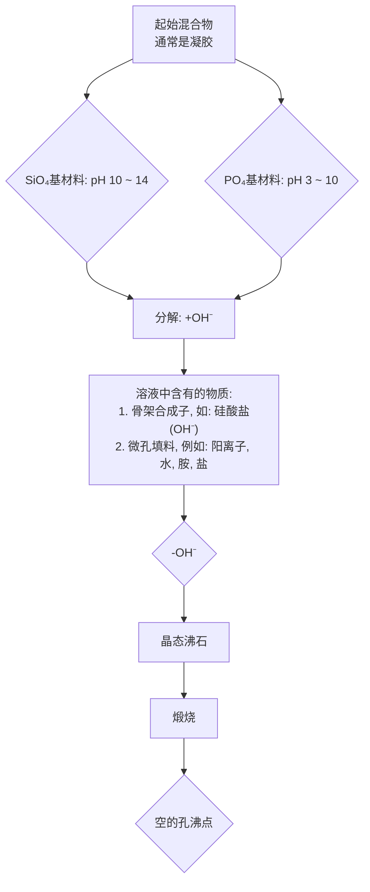
</details>

图 5.7 在水相中在矿化剂（如 $OH^{-}$ ）
存在下合成沸石的示意图

![[超分子化学135章_images/e503842c1d6fce7af95bb9887670f5da0820647685410e36b34a3213c8beaf1a.jpg]]  
图 5.8 （a）二甲苯异构体的形状选择性扩散；（b）MFI 型沸石对汽油改质的“M-forming”过程；高辛烷值的化合物如 2,3,4-三甲基戊烷因过渡态和扩散选择性而被阻止发生反应；正烷烃穿过通道而被裂解；芳香化合物与裂解后的轻质碎片烷基化；（c）蜡状组分被裂解成汽油和石油醚气体  
摘自：Atwood J L, Davies J E D, MacNicol D D and Vögtle F. Comprehensive Supramolecular Chemistry. Oxford: Pergamon, 1996. Vol 7. 641\~642

沸石的高酸性对于通过“M-forming”过程制备汽油也很重要。在汽油中，线性的正烷烃因其低辛烷数而不如其对应的支链体有效。线性体和支链体的分离会增加汽油的价值；再进一步，如果能把线性材料转化成支链结构，则将产生巨大的收益。高支链的烷烃，例如2,3,4-三甲基戊烷扩散进入ZSM-5通道非常慢；而且，即使它们确实进入沸石中，烷烃异构化的首要机制包括氢化物转移到沸石阳离子位点，这种反应的过渡态很庞大，结果只有线性烷烃能反应。这称为过渡态选择性。过渡态选择性和扩散选择性确保了支链烃不被沸石改变。另一方面，线性物种例如正辛烷易于扩散到沸石里，并与酸反应而催化裂解成较小碎片，易于从混合物中分离。芳香烃被裂解后的碎片烷基化，生成汽油产品，导致小量损失。由于致癌物苯最易反应，因而产物中苯与甲苯的比率有显著降低 [图 5.8(b)]。

长链蜡和石蜡因其黏度太大，应用价值很低。但 FAU 型中其他较大的沸石可用来裂解这些物质，裂解产物是汽油和石油醚气体，它们可按照上述方法用 MFI 型沸石进一步处理 [图 5.8(c)]。

# 5.1.3 层状固体和插合物

# 5.1.3.1 引言

层状固体包括石墨、阳离子和阴离子黏土矿物质、金属磷酸盐和金属膦酸盐、大量的其他无机和配位化合物等材料。大约在公元600～700年，中国人生产的瓷器，似乎是关于它们出现的首次报道。这是碱金属离子在天然形成的层状矿物中（如长石或高岭石）的插入或包结作用。层状固体可用一个二维层来表征。每一层中各组分间发生共价作用（或强的键结合），而相邻层间的相互作用通常较弱，通常为范德华力。图5.9总结了层状固体的一些特性，各类层状材料的例子见表5.4。

![[超分子化学135章_images/e0f0fe83afafbcd4ab2d1a7d24f1f61897af930583523781d1c16a645f21c84a.jpg]]

<details>
<summary>text_image</summary>

层间区域
间距
层高
层厚
插入的客体
</details>

图5.9 层状固体的特征

表 5.4 层状固体分类

<table><tr><td>层状材料</td><td>分子式</td></tr><tr><td colspan="2">(1)不带电层</td></tr><tr><td colspan="2">(a)绝缘层</td></tr><tr><td colspan="2">黏土</td></tr><tr><td>高岭石,地开石</td><td> $Al_{2}Si_{2}O_{5}(OH)_{4}$ </td></tr><tr><td>Serpentine</td><td> $Mg_{3}Si_{2}O_{5}(OH)_{4}$ </td></tr><tr><td>氰化镍</td><td> $Ni(CN)_{2}$ </td></tr><tr><td colspan="2">(b)导电层</td></tr><tr><td>石墨</td><td>C</td></tr><tr><td>二硫族元素化过渡金属</td><td> $MX_{2}(M=Ti,Zr,Hf,V,Nb,Ta,Mo,W;X=S,Se,Te)$ </td></tr><tr><td>金属(IV)氧化磷酸盐</td><td> $MOPO_{4}(M=V,Nb,Ta)$ </td></tr><tr><td colspan="2">(2)带电层</td></tr><tr><td colspan="2">(a)阴离子层</td></tr><tr><td colspan="2">黏土</td></tr><tr><td>蒙脱石</td><td> $Na_{x}(Al_{2-x}Mg_{x})(Si_{4}O_{10})(OH)_{2}$ </td></tr><tr><td>皂石</td><td> $Ca_{x/2}Mg_{3}(Al_{x}Si_{4-x}O_{10})(OH)_{2}$ </td></tr><tr><td>蛭石</td><td> $(Na,Ca)_{x}(Mg_{3-x}Li_{x}Si_{4}O_{10})(OH)_{2}$ </td></tr><tr><td>白云母</td><td> $KAl_{2}(AlSi_{3}O_{10})(OH)_{2}$ </td></tr><tr><td>β-氧化铝</td><td> $NaAl_{11}O_{17}$ </td></tr><tr><td>碱金属过渡金属氧化物</td><td> $M^{I}XO_{2}(M^{I}=碱金属;X=Ti,V,Cr,Mn,Fe,Co,Ni)$ </td></tr><tr><td colspan="2">(b)正电层</td></tr><tr><td>水滑石</td><td> $[Mg_{6}Al_{2}(OH)_{6}]CO_{3}\cdot4H_{2}O$ </td></tr></table>

从主客体行为来看，层状排布使得这些材料非常有趣。因为离子或分子客体物种可以插入到层间，使得层扩张或膨胀。客体的插入反应通常是可逆的。这是层状固体的一个重要特征。与沸石不同，它们通过连续的插入和去插入反应可以保持层状主体结构，且插入主体层是柔性可调的，能够弯曲调整部分客体包结在一些区域而不在其他地方。

层状插合物通常形成梯状结构（staged structure），其中阶梯数（stage number）代表主体层数与客体层数的比率。因此一阶复合物的一个主体层对应一个客体层。二阶复合物中每两个主体层对应一个客体层，依此类推。分段阶梯也常有，常在中间态中出现，例如，在二阶化合物转为一阶的过程中。通常，这种阶层中间态的转变要求一些层中所有客体离去，塌缩的结构回复到无客体时的 $d$ -间隔，其他层重新定位。这种模型不具有可信度，与观察到的易于内转化不一致。Daumas-Hérold模型，作为一种非经典模型被提出用于插层结构。为了使整个结构的扭曲最小化、使静电引力最大化，一层中未被占据的部分倾向于与邻近层中占据区相匹配，当识别这种情况时，Daumas-Hérold模型只适用于客体密度在一层中变化。图5.10显示了两种类型插入作用的不同。图5.11显示了二阶插入内转化成一阶材料的Daumas-Hérold过程图。

![[超分子化学135章_images/b1b295e6346301c45b21260ec71acd298f06b9ff2308dc0ed7775e8b2495a540.jpg]]  
图 5.10 在插合物里阶梯（staging）的经典模型和 Daumas-Hérold 模型阶数代表主-客体层的比率  
图 5.11 二阶通过 4/3 阶作为附加客体被插入而转变为一阶的机制示意图

历史上，层状插合物（layered intrecalate）化学始于1840年，是关于报道石墨能在它的“chicken wire”网状物的连续层间插入硫酸。直到20世纪60年代后，人们逐渐意识到客体插入可以显著改变主体的化学、催化、电子和光学特性，这时插入反应才引起强烈关注。尤其是主体特性强烈依赖于其层状结构时更加符合。以石墨为例，因石墨碳层之间易于相对滑动（你会感到铅笔头有滑的感觉，这其实就是低黏土石墨），它可以用作“干的”低温润滑剂。有趣的是，石墨作为润滑剂的特性严格依赖于插入氧的存在。无氧时，石墨以球形分子存在，润滑感相对较差，这就是在真空中使用石墨润滑剂时的一大难题。其他的插入材料，特别是黏土，可以用作阳离子和阴离子的离子交换介质。插合物最重要的应用是作为固态电化学器件的组分和用于非均相催化。石墨和层状金属硫族化物都可以插入碱金属，可用作固态电池的电极。 $\mathrm{TiS}_2$ 的Li插合物，商业上用于需要高能密度（如BP机）或高可靠性（如心脏起搏器）的电池。在催化领域里，在发现沸石前，黏土被广泛用于石油化学工业。由于小沸石孔不能裂解粗油重组分，因而激发了对带有孔径大于 $1\mathrm{nm}$ 的柱状黏土的研究兴趣。在黏土矿物里也有丰富的有机转化催化；而且，黏土能吸收中性和带电有机物种，蒙脱土可用于食用油的脱色，净化酒精饮料，除去酸性杂质形式PVC。有关方面的详细信息超出本书的研究范围，作为代表性的例子我们只介绍了石墨的插入。更充分的讨论和前沿参考资料参见这一部分的重点文献。

O'Hare D. Inorganic Intercalation Compounds. In Inorganic Materials. Bruce D W and O'Hare D(eds). Chichester: J Wiley & Sons, 1996. 171\~254

# 5.1.3.2 石墨插合物

石墨（5.4），是纯碳的同素异形体，是一种只有 $sp^{2}$ 杂化碳原子的六元环组成的无限层状结构。以弱相互作用堆积起来的层间距离为 3.35Å，C…C 间的 $\pi-\pi$ 堆积相互作用最大（比较 6.9 节）。纯石墨是一种拥有充满的 $\pi$ 价带，紧接着是空的 $\pi^{*}$ 导带的半金属，没有半导体特性的带隙。 $\pi-\pi$ 相互作用导致价带和导带稍微重叠，因此在费米能级上有一个非零密度态，正好介于价带和导带之间。就电子性质而言，碳的 Pauling 电负性是 2.5，位于周期表中第一长周期的中间，说明它易于失去和得到电子，电子的得失完全取决于能恰当处于层间的客体物种的电子给体和电子受体的性质。事实上，石墨和两个金属原子形成插合物，其中金属还原石墨层；若与 $F^{-}$ 形成插合物，则石墨被氧化。典型的金属络合物包括 $LiC_{6}$ 和 $MC_{8}$ （M=K，Rb，Cs，Ca，Sr，Ba，Sm，Eu 和 Yb）。形成氟阴离子络合物的金属氟化物以及它们的还原电位被列于图 5.12。显然，只有那些还原焓比 -502kJ/mol 更负的物种才能形成完全一阶的插合物，在低于 -440kJ/mol 时形成部分（较高阶层）材料。

![[超分子化学135章_images/9110e74708b630c8c1dcba2d90330eb224158eddcc4d29ad171e45e864724f8a.jpg]]

<details>
<summary>natural_image</summary>

Hexagonal grid pattern composed of fused hexagons, no text or symbols present
</details>

(5.4) 石墨

![[超分子化学135章_images/0a8412f86bd30fe20d8a01b0a2bfbbe418ee109b57a224eb3e53dd106164805e.jpg]]  
图 5.12 氟阴离子的还原焓（kJ/mol）以及与石墨插入的程度

很有趣的是，当拥有一个 $2 \times 2$ 平面结构的 $\mathrm{KC}_{8}(5.5)$ 被暴露于CO或 $\mathrm{O}_2$ 氛围中时，客体就会逐渐丢失，给出 $\mathrm{KC}_{24}$ 、 $\mathrm{KC}_{36}$ 和 $\mathrm{KC}_{48}$ 的连续相。从 $\mathrm{KC}_{24}$ 开始， $\mathrm{KC}_{36}$ 和 $\mathrm{KC}_{48}$ 相继生成。这很好地验证了列于5.1.3.1节的Daumas-Hérold模型。

![[超分子化学135章_images/f3e788dcbe7d8fb2821a47fe5bf0f0936876c9340d2bf53add70c83750330c53.jpg]]

<details>
<summary>natural_image</summary>

Hexagonal grid pattern with embedded spherical elements (no text or symbols)
</details>

(5.5)

石墨也易于与 $Br_{2}$ 及卤素间化合物 IBr 和 ICl 形成插合物，但是不能和 $F_{2}$ 、 $Cl_{2}$ 、 $I_{2}$ 或钠形成插入化合物。 $Br_{2}$ 插合物结构显示未离解的 $Br_{2}$ 分子处于石墨六边形环的每个原子上。很可能 Br-Br 键长及 IBr 和 ICl 键长（分别是 2.27Å，4.49Å，2.40Å）与六边形之间的距离很匹配，而 $F_{2}$ 、 $Cl_{2}$ 、 $I_{2}$ 键长（分别是 1.41Å，1.99Å，2.67Å）要么太大要么太小。至于 Na，其金属半径对于 $NaC_{6}$ 排布而言太大，但是对于通常的其他金属， $MC_{8}$ 结构又太小。

# 5.1.4 Hoffman 包合物和 Werner 包合物

Hoffman 和 Werner 类型包合物都来自于无机配位化合物的组装体的晶格空位。Hoffman 包合物的通用分子式为 $\mathrm{M}(\mathrm{NH}_{3})_{2}\mathrm{M}^{\prime}(\mathrm{CN})_{4}\cdot2\mathrm{G}$ （其中 M 为第一排过渡金属 Mn-Zn 或 Cd； $M^{\prime}$ 是 Ni、Pd 或 Pt；G 是一个小的芳香分子）。这些化合物的固态结构由聚合层组成，其中正方形平面构型的 14 族金属 $M^{\prime}$ 和八面体过渡金属 M 在轴向通过配体 $CN^{-}$ 桥连。这导致了氨配体露出于层状平面的上端和下端，形成适于包结小芳香分子如苯或噻吩的晶格腔。Hoffman 的苯包合物 $\mathrm{Ni}(\mathrm{NH}_{3})_{2}\mathrm{Ni}$

$(\mathrm{CN})_{4}\cdot2\mathrm{C}_{6}\mathrm{H}_{6}$ 的结构如图 5.13 所示。

Werner 包合物是由大量 $MX_{2}A_{4}$ 型的 Werner 类型金属配位络合物形成的，其中：M 是第一行过渡金属 Cr～Zn，Cd 或 Hg；X 是 $NCS^{-}$ ， $NCO^{-}$ ， $CN^{-}$ ， $NO_{3}^{-}$ ， $NO_{2}^{-}$ ， $Cl^{-}$ ， $Br^{-}$ 或 $I^{-}$ ；A 是中性的取代吡啶。与 Hoffman 包合物一样，小的芳香客体可以被包容进去，尽管其主体材料并不是聚合的。在这里，晶格空位是由于宽的平面型吡啶基配体的存在而产

![[超分子化学135章_images/dfecf2de8afb383638db5f776ba950597da145a14c84d7ff174ec4be01eff1e3.jpg]]

<details>
<summary>chemical</summary>

Molecular structure diagram showing a central metal ion surrounded by organic ligands
</details>

![[超分子化学135章_images/01271d6227a8cee4db92c39db4dc63b54f5b240e213209f4fddafd70864d0a0e.jpg]]

<details>
<summary>chemical</summary>

Molecular structure diagram showing a central atom surrounded by surrounding atoms in a square arrangement
</details>

图5.13 Hoffman的苯包合物  
$\mathrm{Ni(NH_{3})_{2}Ni(CN)_{4}\cdot2C_{6}H_{6}}$ 的结构

生的。Werner 包合物可通过柱色谱法分离双取代苯环的邻、间、对异构体（Lipkowski et al，1979）。总的来说，这种无机包合物可以由大量的配位络合物形成，而不只是 $MX_{2}A_{4}$ 型化合物。当络合物在固态不能有效地堆积（主要是因为形状），并且有一合适的大小恰当的溶剂或其他分子作为客体存在于结晶介质中时，则发生包合。Werner 包合物为系统研究提供了稳定和便利的模型系统，但是在分离科学上还无法与沸石竞争（5.1.2 节）。

![[超分子化学135章_images/73a09e8acd5c8dd459c11d6161cb7470cd3ebe8084c14966a600bff948839eaf.jpg]]

Lipkowski J. Werner Clathrates. in Comprehensive Supramolecular Chemistry. Vol 6. Atwood J L, Davies J E D, Macnicol D D and Vögtle F (eds). Oxford: Pergamon, 1996. 691\~714

# 5.2 有机主体的固态包合物

# 5.2.1 脲包合物 (urea calthrates)

![[超分子化学135章_images/318d2c9eea38c50f3f351aac864b1b197935366cfbfe707f070deafdb5e74f0e.jpg]]

Harris K D M. Investigating the Structure and Dynamics of Organic Solids-The Alkane Urea Inclusion Compounds. J Solid State Chem, 1993, 106:83

# 5.2.1.1 结构

常见的有机分子脲(5.6)和它的硫类似物硫脲(5.7)，都能和长链碳氢化合物（如正烷烃）形成固态包合物（clathrate）。脲可以通过 $\mathrm{NH}_2$ 基团的酸性H质子和相邻分子中的氧原子或硫原子的分子间强氢键相互作用作为主体。这样就形成一个脲分子的手性螺旋中空管，其最小范德华直径为 $5.5\sim 5.8\AA$ ，能容纳交叉部分较小的客体。这种螺旋排布使得每个脲分子中所有的NH质子都可以形成氢键，分子间相互作用最大。这就表示每个氧（或硫）原子必须接受四个氢键。硫脲的通道与脲相似但较大，尽管不能包结小的正烷烃但可以包结支链的碳氢化合物（图5.14）。

![[超分子化学135章_images/2a629cb55688ad94c903dfc559db80f526cd4074c0e4b897b6257730e6704bf1.jpg]]  
脲
(5.6)

![[超分子化学135章_images/15d5e0e93d2c219e50b252913be20ccd1d70470ac8f8134a8de9dd2a00a4e01a.jpg]]  
硫脲
(5.7)

![[超分子化学135章_images/870d596cee74538632b4739dafabf22af6eb0c9ca9433e29bc5403e3ba20df21.jpg]]  
图 5.14 （a）一个脲主体通道的立体图：手性带状物通过  
anti-N—H…O 氢键定义，syn-N—H…O 氢键使之交联；  
(b) 脲通道内空穴的范德华交叉部分与正辛烷（左），苯（上），  
3-甲基庚烷（右）和2,2,4-三甲基戊烷（下）的大小相比  
(a) 摘自：Hollingsworth M D, Brown M E, Hillier A C et al. Superstructure control in the crystal growth and ordering of urea inclusion compounds. Science, 1996, 273: 135

因为脲分子没有多余的氢键官能团，它们只能向包结的客体提供一个光滑表面，形成弱键合，往往得到非化学计量的络合物，客体在固态可以平移和振动。因此，不论客体的性质如何，常见的六边形对称性晶格被保留下来。移去客体（例如：通过外部抽真空）将使通道结构立即塌陷，形成不包结的四边形脲，它具有完全不同的结构。

# 5.2.1.2 客体

脲包合物的一个主要亮点在于它们在石油工业上分离线形和支链碳氢化合物的潜在应用价值。因为通道直径仅比线形碳氢化合物的直径稍大一点，仅有少量的支链被容纳。特定的脲包合物的形成与否可通过比较通道的大小与客体直径而定。例如，苯比通道稍宽，很难形成包合物[图5.14(b)]。然而，有趣的是，增加链长可以包结更加支链化的较大的端基。因此，虽然辛烷苯不能形成包合物，但是长得多的二十烷基苯却可以。平衡气相测试表明，线形链上每增加一个 $\mathrm{CH}_2$ 基团则络合物热焓将增加约 $10.0\mathrm{kJ / mol}$ ，因此，与较长链客体络合的附加稳定作用超过与苯端基的不利的空间相互作用。总之，烷烃客体分子显示出一维有序性，它们沿脲通道方向有序排列，但是一个通道的模式和那些相邻的通道有无关系，这些特性是通过X射线衍射模式得到的漫散射而来的。

# 5.2.1.3 相称结构和不相称结构

在脲包合物里，一个有趣而重要的参数是主体和平行于通道轴（晶体学上的 c 轴）的客体的结晶重复距离间的比率。“重复距离”是一个抽象距离，指在晶体中沿某一方向运行，直到其周围环境（根据周围分子）与开始运行相同时所走的距离。主体每 $11.02 \, \AA$ 自身重复排布，该量称作 $c_{h}$ （c 指通道与晶体学上 c 晶胞方向一致）。相称结构（commensurate structure）是指结构中客体有一个重复距离 $c_{g}$ ，该距离与主体相同或与主体具有简单的关系（图5.15）。也就是说，对于相称结构，当 $p$ 和 $q$ 是小的整数时， $pc_{\mathrm{h}} \approx qc_{\mathrm{g}}$ ；在不相称结构里，主体和客体的晶格之间不存在这种简单关系。

# 5.2.1.4 研究实例：链烷酮和链烷双酮

长链烷酮(5.8)和长链烷双酮能够很好地说明包合物形成的有序化对客体的影响(Hollingsworth and Brown 1995)。

![[超分子化学135章_images/00d79e7c618c572300d8c3cae5813242749423ab4e8260ef7423f1bdfd805843.jpg]]

<details>
<summary>chemical</summary>

Diagram of a hexagonal organic molecule with labeled bond lengths c_h and c_g
</details>

图5.15 在脲包合物中，主客体重复距离不必相同

![[超分子化学135章_images/282982b0106cc085f11562bdd9960ff620c3ceebda7d858e13ab0890f96aa354.jpg]]

<details>
<summary>chemical</summary>

Chemical structures of polyacrylate monomers with n=1, 2, 3 labeled for each polymer chain
</details>

总之，对100多个这类客体的研究表明，与烷烃类似物不同，烷酮类化合物中很多都显示出X射线衍射模式，说明具有明显的三维有序化（与仅平行于通道轴向的序列不同）。这说明通道之间的客体存在相互作用，沿通道轴向存在规则的头-头或头-尾堆积。然而，计算结果却表明， $C^{\delta+}=O^{\delta-}\cdots C^{\delta+}=O^{\delta-}$ 型的偶极-偶极相互作用太弱，不足以使通道之间产生有序化。X射线衍射和固态 $^{13}$ C NMR测试发现只有一维有序化。问题的关键在于由化合物(5.9a～5.9c)形成的相称结构。相称的二酮和不相称的链烷酮相的差别可由脲络合物(5.8c)[图5.16(a)]和(5.9c)[图5.16(b)]的X射线衍射图显示出来。前者无序客体的存在只能由在标记为“g”层的漫射线来说明。相反，对于相称络合物[如图5.16(b)]，带有 $3c_{g}=4c_{h}=44.0\AA$ 的强衍射模式是清晰可见的。

![[超分子化学135章_images/815ac240dbfd5e10d583e619fc408742c0d2d9b129cb582a3a0f3ccb5e6aa8aa.jpg]]

<details>
<summary>text_image</summary>

-h
-g
-h
-h
-h
(a)
</details>

![[超分子化学135章_images/aa6fd2fb9690a61589397256cad0d2b7d088ccc73086540687a47f42b05bd5e1.jpg]]

<details>
<summary>natural_image</summary>

Grayscale image showing a vertical bright spot with a faint central line, labeled (b) at bottom left (no other text or symbols)
</details>

图 5.16 （a）2-癸烷酮脲的 X 射线衍射通道振动光谱显示主体晶格衍射（h）和客体衍射模式区域的扩散带（g）；（b）2,9-癸烷二酮脲的 X 射线衍射光谱显示相称关系 $3c_{g}=4c_{h}=44.0\mathring{A}$   
摘自：Hollingsworth M D, Brown M E. Superstructure control in rhe crystal growth and ordering of urea inclusion compounds. Science, 1996, 273: 1355

这种效应的根源最终通过完整的 X 射线晶体结构来确定，该方法显示了某些脲 NH 基团和客体羰基氧原子之间显著的氢键相互作用（图 5.17）。事实上，在所有链烷酮和链烷二酮络合物里，主体分子恰当地放置能够倾斜出通道壁面，使它们的其中一个 $NH_{2}$ 基团与客体形成氢键。对于链烷二酮(5.9)，双重氢键相互作用足够强，在室温可以产生三维有序相称结构。对于形成非相称结构的客体类型(5.8)，例如 2-癸烷酮，冷却至 $-85^{\circ}C$ 时也能产生相似的相称结构。

![[超分子化学135章_images/ef48159228980a3c38fc766e897a9c1c7366f71b6fae4c312a2ccae17c3f9b94.jpg]]

<details>
<summary>chemical</summary>

Molecular structure diagram showing two identical complex organic frameworks with central metal centers and organic ligands
</details>

图 5.17 纵观 2,9-癸烷二酮的通道轴，展示出客体羰基官能团和“倾斜的”脲给体之间的氢键  
摘自：J. L. Atwood, J. E. D. Davies, D. D. MacNicol and F. Vögtle Comprehensive Supramolecular Chemistry. Pergamon: Oxford. 1996. Vol 6. 199

脲分子氢键的精确位置主要取决于链长。2,10-十一烷二酮的例子特别有趣。对于奇数链长的二酮，在延伸的链的全反式构象里，两个羰基官能团位于分子的同一侧。这就产生了具有 $2c_{g}=3c_{h}=33.0\mathring{A}$ 的不同的相称结构，因为仅与一侧发生氢键相互作用，故伴随通道宽度的收缩。这种低对称性结构展现出显著的铁弹性。小的机械应力能够使本体区域在晶体内重新取向（相应于相邻通道的客体基团有效旋转 $60^{\circ}$ 角范围），如果在偏振光下能观测到结晶，则产生显著的平行条纹（图5.18）。如果所使用的应力足够柔和，则重新取向区在几秒内会恢复至其初始取向。较大的应力会导致永久效应，即使这些可以简单地通过旋转晶体 $60^{\circ}$ 和再施加压力而恢复。

# 5.2.1.5 包结聚合化

硫脲内较大的通道使得这些包结化合物适合应用于在主体基质内发生化学反应。这样，可预料到主体的刚性立体结构在反应过程中可诱发大量的立体和区域选择性，而这些在正常反应条件下是很难控制的。脲化合物的通道结构表明它们适于选择性形成长的直链聚合物。特别是，早在1960年，Brown和White就发表了2,3-丁二烯，2,3-二氯丁二烯，环己二烯和相关化合物的包结聚合。在大多数例子中，具有高熔点的结晶聚合物可以分离得到，说明具有窄分子量带的长链材料可以高效可控地生成。

![[超分子化学135章_images/282b5588c73d093c26412dc0a69b0306c1792a9740b77d992546147df32de616.jpg]]

<details>
<summary>natural_image</summary>

Close-up of a textured surface with a dark triangular object and a small circular feature, possibly a mechanical or architectural component (no visible text or symbols)
</details>

(a)

![[超分子化学135章_images/e829a73f24a7a6be795666a5a567ebf815d57cbb0142f26ad8d482add0f074a7.jpg]]

<details>
<summary>text_image</summary>

(0 1 0)
(1 1 0)
(1 1 0)
</details>

(b)

![[超分子化学135章_images/f03bea3b40cffdc3cecf902a77cbddb5e8d23726043660f3c3838c56f2059376.jpg]]

<details>
<summary>natural_image</summary>

Close-up of a person's face with a metallic object partially visible (no text or symbols)
</details>

(c)

![[超分子化学135章_images/7246110dae9c7dd1c4606f41c04a67d3cf5253a66b3f7d2727740a61be3162d0.jpg]]

<details>
<summary>text_image</summary>

Diagram showing a triangular grid of hexagons with directional arrows indicating movement or flow, possibly representing a geometric or combinatorial pattern.
</details>

(d)   
图 5.18 在 2,10-十一烷二酮脲里不可逆应力诱导的相重新取向  
(a) 加压前结晶；(b) 加压前结晶图示，箭头代表一层中客体的羰基偶极；  
(c) 在来自图底端左部同一压力下结晶；(d) 压力结晶机制  
摘自：Hollingsworth M D and Brown M E. Stress-induced domain reorientation in   
urea inclusion compounds. Nature, 1995, 376: 323

# 5.2.2 其他通道包结物

# 5.2.2.1 1,3,5-苯三酸

酸或 1,3,5-苯三酸[TMA,(5.10)]通过与羧酸残基形成氢键，或者离子化成盐而形成各种络合物。然而，1,3,5-苯三酸的单水合物的结构特别有趣。(5.10)从水里结晶，在不刻意控制温度的情况下，除了未溶剂化的立方体 TMA 外，还得到两种类型的水合物晶体，TMA·2H₂O 和 TMA· $\frac{5}{6}$ H₂O。加入苦味酸（2,4,6-三硝基苯酚）生成黄色针状晶体 TMA·H₂O· $\frac{2}{9}$ (苦味酸)。令人吃惊的是，尽管它们组成多样化，但 3 种水合物的结构却是密切相关的。

![[超分子化学135章_images/89821188d8e48de1c9a31ce74c6066e3ea49690129e7123e5504404515a2b9f3.jpg]]

<details>
<summary>chemical</summary>

Chemical structure of a substituted benzene ring with three carboxylic acid groups and hydroxyl groups
</details>

(5.10)

![[超分子化学135章_images/f501b1a7c58544afda6c7521929cbc6e9b1bc4604cccfa927a482a8a9410c846.jpg]]

<details>
<summary>chemical</summary>

Chemical structure diagram showing a complex organic molecule with multiple aromatic rings, ester linkages, and functional groups labeled in Chinese.
</details>

图 5.19 TMA 单水合物的层状结构
客体分子被包裹在长方形空隙里

每种离子的中心单元是两对TMA分子的长方形排布，在主体结构中形成一系列二维的长方形孔腔。每个网格可通过和水分子形成的氢键与在同一平面上相邻的长方形单元相连接。总的主体层化学计量是 $\mathrm{TMA} \cdot \mathrm{H}_2\mathrm{O}$ ，因此称一水合物（图5.19）。

在 TMA·H₂O· $\frac{2}{9}$ （苦味酸）和 TMA·2H₂O 里 {写作 TMA·H₂O·[2H₂O] 更恰当，其中，方括弧里是客体分子}，一水合物层直接位于彼此上方形成无限长方形通道，客体分子（水或苦味酸）被包结在内，而它们与通道之间没有任何特殊的相互作用。客体排列及计量比可通过客体大小与层厚的相互关系来确定。每一种结构的客体部分有显著的无序性，X 射线光谱包含强的漫散射，这些说明客体分

子是部分地有序（比较脲包合物里的一维有序性）。苦味酸络合物是稳定的，而

![[超分子化学135章_images/eb2613a997b0b1277d06a76150b2e022b862b1e4775f92b9ab5a37565150bc97.jpg]]

<details>
<summary>chemical</summary>

Chemical structure of a glycoside polymer with repeating unit and cyclic arrow representation
</details>

图 5.20 TMA·H₂O·[0.2TMA]的偏移层堆积

TMA·H₂O·[2H₂O]一旦暴露在空气中会迅速失水，与通道的开放性一致。

TMA· $\frac{5}{6}$ H $_2$ O 的结构是基于相同的长方形主体网状结构。特殊的化学计量可以通过把分子式扩展为 6TMA·5H $_2$ O，并改写为 5TMA·5H $_2$ O·TMA 来解释，或者通过用苦味酸结构 TMA·H $_2$ O·[0.2TMA]来类推。事实上，一水合物立体骨架包括一条氢键键合的 TMA 客体的无限 Z 字形链，结果导致一层对下一层的偏移从而形成 Z 字形通道（图 5.20）。这种结构是非常有序和稳定的，并且在客体 TMA 链和与之垂直的主体层之间没有特殊的相互作用。

有趣的是，TMA 包结化学并不局限于形成长方形通道。在大的客体分子，如线形和支链长链烃、链烷烃、长链醇等存在时，形成六角形主体通道，带有二维“chicken wire”形不间断的 TMA 单元（图 5.21）。所得通道被客体分子填充，且通道呈 2 层、3 层、甚至 5 层主体层自身重复。2TMA·[正十四烷] 的结构见图 5.22。

![[超分子化学135章_images/55017835fbdaab8f67d6ddaa09920f4134261a93393a405147f6f765280277c6.jpg]]

<details>
<summary>chemical</summary>

Chemical structure of a cyclic compound with multiple hydroxyl groups and ester linkages
</details>

图5.21 TMA分子的六角形排布形成一个六角形通道

![[超分子化学135章_images/1adeb9bad827c7c1be71897f24498dcf24ee5ecbc9efab513f33850c2e319268.jpg]]

<details>
<summary>chemical</summary>

Molecular structure diagram showing two 3D unit cell arrangements with labeled axes a, b, c and internal circular structures
</details>

图 5.22 沿晶体学 c 轴观察到的 2TMA·[正十四烷]  
的立体结构（Herbstein et al，1987）  
正十四烷分子是高度无序的；主体结构每3层重复一次

![[超分子化学135章_images/32a66511b4df221cad29de7a7b61a0a1976dceb3bd7d8bef10a1ee64d0cbb103.jpg]]

Herbstein F H. Structural Parsimony and Structural Variety Among Inclusion Complexes. Top Curr Chem, 1987, 140: 107\~139

# 5.2.2.2 螺旋形管状物

与脲和硫脲的主体结构关系密切的是螺旋形管状通道结构，由脂肪族二醇体系[如(5.11)～(5.13)]形成。(5.11)在多种溶剂和其他潜在的客体分子存在时结晶，能够形成三角形通道结构（图5.23），其中，管壁包括二醇分子的氢键绕一种常见的三重螺旋对称（ $3_{1}$ ；旋转 $120^{\circ}$ ，然后沿旋转轴平移）的“spine”结合在一起的两条螺旋长线。

![[超分子化学135章_images/7a37b7d28f0c75617c85dc019616909ffec85cb5cd6a3918b5cf4eb6594a2d65.jpg]]  
(5.11)

![[超分子化学135章_images/5069882c98516c5282b9fdab1a25ca74a0585fe51e715ef20eea08d16eba755f.jpg]]  
(5.12)

![[超分子化学135章_images/f976b97acd431ad6c50a3626a30cbe9f6306f334d4b68ba94d38bda59c46d496.jpg]]  
(5.13)

![[超分子化学135章_images/b36b108261fbe0ba323bd299a19f083c14cc9794e47169e8f1528e62d1e2e6f4.jpg]]

<details>
<summary>chemical</summary>

Molecular structure diagram of a cyclic compound with spherical atoms
</details>

图 5.23 （5.11）的六角形通道结构的空间填充图
通道的横截面呈三角形；
边缘长度为 $6.30 \, \AA$

这样的腔体结构能够包含大多数与腔体空间相匹配的客体（不包括酚类和其他能形成氢键的物质，因为这些物质将会与主体形成非腔体的共结晶物质）。在管状体内，通常二醇：客体=3:1，客体可以是乙腈、噻吩、二氧杂环己烷等。但是主体与客体也会形成一些非化学计量比的包合物，包合物的形成取决于客体的长度与腔体(5.11) $_{3}$ 重复单元的长度是否匹配。强氢键作用下，管壁的柔韧性非常好，当客体不同时，管壁的横向宽度可以有5%左右的变化（11.89～12.47Å），这样在管腔内可以容纳更大的客体。

脂环族二醇单体的结构可以有较大的变化，所以由它们形成的腔体的直径也可有大的改变[如(5.12)和(5.13)]。广义上讲，螺旋管状物可分为两类：①直径非常小的管腔结构，这些管状物甚至在没有客体时也可存在；②管状结构有较大的直径，但是一旦客体不存在，主体形成的管状结构也将坍塌。

![[超分子化学135章_images/609f51ea294d0b1e9b71b46ba788ab9ae0dc3ee03e35235c836b74b8175139ae.jpg]]

Bishop R and Dance I G. New Types of Helical Canal Inclusion Networks. Top Curr Chem, 1988, 149: 137

# 5.2.2.3 全氢化苯并 [9,10] 菲

全氢化苯并菲 [PHTP, (5.14)] 是一种 $\mathrm{D}_3$ 对称的饱和手性有机化合物，在固态形成六角形中空的管状结构，管的直径约为 $15\mathring{\mathrm{A}}$ ，客体分子能被包含其中。客体分子通常为能与长的管状结构相匹配的长条线形分子，如烃类、醇、酯、醚和酸，但是枝状体或大的客体也能被包含在内。主-客体间的作用力最小（范德华力）。因为烷烃不含官能团，主-客体分子的排列常为无序和不相称的，或者呈一维有序排列，与脲包合物类似（见5.2.1节）。这就产生了一个（客体的）腔道单元格尺度 $c_{\mathrm{g}}$ ，它是主体单元格 $c_{\mathrm{h}}$ （取决于客体的长度）的倍数。PHTP能容纳超极化度的客体，与之形成极化率高的晶体，所以 PHTP 引人注目。这使得 PHTP 包合物具有好的非线性光学性质和电光性质（8.6 节）。PHTP 的结晶图形很不规则，因为客体分子成一维方向排列，这也给鉴定 PHTP 包合物的结构带来了很大困难。直到 1997 年，瑞士伯尔尼大学的 Hans-Beat Bürgi 才完全确定了其结构，表明 PHTP 包合物具有极性序列和大块的晶体极性。所研究的材料是 ± PHTP 和 1-(4-硝基苯基)哌嗪 [NPP, (5.15)] 的包合物，分子式为 [(±)-PHTP]₅[NPP]，这个包合物呈现二次谐振生成（second harmonic generation）、电光和热电效应，这些效应都是由大的晶体极性引起的。客体与主体的比例 5:1 是主体重复单元长度 $c_{\mathrm{h}} = 4.73 \AA$ 和客体 ( $c_{\mathrm{g}} = 5c_{\mathrm{h}}$ ) 相对长度的比值。

![[超分子化学135章_images/fb6346806d1cc007326b3953956e27710b81ad4fbebaff1a8758fe7fc9c652a9.jpg]]

<details>
<summary>chemical</summary>

Chemical structures of PHTP and NPP with labeled chemical shifts (5.14 and 5.15)
</details>

图 5.24（a）给出了主客体络合物结构沿通道轴向的投影。图 5.24（b）是客体排列的图像。

![[超分子化学135章_images/e8b947d55efd0343a27656a2b21e8d48a91dba54f5d592eded045f171abd6198.jpg]]

<details>
<summary>chemical</summary>

Complex molecular structure diagram with interconnected hexagonal rings and central ligand framework
</details>

(a)

![[超分子化学135章_images/fcdbd065c161e0a829f5e7f07d3698021b161314b3a7b48f1d4945c1817fdc2b.jpg]]

<details>
<summary>chemical</summary>

Diagram of a polymer chain structure with repeating units and labeled P and H atoms
</details>

(b)   
图 5.24 (a) $\left[(\pm)-\mathrm{PHTP}\right]_{5}$ [NPP]顺着通道轴向的结构投影；  
(b) NPP 客体分子通道的示意图  
客体分子通过氢键 N—H…O₂N 相互作用，且在每个通道内是有序的；  
客体从一个通道到另一个的距离相差 $c_{\mathrm{g}} / 5$ 的整数倍  
摘自：König O, Burgi H-B, Armbruster et al. A Study in Crystal Engineering: Structure, Crystal   
Growth and Physical Properties of a Polar Perhydrotriphenylene Inclusion   
Compounds. J Am Chem Soc, 1997, 119: 10632\~10640

$\left[\mathrm{PHTP}\right]_{5}\left[\mathrm{NPP}\right]$ 结构中最值得关注的是晶体非线性极化性质的根源。主体或客体按极性堆积在一起就可以产生这种性质，但问题是分子为什么会采取非中心对称堆积呢？

主体的左旋体和右旋体自然拆分形成离散的对映体结晶（比较6.1.5.4节）就导致了大的晶体极性。然而，主体的晶格点阵是中心对称的，且在同一晶体里 $(+)$ -PHTP和 $(-)$ -PHTP是无规则排列。对主体里短距离堆积的详细分析揭示出它采取独立的极性同手性堆积（+或-）的形式（在每个堆积体里只有一种对映异构体）。这些堆积体在晶体内无规则排列，因为 $(+)$ -(+)、 $(-)$ -(−)或 $(+)$ -(−)派对之间的范德华力几乎是相等的，所以这种无规则排列就不足为奇了。在主体的晶格内，因为 $(+)$ 堆积体和 $(-)$ 堆积体量相等，所以它是非极性的。因而，极性一定来自于客体分子，依据氢键给体NH基团和受体 $\mathrm{NO}_2$ 基团之间的氢键结合能力，很容易想到客体分子的极性链以给体-受体-给体-受体（…DADA…）的形式排列。相反，对于D-D或A-A之间的相互作用，链上的分子会反转，这样的排列是不利的。单个DADA链是有极性的，但因为链与链之间有15Å的距离，因而很难想象腔体之间客体与客体的协同作用会导致所有的链都向同一方向定位。实际上，链和链之间的相互作用将会向极性减小的方向倾斜。

![[超分子化学135章_images/9a726cc53d047f7bf20fb3842e5e78b3c3d4c53191b4a6a82cc2274a46f06368.jpg]]

<details>
<summary>chemical</summary>

Chemical structures of a triazine derivative with labeled substituents DA, DD, AA and various amide groups
</details>

图 5.25 在 PHTP 包结通道里客体可能的排列 …DA… 相互作用是最可能的；大量…DD…缺陷的存在（与…AA…相比）导致总的晶体极性

分析通道的尺寸可知，一旦三维通道形成，NPP 分子就很难进入其中，所以 NPP 分子链的取向一定是在晶体生长的过程中决定的。如果晶体极性大，那么必定有一个驱动使 50% 以上的链都向同一方向排列，因而，就存在一个驱动力，使在通道入口处客体分子的 $NO_{2}$ 基

（例如）比其反向尾部的基团更易暴露在外。实际上，总的极性是各种不同极性的…DA…、…DD…和…AA…客体-客体相互作用的总和（如图5.25所示）。当然，能够产生个体极性链的互补的…DADA…单体是最为有利的。事实表明，链运动100Å的距离，可能会产生一个“错误”，即插入…DD…（例如N-H…H-N）或…AA…（例如NO₂…NO₂）的缺陷，这种缺陷会改变链的极性。关键问题是…DD…型缺陷的产生较…AA…型缺陷更容易发生，这是因为两个NO₂基之间相互排斥，而一个NH基团的质子与另一个NH基团的氮原子之间存在一定的吸引力。所以在管道组装时，由于静电作用，在管道的入口处将有更多的NO₂基团而

非 NH 基团。

![[超分子化学135章_images/da8ff4b12ff6f46577d541d9add56420ba89f9b2ec5835e1c6bb1420365f4915.jpg]]

Konig O, Burgi H-B, Armbruster T et al. A Study in Crystal Engineering: Structure, Crystal Growth and Physical Properties of a Polar Perhydrotriphenylene Inclusion Compound. J Am Chem Soc, 1997, 119:10632\~10640

# 5.2.3 氢醌，苯酚和狄安宁化合物：六主体策略

氢醌(5.16)，苯酚(5.17)和狄安宁（Dianin's）化合物(5.18)可经由六角形或环形氢键环的形成作为主体[参考(5.2)]。苯酚上羟基固态时的排列能迅速使芳基取代基在六角形环的上下交替排列，并形成和芳基单体并行的空穴。在晶态，这些空穴全部连锁形成一个闭合的“笼”（图5.26），可容纳各种客体分子。

![[超分子化学135章_images/1934f445d5945cf5c82f84082cf8877755366459ca1a40c6080cbfef7c7bd2b4.jpg]]

![[超分子化学135章_images/dd50e0ec443271b8c4ff21a77bd6e490615f9f0f7678febed4c2990586a22c77.jpg]]

<details>
<summary>chemical</summary>

Molecular structure diagram showing a cyclic compound with R groups and a shaded binding pocket, labeled in Chinese.
</details>

(a)

![[超分子化学135章_images/73ef87489b12af4a6efafa60a4011940e1813207023ad474b9753f246f14b79b.jpg]]

<details>
<summary>chemical</summary>

Molecular structure diagram showing interconnected rings and chains with black, white, and gray atoms
</details>

(b)   
图 5.26 （a）说明氢醌笼结构的示意图；  
(b) 含有甲基异腈客体的 $\beta$ -氢醌晶格的空穴结构

氢醌在固态有 $\alpha, \beta, \gamma$ 三种形式，其中，只有 $\beta$ 形式能够形成“笼”。 $\beta$ -氢醌包合物的分子通式为 $3\mathrm{C}_6\mathrm{H}_4(\mathrm{OH})_2 \cdot x\mathrm{G}$ 。其中，G 代表客体； $x$ 是一个位点占据因子，依反应条件而变。对于每个“空穴”都被占据的情况， $x = 1$ ；对很多客体而言， $x < 1$ （如 $\mathrm{G} = \mathrm{Xe}, x = 0.866; \mathrm{G} = \mathrm{H}_2\mathrm{S}, x = 0.874$ ），但仍能形成稳定的笼。六元环和空穴的大小也会相对于客体的大小做出明显的扭曲。因而，小的球形客体，如 $\mathrm{Xe}$ 和 $\mathrm{H}_2\mathrm{S}$ ，形成高对称的 I 型（ $R\bar{3}$ ）包合物。而对于甲醇， $\mathrm{SO}_2$ 和 $\mathrm{HCl}$ ，对称性降至 $R3$ （不再是中心对称），产生 II 型包合物，其中，这些笼的长度被拉长以容纳较长的客体分子。III型包合物（例如以 MeCN 为客体）可以有 3 种不同取向的客体（P3 对称）。大的富勒烯能够形成类似于金属钋的高对称性 $R \overline{3} m$ 结构（见 5.4 节）。

狄安宁化合物是以俄国化学家 A. P. Dianin 命名的，A. P. Dianin 在 1914 年首先通过苯酚和异亚丙基丙酮缩合反应，无意中得到了主体和普通溶剂的几种包合物而分离得到的。狄安宁化合物是手性分子（不对称碳用\*标注），固态几何形状见图 5.27（a），一个对映体朝上，另一个对映体朝下。实际上，拆分出的 S-对映体自身并不能形成“笼”。在所有的酚类主体中，狄安宁化合物是用途最为广泛的化合物之一。就目前所知，此类化合物能够包含大量的无机和有机客体，如氩气、甘油、小分子碳水化合物及 $SF_{6}$ ，而 $SF_{6}$ 在电子工业中被广泛用作绝缘气体。这些都预示着(5.18)在存储和运输易挥发物质方面的潜在应用。

狄安宁化合物也能包结大范围的溶剂和相关分子。对于大多数包合物（包结芳香客体），主-客体的比率为6∶1，与六聚体结构一致。大的溶剂分子，如丁醇、乙醇或丙酮，形成3∶1的加合物，其中两个分子占据六聚体的笼；而甲醇形成2∶1加合物；只有哌啶与主体形成1∶1的加合物。对于无客体络合物的结构，主体呈六角形排列，见图5.27。

![[超分子化学135章_images/827eae59df85c6e0652f1d7aa5167c262a71592c8a0b15df5a39ab40abacd559.jpg]]

<details>
<summary>chemical</summary>

Complex molecular structure diagram with interconnected rings and nodes
</details>

(a)

![[超分子化学135章_images/7018e2b4105f8f5bb2eed22f79f08a8e183b857b50fbd727588931496265985c.jpg]]

<details>
<summary>text_image</summary>

280pm
630pm
420pm
Z
500pm
250pm
0
</details>

(b)   
图 5.27 （a）未拆分的狄安宁化合物的结构（为简化起见，中心空穴的前后部分被省略）；（b）主体空穴的示意图，笼的高度为 11.0Å  
摘自：Atwood J L, Davies J E D, MacNicol D D and Vögtle F. Comprehensive Supramolecular Chemistry. Vol. 6. Oxford: Pergamon, 1996. 619

对所包结的客体分子的动力学研究表明，小分子如乙醇能够像液体一样快速运动，甚至在低温固态时也是如此。另一方面，和笼匹配得非常好的 $CCl_{4}$ 分子，被固定的程度相对较强。对于包合水合物，填充有客体的主体分子的热导性很低。

(5.18)的包结能力很强，在很多不同的取代基情况下，它仍保持形成（修饰的）包合物的能力。通过以下4种方法已经合成了一系列具有不同尺寸和空穴形状的类似物：①扰动 C(2)位和 C(4)位的取代形式；②将 OH 改变为其他可形成氢键的基团，如 $NH_{2}$ 和 SH；③将醚上的氧换成 S，Se， $SO_{2}$ 等；④在稠合芳香环上增加取代基。

1979 年 Hardy 等人采用方法①，去掉 C(2) 上的一个甲基，得到一个更大中心空穴（7.10Å，与 4.20Å 相对）的主体。而去掉 C(4) 位上的甲基，则得到一个完全不同的结构，不具有包合力。按照方法②将 OH 换成 $NH_{2}$ 时也不具有包合能力。然而，以 SH 取代 OH，所得化合物与母体类似，从 $CCl_{4}$ 中结晶能得到 6:1 的复合物，其腔体空穴更宽，更长，这是因为 S—H…S 中的氢键键长和 S—C 键长大于 OH 化合物的键长。根据方法③，以 S 原子取代醚上的氧原子，所得主体(5.19)非常有效，能够以 3:1 的形式包封小的客体分子（每个空穴里有两个客体），而与大客体分子形成 6:1 的复合物。这种主体甚至可以在高真空度下保存易挥发且毒性大的二甲基汞达数天。最后，根据方法④，用甲基取代芳香环上的不同位置，得到一系列具有不同腔体大小的主体。特别是主体(5.20)展示出与母体(5.18)和(5.19)截然不同的腔，直径分布可为 2.60～7.70Å，其形状似灯笼（见图5.28），而化合物(5.21)则没有包合性。

![[超分子化学135章_images/5020405c1fe47d2f3912c3c9b564cf4afdbc0ba7e46bb0d8030cf5f789e8f338.jpg]]

<details>
<summary>chemical</summary>

Molecular structure diagrams showing bond lengths and charge distribution in two configurations (a) and (b)
</details>

图5.28（a）(5.20)和（b）(5.19)里空穴的范德华表面的截面图

![[超分子化学135章_images/5e365993d76b1b8af81868b6d0cf0a4c448f3b2f24a909c06370e88c2e9a6011.jpg]]

<details>
<summary>chemical</summary>

Chemical structure of a thio-substituted benzene derivative with a phenol group
</details>

(5.19)

![[超分子化学135章_images/b0d5bc4db8c142c2a66581d39eecbb40837649b6a52e37839187e30a835dd40a.jpg]]

<details>
<summary>chemical</summary>

Chemical structure of a sulfonamide derivative with phenyl and hydroxyl substituents
</details>

(5.20)

![[超分子化学135章_images/8398ad4a266d7ac69f9204de110459b78220793a33471f6218691424e0330acd.jpg]]

<details>
<summary>chemical</summary>

Chemical structure of a thio-substituted polycyclic aromatic compound with phenyl and hydroxyl groups
</details>

(5.21)

![[超分子化学135章_images/3e9035fdc64df5dad6ca662afd68ab263763a943493e0f2a962a1cb77c477012.jpg]]

Mak T C W and Bracke B R F. Hydroquinone Clathrates and Diamondoid Host Lattices. in Comprehensive Supramolecular Chemistry. Vol. 6. Atwood J L, Davies J E D, MacNicol D D and Vögtle F(eds). Oxford: Pergamon, 1996. 23\~60

# 5.2.4 三缩邻百里酸

![[超分子化学135章_images/4d3f04723863fcc60f1f2674504fb59cb3dd2c9fb4b3bd44c98a0e46e3911d42.jpg]]

Arad-Yellin R, Green B S, Knossow M and Tsoucaris G. Enantiomeric Selectivity of Host Lattices. In Inclusion Compounds. vol 3. Atwood J L, Daves J E D and MacNicol D D (eds). New York: Academic Press, 1984. 278\~284

# 5.2.4.1 包结化学 (inclusion chemistry)

三缩邻百里酸 [TOT, Tri-o-thymotide, (5.22)] 因能形成许多固态的包合物 (inclusion compound) 而为人所知，至今已有 140 多种包合物被分离。对于 TOT 主客体化学来讲，最为显著的特点就是它的 “笼” 的晶体对称方式的多样性，到目前已经发现的堆积方式至少有12种。这种多样性的原因至今仍不清楚，但很明显，这是TOT能够容纳各种形状和大小的客体（包括具有线形、平面和球形框架的客体）的必然结果。在这些客体中只有线形的分支很多的客体不能被有效地包结。例如，9-甲基蒽(5.23)，五羰基-4-氨基吡啶钨(5.24)等客体都能被囊入其中，而反-2-溴环己基-1-醇(5.25)却不能形成包合物。与小客体如甲醇还可以形成包合物，但有一定的难度；与 $\mathrm{I}_2$ 虽然能形成包合物，但是 $90\%$ 的笼都是空的。

![[超分子化学135章_images/fec5d2a866cd5ae5ecb9a3339d682a4c94a6bb12ac3c98db87c65ea0102a59a0.jpg]]

<details>
<summary>chemical</summary>

Complex organic molecule structure with multiple fused rings and substituents labeled i-Pr and O
</details>

(5.22)

![[超分子化学135章_images/1bd440eefefe414df6156758124a8cd43411f64de8151df115f4c4947f19ac9d.jpg]]  
(5.23)

![[超分子化学135章_images/c0abd997818f587f02aaab596e13f1d9c74a8c57c3c64ec261c0d1adfaebf0c9.jpg]]

<details>
<summary>chemical</summary>

Chemical structure of a tungsten complex with pyridine and cyclopentadienyl ligands
</details>

(5.24)

![[超分子化学135章_images/7ffd748afe9bbb19d7503b159bf6e235139f67e7c1e7072ef21f813d1bd5133c.jpg]]  
(5.25)

在溶液中， $^{1}$ H NMR 结果显示 TOT 存在两种不同的平衡构象（每种构象都以两个立体异构体形式存在): 优势构象为螺旋桨形（像轮船的螺旋桨），劣势构象为螺旋形。这种螺旋形构象中有一个羰基与另外两个羰基处于相反的位置。在晶态只观察到手性螺旋桨形，它采取如图5.29所示 $(-)-(M)$ 的构象[或者是相反螺旋性的对映体 $(+)-(P)$ 构象，螺旋性的详情见7.7节]。将手性的晶体样品溶解，随着时间的变化，样品发生外消旋化，测定在不同时间的旋光度 $[(-)-(M)$ 和 $(+)-(P)$ 平衡构象]，就能够得到纯的对映体的旋光度。将所做图外延至时间t=0，就得到在氯仿中较大的旋光度 $[\alpha]_{546}^{20}=88.75^{\circ}\pm0.16^{\circ}$ 。

![[超分子化学135章_images/59cedcf6ec31ab03c2ac0b274e0c189d24d47caa034513bf2999ecd40ad57199.jpg]]

<details>
<summary>chemical</summary>

3D ball-and-stick molecular structure showing carbon, hydrogen, and oxygen atoms in a complex organic compound
</details>

图 5.29 (一)-(M) 型 TOT 构象的 X 射线晶体结构

TOT 包合物最普遍的晶体空穴为手性空间

群 $P3_{1}21$ 里的 $C_2$ 对称。这表明发生结晶时， $(-)-(M)$ 和 $(+)$ -(P) 两种结晶形式自发分离。晶体的手性允许手性客体间有一定程度的差别。包含有客体分子的晶格空穴共由8个TOT分子围绕二重转轴成对排列。空穴的表面由氢原子和两个羰基氧原子连线组成。一般情况下，主客体之间的作用力主要是范德华力，羰基并不参与主客体之间的氢键（唯一例外的是2-羰基环戊酮，它与羰基形成强的氢键）。空穴的体积和晶胞参数与客体分子的体积之间呈现近似线性关系。笼型化合物的热稳定性总体都很高，尽管笼占有率通常为 $0.65 \sim 0.75$ ，也就是说 $25\% \sim 35\%$ 的笼是空的（主体：笼 $= 2:1$ ），占有率常随客体和结晶情况不同而变化。奇怪的是，热稳定性通常与空的点阵无关。反-二甲基过氧化聚丁二烯和2-溴丁烯的笼型包合物的结构如图5.30所示，这些被包含的手性客体对映异构体分别过量 $47\%$ 和 $35\%$ ，表明客体包合具有很重要的，但不是绝对的手性选择性。

![[超分子化学135章_images/fb19efbdf8f7548c380dfb68a48c01a391c7ff82c7209f5862466c7ff49adea3.jpg]]

<details>
<summary>natural_image</summary>

Microscopic view of cellular or fibrous structures with scattered bright spots (no text or symbols visible)
</details>

(a)

![[超分子化学135章_images/29cc9f928d697e90081f20cc3cc43bdedb83d236a327a502ae4c39d3678d965d.jpg]]

<details>
<summary>natural_image</summary>

Microscopic view of a cellular or crystalline structure with interconnected dark and light regions (no visible text or symbols)
</details>

(b)   
图 5.30 （a）反-二甲基过氧化聚丁二烯和三缩邻百里酸的包合物的笼结构；
（b）2-溴丁烯和三缩邻百里酸的包合物的笼结构  
摘自：Atwood J L, Dvies J E D, MAcNicol D D and Vögtle F. Comprehensive Supramolecular Chemistry. Vol 6. Oxford: Pergamon, 1996

除了笼型结构，在长的线形客体分子如 $\mathrm{Me(CH_{2})_{n}X(X=OH, Br, I, n=}$ 4～7,16,18）存在时，TOT也能形成通道型包合物（空间群对称性为 $P6_{1}$ ， $P6_{2}$ 或 $P3_{1}$ ）。主客体的比例不确定，取决于客体的长度，而且结构也是不均衡的，不像脲包合物（5.2.1节）。主体的管道由12个TOT分子形成的重复管道单元组成，两列6分子阵列形成双螺旋的结构（如图5.31）。

# 5.2.4.2 合成

TOT 包合物的早期研究因为主体分子产率相对较低而受阻。当时 TOT 分子是由邻百里酸(5.26)直接合成的，酸催化(5.26)脱羧可形成线形二聚体和开链的缩

![[超分子化学135章_images/c868ca253b9b400c65f3e038cdfd0b38fbad628b5f1c5c2c651726afb3d5e8c2.jpg]]

<details>
<summary>chemical</summary>

Two molecular structure diagrams showing polyhedral units with shaded spheres and connecting lines, likely representing a crystal lattice or coordination compound.
</details>

图5.31 沿着晶体学 $c$ 轴纵观形成主体通道的12个TOT分子中心  
摘自：Atwood J L, Dvies J E D, MAcNicol D D and Vögtle F. Comprehensive Supramolecular Chemistry. Vol 6. Oxford: Pergamon, 1996. 247

合产物，因而产率很低。(5.23)通过(5.26)在 $100^{\circ}\mathrm{C}$ 纯 $\mathrm{POCl}_3$ 里三聚而得到，其产率高达 $84\%$ （Gnaim et al，1991）。无客体的主体可以在减压高温下去溶剂而得到。

![[超分子化学135章_images/2a61331452771c777313703e50bb0cbca9b19fd8662344ae5820758ca9681cc6.jpg]]

# 5.2.4.3 TOT衍生物和相关主体

TOT 的结构可以进行一系列的修饰，包括改变 R 基团和酯连接体(5.27)。然而结构上小的改变可以对主体笼的形成能力有非常大的影响。甚至最简单的将

TOT 上甲基和异丙基交换变成三缩邻香芹酚酸（tri-o-carvacrotide，5.28），就能使主体丧失包结能力。相反，如(5.28)所示的三-3-(2-丁基)-6-甲基水杨酸内酯能形成30多种包合物，且都是笼型的。这种主体备受关注，因为其芳香环上有手性基团（星号\*标识），从而在手性客体的识别方面有更广泛的应用前景。然而，结构研究显示 $R$ 和 $S$ 构型在固态时的无序性大于自发的拆分状态。TOT 环上存在各种卤原子时也会导致TOT 丧失包合力。

![[超分子化学135章_images/068ef75da0cbd4c417a4b33f792d2d1615259c497dc3fee89c5cdef729f58932.jpg]]

<details>
<summary>chemical</summary>

Chemical structure of a fused-ring compound with multiple substituents labeled R1–R12 and X, featuring carbonyl groups and oxygen atoms.
</details>

(5.27)

![[超分子化学135章_images/d2de39b298a7a5ef8c047bd44deb99e9eb82a156698e63389fca50d92647883c.jpg]]

<details>
<summary>chemical</summary>

Complex organic molecule structure with multiple methoxy (Me) and methyl (CH3) substituents
</details>

(5.28)

![[超分子化学135章_images/6643079ea43b6be27c6bdd942b3d1345ffc2ae865acdb063a94adb0db2a9616e.jpg]]

<details>
<summary>chemical</summary>

Complex organic molecule structure with multiple fused rings and functional groups
</details>

(5.29)

将酯基替换为硫（X=S），形成三硫代水杨酸内酯，这种化合物也不能形成包合物。已经合成了一系列三内酰胺[(5.27)，X=NMe或NCH₂Ph]，并对它们的包结行为进行了研究。与TOT本身不同，内酰胺在溶液里几乎无一例外地采取螺旋构象，螺旋型和少量的螺旋桨型之间可以自由变换。三内酰胺可以包含的客体有甲苯、乙醇等。只有一种衍生物（X=2×NMe和1×NCH₂Ph；R⁴=R⁸=R¹²=Me）和TOT一样在固态时表现出自发拆分的行为，并和甲苯形成包合物，其中，螺旋型主体的结晶有很宽的孔道，且被无规客体占据。

在干燥的甲苯中，1-羟基-2-萘酸在脱水剂 $P_{2}O_{5}$ 存在下环化，得到低产率的环状四聚物(5.29)，称作 tetra-1-naphthoid。主体(5.29)可以与 $CHCl_{3}$ 、苯等小分子客体形成 1:2 的包合物，这些包合物去除溶剂后非常不稳定。而与 2-溴丁酸和萘形成的复合物则稳定得多。它与四氰乙烯（TCNE）形成电荷转移复合物，其中，缺电子的 TCNE 从大环化合物的富电子芳香环上得到电子。

# 5.2.4.4 应用

TOT 已经被广泛应用于固相反应化学，其中，受限于 TOT 晶格内的客体分子，可以通过光解反应，或与 $O_{2}$ 、HBr、HCl 等小分子反应，这些小分子是通过 TOT 分子之间狭窄的、钥匙孔状的通道渗透到固相。这些反应是在 TOT 细粉末被分散在完全不溶的溶剂中进行的，粉末状 TOT 能够增加反应动力学（增加的表面积和小的颗粒有利于快速扩散）。固相反应的优点是高的专一性和高的区域及立体选择性。这种途径类同于在沸石固载中进行的包结反应（见 5.1.2 节），但最显著的区别在于，TOT 的空穴具有手性且不可能干预反应的活性点。例如，前手性化合物（Z)-2-甲氧基-2-丁烯和单重态氧在溶液中光氧化反应得到外消旋体烯丙基过氧化氢(5.31)，没有任何对映选择性。然而，化合物(5.30)与 TOT 能够形成笼型包合物，自然拆分形成(+)-(P)和(-)-(M)型晶体，在 $O_{2}$ 和光敏剂存在下，光

照射被分开的晶体，发生包结反应，在固态再次形成(5.31)。将产物结晶溶解，待TOT主体外消旋后，测量样品的旋光度可以得到比旋光，如图解5.1所示。这是TOT主体晶格的手性转移给光氧化产物的明证。值得注意的是，必须在TOT完全外消旋化后再测量旋光度，这样才能避免TOT主体本身旋光度的干扰。

除了包结反应外，TOT 还可以通过形成对映选择性复合物，被应用于对映异构体的分离。在外消旋的客体溶液中形成的单个TOT包合晶体，在笼型包合晶体内客体的ee值通常为2%\~60%。虽然对于工业目的而言，这个ee值是远远不够的，工业上单个重结晶步骤的ee值至少要80%，然而，ee值可以通过手性放大来提高，如果在外消旋溶液中放入少量的其中有一个对映体过量的晶体，则在这个溶液中长出的晶体的ee值超过90%。

![[超分子化学135章_images/6c2890a3fec818be1157801913dd0d39d7498b58265f65be9e0d3bfcf42b16e3.jpg]]

<details>
<summary>chemical</summary>

Two organic reaction pathways showing isomeric products with α values and corresponding yields
</details>

图解 5.1 借助包合反应的手性转移  
(Gerdil et al, 1984)

# 5.2.5 cyclotriveratrylene

就其本身的性质而言，cyclotriveralene[CTV, (5.32)]不仅是一种多样化的主体，而且也是一种重要的碗形或浅碟形构筑单元，用于构筑大量的主体，那些主体不仅能在固态也能在溶液中络合中性分子甚至是阴离子（见5.3.3节和4.6节）。CTV的应用性来自于中心九元环壬三烯衍生物环倾向于冠醚构象的特殊优势构象，在这种构象中，3个芳香环全都向上处于同一方向。不同温度的 $^{1}$ H NMR研究表明，在NMR时间尺度内构象翻转（通过马鞍中间态，一个芳环向上，两个向下）很缓慢，亚甲基桥上的（连在同一个碳原子上的）不等价的双质子（在同一个碳上）的构象是不流动的，呈现AB型四重峰。通过测定手性CTV- $d_{9}$ 衍生物的外消旋速率（翻转能垒为110.9 kJ/mol），也证明翻转速率十分缓慢。这意味着翻转半衰期在20℃大约为一个月，但在200℃还不到0.1s。对于几乎所有的CTV相关化合物，碗形或冠醚构象是很常见的，但(5.34)和2,5-二甲基噻吩衍生物(5.35)例外，(5.34)的亚稳态的马鞍构象是分子特殊合成的结果，(5.35)上相邻甲基不利的空间相互作用迫使其采取马鞍构象（ $C_{2}$ 对称）（图5.32）。

![[超分子化学135章_images/341aef731899ce7cd36883ba6aec1e83b64a4fa1ded9b7ff979c806b1644e7ed.jpg]]

<details>
<summary>chemical</summary>

Chemical structure of a symmetric organic molecule with R substituents and ether groups
</details>

$\mathrm{R = CH_3}$ (5.32)   
$\mathrm{R = CD_3}$ (5.33)

![[超分子化学135章_images/3bfdbc784202fe477cd9b6546ed958c0370f5fba32b79d1e32b617da473d3a28.jpg]]

<details>
<summary>chemical</summary>

Chemical structure of a complex organic molecule with methoxy and hydroxyl substituents
</details>

(5.34)

![[超分子化学135章_images/61d202f37642ee6374b4ff063b079c4e0999f9f316d3659a656cba05f0a77c42.jpg]]

<details>
<summary>chemical</summary>

Chemical structure of a polycyclic aromatic compound with sulfur and cyclopentadienyl substituents
</details>

(5.35)

![[超分子化学135章_images/47854e0e75e64ba271b20589e3633458a09bd00ed7e1a5c5efc81921d35a3c74.jpg]]

<details>
<summary>chemical</summary>

Molecular structure of a fullerene derivative with two oxygen atoms attached to a macrocyclic aromatic ring
</details>

(5.32) $\cdot$ C $_{60}$

![[超分子化学135章_images/49094774745692e645df39d06a5c2babd9ece2a6da8c7cbb3c0179ed04175684.jpg]]

<details>
<summary>chemical</summary>

Molecular structure diagram showing a complex organic compound with multiple rings and functional groups
</details>

(a)

![[超分子化学135章_images/2f8f2a4197c3fef2cd87b0452b2c46d7e9bd9e0e2fc46998a816d7e6b84318da.jpg]]

<details>
<summary>chemical</summary>

Molecular structure diagram of a complex organic compound with multiple rings and functional groups
</details>

(b)   
图 5.32 (a) CTV(5.32) 的碗形构象；  
(b) (5.35)的马鞍构象，源于甲基取代基不利的空间相互作用

![[超分子化学135章_images/b20b1f12cfc9fb7669ea8d6210089972d16fa4f06ded5bbae3549815e5bc2647.jpg]]

Collet A. Cyclotriveratrylene. In Inclusion Compounds. Vol 2. Atwood J L, Davies J E D and MacNicol D D (eds). London: Academic Press, 1984. 97\~125

# 5.2.5.1 合成

CTV 是 G. Robinson 在 1915 年首次合成的（图解 5.2）。Robinson 是沿着先前合成蒽衍生物的工作而得到的。产物经验式 $C_{7}H_{10}O_{2}$ ，是 2,3,6,7-四甲氧基-9,10-二氢蒽(5.38)，即中间体藜芦基阳离子(5.37)的二聚体。在 20 世纪 50 年代，CTV 被错误地定义为一个六聚体，直到 1963 年，由于各种现代化技术的出现才确立了其三聚体的分子式。

藜芦基阳离子(5.37)可源于藜芦醇(5.36)或直接由藜芦醚（邻二甲氧基苯）和甲醛在酸性水溶液中得到，(5.37)缩合得到的CTV产率超过 $70\%$ 。在有机溶剂里（如乙酸或苯/BF3/乙醚），产生大量的四聚体类似物cyclotetraveratylene(CTTV)。CTTV不具有碗状构象，尽管它能形成有限量的晶格包合物（甲氧基取代基参与氢键形成）（Zhang et al，1995）。环合反应，如图解5.2所示，允许3位和4位的甲氧基被其他官能团合理替换。然而，4-位被供电子基团占据是很重要的，可用于稳定藜芦基阳离子中间体(5.37)的正电荷。易于合成环状三聚物（相对于聚合物和较高低聚物）是该化学有趣的一面，但至今仍不确定是热力学平衡效应（产物的不溶性驱使的）还是动力学模板效应的结果。

![[超分子化学135章_images/4e2ac32b616b666addb4c7cea90009e68e760417fc11358b87da628de9452ad0.jpg]]  
图解 5.2 Robinson 合成 CTV，最初假定为二聚体(5.38)，后来认为是(5.39)

# 5.2.5.2 包结化学 (inclusion chemistry)

人们相对较早地认识到CTV能和大量的中性小分子如苯、甲苯、水、丙酮、 $\mathrm{CS}_2$ 形成固态包结化合物。基于红外光谱和晶体学晶胞参数的相关性，CTV 包合物被分成两种不同的相 $\alpha$ 和 $\beta$ ，二者的固态特性有细微的区别。早期的X射线晶体学研究表明，至少在 $\alpha-$ 相中，CTV 分子一个堆积在另一个内部，而不是一摞碟子堆放，给出特征的晶体学 $b$ 晶胞维度（ $\alpha-$ 相， $9.6\sim 9.7\AA$ ； $\beta-$ 相， $8.1\sim 8.3\AA$ ）。事实上，就是这种特征“自包结”使得碟形孔腔包结客体不稳定，至1994年所有分离纯化出的CTV 包合物只在堆积的CTV 分子间的通道中拥有客体。两个 $\beta-$ 相络合物的结构特征（steed et al，1996）最终揭示了两类化合物性质的不同。光谱参数的不同源于其中一个甲氧基相应于客体氢键的给体/受体性质而发生的扭曲。在现代晶体工程学语言里（第6章），CTV 完全是一个氢键受体，几乎没有给氢键的能力。在氢键给体性客体（甚至弱的氢键酸如苯）存在时，客体质子和甲氧基的氧原子成氢键。如果客体不能以这种方式作为氢键酸，则CTV 分子就会扭曲，使得弱氢键给体 $\mathrm{OCH}_3$ 质子与客体接受体相互作用。

在这两相确定性分类的一年内，Ibragimov et al 定义了又一种包合相，称为 $\gamma-$ 相。迄今为止， $(\mathrm{CTV})_{4}\cdot$ 丙酮分子是 $\gamma-$ 相唯一的例子，两个 CTV 碗状物面对面形成类似胶囊的结构，中心夹着一个丙酮分子，类似夹心结构。像 $\beta-$ 相包合物一样，主-客体相互作用包括 $OCH_{3}\cdots OCMe_{2}$ 氢键（图 5.33）。

$(\mathrm{CTV})_4$ ·丙酮的固态结构很显著，因为它不仅证明了空穴内包结，而且还代表一种基于CTV的胶囊状非共价类似物穴番（cryptophane）（见5.3.3节）。该化合物是唯一的因 CTV 而著称的碗内包结溶剂化物。然而，对于特殊的球状客体，例如 buckminsterfullerene（ $C_{60}$ ）和 1,2-二碳十二硼烷（12）（5.40），自 1994 年就已经发现其内空穴（intracavity）化合物。对于 $C_{60}$ 而言，在主-客体间同时存在立体和电子互补性。宽的 CTV 空穴的曲率半径与大富勒烯球体的相似，并且因甲氧基取代基的给电子效应，CTV 芳香环是非常富电子的。这与 $C_{60}$ 的缺电子性互补，允许形成溶液电荷转移复合物。溶液相互作用可通过紫外-可见光谱检测。固态 X 射线晶体图谱进一步确证了碳硼烷和富勒烯复合物的内空穴包结构象。对 $C_{60}$ 而言，六元环正好

![[超分子化学135章_images/6766c33dc7d3815d3969fb7216e281da8eabfd0ff563e1b9c0986e923c62e526.jpg]]

<details>
<summary>chemical</summary>

Two molecular structure diagrams showing atomic arrangements in a lattice, likely representing graphene or similar organic frameworks.
</details>

图 5.33 γ-相 CTV 包合物 (CTV) $_{4}$ ·丙酮(丙酮分布无序)的 X 射线晶体结构的立体图

位于CTV三重旋转轴的上方，给出很好的对称性匹配。对于(5.40)，从酸性碳硼烷C-H质子到CTV环的 $\mathrm{C - H}\dots \pi$ 相互作用（距离 $2.18\AA$ 和 $2.56\AA$ ）使得复合物很稳定。重要的是，更富电子的B-H氢原子被CTV芳环排斥（最短 $\mathrm{B - H}\dots \pi$ 距离为 $2.77\AA$ ）（见图5.34）。

![[超分子化学135章_images/6d5a3dcc29a64c27c2af5fe62e3aef0b043ecc0cd5e1286756b7edfa6f1aeee5.jpg]]

$$
\text { Vertices } = \mathrm{BH}
$$

(5.40)

除了这些互补的物种外，CTV 藜芦醚环的富电子性使它能与环戊二烯基-芳烃 Fe(Ⅱ)阳离子(5.41)形成大量的特殊包合物（Holman et al, 1997）。一般来讲，较小的 $C_{5}H_{5}$ 环位于 CTV 空穴内，配位环的酸性质子与富电子的 CTV 芳香基部分形成 C—H…π 氢键。主要的相互作用是 $C_{5}H_{5}$ 环与 CTV 芳香残基面对面堆积的电荷转移，这样就在固态形成非中心对称的二维极性框架。

# 5.2.6 亚四苯基

亚四苯基（tetraphenylene）（5.42）在基态时采用类马鞍状 $D_{2d}$ 构象，它的这种特殊形状使其具有形成包合物的能力。主体形成大量包合物的通式为 $(5.42)_{2}\cdot\mathbf{G}$ ，其中客体（G）是中性分子，其大小可从二氯甲烷到环己烷。包合物采取四方空间组群 $P4_{2}/n$ ，客体分子位于亚四苯基分子间的空置区域，其中，在受限的例子中（CCl $_{4}$ 包合），它是一个直径约为 7.3Å 的球体。客体包结是有效堆积的需要，主-客体相互作用是范德华力。亚四苯基的构象稍微有些柔性，易于调整变为与客体的优势取向相协调的形式。CCl $_{4}$ 包合物的晶体结构见图 5.35。

![[超分子化学135章_images/b7da3a7854df9c2c9414bb9180efd9c3caeb633f356b52fd285364699fa31f47.jpg]]

<details>
<summary>chemical</summary>

Molecular structure diagram showing a central atom surrounded by organic ligands and functional groups
</details>

图5.34 1,2-二碳十二硼烷（12）与CTV空穴包结复合物的X射线晶体结构

![[超分子化学135章_images/6051fc2c9e2d88ca9f5fffb9fd57459f80fefe0c3274c7c1826aa6c25928808e.jpg]]

<details>
<summary>chemical</summary>

Molecular structure diagram showing a complex organic compound with multiple aromatic rings and functional groups
</details>

图 5.35 亚四苯基的 $CCl_{4}$ 包合物的 X 射线晶体结构图

![[超分子化学135章_images/b40d90998b139c13c45cad080e0ffd6cc6e5ab6bfa2262a1137162adc76774a3.jpg]]

<details>
<summary>chemical</summary>

Two organic molecular structures: a polycyclic aromatic hydrocarbon and a fused bicyclic aromatic system
</details>

(5.42)

# Box 5.2 热力学分析和差示扫描量热学用于分析包结化合物

客体分子可以包结在主体中或固态的主体晶格里，这一事实表明某种能量或稳定性肯定与那种包结相关。在溶液包结中，热力学可通过键合常数的测定来评估（Box 1.1）。在固态，没有通用的络合-解络平衡发生，所以可用其他的方法来评估包合物的稳定性，甚至是化学计量。两种最常用的技术是热力学分析（TGA）和差示扫描量热学（DSC），两者都较快（几分钟至几个小时），需要少量的样品（约10mg），并且可以在实验室使用价值约20000～30000美元的仪器操作（与NMR和X射线晶体谱图技术比较来说相对较便宜）。

# 热力学分析

在 TGA 实验中，固态样品的质量被作为稳定升高的温度的函数被记录下来。在实验进行过程中，样品质量以初始质量的百分率表示，产生一条曲线，包括一个或更多的平台，可以分离出在各种温度下丢失客体分子的情况（与斜率相对应）。如果主体的分子质量是已知的，那么主-客体的比率可通过比较不同化学计量的质量损失的计算值和测量值来获得。失去客体时的温度在某种程度上显示了主-客体络合物的稳定性，尽管脱去客体时的精确温度依赖于加热速率。TGA分析经常包括主体在高温下分解引起的斜率。TGA实验通常用流动气流（常为 $N_{2}$ ）带走失重产物，这样可与下一个设备例如红外光谱仪相连接（TGA-IR），用以表征排出的物种。

$\mathrm{Zn(II)}$ 配位聚合物 $[\mathrm{Zn(H_2O)_2(tph)]_\infty[H_2tph = }$ 对苯二甲酸， $p - C_6H_4(COOH)_2]$ 的TGA斜率见图5.36。配位水的脱去分别在 $168^{\circ}C$ 和 $192^{\circ}C$ 两种不同步骤发生，相应于每步失去 $6.8\%$ 的质量。可以看出，第1个水分子的脱去相应于从扭曲的四面体 $\mathbf{Zn^{2 + }}$ 的线状 $Z$ 字形聚合物转变为带有三角双锥的 $\mathbf{Zn}$ 中心的多重桥连结构。

![[超分子化学135章_images/24b013481ea4b35d58b46dabc81e967dcc6827213ef70cfc7ca1969abdbb6986.jpg]]

<details>
<summary>line</summary>

| 温度 /℃ | TGA/% |
| -------- | ----- |
| 0.00     | 100.00 |
| 100.00   | 100.00 |
| 200.00   | 90.00  |
| 300.00   | 85.00  |
| 400.00   | 85.00  |
| 500.00   | 45.00  |
</details>

(a)   
![[超分子化学135章_images/affc84e2f2fcbcf2930481d0825426f101e44f0597271131ba87425b66f1ac14.jpg]]

<details>
<summary>chemical</summary>

Chemical reaction diagram showing thermal decomposition of a polymer chain under 168°C and -H2O conditions
</details>

(b)   
图 5.36 (a) $\left[\mathrm{Zn}\left(\mathrm{H}_{2}\mathrm{O}\right)_{2}(\mathrm{tph})\right]_{\infty}$ 脱水的 TGA 曲线；  
(b) 双、单水合物 X 射线晶体结构（Guilera and Steed，1999）

# 差示扫描量热法

DSC 技术包括测量样品和参比在能量需求上的差别，其中参比和样品保持相同的温度，以几个 K/mol 的速度上下扫描温度。它是一种量热技术，处理的是能量差别。

与 TGA 相比，DSC 的优点是它对于不会引起质量改变的相变化敏感（例如：熔点），峰面积的积分可以定量测量过程的焓变 $\Delta H$ 。因而，如果样品经历的相变是吸热的，例如熔点，则与参比（有相似的质量却不经历反常的相变）相比，样品槽需要更多的能量，这样在 DSC 曲线上产生正峰；同理，放热过程产生负峰；平滑的曲线说明样品和参比的行为没有区别。TGA 和 DSC 技术经常一起使用以分开重叠的热力学反应例如相变和裂解。图 5.37 给出了 $[\mathrm{Zn}(\mathrm{H}_{2}\mathrm{O})_{2}(\mathrm{tph})]_{\infty}$ 的 DSC 曲线，清晰地表明样品失去水是一个吸热过程。

与 DSC 密切相关的是较老的差热分析（DTA）技术。DTA 是依据给样品和参比施加相同的热能来测量二者温度的差异（通过温差电偶）这一简单原则来运行的。因而，DTA 曲线代表温度效应，其与 $\Delta H$ 只有半定量关系。图 5.38 给出了 Werner 包合物（5.1.2 节）Ni(NCS) $_{2}$ （4-Phpy) $_{4}$ ·4C $_{6}$ H $_{6}$ （4-Phpy=4-苯基吡啶）的 DTA-TGA 联合曲线。DTA 曲线显示所看到的 3 个热力学量都是吸热的。第 1 个与客体苯的失去吻合，而第 2 个和第 3 个与配位的 4-Phpy 配体的失去相一致。注意！需要很高的温度（约 350℃）才能除去被包结的苯分子。这清楚地反映出 Werner 系列化合物的热力学稳定性。

![[超分子化学135章_images/93169c0128be7c963205269f87a6fae4f27c9cb6c1157c9a0e09fd5c95e6997d.jpg]]

<details>
<summary>bar_line</summary>

| 时间/min | DSC/mW | 温度/℃ |
| -------- | ------ | ------ |
| 0.00     | -15.00 | 0.00   |
| 10.00    | -5.00  | 100.00 |
| 20.00    | -10.00 | 200.00 |
| 30.00    | 350.00 | 350.00 |
</details>

图5.37 $\left[\mathrm{Zn(H_2O)_2(tph)}\right]_{\infty}$ 的DSC曲线  
![[超分子化学135章_images/f46f3ecfea7a273d77cdf157d3da289516ca865a9e8562315e6f9b3ba08af397.jpg]]

<details>
<summary>line</summary>

| 温度 (K) | DTA 质量损失 (%) | TGA 质量损失 (%) |
| -------- | ---------------- | ---------------- |
| 300      | 0                | 0                |
| 400      | -70              | -30              |
| 500      | -80              | -60              |
| 600      | -90              | -80              |
</details>

图 5.38 Ni(NCS) $_{2}$ (4-Phpy) $_{4}$ ·4C $_{6}$ H $_{6}$ 的 DTA-TGA 曲线显示吸热首先失去苯，接着在两个不同阶段失去 4-phenylpyridine(Lavelle et al., 1989)

# 5.3 中性分子的空穴内络合物：溶液和固态络合

在 5.2 节，我们只分析了晶体包合物。这种材料仅存在于固态，因为包含客体的空穴是分子间类型。换句话说，空穴是主体分子以晶体形式堆积在一起（图 1.3）时空间无效填充的直接结果。为了在溶液中也能得到像在固态那样的中性客体络合，主体必须拥有永久的、内在的空穴，或在溶液中组织或自组装（第 7 章）很多组分来产生 1 个空穴。在这一节，我们将介绍大量单个的主体分子，它们存在特性曲率，使其能以胶囊形式包结客体物种（图 1.3）。与阳离子和阴离子络合一样，溶液的络合常数可以测量得到（Box 1.1），并且利用该信息可获得对主体设计很有用的结构-功能（构效）关系。

# 5.3.1 本性曲率：空穴配体（cavitand）对客体的络合

# 5.3.1.1 构筑单元

单个的主体分子如果在固态和液态都存在内在空穴，则称其为空穴配体（cavitand）。空穴配体被定义为一个表面是硬性凹面的分子容器。分子空穴通常在一端被打开。客体物种被包结在空穴配体（cavitand）里产生空穴络合物（cavitate或

![[超分子化学135章_images/c806141738778d8aacd44d15a0b75aafa468f80dfe4823d35bf5ce681b3f0cdc.jpg]]

<details>
<summary>chemical</summary>

Chemical structure of a flavonoid derivative with multiple hydroxyl and R substituents
</details>

Calix[4]resorcarene

$$
\mathrm{R} = \mathrm{CH} _ {3}, \mathrm{CH} _ {2} \mathrm{CH} _ {2} \mathrm{Ph} e t c.
$$

(5.43)

![[超分子化学135章_images/3eeb81210f71973b9ace78dd51dfa950ad4ba2022c13e540f6c766ec7ff6cfcc.jpg]]  
甘脲

(5.44)

![[超分子化学135章_images/cd834304bff63f4dd7772855235177ddc9bc919e37c2335722fdc3b45ffb9f22.jpg]]

<details>
<summary>chemical</summary>

Chemical structure of a polycyclic aromatic hydrocarbon with R substituents and multiple hydroxyl groups
</details>

杯[4]芳烃

$$
\mathrm{R} = \mathrm{H}, \mathrm{CH} _ {3}, t - \mathrm{Bu}
$$

(3.97)

![[超分子化学135章_images/d70475796d9b12d7d89834d84aab8620024909262f978c069d52c63c1735e2ae.jpg]]  
Kohnkene precursor

(5.45)

![[超分子化学135章_images/d1d8a7cfe6e0f1fa30104497b65b066c60c0acda6bbfc84ddfde191f07e97548.jpg]]  
Tröger's base

(5.46)

![[超分子化学135章_images/8b3d10ad6ecf1c8f8c035420ed16b104efaa5d18b9754d7c9a7cd69089878bef.jpg]]

<details>
<summary>chemical</summary>

Chemical structure of a symmetric organic molecule with oxygen atoms and a central aromatic ring
</details>

CTV

(5.32)

![[超分子化学135章_images/00f062b22c34b02ce907a1ed9b7ca3518a0893c3b4f012920a2b695a49ef4a24.jpg]]

<details>
<summary>chemical</summary>

Chemical structure of a polysaccharide with multiple glucose units and hydroxyl groups
</details>

$\alpha$ -环糊精

(5.47)

![[超分子化学135章_images/2073a920f3f9aab529edf3aee4db714aeadaaad72391ac1427510095de1ff075.jpg]]  
三苯基甲烷

$$
\mathrm{R} = \mathrm{H}, \quad \mathrm{Me}
$$

(5.48)

![[超分子化学135章_images/8c2b267feef80b7c79da2ca271db37180d8810cd685e58d5c15525af5983f80e.jpg]]  
二苯基甲烷

(5.49)

图 5.39 弯曲构筑单元和结构类型

caviplex)。拥有特性曲率的分子或碎片（结构弯曲或呈曲线状）在溶液中可以与固态时一样络合客体分子，因为主体的溶解并不会导致空穴的消失。易于合成得到的固有曲线状的分子构筑单元，相对来说是不常见的，因而，空穴配体类型的主体及大量的相关物种易于成为松散的大家族。这些家族根据增大曲率的构筑单元的种类来分类，因此可得到一个凹的结合囊。已被用于结合中性客体物种的主体的在合成上可行的空穴配体和弯曲前体的大量例子列于图5.39。

除了内在弯曲的物种外，还存在大量的被广义称为环番的主体，它们利用桥连芳香环作为容器壁，高柔韧性的或带角的间隔基（spacer）可以使主体自身闭合。

总的来说，在非极性溶剂中，多数空穴配体对绝对中性的非极性有机分子的结合力是相对较弱的，因为它们没有主-客体强相互作用那么显著的焓增量。无论如何，固态络合物是很普遍的，因为晶格中需要有效堆积。另一方面，在很多物种中都可以观察到极性的或带电荷的有机客体的显著络合，尤其以烃基铵阳离子的络合最为常见。这种络合常采用电荷（离子-偶极）辅助的偶极-偶极或氢键相互作用的形式。客体的疏水质子被隐藏在主体的疏水区。在水里，因疏水效应，有机客体的络合力显著增大。下面简要介绍一些重要主体的空穴内包结化学。

# 5.3.1.2 杯芳烃和resorcarenes $^{①}$

杯芳烃如(3.97)的合成和命名已经在作为阳离子主体的广泛应用方面介绍过(3.13节)。与此密切相关的是resocarenes(或calixresorcarenes)，例如(5.43)，它是以图解 5.3 所示的间苯二酚和醛缩合制备的。本例中，在酸催化下使用甲醛并不能得到目标产物，因为聚合反应发生在 2 位。然而，大范围的其他醛类是高效的，常使用的是乙醛（产生 resorcarene 碗的甲基“足”）或 2-苯乙醛（增强产物在有机溶剂中

![[超分子化学135章_images/8ca51191f260613f04d2d782f0d98704d1d78829a661d767a272f54f7cf24738.jpg]]

<details>
<summary>chemical</summary>

Chemical reaction equation showing alkylation of a substituted cyclohexanol derivative under HCl catalysis with 37% yield and 80°C/16h/75% yield
</details>

图解 5.3 [4]resorcarene 的典型合成

的溶解性)。杯[4]芳烃和[4]resorcarenes的最稳定形式为碗状构象。对于[4]resorcarenes，上边缘取代基羟基使其碗宽而浅，羟基通过分子间氢键可以稳定化这个碗。带有小取代基的杯芳烃和resorcarenes的构象相对较灵活，采用局部锥形、1,2-交替和1,3-交替的构象（图3.60）。事实上，resorcarenes分子的构象灵活性更明显，对于 $R^{1}=$ 正己基， $R^{2}=H$ 的[4]resorcarenes，其构象相互转化的自由能活化势垒 $\Delta G=18.4kJ/mol$ 。它和杯[4]芳烃在CDCl $_{3}$ 中的值63～67kJ/mol具有可比性，其中，化合物(5.43)的环状下边缘的分子内氢键比类似的上边缘作用强得多（图5.40）。然而，在两种情况下，锥形构象是可展示有机客体分子显著络合的唯一构象。锥形对叔丁基杯[4]芳烃(3.97)键合甲苯的典型固态结构见图1.20（注意：甲苯的脂肪族甲基端伸入空穴内）。

![[超分子化学135章_images/86f37da8bd704f8e7e2707f0b42250bbcd145d0f4f4e964afa73e0cb4ce52917.jpg]]

<details>
<summary>chemical</summary>

Two organic molecular structures with phenolic rings and dashed bonds, likely representing a polymer or dimeric framework
</details>

图5.40 杯[4]芳烃和[4]resorcarene分子的上边缘和下边缘的分子内氢键这些氢键作用稳定锥形构象

对于多数杯 $[n]$ 芳烃，已经观察到大量芳香客体分子以相似的 $1:1$ 方式进行的空穴内包结。至于对异丙基杯[4]芳烃衍生物，它和对二甲苯形成 $1:1$ 的络合物，在固态加热可失去一半客体分子而形成 $2:1$ 的笼状结构，其中，两个客体的取代基甲基均被不同的杯芳烃络合。(3.97)的苯甲醚络合物排布与其相似，尽管苯甲醚客体分子是高度无序的。对于(3.97)的四阴离子的Mo(VI)衍生物，[MoO（对叔丁基杯[4]芳烃-4H)]，也可观察到类似的包封行为，它与自由的(3.97)、 $\mathrm{H}_2\mathrm{O}$ 和硝基苯形成特殊的固态络合物（见图5.41）（corazza et al，1990）。每例中，络合物常被 $\mathrm{CH}_3\dots \pi$ 相互作用所稳定，从主体上边缘的烷基取代基到客体芳香环的作用距离约 $3\AA$ 。

![[超分子化学135章_images/21579574888c5f5c0bd34631e1938bcb0c02f11ed2ac6dace7efabf9900e1de5.jpg]]

<details>
<summary>chemical</summary>

Chemical structure of a molybdenum complex with phenyl and hydroxyl groups
</details>

图 5.41 [MoO(对叔丁基杯[4]芳烃-4H)]·(对叔丁基杯[4]芳烃)· $H_{2}O\cdot NO_{2}Ph$ 胶囊
(Corazza et al, 1990)

大量的这类固态包合物可以通过杯[4]芳烃和[4]resorcarenes与芳香和脂肪族客体（卤代烷，丙酮，DMF，DMSO等）形成，通常被大量的C—H…π型弱相互作用稳定。杯[5]芳烃也拥有确定的空穴，并形成相似的络合物，而较高的杯芳烃，如杯[6]芳烃和杯[8]芳烃（C. David Gutsche研究小组已经制备和柱色谱提纯杯芳烃高达杯[16]芳烃）不能形成这么确定的空穴，因而不能形成这种确定的巢穴或胶囊状物。其中一个例外是，富勒烯以与CTV相似的方式（见5.4.1节）被包结在杯芳烃的空穴里。这些结果尽管很有意思，但却几乎没有证据表明杯芳烃与非水溶液中的多数中性分子有明显的络合作用。杯芳烃的空穴相对较小且构象太不稳固，不能提供显著的疏溶剂保护；而缺乏很强的主-客体相互作用意味着络合物几乎没有焓稳定。一个例外是烷基杯[4]芳烃络合胺，在 $\mathrm{CD}_3\mathrm{CN}$ 中的络合常数达到 $10^{4}\mathrm{L / mol}$ 数量级。该反应被认为是两步反应机理：第一步，胺被酸性杯芳烃的一个酚羟基中质子化；第二步，生成的杯芳烃阴离子结合客体阳离子。因此离子相互作用使得络合物被显著地稳定。相似的，甚至中性的杯芳烃在溶液中也能够和大量的有机铵离子形成稳定的络合物。例如，N-甲基吡啶的阳离子被大量的杯 $[n]$ 芳烃（n=4,6,8）甲氧基衍生物在10:1的CDCl $_{3}$ /CD $_{3}$ CN混合溶液中络合，相互作用能在4.3～5.7kJ/mol。铵离子很可能更易于和杯芳烃极性的下边缘而不是与其疏水空穴作用。

与在脂溶性介质中相比，水溶性的杯芳烃在水溶液中因疏水效应（1.7.9节）对有机客体有强得多的键合潜力。不幸的是，对烷基杯芳烃不是水溶性的，因而必须衍生化使它们溶于水溶液。最简单的办法是磺化上边缘取代基，得到大范围的对磺酸基杯[4]芳烃 $(5.50\mathrm{a}\sim 5.50\mathrm{e})$ ，通常以钠盐的形式存在，水溶性很高。

![[超分子化学135章_images/71d0f02f424ca37170ef286f49aa0746aa37f1c7c8427b43aa5539b9156023eb.jpg]]

<details>
<summary>chemical</summary>

Chemical structure of a sulfonated sodium salt with phenyl and hydroxyl groups, labeled as n
</details>

(5.50)

$$
n = 4: \quad (5. 5 0 a)
$$

$$
n = 5: \quad (5. 5 0 b)
$$

$$
n = 6: \quad (5. 5 0 c)
$$

$$
n = 7: \quad (5. 5 0 \mathrm{d})
$$

$$
n = 8: \quad (5. 5 0 e)
$$

![[超分子化学135章_images/adb34f2dcd079bfe9a39db859b9b9a437f7cc8516e5501e145afd8d68278cc83.jpg]]  
(5.51)

化合物(5.50a)在水溶液中是强酸性的，这与胺客体被(3.97)质子化一致，它的一级 $pK_{a}$ 值约3.3，而剩余3个苯氧基质子的 $pK_{a}>11$ ，通常认为这是由于与去质子化生成的苯氧基阴离子通过分子内氢键而稳定的。化合物(5.50a)在水溶液中与阳离子型有机分子形成强络合物，例如，对金刚烷基三甲基铵离子(5.51)的络合常数是21000L/mol。它也能络合中性分子，如甲苯，虽然络合常数只有7.0L/mol。固态络合物(5.50a～5.50c)都形成双层结构，其中，双层结构由疏水杯芳烃部分与包含水分子、钠离子和杯芳烃磺酸根的亲水层交替形成，这些结构与天然存在的黏土矿物非常相似（图5.42）（5.1.3节）。甚至更突出的是，(5.50a)在固态与嵌入杯芳烃空穴内的水分子强烈络合。这一结构为水与芳香环形成O—H…π氢键提供了第一个证据，该氢键的形成被认为能稳定蛋白质的三级结构（Atwood et al., 1991）。空穴内的水分子的两个质子都参与O—H…π氢键的形成（与杯芳烃空穴的对立面形成)，距离分别为2.38Å和2.50Å（图5.43）。水和苯相互作用的从头计算结果表明，稳定化相互作用能是14.2kJ/mol。

![[超分子化学135章_images/5634deb1eae391b63e6729150df3dcf10e4144b38731f4ee23eff8f5bc7d2013.jpg]]

<details>
<summary>text_image</summary>

13.7Å
</details>

(a)

![[超分子化学135章_images/1834ed5c2ad4829beee3ad813e50b77b2c8049d244dfd8a2e99f1609abd884d0.jpg]]

<details>
<summary>text_image</summary>

15.0Å
</details>

(b)   
图 5.42 对磺酸基杯[4]芳烃（a）和自然形成的黏土蛭石钠盐（b）的 X 射线晶体结构对照图  
摘自：Atwood J L. Cation Complexation by Calixarenes. in Cation Binding by Macrocycles.   
Inoue Y and Gokel G (Eds). New York: Dekker, 1991

![[超分子化学135章_images/942e8aca42159b832b877a0609a163ef44ca84e9f0949c2f3fb8999fdd6c8a1f.jpg]]

<details>
<summary>chemical</summary>

Molecular structure diagram showing labeled atoms and bonds, including W1, W9, H1a, H1b, H9a, H9b, H10a, H10b, and W10
</details>

图 5.43 水溶性对磺酸基杯[4]芳烃(5.50a) 对水的包结（Atwood et al，1991）

其他的水溶性取代基，如氨甲基和羧乙基官能团，也被引入杯芳烃上，像化合物(5.52)和(5.53)里的取代基，它们分别在稀酸或稀碱条件下被研究。在水中像杜烯和萘这类芳香化合物的络合研究给出络合常数在 $6\times10^{2}\sim1.5\times10^{4}L/mol$ 之间。具有大空穴的衍生物(5.54)和大量的芳香

客体（从杜烯到 chrysene）的络合研究表明，络合常数与客体分子里的芳香环数目线性相关，和四环 chrysene 的络合常数是 $7.0 \times 10^{4}$ L/mol。

![[超分子化学135章_images/4096d4aa935c743a5b6fced4cc9289b3ef899067bbc4de436ab245d8bc0d8c68.jpg]]

<details>
<summary>chemical</summary>

Chemical structure of a polymeric compound with hydroxyl and amide functional groups
</details>

$$
n = 4, 6, 8
$$

(5.52)

![[超分子化学135章_images/fbafdee51fe2a0c6080e5f7967b95ae79e434e9dbac305c8ae85f700886ea755.jpg]]

<details>
<summary>chemical</summary>

Chemical structure of a copolymer with ester and hydroxyl functional groups, labeled with CO2H and n
</details>

$$
n = 4, 6, 8
$$

(5.53)

![[超分子化学135章_images/6fb8d8793e5fc0c9bfbdc6201ffaf3c01f87132886be2e8e14c536dea6aa139c.jpg]]

<details>
<summary>chemical</summary>

Chemical structure of a sodium sulfonate dye with hydroxyl groups and sodium counterion
</details>

$$
n = 4
$$

(5.54)

![[超分子化学135章_images/7dabfce0914bd9af118dcd0075ac121a51bc75196490d5d0300bd919d344a915.jpg]]

<details>
<summary>chemical</summary>

Chemical structure of a sodium salt with R¹ substituent and SO₃Na counterion
</details>

$$
\mathrm{R} ^ {1} = \mathrm{H}: (5. 5 5 \mathrm{a})
$$

$$
\mathrm{Me}: (5. 5 5 \mathrm{b})
$$

$$
\mathrm{OH}: (5. 5 5 \mathrm{c})
$$

在发现[4]resorcarenes的烷基衍生物的单层自组装能检测水溶液-电极界面浓度低于 $4 \times 10^{-5} \mathrm{~mol} / \mathrm{L}$ 的核糖之后，进一步合成出磺化的[4]resorcarenes，并且观察到它们在水溶液中可络合大范围的糖和环己醇。主体(5.55a～5.55c)的络合常数列于表5.5。resorcarenes络合的主要驱动力是氢键，而在有机介质中主体对亲脂性resorcarenes没有键合力，这说明客体有机部分和主体非极性区域的相互作用是最主要的作用因素，主-客体间没有氢键。尽管衍生物(5.55b)和(5.55c)的极性和给予芳环电子的能力不同，但与母体化合物相比，它们络合客体的能力更强。看起来，相对疏水性的客体如(5.56)，优先络合(5.55b)而不是(5.55c)；反之亦然，对于亲水性的(5.61)，络合力正好相反。高度亲水性客体分子(5.62)根本不被络合。

总的来说，这些结果表明客体到主体的富电子芳环之间有很强的C—H…π相互作用（CH₃ 和 OH 取代基都是电子给体）。

表 5.5 resorcarenes 的磺酸盐与各种醇类客体的络合常数

<table><tr><td rowspan="2">客体</td><td rowspan="2">序号</td><td colspan="3">K/(L/mol)</td></tr><tr><td>(5.55a)</td><td>(5.55b)</td><td>(5.55c)</td></tr><tr><td>Bu&#x27;OH</td><td>(5.56)</td><td>4.2</td><td>19</td><td>24</td></tr><tr><td>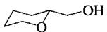</td><td>(5.57)</td><td>30</td><td>200</td><td>92</td></tr><tr><td>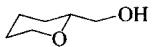</td><td>(5.58)</td><td>29</td><td>180</td><td>160</td></tr><tr><td>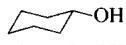</td><td>(5.59)</td><td>16</td><td>125</td><td>64</td></tr><tr><td>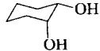</td><td>(5.60)</td><td>14</td><td>80</td><td>80</td></tr><tr><td>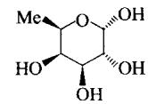</td><td>(5.61)</td><td>1.8</td><td>6.0</td><td>8.4</td></tr><tr><td>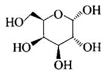</td><td>(5.62)</td><td>约0</td><td>约0</td><td>约0</td></tr></table>

而天然的杯芳烃和 resorcarenes 对有机分子通常并没有很好的溶液亲和力，它们的络合能力可以通过空穴的修饰而显著强化。较深空穴的合成具有双重作用：一方面可以提高客体被屏蔽于溶剂外的程度；另一方面往往会使主体刚性化，有利于主体预组织化程度的增加和阻止空穴自身塌陷。

Cram et al（1985a）已制备了一些多重桥连的[4]resorcarenes，如(5.63)和(5.64)，它们的构象流动性在溶液中显著减小。取代基X是很好的官能团，可用来进一步修饰这些材料（5.4节）。刚性分子空穴的存在意味着化合物(5.63)和

![[超分子化学135章_images/7afdcb40cc8589fc8913310bba9c75c2451217bc8e99b1f86502b08c3ee9bd64.jpg]]

<details>
<summary>chemical</summary>

Complex polycyclic aromatic hydrocarbon structure with multiple R substituents and X substituents
</details>

(5.63)

![[超分子化学135章_images/363c1a2420c0dfce987b734045bf0870f631ce1691fddf5c2a9cf38d844a0561.jpg]]

<details>
<summary>chemical</summary>

Complex polycyclic aromatic hydrocarbon molecular structure with multiple fused rings and nitrogen-containing substituents
</details>

(5.64)

(a) $\mathrm{X} = \mathrm{H},\mathrm{R} = \mathrm{CH}_2$   
(b) X=Br, R=CH $_{2}$   
(c) $\mathrm{X} = \mathrm{CH}_2\mathrm{SH},\mathrm{R} = \mathrm{CH}_2$   
(d) $X=CH_{2}Cl,\ R=CH_{2}$   
(e) $\mathrm{X} = \mathrm{H},\mathrm{R} = \mathrm{SiMe}_2$

(5.64) 总能与空穴内客体结晶，Cram 研究小组已经研究了大量的与客体 $SO_{2}$ ， $CS_{2}$ ， $CH_{3}C\equiv CH$ ，MeCN 和 $CH_{2}Cl_{2}$ 等络合物的 X 射线结构。

固态空穴配体(5.64)有一个大的花瓶状空穴，足以容纳 $Me_{2}NCHO$ 分子。在溶液中，最有效的主体是二甲基硅烷衍生物(5.63e)，它拥有高而窄的空穴，适于包结上面列举的线形客体。化合物(5.63e)可以通过八羟基物(5.43)与 $\mathrm{SiMe_2Cl}$ 作用简单制备。图5.44给出了(5.63e)的 $\mathrm{CS}_2$ 络合物的X射线晶体结构，它清晰地展现出线形客体非常适合地穿过主体取代基甲基形成的狭窄缝隙。在非极性溶剂（ $\mathrm{CDCl}_3$ ， $\mathrm{C}_6\mathrm{D}_6$ ）中，这种络合络合自由能- $\Delta G^{\circ}$ 约为 $8\mathrm{kJ / mol}$ 。

![[超分子化学135章_images/7d6a53e2a4e2f432deb5d9389a4c80cba9ae332f087e61d4fa0b3d0d1f87b4e4.jpg]]

<details>
<summary>chemical</summary>

Complex organic molecular structure diagram with multiple rings and functional groups
</details>

图 5.44 (5.63e) 与 CS₂ 络合物的 X 射线晶体结构 (Cram et al, 1988a)

杯芳烃用其他方法修饰上端也可以转变成溶液主体。因为杯芳烃骨架易于获得，因而合成出大量主体，这些主体以杯芳烃作为间隔基和刚性的三维锚或分子平台，在平台上可以构建其他的键合基团。这和3.13节描述的杯冠化合物的化学类似。一个特别好的例子就是把2,4-二氨基三嗪连接到杯芳烃的两个相对的芳香环部分，得到受体(5.65)，下端用大烷基醚链官能化，迫使两个三嗪部分彼此平行。在这种预组织构象中，它们作为巴比妥酸盐的有效氢键接收体（Van Loon et al，1992）。很显然，非常相近的(5.65)的手性衍生物在溶液和固态都能形成手性螺旋分子胶囊，其中包含3个双官能化的杯芳烃和6个5,5'-二乙基巴比妥酸客体（图5.45）。可以实现自动的非共价手性拆分（Prins et al，1999）。

![[超分子化学135章_images/b728e7bb8f458633e00ad9e66bb23611612116183f4659fa123dd3286896bc26.jpg]]

<details>
<summary>chemical</summary>

Complex molecular structure diagram showing repeating units with amide and amine functional groups
</details>

图 5.45 由 3 个(5.65)型化合物和 6 个二乙基巴比妥酸衍生物形成手性的 9 分子组装体的结构

![[超分子化学135章_images/3ee0888141074f12fb225d144fb56c7bcea8c55e3546ddbf9be52c49d6b72630.jpg]]

<details>
<summary>chemical</summary>

Complex organic molecule structure with pyridine, amide, and ether linkages
</details>

(5.65) $\mathrm{R} = \mathrm{CH}_2\mathrm{CH}_2\mathrm{OEt}$

# 5.3.1.3 在孔穴里的客体交换动力学

在目前所有的络合阳离子（第3章）、阴离子和中性分子的络合物中，胶囊络合物[客体（离子或分子）被完全包裹在基本封闭的主体内]，展示出高络合常数，且客体与外部介质中的物种交换速度很慢。比较碱金属离子与二维冠醚和三维球体(spherands）的络合很容易理解这种现象。在5.3.3节和5.3.4节我们将看到，对于中性分子的络合，杯芳烃和resorcarenes相比较于球形hemicarcerands，特别是carcerands（根本测不到客体交换），也证实了这个结果。中性分子紧紧络合在三维主体里的原因，很显然是空间束缚，而不是有利的焓吸引。然而，客体进入和退出“敞开”的容器分子（空穴配体），像杯[4]芳烃(3.97)，究竟是基于何种机制，是很有趣的推测。作为交换过程的一部分，与杯芳烃碗口很适合的客体必定从主体敞开的顶端进入和退出。因为客体与主体的空穴匹配，很显然没有足够的空间用于多个客体一次进入或离开空穴。否则，客体交换机制必须是一个分立的过程：在新客体进入空穴之前，原客体必须离开。这样必然存在一个中间过程，此时主体是空的。事实上，主体内含有真空区，这在能量上处于一个非常不利的状态（自然排斥真空），结果，这种客体交换所需活化能必然很高，因此客体交换动力学应该很慢。事实上，我们知道，对于那些开放的柔韧性好的主体，如(3.97)，客体交换（与其他的客体和溶剂）在室温时就非常快。那么，这种明显的矛盾该如何解释呢？答案就在于主体为避免造成空空穴而暂时性扭曲的能力。主体的扭曲与客体的退出有关，因此，客体交换过渡态是由于键张力小的增加而引起能量上稍微有些不利。一旦进入新的客体，主体当然就能松弛恢复到其先前的构象。在杯芳烃中，这种扭曲采用“压缩”形式，由 $C_{4v}$ 转为 $C_{2v}$ 对称（图解5.4）。

当主体是刚性的，或者当这种构象变化与大的焓不稳定化相关时，这种性质变得至关重要。的确，对于理论上完全刚性的主体，推敲其客体交换速率是很有意义的。会不会因为产生真空区，客体交换就变得不可能呢？这种效应类同于瓶口朝上倾倒一瓶牛奶。因重力作用牛奶不可能流出来；而且因牛奶挡道，空气也不可能进去填充真空区。

![[超分子化学135章_images/adf5bce84fca223931e4ed5c1fee0544227381387721dee4ed8c762d8a36791c.jpg]]

<details>
<summary>chemical</summary>

化学反应示意图，展示客户与扭曲空穴在解离性解络下的分离过程
</details>

图解 5.4 在灵活性主体解络过程中空穴体积的缩小

为了测试这个理论，设计了一个刚性主体（Rudkevich et al，1997）。该主体是基于杯[4]resorcarene(5.43)，在它的上缘以氢键给体和受体组成一个刚性网状体修饰而成。氢键部分形成一个 $C_{4\mathrm{v}}$ 对称的很深的开放的空穴，形状有点类似于威士忌杯（图5.46）。主体可以采取 $C_{4\mathrm{v}}$ 和 $C_{2\mathrm{v}}$ 两种构象，但环状氢键网络的存在非常有利于 $C_{4\mathrm{v}}$ 构象。

![[超分子化学135章_images/14857e3c07fb80e86e0d3f6bb0ca9b539d4f89e6e6d522d88f6c2bcf699a5711.jpg]]

<details>
<summary>chemical</summary>

Chemical structure of a resorcarene bowl with labeled components and structural annotations
</details>

图5.46 (5.66)的威士忌杯的形状

大的客体分子如金刚烷可以隐蔽地进入该分子杯（molecular tumbler）， ${}^{1}\mathrm{H}$ NMR信号为-1，与主体芳香环的屏蔽效应一致。重要的是，被结合的和自由的金刚烷客体的信号可以区分开，说明在NMR时间尺度上，客体交换速度很慢。这样的观察结果与期望值相反，因为空穴是开放的、畅通无阻的；但它又与把客体或溶剂分子从没有真空区的空穴移去存在的难度相一致。事实上，客体交换过程的确很慢，它需要破坏氢键网络，自氢键取代基处像花朵一样开放。动力学NMR测量显示，客体交换过程具有一个大的活化能垒 $71\mathrm{kJ / mol}$ ，该能垒被认为与氢键焓稳定性的损失有直接的关系。这些结果表明，对于所有的“开放式”空穴配体状主体，通过构筑一个具有单个的相对窄的入口和出口的刚性凹形表面，中性有机客体分子在溶液中的结合可能会显著提高。

![[超分子化学135章_images/75375919f09d82b92998e3a66cc7d0dcc44b9a26f1a589afac0dbac120bb5330.jpg]]

<details>
<summary>chemical</summary>

3D ball-and-stick molecular model of a compound with carbon, hydrogen, and oxygen atoms
</details>

图 5.47 (5.67) 的 X 射线结构 (Sijbesma and Nolte, 1995)

# 5.3.1.4 甘脉基主体

甘脲(5.44)，因其弯曲的框架和丰富的衍生化学性质，已经作为构筑单元用于合成一系列弯曲的“筒状”主体，分子夹（molecular clip）和三维胶囊（通过自组装形成）。二苯基甘脲的曲率可以由“分子夹”衍生物(5.67)来解释，(5.67)可以充当芳香客体如recorcinol的主体，recorcinol的两个羟基官能团向下深入分子夹内，以便于与主体的羰基氧原子形成氢键。主体分子结构见图 5.47。

![[超分子化学135章_images/4f72ee7b06752282fbf100e285dbca1898136f7d4fdcac92ea1facaa95c0b3c7.jpg]]

<details>
<summary>chemical</summary>

Chemical structure of a symmetric bis-phosphine ligand with two phenyl groups and four methoxy substituents
</details>

(5.67)

![[超分子化学135章_images/1995375f1bb18df1278deebe1bd454a5c723e0de9407625809bb240e5d7940cb.jpg]]

<details>
<summary>chemical</summary>

Complex macrocyclic compound with multiple nitrogen and oxygen atoms forming fused rings
</details>

(5.68)

基于甘脲的最有名的主体分子是葫芦脲(5.68)。葫芦脲的命名是由于桶状分子类似于葫芦科的葫芦或者南瓜的形状，尤其是空心南瓜。化合物(5.68)早在1905年就被发现了，但它的整体表征是在20世纪80年代初期，由芝加哥大学的Willock Mock完成的，他利用X射线晶体学和其他方法对其进行表征。这个化合物很容易由甘脲和甲醛缩合得到，这样生成一个最初的物质，现在还没有很好地表征，很可能是交联氨基型高分子。该种材料很难进行处理，为了溶解它，Behrend最早于1905年开始研究时用热的浓硫酸处理，它才慢慢溶解，所得溶液用冷水稀释，随即煮沸，最终得到一个晶体状沉淀，后来证明是(5.68)(图解5.5)。

![[超分子化学135章_images/e3c6d1a15f33760ff054c87621a42e110530f1cc15c5b99eca0bffbdc0eb3d8c.jpg]]

<details>
<summary>chemical</summary>

Chemical reaction equation showing oxidation of a cyclic amine compound with acetic anhydride under acidic conditions to form a compound sulfated by ethanol and water.
</details>

图解 5.5 葫芦脲的合成

这个有名的六聚体的形成被认为是通过一个模板反应得到的（3.8.2节），其中，氧鎓离子（可能为 $\mathrm{H}_3^+\mathrm{O}$ ）与分子顶端和底端的羰基形成氢键。虽然在1992年Fun等人已经在温和的酸性条件下从二甲甘脲制备出一个类似的称作十甲基葫芦[5]脲的五聚体，但在反应中没有其他低聚物。2000年，Kim研究组通过改变原始反应条件，合成了葫芦[n]脲，其中， $n = 5,7,9$ 。这些新大环化合物使得大客体分子的包封及包合反应性成为可能。

它一经制备，就被认为既保持了葫芦脲显著的化学特性，又可以与金属离子和染料形成晶体络合物。系统研究表明，这些新型分子在水溶液和固态下是质子化多胺和金属离子的有效主体，而对中性有机分子却没有作用。这种包结化学是由于桶状空穴的存在（大约6Å深）和羰基氧原子环的配位能力引起的。五聚体十甲基葫芦[5]脲只有一个较窄的空穴，没有更好的包合化学性质。

因为葫芦脲中没有芳香环，有人推测，由络合作用引起的客体 NMR 位移可能小于苯甲酸衍生物引起的位移（Box 3.4）。实际上，脂肪族框架同样会引起明显的屏蔽效应。在 HCOOH-D₂O 溶液里，1,5-二氨基戊烷的¹H NMR 在未加入(5.68)

![[超分子化学135章_images/f808d5e507062129725c41a6053c78d45acb93adcc67aca03f38e39e55d72f91.jpg]]

<details>
<summary>line</summary>

| 链长, n | n- 烷基二铵离子 | n- 烷基铵离子 |
| ------- | --------------- | -------------- |
| 1       | 2.0             | 2.0            |
| 2       | 3.0             | 2.0            |
| 3       | 5.0             | 4.0            |
| 4       | 6.0             | 5.0            |
| 5       | 6.3             | 4.5            |
| 6       | 6.2             | 3.5            |
| 7       | 4.5             | 2.0            |
| 8       | 3.8             | -              |
| 9       | 2.5             | -              |
| 10      | 2.0             | -              |
</details>

图 5.48 在 HCOOH-D₂O 溶液里，葫芦脲和不同链长的质子化胺 NH₂(CH₂)ₙ 和二铵 NH₂(CH₂)ₙNH₂ 的络合常数的关系

前表现为多重峰，化学位移 $\delta$ 为 3.17 和 1.77，而加入 (5.68) 之后在 2.73 和 0.77 处出现两组新峰，原来的峰消失。最终形成 1:1 的主-客体加合物，其中，氨基（被甲酸质子化）穿线过主体空穴。

在 $^{1}$ H NMR 时间尺度内，客体交换慢。对于一系列的二胺客体， $\mathrm{NH}_{2}\left(\mathrm{CH}_{2}\right)_{n}\mathrm{NH}_{2}(n=1\sim10)$ ，在同种介质中可以发现，n=5 和 6 时有最高的络合常数，这与烷基链的疏水包合相一致（通过 $NH_{3}^{+}$ 与羰基氧原子的氢键）（图 5.48）。注意：氨基取代物的三重对称性和(5.68)的六重对称性的匹配，这可形成电荷辅助的三叉氢键 $N^{+}-H\cdots O$ 。

![[超分子化学135章_images/b303da27ddf8a7b7e4e0979c9b71cb0ac49a47d157c2d7fa601430633ceccc49.jpg]]

Mock W L. Cucurbituril. In Comprehensive Supramolecular Chemistry. Atwood J L, Davies J E D, MacNicol D D and Vögtle F(eds). Vol. 1. Oxford: Pergamon, 1996. 477\~493

# 5.3.1.5 kohnkene

20 世纪 80 年代中期，英国谢菲尔德大学的 J. Fraser Stoddail 和 Franz Kohnke 研究了另一种重要的弯曲构筑单元，它是由 1,2,4,5-四溴苯与呋喃反应得到的（图解 5.6）。

![[超分子化学135章_images/338efe6420739b199bf1dfbd59187f232014e8b4513ad08b615b54a6feeece0c.jpg]]

<details>
<summary>chemical</summary>

Organic synthesis reaction scheme showing brominated cyclohexane derivative reacting with Bu''Li to form Kohnkene, followed by toluene and CH2Cl2 10kbar steps
</details>

图解 5.6 由多次 Diels-Alder 加成反应合成 Kohnkene

Kohnkene 是以它的创始人命名的，它是一个非常刚性的结构，拥有一个很小的椭圆形空穴，不适合包含客体分子。然而，这种分子可以脱氧形成 dideoxykohekene(5.70)，其空穴近似四方形，大小恰好可以包含一个水分子（图 5.49）。这个例子特别阐明了制备分子笼化合物（甚至是含有小空穴）存在的巨大困难和所需要的智慧，合成难度随空穴的增大而增大。

![[超分子化学135章_images/b0145a7bfbb17e0095b253397b17fc88045b2ba5e3b46c31a03244b53936d570.jpg]]

<details>
<summary>chemical</summary>

Molecular structure diagram showing a cyclic arrangement of carbon atoms with hydrogen bonds
</details>

(a)

![[超分子化学135章_images/1c01546edd1d66be9fe2299d7eadaabb6f5934f89df850f9a1b2e5bb993e174a.jpg]]

<details>
<summary>chemical</summary>

Molecular structure diagram showing a cyclic arrangement of atoms with carbon, hydrogen, and oxygen atoms
</details>

(b)   
图 5.49 X 射线晶体结构：(a) Kohnkene；(b) dideoxykohnkene 后者晶格里包含有水分子

Stoddart和他的同事改进他们普通的方法形成了一个多功能的分子工具箱，他们以儿童积木命名其为“分子LEGO”，这个工具箱使得他们能够合成不同大小的kohnkene型环、分子“波”（由反Didels-Alder反应产生），甚至还可以得到分子笼(5.71)，他们把该分子笼称为trinacrene，是以Franz Kohnke的故乡西西里的旧称Trinacria而来。

![[超分子化学135章_images/092210593b0c17c85294a1ac5151e3c16af5064394b8579e3117f73fc5756b0f.jpg]]

<details>
<summary>chemical</summary>

Molecular structure diagram of a polycyclic aromatic hydrocarbon with oxygen and hydrogen substituents
</details>

dideoxykohnkene   
(5.70)

![[超分子化学135章_images/dcf66b5ecdf744e05dd83934d876a36b36b7f178e7ab8aec42341ad30c64de69.jpg]]

<details>
<summary>chemical</summary>

Complex organic molecular structure diagram with multiple rings and oxygen atoms
</details>

trinacrene   
(5.71)

![[超分子化学135章_images/8d4273d58d1b9e62ee0b7e23057b1788bf0dc9eadbe4740ccdb6ba7abaac4505.jpg]]

Mathisa J P and Stoddart J F. Constructing a Molecular LEGO Set. Chem Soc Rev, 1992, 21: 215\~225

# 5.3.2 环糊精

![[超分子化学135章_images/183dc8e7724ee80edb5241f62edba7744c43323019e3f15a3edc795dc1415af3.jpg]]

Szejtli J. Introduction and Overview of Cyclodextrin Chemistry. Chem Rev, 1998, 98: 1743\~1753

# 5.3.2.1 介绍和性质

杯芳烃和空穴配体（cavitand）的化学（5.3.1.2节）清晰地表明，当分子空穴变得更刚性（因此是预组织的）和更深时，其在溶液中络合有机客体分子的能力也随之增大。正如我们在甘脲基主体分子中看到的一样（5.3.1.3节和图5.39），把芳香环连接在一起（如环番）不是主体刚性引进设计中的唯一途径。实际上，最普遍的、研究最多的、最便宜易得的商品化主体分子环糊精，是全饱和分子，其刚性依赖于分子内的氢键结合和锐曲率半径。环糊精作为一类很重要的主体化合物，在食品、化妆、药品等领域有广泛的工业用途，通常用作缓释剂和化合物输送剂。它们在作为酶的模拟物方面也有很重要的作用（9.3节），拥有在很宽的剂量范围内完全无毒的优势。它们具有如此的重要性，以至于在Comprehensive Supramolecular Chemistry（Atwood et al. Pergamon, 1996）一书中有一整卷都是关于它们（11卷中的第3卷）。环糊精家族中最重要的一员是β-环糊精(5.72)，其每年的工业生产量是1500t，价格是每千克几美元。

![[超分子化学135章_images/330f9a726e3a978a745bd51160a40129d6cc1f0650e8f3c12f75fb720faa8f47.jpg]]

<details>
<summary>chemical</summary>

α-环糊精分子结构图，展示多链脂肪链的环状结构
</details>

(5.47)

![[超分子化学135章_images/559722a0941c1497ffc870cc40bb3f361f579296e1fb0352d14259c25a0b0a4a.jpg]]

<details>
<summary>chemical</summary>

Chemical structure of a cyclic sugar molecule with multiple hydroxyl groups and ring systems
</details>

γ-环糊精   
(5.73)

![[超分子化学135章_images/fba13755efbe71ff644ecb5a5a2a6e84d8004cc9907e7c58cd36feb5323e95f2.jpg]]

<details>
<summary>chemical</summary>

Chemical structure of a cyclic sugar molecule with multiple hydroxyl groups and ring systems
</details>

β-环糊精   
(5.72)

(a)   
![[超分子化学135章_images/516a397f6b6931e16e12891a53749126e1478ebf957dc78f03f6766aa62fa4a4.jpg]]

<details>
<summary>chemical</summary>

Chemical structure of a sugar derivative with numbered carbon atoms and hydroxyl groups
</details>

1,4-糖苷键连接   
(b)   
图 5.50 （a）3 种重要的环糊精；（b）在相邻的 D-吡喃葡糖苷之间起连接作用的 1,4-糖苷键

环糊精是环状寡糖，通常含有6\~8个D-吡喃葡糖苷结构单元，由1,4-糖苷键连接形成的（图5.50）。最重要的3种环糊精是α-环糊精 $[\alpha-CD,(5.47)]$ ，β-环糊精 $[\beta-CD,(5.72)]$ ，和γ-环糊精 $[\gamma-CD,(5.73)]$ ，它们分别含有6、7、8个吡喃葡糖苷结构单元。此外，还有几种少量存在的环糊精：δ-CD和ε-CD（分别有9个和10个结构单元），以及含有5个单元的前α-CD。α、β、γ的命名法用于区别同一系列环大小不同的分子，同时也是具有明显的历史因素。尽管这种命名法不能清晰地区别环的大小，但仍被广泛使用，因为环糊精的系统命名非常烦琐。β-环糊精还有其他名称，如：环麦芽庚糖，环庚葡聚糖，环庚直链淀粉。其他环糊精也有类似的名字。cyclodextrin（环糊精）名称的一部分来源于dextrose（葡萄糖），glucose（葡萄糖）早期的同义词。对其他由甘露糖和半乳糖衍生的环状寡糖也有所了解，但研究不多。

环糊精的形状通常可以描述为：逐渐变细的花托或者截去尖端的漏斗，与杯芳烃含有上缘和下缘相似，环糊精有两个不同的平面：主面和次面。主面是花托的窄面，由伯羟基组成；较宽的次面包含 $CH_{2}OH$ 基团。六元 D-吡喃葡糖苷环由边对边连接而成，环面全部向内指向不同尺寸的疏水空穴中心。就是这个空穴，因亲水醇羟基官能团带来的水溶性这一特性，从而使得环糊精在水中具有独特的络合性能。图 5.51 给出了环糊精的结构解剖图以及空穴尺寸。重要的参数见表 5.6。

![[超分子化学135章_images/7233289f966a8f8ff9212dd5d7f687ce2d06c9d3bbafab4b87c89b2bee0ef638.jpg]]  
图 5.51 环糊精结构剖析图

通常，环糊精的物理和化学性质从 $\alpha$ -CD 到 $\gamma$ -CD 形成相对的规律性，而较大的环糊精 $\delta$ -CD 开始有些偏差，因为它们的刚性太小，因而表现出较差的客体络合能力。唯一的具有重要性的例外是它们的水溶性（表 5.6），奇数环的 $\beta$ -CD 比 $\alpha$ -CD 和 $\gamma$ -CD 的溶解性明显差；另一个奇数环的 $\delta$ -CD 的溶解性也小于 $\alpha$ -CD 和 $\gamma$ -CD，虽然偏差不是很明显。 $\beta$ -CD 的相对不溶性在其作为溶液主体时具有重要的应用。

人们提出了许多理论来解释这一不规则性。与较小的 $\alpha$ -CD 和较大的 $\gamma$ -CD 相比较，水合熵和水合焓均对 $\beta$ -CD 不利。这归因于聚集的 $\beta$ -CD 对水分子氢键结构的干扰作用，因为溶剂笼具有偶数个氢键受体和给体，六重和八重对称的环糊精与溶剂笼更匹配。同时也证明，在 $\beta$ -CD 次面上的分子内氢键对低溶解度起主要作用，限制了与水分子的相互作用。 $\alpha$ -CD 中类似的氢键网络也不完全，因为 $\alpha$ -CD 有张力，而 $\gamma$ -CD 更加灵活。实际上，仲羟基甲基化可以增加 $\beta$ -CD 的溶解性。

表 5.6 $\alpha-$ 、 $\beta-$ 、 $\gamma$ -CD 的特征参数

<table><tr><td>参数</td><td>α-CD</td><td>β-CD</td><td>γ-CD</td></tr><tr><td>葡萄糖单元的数目</td><td>6</td><td>7</td><td>8</td></tr><tr><td>环大小</td><td>30</td><td>35</td><td>40</td></tr><tr><td>内部空穴中心直径/Å</td><td>5.0</td><td>6.2</td><td>8.0</td></tr><tr><td>在水里的溶解度(25°C)/g/L</td><td>14.5</td><td>18.5</td><td>232</td></tr><tr><td>ΔH°/kJ/mol</td><td>32.1</td><td>34.7</td><td>32.3</td></tr><tr><td>ΔS°/J/(K·mol)</td><td>57.7</td><td>48.9</td><td>61.4</td></tr><tr><td>[α]25°C</td><td>150.5</td><td>162.0</td><td>177.4</td></tr><tr><td>空穴体积/Å3</td><td>174</td><td>262</td><td>427</td></tr><tr><td>空穴体积/cm3/g CD</td><td>0.10</td><td>0.14</td><td>0.20</td></tr><tr><td>结晶水(质量分数)/%</td><td>10.2</td><td>13.2~14.5</td><td>8.13~17.7</td></tr><tr><td>pKa(25°C,电位分析法)</td><td>12.33</td><td>12.20</td><td>12.08</td></tr><tr><td>A. oryzae α-淀粉酶对它的水解速率</td><td>可以忽略</td><td>慢</td><td>快</td></tr><tr><td>常用客体</td><td>苯,酚</td><td>萘,1-苯氨基-8-萘磺酸</td><td>蒽,冠醚,1-苯氨基-8-萘磺酸</td></tr></table>

所有的环糊精均是从水中以水合物形式结晶出来的，水分子含量依赖于结晶条件。在每一种情况下，半极性环糊精空穴被水分子填充，这些水分子有相对较高的能量，是它们和环糊精笼壁的有限相互作用造成的。在溶液中，曾提出这样的假设：对客体分子络合的较大贡献在于，空穴内高能量水分子的排斥力——作为全部疏水作用的一部分。

表 5-7 固态环糊精水合物

<table><tr><td>项目</td><td>α-CD</td><td>β-CD</td><td>γ-CD</td><td>δ-CD</td></tr><tr><td rowspan="3">水分子的数目</td><td>6(I)</td><td>12(I)</td><td>19</td><td>13.75</td></tr><tr><td>6(II)</td><td>11(II)</td><td>14.1</td><td></td></tr><tr><td>7.57(III)</td><td></td><td>15.7</td><td></td></tr><tr><td rowspan="3">空穴里水分子的数目</td><td>2(I)</td><td>7.3(I)</td><td>7.1/14.1</td><td>两个葡萄糖单元占据空穴;水分布在主面的开放空间</td></tr><tr><td>1(II)</td><td>6.3(II)</td><td>两个葡萄糖单元也占据空穴</td><td></td></tr><tr><td>2.57(III)</td><td></td><td></td><td></td></tr></table>

水在各种结晶水合物里的分布情况见表5.7。注意：较大环糊精固体空穴的体积，因包结邻近主体的葡萄糖残基而受到限制。每一个环糊精都有各种结晶形式（已经表征的例子由罗马数字表示出）。总的来讲，环糊精主体分子的结构从一种形式到另一种形式的变化不大，差异就在于水分子的分布。 $\alpha$ -CD为椭圆形扭曲的不规则形状I和Ⅲ，两个葡萄糖单元绕糖苷键旋转，伯OH面向内指向空穴，使得空穴体积变小；Ⅱ型水合物更规则一些。 $\alpha$ -CD的I型水合物的结构由图5.52给出。 $\beta$ -CD的两种形式有相似的主体构型，比 $\alpha$ -CD更规则，且I型结构的某些无序水分子的占有率更高些。 $\gamma$ -CD的结构类似于 $\beta$ -CD，并且有更复杂的无序水分子。两种主体分子均在主面表现出有序的分子内氢键排列，O…O的距离为 $2.70 \sim 3.00\AA$ 。 $\delta$ -CD的结构扭曲成船式，使得空穴更狭窄。

![[超分子化学135章_images/477929edeeb52699a1484d582d43c0cff4762f2e2f9c447b523a5963289dbc8c.jpg]]  
图5.52 从两个角度看到的I型 $\alpha$ -CD水合物的X射线晶体结构

# 5.3.2.2 制备

植物光合作用产生两种主要产物：淀粉和纤维素。纤维素是不溶的，形成细胞弹性结构的组成部分；而淀粉是能量的主要储存体，相对易溶解，容易转化成生物化学上有用的形式，环糊精就是因此而制备得到的。淀粉包含两种葡萄糖聚合物，都是由上百个、甚至上千个D-吡喃葡萄糖苷残基（直链淀粉和支链淀粉）组成。直链淀粉只有1,4-糖苷键，而支链还含有1,6-键。在各种酶作用下，淀粉在水里降解形成糊精，这是糖苷键水解的产物。糊精应用在食品、纺织和造纸业中，在制造面包和啤酒中被消耗掉。如果糊精被葡萄糖转移酶所降解，链分裂进行分子内环化（没有水的参与）形成的主要产物就是环糊精。独立的环糊精是从其与非极性客体如甲苯形成的络合物中分离出来的（如图5.53），这些络合物的溶解度明显降低。工业纯环糊精的纯度一般大于99%。

# 5.3.2.3 包合化学

一般来讲，环糊精在水中与非极性客体分子相互作用可以形成1∶1的分子包合物，客体被包裹在主体-环糊精的空穴里。包合作用是一个热力学平衡过程，络

![[超分子化学135章_images/f631a0ce58398eb15de308f158cc032e3653b91ae04ad9b08fb0050e474a9080.jpg]]

<details>
<summary>flowchart</summary>


</details>

图 5.53 葡萄糖转移酶降解淀粉分离得到环糊精

合常数 $K$ ，由通常的方式给出：

$$
\mathrm{CD} + \mathrm{G} \rightleftharpoons \mathrm{CD} \cdot \mathrm{G} \tag {5.1}
$$

$$
K = \frac {[ \mathrm{CD} \bullet \mathrm{G} ]}{[ \mathrm{CD} ] [ \mathrm{G} ]} \tag {5.2}
$$

形成 1:2 络合物的较高级的平衡，或涉及多个环糊精的聚集体是很常见的，且经常同时存在。对于客体包结的驱动力包括许多作用：这些作用的重要性仍然是讨论的焦点。该主题也已经在这一节的重点文献中较深入地讨论过了。重要影响因素包括：①空间匹配；②高能量水的释放；③疏水效应；④范德华作用力；⑤色散力；⑥偶极-偶极作用；⑦电荷转移作用；⑧静电作用；⑨氢键。

表 5.6 表明，通常情况下，被包含的客体分子随着环糊精的增大而增大，虽然主体分子结构有一定的柔韧度，大小相符并不是铁定的标准。高能量水的释放和高疏水效应（1.7.9节）包含两个能量组分：高能溶剂分子进入本体引起焓的增加，溶剂中的两个洞（主体和客体）减少成为一个洞（络合物）引起熵的增加；经典的疏水作用涉及到负的 $\Delta S$ ，但并不是所有的环糊精络合物都如此，因为空穴并不是真正的非极性。它有各种官能团，所以最好描述为半极性的。然而，非经典的疏水作用是非常重要的。除了大小合适和溶剂化效应外，固体和溶液络合物还被附加的焓的有利作用所稳定，例如客体和环糊精羟基间的氢键作用与偶极作用。Connors（本节的重点文献）已经提出了一个对溶液中环糊精络合的一般模型，给出了整个过程的络合自由能 $\Delta G_{comp}$ ，它由以下几个部分构成：

$$
\Delta G _ {\text { comp }} = \Delta G _ {\text { intrasolute }} + \Delta G _ {\text { solvation }} + \Delta G _ {\text { genmed }} \tag {5.3}
$$

其中， $\Delta G_{intrasolute}$ 项指主-客体相互作用，必须是有利的，或者至少为零，它包括来自氢键、偶极和范德华力作用的贡献。 $\Delta G_{intrasolute}$ 指溶剂作用（疏水作用，溶剂重排），可能有利也可能不利，但通常是不利的。这一项代表络合物溶剂化自由能与单独的主体和客体的溶剂化自由能之间的差异。如果自由的环糊精分子内的水是高能量的，则 $\Delta G_{\mathrm{solvation}}$ 更有利。 $\Delta G_{\mathrm{genmed}}$ 是总的介质效应，代表溶剂笼的构建（当溶解溶质时），它取决于空穴的表面积和溶剂的表面张力。这意味着重要的络合过程一定是由 $\Delta G_{\mathrm{intrasolute}}$ 和 $\Delta G_{\mathrm{genmed}}$ 的有利因素共同决定的。 $\alpha$ -CD与带电荷的和不带电荷的客体的络合常数见图5.54。很显然，4-硝基酚氧阴离子比其他类似的中性化合物的结合力要强得多。客体以这样的方式被包含在内，其中，其疏水的硝基苯基位于空穴内，酚盐部分位于大的仲羟基面，因此，疏水相互作用对两个客体而言是相同的（比较二甲基硝基苯酚衍生物；大体积的2,5-二甲基衍生物不能进入环糊精窄的伯羟基主面，而2,6-二甲基取代物却有很明显的络合，其甲基取代基位于宽的次面）。附加的稳定性来自于诱导的偶极-偶极作用和范德华作用力，它们由阴离子增大的极性（负离子离域于整个分子中）引起。这与苯甲酸及其共轭碱形成鲜明对比，其内的阴离子络合很弱，因为该客体分子的离子化位点也是络合点（羧酸根）。

![[超分子化学135章_images/0b793ee6b6965b9bfbc52053e980be95e406078a40f2337484ebcac8b6270c24.jpg]]

<details>
<summary>chemical</summary>

Chemical structures of naphthalene derivatives with labeled reaction times and structural variants (cyclic, trisaccharide)
</details>

图 5.54 客体及它们与 $\alpha$ -CD 在水中的络合常数

对于 $\mathrm{CH}_{3}(\mathrm{CH}_{2})_{n}\mathrm{X}$ 型的脂肪族客体分子，当 X 为极性基团，如 COOH 或 OH 时，络合能力要比 $X=CH_{3}$ 时强得多，再次表明了一种重要的焓有利的主-客体相互作用，如与主体边缘的偶极-偶极作用或氢键作用。

有趣的是，虽然通过核磁位移的变化、圆二色谱或催化效应等手段，在溶液中可以检测到络合作用，但并不是说晶体或固态包合物就一定能够分离出来。在固态，主-客体之间不存在疏水排斥作用，因此，如果没有重要的吸引力，那么络合驱动力就小得多。对于稳定的溶液，络合物以分离开的主体晶体和客体晶体形式结晶也是很常见的。然而，已经有大量稳定的晶态包合物被分离出来，甚至在没有重要的有利的主-客体相互作用时，在晶体结构里为了避免空缺点而导致固态络合。因为环糊精圆环面自身不能塌陷，因而需要客体的参与。

固态环糊精络合物通常可分为 3 大类：通道型、笼型和层状，具体采取哪种结构取决于环糊精部分的定向性以及空穴之间的连接性，进一步的细分取决于主面和次面的相对定向性。图 5.55 给出了可能的堆积模式。

![[超分子化学135章_images/f53d7bc65862fb42b1a85b6f919bcd76ea96b21754cc5d5e6df277d715c5f672.jpg]]

<details>
<summary>text_image</summary>

o
a
b
</details>

(a)

![[超分子化学135章_images/bfeb18eecdbf76f2b6970f6191e829a1f4fd550bd3a7c2a259b5478adf3003d0.jpg]]

<details>
<summary>text_image</summary>

o
b
c
</details>

(b)

![[超分子化学135章_images/da24f3dd26caae08c61e104673615b36976d0daea7847b46d28762b73bf62e6b.jpg]]

<details>
<summary>natural_image</summary>

Geometric diagram of intersecting planes and lines with labeled points O, C, and b (no text or symbols beyond labels)
</details>

(c)

![[超分子化学135章_images/885160086a48796aa81ed4af2d1eec8ff34b56899029bd2887c2525c0dc97be9.jpg]]

<details>
<summary>text_image</summary>

Geometric diagram showing a 3D arrangement of parallelograms with labeled points a, b, c and an angle marked at vertex b
</details>

(d)

![[超分子化学135章_images/a7da9a2f7e900d6625d924e078ab86d3254963ed4ea66c03a71c2b0f6336bf7b.jpg]]

<details>
<summary>text_image</summary>

c
a
b
</details>

(e)   
图 5.55 环糊精结构堆积示意图  
(a) 头对头通道型；(b) 头对尾通道型；(c) 笼型；(d) 层状；(e) β-CD 二聚体组成的层状结构摘自：Atwood J L, Davies J E D, MacNicol D D and Vögtle. Comprehensive Supramolecular Chemistry. Vol. 3. Oxford: Pergamon, 1996. 287

当客体分子足够小，能够完全包裹到环糊精空穴内时，形成笼型结构。这使得环糊精分子呈人字型排列。α-CD 空穴很大，足以容纳苯分子（长轴平行于假六重对称轴）和小的有机分子如甲醇、1-丙醇和 3-碘代丙酸，它们都采取笼型结构；对碘和氮也发现了类似的包封作用。β-CD 空穴足够大，可容纳苯分子（长轴平行于假七重对称轴），它也可以和小的客体分子如苄醇形成笼型结构（图 5.56）。除水分子外，还没有证据显示 γ-CD与其他分子形成笼型结构。这是次面上邻近分子的葡萄糖残基被包结的结果，这种包结明显保留了笼排列上的空穴。

![[超分子化学135章_images/2bcaba88586d6705a8161bb2f8db0125afd208dab4f500f44c89becd2e51498e.jpg]]

<details>
<summary>chemical</summary>

Molecular structure diagram showing a complex organic compound with carbon, hydrogen, and oxygen atoms
</details>

图 5.56 β-CD·苄醇的笼型结构
(Harata et al, 1985)

对于与空穴不匹配的大的客体分子，3种主要的环糊精都能形成通道型结构，其中环糊精空穴排成一排，产生一个伸展的疏水空穴，客体以与脲包合物类似的方式进入空穴

(5.2.1节)。在 $\alpha$ -CD 与指示剂甲基橙的络合物（客体横跨 3 个环糊精空穴），与二茂铁的络合物（图 5.57），以及 $\gamma$ -CD 与较大的 $[Na([12]冠-4)_{2}]^{+}$ 的络合物（图

5.58）里也观察到这种结构。一对冠醚对 $\mathrm{Na}^{+}$ 的包结物，依次再被包含在一对环糊精空穴里，类推于传统的一个套一个的俄罗斯 matrioshka 木偶，它被称作“俄罗斯套娃”型络合物。金属冠醚客体被包封在两个 $\gamma$ -CD 络合物里，第 3 个 $\gamma$ -CD 有一个自由 [12] 冠-4 分子被包含在内，氯抗衡离子必不可少，产生计量比为 $\{(\gamma-\mathrm{CD})_{3} \subset \mathrm{Na}([12]\text{冠}-4)_{2} \cdot \mathrm{Cl} \cdot [12]\text{冠}-4\}$ 的结构。

![[超分子化学135章_images/ecda8a605dfd0997cc2c58ba8bae0260c442a439791057862ecf48d271ab039e.jpg]]

<details>
<summary>chemical</summary>

Molecular structure diagrams showing four different configurations of a complex organic molecule, each with carbon, hydrogen, and oxygen atoms connected by bonds.
</details>

图 5.57 二茂铁的 $\alpha$ -CD 络合物的通道结构

![[超分子化学135章_images/465bac9dff0d9279cc560258f4df10a70fa9a65cf070659afff1e34d042731f3.jpg]]

<details>
<summary>chemical</summary>

Molecular structure diagram showing a ring with alternating black and white atoms and a central hexagonal lattice
</details>

图 5.58 $\left[\mathrm{Na}(\left[12\right]\text{冠}-4)_{2}\right]^{+}$ 的 “俄罗斯套娃” 型 γ-CD 络合物的通道结构

![[超分子化学135章_images/9855e04ecfea123aa0b943046ea30c4f387f68afb98be3cac078bb0d017a4948.jpg]]

Connors K A. The Stability of Cyclodextrin Complexes in Solution. Chem Rev, 1997, 97: 1325\~1357

# 5.3.2.4 工业应用

环糊精具有广泛的工业应用前景，这是因为它们独特的包合性和脱络合动力学及其稳定性、无毒、相对便宜的特点决定的。目前感兴趣的重要领域见1996年在Cyclodextrin News上发表的环糊精相关摘要的分布（图5.59）。

然而，图 5.59 种给出的新的研究分布并不能代表目前环糊精的应用。大约 80%～90% 的环糊精产品（主要是 β-CD）用于食品工业，因在食品加工过程中环糊精具有对高温的稳定性而深受欢迎。通过环糊精络合昂贵的香精油和香料，如苹果、柑橘类的水果、柠檬、大蒜、生姜、薄荷醇、荷兰薄荷和百里香，能够显著降低其用量而获得同等强度的香味。环糊精的络合使得香味抵抗氧化、光化学降解、热分解或因升华而引起的损失的能力大大增强。现举例说明，如果调味剂与环糊精络合，则加香的羊奶酪所需洋葱调味剂的用量从每100份所需的550g降至10g。食品色素和染料易于光解或随pH的变化而分解，当络合环糊精后，其稳定性也得以提高。为了使环糊精更受食品制造业的喜爱，环糊精也倾向于容易处理和称重（制成干粉而不是挥发性油），减少包装和储运成本，减小微生物污染。

![[超分子化学135章_images/3114ac50b58f23ef27df62eeb25a6a7b13f0c6f9be295989709238ec4d23786a.jpg]]

<details>
<summary>pie</summary>

| Category | Percentage (%) |
|---|---|
| 药物 | 24 |
| 环糊精络合物化学 | 22 |
| 化学、酶学及生物学效应 | 16 |
| 分析化学 | 19 |
| 化学和生物化学工艺 | 11 |
| 杀虫剂 | 1 |
| 食品和化妆品 | 7 |
</details>

图5.59 1996年的CyclodextrinNews上发表的有关环糊精化学及其应用的1706篇研究论文的分布情况

除了在食品工业上的应用外，环糊精还作为给药体系应用于医药行业。正如在食品工业里，环糊精可以作为保护剂，防止药物提前代谢，例如，允许口服而不是静脉注射。它们也可以改变药物的溶解性和生物传输性能，增强其对靶点的专一性。环糊精也可以提高溶解性极差的药物的溶解度，而不需通过化学修饰药物本身以引进亲水基，该基团会干扰药物的膜传输过程。最后，环糊精络合物能够减轻局部刺激或药物诱导的损伤，掩盖不愉快的或苦的味道。

环糊精应用的另一个主要方面是在分析化学里，特别是在色谱法里，如薄层色谱、气相色谱、毛细管电泳和高压液相色谱（HPLC）。环糊精的作用是作为受分析物的络合剂。环糊精及其衍生物既可以作为流动相的添加剂，也可以化学键合到固定相上，它们的存在有助于改善分离效率和分析速度，可以分析结构很相近的化合物和异构体，特别是对映异构体的分离。使用 HPLC 的手性柱分离对映异构体通常是很昂贵的，因为固定相的高价格（每根柱要 1000～2000 美元）。相反，使用相对便宜得多的 ODS（十八烷基二甲基硅）非手性柱，在流动相里添加 β-CD，能够手性分离开人血清里的巴比妥酸盐（Eto et al，1992）。

# 5.3.3 分子裂缝（cleft）和分子镊子

分子镊子（tweezer）代表一种简单的受体，即两个客体结合区被固定（或多或少有些预组织度）在目标结合点的两侧。客体然后被夹在主体的两个镊臂（pincer）之间。一般来说，芳香环被用作刚性间隔基，使主体镊臂保持在一定的距离，芳香环只是在客体络合时以非分子模式桥连。Adrian and Wilcox（1991）制备了分子镊子(5.74)，它利用Tröger碱来获得分子曲率。主体(5.74)能络合2-氨基嘧啶(AMP) 产生 1:1 互补的络合物(5.74)·AMP。在干燥的氯仿中，络合常数可高达 $2.4 \times 10^{4} \mathrm{~L} / \mathrm{mol}$ ，随着温度的升高络合常数显著降低。有趣的是，水饱和的氯仿不会引起主-客体亲和力的明显减小（由总的络合自由能测定），因为水对络合点的竞争可以通过因水的释放而有利的熵的贡献得以补偿。

Zimmerman（1993）进一步扩展分子镊子的概念为通过有一个氢键核的 $\pi-\pi$ 堆积镊臂来双重识别客体分子。主体(5.75)络合9-烷基腺嘌呤，如与9-丙基腺嘌呤(9PA）的络合常数为 $1.2 \times 10^{5} \mathrm{~L} / \mathrm{mol}$ 。以类似的甲酯（COOMe）代替COOH基团，则会完全破坏氢键，显著减小在氯仿中的稳定性。同理，伯胺（N6）基团的二甲基化也会降低络合物的稳定性。

![[超分子化学135章_images/557c1bce27b7e20f8602f1a7ab3a18a45fa42cbe05129045535451d085690311.jpg]]

<details>
<summary>chemical</summary>

Chemical structure of a symmetric organic molecule with two pyridine rings and a central amide bridge
</details>

(5.74) · AMP

![[超分子化学135章_images/f49dd5ca59c175353948c745444550edd1170163910d5ee9409477fb2a35bf39.jpg]]

<details>
<summary>chemical</summary>

Complex organic molecule structure with methoxy and phenyl substituents, featuring fused aromatic rings and a central amide group
</details>

(5.75) · 9PA

Rebek 制备了一系列刚性镊子主体如(5.76)～(5.78)，这些物种很容易由构象刚性的 Kemp 三酸和各种芳香二胺制得。这些主体的重要特征是其刚性的框架，使其组织成汇聚的 “C” 字形受体。环己烷环上存在的甲基取代基导致其结构的刚性，阻止轴向羧基的差向异构化发生。如果没有约束，则这两个过程将会导致异构化形成发散型受体。主体(5.76)显示出很有趣的反应模式，因为分子内成对羧酸根氢键的存在，对羧酸根的亲电进攻（如偶氮甲烷的烷基化）起到抑制作用；而羧酸碳原子上的亲核进攻不会受到抑制，因为亲核试剂不需要插入到镊子的两个臂中间（图 5.60）。

![[超分子化学135章_images/4e6beed967cc448dcb1fee56750c7ccbfa3526622e6b4b3e1e2eb29a0bc05dfd.jpg]]

<details>
<summary>chemical</summary>

Chemical structure of a nucleoside analog with labeled protons and electron transfer
</details>

图 5.60 在镊子(5.76) 上的亲核进攻和亲电进攻

![[超分子化学135章_images/5cf9da1c5f0d5540643f059a8baf8784d41ddd87b39cac7a301d7dd3a7045f87.jpg]]

<details>
<summary>chemical</summary>

Chemical structure of a complex organic molecule with methoxy and hydroxyl functional groups
</details>

(5.76)

![[超分子化学135章_images/ec9c09753f6890a30fabf3398d0ca0ef1d0684e9a8010a6c6dd6fd50b78a853e.jpg]]

<details>
<summary>chemical</summary>

Complex organic molecule structure with fused rings and functional groups including methoxy, hydroxyl, and amide functional groups
</details>

(5.77)

![[超分子化学135章_images/63d6937569616dbed306aee3df33aaf1283618094b63ec17d5ad8452f99c43fd.jpg]]

<details>
<summary>chemical</summary>

Complex organic molecule structure with fused rings and functional groups including methoxy, hydroxyl, and amide groups
</details>

(5.78)

较大的镊子(5.77)和(5.78)不形成分子内氢键结合，两个镊臂只能通过溶剂分子传递信息。络合底物后得到 cleft，研究主要聚焦于与生物相关的客体分子，应用于生物（酶）催化的模型。特别是，相关的亚胺镊子主体(5.79)能够从水中萃取腺嘌呤，甚至腺苷和脱氧腺苷，并传输它们跨越水相-有机相膜。

Chen and Whitlock (1978) 的早期研究也产生了分子镊子(5.80)，它依赖于 $\pi-\pi$ 堆积和离子-偶极相互作用的结合来络合客体。Whitlock 在 1970 年观察到咖啡因抑制阿司匹林在水中的水解作用，这表明某种药品被咖啡因络合，因而启发了他。Whitlock预测，这种络合作用可能通过使用确定的体系来研究，如主体(5.80)与客体如1,3-二羟基-2-萘甲酸钾盐（KDN）。(5.80)里的两个茶碱镊臂之间的距离通过6个碳的二炔间隔基很好地刚性固定，且以 $\mathfrak{sp}^3$ 的亚甲基连接体为轴转动（图解5.7）。(5.80)和KDN形成的络合物高度不溶，因而不能有NMR谱研究。通过紫外-可见光谱法，估计在磷酸盐缓冲溶液和二氯乙烷之间的分配系数可间接测得其络合常数，所得络合常数为 $10^{4}$ 。

![[超分子化学135章_images/673647021a62ba3b3e39f87c2eb71e80db387813558202421b2bbfbac887dcd1.jpg]]

<details>
<summary>chemical</summary>

Complex organic molecule structure with fused rings and amide groups
</details>

(5.79) · 腺嘌呤

![[超分子化学135章_images/13d5a721d0c76d65a66c68b068640947eb9d768193ad4d9ee7dd116a190a9b6a.jpg]]

<details>
<summary>chemical</summary>

Chemical structure of compound (5.80) showing a fused ring system with Me substituents and a phenolic ester group
</details>

![[超分子化学135章_images/6a88ff86f1b2f062c451bfc8a13ace73d800c2589d0d44555223481531ed821a.jpg]]

<details>
<summary>chemical</summary>

Chemical structure of a dithioester derivative with Me substituents and a potassium counterion, labeled (5.80).KDN
</details>

图解5.7

![[超分子化学135章_images/1d96f08fce890456d1cc76351b4fa2e2e79bd10c1aa4dc2316fda958e03ad7a3.jpg]]

Rebek J, Jr. Molecular Recognition with Model Systems. Angew Chem Int Ed Engl, 1990, 29: 245\~255

# 5.3.4 环番主体

![[超分子化学135章_images/8b793c57b7f91364e187425838af214c63d39c7ff01189d1cd3ee8a73d85341b.jpg]]

Diederich F. Cyclophanes. Cambridge: Royal Society of Chemistry, 1991

# 5.3.4.1 概述

环番（cyclophane）从字面上看是指包含有桥连芳香环的任意的有机主体分子。因此，特定的环番，如在前面章节介绍的杯芳烃和 hemicarcerands，也属于此类。将它们分开介绍，一方面是因为它们具有独特于多个苯环型环状物的性质，另一方面是因为它们已经被广泛地研究（图 5.61）。下面主要阐述很宽广范围的合成环番主体（在水相或非水相介质中络合有机分子）的例子和教训。从定义来看，环番主体至少要包含一个大环，必须通过曲率法关环。这就不一定要基于图 5.39 所列的内在卷曲的组分，包含有碎片的杂化主体也很常见。环番主体通常络合中性分子和有机阳离子，例如客体是被氢键酸质子化的，还是电荷辅助的络合，这有时不容易区分。环番主体既可能包含一个分子孔穴，也可能不包含，在有些情况下，只要与客体电子和立体互补的络合点被正确地安置于（预组织）主体里，则不一定必须要有分子空穴来获得高的亲和力。这可能导致包封或巢穴状络合，或者甚至是经常会引起簇集的非极性表面作用（图 1.4）。因为具有发散络合点的主体球形或三维包封客体会引起熵和焓的增加，因而最常遇到的是空穴。

![[超分子化学135章_images/d704dc07511f0f131e2f42268617f53a155380f04f02d9174f1304470d0224df.jpg]]

<details>
<summary>natural_image</summary>

Abstract black-and-white line drawing of a circular, vine-like pattern with intertwined loops (no text or symbols)
</details>

(a)

![[超分子化学135章_images/18e5eb955ff81b2279ea020464e422794732776afa51b2c31a262cf46ab8158d.jpg]]

<details>
<summary>natural_image</summary>

Decorative ornamental design with swirling vines and floral motifs (no text or symbols)
</details>

(b)   
图 5.61 来自 Berichte der Durstigen Chemischem Gesellschaft (Berlin, 1886) 的图示   
(a) 多个猴子利用四肢相互连接，一度启发了苯分子的 Kekulé 结构；  
(b) 一种滑稽的苯的互变异构体，允许猴子使用尾巴而不是它们的脚成键

# 5.3.4.2 环番命名法

从形式上看，被至少一个脂肪族 $n$ 元桥（ $n \geqslant 0$ ）连接的任意芳香环都被称作环番。每个桥里的原子数 $n$ 被置于名字“环番”前面的方括弧里表示，伴随一个指示词（邻，间或对）表示芳香环的取代位置。因此，化合物(5.81)，表示为[2.2]对环番，它的制备最初是由Brown and Farthing（1949）和Cram and Steinberg（1951）独立完成的。杯[4]芳烃[例如(3.97)]从形式上可由[1.1.1.1]间环番取代，而cyclotrivera-trylene(5.31)可称作六甲氧基[1.1.1]邻环番，其他的例子如下所示。

![[超分子化学135章_images/ab1b8f4d2e4b8f5c69e37316217dd73c6c955c92158873e031f37485d268f9b3.jpg]]  
[2.2]对环番  
(5.81)

![[超分子化学135章_images/4ba24d88e0412d1ac4249c8e0ca8037bb6a96d8c5701deba269ba65307e498bc.jpg]]  
[3.3]对环番  
(5.82)

![[超分子化学135章_images/267689390245a5e359508ea3c4c0c99c1e4cc9aaefea55c8b24884566bad9695.jpg]]

<details>
<summary>chemical</summary>

Chemical structure diagram of a polycyclic aromatic hydrocarbon with three benzene rings attached to each ring
</details>

[2.2.2]对环番  
(5.83)

# 5.3.4.3 环番合成

环番的合成必定要涉及中等大小的环和大环的关环过程，因为同时存在低聚和高聚反应的竞争，因此该过程也往往是问题所在。对环番的大量合成步骤的详细处理已经超出了本书的范围，但在本节的重点文献中有相应的综述介绍。不过，这种高等方式的有机合成中的有些常用技术和特殊的“技巧”值得借鉴，下面列出的是环番合成中的一些重要反应。

（1）包含硫和去硫反应的亲核取代 硫比氧活泼，因为 SH 官能团比氧的活性更强。中间体硫醚可以被氧化成相应的 S=O 或 $SO_{2}$ 衍生物，热解可导致去硫，从而得到相应的 C—C 键化合物，例如(5.84)（图解 5.8）。

![[超分子化学135章_images/e2d00a5b6a71263df18d0a5c44845158394096cc5509d33466d0466e060999c2.jpg]]

<details>
<summary>chemical</summary>

Chemical reaction scheme showing brominated aromatic compound reacting with sodium sulfate to form a polycyclic aromatic hydrocarbon structure, followed by two steps: oxygenation and dissolution.
</details>

图解5.8 通过去硫合成大环

（2）胺-醛缩合 有时称作席夫碱缩合反应，二醛与二胺的反应已经被广泛用于合成络合金属离子的大环配体。所得亚胺用 $NaBH_{4}$ 还原可以得到相应的脂肪胺。  
（3）借助 Mitsonobu 反应把 $\omega$ -羟基酸转化成内酯（图解 5.9）。环的大小和低聚程度依赖于温度和催化剂。

![[超分子化学135章_images/e97ed513c9abfd5639b5eee8f81a424e3a40a6872addffda42aa487279e2f9a9.jpg]]

<details>
<summary>chemical</summary>

Chemical reaction scheme showing esterification and ring-opening of a diol under PPh3 catalysis
</details>

图解 5.9 借助 Mitsonobu 反应把 $\omega$ -羟基酸转化成内酯

（4）C-C键形成反应 如 Wurtz 偶合法和 1,6-消除反应，例如合成[2.2]对环番（图解 5.10）。

![[超分子化学135章_images/9b887ec53d3bd489a33836a5781751cebe5ebdd2d1fd49f0f4db611a6e4f1590.jpg]]

<details>
<summary>chemical</summary>

Chemical reaction scheme showing the synthesis of a bisphenol-based polymer using sodium salt and amine monomerization
</details>

图解 5.10 简单环番的制备：(a) Wurtz 偶合法；(b) 1,6-消除法

(5) 通过胺与酰氯反应形成酰胺 如穴状配体的合成（图解 3.5）。  
(6) 铜催化的炔烃偶合（图解 5.11）。

![[超分子化学135章_images/7a2a83646a24b8c5dcd1c894c6a339116262de5e0e96a5c8f6284ec57067baa8.jpg]]

<details>
<summary>chemical</summary>

Chemical reaction showing the formation of a macrocyclic compound from a polycyclic aromatic hydrocarbon with CuCl/CuCl₂ and C₆H₅N catalysts
</details>

图解 5.11 铜催化的炔烃偶合

其中最重要的是模板效应与高度稀释法合成（3.8.2节和3.8.3节，自组装里的高级模板效应将在第7章讨论）。高度稀释法甚至可以使用异相稀释，是指产物或者一种反应物在反应介质中不溶解。由于反应只发生在相界面或者产品可通过沉淀移去，因而得以稀释。环番的合成也得益于铯（Cs）效应和刚性官能团原则。铯效应是指在成环反应中以 $\mathrm{CsF}$ 、 $\mathrm{Cs_2CO_3}$ 、 $\mathrm{CsOH}$ 作为碱时，反应产率明显提高，可能揭示了一种动力学模板效应。刚性官能团原则是指当起始物的链长缩短，反应体系中的反应自由度减少，则快速关环。这很显然是统计结果——当可能的反应构象数目增加时，适合关环的构象出现的机会就会减少。刚性官能团例如芳环、炔等的引入，可能提高环化产物的产率。这是一种类推于预组织的合成方法，在荚状配体（podand）络合中末端刚性官能团原则也很明显。

![[超分子化学135章_images/23522bd7fe93eba49e6344c140d3f983e6cee3c91ebd5c25e7b38c73f85b5790.jpg]]

Breitenbach J, Boosfield J and Vögtle F. Some General Synthetic Strategies Towards Macrocyclic Systems. In Comprehensive Supramolecular Chesmitry. Atwood J L, Davies J E D, MacNicol D D and Vögtle F(eds). Vol. 2. Oxford: Pergamon, 1996. 29\~67

# 5.3.4.4 从镊子到环番

在 5.3.3 节中描述的所有成功的分子镊子主体的共同特点，是其结构高度刚性且具有多个络合点，通常采取 $\pi-\pi$ 堆积和氢键协同作用导致包合客体。如果我们检验阳离子络合主体的化学（第 3 章），刚性预组织与高络合常数的结合是很明显的，同时，其络合力按照荚状配体→单环冠→穴状配体和球状配体的顺序增加。通过 Vögtle 和 Weber 的刚性末端基概念（提高预组织度）（3.2.1 节），可能使得分子镊子的效力与荚状配体络合力的提高联系在一起。很明显，从类似荚状配体的镊子到真正的环番（其络合袋是整体环状结构的一部分），通过额外的主体预组织和熵增量（与主体构象自由度的降低一致），络合能力应该进一步增大。

类推于(5.80)所用到的镊子概念，Jani 和 Whitlock 在 1980 年制备了包含有两个己二炔桥的[8.8]对环番(5.86)，多点络合中结合了2-萘基甲基三乙基铵阳离子客体的正电荷与羧酸根阴离子之间的离子对相互作用。然而，这种很明显的离子对之间的络合常数仅有 $55\mathrm{L} / \mathrm{mol}$ 。分子模拟研究表明，空穴太小，客体不能被包进去。而且，它还可能采取开放式构象，没有 $\pi -\pi$ 堆积作用。针对这个问题，又设计出许多其他主体，如(5.87)，具有较大的空穴，在有些例子中，大空穴也会与附加的预组织桥和氢键受体位点结合在一起考虑。不幸的是，(5.87)在 $\mathrm{CHCl}_3$ 里对各

![[超分子化学135章_images/93ab0cc00b65a84d5d56f9ea1dbfe8b9a94df0567c3f7e725011f57f8fa38573.jpg]]

<details>
<summary>chemical</summary>

Molecular structure diagram showing a complex organic compound with carbon, hydrogen, and oxygen atoms
</details>

图 5.62 (5.88) 的对硝基苯酚络合物的 X 射线晶体结构  
注意 C—H…π 和 OH…N 氢键和 π-π 堆积作用
(Whitlock and Whitlock, 1990)

种客体的络合常数也很低。在该例中，空穴太大不能有效络合客体，导致双重 $\pi-\pi$ 堆积基团的破坏。也正是透过这些很明显的缺陷，Whitlock 才认识到体系中主要相互作用的重要性和主-客体整体的互补性。

拆中考虑，设计出主体(5.88)，它使用一个萘基作间隔基，在键合口袋的核心引入氢键受体吡啶基。其中一个己二炔桥也已经被一个短的对二甲苯基取代，增加了一个边对面 $\pi-\pi$ 堆积作用（C—H… $\pi$ 氢键）。该主体对p-硝基苯酚的结合常数大很多，在 $CD_{2}Cl_{2}$

中为 $9.6 \times 10^{4} \mathrm{~L} / \mathrm{mol}$ 。客体奇异的 ${ }^{1} \mathrm{H} \mathrm{NMR}$ 化学位移表明是空穴内络合，且经过 X 射线晶体结构也进一步得以确证（图 5.62）。

![[超分子化学135章_images/ef742d233f209101f623ae58b626f509ca51b48dc3b58fc6a6a63d5d8a4e5873.jpg]]

<details>
<summary>chemical</summary>

Chemical reaction showing the formation of a bisphenol-based polymer with CO₂⁻ counterion
</details>

(5.86)

![[超分子化学135章_images/b816e7475ad870bfcd873b3a23d1260ae6c5ca70657966b5a1099f56d2855092.jpg]]

<details>
<summary>chemical</summary>

Complex organic molecule structure with fused aromatic rings and NPr substituents
</details>

(5.87)

![[超分子化学135章_images/2236a1f624aabbe99c58e093dc9e140e57a225bcb29306985378e9f608b72d69.jpg]]

<details>
<summary>chemical</summary>

Complex organic molecule structure with multiple aromatic rings, ether linkages, and amine groups
</details>

(5.88)·PNB

# 5.3.4.5 二苯基甲烷

Odashima et al (1980) 开发的环番(5.89) (1,6,20,25-四氮杂[6.1.6.1]对环番)，是寻找在溶液（特别是水溶液）中能够络合有机分子的合成主体的最重要的突破之一。该化合物在近似长方形大环空穴的两侧利用二苯基甲烷来提供曲率。两个二苯基甲烷碎片由柔性脂肪胺间隔基连接。在 $\mathrm{pH} < 2$ 的水溶液中，因为氮原子的质子化，主体(5.89)是水溶性的。在大范围的有机溶剂存在下，分子的 $^1\mathrm{H}$ NMR谱发生明显的化学位移，尤其是芳香客体如8-苯氨基-1-萘磺酸盐[ANS，(5.90)]和2,10-二羟基萘(5.91)。在1960年前的其他体系里也观察到了这种相互作用的迹象，但是(5.89)的化学的主要进展源于在主体溶液里加入杜烯[1,2,4,5-四甲苯，

(5.92)] 形成一种结晶状固体，通过 X 射线晶体衍射得到如图 5.63 所示的晶体结构 (5.89)·C $_{6}$ H $_{2}$ Me $_{4}$ 。该结构为有机客体包结在大环空穴的中心（与简单的模型构筑一致）提供了第一个强有力的证据。因此，设计一个能够在水中络合有机客体的完全人造的空穴是极有可能的。杜烯分子通过边对面和偏移的面对面 π-π 堆积作用被络合到主体空穴里，由杜烯甲基到一个主体芳香碳原子之间的最短距离是 3.59Å。化

![[超分子化学135章_images/677965ede7e779d2d735446312a1185ea7d36139e11c0f3e695045798cea7d44.jpg]]

<details>
<summary>chemical</summary>

Molecular structure diagram showing a complex organic compound with multiple rings and functional groups
</details>

图 5.63 1:1 的(5.91)· $C_{6}H_{2}Me_{4}$   
络合物的X射线结构  
(展示出杜烯的空穴内络合)

合物(5.89)也很重要，因为它建立了一种利用NMR谱在溶液中研究主-客体络合物的方法。由于芳香环的磁各向异性，所以当它与客体络合时会发生大的化学位移。而且，位移的大小还和客体质子与主体芳香环的距离及它们的相对定向性有关(Box 3.4)。在(5.89)和(5.91)络合时 $^{1}$ H NMR化学位移的变化见图5.64。 $^{1}$ H NMR证据强有力地表明客体包合作用发生在如图5.64所示的方向，并且在杜烯客体所形成的结晶态里也发现了这种包合作用。

![[超分子化学135章_images/c5ae5ca022cba457688df09e672597c22274e30fa8169ae74346385f6f1c9127.jpg]]

主体(5.89)还有很大的空间可以改善，大量的新的改良的二苯基甲烷基体系已经由不同的研究组制备出来。对于(5.89)需要特别提出的问题包括以下几点：

(1) 该体系需要在强酸性溶液中才会发挥作用。但对生理体系来说，只有在中

性 pH 下的溶解性才有用。

（2）极性氨基团的接近和客体络合点使得很难分离开离子对（盐桥）效应与疏水络合。使极性基团的位置远离络合点将有助于改善选择性模式的分析。  
（3）两个二苯基甲烷基之间的多亚甲基连接体柔韧度高，使得主体的预组织度差。间隔基的刚性越好，其选择性越高。  
（4）主体是非手性的。手性的引入将有利于研究手性识别和不对称催化。

![[超分子化学135章_images/e9c1e18868f9a8e435ab187bc4fb60e0bb91e6e97ecac9a3ee9a0aa2f65de2e1.jpg]]  
图 5.64 在稀盐酸溶液里 0.025mol/L 的 (5.89) 和 (5.91)
相互作用引起的 $^{1}$ H NMR 化学位移改变

中性 pH 下的水溶性很容易通过 NH 功能基的全烷基化产生 $NMe_{2}^{+}$ 来获得。因为 $NMe_{2}^{+}$ 是带电荷的，因而是水溶性的，不依赖于 pH；水溶性还可以通过 (5.93) 的合成进一步改善，它在远离空穴处有增溶基团（Vögtle et al., 1985）；而 Diederich and Dick（1982）介绍了一类螺环化合物，如 (5.94)。

![[超分子化学135章_images/07b8036aa4026fdd15992fc31be5f576575a75b4f66466d4c62ada513b42270a.jpg]]

<details>
<summary>chemical</summary>

Chemical structure of a cyclic carbonate derivative with multiple ester and carboxylate groups
</details>

(5.93)

![[超分子化学135章_images/51f404866cafd7b837a9adac6be407d5c6eb8547a8ce6267771a5b1f21e30280.jpg]]

<details>
<summary>chemical</summary>

Chemical structure of a symmetric organic molecule with methoxy and methyl substituents
</details>

(5.94)

Kearney et al (1993) 和 Webb and Wilcox (1993) 在改善主体刚性和预组织性方面做了大量的工作，他们引入了桥连的蒽(5.95)和 Tröger 的碱构筑单元(5.96)，以及它们二者的杂化体(5.97)。对每个化合物来说，增加的预组织性和刚性使其更加有效地络合客体。

对于所有基于二苯基甲烷的主体，以及大多数广义的环番主体来说，在水溶液中络合有机客体主要依赖于疏水效应。有机分子本质上不溶于水，如果客体从空间上与主体内空穴尺寸匹配，则它会到非极性主体空穴内寻求庇护。络合常数遵循客体亲脂性（由客体的辛醇/水分配系数测定）的顺序。例如，(5.94)的衍生物络合芘，其结合自由能为-40.4kJ/mol，相应的K值为 $10^{7}$ 左右。从该主体与许多客体的结合常数中总结得出，它遵循客体在水中不溶解性的顺序。除了疏水效应，如果客体表面被主体覆盖越多，结合常数也会增加，结合能可以看作是疏水效应的附加项。对于脂肪族客体的络合研究较少，数据显示其络合通常很弱。烷基胺的阳离子有时能观察到很强的络合，络合常数是通过阳离子- $\pi$ 相互作用提高的。

![[超分子化学135章_images/2cd82341c27783e09f57f4ed0e0f3fac620093eb469862fa552857bcabdd23c0.jpg]]

<details>
<summary>chemical</summary>

Chemical structure of a symmetric organic molecule with multiple aromatic rings and ether linkages
</details>

(5.95)

![[超分子化学135章_images/20c6180489fb793ca4a11c0364caa2d3cc85e83735b07267476cf7d93f5e6f53.jpg]]

<details>
<summary>chemical</summary>

Chemical structure of a symmetric organic molecule with multiple aromatic rings and amide groups
</details>

(5.96)

![[超分子化学135章_images/94c9a36c79cba3e68012ac78790a9e5400e5ffc1fd1a2e9997a13da421a55310.jpg]]

<details>
<summary>chemical</summary>

Chemical structure of a symmetric azo dye with sulfonate groups and pyridine rings
</details>

(5.97)

然而，评估水溶液中的结合常数一定要谨慎，因为客体络合可能会与主体的簇集存在明显的竞争。主体分子本身拥有大的亲脂表面，在某一临界浓度之上（也称临界簇集浓度，CAC），簇集形成类似胶束状的物质，该物质具有高的分子质量和差的相互定向性（像油分散在水里的微珠）。这种簇集会显著干扰主-客体的结合。实际的CAC值在 $10^{-1}\sim10^{5}L/mol$ ，图5.65给出了以(5.98)为代表的主体随浓度增加而得到的 $^{1}H$ NMR谱位移变化图。很明显，在浓度小于CAC（约 $10^{-2}L/mol$ ）时，图谱与浓度无关，这是测量客体结合的最佳浓度范围；在高浓度时，图谱发生大的变化，与簇集相关，甚至在没有客体存在下也能观察到这种现象（Diederich，1988）。

![[超分子化学135章_images/76cdcc1b1b3cd4d67e49b74d3f5a9481efdd838061fc62936ef5012f11f98758.jpg]]

<details>
<summary>chemical</summary>

Complex organic molecule structure with multiple aromatic rings and methyl substituents
</details>

(5.98)

![[超分子化学135章_images/03a5b2ce4816099894e0363761b869dbbcec00e17409ff28439787c643a3cfe7.jpg]]

<details>
<summary>line</summary>

| lg c_h/mol/L | H-10  | H-2   | H-2"  | H-3"  | Aryl-CH₃ |
| ------------ | ----- | ----- | ----- | ----- | -------- |
| 10⁻⁴         | 7.00  | 3.90  | 3.40  | 2.70  | 2.10     |
| 10⁻³         | 7.00  | 3.90  | 3.40  | 2.70  | 2.10     |
| 10⁻²         | 6.95  | 3.85  | 3.35  | 2.65  | 2.05     |
| 10⁻¹         | 6.50  | 3.80  | 3.30  | 2.15  | 1.90     |
</details>

图 5.65 主体(5.98)的各种质子随主体浓度

变化而发生位移变化的曲线（Diederich，1988）

# 5.3.4.6 在水相和非水溶剂里的环番笼

既然疏水表面的覆盖率在测定水中客体的络合方面具有如此重要的作用，Ferguson et al（1991）制备了一个三维的主体(5.99)，它能够以三维的方式络合非极性客体分子如芘，和穴状配体络合阳离子类似。主体(5.99)在很宽范围的极性到非极性溶剂中都具有很好的溶解性，并在每种溶剂中通过量热法测定了芘的络合。一般来说，溶剂化（憎溶剂）效应的产生有两个完全不同的来源。首先，两个亲脂表面在一个极性介质如水里的融合会导致体系总的熵增加，有利于客体络合。第二个效应为“内聚”效应，涉及到一个水分子（溶剂）与另一个的结合。主-客体相互作用导致在溶剂中只生成一个“洞”而不是两个，因而获得一个能量增值。Ferguson et al 的量热法研究确证了内聚力占主导。络合自由能与溶剂极性呈现线性相关性。观察到的络合常数从 $6 \times 10^{6} \left[ \mathrm{H}_{2} \mathrm{O} / \mathrm{DMSO}(9:1) \right]$ 到 $9 \times 10^{0} (\mathrm{CS}_{2})$ ，络合自由能随着溶剂的极性呈线性增加。溶剂的极性可以由 Dimroth-Reichardt 经验参数 $E_{\mathrm{T}}$ （30）来量化， $E_{\mathrm{T}} = \text{Dimroth-Reichardt betaine}$ 的转变能，单位：kcal/mol，它是与介电常数、偶极矩、内聚力和极化等宏观性质相关联。

![[超分子化学135章_images/71bf8f57d3f706928acac382982b219db09664216b6dca443c2be09374fc2095.jpg]]

<details>
<summary>chemical</summary>

Complex organic molecular structure with multiple aromatic rings and ethyl substituents
</details>

(5.99)·花

# 5.3.4.7 通过氢键的客体包合

主体如(5.99)络合非极性客体对溶剂的线性依赖性，部分是因为缺乏特定的焓稳定的主-客体相互作用。然而，在(5.88)络合 $p$ -硝基苯酚中，我们发现，把 $\pi-\pi$ 堆积作用和氢键作用结合在一起使用可以提高主-客体络合物的焓稳定性。这个混杂主体非常有效，因为它一方面与其目标客体立体电子高度互补，另一方面又是刚性预组织的。同理，分子镊子主体(5.74)在非极性介质中通过很强的氢键络合客体。实际上，在水存在下，主体络合点的溶剂化竞争（5.3.5节）对络合热力学产生重大干扰。因此，在非极性介质中，环糊精对客体的络合要求一种完全不同的主体设计策略，要存在一个活性的主-客体吸引力（图5.66）。

在非极性介质中通过氢键包合客体的早期设计中，最有效的例子之一是匹兹堡大学的Chang and Hamilton（1988）报道的。这些研究者认识到巴比妥酸盐类(5.100)能够提供多个相互作用，便设计了互补型大环主体(5.101)和它的非环状类似物(5.102)[比较后期的工作：基于杯芳烃的(5.65)]。结果非常满意。在氯仿中的NMR溶液络合研究清晰地说明巴比妥(5.100b) $(K=1.37\times10^{6}\mathrm{L}/\mathrm{mol})$ 的选择性络合优于体积更大的(5.100d) $(K=6.80\times10^{2}\mathrm{L}/\mathrm{mol})$ ，突出了预组织的大环状主体更好的功效（巴比妥， $K=2.08\times10^{4}\mathrm{L}/\mathrm{mol}$ ）。结构相近的主体与二羧酸客体也得到相似的结果，且络合强度取决于二羧酸分子的长度。这种概念已被应用于开发对二羧酸的氧化还原传感器的雏形（8.3.3节）。

![[超分子化学135章_images/b3f54bcc977da823051ddca15385bb22f926e66320eb91476a05f9b23fd0f940.jpg]]

<details>
<summary>flowchart</summary>

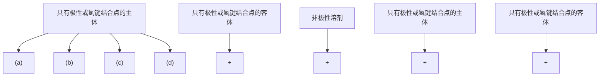
</details>

图 5.66 在极性和非极性介质中，各种类型主体的极性和非极性客体络合

（a）疏水性主体空穴络合非极性客体：小焓增量（易于去溶剂化和范德华吸引力引起）；大焓增量（疏水效应造成）；  
（b）具有极性络合点的主体空穴络合非极性客体：络合物不稳定（因为主体功能基不利的去溶剂化）；  
（c）具有极性位点的主体空穴络合极性客体：很稳定的络合物（因为主体功能基不利的去溶剂化被与客体的相互作用相平衡）；  
(d) 具有极性位点的主体空穴在非极性溶剂中络合极性客体：稳定的络合物（有利的主-客体相互作用引起），没有憎溶剂稳定化作用

![[超分子化学135章_images/14db4ae555fb46e60f805f9926db1bfd55aa545706e6c5f5f76aa1e4d861905e.jpg]]

<details>
<summary>chemical</summary>

Complex organic molecular structure with multiple aromatic rings and functional groups including ester, amide, and ether linkages
</details>

(5.100, 5.101)

(a) $R^{1}=R^{2}=R^{3}=H$

(b) $R^{1}=R^{2}=Et,\ R^{3}=H$

(c) $R^{1}=Et,\ R^{2}=Ph,\ R^{3}=H$

(d) $R^{1}=Et,\ R^{2}=Ph,\ R^{3}=Me$

![[超分子化学135章_images/0980ed6822a652cde04ee2701a65fddf59bc61fd5cc9cd762b7711e89358214e.jpg]]

<details>
<summary>chemical</summary>

Chemical structure of a symmetric diamide compound with two pyridine rings and R3 substituents
</details>

(5.102)

$$
\mathrm{R} ^ {3} = \mathrm{CO} (\mathrm{CH} _ {2}) _ {2} \mathrm{Me}
$$

Hunter（1991）应用了多个氢键和多个 $\pi -\pi$ 堆积识别来络合氢键受体对苯醌，设计并合成了受体(5.103)，该受体结合了一组互补的4个氢键给体（NH基团；每个结合一个醌孤对电子)，还有基于二苯甲烷的 $\pi$ 表面（图解5.12）。因为在(5.103)的制备过程中形成大比例的环状三聚体和四聚体，甚至形成[2]索烃[两分子的(5.103)互锁而成，见7.5节]，因而反应变得非常复杂。然而，采用逐级反应，可以分离得到产率适当的大环化合物。表5.8给出了主体(5.103)对客体对苯醌的络合常数。

![[超分子化学135章_images/e4ae88880a59e2f08644a9fc28722816587f5b98f4fb4ca75705632e926f0f39.jpg]]

<details>
<summary>chemical</summary>

Chemical reaction scheme showing formation of compound (5.103) from a chlorinated amide and a bisphenol derivative, with π-π bond formation.
</details>

图解 5.12 醌的接受体(5.103)的合成  
X/Y=CH 或 N, Hunter1991; $R=N^{+}Me_{2}C^{-}$ , Alott et al, 1998

表 5.8 在 CDCl₃ 中，主体（5.103）对客体醌的络合常数

<table><tr><td>主体(5.103)</td><td>K/(L/mol)</td></tr><tr><td>X=Y=CH</td><td>1200</td></tr><tr><td>X=N,Y=CH</td><td>1800</td></tr><tr><td>X=CH,Y=N</td><td>230</td></tr></table>

客体醌具有很强的络合作用，这可以通过酰胺质子的 $^{1}$ H NMR 的化学位移高达 2.5（是与醌形成氢键的特征）得以例证。较大取代基的醌，如四甲基醌，与主体空穴不匹配，因而根本不被络合。醌的特征还原电位也向更正的电位移动了大约 200mV，反映了酰胺上 NH 键很强的极化效应。图 5.67 以图示法给出了醌最可能的络合方式。

Alott et al（1998）近期的工作也展示出，氢键连的主体(5.103)（ $\mathrm{R} = \mathrm{N}^{+}\mathrm{Me}_{2}\mathrm{Cl}^{-}$ ）可以用来在水中络合有机客体分子（比较在其他的二苯基甲烷基物种里的疏水识别）。对苯醌在水中的络合常数小于 $5\mathrm{L} / \mathrm{mol}$ ，而在氯仿中却高达 $230\mathrm{L} / \mathrm{mol}$ 。然而，增加客体形成氢键的基团的数目，则其在水中和氯仿中的络合

常数都会显著增加（表 5.9）。

氢键连接法也已经被采用来络合氢键给体，如1,3,5-三羟基苯（THB，间苯三酚）。在一种模板化酰氯-胺的缩合方法的基础上，Seel and Vögtle（1992）制备出一系列真正巨大的圆柱状三重桥连的环番，如(5.104)。主体(5.104)在 $CH_{2}Cl_{2}$ 溶液中的络合常数为 $1.1\times10^{4}L/mol$ ，该络合过程是经过分叉的O—H…N氢键作用，并辅以弱的Ar—H…N相互作用而发生的。较小的衍生物证明对金属中心如 $Ru^{2+}$ 〔如 $[Ru(2,2'-bipyridyl)_{3}]^{2+}$ 〕是有效的络合剂，而儿茶酚（邻苯二酚）单元却是Fe（Ⅱ）〔见3.15.2节，(3.121)〕的有效络合剂。

![[超分子化学135章_images/3ef7263d2527a1dd335dba3f32da22d1f7ce426dd72557fe7dcee3962ae39c76.jpg]]

<details>
<summary>chemical</summary>

Complex organic molecule structure with multiple aromatic rings, amide groups, and functional groups
</details>

图 5.67 (5.103) 与对苯醌的络合 $\left(\mathrm{R}=\mathrm{CH}_{2}\right.$ ，为简明起见，
取代基被省略）

表 5.9 主体 (5.103) 对氢键联的客体的络合常数  
$(\mathrm{R} = \mathrm{NMe}_2\mathrm{Cl}^-,$ Alott et al, 1998) 

<table><tr><td>客体</td><td>K(水)/L/mol</td><td>K(氯仿)/L/mol</td></tr><tr><td>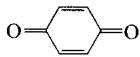</td><td>&lt;5</td><td>230</td></tr><tr><td>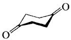</td><td>94</td><td>850</td></tr><tr><td>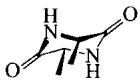</td><td>760</td><td>—</td></tr></table>

![[超分子化学135章_images/ba0218580b82fcbbeb25c6e9d0f67131b49cdb4a03219780fd7dd9aa2c455fa3.jpg]]

<details>
<summary>chemical</summary>

Complex organic molecule structure with multiple aromatic rings, amide linkages, and functional groups including NR, OH, RN, and N
</details>

(5.104)·THB

# 5.3.5 从包合物构筑单元构造一个溶液主体：穴番

![[超分子化学135章_images/260879ff5548f0412376fe6e265bfee5c09772cb23accca443f9f6205fa35e6d.jpg]]

Collet A, Dutasta J-P, Lozach B and Cancell J. Cyclotriveratrylenes and Cryptophanes: Their Synthesis and Applications to Host-Guest Chemistry and to the Design of New Materials. Top Curr Chem, 1993, 165:103\~130

# 5.3.5.1 由一个卷曲的分子构筑单元构造容器

在 5.2.4 节我们已经了解到 cycloveratrylene[CTV, (5.32)]的固态包合化学，CTV 有一个很浅的分子空穴（形状像茶托），在有机金属 CTV 衍生物里被用于在溶液里络合阴离子（4.6 节）。然而，就络合中性客体分子而言，CTV 不具有显著的溶液络合能力，这与其固态包合的通道性质是一致的。唯一例外于此规律的是 CTV 对 buckminsterfullerene (C $_{60}$ ) 的空穴内络合，以及与球形碳硼烷——o-C $_{2}$ B $_{10}$ H $_{12}$ (5.40) 的类似络合物，该碳硼烷在非水介质中展示出显著的溶液络合能力，虽然它的 $^{1}$ H NMR 滴定数据不符合 1:1 模型（Blanch et al., 1997）。

CTV 分子通常情况下都没有络合能力，这是很不幸的，因为 CTV 分子很容易制备，且取代基甲氧基为分子空穴的进一步改进提供了宽广的空间。而且，茶托形结构固有的曲率对构筑包封性主体具有潜在价值。因为空穴很浅，所以 CTV 本身是一个很差的主体。它的碗口很宽，意味着空穴不能在极性溶剂中为有机分子提供重要的庇护。同时，芳香环与客体只有弱的 $\pi-$ 堆积或 $\pi-$ 氢键相互作用，如 (5.36) 一样。为了获得对不同于与 CTV 高度互补的分子如 $C_{60}$ 的客体的重要的溶液络合，很显然必须改进分子空穴。Cram（1988）进行了该项工作，设计合成了很多基于 CTV 的空穴配体（cavitand），见图解 5.13。

![[超分子化学135章_images/6fcbd12d65b1eca31ae6e8fee49e3b17036488f063d1f9dcc8c1b9ac1c084d78.jpg]]  
图解 5.13 基于 CTV 的空穴配体的合成（Cram，1988）

空穴配体(5.106)和邻二氮杂菲桥连的类似物拥有很深的永久空穴，在溶液和固态下都能络合中性分子如 $CH_{2}Cl_{2}$ 。在(5.106)的未络合态下，邻苯二甲基桥高度易变；然而，当络合客体后易变度明显减小。分子力学计算表明，空穴络合物(5.106)· $CH_{2}Cl_{2}$ 比自由的主体更稳定（相差 57.3kJ/mol），但这么大的数值却不能和溶液络合常数相混淆，因为没有考虑介质的竞争效应。

很显然，在提高基本的 CTV 单元的溶液络合特征方面，使 CTV 空穴变深形成空穴配体是非常有效的。然而，在第 3 章穴状配体的情况下，甚至当其进一步形成一个闭合的三维壳体（能够完全包封客体）时，主-客体的亲和力被提高。三维结构赋予其预组织性，使得客体免受溶剂介质的干扰，并减慢客体交换速度。Collet 制备了大量的三维 CTV 基主体，其中，两个 CTV 型的面彼此对应，并通过$-\left(\mathrm{CH}_{2}\right)_{n}-$ ， $-\mathrm{CH}_{2}\mathrm{CH}=\mathrm{CHCH}_{2}-$ 或 $-\mathrm{CH}_{2}\mathrm{C}=\mathrm{CCH}_{2}-$ 桥（ $n=3\sim8$ ）共价连接起来。芳基桥连类似物也已得到，它们是通过络合阴离子的基于 $\mathrm{CpFe}^{+}$ 的荚状配体的主体如(4.36)的盖帽反应得到（4.6节）。从穴状配体类推，这些蒴状（capsular）主体被称作穴番（cryptophane）{结尾的“番”（-phane）是因为它们属于[1.1.1]间环番一类；环番的命名见5.3.4.2节}。穴番存在两种不同的构象——anti(5.107)和syn(5.108)，取决于两个半球上取代基的定向，通常显示出 $D_{3}-anti$ 或 $C_{3h}-syn$ 对称性。穴番是根据它们被发现的先后顺序来命名的，因此，穴番-A和穴番-B是具有 $X=-(\mathrm{CH}_{2})_{2}-$ 桥的anti/syn衍生物，而在穴番-E和穴番-F里， $X=-(\mathrm{CH}_{2})_{3}$ 。穴番-C和穴番-D有一 $(\mathrm{CH}_{2})_{2}-$ 桥，与穴番-A/B相似，但在每个半球上没有OMe基团。面对面的几何构型类似于最近报道的CTV自身的γ-相包合物（5.2.5.2节）。

![[超分子化学135章_images/9a789c44c0c620da2e3119725b643a9835afb84deb22039a39c4ff43ce3373bf.jpg]]

<details>
<summary>chemical</summary>

Molecular structure of D3-anti, showing a fused ring system with oxygen and nitrogen atoms
</details>

(5.107)

![[超分子化学135章_images/9b13c376c627a8618ebfef1bf8b77fa1ea18d35754955bc9e1a5f5ed107e8be4.jpg]]

<details>
<summary>chemical</summary>

Chemical structure of C3h-syn, a symmetric organic molecule with multiple rings and oxygen atoms
</details>

(5.108)

![[超分子化学135章_images/b971e0feb89db11bfe03ebd33aa59b4f05f101bda18f0470293167e37ba5b644.jpg]]

<details>
<summary>chemical</summary>

Complex organic molecular structure with multiple functional groups including hydroxyl, carboxyl, and ester groups
</details>

(5.109)

$$
\mathrm{X} = - (\mathrm{CH} _ {2}) _ {n} -, - \mathrm{CH} _ {2} - \mathrm{CH} = \mathrm{CH} - \mathrm{CH} _ {2} -, \text {   炔   }, \mathrm{C} _ {6} \mathrm{H} _ {4}
$$

穴番有两种合成方法。最初的方法使用了共价模板效应，在高稀释度下，利用一个CTV产生的碗预组织第二个碗的环合[图解5.14(a)]；最近，又发展了一种更直接的方法，通过二次三聚反应（double trimerisation）直接形成穴番[图解5.14(b)]。

表 5.10 列出了通过这些路线合成的各种穴番的产率。很明显，直接合成法的产率普遍很差，主要是因为作为一个三组分的自组装，它代表了一个大环的三次环合，没有明显的模板作用；且与聚合物的形成存在明显的竞争。然而，我们通常仍选用方法（a），因为它不需要在高度稀释

![[超分子化学135章_images/e39b6220a26e99ab1f041eae3d25a0c0cfe5b741e25498052cabab530f9f16ce.jpg]]

<details>
<summary>chemical</summary>

Chemical reaction diagram showing hydrolysis of a hydroxyl group into a cyclic structure with hydroxyl groups
</details>

图解 5.14 穴番的合成方法  
摘自：ColletA et al. Cycletriveratrylenes and cryptophanes: their synthesis and applications to host-guest chemistry and to the design of new materials. Top Curr Chem, 1993, 165: 103

的条件下进行（3.8.3节），一次可以制备大量的产品，这种方法也更直接。更有趣的是，方法（b）与模板过程产生的anti/syn比率不同，在方法（a）中，对于anti/syn比率，具有偶数个碳原子的桥更有利于anti构型，而奇数个碳原子的桥有利于 syn 构型的形成。把双键从 cis 变为 trans 也具有相同的效应，这说明其前体存在桥诱导的定位倾向。直接合成法总是倾向于产生 anti 构型，这可能是在方法（b）中，两个 CTV 衍生的部分以协同的方式环合，同时形成两个环。

表 5.10 用图解 5.14 所示的方法得到的穴番的产率（%）

<table><tr><td rowspan="2">桥 O-X-O</td><td colspan="2">模板法(a)</td><td colspan="2">直接法(b)</td></tr><tr><td>anti</td><td>syn</td><td>anti</td><td>syn</td></tr><tr><td> $-(CH_2)_2-$ </td><td>80</td><td>0</td><td>5</td><td>0</td></tr><tr><td> $-(CH_2)_3-$ </td><td>27</td><td>50</td><td>17</td><td>3</td></tr><tr><td> $-(CH_2)_4-$ </td><td>—</td><td>—</td><td>8</td><td>2</td></tr><tr><td> $-(CH_2)_5-$ </td><td>21</td><td>43</td><td>12</td><td>6</td></tr><tr><td> $-(CH_2)_6-$ </td><td>18</td><td>9</td><td>8</td><td>2</td></tr><tr><td> $-(CH_2)_7-$ </td><td>—</td><td>—</td><td>5</td><td>1</td></tr><tr><td> $-(CH_2)_8-$ </td><td>60</td><td>20</td><td>0</td><td>0</td></tr><tr><td> $-CH_2CH=CHCH_2-(E)$ </td><td>34</td><td>5</td><td>5</td><td>1</td></tr><tr><td> $-CH_2CH=CHCH_2-(Z)$ </td><td>25</td><td>50</td><td>10</td><td>8</td></tr><tr><td> $-CH_2C=CCH_2-$ </td><td>43</td><td>20</td><td>0</td><td>0</td></tr></table>

# 5.3.5.2 卤烃的络合

与它们的包封性质相一致，穴番对小的四面体分子如甲烷及其卤代衍生物具有显著的络合能力。图5.68给出了穴番-E在2倍量的 $\mathrm{CHCl}_3$ 存在下的 $^1\mathrm{H}$ NMR谱。核磁谱图是在氘代1,1,2,2-四氯乙烷里测定的，因为四氯乙烷太大不能进入空穴内。在室温，很容易观察到被包裹在空穴内的 $\mathrm{CHCl}_3$ 分子的尖峰；随着温度逐渐上升至 $340\mathrm{K}$ ，在NMR时间尺度上，客体交换速度加大，尖峰逐渐变宽。被包裹的客体分子的高场化学位移是芳香环的屏蔽效应引起的特征。缓慢的交换是与客体需要努力通过受限的主体窗口相一致。对该主体的线性分析给出客体交换的活化能

![[超分子化学135章_images/b0dd3bf44f9dc745a63dc007f2722f4d95ba3d12618c262f2659c06418455a8a.jpg]]

<details>
<summary>chemical</summary>

NMR spectrum and molecular structure of a chiral polymer with labeled solvent peaks (CHCl₃, 300K, 340K) and δ₀/δc axis
</details>

图 5.68 在 2 倍量的 $CHCl_{3}$ 存在下，穴番 -E $[(5.107), X=(CH_{2})_{3}]$ 的 ${}^{1}H$ NMR 谱图溶剂： $(CDCl_{2})_{2}$   
摘自参考文献：Canceill et al，1986

为 54～63kJ/mol。在 300K 时，络合常数是 470L/mol，特别是因为在非极性溶剂中没有疏水效应，络合力本身又很弱时，这么大的络合常数就很强了。当 OMe 基被亲水的 $OCH_{2}CO_{2}H$ 基团取代，得到结构异常相近的水溶性主体 (5.109)，它在水中对 $CHCl_{3}$ 的巨大的络合常数 7700L/mol 尤为突出。

穴番-E对各种中性客体的络合自由能见图5.69。根据它们的三维结构性质推断，主体显示出峰的选择性，且空穴尺寸与客体的范德华体积有很好的相关性。因此，具有一 $(\mathrm{CH}_2)_2$ —型桥的较小的穴番-C很明显对较小的客体如 $\mathrm{CH}_2\mathrm{Cl}_2$ 有选择性，而较大的 $\mathrm{CHCl}_3$ 与一 $(\mathrm{CH}_2)_3$ —桥连的穴番-E结合更牢固。然而，如果络合自由能被分解为它们各自的焓和熵的贡献，则这种简单的尺寸适配观点就不再适用。这可以借助vant'Hoff图（lnK对 $1 / T$ 作图）得到。 $CH_{2}Cl_{2}$ 和 $CHCl_{3}$ 被穴番-C 和穴番-E 络合的各项参数见表 5.11。

![[超分子化学135章_images/89d4b5c7de14addc34834d5924bd2ee7a830abaa6b5709df91e083c4d1fe4167.jpg]]

<details>
<summary>scatter</summary>

| Compound       | 客体体积 /ų | -ΔG /kJ/mol |
| -------------- | ------------ | ----------- |
| CH₂Cl₂         | ~58          | ~16         |
| CHCl₃          | ~70          | ~16         |
| CHCl₂Br        | ~75          | ~14         |
| CHBr₂Cl        | ~80          | ~12         |
| CHCl₃          | ~68          | ~9          |
| CHCl₂Br        | ~65          | ~10         |
| CHCl₃I         | ~55          | ~9          |
| CHFCIBr        | ~62          | ~13         |
| CH(CH₃)₃      | ~65          | ~9          |
| CHBr₃          | ~78          | ~10         |
| CHCl₃          | ~70          | ~4.5        |
| CCl₄           | ~85          | ~5          |
| Cl₃CCH₃        | ~90          | ~1          |
| Cl₂C(CH₃)₂     | ~92          | ~0          |
| ClC(CH₃)₃      | ~93          | ~-2         |
</details>

图5.69 在 $300\mathrm{K}$ 下，穴番-E和穴番-C对各种客体分子的络合自由能

表 5.11 在 300K 下 (CDCl₂)₂ 里，穴番络合客体的热力学参数

<table><tr><td>主体</td><td>客体</td><td> $\Delta G/\text{kJ/mol}$ </td><td> $\Delta H/\text{kJ/mol}$ </td><td> $\Delta S/\text{kJ/mol}$ </td></tr><tr><td rowspan="2">穴番-C</td><td> $\text{CH}_2\text{Cl}_2$ </td><td>-15.1</td><td>-16.3</td><td>-4</td></tr><tr><td> $\text{CHCl}_3$ </td><td>-6.7</td><td>-26.8</td><td>-67</td></tr><tr><td rowspan="2">穴番-E</td><td> $\text{CH}_2\text{Cl}_2$ </td><td>-11.7</td><td>+4.2</td><td>+25</td></tr><tr><td> $\text{CHCl}_3$ </td><td>-15.5</td><td>-25.1</td><td>-29</td></tr></table>

![[超分子化学135章_images/47d8c293f249b75e59c30926c328d765fb882ca8c40b5105188147ef25f7b0c4.jpg]]

<details>
<summary>chemical</summary>

Molecular structure diagram showing a complex organic compound with carbon, hydrogen, and oxygen atoms
</details>

图5.70 穴番-E的 $\mathrm{CHCl}_3$ 络合物的X射线晶体结构

很明显，较小的穴番-C对 $\mathrm{CH}_2\mathrm{Cl}_2$ 具有选择性，这毕竟不是主体的小空穴与客体的大小之间的匹配问题。 $\mathrm{CHCl}_3$ 与该主体之间相互作用的焓要重要得多，尽管它的尺寸很小。然而，熵的贡献使 $\mathrm{CHCl}_3$ 的络合很不稳定，在 $300\mathrm{K}$ 熵的不利贡献- $T\Delta S$ 使得络合自由能增大为 $+20.1\mathrm{kJ / mol}$ ，这可能是因为， $\mathrm{CHCl}_3$ 与空穴大小太合适了，彼此结合得很紧密，因而其自由度显著降低。另一方面， $\mathrm{CHCl}_3$ 也被穴番-E强烈地结合，在大的主体里有多余的空间移动，明显减小熵的不稳定度。图5.70给出了穴番-E的 $CHCl_{3}$ 络合物的 X 射线晶体结构。

# 5.3.5.3 与溶剂的竞争

最初研究穴番的络合能力是在 $CDCl_{3}$ 溶剂里，研究与溶剂结构相近的客体分子如 $CH_{2}Cl_{2}$ 的络合作用，得到的络合常数非常小，为 1～2L/mol。因而，很明显在客体包封过程中存在一种深层的溶剂化效应。对于客体在水中的络合，因水与水之间形成氢键，导致疏水效应，迫使客体进入主体。然而，如果溶剂对主体空穴来说是一种有效的竞争者，则络合常数会大大减小， $CH_{2}Cl_{2}$ 在 $CDCl_{3}$ 中的络合就属于这种情况。主体穴番对这两个物种具有高的亲和力（图 5.69），它们之间存在一个平衡常数，它是根据浓度测定的主体对客体和溶剂的相对亲和力。因此，表观络合平衡常数 K，可以由方程式（5.4）给出（见图 5.71）。

$$
K = K _ {1 1} (1 + K _ {\mathrm{S}} [ \mathrm{S} ]) \tag {5.4}
$$

式中，[S]为溶剂的摩尔浓度； $K_{s}$ 为溶剂络合的平衡常数； $K_{11}$ 为客体络合常数。

在这个例子中，很明显，只有当 $K_{\mathrm{S}}[\mathrm{S}] \ll 1$ 时， $K \approx K_{11}$ 。通常，有机分子的 $[\mathrm{S}] \approx 10 \mathrm{~mol} / \mathrm{L}$ ，因此 $K_{\mathrm{S}}$ 一定小于 $10^{-2}$ 。环番-C在 $\mathrm{CDCl}_3$ 中对 $\mathrm{CH}_2\mathrm{Cl}_2$ 的表观络合常数 $K$ 为 $2.6 \mathrm{~L} / \mathrm{mol}$ 。对于 $\mathrm{CDCl}_3$ ，在室温下 $[\mathrm{S}] = 12.4 \mathrm{~mol} / \mathrm{L}$ 。在非竞争性溶剂如 $(\mathrm{CDCl}_2)_2$ 中的测定结果显示， $\mathrm{CDCl}_3$ 的络合平衡常数 $K_{\mathrm{S}} = 10 \mathrm{~L} / \mathrm{mol}$ 。运用方程式（5.4）得到 $\mathrm{CH}_2\mathrm{Cl}_2$ 的络合平衡常数 $K_{11}$ 约为 $325 \mathrm{~L} / \mathrm{mol}$ 。介质效应很明显具有极其重要的作用。

![[超分子化学135章_images/b72d9ee4e14288b0f6f8a7b8bcf9001face83b1e3351a7cd422fab88451c45e8.jpg]]

<details>
<summary>text_image</summary>

K₁₁, ΔG₁°
主体
客体
溶剂
</details>

图 5.71 溶剂化竞争平衡

# 5.3.5.4 与烷基铵离子的络合

穴番最显著的特征之一是它们在非极性介质中具有高效络合有机铵阳离子的能力。在（ $\mathrm{CDCl}_2$ ） $2$ 里，四甲基铵（ $\mathrm{NMe}_4^+$ ）被穴番-E络合，络合常数为 $250000\mathrm{L/mol}$ ；相反，中性客体分子 $\mathrm{CClMe}_3$ （体积很小）却几乎不被络合。很明显，主体与阳离子客体存在更多更重要的相互作用。在许多其他的烷基铵阳离子中也观察到了强的络合作用，络合力随着烷基基团的增大而减小。阳离子的强络合力可能是其大得多的亲水性造成的。如果主体的空穴代表比非极性溶剂更极性的“溶剂壳”，那么将会产生一个有利的焓项。特别地，与化合物如(4.63)相对比，尺寸相似的阴离子如 $\mathrm{BF}_4^-$ 根本不被穴番络合。比较穴番与speleand（3.11.5节）二者的阳离子络合能力，也是非常有趣的。然而，speleand主-客体相互作用的主要组

成涉及定向氢键。

# 5.3.5.5 甲烷络合作用

Collet 及其合作者研究了小的穴番-A 对甲烷的络合能力。甲烷是很重要的小分子，不仅是因为它存在于煤和石油沉积以及作为天然气。因为甲烷是高度对称的、不带电荷的非极性分子，它能够仅通过弱的范德华作用与周围环境发生作用，因而非常难以络合。它极度的挥发性使得这些缺点更加突出，其络合性质在溶液中很难研究。事实上，穴番-A 被发现在络合甲烷时非常有效，300K 时其络合自由能和相同主体对 $CHCl_{3}$ 的络合自由能相当，尽管它们总的分子体积存在很大的差异。甲烷在 $(\mathrm{CDCl}_{2})_{2}$ 中的络合在熵和焓两方面都是很有利的， $\Delta H^{\circ} = -6.7\mathrm{kJ/mol}$ ， $\Delta S = +7\mathrm{J/(K\cdot mol)}$ 。络合常数是 130L/mol，在 199K 时被包封的甲烷的半衰期相当长为 9ms，这些说明，在该温度下通过 ${}^{1}H$ NMR 可能观察到自由客体和被络合的客体被分离开的峰信号。自由甲烷分子的共振信号大约在 0.2，而被络合的甲烷的信号在 -4.4。在 298K 观察到的是一个平均信号。分子结构模拟显示， $C_{客体}\cdots C_{主体}$ 的平均距离约为 $4.5\mathring{A}$ ，也就是说，比范德华半径之和大 20%。这个距离与在范德华引力范围内最大的吸引力接近一致，很可能是该络合物具有超常稳定性的一个原因。

就分子体积而言，空穴与客体尺寸之间的比率可以用空穴的占有率（ $\rho$ ）来表示， $\rho$ 值为1代表空穴被完全填充。各种穴番和客体的占有因子列于表5.12。

表 5.12 穴番络合物的占有率 ( $\rho$ ) $^{①}$ 

<table><tr><td>客体</td><td>穴番-A</td><td>穴番-C</td><td>穴番-E</td></tr><tr><td> $CH_4$ </td><td>0.35</td><td>—</td><td>—</td></tr><tr><td> $CH_2Cl_2$ </td><td>0.70</td><td>0.70</td><td>0.65</td></tr><tr><td> $CH_2Br_2$ </td><td>0.80</td><td>—</td><td>—</td></tr><tr><td> $CHCl_3$ </td><td>0.89</td><td>0.89</td><td>0.81</td></tr></table>

① 穴番-A 和穴番-C 的空穴体积为 $81.5 \, \AA^{3}$ ，穴番-E 的空穴体积为 $89.0 \, \AA^{3}$ 。

与卤代烃相比，甲烷与空穴的匹配性无疑要差得多，但是，所得 $\rho$ 值（0.35）与甲烷的其他各种“物质态”相比较结果还是很有意思的。例如，在 $1\mathrm{atm}^{\bullet}$ 和 $298\mathrm{K}$ 下，气态甲烷的 $\rho$ 值为 $0.77\times 10^{-3}$ ；在其临界点（45.6atm，190.6K；气态和液态之间没有区别）上升至0.17；而固态甲烷在0K时的 $\rho$ 值为0.67。就占有率而言，空穴内的环境类似于超临界流体。从宏观上说，在穴番-A空穴内的1个甲烷分子相当于 $298\mathrm{K}$ ， $610\mathrm{atm}$ 下 $49\mathrm{mL}$ 的 $1\mathrm{mol}$ 甲烷。相反，对于 $\mathrm{CHCl}_3$ ，0.89的占有率类似于一个很紧密堆积的晶体。的确，络合时焓和熵的改变与结晶态有机化合物形成时的改变值相似。

# 5.3.6 共价空穴：carcerands and hemicarcerands

Jasat A and Sherman J C. Carceplexes and Hemicarceplexes. Chem Rev, 1999, 99: 931\~967

# 5.3.6.1 定义和合成

carcerand 是一类闭合的分子容器或分子胶囊，没有一定尺寸的入口允许客体分子进出。因而，除非主体内的共价键断裂，否则 carcerand 内的客体将被永久地捕获或“监禁”在内部空穴内。在一个 carcerand 内包含有一个客体而产生的牢固主-客体络合物被称作 carceplex。除了这个概念，还有另一个是 hemicarcerand，它描述的是一类闭合的分子容器，但客体在一定的可测的活化能垒下能够进出此容器。在客体物种存在下，hemicarcerands 形成 hemicarceplexes。穴番是有关 hemicarcerands 的很好的例子（5.3.3 节），它们能够可逆地捕获相对小的客体如甲烷、卤代烃等。这种三维包结化学的多数重要性在于活性物种在主体空穴内的稳定化、药物传输、空穴内催化。所有的这些应用要求 hemicarcerands 具有能力（选择性）络合并根据外部条件把客体排斥出去。carcerands 本身并不具备这些应用，尽管在分子电子学和分子器件方面的应用也可能被研究。

穴番是一个非常好的单分子络合主体，但因其总的空穴体积（80～90ų）太小了，不能同时络合两个客体物种来保证空穴内可能的反应性和催化性。Cram et al（1985b）的工作主要集中在与(5.43)相关的较大的[4]resorcarenes。Cram采取一种与穴番相似的合成方法，在高稀释度条件下，把两个resorcarene碗形物(5.110)和(5.111)的上缘偶合在一起，产生一个准球状的含有空穴的胶囊（图解5.15）。

![[超分子化学135章_images/1fc7ec6a33dc6cf95b759e5e6402ca7c342e3a1d4aa9fc60dcfe09449c44c349.jpg]]  
North pole   
Tropics   
Equatorial region   
Tropics   
South pole

图解 5.15 第一个 carcerand 的合成 (Cram et al, 1985b)

carcerand(5.112)是Cram研究组设计的，正如他们设计球状配体时一样，他们采用了CPK分子模型。在Cram的诺贝尔奖演说中[制备(5.112)两年后所写]，他对这个新胶囊的主-客体化学的兴趣作了如下描述（Cram et al，1988b）。

要回答的第一个问题是：在壳体闭合期间什么样的客体化合物会被捕捉进去？这个问题相当于在问：在一罐炖肉的表面下，边对边闭合的两个汤碗是否会保持任意炖肉的味道。答案是在环闭合期间存在的介质基本上每一种组分都被“包含”在(5.112)里。

图解 5.15 所得的反应产物在所有溶剂中都是不溶的，因此它的表征是一项很艰难的过程。通过用每种类型（极性，非极性，氢键，偶极非质子等）中最强的溶剂来处理产品混合物，可以把杂质和未反应的起始原料萃取出来。对于剩余的产品 [各种 carceplexes，即(5.112)的主-客体络合物]，利用元素分析测定其中的元素 C，H，S，O，N，Cl 和 Cs，所有的元素都存在，Cs 和 Cl 之间的比率是化学计量的。从固态红外光谱可观察到 C=O 谱带的特征峰，表明存在反应溶剂二甲基甲酰胺。质谱（快原子轰击）分析混合物，揭示出图 5.72 所示的所有 carceplexes 都存在。在分子质量高于最重的 carceplex 时，没有出现任何峰，也没有观察到其他的峰。很显然，一旦环闭合发生，则在生成的 carcerand 的内部区域里存在的任何物种都不可能逃离，甚至氩气也不行。

![[超分子化学135章_images/e12e03cc4d5bd4fd1f7f13300354289508f9d4a576ef89d2a0dcdc246227883f.jpg]]  
图 5.72 在制备(5.112)过程中形成的 carceplexes（由 Grey Oval 提供）

Cram 及其合作者发现，小心干燥水合络合物，然后在 $D_{2}O$ 中回流，则内部的 $H_{2}O$ 分子被氘代水大量替换，说明 carcerand 侧面上的入口足够大，允许像水这样的小分子扩散透过空穴壁，尽管也可能会存在 $D^{+}$ 对 $H^{+}$ 的离子交换。元素分析数据表明，混合物大约含有 5% 游离的 carcerand，60% 被包封的 $Cs^{+}$ ，45% 包含有 $Me_{2}NCHO$ ，15% THF，仅有 1%\~2% 的 $Cl^{-}$ 。这与杯 [4] 芳烃对 $Cs^{+}$ 的亲和力相符，说明 (5.112) 的形成包括一个 $S_{N}2$ 线性过渡态，其中， $Cs^{+}$ 配位在硫原子上，见式 (5.5)。

$$
\mathrm{Cs} ^ {+} \mathrm{S} ^ {-} \xrightarrow [ \mathrm{H} _ {2} ]{\mid} \mathrm{C} - \mathrm{Cl} \tag {5.5}
$$

carcerand 溶解度所遇到的问题很快就得到解决，通过把甲基“足”交换为广范围的基团，如正戊基、正十一烷基、2-苯乙基等，产生可溶于有机溶剂里的与溶剂分子客体形成的 carceplexes，产率高达 32%。带有缩醛桥（OCH₂O）的相关物种(5.113)已经由 CH₂Br₂ 和四醇(5.114)制备得到（图解 5.16）。使用长至 (CH₂)₄ 的烷基链得到伸长的胶囊，它的桥柔性足够允许一些小客体分子在外力驱使下顺利通过，形成 hemicarceplexes。在每只“碗”的上边缘（被称作“热带”区域，类推于行星的地理结构）上的乙缩醛间隔基也被改变成 OCH₂CH₂O 基团，这样每个半球就会形成一个宽而浅的弯曲。所有这些多环闭合反应发生时，都涉及 7 个分子（包括客体）的同时组装，这种 carcerand(5.115)的生成产率仍高达 87%。

![[超分子化学135章_images/f179a14f468850c60a22f1410804730e2300fb0b67a9b44279bab24da2d42531.jpg]]

<details>
<summary>chemical</summary>

Chemical reaction scheme showing conversion of compound (5.114) to (5.113) using CH2ClBr in solvent, with R groups and n-undecyl substituent
</details>

图解 5.16 由四醇（tetrol）制备缩醛桥连的物种

然而，即使存在 $\left(\mathrm{CH}_{2}\right)_{4}$ 桥，客体分子仍然很难进出络合物(5.113)的空穴。因此，在主-客体化学中很活跃的涉及多个客体交换和腔内反应的真正的 hemicarceplex，有一个通向化合物一侧的特殊通道。因此，三醇(5.115)和二卤代物 $\left[\mathrm{X}\left(\mathrm{CH}_{2}\right)_{n}\mathrm{X}\right]$ 反应生成三重桥连的半球形腔复合物（hemicarceplex）(5.116)，它有一个很明确的开放式通道，随时准备客体通过（图解5.17）。

![[超分子化学135章_images/42aec4e367d668a39632a578b68854e4fb29e1e4518604f528f6fb5ababf5d49.jpg]]

<details>
<summary>chemical</summary>

Chemical reaction scheme showing conversion of compound (5.115) to (5.116) under chiral coupling with K₂CO₃, including R group substitution and guest entry/exit opening steps.
</details>

图解 5.17 三醇和二卤代物的反应

自(5.112)的合成以来，Cram等在[4]resorcarene和杯 $[n]$ 芳烃（ $n = 4$ ）的基础上，合成了大量的carcerand和hemicarcerand，这些物种都展现出有趣的络合行为和反应活性。很显然，在接下来的十年里这个领域还将迅猛发展。

# 5.3.6.2 carcerand 合成中的模板效应

在那么多的反应物参与以及那么多环的闭合反应之后，许多 carceplex 和 hemicarceplex 还能得到这么好的合成产率，实在令人难以置信。很显然，它们的形成并不是建立在统计学基础上，而是“模板机理”在起作用。确实，对大量的这种类型的胶囊化合物的成环过程研究之后，才证实了它们只有在合适的模板化客体存在下才能形成。试图在大的溶剂分子里制备 carceplex，但由于溶剂分子太大而不能被空穴容纳，因而都不成功。许多潜在客体分子的模板化能力可以通过测定合成 carcerand(5.113)（n=1， $R=CH_{2}CH_{2}Ph$ ）中的模板比例来进行定量。N-甲基吡咯烷酮（NMP）被发现是合成这种化合物的不良溶剂，因此设计了一个竞争性试验：在 NMP 溶液中，把两种等量的具有客体潜能的物质放在合成(5.113)的混合液中，结果生成两种含不同客体的(5.113)的 carceplexes。产物混合物的 $^{1}H$ NMR 谱分析可以对客体信号进行积分，并计算出它们之间的比率。两种 carceplexes 的形成差异说明，在 carcerand 最后关环时，占优势的 carceplex 内的客体使中间体更加稳定。这个反应步骤被称为“客体决定步骤（GDS）”，因为在这一过程之后，客体将不能逃脱。吡嗪(5.118)被证明是最有效的模板，模板比率可以超过 $10^{6}$ 。对于吡嗪来说，高模板比率导致高的反应产率（75%）；然而这种规则也有一些例外。模板比率还和各种 carceplexes 的相对稳定常数（ $K_{rel}$ ）有很大关系。这表明，类似于对过渡态活化能作用一样，客体对整个络合物的自由能也有影响（一些模板比率和 $K_{rel}$ 值见表 5.13）。

![[超分子化学135章_images/b5fce21e24e7f119846575b08d5db3f171be1d66c93095afda12db40c9eaed34.jpg]]

表 5.13 与各种客体形成(5.113) (n=1, R=CH₂CH₂Ph) 的模板比率，以及所得 carceplexes 在 $d_{5}$ -硝基苯里的相对稳定性（Chapman et al，1998）

<table><tr><td>客体</td><td>模板比率</td><td> $K_{rel}$ </td><td>客体</td><td>模板比率</td><td> $K_{rel}$ </td></tr><tr><td>吡嗪(5.118)</td><td>1000000</td><td>980000</td><td>1,3-二噁烷(5.122)</td><td>200</td><td>140</td></tr><tr><td>1,4-二噁烷(5.119)</td><td>290000</td><td>240000</td><td>二甲基乙酰胺(5.123)</td><td>20</td><td>8.9</td></tr><tr><td>吡啶(5.120)</td><td>34000</td><td>7100</td><td>NMP(5.117)</td><td>1</td><td>1</td></tr><tr><td>苯(5.121)</td><td>2400</td><td>540</td><td></td><td></td><td></td></tr></table>

注：以 NMP 作参照，在 NMP 中的值设定为 1。

总之，客体的大小和形状是很重要的。然而，结构上很相近的1,3-和1,4-二噁烷，结果却有很大差别，表明存在特殊的定向效应。形成空穴时，客体和穴壁之间可能通过非共价相互作用形式存在。因此，可以和穴壁达到最大数目的范德华力和C—H…π相互作用的客体，才是最有效的模板。

# 5.3.6.3 络合物：carceplexes

carceplexes 型主体络合客体可以通过和外部介质之间的客体交换来表征。真正的 carceplexes 不存在客体交换。慢速客体交换（几小时至几天）是 hemicarceplexes 的特征；而对类似于 $O_{2}$ 这种小分子的络合，它们交换快速（在 NMR 时间范围内），才是严格的 carceplexes 而不是 hemicarceplexes。与穴番一样，carcerand 的络合行为也很容易由 ${}^{1}H$ NMR 监测。形成穴壁的芳环的磁各向异性产生大的化学位移变化（通常高场移动）以与客体发生共振。随着客体更深地穿入空穴，这种作用也越来越显著， $\Delta\delta\left(=\delta_{自由}-\delta_{残余}\right)$ 值通常在 2～2.45 范围内，其大小由客体进入 resorcarene 半球的程度决定。被捕获的物质的红外光谱也受到很大的干扰。由 (5.113) 和二甲基甲酰胺（DMF）或二甲基乙酰胺 [DMA, (5.123)] 形成的 carceplexes，C=O 的特征拉伸频率正好处在纯气相和液相分子的 C=O 拉伸频率之间（比较：位于穴番-A 内部的甲烷分子，见 5.3.3.5 节）。

(5.113)的吡嗪 carceplex 的 X 射线晶体结构如图 5.73 所示。吡嗪具有一个很大的模板比率，表明客-主体之间良好的相互作用。客体中 N 和主体亚甲基桥之间形成的 C—H…N 氢键也很好地证明了这一点。另外，从其他主体的亚甲基桥和吡嗪 π-体系之间，也可以观察到 C—H…π 的相互作用；并且吡嗪质子倾向于芳环主体。这就减慢了吡嗪腔内沿着其 N—N 轴的旋转。对于两个半球的腔外分别含有甲基和 2-苯乙基取代基团的非对称主体，测得其能垒很大，约 80kJ/mol。这证明该过程很慢，在 NMR 时间单位内足以辨别出 H $_{a}$ 和 H $_{b}$ 的质子偶合（图 5.74）。吡嗪络合物的结构也和吡嗪客体非常匹配。在 carceplex 里面，主体的两个半球绕假 C $_{4}$ 轴旋转，彼此成 21°角，但它们仍是基本平行，能够使“碗里面”的氧原子和芳环呈最大共轭。相反，DMA 衍生物，由于大客体的空间阻碍，使其结构偏离平行排列 5.2°。

![[超分子化学135章_images/70e7322f49fcb2a011e8f664cd278f125bb41d2521d2e6543b1f3739122c78da.jpg]]

<details>
<summary>chemical</summary>

Molecular structure diagram showing interconnected carbon and hydrogen atoms in a hexagonal lattice
</details>

![[超分子化学135章_images/dc9bd4a027ee9673c1e958c9188685cf3048140dd86a0c660fb8977d4683dbb9.jpg]]

<details>
<summary>chemical</summary>

Molecular structure diagram of a graphene-based polymer or nanoscale compound
</details>

图 5.73 (5.113) 的吡嗪 carceplex 的 X 射线晶体结构立体剖面图 (Fraser et al. 1995)

# 5.3.6.4 carcerism

carcerand 客体并不局限于 resorcarene 衍生物。Timmerman et al（1994）合成了[4]-resorcarene-杯[4]芳烃客体混合体(5.124)，它是由两个不同碗状的大环半球通过面对面偶合而成的（图解 5.18）。resorcarene carcerands 的分子内空穴呈球形或拉长的曲线端柱体，而(5.124)的空穴更接近蛋形，使得其非常不对称——宽而浅的resorcarene空穴形成蛋的底部；深而窄的杯[4]芳烃形成蛋的尖端。

![[超分子化学135章_images/849a7874228459e27d8645122a9aa2140427c60570040d6f65e0eb5b6f1bd053.jpg]]

<details>
<summary>chemical</summary>

Chemical structure diagram of a sodium hydride complex with C4 and C2 axes, showing Hb and Me substituents
</details>

图5.74 不对称carcerand内的吡嗪包结几何构型

![[超分子化学135章_images/ddc0e5c19468a02dda855d8f4f889abfc258e72dc34485ad05c36a4d01676f23.jpg]]

<details>
<summary>chemical</summary>

Chemical reaction diagram showing R-gene modification with CsF, KI, Cs2CO3 under guest conditions, yielding a complex structure labeled (5.124)
</details>

图解 5.18 蛋形 carcerand(5.124) 的合成

(5.124)可以在 $80^{\circ}\mathrm{C}$ 在许多溶剂中制备，例如：DMF，DMA，DMSO和乙基甲基亚砜，carcerand的产率是定量的。但是，在大的潜在客体分子溶剂中（分子太大与空穴不匹配），产率明显降低。例如，在1,5-二甲基-2-吡咯烷酮中，胶囊结构化合物的产率仅有 $5\%$ 。就DMF这类小客体分子而言，它们沿 $C_2$ 轴快速旋转，只观察到一种物质。然而，类似于DMA这类大客体分子，它们的旋转受到很大的阻碍，旋转位垒为 $53\sim 73\mathrm{kJ / mol}$ ，因而，观察到的两个方向性异构体（orientational isomer）——一种新型立体异构体。Reinhoudt及其同伴建议用“carceroiserism”（缩写为carcerism）来描述这种现象（图5.75）。

# 5.3.6.5 包合反应

Ienvy not in any moods
The captive void of nobel rage,
The linner born within the cage,
That never knew the summer woods.
—Alfred, Lord Tennyson (1809—1892), in Memoriam

![[超分子化学135章_images/662d8b79403589d456b5b9f664974a21b9aef1ce34690b28b49f089841de0ca9.jpg]]

<details>
<summary>chemical</summary>

Chemical reaction diagram showing the formation of [4]resorcarene from cup[4]芳烃 and C₂ axis, with Me substituents
</details>

图 5.75 在杂化 carcerands 的 DMA 络合物里的 carcerism (Timmerman et al, 1994)

在 hemicarcerands 里掩蔽性很好的结实的空穴为这些主体作为微反应器提供了广阔的空间，通过把反应物和外界介质隔离开，来阻止反应物双分子分解。而且，独特的穴内环境，以及客体物质在里面表现出的类流体性质（形式上为高压力时的压缩状态），可能会导致独特的包合反应性。确实，carcerands 和 hemicarcerands 的内空间被描述为一种不同于固态、液态和气态的“物质新状态”。人们对包合反应的潜能做了大量完美的实证，尤其在分子反应容器方面会有广阔的应用空间。

钳闭（incarceration）效应影响客体反应性的最简单的例证就是被包含的胺配体碱度的量度。吡啶的 $CDCl_{3}$ 溶液可以通过 ${}^{1}H$ NMR 观察到被 $CF_{3}CO_{2}D$ 高度质子化。入口敞开的 hemicaecerand(5.116) 的吡啶络合物的类似反应得到的吡啶没有被质子化。这意味着“被监禁的”吡啶比自由分子的碱性弱得多。该主体溶解吡啶离子的能力非常有限，并且会在空间上阻止“吡啶-三氟乙酸”紧密离子对的形成，这有力证明了上述观点。

hemicarcerands 一个惊人的应用就是 Donald Cram 在 1991 年划时代的合成。他在(5.116)的空穴里合成了高度不稳定的分子环丁二烯(5.128)。在此之前，只有在光解 α-吡喃酮(5.125)后，在 8K 下冰冻在惰性气体中，才能观察到环丁二烯。

![[超分子化学135章_images/b326237bf1444af238f7b1b6a0e82b293c3481918a53665824c742e7b29d11d7.jpg]]

<details>
<summary>chemical</summary>

Reaction mechanism diagram showing photochemical transformations of cyclohexanones with temperature and rate constants
</details>

图解 5.19 腔内制备环丁二烯及其反应 (Cram et al. 1991)

温度稍高时，环丁二烯会快速二聚，形成环辛四烯(5.130)。Cram及其合作者在(5.116)空穴内完成了图解5.19所示的所有反应。仔细地控制反应条件，可以通过光解 $\alpha$ -吡喃酮（和主体一起回流而被包含在内），生成内酰酯(5.126)，内酰酯重排到(5.127)，再返回 $\alpha$ -吡喃酮，完成一个循环。具有普通反应活性的hemicarceplex(5.126)，在固态室温下放置2周仍很稳定。特别显著的是，

在室温下，用 75W 氙弧灯对(5.126)的 hemicarceplex 照射 30min，就会生成“禁锢的”环丁二烯。这种新客体的 $^{1}$ H NMR 谱在 2.27 处有信号峰，并且在被保护的 hemicarcerand 环境下高度稳定。CO $_{2}$ 作为副产物从空穴内排出。类推于“禁锢的”苯的高场位移，Cram 计算出自由环丁二烯的化学位移应该在 5.2～5.7。观察到的尖锐峰证实了环丁二烯存在单线态基态。

被禁锢的环丁二烯的反应性，可以通过加热 NMR 样品至 $220^{\circ}C$ ，保持 5min 来检测。这导致了自由环辛四烯的生成，很明显是环丁二烯从空穴中逃脱，随后发生二聚反应由(5.129)而得到。环丁二烯和 $O_{2}$ [ $O_{2}$ 可以进入(5.116)的穴中] 反应，产生禁锢的顺丁烯二醛(5.131)。

在一段时间内，环丁二烯的“驯服”是客体容器分子对稳定反应活性很高的分子唯一的主要应用。然而，最近报道了（Warmuth，1997）具有更高反应活性的邻苯炔(5.134)的稳定化。环丁二烯不稳定的原因是它需要由 $\mathfrak{sp}^2$ 杂化轨道产生 $90^{\circ}$ 键角，而 $\mathfrak{sp}^2$ 杂化轨道的最优键角是 $120^{\circ}$ 。相反，苯炔要由sp杂化轨道产生 $120^{\circ}$ 键角，而 sp 杂化轨道最适宜的键角为 $180^{\circ}$ 。邻苯炔的稳定化可以在四桥连的 hemicarceplex (5.113) (n=4) 内实现，(5.113) 没有一个特定的入口包结客体。在纯的苯并环丁烯二酮 (5.132) 里加热 (5.113)，可以得到包结的 (5.132)，产率为 35%。在 77K 时光照，可以产生苯并环丙烯酮 (5.133) 的 carceplex。这种物质异常稳定，已经通过 X 射线晶体图谱表征。在水存在下，可以缓慢反应生成包结的安息香酸。在 77K 再次光照可以生成目标化合物邻苯炔，它具有足够的稳定性，在 $-75^{\circ}\mathrm{C}$ 和 $-98^{\circ}\mathrm{C}$ 可以分别检测其 $^{1}\mathrm{H}$ NMR 和 $^{13}\mathrm{C}$ NMR（图解 5.20）。 $^{1}\mathrm{H}$ NMR 谱位移在 4.99 和 4.31 处显示出邻苯炔的两个质子位移。特别有趣的是，当加热到室温时，客体仍然不能逃离出它的“囚笼”，但是它可以和 carcerand 的壁发生 Diels-Alder 加成反应，生成苯桥连的 1,4-环己二烯 (5.135)。

![[超分子化学135章_images/931723878e47bc3ab438de7edcdbab89999e93186bb73c45ff5c72c701929825.jpg]]

<details>
<summary>chemical</summary>

Reaction pathway showing conversion of compound (5.132) to (5.134) via intermediate (5.133), with temperature conditions and yields indicated
</details>

图解 5.20 空穴内合成邻苯炔

![[超分子化学135章_images/e600f327716413e3948598fd38a19d57905d472124a784af9c6fdd4f9eb86a43.jpg]]

<details>
<summary>chemical</summary>

Complex polycyclic aromatic hydrocarbon molecular structure with R substituents and (CH2)4 groups
</details>

(5.135)

尽管在 hemicarcerand 空穴内通过光解制备(5.128)和(5.134)非常完美，但是也表明对于光解时不能发生的反应，化学反应物需要容纳到主体空穴内，可能会限制使用主体原料来完成其他穴内化学。然而有趣的是，Cram 等在(5.113) $(n=4)$ 内，基于被禁锢的苯醌及相关物种进行了大量的氧化-还原反应。这些氧化-还原剂是类似于 $SmI_{2}$ 和 $\mathrm{Ce(NH_{4})_{2}(NO_{3})_{6}}$ 的物质，它们没有进入穴内的机会。但是，这些氧化还原反应进行得非常顺利（由于硝基苯产生不寻常的苯胺而非苯胺），且伴随着电子、质子和水穿过主体壁的传递现象发生。

# 5.4 富勒烯的超分子化学

1985年富勒烯的发现——仅由碳原子构成的闭合状三维结构分子——代表了近年来化学领域一个最为惊人的、具有吸引力的发现，来自美国Houston Rice大学的Robert F. Curl. Jr和Richard E. Smalley，英国Sussex大学的Harold W. Kroto因在该领域的成就，获得了1996年的诺贝尔化学奖（Box 5.3）。富勒烯，特别是buckminsterfullerene（ $\mathrm{C}_{60}$ ，buckyball）和 $\mathbf{C}_{70}$ ，不仅在超分子化学而且在化学的许多领域都很受欢迎。富勒烯既可以作为主体也可以作为客体。作为主体，它们具有插入的行为，这和石墨有点相似；也可以把物种如氦和金属包结在它们闭合的腔内。作为客体，它们代表着一个大的缺电子模板，除了形成范德华包结化合物外，还能够与电子给体如二茂铁、凹陷的BEDT-TTF(5.136)形成各种电子转移化合物，特别是在固态。 $\mathrm{C}_{60}$ 主体的超分子化学的首次报道应追溯到20世纪90年代初期，从此这个领域就一直很活跃，很有朝气。下面的部分包括的只是一些介绍性的结果。

![[超分子化学135章_images/b5df9b91201906c01f0240ac56dd51fa3e755baea3a4c6ecc9cc784239f13806.jpg]]  
BEDT-TTF (5.136)

![[超分子化学135章_images/792d12e363beaba10b506c4dc4a8deadc5d4467dc94f340a0c025896f5858ded.jpg]]

Kroto H W, Heath J R, O'Brien S C et al. C60-Buckminsterfullerene. Nature (London), 1985, 318:162\~163

# 5.4.1 客体富勒烯

在 5.2.5.2 节我们已经知道， $C_{60}$ 可以和富电子的碟状大环 CTV 形成包合物。通常，富勒烯可以和芳香大环形成包合物，事实上，杯芳烃如对叔丁基杯 [8] 芳烃和对叔丁基杯 [6] 芳烃可以被用于提纯富勒烯 $C_{60}$ 和 $C_{70}$ ，从石墨碳弧气化形成的灰状混物中提取。这个过程的关键在于大环芳烃在甲苯溶液中选择性络合富勒烯，结果产生确定比例的结晶：1:1 的叔丁基杯 [8] 芳烃· $C_{60}$ ，1:2 的对叔丁基杯 [6] 芳烃· $(C_{60})_{2}$ 和对叔丁基杯 [6] 芳烃· $(C_{70})_{2}$ （Atwood et al., 1994；Suzuki et al., 1994）。用氯仿处理这些固体包结复合物，分解产品，得到纯化的富勒烯沉淀和溶解有杯芳烃的氯仿，因为氯仿 C-H 基团的强酸性加强了 C-H…π 吸引力，稳定了氯仿和杯芳烃之间的结合（图 5.76）。富勒烯-杯芳烃复合物的固体结构显示出富电子主体对富勒烯的包封（图 5.77）。这项工作激发了多种富勒烯主体-客体复合物的研究，许多杯芳烃的富勒烯复合物的 X 衍射结构被认知，如：六氧杯[3]芳烃(1:1)(5.137)，tryptycene(1:2)(5.138)，八苯环四硅氧烷(1:1)(5.139)等。

![[超分子化学135章_images/9879465fd09172e6f18797c82dfe4643e21e20447a3c6293c9c04fda308cc769.jpg]]

<details>
<summary>flowchart</summary>

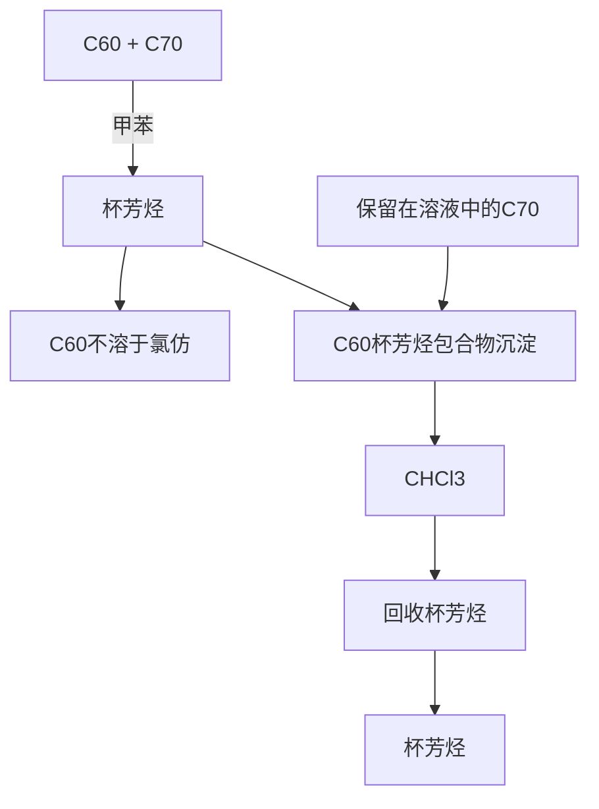
</details>

图 5.76 基于杯芳烃纯化 $C_{60}$ 和 $C_{70}$ 混合物

![[超分子化学135章_images/97c498ada5196bb75d5ed132d1be396a8bd01f91e48248b489dd25018b2390dd.jpg]]

<details>
<summary>chemical</summary>

Chemical structure of a bisphenol derivative with R group and hydroxyl substituent
</details>

六氧杯[3]芳烃  
(5.137)

![[超分子化学135章_images/1bd57d55eae578fd2b6e176a462e390e519871a3e3686fc552549fb5fdd55f52.jpg]]  
tryptycene   
(5.138)

![[超分子化学135章_images/0943ec862f9b17852868ef774791768da433048bdcb5eef70aacfbfc9ea9a3a6.jpg]]

<details>
<summary>chemical</summary>

Chemical structure of a siloxane-based organometallic compound with cyclopentadienyl and phenyl substituents
</details>

八苯环四硅氧烷   
(5.139)

![[超分子化学135章_images/cac01d16b3b9b8546835e63ae44ecbab0741fc265ac7cd3a9e547b3bc9b4df81.jpg]]

<details>
<summary>chemical</summary>

Molecular structure diagram showing two cage-like frameworks with carbon and hydrogen atoms
</details>

(a)

![[超分子化学135章_images/58d4bd72e846041c18b232639fa89407bd50ed0a9b1ba7660748393323f6ab56.jpg]]

<details>
<summary>chemical</summary>

Molecular structure diagram showing two large spherical clusters connected by a chain, with smaller molecular fragments attached.
</details>

(b)   
图 5.77 X 射线晶体结构：(a) 杯[6]芳烃· $\left(\mathrm{C}_{60}\right)_{2}$ ;  
(b) 杯[6]芳烃·(C $_{70}$ ) $_{2}$ (Atwood et al, 1998)

![[超分子化学135章_images/ad8726bdab5d8f6147459751aadc64463ba7dea1fded4c44511438a7cab1b4d8.jpg]]

<details>
<summary>chemical</summary>

Complex molecular structure diagram showing interconnected aromatic rings and functional groups
</details>

图5.78 主体 $\mathrm{C}_{60}$ 氢醌包合物网状结构的X射线晶体结构

与 $\gamma$ -环糊精形成的不连续的 1:1 和 2:1 络合物也已经有报道 (Andersson et al, 1992)，大的环糊精可以用来在水中溶解 $C_{60}$ 和 $C_{70}$ ，浓度只有 $10^{-4}$ mol/L 的数量级，产生浅黄色溶液，与富勒烯在类似于苯和甲苯的芳香溶剂中的深红色和紫色形成对比。Modelling 认为富勒烯的五重轴平行于环糊精的假八重轴方向。

另外，氢醌和 $C_{60}$ 形成 3:1 的包结化合物 $3\left[\mathrm{C}_{6}\mathrm{H}_{4}(\mathrm{OH})_{2}\right]\cdot\mathrm{C}_{60}$ 。事实上，氢醌晶格里空穴的尺度（约 $10\mathring{A}$ ）和 $C_{60}$ 的大小十分接近；再者，氢醌的富电子性质互补于缺电子的 $C_{60}$ 。 $C_{60}$ 表面和氢醌芳环间的层距离为 3.1Å，表明是最适宜的 π-π 堆积（图 5.78）。6 个等同的氢醌在苯里和纯 C $_{70}$ 反应，生成红褐色晶体，组成为 9[C $_{6}$ H $_{4}$ (OH) $_{2}$ ]·2C $_{70}$ ·2C $_{6}$ H $_{6}$ ，它采取一种更加复杂的结构，以适应橄榄球形 C $_{70}$ 分子和氢醌不同空间堆积的需要。

![[超分子化学135章_images/ebe719aa0e2d8ed9920b6399f9ce53b1176cf9bfb91d045c65c1fa86ac9febf5.jpg]]

Diederich F, Gómez-López M. Supramolecular Fullerene Chemistry. Chem Soc Rev, 1999, 28: 263\~277

# 5.4.2 主体富勒烯

已知富勒烯能形成许多金属有机络合物，例如 $\left\{\left[\mathrm{Pt}\left(\mathrm{PEt}_{3}\right)_{2}\right]_{6}\left(\mathrm{C}_{60}\right)\right\}$ ，其中， $C_{60}$ ， $C_{70}$ ，甚至 $C_{82}$ 这样的物质，本身都可以作为每个过渡金属中心的单齿配体。金属中心通过一个富勒烯 C=C 键（富电子的‘6-6’键比长的‘6-5’键更适合）连接在富勒烯外表面上（图 5.79）。总之，这些物种超出了本书的范围。尽管一个特殊的铱络合物已经以一种富有想象力的方法产生自补的 $C_{60}$ 基主体（Balch et al., 1992）。络合物 $\left[\mathrm{Ir}\left(\eta^{2}-\mathrm{C}_{60}\right)(\mathrm{CO})\mathrm{Cl}\left(\mathrm{L}\right)_{2}\right](\mathrm{L}=\mathrm{Ph}_{2}\mathrm{PCH}_{2}\mathrm{C}_{6}\mathrm{H}_{4}\mathrm{OCH}_{2}\mathrm{Ph},(5.140))$ 伸出两个富电子苄基醚“手臂”，可以包住邻近的 $C_{60}$ 配体（图 5.80）。

![[超分子化学135章_images/08a3c42659753fccf1bc7e7fc9432ef6db0a520b8f3a67f24ac6c292fe5ea2bb.jpg]]

<details>
<summary>chemical</summary>

Chemical structure of a phosphorus-containing organic compound with two phenyl groups and an ether linkage
</details>

(5.140)

![[超分子化学135章_images/a86156c1a9bc50b6d54ae42e6c342544171c5fa7f15c23b4a098955287464e33.jpg]]

<details>
<summary>text_image</summary>

6-6键
6-5键
</details>

图 5.79 一个 $C_{60}$ 半球所示的 ‘6-6’ 和 ‘6-5’ 键的投影

![[超分子化学135章_images/e0fdcdcd8a9b1d49c492f3c5e47411b07136bc2b1077fa0fb677e3b802b3f168.jpg]]

<details>
<summary>chemical</summary>

Molecular structure diagram showing a chain of carbon-based molecules with hydrogen bonding interactions
</details>

图5.80 $\left[\mathrm{Ir}(\eta^2 -\mathrm{C}_{60})(\mathrm{CO})\mathrm{Cl}(5.135)_2\right]$ 的X射线晶体结构示出的自包结

最近，苏黎世 ETH 的 Francois Diederich 得到了基于 buckminsterfullerene 的氧化还原传感器件(5.141)。这种新奇的传感器（产率高达 50%），拥有一个二苯并[18]冠-6 空穴，可以加强和富勒烯表面的紧密接触。 $K^{+}$ 与冠醚空穴的络合，致使富勒烯第一还原反应（ $C_{60}\rightarrow C_{60}^{\cdot-}$ ）产生相对较大的阳极位移（90mV），说明 $K^{+}$ 与富勒烯的接近，使得它更容易还原成单阴离子。X 射线晶体图谱已经证实，冠穴内“绑着”的 $K^{+}$ 靠近富勒烯的外表面。

![[超分子化学135章_images/69157581af345db6d1993419d060dbe27a160ef0a7e90ebc85d1458f2343eacb.jpg]]

<details>
<summary>chemical</summary>

Molecular structure of a K+ ion complex with a fullerene-like cage and aromatic rings
</details>

(5.141)

金属阳离子和中性原子在富勒烯空穴内络合产生一个“受限的”金属原子，这种可能性是超分子化学家非常关注的。 $C_{60}$ 的空穴大约为 $7\AA$ ，足够大，至少可以包结单原子客体。较大的富勒烯，例如 $C_{70}$ 和 $C_{82}$ ，期望可以包结不止一个原子，甚至是小分子客体。很明显，像 $C_{60}$ 这样的包含五元环和六元环的封闭结构分子，没有一个足够大的入口，在正常的化学反应条件下，甚至单个原子也不能通过，因此需要改变思路。事实上，富勒烯包合物，指定为 $M@C_{x}$ （M 指客体，通常是金属原子； $C_{x}$ 是富勒烯，x=60，70，74，82 等），是在合成富勒烯过程中，在金属原子蒸气存在下或高能双分子碰撞条件下，通过笼闭合产生的。几乎在发现富勒烯的同时，Smalley 已经能够合成 $M@C_{60}$ （M=La，Ni，Na，K，Rb，Cs）以及许多 $C_{70}$ ， $C_{74}$ 和 $C_{82}$ 的其他镧系络合物。富勒烯腔内金属原子的包结证据来自于，这些通常含有很强还原性金属的化合物，却对 $O_{2}$ 、 $NH_{3}$ 和 $H_{2}O$ 表现出惰性。这些金属原子被周围的笼保护起来。宏观数量的 $La@C_{82}$ 被分离出来，X 射线光电光谱示出其组成为 $La^{3+}$ （La 的最稳定氧化态）和 $C_{82}^{2-}$ ，还有占领空穴的自由电子，在这里，富勒烯被金属还原为 $C_{82}^{2-}$ （富勒烯具有十分丰富的电化学性质， $C_{82}^{2-}$ 被认为是特别稳定的）。因而， $\mathrm{La@C_{82}}$ 是一种不同寻常的电子体（electride，比较3.12节）。双金属络合物 $\mathrm{M}_2@\mathrm{C}_{80}(\mathrm{M}=\mathrm{La},\mathrm{Y})$ 也已合成出来，并且被认为它们也许是超导金属富勒烯。

![[超分子化学135章_images/6cf154a8d17dd2761918e1dd9232e96acdfaa4fe6c15d8c0a4e9283ae8c8794d.jpg]]

Schwartz H. C $_{60}$ -Fullerene-A Playground for Chemical Manipulations on Curved Surfaces and In Cavities. Angew Chem Int EdEngl, 1992, 31: 293\~298

# 5.4.3 富勒烯作为超导插合物（intercalation compound）

不论内置（endohedral）金属富勒烯的性质如何，许多超导富勒烯与碱金属离子的插合物被合成出来，在高达 33K（CsRbC $_{60}$ ）的温度下显示出超导性能，尽管与陶瓷类无机超导体（钇、钡、铜氧化物）相比并不是很突出。陶瓷类无机超导体在液氮存在温度（>123K）之上仍具有很好的导电性。与石墨不同，富勒烯可以被碱金属轻易还原为 $M_{x}C_{60}$ （M = Na, K, Rb, Cs, Ba, Ca 等；x = 1, 2, 3, 4, 6），其中，最为著名的两个结构 $K_{3}C_{60}$ 和 $K_{6}C_{60}$ ，分别采用面心立方和体心立方结构（图 5.81）。这些化合物通过 $C_{60}$ 和还原剂如 $NaBH_{4}$ 反应来合成，被认为是由富勒烯阴离子和碱金属阳离子组成，

![[超分子化学135章_images/e4c0183bc33d026e26074bab0d8c3fb4c9d2c7fb5762eac6b4b3f3ab81f8515e.jpg]]

<details>
<summary>chemical</summary>

Molecular structures of K₃C₆₀ and K₆C₆₀ showing fcc and bcc configurations with atomic arrangements
</details>

图 5.81 富勒烯插合物 $K_{3}C_{60}$ 和 $K_{6}C_{60}$ 的结构示意图

阳离子占据富勒烯晶格内的四面体和八面体位点。

![[超分子化学135章_images/a1380925cdef926fcf6386e2c9c39db0a84f56d9de99f13ad372899497023561.jpg]]

Okino F and Touhara H. Graphite and Fullerene Intercalation Compounds. In Comprehensive Supramolecular Chemistry. Atwood J L, Davies J E D, MacNicol D D and Vogtle F (eds). Vol7. Oxford: Pergamon, 1996. 25\~76

# Box 5.3 富勒烯的发现

1985年以前，碳已知的晶形有6种：两种形式的石墨，两种形式的金刚石，以及在1968年和1972年分别发现的chaoit和C（VI）。此外，还有许多几乎纯的无定形存在，如：聚乙炔(5.142)，累积多烯(5.143)。富勒烯代表唯一的碳的真正纯分子形式，它是在极端条件下，在惰性气体（如He）氛围下碳蒸气凝聚而形成的。Harold Kroto对该化学领域的兴趣，始于微波谱研究大气的“星云”和“星际尘埃云”现象。Kroto于 $1975\sim 1978$ 年在宇宙检测到碳氮化合物聚乙炔腈，(5.144）的光谱，他试图在实验室里重复，Smalley有使金属原子汽化的仪器，可通过质谱检测仪研究金属簇，Kroto与Richard Smalley联系，他们一起把这种手段应用到石墨。质谱结果（图5.82）很令人振奋，它显示出了许多符合碳簇的峰，但是这些相应于 $\mathrm{C}_{60}$ 和 $\mathrm{C}_{70}$ 的峰位于其余峰之间，这暗示着这些簇团要更稳定一点。

<table><tr><td>H[≡]n=—H</td><td>H₂C[≡]nCH₂</td><td>H[≡]nC≡N</td></tr><tr><td>聚乙炔
(5.142)</td><td>累积多烯
(5.143)</td><td>聚乙炔腈
(5.144)</td></tr></table>

对于 m/z720（和 $C_{60}$ 一致）峰的特殊稳定性，研究者们一开始感到有点困惑，不知如何解释。意识到这也许是一个封闭的簇团之后，这个研究小组马上花了一晚上，试图用六边形纸片拼凑起来，并用牙签把胶质软糖连接起来。研究者们幸运地从Kroto拥有的“星状圆顶”（star-dome）模型中的意识到一个很重要的因素：可能五边形的面也需要。他们最终能够获得了完美的60个顶点的球形固体（截角二十面体），即 $C_{60}$ 的结构，由12个五边形和20个六边形构成（图5.83）。这种分子和Kroto的“星状圆顶”，以及欧洲足球，还有和建筑师R.Buckminster.Fuller的网格球顶的结构非常相同。新的分子以他的名字命名为Buckminsterfullerene，与此相关的文章立即被报道。与它密切相关的 $C_{70}$ 是一个圆柱状分子，和 $C_{60}$ 有着相同的结果（ends），但是在中间多一个六边形。事实上，要使任何这类固体结构封闭，12个五边形是必需的，仅有六边形是不能完成的（Euler's定律）。

![[超分子化学135章_images/ecb135ef61827a32fbb79b7052b96f36d9223279e0a90beb9c08bef251ea7902.jpg]]

<details>
<summary>line</summary>

| X    | Y     |
| ---- | ----- |
| 44   | 0.0   |
| 52   | 0.0   |
| 60   | 1.0   |
| 68   | 0.1   |
| 76   | 0.05  |
| 84   | 0.0   |
</details>

(a)

![[超分子化学135章_images/c7acd488411a77ef6841e0fcc6cc3ac9699376a3567383c2baa662c6598959bd.jpg]]

<details>
<summary>line</summary>

| Wavelength (nm) | Intensity |
|---|---|
| 44 | ~0 |
| 52 | ~0.5 |
| 60 | ~1.0 |
| 68 | ~0.7 |
| 76 | ~0.3 |
| 84 | ~0.1 |
</details>

(b)

![[超分子化学135章_images/06a28e8002642be0cade2193290a07d41703b67785cbbd49ebe6749aec19a38e.jpg]]

<details>
<summary>line</summary>

| x  | y    |
|----|------|
| 44 | 0.1  |
| 52 | 0.3  |
| 60 | 0.5  |
| 68 | 0.4  |
| 76 | 0.3  |
| 84 | 0.2  |
</details>

(c)   
每簇的碳原子数  
图 5.82 由石墨蒸气生成的富勒烯混合物的质谱  
其尺寸的分布受“化学沸腾”的数量增加的显著影响，平衡达到热力学最小能量结构 $C_{60}$   
摘自：Kroto H W, Heath J R, Obrien S C et al. C-60-Buckminsterfullerene.   
Nature, 1985, 318 (6042): 162\~163

![[超分子化学135章_images/69f2dbd6004977dd4d7be997d908bea05012ba85366f6b05afa39a823338591b.jpg]]

<details>
<summary>natural_image</summary>

Close-up of a white, textured object with no visible text or symbols
</details>

图5.83 Smalley由六边形和五边形纸张产生的第一个 $\mathbf{C}_{60}$ 模型  
摘自：Kroto H W. C $_{60}$ ：BuckminsterFullerene，  
the Celestial Sphere that fell to Earth. Angew   
Chem Int Ed Eng, 1992, 31: 111\~129

富勒烯的发现引来了狂热和敌意。因分子只存在于质谱仪中，许多研究者表示怀疑。1990年大量的 $C_{60}$ 被分离出来， $^{13}C$ NMR可以测定此化合物，使这个分子最终得以确证。正像人们所预期的， $^{13}C$ NMR谱是一条单线（在143处）， $C_{60}$ 中所有的原子是均等的。

Kroto H W. C $_{60}$ : BuckminsterFullerene, the Celestial Sphere that fell to Earth. Angew Chem Int Ed Eng, 1992, 31: 111\~129

![[超分子化学135章_images/9b244fa16fa0f39d4c5904f813e24b8fc6d8d46301d94e23c35161333060a679.jpg]]

# 习题

5.1 穴番-A 在 $(\mathrm{CH}_{2}\mathrm{Cl}_{2})_{2}$ 中对甲烷的络合常数是 130L/mol， $(\mathrm{CH}_{2}\mathrm{Cl}_{2})_{2}$ 不被其空穴络合。计算它们在 $CHCl_{3}$ 中的络合常数，假定这种溶剂的 $K_{s}$ 是 10L/mol，液态 $CHCl_{3}$ 在 25℃时的密度是 $1.48g/cm^{3}$ 。  
5.2 一个大 carcerand 的空穴体积为 $120\mathring{\mathrm{A}}^3$ ，如果甲烷分子的体积是 $28.5\mathring{\mathrm{A}}^3$ ，甲烷和其主体为 $1:1$ 结合，那么占有率 $\rho$ 为多少？要使占有率为 0.67，主体体积是多少才能和固态甲烷一致？计算单个甲烷分子在一个这么大小的腔内的理论压力，你认为这种 carceplex 可能形成吗？  
5.3 假设 I 型包结水合物里有 $5^{12}$ 型空穴，其结构近似于球形（半径 3.91Å），计算一个甲烷分子被包入一个空穴内时的占有率和理论压力。如果为 $5^{12}6^{2}$ 型空穴（半径 4.33Å）又会怎样呢？你认为甲烷最可能占据哪个空穴呢？  
5.4 对于纯粹基于[4]resorcarenes的小carcerands，如(5.115)，为什么观察不到carcerism?  
5.5 依据第1章中讨论的预组织原理，解释分子镊子(5.76)～(5.78)中甲基取代物的作用。  
5.6 根据化合物(5.84)和(5.89)，命名下列环番：

![[超分子化学135章_images/5bed72e5c72f4bc4e9529aabacdc84078988e054afed870a2d010937b8ed8fbc.jpg]]

<details>
<summary>chemical</summary>

Three identical polycyclic aromatic hydrocarbon structures, each composed of fused benzene rings with methyl substituents
</details>

5.7 请给出合成[4]resorcarene(5.117)的一条可能的合成路线。

5.8 四苯烯 $\left(\mathrm{C}_{24}\mathrm{H}_{16}\right)$ ，尿素 $\left[\mathrm{CO}(\mathrm{NH}_{2})_{2}\right]$ 和对叔丁基杯[4]芳烃 $\left(\mathrm{C}_{44}\mathrm{H}_{56}\mathrm{O}_{4}\right)$ 与客体（水， $CHCl_{3}$ ，苯和 $C_{60}$ ）形成1∶1，2∶1和3∶1的包结化合物，请计算它们的质量减少百分率（由TGA分析测出）。并阐述TGA在研究这些络合物中每种的主-客体化学时有什么作用？

# 思考题

仔细阅读 5.3.6.1 节，请给出在下列客体存在时，NMP 中合成(5.113)的可能的模板比率值。要考虑到分子大小、形状以及主体-客体的相互作用如 C-H 氢键、 $\pi-\pi$ 堆积等的影响。

![[超分子化学135章_images/8f92a2b6a2eb0b660c9ede633d702ed2b7796151a905483f21864a26a7c390d5.jpg]]

<details>
<summary>chemical</summary>

Six organic molecular structures, including pyridine derivatives and heterocyclic compounds
</details>

# 参考文献

Adrian, Jr, 1991

Adrian J C, Jr and Wilcox C S. Chemistry of synthetic receptors and functional-