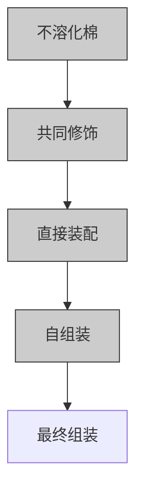
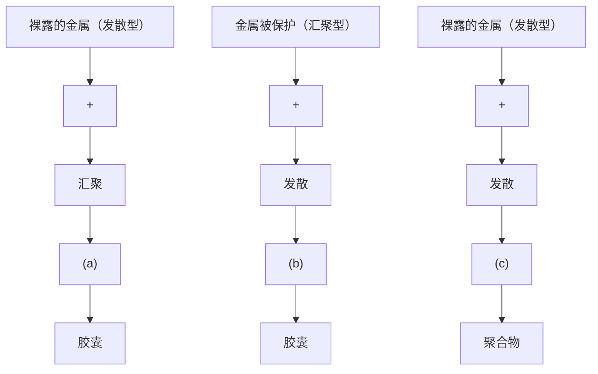
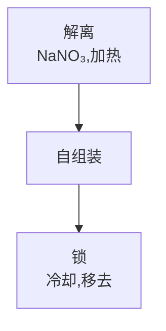
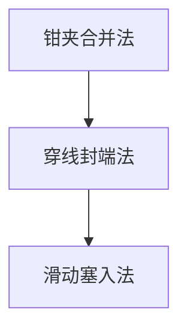
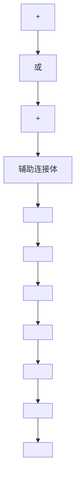
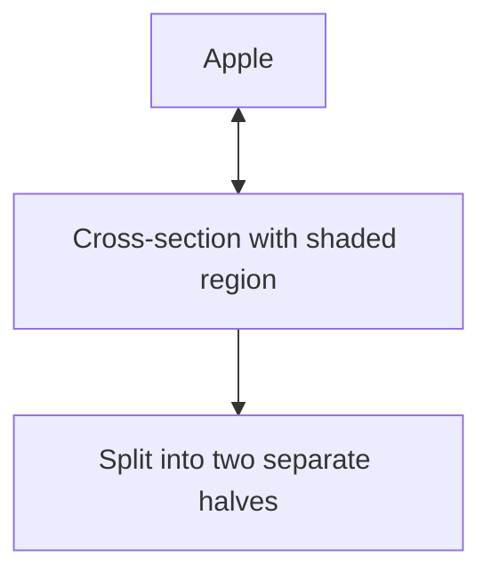

# 第 7 章 模板和自组装

“我在一间间屋子里游荡而我的主人却一直没有露面直至今日我还是不明白我到底是客人还是囚犯”

威廉·沃森（1895～1936），陌生的世界

# 7.1 引言

![[超分子化学斯蒂德,阿特伍德第七章342-417_images/dc36856f15b4aed15fbb75dac3248613626a6573a9bffb1e6e7055341e7619b4.jpg]]

Philip D and Stoddart F F. Self-Assemble in Natural and Unnatural Systems. Angew Chem Int Ed Engl, 1996, 35:1154\~1196

# 7.1.1 范围和目标

通过传统有机化学或配位化学法合成化合物（甚至小分子物种）常常是一个冗长、重复的过程。在合成过程中，每增加一个步骤，即使是产率相对高的步骤，都会有越来越多的产物损失掉。材料和专业技术方面的耗费也增长快速。确实，与化学相关的所有学科，如化学工程，其初级目标要求尽可能地简化化学品的合成。然而，许多优级纯品或精细化学品的制备往往是非常困难的；而从传统化学延伸扩展到制备中间体和大尺寸分子、分子系统和纳米机器，甚至更困难。许多超分子化学家认为，这些大的聚集体的制备为新的超小型化的计算机器件、电子器件和光学器件（第8章）的构筑做铺垫。结果，在这一预程序化（preprogramming）系统的发展过程中展开了大量的研究工作，即由易制备的小分子组分自动组合形成更大更复杂的聚集体。我们可以通过这一程序化过程来理解化学体系，在这一体系中，分子构筑单元最基本的特性，如分子尺寸、对称性以及它们结合点的电子性质，包含了选择性产生所需超结构的所有必要的信息。超分子络合物自身组装（supramolecular complex assembles itself）。

该方法为在通用的平版印刷技术（特别是在电子产业中）和分子世界可得的组分与结构规模之间的差距架起桥梁具有非常重要的潜在作用。电子器件在分子水平上的生产，不仅实现了速度和计算能力上的大幅度增长，而且也提高了来自小空间要求的多功能性。实际上，计算机硬盘已经有一个在盘的表面以25nm或200个原子飞跃的读头（read head at 25 nm or 200 atoms above the surface of the disk）。然而，为了实现其功能化，分子双稳态器件（分子开关）必须具有输入/输出功能的内部结构，这种结构对它们与外部世界的联系是很必要的。进一步说，经过数百万次的开/关循环之后，它们必须在分子水平上仍是完全可控、可逆、可读的。通用的平版印刷刻蚀技术推动了小到 $0.1\mu \mathrm{m}$ （ $100\mathrm{nm}$ ）的硅晶片组成的产生。甚至在这个水平，仍然会遇到电子隧道效应和热分散的困难，还会有更微妙的电荷载体的量子力学限制，这种限制使得每种组分都有一种不同的能量范围（依尺寸而定）。通过平版印刷术制成的组分基本控制在几十个纳米是可能的。另一方面，迄今为止合成的最大的具有很好特征的超分子已达到 $10\mathrm{nm}$ 的数量级，并且有更多更好的性质。不幸的是，它们缺乏实际器件制造所需的一套完整的功能。这意味着在电子工程和化学合成之间，在 $10\sim 1000\mathrm{nm}$ 尺寸范围内，完全定义的功能化的网络状超分子可能成为一种新型的电子设计的基础。这方面的先例源于分子生物界， $1\sim 10000\mathrm{nm}$ 大小的功能化分子器件调节着生命化学的各个方面，确实也没有人证实人造分子器件不可能像生物界中的器件一样存在。而绝大多数类似的生物化学体系，为了能够有效地利用大数量的遗传信息，都是通过自组装合成的（7.2节）。为了在电流电子和化学技术之间架起桥梁，有两种不同的办法比较重要：“engineering down（工程微小化）”和“synthesizing up（合成扩大化）”。我们已经看到，由于电流（current）工艺的限制，工程微小化策略已经没有发展空间了，因而化学工艺所面临的挑战就是发展“合成扩大化”观念，通过使用超分子技术达到所要求的尺寸和功能。

同自组装概念联系紧密的是自复制（self-replication）的观念，即一个分子或实体自身能产生复制品的能力。依此类推，生物的（无性生殖的）再生也很清楚，自复制能力被认为组成了生命的基本准则。自然界大量的例子证实了自复制是可行的，实际上是分子水平发生的、很平常的事件。生物细胞分裂包括DNA双螺旋链的解开（unwinding）和模板化合成，经由链间氢键碱基对，每条单链精确复制，产生两条新的双螺旋。DNA的一条单链包含有为精确自复制而没有出错或改动的所需要的所有信息。相比较，通过传统合成法，逐步缩合磷酸根残基，即使获得小分子的多（聚）核苷酸，也是一项非常艰巨的任务。实际上，Kary B. Millis克服了这一障碍，利用聚合酶链反应（PCR）产生寡核苷酸（以少量的寡核苷酸为模板复制生成大量的寡核苷酸的过程），Kary B. Millis在1993年因其在这一领域的贡献（见2.7.3节）获得了诺贝尔化学奖。在3.8节已经应用了模板效应，金属离子被作为简单的球形模板来组装大环有机配体。本章将讨论模板效应和母体更广义的应用，包括分子纽结，索烃和轮烷的合成在内的自组装，以及超分子化学群体为产生人造的无生命（非生物）自复制体系所做的努力。

# 7.1.2 术语学

在着手考察天然的和合成的模板组装及自组装体系之前，定义和区分一些所需要的术语是非常重要的。超分子化学的很多术语仍然处于一种快速发展的状态，许多术语可以相互交换使用，界限不明显。Jean-Marie Lehn 按不同层次给出了术语“模板化（templating）”，“自组装（self-assembly）”和“自组织（self-organisation）”。总的来说，这些术语覆盖了下面所有过程：使预程序化成分或构造子（tectons，源自希腊语 tektōn）按照特定的方式，自发地聚在一起，形成组装体，该组装体在纬度和（尽管不是必要的）时间上呈现一维、二维或三维结构。在3.8节，我们已经讨论了通过临时的或永久性的“协助者”（如：碱金属阳离子）的引入，有效地促进合成的模板效应。自组装可以包含或不包含一个实际的模板，如金属离子，因而，模板效应本身并不是严格意义上的自组装的例子。但Lehn把它划分为“在单个操作中，包含几步自发反应的自组装过程的单位阶跃（unit step)”。在自组装过程中，我们必须区分分子自组装和超分子自组装。分子自组装涉及的是在特

![[超分子化学斯蒂德,阿特伍德第七章342-417_images/48f4ad419f20761abe5639c3243ead6e2909d4b4f0ed0e20f5b11ba310e79ce4.jpg]]

<details>
<summary>natural_image</summary>

3D rendered wireframe structure resembling a twisted coiled or knotted material (no text or symbols)
</details>

图 7.1 富勒烯和碳纳米管在极端条件下的共价自组装

殊合成过程中共价键的形成，组装体受反应中间体的立体化学和构造特性的控制（如图解3.20中胺醛缩合形成的大环，或第5章穴醚的形成）。超分子自组装是指，在分子间形成的相对易变的、非共价键相互作用（如配位作用，氢键和偶极相互作用）控制下的，有限数量的构造子的定向识别的、自发可拟的结合。而系统通过可得组分形成热力学最有利的结构，其关键在于超分子自组装的可逆性。这体现了其具有自修复或缺陷（错误）改正的潜能，就像在生物体系中一样。

在共价组装和超分子组装之间，一个有趣的界面现象是富勒烯（如 $C_{60}$ 和 $C_{70}$ ）与相关物种（如在高温炭蒸气下形成的，扩展的碳纳米管）的形成（见图 7.1）。严格来讲，在不可逆共价键形成时，炭蒸气的极限条件允许一定量的可逆性（甚至在强共价键形成中），允许它们有类似于弱

的超分子相互作用在温和条件下的表现行为。

最后，术语 “自组织” 既包含了自组装实体各构造子之间的相互作用，又包括这些作用的综合结果（导致的总体行为，例如在相变化中所看到的）。

![[超分子化学斯蒂德,阿特伍德第七章342-417_images/8f0335c795ecb593c774c30663418405183af54dc578ed79e3d5b450fedccea2.jpg]]

Lindsey J S. Self-assembly in Synthetic Routes to Molecular Devices, Biological Principles and Chemical Perspectives: a Review. New J Chem, 1991, 15:153\~180

# 7.2 生物化学自组装

# 7.2.1 烟草花叶病毒（Tobacco Mosaic Virus）

在 2.8 节中我们已处理过一些生物化学自组装方面的普遍问题。然而，还有许多生物化学方面的例子，它们很容易解释超分子化学的概念，并且已经在定义这一领域中扮演着很重要的角色。烟草花叶病毒就是其中之一。该体系可以由一个大约 $300 \, nm \times 18 \, nm$ 的螺旋状病毒组成（图 7.2），中心线状 RNA 由 2130 个相同的蛋白质亚单元包围，每个亚单元由 158 个氨基酸组成。与纯粹的化学实体相比较，该病毒最显著的特点是，如果它被分解成各个组成部分，这些组成又通过物理方法混合在一起，那么该病毒颗粒能够很精确地被自组装，并恢复其所有的功能。这种自组装的作用机制已经建立，由两层蛋白质外壳亚单元（sheathsubunits）聚集形成的圆盘状模块组成。蛋白质圆盘被转换为2个由RNA引入圆盘中心洞穴形成的螺旋转盘，这个过程重复进行直至最终形成病毒颗粒（图7.3）。

![[超分子化学斯蒂德,阿特伍德第七章342-417_images/d1e57f6309ab0adf5e74166e7b509d25f8a51183828401c35357990151a9d1e4.jpg]]

<details>
<summary>natural_image</summary>

Microscopic image of a linear fiber or rod with 1000Å scale bar, showing surface texture and particle distribution (no text or symbols beyond scale indicator)
</details>

(a)

![[超分子化学斯蒂德,阿特伍德第七章342-417_images/3161361cae849eede8128de0f455a72afc075dbe8ac9e36b7d2d315985b39956.jpg]]

<details>
<summary>natural_image</summary>

Illustration of a stylized dragon coiled around a sea (no text or symbols)
</details>

(b)   
图 7.2 烟草花叶病毒电子显微照片（a）及其示意图（b）  
摘自：Philip D and Stoddart J F. Self-assemble in Natural and Unnatural Systems. Angew Chem, Int Ed Engl, 1996, 35: 1155\~1196

![[超分子化学斯蒂德,阿特伍德第七章342-417_images/f41b1203778b62906c30a4d2b2a53a4685cd666263a7e9ca72813a005ac31835.jpg]]  
(a)

![[超分子化学斯蒂德,阿特伍德第七章342-417_images/337024c6fab505ead1d80068e5af6398661cd1832aa3cacaae98d8e9f931ee6f.jpg]]  
(b)

![[超分子化学斯蒂德,阿特伍德第七章342-417_images/073beec4b519d72c29076af445d0cb30c8b905c5b2d27285437c118b20aee1a6.jpg]]  
(c)

![[超分子化学斯蒂德,阿特伍德第七章342-417_images/260fc0a629cdbcd30d7cbaba61c0732ec3c200c3a73c74bb3a29280535d5af90.jpg]]  
(d)   
图 7.3 烟草花叶病毒逐步自组装（a～c）  
摘自：Philip D and Stoddart J F. Self-assemble in Natural and Unnatural Systems. Angew Chem, Int Ed Engl, 1996, 35: 1155\~1196

这种汇聚式模板化病毒组装法（相同的亚单元组装成一个完整的实体）具有很大的优势，即与独自编码每个剩余物的方法相比，该方法需要较少的遗传信息来编排组装体的形成。烟草花叶病毒的生成肩负着阐述其在非共价相互作用中所发挥的作用。整个自组装过程主要由氢键、静电作用、疏水作用以及其他弱相互作用的协同作用所驱动。最终得到的是热力学产物具有较高的生成平衡常数。所谓的弱相互作用是指在自组装过程中，如果发生组装错误，错误能够自动纠正过来。因为该过程是可逆的，“错误的”产物不像正确组装的产物那么稳定。

# 7.2.2 严格自组装（Strict Self-Assemble）

烟草花叶病毒的自组装属于严格自组装，因为它利用的全部是纯粹的非共价键相互作用。严格自组装是与具有共价键修饰的自组装相对而言的。在严格自组装过程中，当各组分在给定的反应条件下（如温度、pH、浓度等）按照一定的比例混合在一起时，最终产物是完全自发产生的。产物的形成必须是可逆的，代表体系的最小热力学性质。实质上，自组装发生所必需的所有信息都被编译到组成成分里了。

DNA 双螺旋的形成是严格自组装的典范（图 2.25），是由核酸碱基对（如鸟嘌呤和胞嘧啶等，见图 2.29）通过氢键自发组装而成的。“zipping-up”双链螺旋结构的热力学是很有趣的，因为两条螺旋链的结合导致了热力学不利的熵减小，而这又可能是热力学上需要克服的很重要的障碍。对相对小的模型体系，如核酸 $(A)_{17}$ 和 $(U)_{17}$ 的互补碱基对腺嘌呤和尿嘧啶的研究显示，两条链盘旋形成双螺旋结构是分两步进行的。首先是晶核的形成，紧接着是分级繁衍（cascade propagation sequence），最终形成双螺旋（图7.4）。晶核的形成使两条链相互靠近，程度取

![[超分子化学斯蒂德,阿特伍德第七章342-417_images/ecf8d05192c344457f438275c164eada8f71546c13b8c39452eef0cd545ce47c.jpg]]

<details>
<summary>flowchart</summary>

```mermaid
graph LR
    A1["A"] -->|U| A2["A"]
    A2 -->|U| A3["A"]
    A3 -->|U| A4["A"]
    A4 -->|U| A5["A"]
    A5 -->|U| A6["A"]
    
    subgraph '成核'
        A1 --> A2
        A2 --> A3
        A3 --> A4
        A4 --> A5
        A5 --> A6
    end
    
    subgraph '增长过程'
        A1 --> A2
        A2 --> A3
        A3 --> A4
        A4 --> A5
        A5 --> A6
    end
    
    Note: The diagram illustrates a sequential transformation of nucleation into expansion process.
```
</details>

图 7.4 腺嘌呤和尿嘧啶核酸双螺旋自组装过程

决于热力学不利的熵函数，因为热力学碱基对之间因氢键的形成而产生的热力学有利的焓变相对可以忽略。一旦发生晶核的形成，每个新的碱基对的结合将会导致热力学有利的焓的进一步大量增长，而熵基本不变，最终形成完整的双螺旋（图7.5）。

![[超分子化学斯蒂德,阿特伍德第七章342-417_images/9a9f697d02ae8a2305f3c5ac649ca9fe08d57c4d342361bcecbd84bf4bdea48c.jpg]]

<details>
<summary>line</summary>

| 碱基对数目 | 能量 (相对尺度) |
| ---------- | --------------- |
| 0          | 0               |
| 1          | ~1.5            |
| 2          | ~2.0            |
| 3          | ~2.5            |
| 4          | ~3.0            |
| 5          | ~3.5            |
| 6          | ~4.0            |
</details>

图7.5 核酸双螺旋自组装的能量与碱基对的增加数目之间的关系

# 7.2.3 共价修饰的自组装

“共价修饰的自组装”（Self-Assembly with Covalent Modification）通常是指体系中共价键连接的生成是不可逆的。因而，与严格自组装不同，它的最终产物不要求具有热力学最小的结构。图7.6展示了包括前体（precursor）加工的这类自组装概念的卡通示意图。两个自组装组分只有在其中之一的前体发生共价键化学反应时，它们之间才能发生互锁（interloc-

king)。这可能会导致其大小、形状或定位、或者阻碍效应的移去，这样这两个亚结构单元才能够自由地自组装。共价键修饰的自组装也可能会涉及到后组装过程，即共价修饰后得到的复合物前体通过非共价作用进行组装。这可以看作一种模板效应，实际起模板作用的结构片段在自组装初期是必需的，当反应结束不再需要模板时可以移去。哺乳动物荷尔蒙的生物合成是生物学上模板自组装的一个极好例子。胰岛素是两个多肽链（A和B）通过一对二硫化物桥相连而组成，这些-S-S-桥的还原就使得胰岛素分子断裂。然而与烟草花斑病毒不同，胰岛素的单个多肽链中没有进行自组装所必需的信息，因而再次氧化后也不能得到活性胰岛素。其实，胰岛素的合成是由前胰岛素原和大量的多肽经过两次后转换加工处理（post-translational processing）而得到。前胰岛素原能够通过非共价作用自组装成一定的构造式，这种构造式能使初生胰岛素的碎片 A 和 B 按照正确的方式排列；然后，这两条链就通过 2 个二硫化物连接（-S-S-）不可逆地形成前胰岛素。随着两条链的牢固结合，多余的多肽就被移去形成最终产物（见图 7.7）。

![[超分子化学斯蒂德,阿特伍德第七章342-417_images/ae3e0d33cce26968f410ffadbe19cfc8cdd4634d615ed213da4acc88d25f4699.jpg]]

<details>
<summary>flowchart</summary>


</details>

图 7.6 共价修饰和自组装的组合

![[超分子化学斯蒂德,阿特伍德第七章342-417_images/3860e698453c58fa57a1d77d2ee7a93f9ddf546410ae10ebcdcb5f44749f5d42.jpg]]

<details>
<summary>chemical</summary>

Diagram illustrating the formation of a membrane from pre-epidermal and epidermal states, showing CO₂⁻ migration and structural changes.
</details>

图 7.7 胰岛素通过共价键修饰的自组装生物合成

# 7.3 合成体系中的自组装——热力学和动力学影响

# 7.3.1 合成中的模板效应

在 3.8 节，我们讨论了有关大环合成中的热力学和动力学模板效应。在动力学模板效应控制下，相对刚性的和受限的几何结构中的反应物与金属离子模板之间结合的强弱将影响环合反应的产物分布。严格来讲，在优势条件下反应不应该是可逆的，因为模板化的物种不可能是热力学最稳定的反应产物。实际上，在 3.9 节的合成过程中，必须考虑不利的大环内相互作用的代价，金属配体络合常数受大环效应影响而增加的根源就在于此。合成模板就是为了使我们能够通过“预支付（pay in advance）”能量来获取络合能力。金属离子作为动力学模板已被广泛采用，并且是一种为控制产物结构而采用的产生多组分有机体的很好的方法。有些金属离子（如过渡金属离子），往往有其特定的配位构型（如：四面体，平面正方形，八面体等），因而金属离子的改变可能会对模板化产物产生极大的影响。金属离子模板化合物通常被认为是共价修饰自组装的例子。例如：含铁的细胞模拟 [见化合物(7.1)] 合成（McMurray et al，1989）受八面体 $Fe^{3+}$ 模板的影响，大二环产物是以 $Fe^{3+}$ 的络合物形式出现的，该络合物很难与 $Fe^{3+}$ 分离开。

![[超分子化学斯蒂德,阿特伍德第七章342-417_images/1603c6107c55366e1d07542418817e152f0a5cd3588e61fc42fb839b8d5fffac.jpg]]

<details>
<summary>chemical</summary>

Chemical reaction equation showing Fe³⁺ complex undergoing nucleophilic substitution with 1,2-dichloro-4-methylamine under specified temperature and day conditions
</details>

相反，在反应过程中能与氧、氮或硫形成弱共价键的非金属元素硅、锡锑或硼等代替金属离子，生成的模板化产物通过简单水解即可得到无金属产物。由于键合的 N, O, S 保持一定的亲核性，这些“共价模板反应”（M-X 是共价键）具有一定的优点。如图解 7.1 所示：第 1 步，四面体四异氰酸硅和乙二醇缩合生成分子 (7.2)；第 2 步，螺环中间体和 C(=O)Im₂ 反应得到大环的硅络合物 (7.3)；第 3 步，水解得到自由的大环产物 (7.4)。

![[超分子化学斯蒂德,阿特伍德第七章342-417_images/8f4e139ed49a6df7de1b1f9bdb80f1c05c0d43885107b2bda074ec9c04d044b4.jpg]]

<details>
<summary>chemical</summary>

Chemical reaction scheme showing the synthesis of compounds (7.2) and (7.3) from a siloxane precursor, with reagents and structural changes labeled.
</details>

图解 7.1 十八元环的共价模板合成

其他的非金属阳离子也可以作为模板试剂，例如沸石和多孔硅可以通过钾离子和较大的铵离子作为模板合成；较大的多氧钒酸盐笼以 $Cl^{-}$ 或 $Cl^{-}$ 和 $NH_{4}^{+}$ 的组合作为模板来合成。

相反，大环合成中的热力学模板效应，就是离子模板存在热力学稳定作用，或者是从平衡体系中通过沉淀等方法移去其中一个特殊产物（通常是环），驱使平衡达到热力学最小值。由此我们可以得出如下结论：根据 Le Chatalier 原理（在平衡态，反应体系会朝着减小外部条件改变所造成的影响的方向移动），任何热力学稳定化因素都可能使平衡混合物向特定的产物方向移动。

共价修饰逐步自组装过程受动力学和热力学合成模板效应的共同影响。静电作用很容易被应用到这种模板作用中，例如在更常见的环状化合物包括相互贯穿的索烃化合物的合成中。富电子和缺电子芳烃环之间面对面的 $\pi-\pi$ 堆积静电作用，已经被用来诱导在独立的大环空腔内芳环相互穿插（interpenetration）（如图 7.8）。如果得到的包合物可以环合，结果就得到了相互贯穿的索烃（即像线穿过针一样，一个大环不可逆地穿过另一个环）。另外，大

![[超分子化学斯蒂德,阿特伍德第七章342-417_images/0829b58fa795a9e26defe090ead3449d48ed87df1a5eaa3bab106a0d35610e8b.jpg]]

<details>
<summary>chemical</summary>

Chemical structure of a macrocyclic compound with labeled functional groups: 富电子对甲氧基二取代前体 and 缺电子的双(二吡啶)主体
</details>

图 7.8 富电子索烃或轮烷前体贯穿缺电子大环

体积的端基加成得到轮烷，在轮烷分子内像线一样的客体分子不可逆地穿过环状主体分子。通过 $\pi-\pi$ 堆积作用最初得到的包合物是热力学自组装的例子，而接下来把组分固定在其位置的共价环合或盖帽反应（capping reaction）是受动力学控制的。索烃合成的第二步动力学过程是在高度稀释条件下，在较弱的洞穴 $\pi-\pi$ 堆积作用协助下完成的。一旦第二步动力学控制过程完成，就不再需要模板相互作用，尽管模板可以不移去。有关索烃和轮烷详细的化学性质将在7.6节介绍。

正像我们在生物体系中看到的一样，氢键也是一种强有力的模板力。虽然单个的氢键可能只是相对较弱的相互作用，但是一列氢键以互补方式排列就能够稳定较大的聚集体。氢键相互作用已被用在第一个自我复制体系的研制中（见7.9节）。在这些自动催化分子中，一个自补（self-complementary）酰胺衍生物能在它自身和两个前体之间组成热力学控制的三元络合物。这些前体在三元组装体中相互接触且被很好定位，然后反应生成模板分子的复制品。这些体系再一次利用了热力学自组装伴随着动力学共价修饰的模板效应。

![[超分子化学斯蒂德,阿特伍德第七章342-417_images/1c6e97cfa9aac9704bccb14732ab0f74cb5dc6292807ae2a0a9fc3ede8f6cfc3.jpg]]

Busch D H, Vance A L and Kolchinske A G. Molecular Template Effect: Historical View, Principles and Perspectives. in Comprehensive Supramolecular Chemistry. Vol 9. Atwood J L, Davies J E D, Macnicol D D, Vögtle F (eds). New York: Pergamon, 1996. 1\~42

# 7.3.2 一个热力学模型——锌卟啉络合物自组装

与“开放的”配位聚合物相对的是关闭的、环状的低聚物（如二聚体，三聚体，四聚体等），而锌卟啉络合物(7.5)～(7.7)（见图7.9）就很好地验证了这些低聚物自组装的热力学。化合物(7.5)～(7.7)都能在特定条件下由其组成单体在热力学控制下自发地自组装得到。它们的形成完全是受平衡驱动的，因为在室温有机溶剂（如 $CH_{2}Cl_{2}$ ，甲苯等）里， $Zn^{2+}-N(pyridyl)$ 键是相对易变的（快速、可逆的断裂和重新形成），这归因于 $Zn^{2+}$ 中心的“硬”性（Box 3.2）和Zn-N键没有任何共价成分。值得一提的是，由于卟啉的螯合作用和大环效应（1.4节和3.8节）， $Zn^{2+}$ 被牢牢地固定在卟啉 $N_{4}$ 框架内。3个彼此靠得很紧的相关环状低聚物的形成与聚合物的形成之间存在着竞争（图解7.2）。

![[超分子化学斯蒂德,阿特伍德第七章342-417_images/efecdf579e29339ef12e7181753618f6359f73815f335d673cf81acf06511084.jpg]]

<details>
<summary>chemical</summary>

Four zinc complex structures labeled (7.5) to (7.7), including a Zn group and a R-group metal cluster, with a formula for the R group.
</details>

图 7.9 闭合式的、环状的自组装锌卟啉低聚物（after Chi et al，1995）

```mermaid
graph TD
    A[" "] -->|K_open| B[" "]
    B --> C[" "]
    C --> D[" "]
    D --> E[" "]
    E --> F[" "]
    F --> G[" "]
    G --> H[" "]
    H --> I[" "]
    I --> J[" "]
    J --> K[" "]
    K --> L[" "]
    L --> M[" "]
    M --> N[" "]
    N --> O[" "]
    O --> P[" "]
    P --> Q[" "]
    Q --> R[" "]
    R --> S[" "]
    S --> T[" "]
    T --> U[" "]
    U --> V[" "]
    V --> W[" "]
    W --> X[" "]
    X --> Y[" "]
    Y --> Z[" "]
    Z --> A
    style A fill:#f9f,stroke:#333
    style B fill:#f9f,stroke:#333
    style C fill:#f9f,stroke:#333
    style D fill:#f9f,stroke:#333
    style E fill:#f9f,stroke:#333
    style F fill:#f9f,stroke:#333
    style G fill:#f9f,stroke:#333
    style H fill:#f9f,stroke:#333
    style I fill:#f9f,stroke:#333
    style J fill:#f9f,stroke:#333
    style K fill:#f9f,stroke:#333
    style L fill:#f9f,stroke:#333
    style M fill:#f9f,stroke:#333
    style N fill:#f9f,stroke:#333
    style O fill:#f9f,stroke:#333
    style P fill:#f9f,stroke:#333
    style Q fill:#f9f,stroke:#333
    style R fill:#f9f,stroke:#333
    style S fill:#f9f,stroke:#333
    style T fill:#f9f,stroke:#333
    style U fill:#f9f,stroke:#333
    style V fill:#f9f,stroke:#333
    style W fill:#f9f,stroke:#333
```

![[超分子化学斯蒂德,阿特伍德第七章342-417_images/7de266db3185624a3900148c445c6ff243f1f9aeaa27fcfe52249f60566dc572.jpg]]

<details>
<summary>flowchart</summary>


</details>

图解 7.2 敞开式(聚合物)和闭合式(环状)锌卟啉的竞争形成

整个体系可以用下面的量来表示：

$$
K _ {\text {closed}} = \frac {[ \text {环} ]}{[ \text {单体} ] ^ {n}} \tag {7.1}
$$

含有 n 个单体的环状低聚物自组装平衡常数。

$$
K _ {\mathrm{open}} = \frac {[ n \text {聚体} ]}{[ (n - 1) \text {聚体} ] [ \text {单体} ]} \tag {7.2}
$$

一个单体与含有 n-1 个单体单元的线性低聚物形成的敞开式（非环状）组合的平衡常数。这个参数是很难测量的，因为严格来说，每一步敞开式组合都应该有不同的值。再者，由于形成闭合式结构的竞争，这项阶梯式参数的测定变得更加困难。然而， $K_{open}$ 可以通过测量不能组装形成闭合式结构的 Zn（卟啉）单元与吡啶基配体的组合（association）平衡常数而估计得到。这些模型或参照物的结合常数由 $K_{ref}$ 来表示， $K_{ref} \approx K_{open}$ 。

$$
\mathrm{EM} = \frac {K _ {\mathrm{closed}}}{K _ {\mathrm{open}} ^ {n}} = \frac {K _ {\mathrm{closed}}}{K _ {\mathrm{ref}} ^ {n}} \tag {7.3}
$$

有效的物质的量浓度是一个非常有用的参数，它表示聚合物与闭合的低聚物自组装开始竞争的浓度，也就是说，它是环状结构稳定的上限。

$$
(4) \text { 临界自组装浓度   (csac) }, \text { 当 } \frac {n [ \text { 环 } ]}{[ \text { 单体 } ] ^ {n}} = 1 \text { 时,   csac } = [ \text { 单体 } ] \tag {7.4}
$$

$$
[ \text { 环 } ] = K _ {\mathrm{closed}} [ \text { 单体 } ] ^ {n} \tag {7.5}
$$

csac 是闭环结构开始自组装的最小浓度。定义为半自组装的浓度，即以完全组装复合物形式存在的单体的摩尔分数是 0.5。假设有效超临界摩尔浓度（EM csac）可以由式(7.4)和式(7.5)计算得到，代入式(7.3)，可得到 $K_{closed}$ ，则：

$$
\mathrm{csac} = \frac {1}{n ^ {\frac {1}{(n - 1)}} K _ {\text {closed}} ^ {\frac {1}{(n - 1)}}} \tag {7.6}
$$

把 $K_{closed}$ 代入式（7.6）可得出如下结果：

$$
\mathrm{csac} = \frac {1}{n ^ {\frac {1}{(n - 1)}} \mathrm{EM} ^ {\frac {1}{(n - 1)}} K _ {\mathrm{ref}} ^ {\frac {n}{(n - 1)}}} \tag {7.7}
$$

表 7.1 给出了大环锌化合物的数据，从表中可以清楚地看出，含有较少单体单元（n）的大环比较稳定，随着 n 值增大，稳定度变差。这可以由熵变得到合理解释，随着组成聚集体的单体数目增加，自由度会越来越小。这从根本上限制了能够聚在一起形成闭合结构的单体的数目。因而，可以通过设计组成环合物的低聚物单元的预组织（preorganisation）和构象自由度的减少来增加单体数目，例如，通过立体制约（steric constraint）或多重键合相互作用。

表 7.1 环(7.5)～(7.7)自组装参数（室温， $CH_{2}Cl_{2}$ ）

<table><tr><td>复合物</td><td>n</td><td> $K_{\text{ref}}/(L/mol)$ </td><td>Csac/(mol/L)</td><td>EM/(mol/L)</td><td>ε</td></tr><tr><td>(7.5)</td><td>2</td><td> $5.6 \times 10^{-3}$ </td><td> $3 \times 10^{-3}$ </td><td>6</td><td>9.3</td></tr><tr><td>(7.6)</td><td>3</td><td> $3.9 \times 10^{-3}$ </td><td> $2 \times 10^{-3}$ </td><td>100</td><td>8.7</td></tr><tr><td>(7.7)</td><td>4</td><td> $1.9 \times 10^{-3}$ </td><td> $3.3 \times 10^{-3}$ </td><td>0.6</td><td>4.5</td></tr></table>

EM 实验数据可以与理论最大值很好地吻合，理论值可由式(7.8)得到（Anderson et al, 1995）。

$$
\mathrm{EM} _ {\max} = \exp (- \Delta S _ {\mathrm{ref}} / R) \tag {7.8}
$$

参照物锌卟啉在甲苯中的 $\Delta S$ 是大约 $50\mathrm{J} / (\mathrm{K}\cdot \mathrm{mol})$ ，因此EM上限是 $400\mathrm{mol} / \mathrm{dm}^3$ 。对于三聚体(7.6)，在 $\mathrm{CH}_2\mathrm{Cl}_2$ 中的实验值 $100\mathrm{mol} / \mathrm{dm}^3$ 与理论最大值接近，意味着这个体系接近几何最优化态（即单体单元是高度互补的）。相反，对于二聚体(7.5)，类似环张力这样的影响因素会对其最小值有所贡献。

总的来说，EM 和 casc 可以看作浓度窗口，超越这个窗口，闭合式的自组装结构是热力学稳定的。这个窗口越宽，复合物就越稳定。因此自组装过程的总效率 ( $\varepsilon$ ) 可以由 EM 和 csac 来表示。

$$
\epsilon = \lg \left(\frac {\mathrm{EM}}{\mathrm{csac}}\right) \tag {7.9}
$$

即： $\varepsilon = \left[\frac{n}{(n - 1)}\lg (\mathrm{EMK}_{\mathrm{ref}})\right] + \frac{\lg(n)}{n - 1}$ (7.10)

![[超分子化学斯蒂德,阿特伍德第七章342-417_images/245958f0df115335ec9d9e4e04dfc5de676adbd7e169fb37546d188f7f0f71b4.jpg]]

<details>
<summary>line</summary>

| lg[Zn porph/(mol/dm³)] | 单体 | 四聚体 | 聚合物 |
| ---------------------- | ---- | ------ | ------ |
| 10⁻¹²                  |      |        |        |
| 10                     |      |        |        |
</details>

图 7.10 自组装四聚体(7.7)的液相物种分布图  
摘自：Chi X, Guerin A J, Haycock R A, et al. The Thermodynamics of Self-Assemble. Chem Commun, 1995, 2563\~2565

自组装实际可以被研究的 $\varepsilon$ 最低限大约是 4，因为在这个效率时，超过 $10^{2}$ mol/L 浓度范围的大于 90% 的组分构筑了自组装复合物。即使这样，仍有相当量的低聚物处于平衡状态。这可以很容易地从四聚体(7.7)的物种分布图得到解释（图 7.10）。

假设给定可行的参考体系的结合焓 $\Delta H_{ref}$ ，可以通过式(7.8)代入式(7.10)来获得总效率 $\varepsilon$ 的最大理论估计值。

$$
\varepsilon_ {\max} = \left(\frac {n \Delta H _ {\mathrm{ref}}}{n - 1 2 . 3 0 3 R T}\right) + \frac {\lg (n)}{n - 1} \tag {7.11}
$$

同理，csac 的最小值也可以由式(7.7)和式(7.8)获得：

$$
\mathrm{csac} _ {\min} = \frac {1}{n ^ {\frac {1}{(n - 1)}}} \exp \left[ \frac {n \Delta H _ {\mathrm{ref}}}{(n - 1) R T} - \frac {\Delta S _ {\mathrm{ref}}}{R} \right] \tag {7.12}
$$

Chi X, Guerin A J, Haycock R A, et al. The Thermodynamics of Self-Assembly. Chem Commun, 1995, 2563\~2565

# 7.4 自组装配位化合物

Jones C J. Transition Metals as Structural Components in the Contraction of Molecular Containers. Chem Soc Rev, 1998, 27: 289\~299

# 7.4.1 设计原理

进一步推广锌卟啉络合物的结果，我们发现任意种类的有方向性的相互作用（共价键、配位或氢键、离子-偶极、偶极-偶极相互作用等）自组装的超分子组装体大致可以被划分为两类：可以形成聚合物；形成分散的聚集体。两类化合物都具吸引力：像在可调控的沸石模拟物这样的领域内的聚合物类，作为 hemicarcerand 型分子反应器的环状低聚物，以及两种超分子在纳米器件中的应用。

日本分子科学研究所的 Makoto Fujita 教授指出，在含有过渡金属络合物的分子聚集体（以及推导出的含有各种定位键的聚集体）内，通过构筑单元的性质可以控制和预测要生成的聚集体的类型。更精确地说，我们更感兴趣于键的位点的性质是发散的还是汇聚的。主体被认为是由汇聚的键合位点组成的组分；相反，客体拥有发散的位点（1.1 节）。根据 Fugita 的观点，产生的主-客体复合物应该是分散的非聚合的物种，因为汇聚的主体包裹着发散的客体。进一步推理该逻辑，如果汇聚的组分不能够包裹客体，则它将形成较大的分散聚集体，直到能够包裹客体 [图解 7.3（a)]，这是由于分散组分在一定浓度范围内是热力学有利的。然而，如果使用发散型配体，则为了使得它汇聚在一起，只有金属中心被保护起来（如利用大的配

![[超分子化学斯蒂德,阿特伍德第七章342-417_images/068e204f1a179e867c174b4f5dfd04900cdf9552f5101319638d5b6e18794d2e.jpg]]

<details>
<summary>flowchart</summary>


</details>

图解7.3 胶囊和聚合自组装结构设计

```mermaid
graph TD
    A["●"] --> B["●"]
    B --> C["●"]
    C --> D["●"]
    D --> E["●"]
    E --> F["●"]
    F --> G["●"]
    G --> H["●"]
    H --> I["●"]
    I --> J["●"]
    J --> K["●"]
    K --> L["●"]
    L --> M["●"]
    M --> N["●"]
    N --> O["●"]
    O --> P["●"]
    P --> Q["●"]
    Q --> R["●"]
    R --> S["●"]
    S --> T["●"]
    T --> U["●"]
    U --> V["●"]
    V --> W["●"]
    W --> X["●"]
    X --> Y["●"]
    Y --> Z["●"]
    Z --> A
    style A fill:#f9f,stroke:#333
    style B fill:#ccf,stroke:#333
    style C fill:#cfc,stroke:#333
    style D fill:#fcc,stroke:#333
    style E fill:#cff,stroke:#333
    style F fill:#ffc,stroke:#333
    style G fill:#cfc,stroke:#333
    style H fill:#fcc,stroke:#333
    style I fill:#cfc,stroke:#333
    style J fill:#fcc,stroke:#333
    style K fill:#cfc,stroke:#333
    style L fill:#fcc,stroke:#333
    style M fill:#cfc,stroke:#333
    style N fill:#fcc,stroke:#333
    style O fill:#cfc,stroke:#333
    style P fill:#fcc,stroke:#333
    style Q fill:#cfc,stroke:#333
    style R fill:#fcc,stroke:#333
    style S fill:#cfc,stroke:#333
    style T fill:#fcc,stroke:#333
    style U fill:#cfc,stroke:#333
    style V fill:#fcc,stroke:#333
    style W fill:#cfc,stroke:#333
```

![[超分子化学斯蒂德,阿特伍德第七章342-417_images/36de9470561d0801ea511a897976ca7ba1e4695a82ebdb00e1aa1e69f9ced242.jpg]]

<details>
<summary>flowchart</summary>


</details>

图 7.11 超分子立方体的组分

体)，分散的复合物才会增加[图解7.3(b)]。因此，通俗来讲，分散的物种是通过任意（互补的）发散/汇聚对的组合形成的。最后，在双组分体系中，如果两个组分都是发散的，则必定产生聚合物。

# 7.4.2 超分子立方体（supramolecular cube）

英国 Sheffield 大学的 Jim Thomas 及其合作者在 1998 年着手利用线性间隔基（spacer）的组合来制备超分子立方体，该立方体能够提供立方边缘（edge），金字塔角（corner），并能构筑最高点（vertices）。按这种方法拆析可看出，立方体必须由8个角和12条边组成（图7.11）。

图解 7.3 中方法 b 的一个例子，选择发散的桥连配体 4,4'-二吡啶(6.38)作为“边”，中等稳定度的 Ru(Ⅱ)的络合物 $\left[\mathrm{Ru}(\left[9\right]\mathrm{ane}-\mathrm{S}_{3})\mathrm{Cl}_{2}\left(\mathrm{DMSO}\right)\right]^{2+}$ (7.8)为“角”。因为(7.8)中的 Cl 和 DMSO 配体易移去生成三个汇聚的键位点。 $[9]$ ane- $S_{3}$ 作为八面体金属中心剩余 3 个面（fac）位点的构筑基团。(7.8)和 3 个等物质的量的(6.38)反应使得不稳定的 Cl 和 DMSO 配体被 3 个 4,4'-二吡啶取代，生成 $\left[\mathrm{Ru}(\left[9\right]\mathrm{ane}-\mathrm{S}_{3})(4,4'-联吡啶基)_{3}\right]^{2+}$ (7.9)，这是由于联吡啶基的好的给体强度和 $\pi$ 电子接受能力能稳定 Ru(Ⅱ)。最关键的是，如何使得 4 个分子(7.9)进一步与 4 个等物质的量的分子(7.8)反应，产生一个闭合的、立方形的分子？一个可能的反应过程如下，在没有模板（如大体积的立方阴离子）时，形成大量的其他低聚物和聚合物，大家都不确定我们期望的立方体 $\left[\left\{\mathrm{Ru}(\left[9\right]\mathrm{ane}-\mathrm{S}_{3})\right\}_{8}\left(\mu-4,4'-bipyridyl\right)_{12}\right]^{16+}$ (7.10)生成的原因。如图解 7.4 所示，反应进行中，最先得到一个很复杂的混合产物，然而，回流一个多月后，产物分布逐渐地简单化，直到最后 $^{1}H$ NMR 图谱显示出单一的联吡啶配体峰值，说明自组装形成了立方体结构（图 7.12）。

这样一个很显然是违背熵平衡的有序的对称性分子的生成，是化学“自然选择”过程的产物。20个组分（8个角，12条边）同时组装，特别是在缺乏动力学模板的条件下，在统计学上是极不可能的。然而，因为Ru(Ⅱ)是半稳定态离子，键可以持续（缓慢地）断裂，待反应混合物平衡时重新组合。立方体的碎片同单体及聚合物单元共存，可以生成微量的立方体(7.10)。

![[超分子化学斯蒂德,阿特伍德第七章342-417_images/e528b7469bf212e75985c7b21becaa1944db9db09e30e87b6f30a6917f4ee5fb.jpg]]

<details>
<summary>chemical</summary>

Ruthenium complex reaction scheme with 4-weeks and NaCl catalyst, showing product (7.10)
</details>

图解 7.4 立方体 (7.10) 的制备

![[超分子化学斯蒂德,阿特伍德第七章342-417_images/d970a9c6000db8281510c611d73039a7ea659e16b97e3984b56a6dd5f5ee1335.jpg]]  
图 7.12 来自图解 7.1 中的反应物和产物的联吡啶部分的 $^{1}$ H NMR 核磁图谱比较  
(a) $\left[\mathrm{Ru}(\left[9\right]\mathrm{ane}-\mathrm{S}_{3})(4,4^{\prime}-\text{联吡啶基})_{3}\right]^{2+}(7.9)$ ; (b) 三天后; (c) 一周后;  
(d) 4 周后；(e) 分离后的产物  
摘自：Roche S, Haslam C, Adams H et al. Self-assemble of a supramolecular cube.   
Chem Commun, 1998, 1681\~1682

然而，与所有敞开式产物不同，闭合式立方分子很明显更稳定，它的形成本质上是不可逆的，因为立方体的断裂需要扭转整个闭合结构，而不只是单个Ru-N键的简单断裂。结果，经过很长一段时间，立方体成为反应的最终产物。整个过程仅仅是可能的，因为三联吡啶内Ru-N键的形成是可逆的。Thomas等人假定这是联吡啶配体邻位C-H质子之间不利的立体相互作用所造成的。如果没有这些轻微的使其不稳定的相互作用的存在，则 $\mathrm{Ru}^{2+}$ 因为太惰性而在一定时间内不能自组装成立方结构。

值得一提的是，这种类型的立方自组装是非常普遍的，相似的立方体，如基于桥连 $\mathrm{CN}^{-}$ 离子的普鲁士蓝的 $\left[\{\mathrm{Co}(\text{三氮杂环壬烷})\}_{8}(\mu-\mathrm{CN})_{12}\right]^{12+}$ 和 $\left[\{\mathrm{Co}(\text{三氮杂环壬烷})\}_{4}\{\mathrm{Cr}(\text{三氮杂环壬烷})\}_{4}(\mu-\mathrm{CN})_{12}\right]^{12+}$ ，也已经生产出来。在这些例子中，中间体正方形可以利用DMSO阻断未使用的配位点来分离得到。

# 7.4.3 分子方和分子箱（molecular squares and boxes）

具有特殊稳定性的闭合的三维固体形状的概念并不仅限于立方体，更深入的研究已进入到对能够相互识别的两个或更多碎片的自组装目标的构筑，目的是为了得到在溶液中稳定的含有空腔的分子和组装体的结合。这项研究已经指向了模拟carcerands和hemicarcerands及相关物种的溶液络合行为和超分子反应（如保护敏感组分免于外部介质的接触）（见5.3.3节）。随着纳米组分的产生，自组装方法为巨大空穴的工程化生产提供了潜能，该空穴能够进行更复杂的化学和键合作用，或保护大得多的（也许是更功能化的）客体物种。

Thomas 等人的工作先于其相关的分子方和分子锥的生成。像 4,4'-联吡啶这样的刚性间隔基（边缘）不允许三角形的生成，它们的复合物组装体因为在金属中心的键角必须至少接近 90°（八面体或平面正方形配位几何构型）而受到限制。因此，Fujita 等人（1991）制备出分子方(7.11)，它可以作为一种溶液主体，识别像萘一样的芳香分子客体。萘的键合常数 K=1800L/mol。

![[超分子化学斯蒂德,阿特伍德第七章342-417_images/aae37be6717cb03476e069b710fe5f53033adf0f453d3fb9bda18d70cee8afd7.jpg]]

<details>
<summary>chemical</summary>

Chemical structure of a palladium complex with two diphosphine ligands and terminal amine groups
</details>

(7.11)

(7.11)由8个组分组成，为了得到少于8个组分组成的闭合式配位大环，需要寻找更柔韧的间隔基（spacers）。例如，三角主体(7.12)可以由较长链的4,4'-联吡啶的同系物产生，而简单的环番（芳香环桥连）受体(7.13)则通过非常柔韧的 $\alpha,\alpha'$ -二（4-吡啶基）对二甲苯产生，都是以四组分自组装得到。注意，使用的是被保护的汇聚型金属碎片和发散型配体（乙二胺是保护基）。

![[超分子化学斯蒂德,阿特伍德第七章342-417_images/c7d8b90c1804e20eb176d30943c3f5ee7897ec52870661e0628dd863d7a0f3be.jpg]]

<details>
<summary>chemical</summary>

Chemical structure of a palladium complex with diphosphine ligands and a polymer chain representation
</details>

(7.12)

化合物(7.13)尤其显著，因为除了能捆绑像分子(7.11)所识别的有机客体分子外，它还能与其自身作用生成一个完全自组装的[2]索烃（一对相间环，见7.6节）。环状的二金属化合物(7.13)与相互连接的物种(7.14)的平衡高度取决于浓度的变化（图解7.5）。由于把络合物(7.13)连在一起的Pd—N键的易变性，使得(7.14)有可能形成。在温和条件下这些键的形成和断裂都相当容易，Pd(Ⅱ)比Ru(Ⅱ)

![[超分子化学斯蒂德,阿特伍德第七章342-417_images/d67b2bff094542d69dfea5c235d7b82f5989d4ec13ef2c940b968ac1c75e45aa.jpg]]

<details>
<summary>chemical</summary>

Chemical reaction diagram showing the transformation of a macrocyclic palladium complex (7.13) to a macrocyclic palladium complex (7.14)
</details>

图解7.5 浓度控制的反应平衡

浓度大于 50mmol/L 时，主要产物是索烃(7.14)；而浓度小于 2mmol/L 时，单环环番(7.13)占优势

更不稳定。这就使得平衡控制（热力学控制）的产物在高浓度下只有互锁型的，使用不稳定性差的金属离子，导致趋于更加动力学稳定的产物。按照这种方式，在(7.13)分子中较长的联吡啶型配体易于生成套索式物种，这种倾向性已经被用来形成M-N键的裂变不能使之离解的、更稳定得多的索烃。

用不稳定性差的 Pt(Ⅱ)替换 Pd(Ⅱ)，结果只有经过延长回流时间（与从中等稳定性的 Ru(Ⅱ)得到超分子立方体(7.10)的反应时间相比），才能从 $\left[\mathrm{Pt}(\mathrm{en})(\mathrm{NO}_{3})_{2}\right]$ 得到(7.13)的 Pt(Ⅱ)同系物。因为 Pt-N 与 Pd-N 相比要惰性得多（Box 7.1）。络合物寿命很长，并且为了形成 Pt(Ⅱ)套索式物种的同系物，在很高浓度下甚至也不会离解。然而，在过量盐 $\left(\mathrm{NaNO}_{3}\right)$ 存在下，100℃回流，Pt-N 键就可能离解。这种特性已被用来通过“分子锁”方法合成铂索烃物种（图 7.13）。

![[超分子化学斯蒂德,阿特伍德第七章342-417_images/0014539f097d5bdafe56b42a0fcbffbd933b08be762ed5e4b402357afda673aa.jpg]]

<details>
<summary>flowchart</summary>


</details>

图7.13 用“分子锁”方法由非套索式单体形成(7.14)的Pt同系物的卡通表达

配位化合物，如(7.13)，如果像大多数过渡金属一样，在溶液中经历了快速配体交换反应，则它是动力学不稳定的。Henry Taube（因为在该领域的杰出贡献，在1983年获得诺贝尔奖）最早正式把25℃下，1min内完全反应的物种定义为不稳定性络合物。不稳定的反义词是“惰性”，惰性和不稳定性是指络合物的动力学稳定性。惰性络合物的反应活化能垒高，对于不稳定络合物，因为反应活化能 $E_{A}$ 小，则达到反应过渡态要容易得多。动力学稳定性（一定条件下的长寿命）有别于热力学稳定性（指总的标准反自由能 $\Delta G_{r}^{o}$ ），如果 $\Delta G_{r}^{o}$ 值很大且是负值，则反应产物比反应物的热力学更稳定得多，结果影响总的反应平衡位置（见图7.14）。特定的金属在特定的电子结构下，其配体交换速度要比其他的慢得多，例如，八面体的Cr(Ⅲ)，电子构型是 $3d^{3}$ ，见图7.15。

![[超分子化学斯蒂德,阿特伍德第七章342-417_images/eadbd4045e8e3d376d1c4fce90fd214e38104f0f3476f9370d784c8e8666dfaf.jpg]]

<details>
<summary>line</summary>

| 反应过程 | 自由能 |
| -------- | ------ |
| 过渡态   | 活化能, E_A |
| 反应自由能 | ΔG_r^0 |
| 产物     | -      |
</details>

图 7.14 化学放热反应过程中的自由能变化

让我们来看八面体络合物的离解（D）反应。它由两步反应完成（图 7.14）：

(1) 首先失去一个配体形成四方锥体形的五配位中间体。

$$
\mathrm{M} (\mathrm{H} _ {2} \mathrm{O}) _ {6} ^ {n +} \longrightarrow \mathrm{M} (\mathrm{H} _ {2} \mathrm{O}) _ {5} ^ {n +} + \mathrm{H} _ {2} \mathrm{O} \tag {7.13}
$$

(2) 然后与另一配体（L）反应生成一个八面体产物。

$$
\mathrm{M} (\mathrm{H} _ {2} \mathrm{O}) _ {5} ^ {n +} + \mathrm{L} \longrightarrow \mathrm{M} (\mathrm{H} _ {2} \mathrm{O}) _ {5} \mathrm{L} ^ {n +} \tag {7.14}
$$

活化能，即完成第1步所需要的能量，由几个因子组成， $M-OH_{2}$ 键能和任意重组能（向新结构转变所需）尤其显著，后者包含了配位场稳定化能（LFSE）的改变，这是

![[超分子化学斯蒂德,阿特伍德第七章342-417_images/2162eaa8606319af4c967c74fd890659ce1923a5d39de44207db5a44e86a427d.jpg]]

<details>
<summary>chemical</summary>

Energy level diagram of a molecular orbital showing electron density distribution and splitting into dₓ²₋ᵧ², d_z², d_xy, d_xz, d_yz orbitals
</details>

图 7.15 八面体 $d^{3}$ 金属离子晶体场示意图

当金属离子的 d 电子在非球形的配位环境（在本例中是八面体）中时获得的能量。例如，对于 Cr(Ⅲ)，3d³ 电子构型给出一个相当于 3 个电子被总配位场 2/5 的裂分参量 Δ 所稳定的配位场稳定化能（LFSE），四方锥反应过渡态不再是八面体，也不能给出相同的 d 轨道裂分，导致 LFSE 的损失，这不得不通过较高的活化能来补偿。

△值越大，损失越大，尽管它可以在中间态（本例为四方锥）由配位场稳定化能（LFSE）来调节。在基态和中间态的LFSE之间的差异称为配位场活化能，它还是反应总速率的决定因素。

在化合物(7.13)中， $\mathrm{Pt(II)}$ 和 $\mathrm{Pd(II)}$ 都采取平面正方形而非八面体构型，因此它们的价电子占据不同的d轨道（图7.16）。平面正方形络合物的裂分模式认为是随着两个轴向配体从八面体结构中移去（无限的四角形扭曲）而逐渐形成的。对于一个 $\mathrm{d}^8$ 电子构型，如在 $\mathrm{Pt(II)}$ 或 $\mathrm{Pd(II)}$ 中，产生了一个单一的高能空轨道 $\mathrm{d}_x^2 - y^2$ 。这种电子构型也会产生一个高配位场裂分能，因而相对惰性（取决于晶体场裂分能 $\Delta$ 的实际大小）。实际上， $\Delta$ 随着元素周期表中一族元素自上而下而显著增大。因此， $\mathrm{Ni(II)}$ 和 $\mathrm{Pd(II)}$ 相对不稳定，而 $\mathrm{Pt(II)}$ 的 $\Delta$ 值足够大，在温和条件下能够显著降低配体交换的速度。

![[超分子化学斯蒂德,阿特伍德第七章342-417_images/84729541f7a37e2432b145a393dab213322a7851b72fae93166ecd465c195cd0.jpg]]

<details>
<summary>text_image</summary>

平面正方形
E
dₓ²₋ᵧ², d_z²
Δ
dₓ²₋ᵧ²
dₓᵧ
d_z²
dₓᵧ, dₓz, d_yz
dₓz, d_yz
四角形扭曲
</details>

图 7.16 从八面体配位场结构中移去辅助配体形成平面正方形过程中金属轨道相对能级变化

在 $NaNO_{3}$ 存在下单环化合物回流使 Pt-N 键变得不稳定而“解锁”环。在这些条件下，系统是受热力学控制的，高浓度下自组装成 [2] 索烃。事实上，这个过程可能牵涉到 Pt-N 键的断裂生成线形络合物；然后产物由于疏水效应穿过第 2 个大环环面的导线；最后断裂的配位键再次关环。冷却到室温，移去过量的盐，由于 Pt-N 键的相对稳定性，可以有效地把两个连锁环锁在一起。盐和热量的处理过程是锁环的关键步骤。最近金属-骨架索烃的形成已有文献综述（Takeda et al., 1999），而其他类索烃将在 7.6 节作进一步探讨。

有趣的是，化合物(7.11)～(7.13)基本上只是二维（单环冠型）主体，正如我们在第3章所看到的，其比三维穴醚类似物形成的键弱；更重要的是，从洞穴内化学（incavity chemisrty）的观点来看，它不能对洞穴上面或下面的外部介质提供保护。然而，化合物(7.13)有关柔性臂的概念进一步扩展为三足配体（tripodal ligand）， $\alpha, \alpha', \alpha''-(4-\text{吡啶基})-1,3,5-\text{三甲基苯}$ ，能参与五元自组装生成化合物(7.13)的穴醚同系物(7.15)（Fujita et al., 1995）。仅仅在合适大小的客体分子如2-苯丙酸或1-金刚烷酸（adamantanecarboxylic acid）的存在下，在水中得到三维主体的产率超过 $90\%$ ，极性较小的小分子，如对二甲苯给出的产率较低，而阳离子型客体对络合物的形成不能起到模板作用。这种由客体分子决定的自组装，称作诱导适配（induced fit），其中主体的形成是受客体分子大小诱导的。原则上，不同的客体引导各种低聚物的组装，取决于客体分子大小和性质［比较5核(7.90)与6核阵列(7.92)的阴离子模板组装，见7.7.6节］。这种效应类同于第3章讨论的动力学模板效应，因为产物一旦形成，就相对比较牢固，不必代表体系的热力学最小。再者，它们不要求模板一直存在。依此类推，甚至更大的直径达到4.6nm的三维主体{［Pd(en)］12(7.16)8}12+已被制备得到（Fujita et al，1995b），光散射实验（可见光被大的颗粒散射）证明了其在溶液中的存在。超分子{［Pd(en)］12(7.16)8}12+能够在其空腔内同时络合4个分子的金刚烷酸，即使在没有客体分子存在时，该超分子结构也是很稳定的。很明显，该络合过程展示了其独特的变构（象）效应：金刚烷酸客体对溶剂化主体的滴定结果揭示了直接形成1∶4的络合物，而没有以1∶1，1∶2或1∶3络合的中间体的形成。因此主体和客体以1∶1混合后，结果只有自由主体的信号（75%）和1∶4络合物的信号（25%）。这归因于随着第一个客体分子的进入使得孔腔越来越疏水，络合物与客体分子之间的作用越来越强。

![[超分子化学斯蒂德,阿特伍德第七章342-417_images/6ac31f0259131f926abc333a9a340bc7cc62ad5e136d150e0a3803dfb43919b0.jpg]]

<details>
<summary>chemical</summary>

Molecular structure of a palladium complex with diphosphine ligands and amine groups
</details>

(7.15)

![[超分子化学斯蒂德,阿特伍德第七章342-417_images/264b5b1fab1b9996deed73f0c13ee6d02dd030fcbde418f4f8b3e4cbcc8a729e.jpg]]

<details>
<summary>chemical</summary>

Chemical structure of a symmetric aryl-substituted pyridine derivative with two phenyl groups
</details>

(7.16)

![[超分子化学斯蒂德,阿特伍德第七章342-417_images/c2fe20ff41388afec30edf11a23af113bb73e8a7746b241665286d9b047d0ee9.jpg]]

<details>
<summary>chemical</summary>

Two organic molecular structures: a benzene ring with an ester group and a cyclohexane ring with a hydroxyl group.
</details>

模板化客体

在过去几年里，随着超分子化学更深入的研究，三维自组装胶囊的概念已经扩展到逐渐增加的更大的体系，以产生更大的孔腔来包裹更大的客体或多个客体。作为包含大分子的生物孔穴体系的模拟研究的一部分，Barbour等人在1998年制备了exo-二齿配体(7.17)，它具有如下性质：①水溶性；②拥有生物体系中常见的氨基和芳基；③具有发散螯合位点。

![[超分子化学斯蒂德,阿特伍德第七章342-417_images/e758c3ab9c9c97a74d2db28fd940c75bfe57622211209b742e954e7c29a74bb8.jpg]]

<details>
<summary>chemical</summary>

Chemical reaction showing copper complex formation from a pyridine derivative and 2Cu(NO3)2 catalyst
</details>

$\left[\mathrm{Cu}_{2}(7.17)_{4}(\mathrm{H}_{2}\mathrm{O})_{4}\right](\mathrm{NO}_{3})_{4}\cdot 8\mathrm{H}_{2}\mathrm{O}$

奇怪的是，甚至在没有终端配体（如乙二胺）的存在下，配体(7.17)仍能在 $\mathrm{Cu}(\mathrm{NO}_{3})_{2}$ 作用下很容易地自组装成闭合的、含有空穴的组装体

$\left[\mathrm{Cu}_{2}(7.17)_{4}\left(\mathrm{H}_{2}\mathrm{O}\right)_{4}\right](\mathrm{NO}_{3})_{4}\cdot8\mathrm{H}_{2}\mathrm{O}$ 。没有聚合物生成的反应事实很明显是另一种模板效应的结果，这种模板是通过轴向配体 $H_{2}O$ 与4个硝酸根阴离子（存在于组装体的大空穴内）之间形成的氢键作用。

最令人惊讶的是， $\left[\mathrm{Cu}_{2}(7.17)_{4}\left(\mathrm{H}_{2}\mathrm{O}\right)_{4}\right](\mathrm{NO}_{3})_{4}\cdot8\mathrm{H}_{2}\mathrm{O}$ 的固体结构包含一个非常有趣的特征（尽管作者在生物模拟设计时并没想到）：10个 $H_{2}O$ 分子组成的氢键簇集体。从晶体工程角度来看，指向空穴外的 $Cu^{2+}$ 离子的轴向配位的水分子是氢键给体，受体部位需要它来稳定晶格。球状体外部的羰基氧原子因此目的可得；然而，较大的组装体阻止足够的C=O官能团靠近来与两个O-H给体配位。相反，

![[超分子化学斯蒂德,阿特伍德第七章342-417_images/ed4f11f9b23ba7f485b23d3de62eeb311ed1ee5692f2379131b83a9def0aff63.jpg]]

<details>
<summary>chemical</summary>

Molecular structure diagram showing atomic arrangement with labeled axes a, b, and c
</details>

图 7.17 $\left[\mathrm{Cu}_{2}(7.17)_{4}(\mathrm{H}_{2}\mathrm{O})_{4}\right](\mathrm{NO}_{3})_{4}\cdot8\mathrm{H}_{2}\mathrm{O}$ 中空穴外的水十元体（water decamer）与冰的最小亚单元之间的比较

3 个晶体结构独特的水分子被标记为 “a”, “b”, “c”; 分子 “a” 配位于 Cu(Ⅱ) 中心（Barbour et al., 1998）

来自两个不同组装体的空穴外的两个水分子再与8个未配位的 $\mathrm{H}_2\mathrm{O}$ 分子组合，给出一个显著的氢键结合的水分子十元体（decamer），结构类似于立方体相冰（ $\mathrm{I}_c$ ）的结构（图7.17）（比较最常见的六角形冰， $\mathrm{I}_h$ ，见图5.1）。

![[超分子化学斯蒂德,阿特伍德第七章342-417_images/df0a6a73c51e29c865d93205e951d826544b9b5d59dc74215fd59c4b5d59607a.jpg]]

<details>
<summary>chemical</summary>

Chemical structure of a symmetric triazine derivative with two pyridine rings attached to a central benzene ring
</details>

(7.18)

最后，在1999年，Fujita和Stang研究组分别独立地诱导了极端大的胶囊的自组装体。Fujita应用在小分子平面正方形体系中用到的原则，把三角六齿状配体与 $\left[\mathrm{Pd}(\mathrm{en})(\mathrm{NO}_3)_2\right]$ 反应，生成一个由6个三角配体与 $\mathrm{Pd(II)}$ 离子相连得到的六面体。注意其匹配性：给体原子数 $6\times 6 = 36$ 和空的配位位点数 $2\times 18$ （失去不安定的 $NO_{3}^{-}$ 离子后）。胶囊突出了与超分子化合物的 X 衍射晶体结构有关的问题：期望存在的共有 36 个 $NO_{3}^{-}$ 离子，在实验中只有 14 个被定位，其中在空穴内发现有 5 个。组装体的 X 衍射晶体结构如图 7.18 所示。

![[超分子化学斯蒂德,阿特伍德第七章342-417_images/823d2e7d0c1b53a843585e09106754ae9f473cf8b14076b2113db51eb48f2a63.jpg]]

<details>
<summary>natural_image</summary>

Two 3D molecular models of granular or clustered structures, no visible text or labels
</details>

图 7.18 6 个配体(7.18)和 18 个 Pd(en) $^{2+}$ 的六面体组装 (after Takeda et al, 1999)

由 Stang 得到的继 Fujita 在 Nature 上的文章之后发表的两个组装体(7.19)和(7.20)，也是基于三角构筑单元。Stang 及其合作者再次用了平面正方形的金属离子 $Pt^{2+}$ ，2 个不安定的配体（三氟甲磺酸盐）和 2 个不安定配体$(PPh_{3})$ ，以反式构型产生发散金属单元。通过第2个组分（具有“V”形状）的加入获得汇聚性。结果得到一个包含有总共12个Pt(Ⅱ)中心的立方八面体（阿基米德半规则固体之一，见7.5.2节）（图解7.6）。计算得到的组装体的结构如图7.19所示。

![[超分子化学斯蒂德,阿特伍德第七章342-417_images/3c3085cba18621933e57b1fc25ff903e7868c4f36b92f67ad72724775d7506f4.jpg]]

<details>
<summary>chemical</summary>

Chemical reaction scheme showing synthesis of (7.19)/(7.20) and (7.20) from precursors 8, with reagents and structural changes indicated.
</details>

图解 7.6 nonoscopic 立方八面体(7.19)和(7.20)的自组装  
摘自：Olenyuk et al，1999；条件： $\mathrm{CH}_2\mathrm{Cl}_2$ ，室温，10 mins，大于 $98\%$ 的产率

![[超分子化学斯蒂德,阿特伍德第七章342-417_images/7d12cc06d6f9f3140237e4c11269cd8f343ba00568dd9ecb9223b499838dbec1.jpg]]

<details>
<summary>natural_image</summary>

Abstract black-and-white fractal-like pattern resembling a molecular or cellular structure (no text or symbols)
</details>

图 7.19 通过扩展的系统力场方法 (ESFF, extended systematic force field) 计算出的包含 12 个 Pt(Ⅱ) 的立方八面体 (7.20) 的空间填充模型

![[超分子化学斯蒂德,阿特伍德第七章342-417_images/5edcec6739eabcc586a0b22d6946b54ccaf62e89d507e8a0a41bae43f6e8e003.jpg]]

Fujita M. Metal Directed Self-Assembly of Two-and Three-Dimensional Synthetic Receptors. Chem Soc Rev, 1998, 27:417

# 7.4.4 金属阵列的自组装

远离闭合胶囊，通过线性“刚性棒”多齿状桥连配体（如分子阶梯的形成），自组装产生了许多架子（rack）、梯子（ladder）和格子（grid）状结构（图7.20）。再次，热力学驱动力导致了离散的低聚物实体的形成，而不是聚合物。在每一例中，整体结构组装的信息通过配体的刚性、数目、给体位点的定位性等，同金属的配位几何构型一样被编码到个体组分中。因此配体(7.22)在1.5倍 $\mathrm{AgCF_3SO_3}$ 存在下，以15组分反应自组装，给出一个 $3\times 3$ 的分子格， $[\mathrm{Ag}_9(7.22)_6]^{9+}$ 。这里用到 $\mathrm{CF_3SO_3^-}$ 是因为它是软离子$\mathrm{Ag^{+}}$ 的较差的配体，不能与N给体竞争。与刚性结构相一致， $^{109}\mathrm{Ag}$ 核磁谱显示出3组明显的银的不同环境，信号比例为 $4:4:1$ ，对应于4个金属离子位于每个角，4个离子在每个面的中心，以及1个中心 $\mathrm{Ag^{+}}$ （ $^{109}\mathrm{Ag}$ 是自旋量子数为 $\frac{1}{2}$ 的核，与 ${}^{1}\mathrm{H}$ 相似，有高的自然丰度，使得 $^{109}\mathrm{Ag}$ 核磁谱成为研究该金属自组装的非常有用的工具）。

![[超分子化学斯蒂德,阿特伍德第七章342-417_images/39c93a0a2a22ef2b1894444210d0925c9c23f53139b8c52491dd989f9352559c.jpg]]  
(a)

![[超分子化学斯蒂德,阿特伍德第七章342-417_images/5b22a9c78e8d777bce9316370365b925236c4e08e4386c170c299cc5d5bc9cb9.jpg]]

<details>
<summary>natural_image</summary>

Diagram of a ladder structure with three vertical bars and evenly spaced spheres at each end (no text or symbols)
</details>

(b)

![[超分子化学斯蒂德,阿特伍德第七章342-417_images/8c43350a11a41ebd9790a3193edfc80220ddee0db56db6a21cdfc1998f7abef3.jpg]]

<details>
<summary>natural_image</summary>

Pure electrical circuit lines without any symbols
</details>

(c)   
图 7.20 由刚性棒配体和金属离子组成结构的示意图：（a）架子，（b）梯子和（c）格子

![[超分子化学斯蒂德,阿特伍德第七章342-417_images/e98d912fd936406136d5ce88735b01f8fead21bb025f3302e3865ed632040535.jpg]]

<details>
<summary>chemical</summary>

Molecular structure of a copper complex with two pyridine ligands and phenyl substituents
</details>

(7.21)

![[超分子化学斯蒂德,阿特伍德第七章342-417_images/9d677d6bb7b46703733c1a390098d2f30f150d02a76b3419e267a51d2e6f51ad.jpg]]  
(7.22)

Lehn 及其合作者（Baxter et al，1993）也曾经考虑过由 2 个不同的配体组成的体系。其中一个是与(7.22)相似的棒状结构，其他的是圆盘状结构（disc-like）。按照这种方式，他们成功地组装了圆柱形盒子（cylindrical box），类似于分子办公楼（office block），即由 2 个三（二齿）(7.23)组成的“地板”（floors）和 3 个 6, $6^{''\prime \prime}$ -二甲基-2, $2^{\prime}:5^{\prime},3^{\prime \prime}:6^{\prime \prime},2^{\prime \prime \prime}$ -四吡啶(7.24)作为“墙”，这些配体组分由 6 个四面体 $\mathrm{Cu^{+}}$ 离子连接成组装体(7.25)。这个络合物的 X 衍射晶体结构见图 7.21。上下层相互靠得太近，不允许有效的客体分子插入其中。

配体(7.24)是一个双络合功能基（ditopic）配体的例子，有2个 $2,2'$ -联吡啶螯合区，每个螯合一个不同的金属中心。增加螯合区的数量，如分子(7.22)，允许更多的金属离子连接成一条线。如果这些金属离子的配位球面用像 $2,2^{\prime}$ -联吡啶这样的终端配体结束，则就产生了分子架子（molecular rack）。用桥连的联吡啶单元，如(7.26)，取代终端配体，则就生成了像(7.21)那样的梯子结构。再进一步扩展这个概念，已经发展了具有8个吡啶单元的线性低聚吡啶基，并被用来构筑多层分子办公楼的自组装（图7.22）。请注意，在这些结构中，组装体外围大的取代基的存在，抑制了类聚合物的簇集，有助于热力学控制的离散结构的自组装。

![[超分子化学斯蒂德,阿特伍德第七章342-417_images/4e917a00f9ff9f69686896aa8ebcfddb4386831984faee476b0a00337db89377.jpg]]

![[超分子化学斯蒂德,阿特伍德第七章342-417_images/bca42219b04390d3984a21b32f08cbefb11870724d6660993e7736e8f648231e.jpg]]

<details>
<summary>chemical</summary>

Complex copper complex with two pyridine ligands and a central Cu²⁺ coordinated by nitrogen atoms
</details>

(7.25)

为简化起见省略取代基  
![[超分子化学斯蒂德,阿特伍德第七章342-417_images/251e023f15f9d4d06adaab775ad202da97b75b2c594510754b039cc5fb6e4bba.jpg]]

<details>
<summary>chemical</summary>

Molecular structure diagram showing a complex organic compound with fused rings and functional groups
</details>

图 7.21 “办公楼” (7.25) 的 X 衍射晶体结构（为简洁省略取代基）

![[超分子化学斯蒂德,阿特伍德第七章342-417_images/052c0cda332ce364819b2f8df62591d3fa9c606ebd1819a8bd03f20d8ffb7c66.jpg]]

<details>
<summary>chemical</summary>

Complex copper complex molecular structure diagram showing layered coordination with Cu⁺ and N atoms
</details>

图 7.22 多层自组装结构（after Lehn，1995）（取代基被省略）

# 7.5 闭合络合物的氢键自组装

![[超分子化学斯蒂德,阿特伍德第七章342-417_images/247373253eb4b6c015597df838ad21afebe8436ed647716d58d69f6cd505522f.jpg]]

Rebek Fr J. Reversible Encapsulation and its Consequences in Solution. Acc Chem Res, 1999, 32:278\~286

# 7.5.1 网球与垒球

用于自组装产生闭合的，在溶液中能络合客体物种的胶囊状体系的方法不仅仅是配位相互作用。Julius Rebek 的研究表示多重氢键相互作用，由于其相对较弱但又定向的性质，是形成闭合球状分子和胶囊的严格自组装的一种理想方法。

组分(7.27)由2个内部卷曲的通过基于1,2,4,5-四甲基苯基（durene）的间隔基连接的二苯基甘脲单元组成。在固态和溶液中，(7.27)都能够自发地自组装产生网球状二聚体 $(7.27)_{2}$ （图7.23）。二聚体的形成通过以下实验观察到：

（1） $\mathrm{CDCl}_{3}$ 和 $\mathrm{C}_{6} \mathrm{~D}_{6}$ 中的 $^{1} \mathrm{H}$ NMR 核磁谱——NH 质子与不能形成二聚体胶囊的参照物相比，其核磁位移显著地向低场移动，由于 NH 质子中 H 原子与羰基氧成键后的吸电子作用引起；  
(2) 质谱——在各种离子化条件下都能看到二聚体的分子离子峰；  
(3) 蒸汽压 osmometry——所测到的是二聚体的分子量；

![[超分子化学斯蒂德,阿特伍德第七章342-417_images/5cd61fd1f38aef5b700aaefea4788d62b1d073c28c05761a06dbeef9cedb4e4c.jpg]]

<details>
<summary>chemical</summary>

Chemical structure transformation from compound 2 to (7.27)₂, showing molecular rearrangement and a molecular diagram labeled '网球' (network)
</details>

图 7.23 两个卷曲的互补型模块自组装产生网球状胶囊

(4) X 衍射晶体谱——结果显示有 8 个氢键，N…O 距离为 0.278～0.289nm （图 7.24）。

![[超分子化学斯蒂德,阿特伍德第七章342-417_images/ead30ea7d522c11f7f64843b5ccc1ead40dd14e36833a50403e4d603b354c180.jpg]]

<details>
<summary>chemical</summary>

Molecular structure diagram showing a cage-like arrangement with carbon, hydrogen, and oxygen atoms
</details>

图 7.24 网球状二聚体(7.27) $_{2}$ 的 X 衍射晶体结构

这种物质的发现实在是太令人激动了。即使有上面所有这些证据，Rrebek 还想完全确定与固态一样在溶液中也存在二聚体。因为二聚体的两半是相同的，很难绝对地肯定溶液中核磁谱的结果就一定是形成了二聚体。Rebek 没有在相同条件下与独立单体的直接比较，这些迷人的组装体形成的最终结论迹象来自于它们囊括甲烷的能力。甲烷加入到 $(7.27)_{2}$ 的溶液中，其 $CH_{4}$ 位移从 0.23（自由甲烷在 $CDCl_{3}$ ）变为 -0.91，与甲烷在主体芳环的磁屏蔽区的化学位移一致。在其他小分子客体内也观察到了相似的位置移动，显著的高场位移是由主体 1，2,4,5-四甲基苯基衍生部分的芳环的磁各向异性造成的，包封的甲烷处于环流的屏蔽区（比较 Box 3.4）。

(7.27)的主要特征是其弯曲率，这是甘脲(7.28)构筑单元所特有的（见5.3.1.3节），也是自补性的（self-complementarity）。分子拥有一个确定的配比，即4个氢键给体和4个受体。Cucurbituril（7.29）能够同时络合碱金属阳离子（通过铲形排列中的羰基氧阵列）和中性客体分子（据报道与呋喃客体分子在水相的结合常数高达7140L/mol）。

与甲烷一样，二聚体 $(7.27)_{2}$ 形成的空穴足够大，能以与 cryptophane 同样的方式（见 5.3.2 节），包封像卤代烷这样的中性小分子。通过综合包封和未包封的客体分子的峰值，测得其结合常数 $K_{11}$ 值，见表 7.2，温度依赖的 ${}^{1}H$ NMR 研究给出热力学参数。这些结果显示，客体的结合是熵不利的，可达 $80 \sim 190\mathrm{J}/(\mathrm{K} \cdot \mathrm{mol})$ ，但是焓有利的，并给出总的有利的自由能。

![[超分子化学斯蒂德,阿特伍德第七章342-417_images/15afba8e59cdf02909d96f7b3580368d71d631d5d20a73d9268c705dfeba090b.jpg]]  
甘脲   
(7.28)

![[超分子化学斯蒂德,阿特伍德第七章342-417_images/c1aa0730fe7fe3ff48ed351582a3d7fd842723faaac2f225bf7a1f0d29a7fcfc.jpg]]

<details>
<summary>chemical</summary>

Complex organic molecule structure with multiple nitrogen and oxygen atoms forming a fused ring system
</details>

Cucurbituril   
(7.29)

表 7.2 (7.27) $_{2}$ 螯合客体的结合常数

<table><tr><td>客体</td><td> $K_{11}(0°C,CDCl_3)/(L/mol)$ </td><td>客体</td><td> $K_{11}(0°C,CDCl_3)/(L/mol)$ </td></tr><tr><td> $CHCl_3$ </td><td>0.04</td><td> $C_2H_4$ </td><td>278</td></tr><tr><td> $CF_3$ </td><td>2.81</td><td> $CH_4$ </td><td>303</td></tr><tr><td> $CH_2Cl_2$ </td><td>4.00</td><td></td><td></td></tr></table>

Rebek 研究组继续以甘脲为主题去设计更大的自组装胶囊。尤其是被称为垒球（因为其较大的尺寸与网球相当）的二聚体 $(7.30)_{2}$ 和 $(7.31)_{2}$ ，能形成空穴，可以包封大的客体分子，如 1-金刚烷酸和 1-二茂铁酸 [对于 $(7.30)$ ， $K_{11}$ 分别为：770L/mol 和 280L/mol]。实际上，如果没有大的客体存在，在对二甲苯溶剂中（弱客体）， $(7.30)$ 的 ${}^{1}$ H NMR 信号很宽，说明单体 $(7.30)$ 与其二聚体互换，因而二聚体的形成确实是以客体为模板的。客体分子的引入再次产生很尖锐的峰。在 $(7.31)$ 中加入酚羟基，由于另外增加 8 个氢键（O—H…O=C）使 2 个组分连在一起，使得二聚体的形成过程变得更加有利。Rebek 把这种改进称作“之”字形（zippered）垒球。与 $(7.27)_{2}$ 相反，这些大垒球化合物的热力学测量值表明，这些有空穴的物质的客体包封是熵驱动的，它是通过大的客体分子取代胶囊内的溶剂实现的（图解 7.7）。在水中，这是与疏水效应等价的，尽管大多数“垒球”化学是在芳香溶剂如苯和甲苯中进行的。

要使这样一个熵驱动的包封（encapsulation）机理可信，就必须在包封结束后获得自由粒子的净增加数。这意味着，结合客体分子时，不止一种溶剂分子从垒球内部被置换出来。将垒球分子分散在2种结构相似的不同溶剂中（如 $C_{6}D_{6}$ 和 $C_{6}D_{5}F$ ），通过核磁谱图（因而需要用氘代试剂）可以来验证。在任意1种溶剂中，只观察到垒球络合物；而在溶剂混合物中，形成3种明显的主-客体物种，即包含有2个苯分子，2个氟苯分子或1个苯和1个氟苯分子的“垒球”。因而垒球能够包封2种溶剂分子。

根据 Cram 等人的 hemicarcerands（见 5.3.3 节），网球和垒球被设计成可以作

![[超分子化学斯蒂德,阿特伍德第七章342-417_images/54679ee6b9e63d1584ddc8161619841b1172584bbfe4998a30e616a2023e270c.jpg]]

<details>
<summary>chemical</summary>

Chemical structure of a complex organic molecule with metal centers, substituents X=H and X=OH, and R=CO2-i-pentyl
</details>

模板化客体

![[超分子化学斯蒂德,阿特伍德第七章342-417_images/a1e53f69b6d2775a5d6d088108a1d27343aa0de926f1c5b76dac631ed7e1b177.jpg]]

<details>
<summary>chemical</summary>

Chemical reaction diagram showing the addition of a hydroxyl group to a cyclic ester, resulting in a solvent reaction.
</details>

图解 7.7 “垒球” 主体对客体的包封是熵效应（憎溶剂性）所驱动的

为“反应器”的胶囊，垒球的优点是制备更容易，因为自组装是形成二聚体空穴的关键步骤。在 hemicarcerands 的合成中，关键步骤是动力学控制的共价键形成过程。大的垒球已被用作 Diels-Alder 反应的主体。像 $(7.31)_{2}$ 这样的主体，其空腔足够大，能同时包封对苯醌和 1,3-环己二烯。经过一天的时间，能观察到包封加成产物的形成（图解 7.8）。对照实验：用非二聚主体，或用分子太大与空穴不匹配的亲二烯客体，实验结果表明都不发生反应。

![[超分子化学斯蒂德,阿特伍德第七章342-417_images/eed2781438e23cc0719b8def73a3f52c6777bd304c4a6de9c905b77a934df2bc.jpg]]

<details>
<summary>chemical</summary>

Chemical reaction showing oxidation of a benzene derivative to a fused bicyclic compound
</details>

图解 7.8 垒球作为主体催化 Diels-Alder 反应

不幸的是，对于催化方面的应用，加合物的形成往往受到自我抑制（self-inhibition）的困扰（加合产物作为客体有效地阻塞了孔穴，阻止主体进一步催化反应）。

对在垒球空穴内发生的反应，推测其速率的增长（化学计量）是一件非常有趣的事，在更传统的催化形式中，像发生在过渡金属中心的反应，催化模式经常牵涉到重要的统计学效应。反应物通过同时配位到金属上而彼此靠近，使其有效浓度明显增大，因而它们之间任意双分子间的反应速率都增大。在有机催化的三元复合体系中（见7.8节）也存在同样的效应。利用已知的洞穴体积，大约 $300\mathring{A}^{3}$ ，我们可以简单地计算在主体分子[如 $(7.31)_{2}$ ]空穴内客体分子的有效浓度。下面给出了空穴中有2个氘代苯分子的浓度计算。

$$
\frac {\mathrm{C} _ {6} \mathrm{D} _ {6} \text {   的分子数   }}{\text { 空穴   }} = 2 (\text {   从   } ^ {1} \mathrm{HNMR实验得出   })
$$

$$
\frac {\mathrm{C} _ {6} \mathrm{D} _ {6} \mathrm{的物质的量}}{\mathrm{空穴}} = \frac {2}{\mathrm{N} _ {\mathrm{A}}} = \frac {2}{(6 . 0 2 \times 1 0 ^ {2 3})} = 3. 3 2 \times 1 0 ^ {- 2 4}
$$

$C_{6}D_{6}$ 在空穴中的物质的量浓度= $\frac{物质的量}{体积}=\frac{3.32\times10^{-24}}{\left[300\times(10^{-9}L)^{-3}\right]}=11.1mol/L$

从这种简单的计算可以看出，苯在空穴内的物质的量浓度大于 $10 \, mol/L$ ！通过比较，纯液态苯的物质的量浓度是 11.2mol/L（从苯的质量浓度 0.874kg/L 和摩尔质量 78.11g/L 可以很容易得到）。空穴内的空间是苯的有效净空间。如果我们取分子模型的体积 81ų 为苯分子的体积，可以看出在液态苯里，在双倍占据的垒球主体的空穴内，总体积的 55% 被占据，而 45% 是空的。这个观察结果作为设计标准具有很大的潜势。竞争实验显示出，一般情况下，占据 55% 空穴体积的客体或客体复合物具有最高的亲和力，这种特性可能会通过特殊的、焓有利的相互作用而得以增强，如客体分子之间或主体和客体间的氢键。这种观察结果在解释穴番（cryptophanes）的实验时尤其有趣，在这里最高的包封亲和力被认为是那些分子太小，与主体空穴不匹配的客体。

# 7.5.2 巨型自组装胶囊（Giant self-assembling capsules）

对于更大的空穴体系，尤其是在寻求溶液中稳定的那些体系时，更倾向于利用自组装作为一种手段，来合成能够包封大体积的组装体系。有趣的是，最近研究的自组装体系集中于 calix[4]resorcarene 构筑基元(5.43)，作为共价相连的 carcerand 和 hemicarcerand。

![[超分子化学斯蒂德,阿特伍德第七章342-417_images/f8de5dd9c6528ec836a72cba8cf8454e390f844c04f95577e332d442fbf95e1e.jpg]]

<details>
<summary>chemical</summary>

Chemical structure of calix[4]resorcarene with R group definition and chemical formula
</details>

(5.43)和不可行性（unlikely）模板buckminsterfullerene（ $\mathrm{C}_{60}$ ）在2-丙醇里反应，

离析出固态自组装体 hemicarcerand，它是 2 个 resorcarene 半球通过 8 个 2-丙醇分子组成的圆圈（每个分子对应一个上缘羟基）连接而成的（图 7.25）。这些禁锢的溶剂分子有效地起到胶合作用，使 2 个半胶囊连接在一起。 $C_{60}$ 模板也是整体结构的组成部分，把胶囊从其余部分分离出来。其作用可能是与 resorcarene 2-苯基乙基“足”的芳香环通过 $\pi-\pi$ 堆积而发生作用，空穴大约 $230\mathring{A}^{3}$ ，足够大可以容纳几分子的邻二氯甲苯和 2-丙醇客体。不幸的是，这些客体在固态是高度无序的，在溶液中也不能聚集在一起。

Atwood 和 MacGillivray 在 1997 年，基于古希腊数学家和哲学家的基本几何学，得到了一种通用方法，通过自组装

![[超分子化学斯蒂德,阿特伍德第七章342-417_images/3c274cb6b090b0fc229057761d7b8bdb21357d01cbf5c8f8974d6fd06bbb49f3.jpg]]

<details>
<summary>chemical</summary>

Molecular structure diagram showing a cage-like framework with carbon, hydrogen, and oxygen atoms connected by bonds
</details>

图 7.25 胶囊的 X 衍射晶体结构

(5.43) (R=CH₂CH₂Ph) 和 C₆₀ 的共晶中 2-丙醇连接的双（calix[4]resorcarene）部分

构筑大体积的 hemicarcerand 主体。Atwood 和 MacGillivray 指出，在设计向内卷曲的胶囊组成（5.3.1 节）时需要大量的合成工作。如果利用非卷曲组分能装入三维空间，那么就有许多更简单的潜在基元可以利用，正如仅仅依赖于容易制备的“边”和“角”超分子立方体(7.10)的合成。这与更复杂的（难以制备的）基元(7.27)形成明显对比，(7.27)要求更少的组分来包封一个无限大的空间，因为内卷曲的甘脲单元已存在。实际上，如果三维空间等价于（指它们潜在的连接性，共价或非共价）三维的镶嵌成花纹状（tessellate）的规则形状，则它们只通过“扁平的”（flat）基元围绕就可以得到。如果只用一个这样的基元，则得到的超分子必须等价于5个柏拉图主义（理想的）固体之一（图7.26）。因此，在连接性方面，“扁平的”基元必须等价于三角形、正方形或五角形。没有其他扁平的规则形状能单独环绕成三维空间。这说明少于4个组分（形成四面体所必需的最小数）是不可能环绕成三维空间的，除非这些组分是内卷曲的，像在(7.27)中一样。

![[超分子化学斯蒂德,阿特伍德第七章342-417_images/e86b2b78e508758f046e6b342a51322abea43f8906da45703d417ed72c6e2400.jpg]]  
四面体

![[超分子化学斯蒂德,阿特伍德第七章342-417_images/beaaab11e22c444dbf4f88d5002810a4eb8596fd9a8bce598744ad7c46aef731.jpg]]  
立方体

![[超分子化学斯蒂德,阿特伍德第七章342-417_images/d7630718774766ab2d0a132858fe7a7a30d908d7d080bd4887f5e8d398ffad1f.jpg]]  
八面体

![[超分子化学斯蒂德,阿特伍德第七章342-417_images/b73ee392e184da2d01e51f59b3795af68b064e747c26474e662a4c8078b18a46.jpg]]  
十二面体

![[超分子化学斯蒂德,阿特伍德第七章342-417_images/1c968ef5013df526df24f89b3d08465425262c7989d698daf2ef9b5328a59323.jpg]]  
二十面体  
图7.26 5个柏拉图（理想）固体这些是能从一类二维形状构筑的唯一规则的三维固体

如果使用 2 个不同的组分，则会产生更多的可能性种类。2 个规则的二维图形按照这样的方式(完全环绕成三维空间) 组合, 产生 13 个阿基米德固体 (图 7.27), Catalan 在 1865 年列出了所有的等面体 (prisms and antiprisms)。

注意，由 Fujita 在 (7.18) 基础上制备得到的六面体归属于 Catalan 固体，而

(a)   
![[超分子化学斯蒂德,阿特伍德第七章342-417_images/41adc39a0852cb72e6738b606559513c1a6c7c6b635897177b023ac02d7eab95.jpg]]

(b)   
![[超分子化学斯蒂德,阿特伍德第七章342-417_images/217be96263bf02ce81bbab42a37ae8a7f89c6891a0205f4906c332acda429465.jpg]]

(c)   
![[超分子化学斯蒂德,阿特伍德第七章342-417_images/9813d63c4194936a66869cce54f8d8f80eadd3a0f771dd9c5015dee6e0d2ecad.jpg]]

(d)   
![[超分子化学斯蒂德,阿特伍德第七章342-417_images/1de963f60379d7c74e9c08476b7441237362375481f378654ca1b6edd13a936a.jpg]]

(e)   
![[超分子化学斯蒂德,阿特伍德第七章342-417_images/eacc664d64759c9822cabc4a81a3c4d4d4fe30a9e008970ae05c88e576bca655.jpg]]

(f)   
![[超分子化学斯蒂德,阿特伍德第七章342-417_images/5869ade2ecf21683aeb9c815dc33ba2dd88acad54caa814cef0918902c62d44d.jpg]]

(g)   
![[超分子化学斯蒂德,阿特伍德第七章342-417_images/0fc58abab3d3a9dfb33775df375a663ac0ea2fa0e35b9d7b9a79fa1a840f219c.jpg]]

(h)   
![[超分子化学斯蒂德,阿特伍德第七章342-417_images/5db9029551305f3df33b5c951e1dcf8e1015e2666d922c50b2e766c55a4a6cc3.jpg]]

(i)   
![[超分子化学斯蒂德,阿特伍德第七章342-417_images/0b7c10fc520d1215e2d68b733da091a8c43b967e6f635d79df3a2fbb98d9c7ff.jpg]]

(j)   
![[超分子化学斯蒂德,阿特伍德第七章342-417_images/92c6cb83b741e2264e4d1add500c52a8b2750eb831a90259f3e58d6e860d92e3.jpg]]

(k)   
![[超分子化学斯蒂德,阿特伍德第七章342-417_images/e2d99cbcde5a269e2596a98cabc24e9c164ad36ce78b0c3c741a7cdbc7709609.jpg]]

(1)   
![[超分子化学斯蒂德,阿特伍德第七章342-417_images/2c038201dafc999f1addb85fd9fe5a003bb27f409f9aa1d40442d677a058e3e8.jpg]]

(m)   
![[超分子化学斯蒂德,阿特伍德第七章342-417_images/d59575c1a8216369032369f09a8b13af04ab67426957b433c91b6df11a9d0627.jpg]]  
图 7.27 13 个通过 2 个或 2 个以上不同的二维图形组合而成的阿基米德固体

在柏拉图固体里，除三角形、正方形和五角形外，六角形、八角形和十角形也可以出现，但总是与其他形状协同作用。特别是结构（j）对应于buckminsterfullerence， $C_{60}$ ，它需要用五角形来实现空间关环，即使该结构主要由六角形组成

立方十面体 (7.19) 和 (7.20) 对应图 7.27 中的结构 (b)。结构 (j) (缺顶二十面体)

作为 buckminsterfullerence（ $C_{60}$ ，由六角形和五角形组成）是化学界公认的。从化学和几何学两方面都已达成共识，认为结构中的五角形是实现三维关环所必需的，如果没有五角形，则只能生成开环的、二维石墨层。所有富勒烯，甚至由融合的六面体组成的局部“平向管”（图 7.1），如果结构中没有五角形的参与，则其两端都是敞开的（图 7.28）。

![[超分子化学斯蒂德,阿特伍德第七章342-417_images/b1a7c6e79e7657d01d0ea77ac350b96ce0942f3ed437d8fd439acd9eb44a1f52.jpg]]

<details>
<summary>natural_image</summary>

3D rendering of a hexagonal fullerene cage structure (no text or symbols)
</details>

图7.28 富勒烯 $\mathrm{C}_{60}$ ——一个缺顶的二十面体

Atwood 等人已经遵循这些原则制备了一个巨型分子胶囊，与 snub 立方体的几何构型一致 [见图 7.27 结构 (f)]。6 个等价的杯 [4] resorcarene(5.43) (R=甲基，十一烷基）和8个水分子自组装，生成一个手性的由60个氢键聚在一起的球状hexamer（图7.29），在拓扑学中有点类似于球状病毒如肝炎B和人体Rhimovirus。对于十一烷基衍生物体系，在溶液中仍然保持着类似于小的反胶束的组装体结构（10.2节）。Snub立方体的空穴直径为 $17.7\AA$ ，体积为 $1375\AA^3$ （最大的“垒球”为

![[超分子化学斯蒂德,阿特伍德第七章342-417_images/9ee9715be912f70efbd6c49134b32532bc95daa0a6c2a13666fe9f62a0a2666c.jpg]]

<details>
<summary>natural_image</summary>

3D molecular model of a porous material structure (no text or symbols visible)
</details>

图7.29 由6个[4]resorcarene和8个水分子组成的snub立方体(f)的空间填充结构图

300ų)，手性是由 resorcarene（正方形）面相对于水分子组成的立方体扭转 23°造成的。在晶体工程中，每个 resorcarene 分子内存在 4 个分子内氢键，即每个分子实质上都是一个四重氢键给体。由于胶囊的球状性质以及它们在三重对称结构中的位置，每个水分子只能参与到 3 个氢键中，因而被定义为三角形面。结果，在组装体的 64 个酸性质子中（16 个来自 H₂O，6×8=48 个来自杯芳烃），只有 60 个参与了胶囊内氢键的形成，其余 4 个以四面体方式排列，用来连接邻近的胶囊。

如果说 resorcarene hexamer 的结构类似于反胶束，那么同等显著的结果显示，对磺酸基杯

[4]芳烃(5.50a)实际能形成一个具有内外两层水相的类似囊泡的结构（Orr et al, 1999），其中上边缘亲水性磺酸基指向外面，通过与金属阳离子的相互作用得以稳定。该组装体能够形成一个内部体积为 $1700\mathring{\mathrm{A}}^3$ 的胶囊，是一个三组分体系，即由(5.50a)五钠盐、硝酸镧如 $\mathrm{La(NO_3)_3\cdot 6H_2O}$ 和吡啶-N-氧化物（作为亲氧基镧离子的共配体），这些组分是以 $2:1:2$ 的比例形成胶囊的。然而，如果组分比例改为 $2:1:8$ ，则形成一个具有相当宽度的、无限大的螺旋管状组装体（与烟草花叶病毒比较）。图解7.9中总结了这些反应，图7.30和图7.31给出球形和管状结构。依照阿基米德固体类推，图7.30给出的令人震惊的金属杯芳烃（metallocalexarene）组装体与rhombicubeoctahedron（切掉菱形的立方八面体）具有相似处，尽管它已经扭曲了规则几何。

(a)   
![[超分子化学斯蒂德,阿特伍德第七章342-417_images/8aa627dee1ec83d0f67455c32d6211ecf4020b3e1254badf9feecf1da2b0ab88.jpg]]

<details>
<summary>chemical</summary>

Chemical structure of a sulfonated aromatic compound with two benzene rings linked by Ln³⁺ ligands, showing reaction pathways.
</details>

(b)   
![[超分子化学斯蒂德,阿特伍德第七章342-417_images/b86aca321b16766702fef50ab86e88ca74ab48678cc2e6d931accddea031a746.jpg]]

<details>
<summary>natural_image</summary>

Microscopic image of a spherical nanoparticle structure with 2.8nm scale bar (no text or symbols on the particle itself)
</details>

(d)   
![[超分子化学斯蒂德,阿特伍德第七章342-417_images/c425a5d61fe862772105deab217a8013e1403c34a62cc5af9ed1e074bb906f8b.jpg]]

<details>
<summary>text_image</summary>

4
2.8nm
</details>

(c)   
![[超分子化学斯蒂德,阿特伍德第七章342-417_images/4b403607b75acfef6edbe3dea70f406d7e9d6a742be1f48a1263de19b74beef4.jpg]]

<details>
<summary>natural_image</summary>

Circular abstract pattern with interlocking dark shapes and lines, no text or symbols present
</details>

(e)

![[超分子化学斯蒂德,阿特伍德第七章342-417_images/5e5571440c44445f28fc88eeb6e3631585a5d4b3c803e47eb3566dd5a6e68804.jpg]]

<details>
<summary>natural_image</summary>

Cross-sectional diagram of a circular structure with internal layered components (no text or labels)
</details>

![[超分子化学斯蒂德,阿特伍德第七章342-417_images/33136118747d14e10c540c4237b23ab35db0d97acdcb1255f96717ed2f4538b7.jpg]]

<details>
<summary>chemical</summary>

Chemical structure of a sodium salt complex with sulfonate and hydroxyl groups
</details>

(g)   
![[超分子化学斯蒂德,阿特伍德第七章342-417_images/6395f605fe013bfffce89ee833f4c72c658eea0805e8bf9a1fd32e58d1161edd.jpg]]

<details>
<summary>chemical</summary>

Molecular structure diagram showing a cluster of polyhedral units with bonds and directional arrow
</details>

![[超分子化学斯蒂德,阿特伍德第七章342-417_images/786b3ad4b9a9e933a3b6734a4f701d0d22f1c7f64b97ca5d05305c8ceb37820e.jpg]]

<details>
<summary>chemical</summary>

Chemical structure diagram showing lanthanide (Ln) coordination complex with sulfur and oxygen ligands
</details>

(i)   
![[超分子化学斯蒂德,阿特伍德第七章342-417_images/1b2fa245f1208c371be79e21f5195f0c861ad91771be9fa60ef0011a5815eec4.jpg]]

<details>
<summary>natural_image</summary>

Diagram of interlocking brick wall blocks (no text or symbols)
</details>

图解 7.9 对磺酸基杯[4]芳烃组装体示意图：球形（a～c），管状（d～f），通过球或管相互间的结合形成的更大的聚集体（g～i）  
![[超分子化学斯蒂德,阿特伍德第七章342-417_images/aeae79741777a6a858bd14bcfa7a15105b15a7885d6f96c1ce1e6b27f615a402.jpg]]

<details>
<summary>natural_image</summary>

Two identical spherical particles with varying sizes and surface textures, no visible text or symbols.
</details>

(a)   
(b)   
图 7.30 球状对磺酸基杯[4]芳烃镧组装体的结构  
(a)沿假五重轴方向的部分空间填充图；吡啶-N-氧化物和一个杯芳烃以棒状表示， $SO_{3}$ 基团（红色和黄色）line球的表面，芳环（灰色和白色）说明了疏水壳和极性核由30个 $H_{2}O$ 分子和2个 $Na^{+}$ 组成；(b)核内离子簇 $\left[\mathrm{Na}\left(\mathrm{H}_{2}\mathrm{O}\right)_{6}\right]_{2}$ 的切面图（cut away view）；参见文献 Orr et al., 1999

![[超分子化学斯蒂德,阿特伍德第七章342-417_images/15c09450b5f6ea37c6822c02a7180ad35dc05db4455762d5f68e1f8dba0a0ad6.jpg]]

<details>
<summary>natural_image</summary>

Microscopic view of a porous material structure with spherical particles embedded in a honeycomb-like framework (no text or symbols visible)
</details>

(a)

![[超分子化学斯蒂德,阿特伍德第七章342-417_images/00e20b6fcc019b428a4ca28c6b9e7415dfd978f8c31b564c744585ccdc909bd2.jpg]]

<details>
<summary>natural_image</summary>

Microscopic view of spherical particles or cells arranged in a grid-like pattern (no text or symbols visible)
</details>

(b)   
图 7.31 管状对磺酸基杯[4]芳烃镧组装体的结构  
(a)与显示6个螺旋turns的管垂直方向的部分空间填充图；以棒状表示的对磺酸基杯[4]芳烃阴离子标志着2个螺旋turns，螺旋turns含有杯芳烃和吡啶-N-氧化物客体之间的 $\pi$ 堆积；(b)能显示圆柱形通道内的水合 $\mathrm{Na}^{+}$ （绿色）和 $\mathrm{La}^{3+}$ （蓝色）离子的切面图；参见文献Orr et al，1999

![[超分子化学斯蒂德,阿特伍德第七章342-417_images/2b6557ee7c860468b480e97470ebff6cc5294e6be3bb936898015bd0c268203e.jpg]]

MacGillivray L R and Orr J L. Structural Classification and General Principles for the Design of Spherical Molecular Hosts. Angew Chem, Int Ed, 1999, 38:1018\~1033(见 Orr et al, 1999)

# 7.5.3 莲座状分子(rosettes)

美国哈佛大学 George Whitesides 研究组已经采纳了另一种利用弱相互作用构筑大的结构和聚集体的理解方法。这些研究人员认识到，圆盘状的分子三聚氰胺(7.32)和三聚氰酸(7.33)的互补对，在固态能形成氢键键合的环（rosettes）和链（“tapes”），如图 7.32 所示。

![[超分子化学斯蒂德,阿特伍德第七章342-417_images/1150a9bf39a11323e8e347b1574fbfd438950cbe58c87ad63a2e843002a202ae.jpg]]

<details>
<summary>chemical</summary>

Chemical structure of a triazine derivative with labeled atomic positions and reaction equation (7.33)
</details>

在溶液中, 莲座状结构产生了 18 个氢键, 相应于在氯仿中, $\Delta H$ 为 $-100\mathrm{kJ/mol}$ , 因而其形成是焓有利的; 但是, 它又被 6 个独立的颗粒连接到一起造成非常不利的熵因素所抵消。Whitesides 通过减少不利的过渡态和旋转态熵组分的总的聚集自由能, 开始制备在溶液中有利于 rosette 形成的络合物。有下列 2 种方法可以实现: 预组织 (通过一个连接基团把一些组分系在一起); 不利于 tape 结构形成的外围拥挤法 (peripheral crowding) (图 7.33)。

预组织法证明是非常成功的,1 分子化合物如(7.34)和恰好 3 分子的三聚氰酸反应,产生分子量大约为 2.5kDa 的 4 元聚集体。聚集体不易结晶,在质谱条件下分解,因而不易表征。聚集度的测量主要依赖于溶解性的研究、凝胶色谱法(gelpermeation chromatography)、蒸汽压 osmometry 以及 $^{1}$ H NMR。一般而言，莲座状聚集体的稳定性用很简单的参数 HB/(N-1) 来表征，与 Hunter 定义的 $csac_{min}$ 的表达有些相似[见 7.3.2 节，式(7.12)]，在这里，HB 是焓稳定的氢键的个数，N 是游离颗粒的个数。这个参数暗含着：随着氢键数目的增加，络合物焓的稳定性也增大；随着游离颗粒的增多，熵不稳定性也随之增大。因而，对于中等稳定性的 (7.34)·(7.33) $_{3}$ 聚集体，HB/(N-1)=6。图 7.34 给出了其他聚集体的示意图。

![[超分子化学斯蒂德,阿特伍德第七章342-417_images/728dd955d8681e3f87bfe9cfdc75c6d3eda99aa994a6c3ef575bacdb690977c9.jpg]]

<details>
<summary>chemical</summary>

Molecular structure diagram of a rosette membrane with labeled components and hydrogen bonding interactions
</details>

图 7.32 在三聚氰胺-三聚氰酸固体结构中的 rosette 和 tape 图形

![[超分子化学斯蒂德,阿特伍德第七章342-417_images/763b93b47c2d16383f3287cd6299790ce76f9b856d7da0be40b57112fabd39ab.jpg]]

<details>
<summary>text_image</summary>

预组织
</details>

![[超分子化学斯蒂德,阿特伍德第七章342-417_images/12b263941581efff994f9c1d1adb29bab289abfbe92116f3723a391d5a5c6438.jpg]]

<details>
<summary>chemical</summary>

Molecular arrangement diagram labeled '外围拥挤法' (external attraction method)
</details>

图 7.33 使莲座状结构的溶液稳定化的预组织和外围拥挤法

![[超分子化学斯蒂德,阿特伍德第七章342-417_images/9d6858244ad3cd5f222fb6f585992626581ac851676d69b44ef190608bfd7580.jpg]]

$$
\mathrm{R} = (\mathrm{CH} _ {2}) _ {2} \mathrm{C} (\mathrm{CH} _ {3}) _ {3}
$$

图 7.34 三聚氰胺-三聚氰酸衍生物根据参数 HB/(N-1) 所测得的相对稳定性序列

摘自：Whitesides G M, Simarek E E, Mathisa J P, et al. Noncovalent Synthesis—Using Physical-Organic Chemistry to Make Aggregates. Acc Chem Res, 1995, 28: 37\~44

# 7.6 索烃和轮烷

![[超分子化学斯蒂德,阿特伍德第七章342-417_images/8725ec485ee4fc1ed7a5e3ae3bb4620da7d9d2bafb92ebefe16bb7d9922ac829.jpg]]

Raymo F M and Stoddart J F. Interlocked Molecules. Chem Rev, 1999, 99:1643\~1666

# 7.6.1 总论

索烃是由2个或多个互锁在一起的环组成，它们之间没有任何化学作用。通常情况下，如果不破坏化学键，环就不能够分离开。索烃是根据互锁环的数目来命名的，例如，[2]索烃由2个互锁环组成（图7.35）。末端的“ane”是从烷烃（alkane）类推来的。通常，索烃（catenane）被认为是一个有机物片段，尽管它的组成很少只有碳氢两种元素。在互锁环作为金属中心的配体时，也会用到两种术语 $[n]$ catenand和 $[n]$ catenate（类推于cryptand和cryptat）。catenand是自由配体，在金属中心存在下形成索烃络合物（cryptate）。这也可以由术语“cataplex”表示，但这种命名法在文献中已不再出现。

![[超分子化学斯蒂德,阿特伍德第七章342-417_images/07fe38c6e81853f1d9d56c78e26b87ebbe2a0717920e54d43cb6fb3fd8164988.jpg]]  
图7.35 索烃，轮烷和类轮烷的命名

轮烷是由一个相当直的长分子穿线过大环组成，像棉线穿过针眼一样。再者，真正的轮烷，如果不断裂，化学键是不能分解成一个分立的环和链的。因而，分子的线性链部分经常被庞大的基团（因体积太大不能穿越环状片段）中止。没有物理阻碍的轮烷（“线”能从“针”的一头穿过另一头）被称作“类轮烷”（pseudorotaxanes）。类轮烷往往是轮烷和索烃的必要前体。典型的合成步骤是由类轮烷的模板化自组装经由金属离子为媒介，通过静电或氢键作用，最后发生环闭合（索烃），或因一端或两端连接着大的基团而使其终止（轮烷）（图7.36）。这些物种的生成，在一定程度上可以说是学术界的奇迹。然而，它们在应用方面的长期可能性包括：产生复杂的可开关的分子器件；开发具有新的物理性质的材料；不需要通过化学修饰来改变其性质，而实现催化光活性或氧化还原活性的物种的表面固定化。

索烃和轮烷的化学组成等同于 2 个或更多的独立的组分，然而一个组分穿过另一个组分的穿线方式（threading）对于产生的聚集体的物理化学性质具有很重要的影响。结果可划分为相互串联的（interlinked）和螺纹状两种异构体形式（区别于传统的化学异构体，如 cis/trans 和 fac/mer）。索烃被称作其分离的环组成的“拓扑”异构体，一种与carecerism相关的异构体（见5.3.3.3节）。如果画成二维结构（例如，在一张纸上），我们理解聚集体拓扑是指交叉点的数目和类型。要画一个[2]索烃至少需要2个交叉点，而2个分离开的大环不需要任何交叉点。这2个结构是根本不同的。从外形上看（formally），如果不考虑同位素影响，它们是同胚的。有趣的是，根据这个严格定义，轮烷不是它们各自组分的拓扑异构体。因为，至少从概念上来说，轮烷上的环能够滑出线性部分给出分立的亚单元。从化学角度看，该过程对类轮烷是可能的，但“真正的”轮烷，因为封端基（stopper）太大，所以该过程实际上是不可能发生的。“真正的”分子与拓扑定义的区别在于，拓扑学上，所有的组分都可以无限地拉伸直至断裂。拓扑异构体的存在也暗示着拓扑对映体的存在，即手性索烃或其他分子打结的（molecularly knotted）体系由于其连接而呈现手性，这有别于任意组分的固有手性（图7.37）。

![[超分子化学斯蒂德,阿特伍德第七章342-417_images/e24be8d009cb0dd4cb814f907828c8775a82e448a0d1b918c7c1428303585718.jpg]]

<details>
<summary>flowchart</summary>

```mermaid
graph TD
    A["客体"] --> B["+"]
    C["主体"] --> D["[2"]类轮烷]
    D --> E["[2"]索烃]
    D --> F["2×"]
    F --> G["[2"]轮烷]
```
</details>

图 7.36 索烃和轮烷的主-客体化学合成

![[超分子化学斯蒂德,阿特伍德第七章342-417_images/71a06c3a935fe274b7739be3fb84d2c958d6de107ad8fc4e6e32a1fdd9d851ff.jpg]]

Breault G A, Hunter C A and Mayers P C. Supramolecular Topology. Tetrahedron, 1999, 55: 5265\~5293

# 7.6.2 统计法合成索烃和轮烷

索烃有两种独特的合成方法：统计法和依赖于自组装的“直接合成法”。统计法依赖于小概率，线性前体通过大环组分被穿线（threaded）时，所发生的大环的环合，这种结果自发得到的连接产物的产率很低。[2]索烃（7.35）的首次合成（图解7.10），即长链二酯（7.36）穿过氘代三十四环烷(7.37）（Wasserman, 1960）的环面环合而成，应用的是一种统计法。虽然连锁（catenation）反应的总产率还不到 $1\%$ ，但确实有力地证实了索烃的存在。相对于极性的[2]索烃产物，与其他极性大环化反应产物和起始物一起从“游离”环烷烃中分离出来，然后偶姻（acyloin）环被切割开，非极性组分被收集。关于反应片段中氘代大环只从套索式产物中出现，这种观点是有争议的。

![[超分子化学斯蒂德,阿特伍德第七章342-417_images/4d9bb5666d1dffcc79e0e7a6ef82c7fdbbfee62c2d5bc32841b73f1dfa1a6d78.jpg]]

图 7.37 三叶形纽结状双环互锁的[2]索烃的拓扑异构、非对映体异构及手性  
![[超分子化学斯蒂德,阿特伍德第七章342-417_images/a2aa961a7593967a6de6bd5e5d152225616321722d404d894fa6babbb4323c42.jpg]]

<details>
<summary>chemical</summary>

Chemical reaction equation showing oxidation of a cyclic ester to a bicyclic alcohol using sodium hydroxide in ethanol under 140°C
</details>

图解 7.10 经由统计法合成的第一个索烃

统计法也已经应用于轮烷合成，轮烷和类轮烷是由 $CH_{2}$ 个数在 11～39 之间的环状烷烃和一个三苯甲基封端基的线性组分，在 $120^{\circ}C$ 回流得到。在这么高的温度下，较大的环偶尔能从封端基三苯甲基处“滑脱”，冷却后形成轮烷(7.38)，产率很低，不到 2%。室温下，含有 $C_{29}$ 大环的轮烷很稳定，能重新滑回构筑组分中，而链长为 $C_{33}$ 或更长的大环非常不稳定。

![[超分子化学斯蒂德,阿特伍德第七章342-417_images/0d9f6d799ac9cbb06804f904a1e2409820d8e495fd5be5e43bd91e6e9ae05525.jpg]]

<details>
<summary>chemical</summary>

Chemical structure of a bisphenol-based polymer with two ether linkages and phenyl substituents
</details>

(7.38)

试图把大环组分固定在固体载体上，经过多次重复反应，以期提高统计产率。因而，把 $C_{28}$ 大环共价键连到树脂表面，用哑铃状组分（dumb-bell）重复处理 70 次，得到稳定的轮烷，从树脂上切割下来，纯化，总产率为 6%（图 7.38）。所得材料经由红外光谱（IR）和降解试验表征。

![[超分子化学斯蒂德,阿特伍德第七章342-417_images/01c62d889567296d425dbee762acbdf47d8b4963002b9795555e14b513980af8.jpg]]

<details>
<summary>chemical</summary>

Chemical reaction equation showing hydrolysis of a sugar derivative using formaldehyde and sodium carbonate under heat
</details>

图 7.38 用统计法在固载上合成轮烷

Amabilino D B and Stoddart J F. Interlocked and Intertwined Structures and Superstructures. Chem Rev, 1995, 95: 2725\~2828

# 7.6.3 类轮烷

索烃和轮烷在统计法合成中的产率如此低，显然非常需要有一种更直接的方法来合成。实际上，化学家们不能凭运气来把分子组分穿线在一起。直接合成索烃和轮烷的很明显的策略就是，在环合或将队列共价地固定在一起的阻塞反应发生之前，促使反应物穿线（结合）的发生。如果反应物主要在溶液中以主-客体自组装络合物形式存在（即具有相对大的结合常数），则当反应发生时，它们以预期的模式存在的可能性更大。通常，预反应主-客体络合物是类轮烷，组成自组装模板，来共价合成适当的索烃和轮烷。

在 3.11.6 节我们已经看到芳香单环冠醚(3.95)和(3.96)，与受体除草剂杀草快(diquat)(3.92)之间的 $\pi$ 堆积作用是多么强大（例如：对于(3.95)+(3.92)，在丙酮里， $K_{11} = 730\mathrm{L / mol}$ ），致使缺电子客体在固态和溶液中都能插入单环冠醚环内。杀草快被包裹到单环冠醚环内有效地生成了[2]类轮烷，Stoddart等人后来基于该体系，利用这些相互作用，合成了大量的相互穿插的分子。在百草枯（paraquat）体系中，客体是缺电子的，而主体是富电子的。一般来说，类轮烷的稳定性随链长的增加而增加。因而，当 $\mathrm{R} = \mathrm{Me}$ 时， $K_{11}$ （丙酮）=17L/mol；而当 $\mathrm{R} = \mathrm{H}\left(\mathrm{OCH}_2\mathrm{CH}_2\right)_3$ 时， $K_{11}$ （丙酮）=2520L/mol。在轮烷和索烃的合成中，2种方法中任意一种都很有用。这可以和图7.8中的方法相比拟，在图7.8中， $\mathrm{ROC}_6\mathrm{H}_4\mathrm{OR}$ ( $\mathrm{R} = \mathrm{Me}$ ，(7.39)； $\mathrm{R} = \mathrm{H}\left(\mathrm{OCH}_2\mathrm{CH}_2\right)_n$ ， $n = 1 \sim 4$ ，(7.40)）型分子的富电子荚状醚（podand）插入到由2个百草枯衍生物(7.41)组成的矩形盒子里，生成另一个[2]类轮烷。

Stoddart 等人基于前面的方法构筑了更高级的类轮烷，如 [3] 类轮烷更像一些水珠系在一根线上的。因芳香环之间的 $\pi-\pi$ 堆积及电荷转移相互作用，冠醚环上氧原子对正电荷的溶剂化，以及相对酸性的芳基 C-H 质子到冠醚环上氧原子间形成的 C—H…O 氢键，这些作用使得四价阳离子环番得以稳定。其中对于含有这种结合意图的所有络合物，电荷转移相互作用能产生一个特征橘黄色。

![[超分子化学斯蒂德,阿特伍德第七章342-417_images/67e47d0d276d3477535e3b1181eb11d8147723317f382aa9b337603352ff8217.jpg]]

# 7.6.4 轮烷

由类轮烷制备轮烷的一种最明了的方法就是，在线状（threaded）分子的开放端连接一个庞大的取代基，整个过程称为“穿线封端法”（threading）（图7.39）。例如，二醇(7.39)和(7.40)与双联吡啶受体(7.41)反应生成[2]类轮烷，在二甲基吡啶溶液里，[2]类轮烷与封端剂三异丙基硅烷基三氟甲磺酸盐反应，生成相应的三异丙基硅烷化轮烷，产率约为 $21\%$ 。

![[超分子化学斯蒂德,阿特伍德第七章342-417_images/19e84686ae9ab27f6fea028f329108e67c843efae233235316dbaa8a46ee0357.jpg]]

<details>
<summary>flowchart</summary>


</details>

图 7.39 由缺电子和富电子芳香片段自组装合成轮烷  
摘自：Atwood J L, Davies J E D, MacNicol D D and Vögtle F. Comprehensive Supramolecular Chemistry. vol 9. Oxford: Pergamon, 1996. 93

该化合物也可以经由图7.39所示的“钳夹合并法”（clipping）路线完成，即采用设计好的三异丙基硅烷导线，依据图解7.11中的反应来合成，产率为14%。

![[超分子化学斯蒂德,阿特伍德第七章342-417_images/1427c931297e00c264bc228c147c4906fbcbd52ab4efaab703ad94bf9b31adf0.jpg]]

<details>
<summary>chemical</summary>

Chemical reaction scheme showing synthesis of compound (7.43) from siloxane and bisphenol precursors under specified reagents.
</details>

图解 7.11 经由钳夹合并法合成[2]轮烷

最后一种获得轮烷的方法，“滑动塞入法”（slipping）（见图7.39），采用的是两端带有终端的导线，终端基要求足够小，在缓缓加热或回流时，刚好能穿过大环；但在低温下，却因没有足够的能量而不能突破构象能垒。例如：统计法所得的轮烷(7.38)就属于这种情况。

# 7.6.5 $\pi -\pi$ 堆积相互作用形成的索烃

[n] 索烃是由 2 个或 2 个以上的环与另一个环互锁，因而，如果不破坏共价键，就不能分离开它们。在名称中的“n”是指以这种方式参与互锁的环的个数。最简单的索烃是[2]索烃。依此类推，参照电荷辅助的 $\pi - \pi$ 堆积相互作用在轮烷合成中的应用，Stoddart 研究小组（Ashton et al，1989）依照设定的模板方法制备了[2]索烃。再次，制备过程包含有缺电子阳离子(7.41)，(7.41)的前体在关环之前，首先穿线过富电子冠醚(3.95)，通过钳夹合并法产生[2]索烃(7.44）（见图解7.12）。

[2]索烃(7.44)的总产率高达 $70\%$ ，这归因于电荷匹配的反应物对的模板效应。甚至5组分自组装反应，一个(3.95)与2个的 $4,4^{\prime}$ -联吡啶和2个 $\alpha ,\alpha^{\prime}$ -二溴对二甲苯反应，总产率可达 $42\%$ 。(7.44)的X衍射晶体结构（图7.40所示）很清楚地展示了2个环的互锁性质，富 $\pi$ 电子醌和缺 $\pi$ 电子的联吡啶环之间的距离是 $3.5\AA$ 。而且，在固态[2]索烃分子间也能观察到相同的堆积作用，产生一个无限的给体-受体列队，进一步证实了合成的模板性质。

[2]索烃(7.44)显示出一些非常有趣的动力学性质，可以通过 $^{1}$ H NMR核磁谱验证。特别是在81℃氢醌环上的质子在δ4.57出现一个单峰。室温下，缓慢地沿着联吡啶大环旋转冠醚环（见图7.41，过程Ⅰ），在δ3.45和δ4.57处观察到2个分开的峰，前者很明显主要是联吡啶环番(7.41)内表面的屏蔽效应的结果。使用聚结(coalescence) 法（见 Box 3.4）测得旋转能垒为 65.3kJ/mol。依次沿着冠醚环旋转环番，也可以通过同样的方法监测（见图 7.41，过程Ⅱ）。并合计算法给出了在 -45℃丙酮溶液里，并合的旋转能垒为 51.1kJ/mol。2 个更深层次的被称作活泼的（rattling）和摇摆的（rocking）过程也可以被确定。

![[超分子化学斯蒂德,阿特伍德第七章342-417_images/e6be0b0181bf90205107d2e5eea6476042bbce07b0d2b51ad4ee9c2b3c53f1f5.jpg]]

<details>
<summary>chemical</summary>

Chemical reaction scheme showing synthesis of compounds (7.44) and (7.46) from a bisphenol-based macrocycle, with reagents and yields indicated.
</details>

图解 7.12 [2] 索烃(7.44)的模板合成  
摘自：Ashton，1989

![[超分子化学斯蒂德,阿特伍德第七章342-417_images/ad91f50988c7f43e68acc53101ee002380b973ac1d2559f29865fa4fca2d3742.jpg]]

<details>
<summary>chemical</summary>

Molecular structure diagram showing a chain of carbon atoms with hydrogen bonding interactions
</details>

图 7.40 [2] 索烃(7.44)的 X 衍射晶体结构

![[超分子化学斯蒂德,阿特伍德第七章342-417_images/b02da5d09a573111d6d07d0c13fe5bcefdbc3ce3597331cd2f608cfbaee4efd7.jpg]]

<details>
<summary>chemical</summary>

Chemical reaction diagram showing two pathways: Process I (65.3 kJ/mol) and Process II (51.1 kJ/mol), with molecular structures labeled by charge states.
</details>

图7.41 与[2]索烃(7.44)相关的动力学过程

表 7.3 给出了各种作为 $\pi$ 给体的不同大小的冠醚环制备的 [2] 索烃的产率。很显然，34 元环是最理想的。小冠醚，由于其匹配性差，索烃产率急剧下降；对于较大的冠醚，由于构象自由度的增大，索烃产率也很低。对于较大的冠醚，其环体柔韧度的增大，在过程Ⅱ中也有所体现，其旋转活化能降低了大约10.5kJ/mol。

表 7.3 按照图解 7.12 生成的[2]索烃的产率与冠醚环大小的关系

<table><tr><td>n</td><td>m</td><td>冠醚</td><td>冠[2]索烃的产率/%</td></tr><tr><td>0</td><td>1</td><td>[31]冠-9</td><td>10</td></tr><tr><td>1</td><td>1</td><td>[34]冠-10</td><td>70</td></tr><tr><td>2</td><td>1</td><td>[37]冠-11</td><td>55</td></tr><tr><td>2</td><td>2</td><td>[40]冠-12</td><td>54</td></tr><tr><td>3</td><td>2</td><td>[43]冠-13</td><td>40</td></tr><tr><td>3</td><td>3</td><td>[46]冠-14</td><td>49</td></tr></table>

![[超分子化学斯蒂德,阿特伍德第七章342-417_images/7b9d0044912aa4134c868dc871e581de63fb40d0d30d1021d57a3c0b9bbad413.jpg]]

<details>
<summary>chemical</summary>

Chemical structure of a polymeric polymer with repeating units containing benzene rings and ether linkages
</details>

我们也通过循环伏安法（Box 4.1）对络合物(7.44)进行了研究，研究结果表明，该化合物与它的两个组成部分各自的氧化还原性质相差很大。这是环合的 $\pi -\pi$ 堆积作用的直接结果。双联吡啶环番的电化学还原分以下3个不同的阶段进行：

（1）首先，冠醚空穴外的更容易接近的稳定性差的联吡啶部分的单电子还原（联吡啶单元作为受体稳定氢醌单元）；  
（2）其次，第二次单电子还原，对应于空穴内的联吡啶单元；  
（3）最后，双电子还原，对应于 2 个联吡啶环的中和。

相反，化合物(7.41)只经历了2个不连续的双电子还原。在(7.44)中，没有观察到4个过程的原因，认为是最初的2个还原之后，环旋转过程（见图7.41，过程Ⅱ）在循环伏安时间尺度范围内变得很快，循环伏安曲线如图7.42所示。

Stoddart 等人采用的合成索烃的自组装法证明是很具通用性的。自从 1989 年合成得到 (7.44) 以来，这些工作者利用这种方法已经构筑了 [3]-、[4]-、甚至更大的 [5] 索烃。[n] 索烃（n > 2）的合成一定要基于大环化合物，这些大环化合物空穴内能容纳两个互锁环部分。基于此目的，最初主要集中于研究 (3.95) 的二聚体，四（对亚苯基）[68] 冠-20 (7.47)。在相对温和的条件下（类似于图解 7.12 的反应条件），(7.45) 和 (7.46) 反应只生成 [2] 索烃 (7.48)，且产率很低，与尺寸较大的冠醚环相一[2]索烃(7.44)（下）的循环伏安电流-电位图

![[超分子化学斯蒂德,阿特伍德第七章342-417_images/6feec672d2c4332dc14304dc6c662247b6b4bbb3b937665cb5c7567cde31c2fb.jpg]]

<details>
<summary>line</summary>

| E(vs SSCE)/V | Current (mA) |
| ------------- | ------------ |
| -1.2          | ~0           |
| -0.6          | ~0           |
| 0.0           | ~0           |
</details>

图 7.42 环番(7.41)(上) 和

摘自：Ambalino D B and J F Stoddart, Interlocked and Interwined Structures and Superstructures.

Chem Rev, 1995, 95: 2725\~2828

![[超分子化学斯蒂德,阿特伍德第七章342-417_images/f440928460aec0277f15d68f6d7f70f999a68c2c8467a72db9ccb53549f621bc.jpg]]  
图解7.13 [3]索烃的高压合成

致（比较见表7.3）。低的产率可能是由于68元环的高度柔韧性导致的。然而，在10kbar $^{①}$ 大气压下，可以得到中等产率的[3]索烃同系物(7.49）（图解7.13）。

化合物(7.48)与其较小的[2]索烃同系物类似，显示出一些非常有趣的动力学行为，小环番阳离子环表现得像分子“火车”，以每秒300次的速率（相对应的活化能为 $59.0\mathrm{kJ / mol}$ ），围绕冠醚环的4个氢醌“站”行走。如果[2]索烃是一个分子火车，则[3]索烃(7.49)就可以看作是一个分子“旋转木马”。在溶液中，冠醚环仍能保持其对称性，说明即使两个环番(7.41)围绕冠醚环行走（活化能为 $59.0\mathrm{kJ}/$ mol)，它们仍按照一种协调的方式运作，保持在对立的氢醌“站”上。

继该项工作成功之后，Stoddart等人意识到，要构建更大的索烃，就必须用大的受体基团取代环番(7.41)，而该受体又能够把2个分立的冠醚环上的2个氢醌结合在一起。因而，大环冠醚电子给体和大的环番阳离子的结合，将导致索烃聚合物的形成。四价阳离子环番(7.50)是化合物(7.41)中的对二甲苯基被对二联苯基团取代，(7.50)的制备丰富了大的电子受体的合成。

![[超分子化学斯蒂德,阿特伍德第七章342-417_images/7cf4db3292238ab71d5cbc841b29f044760ed8fbf8a0a987ac987aa75f8c2316.jpg]]

<details>
<summary>chemical</summary>

Chemical structure of a symmetric dimeric aromatic compound with two pyridine rings and terminal methyl groups
</details>

(7.50)

![[超分子化学斯蒂德,阿特伍德第七章342-417_images/ae2e320ee1f533d233506e47da3ffef38f12f009aa96fb4da4d6d407e5fd6d8d.jpg]]

<details>
<summary>chemical</summary>

Complex organic molecule structure with multiple aromatic rings and ether linkages
</details>

(7.57)

可以预料，[5]索烃通过两步反应可以得到，即：首先，前体(7.51)和(7.52)像夹子一样围绕两分子(7.47)合并在一起（钳夹合并法），生成以(7.50)为中心的[3]索烃；然后，加入两当量的(7.45)和(7.46)，夹并在一起而形成。但这种大胆的创意以失败而告终，Stoddart认为是冠醚(7.50)的构象太灵活造成的。然而他们并没有在困难面前退却，而是改用中等尺寸的冠醚(7.53)，按照相同的思路去尝试。在常压下，以 $3.5\%$ 的产率得到中间体[3]索烃，接着进行第二阶段的反应；在超高压下，(7.54)与(7.45)和(7.46)反应给出产率为 $22\%$ 的[4]索烃(7.55)，以及痕量的目标产物[5]索烃(7.56）（见图解7.14）。这么低的产率令人受挫，但同时又激励着研究人员沿着他们的思路继续制备宏观量的[5]索烃。他们通过变换冠醚的芳基，以1,5-二氧萘基同系物(7.57)替代(7.53)参与反应，最终成功地得到目标产物。图解7.14所示的策略在不使用高压的条件下，以可以接受的 $5\%$ 的产率，得到了期望的[5]索烃，同时还得到 $31\%$ 的同系物[4]索烃。所获得的[5]索烃分子，由于其形状类似于国际奥运会的标志，而被授予“奥林匹克烷（olympiadane）”的称号。有关这个魔幻般的分子的合成故事在这一节的重点文献中将给以详细的

![[超分子化学斯蒂德,阿特伍德第七章342-417_images/42a3f8b07d51e725880851a9abd8d84c9e9ca6ef1ec921935897b640a9cfe9e3.jpg]]

<details>
<summary>chemical</summary>

Chemical reaction scheme showing synthesis of polymer structures from (7.51) to (7.54) and then to (7.45)+(7.46) DMF, with reagents and reaction conditions labeled.
</details>

图解 7.14 [5] 索烃的首次合成

介绍。

奥林匹克烷氢核磁共振（ ${}^{1}\mathrm{H}$ NMR）谱结果表明：分子在 $60^{\circ}\mathrm{C}$ 是高度对称的，这归因于各组分在环之间的快速旋转。在室温下，波谱明显变宽；而在 $0^{\circ}\mathrm{C}$ ，较小的环番(7.41)的磁共振被分裂为2个信号，相应于冻结旋转的这些组分，计算得到它们的旋转能为 $61.5\mathrm{kJ / mol}$ 。[5]索烃的质谱也是具有高度说服力的：在核质比 $(m / z)$ 为5072处有一个很清晰的峰，相应于拥有7、8、9和10个（可能为12个） $\mathrm{PF}_{6}^{-}$ 阴离子的奥林匹克烷以及与[4]索烃的类似质谱峰（图7.43）。另外，在超分子结晶学方面，伦敦帝国大学的大卫·威廉姆斯（David Williams）测定了奥林匹克烷的晶体结构，揭示出其结构非常紧凑（见图7.44）。

![[超分子化学斯蒂德,阿特伍德第七章342-417_images/d1efb346238094490b0d8c48f9072e373a5aa4f599399cb1ce45199612bd5154.jpg]]

<details>
<summary>line</summary>

| 分子量 | 丰度 |
| ------ | ---- |
| 2582   | 2582 |
| 2728   | 2728 |
| 2873   | 2873 |
| 3018   | 3018 |
| 3162   | 3162 |
| 3683   | 3683 |
| 3828   | 3828 |
| 3973   | 3973 |
| 4673   | 4673 |
| 4783   | 4783 |
| 4928   | 4928 |
| 5072   | 5072 |
[4]索烃
[M-2PF₆]*=5072
[5]索烃
</details>

图 7.43 [5] 索烃奥林匹克烷的质谱图  
摘自：Ambalino D B and Stoddart J F, Interlocked and Intertwined Structures and Superstructures. Chem Rev, 1995, 95: 2791\~2828

![[超分子化学斯蒂德,阿特伍德第七章342-417_images/e5a91016c158b5dd45717ea9ebe807f3bebc99a40fd5e6dd2f50690c72625436.jpg]]

<details>
<summary>chemical</summary>

Complex molecular structure diagram showing interconnected aromatic rings and functional groups
</details>

图 7.44 奥林匹克烷的 X 衍射晶体结构（Stoddart，1997）

电荷辅助的 $\pi -\pi$ 堆积方法学证明具有多样性，Stoddart等人已经陆续制备出大量的各种各样的套索式（catenated）物种。其中特别有趣的是手性双[2]索烃(7.59)的生成，即在冠醚(3.95)存在下，2倍的(7.45)和四溴化衍生物(7.58)钳夹合并而产生。注意一提的是，该化合物是一个共价键相连的一对[2]索烃，而不能看作[3]索烃，因为它没有一个其他2个环贯穿其中的中心环。核磁图谱给出了8价阳离子环番的非对映体 $\mathrm{CH}_2\mathrm{N}^+$ 质子的特征AB四重峰，表明化合物具有手性。很明显，环番阳离子没有机会（从立体角度看）绕冠醚环旋转（过程Ⅱ），但观察到冠醚旋转（过程I），活化能为 $67.0\mathrm{kJ / mol}$ ，与[2]索烃同系物(7.44)相似。在低温、丙酮- $d_{6}$ 里，核磁谱结果显示，(7.59)以2种过渡态异构体形式存在，且二者的丰度相当。

![[超分子化学斯蒂德,阿特伍德第七章342-417_images/cd7ad2af46e3b56ec904c4edae61b025842f1681cac2d6a29372583616c0dfbc.jpg]]

<details>
<summary>chemical</summary>

Chemical structure of a brominated aromatic compound with two bromine substituents
</details>

(7.58)   
![[超分子化学斯蒂德,阿特伍德第七章342-417_images/0a2848052bf5b32184f14c815f255f8a8f24c7b79338f1323962473fb5c3ec1d.jpg]]

<details>
<summary>chemical</summary>

Complex organic molecule structure with pyridine and quaternary ammonium groups
</details>

(7.60)

![[超分子化学斯蒂德,阿特伍德第七章342-417_images/e00c9857467648d64035a296316784c648e8f3ecced75dfa1fe2b6a0f0dbcf38.jpg]]

<details>
<summary>chemical</summary>

Complex organic molecular structure with multiple aromatic rings, ether linkages, and a central pyridine-like core
</details>

丙酮

![[超分子化学斯蒂德,阿特伍德第七章342-417_images/3a736881aa5d72f940579ef3becd0da887b313bca97e0c1492ffe5938030b631.jpg]]

<details>
<summary>chemical</summary>

Complex organic molecule structure with aromatic rings and ether linkages, showing a reaction arrow labeled '间' (intermediate) pointing to a new complex.
</details>

(7.59)

双[2]索烃(7.59)是5个组分经过一步自组装而来的，产率为 $13\%$ 。有趣的是，游离的8价阳离子环番没有被分离出来，说明富电子冠醚在反应中起模板作用；当我们试图利用 $\alpha, \alpha'$ -对二甲苯与4价阳离子(7.60)的二次钳夹合并法反应时，也没有得到(7.59)。总而言之，随着环番2个环之间共价间隔基长度的增加，双[2]索烃的产率显著增加。

![[超分子化学斯蒂德,阿特伍德第七章342-417_images/391bf1abcd5e88e5f10d4d34c21cb10110a027bd0d9ea4b27ccc2132a51ce756.jpg]]

Amabilino D B, Ashton P R, Reder A S et al, Olympidane. Angew Chem Int Ed Engl, 1994, 33:1284\~1290

# 7.6.6 辅助连接体法合成索烃

由 Stoddart 等人倡导的有关索烃合成的方法学，其动人之处在于相对简单、高效、多功能性。通过设计自组装主-客体体系，反应趋向合成索烃的预程序化，然后，自组装法产生的相互贯穿经由共价修饰固定在一起。索烃合成中的主客体概念可扩展为“辅助连接体”的观点，在最初的自组装络合物中，主-客体没有区别，而把它们连接在一起的作用力也没有任何区别，它们可以是静电作用、共价作用、配位作用、氢键等。辅助连接体仅仅是一个组织器件，按照正确的方向或位置把反应物排列在一起，得到所需的套索式产物(图 7.45) (比较共价修饰的自组装合成胰岛素)。

![[超分子化学斯蒂德,阿特伍德第七章342-417_images/9959d3c612cfdd1af43df2f76d82e722b45d6d1d5c54ee7c9cad14446c7f979e.jpg]]

<details>
<summary>flowchart</summary>


</details>

图7.45 辅助连接体法  
合成[2]索烃、[3]索烃  
辅助连接体可以是共价键、配位键或非共价键

辅助连接体法最早是 Schill 和 Lüttringhaus 在烷基索烃的直接合成中使用的，引入空间障碍作为辅助连接体。其中一个最好的例子如图解 7.15 所示（Logemanet al, 1981), 其中一个过程为构建含有伯氨基取代的单环冠环(7.61)。在该前体中的辅助连接体效应是由带负电荷的立体模板引起的，该模板使两条氯代烷手臂分离开，迫使它们位于相反方向。这样两条手臂就被迫从相反方向进攻氨基，得到高产率的双柄化合物(7.62)。一旦完成该关键性的环合步骤，辅助连接体就不再需要，用 HBr 在乙酸里可以水解掉，然后生成酮(7.63)。最后，切割氮原子与芳香环之间的化学键，释放出索烃。

![[超分子化学斯蒂德,阿特伍德第七章342-417_images/d9ae378a0d52485046272856251ab9cdbf344d6c4b56b51dbb01a8262f774768.jpg]]

<details>
<summary>chemical</summary>

Multi-step organic synthesis pathway showing intermediates and reagents labeled (7.61) to (7.64)
</details>

图解 7.15 使用负的模板化空间障碍作为辅助连接体直接合成[2]索烃

这类索烃化物种，例如化合物(7.64)，可以用各种光谱技术来确定。最重要的是，质量色谱为索烃提供了特征模式。索烃物种的质量色谱明显不同于那些共价相连的前体[如(7.63)]，但又不只是它们的两个个体组分的总和。索烃质量色谱特征显示为：相应于母体物种的高质-荷比（ $m/z$ ）处质谱峰的出现，以及出现的相应于氢原子从一个大环向另一个的官能团转移的碎片的质谱峰。然后，首次降解过程似乎是两个环的断开，因为在出现个体组分的清晰的碎片峰（类似于单个大环的谱图）之前，几乎看不到其他的峰。

通常， ${}^{1}\mathrm{H}$ 和 ${}^{13}\mathrm{C}$ 核磁谱都揭示出在互锁结构内核的共振位移向低场移动，这是由索烃两个组分间的范德华相互作用引起的。核磁共振谱中自旋-晶格（ $\mathbf{T}_1$ ）弛豫时间的量测法也已经用于相关体系中，来建立这样一种观点：互锁环的运动比自由物种的运动要求更严格。

类似的可控性方法学已被用来制备[3]索烃(7.65)，该化合物共有3种异构体（图7.46）。除了已经遇到的carcerism（见5.3.3.3节）和拓扑异构化外，这种类型的异构化代表了更进一步的例子，即分子聚集体碎片的机械排列能够导致结构不同的化合物的生成。异构体的区别在于含氮环所在位置的不同，以及在较大的中心环番环上取代基的不同。由于分子中芳香环的存在，在温和条件下，(7.65a)与(7.65b)和(7.65c)之间的相互转化受到抑制；另外，(7.65a)与其他两个异构体的极性差别很大，因而可通过色谱法与其余两个分离开。

![[超分子化学斯蒂德,阿特伍德第七章342-417_images/4ad7a2880acd69001c8c5cbc1c2be587652fcd8d795dfec7a296451a682945b2.jpg]]

<details>
<summary>chemical</summary>

Two organic reaction pathways (7.65a and 7.65b) showing acetylation of a substituted benzene derivative with acetyl, aceto, and acrylate groups.
</details>

图 7.46 [3] 索烃移动态异构体（translational isomer）

为产生多重互锁材料，在相关体系的多重立体定位环合方面也进行了尝试。首先制备得到化合物(7.66)，然后发生三重环闭合反应。不幸的是，关键反应步骤固有的低产率对反应产物的确定带来巨大的困难。化合物(7.66)的合成需经由9步反应得到，接着多步环合，得到的产物证明是3种不同的互锁异构体的混合物，且总产率仅有1.7%。

通常，因为(7.66)是二重对称分子，所以氯取代基1～4与胺5和6的连接方式只有两种：1和2与5（3和4与6）连接；1和3与5（2和4与6）连接。然而，各种可能性的拓扑异构化和非对映异构化导致4种不同的可能产物生成（不包括对映异构体）。前一种连接方式最终生成[2]索烃；而后一种方式产生一个大环化合物，或一个被称作三叶形纽结的复杂结状（knotted）结构，这也就是合成的最初目标（比较7.8节）（图7.47）。最终获得3个产物，核磁图谱表明，三叶形纽结的前体作为产物之一可能已经产生。产生非共价互锁结构的最后一步还没有报道。

![[超分子化学斯蒂德,阿特伍德第七章342-417_images/b61c085a02a4da3ee8f38c58eb0704d34fc3076c6a068aaa6eec136e983c43a4.jpg]]

<details>
<summary>chemical</summary>

Chemical structure of compound (7.66) showing a chlorinated aromatic ring with multiple chlorine substituents, further decomposed into three labeled structures: '大环', '纽结', and '[2]索烃'.
</details>

图 7.47 由(7.66)可能得到的三重环状中间体 (Chem Rev, 1995, 95, 2733)

至此，在所有提到的例子中，为了“定向”合成，前体和生成的索烃都包含许多必需的官能团。然而，自开始合成索烃以来，一直都有一个目标，至少是出于学术研究的兴趣，要制备由两个互锁环烷烃组成的纯的烷基索烃。很显然，受烷烃前体之间范德华弱相互作用的限制，纯粹的统计学方法不可能给出理想的产率。另一方面，导向法（directed approach）有可能会包裹大量的难以移去的官能团。超分子化学的这一杰作（showcase feat），首先是采用统计学法，然后又使用了导向法，两种方法的完美结合（图解7.16）促使其得以完成。首先，通过统计滑动法（statistical slipping methods）制备移动态异构化[2]索烃(7.67)；室温下大体积的三苯基甲基（trityl）阻塞物足以阻止轮烷脱离导线（unthreading）。磺酰基 $\alpha$ 位甲基的酸性足够强，在烷基锂试剂存在下，易于去质子化，产生的锂盐与炔基取代基反应生成轮烷。炔基取代基经由Glaser偶合，环合生成一个[2]轮烷(7.68)或一个[2]索烃(7.69)。产生的大环炔烃经还原后，移去多余的阻塞基团（blocking group），就给出非套索式大环，或全烷基索烃(7.70)。

![[超分子化学斯蒂德,阿特伍德第七章342-417_images/ee80c3f648645b5e45ab40942831408dd00bdb77fc7232a951243aa2f3b917b9.jpg]]

<details>
<summary>chemical</summary>

Organic reaction mechanism diagram showing intermediates and products with yields and substituents (7.67, 7.68, 7.70)
</details>

图解 7.16 第一个烷基索烃的统计法和导向法合成

Schill 的导向合成法是辅助连接体法的精细表现（subtle manifestation），辅助连接体法需要大量的合成且产率低，因为它依赖于强共价连接体迫使反应物以适宜的构象存在，进而优化相互连接的产物的形成。在第 3 章研究的简单大环环合反应中的众多动力学模板合成法中，一种更明显易得的辅助连接体的例子是与金属阳离子配位。诺贝尔奖得主 Jean-Marie Lehn 早期的一个学生，Jean-Pierre Sauvage，采用这种方法，并获得了巨大的成功。Sauvage 法（Dietrich-Buechecker et al，1984）依赖于观察结果（主要由详细的 NMR 研究结果确定），即过渡金属离子，如 Cu(I)，通常采用四面体几何配位构型，在两齿配体如 1,10-邻二氮杂菲衍生物(7.71)的存在下，能以相互直交的方式把这些配体组织起来（图 7.48）。

因而立即可以想到，甲氧基取代基的功能化，以及其在高度稀释的大环反应条件下，与一条聚乙二醇长链的环合，必然会生成索烃。因此，苯甲醚衍生物(7.71)在吡啶盐酸盐作用下，去保护生成二苯酚类化合物，该化合物与1,14-二碘-3,6,9,12-四氧杂十四烷在DMF溶液里环化，直接生成[2]索烃(7.72)，产率为 $27\%$ ；同时还有 $20\%$ 的大环(7.73)和聚合产物。可以看出，在(7.72)里2个套索式二氮杂菲单元是作为中心 $\mathrm{Cu(I)}$ 离子的配体出现的，因而络合物作为一个整体被命名为“catenate”，类同于阳离子“cryptate”。因而游离的索烃化配体就叫“catenand”（类似于cryptand）（图解7.17）。

![[超分子化学斯蒂德,阿特伍德第七章342-417_images/6425b3b9f326523368dfea06028cd82bae1cf9205aa8ba4af44e4067848ec581.jpg]]

<details>
<summary>chemical</summary>

Molecular structure of [Cu(7.71)2]+ complex with copper center coordinated to two methoxy groups
</details>

图 7.48 1,10-二氮杂菲衍生物(7.71)与 Cu(I) 的 2:1 络合物及其卡通图

采用以下逐步合成法可以提高(7.72)的产率：预成型的单环冠(7.73)与$\left[\mathrm{Cu}(\mathrm{MeCN})_{4}\right]^{+}$ 和等量的去保护后的(7.71)反应，产生中间体准轮烷；按前面的方法环合给出索烃络合物(7.72)，产率高达42%。

![[超分子化学斯蒂德,阿特伍德第七章342-417_images/30adf7fad4e37bb481986278f978c7026d48855b2af40ce81705a6236a7e4a50.jpg]]

<details>
<summary>chemical</summary>

Chemical reaction diagram showing the addition of a sugar molecule to form a cyclic ester, followed by intramolecular cyclization.
</details>

图解 7.17 金属模板化合成
索烃络合物(7.72)

因为 $\mathrm{CN}^{-}$ 离子是 $\mathrm{Cu}^{+}$ 离子的极好的配体（生成 $[\mathrm{Cu}(\mathrm{CN})_4]^{3-}$ ），因而在最后一步反应中，索烃络合物用 $\mathrm{CN}^{-}$ 处理，可以移去中心 $\mathrm{Cu(I)}$ 离子，给出游离的索烃配体(7.74)。索烃配体的结构是通过质量色谱观察到其分子离子峰 $m/z$ 1132来确定的。质谱结果显示出索烃配体的特征峰，即第一个碎片是去偶合的两个互锁环的，此后再无其他峰，直至在 $m/z$ 567处出现非套索式产物(7.73）（见图7.49）。另外一个有趣的现象时，化合物的氢核磁图谱表明，在游

离态，如果没有中心离子 $Cu^{+}$ 参与（使两个邻二氮杂菲单元络合在一起），则索烃配体会经历重大的构象变化，重新定位体积较大的富电子的邻二氮杂菲，使其尽可能远地分离 [见(7.74)结构示意图]。两种结构都通过 X 衍射晶体学予以肯定（见图 7.50）。

![[超分子化学斯蒂德,阿特伍德第七章342-417_images/df38b8f0743b28d069b7de50f42608ab3dae3a6a6301a86718abaa289cba4aad.jpg]]

<details>
<summary>chemical</summary>

Chemical structures and reaction pathway of a triazine derivative, showing structural changes and fragmentation steps
</details>

图 7.49 索烃配体(7.74)的质谱  
显示其分子离子峰和裂分为分立大环的碎片峰  
摘自：Dietrich-Buchecker C O and Sauvage J P. Interlocking of Molecular Threads-from the Statistical Approach to the Templated Synthesis of Catenands. Chem Rev, 1987, 87: 795\~840

![[超分子化学斯蒂德,阿特伍德第七章342-417_images/8131be8722e32889efeb626d0adad328dc69b2fdc460921b42565a4a99507e00.jpg]]

<details>
<summary>chemical</summary>

Molecular structure diagram showing a complex organic compound with carbon, hydrogen, and oxygen atoms connected by bonds
</details>

![[超分子化学斯蒂德,阿特伍德第七章342-417_images/803d5c5a7e244b43f66329e0db9ed3c328b662cf1bc29d996024226769a39a57.jpg]]

<details>
<summary>chemical</summary>

Molecular structure diagram showing interconnected rings with atoms represented by white, black, and gray spheres
</details>

图 7.50 索烃络合物(7.72)（a）和游离索烃配体  
(7.74) (b) 的 X 衍射晶体结构 (after Sauvage)

有趣的是，无论是自身的解络反应还是 $CN^{-}$ 离子参与的解络反应 [见式(7.15)]，其动力学显示都非常慢。

$$
\left[ \mathrm{Cu} (7. 7 3) _ {2} \right] ^ {+} + 4 \mathrm{CN} ^ {-} = \left[ \mathrm{Cu} (\mathrm{CN}) _ {4} \right] ^ {3 -} + 2 (7. 7 3) \tag {7.15}
$$

直接比较 $\left[\mathrm{Cu}(7.71)_2\right]^+$ 和 $\left[\mathrm{Cu}(7.73)_2\right]^+$ [即(7.72)]，尽管两种情况下金属离子中心的空间阻碍基本相同，但其动力学数据显示，catenate比开放式同系物的自身解络速率要慢2500倍。在非套索式络合物 $\left[\mathrm{Cu}(7.71)_2\right]^+$ 中，有 $\mathrm{CN}^-$ 参与后，其反应速率提升了40倍。这说明聚醚链存在下的解络过程，因聚醚链的重大扭曲，活化能垒明显增加。

两个 $\mathrm{Cu(I)}$ 络合物 $[\mathrm{Cu}(7.71)_2]^+$ 和 $[\mathrm{Cu}(7.73)_2]^+$ 的循环伏安结果(Box4.1）同样也非常有趣。非套索式双螯合的络合物在-1.7V左右展示出一个完全不可逆的还原（饱和甘汞电极作参比电极），与中心 $\mathrm{Cu(I)}$ 离子被还原为 $\mathrm{Cu(0)}$ 时，络合物分解为自由(7.71)和金属铜是一致的。相反，对于索烃络合物，在相似的电位附近观察到一个完全可逆的还原波。这说明套索化的络合物能稳定 $\mathrm{Cu(0)}$ 络合物（络合的两个邻二氮杂菲不能彼此远离）。的确， $[\mathrm{Cu}(7.73)_2]^0$ 的深蓝色溶液在氩气氛下能够稳定数天。络合物只以 $\mathrm{Cu(0)}$ 形式存在是可能的；实际上，增加的电荷停留在其中一个邻二氮杂菲单元上，给出一个有机自由基阴离子。

Sauvage 及其合作者接下来制备了[3]索烃和[4]索烃的络合物，如(7.75)是以大大扩大的双（邻二氮杂菲）或三（邻二氮杂菲）衍生物作为中心大环，使用相似的方法合成得到。

![[超分子化学斯蒂德,阿特伍德第七章342-417_images/3c8bb146a3579594878027b0a70d1e6e616e8a6ec4739aff9a971c4b8fb7437b.jpg]]

<details>
<summary>chemical</summary>

Complex organic molecular structure with multiple aromatic rings, ether linkages, and nitrogen-containing functional groups
</details>

(7.75)

![[超分子化学斯蒂德,阿特伍德第七章342-417_images/5f22e7b1c127bc162197cc8a9c10c2cc9a1077f7610d0d56cadfab0d35f587fe.jpg]]

Dietrich-Buchecker C O and Sauvage J P, Interlocking of Molecular Threads: From the Statistical Approach to the Templated Synthesis of Catenands. Chem Rev, 1987, 87: 795\~810

# 7.7 螺旋状络合物

![[超分子化学斯蒂德,阿特伍德第七章342-417_images/00c1a4eef001595424606efd4b59aa3332e0d895ab8e51ffa601d40da4cee986.jpg]]  
Piguet C, Bernardinell G and Hopfgarther G, Helicates as Versatile Supramolecular Complexes. Chem Rev, 1997, 97:2005\~2062

# 7.7.1 概述

超分子自组装由 DNA 的自组装双螺旋结构获得灵感。也就是说，以金属离子为模板，组装有机线轴成多螺旋结构。除了其自身魅力外，螺旋状配位化合物已经用作有效制备像三叶形纽结这样的分子结的起始点。螺旋状化合物的基本定义性质是指与特定轴和螺丝钉相关联意义上的手性拥有问题。螺丝钉的倾斜度（螺距）是螺旋一转（turn）于下一转之间的距离（图 7.51）。螺旋状络合物几乎总是由分子“导线”组成，即广义的多齿桥连配体（不止一个“螯合区”），也就是有能螯合不同金属中心的多组给体原子。螯合区（binding domain）的一个例子可能是 2,2'-联吡啶(7.76)或 1,10'-邻二氮杂菲(7.77)单元，这样，2,2':6',2'':6'',2'''-四联吡啶(7.78a)是一条原型(prototypical) 导线，由两个联吡啶螯合区组成。正如 cryptand 和 cryptate，以及 catenand 和 catenate 一样，螺旋状金属化合物和它们的配体给出了类似的命名。因而，分子导线如 (7.78a)，能产生螺旋状络合物的被称作 “helicand”，生成的螺旋状络合物就称作 “helicate”。原则上，配体如 (7.78a)，有 3 种方式络合到 4 配位金属中心上。它们可能形成单核的平面正方形 1:1 络合物，双核的非螺旋状 2:2 络合物，双螺旋 2:2 络合物，通常金属具有四面体几何构型。在 6 配位金属存在下，如果 3 条螺旋状配体与金属中心匹配，也可能生成三螺旋状络合物（图 7.52）。如果剩余金属配位位点被其他配体占据后，也可能再产生双螺旋。

![[超分子化学斯蒂德,阿特伍德第七章342-417_images/f3522b117a7e8a20fd63f28d22f58f132b47eaf1e843ef003fe30e6293c17c4c.jpg]]

<details>
<summary>text_image</summary>

螺距
(a)
金树蛇
(b)
玻璃蛇
(c)
M
P
(d)
</details>

图 7.51 各种螺旋状示意图  
(a) 指定轴线的螺旋状螺丝钉；(d) 更传统的分子螺旋；  
(b) M-螺旋（墨西哥金树蛇）和（c）P-螺旋（北美洲玻璃蛇）（两种都是完全无毒的！）；  
摘自：Serpents from Johnson's Natural History. illustrated by Goodrich S G.   
Glidersleeve Press: New York, 1988

![[超分子化学斯蒂德,阿特伍德第七章342-417_images/abd93c84f16ef57eeeee2575bd8e0bb74c70e3d3004cf302027118d83e486039.jpg]]  
(7.76)

![[超分子化学斯蒂德,阿特伍德第七章342-417_images/e9a419d7f3958ccb6397c8a1ffe73197f02c5e10fda04e723292914370adfbd5.jpg]]  
(7.77)

![[超分子化学斯蒂德,阿特伍德第七章342-417_images/46976311d2fa94df33061d31fb74622c9bc89a61f2859c9d120214a98405fbae.jpg]]

<details>
<summary>chemical</summary>

Chemical structure of a symmetric bis-pyridine derivative with two pyridine rings and R substituents
</details>

(a) R=H   
(b) R=Me   
(7.78)

![[超分子化学斯蒂德,阿特伍德第七章342-417_images/2f0600846e5c7c95b051282392a539af82659ec9a39bc89333c517a62b04ff48.jpg]]

<details>
<summary>text_image</summary>

间隔基
金属结合区
金属离子
(a) 单核
</details>

![[超分子化学斯蒂德,阿特伍德第七章342-417_images/9905ae554b2f08ccc0a4bacf5f16a5cf3f06f80f3511139859e967d9381f41f2.jpg]]

<details>
<summary>text_image</summary>

(b) 双核非螺旋
</details>

![[超分子化学斯蒂德,阿特伍德第七章342-417_images/aef04b556b5d6a6cc57abaa9151f58d1b616abf1fafd7b4324c3cf487f35999e.jpg]]

<details>
<summary>text_image</summary>

(c) 双核双螺旋
</details>

![[超分子化学斯蒂德,阿特伍德第七章342-417_images/ca170b631f9f3698f6a2bffce20cd5e74471f2311bd2441d386c84d9152068a5.jpg]]

<details>
<summary>text_image</summary>

(d) 双核三螺旋
</details>

图 7.52 具有 2 个螯合区的 helicand 可能形成的络合物

“Coup du Roi”用来解决如何把一个苹果分割成两个具有相同螺旋性的同手性

组分（图7.53），它可以很好地描述手性单螺旋和双螺旋金属络合物之间的关系。两个同一手性的单螺旋（左、左，或右、右）组合在一起成一双螺旋，相反手性的单螺旋不能组合成双螺旋。然而，与苹果不同，双螺旋的一个主要特征是螺旋状螺丝钉的手征性，使其产生左手(M)和右手(P)两种形式（图7.54）[标记M和P是Cahn-Ingold-Prelog符号，仅仅代表“-”(minus)和“+”(plus)。详情见：Cahn R S, Ingold C and Prelog V. Specification Molecular Chirality, Angew Chem, Int Ed

![[超分子化学斯蒂德,阿特伍德第七章342-417_images/40f73cc29775185500956cf4bbd450d5316f1255eace5e993fcb40fbb3d67cf4.jpg]]

<details>
<summary>flowchart</summary>


</details>

图 7.53 “Coup du Roi” 定则：一个苹果被分割成两个具有相同螺旋性的同手性组分
摘自：Lehn J M. Supramolecular Chemistry. Weinheim: VCH, 1995

Engel., 1966, 5: 385\~413]。因而，单螺旋和双螺旋是以对映异构形式存在的，但与两个手性片段的传统组合不同，双螺旋不会以两个非对映异构体形式存在，因为两个异手性（左，右）单螺旋的组合不能形成双螺旋。

![[超分子化学斯蒂德,阿特伍德第七章342-417_images/39e0766228ed34c413e57edfaa15ba2369afcf9d2510b3242f300d4c50d757fc.jpg]]  
图 7.54 双螺旋状络合物的手性

金属螺旋状络合物的手征性已经通过 X 衍射晶体结构和溶液中的核磁谱实验得到验证。在选定的螺旋状络合物中加入手性位移试剂如 $\left[\mathrm{Eu}(\mathrm{tfc})_{3}\right]\left[\mathrm{tfc}=3-(\text{三氟甲基羟基亚甲基})-(+)\text{-樟脑}\right]$ ，由于与位移试剂形成非对映络合物，部分配体信号产生裂分。对于自由配体（非手性的），观察不到这样的裂分。

# 7.7.2 合成事项

绝大多数的螺旋状络合物是通过严格的自组装制备的，因而代表热力学最小结构。这意味着所有形成螺旋的信息都必须预程序化于系统中，就像 DNA 的合成一样。实际上，这可以通过施于金属或配体的约束来获得。施于金属的约束指基本性质，如金属的最佳配位数和配位构型，以及其他方面的考虑，如优化的金属-配体之间的键距。因此，像 Pd(Ⅱ) 和 Pt(Ⅱ) 这类平面正方形金属，排除螺旋性，倾向于给出单核非螺旋状络合物，其中螺旋配体 [如(7.78)] 的所有给体原子处于同一平面。与此相反，四面体金属如 Cu(I) 给出双螺旋状络合物，因为配体螯合区之间的间隔基组分很少能灵活运动，允许两个区处于直交位置。

施于配体的约束是由配体的螺旋预组织（通常指空间的）度组成。这个大环螺旋配体(7.79)，因为已固定的联萘基取代基的相对定位，而拥有固有螺旋性，形成单核双螺旋离子络合物 $\left[\mathrm{Cu}(7.79)\right]^+$ 。与此相似，配体(7.80)，因为是由稠合六元环组成的刚性骨架，其本身倾向于螺旋性。为了避免非常不利的空间阻碍，要求螺旋扭曲于配体平面，使得终端两个环彼此拉得很近。的确，对钠离子的络合会产生各种螺旋状络合物（Bell and Jousselin，1994）。尤其是，单钠络合物形成单链螺旋，它们在室温下缓慢外消旋化。取代的四联吡啶配体(7.78b)，由于其骨架上不利的甲基取代基空间相互作用，多少有点倾向于螺旋性。因而不利于平面正方形配位，促使两个中心吡啶环以非共平面方式排列。尽管在其 $\mathrm{Cu(II)}$ 络合物中，配体可以采取准平面几何构型。手性单螺旋甚至可以由没有取代的多吡啶配体产生，如 $2,2':6',2'':6'',2''':6'',2'''-5$ 一联吡啶(7.81)，作为两个终端之间不利的空间相互作用的结果。这可以由 Ag(I) 络合物的 X 衍射晶体结构很清楚地说明（图 7.55）。

![[超分子化学斯蒂德,阿特伍德第七章342-417_images/f9687a0f10ad2f08693c1489ca043d2dda17387ed00d735ec0765be3291956b2.jpg]]

<details>
<summary>chemical</summary>

Complex polycyclic aromatic hydrocarbon molecular structure with fused aromatic rings and nitrogen atoms
</details>

(7.79)

![[超分子化学斯蒂德,阿特伍德第七章342-417_images/f9d409d482a67ccbcef95b64b440fe9a5b30aa92b8047a4a97184558a8948ee5.jpg]]

<details>
<summary>chemical</summary>

Complex polycyclic aromatic hydrocarbon structure with fused rings and substituents R groups
</details>

(7.80)

![[超分子化学斯蒂德,阿特伍德第七章342-417_images/40b01b069cf5e451f63e4b76d3c9e45ea53eb1f6eaf4b1b24cf2167c652c9528.jpg]]

<details>
<summary>chemical</summary>

Chemical structure of a symmetric bis-pyridine derivative with two pyridine rings and one pyridine ring attached to the central nitrogen.
</details>

(7.81)

# 7.7.3 [4+4] 螺旋状络合物

螺旋配体(7.78b)（甲基基团间的空间排斥使其预组织成螺旋状）与Cu(I)（一般是以相对易变的前体如 $\left[\mathrm{Cu}(\mathrm{MeCN})_{4}\right]^{+}$ 形式存在）的相互作用快速产生双核螺旋状络合物 $\left[\mathrm{Cu}_{2}(7.78\mathrm{b})_{2}\right]^{2+}$ ，X衍射晶体结构如图7.56所示（Lehn et al，1983）。

双核 $\left[\mathrm{Cu}_{2}\left(7.78\mathrm{b}\right)_{2}\right]^{2+}$ 是 $[4+4]$ 螺旋状络合物的一个例子， $[n+m]$ 代表两个金属中心的配位数。在这种情况下，四面体金属中心和空间预组织的配体倾向于形成螺旋状络合物。这样络合物可以认为是形成螺旋状络合物的互补体系。与此相反，Cu(Ⅱ)通常采用一种Jahn-Teller扭曲的八面体，或不适于 helicate 合成的方锥几何构型。因而，把 $\left[\mathrm{Cu}_{2}(7.78\mathrm{b})_{2}\right]^{2+}$ 中的中心 $\mathrm{Cu(I)}$ 逐步氧化成 $\mathrm{Cu(II)}$ ，获得有趣的结果。化合物的单电子氧化给出混合价态的 $\mathrm{Cu(I)-Cu(II)}$ 螺旋状络合物。进一步的氧化，螺旋状络合物分解给出一个单核 $\mathrm{Cu(II)}$ 物种（图解 7.18）。

![[超分子化学斯蒂德,阿特伍德第七章342-417_images/e73ad79cc1becb1246ba70555e8807171eb2c62d2bc74b28a2769fc4245fc883.jpg]]

<details>
<summary>chemical</summary>

3D ball-and-stick molecular model of a complex organic compound with carbon, hydrogen, and oxygen atoms
</details>

图 7.55 单螺旋状络合物 $[Ag(7.81)]^{+}$ 的 X 衍射晶体结构

![[超分子化学斯蒂德,阿特伍德第七章342-417_images/4fa66049caadffef11bbe42195509f51936a8d02567cee392eaaa37fa955a685.jpg]]

<details>
<summary>chemical</summary>

3D ball-and-stick molecular model of a complex organic compound with carbon, hydrogen, and oxygen atoms
</details>

(a)

![[超分子化学斯蒂德,阿特伍德第七章342-417_images/f662d9a006b16ff8f2a5f77f85e23baf6a1f9c46064a39dcda2d2e19a4f6a484.jpg]]

<details>
<summary>chemical</summary>

Molecular structure of a copper(II) complex with two pyridine ligands and four quaternary ammonium ligands
</details>

(b)   
图 7.56 （a）双螺旋状络合物 $\left[\mathrm{Cu}_{2}(7.78\mathrm{b})_{2}\right]^{2+}$ 的 X 衍射晶体结构；  
(b) 强调连接性的图解表达

![[超分子化学斯蒂德,阿特伍德第七章342-417_images/0f1e4d0a417fd0709d2fd4658e6ca3cfe1b66b2a2e79e00051105c99ef13b250.jpg]]

<details>
<summary>chemical</summary>

Redox reaction mechanism of copper(II) complex showing nucleophilic addition, electron transfer, and double helix formation
</details>

图解 7.18 螺旋形成随铜氧化态的变化

采用位阻小的（且没有预组织的）螺旋配体(7.78a)也给出一个双螺旋Cu(I)络合物，金属离子的四面体配位几何构型足够为螺旋状络合物的形成起到模板作用。然而，有趣的是，非甲基化络合物中 $\mathrm{Cu}\cdots \mathrm{Cu}$ 间的距离（相应于螺距）是 $3.7\AA$ ，而在 $[\mathrm{Cu}_2(7.78\mathrm{b})_2]^{2 + }$ 中为 $3.9\AA$ 。

对于同系列的 $\mathrm{Ag(I)}$ 络合物 $[\mathrm{Ag_2(7.78a)_2}]^{2+}$ ，金属间的距离为 $3.10\AA$ ，这表明甲基基团的作用更多的是控制螺距，而不是配体预组织。然而，很明显甲基基团的存在有利于双螺旋的形成，因为观察不到混合价态的中间体 $[\mathrm{Cu^I Cu^II (7.78a)_2}]^{3+}$ 。(7.78a)银络合物的螺距比同系物 $\mathrm{Cu(I)}$ 络合物的短，把螺旋比作弹簧可以合理解释。为了容纳较大的金属离子，金属-配体的键被拉长，在垂直于螺旋轴方向产生张力，因而，沿着这个轴向在螺距（pitch）上得到补偿压缩。

# 7.7.4 [6+6]螺旋状络合物

绝大多数双螺旋状络合物包括四配位金属中心，部分是由于许多螺旋配体包含双齿螯合区。在这些情况下，六配位金属离子趋于给出三螺旋状络合物，示例于配体(7.82)，在四配位的Cu(I)存在下给出双螺旋状络合物，但与Co(II)却形成三螺旋状络合物。这些可以看作是两个金属中心的不同于程序化的直接结果（图7.57）。

然而，如果使用三齿金属螯合区， $[6+6]$ 双螺旋状络合物的形成是可能的。一个六配位金属离子可能结合到每个螺旋配体的一个螯合区。这类配体的最简单的例子是 $2,2':6',2'':6'',2''':6'''$ ， $2''':6'''$ ， $2'''-$ 六联吡啶(7.83)。在各种各样金属离子如 $Cd^{2+}$ ， $Fe^{2+}$ ， $Co^{2+}$ ， $Ni^{2+}$ 和 $Cu^{2+}$ 存在下，形成一个双螺旋2∶2络合物，(7.84)给出示意图。镉络合物的 X 衍射晶体结构如图 7.58 所示。

![[超分子化学斯蒂德,阿特伍德第七章342-417_images/31af7ff37ff05ebf4632027195a4772596b1899aba94908b4a16679d378339f6.jpg]]

<details>
<summary>chemical</summary>

Chemical reaction diagram showing copper-catalyzed transformation of a quinoline derivative with Cu(I) and Co(II) ligands
</details>

图 7.57 随金属预程序化形成双螺旋或三螺旋状络合物

![[超分子化学斯蒂德,阿特伍德第七章342-417_images/ab80b67ac6f93fceb249728594885c47fc9d0df504908d186d5c467d4f0cf89a.jpg]]

<details>
<summary>chemical</summary>

Molecular structure of a symmetric diamine compound with six pyridine rings and two nitrogen atoms
</details>

(7.83)

![[超分子化学斯蒂德,阿特伍德第七章342-417_images/262b2f243cc66e3036fb7ccb97236b1f781e51466554cf621552277f2ba758c1.jpg]]

<details>
<summary>chemical</summary>

Molecular structure of a cadmium complex with two dithium centers and four bipyridine ligands
</details>

(7.84)

尤其是配体(7.83)具有多功能化，因为它可认为是2个三齿或3个两齿螯合区导致形成 $[6+6]$ 或 $[4+4]$ 双螺旋状络合物。因而(7.84)的Cu(Ⅱ)同系物经历电化学还原，可能经由一系列复杂中间体，给出一个 $[4+4+4]$ 的三金属双螺旋体。然而，拥有两个截然不同螯合区的更加结构化的配体与六配位金属中心协同使用，产生 $[6+6]$ 三螺旋。英国WarWick大学的Mike Hannon研究组报道了该方法一个很好的例子（Hannon et al, 1997），Mike经由他们认为“代价不高的”的途径，直接把商品化的起始原料混合在一起，合成双(二齿)亚胺配体(7.85)(见图解7.19)。(7.85)和Ni(Ⅱ)以3∶2的比例反应，生成 $[6+6]$ 三重螺旋状络合物 $[\mathrm{Ni}_{2}(7.85)_{3}]^{4+}$ ，产率超过80%。

![[超分子化学斯蒂德,阿特伍德第七章342-417_images/8678d3e91b9e65b9adcf18d4d97d2ebfe295bf22f0986fe645021b396746e472.jpg]]

<details>
<summary>chemical</summary>

Molecular structure diagram showing a complex organic compound with multiple carbon and hydrogen atoms
</details>

图 7.58 [6+6] 双螺旋状络合物 (7.84) 的 X 衍射晶体结构 (Constable et al, 1990)

![[超分子化学斯蒂德,阿特伍德第七章342-417_images/c125e679bb6bd6f8739985586e0107bdbdf20030b47642e865eddc9f9370908a.jpg]]

<details>
<summary>chemical</summary>

Chemical reaction scheme showing synthesis of compound (7.85) from 2,4-dimethyl-1,3-dimethylaniline and ethyl acetate under EtOH at 8h for 80% yield
</details>

图解 7.19 由 “代价不高的” 途径合成刚性螺旋配体

# 7.7.5 自识别和正协同性

从图 7.53 我们已知道如何从一个手性单螺旋的外消旋混合物，形成两个双螺旋络合物对映体的外消旋混合物。然而，与 “Coup du Roi” 的 2 个一半苹果不同，螺旋配体在自由态不一定是手性的，意指相同手性的螺旋体，不需要去发现和识别其另一半形成一个双螺旋状络合物。的确，螺旋配体常常只有在作为螺旋状络合物结构的一部分时才显示其手征性。然而，螺旋配体固有的手性可以通过引入不对称碳中心来制备和解决，如分子(7.86)。在这些例子中，双螺旋的形成要求两个螺旋配体能自识别。相反，(7.86)拆分成对映体使其形成对映纯右手双螺旋状络合物（见图7.59）。

![[超分子化学斯蒂德,阿特伍德第七章342-417_images/df6c7a36323a8d7b657037fb0f2a58b34e283ba5bcb600d208acb96f84b3bfff.jpg]]

<details>
<summary>chemical</summary>

Chemical structure diagram showing a polymer chain with repeating units and functional groups
</details>

图 7.59 对映体纯右手双螺旋状络合物

扩展的分子导线(7.87)和2～5个金属中心形成多金属核螺旋（helices），此过程也涉及到自识别。Cu(I)与每个配体分别产生所期望的 $[4+4]$ ， $[4+4+4]$ ， $[4+4+4+4]$ ， $[4+4+4+4+4]$ 双螺旋状络合物(7.88a～7.88d)。而且，金属离子与所有配体的混合物之间的相互作用再次产生homoleptic（给定络合物内的相同配体）螺旋状络合物，实际上没有任何混合物产生。对于核酸碱基对，螺旋状络合物的增加（比较图

7.4）证明了其正协同性，即组装一旦开始，则接下来的各步骤呈非线性。(7.87e)的 $\mathrm{CO}_{2}\mathrm{Et}$ 衍生物的 $\mathrm{Cu(I)}$ 络合物已得到广泛研究。紫外-可见光谱监测 $\mathrm{Cu(I)}$ 对配体的滴定实验[见图7.60(a)]，结果呈平稳转换，这与下面的逐级平衡是一致的，所测反应平衡常数为 $\lg \beta_{11} = 4.6$ ， $\lg \beta_{12} = 8.2$ ， $\lg \beta_{22} = 13.5$ ， $\lg \beta_{32} = 18.6$ （ $\beta_{ml}$ 代表 $m$ 个金属离子和 $l$ 个配体的逐级稳定常数）。

$$
\mathrm{Cu} ^ {+} + (7. 8 7 \mathrm{e}) = [ \mathrm{Cu} (7. 8 7 \mathrm{e}) ] ^ {+} \quad \lg \beta_ {1 1}
$$

$$
[ \mathrm{Cu} (7. 8 7 \mathrm{e}) ] ^ {+} + (7. 8 7 \mathrm{e}) = [ \mathrm{Cu} (7. 8 7 \mathrm{e}) _ {2} ] ^ {+} \quad \lg \beta_ {1 2}
$$

$$
\left[ \mathrm{Cu} (7. 8 7 \mathrm{e}) _ {2} \right] ^ {+} + \left[ \mathrm{Cu} (7. 8 7 \mathrm{e}) \right] ^ {+} = \left[ \mathrm{Cu} _ {2} (7. 8 7 \mathrm{e}) _ {2} \right] ^ {2 +} + (7. 8 7 \mathrm{e}) \quad \lg \beta_ {2 2}
$$

$$
\left[ \mathrm{Cu} (7. 8 7 \mathrm{e}) _ {2} \right] ^ {2 +} + \left[ \mathrm{Cu} (7. 8 7 \mathrm{e}) \right] ^ {+} = \left[ \mathrm{Cu} _ {3} (7. 8 7 \mathrm{e}) _ {2} \right] ^ {3 +} + (7. 8 7 \mathrm{e}) \quad \lg \beta_ {3 2}
$$

![[超分子化学斯蒂德,阿特伍德第七章342-417_images/68a1a148bc6fbd60225e6f914a26fe350af7524631ecc23e7f1e8c239190b040.jpg]]

![[超分子化学斯蒂德,阿特伍德第七章342-417_images/f31bb19bc970df35e09dbaf7a130b78f6600aedbfe3b94decd3b8ee3ffc0f3bb.jpg]]  
图 7.60 （a）Cu（Ⅰ）对配体（7.87e）的分光光度法滴定；（b）双螺旋状络合物 $\left[\mathrm{Cu}_{3}(7.87\mathrm{e})_{2}\right]^{3+}$ 的斯卡查德图，参数 r 代表已占有的平均位点数  
摘自：Pfeil A and Lehn J M. Helicate Self-organization-positive cooperativity in the self-assembly of double-helical metal-complexes. J Chem Soc, Chem Commun, 1992, 838

分光光度曲线上很清晰的等吸收点表明体系中存在两个物种，因而，非常干净地产生了三金属核螺旋状络合物。正协同性是大量测试结果所给出的特定特征。一般而言，如果 $K_{m+1}:K_{m}$ 的比值高于由式（7.16）计算所得数值，则多重平衡体系显示正协同性；如果 $K_{m+1}:K_{m}$ 的比值等于其计算值，则为非协同（统计的）体系；如果小于计算值，则说明是负协同性。

$$
\frac {K _ {m + 1}}{K _ {m}} = \frac {m (t - m)}{(m + 1) (t - m + 1)} \tag {7.16}
$$

式中，对于分子 $M_{m}L_{t}$ ，m 为已占有位点数，t 为总位点数，K 为生成相关物种的平衡常数。

由斯卡查德（Scatchard）图可说明其正协同性。对于分子 $\left[\mathrm{Cu}_{3}(7.87\mathrm{e})_{2}\right]^{3+}$ ，斯卡查德图为一开口向下的凸形曲线[见图7.60(b)]。参数 $r$ 代表已占有位点的平均数目，式(7.17)给出了 $\left[\mathrm{Cu}_{3}(7.87\mathrm{e})_{2}\right]^{3+}$ 体系的 $r$ 参数；非协同反应呈一条直线；而负协同反应则为一开口向上的凹形曲线。正协同性是潜在的分子放大器的基本特征。这也暗示着其在错误过滤器方面的应用，因为只有正确的输入才能导致协同结构生成 cascade。

$$
r = \frac {\sum m \beta_ {m l} [ M ] ^ {m} [ L ] ^ {(l - 1)}}{1 + \sum l \beta_ {m l} [ M ] ^ {m} [ L ] ^ {(l - 1)}} \tag {7.17}
$$

来自美国 Berkley 州、加利福尼亚大学的 Ken Raymond 最近报道了一些有关正协同性的不寻常的例子，Raymond 的体系使用去质子化的 1,2-二羟基苯二阴离子亚单元作为连接体。基于这样两个螯合区之间间隔基的长度和同一性，大量的三螺旋体和配位簇集体选择性地自组装。其中一例，由三种这样的配体组成的混合物与适当比例的 $Ga^{3+}$ 选择性地形成了 3 个独立的、均一的三螺旋（见图解 7.20）(Caulder and Raymond, 1999)。

Perlmutter-Hayman B. Cooperative Binding to Macromolecules. A Formal Approach. Acc Chem Res, 1986, 19:90\~96

# 7.7.6 纳米环

Lehn最近的工作（Hasenkop et al，1996）表明，三螺旋状络合物不是八面体中心和三(双齿)配体（3个螯合区）反应的唯一的可能结果。在一个显著的例子中，Fe(Ⅱ)与三(联吡啶)配体(7.89)结合，给出一个五核螺旋状络合物(7.90)。大环状配体以氯阴离子为模板合成是可能的，其中一个氯离子直接包裹到纳米环中心内部。Lehn及其合作者在相同螺旋配体内通过结合不同类型的螯合区继续开发这种化学（Funeriu et al，1997）。这样，配体(7.91)拥有一个与在(7.22)中观察到的相似的双(双齿)中心螯合区和4个 $2,2^{\prime}$ -联吡啶亚单元，按配体(7.87)的方式连接在一起。每个配体能够以双齿模式络合到共计6个金属中心上，因而，与四面体 $\mathrm{Cu(I)^{①}}$ 反应产生一种计量比为 $2:12$ 的材料，该材料基于4个双螺旋展示出显著的纳米环构筑(7.92)。

![[超分子化学斯蒂德,阿特伍德第七章342-417_images/4db295ffc96addf4cd5218bd41d554e419c17573c6a26add9a112ff0d5dce348.jpg]]

<details>
<summary>chemical</summary>

Chemical reaction scheme showing synthesis of Ga(6-)-gaactam derivatives from starting materials 3 and 3, followed by reaction with acetic anhydride and methanol under specific conditions.
</details>

图解 7.20 自组装 Ga(Ⅲ) 三螺旋的正协同性

![[超分子化学斯蒂德,阿特伍德第七章342-417_images/454e1fc8a905c759de9cdd3902888beeedf431ad9ef20e6ce57137ac12e14847.jpg]]

![[超分子化学斯蒂德,阿特伍德第七章342-417_images/a8bd0bc7e6b727fba19902216659a0bd058a627eb1452e4f57a01d1e7cd7606b.jpg]]

![[超分子化学斯蒂德,阿特伍德第七章342-417_images/44c1e017ed6f531329e277027fb97fd23f551ce8a625a5e85124b81545c14459.jpg]]

<details>
<summary>chemical</summary>

Chemical structure of a heterocyclic compound with pyridine and imidazole rings, showing a boron-boron triple bond
</details>

# 7.7.7 氢键螺旋体（Hydrogen-bonded helices）

配位作用也许是制备合成螺旋体最常用的方法。然而，DNA 的例子说明，氢键也可以用在螺旋结构的形成中。一个较简单的利用氢键产生螺旋性的自然体系是甲基叶绿素酯的 $\alpha$ 衍生物 (7.93)（Engel et al，1993）。该材料的 X 衍射晶体结构（见图 7.61）揭示出其螺旋结构是通过 6 个 $R_{2}C=O\cdots HNR_{2}^{\prime}$ 氢键聚在一起的。

![[超分子化学斯蒂德,阿特伍德第七章342-417_images/4465d4a60492f4484a5ef3cbe3dd943f5393c76a59d7cc7a131b90f1f1359993.jpg]]

<details>
<summary>chemical</summary>

3D ball-and-stick molecular structure showing carbon, hydrogen, and oxygen atoms in a complex organic compound
</details>

图 7.61 双分子(7.93)的双螺旋组装体

Lehn 研究组（Fouquey et al，1990）基于彼此互补的氢键单元的成对结合，设计了一个非常新颖的螺旋体系。所选择的互补型氢键单元是 2,6-二氨基吡啶（P）和尿嘧啶（U）的衍生物，它们很容易发生作用形成氢键连的 PU 二聚体 (7.94)。在取代基 X 和 Y 为长链烷基酯或胺时，观察到其液晶行为（见 10.3 节）。当独立组分没有内消旋性质时，聚集体形成亚稳态的六角柱形结构。

![[超分子化学斯蒂德,阿特伍德第七章342-417_images/3f166b9c29f723746b57da2ffab310d062f4290bc8a1b890bb1066c51ba9ed81.jpg]]

<details>
<summary>chemical</summary>

Complex organic molecule structure with amide, carbonyl, and methoxy groups
</details>

(7.93)

![[超分子化学斯蒂德,阿特伍德第七章342-417_images/1cdc40cfd7234851dec50645309dc197e1e121b9636f985993dd81eb15056947.jpg]]

<details>
<summary>chemical</summary>

Chemical structure of a symmetric organic molecule with labeled atoms X, P, and U, featuring amide linkages and hydrogen bonding interactions.
</details>

(7.94)

如果为了产生液晶行为，而不分离处于烷基外壳深处的PU二聚体，则合成出PTP或UTU型的双络合功能基（ditopic）受体（T=手性间隔基），然后可能发生聚合链的自组装。在双络合功能基单元（UTU或PTP）的骨架上增加长链烷基，可能产生各种各样显示液晶行为的超分子聚合物。这可以通过互补型P和U基团与L-,D-或M（内消旋)-酒石酸的长链衍生物（作为间隔基T）缩合来实现，产生互补型双络合功能基受体(7.95）（PTP）和(7.96）（UTU）的各种异构体。这些受体自组装形成聚合物链（PTP,UTU) $_{n}$ 。在这种情况下，L-和D-异构体的手征性使得个体聚合链具有手性，观察到的各种行为取决于“T”基团的手征性（L,D或M）。所得结构是通过X射线纤维衍射（X-ray fibre diffraction）和电子显微镜法（electron microscopy）。最显著的是，自组装的拆分的L-酒石酸根聚合物(PMP,UMU) $_{n}$ （7.97）与其D型同系物经由3条缠绕链自组织成较大的三螺旋体，外层由酒石酸衍生物骨架上的烷基取代基将其包裹在内（图7.62）。相反，(PMP,UMU) $_{n}$ 给出3条之字形构型。两个物种都显示出亚相液晶行为。L,D-型混合物自发分离为右手和左手螺旋体，与早期在自识别方面观察到的结果是一致的（7.7.5节），形成自发的自分离（self-resolution）过程。

![[超分子化学斯蒂德,阿特伍德第七章342-417_images/e592c1299cd319b7681ea8ac05f5cb2829a54db58978688d9d4da1602303189d.jpg]]

<details>
<summary>chemical</summary>

Chemical reaction scheme showing synthesis of meso-(M) alcohol diacrylate from PTP and UTU, with reagents and structural formulas labeled.
</details>

高浓度下，链簇集成聚合物实体，首先形成细丝状，然后开始分叉、长成树状。图 7.63 给出了这些条件下的各种混合物的电子显微镜照片。特别值得一提的是，L-和D-三螺旋体的相反手性（分别为右手螺旋和左手螺旋）。

![[超分子化学斯蒂德,阿特伍德第七章342-417_images/c43a2a8a1b787ff918188ca385e3d7948a0223cd592d9243094f45e63f3cacd9.jpg]]

<details>
<summary>text_image</summary>

3.45Å
12.8Å
14.7Å
37~38Å
</details>

图 7.62 三条同一手性的自组装聚合物链 (PTP, UTU) $_{n}$ (T=L 或 D, 不是 M) 的三螺旋体模型示意图

用相同阴影的圆圈表示在同

一条链上的 PU 氢键对  
摘自：Lehn J M. Supramolecular Chemistry. Weinheim: VCH, 1995

![[超分子化学斯蒂德,阿特伍德第七章342-417_images/e7fb50004c57643ff03992e399aed038755d6cf2cb440937b9a45ec251110055.jpg]]

<details>
<summary>natural_image</summary>

Microscopic view of fibrous material with white filamentous structures (no text or symbols)
</details>

(a)

![[超分子化学斯蒂德,阿特伍德第七章342-417_images/6a24647817a8b8a7d1c3f1f3d43f5b162e7b9f02b434d55f6937d8dbda7cfc35.jpg]]

<details>
<summary>natural_image</summary>

Microscopic texture of fibrous material showing parallel striations and irregular patterns (no text or symbols)
</details>

(b)

![[超分子化学斯蒂德,阿特伍德第七章342-417_images/347cb0580011e9d9d27067081109dbd7ee6ec4c2bc6c09eedad33c9e9fda86ab.jpg]]

<details>
<summary>natural_image</summary>

Microscopic texture image with scale bar labeled 0.3μm (no other text or symbols)
</details>

(c)   
图 7.63 PLP+ULU（右手螺旋）(a)，PDP+UDU（左手螺旋）(b) 和 PMP+UMU（非螺旋）
(c) 各自所形成材料的电子显微镜照片  
摘自：Lehn J M. Supramolecular Chemistry.
Weinheim: VCH, 1995

# 7.8 分子纽结（molecular knots）

化学领域之外，纽结和交织的图形具有悠久卓越的历史，常常会产生美丽的设计。例如8世纪凯尔特的“Book of kell”的多重交织文字。纽结是牢不可破的连接的象征，正如意大利强大的Borromean家族的三重互锁的（类索烃）象征。荷兰艺术家Cornelius Escher的作品给出了极好的（有时是不可能的）纽结状几何图案，其中在现代化学中有许多不断被发现（图7.64）。

结合7.7节讲到的与螺旋状络合物相关的知识体系，用辅助连接体方法合成索烃[如(7.72)]，最终能高产率地合成一定范围的多重相互贯穿的称作分子纽结的络合物。与索烃不同，基本纽结（prime knots）是基于一条单链环（single-stranded loop），因此纽结是大环的拓扑异构体（图7.37）。我们前面已经知道，Schill及其合作者通过辅助剂(7.66)制备分子三叶形纽结，这种方法可能是成功的，但多步环合过程导致的低产率是其面临的最大的困难。三叶形纽结是第一个基本纽结，图7.65给出了最早的4个基本纽结。除了Schill的直接法外，又有许多形成纽结的统计和半统计法被提出来，并进行尝试，但得到的纽结状产物的产率都没有提升。在自然界，发现大量有节的和缠绕的 DNA 链，并已通过电子显微镜成像。而现代合成的聚合物经常由它们的相互缠绕的性质产生机械强度。另一方面，Wasserman 在杜邦公司进行的分子模拟研究表明，聚合物链内纽结交叉点处的张力有可能会导致其在某些材料里成为机械弱点。很明显，如果制造出足够大的大环，那么这些纽结就没有理由不是化学稳定的，同理索烃也如此。

![[超分子化学斯蒂德,阿特伍德第七章342-417_images/70d2d32eabcddf92bc908103a9ff93e222d927bc255c02c9b1ffcc31ca5a8f7c.jpg]]

<details>
<summary>natural_image</summary>

Illustration of a knotted cote design with two symmetrical loops (no text or symbols)
</details>

(a)

![[超分子化学斯蒂德,阿特伍德第七章342-417_images/adfd1f34a5eb36e81770360e949c4a7ff8ae9ba748706903adeafd19f5535440.jpg]]

<details>
<summary>text_image</summary>

P
</details>

(b)

![[超分子化学斯蒂德,阿特伍德第七章342-417_images/fbbdd38b908bdb68689ee8995c6b661723e17fd5e78fcd18673b44f9dd37b5e0.jpg]]

<details>
<summary>natural_image</summary>

Three interlocking rings forming a symmetrical design (no text or symbols)
</details>

(c)

![[超分子化学斯蒂德,阿特伍德第七章342-417_images/c0a7fd2d9ffa3b8f1b0370a2f48f49cebc81c48e60a1740cf2a4b234724b541b.jpg]]

<details>
<summary>natural_image</summary>

Abstract black-and-white illustration of a three-lobed knot (no text or symbols)
</details>

(d)   
图 7.64 (a) 和 (b) 来自 8 世纪 Book of Kells 的互锁型文字，(c) Borromean 家族象征，(d) 荷兰艺术家 Cornelius Escher 描述的三叶形纽结  
摘自：Atwood J L, Davis J E D, MacNicol D D and Vögtle F. Comprehensive Supramolecular Chemistry. Vol 9. Oxford: Pergamon, 1996.44

![[超分子化学斯蒂德,阿特伍德第七章342-417_images/178e3379be05bdb9a52bd84dbfaab7f07eedae10026cdc49bee5c8cd145952fb.jpg]]

<details>
<summary>natural_image</summary>

Abstract black three-loop knot symbol on white background (no text or symbols)
</details>

$3_{1}$

![[超分子化学斯蒂德,阿特伍德第七章342-417_images/4acbab647784aba5bc824741787aa78c5fa538f76d89992f9a40c82f60c3a4aa.jpg]]

<details>
<summary>natural_image</summary>

Abstract black-and-white line drawing of interlocking loops (no text or symbols)
</details>

$4_{1}$

![[超分子化学斯蒂德,阿特伍德第七章342-417_images/dd6c3e02d46296355f9a1cf44154eb03bd5a8be38b32e4bf8708d95a97683f91.jpg]]

<details>
<summary>natural_image</summary>

Abstract geometric symbol resembling a stylized interlocking ring or star (no text or symbols)
</details>

$5_{1}$

![[超分子化学斯蒂德,阿特伍德第七章342-417_images/0e746a54a114e22ec6cad4b8e4567a946f82e17d377b4c69f6e6fa448ad5ee87.jpg]]

<details>
<summary>natural_image</summary>

Abstract interlaced knot design with no text or symbols
</details>

$5_{2}$   
图7.65 前4个基本纽结  
数字代表交叉的数目，下角标代表纽结的级数。  
摘自：Atwood J L, Davies J E D, MacNicol D D and Vögtle F. Comprehensive Supramolecular Chemistry. Oxford: Pergamon, 1996. 9

在制备[2]索烃络合物(7.72)[图解7.21(a)]的基础上，Dietrich-Buechecker和Sauvage在1989年意识到，用双金属双螺旋状络合物替代 $\left[\mathrm{Cu}(7.71)_2\right]^+$ 分子内的单核 $\mathrm{Cu(I)}$ ，将会产生一个前体，如果它足够稳定地被环化，则该前体很快会经由一个双辅助连接体方法产生三叶形纽结。

相应地，设计出二元酚螺旋配体(7.98a)，两个键合区之间由一条柔性链 $\mathrm{(CH_2)_4}$ 作为连接体连接起来。配体是通过几个步骤的反应由1,10-邻二氮杂菲和 $\mathrm{Li(CH_2)_4Li}$ 制备而来，然后与 $[\mathrm{Cu(MeCN)}_4]^+$ 反应生成螺旋状络合物(7.99a)。Dietrich-Buechecker和Sauvage遵循他们的索烃合成方法，然后在高度稀释条件下，进行双环合反应，离析出第一个三叶形纽结(7.100a)，经过很长的色谱柱分离，最终产率为 3%。纽结是通过质谱和核磁分析来表征的。然而，如此巨大的环（86 元环）的闭合在统计学上是一个不可能的过程，也存在很多副产物，所有的都是基于手性双螺旋。因而，三叶形纽结最终的特征在于，可以通过 KCN 移去金属中心，得到自由配体。在这些条件下，只有纽结状 86 元环具有无条件手征性，这已被证实。而其他产物，如 86 元和 43 元大环，在螺旋模板化金属不存在时，则是非手性的。纽结的形成后来又通过 X 衍射晶体结构测定得以确证（图 7.66）。

![[超分子化学斯蒂德,阿特伍德第七章342-417_images/821f511f258dca45de8200395fc14989b34ec3d11027e73df0b799e9df16c809.jpg]]  
图解 7.21 （a）经由辅助连接体方法合成[2]索烃的示意图；（b）利用扩展的辅助连接体方法经由双金属双螺旋络合物形成三叶形纽结

![[超分子化学斯蒂德,阿特伍德第七章342-417_images/d0f052bc4eb226f7a50394d6217c7d57e60430faf447f044305f2ddcd013a3b8.jpg]]

<details>
<summary>chemical</summary>

Molecular structure diagram showing interconnected atoms with bonds, likely representing a graphene or carbon nanotube network
</details>

图 7.66 三叶形纽结(7.96a)的 X 衍射晶体结构（Sauvage，1990）

尽管不很理想，但(7.110a)的低产率为进一步的改进提供了足够的空间。已确定的特殊问题是，在螺旋体络合物（helicate）形成步骤中生成非螺旋面对面的2∶2络合物的竞争，以及(7.99)的4个反应末端的空间排列。相应地，制备了具有各种间隔基X的螺旋配体(7.98b～d)，以期提高总产率，同时也改变了环合步骤中使用的聚乙二醇链的长度。实际上，所尝试的所有化合物都产生了(7.100)类型的纽结。对于(7.98b)和(7.98c)，产率仍很低，最好的达到8%，是 $X=(CH_{2})_{6}$ 且带有一条五缩六乙二醇链时，生成一个84元纽结状大环。与此相反，获得的非纽结状大环拓扑异构体的产率高达24%。刚性较大的配体(7.98b)证明更有希望得到三叶形纽结(7.100d)，色谱分离后总产率达29%。该产率已足够用来研究纽结状化合物的某些性质，以及利用核磁和FAB（快原子轰击——一种相对温和的离子化技术）质谱来表征。对于其产率极大改善的原因还不完全清楚，但可能与化合物的紧密堆积构型有关。X衍射晶体结构结果显示，Cu…Cu间的距离，在前体(7.99b)中为4.76Å；而在间隔基为 $\left(\mathrm{CH}_{2}\right)_{4}$ 和 $\left(\mathrm{CH}_{2}\right)_{6}$ 的纽结体中，分别为6.30Å和7.00Å。

![[超分子化学斯蒂德,阿特伍德第七章342-417_images/508d50e16d86aa849dde6bc1a5a498bc7d66808c3cbd2e85b9ac8e31131934d3.jpg]]

<details>
<summary>chemical</summary>

Chemical structure of a symmetric organic molecule with two fused rings, hydroxyl and amine substituents, and a central X group.
</details>

(7.98)

![[超分子化学斯蒂德,阿特伍德第七章342-417_images/ecb964dd3305a5d27234982ab82a454dde3248413f658b65bf083ef37c0514e6.jpg]]

<details>
<summary>chemical</summary>

Molecular structure of a copper complex with phenolic and hydroxyl ligands
</details>

![[超分子化学斯蒂德,阿特伍德第七章342-417_images/7c11d6c070a532e9bcc7161917d51914b5ae15c35ddeb642246e25c3e7e19e0d.jpg]]

<details>
<summary>chemical</summary>

Chemical structure of a substituted benzene ring with four labeled X groups and their corresponding substituents
</details>

![[超分子化学斯蒂德,阿特伍德第七章342-417_images/96d16d8a6b6e7d0c830ebe305b52d08b58932dbdcb091605d59c70e0d7c9be58.jpg]]

<details>
<summary>chemical</summary>

Molecular structure of a copper(II) complex with dioxane ligands and hydroxyl groups
</details>

(7.99)

![[超分子化学斯蒂德,阿特伍德第七章342-417_images/71827acd9ba5b10e86326e877d8ce74146bcb21de4c6d54960a62d08119bc6a0.jpg]]

<details>
<summary>chemical</summary>

Complex copper complex with two copper centers coordinated by organic ligands and a central X ligand
</details>

(7.100)

利用这种高度通用法继续制备越来越复杂的纽结状连环物种具有一定的潜力。一般来说，用这种方法有如下规律：如果金属中心的数目是偶数，则分子环的交叉数为奇数。在该例子中，为了产生一个纽结，交叉必须是奇数。因而，2个金属中心给出三叶形纽结，3个金属给出五叶形纽结，6个给出七叶形纽结等。另一方面，奇数个金属中心将产生偶数个交叉，生成双重互锁的[2]索烃（图7.67）。

在合成方面，Dietrich-Buechecker等在1994年已经有能力把这项工作扩展到三金属中心，产生（无条件手性）双重互锁[2]索烃(7.101)。合成步骤类似于三叶形纽结(7.100)和单重互锁[2]索烃(7.72)的合成法，包含两个60元环的两次高度稀释下的环合反应，该过程是通过 $\mathrm{ICH}_2(\mathrm{CH}_2\mathrm{OCH}_2)_6\mathrm{CH}_2\mathrm{I}$ 和两个二元酚前体分子导线的 DMF 溶液，在 $60^{\circ}C$ 、 $Cs_{2}CO_{3}$ 催化下进行的。该反应不是很干净，这一点也不奇怪。这项工作需要研究人员具有完美的实验技能，通过大量的色谱后处理程序，分离出 2% 的产物，并通过了核磁和仔细进行的质谱表征。

![[超分子化学斯蒂德,阿特伍德第七章342-417_images/ba4a7246e5cc063e24858359c3751ef83e75d97cefd372f9fe0156abad5db8b8.jpg]]

![[超分子化学斯蒂德,阿特伍德第七章342-417_images/b58d15f6ecccfd01ae2f4b45d7708913916ce28af88b9a4e3c6a1ef8a80178c2.jpg]]  
(a)

![[超分子化学斯蒂德,阿特伍德第七章342-417_images/c43ff8c0a8267a918a8f019951118f48f10340c3997039d8f712a6947779e1e1.jpg]]

![[超分子化学斯蒂德,阿特伍德第七章342-417_images/a963a6bb72f22063968b228bcb97f070fc615ccca3696fcf446610864b32a866.jpg]]

![[超分子化学斯蒂德,阿特伍德第七章342-417_images/a31192971bd759ebbd914a72ce573f3605c2483616e435b5908cfd1fe8aa33cf.jpg]]  
(b)

![[超分子化学斯蒂德,阿特伍德第七章342-417_images/770043d42bb686aab183698c2ec621e58c46c28d5bcf0568dbe19ad72f19e4cf.jpg]]

![[超分子化学斯蒂德,阿特伍德第七章342-417_images/c52267faf82dfbfb929d6e5233300de8ab51467ab2bc13a18f6e44735f8e313f.jpg]]

![[超分子化学斯蒂德,阿特伍德第七章342-417_images/a6f9be78062f3fb57ed119a3bd978611e9fe5436e6947e76b3484ba7f3139214.jpg]]

<details>
<summary>natural_image</summary>

Simple line drawing of a dental arch with six oval cavities and evenly spaced dots (no text or symbols)
</details>

(c)

![[超分子化学斯蒂德,阿特伍德第七章342-417_images/df3530fdfd1d21905a6cc86952f85957f513bfdea8653f4b5d011c3f8b0a8593.jpg]]  
图 7.67 通过使用多金属螺旋状络合物形成不断增加的互锁物种的方案  
(a) 由 3 金属中心形成双重互锁的 [2] 索烃；(b) 由 4 金属中心形成五叶形纽结；  
(c) 三重互锁 [2] 索烃  
摘自：Atwood J L, Davies J E D, MacNicol D D and Vögtle F. Comprehensive Supramolecular Chemistry. Vol 9. Oxford: Pergamon, 1996

![[超分子化学斯蒂德,阿特伍德第七章342-417_images/9fcded7d98b875d471b28c2c4c6ad736498ea72bb356682407a9bfeae873a364.jpg]]

<details>
<summary>chemical</summary>

Complex copper(II) coordination polymer structure with quaternary ammonium ligands
</details>

(7.101)

![[超分子化学斯蒂德,阿特伍德第七章342-417_images/7bee039fdc9bc19c9485dbd52fc1ce6cf6b7593bf10ad5e2da9272456814e30f.jpg]]

Chambron J C, Dietrich-Buchecker C and Sauvage J P. Transition as assembling and templating species: synthesis of catenanes and knots. in comprehensive Supramolecular Chemistry. Vol 9. Atwood J L, Davies J E D, Mac Nicol D D and Vögtle F (eds). Pergamon: Oxford, 1996. 43\~85

# 7.9 催化和自复制体系

自组装研究的最终目标之一是产生能够模拟天然酶的催化能力的体系，以及设计新的、能够实现天然体系不能实现的转换的人造酶。图解7.22给出了一个简单的例子来说明如何实现自组装催化（用比天然酶小得多的体系）（Kelly et al, 1989）。对称催化剂（称作双底物反应模板）能同时结合两个反应物，经由多重氢键形成三重（三元）络合物。在三元络合物里，两个反应物被紧紧拉在一起，导致伯胺基团对溴代烷烃取代基的亲核进攻速度加快6倍。而简单的具有独创性的第一代体系存在好多缺陷，在催化剂设计时必须考虑在内。首先，二元络合产物基本上比严格的三元络合物更稳定，因而能立即捕获或抑制催化。这在一定程度上可以通过把产物变为溴化氢盐沉淀来改善，否则，不可能观察到任何催化作用。另外，两个底物螯合位点的特性是指可能生成许多不能产生所期望的反应的三元络合物，例如，在催化剂和两个相同的底物分子之间。这个问题已在不对称的第二代体系的制备中考虑到，第二代体系有利于正确底物对的识别，使速率增加12倍。

![[超分子化学斯蒂德,阿特伍德第七章342-417_images/6aa6c85d70888c0d541154a09042e6dd8eee8d3ac014af0db152e734e8da898a.jpg]]

<details>
<summary>chemical</summary>

化学反应方程式，展示反应物与催化剂在三元络合中转化至结合产物的过程
</details>

图解 7.22 经由包含双底物反应模板的三元络合物进行的自组装催化

在图解 7.22 所示的体系中，催化剂本质上是与底物和产物分子不相关的，类似于生物酶催化。然而，如果催化剂本身是反应产物，那么体系变得可以自复制，也就是说，它是 DNA 的合成相似物。如果能生产出人工自复制体系，那么化学家

就接近于更清楚地理解生命本身的起源。

图解 7.23 展示了一个最小的自复制模型，在三元络合物里，复制体（R）必须能识别和结合（bind）至少两个前体组分（C1 和 C2），以促进它们相互间的化学反应，产生一个产物（原始 R 的复制品）。这样简单的体系总是与 C1 和 C2 之间没有催化的二元反应相竞争。

![[超分子化学斯蒂德,阿特伍德第七章342-417_images/a0ea13804cb4e92e8ab9c799033da2df9a6518f784a82e560f666be06536733c.jpg]]

<details>
<summary>flowchart</summary>

```mermaid
graph TD
    A["Initial State"] --> B["C1"]
    B --> C["C2"]
    C --> D["[C1.C2.R"]]
    D --> E["[R.R"]]
    E --> F["R+R"]
    F --> G["R"]
    G --> H["R"]
    H --> I["K1"]
    I --> J["+"]
    J --> K["K2"]
    K --> L["Final State"]
    
    style A fill:#f9f,stroke:#333
    style B fill:#ccf,stroke:#333
    style C fill:#cfc,stroke:#333
    style D fill:#fcc,stroke:#333
    style E fill:#cff,stroke:#333
    style F fill:#ffc,stroke:#333
    style G fill:#cfc,stroke:#333
    style H fill:#fcc,stroke:#333
    style I fill:#ffc,stroke:#333
```
</details>

图解7.23 最小自复制模型  
复制体R通过结合组分C1和C2，形成一个三元体系[C1.C2.R]，而加速其合成

![[超分子化学斯蒂德,阿特伍德第七章342-417_images/309225873d10d8807827f9671a7fcd683aecd80b96d9966455ee1444968d0829.jpg]]

<details>
<summary>chemical</summary>

Chemical structure of a triazine derivative with R¹ and R² substituents, labeled (7.102) and (7.103)
</details>

(7.104)

按照图解7.23给出的路线，通过醛(7.102)和一级胺(7.103)的席夫碱缩合，已经制备出最小自复制体系。反应被其自身产物(7.104)经由三元络合物[(7.102)，(7.103)，(7.104)]催化，这意味着一旦获得一个催化剂转换，两个新的反应分子将自动从其模板伙伴中替换新产物，说明该体系中指数自催化是可能的。这样的观察结果是违背熵原则的，必定是焓决定的过程，也许受盐桥的相对强度的影响。

Rebek 设计出一个更加精细的（尽管有争议）自复制体系（Famulok et al., 1992）。自动催化组装是基于 Kemp 的三酸衍生物 (7.105)（其取代基在轴向）、(7.105) 和胺 (7.106) 的相互作用，产生一个自组装的二元络合物 (7.107)，其中，胺孤对电子理论上位于可以进攻(7.105)上的五氟苯基酯取代基的位置。络合物(7.107)通过互补氢键对的巧妙组合，以及富电子的萘衍生物和(7.106)分子内缺电子的杂环环系之间高度组织的面对面 $\pi-\pi$ 堆积相互作用，被结合在一起。二元络合物(7.107)内亲核取代 $C_6F_5O$ 取代基，得到顺式胺连接体(7.108)。自动催化体系启动的关键在于顺式连接体的不稳定性，它迅速异构化到更稳定的反式结构。这开发出露出两个新的螯合位点（A和B）的产物，能够同两个新分子(7.105）（位点A）和(7.106）（位点B）相互作用。产物，即反式(7.108)，能够有效地形成一个二元络

![[超分子化学斯蒂德,阿特伍德第七章342-417_images/4e25594d99d862ba2df403ca25161df2c722b06a7f42d72f05980d5f67b52540.jpg]]

<details>
<summary>chemical</summary>

Chemical reaction pathway showing the synthesis of cis- and cis- (7.108) from precursors (7.105) through intermediate steps including coupling, trans-cisination, and acetylation.
</details>

![[超分子化学斯蒂德,阿特伍德第七章342-417_images/6158e280120e1d1b2f15b29ee7f9c05bfcf3e25fa1624ae81f586195486fbb3b.jpg]]

<details>
<summary>line</summary>

| 时间/min | 自动催化的反应 (mmol/L) | 未催化的反应 (mmol/L) |
| -------- | ------------------------ | ---------------------- |
| 0        | 0                        | 0                      |
| 10       | 1.5                      | 1.0                    |
| 20       | 3.0                      | 2.0                    |
| 30       | 4.5                      | 3.0                    |
| 40       | 6.0                      | 4.0                    |
| 50       | 7.5                      | 5.0                    |
| 60       | 9.0                      | 6.0                    |
| 70       | 10.5                     | 7.0                    |
| 80       | 12.0                     | 8.0                    |
| 90       | 13.5                     | 9.0                    |
| 100      | 14.0                     | 8.5                    |
</details>

合物(7.109)，这在以前的使两个前体组织成它自身的催化和自动催化体系中出现过。(7.105)和(7.106)的捆绑反应进一步产生反式(7.108)分子，导致自复制。不幸的是，产生的(trans-7.108) $_{2}$ 二聚体是自补的（self-complementary），结合常数是80000L/mol，因而，进一步的催化因需要断裂该二元络合产物而受到抑制，以至于每个产物分子可能继续产生两个新的三元络合物。25%的完成意味着(7.109)的平衡浓度仅有3%。尽管这样，它的存在使得产物形成速率加快两倍。而且，催化过程展示了自复制路径的S型(sigmoidal)速率剖面特征（见图7.68）。这些动力学测量暗含着，自动催化不明显时，它是主导路径。

图 7.68 (7.108) 的自动催化产物的 S 型速率剖面与非催化路径的比较
摘自：Rotello V, Hong J I and Rebek J.
Sigmodial Growth in a self-replicating system.
J Am Chem Soc, 1991, 113: 9422\~9423  
![[超分子化学斯蒂德,阿特伍德第七章342-417_images/a02be6b257ae284f21f616a70ef09cf0f908d077c946555b91d9a30847fbaf0d.jpg]]

Phillip D and Stoddart J F. Self-Assembly in Natural and Unnatural Systems. Angew Chem, Int Ed Engl, 1996, 35:1154\~1196

# 习题

7.1 预测由8个下面所示的八齿配体连接的16个 $\mathrm{Ag(I)}$ 离子组成的格子状络合物的 $^{109}\mathrm{Ag}$ 核磁谱的一般形式。该配体有多少螯合区？你认为该配体能形成helicate络合物吗？梯子状化合物(7.21)和图7.22所示的化合物的等量 $\mathrm{Ag}$ 取代物的 $^{109}\mathrm{Ag}$ 核磁谱是什么样的？

![[超分子化学斯蒂德,阿特伍德第七章342-417_images/c3e8c7f7e6e3ace8d3e9b2103393eac8f3769f78b66ca7b7c77d0d2cbc6a6ab9.jpg]]

<details>
<summary>chemical</summary>

Chemical structure of a symmetric bisphenol-like molecule with four nitrogen atoms each bonded to two methyl groups
</details>

7.2 思考一个只包含 4 个个体 Ph(en) $^{2+}$ 分子和 4 个个体 4,4'-联吡啶基的体系。假定每个片断是刚性的，N-Pd-N 角接近 90°，忽略旋转异构体，如果每个分子的形成是同等可能的，计算可能的能组装的 8 元分子的数目。因此计算形成一个分子方的统计学可能性。如果是 4 元组装体，这种可能性是如何改变的？如果 2 元，4 元和 6 元组装体都允许的话，这种可能性又是如何改变的？每种类型中有 8 个组分的存在会有什么影响？从 8 个个体分子 Ru([9]ane-S₃) $^{2+}$ 和 12 个个体分子 4,4'-联吡啶出发，除了超分子立方 (7.10) 外，你还能想出来多少种 20 元组装体？  
7.3 大环 C 螯合导线 T 的螯合常数是 100L/mol。导线 T 100% 环合生成 C 的复制品。计算 C 和 [2] 索烃 CC 的相对产率，假设 C 和 CC 一样稳定，T 反应生成 C 是一个快速的单分子过程，不受 C 络合作用的影响。T 和 C 以 1:1 的摩尔比存在。  
7.4 一个 hemicarcerand 有一个内部体积为 $600\mathring{\mathrm{A}}^3$ 的孔穴，在 1,3-环己二烯 $(\mathrm{C}_6\mathrm{H}_8)$ 与对苯二醌 $(\mathrm{C}_6\mathrm{H}_4\mathrm{O}_2)$ 的 Diels-Alder 偶合反应中，扮演着催化剂的角色

(比较图解 7.8)。如果反应速率方程遵循：形成速率= $k[C_{6}H_{8}][C_{6}H_{4}O_{2}]$ ，反应溶液中每个反应物的浓度为0.1mol/L，估计没有催化剂存在时到hemicarcerand孔穴内使用有效浓度的催化速率的增长。为什么这种速率增长在实际操作上是不可能实现的？

7.5 用一块纸板和6条线，建造一个化合物(7.66)的拓扑模型。按照图7.44所示的连通性，把这些线成队地连接在一起，以便制造出各种相互共价连接的产物。你知道怎样切割线才能得到套索式的或互锁的产物？

# 思考题

已知下面的反应物（L=活泼的配体），如果 $Cu^{+}$ 离子中心的配位几何构型是（a）刚性四面体，或（b）展示出显著的柔韧性，使用各种尺寸的阴离子在反应中起模板作用，请给出以上两种条件下可能生成的环合低聚物。其中，哪个体系更有可能形成聚合物？请参见 S. W. Keller and S. Lopez, “A Two-dimensional Geomimetic Coordination Polymer Containing Pentagonal Cavities”. J Am Chem Soc, 1999, 121: 6306\~6307。

![[超分子化学斯蒂德,阿特伍德第七章342-417_images/01a02e00117211e01432885078b62d674bf83627a03f733226afe160abcfc396.jpg]]

参考文献

<table><tr><td>Amabilino, 1997</td><td>Amabilino D B, Ashton P R, Boyd S E, et al. The five-stage self-assembly of a branched heptacatenane. Angew Chem, Int Ed Engl, 1997, 36: 2070</td></tr><tr><td>Anderson, 1995</td><td>Anderson H L, Anderson S and Sanders J K M. Ligand-binding by butadiyne-linked porphyria dimers, trimers and tetramers. J Chem Soc, Perkin Trans, 1995, 2231</td></tr><tr><td>Ashton, 1989</td><td>Ashton P R, Goodnow T T, Kaifer A E, et al. A [2] catenane made to order. Angew Chem, Int Ed Engl. 1989, 28: 1396</td></tr><tr><td>Atwood, 1997</td><td>Atwood J L and MacGillivray L R. A chiral spherical molecular assembly held together by 60 hydrogen bonds. Nature, 1997, 389: 469</td></tr><tr><td>Barbour, 1998</td><td>Barbour L J, Orr G W and Atwood J L. An intermolecular (H2O) (10) cluster in a solid-state supramolecular complex. Nature, 1998, 393: 671</td></tr><tr><td>Baxter, 1993</td><td>Baxter P, Lehn J M and DeCian A. Multicomponent self-assembly—spontaneous formation of a cyclindrical complex from 5 ligands and 6 metal ions. Angew Chem, Int Ed Engl, 1993, 32: 69</td></tr><tr><td>Bell, 1994</td><td>Bell T W and Jousselin H. Self-assembly of a double-helical complex of sodium. Nature, 1994, 367: 441</td></tr></table>