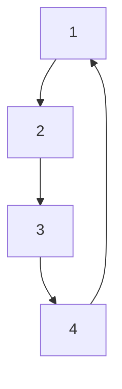

# 第 36 届中国化学奥林匹克（决赛）试题⼀

(2022 年 11 ⽉ 28 ⽇ 9:00-12:00 ⻓春）

# 第1题（10分）根据要求和所给条件书写化学反应⽅程式

1-1 常温下，等物质的量的[ $\mathrm { H N } ( \mathrm { C H } _ { 3 } ) _ { 3 } ] \mathrm { C l }$ 与 $\mathrm { L i B H _ { 4 } }$ 在四氢呋喃中反应。  
1-2 将氨⽓通⼊ $\mathrm { S _ { 2 } C l _ { 2 } }$ 中得到⼀种淡⻩⾊固体 $\mathrm { S 4 N _ { 4 } }$ 和⼀种具有环状分⼦结构的单质。  
1-3 六羰基钼与醋酸在氮⽓流中加热反应得到⼀种⻩⾊针状晶体和两种还原性⽓体，其中⻩⾊针状晶体是合成其它 ${ \mathrm { M o } } { - } { \mathrm { M o } }$ 化合物的优良起始物。  
1-4 单质硒与热的硝酸银溶液反应⽣成⿊⾊沉淀，且反应后溶液显强酸性。  
1-5 橙⻩⾊固体 $\mathrm { X e [ P t F _ { 6 } ] }$ 遇⽔迅速反应，有⽓体放出。

# 第 2 题（11 分）

2-1 ⾦属M不与⾮氧化性酸反应。M与 $\mathrm { F } _ { 2 }$ 反应⽣成的固态产物加热⾄ $5 0 ~ ^ { \circ } \mathrm { C } ,$ ，收集⽓体并冷却后得⻩⾊化合物A，A中M的质量分数为62.53%。在⼀定条件下，将A还原得到蓝⾊化合物B（熔点为 $7 0 ~ ^ { \circ } \mathrm { C } )$ ），B中M的质量分数为 $6 6 . 6 9 \% _ { \circ } \textbf { M }$ 与过量浓硝酸反应，在 $1 0 0 ~ ^ { \circ } \mathrm { C }$ 挥发出化合物 $\mathbf { C } _ { \circ }$ 。C溶⼲冷的浓KOH溶液析出红⾊晶体D，D在碱中还原得到紫⾊化合物E，M在E中的质量分数⽐在D中减少了约0.28%。化合物B在常温下为四聚体，且⽆M—M键。C的分⼦呈正四⾯体构型，D中阴离⼦为拉⻓的⼋⾯体构型，E中阴离⼦为压扁的⼋⾯体构型，E和D中阴离⼦电荷数相同。

2-1-1 通过计算给出A、B的化学式。  
2-1-2 画出B的结构和D中阴离⼦的结构。  
2-1-3 写出⽣成D的反应⽅程式。  
2-1-4 通过计算给出E的化学式。  
2-2 ⾦属M与KCl和Cl混合后加热得红⾊晶体F，F与 $\mathrm { K _ { 2 } [ P t C l _ { 6 } ] }$ 类质同晶。加压条件下，F和氨发⽣⾮氧化还原反应得到不含有钾的双核配合物 $\mathbf { G } _ { \circ } \textbf { G }$ 的阳离⼦中，两个M由桥连配体连接为直线形，此直线亦为阳离⼦的四次轴，M均为六配位，且氮原⼦的个数接近氯原⼦个数的2倍。  
2-2-1 写出⽣成F的反应⽅程式  
2-2-2 推导出G的化学式并画出G内界的结构。

# 第3题（10分）Q及其氧化物的结构

3-1 Q的单质在常温常压下为淡⾦⻩⾊的活泼⾦属。在5 K和常压条件下，Q晶体属于⽴⽅晶系，且正当晶胞中包含两个等同原⼦，原⼦间最近邻的距离为0.5235 nm，⾦属密度为 $1 . 9 8 \mathrm { g { \cdot } c m ^ { - 3 } }$ 。通过计算推断Q是哪种元素。  
3-2 在温度为300 K，压强2.37 GPa\~4.22 GPa条件下，Q单质中原⼦采⽤⽴⽅最密堆积，形成QII相。在4.10 GPa下，Q原⼦半径被压缩为0.2115 nm，计算此条件下QII相的晶胞参数。  
3-3 Q与氧反应可⽣成不同计量⽐的氧化物。其中， $\mathbf { Q } _ { 2 } \mathrm { O }$ 是⼀种橙⻩⾊晶体，可看作氧原⼦插⼊QII晶体中，隔层占据⾦属原⼦堆积形成的⼋⾯体空隙。 ${ \mathrm { O Q } } _ { 6 }$ ⼋⾯体为共棱连接。若⽤⼤写英⽂字⺟(A、B、C…)表⽰Q原⼦层的排布，⽤⼩写英⽂字⺟(a、b、c…)表⽰氧原⼦层的排布，⽤⽅块(□)表⽰空位层，写出两个周期$\mathbf { Q } _ { 2 } \mathrm { O }$ 晶体层状结构的堆积⽅式，并判断该氧化物晶胞的点阵类型。  
3-4 将氧原⼦放置于晶胞原点，写出⼀个 $\mathbf { Q } _ { 2 } \mathrm { O }$ 正当晶胞中所有氧原⼦的分数坐标。

# 第 4 题（12 分）

尿碘(UI)，即尿中总碘含量，是衡量⼈体碘含量是否缺乏的指标。开展UI检测是碘缺乏病防治的重要⼯作。Sandell-Kolthoff 反应，即碘离⼦(I− )、亚砷酸体系还原⻩⾊ $\mathrm { C e ^ { 4 + } }$ 为⽆⾊ $\mathrm { C e ^ { 3 + } }$ ，可⽤于UI检测。UI的国家标准检测过程如下：在 $2 5 0 ~ \mu \mathrm { L }$ 的尿样中加⼊ $1 \mathrm { m o l } \mathrm { L } ^ { - 1 }$ 过硫酸铵1 mL，混匀后置于 $1 0 0 ~ ^ { \circ } \mathrm { C }$ 的消化装置中消化60 min。冷却⾄室温后，加⼊0.025 mol·L−1亚砷酸溶液2.5 mL，充分混匀后放置15 min。最后加⼊0.025 mol L−1 硫酸铈铵 $\mathrm { ( N H _ { 4 } ) _ { 4 } C e ( S O _ { 4 } ) _ { 4 } 0 . 3 m L _ { \circ } }$ 。在达到预设反应时间(?)后，测定样品溶液中 $\mathrm { C e ^ { 4 + } }$ 的吸光度。

4-1 尿样测试前⽤过硫酸铵进⾏消解，主要⽬的是什么？

4-2 请写出本检测⽅法中涉及的 Ce4+ /Ce3+ 、I2/I− 、 $\mathrm { H _ { 3 } A s O _ { 4 } / H _ { 3 } A s O _ { 3 } }$ 之间发⽣的反应⽅程式。（已知：

$$
\varphi \left(\mathrm{Ce} ^ {4 +} / \mathrm{Ce} ^ {3 +}\right) > \varphi \left(\mathrm{I} _ {2} / \mathrm{I} ^ {-}\right) > \varphi \left(\mathrm{H} _ {3} \mathrm{AsO} _ {4} / \mathrm{H} _ {3} \mathrm{AsO} _ {3}\right))
$$

4-3 实际尿样稀释⾄原体积的2倍后作为待测样品溶液，依据上述实验过程进⾏实验操作，待测样品溶液进⾏6次平⾏测定，所得吸光度值分别为0.790、0.815、0.842、0.808、0.851、0.859，计算实际尿样中碘的平均质量浓度。（碘的质量浓度与吸光度值满⾜线性⽅程： $\boldsymbol { \rho } = \boldsymbol { a } + b \log A _ { t }$ ， $\rho$ 为碘的质量浓度 $( \mu \mathrm { g } \mathrm { L } ^ { - 1 } )$ ， $A _ { t }$ 为反应时间?时吸光度， $a = 4 5 . 7 1 5$ ，? = −311.09）

4-4 当体系中 $\mathrm { H _ { 3 } A s O _ { 3 } }$ 的初始浓度远⼤于 $\mathrm { C e ^ { 4 + } }$ 的初始浓度时，可视为反应过程中 $c ( \mathrm { { H _ { 3 } A s O _ { 3 } } ) }$ 不变，故反应对$\mathrm { H _ { 3 } A s O _ { 3 } }$ 为零级反应，对 $\mathrm { C e ^ { 4 + } }$ 为⼀级反应，此反应速率常数为 $| k _ { 1 }$ ，反应时间为?时测得的吸光度为 $A _ { \mathrm { F } }$ ；当体系加⼊I− 时，还存在 $\mathrm { C e ^ { 4 + } }$ 和I− 的反应，该反应速率常数为 $k _ { 2 }$ ， $\mathrm { C e ^ { 4 + } }$ +和I− 的反应级数均为⼀级，⽣成的单质 $\mathrm { I } _ { 2 }$ 会被$\mathrm { H _ { 3 } A s O _ { 3 } }$ 快速地还原为 I− ，即可视为 $c _ { t } ( \mathrm { I } ^ { - } ) = \smash { c _ { \mathrm { i n i t i a l } } ( \mathrm { I } ^ { - } ) }$ 。反应时间为?时测得体系吸光度值为 $\scriptstyle | A _ { t ^ { \circ } }$ 。请推导出该检测⽅法中碘离⼦浓度 $c _ { t } ( \mathrm { I } ^ { - } )$ 与吸光度 $A _ { t }$ 的定量关系式。（实验过程中温度保持不变，定量关系式中只含有碘离⼦浓度 $c _ { t } ( \mathrm { I ^ { - } } )$ )、时间?、吸光度 $A _ { t }$ 和 $\mathrm { \Delta } \mathrm { H _ { F } }$ 、速率常数 $k _ { 2 }$ ）

4-5 反应时间为 5 min， $\rho ( \mathrm { I ^ { - } } ) = 0 , 5 0$ 和 $1 0 0 \ \mu \mathrm { g } { \cdot } \mathrm { L } ^ { - 1 }$ 的吸光度值如表所⽰，计算速率常数 $k _ { 2 }$ 的平均值。

<table><tr><td> $\rho (I^{-}) (\mu g \cdot L^{-1})$ </td><td>0</td><td>50.00</td><td>100.0</td></tr><tr><td> $A_{5\ min}$ </td><td>1.460</td><td>1.316</td><td>1.178</td></tr></table>

# 第5题（16分）氢能源汽⻋

传统汽⻋采⽤汽油或柴油为燃料，⼤量排放⼆氧化碳，并伴随氮氧化物污染。为应对⽓候和环境问题，新能源研究与应⽤备受关注。氢作为⼀种重要的清洁能源，氢燃料内燃机、氢燃料电池等技术发展迅速。氢能源汽⻋主要分为两种：第⼀种，以氢⽓作为燃料，基于传统的发动机（内燃机）驱动汽⻋；第⼆种，采⽤氢燃料电池驱动汽⻋。下表为相关物质的热⼒学数据 $( \Delta _ { f } H _ { m } ^ { \ominus }$ 、 $\Delta _ { f } G _ { m } ^ { \ominus }$ 和?⊖为298.15 K的值，设各物质的热容在所研究的温度区间内是与温度⽆关的常数）:

<table><tr><td>物质</td><td> $\Delta_fH_m^\ominus (kJ mol^{-1})$ </td><td> $\Delta_fG_m^\ominus (kJ mol^{-1})$ </td><td> $S_m^\ominus (J mol^{-1} K^{-1})$ </td><td> $C_{p,m}^\ominus (J mol^{-1} K^{-1})$ </td><td> $C_{V,m}^\ominus (J mol^{-1} K^{-1})$ </td></tr><tr><td> $H_2(g)$ </td><td>0</td><td>0</td><td>130.68</td><td>29.10*</td><td>20.78*</td></tr><tr><td> $O_2(g)$ </td><td>0</td><td>0</td><td>205.14</td><td>29.10*</td><td>20.78*</td></tr><tr><td> $N_2(g)$ </td><td>0</td><td>0</td><td>191.61</td><td>29.10*</td><td>20.78*</td></tr><tr><td>NO(g)</td><td>90.40</td><td>86.70</td><td>211.00</td><td>29.10*</td><td>20.78*</td></tr><tr><td> $H_2O(g)$ </td><td>-241.82</td><td>-228.57</td><td>188.83</td><td>33.26</td><td>24.94</td></tr><tr><td> $H_2O(l)$ </td><td>-285.83</td><td>-237.13</td><td>69.91</td><td>75.29</td><td>—</td></tr></table>

\* 理想⽓体双原⼦分⼦的摩尔热容。

5-1 2 mol H 和 1 mol $\mathrm { O _ { 2 } }$ 在绝热恒容钢筒内反应⽣成⽓态 $\mathrm { H _ { 2 } O }$ ，始态为常温常压。以钢筒内所有物质为研究系统，则此过程的 $| \Delta H .$ \_0（填>， $\mathop { = } \bigoplus \limits _ { i } ^ { } < \mathop { ) }$ ），并解释原因。  
5-2 设H 与过量50%的空⽓（体积⽐为 $\mathrm { O } _ { 2 } { : } \mathrm { N } _ { 2 } = 1 { : } 4 )$ ）混合。将此混合⽓在密闭恒容的容器内点燃，反应瞬间完成（视为绝热过程），反应过程中涉及的⽓体均视为理想⽓体。系统始态温度为298.15 K，压⼒为100kPa。

5-2-1 请计算 1 mol $\mathrm { H } _ { 2 }$ 完全燃烧后的最⾼温度。  
5-2-2 若汽油完全燃烧的最⾼温度介于1750\~1800 K，试从热⼒学⻆度说明，氢⽓完全燃烧和汽油完全燃烧哪种过程更容易发⽣ $\mathrm { N } _ { 2 }$ 和 $\mathrm { O _ { 2 } }$ ⽣成NO的反应，并解释原因。  
5-3 奥托循环⼜称四冲程循环，⼴泛⽤于内燃机。理想⽓体奥托循环由下⾯四个可逆步骤构成：(I) 绝热压缩；(II) 恒容升温；(III) 绝热膨胀；(IV) 恒容降温回到始态。该循环过程的?-?⽰意图如下：

![[2022-36-CChO-juesai-1_images/8ce07009762090aed9743283e7c3d19b1237918786f56ce9aafd17856c2010d5.jpg]]

line

| Point | Pressure (p) | Volume (V) | Phase |
|-------|--------------|------------|-------|
| 1     | -            | -          | Q₂    |
| 2     | -            | -          | Q₂    |
| 3     | -            | -          | Q₁    |
| 4     | -            | -          | Q₁    |

5-3-1 请选择该循环过程正确的?-?⽰意图：

![[2022-36-CChO-juesai-1_images/b203e6c2bb03b255293fc5c66aa96b8a6acdc3f9d266aa4a006d3f2ed6422db6.jpg]]

flowchart

A

![[2022-36-CChO-juesai-1_images/d2800729de1c10c56fefbed3f20ed358e95551b6e31397d1978f6d6f88498726.jpg]]

flowchart

B

![[2022-36-CChO-juesai-1_images/9f7ceb8e7b90110cbca67cf25408170d58193bd4e22bac87e952ad7b2a776662.jpg]]

flowchart

C

![[2022-36-CChO-juesai-1_images/a9174eaf6190b514cd341f30d2cf4fac1b67a736d23641296721eb1c62947fcd.jpg]]

flowchart

D

5-3-2 在奥托循环中定义压缩⽐ε是⽓缸最⼤容积 $V _ { 1 }$ 与最⼩容积 $V _ { 2 }$ 的⽐值。设压缩⽐为 $^ { 6 , }$ ，氢燃料内燃机的热功转化效率η可通过理想双原⼦⽓体分⼦为系统的奥托循环计算。系统的始态温度为 298.15 $\mathrm { K } ,$ ，压强为 100 kPa，经绝热可逆压缩⾄ $T _ { 2 } .$ 、 $p _ { 2 }$ ，然后恒容升温，此过程所吸收热量（即?-?图中 $\left| Q _ { 1 } \right.$ 等于 $T _ { 2 }$ 温度时 $\mathrm { 1 m o l H _ { 2 } }$ 和 0.5mol $\mathrm { O _ { 2 } } .$ ，完全反应的恒容反应热。请计算该热机的效率 $\dot { \eta }$ 及热机对环境所做的功 $W _ { \mathrm { { c } } }$ 。  
5-4 氢氧燃料电池汽⻋以⾼效、⽆污染得到了⼴泛认可。设氢氧燃料电池的⼯作温度为 $8 5 ~ ^ { \circ } C _ { \circ }$   
5-4-1 请计算1 mol H 进⾏电池反应时输出的最⼤电功 $W _ { \mathrm { { < } } }$ 。  
5-4-2 该氢氧燃料电池电极为负载20%铂的 $\mathrm { P t / C }$ 电极。当电池输出电流密度为 $1 0 \mathrm { m A c m ^ { - 2 } }$ 时，阳极的超电势$\boldsymbol { \mathsf { \Pi } } \eta _ { a }$ 为 $1 0 \mathrm { m V }$ ，阴极的超电势 $\eta _ { c }$ 为 200 mV，请计算该电池在上述电流密度下输出的最⼤电功 $W _ { 2 } ,$ 。  
5-4-3 将电池⽤在汽⻋上，在5-4-2条件下⼯作，与氢燃料内燃机汽⻋⾏驶相同⾥程时（即最⼤电功与5-3-2条件下的热机对环境所做的功相等），请计算氢氧燃料电池和氢内燃机中所需 $\mathrm { H } _ { 2 }$ 之⽐。（如果5-3-2中未计算出功?，可⽤100 kJ代替）

# 第 6 题（12 分）

烯烃的硼氢化是有机合成中的常⽤反应。简单烯烃与 $\mathrm { B H _ { 3 } { \cdot } T H F }$ （THF：四氢呋喃）或 $\mathrm { B H _ { 3 } { \cdot } S M e _ { 2 } }$ 的反应通常在较低的温度下即可快速完成。9-BBN（9-硼杂双环[3.3.1]壬烷）是⼀种对烯烃的硼氢化反应具有更好区域选择性的试剂。如下图所⽰，1,5-环⾟⼆烯和 $\mathrm { B H _ { 3 } { \cdot } S M e _ { 2 } }$ 反应⽣成的1,4-加成和1,5-加成产物的混合物，经加热异构可制备9-BBN的固态聚体 $( 9 { \mathrm { - B B N } } ) _ { 2 }$ 纯品。在⾮路易斯碱性溶剂中9-BBN也主要以⼆聚体 $( 9 \mathrm { - B B N ) _ { 2 } }$ 的形式存在。

![[2022-36-CChO-juesai-1_images/9994d8a6d786506b4952d7243b4b67771dd5cb8a2c5e2d6d7245f768f9476039.jpg]]

chemical

Bromination reaction mechanism of cyclooctane using BH₃·SMe₂ and Δ, yielding 9-BBN and (9-BBN)₂

6-1 ⼆聚体 $( 9 \mathrm { - B B N ) _ { 2 } }$ 对烯烃的硼氢化通常均经历⼆聚体⽣成单体的对峙反应和单体与烯烃加成的单向反应，但其反应速率受到烯烃空间位阻影响，差异显著。例如，在 $2 5 ~ ^ { \circ } \mathrm { C }$ 条件下，以 $\mathrm { C C l } _ { 4 }$ 为溶剂， $( 9 \mathrm { - B B N ) _ { 2 } }$ 与2倍量及以上的四取代或单取代烯烃进⾏的硼氢化反应对于烯烃和(9-BBN)2的反应级数如下表所⽰：

<table><tr><td>烯烃</td><td>对于烯烃的反应级数</td><td>对于 $(9-BBN)_2$ 的反应级数</td></tr><tr><td>2,3-二甲基丁-2-烯</td><td>1</td><td>1/2</td></tr><tr><td>1-己烯</td><td>0</td><td>1</td></tr></table>

试据此通过合理的近似或假设推导两种烯烃哪氢化的反应速率⽅程。

6-2 如下图所⽰，胆固醇 $( \mathrm { C h o l e s t e r o l } ) { \scriptstyle { \# - 2 0 } } \ { \mathrm { ~ \circ } } \mathrm { C }$ 下与 $\mathrm { B H _ { 3 } { \cdot } T H F }$ 发⽣硼氢化-氧化反应可获得A，B，C三种产物。试给出在⽣成产物C的过程中，加⼊KOH和 $\mathrm { H _ { 2 } O _ { 2 } }$ 之前⽣成的三个关键中间体的结构（按⽣成的先后顺序，标明⽴体化学）。

![[2022-36-CChO-juesai-1_images/2a652d2607cc5262ff57e828b59560b53c96497812337ef537390c24de871d4f.jpg]]

chemical

Chemical reaction scheme showing conversion of cholesterol to products A, B, and C under BH₃·THF conditions

6-3 对烯烃异构体D和G进⾏硼氢化-氧化反应所得产物如下图所⽰。试据此给出D → E的转化过程中，在加⼊ NaOH 和 $\mathrm { H _ { 2 } O _ { 2 } }$ 之前⽣成的四个关键中间体的结构（按⽣成的先后顺序，标明相对⽴体化学）。

![[2022-36-CChO-juesai-1_images/c5cb420fd0b1fc8fc269a2f830d5bdd30d8f0ad95b880fd8a9df4c248a0e9e60.jpg]]

6-4 如下图所⽰，双环烯烃I经硼氢化和后续转化可⽣成含氮不含硼且具有顺式并环结构的外消旋产物J。已知硼烷和三氯化硼反应可⽣成氯代硼烷，产物J不含季碳⼿性中⼼。试给出产物J的结构（标明相对⽴体化学）。

![[2022-36-CChO-juesai-1_images/eda920c13e73c8346946813047f8d8441cb65762db5a0c5089e470b43c86bfe4.jpg]]

chemical

Chemical reaction scheme converting compound I to J using BH3·THF and BCl3/PhCH2N3 under specified conditions

6-5 安全性是化学实验的前提。问题6-4的反应中使⽤的苯基叠氮化物(PhCHN )可使⽤叠氮化钠制备。叠氮化钠在酸性条件下可⽣成剧毒物质叠氮酸(HN3)。已知稀的叠氮酸⽔溶液可稳定存在，但是当⽓体中含10%体积分数的叠氮酸蒸⽓即具有爆炸性。

已知 $2 5 { \sim } 1 0 0 ~ ^ { \circ } \mathrm { C }$ 下⽔的平均摩尔蒸发焓 $\Delta _ { \mathrm { v a p } } H _ { m } = 4 2 . 7 4 \mathrm { k J } { \cdot } \mathrm { m o l } ^ { - 1 }$ ， $1 0 0 ~ ^ { \circ } \mathrm { C }$ 纯⽔的饱和蒸⽓压为100kPa，叠氮酸的亨利系数 $k _ { c } = 8 . 3 3 \mathrm { k P a m o l ^ { - 1 } }$ L。不考虑叠氮酸的电离，试据此估算 $2 5 ~ ^ { \circ } \mathrm { C }$ 时，盛有质量分数为2%的叠氮酸⽔溶液（密度可按纯⽔计算）的真空密闭容器内蒸⽓中叠氮酸的体积分数（溶液上⽅蒸⽓中⽔的分压可近似为纯⽔的饱和蒸⽓压），并评估是否存在爆炸⻛险。

# 第7题 （9分）⻧化氢前体有机化合物在合成中的应⽤

7-1 近来研究发现，化合物B可以作为HI的前体与苯⼄炔A反应，如下图所⽰：

![[2022-36-CChO-juesai-1_images/5f44773c68af5767cd4755e76f391f6ff6037aaafa535d916300363d72fc3c4f.jpg]]

chemical

Organic synthesis reaction scheme showing conversion of compound A to B and then to F under TsOH conditions

7-1-1 上述反应经中间体C、D和E⽣成F的同时，除了⽣成挥发性的有机物外，还⽣成⼀种常温下为⽓体的有机物。画出中间体C、D和E的结构式。  
7-1-2 实验结果表明，化合物 B 在 G 的作⽤下主要⽣成产物 H（⻅下图），画出 H 的结构式。

7-2 化合物 trans-J 可以作为 HCl 的前体化合物与炔烃 I 进⾏反应，⽣成产物 K，同时 trans-J 转变为 L，反应式⻅下图。

7-2-1 画出L的结构式。  
7-2-2 与?????-J相⽐，当化合物???-J与炔烃I反应时，反应速率明显变慢，同时产物K的收率降低⾄51%，如下图(eq. 1)所⽰，试解释其原因。

7-2-3 在相同反应条件下，⽤化合物M（cis-M和trans-M）代替J（cis-J和trans-J），实验结果表明，M不与I反应，如上图(eq. 2)所⽰，试解释其原因。

# 第8题 （10分）烯烃的氧化裂解

烯烃氧化裂解成醛（酮）的反应是重要有机化学反应之⼀，反应通常⽤臭氧作氧化剂。最近，研究发现，光照条件下，硝基苯类化合物也可以将烯烃氧化裂解成醛（酮），如下反应式所⽰：

![[2022-36-CChO-juesai-1_images/b6f3dce8826f3545ff09a11b1b8b5218e03d47559e51108674d3688df5cc7b74.jpg]]

chemical

Chemical reaction equation showing fluorinated aromatic compound reacting with a benzyl cyanide under specified light and CO₂Cl₂ conditions

# 8-1 氧化反应机理探究⼀

在−40 °C和光照（波⻓为395 nm）下，对上述反应进⾏19F-NMR监测（19F-NMR可⽤于监测含氟有机化合物），发现有 A 和 B 中间体，且 A 的浓度明显⾼于 B 的浓度；当反应温度升⾄ $- 2 0 ~ ^ { \circ } \mathrm { C }$ 时，19F-NMR 监测发现，A和B快速分解，⽣成物中有化合物C（分⼦式为 $\mathrm { C _ { 1 4 } H _ { 9 } F N _ { 2 } O ) }$ ），且C的浓度逐渐升⾼。

# 8-1-1 画出A、B和C的结构式。

8-1-2 研究发现， $- 2 0 ~ ^ { \circ } \mathrm { C }$ 光照下，化合物C易转化为化合物D；升温⾄25 °C，反应24h后，D⼏乎全部重排成副产物 $\mathbf { E } ,$ ，已知C、D和E互为同分异构体，画出D和E的结构式。

# 8-2 氧化反应机理探究⼆

近来，研究⼈员巧妙地利⽤烯烃下F和硝基苯衍⽣物G合成出了较为稳定的化合物H，H和A具有部分相同的⻣架结构。通过H在不同溶剂中的反应，对该类氧化反应的机理做了进⼀步的探究。反应如下所⽰：

![[2022-36-CChO-juesai-1_images/dd76aa5781115853eca06efd8c7c4acf1325207fd2209ba1528e1ad4d57e1c50.jpg]]

chemical

Chemical reaction scheme showing synthesis of compounds I and K from precursors F and J under purple LED light, with yields and conditions noted

# 8-2-1 画出H、J和K的结构式。

8-2-2 请说明将H⽤作底物进⾏上述反应来探究氧化机理的原因。

# 第9题 （10分）α-氨基酸的α-芳基化（本题不要求⽴体化学）

α-氨基酸的α-芳基化研究极富挑战性。2018年英国化学家报道了⼀种新⽅法，反应路线如下：

![[2022-36-CChO-juesai-1_images/e5e68f3b7282d239493ed1bf3292c05848c72138ce2202e690bb95d31cc12530.jpg]]

chemical

Multi-step organic synthesis pathway showing conversion of compound A to E via intermediates B, C, and D, with reagents and conditions labeled.

9-1 画出B、C和D的结构式  
9-2 画出C转化为D过程中的三个关键中间体的结构式。（按⽣成顺序画出）  
9-3 研究发现，在D转变为E的过程中，如果不经反应1，直接在6M盐酸中，135 °C（封管反应）下进⾏⽔解，结果会有 50%收率的产物 F ⽣成，F 的 1 H-NMR (500 MHz, CDCl3)：δH 7.52-7.46 (m, 2H), 7.37 (brs, 1H), 7.02-6.95 (m, 2H), 2.93 (s,3H), 2.03 (dd, ? = 14.5, 5.5 Hz, 1H), 1.97 (dd, ? = 14.5, 7.2 Hz, 1H),1.64-1.52 (m, 1H), 0.82 (d, ? = 6.6 Hz, 3H), 0.78 (d, ? = 6.7 Hz, 3H)。(m 表⽰多重峰，br 表⽰宽峰，s 表⽰单峰，dd表⽰双⼆重峰，d表⽰⼆重峰，?为耦合常数)。  
9-3-1 画出D转化为E过程中反应1所得产物的结构式。  
9-3-2 画出F的结构式。