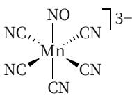
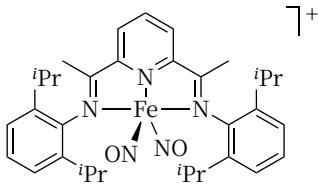
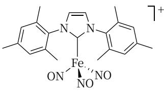
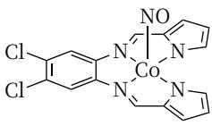

# 第 36 届中国化学奥林匹克（决赛）试题⼆

# (2022 年 11 ⽉ 28 ⽇ 15:00-18:00 ⻓春）

# 第1题（10分）⽔样中锰含量的检测

⽔源洁净事关⼈⺠的⽣命健康。重⾦属离⼦、微⽣物含量等多种指标是⽔质考察的重点，锰含量就是其中⼀项。我国⽣活饮⽤⽔卫⽣标准规定锰含量不得超过0.1 mg L−1。锰含量常⽤分光光度法检测，实验过程如下：向⽔样中加⼊甲醛肟溶液，再加⼊适量氢氧化钠，放置20分钟，若⽔样中含锰（通常为 $\mathrm { M n ^ { 2 + } }$ ，其配合物⼏乎⽆⾊），会产⽣棕⾊配合物（锰离⼦与甲醛肟配⽐为1:6），测量其吸光度。

1-1 甲醛肟(CH2NOH)可以由盐酸羟胺与甲醛按1:1在⽔溶液中制得，写出反应⽅程式。  
1-2 写出棕⾊配合物形成的化学反应⽅程式。  
1-3 利⽤此⽅法测定浓度为 $8 . 0 0 { \times } 1 0 ^ { - 5 } \mathrm { m o l { \cdot } L ^ { - 1 } }$ 的标液，⽐⾊⽫宽1 cm，吸光度为0.880。从⽔源地取样，将1 L⽔样浓缩⾄10 mL，若采⽤⽰差分光光度法，以 $1 . 6 0 \times 1 0 ^ { - 4 } \mathrm { m o l } \mathrm { L } ^ { - 1 }$ 锰标液作参⽐，测得样品的吸光度为0.200，计算⽔样中锰的含量，判断此⽔样是否合格。

# 第2题（8分）电化学与热⼒学参数

在测定某些热⼒学参数时，常常设计电池。测得298.2K时下述电池的电动势为 $1 . 3 6 2 \mathrm { V } _ { \circ }$

$$
\mathrm{Pt}, \mathrm{H} _ {2} (p ^ {\ominus}) \mid \mathrm{H} _ {2} \mathrm{SO} _ {4} (\mathrm{aq}) \mid \mathrm{Au} _ {2} \mathrm{O} _ {3} (\mathrm{s}) \mid \mathrm{Au} (\mathrm{s})
$$

已知 $\mathrm { I } \Delta _ { \mathrm { f } } G _ { m } ^ { \ominus } ( \mathrm { H } _ { 2 } \mathrm { O } , \mathrm { g } ) = - 2 2 8 . 6$ kJ mol−1 ，该温度下⽔的饱和蒸⽓压为 3.167 kPa。

2-1 计算 298.2 K 时， $\mathrm { H _ { 2 } O ( l ) }  \mathrm { H _ { 2 } O ( g ) }$ 相变过程的标准 Gibbs 能变 $\Delta _ { \mathrm { v } } G _ { m } ^ { \ominus } .$ 。（单位：kJ mol−1 ）  
2-2 计算 298.2K 时，反应 $2 \mathrm { A u _ { 2 } O _ { 3 }  }$ 4 $\mathrm { A u } + 3 \mathrm { O } _ { 2 }$ 的标准 Gibbs 能变 $\Delta _ { \mathrm { { r } } } G _ { m } ^ { \ominus }$ 。  
2-3 写出 $\mathrm { { A u _ { 2 } O _ { 3 } } }$ 的标准 Gibbs ⽣成⾃由能 $\Delta _ { \mathrm { f } } G _ { m } ^ { \ominus } ( \mathrm { A u } _ { 2 } \mathrm { O } _ { 3 } )$ 。

# 第3题（7分）核磁共振的拓展应⽤

随着仪器和表征⽅法的发展，各种体系特别是复杂体系热⼒学参数的测定⽅法越来越多样化。例如可以利⽤核磁共振(NMR)波谱确定复杂体系的酸解离常数，下⾯给出⼀个例⼦：

此为(ATP)H3− 与(ATP)4− 之间的质⼦解离-结合平衡过程。为书写⽅便，(ATP)H3− 简写为 $\mathrm { H A ^ { 3 - } }$ ， $\left( \mathrm { A T P } \right) ^ { 4 - }$ 简写为 $\mathrm { A } ^ { 4 - }$ ，酸解离常数为 $K _ { a } ,$ 。简化表达如下：

$$
\mathrm{HA} ^ {3 -} \rightarrow \mathrm{H} ^ {+} + \mathrm{A} ^ {4 -}
$$

随着pH变化，磷的化学环境发⽣变化，NMR中的化学位移随之变化。下图给出γ位31P的化学位移测定值随 pH 的变化关系。由于溶液中质⼦交换速度很快，实际测得的化学位移 $( \delta _ { \mathrm { o b s } } )$ 是质⼦化形式化学位移 $( \delta _ { \mathrm { H A } ^ { 3 - } } )$ 和脱质⼦形式化学位移 $\left( \delta _ { { \tt A } ^ { 4 - } } \right)$ 的加权平均值：

$$
\delta_ {\mathrm{obs}} = \delta_ {\mathrm {HA^ {3 - }}} \chi_ {\mathrm {HA^ {3 -}}} + \delta_ {\mathrm {A^ {4 - }}} \chi_ {\mathrm {A^ {4 - }}}
$$

式中， $\chi _ { \mathrm { H A } ^ { 3 - } } \Re \mathrm { H } \chi _ { \mathrm { A } ^ { 4 - } }$ 分别表⽰ HA3− 和 $\mathrm { A } ^ { 4 - }$ 的⽐例。

![[2022-36-CChO-juesai-2_images/fec896b11d9b633fff34d2819cbf2c88f8e8e1fdb04c7b54987b8c77b6a7fd58.jpg]]

line

| pH | δ_obs(³¹ P) / ppm |
|----|-------------------|
| 3  | -11.0             |
| 4  | -11.0             |
| 5  | -11.0             |
| 6  | -10.0             |
| 7  | -8.0              |
| 8  | -6.0              |
| 9  | -6.0              |

3-1 写出质⼦化形式化学位移 $( \delta _ { \mathrm { H A } ^ { 3 - } }$ ")和脱质⼦形式化学位移 $\left( { \delta _ { \mathrm { { A } } ^ { 4 - } } } \right)$ 的值（要求读到⼩数点后⼀位）。  
3-2 推导出 $\mathsf { p } K _ { a }$ 的表达式，只可包含pH和所有相关的化学位移参数。  
3-3 从上图中合理取值，计算酸解离常数 $K _ { a } ,$

# 第4题（9分）岩⽯变化动⼒学

斜⽅辉⽯[ $\mathrm { ( M g , F e ) _ { 2 } S i _ { 2 } O _ { 6 } ] }$ 是地壳和上地幔的主要组成矿物之⼀，在其晶体结构中包含有两种不同的硅氧四⾯体 $\mathrm { ( S i O _ { 3 } ) ^ { 2 } }$ −链，分别称作A链和B链，基于这两种链的排布⽽形成了两种结构有差异的⼋⾯体空隙M1和M2，⼆者⽐例相同，如下图所⽰，Mg和 $\mathrm { F e ^ { 2 } }$ 便分布在这些⼋⾯体空隙中。

![[2022-36-CChO-juesai-2_images/052080859a3ffac7de5c910ffe56e9f2276c87451bb0c8bec513ed7f208a19d1.jpg]]

chemical

Crystal structure diagram showing layered arrangement of atoms with labeled axes a, b, c and regions A, B

![[2022-36-CChO-juesai-2_images/492d703e8cc478271aeb5ac9ae6ebcf6f8761eeb54eb1bfe0dd05cbb0cfd33b9.jpg]]

chemical

Crystal structure diagram showing M1 and M2 atomic positions with blue and yellow polyhedral units

(b)

由于M1和M2的空隙性质不同，导致 $\mathrm { M g ^ { 2 + } }$ 和 $\mathrm { F e ^ { 2 + } }$ 对其占据的选择性不同， $\mathrm { F e ^ { 2 + } }$ 倾向于占据M2位置。⼀定条件下，两种离⼦可以发⽣不同位置的交换反应：

$$
\mathrm{Fe} ^ {2 +} (\mathrm{M} 1) + \mathrm{Mg} ^ {2 +} (\mathrm{M} 2) \rightleftharpoons \mathrm{Fe} ^ {2 +} (\mathrm{M} 2) + \mathrm{Mg} ^ {2 +} (\mathrm{M} 1)
$$

为简便便起⻅， $\mathrm { F e ^ { 2 + } ( M l ) }$ 、 $\mathrm { F e } ^ { 2 + } ( \mathrm { M } 2 )$ 、 $\mathrm { M g ^ { 2 + } ( M l ) }$ 、 $\mathrm { M g ^ { 2 + } ( M 2 ) }$ 分别写作 Fe(1)、Fe(2)、Mg(1)、Mg(2)。上述反应达平衡时，分配系数 $X _ { D }$ ：

$$
K _ {D} = \frac {\chi_ {\mathrm{Fe(2)}} \chi_ {\mathrm{Mg(1)}}}{\chi_ {\mathrm{Fe(1)}} \chi_ {\mathrm{Mg(2)}}}
$$

其中， $\chi$ 为各离⼦占据相应位置的摩尔分数，例如： $\chi _ { \mathrm { F e } ( 2 ) }$ 为 $\mathrm { F e ^ { 2 + } }$ 离⼦占据M(2)位置的摩尔分数，其他同理。选择某⼀矿物样品，在873K下进⾏处理，利⽤X射线衍射结合穆斯堡尔谱监测反应进⾏过程中上述物种占据不同位置情况随时间的变化，数据列⼊下表中。

<table><tr><td>编号</td><td>t / min</td><td> $\chi_{\text{Fe(1)}}$ </td><td> $\chi_{\text{Mg(2)}}$ </td><td> $\chi_{\text{Fe(2)}}$ </td><td> $\chi_{\text{Mg(1)}}$ </td></tr><tr><td>1</td><td>0</td><td>0.00450</td><td>0.9807</td><td>0.0174</td><td>0.9769</td></tr><tr><td>2</td><td>600</td><td>0.00420</td><td>0.9804</td><td>0.0176</td><td>0.9771</td></tr><tr><td>3</td><td>1920</td><td>0.00380</td><td>0.9801</td><td>0.0179</td><td>0.9774</td></tr><tr><td>4</td><td>3720</td><td>0.00361</td><td>0.9798</td><td>0.0183</td><td>0.9778</td></tr><tr><td>5</td><td>6000</td><td>0.00335</td><td>0.9795</td><td>0.0185</td><td>0.9780</td></tr><tr><td>6</td><td>11760</td><td>0.00281</td><td>0.9790</td><td>0.0191</td><td>0.9786</td></tr><tr><td>7</td><td>20300</td><td>0.00261</td><td>0.9788</td><td>0.0193</td><td>0.9788</td></tr><tr><td>8</td><td>29700</td><td>0.00233</td><td>0.9785</td><td>0.0195</td><td>0.9790</td></tr><tr><td>9</td><td>48165</td><td>0.00232</td><td>0.9785</td><td>0.0195</td><td>0.9790</td></tr></table>

4-1 计算分配系数 $K _ { D ^ { \varsigma } }$ 。（提⽰：根据表中数据，合理判断并选择数据）。  
4-2 上述反应的正、逆反应的速率常数分别为? 和? ，假设正、逆反应速率表达形式均与基元反应类似，正、逆反应速率分别与占据相应位置的各离⼦的摩尔分数?成正⽐。写出 $K _ { D }$ 与 $k _ { 1 }$ 和?54的关系 $\updownarrow \updownarrow _ { \updownarrow }$   
4-3 利⽤上表中起始阶段的数据（要求：采⽤编号 1\~4 的数据进⾏处理），计算 $k _ { 1 }$ 和?54的值。

提⽰ 1：可将 $\mathrm { M g ^ { 2 } }$ +的摩尔分数近似视为常数，取 0.9780；

提⽰ 2：常微分⽅程的解，对于?(?)有：

$$
y ^ {\prime} = k y, \text {其解为:} \ln y = k x + c
$$

$$
y ^ {\prime} = k (a y + b), \text {其解为:} \frac {1}{a} \ln (a y + b) = k x + c
$$

# 第5题（10分）密堆积结构的变换和组合

碱⼟或稀⼟元素(A)和过渡⾦属(B)可以形成多种合⾦，⼴泛应⽤于催化、储氢等领域。下图给出某合⾦的理想结构沿不同⽅向的投影⽰意图，此结构属六⽅晶系，晶胞参数 $a = 5 4 0 . 9 \mathrm { p m }$ ， $c = 4 3 0 . 0 \mathrm { p m }$ 。其中，⼤球为A原⼦，⼩球为B原⼦，圆圈表⽰空位。

![[2022-36-CChO-juesai-2_images/bf3b6dd0e1a7c98048443b67834d77a3cf808e068289f085f0813e61aebc27f6.jpg]]  
图5.1 某合⾦理想结构沿不同⽅向的投影⽰意图（其中，⼤球为A原⼦，⼩球为B原⼦，圆圈表⽰空位。）  
(a) 晶胞；(b) 沿?⽅向投影；(c) A 和 B 混合排列层 $\left( \mathrm { L } _ { 1 } | \frac { \mathbf { \equiv } } { \mathbf { z } } \right)$ ）；(d) 全部由B原⼦组成的层 $\left( \mathrm { L } _ { 2 } \overleftrightarrow { \underline { { \mathbf { \Lambda } } } } \right)$

5-1 写出该合⾦的组成。  
5-2 ⼰知原⼦A处在晶胞原点，写出晶胞中所有B原⼦的坐标参数。（排序要求：先按?从⼩到⼤；?相同时，按照?从⼩到⼤；?相同时，按照?从⼩到⼤。)  
5-3 计算同⼀层内B原⼦的最短距离和相邻层间B 原⼦的最短距离（单位：pm）。  
5-4 该合⾦有良好的储氢性能。研究发现，氢原⼦(H)占据如下位置（结构中实际位置与此有所偏离，但计量关系⼀致）； $\mathrm { L _ { 1 } }$ 层中所有菱形的中⼼ $( \mathrm { i } \mathrm { \vec { E } \mathcal { H } H _ { R } } )$ ）， $\mathrm { L } _ { 2 }$ 层中的三⻆形中⼼且只占⼀半 $( \mathrm { i } \mathrm { \vec { E } \partial \mathrm { \partial \cdot \partial \mathrm { J } H _ { T } ) } }$ ）。

5-4-1 写出晶胞中两种氢原⼦ $\mathrm { H } _ { \mathrm { R } }$ 和 $\mathrm { H } _ { \mathrm { T } }$ 的数⽬。  
5-4-2 将氘化（即⽤D取代H）的样品进⾏中⼦衍射，发现L1层中⾦属原⼦和氢原⼦位置与上述结构吻合；⽽$\mathrm { L } _ { 2 }$ 层中氢原⼦的排布完全有序：倘若某⼀层中 D 占据全部顶点朝上的三⻆形中⼼（记为 $\mathrm { L } _ { 2 \Delta } )$ ），则其邻近的 $\mathrm { L } _ { 2 }$ 层中D占据全部顶点朝下的三⻆形中⼼（记为 $\operatorname { L } _ { 2 \nabla } )$ ）。晶体结构按照 $\therefore \mathrm { L _ { 1 } L _ { 2 \Delta } L _ { 1 } L _ { 2 \nabla } } . .$ 进⾏周期性排列。写出该氘化物的晶胞参数，假设D代不影响A和B原⼦的位置。

# 第6题（9分）⾦属M及其变化

6-1 ⾦属M的硝酸盐与1,3,5-均苯三甲酸（简写为 $\mathrm { H _ { 3 } B T C }$ ，分⼦量为210.14）按特定⽐例在⼄⼆醇和⽔的混合体系中于 $1 8 0 ~ ^ { \circ } \mathrm { C }$ 下反应 12 ⼩时，得到⼀种具有“孔笼—孔道”结构的⾦属有机⻣架材料 Y，密度 $\dot { } \rho _ { } = 0 . 9 6 \mathrm { g }$ $\mathrm { c m } ^ { - 3 } .$ 。单晶 X 射线衍射分析表明，Y 属于⽴⽅晶系，其三维⻣架结构主体由 M 和 $\mathrm { ( B T C ) ^ { 3 } }$ −组成，呈电中性，结构中带有⽔分⼦。元素分析表明，Y中含M，C，O和H四种元素，且M与C的原⼦⽐为1:6。热重-质谱联合分析结果显⽰，样品在 $1 0 0 { \sim } 2 0 0 \ ^ { \circ } \mathrm { C }$ 区间失重8.21%，对应于化学式中3个⽔分⼦的脱除，⽽主体⻣架结构依然保持；继续加热到 $3 5 0 ~ ^ { \circ } \mathrm { C }$ 失重63.7%，之后⽆明显失重，残渣为⾦属氧化物 $\mathbf { M O } _ { \circ }$ 。通过计算确认M是何种⾦属，写出Y的化学式。  
6-2 将⾦属M加⼊到⾜量的浓硫酸中，微热⽚刻即有⿊⾊物质A⽣成，之后A逐渐转变为灰⽩⾊物质B。该灰⽩⾊物质⽤过量氨⽔充分处理，过滤后，向滤液中通⼊ $\mathrm { S O _ { 2 } }$ ⾄微酸性，⽣成⽩⾊沉淀C（反应1）。元素分析结果，N 含量 8.65 %，S 含量 19.6%，H 含量 2.49 %。测试分析发现，C 的结构中负离⼦呈三⻆锥形，磁性测量显⽰抗磁性。C与⾜量 $\mathrm { H _ { 2 } S O _ { 4 } }$ 混合并加热，可⽣成超细粉末态M（反应2）。  
6-2-1 写出A，B，C的化学式。  
6-2-2 写出反应1和反应2的⽅程式。

# 第7题（18分）明星分⼦的配位作⽤

⼀氧化氮是众所周知的明星分⼦，不仅在⽣命体中扮演重要⻆⾊，在⼩分⼦的活化中也起着⾮常重要的作⽤。相关过程多涉及NO与⾦属的配位作⽤。作为配体，随结合的中⼼原⼦得失电⼦的能⼒不同，NO可采⽤阳离⼦(NO+ )、中性分⼦(NO)和阴离⼦(NO− )的配位模式。

7-1 在⾦属和NO形成的配合物(M-NO)中，有时候很难区分电⼦在中⼼⾦属M和NO配体上的分配状况，基于此，通常采⽤ Feltham-Enemark 记号来综合表⽰。该表⽰⽅法为： $\{ \mathrm { M } ( \mathrm { N O } ) _ { x } \} ^ { y }$ ，其中?为 NO 配体的数⽬，?为中⼼⾦属M的d电⼦数和所有NO配体的反键轨道π\*中的电⼦数之和，其他配体均不出现在记号中，也⽆需标出配合物的电荷。下⾯给出了两个M-NO配合物（a和b）及其对应的Feltham-Enemark(F-E)记号。

<table><tr><td>配合物</td><td>(a)</td><td>(b)</td><td>(c)</td><td>(d)</td></tr><tr><td>F-E记号</td><td> $\{MnNO\}^6$ </td><td> $\{Fe(NO)_2\}^9$ </td><td>需回答</td><td>需回答</td></tr></table>

7-1-1 写出NO的分⼦轨道表达式（只考虑价层电⼦）。写出NO+ 、NO和NO− 的键级。  
7-1-2 写出(c)和(d)中配合物的 Feltham-Enemark 记号形式。

7-2 M-NO类型的配合物可以发⽣氧化还原反应。2019年，研究者⽤⼀种三脚氮杂卡宾配体（⽤TIMENMes表⽰）和 $\mathrm { F e ^ { 2 + } }$ 形成配合物A（⻅下图），A在⼄腈 $\mathrm { ( C H _ { 3 } C N ) }$ 溶液中与 $\mathrm { N O B F _ { 4 } }$ 反应，得到⼀种含有NO的六配位的配合物离⼦B，B中配体也包括⼄腈分⼦。在B的⼄腈溶液中，加⼊⾜量Zn粉，搅拌过夜，得到配合物C，C 中不含溶剂分⼦。磁性测量表明，B 显抗磁性，C 的磁矩为 3.84 $\mu _ { \mathrm { B o } }$ 。

![[2022-36-CChO-juesai-2_images/091accfa4965edb53200aad88af05652bb9321a2f23e1c307ca81fc946a3a940.jpg]]

chemical

Complex organic molecule structure with multiple pyridine and imidazole rings

TIMENMes

![[2022-36-CChO-juesai-2_images/947589de220011863caf79ecd3cfd75c87c327d4e386770c0e9901731472c519.jpg]]

chemical

Molecular structure of a iron complex with pyridine and cyclopentadienyl ligands, labeled 2+

配合物A

7-2-1 写出B的化学式。  
7-2-2 画出B中⾦属离⼦在配位场（假设为正多⾯体）作⽤下的d轨道电⼦排布。  
7-2-3 写出 C 中阳离⼦的化学式及相应的 Feltham-Enemark 记号。  
7-3 最近，研究者报道了⼀个⾮⾎红素铁氧配合物P，P与NO反应得到配合物Q，Q在⽆⽔⽆氧条件下稳定，其中，Fe—N—O的键⻆为144.5°，且N—O键的键能⽐预期的⼩。

P

Q

7-3-1 实验中所⽤⼲燥NO⽓体是在固体 $\mathrm { N a N O _ { 2 } }$ 和 $\mathrm { F e S O _ { 4 } }$ 混合物中加⼊浓硫酸制备的。写出反应⽅程式。  
7-3-2 分别写出配合物P和Q中铁的氧化数，指出Q中与铁离⼦配位的NO采⽤的是哪种形式配位。  
7-3-3Q在⼲燥的THF溶液中可存在⼀定时间。但若THF中含⽔，Q与之接触则⽴即释放出 $\mathrm { N O } _ { \circ }$ 。写出反应⽅程式——-式中反应物不必写Q，只需给出Q中与 $\mathrm { N } _ { 2 } \mathrm { O }$ 放出对应的物种。  
7-3-4 配合物 P 与 $\mathrm { O _ { 2 } }$ 于 $- 8 0 ~ ^ { \circ } \mathrm { C }$ 反应得双核配合物R，将R的溶液加热⾄ $2 3 ~ ^ { \circ } \mathrm { C }$ 得O原⼦桥联的双核铁配合物S。若在 $^ { - 1 9 6 } \ ^ { \circ } \mathrm { C }$ 下将R的冷冻溶液光照，得到⼀单核铁配合物T，T能夺取三叔丁基苯酚上的羟基氢。写出配合物R、S和T的结构简式并给出标明中⼼离⼦的氧化态。（含N和含O螯合配体分别⽤ $\mathrm { L _ { 1 } }$ 和 $\mathrm { L } _ { 2 }$ 表⽰）

有机题⽬中可能⽤到的缩写：AIBN：偶氮⼆异丁腈；Ar：芳基；;Bu：正丁基；<Bu：叔丁基；cod：环⾟⼆烯；DCM：⼆氯甲烷；dr：⾮对映异构体⽐例；Et：⼄基；Ph：苯基；Ms：甲磺酰基；Me：甲基。

第8题（10分） 依据以下实验结果，回答相关问题：

实验⼀：化合物1在 $\operatorname { C u C l } ( \operatorname { c o d } )$ 2催化下发⽣反应，⾼区域选择性形成产物2，其中2a和2b的⽐例为98:2，产物2a中的双键以反式为主，反式和顺式的⽐例为74:26。

![[2022-36-CChO-juesai-2_images/67b1fd16ac856a42e21b1989f74a1d2bee48a153a6a5a3f32aa65c1486924f59.jpg]]

chemical

Chemical reaction scheme showing synthesis of compounds 2a and 2b from compound 1 using [CuCl(cod)]₂ catalyst in CH₃CN at 70°C for 14 hours, yielding 98:2 product.

实验⼆：该反应在没有Cu(I)参与下，基本上不反应，原料完全回收。

实验三：产物(?)-2a可以在没有Cu(I)参与下，在100 °C下转化为(?)-2a和(?)-2b。然⽽，在同样条件下，(?)-2a 则保持不变，不会转化为(?)-2a。

![[2022-36-CChO-juesai-2_images/3caa3cf3155f7c80700bb5e63c53fecabb26902eba8d629a221206c3f24ef95b.jpg]]

chemical

Chemical reaction scheme showing the synthesis of compounds (E)-2a and (E)-2b from (Z)-2a under 100°C, with Ph groups and a chiral center indicated.

分析以上信息，回答相关问题:

8-1 为实验⼀转化为2a的过程提供关键中间体；  
8-2 为实验三(?)-2a异构化为(?)-2a、形成(?)-2b的过程提供关键中间体；  
8-3 在加热条件下，解释为什么(?)-2a 可以转化为(?)-2a，⽽(?)-2a 不能转化为(?)-2a；  
8-4 在后续的研究过程中，发现除了形成以上四元环外，还可以形成五元杂环3。画出形成化合物3的关键中间体（说明：与前⾯重复的⽆需再画）。

![[2022-36-CChO-juesai-2_images/66cfed99641b4e4985323a7977ac610f3c9125459f4b52ed1a521779efa80150.jpg]]

chemical

Chemical reaction scheme showing conversion of a diazo compound to an imine and a chiral amide under CuBr catalysis at 120°C

第 9 题（12 分） 烯烃和⻧素的亲电加成反应是有机化学中的基础反应之⼀。

9-1 画出如下反应的关键中间体，并解释形成此主要产物的原因。

![[2022-36-CChO-juesai-2_images/32fa4e03097458265f721a4f8e2b2c28234b32cdedecde3c2bf5ec1062b17174.jpg]]

chemical

Chemical reaction scheme showing bromination of a substituted pyridine derivative under specified reagents and conditions

9-2 画出如下反应的关键中间体，解释反应的区域选择性和⽴体选择性。（提⽰：PhI(OAc) ⾸先和I 反应、⽣成不稳定的中间体IOH）

第10题（11分）如下所⽰，1,3-⼆醇单磺酸酯在碱性条件下发⽣1,3-消除，称为Wharton碎⽚化反应。该反应是制备中环化合物，尤其是⼋元环的有效⽅法之⼀（要求⽴体化学）。

依据此信息，回答以下问题：

10-1 如下光学纯的化合物G在三氟⼄酸中发⽣溶剂解得到外消旋H，写出外消旋化经过的关键中间体。

10-2 如下所⽰反应，在⾃由基引发下，含双环[4.2.0]⻣架的原料可以扩环得到含双环[6.4.0]⻣架的中间产物A，并经多步串联得到中环产物(?)-环⼗⼆-6-烯-1-酮。画出出 A 的结构式，并画出由原料转化成 A 的关键中间体。