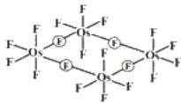
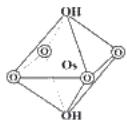
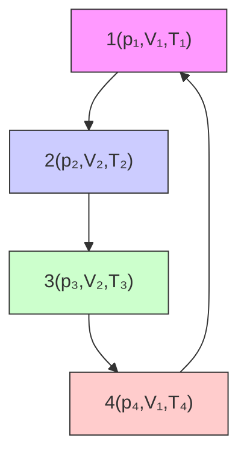
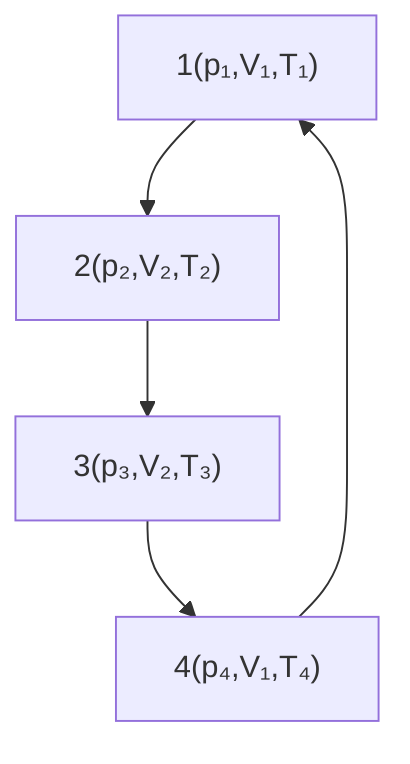

# 第 36 届中国化学奥林匹克（决赛）试题

(2022年11月28日09:00-12:00)

# 第 1 题 （10 分）根据要求和所给条件书写化学反应方程式

1-1 常温下，等物质的量的 $\mathrm{[HN(CH_3)_3]Cl}$ 与 $\mathrm{LiBH_4}$ 在四氢呋喃中反应。  
1-2 将氨气通入 $S_{2}Cl_{2}$ 中得到一种淡黄色固体 $S_{4}N_{4}$ 和一种具有环状分子结构的单质。  
1-3 六羰基钼与醋酸在氮气流中加热反应得到一种黄色针状晶体和两种还原性气体，其中黄色针状晶体是合成其它 Mo-Mo 化合物的优良起始物。  
1-4 单质硒与热的硝酸银溶液反应生成黑色沉淀，且反应后溶液显强酸性。  
1-5 橙黄色固体 $Xe[PtF_{6}]$ 遇水迅速反应，有气体放出。

```txt
说明：1）每个正确的方程式 2 分
2）反应物、产物正确，但未配平 扣 1 分
3）无需写沉淀、气体符号，“→”或“=”均可
```

1-1 $\mathrm{[HN(CH_3)_3]Cl + LiBH_4 = H_2 + H_3BN(CH_3)_3 + LiCl}$ 1-2 $6\mathrm{S}_2\mathrm{Cl}_2 + 16\mathrm{NH}_3 = \mathrm{S}_4\mathrm{N}_4 + \mathrm{S}_8 + 12\mathrm{NH}_4\mathrm{Cl}$ 1-3 $2\mathrm{Mo(CO)}_6 + 4\mathrm{CH}_3\mathrm{COOH} = [\mathrm{Mo}_2(\mathrm{CH}_3\mathrm{COO})_4] + 2\mathrm{H}_2 + 12\mathrm{CO}$ 1-4 $3\mathrm{Se} + 4\mathrm{AgNO}_3 + 3\mathrm{H}_2\mathrm{O} = 2\mathrm{Ag}_2\mathrm{Se} + \mathrm{H}_2\mathrm{SeO}_3 + 4\mathrm{HNO}_3$ 1-5 $2\mathrm{Xe}[\mathrm{PtF}_6] + 6\mathrm{H}_2\mathrm{O} = 2\mathrm{Xe} + \mathrm{O}_2 + 2\mathrm{PtO}_2 + 12\mathrm{HF}$

# 第2题（11分）

2-1 金属 M 不与非氧化性酸反应。M 与 $F_{2}$ 反应生成的固态产物加热至 $50^{\circ}C$ ，收集气体并冷却后得黄色化合物 A，A 中 M 的质量分数为 62.53%。在一定条件下，将 A 还原得到蓝色化合物 B（熔点为 $70^{\circ}C$ ），B 中 M 的质量分数为 66.69%。M 与过量浓硝酸反应，在 $100^{\circ}C$ 挥发出化合物 C。C 溶于冷的浓 KOH 溶液析出红色晶体 D，D 在碱中还原得到紫色化合物 E，M 在 E 中的质量分数比在 D 中减少了约 0.28%。化合物 B 在常温下为四聚体，且无 M-M 键。C 的分子呈正四面体构型，D 中阴离子为拉长的八面体构型，E 中阴离子为压扁的八面体构型，E 和 D 中阴离子电荷数相同。

2-1-1 通过计算给出 A、B 的化学式。

2-1-2 画出 B 的结构和 D 中阴离子的结构。

2-1-3 写出生成 D 的反应方程式。

2-1-4 通过计算给出 E 的化学式。

2-2 金属 M 与 KCl 和 Cl₂ 混合后加热得红色晶体 F，F 与 K₂[PtCl₆]类质同晶。加压条件下，F 和氨发生非氧化还原反应得到不含有钾的双核配合物 G。G 的阳离子中，两个 M 由桥连配体连接为直线形，此直线亦为阳离子的四次轴，M 均为六配位，且氮原子的个数接近氯原子个数的 2 倍。

2-2-1 写出生成 F 的反应方程式。

2-2-2 推导出 G 的化学式并画出 G 内界的结构。

<table><tr><td>2-1-1</td><td colspan="2">A:  $OsF_6$  B:  $OsF_5$ 设 A 的化学式为  $MF_n$ 山  $\frac{M_r(M)}{M_r(M) + 19n} = 62.53\%$  得  $M_r(M) = 11.88n/0.3747$  或 31.71 $n=6, M_r(M)=190.26$ (1 分)故 A 为  $OsF_6$ (1 分)山类似于(1)的计算,得  $n=5$  则 B 为  $OsF_5$ (1 分)</td></tr><tr><td>2-1-2</td><td colspan="2"> B: (1 分) D: (1 分)B 中 M 的配位数为 6,且无 M-M 键,故必有桥连的配体 F</td></tr><tr><td>2-1-3</td><td colspan="2"> $OsO_4 + 2KOH = K_2[OsO_4(OH)_2]$ (1 分)</td></tr><tr><td>2-1-4</td><td colspan="2">D 为  $K_2[OsO_4(OH)_2]$ ,其中 Os 的质量分数 51.91%。M 在 E 中的质量分数比在 D 中略有减少,说明了 Os 的氧化数降低了但配体的质量分数却增加了,但增加的较少,应该是部分配体发生变化, $O \rightarrow OH$ ,D 中阴离子为拉长的八面体构型,E 中阴离子为压扁的八面体构型,则 E 和 D 中 M 的配位数、阴离子电荷数相同,设其为  $K_2[OsO_m(OH)_{6-m}]$  $\frac{190.23}{78.2+190.23+16m+17(6-m)} = 51.91\%-0.28\%$ (1 分)得  $m=2$  则 E 为  $K_2[OsO_2(OH)_4]$ (1 分)</td></tr><tr><td>2-2-1</td><td colspan="2"> $Os + 2Cl_2 + 2KCl = K_2[OsCl_6]$ (1 分)</td></tr><tr><td>2-2-2</td><td colspan="2">G 为配合物,有 N 和 Cl 两种配位原子(N 的个数接近 Cl 的 2 倍)。两个 M 与桥连配体成直线形,说明无 M-M 键;桥连配体 sp 杂化,只能是 N;从 F 生成 G,M 的氧化数不变(+4),除  $N^3$ -外还需有 5 个 Cl-,而 M 均为六配位,则 G 为  $[Os_2N(NH_3)_8Cl_2]$  $Cl_3$ 。(1 分)其内界的结构为 $\begin{bmatrix} H_3N & NH_3 & H_3N & NH_3 \\ \hline Cl-Os=--N=--Os-Cl \\ \hline H_3N & NH_3 & H_3N & NH_3 \end{bmatrix}^{3+}$ (1 分)</td></tr></table>

# 第 3 题（10 分）Q 及其氧化物的结构

3-1 Q 的单质在常温常压下为淡金黄色的活泼金属。在 5 K 和常压条件下，Q 晶体属于立方晶系，且正当晶胞中包含两个等同原子，原子间最近邻的距离为 0.5235 nm，金属密度为 $1.98 \, g \cdot cm^{-3}$ 。通过计算推断 Q 是哪种元素。

共 3 分:

立方晶系，两个点。所以，立方体心格子。原子最近邻的距离 $R=\frac{\sqrt{3}a}{2}$ ；(1分)

密度 $\rho = \frac{nM}{a^3N_0}$ ，（1分）过程合理变体公式可以给分。

可得原子量 M=132.91，Cs，铯元素。(1 分)

只有结果，无推导及计算过程不给分。

3-2 在温度为 $300 \, K$ ，压强 $2.37 \, GPa \sim 4.22 \, GPa$ 条件下，Q 单质中原子采用立方最密堆积，形成 QII 相。在 $4.10 \, GPa$ 下，Q 原子半径被压缩为 $0.2115 \, nm$ ，计算此条件下 QII 相的晶胞参数。

共2分:

立方最密堆积，所以为立方面心格子。原子半径 $r=\frac{\sqrt{2}a}{2}$ ; (1分);

可得晶胞参数a = 0.5948 nm，（1分）

公式都对，结果错误，可得 1 分。

3-3 与氧反应可生成不同计量比的氧化物。其中， $\mathrm{Q}_{2}\mathrm{O}$ 是一种橙黄色晶体，可看作氧原子插入Ⅱ晶体中，隔层占据金属原子堆积形成的八面体空隙。 $\mathrm{OQ}_{6}$ 八面体为共棱连接。若用大写英文字母（A、B、C……）表示 原子层的排布，用小写英文字母（a、b、c……）表示氧原子层的排布，用方块（□）表示空位层，写出两个周期 $\mathrm{Q}_{2}\mathrm{O}$ 晶体层状结构的堆积方式，并判断该氧化物晶胞的点阵类型。

共 3 分:

AcB□CbA□BaC□AcB□CbA□BaC□（2分），严格注意顺序和大小写！

为三方 R 点阵。(1 分)

3-4 将氧原子放置于晶胞原点，写出一个 $\mathbf{Q}_2\mathbf{O}$ 正当晶胞中所有氧原子的分数坐标。

共2分:

一个氧在顶点（0，0，0），其他两个氧在 R 心位置（2/3，1/3，1/3）（1 分），（1/3，2/3，2/3）（1 分）。

不写（0，0，0）扣1分，只写（0，0，0）不给分。

# 第4题（12分）

尿碘（UI），即尿中总碘含量，是衡量人体碘含量是否缺乏的指标。开展 UI 检测是碘缺乏病防治的重要工作。Sandell-Kolthoff 反应，即碘离子（I $^{-}$ ）、亚砷酸体系还原黄色 Ce $^{4+}$ 为无色 Ce $^{3+}$ ，可用于 UI 检测。UI 的国家标准检测过程如下：

在250 $\mu$ L的尿样中加入1 mol·L $^{-1}$ 过硫酸铵1 mL，混匀后置于100 ℃的消化装置中消化60 min。冷却至室温后，加入0.025 mol·L $^{-1}$ 亚砷酸溶液2.5 mL，充分混匀后放置15 min。最后加入0.025 mol·L $^{-1}$ 硫酸铈铵（(NH $_{4}$ ) $_{4}$ Ce(SO $_{4}$ ) $_{4}$ ）0.3 mL。在达到预设反应时间（t）后，测定样品溶液中Ce $^{4+}$ 的吸光度。

# 4-1 尿样测试前用过硫酸铵进行消解，主要目的是什么？

# 4-1 答案:

过硫酸铵消解的主要目的:

(1) 利用过硫酸铵的氧化性消除尿液中具有还原性的干扰物。（1 分）  
(2) 利用过硫酸铵的漂白作用消除尿样本身颜色干扰。 (1 分)

4-2 请写出本检测方法中涉及的 $Ce^{4+}/Ce^{3+}$ 、 $I_{2}/I^{-}$ 、 $H_{3}AsO_{4}/H_{3}AsO_{3}$ 之间发生的反应方程式。（已知： $\varphi_{Ce^{4+}/Ce^{3+}} > \varphi_{I_{2}/I^{-}} > \varphi_{H_{3}AsO_{4}/H_{3}AsO_{3}}$ ）

# 4-2 答案:

(1) $\mathrm{H}_{3} \mathrm{AsO}_{3} + 2 \mathrm{Ce}^{4+} + \mathrm{H}_{2} \mathrm{O} \rightarrow \mathrm{H}_{3} \mathrm{AsO}_{4} + 2 \mathrm{Ce}^{3+} + 2 \mathrm{H}^{+}$ (1分)   
(2) $2Ce^{4+} + 2I^{-} \rightarrow 2Ce^{3+} + I_{2}$ (1分)   
(3) $\mathrm{H}_{3} \mathrm{AsO}_{3} + \mathrm{I}_{2} + \mathrm{H}_{2} \mathrm{O} \rightarrow \mathrm{H}_{3} \mathrm{AsO}_{4} + 2 \mathrm{I}^{-} + 2 \mathrm{H}^{+}$ (1分)

4-3 实际尿样稀释至原体积的2倍后作为待测样品溶液，依据上述实验过程进行实验操作，待测样品溶液进行6次平行测定，所得吸光度值分别为0.790、0.815、0.842、0.808、0.851、0.859，计算实际尿样中碘的平均质量浓度。（碘的质量浓度与吸光度值满足线性方程： $\rho=a+b\cdot lgA_{t}$ ， $\rho$ 为碘的质量浓度（ $\mu g\cdot L^{-1}$ ）， $A_{t}$ 为反应时间t时吸光度，a=45.715，b=-311.09）

# 4-3 答案:

依据线性回归方程： $\rho=45.715-311.09\lg A_{t}$

代入方程得到待测尿样溶液中碘的质量浓度（ $\mu g\cdot L^{-1}$ ）为：

77.56, 73.35, 68.95, 74.52, 67.51, 66.25 (0.5 分)

实际尿样中碘的质量浓度计算公式为： $\rho_{总}=2\times\rho$

计算结果为（ $\mu \mathrm{g} \cdot \mathrm{L}^{-1}$ ）：155.1，146.7，137.9，149.0，135.0，132.5（0.5分）

实际尿样中碘的平均质量浓度为： $\overline{\rho}_{总}=142.7\mu g\cdot L^{-1}$ (0.5分)

4-4 当体系中 $\mathrm{H}_{3}\mathrm{AsO}_{3}$ 的初始浓度远大于 $\mathrm{Ce}^{4+}$ 的初始浓度时，可视为反应过程中 $c_{\mathrm{t}}(\mathrm{H}_{3}\mathrm{AsO}_{3})$ 不变, 故反应对 $\mathrm{H}_{3}\mathrm{AsO}_{3}$ 为零级反应，对 $\mathrm{Ce}^{4+}$ 为一级反应，此反应速率常数为 $k_{1}$ ，反应时间为 $t$ 时测得的吸光度为 $\mathrm{A}_{\mathrm{F}}$ ；当体系加入 $\mathrm{I}^{-}$ 时，还存在 $\mathrm{Ce}^{4+}$ 和 $\mathrm{I}^{-}$ 的反应，该反应速率常数为 $k_{2}$ ， $\mathrm{Ce}^{4+}$ 和 $\mathrm{I}^{-}$ 的反应级数均为一级，生成的单质 $\mathrm{I}_{2}$ 会被 $\mathrm{H}_{3}\mathrm{AsO}_{3}$ 快速地还原为 $\mathrm{I}^{-}$ ，即可视为 $c_{\mathrm{t}}(\mathrm{I}^{-})=c_{\text {初始}}(\mathrm{I}^{-})$ 。反应时间为 $t$ 时测得体系吸光度值为 $\mathrm{A}_{\mathrm{t}}$ 。请推导出该检测方法中碘离子浓度 $c_{\mathrm{t}}(\mathrm{I}^{-})$ 与吸光度 $\mathrm{A}_{\mathrm{t}}$ 的定量关系式。（实验过程中温度保持不变，定量关系式中只含有碘离子浓度 $c_{t}(I^{-})$ 、时间 t、吸光度 $A_{t}$ 和 $A_{F}$ 、速率常数 $k_{2}$

4-4 答案:

$$
\mathrm{H} _ {3} \mathrm{AsO} _ {3} + 2 \mathrm{Ce} ^ {4 +} + \mathrm{H} _ {2} \mathrm{O} \rightarrow \mathrm{H} _ {3} \mathrm{AsO} _ {4} + 2 \mathrm{Ce} ^ {3 +} + 2 \mathrm{H} ^ {+}
$$

其一级反应速率微分方程为 $-dc_{t}(Ce^{4+})/dt=k_{1}c_{t}(Ce^{4+})$ (1) (1分)

$$
2 \mathrm{Ce} ^ {4 +} + 2 \mathrm{I} ^ {-} \rightarrow 2 \mathrm{Ce} ^ {3 +} + \mathrm{I} _ {2}
$$

一级反应速率微分方程为 $-dc_{t}(Ce^{4+})/dt=k_{2}c_{t}(Ce^{4+})\cdot c_{t}(I^{-})$ （2）（1分）

所以，测定尿碘的反应速率微分方程为：

$\left. \begin{array}{l} -dc_{\mathrm{t}}(\mathrm{Ce}^{4 + }) / dt = (k_{2}\cdot c_{\mathrm{t}}(\mathrm{I}^{-}) + k_{1})c_{Ce^{4 + }}\\  \text{移项积分，有} ln\frac{c_0(Ce^{4 + })}{c_t(Ce^{4 + })} = (k_2\cdot c_{\mathrm{t}}(\mathrm{I}^{-}) + k_1)t \end{array} \right\} \tag{1分}$

根据Lambert-Beer定律， $\frac{c_{0}(Ce^{4+})}{c_{t}(Ce^{4+})}=\frac{A_{0}}{A_{t}}$ ，固有 $ln\frac{A_{0}}{A_{t}}=(k_{2}\cdot c_{t}(I^{-})+k_{1})t$ （0.5分）

当 $c_{t}(I^{-})=0$ ，t时刻的吸光度 $A_{F}$ 代入（1）中可得 $\ln\frac{A_{0}}{A_{F}}$

$\therefore c_{t}(I^{-}) = \frac{lnA_{F}}{k_{2}t} -\frac{1}{k_{2}t} lnA_{t}$ ，或 $c_{t}(I^{-}) = \frac{lgA_{F}}{2.303k_{2}t} -\frac{1}{2.303k_{2}t} lgA_{t}$ （0.5分）

4-5 反应时间为 $5 \mathrm{~min}$ , $\rho (\mathrm{I}^{-}) = 0$ 、50和 $100 \mu \mathrm{g} \cdot \mathrm{L}^{-1}$ 的吸光度值如表所示, 计算速率常数 $k_{2}$ 的平均值。

不同含碘量样品溶液的吸光度值

<table><tr><td> $\rho (I^{-})$  $(\mu g \cdot L^{-1})$ </td><td>0</td><td>50.00</td><td>100.0</td></tr><tr><td> $A_{5\ min}$ </td><td>1.460</td><td>1.316</td><td>1.178</td></tr></table>

# 4-5 答案:

由 4-4 中碘浓度 $c_{\mathrm{t}}(\mathrm{I}^{-})$ 与测定的吸光度 $A_{t}$ 的定量关系式可得:

$$
k _ {2} = \frac {\ln A _ {F} - \ln A _ {t}}{\rho t} \times 1 2 6. 9 0 \times 1 0 ^ {6}
$$

(1) t=5 min, $c_{I}=50\ \mu g\cdot L^{-1}:A_{t}=A_{5min}=1.316;\quad c_{I}=0\ \mu g\cdot L^{-1}:A_{F}=A_{5min}=1.460$ 代入上式

$$
\begin{array}{l} k _ {2} = \frac {\ln A _ {F} - \ln A _ {t}}{\rho t} \times 1 2 6. 9 0 \times 1 0 ^ {6} = \frac {0 . 3 7 8 4 - 0 . 2 7 4 6}{5 0 \times 5} \times 1 2 6. 9 0 \times 1 0 ^ {6} \\ = 5. 2 7 \times 1 0 ^ {4} \mathrm{L} \cdot \mathrm{mol} ^ {- 1} \cdot \min ^ {- 1} = 8. 7 8 \times 1 0 ^ {2} \mathrm{L} \cdot \mathrm{mol} ^ {- 1} \cdot \mathrm{s} ^ {- 1} \tag {0.5分} \\ \end{array}
$$

(2) $t = 5 \mathrm{~min}, c_{\mathrm{I}} = 100 \mu \mathrm{g} \cdot \mathrm{L}^{-1}: \mathrm{A}_{\mathrm{t}} = \mathrm{A}_{5 \mathrm{~min}} = 1.178; c_{\mathrm{I}} = 0 \mu \mathrm{g} \cdot \mathrm{L}^{-1}: \mathrm{A}_{\mathrm{F}} = \mathrm{A}_{5 \mathrm{~min}} = 1.460$ 代入上式

$$
\begin{array}{l} k _ {2} = \frac {\ln A _ {F} - \ln A _ {t}}{\rho t} \times 1 2 6. 9 0 \times 1 0 ^ {6} = \frac {0 . 3 7 8 4 - 0 . 1 6 3 8}{1 0 0 \times 5} \times 1 2 6. 9 0 \times 1 0 ^ {6} \\ = 5. 4 5 \times 1 0 ^ {4} \mathrm{L} \cdot \mathrm{mol} ^ {- 1} \cdot \min ^ {- 1} = 9. 0 8 \times 1 0 ^ {2} \mathrm{L} \cdot \mathrm{mol} ^ {- 1} \cdot \mathrm{s} ^ {- 1} \tag {0.5分} \\ \end{array}
$$

:

$$
\overline {{{k}}} _ {2} = (5. 2 7 \times 1 0 ^ {4} + 5. 4 5 \times 1 0 ^ {4}) / 2 = 5. 3 6 \times 1 0 ^ {4} \mathrm{L} \cdot \mathrm{mol} ^ {- 1} \cdot \min ^ {- 1} = 8. 9 3 \times 1 0 ^ {2} \mathrm{L} \cdot \mathrm{mol} ^ {- 1} \cdot \mathrm{s} ^ {- 1} \tag {0.5分}
$$

# 第 5 题（16分）氢能源汽车

传统汽车采用汽油或柴油为燃料，大量排放二氧化碳，并伴随氮氧化物污染。为应对气候和环境问题，新能源研究与应用备受关注。氢作为一种重要的清洁能源，氢燃料内燃机、氢燃料电池等技术发展迅速。氢能源汽车主要分为两种：第一种，以氢气作为燃料，基于传统的发动机（内燃机）驱动汽车；第二种，采用氢燃料电池驱动汽车。下表为相关物质的热力学数据（ $\Delta_{f}H_{m}^{\ominus}$ 、 $\Delta_{f}G_{m}^{\ominus}$ 和 $S_{m}^{\ominus}$ 为298.15 K的值，设各物质的热容在所研究的温度区间内是与温度无关的常数）：

相关物质的热力学数据

<table><tr><td>物质</td><td> $\Delta_{\text{f}}H_{\text{m}}^{\ominus}$  $(\text{kJ} \cdot \text{mol}^{-1})$ </td><td> $\Delta_{\text{f}}G_{\text{m}}^{\ominus}$  $(\text{kJ} \cdot \text{mol}^{-1})$ </td><td> $S_{\text{m}}^{\ominus}$  $(\text{J} \cdot \text{mol}^{-1} \cdot \text{K}^{-1})$ </td><td> $C_{p,\text{m}}$  $(\text{J} \cdot \text{mol}^{-1} \cdot \text{K}^{-1})$ </td><td> $C_{V,\text{m}}$  $(\text{J} \cdot \text{mol}^{-1} \cdot \text{K}^{-1})$ </td></tr><tr><td> $H_2(g)$ </td><td>0</td><td>0</td><td>130.68</td><td>29.10*</td><td>20.78*</td></tr><tr><td> $O_2(g)$ </td><td>0</td><td>0</td><td>205.14</td><td>29.10*</td><td>20.78*</td></tr><tr><td> $N_2(g)$ </td><td>0</td><td>0</td><td>191.61</td><td>29.10*</td><td>20.78*</td></tr><tr><td>NO(g)</td><td>90.40</td><td>86.70</td><td>211.00</td><td>29.10*</td><td>20.78*</td></tr><tr><td> $H_2O(g)$ </td><td>-241.82</td><td>-228.57</td><td>188.83</td><td>33.26</td><td>24.94</td></tr><tr><td> $H_2O(l)$ </td><td>-285.83</td><td>-237.13</td><td>69.91</td><td>75.29</td><td>—</td></tr></table>

\* 理想气体双原子分子的摩尔热容。

5-1 2 mol $H_{2}$ 和 1 mol $O_{2}$ 在绝热恒容钢筒内反应生成气态 $H_{2}O$ ，始态为常温常压。以钢筒内所有物质为研究系统，则此过程的 $\Delta H = 0$ （填 >，= 或 <），并解释原因。

共1分
>; (0.5分) $\Delta H=\Delta U+V\Delta p,\quad\Delta U=0$ ，放热反应，温度显著升高，p增大。(0.5分)

5-2 设 $H_{2}$ 与过量50%的空气（体积比为 $O_{2}:N_{2}=1:4$ ）混合。将此混合气在密闭恒容的容器内点燃，反应瞬间完成（视为绝热过程），反应过程中涉及的气体均视为理想气体。系统始态温度为298.15 K，压力为100 kPa。（1）请计算1 mol $H_{2}$ 完全燃烧后的最高温度。（2）若汽油完全燃烧的最高温度介于1750\~1800 K，试从热力学角度说明，氢气完全燃烧和汽油完全燃烧哪种过程更容易发生 $N_{2}$ 和 $O_{2}$ 生成 NO 的反应，并解释原因。

# 共4分

以 1mol 氢气为基准，则 $O_{2}$ 过量 50% 时，各气体的物质的量为

$n(\mathrm{O}_{2})=0.75\mathrm{mol},\ n(\mathrm{N}_{2})=3\mathrm{mol},\ n(\mathrm{H}_{2}\mathrm{O})=1\mathrm{mol}$ ，剩余 $n'(\mathrm{O}_{2})=0.25\mathrm{mol}$

$$
\mathrm{H} _ {2} (\mathrm{g}) + 1 / 2 \mathrm{O} _ {2} (\mathrm{g}) \longrightarrow \mathrm{H} _ {2} \mathrm{O} (\mathrm{g})
$$

$$
\left( \begin{array}{l} 1 \mathrm{molH} _ {2} \\ 0. 7 5 \mathrm{molO} _ {2} \\ 3 \mathrm{molN} _ {2} \\ T _ {0} = 2 9 8. 1 5 \mathrm{K}, \\ p _ {0} = 1 0 0 \mathrm{kPa} \end{array} \right) \xrightarrow {\text {等容绝热燃烧，} Q _ {F} = \Delta U = 0} \left( \begin{array}{l} 1 \mathrm{molH} _ {2} \mathrm{O(g)} \\ 0. 2 5 \mathrm{molO} _ {2} \\ 3 \mathrm{molN} _ {2} \\ T, p \end{array} \right)
$$

![[2022-36-CChO-juesai-grading-1_images/ab6066a569e8d65e4535b081fb3bdf4f9c8d2ef7400160bc8bb401befc250755.jpg]]

$$
\left( \begin{array}{l} 1 \mathrm{molH} _ {2} \mathrm{O(g)} \\ 0. 2 5 \mathrm{molO} _ {2} \\ 3 \mathrm{molN} _ {2} \\ T _ {0} = 2 9 8. 1 5 \mathrm{K}, p _ {0} \end{array} \right)
$$

(0.5 分)

$$
\Delta H _ {1} = n \Delta_ {r} H _ {m} ^ {\ominus} (2 9 8. 1 5 \mathrm{K}) = n \Delta_ {f} H _ {m} ^ {\ominus} \left(H _ {2} O, g\right) = - 2 4 1. 8 2
$$

$$
\begin{array}{l} \Delta U _ {1} = \Delta H _ {1} - \Delta n R T = [ - 2 4 1. 8 2 \times 1 0 ^ {3} - (1 - 1 - 0. 5) \times 8. 3 1 4 \times 2 9 8. 1 5 ] J \tag {1分} \\ = - 2 4 0. 5 8 k J \\ \end{array}
$$

$$
\Delta U _ {2} = \left[ n \left(H _ {2} O\right) C _ {V, m} \left(H _ {2} O\right) + n ^ {\prime} \left(O _ {2}\right) C _ {V, m} \left(O _ {2}\right) + n \left(N _ {2}\right) C _ {V, m} \left(N _ {2}\right) \right] \left(T - T _ {0}\right)
$$

$$
= \left[ (1 \times 2 4. 9 4 + 0. 2 5 \times 2 0. 7 8 + 3 \times 2 0. 7 8) \left(T - T _ {0}\right) \right.
$$

$$
\Delta U = \Delta U _ {1} + \Delta U _ {2} = 0 \tag {1分}
$$

$$
T = 2 8 9 9. 7 2 \mathrm{K} \quad (0. 5 \text {分})
$$

$$
\Delta_ {r} H _ {m} ^ {\ominus} = \Delta_ {f} H _ {m} ^ {\ominus} (\mathrm{NO}, 2 9 8. 1 5 K) = 9 0. 4 0 k J \cdot \mathrm{mol} ^ {- 1} > 0
$$

氢气发动机易产生。(0.5 分)

吸热反应，升温有利于正向进行，压强对生成 NO 反应平衡无影响。（0.5 分）

5-3 奥托循环又称四冲程循环，广泛用于内燃机。理想气体奥托循环由下面四个可逆步骤构成：

(I) 绝热压缩；(II) 恒容升温；(III) 绝热膨胀；(IV) 恒容降温回到始态。该循环过程的 $p - V$ 示意图如下：

![[2022-36-CChO-juesai-grading-1_images/2332efbb8f56e72d87574babd1310dbc6e222b89f1897cad64036ee0f888e24a.jpg]]

<details>
<summary>line</summary>

| Point | V     | p     |
|-------|-------|-------|
| 1     | p₁    | -     |
| 2     | p₂    | -     |
| 3     | p₃    | -     |
| 4     | p₄    | -     |
</details>

5-3-1 请选择该循环过程正确的T-S示意图:

![[2022-36-CChO-juesai-grading-1_images/70544f72889d71983f4011f217e9b372007edd009a0c00abb55709f1e03aa5fc.jpg]]

<details>
<summary>flowchart</summary>


</details>

![[2022-36-CChO-juesai-grading-1_images/37af722276732abc6fd350ab4eb5ee35d363843e1f93402aee45baf55abd70da.jpg]]

<details>
<summary>flowchart</summary>


</details>

![[2022-36-CChO-juesai-grading-1_images/4167590c2b08214636837850c055851c0c1820f3a15b49a2b326433341572487.jpg]]

<details>
<summary>flowchart</summary>


</details>

![[2022-36-CChO-juesai-grading-1_images/bd5715ae87b3d23c3f4dd178d0cf60295fcb850e1a72d4da6eddd70b9e7fe9d4.jpg]]

<details>
<summary>flowchart</summary>


</details>

共1分 A

5-3-2 在奥托循环中定义压缩比 $\varepsilon$ 是气缸最大容积 $V_{1}$ 与最小容积 $V_{2}$ 的比值。设压缩比为 6，氢燃料内燃机的热功转化效率 $\eta$ 可通过理想双原子气体分子为系统的奥托循环计算。系统的始态温度为 298.15 K，压强为 100 kPa，经绝热可逆压缩至 $T_{2}$ 、 $p_{2}$ ，然后恒容升温，此过程所吸收热量（即 p-V 图中 $Q_{1}$ ）等于 $T_{2}$ 温度时 1 mol $H_{2}$ 和 0.5 mol $O_{2}$ 完全反应的恒容反应热。请计算该热机的效率 $\eta$ 及热机对环境所做的功 W。

共5分

在奥托循环过程中只有等容过程吸放热。

$$
Q _ {1} = C _ {V} (T _ {3} - T _ {2}); \quad Q _ {2} = C _ {V} (T _ {1} - T _ {4})
$$

$$
- W = Q _ {1} + Q _ {2}
$$

$$
\eta = \frac {- W}{Q _ {1}} = \frac {Q _ {1} + Q _ {2}}{Q _ {1}} = 1 + \frac {Q _ {2}}{Q _ {1}} = 1 + \frac {T _ {1} - T _ {4}}{T _ {3} - T _ {2}} \quad (1. 5 \text {分})
$$

对绝热可逆过程:

$$
\frac {T _ {2}}{T _ {1}} = \left(\frac {V _ {1}}{V _ {2}}\right) ^ {\gamma - 1}; \quad \frac {T _ {3}}{T _ {4}} = \left(\frac {V _ {1}}{V _ {2}}\right) ^ {\gamma - 1}; \quad \frac {T _ {2}}{T _ {1}} = \frac {T _ {3}}{T _ {4}} = \frac {T _ {3} - T _ {2}}{T _ {4} - T _ {1}}
$$

$$
\eta = 1 + \frac {T _ {1} - T _ {4}}{T _ {3} - T _ {2}} = 1 - \frac {T _ {1}}{T _ {2}} = 1 - (\frac {V _ {1}}{V _ {2}}) ^ {1 - \gamma} = 1 - \varepsilon^ {1 - \gamma}
$$

$$
= 1 - 6 ^ {- 0. 4} = 0. 5 1 1 6 \text {(1分)}
$$

绝热可逆压缩： $TV^{\gamma -1} =$ 常数， $T_{2} = T_{1}\varepsilon^{\gamma -1} = 6^{1.4 - 1}T_{1} = 610.51K$

压强对理想气体反应焓变无影响, 可不计算压强 (1 分)

$$
\begin{array}{l} \Delta_ {r} H _ {m} ^ {\ominus} (6 1 0. 5 1 K) = \Delta_ {r} H _ {m} ^ {\ominus} (2 9 8. 1 5 K) + \int_ {T _ {1}} ^ {T _ {2}} \Delta C _ {p} d T; (\Delta C _ {p, m} = \sum_ {B} \nu_ {B} C _ {p, m (B)}) \\ = - 2 4 1. 8 2 \times 1 0 0 0 + \int_ {T _ {1}} ^ {T _ {2}} (3 3. 2 6 - 1. 5 \times 2 9. 1 0) d T = - 2 4 5. 0 6 k J \\ \end{array}
$$

$$
Q _ {V} = \Delta U = \Delta H - \Delta n R T
$$

$$
= \left[ - 2 4 5. 0 6 \times 1 0 ^ {3} - (1 - 1 - 0. 5) \times 8. 3 1 4 \times 6 1 0. 5 1 \right] J \quad (1 \text {分})
$$

$$
= - 2 4 2. 5 2 \mathrm{kJ}
$$

$$
W = \eta Q _ {V} = 2 4 2. 5 2 \times 0. 5 1 1 6 = 1 2 4. 0 7 k J \tag {0.5分}
$$

5-4 氢氧燃料电池汽车以高效、无污染得到了广泛认可。设氢氧燃料电池的工作温度为 $85^{\circ}$ C。

5-4-1 请计算 $1 \mathrm{~mol} \mathrm{H}_{2}$ 进行电池反应时输出的最大电功 $W_{1}$ 。

共3分

$$
\begin{array}{l} \Delta_ {r} H _ {m} ^ {\ominus} (3 5 8. 1 5 K) = \Delta_ {r} H _ {m} ^ {\ominus} (2 9 8. 1 5 K) + \int_ {T _ {1}} ^ {T _ {2}} \Delta C _ {p} d T \\ = - 2 8 5. 8 3 \times 1 0 0 0 + \int_ {T _ {1}} ^ {T _ {2}} (7 5. 2 9 - 1. 5 \times 2 9. 1 0) d T = - 2 8 3. 9 3 k J \cdot m o l ^ {- 1} \\ \Delta_ {r} S _ {m} ^ {\ominus} (2 9 8. 1 5 K) = S _ {m} ^ {\ominus} \left(H _ {2} O, l\right) - S _ {m} ^ {\ominus} \left(H _ {2}, g\right) - 0. 5 S _ {m} ^ {\ominus} \left(O _ {2}, g\right) \\ = 6 9. 9 1 - 1 3 0. 6 8 - 0. 5 \times 2 0 5. 1 4 = - 1 6 3. 3 4 J \cdot m o l ^ {- 1} \cdot K ^ {- 1} \\ \end{array}
$$

(0.5 分)

(0.5 分)

$$
\Delta_ {r} S _ {m} ^ {\ominus} (3 5 8. 1 5 K) = \Delta_ {r} S _ {m} ^ {\ominus} (2 9 8. 1 5 K) + \int_ {T _ {1}} ^ {T _ {2}} \frac {\Delta C _ {p}}{T} d T
$$

(1 分)

$$
= - 1 6 3. 3 4 + \int_ {T _ {1}} ^ {T _ {2}} \frac {(7 5 . 2 9 - 1 . 5 \times 2 9 . 1 0)}{T} d T = - 1 5 7. 5 4 J \cdot m o l ^ {- 1} \cdot K ^ {-}
$$

$$
\Delta_ {r} G (3 5 8. 1 5 K) = \Delta_ {r} H (3 5 8. 1 5 K) - T _ {2} \Delta_ {r} S (3 5 8. 1 5 K)
$$

$$
= - 2 8 3. 9 3 - 3 5 8. 1 5 \times (- 1 5 7. 5 4) \times 1 0 ^ {- 3} = - 2 2 7. 5 1 k J \cdot m o l ^ {- 1}
$$

$$
W _ {1} = - \Delta_ {r} G (3 5 8. 1 5 K) = 2 2 7. 5 1 \mathrm{kJ} \tag {1分}
$$

5-4-2 该氢氧燃料电池电极为负载20%铂的Pt/C电极。当电池输出电流密度为 $10\ mA\cdot cm^{-2}$ 时，阳极的超电势 $\eta_{阳}$ 为10 mV，阴极的超电势 $\eta_{阴}$ 为200 mV，请计算该电池在上述电流密度下输出的最大电功 $W_{2}$ 。

共1分 $E=W_{1}/nF=1.18V$

$$
V = E - \eta - \eta = 0. 9 7 V \tag {0.5分}
$$

$$
W _ {2} = n V F = 1 8 7. 1 8 \mathrm{kJ} \quad (0. 5 \text {分})
$$

5-4-3 将电池用在汽车上，在 5-4-2 条件下工作，与氢燃料内燃机汽车行驶相同里程时（即最大电功与 5-3-2 条件下的热机对环境所做的功相等），请计算氢氧燃料电池和氢内燃机中所需 $H_{2}$ 之比。（如果 5-3-2 中未计算出功 W，可用 100 kJ 代替）

共1分

$$
\frac {n _ {\text {电}}}{n _ {\text {内}}} = \frac {W}{W _ {2}} = \frac {1 2 4 0 7 0}{2 \times 0 . 9 7 \times 9 6 4 8 5} = 0. 6 6
$$

或，当 W = 100 kJ $\frac{n_{电}}{n_{内}} = \frac{W}{W_{2}} = \frac{100000}{2 \times 0.97 \times 96485} = 0.53$

# 第6题（12分）

烯烃的硼氢化是有机合成中的常用反应。简单烯烃与 $BH_{3}\cdot THF$ （THF：四氢呋喃）或 $BH_{3}\cdot SMe_{2}$ 的反应通常在较低的温度下即可快速完成。9-BBN（9-硼杂双环[3.3.1]壬烷）是一种对烯烃的硼氢化反应具有更好区域选择性的试剂。如下图所示，1,5-环辛二烯和 $BH_{3}\cdot SMe_{2}$ 反应生成的 1,4-加成和 1,5-加成产物的混合物，经加热异构化可制备 9-BBN 的固态二聚体 $(9-BBN)_{2}$ 纯品。在非路易斯碱性溶剂中 9-BBN 也主要以二聚体 $(9-BBN)_{2}$ 的形式存在。

![[2022-36-CChO-juesai-grading-1_images/d9442e61741223dd0fc8f163d58b68d1cbf1aa65139e8b5f6e51cd122fac6f71.jpg]]

<details>
<summary>chemical</summary>

Organic reaction scheme showing cyclohexene reacting with BH3·SMe2 to form 9-BBN and a bridged bicyclic alkane
</details>

6-1 二聚体 $(9\text{-BBN})_2$ 对烯烃的硼氢化通常均经历二聚体生成单体的对峙反应和单体与烯烃加成的单向反应，但其反应速率受到烯烃空间位阻影响，差异显著。例如，在 $25^{\circ}\mathrm{C}$ 条件下，以 $\mathrm{CCl}_4$ 为溶剂， $(9\text{-BBN})_2$ 与2倍量及以上的四取代或单取代烯烃进行的硼氢化反应对于烯烃和 $(9\text{-BBN})_2$ 的反应级数如下表所示：

<table><tr><td>烯烃</td><td>对于烯烃的反应级数</td><td>对于(9-BBN) $_2$ 的反应级数</td></tr><tr><td>2,3-二甲基丁-2-烯</td><td>1</td><td>1/2</td></tr><tr><td>1-己烯</td><td>0</td><td>1</td></tr></table>

试据此通过合理的近似或假设推导两种烯烃硼氢化的反应速率方程。

# 6-1 (3分)

基于反应历程:

![[2022-36-CChO-juesai-grading-1_images/fb4f538c4c3726c42013f4a6af6962c1b58ed7ada2ab059af5ed7bfc32d25934.jpg]]

<details>
<summary>chemical</summary>

Reaction equations showing conversion of (9-BBN)₂ to 2×9-BBN and then to 9-BBN with reaction rate constant k₁ and product
</details>

生成硼氢化产物的速率方程为:

$$
\frac {\mathrm{d} [ \text {产物} ]}{\mathrm{dt}} = k _ {2} [ \text {烯烃} ] [ 9 - \mathrm{BBN} ]
$$

(0.5分)

解析[9-BBN]与[(9-BBN) $_{2}$ ]及[烯烃]的关系代入以上方程，即得基于[烯烃]和[(9-BBN) $_{2}$ ]的速率方程。

(1) 2,3-二甲基-丁-2-烯空间位阻大, 在第二步与9-BBN单体加成的速率足够慢, 为决速步骤; 第一步 $(9 - \mathrm{BBN})_{2}$ 的解离达到平衡, 有:

$$
k _ {1} [ (9 \text {-BBN}) _ {2} ] = k _ {- 1} [ 9 \text {-BBN} ] ^ {2}
$$

(0.5分)

可得:

$$
[ 9 \text {-BBN} ] = \left(\frac {k _ {1}}{k _ {- 1}}\right) ^ {1 / 2} [ (9 \text {-BBN}) _ {2} ] ^ {1 / 2}
$$

则：

$$
\frac {\mathrm{d} [ \text {产物} ]}{\mathrm{dt}} = k _ {2} \left(\frac {k _ {1}}{k _ {- 1}}\right) ^ {1 / 2} [ \text {烯烃} ] [ (9 - \mathrm{BBN}) _ {2} ] ^ {1 / 2}
$$

(0.5分)

故对于2,3-二甲基-丁-2-烯加成产物的生成速率对烯烃的级数为1，对(9-BBN) $_{2}$ 的级数为1/2。

(2) 单取代烯烃1-己烯空间位阻小，在第二步与9-BBN的加成速率快，第一步解离出的9-BBN立即被第二步反应消耗，所以9-BBN单体为极低浓度的稳态中间体，可做近似：

$$
\frac {\mathrm{d} [ 9 - \mathrm{BBN} ]}{\mathrm{dt}} = 2 k _ {1} [ (9 - \mathrm{BBN}) _ {2} ] - 2 k _ {- 1} [ 9 - \mathrm{BBN} ] ^ {2} - k _ {2} [ \text {烯烃} ] [ 9 - \mathrm{BBN} ] = 0
$$

(0.5分)

因[9-BBN] $^{2}$ 数值非常小，可忽略，以上方程可简化为：

$$
2 k _ {1} \left[ (9 - \mathrm{BBN}) _ {2} \right] - k _ {2} \left[ \text {烯烃} \right] [ 9 - \mathrm{BBN} ] = 0
$$

即：

$$
[ 9 \text {-BBN} ] = \frac {2 k _ {1} [ (9 \text {-BBN}) _ {2} ]}{k _ {2} [ \text {烯烃} ]}
$$

(0.5分)

则有:

$$
\frac {\mathrm{d} [ \text {产物} ]}{\mathrm{dt}} = 2 k _ {1} [ (9 - \mathrm{BBN}) _ {2} ]
$$

(0.5分)

故对于1-己烯，加成产物的生成速率对烯烃的级数为0，对(9-BBN) $_{2}$ 的级数为1。

6-2 如下图所示，胆固醇（Cholesterol）在 $-20^{\circ}\mathrm{C}$ 下与 $\mathrm{BH}_3\cdot \mathrm{THF}$ 发生硼氢化-氧化反应可获得A，B，C三种产物。试给出在生成产物C的过程中，加入KOH和 $\mathrm{H}_2\mathrm{O}_2$ 之前生成的三个关键中间体的结构（按生成的先后顺序，标明立体化学）。

![[2022-36-CChO-juesai-grading-1_images/da2b74c6b7bdde6ad41b398fb51501838a4a046e9141bf00b32f32f911d939bd.jpg]]  
$BH_{3}\cdot THF$ (5 equiv), THF, $-20^{\circ}C$ then KOH, $H_{2}O_{2}$ , MeOH, $25^{\circ}C$

# 6-2 (1.5分)

![[2022-36-CChO-juesai-grading-1_images/0b38c221d35331398123c6e2c12b9ea0eb849db31700b6f638ec113954b6b9bc.jpg]]

![[2022-36-CChO-juesai-grading-1_images/ad60448ce4793a8379e73678540a2a4bf08b850c14949fffae2556fbd300d53e.jpg]]

![[2022-36-CChO-juesai-grading-1_images/c51cf7b03cc96c11cd6be23ecfe5beba0666c0c85a316c75b9de44731d657da7.jpg]]  
(0.5分 × 3)

6-3 对烯烃异构体D和G进行硼氢化-氧化反应所得产物如下图所示。试据此给出D→E的转化过程中，在加入NaOH和H₂O₂之前生成的四个关键中间体的结构（按生成的先后顺序，标明相对立体化学）。

![[2022-36-CChO-juesai-grading-1_images/4bf93e3a48f7353cacd61a317f8dee346ac5c206b86bf6effbe7004b40b65f6d.jpg]]

<details>
<summary>chemical</summary>

Two organic reaction schemes (D and G) showing t-Bu-catalyzed hydroxylation of naphthalene derivatives E and F, with yields and conditions labeled.
</details>

6-3 (3分)   
![[2022-36-CChO-juesai-grading-1_images/3a0a659d8bb2e149b6f4da9f10a819f9ac1c38c6cdbb657faa6210b9200fc050.jpg]]  
0.5 分

![[2022-36-CChO-juesai-grading-1_images/d53b18e7b34e2eaf110e512569f5ccf475a1913e052fc63dac103d1e9eb64b5c.jpg]]  
1 分

![[2022-36-CChO-juesai-grading-1_images/3c0563dad5f7206937c329c314957dcf4458652abbcb6892cf99ee50f5a511e6.jpg]]  
1 分

![[2022-36-CChO-juesai-grading-1_images/be9dcd093bb9a7120e5615571d9d36e3a5cf2c2fcd515813a6b322b7f9783333.jpg]]  
0.5 分

6-4 如下图所示，双环烯烃I经硼氢化和后续转化可生成含氮不含硼且具有顺式并环结构的外消旋产物J。已知硼烷和三氯化硼反应可生成氯代硼烷，产物J不含季碳手性中心。试给出产物J的结构（标明相对立体化学）。

![[2022-36-CChO-juesai-grading-1_images/e70e19321dbeb14275b2ef795653a192b4795f34dcf0caf341d1c5365df87193.jpg]]

<details>
<summary>chemical</summary>

Chemical reaction scheme showing synthesis of compound J from a cyclohexane derivative using BH3·THF and BCl3/PhCH2N3 reagents
</details>

6-4 (2分)

![[2022-36-CChO-juesai-grading-1_images/f3f9fbaa44316bf256cd1d981371f0867245ffbfa3a3663ebfb004cd8f8e8026.jpg]]

6-5 安全性是化学实验的前提。问题6-4的反应中使用的苄基叠氮化物（ $\mathrm{PhCH_2N_3}$ ）可使用叠氮化钠制备。叠氮化钠在酸性条件下可生成剧毒物质叠氮酸（ $\mathrm{HN}_3$ ）。已知稀的叠氮酸水溶液可稳定存在，但是当气体中含10%体积分数的叠氮酸蒸气即具有爆炸性。已知25～100℃下水的平均摩尔蒸发焓 $\Delta_{vap}H_{m}=42.74\ kJ\cdot mol^{-1}$ ，100℃纯水的饱和蒸气压为100 kPa，叠氮酸的亨利系数 $k_{c}=8.33\ kPa\cdot mol^{-1}\cdot dm^{3}$ 。不考虑叠氮酸的电离，试据此估算25℃时，盛有质量分数为2%的叠氮酸水溶液（密度可按纯水计算）的真空密闭容器内蒸气中叠氮酸的体积分数（溶液上方蒸气中水的分压可近似为纯水的饱和蒸气压），并评估是否存在爆炸风险。

# 6-5 (2.5分)

由克劳修斯-克拉贝龙方程:

$$
l n \frac {p (T _ {2})}{p (T _ {1})} = \frac {\Delta_ {v a p} H _ {m}}{R} \left(\frac {1}{T _ {1}} - \frac {1}{T _ {2}}\right)
$$

水在沸点373.15 K ( $T_{2}$ )的饱和蒸气压为100 kPa $p(T_{2})$ ，可得水在298.15 K ( $T_{1}$ )的饱和蒸气压 $p(T_{1})$ 为3.13 kPa。(1分)

质量分数2%的叠氮酸水溶液的摩尔浓度近似为 $c_{HN_{3}} = 0.465 \, mol \cdot dm^{-3}$ ( $HN_{3}$ 分子量 $43.04 \, g \cdot mol^{-1}$ ，密度 $1.00 \, g \cdot cm^{-3}$ )。

由亨利定律，溶液上方蒸气中叠氮酸的分压为：

$$
p _ {H N _ {3}} = k _ {c} c _ {H N _ {3}} = 3. 8 7 \mathrm{kPa}
$$

(0.5分)

故溶液上方蒸气中叠氮酸蒸气的摩尔分数为:

$$
n _ {H N _ {3}} = \frac {p _ {H N _ {3}}}{p _ {H N _ {3}} + p _ {H _ {2} O}} = 0. 5 5 (0. 5 \text {分})
$$

溶液上方叠氮酸蒸气超过10%，存在爆炸危险性。(0.5分)

# 第 7 题（9分） 卤化氢前体有机化合物在合成中的应用

7-1 近来研究发现，化合物B可以作为HI的前体与苯乙炔A反应，如下图所示：

7-1-1 上述反应经中间体C、D和E生成F的同时，除了生成挥发性的有机物外，还生成一种常温下为气体的有机物。画出中间体C、D和E的结构式。

7-1-1

7-1-2 实验结果表明，化合物B在G的作用下主要生成产物H（见下图），画出H的结构式。

7-1-2

7-2 化合物trans-J可以作为HCl的前体化合物与炔烃I进行反应，生成产物K，同时trans-J转变为L，反应式见下图。

7-2-1 画出L的结构式。

7-2-1   
![[2022-36-CChO-juesai-grading-1_images/f4d707c904ec3421ff7a908b59996dcfc179ae313d663daafc33cce4ff6ed269.jpg]]

7-2-2 与trans-J相比，当化合物cis-J与炔烃I反应时，反应速率明显变慢，同时产物K的收率降低至51%，如下图（eq. 1）所示，试解释其原因。

![[2022-36-CChO-juesai-grading-1_images/8f67f9bc1616bf6796f8470cbbde9373b26b7559a46e59adf0f1c76ce6587cf9.jpg]]

<details>
<summary>chemical</summary>

Chemical reaction scheme showing conversion of compound I to K via cis-J and cis-M under specified conditions, with 51% yield for K in Eq. 1 and 10% yield for C6F5Cl in Eq. 2.
</details>

7-2-2   
![[2022-36-CChO-juesai-grading-1_images/d6472bcb1d63431daca2d2e1b1e8006f734dc94d843f04b038d7ad33760a8567.jpg]]

<details>
<summary>chemical</summary>

Chemical reaction diagram showing transformation of a chiral alkene to a boron-containing compound labeled B(C6F5)3, with Me and Cl substituents
</details>

![[2022-36-CChO-juesai-grading-1_images/7c86c112c9b02ed4dd31b67b3897c6ecb541f554c0b9b2b509054907ae27b631.jpg]]

<details>
<summary>chemical</summary>

Chemical structure of cis-J with chlorine substituents and a boron counterion
</details>

与 trans-J 相比，cis-J 因面上存在另外一个直立的氯原子（C4 位上的氯原子），使得 C6 位上的直立氯原子和平伏氯原子空阻变大，不利于 B(C $_{6}$ F $_{5}$ ) $_{3}$ 接近进行攫取。2 分

7-2-3 在相同反应条件下，用化合物M（cis-M和trans-M）代替J（cis-J和trans-J），实验结果表明，M不与I反应，如上图（eq. 2）所示，试解释其原因。

7-2-3   
![[2022-36-CChO-juesai-grading-1_images/2bcb7ab5f5ce5b61157a9e54dd1cc9a670a637b723a2e3074fa927badd995e9e.jpg]]

<details>
<summary>chemical</summary>

Chemical reaction scheme showing transformation of compound J and M to products N and O using B(C6F5)3 and CIB(C6F5)3 reagents
</details>

与中间体N相比，O的稳定性相对较差，故M不能发生类似反应。2分

# 第8题（10分）烯烃的氧化裂解

烯烃氧化裂解成醛（酮）的反应是重要有机化学反应之一，反应通常用臭氧作氧化剂。最近，研究发现，光照条件下，硝基苯类化合物也可以将烯烃氧化裂解成醛（酮），如下反应式所示：

# 8-1 氧化反应机理探究一

在-40 °C和光照（波长为395 nm）下，对上述反应进行 $^{19}$ F NMR监测（ $^{19}$ F NMR可用于监测含氟有机化合物），发现有A和B中间体，且A的浓度明显高于B的浓度；当反应温度升至-20 °C时， $^{19}$ F NMR监测发现，A和B快速分解，生成物中有化合物C（分子式为 $C_{14}H_{9}FN_{2}O$ ），且C的浓度逐渐升高。

# 8-1-1 画出A、B和C的结构式。

8-1-1

A

1分

B

分

C

1分

8-1-2 研究发现， $-20^{\circ} \mathrm{C}$ 光照下，化合物 $\mathbf{C}$ 易转化为化合物 $\mathbf{D}$ ；升温至 $25^{\circ} \mathrm{C}$ ，反应 $24 \mathrm{~h}$ 后， $\mathbf{D}$ 几乎全部重排成副产物 $\mathbf{E}$ ，已知 $\mathbf{C}$ 、 $\mathbf{D}$ 和 $\mathbf{E}$ 互为同分异构体，画出 $\mathbf{D}$ 和 $\mathbf{E}$ 的结构式。

8-1-2

D

1分

E

1分

# 8-2 氧化反应机理探究二

近来，研究人员巧妙地利用烯烃F和硝基苯衍生物G合成出了较为稳定的化合物H，H和A具有部分相同的骨架结构。通过H在不同溶剂中的反应，对该类氧化反应的机理做了进一步的探究。反应如下所示：

Purple LEDs = Purple light-emitting diodes（紫色发光二极管）

# 8-2-1 画出H、J和K的结构式。

8-2-1

H

1分

J

1分

K

1分

# 8-2-2 请说明将H用作底物进行上述反应来探究氧化机理的原因。

8-2-2

3,5-二甲基吡唑作为氮宾的探针，若H在分解过程中生成氮宾，即可经过分子内的反应捕捉氮宾。2分

# 第 9 题（10 分）α-氨基酸的α-芳基化（本题不要求立体化学）

α-氨基酸的α-芳基化研究极富挑战性。2018年英国化学家报道了一种新方法，反应路线如下：

$$
\mathrm{rt.} = \text {room temperature（室温）。DMAP} = \mathrm{N} \text {   } \text {   } \text {   } \text {   } \text {   } \text {   } \text {   } \text {   } \text {   } \text {   } \text {   } \text {   } \text {   } \text {   } \text {   } \text {   } \text {   } \text {   } \text {   } \text {   } \text {   }
$$

$$
\mathrm{KHMDS} = \underset {\mid} {\overset {K} {\mathrm{Si}}} \underset {\mid} {\overset {N} {\mathrm{Si}}}, \quad \mathrm{THF} = \underset {\mid} {\overset {O} {\mathrm{C}}} \text {,} \quad \mathrm{MW} = \text {Microwave(微波)}
$$

# 9-1 画出B、C和D的结构式。

9-1

B

1分

C

2分

D

1分

# 9-2 画出C转化为D过程中的三个关键中间体的结构式。（按生成顺序画出）

9-2

Int 1

1分

Int 2

1分

Int 3

1分

9-3 研究发现，在 D 转变为 E 的过程中，如果不经反应 1，直接在 6 M 盐酸中，135℃（封管反应）下进行水解，结果会有 50% 收率的产物 F 生成，F 的 ${}^{1}$ H NMR (500 MHz, CDCl $_{3}$ ): δ $_{H}$ 7.52–7.46 (m, 2H), 7.37 (br s, 1H), 7.02–6.95 (m, 2H), 2.93 (s, 3H), 2.03 (dd, J = 14.5, 5.5 Hz, 1H), 1.97 (dd, J = 14.5, 7.2 Hz, 1H), 1.64–1.52 (m, 1H), 0.82 (d, J = 6.6 Hz, 3H), 0.78 (d, J = 6.7 Hz, 3H)。（m 表示多重峰，br 表示宽峰，s 表示单峰，dd 表示双二重峰，d 表示二重峰，J 为耦合常数）。

9-3-1 画出 D 转化为 E 过程中反应1所得产物的结构式。

9-3-1   
![[2022-36-CChO-juesai-grading-1_images/c7553525df94e9446b5d0f61c7cc91d181beb59d8cce95a00277c79ad8fa4336.jpg]]

<details>
<summary>chemical</summary>

Chemical structure of a t-Bu complex with a fluorinated cyclopentenone ligand and a pyridine ring
</details>

1分

9-3-2 画出 F 的结构式。

9-3-2   
![[2022-36-CChO-juesai-grading-1_images/814fa20d1634cb6f5b36fb673c610abe1a364834e56be5fd626df2fb57f3a822.jpg]]

<details>
<summary>chemical</summary>

Chemical structure of a fluorinated amide compound with methyl and carbonyl groups
</details>

F   
2分