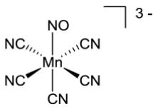
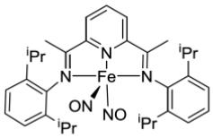
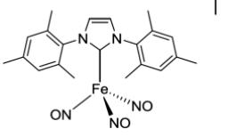
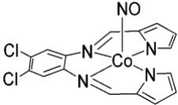

第 36 届中国化学奥林匹克（决赛第二场）试题\_答案+评分细则  
（2022 年 11 月 28 日 15:00-18:00）

<table><tr><td>题号</td><td>1</td><td>2</td><td>3</td><td>4</td><td>5</td><td>6</td><td>7</td><td>8</td><td>9</td><td>10</td><td>总分</td></tr><tr><td>满分</td><td>6</td><td>8</td><td>7</td><td>9</td><td>10</td><td>9</td><td>18</td><td>10</td><td>11</td><td>12</td><td>100</td></tr></table>

<table><tr><td>H1.008</td><td colspan="16">部分元素原子量</td><td>He4.003</td></tr><tr><td>Li6.941</td><td>Be9.012</td><td rowspan="2" colspan="10"></td><td>B10.81</td><td>C12.01</td><td>N14.01</td><td>O16.00</td><td>F19.00</td><td>Ne20.18</td></tr><tr><td>Na22.99</td><td>Mg24.31</td><td>Al26.98</td><td>Si28.09</td><td>P30.97</td><td>S32.07</td><td>Cl35.45</td><td>Ar39.95</td></tr><tr><td>K39.10</td><td>Ca40.08</td><td>Sc44.96</td><td>Ti47.87</td><td>V50.94</td><td>Cr52.00</td><td>Mn54.94</td><td>Fe55.85</td><td>Co58.93</td><td>Ni58.69</td><td>Cu63.55</td><td>Zn65.38</td><td>Ga69.72</td><td>Ge72.64</td><td>As74.92</td><td>Se78.96</td><td>Br79.90</td><td>Kr83.80</td></tr><tr><td>Rb85.47</td><td>Sr87.62</td><td>Y88.91</td><td>Zr91.22</td><td>Nb92.91</td><td>Mo95.96</td><td>Tc[98]</td><td>Ru101.07</td><td>Rh102.91</td><td>Pd106.42</td><td>Ag107.87</td><td>Cd112.41</td><td>In114.82</td><td>Sn118.71</td><td>Sb121.76</td><td>Te127.60</td><td>I126.90</td><td>Xe131.29</td></tr><tr><td>Cs132.91</td><td>Ba137.33</td><td>La138.91</td><td>Hf178.49</td><td>Ta180.95</td><td>W183.84</td><td>Re186.21</td><td>Os190.23</td><td>Ir192.22</td><td>Pt195.08</td><td>Au196.97</td><td>Hg200.59</td><td>Tl204.38</td><td>Pb207.2</td><td>Bi208.98</td><td>Po(209)</td><td>At(210)</td><td>Rn(222)</td></tr></table>

要求: 1）凡题目中要求书写反应方程式，须配平且系数为最简整数比。

2）可能需要的常数：法拉第常数 $F = 9 . 6 4 8 5 \times 1 0 ^ { 4 } \mathrm { C } \mathrm { m o l } ^ { - 1 }$ ；气体普适常数 $R = 8 . 3 1 4 5 ~ \mathrm { J ~ K ^ { - 1 } ~ m o l ^ { - 1 } }$

有机题目中可能用到的缩写：AIBN：偶氮二异丁腈；Ar：芳基；nBu：正丁基；tBu：叔丁基；cod：环辛二烯；DCM：二氯甲烷；dr：非对映异构体比例；Et：乙基；Ph：苯基；Ms：甲磺酰基；Me：甲基。

# 关于反应方程式评判的统一说明：

1）方程式正确且合乎要求，得满分。  
2）如果方程式中反应物和生成物书写全部正确，只是未配平，得一半分。  
3）反应物和生成物之间可以用箭头、等号均可。  
4）如果将要求的离子方程式写为一般化学反应式且书写正确，不扣分。反之依然。

# 关于有效数字：

有效数字与测量及误差密切相关，需要有有效数字的概念，并合理运用。

在本套题目中，有效数字合理即可。

# 关于计算题：

答案给出的是最基本且比较详细的解答，供熟悉参考，也是答案部分正确时的判别依据

若采用其他计算方式，公式合理，分析合乎逻辑，结果正确，亦得满分。

如果没有计算过程，即使结果正确，也不得分。

# 第 1 题（6分）水样中锰含量的检测

水源洁净事关人民的生命健康。重金属离子、微生物含量等多种指标是水质考察的重点，锰含量就是其中一项。我国生活饮用水卫生标准规定锰含量不得超过 $0 . 1 \mathrm { ~ m g ~ L ^ { - 1 } }$ 。锰含量常用分光光度法检测，实验过程如下：向水样中加入甲醛肟溶液，再加入适量氢氧化钠，放置 20 分钟，若水样中含锰(通常为$\mathrm { M n } ^ { 2 + }$ ，其配合物几乎无色)，会产生棕色配合物(锰离子与甲醛肟配比为 1:6），测量其吸光度。

1-1 甲醛肟 $\mathsf { \Gamma } ( { \mathrm { C H } } _ { 2 } { \mathrm { N O H } } )$ 可以由盐酸羟胺与甲醛按 1:1在水溶液中制得，写出反应方程式。  
1-2 写出棕色配合物形成的化学反应方程式。  
1-3 利用此方法测定浓度为 $8 . 0 0 { \times } 1 0 ^ { - 5 } \mathrm { m o l \ L } ^ { - 1 }$ 的锰标液，比色皿宽 1 cm，吸光度为 0.880。从水源地取样，将 1 L 水样浓缩至 10 mL，若采用示差分光光度法，以 $1 . 6 0 { \times } 1 0 ^ { - 4 } ~ \mathrm { m o l ~ L } ^ { - 1 }$ 锰标液作参比，测得样品的吸光度为 0.200，计算水样中锰的含量，判断此水样是否合格。

<table><tr><td>1-1共1分</td><td> $\text{HCHO} + \text{NH}_2\text{OH HCl} \rightarrow \text{CH}_2\text{NOH} + \text{HCl} + \text{H}_2\text{O}$  (1分)</td></tr><tr><td>1-2共2分</td><td> $2\text{Mn}^{2+} + \text{O}_2 + 8\text{OH}^- + 12\text{CH}_2\text{NOH} \rightarrow 2[\text{Mn}(\text{CH}_2\text{NO})_6]^{2-} + 10\text{H}_2\text{O}$  (2分)</td></tr><tr><td>1-3共3分</td><td>根据朗伯比尔定律: $A_s = \varepsilon bc_s$ 有  $0.880 = \varepsilon \times 1\text{cm} \times 8.00 \times 10^{-5}\text{cm}^{-1} \quad \varepsilon = 1.10 \times 10^4\text{L mol}^{-1}\text{cm}^{-1}$  (0.5分)示差分光光度法中有: $\Delta A = \varepsilon b(c_x - c_s) = \varepsilon b\Delta c$  $\Delta c = \Delta A/\varepsilon b = 0.200/(1.10 \times 10^4 \times 1) = 1.82 \times 10^{-5}\text{mol L}^{-1}$  $c_x = c_s + \Delta c = (1.60 \times 10^{-4} + 1.82 \times 10^{-5})\text{mol L}^{-1} = 1.78 \times 10^{-4}\text{mol L}^{-1}$  $= 9.77 \times 10^{-3}\text{g/L}$  (1分)样品原浓度为: $9.77 \times 10^{-3} \times 10^3/10^2 = 9.77 \times 10^{-2}\text{(mg/L)}$  小于  $0.1\text{mg/L}$ ,水样合格答  $9.8 \times 10^{-2}\text{(mg/L)}$  亦可本题要求3位有效数据 (0.5分)</td></tr></table>

# 第 2 题（8 分）电化学与热力学参数

在测定某些热力学参数时，常常设计电池。测得 298.2 K 时下述电池的电动势为 1.362V。

$$
\mathrm{Pt}, \mathrm{H} _ {2} \left(p ^ {\mathrm{o}}\right) \mid \mathrm{H} _ {2} \mathrm{SO} _ {4} (\mathrm{aq}) \mid \mathrm{Au} _ {2} \mathrm{O} _ {3} (\mathrm{s}) \mid \mathrm{Au} (\mathrm{s})
$$

已知 $\Delta _ { f } G _ { \mathrm { m } } ^ { \mathrm { ~ o ~ } } ( \mathrm { H } _ { 2 } \mathrm { O } , \mathrm { g } ) = - 2 2 8 . 6 \mathrm { k J } \ : \mathrm { m o l } ^ { - 1 }$ ，该温度下水的饱和蒸气压为 3.167 kPa。

2-1 计算 298.2 K 时， $\mathrm { H } _ { 2 } \mathrm { O } ( \mathrm { l } ) = \mathrm { H } _ { 2 } \mathrm { O } ( \mathrm { g } )$ 相变过程的标准 Gibbs 能变 ${ \Delta _ { \mathrm { v } } G _ { \mathrm { m } } } ^ { \mathrm { ~ o ~ } } \mathrm { ~ c ~ }$ 。（单位：kJ $\mathrm { m o l } ^ { - 1 } )$ ）  
2-2 计算 298.2 K 时，反应 $2 \mathrm { A u } _ { 2 } \mathrm { O } _ { 3 } = 4 \mathrm { A u } + 3 \mathrm { O } _ { 2 }$ 的标准 Gibbs 能变 ${ \Delta _ { \mathrm { r } } } { { G _ { \mathrm { m } } } ^ { \mathrm { ~ o ~ } } }$   
2-3 写出 $\mathbf { A u } _ { 2 } \mathbf { O } _ { 3 }$ 的标准 Gibbs 生成自由能 $\Delta _ { \mathrm { f } } G _ { \mathrm { m } } { } ^ { \mathrm { o } } ( \mathrm { A u } _ { 2 } \mathrm { O } _ { 3 } )$ 。

<table><tr><td>2-1共2分</td><td>反应1: $H_{2}O(l) = H_{2}O(g)$  $K_{P}^{o} = \frac{3.167\ kPa}{100\ kPa} = 3.167 \times 10^{-2}$ 1 分 $\Delta_{v}G_{m}^{o} = -RT\ln K_{p}^{o}$ 0.5 分 $\Delta_{v}G_{m}^{o}(H_{2}O) = 8.56\ kJ\ mol^{-1}$ 0.5 分</td></tr><tr><td>2-2共5分</td><td>电池总反应(反应2), $3H_{2}(p^{o}) + Au_{2}O_{3} \longrightarrow 2Au + 3H_{2}O(l)$ 1 分或者系数选择其他按比例示出的方式亦可,例如 $H_{2}(p^{o}) + \frac{1}{3}Au_{2}O_{3} \longrightarrow \frac{2}{3}Au + H_{2}O(l)$ 电池电动势: $E^{o} = 1.362\ V$ 0.5 分 $\Delta_{r}G_{m}^{o}(2) = -nE^{o}F = -6 \times 1.362 \times 9.65 \times 10^{4}/10^{3} = -788.6\ kJ\cdot mol^{-1}$ 1 分若系数选择其他按比例,则此处电子数n应与之相应, $\Delta_{r}G_{m}^{o}(2)$ 按比例变化。又知:(反应3) $H_{2}(g) + 1/2\ O_{2}(g) \rightarrow H_{2}O(g)$  $\Delta_{r}G_{m}^{o}(3) = \Delta_{f}G_{m}^{o}(H_{2}O,g) = -228.6\ kJ\ mol^{-1}$ 0.5 分则:(反应4) $H_{2}(g) + 1/2\ O_{2}(g) \rightarrow H_{2}O(l)$  $\Delta_{r}G_{m}^{o}(4) = -228.6 - 8.56 = -237.2\ kJ\ mol^{-1}$ 1 分则 反应(2)*2-反应(4)*6 $2Au_{2}O_{3} = 4Au + 3O_{2}$  $\Delta_{r}G_{m}^{o} = (-788.6) \times 2 - (-237.2 \times 6) = -154.2\ (kJ\ mol^{-1})$ 1 分</td></tr><tr><td>2-3共1分</td><td> $\Delta_{f}G_{m}^{o}(Au_{2}O_{3}) = -\Delta_{r}G_{m}^{o}/2 = 77.1\ (kJ\ mol^{-1})$ 1 分</td></tr></table>

# 第 3 题 （7 分）核磁共振的拓展应用

随着仪器和表征方法的发展，各种体系特别是复杂体系热力学参数的测定方法越来越多样化。例如，可以利用核磁共振(NMR)波谱确定复杂体系的酸解离常数，下面给出一个例子：

![[2022-36-CChO-juesai-grading-2_images/83d33e237cf6b20efa20565aebf86e070d64ad19f7cda5c54b74876175a16205.jpg]]

此为 $\mathrm { ( A T P ) H } ^ { 3 - } \mathrel { \boldsymbol \Sigma } ( \mathrm { A T P } ) ^ { 4 - }$ 之间的质子解离-结合平衡过程。为书写方便，(ATP)H3−简写为 $\mathrm { H A } ^ { 3 - }$ ， $\left( \mathrm { A T P } \right) ^ { 4 \cdot }$ −简写为 $\mathsf { A } ^ { 4 - }$ ，酸解离常数为 Ka。简化表达如下：

$$
\mathrm{HA} ^ {3 -} = \mathrm{H} ^ {+} + \mathrm{A} ^ {4 -}
$$

随着 pH 变化，磷的化学环境发生变化，NMR 中的化学位移随之变化。图 3.1给出位 31P的化学位移测定值随 pH 的变化关系。由于溶液中质子交换速度很快，实际测得的化学位移（ $\delta _ { \mathrm { o b s } } \ \mathrm { ~ . ~ }$ ）是质子化形式化学位移$( \delta _ { _ \mathrm { H A } ^ { 3 - } }$ )和脱质子形式化学位移 $( \delta _ { _ { \mathrm { A } ^ { 4 } } }$ )的加权平均值：

$$
\delta_ {\mathrm{obs}} = \delta_ {\mathrm{HA} ^ {3 -}} \chi_ {\mathrm{HA} ^ {3 -}} + \delta_ {\mathrm{A} ^ {4 -}} \chi_ {\mathrm{A} ^ {4 -}}
$$

![[2022-36-CChO-juesai-grading-2_images/d523561bd8b13eb02458a050a2faa998605a9e5aaf22207a3d4c7656165e06b0.jpg]]

line

| pH | δ_obs^(31P) / ppm |
|----|-------------------|
| 3  | -11.0             |
| 4  | -11.0             |
| 5  | -10.8             |
| 6  | -9.8              |
| 7  | -7.2              |
| 8  | -6.2              |
| 9  | -6.0              |

图 3.1 位 $^ { 3 1 } \mathrm { P }$ 的化学位移随 pH 的变化

式中， $\chi _ { \mathrm { _ { H A } } ^ { 3 } }$ 和 $\chi _ { _ { \mathrm { A } ^ { 4 } } }$ 分别表示 $\mathrm { H A } ^ { 3 - }$ 和 $\mathsf { A } ^ { 4 ^ { - } }$ −的比例。

3-1 写出质子化形式化学位移 $( \delta _ { _ \mathrm { H A } ^ { 3 - } } )$ )和脱质子形式化学位移 $( \delta _ { _ { \mathrm { A } ^ { 4 - } } }$ )的值（要求读到小数点后一位）。  
3-2 推导出 pKa 的表达式，只可包含 pH 和所有相关的化学位移参数。  
3-3 从图 3.1中合理取值，计算酸解离常数 Ka。

<table><tr><td>3-1共1分</td><td colspan="2"> $\delta_{\text{HA}^{3-}} = -10.8 \text{ ppm}$ (取-10.7至-10.9ppm均认可) $\delta_{\text{A}^{4-}} = -6.0 \text{ ppm}$ (只此一种)每个符合要求的答案0.5分,共1分</td></tr><tr><td>3-2共4分</td><td>对于反应: $\text{HA}^{3-} = \text{H}^{+} + \text{A}^{4-}$ 1、分步求解及详细推导说明(解法1) $\text{pH} = \text{pK}_{\text{a}} + \log \frac{[\text{A}^{4-}]}{[\text{HA}^{3-}] }$  $\chi_{\text{HA}^{3-}} = \frac{[\text{HA}^{3-}]}{[\text{HA}^{3-}] + [\text{A}^{4-}]}; \quad \chi_{\text{A}^{4-}} = \frac{[\text{A}^{4-}]}{[\text{HA}^{3-}] + [\text{A}^{4-}] }$  $\frac{[\text{A}^{4-}]}{[\text{HA}^{3-}] } = \frac{\chi_{\text{A}^{4-}}}{\chi_{\text{HA}^{3-}}} \text{或}\frac{[\text{HA}^{3-}]}{[\text{A}^{4-}] } = \frac{\chi_{\text{HA}^{3-}}}{\chi_{\text{A}^{4-}}}$  $\chi_{\text{HA}^{3-}} + \chi_{\text{A}^{4-}} = 1$  $\delta_{\text{obs}}(\chi_{\text{HA}^{3-}} + \chi_{\text{A}^{4-}}) = \delta_{\text{HA}^{3-}} \chi_{\text{HA}^{3-}} + \delta_{\text{A}^{4-}} \chi_{\text{A}^{4-}}$  $(\delta_{\text{obs}} \chi_{\text{HA}^{3-}} - \delta_{\text{HA}^{3-}} \chi_{\text{HA}^{3-}}) = (\delta_{\text{A}^{4-}} \chi_{\text{A}^{4-}} - \delta_{\text{obs}} \chi_{\text{A}^{4-}})$  $\chi_{\text{HA}^{3-}}(\delta_{\text{obs}} - \delta_{\text{HA}^{3-}}) = \chi_{\text{A}^{4-}}(\delta_{\text{A}^{4-}} - \delta_{\text{obs}})$  $\frac{\chi_{\text{A}^{4-}}}{\chi_{\text{HA}^{3-}}} = \frac{(\delta_{\text{obs}} - \delta_{\text{HA}^{3-}})}{(\delta_{\text{A}^{4-}} - \delta_{\text{obs}})}$ or, $\frac{\chi_{\text{HA}^{3-}}}{\chi_{\text{A}^{4-}}} = \frac{(\delta_{\text{A}^{4-}} - \delta_{\text{obs}})}{(\delta_{\text{obs}} - \delta_{\text{HA}^{3-}})}$  $pK_{a} = pH + \log \frac{(\delta_{\text{A}^{4-}} - \delta_{\text{obs}})}{(\delta_{\text{obs}} - \delta_{\text{HA}^{3-}})}$ 2.或者给出如下简洁表达,亦可 $\frac{[\text{A}^{4-}]}{[\text{HA}^{3-}]} = \frac{\chi_{\text{A}^{4-}}}{\chi_{\text{HA}^{3-}}}$ 或 $\frac{[\text{HA}^{3-}]}{[\text{A}^{4-}]} = \frac{\chi_{\text{HA}^{3-}}}{\chi_{\text{A}^{4-}}}$  $pK_{a} = pH + \log \frac{[\text{HA}^{3-}]}{[\text{A}^{4-}]}$  $= pH + \log \frac{\chi_{\text{HA}^{3-}}}{\chi_{\text{A}^{4-}}}$  $= pH + \log \frac{(\delta_{\text{A}^{4-}} - \delta_{\text{obs}})}{(\delta_{\text{obs}} - \delta_{\text{HA}^{3-}})}$ </td><td>1分1分1分1分1分3分</td></tr><tr><td>3-3共2分</td><td>读取, $pH = 6.5$ ,  $\delta_{\text{obs}} = -8.6$  ppm说明:要求读数必须取在pH=6.0到7.5之间 $pK_{a} = 6.5 + \log \frac{(-6.0 - (-8.6))}{(-8.6 + 10.8)} = 6.6$ 答到pKa即可。给出Ka更好!如果用多个数据平均计算合理,也可以。由于读数差异,在公式运用合理的前提下,允许pKa计算值在6.4~6.7之间。</td><td>1分1分</td></tr></table>

# 第 4 题（9分）岩石变化动力学

斜方辉石 $[ ( \mathrm { M g } , \mathrm { F e } ) _ { 2 } \mathrm { S i } _ { 2 } \mathrm { O } _ { 6 } ]$ 是地壳和上地幔的主要组成矿物之一，在其晶体结构中包含有两种不同的硅氧四面体 $\left( \mathrm { S i O } _ { 3 } \right) ^ { 2 \cdot }$ −链，分别称作A链和 B 链，基于这两种链的排布而形成了两种结构有差异的八面体空隙 M1 和 M2，二者比例相同，如图 4.1 所示， $\mathrm { M g } ^ { 2 + }$ 和 $\mathrm { F e } ^ { 2 + }$ 便分布在这些八面体空隙中。

由于 M1 和 M2 的空隙性质不同，导致$\mathrm { M g } ^ { 2 + }$ 和 $\mathrm { F e } ^ { 2 + } \bar { \rangle }$ 对其占据的选择性不同， $\mathrm { F e } ^ { 2 + }$ 倾向于占据 M2位置。一定条件下，两种离子可以发生不同位置的交换反应：

![[2022-36-CChO-juesai-grading-2_images/df2fdf232c15c01872017a1db2e76b9635318d5535245a2b4e880498ea8c02e8.jpg]]

chemical

Crystal structure diagram showing layered arrangement with labeled axes a, b, c and regions A, B

（a）

![[2022-36-CChO-juesai-grading-2_images/29bb8de3f1437fe3f788f363c4c8de34d3b31bb24e507f842f188e1c02c518a9.jpg]]

chemical

Crystal structure diagram showing M1 and M2 atomic positions with blue and yellow spheres representing different elements

(b)   
图 4.1 斜方辉石的结构

$$
\mathrm{Fe} ^ {2 +} (\mathrm{M} 1) + \mathrm{Mg} ^ {2 +} (\mathrm{M} 2) \rightleftharpoons \mathrm{Fe} ^ {2 +} (\mathrm{M} 2) + \mathrm{Mg} ^ {2 +} (\mathrm{M} 1)
$$

为简便起见， $\mathrm { F e } ^ { 2 + } ( \mathbf { M } 1 )$ 、 $\mathrm { F e } ^ { 2 + } ( \mathbf { M } 2 )$ 、 $\mathbf { M g } ^ { 2 + } ( \mathbf { M } 1 )$ 、 $\mathbf { M g } ^ { 2 + } ( \mathbf { M } 2 )$ 分别写作 Fe(1)、 ${ \mathrm { F e } } ( 2 )$ 、 $\mathbf { M g } ( 1 )$ 、 $\mathrm { { M g } } ( 2 )$ 。上述反应达平衡时，分配系数 $K _ { \mathrm { D } } \mathrm { : }$ ：

$$
K _ {\mathrm{D}} = \frac {\chi_ {\mathrm{Fe(2)}} \chi_ {\mathrm{Mg(1)}}}{\chi_ {\mathrm{Fe(1)}} \chi_ {\mathrm{Mg(2)}}}
$$

其中， $\chi$ 为各离子占据相应位置的摩尔分数，例如： $\chi _ { \mathrm { F e } ( 2 ) }$ 为 $\mathrm { F e } ^ { 2 + }$ 离子占据 M(2)位置的摩尔分数，其他同理。选择某一矿物样品，在 873 K下进行处理，利用 X射线衍射结合穆斯堡尔谱监测反应进行过程中上述物种占据不同位置情况随时间的变化，数据列入下表中。

<table><tr><td>编号</td><td>t / min</td><td> $\chi_{\text{Fe(1)}}$ </td><td> $\chi_{\text{Mg(2)}}$ </td><td> $\chi_{\text{Fe(2)}}$ </td><td> $\chi_{\text{Mg(1)}}$ </td></tr><tr><td>1.</td><td>0</td><td>0.00450</td><td>0.9807</td><td>0.0174</td><td>0.9769</td></tr><tr><td>2.</td><td>600</td><td>0.00420</td><td>0.9804</td><td>0.0176</td><td>0.9771</td></tr><tr><td>3.</td><td>1920</td><td>0.00380</td><td>0.9801</td><td>0.0179</td><td>0.9774</td></tr><tr><td>4.</td><td>3720</td><td>0.00361</td><td>0.9798</td><td>0.0183</td><td>0.9778</td></tr><tr><td>5.</td><td>6000</td><td>0.00335</td><td>0.9795</td><td>0.0185</td><td>0.9780</td></tr><tr><td>6.</td><td>11760</td><td>0.00281</td><td>0.9790</td><td>0.0191</td><td>0.9786</td></tr><tr><td>7.</td><td>20300</td><td>0.00261</td><td>0.9788</td><td>0.0193</td><td>0.9788</td></tr><tr><td>8.</td><td>29700</td><td>0.00233</td><td>0.9785</td><td>0.0195</td><td>0.9790</td></tr><tr><td>9.</td><td>48165</td><td>0.00232</td><td>0.9785</td><td>0.0195</td><td>0.9790</td></tr></table>

4-1 计算分配系数 $K _ { \mathrm { D } }$ 。（提示：根据表中数据，合理判断并选择数据）。  
4-2 上述反应的正、逆反应的速率常数分别为 $k _ { 1 }$ 和 $k _ { - 1 } ,$ ，假设正、逆反应速率表达形式均与基元反应类似，正、逆反应速率分别与占据相应位置的各离子的摩尔分数 $\chi$ 成正比。写出 $K _ { \mathrm { D } }$ 与 $k _ { 1 }$ 和 $k _ { - 1 }$ 的关系式。  
4-3 利用上表中起始阶段的数据（要求: 采用编号 1\~4 的数据进行处理），计算 $k _ { 1 }$ 和 $k _ { - 1 }$ 的值。

提示：1) 可将 $\mathrm { M g } ^ { 2 + }$ 的摩尔分数近似视为常数，取 0.9780；

2) 微分积分关系式：

<table><tr><td>函数</td><td>微分式</td><td>积分式</td></tr><tr><td rowspan="2">y=f(x)</td><td>dy/dx=ky</td><td>lny=kx+c,c为常数</td></tr><tr><td>dy/dx=k(ay+b),a和b为常数</td><td>1/a ln(ay+b)=kx+c,c为常数</td></tr></table>

<table><tr><td>4-1共1分</td><td colspan="7">从表中数据8和9可知,反应达平衡状态,可选择数据9计算 $K_{\text{D}}$  $K_{\text{D}} = \frac{\chi_{\text{Fe(2)}} \chi_{\text{Mg(1)}}}{\chi_{\text{Fe(1)}} \chi_{\text{Mg(2)}}} = \frac{0.9790 \times 0.0195}{0.9785 \times 0.00232} = 8.41$  1分若选择数据8亦可, $K_{\text{D}} = 8.37$ </td><td></td></tr><tr><td>4-2共1分</td><td colspan="7"> $K_{\text{D}} = \frac{k}{k_{-1}}$  1分</td><td></td></tr><tr><td rowspan="6">4-3共7分</td><td colspan="8">正反应速率:(1)  $r_{+} = k \chi_{\text{Fe(1)}} \chi_{\text{Mg(2)}} = k \times 0.9780 \chi_{\text{Fe(1)}}$  0.5分逆反应速率:(2)  $r_{-} = k_{-1} \chi_{\text{Fe(2)}} \chi_{\text{Mg(1)}} = k_{-1} \times 0.9780 \chi_{\text{Fe(2)}}$  0.5分总净反应速率:(3)  $R = \frac{d(\chi_{\text{Fe(2)}})}{dt} = r_{+} - r_{-} = k \times 0.9780 \chi_{\text{Fe(1)}} - k_{-1} \times 0.9780 \chi_{\text{Fe(2)}}$  1分 $= 8.22 \times k_{-1} \times \chi_{\text{Fe(1)}} - k_{-1} \times 0.9780 \times \chi_{\text{Fe(2)}}$  反应过程中M2位置Fe(2)的摩尔分数 $\chi_{\text{Fe(2)}}$ 增加量(x)等于M1位置Fe(1)摩尔分数的减少量: $x = \chi_{\text{Fe(1)}}^{0} - \chi_{\text{Fe(1)}} = \chi_{\text{Fe(2)}} - \chi_{\text{Fe(2)}}^{o}$ (4)  $\chi_{\text{Fe(1)}} = \chi_{\text{Fe(1)}}^{0} - \chi_{\text{Fe(2)}} + \chi_{\text{Fe(2)}}^{o} = 0.0045 - \chi_{\text{Fe(2)}} + 0.0174 = 0.0219 - \chi_{\text{Fe(2)}}$  1分(5)  $\frac{d(\chi_{\text{Fe(2)}})}{dt} = 8.22 \times k_{-1} \times (0.0219 - \chi_{\text{Fe(2)}}) - k_{-1} \times 0.9780 \times \chi_{\text{Fe(2)}}$  1分 $= k_{-1}(0.1801 - 9.20 \chi_{\text{Fe(2)}})$ (6)  $\ln(0.1801 - 9.20 \chi_{\text{Fe(2)}}) = -9.20 \times k_{-1} t + c$  1分四组数据拟合,斜率为 $(-1.42 \times 10^{-4})$ , $-9.2 k_{-1} = -1.42 \times 10^{-4}$  1分 $k_{-1} = 1.54 \times 10^{-5} (\min^{-1})$  0.5分 $k_{1} = 1.30 \times 10^{-4} (\min^{-1})$  0.5分参考数据令 $y = (0.1801 - 9.20 \chi_{\text{Fe(2)}})$ </td></tr><tr><td>编号</td><td>t/min</td><td>y</td><td>lny</td><td>数据</td><td>斜率/ $10^{-4}$ </td><td>数据</td><td></td></tr><tr><td>1</td><td>0</td><td>0.02002</td><td>-3.91102</td><td>1-2</td><td>-1.61</td><td>2-4</td><td></td></tr><tr><td>2</td><td>600</td><td>0.01818</td><td>-4.00743</td><td>1-3</td><td>-1.36</td><td>3-4</td><td></td></tr><tr><td>3</td><td>1920</td><td>0.01542</td><td>-4.17209</td><td>1-4</td><td>-1.43</td><td></td><td></td></tr><tr><td>4</td><td>3720</td><td>0.01174</td><td>-4.44475</td><td>2-3</td><td>-1.25</td><td></td><td></td></tr></table>

![[2022-36-CChO-juesai-grading-2_images/672c8723095ace138015221341ef3808588aaa0c3a6a3d33ec5f8c36d0754061.jpg]]

line

| t / min | y     |
| ------- | ----- |
| 500     | -4.0  |
| 2000    | -4.2  |
| 3750    | -4.5  |

$$
y = k ^ {\prime} t + b
$$

若采用 Fe(1)的变化处理，前（4）步一样，第(5)步开始，基于 Fe(1)的关系式：

$$
\begin{array}{l} - \frac {d \left(\chi_ {\mathrm{Fe} (1)}\right)}{d t} = 8. 2 2 \times k _ {- 1} \times \chi_ {\mathrm{Fe} (1)} - k _ {- 1} \times 0. 9 7 8 0 \times \left(0. 0 2 1 9 - \chi_ {\mathrm{Fe} (1)}\right) \tag {5} \\ = k _ {- 1} (9. 2 0 \chi_ {\mathrm{Fe(1)}} - 0. 0 2 1 4 2) \\ \end{array}
$$

$$
\ln (9. 2 0 \chi_ {\mathrm{Fe(1)}} - 0. 0 2 1 4 2) = - 9. 2 0 \times k _ {- 1} t + c \tag {6}
$$

四组数据拟合，斜率为 $( - 1 . 3 9 \times 1 0 ^ { - 4 } )$ ）， $-$ 1 分

$$
k _ {- 1} = 1. 5 1 \times 1 0 ^ {- 5} (\min ^ {- 1}) \quad 0. 5 \text {分}
$$

$$
k _ {1} = 1. 2 7 \times 1 0 ^ {- 4} (\min ^ {- 1}) \quad 0. 5 \text {分}
$$

若两两组合，斜率最大为 $( - 2 . 4 7 \times 1 0 ^ { - 4 } )$ ），最小为 $( - 7 . 6 7 \times 1 0 ^ { - 5 } )$

$k _ { 1 }$ 和 $k _ { - 1 }$ 的最大值： $k _ { - 1 } = 2 . 6 8 \times 1 0 ^ { - 5 } ( \mathrm { m i n } ^ { - 1 } ) ~ ; ~ k _ { 1 } = 2 . 2 5 \times 1 0 ^ { - 4 } ( \mathrm { m i n } ^ { - 1 } )$

$k _ { 1 }$ 和 $k _ { - 1 }$ 的最小值： $k _ { - 1 } = 8 . 3 3 \times 1 0 ^ { - 6 } ( \mathrm { m i n } ^ { - 1 } ) ~ ; ~ k _ { 1 } = 7 . 0 1 \times 1 0 ^ { - 5 } ( \mathrm { m i n } ^ { - 1 } )$

以上可以作为 $k _ { 1 }$ 和 $k _ { - 1 }$ 取值的区间参考，重在过程。

# 第 5 题 (10 分) 密堆积结构的变换和组合

碱土或稀土元素(A)和过渡金属(B)可以形成多种合金，广泛应用于催化、储氢等领域。图 5.1 给出某合金的理想结构沿不同方向的投影示意图，此结构属六方晶系，晶胞参数 $a = 5 4 0 . 9 \mathrm { p m } , c = 4 3 0 . 0 \mathrm { p m } .$ 。

![[2022-36-CChO-juesai-grading-2_images/a4bd61a709075c0a15fa6e2a017617b5dadb769f6f1a5c76418b5c8939a9e582.jpg]]  
图 5.1 某合金理想结构沿不同方向的投影示意图（其中，大球为 A 原子，小球为 B 原子，圆圈表示空位。）  
(a) 晶胞；(b) 沿 c 方向投影；(c) A 和 B 混合排列层 $( \mathrm { L } _ { 1 }$ 层)；(d) 全部由 B 原子组成的层 $( \mathrm { L } _ { 2 }$ 层)

5-1 写出该合金的组成。

5-2 已知原子 A 处在晶胞原点，写出晶胞中所有 B 原子的坐标参数。

（排序要求：先按 z从小到大；z相同时，按照 a从小到大；a相同时，按照 b从小到大。）

5-3 计算同一层内 B 原子的最短距离和相邻层间 B 原子的最短距离（单位：pm）。  
5-4 该合金有良好的储氢性能。研究发现，氢原子(H)占据如下位置（结构中实际位置与此有所偏离，但计量关系一致）： $\mathrm { L } _ { 1 }$ 层中所有菱形的中心(记为 $\mathrm { H } _ { \mathrm { R } } )$ ， $\mathrm { L } _ { 2 }$ 层中的三角形中心且只占一半(记为 $\mathrm { H _ { T } } )$ 。  
5-4-1 写出晶胞中两种氢原子 $\mathrm { H } _ { \mathrm { R } }$ 和 $\mathrm { H _ { T } }$ 的数目。  
5-4-2 将氘化（即用 D取代 H）的样品进行中子衍射，发现 $\mathrm { L } _ { 1 }$ 层中金属原子和氢原子位置与上述结构吻合；而 $\mathrm { L } _ { 2 }$ 层中氢原子的排布完全有序：倘若某一层中 D 占据全部顶点朝上的三角形中心（记为 $\mathrm { L } _ { 2 \Delta } )$ ），则其邻近的 $\mathrm { L } _ { 2 }$ 层中 D占据全部顶点朝下的三角形中心（记为 $\mathbf { L } _ { 2 \nabla } )$ 。晶体结构按照 $\cdots { \mathrm { L } } _ { 1 } { \mathrm { L } } _ { 2 \nabla } { \mathrm { L } } _ { 1 } { \mathrm { L } } _ { 2 \Delta } \cdots$ ∙进行周期性排列。写出该氘化物的晶胞参数，假设 D代不影响 A和 B 原子的位置。

<table><tr><td>5-1共1分</td><td>AB5 1分</td></tr><tr><td>5-2共2.5分</td><td>(1/3,2/3,0) (2/3,1/3,0) (0,1/2,1/2) (1/2,0,1/2) (1/2,1/2,1/2)每个正确答案0.5分,共2.5分</td></tr><tr><td>5-3共2分</td><td>同一层内B原子的最短距离和相邻层间B原子的最短距离L1层:540.9 pm×31/2/3=314.1 pm (不考虑L1层这个数值)L2层:540.9 pm/2=270.5 pm L1-L2层间: $\sqrt{\left(\frac{2}{3}\frac{\sqrt{3}}{2}\frac{1}{2}a\right)^{2}+\left(\frac{1}{2}c\right)^{2}}=\sqrt{\left(\frac{\sqrt{3}}{6}\times540.9\right)^{2}+\left(\frac{1}{2}\times430.0\right)^{2}}=265.7(\text{pm})$  1分</td></tr><tr><td>5-4-1共2分</td><td>HR 3 1分HT 4 1分如果HT写为1,得0.5分</td></tr><tr><td>5-4-2共2.5分</td><td>γ=120° (若未写γ,指出是六方晶系,亦可) 0.5分不要求写α=β=90°,正确写出不评判,但若写错扣0.5分。a′=b′=540.9 pm, c′=2c=860.0 pm 1分</td></tr></table>

# 第 6 题（9分）金属 M及其变化

6-1 金属 M的硝酸盐与 1, 3, 5-均苯三甲酸（简写为 $\mathrm { H } _ { 3 } \mathrm { B T C }$ ，分子量为）按特定比例在乙二醇和水的混合体系中于 $1 8 0 ~ \mathrm { { } ^ { \circ } C }$ 下反应 12 小时，得到一种具有“孔笼—孔道”结构的金属有机骨架材料 Y，密度 $\rho =$ $0 . 9 6 \ \mathrm { g \ c m } ^ { - 3 }$ 。单晶 X射线衍射分析表明，Y 属于立方晶系，其三维骨架结构主体由 M和 $\left( \mathbf { B } \mathbf { T } \mathbf { C } \right) ^ { 3 - }$ −组成，呈电中性，结构中带有水分子。元素分析表明，Y 中含 M，C，O 和 H 四种元素，且 $\pmb { { \mathbb { M } } } \overset { \mapsto } { \to } \mathbf { C }$ 的原子比为$1 { : } 6 _ { \circ }$ 。热重-质谱联合分析结果显示，样品在 $1 0 0 { \sim } 2 0 0 \ \mathrm { ~ } ^ { \circ } \mathrm { C }$ 区间失重 8.21%，对应于化学式中 3 个水分子的脱除，而主体骨架结构依然保持；继续加热到 $3 5 0 ~ \mathrm { { ^ { \circ } C } }$ 失重 63.7 %，之后无明显失重，残渣为金属氧化物MO。通过计算确认 M 是何种金属，写出 Y 的化学式。  
6-2 将金属M加入到足量的浓硫酸中，微热片刻即有黑色物质A生成，之后A逐渐转变为灰白色物质B。该灰白色物质用过量氨水充分处理，过滤后，向滤液中通入 $\mathrm { S O } _ { 2 }$ 至微酸性，生成白色沉淀 C（反应 1）。元素分析结果，N含量 8.65 %，S含量 19.6 %, H含量 2.49 %。测试分析发现，C的结构中负离子呈三角锥形，磁性测量显示抗磁性。C与足量 $\mathrm { H } _ { 2 } \mathrm { S O } _ { 4 }$ 混合并加热，可生成超细粉末态 M（反应 2）。

6-2-1 写出 A, B, C 的化学式。

6-2-2 写出反应 1 和反应 2 的方程式。

<table><tr><td>6-1共4分</td><td colspan="3">设Y的式量为M,样品在100~200°C区间失重8.21%,对应于化学式中3个水分子的脱除,有:M=3×18.0/8.21%=657.7 1分因为失重63.7%的热重残渣为MO,设Y中含n个MO,M的原子量为A,有:(A+16.0)n/M=(1-63.7%)或 A=238.7/n-16.0 1分以上两个式子或其整理形式只要写出一个,就可以n=1,A=222.7 无合适元素n=2,A=103.4 与铑原子量接近,但是不可能,后面的反应不符合。n=3,A=63.6 Cu的原子量63.55,很可能是Cu 1分n=4,A=43.7 无合适元素n=5,A=31.7 无合适元素Y的化学式:Cu3(BTC)2·3H2O 1分</td></tr><tr><td>6-2-1共3分</td><td>ACuO 1分或 Cu2S 或 CuS 亦可</td><td>BCuSO4 1分</td><td>CCu(NH4)SO3 1分</td></tr><tr><td rowspan="2">6-2-2共2分</td><td colspan="3">反应1:2Cu(NH3)4SO4 + 3SO2 + 4H2O = 2CuNH4SO3↓ + 3(NH4)2SO4 1分</td></tr><tr><td colspan="3">反应2:2CuNH4SO3 + 2H2SO4 = Cu +CuSO4 + 2SO2 + 2H2O + (NH4)2SO4 1分反应2中应该就是CuSO4,如果写离子式,硫酸根SO42-写成HSO4-并合理配平,也认可。但化学式写Cu(HSO4)2有点奇怪,在浓硫酸中得到的都是CuSO4。(NH4)2SO4写(NH4)HSO4没问题。2CuNH4SO3 + 3H2SO4 = Cu +CuSO4 + 2SO2 + 2H2O + 2NH4HSO4</td></tr></table>

# 第 7 题（18分）明星分子的配位作用

一氧化氮是众所周知的明星分子，不仅在生命体中扮演重要角色，在小分子的活化中也起着非常重要的作用。相关过程多涉及 NO与金属的配位作用。作为配体，随结合的中心原子得失电子的能力不同，NO 可采用阳离子(NO+)、中性分子(NO)和阴离子(NO)的配位模式。

7-1 在金属和 NO 形成的配合物（M-NO）中，有时候很难区分电子在中心金属 M 和 NO 配体上的分配状况，基于此，通常采用 Feltham-Enemark 记号来综合表示。该表示方法为： $\{ \mathbf { M } ( \mathbf { N O } ) _ { x } \} ^ { y }$ ，其中 x 为 NO配体的数目，y 为中心金属 M 的 d 电子数和所有 NO 配体的反键轨道\*中的电子数之和，其他配体均不出现在记号中，也无需标出配合物的电荷。下面给出了两个 M-NO 配合物（a 和 b）及其对应的Feltham-Enemark(F-E)记号。

<table><tr><td>配合物</td><td>(a)</td><td> $\neg^+$ (b)</td><td> $\neg^+$ (c)</td><td>(d)</td></tr><tr><td>F-E记号</td><td> $\{MnNO\}^6$ </td><td> $\{Fe(NO)_2\}^9$ </td><td>需回答</td><td>需回答</td></tr></table>

7-1-1 写出 NO 的分子轨道表达式（只考虑价层电子）。写出 $\mathrm { N O ^ { + } }$ 、NO 和 NO的键级。  
7-1-2 写出(c)和(d)中配合物的 Feltham-Enemark 记号形式。  
7-2 M-NO类型的配合物可以发生氧化还原反应。2019 年，研究者用一种三脚氮杂卡宾配体(用 $\mathrm { T I M E N } ^ { \mathrm { M e s } }$ 表示)和 $\mathrm { F e } ^ { 2 + }$ 形成配合物 A（见下图），A 在乙腈(CH CN)溶液中与 $\mathrm { N O B F _ { 4 } }$ 反应，得到一种含有 NO 的六配位的配合物离子 B，B 中配体也包括乙腈分子。在 B 的乙腈溶液中，加入足量 Zn 粉，搅拌过夜，得到配合物 C，C 中不含溶剂分子。磁性测量表明，B 显抗磁性，C 的磁矩为 3.84 µB。

![[2022-36-CChO-juesai-grading-2_images/48777b9bdde123d3916484d2b91368058fa99fd3807fee4bbce64cc16fa9ea56.jpg]]

chemical

Complex organic molecule structure with multiple pyridine and indole rings

TIMENMes

![[2022-36-CChO-juesai-grading-2_images/515f7514f94782bca5d9742065a3929927f25317eaa087acddb1fa4cac758fe7.jpg]]  
配合物A

7-2-1 写出B的化学式。  
7-2-2 画出B中金属离子在配位场（假设为正多面体）作用下的 d 轨道电子排布。  
7-2-3 写出 C 中阳离子的化学式及相应的 Feltham-Enemark 记号。

7-3 最近，研究者报道了一个非血红素铁氧配合物 P，P 与 NO 反应得到配合物 Q，Q 在无水无氧条件下稳定，其中，FeNO 的键角为 $1 4 4 . 5 ^ { \mathrm { { \circ } } }$ ，且 NO键的键能比预期的小。

![[2022-36-CChO-juesai-grading-2_images/1c90d01351b5716535a61892487de3a4a3e00a1881dfc92bc90cd65191115409.jpg]]

chemical

Chemical reaction converting compound P to compound Q using NO, showing iron center coordinated with phenyl and silane ligands

7-3-1 实验中所用干燥NO气体是在固体 ${ \mathrm { N a N O } } _ { 2 }$ 和 $\mathrm { F e S O _ { 4 } }$ 混合物中加入浓硫酸制备的。写出反应方程式。  
7-3-2 分别写出配合物 P 和 Q 中铁的氧化数，指出 Q 中与铁离子配位的 NO 采用的是哪种形式配位。  
7-3-3 Q 在干燥的 THF溶液中可存在一定时间。但若 THF中含水，Q 与之接触则立即释放出 ${ \bf N } _ { 2 } { \bf O }$ 。写出

反应方程式——式中反应物不必写 Q，只需给出 Q 中与 ${ \bf N } _ { 2 } { \bf O }$ 放出对应的物种。

7-3-4 配合物 P 与 $\mathrm { \bf O } _ { 2 }$ 于 $- 8 0 ~ ^ { \mathrm { { o } } } \mathrm { { C } }$ 反应得双核配合物 R，将 R的溶液加热至 $2 3 ~ \mathrm { { ^ \circ C } }$ 得 O原子桥联的双核铁配合物 $\mathbf { S } _ { \mathcal { O } }$ 。若在 ${ } ^ { - 1 9 6 } ^ { \mathrm { { \mathrm { { o } } } } } \mathrm { { C } }$ 下将 R的冷冻溶液光照，得到一单核铁配合物 T，T 能夺取三叔丁基苯酚上的羟基氢。写出配合物 R、S 和 T 的结构简式并给出标明中心离子的氧化态。（含 N 和含 O 鳌合配体分别用$\mathrm { L } _ { 1 }$ 和 $\mathrm { L } _ { 2 }$ 表示）

<table><tr><td>7-1-1共2.5分</td><td colspan="3"> $(1σ)^{2}(2σ)^{2}(1π)^{4}(3σ)^{2}(2π)^{1}$  1分或  $(σ_{2s})^{2}(σ_{2s}^{*})^{2}(π_{2px}, π_{2py})^{4}(σ_{2pz})^{2}(π_{2px}^{*}, π_{2py}^{*})^{1}$  亦可鉴于(1π)和(3σ)轨道高低次序有不同说法,这两个次序不做要求。NO+、NO和NO-的键级分别为:3,2.5,2 各0.5分,共1.5分</td></tr><tr><td>7-1-2共2分</td><td>(c) $\{Fe(NO)_3\}^{10}$  1分</td><td colspan="2">(d) $\{CoNO\}^8$  1分</td></tr><tr><td>7-2-1共1分</td><td colspan="3"> $[Fe(TIMEN^{Mes})(CH_3CN)(NO)]^{3+}$  1分</td></tr><tr><td>7-2-2共1分</td><td colspan="3">— —  $e_g$ ↑↓ ↑↓ ↑↓ $t_{2g}$  1分 如果轨道未标  $(t_{2g})(e_g)$ ,图示意正确,只得0.5分或者写作: $(t_{2g})^{6}(e_g)^0$ </td></tr><tr><td>7-2-3共2分</td><td colspan="3"> $[Fe(TIMEN^{Mes})(NO)]^{2+}$  1分 $\{Fe(NO)\}^7$  1分</td></tr><tr><td>7-3-1共3分</td><td>P+2或II 1分</td><td colspan="2">Q+3或III 1分NO- 1分</td></tr><tr><td>7-3-2共1分</td><td colspan="3"> $\mathrm{NaNO_2 + FeSO_4 + 3H_2SO_4 \rightarrow NO + Fe(HSO_4)_3 + NaHSO_4 + H_2O}$  1分若写作  $2\mathrm{NaNO}_2 + 2\mathrm{FeSO}_4 + 2\mathrm{H}_2\mathrm{SO}_4 \rightarrow 2\mathrm{NO} + \mathrm{Fe}_2(\mathrm{SO}_4)_3 + \mathrm{Na}_2\mathrm{SO}_4 + 2\mathrm{H}_2\mathrm{O}$  亦可 $\mathrm{H}_2\mathrm{O}$  表示为与硫酸结合的方式,可以。</td></tr><tr><td>7-3-3共1分</td><td colspan="3"> $2\mathrm{NO}^{-} + \mathrm{H}_{2}\mathrm{O} \rightarrow \mathrm{N}_{2}\mathrm{O} + 2\mathrm{OH}^{-}$  1分若写作: $2[\mathrm{Fe}-\mathrm{NO}] + \mathrm{H}_{2}\mathrm{O} \rightarrow \mathrm{N}_{2}\mathrm{O} + 2[\mathrm{Fe}-\mathrm{OH}]$ 或  $2[\mathrm{Fe}(\mathrm{NO})\mathrm{L}_{1}\mathrm{L}_{2}] + \mathrm{H}_{2}\mathrm{O} \rightarrow \mathrm{N}_{2}\mathrm{O} + 2[\mathrm{Fe}(\mathrm{OH})\mathrm{L}_{1}\mathrm{L}_{2}]$  亦可</td></tr><tr><td rowspan="2">7-3-4共4.5分</td><td>RL1L2Fe-O-O-FeL1L2III</td><td>SL1L2Fe-O-FeL1L2III</td><td>TL1L2Fe=OV IV若写成自由基 $L_1L_2Fe-O\bullet$ ,III亦可</td></tr><tr><td colspan="3">以上R、S、T,化学式正确1分,氧化态正确0.5分,共4.5分</td></tr></table>

有机题目中可能用到的缩写：AIBN：偶氮二异丁腈；Ar：芳基； ${ } ^ { n } \mathbf { B } \mathbf { u } \mathbf { : }$ ：正丁基； ${ } ^ { t } \mathbf { B } \mathbf { u } ;$ ：叔丁基；cod：环辛二烯；DCM：二氯甲烷；dr：非对映异构体比例；Et：乙基；Ph：苯基；Ms：甲磺酰基；Me：甲基。

第 8 题 (10分) 依据以下实验结果，回答相关问题：

实验一：化合物1在CuCl(cod)2催化下发生反应，高区域选择性形成产物2，其中2a和2b的比例为98:2，产物 2a 中的双键以反式为主，反式和顺式的比例为 74:26。

实验二：该反应在没有 Cu(I)参与下，基本上不反应，原料完全回收。

实验三：产物(Z)-2a 可以在没有 Cu(I)参与下，在 $1 0 0 ^ { \circ } \mathrm { C }$ 下转化为(E)-2a 和(E)-2b。然而，在同样条件下，(E)-2a 则保持不变，不会转化为(Z)-2a。

分析以上信息，回答相关问题：

8-1 为实验一转化为 2a 的过程提供关键中间体；  
8-2 为实验三(Z)-2a 异构化为(E)-2a、形成(E)-2b的过程提供关键中间体；  
8-3 在加热条件下，解释为什么(Z)-2a 可以转化为(E)-2a，而(E)-2a 不能转化为(Z)-2a;  
8-4 在后续的研究过程中，发现除了形成以上四元环外，还可以形成五元杂环 3。画出形成化合物 3 的关键中间体(说明：与前面重复的无需再画)。

8-1

形成 2a的关键中间体有两个，形成五元环 A和形成联烯 B，每个 2 分，共 4分。

硝酮氧原子、联烯等和铜配位的形式得骨架 1 分；式电荷没写，或错误的，不给分。

# 8-2

形成(E)-2a 和 2b 可以通过两种可能的机理：

# 第一种

![[2022-36-CChO-juesai-grading-2_images/aea58bf874835ff1305d6ac4f1c69b04c4969ddfdb973188aa57880f92c459cd.jpg]]

![[2022-36-CChO-juesai-grading-2_images/19969f92bc348772a56560f1cf5904dbad5f441abd9cdfd1fd8211ac395cbfa5.jpg]]

chemical

Chemical structure of a complex organic molecule with benzene rings, amide groups, and trifluoromethyl substituent

共 2 分（写出其中的一个，即可得 2 分）

也可以得 2 分

# 第二种：

![[2022-36-CChO-juesai-grading-2_images/4accb52ff98927a0b6a81ee841cf3d69caec1c4052462c796a62d8a29fc529dc.jpg]]

chemical

Chemical structure of a substituted benzene ring with phenyl and trifluoromethyl groups, labeled D

![[2022-36-CChO-juesai-grading-2_images/eaa69349d8847bafd18d50dab906888d461d0de8c5cb373b2de03a7f3212ebfb.jpg]]

chemical

Chemical structure of a quaternary ammonium salt with methoxy group, labeled E

通过 Retro formal [2 +2]的机理如下所示，碎片化得到 D和 E，各 1 分，共 2 分。

# 8-3

(Z)-2a 结构中苯基和对甲氧基苯基在一个平面上(1 分)，存在 1,3-烯丙基排斥(1 分)，共 2 分。

# 8-4

![[2022-36-CChO-juesai-grading-2_images/ecd1052e53bdbe320cb7f698cc2034f4d3593590e1ba0113587f43d59b3e3335.jpg]]

chemical

Chemical structure of a diazo compound with phenyl, methyl, and carbonyl groups labeled A

![[2022-36-CChO-juesai-grading-2_images/f82c745fd729ab9ccae0f318591083b415a47941df9687f9a7bf522de52ee9c3.jpg]]

chemical

Chemical structure of a chiral amide compound labeled B, featuring phenyl, carbonyl, and methyl groups

经过 A或 B 其中一个，得 2分。

第9题 (12分) 烯烃和卤素的亲电加成反应是有机化学中的基础反应之一。

9-1 画出如下反应的关键中间体，并解释形成此主要产物的原因。

9-2 画出如下反应的关键中间体，解释反应的区域选择性和立体选择性。(提示： $\operatorname { P h I } ( \mathrm { O A c } ) _ { 2 }$ 首先和 $\mathrm { I } _ { 2 } ,$ 反应、生成不稳定的中间体IOH)

9-1

或楔形式平面结构：

共2分

主要原因有如下三个，每个1分，共3分。

1. 形成溴鎓离子时的面选择性，在芳基的异侧成溴鎓离子；  
2. 溴负离子进攻时的立体选择性，符合SN2 Walden翻转；  
3. 避免经过势能较高的扭船式构象，遵循构象改变最小原则，得到两个1,3-双直立键加成产物。

9-2

形成2的机理如下所示：

中间体A的结构 1分，(+)-号0.5分，共1.5分；

选择性的原因：

苄基正离子的形成导致反应区域选择性，1分；

C-B键对碳正离子的超共轭效应（0.5分）和B上的大空阻导致亲核试剂水从C-B键的异侧进入（0.5分），决定了反应立体选择性， 共1分。

共3.5分。

形成3的机理如下所示：

中间体B的结构1分，(+)-号0.5分，共1.5分；

选择性的原因：

苄位的正性更强(或更亲电) 导致水分子进攻的区域选择性(1分)；

碘鎓离子开环以 $\cdot$ 形式开环导致立体选择性(1分)。共3.5分

第10题 (11分) 如下所示，1,3-二醇单磺酸酯在碱性条件下发生1,3-消除，称为Wharton碎片化反应。该反应是制备中环化合物，尤其是八元环的有效方法之一(要求立体化学)。

依据此信息，回答以下问题：

10-1 如下光学纯的化合物G在三氟乙酸中发生溶剂解得到外消旋H，写出外消旋化经过的关键中间体。

10-2 如下所示反应，在自由基引发下，含双环[4.2.0]骨架的原料可以扩环得到含双环[6.4.0]骨架的中间产物 A，并经多步串联得到中环产物(Z)-环十二-6-烯-1-酮。画出出 A的结构式，并画出由原料转化成 A的关键中间体。

10-1

第一个中间体是绝对构型，骨架 0.5 分，绝对构型 0.5 分；

第二、第三个中间体都答出来，或只写第三个，（可以不要求立体化学），共 2 分；

第四个中间体是相对构型，骨架 0.5分，绝对构型 0.5 分。

形式电荷错误不得分！共 4 分

10-2   
![[2022-36-CChO-juesai-grading-2_images/501d6b36c63bfd46cac1eab5ad924af09ce19b4d7e603bbca055b89b69c97e15.jpg]]

chemical

Chemical structure of a steroid derivative with OTMS and A substituents, labeled 2分

![[2022-36-CChO-juesai-grading-2_images/baefb88787c03fc3b81f1b1510666ca6129f4dcd8e3e2e1343199f9052412726.jpg]]

每个 1分，共 5 分。  
或先脱氯的机理：  
![[2022-36-CChO-juesai-grading-2_images/611c0f246ca74b7c75c15df4d825397dfe1d9b4c8d499bed48edb6c90a8979f0.jpg]]

以上结构均要求立体化学，在立体化学正确的情况下，才能给分；立体化学不正确，骨架正确，每个答案均只给 0.5分。