# 第38届中国化学奥林匹克(决赛)试题

(2024年10月27日13:00\~17:00)

# 提示:

1. 试卷正文共12页。  
2. 竞赛时间 4 小时。迟到超过半小时者不得进考场。开始考试后 1 小时内不得离场。  
3. 考试时间到，将试卷与答卷背面朝上放于桌面，待监考人员允许方可离开考场。  
4. 姓名、报名号和所属学校等必须写于两张答卷左侧指定位置，写于其他位置者按废卷处理。  
5. 所有解答必须写在卷面的指定位置，写于其他位置的解答不予评判。  
6. 凡要求计算或推演的，须给出过程，无过程即使结果正确也不得分。  
7. 用铅笔解答的部分(包括作图)无效。  
8. 禁用涂改液和修正带，也不得用纸粘贴。否则，整个答卷无效。  
9. 答卷纸两张 4 页，请勿遗漏。  
10. 附草稿纸一张，不得将任何纸张带入考场。  
11. 允许使用非编程计算器以及直尺等文具。  
12. 写有任何与试题内容无关的文字的答卷无效。  
13. 凡题目中要求书写反应方程式，须配平且系数为最简整数比。  
14. 只有题 3-3-2 的计算结果要求修约有效数字。  
15. 每个解释题的文字不得超过 30 个。

<table><tr><td>H1.008</td><td colspan="16">部分元素原子量</td><td>He4.003</td></tr><tr><td>Li6.94</td><td>Be9.012</td><td rowspan="2" colspan="10"></td><td>B10.81</td><td>C12.01</td><td>N14.01</td><td>O16.00</td><td>F19.00</td><td>Ne20.18</td></tr><tr><td>Na22.99</td><td>Mg24.31</td><td>Al26.98</td><td>Si28.09</td><td>P30.97</td><td>S32.07</td><td>Cl35.45</td><td>Ar39.95</td></tr><tr><td>K39.10</td><td>Ca40.08</td><td>Sc44.96</td><td>Tl47.87</td><td>V50.94</td><td>Cr52.00</td><td>Mn54.94</td><td>Fe55.85</td><td>Co58.93</td><td>Ni58.69</td><td>Cu63.55</td><td>Zn65.38</td><td>Ga69.72</td><td>Ge72.64</td><td>As74.92</td><td>Se78.96</td><td>Br79.90</td><td>Kr83.80</td></tr><tr><td>Rb85.47</td><td>Sr87.62</td><td>Y88.91</td><td>Zr91.22</td><td>Nb92.91</td><td>Mo95.96</td><td>Tc[98]</td><td>Ru101.07</td><td>Rh102.91</td><td>Pd106.42</td><td>Ag107.87</td><td>Cd112.41</td><td>In114.82</td><td>Sn118.71</td><td>Sb121.76</td><td>Te127.60</td><td>I126.90</td><td>Xe131.29</td></tr><tr><td>Cs132.9</td><td>Ba137.3</td><td>Ln</td><td>Hf178.5</td><td>Ta180.9</td><td>W183.8</td><td>Re186.2</td><td>Os190.2</td><td>Ir192.2</td><td>Pt195.1</td><td>Au197.0</td><td>Hg200.6</td><td>Tl204.4</td><td>Pb207.2</td><td>Bi209.0</td><td>Po(209)</td><td>At(210)</td><td>Rn(222)</td></tr></table>

<table><tr><td>Ln</td><td>La138.9</td><td>Ce140.1</td><td>Pr140.9</td><td>Nd144.2</td><td>Pm(145)</td><td>Sm150.4</td><td>Eu152.0</td><td>Gd157.3</td><td>Tb158.9</td><td>Dy162.5</td><td>Ho164.9</td><td>Er167.3</td><td>Tm168.9</td><td>Yb173.0</td><td>Lu175.0</td><td></td></tr></table>

可能用到的常数：法拉第常数 $F=9.6485\times10^{4}C\ mol^{-1}$ ；气体常数R=8.3145 J K $^{-1}$ mol $^{-1}$ ，阿伏加德罗常数 $N_{A}=6.0221\times10^{23}\ mol^{-1}$ ；玻尔兹曼常数 $k_{B}=R/N_{A}$ ；普朗克常数 $h=6.626\times10^{-34}\ J\ s$ ；真空光速 $c=2.998\times10^{8}\ m\ s^{-1}$ 。

缩写：Ac：乙酰基；Ar：芳基；Bn：苄基；"Bu：正丁基；collidine：2,3,5-三甲基吡啶；dioxane：二氧六环；DME：二甲醚；Et：乙基；DCM：二氯甲烷；equiv.：当量；HMDS：二(三甲基硅基)；Me：甲基；NIS：N-碘代丁二酰亚胺；Ph：苯基；Pr：异丙基；rt：室温；Tf：三氟甲磺酰基；TFA：三氟乙酸；TFAA：三氟乙酸酐；TMS：三甲基硅基；tol：对甲基苯基；Ts：对甲基苯磺酰基。

# 第 1 题 (11 分) 铍类化合物的结构和性质

1-1 由于元素铍的高毒性，导致其化学性质知之甚少。作为最轻的元素之一，铍可以为化学键的模型研究提供基础。因此，科学家对铍的性质进行了系统深入的研究。首先，以 $\mathrm{BeCl}_2$ 为原料制备了 $\mathrm{Be(C_5H_5)_2}$ ：

$$
\mathrm{BeCl} _ {2} + 2 \mathrm{NaC} _ {5} \mathrm{H} _ {5} \rightarrow \mathrm{Be} (\mathrm{C} _ {5} \mathrm{H} _ {5}) _ {2} + 2 \mathrm{NaCl}
$$

产物 $\mathrm{Be}(\mathrm{C}_{5}\mathrm{H}_{5})_{2}$ 的偶极矩为 2.24 D，且铍原子满足八隅律。 $^{1}$ H 和 $^{13}$ C NMR 的表征表明 $\mathrm{Be}(\mathrm{C}_{5}\mathrm{H}_{5})_{2}$ 中所有氢或碳的化学环境基本一致。

1-1-1 画出 $\mathrm{Be}(\mathrm{C}_{5}\mathrm{H}_{5})_{2}$ 的结构；

1-1-2 解释 ${}^{1}$ H 和 ${}^{13}$ C NMR 图谱为何均只有一个信号峰。

1-2 $\mathrm{Be}(\mathrm{C}_{5}\mathrm{H}_{5})_{2}$ 与 $Mg_{2}L_{2}$ (L 代表与 Mg 配位的一价负离子) 反应产生含 Be-Be 键的 $\mathrm{Be}_{2}(\mathrm{C}_{5}\mathrm{H}_{5})_{2}$ :

$$
\mathrm{Mg} _ {2} \mathrm{L} _ {2} + 2 \mathrm{Be} (\mathrm{C} _ {5} \mathrm{H} _ {5}) _ {2} \xrightarrow {\text { PhCH } _ {3}} \mathrm{Be} _ {2} (\mathrm{C} _ {5} \mathrm{H} _ {5}) _ {2}
$$

1-2-1 确定此反应中的氧化剂。

1-2-2 $\mathrm{Be}_{2}(\mathrm{C}_{5}\mathrm{H}_{5})_{2}$ 与 $\mathrm{Be}(\mathrm{C}_{5}\mathrm{H}_{5})_{2}$ 两者结构之间存在一定的差别，为以下问题提供准确的答案：

1-2-2-1 Be 氧化态高的是\_\_\_\_；

1-2-2-2 Be-C $_{5}$ H $_{5}$ 的键长更长的是\_\_\_\_。

1-3 为了研究 Be-Be 键的性质，研究人员继续进行了下列反应：

![[2024年第38届化学竞赛决赛试题及解析_images/b87756f93e683c7743329ddae3e036b60934c4018ed75e528baa156f0b6b262e.jpg]]

chemical

Chemical reaction scheme showing boron-dilium complex formation from bezoate and diazonium precursors, followed by boron-boron complex formation with Ph3CB(C6F5)4 and Ph3CBe(C5H5)

B 具有对称中心，Be 的表观配位数为 4。画出 B 的结构，并确定 A 中铍的氧化态。

# 第2题 (28分) 硅的团簇

硅具有与碳类似，但又有不同的成键特性。硅团簇的结构、成键特点及与碳类似物的差别是重要而有趣的。在研究中，常用 $^{29}\mathrm{Si}$ NMR表征硅团簇中Si的不同化学环境，最终确定团簇结构(说明：(1)本题中除2-4外，硅团簇中的Si均满足八隅律；(2)图中黑色圆点代表Si原子；2-4中，R=2,4,6-三异丙基苯基，其余R=甲基；(3)作图时可以用黑色圆点代表Si原子，R代表烃基，需明确画出Si原子之间及与R之间的连接关系；(4)如有多种几何/立体异构体，只需画出其中一种，不要求立体化学)。

2-1 摩尔比为 2.75:1 的 $R_{2}SiCl_{2}$ 和 $RSiCl_{3}$ 与 Na/K 合金在萘中进行反应，发现产物中存在 0.5% 左右的含有 8 个 Si 原子的团簇 A，A 中不含 Cl，共有 2 种不同化学环境的 Si 原子，其比例为 1:3。后续研究表明，通过某种甲基氯硅烷 B 在 Li 的作用下发生二聚，可以高产率得到 A。画出 A 和 B 的结构式。

2-2 研究表明，环状的全甲基化硅烷会在 $AlCl_{3}$ 和 RMgBr 作用下发生重排，一个典型例子如右图所示。重排容易发生在六元环和五元环之间，而五元环很少进一步缩环重排成四元环。

![[2024年第38届化学竞赛决赛试题及解析_images/e12ee2301b3083e56f31d942ea047694a01bf9fad8f95d42e3c71fddea3e93dc.jpg]]

chemical

Chemical reaction showing alkylation of a cyclic silane with AlCl3 and RMgBr to form a substituted cyclohexane derivative

2-2-1 A 发生异构化得到一种含有一个 $R_{3}Si$ -基团的 Si 团簇 C，分子 C 共有 6 种不同化学环境的硅原子，画出 C 的结构式。

2-2-2 如右图所示的硅团簇异构化时, 首先得到含有 2 个 $\mathrm{R}_{3} \mathrm{Si}$ -基团的团簇 D, D 中仅有三种不同化学环境的 Si 原子; D 可进一步异构化形成 E, E 中有 5 种不同化学环境的 Si 原子。画出 D 和 E 的结构式。

![[2024年第38届化学竞赛决赛试题及解析_images/c2a0f06503191f82b8b554c71e566799b385bbe2f6115018aff54b0ee1cb4850.jpg]]

2-3 $\mathrm{Si}_{6}$ 团簇可以构建苯的类似物结构, 其合成和结构演化是 Si 团簇研究中最活跃的领域之一。

2-3-1 RBr₂Si-SiBr₂R 和 Li 按照摩尔比 1:2 反应，二聚成环状团簇 F。摩尔比为 1:1 的 RBr₂Si-SiBr₂R 和 R₂SiBr₂ 混合物，在足量 Li 作用下，得到含有 6 个硅原子的团簇 G，G 在光照下异构化成团簇 H，G 和 H 中都有 2 种不同化学环境的硅原子，H 中 Si 骨架不含三元环，画出 F、G 和 H 的结构式。

2-3-2 $\mathrm{RBr}_2\mathrm{Si - SiBr}_2\mathrm{R}$ 和 Li 按照摩尔比 3:10 反应，可以三聚生成团簇 I。I 的 Si 骨架结构类似 H，其中含有 2 种硅原子，I 进一步和 Li 按照摩尔比 1:2 反应，得到含有所有硅原子化学环境相同的团簇 J。画出 I 和 J 的结构式。

2-4 使用大位阻的取代基 R 可以获得含有不满足八隅律 Si 原子的硅团簇，这些

硅团簇可以进一步功能化，向其中引入杂原子。具有如右图结构的氯硅烷和 Li 按照摩尔比 1:3 反应，得到二聚体 K；K 在光照下异构化成 L。K 和 G、L 和 H 具有类似的硅骨架结构，K 具有对称中心，L 具有对称镜面；K 和 L 中均存在不满足八隅律的 Si 原子，部分电子在硅团簇中离域。L 和 Li 以摩尔比 1:4

![[2024年第38届化学竞赛决赛试题及解析_images/74b265241fbb9008de8c1a08e01eadf3fe65a9d618e9c7dd1da08a4921d27abd.jpg]]

在萘溶液中反应，得到含有五个硅原子的团簇 M。M 中有 3 种不同化学环境的硅原子，每个 Si 原子均满足八电子结构，M 进一步和 $iPr_{2}N-PCl_{2}$ 在苯中室温回流，得到团簇化合物 N。画出 K、L、M、N 的结构式。

# 第 3 题 (30 分) 同位素

通过观察氢原子光谱的展宽现象发现了氢的同位素氘，氘的发现加深了人们对同位素性质的理解，从而扩展了同位素的应用。本题涉及的有关计算中，采用氢的相对原子质量为 1.008，氘的相对原子质量为 2.014。

化学键的伸缩振动可近似用简谐振动描述，其频率 $\nu=\sqrt{\kappa/\mu}/2\pi$ ，式中 $\kappa$ 为力常数，可以认为 H 与 D 参与成键的力常数 $\kappa$ 相等； $\mu$ 为约化质量，以 C-H 键为例， $\mu=m_{C}m_{H}/(m_{C}+m_{H})$ 。在振动基态时的能量称为零点能 $E_{0}, E_{0}=hv/2$ ，式中 h 为普朗克常数。化学键的键能定义为能量零点（原子相距无限远时）和相应化学键振动零点能的差值大小，因此用 D 取代 H 后会使化学键的键能发生微小的改变。

3-1 若 $H_{2}$ 分子的振动频率为 $4400 \, cm^{-1}$ ，HI 的振动频率为 $2310 \, cm^{-1}$ ，计算 HD 与 DI 分子的振动频率（单位： $cm^{-1}$ ）。

3-2 对气相同位素交换反应 $\mathrm{H}_{2}(\mathrm{~g}) + \mathrm{DI}(\mathrm{~g}) = \mathrm{HD}(\mathrm{~g}) + \mathrm{HI}(\mathrm{~g})$ 进行了研究，假设其在很大的温差范围内都可以发生，且无需考虑其他副反应及相变。

3-2-1 利用所给数据和 3-1 的结果，估算该反应的焓变 (单位：kJ mol $^{-1}$ )。

3-2-2 估算极高温度下该反应的平衡常数；

3-2-3 估算接近 0 K 时该反应的平衡常数。

3-3 在 298 K 下，将 $H_{2}O(l)$ （密度 0.997 g cm $^{-3}$ ）与 $D_{2}O(l)$ （密度 1.104 g cm $^{-3}$ ）混和，会发生如下同位素交换反应： $H_{2}O(l)+D_{2}O(l)=2HOD(l)$ ， $K^{0}=3.86$ 。

3-3-1 定性判断该反应是焓驱动还是熵驱动？简要解释原因。

3-3-2 将 80.00 mL 水和 20.00 mL 重水在 298 K 下混合，计算各物种的平衡浓度（假设液体混合过程体积具有加和性，发生反应前后体积不变）。

3-4 电解法可以实现氘的富集，其原理在于 H $^{+}$ (aq) 和 D $^{+}$ (aq) 组成氢气电极的电极电势存在微小的差别，长时间电解水可以实现氘的富集。已知电极反应 $\mathrm{H}^{+}(\mathrm{aq}) + \mathrm{D}^{+}(\mathrm{aq}) + 2\mathrm{e}^{-} = \mathrm{HD}(\mathrm{g})$ 的标准电极电势（以 SHE 为参比）为 -7.6 mV，判断电解过程中哪个电极（阴极、阳极）处 HOD(l) 的浓度更高，并给出合适的解释。

# 第 4 题 (35 分) N-H 键的活化

4-1 过渡金属配合物对氨分子中 N-H 键的活化, 通常包括过渡金属中心的氧化加成及其氢化物的去质子化两个步骤。科学家发展了一种金属铱配合物 A 活化 N-H 键。其结构如下:

![[2024年第38届化学竞赛决赛试题及解析_images/259747bd4247dc144a6e35b015efd20a1f3293a587788061950e67a353770d7d.jpg]]  
A

![[2024年第38届化学竞赛决赛试题及解析_images/ba52ae66e74ced329adeeb83d88524cfc42520ffecc1301a29979ec6031c2713.jpg]]  
B

![[2024年第38届化学竞赛决赛试题及解析_images/6b766f6dd31c801c997864ba09da550c983f1478a447732671cfd2831945143e.jpg]]  
C

![[2024年第38届化学竞赛决赛试题及解析_images/5ed80ff598972fbaaad55de1be936fea04e289eb65d490edd44e4a8c4ed5c8b0.jpg]]  
$\mathrm{C_{21}H_{15}N_3}$ 309.37

4-1-1 分子 A 的结构为平面四边形，可与 $NH_{3}$ 在室温下反应实现对 N-H 键的活化，金属氧化数发生了变化。确定反应前后金属 Ir 的氧化数，并画出产物的结构式。

4-1-2 B 也可以活化 $\mathrm{NH}_{3}$ 中 N-H 键。确定产物中 Zr 的氧化数，判断反应前后金属 Zr 的氧化数是否有变化。

4-2 除了过渡金属配合物外，主族化合物 C 也能活化 $NH_{3}$ 中 N-H 键。

4-2-1 画出当 P 的形式电荷为 -1 时化合物 C 所有稳定的共振结构，并标出所有形式电荷。

4-2-2 画出当 P 的形式电荷为 -2 时化合物 C 所有稳定的共振结构，并标出所有形式电荷。

4-2-3 C 与 $NH_{3}$ 反应后的产物为 D。D 中 P 的氧化数为 +5，写出 D 中 P 原子的配位几何结构。

4-3 过渡金属配合物活化 N-H 键时，一般不会生成 $H_{2}$ ，这是因为气态 $NH_{3}$ 分子中 N-H 键的解离能高达 $416 \, kJ mol^{-1}$ 。当 $NH_{3}$ 分子和过渡金属配位时，N-H 键虽然被削弱，但常见的 Co(III)、Ru(II) 和 Pt(II) 等过渡金属氨配合物对 N-H 键的削弱程度有限，使其从热力学上无法自发形成 $H_{2}$ 。然而，有些不常见的金属氨配合物能在极大程度上削弱 N-H 键，如含配体 ${}^{Ph}Tpy$ 的金属 M 氨配合物，其合成过程如下：

4-3-1 将 ${}^{Ph}$ Tpy 与 $\mathrm{M(THF)}_{3}\mathrm{Cl}_{3}$ 在 150 mL THF 溶液中反应 24 小时，生成产物 E。经纯化干燥后，E 的元素分析结果(质量百分比)为：C, 49.29; H, 2.95; N, 8.21。通过计算判断金属 M 为何种元素。

4-3-2 在 Na/Hg 齐存在下，将 0.395 g (1.974 mmol) 配体 MePPh₂ 与含 0.500 g (0.977 mmol) E 的 THF 溶液反应，生成产物 G。G 经纯化结晶得 0.429 g，有效磁矩为 1.7 μB。写出产物 G 的分子式，确定金属中心的价电子构型，并计算反应产率。

4-3-3 G 经如下反应转化为含氨作为配体的化合物 H，升高反应体系温度形成化合物 I，并释放出 $H_{2}$ :

$$
\mathrm{G} \xrightarrow [ \mathrm{PhH} , \mathrm{rt} , - \mathrm{NaCl} ]{\mathrm{Na} (\mathrm{B} (3 , 5 - \mathrm{CF} _ {3}) \mathrm{C} _ {6} \mathrm{H} _ {3}) _ {4} , 1 \text {equiv.} \mathrm{NH} _ {3}} \mathrm{H} \xrightarrow [ \mathrm{PhH} , 6 0 ^ {\circ} \mathrm{C} ]{\text {PhH,60°C}} \mathrm{I} + 1 / 2 \mathrm{H} _ {2}
$$

写出配合物 H 和 I 阳离子的化学式，确定 I 中金属中心的氧化数。

4-3-4 为了解配体对配合物 H 中 N-H 键强度的影响, 科学家进行了如下的实验(分子 H 以 $[M-NH_{3}]^{m+}$ 表示):

在 THF 溶剂中，测得电极反应 $[M-NH_{3}]^{(m+1)+} + e^{-} = [M-NH_{3}]^{m+}$ 的标准电极电势 $\varphi_{1}^{\ominus} = -0.556 V$ (相对于 THF 溶剂中标准氢电极)；在 THF 溶剂中，测定 $[M-NH_{3}]^{(m+1)+}$ 的 $pK_{a} = 3.6$ 。气态氢原子的标准生成吉布斯自由能为 $203.3 kJ mol^{-1}$ ，气态氢原子在 THF 中的溶剂化摩尔吉布斯自由能为 $21.42 kJ mol^{-1}$ 。计算以 THF 为溶剂时，H 中 N-H 键的解离吉布斯自由能。

# 第 5 题 (37 分) 乙醇代谢中的反应

人酒量的大小与乙醇代谢能力的大小有关。通常认为乙醇在人体内的代谢过程可分为两步：(1) 乙醇被氧化为乙醛；(2) 乙醛被氧化为乙酸。乙酸通过尿液排出体外。人体内的乙醛可与处于氧化态的核黄素（以 RibO 表示）发生氧化还原反应生成乙酸和还原态的核黄素（以 Rib 表示），反应方程式为：

$$
\text { 反应1: } \mathrm{RibO(aq)} + \mathrm{CH} _ {3} \mathrm{CHO(aq)} \rightleftharpoons \mathrm{Rib(aq)} + \mathrm{CH} _ {3} \mathrm{COOH(aq)}
$$

5-1 将上述反应设计为电池，给出电池的表示式，并分别写出正、负极发生的电极反应。

5-2 已知在生化标准态下， $\varphi_{RibO/Rib}^{\oplus} = -0.21\ V,\quad \varphi_{乙醛/乙酸}^{\oplus} = -0.60\ V$ ，式中的 $\oplus$ 表示生化标准态，规定氢离子浓度为 $10^{-7}\ mol\ L^{-1}$ ，除氢离子外其它物质的浓度与化学标准态的规定相同。计算反应1的平衡常数。

5-3 研究发现, 生化标准态时, 乙醛与氧化态的核黄素(RibO)几乎不会发生反应, 结合 5-2 的计算结果解释这一现象。

5-4 乙醇脱氢酶催化乙醇被烟酰胺腺嘌呤二核苷酸(NAD+)氧化为乙醛的反应方程式如下:

反应2: $\mathrm{CH}_{3} \mathrm{CH}_{2} \mathrm{OH}(\mathrm{aq}) + \mathrm{NAD}^{+}(\mathrm{aq}) \rightarrow \mathrm{CH}_{3} \mathrm{CHO}(\mathrm{aq}) + \mathrm{NADH}(\mathrm{aq}) + \mathrm{H}^{+}(\mathrm{aq})$ 研究表明, 上述双底物酶促反应可能遵循有序顺序机理A和随机顺序机理B中的一种。

有序顺序机理A: 先导底物 $S_{1}$ 首先与酶E结合形成 $ES_{1}$ ，然后底物 $S_{2}$ 才能与 $ES_{1}$ 结合，形成三元复合物 $ES_{1}S_{2}$ ，再生成产物 $P_{1}$ 和 $P_{2}$ 。

$$
\begin{array}{l} E + S _ {1} \rightleftharpoons E S _ {1} \quad K _ {M 1} = \frac {[ E ] [ S _ {1} ]}{[ E S _ {1} ]} \\ \mathrm{ES} _ {1} + \mathrm{S} _ {2} \rightleftharpoons \mathrm{ES} _ {1} \mathrm{S} _ {2} \quad K _ {\mathrm{M} 1 2} = \frac {[ \mathrm{ES} _ {1} ] [ \mathrm{S} _ {2} ]}{[ \mathrm{ES} _ {1} \mathrm{S} _ {2} ]} \\ \mathrm{ES} _ {1} \mathrm{S} _ {2} \xrightarrow {k _ {2}} \mathrm{E} + \mathrm{P} _ {1} + \mathrm{P} _ {2} \quad \text {   决速步   } \\ \end{array}
$$

随机顺序机理B: 底物 ${\mathrm{S}}_{1}$ 和 ${\mathrm{S}}_{2}$ 均可以随机与酶结合形成复合物：

$$
\begin{array}{l} E + S _ {1} \rightleftharpoons E S _ {1} \quad K _ {M 1} = \frac {[ E ] [ S _ {1} ]}{[ E S _ {1} ]} \\ \mathrm{ES} _ {1} + \mathrm{S} _ {2} \rightleftharpoons \mathrm{ES} _ {1} \mathrm{S} _ {2} \quad K _ {\mathrm{M} 1 2} = \frac {[ \mathrm{ES} _ {1} ] [ \mathrm{S} _ {2} ]}{[ \mathrm{ES} _ {1} \mathrm{S} _ {2} ]} \\ \mathrm{E} + \mathrm{S} _ {2} \rightleftharpoons \mathrm{ES} _ {2} \quad K _ {\mathrm{M} 2} = \frac {[ \mathrm{E} ] [ \mathrm{S} _ {2} ]}{[ \mathrm{ES} _ {2} ]} \\ \mathrm{ES} _ {2} + \mathrm{S} _ {1} \rightleftharpoons \mathrm{ES} _ {1} \mathrm{S} _ {2} \quad K _ {\mathrm{M} 2 1} = \frac {[ \mathrm{ES} _ {2} ] [ \mathrm{S} _ {1} ]}{[ \mathrm{ES} _ {1} \mathrm{S} _ {2} ]} \\ \mathrm{ES} _ {1} \mathrm{S} _ {2} \xrightarrow {k _ {2}} \mathrm{E} + \mathrm{P} _ {1} + \mathrm{P} _ {2} \quad \text {   决速步   } \\ \end{array}
$$

5-4-1 推导有序顺序机理A对应的酶促反应动力学方程。

5-4-2 推导随机顺序机理B对应的酶促反应动力学方程。

5-5 对酶促反应，动力学处理常使用 Lineweaver-Burk 作图，也就是双倒数作图法，即将酶促反应速率的倒数(1/r)对(其中一个)底物浓度的倒数(1/[S])作图，利用所得直线的斜率和截距计算动力学参数。

5-5-1 对有序顺序机理A, 固定其中一个底物(如 $S_{1}$ )的浓度, 以1/r对1/[S2]作图得到一组直线。利用5-4的结论, 推导这组直线的斜率、截距分别与底物浓度[S1]的关系式。

5-5-2 对随机顺序机理B, 固定其中一个底物(如 ${\mathrm{S}}_{1}$ )的浓度, 以 $1/r$ 对 $1/\left\lbrack  {\mathrm{S}}_{2}\right\rbrack$ 作图得到一组直线。利用5-4的结论, 推导这组直线的斜率、截距分别与底物浓度 $\left\lbrack  {\mathrm{S}}_{1}\right\rbrack$ 的关系式。

5-6 若对反应2实验测得不同浓度底物下反应的初始速率列表如下表所示，利用实验结果分析此反应遵从以上两种机理中的哪一个(不要求计算具体的动力学参数)?

<table><tr><td rowspan="2" colspan="2"></td><td colspan="4"> $[CH_3CH_2OH]_0$  / ×10-2mol L-1</td></tr><tr><td>1.0</td><td>2.0</td><td>4.0</td><td>20.0</td></tr><tr><td rowspan="4">[NAD+]0/ × 10-3molL-1</td><td>0.050</td><td>0.30</td><td>0.44</td><td>0.57</td><td>0.76</td></tr><tr><td>0.10</td><td>0.51</td><td>0.75</td><td>0.99</td><td>1.31</td></tr><tr><td>0.25</td><td>0.89</td><td>1.32</td><td>1.72</td><td>2.29</td></tr><tr><td>1.0</td><td>1.43</td><td>2.11</td><td>2.76</td><td>3.67</td></tr></table>

<table><tr><td rowspan="2" colspan="2"></td><td colspan="4"> $[CH_3CH_2OH]_0$  /×10-2mol L-1</td></tr><tr><td>1.0</td><td>2.0</td><td>4.0</td><td>20.0</td></tr><tr><td rowspan="4">[NAD+]0/×10-3molL-1</td><td>0.050</td><td>0.30</td><td>0.44</td><td>0.57</td><td>0.76</td></tr><tr><td>0.10</td><td>0.51</td><td>0.75</td><td>0.99</td><td>1.31</td></tr><tr><td>0.25</td><td>0.89</td><td>1.32</td><td>1.72</td><td>2.29</td></tr><tr><td>1.0</td><td>1.43</td><td>2.11</td><td>2.76</td><td>3.67</td></tr></table>

# 第 6 题 (22 分) 高压 $N_{2}$ 和氮化物结构

氮气分子中的三重键非常稳定，但在高压下形成 N-N 单键形式结合的多氮网络结构，是一种高能材料，在储能、推进剂、炸药等领域具有重要应用价值。

cg-N 是一种典型的多氮晶体, 每个 N 原子与 3 个 N 原子以 N-N 单键结合, 所有的 N-N 键长均为 1.346 Å, 原子排列如右图所示, 形成扭曲的 N10 等边环结构, 其中共有五组平行的 N-N 对边, 其中四组的间距为 2.991 Å。

![[2024年第38届化学竞赛决赛试题及解析_images/a6233f4cc8fc92c2728cbfcf428318709a3be7abb4d32065b5b418fdfabc4bbd.jpg]]

chemical

Two molecular structures shown in 3D ball-and-stick models, likely graphene or similar organic frameworks

6-1 确定 cg-N 晶体的点阵类型，计算该晶胞参数与晶体密度(提示：结构中不存在三元环)。

6-2 当压力升高时，cg-N 可转化为具有层状二维结构的 bp-N，其中 N 原子以等长的 N-N 单键相连，构成 2 个原子厚的二维层，晶胞中具有唯一的等效点系，其分数坐标为 $(0, 0.4011, 0.1090)$ ，晶胞参数 $a = 2.134 \, \AA, b = 6.534 \, \AA, c = 2.860 \, \AA$ 。右图分别为沿 a 轴和 c 轴的投影视图，其中部分不同高度位置的 N 原子用数字进行了区分。

![[2024年第38届化学竞赛决赛试题及解析_images/dcee2bb2de6a1b4b50822c0af61444865af7f18b4fac2aa47a099974fbeb70c2.jpg]]

chemical

Molecular structure diagram showing two configurations of atoms with numbered positions and connecting bonds

6-2-1 画出一个晶胞内沿 b 轴方向的投影视图(要

求：需明确给出不同层原子的相对位置和键连形式，用●、○、■等不同符号表示不同二维层中的原子，用——、……、——等不同的线型标出长度相等的N-N键投影)。

6-2-2 计算二维层之间的空隙距离。

6-3 我国科学家最新研究发现引入镧系金属可形成形态更丰富的多氮结构，比如

超氮化合物 $\mathrm{LaN}_{8}$ 具有六方和四方两种不同的晶体结构，其结构如下图所示：

![[2024年第38届化学竞赛决赛试题及解析_images/bfe2b30f5f089286fdf4c70d85f3d740fc217d3d8c14fe3a9350fa92fe3ece70.jpg]]

chemical

Four molecular structures with atomic arrangements and bonding, showing different arrangements of atoms and bonds

6-3-1 六方 $LaN_{8}$ 为层状结构，层内 N 原子存在大环结构，该大环由几个 N 原子组成？

6-3-2 已知六方 $LaN_{8}$ 晶胞层间距为 2.30 Å，其中 1 个 N 原子的分数坐标为 (0, 0, 0.35)，求层间最近的两个 N 原子之间的距离。

6-3-3 四方 $LaN_{8}$ 晶胞中同时存在 $sp^{3}$ 和 $sp^{2}$ 杂化的 N 原子，分别写出与 La 原子配位的 $sp^{3}$ 和 $sp^{2}$ 杂化的原子数目。

# 第 7 题 (24 分) 自旋化学

在氮气保护下，将含 0.1 mmol $\mathrm{Co}_{4}(\mathrm{O}_{2}\mathrm{C}_{6}\mathrm{H}_{2}(\mathrm{^{\prime}Bu})_{2})_{8}$ （其中 $[\mathrm{O}_{2}\mathrm{C}_{6}\mathrm{H}_{2}(\mathrm{^{\prime}Bu})_{2}]^{-}$ 为 3,5-二叔丁基半醌阴离子自由基，简称 DTBSQ，结构如右图）的深蓝绿色甲苯溶液与含 0.4 mmol 2,2'-联吡啶(bpy)的甲苯溶液混合后，溶液迅速变为蓝黑色，蒸发结晶得到化合物 1 与甲苯的加合物晶体。1 的化学式为

![[2024年第38届化学竞赛决赛试题及解析_images/22cd89e511d423db3f4e29394823d67719ce783090427e303403f4582cc5fb2f.jpg]]

$\mathrm{Co(O_2C_6H_2(^tBu)_2)_2(bpy)}$ 。实验结果表明，晶体中 Co 的配位环境为 $\mathrm{O}_4\mathrm{N}_2$ ，磁矩为 $1.92\mu_{\mathrm{B}}(\mu_{\mathrm{B}}$ 为玻尔磁子)。在甲苯溶液中，化合物 1 的磁矩 $\mu(1)$ 随温度 $(T)$ 变化如下表所示，进一步升高温度 $\mu(1)$ 趋近于 $4.33\mu_{\mathrm{B}}$ ，说明 1 在不同环境下可分别呈现高和低自旋两种状态，分别标记为 $1_{\mathrm{hs}}$ 和 $1_{\mathrm{ls}}$ ，实验测量得到的磁矩为两种自旋态的平均磁矩；电子自旋共振谱(EPR)表征证明 $1_{\mathrm{ls}}$ 的信号源于配体。

<table><tr><td>T/K</td><td>230</td><td>250</td><td>290</td><td>320</td><td>350</td></tr><tr><td> $\mu(1)/\mu_B$ </td><td>2.07</td><td>2.41</td><td>3.61</td><td>4.09</td><td>4.26</td></tr></table>

7-1 估算 $1_{hs}$ 和 $1_{ls}$ 的自旋量子数 S;

7-2 画出 $1_{hs}$ 和 $1_{ls}$ 的结构，并标明 Co 的氧化态，八面体场近似下 3d 轨道电子占据情况，以及配体上未成对电子的自旋取向 (bpy 可以简画为 N N)。

7-3 说明由 $1_{ls}$ 到 $1_{hs}$ 变化过程中 Co-O、Co-N 配位键的键长变化情况，并简述判断理由。

7-4 甲苯溶液中 $1_{\mathrm{ls}} \rightleftharpoons 1_{\mathrm{hs}}$ 室温下转化的焓变 $\Delta H$ 值\_0 和熵变 $\Delta S$ 值\_0 (填 >, <, 或 =)。

7-5 $1_{ls}$ 和 $1_{hs}$ 浓度相等时的温度定义为自旋转变温度，计算自旋转变温度。

# 第 8 题 有机化学基本概念 (16 分)

8-1 格氏试剂的制备常需要引发剂才能促进反应的顺利进行，以下可以作为引发剂的有：（）

(a) 碘；(b) 1,3-二溴丙烷；(c) 溴甲烷；(d) 1,2-二溴乙烷；(e) 以上试剂均不可以。

8-2 乳化是液-液界面现象，两种不相溶的液体，如油与水，在容器中分成两层，密度小的油在上层，密度大的水在下层。而在某些情况下，油被分散在水中，形成乳状液，该过程叫乳化。这种体系在热力学上是不稳定的。在萃取过程中，在振荡后也会发生乳化，出现有机层和水层不能分层或分层很慢的现象。

8-2-1 以下可能会乳化的混合溶液有：（）

(a) 含酸性物质的混合溶液；(b) 含碱性物质的混合溶液；(c) 中性混合溶液；(d) 含表面活性剂的混合溶液。

8-2-2 解决乳化现象的措施有：（）

(a) 长时间静置；(b) 加入饱和 NaCl 水溶液；(c) 加入少量乙醇；(d) 过滤。

8-3 以下可用于从水溶液中萃取有机产物的溶剂有：（）

(a) 氯仿；(b) 乙醚；(c) 乙醇；(d) 正丁醇；(e) 乙酸乙酯。

8-4 用纽曼投影式表示以下化合物的优势构象(A 以 C(3)-C(4)轴，B 以 C(2)-C(3)轴):

![[2024年第38届化学竞赛决赛试题及解析_images/f61b044c44937e6b114b805e7e82dfb7d1f2b8831067e925aa979344892b4ad1.jpg]]

chemical

Two organic molecular structures labeled A and B, showing different substituents or functional groups.

8-5 以下化合物中哪个氢更易被正丁基锂去质子化？

![[2024年第38届化学竞赛决赛试题及解析_images/65130032201838a7fe80a2109ecdfd2f395f700e8fe7fbfb811080820195c442.jpg]]

8-6 判断以下哪个化合物中羰基的伸缩振动频率更大?

![[2024年第38届化学竞赛决赛试题及解析_images/ca328f13f84344bfbb99c5ae3cf181ff376cb45f93c725425ca062699c93c8fe.jpg]]

# 第 9 题 碳正离子化学 (35 分)

碳正离子化学是有机化学的基础之一。碳正离子是亲电基团，其反应性在于存在一个缺乏完整八隅体的碳原子，并且受到与相邻基团或原子的电子效应所影响。给电子基团可以稳定碳正离子，并降低其反应活性；而吸电子基团使碳正离子不稳定，并增加其反应活性。经过100多年的发展，碳正离子化学变得更为丰富多彩。

9-1 以下化合物均可能进行溶剂解反应，按难易程度从易到难进行排序 (LG: 离去基团):

![[2024年第38届化学竞赛决赛试题及解析_images/4153f8f152e80153cb6d6ba6a24fbd9d3857569aaa5fbd33c4670cd543b00072.jpg]]  
1

![[2024年第38届化学竞赛决赛试题及解析_images/785fc034162756c63b2be49adddd2583cde23b7e226115025b62753280c3cee2.jpg]]  
2

![[2024年第38届化学竞赛决赛试题及解析_images/6024faafc6173ae830a168b38390e828b89b1e8d188f4b0eb40e4e2edf37aa16.jpg]]  
3

![[2024年第38届化学竞赛决赛试题及解析_images/5a8e84bf43f731be99ff1d9ac840481acbccaabbe4387c3c1e01a9813a1a8bd5.jpg]]  
4

研究表明, 烯烃 $\mathbf{A}$ 在不同溶剂中与干燥的 HCl 均不能发生亲电加成反应; 而在 $\mathrm{CF}_{3} \mathrm{COOD}$ 溶液中在室温下反应, 然后用 $\mathrm{NaHCO}_{3}$ 水溶液淬灭, 形成了 $\mathbf{A}$ 的氘代衍生物 $\mathbf{A}^{\prime}$ 。依据这些信息, 回答以下问题:

![[2024年第38届化学竞赛决赛试题及解析_images/e432d36906bde1d1082be400d4ec478a1a3baad69bcb626435266bdb07a7d559.jpg]]

chemical

Chemical reaction pathway showing conversion of a cyclohexane derivative to product A' via HCl, CF₃COOD, and NaHCO₃ steps

A

9-2 产物 A' 中最多可以有多少个氘原子？并画出 A' 的结构式。

9-3 化合物 A 在室温下溶于三氟乙酸或三氟甲磺酸，所得溶液在核磁共振氢谱中有多少组氢信号(提示：不考虑溶剂的氢)? 其化学位移值由大到小的积分面积之比分别为多少?

9-4 画出 A 与 1 equiv. D $^{+}$ 反应后所形成正离子物种的分子轨道 (提示：只需要画考虑参与反应的原子)。

9-5 化合物 B 在质子酸的作用下可以转化为化合物 A，并产生气体 C。反应的速率和酸的强度相关。乙酸、三氟乙酸和三氟甲磺酸均可以使反应顺利进行，你认为化合物 B 在哪个酸中的反应速率最快？并写出气体 C 的分子式。

![[2024年第38届化学竞赛决赛试题及解析_images/9e3a4434ae4f140c1d3d24ed795caa5f94e327c79099af201f805bda846f2d70.jpg]]  
B

9-6 下图展示了化合物 A 的合成路线。

![[2024年第38届化学竞赛决赛试题及解析_images/b1592361289a6cb9d91f19ab033497ce00a32a85e14058fb5a0a54b12738af38.jpg]]

chemical

Organic reaction pathway showing transformations from compound D to F and G, including intermediates E and A with reagents and conditions.

9-6-1 画出中间产物 F、G 和 H 的结构式。

9-6-2 画出 D 转化为 E 过程中的关键中间体。

9-7 依据以上信息，完成以下反应式：

9-7-1

![[2024年第38届化学竞赛决赛试题及解析_images/4e12b1382fc3fc6220d234058e6d5542472b5aa59f134a3718466b0632dc20f7.jpg]]

9-7-2

![[2024年第38届化学竞赛决赛试题及解析_images/0487c58748a232dffb71d70ff4ce18e7ce08309ae78ea5b8efad9b0699eb7cd3.jpg]]

chemical

Chemical reaction equation showing formation of iodomethylthioacetate and subsequent product I and J from a cyclopentene derivative

# 第 10 题 氮杂环的编辑化学 (33 分)

吡啶环在不同的反应条件下可以与亲电基团进行芳香亲电取代反应，也可以与亲核试剂进行芳香亲核取代反应，这是在芳环上引入取代基的最佳方法。最近，一些研究结果表明吡啶环可以在亲电试剂和亲核试剂的共同作用下通过同位素编辑实现2-苯基吡啶环中的 $^{14}$ N转化为 $^{15}$ N：

![[2024年第38届化学竞赛决赛试题及解析_images/2c9b22642f4806829dec84ceddc5542e9a1c1de9dcba56cc76036890bc4bcb85.jpg]]

chemical

Chemical reaction scheme showing synthesis of a substituted benzene derivative with 15NH4Cl and 98% yield

10-1 当上述反应的中间产物 A 先用过量的 AcOD 处理，再用 ${}^{15}NH_{4}Cl$ 关环，得

到吡啶环上两个氢被氘代的产物 B，画出该产物 B 和中间产物 A 的结构式：

10-2 依据以上信息，为以下反应提供合理的产物：

10-2-1

![[2024年第38届化学竞赛决赛试题及解析_images/f65c9c99f0782ea498ce2d342810adf9da747f3aadfcb12f9eeab2f958243534.jpg]]

chemical

Chemical reaction sequence showing synthesis of C11H8IN from a benzene derivative using Tf2O, HNBn2, and EtOAc under different conditions.

10-2-2

![[2024年第38届化学竞赛决赛试题及解析_images/ceccaf14d39328c43c63c1f23bd2a55fec89559d272245612d82c7f7844f40ab.jpg]]

chemical

Chemical reaction scheme showing synthesis of C11H8IN from a pyridine derivative using Tf2O, HNBn2, and EtOAc under different conditions.

10-3 如下所示的反应，嘧啶环经过以下转换，可以将环中的氮原子被 CH 代替。画出中间体 E 的结构，并画出 N,4-二苯基嘧啶盐转化为 E 的关键中间体结构式。

![[2024年第38届化学竞赛决赛试题及解析_images/6e0fb24ff46994c9b65856bd9cef2ce63663e5b3cf8d3382fe8bed43d7069358.jpg]]

chemical

Multi-step organic synthesis reaction scheme involving Tf2O, EtOAc, and [E] reagents with reagents and conditions

10-4 仔细分析以下反应，给出其转换过程中合理的关键中间体结构式：

![[2024年第38届化学竞赛决赛试题及解析_images/8fd119143d8ae313c600607454df164acd0f08aa9227231b326e88e31b222aca.jpg]]

chemical

Chemical reaction scheme showing oxidation of a pyridine derivative using Tf2O and NH2NH2 under different conditions

10-5 最近，有人报道了将硝基苯在光作用下扩环成氮杂七元环的反应：

![[2024年第38届化学竞赛决赛试题及解析_images/1b6a485c4355c51b425f379f53703f2d91916914927e3d505768efff4fc25c80.jpg]]

chemical

Nitration reaction equation of benzene

画出以上转换的关键中间体结构式。

# 第38届中国化学奥林匹克(决赛)第二场参考答案

(2024年10月27日13:00\~17:00)

# 第 1 题 (11 分) 铍类化合物的结构和性质

1-1-1 画出 $\mathrm{Be}(\mathrm{C}_5\mathrm{H}_5)_2$ 的结构；

![[2024年第38届化学竞赛决赛试题及解析_images/0a2efab08d2684eeda3408c430b75c7cc5cdbefa4005b3b8bc8a45916893ec2e.jpg]]

text_image

答案： H : 其他答案不得分，2 分

1-1-2 解释 ${}^{1}$ H 和 ${}^{13}$ C NMR 图谱为何均只有一个信号峰。

答案：这是由两个快速重排引起的：1. 与铍连接的 $\eta^{1}$ -CsH $_{5}$ 可以快速发生 1,5- $\sigma$ 迁移 (1 分)；2. $\eta^{5}$ 和 $\eta^{1}$ 反演交换；或者答两个五元环可以互换 (1 分)，共 2 分。

1.2.1 确定此反应的氧化剂。

答案：Be(CsH5)2；共1分

1-2-2-1 Be 氧化态高的是 \_\_\_\_；

答案： $\mathrm{Be}(\mathrm{C}_5\mathrm{H}_5)_2$ ，1分

1-2-2-2 Be-C5H5 的键长更长的是 \_\_\_\_。

答案： $\mathrm{Be}_2(\mathrm{C}_5\mathrm{H}_5)_2$ ，1分

1-3 画出 B 的结构，并确定 A 中铍的氧化态。

答案：B:

![[2024年第38届化学竞赛决赛试题及解析_images/cad30a025c91c9b7526531d5db039eabd9d8ecbf7fabc9fe1cf3a59d489c0e82.jpg]]

![[2024年第38届化学竞赛决赛试题及解析_images/39bfb42ba2d40a52ec8105375d4c730a182c95b643c29b7618a3442f205e7c6c.jpg]]

chemical

Beryllium complex with Dipp and Pr substituents, showing boron-oxygen coordination and ligand geometry

2分；共4分。

第 2 题 (28 分) 硅的团簇

<table><tr><td>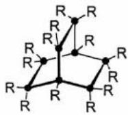A</td><td>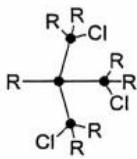B</td><td>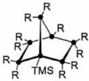TMS=51A3C</td><td>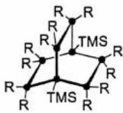D</td></tr><tr><td>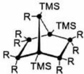E</td><td>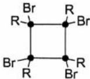F</td><td>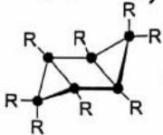G</td><td>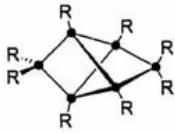H</td></tr></table>

![[2024年第38届化学竞赛决赛试题及解析_images/e1c5a6f0846c99e3f2cb5150054a7095bfccecfce0e27594a21a648d64dedf2c.jpg]]

<table><tr><td>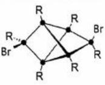I</td><td>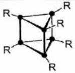J</td><td>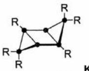..</td><td>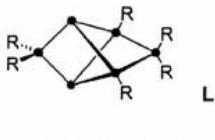</td></tr><tr><td colspan="2">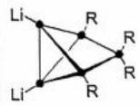M M两个结构都得分,负电荷标在左侧两个Si上也得分</td><td>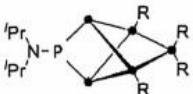..N</td><td>每个2分,环状骨架正确给1分,取代基完全正确给1分,其他答案不得分(K、L、N中没有与R相连的Si原子之间有连线就不得分),共8分。</td></tr></table>

# 第3题 (30分) 同位素

3-1 若 $H_{2}$ 分子的振动频率为 $4400 \, cm^{-1}$ ，HI 的振动频率为 $2310 \, cm^{-1}$ ，计算 HD 与 DI 分子的振动频率（单位： $cm^{-1}$ ）。

答案： $\mu_{\mathrm{HH}} = \frac{m_H m_H}{m_H + m_H} = \frac{m_H}{2} = 0.5040$ ， $\mu_{\mathrm{HD}} = \frac{m_H m_D}{m_H + m_D} = \frac{1.008 \times 2.014}{1.008 + 2.014} = 0.6718$

$\bar{v}_{\mathrm{HD}} = v_{\mathrm{HH}}\sqrt{\mu_{\mathrm{HH}} / \mu_{\mathrm{HD}}} = 4400\times \sqrt{0.5040 / 0.6718} = 3811~\mathrm{cm^{-1}}$ （计算式正确1分，答案1分）

同理

$$
\mu_ {\mathrm{HI}} = \frac {m _ {\mathrm{H}} m _ {\mathrm{I}}}{m _ {\mathrm{H}} + m _ {\mathrm{I}}} = \frac {1 . 0 0 8 \times 1 2 6 . 9}{1 . 0 0 8 + 1 2 6 . 9} = 1. 0 0 0, \quad \mu_ {\mathrm{DI}} = \frac {m _ {\mathrm{D}} m _ {\mathrm{I}}}{m _ {\mathrm{D}} + m _ {\mathrm{I}}} = \frac {2 . 0 1 4 \times 1 2 6 . 9}{2 . 0 1 4 + 1 2 6 . 9} = 1. 9 8 3
$$

$\bar{\nu}_{\mathrm{DI}} = \nu_{\mathrm{HI}}\sqrt{\mu_{\mathrm{HI}} / \mu_{\mathrm{DI}}} = 2310\times \sqrt{1.000 / 1.983} = 1640~\mathrm{cm^{-1}}$ （计算式正确1分，答案1分）

如果原子量使用 H=1，D=2 计算，整体再扣 1 分，扣完为止。本问共 4 分

3-2-1 利用所给数据和 3-1 的结果，估算该反应的焓变 (单位：kJ mol $^{-1}$ )。

解：反应 $\mathrm{H}_2(\mathbf{g}) + \mathrm{DI}(\mathbf{g}) = \mathrm{HD}(\mathbf{g}) + \mathrm{HI}(\mathbf{g})$ 的焓变

$\Delta_{r}H_{m} = \sum_{i}\mathrm{BD}_{\text{反应物}} - \sum_{j}\mathrm{BD}_{\text{产物}} = \mathrm{BD}_{H_2} + \mathrm{BD}_{DI} - \mathrm{BD}_{HD} - \mathrm{BD}_{HI} = (E_{HD}^{\circ} - E_{HH}^{\circ}) + (E_{HI}^{\circ} - E_{DI}^{\circ})$ 2分，符号错误不得分

振动频率为 $\bar{v}$ （单位：cm $^{-1}$ ）的简谐振子零点能量（单位：kJ mol $^{-1}$ ）为

$$
E ^ {\circ} (\mathrm{kJ} \cdot \mathrm{mol} ^ {- 1}) = \frac {1}{2} \cdot h \nu \cdot N _ {A} = \frac {1}{2} \cdot h c \bar {\nu} \cdot N _ {A} = \frac {1}{2} \cdot 6. 6 2 6 \times 1 0 ^ {- 3 4} \cdot 2. 9 9 8 \times 1 0 ^ {1 0} \cdot 6. 0 2 2 \times 1 0 ^ {2 3} / 1 0 0 0 \cdot \bar {\nu}
$$

$$
= 0. 0 0 5 9 8 1 \left(\bar {v} / \mathrm{cm} ^ {- 1}\right) \tag {2分}
$$

$$
\begin{array}{r l} \Delta_ {r} H _ {m} & = (E _ {\mathrm{HD}} ^ {\circ} - E _ {\mathrm{HH}} ^ {\circ}) + (E _ {\mathrm{HI}} ^ {\circ} - E _ {\mathrm{DI}} ^ {\circ}) = 0. 0 0 5 9 8 1 \times [ (3 8 1 1 - 4 4 0 0) + (2 3 1 0 - 1 6 4 0) ] = 0. 4 8 5 (\mathrm{kJ} \cdot \mathrm{mol} ^ {- 1}) \\ & (2 \text {分}) \end{array}
$$

也可先计算各分子的零点能

1mol HD、 $H_{2}$ 的零点能分别为

$$
E _ {\mathrm{HD}} ^ {\circ} = \frac {1}{2} N _ {A} h \nu_ {\mathrm{HD}} = \frac {1}{2} \times 6. 0 2 2 \times 1 0 ^ {2 3} \times 6. 6 2 6 \times 1 0 ^ {- 3 4} \times 2. 9 9 8 \times 1 0 ^ {1 0} \times 3 8 1 1 (\mathrm{Jmol} ^ {- 1}) = 2 2. 7 9 5 \mathrm{kJmol} ^ {- 1}
$$

$$
E _ {\mathrm{HH}} ^ {\circ} = \frac {1}{2} N _ {A} h \nu_ {\mathrm{HH}} = \frac {1}{2} \times 6. 0 2 2 \times 1 0 ^ {2 3} \times 6. 6 2 6 \times 1 0 ^ {- 3 4} \times 2. 9 9 8 \times 1 0 ^ {1 0} \times 4 4 0 0 (\mathrm{Jmol} ^ {- 1}) = 2 6. 3 1 8 \mathrm{kJmol} ^ {- 1}
$$

1mol HI、DI 的零点能分别为

$$
E _ {\mathrm{HI}} ^ {\circ} = \frac {1}{2} N _ {A} h \nu_ {\mathrm{HI}} = \frac {1}{2} \times 6. 0 2 2 \times 1 0 ^ {2 3} \times 6. 6 2 6 \times 1 0 ^ {- 3 4} \times 2. 9 9 8 \times 1 0 ^ {1 0} \times 2 3 1 0 (\mathrm{Jmol} ^ {- 1}) = 1 3. 8 1 7 \mathrm{kJmol} ^ {- 1}
$$

$$
E _ {\mathrm{DI}} ^ {\circ} = \frac {1}{2} N _ {A} h \nu_ {\mathrm{DI}} = \frac {1}{2} \times 6. 0 2 2 \times 1 0 ^ {2 3} \times 6. 6 2 6 \times 1 0 ^ {- 3 4} \times 2. 9 9 8 \times 1 0 ^ {1 0} \times 1 6 4 0 (\mathrm{Jmol} ^ {- 1}) = 9. 8 0 9 \mathrm{kJmol} ^ {- 1}
$$

因此，反应 $\mathrm{H}_2(\mathbf{g}) + \mathrm{DI}(\mathbf{g}) = \mathrm{HD}(\mathbf{g}) + \mathrm{HI}(\mathbf{g})$ 的焓变

$$
\Delta_ {r} H _ {m} = \sum_ {i} \mathrm{BD} _ {\mathrm{反应物}} - \sum_ {j} \mathrm{BD} _ {\mathrm{产物}} = \mathrm{BD} _ {\mathrm{H} _ {2}} + \mathrm{BD} _ {D I} - \mathrm{BD} _ {\mathrm{HD}} - \mathrm{BD} _ {\mathrm{HI}}
$$

$$
= \left(E _ {\mathrm{HD}} ^ {\mathrm{o}} - E _ {\mathrm{HH}} ^ {\mathrm{o}}\right) + \left(E _ {\mathrm{HI}} ^ {\mathrm{o}} - E _ {\mathrm{DI}} ^ {\mathrm{o}}\right) = 2 2. 7 9 5 - 2 6. 3 1 8 + 1 3. 8 1 7 - 9. 8 0 9 = 0. 4 8 5 \mathrm{kJ} \text { mol }
$$

本问共6分。

参考给分方案： $\Delta_{r}H_{m}$ 与零点能关系正确：2 分； $cm^{-1}$ 与 $kJ\ mol^{-1}$ 换算系数表达式正确：2 分；最终答案正确（0.484-0.485），2 分；不要求有效数字。

# 3-2-2 估算极高温度下该反应的平衡常数；

答案： $\ln K = -\Delta_{r}H_{m}/RT + \Delta_{n}S_{m}/R$ (\*) (1分)

气体可视为理想气体，双分子理想的热容相同，等分子反应，焓变为常数。(1分)

在极高温度 T 时，（\*）的右式中的第一项趋近于零， $\ln K$ 趋近于 $\Delta_{r}S_{m}/R$ （1 分）

反应前后微观状态数增加，体现在 HD(1) 的 $\Omega = 2$ ，有 $\Delta_{n}S_{m} = N_{A}k_{B}\ln\Omega = R\ln2$ (1 分)

此时 K=2。 (1 分); 共 5 分

# 3-2-3 估算接近 0 K 时该反应的平衡常数。

答案：温度 T 趋近于 0 时，焓变约等于零点能的差值，为正数。(2 分)

因此 $\ln K$ 趋近于 $-\infty$ ，此时 K=0。（1 分）；共 3 分

# 3-3-1 定性判断该反应是焓驱动还是熵驱动？简要解释原因。

答案：熵驱动。(1分)

O-H, O-D 数目反应前后不变，焓变近似为零。(1 分)；产物对称性减小，熵增加(1 分)。

因此为熵驱动反应。共3分

# 3-3-2 将 80.00 mL 水和 20.00 mL 重水在 298 K 下混合，计算各物种的平衡浓度（假设液体混合过程体积具有加和性，发生反应前后体积不变）。

答案：混合后、反应前，水和重水的浓度分别为：

$$
c (\mathrm{H} _ {2} \mathrm{O}) = (8 0. 0 0 \times 0. 9 9 7 / 1 8. 0 1 6) / 0. 1 = 4 4. 2 7 \mathrm{mol} \mathrm{L} ^ {- 1} \quad 1 \text {分}
$$

$$
c \left(\mathrm{D} _ {2} \mathrm{O}\right) = (2 0. 0 0 \times 1. 1 0 4 / 2 0. 0 2 8) / 0. 1 = 1 1. 0 2 \mathrm{mol} \mathrm{L} ^ {- 1} \quad 1 \text {分}
$$

设平衡体系中 HOD(l) 的平衡浓度为 $2x \, mol \, L^{-1}$ ，有：

$$
\mathrm{H} _ {2} \mathrm{O} (\mathrm{l}) + \mathrm{D} _ {2} \mathrm{O} (\mathrm{l}) = 2 \mathrm{HOD} (\mathrm{l}), K ^ {\circ} = 3. 8 6
$$

$$
4 4. 2 7 - x \quad 1 1. 0 2 - x \quad 2 x
$$

$$
K ^ {0} = (2 x) ^ {2} / [ (4 4. 2 7 - x) (1 1. 0 2 - x) ] = 3. 8 6 \quad 1 \text { 分 }
$$

解得 $x = 8.773 \, mol L^{-1}$

故平衡体系中：

$$
\left[ \mathrm{H} _ {2} \mathrm{O} (\mathrm{l}) \right] = 4 4. 2 7 - 8. 7 7 3 = 3 5. 5 \mathrm{mol} \mathrm{L} ^ {- 1} (1 \text {分})
$$

$$
\left[ \mathrm{D} _ {2} \mathrm{O} (\mathrm{l}) \right] = 1 1. 0 2 - 8. 7 7 3 = 2. 2 5 \mathrm{mol} \mathrm{L} ^ {- 1} (1 \text {分})
$$

$[HOD(l)] = 2*8.773 = 17.5 \, mol \, L^{-1}$ （1分）；共6分共6分，有效数字不是3位扣1分。

3-4 判断电解过程中哪个电极 (阴极、阳极) 处 HOD(I) 的浓度更高，并给出合适的解释。

答案：阴极附近 HOD(I)的浓度更高。(1 分)

阴极发生还原反应，(1 分) $H^{+}/H_{2}$ 电极电势更正， $H_{2}$ 优先析出(1 分)。共 3 分

# 第 4 题 (35 分) N-H 键的活化

4-1-1 确定反应前后金属 Ir 的氧化数，并画出产物的结构式。

![[2024年第38届化学竞赛决赛试题及解析_images/d036301d290a249c4fa812da3336d6c91754ef1dc523ab5d3e25f776c797401e.jpg]]

chemical

Organometallic reaction scheme showing iridium complex transformation with NH3 and rt reagents

Ir 的氧化数为 +1，发生氧化加成反应后，其氧化数变为 +3。(2 分)；共 3 分。

4-1-2 B 也可以活化 $NH_{3}$ 中 N-H 键。确定产物中 Zr 的氧化数，判断在此过程中金属 Zr 的价态是否有变化。
答案：+4(1分)，没有(1分)。(2分)

4-2-1 画出当 P 的形式电荷为 -1 时化合物 C 所有稳定的共振结构，并标出所有形式电荷。

![[2024年第38届化学竞赛决赛试题及解析_images/7e18baf3e66ba1eb3e1b17a42ca23ccbe8d933ae699878b81305346c18bf064f.jpg]]

chemical

核磁共振电荷过程示意图，展示P型离子在不同原子中的电荷变化

4-2-2 画出当 P 的形式电荷为 -2 时化合物 C 所有稳定的共振结构，并标出所有形式电荷。

答案：P的形式电荷为-2时：

![[2024年第38届化学竞赛决赛试题及解析_images/63fe80f6d451cb6c273f1ad4adbe4d1e2cd91780586da4902352b130e4fe347c.jpg]]

chemical

Chemical reaction diagram showing nucleophilic substitution of a phosphorus-containing heterocycle with 1 and 2 electrons, labeled with structural components and electron flow directions.

4-2-3 C 与 NH₃ 反应后的产物为 D。D 中 P 的氧化数为 +5，写出 D 中 P 原子的配位几何结构。

答案：三角双锥，1分。

# 4-3-1 通过计算判断金属 M 为何种元素。

答案：依题意可知， $^{Ph}$ Tpy 为三齿螯合配体，会与 $M(\mathrm{THF})_{3}\mathrm{Cl}_{3}$ 发生取代反应。

$\mathbf{M}(\mathrm{THF})_{3}\mathrm{Cl}_{3}$ 中的氧化数为 $+3$ ，而 ${}^{\mathrm{Ph}}\mathrm{Tpy}$ 和THF均为中性配体，且不存在桥联的可能，题目中未出现氧化剂或还原剂，可推知产物中仍含有3个 $\mathrm{Cl^-}$ ，可假设产物 $\mathbf{M}(\mathrm{^{Ph}Tpy})\mathrm{Cl}_3$ ，设的原子量为 $M_{\mathrm{r}}$ ，列方程如下：

$$
\mathrm{C} \% = \frac {21 \times 12.01}{309.37 + M _ {r}} \times 100 \% = 49.29 \%
$$

$$
\mathrm{H} \% = \frac {15 \times 1 . 0 0 8}{309.37 + M _ {r}} \times 100 \% = 2.95 \%
$$

$$
\mathrm{N} \% = \frac {3 \times 14.01}{309.37 + M _ {r}} \times 100 \% = 8.21 \%
$$

可计算得出 $M_{r}=95.98, 96.83, 96.22,$ (2 分)

结合题目中所给出的磁矩可推出金属元素 M 为 Mo，(2 分)

（此处只需要有正确的计算过程，能推出是Mo元素即得4分；共4分。

95.98、96.83、96.22

# 4-3-2 写出产物 G 的分子式，确定金属中心的价电子构型，并计算反应产率。

答案：[(PhTpy)(PPh2Me)2Mo(Cl)]，(2分)，其他答案不得分

$4d^{5}$ ，(2分)，其他答案不得分

产率计算过程,由题意可知配体 $\mathrm{PPh}_{2} \mathrm{Me}$ 略微过量,所以以 $\mathbf{C}$ 作为计算标准:

产率 $= \frac{0.429}{0.977\times D\text{的分子量}}\times 100\% = \frac{0.429}{0.977\times 842.15}\times 100\% = 52\%$ ，(2分)。

共6分

# 4-3-3 写出配合物 H 和 I 阳离子的化学式，确定 I 中金属中心的氧化数。

答案：H: $\left[\left(\mathrm{^{Ph}Tpy}\right)(\mathrm{PPh}_{2}\mathrm{Me})_{2}\mathrm{Mo}(\mathrm{NH}_{3})\right]^{+}$ ; 2分；I: $\left[\left(\mathrm{^{Ph}Tpy}\right)(\mathrm{PPh}_{2}\mathrm{Me})_{2}\mathrm{Mo}(\mathrm{NH}_{2})\right]^{+}$ ，(2分)

成分和电荷都正确才得分

+2，（2分），其他答案不得分；

共6分

$$
- R T \ln K ^ {\circ} = \Delta G _ {m} ^ {\circ} = - z E ^ {\circ} F
$$

$K^{\circ}=\exp(\frac{zE^{\circ}F}{RT})=\exp(\frac{2\times0.39\times96485}{8.3145\times298.15})=1.5\times10^{13}$ (2分). 标准反应吉布斯自由能变化和标准电池电

动势的标准号没写扣1分；平衡常数可以不带标准号。)；共4分

5-3 答案：根据 5-2 的结果，反应几乎可以进行到底(1 分)。反应未能发生的原因，是动力学因素，具体来说，乙醛要被氧化，会涉及双键的断裂，即反应的活化能较大(1 分)。(热力学和动力学解释各 1 分) 共 2 分

# 5-4-1 推导有序顺序机理对应的酶促反应动力学方程。

答案：A. 对有序顺序机理，有

$$
[ \mathrm{E} ] _ {0} = [ \mathrm{E} ] + [ \mathrm{ES} _ {1} ] + [ \mathrm{ES} _ {1} \mathrm{S} _ {2} ]
$$

(1 分) 物料守恒 1 分

$$
[ \mathrm{E} ] _ {0} = [ \mathrm{E} ] + \frac {[ \mathrm{E} ] [ \mathrm{S} _ {1} ]}{K _ {\mathrm{M} 1}} + \frac {[ \mathrm{ES} _ {1} ] [ \mathrm{S} _ {2} ]}{K _ {\mathrm{M} 1 2}}
$$

(1 分) 米氏常数公式 1 分

$$
[ \mathrm{E} ] _ {0} = [ \mathrm{E} ] + \frac {[ \mathrm{E} ] [ \mathrm{S} _ {1} ]}{K _ {\mathrm{M} 1}} + \frac {[ \mathrm{E} ] [ \mathrm{S} _ {1} ] [ \mathrm{S} _ {2}}{K _ {\mathrm{M} 1} K _ {\mathrm{M} 1 2}}
$$

(1)

由（1） $[\mathrm{E}] = \frac{[\mathrm{E}]_0}{1 + \frac{[\mathrm{S}_1]}{K_{\mathrm{M}1}} + \frac{[\mathrm{S}_1][\mathrm{S}_2]}{K_{\mathrm{M}1}K_{\mathrm{M}12}}}$

最后一步是速控步， $r = k_{2}[\mathrm{ES}_{1}\mathrm{S}_{2}] = k_{2}\frac{[\mathrm{E}][\mathrm{S}_{1}][\mathrm{S}_{2}]}{K_{\mathrm{M}1}K_{\mathrm{M}12}} = k_{2}\frac{[\mathrm{E}]_{0}}{1 + \frac{[\mathrm{S}_{1}]}{K_{\mathrm{M}1}} + \frac{[\mathrm{S}_{1}][\mathrm{S}_{2}]}{K_{\mathrm{M}1}K_{\mathrm{M}12}}}\frac{[\mathrm{S}_{1}][\mathrm{S}_{2}]}{K_{\mathrm{M}1}K_{\mathrm{M}12}}$

$$
= k _ {2} [ \mathrm{E} ] _ {0} \frac {[ \mathrm{S} _ {1} ] [ \mathrm{S} _ {2} ]}{K _ {\mathrm{M} 1} K _ {\mathrm{M} 1 2} + K _ {\mathrm{M} 1 2} [ \mathrm{S} _ {1} ] + [ \mathrm{S} _ {1} ] [ \mathrm{S} _ {2} ]}
$$

(2 分) 使用游离酶的浓度不给分。

4 分，速率方程正确，有合理的推导过程，均可给 4 分；

# 5-4-2 推导随机顺序机理对应的酶促反应动力学方程。

答案: 对随机顺序机理, 有

$$
[ \mathrm{E} ] _ {0} = [ \mathrm{E} ] + [ \mathrm{ES} _ {1} ] + [ \mathrm{ES} _ {2} ] + [ \mathrm{ES} _ {1} \mathrm{S} _ {2} ]
$$

(1 分) 物料守恒 1 分

$$
[ \mathrm{E} ] _ {0} = [ \mathrm{E} ] + \frac {[ \mathrm{E} ] [ \mathrm{S} _ {1} ]}{K _ {\mathrm{M} 1}} + \frac {[ \mathrm{E} ] [ \mathrm{S} _ {2} ]}{K _ {\mathrm{M} 2}} + \frac {[ \mathrm{E} ] [ \mathrm{S} _ {1} ] [ \mathrm{S} _ {2} ]}{K _ {\mathrm{M} 1} K _ {\mathrm{M} 1 2}} \text {或} \frac {[ \mathrm{E} ] [ \mathrm{S} _ {2} ] [ \mathrm{S} _ {1} ]}{K _ {\mathrm{M} 2} K _ {\mathrm{M} 2 1}}
$$

(1) (1分) 米氏常数公式1分

注：可以看到 $K_{\mathrm{M1}}K_{\mathrm{M12}} = K_{\mathrm{M2}}K_{\mathrm{M21}}$

(2) (1分)

4-3-4 计算以 THF 为溶剂时，H 中 N-H 键的解离吉布斯自由能。

答案：由已知条件，

$$
[ \mathrm{M} - \mathrm{NH} _ {3} ] ^ {(m + 1) +} (\text {sol}) + 1 / 2 \mathrm{H} _ {2} = [ \mathrm{M} - \mathrm{NH} _ {3} ] ^ {m +} (\text {sol}) + \mathrm{H} ^ {+} (\text {sol}) \tag {1}
$$

$$
E _ {1} ^ {\ominus} = \varphi_ {1} ^ {\ominus} - \varphi_ {\mathrm{H} _ {2} / \mathrm{H} ^ {+} (\mathrm{sol})} ^ {\ominus} = - 0. 5 5 6 \mathrm{V},
$$

$$
\Delta G _ {m, 1} ^ {\ominus} = - z E _ {1} ^ {\ominus} F = 9 6 4 8 5 \times 0. 5 5 6 \mathrm{Jmol} ^ {- 1} = + 5 3. 6 5 \mathrm{kJmol} ^ {- 1} (1 \text {分})
$$

$$
[ \mathrm{M} - \mathrm{NH} _ {3} ] ^ {(m + 1) +} (\mathrm{sol}) = [ \mathrm{M} - \mathrm{NH} _ {2} ] ^ {m +} (\mathrm{sol}) + \mathrm{H} ^ {+} (\mathrm{sol}) \tag {2}
$$

$$
K _ {2} ^ {\ominus} = 1 0 ^ {- p K a},
$$

$$
\Delta G _ {m, 2} ^ {\ominus} = - R T \ln K _ {2} ^ {\ominus} = (R T \ln 1 0) p K _ {a} = 5. 7 1 \times 3. 6 \mathrm{kJmol} ^ {- 1} = 2 0. 5 6 \mathrm{kJmol} ^ {- 1} (1 \text {分})
$$

$$
1 / 2 \mathrm{H} _ {2} (\mathrm{g}) = \mathrm{H} (\mathrm{g}) \tag {3}
$$

$$
\Delta G _ {m, 3} ^ {\ominus} = 2 0 3. 3 \mathrm{kJ} \mathrm{mol} ^ {- 1}
$$

$$
\mathrm{H} (\mathrm{g}) = \mathrm{H} (\mathrm{sol}) \tag {4}
$$

$$
\Delta G _ {m, 4} ^ {\ominus} = 2 1. 4 2 \mathrm{kJ} \mathrm{mol} ^ {- 1}
$$

反应 (2)-(1)+(3)+(4) 得反应(5)

$$
\left[ \mathrm{M} - \mathrm{NH} _ {3} \right] ^ {\mathrm{m} +} (\mathrm{sol}) = \quad \left[ \mathrm{M} - \mathrm{NH} _ {2} \right] ^ {\mathrm{m} +} (\mathrm{sol}) + \mathrm{H} (\mathrm{sol}) \tag {5}
$$

因此 $\Delta G_{m,5}^{\ominus} = \Delta G_{m,2}^{\ominus} - \Delta G_{m,1}^{\ominus} + \Delta G_{m,3}^{\ominus} + \Delta G_{m,4}^{\ominus} = 20.56 - 53.65 + 203.3 + 21.42\mathrm{kJ mol^{-1}}$

$$
= 1 9 1. 6 3 \left(\mathrm{kJ} \mathrm{mol} ^ {- 1}\right) \quad (2 \text {分}) \text {共} 8 \text {分}
$$

$E^{\circ}$ 和 $pK_{a}$ 计算吉布斯自由能的计算式各 1 分，共 2 分；热力学循环 4 分(设计有错就不得分)；结果 2 分。

# 第 5 题 (37 分) 乙醇代谢中的反应

5-1 答案：电池表示式： -) Pt|CH3CHO(aq), CH3COOH(aq) || Rib(aq), RibO(aq) | Pt (+) (2分)

其中未写双竖线扣1分；未写惰性电极：1分；逗号错误扣1分。正、负极位置写反不扣分。

负极： $\mathrm{CH_{3}CHO(aq)+H_{2}O(l)\longrightarrow CH_{3}COOH(aq)+2H^{+}+2e^{-}}$ (1分)

正极： $\mathrm{RibO(aq)+2H^{+}(aq)+2e^{-}\longrightarrow Rib(aq)+H_{2}O(l)}$ (1分)

电极反应式正确，但未正确标明正、负极，扣1分；共4分

![[2024年第38届化学竞赛决赛试题及解析_images/18d4c6ae25422b375c0a692fcb0031eedd06c97649849d52fabf499d2b771f32.jpg]]

5-2 答案：电池总反应为 RibO(aq) + CH₃CHO(aq) $\text{Rib(aq)} + \text{CH}_3\text{COOH(aq)}$ (\*)

与氢离子的浓度没有关系，因此，

$$
E ^ {o} = E ^ {\oplus} = \varphi_ {+} ^ {\oplus} - \varphi_ {-} ^ {\oplus} = - 0. 2 1 \mathrm{V} - (- 0. 6 0 \mathrm{V}) = 0. 3 9 \mathrm{V} (2 \mathrm{分})
$$

(说明“总反应与氢离子浓度无关”，因此生化标准态和化学标准态下，电动势相等给1分；后续正确计算给1

分。公式中标准号没写扣1分)

由（1） $[\mathbf{E}] = \frac{[\mathbf{E}]_0}{1 + \frac{[\mathbf{S}_1]}{K_{\mathrm{M}1}} + \frac{[\mathbf{S}_2]}{K_{\mathrm{M}2}} + \frac{[\mathbf{S}_1][\mathbf{S}_2]}{K_{\mathrm{M}1}K_{\mathrm{M}12}}}$ 或 $\frac{[\mathbf{S}_2][\mathbf{S}_1]}{K_{\mathrm{M}2}K_{\mathrm{M}21}}$

最后一步是速控步， $r = k_{2}[\mathrm{ES}_{1}\mathrm{S}_{2}] = k_{2}\frac{[\mathrm{E}][\mathrm{S}_{1}][\mathrm{S}_{2}]}{K_{\mathrm{M}1}K_{\mathrm{M}12}}$

$$
= k _ {2} \frac {[ \mathrm{E} ] _ {0}}{1 + \frac {[ \mathrm{S} _ {1} ]}{K _ {\mathrm{M} 1}} + \frac {[ \mathrm{S} _ {2} ]}{K _ {\mathrm{M} 2}} + \frac {[ \mathrm{S} _ {1} ] [ \mathrm{S} _ {2} ]}{K _ {\mathrm{M} 1} K _ {\mathrm{M} 1 2}} \text {或} \frac {[ \mathrm{S} _ {2} ] [ \mathrm{S} _ {1} ]}{K _ {\mathrm{M} 2} K _ {\mathrm{M} 2 1}}} \frac {[ \mathrm{S} _ {1} ] [ \mathrm{S} _ {2} ]}{K _ {\mathrm{M} 1} K _ {\mathrm{M} 1 2}}
$$

$$
= k _ {2} [ \mathrm{E} ] _ {0} \frac {[ \mathrm{S} _ {1} ] [ \mathrm{S} _ {2} ]}{K _ {\mathrm{M} 1} K _ {\mathrm{M} 1 2} + K _ {\mathrm{M} 1 2} [ \mathrm{S} _ {1} ] + \left(\frac {K _ {\mathrm{M} 1} K _ {\mathrm{M} 1 2}}{K _ {\mathrm{M} 2}}\right) [ \mathrm{S} _ {2} ] + [ \mathrm{S} _ {1} ] [ \mathrm{S} _ {2} ]} \tag {3}
$$

将（2）代入（3）中紫色部分，有

$$
r = k _ {2} [ \mathrm{E} ] _ {0} \frac {[ \mathrm{S} _ {1} ] [ \mathrm{S} _ {2} ]}{K _ {\mathrm{M} 1} K _ {\mathrm{M} 1 2} + K _ {\mathrm{M} 1 2} [ \mathrm{S} _ {1} ] + K _ {\mathrm{M} 2 1} [ \mathrm{S} _ {2} ] + [ \mathrm{S} _ {1} ] [ \mathrm{S} _ {2} ]} \tag {4}
$$

或 $=k_{2}[E]_{0}\frac{[S_{1}][S_{2}]}{K_{M1}K_{M12}+\frac{K_{M2}K_{M21}}{K_{M1}}[S_{1}]+K_{M21}[S_{2}]+[S_{1}][S_{2}]}$ (5) (2分)

式(3)、(4)、(5)均为所求的酶促反应动力学方程，写出任意一个，本步均给2分。使用游离酶的浓度本步不

给分；如没有正确推出(3)/(4)/(5)，但明确写出了 $K_{M1}K_{M12}=K_{M2}K_{M21}$ ，可得1分。

共5分，速率方程正确，有合理的推导过程，均可给5分。

5-5-1 对有序顺序机理，固定其中一个底物(如 $S_{1}$ )的浓度，以1/r对1/[S2]作图得到一组直线。利用5-4的结论，推导这组直线的斜率、截距分别与底物浓度[S1]的关系式。

答案：

双倒数作图公式为 $\frac{1}{r} = \frac{1}{k_2[E]_0}\frac{K_{M1}K_{M12} + K_{M12}[S_1] + [S_1][S_2]}{[S_1][S_2]}$

令 $r_{\mathrm{max}} = k_2[\mathrm{E}]_0$

固定 $[\mathrm{S}_1]$ ， $\frac{1}{r} = \frac{1}{r_{\max}} +\frac{1}{r_{\max}}\frac{K_{M1}K_{M12} + K_{M12}[S_1]}{[S_1]}\cdot \frac{1}{[S_2]}$ ，(2分）公式变形为 $1 / r\sim 1 / |S_2|$ 的形式2分

以 $1 / r\sim 1 / [S_2]$ 作图，截距为常数 $\frac{1}{r_{\mathrm{max}}}$ 与 $[\mathbf{S}_1]$ 无关， (1分）截距与 $1 / |\mathbf{S}_1|$ 的关系1分

斜率 $\frac{1}{r_{\mathrm{max}}}\frac{K_{\mathrm{M}1}K_{\mathrm{M}12} + K_{\mathrm{M}12}[\mathrm{S}_1]}{[\mathrm{S}_1]}$ 与 $1 / [\mathrm{S}_1]$ 呈形如 $y = \frac{K_{\mathrm{M}12}}{r_{\mathrm{max}}} +\frac{K_{\mathrm{M}1}K_{\mathrm{M}12}}{r_{\mathrm{max}}}\frac{1}{[\mathrm{S}_1]}$ 的(线性)关系，。（1分）斜率与 $1 / [\mathrm{S}_1]$ 的关系1分.

共 4 分，公式变形 2 分，两个关系各 1 分。

若作答为

固定 $[S_{2}]$ ，有 $\frac{1}{r}=\frac{1}{r_{max}}\frac{K_{M12}+[S_{2}]}{[S_{2}]}+\frac{1}{r_{max}}\frac{K_{M1}K_{M12}}{[S_{2}]}.\frac{1}{[S_{1}]}$ ，以 $1/r\sim1/[S_{1}]$ 作图，截距和斜率均与 $1/[S_{2}]$ 呈线性关系，不给分）。本题中 $S_{1}$ 和 $S_{2}$ 不可替换！

5-5-2 对随机顺序机理，固定其中一个底物(如 $S_{1}$ )的浓度，以1/r对1/[S₂]作图得到一组直线。利用5-4的结论，推导这组直线的斜率、截距分别与底物浓度[S₁]的关系式。

答案:

双倒数作图公式为 $\frac{1}{r} = \frac{1}{k_2[E]_0}\frac{K_{M1}K_{M12} + K_{M12}[S_1] + K_{M21}[S_2] + [S_1][S_2]}{[S_1][S_2]}$

令 $r_{\max}=k_{2}[E]_{0}$ ，固定 $[S_{1}]$ ， $1/r\sim[S_{2}]$ 的关系为

$$
\frac {1}{r} = \frac {1}{r _ {\max}} \frac {K _ {\mathrm{M21}} + [ \mathrm{S} _ {1} ]}{[ \mathrm{S} _ {1} ]} \cdot + \frac {1}{r _ {\max}} \frac {K _ {\mathrm{M1}} K _ {\mathrm{M12}} + K _ {\mathrm{M12}} [ \mathrm{S} _ {1} ]}{[ \mathrm{S} _ {1} ]} \cdot \frac {1}{[ \mathrm{S} _ {2} ]}
$$

$\frac{1}{r}=\frac{\frac{K_{M21}}{[S_{1}]}+1}{r_{max}}+\frac{\frac{K_{M1}K_{M12}}{[S_{1}]}+K_{M12}}{r_{max}}\cdot\frac{1}{[S_{2}]}$ (6) (2分) 公式变形为 $1/r\sim1/|S_{2}|$ 的形式2分

可以看到斜率 $\frac{\frac{K_{M1}K_{M12}}{[S_{1}]}+K_{M12}}{r_{max}}$ 与截距 $\frac{\frac{K_{M21}}{[S_{1}]}+1}{r_{max}}$ 均与另一底物 $S_{1}$ 的浓度有关。

斜率与另一底物浓度的倒数 $1/[S_{1}]$ 为形如 $y=\frac{K_{M1}K_{M12}}{r_{max}}\cdot\frac{1}{[S_{1}]}+\frac{K_{M12}}{r_{max}}$ 的直线。(1 分) 斜率与 $1/[S_{1}]$ 的关系 1 分

截距对另一底物浓度的倒数 $1/[S_{1}]$ 做图为形如 $y=\frac{K_{M21}}{r_{max}}\cdot\frac{1}{[S_{1}]}+\frac{1}{r_{max}}$ 的直线。(1分) 截距与 $1/[S_{1}]$ 的关系1分共4分，公式变形2分，两个关系各1分。

注：因随机顺序机理中， $S_{1}$ 与 $S_{2}$ 是等价的，因此， $S_{1}$ 与 $S_{2}$ 互换，截距、斜率的上述线性关系仍成立。

5-6 利用实验结果分析此反应遵从以上两种机理中的哪一个(不要求计算具体的动力学参数)?

答案:

固定 $NAD^{+}$ 浓度， $1/r \sim 1/[CH_{3}CH_{2}OH]$ 作线性回归，有

(a) $y=0.02118x+1.21579$

$\left[\mathrm{NAD}^{+}\right] = 0.050 \mathrm{mmol} \mathrm{L}^{-1}$ ;

(1 分)

(b) y=0.01263x+0.69862

$\left[\mathrm{NAD}^{+}\right] = 0.100 \mathrm{mmol} \mathrm{L}^{-1}$ ;

(1 分)

(c) $y=0.00723x+0.39965$

$\left[\mathrm{NAD}^{+}\right]=0.250\ \mathrm{mmol}\ \mathrm{L}^{-1};$

(1 分)

(d) y=0.00449x+0.24986

$\left[\mathrm{NAD}^{+}\right]=1.000\ \mathrm{mmol}\ \mathrm{L}^{-1};$

(1 分)

若固定 $CH_{3}CH_{2}OH$ 浓度，以 $1/r \sim 1/[[NAD^{+}]$ 作线性回归，有

(i) $y=1.38526\times10^{-4}x+0.56715$

$\left[ CH_{3}CH_{2}OH \right]=0.03\ mol\ L^{-1};$

(1 分)

(ii) $y=9.47254\times10^{-5}x+0.38055$

$[CH_{3}CH_{2}OH]=0.044\ mmol\ L^{-1};$

(1 分)

(iii) y=7.32141×10 $^{-5}$ x+0.28643

$[CH_{3}CH_{2}OH]=0.057\ mmol\ L^{-1};$

(1 分)

(iv) $y=5.49033\times10^{-5}x+0.21667$

$[CH_{3}CH_{2}OH]=0.076\ mmol\ L^{-1};$

(1分)

可见，两种作图中，截距均不是常数，结合5-5中的结论，反应机理为随机顺序机理。（2分）

共 10 分。8 个线性关系，每个 1 分；随机顺序机理的结论 2 分。

前述 8 个回归关系，只固定其中一个浓度，得到 4 个线性关系的话，可给 4 分。但些结果不足以判断反应机理为随机顺序机理，因此，后续判断结论无论正确与否，判断步骤仍给 0 分，即总分为 4 分。

# 第 6 题 (22 分) 高压 $N_{2}$ 和氮化物结构

6-1 答案：立方体心/体心立方

(2 分)

N10 结构中平行边中，距离最短的为晶胞中体心 N 与顶点 N 原子之间的长度，其长度为

$\sqrt{3}a/2=2.991,$

(1 分)

求得 $a = 3.454 (\text{\AA})$ 。

)

从所绘晶胞可知，cg-N 的化学式为 N8

其密度 $\rho = 8 \times 14/(N_{\Lambda}a^{3})$

(1 分)

= 4.382 g/cm³

(1分) 共6分。

共6分，点阵类型2分，晶胞参数和密度，计算式1分，答案1分，没有过程只有答案不给分。

6-2-1 答案:

![[2024年第38届化学竞赛决赛试题及解析_images/1781ac916181c77a30af0580c01684fe7126313ac82e3338e1d367fd05137cc2.jpg]]

(4 分)

共4分，各原子位置正确2分，实线虚线正确2分。如各类型原子相对位置正确，但外围轮廓不是矩形扣1分；如线型区分正确，但实线短于虚线扣1分；用其他形式的图形或线型表示只要能明确区分也得满分。其他答案不得分

6-2-2 答案：据等效点的分数坐标，二维层厚度为 $(1-y-y)b=(1-0.4011-0.4011)\times6.534=1.292(\mathring{A})$

二维层之间得空隙距离为： $b/2-1.292=6.534/2-1.975\ \text{\AA}$

共3分，其中计算式正确2分，答案1分。

6-3-1 答案：18

(2 分)

6-3-2 答案：层间最近的两个 N 原子之间的距离 = $(1-z-z)\cdot3h=(1-0.35-0.35)\times3\times=2.07(\mathring{A})$

(3

分)

共3分，计算式正确2分，答案1分。

6-3-3 答案： $sp^{2}N$ 配位数：12 (2 分)

$sp^{3}N$ 配位数：4 (2 分) 共 4 分。

# 第 7 题 (24 分) 自旋化学

7-1 答案：

根据公式分子总自旋磁矩与总自旋量子数 S 之间关系式：

$\mu=2\sqrt{S(S+1)}\mu_{B}=\sqrt{n(n+2)}\mu_{B}$ ，依题意1中成单自旋电子数当为奇数。

对于 $1_{ls}$ ，当取 S = 1/2，理论值 $\mu(1_{ls}) = 1.73 \mu_{B}$ 与实测值 $1.92 \mu_{B}$ 相近；(1 分)

对于 $1_{hs}$ ，当取 S = 3/2，理论值 $\mu(1_{hs}) = 3.87 \mu_{B}$ ，略低于实测值 $(A, 2) \mu_{B}$ 。(1 分)

共 2 分，正确回答未成对电子数 n=1,3，但未写出 S，本小问得 1 分。

7-2 答案：

![[2024年第38届化学竞赛决赛试题及解析_images/e1be1c415a07ad8a1997b803ac1cc1695c6a294530ef0bdcc6e409c809a02ecf.jpg]]

chemical

Molecular structure of a cobalt complex with tert-butyl (tBu) ligands and electron transfer arrows

![[2024年第38届化学竞赛决赛试题及解析_images/e05afbe3e27511d707d7b5f4929c009936e1d58f2b18fa480359f03ad2b1edf4.jpg]]

chemical

Molecular structure of a cobalt complex with tBu ligands and electron transitions labeled

上个单电子→3个单电子
偶合一对，可否配等
能级分裂及电子

共 10 分。每个正确的结构式 5 分，其中 DTBSQ 形态正确 1 分，Co 氧化态 1 分，Co 的 3d 能级分裂及电子情况 2 分，配体电子自旋取向 1 分。

7-3 答案:

$1_{ls} \rightarrow 1_{hs}, Co-O, Co-N$ 配位键的键长均变长(2分),

因中心原子氧化态降低导致配键削弱（1分）。共3分，写一个变长另一个变短的本题不得分。

7-4 答案：>，>；各1分。本小问共2分

7-5 答案:

1的实验磁矩： $\mu (1) = 4.33[1_{\mathrm{hs}}] + 1.92[1_{\mathrm{ls}}]$

$$
[ \mathbf {1} _ {\mathrm{hs}} ] + [ \mathbf {1} _ {\mathrm{ls}} ] = 1
$$

$1_{ls} \rightleftharpoons 1_{hs}$ 的平衡常数： $K = [1_{hs}] / [1_{ls}] = (\mu(1) - 1.92) / (4.33 - \mu(1))$ 得出正确的平衡常数表达式（2分）

计算不同温度下的平衡常数，如下表

<table><tr><td>T/K</td><td>1/T(K)</td><td>μ(1)/μB</td><td>K</td><td>In K</td></tr><tr><td>230</td><td>0.00435</td><td>2.07</td><td>0.0664</td><td>-2.712</td></tr><tr><td>250</td><td>0.00400</td><td>2.41</td><td>0.2555</td><td>-1.366</td></tr><tr><td>290</td><td>0.00345</td><td>3.61</td><td>2.35</td><td>0.8536</td></tr><tr><td>320</td><td>0.00312</td><td>4.09</td><td>9.04</td><td>2.202</td></tr><tr><td>350</td><td>0.00286</td><td>4.26</td><td>33.4</td><td>3.509</td></tr></table>

ln K 对 1/T 作图，(线性拟合,)得 ln K = -4137.2/T + 15.208

(4分，若未列出数据转化过程，答案正确，扣2分；本问斜率在-3965～-4485，截距在+14.5～+16.3之间都算正确，斜率和截距绝对值应同步变大或变小；数值转化及形式正确，但斜率截距超出范围扣1分)  
转变温度时， $K=[1_{hs}]/[1_{ls}]=1$ ，求得T=272K (1分，在271\~276K范围内均得满分)  
共7分。得出正确的平衡常数表达式2分；得出正确的 $\ln K\sim1/T$ 关系4分，最终答案1分。若拟合结果和最终答案超出范围，两步都要扣分。

# 第 8 题 有机化学基本概念 (16 分)

8-1 答案：a 和 d；每个 1 分。

本小问共2分。

8-2-1 答案：b 和 d；每个 1 分。

本小问共2分。

8-2-2 答案：a, b, c 和 d；对 2 个才能得 1 分，对 4 个才能得 2 分，错一个扣 1 分。

本小问共2分。

8-3 答案: a, b, d 和 e;

8-3 答案：a, b, d 和 e；对 2 个才能得 1 分，对 4 个才能得 2 分，错一个扣 1 分。

本小问共2分。

体与金花藕分 8-4 答案:

![[2024年第38届化学竞赛决赛试题及解析_images/70d5e57216c57591927ac00960126d825e99f6b5cb06edecdcebe49b5eb95179.jpg]]

![[2024年第38届化学竞赛决赛试题及解析_images/f826e962f752c854e43ba2196f4209b61b635f8a3f5622e0ab4a582c04192ca2.jpg]]

![[2024年第38届化学竞赛决赛试题及解析_images/5e6bbc4e7a4b345096e85df2f2ee37ad887abaaf51af14ec6a7e2d8134e3c367.jpg]]

![[2024年第38届化学竞赛决赛试题及解析_images/cd579cca95d69e648c0e41b5fddd99e7e7a8b08097dfe16de4240be66cad5b5f.jpg]]

都可以；2分

好些年末港区曼式了!

![[2024年第38届化学竞赛决赛试题及解析_images/4a44928722c7efb1fd0b668fc6de3ce9d66fb9f8af726b7bf755400acf74276e.jpg]]

text_image

8-5 答案：
B, 2分；平伏键的超共轭效应，和硫孤对电子对直立键的反键轨道
8-6 答案：
B, 2分。碳性、极化作用
第9题 碳正离子化学 (35分)
C=O 更稳定，伸缩超导球大
9-1 答案：
3, 1, 4, 2
1分，错一个，得0分。
9-2 答案：
11个，1分
2分；其他答案不得分，共3分
9-3 答案：
A在强酸性介质中以HA⁺形式存在，共有三组氢（1分），
化学位移从大到小的积分比为Hb:Ha:Hc=12:12:1（2分）共3分；其他答案不得分
9-4 答案：
—— Antibonding
—— Nonbonding
—— Bonding
—— 道子二电文 3c-2e
2分；三个全对才能得满分，错一个不给分。
9-5 答案：
在三氟甲磺酸中质子解速率最快2分
C为氢气1分，共3分；其他答案不得分。
9-6-1 答案：
F、G和H的结构式分别为：每个2分，共6分

# 轨道。

![[2024年第38届化学竞赛决赛试题及解析_images/5d68c8153135d8bf416103940ab96097402fae838e94634676f6400798babfd9.jpg]]

![[2024年第38届化学竞赛决赛试题及解析_images/58953809c43d377a130b50f501e38d304c6d50205dd1d7d9348cd070e4cc04d1.jpg]]

![[2024年第38届化学竞赛决赛试题及解析_images/7ad6f82f09fcae226f2c46b03cdb2355ad74f045e28e2bc1c7b244180d15f88b.jpg]]

其他答案不得分

9-6-2 答案：

D 到 E 的机理如下，5 个中间体，每个中间体各 2 分，共 10 分：

![[2024年第38届化学竞赛决赛试题及解析_images/0afec838d39ebc98748bf80b4c7d8836a05f2359f2464ac9a654d86dedef26fb.jpg]]

![[2024年第38届化学竞赛决赛试题及解析_images/cb78921bf76b60c549087cdbace37fe238883bf6e72649056325af664f1b2bc4.jpg]]

![[2024年第38届化学竞赛决赛试题及解析_images/cee224abdf4298fc4d528d71f557fe55491c336b19e8c6d4096069d3b5220382.jpg]]

![[2024年第38届化学竞赛决赛试题及解析_images/e636e834a649e1976a5ea6aecae4abc74b692bd2cf09f159c85098c45b8ffed3.jpg]]

![[2024年第38届化学竞赛决赛试题及解析_images/68bcad342436f99bec2ab0d193128605fde8c01f850a7a0504b65ff0a50ab506.jpg]]

![[2024年第38届化学竞赛决赛试题及解析_images/e4ab84627fc24a2e17996777c12912373b8330de74f5d07948c8f0c552117982.jpg]]

其他答案不得分， $^{18}$ O 未标或标错均不给分

9-7-1

答案:

![[2024年第38届化学竞赛决赛试题及解析_images/29a6db2cca1a78eca619f85fd3a7ba20024453b2ffb0a0e4f17891fc096b6588.jpg]]

结构 2 分 (OAc 直立键得 1 分)，正负号 1 分，共 3 分

9-7-2

答案：

![[2024年第38届化学竞赛决赛试题及解析_images/1c26c98ef4e941c4881de5460006e57c69241e54c3dba484ef2e2806896d9128.jpg]]

![[2024年第38届化学竞赛决赛试题及解析_images/3d6ef577aef95d39c87a2f00ab73140665ae1c935f22045df339d88376e93a67.jpg]]

每个2分，共4分，其他答案不得分

# 第 10 题 氮杂环的编辑化学 (33 分)

10-1 答案;

该产物的结构为：

![[2024年第38届化学竞赛决赛试题及解析_images/cd2783587847dcf1b73d0c48d3a25058ede24a505c1ae401c50dbe5fe95084a1.jpg]]

2分，没写 $^{15}$ N，得1分；A的结构式：

![[2024年第38届化学竞赛决赛试题及解析_images/588f3726e06b8093a8b2ca7aef67283779326519b073fe6732a63bbc7f4be6d7.jpg]]

2分，其他答案不得分；共4分

10-2-1

答案:

![[2024年第38届化学竞赛决赛试题及解析_images/11bca830d6fffef415d5029ca8eaf4f8ab6ab5432230cf6098fab701f9a311da.jpg]]

2分；其他答案不得分

10-2-2

答案:

![[2024年第38届化学竞赛决赛试题及解析_images/68e6408811add19590843a2eefdb0f0293f927089ac5cc3304ecbbebac21c928.jpg]]

2分；其他答案不得分

10-3

答案：E的结构为（2分）：

![[2024年第38届化学竞赛决赛试题及解析_images/9c7cc26f6d6ae1138ef52f51b902e1a9f96d65aa4f06c076876c5c14c4f8b98d.jpg]]

E 的形成（6 分）：

每个2分，共6分；其他答案不得分

10-4 答案：关键中体有5个；

每个2分，共10分

10-5 答案:

Ar-N=O; Ar-N-O-PR3

画成三元环也给满分

注意氮杂三元环中双键的位置；位置错误不得分；

7个，每个1分，共7分